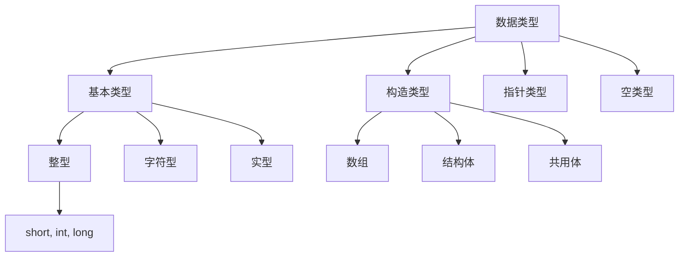
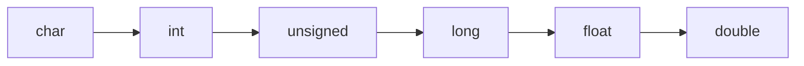

# 第2章 C语言基础

📎 [第2章 C语言基础.pptx](https://www.yuque.com/attachments/yuque/0/2025/pptx/25845402/1749278695437-f93457d5-9bc1-4dd2-8a1b-abc4977674a3.pptx)

## 一、预备知识

### 1. 进制转换（重难点）

**转换方法**：

- 其他进制 → 十进制：按权相加

```c
二进制：1011 = 1×2³ + 0×2² + 1×2¹ + 1×2º = 11
八进制：4275 = 4×8³ + 2×8² + 7×8¹ + 5×8º = 2237
```

- 十进制 → 其他进制（整数）：连续除以基，倒取余数

```c
45 → 二进制：101101
45 → 八进制：55
```

**易错点**：

- 八进制必须以`0`开头（如`0123`）
- 十六进制必须以`0x`开头（如`0x1F`）

### 2. 原码/反码/补码（重难点）

**表示方法**：

| 类型 | 正数表示 | 负数表示（-9为例） |
| --- | --- | --- |
| 原码 | 00001001 | 10001001 |
| 反码 | 00001001 | 11110110 |
| 补码 | 00001001 | 11110111 |

**关键结论**：

- 计算机中整数以**补码**形式存储
- 补码运算示例：

```c
18 - 13 = 5 → 00010010 + 11110011 = 100000101（溢出位舍弃）
```

### 3. 浮点数存储（重难点）

- **组成**：阶码（指数） + 尾数（小数）
- **转换示例**：

```c
110.011 → 0.110011 × 2^+11
```

- **存储特点**：

- 尾数位数决定精度
- 阶码位数决定范围

## 二、数据类型

### 1. 数据类型总表



### 2. 易错点

- `int`长度依赖编译系统：

- Turbo C: 2字节
- CodeBlocks/VC: 4字节

- 浮点数精度：

- `float`：7位有效数字
- `double`：16位有效数字

## 三、常量与变量

### 1. 常量类型

| 类型 | 示例 | 说明 |
| --- | --- | --- |
| 整型常量 | `123`, `0123`, `0x1F` | 八进制前加0，十六进制前加0x |
| 实型常量 | `3.14`, `1.23e4` | 默认double型 |
| 字符常量 | `'A'`, `'\n'` | 单引号括起 |
| 字符串常量 | `"Hello"` | 双引号括起，自动加`\0` |

### 2. 变量定义易错点

```c
int a = 3;     // ✓ 正确
int x = y = z = 1; // ✗ 错误！不能连续赋值

float data;
data = 3.14159; // ✓
c = a % b;      // ✗ 浮点数不能取模
```

## 四、运算符

## 逻辑运算

短路特性：逻辑表达式求解时，并非所有的逻辑运算符都被执行，只有在必须执行下一个逻辑运算符才能求出表达式的解时，才执行该运算符

```plain
a&&b&&c只在a为真时，才判别b的值；只在a、b都为真时，才判别C的值
a||b||c只在a为假时，才判别b的值；只在a、b都为假时，才判别c的值
```

### 1. 优先级与结合性（重难点）

**优先级排序**（从高到低）：

1. `()`、`[]`、`->`、`.`
2. `!`、`~`、`++`、`--`、`+`(正)、`-`(负)、`*`(指针)、`&`(地址)
3. `*`、`/`、`%`
4. `+`、`-`
5. `<<`、`>>`
6. `<`、`<=`、`>`、`>=`
7. `==`、`!=`
8. `&`
9. `^`
10. `|`
11. `&&`
12. `||`
13. `?:`
14. `=`、`+=`等赋值运算符
15. `,`

### 2. 自增/自减运算符（易错点）

```c
int i = 3;
printf("%d", i++); // 输出3（先使用后自增）
printf("%d", ++i); // 输出5（先自增后使用）

int j = i++ + ++i; // 未定义行为！避免！
```

### 3. 类型转换（易错点）

- **隐式转换规则**：



- **强制转换**：

```c
float x = 3.6;
int i = (int)x; // i=3, x仍为3.6
```

## 五、输入输出

### 1. printf格式控制（重难点）

**格式符**：

| 符号 | 含义 | 示例 |
| --- | --- | --- |
| `%d` | 十进制整数 | `printf("%d", 65)` → "65" |
| `%f` | 小数形式浮点 | `printf("%.2f", 3.14159)` → "3.14" |
| `%e` | 指数形式浮点 | `printf("%e", 300.0)` → "3.000000e+02" |
| `%c` | 单个字符 | `printf("%c", 65)` → "A" |
| `%s` | 字符串 | `printf("%s", "Hello")` → "Hello" |

### 2. scanf易错点

> [!info]
> scanf 会自动记录指针位置，并在下一次调用延续

```c
int a;
scanf("%d", a);      // ✗ 缺少&
scanf("%d\n", &a);   // ✗ 格式串中避免\n

// 解决缓冲区残留字符问题
char ch;
scanf("%d", &a);    
getchar();          // 吸收回车
scanf("%c", &ch);
```

## 六、典型例题

### 1. 进制转换

```c
// 八进制0123 → 十进制
1*8² + 2*8¹ + 3*8⁰ = 83

// 十六进制0xFF → 十进制
15*16¹ + 15*16⁰ = 255
```

### 2. 数据类型转换

```c
#include <stdio.h>
int main() {
    char ch = 'a';
    int i = 5;
    printf("%f\n", ch/i + i*2.0); 
    // 'a'=97 → 97/5=19.4 → 19.4+10.0=29.4
    return 0;
}
```

### 3. 输入输出综合

```c
#include <stdio.h>
int main() {
    int a, b;
    printf("输入格式: a,b\n");
    scanf("%d,%d", &a, &b); // 必须输入逗号分隔
    
    printf("八进制: %#o, 十六进制: %#X\n", a, a);
    // 输入3 → 输出0o3, 0X3
    
    float f = a * 1.0 / b;
    printf("除法结果: %.2f\n", f); 
    return 0;
}
```

> **易错提示**：`scanf`中非格式字符（如逗号）必须原样输入，否则会导致读取失败。

> 🗒️ **语雀白板**：可视化白板内容无法转成 Markdown，请到原语雀文档查看（[在语雀中打开原白板](https://www.yuque.com/docs-crl/dqr79t/kds9nyggt0i98gg8)）
