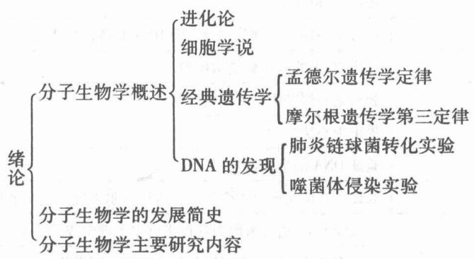

# 第1章 绪论

## 1.1 复习笔记

## 【知识概览】

## 【重难点归纳】

## 一、分子生物学概述

分子生物学是从分子水平研究生物结构、组织和功能的一门学科，以核酸、蛋白质等生物大分子的结构、形态及其在遗传信息和细胞信息传递中的作用和功能为研究对象。

## 1. 进化论

1859 年，达尔文提出"物竞天择，适者生存"的进化论思想。

## 2. 细胞学说

## (1)细胞的发现

17 世纪末叶，荷兰的 Leeuwenhoek 用自制的世界上第一架光学显微镜，首次发现了单细胞生物。

## (2) 细胞学说的建立

19 世纪德国人 Schleiden 和 Schwann 提出细胞学说。其基本内容为：

①细胞是有机体，一切动植物都是由细胞发育而来，并由细胞和细胞产物所构成。

②细胞是一个相对独立的单位，既有它"自己"的生命，又对与其他细胞共同组成的整体的生命起作用。

③新的细胞可以通过已存在的细胞繁殖产生。

## 3. 经典遗传学

①孟德尔(Gregor Mendel)发现并提出遗传学定律：分离定律和自由组合定律。

②摩尔根(Morgan)提出遗传学第三定律：连锁交换定律。

## 4. DNA 的发现

(1)肺炎链球菌转化实验

①1928 年，英国科学家 Griffith 等人通过肺炎链球菌转化感染小鼠实验提出"转化因子"。

②1944 年，Avery 证明 DNA 是遗传物质。

## (2)噬菌体侵染实验

1952 年，Hershey 和 Chase 通过噬菌体侵染细菌实验证明 DNA 是遗传物质。

## 二、分子生物学的发展简史

本部分只列出部分常考的重要事件，如表1-1所示。

表 1-1 分子生物学发展的重要事件

<table><tr><td>年份</td><td>人物</td><td>事件</td></tr><tr><td>1944 年</td><td>Avery</td><td>证明 DNA 是遗传物质</td></tr><tr><td>1950 年</td><td>Chargaff</td><td>提出 Chargaff 定律</td></tr><tr><td>1952 年</td><td>Hershey 和 Chase</td><td>通过噬菌体侵染细菌实验证明 DNA 是遗传物质</td></tr><tr><td rowspan="2">1953 年</td><td>Watson 和 Crick</td><td>提出 DNA 的双螺旋结构模型</td></tr><tr><td>Sanger</td><td>胰岛素一级结构氨基酸的序列分析</td></tr><tr><td>1958 年</td><td>Crick</td><td>提出中心法则</td></tr><tr><td>1958 年</td><td>Meselson 和 Stahl</td><td>验证 DNA 的半保留复制</td></tr><tr><td>1965 年</td><td>Jacob 和 Monod</td><td>因提出并证实操纵子模型而获得诺贝尔生理学或医学奖</td></tr><tr><td>1968 年</td><td>Nirenberg</td><td>因破译 DNA 遗传密码而获得诺贝尔生理学或医学奖</td></tr><tr><td>1975 年</td><td>Temin、Dulbecco 和 Baltimore</td><td>因发现逆转录酶而获得诺贝尔生理学或医学奖</td></tr><tr><td>1975 年</td><td>Southern</td><td>DNA 印迹法</td></tr><tr><td>1977 年</td><td>Sanger、Maxam 和 Gilbert</td><td>DNA 测序技术</td></tr><tr><td>1977 年</td><td>Robert 和 Sharp</td><td>发现断裂基因</td></tr><tr><td>1982 年</td><td>Prusiner</td><td>发现朊病毒</td></tr><tr><td>2001 年</td><td>国际人类基因组计划(HGP)研究小组</td><td>人类基因组测序完成</td></tr><tr><td>2006 年</td><td>Fire 和 Mello</td><td>因发现 RNA 干扰机制而获得诺贝尔生理学或医学奖</td></tr><tr><td>2009 年</td><td>Blackburn、Greider 和 Szostak</td><td>因揭示了端粒和端粒酶保护染色体的机理而获得诺贝尔生理学或医学奖</td></tr></table>

## 三、分子生物学主要研究内容

现代分子生物学研究内容主要包括：DNA 重组技术；基因表达调控研究；结构分子生物学；基因组、功能基因组与生物信息学。

## 1.2 课后习题详解

## 1. 简述孟德尔、摩尔根和沃森等人对分子生物学发展的主要贡献

答：(1) 孟德尔(Mendel)的遗传学定律最先使人们对性状遗传产生了理性认识，他提出了遗传单位是遗传因子(现代遗传学称为基因)的论点，并且通过实验总结出了遗传学定律——分离定律和自由组合定律。这两个重要定律的发现和提出，为遗传学的诞生和发展奠定了坚实的基础。

(2) 摩尔根 (Morgan) 用果蝇作为材料研究性状的遗传方式，得出了连锁交换定律，同时证明了基因直线排列在染色体上。他是第一个用实验证明"基因"学说的科学家。他的基因学说进一步将"性状"与"基因"相偶联，以遗传的染色体学说为核心的基因论就此诞生，经典的遗传学理论体系得以建立。

(3) Watson 和 Crick 提出了 DNA 的反向平行双螺旋模型，这一理论对遗传学的一系列核心问题，诸如 DNA 的分子结构、自我复制、相对稳定性和变异性等，以及 DNA 作为遗传物质如何储存和传递遗传信息等都提供了合理而科学的解释，明确了基因的本质是 DNA 分子上的一个片段，从而开创了分子遗传学这一崭新的科学领域，并且为从分子水平上研究基因的结构和功能，揭示遗传和变异的奥秘奠定了稳固的基础。

## 2. 写出 DNA、RNA、mRNA 和 siRNA 的英文全名

答：(1) DNA 的英文全名是 deoxyribonucleic acid。

(2) RNA 的英文全名是 ribonucleic acid。

(3) mRNA 的英文全名是 messenger RNA。

(4) siRNA 的英文全名是 small interfering RNA。

1. 试述"有其父必有其子"的生物学本质。

答：（1）"有其父必有其子"的生物学本质是遗传，这是生物界的一种普遍现象。

(2)遗传是指亲子之间以及子代个体之间性状存在相似性，表明性状可以从亲代传递给子代的现象。这是因为子代的性状由遗传的基因决定，而子代基因一半来自于父方，一半来自于母方。每一物种的任何个体都继承着上一代的各种基本特征。正是由于有这种遗传特性，所以各类生物才能维持其各自独有的形态特征和生理特点的恒定，同时也使得子女与父母具有一些相似的特征。

## 4. 早期主要有哪些实验证实 DNA 是遗传物质？写出这些实验的主要步骤

## 答：(1)证实 DNA 是遗传物质的实验

早期证实 DNA 是遗传物质的实验主要是 Avery 的肺炎链球菌转化实验以及 Hershey 和 Chase 的 T2 噬菌体感(侵)染大肠杆菌实验。

## (2) 具体实验步骤

①肺炎链球菌转化实验

a. 肺炎链球菌转化感染小鼠实验

第一，将活的光滑型致病菌(S型)侵染小鼠，小鼠死亡。

第二，将死的光滑型致病菌(S型)侵染小鼠，小鼠存活。

第三，将活的粗糙型细菌(R型)侵染小鼠，小鼠存活。

第四，将经烧煮杀死的 S 型致病菌和活的 R 型细菌混合后再感染小鼠，小鼠死亡。说明 S 型致病菌有一种物质(转化因子)能够进入 R 型细菌，并引起稳定的遗传变异。

## B. 肺炎链球菌体外转化实验

第一，从 S 型活菌体内提取 DNA、RNA、蛋白质和荚膜多糖，分别和 R 型活菌混合均匀后注入小鼠体内。结果只有注射 S 型菌 DNA 和 R 型活菌混合液的小鼠死亡（其他实验组小鼠存活）。

第二，酶降解实验：分别用 DNA 酶(DNase)降解 S 型菌株的 DNA 成分、用 RNA 酶(RNase)降解 S 型菌株的 RNA 成分、蛋白酶降解 S 型菌株的蛋白质组分，然后与 R 型菌株混合培养。结果：RNA 和蛋白质发生降解后菌株的转化能力不受影响，而 DNA 酶处理后的 S 型菌株几乎完全丧失了转化成 R 型菌株的能力。由此证明遗传物质是 DNA。

②T2 噬菌体感染大肠杆菌实验

a. 在分别含有 $^{35}$ S 和 $^{32}$ P 的培养基中培养大肠杆菌。

b. 用上述大肠杆菌培养 T2 噬菌体，分别制备含 $^{35}$ S 的 T2 噬菌体和 $^{32}$ P 的 T2 噬菌体。

c. 分别用含 $^{35}$ S 的 T2 噬菌体和 $^{32}$ P 的 T2 噬菌体感染未被放射性标记的大肠杆菌。

d. 培养一段时间后，将混合液离心，检测子代噬菌体放射性。上清液主要是噬菌体，沉淀物主要是大肠杆菌。

实验结果表明用含 $^{35}$ S 的 T2 噬菌体感染大肠杆菌的实验组离心液中上清液放射性高，沉淀物放射性低；而用含 $^{32}$ P 的 T2 噬菌体感染大肠杆菌的实验组离心液中上清液放射性很低，沉淀物放射性很高。T2 噬菌体只有蛋白质组分含硫，DNA 组分中含磷。充分说明 T2 噬菌体的 DNA 进入了宿主细胞中，而它的蛋白质外壳则留在细菌细胞外面。因此噬菌体的传代过程中 DNA 是遗传物质，而蛋白质不是遗传物质。

## 5. 定义重组 DNA 技术和基因工程技术

答：(1)重组 DNA 技术又称基因工程，是指将一种生物体(供体)的基因与载体在体外进行拼接重组，然后转入另一种受体生物内，使之按照人们的意愿产生稳定遗传并表达出新产物或新性状的 DNA 体外操作程序。

(2) 基因工程技术是指重组 DNA 技术的产业化设计与应用，包括上游技术和下游技术两大组成部分。上游技术指的是基因重组、克隆和表达的设计与构建，即重组 DNA 技术；而下游技术则涉及到基因工程菌或细胞的大规模培养以及基因产物的分离纯化过程。

严格地说，重组 DNA 技术并不完全等于基因工程，因为后者还包括其他可能使生物细胞基因组结构得到改造的体系。

## 6. 说出分子生物学的主要研究内容

答：分子生物学的主要研究内容包括以下4个方面：DNA重组技术，基因表达调控研究，生物大分子结构功能研究(结构分子生物学)和基因组、功能基因组与生物信息学研究。

## (1) DNA 重组技术

DNA 重组技术又称基因工程，是将外源基因通过载体进行体外重组后导入受体细胞内，使这个基因能在受体细胞内复制、转录、翻译表达的操作。DNA 重组技术是在分子水平上对基因进行操作的复杂技术，用途包括生产多肽，定向改造某些生物基因组结构，进行基础研究。

## (2)基因表达调控研究

基因表达调控是生物体内基因表达的调节控制，使细胞中基因表达的过程在时间、空间上处于有序状态，并对环境条件的变化作出反应的复杂过程。基因表达的调控包括多层次的调控：基因水平、转录水平、转录后水平、翻译水平和翻译后水平的调控。原核生物和真核生物的基因组结构和特点不同，因此它们基因表达调控的水平也不同。

①原核生物的基因表达调控比真核生物简单，转录与翻译相偶联，基因表达调控主要发生在转录水平。

②真核生物的基因表达在空间和时间上具有特异性，基因表达调控可以发生在 DNA 水平、转录水平、转录后水平、翻译水平和翻译后水平等多种不同层次。

## (3) 结构分子生物学

结构分子生物学是研究生物大分子特定的三维结构及其变化规律与其生物学功能之间关系的科学。

## (4) 基因组、功能基因组与生物信息学研究

基因组计划是一项国际性的研究计划，其目标是确定生物物种基因组所携带的全部遗传信息，并确定、阐明和记录组成生物物种基因组的全部 DNA 序列。

功能基因组学相对于测定 DNA 核苷酸序列的结构基因组学，其研究内容是在利用结构基因组学丰富信息资源的基础上，应用大量的实验分析方法并结合统计学和计算机分析方法来研究基因的表达、调控与功能，以及基因间、基因与蛋白质之间和蛋白质与底物、蛋白质与蛋白质之间的相互作用和生物的生长发育等规律。功能基因组学的研究目标是对所有基因如何行使其职能从而控制各种生命现象的问题作出回答。

生物信息学是一门新的交叉学科，它以核酸、蛋白质等生物大分子数据为主要对象，以数理科学、信息科学和计算机科学为主要手段，以计算机网络为主要研究环境，以计算机软件为主要研究工具，构建各种类型的专用、专门、专业数据库，研究开发面向生物学家的新一代计算机软件，对原始数据进行存储、管理、注释和加工，使之成为具有明确生物意义的生物信息，并通过对生物信息的查询、搜索、比较和分析，从中获取基因编码、基因调控、核酸和蛋白质结构功能及其相互关系等理性知识。在大量信息和知识的基础上，探索生命起源，生物进化以及细胞、器官和个体的发生、发育、病变、衰亡等生命科学中的重大问题。

## 7. 通过对本章的学习，科学家的哪些事迹使你感动？

答：孟德尔的事迹使我感动。

孟德尔的分离规律和自由组合规律是遗传学中最基本、最重要的规律，后来发现的许多遗传学规律都是在它们的基础上产生并建立起来的。1857～1864年，孟德尔开始选用具有明显差异的7对相对性状的豌豆品种作为亲本，分别进行杂交试验，按照杂交后代的系谱进行详细的记载，采用统计学的方法计算杂种后代表现相对性状的株数，最后分析了它们的比例关系，最终发现了遗传的基本规律，并为现代遗传学奠定了基础。孟德尔突破狭隘的唯心主义思维，采用"假设－推理－论证"的科学思维方法，选用适当的研究材料，突破前人单纯运用观察、调查、类似甚至臆断的方法，采用科学的实验方法进行遗传学研究，并运用统计分析方法，依靠他的坚持和对真理的渴望，不顾周围环境对他的不理解，换来了生命科学里程碑式的伟大发现。他的坚持和对真理的不懈追求正是科研工作者应该学习的优秀品质。

说明：本题为开放性题目，言之有理即可。

## 1.3 名校考研真题详解

## 一、选择题

1. 1953年Watson和Crick提出（ ）。[扬州大学2018研]  
A. DNA是双螺旋结构 B. DNA复制是半保留的  
C. 三个连续的核苷酸代表一个遗传密码 D. 遗传物质通常是DNA而非RNA

【解析】Watson 和 Crick 根据 Chargaff 规则和 DNA 衍射结果提出了 DNA 的双螺旋结构模型。因此答案选 A。

1. 下列有关基因的叙述，错误的是( )。[浙江工业大学 2008 研]
A. 蛋白质是基因表达的唯一产物
B. 基因是 DNA 链上具有编码功能的片段
C. 基因也可以是 RNA
D. 基因突变不一定导致其表达产物改变结构
E. 基因具有方向性

## 【答案】A

【解析】基因表达的产物是多肽链或功能性 RNA 分子，蛋白质不是基因表达的唯一产

物。因此答案选 A。

1. 下列各项中，尚未获得诺贝尔奖的是( )。[中国科学院研究生院2007研]
A. DNA 双螺旋模型
B. PCR 仪的发明
C. RNA 干扰技术
D. 抑癌基因的发现

【答案】D

【解析】A项，1962年，Watson(美)和Crick(英)因为在1953年提出DNA的反向平行双螺旋模型而与Wilkins共获诺贝尔生理学或医学奖。B项，1993年，Mullis由于发明PCR仪而与加拿大学者Smith(第一个设计基因定点突变)共享诺贝尔化学奖。C项，2006年，美国科学家Fire和Mello因揭示控制遗传信息流动的机制——RNA干扰而获诺贝尔生理学或医学奖。抑癌基因的发现尚未获得诺贝尔奖，因此答案选D。

1. 证明 DNA 是遗传物质的两个关键性实验是肺炎链球菌在老鼠体内的毒性和 T2 噬菌体感染大肠杆菌。这两个实验中主要的论点证据是( )。[南京航空航天大学 2007 研]
A. 从被感染的生物体内重新分离得到 DNA 作为疾病的致病剂
B. DNA 突变导致毒性丧失
C. 生物体吸收的外源 DNA(而并非蛋白质)改变了其遗传潜能
D. DNA 是不能在生物体间转移的，因此它一定是一种非常保守的分子
E. 真核生物、原核生物、病毒的 DNA 能相互混合并彼此替代

【答案】C

【解析】微生物学家 Avery 和他的同事发现来自于 S 型肺炎链球菌的 DNA 可吸附在无毒的 R 型肺炎链球菌上，并将其转化为 S 型肺炎链球菌，如果提取出其 DNA 并用 DNase 处理，转化则不会发生。科学家 Hershey 和他的学生 Chase 从事的噬菌体侵染细菌的实验中，噬菌体将 DNA 全部注入细菌细胞内，其蛋白质外壳则留在细胞外面。进入细菌体内的 DNA，能利用细菌的物质合成噬菌体自身的 DNA 和蛋白质，并组装成与亲代完全相同的子代噬菌体。两个实验共同的论点证据即是生物体是由于吸收了 DNA，而非其他物质，而改变了其遗传潜能。因此答案选 C。

## 二、填空题

1. 发现乳糖操纵子而获得诺贝尔奖的两位科学家是\_\_\_\_和\_\_\_\_。[宁波大学2008研]【答案】Jacob；Monod

【解析】1965年，法国科学家Jacob和Monod由于提出并证实了操纵子（operon）作为调节细菌细胞代谢的分子机制而与Iwoff分享了诺贝尔生理学或医学奖。

1. 在分子生物学发展史上, 两次获得诺贝尔奖的科学家是英国著名的\_, 他的两项贡献分别是\_和\_。[中国计量学院 2007 研]

【答案】Sanger；蛋白质序列分析；DNA 序列分析法

【解析】1980年，Sanger因设计出一种测定DNA分子内核苷酸序列的方法，而与Gilbrt和Berg分获诺贝尔化学奖。此外，Sanger还由于测定了牛胰岛素的一级结构而获得1958年诺贝尔化学奖。

1. 基因的分子生物学定义是\_\_\_\_。[华中科技大学 2005 研]

【答案】基因是产生一条多肽链或功能性 RNA 分子所必需的全部核苷酸序列。

## 三、名词解释题

分子生物学[暨南大学2015研]

答：分子生物学是从分子水平研究生物结构、组织和功能的一门学科，以核酸、蛋白质等生物大分子的结构、形态及其在遗传信息和细胞信息传递中的作用和功能为研究对象。分子生物学的主要研究内容包括：重组 DNA 技术(基因工程)，基因表达调控研究，生物大分子的结构功能研究(结构分子生物学)和基因组、功能基因组与生物信息学研究。

## 四、简答题

2013 年诺贝尔生理学或医学奖的得主是哪几位？得奖理由？其意义何在？[武汉科技大学 2014 研]

相关试题：

(1) 介绍近五年你熟悉的诺贝尔奖重大生物学事件。[华南理工大学 2014 研]

(2) 论述 2013 年诺贝尔生理与医学奖成果的内容及意义。[河北大学 2014 研]

答：(1)2013年诺贝尔生理学或医学奖揭晓，美国、德国3位科学家詹姆斯·罗斯曼、兰迪·谢克曼和托马斯·聚德霍夫(James E. Rothman, Randy W. Schekman 和 Thomas C. Südhof)获奖。

(2) 获奖理由是"发现细胞内的主要运输系统——囊泡运输的调节机制"。Randy Schekman 发现了囊泡传输所需的一组基因；James Rothman 阐明了囊泡是如何与目标融合并传递的蛋白质机器；Thomas Südhof 则揭示了信号是如何引导囊泡精确释放被运输物的。

(3)该系统的发现揭示了细胞生理学的一个基础性过程，揭开了细胞物质运输和投递的精确控制系统的面纱，而该系统的失调会带来有害影响，并可导致诸如神经学疾病、糖尿病和免疫学疾病等的发生。

## 五、论述题

简述证实 DNA 是遗传信息携带者的两个经典实验设计。[河北大学 2017 研]

答：参见本章课后习题详解第4题答案。
