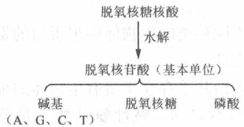
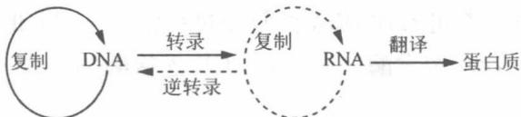

# 第2章 染色体与 DNA

## 2.1 复习笔记

【知识概览】

原核生物染色体与 DNA

染色体

蛋白质

真核细胞染色体的组成。

真核生物基因组 DNA

1. 2017年1月1日

染色质与核小体

DNA的一级结构

DNA 的结构。

DNA 的二级结构

DNA 的三级结构

DNA 的半保留复制

DNA复制的相关概念

DNA的半不连续复制

DNA 复制所需的酶和蛋白质

DNA 复制

原核生物的 DNA 复制

原核生物 DNA 复制的调控

真核生物的 DNA 复制

端粒酶(Telomerase)与 DNA 末端复制

染色体与DNA

无法识别

细胞周期水平调控

真核细胞 DNA 的复制调控。

DNA 的突变

染色体水平调控

复制子水平调控

DNA 的突变与修复

直接修复

切除修复

DNA的损伤修复

错配修复

同源重组修复和非同源末端连接

跨损伤合成

SOS 修复系统

DNA 的转座与转座子

插入序列(IS)

转座子的分类。

DNA 的转座

复合型转座子

自主性因子

真核生物中的转座子

非自主性转座子

转座作用的遗传学效应

SNP 概述

SNP 的理论与应用。

SNP的应用

SNP 的检测技术

## 【重难点归纳】

## 一、染色体

## 1. 原核生物染色体与 DNA

细菌基因组为双股螺旋形式的闭环 DNA，与碱性蛋白和少量 RNA 组合形成突环。细菌染色体的 DNA 在细胞内紧密缠绕形成致密的小体，称为拟核。原核生物只有一个染色体。原核生物 DNA 的主要特点有：

①多为编码序列，且以单拷贝的形式存在(rRNA 基因为多拷贝)。

②DNA 几乎全部由功能基因与调控序列组成。

③存在转录单元，且转录产物为多顺反子 mRNA。

④有重叠基因，即同一段 DNA 携带两种不同蛋白质的信息。

## 2. 真核细胞染色体的组成

真核细胞染色体由蛋白质(组蛋白和非组蛋白)和 DNA 组成。在细胞分裂间期主要以染色质形式存在于细胞核内。

染色体 $\left\{\begin{array}{l} DNA \\ 蛋白质 \end{array}\right.$ 组蛋白(结构蛋白) $\left\{\begin{array}{l} H_{2}A、H_{2}B、H_{3} 及 H_{4} \\ H_{1} \end{array}\right.$ 核小体(基本组成单位)

## (1)蛋白质

## ①组蛋白

组蛋白是染色体的结构蛋白，富含赖氨酸和精氨酸。

## A. 组蛋白的分类

组蛋白可分为5种，分别是 $H_{1}$ 、 $H_{2}A$ 、 $H_{2}B$ 、 $H_{3}$ 及 $H_{4}$ 。

## B. 组蛋白的特性

第一，进化上高度保守，不同种类的生物体中组蛋白的氨基酸序列十分相似，这体现了组蛋白在进化过程中的高度保守性。

第二，无组织特异性，组蛋白几乎存在于所有生物体的细胞中。

第三，肽链上的氨基酸分布不对称，碱性氨基酸大量分布在组蛋白肽链 N 端的半条链上。

第四，组蛋白具有可修饰性，包括甲基化、乙酰化、磷酸化、腺苷酸化、泛素化、ADP核糖基化、丙酰化、丁酰化、琥珀酰化和巴豆酰化等多种翻译后修饰。

第五，组蛋白 $H_{5}$ 富含 Lys，还有 Ala、Set 及 Arg，其磷酸化与染色质失活有关。

## ②非组蛋白

非组蛋白的种类很多，其中主要包括酶类(如 RNA 聚合酶)、与细胞分裂有关的蛋白(如收缩蛋白、骨架蛋白、核孔复合物蛋白)、HMG 蛋白(高速泳动蛋白)、DNA 结合蛋白和 A24 非组蛋白等。

## (2)真核生物基因组 DNA

## ①特点

真核生物的基因组结构庞大，大部分为非编码序列，外显子被内含子隔开，存在大量重复序列，功能相关基因不组成操纵子，存在大量顺式作用元件。

## A. 不重复序列

仅含单个或几个拷贝，例如结构基因的序列，其功能主要是编码蛋白质。

## B. 中度重复序列

重复次数为 $10^{1} \sim 10^{4}$ ，占总 DNA 的 10% \~ 40%，一般是非编码序列，例如 rRNA、tRNA 和组蛋白基因等。

## C. 高度重复序列

重复频率高，可达 $10^{6}$ 以上，占基因组的 10% \~ 60%，如卫星 DNA。这类 DNA 高度浓缩，是异染色质的组成部分，存在于基因组的着丝点和端粒位点上。

## (3)染色质与核小体

DNA 和组蛋白组成核小体，核小体连成念珠状结构形成染色质。核小体是构成真核生物染色质的基本结构单位。

## ①核小体的结构

核小体的核心由组蛋白八聚体( $H_{2}A$ 、 $H_{2}B$ 、 $H_{3}$ 和 $H_{4}$ 各两分子)构成。 $H_{3} \cdot H_{4}$ 四聚体的形成启动核小体的组装，四聚体与 DNA 结合，再与两个 $H_{2}A \cdot H_{2}B$ 二聚体结合，完成核小体的组装。146bp 的 DNA 分子以左手螺旋环绕核心 1.65 圈，组蛋白 $H_{1}$ 结合于核小体的 DNA 上。

## ②染色体的形成过程

$$
\mathrm{DNA} \xrightarrow {\text {压缩7倍}} \text {核小体} \xrightarrow {\text {压缩6倍}} \text {螺线管} \xrightarrow {\text {压缩40倍}} \text {超螺旋} \xrightarrow {\text {压缩5倍}} \text {染色体单体}
$$

## 二、DNA 的结构

## 1. DNA 的一级结构

DNA(脱氧核糖核酸)的一级结构是指 DNA 分子中核苷酸之间的连接方式和核苷酸的序列。DNA 的化学组成如图 2-1 所示。

  
图2-1 DNA(脱氧核糖核酸)的化学组成

## 2. DNA 的二级结构

## (1) 概述

DNA 的二级结构是指两条反向平行的多核苷酸链彼此缠绕形成的双螺旋结构。

## (2)二级结构的分类

二级结构主要包括左手螺旋(Z-DNA)和右手螺旋(如A-DNA、B-DNA)。DNA通常是以右手螺旋形式存在的。B-DNA结构是细胞中DNA的优势结构。Watson和Crick提出的双螺旋结构模型代表了B-DNA的结构。

## ①提出双螺旋结构模型的依据

a. X 射线衍射结果表明 DNA 是一种规则的螺旋结构。

b. DNA 分子密度测量结果表明双螺旋结构由两条多核苷酸链组成。

c. Chargaff 发现的 DNA 碱基组成规律，显示碱基之间的配对关系。

## ②双螺旋结构模型的特点

a. 两条反向平行的多核苷酸链形成右手双螺旋，它们平行地围绕同一个中心轴盘绕。

b. DNA 的两条多核苷酸链之间有两条螺旋形的凹槽，一条为大沟，另一条为小沟。

c. 碱基位于螺旋的内部，脱氧核糖和磷酸位于螺旋的外侧，它们组成多核苷酸链的骨架。

d. 双螺旋的直径是 2nm，两个相邻的碱基对之间的距离为 0.34nm，每 10 个核苷酸形成螺旋的一转（碱基平面与纵轴垂直，脱氧核糖环平面与纵轴大致平行）。

e. 两条多核苷酸链由碱基对之间的氢键相连，A 与 T 配对形成两个氢键，G 与 C 配对形成三个氢键。

## (3) DNA 双链的变性和复性

## ①DNA 的变性

DNA 变性是指 DNA 双链互补碱基对之间的氢键在某些理化因素(高温、强酸强碱、变性剂等)作用下发生断裂，使双链 DNA 解离为单链的现象。

## ②DNA 的复性

DNA 的复性是指两条解离的互补链在变性条件缓慢地除去后可重新配对，恢复原来的双螺旋结构的现象。DNA 复性后许多物理化学性质又得到恢复。

$$
③ T _ {\mathrm{m}}
$$

$T_{m}$ 即 DNA 的解链温度，又称熔点或熔解温度，是指 DNA 双螺旋结构解链一半时的温度。影响 $T_{m}$ 值的因素主要有以下几方面：

a. DNA 中 G-C 碱基对的含量：G-C 含量越多， $T_{m}$ 值越高。

b. 介质中的离子强度：离子强度高， $T_{m}$ 值较高且范围窄；离子强度低， $T_{m}$ 值较低且范围宽。

c. DNA 的均一性：均质 DNA $T_{m}$ 值范围较小，而异质 DNA $T_{m}$ 值范围较宽。 $T_{m}$ 值可用于衡量 DNA 样品的均一性。

## ④增色效应

DNA 的增色效应是指在 DNA 解链过程中，由于有更多的共轭双键得以暴露，DNA 在 260nm 处的吸光度随之增加的现象，这是监测 DNA 双链是否发生变性的最常用指标。

## 3. DNA 的三级结构

## (1) DNA 的三级结构

DNA 的三级结构是指 DNA 在二级结构的基础上进一步扭曲、折叠而形成的复杂空间结构，包括不同二级结构单元间的相互作用，单链与二级结构单元间的相互作用以及 DNA 的拓扑特征。其中，超螺旋结构是 DNA 三级结构的一种最常见形式。

## (2) 超螺旋结构的分类

## ①正超螺旋(右手超螺旋)

正超螺旋是指 DNA 朝着其双螺旋方向绕轴形成的结构，是过度缠绕的双螺旋。

## ②负超螺旋(左手超螺旋)

负超螺旋是指 DNA 朝着其双螺旋相反的方向形成的结构，生物体内绝大多数环状 DNA 以负超螺旋的形式存在。

## 三、DNA 的生物合成(DNA 复制)

## 1. DNA 的半保留复制

## (1) 定义

双螺旋的 DNA 分子解螺旋后，分别作为模板，按照碱基互补配对原则，在 DNA 聚合酶的作用下合成新的互补链，新形成的 DNA 分子与原来 DNA 分子的碱基顺序完全一样，子代 DNA 分子的一条链来自亲代 DNA，另一条链是新合成的，这种 DNA 复制方式称为 DNA 的半保留复制。

## (2) 意义

原核生物与真核生物的 DNA 都以半保留复制的方式进行传递，这种复制方式保证了亲代和子代在遗传上的相对稳定性。

## 2. DNA 复制的相关概念

表2-1总结了DNA复制的相关概念。

表 2-1 DNA 复制的相关概念

<table><tr><td>名称</td><td>概念</td></tr><tr><td>复制子</td><td>生物体内能独立完成复制的功能单位。原核细胞染色体只有一个复制子,真核细胞染色体具有多个复制子</td></tr><tr><td>复制叉</td><td>DNA复制时在DNA链上通过解旋、解链和SSB蛋白的结合等过程形成的Y型或叉形结构</td></tr><tr><td>复制起始点</td><td>复制子中起始复制的位点称为复制起始点。一个复制子只含一个复制起始点。复制起始点富含AT序列,以便于解链</td></tr><tr><td>复制终止点</td><td>复制子中控制复制终止的位点</td></tr><tr><td>单向复制</td><td>从一个复制起点开始的DNA单向复制</td></tr><tr><td>双向复制</td><td>复制开始于一个位点,但向着相反的方向移动形成复制叉</td></tr><tr><td>相向复制</td><td>从两个起始点分别进行两条链的复制,以相向方式复制延伸</td></tr></table>

## 3. DNA 的半不连续复制

## (1)冈崎片段

冈崎片段是 DNA 复制过程中后随链不连续合成生成的片段。DNA 复制时，一条链为前导链，另一条链为后随链，后随链产生相对比较短的 DNA 链（在大肠杆菌中大约 1000 核苷酸残基），这些短链称为冈崎片段，随后被 DNA 连接酶连接成较长片段。

## (2) DNA 的半不连续复制

DNA 的半不连续复制是指 DNA 前导链以 $5'\rightarrow3'$ 方向连续进行复制，与复制叉移动方向一致；而后随链按照 $5'\rightarrow3'$ 方向（合成方向与复制叉移动方向相反）合成许多冈崎片段后，再连接成完整的后随链的 DNA 复制方式。

## 4. DNA 复制所需的酶和蛋白质

## (1) DNA 聚合酶

DNA 聚合酶是指依赖 DNA 的 DNA 聚合酶，简写为 DNA pol，能以 DNA 为模板，以 4 种 dNTP 为底物，催化新链不断延长。

大肠杆菌 DNA 聚合酶有 I、Ⅱ、Ⅲ、Ⅳ和 V 共 5 种；真核生物 DNA 聚合酶主要有 α、β、γ、δ 和 ε。原核生物和真核生物 DNA 聚合酶的性质分别如表 2-2 和表 2-3 所示。

表 2-2 大肠杆菌 DNA 聚合酶性质的比较

<table><tr><td>种类</td><td>DNA pol I</td><td>DNA pol II</td><td>DNA pol III</td><td>DNA pol IV和V</td></tr><tr><td>外切酶活性的方向</td><td>两个方向</td><td colspan="2">一个方向</td><td>—</td></tr><tr><td>3&#x27;→5&#x27;外切酶活性</td><td colspan="3">有</td><td>—</td></tr><tr><td>5&#x27;→3&#x27;外切酶活性</td><td>有</td><td colspan="2">无</td><td>—</td></tr><tr><td>5&#x27;→3&#x27;聚合酶活性</td><td colspan="3">有</td><td>—</td></tr><tr><td>功能</td><td>校对功能,进行错配碱基的修复;切除RNA引物、DNA损伤部分如嘧啶二聚体</td><td>DNA损伤应急状态时修复DNA</td><td>DNA复制中主要的复制酶</td><td>在SOS修复中发挥作用</td></tr></table>

表 2-3 真核生物 DNA 聚合酶性质的比较

<table><tr><td></td><td>DNA polα</td><td>DNA polβ</td><td>DNA poly</td><td>DNA polδ</td><td>DNA pole</td></tr><tr><td>细胞定位</td><td colspan="2">细胞核</td><td>线粒体</td><td colspan="2">细胞核</td></tr><tr><td>3&#x27;→5&#x27;外切酶活性</td><td colspan="2">无</td><td colspan="3">有</td></tr><tr><td>5&#x27;→3&#x27;聚合酶活性</td><td colspan="5">有</td></tr><tr><td>引物酶活性</td><td>有</td><td colspan="4">无</td></tr><tr><td>功能</td><td>DNA复制中起始引发,合成引物</td><td>DNA损伤修复</td><td>线粒体DNA复制</td><td>主要的DNA复制酶,合成前导链和后随链</td><td>填补引物空隙,切除、修复、重组、校读(核DNA复制修复)</td></tr></table>

## ①DNA 聚合酶的 3 个结构域

DNA 聚合酶的三维结构类似于一只半握的右手，有 3 个结构域：拇指域、手指域和手掌域。

## ②DNA 聚合酶的延伸能力

DNA 聚合酶的延伸能力决定 DNA 的合成速度。DNA 聚合酶与"滑动夹"蛋白之间的相互作用能够提高 DNA 聚合酶的延伸能力。

## ③外切核酸酶具有校正新合成 DNA 的能力

外切核酸酶是 DNA 聚合酶的同一类多肽，它能通过去除错误碱基配对的核苷酸来校正 DNA 的合成，保证 DNA 合成的正确性。

## (2)与 DNA 解螺旋有关的酶和蛋白质

## ①DNA 解链酶

通过水解 DNA 获得能量，使 DNA 双链打开。

## ②单链结合蛋白(SSB 蛋白)

与解螺旋后的单链 DNA 结合，能够防止已经被解开的 DNA 单链重新形成双链，也可保护单链部分不被核酸酶降解，在复制完成前维持单链 DNA 的稳定。

## ③DNA 拓扑异构酶

该酶的作用是消除释放 DNA 解链过程中的正超螺旋扭曲张力的堆积，理顺 DNA 链结构使复制得以延伸。

## (3) DNA 连接酶

DNA 连接酶催化 DNA 链 3'—OH 末端和另一 DNA 链的 5'—P 末端生成磷酸二酯键，从而将两段相邻的 DNA 链连接成完整的链，连接反应需要能量供给。

## (4) 引物酶(引发酶)

引物酶为小分子单体蛋白质，是 DNA 复制过程中催化 RNA 引物合成的酶。RNA 引物即 DNA 生物合成所需的短链 RNA。大肠杆菌中的引物酶是 DnaG 蛋白。

## 5. 原核生物的 DNA 复制

原核生物 DNA 复制分为起始、延伸和终止三个过程。

## (1) DNA 复制的起始

大肠杆菌的复制起始点(oriC)含有3个13bp的串联重复保守序列(GATCTNTTNTTTT)，以及4个由9bp的保守序列(TTATCCACA)组成的能结合DnaA的起始结合位点。参与大肠杆菌复制起始的一些蛋白质如表2-4所示。

表 2-4 参与大肠杆菌复制起始的蛋白质

<table><tr><td>蛋白质(基因)</td><td>通用名</td><td>功能</td></tr><tr><td>DnaA(dnaA)</td><td>—</td><td>辨认E. coli上的复制起始点oriC</td></tr><tr><td>DnaB(dnaB)</td><td>解链酶</td><td>解开DNA双链</td></tr><tr><td>DnaC(dnaC)</td><td>—</td><td>运送和协同DnaB</td></tr><tr><td>DnaG(dnaG)</td><td>引物酶</td><td>催化RNA引物生成</td></tr><tr><td>SSB</td><td>单链DNA结合蛋白</td><td>稳定已解开的单链</td></tr><tr><td>拓扑异构酶</td><td>—</td><td>改变DNA分子的拓扑构象,理顺DNA链</td></tr></table>

①DnaA 蛋白识别大肠杆菌的 oriC，与 oriC 上的 4 个 9bp 的保守序列结合，形成起始复合物，该过程消耗 ATP。

②HU 蛋白与 DNA 结合，促使双链 DNA 弯曲，邻近 3 个 13bp 的串联重复保守序列变性形成开链复合物。

③解链酶 DnaB 在 DnaC 帮助下进入解链区，沿着 $5'\rightarrow3'$ 方向使双螺旋解开成单链，置换出 DnaA 蛋白。解链也需 DNA 拓扑异构酶和 SSB 蛋白。

④在 oriC 位点，引物酶与引发体前体组成引发体，消耗 ATP，沿 $5'\rightarrow3'$ 方向移动，合成短链 RNA 引物。

## (2)链的延伸

RNA 引物合成后，在 DNA polⅢ催化下，以 4 种 dNTP 为底物催化新链不断延长。在复制的延伸阶段，同时进行前导链和后随链的合成，前导链按 5'→3' 方向连续合成，其合成方向与复制叉一致；后随链的合成不连续，先合成冈崎片段，再连接成一条完整的链。后随链的合成分为以下几个步骤：

①由引物酶合成大约10核苷酸大小的引物。

②DNA 聚合酶Ⅲ以 $5'\rightarrow3'$ 方向不断延伸引物，直至遇到下一个引物的 $5'$ 端，合成冈崎片段。

③DNA 聚合酶 I 具有 $5'\rightarrow3'$ 核酸外切酶的活性，切除冈崎片段上的 RNA 引物。

④填补片段之间的空缺，最后由 DNA 连接酶连接冈崎片段形成完整的子链。

## (3)复制的终止

当复制叉前移，遇到 Ter-Tus 复合物时，解链酶 DnaB 不再进行解链，阻止复制叉前移，最后两个复制方向相反的复制叉在复制的终止区相遇停止复制。期间存在约 50～100bp 未被复制，通过修复方式填补空缺。

## 6. 原核生物 DNA 复制的调控

原核生物 DNA 复制的调控主要发生在起始阶段，DNA 复制起始频率由复制叉的数量决定。蛋白质和 RNA 是复制起始频率的直接调控因子。

## 7. 真核生物的 DNA 复制

真核生物与原核生物 DNA 复制的过程有相似之处，但也存在不同点。

(1) 真核生物 DNA 在每个细胞周期中只复制一次

真核生物 DNA 只在细胞周期 S 期精确复制一次。

## (2) 前复制复合体 (pre-RC) 指导真核细胞复制的起始进行

与原核复制起始不同的是，真核生物中存在 pre-RC，pre-RC 由 4 个独立的蛋白质组成。起始点识别复合物(ORC)首先结合复制器，招募解旋酶装载蛋白 Cdc6 和 Cdt1，再共同募集解旋酶 Mcm2\~7 复合体，形成 pre-RC，最终介导了复制的起始进行。真核细胞起始的两个步骤发生在不同的时期：复制器的选择作用（对指导复制起始的序列进行识别）发生在 G₁ 期；起始点的激活发生在细胞进入 S 期后。以上两个步骤保证每个细胞周期中每条染色体只复制一次。

## (3) 细胞周期蛋白依赖性激酶调控 pre-RC 的形成和激活

细胞周期蛋白依赖性激酶(Cdk)能激活 pre-RC，启动 DNA 复制，也抑制 pre-RC 的形成，因此在一个细胞周期中 pre-RC 在 $G_{1}$ 期只形成一次。

## 8. 端粒酶(Telomerase)与DNA末端复制

线性染色体在复制之后，后随链 DNA 产物 3'末端一小段 DNA 片段可能会在复制过程中丢失，最终导致染色体短缺，产生末端复制问题，影响遗传物质的传递。细胞有两种方式来解决染色体末端复制问题。

①某些具有线性染色体的细菌和病毒可以利用蛋白质氨基酸残基提供—OH代替RNA作为每个染色体末端最后一个冈崎片段的引物。

②多数真核生物能通过利用端粒酶自身的 RNA 作为模板延伸染色体 3' 端来解决末端复制问题。

## 9. 真核细胞 DNA 的复制调控

## (1) 细胞周期水平调控

真核细胞的细胞周期可分为 DNA 合成前期( $G_{1}$ 期)、DNA 合成期(S 期)、DNA 合成后期( $G_{2}$ 期)和有丝分裂期(M 期)四个时期。细胞周期水平的调控决定细胞停留在 $G_{1}$ 期还是进入 S 期。

## (2) 染色体水平调控

决定染色体上不同部位的复制子复制的起始顺序。

## (3) 复制子水平调控

决定是否进行复制的起始。

## 四、DNA 的突变与修复

## 1. DNA 的突变

DNA 突变是指 DNA 核苷酸序列的改变，突变导致 DNA 的复制及转录和翻译产物随之发生变化，出现异常的遗传特性。DNA 的突变包括碱基替换、转换、颠换、插入突变、同义突变、错义突变、无义突变以及移码突变。其中嘧啶突变为嘧啶或嘌呤突变为嘌呤称为转换；嘧啶突变为嘌呤或嘌呤突变为嘧啶称为颠换。

## 2. DNA 的损伤修复

DNA 的损伤修复是指纠正 DNA 两条单链间错配的碱基、清除 DNA 链上受损的碱基或糖基、恢复 DNA 正常结构的过程。表 2-5 列出了几种常见的 DNA 损伤修复途径。

表 2-5 常见的 DNA 损伤修复途径

<table><tr><td colspan="2">修复途径</td><td>修复对象</td><td>修复过程</td></tr><tr><td colspan="2">直接修复</td><td>嘧啶二聚体、甲基化DNA</td><td>DNA损伤后直接修复而不切除碱基或核苷酸,把损伤的碱基恢复到正常的状态</td></tr><tr><td rowspan="2">切除修复</td><td>碱基切除修复</td><td>受损的碱基</td><td>由糖苷水解酶识别切除受损核苷酸位点上的N-β糖苷键,形成去嘌呤或去嘧啶位点(AP位点),随后在内切核酸酶、DNA聚合酶、DNA连接酶的作用下恢复DNA的正常结构</td></tr><tr><td>核苷酸切除修复</td><td>嘧啶二聚体、DNA螺旋结构的改变</td><td>由DNA切割酶在核苷酸受损部位两侧同时切开,在DNA聚合酶作用下合成小片段,再通过DNA连接酶形成一条完整的新链</td></tr><tr><td colspan="2">错配修复</td><td>复制或重组中的碱基配对错误</td><td>DNA复制过程中,通过甲基化原则区分母链和子链,一旦发现错配碱基,将未甲基化的链切除,并以甲基化的母链为模板进行修复合成</td></tr><tr><td colspan="2">同源重组修复和非同源末端连接</td><td>双链断裂</td><td>同源重组修复是指机体细胞先跳过复制起始未修复的损伤部位,留下一个缺口,随后将同源母链上相应的核苷酸片段移到该缺口处,再用新合成的序列补上母链的空缺的修复过程;非同源末端连接通过断裂末端突出的单链之间错排配对,将断裂的两个末端直接相互连接,这是一种易错修复方式</td></tr><tr><td colspan="2">跨损伤合成</td><td>嘧啶二聚体或脱嘌呤位点</td><td>当细胞处于强烈持久的SOS反应生理条件下时,一些DNA聚合酶家族能够忽略并跨过损伤部位,不依赖碱基配对并以高度的易错性进行复制</td></tr><tr><td colspan="2">SOS修复系统</td><td>大范围的损伤或复制中来不及修复的损伤,如嘧啶二聚体</td><td>细胞为求生存而产生的一种旁路系统,能允许新生的DNA链越过胸腺嘧啶二聚体继续复制,但保真度大大降低,广泛存在于原核和真核生物中</td></tr></table>

## 五、DNA的转座

## 1. DNA 的转座与转座子

## (1) 转座

DNA 的转座又称移位或异常重组，是指由转座因子介导的遗传物质重排或移位的现象。

## (2)转座子

转座子是可自主复制的能从染色体某一位点转移到另一位点的分散重复序列。位于不同位点的两个拷贝转座子之间可以发生交互重组，从而造成基因组不同形式的重排。

## 2. 转座子的分类

## (1) 插入序列(IS)

IS 是一种最简单的转座子，仅携带转座所需要的基因。两端是反向重复区（IR），反向重复区为转座酶所识别。

## (2) 复合型转座子

复合型转座子是一类除携带转座所需要的基因外，还带有抗性或其他标记基因的转座子。其两端是两个相同或者高度同源的 IS，通常情况下，复合型转座子的转座能力是由 IS 决定和调节的。

## 3. 真核生物中的转座子

真核细胞中也存在转座子。以玉米为例，可把玉米细胞内的控制因子分为两类。

## (1) 自主性因子

具有自主剪接和转座的能力。

## (2)非自主性因子

单独存在时稳定，自身并不能转座，其具备转座能力的前提是基因组中存在与之同家族的自主性因子。

## 4. 转座作用的遗传学效应

转座作用可引起插入突变，产生新的基因，产生染色体畸变以及引起生物进化。

## 六、SNP 的理论与应用

## 1. SNP 概述

## (1)SNP 定义

SNP 全称 single nucleotide polymorphism，即单核苷酸多态性，是指在基因组水平上由单个核苷酸的变异所引起的 DNA 序列多态性。SNP 是基因组中最简单、最常见的多态性形式，具有很高的遗传稳定性，是目前最好的遗传标记。SNP 所表现的多态性只涉及单个碱基的变异，这种变异可由单个碱基的转换、颠换、插入或缺失引起。

(2) SNP 作为遗传标记的特点

①数量多，分布广泛；

②信息量大，具有代表性；

③能够稳定遗传；

④高效快速，可实现分析自动化，减少研究时间；

⑤易于基因分型；

⑥采用混合样本估算等位基因的频率，使得 SNP 等位基因频率容易估计。

## 2. SNP的应用

①用于人类单倍型图的绘制。

②研究不同基因型个体对药物反应的差异，指导用药与药物设计。

③与疾病的易感基因进行相关性分析。

④此外，全基因组相关分析可用于分析定位于已知基因的蛋白编码序列的 SNP；HapM 工程将人类常见 SNP 的共有模式进行分类，形成单体型，进一步找到这些单体型的代表性标签 SNP，从而增加实际操作中能够确定出个体单体型的区域。

## 3. SNP 的检测技术

包括：限制性片段长度多态性(RFLP)、PCR-单链构象多态性(PCR-SSCP)、变性梯度凝胶电泳(DGGE)、等位基因特异PCR(AS-PCR)、变性高效液相色谱(DHPLC)、DNA测序法(最常见)、基因芯片技术、Taqman技术、质谱检测技术、分子导标技术和焦磷酸测序法等。

## 2.2 课后习题详解

## 1. 染色体具备哪些作为遗传物质的特征？

答：染色体作为遗传物质所具有的特征有以下几点：

(1) 分子结构相对稳定；

(2)能够自我复制，是保证亲子代之间遗传物质连续性遗传的基础；

(3)能携带大量的遗传信息(基因)，指导蛋白质的合成，从而控制生物体的生命过程；

(4)能够产生一定程度的可遗传变异。

## 2. 简述真核细胞内核小体的结构特点

答：核小体是染色体的基本结构单位，由 DNA 和组蛋白构成。其结构特点表现为：

(1) 每个核小体单位包括 200bp 左右的 DNA 和一个组蛋白八聚体。

(2) 组蛋白八聚体由 $H_{2}A$ 、 $H_{2}B$ 、 $H_{3}$ 和 $H_{4}$ 各两个分子组成，是构成核小体的核心颗粒。

(3)有 146bp 的 DNA 分子直接以左手方向盘绕在八聚体颗粒的表面，20～60bp 的 DNA 片段连接相邻的核小体。

(4)一分子组蛋白 $H_{1}$ 与核小体的 DNA 结合，有助于稳定核小体的结构。

1. 请例举 3 项实验证据来说明为什么染色质中 DNA 与蛋白质分子是相互作用的。

答：染色质中 DNA 与蛋白质分子是相互作用的实验证据举例如下：

(1)证据一：染色质 DNA 的 $T_{m}$ 值(DNA 解链温度)比自由 DNA 的高。

(2)证据二：在染色质状态下，由 DNA 聚合酶和 RNA 聚合酶催化的 DNA 复制和转录活性大大低于在自由 DNA 中的反应；DNA 酶 I（DNase I）对染色质 DNA 的消化远远慢于对纯 DNA 的作用。

(3) 证据三：用小球菌核酸酶处理染色质后，进行电泳可以得到均为 200bp 基本单位倍数的 DNA 片段。

1. 简述组蛋白的主要修饰类型并说出其功能。

答：组蛋白是染色体的结构蛋白，富含赖氨酸和精氨酸，可以发生甲基化、乙酰化、磷酸化、泛素化、ADP核糖基化、丙酰化、丁酰化、琥珀酰化和巴豆酰化等多种翻译后修饰类型。其修饰作用只发生在细胞周期的特定时间和组蛋白的特定位点上，几种组蛋白中以 $\mathrm{H}_{3}$ 、 $\mathrm{H}_4$ 的修饰作用比较普遍，并且以甲基化、乙酰化修饰为主， $\mathrm{H}_2\mathrm{A}$ 、 $\mathrm{H}_2\mathrm{B}$ 能发生泛素化和乙酰化修饰， $\mathrm{H}_{1}$ 存在泛素化和磷酸化修饰。主要修饰类型及相应的功能如下：

## (1) 甲基化

甲基化由组蛋白甲基转移酶和去甲基化酶催化，可发生在组蛋白的 Lys 和 Arg 残基上，修饰方式比较稳定，与基因激活或基因沉默有关，经过甲基化的修饰作用后增加了组蛋白修饰和调节基因表达的复杂性。

## (2)乙酰化

主要发生在核心组蛋白上，呈现多样性，其主要位点存在于 $H_{3}$ 和 $H_{4}$ 的 N 端 Lys 上，由组蛋白乙酰基转移酶和组蛋白去乙酰化酶催化。乙酰化和去乙酰化修饰影响染色质结构和基因活化，调节基因转录水平。组蛋白乙酰化使核小体结构变得松弛，促进转录，反之则抑制转录。此外乙酰化还参与 DNA 修复、拼接和复制，染色体组装以及细胞的信号转导，与某些疾病的形成密切相关。

## (3) 磷酸化

组蛋白磷酸化可能会改变组蛋白与 DNA 的结合，参与基因转录、DNA 修复、细胞凋亡及染色体浓缩等过程。

## (4)泛素化

组蛋白的泛素化能招募核小体到染色体，参与 X 染色体的失活，从而影响组蛋白的甲基化和基因的转录，同时在 DNA 损伤应答等生理过程中发挥重要作用。

## (5) ADP 核糖基化

ADP 核糖基化发生在组蛋白 $H_{1}$ 、 $H_{2}A$ 、 $H_{2}B$ 和 $H_{3}$ 中，是真核生物启动复制的开关。

组蛋白的修饰通过影响组蛋白与 DNA 双链的亲和性，来改变染色质的疏松或凝集状态；或通过影响转录因子与结构基因启动子的亲和性来发挥基因调控作用。这些修饰之间存在协同和级联效应，通过多种修饰方式的组合发挥调控功能，从而更为灵活地影响染色质的结构与功能。

## 5. 简述 DNA 的一、二、三级结构

## 答：(1) DNA 的一级结构

DNA 的一级结构是指 DNA 分子中核苷酸之间的连接方式和核苷酸的序列，表示该 DNA 分子的化学构成。其特征包括：

①碱基的排列顺序不受限制，构成了 DNA 分子的多样性。

②每个 DNA 分子所具有的特定的碱基排列顺序构成了 DNA 分子的特异性。

## (2) DNA 的二级结构

DNA 的二级结构是指两条脱氧多核苷酸链反向平行盘绕所生成的双螺旋结构，其特征如下：

①DNA 由两条反向平行的脱氧核苷酸长链盘绕形成右手双螺旋。

②DNA 中的脱氧核糖和磷酸交替连接，碱基位于螺旋的内部，脱氧核糖和磷酸位于螺旋的外侧，它们组成多核苷酸链的骨架。

③两条多核苷酸链由碱基对之间的氢键相连，并遵循碱基互补配对原则（即 A 与 T，G 与 C 配对）。

## (3) DNA 的三级结构

DNA 的三级结构是指在二级结构上进一步扭曲、折叠而形成的复杂空间结构。其中，超螺旋结构（包括正超螺旋和负超螺旋）是 DNA 三级结构的一种最常见形式。

①正超螺旋是指 DNA 朝着其双螺旋方向绕轴形成的结构，是过度缠绕的双螺旋。

②负超螺旋是指 DNA 朝着其双螺旋相反的方向形成的结构，生物体内绝大多数环状 DNA 以负超螺旋的形式存在。

## 6. 原核生物 DNA 具有哪些不同于真核生物 DNA 的特征?

答：与真核生物 DNA 相比，原核生物 DNA 有以下不同特征：

## (1) 原核生物 DNA 存在于拟核中且结构简练

原核生物大多数基因用来编码蛋白质，且通常以单拷贝的形式存在，非编码序列极少。而真核生物 DNA 主要存在于细胞核内，有大量重复序列，大量存在着的非编码区将编码区隔开形成断裂基因。

## (2) 原核生物 DNA 存在转录单元

原核生物中功能相关的基因集中在基因组的一个或多个位置，形成转录单元，转录和翻译同时进行，转录产物为多顺反子 mRNA；真核生物的转录发生在细胞核，翻译发生在细胞

质内，转录产物为单顺反子 mRNA。

## (3) 原核生物 DNA 有重叠基因

重叠基因是指同一段 DNA 携带两种不同蛋白质的信息。原核生物多为重叠基因，主要有全部重叠、部分重叠和单个碱基对重叠。

1. 谁提出了 DNA 双螺旋结构模型？简述其主要实验依据及其在分子生物学发展中的重要意义。

## 答：(1) DNA 双螺旋结构模型的提出

1953 年，Watson 和 Crick 提出了 DNA 双螺旋模型。

(2) 发现 DNA 双螺旋模型的主要实验依据

①X 射线衍射实验结果表明 DNA 是一种规则螺旋结构。

②DNA 分子密度测量表明这种螺旋结构由两条多核苷酸链组成。

③Chargaff 发现的 DNA 碱基组成规律，显示碱基之间的配对关系。

(3) DNA 双螺旋模型在现代分子生物学发展中的意义

①该模型揭示了 DNA 作为遗传物质的稳定性特征，并且为认识核酸与蛋白质的关系及其在生命中的作用奠定了基础。

②该模型在分子水平上阐述了 DNA 的理化性质，对促进分子生物学及分子遗传学的发展具有划时代意义。

③该模型将 DNA 的结构与功能联系起来，对 DNA 本身的复制机制、遗传信息的存储方式和表达、生物遗传稳定性和变异性等规律的阐明起了非常重要的作用。

## 8. DNA 以何种方式进行复制？如何保证 DNA 复制的准确性？

## 答: (1) DNA 的复制方式

双链 DNA 的复制主要通过半保留复制来实现。双螺旋的 DNA 分子解螺旋后，分别作为模板，按照碱基互补配对原则，在 DNA 聚合酶的作用下合成新的互补链，形成的子代 DNA 分子中的一条链来自亲代 DNA，另一条链是新合成的，这种 DNA 复制方式称为 DNA 的半保留复制。

## (2) 保证 DNA 复制准确性的因素

①采用半保留复制方式，按碱基互补配对原则进行 DNA 链的合成。

②DNA 聚合酶在复制过程中发挥了双重作用：聚合酶的选择作用和 $3'\rightarrow5'$ 外切酶的校对作用。聚合酶具有选择作用，只允许底物与模板之间形成 Watson-Crick 类型的碱基配对，非配对碱基因空间位置不适合而不能进行聚合反应，这种机制保证了新合成的链严格按模板链的互补碱基顺序进行聚合。DNA 聚合酶的 $3'\rightarrow5'$ 外切核酸酶活性对 DNA 复制的保真性极为重要，若无该酶活性，DNA 复制的准确性将大大降低。

a. 原核生物中，以大肠杆菌为例，DNA 聚合酶Ⅲ是其主要的复制酶，具有 $5'\rightarrow3'$ 聚合酶活性和 $3'\rightarrow5'$ 外切核酸酶活性；DNA 聚合酶 I、Ⅱ都具有 $3'\rightarrow5'$ 外切核酸酶活性。DNA 聚合酶的 $3'\rightarrow5'$ 外切核酸酶活性有校对功能，能够切除单链 DNA 的 $3'$ 末端核苷酸，而对双链 DNA 不起作用。因此，在聚合过程中，不能形成碱基对的错配核苷酸可被该酶水解下来。

b. 真核生物中，DNA 聚合酶 $\delta$ 、 $\varepsilon$ 具有 $5'\rightarrow3'$ 聚合酶活性和 $3'\rightarrow5'$ 外切核酸酶活性，可发挥同原核生物类似的 DNA 聚合酶的选择或校对功能。

## 9. 简述原核生物 DNA 的复制特点

答：原核生物 DNA 的复制特点有以下几个方面：

(1) 原核生物双链 DNA 是以半保留复制方式遗传的，DNA 的复制在整个细胞周期都

能进行。

(2) 通常只有一个复制起始点，含有 3 个 13bp 的串联重复保守序列，以及 4 个由 9bp 的保守序列组成的能结合 DnaA 的起始结合位点。

(3) 在起始点处双链解开形成复制叉，可以连续开始新的 DNA 复制。

(4) 复制主要包括起始、延伸和终止这三个阶段。

(5)需要多种酶和蛋白质的协同参与，涉及 DNA 解链酶、单链结合蛋白、DNA 拓扑异构酶、引发酶、DNA 聚合酶等。

(6) 原核生物中存在 5 种类型的 DNA 聚合酶，其中 DNA 聚合酶Ⅲ是 DNA 复制中链延长反应的主导聚合酶。

## 10. 什么是 DNA 的 $T_{m}$ 值？它受哪些因素的影响？

答：(1) DNA 的 $T_{m}$ 值的定义

DNA 的 $T_{m}$ 值即 DNA 的解链温度，又称熔点或熔解温度，是指 DNA 双螺旋结构解链一半时的温度， $T_{m}$ 值是 DNA 的一个特征常数。

## (2) 影响 $T_{m}$ 值的因素

## ①DNA 中 G-C 对的含量

由于 G-C 碱基对之间有 3 个氢键，故 G-C 对含量越多， $T_{m}$ 值越高。

## ②介质中的离子强度

离子强度高，负电荷被阳离子中和，双螺旋的结构被稳定保持， $T_{m}$ 值较高且范围窄；离子强度低，未被中和的负电荷会降低双螺旋的稳定性， $T_{m}$ 值较低且范围宽。

## ③DNA 的均一性

均质 DNA 解链温度范围较小，而异质 DNA 解链温度范围较宽。因此 $T_{m}$ 值也可作为衡量 DNA 样品均一性的标准。

1. DNA 复制时为什么前导链是连续复制，而后随链是以不连续的方式复制？并请以大肠杆菌为例简述后随链复制的各个步骤。

## 答：(1)前导链是连续复制，而后随链是以不连续的方式复制的原因

①DNA 的合成方向是 $5'\rightarrow3'$ ，DNA 聚合酶只有 $5'\rightarrow3'$ 聚合酶活性，而没有 $3'\rightarrow5'$ 聚合酶活性。

②复制叉附近解开的 DNA 链一条是 $5'\rightarrow3'$ 方向，另一条是 $3'\rightarrow5'$ 方向，两者分别是后随链和前导链的模板。

③在 DNA $3'\rightarrow5'$ 方向的模板链上，DNA 合成方向和复制叉移动方向相同，都是 $5'\rightarrow3'$ 方向，因此可以连续复制；而在 $5'\rightarrow3'$ 方向的模板链上，DNA 合成方向和复制叉移动方向相反，由于 DNA 聚合酶只有 $5'\rightarrow3'$ 聚合活性，因此这条模板链必须在引发酶作用下先合成一段引物，再以 $5'\rightarrow3'$ 方向合成一段一段的冈崎片段，再通过 DNA 连接酶共价连接成一条连续完整的新 DNA 链。所以前导链连续复制，而后随链以不连续方式进行复制。

## (2) 大肠杆菌后随链复制的步骤

①引发酶合成约10核苷酸大小的RNA新引物。

②在 DNA polⅢ催化下，以 $5'\rightarrow3'$ 方向不断延伸引物，直至遇到下一个引物的 $5'$ 端。新合成的 DNA 片段即冈崎片段。

③利用 DNA 聚合酶 I 的 $5'\rightarrow3'$ 外切核酸酶的活性切除冈崎片段上的 RNA 引物，填补片段之间的空缺，最后由 DNA 连接酶连接形成完整的子链。

1. 真核生物 DNA 的复制在哪些水平上受到调控?

答：真核生物 DNA 的复制在以下三个方面受到调控。

## (1)细胞周期水平的调控

真核细胞 DNA 的生活周期可分为 4 个时期： $G_{1}$ 、S、 $G_{2}$ 和 M 期。细胞周期水平的调控又称限制点调控，它决定细胞是停留在 $G_{1}$ 期还是进入 S 期。

(2) 染色体水平调控

它决定不同染色体或同一染色体不同部位的复制子复制的起始顺序。

## (3) 复制子水平的调控

它决定复制的起始与否，这种调控从单细胞生物到高等生物都是高度保守的。

## 13. 细胞通过哪几种修复系统对 DNA 损伤进行修复？它们在维持基因组稳定性中的作用是什么？

答：细胞可以通过错配修复、直接修复、切除修复、同源重组修复和非同源末端连接、跨损伤合成和SOS反应等修复系统对DNA损伤进行修复。它们在维持基因组稳定性的作用如表2-6所示。

表 2-6 DNA 损伤修复途径

<table><tr><td colspan="2">修复途径</td><td>修复对象</td><td>作用</td></tr><tr><td colspan="2">错配修复</td><td>复制或重组中的碱基配对错误</td><td>DNA复制过程中,通过甲基化原则区分母链和子链,一旦发现错配碱基,将未甲基化的链切除,并以甲基化的母链为模板进行修复合成,对DNA复制忠实性贡献大(恢复错配)</td></tr><tr><td colspan="2">直接修复</td><td>嘧啶二聚体、甲基化DNA</td><td>DNA损伤后直接修复而不切除碱基或核苷酸的机制,把损伤的碱基恢复到正常的状态</td></tr><tr><td rowspan="2">切除修复</td><td>碱基切除修复</td><td>受损的碱基</td><td>由糖苷水解酶识别切除受损核苷酸位点上的N-β糖苷键,形成去嘌呤或去嘧啶位点(AP位点),随后在内切核酸酶,DNA聚合酶,DNA连接酶的作用下恢复DNA的正常结构</td></tr><tr><td>核苷酸切除修复</td><td>嘧啶二聚体、DNA螺旋结构的改变</td><td>由DNA切割酶在核苷酸受损部位两侧同时切开,在DNA聚合酶作用下合成小片段,再通过DNA连接酶形成一条完整的新链</td></tr><tr><td colspan="2">同源重组修复和非同源末端连接</td><td>双链断裂</td><td>1同源重组修复是指机体细胞先跳过复制起始未修复的损伤部位,留下一个缺口,随后将同源母链上相应的核苷酸片段移到该缺口处,再用新合成的序列补上母链空缺的修复过程;即利用细胞内的同源染色体对应的DNA序列作为修复的模板进行DNA修复;2非同源末端连接是通过断裂末端突出的单链之间进行错排配对,将断裂的两个末端直接相互连接,这是一种易错的修复方式;3功能:修复损伤的DNA,保持遗传信息的完整性,还可帮助修复DNA复制中的错误</td></tr><tr><td colspan="2">跨损伤合成</td><td>嘧啶二聚体或脱嘌呤位点</td><td>当细胞处于强烈持久的SOS反应生理条件下时,一些DNA聚合酶家族能够忽略并跨过损伤部位,不依赖碱基配对并以高度的易错性进行复制;跨损伤合成可使细胞存活,但具有高度易错性,易发生高频率突变</td></tr><tr><td colspan="2">SOS反应</td><td>大范围的损伤或复制中来不及修复的损伤如嘧啶二聚体</td><td>细胞为求生存而产生的一种旁路系统,能允许新生的DNA链越过胸腺嘧啶二聚体继续复制,其代价是保真度的极大降低;SOS反应可维持基因组的完整性,利于细胞存活,但也可能引起细胞癌变</td></tr></table>

通过上述几种修复系统，可保证生物体遗传物质的稳定性，有利于生物体的生殖与遗传。

## 14. 什么是转座子，可分为哪些种类？

## 答：(1)转座子的定义

转座子是存在于染色体 DNA 上可自主复制和位移的基本单位。位于不同位点的两个拷贝转座子之间可以发生交互重组，从而造成基因组不同形式的重排。

## (2)转座子的分类

## ①插入序列(IS)

IS 是一种最简单的转座子，仅携带转座所需要的基因，能够独立存在。两端是反向重复区（IR），反向重复区为转座酶所识别。

## ②复合型转座子

复合型转座子是一类除携带转座所需要的基因外，还带有抗性或其他标记基因的转座子。其两端是两个相同或者高度同源的 IS，通常情况下，复合型转座子的转座能力是由 IS 决定和调节的。

## 15. 什么是 SNP? 它作为第三代遗传标记有什么优点?

## 答：(1)SNP的定义

SNP 全称 single nucleotide polymorphism，即单核苷酸多态性，是指在基因组上单个核苷酸的突变，包括转换、颠换、缺失和插入而引起的多态性。SNP 是基因组中最简单、最常见的多态性形式，具有很高的遗传稳定性。

## (2) SNP 作为第三代遗传标记的优点

①数量多，分布广泛；

②信息量大，具有代表性；

③能够稳定遗传；

④高效快速，可实现分析自动化，减少研究时间；

⑤易于基因分型；

⑥采用混合样本估算等位基因的频率，使得 SNP 等位基因频率容易估计。

## 2.3 名校考研真题详解

## 一、选择题

1. 双链断裂的修复主要采用下列哪一种修复机制？（）[扬州大学2018研]  
A. 同源重组修复 B. 核苷酸切除修复  
C. 碱基切除修复 D. 错配修复

## 【答案】A

【解析】同源重组修复和非同源末端连接是 DNA 双链断裂应答机制中两条重要的修复通路。其中，同源重组修复的修复机制是机体细胞先跳过复制起始未修复的损伤部位，留下一个缺口，随后将同源母链上相应的核苷酸片段移到该缺口处，再用新合成的序列补上母链的空缺。因此答案选 A。

1. 某双链 DNA 分子中腺嘌呤的含量是 15%，则胞嘧啶的含量应为（）。[浙江工业大学 2018 研]
A. 15%
B. 30%
C. 35%
D. 42.5%

【解析】根据双链 DNA 分子中，A = T, C = G, A + T + C + G = 100%。由题意可知，A = 15%，则 T = 15%，则 C = G = (100% - 15% - 15%) ÷ 2 = 35%。因此答案选 C。

1. 以下哪种组蛋白不属于核小体的核心蛋白？（）[浙江农林大学 2016 研]

A. H₁ B. H₂A C. H₂B D. H₃

E. H₄

【答案】A

【解析】核小体核心蛋白由组蛋白八聚体( $H_{2}A$ 、 $H_{2}B$ 、 $H_{3}$ 、 $H_{4}$ 各两分子)构成。1 分子 $H_{1}$ 与 DNA 相连，有助于稳定核小体的结构。 $H_{1}$ 不属于核小体的核心蛋白。因此答案选 A。

1. 真核生物染色体组装的结构层次(从低级到高级)是()。[电子科技大学 2015 研]

A. 染色质纤维→核小体→组蛋白八聚体→染色体环

B. 核小体→组蛋白八聚体→染色体环→染色质纤维

C. 组蛋白八聚体→核小体→染色质纤维→染色体环

D. 核小体→组蛋白八聚体→染色质纤维→染色体环

【答案】C

1. 以下哪一项不是维持 DNA 双螺旋结构的稳定性的因素？（）[湖南农业大学2012研]
A. 碱基对之间的氢键 B. 双螺旋内的疏水作用
C. 二硫键 D. 碱基堆积力

【解析】DNA 双螺旋结构是 DNA 的二级结构，主要靠氢键、疏水作用和碱基堆积力维持其稳定性。C 项，二硫键主要是维持蛋白质的稳定性，而 DNA 不含二硫键。因此答案选 C。

1. 在一段 DNA 复制时，序列 5' - TAGA - 3' 合成下列哪种互补结构？（）[电子科技大学 2009 研]

A. 5' - TCTA - 3' B. 5' - ATCT - 3' C. 5' - UCUA - 3' D. 3' - TCTA - 5'

【答案】A

1. 假定一负超螺旋的 L=20, T=23, W=-3。问大肠杆菌拓扑异构酶 I 作用一次后的 L、T、W 值分别是多少？（）[南开大学 2009 研]
A. L=21, T=23, W=-2
B. L=22, T=23, W=-1
C. L=19, T=23, W=-4
D. L=18, T=23, W=-5
【答案】A

【解析】超螺旋的缠绕数与链间螺旋数的关系可用公式表示为： $L = T + W$ ，其中 L 为连接数，T 为双螺旋的缠绕数，W 为超螺旋数。大肠杆菌中拓扑异构酶 I 催化的结果：切断一个链，超螺旋 DNA 增加一个连接数，减少一个负超螺旋。因此答案选 A。

1. 在核酸分子中核苷酸之间的连接方式是( )。[北京科技大学2008研]
A. 2', 3'磷酸二酯键
B. 2', 5'磷酸二酯键
C. 3', 5'磷酸二酯键
D. 糖苷键

【解析】核酸是由核苷酸以 $3'$ ， $5'$ 磷酸二酯键彼此连接起来的生物大分子。因此答案选 C。

1. IS 元件()。[浙江工业大学 2008 研]

A. 全是相同的

B. 具有转座酶基因

C. 是旁侧重复序列

D. 每代每个元件转座 $10^{3}$ 【答案】B

【解析】IS(插入序列)是不含任何宿主基因的最简单的转座子。IS是很小的DNA片段，末端具有反向重复区，中央区域可能含有1\~3个可读框，其中一个编码转座酶。一般情况下，每个IS转座频率为 $10^{-4}\sim10^{-3}$ /世代，恢复频率为 $10^{-10}\sim10^{-6}$ /世代。因此答案选B。

1. 下列哪一种类型的酶可能不参与切除修复(Excisional Repair)? ( ) [北京理工大学 2008 研]
A. DNA 聚合酶 B. RNA 聚合酶 C. DNA 连接酶 D. 解旋酶(helicase)
E. 外切酶(exonuclease)

## 【答案】B

【解析】DNA 切除修复包括碱基切除修复和核苷酸切除修复两种。前者修复过程中需要 AP 内切核酸酶切除受损片段，DNA 聚合酶 I 合成新片段，DNA 连接酶连接 DNA 链。后一种修复过程中，DNA 外切酶切割移去 DNA，解链酶解开 12～13 个核苷酸（原核）或 27～29 个核苷酸（真核）的单链 DNA，再由 DNA 聚合酶合成新片段，DNA 连接酶连接 DNA 链。B 项，RNA 聚合酶在 RNA 转录过程中催化新生 RNA 链的形成，不参与 DNA 损伤修复中的切除修复过程。因此答案选 B。

1. 除下列哪种酶外，皆可参加 DNA 的复制过程？（）[北京交通大学 2007 研]
A. DNA 聚合酶 B. 引发酶 C. 连接酶 D. 水解酶

【答案】D

【解析】A 项，DNA 聚合酶负责合成子链 DNA。B 项，引发酶合成 RNA 引物，引发 DNA 的合成。C 项，连接酶将小的冈崎片段连接成大的 DNA 分子。D 项，水解酶是催化水解反应的一类酶的总称，如胰蛋白酶，水解酶不参与 DNA 的复制过程。因此答案选 D。

1. 端粒酶是一种蛋白质 - RNA 复合物，其中 RNA 起()。[中国科学院 2007 研]
A. 催化作用 B. 延伸作用 C. 模板作用 D. 引物作用

【答案】C

【解析】端粒酶能够利用自身携带的 RNA 链作为模板，以反转录的方式催化合成 DNA 端粒结构，以维持端粒一定的长度，从而防止染色体的短缺损伤。因此答案选 C。

1. 识别大肠杆菌 DNA 复制起始区的蛋白质是( )。[厦门大学 2006 研]
A. DnaA 蛋白 B. DnaB 蛋白 C. DnaC 蛋白 D. DnaG 蛋白

【答案】A

【解析】复制起始点(oriC)含有4个9bp的保守序列和3个13bp的串联重复序列。DNA复制起始时，DnaA 蛋白与 oriC 的 4 个 9bp 的保守序列相结合形成多聚体，该过程消耗 ATP。因此答案选 A。

1. 下列哪一项对于 DNA 作为遗传物质是不重要的? ( ) [中国科学技术大学 2005 研]
A. DNA 分子双链且序列互补
B. DNA 分子的长度可以非常长，可以长到将整个基因组的信息都包含在一条 DNA 分子上
C. DNA 可以与 RNA 形成碱基互补
D. DNA 聚合酶有 $3' \rightarrow 5'$ 的校读功能

## 【答案】B

【解析】A 项，DNA 分子双链且序列互补能保证 DNA 稳定地传递给后代。B 项，作为遗传物质，DNA 要有贮存巨大遗传信息的能力，但不需要全部包含于一条 DNA 分子上。C 项，DNA 需要通过转录和翻译得到蛋白质，与 RNA 形成碱基互补可以实现转录。D 项，DNA 在复制时，会出现碱基错配，因此要求 DNA 聚合酶具有校对功能，来保证亲代和子代 DNA 之间的稳定性。因此答案选 B。

1. 某双链 DNA 样品，含 20 摩尔百分比的腺嘌呤，其鸟嘌呤的摩尔百分比应为（）。[华中科技大学 2005 研]
A. 30 B. 20 C. 50 D. 10

【答案】A

【解析】在 DNA 分子中存在碱基互补配对原则即 A-T、G-C 配对， $A + T + C + G = 100\%$ 。A(腺嘌呤)与 T 均为 20 摩尔百分比，则 $C + G = 60\%$ ，那么 C 与 G(鸟嘌呤)均为 30 摩尔百分比。因此答案选 A。

16.（多选）中心法则是指( )。[扬州大学2018研]  
A. DNA复制 B. DNA修复 C. 转录 D. 翻译

## 【答案】ACD

【解析】中心法则如图 2-2 所示。

  
图2-2 中心法则示意图

17.（多选）下列描述真核生物基因组特点正确的是( )。[扬州大学2018研]  
A. 基因组较大 B. 具有多个复制起点  
C. 具有操纵子结构 D. 转录产物为单顺反子  
E. 含有断裂基因

【解析】真核生物基因组没有操纵子结构，操纵子结构只存在于原核生物中。因此答案选 ABDE。

## 二、填空题

1. 染色体中正在复制的活性区呈 Y 型结构，称为\_\_\_\_。[河北大学 2016 研]
【答案】复制叉

【解析】复制叉是指 DNA 复制时在 DNA 链上通过解旋、解链和 SSB 蛋白的结合等过程形成的 Y 型或叉形结构。

1. 复合转座子两侧是由\_\_\_\_组成的臂，中间携带编码转座酶以外的其他基因。[中国科学技术大学 2015 研]

## 【答案】插入序列

【解析】复合型转座子是一类带有某些抗药性基因(或其他宿主基因)的转座子，其两翼往往是两个相同或高度同源的插入序列(IS)。

1. Meselson-Stahl 的 DNA 半保留复制证实试验中，区别不同 DNA 用\_\_\_\_方法，分离不同 DNA 用\_\_\_\_方法，测定 DNA 含量用\_\_\_\_方法。[西北农林科技大学 2015 研]

【答案】同位素示踪；氯化铯密度梯度离心；紫外分光光度

【解析】Meselson-Stahl 的 DNA 半保留复制证实试验：Meselson 和 Stahl 用 $^{15}$ N 标记 3 个世代的大肠杆菌 DNA，然后将这种 DNA 分离出来，进行氯化铯密度梯度离心分离 DNA，最后用紫外分光光度法测定 DNA 含量。

1. DNA 后随链合成的起始需要一段短的\_\_\_\_，它是由\_\_\_\_酶以核糖核酸为底物合成的。[电子科技大学 2012 研]

【答案】RNA 引物；引发

【解析】后随链开始 DNA 合成时，需要一段 RNA 引物引发复制。引发酶是 dnaG 基因的产物，仅用于合成 DNA 复制所需的一小段 RNA。

1. 真核生物的 DNA 含有许多重复序列，按其复性快慢可分为 \_\_\_\_、\_\_\_\_ 和 \_\_\_\_ 3 类。[湖南农业大学 2011 研]

【答案】高度重复序列；中度重复序列；不重复序列

【解析】根据 DNA 复性动力学研究，真核生物的 DNA 序列可以分为 3 类：①高度重复序列（卫星 DNA）：由 6～100 个碱基组成，在 DNA 链上串联重复成千上万次，占基因组的 10%～60%，在复性动力学中对应于快复性组分；②中度重复序列：重复次数为 $10^{1} \sim 10^{4}$ ，占 DNA 总量的 10%～40%，在复性动力学中对应于中间复性组分；③不重复序列：在单倍体基因组中，一般只有一个或几个拷贝，占 DNA 总量的 40%～80%，在复性动力学中对应于慢复性组分。

1. 转座作用可能引起的突变类型包括\_\_\_\_、\_\_\_\_、\_\_\_\_。[南京大学 2008 研]

## 【答案】重复；缺失；倒位

【解析】转座子插入后往往会造成插入位置上出现受体 DNA 的少数核苷酸对的重复；当复制性转座发生在宿主 DNA 原有位点附近时，往往导致转座子两个拷贝之间的同源重组，引起 DNA 缺失或倒位。

1. 核苷酸通过\_\_\_\_键连接形成核酸分子，核苷酸中的碱基使核苷酸与核酸在\_\_\_\_附近具有最大的紫外吸收值。[北京师范大学2008研]

【答案】 $3'$ ， $5'$ -磷酸二酯；260nm

1. 天然染色体末端不能与其他染色体断裂片段发生连接，这是因为天然染色体的末端存在\_\_\_\_结构。[中国科学院研究生院2008研]

【答案】端粒

【解析】端粒是真核生物线性基因组 DNA 末端的一种特殊结构，是一段 DNA 序列和蛋白质形成的复合体，具有保护线性 DNA 的完整复制、保护染色体末端和决定细胞的寿命等功能。

1. 大肠杆菌 DNA 聚合酶\_\_\_\_的生理功能主要起修复 DNA 的作用。[华中科技大学 2005 研]

## 【答案】Ⅱ

【解析】DNA 聚合酶Ⅱ具有 $5'\rightarrow3'$ 方向聚合酶活性，但酶活性很低；其 $3'\rightarrow5'$ 外切酶活性可起校正作用。目前认为 DNA 聚合酶Ⅱ的生理功能主要是起修复 DNA 的作用。

## 三、判断题

1. 若 DNA 双链中一条链的碱基顺序为 $5' - ACGTAT - 3'$ ，则另一条链的碱基顺序为 $5' - TGCATA - 3'$ 。( ) [中国计量大学 2019 研]

## 【答案】错

【解析】DNA 双链中一条链的碱基顺序为 $5' - ACGTAT - 3'$ ，按照碱基互补配对原则，另一条链的顺序应为 $5' - ATACGT - 3'$ 。

1. DNA 复制过程中，前导链的合成不需要引物，而后随链的合成需要引物。（）[中国计量大学 2019 研]

## 【答案】错

【解析】DNA 复制过程中前导链和后随链的合成都需要引物，前导链连续合成一条 DNA 新链，而后随链先合成一小段冈崎片段，再由 DNA 连接酶将冈崎片段连接成一条完整的新链。

1. 原核生物的 mRNA 通常是多顺反子，并且通常是边转录边翻译的。（）[华南理工大学 2011 研]

## 【答案】对

1. 高等生物基因组中含有大量的不编码蛋白的序列，因此基因组的大小与其进化程度并不一一对应。（）[浙江大学2010研]

## 【答案】对

【解析】真核生物的单倍体基因组的 DNA 总量称为 C 值，对每种生物来说是恒定的。真核生物中存在 C 值反常现象，即物种的 C 值与生物结构或组成的复杂性或生物在进化上所处地位的高低不一致的现象。这是因为真核生物中不编码蛋白的序列很多，发生变异的概率增加，因此基因组大小会出现很大的变化，在长期的进化过程中，基因组的大小不能完全代表生物进化程度。

1. 细胞内 DNA 复制后的错配修复不需要消耗能量。（）[南开大学 2009 研]

## 【答案】错

【解析】DNA 复制过程中发生错配时，细胞能够通过准确的错配修复系统识别并校正，其内容包括碱基切除、DNA 聚合和连接反应，这些过程均需要消耗能量。

1. DNA 修复系统进行错配修复时，根据子链 DNA 甲基化而母链未甲基化来判断子链和母链，从而修复错配的碱基。（）[山东理工大学 2008 研]

## 【答案】错

【解析】在错配修复中，复制叉只要通过复制起点，母链就会在 DNA 合成前被甲基化，而子链未来得及甲基化。一旦两条 DNA 链上碱基配对出现错误，错配修复系统就会以"保留母链，修复子链"的原则，找出错误碱基所在的 DNA 链，并在对应于母链甲基化腺苷酸上游鸟苷酸 5'位置切开子链，根据错配碱基相对于 DNA 切口的方位启动修复途径，合成新的子链片段。

1. 具有回文序列的单链可形成发卡结构。（）[中国科学院研究生院2008研]

## 【答案】对

1. 大肠杆菌 DNA 聚合酶 I 只参与修复，不参与复制。（）[四川大学 2006 研]

## 【答案】错

【解析】大肠杆菌 DNA 聚合酶 I 既可合成 DNA 链，又能降解 DNA，保证了 DNA 复制的准确性；也可用于除去冈崎片段 5' 端 RNA 引物，并补齐空缺，保证 DNA 连接酶将冈崎片段连接起来。

1. DNA 的复制需要 DNA 聚合酶和 RNA 聚合酶。（）[华中科技大学 2005 研]

## 【答案】对

【解析】DNA 聚合酶具有 $5'\rightarrow3'$ 方向聚合酶活性，只能延长已存在的 DNA 链，而不能从头合成 DNA 链。因此 DNA 复制时，需要 RNA 引物引发复制，即先由引物酶（一种 RNA 聚合酶）在 DNA 模板上合成一段 RNA 引物，再由 DNA 聚合酶从 RNA 引物的 $3'$ 端开始合成新的 DNA 链。

## 四、名词解释题

## 1. 重组修复[中国科学院研究生院2007研；浙江工业大学2019研]

答：重组修复又称复制后修复，它发生在复制之后，是指机体细胞在复制起始时，先跳过尚未修复的 DNA 损伤部位，先在新合成链中留下一个对应于损伤序列的缺口，然后从同源 DNA 母链上将相应核苷酸序列片段移至子链缺口处，再用新合成的序列补上母链空缺的过程。

1. 冈崎片段[山东师范大学 2013 研；中国科学院大学 2013 研；重庆大学 2015 研；华中科技大学 2017 研；中国计量大学 2019 研]

答：冈崎片段是指在 DNA 半不连续复制中，后随链不连续合成生成的片段。DNA 复制时，一条链为前导链，另一条链为后随链，后随链产生相对比较短的 DNA 链，这些短链称为冈崎片段，随后被 DNA 连接酶连接成较长片段。冈崎片段的长度在真核与原核生物中存在差别，真核生物的冈崎片段长度约为 100～200 核苷酸残基，而原核生物的冈崎片段长度约为 1000～2000 核苷酸残基。

## 3. 同源重组[中山大学 2018 研]

答：同源重组是指发生在非姐妹染色单体之间的 DNA 分子的重新组合或由两条同源区的 DNA 分子通过配对、链的断裂和再连接而产生片段交换的过程，它是最基本的 DNA 重组方式。可利用同源重组进行基因打靶，将遗传改变引入靶生物体。将外源性目的基因定位导入受体细胞的染色体上，通过与该座位的同源序列交换，使外源性 DNA 片段取代原位点上的缺陷基因，达到修复缺陷基因的目的。

## 4. 卫星 DNA[宁波大学 2018 研]

答：卫星 DNA 是一类高度重复序列 DNA。在真核生物中，某些 DNA 组分在碱基组成上明显不同，并在 CsCl 梯度离心中形成一个或多个与主要 DNA 组分带明显不同的卫星带。这些在卫星带中的 DNA 即被称为卫星 DNA。

## 5. Base flipping[武汉大学2017研]

答：Base flipping 的中文名称是碱基翻出，是指碱基从双螺旋中翻转出来的现象，有时单个的碱基会从双螺旋中突出，从而使碱基处于酶的催化部位，使碱基甲基化或者除去受损的碱基。碱基翻出现象说明 DNA 是有弹性的。

## 6. 半保留复制[暨南大学2014研；电子科技大学2015研；华南理工大学2017研]

答：DNA 的半保留复制是指在 DNA 复制过程中，双螺旋的 DNA 分子解螺旋后，分别作为模板，按照碱基互补配对原则，在 DNA 聚合酶的作用下合成新的互补链，形成的子代 DNA 分子的一条链来自亲代 DNA，另一条链是新合成的一种 DNA 复制方式。

## 7. 转座[河北大学2012研；青岛大学2017研]

答：转座又称移位，是指遗传信息从一个基因转移至另一个基因的现象，是由可移位因子介导的遗传物质重排，常被用于构建新的突变体。

## 8. 切除修复[东北大学2016研]

答：切除修复是修复 DNA 损伤最普遍的方式，普遍存在于各种生物细胞中，主要有碱基切除修复和核苷酸切除修复两种。在碱基脱落形成的无碱基位点、嘧啶二聚体、碱基烷基化以及单链断裂等多种 DNA 损伤中，可起修复作用。

1. SNP[华南理工大学2015研；东北大学2016研]；Single Nucleotide Polymorphism[武汉大学2015研]

答：SNP 的全称是 Single Nucleotide Polymorphism，中文名称为单核苷酸多态性，是指在基因组 DNA 序列中由于单个核苷酸(A、T、C 和 G)的突变而引起的多态性。单核苷酸多态性是基因组最简单最常见的多态性形式，具有很高的遗传稳定性。SNP 所表现的多态性只涉及单个碱基的变异，这种变异可由单个碱基的转换、颠换、插入或缺失引起。

## 10. Single-strand Binding protein[武汉大学2015研]

答：Single-strand binding protein 的中文名称是单链结合蛋白(SSB 蛋白)，又称 DNA 结合蛋白，以四聚体形式存在于复制叉处，它能结合在单链 DNA 上，保证被解链酶解开的单链在复制完成前能保持单链结构，也可保护单链部分不被核酸酶降解，待单链复制完成后才离开，重新进入循环。

## 11. 核小体[北京师范大学 2014 研；重庆大学 2015 研]

答：核小体是染色体的基本结构单位，由 DNA 和组蛋白构成。核小体由大约 200bp 左右的 DNA 和一个组蛋白八聚体组成。组蛋白八聚体由 $H_{2}A$ 、 $H_{2}B$ 、 $H_{3}$ 和 $H_{4}$ 各两个分子所组成，是构成核小体的核心颗粒。DNA 分子直接以左手方向盘绕在八聚体颗粒的表面，一分子组蛋白 $H_{1}$ 与连接 DNA 结合，锁住核小体 DNA 的进出口，从而稳定了核小体的结构。

## 12. 拓扑异构酶 (Topoisomerase) [江苏大学 2005 研；浙江工业大学 2015 研]

答：拓扑异构酶(topoisomerase)是指能改变 DNA 分子拓扑性质的酶，该酶通过改变封闭环状 DNA 分子的拓扑连环数或超螺旋数来改变 DNA 的拓扑性质。拓扑异构酶能够消除解链造成的正超螺旋的堆积，消除阻碍解链继续进行的压力，使复制得以延伸。该酶分为 I 型拓扑异构酶和 II 型拓扑异构酶。

## 13. C 值反常 [浙江工业大学 2014 研]

答：C 值反常，又称 C 值谬误，是指物种的 C 值与生物结构或组成的复杂性或生物在进化上所处地位的高低不一致的现象，即 C 值与其进化复杂性之间无严格对应关系。对于某种单倍体生物基因组 DNA 来说，其总量是恒定的，称为该物种 DNA 的 C 值。一般来说，高等生物的 C 值往往比低等生物大，但有些低等生物的 C 值却会超过高等生物，因此把这种现象称为 C 值反常。

## 14. 端粒酶[北京师范大学2014研]

答：端粒酶(telomerase)是指由蛋白质和RNA两部分组成的一种反转录酶。端粒酶能够以自身含有的 RNA 作为模板序列，以 dNTP 为原料，以反转录的方式催化合成 DNA 端粒结构，以维持端粒一定的长度，从而避免了染色体的缩短。

## 15. 多顺反子[浙江大学 2013 研]

答：多顺反子是指在原核生物细胞中几种不同的 mRNA 连在一起，相互之间由一段短的不编码蛋白质的间隔序列所隔开的 mRNA 分子。多顺反子出现于原核生物中。功能相关的基因串联在一起，转录在一条 mRNA 链上，然后再翻译成各种蛋白质。一个 mRNA 分子编码多个多肽链，这些多肽链对应的 DNA 片段则位于同一转录单位内，共用同一对起点和终点。

## 16. ARS[深圳大学2013研]

答：ARS 的全称是 autonomously replicating sequences，中文名称是自主复制序列，它是酵母 DNA 复制的起点，是一类能启动 DNA 复制的序列，包括数个复制起始必需的保守区，含有一个 AT 富集保守序列。

## 17. DNA 解链温度 (Melting tEmperature, $T_{\mathrm{m}}$ ) [北京师范大学 2008 研]

答：DNA 解链温度(melting temperature, $T_{\mathrm{m}}$ )又称熔点，是指 DNA 变性过程中，DNA 双螺旋结构解链一半时的温度，是 DNA 的一个特征常数。 $T_{\mathrm{m}}$ 值大小的影响因素主要有 DNA 中 $\mathrm{G} + \mathrm{C}$ 的含量、溶液中的离子强度以及 DNA 的均一性。

## 五、简答题

1. 向 DNA 溶液中加入无水乙醇和盐会使 DNA 形成沉淀，请解释原因。[浙江工业大学 2018 研]

答：加入无水乙醇和盐使 DNA 形成沉淀的原因如下：

(1) DNA 溶液中 DNA 以水合状态稳定存在, 乙醇可以任意比和水相混溶, 故当加入乙醇时, 乙醇会夺去 DNA 周围的水分子, 使 DNA 失水而易于聚合。乙醇与 DNA 不发生化学反应, 是理想的沉淀剂。

(2) 向 DNA 溶液中加入高浓度盐时, DNA 分子是带负电荷的, 此时正盐离子中和 DNA 分子上的负电荷, 减少 DNA 分子之间的同性电荷相斥力, 使 DNA 分子易于互相聚合而形成 DNA 盐沉淀。盐浓度不够会造成 DNA 沉淀不完全; 而盐浓度太高, 沉淀的 DNA 中会残留过多的盐杂质, 影响后续反应。

## 2. 简述大肠杆菌 3 种 DNA 聚合酶的催化活性和基本生物功能。[河北大学 2017 研]

答：大肠杆菌 3 种 DNA 聚合酶的催化活性和基本生物功能如表 2-7 所示。

表 2-7 大肠杆菌 DNA 聚合酶的催化活性和功能

<table><tr><td>种类</td><td>DNA pol I</td><td>DNA pol II</td><td>DNA pol III</td></tr><tr><td>外切酶活性的方向</td><td>两个方向</td><td>一个方向</td><td>一个方向</td></tr><tr><td>3&#x27;→5&#x27;外切酶活性</td><td>有</td><td>有</td><td>有</td></tr><tr><td>5&#x27;→3&#x27;外切酶活性</td><td>有</td><td>无</td><td>无</td></tr><tr><td>5&#x27;→3&#x27;聚合酶活性</td><td>有</td><td>有</td><td>有</td></tr><tr><td>功能</td><td>校对功能,进行错配碱基的修复;切除RNA引物、切除DNA损伤部分如嘧啶二聚体</td><td>DNA损伤应急状态时修复DNA</td><td>DNA复制中主要的复制酶</td></tr></table>

1. 说出参与 DNA 复制的物质及其功能。[武汉科技大学 2015 研]。  
相关试题：列举参与 DNA 复制的酶和相关的蛋白质及其功能。[湖南农业大学 2012 研]

答：参与 DNA 复制的物质及其功能如表 2-8 所示。

表 2-8 参与 DNA 复制的物质及其功能

<table><tr><td>参与 DNA 复制的物质</td><td>功能</td></tr><tr><td>模板</td><td>两条 DNA 母链</td></tr><tr><td>底物</td><td>即 dATP、dGTP、dCTP 和 dTTP(总称 dNTP),是合成 DNA 的原料</td></tr><tr><td>DNA 聚合酶</td><td>参与 dNTP 聚合成 DNA 子链,还具有校读、修复和修补空隙等作用</td></tr><tr><td>DNA 解链酶(DnaB)</td><td>解开 DNA 双螺旋的双链</td></tr><tr><td>DNA 拓扑异构酶</td><td>消除解链造成的正超螺旋的堆积及阻碍解链继续进行的压力,使复制得以延伸</td></tr><tr><td>引发酶(DnaG)和引物</td><td>引发酶合成引物。引物是由引发酶催化合成的短链 RNA 分子,提供 3&#x27;—OH 末端使 DNA 可以依次聚合</td></tr><tr><td>单链结合蛋白(SSB 蛋白)</td><td>在复制完成前维持模板处于单链状态</td></tr><tr><td>DNA 连接酶</td><td>连接碱基互补基础上的双链中的单链切口,使 DNA 分子连接在一起</td></tr></table>

## 4. 简述转座子的概念、分类和结构特征。[浙江工业大学 2012 研]

相关试题：原核生物与真核生物存在哪些类型的转座子？转座机理有哪些？[武汉大学2004研]

## 答：(1)转座子的概念

转座子是存在于染色体 DNA 上可自主复制和位移的基本单位，是可从一个染色体位点转移到另一位点的分散重复序列。

## (2)转座子的分类及结构特征

## ①插入序列(IS)

IS 是一种最简单的转座子，仅携带转座所需要的基因，独立存在于生物体中。常见的 IS 都是很小的 DNA 片段（约 1 千碱基对），两端是反向重复序列（IR）。转座时复制宿主靶位点一小段 DNA（4～15 碱基对），形成位于 IR 外侧的靶序列正向重复序列。

## ②复合型转座子

复合型转座子是一类除携带转座所需要的基因外，还带有其他基因如抗性基因、糖发酵基因的转座子。

## A. 复合转座子

复合转座子两翼往往为两个相同或高度同源的 IS。IS 插入到某个功能基因两端形成复合型转座子后，IS 将不能单独移动，且复合转座子的转座能力由 IS 决定和调节。

## B. TnA 转座子家族

TnA 家族是指没有 IS 的、体积庞大的转座子(5000bp 以上)，带有 3 个基因，两翼带有 38bp 的反向重复序列。

## 5. 病毒、原核、真核基因组的结构特点？[电子科技大学2011研]

答：(1) 病毒基因组的结构特点

①病毒基因组所含的核酸类型不同。

②不同病毒基因组大小相差较大。

③病毒基因组可以是连续的，也可以是不连续的。

④病毒基因组的编码序列大。

⑤病毒基因组都是单倍体和单拷贝。

⑥病毒基因组含有不规则结构基因。

## (2) 原核基因组的结构特点

①结构简练，非编码序列极少，绝大部分基因用来编码蛋白质。

②存在转录单元，转录产物为多顺反子 mRNA。

③有重叠基因，即同一段 DNA 含有两种不同蛋白质的信息。

(3) 真核基因组的结构特点

①真核基因组结构庞大，一般都远大于原核生物的基因组。

②真核基因组存在大量的重复序列。

③真核基因组大部分为非编码序列，占整个基因组序列的90%以上，这是真核生物与细菌和病毒之间最主要的区别。

④真核基因组的转录产物为单顺反子，即一个编码基因转录生成一个 mRNA 分子，经翻译后生成一条多肽链。

⑤真核基因是断裂基因，有内含子结构，在转录加工过程中需除去。

⑥真核基因组存在大量的顺式作用元件，包括启动子、增强子和沉默子等多重调控作用。

⑦真核基因组中存在大量的 DNA 多态性。

⑧真核基因组具有端粒结构，起保护线性 DNA 的完整复制、保护染色体末端的作用。

## 6. 原核生物和真核生物复制起始控制的主要特征。[北京理工大学2008研]

答：(1) 原核生物复制起始控制的主要特征

①只有一个复制起始点，可以连续开始新的复制，复制过程中有多个复制叉。

②大肠杆菌染色体 DNA 复制起点编码复制调节蛋白质，复制起点与调节蛋白质相互作用并启动复制。

③复制叉的多少决定了复制起始频率的高低。

(2)真核生物复制起始控制的主要特征

①复制一旦启动，在完成本次复制前，不能再启动新的复制。

②存在细胞周期水平的调控，决定细胞停留在 $G_{1}$ 期还是进入S期。

③存在染色体水平的调控，决定染色体上不同部位的复制子复制的起始顺序。

④复制子水平的调控决定复制的起始与否，这种调控不论是单细胞生物还是高等生物都是高度保守的。

## 7. 转座作用有哪些遗传学效应？[江苏大学 2007 研]

答：DNA 转座的遗传学效应主要有以下几个方面：

## (1) 转座引起插入突变

各种 IS、Tn 转座子都可以引起插入突变。如果转座子插入到操纵子的前半部分，可能会发生极性突变，最终导致该操纵子的后半部分结构基因的表达失活。

## (2)转座产生新的基因

如果转座子上带有抗药性基因，除了造成靶 DNA 序列上的插入突变外，同时也使该位点产生抗药性。

## (3)转座产生染色体畸变

当复制型转座发生在宿主 DNA 原有位点附近时，往往导致转座子两个拷贝之间的同源重组，引起 DNA 的缺失或倒位。若同源重组发生在两个正向重复转座区之间，可导致宿主染色体 DNA 缺失；而当重组发生在两个反向重复转座区之间，则引起染色体 DNA 倒位。

## (4) 转座引起生物进化

一些在染色体上相距甚远的基因可以通过转座作用组合到一起，最终组成一个新的操纵子或表达单元。以进化的角度来看，这可能会产生一些具有新的生物学功能的基因和蛋白质分子，最终在某种程度上出现生物进化。

## 8. 原核生物 DNA 聚合酶 I 不同于聚合酶 III 的酶活性是什么？[中国科学技术大学 2005 研]

答：原核生物 DNA 聚合酶 I 和聚合酶 III 的酶活性的不同点如表 2-9 所示。

表 2-9 DNA 聚合酶 I 和 DNA 聚合酶III的不同点

<table><tr><td>比较项目</td><td>DNA 聚合酶I</td><td>DNA 聚合酶III</td></tr><tr><td>生物活性</td><td>生物学活性低</td><td>生物学活性较高</td></tr><tr><td>5&#x27;→3&#x27;外切酶活性</td><td>有;能够切除 RNA 引物、DNA 损伤部分如嘧啶二聚体</td><td>无</td></tr><tr><td>5&#x27;→3&#x27;聚合酶活性</td><td>具有聚合活性,使 DNA 链延长</td><td>是 DNA 复制过程中主要的复制酶</td></tr></table>

## 六、论述题

## 1. 假基因的形成机制和特点。[武汉大学 2017 研]

答：假基因是指与正常基因相似，但丧失正常功能的 DNA 序列，往往存在于真核生物的多基因家族中，常用 $\psi$ 表示。假基因一般情况下都不被转录，且没有明确的生理意义。根据其来源可分为：保留了间隔序列的复制型假基因（如珠蛋白假基因家族）和缺少间隔序列的已加工假基因（返座假基因）。

## (1) 假基因的形成机制

## ①复制——非加工假基因(复制型假基因)

非加工假基因可通过 DNA 复制产生。基因组 DNA 重复或染色体不均等交换过程中基因编码区或调控区发生突变（如碱基置换、插入或缺失），导致复制后的基因丧失正常功能而成为假基因。

## ②返座——已加工假基因(返座假基因)

返座假基因起源于反转录转座作用。mRNA 转录本反转录成 cDNA 后重新整合到基因组中，由于插入位点不合适或序列发生突变而失去正常功能，因而形成加工假基因或返座假基因。

## (2) 假基因的特点

大多数假基因本身存在多种遗传缺陷，如可读框中的无义突变；非3的整数倍的核苷酸插入或缺失导致阅读框移码；控制基因转录或剪接的调控区的缺失突变，这些缺陷引起基因功能的损失发生在转录水平和/或翻译水平。

## ①复制型假基因的特点

a. 常位于其起源功能基因附近；

b. 与功能基因有非常相似的结构；

c. 含有内含子。

## ②已加工假基因的特点

a. 两末端一般存在短的正向重复序列；

b. 3'末端有 poly(A)尾；

c. 终止密码子提前出现；

d. 产生移码突变；

e. 缺乏内含子和启动子。

1. 影响 DNA 损伤的因素是什么？如何修复？说明修复机制对生物体的意义。[中国科学院 2010 研]

## 答: (1) DNA 损伤的影响因素

## ①自发因素

a. DNA 复制中的错误：DNA 复制过程中，错配率在 $10^{-10}$ 左右，可导致 DNA 损伤。

b. DNA 的自发性化学变化：如碱基的异构互变、碱基的脱氨基作用、脱嘌呤与脱嘧啶、碱基修饰与链断裂、DNA 的甲基化和其他结构变化等，可能导致 DNA 老化。

## ②物理因素

a. 紫外线照射：使同一条 DNA 链上相邻的嘧啶以共价键连成二聚体。

b. 电离辐射：有直接和间接的效应。直接效应是指 DNA 直接吸收射线能量而遭到损伤；间接效应是指 DNA 周围其他分子（主要是水分子）吸收射线能量，产生具有很高反应活性的自由基进而损伤 DNA。电离辐射可导致 DNA 分子产生多种变化，如碱基变化、脱氧核糖变化、DNA 链断裂及交联等。

## ③化学因素

在各种化学诱变剂的影响下，也会造成 DNA 的损伤。如烷化剂对 DNA 的损伤、碱基类似物和修饰剂对 DNA 的损伤，还有一些人工合成或环境中存在的化学物质，能专一修饰 DNA 链上的碱基或通过影响 DNA 复制而改变碱基序列。

## (2) DNA 损伤的修复

参见本章课后习题详解第 13 题答案。

## (3)修复机制对生物体的意义

①DNA 存储着生物体赖以生存和繁衍的遗传信息，因此维持 DNA 分子的完整性对细胞至关重要。

②细胞具备高效率的修复系统，是保持其基因组的稳定性、减少生物突变率的重要手段。

③DNA 分子的变化并不是全部都能被修复成原样，因此在生物进化中突变又是普遍存在的现象，正因如此生物才会有变异、有进化。

可见，修复系统的存在对维持细胞基因组的稳定性和生物进化都有非常重要的作用。

1. 试述大肠杆菌基因组 DNA 复制忠实性维护的工作机制。[北京理工大学 2008 研]

答：大肠杆菌基因组 DNA 复制忠实性维护的工作机制如下：

(1) DNA 聚合酶具有模板依赖性，复制时 dNTP 按 A-T、G-C 碱基配对规律对号入座，使子代 DNA 与亲代 DNA 核苷酸顺序相同，但同时有大约 $10^{-4}$ 的错配。

(2) DNA 聚合酶 I、II、III 均有 $3'\rightarrow5'$ 外切核酸酶活性，有纠正错配的校正作用，可修复 DNA 使错配减至 $10^{-6}$ 。

(3) 根据"保存母链，修复子链"的原则，即进行 DNA 的错配修复找出错配碱基所在的 DNA 链，并在对应于母链甲基化腺苷酸上游鸟苷酸的 5' 位置切开子链，再根据错配碱基相对于 DNA 切口方向启动修复途径，合成新的子链 DNA 片段，最终可使错配减至 $10^{-9}$ 以下。

1. 试述 DNA 复制的过程，总结复制的基本规律。[南京航空航天大学 2008 研]

答：(1) DNA 复制的过程

## ①复制的起始

a. DNA 双螺旋的解旋。DNA 在复制时，其双链首先解开形成复制叉，这是一个需要多种蛋白质及酶参与的复杂过程。

b. DNA 复制的引发。所有的 DNA 聚合酶都从 3'羟基端起始 DNA 合成。前导链和后随链开始 DNA 合成时，都需要 RNA 引物引发复制。后随链的引发过程还需要多种蛋白质和酶的协同作用，由引发体完成。

## ②复制的延伸

在复制的延伸过程中，前导链和后随链的合成同时进行。

a. 前导链在引物 RNA 合成的基础上，连续合成新的 DNA，其合成方向与复制叉一致。

b. 后随链先合成冈崎片段，再由 DNA 连接酶连接成为一条完整的子代链。

## ③复制的终止

原核生物中当复制叉前移时，终止子序列(Ter)中 Ter-Tus 复合物能使解旋酶不再将 DNA 解链，阻挡复制叉的继续前移，等相反方向的复制叉到达后停止复制。期间存在 50～100bp 未被复制，通过 DNA 的修复系统对其进行填补，最后释放完整的子代 DNA。

## (2) 复制的基本规律

①DNA 复制是半保留复制，DNA 复制过程中，其中一条子链来源于母链模板，而另外一条是新合成的。

②复制起始出现在称为原点的特定序列上，DNA 复制有复制起点，从复制起点开始。终止也是发生在复制过程中的某个固定点上。

③DNA 复制时在 DNA 链上通过解旋、解链和 SSB 蛋白的结合等过程形成的 Y 型或叉形结构称为复制叉，复制叉的移动是单向或双向。

④复制时，新链的延伸方向是 $5'\rightarrow3'$ 方向。

⑤大多数情况下 DNA 复制是半不连续复制，即前导链的复制是连续进行的，而后随链的复制是不连续复制，先形成一系列的短片段（冈崎片段），然后再连接成完整的 DNA 链。

⑥DNA 聚合酶以短的 RNA 片段作为引物开始合成 DNA，是因为目前所发现的 DNA 聚合酶都只能延长已存在的链，而不能启动新的链的合成，因此 DNA 复制中需要有引物的引发。

## 5. 试述哺乳动物是如何解决染色体 DNA 末端稳定性问题的。[南京大学 2008 研]

答：真核生物线性染色体在复制之后，后随链 DNA 产物 3'末端一小段 DNA 片段可能会在复制过程中丢失，最终导致染色体短缺，影响遗传物质的传递，哺乳动物能通过以下方式解决染色体 DNA 末端基因缺失问题。

(1) 端粒是真核细胞线性染色体末端的一组短的串联重复 DNA 序列，它能防止染色体的重组和末端降解，从而维持染色体的稳定。端粒可由端粒酶加到 DNA 末端。

(2) 利用端粒酶自身的 RNA 作为模板延伸染色体 3' 端。端粒酶是一种 RNA 与蛋白的复合体，其蛋白组分具有逆转录酶的活性，它以自身 RNA 上的一个片段为模板，通过逆转录合成端粒重复序列，并通过一引物延伸模板转换的机制添加到染色体 3' 末端，以维持端粒一定的长度，从而防止染色体的缺短损伤。

## 6. 简介 DNA 聚合酶 I 和 Klenow 大片段的结构与功能。[浙江大学 2008 研]

答：(1) DNA 聚合酶 I 的结构与功能

①占 DNA 聚合酶 I 蛋白 2/3 的 C 端区域：相对分子质量 68000，具有 DNA 聚合酶活性和 $3'\rightarrow5'$ 外切核酸酶活性，既可合成 DNA 又可降解 DNA，保证 DNA 复制的准确性。

②占 DNA 聚合酶 I 蛋白 1/3 的 N 端区域：相对分子质量 35000，具有 $5'\rightarrow3'$ 外切核酸酶的活性。可水解 $5'$ 末端或距 $5'$ 末端核苷酸处的磷酸二酯键。还可用于除去冈崎片段 $5'$ 端 RNA 引物，使冈崎片段间缺口消失，保证连接酶将片段连接起来。

## (2) Klenow 大片段的结构与功能

Klenow 大片段是指用蛋白酶水解 DNA 聚合酶 I 所得的大片段 C 端区域，具有 $5'\rightarrow3'$ 聚合酶活性和 $3'\rightarrow5'$ 外切核酸酶活性。Klenow 大片段在基因工程中有广泛的应用，主要有：

①根据修复反应制备平末端；

②标记 DNA 中 3' 突出末端；

③双脱氧末端终止法进行 DNA 序列分析；

④定点突变中用于 cDNA 第二链的合成；

⑤用引物延伸法制备单链 DNA 探针等。

## 【每日点数】

## [Unreadable]

## 在种的基因人和

1. 2017年1月，公司与北京、上海、深圳、杭州、成都、重庆、成都、武汉、西安、成都、重庆、成都、重庆、成都、重庆、成都、重庆、成都、重庆、成都、重庆、成都、重庆、成都、重庆、成都、重庆、成都、重庆、成都、重庆、成都、重庆、成都、重庆、成都、重庆、成都、重庆、成都、重庆、成都、重庆、成都、重庆、成都、重庆、成都、重庆、成都、重庆、成都、重庆、成都、重庆、成都、重庆、成都、重庆、成都、重庆市
