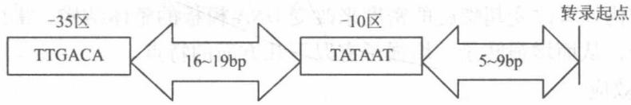

# 第3章 生物信息的传递(上)——从 DNA 到 RNA

——从 DNA 到 RNA

## 3.1 复习笔记

【知识概览】

RNA 的结构特点

RNA 概述

RNA的分类

mRNA、tRNA 和 rRNA 的结构

RNA 合成的特点

DNA 复制和转录的比较

转录的概述

与转录有关的重要概念

原核生物 RNA 聚合酶

RNA 聚合酶

真核生物 RNA 聚合酶

启动子的定义

原核生物启动子

启动子与增强子

启动子区的结构特点。

真核生物启动子从 DNA 到 RNA增强子

转录的过程

原核生物的转录过程

真核生物的转录过程

DNA 模板功能抑制剂

转录的抑制。

RNA 聚合酶抑制剂

嘌呤和嘧啶类似物

原核生物与真核生物转录的比较

原核生物与真核生物 mRNA 的特征比较

真核生物 tRNA 前体的转录后加工

真核生物 RNA 的转录后加工

真核生物 rRNA 前体的转录后加工

真核生物 mRNA 的剪接

RNA 的编辑、再编码和化学修饰

核酶

## 【重难点归纳】

## 一、RNA 概述

## 1. RNA 的结构特点

RNA 通常为单链线性分子，可自身回折形成局部双螺旋进而折叠形成复杂的三级结构，如"假结"通常使 RNA 形成大量的三级结构。除 tRNA 以外，几乎全部细胞中的 RNA 都与蛋白质形成核蛋白复合物。自然界也广泛存在环状 RNA，它们能通过不同的途径影响基因的表达。

表 3-1 细胞内的 RNA 种类及功能

<table><tr><td>名称</td><td>分布</td><td>功能</td></tr><tr><td>信使 RNA(mRNA)</td><td>所有生物</td><td>携带 DNA 的遗传信息,作为蛋白质合成的模板</td></tr><tr><td>核糖体 RNA(rRNA)</td><td>所有生物</td><td>组成蛋白质合成的场所——核糖体</td></tr><tr><td>转运 RNA(tRNA)</td><td>所有生物</td><td>运输氨基酸到多肽链中,具有解译作用</td></tr><tr><td>前体 mRNA/不均一核 RNA(hnRNA)</td><td>仅真核生物</td><td>原始转录产物,为成熟 mRNA 的前体</td></tr><tr><td>核内小 RNA(snRNA)</td><td>仅真核生物</td><td>在前体 mRNA 的加工中,参与去除内含子</td></tr><tr><td>细胞质小 RNA(scRNA)</td><td>仅真核生物</td><td>在蛋白质合成过程中起作用</td></tr><tr><td>核仁小 RNA(snoRNA)</td><td>仅真核生物</td><td>参与 rRNA 及其他 RNA 的加工、修饰和成熟</td></tr><tr><td>转运-信使 RNA(tmRNA)</td><td>仅细菌</td><td>在反式翻译模式过程中发挥重要作用</td></tr></table>

## 3. mRNA、tRNA 和 rRNA 的结构

表 3-2 mRNA、tRNA 和 rRNA 的结构

<table><tr><td>RNA</td><td>结构</td></tr><tr><td>mRNA</td><td>真核细胞 mRNA 5&#x27;端有帽子结构,3&#x27;端一般都有多聚腺苷酸尾巴结构;原核生物 mRNA 为多顺反子,由编码区、位于 AUG 之前的 5&#x27;端上游非编码区以及位于终止密码子之后的 3&#x27;端下游非编码区组成,5&#x27;端无帽子结构,3&#x27;端无或仅有较短 poly(A)</td></tr><tr><td>tRNA</td><td>一级结构的 3&#x27;端都为 CCA,5&#x27;端大多数为 pG,少数为 pC;二级结构为“三叶草”形,具有四环(二氢尿嘧啶环、反密码子环、TψC 环、额外环)、一氨基酸臂;三级结构为倒 L 形</td></tr><tr><td>rRNA</td><td>rRNA 通常与蛋白质一起构成核蛋白体,作为蛋白质生物合成的场所;原核生物中有 3 种,分别为 5S rRNA,16S rRNA,23S rRNA;真核生物中有 4 种,分别为 5S rRNA,5.8S rRNA,18S rRNA,28S rRNA</td></tr></table>

## 二、转录的概述

转录是指以 DNA 的一条链为模板，按照碱基互补配对原则，在 RNA 聚合酶催化下合成一条与 DNA 链的一定区段互补的 RNA 链的过程，是基因表达的核心步骤。

## 1. RNA 合成的特点

①合成方向为 $5'\rightarrow3'$ ，以 DNA 双链中的模板链为模板。

②需 RNA 聚合酶。

③原料为4种三磷酸核苷(NTPs)。

④根据碱基配对原则，各核苷酸间通过形成磷酸二酯键相连。

⑤不需要引物的参与。

⑥合成的 RNA 带有与 DNA 编码链相同的序列(A-U 配对)。

## 2. DNA 复制和转录的比较

表 3-3 DNA 复制和转录的比较

<table><tr><td colspan="2">项目</td><td>复制</td><td>转录</td></tr><tr><td rowspan="8">不同</td><td>模板</td><td>两股链均复制全部基因都复制</td><td>模板链转录(不对称转录)任一种细胞内仅部分基因转录</td></tr><tr><td>原料</td><td>dNTP(A、T、C、G)</td><td>NTP(A、U、C、G)</td></tr><tr><td>酶</td><td>DNA聚合酶和引物酶</td><td>RNA聚合酶</td></tr><tr><td>产物</td><td>模板半保留的子代双链DNA</td><td>mRNA、tRNA、rRNA</td></tr><tr><td>配对</td><td>A-T、G-C</td><td>A-U、T-A、G-C</td></tr><tr><td>引物</td><td>需要以RNA为引物</td><td>不需要</td></tr><tr><td>连续性</td><td>不连续,产生冈崎片段</td><td>连续</td></tr><tr><td>准确度</td><td>准确</td><td>缺乏严谨矫正机制</td></tr><tr><td>相同</td><td colspan="3">1都以DNA为模板;2聚合过程都是核苷酸之间生成磷酸二酯键;3都从5&#x27;→3&#x27;方向延长寡聚核苷酸链;4都遵从碱基互补配对规律</td></tr></table>

## 3. 与转录有关的重要概念

## (1) 不对称转录

不对称转录是指在转录过程中 DNA 双链分子，只有一条链按碱基互补配对规律指导转录生成 RNA，另一条链不转录。

## (2) 模板链与编码链

①模板链又称反义链，是指 DNA 双链中按碱基配对规律指导转录生成 RNA 的一股单链，是用于转录的链。

②编码链又称有义链，是指 DNA 双链中，与模板链相对应的另一条链。转录生成的 RNA 新链与有义链的碱基序列一样，只是以 U 代替 T。

## 4. RNA 聚合酶

(1) 原核生物 RNA 聚合酶(以大肠杆菌为例)

RNA 聚合酶全酶由核心酶和 $\sigma$ 因子构成。其中 $\sigma$ 因子与其他肽链结合不牢固，当 $\sigma$ 因子脱离全酶后，剩下的 $\alpha_{2}\beta\beta^{\prime}\omega$ 称核心酶。核心酶只能使已经开始合成的 RNA 链延长，不具有起始合成 RNA 的功能，转录的起始需要全酶，即还需要 $\sigma$ 因子（起始因子）。大肠杆菌 RNA 聚合酶的组成和功能如表 3-4 所示。

表 3-4 大肠杆菌 RNA 聚合酶组分

<table><tr><td>组分</td><td>亚基</td><td>亚基数目</td><td>功能</td></tr><tr><td rowspan="4">核心酶</td><td> $\alpha$ </td><td>2</td><td>与核心酶的组装及启动子识别有关</td></tr><tr><td> $\beta$ </td><td>1</td><td rowspan="2">结合核苷酸底物催化磷酸二酯键形成 $\left. \begin{array}{c} \\ \end{array}\right\}$ 催化中心结合 DNA 模板</td></tr><tr><td> $\beta'$ </td><td>1</td></tr><tr><td> $\omega$ </td><td>1</td><td>不详</td></tr><tr><td> $\sigma$ 因子</td><td> $\sigma$ </td><td>1</td><td>辨认起始位点,识别并结合不同的启动子</td></tr></table>

## (2) 真核生物 RNA 聚合酶

真核生物中存在 3 类 RNA 聚合酶，它们的分布和功能如表 3-5 所示。

表 3-5 真核生物 RNA 聚合酶

<table><tr><td>酶的种类</td><td>分布</td><td>转录产物</td><td>对 $\alpha$ -鹅膏蕈碱的敏感性</td></tr><tr><td>RNA聚合酶I</td><td>核仁</td><td>45S rRNA 的前体,经加工产生 5.8S rRNA、18S rRNA 和 28S rRNA</td><td>不敏感</td></tr><tr><td>RNA聚合酶II</td><td>核质</td><td>mRNA 的前体 hnRNA</td><td>敏感</td></tr><tr><td>RNA聚合酶III</td><td>核质</td><td>小的 RNA,包括 tRNA、5S rRNA 和 snRNA</td><td>存在物种特异性(例如动物细胞对高浓度敏感)</td></tr></table>

真核细胞中除了细胞核中含有 RNA 聚合酶之外，线粒体和叶绿体中还存在 RNA 聚合酶。线粒体 RNA 聚合酶只有一条多肽链，是已知最小的 RNA 聚合酶之一，聚合酶活性不受 $\alpha-$ 鹅膏蕈碱抑制。叶绿体 RNA 聚合酶由多个亚基组成，部分亚基由叶绿体基因编码，聚合酶活性也不受 $\alpha-$ 鹅膏蕈碱抑制。

## 三、启动子与增强子

## 1. 启动子的定义

启动子(promoter)是指能被 RNA 聚合酶识别结合并启动基因转录的一段 DNA 序列，位于结构基因 5' 端上游区，为基因转录起始所必需，是基因表达调控的上游顺式作用元件之一。

## 2. 启动子区的结构特点

## (1) 原核生物启动子

原核生物一个转录区段可视为一个转录单位，称为操纵子，包括若干个结构基因及其上游的调控序列。典型原核生物的启动子结构如图3-1所示。

  
图3-1 典型启动子结构

位于 -10bp 处的 TATA 区(保守序列是 TATAAT)，又称 Pribnow 框，和位于 -35bp 处的 TTGACA 区是大肠杆菌绝大部分启动子所拥有的共同序列，它们是 RNA 聚合酶与启动子的紧密结合位点，与 $\sigma$ 因子有很高的亲和力。-35 区与 -10 区之间的距离很重要，最佳距离是 16～19 碱基对，否则会降低启动子活性。

细菌中存在两种启动子突变：

①下降突变：Pribnow 区从 TATAAT 变成 AATAAT，这种改变会降低转录水平。

②上升突变：增加 Pribnow 区共同序列的同一性的突变，如 TATGTT 变为 TATATT 提高转录活性。

## (2) 真核生物启动子

真核生物有三种 RNA 聚合酶：RNA 聚合酶 I、RNA 聚合酶 II 和 RNA 聚合酶 III，与之对应的有三种启动子。

①RNA 聚合酶 I 的启动子(类别 I 启动子)

类别 I 启动子控制 rRNA 基因的转录，由两部分保守序列组成。

a. 核心启动子：在转录起点附近，位于 $-45 \sim +20$ 处。

b. 上游控制元件：能影响转录的频率，位于 $-180 \sim -107$ 处。

## ②RNA 聚合酶Ⅱ的启动子结构(类别Ⅱ启动子)

类别Ⅱ启动子涉及众多编码蛋白质的基因表达的调控，包括基本启动子、起始子、上游启动子元件(UPE)、应答元件。

## A. 基本启动子

序列中心在 -25 至 -30bp 左右的保守区，称为 TATA 盒（或称 Hogness 框），能保证 RNA 聚合酶Ⅱ转录正常起始，使转录精准起始。

## B. 起始子

位于转录起点位置处的一保守序列，DNA 在此解开并起始转录。核心启动子包括 TATA 盒和起始子。

## C. 上游启动子元件(UPE)

位于启动子上 TATA 区上游的保守序列，包括位于 -70 \~ -80bp 处的 CAAT 盒和位于 -80 \~ -110bp 处的 GC 盒。作用是控制转录起始频率，基本不参与起始位点的确定。

## D. 应答元件

应答元件能诱导调节产生的转录激活因子与靶基因上的应答元件结合。如热休克效应元件 HSE 的共有序列是 CNNGAANNTCCNNG，可被热休克因子 HSF 识别和作用；血清效应元件 SRE 的共有序列 CCATATTAGG，可被血清效应因子 SRF 识别和作用。

## ③RNA 聚合酶Ⅲ的启动子(类别Ⅲ启动子)

类别Ⅲ启动子为 RNA 聚合酶Ⅲ所识别，涉及一些小分子 RNA 的转录。

## 3. 增强子

增强子是指位于 DNA 上能结合反式作用因子，决定基因的时间和空间特异性表达，增强启动子转录活性的 DNA 序列，可位于转录起点的上游或下游。增强子通过影响染色质 DNA-蛋白质结构或者改变超螺旋的密度来改变 DNA 模板的整体结构，最终导致 RNA 聚合酶易与模板结合，从而增强转录。增强子有以下几方面的特点。

## (1) 远距离效应

增强子无论距离启动子多远的距离，均能增强启动子的转录。

## (2)无方向性

增强子的增强转录作用与其所处的位置和取向无关。

## (3) 顺式调节

只调节位于同一染色体上的靶基因，对其他染色体上的基因不起作用。

## (4)无基因的专一性

增强子的作用没有物种特异性，可在异源基因上发挥作用。

(5) 具有严密的组织和细胞特异性

增强子具有组织或细胞特异性，需要特定蛋白质的参与。

## (6)有相位性

增强子的作用和 DNA 的构象有关。

## (7) 某些增强子受外部信号的调控

增强子可在外部信号的刺激下被激活，例如可被类固醇类激素激活。

## 四、转录的过程

## 1. 原核生物的转录过程

## (1) 模板识别

模板识别阶段是指 RNA 聚合酶与启动子 DNA 双链相互作用并与之相结合的过程。

## (2)转录起始

转录起始是指 RNA 聚合酶结合在启动子上以后，使启动子附近的 DNA 双链解旋并解链，形成转录泡以促使底物核糖核苷酸与模板 DNA 的碱基配对，产生 RNA 链上第一个核苷酸键的过程。该过程不需要引物。转录的起始有以下几个步骤。

①RNA 聚合酶全酶与启动子可逆性形成闭合的二元启动子复合物。

②封闭复合物转变成开放复合物，聚合酶全酶所结合的 DNA 序列中有一小段双链被解开。

③开放复合物与最初的两个 NTP 相结合，并在这两个核苷酸之间形成磷酸二酯键后转变成包括 RNA 聚合酶、DNA 和新生 RNA 的三元复合物。

④新生 RNA 的三元复合物若合成并释放 2\~9 个核苷酸的短 RNA 转录物将形成流产式起始，导致转录重新开始；若转录物进一步延长则进入转录延伸阶段。

## (3)转录延伸

新生的 RNA 链成功延伸到 9～10 个核苷酸时， $\sigma$ 亚基脱落，RNA 聚合酶核心酶变构，RNA 聚合酶离开启动子，核心酶沿模板 DNA 链前移并使新生 RNA 链不断伸长。在核心酶作用下，以模板链作指导，按照碱基互补配对原则，NTP 不断聚合，使 RNA 链不断延长，形成 RNA-DNA 复合物。

## (4)转录终止

## ①转录终止过程

当 RNA 聚合酶核心酶沿模板 $5'\rightarrow3'$ 方向移动到终止信号区域时转录就终止，RNA-DNA 杂合物分离，DNA 恢复成双链状态，RNA 聚合酶和转录产物 RNA 链都从模板上释放出来。提供终止信号的 DNA 序列称为终止子。

## ②转录终止的分类

## A. 不依赖于 $\rho$ 因子的终止

内在终止子是指不依赖 $\rho$ 因子终止反应的、模板 DNA 上存在的终止转录的特殊信号。有两个结构特征：富含 G-C 的 IR 区形成的发夹结构；紧随 IR 后的富含 4\~6 个连续或不连续的 A 序列（转录产物的 3' 端为寡聚 U）。

新生 RNA 中出现发卡式结构会导致 RNA 聚合酶暂停，破坏 RNA-DNA 杂合双链 5' 端正常结构。寡聚 U 的存在使杂合链的 3' 端部分出现结合力较弱的 rU·dA 碱基对。上述两者的共同作用使 RNA 从三元转录复合物中解离出来。

## B. 依赖于 $\rho$ 因子的终止

ρ 因子具有 NTP 酶和解螺旋酶活性，能水解各种核苷酸三磷酸，促使转录三元复合物的解离，从而终止转录。ρ 因子结合在新生的 RNA 链上，借助水解 ATP 获得能量推动其沿着 RNA 链移动，但移动速度比 RNA 聚合酶慢，当 RNA 聚合酶遇到终止子时便发生暂停，ρ 因子得以赶上酶。ρ 因子与 RNA 聚合酶相互作用，导致 RNA 释放，三元复合物解体，转录完成。

## 2. 真核生物的转录过程

## (1) 转录起始

真核生物转录起始需要启动子、RNA 聚合酶和转录因子的参与。真核生物 RNA 聚合酶

不与 DNA 分子直接结合，需要转录因子识别并结合起始序列生成转录前起始复合体。

转录因子(TF)是指能直接或间接识别和结合启动子及其上游调节序列等顺式作用元件的蛋白质，其中直接或间接结合RNA聚合酶为转录前复合体装配所必需。表3-6列出了真核生物RNA聚合酶Ⅱ形成的转录起始复合物所需的转录因子。

表 3-6 RNA 聚合酶 II 形成的转录起始复合物所需的转录因子

<table><tr><td>转录因子</td><td>功能</td></tr><tr><td>TBP</td><td>即 TATA 结合蛋白,功能是与启动子 TATA 区相结合</td></tr><tr><td>TFIIA</td><td>稳定 TBP 和 TFII B 与启动子的结合</td></tr><tr><td>TFIIB</td><td>与 TBP 结合,吸引 RNA 聚合酶和 TFIIF 到启动区上</td></tr><tr><td>TFIID</td><td>与各种调控因子作用</td></tr><tr><td>TFIE</td><td>具有解旋酶和 ATP 酶活性,结合 TFIIH</td></tr><tr><td>TFIIF</td><td>促进与 RNA pol II 结合,并在 TFIIB 协助下阻止聚合酶与非特异性 DNA 序列结合</td></tr><tr><td>TFIHH</td><td>解螺旋酶,在启动区解开 DNA 双链,使 RNA 聚合酶磷酸化,易于核苷酸进行切除修复</td></tr></table>

## (2)转录延伸

与原核生物的类似，但没有转录与翻译同步的现象。需 RNA 聚合酶以及多种延伸因子。RNA 聚合酶前移遇上核小体，转录延长过程中有核小体移位和解聚现象。

## (3)转录终止

转录终止和加尾修饰同时进行。

## 五、转录的抑制

RNA 生物合成抑制剂是指能阻断、抑制或者干扰核酸的代谢过程，最终抑制转录的一类化合物。常见的转录抑制剂如表 3-7 所示。

## 1. DNA 模板功能抑制剂

通过与 DNA 结合而改变模板的功能。如放线菌素、烷化剂(如氮芥)和嵌入染料。

## 2. RNA 聚合酶抑制剂

某些抗生素或化学药物通过与 RNA 聚合酶结合而抑制其活性。如利福霉素、利迪链霉素和 $\alpha-$ 鹅膏蕈碱。

## 3. 嘌呤和嘧啶类似物

作为代谢拮抗物可直接抑制核苷酸合成的酶类，最终抑制核酸前体的合成。如5-氟尿嘧啶、6-巯基嘌呤等。

表 3-7 常见的转录抑制剂

<table><tr><td>转录抑制剂</td><td>种类</td><td>靶点</td><td>抑制作用</td></tr><tr><td>DNA模板功能抑制剂</td><td>放线菌素D</td><td>DNA模板</td><td>与DNA结合,阻止延伸</td></tr><tr><td colspan="2">嘌呤和嘧啶类似物(碱基类似物)</td><td>核苷酸</td><td>抑制和干扰核苷酸合成</td></tr><tr><td rowspan="3">RNA聚合酶抑制剂</td><td>利福霉素</td><td>细菌全酶</td><td>与β亚基结合,抑制起始</td></tr><tr><td>利迪链霉素</td><td>细菌核心酶</td><td>与β亚基结合,抑制起始</td></tr><tr><td>α-鹅膏蕈碱</td><td>真核RNA聚合酶II</td><td>与RNA聚合酶II结合</td></tr></table>

## 六、原核生物与真核生物转录的比较

表 3-8 原核生物与真核生物转录过程的区别

<table><tr><td>比较项目</td><td>原核生物</td><td>真核生物</td></tr><tr><td>时序性</td><td>无时序性,转录和翻译几乎同时进行,边转录边翻译</td><td>有严格的时序性,转录和翻译在时间和空间上彼此分开</td></tr><tr><td>转录产物类型</td><td>多顺反子mRNA</td><td>单顺反子mRNA</td></tr><tr><td>识别启动子的方式</td><td>RNA聚合酶本身</td><td>转录因子</td></tr><tr><td>转录后加工</td><td>无加工过程</td><td>复杂加工过程</td></tr><tr><td>RNA聚合酶差异</td><td>只有1种</td><td>3种以上参与</td></tr></table>

## 七、原核生物与真核生物 mRNA 的特征比较

表 3-9 原核生物与真核生物 mRNA 的特征比较

<table><tr><td></td><td>原核生物 mRNA</td><td>真核生物 mRNA</td></tr><tr><td rowspan="3">特征</td><td>mRNA 的半衰期短,其降解速度较快</td><td>编码功能蛋白的真核基因均通过 RNA 聚合酶II进行转录</td></tr><tr><td>多顺反子 mRNA</td><td>单顺反子 mRNA</td></tr><tr><td>有 SD 序列,5&#x27;端无帽子结构,3&#x27;端没有或只有较短的 poly(A)结构</td><td>无 SD 序列,5&#x27;端存在帽子结构,3&#x27;具有 poly(A)尾巴</td></tr></table>

真核生物 mRNA 结构上最大的的特征是 5' 端具有帽子结构及 3' 端具有 poly(A) 结构。

## 1. 帽子结构

原 mRNA 5' 端三磷酸腺苷(或鸟苷)脱去一个磷酸, 与 GTP 反应, 生成 $5'$ , $5'$ -三磷酸连接的键, 并释放出焦磷酸, 最后以 S-腺苷蛋氨酸(SAM)进行甲基化生成帽子结构。

## (1) 帽子结构的种类

①零类帽子(cap0)：仅一个甲基，仅形成7-甲基鸟苷三磷酸 $m^{7}Gppp$ 。

②1 类帽子(cap1)：有两个甲基，在 $m^{7}Gppp$ 之后的第 1 个核苷酸 $2^{\prime}-OH$ 也被甲基化，由 $2^{\prime}-O-$ 甲基转移酶催化，真核生物中以 cap1 为主。

③2 类帽子(cap2)：以带有 cap1 的 mRNA 为底物，mRNA 链上的原第 2 个核苷酸的 $2^{\prime}-OH$ 被甲基化，形成 cap2。

## (2) 帽子结构的功能

①防止 mRNA 被核酸酶降解，增强了 mRNA 分子的稳定性。

②识别真核细胞翻译的起始位点，从而促进蛋白质的合成，提高翻译效率。

## 2. poly(A)尾巴

poly(A)尾巴是在转录后由内切酶切开 mRNA 3' 端的特定部位，然后由 poly(A) 合成酶催化形成的多聚腺苷酸的结构。poly(A) 尾巴有以下几方面的功能。

①mRNA 由细胞核进入细胞质基质必须存在 poly(A) 结构，它增加了 mRNA 本身的稳定性。

②poly(A)维持 mRNA 作为翻译模板的活性。

## 八、真核生物 RNA 的转录后加工

## 1. 真核生物 tRNA 前体的转录后加工

(1)tRNA 内含子的特点

①长度和序列没有共同性，一般有16\~46个核苷酸；

②位于反密码子的下游；

③内含子和外显子间的边界没有保守序列。

(2)tRNA 的加工过程

①内含子剪接，RNaseP 切除 5'末端多余核苷酸，多种核酸内切酶和核酸外切酶切除 3'末端部分核苷酸。最后由 RNA 连接酶连接编码序列。

②在 tRNA 核苷酸转移酶的催化下在其 3' 端添加 CCA，增加蛋白质翻译的活性。

③核苷酸修饰，在 tRNA 甲基化酶的催化作用下催化分子中的核苷酸甲基化，使之成为稀有核苷酸。

## 2. 真核生物 rRNA 前体的转录后加工

rRNA 前体加工在核仁中进行，需 snoRNA 确定切割位点。哺乳动物细胞内 rRNA 的加工具体过程包括几个步骤。

①在 $5'$ 端切除非编码序列，生成 41S 中间产物；

②41S RNA 再被切割为 32S RNA 和 20S RNA;

③32S RNA 被剪切生成 28S rRNA 和 5.8S rRNA，20S RNA 被剪切生成 18S rRNA。

## 3. 真核生物 mRNA 的剪接

真核细胞 mRNA 在细胞核内产生后须经过一系列复杂的加工过程，具体过程如表 3-10 所示。

表 3-10 真核生物 mRNA 前体的加工

<table><tr><td>加工过程</td><td>参与的物质</td><td>加工后的生理功能</td></tr><tr><td>5&#x27;端加帽( $m^{7}Gppp$ )</td><td>磷酸水解酶、鸟苷酸转移酶、鸟嘌呤-7-甲基转移酶</td><td>保护mRNA的5&#x27;端免受核酸外切酶的降解;识别真核细胞翻译的起始位点等功能</td></tr><tr><td>3&#x27;末端加poly(A)尾</td><td>多聚腺苷酸化信号序列,蛋白质因子,核酸内切酶</td><td>防止核酸外切酶的作用,并稳定整个mRNA分子</td></tr><tr><td>剪接</td><td>不同的剪接类型具有不同催化机器,如表3-11所示</td><td>去除内含子,将相邻外显子连接起来,形成有功能的mRNA</td></tr><tr><td>内部甲基化</td><td>甲基转移酶</td><td>产生 $^{6}N$ -甲基腺嘌呤;表达出不同氨基酸序列的多种蛋白质</td></tr><tr><td>mRNA编辑</td><td>—</td><td>mRNA转录后通过碱基替换、缺失或插入,改变和扩大原来模板DNA的遗传信息,从而表达出不同氨基酸序列的多种蛋白质的过程</td></tr></table>

真核生物的基因组结构庞大，各种编码蛋白质的基因被内含子分隔开，因此转录后的mRNA还需要经过剪接去除内含子序列才能成为一个有功能的mRNA分子。

## (1) RNA 剪接的类型

表 3-11 RNA 剪接的三种类型及特点

<table><tr><td>类型</td><td>丰度</td><td>机制</td><td>催化机器</td></tr><tr><td>pre-mRNA剪接(GU-AG、AU-AC)</td><td>常见,适用于大多数真核基因</td><td>两步转酯反应,分支点为A</td><td>主要是剪接体</td></tr><tr><td>II类自剪接内含子</td><td>罕见,线粒体、叶绿体的mRNA基因</td><td>与pre-mRNA类似</td><td>内含子编码的核酶</td></tr><tr><td>I类自剪接内含子</td><td>罕见,线粒体、叶绿体及低等真核生物细胞核的rRNA基因</td><td>两步转酯反应,分支点为G</td><td>内含子编码的核酶</td></tr></table>

## (2) Pre - mRNA 剪接

## ①剪接位点

a. 细胞核 mRNA 前体内含子 5' 边界序列为 GU, 3' 边界序列为 AG, 形成保守序列, 称为 GU - AG 法则;

b. 3'端剪接位点 AG 前有一段富含嘧啶的序列(富 Py 区)以及 5'端有一保守序列(5' - GUPuAGU - 3');

c. 3'端上游18\~50个核苷酸处有一个"分支点"，此序列含A（绝对保守），且A中含2'—OH。

## ②剪接体

pre-mRNA 剪接作用中的转酯反应发生在剪接体中，剪接体是由细胞核小核糖核蛋白（snRNP）组成的大型复合体。snRNP 由几种蛋白质和一种 snRNA 组成，剪接体中共有 5 种 RNA，分别是 U1、U2、U4、U5 和 U6。每种 snRNP 的功能不同，在不同的时间段发挥不同的作用。snRNP 在剪接中的功能包括：识别 5' 剪接位点和分支点并按需集结这两个位点；催化或协助催化 RNA 的剪接和连接反应。

## ③剪接过程

a. U1snRNP 和 mRNA 前体 5'剪接位点进行特异性互补配对；

b. U2AF(U2 辅助因子，结合在剪接位点 3' 上游的富含嘧啶的序列) 和 3' 剪接位点特异性识别，引导 U2 snRNP 和分支点进行互补结合，组装成剪接前体；

c. U4、U5、U6 snRNP 三聚体和剪接前体结合进一步形成 60S 剪接体；

d. 60S 剪接体进行后续的剪接过程。

## ④剪接过程中的两步转酯反应

剪接过程是两次转酯反应，使得 mRNA 前体中原有的磷酸二酯键断裂，并形成新的磷酸二酯键。

a. 第一步转酯反应：位于分支点的腺苷酸的 $2^{\prime}-OH$ 作为亲核基团攻击 $5^{\prime}$ 剪接位点鸟苷酸的磷酰基团，游离出来的 $5^{\prime}$ 磷酸与分支点腺苷酸的 $2^{\prime}-OH$ 连接。

b. 第二步转酯反应：5'外显子2'—OH作为亲核基团，攻击3'剪接位点的磷酰基团，最终使得5'和3'外显子连接成一体，内含子以套索形式被释放。

## (3) 内含子的可变剪接(选择性剪接)

内含子的可变剪接是指有些基因的一个 mRNA 前体通过不同的剪接方式(选择不同的剪接位点)产生不同的 mRNA 剪接异构体的过程。可变剪接是调节基因表达和产生蛋白质组多样性的重要机制。

## 九、RNA 的编辑、再编码和化学修饰

## 1. RNA 的编辑

RNA 的编辑是 mRNA 前体的一种加工方式，通过碱基替换、删除或插入，改变和扩大原来模板 DNA 的遗传信息，从而表达出不同氨基酸序列的多种蛋白质。

(1) 介导 RNA 编辑的机制

①位点特异性脱氨基作用；

②尿苷酸的添加或缺失。

(2) RNA 编辑的生物学意义

起校正作用，调控翻译以及扩大遗传信息。

## 2. RNA 的再编码

## (1) RNA 的再编码

RNA 的再编码是指 RNA 编码和读码方式的改变，使得以不同的方式进行编码的过程。

## (2) 再编码的表现方式

包括：①核糖体程序性 +1/-1 移位；②核糖体跳跃；③终止子通读。

## 3. RNA 的化学修饰

前体 rRNA 和 tRNA 还存在特异性化学修饰，如甲基化、去氨基化、硫代、碱基同分异构化、二价键饱和化以及核苷酸的替代。RNA 的化学修饰可能具有位点特异性。

## 十、核酶

核酶(ribozyme)是指一类具有催化活性的 RNA 分子，其本质是核糖核酸，但却被赋予了酶的属性，它能催化靶位点 RNA 链中磷酸二酯键的断裂，特异性地剪切底物 RNA 分子，从而阻断基因表达。分为两种类型：剪切型核酶(只剪不接)和剪接型核酶。

## 3.2 课后习题详解

## 1. 什么是编码链？什么是模板链？

答：(1)编码链又称有义链，是指 DNA 双链中与 mRNA 的序列(在 RNA 中是以 U 取代了 DNA 中的 T)方向相同，不能充当转录模板的那条 DNA 链。编码链与另一条转录 RNA 分子的模板链互补。

(2) 模板链又称反义链，是指 DNA 双链中作为转录模板利用碱基互补配对原则指导 mRNA 前体合成的那条 DNA 链。在转录过程中，RNA 聚合酶与模板链结合，按照 $5'\rightarrow3'$ 方向催化 RNA 的合成。模板链与编码链互补。

## 2. 简述 RNA 的种类及其生物学意义

答：生物体内 RNA 的类型有信使 RNA(mRNA)、核糖体 RNA(rRNA)、转运 RNA(tRNA)、前体 mRNA、核内小 RNA(snRNA)、细胞质小 RNA(scRNA)、核仁小 RNA(snoRNA) 等，各自的生物学意义如表 3-1 所示。

## 3. 简述原核和真核生物 RNA 的结构特征

## 答: (1) RNA 的结构特征

①RNA 含有核糖和嘧啶，主要以单链线性形式存在于生物体内，其高级结构很复杂。

②RNA 可通过自身链的折叠，在局部形成双螺旋结构。RNA 有多种茎－环结构，如发夹结构、凸起结构或环结构；若 RNA 中碱基配对发生在不相邻序列中，则形成"假结"结构。

③RNA 中 A-U、G-C 配对，未配对的区域可形成凸起，也可自由旋转。RNA 碱基和核糖磷酸骨架之间的非常规相互作用可使 RNA 折叠成复杂的三级结构。

④自然界也广泛存在环状 RNA，它们能通过不同的途径影响基因的表达。

## (2) 原核和真核生物 RNA 的结构特征

常见的 RNA 主要包括 mRNA、tRNA 以及 rRNA，它们的结构特征如表 3-2 所示。

1. 简述 RNA 转录的概念及其基本过程。

## 答：(1)RNA转录的概念

转录是指以 DNA 的一条链为模板，在 RNA 聚合酶的作用下，依据碱基互补配对原则，合成一条与 DNA 模板链的一定区段互补的 RNA 链的过程，即遗传信息由 DNA 流向 RNA 的过程。

## (2) RNA 转录的基本过程

RNA 转录的基本过程包括模板识别、转录起始、转录的延伸和终止。

## ①模板识别

模板识别是指 RNA 聚合酶在 $\sigma$ 亚基引导下识别并结合到启动子上，然后 DNA 双链被局部解开，形成的解链区称为转录泡。解链仅发生在与 RNA 聚合酶结合的部位。

## ②转录起始

转录起始是指 RNA 聚合酶结合在启动子上以后，使启动子附近的 DNA 双链解旋并解链，形成转录泡以促使底物核糖核苷酸与模板 DNA 的碱基配对，产生 RNA 链上第一个核苷酸键，形成三元复合物。该过程不需要引物。

## ③转录延伸

当三元复合物中 RNA 长度达到 9～10 个核苷酸时， $\sigma$ 因子从全酶解离下来，进入延伸阶段。 $\sigma$ 亚基脱落，RNA 聚合酶核心酶变构，RNA 聚合酶离开启动子，核心酶沿模板 DNA 链前移并使新生 RNA 链不断伸长。在核心酶作用下，以模板链作指导，按照碱基互补配对原则，NTP 不断聚合，RNA 链不断延长，形成 RNA-DNA 复合物。

## ④转录终止

当 RNA 聚合酶核心酶沿模板 $5'\rightarrow3'$ 方向移动到终止信号区域时转录就终止，此时 RNA 聚合酶不再形成新的磷酸二酯键，RNA-DNA 杂合物分离，转录泡瓦解，DNA 恢复成双链状态，RNA 聚合酶和 RNA 链都从模板上释放出来。

## 5. 请说出复制与转录的异同点

答：复制与转录的异同点如表3-3所示。

## 6. 大肠杆菌的 RNA 聚合酶有哪些组成成分？各个亚基的作用是什么？

答：大肠杆菌 RNA 聚合酶首先由 2 个 α 亚基、1 个 β 亚基、1 个 β' 亚基和 1 个 ω 亚基组成核心酶，加上 1 个 σ 亚基后则成为聚合酶全酶。各个亚基的作用如表 3-4 所示。

## 7. 什么是封闭复合物、开放复合物以及三元复合物？

答：(1)封闭复合物，即闭合复合物，是指 RNA 聚合酶全酶与启动子可逆性结合组成的复合物。此时 DNA 处于双链状态，不能起始 RNA 的合成。

(2) 开放复合物, 又称开链复合物, 是指 RNA 聚合酶全酶所结合的 DNA 序列中有一小段双链被解开, 由闭合复合物不可逆转变形成的复合物。闭合复合物形成开链复合物的过程是一个快反应, 且不可逆, 开链复合物通常出现在转录的起始阶段。

(3)三元复合物是指由开链复合物与最初的两个NTP相结合并在这两个核苷酸之间形成磷酸二酯键，从而转变成包括RNA聚合酶、DNA和新生RNA的复合物。三元复合物可以进入两条不同的反应途径：流产式起始和连续性起始。

## 8. 简述 $\sigma$ 因子的作用

答： $\sigma$ 因子作为 RNA 聚合酶的辅助因子，其作用表现为以下几点：

(1)识别模板链的转录起始点。它是酶的别构效应物，使酶专一性识别模板链上的启动子。

(2) 可极大提高 RNA 聚合酶对启动子区 DNA 序列的亲和力。

(3) 极大降低 RNA 聚合酶与模板 DNA 上非特异性位点的亲和力。

## 9. 什么是 Pribnow Box? 它的保守序列是什么?

答：(1) Pribnow box(TATA box) 是原核生物中位于转录起始位点上游的一个由 5 个核苷酸组成的共同序列，是 RNA 聚合酶中 $\sigma$ 因子的结合位点，其中央大约位于起点上游 10bp 处，所以又称为 -10 区。其功能包括：

①有助于 DNA 局部的双链解开；

②与 RNA 聚合酶紧密结合；

③形成开放启动复合体；

④使转录精确地开始。

(2) Pribnow box 的保守序列是 TATAAT。

1. 说出真核与原核基因转录的异同。

答：真核与原核基因转录的异同点如表3-12所示。

表 3-12 真核生物与原核生物基因转录的异同

<table><tr><td rowspan="6">不同点</td><td>比较项目</td><td>真核生物</td><td>原核生物</td></tr><tr><td>时序性</td><td>有严格的时序性,转录和翻译在时间和空间上彼此分开</td><td>无时序性,转录和翻译几乎同时进行,边转录边翻译</td></tr><tr><td>转录产物类型</td><td>单顺反子mRNA</td><td>多顺反子mRNA</td></tr><tr><td>识别启动子的方式</td><td>转录因子</td><td>RNA聚合酶本身</td></tr><tr><td>转录后加工</td><td>复杂加工过程,需内含子剪接,修饰等</td><td>无加工过程</td></tr><tr><td>RNA聚合酶差异</td><td>3种以上参与</td><td>只有1种</td></tr><tr><td>相同点</td><td colspan="3">转录都是由DNA到RNA;都需要相关的酶系统;都有启动子、调控元件的作用等</td></tr></table>

1. 大肠杆菌的终止子有哪两大类？请分别介绍一下它们的结构特点。  
答：大肠杆菌存在两类终止子。

## (1) 不依赖于 $\rho$ 因子的终止子

即内在终止子，是指不依赖 $\rho$ 因子终止反应的、其模板 DNA 上原本存在的终止转录的特殊信号。其结构特点有：

①终止位点上游一般存在一个富含 GC 碱基的二重对称区，其转录产生的 RNA 容易形成发夹结构。

②在终止位点前面有一段由4\~8个A组成的序列，转录产物的3'端为寡U。

在新生 RNA 中出现发卡式结构会导致 RNA 聚合酶暂停，破坏 RNA-DNA 杂合双链 5' 端正常结构。寡聚 U 的存在使杂合链的 3' 端部分出现结合力较弱的 rU·dA 碱基对。上述两者的共同作用使 RNA 从三元转录复合物中解离出来。

## (2)依赖于 $\rho$ 因子的终止子

此终止子是指终止位点上缺乏共性，而且不能形成强的发夹结构来诱导转录的自发终止，需要 $\rho$ 因子辅助以终止转录的 DNA 序列。 $\rho$ 因子是一个由 6 个相同亚基组成的六聚体，具有 NTP 酶和解螺旋酶活性，能水解各种核苷酸三磷酸，促使转录三元复合物的解离，新生 RNA 链释放，从而终止转录。

## 12. 真核生物的原始转录产物必须经过哪些加工过程才能成为成熟 mRNA?

答: 真核生物的原始转录产物必须经过 4 种转录后的加工方式才能成为成熟的 mRNA。

## (1) $5^{\prime}$ 端加帽

转录产物的 5' 端通常要装上甲基化的帽子；有的转录产物 5' 端有多余的序列，则需切除后再装上帽子。帽子结构能保护 mRNA，避免 5' 端受核酸外切酶的作用而降解，同时在翻译过程中也起作用。

## (2) $3'$ 端加 poly(A) 尾巴

转录产物的 3' 端通常由 poly(A) 聚合酶催化加上一段多聚腺苷酸尾巴；有的转录产物的 3' 端有多余序列，则需切除后再加上尾巴。poly(A) 尾巴对于 mRNA 的成熟是十分必要的。

## (3) 修饰

mRNA 内部通常会出现甲基化，主要是在腺嘌呤 A6 位点上进行甲基的转移，产生 $^{6}$ N-甲基腺嘌呤，对 mRNA 前体的加工起识别作用。

## (4) 剪接

由于真核生物含有内含子结构，编码蛋白质的基因处于分割状态，因此需要通过剪接去除内含子，将相邻外显子连接起来，最终才能形成有功能的 mRNA。

## 13. 简述 I、II 类内含子的剪接特点

## 答：（1）Ⅰ类内含子的剪接特点

①转酯反应。剪接反应实际上发生了两次磷酸二酯键的转移。

a. 第一步转酯反应由一个游离的鸟苷或鸟苷酸(GMP、GDP或GTP)介导，其3'—OH作为亲核基团攻击内含子5'端的磷酸二酯键，从上游切开RNA链；

b. 在第二步转酯反应中，上游外显子的自由 $3^{\prime}-OH$ 作为亲核基团攻击内含子 $3^{\prime}$ 位核苷酸上的磷酸二酯键，使内含子被完全切开，上、下游两个外显子通过新的磷酸二酯键重新连接。

② I 类内含子剪切后释放出线性内含子，而不是一个套索状结构。

## (2) Ⅱ类内含子的剪接特点

①Ⅱ类内含子的转酯反应无需游离鸟苷酸或鸟苷，而是由内含子本身的靠近3'端的腺苷酸2'—OH作为亲核基团攻击内含子5'端的磷酸二酯键，从上游切开RNA链后形成套索状结构。再由上游外显子的自由3'—OH作为亲核基团攻击内含子3'位核苷酸上的磷酸二酯键，使内含子被完全切开，上、下游两个外显子通过新的磷酸二酯键重新连接。

②Ⅱ类内含子剪切后释放出套索状结构的内含子。

## 14. 什么是套索结构？哪些类型 RNA 的剪接中会形成该结构？

答：（1）套索结构是在真核生物 RNA 前体加工过程中，切除内含子时，通过 $2'$ ， $5'$ - 磷酸二酯键形成的一种带尾巴的环形中间结构。

(2)套索结构主要在前体 mRNA 的剪接及Ⅱ类自剪接内含子剪接过程中形成。

①真核生物前体 mRNA(hnRNA) 的剪接一般需 snRNA 参与构成的核蛋白体参加，通过形成套索状结构而将内含子切除掉。

②Ⅱ类自剪接内含子的转酯反应由内含子本身的靠近3'端的腺苷酸2'—OH作为亲核基团攻击内含子5'端的磷酸二酯键，从上游切开RNA链后形成套索状结构。上游外显子的自由3'—OH作为亲核基团攻击内含子3'位核苷酸上的磷酸二酯键，使内含子被完全切开，上、下游两个外显子通过新的磷酸二酯键重新连接。Ⅱ类自剪接内含子剪切后释放出套索状

结构的内含子。

## 15. 什么是 RNA 编辑？其生物学意义是什么？

答：(1) RNA 编辑的定义

RNA 编辑是一种 mRNA 前体的加工方式，是指 mRNA 转录后通过碱基替换、缺失或插入，改变和扩大原来模板 DNA 的遗传信息，从而表达出不同氨基酸序列的多种蛋白质的过程。

## (2) RNA 编辑的生物学意义

①校正作用：通过 RNA 的编辑作用使得有些基因在突变过程中丢失的遗传信息得以修复。

②调控翻译：通过编辑可以构建或去除起始密码子和终止密码子，这是基因表达调控的一种重要方式。

③扩充遗传信息：通过编辑能使基因产物获得新的结构和功能，有利于生物的进化，使生物更好地适应生存的环境。

## 16. 核酶具有哪些结构特点？核酶的生物学意义是什么？

## 答：(1)核酶的结构特点

核酶是指一类具有催化功能的 RNA 分子，本质是核糖核酸，但具有酶的属性，它能通过催化靶位点 RNA 链中磷酸二酯键的断裂，特异性地剪切底物 RNA 分子，从而阻断基因的表达。其结构特点包括：

①核酶具有较稳定的空间结构，不易受到 RNA 酶的攻击。

②能形成锤头结构。典型的锤头结构是由十几个保守的核苷酸和茎构成，而茎区是由互补碱基构成的局部双链结构所形成的茎状结构，其中还包括一个保守核苷酸构成的催化中心。

③能形成发夹结构。

(2)核酶的生物学意义

①核酶为生物催化剂，具有重要的生物学意义。

②打破了传统上认为的酶是蛋白质的观念。

③在生命起源问题上，为先有核酸的假说提供了依据。

④为破坏有害基因、治疗肿瘤等疾病提供手段。

## 3.3 名校考研真题详解

## 一、选择题

1. 原核生物 RNA 聚合酶全酶中，参与识别转录起始信号的因子是( )。[中国计量大学 2019 研]
A. α B. β C. β' D. σ

【答案】D

【解析】原核生物 RNA 聚合酶全酶由核心酶和 $\sigma$ 因子构成。转录的起始需要全酶，由 $\sigma$ 因子（起始因子）参与识别转录起始信号。因此答案选 D。

1. 下列关于 DNA 复制与转录过程的描述，其中错误的是( )。[中国计量大学 2019 研]
A. 体内只有模板链转录，而两条 DNA 链都能复制
B. 在两个过程中，新链合成方向均为 $5' \rightarrow 3'$ C. 在两个过程中，新链合成均需要 RNA 引物

D. 在两个过程中，所需原料不同，催化酶也不同【答案】C

【解析】DNA复制过程由于DNA聚合酶不能从起始开始合成DNA新链，因此需要一段RNA引物，而转录过程不需要引物。因此答案选C。3.下列哪一个不是真核生物的顺式作用元件？（）[扬州大学2018研]A.TATA盒 B.Pribnow盒 C.CAAT盒 D.GC盒

【解析】顺式作用元件是指启动子和基因的调节序列，主要包括启动子、增强子和沉默子等。A项，TATA盒又称Hogness区，是构成真核生物启动子的元件之一。CD两项，CAAT盒和GC盒(GGGCGG)为上游启动子元件的组成部分。ACD三项均属于真核生物的顺式作用元件。B项，Pribnow盒为原核生物中的启动序列。因此答案选B。

1. 稀有核苷酸含量最高的核酸是( )。[南京林业大学2017研]

A. rRNA B. mRNA C. tRNA D. DNA

【答案】C

【解析】tRNA 分子是所有 RNA 分子中所含稀有核苷酸最多的 RNA 分子，其修饰很频繁。因此答案选 C。

1. 真核生物基因转录过程中，首先结合于 TATA 序列的转录起始复合物因子是（）。[浙江工业大学 2017 研]

A. TFⅡD B. TFⅡA C. TFⅡE D. TFⅡH

【答案】A

【解析】真核生物基因转录过程中，转录因子和 RNA 聚合酶Ⅱ必须以特定的顺序结合到启动子序列上。形成转录起始复合物的第一步是 TFⅡD 与启动子核心元件 TATA 序列相结合，RNA 聚合酶Ⅱ、TFⅡA、TFⅡB 等才能依次结合。

1. 催化真核细胞 rRNA 转录的 RNA 聚合酶是( )。[电子科技大学 2015 研]

A. RNA 聚合酶 I

B. RNA 聚合酶 II

C. RNA 聚合酶 III

D. RNA 聚合酶 I 和 III

【答案】D

【解析】RNA 聚合酶 I 存在于细胞核的核仁中，转录产物是 45S rRNA 前体，经剪接修饰后生成除 5S rRNA 外的各种 rRNA。RNA 聚合酶Ⅲ位于细胞核质内，催化的主要转录产物是 tRNA、5S rRNA、snRNA。RNA 聚合酶 II 转录的产物是 mRNA 的前体 hnRNA。因此答案选 D。

【答案】C

【解析】核内不均一 RNA(hnRNA) 是由 DNA 转录生成的初级转录产物，经剪接加工后可生成 mRNA。因此答案选 C。

1. 在前体 mRNA 上加多腺苷酸尾巴()。[浙江工业大学 2008 研；河北大学 2014 研]

A. 涉及两步转酯反应机制

B. 需要保守的 AAUAAA 序列

C. 在 AAUAAA 序列被转录后立即加尾

D. 由依赖于模板的 RNA 聚合酶催化

【答案】B

【解析】几乎所有真核基因的3'末端转录终止位点上游15\~30bp处的保守序列AAUAAA对于初级转录产物的精确切割以及加上多聚腺苷酸尾巴是必需的。因此答案选B。

1. 原核生物基因转录终止子在终止点前均有( )。[军事医学科学院 2011 研；华南理工大学 2014 研]
A. 回文结构 B. 多聚 A 序列 C. TATA 序列 D. 多聚 T 序列

【答案】A

【解析】终止子的共同顺序特征是在转录终止点之前有一段回文序列，约7～20核苷酸对。回文序列的两个重复部分由几个不重复节段隔开，对称轴一般距转录终止点16～24bp。因此答案选A。

1. 真核生物 RNA 聚合酶Ⅲ的功能是( )。[湖南农业大学 2012 研]
A. 转录 mRNA
B. 只转录 tRNA 和 5S rRNA 等小 rRNA 基因
C. 只转录 rRNA 基因
D. 转录多种基因

【答案】B

【解析】RNA 聚合酶Ⅲ定位于核质，催化转录产生 tRNA 和 5S rRNA 等小 rRNA 基因。RNA 聚合酶 I 定位于核仁，其转录产物是 45S rRNA 前体，经剪接修饰后生成除 5S rRNA 外的各种 rRNA。RNA 聚合酶 II 定位于核质，催化转录主要产生 hnRNA（mRNA 前体）。因此答案选 B。

1. 真核生物 RNA 聚合酶Ⅱ的功能是( )。[湖南农业大学 2012 研]
A. 转录 tRNA 和 5S rRNA
B. 只转录 rRNA 基因
C. 转录蛋白质基因和部分 snRNA 基因
D. 转录多种基因

【答案】C

【解析】A 项，RNA 聚合酶Ⅲ定位于核质，催化转录产生 tRNA 和 5S rRNA。B 项，RNA 聚合酶 I 定位于核仁，其转录产物是 45S rRNA 前体，经剪接修饰后生成除 5S rRNA 外的各种 rRNA。C 项，RNA 聚合酶Ⅱ定位于核质，催化转录产生 hnRNA（mRNA 前体），此外还有部分 snRNA。D 项，真核生物中存在 3 类 RNA 聚合酶，在细胞核中负责转录的基因不同。因此答案选 C。

1. 以下对 DNA 聚合酶和 RNA 聚合酶的叙述中，正确的是( )。[电子科技大学 2012 研]
A. RNA 聚合酶的作用需要引物
B. RNA 聚合酶用 dNTP 作原料
C. DNA 聚合酶能以 RNA 作模板合成 DNA
D. 两种酶催化新链的延伸方向都是 $5' \rightarrow 3'$

【答案】D

【解析】DNA 复制需要 DNA 聚合酶，DNA 聚合酶以 DNA 为模板，以四种 dNTP 作为底物，催化 DNA 新链以 $5'\rightarrow3'$ 方向不断延长，DNA 复制过程中需要引物的存在；RNA 转录需要 RNA 聚合酶，以四种 NTP 为原料，催化 RNA 新链以 $5'\rightarrow3'$ 方向不断延长，转录过程不需要 RNA 引物的存在。两种酶催化新链的延伸方向都是 $5'\rightarrow3'$ ，因此答案选 D。

1. $\alpha-$ 鹅膏蕈碱如何影响转录？（）[中国海洋大学2012研]A.它抑制原核生物RNA聚合酶B.它主要抑制真核生物RNA聚合酶II

C. 它主要抑制真核生物 RNA 聚合酶 I

D. 它既抑制原核生物又抑制真核生物 RNA 的合成

【答案】B

【解析】α-鹅膏蕈碱对真核生物 RNA 聚合酶Ⅱ非常敏感，低浓度即可抑制 RNA 聚合酶Ⅱ。α-鹅膏蕈碱与 RNA 聚合酶Ⅱ进行特异性结合，从而抑制磷酸二酯键的形成（RNA 链合成的起始和延长）。因此答案选 B。

1. 在正常生长条件下，某一细菌基因的启动子-10序列由TCGACT突变为TATACT，由此引起该基因转录水平的变化，以下哪一种描述是正确的？（）[南京大学2008研]A.该基因的转录增加 B.该基因的转录减少C.该基因的转录不能正常进行 D.该基因的转录没有变化

【解析】细菌中启动子突变有两种：下降突变和上升突变。把 Pribnow 区从 TATAAT 变成 AATAAT，会大大降低其结构基因的转录水平，造成下降突变；而增加 Pribnow 区共同序列的同一性就会增加基因转录水平。故由 TCGACT 突变为 TATACT 可以提高基因的转录水平。因此答案选 A。

1. 原核生物基因启动子中 -10 区与 -35 区的最佳距离是( )。[中山大学 2008 研]
A. <15bp B. 16\~19bp C. 20bp D. >20bp

【答案】B

【解析】在原核生物中，-10区与-35区之间的距离是 $16\sim 19\mathrm{bp}$ ，小于15bp或者大于20bp都会降低启动子的活性。因此答案选B。16. TATA框存在于（ ）。[浙江工业大学2008研]A. 聚合酶Ⅱ识别的所有启动子中 B. 聚合酶Ⅱ识别的大部分启动子中C. 聚合酶Ⅲ识别的所有启动子中 D. 聚合酶Ⅲ识别的大部分启动子中【答案】B

【解析】多数真核生物基因启动子在 $-25 \sim -30$ 区都含有TATA序列，是聚合酶Ⅱ的识别序列。因此答案选B。

17.（）是通常与其调控的基因具有一段距离的DNA顺式作用元件。[南京航空航天大学2007研]

A. 启动子 B. 终止子 C. 增强子 D. 调节子

【答案】C

【解析】顺式作用元件是指存在于基因旁侧序列中能够影响基因表达的序列，包括启动子、增强子、调控序列和可诱导元件等，其中增强子一般位于上游-200bp处，与其调控的基因具有一段距离，但是增强子所处的位置并不影响其增强启动子的转录作用。因此答案选C。

18.（多选）RNA聚合酶的核心酶由以下哪些亚基组成？（ ）[重庆大学2012研]A. $\alpha$ B. $\sigma$ C. $\beta$ D. $\beta^{\prime}$ E. $\delta$

【答案】ACD

【解析】大多数原核生物 RNA 聚合酶的组成是相同的，大肠杆菌 RNA 聚合酶的核心酶由 2 个 α 亚基、1 个 β 亚基、1 个 β' 亚基和 1 个 ω 亚基组成，加上 1 个 σ 亚基后则成为聚合酶全酶，即 α₂ββ'ωσ。因此答案选 ACD。

## 二、填空题

1. 真核生物中具有三类 RNA 聚合酶，其中负责 mRNA、tRNA 和大多数 rRNA 转录的分别为 \_\_\_\_、\_\_\_\_、和 \_\_\_\_。[中国计量大学 2019 研]

【答案】RNA 聚合酶Ⅱ；RNA 聚合酶Ⅲ；RNA 聚合酶Ⅰ

【解析】RNA 聚合酶 I 存在于细胞核的核仁中，转录产物是 45S rRNA 前体，经剪接修饰后生成除 5S rRNA 外的各种 rRNA。RNA 聚合酶Ⅲ位于细胞核质内，催化的主要转录产物是 tRNA、5S rRNA、snRNA。RNA 聚合酶Ⅱ转录的产物主要是 mRNA 的前体 hnRNA。

1. 真核 mRNA 剪接位点是 5' / \_\_\_\_ - \_\_\_\_ / 3'，参与真核 mRNA 剪接的蛋白因子有 U1、U2、\_\_\_\_、\_\_\_\_、U6 五种 snRNP 蛋白和 \_\_\_\_。[中国计量大学 2018 研]

【答案】GU；AG；U4；U5；其他非 snRNP 蛋白因子

【解析】多数细胞核 mRNA 前体内含子的 5' 边界序列为 GU，3' 边界序列为 AG。这些序列结构是产生 mRNA 前体剪接的信号。剪接复合体是一个由小核糖核蛋白颗粒（包括 U1、U2、U4、U5 和 U6 及其他非 snRNP 蛋白因子）组成的庞大复合体。

1. 能形成 DNA-RNA 杂交分子的生物合成过程有\_\_\_\_、\_\_\_\_，形成的分子基础是\_\_\_\_。[电子科技大学 2016 研]

【答案】转录；逆转录；碱基互补配对

1. 大肠杆菌 RNA 聚合酶全酶由\_\_\_\_和\_\_\_\_组成。[西北农林科技大学 2015 研]

【答案】核心酶( $\alpha_{2}\beta\beta^{\prime}\omega$ ); $\sigma$ 亚基

【解析】大肠杆菌 RNA 聚合酶的核心酶由 2 个 $\alpha$ 亚基、1 个 $\beta$ 亚基、1 个 $\beta'$ 亚基和 1 个 $\omega$ 亚基组成，即 $\alpha_{2}\beta\beta'\omega$ ，加上 1 个 $\sigma$ 亚基后则成为聚合酶全酶。

1. 真核生物 mRNA 的 5'末端具有\_\_\_\_结构，它是由\_\_\_\_催化产生的；而真核生物 mRNA 的 3'末端通常具有\_\_\_\_。[河北大学 2012、2014 研]

【答案】帽子；鸟苷酸转移酶；poly(A)尾巴

1. 转录分为\_\_\_\_、\_\_\_\_、\_\_\_\_三个过程，在第一阶段包括：模板识别、形成闭合复合物、\_\_\_\_、形成开放复合物、RNA链合成与\_\_\_\_。[电子科技大学2013研]

【答案】起始；延伸；终止；DNA 解链；启动子清除

1. 大肠杆菌转录起始过程需要 RNA 聚合酶全酶，其中 \_\_\_\_ 因子辨认起始点，而 β 亚基和 \_\_\_\_ 亚基组成了催化中心。转录的终止反映在 \_\_\_\_ 。[中国科学院研究生院 2012 研]

【答案】 $\sigma;\beta^{\prime}$ ; 终止子

1. 真核生物 mRNA 的转录后加工主要包括 \_\_\_\_、\_\_\_\_、\_\_\_\_ 等方面。[山东理工大学 2008 研；湖南农业大学 2011 研]

【答案】5'末端加帽；3'端加尾；内含子的剪接

【解析】真核生物转录生成的 mRNA 要经过较复杂的加工过程。包括：①5'末端加帽；②3'端加尾；③剪接去除内含子并连接外显子；④核苷酸编辑；⑤甲基化修饰等等。

1. 真核生物 tRNA 的成熟过程中需要通过拼接去除内含子, 这个过程需要\_\_\_\_和\_\_\_\_两种酶。[南京大学 2008 研]

【答案】核酸内切酶；连接酶

【解析】tRNA 前体的加工包括：①在核酸内切酶 RNaseP 作用下，从 5'末端切除多余的核苷酸；②在核酸外切酶 RNaseD 作用下，从 3'末端切除多余的核苷酸；③由核苷酸转移酶催化，3'末端加 CCA—OH；④核酸内切酶催化进行剪切反应，剪掉内含子，由连接酶连接外显子部分；⑤化学修饰作用，如甲基化、脱氨基、还原反应等。

1. RNA 聚合酶在链延伸前会合成几段小于 10 个碱基的 RNA 短链，这一现象称为 \_\_\_\_。[中国科学技术大学 2005 研]

## 【答案】流产式转录起始

【解析】转录起始复合物合成并释放2\~9个核苷酸的短RNA转录物，即流产式转录起始。转录起始后直到形成9个核苷酸短链的过程是通过启动子阶段，此时RNA聚合酶一直处于启动子区，新生的RNA链与模板DNA链的结合不牢固，很容易从DNA链上掉下来并导致转录重新开始。

## 三、判断题

1. 转录过程中 RNA 聚合酶需要引物。（）[中国科学院大学 2013 研]

## 【答案】错

【解析】RNA 聚合酶主要以双链 DNA 为模板，以 4 种核苷三磷酸作为活性前体，并以 $Mg^{2+}/Mn^{2+}$ 为辅助因子，催化 RNA 链的起始、延伸和终止，它不需要任何引物，催化生成的产物是与 DNA 模板链相互补的 RNA。

1. 动物细胞中线粒体有自己的基因组，其编码基因可以在线粒体中完成转录和翻译过程。（）[浙江大学2010研]

## 【答案】错

【解析】线粒体内基因的转录可以在线粒体内完成，但是由于线粒体内的酶不完全，翻译有一部分只能在线粒体外完成。

1. 核酶主要是指在细胞核中的酶类。（）[华南理工大学2008研]

## 【答案】错

【解析】核酶是指一类具有催化功能的 RNA 分子。其本质是核糖核酸，但却具有酶的催化能力，它能催化靶位点 RNA 链中磷酸二酯键的断裂，特异性地剪切底物 RNA 分子，从而阻断基因的表达。

1. 细胞质中 mRNA 的 poly(A) 长度通常比细胞核中 mRNA 的 poly(A) 长度要短。
( ) [中山大学 2008 研]

## 【答案】对

【解析】转录生成的 mRNA 前体需要在细胞核中进行剪接等加工修饰才能成为成熟的 mRNA，释放到胞质中。

1. 原核生物强终止子结构为富含 GC 碱基的发夹 + poly U 链，若 poly U 突变为 poly C，则转录终止效率提高。（）[华东理工大学 2007 研]

## 【答案】错

【解析】原核生物强终止子结构为富含 GC 碱基的发夹 + poly(A) 链，若 poly(A) 突变为 poly(C)，则转录终止效率明显降低。

1. 所有高等真核生物的启动子中都有 TATA 盒。（）[华中科技大学 2005 研]

## 【答案】错

【解析】真核生物中，并不是每个基因的启动子区都包含 TATA 区、CAAT 区和 GC 区这 3 种保守序列，如 SV40 的早期基因，缺少 TATA 区和 CAAT 区，只含有串联在上游 -40 \~ -110 位点的 GC 区。

## 四、名词解释题

## 1. Circular RNA[暨南大学2019研]

答：Circular RNA(circRNA)的中文名称是环状RNA，是一类不具有5'末端帽子和3'末端poly(A)尾巴、以共价键形成闭合环状结构的非编码RNA分子。circRNA大量存在于真核转录组中。大多数circRNA是由外显子序列构成。由于环状RNA对核酸酶不敏感，所以比线性RNA更为稳定，这使得环状RNA在作为新型临床诊断标记物的开发应用上具有明显优势。近年研究表明circRNA富含微RNA(miRNA)结合位点，起miRNA海绵的作用，解除miRNA对其靶基因的抑制作用，提高靶基因的表达水平。

## 2. 增强子[中国计量大学 2019 研]

答：增强子是指位于 DNA 上能结合反式作用因子，决定基因的时间和空间特异性表达，增强启动子转录活性的 DNA 序列，可位于转录起点的上游或下游。增强子通过影响染色质 DNA-蛋白质结构或者改变超螺旋的密度来改变 DNA 模板的整体结构，最终导致 RNA 聚合酶易与模板结合增强转录。

## 3. TATA box[浙江工业大学2019研]

答：TATA box 又称 Pribnow box，是原核生物中位于转录起始位点上游的一个由 5 个核苷酸组成的共同序列，是 RNA 聚合酶中 $\sigma$ 因子的结合位点，其中央大约位于起点上游 10bp 处，所以又称为 -10 区。

## 4. RNA splicing[宁波大学2019研]

答：RNA splicing 的中文名称是 RNA 剪接，是指从 mRNA 前体分子中切除内含子的非编码序列，并使基因中外显子的编码区拼接形成成熟 mRNA 的过程。

## 5. RNA 甲基化[暨南大学 2018 研]

答：RNA 甲基化是指在生物体内甲基化酶、去甲基化酶和甲基识别酶等作用下，在 RNA 特定的碱基上进行甲基修饰的过程。RNA 甲基化参与了多种生物学过程，如干细胞分化、生物节律等，同时也参与了多种疾病的发生，包括肿瘤、肥胖和不育等。RNA 甲基化修饰类型很多，目前最热门的有三种，分别是 $m^{6}A$ RNA 甲基化（是最常见、最丰富的真核生物 mRNA 转录后修饰）、 $m^{5}C$ RNA 甲基化（在 tRNA 及 rRNA 高丰度存在的甲基化修饰）以及 $m^{1}A$ RNA 甲基化。

## 6. 上游启动子元件[暨南大学2014研；浙江工业大学2018研]

答：上游启动子元件又称上游激活序列，是指真核生物 TATA 区上游的保守序列，包括位于 -70 \~ -80bp 处的 CAAT 盒和位于 -80 \~ -110bp 处的 GC 盒。作用是控制转录起始频率，基本不参与起始位点的确定。

## 7. self-splicing[武汉大学2017研]

答：self-splicing 的中文名称是自我剪接，是指具有自我催化能力，将自身的某些部位切除的现象。在酵母和真菌的线粒体 mRNA 和 tRNA 前体加工、叶绿体的 tRNA 和 rRNA 前体加工、某些细菌病毒的 mRNA 前体加工中都有自我剪接现象。例如内含子的自我剪接有两种类型：Ⅰ类自剪接内含子和Ⅱ类自剪接内含子。

## 8. 内在终止子[天津大学2017研]

答：内在终止子是指不依赖 $\rho$ 因子终止反应的、模板 DNA 上存在的具有终止转录的特殊信号。它有两个结构特征：一是富含 G-C 的 IR 区 (7～20nt) 形成的发夹结构；二是紧随 IR 后的富含 4～6 个连续或不连续的 A 序列（转录产物的 3' 端为寡聚 U）。在新生 RNA 中出现发卡式结构会导致 RNA 聚合酶暂停，破坏 RNA-DNA 杂合双链 5' 端正常结构。寡聚 U 的存在使杂合链的 3' 端部分出现结合力较弱的 rU·dA 碱基对。上述两者的共同作用使转录终止。

## 9. 剪接体[浙江大学 2017 研]

答：剪接体是由核小核糖核蛋白(snRNP)组成的大小为60S的介导RNA剪接反应的巨型复合体。snRNP含有多种蛋白质和5种RNA(U1、U2、U4、U5和U6)。每种snRNP的功能不同，在不同的时间段发挥不同的作用。剪接体可以发生剪接作用。

## 10. 编码链(coding strand)[河北大学2017研]

答：编码链(coding strand)又称有意义链，与另一条转录RNA分子的模板链互补。编码链不能进行转录，其序列与转录初级产物mRNA相同，只是mRNA中的U(尿嘧啶)组成与编码链中的T(胸腺嘧啶)组成有区别。

## 11. 回文序列[江苏大学2016研]

答：回文序列是双链 DNA 中的一段倒置重复序列，当该序列的双链被打开后，可形成发夹或茎环结构。回文序列和转录终止有关。短的回文结构可能是一种特别的信号，常是限制性内切酶的酶切位点。回文序列广泛存在于各种生物体基因组中。它可以在质粒、病毒和细菌基因组 DNA 以及真核生物染色体和细胞器中找到，并且广泛分布于人类癌细胞中。

## 12. 逆转录[重庆大学 2015 研]

答：逆转录是指以单链 RNA 为模板合成双链 DNA 的过程，即 RNA 指导下的 DNA 合成。此过程与遗传信息转录的流动方向（DNA 到 RNA）相反，故称为逆转录。逆转录过程是 RNA 病毒的复制形式之一，需逆转录酶的催化。

1. Promoter[南开大学2011研；武汉大学2015研]；启动子[电子科技大学2013研；暨南大学2019研]

答：Promoter 的中文名称为启动子，是指一段位于转录起始位点 5' 端上游区大约 100 \~ 200bp 以内的具有独立功能的 DNA 序列。它能活化 RNA 聚合酶，使之与模板 DNA 准确结合并具有转录起始的特异性。启动子是与基因表达起始相关的顺式作用元件，是结构基因的重要成分。

## 14. GU-AG 法则 [北京科技大学 2014 研；电子科技大学 2015 研]

答：多数细胞核 mRNA 前体中内含子的两端边界存在共同序列，其中内含子的 5' 边界序列为 GU，3' 边界序列为 AG，这种保守序列模式称为 GU-AG 法则，又称 Chambon 法则。这种保守序列模式决定了剪接发生的位点。

## 15. Alternative splicing[武汉大学 2015 研]

答：Alternative splicing 的中文名称为选择性剪接，又称可变剪接或变位剪接，是指有些基因的一个 mRNA 前体通过不同的剪接方式（选择不同的剪接位点）产生不同的 mRNA 剪接异构体的过程。可变剪接是调节基因表达和产生蛋白质组多样性的重要机制。

## 16. 顺式作用元件[电子科技大学2013、2015研]

答：顺式作用元件是指存在于基因旁侧序列中能影响基因表达的序列，主要包括启动子、增强子、调控序列和可诱导元件等。顺式作用元件本身不编码任何蛋白质，仅仅提供一个转录因子的结合位点，与反式作用因子相互作用，参与基因表达的调控。

1. 核酶(ribozyme)[中国科学院上海生命科学研究院2010研；暨南大学2015研]

答：核酶(ribozyme)又称核糖酶、核酸类酶、酶RNA或类酶RNA，是指一类具有催化功能的 RNA 分子，其化学本质是核糖核酸，却具有酶的催化功能，根据催化功能的不同，核酶可以分为剪切型核酶和剪接型核酶两大类。其作用是通过催化靶位点 RNA 链中磷酸二酯键的断裂，特异性地剪切底物 RNA 分子，从而阻断基因的表达。

## 18. RNA 编辑(RNA editing)[浙江理工大学 2009 研；暨南大学 2015 研]

答：RNA 编辑(RNA editing)是一种 RNA 加工方式，特别是 mRNA 前体的一种加工方式。它是指 mRNA 转录后通过碱基替换、缺失或插入，改变和扩大原来模板 DNA 的遗传信息，使经过编辑的 mRNA 序列发生不同于模板 DNA 的变化，从而表达出不同氨基酸序列的多种蛋白质的过程。介导 RNA 编辑的机制有两种：位点特异性脱氨基作用和引导 RNA 指导的尿嘧啶插入或删除。

## 19. 单顺反子 mRNA (Monocistronic mRNA) 和多顺反子 mRNA (Polycistronic mRNA) [北京大学 2010 研；河北大学 2012、2013 研]

答：单顺反子 mRNA(monocistronic mRNA)是指只编码一个蛋白质的能翻译成一条肽链的信使核糖核酸(mRNA)，真核生物转录产物通常是单顺反子 mRNA；多顺反子 mRNA (polycistronic mRNA)是指两个以上相关基因串联在一起转录所得到的信使核糖核酸(mRNA)，多顺反子 mRNA 一般可同步翻译产生功能相关的多个蛋白质或酶，原核生物 mRNA 大多以多顺反子形式存在。

## 20. 核内不均一 RNA[电子科技大学 2011 研]

答：核内不均一 RNA(hnRNA) 是指真核生物细胞核内一类含量很高、分子量很大但不均一的 RNA。hnRNA 是 DNA 转录生成的初级转录产物，为 mRNA 的前体分子，其特点为：①5'端有帽子结构；②3'端有 poly(A) 尾巴；③帽子结构后有 3 个寡 U；④寡 U 后有重复序列；⑤有茎环结构；⑥非重复序列中有内含子区。

## 21. 转录单位(transcription unit)[南开大学 2006 研]；转录单元[电子科技大学 2013 研]

答：转录单位(transcription unit)又称转录单元。一个转录单位就是从启动子到终止子的一段序列，是一段以一条单链RNA分子为表达产物的DNA片段，可以是单一基因，也可以是多个基因。

## 五、简答题

1. 大肠杆菌的终止子有哪几类？请分别简述一下它们的结构特点。[浙江工业大学2019研]

相关试题：简述原核生物转录终止的两种主要机制。[宁波大学2019研]

答：参见本章课后习题详解第11题答案。

1. 简述 RNA 内含子的自身剪接类型和机制。[天津大学 2017 研]

答：参见本章课后习题详解第13题答案。

1. 请简述真核生物的 mRNA 与原核生物的 mRNA 有何不同。[中国科学院研究生院 2007 研；南开大学 2011 研；武汉大学 2013、2015 研]

答：真核生物和原核生物 mRNA 的不同如表 3-13 所示。

表 3-13 真核生物与原核生物 mRNA 的不同

<table><tr><td></td><td>真核生物 mRNA</td><td>原核生物 mRNA</td></tr><tr><td>特异性结构</td><td>5'端有帽子结构,3'端有 poly(A)尾巴</td><td>有 SD 序列</td></tr><tr><td>编码能力</td><td>只能编码一个多肽</td><td>可以编码多个多肽</td></tr><tr><td>顺反子类型</td><td>单顺反子</td><td>多顺反子</td></tr><tr><td>起始密码子</td><td>以 AUG 作为起始密码</td><td>以 AUG 作为起始密码,有时以 GUG,UUG 作为起始密码</td></tr><tr><td>半衰期</td><td>半衰期长</td><td>半衰期短</td></tr><tr><td>转录翻译的时序性</td><td>转录的 mRNA 前体需在转录后加工,成为成熟的 mRNA,转录和翻译发生在不同的时间和空间范围内</td><td>转录与翻译一般同时进行</td></tr></table>

## 4. 增强子具有哪些特点？[电子科技大学 2015 研]

## 相关试题：增强子是指能使和它连锁的基因的转录频率明显增加的 DNA 序列。增强子作为基因表达的重要调节元件，其通常会具有哪些特性？[浙江工业大学 2019 研]

答：增强子是指位于 DNA 上能结合反式作用因子，决定基因的时间和空间特异性表达，增强启动子转录活性的 DNA 序列，可位于转录起点的上游或下游。增强子通过影响染色质 DNA-蛋白质结构或者改变超螺旋的密度来改变 DNA 模板的整体结构，最终导致 RNA 聚合酶易与模板结合增强转录。其特点为：

## (1) 远距离效应

增强子无论距离启动子多远的距离，均可增强远处启动子的转录。

## (2)无方向性

增强子的增强转录作用与其所处的位置和取向无关。

## (3) 顺式调节

只调节位于同一染色体上的靶基因，对其他染色体上的基因没有作用。

## (4)无物种和基因的特异性

增强子的作用没有物种特异性，可在异源基因上发挥作用。

## (5) 具有严密的组织和细胞特异性

增强子具有组织和细胞特异性，需要特定蛋白质的参与。

## (6)有相位性

其作用和 DNA 的构象有关。

## (7) 某些增强子受外部信号的调控

增强子可在外部信号的刺激下被激活，例如可被类固醇类激素激活。

## 5. 原核生物的转录可分为哪些阶段？简述各阶段的主要事件。[电子科技大学2012研]

## 答：(1) 原核生物的转录阶段

原核生物的转录可分为模板识别、转录起始、转录延伸和转录终止。

## (2) 各阶段的主要事件

①模板识别

RNA 聚合酶与启动子 DNA 双链相互作用并与之相结合。

## ②转录起始阶段

a. RNA 聚合酶全酶与启动子可逆性形成闭合的二元启动子复合物；

b. 封闭复合物转变成开放复合物，聚合酶全酶所结合的 DNA 序列中有一小段双链被解开；

c. 开放复合物与最初的两个 NTP 相结合，并在这两个核苷酸之间形成磷酸二酯键后转变成包括 RNA 聚合酶、DNA 和新生 RNA 的三元复合物。

## ③转录延伸阶段

核心酶以一条 DNA 链为模板催化 RNA 链沿 $5'\rightarrow3'$ 方向延伸，DNA 链不完全解开，而以转录泡的形式在 DNA 链上延伸。

## ④转录终止阶段

RNA-DNA 杂合体分开，转录泡瓦解，RNA 聚合酶和 RNA 解离，DNA 链恢复双链。终止信号有两类：不依赖于 $\rho$ 因子的终止和依赖于 $\rho$ 因子的终止。

1. 分别说出 5 种以上 RNA 的功能。[江苏大学 2010 研]

相关试题：

(1) 请写出 6 种以上 RNA 及其功能。[宁波大学 2019 研]

(2) 请简述三种 RNA 在蛋白质生物合成中的作用。[武汉大学 2015 研]

(3) 说出 5 种 RNA 的结构及其功能。[暨南大学 2015 研]

(4) 简述 RNA 的种类及功能。[河北大学 2012 研]

答：RNA 的种类及各自的功能如表 3-14 所示。

表 3-14 RNA 的种类及各自的生理功能

<table><tr><td>RNA 种类</td><td>简写</td><td>功能</td></tr><tr><td>转运 RNA</td><td>tRNA</td><td>特异性解读 mRNA 中遗传信息,转运相应氨基酸</td></tr><tr><td>核糖体 RNA</td><td>rRNA</td><td>参与核糖体中蛋白质的合成</td></tr><tr><td>信使 RNA</td><td>mRNA</td><td>编码特定蛋白质序列</td></tr><tr><td>核内不均一 RNA</td><td>hnRNA</td><td>成熟 mRNA 的前体</td></tr><tr><td>核内小 RNA</td><td>snRNA</td><td>参与 hnRNA 的剪接</td></tr><tr><td>细胞质小 RNA</td><td>scRNA</td><td>蛋白质内质网定位合成的信号识别体的组成成分</td></tr><tr><td>反义 RNA</td><td>atRNA</td><td>对基因的表达起调节作用</td></tr><tr><td>核酶</td><td>Ribozyme RNA</td><td>具有催化功能</td></tr></table>

1. 大肠杆菌中 $\sigma$ 因子的主要生物学功能是什么？[中国科学技术大学 2005 研]  
答：参见本章课后习题详解第8题答案。

2. 生物体存在大量的 mRNA 前体的选择性剪接过程。什么是选择性剪接，有几种方式？[中国科学院 2005 研]

## 答：(1)选择性剪接的定义

选择性剪接又称可变剪接或变位剪接，是指有些基因的一个 mRNA 前体通过不同的剪接方式（选择不同的剪接位点）产生不同的 mRNA 剪接异构体的过程。选择性剪接是调节基因表达和产生蛋白质组多样性的重要机制。

## (2)选择性剪接的方式

①拼接产物缺失一个或几个外显子。

②拼接产物保留一个或几个内含子作为外显子的编码序列。

③外显子中存在5'拼接点或3'拼接点，从而部分缺失该外显子。

④内含子中存在5'拼接点或3'拼接点，从而使部分内含子变为编码序列。

## 六、论述题

1. 简述原核与真核生物在基因转录、翻译及 DNA 的空间结构方面有哪些主要差异？[湖南农业大学 2012 研]

答: (1) 原核与真核生物基因转录的差异

参见本章课后习题详解第 10 题答案。

## (2) 原核与真核生物翻译的差异(表 3-15)

表 3-15 原核生物与真核生物翻译的差异

<table><tr><td>比较项目</td><td>原核生物</td><td>真核生物</td></tr><tr><td>核糖体的组成</td><td>16S rRNA、23S rRNA、5S rRNA</td><td>5S rRNA、5.8S rRNA、18S rRNA、28S rRNA</td></tr><tr><td rowspan="4">翻译起始</td><td>起始因子:3种IF(IF-1、IF-2、IF-3)</td><td>起始因子:10余种(eIF)</td></tr><tr><td>起始密码:AUG(少数是GUG,偶尔是UUG)</td><td>起始密码:AUG</td></tr><tr><td>SD序列:有</td><td>无SD序列,依赖mRNA 5&#x27;端帽子利用扫描机制寻找起始密码</td></tr><tr><td>起始tRNA为fMet-tRNA $^{fMet}$ </td><td>起始tRNA为Met-tRNAi $^{Met}$ </td></tr><tr><td>翻译延伸</td><td>延伸因子:EF-Tu、EF-Ts及EF-G,都具有GTP酶的活性</td><td>延伸因子:eEF1(对应于EF-Tu和EF-Ts)及eEF2(相当于EF-G),消耗2个GTP</td></tr><tr><td>肽链终止</td><td>释放因子:RF1、RF2、RF3</td><td>释放因子:eRF1、eRF3</td></tr><tr><td>多肽链数目</td><td>一个成熟的mRNA分子能编码多个多肽链</td><td>一个成熟的mRNA分子只能翻译出一条多肽链</td></tr></table>

## (3) 原核与真核生物 DNA 空间结构的差异

①绝大部分原核生物的 DNA 都是共价封闭的环状双螺旋分子，在细胞内进一步盘绕，并形成类核结构，以保证其以较致密的形式存在于细胞内。在细菌基因组中，超螺旋可以相互独立存在。

②真核生物的 DNA 以非常致密的形式存在于细胞核中，在细胞周期的大部分时间里以分散的染色质形式存在，在细胞分裂期形成高度组织有序的染色体。

## 2. 什么是 RNA Editing? 简述其机制及意义。[重庆大学 2012 研]

## 答：(1)RNA Editing 的定义

RNA editing 的中文名称为 RNA 编辑，是指 mRNA 转录后通过碱基替换、缺失或插入，改变和扩大原来模板 DNA 的遗传信息，从而表达出不同氨基酸序列的多种蛋白质的过程。

## (2) 介导 RNA 编辑的机制

## ①位点特异性脱氨基作用

载脂蛋白 mRNA 中的 C→U，谷氨酸受体蛋白 mRNA 中的 A→I，都属于脱氨基作用的结果，分别由胞嘧啶和腺嘌呤脱氨酶所催化，发生在带有具催化作用的脱氨酶亚基的复合体中，有附加的 RNA 结合区能帮助识别所编辑的特异性靶位点。

## ②引导 RNA 指导的尿苷酸插入或删除

指导 RNA 与被编辑区及其周围部分核酸序列有相当程度的互补性，并且存在一些未能配对的腺嘌呤，形成缺口，为插入尿嘧啶提供了模板，反应完成后，指导 RNA 从 mRNA 上解离下来，而 mRNA 则被用作翻译的模板。

## (3) RNA 编辑的生物学意义

## ①校正作用

通过 RNA 编辑使得有些基因在突变过程中丢失的遗传信息得以修复。

## ②调控翻译

通过编辑可以构建或去除起始密码子和终止密码子，是基因表达调控的一种方式。

③扩充遗传信息

能使基因产物获得新的结构和功能，有利于生物的进化，使生物更好地适应生存的环境。

## 3. 什么是增强子？有哪些特点？试述它的作用机制。[中山大学2008研]

## 答：(1)增强子的定义

增强子是指 DNA 上能结合反式作用因子，决定基因的时间和空间特异性表达，增强启动子转录活性的 DNA 序列，可位于转录起点的上游或下游。增强子通过影响染色质 DNA-蛋白质结构或者改变超螺旋的密度来改变 DNA 模板的整体结构，最终导致 RNA 聚合酶易与模板结合增强转录。

## (2)增强子的特点

①远距离效应：一般位于上游-200碱基对处，位于远距离的增强子仍可增强远处启动子的转录。

②无方向性：增强子的增强转录作用与其所处的位置和取向无关。

③顺式调节：只调节位于同一染色体上的靶基因，对其他染色体上的基因没有作用。

④无物种和基因的特异性：增强子的作用没有物种特异性，可在异源基因上发挥作用。

⑤具有严密的组织和细胞特异性，需要特定蛋白质的参与。

⑥有相位性：其作用和 DNA 的构象有关。

⑦某些增强子受外部信号的调控：增强子可在外部信号的刺激下被激活，例如可被类固醇类激素激活。

## (3) 增强子的作用机制

①影响模板附近的 DNA 双螺旋结构，导致 DNA 双螺旋弯折或在反式作用因子的参与下，以蛋白质之间的相互作用为媒介形成增强子与启动子之间"成环"连接，活化基因转录。

②将模板固定在细胞核内特定位置，如连接在核基质上，有利于 DNA 拓扑异构酶改变 DNA 双螺旋结构的张力，促进 RNA 聚合酶Ⅱ在 DNA 链上的结合和滑动。

③增强子区可作为反式作用因子或 RNA 聚合酶Ⅱ进入染色质结构的"入口"。

1. 真核 mRNA 有哪些转录后修饰事件？详细叙述大部分真核 mRNA 3'端的修饰过程。[西北工业大学 2007 研]

## 相关试题：真核生物转录时 mRNA 的 poly(A) 尾巴是如何加上的？[江苏大学 2010 研]

答：(1) 真核 mRNA 转录后修饰事件

参见本章课后习题详解第 12 题答案。

## (2) 大部分真核 mRNA 3' 端的修饰过程

首先由核酸内切酶切开 mRNA 3' 端的特定部位，然后由 poly(A) 合成酶催化多聚腺苷酸反应，加入 poly(A) 尾巴。加 poly(A) 的位点上游 10 \~ 30bp 处有保守序列 AAUAAA，下游约 50bp 处有富含 GU 序列，这两处序列是剪切和加 poly(A) 所需的信号。首先由剪切和聚腺苷化特异因子 (CPSF) 结合到上游富含 AAUAAA 序列，剪除刺激因子 (CSF) 与下游富含 GU 序列作用，剪除因子 (CF) I、II 相继与之结合，使其更趋稳定。在剪除之前，poly(A) 聚合酶结合到复合物上，使剪切后游离的3'端能迅速腺苷酸化。

1. 试述 RNA 生物合成的一般步骤及真核 mRNA 的成熟加工过程。[华南理工大学 2007 研]

答: (1) RNA 生物合成的一般步骤

参见本章课后习题详解第4题答案。

(2) 真核 mRNA 的成熟加工过程

参见本章课后习题详解第 12 题答案。

1. 简述真核细胞 rRNA、tRNA 和 mRNA 转录使用的聚合酶及各 RNA 前体 (precursor) 加工的基本过程。[同济大学 2005 研]

答：(1)RNA 聚合酶

RNA 聚合酶(RNA polymerase)是指以双链 DNA 为模板, 4 种核苷三磷酸作为活性前体,通过磷酸二酯键而聚合的合成 RNA 的酶。RNA 聚合酶转录时无需引物。真核生物 RNA 聚合酶的种类和转录产物如表 3-16 所示。

表 3-16 真核生物的 RNA 聚合酶种类及转录产物

<table><tr><td>酶的种类</td><td>分布</td><td>转录产物</td><td>对α-鹅膏蕈碱的敏感性</td></tr><tr><td>RNA聚合酶I</td><td>核仁</td><td>45S rRNA的前体,经加工产生5.8S rRNA、18S rRNA和28S rRNA</td><td>不敏感</td></tr><tr><td>RNA聚合酶II</td><td>核质</td><td>mRNA的前体 hnRNA</td><td>敏感</td></tr><tr><td>RNA聚合酶III</td><td>核质</td><td>小的RNA,包括tRNA、5S rRNA和snRNA</td><td>存在物种特异性</td></tr></table>

因此 RNA 聚合酶 I 转录除 5S rRNA 外的各种 rRNA；RNA 聚合酶 II 转录 mRNA 的前体 hnRNA；RNA 聚合酶 III 转录 tRNA、5S rRNA 以及 snRNA。

(2) RNA 前体(precursor)加工的基本过程

①rRNA 前体加工的过程

a. 在 5' 端切除非编码的序列，生成 41S rRNA 中间产物；

b. 41S rRNA 再被切割为两段，一段为 32S rRNA，另一段为 20S rRNA；

c. 32S rRNA 进一步被剪切成 28S rRNA 和 5.8S rRNA;

d. 20S rRNA 被剪切生成 18S rRNA。

②tRNA 前体的加工过程

a. 内含子的剪接；

b. 3'端添加 CCA;

c. 核苷酸修饰。

③mRNA 前体的加工过程

a. 5'端形成帽子结构；

b. 在链的 $3'$ 端切断并加上多聚腺苷酸尾巴；

c. 通过拼接除去由内含子转录来的序列；

d. 链内部核苷被甲基化。

## 七、实验题

什么是转录因子？如果你找到了一个转录因子，设计一个实验来证明该转录因子与某一顺式作用元件间的互作关系。[浙江大学2008研]

## 答：(1)转录因子的定义

转录因子(transcription factor)是指转录起始过程中，RNA聚合酶所需要的辅助因子，包括转录激活因子和转录阻遏因子，这类调节蛋白能识别并结合转录起始位点的上游序列或远端增强子元件，通过DNA-蛋白质相互作用而调节转录活性，并决定不同基因的时间、空间特异性表达。

## (2) 实验方案设计

可以使用 DNase I 足迹实验来证明转录因子与顺式作用元件的互作关系。DNase I 足迹实验的原理为：蛋白质结合在 DNA 片段上，保护结合部位不被 DNase I 破坏，这样，蛋白质在 DNA 片段上留下"足迹"。在电泳凝胶的放射性自显影图片上，与蛋白质结合的部位没有放射性标记条带。足迹试验特异性好，定位精确，使用广泛。其技术流程为：

①待检双链 DNA 分子用 $^{32}$ P 作末端标记，通常只标记一端；

②蛋白质与 DNA 混合，等二者结合后，加入适量的 DNase I，消化 DNA 分子，控制酶的用量，使之达到每个 DNA 分子只发生一次磷酸二酯键断裂，同时设未加蛋白质的作为对照组；

③从 DNA 上除去蛋白质，将变性的 DNA 加样在测序凝胶中做电泳和放射性自显影，与对照组相比后解读出足迹部位的核苷酸序列。

图 1. 已知 $\beta_{1}$ 的值为 $\beta_{2}$ ，

$P_{1}^{(n)} = \{ 1, 2, 3, 4 \}$

1. $10^{4}$ h, $38^{\circ}$ m, $176^{\circ}$ m, $2^{2}$ m, $10^{4}$ m, $10^{4}$ m, $10^{4}$ m, $10^{4}$ m, $10^{4}$ m, $10^{4}$ m, $10^{4}$ m, $10^{4}$ m, $10^{4}$

(1) $\beta_{1}$ (2) $\beta_{2}$ (3)

用单击，把"不"指"反"填

(4.3) 甲醇基丁酯

$\frac{1}{2}$ 且 $x = -\frac{1}{2}$ ， $\frac{1}{2}$ 且 $x = -\frac{1}{2}$ 。

（）

1. 2. 3. 4. 5. 6. 7. 8. 9. 10. 11. 12. 13. 14. 15. 16. 17. 18. 19. 20. 21. 22. 23. 24. 25. 26. 27. 28. 29. 30. 31. 32. 33. 34. 35. 36. 37. 38. 39. 40. 41. 42. 43. 44. 45. 46. 47. 48. 49. 50. 51. 52. 53. 54. 55. 56. 57. 58. 59. 60. 61. 62. 63. 64. 65. 66. 67. 68. 69. 70. 71. 72. 73. 74. 75. 76. 77. 78. 79. 80. 81. 82. 83. 84. 85. 86. 87. 88. 89. 90. 91. 92. 93. 94. 95. 96. 97. 98. 99.

（2）在 $x$ 轴上，当 $y$ 为正方形，则对称点

1. 2017年1月1日，公司与关联方累计发生关联交易的总金额为人民币45,000万元。
