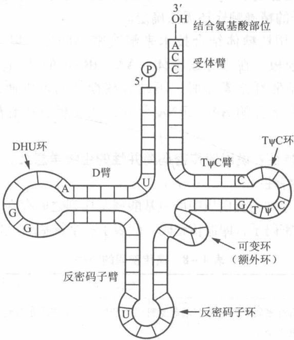
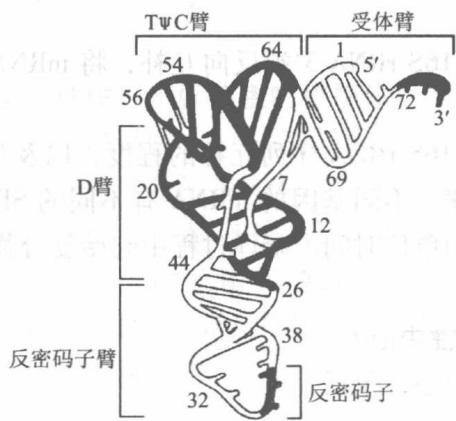

# 第4章 生物信息的传递(下)——从 mRNA 到蛋白质

——从 mRNA 到蛋白质

## 4.1 复习笔记

【知识概览】

三联子密码

遗传密码

遗传密码的性质

tRNA 的三叶草二级结构

tRNA 的三级结构——倒 L 形

tRNA

tRNA 的种类

tRNA 的功能

氨酰 tRNA 合成酶

核糖体 RNA(rRNA)

核糖体的结构

核糖体

核糖体的3个tRNA结合位点

核糖体的功能

从

mRNA

到

蛋

白

质

氨基酸的活化

原核生物翻译起始过程

翻译的起始

蛋白质合成过程

真核生物翻译起始过程

原核生物与真核生物翻译起始的差异

肽链的延伸

过程

肽链的终止

释放因子(RF)

原核生物和真核生物蛋白质合成的总结

蛋白质多肽链合成后的加工和折叠

蛋白质合成的抑制剂

翻译-运转同步机制

蛋白质的定向运输

翻译后运转机制

核定位蛋白的运转机制

泛素化修饰介导的蛋白质降解

蛋白质的修饰、降解与稳定性研究。

蛋白质的 SUMO 化修饰

蛋白质的 NEDD 化修饰

蛋白质的一级结构对蛋白质稳定性的影响

【重难点归纳】

## 一、遗传密码

## 1. 三联子密码

三联子密码即密码子或三联体密码子(遗传密码)，是指存在于 mRNA 上能翻译成蛋白质多肽链上的一个氨基酸的 3 个连续的核苷酸。

## 2. 遗传密码的性质

表 4-1 遗传密码的性质

<table><tr><td>特性</td><td>具体含义</td></tr><tr><td>连续性</td><td>编码一条肽链的所有密码子都是从5&#x27;端起始密码子开始,到3&#x27;端终止密码一个接一个地呈线性排列,密码子之间无间隔也无交叉</td></tr><tr><td>简并性</td><td>由一种以上的密码子编码同一个氨基酸的现象;一种氨基酸有两种或两种以上的密码子称为同义密码子,只有甲硫氨酸(Met)和色氨酸(Trp)仅由一个密码子编码</td></tr><tr><td>变偶性</td><td>密码子和反密码子前两位碱基进行严格的配对。第三位碱基可以有一定的变动性,有一定的自由度(表4-2)</td></tr><tr><td>通用性与特殊性</td><td>所有生物几乎都使用同一套密码子,但线粒体DNA以及少数生物基因组的密码子有差异</td></tr></table>

表 4-2 反密码子与密码子碱基配对的"摆动"规则

<table><tr><td>反密码子5&#x27;碱基(第1位碱基)</td><td>C</td><td>A</td><td>U</td><td>G</td><td>I</td></tr><tr><td>密码子3&#x27;碱基(第3位碱基)</td><td>G</td><td>U</td><td>A或G</td><td>C或U</td><td>U、C或A</td></tr></table>

注：I表示次黄嘌呤，这是一种特殊碱基。

## 二、tRNA

## 1. tRNA 的三叶草二级结构

tRNA 的二级结构十分稳定，呈三叶草形，双螺旋区构成了叶柄，突环区形成三叶草的三片叶子。三叶草结构由二氢尿嘧啶环、反密码子环、额外环、TψC 环和受体臂组成。

(1)二氢尿嘧啶环(D 环/DHU 环)

含有二氢尿嘧啶(DHU)，由8\~12个核苷酸组成，与tRNA分子的其余部分相连。

(2) 反密码子环

由 3 个碱基构成反密码子，与密码子配对。

(3)额外环(可变环)

位于 TψC 和反密码子环之间，其大小往往是 tRNA 分类的重要指标。

(4) $\mathrm{T}\psi \mathrm{C}$ 环

ψ 表示假尿嘧啶。

(5) 受体臂

接受氨基酸的位点，其3'端末端是CCA—OH序列，能接受活化的氨基酸。

## 2. tRNA 的三级结构——倒 L 形

tRNA 的倒 L 形三级结构靠二级结构中未配对碱基之间形成的氢键维持，与 AA-tRNA 合成酶对 tRNA 的识别有关。结构模型如下：

(1) 受体臂位于倒 L 形分子的一端，反密码子臂则处于相反的一端。

(2) 受体臂与 TψC 臂构成第一个双螺旋，即倒"L"上面的一横，D 臂与之垂直。

(3) D 臂和反密码子臂构成第二个双螺旋, 即倒"L"的一竖。

## 3. tRNA 的种类

(1) 起始 tRNA 和延伸 tRNA

①起始 tRNA

起始 tRNA 是一类能特异地识别 mRNA 模板上起始密码子的 tRNA，即第一个进入核糖

体与 mRNA 起始密码子结合的 tRNA。

a. 原核生物起始 tRNA 携带甲酰甲硫氨酸(fMet)。

b. 真核生物起始 tRNA 携带甲硫氨酸(Met)。

## ②延伸 tRNA

延伸 tRNA 是指除了起始 tRNA 以外，参与肽链延伸的 tRNA。

## (2) 同工 tRNA

一种氨基酸对应于多种密码子，同工 tRNA 就是能携带某种氨基酸对应的多种密码子的 tRNA，它们能被同一种氨酰 - tRNA 合成酶识别。

## (3)校正 tRNA

校正 tRNA 是指能校正无义突变及错义突变的 tRNA。

## ①无义突变

无义突变是指一种导致有义密码子转变成终止密码子(UAG、UGA、UAA)的突变，通常会使得翻译的多肽链缩短而合成无功能、无意义的多肽链。

无义突变的校正 tRNA 可通过改变反密码子区校正无义突变，但必须通过与释放因子竞争识别密码子来实现。

## ②错义突变

错义突变是指三联体密码子突变导致蛋白质中原来的氨基酸被另一种氨基酸所取代的一种突变。该突变产生的效应从零到基因产物的完全失活，主要取决于氨基酸在产物中的位置以及取代氨基酸和原先氨基酸的性质。

错义突变的校正 tRNA 通过反密码子区的改变而把正确的氨基酸加到肽链上。

## 4. tRNA 的功能

tRNA 在翻译过程中起到了解码的功能，即携带并转运氨基酸到核糖体，在 mRNA 指导下合成蛋白质。

## 5. 氨酰 tRNA 合成酶

氨酰 tRNA 合成酶指催化 tRNA 与其对应的氨基酸相结合，并对两者都具有高度专一性的酶。

## 三、核糖体

## 1. 核糖体的结构

核糖体是合成蛋白质的场所，由大小两个亚基组成，主要包括核糖体蛋白(r-蛋白)和核糖体 rRNA(rRNA)。原核细胞与真核细胞核糖体的结构如表 4-3 所示。

表 4-3 原核细胞和真核细胞核糖体的结构

<table><tr><td rowspan="2" colspan="2">化学组成</td><td colspan="2">原核细胞核糖体(70S)</td><td colspan="2">真核细胞核糖体(80S)</td></tr><tr><td>小亚基</td><td>大亚基</td><td>小亚基</td><td>大亚基</td></tr><tr><td colspan="2">沉降系数</td><td>30S</td><td>50S</td><td>40S</td><td>60S</td></tr><tr><td rowspan="2">r-蛋白</td><td>种类</td><td>21种</td><td>36种</td><td>33种</td><td>49种</td></tr><tr><td>占比</td><td colspan="2">1/3</td><td colspan="2">2/5</td></tr><tr><td rowspan="2">rRNA</td><td>种类</td><td>16S</td><td>23S、5S</td><td>18S</td><td>28S、5.8S、5S</td></tr><tr><td>占比</td><td colspan="2">2/3</td><td colspan="2">3/5</td></tr></table>

## (1) 核糖体 RNA(rRNA)

①5S rRNA：存在两个保守序列，一个与 tRNA 相互识别，一个与 50S 核糖体大亚基互补。

②16S rRNA：能够与 mRNA、50S 亚基以及 P 位和 A 位的 tRNA 的反密码子直接作用。保守序列 ACCUCCUUA 与 mRNA 的 5' 端富含嘌呤的序列互补；靠近 3' 端的一段保守序列与 23S rRNA 互补，结合 30S 和 50S 亚基。

③23S rRNA：核糖体大亚基的主要成分，能催化肽键的形成。

④5.8S rRNA：是真核生物核糖体大亚基特有的 rRNA，含有修饰碱基以及与 tRNA 作用的识别序列。

⑤18S rRNA：酵母 18S rRNA 的 3' 端与大肠杆菌 16S rRNA 有广泛的同源性。

⑥28S rRNA: 功能不详。

(2)核糖体的3个tRNA结合位点

①A 位点：新掺入的氨酰 tRNA 的结合位点。

②P 位点：延伸中的肽酰 tRNA 结合位点。

③E 位点(去位/排出位): 释放已经卸载了氨基酸的 tRNA 的位点。真核生物核糖体无 E 位点。

tRNA 的移动顺序是从 A 位到 P 位再到 E 位，每一个 tRNA 的结合位点都横跨核糖体的两个亚基，位于亚基之间的交界面处。

## 2. 核糖体的功能

①包括多个活性中心：mRNA 结合位点、A 位、P 位、肽基转移位点、形成肽键的部位（转肽酶中心）、延伸因子结合位点。

②核糖体小亚基的功能：特异性识别模板 mRNA（识别起始部位、密码子与反密码子互作）。

③核糖体大亚基的功能：负责携带氨基酸和 tRNA，包括肽键的形成，AA-tRNA、肽酰 tRNA 的结合等。

④蛋白质表达控制：正常细胞可能通过调整特定核糖体的数量来控制蛋白质的表达量。

## 四、蛋白质合成过程

## 1. 氨基酸的活化

①氨基酸的活化是指在氨酰 tRNA 合成酶的作用下，氨基酸与特异的 tRNA 形成活化的 AA-tRNA 的过程。氨酰 tRNA 合成酶能催化氨基酸的羧基与 tRNA 3' 端腺苷酸核糖基上 3'—OH 形成二酯键，生成 AA-tRNA，该酶具有绝对专一性和校正活性。反应式为

$$
\mathrm{AA+tRNA+ATP} \xrightarrow {\text { 氨酰tRNA合成酶 }} \mathrm{AA-tRNA+AMP+PPi}
$$

②起始氨酰 tRNA: fMet - tRNA $^{fMet}$ (原核生物)、Met - tRNAi $^{Met}$ (真核生物)。

## 2. 翻译的起始

(1) 原核生物翻译起始过程

①所需的成分

30S 小亚基、50S 大亚基、模板 mRNA、fMet - tRNA $^{fMet}$ 、翻译起始因子（IF-1、IF-2 和 IF-3）、GTP、Mg $^{2+}$ 。

## ②原核生物翻译起始的过程

a. 30S 小亚基与 IF-3、IF-1 结合，促使大小亚基分离。然后 30S 小亚基借助 16S rRNA 3' 端与 mRNA 的 SD 序列互补，与 mRNA 模板结合，形成 30S·mRNA·IF-1·IF-3 复合物。

b. IF-2 与 GTP 结合，fMet-tRNA $^{fMet}$ 进入 P 位，与上述复合物结合，形成 30S 起始复合物。起始密码子与反密码子识别。

c. 30S 起始复合物再与 50S 大亚基结合，GTP 水解成 GDP，释放翻译起始因子，形成 70S 起始复合物。

## (2) 真核生物翻译起始过程

①在 eIF2 及 GTP 的介导下 Met-tRNAi $^{Met}$ 首先与结合有 eIF3 的核糖体 40S 小亚基结合，在帽子结合蛋白 (eIF4E) 作用下与 mRNA 5' 端结合，eIF4A、eIF4B 通过衔接蛋白 (eIF4G) 结合到 eIF4E 上，mRNA 3' 端通过 poly(A) 结合蛋白 (PABP) 结合到 eIF4G 上，形成的 40S 起始复合物沿 mRNA 移动，扫描到核糖体结合位点 (RBS)，识别 AUG 起始密码子，消耗 ATP。

②在 eIF5 作用下，60S 大亚基与 40S 复合物结合形成 80S 起始复合物，GTP 水解，起始因子离开，消耗 ATP。

## (3) 原核生物与真核生物翻译起始的差异

原核生物与真核生物翻译起始的机制相差不大，但存在一些细小的差异。主要包括以下几个方面。

①原核生物核糖体为 70S，大亚基 50S，小亚基 30S；真核生物核糖体为 80S，大亚基 60S，小亚基 40S。

②原核生物起始 tRNA 是 fMet - tRNA $^{fMet}$ ；而真核生物的起始 tRNA 是 Met - tRNAi $^{Met}$ ，不被甲酰化。

③原核生物只有3个起始因子，真核生物有较多的起始因子参与。

④原核生物 mRNA 有 SD 序列；大多数真核生物 mRNA 不含有 SD 序列，RBS 位于起始密码子 AUG 附近。

⑤原核生物 mRNA 先与 30S 小亚基结合，再与 fMet - tRNA $^{fMet}$ 结合，最后与 50S 大亚基结合生成 70S 起始复合物；而真核生物 Met - tRNAi $^{Met}$ 先与 40S 小亚基结合，再与模板 mRNA 结合，沿 mRNA 扫描发现 AUG，最后与 60S 大亚基结合生成 80S 起始复合物。

⑥真核生物 40S 小亚基从 mRNA 5' 端移向 RBS 过程中，需消耗 ATP。

## 3. 肽链的延伸

原核细胞和真核细胞的蛋白质延伸机制相似。起始复合物生成后，第一个氨基酸(fMet/Met-tRNA)与核糖体结合后就开始肽链的延伸过程。

## (1) 进位

与 mRNA 起始密码子下一个三联体密码子相对应的 AA-tRNA 进入核糖体的 A 位上，该过程需要 GTP、延伸因子 EF-Tu、 $Mg^{2+}$ 。

## (2) 成肽

在肽基转移酶的催化下，A 位上的 AA-tRNA 氨基对 P 位的起始 tRNA（即 fMet-tRNA $^{fMet}$ ）的羰基亲核进攻，形成肽键。

## (3)移位

核糖体沿着 mRNA 的 3' 端移动，二肽酰 - tRNA₂ 从 A 位移到 P 位，A 位腾空，原来脱酰基的 tRNA 由 P 位进入 E 位并离开核糖体。真核生物核糖体无 E 位点，脱酰基 tRNA 直接从 P 位点离开核糖体。

肽链的延伸就是氨基酸进位、转肽和移位不断循环，使肽链不断延长的过程。

## 4. 肽链的终止

## (1) 过程

核糖体沿 mRNA 滑动，使多肽链延长，直到终止密码子（UAA、UAG 或 UGA）进入 A 位，此时没有相应的 AA-tRNA 与之结合，释放因子（RF）识别并结合终止密码子，P 位点上多肽链与 tRNA 之间的二酯键被水解，新生肽链被释放，mRNA、空载 tRNA、RF 脱离核糖体，核糖体大、小亚基解体，蛋白质合成结束。

## (2) 释放因子(RF)

RF 具有 GTP 酶活性，催化 GTP 水解，使肽链与核糖体解离。释放因子分为两类。

① I 类释放因子：识别终止密码子，催化新合成的多肽链从 P 位的 tRNA 中释放出来。

②Ⅱ类释放因子：具有 GTP 酶活性，在多肽链释放后刺激Ⅰ类释放因子从核糖体中解离出来。

## 5. 原核生物和真核生物蛋白质合成的总结

表 4-4 原核生物和真核生物蛋白质生物合成所需组分及因子

<table><tr><td colspan="2">蛋白质合成过程</td><td>原核生物</td><td>真核生物</td></tr><tr><td colspan="2">氨基酸活化</td><td colspan="2">氨基酸、tRNA、氨酰-tRNA合成酶、ATP、 $Mg^{2+}$ </td></tr><tr><td colspan="2">肽链起始</td><td>mRNA的起始密码、模板mRNA的SD序列、fMet-tRNA $^{fMet}$ 、30S亚基、50S亚基、IF-1、IF-2、IF-3、GTP、 $Mg^{2+}$ </td><td>mRNA的起始密码子、5′帽子结构、Met-tRNAi $^{Met}$ 、40S亚基、60S亚基、eIF1~eIF6、GTP、ATP、 $Mg^{2+}$ </td></tr><tr><td rowspan="3">肽链延长</td><td>氨酰-tRNA的结合</td><td>70S核糖体、mRNA的密码、氨酰-tRNA</td><td>80S核糖体、mRNA的密码、氨酰-tRNA</td></tr><tr><td>肽键形成</td><td>EF-Tu、EF-Ts、GTP肽基转移酶、 $Mg^{2+}$ </td><td>eEF1A、eEF1B、GTP肽基转移酶、 $Mg^{2+}$ </td></tr><tr><td>移位</td><td>EF-G、GTP</td><td>eEF2、GTP</td></tr><tr><td colspan="2">肽链终止和释放</td><td>70S核糖体、mRNA的终止密码、RF-1、RF-2、RF-3、GTP、 $Mg^{2+}$ </td><td>80S核糖体、mRNA的终止密码、eRF1、eRF3、GTP、 $Mg^{2+}$ </td></tr></table>

表 4-5 原核生物和真核生物蛋白质合成全过程对比

<table><tr><td>项目</td><td>原核生物蛋白质合成</td><td>真核生物蛋白质合成</td></tr><tr><td>核糖体</td><td>70S(50S+30S)</td><td>80S(60S+40S)</td></tr><tr><td>氨基酸的活化</td><td colspan="2">AA+tRNA+ATP $\xrightarrow{\text{氨酰 tRNA 合成酶}}$ AA-tRNA+AMP+PPi氨酰 tRNA 合成酶对底物氨基酸和 tRNA 都有高度特异性,还有校正活性</td></tr><tr><td>起始氨基酰 tRNA</td><td>fMet - tRNAtMet</td><td>Met - tRNAtMet</td></tr><tr><td>合成原料</td><td colspan="2">氨基酸</td></tr><tr><td>适配器</td><td colspan="2">各种 tRNA</td></tr><tr><td>模板(mRNA)</td><td>多顺反子 mRNA;转录后很少加工;转录、翻译和 mRNA 的降解可同时发生</td><td>单顺反子 mRNA;转录后进行首、尾修饰及剪接;mRNA 核内合成,加工后进入胞液,再作模板</td></tr><tr><td rowspan="7">肽链合成起始</td><td>起始因子:3种IF(IF-1、IF-2、IF-3)</td><td>起始因子:10余种(eIF)</td></tr><tr><td>起始密码:AUG(少数是GUG,偶尔是UUG)</td><td>mRNA的起始密码:AUG</td></tr><tr><td>SD序列:有</td><td>无SD序列,依赖mRNA 5'端帽子</td></tr><tr><td>1核糖体大小亚基分离:IF-3、IF-1与小亚基结合促进大小亚基分离</td><td>1核糖体大小亚基分离:eIF3、eIF2B与小亚基结合,在eIF6参与下,促进80S解离成大小亚基</td></tr><tr><td>2mRNA在小亚基定位结合:30S小亚基首先与翻译起始因子IF-1、IF-3结合,通过SD序列与mRNA模板结合</td><td>2在eIF2B的作用下,eIF2与GTP结合;在其他eIF的参与下, $Met-tRNAi^{Met}$ 与结合了GTP的eIF2共同结合于小亚基的P位</td></tr><tr><td>3fMet- $tRNA^{fMet}$ -IF-2-GTP结合到mRNA上,形成30S起始复合物</td><td>3核糖体小亚基与mRNA 5'端结合,沿着3'端扫描识别起始密码子AUG</td></tr><tr><td>4与核糖体大亚基结合,IF-2结合的GTP水解,促使3种IF释放,形成70S起始复合物</td><td>4核糖小亚基在eIF5和GTP的作用下与大亚基结合形成80S起始复合物</td></tr><tr><td>肽链延长</td><td colspan="2">进位:氨酰-tRNA进入并结合到核糖体A位成肽:转肽酶催化两个氨基酸间肽键形成的反应移位:核糖体沿着mRNA的移位</td></tr><tr><td>肽链合成终止</td><td>释放因子3种:RF-1识别UAA、UAG;RF-2识别UAA、UGA;RF-3协助RF-1、2</td><td>释放因子2种:eRF1识别所有终止密码;eRF3借助GTP的能量,帮助eRF1的释放</td></tr></table>

## 五、蛋白质多肽链合成后的加工和折叠

## 1. 蛋白质前体的加工

表 4-6 蛋白质前体的加工方式

<table><tr><td colspan="2">加工方式</td><td>加工过程</td></tr><tr><td colspan="2">N端修饰</td><td>在多肽链合成之前,N端的fMet被脱甲酰化酶除去甲酰基,Met被氨基肽酶切除</td></tr><tr><td colspan="2">二硫键的形成</td><td>蛋白质合成后通过两个半胱氨酸的氧化作用生成二硫键</td></tr><tr><td rowspan="5">氨基酸残基的化学修饰</td><td>磷酸化</td><td>由蛋白激酶催化,发生在丝氨酸、苏氨酸和酪氨酸上</td></tr><tr><td>糖基化</td><td>使多肽转变成糖蛋白,由内质网中的糖基化酶催化。N-糖基化发生在天冬氨酸上,O-糖基化发生在丝氨酸和苏氨酸上</td></tr><tr><td>甲基化</td><td>由甲基转移酶催化,N-甲基化发生在精氨酸、谷氨酰胺、组氨酸上;O-甲基化发生在谷氨酸和天冬氨酸上</td></tr><tr><td>乙酰化</td><td>由乙酰基转移酶催化,发生在赖氨酸侧链上</td></tr><tr><td>泛素化和类泛素化修饰</td><td>发生在赖氨酸残基侧链上,由E1、E2、E3一系列酶催化</td></tr><tr><td colspan="2">切除新生肽链中的非功能片段</td><td>多肽链生成后经专一性蛋白酶催化,切除部分肽段,导致酶原激活,才能显示出生物活性</td></tr></table>

## 2. 蛋白质的折叠

一级结构的蛋白质分子需经过折叠后形成一定的三维空间结构，才能发挥生物学功能。多数蛋白质是边翻译边折叠的，需酶（二硫键异构酶、脯氨酰顺反异构酶）和分子伴侣。

细胞中的某些蛋白质分子可以识别正在合成的多肽链或部分折叠的多肽并与这些多肽的某些部位结合，从而帮助多肽移动、折叠或装配，这类分子本身并不参与最终产物的形成，称为分子伴侣。分子伴侣在序列上没有相关性，在进化上十分保守。细胞内至少存在两种分子伴侣家族。

## (1) 热休克蛋白

热休克蛋白是一类热应激蛋白，包括 HSP70、HSP40 和 GrpE 三个家族，能促进自发折叠的蛋白质形成天然的空间构象。

## (2)伴侣素

伴侣素包括 HSP60 和 HSP10，主要为非自发性折叠蛋白提供能折叠形成天然结构的微环境。

## 六、蛋白质合成的抑制剂

多种抗生素和毒蛋白能在不同步骤上抑制蛋白质合成。表4-7列出一些蛋白质合成的抑制剂及其抑制原理。

表 4-7 常用的蛋白质合成抑制剂抑制肽链生物合成的原理

<table><tr><td>抗生素/毒素</td><td>目标细胞</td><td>作用位点</td><td>作用原理</td></tr><tr><td>氯霉素</td><td>原核</td><td>50S亚基肽基转移酶中心</td><td>阻断A位点的氨酰-tRNA为进行肽基转移反应的正确定位,抑制肽键形成</td></tr><tr><td>红霉素</td><td>原核</td><td>50S亚基多肽出口通道</td><td>封闭多肽链从核糖体的出口,阻遏翻译</td></tr><tr><td>四环素</td><td>原核</td><td>30S亚基A位点</td><td>阻断氨酰tRNA结合到A位,使肽链延伸受阻</td></tr><tr><td>卡那霉素</td><td>原核</td><td>30S亚基</td><td>干扰AA-tRNA与核糖体结合引起读码错误</td></tr><tr><td>青霉素</td><td>原核</td><td>肽聚糖转肽酶</td><td>抑制细菌细胞壁的合成</td></tr><tr><td>嘌呤霉素</td><td rowspan="3">原核、真核</td><td>大亚基肽基转移酶中心</td><td>氨酰-tRNA的结构类似物,易和核糖体的A位结合,从而使蛋白质合成提前终止</td></tr><tr><td>潮霉素</td><td>30S亚基A位点附近</td><td>阻挠A位点tRNA到P位点的位移</td></tr><tr><td>链霉素</td><td>作用于30S亚基</td><td>干扰氨酰tRNA与核糖体的结合;导致mRNA的错读</td></tr></table>

## 七、蛋白质的定向运输

核糖体是蛋白质合成的场所，但是蛋白质合成后需经过复杂机制，定向输送到最终发挥生物功能的细胞靶部位，这一过程称为蛋白质的靶向输送。根据氨基酸序列中的分拣信号，蛋白质运输途径分为两类。

## 1. 翻译 - 运转同步机制

蛋白质定位的信息存在于蛋白质本身的结构中，能和细胞膜上特定的受体作用最终得到表达，即蛋白质跨膜转运的信号存在于 mRNA 中。在起始密码子后，有一段编码疏水性氨基酸序列的 RNA 区域，这个氨基酸序列就被称为信号序列。翻译－运转同步机制需要信号肽的参与。

## (1) 信号肽

信号肽是指新合成的多肽链上用于指导蛋白质跨膜转运的 N 端氨基酸序列，但有时不一定在 N 端。它负责把蛋白质引导至不同的转运系统，随后信号肽被信号肽酶切除。信号

①中部带有10\~15个高度疏水氨基酸；

②在靠近该序列 N 端常常有几个带正电荷的碱性氨基酸；

③在其 C 端靠近蛋白酶切割位点处常带有数个极性氨基酸，离切割位点最近的氨基酸往往带有很短的侧链（丙氨酸或甘氨酸）。

(2) 新生蛋白通过同步运转途径进入内质网内腔的主要过程

信号识别蛋白(SRP)与停靠蛋白(DP，又称SRP受体蛋白)介导了蛋白质的跨膜运输过程，蛋白质的转运主要有以下几个过程。

①蛋白质首先在核糖体中生成，当多肽链延伸至70个氨基酸左右时，N端的信号序列与SRP结合使肽链延伸暂停；

②该 SRP-核糖体复合体受信号肽控制移到内质网上，SRP 与 DP 结合，蛋白质合成的延伸又重新开始；

③多肽链通过转运装置进入内质网腔后，信号肽酶切除信号肽，多肽链进行折叠、糖基化等加工过程形成成熟的蛋白质，运输到相应的细胞器中。

## 2. 翻译后运转机制

游离核糖体上合成的蛋白质必须先合成并释放到胞质后才能被转运。通过这条途径输送的蛋白质包括定位于细胞核、线粒体、叶绿体和过氧化物酶体的蛋白质。

## (1) 线粒体蛋白质的跨膜运转

线粒体蛋白是由核 DNA 编码的，在胞质中的核糖体上合成后释放到细胞质基质，随后转运至线粒体中。

①游离核糖体释放前体蛋白，前体蛋白在分子伴侣 HSP70 的帮助下解折叠。

②解折叠的前体蛋白通过 N 端的前导肽同线粒体外膜上的受体蛋白(Tom 受体复合物)识别，并在受体(或附近)的内外膜接触点处利用 ATP 水解提供的能量驱动前体蛋白进入转运蛋白的运输通道(Tom 和 Tim 组成的膜通道)，然后由电化学梯度驱动穿过内膜，进入线粒体基质。

③在基质中，由 mHSP70 继续维持前体蛋白的解折叠状态。然后在 HSP60 的帮助下，前体蛋白进行正确折叠，最后由蛋白水解酶切除前导肽，成为成熟的线粒体基质蛋白。

## (2) 叶绿体蛋白质的跨膜运转

叶绿体定位信号肽含有两部分，第一部分决定该蛋白质能否进入叶绿体基质；第二部分决定该蛋白能否进入类囊体。转运过程与线粒体蛋白类似。一般进入叶绿体基质后切除一个叶绿体基质引导肽，进入类囊体腔后切除第二部分。

## 3. 核定位蛋白的运转机制

## (1) 物质进出细胞核的方式

①相对分子质量较小的蛋白质可自由通过核孔复合体(NPC)或采取被动扩散的方式进入细胞核。

②相对分子质量大的蛋白质通过核定位信号序列(NLS)和出核信号序列(NES)进行入核和出核的转运。

## (2) 运输受体

运输受体可分为输入蛋白(如输入蛋白 $\alpha\beta$ ) 和输出蛋白。运输受体能够识别底物蛋白的 NLS 和 NES。

## (3) 运转过程

①α 和 β 组成异源二聚体，α 亚基与核蛋白的 NLS 结合，β 亚基与 NPC 作用。

②由 $\alpha$ 、 $\beta$ 和 Ran(小单体 G 蛋白) 这 3 个蛋白组成的运输复合物通过 Ran GTP 酶水解 GTP 提供的能量，进入细胞核。

③α 和 β 亚基解离，核蛋白与 α 亚基解离，核蛋白释放，α、β 通过核孔复合体返回细胞质中，准备新一轮蛋白质运转。

## 八、蛋白质的修饰、降解与稳定性研究

## 1. 泛素化修饰介导的蛋白质降解

## (1')泛素

泛素是一种存在于所有真核生物中的小蛋白，它的主要功能是标记需要分解掉的蛋白质，使其被水解。当附有泛素的蛋白质移动到蛋白酶处时，蛋白酶将该蛋白质水解。

## (2)泛素化修饰的级联反应

①由 ATP 供能，泛素的 C 末端与非特异性泛素激活酶 E1 的半胱氨酸残基共价结合，形成 E1-泛素复合体。

②E1 - 泛素复合体将泛素转移给泛素结合酶 E2，E2 可以直接将泛素转移到靶蛋白赖氨酸残基的 $\varepsilon$ -氨基上。

③在通常情况下，靶蛋白泛素化需要一个特异的泛素蛋白连接酶 E3，当第一个泛素分子在 E3 的催化下连接到靶蛋白上以后，另外一些泛素分子相继与前一个泛素分子的赖氨酸残基相连，逐渐形成一条多聚泛素链。

④泛素化的靶蛋白被蛋白酶体逐步降解。多聚泛素也解聚为单个泛素分子，重新被利用。

## 2. 蛋白质的 SUMO 化修饰

SUMO 化修饰(SUMOylation)是指小泛素化修饰，是指细胞内一些与泛素化修饰相类似的反应，由小泛素相关修饰物(SUMO)介导，把 SUMO 转移到底物的赖氨酸残基上，稳定靶蛋白使其免受降解的过程。SUMO 化修饰能够阻止泛素化引起的蛋白质降解。SUMO 化修饰可参与转录调节、核转运、维持基因组完整性及信号转导等多种细胞内活动，它是一种重要的多功能蛋白质翻译后修饰方式。

## 3. 蛋白质的 NEDD 化修饰

NEDD 化修饰(NEDDylation)是指 NEDD8(类泛素蛋白修饰分子)在体内固有酶簇作用下被共价结合到底物蛋白上，参与蛋白质翻译后修饰的过程，其发生机制与泛素化相似，但不会引起蛋白质的降解，主要通过修饰作用调节蛋白质的功能。

## 4. 蛋白质的一级结构对蛋白质稳定性的影响

成熟多肽 N 端的第一个氨基酸残基对蛋白质的稳定有影响，当 N 端是 Met、Gly、Ala、Set、Thr 和 Val 时，稳定；当 N 端为 Lys、Arg 时，最不稳定，很快被降解。

## 4.2 课后习题详解

## 1. 简述破译遗传密码的主要过程

答：遗传密码经历以下几个破译历程。

## (1)三联体密码的提出

1954 年，物理学家 George Gamov 根据 DNA 中存在四种核苷酸和蛋白质中存在 20 种氨

基酸的对应关系，通过数学推理，得出三个核苷酸编码一个氨基酸的结论。

## (2) 遗传密码子的验证

①1961 年，Crick 及其同事用噬菌体做实验，证明遗传密码中三个碱基编码一个氨基酸。

②1961 年，Nirenberg 等用大肠杆菌的无细胞蛋白质合成体系，在平行的 20 个体系中分别加入含有 19 种非放射性标记的氨基酸和 1 种放射性标记的氨基酸。利用多聚核苷酸磷酸化酶合成了只有一种核苷酸成分的 mRNA，即多聚 poly(U)、poly(C)、poly(A) 和 poly(G)。结果发现 poly(U) 指导了多聚苯丙氨酸的合成，poly(C) 编码了多聚脯氨酸，poly(A) 编码了多聚赖氨酸，而 poly(G) 没有蛋白质的合成是因为它形成了复杂的二级结构。

③Nirenberg 及 Ochoa 等又用各种随机共聚物或特定序列的共聚物作为模板合成多肽，如用 poly(UG) 作为模板则合成了 Cys 和 Val 交替重复出现的多肽链，说明密码子由三个碱基组成，但三联体密码子的精确顺序还无法确定。

④Nirenberg 和 Leder 用核糖体结合技术来解决密码问题。以人工合成的三核苷酸如 UUU、UCU、UGU 等为模板，在含有核糖体、AA-tRNA 的适当离子强度的反应液中保温，然后使反应液通过硝酸纤维素滤膜，不结合核糖体的可以通过，从而将已结合到核糖体上的 AA-tRNA 与未结合的 AA-tRNA 分开，从模板三核苷酸与氨基酸的关系可测知该氨基酸的密码子。

## 2. 遗传密码有哪些特性？说出遗传密码简并性的生物学意义

## 答：(1)遗传密码的特性

核酸中的核苷酸残基序列与蛋白质中的氨基酸残基序列之间存在着对应的关系，连续的3个核苷酸残基序列为一个密码子，即遗传密码，代表了一个氨基酸。其特性如表4-8所示。

表 4-8 遗传密码的特性

<table><tr><td>特性</td><td>具体含义</td></tr><tr><td>连续性</td><td>编码一条肽链的所有密码子都是从5&#x27;端起始密码子开始,到3&#x27;端终止密码一个接一个地呈线性排列,密码子之间无间隔也无交叉</td></tr><tr><td>简并性</td><td>由一种以上的密码子编码同一个氨基酸的现象;一种氨基酸有两种或两种以上的密码子称为同义密码子,只有Met和Trp仅由一个密码子编码</td></tr><tr><td>变偶性</td><td>密码子和反密码子配对时,前两位碱基进行严格的配对,第三位碱基可以有一定的变动性,有一定的自由度</td></tr><tr><td>通用性与特殊性</td><td>所有生物几乎都使用同一套密码子,但线粒体以及少数生物基因组的密码子有差异</td></tr></table>

## (2)遗传密码简并性的生物学意义

编码同一氨基酸的密码子称为同义密码子，同义密码子的第一、第二位核苷酸大多是相同的，只是第三位不同。如果密码子第三位核苷酸发生改变，并不一定影响所翻译出的氨基酸种类。遗传密码简并性的生物学意义有以下几方面：

①减少了变异对生物的影响，减少有害突变。

②增加了密码子中碱基改变仍然编码原来氨基酸的可靠性。

③可使 DNA 上碱基组成有较大变动余地，对生物物种的稳定有一定的意义。

## 3. 终止密码子主要有哪几种？

答：终止密码子共有三种，分别为 UAA、UAG 和 UGA。多肽链合成的终止需要终止密码子和释放因子(RF)参与作用。tRNA 只能识别氨基酸密码子，不能识别终止密码子，需由释放因子来识别终止密码子。原核生物有三个释放因子，其中 RF-1 识别 UAA 和 UAG，RF-2 识别 UAA 和 UGA。

## 4. tRNA 在组成和结构上有哪些特点？

答：tRNA 是具有携带并转运氨基酸功能的小分子核糖核酸，其组成和结构上的特点如下所述。

(1)tRNA 是由约 74\~95 个核苷酸组成的单股 RNA。

(2) 含有修饰碱基，如假尿嘧啶(ψ)核苷、甲基化的嘌呤和嘧啶核苷、二氢尿嘧啶和胸腺嘧啶(T)核苷等。

(3) 所有的 tRNA 二级结构均为三叶草形(图 4-1)，该结构的基本组成部分如下：

  
图4-1 tRNA的三叶草形二级结构

①DHU 环：含有二氢尿嘧啶(DHU)，由 8～12 个核苷酸组成，与 tRNA 分子的其余部分相连。

②反密码子环：由 3 个碱基构成反密码子，与密码子配对。其大小往往是 tRNA 分类的重要指标。

③额外环(可变环): 位于 $\mathrm{T} \psi \mathrm{C}$ 和反密码子环之间。

④TψC 环：ψ 表示假尿嘧啶。

⑤受体臂：接受氨基酸的位点，其3'端末端是CCA—OH序列，能接受活化的氨基酸。

(4)tRNA 三级结构为倒 L 形(图 4-2)。

tRNA 的倒 L 形三级结构靠氢键来维持。结构特点如下：

①受体臂位于倒 L 形分子的一端，反密码子臂则处于相反的一端。

②受体臂与 $\mathrm{T}\psi \mathrm{C}$ 臂构成第一个双螺旋，即倒"L"上面的一横，D臂与之垂直。

③D臂和反密码子臂构成第二个双螺旋，即倒"L"的一竖。

  
图4-2 tRNA的倒L形三级结构

## 5. tRNA 如何转运活化氨基酸至 mRNA 模板上?

答：(1) 氨基酸的活化是指在氨酰 tRNA 合成酶 (AA - tRNA 合成酶) 的作用下，氨基酸与特异的 tRNA 形成活化的 AA - tRNA 的过程。反应式为

$$
\mathrm{AA} + \mathrm{tRNA} + \mathrm{ATP} \xrightarrow {\text { 氨酰 } \mathrm{tRNA} \text { 合成酶 }} \mathrm{AA} - \mathrm{tRNA} + \mathrm{AMP} + \mathrm{PPi}
$$

(2) 氨酰 - tRNA 结合 GTP 的起始因子 IF - 2 · GTP (或延伸因子 EF - Tu · GTP) 形成三元复合物。

(3) 氨酰 - tRNA 上的反密码子通过碱基互补配对的原则识别 mRNA 上相应的密码子，与起始复合物的 P(A) 位点结合（只有第一个活化的氨基酸进入 P 位点，肽链延伸过程中的氨酰 - tRNA 都进入 A 位点），从而将活化的氨基酸转运至 mRNA 模板上。

## 6. 原核生物与真核生物的核糖体组成有哪些异同点？

答：核糖体又称核蛋白体，由 rRNA 和蛋白质组成，是指导蛋白质合成的大分子机器。

## (1) 原核生物与真核生物的核糖体的相同点

原核生物与真核生物的核糖体的基本构造相同，都是由大小两个亚基组成，主要包括核糖体蛋白(r-蛋白)、核糖体 RNA(rRNA)。

(2) 原核生物与真核生物的核糖体的不同点 (表 4-9)

表 4-9 原核生物和真核生物的核糖体的不同点

<table><tr><td rowspan="2" colspan="2">化学组成</td><td colspan="2">原核生物核糖体(70S)</td><td colspan="2">真核生物核糖体(80S)</td></tr><tr><td>小亚基</td><td>大亚基</td><td>小亚基</td><td>大亚基</td></tr><tr><td colspan="2">沉降系数</td><td>30S</td><td>50S</td><td>40S</td><td>60S</td></tr><tr><td rowspan="2">r-蛋白</td><td>种类</td><td>21种</td><td>36种</td><td>33种</td><td>49种</td></tr><tr><td>占比</td><td colspan="2">1/3</td><td colspan="2">2/5</td></tr><tr><td rowspan="2">rRNA</td><td>种类</td><td>16S</td><td>23S、5S</td><td>18S</td><td>28S、5.8S、5S</td></tr><tr><td>占比</td><td colspan="2">2/3</td><td colspan="2">3/5</td></tr></table>

1. 什么是 SD 序列，其功能是什么？

## 答：(1)SD序列

细菌的 mRNA 通常含有一段富含嘌呤碱基的序列，称为 SD 序列。SD 序列是 mRNA 中结合原核生物核糖体的保守序列，它位于起始密码子 AUG 序列上游约 10 个碱基处，能与原核生物 16S rRNA 进行碱基互补性识别，从而起始翻译作用。

## (2) SD 序列的功能

①SD 序列与 30S 亚基上 16S rRNA 3' 端反向互补，将 mRNA 的 AUG 起始密码子置于核糖体的适当位置，起始翻译。

②SD 序列与 30S 亚基上 16S rRNA 序列互补的程度，以及从起始密码子 AUG 到嘌呤片段的距离影响翻译起始的效率。不同基因的 mRNA 有不同的 SD 序列，它们与 16S rRNA 的结合能力不同，从而可以控制单位时间内翻译过程中起始复合物形成的数目，最终控制翻译的速度。

## 8. 核糖体主要有哪些活性中心?

答：核糖体有多个活性中心，包括：

## (1) mRNA 结合位点

mRNA 结合位点位于核糖体小亚基上，在肽基转移位点附近，其功能是结合 mRNA 和 IF 因子。

## (2) AA - tRNA 结合位点 (A 位)

A 位是新到来的 AA-tRNA 的结合位点。

(3) 延伸中的肽酰 - tRNA 结合位点 (P 位)

P 位即肽酰基位点，是延伸中的肽酰 - tRNA 结合位点。

## (4) 去氨酰 - tRNA 释放位点 (E 位)

E 位是延伸过程中的多肽链转移到 AA-tRNA 上释放 tRNA 的位点，即去氨酰-tRNA 通过 E 位脱出，被释放到核糖体外的细胞质基质中。

## (5)转肽酶中心

位于 P 位和 A 位的连接处，是形成肽键的部位。

## (6) 延伸因子 EF-G 结合位点

肽酰 - tRNA 从 A 位转移到 P 位相关转移酶的结合位点。

(7)与蛋白质合成有关的其他的起始因子、延伸因子和终止因子的结合位点。

## 9. 真核生物与原核生物在翻译的起始过程中有哪些不同？

答：真核生物与原核生物在翻译的起始过程中的区别如表4-10所示。

表 4-10 真核生物与原核生物在翻译起始过程中的区别

<table><tr><td>比较项目</td><td>真核生物</td><td>原核生物</td></tr><tr><td>起始氨酰 - tRNA</td><td> $Met - tRNAi^{Met}$ ,且 $Met - tRNAi^{Met}$ 不发生甲酰化</td><td> $fMet - tRNA^{fMet}$ </td></tr><tr><td>起始因子</td><td>多种起始因子</td><td>IF-1、IF-2 和 IF-3</td></tr><tr><td>有无 SD 序列</td><td>无</td><td>有</td></tr><tr><td>起始识别机制</td><td>扫描机制识别起始密码</td><td>通过 SD 序列与 mRNA 模板结合</td></tr><tr><td>起始复合物形成顺序</td><td>核糖体 40S 小亚基先与 $Met - tRNAi^{Met}$ 结合,再与 mRNA 模板结合</td><td>核糖体 30S 小亚基先通过 SD 序列与 mRNA 模板结合,再与 $fMet - tRNA^{fMet}$ 结合</td></tr><tr><td>消耗能量</td><td>消耗 ATP</td><td>不消耗 ATP</td></tr></table>

## 10. 链霉素为什么能够抑制蛋白质的合成？

答：链霉素是一种碱性三糖，可以以多种方式抑制原核生物核糖体合成蛋白质。

链霉素的作用位点在 30S 亚基上，通过与 A 位点紧密结合，阻断转肽酶的作用，干扰 fMet-tRNA 与核糖体的结合，从而阻断 A 位点的氨酰-tRNA 为进行肽基转移反应的正确定位，阻止蛋白质合成的正确起始，使新肽链的形成受阻；也会导致 mRNA 的错误，从而抑制蛋白质合成。

## 11. 哪些抗生素只能特异性地作用于原核生物核糖体？哪些只作用于真核生物核糖体？哪些能同时抑制原核和真核生物核糖体？

答：蛋白质生物合成的抑制剂主要是一些抗生素，抗生素对蛋白质合成的抑制作用可能是阻止 mRNA 与核糖体的结合，或阻止 AA-tRNA 与核糖体结合，或干扰 AA-tRNA 与核糖体结合而产生错读等。但不同的抗生素作用的对象并不完全相同。

(1) 红霉素、四环素、氯霉素和卡那霉素只能特异性地与原核生物核糖体发生作用，从而阻遏原核生物蛋白质的合成，抑制细菌生长。

(2) 放线菌酮、白喉毒素只作用于真核生物核糖体。

(3) 嘌呤霉素、潮霉素和链霉素既能与原核生物核糖体结合，又能与真核生物核糖体结合，它们妨碍细胞内蛋白质合成，影响细胞生长。

## 12. 什么是分子伴侣，有哪些重要功能？

## 答：(1) 分子伴侣

分子伴侣是一类序列上没有相关性但有共同功能的蛋白质，在细胞内能帮助其他多肽进行正确地折叠、组装、运转和成熟，本身并不参与最终产物的形成。分子伴侣在进化上十分保守，目前认为细胞内至少有两类分子伴侣家族，即热休克蛋白家族和伴侣素。

## (2) 分子伴侣的重要功能

①分子伴侣参与新生肽链的形成。分子伴侣在蛋白合成过程中，能识别与稳定多肽链部分折叠的构象，从而参与新生肽链的折叠与装配。

②分子伴侣参与蛋白质的跨膜转运。分子伴侣与新生肽链结合，阻止新生肽链折叠成天然构象或聚集，使新生肽链保持能够跨膜转运出去的分子构象，使其成为不折叠或部分折叠的状态，并且不被细胞内蛋白酶水解，利于跨膜转运。

③分子伴侣参与生物机体的应激反应。分子伴侣在应激反应中的作用首先是恢复细胞转录和翻译的机能。

④分子伴侣参与遗传物质的复制转录及生物信号转导。

⑤分子伴侣还参与细胞器和细胞核结构的发生、细胞骨架的组装、细胞周期与凋亡的调控、机体免疫、生物大分子的降解以及细胞衰老等生命过程。

## 13. 什么是信号肽？它在序列组成上有哪些特点，有何功能？

## 答：(1)信号肽

在起始密码子之后，有一段编码疏水性氨基酸序列的 RNA 区域，长度不等，一般为 13～36 个氨基酸残基，该氨基酸序列被称为信号肽序列，它负责把蛋白质引导至不同的转运系统。

## (2)信号肽在序列组成上的特点

①一般带有10\~15个疏水氨基酸；

②在靠近该序列 N 端疏水氨基酸区上游带有 1 个或数个带正电荷的氨基酸；

③在其 C 末端靠近蛋白酶切割位点处常带有数个极性氨基酸，离切割位点最近的那个氨基酸往往带有很短的侧链（丙氨酸或甘氨酸）。

## (3) 信号肽的功能

信号肽将蛋白质引导到细胞内不同膜结构的亚细胞器内(内质网、线粒体等)。

1. 简述线粒体和叶绿体蛋白质的跨膜运转机制。

答：(1) 线粒体蛋白质跨膜运转机制

线粒体蛋白是由核 DNA 编码的，在胞质中的核糖体上合成后释放到细胞质基质，随后转运至线粒体中。它的转运有如下的过程：

①游离核糖体释放前体蛋白，前体蛋白在分子伴侣 HSP70 的帮助下解折叠。

②解折叠的前体蛋白通过 N 端的前导肽同线粒体外膜上的受体蛋白(Tom 受体复合物)识别，并在受体(或附近)的内外膜接触点处利用 ATP 水解提供的能量驱动前体蛋白进入转运蛋白的运输通道(Tom 和 Tim 组成的膜通道)，然后由电化学梯度驱动穿过内膜，进入线粒体基质。

③在基质中，由 mHSP70 继续维持前体蛋白的解折叠状态。然后在 HSP60 的帮助下，前体蛋白进行正确折叠，最后由蛋白水解酶切除前导肽，成为成熟的线粒体基质蛋白。

## (2) 叶绿体蛋白质跨膜运转机制

叶绿体定位信号肽一般有两部分，第一部分决定该蛋白质能否进入叶绿体基质，第二部分决定该蛋白质能否进入类囊体。叶绿体蛋白质是在翻译完成后进行转运的，转运过程中不涉及蛋白质的合成。叶绿体蛋白质的跨膜运转机制有以下几个步骤：

①胞质中游离核糖体上合成叶绿体多肽。

②叶绿体多肽在脱离核糖体后折叠成具有三级结构的蛋白质分子。

③叶绿体多肽上某些特定位点与叶绿体膜上特有的特异受体位点结合，产生跨膜通道，进入叶绿体基质。

④在位于叶绿体基质内的可溶性活性蛋白水解酶的作用下，叶绿体多肽的第一部分跨膜信号肽被切除，并在第二部分信号肽的引导下，跨过类囊体膜，进入类囊体。

⑤切除第二部分信号肽，成为成熟的叶绿体蛋白质。

1. 蛋白质有哪些翻译后加工修饰，其作用机制和生物学功能是什么？

答：蛋白质翻译后的加工修饰及其作用机制与生物学功能如表4-11所示。

表 4-11 蛋白质翻译后的加工方式

<table><tr><td colspan="2">加工方式</td><td>加工机制</td><td>生物学功能</td></tr><tr><td colspan="2">N端修饰</td><td>在多肽链合成之前,N端的fMet被脱甲酰化酶除去甲酰基,Met被氨基肽酶切除</td><td>N端修饰使得新生蛋白质转变成有功能的蛋白质</td></tr><tr><td colspan="2">二硫键的形成</td><td>蛋白质合成后通过两个半胱氨酸的氧化作用生成二硫键</td><td>二硫键的正确形成对维持蛋白质的天然构象起重要作用</td></tr><tr><td rowspan="3">氨基酸残基的化学修饰</td><td>磷酸化</td><td>由蛋白激酶催化,发生在丝氨酸、苏氨酸和酪氨酸上</td><td>蛋白质磷酸化是生物体内一种普遍的调节方式,在细胞信号转导的过程中起重要作用</td></tr><tr><td>糖基化</td><td>使多肽转变成糖蛋白,由内质网中的糖基化酶催化。N-糖基化发生在天冬氨酸上,O-糖基化发生在丝氨酸和苏氨酸上</td><td>糖基化是蛋白质的重要修饰作用,能调节蛋白质的功能</td></tr><tr><td>甲基化</td><td>由甲基转移酶催化,N-甲基化发生在精氨酸、谷氨酰胺、组氨酸上;O-甲基化发生在谷氨酸和天冬氨酸上</td><td>某些组蛋白残基通过甲基化可以抑制或激活基因表达,从而形成表观遗传</td></tr><tr><td rowspan="2">氨基酸残基的化学修饰</td><td>乙酰化</td><td>由乙酰基转移酶催化,发生在赖氨酸侧链上</td><td>蛋白质乙酰化是细胞控制基因表达,调节蛋白质活性或生理过程的一种修饰作用</td></tr><tr><td>泛素化和类泛素化修饰</td><td>发生在赖氨酸残基侧链上,由E1、E2、E3一系列酶催化</td><td>参与多种生物功能的调控,在蛋白质的定位、代谢、功能、调节和降解中发挥重要作用</td></tr><tr><td colspan="2">切除新生肽链中的非功能片段</td><td>多肽链生成后经专一性蛋白酶催化,切除部分肽段,导致酶原激活,才能显示出生物活性</td><td>前体蛋白质转变成成熟蛋白质,发挥生物学功能</td></tr></table>

## 16. 什么是核定位信号序列，其主要功能是什么？

## 答：(1)核定位信号序列

核定位信号序列(NLS)是能与入核载体相互作用，将蛋白质运进细胞核内的氨基酸序列，是蛋白质中的一种常见的结构域。NLS可以位于核蛋白的任何部位，也能够引导其他非核蛋白进入细胞核。

## (2) 核定位信号序列的主要功能

与入核载体相互作用，将分散在细胞内的核蛋白重新引导运入核内。蛋白质向核内运输具体过程为：

①输入蛋白 $\alpha$ 和输入蛋白 $\beta$ 组成异源二聚体， $\alpha$ 亚基与核蛋白的 NLS 相结合； $\beta$ 亚基与 NPC 作用。

②由 $\alpha$ 、 $\beta$ 和 Ran 3 个蛋白组成的运输复合物停靠在核孔处，依靠 Ran GTP 酶水解 GTP 提供的能量进入细胞核。

③α 和 β 亚基解离，核蛋白与 α 亚基解离，核蛋白被释放，α、β 通过核孔复合体返回细胞质中，准备新一轮蛋白质运转。

## 4.3 名校考研真题详解

## 一、选择题

1. 下面哪一个是蛋白质合成的起始密码子？（）[扬州大学2018研]  
A. UAA B. UAG C. UGA D. AUG

## 【答案】D

【解析】遗传密码子共64个，包括61个编码氨基酸的密码子和3个终止密码子(UAA、UAG和UGA)。其中密码子AUG比较特殊，既是起始密码子，又是甲硫氨酸的密码子。因此答案选D。

1. 核糖体的 A 位点是( )。[扬州大学 2018 研]
A. 真核 mRNA 加工位点 B. tRNA 离开原核生物核糖体的位点
C. 氨基酰进入核糖体的位点 D. 肽基酰占据核糖体的位点

## 【答案】C

【解析】核糖体上存在3个位点：A位是新到来的AA-tRNA的结合位点；P位即肽酰基位点，是延伸中的肽酰-tRNA结合位点；E位主要位于大亚基，是延伸过程中的多肽链转移到 AA-tRNA 上释放 tRNA 的位点，即去氨酰-tRNA 通过 E 位脱出，被释放到核糖体外的细胞质基质中。因此答案选 C。

1. 原核生物翻译的起始氨基酸是（）。[扬州大学 2018 研]

A. 组氨酸 B. 甲酰甲硫氨酸 C. 甲硫氨酸 D. 色氨酸

【答案】B

【解析】真核生物与原核生物的起始密码相同，均为 AUG。但在翻译过程中，真核生物的起始氨基酸是甲硫氨酸，而原核生物是甲酰甲硫氨酸。因此答案选 B。

1. 关于核糖体的移位，叙述正确的是（）。[南京林业大学 2017 研]

A. 空载 tRNA 的脱落发生在"A"位上

B. 核糖体沿 mRNA 的 $3'\rightarrow5'$ 方向相对移动

C. 核糖体沿 mRNA 的 $5'\rightarrow3'$ 方向相对移动

D. 核糖体在 mRNA 上一次移动的距离相当于二个核苷酸的长度

【解析】核糖体移位时，核糖体沿 mRNA 的 $5'\rightarrow3'$ 方向相对移动一个密码子的距离。空载 tRNA 的脱落发生在"E"位上。因此答案选 C。

1. 蛋白质生物合成的方向是（）。[南京林业大学 2017 研]

A. 从 C→N 端

B. 定点双向进行

C. 从 N 端、C 端同时进行

D. 从 N→C 端

【答案】D

【解析】蛋白质生物合成的方向是从 N 端到 C 端，核糖体在 mRNA 上移动的方向是 5' 端 → 3' 端。因此答案选 D。

1. 核糖体的 E 位点是（）。[浙江工业大学 2015 研]

A. 真核 mRNA 加工位点

B. tRNA 离开原核生物核糖体的位点

C. 核糖体中受 EcoR I 限制的位点

D. 电化学电势驱动转运的位点

【答案】B

【解析】原核生物核糖体的 E 位是延伸过程中的多肽链转移到 AA-tRNA 上释放 tRNA 的位点，即去氨酰-tRNA 通过 E 位脱出，被释放到核糖体外的细胞质基质中。因此答案选 B。

1. 无义密码子的功能是（）。[电子科技大学 2015 研]

A. 编码 n 种氨基酸中的每一种

B. 使 mRNA 附着于任一核糖体上

C. 编码每一种正常的氨基酸

D. 规定 mRNA 中被编码信息的终止

【答案】D

【解析】无义密码子又称终止密码子，不编码任何氨基酸，不能与 tRNA 的反密码子配对，但能被终止因子或释放因子识别，终止肽链的合成。终止密码子包括 UAG、UAA、UGA 3 种。因此答案选 D。

1. 信号识别颗粒(SRP)的作用是( )。[河北大学 2014 研]

A. 指导 RNA 拼接 B. 在蛋白质的共翻译运转中发挥作用

C. 指引核糖体大小亚基结合 D. 指导转录终止

【答案】B

【解析】在新生蛋白质翻译-运转同步机制中，信号识别颗粒(SRP)与停靠蛋白(DP，又称SRP受体蛋白)介导了蛋白质的跨膜运输过程。故SRP在蛋白质的共翻译运转中发挥作

用。因此答案选 B。

1. 与 mRNA 的 $5' - \mathrm{GCU} - 3'$ 密码子对应的 tRNA 的反密码子是( )。[湖南农业大学 2012 研] A. $5' - \mathrm{CGA} - 3'$ B. $5' - \mathrm{IGC} - 3'$ C. $5' - \mathrm{CIG} - 3'$ D. $5' - \mathrm{CGI} - 3'$

【解析】密码子与反密码子的阅读方向均为 $5'\rightarrow3'$ ，两者反向平行配对。按照碱基互补配对的原则以及密码子的摆动假说，当 mRNA 的密码子 $5'-GCU-3'$ 时，tRNA 的反密码子可为 $5'-AGC-3'$ 或 $5'-IGC-3'$ 。因此答案选 B。

1. 维持蛋白质螺旋结构稳定主要靠哪种化学键？（）[浙江大学 2010 研]

A. 离子键 B. 氢键 C. 疏水键 D. 二硫键

【解析】蛋白质 $\alpha$ 螺旋结构属于蛋白质二级结构，肽链上的所有氨基酸残基均参与氢键的形成以维持螺旋结构的稳定。氢键是维持蛋白质螺旋结构的主要作用力。因此答案选 B。

1. 在细菌的蛋白质翻译过程中 EF-Ts 因子的作用是( )。[南京大学 2009 研]

A. 将 EF-Tu·GDP 转变为其活性形式

B. 促使氨酰 tRNA 和核糖体的 A 位点结合

C. 将 GTP 转变为 GDP

D. 将肽酰 tRNA 从 A 位点移动到 P 位点

【答案】A

【解析】在原核生物翻译过程中需要3个延伸因子：EF-Tu、EF-Ts和EF-G。EF-Tu与fMet-tRNA以外的AA-tRNA及GTP作用生成AA-tRNA·EF-Tu·GTP复合物，然后结合到核糖体的A位上；EF-Ts帮助无活性的EF-Tu·GDP再生为有活性的EF-Tu·GTP复合物，进入新一轮循环；EF-G是移位必需的蛋白质因子，在GTP参与下使肽酰tRNA从A位点移动到P位点。因此答案选A。

1. 关于核糖体，下列哪项是错误的？（）[中山大学 2008 研]
A. 原核生物的核糖体由 5S、5.6S、16S、26S rRNA 组成
B. 原核生物的核糖体由 3 种 rRNA 组成
C. 真核生物的核糖体由 5S、5.8S、18S、28S rRNA 组成
D. 真核生物的核糖体共 80S
E. 真核生物的核糖体的小亚基是 40S

【解析】原核生物的核糖体为 70S（小亚基是 30S，大亚基是 50S），由 5S、16S 和 23S rRNA 组成；真核生物的核糖体为 80S（小亚基是 40S，大亚基是 60S），由 5S、5.8S、18S 和 28S rRNA 组成。因此答案选 A。

13.（多选）下面关于 tRNA 的描述，正确的是( )。[浙江工业大学 2018 研]

A. 二级结构为三叶草型

B. 三级结构为倒 L 型

C. 含有多种稀有碱基

D. 每个氨基酸对应唯一一个 tRNA

E. 每个 tRNA 对应唯一一个密码子

【答案】ABCE

【解析】tRNA 的二级结构为三叶草结构，三级结构为倒"L"型。tRNA 含有多种稀有碱基，每一个 tRNA 对应一个氨基酸。但是一个氨基酸可以有多个密码子，即可对应多个 tRNA。因此答案选 ABCE。

14.（多选）tRNA 连接氨基酸的部位是在( )。[北京科技大学 2008 研]

A. 2'—OH B. 3'—OH C. 3'—P D. 5'—P

## 【答案】AB

【解析】tRNA 的 3' 端都是以 CCA—OH 结束，该位点是 tRNA 与相应氨基酸结合的位点，最后一个碱基的 3' 或 2' 自由羟基（—OH）可以被氨酰化，用来连接氨基酸，最终形成氨酰 - tRNA。

## 二、填空题

1. 当蛋白质分子被贴上\_\_\_\_标签后，就表示它将被迅速降解，最终由蛋白酶体将其水解成7\~9个氨基酸组成的小片段。[安徽师范大学2018研]

## 【答案】泛素化

【解析】蛋白质被泛素化标记后，被标记的蛋白质被运送到蛋白降解体系中进行降解。

1. 三叶草的 tRNA 分子上有 4 条根据它们结构或已知功能命名的臂，分别是 \_\_\_\_、\_\_\_\_、\_\_\_\_ 和 \_\_\_\_。[安徽师范大学 2017 研]

【答案】氨基酸受体臂；TψC臂；反密码子臂；二氢尿嘧啶臂（D臂）

【解析】氨基酸受体臂是接受氨基酸的位点，其3'端末端是CCA—OH序列；TψC臂是根据3个核苷酸来命名的，其中ψ表示拟尿嘧啶；反密码子臂含有反密码子；二氢尿嘧啶臂（D臂）含有二氢尿嘧啶。

1. 蛋白质的磷酸化位点通常是\_\_\_\_氨酸、\_\_\_\_氨酸和\_\_\_\_氨酸。[西北农林科技大学2015研]

【答案】丝；苏；酪

【解析】蛋白质磷酸化是指由蛋白质激酶催化 ATP 的磷酸基转移到底物蛋白质氨基酸残基(丝氨酸、苏氨酸、酪氨酸)上的过程。蛋白质磷酸化是调节和控制蛋白质活力和功能的最基本、最普遍，也是最重要的机制。

1. 蛋白质的生物合成是以\_\_\_\_为模板，以\_\_\_\_为原料直接供体，以\_\_\_\_为合成场所。[电子科技大学2014研]

【答案】mRNA；氨酰-tRNA；核糖体

1. 多种密码子编码一个氨基酸的现象，称为\_\_\_\_。[北京交通大学2007研；南京大学2011研]

【答案】密码子的简并性

1. 氨酰 tRNA 合成酶既能识别 tRNA，也能识别相应的\_\_\_\_。[中山大学 2008 研]

## 【答案】氨基酸

【解析】氨酰 tRNA 合成酶既要能识别 tRNA，又要能识别相应的氨基酸，它对二者都具有高度的专一性。

1. 在大肠杆菌中，许多蛋白质的降解是通过一个\_\_\_\_来实现的。真核蛋白的降解依赖于一个只有\_\_\_\_个氨基酸残基、其序列高度保守的\_\_\_\_。[北京大学2008研]

【答案】依赖于 ATP 的蛋白酶；76；泛素

【解析】生物体内蛋白质的降解是一个有序的过程。在大肠杆菌中，蛋白质的降解是通过一个依赖于 ATP 的蛋白酶(称为 Lon)来实现的。当细胞中出现错误的蛋白质或半衰期很短的蛋白质时，该酶就被激活。Lon 蛋白酶每切除一个肽键消耗两分子 ATP。在真核生物中，蛋白质的降解可能主要依赖于泛素。泛素是一类低相对分子质量的蛋白质，它只有 76

个氨基酸残基且序列高度保守。

1. 在反密码子与密码子的相互作用中，反密码子 IGA 可识别的密码子有 \_\_\_\_，\_\_\_\_ 和 \_\_\_\_。[厦门大学 2008 研]

【答案】UCA；UCC；UCU

【解析】根据摆动假说，在密码子与反密码子的配对中，前两对严格遵守碱基配对原则，第三对碱基有一定的自由度，可以"摆动"。当反密码子的第一位是I时，密码子第三位碱基可为U、C、A。

## 三、判断题

1. 在真核细胞中肽链合成终止的原因是已达到 mRNA 分子的尽头。（）[西北农林科技大学 2015 研]

## 【答案】错

【解析】真核细胞中肽链合成终止的原因是 mRNA 上出现终止密码子，终止密码子被释放因子所识别，导致翻译的终止。

1. 许多蛋白质的三维结构是由其分子伴侣决定的。（）[北京科技大学 2009 研]

## 【答案】错

【解析】蛋白质的一级结构是蛋白质形成高级结构的基础，一级结构决定高级结构，因此蛋白质的氨基酸序列决定了蛋白质的三维结构。分子伴侣能够帮助多肽折叠成具有特定构象的三维结构，但无法决定蛋白质的空间结构。

1. 核糖体不仅存在于细胞质中，也存在于线粒体和叶绿体中。（）[厦门大学2008研]

## 【答案】对

【解析】线粒体和叶绿体属于半自主细胞器，它们含有能编码自身所需蛋白质的基因，同时还含有核糖体。

1. 由于密码子是不重叠的，故所有基因都是不重叠的。（）[中山大学2008研]

## 【答案】错

1. 所有信号肽的位置都在新生肽的 N 端。（）[中国科学院研究生院 2007 研]

## 【答案】错

【解析】信号肽是指存在于蛋白质多肽链上的在起始密码子之后能启动蛋白质转运的一段多肽序列，该序列常位于蛋白质的氨基末端，但也可以位于中部或其他地方。

## 四、名词解释题

1. 信号肽[南京林业大学2017研；浙江工业大学2019研]

答：信号肽是指在起始密码子之后，有一段编码疏水性氨基酸序列的 RNA 区域，长度不等，一般为 13～36 个氨基酸残基，该氨基酸序列被称为信号肽序列，它负责把蛋白质引导到含不同膜结构的亚细胞器中。

1. 密码子的简并性(codon degeneracy)[江苏大学2009研；山东师范大学2012研；中国计量大学2019研；浙江工业大学2019研]

答：密码子的简并性(codon degeneracy)是指同一种氨基酸有两个或更多密码子的现象（但色氨酸和甲硫氨酸仅有一个密码子），对应于同一氨基酸的密码子称为同义密码子。密码子的简并性减少了变异对生物的影响，减少了有害突变，同时在物种的稳定上起重要的作用。

1. 分子伴侣(molecular chaperone)[浙江工业大学2013研；中国科学院大学2013研；暨南大学2015研；中国计量大学2019研]

答：分子伴侣(molecular chaperone)是一类序列上没有相关性但有共同功能的蛋白质，它可以识别正在合成的多肽或部分折叠的多肽并与这些多肽的某些部位结合，从而帮助多肽移动、折叠或装配，这类分子本身并不参与最终产物的形成。分子伴侣在进化上十分保守，细胞内至少有两类分子伴侣家族，即热休克蛋白家族和伴侣素。

## 4. 多聚核糖体[宁波大学 2018 研]

答：多聚核糖体是指合成蛋白质时，多个核糖体串联附着在一条 mRNA 分子上形成的似念珠状的结构。在合成蛋白质时，核糖体并不是单独工作的，常以多聚核糖体的形式存在。一般来说，mRNA 的长度越长，上面可附着的核糖体数量也就越多。多聚核糖体的形成使肽链生物合成高速度、高效率进行。

## 5. 无义突变(nonsense emutation)[深圳大学2008研；浙江工业大学2018研]

答：无义突变(nonsense emutation)是指一种将有义密码子转变成终止密码子(UAG、UGA、UAA)的突变，通常会导致翻译的提前结束，生成无功能或无意义的多肽链。无义突变的校正 tRNA 可通过改变反密码子区校正无义突变。

## 6. Amber mutation[武汉大学 2017 研]

答：Amber mutation 的中文名称为琥珀突变，是指由于一对或几对碱基对的改变而使决定某一氨基酸的密码子变为终止密码子 UAG 的一种无义突变。琥珀突变是三种终止密码子突变之一。这种终止突变会造成肽链合成提前终止，通常也是致死突变。

## 7. Aminoacyl - tRNA synthetase[武汉大学 2017 研]

答：aminoacyl-tRNA synthetase 的中文名称是氨酰 tRNA 合成酶，又称氨酰 tRNA 连接酶。氨基酸的活化是在氨酰 tRNA 合成酶（AA-tRNA 合成酶）的作用下，氨基酸与特异的 tRNA 形成活化的 AA-tRNA 的过程。氨酰 tRNA 合成酶能催化氨基酸的羧基与 tRNA 3' 端腺苷酸核糖基上 3'—OH 形成二酯键，生成氨酰-tRNA。该酶具有绝对专一性和校正活性。

## 8. 反密码子[华中农业大学 2017 研；南京林业大学 2017 研]

答：反密码子是指位于 tRNA 反密码环中部、可与 mRNA 中的三联体密码子形成碱基配对的三个相邻碱基，在蛋白质的合成中起解读密码、将特异的氨基酸引入合成位点的作用。

## 9. SD 序列 (Shine Dalgarno sEquence) [北京大学 2010 研；华东理工大学 2017 研]

答：SD 序列(Shine Dalgarno sequence)是指存在于原核生物 mRNA 起始密码子上游 7～12 个核苷酸处的富含嘌呤的保守片段，能与 16S rRNA 3' 端富含嘧啶的区域进行碱基互补性的识别，所以可将 mRNA 的 AUG 起始密码子置于核糖体的适当位置，以便起始翻译作用。

## 10. Ubiquitination Modification [武汉大学 2016 研]

答：Ubiquitination modification 的中文名称是泛素化修饰，是指泛素分子在一系列特殊的酶的作用下，将细胞内的蛋白质分类，从中选出靶蛋白分子，并对靶蛋白进行特异性修饰的过程。这些特殊的酶包括泛素激活酶、结合酶、连接酶和降解酶等。泛素化修饰在蛋白质的定位、代谢、功能调节和降解中都起着十分重要的作用。

## 11. 移码突变[江苏大学2016研]

答：移码突变是一种突变类型。当一个或几个非三整倍数的核苷酸残基插入或缺失时，会引起突变位点以后的三联子密码阅读框发生改变，导致以后编码的氨基酸都发生错误，这

种突变类型就称为移码突变。

## 12. 开放阅读框架[浙江农林大学 2016 研]

答：开放阅读框架(ORF)是指一组连续的含有三联子密码的能够翻译成为多肽链的核苷酸序列，从起始密码子到终止密码子的阅读框可编码完整的多肽链，其间不存在使翻译中断的终止密码子。

## 13. 热休克蛋白(heat Shock Protein) [军事医学科学院 2012 研]

答：热休克蛋白(heat shock protein)是指细胞在应激原特别是高温环境诱导下所生成的一组蛋白质。它是一类应激反应性蛋白，包括HSP70、HSP60、HSP90以及小分子量HSP家族。热休克蛋白广泛存在于原核及真核细胞中，作为许多结构和功能蛋白质的"分子伴侣"，促使某些能自发折叠的蛋白质正确折叠形成天然空间构象。

## 五、简答题

## 1. 试述核基因组编码线粒体蛋白的跨膜运转机制。[青岛大学2017研]

答：线粒体蛋白质的跨膜运转机制如下：

(1) 游离核糖体释放前体蛋白，前体蛋白在分子伴侣 HSP70 的帮助下解折叠。

(2) 解折叠的前体蛋白通过 N 端的前导肽同线粒体外膜上的受体蛋白(Tom 受体复合物)识别，并在受体(或附近)的内外膜接触点处利用 ATP 水解提供的能量驱动前体蛋白进入转运蛋白的运输通道(Tom 和 Tim 组成的膜通道)，然后由电化学梯度驱动穿过内膜，进入线粒体基质。

(3) 在基质中, 由 mHSP70 继续维持前体蛋白的解折叠状态; 然后在 HSP60 的帮助下, 前体蛋白进行正确折叠, 最后由蛋白水解酶切除前导肽, 成为成熟的线粒体基质蛋白。

1. 蛋白质合成后的加工修饰有哪些内容？[暨南大学 2015 研]

答：参见本章课后习题详解第15题答案。

1. 遗传密码有哪些特点？请简述。[武汉大学2015研]

相关试题：简述三联体密码子的特点有哪些？[军事医学科学院2012研]

答：参见本章课后习题详解第2题答案。

1. 核糖体在蛋白质翻译过程中有些功能位点？各自起什么作用？[山东师范大学2012研]

答：参见本章课后习题详解第8题答案。

1. 简述蛋白质生物合成的过程。[重庆大学 2012 研]

答：蛋白质的生物合成主要包括4个步骤。

## (1) 氨基酸的活化

在氨酰 tRNA 合成酶的作用下，氨基酸与特异的 tRNA 形成活化的 AA-tRNA。AA-tRNA 合成酶能催化氨基酸的羧基与 tRNA 3' 端腺苷酸核糖基上 3'—OH 形成二酯键，生成氨酰-tRNA（AA-tRNA），该酶具有绝对专一性和校正活性。

## (2)肽链的起始

①原核生物肽链的起始过程

a. 30S 小亚基与 IF-3、IF-1 结合，促使大小亚基分离。然后 30S 小亚基借助 16S rRNA 3' 端与 mRNA 的 SD 序列互补，与 mRNA 模板结合，形成 30S·mRNA·IF-1·IF-3 复合物。

b. IF-2 与 GTP 结合，fMet-tRNA $^{fMet}$ 进入 P 位点，与上述复合物结合，形成 30S 起始复合物。起始密码子与反密码子识别。

c. 30S 起始复合物再与 50S 大亚基结合，GTP 水解为 GDP，释放 IF-1 和 IF-2，形成 70S 起始复合物。

## ②真核生物肽链的起始过程

a. 在 eIF2 及 GTP 的介导下 Met-tRNAi $^{Met}$ 首先与结合有 eIF3 的核糖体 40S 小亚基结合，在帽子结合蛋白 (eIF4E) 作用下与 mRNA 5' 端结合，eIF4A、eIF4B 通过衔接蛋白 (eIF4G) 结合到 eIF4E 上，mRNA 3' 端通过 poly(A) 结合蛋白 (PABP) 结合到 eIF4G 上，形成的 40S 起始复合物沿 mRNA 移动，扫描到核糖体结合位点 (RBS)，识别 AUG 起始密码子，消耗 ATP。

b. 在 eIF5 作用下，60S 大亚基与 40S 复合物结合形成 80S 起始复合物，GTP 水解，起始因子离开，消耗 ATP。

## (3)肽链的延伸

原核细胞和真核细胞的蛋白质延伸机制相似。起始复合物生成后，第一个氨基酸(fMet/Met-tRNA)与核糖体结合后就开始肽链的延伸过程。延伸过程包括后续AA-tRNA的进位、肽键的生成和移位三个步骤，需要延伸因子的参与，其中原核生物的延伸因子为EF-Tu、EF-Ts和EF-G，真核生物细胞的延伸因子为eEF1和eEF2。

## (4) 肽链的终止

核糖体沿 mRNA 移动，使多肽链延长，直到遇到终止密码子(UAA、UAG 或 UGA)，此时没有相应的 AA-tRNA 与之结合，只有释放因子(RF)能与之识别。RF 能切开肽酰-tRNA 中连接 tRNA 和肽链羧基端(C 端)氨基酸的酯键，导致新生肽链和 tRNA 从核糖体上释放，核糖体大、小亚基解体，蛋白质合成结束。

## 6. 蛋白质生物合成体系主要包括哪些成分？各有何作用？[苏州大学2008研]

答：(1)蛋白质生物合成体系主要包括核糖体、氨酰 tRNA 合成酶、氨基酸、tRNA、mRNA、ATP、GTP、肽基转移酶、起始因子、延伸因子和释放因子等成分。

## (2) 各成分的作用如下

①核糖体是蛋白质合成的场所。

②氨酰 tRNA 合成酶催化氨基酸的羧基与 tRNA 3' 端腺苷酸核糖基上的 3'—OH 形成二酯键，使氨基酸与 tRNA 形成活化的氨酰 - tRNA。

③氨基酸是蛋白质合成的原料。

④tRNA 是模板与氨基酸之间的接合体，可借由自身的反密码子识别 mRNA 上的密码子，将氨基酸准确无误地运送到核糖体中，起运输氨基酸的作用。

⑤mRNA 是蛋白质合成的模板，承载了要编码的遗传信息，以三联子密码的形式被阅读，表达相应的蛋白质。

⑥ATP 或 GTP 为翻译提供能量。

⑦起始因子促进翻译的起始；延伸因子参与肽链的延伸；释放因子能识别终止密码子并与之结合，水解 P 位上多肽链与 tRNA 之间的二酯键，从而使新生的肽链和 tRNA 从核糖体上释放，随后核糖体大小亚基解体，蛋白质合成结束。

⑧肽基转移酶将 A 位点上的 AA-tRNA 转移到 P 位点上，与肽酰-tRNA 上的氨基酸作用形成肽键。

## 六、论述题

1. 论述真核生物和原核生物在翻译起始的异同。[暨南大学 2019 研]

答：(1)真核生物和原核生物翻译起始的相同点

真核生物和原核生物翻译(蛋白质合成)起始机制基本相同，都包括核糖体的解离，小亚基起始复合物的形成和肽链起始复合物的形成。

## (2)真核生物和原核生物翻译起始的不同点

## 参见本章课后习题详解第9题答案

## 2. 论述蛋白的泛素化降解过程。[河北大学 2014 研]

## 相关试题：蛋白质降解的泛素化修饰的三个过程及作用是什么？[北京大学2010研]

答：泛素是一类低相对分子质量，序列高度保守，与蛋白质降解有关的蛋白质，它的主要功能是标记需要分解掉的蛋白质，使其被蛋白酶水解。泛素化是指泛素分子在泛素激活酶、结合酶和连接酶的作用下，对靶蛋白进行特异性修饰的过程，经泛素化后的蛋白一般走向降解途径。蛋白质的泛素化降解过程包括以下几个步骤。

## (1) 泛素激活酶 E1 黏附在泛素分子上激活泛素

泛素活化酶 E1 催化泛素 C 末端的 Gly 形成 Ub-腺苷酸中间产物，激活的泛素 C 末端被转移到 E1 酶内 Cys 残基的一SH 上，形成高能硫酯键。此过程需要 ATP 提供能量。

## (2) E1 酶将激活的泛素分子转移到泛素结合酶 E2 上

含有高能硫酯键的泛素转移到泛素结合酶 E2 的 Cys 残基上，E2 可以直接将泛素转移到靶蛋白赖氨酸残基的 $\varepsilon-$ 氨基上。

## (3) E2 酶和泛素连接酶 E3 共同识别靶蛋白来进行泛素化修饰

靶蛋白泛素化需要一个特异的泛素蛋白连接酶 E3，当第一个泛素分子在 E3 的催化下连接到靶蛋白上以后，另外一些泛素分子相继与前一个泛素分子的赖氨酸残基相连，逐渐形成一条多聚泛素链。

蛋白质泛素化以后，26S蛋白酶体识别泛素化靶蛋白，ATP水解驱动泛素移除，靶蛋白解折叠，转入26S蛋白酶体的催化中心，蛋白降解发生在26S蛋白酶体内部。进入26S蛋白酶体内的靶蛋白被多次切割，最后形成若干个长度为3\~22个氨基酸残基的肽段。

## 3. 什么是核糖体？它具有什么功能？什么是多核糖体？请比较原核生物与真核生物核糖体的差异。[浙江理工大学2009研]

## 答：(1)核糖体的概念

核糖体是一个致密的核糖核蛋白颗粒，由大小两个亚基组成，每个亚基包含一个相对分子质量较大的 rRNA 和许多不同的蛋白质分子，这些分子大都以单拷贝的形式存在。大分子 rRNA 能在特定位点与蛋白质结合，完成核糖体不同亚基的组装。

## (2)核糖体的功能

①核糖体是合成蛋白质的场所。在多肽合成过程中，tRNA 将其所对应的氨基酸携带到核糖体上的相应位点，并与 mRNA 进行专一性互补配对，完成蛋白质的合成过程。

②容纳携带肽链的 tRNA——肽酰 - tRNA，并使之处于肽键易于生成的位置上，利于多肽链的形成。

③核糖体包括多个活性中心，即 mRNA 结合部位、结合或接受 AA-tRNA 部位（A 位）、结合或接受肽基 tRNA 的部位（P 位）、肽基转移部位及形成肽键的部位（转肽酶中心）和各种延伸因子的结合位点。

## (3) 多核糖体的概念

蛋白质合成时，多个甚至几十个核糖体串联附着在一条 mRNA 分子上，mRNA 分子与小亚基凹沟处结合，再与大亚基结合，形成一串，称为多核糖体。mRNA 的长度越长，上面可附着的核糖体数量也就越多。多核糖体的形成使肽链生物合成高速度、高效率进行。

## (4) 原核生物与真核生物核糖体的差异

参见本章课后习题详解第6题答案。

1. 试述遗传密码的特性和在基因传递中的意义，以及遗传密码是如何被破译的。[中国科学院亚热带农业生态研究所2009研]

答：(1)遗传密码的特性及其在基因传递中的意义

## ①遗传密码的连续性

遗传密码以 $5'\rightarrow3'$ 方向、非重复、无标点的方式编码在核酸分子上。阅读 mRNA 时以密码子为单位，连续阅读，密码间无间断也没有重叠。因此要正确阅读密码，必须从起始密码子开始，按一定的读码框架连续读下去，直至遇到终止密码子为止。

## ②遗传密码的简并性

一种氨基酸有两种或两种以上的密码子，对应于同一氨基酸的密码子称为同义密码子。除甲硫氨酸(AUG)和色氨酸(UGG)只有一个密码子外，其他氨基酸都有一个以上的密码子。密码的简并性可以减少有害突变，在物种的稳定性上起一定作用，还可以保证翻译的速率。

## ③遗传密码的变偶性

在密码子与反密码子的配对中，前两对碱基严格遵守碱基互补配对原则，但第三对碱基有一定的自由度，可以"摆动"，因而使某些 tRNA 可以识别 1 个以上的密码子。tRNA 识别密码子的个数由反密码子的第一个碱基的性质决定。

a. 反密码子第一位碱基为 A 或 C 时，只能识别 1 种密码，分别为 U、G；

b. 反密码子第一位碱基为 G 或 U 时，可以识别 2 种密码，分别为 U 和 C，A 和 G；

c. 反密码子第一位碱基为 I(次黄嘌呤)时，可识别 3 种密码(U、C、A)。

如果有几个密码子同时编码一个氨基酸，凡是第一、二位碱基不同的密码子都对应于各自独立的 tRNA。

## ④遗传密码的通用性与特殊性

a. 通用性：所有生物包括低等和高等生物，病毒、细菌及真核生物，几乎都使用同一套密码子。密码子的通用性说明生物有共同的起源，有助于生物进化的研究。

b. 特殊性：线粒体及少数生物基因组的密码子的编码方式与通常的遗传密码有所不同。

## (2) 遗传密码的破译

参见本章课后习题详解第1题答案。

（2）公司第一大股东李文斌先生、李晓华女士分别向浙江省宁波市鄞州人民法院提起上诉，现将浙江省宁波市鄞州人民法院提起上诉。
