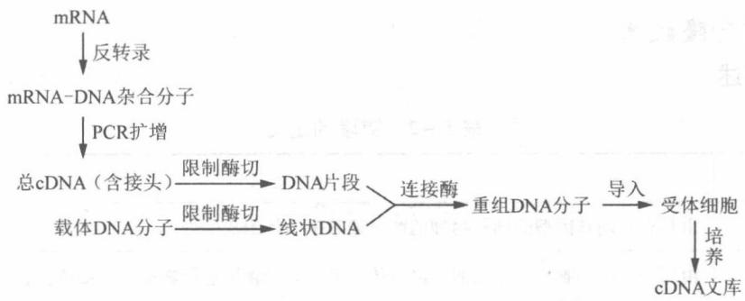

# 第5章 分子生物学研究法(上)——DNA、RNA 及蛋白质操作技术

——DNA、RNA 及蛋白质操作技术

## 5.1 复习笔记

【知识概览】

分子生物学研究三大成就

重组 DNA 技术概述

基因工程

基因组DNA的提取

核酸凝胶电泳

DNA 基本操作技术

聚合酶链式反应(PCR)技术

实时定量PCR

重组载体的构建

DNA、RNA及蛋白质操作技术

基因组 DNA 文库的构建

总RNA的提取

mRNA 的纯化

(1) 2017 (E)

cDNA 的合成

RNA 基本操作技术

cDNA 文库的构建

基因文库的筛选

核酸杂交法

PCR 筛选法

免疫筛选法

非编码RNA研究

克隆概述

RACE 技术

基因克隆技术

RAMPAGE 技术

Gateway 大规模克隆技术

基因的图位克隆法

热不对称交错多聚酶链式反应

双向电泳技术(2-DE)

蛋白质与蛋白质组学技术。

荧光差异显示双向电泳技术(2D-DIGE)

蛋白质质谱分析技术

【重难点归纳】

## 一、重组 DNA 技术概述

## 1. 分子生物学研究三大成就

①证实基因的分子载体是 DNA 而不是蛋白质，解决了遗传的物质基础问题。

②建立 DNA 分子的双螺旋结构模型，提出半保留复制机制，解决了基因的自我复制和世代交替问题。

③提出"中心法则"和操纵子学说，破译了遗传密码，阐明了遗传信息的流动与表达途径。

## 2. 基因工程

## (1) 概念

基因工程又称重组 DNA 技术，是指利用分离纯化或人工合成的外源基因，将其插入到一个具有自我复制能力的载体 DNA 中，在体外构建重组 DNA 分子，然后导入受体或宿主细胞，进而筛选出能表达重组 DNA 的活性宿主细胞，再使之繁殖和扩增，直至表达出目的基因所编码的多肽，以改变生物原有的遗传特性、获得新品种和生产新产品的一种技术。

## (2) 基本步骤

## ①目的基因的获得

基因工程的第一步是取得目的基因，目的基因可以从以下几个途径获得。

a. 限制酶酶切；b. PCR 扩增；c. 人工合成带有目的基因的 DNA 片段；d. 反转录酶酶促合成法。

## ②目的基因与载体结合

将外源 DNA(目的基因)插入载体，使两种 DNA 分子连接起来，得到重组 DNA 分子。体外重组有两种方法：黏性末端连接法和平齐末端连接法。

## ③目的基因导入受体细胞

这一步骤需要将重组 DNA 分子导入适当的受体细胞中增殖。

④筛选重组转化子，扩增目的基因

最后再将目的基因克隆到表达载体上，导入受体细胞，使之表达目的产物。

## (3) 载体

载体能在宿主细胞中进行自我复制和表达。

①常见的克隆载体种类

包括质粒载体、噬菌体以及动物病毒载体等。

## ②载体的基本要求

a. 具有自主复制能力；b. 有多个克隆位点；c. 携带筛选的标记；d. 分子量尽可能小；e. 使用安全。

## ③常用的克隆载体(表5-1)

表 5-1 常用的克隆载体

<table><tr><td colspan="2">常用的克隆载体</td><td>特点</td></tr><tr><td rowspan="4">质粒载体</td><td>pSC101</td><td>第一代分子克隆载体,含有四环素抗性基因( $tet^{r}$ ),属于严紧型载体,拷贝数低</td></tr><tr><td>ColE1</td><td>松弛型载体,具多拷贝</td></tr><tr><td>pBR322</td><td>由3部分组成:1来源于pSF2124质粒易位子Tn3的氨苄青霉素抗性基因( $amp^{r}$ );2来源于pSC101质粒的四环素抗性基因( $tet^{r}$ );3来源于ColE1的派生质粒pMB1的DNA复制起点(ori)</td></tr><tr><td>pUC</td><td>包括4部分:1来源于pBR322质粒的复制起点(ori);2来源于pBR322质粒的氨苄青霉素抗性基因( $amp^{r}$ );3β-半乳糖酶基因(lacZ)启动子;4 $lacZ'$ 基因:编码α-肽的DNA序列</td></tr><tr><td rowspan="2">噬菌体载体</td><td>λ 噬菌体</td><td>特点:1可克隆的片段大,最大可达23kb;2可人工加入多克隆位点;3λDNA 在体外可包装成病毒颗粒,感染效率高;4易筛选;5主要用于 DNA 文库的构建;6本身有复制体系;7感染大肠杆菌后需环化;8含双链线状 DNA 分子,有黏性末端,感染大肠杆菌后,线状 DNA 通过黏性末端互补连接成环,连接处称 COS 位点</td></tr><tr><td>M13 噬菌体</td><td>丝状单链噬菌体,产生单链 DNA,可制备单链 DNA 探针</td></tr><tr><td colspan="2">柯斯质粒(cosmid)</td><td>1含有 λ DNA COS 位点的质粒;2具有质粒的复制起点和抗性基因标记;3具有多种单一酶切位点;4克隆效率高;5可装配成噬菌体颗粒;6利用质粒 DNA 的方式扩增;7可克隆较大的 DNA 片段,主要用于基因组文库构建;8会产生串联现象</td></tr><tr><td colspan="2">YAC 载体(酵母人工染色体)</td><td>能在酵母中稳定复制,常用于大的染色体基因组 DNA 文库构建</td></tr></table>

## (4) 意义

①可以大量生产在一些正常细胞中产量很低的多肽物质，用于医药等工业生产中。

②定向改造生物基因结构，生产抗病强、品质优的各种农副产品，以提高经济价值。

③用于生命科学的基础研究。

④若使用不当、管理不善，也会给人类带来灾难。

## 二、DNA 基本操作技术

## 1. 基因组 DNA 的提取

## (1) 基因组 DNA

基因组从广义上是指一个单倍体细胞内细胞核、线粒体和叶绿体中所包含的全部 DNA 分子，而通常情况下基因组 DNA 则是指细胞核内染色体上的全部 DNA 分子（包括编码区和非编码区）。

## (2) 提取步骤

①将组织材料磨碎。植物组织先用液氮处理，再加入裂解液破碎细胞；动物组织一般加入SDS进行裂解。

②通过苯酚和氯仿分离裂解后的各种细胞组分，包括蛋白质、糖类、酚类等有机物，使之与溶于水的 DNA 相分离。

③用乙醇洗涤分离后的 DNA，使 DNA 沉淀并进一步纯化。

④将沉淀的 DNA 晾干，用超纯水或 TE 缓冲液(用 Tris-HCl 和 EDTA 配制)溶解。

## (3) 检测方法

DNA 的浓度和纯度可以通过测定其 $OD_{260}$ 和 $OD_{280}$ 来判断。 $OD_{260}$ 为 1 时相当于浓度为 $50 \mu g/mL$ 。

① $OD_{260}/OD_{280}$ 处于1.8\~2.0之间时，表明所提取的DNA纯度较好。

② $OD_{260}/OD_{280}<1.8$ 时，表明所提取的样品中含有蛋白质或酚类杂质。

## 2. 核酸凝胶电泳

## (1) 基本原理

DNA 和 RNA 多核苷酸链中的磷酸基团在生理条件下呈离子化状态，会以一定的速度向阳极移动。迁移速度又称电泳速率，与电场强度和该分子所携带的净电荷数成正比。等量的双链 DNA 几乎具有等量的净电荷，因此在一定的电场强度和电泳介质中，电泳速率取决于核酸分子本身的大小，故可根据核酸分子的大小达到分离核酸分子的目的。

## (2)凝胶的种类

包括琼脂糖凝胶(分辨 DNA 片段的范围为 0.2 \~ 50kb)和聚丙烯酰胺凝胶(分辨 DNA 片段的范围为1 \~ 1000bp)。当分辨相对分子质量较低的 DNA 片段时，常采用聚丙烯酰胺凝胶。

凝胶的分辨能力同凝胶类型和浓度有关，凝胶浓度的高低影响凝胶介质孔隙的大小，浓度越高，孔隙越小，分辨能力越强。

## (3)凝胶介质中的 DNA 的检测原理

观察凝胶中的 DNA 的最简便、最常用的方法是利用荧光染料溴化乙锭(EB)进行染色。EB 插入到 DNA 分子的相邻碱基之间，在紫外线下检测时发出荧光，即可检测出凝胶介质中的 DNA 条带。在适当染色条件下，荧光强度与 DNA 片段的大小成正比。

## (4) 脉冲电场凝胶电泳(PFGE)技术

PFGE 用于分离超大相对分子质量(甚至是整条染色体)的 DNA。在脉冲电场中，DNA 分子的迁移方向随着电场方向的周期性变化而发生改变。

## 3. 聚合酶链式反应(PCR)技术

聚合酶链式反应(PCR)是一种在体外模拟发生于细胞内的 DNA 快速扩增特定基因或 DNA 片段的复制过程的技术，是体外扩增特定基因或 DNA 片段最常用的方法。

## (1) PCR 技术的原理

高温处理 DNA 分子使之分离成两条单链 DNA 分子，在引物（一小段单链 DNA）的作用下，DNA 聚合酶以单链 DNA 为模板并利用反应混合物中的四种脱氧核苷三磷酸按照半保留复制的原理合成新生的 DNA 互补链。该技术可使目的 DNA 片段得到大量扩增。

## (2) PCR 的底物

①模板 DNA。

②PCR 引物。寡核苷酸引物在模板 DNA 链两端的退火位点决定了新合成的 DNA 链的起点。

③四种 dNTP。

④缓冲液(酶催化反应的缓冲液)。

⑤耐高温的 DNA 聚合酶，常用 Taq DNA 聚合酶。

## (3) PCR 过程

①DNA 解链(变性)

反应开始时，在 $94^{\circ}$ C 左右加热 $45 \, s \sim 1 \, min$ ，使双链 DNA 变成单链模板 DNA。

## ②引物与模板 DNA 结合(退火)

降低反应温度至约 $55^{\circ}$ C，反应 1min，使引物与 2 条单链 DNA 模板发生退火作用，并结合在靶 DNA 区段两端的互补序列上。实际退火温度依引物长度和序列而定。

## ③DNA 合成(延伸)

将反应体系的温度上升到 $72^{\circ}$ C 保温数分钟。在 DNA 聚合酶作用下，dNTPs 便从引物的 $3'$ 端加入并沿着模板 DNA 分子按 $5'\rightarrow3'$ 方向延伸，合成新的 DNA 互补链。

如此反复加温冷却，只要有聚合酶和足够的4种脱氧核苷三磷酸，PCR反应的全过程就可以不断重复，经20\~30个循环之后，就可以大量产生特定的DNA分子。

## 4. 实时定量PCR

实时定量 PCR 技术是指在 PCR 反应体系中加入荧光基团，利用荧光信号积累实时监测整个 PCR 进程，最后通过标准曲线对未知模板进行定量分析的方法。它是可消除在测定终端产物丰度时有较大变异系数问题的技术。

## 5. 重组载体的构建

## (1) 步骤

## ①引物设计

2 个 DNA 引物长度约 18 \~ 27bp，引物中碱基的分布尽可能均匀且 GC 含量为 40% \~ 60%， $T_{m}$ 值约为 60℃，5' 端需加一个外切核酸酶的识别位点及其保护碱基，引物不能有 4bp 以上的回文序列（否则会形成发夹结构），两引物之间不能有连续 4 个碱基互补，3' 端不应有任何互补的碱基。

## ②PCR 扩增目的基因片段

选择合适的 DNA 模板和 DNA 聚合酶，用 PCR 扩增目的基因，然后利用琼脂糖凝胶电泳检测目标条带，若目标条带单一，可直接利用硅胶膜纯化柱纯化 PCR 产物；若条带不单一，则需在电泳之后对目标条带进行割胶回收，溶胶后再用硅胶膜纯化柱纯化。

## ③核酸酶切割

目的基因片段和载体 DNA 用相同的外切核酸酶在适当温度下分别进行双酶切。酶切 10min 至数小时，以保证酶切完全。

## ④目的基因与载体结合

双酶切产物经过纯化(载体酶切产物割胶回收，PCR 片段酶切后纯化步骤与上述 PCR 产物纯化步骤相同)后，用 T4 DNA 连接酶将目的基因片段和载体连接起来。

## ⑤细菌转化及重组质粒提取

a. 将重组后的质粒载体转化到大肠杆菌感受态细胞中；

b. 涂布含抗生素的 LB 平板后，将平板放在 $37^{\circ}$ C 培养箱中倒置培养过夜；

c. PCR 鉴定阳性克隆，挑取阳性克隆菌落到另一 LB 液体培养基中，在 $37^{\circ}$ C 培养箱中培养过夜；

## D. 裂解菌体，进一步提取重组质粒载体

## (2) 恒温一步法载体构建

①双酶切载体，使其线性化；

②通过引物设计在插入片段两端引入线性化载体的末端序列(15\~25bp);

③插入片段经 PCR 扩增后，其两端具有与线性化载体末端相同的序列；

④按一定比例加入插入片段和线性化载体，再加入 dNTP；

⑤加入 T5 外切核酸酶、DNA 聚合酶和 Taq DNA 连接酶混合催化，50℃恒温反应 15～30min 即可完成连接反应。

## 6. 基因组 DNA 文库的构建

## (1) 基因组 DNA 文库

基因组 DNA 文库是指基因组中所有 DNA 序列的克隆总体，即大量的、代表某生物体整个基因组的 DNA 片段（包括目的基因在内）插入到载体 DNA 中形成的克隆。利用基因文库可以分离特定的基因结构，进一步筛选和鉴定目的基因。

## (2) 构建基因组 DNA 文库的步骤

①制备大小合适的随机 DNA 片段，即染色体 DNA 的片段化；

②在体外将 DNA 片段与载体连接成重组体 DNA，然后重组体 DNA 与 $\lambda$ 噬菌体包装蛋

白在体外进行包装；

③将重组子转化到大肠杆菌或其他受体细胞中；

④基因文库的鉴定和扩增。

(3) 提高文库代表性的策略

①用机械切割法或使用限制性内切酶随机断裂 DNA，以保证克隆的随机性。

②增加文库重组克隆的数目，以提高覆盖基因组的倍数。

(4) 构建基因组文库常用的方法

包括限制性内切酶部分消化法和 $\lambda$ 噬菌体载体。

## 三、RNA 基本操作技术

## 1. 总RNA的提取

细胞中的总 RNA 是指细胞内全部 RNA 的总称，包括 mRNA、rRNA、tRNA 以及一些小 RNA(sRNA)。目前实验室常用的总 RNA 提取方法是异硫氰酸胍-苯酚抽提法。

## (1) 提取过程

①用液氮研磨材料至成为匀浆，加入 Trizol 试剂，进一步破碎细胞并溶解细胞成分；

②加入氯仿抽提，离心，分离水相和有机相；

③收集含有 RNA 的水相，通过异丙醇沉淀获得比较纯的总 RNA，用于进一步的分离纯化。

## (2) 检测方法

①测定 $OD_{260}/OD_{280}$ 。 $OD_{260}/OD_{280}$ 比值在 1.8～2.0 之间时，表明 RNA 的纯度较好；<1.8 时，表明 RNA 已受到污染；>2.0 时，表明提取的 RNA 可能有降解。

②通过琼脂糖凝胶电泳测定。电泳后28S rRNA和18S rRNA亮度接近2:1时，且rRNA完整表明RNA质量较好。

## 2. mRNA 的纯化

真核生物 mRNA 具有 5' 端帽子结构和 3' 端的 poly(A) 尾巴，因此可以利用寡聚 (dT)-纤维素柱层析法获得高纯度真核 mRNA。首先将用生物素标记的寡聚 (dT) 引物与总 RNA 共温育，加入包被有抗生物素蛋白的微磁球，利用磁场吸附 poly(A) mRNA，最终将 mRNA 从总 RNA 中分离出来。

## 3. cDNA 的合成

cDNA 的合成包括第一链和第二链 cDNA 的合成。

(1) 第一链 cDNA 的合成

以 mRNA 为模板，在寡聚(dT)引物的作用下，经反转录酶催化，合成 cDNA。

## (2) 第二链 cDNA 的合成

以第一链 cDNA 为模板，在 DNA 聚合酶的作用下，以 mRNA - cDNA 杂合链中的 mRNA 序列产生的小片段为引物，催化合成第二条 cDNA 的片段，再通过 DNA 连接酶的作用连成完整的 DNA 链。

## 4. cDNA 文库的构建

从一定生长阶段的某种细胞或组织分离得到的总 mRNA 反转录成总 cDNA，插入到克隆载体，然后再将 cDNA 重组子转移到宿主细胞中进行增殖。通过上述方法所获得的无性繁殖系即为 cDNA 文库。构建 cDNA 文库的基本步骤如图 5-1 所示。

  
图5-1 cDNA文库建立的步骤

## 5. 基因文库的筛选

基因文库的筛选是指通过某种特殊方法从基因文库中鉴定出含有所需重组 DNA 分子的特定克隆的过程。主要的筛选方法包括核酸杂交法、PCR 筛选法和免疫筛选法。

## (1) 核酸杂交法

核酸杂交法是指以质粒为载体进行 DNA 克隆繁殖所用的方法，即从多数寄主菌的菌落中，将含特定的碱基排列顺序的 DNA，通过与其碱基排列顺序互补的 RNA 或 DNA 杂交而进行检出和选择。常用放射性标记的特异 DNA 探针进行高密度的菌落杂交筛选。

## (2) PCR 筛选法

PCR 筛选法是通过制作目的基因探针对待筛选的目的基因进行 PCR 筛选鉴定，进行反复 PCR 筛选和鉴定的步骤，直至鉴定出与目的基因对应的单个克隆。该方法的前提是已知足够的序列信息并获得基因特异性引物。

## (3) 免疫筛选法

基于抗原抗体特异性结合原理，适用于对表达文库的筛选。

## 6. 非编码 RNA 研究

## (1) 非编码 RNA 的分类

①组成型的非编码 RNA，包括 rRNA 和 tRNA，是蛋白质合成机器的重要组成成员。

②调控型的非编码 RNA，包括 miRNA、siRNA、piRNA、snRNA、snoRNA、lncRNA 及 circRNA 等，它们在转录和翻译水平调控基因表达，维持基因组和细胞功能的稳定。

## (2) 非编码 RNA 的分离

①小片段非编码 RNA 的分离：利用聚丙烯酰胺凝胶电泳分离出总 RNA 中的小片段 (<50nt) RNA（如 miRNA、siRNA、piRNA 等），割胶回收后用乙醇沉淀 RNA，使之纯化，用 T4 RNA 连接酶将 poly(dA) 连接到 RNA 3' 端，经反转录酶催化合成 cDNA 第一链，经 DNA 聚合酶催化合成 cDNA 第二链，最终形成双链 cDNA。加接头，经 PCR 扩增后进行测序分析。

②调控型非编码 RNA 的分离：从总 RNA 样品中去除 rRNA 和 tRNA，剩余 RNA 随机打断成 200～300bp 的片段，加入 N6 随机引物，依次经反转录酶、DNA 聚合酶催化，最终合成 cDNA（包括 mRNA 和全部非编码 RNA 信息）。加接头，PCR 测序后，利用 mRNA 的典型特征去除 mRNA，进而分离出其他非编码 RNA。

③环状 RNA 的分离：从总 RNA 中除去 rRNA 和 tRNA 后，使用 RNaseR 专一性消化单链线性 RNA，得到环状 RNA，随机打断环状 RNA 分子，加入 N6 随机引物，依次经反转录酶、DNA 聚合酶催化，最终合成 cDNA。加接头，经 PCR 扩增后进行测序分析。

## 四、基因克隆技术

## 1. 克隆概述

表 5-2 克隆的定义

<table><tr><td>不同的水平</td><td>定义</td></tr><tr><td>生物个体水平</td><td>由具有相同基因型的同一物种的两个或数个个体组成的群体</td></tr><tr><td>细胞水平</td><td>由同一个祖细胞分裂而来的一群遗传上带有完全相同遗传物质的子细胞群体</td></tr><tr><td>分子生物学水平</td><td>将外源 DNA 插入具有复制能力的载体 DNA 中,使之得以保存和复制</td></tr></table>

## 2. RACE 技术

cDNA 末端快速扩增法(RACE)是用于从已知 cDNA 序列扩增 cDNA 5'端及 3'端缺失序列的方法。根据已知序列设计基因片段内部特异引物，由该片段向外侧进行 PCR 扩增得到目的序列。用于扩增 5'端的称为 5'RACE，用于扩增 3'端的称为 3'RACE。该技术在很大程度上依赖 RNA 连接酶连接和寡聚帽子的快速扩增。这项技术可用于：①获得全长 cDNA；②获得 5'和 3'端非转录序列；③研究转录起始位点的不均一性；④研究启动子区的保守性。

## 3. RAMPAGE 技术

RAMPAGE 技术是在基因表达的加帽分析技术(CAGE)和 RACE 技术的基础上进一步优化的实验技术，是一种在全基因组范围内鉴定所有蛋白质编码基因和部分非编码 RNA 基因的转录起始位点，确定启动子的具体位置，并且能够高通量检测基因表达水平的方法。

## 4. Gateway 大规模克隆技术

Gateway 大规模克隆法利用 $\lambda$ 噬菌体进行位点特异性 DNA 片段重组，实现了不需要传统酶切连接过程的基因快速克隆和载体间平行转移，为大规模克隆基因组注释的开放读码框提供了保障，同时还保持正确的 ORF 和方向。Gateway 克隆技术主要包括 TOPO 反应和 LR 反应两步。

## 5. 基因的图位克隆法

基因的图位克隆法是分离未知性状目的基因的一种方法。图位克隆又称定位克隆，是根据目的基因在染色体上的位置进行基因克隆的一种方法。

## 6. 热不对称交错多聚酶链式反应

热不对称交错多聚酶链式反应(TAIL-PCR)常用于扩增T-DNA插入位点侧翼序列，从而获得转基因植物插入位点特异性分子证据。

## 五、蛋白质与蛋白质组学技术

## 1. 双向电泳技术(2-DE)

双向电泳技术(2-DE)是等电聚焦电泳和SDS-PAGE的组合，依赖于蛋白质的等电点和相对分子质量。首先进行等电聚焦电泳（按照pI分离），然后再进行SDS-PAGE（按照分子大小分离），经染色得到电泳图——二维分布的蛋白质图。双向电泳技术是分离大量混合蛋白质组分的最有效方法。

## 2. 荧光差异显示双向电泳技术(2D-DIGE)

2D-DIGE 在 CyDye DIGE 荧光标记染料的基础上，结合多重荧光分析技术，基本解决

了传统 2-DE 难以克服的系统误差问题，提高了实验结果的可重复性和可信度。

## 3. 蛋白质质谱分析技术

可用于鉴定蛋白质结构，鉴定蛋白质复合物的合成，确定蛋白质翻译后修饰的类型与发生位点。

## 5.2 课后习题详解

## 1. 试述 PCR 扩增的原理和步骤

答：聚合酶链式反应(PCR)是一种通过模拟体内 DNA 复制的方式在体外进行核酸扩增的方法。

## (1) PCR 扩增的原理

高温处理 DNA 分子使之分离成两条单链 DNA 分子，在引物的作用下，DNA 聚合酶以单链 DNA 为模板并利用反应混合物中的四种脱氧核苷三磷酸按照半保留复制的原理合成新生的 DNA 互补链。该技术可使目的 DNA 片段得到大量扩增。

## (2) PCR 扩增的步骤

## ①高温变性

反应开始时，加热至 $94^{\circ}$ C 左右，维持 $45 \, s \sim 1 \, min$ ，使双链 DNA 变成单链模板 DNA。

## ②低温退火

DNA 分子经加热变性成单链后，温度降至 $55^{\circ}$ C 左右反应 1min，使引物与 2 条单链 DNA 模板发生退火作用，并结合在靶 DNA 区段两端的互补序列上。实际退火温度依引物长度和序列而定。

## ③适温延伸

在适宜的温度(72℃左右)下保温数分钟，DNA 模板－引物结合物在 Taq DNA 聚合酶的作用下，以 dNTP 为反应原料，靶序列为模板，依据碱基互补配对与半保留复制原理，合成一条新的与模板 DNA 链互补的半保留复制链。

如此反复加温冷却，只要有聚合酶和足够的4种脱氧核苷三磷酸，PCR反应的全过程就可以不断重复，经20\~30个循环之后，就可以大量产生特定的DNA分子。

## 2. 试比较常规重组载体构建和恒温一步法载体构建的异同点

## 答：(1) 常规重组载体构建

利用 PCR 的方法用合成的引物扩增含有目的基因的基因片段，用相同的外切核酸酶对基因片段和载体进行双酶切，在体外用 T4 DNA 连接酶将目的基因与载体 DNA 连接，得到具有自我复制能力的 DNA 分子（重组体）。

## (2) 恒温一步法载体构建

恒温一步法载体构建不依赖 T4 DNA 连接酶。首先将载体线性化，通过引物设计在插入片段两端引入线性化载体的末端序列，PCR 扩增插入片段，然后按一定比例加入插入片段和线性化载体，再加入 dNTP，在 T5 外切核酸酶、DNA 聚合酶和 Taq DNA 连接酶的混合催化下，50℃ 恒温反应 15～30min 即可完成连接反应。

## (3)两种构建方法的异同点(表5-3)

表 5-3 常规重组载体构建和恒温一步法载体构建的异同点

<table><tr><td></td><td>项目</td><td>常规重组载体构建</td><td>恒温一步法载体构建</td></tr><tr><td rowspan="4">不同点</td><td>引物设计</td><td>DNA 引物的 5&#x27;端加一个外切核酸酶的识别位点及其保护碱基</td><td>在插入片段两端引入线性化载体的末端序列(15~25bp)</td></tr><tr><td>双酶切</td><td>引物和载体均需双酶切</td><td>仅载体需双酶切</td></tr><tr><td>连接反应所需酶</td><td>T4 DNA 连接酶</td><td>T5 外切核酸酶、DNA 聚合酶和 Taq DNA 连接酶</td></tr><tr><td>一次连接反应所需温度及时间</td><td>根据插入目的基因与载体各自的 DNA 浓度及片段长度不同而异。如 22°C 需 1~2h;4°C 或 16°C 需 8h 以上</td><td>50°C 恒温 15~30min</td></tr><tr><td>相同点</td><td colspan="3">都需要目的基因片段和载体 DNA 的参与,引物合成后都需经 PCR 扩增目的基因,连接重组载体后都需通过细菌转化获取大量重组载体拷贝</td></tr></table>

1. 比较荧光染料 SYBR Green I 和 TaqMan 荧光探针的主要不同点。

答：荧光染料 SYBR Green I 和 TaqMan 荧光探针的荧光信号强度代表了模板 DNA 的拷贝数，但有不同，二者主要的不同点如表 5-4 所示。

表 5-4 荧光染料 SYBR Green I 和 TaqMan 荧光探针的不同点

<table><tr><td></td><td>荧光染料 SYBR</td><td>TaqMan 荧光探针</td></tr><tr><td>原理</td><td>SYBR 荧光染料激发光波长 520nm,将 SYBR 荧光染料混合在 PCR 液中,只有与双链 DNA 结合后,才能发射荧光信号,以保证荧光信号的增加与 PCR 产物的增加完全同步</td><td>TaqMan 荧光探针与靶 DNA 结合,靶 DNA 的 5&#x27; 和 3&#x27; 端带有短波和长波两个不同荧光基团。这两个荧光基团由于距离过近,在荧光共振能量转移(FRET)作用下发生了荧光淬灭,因而检测不到荧光。PCR 反应开始后,随着双链 DNA 变性产生单链 DNA,TaqMan 探针结合到与之配对的靶 DNA 序列上,并被具有外切酶活性的 Taq DNA 聚合酶逐个切除而降解,从而解除荧光淬灭的束缚,荧光基团在激发光下发出荧光,产生的荧光强度直接反映了被扩增的靶 DNA 总量</td></tr><tr><td>特异性</td><td>能与所有的双链 DNA 结合,对 DNA 模板没有选择性,不能区分不同的双链 DNA</td><td>仅能与目的 DNA 序列特异结合</td></tr></table>

1. 分析基因组 DNA 文库和 cDNA 文库的主要区别。

答：基因组 DNA 文库和 cDNA 文库的主要区别如表 5-5 所示。

表 5-5 基因组 DNA 文库和 cDNA 文库的主要区别

<table><tr><td></td><td>基因组 DNA 文库</td><td>cDNA 文库</td></tr><tr><td>构建过程</td><td>用限制性内切酶切割细胞的整个基因组 DNA,可以得到大量的基因组 DNA 片段,然后将这些 DNA 片段与载体连接,再转化到宿主细胞中去,让宿主菌形成一个克隆,克隆群体包含基因组的全部基因片段</td><td>以 mRNA 为模板,经反转录酶催化,在体外反转录成 cDNA,与适当的载体如噬菌体或质粒载体连接后转化受体菌进行繁殖扩增</td></tr><tr><td>克隆的对象</td><td>所有 DNA 序列,包括功能未知的 DNA 序列,覆盖整个基因组</td><td>某段时间内被转录的 DNA 序列,不含有内含子和启动子</td></tr><tr><td>应用范围</td><td>用于分离特定的基因片段、分析特定基因结构、研究基因表达调控,还可用于全基因组物理图谱的构建和全基因组序列测定</td><td>用于筛选目的基因、大规模测序、基因芯片杂交等功能基因组学研究</td></tr></table>

## 5. cDNA 合成时的方向性是如何实现的？

答：cDNA 合成时的方向性是通过以下途径实现的。

(1) 在 cDNA 合成过程中，选用活性较高的反转录酶及甲基化 dCTP，保证新合成的 cDNA 链被甲基化修饰，防止构建克隆时被限制性内切核酸酶切割。

(2) 在 cDNA 两端加上不同内切酶识别的接头序列，保证所获得双链 cDNA 的方向性。

1. 热不对称交错多聚酶链式反应(TAIL-PCR)的主要技术和原理。

## 答: (1) TAIL-PCR 的主要技术

热不对称交错多聚酶链式反应(TAIL-PCR)常用于扩增T-DNA插入位点侧翼序列，从而获得转基因植物插入位点特异性分子证据。TAIL-PCR使用一套巢式特异引物（T-DNA边界引物，TR）和一个短的随机简并引物（AD），分为3轮反应。

## ①第一轮 PCR 反应(PCR I)

a. 以 TR1 和 AD 为引物，进行 5 个高严谨性循环，特异性引物 TR1 与模板退火，只能发生单引物循环，T-DNA 上游侧翼序列得到线性扩增。

b. 大幅度降低退火温度，使 AD 及 TR1 均与模板 DNA 结合，指数扩增一个循环。

c. 两个高严谨、一个低严谨循环交替进行，共15个循环。

## ②第二轮 PCR 反应(PCR II)

将第一次反应的产物稀释 1000 倍作为模板，以 TR2 和 AD 为引物，进行 12 个 TAIL-PCR 循环，特异性序列被优先扩增，非特异性序列 I 大大降低。

## ③第三轮 PCR 反应(PCRⅢ)

将第二次反应的产物稀释 1000 倍作为模板，以 TR3 和 AD 为引物，通过 20 次普通的 PCR 循环扩增特异性序列，即得到较高含量的与已知序列邻近的目标序列。

## (2) TAIL - PCR 的原理

以基因组 DNA 为模板，使用依照目标序列旁的已知序列设计的 3 个较高退火温度的嵌套特异性引物(SP)和 1 个具有低 $T_{m}$ 值的短的随机简并引物(AD)，利用 3 轮具热不对称的温度循环分级反应，即利用不同的退火温度，来进行 PCR 扩增，从而获得已知序列的侧翼序列。

## 7. 说说从总 RNA 的提取到分离出非编码 RNA 的主要过程

答：从总 RNA 的提取到分离出非编码 RNA 的主要过程如下：

(1)用液氮研磨材料至成为匀浆，加入 Trizol 试剂，进一步破碎细胞并溶解细胞成分。

(2) 加入氯仿抽提，离心，分离水相和有机相。

(3) 收集含有 RNA 的水相，通过异丙醇沉淀，获得比较纯的总 RNA，用于进一步的分离纯化。

(4) 不同非编码 RNA 的分离方法:

①小片段非编码 RNA 的分离：利用聚丙烯酰胺凝胶电泳分离出总 RNA 中的小片段 (<50nt) RNA（如 miRNA、siRNA 和 piRNA 等），割胶回收后用乙醇沉淀 RNA，使之纯化，用 T4 RNA 连接酶将 poly(dA) 连接到 RNA 3' 端，经反转录酶催化合成 cDNA 第一链，经 DNA 聚合酶催化合成 cDNA 第二链，最终形成双链 cDNA。加接头，经 PCR 扩增后进行测序分析。

②调控型非编码 RNA 的分离：从总 RNA 样品中除去 rRNA 和 tRNA，剩余 RNA 随机打断成 200～300bp 的片段，加入 N6 随机引物，依次经反转录酶、DNA 聚合酶催化，最终合成 cDNA（包括 mRNA 和全部非编码 RNA 信息）。加接头，PCR 测序后，利用 mRNA 的典型特征去除 mRNA，进而分离出其他非编码 RNA。

③环状 RNA 的分离：从总 RNA 中除去 rRNA 和 tRNA 后，使用 RNaseR 专一性消化单链线性 RNA，得到环状 RNA，随机打断环状 RNA 分子，加入 N6 随机引物，依次经反转录酶、DNA 聚合酶催化，最终合成 cDNA。加接头，经 PCR 扩增后进行测序分析。

## 8. 已知一个 cDNA 3' 端的部分序列，请设计实验流程得到该基因的全长 cDNA

答：已知一个 cDNA 3' 端的部分序列，若想得到该基因的全长 cDNA，应采用 cDNA 末端快速扩增法 (RACE)。

RACE 是一种利用逆转录 PCR，将部分缺失的 cDNA 扩增出完整的 5' 端或 3' 端序列的技术。根据已知序列设计特异性引物，利用 3'RACE 获得 3' 端序列（基因特异性引物 → 3' 末端），利用 5'RACE 获得 5' 端序列（基因特异性引物 → 5' 末端），最终获得完整的 cDNA 序列。实验流程如下：

(1) 根据已知序列设计三条巢式引物，进行 $5'$ RACE，得到 $5'$ 序列；

(2) 同时设计巢氏引物，进行 $3'$ RACE 得到 $3'$ 序列；

(3) 序列拼接；

(4) 设计引物扩增全长序列。

1. 试分析 RACE 技术与 RAMPAGE 技术的相同点和不同点。

答：RACE 技术即 cDNA 末端快速扩增技术，是一项在已知 cDNA 序列的基础上克隆 5' 端或 3' 端缺失序列的技术。根据已知序列设计基因片段内部特异引物，由该片段向外侧进行 PCR 扩增得到目的序列。用于扩增 5' 端的称为 5'RACE，用于扩增 3' 端的称为 3'RACE。该技术在很大程度上依赖于 RNA 连接酶连接和寡聚帽子的快速扩增。而 RAMPAGE 技术是在基因表达的加帽分析技术和 RACE 技术的基础上进一步优化的实验技术，二者相同点和不同点如表 5-6 所示。

表 5-6 RACE 技术与 RAMPAGE 技术的相同点和不同点

<table><tr><td></td><td></td><td>RACE 技术</td><td>RAMPAGE 技术</td></tr><tr><td>相同点</td><td colspan="3">两种技术都利用反转录酶的特性合成 cDNA</td></tr><tr><td>不同点</td><td>过程</td><td>1获得高质量总 RNA;2对 RNA 进行去磷酸化作用;3去掉 mRNA 的 5' 帽子结构,加特异性 RNA 寡聚接头并用 RNA 连接酶相连接;4以特异性寡聚 dT 为引物,在反转录酶的作用下,反转录合成第一条 cRNA 链,包含了寡聚接头的互补序列;</td><td>1提取总 RNA,利用添加过接头的随机引物反转录出 cDNA 的第一条链。在杂合链的 RNA 链的两个末端标记生物素;2RNA 的 3' 端在大多数情况下仍为单链,用 RNase I 特异性切割杂合链中单链状态的 RNA,此时 3' 端的生物素标记被去除;3用偶联了链霉亲和素的磁珠筛选出 5' 端帽子结构处加上生物素标记的 RNA - cDNA 杂合双链;4RNase H 降解磁珠上的 RNA,再分离出单链 cDNA;</td></tr><tr><td rowspan="3">不同点</td><td>过程</td><td>5分别以第一链 cDNA 为模板进行 RACE 反应。5'RACE 以 5'端 RNA 寡聚接头的部分序列和基因特异的 3'端反向引物进行 PCR 扩增,获得基因的 5'端序列。3'RACE 以 5'端基因特异的引物和 3'端寡聚 dT 下游部分序列为引物进行 PCR 扩增,获得基因的 3'端序列</td><td>5利用锚定引物和随机引物上的接头序列作为引物进行 PCR 扩增获得双链 cDNA,用磁珠对 cDNA 片段进行尺寸筛选</td></tr><tr><td>用途</td><td>获得全长 cDNA;获得 5'和 3'端非转录序列;研究转录起始位点的不均一性;研究启动子区的保守性</td><td>在全基因组范围内鉴定所有蛋白质编码基因和部分非编码 RNA 基因的转录起始位点,确定启动子的具体位置,并且能够高通量检测基因的表达水平</td></tr><tr><td>应用范围</td><td>cDNA 的部分序列已知的基因</td><td>全基因</td></tr></table>

1. 简述 Gateway 大规模克隆技术原理及基本操作流程。

## 答：(1)原理

Gateway 大规模克隆技术利用 $\lambda$ 噬菌体进行位点特异性 DNA 片段重组，实现了不需要传统的酶切连接过程的基因快速克隆和载体间平行转移，为大规模克隆基因组注释的可读框提供了保障，同时还保持正确的 ORF 和方向。

## (2) 基本操作流程

Gateway 大规模克隆技术包括 TOPO 反应和 LR 反应两步。

## ①TOPO 反应

将目的基因 PCR 产物连入 Entry 载体，Entry 载体上的特异序列 CCCTT 被拓扑异构酶识别并切开，该酶通过其 274 位上的酪氨酸与切口处的磷酸基团形成共价键，从而偶联在载体上。当加入 PCR 产物后，载体上形成的 3' 突出端 GTGG 攻击 PCR 产物序列，与接头序列 CACC 配对退火，去掉多余的接头序列 GTGG，将 PCR 产物以正确方向连入 Entry 载体。

## ②LR 反应

将目的基因从 Entry 载体中重组入表达载体。反应由 Int、IHF 和 Xis 酶混合物催化。Entry 载体上基因两端具有 attL1 和 attL2 位点，目的载体上含有 attR1 和 attR2 位点，在重组蛋白的作用下发生定向重组，形成新的位点 attB1 和 attB2，将目的基因转移到表达载体中。

## 11. 说说基因图位克隆法的原理和过程

答：基因图位克隆法是分离未知性状目的基因的一种方法，理论上认为所有具有某种表现型的基因都可以通过基因图位克隆法克隆得到。

## (1)基因图位克隆法的原理

该方法根据功能基因在基因组中都有相对稳定的基因座，在利用分子标记技术对目的基因进行精确定位的基础上，用与目的基因紧密连锁的分子标记筛选 DNA 文库，从而构建出目的基因区域的物理图谱，再利用此物理图谱通过染色体步移或通过染色体登陆的方法，最终获得含有目的基因的克隆，通过遗传转化实验可以研究目的基因的功能。

## (2)基因图位克隆法的过程

①筛选与目的基因连锁的分子标记；

②利用遗传作图和物理作图对目的基因进行精细定位；

③构建含有大插入片段的基因组文库(BAC 或 YAC 库);

④利用和目的基因连锁的分子标记作为探针筛选基因组文库；

⑤用获得的阳性克隆构建目的基因区域的跨叠群；

⑥通过染色体步移、登陆或跳跃获得含有目的基因的大片段克隆；

⑦通过亚克隆获得带有目的基因的小片段克隆；

⑧测序获得候选基因碱基序列；

⑨通过遗传转化和功能互补实验验证目的基因。

1. 比较基因组与蛋白质组的主要差别。

答：基因组是一个细胞或者生物体所携带的一套完整的单倍体序列，包括全套基因和间隔序列。蛋白质组是一种细胞乃至一种生物所表达的全部蛋白质。二者的主要差别如下：

(1) 基因组是确定的，组成某个体的所有细胞享有共同的固定基因组。

(2) 蛋白质组在各个生命进程中是动态变化的，不同生物的个体、组织或细胞在不同发育时期、分化阶段以及不同的生理、病理条件下基因表达是不一致的，所对应的蛋白质组也具有特异性。

1. 说出蛋白质质谱技术的主要原理。

答：蛋白质质谱技术的主要原理是样品分子发生离子化后，根据离子间质荷比(m/z)的差异来分离并确定样品分子量。现行质谱仪分为三个连续的组成部分：离子源，离子分离区和检测器。常用的是基质辅助的激光解析电离－飞行时间质谱(MALDI-TOF)和电喷雾质谱(ESI-MS)。

## 5.3 名校考研真题详解

## 一、选择题

1. 用于检测基因组或大片段 DNA 某一区域中特异 DNA 片段的插入或缺失的分子杂交技术是( )。[中国计量大学 2018 研]
A. Southern 印迹 B. Northern 印迹 C. Western 印迹 D. 以上均不是

## 【答案】A

【解析】Southern 印迹杂交是研究 DNA 图谱的基本技术，主要用于检测基因组或大片段 DNA 某一区域中特异性片段的插入或缺失，以及进行基因片段的定位。

1. RNA 电泳转膜后与探针杂交的技术叫做( )。[河北大学 2016 研]
A. Southern blot B. Northern blot C. Western blot D. 原位杂交

【答案】B

【解析】核酸分子杂交的类型如表5-7所示。Northern blot是一种通过检测RNA的表达水平来检测基因表达的方法。通过电泳的方法将不同的RNA分子依据其分子量大小加以区分，然后通过与特定基因互补配对的探针杂交来检测目的基因片段。因此答案选B。

表 5-7 分子杂交的类型

<table><tr><td>类型</td><td>Southern 杂交</td><td>Northern 杂交</td><td>Western 杂交</td></tr><tr><td>检测对象</td><td>DNA</td><td>RNA</td><td>蛋白质</td></tr><tr><td>探针</td><td>DNA 或 RNA</td><td>DNA 或 RNA</td><td>蛋白质</td></tr></table>

1. cDNA 文库包括该种生物( )。[电子科技大学 2012 研]
A. 某些蛋白质的结构基因 B. 所有蛋白质的结构基因
C. 所有结构基因 D. 内含子和调控区

【答案】A

【解析】cDNA 文库是指从一定生长阶段的某种细胞或组织分离得到的总 mRNA 反转录成总 cDNA，插入到克隆载体，然后再将 cDNA 重组子转移到宿主细胞中进行增殖所得到的无性繁殖系。因此 cDNA 文库只包括某个生长阶段表达蛋白质的结构基因。而基因组文库包含所有 DNA 序列。因此答案选 A。

1. 生物质谱所用的内肽酶是( )。[北京大学2009、2010研]
A. CPA B. CPB C. CPY D. Trypsin

【答案】D

【解析】ABC 三项，CPA、CPB、CPY 分别是羧肽酶 A、羧肽酶 B、羧肽酶 Y。羧肽酶是一类肽链外切酶，能专一地从肽链的 C 端开始逐个降解，释放出游离氨基酸，用于 C 端氨基酸残基分析。D 项，Trypsin 是胰蛋白酶，是最常用的蛋白水解酶，专一性强，只断裂赖氨酸或精氨酸的羧基参与形成的肽键，是肽链内切酶即内肽酶。因此答案选 D。

1. Southern 印迹的 DNA 探针( )杂交。[浙江工业大学 2008 研]
A. 只与完全相同的片段
B. 可与任何含有相同序列的 DNA 片段
C. 可与任何含有互补序列的 DNA 片段
D. 可与用某些限制性内切核酸酶切成的 DNA 片段
E. 以上都不是

【答案】C

【解析】Southern印迹杂交是研究DNA图谱的基本技术，基本原理是具有一定同源性的两条核酸单链在一定的条件下，可按碱基互补配对的原则特异性杂交形成双链。利用琼脂糖凝胶电泳分离经限制性内切酶消化的DNA片段，将胶上的DNA变性并在原位将单链DNA片段转移至固相支持物上，经固定后与相对应结构的标记探针进行杂交，用放射自显影或酶反应显色，从而检测特定DNA分子的含量。因此答案选C。

## 二、填空题

1. RecBCD 具有多种酶活性，其主要酶活性包括\_\_\_\_，\_\_\_\_和\_\_\_\_。[深圳大学2013研]

【答案】(依赖于 ATP 的)核酸外切酶活性；(可被 ATP 增强的)核酸内切酶活性；(需要 ATP 的)解螺旋酶活性

1. DNA 序列分析常用的方法有 \_\_\_\_ 和 \_\_\_\_ 。[山东理工大学 2008 研]

【答案】Sanger 双脱氧链终止法；Maxam-Gilbert 化学降解法

1. 蛋白质组学研究某一物种、个体、器官、组织或细胞在特定条件、特定时间所表达的全部蛋白质图谱，通常采用\_\_\_\_方法将蛋白质分离，然后采用\_\_\_\_技术进行鉴定。[北京大学2008研]

【答案】双向电泳；质谱

1. 用于基因克隆载体的质粒都具有\_\_\_\_、\_\_\_\_和\_\_\_\_三种必需条件。[华南理工大学2007研]

【答案】复制区；选择标记；多克隆位点

1. PCR 反应主要有\_\_\_\_、\_\_\_\_和\_\_\_\_三个步骤。[华中科技大学 2005 研]

【答案】变性；退火；延伸

【解析】PCR 反应是指在体外模拟生物体内 DNA 的复制过程，典型的 PCR 反应包括三个过程：①变性：双链 DNA 在高温条件下(90\~95℃)变成两条单链，作为 DNA 复制的模板；②退火：单链 DNA 在较低温度下(37\~60℃)与引物互补结合，形成杂交双链结构；③延伸：升温至 70\~75℃，在耐热 DNA 聚合酶的催化下，以 4 种 dNTP 为底物，从引物的 3' 端开始按 5'→3' 方向延伸，合成模板 DNA 的互补链。经过多次循环即可得到所需要的目的 DNA 片段。

## 三、判断题

1. 用凝胶过滤柱(如 Sephadex G-100)层析分离蛋白质时, 总是分子质量小的先于分子质量大的下来。( ) [厦门大学 2008 研]

## 【答案】错

【解析】凝胶过滤层析是根据分子质量大小进行排阻，当分子大小不同的蛋白质流经凝胶层析柱时，比凝胶孔径大的分子不能进入凝胶珠内的网状结构，而被排阻在凝胶珠之外，随着溶剂在凝胶珠之间的孔隙向下移动并最先流出柱外；比网孔小的分子则不同程度地能自由出入凝胶珠的内外。这样不同大小的分子由于所经的路径不同而得到分离，大分子物质先被洗脱出来，小分子物质后被洗脱出来。

1. 基因工程的一个必需步骤是利用限制性内切核酸酶切割目的基因使其产生黏性末端，然后连接到载体上。（）[四川大学2007研]

## 【答案】错

【解析】目的基因并非只能通过内切核酸酶产生，PCR 等其他方法也可以产生目的基因，而且不一定只产生黏性末端，也有可能产生平末端。

1. 核酸分子在电场中向正极移动，蛋白质向负极移动。（）[华中科技大学2005研]

## 【答案】错

【解析】某物质的迁移率与电场强度和该分子所携带的净电荷数成正比，而与分子的摩擦系数成反比。在生理条件下，核酸分子中的磷酸基团是离子化的，所以 DNA 和 RNA 实际上呈多聚阴离子状态。在 SDS 聚丙烯酰胺凝胶电泳中，SDS 是阴离子，能使多肽链上覆盖上相同密度的负电荷，该电荷量远超过蛋白质本身所带的电荷量，因而掩盖了蛋白质间原有的电荷差别，使所有的 SDS-蛋白质复合物都以同样的电荷/蛋白质质量比向正极移动。

## 四、名词解释题

## 1. Genetic engineering[宁波大学2019研]

答：Genetic engineering 的中文名称是基因工程，是指利用分离纯化或人工合成的外源基因，将其插入到一个具有自我复制能力的载体 DNA 中，在体外构建重组 DNA 分子，然后导入受体或宿主细胞，进而筛选出能表达重组 DNA 的活性宿主细胞，再使之繁殖和扩增，直至表达出目的基因所编码的多肽，以改变生物原有的遗传特性、获得新品种和生产新产品的一种技术。

1. 双向电泳(two-dimensional gel electrophoresis, 2-DE) [四川大学 2006 研；宁波大学 2018 研]

答：双向电泳(two-dimensional gel electrophoresis, 2-DE)是分离大量混合蛋白质组分的最有效方法，是等电聚焦电泳和SDS-PAGE的组合，这种方法依赖于蛋白质等电点和相对分子质量的特性，来达到分离纯化的目的。首先进行等电聚焦电泳(按照pI分离)，然后再进行SDS-PAGE(按照分子大小分离)，经染色得到电泳图——二维分布的蛋白质图。

## 3. 实时荧光定量 PCR[华南理工大学 2017 研]

答：实时荧光定量 PCR 是指在 PCR 反应体系中加入荧光基团，利用荧光信号积累实时监测整个 PCR 进程，最后通过标准曲线对未知模板进行定量分析的方法，它是能够消除在测定终端产物丰度时有较大变异系数问题的技术。

## 4. 感受态细胞(competent Cell) [中国科学院研究生院 2008 研；青岛大学 2017 研]

答：感受态细胞(competent cell)是指受体细胞经过一些特殊方法(如 $CaCl_{2}$ 等化学试剂)的处理后，细胞膜的通透性发生变化，处于最适摄取和容纳外来 DNA 的生理状态。将构建好的载体转入感受态细胞进行表达，可以检验重组载体是否构建成功。

## 5. 质粒(plasmid)[华中科技大学2016研]

答：质粒(plasmid)是一些在细菌中独立于染色体之外的，能够自主复制的较小的双链环状DNA分子，它存在于许多细菌以及酵母菌等生物(多为原核生物)中，乃至植物的线粒体等细胞器中，常作为基因工程的载体。

## 6. 基因图位克隆法(Map-based cloning)[青岛大学2016研]

答：基因图位克隆法(Map-based cloning)是分离未知性状目的基因的一种方法。图位克隆又称定位克隆，根据功能基因在基因组中都有相对稳定的基因座，在利用分子标记技术对目的基因进行精确定位的基础上，使用与目的基因紧密连锁的分子标记筛选DNA文库，从而构建目的基因区域的物理图谱，再利用此物理图谱通过染色体步移逼近目的基因或通过染色体登陆的方法最终找到包含该目的基因的克隆，最后通过遗传转化和功能互补实验验证目的基因。

1. PCR[南开大学2011研；电子科技大学2013研；山东师范大学2013研；华南理工大学2015研]

答：PCR 的全称是 polymerase chain reaction，中文名称是聚合酶链式反应，是指通过模拟体内 DNA 复制的方式在体外进行核酸扩增的方法。首先经高温处理使模板 DNA 变性，两条链解开；然后使引物与模板退火，二者碱基配对；DNA 聚合酶随即以 4 种 dNTP 为底物，在引物的引导下合成与模板互补的 DNA 新链。重复此过程，DNA 以指数方式扩增。

## 8. cDNA library[河北大学 2014 研；华南理工大学 2015 研]

相关试题：cDNA 文库 [浙江工业大学 2018 研；武汉科技大学 2015 研]

答：cDNA library 的中文名称是 cDNA 文库，是指以 mRNA 合成的互补 cDNA 为基础构建的重组 DNA 克隆群体，反映基因组表达的基因序列信息。从一定生长阶段的某种细胞或组织分离得到的总 mRNA，经反转录成总 cDNA 片段，与克隆载体重组后将其引入到相应的宿主细胞中繁殖和扩增，理论上得到的克隆群体就包含有该物种的全部 mRNA 信息。cDNA 文库可用于筛选目的基因，研究特定细胞中基因的表达状态和表达基因的功能等。

## 9. Blue-white screening[武汉大学2008研；山东师范大学2011研]

答：Blue-white screening 的中文名称是蓝白斑筛选。蓝白斑筛选是指基于 $\beta-$ 半乳糖苷酶系统的一种重组子筛选方法。该方法根据载体的遗传特征筛选重组子，主要为 $\alpha-$ 互补与抗生素基因。在指示培养基上，未转化质粒的菌落因无抗生素抗性而不能生长，重组质粒的菌落是白色的，非重组质粒的菌落是蓝色的，以颜色不同为依据直接筛选重组克隆。

## 10. 染色体步查[兰州大学2011研]

答：染色体步查是指从生物基因组或基因组文库中的已知序列出发逐步获得或探知其相邻的未知序列或与已知序列呈共线关系的目的序列的核苷酸组成的方法。染色体步查采用一段分离自某一重组体一端的非重复 DNA 片段作为探针以鉴定含有相邻序列的重组克隆。

## 11. 核酸分子杂交 (Hybridization) [浙江大学 2010 研]

答：核酸分子杂交(hybridization)是指利用核酸分子的变性和复性的性质，使来源不同的DNA(或RNA)片段按碱基互补配对原则形成杂交双链分子的一项实验技术。杂交双链可以在DNA与DNA链之间形成，也可在RNA与DNA链之间形成。

## 12. DNA Fingerprint[电子科技大学 2009 研]

答：DNA Fingerprint 的中文名称是 DNA 指纹。由于限制性酶切位点的改变或 DNA 序列中的重复序列或一些 DNA 遗传标记的差异性，使生物个体 DNA 表现出个体间的差异，这些个体间的 DNA 特征反映了个体的身份。DNA 指纹可用于亲子鉴定。

## 13. YAC[上海交通大学2006研]

答：YAC 的全称是 yeast artificial chromosome，中文名称是酵母人工染色体。酵母人工染色体是结构上能模拟真正酵母染色体的线状 DNA 分子，能够克隆长达 400kb 的 DNA 片段，含有酵母细胞中必需的端粒、着丝点和复制起始序列，可用于基因组大片段 DNA 文库的构建。

## 五、简答题

## 1. 简述基因表达载体的主要构成元件及作用。[暨南大学 2018 研]

答：基因表达载体是在克隆载体基本骨架的基础上增加表达元件（如启动子、终止子等），使目的基因能够表达的载体。表达载体的主要构成元件及作用有以下几方面。

(1) 结构基因，即提取的目的基因核苷酸序列，负责编码目的蛋白。

(2) 启动子, 位于编码蛋白质结构基因之首的一段特殊结构的 DNA 片段, 是 RNA 聚合酶的识别部位和结合部位, 启动目的基因的转录。

(3) 终止子，位于编码蛋白质结构基因末端的一段特殊结构的 DNA 片段，具有终止基因转录过程的作用。

(4)复制起点，能够自我复制保证目的基因在受体细胞中复制遗传和表达。

(5)遗传标记基因，用于检测受体细胞中是否含有目的基因，从而将含有目的基因的细胞筛选出来。

1. 比较分析基因组 DNA 文库和 cDNA 文库。[北京科技大学 2014 研]

答：参见本章课后习题详解第4题答案。

1. 简述 PCR 的原理及应用。[河北大学 2014 研]

相关试题：

(1) PCR 技术的基本原理、步骤和应用。[浙江工业大学 2008 研]

(2) 什么是 PCR，简述其反应过程。[中国计量大学 2019 研]

答：PCR 是根据天然 DNA 的复制机制在体外通过酶促反应有选择地大量扩增（包括分离）一段目的基因的技术。

## (1) PCR 的原理

参见本章课后习题详解第1题答案。

## (2) PCR 的应用

## ①基础科学研究的应用

扩增目的基因和鉴定重组子，基因克隆、基因功能和表达调控研究，基因组测序、制备单链模板以及引入突变等。

## ②临床应用

a. 在遗传学疾病上的应用。通过 PCR 结合限制片段长度多态性分析 (PCR-RFLP)，可以从基因水平对遗传性疾病进行分析，如对血友病、遗传性耳聋等进行诊断等。

b. 在肿瘤研究中的应用。PCR 广泛应用于肿瘤的病因与发病机制的研究以及肿瘤诊断与治疗的研究。如针对不同肿瘤寻找其特异而敏感的标志物、检测微小残留病灶等。

c. 检测病原体。PCR 检测的病原体包括各种细菌、病毒、沙眼衣原体、支原体、寄生虫等。

d. 在基因分型中的应用。如序列特异性寡核苷酸多态性 PCR 常用于对人类白细胞抗原 (HLA) 进行分型。

## ③在法医学中的应用

对法医学标本做遗传学鉴定。

## ④其他应用

a. 分析激活癌基因中的突变情况。

b. 生成克隆化双链 DNA 中的特异序列并作为探针。

1. 以 pBR322 质粒为例说明插入失活选择法的原理以及选择过程。[武汉科技大学 2014 研]

## 答：(1) 插入失活选择法的原理

插入失活是指把外源 DNA 片段插入到载体的选择标记基因中而使此基因失活，丧失其原有的表型特征的方法。标记基因多为抗生素抗性基因。插入失活法是从不同的重组 DNA 分子获得的转化子中鉴定出含有目的基因的转化子的主要方法。

pBR322 质粒上包括两个抗生素抗性基因：氨苄青霉素抗性基因 $(amp^{r})$ 和四环素抗性基因 $(tet^{r})$ 。其中，①四环素：抑制细菌生长，但不杀死细菌；②氨苄青霉素抗性基因：产生β-内酰胺酶，使氨苄青霉素转变为青霉酮酸，使碘-青霉素指示液（蓝灰色）褪色。此外，环丝氨酸能杀死生长的细菌，但不杀死停止生长的细菌。外源 DNA 片段插入到位于筛选标记基因的多克隆位点后，会造成标记基因失活，表现出转化子相应的抗生素抗性消失或转化子颜色改变，通过这些可以初步鉴定出转化子是重组子或非重组子。

## (2) 插入失活选择法的选择过程

①四环素抗性基因插入失活选择过程：外源 DNA 插入 pBR322 质粒 $tet^{r}$ 基因的编码序列内，使该基因失活。可用四环素加环丝氨酸平板培养基选择重组克隆。环丝氨酸能杀死生长的细胞，四环素只是抑制敏感细胞生长。经此处理， $tet^{r}$ 失活的菌的生长被四环素抑制，不被环丝氨酸杀死，保留下来； $tet^{r}$ 不失活的菌抗四环素，能分裂生长，反而被环丝氨酸杀死。

②氨苄青霉素抗性插入失活选择过程：如果在 $amp^{r}$ 上插入外源 DNA，导致氨苄青霉素抗性基因失活，可用碘－青霉素指示液选择。 $amp^{r}$ 失活的菌不能使碘－青霉素指示液褪色，

故挑选出的蓝灰色克隆即为所需的重组质粒。

## 5. 分子克隆的基本步骤。[南开大学 2011 研]

答：分子克隆包括以下几个基本步骤。

(1) 分离制备待克隆的 DNA 片段

①用限制性核酸内切酶将 DNA 切成一定大小的 DNA 片段；

②PCR 扩增特定的基因片段；

③在已知蛋白质的氨基酸序列情况下，用人工方法合成对应的基因片段；

④从 mRNA 反转录产生 cDNA。

(2) 克隆基因载体的选择与构建

克隆载体可以选择质粒、噬菌体 DNA 或柯斯质粒等。

## (3) 重组 DNA 分子的构建

将 DNA 分子与载体分子连接成重组 DNA 分子。连接方法包括黏性末端连接、平头末端连接、同聚寡核苷酸末端连接以及人工接头分子连接。

## (4) 重组 DNA 分子导入受体细胞

重组 DNA 分子导入受体细胞常采用转化或转染、转导的方法。

## (5) 重组克隆的筛选和鉴别

采用直接筛选、间接筛选、核酸杂交以及免疫学方法对重组克隆进行筛选和鉴别。

## 6. 简述 cDNA 文库的构建过程。[重庆大学 2011 研]

答：cDNA 文库是指以细胞的全部 mRNA 逆转录合成的 cDNA 组成的重组克隆群体。从 cDNA 文库可以获得较完整的连续编码序列（不含内含子），以便表达成蛋白质。cDNA 文库的构建过程如下：

## (1) 总 RNA 的提取

常用异硫氰酸胍 - 苯酚抽提法提取总 RNA。

## (2)mRNA 纯化

真核生物的 mRNA 3' 端通常都含有多聚腺苷酸尾巴，常用寡聚胸苷酸(dT) - 纤维素柱层析法获得高纯度的真核 mRNA。

## (3)cDNA 第一链合成

以 mRNA 为模板，由反转录酶催化反转录成 cDNA，需要引物 oligo(dT)。

## (4) cDNA 第二链合成

常用 RNaseH 切割 mRNA - cDNA 杂合链中的 mRNA 序列产生的小片段作为引物，以第一链为模板，由 DNA 聚合酶催化合成第二条 cDNA 片段，再经 DNA 连接酶连成完整的 DNA 链。

## (5) 载体 DNA 与 cDNA 连接

常用的载体有质粒和噬菌体。载体与 cDNA 连接的方法包括人工接头、同聚物加尾以及 cDNA 定向插入。

## (6) 重组 cDNA 分子转移

①噬菌体作为载体需要经过体外包装和转染，导入受体细胞。

②质粒作为载体，可直接转化大肠杆菌。

## (7) 对构建的 cDNA 文库进行鉴定

测定文库包含的克隆数，抽查克隆的质量和异质性，如果需要可适当扩增。

## 7. 简述 3\~4 种 PCR 衍生技术及其应用。[兰州大学 2011 研]

答：PCR 的衍生技术有以下几种。

## (1) 反向 PCR (Inverse PCR)

反向 PCR 是一种简单的扩增已知序列周边未知序列的方法，其原理是首先用已知片段内部没有的限制性内切酶切割模板 DNA，再将切割后的 DNA 片段连接成环状分子，其中至少有一个环状分子含有完整的已知片段，根据已知片段的两端序列设计反向引物，可将邻近的 DNA 片段扩增出来。

## (2) 巢式 PCR(nested PCR)

巢式 PCR 又称嵌套 PCR，是一种变异的 PCR。巢式 PCR 使用两对 PCR 引物扩增完整的片段。第一对 PCR 引物扩增片段和普通 PCR 相似；第二对引物（称为巢式引物）结合在第一次 PCR 产物内侧，用初级 PCR 产物作模板，进行第二步 PCR，第二次 PCR 扩增片段短于第一次扩增片段。

## (3) 热不对称交错 PCR(thermal Asymmetric Interlaced PCR)

热不对称交错 PCR 是一种利用随机引物进行染色体步查的技术。以基因组 DNA 为模板，使用依照目标序列旁的已知序列设计的 3 个较高退火温度的嵌套特异性引物 (SP) 和 1 个具有低 $T_{m}$ 值的短的随机简并引物 (AD)，利用 3 轮具热不对称的温度循环分级反应，来进行 PCR 扩增，从而获得已知序列的侧翼序列。

## (4) 差异显示 PCR (Differential dIsplay PCR)

差异显示 PCR 是用于检测相似生物材料的基因表达谱差异的一种方法，是 PCR 和反转录有机结合并深化应用的产物。

## (5) 多重 PCR(multiplex PCR)

在一个反应体系中使用一对以上的引物就称为多重 PCR，其结果产生多个 PCR 产物，通过比较扩增产物的大小和预期设计的大小，就可以判断样品中含有哪些基因，可用于等位基因的鉴定。

## (6)随机扩增多态性 DNA(RAPD)

随机扩增多态性 DNA 是利用 PCR 技术发展起来的一种 DNA 多态性标记，通过分析 DNA 的 PCR 产物的多态性来推测生物体内基因排布与外在性状表现的规律。利用随机引物对目的基因组 DNA 进行 PCR 扩增，产物经电泳分离后显色，最后分析扩增产物 DNA 片段的多态性，扩增产物的多态性就反映了基因组相应片段由于碱基发生缺失、插入、突变或重排等所引发的 DNA 多态性。

## (7) 扩增片段长度多态性 (AFLP)

AFLP 是 RFLP 与 PCR 相结合的产物。对基因组 DNA 进行双酶切，形成分子量大小不同的随机限制片段，再进行 PCR 扩增，根据扩增片段长度的多态性的比较分析，可用于构建遗传图谱、标定基因和杂种鉴定以辅助育种。

## (8) 实时荧光定量 PCR

实时荧光定量 PCR 技术是指在 PCR 反应体系中加入荧光基团，利用荧光信号积累实时监测整个 PCR 进程，最后通过标准曲线对未知模板进行定量分析的方法。

## 可任选 3\~4 种即可

## 8. 简述双向电泳研究蛋白质组的优缺点。[北京大学 2010 研]

答：(1) 双向电泳研究蛋白质组的优点

①双向电泳(2-DE)技术，特别是固相 $\mathrm{pH}$ 梯度等电聚焦为第一向的双向电泳技术是当前分辨率最高，信息量最大的电泳技术。目前，一次双向电泳最高可达11000个蛋白点的分辨率。

②双向电泳能将组织和细胞中成千上万种蛋白高分辨、高灵敏地分离以满足随后的质谱分析，结合质谱鉴定技术可查明大型蛋白复合物的组分，与其他生物技术相结合可以快速准确地发现和鉴定新的蛋白质。

## (2) 双向电泳研究蛋白质组的缺点

①低拷贝蛋白质的鉴定受限。

②极酸或极碱蛋白的分离比较困难。

③分子质量极大(>200kDa)或极小(<10kDa)蛋白的分离较困难。

④难溶蛋白的检测比较困难。

⑤由于蛋白多样性的存在，很难确定一张正常状态的图谱作为病理状态的对照。

⑥重复性不理想。

⑦得到高质量的双向凝胶电泳需要精湛的技术。

1. 当载体和外源基因是平齐末端时(或者二者具有不同的黏性末端时)，怎样实现载体与外源基因的重组？(至少列举3种方法)[山东理工大学2008研]

答：当限制酶从识别序列的中心轴线处切开时，切开的 DNA 两条单链是平整的切口，该切口称为平齐末端。当载体和外源基因是平齐末端时，实现载体与外源基因重组的方法如下：

## (1) 平端连接

DNA 连接酶可以催化相同或不同限制性内切酶切割的平端之间的连接，恢复被限制酶切开的两个核苷酸之间的磷酸二酯键。该方法所需底物的浓度高，连接效率低，因此通常要将平齐末端改造成黏性末端后再进行连接。

## (2) 同聚物加尾连接

同聚物加尾法是利用末端核苷酸转移酶(以 $Mg^{2+}$ 作为辅助因子)在载体及外源双链 DNA 的 3'—OH 上添加一段寡聚核苷酸，制成人工黏性末端，外源 DNA 和载体 DNA 分子要分别加上不同的寡聚核苷酸，如在一个 DNA 片段的末端添加寡聚 dA，在另一片段末端添加寡聚 dT；或者分别添加寡聚 dC 和 dG，然后在 DNA 连接酶的作用下连接成为重组 DNA 的方法。这种连接方式也可以看成是一种特殊的黏性末端连接方式。

## (3) 人工接头连接

人工接头是指由人工合成的、连接在目的基因两端的含有某些限制酶切点的寡核苷酸片段。在 T4 DNA 连接酶的作用下，将接头连接到目的 DNA 片段的两端，然后再用相应的限制酶切割，使外源 DNA 片段的两端具有了黏性末端，可以与相应的载体进行连接。

1. 成功提取 mRNA，最关键的问题是什么，为什么？从总 RNA 中分离 mRNA 的原理是什么？[江苏大学 2007 研]

## 答: (1) 成功提取 mRNA 最关键的问题

成功提取 mRNA 最关键的是抑制 RNase 酶活性。mRNA 呈单链状，容易受到核酸酶的攻击。无处不在的 RNA 酶极易降解 mRNA，这是导致 RNA 降解最主要的原因。在操作过程中必须严格防止 RNA 酶的降解作用。

①所有用于 mRNA 实验的器皿都要高温焙烤或者使用焦碳酸二乙酯(DEPC)洗涤，所有试剂都要用 DEPC 处理过的水配制。DEPC 是 RNA 酶的强变性剂，可经煮沸除去，避免残留

物影响 mRNA 的实验。

②在破碎细胞的同时用强变性剂使 RNA 酶失活。

③在 mRNA 提取过程中加 RNA 酶的抑制剂。

## (2)从总 RNA 中分离 mRNA 的原理

从总 RNA 中分离 mRNA 经历两个步骤：先用异硫氰酸胍－苯酚抽提法提取总 RNA，再从总 RNA 中用寡(dT)－纤维素柱层析法获得高纯度 mRNA。

## ①异硫氰酸胍-苯酚抽提法提取总RNA的原理

Trizol 试剂是一种新型总 RNA 抽提试剂，主要由异硫氰酸胍和苯酚组成，其中异硫氰酸胍可迅速裂解细胞并溶解细胞中的其他成分，促使核蛋白体解离，抑制细胞释放出的核酸酶，使 RNA 与蛋白质分离，维持细胞中 RNA 的稳定，并将 RNA 释放到溶液中。当加入氯仿时，它可抽提酸性的苯酚，而酸性苯酚可促使 RNA 进入水相，离心后可形成水相层和有机层，使 RNA 与仍留在有机相中的蛋白质和 DNA 分离开，达到提取总 RNA 的目的。

## ②寡(dT)-纤维素柱层析法获得高纯度 mRNA 的原理

利用 mRNA 3'末端含有 poly(A) 的特点，当 RNA 流经寡聚(dT) 纤维素柱时，在高盐缓冲液的作用下，mRNA 被特异性地结合在柱上，然后逐渐降低盐浓度洗脱，在低盐溶液或蒸馏水中，mRNA 被洗下。经过两次寡聚(dT) 纤维柱后可得到较高纯度的 mRNA。

## 六、论述题

1. 试述蛋白质组研究常用技术及用途。[华中科技大学2016研]

## 答：(1)蛋白质组研究常用技术

## ①双向凝胶电泳技术(2-DE)

双向凝胶电泳技术是分离大量混合蛋白质组分最有效的方法，利用蛋白质的等电点和分子量差别将各种蛋白质区分开来。首先进行等电聚焦电泳（按照 pI 分离），然后再进行 SDS-PAGE（按照分子大小分离），经染色得到的电泳图是个二维分布的蛋白质图。虽然二维凝胶电泳难以辨别低丰度蛋白，对操作要求也较高，但因其具有通量高、分辨率高和重复性好以及可与质谱联用的特点，使其成为目前最流行、可靠的蛋白质组研究手段。

## ②多维液相色谱技术

多维液相色谱作为一种新型分离技术，不存在相对分子质量和等电点的限制，通过不同模式的组合，消除了二维凝胶电泳的歧视效应，具有峰容量高、便于自动化等特点。二维离子交换-反相色谱(2D-IEC-RPLC)是蛋白质组学研究中最常用的多维液相色谱分离系统。

## ③飞行时间质谱技术

通常情况下将样品经过简单的预处理后直接滴加到表面经过特殊修饰的芯片上，既可比较两个样品之间的差异蛋白，也可获得样品的蛋白质总览。飞行时间质谱技术分析的样品不需用液相色谱或气相色谱预先纯化，因此可用于分析复杂的生物样品，因此，在应用方面具有显著优势。

## ④同位素标记亲和标签(ICAT)技术

同位素亲和标签技术是近年发展起来的一种用于蛋白质分离分析的技术，此技术目前是蛋白质组研究技术中的核心技术之一。该技术用具有不同质量的同位素亲和标签(ICATs)标记处于不同状态下的细胞中的半胱氨酸，利用串联质谱技术对混合的样品进行质谱分析。根据质谱图上不同ICAT试剂标记的一对肽段离子的强度比例，定量分析它的母本蛋白质在原来细胞中的相对丰度(来自两个样品中的同一类蛋白质会形成易于辨识比较的两个不同的峰形，能非常准确地比较出两份样品蛋白质表达水平的不同)。

当对两种蛋白质样品进行分析比较时，分别加入轻型和重型 ICAT 试剂，待反应完全后将两种样品等量混合，经 TPCK-胰蛋白酶水解后进行生物素亲和层析柱分离，ICAT 标记的肽片段吸附在柱上，然后洗脱进行液相色谱-质谱分析。不同来源的同种多肽会成对并相邻地出现在质谱图上，两者峰面积的差别即为两样品中同一种蛋白质表达的差异。

## ⑤生物信息学技术

生物信息学在生命科学研究中起着越来越重要的作用。利用生物信息学对蛋白质组的各种数据进行处理和分析，也是蛋白质组研究的重要内容。生物信息学是蛋白质组学研究中不可缺少的一部分。

## (2) 蛋白质组研究用途

蛋白质组学研究将成为寻找疾病分子标记和药物靶标最有效的方法之一。在对癌症、早老性痴呆等人类重大疾病的临床诊断和治疗方面也有十分诱人的前景。

1. 说出 PCR 的原理、PCR 实验反应体系的组成成分和基本反应步骤。[武汉理工大学 2014 研]

## 答：(1)PCR技术的原理

参见本章课后习题详解第1题答案。

## (2) PCR 实验反应体系的基本组成成分

模板 DNA、特异性引物、耐热性的 DNA 聚合酶(Taq DNA 聚合酶)、四种 dNTP 及缓冲液(酶催化反应的缓冲液)。

## (3) PCR 的基本反应步骤

参见本章课后习题详解第1题答案。

1. 碱法质粒提取用到的溶液成分的作用是什么？操作中有哪些注意事项？[北京大学2010研]

答：碱法全称为碱裂解法，是一种应用最为广泛的制备质粒 DNA 的方法。该方法基于 DNA 的变性与复性差异而达到分离目的，其基本原理是碱性使质粒 DNA 变性，再将 pH 值调至中性使其复性，复性的为质粒 DNA，而染色体 DNA 不会复性，而是缠结成网状物质，可通过离心除去。碱法提取质粒用到的溶液及其成分、作用、操作注意事项如下：

## (1) 溶液 I

溶液 I 的主要成分是 50mmol/L 葡萄糖、25mmol/L Tris-HCl(pH8.0)、10mmol/L EDTA (pH 8.0)。

## ①各成分的主要作用

a. 葡萄糖具有增稠作用，能防止悬浮后的大肠杆菌快速沉积到管底。

b. Tris-HCl 溶液控制溶液的 pH。

c. EDTA 是 $Ca^{2+}$ 和 $Mg^{2+}$ 等金属离子的螯合剂，主要作用是抑制 DNase 的活性和抑制微生物生长。

## ②操作中的注意事项

菌体要均匀悬浮，不能有结块，否则会降低抽提得率。

## (2) 溶液Ⅱ

溶液Ⅱ的主要成分是0.2mol/L NaOH(临用前用10mol/L贮存液现用现稀释)、1% SDS。

a. NaOH 用于破坏细胞膜，释放核酸。

b. SDS 是一种阴离子表面活性剂，处理细胞后会导致细菌细胞壁裂解，从而使内容物释放出来，释放出来的蛋白质、质粒 DNA 和基因组 DNA 遇到强碱变性，为下一步做铺垫。

## ②操作中的注意事项

a. 溶液Ⅱ要现用现配。裂解细菌的主要是 NaOH，使用新鲜配制的 NaOH 是为了防止该溶液吸收空气中的 $CO_{2}$ 而使其碱性下降。

b. 加入溶液Ⅱ的时间不能过长，而且操作要温和，不能激烈振荡，否则基因组 DNA 会断裂。

## (3) 溶液Ⅲ

溶液Ⅲ的主要成分是 pH4.8 的乙酸钾溶液(5mol/L 乙酸钾 60mL，冰乙酸 11.5mL，水 28.5mL)，所配成的溶液钾离子浓度是 3mol/L，乙酸根浓度是 5mol/L。

## ①各成分的主要作用

a. 乙酸中和 NaOH，因为长时间的碱性环境会打断 DNA。

b. 乙酸钾中的钾离子置换出 SDS 中的钠离子，形成不溶性的十二烷基硫酸钾(PDS)。由于 SDS 易与蛋白质结合，因此大量蛋白质被沉淀，同时分子较大的基因组 DNA 也易被沉淀。

## ②操作中的注意事项

加入溶液Ⅲ后要放置在冰上，因为在高浓度盐和低温条件下，PDS沉淀更完全。

## (4) 酚/氯仿/异戊醇溶液

## ①主要作用

a. 酚沉淀残留的部分蛋白质，因为酚对蛋白质的变性作用远大于氯仿。

b. 氯仿可使蛋白变性，增加相对密度，方便水相回收。

c. 异戊醇让离心后的分层界面更加清晰，方便水相回收；同时消除抽提过程中出现的泡沫。

## ②操作中的注意事项

a. 酚/氯仿/异戊醇体积比为 25:24:1。

b. 酚和氯仿均有很强的腐蚀性，操作时应戴手套。

## (5)无水乙醇和70%乙醇溶液

## ①主要作用

a. 回收后的水相含有足够多的盐，加入 2 倍体积的乙醇，在室温放置离心即可得到质粒 DNA 的沉淀。

b. 如果在 $-20^{\circ}C$ 环境中放置的时间较长，则可能会导致大量盐的沉淀，70% 乙醇可去除盐类。

## ②注意事项

沉淀 DNA 通常使用冰乙醇，在低温条件下放置时间稍长可使 DNA 沉淀完全。

## (6)pH8.0 TE 缓冲液

## ①主要成分

10mmol/L Tris-HCl, 1mmol/L EDTA, 其中含 RNA 酶 20μg/mL。

## ②主要作用

a. Tris-HCl 避免金属离子的干扰作用，DNA 在 pH8.0 下比较稳定。

b. EDTA 稳定 DNA 的活性。

c. RNA 酶降解 RNA。

## 4. 基因克隆中蓝白斑筛选的两个分子生物学原理是什么？[深圳大学2010研]

答：蓝白斑筛选是一种基因工程常用的细菌重组质粒的筛选方法。该方法根据载体的遗传特征筛选重组子，主要为 $\alpha-$ 互补与抗生素基因。在指示培养基上，未转化质粒的菌落因无抗生素抗性而不能生长，重组质粒的菌落是白色的，非重组质粒的菌落是蓝色的，以颜色不同为依据直接筛选重组克隆。

(1) 设计适用于蓝白斑筛选的基因工程菌为 $\beta-$ 半乳糖苷酶缺陷型菌株。这种宿主菌的染色体基因组中编码 $\beta-$ 半乳糖苷酶的基因突变，造成其编码的 $\beta-$ 半乳糖苷酶失去正常 N 端一个 146 个氨基酸的短肽（即 $\alpha-$ 肽），从而不具有生物活性，无法表达出 $\beta-$ 半乳糖苷酶，即无法作用于 X-gal 产生蓝色物质。用于蓝白斑筛选的载体包括一段 $\beta-$ 半乳糖苷酶的启动子、编码 $\alpha-$ 肽的区段和一个多克隆位点（MCS）。MCS 位于编码 $\alpha-$ 肽的区段中，是外源 DNA 的选择性插入位点。

(2) 在 IPTG(异丙基硫代半乳糖苷) 诱导下, 质粒载体合成的 $\beta-$ 半乳糖苷酶 $\alpha-$ 肽与宿主细胞编码的缺陷型 $\beta-$ 半乳糖苷酶互补, 产生有活性的 $\beta-$ 半乳糖苷酶, 将无色化合物 X-gal 水解生成蓝色的溴氯吲哚, 产生蓝斑; 在 MCS 上插入外源 DNA 片段后, 导致载体编码 $\beta-$ 半乳糖苷酶的部分序列失活, 带有重组 DNA 分子的宿主菌产生白斑, 而未被转化的细菌不能在抗性培养基上生长, 最终达到筛选重组子的目的。

1. SDS-PAGE 上样缓冲液成分有哪些？各有何作用？无此电泳出现什么问题？[南京大学 2009 研]

答：SDS-PAGE 上样缓冲液成分有 SDS、还原试剂（二硫苏糖醇或 $\beta-$ 硫基乙醇）、溴酚蓝和甘油。SDS-PAGE 上样缓冲液成分的作用及不加此成分的后果如下：

## (1) SDS

SDS 是一种阴离子去污剂，可作为变性剂和助溶剂。加入 SDS 后蛋白质构象发生变化，电荷被中和，氢键被断裂，疏水相互作用被取消，多肽被去折叠（二级结构被破坏），最后形成椭球形结构。如果不加 SDS，电泳条带会出现拖尾、纹理现象。

## (2) 还原试剂

还原试剂使半胱氨酸残基之间的二硫键断裂，蛋白质完全去折叠。如果不加还原试剂，在高分子质量范围会产生"鬼带"。

## (3)溴酚蓝

溴酚蓝作为指示剂，用于指示样品的迁移过程。溴酚蓝呈蓝色，而蛋白质是白色，在SDS-凝胶中不明显，且溴酚蓝的相对分子量比蛋白质(绝大部分)小，电泳时速度比蛋白质稍快，因此当溴酚蓝到达电泳槽底部(可观察蓝色条带)时，则电泳结束。如果不加溴酚蓝，则无法分辨蛋白质电泳的条带。

## (4)甘油

甘油可以使样品沉入孔底。如果不加甘油，会使样品漂移影响电泳效果。

1. 你对应用 RACE 技术克隆 cDNA 的 5'末端和 3'末端的原理有怎样的了解？[山东师范大学 2007 研]

答：RACE 全称是 rapid amplification of cDNA end，中文名称是 cDNA 末端快速扩增法。RACE 是用于从已知 cDNA 片段扩增全长基因的方法，依赖于 RNA 连接酶连接和寡聚帽子的快速扩增，根据已知序列设计基因片段内部特异引物，由该片段向外侧进行 PCR 扩增得到目的序列。用于扩增 5' 端的方法称为 5'RACE，用于扩增 3' 端的称为 3'RACE。我对 5'RACE 和 3'RACE 的原理了解如下：

## (1)5'RACE 的原理

以 5' 端 RNA 寡聚接头的部分序列和基因特异的 3' 端反向引物进行 PCR 扩增，获得基因的 5' 端序列。

①在反转录酶的作用下，用已知基因片段内部特异性引物(GSP1)起始 cDNA 第一条链的合成。

②用 RNase 混合物降解模板 mRNA 并纯化已合成的 cDNA 的第一条链。

③用末端转移酶在 cDNA 链 3' 端加入连续的 dCTP，形成 oligo(dC) 尾巴。

④以连有 oligo(dC) 的锚定引物 AP 和基因片段内部特异的引物 GSP2 进行巢式 PCR 扩增，以期得到目的基因 5' 端片段。

## (2) $3^{\prime}$ RACE 的原理

以 5' 端基因特异的引物和 3' 端寡 dT 下游部分序列为引物进行 PCR 扩增，获得基因的 3' 端序列。

①在反转录酶的作用下，以连有可以和 mRNA 3' 多核苷酸末端配对的 oligo(dT) 的锚定引物 AP 起始 cDNA 第一条链的合成。

②用 RNase 降解模板 mRNA。

③用锚定引物 AP 和基因片段内部特异引物 GSP 进行 PCR 扩增，得到目的基因的 3' 端片段，并可用巢式 PCR 的方法继续进行检测和扩增。

## 《证券时报》及《证券日报》
