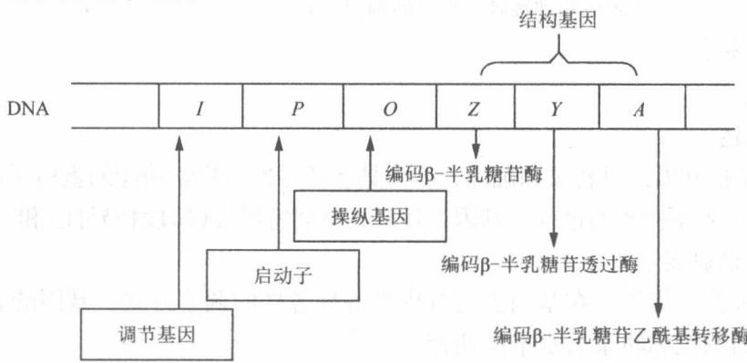
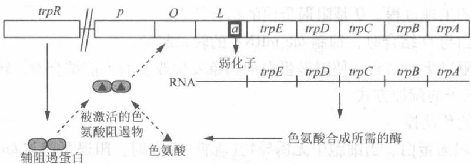
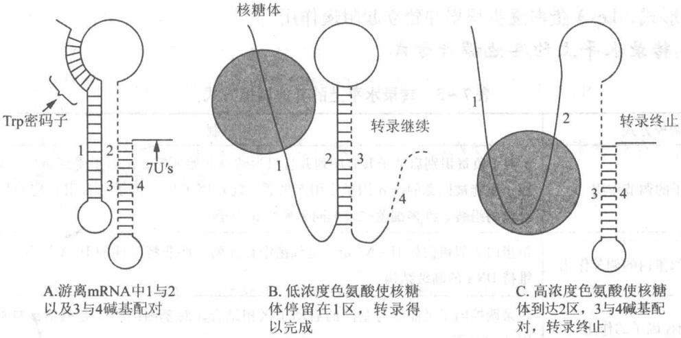

# 第7章 原核基因表达调控

## 7.1 复习笔记

## 【知识概览】

基因表达

概述。

基因表达调控

原核基因表达调控分类

负转录调控

正转录调控

（四）表决方式

原核基因表达调控总论

操纵子的调控

原核基因表达调控的主要特点

转录起始阶段的调控

转录终止阶段的调控

转录后调控

原核基因表达调控

乳糖操纵子的基本结构

乳糖操纵子与负控诱导系统

控制模型及其影响因子

乳糖操纵子的控制模型

乳糖操纵子的调控方式

trp 操纵子的基本结构

乳糖操纵子的调控区域

trp 操纵子的阻遏系统

色氨酸操纵子与负控阻遏系统。

trp 操纵子的弱化作用。

弱化子

前导序列与前导肽

转录的弱化作用

trp 操纵子的其他调控机制

半乳糖操纵子和阿拉伯糖操纵子

其他操纵子。

阻遏蛋白 LexA 的降解与细菌中的 SOS 应答

转录水平上的其他调控方式

mRNA 自身结构元件对翻译的调节

转录后水平的调控

魔斑核苷酸水平对翻译的影响

其他几种转录后水平的调控方式

## 【重难点归纳】

## 一、概述

## 1. 基因表达

基因表达是指基因经过转录和翻译，产生具有特异性生物学功能的蛋白质产物来执行生命活动，即从 DNA 到蛋白质的过程。基因表达具有时间特异性(阶段特异性)和空间特异性。

## 2. 基因表达调控

基因表达调控是指发生在基因表达过程中各种各样的调节方式，基因的表达调控主要表现在转录水平的调控和转录后水平的调控。

## 二、原核基因表达调控总论

## 1. 原核基因表达调控分类

原核生物基因表达调控主要发生在转录水平阶段，分为两种调控机制，如表7-1所示。

表 7-1 原核生物基因表达根据调控机制的分类

<table><tr><td colspan="2">分类</td><td>调节基因的产物</td><td>作用机制</td></tr><tr><td rowspan="2">负转录调控(负调控)</td><td>负控诱导</td><td rowspan="2">阻遏蛋白</td><td>阻遏蛋白抑制结构基因转录,而当其与诱导物结合后,变为非活性阻遏蛋白,结构基因转录</td></tr><tr><td>负控阻遏</td><td>非活性阻遏蛋白不影响结构基因的转录,当其与效应物结合后,变为活性阻遏蛋白,抑制结构基因转录</td></tr><tr><td rowspan="2">正转录调控(正调控)</td><td>正控诱导</td><td rowspan="2">激活蛋白</td><td>诱导物的存在使激活蛋白处于活性状态,开启结构基因的转录</td></tr><tr><td>正控阻遏</td><td>激活蛋白可与启动子结合,促进结构基因转录。若此时存在效应物分子,则会使激活蛋白处于非活性状态,阻遏结构基因转录</td></tr></table>

## 2. 原核基因表达调控的主要特点

## (1) 操纵子的调控

原核基因一般通过操纵子机制来实现基因表达调控，如乳糖操纵子、色氨酸操纵子以及阿拉伯糖操纵子等。

①乳糖操纵子是负控诱导系统。

②色氨酸操纵子是负控阻遏系统。

## (2) 转录起始阶段的调控

转录起始是基因表达调控的关键环节。

## (3)转录终止阶段的调控

该阶段的调控一般包括抗终止作用和弱化作用。抗终止因子是指能够阻止转录终止的蛋白。通常在终止子上游具有抗终止子作用信号。

## (4)转录后调控

原核生物转录后调控主要是指在翻译或者翻译后水平上进行"微调"，主要包括 mRNA 自身结构元件对翻译起始的调节、反义 RNA 对翻译的调控、稀有密码子对翻译的影响以及翻译阻遏等现象。

## 三、乳糖操纵子与负控诱导系统

## 1. 乳糖操纵子的基本结构

  
图7-1 乳糖操纵子的基本结构

## 2. 控制模型及其影响因子

(1) 乳糖操纵子的控制模型

①Z、Y、A基因的产物为一条多顺反子mRNA。

②启动子 P 位于阻遏(调节)基因(I)与操纵基因(O)之间，不能单独启动合成 $\beta-$ 半乳糖苷酶和透过酶的生理过程。O 是阻遏蛋白的结合位点。

③当阻遏蛋白与 O 结合时，抑制 lac mRNA 的转录起始。

④诱导物与阻遏蛋白结合，使阻遏蛋白的构象发生改变而不能结合 O，转录得以进行。

(2)乳糖操纵子的调控方式

①阻遏蛋白的负调控

a. lacI 编码阻遏蛋白。当细胞中无诱导物(乳糖)存在时, 阻遏蛋白与 lac 操纵基因特异性结合, 阻止 RNA 聚合酶与 lac 操纵子启动子区的结合, 抑制 lac mRNA 的转录, 导致乳糖操纵子中的结构基因 $Z 、 Y 、 A$ 都不被转录。

b. 当培养基中有乳糖存在时，真正的诱导物异构乳糖（乳糖的异构体）与阻遏蛋白结合，阻遏蛋白构象发生改变，不能与 O 特异性结合，lac 操纵子的转录起始区暴露并与 RNA 聚合酶结合，启动 lac mRNA 转录，与乳糖利用有关的三种酶随之被诱导合成。

c. 乳糖耗尽，诱导物异构乳糖减少，失去诱导物的阻遏蛋白会重新结合在操纵基因上，重新阻止结构基因的转录。

## ②CAP 的正调控

## A. 要点

第一，cAMP(环磷酸腺苷)是在腺苷酸环化酶(AC)的作用下，由 ATP 脱掉两个磷酸缩合而成。

第二，环腺苷酸受体蛋白(CRP)即代谢物激活蛋白(CAP)，可结合cAMP。

第三，CRP 和 cAMP 结合形成 cAMP-CRP 复合物，与 DNA 上的 CAP 位点结合。

第四，cAMP-CRP 复合物与启动子区的结合是 lac mRNA 合成起始所必需的，这个复合物能使 DNA 双螺旋发生弯曲，利于 RNA 聚合酶 $\alpha$ 亚基和结合有 cAMP 的 CAP 位点结合，从而起始转录。

## B. 具体调节过程

第一，当有葡萄糖时，葡萄糖的某些代谢物抑制 AC 活性，使 ATP 不能转化为 cAMP，cAMP 浓度低，cAMP-CRP 复合物不能形成，结构基因不被转录。

第二，当没有葡萄糖存在时，cAMP 的浓度高，促进转录。

## ③乳糖操纵子的协同调节

阻遏蛋白的负调控作用和 CAP 的正调控在乳糖操纵子的表达调控中起协同作用。当阻遏蛋白封闭转录时 CAP 不发挥作用；如果没有 CAP 加强转录，即使阻遏蛋白从 O 上解离，操纵子仍无转录活性。而葡萄糖可降低 cAMP 浓度，阻碍其与 CAP 结合从而抑制转录，因而葡萄糖和乳糖共同存在时，细菌优先利用葡萄糖（葡萄糖的存在阻止了其他糖类被利用的现象称为代谢物阻遏效应）。

## (3) 乳糖操纵子的调控区域

①P 区即启动子区，位于 lacI 基因结束到 mRNA 转录起始位点下游 5～10bp 处。

②O 区位于 $-7 \sim +28$ 处，其碱基序列具有对称性，阻遏区与 O 区的结合会影响 RNA 聚合酶与启动区结合形成转录起始复合物的效率。

## 四、色氨酸操纵子与负控阻遏系统

## 1. Trp 操纵子的基本结构

色氨酸操纵子参与生物合成，故不受葡萄糖或者 cAMP-CRP 的调控，结构如图 7-2 所示。

  
图7-2 色氨酸操纵子的结构

P 表示启动子；O 表示操纵基因；L 表示前导序列；a 表示弱化子区；trpA、trpB、trpC、trpD 和 trpE 均为结构基因

## 2. Trp 操纵子的阻遏系统

## (1) 阻遏系统的基本原理

trpR 基因突变会导致其基因产物辅阻遏蛋白产生，辅阻遏蛋白与色氨酸结合被激活，形成有活性的阻遏物，与操纵基因(O)结合，关闭 trp mRNA 转录。

## (2) 阻遏系统的调节

①色氨酸含量高时，色氨酸作为效应物与游离的辅阻遏蛋白结合，激活辅阻遏蛋白，后者与操纵基因(O)紧密结合，操纵子被关闭。

②色氨酸含量低时，辅阻遏蛋白为非活性状态，不能结合操纵基因，操纵子开放，基因表达。

## 3. Trp 操纵子的弱化作用

## (1) 弱化子

弱化子是指原核生物操纵子中位于操纵子的上游，能显著减弱甚至终止转录作用的一段核苷酸序列。该区 mRNA 通过自我配对可以形成茎-环结构，有典型的终止子特点。弱化子利用原核生物转录与翻译相偶联的机制发挥转录调控作用。

## (2) 前导序列与前导肽

①前导序列是指位于 trp 操纵子 5' 端 trpE 起始密码子前长为 162bp 的序列，含有 4 个序列互补区（1、2、3 和 4 区），能形成不同碱基配对的 RNA 结构，其中弱化子发夹结构（茎－环结构）由序列 3 和序列 4 配对而成。

②前导肽是前导序列中从起始密码子 AUG 到终止密码子 UGA 之间经翻译产生的一个含有 14 个氨基酸的多肽。前导序列的第 10 和第 11 个密码子编码连续的色氨酸残基，即色氨酸操纵子合成酶的终产物。这些密码子参与色氨酸操纵子的转录弱化机制。前导肽的作用就是决定色氨酸的含量并控制转录的终止。

## (3) 转录的弱化作用

色氨酸操纵子是通过前导肽的合成来感知环境中色氨酸含量的细微变化，通过转录继续与提前终止转录来对环境作出响应(图7-3)。这一机制的关键是翻译与转录密切偶联。

①当没有色氨酸时，不能形成前导肽，1-2配对，3-4配对。转录在终止信号处

(RNA 形成的特殊茎环构象和寡聚 U 处)停止。

②低色氨酸浓度时， $\mathrm{Trp - tRNA}^{\mathrm{Trp}}$ 少，翻译通过两个相邻色氨酸密码子的速度慢，当4区被转录完成时，核糖体停留在1区（或停留在两个相邻的色氨酸密码子处），此时前导区结构2-3配对，3-4不能配对，即不能形成终止信号，转录可继续进行直至完成。

③高色氨酸浓度时，核糖体快速顺利通过两个相邻的色氨酸密码子，在4区被转录之前到达2区，3-4区配对形成茎-环状终止子结构（终止信号），转录终止，色氨酸合成终止。

  
图7-3 trp操纵子的弱化作用

## 4. Trp 操纵子的其他调控机制

大肠杆菌色氨酸操纵子有两个启动子，一个位于操纵子5'端，一个位于trpG-D编码区（称为内源启动子），控制整个操纵子的转录，能够感受色氨酸和无负载的tRNA $^{Trp}$ 的浓度变化。

## 五、其他操纵子

## 1. 半乳糖操纵子和阿拉伯糖操纵子

表 7-2 半乳糖操纵子和阿拉伯糖操纵子的结构和特点

<table><tr><td></td><td>半乳糖操纵子</td><td>阿拉伯糖操纵子</td></tr><tr><td>结构基因</td><td>galE(编码异构酶)、galT(编码半乳糖-磷酸尿嘧啶核苷转移酶)和galK(编码半乳糖激酶);三种酶的联合作用使半乳糖转变为1-磷酸葡萄糖</td><td>araB、araA和araD,它们形成基因簇araBAD</td></tr><tr><td>调节基因</td><td>galR</td><td>araC</td></tr><tr><td>结构特点</td><td>有两个启动子,其mRNA可从两个不同的起始点开始转录,每个启动子拥有各自的RNA聚合酶结合位点 $S_1$ 和 $S_2$ ;有两个O区,一个在P区上游-67~-73,另一个在结构基因galE内部</td><td>araBAD存在相邻的复合启动子区域、两个操纵区( $O_1$ 、 $O_2$ )和一个调节基因araC</td></tr><tr><td>调节机制</td><td> $S_1$ 启动转录只有在无葡萄糖时才能进行,RNA聚合酶与 $S_1$ 的结合需要半乳糖、CRP和较高浓度的cAMP; $S_2$ 启动转录依赖于葡萄糖,而cAMP-CRP存在时则抑制转录</td><td>AraC蛋白有两种异构体(Pi和Pr),对ara操纵子存在正调节作用和负调节作用。有葡萄糖存在时,AraC蛋白主要以Pr形式存在,操纵子几乎关闭;有阿拉伯糖但无葡萄糖时,AraC蛋白主要以Pi形式存在,操纵子被激活;葡萄糖和阿拉伯糖均不存在时,AraC蛋白主要以Pr形式存在,不发生araBAD mRNA的转录</td></tr></table>

## 2. 阻遏蛋白 LexA 的降解与细菌中的 SOS 应答

①当细菌 DNA 遭到破坏时(如受到紫外线照射)，细菌细胞内会启动一个称为 SOS 的诱导型 DNA 修复系统，其诱导表达过程是把 LexA 阻遏蛋白从参与修复的基因的上游调控区移开。

②RecA 蛋白是 SOS 反应最初的发动因子，在单链 DNA 和 ATP 存在时，RecA 蛋白被激活，表现为水解酶的活性，分解 LexA 阻遏蛋白。当 RecA 水解 LexA 阻遏蛋白后，导致 SOS 体系高效表达，DNA 得到修复。当修复完成后，活化信号消失，RecA 蛋白又恢复成非蛋白水解酶的形式，LexA 蛋白逐步积累并建立起阻遏作用。

## 六、转录水平上的其他调控方式

表 7-3 转录水平上的其他调控方式

<table><tr><td>调控方式</td><td>作用机制</td></tr><tr><td> $\sigma$ 因子的调节作用</td><td> $\sigma$ 因子负责识别启动子共有序列并且只为转录起始所需, $\sigma$ 因子受到蛋白水解酶的调控,也能被同源的抗 $\sigma$ 因子作用而失活,抗 $\sigma$ 因子与 $\sigma$ 因子结合阻止它们与RNA聚合酶的组装。许多细菌产生不同系列的 $\sigma$ 因子</td></tr><tr><td>组蛋白类似蛋白的调节作用</td><td>组蛋白类似蛋白如H-NS蛋白是细菌中存在的一些非特异性的DNA结合蛋白,用来维持DNA的高级结构</td></tr><tr><td>转录调控因子的作用</td><td>转录调控因子是能够与基因的启动子区相结合,对基因的转录起激活或抑制作用的DNA结合蛋白</td></tr><tr><td>抗终止因子的调节作用</td><td>抗终止因子是能够在特定位点阻止转录终止的一类蛋白。当抗终止因子存在时,RNA聚合酶能够越过终止子,继续转录DNA</td></tr></table>

## 七、转录后水平的调控

## 1. mRNA 自身结构元件对翻译的调节

## (1) 起始密码子

原核生物中不常见的起始密码子(GUG、UUG等)与fMet-tRNA的配对能力比最常见的起始密码子AUG差，从而导致翻译效率降低。

## (2)5'非翻译区(5'UTR)

①mRNA 的核糖体结合位点(RBS)是 mRNA 链上起始密码子 AUG 上游的包括 SD 序列在内的一段非翻译区。RBS 的结合强度取决于 SD 序列的结构及其与起始密码 AUG 之间的距离。

②mRNA 的二级结构是翻译起始调控的重要因素，5'UTR 的空间结构往往会导致翻译效率的巨大差异。

## (3)核糖开关

核糖开关是一段具有复杂结构的 RNA 序列，在原核生物中通常位于 mRNA 的 5'UTR 区域。核糖开关通过感受细胞内代谢物浓度、离子浓度、温度等的变化来改变自身的二级结构和调控功能，从而改变基因的表达状态。

## 2. 魔斑核苷酸水平对翻译的影响

## (1) 魔斑核苷酸

## ①定义

魔斑核苷酸是指当氨基酸缺乏时，细胞内由于空载 tRNA 增多而大量产生的鸟苷四磷酸（ppGpp）和鸟苷五磷酸（pppGpp）。ppGpp 和 pppGpp 是在色谱上检出的斑点，当时称为魔斑。

## ②意义

魔斑核苷酸产生的主要功能是干扰 RNA 聚合酶与启动子结合的专一性，且是细胞内严紧控制的关键。在不良环境中，ppGpp 可以诱发细菌的应急反应，活化某些氨基酸操纵子的转录表达，抑制与氨基酸转运无关的系统，活化蛋白水解酶等，以节省或开发能源，帮助细菌在不良环境条件下得以存活。

## (2)严紧控制(基因型 $rel^{+}$ )

当细菌处于饥饿条件下，缺乏维持蛋白质合成的氨基酸，细胞内蛋白质、RNA 合成速率下降，大部分活性区域被关闭，称为严紧控制。此时核糖体上不负载氨基酸的 tRNA 是细胞产生严紧控制的信号，同时产生两种特殊的核苷酸即 ppGpp 和 pppGpp。

## (3) 松散控制(基因型 Rel $^{-}$ )

当氨基酸供应不足时，细胞内蛋白质合成停止，但 RNA 的合成速率却没有下降。

## 3. 其他几种转录后水平的调控方式

表 7-4 其他转录后水平的调控方式

<table><tr><td>调控类别</td><td>作用机制</td></tr><tr><td>mRNA 稳定性对转录水平的调控</td><td>mRNA 分子被降解的可能性取决于它们的二级结构,被降解后即失去了作为蛋白合成模板的功能</td></tr><tr><td>调节蛋白的调控作用</td><td>mRNA 结合蛋白可激活靶基因的翻译;mRNA 特异性抑制蛋白通过与核糖体竞争结合 mRNA 分子而抑制翻译的起始</td></tr><tr><td>小 RNA 的调节作用</td><td>一些非编码的小 RNA 分子能结合 mRNA 或蛋白质,改变 mRNA 的稳定性,影响蛋白质 - RNA 的结合或 mRNA 的翻译来调节基因表达</td></tr><tr><td>稀有密码子对翻译的影响</td><td>细胞内对应于稀有密码子的 tRNA 较少,高频率使用稀有密码子的基因翻译过程容易受阻,影响蛋白质合成的总量</td></tr><tr><td>重叠基因对翻译的影响</td><td>重叠基因是指两个或两个以上的基因共有一段 DNA 序列,或是指一段 DNA 序列成为两个或两个以上基因的组成部分。它保证了同一核糖体对两个连续基因进行翻译的机制,而翻译偶联可能是保证两个基因产物在数量上相等的重要手段</td></tr><tr><td>翻译的阻遏</td><td>在大肠杆菌 RNA 噬菌体 Qβ 中,纯化的复制酶可以和外壳蛋白的翻译起始区结合,形成稳定的茎 - 环结构,抑制蛋白质的合成</td></tr></table>

## 7.2 课后习题详解

## 1. 简述代谢物对基因表达调控的两种方式

答：代谢物对基因表达调控的两种方式是可诱导调节和可阻遏调节。

## (1) 可诱导调节

通过小分子诱导物(某些特殊的代谢物或化合物)的参与, 即在某些物质的诱导下使基因活化。如乳糖操纵子中存在可诱导基因和诱导酶, 乳糖操纵子进行的反应被称为酶的诱导合成。

## (2) 可阻遏调节

某些基因平时是开启的，处在产生蛋白质或酶的工作过程中，但由于某些小分子物质（特殊代谢物或化合物）的积累，阻遏了基因的表达。如色氨酸操纵子中存在可阻遏基因和可阻遏酶。

## 2. 什么是操纵子学说？

答：操纵子学说是由 Jacob 和 Monod 于 1961 年提出的关于原核生物基因结构及其表达调控的学说，开创了基因表达调节机制研究的新领域，并在 10 年内经许多科学家的补充和修正得以完成。操纵子是原核生物基因表达调控的基本单位，它们有共同的控制区和调节系统。操纵子包括在功能上彼此有关的结构基因和控制部位，后者由启动子和操纵基因所组成。一个操纵子的全部基因都排列在一起，经过转录形成一条多顺反子 mRNA。目前建立的操纵子模型有乳糖操纵子、色氨酸操纵子以及半乳糖操纵子等。

## 3. 简述乳糖操纵子的调控模型

## 答：(1)乳糖操纵子的基本结构

①结构基因：大肠杆菌乳糖操纵子含有 Z、Y、A 三个结构基因。

a. Z 基因：编码 $\beta-$ 半乳糖苷酶，将乳糖水解为半乳糖和葡萄糖。

b. Y 基因：编码 $\beta-$ 半乳糖苷透过酶，负责将乳糖由胞外运送到胞内，穿过细胞壁和原生质膜进入细胞内。

c. A 基因：编码 $\beta-$ 半乳糖苷乙酰基转移酶，催化乙酰-CoA 的乙酰基转移到 $\beta-$ 半乳糖苷上，形成乙酰半乳糖。

②调节基因 I: I 基因编码的阻遏蛋白可以与操纵区 O 结合，使 lac 基因的转录起始受到抑制。

③操纵区 O：操纵区是 DNA 上的一小段序列，是阻遏蛋白的结合位点。

④启动子 P：可以与 RNA 聚合酶结合。

⑤CAP 位点：可以与 cAMP-CRP 复合物结合。CRP 是 cAMP 的受体蛋白，二者结合后形成复合物可以结合在启动子上游的 CAP 位点，促进结构基因的转录。

## (2) 乳糖操纵子的调控模式

转录时，RNA 聚合酶首先与启动子(P)结合，通过操纵区(O)向右转录。转录从 O 区中间开始，按 $Z \rightarrow Y \rightarrow A$ 方向进行，每次转录出来的一条 mRNA 上都带有这三个基因。转录的调控在启动区和操纵区进行。

## ①阻遏蛋白的负性调节

a. 当细胞内无诱导物存在时，即培养基中只存在葡萄糖而不存在乳糖时，阻遏蛋白与操纵区结合，由于操纵区与启动子有一定的重叠，因此妨碍了 RNA 聚合酶与启动子形成开放性启动子复合物，不能启动结构基因的转录，因而结构基因得不到表达。

b. 当加入乳糖后，乳糖被异构化形成异构乳糖，与阻遏蛋白结合，改变阻遏蛋白的构象，阻遏蛋白构象改变之后活性丧失，不能再与操纵区结合。RNA 聚合酶与启动子结合，形成开放性启动子复合物，从而开始转录 Z、Y、A 结构基因，产生与乳糖利用有关的三种酶。乳糖操纵子的这种调控机制称为可诱导的负调控。

c. 当乳糖耗尽时，诱导物异构乳糖减少，失去诱导物的阻遏蛋白会重新结合在操纵区上，阻止基因转录。

## ②cAMP-CRP的正性调节

a. cAMP 的浓度受到葡萄糖代谢的调节，细菌在缺乏碳源或只有甘油或乳糖等不进行糖酵解途径的碳源中，细胞内 cAMP 浓度高；在含葡萄糖的环境中，cAMP 的浓度低。

b. 操纵子在启动子上游有 CAP 结合位点。当以葡萄糖为碳源的环境转变为以乳糖为碳源的环境时，cAMP 浓度升高，与 CRP 结合，使 CRP 发生变构，形成 cAMP-CRP 复合物，cAMP-CRP 复合物结合于乳糖操纵子启动序列中的 CAP 位点，激活 RNA 聚合酶活性，促进结构基因转录，促进合成利用乳糖的三种酶。cAMP-CRP 复合物与启动子区的结合是 lac mRNA 合成起始所必需的。

## ③协同调节

当阻遏蛋白封闭转录时，cAMP-CRP对该系统不能发挥作用；如无cAMP-CRP存在，即使没有阻遏蛋白与操纵区结合，操纵子仍无转录活性，即cAMP-CRP复合物与启动子区的结合是转录起始所必需的。具体存在以下4种不同的组合状态，决定基因的表达与否，以适应环境中葡萄糖和乳糖的有无状态。在有葡萄糖时，先利用葡萄糖，用完后，再利用乳糖作为能源。

a. 葡萄糖和乳糖都不存在：cAMP-CRP 可发挥作用；但无乳糖的诱导，阻遏蛋白与 DNA 结合，基因关闭。

b. 葡萄糖存在、乳糖不存在：有葡萄糖存在，cAMP-CRP不起作用；无乳糖存在，阻遏蛋白与DNA结合，基因关闭。

c. 葡萄糖和乳糖都存在：阻遏蛋白与 DNA 解离，但由于有葡萄糖存在，cAMP-CRP 不起作用，基因仍然关闭。

d. 葡萄糖不存在、乳糖存在：阻遏蛋白与 DNA 解离，因无葡萄糖存在故 cAMP-CRP 起作用，基因转录启动。

## 4. 什么是葡萄糖效应？

答：葡萄糖效应又称降解物阻遏，是指在培养基中葡萄糖和乳糖（或半乳糖、阿拉伯糖、麦芽糖等）同时存在时，葡萄糖总是优先被利用，葡萄糖的存在阻止了其他糖类被利用的现象。该现象产生的主要原因是葡萄糖的代谢产物抑制细菌的腺苷酸环化酶，使得细胞内cAMP含量降低，导致与之结合的受体CRP（环腺苷酸受体蛋白）不能被激活，阻遏其他糖类操纵子激活复合物的形成，影响该复合物与启动区结合，从而使得对应的结构基因无法转录。因此葡萄糖总是优先被利用而其他糖类不被利用。

## 5. 什么是弱化作用？

答：弱化作用是一种转录翻译调控机制，是指通过操纵子前导区内类似终止子的一段DNA序列，决定转录起始后是否继续进行下去的机制。以色氨酸操纵子为例，色氨酸操纵子中存在弱化作用，其中起信号作用的是色氨酰-tRNA的浓度。转录的弱化作用是通过前导肽的翻译来进行调节的。

(1) 低色氨酸浓度时， $Trp-tRNA^{Trp}$ 少，翻译通过两个相邻色氨酸密码子的速度慢，当4区被转录完成时，核糖体停留在1区（或停留在两个相邻的色氨酸密码子处），此时前导区结构2-3配对，不形成3-4配对的终止结构，转录可继续进行，直到将trp操纵子中的结构基因全部转录。

(2) 高色氨酸浓度时，核糖体快速顺利通过两个相邻的色氨酸密码子，在 4 区被转录之前，核糖体到达 2 区，使 2-3 不能配对，而 3-4 区配对形成茎-环状终止子结构，转录终止，色氨酸合成终止。

## 6. 简述抗终止子因子的调控机制

答：抗终止子因子是能够在特定位点阻止转录终止的一类蛋白质。当抗终止子因子存在时，RNA聚合酶能够越过终止子，继续转录DNA。其调控机制是由于在终止子上游有抗终止作用的信号序列，只有与抗终止因子相结合的RNA聚合酶才能顺利通过具有茎-环结构的终止子，使转录继续进行。抗终止蛋白（在大肠杆菌中为 Nus 蛋白）、 $\sigma$ 因子均能与 RNA 聚合酶结合，但不能同时与之结合。

## 7. 简述反义 RNA 的调控机制

答：反义 RNA 是指与特异 mRNA 互补结合的一段 RNA 分子，也包括与其他 RNA 互补的 RNA 分子。反义 RNA 是一些非编码的小 RNA 分子。反义 RNA 与 mRNA 中的特定序列互补配对，改变 mRNA 分子的构象，导致翻译过程被开启或者关闭，也可能导致目标 mRNA 分子的快速降解。其调控机制包括以下四种方式：

(1) 直接作用于 mRNA 5' 端非编码区的 SD 序列或编码区，引起翻译的直接抑制或与靶 mRNA 结合后引起该双链 RNA 的降解。

(2) 与 mRNA 5' 端的起始密码子结合阻止转录的启动。

(3)与靶 mRNA 的 SD 序列的上游非编码区互补结合，使 mRNA 构象改变，影响其与核糖体结合，从而抑制靶 mRNA 的翻译功能，间接抑制 mRNA 的转录。

(4) 与 hnRNA 结合，阻碍 mRNA 的成熟及其在胞浆内转运。

1. 简述原核基因转录后调控的不同方式。

答：参见本章复习笔记转录后水平的调控部分相关内容。

1. 简述 ppGpp 是如何参与细菌的应急反应。

答：当氨基酸缺乏时，细胞内 GDP 或 GTP 的衍生物四磷酸或五磷酸鸟嘌呤核苷[(p) ppGpp]大量积累在细胞内，空载 tRNA 增多，ppGpp(鸟苷四磷酸)在细胞内的含量升高。ppGpp 的主要作用是干扰 RNA 聚合酶与启动子结合的专一性，影响核糖体蛋白的活性，从而成为细胞内严紧控制的关键。故 ppGpp 的出现可在很大范围内做出应急反应，如抑制核糖体和其他大分子的合成，活化某些氨基酸操纵子的转录表达，抑制与氨基酸转运无关的系统，活化蛋白水解酶等，以节省或开发能源，帮助细菌在不良环境条件下存活下来。

## 10. 什么是 $\sigma$ 因子，简述 $\sigma$ 因子在原核基因调控中的作用

## 答：(1) $\sigma$ 因子的定义

σ 因子是原核生物 RNA 聚合酶全酶的组分，是转录起始所必需的因子，主要影响 RNA 聚合酶对转录起始位点的正确识别。

## (2) $\sigma$ 因子在原核基因调控中的作用

大肠杆菌至少存在7种 $\sigma$ 因子，其中 $\sigma^{70}$ 参与最基本的生理功能基因的转录调控，所有 $\sigma$ 因子都含有4个保守区，其中第2个和第4个保守区参与结合启动区DNA，第2个保守区的另一部分还参与双链DNA解开成单链的过程。 $\sigma$ 因子对识别DNA链上的转录信号是不可缺少的，它是RNA聚合酶核心酶和启动子之间的桥梁。不同的 $\sigma$ 因子可以独立地起作用，但是，为了保证细胞准确响应不同的环境信号变化， $\sigma$ 因子之间常常交互作用构成网络调控模式，使得原核基因的表达稳定而平衡。对于不同的RNA序列或者是不同的基因，同一个 $\sigma$ 因子与其RNA聚合酶核心酶结合的紧密程度是不同的。

## 7.3 名校考研真题详解

## 一、选择题

1. 原核生物基因表达调控主要发生在哪个水平？（）[内蒙古农业大学2015研]
A. 翻译水平 B. DNA 水平 C. 转录水平 D. 转录后水平

【答案】C

【解析】原核生物的基因表达调控主要发生在转录水平上，根据调控机制的不同可分为负转录调控和正转录调控。

1. 下列哪个操纵子可能不含有衰减子序列？（）[电子科技大学 2013 研]
A. trp 操纵子 B. lac 操纵子 C. his 操纵子 D. phe 操纵子

【解析】衰减子又称弱化子，是指当操纵子被阻遏，RNA合成被终止时，起终止转录信号作用的一段核苷酸序列，位于操纵子的上游，利用原核生物转录与翻译的偶联机制对转录进行调节。衰减子存在于大肠杆菌中的色氨酸操纵子、苯丙氨酸操纵子、苏氨酸操纵子、异亮氨酸操纵子、缬氨酸操纵子以及沙门氏菌的组氨酸操纵子和亮氨酸操纵子、嘧啶合成操纵子中。B项，lac操纵子属于负控诱导系统，不含有衰减子序列。因此答案选B。

1. 典型的操纵子不包括下列哪些元件？（）[浙江工业大学2012研]  
A. 结构基因 B. 调控元件 C. 调节基因 D. 重复序列

【解析】典型的操纵子包括以下几部分的元件：调节基因，启动子，操纵基因和结构基因，不包括重复序列。因此答案选D。

1. 在乳糖操纵子中，阻遏蛋白结合的是()。[湖南农业大学2011研]

A. 操纵区 B. 调节基因 C. 启动子 D. 结构基因

【解析】操纵区是 DNA 上的一小段序列，是阻遏蛋白的结合位点，当阻遏蛋白与操纵区相结合时，lac mRNA 的转录起始受到抑制。因此答案选 A。

1. 在调控乳糖操纵子表达中，乳糖的作用是( )。[北京理工大学 2008 研]

A. 与 RNA 聚合酶结合诱导结构基因的表达

B. 与 RNA 聚合酶结合抑制结构基因的表达

C. 与抑制物结合诱导结构基因表达

D. 与抑制物结合抑制结构基因表达

【答案】C

【解析】在乳糖操纵子(lac 操纵子)模型中，乳糖作为诱导物与阻遏蛋白结合，使阻遏蛋白构象改变，阻遏蛋白不再特异性结合 lac 操纵区，lac 操纵子的转录起始区暴露并被 RNA 聚合酶结合，激活 lac mRNA 转录。乳糖与抑制物结合后诱导结构基因的表达。因此答案选 C。

1. 乳糖操纵子的安慰诱导物是( )。[北京科技大学2008研]
A. 乳糖
B. 半乳糖
C. 异构乳糖
D. 异丙基巯基半乳糖苷

【答案】D

【解析】安慰诱导物是指一类高效诱导酶的合成，但又不被分解的分子。异丙基巯基半乳糖苷（IPTG）、巯甲基半乳糖苷（TMG）和O-硝基半乳糖苷（ONPG）都不是半乳糖苷酶的底物，不会被β-半乳糖苷酶所降解，但能诱导β-半乳糖苷酶的合成，因此实验室里常用它们作为乳糖操纵子的安慰诱导物。因此答案选D。

1. 色氨酸衰减子通过前导肽的翻译来实现对 mRNA 转录的控制属于( )。[南京大学2008研]A.可诱导的负调控 B.可阻遏的负调控C.可诱导的正调控 D.可阻遏的正调控

【解析】衰减子能形成不同的二级结构，利用原核生物转录与翻译的偶联机制对转录进行调节，属于可阻遏的负调控。在含有衰减子序列的操纵子中前导区都有一段前导肽，前导肽中含有该操纵子所要调控的氨基酸的重复密码子，在前导肽翻译时该氨基酸含量的高低决定了核糖体所处的位置，从而决定了是否形成内部终止子，进而调控RNA聚合酶对后面结构基因的转录，调控蛋白质的合成。因此答案选B。

1. 正转录调控系统中，调节基因的产物被称为( )。[中国科学院研究生院2007研]
A. 阻遏蛋白 B. 诱导因子 C. 激活蛋白 D. 增强子

【解析】原核生物的基因调控主要发生在转录水平上，根据调控机制的不同可分为负转录调控和正转录调控。在负转录调控系统中，调节基因的产物是阻遏蛋白；在正转录调控系统中，调节基因的产物是激活蛋白。因此答案选 C。

## 二、填空题

1. 生物一般有正调控和负调控方式，原核生物一般采用\_\_\_\_方式，真核生物一般采用\_\_\_\_方式。[华中科技大学2017研]

【答案】负调控；正调控

1. lac 阻遏蛋白由\_\_\_\_基因编码，结合\_\_\_\_序列对 lac 操纵子起阻遏作用。[西北农林科技大学 2015 研]

【答案】调节；操纵

【解析】阻遏蛋白由调节基因 I 编码。当细胞中无诱导物(乳糖)存在时，阻遏蛋白与 lac 操纵基因(O)特异性结合，阻止 RNA 聚合酶与 lac 操纵子启动子区的结合，抑制 lac mRNA 的转录。

1. 操纵子一般由\_\_\_\_、\_\_\_\_和\_\_\_\_三种成分组成。[电子科技大学2014研]

【答案】启动子；操纵基因；结构基因

1. 原核生物的转录调控系统根据调控机制的不同可分为\_\_\_\_、\_\_\_\_，乳糖操纵子是\_\_\_\_系统，色氨酸操纵子是\_\_\_\_系统。[华中科技大学2007研]

【答案】负转录调控；正转录调控；负控诱导；负控阻遏

【解析】根据调控机制的不同，原核生物转录调控系统可分为负转录调控和正转录调控，其中负转录调控调节基因的产物是阻遏蛋白，正转录调控调节基因的产物是激活蛋白。负转录调控又分为负控诱导系统和负控阻遏系统。在负控诱导系统中，阻遏蛋白不与效应物（诱导物）结合时，结构基因不转录，如乳糖操纵子；在负控阻遏系统中，阻遏蛋白与效应物结合时，结构基因不转录，如色氨酸操纵子。

1. SOS 应答系统(SOS response)是 DNA 损伤修复的一个重要途径, RecA 蛋白在这里的主要功能是通过引起\_\_\_\_蛋白的降解, 从而解除它对\_\_\_\_相关基因转录的抑制。[中国科学技术大学 2005 研]

【答案】LexA 阻遏；DNA 损伤修复

【解析】当细菌 DNA 遭到破坏时，细菌会启动一个称为 SOS 的诱导型 DNA 修复系统，把 LexA 阻遏蛋白从参与修复的基因的上游调控区移开。DNA 严重受损时，DNA 复制被中断，单链 DNA 缺口数量增加，RecA 与缺口处单链 DNA 结合，被激活成为蛋白酶，表现为水解酶的活性，分解 LexA 阻遏蛋白，解除 LexA 对 DNA 损伤修复相关基因转录的抑制，DNA 得到修复。

## 三、判断题

1. 乳糖操纵子存在阻遏系统和弱化系统的调控机制。（）[扬州大学2018研]

## 【答案】错

【解析】乳糖操纵子中正、负调控机制相辅相成，不存在弱化系统；而色氨酸操纵子中则是阻遏系统和弱化系统共同作用。

1. 大肠杆菌在多种碳源同时存在的条件下，优先利用乳糖。（）[中国科学院研究生院2007研]

## 【答案】错

【解析】将葡萄糖和乳糖同时加入培养基中，大肠杆菌在耗尽外源葡萄糖之前不会诱发lac操纵子。这是因为有葡萄糖存在时，它的某些降解产物抑制lac mRNA合成，因此大肠杆菌在多种碳源同时存在的条件下，优先利用的是葡萄糖。这种现象也被称为葡萄糖效应。

1. 色氨酸操纵子(trp operon)中含有衰减子序列。( ) [华南理工大学 2005 研]

【答案】对

【解析】色氨酸操纵子的转录调控除了阻遏系统以外，还有弱化子(又称衰减子)系统。

## 四、名词解释题

## 1. Repressor Protein [宁波大学 2019 研]

答：Repressor protein 的中文名称是阻遏蛋白，是指一类由调节基因产生的，在转录水平对基因表达产生负控作用的蛋白质。操纵基因是阻遏蛋白的结合位点，当阻遏蛋白结合操纵基因时会阻碍 RNA 聚合酶与启动子的结合，使得 RNA 聚合酶不能沿 DNA 向前移动，阻遏 mRNA 转录。

1. 反义 RNA(antisense RNA) [华中科技大学 2016 研；华东理工大学 2017 研]

答：反义 RNA(antisense RNA) 是指与 mRNA 互补的 RNA 分子，也包括与其他 RNA 互补的 RNA 分子。反义 RNA 与 mRNA 特异性的互补结合可以改变 mRNA 分子的构象，导致翻译过程被开启或者关闭，也可能导致目标 mRNA 分子的快速降解。通过反义 RNA 控制 mRNA 的翻译是原核生物基因表达调控的一种方式。

## 3. 操纵子[暨南大学2014研；浙江工业大学2015研]

答：操纵子是指原核生物基因中，多个功能上相关的结构基因串联排列在基因组序列中构成信息区，与上游启动区和操纵区以及下游转录终止区一起构成的基因表达单位，其中结构基因的表达受到操纵基因的调控。操纵子包括乳糖操纵子、色氨酸操纵子、半乳糖操纵子以及阿拉伯糖操纵子等。

## 4. Attenuator[河北大学 2014 研]

答：Attenuator 的中文名称是弱化子，是指原核生物操纵子中能显著减弱甚至终止转录作用的一段核苷酸序列，位于操纵子的上游，该区域能形成不同的二级结构，利用原核生物转录与翻译偶联机制对转录进行调节。弱化子对基因活性的影响是通过影响前导序列 mRNA 的结构而发挥作用的，起调节作用的是某种对应氨酰 - tRNA 的浓度，典型例子是细菌中的色氨酸操纵子。

## 5. 魔斑核苷酸[兰州大学 2011 研]

答：魔斑核苷酸是指当氨基酸缺乏时，细胞内由于空载 tRNA 增多而大量产生的鸟苷四磷酸（ppGpp）和鸟苷五磷酸（pppGpp）。这两种化合物是在层析谱上检出的斑点，称为魔斑。魔斑核苷酸的主要作用是影响 RNA 聚合酶与启动子结合的专一性，诱发细菌的应急反应，帮助细菌在不良环境条件中存活下来，它是细胞内严紧控制的关键。

## 五、简答题

1. 论述大肠杆菌色氨酸操纵子的阻遏调节和弱化调节系统。[河北大学 2017 研]

答：色氨酸操纵子参与生物合成，不受葡萄糖或者 cAMP-CRP 的调控。色氨酸操纵子的转录调控系统包括阻遏系统和弱化系统（衰减系统）。

## (1) 阻遏系统

①色氨酸含量较高时，色氨酸与游离的辅阻遏蛋白相结合，激活辅阻遏蛋白，后者与操纵基因(O)紧密结合，操纵子被关闭。

②色氨酸供应不足时，辅阻遏物失去色氨酸并从操纵区上解离，使操纵子去阻遏，基因表达。

## (2) 弱化系统

在色氨酸操纵子中存在弱化子，即操纵子中明显可以衰减甚至终止转录的一段核苷酸序列，转录的弱化作用是通过前导肽的翻译来进行调节的。

①低色氨酸浓度时， $Trp-tRNA^{Trp}$ 少，翻译通过两个相邻色氨酸密码子的速度慢，当4区被转录完成时，核糖体停留在1区（或停留在两个相邻的色氨酸密码子处），此时前导区结构2-3配对，不形成3-4配对的终止结构，转录可继续进行，直到将trp操纵子中的结构基因全部转录。

②高色氨酸浓度时，核糖体能以较快的速度顺利通过两个相邻的色氨酸密码子，在4区被转录之前，核糖体到达2区，使2-3不能配对，而3-4区配对形成茎-环状终止子结构，转录终止，色氨酸合成终止。

1. 简述乳糖操纵子正调控的作用机制。[中国科学院大学 2013 研]

答：乳糖操纵子(lac 操纵子)的正调控即 cAMP-CRP 的调节，作用机制如下：

(1) ATP 在腺苷酸环化酶的作用下生成 cAMP。

(2) cAMP 的浓度受到葡萄糖代谢的调节，细菌在缺乏碳源或只有甘油或乳糖等不进行糖酵解途径的碳源中，细胞内 cAMP 浓度高；在含葡萄糖的环境中，cAMP 的浓度低。

(3) 在 lac 操纵子启动子上游有代谢物激活蛋白(CAP)结合位点，当以葡萄糖为碳源的环境转变为以乳糖为碳源的环境时，cAMP 浓度升高，与环腺苷酸受体蛋白(CRP)结合，使 CRP 发生变构，形成 cAMP-CRP 复合物，cAMP-CRP 复合物结合于 lac 操纵子启动序列中的 CAP 位点，帮助 RNA 聚合酶结合到启动子区域，激活 lac mRNA 的转录，促进合成利用乳糖的三种酶。

1. 有一个研究生想使他所感兴趣的一个大肠杆菌的基因严格受碳源控制，在葡萄糖供应时，该基因不表达；当供应乳糖时，该基因大量表达。你如何帮助他实现这种想法？依据是什么？[武汉大学2008研]

答：(1) 将乳糖操纵子的启动子元件（包括上游阻遏基因）与目的基因融合并构建到一个新的载体分子中，并将新克隆分子导入大肠杆菌中扩增。设计三组实验：①只有乳糖；②有葡萄糖和乳糖；③只有葡萄糖。由此可以帮助此研究生实现想法。

(2) 将乳糖操纵子的启动子元件与目的基因融合并构建到一个新的载体分子中，并进行基因表达扩增的依据是启动子对下游基因的调控机理。

①乳糖操纵子的启动子区域位于阻遏基因与结构基因中间，阻遏基因表达的阻遏物结合到启动子区，抑制下游结构基因转录。

②诱导物与阻遏物结合后，改变阻遏物的三维构象，使阻遏物不再与操纵子结合，从而开启操纵子，下游结构基因转录。

③下游基因的表达受碳源影响，当葡萄糖存在时，下游基因不表达；乳糖存在时，下游基因大量表达。因此可以设计上述实验满足题中研究生的想法。

## 4. 简述可诱导和可阻遏的基因调控方式的区别。[北京科技大学 2008 研]

答：原核生物通过特殊代谢物对基因活性的调控主要分为可诱导调控和可阻遏调控，二者区别如表7-5所示。

表 7-5 可诱导和可阻遏基因调控方式的区别

<table><tr><td></td><td>可诱导调控</td><td>可阻遏调控</td></tr><tr><td>作用机制</td><td>一些基因在特殊的代谢物或化合物的作用下,由原来关闭的状态转变为工作状态,即在某些物质的诱导下使基因活化</td><td>某些基因平时都是开启的,处在产生蛋白质或酶的工作过程中,但由于一些特殊代谢物或化合物的积累而将其关闭,阻遏基因的表达</td></tr><tr><td>作用方式</td><td>操纵子只有在诱导物存在时才开放。存在诱导物时,它与阻遏物结合,改变阻遏物的三维构象,使阻遏物不再与操纵子结合,从而开启操纵子;没有诱导物时,阻遏物与操纵子结合,阻止结构基因的转录</td><td>操纵子被终产物所关闭。存在终产物时,它结合到阻遏物上,改变阻遏物的构象,使其能结合到操纵子上,关闭操纵子;不存在终产物时,阻遏物不能结合到操纵子上,因此操纵子开放</td></tr><tr><td>诱导物/阻遏物(基因)</td><td>诱导物是酶的底物或者底物类似物</td><td>阻遏基因是一些合成各种细胞代谢过程中所必需的小分子物质的基因</td></tr></table>

## 5. 正调控和负调控的主要区别。[江苏大学 2007 研]

答：正调控和负调控的主要区别如下：

## (1) 正调控

在正调控系统中，调节基因的产物是激活蛋白，起着激活结构基因转录的作用。在没有激活蛋白存在时基因关闭，加入激活蛋白则基因表达被激活。根据作用效果不同，正转录调控系统分为正控诱导和正控阻遏。

①正控诱导：效应物(诱导物)存在时，激活蛋白处于活性状态，结构基因转录。

②正控阻遏：效应物存在时，激活蛋白处于无活性状态，结构基因不转录。

## (2) 负调控

在负调控系统中，调节基因的产物是阻遏蛋白，其作用部位是操纵区，起着阻止结构基因转录的作用。在没有阻遏蛋白存在时基因表达，加入阻遏蛋白后基因表达活性被关闭。根据作用效果不同，负调控系统分为负控诱导和负控阻遏。

①负控诱导：阻遏蛋白不与效应物(诱导物)结合时，结构基因不转录。

②负控阻遏：阻遏蛋白与效应物结合时，结构基因不转录。

## 6. 解释大肠杆菌半乳糖操纵子的两启动子调控机制。[暨南大学 2005 研]

答：(1) 半乳糖操纵子结构

大肠杆菌半乳糖操纵子包括 3 个结构基因 galE、galT、galK，分别编码 3 种酶：异构酶、半乳糖－磷酸尿嘧啶核苷转移酶和半乳糖激酶。这3个酶的作用是使半乳糖变成葡萄糖-1-磷酸。gal操纵子有两个相距仅5bp的启动子 $P_{1}$ 和 $P_{2}$ ，其mRNA可从两个不同的起始点开始转录。

(2) 半乳糖操纵子的两启动子调控机制

$P_{1}$ 和 $P_{2}$ 拥有各自的 RNA 聚合酶结合位点 $S_{1}$ 和 $S_{2}$ 。

①从 $S_{1}$ 起始的转录只有在培养基中无葡萄糖时，才能顺利进行，RNA 聚合酶与 $S_{1}$ 的结合需要半乳糖、CAP 和较高浓度的 cAMP。

②从 $S_{2}$ 起始的转录完全依赖于葡萄糖，高水平的 cAMP-CRP 能抑制由这个启动子起始的转录。

③当有 cAMP-CRP 时，转录从 $S_{1}$ 开始；当无 cAMP-CRP 时，转录从 $S_{2}$ 开始。

1. 什么是应急调控(strigent response)? 何时会有这种现象发生? 应急调控过程中的两个重要信号分子是什么? 应急调控会调控哪些生化过程, 上调还是下调? [中国科学技术大学2005研]

答：(1)应急调控是指细菌碰到紧急状况，如氨基酸饥饿时，为了紧缩开支，渡过难关，细菌将会停止包括生产各种RNA、糖、脂肪和蛋白质在内的几乎全部生物化学反应过程的自救措施。应急调控是细菌抵御不良条件，保存自己的一种机制。

(2) 当细菌处于贫瘠的生长环境如氨基酸饥饿时会产生应急调控。

(3) 应急调控过程中有两种重要的信号分子：鸟苷四磷酸(ppGpp)和鸟苷五磷酸(pppGpp)。ppGpp 和 pppGpp 能与相应的目标蛋白结合，改变其活性，进而抑制转录。

(4) 当氨基酸缺乏时, 细胞中便存在大量的不带氨基酸的 tRNA, 这种空载的 tRNA 会激活焦磷酸转移酶, 使 ppGpp 大量合成。ppGpp 会关闭许多基因, 同时打开一些合成氨基酸的基因, 主要影响 RNA 聚合酶与启动子结合的专一性。ppGpp 是细胞内严紧控制的关键。应急调控会使 rRNA 和 tRNA 的合成下降, 同时蛋白质的降解加速, 糖、脂类及核苷酸的合成下降, 即下调生化反应。

## 六、论述题

写出大肠杆菌乳糖操纵子模型及调控模式。[华南理工大学2014研]

相关试题：

(1)试述大肠杆菌乳糖操纵子的结构及其基因表达的调节特点。[四川大学2009研；武汉大学2010研]

(2) 什么是操纵子？乳糖操纵子的作用机制是什么？[浙江工业大学 2013 研]

答：参见本章课后习题详解第3题答案。
