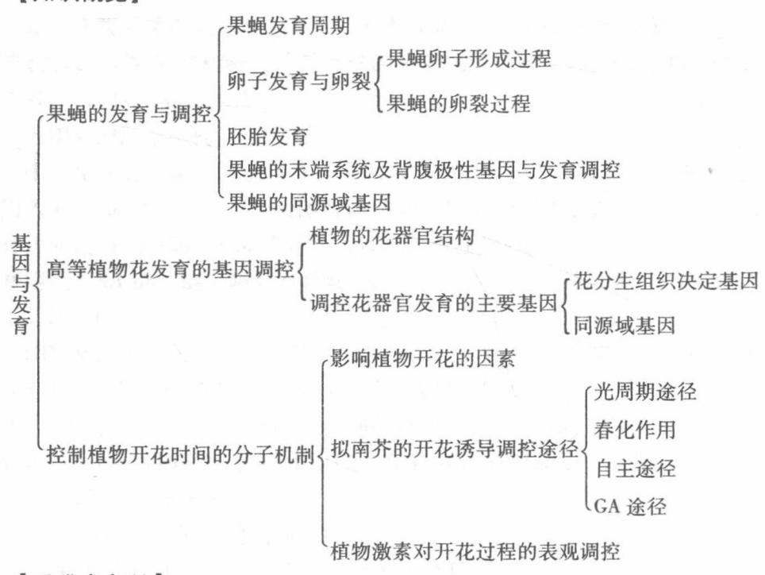
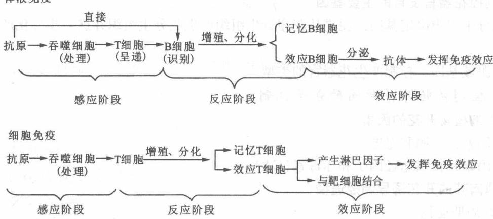

# 第10章 基因与发育

## 10.1 复习笔记

特别说明：本章节为考试非重点章节，考生了解即可。

【知识概览】

【重难点归纳】

## 一、果蝇的发育与调控

## 1. 果蝇发育周期

胚胎发育→幼虫→蛹化→变态→成虫。

## 2. 卵子发育与卵裂

(1) 果蝇卵子形成过程(图 10-1)

$$
\text { 卵原细胞 } \xrightarrow {\text { 4次有丝分裂 }} 1 6 \text { 个细胞(并合体) } \left\{ \begin{array}{l l} 1 \text { 个细胞 } \to \text { 发育成卵母细胞(双倍体) } \\ 1 5 \text { 个细胞 } \to \text { 发育成抚育细胞(多倍体) } \end{array} \right.
$$

图10-1 果蝇卵子形成过程

(2) 果蝇的卵裂过程

①细胞核以 9min/次高频率复制，直至达到约有 6000 个核并发育成为合胞体。

②当出现256个以上的细胞核时，细胞核开始向卵的外周移动，定位到皮层组织。

## 3. 胚胎发育

果蝇形体模式的形成是沿前－后轴和背－腹轴进行的。

①果蝇胚胎发育过程中的合胞体相当于一个多核细胞。果蝇胚胎轴的发育取决于母源效应基因，4组母源效应基因与果蝇胚轴形成有关，其中3组基因（前端系统决定头胸部分节，后端系统决定腹部分节，末端系统决定胚胎两端不分节的原头区和尾节)与胚胎前－后轴的决定有关，另一组基因(背腹系统)决定胚胎的背－腹轴。

②果蝇躯体的分节分步发生，参与果蝇分节的分节基因有：间隙基因、成对控制基因和体节极性基因。这些基因与同源域基因上游调控区发生作用，调节同源域基因的表达，最终决定每个体节的发育。

## 4. 果蝇的末端系统及背腹极性基因与发育调控

果蝇末端系统能调控果蝇胚胎发育的前后模式，包括约9个母源效应基因，这些基因缺失会导致胚胎的前端原头区和后端尾节缺失。

## 5. 果蝇的同源域基因

同源域基因决定躯体体节命运。在果蝇中同源域基因统称为 HOM 复合体(HOM-C)。典型的同源域基因不参与基本躯干的建成，也不参与体节和肢芽的完善，它们只保证体节或肢芽的最终典型特征。

## 二、高等植物花发育的基因调控

根据分生组织的形态特征，将植物从营养生长到生殖生长的转变分为3个阶段：营养分生组织阶段、花序分生组织发生阶段和花分生组织发生阶段。

## 1. 植物的花器官结构

顶端分生组织产生成年花器官；营养分生组织产生花序分生组织；花序分生组织产生花分生组织；花分生组织产生花器官原基，最后再产生花器官。

## 2. 调控花器官发育的主要基因

①花分生组织决定基因：促进从花序分生组织产生花分生组织并进一步分化产生花器官原基。

②同源域基因：控制产生花器官的类型。

## 三、控制植物开花时间的分子机制

## 1. 影响植物开花的因素

外部因素：光照和温度。

内部因素：自主途径因子和赤霉素(GA)。

## 2. 拟南芥的开花诱导调控途径

(1) 光周期途径

①光周期现象

光周期现象是指植物通过感受昼夜长短变化而控制开花的现象。

②根据对光周期的反应，对植物的分类

a. 长日照植物(LDP): 日照长度必须长于其临界日照长度才能开花, 如拟南芥生态型。

b. 短日照植物(SDP): 日照长度必须短于其临界日照长度才能开花, 如水稻、烟草等。

c. 日中性植物(DNP): 对日照长度不敏感, 任何日照条件下都可以开花, 如印度甘蔗等。

③光周期的感受及传导

a. 感受光周期刺激的部位是叶片。

b. 植物叶片感受到适当的日照长度，会形成开花素/成花素(florigen)，后者进行长距离运输传导到顶芽分生组织后引起开花。

(2) 春化作用

春化作用是指低温诱导植物开花的过程。春化作用中 VIN3 识别低温处理，建立对春化

关键基因 FLC 表达的抑制。

## (3) 自主途径

自主途径是指基因通过不同机制抑制 FLC 表达，促进 SOC1、FT 表达，从而促进开花的开花诱导调节途径。

## (4) GA(赤霉素)途径

GA 途径是指通过 GA 合成及信号转导有关组分影响 SOC1 和 LFY 表达，调控植物开花时间的开花诱导调节途径。

## 3. 植物激素对开花过程的表观调控

植物激素包括赤霉素、茉莉酸、脱落酸、乙烯以及生长素都能通过 DNA 甲基化、组蛋白翻译后修饰等方式，在一定程度上影响染色质的紧密程度，从而影响植物的开花过程。

## 10.2 课后习题详解

## 1. 为什么机体需要体液免疫和细胞免疫两种免疫方式？缺失其中一种的后果是什么？

答：(1)机体需要体液免疫和细胞免疫两种免疫方式的原因

特异性免疫又称获得性免疫或适应性免疫，包括体液免疫和细胞免疫(图10-2)。体液免疫是指抗体介导的免疫应答，体液免疫的关键过程是产生高效的效应B细胞，由效应B细胞分泌抗体清除抗原。细胞免疫是指细胞介导的免疫应答，主要是T淋巴细胞起作用，直接对抗被病原体感染的细胞。

  
图10-2 体液免疫和细胞免疫

①由于侵入体内的异物有很多种，病原菌的增殖方法也不全相同，有的在体液中增殖，有的在细胞中增殖，所以单一种类的淋巴细胞难以应付所有的情况。由于两种不同的免疫作用机制不同，对于入侵到体内的病原体，细胞免疫和体液免疫需要相互配合，协同抵抗，才能维持人体免疫系统的正常功能。

②在细胞免疫中起主要作用的 T 淋巴细胞，能够攻击、破坏受到感染的靶细胞，同时在体液免疫中起连接作用，与抗原一起激活在体液免疫中起主要作用的 B 淋巴细胞，使其产生抗体，二者是相辅相成，协同作用的。

## (2)缺失其中一种免疫方式的后果

机体若缺失其中一种免疫效应，T 细胞和 B 细胞两种细胞的作用都不能得到完全发挥，机体将难以抵抗病原的侵噬。

1. 假如你猜测某个基因涉及果蝇的眼发育(已知该基因的序列)，请试设计实验证实你的设想。

答：我设计的实验方案如下：

(1)选取眼睛还处在发育阶段的果蝇，设置实验组和对照组。

(2) 根据目标基因已知的序列，利用基因同源重组或 RNA 干扰等方法敲除实验组的目标基因。

(3)实验组和对照组两组果蝇均正常饲喂，观察比较两组果蝇眼睛发育过程中的变化。

(4) 若实验组果蝇眼睛发育异常，则说明该基因涉及果蝇眼睛发育。

1. 假如某个基因突变长出两个尾巴的异常果蝇，但你不知道该表型涉及一个基因还是多个基因，你将如何设计实验解决这一问题？请提出实验方案找到涉及这个性状的突变基因。

## 答：我的实验方案设计如下

(1) 设立对照组和实验组，选取尾巴发育正常的果蝇为对照组，选取尾巴发育异常的果蝇为实验组。

(2) 分别提取两组果蝇的总 RNA，纯化 mRNA，合成 cDNA，构建 cDNA 文库。通过进行序列比对，找出突变基因序列。

(3) 根据获得的突变基因序列，借助基因敲除技术进行基因功能的研究，从而确定与表型变异相关的基因数目。

1. 假如你得到一个拟南芥突变体，表型是花发育不正常，但是发生突变的基因不属于所有已知的参与花形态建成的基因，你如何研究这个基因在拟南芥花发育中的功能？你觉得这个问题有可能吗（即确实存在这样的基因吗）？

答：（1）我研究该基因在拟南芥花发育中的功能的方法包括：

①克隆该野生型基因，然后将野生型基因转入突变体中，观察花的表型能否恢复正常。

②检测该基因的时空表达模式，以及表达产物在细胞中的定位，同时分析基因序列中是否包含有某些功能域，以推测该基因的功能。

③找出与该基因表达的蛋白有相互作用的其他蛋白，以推测该基因的功能。

(2)我觉得确实可能存在这样的基因，原因如下：

①这个基因可能是没有被发现的一个新的基因，所以目前尚未发现其同源基因。

②这个基因可能表达为花的发育过程中的某个信号通路因子。

1. 现在已经证明植物开花的时间与光照有关，试问这种关联对于植物的意义在哪儿。

答：植物开花的时间与光照的关联对植物的意义表现在光不但为植物光合作用提供能量，而且还作为环境信号调节植物的发育过程。植物开花时间与光周期和光质有关，而光周期和光质又与季节有关，反映在温度的变化上。植物通过光照选择适宜的时间开花，是为了适应季节变化带来的温度变化，从而将繁殖后代选在适宜的时间。

(1) 植物通过叶片感受光周期，植物叶片感受到适当的日照长度，会形成开花素（FT 蛋白），后者可以进行长距离运输，传导到顶芽分生组织后引起开花。

(2) 在温带，由于温度的季节性变化幅度很大，冬季随纬度的增高而延长，植物需要在低温和霜冻来临之前形成种子，否则无法繁殖后代。因此许多植物在适应过程中形成了以受气候条件影响较小的昼夜长短来感应季节的能力。

(3)在高纬度地区的植物，常在日照逐渐变长的春季开花结实，开花要求长日照；而一些在低纬度地区的植物，则在日照逐渐变短的秋天开花，开花要求短日照，这样有利于充分利用低纬度较长的温暖时期。

1. 假如把拟南芥中所有涉及花发育的基因全部敲除，将所有涉及玫瑰花发育的基因都置于相应拟南芥基因启动子的调控之下并转到拟南芥中，这些转基因拟南芥会开出玫瑰花吗，为什么？

答：转基因拟南芥不会开出玫瑰花。原因如下：

植物器官的发育虽然主要是部分相关基因的时空特异性表达的结果，但在发育过程中，器官基因的差异表达，表达过程的调控，以及组织器官的形态构建等均会受到近旁组织甚至整个植株生长发育的影响，单单把玫瑰花发育的基因置于拟南芥中相对应的位置，拟南芥也不会开花，任何器官的发育过程都离不开植株自身的生长。

## 10.3 名校考研真题详解

## 名词解释题

光周期现象[华中农业大学2014研；浙江农林大学2014研；扬州大学2015研]

答：光周期现象是由于植物长期生活在具有一定昼夜变化格局的环境中，而形成的一种对日照长度变化的反应方式。植物能通过感受昼夜长短变化而控制开花，根据植物对光周期的反应，将植物分为3类：对长日照敏感而开花（即长日照促进开花）的长日照植物，如拟南芥生态型；对短日照敏感而开花（即短日照促进开花）的短日照植物，如水稻、烟草等；对日照长度不敏感的日中性植物，如印度甘蔗等。

1. 从下面文意所知的句子来理解句子，关系是教学而概括文字内容。在写作过程中，有更简明的句子产生的词语和句子的性质。有的词语具有"词型"和"词句型"的特点，是句子的性质。在过去的两年内，句子的词语与短语之间存在密切的关联，其词语具有"词型"和"词句型"的特点。

2. 2017年，公司与上海浦东发展银行股份有限公司签订了《关于使用部分闲置募集资金进行现金管理的协议》。
