# 第2章 染色体与 DNA

# 染色体与 DNA

2.1 染色体

2.2 DNA的结构

2.3 DNA的复制

2.4 原核生物和真核生物 DNA 复制的特点

2.5 DNA 的损伤、修复与突变

2.6 DNA的转座

很久以前,人们就知道所有生命体具有代代相传的本领。然而,生物遗传的物质基础是什么?或者说,什么因素决定了生物遗传呢?现代遗传学,尤其是分子生物学的研究证实,脱氧核糖核酸,简称 DNA,控制了生物的性状遗传(也有以核糖核酸——RNA 作为遗传物质的,如部分病毒和类病毒)。无论 DNA 或 RNA,都是以核苷酸(nucleotide)为基本结构单位,由许许多多个单核苷酸通过 $3',5'$ -磷酸二酯键连接形成链状的生物大分子。每个核苷酸又由磷酸、核糖和碱基 3 部分组成(图 2-1)。核苷酸可进一步分解成核苷(nucleoside)和磷酸,核苷再进一步分解成核糖和碱基(base)。核酸中的核糖有两类:D-2'-脱氧核糖(D-2'-deoxyribose)和 D- 核糖(D-ribose)。核酸就是根据所含核糖种类不同而分为脱氧核糖核酸(DNA)和核糖核酸(RNA)。组成 DNA 分子的碱基只有 4 种,即腺嘌呤(A)、鸟嘌呤(G)、胸腺嘧啶(T)和胞嘧啶(C)。RNA 中的碱基有 4 种,其中 3 种与 DNA 中的相同,只是用尿嘧啶(U)代替了胸腺嘧啶(T)。图 2-2 是存在于 DNA 和 RNA 分子中的

图 2-1 核苷酸的组成与结构

核苷的 5' 端和 3' 端都可能与磷酸基团相连。  
图2-2 组成DNA和RNA分子的5种含氮碱基的结构式  
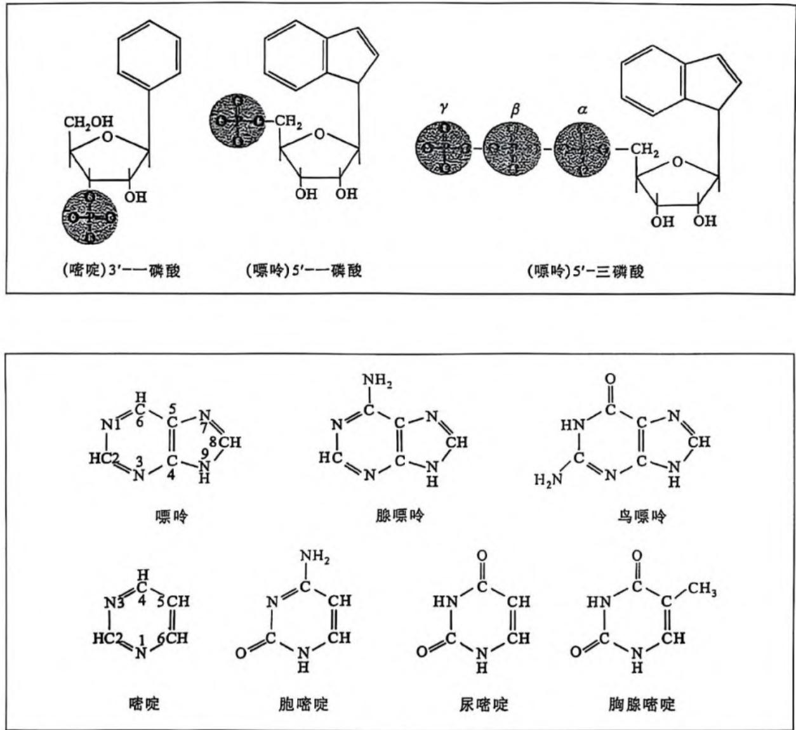

5种含氮碱基的结构式。

## 2.1 染色体

## 2.1.1 染色体概述

由于亲代能够将自己的遗传物质 DNA 以染色体 (chromosome) 的形式传给子代,保持了物种的稳定性和连续性,因此,人们普遍认为染色体在遗传上发挥主要作用。染色体包括 DNA 和蛋白质两大部分。DNA 只有包装成为染色体才能保证其稳定性,并使其编码的遗传信息稳定地传递给子代。同一物种内每条染色体所带 DNA 的量是一定的,但不同染色体或不同物种之间变化很大,从上百万到几亿个核苷酸不等。人 X 染色体就带有 1.28 亿个核苷酸对,而 Y 染色体只带有 0.19 亿个核苷酸对。此外,组成染色体的蛋白质(组蛋白和非组蛋白)种类和含量也是十分稳定的。由于细胞内的 DNA 主要在染色体上,所以说遗传物质的主要载体是染色体。

19 世纪中叶,细胞生物学家首先在光学显微镜下看到了细胞这个生命的基本单位,他们记录了真核细胞分裂的全过程,发现了细胞质与细胞核之间的界限,还在细胞分裂时观察到存在于细胞核中的棒状可染色结构并将其命名为染色体。因为当细胞分裂时,每条染色体都复制生成一条与母链完全一样的子链,形成同源染色体对。一般说来,染色体只有在细胞有丝分裂过程中,才可在光学显微镜下观察到。而在细胞生活周期中占较长时间的分裂间期,染色体以较细且松散的染色质形式存在于细胞核中。非分裂期的细胞核经低渗处理、溶胀破裂后释放出染色质,在电子显微镜下呈纤维串珠状的长丝,包括有DNA 双螺旋的长臂及部分蛋白质。

真核与原核细胞染色体除了外观结构不同之外,它们在细胞内的存在方式也不同。细菌染色体外裹着稀疏的蛋白质,这些蛋白质有些与 DNA 的折叠有关,另一些则参与 DNA 复制、重组及转录过程。真核细胞的染色体中,DNA 与蛋白质完全融合在一起,其蛋白质与相应 DNA 的质量比约为 2:1。这些蛋白质,包括组蛋白和非组蛋白,在染色体的结构中起着重要作用。这样,DNA、组蛋白和非组蛋白及部分 RNA(主要是尚未完成转录而仍与模板 DNA 相连接的那些 RNA,其含量不到 DNA 的 10%)组成了染色体。

因为原核生物没有真正的细胞核,DNA一般位于一个类似"核"的结构——称为类核。细菌DNA是一条分子量在 $10^{9}$ 左右的共价、闭合双链分子,通常也称为染色体 $^{[图2-3]}$ 。虽然快速生长期内的大肠杆菌可以有几条染色体,但一般情况下只含有一条染色体。因此,大肠杆菌和其他原核细胞都是单倍的。

## 2.1.2 真核细胞染色体的组成和特性

真核细胞都有明显的核结构,除了性细胞以外,真核细胞的染色体都是二倍体,而性细胞即生殖细胞的染色体数目是体细胞的一半,故称为单倍体。在二倍体阶段,每个基因

图 2-3 大肠杆菌细胞中基因组 DNA 的电子显微镜照片

(a)箭头所示处为球状质粒DNA.各种白斑或用斑为样品制备中产生的假象；(b)大肠杆菌纵切电子显微镜照片，显示细菌没有真正的细胞核结构，DNA集中在染色浅的区域。

(a)  
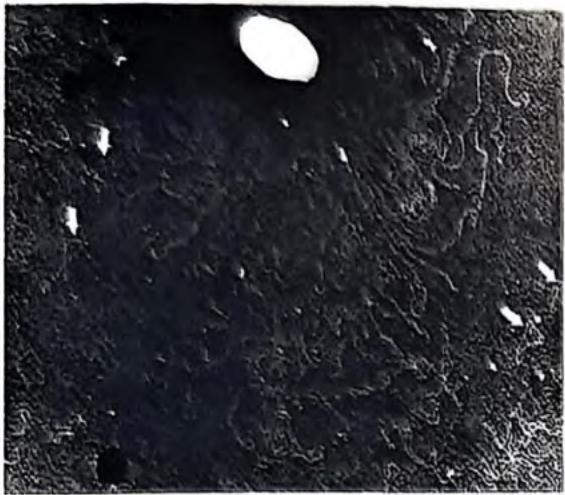

(b)  
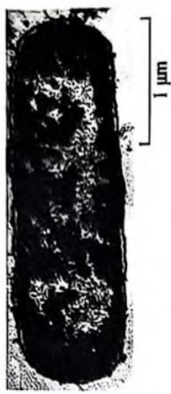

都有两个拷贝,其中的一个拷贝会通过配子(gamete),即性细胞(精子或卵子)从亲本传到子代。精、卵细胞结合形成合子(zygote),也称受精卵,它包含了从父、母本来的各一个拷贝的所有基因,从而创造了一个新生的二倍体。在这个新的个体内,基因的一个拷贝来自父本,另一个拷贝来自母本。

作为遗传物质,染色体具有如下特征:①分子结构相对稳定;②能够自我复制,使亲、子代之间保持连续性;③能够指导蛋白质的合成,从而控制整个生命过程;④能够产生可遗传的变异。

由于真核细胞 DNA 分子量一般大大超过原核生物, 其染色体也常常为大量蛋白质及核膜所包围, DNA 的转录和翻译是在不同的空间和时间上进行的, 所以其基因表达的调控不仅与 DNA 的序列有关, 而且也与染色体的结构有关。下面我们来详细介绍一下真核细胞染色体的组成。

## 1. 蛋白质

染色体上的蛋白质主要包括组蛋白和非组蛋白。

## (1) 组蛋白

组蛋白是染色体的结构蛋白, 它与 DNA 组成核小体。通常可以用 2 mol/L NaCl 或 0.25 mol/L 的 HCl/H₂SO₄ 处理染色质使组蛋白与 DNA 分开, 然后再用离子交换柱层析分离。根据其凝胶电泳性质可以把组蛋白分为 H1、H2A、H2B、H3 及 H4。这些组蛋白都含有大量的赖氨酸和精氨酸, 其中 H3、H4 富含精氨酸, H1 富含赖氨酸; H2A、H2B 介于两者之间。它们的理化特性见表 2-1。

表 2-1 真核细胞染色体上的组蛋白成分分析

<table><tr><td>种类</td><td>分子量</td><td>氨基酸数目</td><td>分离难易度</td><td>保守性</td><td>染色质中比例</td><td>染色质中位置</td></tr><tr><td>H1</td><td>21 000</td><td>223</td><td>易</td><td>不保守</td><td>0.5</td><td>接头</td></tr><tr><td>H2A</td><td>14 500</td><td>129</td><td>较难</td><td>较保守</td><td>1</td><td>核心</td></tr><tr><td>H2B</td><td>13 800</td><td>125</td><td>较难</td><td>较保守</td><td>1</td><td>核心</td></tr></table>

<table><tr><td>种类</td><td>分子量</td><td>氨基酸数目</td><td>分离难易度</td><td>保守性</td><td>染色质中比例</td><td>染色质中位置</td></tr><tr><td>H3</td><td>15 300</td><td>135</td><td>最难</td><td>最保守</td><td>1</td><td>核心</td></tr><tr><td>H4</td><td>11 300</td><td>102</td><td>最难</td><td>最保守</td><td>1</td><td>核心</td></tr><tr><td>H5(在某些细胞中取代 H1)</td><td>21 500</td><td>215</td><td>易</td><td>不保守</td><td>0.5</td><td>接头</td></tr></table>

组蛋白具有如下特性：

① 进化上的极端保守性。不同种生物组蛋白的氨基酸组成是十分相似的,特别是H3、H4。牛、猪、大鼠的H4氨基酸序列完全相同。牛的H4序列与豌豆序列相比只有两个氨基酸的差异(豌豆H4中的异亮氨酸 $^{60}$ →缬氨酸 $^{60}$ ,精氨酸 $^{77}$ →赖氨酸 $^{77}$ )。H3的保守性也很强,鲤鱼与小牛胸腺的H3只差一个氨基酸,小牛胸腺与豆苗H3只差4个氨基酸。H2A、H2B的变化相对大些,H1的变化则更大。H3及H4在氨基酸组成上的极端保守性表明,它们可能对稳定真核生物的染色体结构起重要作用。

② 无组织特异性。到目前为止,仅发现鸟类、鱼类及两栖类红细胞染色体不含 H1 而带有 H5,精细胞染色体的组蛋白是鱼精蛋白这两个例外。

③ 肽链上氨基酸分布的不对称性。碱性氨基酸集中分布在 N 端的半条链上。例如，H4 N 端的半条链上净电荷为 +16, C 端只有 +3, 大部分疏水基团都分布在 C 端。这种不对称的分布可能与它们的功能和相互作用有关。碱性的半条链易与 DNA 的负电荷区结合，而另外半条链与其他组蛋白、非组蛋白结合。表 2-2 比较了不同组蛋白中赖氨酸和精氨酸含量。

表 2-2 不同组蛋白分子中所含的碱性氨基酸比较(占氨基酸总数的 %)

<table><tr><td>碱性氨基酸</td><td>H1</td><td>H2A</td><td>H2B</td><td>H3</td><td>H4</td></tr><tr><td>赖氨酸</td><td>29.5</td><td>10.9</td><td>16.0</td><td>9.6</td><td>10.8</td></tr><tr><td>精氨酸</td><td>1.3</td><td>9.3</td><td>6.4</td><td>13.3</td><td>13.7</td></tr></table>

④ 组蛋白的修饰作用。由于组蛋白富含精氨酸和赖氨酸,可以发生包括甲基化、乙酰化、磷酸化、泛素化、ADP核糖基化、丙酰化、丁酰化、琥珀酰化、巴豆酰化和乳酰化等多种翻译后修饰(post translational modification, PTM)。这些修饰共同组成组蛋白密码,在不同的条件下更为灵活地影响染色质的结构与功能。目前已有研究显示,组蛋白H2A、H2B、H3和H4中的赖氨酸、精氨酸、丝氨酸等残基能够发生多种修饰,组蛋白H1有泛素化和磷酸化修饰等(图2-4)。修饰作用只发生在细胞周期的特定时间和组蛋白的特定位点上。

组蛋白甲基化是由组蛋白甲基转移酶和去甲基化酶催化的可逆修饰。甲基化可发生在组蛋白的赖氨酸和精氨酸残基上，而且赖氨酸残基能够发生单、双、三甲基化，而精氨酸残基能够被单、双甲基化。组蛋白H3的第4、9、27和36位，H4的第20位赖氨酸，H3的

## 2.1 染色体

图2-4 组蛋白N端残基中常见的化学修饰  
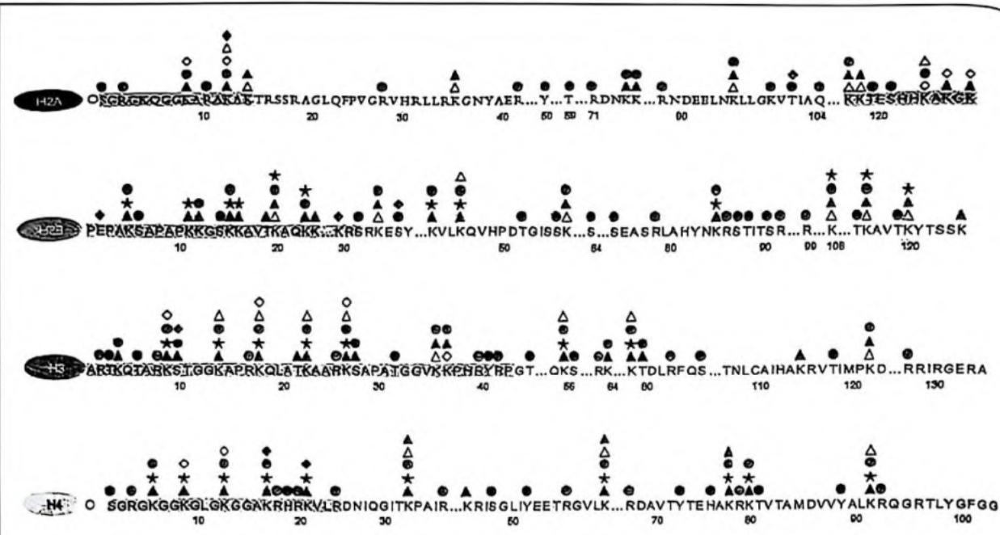

第2、17、26位及H4的第3位精氨酸都是甲基化的常见位点。组蛋白H3K4的甲基化主要聚集在活跃转录的启动子区域。组蛋白H3K9和H3K27的甲基化则与基因的转录抑制或异染色质化有关，H3K36和H3K79的甲基化参与基因转录激活。这些不同程度的甲基化极大地增加了组蛋白修饰和调节基因表达的复杂性，组蛋白甲基化的异常导致肿瘤等多种人类疾病的发生。与其他修饰相比，组蛋白的甲基化修饰方式是比较稳定的，适合作为表观遗传信息。

组蛋白乙酰化主要发生在核心组蛋白上,在含有活性基因的 DNA 结构域中,乙酰化程度更高,H3 和 H4 乙酰化程度大于 H2A 和 H2B。乙酰化的主要位点分布在 H3 和 H4 的 N 端比较保守的赖氨酸位置上。乙酰化修饰由组蛋白乙酰基转移酶和组蛋白去乙酰化酶协调进行,以保证乙酰化水平的动态平衡。组蛋白乙酰化呈现多样性,核小体上有多个乙酰化位点,但特定基因部位的组蛋白乙酰化和去乙酰化是以一种非随机的、位置特异的方式进行,可能通过对组蛋白电荷以及相互作用蛋白的影响,来调节基因转录水平。乙酰化 / 去乙酰化修饰影响染色质结构和基因活化,组蛋白的乙酰化有利于 DNA 与组蛋白八聚体的解离,使核小体结构松弛,从而使各种转录因子和协同转录因子能与 DNA 结合位点特异性结合,激活基因的转录;反之,去乙酰化则抑制转录。组蛋白的乙酰化、去乙酰化修饰还参与 DNA 修复、拼接、复制,染色体的组装,以及细胞的信号转导,与肿瘤等疾病的发生发展密切相关。有关组蛋白的甲基化和乙酰化在基因表达中的调控作用将在第八章详细介绍。

组蛋白的泛素化修饰位点为高度保守的赖氨酸残基, 组蛋白 H1、H2A、H2B 和 H3 都能发生泛素化修饰。与经典的蛋白质泛素调节途径不同, 组蛋白的泛素化修饰不会导致蛋白质的降解, 却能招募核小体形成染色体, 并参与 X 染色体的失活, 影响组蛋白的甲基化和基因的转录,也在 DNA 损伤应答等生理过程中发挥重要调控作用。

组蛋白 H1、H2A、H2B 及 H3 能够和多聚 ADP- 核糖的共价结合发生 ADP 核糖基化修饰, 被认为是在真核细胞内启动复制过程的开关。

组蛋白的修饰可以通过影响组蛋白与 DNA 双链的亲和性, 改变染色质的疏松或凝集状态, 或通过影响转录因子与结构基因启动子的亲和性来发挥基因调控作用。

⑤ 富含赖氨酸的组蛋白 H5。与 H1 一样，H5 也属于连接组蛋白，主要负责稳定核小体的结构，并且参与染色质高级结构的形成。在成熟的鱼类和鸟类的红细胞中，H1 被特殊的组蛋白 H5 所取代。从该组蛋白的氨基酸成分来看，除了富含赖氨酸 (24%) 以外，还富含丙氨酸 (16%)、丝氨酸 (13%) 及精氨酸 (11%)。它与 H1 并无明显的亲缘关系。有核的红细胞完全失去复制和转录的能力，其核很小，染色质高度浓缩，所以人们认为红细胞染色质的失活与 H5 的积累有关。但是，在成红细胞中也有相当数量的 H5。有证据表明，H5 的磷酸化很可能在染色质失活过程中起重要作用。

## (2) 非组蛋白

染色体上除了存在大约与 DNA 等量的组蛋白以外,还存在大量的非组蛋白。非组蛋白占组蛋白总量的 60%\~70%,它的种类很多,有 20\~100 种。非组蛋白包括酶类,如 RNA 聚合酶及与细胞分裂有关的收缩蛋白、骨架蛋白、核孔复合物蛋白以及肌动蛋白、肌球蛋白、微管蛋白、原肌蛋白等,它们也可能是染色质的结构成分。

① HMG 蛋白(high mobility group protein) 这是一类能用低盐溶液(0.35 mol/L NaCl)抽提、能溶于2%三氯乙酸、分子量都在 $3.0 \times 10^{4}$ 以下的非组蛋白。因其分子量小、在凝胶电泳中迁移速度快而得名。HMG蛋白富含赖氨酸、精氨酸、谷氨酸和天冬氨酸,是真核细胞内除组蛋白外含量最为丰富的一组染色质蛋白质。这类蛋白质的特点是能与DNA结合,也能与H1作用,但都很容易用低盐溶液抽提,说明它们与DNA的结合并不牢固。现在一般认为这类蛋白质可能与DNA的超螺旋结构有关,是真核细胞基因表达调控的动力体现者,在染色质的结构与功能及基因表达调控过程中均发挥着重要作用。

② DNA 结合蛋白 用 2 mol/L NaCl 除去全部组蛋白和 70% 的非组蛋白后, 还有一部分非组蛋白紧紧地与 DNA 结合在一起, 只有用 2 mol/L NaCl 和 5 mol/L 尿素才能把这些蛋白质解离。它们是一些分子量较低的蛋白质, 约占非组蛋白的 20%, 染色质的 8%。它们可能是一些与 DNA 的复制或转录有关的酶或调节物质。

③ A24 非组蛋白 有科学家用 $0.2 \mathrm{~mol} / \mathrm{L}$ 的硫酸从小鼠肝中分离到一种称为 A24 的非组蛋白。这种蛋白质的溶解性质与组蛋白相似。氨基酸序列测定发现 A24 的 C 端与 H2A 相同,但它有两个 N 端,一个 N 端的序列与 H2A 相同,另一个 N 端与泛素相同,是在 H2A 的 119 位赖氨酸的 $\varepsilon - \mathrm{NH}_{2}$ 上附加上去的多肽。它与 H2A 大小相似,呈酸性,含有较多的谷氨酸和天冬氨酸。A24 的总量大约是 H2A 的 $1\%$ ,位于核小体内,可能具有 rDNA 抑制子的作用,但具体功能有待于深入研究。

## 2. 真核生物基因组 DNA

真核细胞基因组的最大特点是它含有大量的重复序列,而且功能 DNA 序列大多被不编码蛋白质的非功能 DNA 所隔开。生物体内所有的染色体组成基因组, 每 Mb 基因组 DNA 上所含有的平均基因数目称为基因密度(gene density)。我们把一种生物单倍染色体中 DNA 的总长度称为基因组的大小(genome size)。基因组的大小与生物体的复杂性相关。在真核生物中, 基因组的大小一般是随生物进化而增加的, 高等生物基因组的大小一般大于低等生物, 这很容易被高等生物需要更多的基因来控制性状所解释。然而, 许多复杂性相近的物种却有着显著不同的基因组大小。例如, 蝗虫的基因组大小是果蝇基因组的 25 倍, 水稻的基因组是小麦基因组的 1/40, 这表明基因的数目可能与生物的复杂度关系更加密切。研究发现, 基因密度是复杂度相近但基因组大小迥异的物种之间的主要区别。一般来说, 基因密度越高, 生物的复杂性越低(表 2-3)。与原核生物相比, 真核生物不但基因密度低, 而且各种变异相对较多。真核生物中, 基因密度随着生物复杂性的增加而降低, 这主要是由于在真核细胞中基因长度, 特别是大量基因间隔区序列 (intergenic sequence) 造成的。

表 2-3 不同生物基因组中基因密度的比较

<table><tr><td>物种</td><td>基因密度/(基因数/Mb)</td><td>基因组大小/Mb</td><td>大致基因数目</td></tr><tr><td>原核生物</td><td></td><td></td><td></td></tr><tr><td>肺炎链球菌</td><td>1060</td><td>2.2</td><td>2300</td></tr><tr><td>大肠杆菌K-12</td><td>950</td><td>4.6</td><td>4400</td></tr><tr><td>真核生物</td><td></td><td></td><td></td></tr><tr><td>真菌</td><td></td><td></td><td></td></tr><tr><td>酿酒酵母</td><td>480</td><td>12</td><td>5800</td></tr><tr><td>原生生物</td><td></td><td></td><td></td></tr><tr><td>四膜虫</td><td>&gt;90</td><td>220</td><td>&gt;20000</td></tr><tr><td>无脊椎动物</td><td></td><td></td><td></td></tr><tr><td>秀丽隐杆线虫</td><td>200</td><td>97</td><td>19000</td></tr><tr><td>果蝇</td><td>80</td><td>180</td><td>13700</td></tr><tr><td>东亚飞蝗</td><td>?</td><td>5000</td><td>?</td></tr><tr><td>脊椎动物</td><td></td><td></td><td></td></tr><tr><td>人类</td><td>8.5</td><td>3200</td><td>27000</td></tr><tr><td>小鼠</td><td>12</td><td>2500</td><td>29000</td></tr><tr><td>植物</td><td></td><td></td><td></td></tr><tr><td>拟南芥</td><td>125</td><td>125</td><td>25500</td></tr><tr><td>水稻</td><td>&gt;100</td><td>430</td><td>&gt;45000</td></tr><tr><td>玉米</td><td>&gt;20</td><td>2200</td><td>&gt;45000</td></tr></table>

对于复杂度高的生物,调控转录的序列长度显著增长,分散在真核生物中编码蛋白质的基因区段中的非蛋白质编码区段(内含子)的数目也大量增加(图2-5)。例如,人基因组中功能未知的基因间隔区序列超过60%。间隔区DNA根据其重复性分为唯一性(大约1/4的基因间隔区序列)和重复性两大类,人类基因组中几乎一半以上由重复多次的DNA

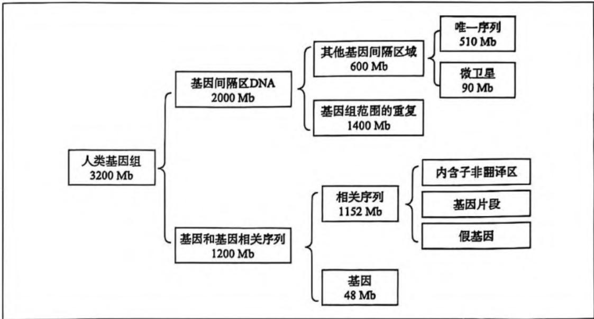  
图2-5 人类基因组由多种类型的DNA序列组成.绝大多数DNA序列不编码蛋白质

序列组成。

真核细胞的 DNA 序列大致上可被分为 3 类:

① 不重复序列 在单倍体基因组里,这些序列一般只有一个或几个拷贝,它占 DNA 总量的 40%\~80%,如牛细胞中占 55%,小鼠中占 70%,果蝇中占 79%。不重复序列长 750\~2000 bp,相当于一个结构基因的长度。实际上结构基因基本上属于不重复序列,如蛋清蛋白、蚕丝心蛋白、血红蛋白和珠蛋白等都是单拷贝基因。

② 中度重复序列 这类序列的重复次数为 $10^{1} \sim 10^{4}$ , 占总 DNA 的 $10\% \sim 40\%$ , 在小鼠中占 $20\%$ , 果蝇中占 $15\%$ , 各种 rRNA、tRNA 以及某些结构基因如组蛋白基因等都属于这一类。非洲爪蟾的 18S、5.8S 及 28S rRNA 基因是连在一起的, 它们中间隔着不转录的间隔区, 这些 rRNA 基因及间隔区组成的单位在 DNA 链上串联重复约 5000 次。在许多动物的卵细胞形成过程中这些基因可进行几千次不同比例的复制, 产生 $2 \times 10^{6}$ 个拷贝, 使 rDNA 占卵细胞 DNA 的 $75\%$ , 从而使该细胞能积累 $10^{12}$ 个核糖体, 以合成大量蛋白质供细胞分裂之需。中度重复序列往往分散在不重复序列之间。

③ 高度重复序列 这类DNA只在真核生物中发现,占基因组的10%\~60%,由6\~100个碱基组成,在DNA链上串联重复成千上万次。卫星DNA是一种高度重复的DNA序列,实验中常用CsCl密度梯度离心将卫星DNA与其他DNA分开,形成两个以上的峰,即含量较大的主峰和高度重复序列小峰,后者又称卫星区带(峰)。原位杂交法证明,许多卫星DNA均位于染色体的着丝粒部分,也有一些在染色体臂上。这类DNA是高度浓缩的,是异染色质的组成部分。卫星DNA是不转录的,其功能不明,可能与染色体的稳定性有关。

## 3. 核小体是染色质结构的基本单位

由 DNA 和组蛋白组成的染色质纤维细丝是许多核小体连成的念珠状结构 $^{[182-6n]}$ ，大量实验证实了这一结构模型。首先，人们发现染色质 DNA 的 $T_{m}$ 值比自由 DNA 高，说明在染色质中 DNA 极可能与蛋白质分子相互作用；其次，在染色质状态下，由 DNA 聚合酶和 RNA 聚合酶催化的 DNA 复制和转录活性大大低于在自由 DNA 中的反应; DNA 酶 I (DNase I) 对染色质 DNA 的消化远远慢于对纯 DNA 的作用。另外, 染色质的电子显微镜图显示出由核小体组成的念珠状结构 [图 2-6h], 可以看到由一条细丝连接着的一连串直径为 $10 \mathrm{~nm}$ 的球状体。在染色质的 X 射线衍射图中也发现了 $10 \mathrm{~nm}$ 的重复单位。DNase I 或小球菌核酸酶可以切断游离 DNA 上的任何磷酸二酯键, 而除了少数几个位点以外染色质中的 DNA 是被保护不受消化的。用小球菌核酸酶处理染色质以后进行电泳, 便可以得到一系列片段, 这些被保留的 DNA 片段均为 $200 \mathrm{bp}$ 基本单位的倍数, 其大小分别为 $200 \mathrm{bp}$ (单体)、 $400 \mathrm{bp}$ (双体)、 $600 \mathrm{bp}$ (三体) 等 (图 2-6c,d)。电镜图显示一个染色质片段中球形颗粒的长度为 $200 \mathrm{bp}$ , 如具有 $600 \mathrm{bp} \mathrm{DNA}$ 的染色质片段含有 3 个直径为 $10 \mathrm{~nm}$ 的颗粒。因此, 电镜上看到的颗粒相当于核酸酶切割后得到的核小体 (图 2-6)。

现在已经知道,核小体是由 H2A、H2B、H3、H4 各两个分子生成的八聚体和由大约 200 bp DNA 组成的。H3·H4 四聚体的形成启动核小体的组装,四聚体然后与 DNA 结合,再与两个 H2A·H2B 二聚体结合,完成核小体的组装。八聚体在中间,DNA 分子盘绕在外,

图2-6 核小体单位的存在及核心颗粒的形成

(a) 核小体结构示意图；(b) 从电镜下看到的染色质结构；(c) 核小体单元的产生；(d) 小球菌核酸酶对核小体 DNA 的消化。

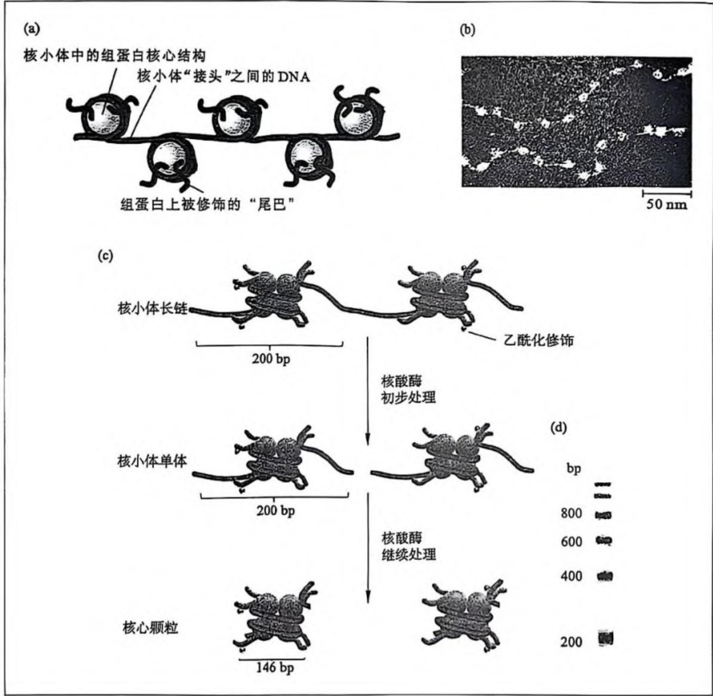

而 H1 则在核小体的外面。每个核小体只有一个 H1。所以，核小体中组蛋白和 DNA 的比例是每 200 bp DNA 有 H2A、H2B、H3、H4 各两个，H1 一个。每个核心组蛋白有一个 N 端延伸的"尾巴"，上面有许多高度修饰的位点 $^{(图 2-7)}$ 。用核酸酶水解核小体后产生只含 146 bp 核心颗粒 $^{(图 2-6)}$ ，包括组蛋白八聚体及与其结合的 146 bp 核心 DNA，该序列绕在核心外面形成 1.65 圈，每圈约 80 bp。核小体之间的连接 DNA 的长度是可变的，一般为 20\~60 bp。由许多核小体构成了连续的染色质 DNA 细丝。

需要注意的是,在核小体中组蛋白与DNA的结合是动态的,其相互作用的稳定

图2-7 组蛋白八聚体组成核小体的核心  
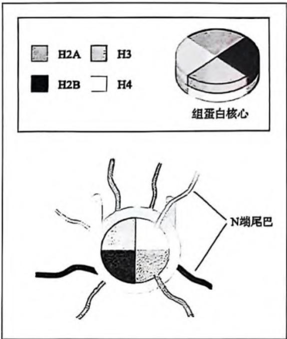

性受到核小体重塑复合物的影响,利用 ATP 水解释放的能量,由多个蛋白质组成的核小体重塑复合物促进组蛋白八聚体沿 DNA 滑动,从一个 DNA 分子转移到另一个 DNA 分子,使核小体重塑,增加 DNA 的易接近性。上述组蛋白 N 端尾部的修饰在调控染色质的易接近性中也发挥重要作用。

核小体的形成是染色体中 DNA 压缩的第一个阶段。在核小体中 DNA 盘绕组蛋白八聚体核心, 从而使分子收缩成 $1/7, 200 \mathrm{bp}$ DNA 完全舒展时长约 $68 \mathrm{~nm}$ , 却被压缩在 $10 \mathrm{~nm}$ 的核小体中。当然 $1/7$ 的压缩比仍远远低于染色体中 DNA 的压缩比。例如, 人中期染色体中含 $6.2 \times 10^{9}$ 碱基对, 其理论长度应是 $200 \mathrm{~cm}$ , 这么长的 DNA 被包装在 46 个 $5 \mu \mathrm{m}$ 长的圆柱体 (染色体) 中, 其压缩比约为 $10^{4}$ 。分裂间期染色质比较松散, 压缩比是 $10^{2} \sim 10^{3}$ 。所以说, 核小体只是 DNA 压缩的第一步。

## 4. 染色质的高级结构

组成染色质的核小体形成后,DNA包装成染色体的下一个水平是什么呢?在电镜下观察染色质,可以看到10 nm及30 nm两类不同的纤维构造。通过改变离子强度,10 nm纤维和30 nm纤维可以可逆地相互转化。10 nm纤维是由核小体串联成的染色质细丝,主要在低离子强度及无H1情况下产生。当离子强度较高且有H1存在时,以30 nm纤维为主,它是由10 nm的染色质细丝盘绕成螺旋管状的粗丝,通称螺线管(solenoid)。螺线管的每一螺旋包含6个核小体,其压缩比为6。这种螺线管是分裂间期染色质和分裂中期染色体的基本组分。组蛋白H1通过与结合在核小体上的DNA结合,使染色质进一步压缩,形成30 nm螺线管(图2-8)。组蛋白N端尾巴对于30 nm螺线管的形成是必需的。对核小体的三维结构的研究表明,组蛋白N端尾巴是通过它与相邻核小体的相互作用稳定30 nm螺线管,其翻译后修饰可能在核小体高级结构形成中发挥作用。染色质和染色体可能是一个多层次的螺旋结构,上述螺线管可进一步压缩形成超螺旋。有迹象表

图 2-8 组蛋白 HJ 使 DNA 更紧密地盘绕在核小体上

电子显微镜下观察, 当组蛋白 H1 不存在时, 核小体 DNA 为松散状(a); 当 H1 存在时, 核小体 DNA 紧密压缩(b)。

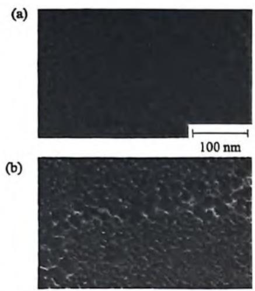

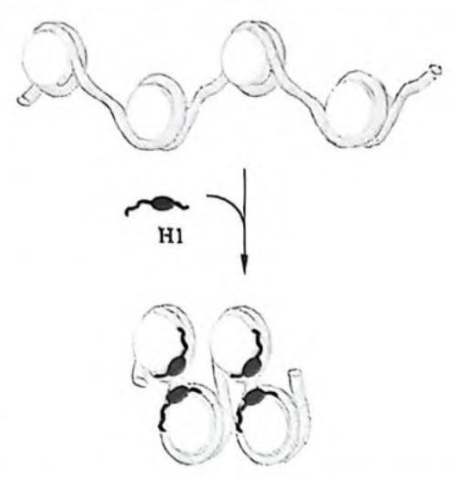  
明:中期染色质是一细长、中空的圆筒,直径为 4000 nm,由 30 nm 螺线管缠绕而成,压缩比是 40。这个超螺旋圆筒进一步压缩 1/5 便成为染色体单体,总压缩比是 $7 \times 6 \times 40 \times 5$ , 将近一万倍,与 DNA 的压缩比相近 $^{[图2-9]}$ 。表 2-4 和图 2-10 总结了染色体形成过程中长度与宽度的变化。  
(a) 30 nm 染色体结构图; (b) 双螺旋 DNA 经过一系列包装成为染色体的过程图示。  
两段各含10个螺旋的染色质

图 2-9 染色体 DNA 结构示意图

(b)

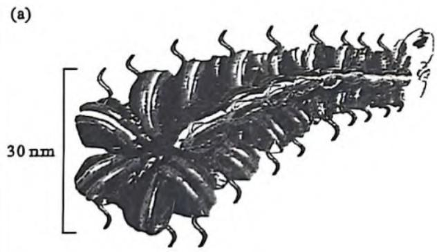  
一个螺旋中包含30个莲座状结构  
每个莲座状结构中都有6个环状DNA  
每个环状结构中含有75000bp  
30nm结构  
染色体DNA的念珠状结构

双链DNA

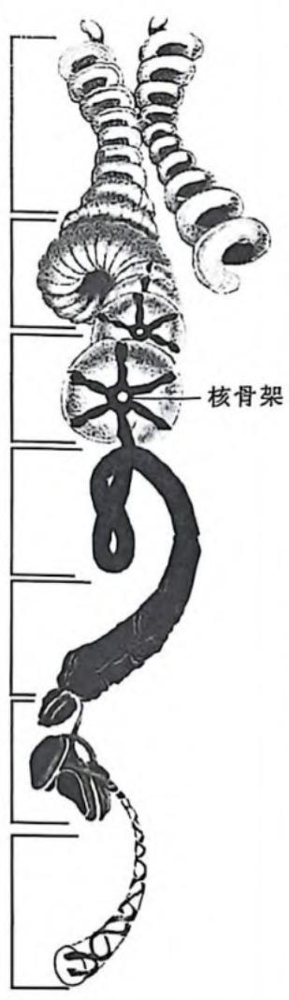

表 2-4 染色体形成过程中长度与宽度的变化

<table><tr><td>过程</td><td>成分</td><td>名称</td><td>宽度增加</td><td>长度压缩</td></tr><tr><td>第一级</td><td>DNA + 组蛋白</td><td>核小体</td><td>5 倍</td><td>7 倍</td></tr><tr><td>第二级</td><td>核小体</td><td>螺线管</td><td>3 倍</td><td>6 倍</td></tr><tr><td>第三级</td><td>螺线管</td><td>超螺旋</td><td>13 倍</td><td>40 倍</td></tr><tr><td>第四级</td><td>超螺旋</td><td>染色体</td><td>2.5 ~ 5 倍</td><td>5 倍</td></tr></table>

## 5. 染色质结构的调控

组蛋白八聚体与 DNA 的相互作用是动态的过程。细胞利用多种方式快速调节其染色质的局部结构,以暴露出局部 DNA 结构,被基因表达、DNA 复制和修复相关的调控蛋白质识别和结合。

染色质重塑复合物(chromatin remodeling complex)在组蛋白八聚体与DNA相互作用稳定性的调控中发挥重要的作用,有助于核小体的移动。细胞中存在多种类型的染色质重塑复合物,包含2\~14个亚基(表2-5)。这些由多个蛋白质组成的复合物都含有一个

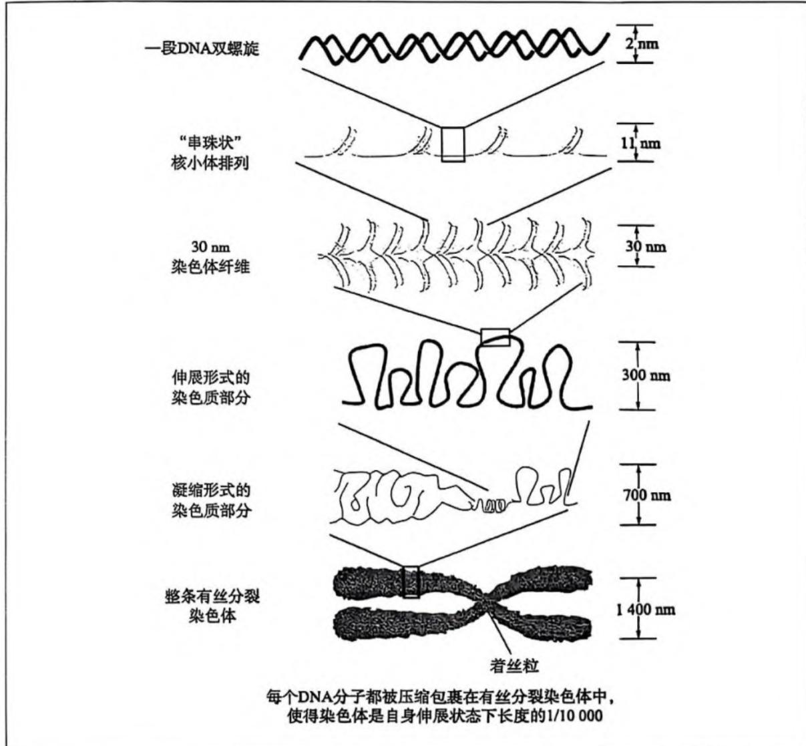  
图 2-10 由双链 DNA 经过多层次的包装形成高度浓缩的有丝分裂染色体的不同阶段

DNA 依赖的具 ATP 酶活性的类解旋酶亚基,通过水解 ATP 释放能量,改变 DNA 环绕核小体的位置。染色质重塑复合物沿着 DNA 移动,推动 DNA 使之松动与组蛋白的结合,从而使上述其他蛋白质更易于与其接触(图 2-11)。SWI/SNF 复合物家族和 ISWI 复合物家族是最先从酵母和果蝇体内发现的两种染色质重塑复合物。SWI/SNF 复合物识别核小体和裸露的 DNA,亲和力高,通过与 DNA 作用,可移动核小体,产生更易被影响的 DNA 区域。ISWI 属于 ATP 依赖的染色质重塑复合物 SWI2/SNF2 超家族,其家族成员 ACF 通过核小体组蛋白 H4 尾部介导催化亚基和辅助亚基之间的相互作用来感知连接区 DNA 的长度,将这一长度信息以一种 ATP 依赖性方式转换为对核小体移动速率的调控,保持核小体间合适的间距,参与细胞核内包括基因表达调控、DNA 复制及染色质重塑等众多生物学过程。染色质重塑复合物作用方式包括:①组蛋白八聚体沿着 DNA 滑动;②核小体从一个 DNA 分子转移到另一个 DNA 分子;③重塑核小体,在不改变核小体在 DNA 上的位置时使得 DNA 结合蛋白能够结合 DNA。

表 2-5 依赖 ATP 的染色质重塑复合物

<table><tr><td>类型</td><td>亚基数目</td><td>同源调节域 / 修饰域</td><td>滑动</td><td>转移</td><td>重构</td></tr><tr><td>SWI/SNF</td><td>8~14</td><td>同源调节域</td><td>有</td><td>有</td><td>有</td></tr><tr><td>ISWI</td><td>2~4</td><td>无</td><td>有</td><td>无</td><td>无</td></tr><tr><td>CHD</td><td>1~10</td><td>修饰域</td><td>有</td><td>无</td><td>无</td></tr><tr><td>INO80</td><td>&gt;10</td><td>修饰域</td><td>有</td><td>无</td><td>有</td></tr></table>

组蛋白可逆的翻译后修饰是调节染色质结构的另一种重要方式。乙酰化、甲基化和磷酸化等修饰可以改变组蛋白尾的电荷,影响 $30 \mathrm{~nm}$ 螺线管的形成,或者影响组蛋白尾巴与特殊蛋白质的结合能力,从而将其招募到染色质特定的伸展处。不同类型的修饰招募不同的蛋白质,或者引起染色质的进一步浓缩,或者通过解开染色质使 DNA 更易被接近。一般来说,组蛋白乙酰化修饰会解开染色质结构;特定位点的甲基化修饰抑制染色质的展

图 2-11 染色质重塑复合物调节 DNA 环绕核小体位置

(a) 利用水解 ATP 产生的能量(重复循环), 染色质重塑复合物沿着组蛋白核心推动核小体 DNA 使之松动, 调整了核小体的位置(滑动), 使得其他 DNA 结合蛋白能够结合暴露的 DNA;(b) 核小体的多次滑动使染色质变得松散, 细胞内其他蛋白质能够触及并结合 DNA。

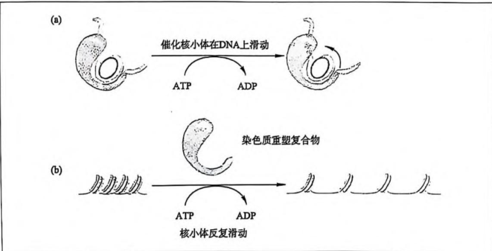

开进而抑制转录调控相关蛋白质的结合;在有丝分裂的染色体中,可以观察到高度压缩的染色质上组蛋白 H3 的 N 端尾被磷酸化修饰。修饰组蛋白尾巴的不同类型的酶是被其他信号严格调控的。有关蛋白质翻译后修饰影响基因表达的详细描述请见第 8 章。

尽管组蛋白修饰酶和染色质重塑复合物发挥作用的顺序不尽相同,但它们互相配合,累积起来的效果能够显著改变 DNA 的易接近性,压缩或解开染色质的伸展区域,导致 DNA 特定位点处的核小体的定位和释放。

## 6. 核小体的解体与重组装

由于真核细胞核 DNA 与组蛋白结合形成核小体和染色质结构, 所以在其复制过程中, 核小体呈现动态变化, 复制叉的移动与新旧核小体的组装和解体是紧密偶联的。位于复制叉正前方核小体会不断解体, 同时在复制叉的正后方新的核小体又会不断地重新组装。当复制叉经过时, 在母链上一个旧的核小体解体为亚组装部件: H3/H4 四聚体和两个 H2A/H2B 二聚体。其中, H3/H4 四聚体不从 DNA 上释放成为游离的成分, 而是随机地与两个子代双螺旋中的一个结合, 再与其他的组蛋白 (新合成的或是旧的释放出来的 H2A/H2B 二聚体) 重新组装成新的核小体; H2A/H2B 二聚体被释放进入新合成的组蛋白库中, 参与两个子代双螺旋中新的核小体的组装。利用不同标记物标记旧的和新的组蛋白, 发现原有的组蛋白存在于两条子代染色体中, 每个新合成的 DNA 分子中有一半旧的和一半新的组蛋白。如上所述, 组蛋白 N 端尾巴的乙酰化和甲基化等翻译后修饰通过改变核小体自身的特性和影响蛋白质的结合影响 DNA 的易接近性, 这些发生在组蛋白上的修饰会招募具有相同修饰作用的酶对相邻核小体进行相似的修饰, 从而使染色体复制时被修饰的核小体或染色质的区域携带的信息被稳定地遗传给子代。

早期的研究发现,将纯化的组蛋白添加到 DNA 中仅有极少的甚至没有核小体的形成,表明复制后核小体的组装不是一个自发的过程,需要其他蛋白质的参与。目前已有的实验结果发现,增殖细胞核抗原(PCNA)通过与 DNA 聚合酶 $\delta$ 的协同作用以及与染色质组装因子 1(CAF-1)的相互作用,促进 DNA 复制过程中核小体的正确组装和维持基因组的稳定性。一些能够指导组蛋白在 DNA 上组装的、带有负电荷的组蛋白伴侣(histone chaperone),如 CAF-1、RCAF 以及 NAP-1,可以避免组蛋白与 DNA 发生无效的相互作用,与 H3/H4 四聚体或 H2A/H2B 二聚体结合形成复合物,护送 H3/H4 四聚体和 H2A/H2B 二聚体到核小体组装位点进行核小体的组装(图 2-12)。

真核生物基因组的结构特点总结归纳如下：

① 真核基因组庞大,一般都远大于原核生物的基因组。

② 真核基因组存在大量的重复序列。

③ 真核基因组的大部分为非编码序列, 占整个基因组序列的 90% 以上, 该特点是真核生物与细菌和病毒之间最主要的区别。

④ 真核基因组的转录产物为单顺反子。

⑤ 真核基因是断裂基因,有内含子结构。

⑥ 真核基因组存在大量的顺式作用元件,包括启动子、增强子、沉默子等(详见第8

图 2-12 染色质组装因子在核小体的组装中发挥重要作用  
复制叉经过后，染色质组装因子CAF-1和NAP-1分别伴随游离的H3/H4四聚体和H2A/H2B二聚体到新复制DNA的位点，将其结合的组蛋白转移给DNA。  
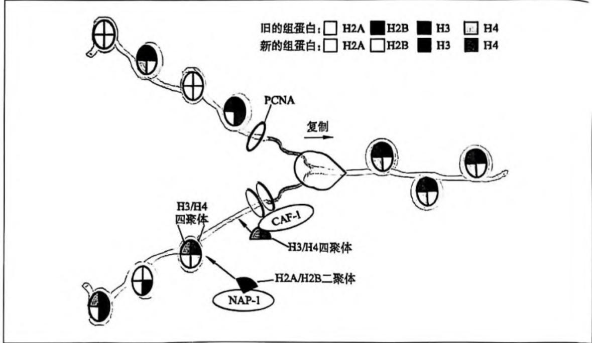

章"真核基因表达调控")。

⑦ 真核基因组中存在大量的 DNA 多态性。DNA 多态性是指 DNA 序列中发生变异而导致的个体间核苷酸序列的差异,主要包括单核苷酸多态性(single nucleotide polymorphism, SNP)和串联重复序列多态性(tandem repeat polymorphism)两类。

⑧ 真核基因组具有端粒结构。端粒(telomere)是真核生物线性基因组 DNA 末端的一种特殊结构, 它是一段 DNA 序列和蛋白质形成的复合物。其 DNA 序列相当保守, 一般由多个短寡核苷酸串联在一起构成。人类的端粒 DNA 长 $5 \sim 15 \mathrm{~kb}$ 。它具有保护线性 DNA 的完整复制、保护染色体末端和决定细胞的寿命等功能, 有关端粒的研究也是分子生物学的研究热点之一。

## 2.1.3 原核生物染色体结构与特点

细菌、支原体、衣原体、立克次体、螺旋体和放线菌等原核生物的基因组很小,大多只有一条染色体,且大都带有单拷贝基因,只有很少数基因是以多拷贝形式存在。在原核生物中,只有嗜盐菌、产甲烷菌和一些嗜热菌、有柄细菌的基因组中有较多的重复序列,在一般细菌中则只有 rRNA 基因等少数基因有较多的重复。原核生物 DNA 含量少,如大肠杆菌 DNA 的分子量仅为 $2.4 \times 10^{9}$ ,或 $4.6 \times 10^{6} \mathrm{bp}$ ,其完全伸展总长约为 $1.3 \mathrm{~mm}$ ,含 4000 多个基因。整个染色体 DNA 几乎全部由功能基因与调控序列所组成;几乎每个基因序列都与它所编码的蛋白质序列呈线性对应状态。此外,细菌的质粒、真核生物的线粒体、高等植物的叶绿体等也含有 DNA 和功能基因,这些 DNA 被称为染色体外遗传因子。

从基因组的组织结构来看,原核细胞 DNA 有如下特点:

## 1. 结构简练

原核生物的基因组 DNA 只有一个复制起点, 基因组很紧凑, DNA 的编码区是连续的,其序列以编码序列为主,DNA 分子的绝大部分是用来编码蛋白质的,只有非常小的一部分不转录,主要是一些调控元件,这与真核 DNA 的冗余现象不同。

## 2. 存在转录单元

原核生物 DNA 序列中功能相关的 RNA 和蛋白质基因,往往丛集在基因组的一个或几个特定部位,形成功能单位或转录单元,它们可被一起转录为含多个 mRNA 的分子,叫多顺反子 mRNA。功能相关的基因串联在一起转录产生一条 mRNA 链,然后再翻译成各种蛋白质,这是功能相关基因协同表达的方式之一。在大肠杆菌中,由几个结构基因及其操纵基因、启动基因组成的操纵子也是一种转录功能单位,如组氨酸操纵子转录成一条多顺反子 mRNA,再翻译成组氨酸合成途径中的 9 个酶。

## 3. 有重叠基因

直到不久前,人们还认为基因是一段 DNA 序列,这段序列负责编码一个蛋白质或一条多肽。但是,已经发现在一些细菌和动物病毒中有重叠基因(overlapping gene),即同一段 DNA 能携带两种或两种以上不同蛋白质的信息。1973 年 Alan M. Weiner 和 Klans Weber 在研究一种大肠杆菌 RNA 病毒时发现,有两个基因从同一起点开始翻译,一个在 400 bp 处结束,生成较小的蛋白质,而在 3% 的情况下,翻译可一直进行下去直到 800 bp 处碰到双重终止信号时才停止,合成分子量较大的蛋白质。当时他们认为分子量大的蛋白质含量少,对病毒无关紧要,因而不予重视,没有进一步研究。后来,Charles Weissman 证实小分子蛋白质是一种外壳蛋白,需要量大,大分子蛋白质产量虽少,却是组成有感染力的病毒颗粒所必需的。1977 年 Fred Sanger 在 Nature 杂志上发表了大肠杆菌噬菌体 $\Phi$ X174 DNA 的全部核苷酸序列,正式发现了重叠基因。

ΦX174 能够合成 11 个蛋白质, 总分子量约 $2.5 \times 10^{5}$ , 相当于 6078 个核苷酸, 而病毒 DNA 本身只有 5386 个核苷酸, 最多能编码总分子量为 $2.0 \times 10^{5}$ 的多肽, 这个矛盾在长时期内都无法解决。Sanger 在弄清 ΦX174 DNA 的全部核苷酸序列及各个基因的起讫位置和密码子数目以后发现, ΦX174 的 11 个基因有些是重叠的。

重叠基因主要有以下几种情况：

① 一个基因完全在另一个基因里面,如基因 B 在基因 A 内,基因 E 在基因 D 内。

② 部分重叠,如基因 K 和基因 C 的部分重叠。

③ 两个基因只有一个碱基对的重叠, 如 D 基因终止密码子的最后一个碱基是 J 基因起始密码子的第一个碱基。

尽管这些重叠基因的 DNA 序列大致相同,但由于基因重叠部位一个碱基的变化可能影响后续肽链的全部序列,从而编码完全不同的蛋白质。除了 $\Phi X174$ 外,在 SV40 病毒、G4 噬菌体的 DNA 中,以及在志贺氏菌、肠聚集性大肠杆菌、肠出血性大肠杆菌 EHEC O157:H7、生殖支原体、肺支原体等原核生物 DNA 中也存在基因重叠现象。有研究发现,在大约 30% 的细菌基因中存在只有几个碱基对的微小重叠(trivial overlap)。在某些真核生物中也发现有重叠基因。例如,一个含有 66 个氨基酸的小蛋白质 ATP 合酶蛋白 8 与牛的线粒体中编码 ATPase-6 的基因中的 40 个碱基是重叠的。基因重叠可能是生物进化

过程中自然选择的结果。

## 2.2 DNA 的结构

现在我们已经知道,DNA 是遗传的物质基础,基因是具有特定生物功能的 DNA 序列,通过基因的表达能够使上一代的性状准确地在下一代表现出来。那么,DNA 为什么能起遗传作用,它又是怎样起作用的呢?这与它的分子结构是密切相关的。

## 2.2.1 DNA 的一级结构

Watson 和 Crick 于 1953 年提出了著名的 DNA 双螺旋模型,为合理地解释遗传物质的各种功能,解释生物的遗传和变异,解释自然界千变万化的生命现象奠定了理论基础。前面说过,DNA 又称脱氧核糖核酸,是英文 deoxyribonucleic acid 的简称。它是一种高分子化合物,其基本单位是脱氧核苷酸。在所有的 DNA 分子中,磷酸和脱氧核糖是永远不变的,而含氮碱基是可变的,主要有 4 种,即腺嘌呤(A)、鸟嘌呤(G)、胞嘧啶(C)和胸腺嘧啶(T) $^{(表2-6)}$ 。因此脱氧核苷酸可分别称为腺嘌呤脱氧核苷酸、鸟嘌呤脱氧核苷酸、胞嘧啶脱氧核苷酸和胸腺嘧啶脱氧核苷酸。许许多多个脱氧核苷酸经 $3'\rightarrow5'$ 磷酸二酯键聚合而成为 DNA 链 $^{(图2-13)}$ 。DNA 通常以线性或环状形式存在,绝大多数 DNA 分子都由两条碱基互补的单链构成,只有少数生物,如某些噬菌体或病毒是以单链形式存在的。

表 2-6 碱基、核苷和核苷酸

<table><tr><td>碱基</td><td>核苷</td><td>核苷酸</td><td>RNA</td><td>DNA</td></tr><tr><td>腺嘌呤 (adenine)</td><td>腺苷 (adenosine)</td><td>腺苷酸 (adenylic acid)</td><td>AMP</td><td>dAMP</td></tr><tr><td>鸟嘌呤 (guanine)</td><td>鸟苷 (guanosine)</td><td>鸟苷酸 (guanylic acid)</td><td>GMP</td><td>dGMP</td></tr><tr><td>胞嘧啶 (cytosine)</td><td>胞苷 (cytidine)</td><td>胞苷酸 (cytidylic acid)</td><td>CMP</td><td>dCMP</td></tr><tr><td>胸腺嘧啶 (thymine)</td><td>胸苷 (thymidine)</td><td>胸苷酸 (thymidylic acid)</td><td></td><td>dTMP</td></tr><tr><td>尿嘧啶 (uracil)</td><td>尿苷 (uridine)</td><td>尿苷酸 (uridylic acid)</td><td>UMP</td><td></td></tr></table>

所谓 DNA 的一级结构, 就是指 4 种核苷酸的连接及其排列顺序, 表示了该 DNA 分子的化学构成。从 DNA 的分子结构可以看出, 碱基在长链中的排列顺序是千变万化的。组成 DNA 分子的碱基虽然只有 4 种, 它们的配对方式也只有 A 与 T、C 与 G 两种, 但是,由于碱基可以任何顺序排列, 构成了 DNA 分子的多样性。每个 DNA 分子所具有的特定的碱基排列顺序构成了 DNA 分子的特异性, 不同的 DNA 链可以编码出完全不同的多肽。DNA 分子中 4 种核苷酸千变万化的序列排列反映了生物界物种的多样性和复杂性。

DNA 不仅具有严格的化学组成, 还具有特殊的空间结构, 核苷酸序列对 DNA 高级结构的形成有很大影响, 如 B-DNA 中多 G-C 区易形成左手螺旋 DNA(Z-DNA), 而反向重复的 DNA 片段易出现发夹结构等。可以说, DNA 一级结构决定其高级结构, 这些高级结构又决定和影响着一级结构的功能。研究 DNA 一级结构对阐明遗传物质的结构、功能以

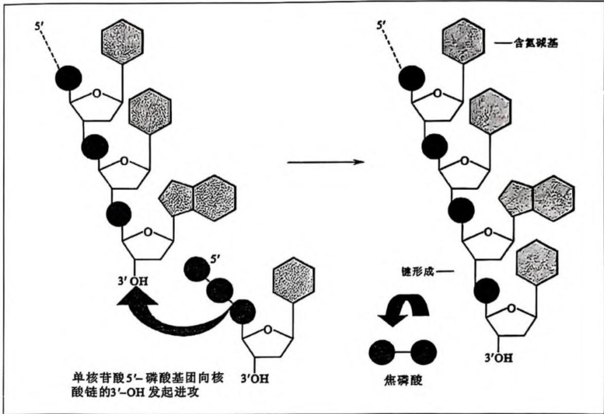  
图 2-13 多核苷酸链中新生磷酸糖苷键的产生过程示意图

及表达调控都非常重要。

## 2.2.2 DNA 的二级结构

DNA 的二级结构是指两条多核苷酸链反向平行盘绕所生成的双螺旋结构。其基本特点是：

① DNA 分子是由两条互相平行的脱氧核苷酸长链盘绕而成的。

② DNA 分子中的脱氧核糖和磷酸交替连接, 排在外侧, 构成基本骨架, 碱基排列在内侧。

两条链上的碱基通过氢键相结合,形成碱基对,它的组成有一定的规律。这就是嘌呤与嘧啶配对,而且腺嘌呤(A)只能与胸腺嘧啶(T)配对,鸟嘌呤(G)只能与胞嘧啶(C)配对。如一条链上某一碱基是C,另一条链上与它配对的碱基必定是G。碱基之间的这种一一对应的关系叫碱基互补配对原则。在生物活体中,不论DNA的二级结构还是高级结构,都是时刻变化的,即在二级结构的各种构象间、在二级结构与高级结构间或高级结构的各种构象间存在一个动力学的平衡。通常情况下,DNA的二级结构分两大类:一类是右手螺旋,如A-DNA和B-DNA,DNA通常是以右手螺旋形式存在的;另一类是左手螺旋,即Z-DNA(图2-14)。

## 1. DNA 右手螺旋的几种构象及其动态平衡

## (1) B-DNA 的构象

1953 年, Watson 和 Crick 基于以下三个方面的发现, 提出了 DNA 双螺旋模型:

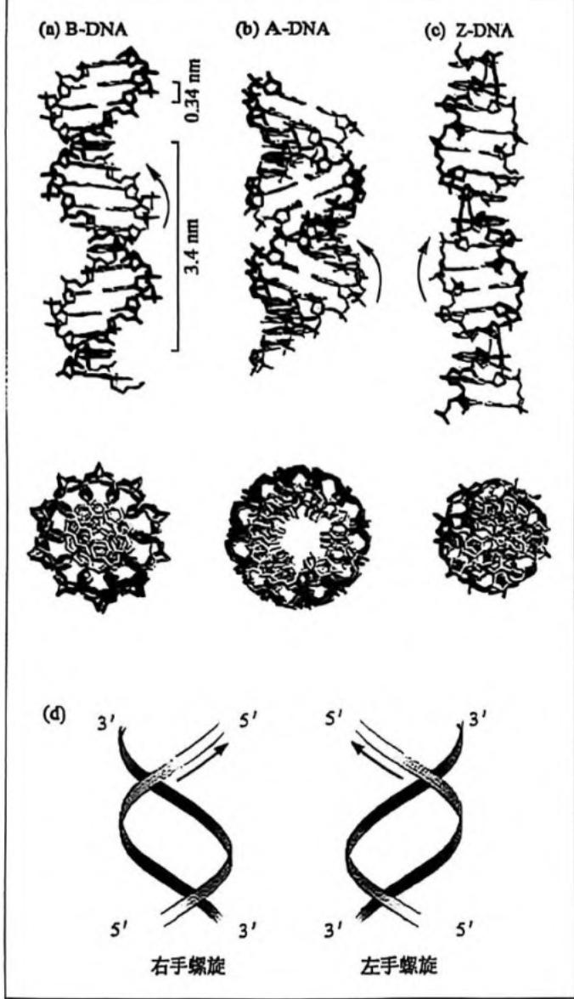

① X 射线衍射实验数据表明 DNA 是一种规则螺旋结构。

② DNA 分子密度测量表明这种螺旋结构由两条多核苷酸链组成。

③ 不论碱基的数目多少,G 的含量总是与 C\~样,而 A 与 T 也是一样的。

该 DNA 分子双螺旋结构模型解释了 DNA 的理化性质, 并将 DNA 的结构与功能联系起来。DNA 结构受环境条件的影响。此模型所描述的是 DNA 钠盐在较高湿度下的结构, 是 B 型双螺旋, 称为 B-DNA 结构。B-DNA 钠盐结构含水量较高, 是大多数 DNA 在细胞中的构象。它既规则又很稳定, 是由两条反向平行的多核苷酸链围绕同一中心轴构成的右手螺旋结构(图 2-14)。多核苷酸的方向由核苷酸间的磷酸二酯键的走向决定, 一条从 $5' \rightarrow 3'$ , 另一条从 $3' \rightarrow 5'$ 。链间有螺旋形的凹槽, 其中一个较浅, 叫小沟 (约 $1.2 \mathrm{~nm}$ 交叉); 一个较深, 叫大沟 (约 $2.2 \mathrm{~nm}$ 交叉)。两条链上的碱基以氢键相连, G 与 C 配对, A 与 T 配对(图 2-15)。嘌呤和嘧啶碱基对层叠于双螺旋的内侧。顺着螺旋轴心从上向下看, 可见碱基平面与纵轴垂直, 且螺旋的轴心穿过氢键的中点。相邻碱基对平面之间的距离为 $0.34 \mathrm{~nm}$ , 即顺中心轴方向, 每隔 $0.34 \mathrm{~nm}$ 有一个核苷酸, 以 $3.4 \mathrm{~nm}$ 为一个结构重复周期。核苷酸的磷酸基

图 2-14 A-, B-, Z-DNA 结构比较 (a-c) 以及左、右手螺旋的比较 (d)

团与脱氧核糖在外侧,通过磷酸二酯键相连接而构成 DNA 分子的骨架。脱氧核糖环平面与纵轴大致平行。双螺旋的直径为 $2.0 \, nm^{(图 2-16)}$ 。一般说来,A-T 丰富的 DNA 片段常呈 B-DNA,它是普遍存在的结构。

## (2) A-DNA 的结构

在相对湿度 75% 以下时, X 射线衍射分析表明 DNA 的构象不同于上述 B-DNA 的结构特点, 虽然也是右手双螺旋, 但碱基对与中心轴的倾角发生改变, 螺旋宽而短, 每圈螺旋包括 11 个碱基对, 该构象的 DNA 称为 A 型 (A-DNA)。A-DNA 与 B-DNA 的重要区别在于: A-DNA 碱基对倾斜大, 并偏向双螺旋的边缘, 因此具有一个深窄的大沟和宽浅的小沟; B-DNA 中碱基对倾斜角小, 螺旋轴穿过碱基对, 其大沟宽, 小沟窄 (图 2-14)。若 DNA 双链中一条链被相应的 RNA 链所替换, 则变构成 A-DNA。当 DNA 处于转录状态时, DNA 模板链与由它转录所得的 RNA 链间形成的双链就是 A-DNA。由此可见 A-DNA 构象对基因表达有重要意义。此外, B-DNA 双链都被 RNA 链所取代而得到由两条 RNA 链组成的双螺旋结构也是 A-DNA, 表 2-7 列举了几种主要 DNA 的结构参数。

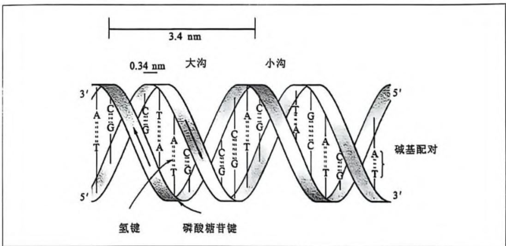

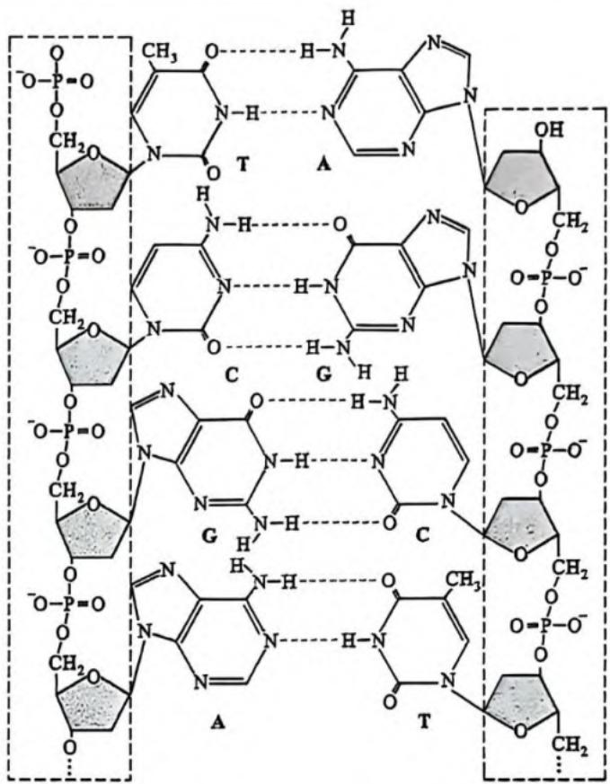  
图 2-15 DSA 反螺旋结构中硫基配对示意图(A 与 T、G 与 C 配对)  
图 2-16 DNA 的反向平行双螺旋结构

除 A-DNA、B-DNA 螺旋外，还存在 B'-DNA、C-DNA 和 D-DNA 等不同形式，但它们均接近 B 型，可作为 B 型同一族。

1. DNA 二级结构中左手螺旋——Z-DNA 的研究

Z-DNA 结构是 1979 年由 Rich 提出的。Rich 用一位荷兰科学家提供的 d(CGCGCG) 结晶, 对它进行 X 射线衍射结构分析, 最后提出了 Z-DNA 结构模型。Z-DNA 螺旋细长, 每圈螺旋含 12 对碱基, 大沟平坦, 小沟深而窄, 核苷酸构象顺反相间, 螺旋骨架呈 Z 字形。

表 2-7 不同螺旋形式 DNA 分子主要参数比较

<table><tr><td>双螺旋</td><td>A-DNA</td><td>B-DNA</td><td>Z-DNA</td></tr><tr><td>碱基倾角 /°</td><td>20</td><td>6</td><td>7</td></tr><tr><td>碱基间距 /nm</td><td>0.26</td><td>0.34</td><td>0.37</td></tr><tr><td>螺旋直径 /nm</td><td>2.55</td><td>2.37</td><td>1.84</td></tr><tr><td>每轮碱基数</td><td>11</td><td>10</td><td>12</td></tr><tr><td>大沟</td><td>很狭、很深</td><td>宽、较深</td><td>平坦</td></tr><tr><td>小沟</td><td>很宽、浅</td><td>狭、较深</td><td>很狭、很深</td></tr><tr><td>糖苷键构象</td><td>反式</td><td>反式</td><td>C 反式、G 顺式</td></tr><tr><td>螺旋方向</td><td>右</td><td>右</td><td>左</td></tr></table>

当时,由于用右手螺旋结构模型解链过程来解释大分子 DNA 复制时遇到困难,该模型的提出曾经一度动摇过右手螺旋学说。现已证明,左手螺旋 Z-DNA 只是右手螺旋结构模型的一个补充和发展。

虽然 B-DNA 是最常见的 DNA 构象,但 A-DNA 和 Z-DNA 似乎具有不同的生物活性, Z-DNA 调控基因转录有两种模式。在邻近调控系统中,与调节区相邻的转录区被 Z-DNA 抑制,只有当 Z-DNA 转变为 B-DNA 后,转录才得以活化。而在远距离调控系统中,Z-DNA 可通过改变负超螺旋水平,决定聚合酶能否与模板链相结合而调节转录起始活性。

## 3. DNA 双链的变性和复性

由于 DNA 双螺旋的两条链之间通过非共价键结合在一起, 它们比较容易分开。当 DNA 溶液温度接近沸点或者 pH 较高时, 互补的两条链就可能分开, 称为 DNA 的变性 (denaturation)。但 DNA 双链的这种变性过程是可逆的, 当变性 DNA 的溶液缓慢降温时, DNA 的互补链又可重新聚合, 重新形成规则的双螺旋。DNA 双链的这种变性和复性能力被用于 Southern 印迹杂交和 DNA 芯片分析等。

20 世纪 50 年代研究 DNA 变性的经典实验使人们对 DNA 双螺旋的特性有了深刻的认识。DNA 在 260 nm 处吸光度 (absorbance) 最大, 并且双螺旋 DNA 的光吸收比单链 DNA 低 40%。当 DNA 溶液温度升高到接近水的沸点时, 260 nm 的吸光度明显增加, 这种现象称为增色效应 (hyperchromic effect); 相反, 减色效应 (hypochromic effect) 则是因为双螺旋 DNA 中的碱基堆积降低了其对紫外线的吸收能力。

现在,人们常通过检测 DNA 溶液的紫外吸光度变化来监控 DNA 的变性过程。将 DNA 的吸光度相对温度变化绘制曲线,发现 DNA 光吸收的急剧增加发生在相对较窄的范围内。科学家把吸光度增加到最大值一半时的温度称为 DNA 的熔点(melting point),用 $T_{\mathrm{m}}$ 表示(图 2-17)。DNA 像冰一样融解,经历了从高度有序的双螺旋结构向无规则单链结构的转变。 $T_{\mathrm{m}}$ 是 DNA 的一个重要的特征常数,其大小主要与下列因素相关:

① DNA 中 G+C 的含量 G+C 的含量越高, DNA 的 $T_{m}$ 也越高。这主要是因为 G-C 碱基对间有 3 个氢键, 并且它与相邻碱基对间的堆积力更大。常用如下公式 $T_{m}=69.3+0.41(G+C)\%$ 来计算 DNA 的 $T_{m}$ , 并以此推算该 DNA 的碱基百分组成。小于

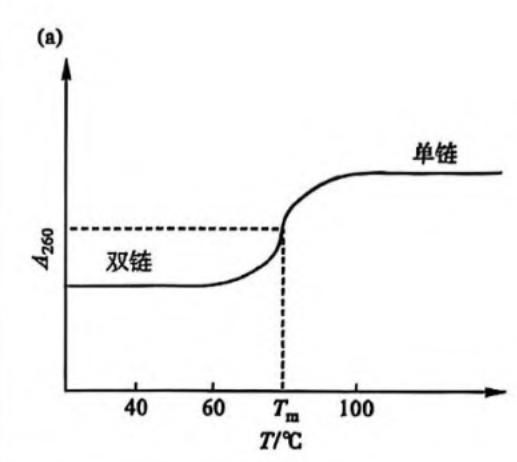

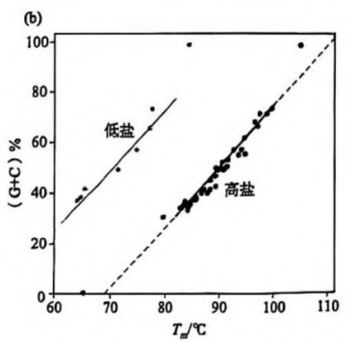

图2-17 DNA的变性曲线及其影响因素

(a) DNA 的变性曲线；

(b) DNA 的熔点取决于 G+C 的百分含量和溶液中的盐浓度。

25 mer 的寡核苷酸的 $T_{m}$ 计算公式为: $T_{\mathrm{m}} = 4(\mathrm{G} + \mathrm{C}) + 2(\mathrm{A} + \mathrm{T})$ 。

② 溶液中的离子强度 离子强度的效应反映出双螺旋的另一基本特征。两条DNA链的骨架包含了带负电荷的磷酸基团, 当这些负电荷没有被中和时, DNA双链间的静电斥力将驱使两条链分开。在高离子强度下, 负电荷可以被阳离子中和, 双螺旋的结构被稳定保持; 在低离子强度下, 未被中和的负电荷将会降低双螺旋的稳定性。因此, 在离子强度较低的介质中, DNA的 $T_{m}$ 较低而范围宽, 在较高离子强度下, $T_{m}$ 较高而范围窄。所以, DNA样品一般在含盐缓冲溶液中比较稳定, 而较难保存在稀电解质溶液中。

③ DNA 的均一性 一些病毒 DNA、人工合成的多腺嘌呤-胸腺嘧啶脱氧核苷酸等均质 DNA (homogeneous DNA) 融解温度范围较小, 而异质 DNA (heterogeneous DNA) 融解温度范围较宽, 因此 $T_{\mathrm{m}}$ 也可作为衡量 DNA 样品均一性的标准。

## 2.2.3 DNA 的高级结构

DNA 的高级结构是指 DNA 双螺旋进一步扭曲盘绕所形成的更复杂的特定空间结构，包括超螺旋、线性双链中的纽结(kink)、多重螺旋等。其中，超螺旋结构是 DNA 高级结构的主要形式，可分为正超螺旋(右手超螺旋)与负超螺旋(左手超螺旋)两大类，负超螺旋是细胞内常见的 DNA 高级结构形式，正超螺旋是过度缠绕的双螺旋。它们在不同类型的拓扑异构酶作用下或在特殊情况下可以相互转变，如：

$$
\text { 负超螺旋 } \xrightarrow [ \text { 溴化乙锭 } ]{\text { 拓扑异构酶 }} \text { 松弛DNA } \xrightarrow [ \text { 溴化乙锭 } ]{\text { 拓扑异构酶 }} \text { 正超螺旋 }
$$

DNA 双螺旋结构中,一般每转一圈有 10 个核苷酸对,双螺旋总处于能量最低状态。若正常 DNA 双螺旋额外地多转或少转几圈,使每转一圈的核苷酸数目大于或小于 10,就会出现双螺旋空间结构的改变,在 DNA 分子中产生额外的张力 $^{[图2-18]}$ 。若此时双螺旋链的末端是自由的,可通过链的转动而释放这种额外的张力,从而保持原来的双螺旋结构;

图 2-18 用电话机连线做模型说明 DNA 链中的螺旋与超螺旋  
右上图为噬菌体PM2松弛态DNA的电子显微照片；右下图为噬菌体DNA超螺旋形式的电子显微照片。(电镜照片由J.C.Wang惠赠,1982,Scientific American,247:97)  
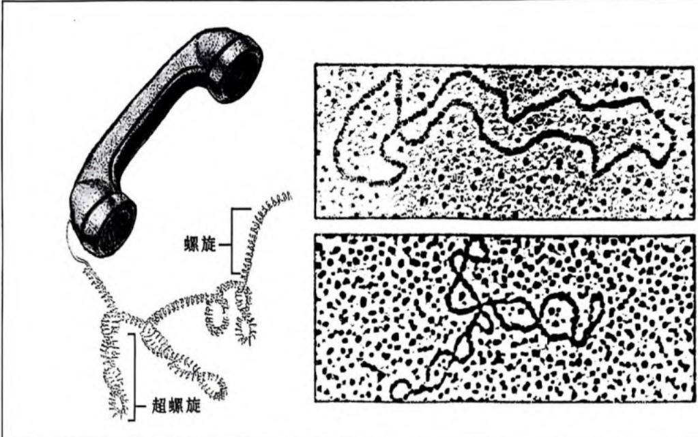

若此时 DNA 分子的末端是固定的或是环状分子, 双链不能自由转动, 额外的张力就不能释放而导致 DNA 分子内部原子空间位置的重排, 造成扭曲, 即出现超螺旋结构(图 2-19)。由此可见, B-DNA 双螺旋分子的链间螺旋数若发生变化, 就会出现超螺旋结构, 而且超螺旋的绕数与 B-DNA 的链间螺旋数有密切关系。

研究细菌质粒 DNA(环状双链 DNA)时发现,天然状态下该 DNA 以负超螺旋为主,稍被破坏即出现开环结构,两条链均断开则呈线性结构(图 2-19)。在电场作用下,相同分子量的超螺旋 DNA 比线性 DNA 迁移率大,线性 DNA 又比开环 DNA 迁移率大,以此可判断质粒结构是否被破坏。

DNA 分子的这种变化可以用一个数学公式来表示:

$$
L = T + W
$$

式中，L 为连接数(linking number)，是指环形 DNA 分子两条链间交叉的次数，只要不发生链的断裂，L 是个常量；T 为双螺旋的盘绕数(twisting number)；W 为缠绕数(writhing number)，后两者是变量。

超螺旋是 DNA 三级结构的一种普遍形式, 双螺旋 DNA 的松开导致负超螺旋, 而拧紧则导致正超螺旋。

## 2.2.4 DNA 的其他特殊结构

除了上述的 A 型、B 型和 Z 型 DNA 双螺旋结构外，DNA 还存在一些在特定条件下形成的特殊结构，如三螺旋 DNA 和四链 DNA 等。对这些核酸特殊结构的发现和其作用的了解丰富了人们对 DNA 结构多样性的认识。

## 1. 三螺旋 DNA

三螺旋 DNA 是在特定条件下形成的 DNA 特异性结构, 不是 DNA 在自然状态下的主要结构, 是一条富含嘧啶的反义寡核苷酸(ODN)与双链 DNA 中富含嘌呤的链以平行的方

根据第三条链的来源,又可分为分子内和分子间三簇能 DNA: 分子内的三链 DNA 是由一条链通过自身回拓形成 的; 分子间的三链 DNA 可以是由一条单链与夹求结构或环状

<table><tr><td>靶对方式</td><td>Hoogreen 偏基对</td><td>Warson-Click 偏基对</td></tr><tr><td>T=A=T</td><td>T=A</td><td>A=T</td></tr><tr><td>A=A=T</td><td>A=A</td><td>A=T</td></tr><tr><td>C=G=C</td><td>C=C</td><td>C=C</td></tr><tr><td>G=G=C</td><td>G=C</td><td>G=C</td></tr></table>

表2-8 三螺旋DNA中的碳基配对

施DNA中的碱基配对规则见表2-8。

式键合,形成 Hoogsteen 键,或是由高合金嘌呤的 ODN 与双链 DNA 中高合金嘌呤的链以及向平行的方式键合,形成反 Hoogsteen 键。三碘基体是三螺旋 DNA 的组成结构单元,有嘌呤-嘌呤-嘌呤和嘌呤-嘌呤-嘌呤两种基本类型。在嘌呤-嘌呤-嘌呤型三螺旋中,专一性地与嘌呤链结合。在嘌呤-嘌呤-嘌呤型三螺旋中,第三条嘌呤链以及平行于 Wafson-Click 双螺旋嘌呤链的方向缩放到双螺旋的大沟上,专一性地与嘌呤链结合。在嘌呤-嘌呤-嘌呤型三螺旋中,三条嘌呤链以及平行于 Wafson-Click 双螺旋嘌呤链的方向缩小到双螺旋的大沟上,专一性地与嘌呤链结合。在嘌呤-嘌呤-嘌呤型三螺旋中,三条嘌呤链以及平行于 Wafson-Click 双螺旋嘌呤链的方向缩放到双螺旋的大沟上,专一性地与嘌呤链结合。在嘌呤-嘌呤-嘌呤型三螺旋中,三条嘌呤链以及平行于 Wafson-Click 双螺旋嘌呤链的方向缩小到双螺旋的大沟上,专一性地与嘌呤链结合。在嘌呤-嘌呤-嘌呤型三螺旋中的方向缩放到双螺旋的大沟上,专一性地与嘌呤链结合。在嘌呤-嘌呤-嘌呤型三螺旋中,三条嘌呤链以及平行于 Wafson-Click 双螺旋嘌呤链的方向缩小到双螺旋的大沟上,专一性地与嘌呤链结合。在嘌呤-嘌呤-嘌呤型三螺旋中,第三条嘌呤链以及平行于 Wafson-Click 双螺旋嘌呤链的方向缩小到双螺旋的大沟上,专一性地与嘌呤链结合。在嘌呤-嘌呤-嘌呤型三螺旋中,第三条嘌呤链以及平行于 Wafson-Click 双螺旋嘌呤链的方向缩小到双螺旋的大沟上,专一性地与嘌呤链结合。在嘌呤-嘌呤-嘌呤型三螺链中,第三条嘌呤链以及平行于 Wafson-Click 双螺旋嘌呤链的方向缩小到双螺旋的大沟上,专一性地与嘌呤链结合。在嘌呤-嘌呤-嘌呤型三螺链中,第三条嘌呤链以及平行于 Wafson-Click 双螺旋嘌呤链的方向缩小到双螺旋的大沟上,专一性地与嘌呤链结合。在嘌呤-嘌呤 - 嘻吨型三螺链中,第三条嘌呤链以及平行于 Wafson-Click 双螺旋嘌呤链的方向缩小到双螺旋的大沟上,专一性地与嘌呤链结合。在嘌呤-嘌呤- 嘻吨型三螺链中,第三条嘌呤链以及平行于 Wafson-Click 双螺旋嘌呤链的方向缩小到双螺旋的大沟上,专一性地与嘌呤链结合。在嘌呤- 嘻吨型三螺链中,第三条嘌呤链以及平行于 Wafson-Click 双螺旋嘌呤链的方向缩小到双螺旋的大沟上,专一性地与嘌呤链结合。在嘌呤- 嘻吨型三螺链中,第三条 嘻吨型三螺链以及平行于 Wafson-Click 双螺旋嘌呤链的方向缩小到双螺旋的大沟上,专一性地与嘌呤链结合。在嘌呤- 嘻吨型三螺链中,第三条 嘻吨型三螺链以及平行于 Wafson-Click 双螺旋嘌呤链的方向缩小到双螺旋的大沟上,专一性地与嘌呤链结合。在漂吨型三螺链中,第三条 嘻吨型三螺链以及平行于 Wafson-Click 双螺旋嘌呤链的方向缩小到双螺旋的大沟上,专一性地与漂吨型三螺链中,第三条 嘻吨型三螺链以及平行于 Wafson-Click 双螺旋嘌呤链的方向缩小到双螺旋的大沟上,专一性地与漂吨型三螺链中,第三条 嘻吨型三螺链以及平行于 Wafson-Click 双螺旋嘌呤链的方向缩小到双螺旋的大沟上,专一性地与漂吨型三螺链中

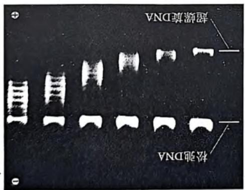

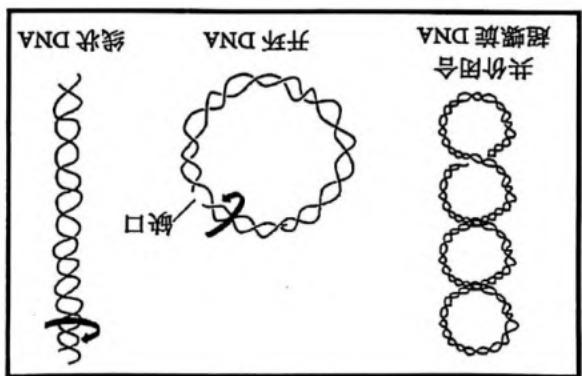

(3)没有超裸能的两股

绳子；(b)一端被强行

拉开后，中间出现超裸

能；(c)质粒DNA的3

种不同粉条；(d)用镍

极电泳分离超裸能和

松弛DNA。电泳速度

颗粒螺旋圈数的增加

而提高。(电泳照片由

J.C. Wang 著赠)

## 动速度

图2-19 由子强行分开双螺旋末端而引发产生的超螺旋结物及不同物氢DNA在该中的读

(c)  
(p)  
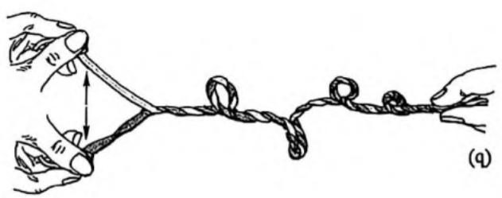

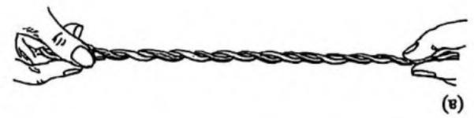

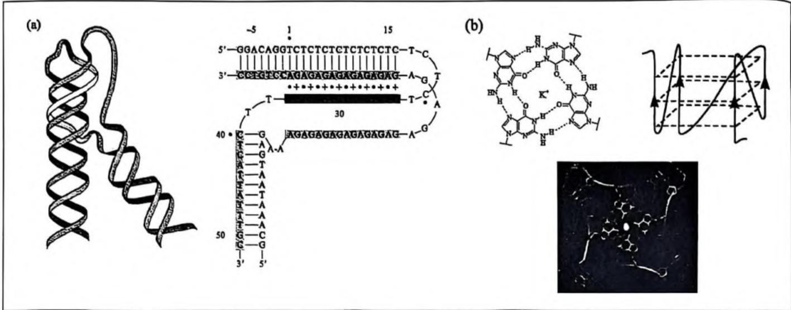  
图 2-20 DNA 的特殊结构(另见书末彩插)  
某些 DNA 会呈现三链(a)和四链结构(b)。

单链所形成,或是由一条单链与线状双链形成。

DNA 的链长、碱基序列组成、骨架性质等内部因素以及溶液的 pH、阳离子浓度、配体结合作用力的大小等外界因素都影响三螺旋 DNA 的稳定性。三螺旋结构能够影响 DNA 的复制、重组和转录，并且可能通过抑制特定蛋白质和 DNA 的结合来调控基因的表达。

## 2. 四链 DNA

科学家发现人体癌细胞中存在着四螺旋体 DNA 分子, 被命名为 "G- 四链体" (G-quadruplex), 在富含鸟嘌呤 (G) 的 DNA 区域中形成, 当双链 DNA 的单链环出并自身加倍时, 在基因组中形成四链 "手柄", 它是由富含串联重复鸟嘌呤 (G) 的 DNA 或 RNA 通过四个鸟嘌呤间的环状 Hoogsteen 氢键, 形成一个四分体平面, 以此平面为单位经过复杂的拓扑结构层层堆积而形成的含有四个螺旋体链的高级结构 (图 2-20b)。四链 DNA 包含平行或反向平行不同形式。

对四链 DNA 结构和功能的进一步研究发现,该结构使得寡核苷酸能抵抗核酸酶的降解,延长其在血清中的半衰期。在对人类基因组测序之后,发现了许多可能形成四链体的富含鸟嘌呤的序列。其中,真核生物 DNA 的端粒富含鸟嘌呤,由短的 GnTn 重复序列组成,例如,人的端粒重复序列为 GGGATT,位于染色体的末端,重复次数成百上千,易于形成 G- 四链体,能够与特定的端粒-DNA 结合蛋白结合,可通过保护这些易受攻击的末端提高其完整性和稳定性,来帮助维持基因组完整性。此外,有研究表明,四链 DNA 结构还可以通过与癌基因 c-Myc 的启动子区域的相互作用,抑制 c-Myc 的转录激活。2020 年,剑桥大学的研究人员证明 G- 四链体可能在特定类型的乳腺癌发生过程中扮演着关键角色,他们发现在迅速分裂的细胞(例如癌细胞)中 G- 四链体的含量特别高,并且在乳腺癌 11 种亚型都有不同的 G- 四链体模式,研究人员确定了两个合成分子——吡啶抑素(pyridostatin)和CX-5461,已在针对BRCA2缺陷型乳腺癌的I期临床试验中进行了测试,它们可以靶向G-四链体,并可能阻止细胞DNA的复制以及阻断细胞分裂,从而抑制失控的细胞增殖。

## 2.3 DNA 的复制

前面我们讲过,生命的遗传实际上是染色体 DNA 自我复制的结果。而染色体 DNA 的自我复制主要是通过半保留复制来实现的,是一个以亲代 DNA 分子为模板合成子代 DNA 链的过程。细胞分裂时,通过 DNA 准确地自我复制 (self-replication),亲代细胞所含的遗传信息就原原本本地传递到子代细胞。由于 DNA 是遗传信息的载体,因此亲代 DNA 必须以自身分子为模板来合成新的分子——准确地复制成两个拷贝,并分配到两个子代细胞中去,才能真正完成其遗传信息载体的使命。DNA 的双链结构对于维持这类遗传物质的稳定性和复制的准确性都是极为重要的。

双链 DNA 的复制是一个非常复杂的过程,在复制的起始、延伸和终止三个阶段,无论是原核生物还是真核生物都需要有多种酶和蛋白质的协同参与。DNA 复制均涉及拓扑异构酶、解旋酶、单链结合蛋白、引物合成酶、DNA 聚合酶及连接酶等酶和蛋白质的参与。

## 2.3.1 DNA 的半保留复制

Watson 和 Crick 在提出 DNA 双螺旋结构模型时就对 DNA 的复制过程进行了探讨。由于 DNA 分子由两条多核苷酸链组成, 两条链上的碱基——G 只能与 C 相配对, A 只能与 T 相配对, 所以, 两条链是互补的, 一条链上的核苷酸排列顺序决定了另一条链上的核苷酸排列顺序。就是说, DNA 分子的每一条链都含有合成它的互补链所需的全部信息。Watson 和 Crick 推测, DNA 在复制过程中碱基间的氢键首先断裂, 双螺旋解旋并被分开, 每条链分别作为模板合成新链, 产生互补的两条链。这样新形成的两个 DNA 分子与原来 DNA 分

子的碱基顺序完全一样。因此,每个子代分子的一条链来自亲代 DNA,另一条链则是新合成的,所以这种复制方式被称为 DNA 的半保留复制(semiconservative replication)(图 2-21)。

1958 年, Meselson 和 Stahl 研究了经 ${}^{15}$ N 标记 3 个世代的大肠杆菌 DNA, 首次证明了 DNA 的半保留复制。他们将大肠杆菌长期在以 ${}^{15}$ N 作氮源的培养基中培养, 得到 ${}^{15}$ N-DNA。由于该 DNA 分子的密度比普通 DNA ( ${}^{14}$ N-DNA) 的密度要大, 在氯化铯密度梯度离心时, 这两种 DNA 形成位置不同的区带。他们用普通培养基 (含 ${}^{14}$ N 的氮源) 培养 ${}^{15}$ N 标记的大肠杆菌, 经过一代以后, 所有 DNA 的密度都在 ${}^{15}$ N-DNA 和 ${}^{14}$ N-DNA 之间, 即形成了一半 ${}^{15}$ N 和一半 ${}^{14}$ N 的杂合分子, 两代后出现等量的 ${}^{14}N$ 分子和 ${}^{14}N-{}^{15}N$ 杂合分子。若再继续培养, 可以看到 ${}^{14}N-DNA$ 分子增多, 说明 DNA 分子在复制时均可被分成两个亚单位, 分别构成子代分子的一半, 这些亚单位经过许多代复制仍然保持着完整性。

图2-21 DNA的半保留复制  
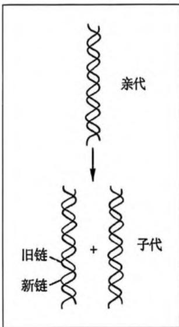

实验已经证明,无论是原核生物还是真核生物,其 DNA 都是以半保留复制方式遗传的。DNA 的这种半保留复制保证了 DNA 在代谢上的稳定性。经过许多代的复制,DNA 多核苷酸链仍可完整地存在于后代而不被分解掉。这种稳定性与 DNA 的遗传功能相符。

## 2.3.2 DNA 复制的一些基本概念

## 1. 复制子与复制叉

一般把生物体内能独立进行复制的单位称为复制子(replicon)。复制时,双链DNA要解开成两股链分别进行,所以,这个复制起始点呈现叉子的形式,被称为复制叉(replication fork)(图2-22)。许多实验证明,DNA的复制是由固定的起始点开始的,并在特定的终止点结束复制。因此,从复制起始点到终止点的区域为一个复制子。一个复制子只含一个复制起始点(origin)。复制叉从复制起点开始沿着DNA链连续移动,起始点可以启动单向复制或者双向复制,这主要取决于在复制起点形成一个复制叉还是两个复制叉。在单向复制中,所产生的一个复制叉离开起始点,沿DNA链前进;在双向复制中,起始点处产生两个复制叉,它们从起始点开始沿着相反的方向等速前进。

图2-22 DNA链的复制过程示意图

(a) DNA 改变双螺旋构象, 解链酶解开双链, 在单链 DNA 结合蛋白 (SSB) 和 DNA 聚合酶Ⅲ的共同作用下合成前导链, 方向与复制叉推进的方向一致。在后随链上, 当复制叉进一步打开时, RNA 引物才能与 DNA 单链相结合; (b) 后随链合成时, 产生冈崎片段; (c) 复制叉继续前进, 引物酶合成新的 RNA 引物, 与 DNA 单链相结合准备引发合成新的冈崎片段。

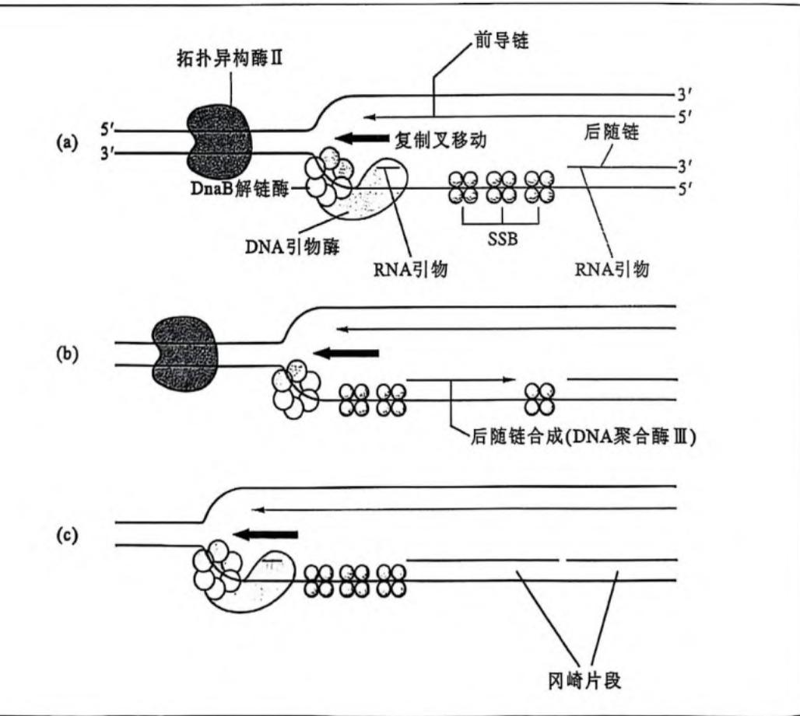

## 2. 复制起始点

从细菌、酵母、线粒体和叶绿体中鉴定出的复制起始点的共同特点是含有丰富的AT序列，它可能有利于DNA复制启动时双链的解开。通常，细菌、病毒和线粒体的DNA分子都是作为单个复制子完成复制的，而真核生物基因组可以同时在多个复制起点上进行双向复制，也就是说它们的基因组包含有多个复制子(表2-9)。真核生物复制子并非同时起作用，一般情况下，在特定的时间范围内，只有不超过 $15\%$ 的复制子进行复制。

表 2-9 部分生物复制子的比较

<table><tr><td>物种</td><td>细胞内复制子数目/个</td><td>平均长度/kb</td><td>复制子移动速度/(bp·min-1)</td></tr><tr><td>大肠杆菌</td><td>1</td><td>4200</td><td>50000</td></tr><tr><td>酵母</td><td>500</td><td>40</td><td>3600</td></tr><tr><td>果蝇</td><td>3500</td><td>40</td><td>2600</td></tr><tr><td>爪蟾</td><td>15000</td><td>200</td><td>500</td></tr><tr><td>蚕豆</td><td>35000</td><td>300</td><td>?</td></tr></table>

## 3. 复制终止点

复制子中控制复制终止的位点称为复制终止点(terminus)。在环形的大肠杆菌 DNA 中,复制终止点在起始点的相对位置(旋转 180°)。复制从起始点开始,双向进行,复制叉向两个相反方向沿环状 DNA 前进,最后两个复制叉相遇在一个位点而停止,该位点即为终止位点。

## 4. 复制方向

通过放射自显影实验可以判断 DNA 复制的方向性。复制开始时,首先用低放射性的 ${}^{3}$ H 脱氧胸苷标记大肠杆菌,数分钟后转移到含有高放射性的培养基中继续标记。因此,在放射自显影图像上,复制起始区的放射性标记密度比较低,感光还原的银颗粒密度也较低;继续合成区标记密度较高,银颗粒密度也较高。如果是单向复制,银颗粒的密度分布是一端低,另一端高;而双向复制则是中间密度低,两端高。

① 单向复制 从一个复制起始点开始, 只有一个复制叉在移动(图 2-23)。某些环状 DNA 利用这种方式拷贝双链 DNA, 如质粒 ColE1 DNA。

② 双向复制 复制起始于一个位点,但向两侧分别形成复制叉,向相反方向移动。这种复制方式最为普遍。实验表明,无论是原核生物还是真核生物,DNA 的复制主要是从固定的起始点以双向等速复制方式进行的(图 2-24)。复制叉以 DNA 分子上某一特定顺序为起点,向两个方向等速生长前进。

③ 相向复制 还有一种比较特殊的相向复制模式。从两个起始点分别起始两条链的复制,这种模式虽然有两个复制叉的生长端,但在每个复制叉中只有一条链作为模板合成 DNA。某些线性 DNA 病毒(如腺病

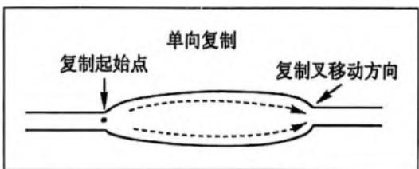  
图2-23 从一个复制起始点开始的DNA单向复制

图2-24 放射性标记实验证明DNA的复制是从固定的起始点双向等速进行的

(a) 仅用 $^{3}\mathrm{H}$ 胸腺嘧啶标记DNA $10\mathrm{min}$ 即压X光片；(b) ${}^{3}\mathrm{H}$ 标记DNA合成 $10\mathrm{min}$ 后又继续非标记合成 $10\mathrm{min}$ ，导致X光片上的复制叉变长，银颗粒分布广而稀少；(c)从一个复制起始点开始的DNA双向对称式复制。

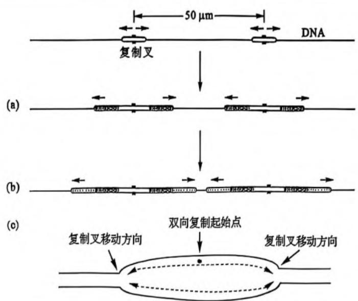

毒)以这种方式进行复制,其双链 DNA 的每条链上都有一个复制起始点,分别起始合成一条新链,两条链以相向方式生长延伸。

## 5. 复制速度

真核生物的基因组比原核生物大,其染色体具有复杂的高级结构,复制时需要解开核小体,复制后又需重新形成核小体,其复制叉移动速度为1 000\~3 000 bp/min。真核生物染色体DNA上有多个复制起始点,可进行多复制子的同步复制,以满足细胞对DNA的需要。

细菌 DNA 只有一个复制起始点, 所以其复制叉的移动速度比真核生物要快 20\~50 倍, 可达 50 000 bp/min。每个复制单位在 30\~60 min 内完成复制。并且, 起始点可以连续发动复制, 以满足其快速生长的需要。

归纳起来,对一个生物体基因组而言,复制起始点是固定的,表现为固定的序列,并识别参与复制起始的特殊蛋白质。复制叉移动的方向和速度虽是多种多样的,但以双向等速方式为主。

## 6. 冈崎片段与半不连续复制

由于 DNA 双螺旋的两条链是反向平行的, 因此在复制叉附近解开的 DNA 链一条是 $5' \rightarrow 3'$ 方向, 另一条是 $3' \rightarrow 5'$ 方向, 两个模板极性不同, 而所有已知 DNA 聚合酶的合成方向都是 $5' \rightarrow 3'$ , 不是 $3' \rightarrow 5'$ , 这就不能解释 DNA 的两条链几乎同时复制合成这个事实。为了解释这一等速复制现象, 日本学者冈崎 (Okazaki) 等提出了 DNA 的半不连续复制 (semidiscontinuous replication) 模型。他用 ${}^{3}\mathrm{H}$ 脱氧胸苷短时间标记大肠杆菌, 提取 DNA, 变性后用超离心方法得到了许多 ${}^{3}\mathrm{H}$ 标记的、长度为 $1000 \sim 2000$ 个碱基的、被后人称为冈崎片段的 DNA。现在已知一般原核生物的冈崎片段要长些, 真核生物中的要短些 $(100 \sim 200$ 个碱基)。延长标记时间后, 冈崎片段可转变为成熟 DNA 链, 由此推断这些片段必然是复制过程的中间产物。此外, 用 DNA 连接酶温度敏感突变株进行实验, 在连接酶不起作用的温度下,可以观察到有大量小 DNA 片段的累积,说明 DNA 复制过程中至少有一条链首先合成较短的冈崎片段,然后再由连接酶连成大分子 DNA。

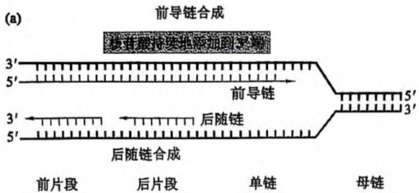  
图2-25 DNA合成的半不连续性  
(a) 前导链是持续合成的, 而后随链则是以不连续的方式合成的; (b) 两个向相反方向移动的复制叉分别合成前导链和后随链 DNA 的示意图, 显示复制叉是不对称的。

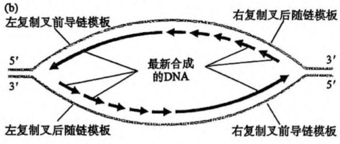

图 2-25 总结了两条新链在两个向相反方向移动的复制叉上不同的特征,我们根据它们不同的性质分别将其称为前导链(leading strand)和后随链(lagging strand)。前导链DNA的合成按 $5' \rightarrow 3'$ 方向,随着亲代双链DNA的解开而连续进行复制;后随链在合成过程中,一段亲本DNA单链首先暴露出来,然后以与复制叉移动相反的方向按照 $5' \rightarrow 3'$ 方向合成一系列的冈崎片段,然后再把它们连接成完整的后随链。进一步研究还证明,这种前导链的连续复制和后随链的不连续复制在生物界是有普遍性的,因而称之为双螺旋DNA的半不连续复制。

## 2.3.3 DNA 聚合酶的作用机制

DNA 的合成是在 DNA 聚合酶 (DNA polymerase) 的催化下完成的。所有的原核生物和真核生物的 DNA 聚合酶都具有基本的 DNA 合成的活性, 尽管它们在种类和特性上有其独特的特点, DNA 聚合酶用一个活性位点催化 4 种脱氧核苷三磷酸的添加, 它通过监视引入核苷酸形成 A-T 或 G-C 碱基对的能力, 在正确碱基对形成的情况下, 引物的 3'-OH 和在最佳催化位置上的核苷三磷酸的 α- 磷酸才能发生催化反应。只有在正确底物存在时, 共价键形成的速率才显著增加, 正确碱基对掺入的速率是错误核苷酸掺入速率的一万倍, 表明酶对不同底物具有催化选择性。

## 1. DNA 聚合酶的共同的结构和特征

## (1) DNA 聚合酶的 3 个结构域

对与引物－模板接头结合的不同 DNA 聚合酶的三维结构研究表明,该酶的三维结构类似于一只半握的右手,其 3 个结构域分别被称为拇指、手指和手掌 $^{(图 2-26)}$ 。DNA 底

图2-26 DNA聚合酶的三维结构

(a) DNA 聚合酶与引物－模板接头结合；(b) T7 DNA 聚合酶与 DNA 结合的三维结构。

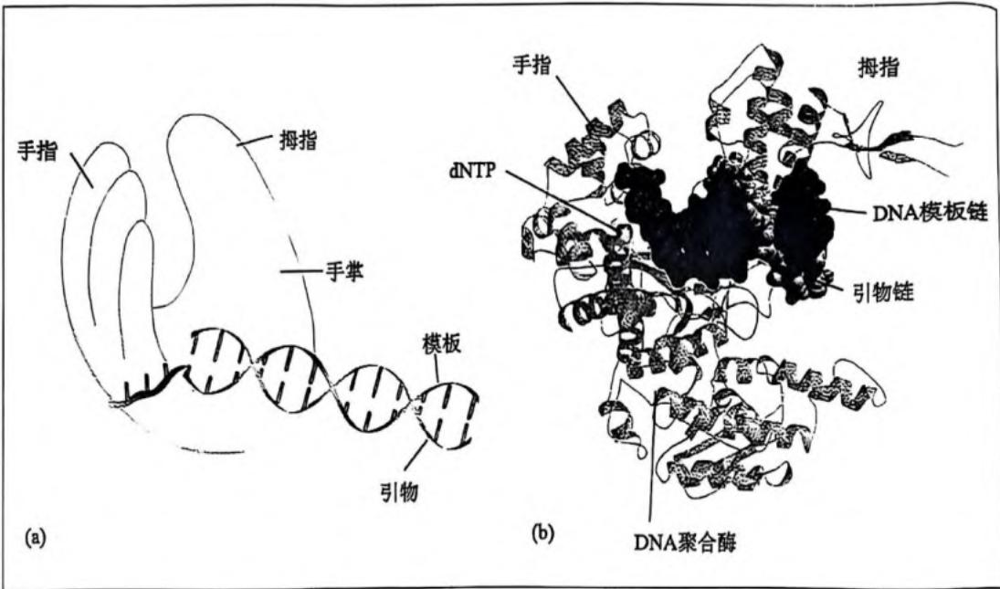

物位于右手的裂缝中,新合成的 DNA 与手掌相连,DNA 催化位点位于手指和拇指指尖的裂缝中。

手掌域含有催化位点的基本元件,由一个β折叠构成。两个二价金属离子( $Mg^{2+}$ 或 $Zn^{2+}$ )在该区域的结合有利于改变催化区域周围的化学环境,利于催化作用的进行。此外,手掌域还负责检查最新加入的核苷酸碱基配对的准确性。错误配对的碱基使催化活性显著降低,使引物-模板从聚合酶活性位点上脱离下来,结合到聚合酶上另一个具有校对功能的核酸酶活性位点上。

手指域对催化也很重要。手指域的几个残基可与引入的 dNTP 结合, 当正确的碱基配对形成时, 手指域包围住 dNTP, 使引入的核苷酸和金属离子密切接触, 促进催化反应。手指域还能够和模板区结合, 使模板产生弯曲, 仅使催化位点上引物后的第一个模板碱基暴露, 避免在下一个核苷酸添加时造成对模板碱基选择的混淆。

拇指域与最新合成的 DNA 相互作用,一是维持引物以及活性部位的正确位置,二是促进 DNA 聚合酶与其底物之间的紧密连接,有助于添加更多的 dNTP。

## (2) DNA 聚合酶的延伸能力

DNA 的合成速度是由 DNA 聚合酶的延伸能力 (processivity) 决定的。所谓 DNA 聚合酶的延伸能力, 是指每次聚合酶与模板 - 引物结合时所能添加的核苷酸的平均数。高延伸性的 DNA 聚合酶催化 DNA 合成的速率可能高达一个完全非延伸性聚合酶的 1000 倍。DNA 聚合酶沿着 DNA 模板滑行的能力有利于提高延伸能力。DNA 聚合酶与完全包围 DNA 的 "滑动夹" 蛋白之间的相互作用可以进一步提高延伸能力。

## (3) 外切核酸酶具有校正新合成 DNA 的能力

作为 DNA 聚合酶的同一类多肽,核酸酶(校正外切核酸酶,proofreading exonuclease)通过去除不正确碱基配对的核苷酸来校正 DNA 的合成。当不正确核苷酸被添加到引物链时,校正外切核酸酶将它从引物链的 3' 端除去,就像计算机键盘上的删除键那样,把最近发生的错误去除掉,极大地增加了 DNA 合成的精确度。校正外切核酸酶将不正确配对碱基的发生概率降低至每添加 $10^{7}$ 个核苷酸出现一次。此外,后面提到的复制后错配修复可将 DNA 错误概率降至每添加 $10^{10}$ 个核苷酸出现一次。

## 2. 原核生物和真核生物 DNA 聚合酶的种类和特性

## (1) 原核生物 DNA 聚合酶

细胞中一般含有多种被特化的、能高效而精确地复制基因组 DNA 的聚合酶。现已发现在大肠杆菌中存在 DNA 聚合酶 I、II、III、IV 和 V，有关 DNA 聚合酶 I、II 和 III（主要 DNA 聚合酶）的活性、功能及特点等归纳如表 2-10。

DNA 聚合酶 I 是第一个被鉴定出来的 DNA 聚合酶,但它不是复制大肠杆菌染色体的主要聚合酶。该蛋白质可以被蛋白酶切成两个区域:占蛋白 2/3 的 C 端区域 $(6.8 \times 10^{4})$ 又称为 Klenow 片段,同时具有 DNA 聚合酶活性和 $3' \rightarrow 5'$ 外切核酸酶活性,既可合成 DNA 链,又能降解 DNA,保证了 DNA 复制的准确性。另外,它的 N 端区域 $(3.5 \times 10^{4})$ 具有 $5' \rightarrow 3'$ 外切核酸酶的活性,可作用于双链 DNA,又可水解 $5'$ 端或距 $5'$ 端几个核苷酸处的磷酸二酯键,因而该酶被认为在切除由紫外线照射而形成的嘧啶二聚体中起着重要的作用。它也可用以除去冈崎片段 $5'$ 端 RNA 引物,使冈崎片段间缺口消失,保证连接酶将片段连接起来。

表 2-10 大肠杆菌 DNA 聚合酶 I、II 和 III 的性质比较

<table><tr><td>性质</td><td>DNA 聚合酶I</td><td>DNA 聚合酶II</td><td>DNA 聚合酶III</td></tr><tr><td> $3' \rightarrow 5'$ 外切</td><td>+</td><td>+</td><td>+</td></tr><tr><td> $5' \rightarrow 3'$ 外切</td><td>+</td><td>-</td><td>-</td></tr><tr><td>新生链合成</td><td>-</td><td>-</td><td>+</td></tr><tr><td>分子量( $\times 10^{3}$ )</td><td>103</td><td>90</td><td>900</td></tr><tr><td>细胞内分子数</td><td>400</td><td>?</td><td>10~20</td></tr><tr><td>生物学活性</td><td>1</td><td>0.05</td><td>15</td></tr><tr><td>已知的结构基因</td><td>Pol(A)</td><td>Pol(B)</td><td>Pol(C)(dnaE、N、Z、X、Q等)</td></tr></table>

DNA 聚合酶 II 具有 $5'\rightarrow3'$ 方向聚合酶活性,但酶活性很低。若以每分钟酶促核苷酸掺入 DNA 的转化率计算,只有 DNA 聚合酶 I 的 5%,故也不是复制中主要的酶。其 $3'\rightarrow5'$ 外切核酸酶活性可起校正作用。目前认为 DNA 聚合酶 II 的生理功能主要是起修复 DNA 的作用。

DNA 聚合酶Ⅲ包含 7 种不同的亚单位和 9 个亚基。生物活性形式为二聚体。它既有 $5' \rightarrow 3'$ 方向聚合酶活性,也有 $3' \rightarrow 5'$ 外切核酸酶活性。该酶的活性较强,为 DNA 聚合酶 I 的 15 倍,DNA 聚合酶 II 的 300 倍。它能在引物的 $3'$ -OH 上以每分钟约 5 万个核苷酸的速率延长新生的 DNA 链,是大肠杆菌 DNA 复制中链延长反应的主导聚合酶,是组成具有高度延伸能力的 DNA 聚合酶Ⅲ全酶(DNA Pol III holoenzyme)的主要部分。

DNA 聚合酶Ⅳ和 V 分别由 dinB 和 $umuD'_{2}C$ 基因编码, 主要在 DNA 修复和跨损伤合

成(translesion synthesis, TLS)过程中发挥功能。

## (2) 真核生物 DNA 聚合酶

已发现的真核生物 DNA 聚合酶有 15 种以上。在哺乳动物细胞中主要有 5 种 DN, 聚合酶, 分别称为 DNA 聚合酶 $\alpha$ 、 $\beta$ 、 $\gamma$ 、 $\delta$ 和 $\varepsilon$ , 其特性如表 2-11。

表 2-11 真核生物 DNA 聚合酶的特性比较

<table><tr><td>性质</td><td>DNA聚合酶 α</td><td>DNA聚合酶 β</td><td>DNA聚合酶 γ</td><td>DNA聚合酶 δ</td><td>DNA聚合酶 ε</td></tr><tr><td>亚基数</td><td>4</td><td>1</td><td>2</td><td>2~3</td><td>≥1</td></tr><tr><td>在细胞内分布</td><td>核内</td><td>核内</td><td>线粒体</td><td>核内</td><td>核内</td></tr><tr><td>功能</td><td>DNA引物合成</td><td>DNA损伤修复</td><td>线粒体 DNA复制</td><td>主要 DNA复制酶</td><td>复制修复</td></tr><tr><td>3&#x27;→5&#x27;外切</td><td>无</td><td>无</td><td>有</td><td>有</td><td>有</td></tr><tr><td>5&#x27;→3&#x27;外切</td><td>无</td><td>无</td><td>无</td><td>无</td><td>无</td></tr></table>

真核细胞的 DNA 聚合酶和细菌 DNA 聚合酶基本性质相同, 均以 dNTP 为底物, 激活, 聚合时必须有模板链和具有 $3^{\prime}-OH$ 末端的引物链, 链的延伸方向为 $5^{\prime}\rightarrow3$ 但真核细胞的 DNA 聚合酶一般都不具有外切核酸酶活性, 推测一定有另外的酶在 DNA 复制中起校对作用。

DNA 聚合酶 $\alpha$ 的功能主要是引物合成, 即能起始前导链和后随链的合成。它与引发酶 (primase) 形成复合物, 因其具有引发、延伸链的双重功能, 所以又被称为 pol $\alpha$ 的引发酶。DNA 聚合酶 $\beta$ 活性水平稳定, 可能主要在 DNA 损伤的修复中起作用, 属于高忠实性修复酶。DNA 聚合酶 $\delta$ 是主要负责 DNA 复制的酶, 参与前导链和后随链的合成。而 DNA 聚合酶 $\varepsilon$ 与后随链合成有关, 在 DNA 合成过程中核苷切除以及碱基的切除修复中起着重要的作用, 而且, 它在细胞的重组过程中可能具有某些功能。DNA 聚合酶 $\gamma$ 在细粒体 DNA 的复制中发挥作用。

除了上述5种主要的DNA聚合酶外,真核生物中还存在 $\zeta$ 、 $\eta$ 、 $\iota$ 和 $\kappa$ 等几种DNA聚合酶,它们承担着修复损伤的功能,但这些修复酶的忠实性都很低。

## 3. 滑动 DNA 夹极大地增加了 DNA 聚合酶的延伸能力

与滑动 DNA 夹 (sliding DNA clamp) 的结合使得 DNA 聚合酶在复制叉上具有高延伸能力。滑动 DNA 夹由多个相同的蛋白亚基组成"油炸圈饼"形状的结构。滑动 DNA 夹中央的孔洞直径约为 3.5 nm，足以容纳 DNA 双螺旋、参与 DNA 合成的蛋白质以及必需的水分子 $^{(图2-27)}$ 。聚合酶与滑动 DNA 夹在复制叉处形成复合物，在 DNA 合成时沿着 DNA 模板高效地滑动，保持聚合酶与 DNA 的紧密接触，从而大大增加了 DNA 聚合酶的延伸能力。

当单链 DNA 模板完成复制后, DNA 聚合酶必须从 DNA 模板和滑动夹上释放下来以参与新的 DNA 复制, 而滑动 DNA 夹则会滑动到新的 DNA 合成位点并执行新的功能。滑动 DNA 夹蛋白是病毒、细菌、酵母以及人类等生物的 DNA 复制体系中必不可少的保守部件, 其结构在不同的生物中是保守的, 都是相同的六边形对称结构, 但形成夹子的亚基数

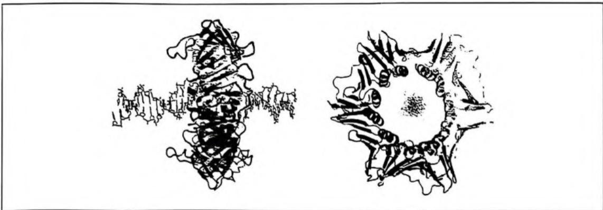  
图 2-27 与 DNA 结合的滑动 DNA 夹的三维结构  
滑动夹中央的孔洞直径约为3.5 nm, DNA螺旋的宽度约为2.0 nm, 因此, 在滑动夹和DNA之间可容纳一个或两个水分子(图像使用PyMOL软件制作)。

在不同生物中可能不同。

如上所述,滑动夹是一个闭合的环,由5个亚基组成的滑动夹装载器(sliding clamp loader)通过结合和水解ATP催化滑动夹的打开,并将其安放在DNA的引物-模板接头上。只有当滑动夹在与其相互作用的所有酶都完成工作后,滑动夹装载器才能通过改变滑动夹的构象将其从DNA上移除。

## 2.4 原核生物和真核生物 DNA 复制的特点

## 2.4.1 原核生物 DNA 复制的特点

大肠杆菌基因组以双链环状 DNA 分子的形式存在, 复制起始区位于其遗传图的 84 min 附近, 复制起始点 (oriC) 含有 3 个 13 bp 的串联重复保守序列, GATCTNTTNTTTT, 以及 4 个由 9 bp 的保守序列 (TTATNCANA) 组成的能结合 DnaA 的起始结合位点 $^{(图2-28)}$ 。复制起始后, 在 oriC 上形成的两个复制叉沿着整个基因组双向等速移动, DNA 复制的中间产物可形成一个 $\theta$ , 两个复制叉在距起始点 $180^{\circ}$ 处会合。

## 1. DNA 双螺旋的解旋

DNA 在复制时, 其双链首先解开, 形成复制叉, 这是一个有多种蛋白质及酶参与的复杂过程。已经发现一些酶和蛋白质能使 DNA 双链变得易于解开, 或者可以使超螺旋分子松弛。首先在拓扑异构酶 I 的作用下解开负超螺旋, 并与解链酶共同作用, 在复制起始点处解开双链。参与解链的除一组解链酶外, 还有 Dna 蛋白等, 一旦局部解开双链, 就必须有 SSB 蛋白来稳定解开的单链, 以保证该局部结构不会恢复成双链, 接着由引发酶等组成的引发体迅速作用于两条单链 DNA 上。不论是前导链还是后随链,都需要一段 RNA 引物以起始子链 DNA 的合成。现将其中重要的酶与蛋白质分述如下。

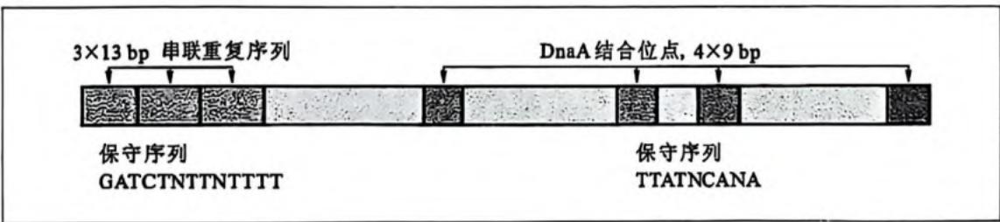  
图 2-28 大肠杆菌 DNA 复制起始点 (oriC) 保守序列分布图

① DNA 解链酶(DNA helicase) DNA 解链酶能通过水解 ATP 获得能量来解开双链 DNA。大部分 DNA 解链酶(包括大肠杆菌解链酶Ⅱ、Ⅲ、T4 噬菌体 dda、T4 基因 41 和人解链酶等)可沿后随链模板的 $5'\rightarrow3'$ 方向并随着复制叉的前进而移动, 只有另一种解链(Rep 蛋白)是沿前导链模板的 $3'\rightarrow5'$ 方向移动。因此推测 Rep 蛋白和特定 DNA 解链酶分别在 DNA 的两条母链上协同作用, 以解开双链 DNA。

② 单链 DNA 结合蛋白(single-stranded DNA binding protein, SSB) 最初发现噬菌体 T4 的基因 32 蛋白可以在远低于解链温度时使双链 DNA 分开, 并牢牢地结合在单链 DNA 上, 后来发现许多生物中都有这类蛋白质。从原核生物得到的 SSB 与 DNA 结合时还表现出协同效应: 如第一个 SSB 结合到 DNA 上去的能力为 1 , 第二个 SSB 结合能力则可高达 ${10}^{3}$ ; 真核生物牛、鼠和人细胞中的 SSB 与单链 DNA 结合时, 则不表现上述协同效应。

SSB 的作用是保证被解链酶解开的单链在复制完成前能保持单链结构, 它以四聚体形式存在于复制叉处, 待单链复制完成后才离开, 重新进入循环。所以, SSB 的作用是保持单链的存在, 并没有解链的作用。

③ DNA 拓扑异构酶(DNA topoisomerase) 大多数天然状态下的 DNA 分子都具有适度的负超螺旋,可以形成部分的单链结构,利于蛋白质与 DNA 的结合。在复制过程中,随着 DNA 的解旋,双螺旋的盘绕数 T 减少,而超螺旋数 W 增加,使正超螺旋增加,未解链部分的缠绕更加紧密,形成的压力使解链不能继续进行。拓扑异构酶能够消除解链造成的正超螺旋的堆积,消除阻碍解链继续进行的这种压力,使复制得以延伸。

## 2. DNA 复制的引发

所有 DNA 的复制都是从一个固定起始点开始的,而目前已知的 DNA 聚合酶都只能延长已存在的 DNA 链,而不能从头合成 DNA 链,那么一个新 DNA 的复制是怎样开始的呢?

研究发现,DNA 新链的起始需要一条 RNA 引物。所有的 DNA 聚合酶都不能够从头启动新 DNA 链的合成,需要带有游离 3' 羟基的引物(primer)。DNA 复制时,往往先由引发酶(一种特殊的 RNA 聚合酶,不需要用特异 DNA 序列来起始新 RNA 引物的合成)在 DNA 模板上合成一段 RNA 链,它提供引发末端(引物),接着由 DNA 聚合酶从 RNA 引物 3' 端开始合成新的 DNA 链。无论前导链还是后随链开始 DNA 合成时,都需要 RNA 引物引发复制,只是对于前导链来说,这一引发过程比较简单,只要有一段 RNA 引物,DNA 聚合酶就能以此为起点一直合成下去。但对于后随链来说,引发过程就十分复杂,每个冈崎片段都需要新引物,需要多种蛋白质和酶的协同作用,还牵涉到冈崎片段的形成和连接。

后随链的引发过程往往由引发体(primosome)来完成。引发体由6种蛋白质n、n'、n"、DnaB、DnaC和DnaI共同组成,只有当引发体前体(preprimosome)把这6种蛋白质合在一起并与引发酶(primase)进一步组装后形成引发体,才能发挥其功效。引发酶是dnaG基因的产物,是在特定环境下发挥作用的RNA聚合酶,仅用于合成DNA复制所需的一小段

RNA。引发体像火车头一样在后随链分叉的方向上前进,并在模板上断断续续地引发生成后随链的引物 RNA 短链,再由 DNA 聚合酶Ⅲ作用合成 DNA,直至遇到下一个引物或冈崎片段为止。由 RNase H 降解 RNA 引物并由 DNA 聚合酶 I 将缺口补齐,再由 DNA 连接酶将两个冈崎片段连在一起形成大分子 DNA。

图 2-29 以大肠杆菌为例解释了由 oriC 复制起始点处引发的 DNA 复制过程。在大肠杆菌中，一些蛋白质有序地作用于复制起始点。首先是在 ATP 的作用下，大约 20 个 DnaA 蛋白与 oriC 的 4 个 9 碱基保守序列结合，形成寡聚复合物；接着，在 DNA 结合蛋白 HU 蛋白和 ATP 的共同作用下，DnaA 复制起始复合物使 3 个 13 碱基串联重复序列变性，形成开链；在 DnaC 蛋白的协助下，六聚化的解链酶 DnaB 替换了 DnaA，与 DNA 链结合，目前认为 DnaB 可能具有

图2-29 由大肠杆菌oriC复制起始点处引发的DNA复制过程  
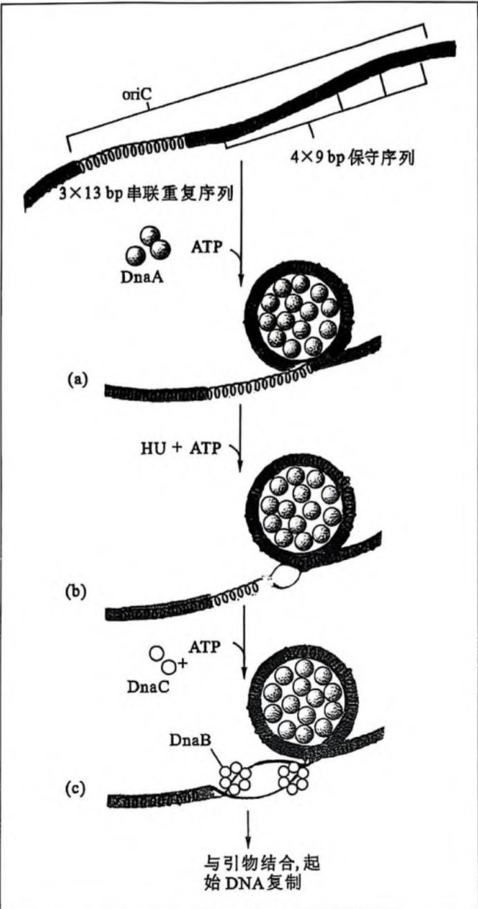

两种构象,一种形式与双链 DNA 结合,另一种形式与单链 DNA 结合。这两种形式的转化可引发双链体的熔化,需要 ATP 的水解提供能量,即每解开一个碱基对需要水解一个 ATP,它在一个与双链区相连的单链区起始解链,使 DNA 双链进一步解开。

## 3. 复制的延伸

在复制的延伸过程中,前导链和后随链的合成同时进行。前导链持续合成,由全酶异二聚体中的一个亚单位和前导链模板结合,在引物 RNA 合成的基础上,连续合成新的 DNA,其合成方向与复制叉一致。

后随链的合成分段进行,形成中间产物冈崎片段,再通过共价连接成一条连续完整的新 DNA 链。分为 4 个步骤:

① 首先,引物酶合成约 10 核苷酸大小的新引物。两个引物间的距离在细菌中为 1000\~2000 个核苷酸,在真核细胞中为 100\~200 个核苷酸。

② DNA 聚合酶Ⅲ以 $5'\rightarrow3'$ 方向延伸该引物, 直到遇见邻接引物的 $5'$ 端。这个新合

图 2-30 大肠杆菌中 DNA 复制的终止  
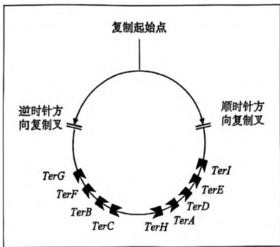

成的 DNA 片段就是冈崎片段。

③ 在大肠杆菌中,DNA 聚合酶 I 具有 $5'\rightarrow3'$ 外切酶的活性,被用来去除引物。

④ DNA 连接酶连接相邻的冈崎片段使之成为一条完整的子代链。

## 4. 复制的终止

除 Tus(termination utilization substance) 蛋白以外,链的终止看起来不需要太多蛋白质的参与。大肠杆菌 DNA 复制组

止区有 TerA \~ TerI 9 个特殊的 Ter 位点, 它们能够明显地降低复制叉的移动速度, 其中 TerG、TerF、TerB 和 TerC 作用于顺时针方向移动的复制叉; TerH、TerA、TerD、TerE 和 Ter 则作用于反时针方向移动的复制叉。Tus 蛋白能够特异性地结合 Ter 序列。当复制叉前移, 遇到约 22 个碱基的重复性终止子序列 (Ter) 时, Ter-Tus 复合物能使 DnaB 不再将 DNA 解链, 阻挡复制叉的继续前移, 等到相反方向的复制叉到达后停止复制, 其间仍有 50 \~ 100 bp 未被复制, 由 DNA 修复机制填补空缺, 其后两条链解开。在 DNA 拓扑异构酶 IV 的作用下使复制叉解体, 释放子链 DNA $^{(图 2-30)}$ 。

## 2.4.2 真核生物 DNA 复制的特点

真核生物 DNA 的复制与原核生物 DNA 复制有很多不同,例如,真核生物每条染色质上有多处复制起始点,而原核生物只有一个起始点;真核生物的染色体在全部完成复制之前,各个起始点上 DNA 的复制不能再开始,而在快速生长的原核生物中,复制起始点上可以连续开始新的 DNA 复制,表现为虽只有一个复制单元,但可有多个复制叉。

有关真核生物 DNA 复制比较公认的说法是: 在复制叉上存在一个 DNA 聚合酶 $\alpha/$ 引发酶复合物和另外两个 DNA 聚合酶复合物。这两个聚合酶中一个是 DNA 聚合酶 $\delta$ ，另一个是第二个 DNA 聚合酶 $\delta$ 或 DNA 聚合酶 $\varepsilon$ ，前者延伸前导链，后者合成后随链的冈崎片段。冈崎片段 RNA 引物的去除分为两步。首先，一种可特异性切除 DNA-RNA 杂合底物的 RNA 酶 H1 发挥内切核酸酶的活性，在靠近 RNA 与 DNA 的连接处切开引物，由具备 $5'\rightarrow3'$ 外切核酸酶活性的 FEN1 蛋白降解 RNA 片段。最后，由 DNA 连接酶 I 将相邻的冈崎片段连接起来。

## 1. 真核生物 DNA 每个细胞周期只精确地复制一次

在真核生物细胞中,DNA 复制只是细胞周期的一部分,它只在 S 期进行。第一批复制子的激活标志着 S 期的开始。在之后的几个小时里,其余的复制子相继启动,细胞中所有的 DNA 都必须精确地复制一次。DNA 的重复复制会造成严重的后果,导致基因组中特定区域的拷贝数增加。真核生物 DNA 复制叉的移动速度大约只有 50 bp/s,还不到大肠杆菌的 1/20;真核生物的复制子相对较小,其长度为 40\~100 千碱基对,所以每条染色体上有多个复制起始点。必须有足够多的起始点被激活，才能保证每个S期细胞中每条染色体都被完全复制。

## 2. 真核细胞复制的起始需要在前复制复合物 pre-RC 的指导下进行

真核细胞 DNA 复制的起始比细菌复杂得多。真核生物中复制起始区有什么特点呢？目前为止，酿酒酵母的复制起始点已经被鉴定出来，长 150 bp 左右，包括数个复制起始必需的保守区，将这个特殊序列作为一个部件来构建一个环状的 DNA 分子，这个核外 DNA 分子在酵母中是能够自主复制的。我们把酵母的复制起始点称为自主复制序列 (autonomously replicating sequences, ARS)。后来在其他真核生物中也发现类似于酵母 ARS 元件的序列。不同 ARS 序列的共同特征是具有一个被称为 A 区的 11 个 A-T 碱基对的保守序列。

与原核细胞不同,真核细胞中复制起始的两个步骤发生在细胞周期的不同时期:对指导复制起始的序列进行识别(复制器选择,replicator selection)发生在 $G_{1}$ 期,随后的起始点激活发生在细胞进入S期后,这就保证了每条染色体在每个细胞周期中只复制一次。由4个独立的蛋白质组成的前复制复合物pre-RC的形成介导了复制器的选择。真核生物DNA复制的起始需要起始点识别复合物(origin recognition complex,ORC)参与,人们首先在酿酒酵母中发现了ORC,之后在裂殖酵母、果蝇和爪蟾中鉴定出相似的复合物。

## 3. 细胞周期蛋白依赖性激酶调控前复制复合物的形成和激活

ORC 结合复制器后, 招募两个解旋酶装载蛋白 Cdc6 和 Cdt1, 再共同募集真核复制叉解旋酶 Mcm2 \~ 7 复合物, 形成 pre-RC。如图 2-31 所示, 在 G₁ 期 pre-RC 形成后并没有立即被激活, 只有在细胞从 G₁ 到达 S 期后, 由于调控 pre-RC 的两种激酶 Cdk 和 Ddk 在 S 期被激活, pre-RC 被磷酸化后诱发起始点上其他复制蛋白的组装和复制的起始。细胞周期蛋白依赖性激酶 Cdk 在 $G_{1}$ 期无活性,但在 S、 $G_{2}$ 和 M 期一旦只…

对于 pre-RC 具有双重调控功能: 它既是激活 pre-RC, 启动 DNA 复制所必需的, 又参与抑制新的 pre-RC 的形成。因此, 在每个细胞周期内, pre-RC 只能在 $G_{1}$ 期内形成一次, 其被激活的机会也只有一次。

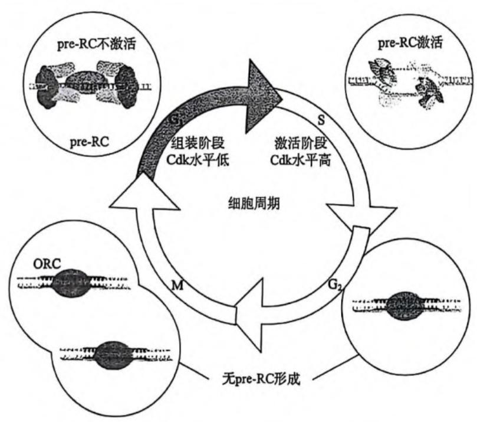  
图 2-31 细胞周期调控 Cdk 活性和 pre-RC 的形成  
在 $G_{1}$ 期, 激酶 Cdk 的水平低, 新的 pre-RC 虽然能够形成却没有活性。在 S 期, Cdk 活性的提高引发 DNA 复制的起始, 并阻止在刚复制产生的 DNA 上形成其他新 pre-RC, 保证了每个细胞周期中每条染色体只复制一次。

## 4. 端粒酶与 DNA 末端复制

真核生物染色体复制时,前导链可连续复制直到模板链的末端,释放出完整的子代染色单体;而后随链以不连续的方式复制,必须有特殊的机制来安排5'端部分DNA链的复制问题,以免该链子代DNA的5'端序列逐步缩短。真核生物能够通过形成端粒结构和具有逆转录酶活性的端粒酶来防止DNA复制时后随链缩短而产生的染色体部分缺短。端粒酶能利用自身携带的RNA链作为模板,以dNTP为原料,以逆转录的方式催化合成模板后随链5'端DNA片段或外加重复单位(如人染色体端粒为TTAGGG),以维持端粒一定的长度,从而防止染色体的缺短损伤。

由于所有新的 DNA 合成启动都需要一条引物, 这使线性染色体末端的复制成为难题, 称为末端复制问题 (end replication problem) (图 2-32)。以前导链为模板的 DNA 复制过程中, 一条 RNA 引物即可指导 DNA 链的起始并能延伸到其模板的 5' 最末端, 所以没有这个问题。而后随链合成需要多条引物, 一条 RNA 引物即可指导 DNA 链的起始并能延伸到其模板的 5' 最末端。后随链合成需要多条引物, 当起始最后一个冈崎片段合成的 RNA 引物的末端与后随链模板上最末端的碱基对退火, 该 RNA 引物被从 DNA-RNA 杂合双链上去除后, 引物酶可能缺乏足够的空间合成新的 RNA 引物, 导致后随链 DNA 产物 3' 端形成一小段单链 DNA, 使每一轮 DNA 复制后有一条子代 DNA 被截短。若这个末端复制问题不被解决的话, 将破坏遗传物质从亲代到子代的完整传递, 导致染色体末端基因丢失。

细胞主要通过两种方法来解决末端复制问题。一是用蛋白质代替 RNA 作为每个染色体末端最后一个冈崎片段的引物。研究发现，在某些具有线性染色体的细菌和病毒的染色体末端，有特定蛋白质通过某个氨基酸残基提供 -OH，代替 RNA 引物所提供的 3'-OH。

多数真核细胞则利用端粒酶来延伸染色体 3' 端, 解决末端复制问题。端粒酶是一种特殊的酶, 它由蛋白质和 RNA 组成。与 DNA 聚合酶不同的是, 它不需要外源 DNA 模板来指导新 dNTP 的添加, 由于其 RNA 序列含有 1.5 拷贝的完整端粒序列, 可以与端粒 3' 端的单链 DNA 退火, 因此, 端粒利用其自身含有的 RNA 成分作为模板将端粒序列添加到染色体 3' 端。同时, 与端粒双链区域结合的蛋白质会精确地调控该片段长度, 不会使端粒无限延伸下去。

综上所述,真核生物和原核生物 DNA 复制既有相似的地方,又有各自不同的特点,参与复制过程各个步骤的蛋白质和酶也有差异(表 2-12)。真核生物 DNA 复制起始过程比细菌更复杂,需要通过控制前复制复合物来严格调控 DNA 的复制,以确保每个核苷酸在一个细胞周期只被复制一次。同时,由于染色体结构的复杂,还需要解决核小体和染色质结

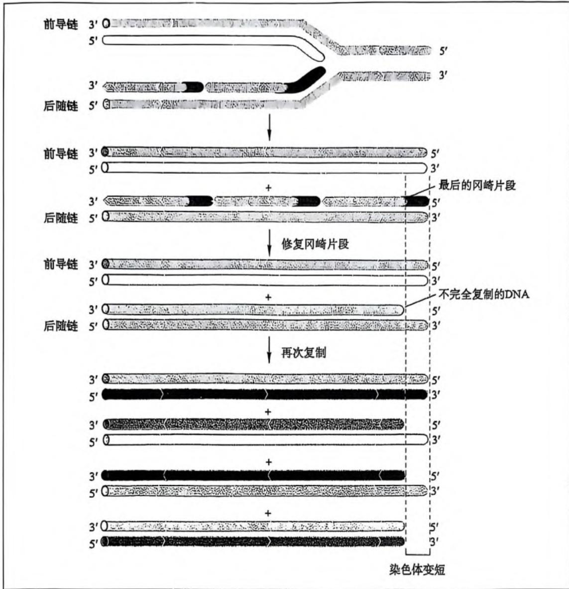  
构对 DNA 复制的影响,需要端粒酶解决端粒 DNA 末端的复制问题等。

图2-32 末端复制问题

当后随链复制机器到达染色体末端时，引物酶可能没有足够的空间去合成新的RNA引物，导致后随链DNA产物上3'端形成一小段单链DNA。在下一轮复制中，这个区域将被丢失，两个产物中的一个会因此逐步变短。

表 2-12 原核生物和真核生物 DNA 复制中主要蛋白质和酶

<table><tr><td>参与复制的蛋白质和酶</td><td>原核生物</td><td>真核生物</td></tr><tr><td>起始蛋白</td><td>DnaA</td><td>Orc1 ~ Orc6</td></tr><tr><td>解链酶</td><td>DnaB</td><td>MCM 复合物</td></tr><tr><td>解链酶装载物</td><td>DnaC</td><td>Cdc6+Cdr1</td></tr><tr><td>催化 DNA 链延伸的 DNA 聚合酶</td><td>DNA 聚合酶III</td><td>DNA 聚合酶 δ/ε</td></tr><tr><td>引发酶</td><td>DnaG</td><td>DNA 聚合酶 α/ 引发酶</td></tr><tr><td>滑动夹</td><td>DNA 聚合酶III的 β 亚基</td><td>PCNA</td></tr><tr><td>滑动夹装载器</td><td>γ 亚基复合物</td><td>复制因子 C(RF-C)</td></tr><tr><td>DNA 连接酶</td><td>NAD+依赖性 DNA 连接酶</td><td>ATP 依赖性 DNA 连接酶 I</td></tr><tr><td>切除引物的酶</td><td>DNA 聚合酶 I 或 RNaseH</td><td>RNaseH/FEN1</td></tr><tr><td>端粒酶</td><td>无</td><td>有</td></tr></table>

## 2.4.3 真核细胞 DNA 的复制调控

## 1. 原核生物 DNA 复制的调控

原核细胞的生长和增殖速度取决于培养条件,在营养丰富的环境中,原核生物(如大肠杆菌)可以快速地分裂,DNA复制可以在一次复制尚未完成时,从与第一次复制相同的起点开始第二次复制。这意味着一个细胞可能同时存在多个复制叉。迅速分裂的细胞具较多复制叉,而分裂缓慢的细胞复制叉较少并出现复制的间隙。细胞内复制叉的多少决定了复制起始频率的高低,这可能是原核细胞复制的调控机制。复制起始频率的直接调控因子是蛋白质和RNA。

以大肠杆菌染色体 DNA 的复制调控为例,染色体的复制与细胞分裂一般是同步的。但复制与细胞分裂不直接耦联。复制起始不依赖于细胞分裂,而复制的终止则能引发细胞分裂。在一定生长速度范围内,细胞与染色体的质量之比相对恒定,这是由活化物、阻遏物和去阻遏物及它们的相互作用所制约的。复制的功能单位,即复制子与转录的操纵子相似,由起始物位点和复制起始点两部分组成。起始物位点编码复制调节蛋白质,复制起始点与调节蛋白质相互作用并启动复制。起始物位点突变使复制停止并导致细胞死亡这些条件致死突变包括 dnaA、dnaC 和 dnaT 突变株,证明上述基因编码的调节蛋白质通过与复制复合物的相互作用确定复制起始频率和复制方式。

DNA 复制的调控主要发生在起始阶段,一旦开始复制,如没有意外的阻力,就一直可以复制下去直到完成。大肠杆菌的复制起始点有 oriC 和 oriH 两种,其中 oriC 是首选的复制起始点,而 oriH 是在 RNase H 缺失突变株中发现的一系列复制起始点。这两种起始点起始复制的机制和调控方式不同。

## 2. 真核细胞 DNA 的复制调控

真核细胞的生活周期可分为 4 个时期: $G_{1} 、 S 、 G_{2}$ 和 M 期。 $G_{1}$ 是复制预备期, S 为复制期, $G_{2}$ 为有丝分裂准备期, M 为有丝分裂期。DNA 复制只发生在 S 期。真核细胞中 DNA 复制有 3 个水平的调控:

① 细胞周期水平调控 也称为检查点调控(checkpoint regulation), 即决定细胞停留在 $G_{1}$ 期还是进入 S 期。许多外部因素和细胞因子参与限制点调控。促细胞分裂剂、致癌剂、外科切除等都可诱发细胞由 $G_{1}$ 期进入 S 期。一些细胞质因子如四磷酸二腺苷和聚ADP-核糖也可诱导 DNA 的复制。

② 染色体水平调控 决定不同染色体或同一染色体不同部位的复制子按一定顺序在 S 期起始复制, 这种有序复制的机制还不清楚。

③ 复制子水平调控 决定复制的起始与否。这种调控从单细胞生物到高等生物是高度保守的。此外,真核生物复制起始还包括转录活化、复制起始复合物的合成和引物合成等阶段,许多参与复制起始蛋白的功能与原核生物中相类似。酵母染色体复制只发生于S期,各个复制子按专一的时间顺序活化,在S期的不同阶段起始复制。研究由3个复制起始点(ARS1、ARS2和10Z)构建的质粒发现,酵母复制起始受时序调控,也受α因子和cdc基因调控。已克隆的 ARS 片段中都有 14 bp 的核心序列, 其中序列为 A (或 T)TT-TATPuTTA (或 T) 的 11 个核苷酸是高度保守的, 这个区域的点突变使 ARS 失去复制起始功能。

## 2.5 DNA 的损伤、修复与突变

作为遗传物质的 DNA, 其化学结构的稳定性对于细胞正常生理活动至关重要。细胞无时无刻不在受到内、外各种因素的影响, 即复制错误和来自于环境对遗传物质的损伤, 每个细胞内的 DNA 平均每天会遭受数以万次的损伤。为此, 细胞进化出针对不同类型损伤的修复机制, 使得绝大多数损伤能够被及时修复。未被修复的 DNA 分子会导致突变的发生。本节将简要介绍导致不同 DNA 损伤的因素、DNA 损伤应答和修复的机制, 以及 DNA 突变的类型及其生理效应。

## 2.5.1 DNA的损伤

DNA 损伤可分为两大类: 内源性损伤和外源性损伤。内源性损伤是由复制错误、活性氧或正常代谢副产物产生的其他一些因素引起的损伤, 而外源性损伤是由外部物理或化学因素引起的, 如紫外线、离子辐射(IR)、病毒、植物毒素(马兜铃酸等)及化学诱变剂(化疗试剂、烷基化试剂)等。

根据损伤部位,DNA 损伤可分为碱基损伤和 DNA 链的损伤。

## 1. 碱基损伤

(1) 碱基错配。是指 DNA 复制错误引起的碱基不匹配。以 DNA 为模板进行 DNA 复制是一个严格而精确的事件,但也会出现错误,碱基配对的错误频率为 $10^{-1} \sim 10^{-2}$ 。复制过程中如有错误的碱基掺入,DNA 聚合酶以其 $3' \rightarrow 5'$ 外切核酸酶的活性切除错误接上的核苷酸,然后再继续正确的复制,碱基错误配对频率降到 $10^{-5} \sim 10^{-6}$ ,这种校正作用广泛存在于原核生物和真核生物的 DNA 聚合酶中,保证了复制的准确性。但校正后的错配率仍在 $10^{-10}$ 左右,导致错误的碱基被插入到新形成的 DNA 链中。

(2) 碱基修饰。主要由生物试剂、化学试剂、ROS以及细胞呼吸的副产物等引起碱基的烷基化等修饰,如形成7-甲基鸟嘌呤、1-甲基腺嘌呤、6-O-甲基鸟嘌呤、羟甲基尿嘧啶等碱基修饰物。

(3) 碱基转换和丢失。是指由碱基水解如脱氨、脱嘌呤、脱嘧啶等引起的 DNA 损伤。碱基的脱氨基是指碱基的环外氨基有时会自发脱落,使腺嘌呤变成次黄嘌呤、胞嘧啶变成尿嘧啶、鸟嘌呤变成黄嘌呤等。胞嘧啶自发脱氨基的频率约为每个细胞每天 190 个,亚硝酸等化学试剂的处理会加剧脱氨基反应。此外,自发的水解可使嘌呤和嘧啶从 DNA 链的核糖磷酸骨架上脱落下来,导致脱嘌呤与脱嘧啶的发生。一个哺乳类细胞在 $37^{\circ} \mathrm{C}$ 条件下, $20 \mathrm{~h}$ 内 DNA 链上自发脱落的嘌呤约 1000 个、嘧啶约 500 个。电离辐射会加剧脱嘧啶和脱嘌呤反应。

(4) 碱基交联。紫外线照射引起 DNA 链上相邻胞嘧啶和胸腺嘧啶碱基之间的交联，

产生嘧啶二聚体。人皮肤因受紫外线照射而形成二聚体的频率可达 $5 \times 10^{4}$ 个细胞/小时。

## 2. DNA链的损伤

DNA 链的损伤主要有以下两种：

(1) DNA链的断裂。包括单链断裂和双链断裂。宇宙射线产生的电离辐射会导致DNA链断裂, 射线的直接和间接作用都可能使脱氧核糖破坏或磷酸二酯键断开而致DNA链断裂。DNA双链中一条链断裂称单链断裂(single-strand break), DNA双链在同一处或相近处断裂称为双链断裂(double-strand break)。每个哺乳类细胞每天DNA单链断裂发生的频率约为5万次, 单链断裂发生频率为双链断裂的 $10 \sim 20$ 倍, 但比较容易修复。高温处理、活性氧会增加单链断裂的速度。 $\mathrm{H}_{2} \mathrm{O}_{2}$ 等可能引起DNA单链断裂等损伤。

(2) DNA 链的交联。包括 DNA 链交联和 DNA-蛋白质交联。同一 DNA 链上或两条 DNA 链上的碱基间, 以及 DNA 与蛋白质之间会以共价键相连。氮芥、顺铂、丝裂霉素 (抗癌药物)、二乙基亚硝胺 (致癌物) 等双功能基烷化剂会加剧交联反应, 因其能同时使两处烷基化, 造成 DNA 链内、DNA 链间以及 DNA 与蛋白质间的交联。甲醛和紫外线处理能诱导 DNA 与蛋白质之间的共价交联。

## 2.5.2 DNA损伤的修复

由于染色体 DNA 在生命过程中占有至高无上的地位, DNA 复制的准确性以及 DNA 日常的损伤修复就有着特别重要的意义。细胞可以通过多种机制来及时修复 DNA 损伤, 表 2-13 是几种主要的 DNA 修复系统。

表 2-13 DNA 的修复系统

<table><tr><td>DNA修复系统</td><td>损伤</td><td>功能</td></tr><tr><td>错配修复</td><td>复制错误</td><td>恢复错配</td></tr><tr><td>碱基切除修复</td><td>受损的碱基</td><td>切除突变的碱基</td></tr><tr><td>核苷酸切除修复</td><td>嘧啶二聚体碱基上的大加合物</td><td>切除突变的核苷酸片段</td></tr><tr><td>双链断裂修复(同源重组修复和非同源末端连接)</td><td>双链断裂</td><td>修复损伤DNA,保持遗传信息的完整性,还可帮助修复DNA复制中的错误</td></tr><tr><td>DNA直接修复(光复活作用)</td><td>嘧啶二聚体和甲基化DNA</td><td>修复嘧啶二体或甲基化DNA</td></tr><tr><td>跨损伤合成</td><td>嘧啶二聚体或脱嘌呤位点</td><td>使复制通过DNA损伤继续进行,有高度的易错性</td></tr><tr><td>SOS修复</td><td>嘧啶二聚体等</td><td>维持基因组的完整性,提高细胞的生存率,但留下的错误较多</td></tr></table>

## 1. 错配修复

一旦在 DNA 复制过程中发生错配,细胞能够通过准确的错配修复(mismatch repair)系统识别新合成链中的错配并加以校正,DNA 子链中的错配几乎完全能被修正,充分反映了母链序列的重要性。因此,错配修复系统对 DNA 复制忠实性有很大的贡献。该系统识别母链的依据来自 Dam 甲基化酶,它能使位于 5'-GATC 序列中腺苷酸的 N $^{6}$ 位甲基化。一旦复制叉通过复制起始点,母链就会在开始 DNA 合成前的几秒钟至几分钟内被甲基化。此后,只要两条 DNA 链上碱基配对出现错误,错配修复系统就会根据"保存母链,修正子链"的原则,找出错误碱基所在的 DNA 链,并在对应于母链甲基化腺苷酸上游鸟苷酸的 5' 端位置切开子链 $^{[图2-33]}$ ,再根据错配碱基相对于 DNA 切口的方位启动如图 2-34 中所示两条修复途径之一,合成新的子链 DNA 片段。

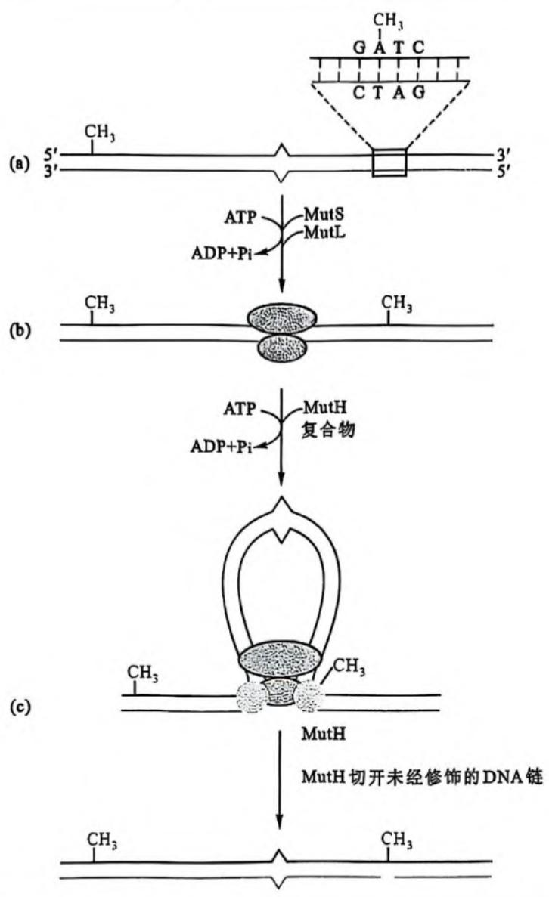  
图2-33 根据母链甲基化原则找出错配碱基过程图示  
(a) 发现碱基错配；(b) 在水解 ATP 的作用下，MutS、MutL 与碱基错配位点的 DNA 双链相结合；(c) MutS-MutL 在 DNA 双链上移动，发现甲基化 DNA 后由 MutH 切开非甲基化的子链。

## 2. 切除修复

① 碱基切除修复(base-excision repair) 研究发现,所有细胞中都带有不同类型、能识别受损核酸位点的糖苷水解酶,它能特异性切除受损核苷酸上的 $N-\beta$ 糖苷键,在 DNA 链上形成去嘌呤或去嘧啶位点,统称为 AP 位点。一类 DNA 糖苷水解酶一般只对应于某一特定类型的损伤,如尿嘧啶糖苷水解酶就特异性识别 DNA 中胞嘧啶自发脱氨形成的尿嘧啶,而不会水解 RNA 分子中尿嘧啶上的 $N-\beta$ 糖苷键(图 2-35)。DNA 分子中一旦产生了 AP 位点,AP 内切核酸酶就会把受损核苷酸的糖苷 - 磷酸键切开,并移去包括 AP 位点核苷酸在内的小片段 DNA,由 DNA 聚合酶 I 合成新的片段,最终由 DNA 连接酶把两者连

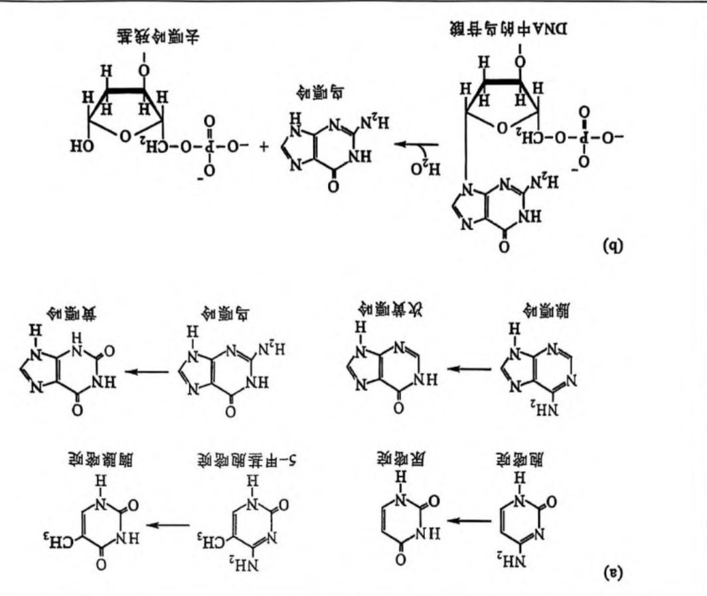

蜡音链被水解)

图2-35 DNA分子中常见的几种核苷酸非酶促进变反应；(2) 脱氨基反应；(b) 脱嘌呤反应(N-P)

从错配减基S,上游端开始切除单链DNA直到原切口,再合成新的子链片段。

当错配碱基位于 $b$ 口3,下游端时,在Mud-Mirs、DNA解链酶Ⅱ、DNA外切酶四或RceI核酸酶的作用下,从错配碱基3,下游端开始切除单 DNA直到原端口,并在DNA聚合酶皿和SSB的作用下合成新的子链片段。若错配碱基位于 $b$ 口的5,上游端,则在DNA外切酶 I 或 X 的作用下

图2-34 碱基错配修复过程示意图  
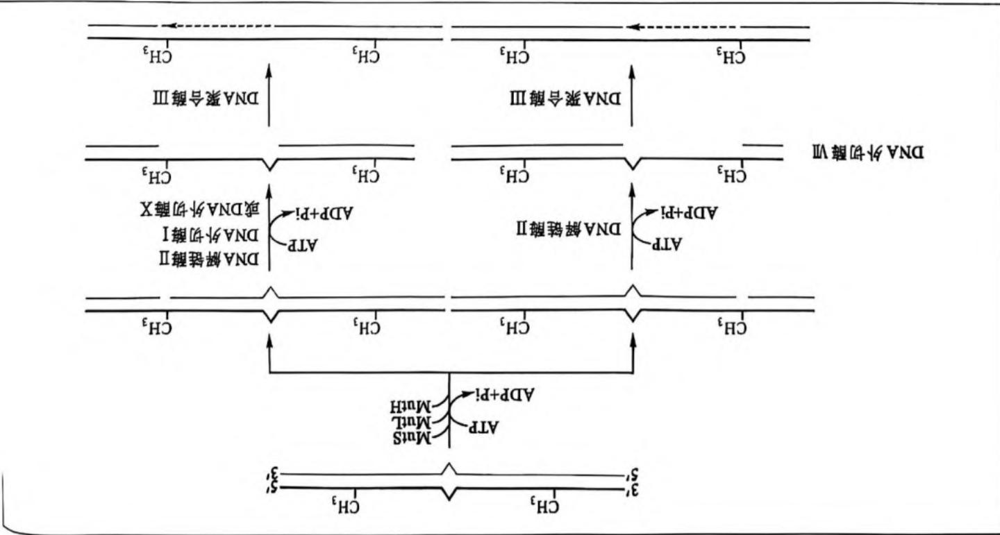

成新的被修复的 DNA 链。

② 核苷酸切除修复(nucleotide-excision repair) 当 DNA 链上相应位置的核苷酸发生损伤, 导致双链之间无法形成氢键, 则由核苷酸切除修复系统负责修复。图 2-36 分别是大肠杆菌(左)和人类细胞(右)中的修复过程。损伤发生后, 首先由 DNA 切割酶 (excinuclease) 在已损伤的核苷酸 $5'$ 和 $3'$ 位分别切开磷酸糖苷键, 产生一个由 $12 \sim 13$ 个核苷酸(原核生物)或 $27 \sim 29$ 个核苷酸(人类或其他高等真核生物)的小片段, 移去小片段后由 DNA 聚合酶 I (原核)或 $\varepsilon$ (真核)合成新的片段, 并由 DNA 连接酶完成修复中的最后一道工序。

## 3. 同源重组修复和非同源末端连接

当 DNA 发生双链断裂时, 可通过同源重组修复 (homologous recombination repair, HR) 和非同源末端连接 (non-homologous endjoining, NHEJ) 来进行修复 (图 2-37)。同源重组修复是利用细胞内的同源染色体对应的 DNA 序列作为修复的模板进行 DNA 修复的过程。重组修复又被称为"复制后修复", 它发生在复制之后。机体细胞对在复制起始时尚未修复的 DNA 损伤部位可以先复制再修复, 即先跳过该损伤部位, 在新合成链中留下一个对应于损伤序列的缺口, 该缺口由 DNA 重组来修复: 通过从未损伤 DNA 找回序列信息来修复

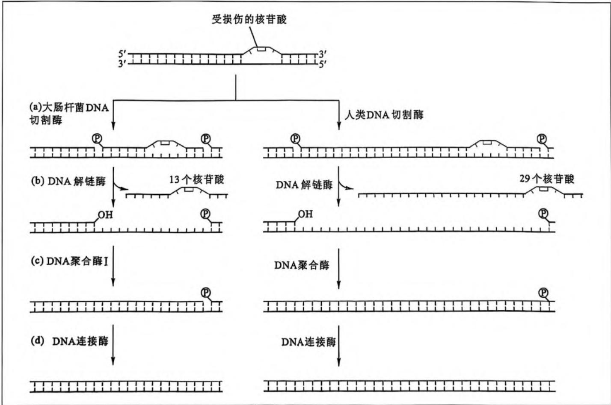  
图 2-36 大肠杆菌(左)和人类细胞(右)中的核苷酸切除修复过程示意图  
在原核生物中,受损伤核苷酸 3' 端的第 5 位,5' 端的第 8 位磷酸糖苷键分别被 DNA 切割酶切开。在人类细胞中,受损伤核苷酸 3' 端第 6 位,5' 端的第 22 位磷酸糖苷键分别被 DNA 切割酶切开。

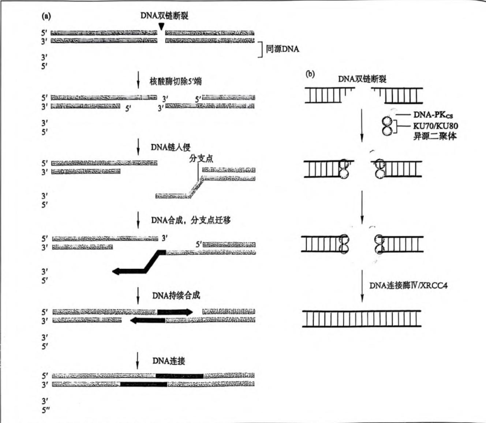  
图 2-37 同源重组修复(HR)和非同源末端连接(NHEJ)  
DNA 双链断裂的两种主要修复方式；(a)为同源重组修复(HR);(b)为非同源末端连接(NHEJ)。

DNA 的断裂, 即先从同源 DNA 母链上将相应核苷酸序列片段移至子链缺口处, 然后再用新合成的序列补上母链空缺。同源重组受一系列蛋白质的调控和催化, 如原核生物细胞内的 RecA、RecBCD、RecF、RecO、RecR, 以及真核生物细胞内的 Rad51、Mre11-Rad50 等。由于同源重组反应严格依赖 DNA 分子之间的同源性, 只有当细胞核内存在与损伤 DNA 同源的 DNA 片段时, HR 才能发生。因此, 原核生物的同源重组通常发生在 DNA 复制过程中, 而真核生物的同源重组则主要发生在细胞的 $\mathrm{G}_{2}$ 期和 S 期, 是一种高保真 (error-free) 的修复方式, 对维持遗传物质的正常功能和稳定性具有重要作用。当细胞核内没有相应的同源 DNA 片段时, 细胞将利用另一种方式 (非同源性末端连接, NHEJ) 来进行染色体断裂的修复。NHEJ 通过断裂末端突出的单链之间错排配对, 断裂的两个末端直接相互连接。NHEJ 由在细菌、酵母和人类中均有发现的高度保守蛋白家族的 KU 介导, 是一种易错 (error-prone) 修复方式。

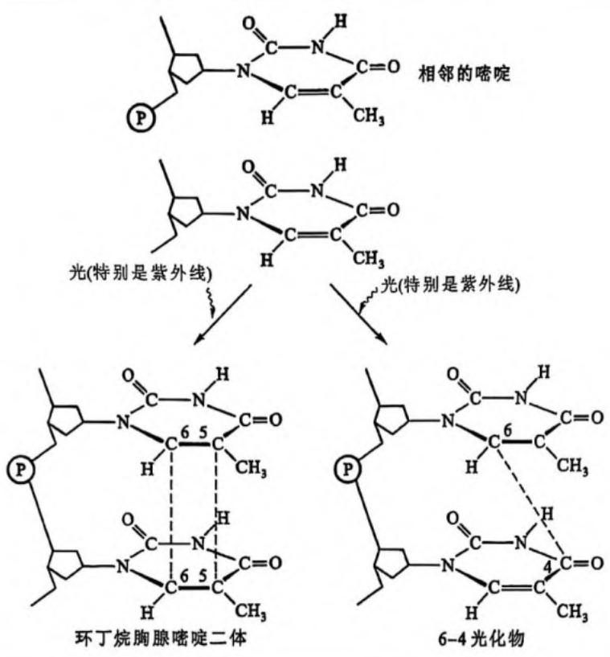  
图2-38 紫外线诱发形成嘧啶二体

## 4. DNA 的直接修复(光复活作用)

生物体内还存在多种 DNA 损伤以后直接修复 (direct repair) 而并不需要切除碱基或核苷酸的机制。直接修复是把损伤的碱基回复到原来状态的一种修复。最普遍的例子是在 DNA 光解酶 (photolyase) 的作用下把在光下或经紫外线照射形成的环丁烷胸腺嘧啶二体及 6-4 光化物 (6-4 photoproduct) 还原成为单体的过程 $^{(图2-38)}$ 。生物体内还广泛存在着使 $O^{6}$ -甲基鸟嘌呤脱甲基化的甲基转移酶，以防止形成 G-T 配对。

## 5. 跨损伤合成

跨损伤合成(translesion synthesis, TLS)是一类复制后修复, 也被称为"跨缺刻复制"或"备份复制"(backup synthesis), 最先发现于原核细胞中。在 DNA 链复制过程中, 当 DNA 聚合酶遇到嘧啶二聚体或脱嘌呤位点等没有被修复的损伤而使复制停顿时, 复制机器必须越过损伤以防止复制叉的崩塌, 机体必须启动跨损伤合成系统并忽略已存在的损伤 $^{[图2-39]}$ 。跨损伤合成是由一个独特的但是分布广泛的 DNA 聚合酶家族催化的。当细胞处于较强烈而持久的 SOS 应答生理条件下, 一些受 SOS 机制控制的可诱导性 DNA 聚合酶, 包括大肠杆菌细胞中的 DNA 聚合酶 IV (DinB) 和 DNA 聚合酶 V (UmuC, 活性形式是和 2 个分子的 UmuD' 形成的 UmuD'2C 复合物), 以及真核生物细胞内的被归类为 Y 家族的 DNA 聚合酶 (pol η、pol ι、pol κ、Rev1 等) 得到表达。虽然它们是模板依赖性的, 但在掺入核苷酸时却不依赖于碱基配对。该修复机制具有高度的易错性, 容易引入突变, 但避免了染色体不完全复制的更坏后果。因为它的高错误率, 跨损伤合成被认为是一个

图 2-39 跨损伤合成 (TLS)

细胞内 DNA 损伤刺激激活 PCNA 的泛素化, 促进 pol η 的聚集及 TLS 通路的启动, 保证复制叉跨过损伤位点。

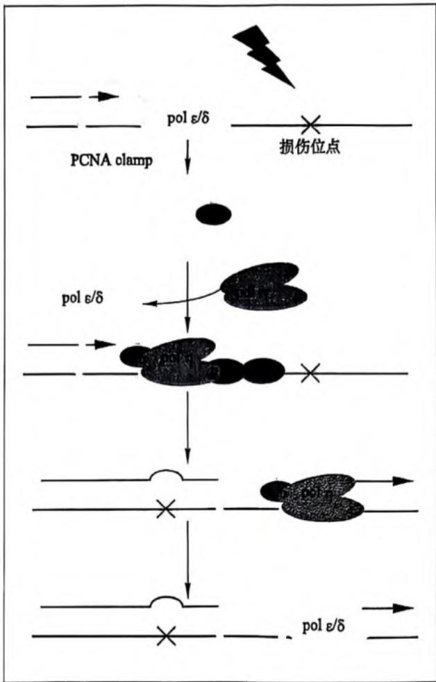

聊胜于无的修复系统,它可使细胞存活下来,但付出的代价是高突变频率的发生,有点像中国俗语所说的"好死不如赖活着"。

## 6. SOS 修复系统

SOS 修复(SOS repair)系统是细胞 DNA 受到损伤或复制系统受到抑制的紧急情况下,细胞为求生存而产生的一种应急措施。它是一种旁路系统,允许新生的 DNA 链越过胸腺嘧啶二聚体继续复制,其代价是保真度的极大降低。SOS 修复包括诱导 DNA 损伤修复、诱变效应、细胞分裂的抑制以及溶原性细菌释放噬菌体等,细胞癌变也与 SOS 修复有关。

SOS 修复广泛存在于原核和真核生物中,主要包括两个方面:DN $_{1}$ 的修复、产生变异。前者利于细胞

的存活,具有重要意义,而后者可能产生不利的后果,如导致细胞的癌变。

## 2.5.3 DNA的突变

基因突变是指在基因内的遗传物质发生可遗传的结构和数量的变化。DNA 的突变主要来源于 DNA 复制过程中出现的错误、遗传物质的化学和物理损伤以及转座子插入所造成的 DNA 序列变化。自发突变的发生频率非常低,通过人工诱导能够提高突变率。复制错误和 DNA 损伤若不能及时被修复,或由于修复系统的不完善,将产生下列后果:① 给 DNA 带来永久性的不可逆的改变,最终改变基因编码的序列,称之为基因突变;② DNA 的某些化学变化使得 DNA 不能再被用作模板进行复制和转录。

基因突变有多种类型,包括碱基替换、转换、颠换、插入突变、同义突变、错义突变、无义突变和移码突变等。一般把单个核苷酸的突变称为点突变,并把由于一个或少数几个核苷酸的插入或缺失引起的突变归入同一类型,称为插入和缺失(insertion and deletion, Indel)。累计突变将引起染色体畸变、细胞老化或凋亡,并会导致严重疾病的发生。虽然基因突变是癌症和某些遗传性疾病的主要原因,某些突变也可能有利于物种生存,使生物进化。

根据碱基序列的变化,基因突变分为点突变和移码突变:

## (1) 点突变(point Mutation)

指 DNA 上单个核苷酸的突变, 即一种碱基变成另一种碱基(图 2-40a)。其中, 嘌呤替代嘌呤(A与G之间的相互替代)、嘧啶替代嘧啶(C与T之间的替代)称为转换(transition);嘧啶到嘌呤和嘌呤到嘧啶的替换称为颠换(tranversion)。发生在基因编码区的点突变会产生3种不同的影响:①碱基突变后密码子编码同样的氨基酸,对蛋白质的结构和功能没有明显的影响,这种突变称为沉默突变(silent mutation)或同义突变(synonymous mutation)。例如,TGT突变成TGC,编码的仍然是半胱氨酸。虽然不改变氨基酸的种类,但由于密码子的偏爱性,有时同义突变会影响翻译的效率。②碱基突变后密码子编码不同的氨基酸,导致一种氨基酸被另一种取代,称为错义突变(missense mutation)。如果突变的氨基酸与原来的氨基酸属于同种性质,如Leu突变成Val,可能对蛋白质的功能的影响不大;如果突变导致氨基酸性质的改变,则会严重影响蛋白质的功能,如镰状细胞贫血就是由于单碱基突变引起的。③碱基突变使得密码子变为终止密码子,导致蛋白质多肽链变短,这种突变称为无义突变(nonsense mutation);若终止密码子变成非终止密码子,会使得编码的多肽链加长,这种突变称为加长突变(elongation mutation)。发生在非编码区的碱基突变会影响基因的转录、加工和翻译。

## (2) 移码突变 (Frameshift mUtation)

移码突变是指在蛋白质编码的序列中插入或缺失不是3的整倍数的核苷酸,导致翻译的可读框发生移动改变(reading frame shift),致使插入或缺失位点下游所译读的氨基酸序列发生明显的变化(图2-40h)。这种突变对蛋白质功能影响的大小取决于插入或缺失位点与起始密码子之间的距离,离起始密码子越近则可能对蛋白质功能的影响越大。DNA复制过程中会发生子链和母链之间的错配而形成碱基的环出(looping out),DNA聚合酶发生"滑动"(slippage), 引起自发的移码突变, 亨廷顿病 (Huntington's disease) 就是由于某个 CAG 重复序列的插入引起的。此外, 溴化乙锭等 DNA 嵌入试剂可插入到碱基之间, 是 DNA 分子上的碱基杂环相互作用, 导致移码突变的发生。转座子的插入也会引起移码突变, 导致基因功能的改变。

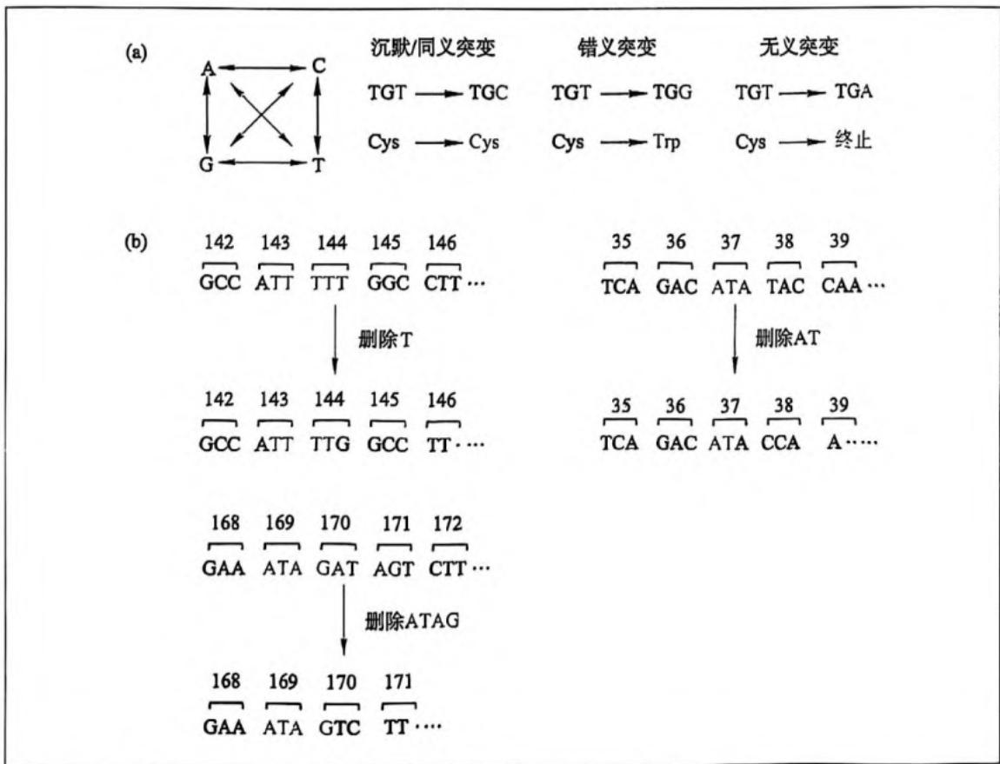  
图 2-40 DNA 主要突变类型

(a) 点突变; (b) 移码突变。

## 2.6 DNA 的转座

DNA 的转座,或称移位(transposition),是由可移位因子(transposable element)介导遗传物质重排现象。与 DNA 的同源重组相比,转座作用发生的频率虽然要低得多,但仍然有着十分重要的生物学意义,这不仅因为它能说明在细菌中发现的许多基因缺失倒转现象,而且它常被用于构建新的突变体。已经发现"转座"这一命名并不十分准确因为在转座过程中,可移位因子的一个拷贝常常留在原来位置上,在新位点上出现的仅是它的拷贝。因此,转座有别于同源重组,它依赖于 DNA 的复制。

## 2.6.1 转座子的分类和结构特征

转座子(transposon, Tn)是存在于染色体 DNA 上可自主复制和位移的基本单位。初是由 Barbara McClintock 于 20 世纪 40 年代在玉米的遗传学研究中发现的。几十年研究结果表明转座子存在于所有的生物体内，人类基因组中有 35% 以上的序列为转座序列，其中大部分与疾病相关。

转座子分为两大类: 插入序列(insertional sequence, IS) 和复合型转座子(compos transposon)。

## 1. 插入序列(IS)

插入序列是最简单的转座子,它不含有任何宿主基因。它们是细菌染色体或质DNA的正常组成部分。一个细菌细胞常带有少于10个IS。转座子常常被定位到特定基因中,造成该基因突变。科学上用标准命名法对这些突变进行编号,如 $\lambda$ :IS1表示一个IS1插入到 $\lambda$ 噬菌体基因组内。IS都是可以独立存在的单元,带有介导自身移动蛋白质,也可作为其他转座子的组成部分。

常见的 IS 都是很小的 DNA 片段(约 1 kb)，末端具有反向重复区，转座时往往复宿主靶位点一小段(4～15 碱基对)DNA，形成位于 IS 两端的正向重复区(图 2-41)。除 IS 以外，所有已知 IS 都只有一个开放读码框，翻译起始点紧挨着第一个反向重复区，终止位于第二个反向重复区或重复区附近。IS1 含有两个分开的读码框，只有移码通读才能产生功能型转座酶。一般情况下，每个 IS 转座频率是 $10^{-3} \sim 10^{-4}$ /世代，恢复频率则低得多为 $10^{-6} \sim 10^{-10}$ /世代。

## 2. 复合型转座子

复合型转座子是一类带有某些抗药性基因(或其他宿主基因)的转座子,其两翼往往是两个相同或高度同源的 IS,表明 IS 插入到某个功能基因两端时就可能产生复合型转座

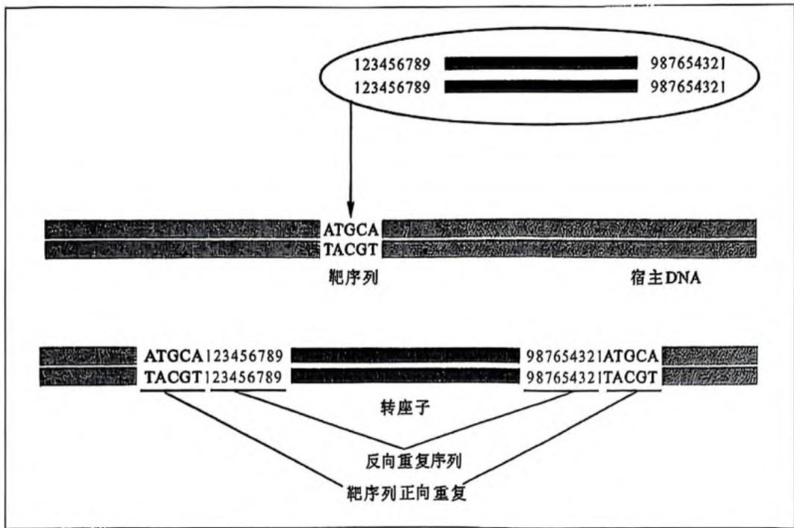  
图2-41 DNA转座的一股模式

子(图 2-42)。一旦形成复合型转座子, IS 就不能再单独移动, 因为它们的功能被修饰了, 只能作为复合物移动。大部分情况下, 这些转座子的转座能力是由 IS 决定和调节的。

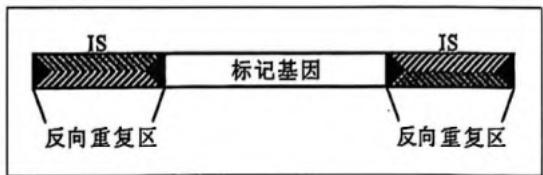  
图 2-42 复合型转座子的两端往往各有一个 IS. 在每个 IS 两侧各有反向重复区

除了末端带有 IS 的复合型转座子以外,还存在一些没有 IS 的、体积庞大的转座子 (5 000 碱基对以上) ——TnA 家族。这类转座子带有 3 个基因,其中一个编码 β-内酰胺酶 (AmpR),另两个则是转座作用所必需的。所有 TnA 类转座子两翼都带有 38bp 的反向重复序列。

## 2.6.2 真核生物中的转座子

转座子不仅存在于原核细胞(如大肠杆菌)和低等真核细胞(如酵母)中,也同样存在于高等真核生物。如玉米和果蝇中就发现了多个在基因组内随机分布而且能重复移动的转座子。大量研究证实,几乎所有高等生物基因组中都存在类似转座子序列,高等真核生物基因组的流动性可能比原核生物还要大些。

早在 20 世纪初,遗传学家就已发现玉米中存在决定体细胞变异的"控制因子"(事实上就是转座子)。40 多年前 McClintock 在美国康奈尔大学和冷泉港实验室对 Ac-Ds 等系统所进行的开创性工作,打破了孟德尔关于基因固定排列于染色体上的概念,尽管在当时几乎不能被科学界所接受,30 多年后终于在分子水平上得到证实,并使她获得了诺贝尔生理学或医学奖。

可以把玉米细胞内的控制因子归纳为两大类:一类是自主性因子(autonomouselement),另一类是非自主性因子(nonautonomous element)。前者具有自主剪接和转座功能,后者单独存在时是稳定的,不能转座,当基因组中存在与非自主性因子同家族的主性因子时,它才具备转座功能,成为与自主性因子相同的转座子。同一家族的自主性子能为非自主性因子的转座提供反式作用蛋白(转座酶),而不同家族间无此反应。研发发现,玉米转座子同样具有典型的IS特征——在转座子的两翼有两个反向重复序列,靶DNA插入位点有两个短的正向重复序列。

## 2.6.3 转座作用的遗传学效应

转座子引发了许多遗传变异,如基因重排及质粒-染色体 DNA 整合等,DNA 转座遗传学效应主要有以下几方面:

① 转座引起插入突变。各种 IS、Tn 转座子都可以引起插入突变。如果插入位于操纵子的前半部分, 就可能造成极性突变, 导致该操纵子后半部分结构基因表达失活。

② 转座产生新的基因。如果转座子上带有抗药性基因,它一方面造成靶 DNA 序上的插入突变,同时也使这个位点产生抗药性。

③ 转座产生的染色体畸变。当复制型转座发生在宿主 DNA 原有位点附近时，往往导致转座子两个拷贝之间的同源重组，引起 DNA 缺失或倒位。若同源重组发生在两个向重复转座区之间，就导致宿主染色体 DNA 缺失；若重组发生在两个反向重复转座区间，则引起染色体 DNA 倒位。

④ 转座引起的生物进化。由于转座作用,使原来在染色体上相距甚远的基因组合一起,构建成一个操纵子或表达单元,可能产生有新的生物学功能的基因和新的蛋白分子。

## 思考题

1. 染色体具备哪些作为遗传物质的特征？

2. 简述真核细胞内核小体的结构特点。

3. 请列举 3 项实验证据来说明为什么染色质中 DNA 与蛋白质分子是相互作用的。

4. 简述组蛋白的主要修饰类型并说出其功能。

5. 简述 DNA 的一、二、三级结构。

6. 原核生物 DNA 具有哪些不同于真核生物 DNA 的特征?

7. 谁提出了 DNA 双螺旋结构模型？简述其主要实验依据及其在分子生物学发展中的重要意义。

8. DNA 以何种方式进行复制？如何保证 DNA 复制的准确性？

9. 简述原核生物 DNA 的复制特点。

10. 什么是 DNA 的 $T_{\mathrm{m}}$ 值？它受哪些因素的影响？

11. DNA 复制时为什么前导链是连续复制,而后随链是以不连续的方式复制?并请以大肠杆菌为例述后随链复制的各个步骤。

12. 真核生物 DNA 的复制在哪些水平上受到调控?

13. 细胞通过哪几种修复系统对 DNA 损伤进行修复？它们在维持基因组稳定性中的作用是什么？

14. 什么是转座子,可分为哪些种类?

15. 转座的遗传效应有哪些?

## 参考文献

1. Li G, Reinberg D. Chromatin higher-order structures and generegulation [J]. Curr. Opin. Genet. Dev., 2011, 21: 175–186.

2. Rando O. Combinatorial complexity in chromatin structure and function: Revisiting the histone code [J]. Curr. Opin. Genet. Dev., 2012, 22: 148–155.

3. Brautigam C A, Steitz T A. Structural and functional insights provided by crystal structures of DNA polymerases [J]. Curr. Opin. Struct. Biol., 1998, 8: 54–63.

4. Steitz T A. A mechanism for all polymerases [J]. Nature, 1998, 391:231-232.

5. Remus D, Diffley J F X. Eukaryotic DNA replication control: Lock and load, then fire [J]. Curr. Opin. Cell Biol., 2009, 21: 771–777.

6. Sekiguchi J M, Ferguson D O. DNA double-strand break repair: A relentless hunt uncovers new prey [J]. Cell, 2006, 124: 260–262.

7. Hoeijmakers J H. Genome maintenance mechanisms for preventing cancer [J]. Nature, 2001, 411: 366-374.

## 数字课程学习

教学课件

目在线自测

思考题解析
