# 第4章 生物信息的传递(下)——从 mRNA 到蛋白质

# 生物信息的传递(下) ——从 mRNA 到蛋白质

4.1 遗传密码——密码子

4.2 tRNA

4.3 氨酰 tRNA 合成酶

4.4 核糖体

4.5 蛋白质合成的生物学机制

4.6 蛋白质前体的加工

4.7 蛋白质运转机制

4.8 蛋白质的降解与稳定性研究

蛋白质是基因表达的最终产物, 是组成细胞的主要成分(图 4-1)。蛋白质的生物合成是一个比 DNA 复制和转录更为复杂的过程, 主要包括:

① 翻译的起始 核糖体与 mRNA 结合并与氨酰 tRNA(AA-tRNA)生成起始复合物。

② 肽链的延伸 由于核糖体沿 mRNA 5' 端向 3' 端移动, 开始了从 N 端向 C 端的多肽合成, 这是蛋白质合成过程中速度最快的阶段。

③肽链的终止及释放 核糖体从 mRNA 上解离,准备新一轮合成反应。

核糖体是蛋白质合成的场所, mRNA 是蛋白质合成的模板, 转移 RNA (transfer RNA, tRNA) 是模板与氨基酸之间的接合体。此外, 在合成的各个阶段还有许多蛋白质、酶和其他生物大分子参与。例如, 在真核生物细胞中有 70 种以上的核糖体蛋白质, 20 种以上的氨酰 tRNA 合成酶, 10 多种起始因子、延伸因子及终止因子, 50 种左右 tRNA 及各种 rRNA、mRNA 和 100 种以上翻译后加工酶参与蛋白质合成和加工过程。蛋白质合成是一个需能反应, 要有各种高能化合物的参与。据统计, 在真核生物中有将近 300 种生物大分子与蛋白质的合成有关, 细胞用来进行合成代谢总能量的 $90\%$ 消耗在蛋白质合成过程中, 而参与蛋白质合成的各种组分约占到细胞干重的 $35\%$ 。

在真核生物细胞核内合成的 mRNA, 只有被运送到细胞质部分才能被翻译生成蛋白质。所谓翻译是指将 mRNA 链上的核苷酸从一个特定的起始位点开始, 按每 3 个核苷酸代表一个氨基酸的原则, 依次合成一条多肽链的过程。尽管蛋白质合成过程十分复杂, 但合成速度却高得惊人, 如大肠杆菌只需要 $5 \mathrm{~s}$ 就能合成一条由 100 个氨基酸组成的多肽, 而且每个细胞中成百上千个蛋白质的合成都能有条不紊地协同进行。

图 4-1 细胞的化学组分中,蛋白质的含量在生物大分子中占有非常高的比例

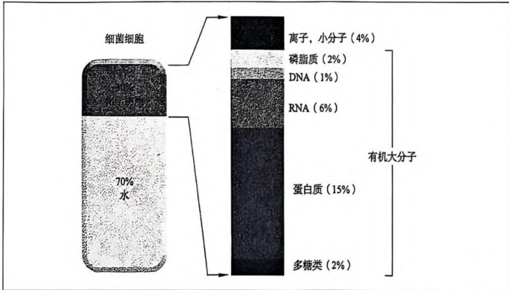

## 4.1 遗传密码——密码子

贮存在 DNA 上的遗传信息通过 mRNA 传递到蛋白质上, mRNA 与蛋白质之间的联系是通过遗传密码的破译来实现的。mRNA 上每 3 个核苷酸翻译成蛋白质多肽链上的一个氨基酸, 这 3 个核苷酸就称为密码, 也叫三联体密码即密码子 (codon)。翻译时从起始密码子 AUG (initiation codon) 开始, 沿着 mRNA $5' \rightarrow 3'$ 的方向连续阅读密码子, 直至终止密码子 (termination codon) 为止, 生成一条具有特定序列的多肽链——蛋白质 (图 4-2)。新生的多肽链中氨基酸的组成和排列顺序决定于其基因的碱基组成及其顺序, 因此, 作为基因产物的蛋白质最终是受基因控制的。

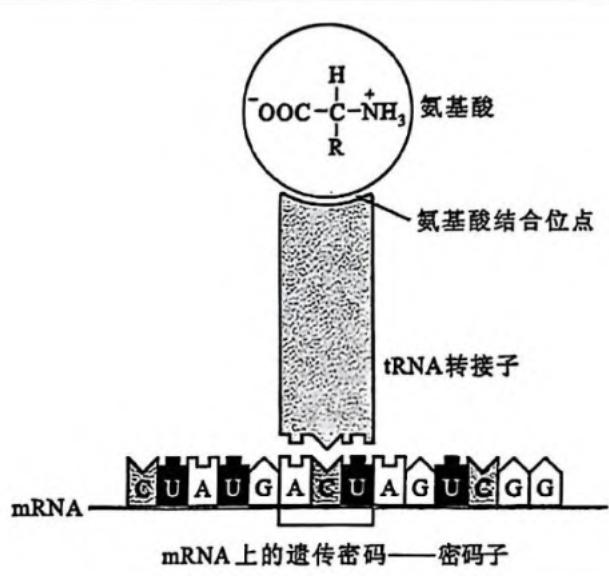  
图 4-2 Crick 关于 tRNA 分子破译 mRNA 遗传密码三联体的原始构想

遗传密码是20世纪60年代通过设计出色的生物化学和遗传学实验阐明的,它是科学上的杰出成就之一,它不仅为研究蛋白质的生物合成提供了理论依据,也证实了中心法则的正确性。20世纪70年代以来,分子生物学技术如DNA、RNA序列测定及氨基酸序列测定技术的进步,使遗传密码的存在得到验证。下面我们介绍遗传密码的破译及其特性。

## 4.1.1 密码子及其破译

蛋白质中的氨基酸序列是由 mRNA 中的核苷酸序列决定的, 所以, 要知道它们之间的关系就要弄清核苷酸和氨基酸数目的对应关系。mRNA 中只有 4 种核苷酸, 而蛋白质中有 20 种氨基酸, 以一种核苷酸代表一种氨基酸是不可能的。若以两种核苷酸作为一个氨基酸的密码 (二联子), 它们能代表的氨基酸有 $4^{2} = 16$ 种, 还是不足 20 种。而假定以 3 个核苷酸代表一个氨基酸, 则可以有 $4^{3} = 64$ 种密码, 完全可以满足编码 20 种氨基酸的需要。

## 4.1 遗传密码——密码子

图4-3 用核苷酸的插入或删除实验证明mRNA模板上每3个核苷酸组成一个密码子  
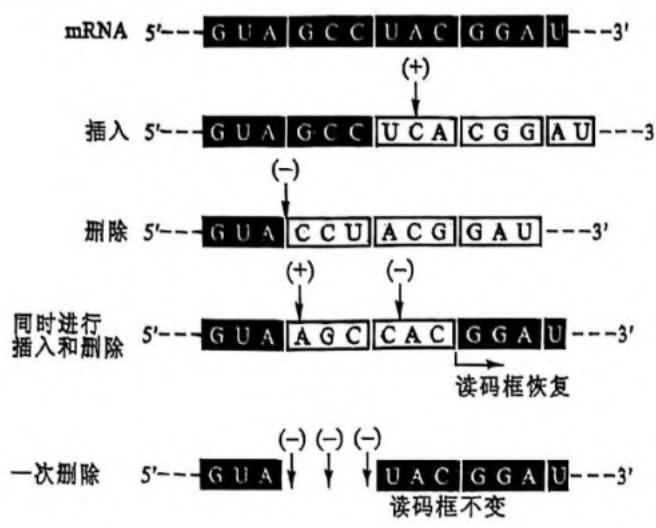

经过反复研究, Crick 等人首先从遗传学的角度证实三联体密码的构想是正确的。他们发现 T4 噬菌体 rⅡ位点上两个基因的正确表达与它能否侵染大肠杆菌有关, 用吖啶类试剂(诱导核苷酸插入或从 DNA 链上丢失)处理使 T4 噬菌体 DNA 发生移码突变(frameshift mutation), 从而指导生成一个完全不同的、没有功能的蛋白质, 使噬菌体丧失感染能力。若在模板 mRNA 中插入或删除一个碱基, 会改变该密码子以后的全部氨基酸序列。若同时对模板进行插入和删除试验, 保证后续密码子序列不变, 翻译得到的蛋白质序列就保持不变 (除了发生突变的那个密码子所代表的氨基酸之外)。如果同时删除 3 个核苷酸, 翻译产生少了一个氨基酸的蛋白质, 但序列不发生变化 (图 4-3)。另外, 对烟草坏死卫星病毒的研究发现, 其外壳蛋白亚基由 400 个氨基酸组成, 而相应的 RNA 片段长约 1200 个核苷酸, 与假设的密码三联体体系正好相吻合。

遗传密码的破译,即确定代表每种氨基酸的具体密码,在20世纪60年代初期是一项困难的任务。尽管如此,由于体外蛋白质合成体系的建立和核酸人工合成技术的发展,科学家实际上只花了几年时间就解开了这个谜。

## 1. 以均聚物、随机共聚物和特定序列的共聚物为模板指导多肽的合成

制备大肠杆菌的无细胞合成体系,在含 DNA、mRNA、tRNA、核糖体、氨酰 tRNA 合成酶及其他酶类的抽提物中加入 DNase,降解体系中的 DNA,耗尽 mRNA 时,体系中的蛋白质合成即停止,当补充外源 mRNA 或人工合成的各种均聚物或共聚物作为模板以及 ATP、GTP、氨基酸等成分时又能合成新的肽链,新生肽链的氨基酸顺序由外加的模板所决定。因此,分析比较加入的模板和合成的肽链即可推知编码某些氨基酸的密码。

1961 年, Marshall W. Nirenberg 使用能在没有模板的情况下将核苷酸连接起来的多核苷酸磷酸化酶, 把多(U)作为模板加入到上述无细胞翻译体系中, 再向体系中加入放射性标记的同种氨基酸, 每次测一种氨基酸, 在做了 20 次不同的实验后发现, 新合成的多肽链是多苯丙氨酸, 从而认定 UUU 代表苯丙氨酸(Phe) $^{(图4-4)}$ 。以多(C)及多(A)做模板得到的分别是多脯氨酸和多赖氨酸, 这样很快就解决了 3 个氨基酸的密码子(当然, 一个氨基

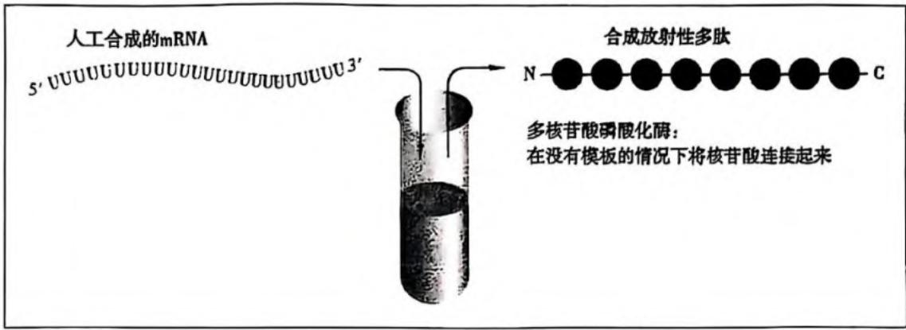  
图 4-4 无细胞翻译体系证明 UUU 编码苯丙氨酸

将人工合成的 mRNA 加入到一个含有核糖体、tRNA、多核苷酸磷酸化酶以及其他小分子的无细胞翻译体系中，然后将放射性标记的氨基酸加入到该系统中，分析所产生的多肽。结果发现 poly(U) 编码只含有苯丙氨酸的多肽。

酸可能有几个密码子)。幸运的是,由于上述无细胞体系中 $Mg^{2+}$ 浓度很高,人工合成的多聚核苷酸不需要起始密码子就能指导多肽的生物合成,读码起始是随机的。在生理 $Mg^{2+}$ 条件下,没有起始密码子的多核苷酸不能被用作多肽合成的模板。

有机化学家 Gobind Khorana 等又用各种随机的共聚物或特定序列共聚物作模板合成多肽,例如,以只含 A、C 的共聚核苷酸作模板,任意排列时可出现 8 种三联体,即 CCC、CCA、CAC、ACC、CAA、ACA、AAC、AAA,获得由 Asn、His、Pro、Gln、Thr、Lys 等 6 种氨基酸组成的多肽。

他们发现,以多二核苷酸作模板可合成由2个氨基酸组成的多肽,如以多(UG)为模板合成的是多Cys和Val,因为多(UG)中含Cys和Val的密码:

$$
5 ^ {\prime} \dots \dots U G U G U G U G U G U G U G U G \dots \dots 3 ^ {\prime}
$$

无论读码从 U 开始还是从 G 开始,都只能有 UGU(Cys) 及 GUG(Val) 两种密码子。

以多三核苷酸作为模板可得到有 3 种氨基酸组成的多肽。如以多(UUC)为模板, 可能有 3 种起读方式:

$$
5 ^ {\prime} \dots \dots U U C U U C U U C U U C \dots \dots 3 ^ {\prime}
$$

$$
\text { 或 } 5 ^ {\prime} \dots \dots \mathrm{UCUUCUUCUUCUUCU} \dots \dots 3 ^ {\prime}
$$

$$
\text { 或 } 5 ^ {\prime} \dots \dots \mathrm{CUUCUUCUUCUUCUU} \dots \dots 3 ^ {\prime}
$$

根据读码起点不同,产生的密码子可能是 UUC(Phe)、UCU(Set) 或 CUU(Leu),所以得到的多肽可能是多苯丙氨酸、多丝氨酸或多亮氨酸,由此可知 UUC、UCU、CUU 分别是苯丙氨、丝氨酸及亮氨酸的密码子。当然,以多三核苷酸为模板时也可能只合成 2 种均聚多肽,以多(GUA)为例:

$$
5 ^ {\prime} \dots \dots G U A G U A G U A G U A G U A \dots \dots 3 ^ {\prime}
$$

$$
\text { 或 } 5 ^ {\prime} \dots \dots \mathrm{UAGUAGUAGUAGUAG} \dots \dots 3 ^ {\prime}
$$

$$
\text { 或 } 5 ^ {\prime} \dots \dots \mathrm{AGUAGUAGUAGUAGU} \dots \dots 3 ^ {\prime}
$$

由第二种读码方式产生的密码子 UAG 是终止密码, 不编码任何氨基酸, 因此, 只产生 2 种密码子 GUA (Val) 或 AGU (Set), 所以合成的多肽要么是多缬氨酸, 要么是多丝氨酸。

## 2. 核糖体结合技术

上述 3 种核苷酸混合的 mRNA 序列可以提供有用的信息,但无法明确哪一种密码子对应哪一种氨基酸。这些不明确的密码子最终被 Nirenberg 和 Phil Leder 利用核糖体结合技术解决了。这个方法是以人工合成的三核苷酸如 UUU、UCU、UGU 等为模板，在含核糖体、氨酰 tRNA 的适当离子强度的反应液中保温，然后使反应液通过硝酸纤维素滤膜。他们发现，游离的氨酰 tRNA 因分子量小能自由通过滤膜，加入三核苷酸模板可以促使其对应的氨酰 tRNA 结合到核糖体上，体积超过膜上的微孔而被滞留，这样就能把已结合到核糖体上的氨酰 tRNA 与未结合的氨酰 tRNA 分开。若用 20 种氨酰 tRNA 做 20 组同样的实验，每组都含 20 种氨酰 tRNA 和各种三核苷酸，但只有一种氨基酸用 $^{14}\mathrm{C}$ 标记，看哪一种氨酰 tRNA 被留在滤膜上，进一步分析这一组的模板是哪个三核苷酸，从模板三核苷酸与氨基酸的关系可测定该氨基酸的密码子。例如，模板是 UUU 时，Phe-tRNA 结合于核糖体上，可知 UUU 是 Phe 的密码子（表 4-1）。通过上述这些方法，所有的密码子都被破译出来了。

表 4-1 三核苷酸密码子能使特定的氨酰 tRNA 结合到核糖体上

<table><tr><td rowspan="2">密码子</td><td colspan="3">与核糖体相结合的 $^{14}C$ 标记的氨酰 tRNA</td></tr><tr><td>Phe-tRNA $^{Pro}$ </td><td>Lys-tRNA $^{Lyn}$ </td><td>Pro-tRNA $^{Pro}$ </td></tr><tr><td>UUU</td><td>4.6*</td><td>0</td><td>0</td></tr><tr><td>AAA</td><td>0</td><td>7.7</td><td>0</td></tr><tr><td>CCC</td><td>0</td><td>0</td><td>3.1</td></tr></table>

\* 数字代表特定氨基酸RNA与带有溴板三核苷酸的核糖体相结合的效率。随机结合=1。

## 4.1.2 遗传密码的性质

## 1. 密码的连续性

翻译由 mRNA 的 5' 端的起始密码子开始,一个密码子接一个密码子连续阅读直到 3' 终止密码,密码间无间断也没有重叠,即起始密码子决定了所有后续密码子的位置,说明三联体密码是连续的。

## 2. 密码的简并性

按照 1 个密码子由 3 个核苷酸组成的原则,4 种核苷酸可组成 64 个密码子,现在已经知道其中 61 个是编码氨基酸的密码子,另外 3 个即 UAA、UGA 和 UAG 并不代表任何氨基酸,它们是终止密码子,不能与 tRNA 的反密码子配对,但能被终止因子或释放因子识别,终止肽链的合成 $^{(表 4-2)}$ 。细菌中 3 种终止密码子的使用频率是不同的,UAA 是最常用的,UGA 比 UAG 的使用频率更高一点,但 UGA 出错的可能性更大一些。

因为存在 61 种密码子而只有 20 种氨基酸, 所以许多氨基酸有多个密码子, 实际上除甲硫氨酸(AUG)和色氨酸(UGG)只有一个密码子外, 其他氨基酸都有一个以上的密码子, 其中 9 种氨基酸有 2 个密码子, 1 种氨基酸有 3 个密码子, 5 种氨基酸有 4 个密码子, 3 种氨基酸有 6 个密码子 $^{(表4-3)}$ 。

由一种以上密码子编码同一个氨基酸的现象称为简并(degeneracy),对应于同一氨基酸的密码子称为同义密码子(synonymous codon)。另外,AUG 和 GUG 既是甲硫氨酸及缬氨酸的密码子又是起始密码子,这种双重功能在生物学上的意义尚不清楚。

表 4-2 通用遗传密码及相应的氨基胺

<table><tr><td rowspan="2">第一位(5&#x27;端)核苷酸</td><td colspan="4">第二位(中间)核苷酸</td><td rowspan="2">第三位(3&#x27;端)核苷酸</td></tr><tr><td>U</td><td>C</td><td>A</td><td>G</td></tr><tr><td rowspan="4">U</td><td>苯丙氨酸(Phe,F)</td><td>丝氨酸(Set,S)</td><td>酪氨酸(Tyr,Y)</td><td>半胱氨酸(Cys,G)</td><td>U</td></tr><tr><td>苯丙氨酸(Phe,F)</td><td>丝氨酸(Set,S)</td><td>酪氨酸(Tyr,Y)</td><td>半胱氨酸(Cys,C)</td><td>C</td></tr><tr><td>亮氨酸(Leu,L)</td><td>丝氨酸(Set,S)</td><td>终止(Stop)</td><td>终止(Stop)</td><td>Δ</td></tr><tr><td>亮氨酸(Leu,L)</td><td>丝氨酸(Set,S)</td><td>终止(Stop)</td><td>色氨酸(Trp,W)</td><td>G</td></tr><tr><td rowspan="4">C</td><td>亮氨酸(Leu,L)</td><td>脯氨酸(Pro,P)</td><td>组氨酸(His,H)</td><td>精氨酸(Arg,R)</td><td>U</td></tr><tr><td>亮氨酸(Leu,L)</td><td>脯氨酸(Pro,P)</td><td>组氨酸(His,H)</td><td>精氨酸(Arg,R)</td><td>C</td></tr><tr><td>亮氨酸(Leu,L)</td><td>脯氨酸(Pro,P)</td><td>谷氨酰胺(Gln,Q)</td><td>精氨酸(Arg,R)</td><td>Δ</td></tr><tr><td>亮氨酸(Leu,L)</td><td>脯氨酸(Pro,P)</td><td>谷氨酰胺(Gln,Q)</td><td>精氨酸(Arg,R)</td><td>G</td></tr><tr><td rowspan="4">A</td><td>异亮氨酸(Ile,I)</td><td>苏氨酸(Thr,T)</td><td>天冬酰胺(Asn,N)</td><td>丝氨酸(Set,S)</td><td>U</td></tr><tr><td>异亮氨酸(Ile,I)</td><td>苏氨酸(Thr,T)</td><td>天冬酰胺(Asn,N)</td><td>丝氨酸(Set,S)</td><td>C</td></tr><tr><td>异亮氨酸(Ile,I)</td><td>苏氨酸(Thr,T)</td><td>赖氨酸(Lys,K)</td><td>精氨酸(Arg,R)</td><td>A</td></tr><tr><td>甲硫氨酸(Met,M)</td><td>苏氨酸(Thr,T)</td><td>赖氨酸(Lys,K)</td><td>精氨酸(Arg,R)</td><td>G</td></tr><tr><td rowspan="4">G</td><td>缬氨酸(Val,V)</td><td>丙氨酸(Ala,A)</td><td>天冬氨酸(Asp,D)</td><td>甘氨酸(Gly,G)</td><td>U</td></tr><tr><td>缬氨酸(Val,V)</td><td>丙氨酸(Ala,A)</td><td>天冬氨酸(Asp,D)</td><td>甘氨酸(Gly,G)</td><td>C</td></tr><tr><td>缬氨酸(Val,V)</td><td>丙氨酸(Ala,A)</td><td>谷氨酸(Glu,E)</td><td>甘氨酸(Gly,G)</td><td>Δ</td></tr><tr><td>缬氨酸(Val,V)</td><td>丙氨酸(Ala,A)</td><td>谷氨酸(Glu,E)</td><td>甘氨酸(Gly,G)</td><td>G</td></tr></table>

表 4-3 密码子的简并性

<table><tr><td>氨基酸</td><td>密码子个数</td><td>氨基酸</td><td>密码子个数</td></tr><tr><td>丙氨酸</td><td>4</td><td>亮氨酸</td><td>6</td></tr><tr><td>精氨酸</td><td>6</td><td>赖氨酸</td><td>2</td></tr><tr><td>天冬酰胺</td><td>2</td><td>甲硫氨酸</td><td>1</td></tr><tr><td>天冬氨酸</td><td>2</td><td>苯丙氨酸</td><td>2</td></tr><tr><td>半胱氨酸</td><td>2</td><td>脯氨酸</td><td>4</td></tr><tr><td>谷氨酰胺</td><td>2</td><td>丝氨酸</td><td>6</td></tr><tr><td>谷氨酸</td><td>2</td><td>苏氨酸</td><td>4</td></tr><tr><td>甘氨酸</td><td>4</td><td>色氨酸</td><td>1</td></tr><tr><td>组氨酸</td><td>2</td><td>酪氨酸</td><td>2</td></tr><tr><td>异亮氨酸</td><td>3</td><td>缬氨酸</td><td>4</td></tr></table>

同义密码子一般都不是随机分布的,因为其第一、第二位核苷酸往往是相同的,而第三位核苷酸的改变并不一定影响所编码的氨基酸,这种安排减少了变异对生物的影响。一般说来,编码某一氨基酸的密码子越多,该氨基酸在蛋白质中出现的频率也越高,只有精氨酸是个例外,因为在真核生物中 CG 双联子出现的频率较低,所以尽管有 6 个同义密码子,蛋白质中精氨酸的出现频率仍不高,如图 4-5。

## 3. 密码的通用性与特殊性

遗传密码无论在体内还是体外,也无论是对病毒、细菌、动物还是植物而言都是通用的,所以密码子具有通用性。20世纪70年代以后对各种生物基因组的大规模测序结果也充分证明生物界基本共用同一套遗传密码。密码子的通用性有助于我们研究生物的进化。同时,遗传密码的通用性在遗传工程中得到充分运用,比如在细菌中大量表达人类的外源蛋白——胰岛素等。

虽然密码子具有通用性,但也发现极少数例外。在支原体中,终止密码子 UGA 被用来编码色氨酸;在嗜热四膜虫中,另一个终止密码子 UAA 被用来编码谷氨酰胺。对人、牛

图 4-5 除了 Arg 以外, 编码某一特定氨基酸的密码子个数与该氨基酸在蛋白质中的出现频率相吻合  
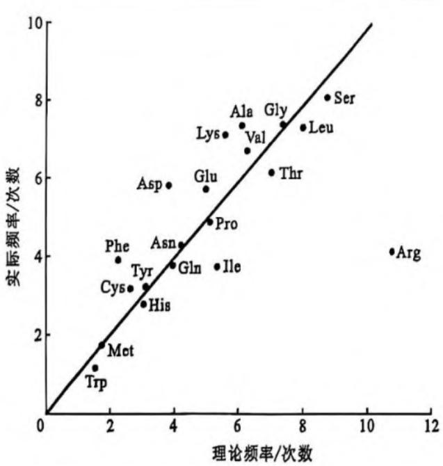

图 4-6 mRNA 上的密码子与 tRNA 上的反密码子配对示意图

及酵母线粒体 DNA 序列和结构的研究还发现, 在线粒体中也有一些例外情况 $^{(表4-4)}$ , 如 UGA 编码色氨酸, 而非终止密码子; 甲硫氨酸可由 AUA 编码等, 体现了遗传密码的特殊性。

表 4-4 线粒体与核 DNA 密码子使用情况的比较

<table><tr><td>生物</td><td>密码子</td><td>线粒体 DNA 编码的氨基酸</td><td>核 DNA 编码的氨基酸</td></tr><tr><td>所有</td><td>UGA</td><td>色氨酸</td><td>终止子</td></tr><tr><td>酵母</td><td>CUA</td><td>苏氨酸</td><td>亮氨酸</td></tr><tr><td>果蝇</td><td>AGA</td><td>丝氨酸</td><td>精氨酸</td></tr><tr><td>哺乳类</td><td>AGA/G</td><td>终止子</td><td>精氨酸</td></tr><tr><td>哺乳类</td><td>AUA</td><td>甲硫氨酸</td><td>异亮氨酸</td></tr></table>

## 4.1.3 密码子与反密码子的相互作用

在蛋白质生物合成过程中,tRNA 的反密码子在核糖体内是通过碱基的反向配对与 mRNA 上的密码子相互作用的 $^{(图4-6)}$ 。1966 年,Crick 根据立体化学原理提出摆动假说 (wobble hypothesis),解释了反密码子中某些稀有成分(如 I)的配对,以及许多氨基酸有 2 个以上密码子的问题。

根据摆动假说,在密码子与反密码子的配对中,前两对严格遵守碱基配对原则,第三对碱基有一定的自由度,可以"摆动",因而使某些 tRNA 可以识别 1 个以上的密码子。一个 tRNA 究竟能识别多少个密码子是由反密码子的第一位碱基的性质决定的,反密码子第一位为 A 或 C 时只能识别 1 种密码子,为 G 或 U 时可以识别 2 种密码子,为 I 时可识别 3 种密码子(表 4-5)。如果有几个密码子同时编码一个氨基酸,凡是第一、二位碱基不同的密码子都对应于各自独立的 tRNA。原核生物中有 30\~45 种 tRNA,真核细胞中可能存在 50 种 tRNA。

(a)  
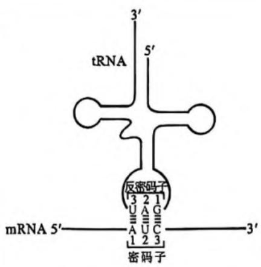  
(b)

$$
\begin{array}{c c c} 3 & 2 & 1 \\ \underline {{G}} - \underline {{C}} - \underline {{I}} \\ \underline {{=}} & \underline {{=}} & \underline {{=}} \\ C - G - A \\ 1 & 2 & 3 \end{array}
$$

$$
\begin{array}{c c c} 3 & 2 & 1 \\ \underline {{G}} - \underline {{C}} - \underline {{I}} \\ \overline {{=}} & \overline {{=}} & \overline {{=}} \\ C - G - U \\ 1 & 2 & 3 \end{array}
$$

$$
\begin{array}{c c c} 3 & 2 & 1 \\ \underline {{G}} - \underline {{C}} - \underline {{I}} & (5 ^ {\prime}) \\ \equiv & \equiv & \equiv \\ C - G - C & (3 ^ {\prime}) \\ 1 & 2 & 3 \end{array}
$$

(a) 密码子与 tRNA 反密码子臂上相应序列配对；(b) 当反密码子第一位是 I 时，密码子第三位可以是 A、U 或 C。

表 4-5 tRNA 上的反密码子与 mRNA 上密码子的配对与"摆动"

<table><tr><td colspan="3">1. 反密码子第一位是C或A时,只能识别一种密码子</td></tr><tr><td>反密码子</td><td>(3&#x27;)X-Y-C(5&#x27;)</td><td>(3&#x27;)X-Y-A(5&#x27;)</td></tr><tr><td>密码子</td><td>(5&#x27;)Y-X-G(3&#x27;)</td><td>(5&#x27;)Y-X-U(3&#x27;)</td></tr><tr><td colspan="3">2. 反密码子第一位是U或G时,可分别识别两种密码子</td></tr><tr><td>反密码子</td><td>(3&#x27;)X-Y-U(5&#x27;)</td><td>(3&#x27;)X-Y-G(5&#x27;)</td></tr><tr><td>密码子</td><td>(5&#x27;)Y-X-A/G(3&#x27;)</td><td>(5&#x27;)Y-X-C/U(3&#x27;)</td></tr><tr><td colspan="3">3. 反密码子第一位是I时,可识别3种密码子</td></tr><tr><td>反密码子</td><td>(3&#x27;)X-Y-I(5&#x27;)</td><td></td></tr><tr><td>密码子</td><td>(5&#x27;)Y-X-A/U/C(3&#x27;)</td><td></td></tr></table>

## 4.2 tRNA

tRNA 在蛋白质合成中处于关键地位, 它不但为每个三联密码子翻译成氨基酸提供了接合体, 还为准确无误地将所需氨基酸运送到核糖体上提供了运送载体, 所以, 它又被称为第二遗传密码。虽然 tRNA 分子各自的序列不同, 但所有的 tRNA 都具有共同的特征: 存在经过特殊修饰的碱基, tRNA 的 3' 端都以 CCA-OH 结束, 该位点是 tRNA 与相应氨基酸结合的位点。

## 4.2.1 tRNA 的三叶草二级结构

tRNA 参与多种反应,并与多种蛋白质和核酸相互识别,这就决定了它们在结构上存在大量的共性。由于小片段碱基互补配对,三叶草形 tRNA 分子上有 4 条根据它们的结构或已知功能命名的手臂(图 4-7):

受体臂 (acceptor arm) 因是结合氨基酸的位点而得名, 主要由链两端序列碱基配对形成的杆状结构和 3' 端未配对的 3\~4 个碱基所组成, 其 3' 端的最后 3 个碱基序列永远是 CCA 序列, 伸出双链之外, 最后一个碱基的 3' 或 2' 自由羟基 (—OH) 可以被氨酰化。

其余手臂均由碱基配对产生的杆状结构和无法配对的套索状结构所组成。

TψC臂是根据3个核苷酸命名的,其中ψ表示拟尿嘧啶,是tRNA分子所拥有的不常见核苷酸。

反密码子臂是根据位于套索中央的三联反密码子命名的。反密码子的两端由 5' 端的尿嘧啶和 3' 端的嘌呤界定。

D臂是根据它含有二氢尿嘧啶(dihydrouracil)命名的。

图 4-7 显示了最常见 tRNA 分子的三叶草二级结构形式。tRNA 一般有 76 个碱基, 分子量约为 $2.5 \times 10^{4}$ 。不同的 tRNA 分子可有 74\~95 个核苷酸不等。tRNA 分子长度的不同主要是由其中的 D 臂、TψC 臂和多余臂引起的, 在 D 臂中存在多至 3 个可变核苷酸位点。tRNA 分子中最大的变化发生在位于 TψC 和反密码子臂之间的多余臂 (extra arm) 上。

## 第4章 生物信息的传递(下)——从mRNA到蛋白质

图4-7 IRNA的三叶草形二级结构  
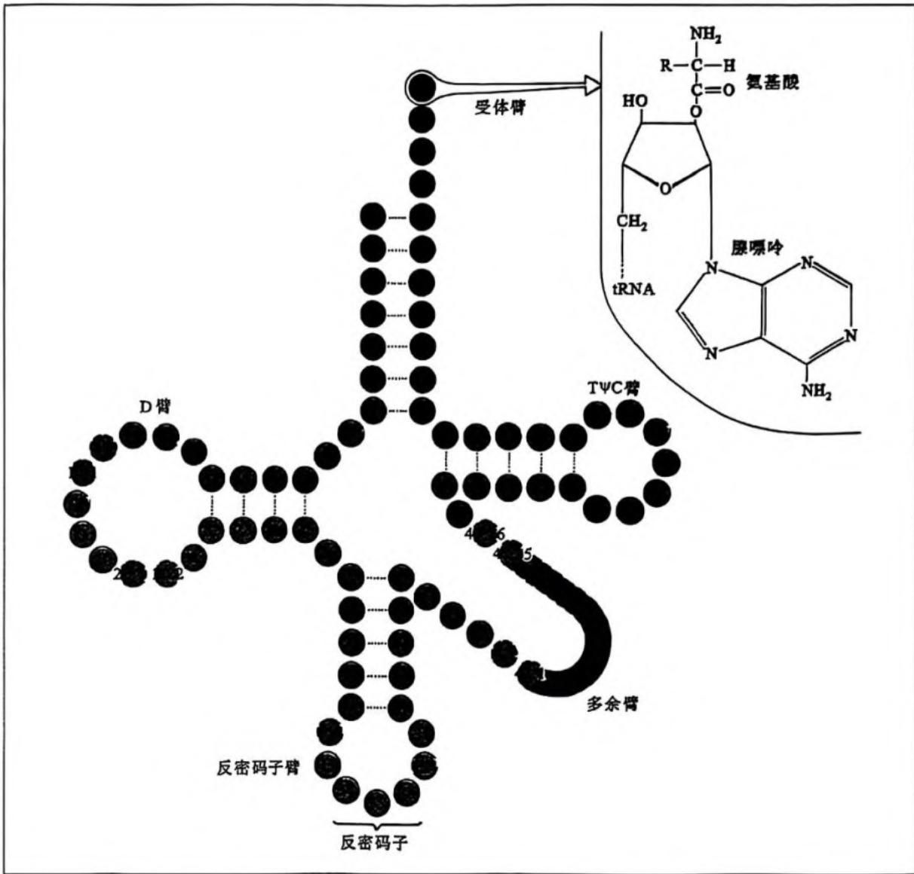

tRNA 的稀有碱基含量非常丰富, 有 70 余种。每个 tRNA 分子至少含有 2 个稀有碱基, 最多有 19 个, 多数分布在非配对区, 特别是在反密码子 $3^{\prime}$ 端邻近部位出现的频率最高,且大多为嘌呤核苷酸, 这对于维持反密码子环的稳定性及密码子、反密码子之间的配对是很重要的。基因组研究发现, 原核生物与真核生物细胞中所拥有的各种 tRNA 基因总数很不一样。

所有的 tRNA 都能够与核糖体的 A 位点(新进入的氨酰 tRNA 的结合位点)和 P 位点(肽酰 tRNA 的结合位点)结合,此时,tRNA 分子三叶草型顶端突起部位通过密码子-反密码子的配对与 mRNA 相结合,而其 3' 端恰好将所运转的氨基酸送到正在延伸的多肽上。此外,所有 tRNA(除了起始 tRNA 外)都能被翻译辅助因子 EF-Tu(原核生物)或 eEF1(真核生物)所识别而与核糖体相结合,起始 tRNA 能被原核生物的起始因子 IF-2 或真核生物的起始因子 eIF-2 所识别。

## 4.2.2 tRNA 的 L-形三级结构

有人在二级结构基础上做了酵母 tRNA $^{Phe}$ 、tRNA $^{fMet}$ 和大肠杆菌 tRNA $^{fMet}$ 、tRNA $^{Arg}$ 等的三级结构, 发现都呈 L 形折叠 (图1-8), 而这种结构是靠氢键来维持的。tRNA 的三级结构

图4-8 酵母 $\mathrm{HUNA}^{\mathrm{TM}}$ 的三级结构示意图（根据X射线衍射数据绘制）

(a) 和 (b) 表示用不同方法构建的模型。

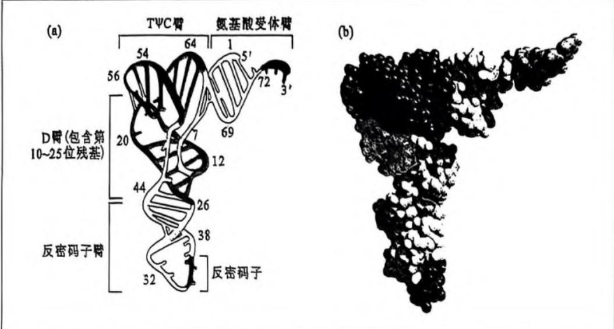

与 AA-tRNA 合成酶对 tRNA 的识别有关。

tRNA 的 L 形三级结构,保留了二级结构中由于碱基互补而产生的双螺旋杆状结构,又通过分子重排创造了另一对双螺旋。受体臂和 TψC 臂的杆状区域构成了第一个双螺旋,D 臂和反密码子臂的杆状区域形成了第二个双螺旋,两个双螺旋上各有一个缺口。TψC 臂和 D 臂的套索状结构位于"L"的转折点。所以,受体臂顶端的碱基位于"L"的一个端点,反密码子臂的套索状结构生成了"L"的另一个端点。

tRNA 高级结构上的特点为我们提供了研究其生物学功能的重要线索, 因为 tRNA 上所运载的氨基酸必须靠近位于核糖体大亚基上的多肽合成位点, 而 tRNA 上的反密码子必须与小亚基上的 mRNA 相配对, 所以分子中两个不同的功能基团是最大限度分离的。这个结构形式很可能满足了蛋白质合成过程中对 tRNA 的各种要求而成为 tRNA 的通式, 研究证实 tRNA 的性质是由反密码子而不是它所携带的氨基酸所决定的。

## 4.2.3 tRNA 的功能

转录过程是信息从一种核酸分子(DNA)转移到另一种结构上极为相似的核酸分子(RNA)的过程,信息转移靠的是碱基配对。翻译阶段遗传信息从 mRNA 分子转移到结构极不相同的蛋白质分子,信息是以能被翻译成单个氨基酸的三联密码子形式存在的,在这里起作用的是 tRNA 的解码机制。

根据 Crick 的接合体假说,氨基酸必须与一种接合体接合,才能被带到 RNA 模板的恰当位置上正确合成蛋白质。所以,氨基酸在合成蛋白质之前必须通过氨酰 tRNA 合成酶活化,在消耗 ATP 的情况下结合到 tRNA 上,生成有蛋白质合成活性的氨酰 tRNA。同时,氨酰 tRNA 的生成还牵涉到信息传递的问题,因为只有 tRNA 上的反密码子能与 mRNA 上的密码子相互识别并配对,而氨基酸本身不能识别密码子,只有结合到 tRNA 上生成氨酰 tRNA,才能被带到 mRNA-核糖体复合物上,插入到正在合成的多肽链的适当位置上。

下面的实验证明模板 mRNA 只能识别特异的 tRNA 而不是氨基酸。 $^{14}$ C 标记的半家还无法从一级结构上解释 tRNA 在蛋白质合成中的专一性。有证据说明，tRNA 的二级和三级结构对它的专一性起着举足轻重的作用。

## 3. 校正 tRNA

在蛋白质的结构基因中,一个核苷酸的改变可能使代表某个氨基酸的密码子变成终止密码子(UAG、UGA、UAA),使蛋白质合成提前终止,合成无功能的或无意义的多肽,这种突变称为无义突变(nonsense mutation),而无义突变的校正tRNA可通过改变反密码子区校正无义突变(图4-10)。

错义突变(missense mutation)是由于结构基因中某个核苷酸的变化使一种氨基酸的密码变成另一种氨基酸的密码。错义突变的校正 tRNA 通过反密码子区的改变把正确的氨基酸加到肽链上,合成正常的蛋白质。如某大肠杆菌细胞色氨酸合成酶中的一个甘氨酸密码子 GGA 错义突变成 AGA(编码精氨酸),指导合成错误的多肽链。甘氨酸校正 tRNA 的校正基因突变使其反密码子从 CCU 变成 UCU,它仍然是甘氨酸的反密码子但不结合 GGA 而能与突变后的 AGA 密码子相结合,把正确的氨基酸(甘氨酸)放到 AGA 所对应的位置上(图 4-10b)。

校正 tRNA 在进行校正过程中必须与正常的 tRNA 竞争结合密码子,无义突变的校正 tRNA 必须与释放因子竞争识别密码子,错义突变的校正 tRNA 必须与该密码的正常 tRNA 竞争,都会影响校正的效率。所以,某个校正基因的效率不仅决定于反密码子与密码子的亲和力,也决定于它在细胞中的浓度及竞争中的其他参数。一般说来,校正效率不会超过 50%。无义突变的校正基因 tRNA 不仅能校正无义突变,也会抑制该基因 3' 端正常的终止密码子,导致翻译过程的通读,合成更长的蛋白质,这种蛋白质过多就会对细胞造成伤害。同样,一个基因错义突变的矫正也可能使另一个基因错误翻译,因为如果一个校正基因在突变位点通过取代一种氨基酸的方式校正了一个突变,它也可以在另一位点这样做,从而在正常位点上引入新的氨基酸。

图 4-10 反密码子的突变可以抑制无义突变(a)和错义突变(b)  
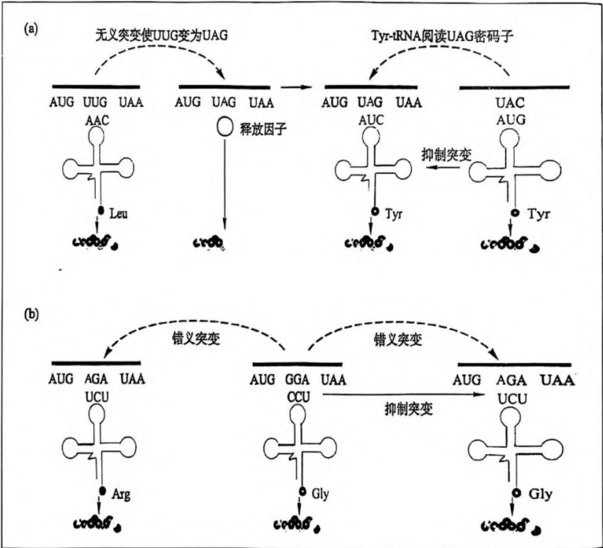

## 4.3 氨酰 tRNA 合成酶

## 4.3.1 氨酰 tRNA 合成酶将氨基酸装载到 tRNA 上

每个 tRNA 分子如何与 20 个氨基酸中正确的一个连接上？这个任务由氨酰 tRNA 合成酶 (aminoacyl tRNA synthetase) 来承担，它确保了 tRNA 只与正确的氨基酸相偶联。氨酰 tRNA 合成酶是一类催化氨基酸连接于 tRNA 的 3' 端的特异性酶，其反应如下：

$$
\mathrm{AA} + \mathrm{tRNA} + \mathrm{ATP} \rightarrow \mathrm{AA} - \mathrm{tRNA} + \mathrm{AMP} + \mathrm{PPi}
$$

它实际上包括两步反应：

第一步是氨基酸活化生成酶-氨酰腺苷酸复合物。

$$
\mathbf {A A} + \mathbf {A T P} + \mathbf {\mathrm{酶}} (\mathbf {E}) \rightarrow \mathbf {E} - \mathbf {A A} - \mathbf {A M P} + \mathbf {P P i}
$$

第二步是氨酰基转移到 tRNA 3' 端腺苷残基的 2' 或 3'-羟基上。

$$
\mathrm{E-AA-AMP+tRNA} \rightarrow \mathrm{AA-tRNA+E+AMP}
$$

## 4.3.2 氨酰 tRNA 合成酶分为 I 型和 II 型

虽然具有相同的功能,不同的氨酰 tRNA 合成酶在分子量和结构等差异较大,根据序列和结构的相似性,氨酰 tRNA 合成酶可分为 I 型和 II 型两个类型,每类包括 10 种酶。

① I型氨酰tRNA合成酶将氨基酸连接到tRNA的2'羟基,它具有N端催化结构域,以核苷酸结合折叠基序(nucleotide-binding fold)的形式存在,包括交替的平行β链和α螺旋。该催化结构域含有两段部分保守的短氨基酸序列(也称为签名序列,signature sequence),是ATP结合的位点。I型氨酰tRNA合成酶的C端结构域包含tRNA反密码子结合域和寡聚化结构域,与tRNA接受臂螺旋上的小沟及反密码子结合。大多数I型氨酰tRNA合成酶为单体,某些为同源二聚体。

② II型氨酰tRNA合成酶将氨基酸连接到tRNA的3'羟基,其在催化结构域序列上具有一些共同特点,与tRNA接受臂螺旋上的大沟及反密码子环结合。大多数II型氨酰tRNA合成酶为同源二聚体,两个为四聚体。其活性位点包括一个大的被α螺旋环绕的反向平行β片层结构,反密码子结合位于N端的结构域,寡聚化结构域的位置差异很大。

## 4.3.3 氨酰 tRNA 合成酶决定蛋白质合成的真实性

蛋白质合成的真实性主要决定于 tRNA 能否把正确的氨基酸放到新生多肽链的正确位置上, 而这一步主要决定于氨酰 tRNA 合成酶是否能使氨基酸与对应的 tRNA 相结合。氨酰 tRNA 合成酶既要能识别 tRNA, 又要能识别氨基酸, 它对两者都具有高度的专一性。不同的 tRNA 有不同的碱基组成和空间结构, 每种特异性氨酰 tRNA 合成酶通过对其独特结构的识别来保证翻译的正确进行(图 4-11)。受体臂是氨酰 tRNA 合成酶识别特异性的关键因素, 若位于该臂上的鉴别者碱基发生变化, 会使某个 tRNA 所识别的密码子发生变化, 从一种氨酰 tRNA 合成酶变成另一种氨酰 tRNA 合成酶。

氨酰 tRNA 合成酶通过校读机制来控制对两种底物的识别, 合成酶和其同族 tRNA 亲和力更强, 结合更迅速而解离更慢, 即结合 tRNA 后, 合成酶检查所结合的 tRNA, 如果是正确的 tRNA, 合成酶的构象会发生变化使结合更稳定, 并促进氨酰化反应; 当结合的是错误的 tRNA 时, 不会发生构象变化, 增加了 tRNA 被连接到氨基酸之前从氨酰 tRNA 合成酶上解离的概率。此外, 不同的氨酰 tRNA 合成酶对氨基酸结合的特异性不同, 重要的是这些酶怎么去识别结构上非常相似的氨基酸。氨酰 tRNA 合成酶通过酶活性中心优先结合正确的同族氨基酸 (同源氨基酸), 并且通过酶的校对中心选择性编辑错误的非同源氨基酸。例如, 异亮氨酸只比缬氨酸多一个甲烯基团, 而异亮氨酰 -tRNA 合成酶对异亮氨酸的亲和力比对缬氨酸高 225 倍。考虑到体内缬氨酸的浓度比异亮氨酸高 5 倍, 缬氨酸被错误活化掺入到异亮氨酸位点上去的概率应该是 $1/40$ , 但实际上错误频率 (误差率) 只有约 $1.5 \times 10^{-5}$ , 表明还存在其他重要的校正手段以增加蛋白质合成的真实性。科学家发现, 异亮氨酰 -tRNA 合成酶在催化口袋附近还有一个编辑口袋, 对腺苷酰基化产物进行校对, 因此, 被错误活化的缬氨酸不会被结合到 tRNA $^{IIe}$ 上, 而是被酶本身水解, 活化阶段产生的误差在后一个阶段被校正。

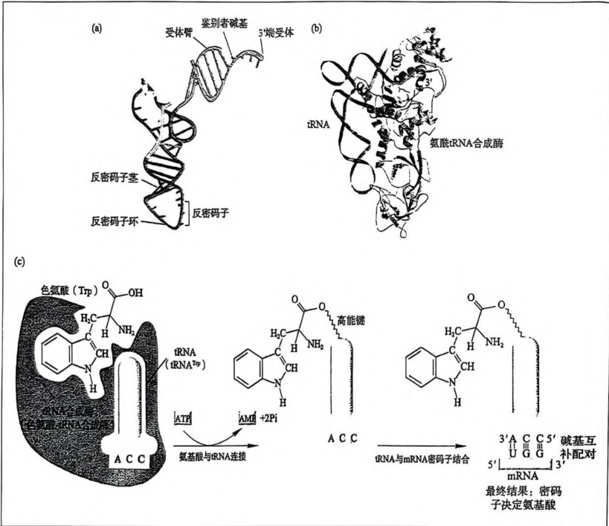  
图 4-11 氨酰 tRNA 合成酶识别 tRNA 的独特结构  
(a) tRNA 结构中氨酰 tRNA 合成酶识别的必需元件；(b) 谷氨酰-tRNA 合成酶与 tRNA $^{Gln}$ 结合的晶体结构图；(c) 遗传密码通过两个接头分子的先后作用得以翻译。第一个接头分子氨酰 tRNA 合成酶将特定氨基酸与其对应的 tRNA 相偶联(装料)；第二个接头分子 tRNA 的反密码子与 mRNA 上的相应密码子形成碱基配对，连接上对应的氨基酸的 tRNA 也称为满载 tRNA。

## 4.4 核糖体

核糖体是指导蛋白质合成的大分子机器。生物细胞内,核糖体像一个能沿 mRNA 模板移动的工厂,执行着蛋白质合成的功能。它是由几十种蛋白质和几种核糖体 RNA (ribosomal RNA,rRNA) 组成的亚细胞颗粒。一个细菌细胞内约有 20 000 个核糖体,而真核细胞内可达 $10^{6}$ 个,在未成熟的蟾蜍卵细胞内则高达 $10^{12}$ 个。这些颗粒既可以游离状态存在于细胞内,也可与内质网结合,形成微粒体。核糖体和它的辅助因子为蛋白质生物合成提供了必要的条件。

运载有肽链起始或延伸必需氨基酸的氨酰 tRNA, 往往以令人难以置信的速度进入核糖体, 在起始或延伸因子的作用下, 与 mRNA 模板和延伸中的肽链相互作用, 卸去所载氨基酸后立即退出核糖体, 以保证新一轮合成反应的顺利进行。

核糖体蛋白约占原核细胞总蛋白量的 10%, 占细胞内总 RNA 量的 80%(表4-6)。在真核细胞内, 核糖体 RNA 所占的比例虽然有所下降, 但仍然占总 RNA 的绝大部分, 是细胞总蛋白的一个重要组成部分。无论原核或真核细胞内核糖体的含量都是与细胞蛋白质合成活性直接相关的。

在真核生物中,大多数正在进行蛋白质合成的核糖体都不是在细胞质内自由漂浮,而是直接或间接与细胞骨架结构有关联或者与内质网膜结构相连的。细菌核糖体大都通过与 mRNA 的相互作用,被固定在核基因组上。

核糖体包括两个亚基,大亚基约为小亚基分子量的两倍。按照惯例,大、小亚基的命名是根据离心时的沉降系数而定的。沉降系数的单位是 Svedberg(S;S 值越大,沉降系数越大),它是由形状和大小共同决定的,因而不是质量的衡量标准。原核细胞中,大亚基的沉降系数是 50 Svedberg,所以称为 50S 亚基,而小亚基称为 30S 亚基。完整的原核细胞的核糖体称为 70S 核糖体。真核细胞的核糖体大一些,由 60S 和 40S 两个亚基组成 80S 的

表 4-6 核糖体及其他组分在大肠杆菌细胞内的分布

<table><tr><td>组分</td><td>占细胞总量</td><td>细胞内数量</td></tr><tr><td>细胞壁</td><td>10%</td><td>1</td></tr><tr><td>细胞膜</td><td>10%</td><td>2</td></tr><tr><td>DNA</td><td>2%</td><td>1</td></tr><tr><td>mRNA</td><td>2%</td><td> $3.5 \times 10^{3}$ </td></tr><tr><td>tRNA</td><td>3%</td><td> $1.6 \times 10^{3}$ </td></tr><tr><td>rRNA</td><td>21%</td><td> $8 \times 10^{5}$ </td></tr><tr><td>核糖体蛋白</td><td>9%</td><td> $2 \times 10^{4}$ </td></tr><tr><td>可溶性蛋白</td><td>40%</td><td> $10^{6}$ </td></tr><tr><td>小分子</td><td>3%</td><td> $7.5 \times 10^{6}$ </td></tr></table>

核糖体。

每个亚基包含一个主要的 rRNA 成分和许多不同功能的蛋白质分子, 这些分子大都以单拷贝的形式存在。大亚基除了含有主要 rRNA 组分外, 还有一些分子量较小的 RNA 核糖体亚基中的主要 rRNA 基因虽然有许多个拷贝, 但其序列十分保守, 暗示 rRNA 序列在组成功能核糖体的过程中有着重要的作用。表 4-7 是大肠杆菌核糖体的基因组成成分从已知的大肠杆菌 rRNA 和蛋白质序列来看, 细菌的核糖体是完全相同的。

表 4-7 大肠杆菌核糖体基本成分

<table><tr><td></td><td>核糖体</td><td>小亚基</td><td>大亚基</td></tr><tr><td>沉降系数</td><td>70S</td><td>30S</td><td>50S</td></tr><tr><td>总体分子量</td><td> $2.52 \times 10^{6}$ </td><td> $9.30 \times 10^{5}$ </td><td> $1.59 \times 10^{6}$ </td></tr><tr><td>主要 rRNA(碱基数)</td><td></td><td>16S(1541)</td><td>23S(2004)</td></tr><tr><td>主要 rRNA(碱基数)</td><td></td><td></td><td>5S(120)</td></tr><tr><td>RNA 分子量</td><td> $1.66 \times 10^{6}$ </td><td> $5.60 \times 10^{5}$ </td><td> $1.10 \times 10^{6}$ </td></tr><tr><td>RNA 所占比例</td><td>66%</td><td>60%</td><td>70%</td></tr><tr><td>蛋白质数量</td><td></td><td>21</td><td>36</td></tr><tr><td>蛋白质分子量</td><td> $8.57 \times 10^{5}$ </td><td> $3.70 \times 10^{5}$ </td><td> $4.87 \times 10^{5}$ </td></tr><tr><td>蛋白质所占比例</td><td>34%</td><td>40%</td><td>30%</td></tr></table>

## 4.4.1 核糖体的结构

## 1. 核糖体由大小两个亚基组成

核糖体是一个致密的核糖核蛋白颗粒,可以解离为两个亚基,每个亚基都含有一个分子量较大的 rRNA 和许多不同的蛋白质分子。这些大分子 rRNA 能在特定位点与蛋白质结合,从而完成核糖体不同亚基的组装。原核生物核糖体由约 2/3 的 RNA 及 1/3 的蛋白

第 4 章 生物信息的传递(下)——从 mRNA 到蛋白质

质组成。真核生物核糖体中 RNA 占 3/5，蛋白质占 2/5。原核生物、真核生物细胞质及细胞器中的核糖体存在着很大差异 $^{[表4-8]}$ 。

表 4-8 几种不同生物核糖体及 rRNA 的组成

<table><tr><td rowspan="2">核糖体</td><td rowspan="2">来源</td><td colspan="2">大亚基</td><td colspan="2">小亚基</td></tr><tr><td>沉降系数</td><td>RNA</td><td>沉降系数</td><td>RNA</td></tr><tr><td rowspan="3">80S</td><td rowspan="3">脊椎动物</td><td>60S</td><td>20~29S</td><td>40S</td><td>18S</td></tr><tr><td></td><td>5S</td><td></td><td></td></tr><tr><td></td><td>5.8S</td><td></td><td></td></tr><tr><td rowspan="3">80S</td><td rowspan="3">无脊椎动物、植物</td><td>60S</td><td>25S</td><td>40S</td><td>16~18S</td></tr><tr><td></td><td>5S</td><td></td><td></td></tr><tr><td></td><td>5.8S</td><td></td><td></td></tr><tr><td>70S</td><td>原核生物</td><td>50S</td><td>23S</td><td>30S</td><td>16S</td></tr><tr><td>55S</td><td>脊椎动物线粒体</td><td>40S</td><td>16~17S</td><td>30S</td><td>10~13S</td></tr></table>

## 2. 核糖体蛋白

核糖体上有多个活性中心,每个中心都由一组特殊的核糖体蛋白(ribosomal protein, RP, r-protein, r-蛋白)构成。虽然有些蛋白质本身具有催化功能,但若将它们从核糖体上分离出来时,催化功能就会完全消失。所以,核糖体是一个许多酶的集合体,单个酶或蛋白质只有在这个总体结构内才拥有催化性质,它们在这一结构中共同承担了蛋白质生物合成的任务。核糖体中许多蛋白质(可能还包括 rRNA)的主要功能可能就是建立这种总体结构,使各个活性中心处于适当的相互协调的关系之中。

已知大肠杆菌核糖体小亚基由21种r-蛋白组成,分别用S1……S21表示,大亚基由36种r-蛋白组成,分别用L1……L36表示。真核生物细胞核糖体蛋白质中,大亚基含有49种r-蛋白,小亚基有33种r-蛋白,它们的分子量为 $8.0 \times 10^{3} \sim 4.0 \times 10^{4}$ 。

除了作为组成核糖体的基本成分,研究还发现,某些核糖体亚基蛋白在细胞内具有重要的调控功能。核糖体蛋白(RP)产生突变,能够调节p53的活性并影响人类疾病和肿瘤发生。例如,核糖体60S大亚基的重要组分核糖体蛋白L11(ribosomal protein L11,RPL11)在进化上是一种高度保守的蛋白质,RPL11在细胞质中合成后,经核孔运输到细胞核中,并在核仁上参与核糖体的组装。组装成熟的核糖体经核孔又进入细胞质中,发挥合成蛋白质的功能。核仁为RPL11在细胞内的富集区域。近年来,研究人员发现真核生物中RPL11具有调节抑癌蛋白p53及癌蛋白c-Myc活性功能等作用。其他核糖体蛋白,如RPL5、RPS13、RPS7、RPS14和RPS19等也被发现与某些疾病的发生相关。

原核细胞核糖体高精度三维结构的确定在原子水平上揭示了核糖体合成蛋白质的生化机制,有助于科学家深入了解核糖体与起始因子、mRNA 和 tRNA 之间的相互关系,明确翻译的起始、肽链延伸以及翻译终止的过程(图 4-12)。实验表明,大多数核糖体蛋白质位

图4-12 桉糖体三维结构示意图(另见书末彩插)

核糖体由大、小亚基组成。每个亚基又由RNA和蛋白质两部分组成，其中，50S亚基的RNA部分由灰色表示，蛋白质以紫色表示。30S亚基的RNA部分以淡蓝色表示，蛋白质以深蓝色表示。50S亚基都位于30S亚基之上。旋转90°后右图显示的空间为tRNA结合位点。图像使用PyMOL软件制作。

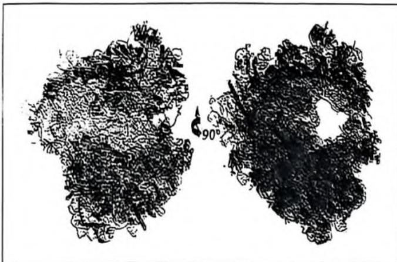

约 40 bp 长的 mRNA。

于核糖体的周边,核糖体 RNA 不单单是核糖体的结构成分,它们还直接承担了核糖体的某些关键功能,例如三维结构证明肽基转移中心完全是由 RNA 组成的。图 4-13 是在高倍电镜下得到的原核生物 70S 核糖体大、小亚基相结合的模型,核糖体分子可容纳两个 tRNA 和

## 3. 核糖体 RNA (rRNA)

核糖体内的 rRNA 不仅是核糖体的重要结构成分,也是核糖体发挥生理功能的重要元件。下面详细介绍各类 rRNA 的组成和功能特点。

① 5S rRNA 细菌 5S rRNA 含有 120 个核苷酸(革兰氏阴性菌)或 116 个核苷酸(革兰氏阳性菌)。5S rRNA 有两个高度保守的区域,其中一个区域含有保守序列 CGAAC,这是与 tRNA 分子 TψC 环上的 GTψCG 序列相互作用的部位,是 5S rRNA 与 tRNA 相互识别的序列。另一个区域含有保守序列 GCGCCGAAUGGUAGU,与 23S rRNA 的中一段序列互补,这是 5S rRNA 与 50S 核糖体大亚基相互作用的位点,在结构上有其重要性。

② 16S rRNA 16S rRNA 在蛋白质的合成中起着积极作用, 它与 mRNA、50S 亚基和 P 位和 A 位的 tRNA 的反密码子直接作用。其长度在 1475\~1544 个核苷酸之间, 含有

图 4-13 核糖体结构模型及原核与真核细胞核糖大、小亚基比较

(a) 电镜数据模式图: 大亚基位于整个分子的左侧, 细绳代表 mRNA, 位于两个亚基之间的是两个 tRNA 分子; (b) 原核生物 70S 核糖体 (分子量 $2.7 \times 10^{6}$ ) 和真核生物 80S 核糖体 (分子量 $4.2 \times 10^{6}$ )。

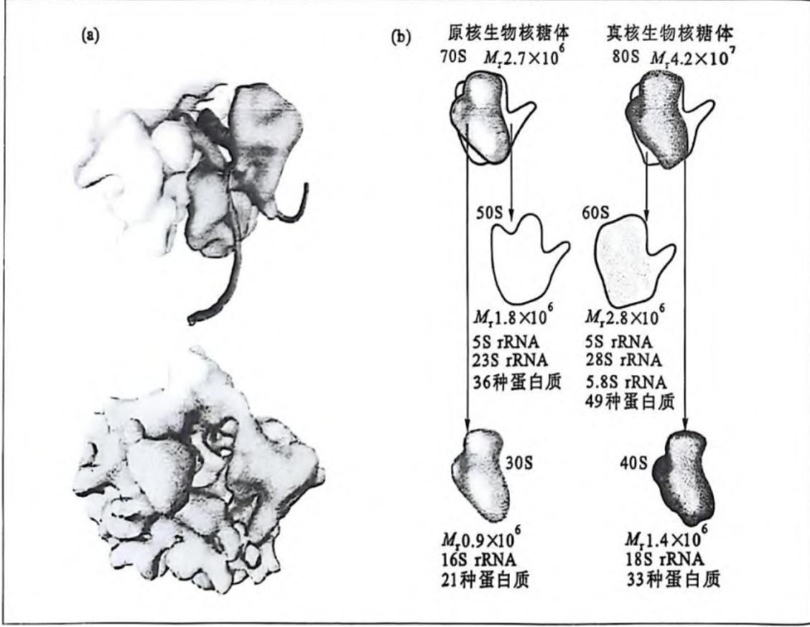

少量修饰碱基。该分子虽然可被分成几个区,但全部压缩在 30S 小亚基内。16S rRNA 的结构十分保守,其中 3' 端一段 ACCUCCUUA 的保守序列,与 mRNA 5' 端翻译起始区富含嘌呤的序列互补。在 16S rRNA 靠近 3' 端处还有一段与 23S rRNA 互补的序列,在 30S 与 50S 亚基的结合中起作用。

③ 23S rRNA 作为核糖体大亚基的主要成分,23S rRNA 能催化肽键的形成。该蛋白质与处于 A 和 P 位点的 tRNA 的 CCA 末端之间的碱基配对,帮助氨酰 tRNA 的 α 氨基基团攻击结合于肽酰 tRNA 多肽上的羰基,并稳定入位后的氨酰 tRNA。其准确的催化机制有待于进一步研究。23S rRNA 基因的一级结构包括 2904 个核苷酸,它还能与 5S rRNA 相互作用。核糖体 50S 大亚基上约有 20 种蛋白质能不同程度地与 23S rRNA 相结合。

④ 5.8S rRNA 是真核生物核糖体大亚基特有的 rRNA, 长度为 160 个核苷酸, 含有修饰碱基。它还含有能够与 tRNA 作用的识别序列, 这说明 5.8S rRNA 可能与原核生物的 5S rRNA 具有相似的功能。

⑤ 18S rRNA 酵母 18S rRNA 由 1789 个核苷酸组成, 它的 3' 端与大肠杆菌 16S rRNA 有广泛的同源性。其中酵母 18S rRNA、大肠杆菌 16S rRNA 和人线粒体 12S rRNA 在 3' 端有 50 个核苷酸序列相同。

⑥ 28S rRNA 28S rRNA 长度为 3890\~4500 bp, 目前还不清楚该 rRNA 的功能。

从上述讨论中可以看出 rRNA 与 tRNA 及 mRNA 之间的相互关系以及不同的 rRNA 之间的关系,这种关系是建立在序列互补或同源的基础之上的。

1. 核糖体有 3 个 tRNA 结合位点

氨基酸由氨酰 tRNA 运送到核糖体上并通过这个 tRNA 与携带上一个氨基酸的 tRNA 的相互作用, 将新的氨基酸加到正在生长的新生蛋白质链上。核糖体上有 3 个 tRNA 结合位点, 分别称为 A、P 和 E 位点 (图 + -14)。其中, A 位点是新到来的氨酰 tRNA 的结合位点; P 位点是肽酰 tRNA 结合位点; E 位点是延伸过程中的多肽链转移到氨酰 tRNA 上释放 tRNA 的位点, 即去氨酰 tRNA 通过 E 位点退出, 被释放到核糖体外的细胞质中去。所以 tRNA 的移动顺序是从 A 位到 P 位再到 E 位, 通过密码子与反密码子之间的相互作用保证反应正向进行而不会倒转。由于 tRNA 的氨酰末端被定位到大亚基上, 而另一端的反密码子与结合小亚基的 mRNA 相互识别, 所以, 每一个 tRNA 结合位点都横跨核糖体的两个亚基, 位于大、小亚基的交界面。

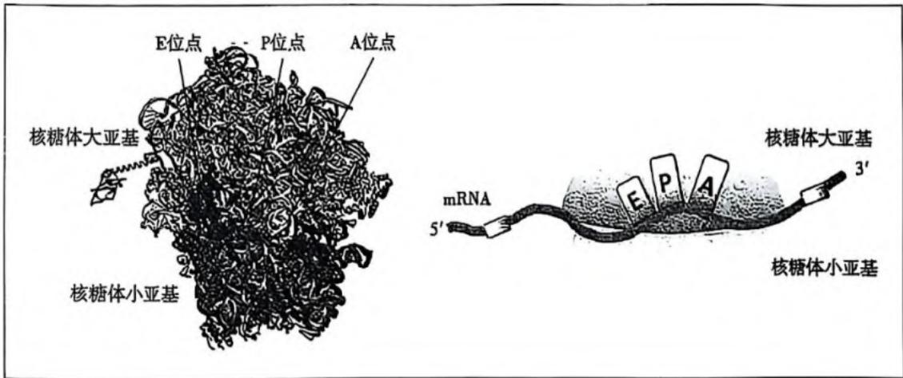  
图4-14 核糖体的3个RNA结合位点，即A、P和E位点左图为细菌核糖体的三维结构。根据M.M.Yusupov et al., 2001, Science. 292: 883-896改编。

## 4.4.2 核糖体的功能

核糖体存在于每个进行蛋白质合成的细胞中。虽然在不同生物体内其大小有别，但组织结构基本相同，而且执行的功能也完全相同。在多肽合成过程中，不同的 tRNA 将相应的氨基酸带到蛋白质合成部位，并与 mRNA 进行专一性的相互作用，以选择对信息专一的氨酰 tRNA。核糖体还必须能同时容纳另一种携带肽链的 tRNA，即肽酰 tRNA (peptidyl-tRNA)，并使之处于肽键易于生成的位置上。

核糖体包括多个活性中心(图4-14)，即mRNA结合部位、结合或接受氨酰tRNA部位(A位)、结合或接受肽酰tRNA的部位(P位)、肽基转移部位及形成肽键的部位(转肽酶中心)。此外，还应有负责肽链延伸的各种延伸因子的结合位点。

核糖体小亚基负责对模板 mRNA 进行序列特异性识别,如起始部分的识别、密码子与反密码子的相互作用等,mRNA 的结合位点也在此亚基上。大肠杆菌中与翻译的真实性有关的蛋白质 S4 及 S12 也属此亚基。大亚基负责携带氨基酸及 tRNA 的功能,包括肽键的形成、氨酰 tRNA、肽酰 tRNA 的结合等。

最新研究表明,正常细胞可能通过调整特定核糖体的数量来控制蛋白质的表达量。这是蛋白质表达控制的一条新途径。用核糖体图谱技术检测与核糖体结合的 mRNA 并确定其蛋白质产物,结果表明,异质化的蛋白质往往负责生成执行特定任务的蛋白质。这些具有异质性的定制核糖体只能生产少数特定的蛋白质,协助细胞控制某些通路蛋白质的表达。一些罕见的疾病症状可能与特定的核糖体缺陷有关。

## 4.5 蛋白质合成的生物学机制

蛋白质(protein)一词从希腊文"proteios"衍生而来,是指按重要性排列居于第一位的东西。尽管现已证明核酸是生命体内最基本的物质,因为蛋白质的合成和结构最终都取决于核酸,但蛋白质仍是生物活性物质中最重要的大分子组分,生物有机体的遗传学特性仍然要通过蛋白质来得到表达。

蛋白质的生物合成包括氨基酸活化,肽链的起始、伸长、终止以及新合成多肽链的折叠和加工,现将各阶段的必需成分列于表4-9。

## 4.5.1 氨基酸的活化

蛋白质的生物合成是以氨基酸作为基本建筑材料的,且只有与 tRNA 相结合的氨基酸才能被准确地运送到核糖体中,参与多肽链的起始或延伸。氨基酸必须在氨酰 tRNA 合成酶的作用下生成活化氨基酸——氨酰 tRNA。研究发现,至少存在 20 种具有氨基酸专一性的氨酰 tRNA 合成酶,能够识别并通过氨基酸的羧基与 tRNA 3' 端腺苷酸核糖基上

表 4-9 蛋白质合成各阶段的主要成分简表

<table><tr><td>阶段</td><td>原核生物</td><td>真核生物</td></tr><tr><td rowspan="4">1. 氨基酸的活化</td><td>20 种氨基酸</td><td>20 种氨基酸</td></tr><tr><td>20 种氨酰 tRNA 合成酶</td><td>20 种氨酰 tRNA 合成酶</td></tr><tr><td>32 种或更多的 tRNA</td><td>32 种或更多的 tRNA</td></tr><tr><td> $ATP, Mg^{2+}$ </td><td> $ATP, Mg^{2+}$ </td></tr><tr><td rowspan="7">2. 肽链的起始</td><td>mRNA</td><td>mRNA</td></tr><tr><td>N-甲酰甲硫氨酰 -tRNA</td><td>N-甲酰甲硫氨酰 -tRNA</td></tr><tr><td>mRNA 上的起始密码子(AUG)</td><td>mRNA 上的起始密码子(AUG)</td></tr><tr><td>核糖体小亚基</td><td>核糖体小亚基</td></tr><tr><td>核糖体大亚基</td><td>核糖体大亚基</td></tr><tr><td> $GTP, Mg^{2+}$ </td><td> $GTP, Mg^{2+}$ </td></tr><tr><td>起始因子(IF-1,IF-2,IF-3)</td><td>起始因子(eIF-1,eIF-2,eIF-3,eIF-4E,eIF-4F,eIF-5,eIF-5B)</td></tr><tr><td rowspan="5">3. 肽链的延伸</td><td>功能核糖体(起始复合物)</td><td>功能核糖体(起始复合物)</td></tr><tr><td>氨酰 tRNA</td><td>氨酰 tRNA</td></tr><tr><td>伸长因子(EF-Tu,EP-Ts,EF-G)</td><td>伸长因子(eEF-1α,eEF-1β,eEF-2)</td></tr><tr><td> $GTP, Mg^{2+}$ </td><td> $GTP, Mg^{2+}$ </td></tr><tr><td>肽基转移酶</td><td>肽基转移酶</td></tr><tr><td rowspan="5">4. 肽链的终止</td><td>GTP</td><td>GTP</td></tr><tr><td>mRNA 上的终止密码子</td><td>mRNA 上的终止密码子</td></tr><tr><td>释放因子(RF-1,RF-2,RF-3)</td><td>释放因子(eRF-1,eRF-3)</td></tr><tr><td>EF-G</td><td></td></tr><tr><td>IF-3</td><td></td></tr><tr><td>5. 折叠和加工</td><td>参与起始氨基酸的切除、修饰等加工过程的酶</td><td>参与起始氨基酸的切除、修饰等加工过程的酶</td></tr></table>

3'—OH 缩水形成二酯键。同一氨酰 tRNA 合成酶具有把相同氨基酸加到两个或更多个带有不同反密码子 tRNA 分子上的功能。

tRNA 与相应氨基酸的结合是蛋白质合成中的关键步骤, 因为只要 tRNA 携带了正确的氨基酸, 多肽合成的准确性就相对有了保障。

在细菌中,起始氨基酸是甲酰甲硫氨酸,所以,与核糖体小亚基相结合的是N-甲酰甲硫氨酰-tRNA $^{fMet}$ ,它由以下两步反应合成:

$$
\mathrm{Met} + \mathrm{tRNA} ^ {\mathrm{fMet}} + \mathrm{ATP} \longrightarrow \mathrm{Met} - \mathrm{tRNA} ^ {\mathrm{fMet}} + \mathrm{AMP} + \mathrm{PPi}
$$

然后,由甲酰基转移酶转移一个甲酰基到 Met 的氨基上。

$$
N ^ {1 0} - \text {   甲酰四氢叶酸   } + \mathrm{Met-tRNA} ^ {\mathrm{Mct}} \longrightarrow \text {   四氢叶酸   } + \mathrm{fMet-tRNA} ^ {\mathrm{fMet}}
$$

真核生物中,任何一个多肽合成都是从生成甲硫氨酰-tRNAi $^{Met}$ 开始的,因为甲硫氨酸的特殊性,所以体内存在两种tRNA $^{Met}$ 。只有甲硫氨酰-tRNAi $^{Met}$ 才能与40S小亚基相结合,起始肽链合成,普通tRNA $^{Met}$ 中携带的甲硫氨酸只能被掺入正在延伸的肽链中。

## 4.5.2 翻译的起始

蛋白质合成的起始需要核糖体大、小亚基, 起始 tRNA 和几十个蛋白因子的参与, 在模板 mRNA 编码区 5' 端形成核糖体 -mRNA- 起始 tRNA 复合物并将甲酰甲硫氨酸放入核糖体 P 位点。

图4-15 翻译起始复合物的形成  
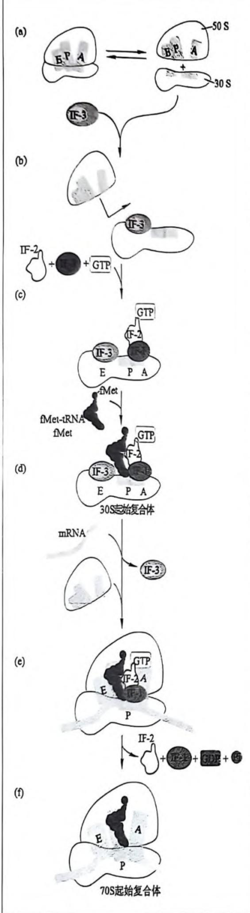

原核生物的起始 tRNA 是 fMet、tRNA $^{fMet}$ ，真核生物是 Met-tRNA $^{Met}$ 。原核生物中 30S 小亚基首先与 mRNA 模板相结合，再与 fMet-tRNA $^{fMet}$ 结合，最后与 50S 大亚基结合。而在真核生物中，40S 小亚基首先与 Met-tRNA $^{Met}$ 相结合，再与模板 mRNA 结合，最后与 60S 大亚基结合生成 80S·mRNA·Met-tRNA $^{Met}$ 起始复合物。起始复合物的生成除了需要 GTP 提供能量外，还需要 Mg $^{2+}$ 、NH $_{4}^{+}$ 及 3 个起始因子（IF-1、IF-2、IF-3）。起始因子与 30S 小亚基的结合较为松散，用 1 mol/L NH $_{4}$ Cl 处理即可使之游离。

## 1. 原核生物翻译的起始

细菌中翻译的起始需要如下7种成分: ①30S小亚基; ②模板mRNA; ③fMet-tRNA $^{iMet}$ ; ④3个翻译起始因子, IF-1、IF-2和IF-3; ⑤GTP; ⑥50S大亚基; ⑦Mg $^{2+}$ 。

翻译起始又可被分成3步(图4-15)。

第一步,30S 小亚基首先与翻译起始因子 IF-1、IF-3 结合,通过 SD 序列与 mRNA 模板相结合。

第二步, 在 IF-2 和 GTP 的帮助下, fMet-tRNA $^{fMet}$ 进入小亚基的 P 位, tRNA 上的反密码子与 mRNA 上的起始密码子配对。

第三步,带有 tRNA、mRNA、3 个翻译起始因子的小亚基复合物与 50S 大亚基结合,GTP 水解,释放翻译起始因子。

30S 亚基具有专一性地识别和选择 mRNA 起始位点的性质,而 IF-3 能协助该亚基完成这种选择。研究发现,30S 亚基通过其 16S rRNA 的 3' 端与

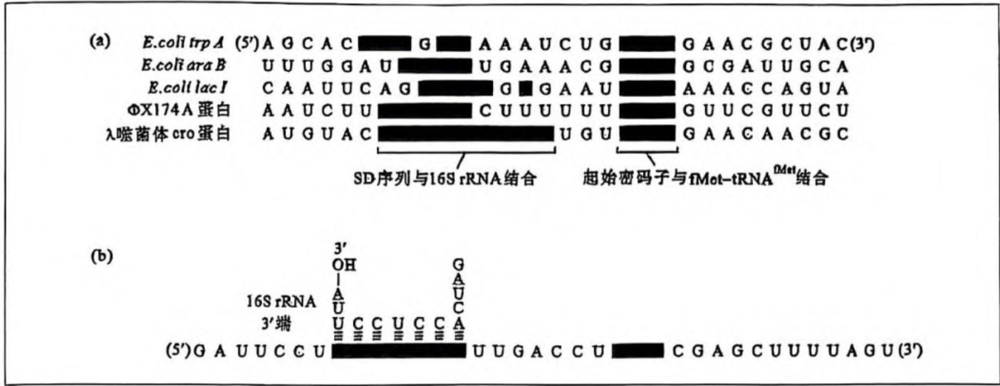  
图 4-16 细菌 mRNA 分子上往往存在一个与 16S rRNA 3' 端相互补的 SD 序列

mRNA 5' 端起始密码子上游碱基配对结合。Shine 及 Dalgarno 等证明几乎所有原核生物 mRNA 上都有一个 5'-AGGAGGU-3' 序列, 这个富嘌呤区被命名为 SD 序列(Shine-Dalgarno sequence), 它与 30S 亚基上 16S rRNA 3' 端的富嘧啶区序列 5'-GAUCACCUCCUUA-3' 相互补(图 4-16)。

各种 mRNA 的核糖体结合位点中能与 16S rRNA 配对的核苷酸数目及这些核苷酸到起始密码子之间的距离是不一样的, 反映了起始信号的不均一性。一般说来, 相互补的核苷酸越多, 30S 亚基与 mRNA 起始位点结合的效率也越高。互补的核苷酸与 AUG 之间的距离也会影响 mRNA- 核糖体复合物的形成及其稳定性。

只有 fMet-tRNA $^{fMet}$ 能与第一个 P 位点相结合, 其他所有 tRNA 都必须通过 A 位点到达 P 位点, 再由 E 位点离开核糖体。

已知 IF-2 对于 30S 起始复合物与 50S 亚基的连接是必需的, 而 IF-1 则在 70S 起始复合物生成后促进 IF-2 的释放, 从而完成蛋白质合成的起始过程。

## 2. 真核生物翻译的起始

真核生物蛋白质生物合成的起始机制与原核生物基本相同,其差异主要是核糖体较大,有较多的起始因子参与,其 mRNA 具有 $m^{7}GpppNp$ 帽结构,Met-tRNA $^{Met}$ 不甲酰化,mRNA 分子 5' 端的"帽"和 3' 端的多(A)都参与形成翻译起始复合物。

有实验说明帽结构能促进起始反应,因为核糖体上有专一位点或因子识别 mRNA 的帽,使 mRNA 与核糖体结合 $^{[15]}$ +17。帽在 mRNA 与 40S 亚基结合过程中还起稳定作用。实验表明,带帽的 mRNA 5' 端与 18S rRNA 的 3' 端序列之间存在不同于 SD 序列的碱基配对型相互作用。

40S 起始复合物形成过程中有一种蛋白因子——帽结合蛋白 (eIF-4E), 能专一地识别 mRNA 的帽结构, 与 mRNA 的 5' 端结合生成蛋白质 -mRNA 复合物, 并利用该复合物对 eIF-3 的亲和力与含有 eIF-3 的 40S 亚基结合。

图4-17 真核生物翻译起始复合物的形成  
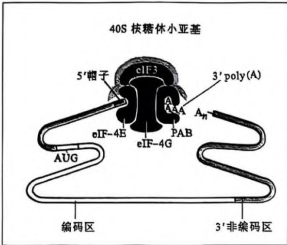

除了帽结构以外,40S小亚基还能识别mRNA上的起始密码子AUG。Kozak等提出了一个"扫描模型"来解释40S亚基对mRNA起始密码子的识别作用(图4-18)。按照这个模型,40S小亚基先识别在mRNA的5'端的甲基化帽,然后沿mRNA移动,当40S小亚基遇到AUG时,由于Met-tRNAi $^{Met}$ 反密码子与AUG配对,导致移动暂停。存在于-4位和+1位的碱基对于AUG是否被识别为起始密码子具有重要的

影响。在 AUG 之前的第三个嘌呤 (G 或 A) 以及紧跟其后的 G, 可以显著影响翻译效率。最后一步, 60S 亚基与 40S 复合物结合生成 80S 起始复合物。在第一个 40S 亚基离开起始点之前, 会有更多的小亚基识别 $5'$ 端, 形成 40S 亚基的队列。

起始过程中 mRNA 与 40S 小亚基结合时还需要 ATP, 这可能是因为蛋白质合成中消除 mRNA 二级结构是一个耗能过程, 需由 ATP 水解提供能量。另外根据 "扫描模型", 在 40S 亚基沿 mRNA 移动过程中也需要能量。

## 4.5.3 肽链的延伸

与翻译的起始不同,蛋白质延伸机制在原核细胞和真核细胞之间是非常相似的。起始复合物生成,第一个氨基酸(fMet/Met-tRNA)与核糖体结合以后,肽链开始伸长。按照

图 4-18 真核生物核糖体从 mRNA 的 5' 端向下游含有起始密码子 AUG 的核糖体结合位点滑动

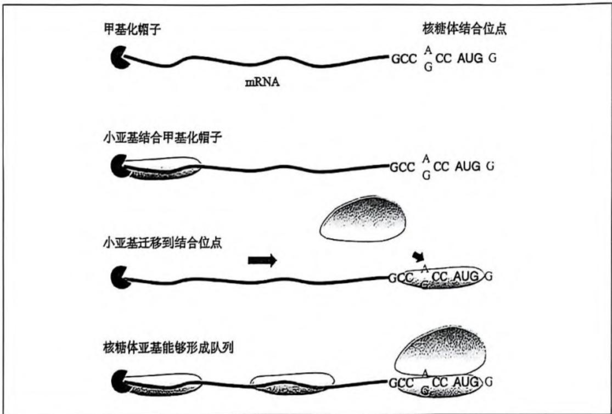

mRNA 模板密码子的排列,氨基酸通过新生肽键的方式 $^{[图4-19]}$ 被有序地结合上去。肽链延伸由许多循环组成,每加一个氨基酸就是一个循环,每个循环包括氨酰 tRNA 与核糖体结合、肽键的生成和移位。

## 1. 后续氨酰 tRNA 与核糖体结合

起始复合物形成以后,第二个氨酰 tRNA 在延

伸因子 EF-Tu 及 GTP 的作用下，生成氨酰 tRNA·EF-Tu·GTP 复合物，然后结合到核糖体的 A 位上。这时 GTP 被水解释放，通过延伸因子 EF-Ts 再生 GTP，形成 EF-Tu·GTP 复合物，进入新一轮循环（图 4-20）。

模板上的密码子决定了哪种氨酰 tRNA 能被结合到 A 位上。由于 EF-Tu 只能与 fMet-tRNA 以外的其他氨酰 tRNA 起反应，所以起始 tRNA 不会被结合到 A 位上，这就是 mRNA 内部的 AUG 不会被起始 tRNA 读出，肽链中间不会出现甲酰甲硫氨酸的原因。

## 2. 肽键的生成

经过上一步反应后，在核糖体·mRNA·氨酰tRNA复合物中，氨酰tRNA占据A位，fMet-tRNA $^{fMet}$ 占据P位。在肽基转移酶(peptidyl transferase)的催化下，A位上的氨酰tRNA转移到P位，与fMet-tRNA $^{fMet}$ 上的氨基酸生成肽键 $^{(图4-21)}$ 。起始tRNA在完成使命后离开核糖体P位点，A位点准备接受新的氨酰tRNA，开始下一轮合成反应。

## 3. 移位

肽键延伸过程中最后一步反

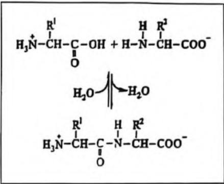  
图4-19 多肽链上肽键的形成——缩合反应

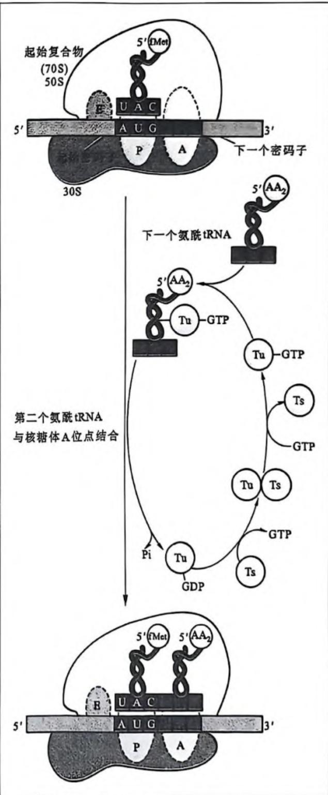  
图 4-20 细菌中肽链延伸的第一步反应: 第二个氨酰tRNA 的结合  
该氨酰 tRNA 首先与 EF-Tu·GTP 形成复合物，进入核糖体的 A 位，水解产生 GDP 并在 EF-Ts 的作用下释放 GDP 并使 EF-Tu 结合另一分子 GTP，进入新一轮循环。

图 4-21 细菌中肽链延伸的第二步反应:肽链的生成  
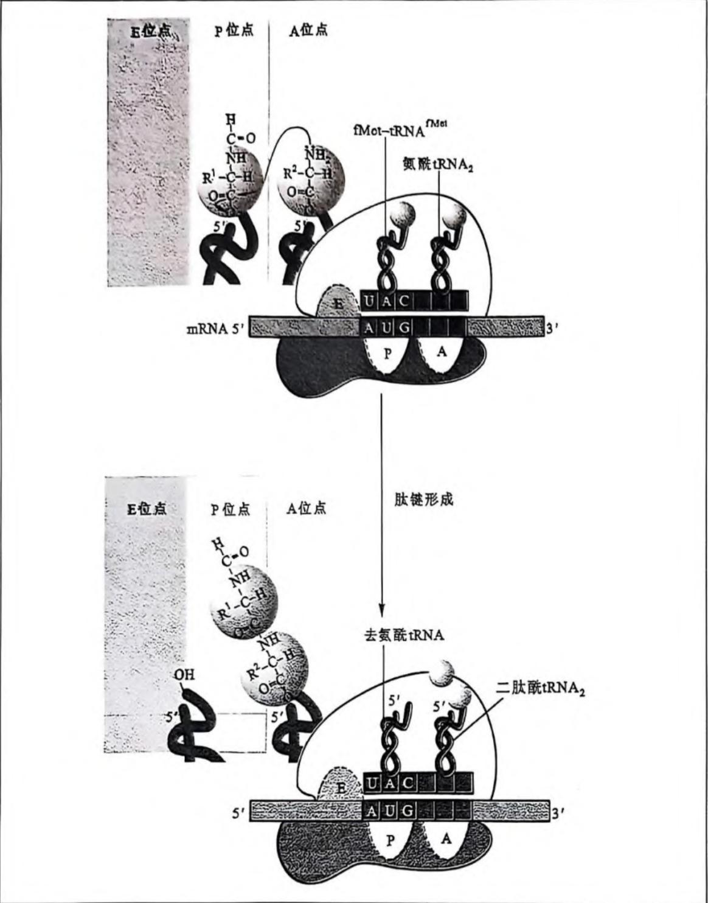

应是移位, 即核糖体向 mRNA 3' 端方向移动一个密码子(图 4-22)。此时, 仍与第二个密码子相结合的二肽酰 tRNA₂ 从 A 位进入 P 位, 去氨酰 tRNA 被挤入 E 位, mRNA 上的第三位密码子则对应于 A 位。EF-G 是移位所必需的蛋白质因子, 移位的能量来自另一分子 GTP 水解。

用嘌呤霉素作为抑制剂做实验表明,核糖体沿 mRNA 移动与肽酰 tRNA 的移位这两个过程是耦联的。

肽链延伸是由许多个这样的反应组成的,原核生物中每次反应共需3个延伸因子, EF-Tu、EF-Ts及EF-G,它们都具有GTP酶的活性,EF-Tu和EF-Ts能够促进氨酰tRNA

第 4 章 生物信息的传递(下)——从 mRNA 到蛋白质

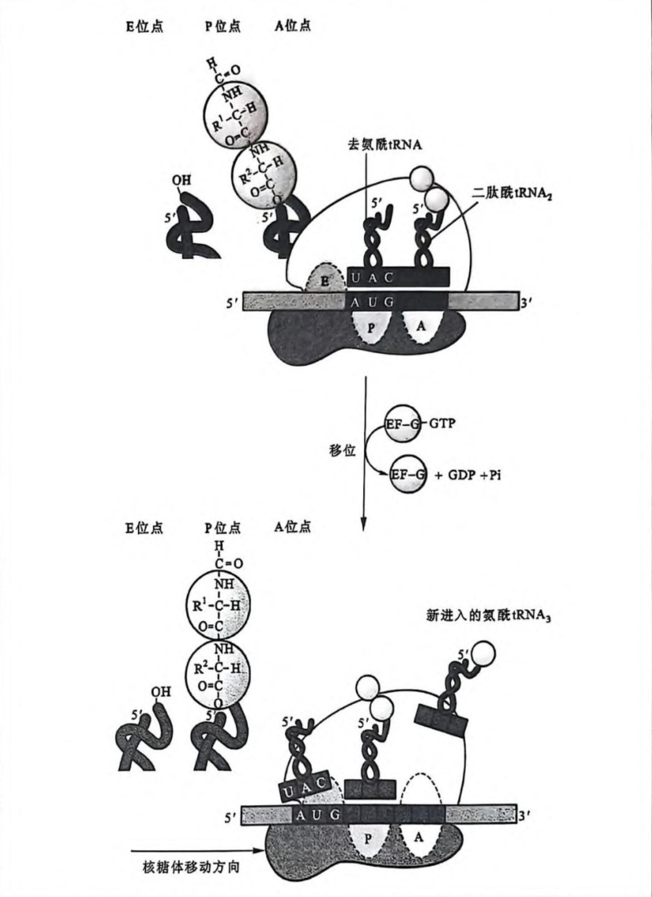  
图 4-22 细菌中肽链延伸的第三步反应: 移位

核糖体通过 EF-G 介导的 GTP 水解所提供的能量向 mRNA 模板 3' 端移动一个密码子，使二肽酰 tRNA 完全进入 P 位，准备开始新一轮肽链延伸。

## 4. 核糖体利用多种机制排斥错误的氨酰 tRNA

进入 A 位, EF-G 则促进移位和卸载 tRNA 的释放。真核生物细胞需 EF-1 (对应于 EF-Tu 和 EF-Ts) 及 EF-2 (相当于 EF-G), 消耗 2 个 GTP, 向生长中的肽链加上一个氨基酸。

在蛋白质合成中,翻译的错误率为 $10^{-3} \sim 10^{-4}$ 。正确的氨酰 tRNA 的选择取决于氨酰 tRNA 和核糖体 A 位点的密码子之间的碱基配对。核糖体主要利用 3 种机制排斥错误的氨酰 tRNA 来提高翻译的准确率,其核心的机制是排斥密码子-反密码子配对错误

## 4.5 蛋白质合成的生物学机制

的氨酰 tRNA。

① 核糖体小亚基 16S rRNA 中两个相连的腺嘌呤残基与反密码子和密码子的前两个碱基之间每个正确配对所形成的小沟形成紧密的相互作用。而非 Watson-Crick 碱基对所形成的小沟不能被 16S rRNA 这两个腺嘌呤识别，致使亲和力明显降低。在 20 世纪对链霉素的研究发现了上述相互作用。链霉素通过结合 16S rRNA 抑制 EF-G 催化转运的能力，从而抑制蛋白质的合成。

② EF-Tu 的 GTP 酶活性与保证正确的反密码子和密码子配对相关。非正确的反密码子和密码子配对会导致 EF-Tu 的 GTP 酶活性下降。正确的碱基配对会显著加快 EF-Tu 对 GTP 的水解速度。

③ EF-Tu 释放后的校正机制。非正确配对的 tRNA 在入位过程中经常从核糖体上脱离下来。

总之,除了密码子-反密码子的相互作用,核糖体利用小沟的作用和校正机制来保证正确的氨酰 tRNA 结合到 A 位点。上述的机制提高了具有正确的密码子-反密码子作用的肽键形成的准确率,并排斥错误的配对作用。

## 4.5.4 肽链的终止

肽链的延伸过程中,当终止密码子 UAA、UAG 或 UGA 出现在核糖体的 A 位时,没有相应的氨酰 tRNA 能与之结合,而释放因子 (release factor, RF) 能识别这些密码子并与之结合,水解 P 位上多肽链与 tRNA 之间的二酯键。接着,新生的肽链和 tRNA 从核糖体上释放,核糖体大、小亚基解体,蛋白质合成结束。释放因子 RF 具有 GTP 酶活性,它催化 GTP 水解,使肽链与核糖体解离。

释放因子有两类。Ⅰ类释放因子识别终止密码子，并能催化新合成的多肽链从P位点的tRNA中水解释放出来；Ⅱ类释放因子在多肽链释放后刺激Ⅰ类释放因子从核糖体中解离出来。细菌细胞内存在3种不同的释放因子(RF1、RF2、RF3)，其中，RF1和RF2为Ⅰ类释放因子。RF1能识别UAG和UAA，RF2识别UGA和UAA。一旦RF与终止密码相结合，它们就能诱导肽基转移酶把一个水分子而不是氨基酸加到延伸中的肽链上。RF3为Ⅱ类释放因子，与核糖体的解体有关。真核细胞的Ⅰ类和Ⅱ类释放因子分别只有一种，eRF1和eRF3。Ⅰ类释放因子eRF1能够识别3个终止密码子。

综上所述,蛋白质翻译是一个循环进行的过程,每一个循环包括大、小亚基之间及其与mRNA的结合,翻译mRNA,然后各自分离。这种结合和分离称为核糖体循环(图4-23)。当mRNA和起始tRNA结合于游离的小亚基上,翻译过程就开始了,这个小亚基-mRNA复合物随后就能吸引大亚基结合,从而形成完整的、结合有mRNA的核糖体。蛋白质合成开始,从mRNA的5'端起始密码子向3'端移动。当核糖体从一个密码子移位到另一个密码子,一个接一个地活化tRNA就进入核糖体的解码和肽基转移酶中心。当核糖体遇到终止密码子时,已合成的多肽链就被释放出来,核糖体大、小亚基分离,各自离开mRNA。这些已分离的亚基就可以结合到新的mRNA分子上,开始下一轮蛋白质合成的循环。体外反应体系中,核糖体的解离或结合取决于离子浓度。在大肠杆菌内, $Mg^{2+}$ 浓度在 $10^{-3} \mathrm{~mol} / \mathrm{L}$ 以下时,70S 解离为亚基,浓度达 $10^{-2} \mathrm{~mol} / \mathrm{L}$ 时则形成稳定的 70S 颗粒。

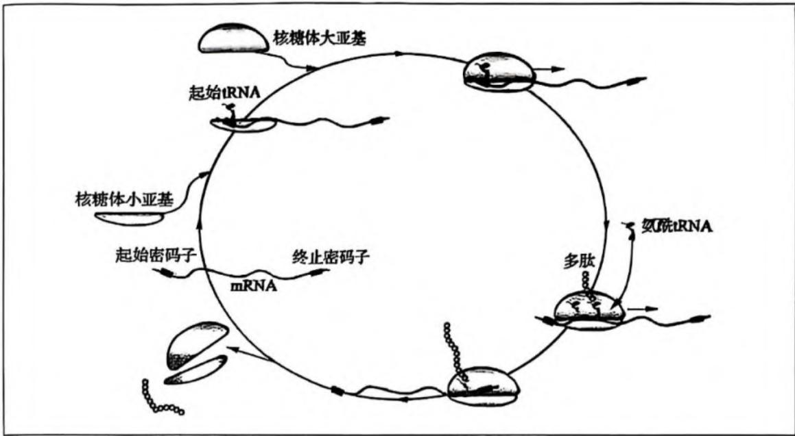  
图4-23 蛋白质翻译过程总览

## 4.5.5 多核糖体与蛋白质合成

虽然一个核糖体一次只能合成一条多肽,但每个 mRNA 分子却能同时被多个核糖体结合同时进行翻译。由多个核糖体结合在同一条 mRNA 上形成的复合体称为多核糖体 (polyribosome 或 polysome, 图 4-24)。由于核糖体的体积巨大,mRNA 链上一般每 80 个核苷酸结合一个核糖体。多(A)尾结合蛋白与 eIF-4G 亚基相互作用促进 mRNA 的环化,提高 mRNA 的翻译效率,一个 mRNA 分子能够利用大批核糖体同时指导多个多肽链的合成。与完成翻译后再开始新的蛋白质合成相比,这种多重起始意味着在短时间内一条 mRNA 能够被高效地翻译,合成数量更多的蛋白质分子。

真核生物和细菌都利用多核糖体,但因为细菌的 mRNA 无需加工,其转录和翻译在同一空间进行,在转录刚开始不久就开始合成蛋白质,所以细菌中的蛋白质合成效率更高。

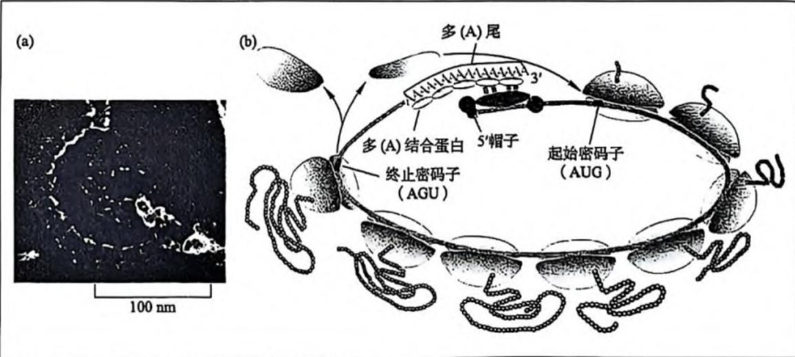  
图4-24 多核糖体翻译蛋白质  
(a) 真核细胞多核糖体的电镜照片(来自 John Heuser);(b) 一系列核糖体同时翻译同一mRNA分子。多(A)尾结合蛋白与eIF-4G亚基的相互作用促进mRNA的环化，提高mRNA的翻译。

## 4.5.6 蛋白质合成的抑制剂

蛋白质生物合成的抑制剂主要是一些抗生素,如嘌呤霉素、链霉素、四环素、氯霉素、红霉素等,此外,如5-甲基色氨酸、环己亚胺、白喉毒素、干扰素、蓖麻蛋白和其他核糖体灭活蛋白等都能抑制蛋白质的合成。这些抑制剂不仅对于研究蛋白质的合成机制十分重要,也是在临床上治疗细菌感染的重要药物。

抗生素对蛋白质合成的作用可能是阻止 mRNA 与核糖体结合(氯霉素),或阻止氨酰 tRNA 与核糖体结合(四环素类),或干扰氨酰 tRNA 与核糖体结合而产生错误(链霉素、新霉素、卡那霉素等),或作为竞争性抑制剂抑制蛋白质合成。

链霉素是一种碱性三糖,可以多种方式抑制原核生物核糖体,能干扰 fMet-tRNA 与核糖体的结合,从而阻止蛋白质合成的正确起始,也会导致 mRNA 的错误。若以多(U)作模板,则除苯丙氨酸(UUU)外,异亮氨酸(AUU)也会被掺入。用抗链霉素细菌的 50S 亚基及对链霉素敏感细菌的 30S 亚基重组获得的核糖体对链霉素是敏感的,而用敏感菌的 50S 亚基及抗性菌的 30S 亚基组成的核糖体对链霉素有抗性,表明链霉素的作用位点在 30S 亚基上。

嘌呤霉素是氨酰 tRNA 的结构类似物,不需要延伸因子就可以结合在核糖体的 A 位上,抑制氨酰 tRNA 的进入。它所带的氨基与氨酰 tRNA 上的氨基一样,能与生长中的肽链上的羧基反应生成肽键,这个反应的产物是一条 3' 羧基端挂了一个嘌呤霉素残基的小肽,肽酰嘌呤霉素随后从核糖体上解离出来,所以嘌呤霉素是通过提前释放肽链来抑制蛋白质合成的(图 4-25)。

此外,卡那霉素、氯霉素、四环素、链霉素和红霉素只与原核细胞核糖体发生作用,从而阻遏原核生物蛋白质的合成,抑制细菌生长。白喉毒素和放线菌酮只作用于真核生物核糖体。潮霉素和嘌呤霉素既能与原核细胞核糖体结合,又能与真核生物核糖体结合,妨碍细胞内蛋白质合成,影响细胞生长。因此,临床上需要根据其作用原理优先选择相应的抗生素。

表 4-10 总结了上述各种抗生素影响翻译的主要特点。

## 4.6 蛋白质前体的加工

## 4.6.1 蛋白质肽链的加工

新生的多肽链大多数是没有功能的,必须经过加工修饰才能转变为有活性的蛋白质。

## 1. N 端 fMet 或 Met 的切除

细菌蛋白质氨基端的甲酰基能被脱甲酰化酶水解,不管是原核生物还是真核生物,N

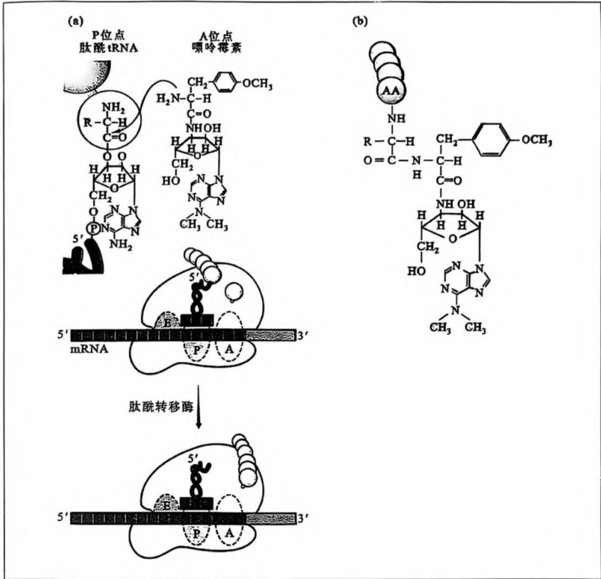  
图4-25 颞呤再束抑制蛋白质合成的分子机制

(a) 嘌呤霉素的结构类似于氨酰tRNA，能与核糖体A位点相结合；(b) 肽酰嘌呤霉素。

表 4-10 不同抗生素的靶标以及所产生的后果

<table><tr><td>抗生素/毒素</td><td>目标细胞</td><td>分子目标</td><td>后果</td></tr><tr><td>氯霉素</td><td>原核细胞</td><td>50S亚基的肽基转移酶中心</td><td>阻断A位点的氨酰tRNA为进行肽基转移反应的正确定位</td></tr><tr><td>四环素</td><td>原核细胞</td><td>30S亚基A位点</td><td>抑制氨酰tRNA结合到A位点</td></tr><tr><td>梭链孢酸</td><td>原核细胞</td><td>EF-G</td><td>阻止EF-G-GDP从核糖体中释放</td></tr><tr><td>红霉素</td><td>原核细胞</td><td>50S亚基的多肽出口通道</td><td>阻断成长中的多肽链从核糖体的出口,阻遏翻译</td></tr><tr><td>链霉素</td><td>原核细胞</td><td>作用于30S亚基</td><td>干扰氨酰tRNA与核糖体的结合;导致mRNA的错误</td></tr><tr><td>卡那霉素</td><td>原核细胞</td><td>作用于30S核糖体亚基</td><td>干扰氨酰tRNA与核糖体的结合,使细菌蛋白质合成发生错误。</td></tr><tr><td>白喉毒素</td><td>真核细胞</td><td>化学修饰EF-Tu</td><td>抑制EF-Tu的功能</td></tr><tr><td>放线菌酮</td><td>真核细胞</td><td>60S亚基的肽酰转移酶中心</td><td>抑制肽酰转移酶活性</td></tr><tr><td>澳霉素</td><td>原核和真核细胞</td><td>30S亚基A位点附近</td><td>阻挠A位点tRNA到P位点的移位</td></tr><tr><td>嘌呤霉素</td><td>原核和真核细胞</td><td>大亚基的肽酰转移酶中心</td><td>链终止子;模仿A位点的氨酰tRNA的3'端,作为新的多肽链的接受者</td></tr><tr><td>蓖麻毒素和α-帚曲霉素(蛋白质毒素)</td><td>原核和真核细胞</td><td>在核糖体大亚基的因子结合中心切断28S tRNA或23S tRNA</td><td>阻挠翻译因子GTP酶的活化</td></tr></table>

端的甲硫氨酸往往在多肽链合成完毕之前就被切除。有些动物病毒如脊髓灰质炎病毒的mRNA可翻译成很长的多肽链，含多种病毒蛋白，经蛋白酶在特定位置上水解后得到几个有功能的蛋白质分子(图4-26)。

## 2. 二硫键的形成

mRNA 中没有胱氨酸的密码子, 而不少蛋白质都含有二硫键, 这是蛋白质合成后通过两个半胱氨酸的氧化作用生成的。二硫键的正确形成对稳定蛋白的天然构象具有重要的作用。

## 3. 切除新生肽链中的非功能片段

新合成的胰岛素前体是前胰岛素原,必须先切去信号肽变成胰岛素原,再切去B肽,才变成有活性的胰岛素(图4-27)。不少多肽类激素和酶的前体都要经过加工才能变为活性分子,如血纤维蛋白原、胰蛋白酶原经过加工切去部分肽段才能成为有活性的血纤维蛋白、胰蛋白酶。一般说来,由多个肽链及其他辅助成分构成的蛋白质,在多肽链合成后还需经过多肽链之间以及多肽链与辅基之间的聚合过程,才能成为有活性的蛋白质。

## 4.6.2 蛋白质特定氨基酸的翻译后修饰

蛋白质翻译后修饰是指蛋白质被翻译之后的共价加工修饰过程,通过在一个或多个氨基酸上添加修饰基团来调控蛋白质的功能,包括改变蛋白质的活性状态、蛋白质的亚细胞定位,蛋白质的结构、蛋白质的稳定性,以及与其他蛋白质的相互作用等。它使蛋白质的结构更为复杂,功能更为完善,调节更为精细,作用更为专一。氨基酸侧链的修饰作

图4-26 新生蛋白质经蛋白酶切割后变成有功能的成熟蛋白质

: 新生蛋白质在去 N 端一部分残基后成有功能的蛋白质; 某些病毒或细菌可成无活性的多蛋白经蛋白酶切割后成功能的成熟蛋白。

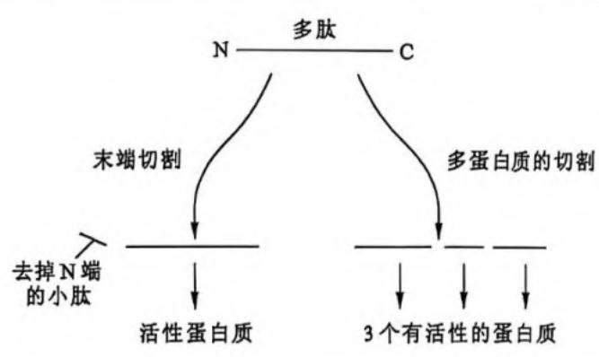

图4-27 前胰岛素原蛋白翻译后成熟过程示意图

<table><tr><td>N</td><td>信号肽</td><td>A链</td><td>B链</td><td>C链</td><td>C前胰岛素原</td></tr><tr><td></td><td colspan="2">剪切</td><td colspan="2">去掉信号肽</td><td>胰岛素原</td></tr><tr><td></td><td colspan="2"></td><td colspan="2">二硫键的形成</td><td></td></tr><tr><td></td><td colspan="2">剪切</td><td colspan="2">S-S</td><td></td></tr><tr><td></td><td colspan="2"></td><td colspan="2">S-S</td><td></td></tr><tr><td></td><td colspan="2"></td><td colspan="2">S-S</td><td></td></tr><tr><td></td><td colspan="2"></td><td colspan="2">S-S</td><td></td></tr><tr><td></td><td colspan="2"></td><td colspan="2">S-S</td><td></td></tr><tr><td></td><td colspan="2"></td><td colspan="2">S-S</td><td></td></tr></table>

用包括磷酸化、糖基化、甲基化、乙酰化、泛素化、类泛素化修饰、羟基化、ADP-核糖基化、亚硝基化、巴豆酰化、棕榈酰化、豆蔻酰化、戊二酰化、乳酰化等。图4-28是生物体内最普遍发生修饰作用的氨基酸残基及其修饰产物，如在本书第2章中所介绍的，组蛋白N端35个残基中可能出现包括磷酸化、甲基化、乙酰化和泛素化在内的多种修饰。大部分氨基酸的翻译后修饰是可逆的，对于同一个蛋白质可以发生一种以上的翻译后修饰，在很多细胞生理活动中，各种氨基酸的翻译后修饰相互影响、相互协调，共同调控特定时空下蛋白质的功能。

## (1) 磷酸化(phosphorylation)

蛋白质磷酸化是由多种蛋白质激酶催化的把 ATP 的磷酸基转移到底物蛋白质氨基酸残基上的过程,主要发生在丝氨酸、苏氨酸和酪氨酸等三种氨基酸的侧链。GTP 也可作为磷酸基团的供体。该修饰是一个动态可逆的过程,磷酸酶可以去除磷酸基团,与激酶共同发挥着"开 / 关"作用。磷酸化修饰是调节蛋白质功能的最普遍和最重要的机制,在细胞周期、信号转导、蛋白亚细胞定位等多个生理过程中发挥着重要调控作用。

## (2) 糖基化(glycosylation)

主要是在糖基转移酶作用下将不同类型的糖分子添加至蛋白质侧链上的天冬氨酸、天冬酰胺、丝氨酸、苏氨酸、赖氨酸、脯氨酸、精氨酸和谷氨酸等残基形成糖苷键，是对蛋白质的重要修饰。蛋白质的糖基化可分为N-糖基化和O-糖基化。N-糖基化是真核生物中最普遍的糖基化形式，N-连接的糖链合成起始于内质网，完成于高尔基体；O-连接的

(a) 磷酸化: (b) 甲基化: (c) 乙酰化。

图 4-28 生物体内最常见的被修饰的氨基酸及其修饰产物  
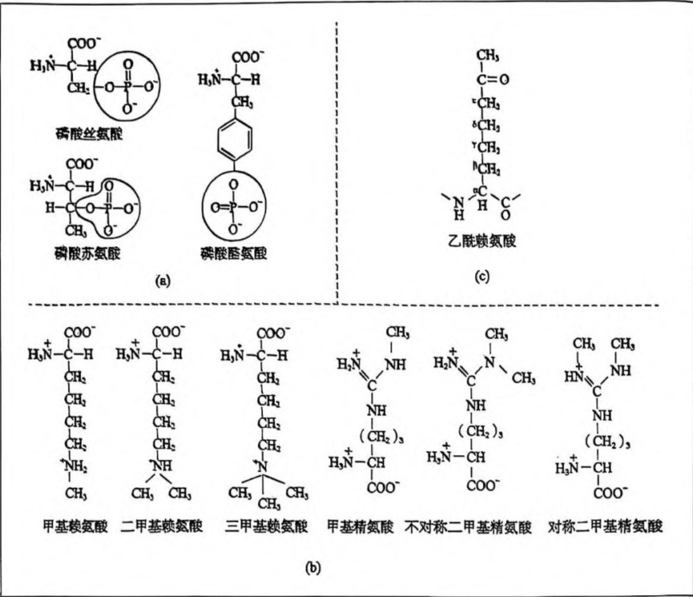

糖基化在高尔基体中进行。许多糖蛋白同时具有 $N-$ 连接的糖链和 $O-$ 连接的糖链。糖蛋白的空间结构决定了它可以和哪一种糖基转移酶结合, 发生特定的糖基化修饰。所有的分泌蛋白和膜蛋白几乎都是糖基化蛋白质。蛋白质糖基化具有不均一性, 大约 $70\%$ 的人类蛋白质包含一个或多个糖链, 蛋白质的糖基化在蛋白质折叠、细胞黏附、分子运输和清除、受体激活、细胞内吞等方面发挥作用。

## (3) 甲基化(methylation)

蛋白质的甲基化是以硫代腺苷甲硫氨酸为甲基供体，在甲基转移酶的催化下，将甲基转移到蛋白质的赖氨酸和精氨酸残基。其中，赖氨酸甲基化修饰有单甲基化、二甲基化和三甲基化；精氨酸甲基化修饰有单甲基化、对称二甲基化和非对称二甲基化。甲基化的去除由去甲基化酶催化完成的。甲基化是蛋白质的一种重要的修饰，在多种细胞过程中发挥重要的调控作用。其中，组蛋白甲基化是一种重要的表观遗传修饰方式，调节基因的表达和关闭，与癌症和衰老等多种疾病密切相关。

## (4) 乙酰化(acetylation)

是指乙酰辅酶 A 等作为供体, 在乙酰基转移酶的催化下把乙酰基团共价结合到底物蛋白质的赖氨酸残基上的过程, 主要发生在赖氨酸侧链上的 $\varepsilon-NH_{2}$ 位, 其分子量会增加 42.01。蛋白质乙酰化修饰是最常见的酰化修饰类型, 是由乙酰基转移酶和去乙酰化酶共同调节的可逆修饰。乙酰化修饰主要分为两类, 除了上述广泛分布的发生在蛋白赖氨酸

第4章 生物信息的传递(下)——从mRNA到蛋白质

上的乙酰化修饰,还有发生在90%以上真核生物新生蛋白质N端的乙酰化修饰,对于新生蛋白质的成熟和定位至关重要。20世纪60年代,人们首先发现组蛋白的乙酰化修饰,不同组蛋白的乙酰化修饰能够影响细胞染色体结构,激活核内转录调控因子,是调控基因表达的重要方式之一。乙酰化修饰不局限于细胞核内的蛋白质,近些年通过高通量研究发现,大量非细胞核的蛋白质也能被乙酰化修饰,特别是代谢酶的乙酰化修饰在调控代谢通路、代谢酶的活性,以及下游代谢物的产生中发挥重要功能。从低等的原核细胞到包括人在内的高等哺乳动物,都普遍存在乙酰化修饰,在代谢、信号通路、转录调控、细胞迁移等生命体各个生理活动过程中具有重要调控作用,乙酰化修饰相关酶的功能失调与疾病的发生发展密切相关。

## (5) 泛素化(ubiquitination)

由泛素激活酶 E1、泛素结合酶 E2 和泛素连接酶 E3 一系列酶催化, 将泛素以特异性的方式连接到靶蛋白质赖氨酸残基侧链上, 其中泛素连接酶 E3 决定靶蛋白质的特异性识别。泛素 (ubiquitin, Ub) 是一种由 76 个氨基酸组成的小分子蛋白质, 分子量约 $8.5 \times 10^{3}$ , 在进化过程中高度保守, 包含 7 个赖氨酸位点 (K6, K11, K27, K29, K33, K48 和 K63)、一个位于 N 端的甲硫氨酸位点以及一个位于 C 端的甘氨酸位点, 泛素分子之间通过这些位点进行结合形成各种类型的泛素链。泛素化是一个被严格调控的可逆过程, 去泛素化酶 (deubiquitinating enzyme, DUB) 通过水解泛素分子之间或泛素与底物蛋白质之间的肽键或异肽键, 来去除底物的泛素化修饰。泛素化修饰不仅在蛋白质降解中发挥重要的作用 (有关泛素化修饰及其调控蛋白质降解的相关内容具体见本书 4.8 节), 在蛋白质的定位、代谢、信号传导、细胞周期、增殖、凋亡、分化、转移、基因表达、转录调节、信号传递、损伤修复、线粒体自噬、炎症免疫、蛋白质活性等功能中也具有重要的调控作用。泛素化与肿瘤、心血管等疾病的发病密切相关。

## (6) SUMO 化 (Sumoylation)

除了泛素化修饰,细胞内还有一些与泛素化修饰相类似的反应,称为类泛素化修饰,如小泛素化修饰,小泛素相关修饰物修饰和拟素化(neddylation)等。

小泛素相关修饰物 (small ubiquitin-related modifier, SUMO) 是泛素类蛋白质家族的重要成员之一, 由 98 个氨基酸组成, 在进化上高度保守。SUMO 与泛素之间具有 $18\%$ 的同源性, 并且两者都具有典型的 $\beta \beta \alpha \beta \beta \alpha \beta$ 折叠, 但两者表面电荷分布不同, 暗示其功能不同。小泛素相关修饰物经由一系列酶介导的生化级联反应共价结合于底物蛋白的赖氨酸残基上 ([S]4-29)。与泛素相类似, SUMO 也以前体形式被合成, 并且在羧基端水解酶的作用下加工为成熟的 SUMO。SUMO 化修饰也需要 E1、E2 和 E3 的参与。首先, 依赖于 ATP 的 SUMO 活化酶 E1 的链接亚基与 SUMO 的 Gly 残基相链接, 激活 SUMO, 再由 SUMO 结合酶 E2 的半胱氨酸催化亚基通过识别一个保守序列 $\Psi - K - X - D / E$ ( $\Psi$ 代表疏水性氨基酸, 赖氨酸残基 K 是 SUMO 偶联位点, X 可以是任何氨基酸, D 或 E 为酸性氨基酸), 这种把 SUMO 转移到底物的赖氨酸残基上, 稳定靶蛋白使其免受降解的过程称为 SUMO 化修饰。

## 4.6 蛋白质前体的加工

图 4-29 SUMO 化修饰的通路及其与泛素化的关系

蛋白质的 SUMO 化修饰能够阻止泛素化引起的蛋白质降解。SUMO 化修饰需要 AOS1/UBA2 和 UBC9 多种酶；去 SUMO 化是在 ULP 家族蛋白的催化下完成。

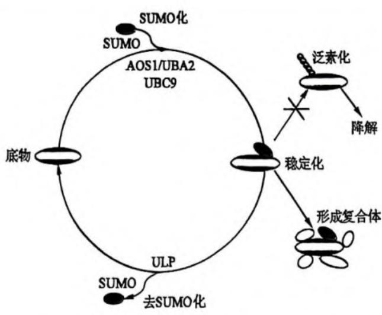

SUMO 化修饰类似于但又不同于泛素化修饰。与泛素介导的蛋白质降解不同，SUMO 阻碍泛素对底物蛋白质的共价修饰，提高了底物蛋白质的稳定性。它能修饰许多在基因表达调控中发挥重要作用的蛋白质，包括转录因子、转录辅助因子以及染色质结构调控因子。SUMO 化修饰影响蛋白质亚细胞定位，广泛参与细胞内蛋白质与蛋白质相互作用、DNA 结合、信号转导、核质转运、转录因子激活等重要过程。

## (7) 拟素化(neddylation)

拟素(neural precursor cell expressed developmentally downregulated protein 8, NEDD8)含有81个氨基酸, 是一种类泛素蛋白质修饰分子, 与泛素分子的一致性为59%, 相似性高达80%, 其相似程度是众多类泛素分子中最高的。研究表明, NEDD8能像泛素一样在体内固有酶簇作用下被共价结合到底物蛋白上, 参与蛋白质翻译后修饰, 这一过程被称为拟素化(neddylation)。拟素化的发生机制与泛素化相似, 需要连接酶E1、E2、E3介导的一系列酶促反应。NEDD8可以通过其C端第76位的甘氨酸与底物的赖氨酸共价结合。底物的去拟素化是由去拟素化酶NEDP1介导的,NEDD8在去拟素化后重新进入循环(图4-30)。需要注意的是, 一些底物在发生拟素化修饰时会和泛素化修饰共用相同的E3连接酶, 但与泛素化介导的蛋白酶体依赖的蛋白质降解不同, 拟素化修饰不会引起蛋白质的降解, 而主要通过该种修饰来调节蛋白质的功能。拟素化可能参与细胞增殖分化、细胞发育、细胞周期、信号转导等重要生命过程的调控, 拟素化异常会导致人类的神经退行性疾病和癌症的发生。

目前发现的拟素化底物蛋白只有 Cullin 家族蛋白、原癌基因产物 Mdm2、p53 肿瘤抑制因子、p73、表皮生长因子受体 EGFR、乳腺癌相关蛋白 3(BCA3) 等。更有趣的是, 这些被拟素化修饰的底物要么本身可以被泛素化修饰, 要么是泛素化 E3 连接酶的组分, 暗示 NEDD8 和泛素之间在进化上存在某种特定的联系。因为 NEDD8 参与拟素化过程的关键位点是赖氨酸残基, 该残基同时也可以发生乙酰化、甲基化和泛素化。人们普遍认为, 在不同的生理条件下, 在蛋白质的同一赖氨酸残基上可能发生不同的修饰以满足不同的生理需求。深入探讨这些翻译后修饰的动态平衡与相互关系将有助于阐明蛋白质翻译后修饰的生物学功能。

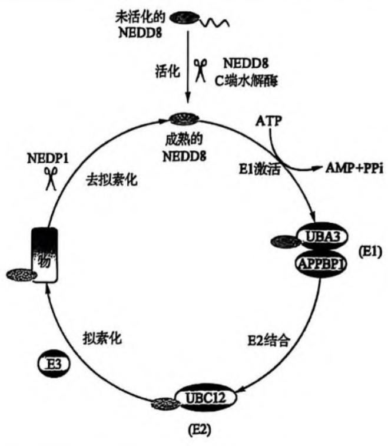  
图4-30 拟素化修饰的通路  
拟素化修饰的主要通路包括 NEDD8 前体活化的过程, 通过 E1 (UBA3-APPBP1) 激活, 与 E2 (UBC12) 结合, 通过 E3 连接到底物上的拟素化过程, 以及相反的去拟素化过程。

## (8) ADP-核糖基化(ADP Ribosylation)

主要是在 ADP- 核糖基转移酶的催化下, 将 ADP- 核糖基团与目标蛋白质的精氨酸或赖氨酸侧链进行共价连接的过程。蛋白质可以发生单 ADP- 核糖基化或多聚 ADP- 核糖基化。ADP- 核糖基化是一种动态可逆的翻译后修饰, 可以改变蛋白质的活性、稳定性和配体结合能力, 对细胞 DNA 修复、转录调节、信号转导、免疫以及代谢调控等功能产生重大影响。此外, 细菌利用单 -ADP 核糖基化防御病毒侵染, 以及对抗宿主免疫系统。也可以作为细菌毒素攻击真核宿主细胞关键分子, 如白喉毒素通过 ADP- 核糖基化修饰 eEF2 而使其失活, 从而阻断蛋白质合成并诱导细胞凋亡。

## (9) 巴豆酰化(crotonylation)

该修饰是在 2011 年首次在组蛋白中发现的一种可逆的酰化修饰, 是以巴豆酰辅酶 A 为底物, 由组蛋白巴豆酰基转移酶将巴豆酰基转移到赖氨酸残基上的一种修饰。组蛋白乙酰转移酶、P300/CBP、PCAF 和 MOF 等催化大多数巴豆酰化反应, 组蛋白去乙酰化酶 HDAC1/2/3 和 SIRT1/2/3 逆转这些反应。巴豆酰化修饰促进基因表达的调控, 如组蛋白的巴豆酰化修饰导致其正电性降低, 与呈现负电性的 DNA 结合更加松散, 有利于转录因子的结合。巴豆酰化修饰也与 DNA 损伤修复、干细胞分化、癌症代谢、生殖调控等密切相关。

## (10) 棕榈酰化(palmitoylation)

根据其连接方式的不同,可以分为 S- 棕榈酰化、N- 棕榈酰化和 O- 棕榈酰化,其中,S- 棕榈酰化是棕榈酰化修饰的主要形式。S- 棕榈酰化是指在棕榈酰基转移酶催化下,通过硫酯键向蛋白质的半胱氨酸残基的S端添加16个碳原子的饱和棕榈酸。含有锌指DHHC型(ZDHHC)的家族的棕榈酰基转移酶(PAT)催化大多数蛋白质棕榈酰化修饰，该家族在哺乳动物中共有23种不同的蛋白质(ZDHHC 1-23)。这种棕榈酰化具有可逆性，可在时间和空间上调节蛋白质的功能。在所有脂酰化修饰中，棕榈酰化修饰作用极为普遍，影响约 $20\%$ 的蛋白质组。棕榈酰化增加了蛋白质的疏水性，促进可溶性蛋白与胞内膜系统的稳定结合，并通过棕榈酰化修饰－去修饰动态平衡调控其在各亚细胞单位间的转运，在蛋白质的转运和定位中发挥重要的作用。对跨膜蛋白而言，棕榈酰化修饰的作用则更加广泛和复杂，影响包括多种G蛋白偶联受体(GPCR)在内的蛋白质构象、活性、调控信号传导胞内转运及寡聚化等。棕榈酰化与癌症、神经类疾病、心血管疾病等多种疾病相关。

## (11) 豆蔻酰化 (Myristoylation)

蛋白质豆蔻酰化是指真核细胞中在蛋白质 N 端豆蔻酰转移酶(protein N myristoyltransferase, NMT)的催化下，豆蔻酰基从豆蔻酰 CoA 转移至蛋白质 N 端甘氨酸残基并形成酰胺键的一种蛋白质脂酰基修饰方式，为翻译偶联的不可逆过程。大多数的 N- 豆蔻酰化是共翻译修饰。但在凋亡过程中，Caspase 介导的 Asp-Gly 之间的裂解会产生 N 端甘氨酸，PAK2、肌动蛋白、BID 等蛋白质可以发生翻译后的 N- 豆蔻酰化，调控细胞凋亡。甘氨酸的豆蔻酰化是不可逆的，目前尚未发现去豆蔻酰化酶。但是，志贺氏菌表达一种半胱氨酸蛋白酶 lpaJ，可以从宿主蛋白的 N- 末端切除豆蔻酰甘氨酸，破坏宿主的高尔基体结构，影响其分泌途径。除甘氨酸的氨基以外，赖氨酸的侧链氨基也可以被脂酰化修饰。组蛋白、白介素 1α 以及 TNF-α 的某些赖氨酸残基可以发生豆蔻酰化。

目前已经鉴定的豆蔻酰化底物蛋白包括丝氨酸 / 苏氨酸激酶、酪氨酸激酶、激酶底物蛋白、磷酸酯酶、参与信号传导的其他蛋白质、囊泡运输的调控蛋白以及病毒的结构或非结构蛋白。豆蔻酰化蛋白质参与了细胞生长发育、信号传导和肿瘤发生以及病毒复制组装等重要生理过程，与多种生理病理过程相关。豆蔻酰转移酶抑制剂可用于对抗由细胞或病原体增殖引起的疾病，在免疫缺陷和肿瘤治疗方面也有广阔前景。

## 4.6.3 蛋白质的折叠

由核糖体合成的所有新生肽链必须通过正确的折叠才能形成动力学和热力学稳定的三维构象,从而表现出生物学活性或功能。因此,可以说蛋白质折叠是翻译后形成功能蛋白质的必经阶段。如果蛋白质折叠错误,其生物学功能就会受到影响或丧失,严重者甚至会引起疾病。新合成的蛋白质分子如何形成具有功能的空间结构?蛋白质的结构与功能的关系等问题成为结构生物学研究的热点。

多肽链的折叠是一个复杂的过程,新生多肽一般首先折叠成二级结构,然后再进一步折叠盘绕成三级结构。对于单链多肽蛋白质,三级结构就已具有蛋白质的功能;对于寡聚蛋白质,一般需要进一步组装成更为复杂的四级结构,才能表现出天然蛋白的活性或功能。

有些蛋白质只有在另一些蛋白质存在的情况下才能正确完成折叠过程,形成功能蛋白质。分子伴侣(molecular chaperone)是目前研究比较多的能够在细胞内辅助新生肽链正确折叠的蛋白质。它是一类序列上没有相关性但有共同功能的保守性蛋白质,它们在细胞内能帮助其他多肽进行正确的折叠、组装、运转和降解。目前认为细胞内至少有两类分子伴侣家族,即热休克蛋白(heat shock protein)家族和伴侣素(chaperonin)。

① 热休克蛋白 它是一类应激反应性蛋白,包括 HSP70、HSP40 和 GrpE 3 个家族,广泛存在于原核及真核细胞中。三者协同作用,促使某些能自发折叠的蛋白质正确折叠形成天然空间构象。

② 伴侣素 伴侣素包括 HSP60 和 HSP10(原核细胞中的同源物分别为 GroEL 和 GroES)，它主要是为非自发性折叠蛋白提供能折叠形成天然结构的微环境 $^{[4-31]}$ 。

分子伴侣在新生肽链折叠中主要通过防止或消除肽链的错误折叠,增加功能性蛋白质折叠产率来发挥作用,而并非加快折叠反应速度。分子伴侣本身并不参与最终产物的形成。

## 4.7 蛋白质运转机制

在生物体内,蛋白质的合成位点与功能位点常常被一层或多层细胞膜所隔开,这样就产生了蛋白质运转的问题。核糖体是真核生物细胞内合成蛋白质的场所,几乎在任何时候,都有数以百计或千计的蛋白质离开核糖体并被输送到细胞质、细胞核、线粒体、内质网和溶酶体、叶绿体等各个部分,补充和更新细胞功能。由于细胞各部分都有特定的蛋白质组分,因此合成的蛋白质必须准确无误地定向运送才能保证生命活动的正常进行。蛋白质是怎样从合成部位运送至功能部位的?它们又是如何跨膜运送的?跨膜之后又是依靠什么信息到达各自"岗位"的?对于膜蛋白来说,究竟是什么因素决定它为外周蛋白还是内在蛋白,为部分镶嵌还是跨膜分布,在膜的外侧还是内侧?这些都是十分有趣的问题,也是生物膜研究中非常活跃的领域。

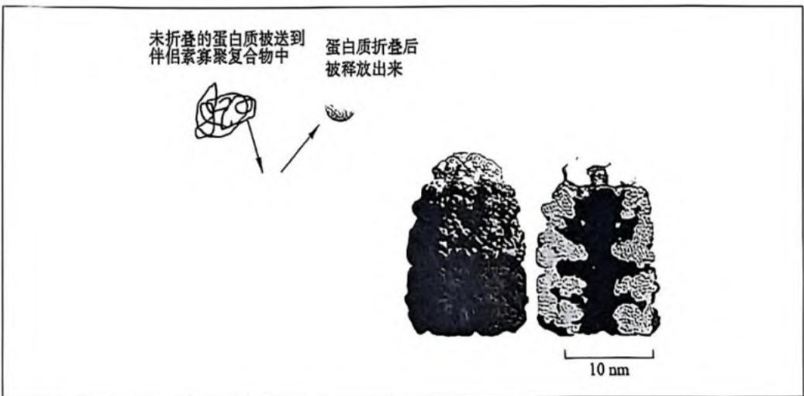  
图+31 伴侣素形成一个闭合的寡聚复合物，在其内部对蛋白质进行折叠  
右图为 GroEL 与 GroES 相结合的三维结构。

图4-32 蛋白质合成和运转过程示意图

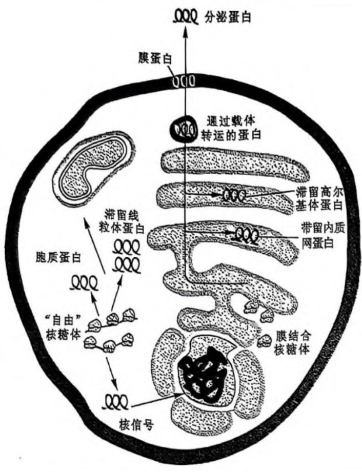

一般说来,蛋白质运转可分为两大类(图4-32):若某个蛋白质的合成和运转是同时发生的,则属于翻译运转同步机制;若蛋白质从核糖体上释放后才发生运转,则属于翻译后运转机制。这两种运转方式都涉及蛋白质分子内特定区域与细胞膜结构的相互关系。

表 4-11 列举了跨膜运输和镶入膜内的几种主要蛋白质。从表中可知,分泌蛋白质大多是以翻译运转同步机制运输的。在细胞器发育过程中,由细胞质进入细胞器的蛋白质大多是以翻译后运转机制运输的。而参与生物膜形成的蛋白质,则依赖于上述两种不同的运转机制镶入膜内。

表 4-11 几类主要的蛋白质运转机制

<table><tr><td>蛋白性质</td><td>运转机制</td><td>主要类型</td></tr><tr><td>分泌</td><td>蛋白质在结合核糖体上合成,并以翻译运转同步机制运输</td><td>免疫球蛋白、卵蛋白、水解酶、激素等</td></tr><tr><td>细胞器发育</td><td>蛋白质在游离核糖体上合成,以翻译后运转机制运输</td><td>核、叶绿体、线粒体、乙醛酸循环体、过氧化物酶体等细胞器中的蛋白质</td></tr><tr><td>膜的形成</td><td>两种机制兼有</td><td>质膜、内质网、类囊体中的蛋白质</td></tr></table>

## 4.7.1 翻译运转同步机制

一般认为,蛋白质定位的信息存在于该蛋白质自身结构中,并且通过与膜上特殊受体的相互作用得以表达,这就是信号肽假说的基础。这一假说认为,蛋白质跨膜运转信号也是由 mRNA 编码的。在起始密码子后,有一段编码疏水性氨基酸序列的 RNA 区域,这个氨基酸序列就被称为信号序列(图 4-33)。信号序列在结合核糖体上合成后便与膜上特定受体相互作用,产生通道,允许这段多肽在延长的同时穿过膜结构,因此,这种方式是边翻译边跨膜运转。

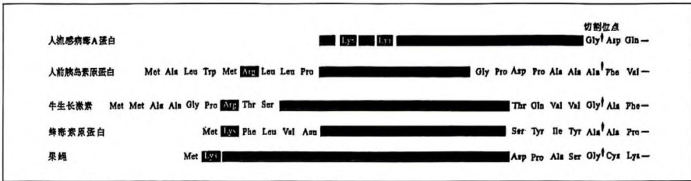  
图4-33 蛋白质通过其N端的信号肽在内质网中运转到不同的细胞器

绝大部分被运入内质网内腔的蛋白质都带有一个信号肽,该序列常常位于蛋白质的氨基端,长度一般为13\~36个残基,有如下3个特点:①一般带有10\~15个疏水氨基酸;②在靠近该序列N端常常有1个或数个带正电荷的氨基酸;③在其C端靠近蛋白酶切割位点处常常带有数个极性氨基酸,离切割位点最近的那个氨基酸往往带有很短的侧链(丙氨酸或甘氨酸)。

根据信号肽假说,同细胞质中其他蛋白质的合成一样,分泌蛋白的生物合成开始于结合核糖体,当翻译进行到50\~70个氨基酸残基之后,信号肽开始从核糖体的大亚基露出,被糙面内质网膜上的受体识别,并与之相结合。信号肽过膜后被内质网腔的信号肽酶水解,正在合成的新生肽随之通过蛋白孔道穿越疏水的双层磷脂。一旦核糖体移到mRNA的"终止"密码子,蛋白质合成即告完成,翻译体系解散,膜上的蛋白孔道消失,核糖体重新处于自由状态 $^{[图4-34]}$ 。

信号肽在蛋白质运输过程中发挥如下作用：

① 完整的信号多肽是保证蛋白质运转的必要条件。信号序列中疏水性氨基酸突变成亲水性氨基酸后,会阻止蛋白质运转而使新生蛋白质以前体形式积累在胞质中。

② 仅有信号肽还不足以保证蛋白质运转的发生。要使蛋白质顺利跨膜,还要求运转蛋白质在信号序列以外的部分有相应的结构变化。

③ 信号序列的切除并不是运转所必需的。如果把细菌外膜脂蛋白信号序列中的甘氨酸残基突变成天冬氨酸残基，能抑制该蛋白信号肽的水解，但不能抑制其跨膜运转。

④ 并非所有的运转蛋白质都有可降解的信号肽。卵清蛋白是以翻译运转同步机制进入微粒体中的,但它并没有可降解的信号序列。据此,"信号肽"应当定义为:能启动蛋白质运转的任何一段多肽。

研究新生肽向内质网内腔运转过程发现 SRP (signal recognition protein, 信号识别蛋

图4-34 蛋白质跨膜运转的信号肽假说及其运输过程

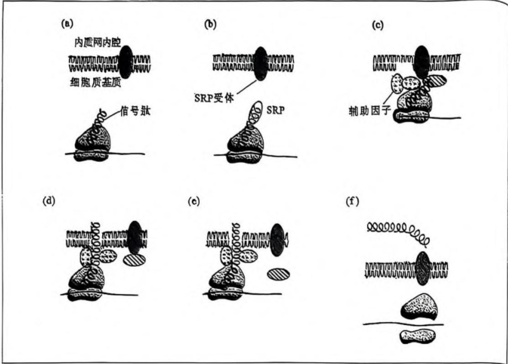

白)和 DP (docking protein, 停靠蛋白, 又称 SRP 受体蛋白) 介导了蛋白质的跨膜运转过程。SRP 能同时识别正在合成需要通过内质网膜进行运转的新生肽和自由核糖体, 它与这类核糖体上新生蛋白的信号肽结合是多肽正确运转的前提, 但同时也导致了该多肽合成的暂时终止 (此时新生肽一般长约 70 个残基)。SRP-信号肽-多核糖体复合物即被引向内质网膜并与 SRP 的受体——DP 相结合。只有当 SRP 与 DP 相结合时, 多肽合成才恢复进行, 信号肽部分通过膜上的核糖体受体及蛋白运转复合物跨膜进入内质网内腔, 新生肽链重新开始延伸。整个蛋白质跨膜以后, 信号肽被水解, 形成高级结构和成熟型蛋白质, 并被运送到相应细胞器。SRP 与 DP 的结合很可能导致受体聚集而形成膜孔道, 使信号肽及与其相连的新生肽得以通过。此时, SRP 与 DP 相分离并恢复游离状态。待翻译过程结束后, 核糖体的大、小亚基解离, 受体解聚, 通道消失, 内质网膜也恢复完整的脂双层结构 (图 4-35)。进入内质网内腔后, 蛋白质常以运转载体的形式被送入高尔基体或形成运转小泡, 分别运送到各自的亚细胞位点。

## 4.7.2 翻译后运转机制

研究发现,对于叶绿体、线粒体、细胞核和过氧化物酶体在内的细胞器,除了线粒体和叶绿体基因组编码少数的蛋白质外,绝大多数蛋白质和酶是以翻译后运转机制进入这些细胞器内。蛋白质在细胞质中核糖体上合成后,按照其氨基酸序列中所包含的特定定位标签被运送到不同细胞器中。

## 1. 蛋白质主要通过三种机制运送进入细胞器

对于叶绿体、线粒体、细胞核和过氧化物酶体这些膜被细胞器,从胞质输入蛋白质时

需要面临一个共同的问题:蛋白质如何通过对亲水大分子不能通透的膜? 不同的细胞器分别采用下列三种机制实现这一目标(图 4-36)。  
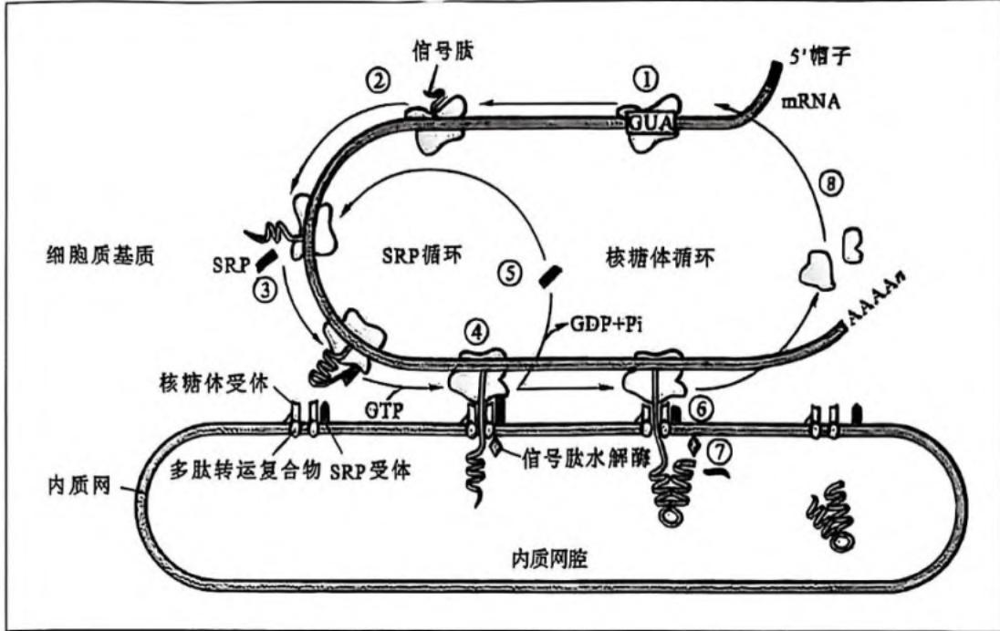

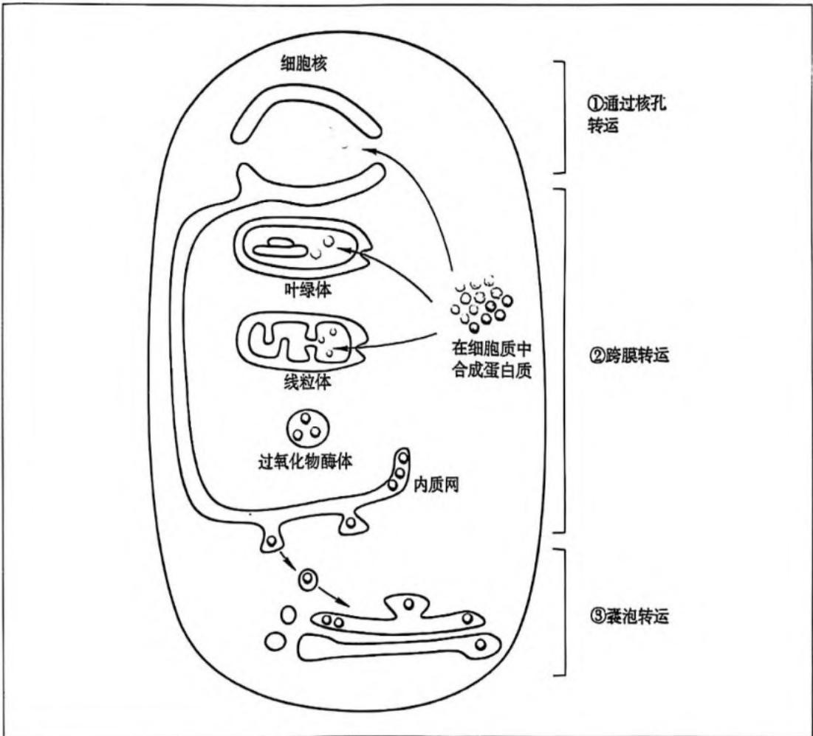  
图4-35 新生蛋白质通过同步转运途径进入内质网内腔的主要过程

①核糖体组装、翻译起始；②位于蛋白质N端的信号肽序列首先被翻译；③SRP与核糖体、GTP以及带有信号肽的新生蛋白质相结合，暂时中止肽链延伸；④核糖体-SRP复合物与膜上的受体相结合；⑤GTP水解，释放SRP并进入新一轮循环；⑥肽链重新开始延伸并不断向内腔运输；⑦信号肽被切除；⑧多肽合成结束，核糖体解离并恢复到翻译起始前的状态。

图4-36 蛋白质主要通过三种机制之中的一种运送进入膜被细胞器

所有运转过程均需要能量。在通过核孔转运和囊泡转运过程中，蛋白质保持折叠状态，而在跨膜转运过程中蛋白质为伸展状态。

① 进入细胞核的胞质蛋白质是通过核孔(穿过核外膜和核内膜)来运转的,核孔发挥选择性通道的作用,特定生物大分子通过主动运转进入核内,一些小分子也可以通过自由扩散经过核孔进入细胞核。在转运过程中蛋白质保持折叠状态。

② 蛋白质从胞质运入线粒体、叶绿体等是由位于细胞器膜上的蛋白质转运体转运的。被转运的蛋白质需要以伸展的状态钻过膜，这一点与核孔的转运不同。

③ 蛋白质从内质网或从内膜系统的一个区室转运到另一个区室则是通过转运囊泡摆渡完成的。转运囊泡从一个区室的内部间隙或腔内装载上所要转运的蛋白质，从膜上离开，随后通过膜融合的方式把所运载的蛋白质卸载到另一个区室。被转运的蛋白质也是保持折叠状态。

## 2. 信号序列指导蛋白质的正确区室定位

包含在蛋白质中的特定氨基酸序列作为分选信号,指导蛋白质到正确的区室中。这些信号序列通常含有15\~60个氨基酸,在完成指导蛋白质运送任务后被从蛋白质上切除(不总是,如核定位信号序列不被切除)。

细胞中一些用于蛋白质分选的不同信号序列见表4-12。它们各自有其特点，如指导进入线粒体蛋白质的前导肽一般具有如下特性：带正电荷的碱性氨基酸(特别是精氨酸)含量较为丰富，它们分散于不带电荷的氨基酸序列之间；缺少带负电荷的酸性氨基酸；羟基氨基酸(特别是丝氨酸)含量较高；有形成两亲(既有亲水又有疏水部分) $\alpha$ 螺旋结构的能力。带正电荷的碱性氨基酸在前导肽中有重要的作用，如果它们被不带电荷的氨基酸所取代，就不能发挥牵引蛋白质过膜的作用。这些信号序列对于指导蛋白质到达特定的细胞器是必要的。将信号序列切除或者转移到另一个没有该信号序列的蛋白质上能够明显影响蛋白质的分选和定位。利用重组DNA技术将核定位序列放到一个胞质定位的蛋白质前面，将会引导该胞质定位蛋白进入细胞核。

## 3. 线粒体蛋白质跨膜运转

线粒体是细胞的"动力站"，它虽然含有遗传物质(DNA、RNA)以及核糖体等，但它的DNA信息含量有限，其基因组只能编码十余种线粒体蛋白质，大部分线粒体蛋白质都是由核 DNA 编码,在细胞质自由核糖体上合成。被释放至细胞质,再跨膜运转到线粒体各部分。与分泌蛋白质通过内质网膜进行运转不同,通过线粒体膜的蛋白质是在合成以后再运转的,这个过程有如下特征:

表 4-12 某些典型的信号序列

<table><tr><td>信号序列的功能</td><td>典型的信号序列</td></tr><tr><td>留在内质网腔</td><td> $-Lys-Asp-Glu-Leu-COO^{-}$ </td></tr><tr><td>输入内质网</td><td> $+H^{3}N-Met-Met-Ser-Phe-Val-Ser-Leu-Leu-Leu-Val-Gly-Ile-Leu-Phe-Trp-Ala-Thr-Glu-Ala-Glu-Gln-Leu-Thr-Lys-Cys-Glt-Val-Phe-Gln-$ </td></tr><tr><td>输入线粒体</td><td> $+H^{3}N-Met-Leu-Ser-Leu-Arg-Gln-Ser-Ile-Arg-Phe-Phe-Lys-Pro-Ala-Thr-Arg-Thr-Leu-Cys-Ser-Ser-Arg-Tyr-Leu-Leu-$ </td></tr><tr><td>输入细胞核</td><td> $-Pro-Pro-Lys-Lys-Lys-Arg-Lys-Val-$ </td></tr><tr><td>输出细胞核</td><td> $-Leu-Ala-Leu-Lys-Leu-Ala-Gly-Leu-Asp-Ile-$ </td></tr><tr><td>输入过氧化物酶体</td><td>Ser-Lys-Leu-</td></tr></table>

蓝字代表带正电氨基酸，白字代表带负电氨基酸，浅蓝字代表一个疏水氨基酸的延伸区段。

① 通过线粒体膜的蛋白质在运转之前大多数以前体形式存在,它由成熟蛋白质和位于 N 端的一段前导肽(leader peptide)共同组成。迄今已有 40 多种线粒体蛋白质前导肽的一级结构被阐明,它们含有 20\~80 个氨基酸残基,当前体蛋白过膜时,前导肽被一种或两种多肽酶所水解,释放成熟蛋白质。

② 蛋白质通过线粒体内膜的运转是一种需要能量的过程。

③ 蛋白质通过线粒体膜运转时,首先由外膜上的 Tom 受体复合蛋白识别与 Hsp70 或 MSF 等分子伴侣相结合的待运转多肽,通过 Tom 和 Tim 组成的膜通道进入线粒体内腔。蛋白质跨膜运转时的能量来自线粒体 Hsp70 引发的 ATP 水解和膜电位差 $^{[图 4-37]}$ 。

拥有前导肽的线粒体蛋白质前体能够跨膜运转进入线粒体，在这一过程中前导肽被水解，前体转变为成熟蛋白质，失去继续跨膜的能力。因此，前导肽对线粒体蛋白质的识别和跨膜运转显然起着关键作用。前导肽跨膜运转时首先与线粒体外膜上的受体相结合，实验表明，并非线粒体蛋白质前体都共用一种受体，但Tom受体可能是线粒体蛋白质跨膜运转时最主要的受体蛋白。线粒体有内、外两层膜，前导肽的不同部位可能在蛋白质的跨膜运输过程中发挥不同的作用(图4-38)。有些前导肽含有"止运人"肽段，当该肽段被跨膜通道中的受体蛋白识别时，所运输的多肽将被定位在膜上。

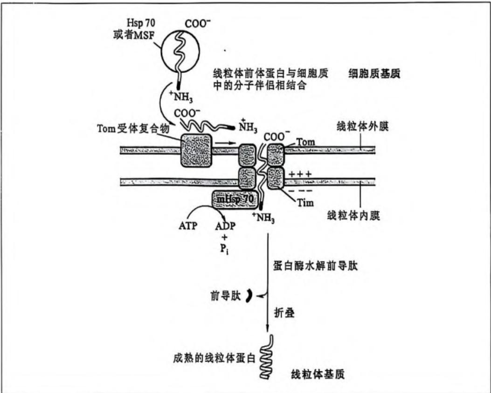  
图4-37 线粒体蛋白质跨膜运转

与前导肽的区别在于：①由含水的核孔通道来鉴别；②人核信号是蛋白质的末失性部分，在引导人核过程中，并不被切除，可以反复使用，有利于细胞分离后核蛋白重新入核。

产生的突变型能阻止这种蛋白质进入细胞核而停留在细胞质中。NIS 可以位于核蛋白的任何部位,也能够引导其他非核蛋白进入细胞核。人核信号

这些信号都具有一个带正电荷的脉冲心,通常是一组的音合或性氢基酸的序列,它能与人核载体相互作用,将蛋白质运进细胞核。第一个被确定的NIS序列的蛋白质是SV40的T抗原,它在细胞质中合成后很快积累在细胞核中,是病毒DNA在核内容复制所需的。其群生型的氢基酸序列为Pro-Lys-Lys-Lys-Avg-Lys-Val,该序列中的单个氢基酸突变所

(nuclear export signal, NES),才能被相应的核运转置白识别。目前已经发现有多种类型的核定位信号,包括经典核定位信号和其他类型的 NLS。

成后,核膜被重新建成,分散在细胞内的核蛋白必须被重新运入核内。真核细胞核膜上的核孔复合物 (nuclear pore complex, NpC) 是细胞核内外进行物质交换的主要通道,分子量较小的蛋白质可自由通过 NpC 或采取被动扩散的方式进入细胞核,而分子量大于 $4 \times 10^{7}$ 的蛋白质则需要通过主动转运出细胞核。以此种方式进出细胞核的蛋白质需要在其氧基酸序列上带有特殊的核定位信导序列 (nuclear localization signal, NLS) 和出核信号序列复制调控因子都必须从细胞质进入细胞核才能正常发挥功能。

在绝大部分多细胞真核生物中，每当细胞发生分裂时，核膜被破坏，等到细胞分裂完

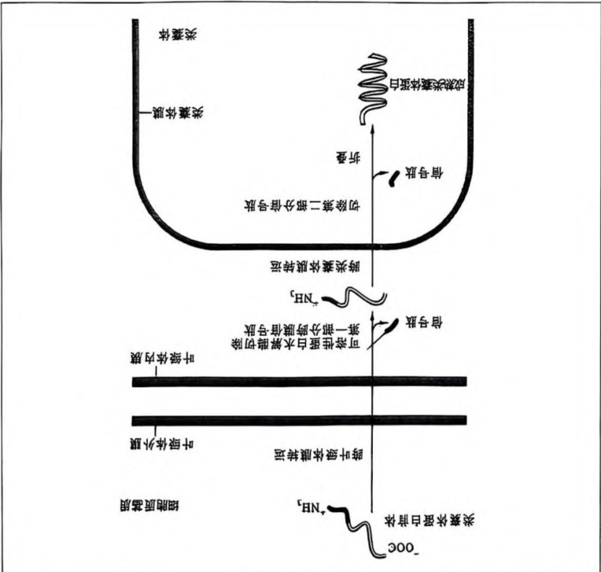  
白脑跨侧运动  
圈4-19 付线体系

细胞质中合成的蛋白质一般通过核孔进入细胞核。所有核糖体蛋白都有先在细胞质中被合成，运转到细胞核内，在核二中被装配成40S和60S核糖体亚基，然后运转回到细胞质中行使作为蛋白质合成机器的功能。RNA、DNA聚合酶、组蛋白、拓扑异构酶及大量转录、

在

真核细胞的细胞核通过核孔与核外相通, 因此, 核孔是进行双向定转的分子通道。在

1. 核定位蛋白的运转机制

③ 对绿体蛋白质体内可降解序列因植物和蛋白质种类不同而表现出明显的差异。

④ 对核中性受体,保证叶绿体蛋白质只能进入叶绿体内。

②叶绿体膜能够特异地与叶绿体蛋白的前体结合。叶绿体膜上有识别叶绿体蛋白。

③叶绿体膜能够特异地与叶绿体蛋白的前体结合。叶绿体膜上有识别叶绿体蛋白。

叶绿体内提取的可溶性物质,能够把 RuBP 模化酶小亚基前体溶解或加工为成熟小亚基,

离心后产生的叶绿体基质和破碎的叶绿体也具有这种功能,而类整体和提纯的叶绿体膜

都无此特性。在叶绿体蛋白质的翻译后运转机制中,活性蛋白酶是可溶性的,这一点也不

同于分泌蛋白质的翻译运转同步机制,因为后者活性蛋白酶位于运转膜上。因此,可根据

① 活性蛋白水解酸位于叶绿体基质内,这是鉴别翻译后运转的指标之一。从完整的叶绿体蛋白质过程有如下特点:

浮后进行的,在运转过程中没有蛋白质的合成。

4.叶绿体呈白质的跨越运转

大多数科学家认为，叶绿体多肽是胞质中的游离核糖体上合成后脱离核糖体并折叠成具有三级结构的蛋白质分子，多肽上某些特定位点结合于只有叶绿体膜上才有的特异性受体位点。叶绿体定位信号肽一般有两个部分，第一部分决定该蛋白质能否进入叶绿体基质，第二部分决定该蛋白质能否进入类繁体(图4-39)。在这一模型中，蛋白质运转是在翻

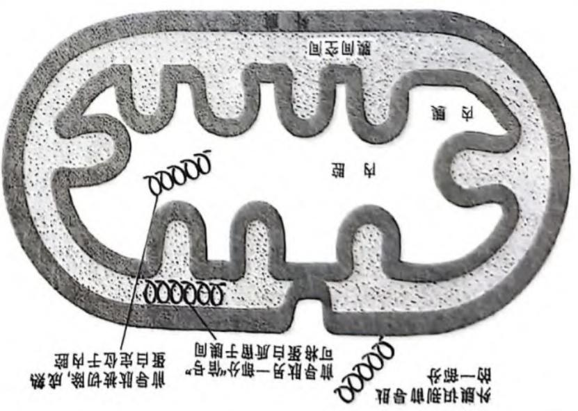  
四-38 前导肽的

不同区域可能在至

白底跨肢运转过程

中起不同的作用

蛋白质向核内运输过程需要一系列循环于核内和细胞质的蛋白因子包括核运转因子(important) $\alpha$ 、 $\beta$ 和一个低分子量GTP酶(Ran)参与。 $\alpha$ 和 $\beta$ 组成的异源二聚体是核定位蛋白的可溶性受体，与核定位序列相结合的是 $\alpha$ 亚基。由上述3个蛋白质组成的复合物停靠在核孔处，依靠Ran GTP酶水解GTP提供的能量进入细胞核， $\alpha$ 和 $\beta$ 亚基解离，核蛋白与 $\alpha$ 亚基解离， $\alpha$ 和 $\beta$ 分别通过核孔复合物回到细胞质中，起始新一轮蛋白质运转(图4-40)。

经典的出核信号序列(NES)是由疏水性氨基酸尤其是亮氨酸和异亮氨酸富集的区域构成,其保守性氨基酸排序为 $\Phi X_{1-3}\Phi X_{2-3}\Phi X\Phi$ ,其中, $\Phi$ 代表疏水性氨基酸 L、I、F 或 M,而 X 代表任意氨基酸。经典的 NES 大多为 CRM1 依赖性,它能够被出核因子 CRM1(chromosome region maintenance 1)/exporting/Xpo1 识别并结合,从而携带该蛋白质出核。

## 6. 过氧化物酶体蛋白的运转

过氧化物酶体(peroxisome)是进行脂肪酸和氨基酸β氧化的细胞器,是由一层单位膜包裹的囊泡,直径为0.5\~1.0μm,通常比线粒体小,普遍存在于真核生物的各类细胞中,含有丰富的酶类(近50种氧化酶和触酶),这些蛋白质都在细胞核中编码,在细胞质基质中产生,再通过信号分选进入过氧化物酶体。过氧化物酶体的膜蛋白和基质蛋白的转运机制不同,其中,对基质蛋白的定向转运机制研究比较多。

过氧化物酶体引导信号(peroxisomal targeting signal, PTS)是指导蛋白质进入过氧化物酶体基质的信号序列。PTS大多位于蛋白质的C端(PTS1)，少数位于多肽链的N端(PTS2)。PTS1在指导蛋白质进入过氧化物酶体后不被切除，而PTS2则被切除。已有研究显示，过氧化物酶Pex5、Pex13和Pex14在PTS1途径的蛋白质转运步骤中发挥关键作用。Pex5通过识别PTS1基序-羟基末端三肽序列[丝氨酸-赖氨酸-亮氨酸(SKL)或其变体]与细胞质中的载体蛋白结合，被运载蛋白结合的构象变化暴露了一个固有的无序区域(intrinsically disordered region, IDR)，该区域与过氧化物酶体膜蛋白Pex13和Pex14相互作用，导致被运载蛋白进入过氧化物酶体基质。加拿大研究人员于2023年发现，过氧化物酶体蛋白的转入取决于Pex13和Pex5的IDR中芳香族残基的数量和模式。Pex13、Pex14和Pex5可以通过液-液相分离(liquid-liquid phase separation, LLPS)作用在过氧化物酶体上形成瞬态生物分子凝聚体，其可以作为通道将被运载蛋白质转入过氧化物酶体。这些凝聚体的形成可以解释过氧化物酶体孔是如何根据需要形成和拆除的，以转移不同尺寸的蛋白质。

图 4-40 核定位蛋白跨细胞核膜运转过程示意图  
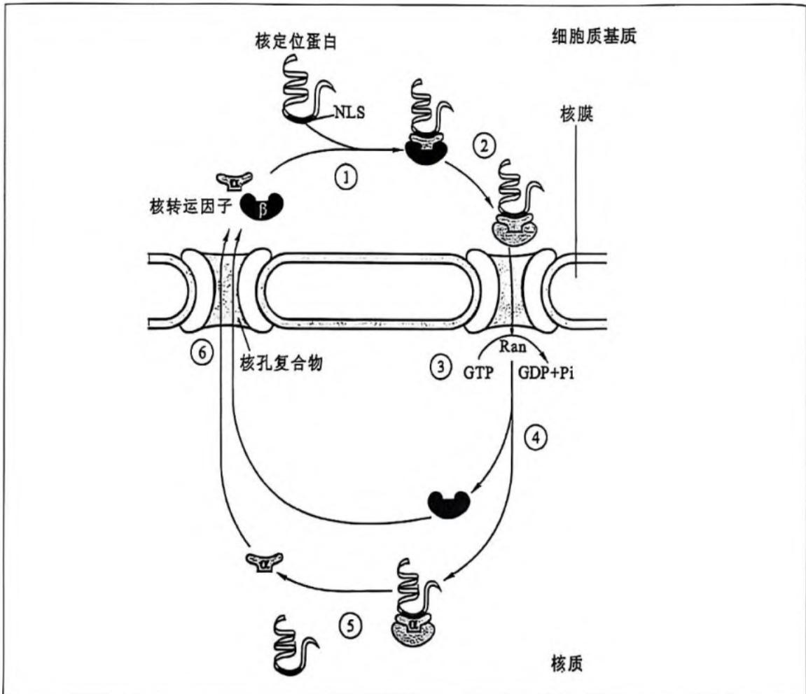  
第 4 章 生物信息的传递(下)——从 mRNA 到蛋白质

对于原核细胞来说,同样存在蛋白质运转的问题。细菌蛋白是通过翻译运转同步机制和翻译后运转机制进行跨膜运输的。在共翻译水平上细菌蛋白的运转与真核生物相似,在细菌中也有SRP,但其组分比真核生物的SRP简单。大肠杆菌含有一个4.5S RNA,它与核糖体结合,新合成蛋白质的疏水信号序列从核糖体通道中伸出来后,被SRP识别并结合,使肽链延伸暂停,SRP与膜上受体结合,水解GTP,使得新生肽链插入到膜中,随后翻译重新开始,边翻译边跨膜运转。研究细菌蛋白质的翻译后运转机制表明,细菌同样能通过定位于蛋白质N端的信号肽将新合成的多肽运转到其内膜、外膜、双层膜之间或细胞外等不同部位。细菌中新翻译产生的蛋白质与胞质中的分子伴侣SecB相结合后就能被运送到细胞膜运转复合物SecA-SecYEG上,结合有新生肽的SecA在自身ATP酶活性作用下水解ATP并嵌入细胞膜之中,导致与SecA相结合的被运转蛋白N端约20个氨基酸通过膜运转复合物到达胞外。SecA再与另一个ATP相结合,变构嵌入膜内的同时再次把所运转蛋白质的第二部分运出胞外,如此反复,直到把所运转蛋白质全部送到胞外(图4-41)。

## 4.8 蛋白质的降解与稳定性研究

蛋白质在细胞内不断地被合成, 同时也不断地在被分解(或降解)。蛋白质的半衰期差别很大, 从 $30 \mathrm{~s}$ 到数天不等, 大部分真核蛋白的半衰期为数小时至数天, 如某些参与代谢的酶和细胞周期蛋白的半衰期很短, 而像血红蛋白这样少数蛋白质的半衰期与细胞周期同样长 (成红细胞 = 110 天)。真核细胞内蛋白质的降解可以清除一些错误折叠、受损或者寿命短、不再被需要的蛋白质, 有助于细胞正常新陈代谢的进行。早老性痴呆症、亨廷顿舞蹈病等神经退行性病变均可能是因错误折叠蛋白的聚集引起的。因此, 错误折叠蛋白的清除对于生物体是至关重要的。

细胞内蛋白质的降解受到严格的调控,自噬(autophagy)/溶酶体和泛素-蛋白酶体系

## 4.8 蛋白质的降解与稳定性研究

图4-41 细菌中蛋白质的跨眼运转  
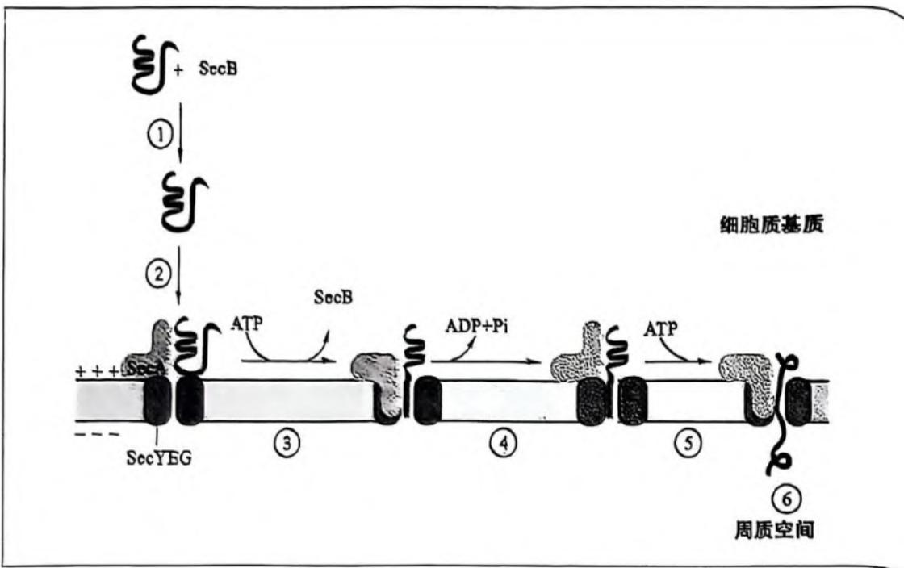

统(ubiquitin proteasome system, UPS)是生物体内蛋白质降解的两种主要途径(图4-42)，分别以依赖于ATP和不依赖于ATP的方式降解蛋白质。

## 4.8.1 自噬 / 溶酶体介导的蛋白质降解

蛋白质自噬降解能够将细胞内蛋白质分解成小分子,以供细胞再利用,并在维持细胞内稳态、清除异常蛋白质、适应环境压力等方面发挥重要作用。蛋白质自噬降解过程分为3个阶段:包涵体形成、运输和降解。细胞首先通过自噬小体的形成将需要降解的蛋白质包裹起来,形成包涵体,进而通过微管道系统运输到溶酶体中,溶酶体中含有约40种类型的水解酶,包涵体被溶酶体内的酶降解成小分子,以供细胞再利用。胞外蛋白通过胞吞作

图 4-42 蛋白质的两种主要降解方式细胞内大部分蛋白质是通过蛋白酶体途径降解，另一部分是通过自噬 / 溶酶体途径降解。  
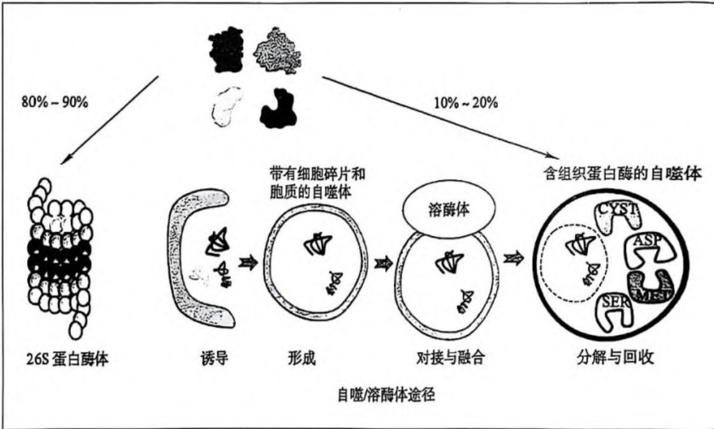

用或胞饮作用进入细胞，在溶酶体中降解。

## 4.8.2 泛素化修饰介导的蛋白质降解

20世纪50年代初,科学家发现细胞内大部分蛋白质的降解需要ATP提供能量。2004年诺贝尔化学奖授予了以色列的阿龙·切哈诺沃、阿夫拉姆·赫什科和美国的欧文·罗斯,以表彰他们在发现和阐明蛋白质经泛素—蛋白酶体的选择性降解途径中所作出的杰出贡献。越来越多的证据表明,生物体内蛋白质的降解过程是一个有序的过程。

在原核生物中,绝大部分蛋白质的降解是通过 AAA+ 超家族(与多种细胞活性相关的 ATP 酶)蛋白酶来实现的。在革兰氏阴性菌(如大肠杆菌)中主要有 5 种 AAA+ 蛋白酶: Lon(也称为 La)、ClpAP、ClpXP、HslUV 和 FtsH;而在革兰氏阳性菌(如枯草芽孢杆菌)中总计有 7 种不同的 AAA+ 蛋白酶: LonA、LonB、ClpCP、ClpEP、ClpXP、HslUV 和 FtsH。其中, Lon 蛋白酶是一个依赖 ATP 的丝氨酸蛋白酶家族,在古菌、原核生物和真核生物中高度保守。Lon 等蛋白酶识别并结合携带降解决定子(degron,通常位于底物的 N 端或 C 端)的底物蛋白。当细胞中出现错误的蛋白质或半衰期很短的蛋白质时,该蛋白酶就被激活,每切除一个肽键要消耗两个分子的 ATP。Lon 的蛋白酶活性在维持细胞内的平衡、蛋白质量控制和代谢调控中发挥重要作用。

此外,科研人员利用电镜技术在嗜酸性热原体中发现类似的蛋白酶体核心颗粒,首次证明原核生物体内存在蛋白酶体。Pearce 等于 2008 年在结核分枝杆菌中发现了与泛素功能相似的原核类泛素蛋白(prokaryotic ubiquitin-like protein, Pup)。Pup 可以在辅助因子的作用下标记多种功能蛋白(类泛素化修饰,pupylation),并介导被标记的底物被蛋白酶体降解。Pup-蛋白酶体通路的发现揭示了原核生物中另一种蛋白质降解机制。

在真核生物中,除了通过溶酶体以及自噬通路,蛋白质的降解主要依赖于泛素蛋白(ubiquitin, Ub)。泛素是一类低分子量的蛋白质,只有76个氨基酸残基,序列高度保守(从酵母和人细胞中提取的泛素蛋白几乎完全相同!)。泛素化是指泛素分子在泛素激活酶E1、结合酶E2、连接酶E3的作用下,对靶蛋白进行特异性修饰的过程,在该过程中,泛素C端甘氨酸残基通过酰胺键与底物蛋白的赖氨酸残基的ε氨基结合。在蛋白质分子的一个位点上可结合单个或多个泛素分子。泛素化修饰涉及E1、E2和E3三个酶的级联反应 $^{[5][4-43]}$ :首先在ATP提供能量的情况下,泛素激活酶E1黏附在泛素分子尾部的Cys残基上激活泛素,E1酶再将激活的泛素分子转移到泛素结合酶E2上,再由E2酶和E3酶共同识别靶蛋白,对其进行泛素化修饰。该修饰是一个可逆的过程,去泛素化酶(DUB)可以去除相应底物的泛素化修饰。目前已经鉴定2种E1、50余种E2、600余种E3和100余种DUB。底物泛素化修饰的特异性是由E3连接酶决定的,可以对靶蛋白进行单泛素化和多聚泛素化修饰。如图4-44所示,E2酶的外形就像一个夹子,将靶蛋白固定在中间的空隙内。

根据泛素与底物的连接位点可以分为不同类型的泛素化,包括 M1,K6,K11,K27,K29,K33,K48,K63。不同方式的泛素化调控不同的功能。其中,与蛋白酶体降解相关的泛素化为 K48, 约占所有泛素化的 50%。蛋白质被泛素化修饰 (K48 泛素链) 以后, 被标记的蛋白质常被运送到分子量高达 $1 \times 10^{6}$ 的蛋白酶体降解体系中直到该蛋白质完全被降解。

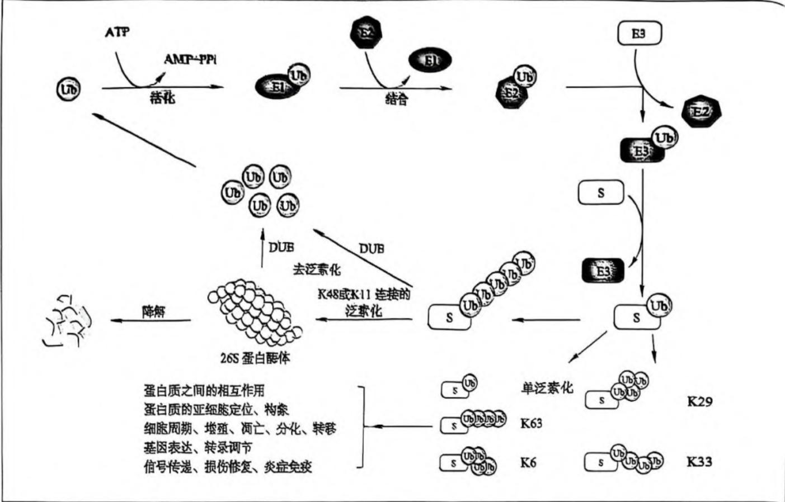  
图 4-43 泛素化 / 去泛素化修饰及其在蛋白质降解和细胞生理功能中的调节作用  
泛素在 E1、E2 和 E3 的作用下与底物蛋白相连接的过程。该过程是一个可逆的过程，可以在去泛素化酶(DUB)的作用下去除底物(S)上的泛素化修饰。K11、K48 位的多泛素化修饰使蛋白质通过 26S 蛋白酶体降解；K63、K29 位等的泛素化修饰不使蛋白质发生降解，而是参与细胞内众多生理过程的调节。

通过泛素-蛋白酶体系统对贴了泛素标签的蛋白质进行降解是一种较普遍的内源蛋白质降解方式,细胞内 $80\% \sim 90\%$ 的蛋白质都是通过该系统降解的。蛋白酶体(proteasome)因其密度梯度离心沉降系数为26S,故又称其为26S蛋白酶体。它是由1个

图 4-14 泛素连接酶 E3 与结合酶 E2、靶蛋白形成的复合物

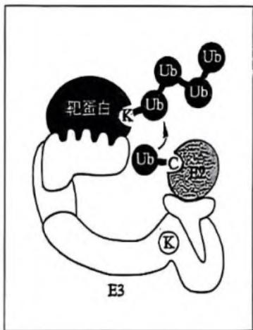

20S 催化颗粒(catal cparticle, CP)和 2 个 19S 调节颗粒(regulatory particle, RP)组成的桶状结构(图 4-45)。19S 为调节亚单位,位于桶状结构的两端,识别多聚泛素化蛋白并使其去折叠。19S 亚单位上还具有一种去泛素化的同功肽酶,使底物去泛素化。20S 为催化亚单位,位于两个 19S 亚单位的中间,其活性部位处于桶状结构的内表面,可避免细胞内环境变化所造成的影响。蛋白酶体的 19S 中的 Rpn10 和 Rpn13 以 ATP 依赖的方式识别并结合被贴了泛素"标签"(K48 泛素链)的蛋白质,在 ATP 水解供能的情况下解除靶蛋白的折叠结构，并辅助去折叠的蛋白质进入位于桶状结构中心的活性位点，将蛋白质降解成7\~9个氨基酸长度的短肽，并将其从蛋白酶体的另一端释放出去。

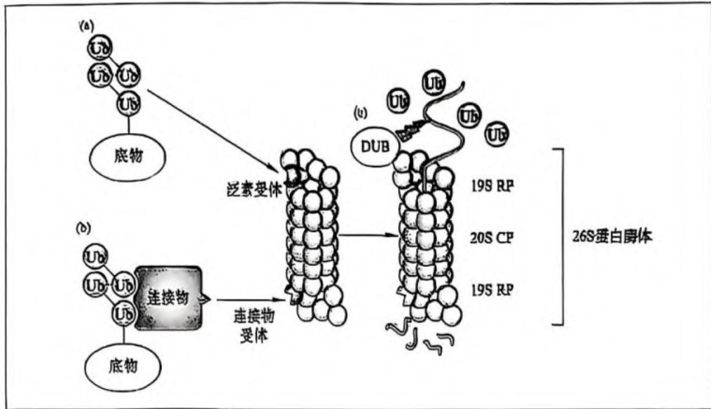

需要明确的是,并非所有泛素化修饰都会导致蛋白质降解。泛素化修饰还参与多种生物功能的调控,在蛋白质的定位、代谢、功能、调节和降解中都发挥十分重要的作用,参与细胞周期、增殖、凋亡、分化、转移、基因表达、转录调节、信号传递、损伤修复、炎症免疫等几乎一切生命活动的调控,在肿瘤、心血管等疾病发病中起着十分重要作用。

此外,调控蛋白质泛素化修饰的各种酶也是研究、开发新药物的新靶点。近年来,利用机体自身蛋白质清理系统去除致病靶蛋白的蛋白质水解靶向嵌合体(PROTAC)技术飞速发展,扩展了可药用蛋白质的范围。目前,虽然已鉴定出超过4 000种疾病相关蛋白质,但只有约400种蛋白质被成功开发出小分子抑制剂。与传统的激酶抑制剂导致耐药性相比,PROTAC可以通过降解靶蛋白来最大限度地减少长期选择压力的耐药性,并能够在低浓度下发挥作用,推动新药的研发。同时,分子胶、溶酶体靶向嵌合体和基于抗体的PROTAC等一些新型的靶向蛋白质降解策略不断涌现,为药物发现提供了新的研发思路。

## 4.8.3 蛋白质一级结构对稳定性的影响

成熟蛋白质 N 端的第一个氨基酸(除已被切除的 N 端甲硫氨酸之外,但包括翻译后修饰产物)在蛋白质的降解中有着举足轻重的影响(表4-13)。当某个蛋白质的 N 端是甲硫氨酸、甘氨酸、丙氨酸、丝氨酸、苏氨酸和缬氨酸时,表现稳定。其 N 端为赖氨酸、精氨酸时,表现最不稳定,平均 2\~3 min 就被降解了。泛素调控的蛋白质降解具有重要的生理意义,它不仅能够清除错误蛋白质,对细胞生长周期、DNA 复制以及染色体结构都有重要的调控作用,而且对于理解细胞的许多生理过程和新药的开发也具有重要意义。

用 +45 265 蛋白

梅休依顿的蛋白质

乏素化降解

蛋白酶体是由1个20S催化颗粒(CP)和2个19S调节颗粒(RP)组成的桶状结构。一旦底物蛋白被多泛素化(连接至少4个泛素分子)、它或者直接与19S调节颗粒上的泛素受体结合(s)、或者通过19S调节颗粒上的连接物受体间接结合到蛋白酶体(b)，然后被剪切成小的肽段而降解，泛素会被再利用。(修改自Ravid and Hochsteasser, Nat Rev Mol Cell Biol. 679-690, 2008)

表 4-13 蛋白质的半衰期与 N 响氨基胺戊基的关系

<table><tr><td>N 咲残基</td><td>半衰期</td></tr><tr><td>籼定型残基</td><td></td></tr><tr><td>甲硫氨酸、甘氨酸、丙氨酸、丝氨酸、苏氨酸、缬氨酸</td><td>大于 20 h</td></tr><tr><td>不籼定型残基</td><td></td></tr><tr><td>异氰氨酸、谷氨酰胺</td><td>约 30 min</td></tr><tr><td>酪氨酸、谷氨酸</td><td>约 10 min</td></tr><tr><td>胱氨酸</td><td>约 7 min</td></tr><tr><td>亮氨酸、苯丙氨酸、天冬酰胺、胱氨酸</td><td>约 3 min</td></tr><tr><td>精氨酸</td><td>约 2 min</td></tr></table>

## 思考题

1. 简述破译遗传密码的主要过程。

2. 遗传密码有哪些特性？说出遗传密码简并性的生物学意义。

3. 终止密码子主要有哪几种？

4. tRNA 在组成和结构上有哪些特点?

5. tRNA 如何转运活化氨基酸至 mRNA 模板上?

6. 原核生物与真核生物的核糖体组成有哪些异同点？

7. 什么是 SD 序列, 其功能是什么?

8. 核糖体主要有哪些活性中心?

9. 真核生物与原核生物在翻译的起始过程中有哪些不同？

10. 铣霉素为什么能够抑制蛋白质的合成？

11. 哪些抗生素只能特异性地作用于原核生物核糖体？哪些只作用于真核生物核糖体？哪些能同时抑制原核生物和真核生物核糖体？

12. 什么是分子伴侣,有哪些重要功能?

13. 什么是信号肽？它在序列组成上有哪些特点，有何功能？

14. 简述线粒体和叶绿体蛋白质的跨膜运转机制。

15. 蛋白质有哪些翻译后加工修饰,其作用机制和生物学功能是什么?

16. 什么是核定位信号序列, 其主要功能是什么?

17. 蛋白质主要通过哪些方式被降解?

## 参考文献

1. Ling J, Reynolds N, Ibba I. Aminoacyl-tRNA synthesis and translational quality control [J]. Annu. Rev. Microbiol., 2009, 63: 61-78.

2. Ramakrishnan V. Ribosome structure and the mechanism of translation [J]. Cell, 2002, 108: 557–572.

3. Selmer M, Dunham C M, Murphy F V, et al. Structure of the 70S ribosome complexed with mRNA and tRNA [J]. Science, 2006, 313: 1935-1942.

4. Laursen B S, Sorenson H P, Mortenson K K, et al. Initiation of protein synthesis in bacteria [J]. Microbiol. Mol Biol Rev., 2005, 60: 101–123.

5. Sonenberg N, Hinnebusch A G. Regulation of translation initiation in eukaryotes: Mechanisms and biological targets [J]. Cell, 2009, 136: 731–745.

6. Gebauer F, Henze M W. Molecular mechanisms of translational control [J]. Nat. Rev. Mol Cell Biol., 2004, 5: 827-835.

7. Jensen O N. Interpreting the protein language using proteomics [J]. Nat. Rev. Mol. Cell Biol., 2006, 7:391-403.

8. Zambrano G M, Burton A, Bannister A J, et al. Histonepost-translational modifications—cause and consequence of genome function [J]. Nature Reviews Genetics, 2012, 23:563–580.

数字课程学习

教学课件

目在线自测

思考题解析

The OCR result should be empty, as the image contains only a stylistic horizontal line which must be ignored according to Rule 2. No text or placeholder characters should be output.

第5章
