# 第5章 分子生物学研究法(上)——DNA、RNA 及蛋白质操作技术

# 分子生物学研究法(上) ——DNA、RNA 及蛋白质操作技术

5.1 重组 DNA 技术史话

5.2 DNA 基本操作技术

5.3 RNA 基本操作技术

5.4 基因克隆技术

5.5 蛋白质与蛋白质组学技术

分子生物学研究之所以从20世纪中叶开始得到高速发展,其中最主要的原因可能是现代分子生物学研究方法,特别是基因操作和基因工程技术的进步。基因操作主要包括DNA分子的切割与连接、核酸分子杂交、凝胶电泳、细胞转化、核酸序列分析以及基因的人工合成、定点突变和PCR扩增等,是分子生物学研究的核心技术。基因工程是指在体外将核酸分子插入病毒、质粒或其他载体分子,构成遗传物质的新组合,使之进入新的宿主细胞内并获得持续稳定增殖能力和表达。该项技术其实是核酸操作的一部分,只不过我们在这里强调了外源核酸分子在另一种不同的宿主细胞中的繁衍与性状表达。事实上,这种跨越天然物种屏障、把来自任何生物的基因置于毫无亲缘关系的新的宿主机体细胞之中的能力,是基因工程技术区别于其他技术的根本特征。本章将在回顾重组DNA技术发展史的基础上,讨论DNA操作技术、基因克隆、表达分析技术及蛋白质组学、单核苷酸多态性分析等现代生物学领域里最广泛应用的实验技术和方法。

## 5.1 重组 DNA 技术史话

近半个多世纪来,分子生物学研究取得了前所未有的进步,主要有三大成就:第一,在20世纪40年代确定了遗传信息的携带者,即基因的分子载体是DNA而不是蛋白质,解决了遗传的物质基础问题;第二,20世纪50年代提出了DNA分子的双螺旋结构模型和半保留复制机制,解决了基因的自我复制和世代交替问题;第三,20世纪50年代末至60年代,相继提出了"中心法则"和操纵子学说,成功地破译了遗传密码,阐明了遗传信息的流动与表达机制。

DNA 分子体外切割与连接技术及核苷酸序列分析技术的进步直接推动了重组 DNA 技术的产生与发展。因为重组 DNA 的核心是用限制性内切核酸酶 (restriction endonuclease, RE) 和 DNA 连接酶对 DNA 分子进行体外切割与连接，所以，科学家认为，这些工具酶的发现和应用是现代生物工程技术史上最重要的事件 (表 5-1)。1967 年，世界上有 5 个实验室几乎同时报道了通过合成相邻核苷酸之间的磷酸二酯键，修复缺口或催化黏合完全分离的两个 DNA 片段的 DNA 连接酶。1972 年，Boyer 实验室发现有一种内切核酸酶 EcoRI 能特异性识别 GAATTC 序列，将双链 DNA 分子在这个位点切开并产生具有黏性末端的小片段。他们还发现，能够把 EcoRI 酶切产生的任何不同来源的 DNA 片段通过 DNA 连接酶彼此"黏合"起来。此后，大量类似于 EcoRI 但具有独特识别序列的内切核酸酶被陆续发现，它们中的大多数识别的序列为回文序列且切割后形成黏性末端，少数为非回文序列（如 BsaI），也有些切割成平末端（如 PvuII）(图 5-1)。

表 5-1 重组 DNA 技术史上的主要事件

<table><tr><td>年份</td><td>事件</td></tr><tr><td>1869</td><td>Miescher首次从莱茵河鲑鱼梢子中分离DNA</td></tr><tr><td>1957</td><td>Komberg从大肠杆菌中发现了DNA聚合酶I</td></tr><tr><td>1959-1960</td><td>Uchoa发现RNA聚合酶和倍使RNA,并证明mRNA决定了蛋白质分子中的氨基酸序列</td></tr><tr><td>1961</td><td>Nirenberg破译了第一个遗传密码;Jacob和Monod提出了调节基因表达的操纵子模型</td></tr><tr><td>1964</td><td>Yanofsky和Brenner等人证明、多肽链上的氨基酸序列与该基因中的核苷酸序列存在着共线性关系</td></tr><tr><td>1965</td><td>Holley完成了酵母丙氨酰tRNA的全序列测定;科学家证明细菌的抗药性通常由质粒DNA所决定</td></tr><tr><td>1966</td><td>Nirenberg、Uchoa、Khorana和Crick等人破译了全部遗传密码</td></tr><tr><td>1967</td><td>第一次发现DNA连接酶</td></tr><tr><td>1970</td><td>Smith、Wilcox和Kelley分离出第一种限制性内切核酸酶,Temin和Baltimore从RNA肿瘤病毒中发现逆转录酶</td></tr><tr><td>1972-1973</td><td>Boyer、Berg等人发展了重组DNA技术,于1972年获得第一个重组DNA分子,1973年完成第一例细菌基因克隆</td></tr><tr><td>1975-1977</td><td>Sanger、Maxam和Gilbert等人发明了DNA序列测定技术,1977年完成了全长5387bp的噬菌体 $\phi$ 174基因组测定</td></tr><tr><td>1978</td><td>首次在大肠杆菌中生产由人工合成基因表达的人脑激素和人胰岛素</td></tr><tr><td>1980</td><td>美国联邦最高法院裁定微生物基因工程可以被专利化</td></tr><tr><td>1981</td><td>Palmiter和Brinster获得转基因小鼠,Spradling和Rubin得到转基因果蝇</td></tr><tr><td>1982</td><td>美、英批准使用第一例基因工程药物——胰岛素,Sanger等人完成了入噬菌体48502bp全序列测定</td></tr><tr><td>1983</td><td>获得第一例转基因植物</td></tr><tr><td>1984</td><td>斯坦福大学获得关于重组DNA的专利</td></tr><tr><td>1986</td><td>遗传修饰生物体(GMO)首次在环境中释放</td></tr><tr><td>1988</td><td>Watson出任“人类基因组计划”首席科学家</td></tr><tr><td>1989</td><td>DuPont公司获得转肿瘤基因小鼠——“Oncomouse”</td></tr><tr><td>1992</td><td>欧洲35个实验室联合完成酵母第三染色体全序列测定(315 kb)</td></tr><tr><td>1994</td><td>第一批基因工程西红柿在美国上市</td></tr><tr><td>1996</td><td>完成酵母基因组全序列测定( $1.25 \times 10^{7}$ bp)</td></tr><tr><td>1997</td><td>英国爱丁堡罗斯林研究所获得克隆羊</td></tr><tr><td>2000</td><td>完成第一个高等植物拟南芥的全序列测定( $1.2 \times 10^{8}$ bp)</td></tr><tr><td>2001</td><td>完成第一个人类基因组全序列测定( $2.7 \times 10^{9}$ bp)</td></tr><tr><td>2012</td><td>首次报道具有革命性的基因编辑体系——CRISPR/Cas9技术</td></tr><tr><td>2014</td><td>多国科学家共同合作,首次合成人工真核生物染色体,并成功在酿酒酵母中发挥功能</td></tr></table>

当然,仅仅能在体外利用限制性内切核酸酶和 DNA 连接酶进行 DNA 的切割和重组,还远远不能满足基因工程的要求,因为大多数 DNA 片段不具备自我复制的能力,只有将它们连接到具备自主复制能力的 DNA 分子上,才能在宿主细胞中进行繁殖。这种具备自主复制能力的 DNA 分子就是所谓分子克隆的载体 (vector),病毒、噬菌体和质粒等小分子

## 5.1 重组 DNA 技术史话

图 5-1 几种主要限制性内切枝酸酶所识别的序列、切割位点及常用的保护碱基  
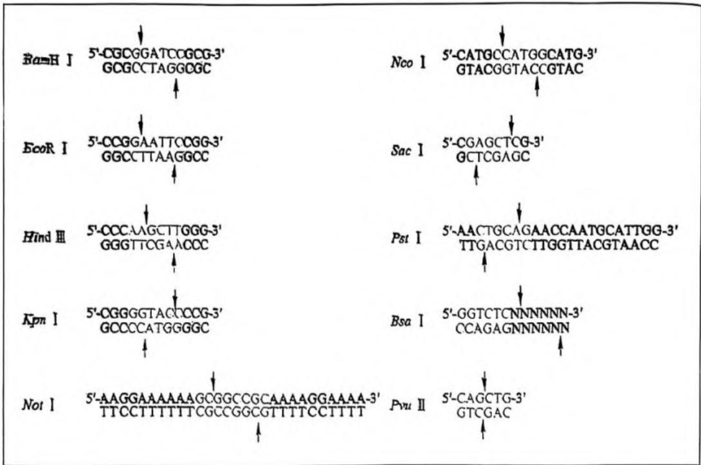

量复制子都可以作为基因导入的载体。

分子克隆的载体种类繁多,但目前全世界各实验室广泛使用的质粒载体大多是从以下几种载体派生出来的。pSC101 是第一代质粒载体,全长 9.09 kb,带有四环素抗性基因 (tet $^{r}$ ),具有 EcoR I、Hind III、BamH I、Sal I、Xho I、Pvu II 以及 Hpa I 7 种限制性内切核酸酶的单酶切位点。该载体是一种严紧型复制控制的低拷贝质粒,平均每个宿主细胞仅有 1\~2 个拷贝,因此,从带有该质粒的宿主细胞中很难大量提取质粒 DNA,不利用后续实验的进行;而 ColE1 质粒载体则是松弛型复制控制的多拷贝质粒,每个宿主细胞中的拷贝数可达到 1 000\~3 000 个;pBR322 质粒载体同样具有较高的拷贝数 (1 000\~3 000 个),便于制备重组 DNA,它由 3 个不同来源的部分组成,即来源于 pSF2124 质粒易位子 Tn3 的氨苄青霉素抗性基因 (amp $^{r}$ )、来源于 pSC101 质粒的四环素抗性基因 (tet $^{r}$ ) 和来源于 ColE1 的派生质粒 pMB1 的 DNA 复制起点 (ori)。最后一类是 pUC 质粒载体,由包括来自 pBR322 质粒的复制起点 (ori),氨苄青霉素抗性基因 (amp $^{r}$ ),大肠杆菌 β- 半乳糖苷酶基因 (lacZ) 启动子及编码 α- 肽的 DNA 序列,特称为 lacZ' 基因等 4 部分所组成。一旦有外源 DNA 插入位于 lacZ' 基因 5' 端的多克隆位点 (MCS) 处,lacZ' 基因功能被破坏,不能产生功能型半乳糖酶。

lacZ'基因编码β-半乳糖苷酶氨基端146个氨基酸的α-肽，IPTG(异丙基-β-D-硫代半乳糖苷)诱导该基因表达，所合成的β-半乳糖苷酶α-肽与宿主细胞编码的缺陷型β-半乳糖苷酶互补，产生有活性的β-半乳糖苷酶，水解培养基中的X-gal(5-溴-4-氯-3-吲哚-β-D-半乳糖苷)，生成蓝色的溴氯吲哚。利用这一原理可对重组载体进行蓝白斑筛选，在含X-gal的培养基中，非转化菌落呈蓝色，含有重组DNA分子的菌落呈白色。

获得了用外源 DNA 片段和载体分子连接后的重组载体后,还必须通过一个细菌转化的过程将其重新导入到宿主细胞中,才能保证重组载体的增殖。1970 年,Mandel 和 Higa发现,大肠杆菌细胞经适量氯化钙处理后,能有效地吸收 $\lambda$ 噬菌体 DNA。1972 年,又有实验室报道,经氯化钙处理的大肠杆菌细胞能够有效摄取质粒 DNA。从此,大肠杆菌就成了分子克隆中最常用的转化受体。同年,美国斯坦福大学的 Berg 等人在体外用限制性核酸内切酶 EcoR I 分别消化病毒 SV40 和 $\lambda$ 噬菌体 DNA,再用 T4 DNA 连接酶将两种不同的酶切片段连接起来,首次获得了同时含有 SV40 和 $\lambda$ 噬菌体 DNA 的重组 DNA。1973 年,Cohen 实验室也成功地进行了体外 DNA 重组,他们将分别经限制性内切核酸酶处理的含有编码卡那霉素抗性基因的大肠杆菌质粒 R6-5 DNA 与含有编码四环素抗性基因的另一种大肠杆菌质粒 pSC101 DNA 混合后加入 T4 DNA 连接酶,得到的重组杂种 DNA 分子表现出既抗卡那霉素又抗四环素的双重抗性特征。

由来自大肠杆菌的质粒 DNA 形成的重组 DNA 分子可以在原来的宿主细胞中增殖，这似乎还比较容易理解。那么，不同物种的外源 DNA 片段是否也可以在大肠杆菌细胞中增殖呢？为了回答这个问题，Cohen 和 Boyer 等人合作，把非洲爪蟾核糖体蛋白基因片段与 pSC101 质粒 DNA 片段重组后导入大肠杆菌，证明动物基因也能进入大肠杆菌细胞并转录出相应的 mRNA 分子。上述实验表明：

① 类似 pSC101 的质粒 DNA 分子可以作为基因克隆的载体, 从而将外源 DNA 导入宿主细胞。

② 来自高等生物非洲爪蟾基因片段可以被成功地转移到原核细胞中并实现功能表达。

③ 质粒 DNA-大肠杆菌细胞作为一种成功的基因克隆体系,有可能在重组 DNA 或基因工程研究中发挥重要作用。

## 5.2 DNA 基本操作技术

自从 1953 年 DNA 分子双螺旋被发现,分子生物学研究得到各国科学家的高度重视并且迅速发展成一门新兴学科,这首先要归功于各种 DNA 操作核心技术——包括基因组 DNA 提取、凝胶电泳、PCR、重组载体的构建及基因组 DNA 文库的构建等技术的迅速发展与应用。时至今日,分子生物学研究已经进入三维基因组和三维蛋白质结构大数据时代,但最基本的 DNA 操作技术仍然不可或缺。

## 5.2.1 基因组 DNA 的提取

广义的基因组(genome)是指一个单倍体细胞内细胞核、线粒体和叶绿体中所包含的全部DNA分子,而我们通常说的基因组DNA则特指细胞核内染色体上包括编码区和非编码区在内的全部DNA分子。获取分子量大、纯度高的基因组DNA,可以使后续实验如PCR反应、Southern杂交、文库构建或者基因组测序等结果更加可信可靠。

根据不同材料的性质,提取基因组 DNA 时方法略有不同。一般首先将组织材料磨碎或细胞材料均匀分散。因为植物组织具有细胞壁结构,较难破碎,所以一般先用液氮速冻帮助研磨,随后加入裂解液破碎细胞,释放细胞核及核内的染色质。动物组织及细胞材料一般加入 SDS 进行裂解。SDS 是一种阴离子去污剂, 可溶解细胞膜, 并使蛋白质变性, 释放出染色质中的 DNA。植物组织一般加入一种阳离子去污剂——CTAB, 它可以更好地除去细胞壁中的多糖成分, 溶解细胞膜, 并与释放出来的核酸形成复合物。用苯酚和氯仿做有机相来分离裂解后的蛋白质、糖类、酚类等有机物的各种细胞组分, 使之与溶解于水相的 DNA 相分离。最后用乙醇洗涤分离后的 DNA, 吸收与 DNA 相结合的水分子, 使之沉淀并得到进一步的纯化。将 DNA 沉淀晾干后, 溶解于超纯水或 Tris-HCl 和 EDTA 配制的 TE 缓冲液中 (图 3-2a)。基因组 DNA 制备后可以在 $4^{\circ} \mathrm{C}$ 适当保存, 但最好尽快使用。实验中还常将含有 DNA 样品的细胞破碎液通过一个硅胶膜纯化柱, 使 DNA 吸附在硅胶膜上而与其他成分分开, 进一步在低盐浓度下从硅胶膜上直接洗脱 DNA, 得到纯度较高的 DNA 样品。

DNA 的浓度和纯度可以通过测定其 $OD_{260}$ 和 $OD_{280}$ 来判断。 $OD_{260}$ 为 1 时相当于浓度为 50 $\mu g/mL$ ，而 $OD_{260}/OD_{280}$ 的比值如果在 1.8\~2.0 之间，表示所提取的 DNA 纯度较好，如果样品中有蛋白质或酚污染，则 $OD_{260}/OD_{280}$ 的比值将明显低于 1.8。

提取基因组 DNA 时一定要保证核酸一级结构的完整性,确保所提取的 DNA 片段显著大于 50 kb。在操作时要尽可能避免机械力对 DNA 的损伤。可通过琼脂糖凝胶电泳检测基因组 DNA 片段大小。常用分子量为 50 kb 的 $\lambda$ 噬菌体作为检测基因组 DNA 质量的参照 (图 5-2b)。

图5-2 基因组DNA的提取

$$
; (b)
$$

地棉不同组织的核DNA样品电泳图。

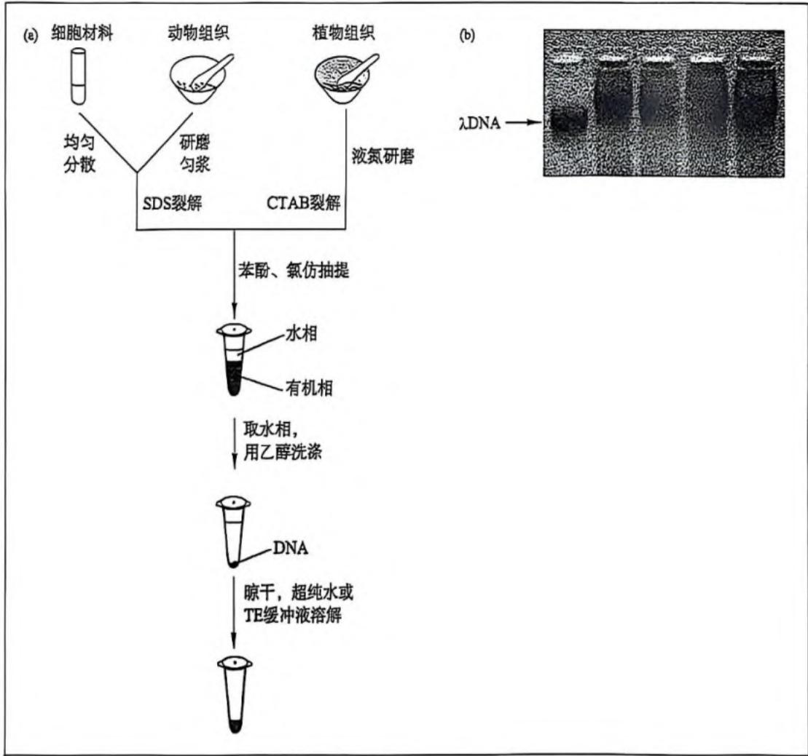

## 5.2.2 核酸凝胶电泳

自从琼脂糖(agarose)和聚丙烯酰胺(polyacrylamide)凝胶被发现以来,按分子量大小分离DNA的凝胶电泳技术,已经成为分析鉴定重组DNA分子及蛋白质与核酸相互作用的重要实验手段。

在生理条件下,核酸分子中的磷酸基团呈离子化状态,把这些核酸分子放置在电场当中,它们会向正电极方向迁移(图5-3)。由于核酸分子中的磷酸基团在结构上的重复性,相同数量的双(a) 琼脂糖凝胶电泳装置, 电泳仪为电泳槽施加电压, 添加适量的电泳缓冲液, 将琼脂糖凝胶置于其中, DNA 即可在凝胶中由负极向正极迁移; (b) 将琼脂糖粉末加入电泳缓冲液中加热熔化, 倒入凝胶模具中并插入梳子形成上样孔, 待其冷却后拔去梳子, 即制备好琼脂糖凝胶。凝胶电泳完毕后在紫外下显示 DNA 条带。

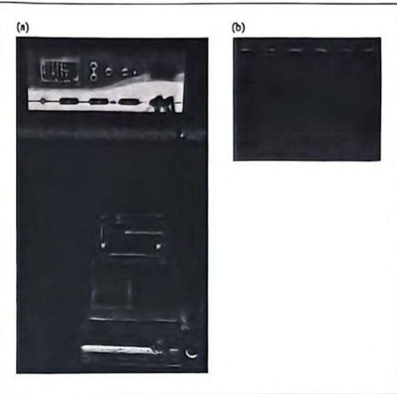  
图 5-3 琼脂撕凝胶电泳

## 链 DNA 几乎具有等量的净电荷

因此它们能以同样的速度向正电极方向迁移。在一定的电场强度下，DNA 分子的这种迁移速度，亦即电泳的迁移率，就完全取决于核酸分子本身的大小。因此，可以通过电泳将不同分子量的核酸分子彼此分离开来。

将琼脂糖粉末加热到熔点后冷却凝固便会形成良好的无反应活性的电泳介质。凝胶的分辨能力与凝胶的类型和浓度有关(表5-2)。琼脂糖凝胶分辨DNA片段的范围为0.2\~50 kb，而要分辨较小分子量的DNA片段，则要用聚丙烯酰胺凝胶，其分辨范围为1\~1 000 bp。凝胶浓度的高低影响凝胶介质孔隙的大小，浓度越高，孔隙越小，其分辨能力就越强。反之，浓度降低，孔隙就增大，其分辨能力也就随之减弱。

表 5-2 琼脂糖及聚丙烯酰胺凝胶分辨 DNA 片段的能力

<table><tr><td>凝胶类型及含量</td><td>分离 DNA 片段的大小范围 /bp</td></tr><tr><td>0.3% 琼脂糖</td><td>50 000~1 000</td></tr><tr><td>0.7% 琼脂糖</td><td>20 000~1 000</td></tr><tr><td>1.4% 琼脂糖</td><td>6 000~300</td></tr><tr><td>4.0% 聚丙烯酰胺</td><td>1 000~100</td></tr><tr><td>10.0% 聚丙烯酰胺</td><td>500~25</td></tr><tr><td>20.0% 聚丙烯酰胺</td><td>50~1</td></tr></table>

因为溴化乙锭(ethidium bromide, EB)能插入到 DNA 或 RNA 分子的相邻碱基之间，并在紫外光照射下发出荧光，所以，常在琼脂糖凝胶冷却凝固前，加入适量溴化乙锭，电泳完毕后将凝胶放置在 300 nm 波长的紫外光下，可十分灵敏而快捷地检测出凝胶介质中的

DNA(约50 ng)条带。

用普通琼脂糖凝胶电泳很难分离大于 50 kb 的 DNA 分子,为了进行超大片段 DNA 研究,科学家发明了脉冲电场凝胶电泳(pulsed-field gel electrophoresis, PFGE)技术,用于分离超大分子量(有时甚至是整条染色体)DNA。在脉冲电场中,DNA 分子的迁移方向随着电场方向的周期性变化而不断改变。由于琼脂糖凝胶的电场方向、电流大小及作用时间都在交替变换,DNA 分子必须随时调整运动方向以适应凝胶孔隙的无规则变化。相对于分子量较小的 DNA,分子量较大的 DNA 需要更多的脉冲次数来更换其构型和运动方向。应用脉冲电场凝胶电泳技术,可成功地分离到分子量高达 $10^{7}$ bp 的 DNA 大分子。

## 5.2.3 聚合酶链式反应技术

聚合酶链式反应(polymerase chain reaction, PCR)技术是目前体外快速扩增特定基因片段最常用的方法。20世纪80年代，美国Cetus公司的Kary Mullis发明了该技术，并因此获得1993年诺贝尔化学奖。

PCR 技术的原理并不复杂。首先将模板 DNA(质粒、基因组 DNA 或 mRNA 逆转录产生的 cDNA)在临近沸点的温度下加热分离成单链 DNA 分子,然后 DNA 聚合酶在一对引物(一小段单链 DNA)的引导下以单链 DNA 为模板,利用反应混合物中的 4 种脱氧核苷三磷酸(dNTP)合成新的 DNA 互补链 $^{(图5-4)}$ 。DNA 聚合酶是一种天然产生的能催化 DNA (包括 RNA) 合成和修复的生物大分子。所有生物体基因组的准确复制都依赖于这类酶的活性。PCR 反应中使用的 DNA 聚合酶不同于一般的聚合酶,它具有很强的耐高温性,在高温下数小时不丧失酶活性。DNA 聚合酶开始工作时先要产生一小段双链 DNA 来启动("引导")新链的合成,这一小段引导新链合成的 DNA 序列就被称为"引物",引导 DNA聚合酶特异性扩增目标基因片段。所以，通过设计特定基因两端的引物序列，即可实现对目标基因的扩增。

图5-4 聚合酶链式反应(PCR)技术原理示意图  
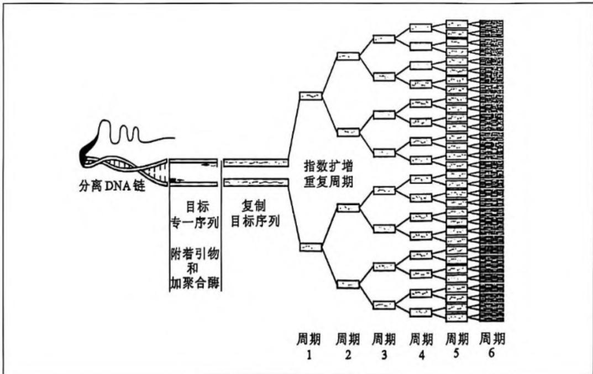

PCR 操作过程中, 只要在试管内加入模板 DNA、引物、dNTP 及缓冲液(酶催化反应的缓冲液), DNA 聚合酶就能在数小时内将目标序列扩增 100 万倍以上。模板 DNA 分子首先在高温下解开成单链, 适当降温后引物立即与该模板 DNA 特定序列相结合, 产生双链区, DNA 聚合酶从引物 3' 端开始复制其互补链, 迅速产生与目标序列完全相同的拷贝。在后续反应中, 所有新形成的 DNA 双链, 都会在高温下解开成单链, 体系中的引物分子再次与其互补序列相结合, DNA 聚合酶也再度复制模板 DNA。由于在 PCR 反应中所选用的一对引物, 是按照与扩增区段两端序列彼此互补的原则设计的, 因此, 每一条新生链的合成都是从引物的退火结合位点开始并朝相反方向延伸的, 每一条新合成的 DNA 链上都具有新的引物结合位点。整个 PCR 反应的全过程, 即 DNA 解链(变性)、引物与模板 DNA 相结合(退火)、DNA 合成(链的延伸)3 步, 可以被不断重复。经多次循环之后, 反应混合物中所含有的双链 DNA 分子数,

图5-5 PCR指数扩增时循环次数与DNA产物量比较

<table><tr><td>1</td><td>2</td></tr><tr><td>2</td><td>4</td></tr><tr><td>3</td><td>8</td></tr><tr><td>4</td><td>16</td></tr><tr><td>5</td><td>32</td></tr><tr><td>6</td><td>64</td></tr><tr><td>7</td><td>128</td></tr><tr><td>8</td><td>256</td></tr><tr><td>9</td><td>512</td></tr><tr><td>10</td><td>1 024</td></tr><tr><td>11</td><td>2 048</td></tr><tr><td>12</td><td>4 096</td></tr><tr><td>13</td><td>8 192</td></tr><tr><td>14</td><td>16 384</td></tr><tr><td>15</td><td>32 788</td></tr><tr><td>16</td><td>65 536</td></tr><tr><td>17</td><td>131 072</td></tr><tr><td>18</td><td>262 144</td></tr><tr><td>19</td><td>524 288</td></tr><tr><td>20</td><td>1 048 576</td></tr><tr><td>21</td><td>2 097 152</td></tr><tr><td>22</td><td>4 194 304</td></tr><tr><td>23</td><td>8 388 608</td></tr><tr><td>24</td><td>16 777 216</td></tr><tr><td>25</td><td>33 554 432</td></tr><tr><td>26</td><td>67 108 864</td></tr><tr><td>27</td><td>134 217 728</td></tr><tr><td>28</td><td>268 435 456</td></tr><tr><td>29</td><td>536 870 912</td></tr><tr><td>30</td><td>1 073 741 824</td></tr><tr><td>周期</td><td>拷贝</td></tr></table>

即两条引物结合位点之间的 DNA 区段的拷贝数, 理论上的最高值应是 $2^{n}$ (图 5-5), 能满足进一步遗传分析的需要。

## 5.2.4 重组载体构建

要完成对目的基因的功能研究,首先要获取它的重组表达载体,而第一步则是引物设计。引物长度一般为 18\~27 bp, GC 含量控制在 40%\~60%, $T_{\mathrm{m}}$ 值在 60℃左右。两个 DNA 引物的 5' 端还需要各加上一个外切核酸酶的识别位点及其保护碱基,以利于外切核酸酶稳定结合到 DNA 双链并发挥切割作用,而所选择的外切核酸酶必须与载体上的多克隆位点相匹配 (图 5-6a)。

引物合成后,选择合适的 DNA 聚合酶和模板 DNA,用 PCR 扩增目的基因片段 $^{[图5-6h]}$ 。通过琼脂糖凝胶电泳检测目标条带是否符合预期,如果条带单一,只需要将 PCR 产物通过硅胶膜纯化柱进行纯化就可以了;若条带不单一,还需要在电泳后,在紫外灯下对目标条带进行割胶回收,溶胶后同样用硅胶膜纯化柱纯化。

用相同的外切核酸酶在适当温度下分别双酶切目的基因片段和载体 DNA $^{[5-6c]}$ 。根据所加 DNA 总量，确定酶切 10 min 至数小时，保证酶切完全。用 T4 DNA 连接酶进行连接反应 $^{[5-6d]}$ ，根据插入目的基因片段与载体各自的 DNA 浓度及片段长度的不同，一次连接反应需要投入的插入片段与载体 DNA 总量的摩尔比应控制在 (8\~10)：1 时较有

图 5-6 pCAMBIA 1300 重组载体构建示意图

(a) 合成目的基因片段两端的引物(包含特定酶切位点); (b) PCR 扩增含有指定酶切位点的目的基因; (c) 对目的基因和质粒载体分别进行双酶切; (d) T4 DNA 连接酶将酶切后目的基因和质粒载体连接成一个整体。

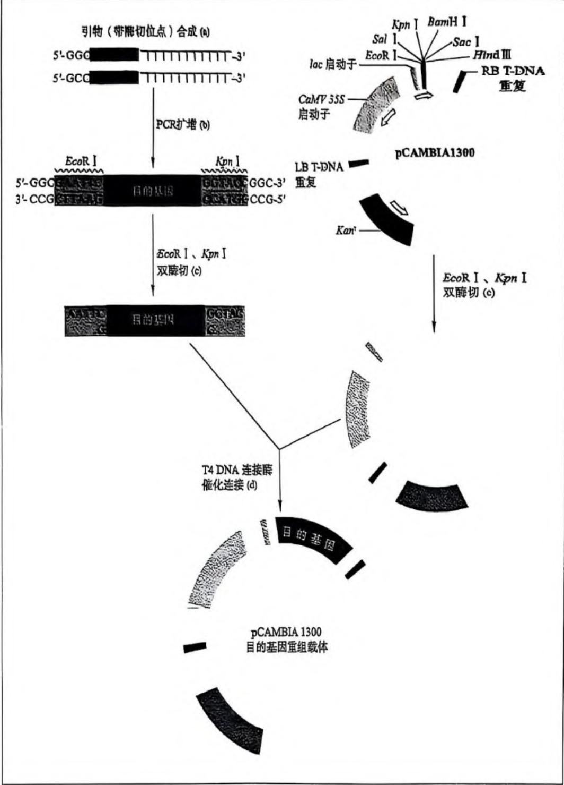

利于连接反应的进行。连接温度为 $22^{\circ}$ C 时，T4 DNA 连接酶的活性较高，1～2 h 即可完成连接，但酶较易失活，连接不稳定； $4^{\circ}$ C 或 $16^{\circ}$ C 连接时，酶的活性维持时间较长，连接后更稳定，但通常需要反应 8 h 以上。

近年来,一种称为恒温一步法且不依赖 T4 DNA 连接酶的克隆技术已得到广泛应用。首先将载体线性化,通过引物设计在插入片段两端引入线性化载体的末端序列 (15\~25 bp),使插入片段两端具有与线性化载体末端相同的序列。然后,按一定摩尔比例加入插入片段和线性化载体,再加入 dNTP,在 T5 外切核酸酶、DNA 聚合酶和 Taq DNA 连接酶的混合催化下,50℃恒温反应 15\~30 min 即可完成连接反应(图 5-7)。

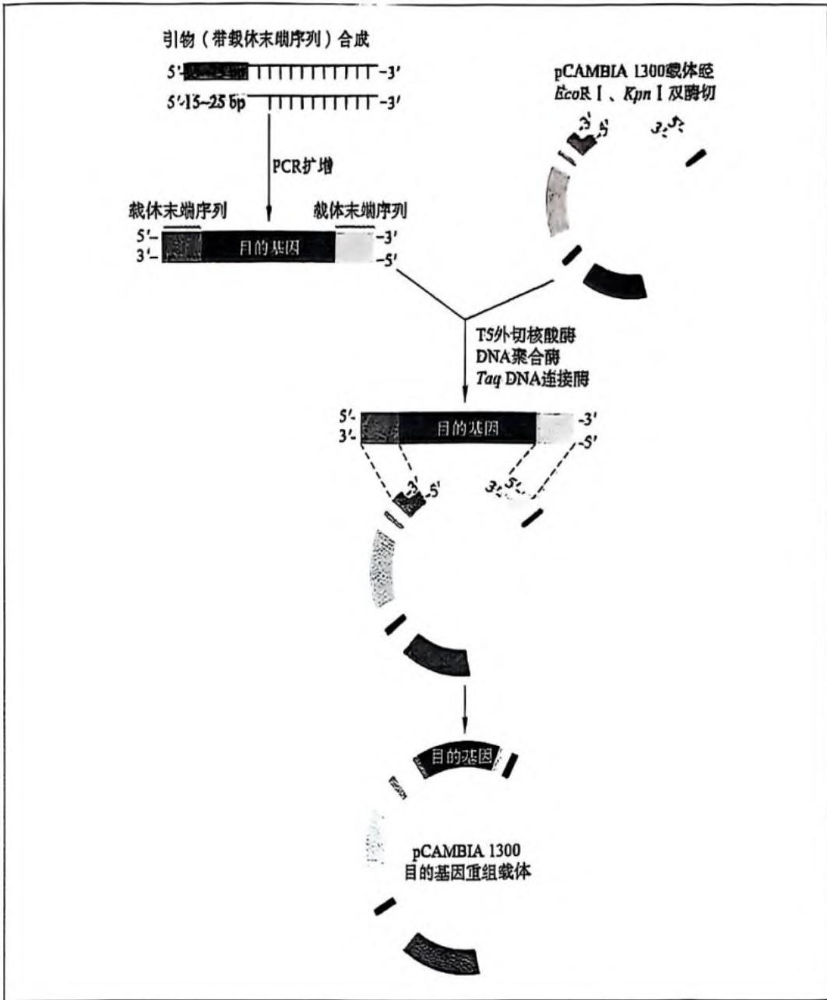

由于连接成功的重组载体数量有限,远远不能满足实验需求,有必要通过细菌转化以获得大量重组载体的拷贝 $^{[25]5-8h}$ 。大肠杆菌在 $CaCl_{2}$ 溶液处理后,细胞膨胀,细胞膜通透性发生改变,易于吸附外源DNA,这种状态的细胞被称作感受态细胞。将连接产物与感受态细胞在试管中轻柔混匀,于冰上静置30min,转移到42℃热刺激30\~90s,此时DNA进入感受态细胞内,然后立即于冰上静置2min,加入适量培养基后,将其置于37℃摇床复苏约1h,将菌液均匀地涂布在含有抗生素的培养基上,37℃培养箱中倒置培养 $^{[25]5-8h}$ 。因为连接产物,即重组后的质粒载体上带有抗性基因和表达元件,进入大肠杆菌后所产生的蛋白质能降解被大肠杆菌细胞吸收的抗生素,从而使重组大肠杆菌细胞能够在培养基中存活下来。

图5-7 4.1 温一步法构建 pCAMBIA 1300 重组载体示意图

过夜培养后培养基上应该长出很多单菌落,随机挑取部分菌落,用菌内的重组质粒作为 DNA 模板,进行菌落 PCR(colony PCR)扩增,鉴定目的基因片段是否插入载体中[图 5-8]。

对载体进行双菌切，使其线性化，在插入片段两端引入与线性化载体末端一致的序列，线性化载体和插入片段在一种混合酶的催化下，50℃恒温反应15\~30min即可完成连接反应。首先T5外切核酸酶消化DNA片段5'端产生单链突出部分，插入片段和线性化载体末端重新退火成双链，然后DNA聚合酶填补退火双链两边的缺口，Taq DNA连接酶将缝隙黏合，完成连接反应。

图 5-8 细菌转化及 pCAMBLA1300 重组质粒提取示意图

(a) 将重组后的质粒载体转化到大肠杆菌中；(b) 过夜培养大肠杆菌，让重组质粒拷贝数增加；(c) 鉴定出含有重组质粒的单菌落；(d) 裂解菌体，获取重组质粒载体。

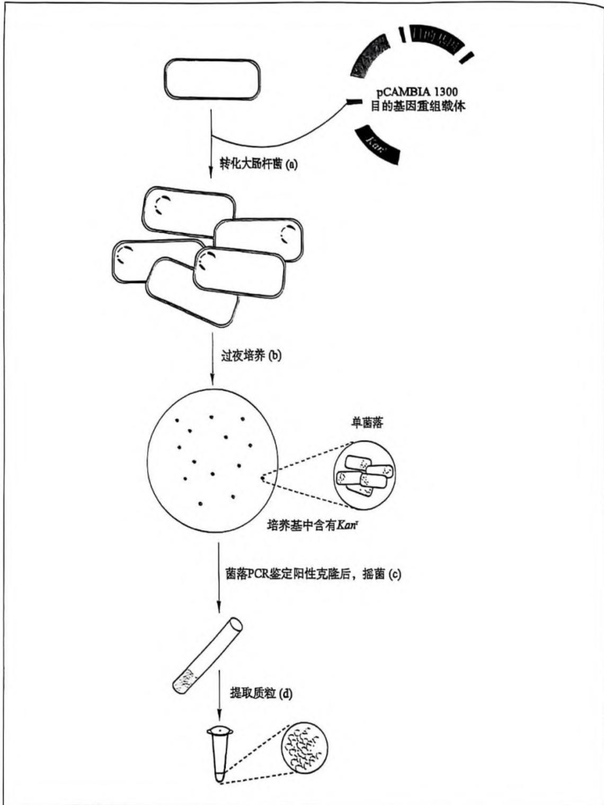

挑取阳性菌落于液体培养基中 $37^{\circ}$ C 培养 10\~13 h, 而后采用碱裂解法提取细菌中的质粒 DNA。在强碱性溶液中裂解菌体, 释放质粒 DNA, 然后用酸中和反应, 离心收集上清液后, 通过硅胶膜纯化柱纯化出质粒 DNA(图 5-8d), 经酶切鉴定和测序确定序列无误后用于后续实验。

## 5.2.5 实时定量PCR

由于 PCR 技术具有极高的敏感性,扩增产物总量的变异系数常常达到 10%\~30%。

第 5 章 分子生物学研究法(上)——DNA、RNA 及蛋白质操作技术因此,人们普遍认为应用简单方法对PCR扩增的产物进行最终定量是不可靠的。随着技术的进步,20世纪90年代末期出现了实时定量PCR(real time quantitative PCR,qPCR)技术,利用带荧光检测的PCR仪对整个PCR过程中扩增DNA的累积速率绘制动态变化图,从而消除了在测定终端产物丰度时有较大变异系数的问题。

实时定量 PCR 反应在带透明盖的塑料小管中进行, 激发光可以直接透过管盖, 激发荧光探针。荧光探针事先混合在 PCR 反应液中, 只有与 DNA 结合后, 才能够被激发出荧光。随着新合成目的 DNA 片段的增加, 结合到 DNA 上的荧光探针增加, 被激

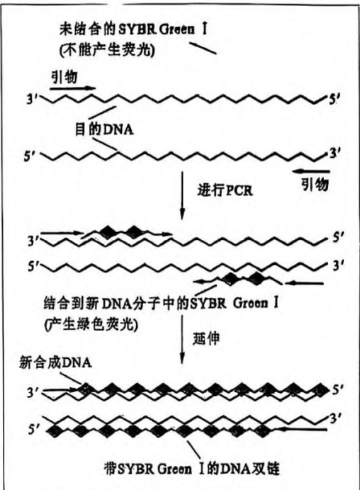

图 5-0 SBIT Green

工作探针的实时定量 PCR 实验过程图示

加入到 PCR 反应体系中的荧光染料 SYBR Green I 仅能与双链 DNA 结合, 被激发出绿色荧光, 其荧光强度反映 PCR 产物的产量。

发产生的荧光也相应增加。最简单的 DNA 结合荧光探针没有序列特异性，例如荧光染料 SYBR Green I，激发光波长 520 nm，这种荧光染料能与任何双链 DNA 结合（图 5-9）。

利用 SYBR Green I 可以检测 PCR 反应中获得的全部双链 DNA, 但是不能区分不同的双链 DNA。为了进一步确保荧光检测到的就是靶 DNA 序列, 人们又设计了仅能与目的 DNA 序列特异结合的荧光探针, 如 TaqMan 探针。TaqMan 探针是一小段被设计成可以与靶 DNA 序列中间部位结合的单链 DNA (一般为 50\~150 bp), 并且该单链 DNA 的 5' 和 3' 端带有短波长和长波长两个不同荧光基团。这两个荧光基团由于距离过近, 在荧光共振能量转移 (FRET) 作用下发生荧光淬灭, 因而检测不到荧光。PCR 反应开始后, 随着双链 DNA 变性产生单链 DNA, TaqMan 探针结合到与之配对的靶 DNA 序列上, 并被具有外切酶活性的 Taq DNA 聚合酶逐个切除而降解, 从而解除荧光淬灭的束缚, 荧光基团在激发光下发出荧光, 所产生的荧光强度直接反映了被扩增的靶 DNA 总量 [图 5-10]。

通过实时定量 PCR 确定靶基因表达强度时,每次实验都应设阴性对照和 4 个以上的标准品(将已知浓度的 DNA 模板进行一系列的稀释后成为标准品),每个样品都至少平行做 3 个重复。通常以 10\~15 个循环的荧光值作为阈值或基线,也可以以阴性对照荧光值的最高点作为基线。图 5-11a 显示随着扩增反应循环数增加,代表扩增产物含量的荧光强度增加;图 5-11b 中标准曲线由标准样品浓度的 lg 值和其相对应的 Ct 值所组成。Ct 值是产物荧光强度首次超过设定阈值时,PCR 反应所需的循环数。利用标准曲线,可以确定样品中待检测靶 DNA 的绝对含量。

野生型拟南芥(WT)整株中 WUS 基因的表达丰度很低,3 次重复的平均 Ct 值为 $31.23 \pm 0.32$ , 而在拟南芥抑癌基因失活突变体植株中 WUS 基因的表达丰度显著增加,3

## 图5-10 应用 $\mathrm{F}_{\mathrm{eq}}/\mathrm{M}_{\mathrm{abs}}$ 探针的实时定值PCR技术

TaqMon 探针具有 3 个要素：一端的短波长荧光基团（菱形），一段目的 DNA 特异的碱基序列和另一端的长波长荧光基团（小圆形），探针上的荧光基团十分接近，因此两个荧光基团相互发生淬灭、不产生绿色荧光。探针上的特异的碱基序列被设计成能与目的 DNA 中部序列结合，在 PCR 反应中，当 Taq 聚合酶延伸链时，它的核酸酶活性会逐个切掉结合在目的 DNA 中部的 TaqMon 探针的碱基，从而使两个荧光基团被释放出来，解除了荧光淬灭的束线。短波长的荧光基团在激发光下产生绿色荧光，它的荧光强度反映新合成目的 DNA 总量。

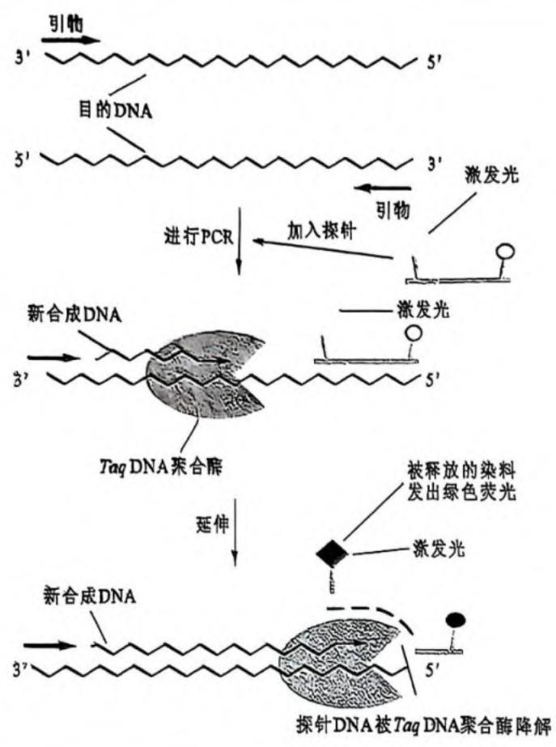

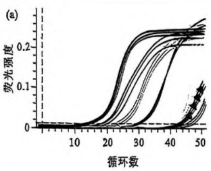

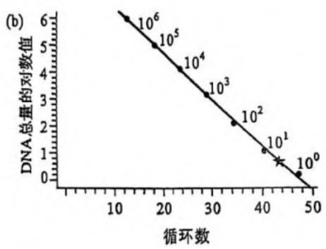  
图 5-11 用实时定量 PCR 法分析未知样品靶基因的绝对表达量  
(a) 扩增曲线: 由已知总量(起始量从 1 至 1 000 000 个拷贝)的 7 个标准品和一个未知样品(三角形连线)得到的扩增曲线。随着 PCR 循环数(横坐标)的增加, 代表 PCR 产物产量的荧光强度(纵坐标)增加。(b) 标准曲线: 纵坐标是每个标准品中所含 DNA 总量的对数值 (lg), 横坐标是每个标准品 PCR 产物荧光强度首次超过设定阈值 (a 中虚线)时反应所需的循环数 (Ct 值)。由扩增曲线获得未知样品的 Ct 值, 通过对标准曲线的线性回归分析可计算出未知样品中靶 DNA 的起始量(星号)。

次重复的平均 Ct 值为 $21.92 \pm 0.13$ 。两者的差值 $\Delta Ct$ 值为 $9.31 \pm 0.19$ ，设定实验中 PCR 扩增效率为 1.8（理论值为 2），WUS 基因在突变体整株与野生型拟南芥整株中表达丰度的相对比值为 n，则 $n = 1.8^{\Delta Ct}$ 。由此算出 WUS 基因在突变体植株中的表达丰度比在野生型拟南芥植株中提高了 $239 \pm 26.25$ 倍 $^{(表5-3)}$ 。

表 5-3 实时定量 PCR 相对定量实验的数据处理

<table><tr><td></td><td>野生型拟南芥(WT)</td><td>突变体拟南芥(Mu)</td><td> $\Delta C_I(\Lambda v_BCI_{\sigma T}-\Lambda v_BCI_{\mu \nu})$ </td><td>相对比值(LB $^{ΔC_I}$ )</td></tr><tr><td rowspan="3">WUS Cr 值</td><td>31.49</td><td>21.78</td><td></td><td></td></tr><tr><td>30.87</td><td>21.95</td><td></td><td></td></tr><tr><td>31.34</td><td>22.04</td><td></td><td></td></tr><tr><td>平均值(ΛvB)</td><td>31.23 ± 0.32</td><td>21.92 ± 0.13</td><td>9.31 ± 0.19</td><td>239 ± 26.25</td></tr></table>

拟南芥野生型和突变休样品经由拟南芥管束基因（UBQ10）进行均一化处理。

## 5.2.6 基因组 DNA 文库的构建

除了对特定基因片段进行重组克隆外,有时还需要克隆某个生物体的全基因组 DNA 片段用于后续实验,称之为基因组 DNA 文库构建。

构建基因组 DNA 文库的第一步是制备大小合适的随机 DNA 片段, 在体外将这些 DNA 片段与适当的载体相连成重组子, 转化到大肠杆菌或其他受体细胞中, 从转化子克隆群中筛选出含有靶基因的克隆。为保证能从基因组文库中筛选到某个特定基因, 基因组文库必须具有一定的代表性和随机性。也就是说文库中全部克隆所携带的 DNA 片段必须覆盖整个基因组。在文库构建中通常采用两种策略提高文库代表性: 一是用机械切割法或限制性内切核酸酶切割法随机断裂 DNA, 以保证克隆的随机性。二是增加文库重组克隆的数目, 以提高覆盖基因组的倍数。预测一个完整基因组文库应包含的克隆数目, 可用 Clark 和 Carbon 于 1975 年提出的公式:

$$
N = \ln (1 - p) / \ln (1 - f)
$$

式中，N 表示一个基因组文库所应该包含的重组克隆数目；p 表示所期望的靶基因在文库中出现的概率；f 表示重组克隆平均插入片段的长度和基因组 DNA 总长的比值。

为了获得整个基因簇或一个基因及其两翼延伸序列,实验中所制备的 DNA 随机片段一般约 20 kb 或更大。以人为例,其基因组大小为 $3 \times 10^{9}$ bp,若 p = 99%,平均插入片段大小为 20 kb,则 $N = 6.9 \times 10^{5}$ 。

构建基因组文库最常用的是 $\lambda$ 噬菌体载体(克隆能力 $15\sim 20\mathrm{kb}$ )和限制性内切酶部分消化法。常用识别4个核苷酸的限制性内切核酸酶Sau3A部分消化基因组DNA，因为Sau3A与BamH I是一对同尾酶，所以由Sau3A酶切产生的DNA片段可插入到经BamH I消化的 $\lambda$ 噬菌体载体上(基本流程如图5-12所示)。提取真核基因组DNA，用Sau3A局部消化，消化产物经琼脂糖凝胶电泳或者蔗糖梯度离心，收集分子量为 $15\sim 20\mathrm{kb}$ 的DNA片段。同时用BamH I消化 $\lambda$ 噬菌体载体DNA，纯化后用T4连接酶与收集的DNA片段相连接，形成嵌合分子。体外包装后用重组噬菌体感染大肠杆菌受体细胞，产生噬菌斑，组成包含该真核生物基因组绝大部分序列的DNA文库。 $\lambda$ 噬菌体文库构建方法简单高效，所获得的文库易于用分子杂交法进行筛选，因此被广泛用于细菌、真菌等基因组较小物种的研究。

此外,还有许多高容量克隆载体,如柯斯质粒、细菌人工染色体(BAC)、P1源人工染色

图 3-12 用 Sin3λ 限制性内切核酸酶消化直核生物基因组 DNA 并利用 λ 胟菌体载体构建基因组文库的过程图示

(a) 载体 DNA 片段的制备；(b) 真核基因组 DNA 片段的制备；(c) 体外连接载体 DNA 及基因组 DNA 片段的反应；(d) 体外包装；(e) 感染大肠杆菌细胞。B=BamH I 末端；S=Sau3A 末端。

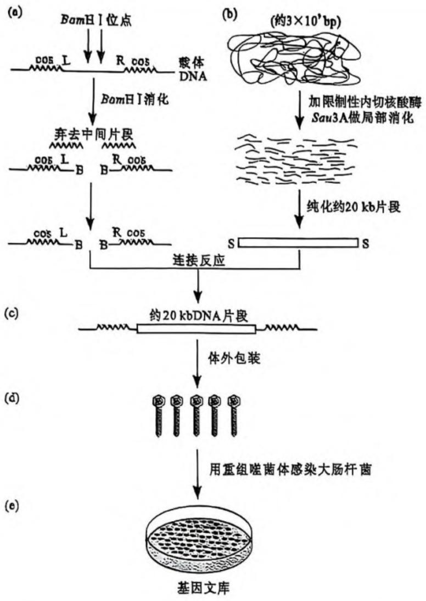

体(PAC)、酵母人工染色体(YAC)都可用于基因组文库的构建。这些载体的优点是可以插入大片段DNA,如柯斯质粒可以容纳大至45 kb片段的插入,但是稳定性相对较差,在大量的复制过程中容易出现缺失现象。BAC、YAC、PAC可以容纳70\~1000 kb的外源片段,主要用于基因组作图、测序和克隆序列的比对。

## 5.2.7 DNA 修饰与检测

DNA 是储藏和传递遗传信息的重要分子, 其基本单位是腺嘌呤(A)、胞嘧啶(C)、鸟嘌呤(G)和胸腺嘧啶(T)四种核苷酸(图 5-13b)的线性序列, 通过 AT 和 GC 碱基对构成双链 DNA 的双螺旋结构来维持和传递遗传密码。DNA 的修饰是独立于 DNA 序列之外可以影响 DNA 生物学功能的可遗传化学修饰。到目前已发现了至少 17 种化学修饰(图 5-13b)。

目前研究最多的 DNA 修饰是 1898 年发现的胞嘧啶甲基化。5-甲基胞嘧啶 (5mC) 是最主要的 DNA 修饰,由 DNA 甲基转移酶(DNMT)催化,S-腺苷蛋氨酸(SAM)作为甲基供体,主要修饰位于 CpG 二核苷酸上。DNA 甲基化广泛存在于整个基因组中,指导多能干细胞分化成不同的谱系,形成不同的组织类型。而 DNA 去甲基化过程也产生很多的 DNA 修饰。

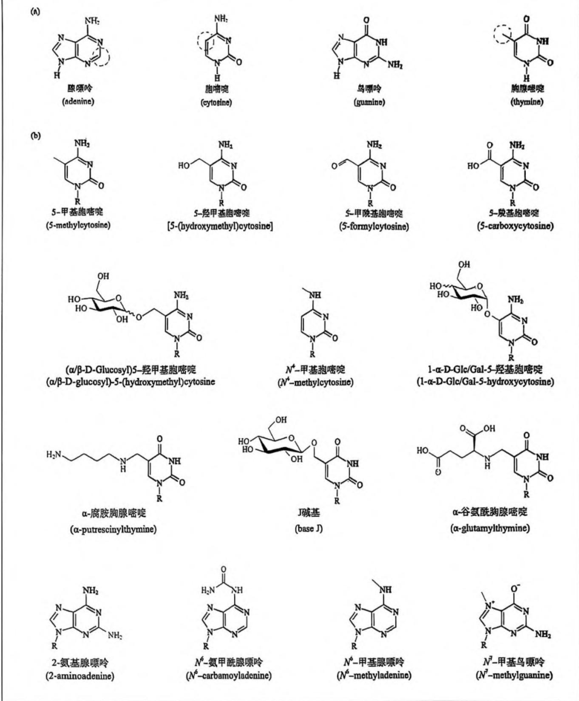  
图 5-13 DNA 修饰类型  
(a) 四种碱基类型；(b) 已知 DNA 分子上碱基的主要修饰类型，前 4 种较常见，其余则较为少见。

图 5-14 活性去甲基化途径  
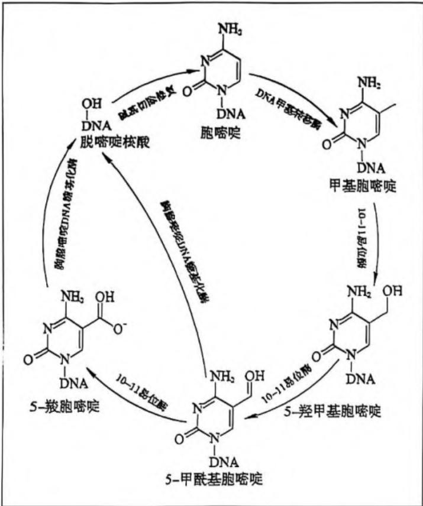

活性去甲基化途径被认为涉及10-11易位酶(TET,包括TET1、TET2和TET3)将5mC迭代氧化为5-羟甲基胞嘧啶(5hmC)、5-甲酰基胞嘧啶(5fC)和5-羧胞嘧啶(5caC)。随后,5fC或5caC被胸腺嘧啶DNA糖基化酶(TDG)介导的碱基切除修复系统去除,最终被未经修饰的胞嘧啶所取代(图5-14)。

真核生物 DNA 含有氧化胸腺嘧啶衍生物, 其结构类似于被修饰的胞嘧啶。5-羟甲基尿苷(5hmU) 和 5-甲酰基尿苷(5fU) 在哺乳动物 DNA 中以每个 2-脱氧核糖核苷(dN)

0.000 1 \~ 0.001‰的频率存在。这两种修饰都被认为是胸腺嘧啶自由基氧化损伤引起的。当碱基与腺嘌呤配对时,5hmU 和 5fU 都可以被 SMUG1(单链选择性单功能尿嘧啶 -DNA 糖基化酶)切除;但它与鸟嘌呤错配时,可被不同的 DNA 糖基化酶修复。J 碱基(β-D-葡萄糖吡喃氧基甲基尿嘧啶)主要存在于 DNA 的端粒区或重复元件中,也被发现于 RNA 聚合酶 II 起始和终止位点。

$N^{6}-$ 甲基腺苷(6mA)是一种存在于细菌基因组中的腺苷修饰。不同于常见的DNA修饰,当该甲基处于首选的顺式构象时,6mA能干扰经典的碱基配对。如果该甲基旋转到不太有利的反式位置,则由于能量变化而导致DNA分子稳定性下降。细菌中的6mA不能被宿主的内切酶分解,因此对宿主的免疫反应具有抵抗力。6mA存在于简单真核生物,如绿藻、莱茵衣藻等基因组中。此外,研究发现6mA与秀丽隐杆线虫或果蝇等高等真核生物的个体发育有关。

通常采用全基因组亚硫酸盐测序(WGBS)、TET辅助吡啶硼烷测序(TAPS)和酶促甲基化测序(EM-Seq)3种方法来定位5-甲基胞嘧啶(5mC);采用氧化亚硫酸盐测序(oxBS-Seq)、TET辅助亚硫酸盐测序(TAB-Seq)、APOBEC偶联表观遗传测序(ACE-Seq)以及5hmC的化学辅助C-T转换测序(hmC-CATCH)4种方法定位5-羟甲基胞嘧啶(5hmC);采用化学辅助亚硫酸酯测序(fCABSeq)、还原BS-Seq(reddBS-Seq)、M.SssI甲基化辅助亚硫酸酯测序(MAB-Seq)和5fC环化激活5fC的C-T转换测序(fC-CET)4种方法定位5-甲酰基胞嘧啶(5fC)。化学修饰辅助亚硫酸盐测序(CAB-Seq)是具有单碱基分辨率的5caC测序方法,6mA限制性内切酶引导测序(6mA-RE-seq)则被用于 $N^{6}$ -甲基腺嘌呤(6mA)定位。目前没有研究5hmU、5fU、J碱基的成熟方法。

## 第5章 分子生物学研究法(上)——DNA、RNA及蛋白质操作技术

## 5.3 RNA 基本操作技术

真核生物基因组 DNA 非常庞大,而且含有大量重复序列,无论用电泳分离技术还是用杂交方法都难以直接分离到靶基因片段。而 cDNA (complementary DNA) 是来自逆转录的 mRNA,不含冗余序列,通过特异性探针筛选 cDNA 文库,可以较快地分离到相关基因。由于单链 RNA 分子不稳定且易发生降解,在自然状态下难以被扩增,因此,为了研究 mRNA 所包含的功能基因信息,一般将其逆转录成稳定的 DNA 双螺旋,再插入到可以自我复制的载体中。一个高质量的 cDNA 文库代表了生物体某一器官或者组织 mRNA 中所含的全部或绝大部分遗传信息。

## 5.3.1 总RNA的提取

细胞中的总 RNA 包括编码蛋白质的 mRNA 和不编码蛋白质的 ncRNA(rRNA、tRNA 以及其他 RNA)。一个典型的动物细胞约含 $10^{-5} \mu \mathrm{g}$ RNA, 其中 $80\% \sim 85\%$ 为 rRNA, 超过 $15\%$ 的 tRNA 及其他 ncRNA, 这些 RNA 分子具有确定的大小和核苷酸序列, 特别是总 RNA 电泳后 rRNA 的 2 条特征性条带 28S 和 18S 是鉴定总 RNA 纯度和完整性的重要参数。mRNA 占总 RNA 的 $1\% \sim 5\%$ , 同时, 由于 mRNA 呈单链状, 容易受核酸酶的攻击, 对 RNA 的操作要求比 DNA 操作更严格, 要保证实验环境、所用器皿及溶液均没有 RNA 酶的污染。

总RNA的抽提方法有多种，目前实验室常用异硫氰酸胍-苯酚抽提法。Trizol试剂是使用最广泛的抽提RNA专用试剂，主要由苯酚和异硫氰酸胍组成，可以迅速破坏细胞结构，释放存在于细胞质及核内的RNA，并使核糖体蛋白与RNA分子分离，还能保证RNA的完整性。提取RNA时，首先用液氮研磨材料，加入Trizol试剂以进一步破碎细胞并溶解细胞成分。然后加入氯仿抽提，离心，分离水相和有机相，收集含有RNA的水相，通过异丙醇沉淀，获得比较纯的总RNA，用于下一步mRNA的纯化(图5-15a)。也可以将含有RNA样品的细胞破碎液通过硅胶膜

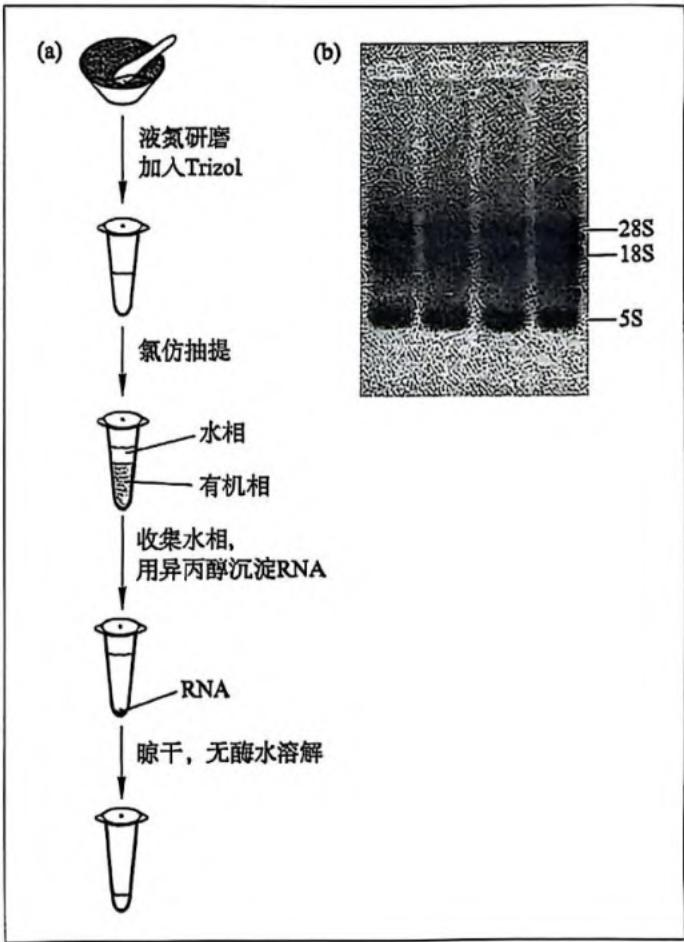  
图5-15 总RNA提取  
(a) 总 RNA 提取的主要实验流程；(b) 陆地棉不同组织的总 RNA 样品电泳图。

纯化柱纯化。要根据不同植物组织的特点,预先去除酚类、多糖或其他次生代谢产物对RNA的干扰。

同样可以通过测定 RNA 样本的 $OD_{260}$ 和 $OD_{280}$ 来判断其浓度和纯度。 $OD_{260}$ 为 1 时相当于浓度为 50 $\mu g/mL$ ，当 $OD_{260}/OD_{280}$ 的比值为 1.8～2.0，表示纯度较好，如果样品中有蛋白质或酚污染，则 $OD_{260}/OD_{280}$ 的比值将明显低于 1.8。而 $OD_{260}/OD_{280}$ 的比值大于 2.0，则说明提取的 RNA 可能有降解。可通过琼脂糖凝胶电泳检测 RNA，但要保证整个操作过程中没有 RNase 的污染。电泳后如果 rRNA 大小完整，而且 28S rRNA 和 18S rRNA 亮度接近 2:1，mRNA 分布均匀，则认为所提取的 RNA 质量较好（图 5-15h）。

真核细胞的 mRNA 分子最显著的结构特征是具有 5' 端帽结构 (m $^{7}$ G) 和 3' 端的 poly(A) 尾, 这种 poly(A) 结构为真核生物 mRNA 的提取提供了极为方便的选择性标志, 实验中常用寡聚 (dT)-纤维素柱层析法获得高纯度 mRNA。该方法利用 mRNA 3' 端含有 poly(A) 的特点, 当 RNA 流经寡聚 (dT) 纤维素柱时, 在高盐缓冲液的作用下, mRNA 被特异性地结合在柱上, 再用低盐溶液或蒸馏水洗脱 mRNA。经过两次寡聚 (dT) 纤维柱后可得到较高纯度的 mRNA。实验中常用 poly(AT) Tract mRNA 分离系统将生物素标记的寡聚 (dT) 引物与细胞总 RNA 温育, 加入与微磁球相连的抗生物素蛋白以结合 poly(A) mRNA, 通过磁场吸附作用将 poly(A) mRNA 从总 RNA 中分离。

## 5.3.2 cDNA 的合成与文库构建

cDNA 的合成包括第一链和第二链 cDNA 的合成, 整个流程如图(图 5-16)所示。第一链 cDNA 的合成是以 mRNA 为模板, 逆转录时加入寡聚 (dT) 做引物, 在逆转录酶催化下形成 cDNA。寡聚 (dT) 引物一般包含 12\~20 个脱氧胸腺嘧啶核苷酸, 后面加一个连接引物 (通常为 Xho I 等酶切位点) 以便于克隆构建。

在 cDNA 合成的过程中, 应选用活性较高的逆转录酶及甲基化 dCTP, cDNA 两端应加上不同内切酶所识别的接头序列, 保证所获得双链 cDNA 的方向性(图 5-17)。反应体系中一般加入甲基化 dCTP, 保证新合成的 cDNA 链被甲基化修饰, 以防止构建克隆时被限制性内切酶切割。第二链 cDNA 的合成是以第一链为模板, 由 DNA 聚合酶催化。常用 RNase H 切割 mRNA-cDNA 杂合链中的 mRNA 序列所产生的小片段为引物合成第二条 cDNA 的片段, 再通过 DNA 连接酶的作用连成完整的 DNA 链。此时加入含有另一个酶切位点的黏性接头(如 EcoRI), 与 cDNA 相连接后用 Xho I 酶切, 使 cDNA 双链 5' 端和 3' 端分别具有 EcoRI 和 Xho I 黏性末端, 保证它与载体相连时有方向性。因为绝大多数大肠杆菌细胞都会切除带有 5-甲基胞嘧啶的外源 DNA, 所以实验中常选用 mcrA-mcrB-菌株以防止 cDNA 被降解。

由于 cDNA 的长度一般为 0.5 \~ 8 kb, 常用的质粒载体和噬菌体类载体都能满足要求。cDNA 文库的载体选择要根据该文库的用途来确定, 例如常用的 Uni-zap XR 载体是一种 λ 噬菌粒载体, 具备噬菌体的高效性和质粒载体系统可利用蓝白斑筛选的便利, 可容纳 0 \~ 10 kb DNA 插入片段。该载体内部含有 pBluescript 载体的全部序列, 重组后可通过体

## 第 5 章 分子生物学研究法(上)——DNA、RNA 及蛋白质操作技术

图 5-16 cDNA 合成过程示意图  
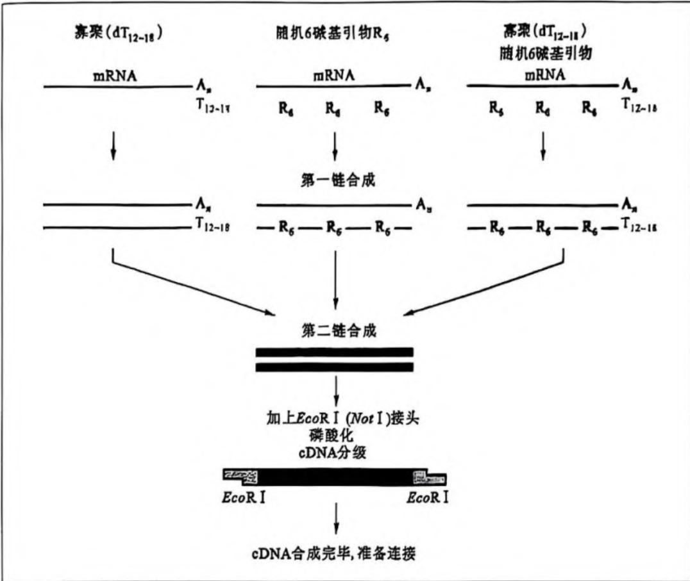

内剪切反应(in vivo excision)将 cDNA 插入片段转移到质粒系统中进行筛选、克隆和序列分析。

含有 cDNA 插入片段的重组噬菌粒只有经过体外蛋白外壳包装反应,才能成为有侵染和复制能力的成熟噬菌体。DNA 和蛋白提取物的浓度、二者的体积比、反应温度及时间对包装效果都有很大影响,而包装反应结果的好坏对重组噬菌体的侵染能力至关重要。用经包装的噬菌体感染大肠杆菌培养物后涂布在琼脂平板上,便会产生成千上万个独立噬菌斑,每个噬菌斑由一个重组噬菌体分子形成。一个比较完整的 cDNA 文库常包含大于 $5 \times 10^{5}$ 的独立克隆。一旦获得含有某种组织器官 cDNA 信息的噬菌粒文库,就可用于筛选目的基因、大规模测序、基因芯片杂交等功能基因组学研究。

## 5.3.3 基因文库的筛选

基因文库的筛选是指通过某种特殊方法从基因文库中鉴定出含有所需重组 DNA 分子的特定克隆的过程。主要筛选方法包括核酸杂交法、PCR 筛选法和免疫筛选法等。

## 1. 核酸杂交法

核酸杂交法以其广泛的适用性和快速性成为基因文库筛选中最常用的方法之一,常用放射性标记的特异 DNA 探针进行高密度的菌落杂交筛选(图 5-18)。将圆形硝酸纤维素膜放在含有琼脂培养基的培养皿表面,将待筛选菌落从其生长的平板上转移到硝酸纤维素膜上,进行适当温育。同时保留原来的菌落平板作对照。取出已经长有菌落的膜,用碱

图5-17 定向cDNA合成及分子修饰

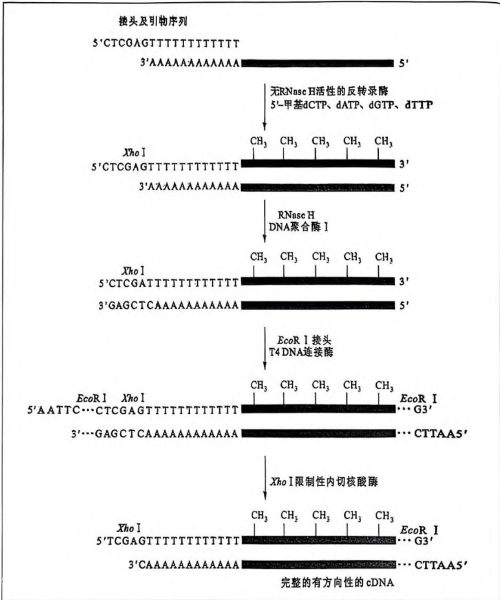

图5-18 通过核酸杂交筛选目的克隆流程图  
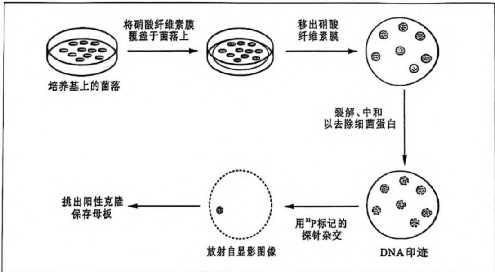

液处理,使菌落发生裂解,DNA随之变性。接着用蛋白酶K处理硝酸纤维素膜去除蛋白质,形成菌落DNA的印迹。80℃烘烤滤膜,将DNA固定在膜上。将滤膜与放射性标记的DNA或RNA探针杂交,通过放射性自显影显示杂交结果。在X光底片上显黑色斑点的就是实验中寻找的目的克隆,可以通过对应于平板上的位置找到相应克隆。

也可用杂交筛选法进行重组噬菌斑的筛选。将硝酸纤维素膜覆盖在琼脂平板表面，使之与噬菌斑直接接触，噬菌斑中大量没有被包装的游离 DNA 及噬菌体颗粒便一齐转移到膜上。可从同一噬菌斑平板上连续印几张同样的硝酸纤维素膜，进行重复实验，而且可以使用两种或数种不同的探针筛选同一套重组子，提高结果的可靠性。

## 2. PCR 筛选法

PCR 筛选法与核酸杂交筛选法具有同样的通用性,而且操作简单,但前提是已知足够的序列信息并获得基因特异性引物。例如要从一个基因组 DNA 文库筛选目的基因,首先将整个文库(以质粒或菌落的形式均可)保存在多孔培养板上,用设计好的目的基因探针对每个孔进行 PCR 筛选,鉴定出阳性的孔,把每个阳性孔中的克隆再稀释到次级多孔板中进行 PCR 筛选。重复以上程序,直到鉴定出与目的基因对应的单个克隆为止。

## 3. 免疫筛选法

由于免疫筛选法是基于抗原抗体特异性结合原理,所以该法适用于对表达文库的筛选。也就是说如果该 DNA 或者 cDNA 文库是用表达载体构建的,每个克隆都可以在宿主细胞中表达,产生所编码的蛋白质,就可以用免疫筛选法进行筛选。即使实验中靶基因的序列完全未知,只要拥有针对该基因产物的特异性抗体,也能用这个方法进行筛选。

免疫检测与菌落或噬菌斑的核酸杂交相似,先将菌落或噬菌斑影印到硝酸纤维素膜上,原位溶解菌落释放抗原蛋白,再用抗体与固定了抗原的膜杂交,抗原抗体结合后,再用标记的二抗与之反应,通过对标记物的检测,就可以找到阳性克隆(图5-19)。

## 5.3.4 非编码 RNA 研究

高等真核生物的基因组中,蛋白质编码区只占很少一部分,非蛋白质编码区占据基因组中绝大部分位置。而高等真核生物基因组中一半以上的 DNA 会转录为 RNA,所以大部分 RNA 是不编码蛋白质的,这些 RNA 被统称为非编码 RNA (non-coding RNA, ncRNA)。非编码 RNA 种类很多,依据功能不同,可分为两类,一类是组成型的非编码 RNA,如 rRNA 和 tRNA,它们是蛋白质合成机器的重要组成成员;另一类是调控型的非编码 RNA,包括 miRNA (microRNA)、siRNA (small interfering RNA)、piRNA (piwi-interacting RNA)、snRNA (small nuclear RNA)、snoRNA (small nucleolar RNA)、lncRNA (long non-coding RNA) 及 circRNA (circular RNA) 等,它们在转录和翻译水平调控基因表达,维持基因组的稳定,或在细胞功能与命运的决定中发挥至关重要的作用。由于非编码 RNA 在序列特征及调控功能上的复杂性,目前的研究主要集中在非编码 RNA 基因的发现和生物学功能的鉴定层面上。

非编码 RNA 不像 mRNA 那样有一个标志性的 poly(A) 尾的结构, 无法通过寡聚(dT) 直接分离, 而其他的分离方式又会受到含量较大的 rRNA 及部分 tRNA 的干扰, 所以目前只能依据非编码 RNA 的大小和形态结构, 通过以下几种方式分离出不同的非编码 RNA $^{(图 5-20)}$ 。

图 5-19 啰菌体表达文库的免疫化学筛选法示意图  
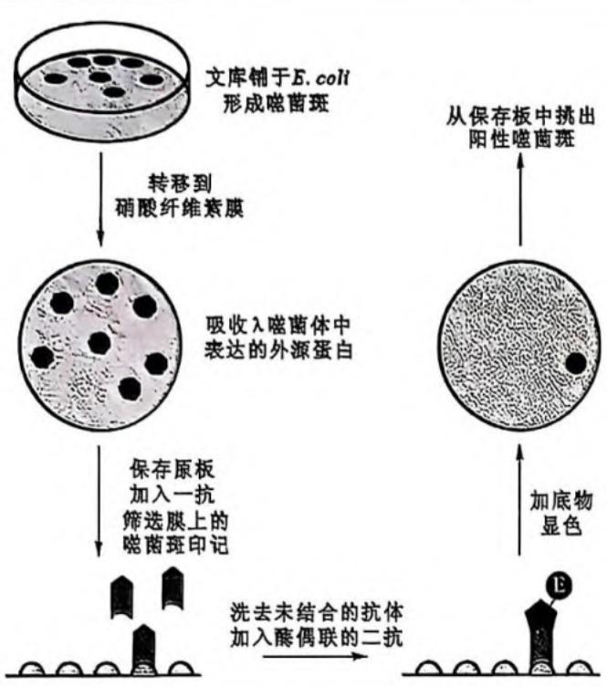

对于较短的,如 miRNA、siRNA、piRNA 等常常小于 50 nt 的非编码 RNA 的分离。提取总 RNA 后,用聚丙烯酰胺电泳分离出小于 50 nt 的 RNA,割胶回收并用乙醇沉淀 RNA,一般加入糖原和乙酸钠做助沉剂,也可用专一性吸附小片段 RNA 的硅胶膜柱子纯化。用 T4 RNA 连接酶处理纯化后的 RNA 样品,在其 3' 端连接一段寡核苷酸序列如 poly (dA),在逆转录酶催化下合成 cDNA 第一链,用 DNA 聚合酶催化形成双链 cDNA。用 A 尾酶(A-tailing)在双链 cDNA 的 3' 端加上一个 dAMP,再将带有一个 dTMP 的接头引物加到双链 cDNA 的两端,进行 PCR 扩增,进一步用于测序或文库构建等。

也可以从总 RNA 样品中去除 rRNA 和 tRNA, 再分离其他非编码 RNA。该方法首先合成 rRNA 和 tRNA 特异性生物素标记的寡核苷酸探针, 这些探针与各种 rRNA 及 tRNA 杂交, 杂合链因为带有生物素标记而被偶联了链霉亲和素的磁珠高效捕获, 链霉亲和素与生物素之间稳定的非共价结合使得生物素标记的双链分子紧密结合在磁珠上。用磁铁将磁珠从样品中分离, 就排除了这两种组成型 RNA 的干扰。将剩余的 RNA 样品随机打断成 200\~300 bp 的片段, 用六聚体引物 N6 逆转录合成 cDNA。这个样品中包含了全部 mRNA 和非编码 RNA 的信息, 测序完成后, 借助 mRNA 的典型特征, 如起始子、终止子、可读框及剪切位点等将其分离去除, 再根据各种非编码 RNA 的结构特征, 通过不同的生物学软件进行归类分析。

非编码 RNA 中有一类具有闭合环状结构的 RNA 分子, 称 cirRNA, 利用它的这一特殊结构可单独将其分离出来。将 rRNA 和 tRNA 从总 RNA 中除去后, 使用具有 3' 端核糖核酸外切酶活性的 RNase R 专一性降解单链线性 RNA 分子, 即可将 mRNA 和其他线性非编码 RNA 一并除去, 留下环状的 RNA 分子。将环状 RNA 分子随机打断, 用六聚体随机引物 N6 在逆转录酶的催化下合成 cDNA, 按前面介绍的程序进行建库测序等后续分析。

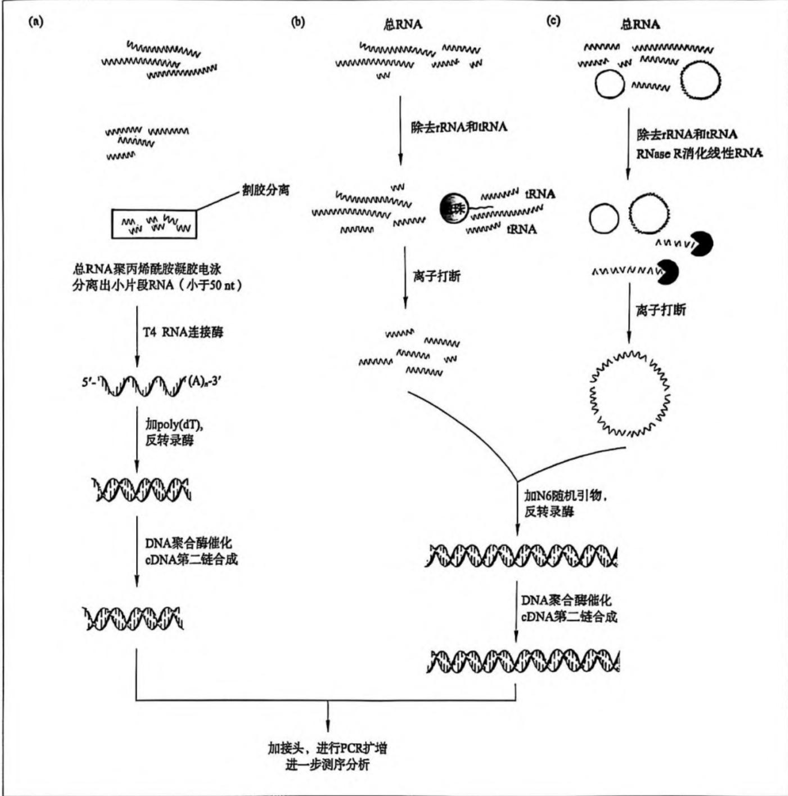  
图5-20 不同非编码RNA的分离方法示意图

## 5.3.5 RNA 修饰与检测

大多数 RNA 修饰发生在 mRNA 和非编码 RNA (non coding RNA, ncRNA) 中。RNA 修饰参与基因表达的调控, 并在 RNA 剪接、RNA 编辑和 RNA 干扰等过程中起着重要作用。检测技术的进步为 RNA 修饰及功能验证提供了重要保障。例如, 已经发现 mRNA 的 $m^6A$ 修饰不仅影响 mRNA 的剪接、稳定性和定位, 还影响其翻译效率, 表明 $m^6A$ 修饰可能参与蛋白质合成的调控。另一方面, 5-甲基胞嘧啶 ( $m^3C$ ) 修饰会影响 mRNA 的输出、稳定性和翻译效率, 影响其二级结构及其与 RNA 结合蛋白的相互作用。tRNA 中的 $m^3C$ 对于维持其结构稳定性和翻译保真度至关重要。假尿苷 ( $\Psi$ ) 是另一种重要的 RNA 修饰, 是 rRNA 正确折叠、tRNA 结构稳定性和小核糖核蛋白 (snRNP) 生物合成所必需的。已经发现 tRNA 中的 $\Psi$ 修饰可以提高其稳定性以及密码子 - 反密码子相互作用的特异性, 对于准确的蛋白质合成至关重要。研究还表明, mRNA 中的 $\Psi$ 修饰也会影响其剪接和翻译, 暗示这种修饰在基因表达调控中的作用可能比以前认知的更为广泛。

二维薄层层析法(two-dimensional thin-layer chromatography, 2D-TLC)是用于分析RNA修饰的主要生物化学方法。该技术首先用同位素标记RNA,再进行电泳分离,通过比较RNA样品的迁移速率确定其修饰程度(图5-21a)。研究人员可以通过对同位素放射自显影的定量分析,实现对RNA修饰程度的比较。这项技术已广泛应用于研究各种RNA修饰及其对生物过程的影响,开发基于RNA的新疗法。

斑点印迹法 (dot blotting) 依赖于经过特殊修饰的抗体与目标分子结合。该过程包括 RNA 的提取并转移到 PVDF 或硝酸纤维素膜上, 然后与修饰的抗体一起孵育。这些抗体与目标分子特异性结合, 从而方便检测和定量分析 (图 5-21)。还可以通过使用二抗标记检测 RNA 的修饰程度。

液相层析-质谱法(liquid chromatography mass spectrometry, LC-MS)依靠保留时间、质荷比 $(m/z)$ 和电离后核苷酸产物离子片段等多种信息，快速、准确地确定特定样品的修饰程度。基于LC-MS的方法主要是在核苷水平上对RNA修饰进行研究，因此在分析前需将待测的核酸样品酶解为核苷。修饰核苷的鉴定通常基于与标准品的比对或与RNA修饰数据库的比对(图5-21c)。该技术被广泛应用于核酸化学领域。LC-MS具有高灵敏度、低样本起始量等特点。

此外,纳米孔测序(nanopore sequencing)可以直接对RNA进行检测,无需额外的逆转录和PCR扩增,从而减少了这些步骤造成的偏差。从理论上说,单链RNA由驱动蛋白驱动通过纳米孔时,除了序列信息,化学修饰和二级结构都会影响其在纳米孔中的移动,可以通过计算来确定该分子是否发生了修饰(图5-21d)。此外,纳米孔测序产生的读数足够长,足以覆盖转录物的全长,从而能够准确识别高度重复区域、拼接产物和多(A)尾长度等。

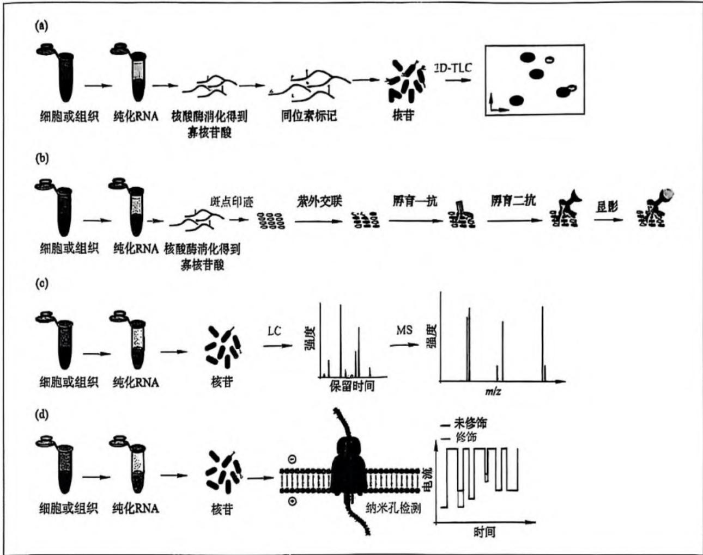  
图 5-21 RNA 修饰的主要检测技术(另见书末彩插)  
(a) 二维薄层层析法。主要通过同位素标记 RNA，再进行电泳分离，通过放射性自显影比较 RNA 样品的迁移速率确定其修饰程度；(b) 斑点印迹法。使用特异性抗体对 RNA 的修饰进行检测；(c) LC-MS。RNA 分子降解为单核苷后由液相色谱分离，经过质谱仪中电离并进一步裂解为特异性的离子产物，通过离子产物的保留时间 (t)、质荷比 (m/z) 等鉴定核苷的修饰信息；(d) 纳米孔测序技术。因化学修饰和二级结构会影响其在纳米孔中的移动，可以通过此种差异的计算来确定该分子是否发生了修饰。

## 5.4 基因克隆技术

在当今生命科学的各个研究领域中，"克隆"(clone)一词已被广泛使用。在多细胞的高等生物个体水平上，人们用克隆表示由具有相同基因型的同一物种的两个或数个个体组成的群体，所以说，从同一受精卵分裂而来的单卵双生子(monozygotic twins)便属于同一克隆。在细胞水平上，克隆一词是指由同一个祖细胞(progenitor cell)分裂而来的一群带有完全相同遗传物质的子细胞。在分子生物学上，人们把将外源DNA插入具有复制能力的载体DNA中，使之得以永久保存和复制这种过程称为克隆。由于真核生物基因组DNA十分复杂，实验中常通过筛选由mRNA产生的cDNA文库来分离到目的基因片段。高等生物虽然可拥有3万\~5万种不同的基因，但在一定时间段的单个细胞或组织中，仅有 $15\%$ 左右的基因得以表达，产生出5000\~10000种不同的mRNA分子，使得筛选过程

相对简单些。

## 5.4.1 转录物组学测序技术

转录物组(transcriptome)、广义上指在某一特定生理条件或环境下,一个细胞、组织或者生物体中所有RNA的总和,包括信使RNA(mRNA)、核糖体RNA(rRNA)、转运RNA(tRNA)及其他非编码RNA(non-coding RNA);狭义上则特指细胞中转录出来的所有mRNA的总和。基因组-转录物组-蛋白质组(genome-transcriptome-proteome)是中心法则在组学框架下的主要表现形式。通过特定生理条件下细胞内mRNA丰度来描述基因表达水平,并且外推到最终蛋白质丰度是目前基因表达研究的基本思路。

基于传统的 Sanger 测序法对转录物组进行研究的方法主要包括: 表达序列标签 (expressed sequence tag, EST) 测序技术和基因表达系列分析 (serial analysis of gene expression, SAGE)。EST 测序数据是数量最多、涉及物种最广的转录物组数据, 但该测序方法产生的读长 (reads) 较短 (每个转录物只测定 400\~500 bp), 测序通量小, 测序成本较高, 而且无法通过测序同时得到基因表达丰度的信息。有科学家使用 SAGE 测序法, 用不同转录物 3' 端第一个 CATG 位点下游 14 bp 长的短标签序列来标识相应的转录物。由于标签序列短, 多个标签可以串联测序, 使 SAGE 相对于 EST 测序在通量上有了很大的提高。但过短的序列标签使得序列唯一性降低, 即使用改进过的 21 bp 作为标签的长片段 SAGE (LongSAGE) 测序, 仍然有大量标签无法被准确注释到基因组上。

高通量测序(high-throughput sequencing)又名深度测序(deep sequencing),包括第二代测序(second-generation sequencing)和第三代测序(third-generation sequencing),可以一次性测定几十万甚至几百万条DNA序列,是传统测序技术的革命。随着科学家对获取更完整的异构体以及对RNA碱基修饰和poly(A)尾长进行相对准确估算的要求日益增大,长读长cDNA测序和直接RNA测序(direct RNA sequencing,dRNA-seq)正在兴起,这些新的测序方法将对常规短读长测序法提出挑战。

## 1. 短读长 cDNA 测序

短读长 cDNA 测序具有成本低、操作方便和数据质量高等特点, 因此大多数转录物组测序技术都是针对短读长 cDNA 测序开发的。RNA 样品上机测序前需要构建文库, 根据不同的需求, 建库策略会略有差别。图 5-22a 是第二代 mRNA 建库测序的主要流程, 包括提取高质量的组织或细胞总 RNA, 质检合格后用 poly(T) 磁珠富集 mRNA 并打断成短片段, 用随机引物逆转录生成 cDNA 并进行 DNA 末端修复、加碱基 A、加测序接头, 进行 PCR 扩增后建库, 最后选择合适的平台测序。

利用高通量测序技术进行转录物组序列分析,对获得的大量原始读长进行过滤、组装及生物信息学分析的过程被称为 RNA 测序(RNA-Seq)。对于有参考基因组序列的物种,需要根据参考序列进行组装(referenced assembly);对于没有参考序列的,需要进行从头组装(de novo assembly),利用大量读长之间重叠覆盖和成对读长(pair-end reads)的相对位置关系,组装得到尽可能完整的转录物,并以每百万个碱基中每个归一化长度为 1 000 个碱基的转录物(基因)所覆盖的读长数目(reads per kilo-base gene per million bases, RPKM)作为衡量基因表达水平的标准。如表5-4所示,通过RNA-seq可以鉴定在棉花根或者茎特异性表达基因。

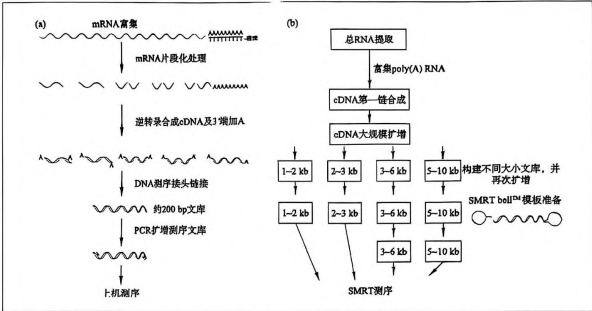  
图 5-22 第二代转录物组建库测序(a)与第二代转录物组建库测序(b)流程示意图

表 5-4 棉化主要组织特异性转录因子表达强度分析

<table><tr><td rowspan="2">序列标识</td><td rowspan="2">基因</td><td colspan="2">RPKM</td><td rowspan="2">序列标识</td><td rowspan="2">基因</td><td colspan="2">RPKM</td></tr><tr><td>根</td><td>茎</td><td>根</td><td>茎</td></tr><tr><td>Unigene58528</td><td>MYB-L</td><td>81.86</td><td>0.16</td><td>Unigene85367</td><td>FAR1</td><td>0.40</td><td>65.51</td></tr><tr><td>Unigene58563</td><td>B3</td><td>56.02</td><td>0.00</td><td>Unigene29146</td><td>HD-ZIP</td><td>0.00</td><td>44.49</td></tr><tr><td>Unigene58582</td><td>B3</td><td>53.66</td><td>0.29</td><td>Unigene51008</td><td>HB</td><td>0.24</td><td>43.60</td></tr><tr><td>Unigene58458</td><td>Dof</td><td>45.54</td><td>0.00</td><td>Unigene18073</td><td>MIKC</td><td>0.13</td><td>36.74</td></tr><tr><td>Unigene55872</td><td>Dof</td><td>41.56</td><td>0.00</td><td>Unigene64521</td><td>MYB</td><td>0.15</td><td>31.71</td></tr><tr><td>Unigene51911</td><td>bHLH</td><td>36.64</td><td>0.19</td><td>Unigene58698</td><td>B3</td><td>0.09</td><td>24.01</td></tr><tr><td>Unigene58446</td><td>NAC</td><td>28.40</td><td>0.37</td><td>Unigene62109</td><td>MYB</td><td>0.04</td><td>18.45</td></tr><tr><td>Unigene57837</td><td>bHLH</td><td>20.27</td><td>0.00</td><td>Unigene52681</td><td>bZIP</td><td>0.20</td><td>17.62</td></tr><tr><td>Unigene58640</td><td>SIFa-L</td><td>20.25</td><td>0.68</td><td>Unigene64531</td><td>G2-L</td><td>0.34</td><td>16.92</td></tr><tr><td>Unigene55579</td><td>B3</td><td>15.71</td><td>0.13</td><td>Unigene64486</td><td>bHLH</td><td>0.00</td><td>14.49</td></tr></table>

## 2. 长读长 cDNA 测序

基于第二代测序的 RNA-seq 读长较短,得到的基因转录产物是通过一定的算法进行组装得到的,这可能会导致较多的嵌合体和组装错误。科学家又开发了基于 PacBio 单分子实

## 5.4 基因克隆技术

时第三代测序法,凭借其超长读长可以精确地进行全长转录物组分析,建库过程中无需打断转录物(用 $5 \sim 22$ b),其平均 $10 \sim 15 \mathrm{~kb}$ 的读长可以轻松跨越从 $5'$ 端到 $3' - \mathrm{poly}(\mathrm{A})$ 尾的完整转录物,从而准确鉴定异构体,并对可变剪接、融合基因、同源基因、超家族基因或等位基因表达等进行精确分析。与第二代测序相比,第三代测序价格较高并有一定的碱基错误率,因此,实践中常将各个组织混合进行第三代测序以得到准确的全长转录物数据集,然后通过对各个组织或者细胞样本单独进行第二代测序,确认基因序列信息和表达水平。

## 3. 直接 RNA 测序

短读长 cDNA 测序和长读长 cDNA 测序都依赖于将 RNA 转换为 cDNA。而最近出现的纳米孔测序技术可以直接对 RNA 进行测序, 即不需要常规建库过程中的 cDNA 合成和 PCR 扩增, 该方法消除了常规建库过程中的偏好性, 且能保留表观遗传学信息。

直接 RNA 测序文库制备方法如下: 将带有 poly(T) 的双链核酸接头退火并连接到 RNA 的 poly(A) 尾部, 随后进行逆转录(可选), 以提高测序通量。再将有驱动测序的马达蛋白的接头连接到上一步的 RNA 链上, 最后在 Nanopore 平台上进行测序。直接 RNA 测序的测序读长超过 1000 bp, 最大测序长度超过 10 kb。与短读长测序相比, 利用 Nanopore 技术对 RNA 进行直接测序, 能够保留并检测到 RNA 上的碱基修饰信息, 并对 poly(A) 尾长进行相对准确的估算, 同时进行全长异构体分析, 还原真实的 RNA 特征。

## 5.4.2 单细胞与空间转录物组学技术

单细胞测序是指利用高通量测序技术,实现对单个细胞遗传信息的解析,从而开展对细胞类型、功能、发育以及疾病相关的分子机制等的深入研究。包括低通量单细胞测序、基于微流控的高通量单细胞测序和基于组合索引的高通量单细胞测序技术。

低通量单细胞测序,如 SMART-seq 2,是对单个细胞微量扩增后进行转录物组测序,测序通量小,操作难度大,测序成本较高,且获得的信息有限。基于微流控的单细胞转录物组测序技术,如 $10 \times$ genomics Chromium,首先通过酶解法将目标组织消化成单细胞悬液,再将制备好的单细胞悬液置于微流控芯片中,将单细胞与单个凝胶微珠通过油相混合到一起,形成单个的油包水液滴。凝胶微珠上锚定有能被光降解的接头序列 (photocleavable spacer,PC),T7 启动子 (T7p),PCR 引物位点 (PE1),条形码 (barcode,Bcd),唯一性分子标签 (unique molecular identifier,UMI),含 Poly (T)、能在单个油滴中释放的 DNA 片段,被用于捕获细胞中的 mRNA 并逆转录为 cDNA,因此来自同一个细胞的转录物会带上相同的条形码序列,而每个转录物上都带有 UMI 识别序列 (图 5-23)。根据获得的单细胞数据对细胞进行分群,以解析器官或组织的异质性,鉴定组织中的不同细胞类型,构建不同细胞类型的连续分化轨迹及其转录调控网络,寻找组织中的稀有细胞类型,深入解析组织器官发育的分子机制。该方法测序通量高,捕获效率高,能获得较为全面的信息。基于组合索引的高通量单细胞测序技术,如 Split-seq,通过多轮标记和分池得到单个细胞的信息,测序通量高,成本低,但是实验操作难度较大。

单细胞测序技术只能检测到转录物的表达信号,丢失了细胞在组织中的位置信息。

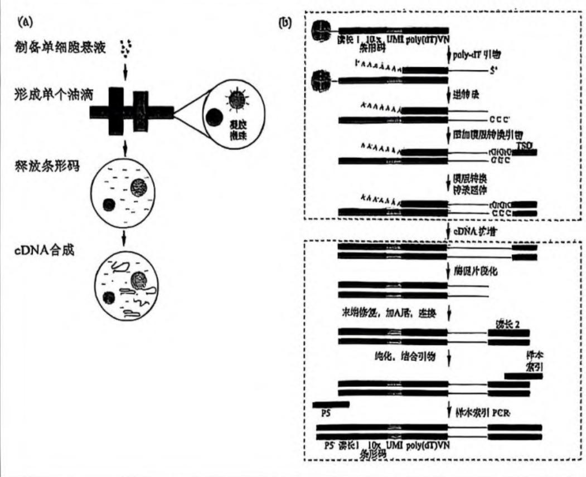  
图5-23 单细胞测序技术原理

(a) 单细胞测序技术形成单个细胞反应示意图；(b) 上方曲线框为单个细胞中进行的poly(A)捕获、逆转录、模板转换、转录扩增等反应，得到单细胞标记的cDNA；下方虚线框表示收集所有细胞的cDNA，进行酶切、末端修复、加A尾、连接、纯化、PCR等步骤构建测序文库。

而空间转录物组可以在空间水平上对组织进行原位高通量、高分辨率转录分析。目前分辨率最高的时空芯片可达纳米级，可以真正达到单细胞精度。该技术首先将含有随机条形码序列的 DNA 纳米球(DNB)沉积到经光刻蚀刻和修饰的芯片上，DNA 纳米球上有携带位置信息的细胞条形码(CID)，区分不同转录物的多重识别码(MID)，能捕获游离 mRNA 的 poly(T)。通过将新鲜组织的冷冻切片加载到芯片表面，固定、透化后进行逆转录和扩增，收集扩增后的 cDNA，作为制备文库的模板，与 CID 共同测序(图 5-24)。

## 5.4.3 Gateway 大规模克隆技术

随着越来越多的动植物基因组全序列被测定,前所未有的编码基因(开放读码框)被

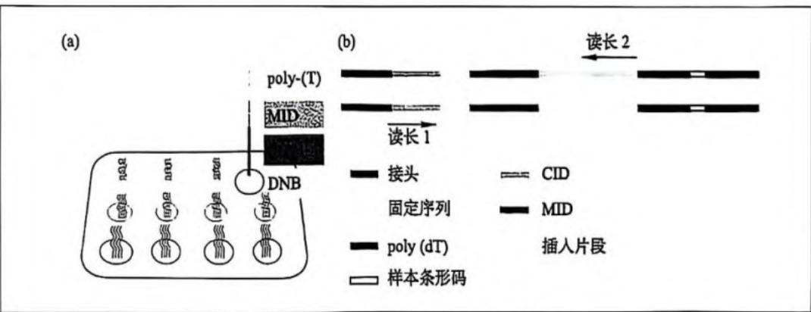  
图5-24 空间转录物组测序技术原理

(a) 空间转录物组芯片,灰色圆圈表示沉积在芯片上的DNB小球,其上带有MID、CID及捕获poly(A)的序列;(b)空间转录物组的文库结构,读长1和读长2为进行双末端测序获得的序列。

识别,但是,要阐明这些基因的功能,就必须把不同的开放读码框连入各种载体,进行蛋白质表达、抗体制备、宿主细胞或植物转化、表型分析、细胞内定位以及目的蛋白与其他分子的相互作用等后能研究。传统的爬切连接方法不能满足大规模克隆的需要,只有递进一种高效的对载体和宿主没有依赖性的克隆系统,才能完成这项繁杂的工作。Gitterway 基因大规模克隆技术利用λ噬菌体进行位点特异性 DNA 片段重组,实现了不需要传统的爬切联接过程的基因快速克隆和载体间平行转移,为大规模克隆基因组注释的开放读码框提供了保障。

Gateway 克陆技术主要包括 TOPO 反应和 LR 反应两步。TOPO 反应将目的基因 PCR 产物连入 Entry 载体。该载体上的 GCCTT 能被拓扑异构酶所识别，切开后通过该酶 274 种上的酪氨酸与切口处的磷酸基团形成共价键，被偶联在载体上。加入 PCR 产物后，载体上 3' 突出端 GTGG 与 PCR 产物的互补性末端接头序列 CACC 配对，使 PCR 产物以正确方向连入 Entry 载体 $^{10}$ 。

LR 反应被用于将目的片段从 Entry 载体中重组人表达载体。Entry 载体上基因两端具有 attL1 和 attL2 位点、目的载体上含有 attR1 和 attR2 位点，在重组蛋白的作用下发生定向重组、形成新的位点 attB1 和 attB2，将目的基因转移到表达载体中（图 5-25）。

## 5.4.4 基因的图位克隆法

基因的图位克隆法(map-based cloning)是分离未知性状目的基因的一种好方法,从理论上说,所有具有某种表型的基因都可以通过该方法克隆得到。首先,通过构建遗传连锁图,将目的基因定位到某个染色体的特定位点,并在其两侧确定紧密连锁的RFLP或

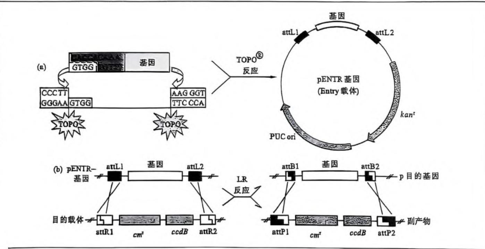  
Gateway 大规模克隆策略

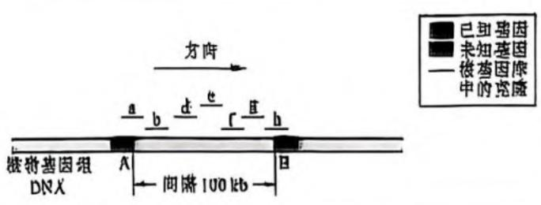  
图2-28 空色休息

保证健康因素示意图

RAXPD 分子标记。其次，通过对许多不同生态型个体的大量限制性内切酶和杂交探针的分析，找出与目的基因距离最近的分子标记，通过染色体步移技术将位于这两个标记之间的基因片段分离并克隆出来 $^{[1]5-20}$ ，再根据基因功能互补原理鉴定目的基因。

在 RFLP 作图中, 连锁距离是根据重组率来计算的, $1 \mathrm{cM}$ (厘摩) 相当于 $1\%$ 的重组率。人类基因组中, $1 \mathrm{cM} \approx 1000 \mathrm{kb}$ ; 拟南芥中, $1 \mathrm{cM} \approx 290 \mathrm{kb}$ ; 小麦中, $1 \mathrm{cM} \approx 3500 \mathrm{kb}$ .

由于水稻基因组比较小,与其他单子叶植物有较高的共线性现象,其基因组序列已经被测定,基因转化系统也比较完善,所以成为单子叶植物功能基因研究的模式系统。科学家已利用自主筛选的水稻突变体和高密度分子标记遗传图谱,应用该技术成功地分离出多个具有重要生理功能的水稻基因,包括控制水稻分蘖的关键基因 MOCI 和控制植株茎秆强度的脆杆基因 BCI。图 5-27 介绍了图位法克隆 BCJ 基因的实验流程。

## 5.4.5 SNP芯片技术

单核苷酸多态性(single nucleotide polymorphism, SNP)是由于单个核苷酸改变(包括转换、颠换、缺失和插入)而导致的DNA序列多态性。SNP分布广泛且变异丰富，该遗传变异会影响蛋白质编码、转录调控、可变剪切和非编码RNA调控等过程。因此，SNP作为

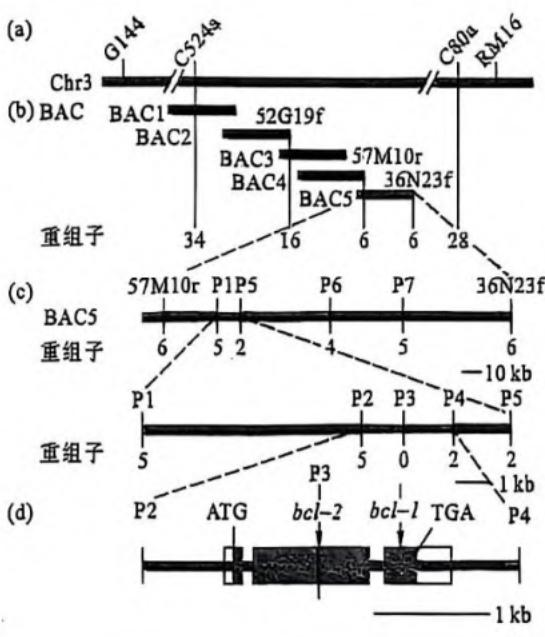  
图 5-27 用图位克隆法获得水稻脆杆基因 BCI

(a) 首先将 BCI 位点定位于水稻 3 号染色体 (Chr3) 箔丝粒区的分子标记 C324a 和 RM16 之间；(b) 覆盖 BCI 位点的 BAC 大片段，数字表示从 7068 个 bcl-2 突变体 F, 植株中鉴定出的重组子数目；(c) BCI 位点的精细定位。BCI 位点被定位于 CAPS (cleaved amplified polymorphic sequence) 分子标记 P2 和 P4 之间 3.3 kb 的 DNA 区段，并与 P3 标记共分离；(d) BCI 基因结构。实心矩框为编码区，空心矩框为 5' 和 3' 非翻译区，矩框之间的线段为内含子。bcl-1 和 bcl-2 表示两个脆杆突变体的突变位点。

第三代分子标记已被广泛应用于分子育种、标记开发和基因定位和群体遗传学研究等领域。

高通量检测 SNP 的方法主要有全基因组重测序、全外显子捕获测序、简化基因组测序和基因芯片等方法。其中基因芯片具有通量高、成本低、实验周期短、数据分析简单等优势，是最常用的 SNP 分型方法。SNP 芯片技术是指将大量针对 SNP 的寡核苷酸探针高密度地固定在固相支持物表面，从而形成多重寡核苷酸微阵列。将荧光染料标记后的待测 DNA 片段与芯片上固定好的探针阵列进行杂交，保证核酸片段只能与其序列完全互补配对的探针杂交，而不与含有单个错配碱基的序列杂交，从而将目标序列固定下来。洗去非目标片段，最后通过扫描检测芯片上的荧光信号来确定 SNP 位点(图 5-28)。

## 5.5 蛋白质与蛋白质组学技术

蛋白质组学是蛋白质和基因组研究在形式和内容两方面的完美组合,该技术致力于研究某一物种、个体、器官、组织或细胞在特定条件、特定时间所表达的全部蛋白质图谱。蛋白质组与基因组既相互对应又存在显著不同,因为基因组是确定的,组成某个体的所有细胞共同享有固定的基因组,而各个基因的表达调控及表达程度却会根据时间、空间和环境条件发生显著的变化,所以,不同器官、组织或细胞内拥有不同的蛋白质组。由于蛋白质分离(改进后的双向电泳技术和高效液相层析技术)和鉴定技术(现代质谱)的快速发展,以及基因组学研究和生物信息学的交叉渗透,蛋白质组学研究在近年来获得了长足的进展。

图 5-28 SNP 芯片技术流程图(另见书末彩插))  
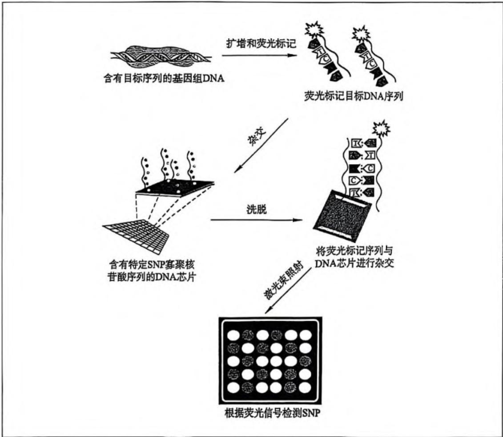  
第 5 章 分子生物学研究法(上)——DNA、RNA 及蛋白质操作技术

## 5.5.1 蛋白质电泳技术

蛋白质是由氨基酸组成的两性电解质,一般带有净电荷[除非在等电点区(pI)],能在电场中泳动,且其泳动速率取决于该蛋白质分子的电荷密度(电荷与质量的比值)。因此可利用不同蛋白质的分子大小和电荷差异,通过电泳技术使之分离。

聚丙烯酰胺凝胶电泳(polyacrylamide gel electrophoresis, PAGE)是一种常用的蛋白质电泳技术。聚丙烯酰胺凝胶由单体丙烯酰胺和甲叉双丙烯酰胺在加速剂和催化剂作用下聚合交联成三维网状,具有化学性质不活泼,对 $\mathrm{pH}$ 、温度和离子强度变化不敏感,重复性好等优点的凝胶结构。此外,还能通过改变单体和交联剂的浓度而调节其孔径大小,使之具有分子筛效应,以提高电泳分辨率和灵敏度。常规聚丙烯酰胺凝胶电泳又称为天然状态生物分子聚丙烯酰胺凝胶电泳(native PAGE),在恒定非解离的缓冲体系中电泳分离蛋白质,能保持分离物的天然构象、各亚基之间的相互作用以及活性状态。

在聚丙烯酰胺凝胶电泳中,蛋白质的净电荷、分子量和形状均会影响迁移率。因此,常常在电泳体系中加入十二烷基硫酸钠(sodium dodecyl sulfate, SDS),简称 SDS-PAGE。SDS 是一种阴离子去垢剂,作为变性剂和助溶试剂,它使分子内和分子间的氢键断裂,破坏蛋白质分子的三维结构使之完全去折叠。在样品和凝胶中加入还原剂和 SDS 后,蛋白质被解聚成多肽链,形成蛋白质 -SDS 复合物。由于十二烷基硫酸所带的负电荷大大超过了蛋白质原有的电荷量,而且 SDS 使蛋白质构象改变为长椭圆棒状,长度和蛋白质分子量成正比,消除了不同蛋白质分子间的电荷差异和结构差异,使电泳的迁移率主要由蛋白质分子量所决定,通过与标准蛋白质的迁移率相比较来确定未知蛋白质的分子量(图 5-29)。

$$
M _ {1} \left(\times 1 0 ^ {3}\right)
$$

(a)  
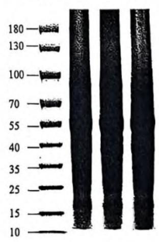

(b)  
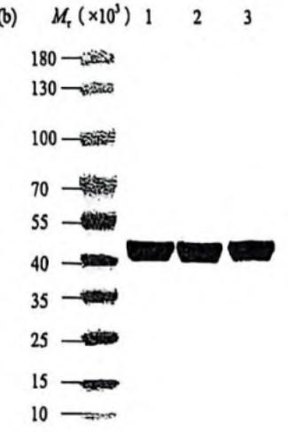  
图5-29 通过SDS-PAGE电泳分离陆地棉纤维总蛋白质

(a) 为野生型陆地棉不同纤维发育时期纤维总蛋白质 SDS-PAGE 分离后考马斯亮蓝染色结果, 最左侧泳道为蛋白质 marker(M), 从左到右 1,2,3 泳道分别为 5 DPA、10 DPA、15 DPA 时期的纤维总蛋白质。DPA, days post anthesis, 开花后天数。(b) 将 SDS-PAGE 电泳分离后的蛋白质转移到 PVDF 膜上, 采用肌动蛋白(actin) 特异抗体的蛋白质印迹 (Western blotting) 结果。肌动蛋白理论分子量为 $43 \times 10^{3}$ , 与图 (b) 中结果一致。

## 5.5.2 双向电泳技术

到目前为止,双向电泳(two-dimensional electrophoresis,2-DE)技术是分离大量混合蛋白质组分的最有效方法,该技术主要依赖于蛋白质等电聚焦(isoelectric focusing,IEF)及SDS-聚丙烯酰胺凝胶(SDS-PAGE)双向电泳技术(图5-30),通过等电点和分子量分离不同的蛋白质。

图 5-30 用 2-DE 胶展示拟南芥种子萌发 48 h 后的蛋白质表达情况

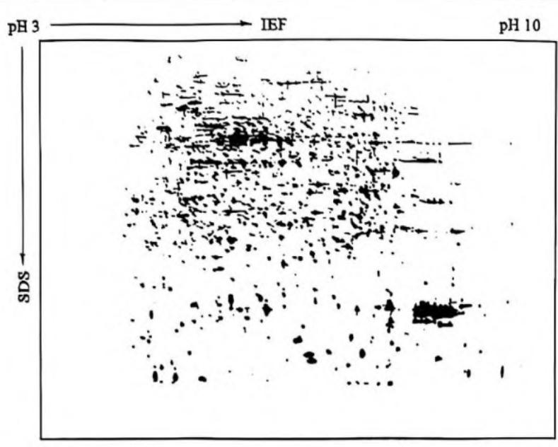

蛋白质是两性分子,在不同 pH 的缓冲液中表现出不同的带电性,因此,在电流的作用下,在以两性电解质为介质的电泳体系中,不同等电点的蛋白质会聚集在介质上不同的区域(等电点)从而被分离。因为聚丙烯酰胺凝胶中的去垢剂 SDS 带有大量的负电荷,与之相比,蛋白质所带电荷量可以忽略不计。所以,蛋白质在 SDS 凝胶电场中的运动速度和距离完全取决于其分子量而不受其所带电荷的影响,不同分子量的蛋白质将位于凝胶的不同区段而得到分离。

固相化 pH 梯度技术 (immobilized pH gradients, IPG) 的应用, 建立了稳定的可精确设定的 pH 梯度, 直接避免了载体两性电介质向阴极漂移等许多缺点, 增大了蛋白质上样量, 大大提高了双向凝胶电泳结果的可重复性。随着各种试剂质量的不断提高和新试剂的开发, 双向凝胶的分辨率空前提高, 其最大分辨率已达到每块胶 10 000 个蛋白点。

早期的蛋白质组学研究内容主要是蛋白质组的表达模式,即利用常规 2-DE 技术鉴定并建立某一生物体在特定时期的全部蛋白表达谱。然而蛋白质组在生物体的生命进程中是动态变化的,不同生物的个体、组织或细胞在不同发育时期、分化阶段,以及不同的生理、病理条件下基因表达是不一致的,所对应的蛋白质组也具有特异性。于是,比较蛋白质组学(comparative proteomics)应运而生,并逐渐成为后基因组学时代的重要技术。

得益于 CyDye DIGE 荧光标记染料的发现和应用,荧光差异显示双向电泳技术(2-Dfluorescence difference gel electrophoresis, 2D-DIGE) 在传统 2-DE 技术上结合多重荧光分析技术, 基本克服了传统 2-DE 的系统误差问题, 提高了实验结果的可重复性和可信度。以最小标记法为例, 试验中用 3 种荧光染料对不同样本分别进行标记, 所有标记样本混合后, 在同一块胶上通过双向电泳得到有效分离, 对每块凝胶进行 Cy2、Cy3 和 Cy53 次扫描, 所得图像经过统计分析软件进行自动匹配和统计分析, 鉴别和定量分析不同样本间的生物学差异(图 5-31)。该技术可检测低至 $25 \mathrm{pg}$ 的单一蛋白质, 能对多达 5 个数量级的蛋白质浓度变化给出线性反应, 而常规银染法只能检测低至 $1 \sim 60 \mathrm{ng}$ 的蛋白质, 仅有约 2 个数量级的线性动态范围。虽然 2D-DIGE 极大地降低了实验中出现的系统误差, 但由于所用荧光染料在不同波长激发光下表现出不同的荧光特性, 低丰度蛋白质定量仍较易出现偏差。

## 5.5.3 蛋白质质谱分析技术

蛋白质组学中最有意义的突破是用质谱鉴定电泳分离后的蛋白质。现行的质谱仪

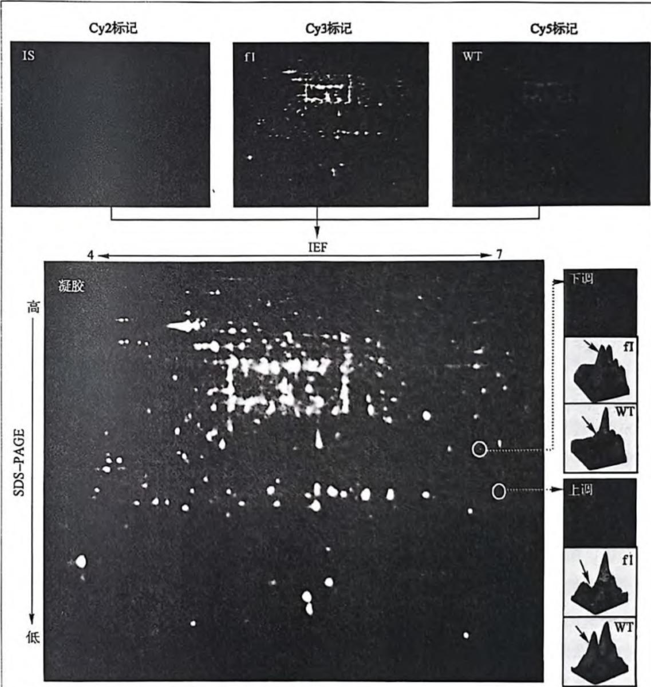  
图 5-31 野生型陆地棉'徐州 142°(WT) 和无长绒无短绒突变体(0)0DPA 胚珠总蛋白2D-DIGE 比较分析图谱(另见书末彩插)

用Cy2标记WT和fl0DPA胚珠等量混合蛋白作为内标(显示为蓝色),Cy3标记fl胚珠蛋白(显示为绿色),Cy5标记WT胚珠蛋白(显示为红色)。图中绿色蛋白点代表WT0DPA胚珠中相对于fl下调的蛋白质,红色蛋白点则代表WT0DPA胚珠中相对于fl上调的蛋白质。

## 5.5 蛋白质与蛋白质组学技术

可分为3个连续的组成部分,即离子源、离子分离区和检测器。目前常用的是基质辅助的激光解析电离-飞行时间质谱(matrix-assisted laser desorption ionization time-of-flight spectrometry, MALDI-TOF)和电喷雾电离质谱(electrospray ionisation mass spectrometry, ESI-MS)。MALDI-TOF的工作原理是将从2-DE胶中分离得到的或其他来源的蛋白质酶解成小肽段后与基质(主要是有机酸)混合,将样品混合物点到金属靶表面上并使之干燥结晶,然后用激光轰击,将呈离子化气体状态的待分析物从靶表面喷射出去。离子化的气体中每个分子带有一个或更多的正电荷,这些气体肽段在电场中被加速后到达检测器的时间由肽段的质量和其所带电荷数的比值(m/z)决定(图5-32)。

图 5-32 MALDI-TOF 分子质谱仪原理图  
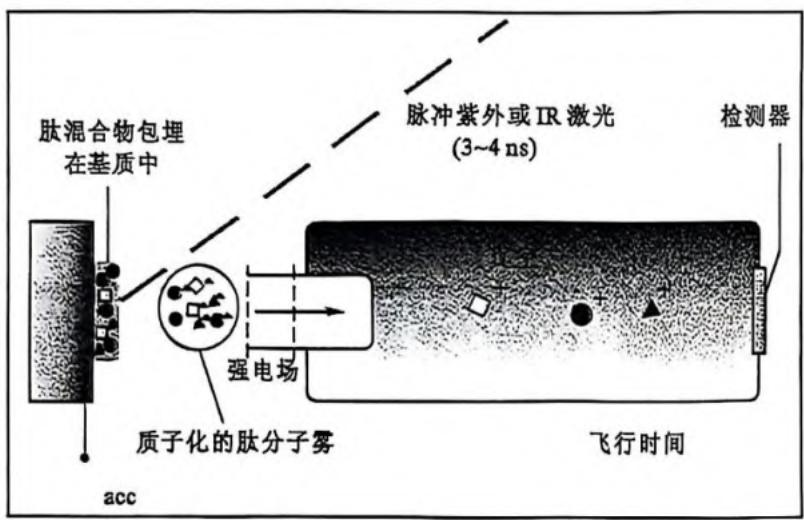

研究复杂蛋白质体系时常常先将样本酶解成肽段,色谱分离后再进行质谱鉴定,即色谱与质谱联用技术。液相色谱被用于对复杂的样品组分进行物理分离,一般用非极性的反向介质为固定相,极性有机溶剂为流动相,根据肽段的极性差异进行分离,使不同的肽段在不同的时间点进入离子源。样品的复杂度太高,常会导致质谱信号的重叠和混杂。不同极性的肽段在不同时间进入质谱仪,既降低了特定时间点进入离子源的肽段复杂度,也能减少离子抑制效应,提高质谱鉴定的灵敏度。同时,液相分离能够为质谱数据提供一维保留时间的信息,有利于对某个特定蛋白质的鉴定。

近来,科学家较多采用纳升液相色谱(nano-liquid chromatography, Nano-LC)与质谱联用技术。Nano-LC 色谱柱的内径一般为 0.1 mm 或更小,使用反向填料 C18,流动相在几十到几百纳升之间,既降低了流动相对样品的稀释,也提高了检测灵敏度,更适用于微量样品分析。Nano-LC 常搭配纳升电喷雾离子源(nano electrospray ionisation, Nano-ESI),会形成更小的液滴并加速液滴的去溶剂化过程,提高离子化效率。通过 1 h 的液相梯度分离,一次实验就能鉴定到人 Hela 细胞中的 5000 多种蛋白质(图 5-33)。

此外,质谱技术还可以用于鉴定蛋白质复合物组成、确定蛋白质翻译后修饰的类型与发生位点,例如用于蛋白质磷酸化、硫酸化、糖苷化以及其他修饰的研究。

第5章 分子生物学研究法(上)——DNA、RNA及蛋白质操作技术

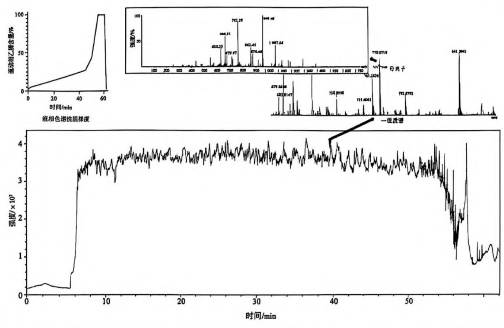  
图 5-33 Ilela 细胞全蛋白组质谱鉴定结果  
将提取的 Hela 细胞的全蛋白组用胰蛋白酶酶解成肽段,通过 HPLC 设置的 60 min 洗脱梯度得到的总离子流图 (TIC),采集不同时刻的一级质谱以及通过诱导碰撞解离 (CID) 生成的二级谱图。以保留时间在 40 min 左右的一级质谱为例,其中 769.736 0 m/z 的母离子生成二级谱图,通过蛋白质数据库搜索和理论二级谱图匹配得到肽段序列为 LTGMAFRVPTANVSVVDLTCP。质谱数据共鉴定到 3 万多个肽段,5 000 多个蛋白。

## 思考题

1. 试述 PCR 扩增的原理和步骤。

2. 试比较常规重组载体构建和恒温一步法载体构建的异同点。

3. 比较荧光染料 SYBR Green I 和 TaqMan 荧光探针的主要不同点。

4. 分析基因组 DNA 文库和 cDNA 文库的主要区别。

5. cDNA 合成时的方向性是如何实现的?

6. 说说从总 RNA 的提取到分离出非编码 RNA 的主要过程。

7. 已知一个 cDNA 3' 端的部分序列,请设计实验流程得到该基因的全长 cDNA。

8. 简述 Gateway 大规模克隆技术原理及基本操作流程。

9. 说说基因图位克隆法的原理和过程。

10. 比较基因组与蛋白质组的主要差别。

11. 说出蛋白质纳升液相色谱(nano-liquid chromatography, Nano-LC)与质谱联用技术的基本原理。

## 参考文献

1. Gefter M L, et al. The enzymatic repair of DNA. I. Formation of circular lambda-DNA [J]. PNAS, 1967,

## 参考文献

目在线自测

第6章
