# 第6章 分子生物学研究法(下)——基因功能研究技术

# 分子生物学研究法(下) ——基因功能研究技术

6.1 基因表达研究技术

6.2 基因敲除与基因组编辑技术

6.3 蛋白质及RNA相互作用技术

6.4 酵母细胞与靶基因功能鉴定

6.5 其他分子生物学技术

随着越来越多的基因组序列相继被测定,人类对生物本质的认识已经发生了重大变化。但是,海量序列信息也向我们提出了新的挑战。如何开发利用这些序列信息,如何通过生物化学、分子生物学等方法研究基因的功能,从而进一步了解生物体内各种生理过程,了解生物体生长发育的调节机制,了解疾病的发生、发展规律,给出控制、减缓甚至完全消除人类遗传疾病,提高农作物产量、品质和抗病耐逆性状,是新时期生物学家所面临的主要问题。转录物组测序技术、原位杂交技术为研究单个或多个基因在生物体某些特定发育阶段或在不同环境条件下的表达模式提供了强有力的手段;基因定点突变(site-directed mutagenesis)技术、基因敲除技术、RNAi 技术、基因编辑技术可以全部或部分抑制基因的表达,通过观察靶基因缺失后生物体的表型变化研究基因功能;酵母单、双杂交技术等是研究蛋白质相互作用、蛋白质-DNA 相互作用等的重要手段。随着分子生物学技术的发展,研究者可以在活细胞内和细胞外研究蛋白质之间的相互作用,为认识信号转导通路、蛋白质翻译后修饰加工等提供了丰富的技术支撑。本章将主要介绍研究基因功能的各种分子生物学技术和方法。

## 6.1 基因表达研究技术

## 6.1.1 RNA 的选择性剪接研究

所谓 RNA 的选择性剪接是指用不同的剪接方式(选择不同的剪接位点组合)从一个 mRNA 前体产生不同的 mRNA 剪接异构体的过程。一般将选择性剪接分为如下几类:内含子保留(intron retention)、5' 选择性(alternative donor)剪接、3' 选择性(alternative acceptor)剪接、外显子遗漏型(exon skipping)剪接及相互排斥性剪接 $^{[图6-1]}$ 。

常用 RT-PCR 方法在单个基因水平上验证由 RNA-seq 预测得到的选择性剪接的真实性。首先,以 cDNA 两端特异引物或来自不同外显子的引物序列扩增不同组织来源的 RNA 样品中,观察 PCR 产物是否存在差异。如果发现差异,测序后检测这种差异是否来自于选择性剪接。图 6-2 为棉花中发现的有选择性剪接基因的物理图谱。选择性剪接使一个基因翻译为多种蛋白质序列,是基因表达多样性的重要表现形式。分析人类基因组数据发现,有 60% 的基因在表达过程中可通过选择性剪接产生各种形式的 mRNA。最新的研究表明,果蝇的 Dscam 基因最多可能够产生 38016 种不同形式的剪接体 $^{(图6-3)}$ 。由于选择性剪接与细胞的生理、发育调节以及肿瘤的发生、转移等有密切关系,阐明基因的选择性剪接机制是了解动植物个体发育和基因功能的重要环节。因此,发现新的可变剪接异构体,确定每个异构体的独特功能和生物学意义并阐明其调节机制,是功能基因组时

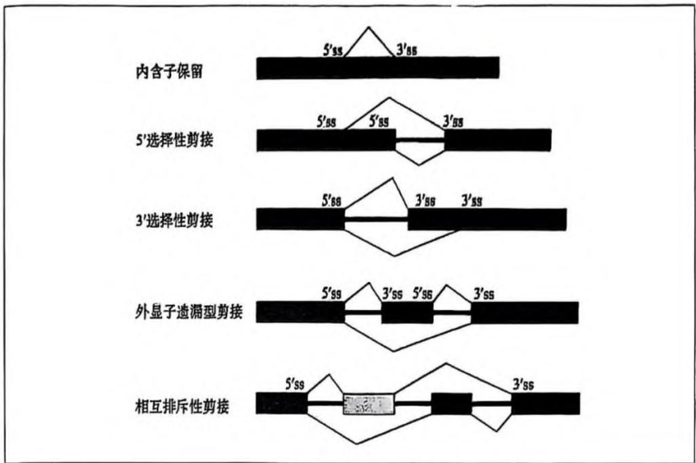  
图6-1 选择性剪

摘的不同类型

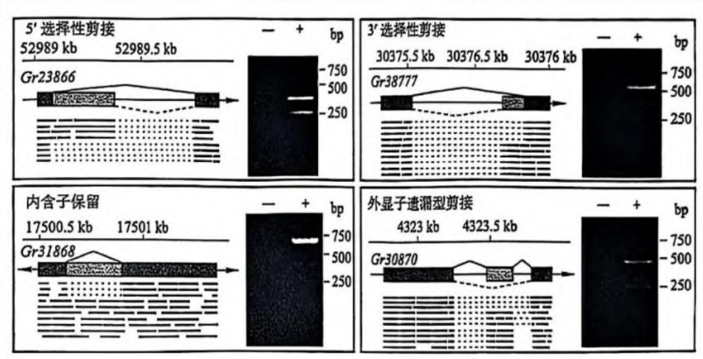  
图6-2 转录物组测序和RT-PCR验证棉花基因不同形式的选择性剪接  
灰框表示组成型基因的外显子，蓝框表示可变的基因外显子，基因内含子用直线连接，基因下方的短线条表示RNA-seq测序得到的reads比对到该基因对应的位置。每个图的右边为琼脂糖凝胶电泳图，RT-PCR进一步验证左边可变剪接预测的结果。

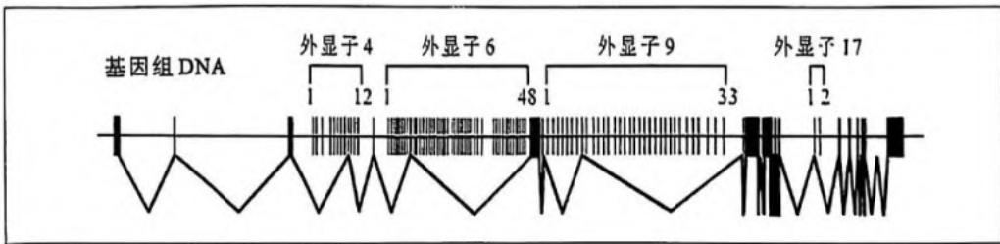  
图 6-3 果蝇的 Dscam 基因可以通过可变剪接产生 38000 多种可能的 mRNA 异构体  
代的一个重要特征。

## 6.1.2 原位杂交技术

原位杂交(in situ hybridization, ISH)是用标记的核酸探针,经放射自显影或非放射检测体系,在组织、细胞、间期核及染色体上对核酸进行定位和相对定量研究的一种手段,通

图6-4 用组织原位杂交技术检测拟南芥BARD1(a)和干细胞决定因子HUS1(b)基因的表达模式

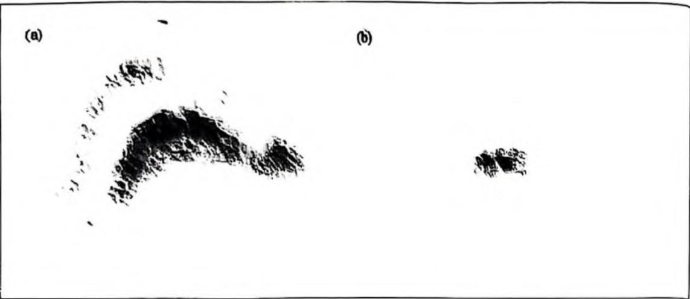

图 6-5 人肌肉糖原磷酸酶基因在 11 号染色体上的荧光原位杂交结果(另见书末彩插)  

常分为 RNA 原位杂交和染色体原位杂交两大类。RNA 原位杂交用放射性或非放射性(如地高辛、生物素等)标记的特异性探针与被固定的组织切片反应,若细胞中存在与探针互补的 mRNA 分子,两者杂交产生双链 RNA,就可通过检测放射性标记或经酶促免疫显色,对该基因的表达产物在细胞水平上做出定性定量分析(图 6-4)。

荧光原位杂交(fluorescence in situ hybridization, FISH)技术首先对寡核苷酸探针做特殊的修饰和标记，然后用原位杂交法与靶染色体或DNA上特定的序列结合，再通过与荧光素分子相耦联的单克隆抗体来确定该

DNA 序列在染色体上的位置 $^{(图6-5)}$ 。FISH 技术不需要放射性同位素,实验周期短,检测灵敏度高,若用经过不同修饰的核苷酸分子标记不同的 DNA 探针,还可能在同一张切片上观察几种 DNA 探针的定位,得到相应位置和排列顺序的综合信息。

## 6.1.3 基因定点突变技术

定点突变(site-directed mutagenesis)是重组 DNA 进化的基础,该方法通过改变基因特定位点核苷酸序列来改变所编码的氨基酸序列,常用于研究某个(些)氨基酸残基对蛋白质的结构、催化活性以及结合配体能力的影响,也可用于改造 DNA 调控元件特征序列,修饰表达载体,引入新的酶切位点等。由于迄今尚未建立能精确预测特定氨基酸残基变化对整个蛋白质结构及活性影响的模型,选择氨基酸突变位点存在一定的盲目性。因为即使知道了该蛋白质的三维结构,人们仍然无法了解某个氨基酸残基对其高级结构的影响。少数几个氨基酸残基的改变,有时根本不影响靶蛋白的功能,有时能影响靶蛋白的活性位点,有时还能从根本上改变整个蛋白质的高级结构。所以,基因的定点突变是我们进一步了解蛋白质的结构与功能关系的重要手段。

最早在 20 世纪 70 年代初进行小噬菌体 $\Phi X174$ 单链基因组易突变位点图谱分析工作时认识到基因定点突变的可能性。在人工成功合成寡核苷酸、获得高品质 DNA 聚合酶和

第6章 分子生物学研究法(下)——基因功能研究技术

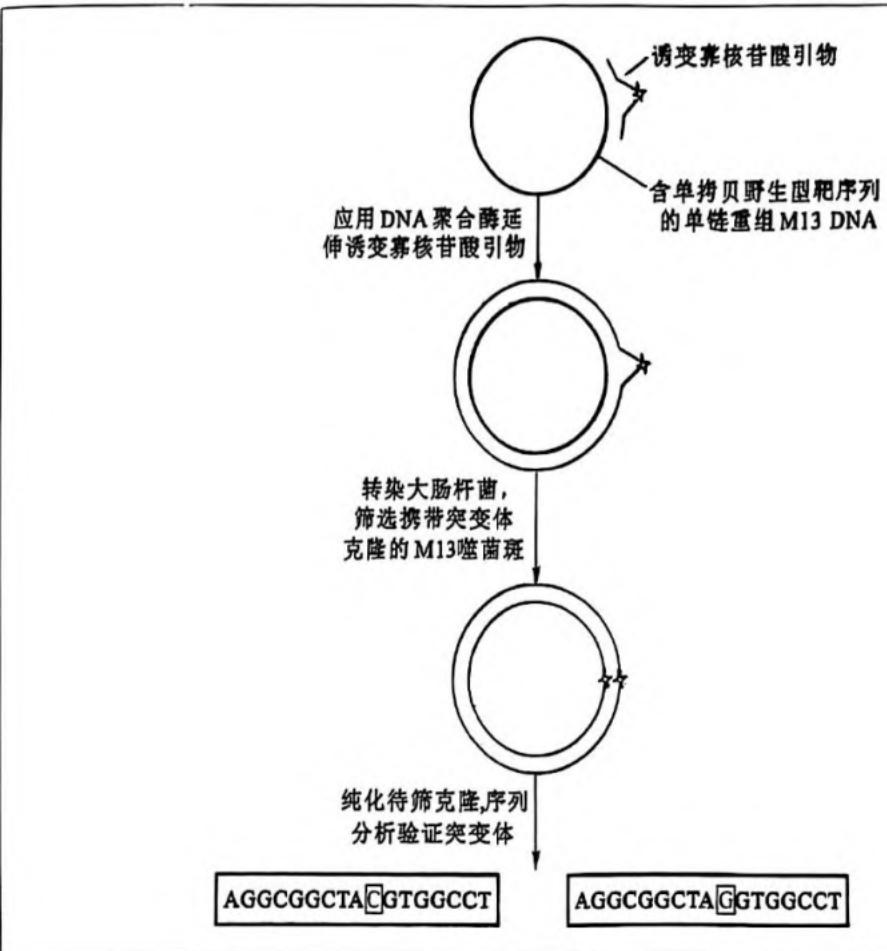  
图 6-6 禹胱苷酸介导的 DNA 突变技术

DNA 连接酶的基础上,科学家建立了体外寡核苷酸介导的 DNA 突变技术 $^{[12]}$ 6-6。PCR 技术的出现大大促进了定点突变技术的发展,简化了实验操作程序,提高了突变效率。科学家主要采用两种 PCR 方法,重叠延伸技术和大引物诱变法,在基因序列中进行定点突变。

图 6-7 阐述了重叠延伸介导的定点诱变机制。首先将模板 DNA 分别与引物对 1(正向引物 1 和反向引物 2) 和 2(正向引物 3 和反向引物 4) 退火, 通过 PCR 1 和 2 反应扩增出两种靶基因片段。PCR 产物 1 和 PCR 产物 2 在重叠区发生退火, 用 DNA 聚合酶补平缺口, 形成全长双链 DNA。

大引物诱变法首先用正向突变引物(M)和反向引物(R1),扩增模板DNA产生双链大引物(PCR1),与野生型DNA分子混合后退火并使之复性,第二轮PCR中加入正向引物(F2),与PCR1中产生的一条互补链配对,扩增产生带有突变的双链DNA $^{(图6-8)}$ 。由于F2的退火温度显著高于第一轮PCR所使用的引物M和R1,因此,可以忽略引物M和R1在本轮反应中所造成的干扰。获得定点突变PCR产物以后,一般需进行DNA序列分析以验证突变位点。

与经典定点突变方法相比,PCR介导的定点突变方法具有明显的优势:①突变体回收率高,大部分时间一次反应就能获得所需的突变体;②能用双链DNA作为模板,可以在任何位点引入突变;③可在同一试管中完成所有反应;④快速简便,无需在噬菌体M13载体上进行分子克隆。所以,PCR介导的定点突变方法已成为定点突变的主要技术。

## 6.1 基因表达研究技术

图6-7 重叠延伸介导的定点诱变

横板DNA分别与第一引物对(正向引物1和反向引物2)及第二引物对(正向引物3和反向引物4)退火.通过第一轮PCR产物扩增出两种靶基因片段(PCR产物1和PCR产物2)。PCR产物1和PCR产物2片段在重叠区发生退火并进行延伸,形成具有突变的全长双链DNA。蓝色圆点表示突变位点。

PCR1 使用正向诱变引物(M, 已设定突变碱基)和反向引物(R1)扩增产生双链大引物(PCR1)。第二轮 PCR 时再用正向引物(F2)和反向大引物(PCR1)配对扩增产生带有突变位点的双链 DNA。星号表示突变位点。

图6-8 大引物诱变法示意图  
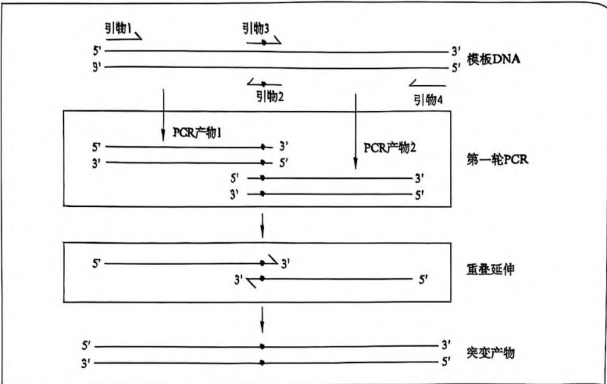

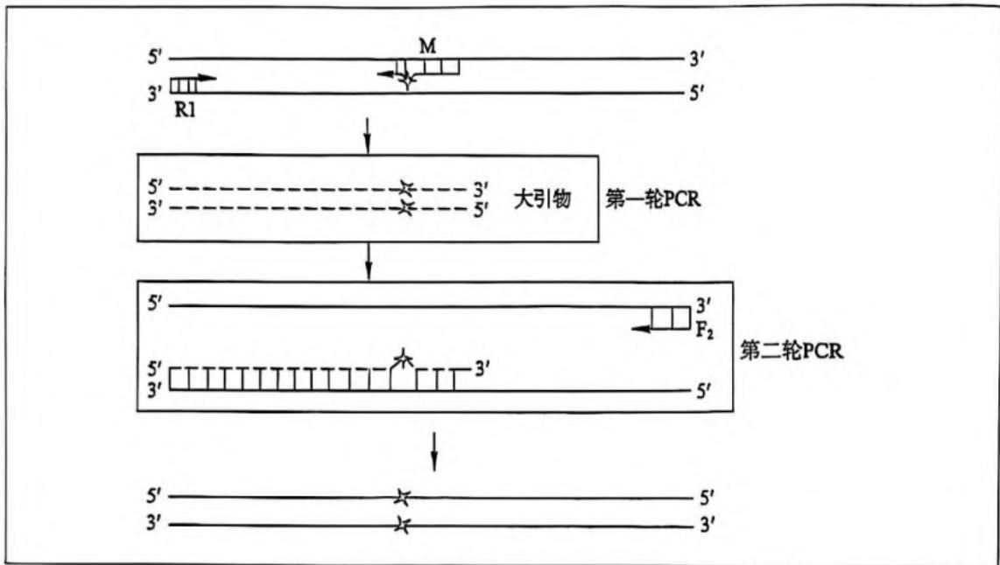

## 6.2 基因敲除与基因组编辑技术

## 6.2.1 基本原理概述

经典遗传学 (forward genetics) 是从一个突变体的表型出发, 研究其基因型, 进而找出该基因编码序列的科学。在后基因组时代, 大规模基因功能的研究正成为生命科学研究的热点, 现代遗传学 (reverse genetics, 反向遗传学) 首先从基因序列表出, 推测其表型, 进而推导出该基因的功能。基因敲除 (gene knock-out) 又称基因打靶, 通过外源 DNA 与染色体 DNA 之间的同源重组, 进行精确的定点修饰和基因改造, 具有专一性强、染色体 DNA 可与目的片段共同稳定遗传等特点。

1985 年,科学家利用同源重组将一段外源质粒 pΔβ117 插入到人类染色体 DNA β-珠蛋白位点,首次在哺乳动物细胞中进行基因打靶并获得成功。目前,在胚胎干细胞(ES 细胞)中进行同源重组已经成为遗传修饰基因组位点的常规技术。通过对这些基因敲除生物个体的表型分析,鉴定或推测某个或某些基因的生物学功能。

基因敲除分为完全基因敲除和条件型基因敲除(又称不完全基因敲除)两种。完全基因敲除是指通过同源重组法完全消除细胞或者动物个体中的靶基因活性,条件型基因敲除是指通过定位重组系统实现特定时间和空间内的基因敲除。噬菌体的 Cre/LoxP 系统、Gin/Gix 系统、酵母细胞的 FLP/FRT 系统和 R/RS 系统是现阶段常用的 4 种定位重组系统,尤以 Cre/LoxP 系统应用最为广泛。

## 1. 完全基因敲除

实验中一般采用取代型或插入型载体在 ES 细胞中根据正-负双向选择(positive-negative selection, PNS)原理(图 6-9)进行完全基因敲除实验。正向选择基因 neo 通常被插入载体靶 DNA 功能最关键的外显子中, 或通过同源重组法置换靶基因的功能区。neo 基因有双重作用, 一方面形成靶位点的插入突变, 同时可作为正向筛选标记。负向选择基因 HSV-tk(human semian virus-thymidine kinase)则被置于目的片段外侧, 含有该基因的重组细胞不能在选择培养基上生长。如果细胞中发生了随机重组, 负向选择基因就可能被整合到基因组中, 导致细胞死亡。由于基因转移的同源重组自然发生率极低, 动物的重组概率为 $10^{-2} \sim 10^{-5}$ , 植物的概率为 $10^{-4} \sim 10^{-5}$ , 即使采用双向选择法也很难保证一次就从众多细胞中筛选出真正发生了同源重组的胚胎干细胞, 必须用 PCR 及 Southern 杂交等多种分子筛选技术验证确实获得了目的基因被敲除的细胞系。

## 2. 条件型基因敲除

对于许多有重要生理功能的基因来说,完全基因敲除往往导致胚胎死亡,有关该基因功能的研究便无法开展。而条件型基因敲除,特别是应用 Cre/LoxP 和 FLP/FRT 系统所开

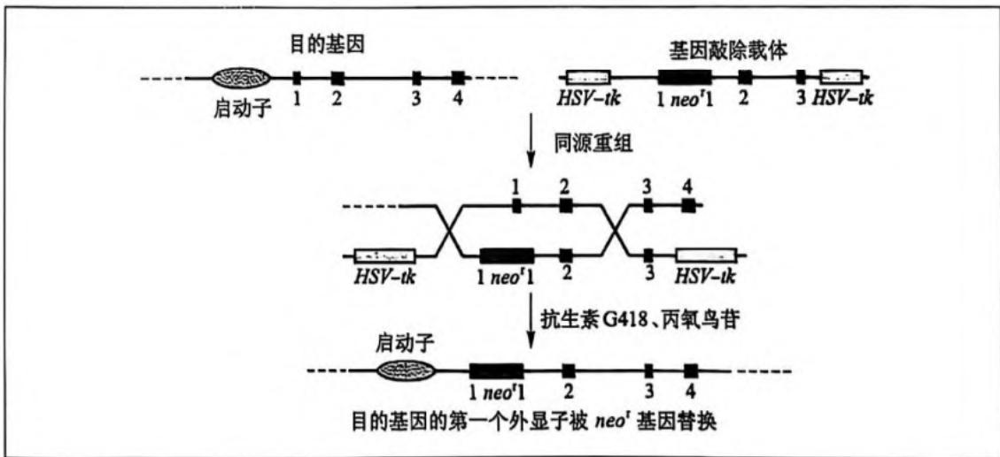  
图 6-9 正－负筛选法(PNS 法)筛选已发生同源重组的细胞

目标序列的第一个外显子中插入 $neo'$ 基因，两侧为单纯疱疹病毒胸腺嘧啶激酶基因，在ES细胞中发生同源重组后， $neo'$ 基因插入基因组中，而单纯疱疹病毒胸腺嘧啶激酶基因被剪切掉，发生重组的ES细胞由于有 $neo'$ 基因而获得对抗生素G148抗性。因为缺失了单纯疱疹病毒胸腺嘧啶激酶基因，转化细胞同时对嘌呤类似物产生了抗性。

展的组织特异性敲除，由于其可调节性而受到科学家的重视。构建条件型基因敲除打靶载体时，常将正向选择标记 $neo^{+}$ 置于靶基因的内含子中，并在靶基因重要功能域两侧内含子中插入方向相同的LoxP位点。当实验中需要消除靶基因活性时，与带有Cre重组酶基因的ES细胞杂交，Cre重组酶就能把两个LoxP位点中间的DNA片段切除，导致靶基因失活。标记基因两侧也常常带有LoxP序列，因为许多时候即使标记基因位于内含子中也会阻断靶基因的转录。一旦出现这种情况，可以用Cre重组酶表达质粒转染中靶ES细胞，通过LoxP位点重组将neo抗性基因删除。

以 Cre/loxP 系统为基础, 可以在动物的一定发育阶段和一定组织细胞中实现对特定基因进行遗传修饰。利用控制 Cre 表达的启动子活性或所表达的 Cre 酶活性具有可诱导性的特征, 人们常常通过设定诱导时间的方法对动物基因突变的时空特异性进行人为控制, 以避免出现死胎或动物出生、植物种子发芽后不久即死亡的现象。

## 6.2.2 基因敲除技术

胚胎干细胞 (embryonic stem cell, ES 细胞) 分离和体外培养的成功奠定了哺乳动物基因敲除的技术基础。真核生物基因敲除的技术路线主要包括构建重组基因载体, 用电穿孔、显微注射等方法把重组 DNA 导入胚胎干细胞纯系中, 使外源 DNA 与胚胎干细胞基因组中相应部分发生同源重组, 将重组载体中的 DNA 序列整合到内源基因组中并得以表达, 主要实验流程及筛选步骤如图 6-10 所示。

一般来说,动物基因敲除时用显微注射胚胎干细胞命中率较高,但技术难度相对大些。电穿孔法命中率比显微注射低,操作却相对简单些。

因为同源重组常常发生在某一条染色体上,要得到稳定遗传的纯合体基因敲除模型,至少需要获得两代以上的个体。除了基因敲除法,还有人用基因捕获的方法通过随机插入突变破坏靶基因表达(图6-11)。基因捕获载体包括一个无启动子的报告基因(通常为 $neo^{T}$ 基因),当该基因插入到ES细胞染色体某个部位,利用所在位点的转录调控元件得到表达时,该ES细胞就获得在含G418的选择性培养基上生长的能力。可通过分析标记基因侧翼cDNA或染色体DNA序列来获得靶基因的相关信息。

由于受整合位点附近染色质区的影响,转基因整合具有显著的位置效应,基因5'端启动子和增强子区,3'端终止子区都会对转基因的整合产生影响,这是某些打靶载体选择组织特异性启动子的原因之一。外源转基因的有效表达有时还取决于其是否有内含子,因为内含子中存在的转录调控元件可影响mRNA的剪切以及启动子与内含子间的相互作用。另外,内含子可能含有能开放染色体功能域的序列,还可能通过影响核质成分、位置等来影响基因表达强度。

除了研究基因功能之外,基因敲除技术还被广泛应用于建立人类疾病的转基因动物模型,为医学研究提供遗传学数据,为遗传病的治疗、生物新品种的培育奠定新基础。

由于动植物细胞结构显著不相同,植物细胞基因敲除常采用不同于动物细胞的策略。T-DNA 插入失活技术是目前在植物中使用最为广泛的基因敲除手段。T-DNA 插入失活就是利用根瘤农杆菌 T-DNA 介导转化, 将一段带有目的基因的 DNA 序列整合到宿主植物基因组 DNA 上。

图 6-10 假式动物小鼠中完全基因阻除的主要技术策略与应用举例  
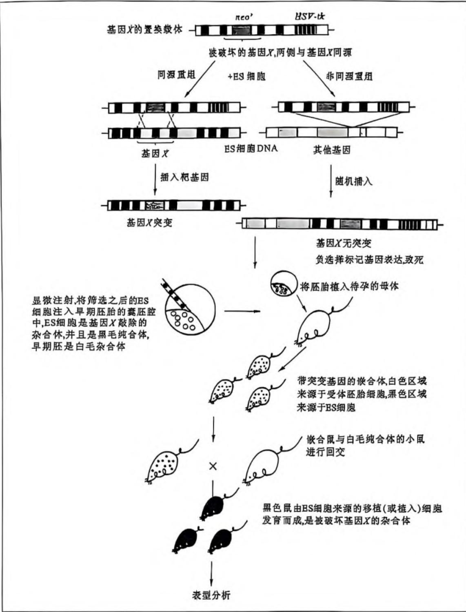

农杆菌本身带有 Ti(tumor-inducing) 质粒, 该质粒上除了 T-DNA 片段(具有介导 DNA 转移的功能) 和致毒 Vir(virulence region) 基因之外, 还有 3 套基因, 其中两套基因分别控制合成植物生长素与分裂素, 促使植物创伤组织无限制地生长与分裂, 形成冠瘿瘤。第三套基因负责合成冠瘿碱, 是一种农杆菌细胞生长所必需的物质。植物根部受到损伤后常分泌出酚类物质乙酰丁香酮和羟基乙酰丁香酮, 这些酚类物质会诱导 Vir 基因

图 6-11 基因捕获法原理示意图

(a)未插入基因捕获载体前,需要被敲除的靶基因转录翻译出活性蛋白质、未知;(b)插入基因捕获载体后,靶位点基因转录翻译出带有GUS(报告基因)蛋白区段的融合蛋白,可用组织化学法检测。

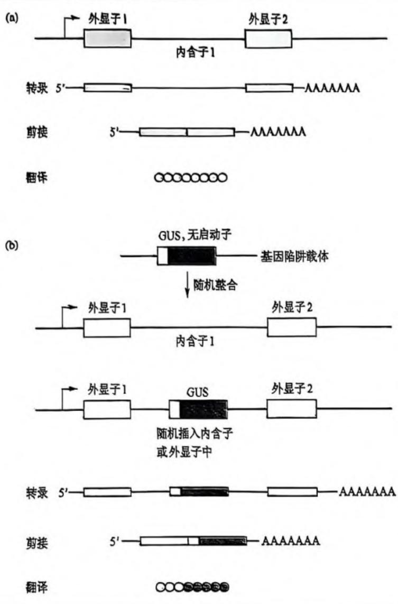

表达, 将 Ti 质粒上 T-DNA 单链切下, 并与农杆菌染色体上操纵子编码的基因产物结合形成复合物并转移进入植物根部细胞的细胞核, 最终导致 T-DNA 被整合到宿主基因组上。

Ti 质粒本身比较大,很难进行分子重组操作,为了实现植物基因转化,专门对 Ti 质粒进行改造,使之成为共整合载体和双元载体两大系统,图 6-12a 是共整合载体示意图。先将目的基因克隆到带有 T-DNA 的分子克隆载体上,与 Ti 质粒同时导入到农杆菌中,通过同源重组使目的基因整合到 Ti 质粒上,进行植物转基因实验。双元载体系统(图 6-12b)包括辅助 Ti 质粒和含有目的基因的穿梭质粒。该系统的 Ti 质粒缺失 T-DNA 区域,主要是提供 Vir 基因功能,Vir 基因能识别并切割穿梭质粒中的 LB、RB 区域中的 T-DNA 片段。与共整合载体系统所不同的是,双元载体的两个质粒之间不发生同源重组,两个质粒均能在农杆菌内独立复制。

T-DNA 在基因组中无专一整合位点,在植物基因组中一般发生随机整合,所以,只要突变株的数目足够大,理论上就可能获得每一个功能基因都发生突变的基因敲除植物文库。拟南芥基因组冗余序列少,基因密度高,几乎每一个 DNA 插入都会导致某个

图6-12 共整合段体系统(a)和双元系统(b)示意图

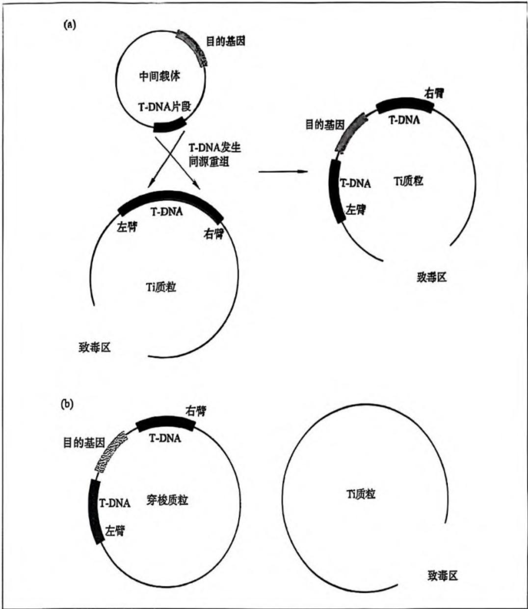

基因功能的丧失,结合已完成的拟南芥基因组信息,人们很容易筛选到新的功能基因。已经用 T-DNA 插入失活方法建立了拟南芥大规模基因敲除突变体库,研究人员可以方便地在多个数据库中检索到感兴趣基因的突变体,并据此开展深入的表型分析和功能研究。

## 6.2.3 基因组编辑技术

基因组编辑(genome editing)技术是利用序列特异核酸酶在基因组特异位点产生DNA双链断裂，从而激活生物体自身的同源重组或非同源末端连接修复机制，以达到特异性改造基因组之目的。锌指核酸酶和转录激活样效应因子核酸酶(transcription activator-like effector nucleases, TALEN)是2013年之前应用最为广泛的基因组编辑工具，随着CRISPR/Cas9系统(clustered regularly interspaced short palindromic repeats/CRISPR-associated protein 9 system)的开发，基因组编辑技术的应用出现了新的高潮。

该系统原来是细菌及古菌适应性免疫系统的一部分,其功能是抵御病毒及外源 DNA 的入侵。CRISPR/Cas 系统由 CRISPR 序列和 Cas 基因家族组成。其中,CRISPR 序列由一系列间隔序列及高度保守的正向重复序列相间排列形成,Cas 基因簇位于 CRISPR 序列的 5' 端,编码的蛋白质可特异性切割外源 DNA。

CRISPR/Cas 系统分为 I 型、II 型和 III 型，以 II 型的应用最为广泛。有外源 DNA 入侵时，CRISPR 序列转录并被加工形成约 40 nt 的成熟 crRNA (CRISPR RNAs)。成熟的 crRNA 与 tracrRNA (trans-activating CRISPR RNA) 通过碱基互补配对形成双链 RNA，激活并引导 Cas9 切割外源 DNA 中的原型间隔序列 (protospacer)。Cas9 蛋白具有两个核酸酶结构域：RuvC-like 结构域和 HNH 结构域，其中，HNH 结构域切割原型间隔序列中与 crRNA 互补配对的 DNA 链，RuvC-like 结构域切割另一条非互补链 (图 6-13a)。研究表明，Cas9 对靶序列的编辑依赖于原型间隔序列下游的短序列 PAM (protospacer-adjacent motifs)，PAM 通常为 5'-NGG-3'，极少情况下为 5'-NAG-3'，Cas9 切割的位点位于 PAM 上游第三个碱基。

根据 CRISPR/Cas9 系统的特点,研究者将 crRNA::tracrRNA 双分子结构融合成具有发夹结构的 sgRNA(single guide RNA),sgRNA 分子 5' 端 20 nt 的引导序列可完全与 DNA 靶序列互补,从而引导 Cas9 对靶 DNA 进行编辑(图 6-13b)。只要改变 sgRNA 中的 20 nt 引导序列,基因组上任意 5'-(N) $_{20}$ -NGG-3' 序列都可被 CRISPR/Cas9 系统编辑。

利用 CRISPR/Cas9 技术对植物基因组进行编辑,首先需要根据被编辑基因的 DNA 序列选定 20 bp 引导序列及其随后紧跟的 5'-NGG PAM 序列,如果研究中需要破坏该基因功能,则要避免把基因的 3' 端或内含子区序列用作引导序列。先把该序列克隆到相应的含有 sgRNA 骨架和 Cas9 基因的植物表达载体中,一般由 U6 或 U3 启动子驱动 sgRNA 在植物中的表达。将构建好的载体导入到植物细胞中,使 sgRNA 和 Cas9 在植物中瞬时或稳定表达。由于 CRISPR/Cas9 在靶标位点上引起核苷酸插入或缺失,可通过 PCR 方法鉴定突变体。通过在两个 sgRNA 靶标位点之间设计引物,将 PCR 片段进行 DNA 测序,确定突变体株系目标基因中是否准确地插入或者缺失相应碱基。采用 CRISPR/Cas9 技术对陆地棉中的纤维素合酶 GhCesA8 (cellulose synthase 8) 编码基因进行编辑,与野生型对照相比,获得的纯合突变株系茎秆严重矮化,纤维细胞完全丧失次生壁加厚的功能(图 6-14)。这是世界上第一根没有次生壁的成熟棉纤维。

## 6.3 蛋白质及 RNA 相互作用技术

## 6.3.1 酵母单杂交系统

酵母单杂交系统 (yeast one-hybrid system) 是 20 世纪 90 年代中期发展起来的新技术, 可识别稳定结合于 DNA 上的蛋白质, 可在酵母细胞内研究真核生物中 DNA-蛋白质之间的相互作用, 并通过筛选 DNA 文库直接获得靶序列相互作用蛋白的编码基因。此外, 该体系也是分析鉴定细胞中转录调控因子与顺式作用元件相互作用的有效方法。

(a)  
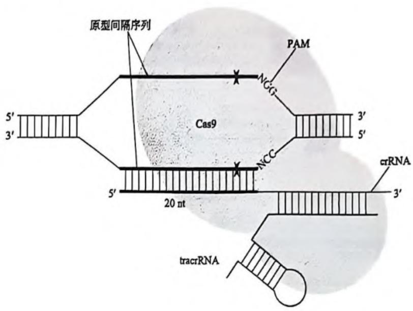  
图 6-13 CRISPR/ C89 原理  
(a) 细固的 CRISPR/Cas9 系统, crRNA::trzcrRNA 双 RNA 分子结构引导 Cas9 核酸酶切割 DNA 双链靶位点; (b) 改造的 CRISPR/Cas9 系统, 将 crRNA::trzcrRNA 双分子结构融合成一个 sgRNA, 以引导 Cas9 对靶基序列的编辑。

(b)  
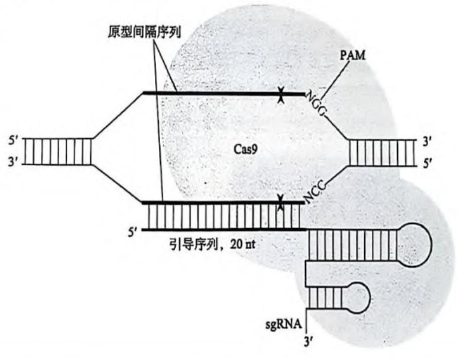

酵母单杂交的基本原理如图 6-15 所示, 首先将已知的特定顺式作用元件构建到最基本启动子 (minimal promoter, $P_{\min}$ ) 的上游, 把报告基因连接到 $P_{\min}$ 下游。然后, 将编码待测转录因子 cDNA 与已知酵母转录激活结构域 (transcription activation domain, AD) 融合表达载体导入酵母细胞, 该基因产物如果能够与顺式作用元件相结合, 就能激活 $P_{\min}$ 启动子, 使报告基因得到表达。

目前,酵母单杂交体系主要用来确定某个 DNA 分子与某个蛋白质之间是否存在相互作用,或用于分离编码结合于特定顺式作用元件或其他 DNA 位点的功能蛋白编码基因,

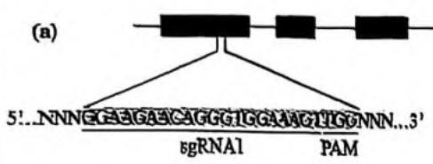

图6-14 利用CRESN/Cas9技术编辑棉花纤维素合酶基因ghcesa8的实验流程（另见书末彩插）

ghcesA8 来自于四倍体的陆地棉，其拥有 At 和 Dt 两个亚基因组，设计两个 sgRNA 同时靶向敲除这两个亚基因组上的拷贝 (ghcesa8At/Dt)，获得完全敲除纯合突变体。(a) 设计靶位点；(b) 构建 CRISPR/Cas9 表达载体；(c) 将构建好的载体通过农杆菌侵染到棉花幼苗下胚轴诱导的愈伤组织中，使其在植物细胞中稳定表达；(d) 对愈伤组织再分化幼苗的目标 DNA 序列进行检测，确认靶基因已被完全敲除；(e) 基因敲除突变体株系高度及生殖生长状态分析；(f) 开花后不同时间野生型和基因敲除突变体 ghcesa8 细胞壁厚度 (μm) 分析。dp2 表示开花后天数，陆地棉纤维细胞在 20 天左右开始进行次生壁加厚。

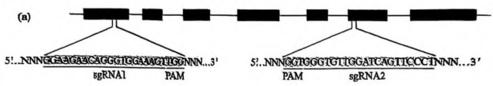

(b)  
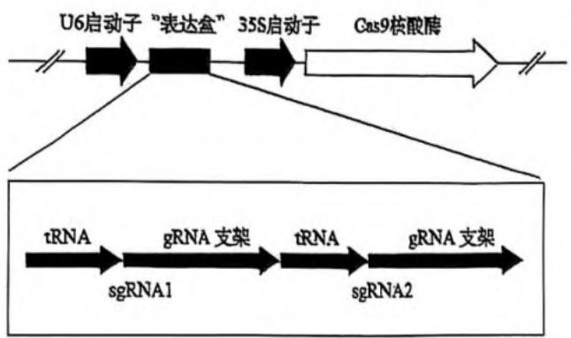  
(c)

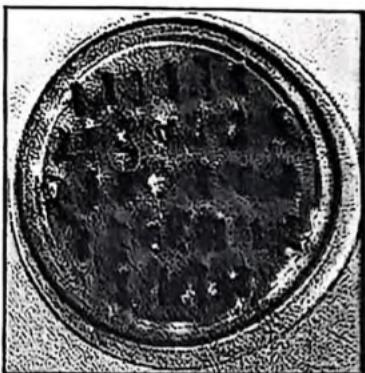

(d)  
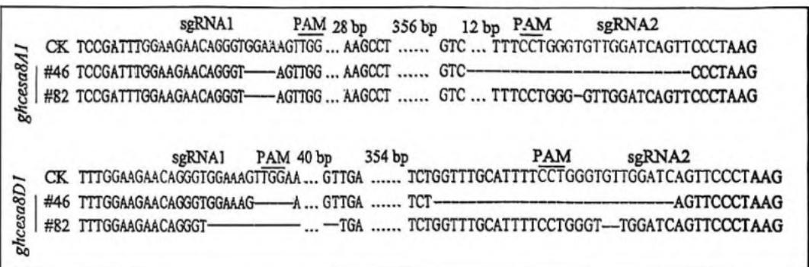

(e)  
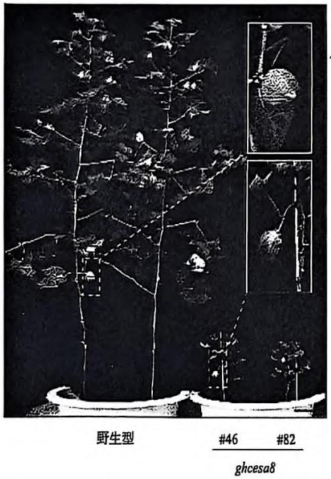

(f)  
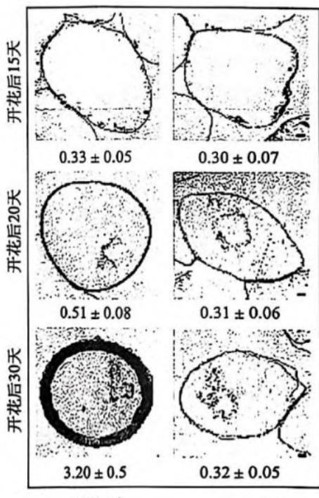

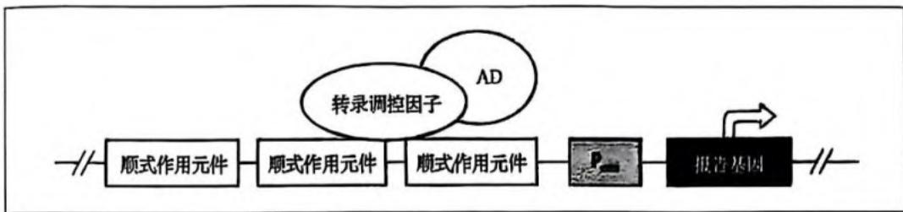  
图6-15 酵母单杂交的基本原理示意图

转录调控因子与顾式作用元件结合. 激活般基本启动子 $P_{\text{elb}}$ , 使报告基因表达。若连接入3个以上顾式作用元件, 可增强转录因子的识别和结合效率。

验证反式转录调控因子的 DNA 结合结构域, 准确定位参与特定蛋白质结合的核苷酸序列。由于该方法的敏感性和可靠性, 现已被广泛用于克隆细胞中含量极低且用生化手段难以纯化的那部分转录调控因子。常用的酵母单杂交体系基本选用 HIS3 或 LacZ 作为报告基因, 虽然有的体系将带有报告基因的载体直接整合于酵母染色体上, 大部分实验中报告基因都位于质粒 DNA 上。

## 6.3.2 酵母双杂交系统

酵母双杂交系统(yeast two-hybrid system)巧妙地利用真核生物转录调控因子的组件式结构(modular)特征,因为这些蛋白质往往由两个或两个以上相互独立的结构域构成,其中 DNA 结合结构域(binding domain,BD)和转录激活结构域(AD)是转录激活因子发挥功能所必需的。单独的 BD 能与特定基因的启动区结合,但不能激活基因的转录,而由不同转录调控因子的 BD 和 AD 所形成的杂合蛋白却能行使激活转录的功能。实验中,首先运用基因重组技术把编码已知蛋白的 DNA 序列连接到带有酵母转录调控因子(常为 GAL1、GAL4 或 GCN1)BD 结构域基因片段的表达载体上。导入酵母细胞中使之表达带有 DNA 结合结构域的杂合蛋白,与报告基因上游的启动调控区相结合,准备作为"诱饵"捕获与已知蛋白相互作用的基因产物。此时,若将已知的编码转录激活结构域 AD 的基因片段分别与待筛选的 cDNA 文库中不同插入片段相连接,获得"猎物"载体,转化含有"诱饵"的酵母细胞,只要酵母细胞中表达的"诱饵"蛋白与"猎物"载体中表达的某个蛋白质发生相互作用,不同转录调控因子的 AD 和 BD 结构域就会被牵引靠拢,激活报告基因表达。分离有报告基因活性的酵母细胞,得到所需要的"猎物"载体,就能得到与已知蛋白质相互作用的新基因 $^{[6-16]}$ 。

## 6.3.3 酵母三杂交系统

酵母三杂交系统 (yeast three-hybrid system) 主要用于研究 RNA 与蛋白质之间的相互作用。该实验首先构建杂交 RNA 文库, 筛选与已知蛋白质相结合的 RNA; 寻找 RNA-蛋白质相互作用的结构域、单个核苷酸或氨基酸残基; 鉴定和克隆识别有重要生理功能的 RNA, 开展调控机理或小分子药物筛选等研究。酵母三杂交系统的基本原理如图 6-17a 所示, 将已知的 RNA 结合蛋白 1 与转录因子的 DNA 结合结构域构建成第一个杂交蛋白, 用 RNA 结合蛋白 2 与转录因子的转录激活结构域组成第二个杂交蛋白。同时构建并表达一个杂交 RNA, 为两个 RNA 结合蛋白提供特定的结合位点, 以拉近两个融合蛋白。因此,当杂交 RNA 与 RNA 结合蛋白相互作用时,报告基因就会被激活。可通过表型或简单的生化手段来检测报告基因是否表达。在金属调节蛋白(IRP1)与金属反应元件(IRE)RNA 序列相互作用的研究中,噬菌体 MS2 包被蛋白特异性识别 MS2 的 RNA 靶点,将其与 LexA 的 DNA 结合结构域和其操纵子构建成杂交蛋白。金属调节蛋白 IRP1 与 Gal4 激活结构域组成另外一个杂交蛋白,由于金属调节蛋白 IRP1 与金属反应元件 IRE 的 RNA 序列相互作用,产生了一个活跃的反式激活物复合物,触发报告基因 HIS3 的表达(图 6-17b)。

图 6-16 屏母双杂交技术原理示意图  
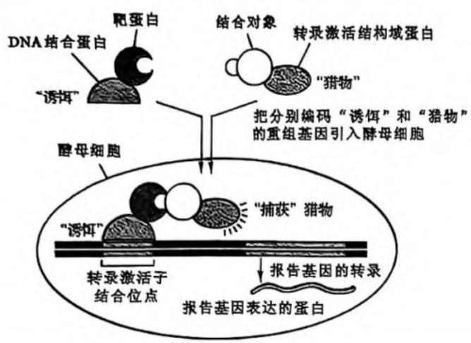

## 6.3.4 蛋白质相互作用技术

## 1. 等离子表面共振 (SPR) 技术

该技术是将诱饵蛋白结合于葡聚糖表面, 将葡聚糖层固定于纳米级厚度的金属膜表面。当有蛋白质混合物经过时, 如果有蛋白质同"诱饵"蛋白发生相互作用, 那么两者的结合将使金属膜表面的折射率上升, 从而导致共振角度的改变。而共振角度的改变与

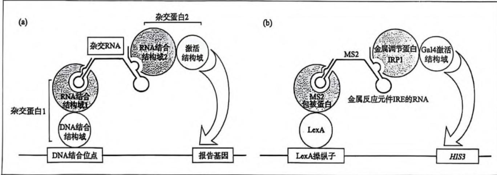  
图 6-17 酵母三杂交系统的基本原理示意图(a)及应用举例(b)

该处的蛋白质浓度成线性关系,由此可以检测蛋白质之间的相互作用(图6-18)。该技术不需要标记物和染料,安全灵敏快速,还可定量分析。缺点是需要专门的等离子表面共振检测仪器。

图 6-19 应用 SPR 技术研究 COI1 蛋白与 JAZ1 蛋白之间的相互作用。研究人员首先在葡聚糖芯片表面固定 1000 共振单位的

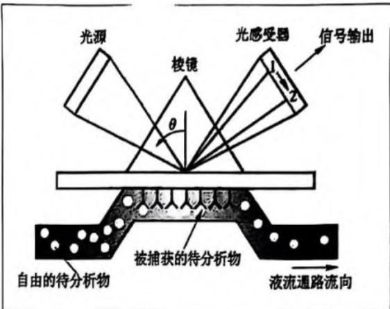  
图6-18 离子表面共振技术示意图

茉莉酸(JA)信号通路负调控因子JAZ1蛋白,当体系中同时有茉莉酸-异亮氨酸(JA-Ile)及COI蛋白存在时,可以检测到最高达380共振单位的SPR反应信号。加入一种在结构和功能上与茉莉酸甲脂(MeJA)相似的名为冠毒素(COR)的细菌毒素,也能使COI1和JAZ1发生相互作用。

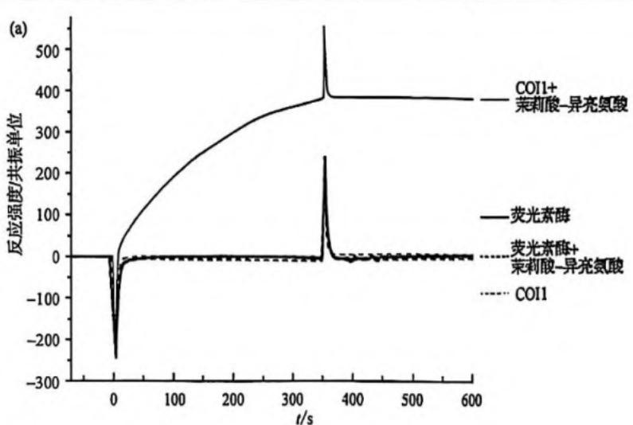

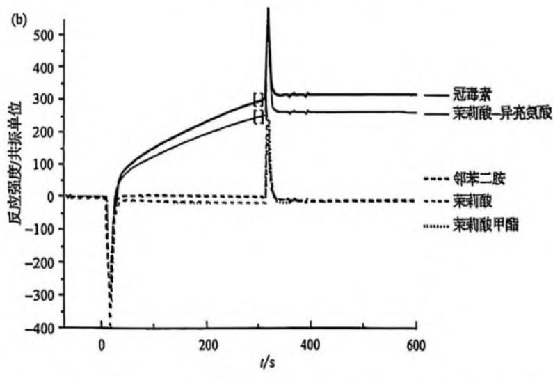  
(a) 只有同时加入JA-Ile和COI蛋白后，可以检测到最高380共振单位的SPR反应信号；(b) 加入冠毒素(COR)，也能使COI1和JAZ1发生相互作用，而加入JA、MeJA和邻苯二胺(OPDA)等都无效。

图 6-19 等离子表面共振技术(SPR)研究 COII 蛋白与 JAZ1 蛋白之间的相互作用

## 2. 免疫共沉淀技术 (Oo-immuno pRecipitation, CoIP)

该技术的核心是通过抗体来特异性识别候选蛋白。首先，将靶蛋白的抗体通过亲和反应连接到固体基质上，再将可能与靶蛋白发生相互作用的待筛选蛋白加入反应体系中，用低离心力沉淀或微膜过滤法在固体基质和抗体的共同作用下将蛋白复合物沉淀到试管的底部或微膜上。如果靶蛋白与待筛选蛋白质发生了相互作用，那么，这个待筛选蛋白质就通过靶蛋白与抗体和固体基质相互作用而被分离出来(图6-20)。

图6-20 免疫共沉淀示意图  
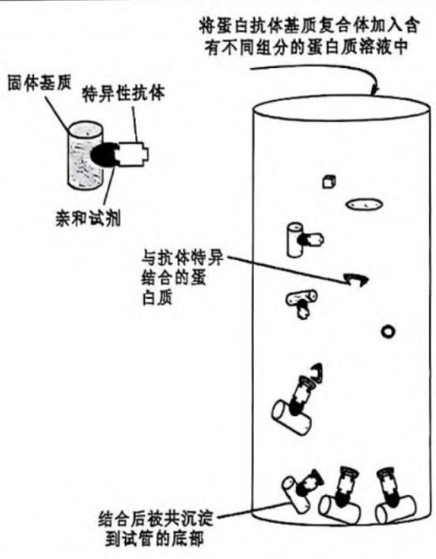

免疫共沉淀实验中常用 pGADT7 和 pGBKT7 质粒载体分别以融合蛋白形式表达靶蛋白,体外转录、翻译后将产物混合温育,分别用 Myc 或 HA 抗体沉淀混合物,过柱后

图6-21 c-Myc-ACS2 以及 HA-CDPK1 免疫共沉淀载体构建流程图

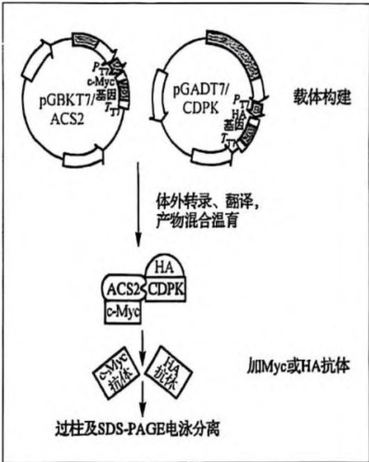

再用 SDS-PAGE 电泳分离, 检测两个靶蛋白之间是否存在相互作用(图 6-21)。实验表明, 棉花乙烯合成酶 ACS2 与钙离子依赖性蛋白激酶 CDPK1 之间存在相互作用, 而该蛋白与 CDPK32 及 CRK5 没有发生相互作用。ACO1 与这 3 个蛋白都没有发生相互作用(图 6-22)。

## 3. GST 及 GAD 融合蛋白沉降技术

该技术利用 GST 对谷胱甘肽偶联的琼脂糖球珠的亲和性,从混合蛋白质样品中纯化得到相互作用蛋白。GST 沉降试验通常有两种应用:确定探针蛋白与未知蛋白间的相互作用,确证探针

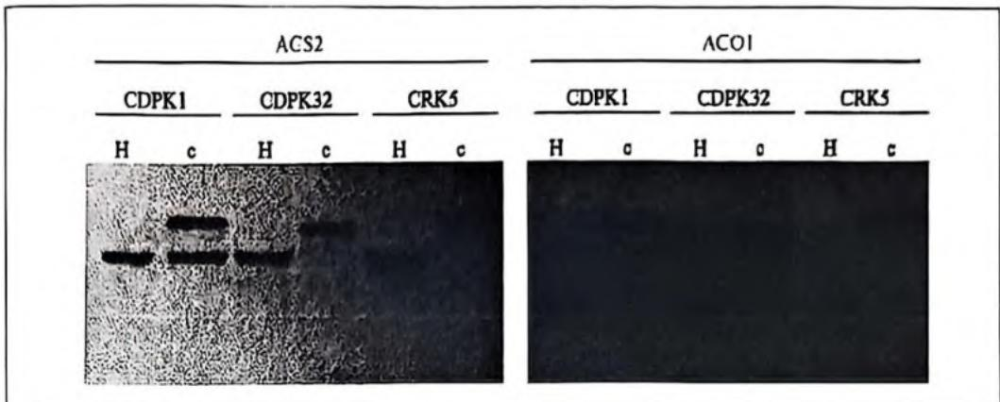  
图 6-22 免疫共沉淀实验  
结果表明棉花乙烯合成酶ACS2与钙离子依赖性蛋白激酶CDPK1之间存在相互作用。ACO1不与CDPK1发生相互作用。

蛋白与某个已知蛋白质之间的相互作用。与此相类似,实验中把 GAD 与 PIF3 的不同区段相连接成为钓饵,研究该重组蛋白在体外与光敏素 B(phyB)、其缺失 N-37 位氨基酸的突变体或光敏素 A(phyA) 的相互作用情况。研究发现,光敏素 B(phy B) 能与 PIF3 发生强烈的相互作用(超过 30% 的光敏素 B 能被 PIF3 沉淀下来),但缺失 N-37 位氨基酸的 phy B 突变体以及光敏素 A(phy A) 只能与 PIF3 发生较弱的相互作用,约 5% 的光敏素 A,或约 10% 的 N-37 位氨基酸缺失突变光敏素 B 能被沉淀下来(图 6-23)。

1. 细胞内蛋白质相互作用研究——荧光共振能量转移(FRET)

FRET 现象是 21 世纪初叶发现的。FRET 荧光能量给体与受体之间通过偶极－偶极耦合作用以非辐射方式转移能量的过程又称为长距离能量转移，有 3 个基本条件：

① 给体与受体在合适的距离(1\~10 nm);

② 给体的发射光谱与受体的吸收光谱有一定的重叠(这是能量匹配的条件);

③ 给体与受体的偶极具有一定的空间取向(这是偶极-偶极耦合作用的条件)。

FRET需要有两个探针,即荧光给体和荧光受体,要求给体的发射光谱与受体的吸收光谱有部分重叠,而与受体的发射光谱尽量没有重叠。常用的探针有3种:荧光蛋白、传统有机染料和镧系染料。

荧光蛋白是一类能发射荧光的天然蛋白或突变体,常见的有绿色荧光蛋白(GFP)、蓝色荧光蛋白(BFP)、青色荧光蛋白(CFP)和黄色荧光蛋白(YFP)等。不同蛋白质的吸收和发射波长不同,可根据需要组成不同的探针对。

传统有机染料是指一些具有特征吸收和发射光谱的有机化合物组成的染料对。常见的有荧光素、罗丹明类化合物和青色染料 Cy3、Cy5 等，该类染料分子体积较小，种类较多且大部分为商品化的分子探针染料，因此被广泛应用。镧系染料一般与有机染料联合使用，分别作为 FRET 的给体或受体，检测的准确性和信噪比较之传统染料有提高。

研究蛋白质间相互作用时，FRET一般与荧光成像技术联用，将蛋白质标记上荧光探针，当蛋白质间不发生相互作用时，其相对距离较大，无FRET现象，而蛋白质发生相互作用时，其相对距离缩小，有FRET现象发生 $^{[图6-24]}$ ，可根据成像照片的色彩变化直观地记录该过程。

图 6-23 体外融合蛋白沉降(pull-down)研究表明吸收远红光的活性形式

光敏素 B (phyB) 能与 PIF3 发生强烈的相互作用, 但缺失 N-37 位氨基酸的 phyB 突变体以及光敏素 A (phyA) 只能与 PIF3 发生较弱的相互作用。

(a)  
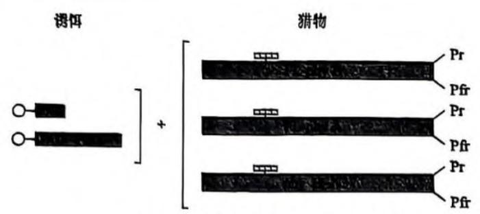

(c)  
(b)  
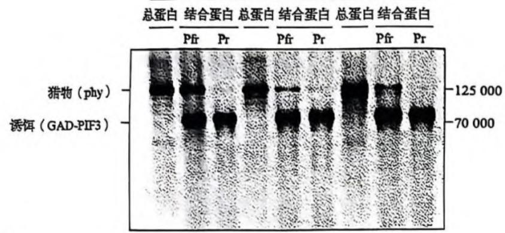

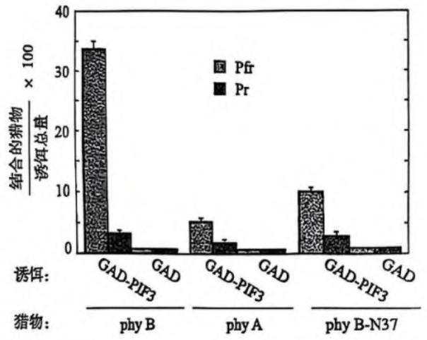

图6-24 荧光共振能量转移  
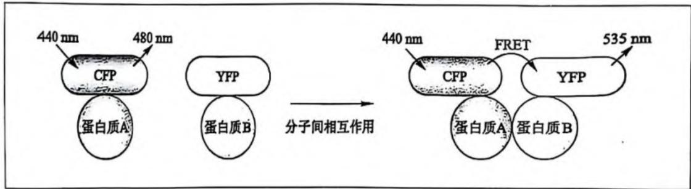

## 6.3.5 染色质免疫共沉淀技术

染色质免疫共沉淀(chromatin immuno precipitation, ChIP)技术是一项新发展的研究活体细胞内染色质DNA与蛋白质相互作用的技术，图6-25显示其主要实验流程：在活细胞状态下固定蛋白质-DNA复合物，并通过超声或酶处理将其随机切断为一定长度的染色质小片段，然后通过抗原抗体的特异性识别反应，沉淀该复合物，从而富集与目的蛋白相结合的DNA片段。对目的片段进行纯化和测序分析，就能获知与目的蛋白发生相互作用的DNA序列信息，包括DNA序列特征、在基因组上的位置、结合亲和程度(结合强度)以及对基因表达的影响等(图6-26)。

ChIP 技术不仅可以用来检测体内转录调控因子与 DNA 的动态作用, 还可以研究组蛋白的各种共价修饰与基因表达的关系, 定性或定量检测体内转录因子与 DNA 的动态作用。如果能将你所研究的目的蛋白定位到染色质 DNA 上某个或某些功能基因的启动子区或附近,对于确定你所感兴趣的蛋白质的生物学功能可能会是一次质的飞跃。

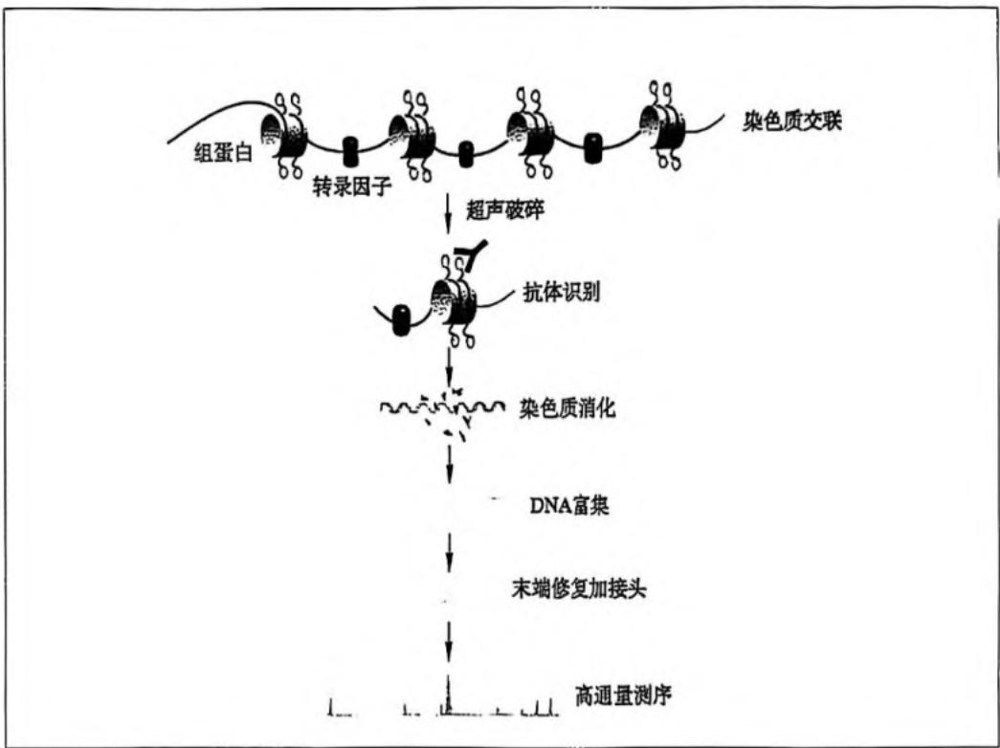  
图 6-25 染色质免疫共沉淀技术主要实验流程示意图

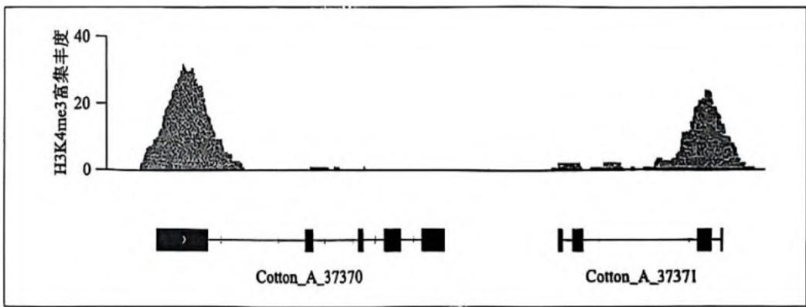  
图 6-26 用组蛋白修饰抗体 H3K4me3 研究棉花全基因组水平上的组蛋白修饰水平  
蓝色的峰表示组蛋白在基因组特定区域的富集,示意图中用黑框表示外显子,用连接线表示内含子。箭头表示基因转录方向。

## 6.4 酵母细胞与靶基因功能鉴定

酿酒酵母作为单细胞真核生物,具有和动植物细胞相似的结构特征,其细胞生长发育过程和动植物细胞也有很高的相似性,很多基因在酵母和动植物细胞中是高度保守的。而且,酵母细胞很容易进行生物化学和分子生物学操作,因此,酵母是基因功能研究中常用的模式生物。

## 6.4.1 酵母概述

酿酒酵母(Saccharomyces cerevisiae)属于真菌界、子囊菌门、酵母纲、酵母目、酵母科、酵母属,是单细胞真菌。成熟菌体一般呈椭球状,直径5\~6μm,长约21μm。酿酒酵母基因组是第一个被完整测序的真核生物基因组,第一版发表于1996年。酿酒酵母基因组由16条染色体组成,总长度为12.7Mb,编码6045个蛋白质;所有染色体都与动植物细胞染色体一样,包含复制起点、着丝粒和两个端粒。

酿酒酵母的世代交替为单双倍体型, 单倍体细胞和二倍体细胞都可以进行无性生殖。同时, 在一定条件下进行有性生殖。酿酒酵母的二倍体细胞为椭球形, 单倍体细胞为球形, 单倍体细胞又分为交配 a 型和交配 $\alpha$ 型。在营养充足时, 二倍体和单倍体细胞都能通过不均等有丝分裂, 即 "出芽" 的方式进行无性生殖。另外, 交配 a 型和交配 $\alpha$ 型细胞在彼此接触后发生胞质及细胞核融合, 形成新的二倍体细胞。营养缺乏时, 二倍体细胞从椭球形转变为球形, 成为子囊母细胞。子囊母细胞通过第一次和第二次减数分裂, 分别形成两个交配 a 型和交配 $\alpha$ 型, 共四个子囊孢子。子囊孢子细胞壁较厚, 对恶劣环境有耐受性。环境胁迫解除后, 子囊孢子萌发, 再次形成有生殖活性的单倍体细胞 (图 6-27)。

酿酒酵母作为研究基因功能的模式生物,兼具动植物与细菌的优势。首先,酿酒酵母具有与动植物细胞相似的细胞器,如细胞核、内质网、高尔基体、线粒体、过氧化物酶体以及细胞骨架、液泡等。此外,细胞中的糖蛋白、膜蛋白等需要在内质网中接受修饰,分子量较大的蛋白质也需要有分子伴侣帮助折叠。

尽管酿酒酵母与高等动植物演化上距离较远,许多基因功能在酵母和动植物中仍然高度保守。酿酒酵母的蛋白质编码基因中有23%可以在人类基因组中找到其同源基因。另有近200个基因可被人类基因组中的同源基因所替代。因此,酿酒酵母在导入外源基因后出现的性状变化可能揭示该蛋白质在原物种中的功能。酿酒酵母在拥有细胞核DNA的同时,还能像细菌那样从外部环境中获取质粒DNA。它还可以复制所获取的质粒DNA,并且在这些DNA的指导下表达外源蛋白或编辑自身基因组。酿酒酵母繁殖速度快,在合适的温度和营养条件下,只需90 min就可繁殖一代,使酿酒酵母作为模式生物的实验周期远短于拟南芥、果蝇和小鼠等。

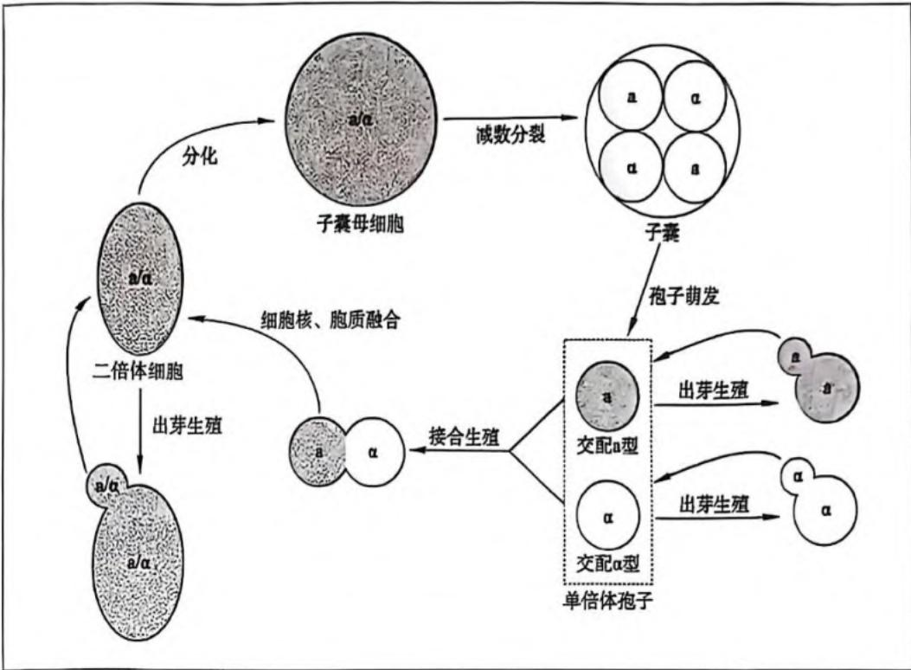  
图 6-27 酮酒酵母的生命周期

## 6.4.2 酵母基因转化与性状互补

利用Yip(整合型质粒)可以对酵母基因组中的任意基因进行精确的敲除(置换),并通过孢子繁殖中的四分体分析技术进行观测和研究。带有致死突变位点和可能的外源功能互补基因的酵母二倍体细胞在饥饿条件下形成四分体孢子,将这4个孢子用酵母四分体分离系统分开,如果所引入的外源基因具备互补突变位点的功能,含有突变基因的单倍体可以存活,否则就不能存活。图6-28中将多个棉花KCS基因(编码超长链脂肪酸合成酶)克隆到含有URA3筛选标记的表达质粒上,用带有URA3筛选标记的表达质粒替换带有TRP1筛选标记的质粒,实验发现,KCS12和KCS6基因都能完全互补野生型的表型,

KCS13 和 KCS2 虽然没有导致野生型的表型,但仍能使酵母细胞恢复生长,表明这些 KCS 基因都具备与 elo2 或 elo3 相似功能。

## 6.5 其他分子生物学技术

## 6.5.1 凝胶滞缓实验

凝胶滞缓试验(electrophoretic mobility shift assay, EMSA)是体外分析DNA与蛋白质相互作用的一种特殊的凝胶电泳技术。

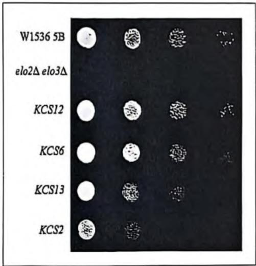  
图 6-28 棉花不同 KCS 基因互补酵母 elo2Δelo3Δ 突变体细胞程度分析  
W1536 5B 为野生型单倍体细胞；elo2 Δelo3 Δ为酵母自身的超长链脂肪酸合成酶双突变的单倍体，为致死型；KCS12、KCS6、KCS2、KCS13 为不同的棉花 KCS 基因。

图 6-29 棉花乙烯合成酶 ACO3 基因上游启动子不同区域 (P I \~ P VI) 在亚洲棉 (Ga) 和雷蒙德棉 (Gr) 两种不同棉花材料结合蛋白质能力的比较

最下面的为没有结合蛋白质的自由探针，探针为 $\gamma-^{32}P$ 同位素标记。

其基本原理是,蛋白质与 DNA 结合后将大大增加分子量,而凝胶电泳中 DNA 朝正电极移动的距离与其分子量的对数成正比,因此,没有结合蛋白质的 DNA 片段迁移得快,而与蛋白质形成复合物的 DNA 由于受到阻滞而迁移得慢。该技术首次为大肠杆菌乳糖阻遏物与其 DNA 结合位点的相互作用提供了动态数据。实验中,当特定的 DNA 片段与细胞提取物混合后,若该复合物在凝胶电泳中的迁移速率变小,就说明该 DNA 可能与提取物中某个蛋白质分子发生了相互作用。这一方法简单、快捷,是分离纯化特定 DNA 结合蛋白质的经典实验方法。

在 EMSA 试验中,用放射性同位素标记待检测的 DNA 片段(即探针 DNA),然后与细胞提取物共温育,形成 DNA-蛋白质复合物,将该复合物加到非变性聚丙烯酰胺凝胶中进行电泳。通常用 $^{52}\mathrm{P}$ 标记 DNA 分子,而不标记蛋白质。电泳结束后,用放射自显影技术显现具放射性标记的 DNA 条带位置。如果细胞蛋白提取物中不存在与同放射性标记的 DNA 探针相结合的蛋白质,那么所有放射性标记都将出现在凝胶的底部;反之,将会形成 DNA-蛋白质复合物,由于受到凝胶阻滞的缘故,放射性标记的 DNA 条带就会出现在凝胶的不同部位(图 6-29)。

## 6.5.2 蛋白质磷酸化分析技术

细胞的生长发育、周期调控、基因表达、蛋白质合成以及神经功能、肌肉收缩等都离不开蛋白质特异性磷酸化，因此，由蛋白激酶和蛋白磷酸酯酶所催化的蛋白质可逆磷酸化过程，是生物体内一种普遍且重要的调节方式，控制着众多的生理生化反应和生物学过程。许多复杂的细胞信号转导系统还涉及由多个蛋白激酶所催化的磷酸化级联反应。

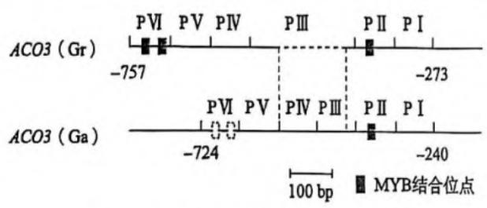

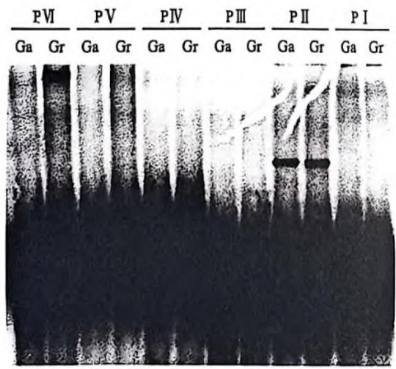

通常蛋白激酶催化 ATP 或 GTP 的 $\gamma$ 磷酸基团转移到底物蛋白的丝氨酸、苏氨酸或酪氨酸残基上，促使底物蛋白发生磷酸化，而蛋白磷酸酯酶则能催化底物蛋白发生去磷酸化。此外，底物蛋白的组氨酸、赖氨酸、精氨酸、天冬氨酸、谷氨酸和半胱氨酸残基上也能发生可逆磷酸化。

一般采用双向电泳及质谱分析等检测底物蛋白磷酸化。由于细胞内可能有多达上千个蛋白激酶,体内检测某个蛋白激酶活性非常困难,科学家常用体外激酶活性分析法来检测蛋白激酶活性。该方法能十分可靠地鉴定某个蛋白激酶对底物的磷酸化作用,筛查激酶的特异性底物。蛋白激酶体外磷酸化活性分析如图6-30所示,主要分为获取底物蛋白或待检测蛋白激酶和进行蛋白质体外磷酸化反应两步。可以直接从组织中提取目的蛋白(包括底物蛋白及待检测蛋白激酶),也可由原核或真核表达载体诱导表达目的蛋白。如图6-31所示,将体外表达的棉花钙离子依赖性蛋白激酶GhCDPK1与乙烯合酶GhACS2置于蛋白质体外磷酸化实验体系中,研究发现,有钙离子存在时,ACS2能被有效地磷酸化,ACO1及SUS蛋白则不能被磷酸化。

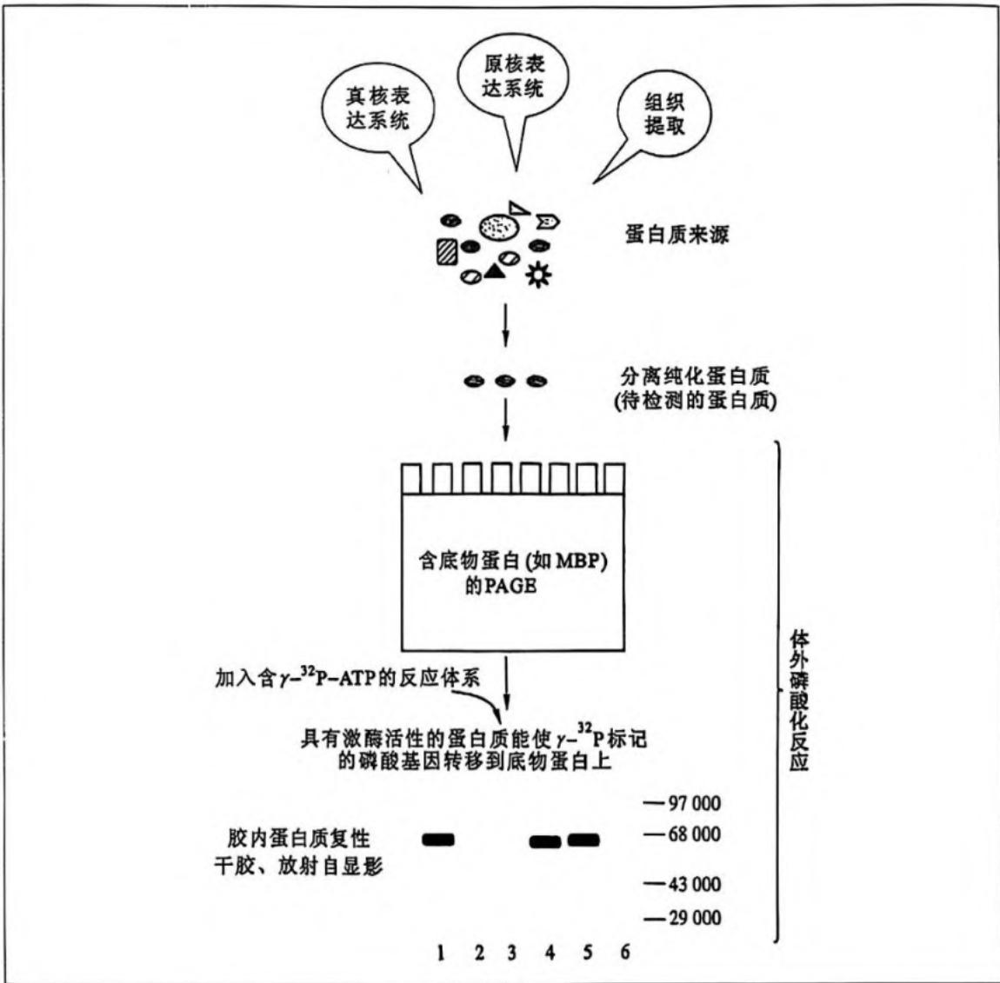  
图 6-30 蛋白激酶体外磷酸化活性分析  
泳道1、4和5中的蛋白质具有使蛋白质磷酸化的激酶活性，泳道2、3和6中的蛋白质不能使MBP(myelin basic protein)磷酸化。

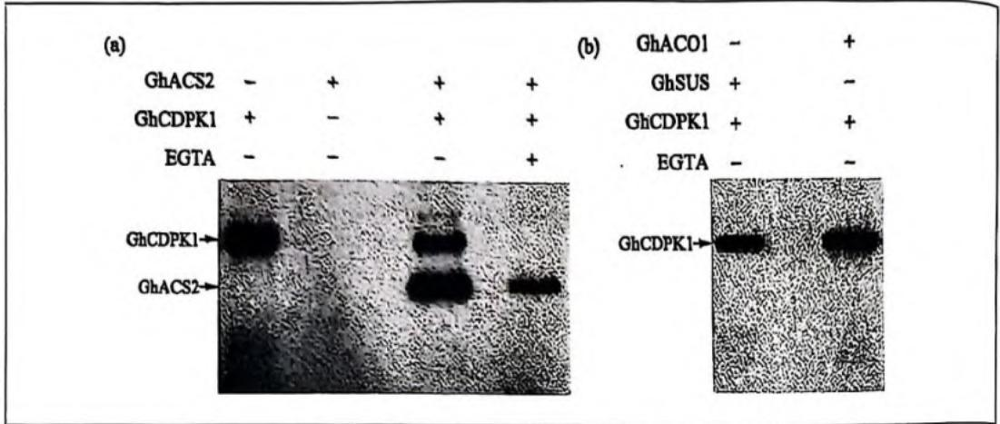  
图 6-31 利用同位素标记的放射自显影技术分析体外表达的钙离子依赖性蛋白激酶 GhCDPK1 对底物 GhACS2 的磷酸化特性  
(a) 有钙离子存在时(不加入钙离子螯合剂 EGTA), 蛋白激酶 GhCDPK1 在自磷酸化的同时, 也能磷酸化底物乙烯合酶 GhACS2, 且对 GhACS2 的磷酸化远强于自磷酸化(从左至右的第 3 泳道)。而加入 EGTA 后, 钙离子被螯合, GhCDPK1 完全不能自磷酸化, 对 GhACS2 的磷酸化也受到严重抑制(第 4 泳道); (b) 底物蛋白 GhSUS 和 GhACO1 均不能被 GhCDPK1 磷酸化, 只显示后者的自磷酸化。

## 6.5.3 蛋白质甲基化分析技术

蛋白质甲基化是一类重要的翻译后修饰,包括由组蛋白甲基转移酶介导催化的 H3 和 H4 组蛋白上的赖氨酸或精氨酸残基的甲基化,以及近年来发现的超过 30 种非组蛋白甲基化修饰。非组蛋白甲基化修饰可能参与基因表达调控、控制细胞增殖分化以及内质网应激过程,与多种人类疾病过程密切相关。组蛋白的赖氨酸残基可以发生单、双、三甲基化,精氨酸残基只能被单、双甲基化(图 6-32)。组蛋白甲基化的生物学功能主要是调节染色质构象,诱导异染色质或常染色质形成从而影响转录调控因子的结合能力,导致相关基因的沉默或转录激活。

蛋白质甲基化分析主要包括质谱分析以及染色质免疫共沉淀结合高通量测序分析(ChIP-seq)。组蛋白甲基化是一类非常重要的表观遗传修饰,基于真核生物组蛋白序列的保守性,可以使用多克隆抗体研究某个特定的组蛋白修饰位点。将棉花新鲜组织用一定浓度的甲醛交联,液氮研磨提取染色质,适度超声波破碎,然后用特异性的组蛋白抗体进行 ChIP-seq 实验,取微量染色质解交联后获取的基因组 DNA 作为对照组,最终将测序数据比对到棉花基因组上,获得棉花不同功能基因位点的组蛋白修饰信息。本实验中,GhTZF 基因位点上存在高水平的 H3K4me3 修饰,GhAPS 基因位点存在 H3K4me3、H3K4me1、H3K36me3 三种修饰,而 GhPFK 基因上不存在甲基化修饰(图 6-33)。

## 6.5.4 蛋白质免疫印迹实验

蛋白质免疫印迹(Western blotting)是20世纪70年代末80年代初在蛋白质凝胶电泳和固相免疫测定基础上发展起来的一种技术,是分子生物学中最常用的蛋白质研究技术,为检测样品中是否存在蛋白抗原提供了一种可靠的方法。该方法的基本原理是被测蛋白

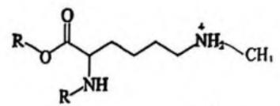  
赖氨酸单甲基化修饰 (mono-methyl lysine)

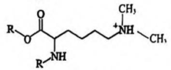  
赖氨酸双甲基化修饰 (di-methyl lysine)

图 6-32 组蛋白中赖氨酸和精氨酸残基的甲基化状态  
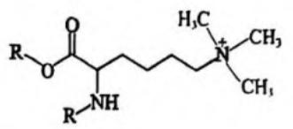  
赖氨酸三甲基化修饰 (tri-methyl lysine)

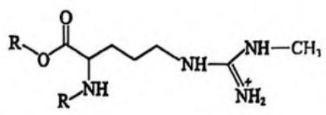  
精氨酸单甲基化修饰 (mono-methyl arginine)

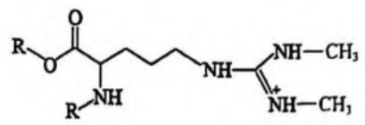

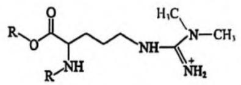  
精氨酸对称性双甲基化修饰 (symmetrical di-methyl arginine)  
精氨酸非对称性双甲基化修饰 (asymmetrical di-methyl arginine)

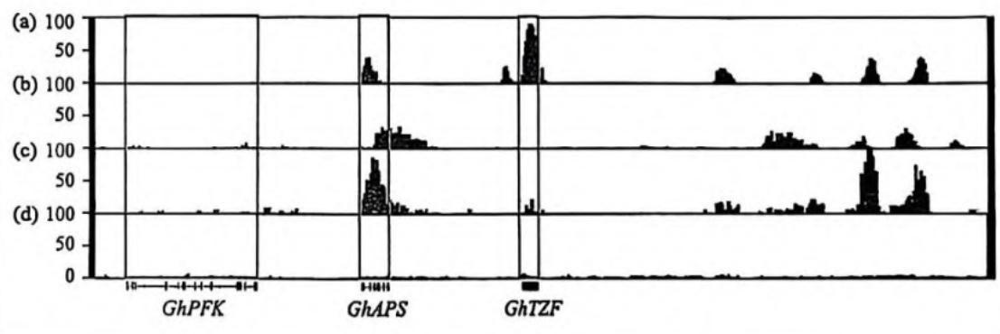  
图 6-33 组蛋白甲基化高通量分析技术 ChIP-seq(另见书末彩插)

影响免疫印迹成败的一个主要因素是抗原分子中可被抗体识别的表位性质,所以,在质只能与标记的特异性抗体相结合,而这种结合不改变该蛋白质在凝胶电泳中的分子量。免疫印迹法具有高效、简便、灵敏等特点,能被用于测定抗原的相对丰度或与其他已知抗原的关系,也是评价新抗体特异性的一种好方法。

陆地棉基因上发生的组蛋白甲基化修饰水平分别为

(a) H3K4mc3;

(b) H3K4mo1;

(c) H3K36me3;

免疫印迹程序可分为 5 个步骤:①蛋白质样品的制备;② SDS-PAGE 电泳分离样品;③将已分离的蛋白质转移到尼龙或其他膜上,转移后首先将膜上未反应的位点封闭起来以抑制抗体的非特异性吸附;④用固定在膜上的蛋白质作为抗原,与对应的非标记抗体(一抗)结合;⑤洗去未结合的一抗,加入酶偶联或放射性同位素标记的二抗,通过显色或放射自显影法检测凝胶中的蛋白质成分 $^{[1,8]}$ (6-34)。

(d) 对照组。

(d)  
(a) $M_{r}$ 蛋白质样品  
图 6-34 Western blotting 示意图  
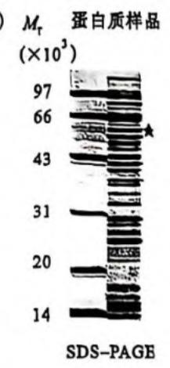

(b)  
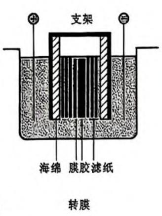  
蛋白质电泳(打蓝色星号者为目的蛋白)

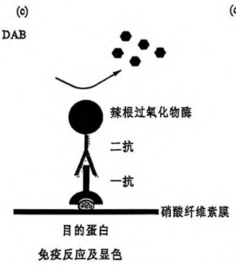

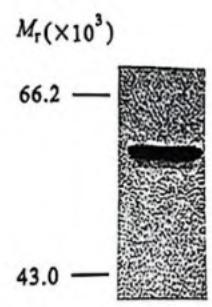  
目的蛋白Western blotting结果

选择抗体(一抗)时要考虑所选抗体是否能识别凝胶电泳后转印到膜上的变性蛋白,以及所选抗体是否会引起交叉反应。第二个影响因素是蛋白原液中的抗原浓度。对于中等分子量的蛋白质( $5 \times 10^{4}$ 左右)其总量需大于 $0.1 \mathrm{ng}$ 才能被检出。如果要检测含量更低的蛋白质,需要做进一步的浓缩。

## 6.5.5 细胞定位及染色技术

真核生物具有非常复杂的亚细胞结构,每种亚细胞结构或细胞器均含有特定的蛋白质。蛋白质在组织及细胞内的亚定位,一直是细胞生物学和分子生物学研究的核心问题,因为了解特定蛋白质的定位,才有可能了解其生物学功能。研究细胞定位可采取多种方法,最常用的是荧光蛋白标记和免疫荧光法。

绿色荧光蛋白(GFP), 由 238 个氨基酸组成, 有两个吸收峰, 主要吸收峰在 $395 \mathrm{~nm}$ , 另一个则在 $475 \mathrm{~nm}$ , 前者由紫外光激发, 后者由蓝光激发。发射光也有两个峰值, 分别是 $509 \mathrm{~nm}$ 和 $540 \mathrm{~nm}$ , 呈绿色或黄绿色荧光。将绿色荧光蛋白的编码序列与目的基因启动子融合形成嵌合基因, 或者将绿色荧光蛋白编码序列与目的蛋白编码序列直接相连接,构成融合基因,通过花序浸染法、基因枪法、显微注射法、愈伤组织转化法、细胞转染等技术,转染植物组织或动物细胞,由于融合基因与目的基因表达模式相同(使用相同的表达调控元件),通过荧光显微镜观察GFP在组织或亚细胞中的分布就相应确定了目的蛋白在细胞中的定位(图6-35)。

免疫荧光技术是将免疫学方法(抗原抗体特异结合)与荧光标记技术结合起来研究特异蛋白抗原在细胞内定位的方法。用针对特异蛋白抗原的荧光标记抗体作为分子探针检测细胞或组织内的相应抗原,由于所形成的抗原抗体复合物上含有荧光素,利用荧光

  
图 6-35 蚸生型拟南

芥中 $WOXS_{p}$ :GFP

融合基因的表达(另见书末彩插)

将 AtWOX5 的启动子序列与 GFP 的编码序列融合, 构建植物转化载体, 通过花序受染法转化野生型拟南芥。在 WOX5 启动子的指导下, GFP 基因表达. 指示 WOX5 蛋白应定位于根端分生组织 (RAM) 的静止中心 (QC); 红色荧光: 用 PI 对细胞壁染色; 绿色荧光: GFP 自发荧光。

显微镜观察标本,确定荧光所在细胞或组织,从而对抗原蛋白进行定位(图 6-36)。

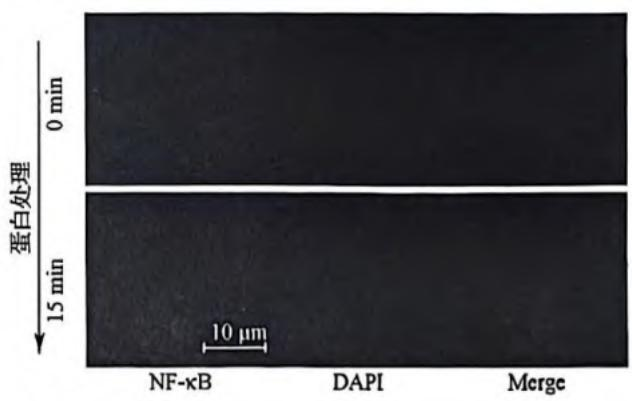  
图 6-36 结核杆菌外膜蛋白影响核转录因子 NF- $\kappa$ B 在巨噬细胞中的定位(另见书末彩插)  
用结核杆菌外膜蛋白刺激巨噬细胞 15 min，诱导在胞质定位的 NF- $\kappa$ B 分子转运到细胞核中。绿色荧光：FITC 标记 NF- $\kappa$ B 分子；蓝色荧光：DAPI 标记细胞核 DNA。

## 6.5.6 抗体库构建与筛选

单克隆抗体对特定抗原具有较高的亲和力和特异性。研究人员首先通过单细胞杂交瘤技术构建了一个超过58950个棉花单克隆抗体的抗体库，并点制了棉花单克隆抗体芯片。提取棉花不同组织的全蛋白，消化成肽段后免疫小鼠，之后分选出小鼠的B淋巴细胞并与骨髓瘤细胞融合制备杂交瘤细胞库，流式细胞仪分选出可识别单一蛋白质表位的单细胞，培育增殖产生有效的棉花单克隆抗体 $^{[图6-37a]}$ 。将该单克隆抗体库单个点样到硅基芯片上，用不同棉花组织的全蛋白进行大规模杂交筛选，以鉴定组织特异性积累的蛋白质，从而关联特定农作物性状 $^{[图6-37b]}$ 。抗体库芯片筛选农作物特定器官或组织全蛋白关联的重要农艺性状，是一种新颖且高效的技术。通过棉花单克隆抗体库芯片，筛选到2个纤维高表达的蛋白质 $^{[图6-37b]}$ ，后期可借助免疫共沉淀－质谱(IP-MS)蛋白质组学技术鉴定靶点蛋白质并运用基因组编辑技术(CRISPR/Cas9)敲除靶点蛋白质来研究其生物学功能。

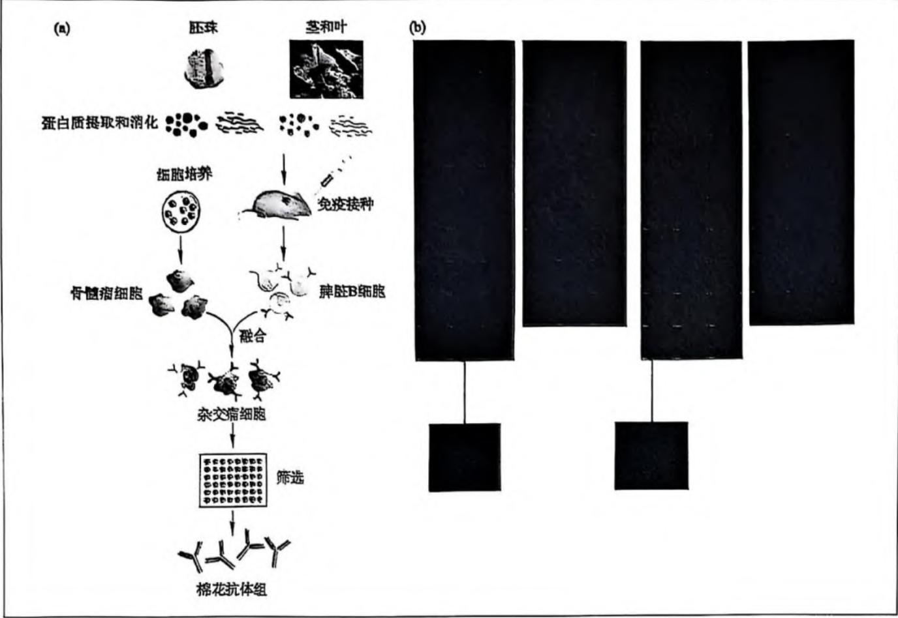  
图 6-37 抗体库的构建与棉纤维特异性蛋白质的筛选(另见书末彩插):  
(a) 棉花单克隆抗体库的构建流程；(b) 10 天棉纤维与胚珠芯片信号合并图 (左), 放大信号显示某个 10 天纤维高表达蛋白质 (绿色); 15 天棉纤维与胚珠芯片信号合并图 (右), 其中放大信号为 15 天胚珠高表达蛋白质 (红色)。

## 6.5.7 全基因组关联分析及应用

全基因组关联分析(genome-wide association study, GWAS)是一种在人类或动植物全基因组中以百万计的单核苷酸多态性(single nucleotide plodymorphism, SNP)为分子遗传标记,进行全基因组水平上的对照分析或相关性分析,通过比较发现影响复杂性状基因变异的一种新策略。1996年,Risch最早提出了GWAS设想,他认为人类复杂疾病的研究可以通过全基因组水平检测每一个基因的变异来确定疾病与基因的关联。2001年,Hansen等最早应用GWAS研究发现控制海甜菜春化抽薹基因与全基因组范围内的两个分子标记位点相关联。2005年,Science杂志报道了第一篇用GWAS研究人年龄相关性视网膜黄斑变性疾病基因网络的论文,之后GWAS在人类医学领域的研究中得到了极为广泛的应用,许多重要的复杂疾病研究因此取得了突破性进展。

GWAS 分析首先通过 SNP 分子遗传标记, 进行总体关联分析, 在全基因组范围内选择遗传变异进行基因分型, 比较实验组和对照组之间每个遗传变异及其频率的差异, 统计分析每个变异与目标性状之间的关联性大小, 选出最相关的遗传变异进行验证, 并根据验

证结果最终确认其与目标性状之间的相关性。

典型的 GWAS 基本流程包括: ①建立研究群体, 选择尽可能大的样本群, 建立目标性状库; ②提取每个样本的 DNA 进行测序从而得到群体的基因型 (genotype); ③利用合适的统计模型建立测序得到的 SNPs 和目标性状的关联性; ④最终实验确认与目标性状之间的相关性。近年来, 该方法在农业动植物重要经济性状主效基因的筛查和鉴定中得到了广泛应用。图 6-38 所示为 GWAS 应用于研究棉花种子油产量高低, 通过 GWAS 鉴定得到了同时控制棉花种子油棕榈酸 (C16:0) 和棕榈油酸 (C16:1) 含量的高低与棉花基因组 11 号染色体上的 SNP 相关联, 最高的 SNP 位点位于基因 GaKAS III 的第一个外显子上, 该位点存在一个非同义突变的 SNP, 导致了精氨酸突变成半胱氨酸, 从而导致了棉花不同群体种子油分的差异。

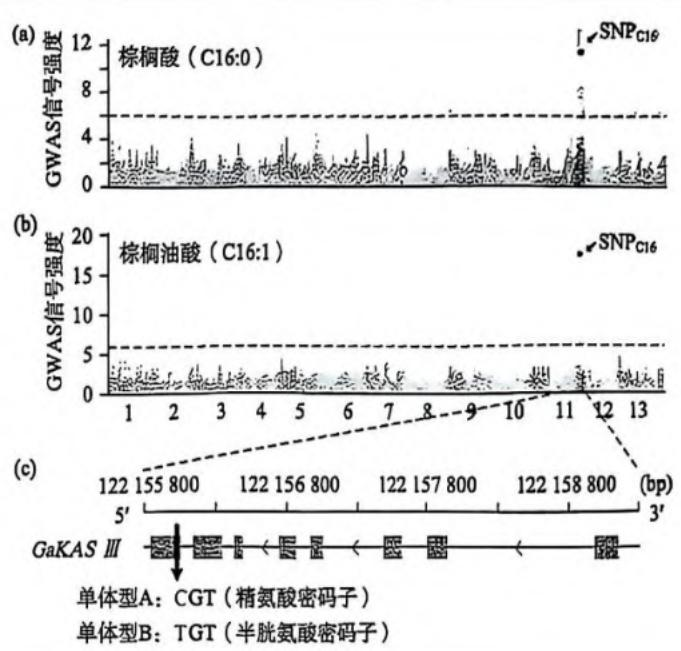  
图6-38 通过GWAS鉴定得到棉花中控制种子油棕榈酸(C16:0)和棕榈油酸(C16:1)含量的基因

## 思考题

1. 写出用 RNA-seq 技术进行转录物组学分析的原理。

2. 写出 RNA 原位杂交的主要实验过程及应用。

3. 说出免疫共沉淀实验的原理与过程, 比较酵母双杂交技术和免疫共沉淀技术在研究蛋白质相互作用方面的优缺点。

4. 写出基因定点突变的原理与实验过程。

5. 说出经典遗传学与现代遗传学的异同。

6. 简述蛋白质沉降(pull-down)实验原理与主要步骤。

7. 简述 CRISPR/Cas9 系统工作原理。

8. 简述染色质免疫共沉淀技术原理与基本过程。

9. 什么是完全基因敲除和条件型基因敲除？

10. 简述酵母单、双杂交系统的基本原理与应用。

11. 说出凝胶滞缓实验的原理与应用。

12. 说说抗体库构建与筛选的主要流程。

## 参考文献

1. 门可, 段醒妹, 杨阳, 等. 基于 CRISPR/Cas9 基因编辑技术的人类遗传疾病基因治疗相关研究进展 [J]. 中国科学: 生命科学, 2017, 47(11): 1130-1140.

2. Jinek M, Chylinski K, et al. A programmable dual-RNA-guided DNA endonuclease in adaptive bacterial immunity [J]. Science, 2012, 337: 816-821.

3. Johnson D S, et al. Genome-wide mapping of in vivo protein-DNA interactions [J]. Science, 2007, 316: 1497-1502.

4. Klein R J, et al. Complement factor H Polymorphism in age-related macular degeneration [J]. Science, 2005, 308: 385-389.

5. Ran F A, Hsu P D, et al. Genome engineering using the CRISPR-Cas9 system [J]. Nature Protocol, 2013, 8: 2281-2308.

6. Risch N, Merikangas K. The future of genetic studies of complex human diseases [J]. Science, 1996, 273: 1516–1517.

7. Robertson G, et al. Genome-wide profiles of STAT1 DNA association using chromatin immunoprecipitation and massively parallel sequencing [J]. Nature Methods, 2007, 4: 651–657.

8. Wang J Y, Doudna J. CRISPR technology: A decade of genome editing is only the beginning [J]. Science, 2023, 379: 6629.

9. Wang Z, Li Y, et al. An array of 60 000 antibodies for proteome-scale antibody generation and target discovery [J]. Science Advances, 2020, 6: eaax2271.

数字课程学习

教学课件

目在线自测

第7章
