# 第8章 真核基因表达调控

# 真核基因表达调控

8.1 真核基因表达调控相关概念和一般规律

8.2 真核基因表达的转录调控

8.3 真核基因表达的染色质修饰调控

8.4 真核基因表达的转录后调控

8.5 非编码 RNA 与基因表达调控

8.6 真核基因表达的翻译调控

8.7 真核基因表达的翻译后调控

## 8.1 真核基因表达调控相关概念和一般规律

生物学中的"调控"（regulation）与日常用语中的"调控"意义相似，即调控者通过某种操作或操作链，对被调控者的数量或质量等方面进行调整，最终改变被调控者原有的功能或效果。该操作或操作链的集合在生物学中被称为机制。由于调控的参与者多为

图8-1 常见的分子间调控机制模型图

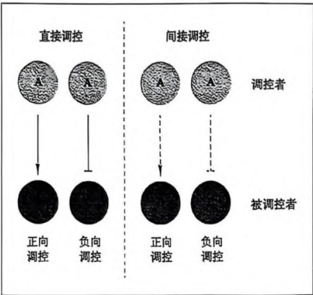

具有生物学活性的分子,因此也被称为"分子调控机制"(molecular regulatory mechanism)。常见分子间调控机制如图8-1所示,调控分为直接调控和间接调控两类。直接调控是调控者通过物理性直接作用,改变被调控者自身特性或组合方式,进而使其生物学功能发生改变的过程。间接调控则是由不同的直接调控按一定的逻辑顺序组合而来。直接调控过程具有物理性和有效性两个特点:

① 物理性 直接调控依赖生物活性分子间的物理相互作用。已知的酶促反应、受体-配体识别、靶标识别等调控过程均要求调控者与被调控者之间存在一定程度的物理接触。这种接触涉及经典牛顿力学范畴中的多种相互作用方式，包括范德华力、氢键和共价键等。本章阐述的基因表达调控过程涉及多种生物活性分子间的相互作用，比如蛋白质与蛋白质之间、蛋白质与核酸之间，以及小分子化合物与蛋白质之间。

② 有效性 直接调控中,调控者一定对被调控者的生物活性进行了改变。这种改变可能是激活其潜在功能,也可能是抑制其原有功能,或赋予其新的功能。这些改变将体现在由被调控者所介导的下一级调控中。比如,某蛋白质受到激酶的磷酸化修饰调控后其活性增强。不论之后该蛋白质对 DNA 的结合能力增强,还是自身的稳定性增加,都是这个调控有用性的直接体现。

了解真核基因表达的调控机制,归根结底需要对其中各个直接调控事件以及其相互之间的逻辑链进行考察和研究。

## 8.1.1 真核基因表达调控的层次

基因是控制生物性状的基本遗传单位。20世纪50年代以后，分子遗传学的发展使人们认识了基因的本质,即具有遗传效应的 DNA 片段。通常,一个 DNA 分子或片段上有可能包含多个基因。因此严格来说,基因是指能产生一条功能 RNA 或肽链所必需的 DNA 片段的信息。

基因表达(gene expression)则是指 DNA 片段经过转录、翻译及加工等步骤产生具有特定生物学功能的 RNA 或蛋白质分子的过程。基因表达受内源及外源信号的影响导致基因编码产物的丰度与功能发生改变的，这个调控过程称为基因表达调控(gene expression regulation 或 regulation of gene expression)。根据直接调控事件发生在基因表达过程中的先后次序，基因表达调控可分为染色质调控、转录调控、转录后调控、翻译调控及翻译后调控等多个层面(图 8-2)。

## 1. 染色质调控(chromatin Regulation)

染色质调控,也称转录前调控(pre-transcriptional regulation),包括染色质修饰和染色质重塑等。由于转录仅能够高效地发生于呈松散状态的染色体(即裸露的 DNA)之上,因此染色质调控直接决定了后续的转录起始和转录效率。

## 2. 转录调控(transcriptional Regulation)

转录调控是指对基因转录,即以 DNA 为模板合成 RNA 过程的调控。转录调控的程度通常可用转录物丰度进行粗略描述。相比其他水平的调控,转录调控研究起始最早,积累的知识也较多。

## 3. 转录后调控(post-transcriptional Regulation)

转录后调控,以转录后 RNA 的加工(RNA processing)和降解(RNA decay)为主要调控对象。转录后的前体 mRNA(pre-mRNA)需要经过必要的加工才能成熟,并离开细胞核进行翻译。mRNA 的转录后调控直接决定了后续的翻译起始和翻译效率。

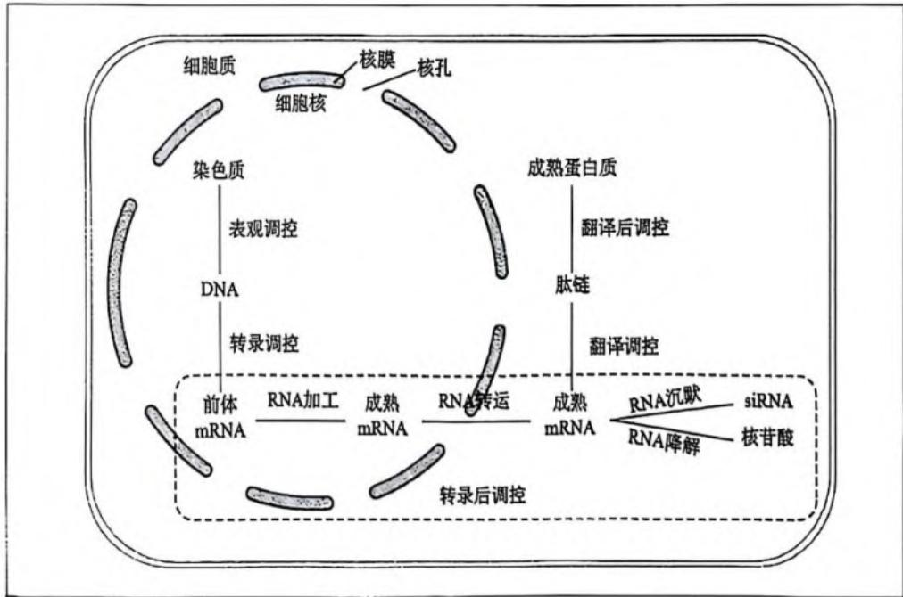  
图8-2 多个层面上的基因表达调控

## 4. 翻译调控(translational Regulation)

翻译调控是指对以成熟 mRNA 为模板合成蛋白质的翻译过程的调控。翻译调控可以在不改变转录物丰度的前提下，通过影响蛋白质合成速率从而快速改变产物蛋白质的含量。翻译调控的水平通常用翻译效率 (translation efficiency, TE) 来描述，是指某个基因的总 mRNA 中与核糖体结合并进行翻译的 mRNA 所占比例。

## 5. 翻译后调控(post-translational Regulation)

翻译后调控指对新生肽链(蛋白质)进行的折叠、修饰、加工、分选、转运及降解等过程,是整个基因表达调控的最后一步。翻译后调控影响蛋白质的生物活性和特定功能,并往往决定一个蛋白质分子的命运。种类繁多的蛋白质翻译后修饰(post-translational modificaiton, PTM)就是翻译后调控的典型代表。

## 8.1.2 真核基因表达调控的复杂性

真核生物的基因总数和基因组中蕴藏的遗传信息都远远多于原核生物,如人类单倍体基因组就包含有 $3 \times 10^{9}$ 个碱基,约为大肠杆菌基因组的 800 倍,是噬菌体基因组的 10 万倍左右。除此之外,真核基因表达调控的复杂性还体现在以下方面。

① 原核生物基因组中,具有转录调节功能的区域较少,大都位于转录起始位点上游附近,且一个转录调节区往往通过操纵子(operon)的形式控制功能相似或相关的一系列基因的表达。而真核生物基因组中存在大量具有转录调控功能的非转录区域,甚至基因内部也存在具有调控作用的非翻译区域。可以认为真核生物几乎每一个基因都拥有独特的表达调控方式,这意味着真核生物基因表达调控异常复杂。

② 真核生物的 DNA 还常与蛋白质(包括组蛋白和非组蛋白)结合,形成复杂的染色质结构。染色质的构象及蛋白质组成等变化都会对基因表达产生巨大的影响。特别是转录前,染色质结构需要发生一系列变化才能保证转录的正常起始。这些构成了真核基因表达调控的一个特殊层次。

③ 相比原核生物,真核生物的染色质被包裹在细胞核内,基因的转录(细胞核内)和翻译(细胞质内)在空间上被核膜所隔开。这种空间阻隔使得真核基因表达增加了 mRNA 的剪接、加工及运输等步骤,并因此扩大了真核基因表达调控的范围,使真核生物的基因调控达到了原核生物所不可能拥有的深度和广度。这些转录后步骤是真核基因表达调控的重要节点。

## 8.1.3 真核基因表达的反应模式

真核生物体内的基因表达模式可以分为两类。

第一类是选择性表达(selective gene expression)。在特定信号刺激下,相应的基因被激活,基因表达产物增加,这种基因称为可诱导基因(inducible gene)。而如果基因被信号所被抑制,这种基因就是可阻遏基因(repressible gene)。基因表达调控大多数是对这些基因的转录和翻译速率的调节,从而导致其编码产物的水平发生改变并影响其功能。从广义上讲,细胞的基因差异化表达(differential expression)是由细胞内、外的信息共同决定的: ①来自细胞内部的信息:内源 ATP 的含量、自身 DNA 是否受损等。②来自细胞外的信息:来自邻近细胞的化学信号、来自细胞外基质的机械信号和营养水平、温度等。这些分子信号(包括激素、生长因子、细胞因子、神经递质以及其他小分子化合物等)可以经细胞膜传入细胞内,引发一系列生物化学反应以及蛋白质间相互作用,最终选择性地激活或抑制相关基因表达,产生各种生物学效应。

第二种是组成型表达(constitutive expression), 即在真核生物整个生活周期的多数细胞中持续稳定表达且不受外界因素影响的表达模式。具备组成型表达模式的基因也被称为管家基因(house-keeping gene)。管家基因通常具备以下特点: ①在维持真核细胞生存所必需的生命活动中发挥不可替代的作用, 例如编码 rRNA、肌动蛋白、微管蛋白等的基因。②其表达量相对稳定, 但并不绝对稳定。比如肌动蛋白表达量非常稳定, 而在某些营养缺乏时也会有变化。根据这一特点, 实际研究中常把一个或多个管家基因的表达产物作为检测其他基因表达水平的参照。

## 8.1.4 真核基因表达的特点

多细胞真核生物的每个细胞所携带的基因是相同的,但在不同时间和部位的细胞中,这些基因却发生了不可逆的差异化表达。就像计算机运行需要依靠计算机语言编写程序一样,多细胞真核生物发育过程中的基因表达程序也依赖特定的"编程语言"来设定。这种模式赋予真核基因表达一个最显著特点,即时空特异性(spatiotemporal specificity)。这意味着在特定时空下真核细胞激活特定基因的表达,从而实现"预定"的、有序的、不可逆转地分化和发育,并使生物体的各个组织和器官保持正常功能。

## 1. 真核基因表达的时间特异性 (Temporal sPecificity)

是指某一特定基因的表达严格按照特定的发育时间顺序发生,因此也称为阶段特异性(stage specificity)。例如,人血红蛋白中珠蛋白基因的表达就具有阶段特异性,不同珠蛋白基因的表达在不同发育阶段开启或关闭。血红蛋白是由两个α亚基和两个β亚基组成的四聚体,在生物个体发育的不同阶段,却出现几种不同形式的α和β亚基(α/ζ;β/ε/γ/δ)。这些不同形式亚基的表达情况与个体发育时间紧密关联(图8-3)。由于在同一细

胞的不同发育阶段接受到不同的内外部信号的调控,编码不同形式亚基的基因发生了时间特异性表达。

1. 真核基因表达的空间特异性 (spatial specificity)

是指在多细胞真核生物的生长发育过程中,某种基因按照不同组织的空间顺序进行表达,因此也称为细胞或组织特异性(cell or tissue

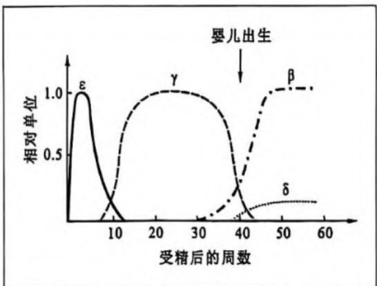  
图8-3 在生物个体发育的不同阶段. 几种不同形式的 $\alpha$ 和 $\beta$ 亚基的表达情况

图8-4 拟南芥主根基因表达的组织特异性

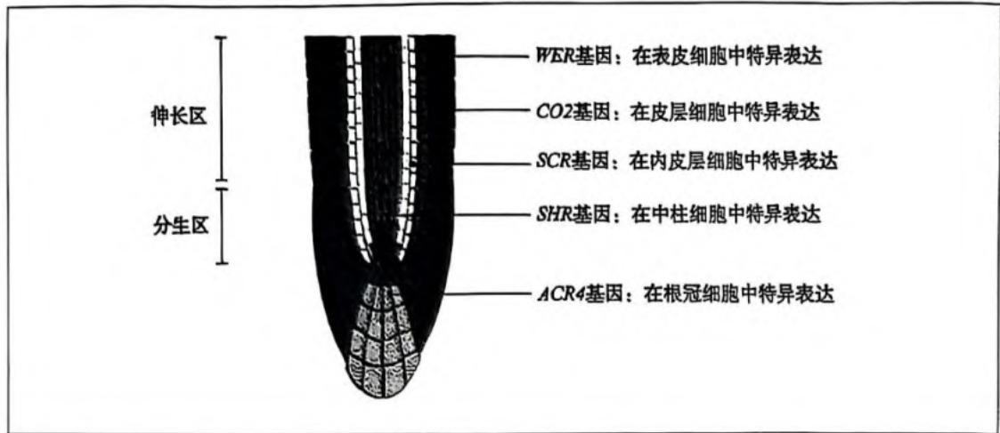

specificity)。空间特异性的基因表达也普遍存在于动植物生长发育的各个阶段。如拟南芥主根发育过程中许多调节器官或组织形成的关键基因的表达均呈现出显著的组织特异性(图8-4)。这些基因在不同细胞类型中接受到不同的内外部信号的调控,因此产生了空间特异性。

## 8.2 真核基因表达的转录调控

真核基因的表达起始于转录,即以 DNA 为模板合成 RNA 的过程。

新生 RNA 链第一个核苷酸对应 DNA 链上的转录起始点(transcription start site, TSS), 而最后一个核苷酸则对应 DNA 链上的转录终止位点(transcription termination site, TTS), 这两个位点之间的 DNA 序列称为转录区(transcription region)。相邻基因转录区之间的区域称为非转录区(non-transcribed region), 在基因表达中发挥重要调控作用。非转录区中存在调控基因表达的关键元件, 包括启动子(promoter)、增强子(enhancer)、终止子(terminator)等。由于它们的调控效果仅作用在与之连锁的基因(即位于同一条染色体上的基因)之上, 因此被称为顺式作用元件(cis-acting element)(图 8-5)。

RNA 聚合酶(RNA polymerase)是催化基因转录最主要的酶。真核细胞 RNA 聚合酶自身对 DNA 并无亲和力,无法单独完成转录,需要众多的辅助因子形成转录复合物结合在顺式作用元件上,才能启动转录。这些能够结合在顺式作用元件上调控基因表达的调节因子(可以是蛋白质,也可以是 RNA)被称为反式作用因子(trans-acting factor)。

调控真核基因转录的基本要素至少包括顺式作用元件、反式作用因子和RNA聚合酶。在转录过程中，顺式作用元件、反式作用因子通过DNA-蛋白质、蛋白质-蛋白质相互作用影响RNA聚合酶的活性，从而调控转录起始及转录速率(图8-6)。通常，一个基因的转录区和位于其上下游具有转录调控作用的非编码区构成一个转录单元(transcription unit)。如前所述，一个DNA分子或片段上有可能含有多个基因，其实质是由于转录水平的调控方式的改变导致形成了不同的转录单元。

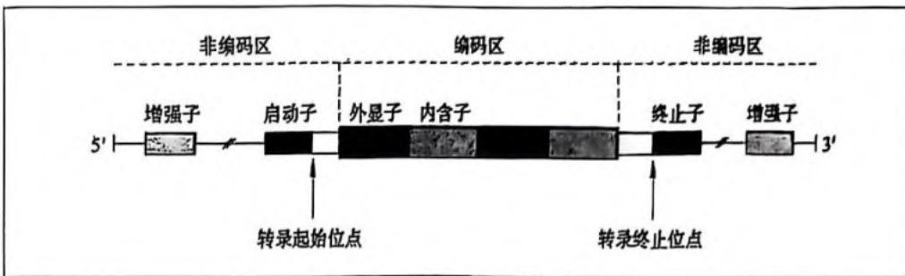

图8-5 草核塔因以及对应的肿体mRNA

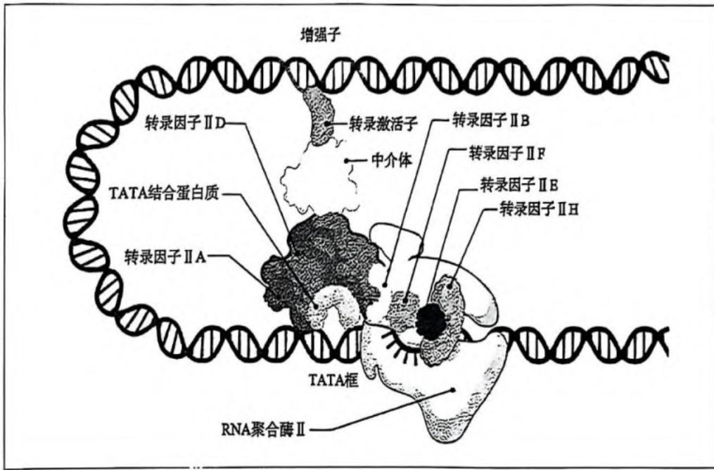  
图8-6 转录调控模式

鉴于真核生物中参与 mRNA 转录的是 RNA 聚合酶 II, 本章主要讨论 RNA 聚合酶 II 参与的基因转录及其调控过程。

## 8.2.1 顺式作用元件

## 1. 启动子

真核基因的启动子是基因转录起始位点上游具有起始转录功能的 DNA 序列。启动子是决定 RNA 聚合酶Ⅱ转录起始位点和转录效率的关键元件。可被 RNA 聚合酶Ⅱ识别并利用的真核启动子一般由核心启动子、上游启动子和上游调控区三部分组成 $^{[48-7]}$ ：

① 核心启动子(core promoter),是指保证RNA聚合酶Ⅱ转录正常起始所必需的、最短的DNA序列,包括转录起始位点及位于转录起始位点上游-25\~-30 bp处的TATA框(TATA box)。核心启动子单独作用时,只能确定转录起始位点并维持基础水平的转录。

② 上游启动子元件(upstream promoter element, UPE), 包括通常位于转录起始位点位点上游 -70 bp 附近的 CAAT 框(CAAT box, CCAAT) 和 GC 框(GC box, GGGCGG) 等, 能通过 TFIID 复合物调控转录效率。

③ 上游调控区(upstream regulatory region),是特异调控因子结合位点集中分布的区

图8-7 真核基因的一股构造示意图  
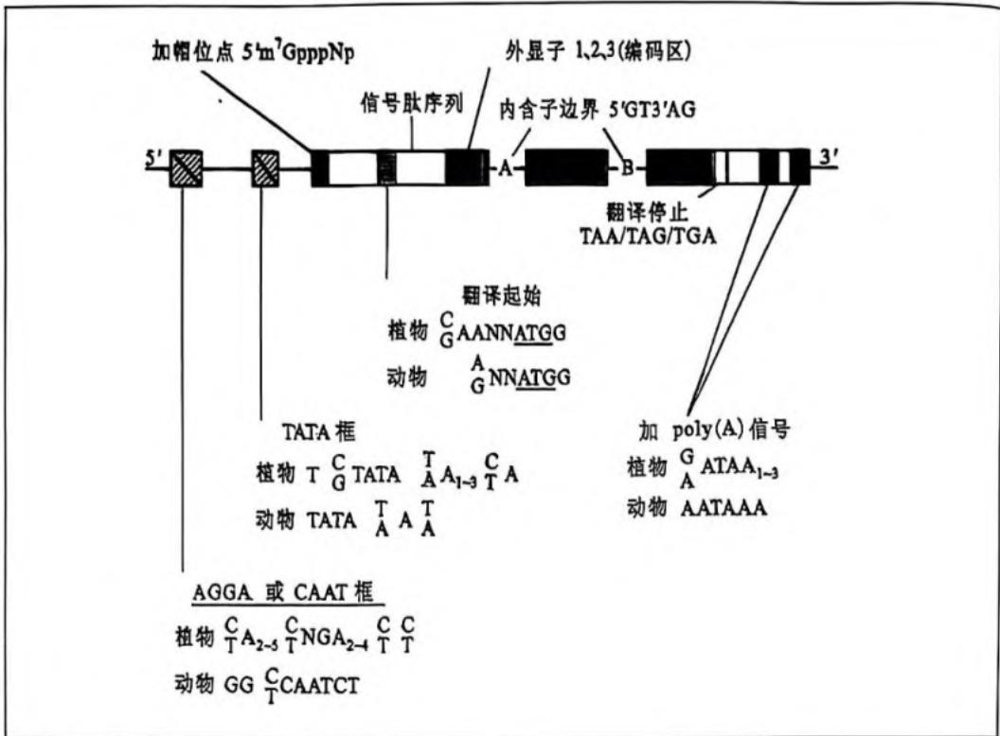

域，属于非典型的启动子区域。

## 2. 增强子

增强子是指能显著提高目标基因转录效率的 DNA 序列。最早发现于 SV40 早期基因的上游,有两个长 72 bp 的正向重复序列。病毒、植物、动物和人类正常细胞中都发现有增强子存在。重组实验表明,如果把 SV40 增强子上的两个 72 bp 重复序列同时删除,基因表达的水平会降低很多。但如果把该增强子的一个重复序列放回原处或重组 DNA 的任何位置上,则基因转录正常。如果将人 β- 血红蛋白基因克隆到带有 72 bp 重复序列的 DNA 上,这个基因在体内的表达将提高 200 倍以上,即使 72 bp 序列位于该基因转录起始位点上游 3 kb 对或下游 2.5 kb,仍不例外。

在研究工作中,科研工作者利用增强子的功能构建 T-DNA 序列。例如,用 4 倍重复的 CaMV 的 35S 增强子序列可以大大增强目的基因的转录。若通过转基因方法将该 T-DNA 片段整合到植物基因组中,植物基因组上与 T-DNA 插入位点相近的基因表达量增高,就能获得这个基因过表达的转基因植物。

## 8.2.2 RNA 聚合酶Ⅱ

RNA 聚合酶Ⅱ是一类能够直接或间接与启动子核心序列 TATA 框特异结合并启动转录的调节蛋白。RNA 聚合酶Ⅱ由 10～12 个亚基组成，有些亚基可与 RNA 聚合酶 I、Ⅲ共用。

在生理条件下,RNA 聚合酶Ⅱ转录某个基因时通常需要与 20 种以上的调控因子结合形成转录起始复合物(preinitiation complex, PIC)才能起始转录(图 8-8)。TFⅡD、TFⅡB

和 TFⅡF 与 RNA 聚合酶Ⅱ在启动子上形成最初级复合物, 启动 mRNA 的转录。TFⅡE 和 TFⅡH 加入后形成完整的转录复合物, 具备转录长链 RNA 的能力。此外, TFⅡA 的加入可进一步提高转录效率。RNA 聚合酶Ⅱ沿模板 DNA 链移动时, TFⅡD 及 TFⅡA 滞留在转录起始位点上, 其他因子随聚合酶向模板 DNA 的 3' 端移动。

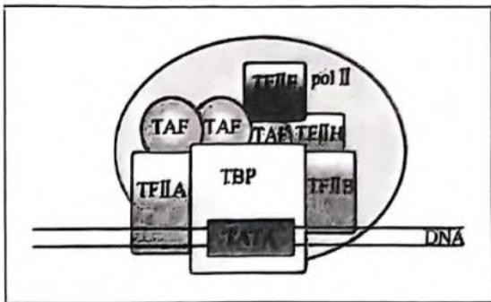  
图8-8 RNA聚合酶Ⅱ在靶基因启动子区与各种蛋白质因子结合形成转录起始复合物示意图

TBP:TATA区结合蛋白（TATA-box binding protein）；TAF:TBP相关因子（TBP associated factors）；TFⅡ：polⅡ相关转录因子（polⅡ associated TF）。

关于 RNA 聚合酶 II 如何整合成为转录起始复合物从而发挥作用, 目前存在两种假说, 一种认为是通过一步结合实现的, 另一种则认为是通过分步结合实现的 (图 8-9)。"一步结合"论者认为, RNA 聚合酶 II 先同大量的转录因子和转录相关蛋白质结合成转录复合物, 然后在 TATA 结合蛋白质 (TBP) 的帮助下结合到 DNA 上, 起始基因转录。"分步结合"理论则认为, 在起始转录的过程中, TATA 结合蛋白质 (TBP) 和 11 个 TBP 相关因子先后结合到 TATA 框上, 最终构成有功能的转录起始复合物, 起始靶基因转录。通常情况下, TF II B 首先与 DNA 结合, 使 RNA 聚合酶更接近所生成 RNA 与 RNA 聚合酶分离的位点, 并帮助其结合到 DNA 上。

RNA 聚合酶 II 最大亚基的羧基端含有由 7 个氨基酸 (Tyr-Ser-Pro-Thr-Ser-Pro-Ser) 组成的多磷酸化位点重复序列, 称为羧基端结构域 (carboxy-terminal domain, CTD)。这个 7 元重复序列上 2 位和 5 位的丝氨酸是蛋白质的主要磷酸化位点。CTD 的磷酸化导致其构象发生变化, 使之更容易与其他转录相关因子结合, 从而提供一个动态的有利于形成转录复合物的平台。

在 RNA 聚合酶 II 参与转录的整个过程中, CTD 上 2 位和 5 位丝氨酸的磷酸化动态修饰能够确保转录各个步骤的顺利进行。在转录起始阶段,CTD上5位丝氨酸的磷酸化是转录起始复合物装配的必要前提。此外,该位点磷酸化还能促进多种酶的招募,帮助mRNA顺利加工。在转录延伸阶段,5位丝氨酸逐步去磷酸化,2位丝氨酸则被磷酸化。2位丝氨酸磷酸化有助于转录终止过程中mRNA的3'端加工。转录结束后,CTD重复序列上的两个丝氨酸都保持去磷酸化状态,有助于转录复合物从DNA上解离,使RNA聚合酶II能够与新的启动子结合,开启新一轮基因转录。

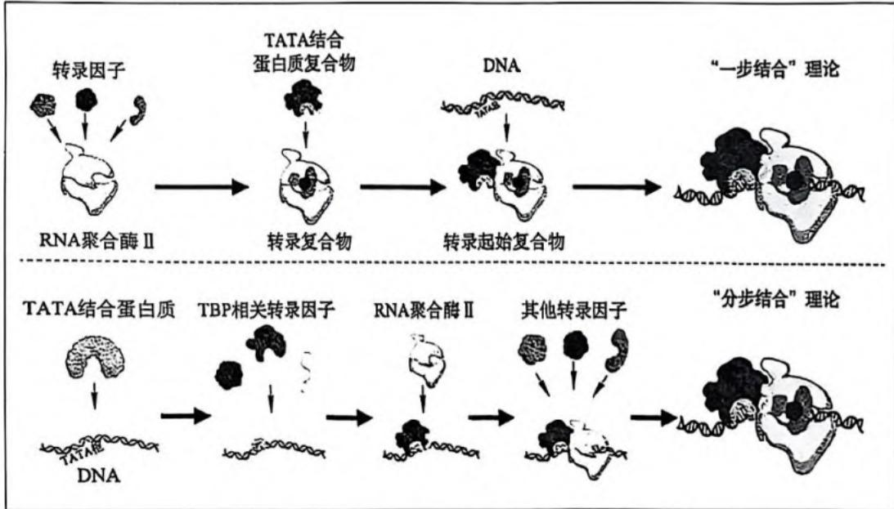  
图 8-9 RNA 聚合酶Ⅱ整合成为转录起始复合物的过程（另见书末彩插）

## 8.2.3 反式作用因子

根据功能, 反式作用因子可分为以下 3 类: 能够识别启动子元件的基本转录因子 (general/basal transcription factor)、能识别增强子或沉默子的转录调节因子, 以及不需要通过 DNA-蛋白质相互作用就参与转录调控的共调节因子 (transcriptional co-factor)。

基本转录因子虽然能够识别核心启动子并指示转录方向,但它们仅能引发极低水平的转录。一般基因的正常表达还需要能够特异识别启动子上游调控区或增强子元件的转录调节因子的参与。这些转录调节因子常被简称为转录因子(transcription factor, TF),按其影响转录的方式可分为转录激活因子(transcriptional activator)和转录阻遏因子(transcriptional repressor)。转录因子通过DNA-蛋白质相互作用的方式调控转录,是基因表达的时空特异性表达的分子基础。

共调节因子没有 DNA 结合能力,不能直接识别启动子或增强子。它们通过与染色体、RNA 聚合酶及其他转录因子等相互作用,调控转录活性。转录中介体(mediator)是典型的共调节因子,人体中绝大多数活跃基因都需要中介体才能够实现高表达,被称为真核生物基因转录的中央控制器。中介体是由多个在进化上高度保守的亚基组成的蛋白质复合物。在转录过程中,中介体能够与基因特异的转录因子和 RNA 聚合酶Ⅱ相互作用,并起到桥连位于启动子和增强子上的转录因子的作用。与转录激活因子有协同作用的共调节因子称为共激活因子(co-activator),与转录阻遏因子有协同作用的共调节因子称为共阻遏因子(co-suppressor)。

可见,转录因子的结合是对基因组的直接阐释的开始,是执行 DNA 解码序列的第一步,是基因的多样化程序化表达的基础。DNA-蛋白质(或转录因子)之间的相互作用是转录调控的关键。

## 1. 转录因子

转录因子能够独立地与特定序列的 DNA 结合, 其结合能力通常被视为转录调节能力的指标。转录因子对靶标序列具有极高的偏好性 (一般亲和力为对其他序列的 1000 倍以上)。这些特异的靶标序列称为基序 (motif)。转录因子中与基序结合的结构称为 DNA 结合域 (DNA binding domain, DBD)。不同转录因子依靠 DNA 结合域中各不相同的 DNA 结合模块 (DNA binding module) 识别并结合不同的基序。基序与 DNA 结合模块之间有着严格的对应关系。DNA 结合模块的相似性也是转录因子分类的一个重要依据。

除了 DNA 结合域外, 转录因子还有一个必需的结构域, 即转录效应域 (effectordomain)。对于转录激活因子来说,也称为转录激活域(activation domain)。转录效应域能够与共调节因子或其他转录因子互作。转录激活域/效应域的功能多样性决定了转录因子的功能多样性(图8-10)。

转录因子的 DNA 结合域和转录激活域是相对独立的组件, 可进行拆分或重新组合。许多分子生物学工具即基于这一原理而生, 比如酵母双 / 三杂交技术和诱导激活表达技术等。此外, 还可以根据这一原理构建兼具一种转录因子的 DNA 结合域和另外一种转录因子的转录激活域的融合蛋白来满足实验需求。

常见的 DNA 结合域包括同源结构域(homeodomain)、锌指结构域(zinc finger domain)、碱性螺旋-环-螺旋结构域(basic helix-loop-helix, bHLH)、碱性亮氨酸拉链结构域(basic leucine zipper, bZIP)等。每个 DNA 结合域都有其特征性的 DNA 结合模块, 能够结合不同的基序。识别相似基序的转录因子组成转录因子家族或亚家族。也有转录因子同时拥有多个不同的 DNA 结合域。

最早在 20 世纪 80 年代,科学家就用 DNA 结合域或 DNA 结合模块来描述真核生物中的主要转录因子家族,如锌指结构家族、同源结构域家族、bHLH 家族、bZIP 家族和核激素受体结构 (NHR) 家族。人类转录因子库迄今已经收录了 1639 个已被证实或可能的转录因子,其中大多数至少包含了两种 DNA 结合域类型 (C2H2-ZF 和同源结构域) 中的一种。剩下近一半 (46%) 与 6 个家族 (bHLH、bZIP、Forkhead、核激素受体、HMG/Sox 和 ETS) 相关。而模式植物拟南芥转录因子库已经收录了 58 个家族,共计 1716 个已被证实或可能的转录因子。这些数字还在持续增加。

## (1) 同源结构域

同源结构域是一种典型的螺旋-转角-螺旋(helix-turn-helix)形式的 DNA 结合域。螺旋-转角-螺旋结构最初在 $\lambda$ 噬菌体中发现的。该结构域 N 端具有两个 $\alpha$ 螺旋，中间由短侧链氨基酸组成的"转折"相连接。近羧基端的 $\alpha$ 螺旋与转录因子在 DNA 双螺旋大沟中的结合密切相关(图8-11)。同源结构域由60个高度保守的氨基酸序列构成,因其编码DNA(homeobox)最早从果蝇同源异形基因(homeotic gene)中克隆得到而得名。包含同源结构域的转录因子称为同源异形转录因子,普遍存在于各种真核生物中,常参与真核生物的器官分化等发育过程。比如植物花器官分化就主要依赖同源异形转录因子的调控(详见第10章)。

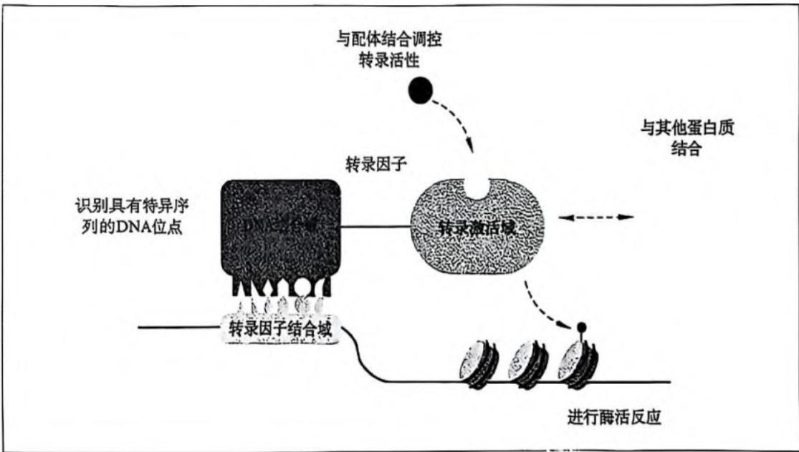  
图8-10 转录激活因子示意图

图8-11 同源结构域结构示意图  
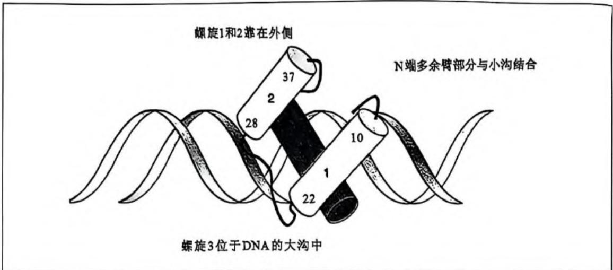

表 8-1 中列举了部分同源异形转录因子所识别的 DNA 基序, 可见同类型同源异形转录因子往往能够识别相同的基序, 而有些同源异形转录因子则能够识别多个基序。

表 8-1 部分同源异形转录因子及其识别基序

<table><tr><td>同源异形转录因子</td><td>基序</td></tr><tr><td>Oct-1、Oct-2</td><td>ATTTGCAT</td></tr><tr><td>Pit-1/GHF-1</td><td>TATGCATAA</td></tr><tr><td>EN、FTZ、UBX</td><td>TCAATTAAAT</td></tr><tr><td>Eve</td><td>TCAATTAAAT,TCAGCACCG</td></tr><tr><td>Bicoid</td><td>TCAATCCC</td></tr></table>

Oct-1 和 Oct-2 专一结合于启动子内 8 碱基区, 它们都含有 75 个氨基酸的 pou 区和 60 个氨基酸的同源转换区。尽管 Oct-1 和 Oct-2 中的同源框与经典的果蝇同源转换区变异较大 (60 个氨基酸中只有 20 个相同, 外加 8 个保守性替换), 但在这两个蛋白质中却是高度保守的 (60 个氨基酸中有 53 个相同)。哺乳类转录因子 Pit-1/GHF-1 及线虫 unc-86 基因中都存在类似于 Oct-1 的结构。即使与亲缘关系很远的哺乳类同源转换区相比较, 同源率也在 $35\% \sim 40\%$ 以上。

## (2) 锌指结构域

锌指结构域是锌指、锌扭(twist)和锌指簇(cluster)等结构的总称,其特有的半胱氨酸和组氨酸残基之间氨基酸残基数基本恒定,有锌参与时才具备转录调控活性。重复的锌指结构都是以锌将一个 $\alpha$ 螺旋与一个反向平行 $\beta$ 片层的基部以锌原子为中心,通过与一对半胱氨酸和一对组氨酸之间形成配位键相连接,锌指环上突出的赖氨酸、精氨酸参与DNA的结合。由于结合在大沟中重复出现的α螺旋几乎连成一线,这类蛋白质与DNA的结合很牢固,特异性也很高。类固醇激素受体家族含有连续的两个锌指结构,其中两个锌原子将两个α螺旋装配成类似H-T-H的结构,再以同源或异源性二聚体的方式将两个α螺旋结合在相邻的两个大沟中(图8-12)。

大部分蛋白质中的锌指区都聚合成一组,但也发现少量蛋白质如果蝇中的Hunchback因子,有不止一个锌指簇。锌指簇在这些调控蛋白质上的分布也很不相同,在ADR1中,锌指区只占一个很小的结构区,而在TFⅢA中,整个蛋白质几乎被各个锌指区所覆盖。由于锌指区最早是从RNA聚合酶Ⅱ和Ⅲ的转录因子中发现的,所以一般认为,某个蛋白质如果拥有一个或多个成簇的锌指区,那么它就很可能是转录因子.这就是为什么尽管我们不了解TDF、Kruppel及Hunchback的功能,但仍把它们归纳在表8-2中的原因。

此外,有些锌指蛋白质具有不同的序列:

$$
\mathrm{Cys} - \mathrm{X} _ {2} - \mathrm{Cys} - \mathrm{X} _ {1 3} - \mathrm{Cys} - \mathrm{X} _ {2} - \mathrm{Cys}
$$

这一结构被称为Cys2/Cys2锌指,表8-3是部分具有这种锌指的转录因子及其一般特征。从表中可以看出,这些蛋白质一般不具有大量重复性锌指,它们与DNA的结合区域短而具有对称性。有人将雌激素受体蛋白中的两个锌指结构换为糖皮质素受体中的两个锌指结构后发现,融合蛋白失去了与雌激素受体蛋白基序结合的能力,而只能与糖皮质素受体蛋白的基序结合,说明锌指结构在转录因子与基序的识别结合过程中发挥主导作用。

锌指结构中每一个 $\alpha$ 螺旋可以特异地识别 3\~4 个碱基。利用不同的锌指结构识别特异 DNA 序列的特点以及核酸酶切割 DNA 的原理，科研工作者获得了一类被称为锌指核酸酶 (zinc-finger nuclease, ZFN) 的人工限制性内切酶。根据改变锌指结构通用序列中 7 个 X 序列就能识别不同的 DNA 序列这一特征，人工设计识别目标 DNA 序列的 $\alpha$ 螺旋，用 TGEK 作为螺旋间的连接序列, 构建成对人工锌指结构域和 Fok I 融合蛋白, 就能在指定区域切断 DNA 双链 $^{(图8-13)}$ 。ZFN 技术已被应用于基因编辑或基因敲除。

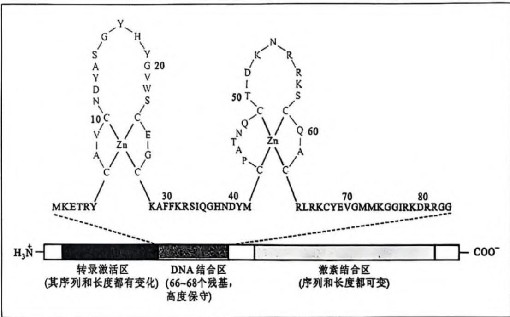  
图8-12 典型的类固醇激素受体结构示意图

表 8-2 一些转录因子和蛋白质通过 Cys2/His2 与 DNA 相结合

<table><tr><td>蛋白质</td><td>来源</td><td>分子量</td><td>锌指数</td><td>DNA结合区/bp</td><td>靶序列</td><td>功能</td></tr><tr><td>TFIIIA</td><td>哺乳类</td><td> $7.3 \times 10^{4}$ </td><td>9</td><td>50</td><td>5S基因</td><td>与RNA聚合酶III作用,促进5S基因转录</td></tr><tr><td>SP1</td><td>哺乳类</td><td> $1.1 \times 10^{4}$ </td><td>3</td><td>10</td><td>GC区</td><td>与RNA聚合酶II作用,广泛性调控因子</td></tr><tr><td>ADR1</td><td>果蝇</td><td> $1.5 \times 10^{4}$ </td><td>2</td><td>22</td><td>ADH2基因</td><td>与RNA聚合酶II作用,激活ADH2基因</td></tr><tr><td>TDF</td><td>哺乳类</td><td>?</td><td>13</td><td>?</td><td>?</td><td>决定雄性性别</td></tr><tr><td>Kruppel</td><td>果蝇</td><td> $6.0 \times 10^{4}$ </td><td>5</td><td>?</td><td>?</td><td>胚胎分化</td></tr><tr><td>Hunchback</td><td>果蝇</td><td> $8.0 \times 10^{4}$ </td><td>4+2</td><td>?</td><td>?</td><td>胚胎分化</td></tr></table>

表 8-3 具有 Cys2/Cys2 锌指区的转录因子

<table><tr><td>蛋白质</td><td>分子量</td><td>锌指数</td><td>靶序列</td></tr><tr><td>皮质糖受体</td><td> $9.4 \times 10^{4}$ </td><td>2</td><td>GRE 中 20 bp</td></tr><tr><td>雌激素受体</td><td> $6.6 \times 10^{4}$ </td><td>2</td><td>ERE 中 20 bp</td></tr><tr><td>GAL4</td><td> $9.9 \times 10^{4}$ </td><td>1</td><td>UASG 中 17 bp</td></tr><tr><td>腺病毒 E1A</td><td>约 $3.0 \times 10^{4}$ </td><td>1</td><td>?</td></tr></table>

## (3) 碱性亮氨酸拉链结构域

即 bZIP 结构 $^{(图 8-14)}$ ，是肝、小肠上皮、脂肪细胞以及某些脑细胞中存在的一大类 C/EBP 家族蛋白质，它们的特征是能够与 CCAAT 区和病毒的增强子结合。C/EBP 家族蛋白的羧基端的 35 个氨基酸能够形成 $\alpha$ 螺旋，其中每隔 6 个氨基酸就出现一个亮氨酸，这就使每一个亮氨酸都出现在螺旋的同一侧 $^{(图 8-15)}$ 。由于亮氨酸残基之间可以通过疏水作用 (hydrophobic interaction) 相互连接，两个 bZIP 蛋白（可以是相同或不同蛋白）往往通过 $\alpha$ 螺旋形成二聚体,并以二聚体的形式参与转录调控。这也是所谓"亮氨酸拉链"名称的由来。亮氨酸拉链并不能直接结合 DNA,而与亮氨酸拉链区相邻的碱性氨基酸区域则具有 DNA 结合能力,其 DNA 亲和力受亮氨酸拉链区二聚化的影响而显著增强。因此,bZIP 蛋白的 DNA 结合域由碱性区域和亮氨酸拉链共同构成。

图8-13 ZFN技术原理模型  
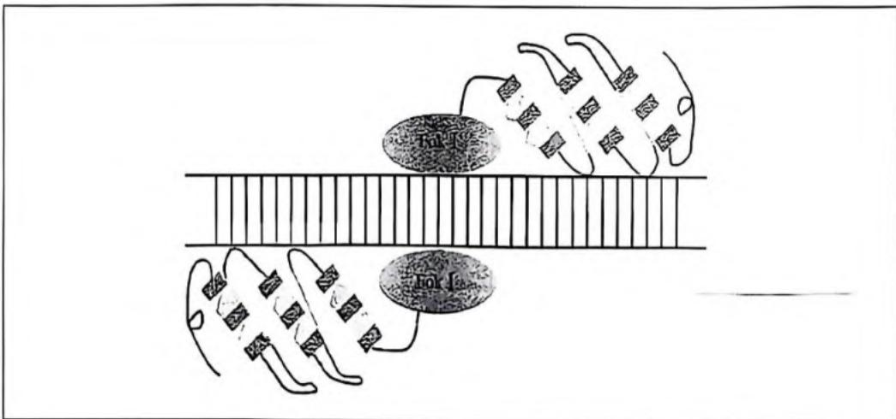

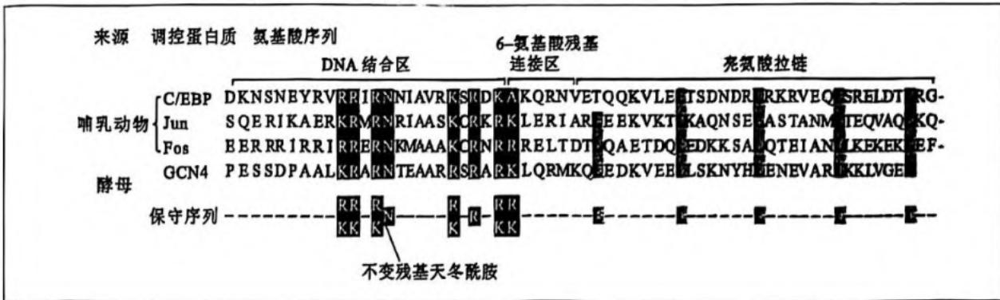  
图 8-14 碱性亮氨酸拉链结构域转录激活因子序列比较

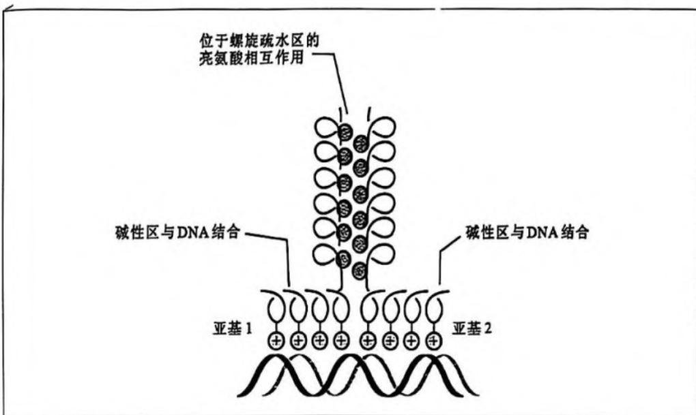  
图 8-15 碱性亮氨酸拉链转录激活蛋白与调控区 DNA 相结合的示意图

## (4) 碱性螺旋 - 环 - 螺旋结构域

即 bHLH 结构。在免疫球蛋白 $\kappa$ 轻链基因的增强子结合蛋白 E12 与 E47 中，羧基端 100～200 个氨基酸残基可形成两个双性 $\alpha$ 螺旋，被非螺旋的环状结构所隔开，蛋白质的氨基端则是碱性区，其 DNA 结合特性与亮氨酸拉链类蛋白相似。肌细胞定向分化的调控因子 MyoD-1、原癌基因产物 Myc 及其结合蛋白 Max 等都属于 bHLH 蛋白。与 bZIP 蛋白类似，bHLH 蛋白只有形成同源或异源二聚体时，才拥有足够的 DNA 结合能力。如果异源二聚体中的一方不含有碱性区时，该二聚体明显缺乏对 DNA 的亲和力 $^{[图8-16]}$ 。

## 2. 转录激活域

相对于 DNA 结合域,转录激活域结构灵活多变,缺少共同的结构模式。按照氨基酸组成特点进行分类,常见的转录激活域包括酸性域(acidic domain)、谷氨酰胺富集域(Q-rich domain)、脯氨酸富集域(P-rich domain)等。

图 8-16 hHLH 蛋白的 DNA 结合能力分析  
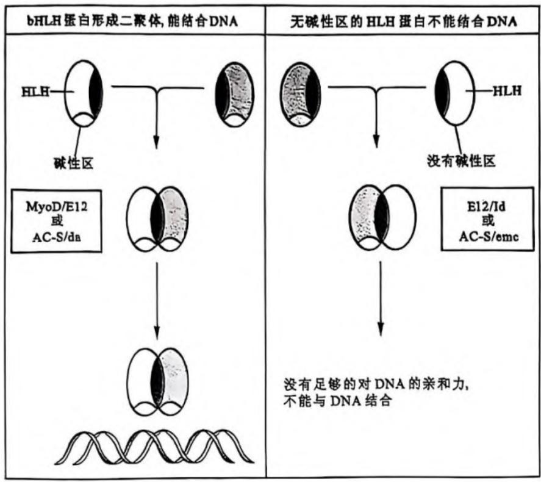

## (1) 酸性域

包含一些富含酸性氨基酸的序列,如谷氨酸和天冬氨酸。这些氨基酸残基能够与转录因子相互作用,促进 RNA 聚合酶与启动子的结合。酵母中,GAL4 依赖性基因调控是研究真核生物基因激活的经典模型。GAL4 是第一个被发现在酵母、植物和动物中发挥作用的转录因子,证明了真核生物的激活机制具有广泛的保守性。GAL4 存在一个 DNA 结合结构域和一个酸性的转录激活结构域。在不存在半乳糖的情况下,GAL4 的酸性域被 GAL80 紧密结合并抑制其功能。在加入半乳糖后,GAL3 结合 GAL80 以抑制阻遏物功能,使 Gal4-AD 激活转录。另外,这个转录激活结构域还能与转录中介体互作,进一步调节下游基因的表达,激活半乳糖分解代谢所需基因的转录。转录因子 E2F1、p53 等均含有此类结构域。

## (2) 谷氨酰胺富集域

转录因子 Sp1 属于含有 DNA 结合蛋白的 C2H2 型锌指家族。Sp1 可以高亲和力地结合富含 GC 的基序，并调控大量哺乳动物基因的表达。Sp1 共有 4 个参与转录激活的区域，其中最强的转录激活域富含谷氨酰胺，达该区氨基酸总数的 25% 左右。转录因子 Sp1 的富谷氨酰胺结构域可以直接与 TFⅡD 的特定亚基 (TAFⅡ130) 相互作用，而多种酸性和富脯氨酸的结构域并不与 TAFⅡ130 相互作用。当然，并非所有富谷氨酰胺的结构域都与 TAFⅡ130 相互作用。哺乳动物细胞中的 Oct1/2、Jun、AP2、血清应答因子 (SRF) 等都有相同的富含谷氨酰胺的结构域。

## (3) 脯氨酸富集域

转录因子 CTF 的羧基端富含脯氨酸(达 20%\~30%)结构域。这种结构属于无序的 (disordered) 或非结构化 (unstructured) 的, 可为多种蛋白质提供结合位点。已有报道表明 CTF 这个区域可以与基本转录因子 TF II B 互作, 促进转录起始复合物的功能。

## 8.3 真核基因表达的染色质修饰调控

## 8.3.1 染色质修饰的一般规律

染色质由 DNA 分子和结合在 DNA 分子上的组蛋白构成。由于未修饰的组蛋白带正电, 而 DNA 带负电, 两者通过静电作用结合在一起形成核小体; 核小体中的 DNA 片段紧密地缠绕于组蛋白核心之上, 很难单独暴露出来。事实上, 无论是 DNA 的复制、转录还是修复, 都需要染色质及 DNA 分子处于开放状态。而染色质修饰则可以改变染色质的状态, 影响转录因子、RNA 聚合酶和其他调控分子与染色体上特定区域的互作, 最终影响基因转录, 调控基因表达的水平和模式。

染色质修饰是指对染色质上特定区域的化学修饰,包括对 DNA 和组蛋白等染色质元件的修饰。

① DNA 修饰 DNA 甲基化是最常见的 DNA 修饰形式之一, 涉及在 DNA 分子上添加甲基基团。DNA 甲基化通常发生在 CpG 位点(即通过磷酸二酯键相连的胞嘧啶 C 与鸟嘌呤 G) 的胞嘧啶上。甲基化位点的存在能够阻碍转录因子与 DNA 的结合, 抑制基因转录。

② 组蛋白修饰 组蛋白修饰包括翻译后修饰(如甲基化、乙酰化、磷酸化等)和构象化修饰(如染色质重塑)。这些修饰通过影响染色体装配的致密程度从而调控基因表达。例如,乙酰化修饰通常与基因活化相关,甲基化修饰则可以有不同的效应,取决于其位置和修饰程度。

这些修饰具有以下共同特点：

① 均属于表观遗传学范畴 染色质修饰不同于基因重组(gene recombination),后者涉及 DNA 分子间或分子内遗传信息的重新组合,包括基因丢失、扩增、重排和移位等,是对 DNA 序列发生的直接和永久性改变。染色质修饰则可以在不改变 DNA 序列的情况下调控基因表达的水平和模式,而且还可能遗传给后代。这种不涉及 DNA 序列的改变而能导致基因表达发生可遗传变化的修饰,也称为表观遗传修饰(epigenetic modification)。

② 影响染色质可及性 各种染色质修饰的共同结果是改变染色质的状态,影响转录因子、RNA聚合酶和其他调控分子与染色质上特定区域的相互作用,并以此调控基因表达。这种允许反式作用因子和DNA分子上的顺式作用元件发生物理接触的程度称为染色质可及性(chromatin accessibility),又称为染色质开放程度,反映了染色质的转录活跃程度,是研究基因表达染色质修饰调控的重要对象。

③ 需要多种酶的参与 表观遗传修饰过程可类比文字的书写、阅读和擦除过程,因此负责这些过程的酶分别也可被认为是"书写器"、"读取器"以及"擦除器"(表8-4)。这些器件及其组合的特异性是表观调控引起基因差异化表达的原因之一。有一种普遍的观点认为,包括癌症在内的人类疾病,往往是由于相关基因表达中"表观遗传语言"失调,导致表观遗传信息被错误地书写、删除或解释,因而引起了异常转录并促使肿瘤发生。

④ 修饰过程有代谢物的参与 细胞在代谢葡萄糖、脂肪酸、氨基酸等营养物质时会产生多种中间代谢产物,如乙酰辅酶 A、NAD $^{+}$ 、S-腺苷甲硫氨酸(SAM)、α-酮戊二酸、ATP、琥珀酸等。这些中间代谢物可作为供体或辅助因子修饰染色质。例如,甲硫氨酸循环中产生的 SAM 是组蛋白或 DNA 甲基化的主要甲基供体;葡萄糖代谢中产生的乙酰辅酶 A 则参与组蛋白的乙酰化修饰。

⑤ 大多数是可逆的 染色质修饰是一种动态、可逆的变化过程,不仅受自身遗传因素的影响,也受环境变化的影响。其修饰方式可以在某些条件下发生改变,这就使通过人工操作干预表观修饰成为了可能。值得注意的是,表观遗传调控所具有的环境获得性和可遗传性,向人们暗示了后天环境改变基因表达、蛋白质合成乃至物种外在性状的可能性,这也是当今生物学领域诸多重大争议产生的源头之一。

表 8-4 常见的染色质修饰

<table><tr><td></td><td>书写器</td><td>擦除器</td><td>读取器</td></tr><tr><td>定义</td><td>催化化学基团添加到底物上对其进行修饰的酶</td><td>从底物上去除这些修饰的酶</td><td>识别特定翻译后修饰的底物并与之特异性结合的蛋白质或蛋白质复合物</td></tr><tr><td>DNA甲基化</td><td>DNA甲基转移酶(DNMT)</td><td>哺乳动物:TET(ten-eleven translocation)蛋白家族、胸腺嘧啶DNA糖苷酶(thymine DNA glycosylase,TDG)、碱基切除修复相关酶</td><td>含甲基化CpG结合蛋白(methyl-CpG binding domain,MBD)结合</td></tr><tr><td>组蛋白乙酰化</td><td>乙酰转移酶(HAT)</td><td>去乙酰化酶(HDAC)</td><td>含溴结构域蛋白识别Kac等</td></tr><tr><td>组蛋白甲基化</td><td>甲基转移酶(HMT),包括:1底物为赖氨酸:组蛋白甲基转移酶(HMT/KMT);2底物为精氨酸:蛋白精氨酸甲基转移酶(PRMT)</td><td>去甲基化酶(HDM)</td><td>含Tudor结构域蛋白识别H3K4me3、H4K20me2;含PHD结构域蛋白识别H3K4、H3K4me3、H3K9me3、K36me3;含MBT结构域蛋白识别H3K4me1、H4K20me1/2、H1K26me1等</td></tr></table>

## 8.3.2 DNA 甲基化与基因表达调控

在原核生物中，DNA 甲基化位点主要在胞嘧啶 (cytosine, C) 和腺嘌呤 (adenine, A) 中。然而在多细胞的真核生物中，DNA 甲基化主要发生在胞嘧啶，形成 5-甲基胞嘧啶 (5mC) (图 8-17)。DNA 甲基化广泛存在于原核生物和真核生物基因组中，当然需要留意的是，模式生物酿酒酵母、果蝇和秀丽隐杆线虫几乎没有 DNA 甲基化。作为细菌中丰度最高的 DNA 修饰， $N^{6}-$ 甲基腺嘌呤 ( $N^{6}-mA$ ) 直到 2015 年才首次被报道存在于真核生

物(果蝇、线虫和衣藻)中,目前还存在争议。

哺乳动物细胞中甲基化主要发生在 CpG 双核苷酸的胞嘧啶上(约 70%)。在哺乳动物基因组中,超过一半的基因包含短的富含 CpG 二核苷酸区域(约 1 000 bp),称为 CpG 岛(CpG island, CGI),这些区域通常位于转录起始位点(transcription start site, TSS)。

大量研究表明,DNA 甲基化是生物体中非常重要的调控方式,其在基因表达、转座子沉默、染色质相互作用、细胞分化、遗传印记、雌性个体 X 染色体失活、胚胎发育以及肿瘤和疾病的发生、发展中起着重要作用。总体上,肿瘤细胞的基因组是去甲基化的。而一些抑癌基因启动子区域 CpG 岛却呈现高甲基化。这些甲基化的 $5^{\prime}-mCpG$ 二核苷酸中的 $5^{\prime}-mC$ 能以较高的速率脱氨基转换成 T,所以这些位点是基因突变的常见位点。临床上,DNA 总体甲基化水平(即甲基化谱)和特定基因甲基化程度改变可作为某些肿瘤诊断指标,例如前列腺癌等。

## 1. "书写器": DNA 甲基转移酶

所谓甲基化的"书写"即在 DNA 甲基转移酶(DNMT)的作用下将甲基添加到胞嘧啶的 5'C 位置上形成 5mC 的过程。真核生物细胞内存在两种甲基转移酶活性：

① 保留甲基化(maintenance methylation), 双链 DNA 的其中一条链已存在甲基化, 另一条未甲基化的链被甲基化。该反应主要在甲基化母链(模板链)指导下使处于半甲基化的 DNA 双链分子上与甲基胞嘧啶相对应的胞嘧啶甲基化。该酶催化特异性极强, 对半甲基化的 DNA 有较高的亲和力,使新生的半甲基化 DNA 迅速甲基化,从而保证 DNA 复制及细胞分裂后甲基化模式不变。哺乳动物 DNMT1 负责在 DNA 复制过程中将未甲基化的新合成链甲基化。

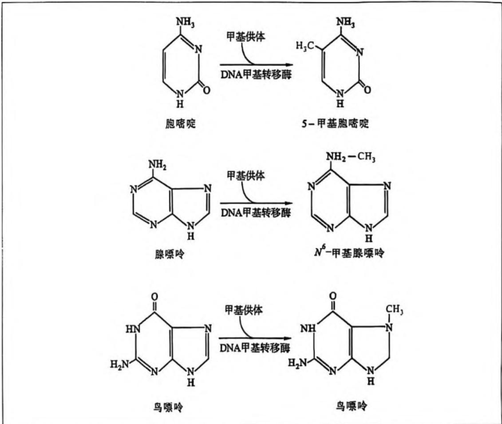  
图 8-17 5-甲基胞嘧啶、 $N^{6}$ -甲基腺嘌呤和7-甲基鸟嘌呤结构式

② 从头甲基化(de novo methylation),两条链均未甲基化的DNA被甲基化。该反应中,甲基化酶直接催化未甲基化的CpG成为mCpG,它不需要母链指导,但速度很慢。这类甲基化酶是导致特异基因受甲基化调控的主要因子,在基因表达的表观遗传学研究中有十分重要的地位。哺乳动物DNMT3a和DNMT3b主要负责在未甲基化的CpG位点引入甲基,使其甲基化。在哺乳动物中,从头DNA甲基化主要发生在两个发育阶段:早期胚胎发生和配子发生。

## 2. "擦除器": DNA 去甲基化酶

将甲基化去除的过程称为"去甲基化"，也即甲基化的"擦除"，包括：①被动去甲基化(passive demethylation):DNA通过不断复制稀释甲基化；②主动去甲基化(active demethylation):5mC在多个相关酶的作用下经过5hmC、5fC、5caC，最终回到C的周期性过程。去甲基化过程首先由TET(ten-eleven translocation)家族的蛋白介导的DNA氧化反应开始：5mC被氧化为5-羟甲基胞嘧啶(5hmC)，再进一步被氧化为5-甲酰基胞嘧啶(5fC)，后者最后再一次被氧化为5-羧基胞嘧啶(5caC)。接下来，胸腺嘧啶DNA糖苷酶(thymine DNA glycosylase,TDG)识别并切割5fC和5caC的糖苷键，形成无碱基的AP位点，启动碱基切除修复(base excision repair,BER)途径共同将5fC和5caC从DNA中去除，产生一个未修饰的胞嘧啶C(图8-18)。这些高级氧化物5hmC、5fC和5caC均无法被DNMT1识别，因此在DNA复制过程中阻碍了甲基化谱式的维持，间接促进了DNA去甲基化。这些中间修饰的研究也是近期表观遗传学研究的焦点。

## 3. DNA 甲基化对基因表达调控的影响

由于 DNA 甲基化能够抑制基因表达, 去甲基化则能诱导基因表达, 因此, DNA 甲基化常被描述成 "沉默" 的表观遗传学标志。DNA 甲基化能引起染色体结构、DNA 构象及 DNA 与蛋白质相互作用方式改变, 从而抑制了目的基因的表达, 造成转录水平上的基因沉默 (transcriptional gene silencing, TGS)。可能的机制分为以下三个方面:

① DNA 甲基化通过改变染色质结构,在物理上阻碍转录因子与基因的结合。研究表明,当组蛋白 H1 与含 CCGG 序列的甲基化或非甲基化 DNA 分别形成复合物时,DNA 的构型存在着很大的差别,甲基化达到一定程度时会发生从常规的 B-DNA 向 Z-DNA 的过渡。由于 Z-DNA 结构收缩,螺旋加深,使许多蛋白质因子赖以结合的元件缩入大沟而不利于基因转录的起始。

② 序列特异性的甲基化识别蛋白质直接结合在 DNA 甲基化区域上,直接影响染色质结构或募集形成转录抑制复合物,阻止转录因子与启动子区靶序列的结合,从而影响基因的转录:甲基化的 DNA 可能被多种称为甲基化 CpG 结合蛋白 (methyl-CpG binding domain, MBD) 结合。MBD 蛋白将其他蛋白质募集到位点,例如组蛋白脱乙酰基酶和其他可以修饰组蛋白的染色质重塑因子,从而形成致密的、无活性的异染色质。还有一些含有

图8-18 DNA 甲基化与去甲基化

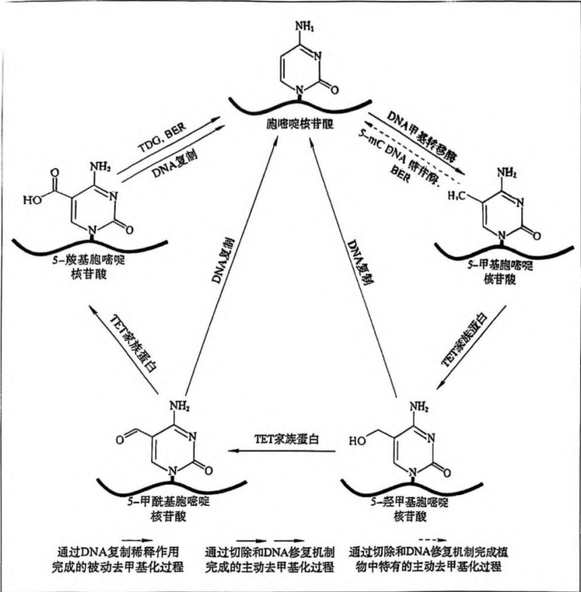

ZF-CxxC 结构域特异识别非甲基化的 CpG 岛, 影响染色质结构。

③ DNA 甲基化直接干扰转录因子或 RNA 聚合酶对 DNA 元件的识别, 抑制基因表达。有实验用序列相同但甲基化水平不同的 DNA 为材料, 比较其作为 RNA 聚合酶转录模板的活性, 发现甲基的引入不利于模板与 RNA 聚合酶的结合, 降低了其体外转录活性。

## 4. 植物中 DNA 甲基化模式及其相关机制

不同于哺乳动物基因组只有 CG 甲基化, 植物基因组甲基化有 CG、CHG、CHH(H 代表任何非 G 的碱基) 三种。

植物保留了 DNA 甲基化过程中存在的两种转移酶: MET1、CMT3。MET1 是哺乳动物 DNMT1 的同源物, 负责维持 CG 甲基化。CMT3 是维持 CHG 位点的 DNA 甲基化所需的植物特异性 DNA 甲基转移酶。甲基转移酶 DRM2 在细胞内不仅作为所有 DNA 序列 (CG、CHG、CHH) 中胞嘧啶的从头 DNA 甲基转移酶, 而且又参与基因组中 CHH 甲基化的维持。有趣的是, 在植物中, DRM2 负责的从头甲基化受到了一个由 24 nt sRNA 指导的 DNA 甲基化 (RNA-directed DNA methylation, RdDM) 途径调控。在哺乳动物中有类似的从头合成甲基化途径(由 30ntRNA 指导),仅发生在生殖细胞中。

不同于哺乳动物中依赖氧化作用和脱氨作用的主动去甲基化,植物利用 5mC DNA 糖基酶直接切除 5mC 碱基,之后再由碱基修复机制补充非甲基化胞嘧啶,从而实现 DNA 去甲基化。

与哺乳动物不同,植物中的 DNA 甲基化主要发生在转座子和其他重复的 DNA 元件上,直接调控顺式元件报道较少。植物的转基因沉默也与 DNA 甲基化相关。

## 8.3.3 组蛋白乙酰化与基因表达调控

核小体由 H2B、H2A、H3、H4 四种组蛋白亚基各两个拷贝形成的八聚体和缠绕在外约 146 bp 的 DNA 组成。其中组蛋白 N 端(尾部)的氨基酸残基易受到翻译后修饰,包括乙酰化、甲基化、磷酸化、泛素化等,致使其与 DNA 的相互作用受到影响。每种修饰都是通过一组特定的酶将修饰基团添加到组蛋白氨基酸残基上或从组蛋白氨基酸残基上去除的。已发现的不同类型的组蛋白修饰至少有 9 种(图 8-10),其中乙酰化是最早发现的影响转录调控的组蛋白修饰之一,因此目前研究得最多。

组蛋白修饰的描述规则是: 组蛋白亚基 + 氨基酸名称 + 氨基酸位置 + 修饰类型。例如: H3K23ac 代表 H3 组蛋白的第 23 位赖氨酸的乙酰化; H2AK27ub1 代表 H2A 组蛋白的第 27 位赖氨酸的单泛素化。

## 1. 核心组蛋白的乙酰化和去乙酰化

组蛋白乙酰化多发生在组蛋白 H3 和 H4 的 N 端赖氨酸残基上。由组蛋白乙酰基转移酶或去乙酰化酶修饰，加上或去掉乙酰基团。乙酰化使从核小体伸出的 N 端组蛋白尾部的赖氨酸残基带负电荷，这些负电荷会排斥带负电荷的 DNA，导致染色质结构松弛。

图 8-19 已知组蛋白 N 端"尾巴"主要被修饰位点

N, 组蛋白 N 端; C, 组蛋白 C 端; A, 乙酰基团; P, 磷酸基团; M, 甲基基团; Ub, 泛素基团; HAT, 组蛋白乙酰基转移酶; HDAC, 组蛋白去乙酰化酶。

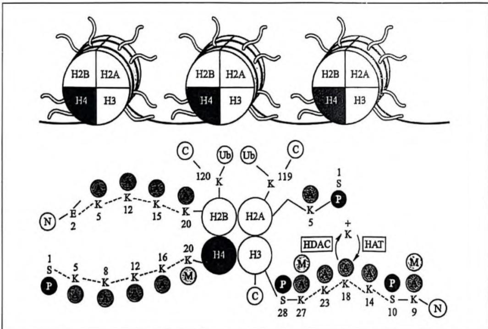

开放的染色质构象允许转录因子结合并显著增加基因表达。所以，组蛋白乙酰化通常与转录激活相关，去乙酰化则与转录抑制相关。

## 2. "书写器": 组蛋白乙酰基转移酶

催化组蛋白乙酰化反应的是组蛋白乙酰基转移酶(histone acetyltransferase, HAT)。根据结构上的特点，HAT酶可分为4个家族：GNAT(Gcn5-related N-acetyltransferase)、MYST(MOZ-YBF2/SAS3-SAS2-TIP60)、CBP/p300(CREB-binding protein)和TAF II-250(TATA-binding protein-associated factor)。同时，HAT也可以催化广泛的非组蛋白的乙酰化。

组蛋白乙酰基转移酶并不一定是染色质结合蛋白，也可以通过与其他蛋白质相互作用来影响染色质的结构。许多转录激活因子都有HAT活性，与转录有关的HAT催化亚基是酵母调控蛋白质GCN5的同源物，而GCN5本身具有乙酰化组蛋白H3和H4的活性。TAFⅡ250组蛋白乙酰基转移酶是TFⅡD复合物的一个亚基，它的主要功能是与启动子结合协助起始转录，能使组蛋白H3和H4乙酰化。转录共激活子PCAF也能使这两个组蛋白乙酰化。组蛋白乙酰基转移酶p300/CBP也是转录共激活子，通过与增强子结合蛋白相互作用来调节转录，能使组蛋白H2A、H2B、H3和H4乙酰化。

## 3. "擦除器": 组蛋白去乙酰化酶

相比于组蛋白乙酰化酶, 组蛋白去乙酰化酶(histone deacetylase, HDAC)的种类和数量更加庞大。目前研究比较深入的是人类中的HDAC1和酵母中的Rpd3。HDAC和Rpd3都形成很大的蛋白复合物发挥作用。Rpd3能特异性去除组蛋白上的乙酰基团, 使核小体相互靠近, 并在转录共抑制子Sin3及Rdp3的协同作用下, 抑制基因转录(图8-20)。

## 4. 组蛋白乙酰化对基因表达的影响

组蛋白乙酰基转移酶和去乙酰化酶分别通过使组蛋白乙酰化和去乙酰化对基因表达产生影响。组蛋白 N 端"尾巴"上赖氨酸残基的乙酰化中和了组蛋白尾巴的正电荷，降低了它与 DNA 的亲和性，导致核小体构象发生有利于转录调节蛋白与染色质相结合的变化，从而提高了基因转录的活性。核心组蛋白 H2A、H2B、H3 和 H4 通过组蛋白"尾部"选择性乙酰基化影响核小体的浓缩水平和可及性。研究发现，受乙酰化修饰的组蛋白形成

的核小体的结构比未经修饰的组蛋白核小体松散。由于乙酰化的组蛋白抑制了核小体的浓缩，使转录因子更容易与基因组的这一部分相接触，有利于提高基因的转录活性。

组蛋白乙酰基转移酶和去乙酰化酶只能有选择地影响一部分基因的转录。哺乳动物和酵母中得到的实验数据都表明，转录抑制主要是由于新产生的HDAC/

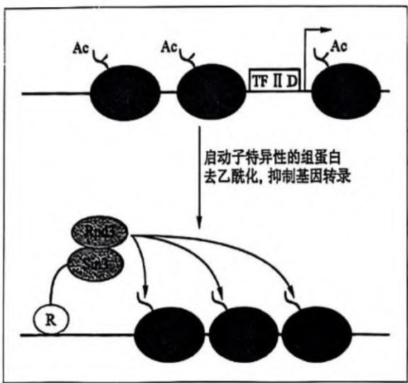  
图 8-20 组蛋白去乙酰化酶复合物能与靶基因启动子区结合,抑制基因转录图中 R 是 DNA 结合蛋白,能够招募 Sin3 的 Rpd3。

Rpd3 复合物专一性结合于某个或某类基因启动子区附近的组蛋白位点并使之去乙酰化，导致染色质结构发生不利于基因转录的变化。

视网膜母细胞瘤蛋白(retinoblastoma protein, Rb)是另一类被广泛研究的肿瘤抑制因子,该蛋白质主要与E2F类转录激活因子相互作用,抑制主要参与细胞周期调控的靶基因的转录活性。研究发现,与E2F类转录激活因子相结合的Rb能进一步募集去乙酰化酶1(HDAC1),使这类基因的启动子区发生特异性的去乙酰化反应,导致该区段染色质浓缩,靶基因转录活性消失(图8-21)。

图 8-21 组蛋白去乙酰化酶与肿瘤抑制因子 Rb 相互作用抑制靶基因转录  
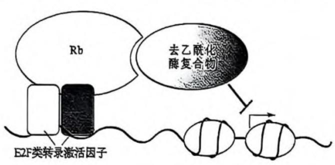

## 8.3.4 组蛋白甲基化与基因表达调控

组蛋白甲基化(histone methylation)是发生在H3和H4组蛋白N端赖氨酸(K)或精氨酸(R)残基上的甲基化。值得注意的是,发育期间组蛋白甲基化是高度动态的。

## 1. "书写器": 组蛋白甲基转移酶

组蛋白上有两种残基——赖氨酸和精氨酸均可以被甲基化修饰。据此将组蛋白甲基转移酶分成两类，即组蛋白赖氨酸甲基转移酶(histone lysine methyltransferase, HKMT)和蛋白质精氨酸甲基转移酶(protein arginine methyltransferase, PRMT)。

目前,已从各个物种中鉴定出许多 HKMT,它们几乎都拥有甲基转移酶催化活性区 SET 结构域(图 8-22)。不同的 HMKT 催化不同的底物,最早发现的甲基转移酶是与组成型异染色质化有关的 SUV39H1,催化 H3K9 的甲基化。由于底物特异性,有的酶能催化 H3K9 甲基化,有的只催化 H3K4 甲基化。

PRMT 分成一型和二型, 一型催化单甲基和非对称双甲基化, 二型催化单甲基和对称双甲基化。常见 PRMT 有 PRMT 1、4、5 和 6。此外, 在果蝇和拟南芥的相关研究中还发现有 PRMT 家族成员参与调控前体 mRNA 的可变剪切, 从而影响生物的昼夜节律。

## 3. "擦除器": 组蛋白去甲基化酶

曾经有很长一段时间,人们认为组蛋白甲基化修饰是稳定存在的,没有主动去甲基化的过程。2002年以后才逐渐发现生物体内存在为数不少的组蛋白去甲基化酶。最早发现的赖氨酸去甲基化酶是LSD1(lysine-specific demethylase1),该酶用FAD为辅助因子,可在体外系统中催化H3K4me1/2的去甲基化,但不能催化三甲基化的去甲基反应。体内研究发现,LSD1 可与不同的复合物相互作用并通过这些复合物被募集到相应的染色质区域。与不同的复合物相结合还能改变 LSD1 催化底物的特性。当 LSD1 与 Co-REST 抑制复合物相结合时催化 H3K4me1/2 的去甲基化,若与雄激素受体结合则可催化 H3K9 的去甲基化。因此,同一个去甲基化酶可以行使转录激活和转录抑制两种相反的功能,视与其合作的因子而定。

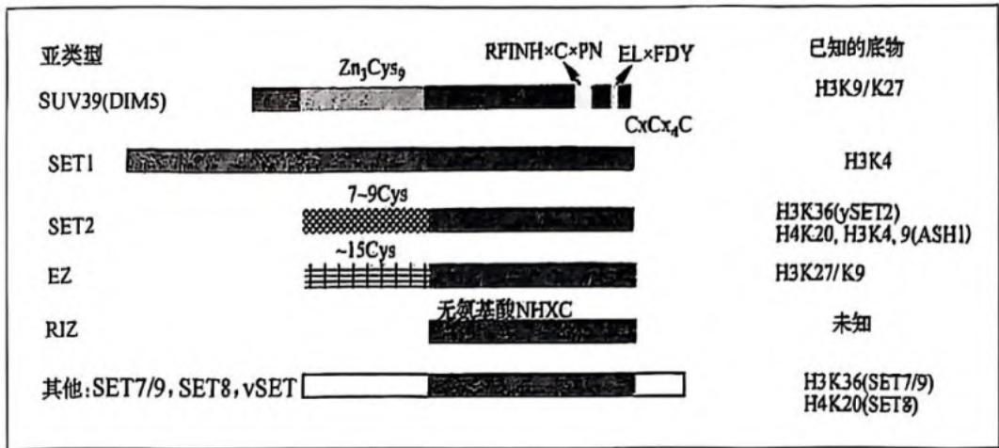  
图8-22 含SET结构域的组蛋白甲基转移酶家族

研究发现,存在于许多赖氨酸去甲基化酶中的jumonji结构域是去甲基化酶的催化活性结构域。最早鉴定的赖氨酸去三甲基化酶是JMJD2,JMJD2可催化H3K9me3和H3K38me3的去甲基化,酶催化活性区为JmjC结构域。

## 4. 组蛋白去甲基化影响基因表达的调控

与组蛋白乙酰化不同, 组蛋白甲基化一般并不会改变组蛋白电荷, 也不会直接影响组蛋白 -DNA 相互作用。甲基化的存在与否主要影响了它们与读取蛋白的结合。激活或抑制基因转录取决于具体的情况(如甲基化的位点、状态等), 例如 H3K4me2/3, H3K36me1/3, H3K79me1/2 和 H4K20me1 与转录激活相关, 而 H3K9me2/3, H3K27me2/3, H3K79me3 和 H4K20me3 与转录抑制相关。

一般来说,各种组蛋白甲基化修饰在染色体上的分布以及功能不尽相同,比如H3K9me3标记通常与异染色质化有关,H3K27me3通常与抑制基因表达有关,而H3K4me3常被视作转录激活区的标记(表8-5)。已知的识别各种组蛋白赖氨酸甲基化修饰的蛋白质或者与这些识别蛋白相互作用的蛋白质非常多,提示组蛋白赖氨酸甲基化十分重要。

表 8-5 常见的组蛋白修饰

<table><tr><td>组蛋白甲基化</td><td>染色体常见分布</td><td>主要功能</td></tr><tr><td>H3K9me3</td><td>中心粒、端粒</td><td>组成型异染色质</td></tr><tr><td>H3K27me3</td><td>沉默基因</td><td>沉默基因</td></tr><tr><td>H3K4me3</td><td>转录起始位点</td><td>转录活性区标记</td></tr><tr><td>H3K36me3</td><td>转录区</td><td>转录活性区标记</td></tr></table>

## 8.3 真核基因表达的染色质修饰调控

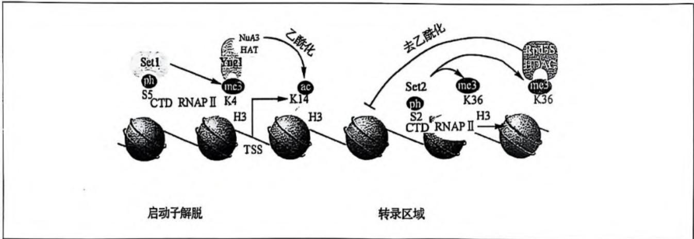  
图8-23 组蛋白修饰分布倾向

## 8.3.5 各种染色质修饰间的复杂关系

组蛋白除了发生甲基化和乙酰化之外,还可发生多种修饰,例如磷酸化、泛素化、瓜氨酸化、SUMO 化和 ADP- 核糖化。"组蛋白密码"假说是指不同组蛋白、不同氨基酸位点、不同修饰类型可能存在特定的排列组合起到特定的作用。大量染色质修饰为染色质状态的精确化调控提供可能,进一步,这些修饰间的关系让染色质修饰变得更为复杂。

总结起来至少存在以下几种关系:①同位点修饰竞争机制:如果同一位点不止一个修饰靶点,则修饰之间可能存在竞争性。组蛋白赖氨酸的乙酰化、甲基化或泛素化属于这类情况。②修饰抑制机制:"书写器"的活性可能由于其底物的修饰而受到影响。例如在酵母中,scFpr4 脯氨酸异构酶催化 H3P38 肽键的构象转化,这种活性影响 scSet2 酶甲基化 H3K36 的能力(图 8-23)。③修饰协作机制:修饰位点之间可能存在合作,以便有效地招募特定蛋白因子。例如,组蛋白去甲基化酶 PHF8 能够与 H3K4me3 特异性结合,并且当 H3K9 和 H3K14 也在的同一 H3 尾部乙酰化时,这种相互作用更强。④邻近修饰干扰机制:"读取器"与特定修饰的结合可以被相邻近的某个修饰破坏。例如在有丝分裂过程中,由于 H3S10 的磷酸化,HP1 与 H3K9me2/3 的结合被破坏。这种调控被称为"磷酸化开关"。⑤邻近修饰依赖机制:一种修饰的发生需要另外一个位点某种修饰。比如,酵母中 scCOMPASS 催化的 H3K4 甲基化和 scDot1 催化的 H3K79 依赖于 scRad6/Bre1 43 对 H2BK123 的泛素化,这种依赖关系在人细胞中也很保守。

## 8.4 真核基因表达的转录后调控

转录后调控处于转录与翻译之间。理论上来说,这个过程中任何一个步骤的调控均属于转录后调控的范畴。转录后调控的直接效果就是改变成熟 mRNA 的质量和数量。

随着科学与研究技术的发展,越来越多的转录后调控步骤被发现。本节主要介绍对 RNA 加工、修饰以及降解的调控。

## 8.4.1 mRNA 的基本结构和调控元件

由转录直接产生的未经加工的新生 RNA, 通常称为前体 mRNA (pre-RNA)。前体 mRNA 要经过一系列加工过程, 去掉内含子序列, 留下 mRNA 编码序列, 最终形成了包括 5'-帽结构 (5' cap)、5'-非翻译区 (5'-UTR)、由起始密码子开始到终止密码子的蛋白质编码序列 (coding sequence, CDS)、3'-非翻译区 (3'-UTR) 和一个多 (A) 尾 [poly(A) tail] 在内的成熟 mRNA $^{(图8-24)}$ 。

(1) 5'-帽结构: 真核生物成熟 mRNA 在 5' 端具有一个特殊的"帽"结构。5' 端帽结构可以提高 RNA 稳定性、增强翻译效率以及降低 mRNA 在细胞中的免疫原性。

(2) $5^{\prime}-$ 非翻译区: 成熟 RNA 上两端的非翻译区不编码蛋白质, 但能够参与调节 mRNA 的稳定性和细胞内定位, 也具有翻译序列选择和速率调控功能。 $5^{\prime}-$ 非翻译区位于起始密码子上游, 可能具有复杂的二级结构。 $5^{\prime}-$ 非翻译区的某些部分有时会特异地翻译蛋白质产物, 调节 mRNA 上主要编码序列的翻译。

(3) 编码区域: 这是 mRNA 上编码蛋白质的区域。该区域从 ATG 开始, 编码序列完全对应着蛋白质的序列。然而, 成熟 mRNA 上还可能存在多个"起始密码子——终止密码子"组合时, 就意味着存在多个开放阅读框。

(4) $3^{\prime}-$ 非翻译区: 这是在翻译终止密码子之后的 mRNA 部分。与 $5^{\prime}-$ 非翻译区相比, $3^{\prime}-$ 非翻译区的调控非常广泛, 可能影响多聚腺苷酸化、翻译效率和 mRNA 的稳定性等。 $3^{\prime}-$ 非翻译区还指导多(A)尾的合成。

(5) 多(A)尾:多(A)尾是一段由腺嘌呤碱基组成的 RNA,哺乳动物的平均长度约为 200nt。通常被添加到 mRNA 3'-非翻译区之后。在真核生物中,多(A)尾几乎存在于每个 mRNA 上。多(A)尾对于 mRNA 的核输出、翻译和稳定性至关重要。其长度和修饰也是重要的调控点。

## 8.4.2 RNA 结合蛋白

RNA 结合蛋白(RNA-binding protein, RBP)通过一个或多个 RNA 结合结构域(RNA-binding domain, RBD)来结合 RNA, 并改变结合 RNA 的命运。RNA 结合蛋白广泛控制 RNA 生命周期的每个阶段, 包括 mRNA 的合成、成熟、剪切、降解等过程。毫不夸张地说: 没有 RNA 结合蛋白, RNA 寸步难行。可见, 蛋白质 -RNA 相互作用是转录后调控的关键 (图 8-25)。

<table><tr><td colspan="4"></td><td>AAAAAAAA……</td></tr><tr><td>5&#x27;-帽结构(5&#x27; Cap)</td><td>5&#x27;-非翻译区(5&#x27; UTR)</td><td>蛋白质编码序列(CDS)</td><td>3&#x27;-非翻译区(3&#x27; UTR)</td><td>3&#x27;-多(A)尾[poly(A)]</td></tr></table>

图8-24 成熟mRNA的结构示意图

图8-25 RNA结合蛋白的功能  
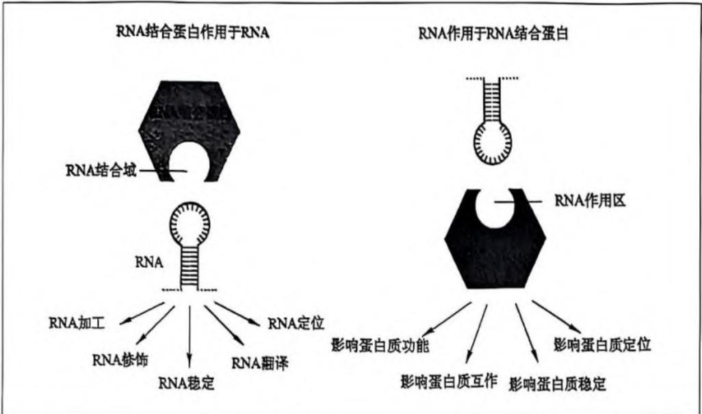

典型的 RNA 结合结构域, 包括了 RNA 识别基序 (RRM, RNA recognition motif)、K 同源 (K-homology, KH)、双链结构域、锌指结构域以及其他大约 30 个丰度较低的结构域 $^{(5-6)}$ 。RRM 是目前为止最常见的 RNA 结合模块, 由 80\~90 个氨基酸组成, 具有 $\beta1\alpha1\beta2\beta3\alpha2\beta4$ 的拓扑结构。目前已经鉴定出超过 1 万种 RRM, 大多数在基因转录后表达过程中起作用。0.5%\~1% 的基因含有 RRM, 通常在同一多肽中具有多个重复。尽管一些单独的 RRM 与 RNA 结合特异性很高, 但是通常需要多个结构域组合来定义特异性, 因为单个 RRM 识别的核苷酸数量通常太少, 无法定义唯一的结合序列。有趣的是, 有些 RRM 还能结合 ssDNA, 以及介导蛋白质之间互作, 这暗示了这些含 RRM 的蛋白质可以参与多个层次的任务。

## 8.4.3 RNA 加工:RNA 剪接

RNA 剪接(RNA splicing)是指从前体 mRNA 中除去内含子,并将外显子连接起来形成一个具有连续编码区的 RNA 分子的过程。在剪接的过程中外显子被识别并连接在一起组成了编码序列。剪接过程受到不同组织和不同发育时期特异性的顺式作用元件和反式作用因子的协同调控。

组成型剪接(constitutive splicing)是RNA剪接的一种基本方式。剪接体(spliceosome)能够有效地识别剪接位点,将内含子完全从前体mRNA中去除,然后将外显子连接成成熟的mRNA。这种情况下,每个转录单位只产生一种成熟的mRNA。可变剪接或称选择性剪接(alternative splicing,AS),是指从一个前体mRNA通过不同的剪接方式产生不同的mRNA剪接异构体的过程。在人细胞中,大部分的基因(约95%)都存在着选择性剪接。哺乳动物大部分的基因都有2\~20个不同的剪接亚型(isoform)。在脊椎动物中,多外显子的基因平均产生 6.3 个亚型。亚型的表达模式在不同组织中明显不同。模式生物黑腹果蝇的 Dscam 基因是可变剪接研究中最著名的例子。Dscam 基因与果蝇神经系统的分化和先天免疫系统的发生密切相关，该基因可以通过可变剪接形成 38000 种不同的亚型。

表 8-6 常见的 RNA 结合结构域与典型代表

<table><tr><td>RNA 结合结构域</td><td>结合核酸类型</td><td>代表性 RNA 结合蛋白</td></tr><tr><td>RNA 识别基序</td><td>ssRNA、ssDNA</td><td>CBP20、PABP</td></tr><tr><td>K 同源</td><td>ssRNA、ssDNA</td><td>EMR1、Nova</td></tr><tr><td>双链结构域</td><td>dsRNA</td><td>Dicer、RNAsue III</td></tr><tr><td>锌指结构域</td><td>dsRNA、ssRNA</td><td>SF1/mBBP、Nova2</td></tr><tr><td>解旋酶</td><td>dsRNA</td><td>eIF4A、DHH1</td></tr><tr><td>PIWI</td><td>dsRNA</td><td>Ago</td></tr><tr><td>PAZ</td><td>dsRNA</td><td>Ago</td></tr></table>

## 1. 剪接过程

前体 mRNA 的内含子具有保守的剪接相关序列, 包括 5' 端剪接位点 (5' splicing site, 5' ss), 3' 端剪接位点 (3' ss) 以及位于 3' ss 上游大约 20 \~ 30 nt 处的分支点 (branch point) $^{(图8-26)}$ 。

图 8-26 RNA 剪接过程  
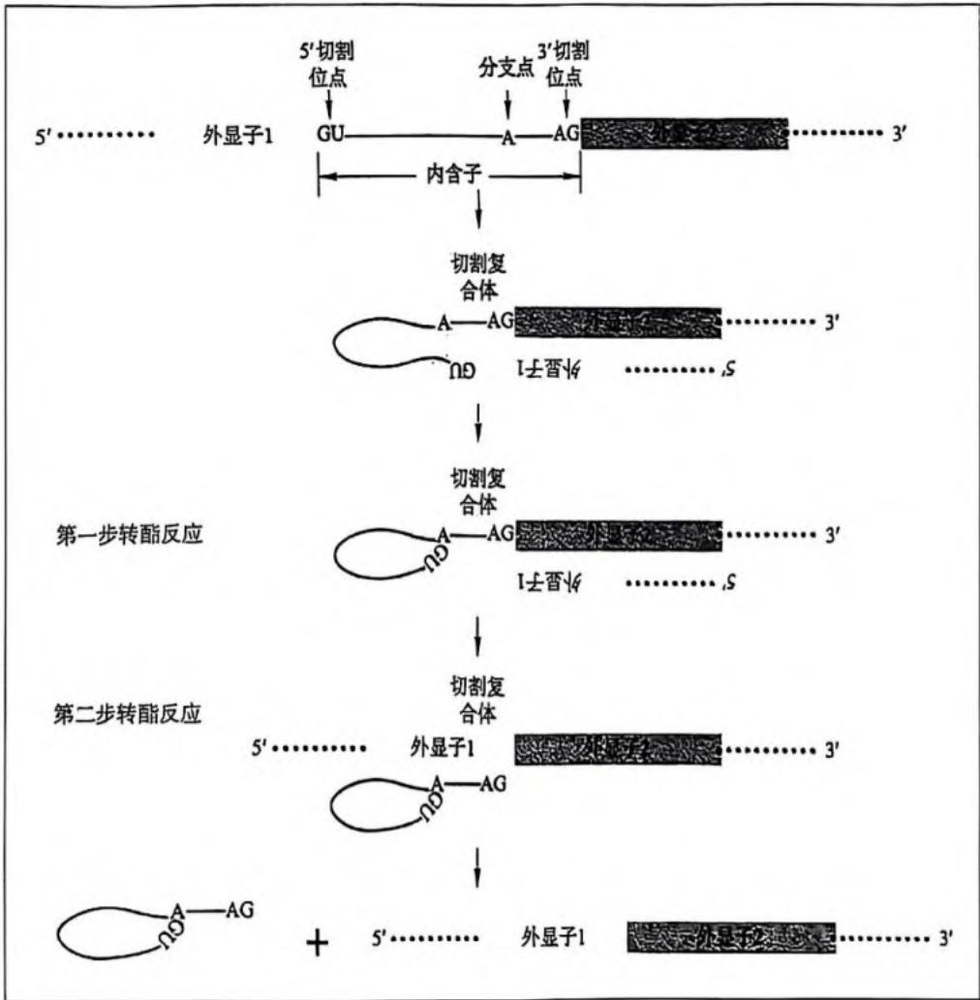

多数细胞核 mRNA 前体内含子的 5' 边界序列为 GU, 3' 边界序列为 AG。而分支点序列并不保守，一般含有一个腺苷酸。

RNA 剪接过程是由剪接体催化完成的, 涉及 200 多个分子之间的协调和相互作用。该过程包括了两步转酯反应: 第一次转酯反应是由分支点的腺嘌呤核苷酸的 $2^{\prime} - 0\mathrm{H}$ 作为亲核基团攻击连接外显子 1 与内含子之间的 $3^{\prime}, 5^{\prime}-$ 磷酸二酯键, 使外显子 1 的 $3^{\prime} - 0\mathrm{H}$ 游离出来。第二次转酯反应由外显子 1 的 $3^{\prime} - 0\mathrm{H}$ 对内含子和外显子 2 之间的磷酸二酯键进行亲核攻击, 使内含子与外显子 2 断开, 由外显子 1 取代了套索状内含子。这样, 两个外显子被连接起来而内含子则被以套索状的形式切除掉。

## 2. 剪接与基因表达调控

选择性剪接调控的目标是不同选择性剪接异构体的相对丰度的改变。一条前体 mRNA 上有多个外显子和内含子, 剪接位点的选择通过顺式作用元件和反式作用因子共同调控。顺式作用元件招募剪接因子, 以促进或抑制附近剪接位点的识别。反式作用因子可以结合至前体 mRNA 上, 调控剪接体的组装和剪接位点的识别。可见, 这个过程受到多个因素的影响:

① 剪接位点: 强剪接位点包含可被剪接体识别的特征序列, 通常会导致"组成型剪接"。弱剪接位点的识别高度依赖于顺式作用序列的存在和细胞环境, 如剪接因子的表达水平。

② 顺式作用元件:除了内含子上的剪接位点外,内含子和外显子上还存在多种顺式作用元件,包括外显子剪接增强子(ESE)、内含子剪接增强子(ISE)、外显子剪接沉默子(ESS)、内含子剪接沉默子(ISS)。这些相对保守的序列能够调控剪接过程。

③ 反式作用因子(RNA 结合蛋白和剪接因子)。反式作用因子通过结合剪接增强子或沉默子来发挥调控功能。例如,具有丝氨酸 / 精氨酸富集结构域的 SR 家族蛋白,能够与外显子剪接增强子(ESE)结合,帮助稳定剪接体组分与 mRNA 的结合,促进剪接过程。

剪接主要在转录延伸过程中进行,也称为共转录剪接(co-transcriptional splicing)。当果蝇中由 RNA Pol II 介导的转录变慢时,一些基因前体 mRNA 的剪接也发生了改变。

真核转录物的选择性剪接是细胞能够从有限数量的基因中产生多样化蛋白质的机制。由于选择性剪接的存在,一个基因能够产生许多不同类型的 mRNA 转录变异体 (variant) 或亚型,极大地丰富了蛋白质的多样性,但更重要的是选择性剪接可在时间和空间上调控基因的表达。

## 8.4.4 RNA 修饰: 加帽

帽(cap)结构是细胞中广泛存在的一种RNA修饰(见本书3.4节)。帽结构是mRNA在体内发挥生物学功能必不可少的元件。简单来说,RNA帽结构最主要的功能有:①提升mRNA稳定性,避免被细胞内的核酸外切酶降解;②在细胞中招募蛋白质翻译机器,使得mRNA翻译出蛋白质;③促进mRNA的运输;④提高RNA的剪接效率。

通常情况下,帽的形成伴随着转录的过程。此时,位于细胞核的帽结合蛋白复合物(cap-binding complex, CBC)会迅速募集到这一结构上。接下来,CBC与一系列介导RNA代谢和翻译机制的因子相互作用,帮助mRNA成熟、出核。当成熟mRNA从细胞核运到细胞质后,帽结合的CBC组分会被位于细胞质的真核翻译起始因子4E(eukaryotic translation initiation factor 4E, eIF4E)置换。随后,eIF4E招募翻译机器前来合成多肽,启动翻译过程。

## 8.4.5 RNA 修饰: 多聚腺苷酸化

真核生物中, 几乎每条 mRNA 的尾部都会带有多聚腺苷酸, 即 poly(A)。多聚腺苷酸化 (polyadenylation) 是指在底物 RNA 的 3' 端加上一段多聚腺苷酸的转录后修饰作用。与原核生物不同的是, 在真核生物中该修饰倾向于使 RNA 稳定, 即抑制 RNA 的降解。哺乳动物的 poly(A) 尾平均长度约为 200 nt, 在酵母中平均约 70 nt。选择性多聚腺苷酸化 (alternative polyadenylation, APA) 是真核生物中普遍存在的一种基因调控机制, 是指通过在 RNA 3' - UTR 不同位置上添加 poly(A) 尾, 可以选择性地调节 3' - UTR 的长短, 导致一个基因产生多个转录变异体。选择性多聚腺苷酸化能够影响目标 mRNA 的稳定性和翻译效率、运输和细胞定位等, 进而精细调节基因的表达。

## 1. 多聚腺苷酸化的过程

多聚腺苷酸化涉及前体 RNA 的核内切割,以及在裂解产物的 3' 端多聚腺苷酸化。这两个偶联反应,统称为切割和多腺苷酸化 (cleavage and polyadenylation, C/P)。这个过程需要二十多种核心蛋白质,其中包括四种蛋白质复合物 (图 8-27)。转录即将结束时,RNA 聚合酶 II 招募相关复合物募集到新生 RNA 内的结合位点来启动切割。多聚腺苷酸化位点 [poly(A)site, PAS] 通常位于 AAUAAA 基序下游 10\~30 个核苷酸处。CPSF 可以特异性识别 AAUAAA 基序,指导切割。CFIm 和 CSTF 复合物分别识别上游辅助元件和下游辅助元件,有助于选择切割位点,并确保有效识别和切割。

## 2. 多聚腺苷酸化与基因调控

一个具有多 PAS 的前体 mRNA 在成熟过程中, 剪切和多聚腺苷酸化反应的发生取决于对 PAS 的选择利用。其调控受到顺式作用元件、反式作用因子、RNA 聚合酶 II 的延伸速度和染色质的修饰的影响。其中, 反式作用因子的浓度有着重要的作用。研究发现, 在紫外线诱导 DNA 损伤修复的模型中, 蛋白质 BRCA1/BARD1 结合并隔绝 CSTF50, 使得

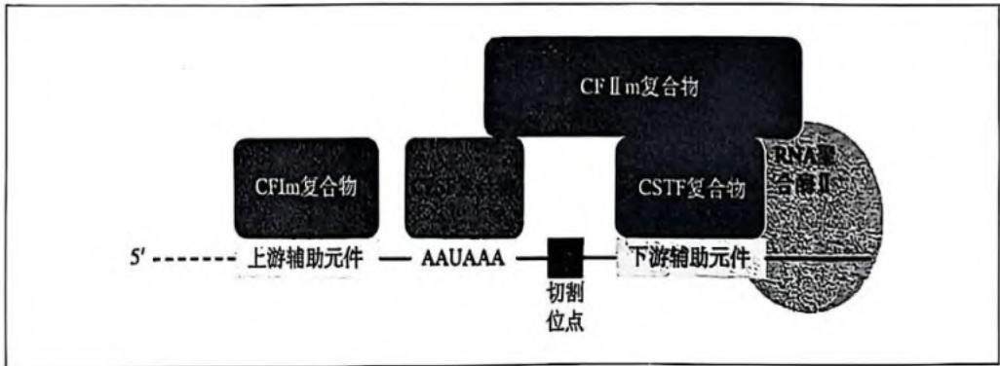  
图8-27 四种蛋白质复合物参与多聚腺苷酸化的过程

CSTF50 的浓度显著降低,形成长的 3' - UTR 亚型转录物。

目前来看,多聚腺苷酸化修饰可能从以下几个方面来影响基因表达:①选择性多聚腺苷酸化可能产生差异性蛋白亚型;②不同转录物具有不同的3'-UTR,而3'-UTR是很多miRNA、RNA降解因子的重要靶标。这就使得这些转录物具有不同的稳定性、翻译效率、运输或细胞定位。

## 8.4.6 其他 RNA 修饰: $m^{6}A$

真核生物的 RNA 能够发生 100 多种化学修饰,但只有极少数的修饰方式广泛存在于 mRNA 上。 $N^{6}$ -甲基腺苷( $N^{6}$ -methyladenosine, $m^{6}A$ )是真核生物 RNA 最常见的 mRNA 修饰之一,即 mRNA 中腺嘌呤第 6 位氮原子上的甲基化修饰。 $m^{6}A$ 不会影响 RNA 中基本的碱基配对能力。尽管这种修饰很早就被发现,但是 $m^{6}A$ 所具有的生物学功能一直到近期才被发现报道。与表观遗传调控类似,已经发现了一组蛋白质,它们能特异性地"书写"、"擦除"和"识别" $m^{6}A$ ,从而影响 RNA 的命运。

## 1. 书写器: $m^{6}A$ 甲基转移酶

$m^{6}A$ 甲基转移酶以复合物(methyltransferase complex, MTC)形式发挥作用, 包括 METTL3、METTL14 和 WTAP 和 KIAA1429。其中 METTL3-METTL14 形成修饰核心, 识别 RNA 底物并催化甲基转移过程(图 8-28)。WTAP 和 KIAA1429 负责复合物的形成, 属于调控组件。

## 2. 擦除器: $\mathrm{m}^{6} \mathrm{~A}$ 去甲基化酶

$m^{6}A$ 甲基化修饰是一个动态的修饰过程。和 DNA 以及组蛋白中甲基转移酶和去甲基化酶行使的可逆甲基化作用相似， $m^{6}A$ 甲基化修饰也是一个可逆的过程。有报道表明，FTO 和 ALKBH5 是调控 $m^{6}A$ 去甲基化修饰的两个重要的酶。

图 8-28 m $^{b}$ A 甲基化"写入"与"擦除"  
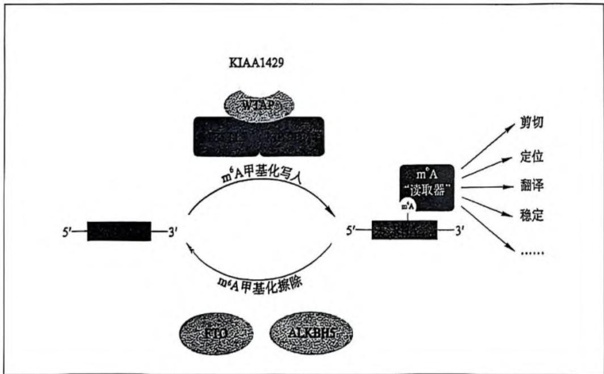

## 3. $\mathfrak{m}^6\mathrm{A}$ 修饰与基因表达的调控

$m^{6}A$ 修饰通常招募拥有"YTH"结构域的RNA结合蛋白作为"读取器"。YTH结构域对甲基化RNA的亲和度比非甲基化RNA更高。这些含有YTH结构域的蛋白作用范围广泛，能影响mRNA的剪接、定位、翻译效率以及稳定性等多个方面 $^{[1]}$ 。例如，YTHDF1与YTHDF3协同作用可以提高被修饰RNA的翻译效率。YTHDF2在mRNA稳定性方面发挥着一定的作用。YTHDC1在 $m^{6}A$ 介导的选择性剪接方面具有重要意义。当然。并非所有的 $m^{6}A$ 读取器都包含YTH；真核起始因子3(eIF3)就是特例之一。该蛋白在5'-UTR中会优先与 $m^{6}A$ 化的mRNA结合，因此具有翻译调控的功能。

## 4. mRNA 修饰与翻译起始

mRNA 5' 端的 m $^{7}$ G 帽结构和 3' 端的 poly(A) 尾在翻译起始过程中发挥重要作用。相较于单一修饰, 当 mRNA 上同时存在帽和 poly(A) 尾时, 翻译效率更高。那么 mRNA 3' 端如何促进 5' 端的翻译起始呢? 真核翻译起始因子 eIF4E 识别 5' 端帽, 同时也可结合另一个起始因子 eIF4G, 后者可以结合位于 poly(A) 上的 PABPC [poly(A) binding protein C]。因而, mRNA 可以形成一个闭环复合物, 允许 5' 帽和 3' poly(A) 尾直接发生相互作用。eIF4G 与 PABPC 的相互作用稳定了 eIF4E- 帽的相互作用, 类似地, PABPC 与 poly(A) 尾的结合又稳定了其与 eIF4G 的相互作用。PABPC 还可激活另一种翻译起始因子 eIF4A, 加强其 ATP 酶和解旋酶活性。合起来, 帽 -eIF4E-eIF4G-PABPC-poly(A) 尾复合物被认为可以(至少部分可以)通过招募 40S 核糖体小亚基来激活翻译(图 8-29)。

## 8.4.7 mRNA降解

mRNA 丰度(RNA abundance)是指生物组织或细胞中 mRNA 的相对含量。mRNA 丰度是通过转录和降解之间的平衡来调节的。mRNA 降解(mRNA decay)是指 mRNA 被酶消化分解的过程。这个过程一般起始于外切酶或内切酶的切割,这一过程可以引发随后的基础性降解(图 8-30)。由外切酶切割引发的降解途径又被称为去腺苷依赖性降解途径

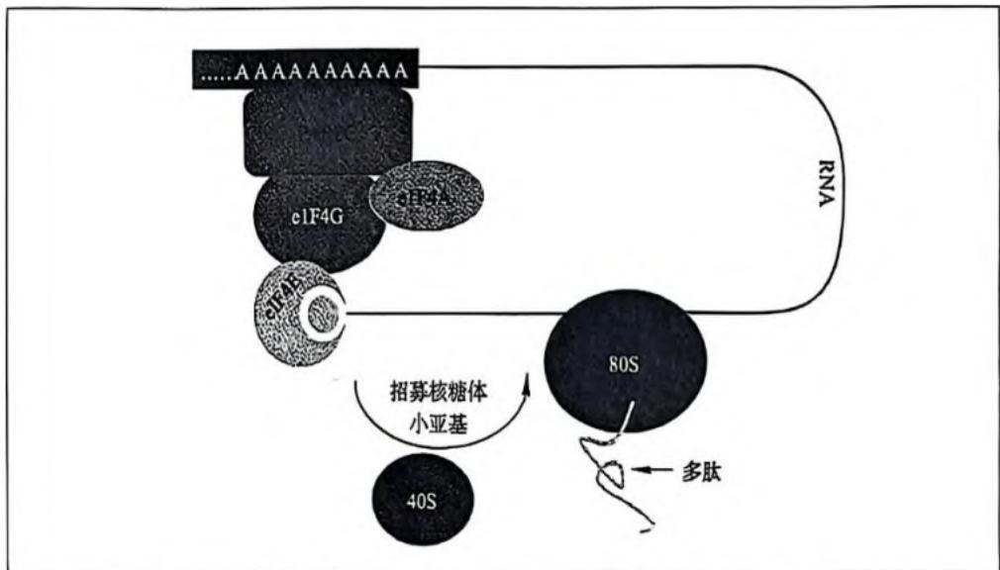  
图8-29 mRNA修饰与翻译准备

图 8-30 常见的 mRNA 降解方式包括由外切酶引发的降解(a)以及由内切酶(b)引发的降解

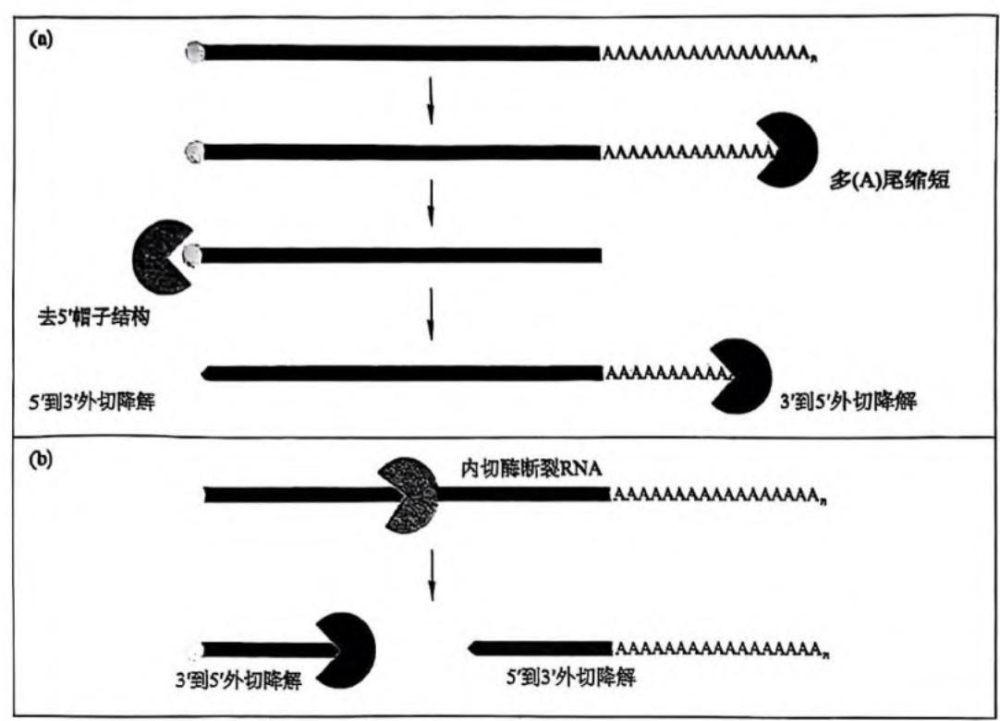

(deadenylation-dependent decay)。该途径中，poly(A)尾首先缩短至10\~12 nt,5'帽随即被去掉,转录物将被XRN1沿着5'→3'方向降解或被胞浆中的外切体(exosome)沿着3'→5'方向降解。

除了一般性去腺苷依赖性降解途径之外,还存在着多个RNA降解途径(表8-7)。这些途径一般都针对特异性mRNA底物,是基因差异性表达的调控基础之一。根据底物的特征,可大致分为两类:

## 1. 针对异常 mRNA 的质量监控

RNA 除了经过剪接和修饰等加工,还需要通过 RNA 质量监控(RNA surveillance)。RNA 质量监控途径识别转录产物中的潜在错误,避免可能被翻译成有害蛋白质对生物体造成灾难性后果。这种质量监控机制在维持细胞正常生长与发育方面发挥着关键作用。

表 8-7 常见的 mRNA 降解酶与底物特征

<table><tr><td>活性与功能</td><td>代表性酶/蛋白质</td><td>底物</td><td>可参与阶段</td></tr><tr><td>去腺苷</td><td>PAN、CNOT6(CCR4A)</td><td>成熟的mRNA</td><td>外切酶降解</td></tr><tr><td>去帽</td><td>DCP2、NUDT16</td><td>去腺苷的mRNA</td><td>外切酶降解</td></tr><tr><td>5&#x27;→3&#x27;降解</td><td>XRN1</td><td>去腺苷去帽的mRNA,内切后的mRNA</td><td>基础性降解</td></tr><tr><td>3&#x27;→5&#x27;降解</td><td>RNA外切体</td><td>去腺苷去帽的mRNA,内切后的mRNA</td><td>基础性降解</td></tr><tr><td>内切</td><td>SMG6、IRE1、PMR1、AGO1</td><td>特异性启动:SMG6(与无义介导的mRNA降解相关)、IRE1(与内质网胁迫的mRNA降解相关)、AGO1(与小RNA介导的mRNA降解相关)</td><td>内切酶降解</td></tr></table>

地中海贫血和马方综合征(Marfan syndrome)都归因于该机制的异常。RNA监控机制异常往往会导致疾病发生,也多见于癌症中,表明RNA监控具有重要功能。RNA质量监控伴随着mRNA的转录、翻译等过程,可分为细胞核监控和细胞质监控。

① 细胞核监控 在细胞核监控中, $5' \rightarrow 3'$ mRNA 降解途径发挥着作用。不同于细胞质中的 $5' \rightarrow 3'$ mRNA 降解, 核内 $5' \rightarrow 3'$ mRNA 降解需要一个去帽复合物和外切酶。而多聚腺苷酸化缺陷的 mRNA 则主要通过外切体降解。

② 细胞质监控 细胞质监控的特征是其利用翻译调控来监控 RNA 质量。当处在翻译过程中的 mRNA 存在由碱基突变或移码等产生的提前终止密码子(premature termination codon, PTC)时，mRNA 会经历无义介导的 mRNA 降解(nonsense-mediated mRNA decay, NMD)。NMD 途径使得含有 PTC 的 mRNA 被迅速降解，从而防止其被翻译成为缺陷蛋白，是生物体的一种自我保护机制。

## 2. 针对功能蛋白质 mRNA 的降解调控机制

长期以来,科学家普遍认为原核生物中的 RNA 降解是由 mRNA 内切酶引发的,而真核生物的 mRNA 降解则主要依赖 mRNA 外切酶。在过去几十年里,许多新发现证明了 mRNA 内切酶对真核生物中的 mRNA 降解也有显著贡献 $^{(图8-31)}$ 。这些内切酶的激活通常依赖与特定信号通路相关的顺式作用元件,这些信号通路包括内质网胁迫、免疫反应、小 RNA 诱发的基因沉默、铁代谢,等等。

特异性的 mRNA 降解调控主要通过 mRNA 本身所固有的某种特异性信号序列 (顺式作用元件) 与 RNA 结合蛋白或者与其他 RNA 之间的相互作用而实现的。

① 顺式作用元件招募特异性 RNA 结合蛋白 转铁蛋白受体 TfR1 是介导铁离子进入细胞通道的关键成员之一，在调节细胞铁代谢和维持铁平衡中发挥关键作用。其 mRNA 3'-非翻译区中存在一个特异的顺式作用元件，称为铁应答元件（iron responsiveelement, IRE)。这段序列能够特异招募 IRE 结合蛋白 (IRE binding protein, IREBP)。当缺铁时, IREBP 能够有效地阻止 TfR mRNA 的降解, 促进 TfR1 蛋白的合成 (图 8-32)。

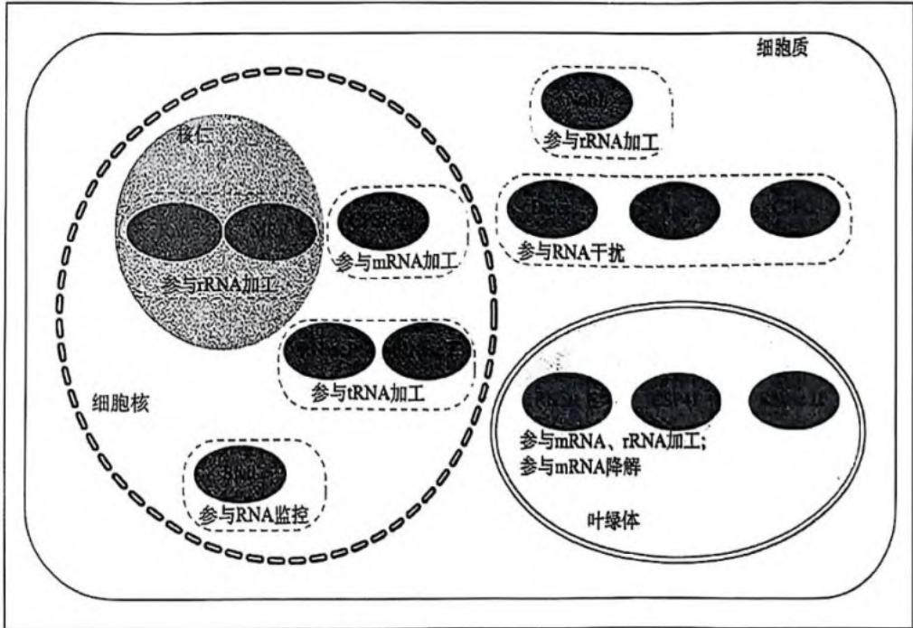  
图 8-31 mRNA 内切酶参与的生物学过程

图8-32 铁应答元件招剪调控因子  
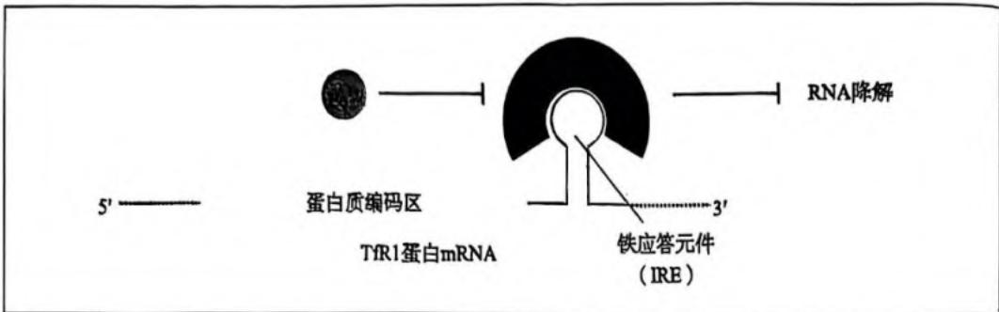

② 顺式作用元件招募小 RNA(sRNA) 结合 在原核生物中, sRNA 诱导的 mRNA 降解是通过 sRNA 与靶 mRNA 的结合, 引发 mRNA 的核糖核酸内切酶 E(RNase E) 依赖性切割和降解。真核细胞中, 存在长度为 18\~32 nt 的 sRNA, 主要包括 miRNA、siRNA、snoRNA 和 piRNA 等。小干扰 RNA(small interfering RNA, siRNA) 是长度为 21\~23 个核苷酸的双链 RNA 分子, 它们能够与目标 mRNA 完美互补, 与核酸内切酶 AG01 共同参与 mRNA 的降解。miRNA 也存在类似的机制。

## 8.4.8 mRNA 转运与胞质暂存

在细胞核中，mRNA 被加帽、剪接、修饰，并与多种蛋白结合形成核糖核蛋白复合物 (messenger ribonucleoprotein complex, mRNP)。mRNP 出核之后，mRNA 5' 端的帽结合蛋白复合物 (CBC) 被翻译起始因子 eIF4E (eukaryotic translation initiation factor 4E) 置换下来，引发第一轮翻译。eIF4E 招募翻译机器并组装形成多聚核糖体 (polysomes)。当该 mRNA 不再被需要之后，它招募去腺苷复合物 (CCR4-NOT1)，最终走向降解 $^{[8-33]}$ 。

在一些特殊情况下,成熟的 mRNA 并不直接翻译,而是被储存在一些 RNA 颗粒(RNAgranule)中,后续可被降解或被翻译。这些RNA颗粒通常是一些特异性RNA与蛋白聚集形成的无膜结构,包括了应激颗粒(stress granule,SG)、加工小体(processing body,P-body)、P颗粒(P-granule)等 $^{[图8-34]}$ 。mRNA的转运和胞质暂存在转录后调控中发挥作用,也是当前基因表达调控研究的热点之一。

图 8-33 mRNA 转运与胞质暂存  
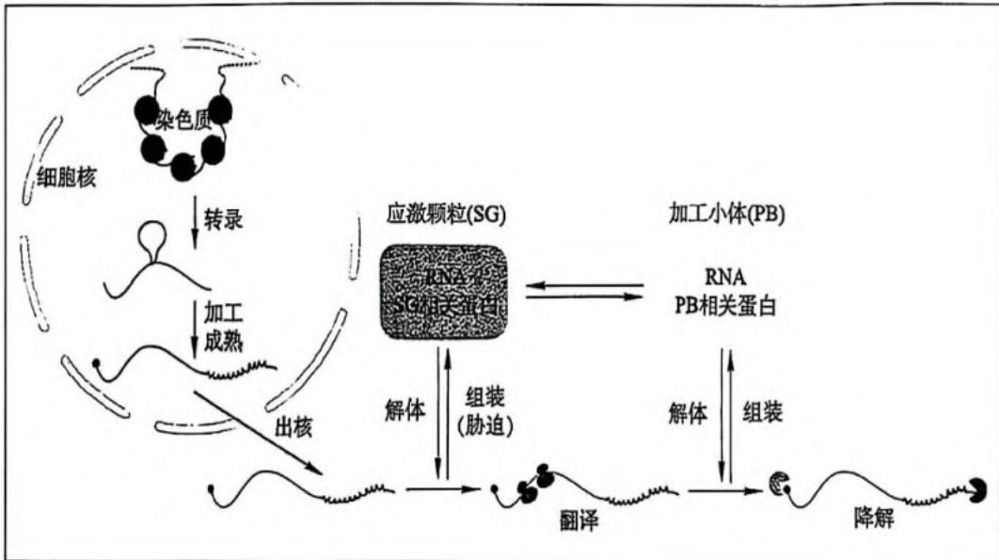

## 8.5 非编码 RNA 与基因表达调控

非编码 RNA (non-coding RNA, ncRNA) 是指那些不能翻译成蛋白质的 RNA 分子。尽管人类基因组中四分之三的基因可以进行转录，然而其中只有一小部分能够翻译产生蛋白质。非编码 RNA 在细胞基因表达调控的多个层次中均发挥着重要的作用、涉及细胞增殖、分化、凋亡、代谢等多个生物过程。

根据 RNA 的大小, 非编码 RNA 包括小 RNA (small RNA, sRNA) 以及长链非编码 RNA (lncRNA) $^{[图8-34]}$ 。sRNA 是一类高度保守的长度为 18\~32 nt 的 RNA 分子, 主要包括 miRNA、siRNA、snoRNA、piRNA、circRNA 等。其中, siRNA 和 miRNA 在调控基因表达方面有广泛的报道。

## 8.5.1 小RNA

早在 1988 年就有 RNA 干扰 (RNA interference, RNAi) 现象的报道。当时的研究人员希望通过转基因过表达色素合成基因的手段使得牵牛花的颜色变深，但在他们得到的诸多转基因牵牛花中，有些花不但颜色没有变深，反而变成白色了。以后相类似现象也在其他转基因植物中出现,被称为基因表达的共抑制现象(co-suppression)。这种现象随后在许多真核生物中都有发现,被称为RNA干扰。

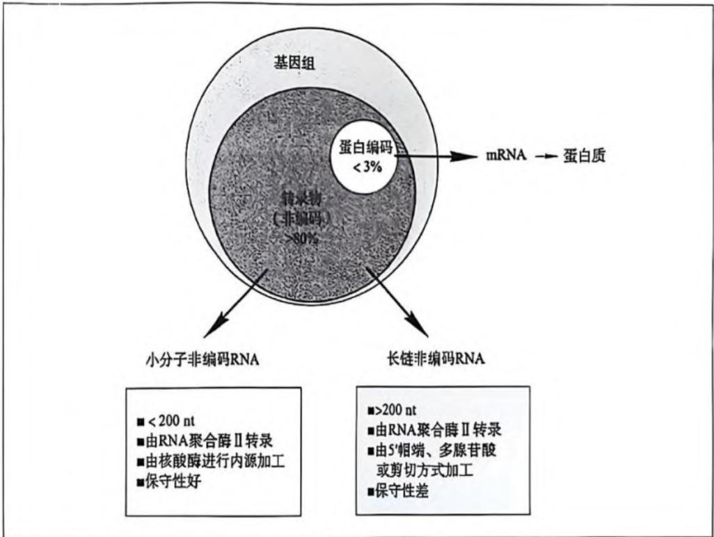  
图8-34 人类基因组中编码RNA与非编码RNA的比较

实验表明, 双链 RNA (double strand RNA, dsRNA) 对内源基因表达的干扰效率远高于单链的 RNA, 真正起到 RNA 沉默作用的应该是 dsRNA。此外, 研究还发现, 引人的外源 RNA 只对同源基因有高沉默效率, 暗示基因沉默可能以碱基配对为基础。后续研究发现, 不论是否有靶 mRNA 的存在, 外源引入的 dsRNA 的正义链、反义链都会被切割成 21\~23 nt 的小片段, 相对应的靶 mRNA 也会被降解成长度差为 21\~23 nt 的片段, 说明这种降解很可能是由 21\~23 nt 小片段介导的, 并且这种降解需要 ATP 提供能量。现在, 已统一将介导这种沉默现象的小片段 RNA 称为小干扰 RNA (siRNA)。

1993 年,科学家在线虫中克隆了 lin-4 基因,并通过定点突变发现 lin-4 并不编码蛋白质,而是产生一种小 RNA 分子。这种小 RNA 分子能以不完全互补的方式与 lin-4 基因的 mRNA 结合并抑制其翻译,最终导致 lin-14 蛋白质合成减少。从此之后,开始揭开了 miRNA 的研究序幕。

## 1. miRNA 和 siRNA 的生物合成

miRNA 来自于内源编码特定长链 ssRNA (single-strand RNA) 的基因。这些基因首先转录形成具有茎-环 (stem-loop) 结构的初始 miRNA (pri-miRNA)。在细胞核中由至少包括两种成分 [RNaseⅢ酶 Drosha 和 DGCR8 (果蝇中称为 Pasha)] 的复合物识别并切割, 产生长度约为 $65 \sim 75$ nt 的前体 miRNA (pre-miRNA)。之后由输出蛋白 Exportin 5 转运出核进入细胞质, 进一步被细胞质中具有 RNaseⅢ核酸内切酶活性的 Dicer (DCL) 复合物进一步加工, 形成 miRNA 或 siRNA。之后与 AGO 组装成为 RNA 诱导的沉默复合物 (RNA induced silencing complex, RISC)。与 miRNA 不同, siRNA 是由长双链 RNA (dsRNA) 前体产生的, 既可以是内源产生的, 也可以是外源提供的。外源 siRNA 可由 RNA 病毒感染、转基因等原因导致。siRNA 的加工也是 Dicer 依赖性的, 也需要组装到 RISC 复合物中 (图 8-35)。

## 2. siRNA 引起的基因沉默扩增

在线虫中,RNA干扰能够显著地实现基因沉默,得益于RNA依赖性RNA聚合酶(RNA-dependent RNA polymerase,RdRP)以RNA为模板进行的RNA扩增机制。当体内初级siRNA与靶mRNA严格配对后,RdRP便能以该siRNA作为扩增的引物并以靶mRNA为模板合成双链RNA,在Dicer的作用下,产生新的siRNA和RISC。这些新生的次级siRNA又可以与靶mRNA的不同区域配对,更大范围地降解靶mRNA(图8-36)。

植物、线虫和酵母中都发现存在以 RNA 为模板的 RNA 扩增机制,但哺乳动物和果蝇的基因组分析却没有发现相关基因。植物中内源的 miRNA 与靶标 mRNA 匹配程度较高,靶标较单一。其与靶标 mRNA 配对后,依赖 RdRP 也能大量产生的次级 siRNA,对更多的基因进行调控,实现高效地大规模的基因沉默。因为新产生的次级 siRNA 可能调控其他基因,这个途径也被称为反式作用小 RNA(trans-acting siRNA,tasiRNA)。

## 3. miRNA/siRNA 发挥功能的分子机制

miRNA/siRNA 介导的基因沉默,主要有转录前水平的基因沉默(transcriptional gene

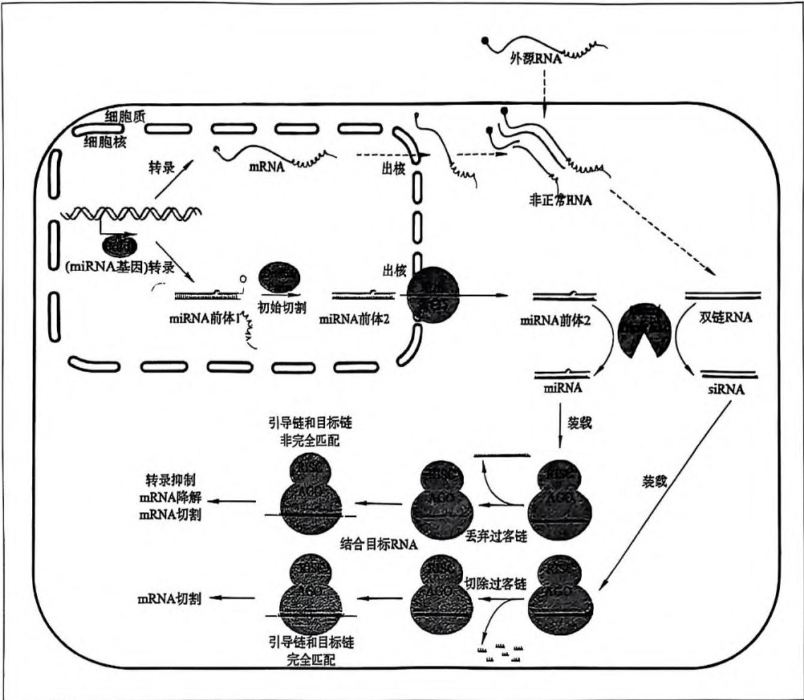  
图8-35 miRNA与siRNA的产生

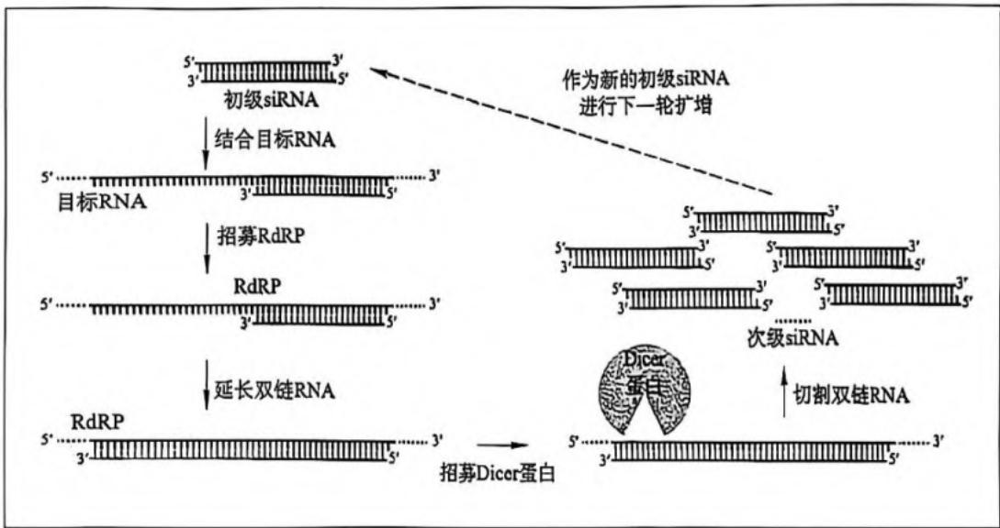

silencing, TGS) 和转录后水平的基因沉默 (posttranscriptional gene silencing, PTGS)。

① TGS 是指由于染色体修饰等原因使基因不能正常转录,造成转录水平下降引起的基因沉默。在植物中,从转座子等重复 DNA 序列区域产生的 24 nt siRNA 可与 AGO 蛋白结合形成 siRNA/AGO 复合物。siRNA/AGO 复合物进一步招募 DNA 甲基转移酶 DRM2 等组分,特异性地识别同源 DNA 序列,并对其进行 RNA 指导的甲基化修饰(RNA-directed DNA methylation, RdDM)。在哺乳动物生殖细胞中也有类似的 sRNA 指导的从头合成甲基化途径,是由一类 24 nt \~ 30 nt 的 piRNA 指导完成。

② PTGS 是指在转录后和翻译阶段对靶 mRNA 序列特异性调控的机制。siRNA 与靶标 mRNA 匹配程度通常较高,靶标较单一,其形成的 siRNA/AGO 复合物可以将靶 mRNA 切割成若干片段。相比 siRNA,miRNA 与靶标的匹配程度和机制相对复杂:一般认为,miRNA 如果与靶 mRNA 匹配程度高,会促进靶 mRNA 的降解;如果匹配程度低,仅阻止 mRNA 作为翻译的模板,使之不能合成蛋白质,降低靶基因的蛋白质水平,但不影响其 mRNA 的水平。植物中的 miRNA 更倾向于前者,哺乳动物的更倾向于后者。

## 4. miRNA/siRNA 的生物学意义

miRNA 的主要作用体现在正常发育过程中对内源基因表达的调控。在植物中，miRNA 参与调控了器官形态建成、个体生长发育、种子大小和生物量，以及抵御外界生物（如病虫等）和非生物（如干旱、温度、盐碱、贫瘠等）胁迫等过程。以植物形态建成为例，模式植物拟南芥的叶子具有上下表面不对称结构，这个结构由转录因子 PHB 的极性表达控制。而 PHB 则是 miR165 和 miR166 的靶基因，受这两个 miRNA 的调控。在植物叶原基中，MIR165 和 MIR166 基因严格表达在下表皮（abaxial）中，但 miR165 和 miR166 则可以向上表皮移动，因此形成了一个渐进的梯度 $^{(图 8-37)}$ 。这种梯度导致 miRNA 靶基因 PHB 的表达水平呈现出相反的梯度，因而形成了不对称的发育模式。此外在根中，miR165/miR166 在内皮层中特异性产生并形成朝向根中心位置的梯度分布，进而通过影响 PHB 的水平调控木质部细胞的分化。

siRNA 主要作用是抑制转座子活性和抵抗病毒感染,具体涉及三个方面:①保护基因组免受外源核酸侵入;②维持基因组的稳定;③在转录后水平参与基因的表达调控。

图 8-37 miRNA 与不对称发育  
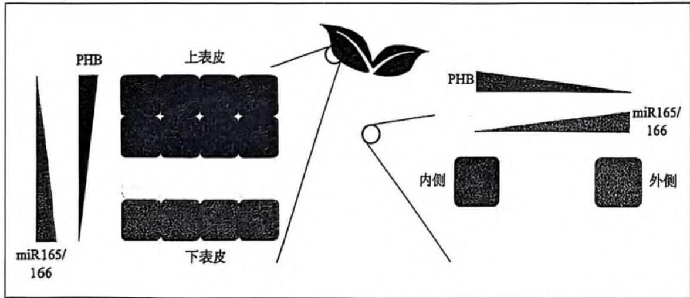

RNA 干扰的一种原始生物功能是帮助生物体抵抗病毒,早期的研究表明无脊椎动物可以利用 RNA 干扰抵抗病毒。最新的研究发现哺乳动物也能够借助 RNAi 抗病毒,被称为全新的"免疫途径"。值得注意的是,病毒也进化出与宿主抗病基因序列相似的 RNA,借助相似的机制生成 RISC,降解宿主细胞抗病基因的 mRNA。这种 siRNA 也会在宿主体内传播,增加了未被侵染的细胞的易感性。

## 8.5.2 长链非编码 RNA

## 1. 长链非编码 RNA(lncRNA) 的种类

lncRNA 指长度大于 200 bp 的非编码 RNA。根据基因组位点或者相关的 DNA 链特征, lncRNA 可以进一步分为正义 lncRNA、反义 lncRNA、基因内 lncRNA、基因间 lncRNA、增强子 lncRNA 或环状 lncRNA 等 $^{(图8-38)}$ 。

正义 lncRNA 是指基因位点通过共享相同的启动子和某个蛋白编码基因有重叠；反义 lncRNA 指基因位点以反向的方式插入在某个已知的蛋白编码基因中；基因内 lncRNA 指基因位于某个蛋白编码基因的内含子区；基因间 lncRNA 指的是编码 lncRNA 的基因位点位于两个蛋白编码的基因中；增强子 lncRNA 指的是编码 lncRNA 的基因位点位于某一蛋白编码基因的增强子区域；环状 lncRNA 则指通过共价键形成闭合的环 lncRNA，一般来自可变剪切的编码蛋白基因。

## 2. 长链非编码 RNA 的作用机制

## (1) lncRNA 作为信号分子行使功能

研究表明, lncRNA 可以作为信号分子、诱饵分子、引导分子以及骨架分子等形式对基因表达进行调控。大部分 lncRNA 由 RNA 聚合酶 II 负责转录。lncRNA 表现出细胞类

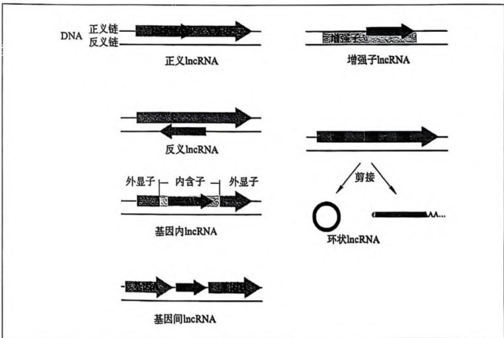  
图8-38 长链非编码RNA的类型

图8-39 lncRNA作为信号分子的基因调控机制示意图

作为信号分子, IncRNA 的表达与结合的转录因子或信号途径相关, 从而对相关基因调控具有时空特异性。

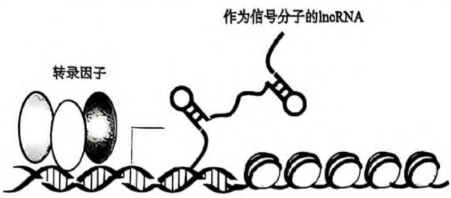

型特异表达的特征,并且能响应各种外界刺激,这表明其表达会在转录水平受调控。因此,lncRNA 可以作为分子信号行使功能(图 8-39),即每个 lncRNA 的转录都具有时空表达特异性,以进一步整合不同的发育信号、细胞内容物以及响应不同的外界刺激等。这一类型的 lncRNA 一部分具有调控功能,另外一部分则只是转录的副产物。lncRNA 能参与调控转录起始、延伸或终止等阶段。这些情况下,调控元件的染色质状态只被相关的 lncRNA 表达影响。作为信号分子的 lncRNA 可进一步用来标记时空、发育阶段以及调控基因表达。

哺乳动物为携带两个常染色体等位基因的二倍体生物。通常情况下这些等位基因遗传信息一个来自母本, 一个来自父本。然而, 部分基因的表达则会通过表观调控的方式只取决于母本或是父本基因, 这种现象称为基因印记。近来的证据表明, 一些 lncRNA 能通过与染色体互作以及招募染色质修复装置等进一步参与介导大量基因的转录沉默。例如, 在小鼠胎盘中, 长链非编码 RNA Kcnqlot1 和 Air 能聚集在所沉默的等位基因的启动子染色质区域, 并以等位基因特异的方式, 进一步介导抑制效应的组蛋白修饰的发生。

Xist 是一种在 X 染色体失活中起重要作用的非编码 RNA。在雌性动物发育中，Xist RNA 在失活的 X 染色体上表达，进一步覆盖在 X 染色体上进行转录，此时大量的组蛋白被甲基化，导致 X 染色体上的基因表达被抑制，X 染色体失活。其反义转录物 Tsix 能抑制 Xist 的表达，而另外一种非编码 RNA Jpx 能在失活的 X 染色体中积累，并进一步激活 Xist 的表达。

## (2) lncRNA 作为诱饵分子行使功能

启动子或增强子对 lncRNA 的转录调控具有重要作用。作为诱饵分子的 lncRNA 转录并结合在蛋白质靶点上,但不会附加额外的功能。这一类的 RNAs 作为一种"分子过滤器",进一步诱导 RNA 结合蛋白与之结合。这些蛋白质可以是转录因子、染色质修复子或者其他类型的调控因子等(图 8-40)。

同一个基因具有不同的启动子在基因表达中是一种较为普遍的现象。不同基因的这种可选调控机制各不相同。人 DHFR 基因(二氢叶酸还原酶, dihydrofolate reductase)具有依赖 RNA 的转录抑制调控机制。DHFR 基因弱启动子上游的 lncRNA 通过和启动子序列以及通用转录因子ⅡB(TFⅡB)结合形成一个稳固的非编码 RNA-DNA 复合物, 进一步抑制前起始复合物在主启动子上的聚集。当 lncRNA 被特异的 siRNA 沉默后, TFⅡB 仍然占据在主启动子上。这是一个动态变化的过程,这一机制能进一步靶定或抑制启动子,这也暗示了基因间 lncRNA 作为一个诱饵分子对邻基因表达调控的重要性。

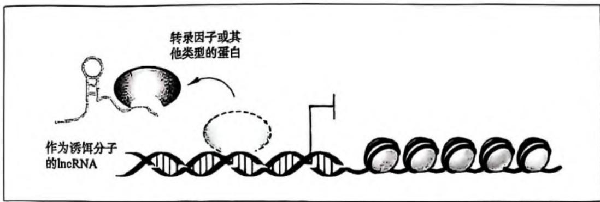  
图 8-40 lncRNA 作为诱饵分子的基因调控机制示意图  
作为诱饵分子，lncRNA能将转录因子或相关的其他类型蛋白带离染色质或将其带入染色质的核心区域。

有研究报道了一种叫作 Gas5(growth arrest-specific 5)的 lncRNA,能够通过一个茎-环结构抑制糖皮质激素受体,从而使细胞呈现出糖皮质激素耐受的状态。这一作用类似于糖皮质响应基因启动子区域中的激素响应元件 DNA 基序类似物。随后,Gas5 作为诱饵分子,竞争性结合在糖皮质激素受体的 DNA 结合区域,有效地阻止了受体与染色体的互作。

## (3) lncRNA 作为引导分子行使功能

第三种类型的 lncRNA 可以作为 RNA 结合蛋白的引导分子, 进一步介导核糖体蛋白复合物定位在特定的靶点上(图 8-41)。目前研究表明, lncRNA 可通过顺式(邻近的基因)或反式(远处的基因)的方式介导基因表达的改变。

这些 RNA 在转录水平的调控作用表明染色质结构上的改变不仅是一种局部效应,也是一种远距离的结构影响。例如,Air 或者 eRNAs 这类的 lncRNA 可以通过转录调控的局部序列元件,如启动子或者增强子等,扩大其影响范围。相反的,对于 HOTAIR 以及 linc-p21 这类的 lncRNA,长距离的基因调控作用则需要额外的互作组分参与,并且这些组分需要正确的定位在所作用的位点。总之,lncRNA 能以共转录或作为小 RNA 的互补靶标最终以顺式作用方式进一步介导染色质的改变;当 lncRNA 作为 RNA-DNA 异源双链核酸分子如 RNA:DNA:DNA 三重复合物或特定染色质表面的 RNA 识别特征时,则会结合在靶 DNA 上以反式调控的方式介导染色质发生改变。

lncRNA 介导的基因调控组分包括抑制复合物、激活复合物以及转录因子。然而,无论是从距离还是机制上讲,总体的调控原则就是通过一段中间延伸的 DNA 来运输调控信息,进一步调控靶基因的表达,最终使得表观基因组发生改变。其中,一些 lncRNA 以顺式调控方式发挥作用。例如，Air 通过启动子位置，特异与 lncRNA 和染色质互作，进一步沉默等位染色体上靶基因的转录。随后，启动子区域聚集的 Air 招募 G9a，导致靶点 H3K9 及其等位基因甲基化并沉默表达。受冷诱导的植物 lncRNA COLDAIR 则在建立及维持稳定的抑制性染色质中起作用。春化过程中，COLDAIR 引导 PRC2 到调控开花的抑制子 FLC 染色体上，通过三甲基化 H3K27 抑制基因表达（图 8-42）。这些发现表明 lncRNA 能通过与染色体特异结合，以顺式方式介导抑制组蛋白修复物质的招募，进一步从表观遗传水平沉默转录。

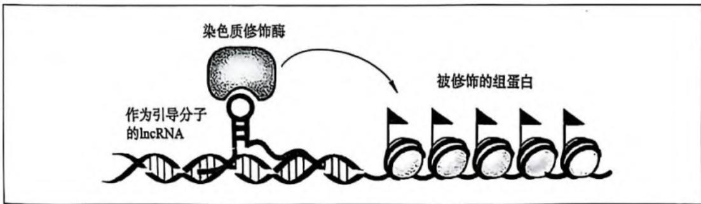  
图8-41 lncRNA作为引导分子的基因调控机制示意图  
作为引导分子, lncRNA 招募染色质修饰酶对靶基因进行调控, 或以顺式或反式的方式对远距离的靶基因表达进行调控。

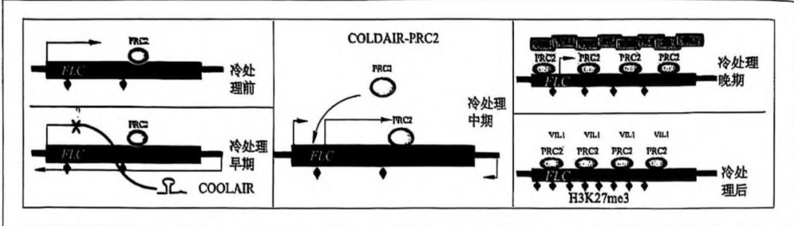  
图 8-42 由 IncRNA COLDAIR 介导的基因调控过程

lncRNA 也能通过转录共激活复合物或共抑制复合物, 如 CBP 蛋白和 p300 组蛋白去乙酰化转移酶, 进一步调控基因的表达。RNA 结合蛋白 TLS 通过一个拴在 cyclin D1 启动子区域的 lncRNA 招募到染色体上。lncRNA 与 TLS 的结合反过来导致 TLS 构象改变。这样的构象改变使氨基端抑制了 p300 和 CBP 的组蛋白去乙酰化转移酶活性, 从而抑制基因表达 (图 8-43)。尽管这一机制是否具有普遍性还未知, 然而高度保守的 lncRNA 以及转录共调控子上大量的 RNA 结合区域的发现增加人们对该调控机制普遍性的认可。

和这些顺式调控的 lncRNA 不同,一些 lncRNA 则以反式作用的方式对基因表达进行调控,即通过染色体进一步扩大其对基因的转录影响。有报道表明 lncRNA HOTAIR 的表达与癌症转移有关。在原发性和转移性乳腺癌中均发现 HOTAIR 表达有所提高。另外,癌细胞中 HOTAIR 的缺失会导致 PRC2 基因高表达的细胞侵袭性降低。这些发现表明非编码 RNA 介导的多梳蛋白复合物在乳腺肿瘤发生中起着关键性作用,尤其暗示了 HOTAIR 这类的 lncRNA 能通过反式作用的方式靶定染色质修复复合物的定位、酶活等,进一步调控细胞的表观遗传状态。

## (4) lncRNA 作为骨架分子行使功能

lncRNA 能作为一个中心平台招募相关生物学过程中的分子组分进一步调控基因表达。在许多不同的生物学过程中,这一精确的调控对分子间的相互作用及信号转导的特异性和动态过程具有至关重要的作用。这一类型的 lncRNA 具有不同的功能区域,并结合不同的效应分子,是较为复杂的一类 lncRNA。lncRNA 可能在同一个时间会结合多个效应分子,进一步带入具有转录激活或抑制作用的效应蛋白(图 8-44)。

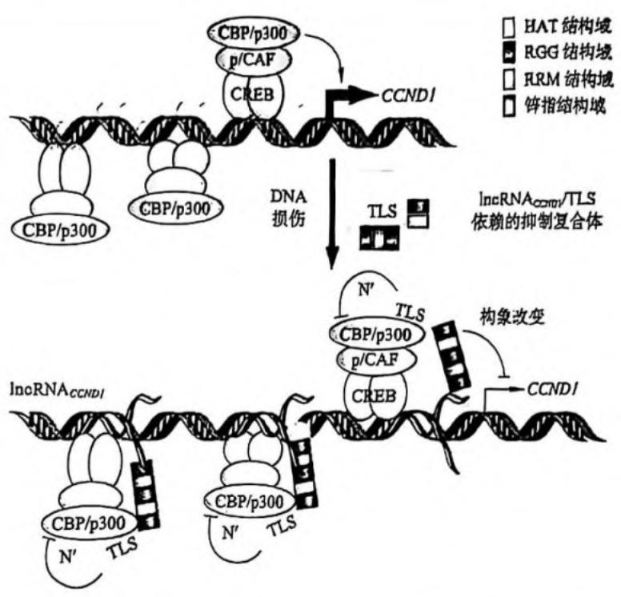  
图8-43 IntRNA介导的蛋白质构象改变控制基因表达过程

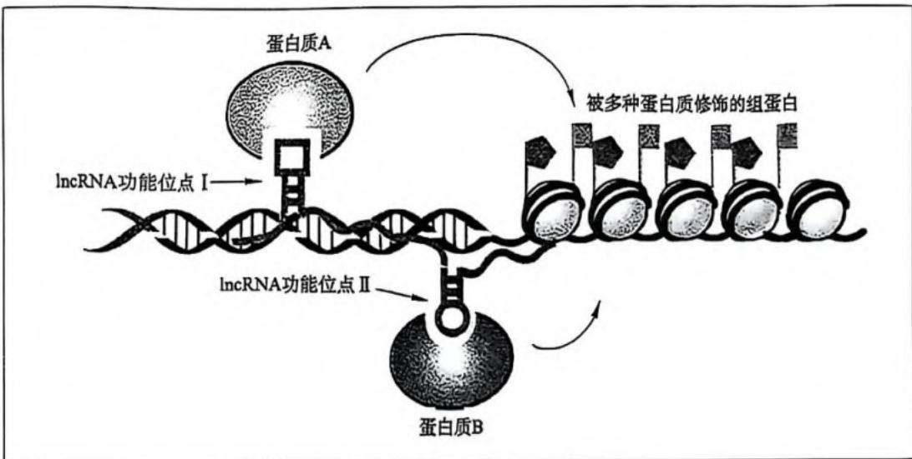  
图 8-44 lncRNA 作为骨架分子的基因调控机制示意图  
作为骨架分子, lncRNA 结合多种蛋白质形成核糖核蛋白复合物(RNP)。lncRNA-RNP 复合物进一步作用染色体影响组蛋白修饰。

lncRNA 与染色质修复复合物之间的互作对 INK4a 基因的转录抑制具有重要的作用。肿瘤抑制子位点 INK4b/ARF/INK4a 在正常细胞和癌细胞中的表达受多梳蛋白复合物介导的 H3K27 甲基化的影响。研究表明, 反义非编码 RNA ANRIL 与 INK4b 具有相同的位点, 其能和 PRC1、PRC2 复合物组分具有直接相互作用。ANRIL 和 PRC1、PRC2 之间的任意互作被打破都会影响 INK4b 靶基因的转录抑制。因此, ANRIL 作为一类典型支架分子, 招募不同染色质修复复合物最终使得靶基因沉默, 动态调控基因转录活性。

另外, 上文中提到 lncRNA HOTAIR 结合 PRC2, 从而甲基化 H3K27, 促进基因抑制的发生。后续的报道发现 PRC2 结合在 HOTAIR 5' 端的前 300 个核糖核苷酸上, 而 HOTAIR

图 8-45 HOTAIR 作为骨架分子介导的基因沉默过程

HOTAIR 分别通过其 5' 端和 3' 端分别连接组蛋白甲基化酶 PRC2 和去甲基酶 LSD1，进一步导致 H3K27 的甲基化和 H3K4 的去甲基化，抑制靶基因的表达。  
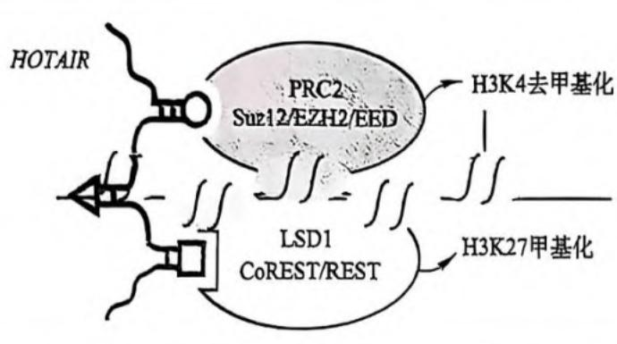

3'端的前700个核糖核苷酸则会和第二个复合物,包括LSD1、CoREST以及REST等互作,进一步去甲基化H3K4,阻止基因激活。这表明HOTAIR能靶定多个染色质修复复合物,作为一个骨架分子,在PRC1、PRC2复合物和LSD1/CoREST/REST复合物之间起到桥梁分子的作用,将这些不同的分子打包成为一个整体(图8-45)。HOTAIR/PRC2/LSD1复合物可以同时通过多个机制实现基因表达的抑制。HOTAIR的表达能诱导PRC2和LSD1复合物之间的相互作用,而HOTAIR缺失则导致靶基因上这些复合物的丢失。值得一提的是,在不同类型的细胞中,许多额外的lncRNA能和PRC2、LSD1复合物互作。这些额外的lncRNA很有可能也包含许多结合不同蛋白复合物的位点,从而带来更为特异的靶基因上组蛋白修复的不同组合。

## 8.6 真核基因表达的翻译调控

翻译过程是基因表达产物形成的最终步骤。其调控比其他层面上的调控更快更灵敏，同时也更经济。翻译调控可以使得生物能够对外部环境变化做出快速的反应，也极大地提高了基因表达调控的复杂性与灵活性。

真核生物主要采取"扫描模式"起始翻译。首先，携带有 Met-tRNA 的 40S 核糖体亚基－被转录起始因子招募到 mRNA 的 5' 端，然后沿着 mRNA 向下游移动，发现 AUG 起始密码子时，与 60S 核糖体大亚基结合形成 80S 起始复合物。除了扫描模式外，mRNA 还可能使用其他方式募集核糖体。有些 mRNA 的存在内部核糖体进入位点 (internal ribosome entry site, IRES)。这些结合位点能够直接招募 40S 核糖体亚基。IRES 介导的翻译启动在病毒 mRNA 的翻译中非常常见，真核生物中也有不少报道。

根据调控的对象的普遍性,翻译调控可以分为普遍性调控与特异性调控。

## 8.6.1 翻译的普遍性调控

蛋白质翻译起始因子对翻译起始具有重要作用。对这些因子的修饰会普遍性地影响翻译起始。

一个典型的例子是 eIF-2 磷酸化对翻译起始的影响。用兔网织红细胞粗提液研究蛋白质合成时发现,如果不向这一体系中添加氯高铁血红素,几分钟之内蛋白质合成活性急剧下降,直到完全消失。这是因为当氯高铁血红素缺乏时,网织红细胞粗提液中的蛋白质合成抑制剂 HRI 被活化,从而抑制蛋白质合成。HRI 其实是 eIF-2 的激酶,可以磷酸化 eIF-2 的 α 亚基 (eIF2α) 使其失活。而氯高铁血红素则能够阻止 HRI 的激活。eIF2α 被磷酸化后,eIF-2 与 eIF-2B 紧密结合,直接影响了 eIF-2 的再利用,从而抑制翻译,影响蛋白质合成起始复合物的生成。

除 HRI 外, 目前已经发现另外三种能够磷酸化 eIF2α 的蛋白激酶, 分别是 PERK, PKR 及 GCN2。发生内质网胁迫时, PERK 的激活使 eIF2α 的 Ser51 位点磷酸化, 从而破坏了激活的 43S 翻译起始复合物的形成, 降低了蛋白翻译的速率。PKR 作为重要的干扰素诱导抗病毒蛋白通过磷酸化下游 eIF2α 关闭宿主的翻译机器为病毒蛋白质的合成造成障碍, 阻止病毒复制。GCN2 可根据环境的营养供应情况磷酸化下游 eIF2α 来控制广泛的蛋白质翻译。

除了磷酸化外,翻译因子的降解也可以抑制蛋白质合成。例如,凋亡相关的蛋白酶、一些病毒携带的蛋白酶均能降解起始因子,广泛地干扰 mRNA 的正常翻译。

## 8.6.2 mRNA 特异性翻译调控

在蛋白质生物合成的过程中,特别是在翻译起始过程中,mRNA 的"可翻译性"是起决定作用的,其 5' 端的帽结构、二级结构、与 rRNA 的互补性以及起始密码附近的核苷酸序列都是蛋白质生物合成的信号系统。蛋白质翻译调控就是通过 mRNA 本身所固有的某种特异性信号序列(顺式作用元件)与 RNA 结合蛋白或者与其他 RNA 之间的相互作用而实现的。

## 1. 顺式作用元件招募特异性 RNA 结合蛋白

铁蛋白(ferritin)是一种细胞铁储存蛋白。细胞缺铁时,铁蛋白的翻译受到抑制。铁蛋白含量降低,铁蛋白释放储存的铁供细胞使用。细胞缺铁或高铁时铁蛋白的含量存在两个数量级的差异,而 mRNA 却没有显著差异。

研究发现铁蛋白 mRNA 5'-UTR 上存在一个特异的顺式作用元件,称为铁应答元件 (iron responsive element, IRE)。这段序列能够特异招募 IRE 结合蛋白 (IRE binding protein, IREBP)。在缺铁的情况下, IREBP 结合 IRE 来降低铁蛋白 mRNA 的翻译效率 $^{[8-16]}$ 。有趣的是,这个调控模式和之前提到转运铁蛋白受体 (TfR) 非常相似,效果又不同:一个是影响到了 RNA 的翻译过程,另一个是影响 RNA 的稳定性。

## 2. 顺式作用元件招募小 RNA 结合

最早被发现的两个 miRNA——lin4 和 let-7 被认为是通过不完全互补结合到基因 mRNA 3' UTR, 以一种未知的方式抑制蛋白质翻译, 引起基因沉默。采取何种沉默方式一般认为是由顺式作用元件与小 RNA 的匹配程度决定的。如果 miRNA 能够与靶标 mRNA 完全互补, 该 mRNA 就会被特异地降解; 如果 miRNA 不能与 mRNA 完全互补, 仅在某个位点与 miRNA 互补, 那么就不会特异地降解 mRNA, 只是阻止 mRNA 作为翻译的模板,

## 8.6 真核基因表达的翻译调控

图8-46 人铁蛋白及转运铁蛋白受体mRNA的翻译调控机制

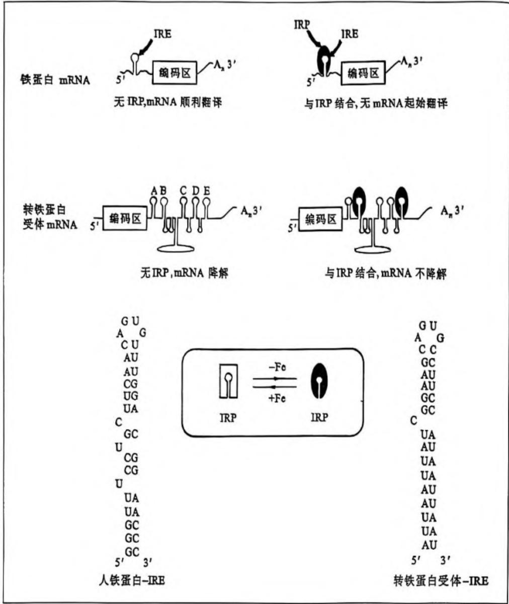  
使之不能合成蛋白质。

## 8.7 真核基因表达的翻译后调控

生命的复杂性在很大程度上源于蛋白质翻译后修饰,这些修饰丰富了蛋白质的功能,并参与了各种生物学过程的精细调控。

## 8.7.1 蛋白质磷酸化对蛋白质功能的调控

蛋白质的磷酸化与去磷酸化过程(图 8-47)是生物体内普遍存在的信号转导调节方式, 几乎涉及所有的生理及病理过程, 如糖代谢、光合作用、细胞的生长发育、神经递质的合成与释放甚至癌变等。

细胞表面受体与配体分子的高亲和力特异性结合,能诱导受体蛋白构象变化,使胞外信号顺利通过质膜进入细胞内,或使受体发生寡聚化而被激活。一般情况下,受体分子

酪氨酸受体蛋白激酶与表皮生长因子(EGF)相结合后，刺激了该受体蛋白的激酶活性，引发一系列生理反应。原癌蛋白ErbB虽然没有正常酪氨酸受体蛋白激酶的胞外结构域，其胞内结构域却具有蛋白激酶活性，刺激细胞持久分裂，诱发癌变。

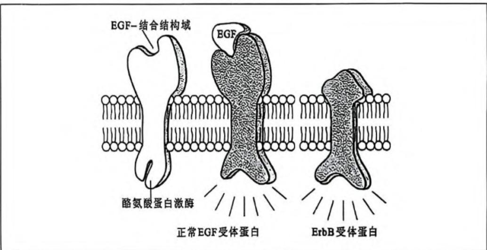

活化细胞功能的途径有两条:一是受体本身或受体结合蛋白具有内源酪氨酸激酶活性,胞内信号通过酪氨酸激酶途径得到传递;二是配体与细胞表面受体结合,通过G蛋白介异的效应系统产生介质,活化丝氨酸/苏氨酸或酪氨酸激酶,从而传递信号。

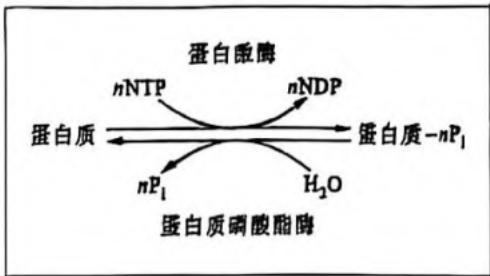  
图8-47 蛋白质的卤酸化及去卤酸化过程

按照"碰撞耦联"或称"动态受体"学说, 受体的侧向流动性使受体分子与效应分子在胞质膜磷脂双层内相互作用, 这是信号转导的关键。酪氨酸激酶受体侧向扩散使受体寡聚化, 是活化信号转导时受体 - 受体间自身磷酸化所必需的。对于依赖 G 蛋白介导的配体信号转导途径来说, 配体与受体结合后, G 蛋白和受体 - 配体复合物由于各自在细胞膜内侧向扩散而发生瞬时随机碰撞导致 G 蛋白活化效应分子。研究认为, 信号转导是维系外部刺激与细胞反应的桥梁, 千变万化的环境因子使信号转导的途径与机制成了变幻莫测的迷宫。在已知的上游信号转导途径中, 酪氨酸蛋白激酶(protein tyrosine kinase, PTK)途径及受体耦联的 G 蛋白途径最为引人注目(图 8-48)。

## 1. 受 cAMP 水平调控的 A 激酶

科学家把依赖于 cAMP 的蛋白激酶称为 A 激酶(PKA)，它能把 ATP 分子上的末端磷酸基团加到某个特定蛋白质的丝氨酸或苏氨酸残基上。被 A 激酶磷酸化的氨基酸 N 端上游往往存在两个或两个以上碱性氨基酸，特定氨基酸的磷酸化(X-Arg-Arg-X-Ser-X)改变了这一蛋白质的酶活性，动物细胞中这一酶活性代表了 cAMP 所引起的全部反应。在不同的细胞体系中，A 激酶的反应底物是不一样的，这就决定了 cAMP 能在不同靶细胞中诱发不同的反应，非活性状态的 PKA 全酶由 4 个亚基 R2C2 所组成，分子量为 150～170，调节亚基与 cAMP 相结合，引起构象变化并释放催化亚基，后者随即成为有催化活性的单体(图 8-49)。

已经证实,许多转录因子都可以通过 cAMP 介导的蛋白质磷酸化过程而被激活,因为这类基因的 5' 端启动区大都拥有一个或数个 cAMP 应答元件(cAMP-response element,

图 8-48 酪氨酸受体蛋白激酶磷酸化与细胞癌变示意图

图 8-49 cAMP 调控的 A 激酶活性  
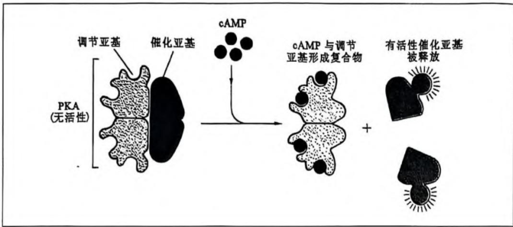

CRE), 其基本序列为 TGACGTCA。膜上的受体 R 与外源配基 (ligand) 相结合, 引起受体构象变化, 并与 GTP 结合蛋白相结合, R 与 G 蛋白耦合激活了与膜相关的腺苷酸环化酶 (AC), 导致胞内 cAMP 浓度上升, 活化 A 激酶, 释放催化亚基并进入核内, 实施底物磷酸化。被磷酸化的底物, 如 CREB、CREM 等, 可作为转录激活因子诱发基因转录。

## 2. C 激酶与 $PIP_{2}$ 、 $IP_{3}$ 和 DAG

磷酸肌醇级联放大的细胞内信使是磷脂酰肌醇-4,5-二磷酸 $\left(\mathrm{PIP}_{2}\right)$ 的两个酶解产物：肌醇1,4,5-三磷酸 $\left(\mathrm{IP}_{3}\right)$ 和二酰基甘油(DAG)。 $\mathrm{IP}_{3}$ 和DAG是该途径的主要活性分子，G蛋白通过活化的受体调控磷酸肌醇酶系统的活性。图8-50是C激酶信号传递示意图，因为该蛋白激酶活性是依赖于 $\mathrm{Ca}^{2+}$ 的，所以称为C激酶(PKC)。 $\mathrm{IP}_{3}$ 引起细胞质 $\mathrm{Ca}^{2+}$ 浓度升高，导致C激酶从胞质转运到靠近原生质膜内侧处，并被DAG和 $\mathrm{Ca}^{2+}$ 的双重影响所激活。DAG激活C激酶的原因是前者大大提高了C激酶对于 $\mathrm{Ca}^{2+}$ 的亲和力，从而使得C激酶能被生理水平的 $\mathrm{Ca}^{2+}$ 离子所活化。C激酶是一个 $7.7 \times 10^{4}$ 的蛋白质，主要实施对丝氨酸、苏氨酸的磷酸化，它具有一个催化结构域和一个调节结构域。DAG结合后还能解除调节区所造成的抑制作用，提高酶活性。

## 3. CaM 激酶及 MAP 激酶

$\mathrm{Ca}^{2+}$ 的细胞学功能主要通过钙调蛋白激酶(CaM-kinase)来实现, 它们也是一类丝氨酸 / 苏氨酸激酶, 但仅应答于细胞内 $\mathrm{Ca}^{2+}$ 水平。MAP 激酶 (mitogen-activated protein kinase, MAP-kinase, 又称为 extracellular-signal-regulated kinase, ERKS) 活性受许多外源细胞生长、分化因子的诱导, 也受到酪氨酸蛋白激酶及 G 蛋白受体系统的调控。MAP 激酶的活性取决于该蛋白质中仅有一个氨基酸之隔的酪氨酸、丝氨酸残基是否都被磷酸化 (图 8-51), 图中 Jun、E1K-1 等为转录因子, 其磷酸化状态的改变能够影响其后介导的基因转录起始与否。科学家把能同时催化这两个氨基酸残基磷酸化的酶称为 MAP-激酶-激酶, 它的反应底物是 MAP 激酶。MAP-激酶-激酶本身能被 MAP-激酶-激酶-激酶所磷酸化激活, 后者能同时被 C 激酶或酪氨酸激酶家族的 Ras 蛋白等激活, 从而在信息传导中发挥功能。

图 8-50 微弱信号传递与基因表达示意图  
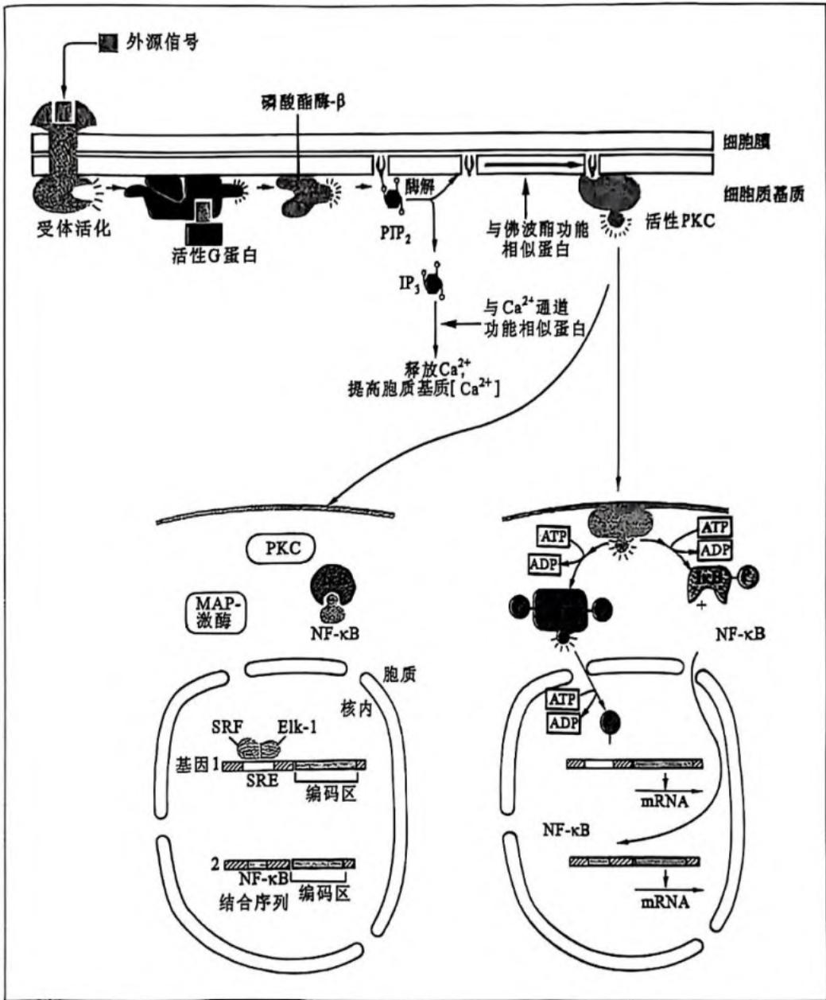

## 4. 蛋白质磷酸化与细胞分裂调控

细胞通过 p53 及 p21 蛋白控制 CDK(cyclin-dependent protein kinase)活性,调控细胞分裂的进程。如果 p21 蛋白过量,大量周期蛋白(cyclin)E-CDK2 复合物与 p21 蛋白相结合,使 CDK2 丧失磷酸化 pRb 蛋白的功能。没有被磷酸化的 pRb 蛋白与转录因子 E2F 相结合并使后者不能激活一系列与 DNA 合成有关的酶,导致细胞不能由 G₁ 期进入 S 期,细胞分裂受阻。如果细胞中 p53 基因活性降低,p21 蛋白含量急剧下降,周期蛋白 E-CDK2 复合物就能有效地将 pRb 蛋白磷酸化。此时,pRb 蛋白不能与 E2F 相结合,E2F 激活许多与 DNA 合成有关的基因表达,使细胞从 G₁ 期进入 S 期,引发细胞分裂(图 8-52)。

## 8.7.2 蛋白质乙酰化对蛋白质功能的影响

肿瘤抑制因子 p53 蛋白与人类多种肿瘤有着密切的关系, 因此可能是该领域中研究最为深入的蛋白质。p53 参与多种信号通路, 如细胞周期调控、DNA 损伤修复、血管的生成与抑制以及细胞凋亡等的调控。已知 p53 蛋白的活性受翻译后修饰 (如磷酸化、乙酰化等) 机制调控, 经修饰的 p53 蛋白能与不同的靶分子或蛋白复合物相结合, 从而抑制或激活参与特定生理反应的靶基因。p53 在所有细胞中都转录产生 2.2\~2.5 千核苷酸的 mRNA, 编码由 393 个氨基酸组成的分子量为 $5.3 \times 10^{4}$ 的蛋白质 (p53 蛋白)。根据 p53 的结构特点可将其分为 3 个不同区域: N 端酸性区 (1\~80 位氨基酸残基)、C 端碱性区

图 8-51 Raa 蛋白和 C 激酶激活丝氨酸 / 苏氨酸"瀑布式"磷酸化(级联磷酸化). 引起相关生理反应图示  
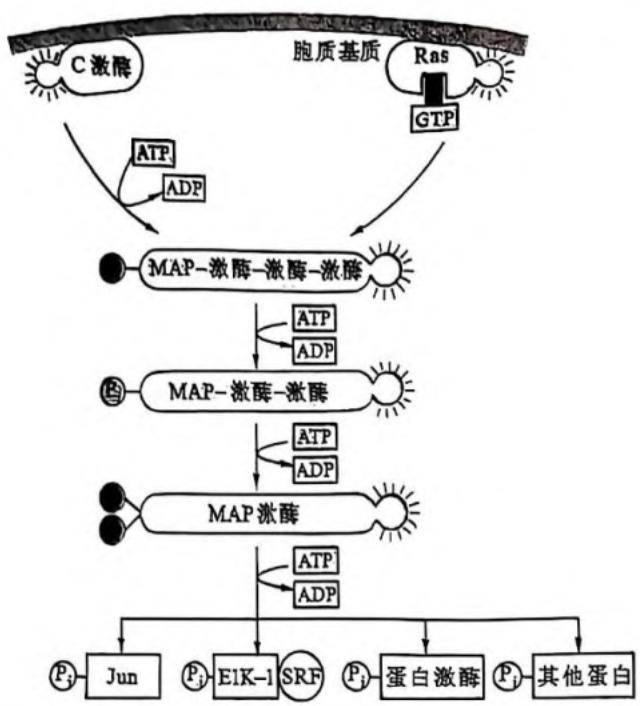

图 8-52 pRb 蛋白的磷酸化和去磷酸化过程控制了细胞分裂的周期性  
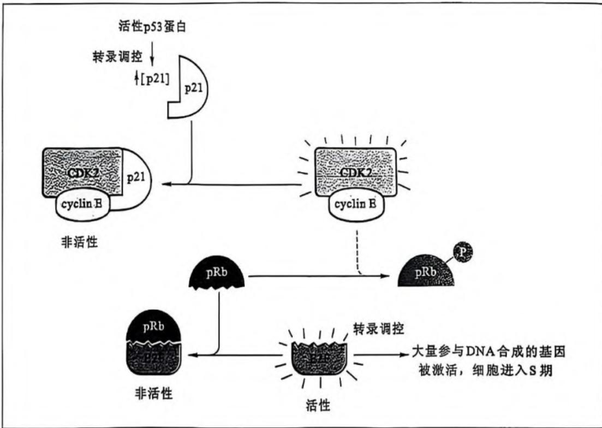

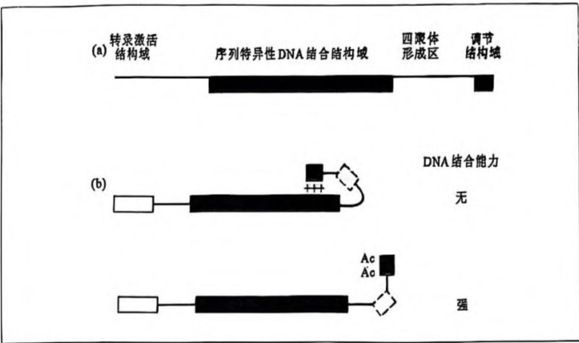  
图8-53 p53蛋白乙酰化有利于激活靶基因转录  
(a) p53 蛋白基本结构示意图 (b) p53 蛋白的乙酰化提高了它的 DNA 结合能力。  
(319\~393位)和中间(100\~300位)的疏水区[图8-53(a)]。

p53 能识别不同构象靶基因的相同序列。靶基因启动子的拓扑结构和 p53 蛋白(及与其相互作用的辅助蛋白)的构象决定该蛋白质是否与启动子区相互作用。乙酰化使 p53 蛋白的 DNA 结合区域暴露,增强了 DNA 结合能力,从而促进了靶基因的转录.图 8-53(b)。CBP/p300 等蛋白复合物既能诱导染色体结构发生有利于结合 p53 蛋白的改变,又使 p53 蛋白被乙酰化,从而显著提高受 p53 调控的靶基因转录活性。

## 8.7.3 热激蛋白与蛋白折叠

现代分子生物学上把能与某个(类)专一蛋白因子结合,从而控制基因特异表达的 DNA 上游序列称为应答元件(response element),如热激应答元件(heat shock response element,HSE)、糖皮质应答元件(glucocorticoid response element,GRE)、金属应答元件(metal response element,MRE)等,这些应答元件与细胞内专一的转录因子相互作用,协调相关基因的转录(表 8-8)。

表 8-8 特异转录因子与各类应答元件的相互作用

<table><tr><td>调控因子</td><td>应答元件</td><td>DNA 序列</td><td>结合蛋白</td><td>分子量</td></tr><tr><td>热激</td><td>HSE</td><td>CNNGAANNTCCNNG</td><td>HSF</td><td> $9.3 \times 10^{4}$ </td></tr><tr><td>镉</td><td>MRE</td><td>CGNCCCGGNCNC</td><td>?</td><td>?</td></tr><tr><td>佛波酯</td><td>TRE</td><td>TGACTCA</td><td>AP1</td><td> $3.9 \times 10^{4}$ </td></tr><tr><td>血清</td><td>SRE</td><td>CCATATTAGG</td><td>SRF</td><td> $5.2 \times 10^{4}$ </td></tr></table>

按分子量的大小以及同源程度可将热休克蛋白分为 HSP90、HSP70、小分子 HSP 等家族，各家族 HSP 又由多种不同形式或经不同修饰的蛋白质分子所组成。HSP 分布广泛，诱导迅速，即使在非热休克细胞中也存在着由热休克同源基因编码的类似蛋白质。真核细胞的热休克蛋白可能具有机体保护功能并在细胞的正常生长和发育中起重要作用，

HSP70 的主要功能是参与蛋白质的代谢。HSP 还常与具有不同功能的多种蛋白质形成天然复合物, 参与有关蛋白质折叠、亚基的组装、细胞内运输以及降解等过程。热休克蛋白参与靶蛋白活性和功能的调节, 却不是靶蛋白的组成部分, 因此, 一般称它为分子伴侣或伴侣蛋白 (chaperonine)。现将主要 HSP 家族及其生理功能列于表 8-9。

表 8-9 主要 HSP 家族及其生理功能

<table><tr><td>家族</td><td>主要成员</td><td>主要生理功能</td><td>免疫应答中的可能作用</td></tr><tr><td>HSP90</td><td>HSP90,HSP83</td><td>促进甾醇激素受体与激素的结合及与DNA结合,调节激酶磷酸化活性</td><td>抗肿瘤,提高自身免疫性能</td></tr><tr><td>HSP70</td><td>HSP70,BiP,Dnat,Hsc70,Grp76</td><td>参与蛋白质折叠和去折叠、蛋白质转位及多聚复合物的组装</td><td>免疫球蛋白装配,类抗原加工,病原体抗原及自身免疫性诱导</td></tr><tr><td>小分子HSP</td><td>HSP27,Gro23,HSP16</td><td>参与蛋白质折叠和去折叠及多聚复合物的装配</td><td>病原体抗原及自身免疫性诱导</td></tr></table>

HSP 基因中内含子数量都很少, 至今为止尚未发现 HSP70 基因中有内含子, 而人 HSP90、果蝇 HSP82、人 HSP27、鸡 HSP108 和泛素等都只有少量内含子。HSP 的这一基本特征保证了它们一旦起始转录, 不需剪接就可产生出成熟 mRNA 以适应 HSP 大量快速表达的需要, 避免因严重的热休克影响 mRNA 前体的剪接。

在没有受热或其他环境胁迫时,HSF 主要以单体的形式存在于细胞质和核内。单体HSF 没有 DNA 结合能力。受到热激或其他环境胁迫时,细胞内变性蛋白增多,它们都与HSF 竞争结合 HSP70,从而释放HSF,使之形成三体并输入核内。HSF 一旦形成三体,便拥有与 HSE 特异结合、促进基因转录的功能。这种能力可能还受磷酸化水平的影响,因为热激以后,HSF 不但形成三体,还会迅速被磷酸化。HSF 与 HSE 的特异性结合,引起包括 HSP70 在内的许多热激应答基因表达,大量产生 HSP70 蛋白。随着热激温度消失,细胞内出现大量游离的 HSP70 蛋白,它们与HSF 相结合,形成没有 DNA 结合能力的单体并脱离 DNA。

## 思考题

1. 简述基因表达调控的特点与层次。

2. 简述何为外显子、内含子及其结构特点和可变调控。

3. 简述 DNA 甲基化对基因表达的调控机制。

4. 简述 RNA 结合蛋白的特点与功能。

5. 简述反式作用因子的结构特点及其对基因表达的调控。

6. 简述 RNA 修饰的重要意义。

7. 如何通过实验的方法分析 CTD 上 S2 和 S5 不同磷酸化模式的功能？

8. 举例说明蛋白质磷酸化如何影响基因表达。

9. 说明组蛋白乙酰化和去乙酰化影响基因转录的机制。

10. 说明分子伴侣的分类及其影响基因表达的机制。

11. 简述生物大分子互作在基因表达调控中的意义。

## 参考文献

1. Passmore L A, Coller J. Roles of mRNA poly(A) tails in regulation of eukaryotic gene expression [J]. Nat Rev Mol Cell Biol, 2022, 23: 93–106.

2. Lambert S A, Jolma A, Campitelli L F, et al. The Human Transcription Factors [J]. Cell, 2018, 72: 650–665.

3. Fu Y, Dominissini D, Rechavi G, et al. Gene expression regulation mediated through reversible m6A RNA methylation [J]. Nat Rev Genet., 2014, 15: 293–306.

4. Roberts T C, Morris K V, Weinberg M S. Perspectives on the mechanism of transcriptional regulation by long non-coding RNAs [J]. Epigenetics, 2014, 9: 13.

5. Theler D, Allain F H. Molecular biology: RNA modification does a regulatory two-step [J]. Nature, 2015, 518: 492-493.

6. Lee J M, Hammarén H M, Savitski M M, et al. Control of protein stability by post-translational modifications [J]. Nat Commun, 2023, 13: 201.

数字课程学习

教学课件

目在线自测

思考题解析
