# 第9章 基因与发育

# 基因与发育

9.1 发育的遗传控制

9.2 果蝇的发育与调控

9.3 高等植物花发育的基因调控

9.4 控制植物开花时间的分子机制

## 9.1 发育的遗传控制

基因调节在人类胚胎从受精卵发育至胚胎的过程中起核心作用。在发育过程中，基因按预定程序表达，以确保受精卵反复分裂，并确保产生的细胞被有条不紊地特化，最终形成完全分化的器官。基因型不仅决定在发育过程中的事件类型，而且决定这些事件发生的时间顺序。

研究发育的遗传学方法常利用导致发育异常的突变进行分析。这些突变打断发育过程,使人们有可能鉴定到控制发育的因子,并研究这些因子之间的相互作用。发育的核心是模式形成(pattern formation),即受精卵通过细胞分裂和分化形成不同类型的细胞,并分别进一步形成不同的组织和器官,形成有序的空间结构。在发育遗传学中,鉴定在发育中发挥作用的遗传调节性相互作用,是一个重要课题。这些不同的调节性相互作用,意味着在遗传物质相同的细胞间,表达的基因可以具有质的差异。

遗传背景相同的细胞主要采取以下三种策略以实现基因表达的不同。

## 1. mRNA 定位

使得两个相同遗传背景的细胞具有不同特性的策略是在细胞分裂过程中不等量地分配关键的 mRNA, 使子细胞得到不同量的 mRNA, 从而经历不同的发育过程。定位后的 mRNA 能在相同遗传背景的细胞中建立差异化的基因表达。发育的胚胎中的细胞可通过遗传的被定位的 mRNA 被牵引至特定的发育途径。以海鞘尾部肌肉发育为例, 在早期海鞘胚胎中, Macho-1 是编码细胞形成尾部肌肉的主要决定基因。Macho-1 mRNA 在未受精的卵细胞质中均匀分布, 但在受精后就迅速被限制在卵的底端细胞质中。这种空间限制导致其在卵裂过程中发生不对称分配, 最终在八细胞胚胎期仅有两个细胞特异性富集该 mRNA, 这些细胞将定向分化为尾肌。

## 2. 细胞 - 细胞接触

一个细胞可以通过向细胞外分泌信号蛋白的方式来影响相邻细胞的基因表达。相邻细胞的表面受体接收到邻近细胞分泌的蛋白质信号后，启动相应的基因表达变化。以昆虫腹神经索中神经元与上皮细胞的差异分化为例，昆虫腹神经的作用与人类脊髓的作用类似，它发育自神经外胚层的细胞，该组织可细分为两种细胞，一种留在胚胎表面形成腹部外皮，另一种陷入胚胎内层形成腹神经索的神经元。这两种细胞群体之间通过接触式信号传递强化了对皮肤或者神经元形成的决定。发育中的神经元在其表面拥有 Delta 信号蛋白，该蛋白激活皮肤细胞表面的受体 Notch, Notch 的活化使得皮肤细胞不能发育成神经元。

## 3. 信号分子扩散传导

细胞直接实现差异化表达的策略是通过建立分泌信号分子梯度以引导细胞依据位置信息产生不同的细胞群体。细胞在胚胎中的位置对其发育分化有着重要的影响。定位在果蝇胚胎前端的细胞将发育成果蝇的头部,而不会发育成尾部。这种位置信息的形成依赖信号分子浓度梯度。一小部分细胞的分泌信号分子形成细胞外的浓度梯度。接近分泌细胞的那些细胞接收较高浓度的分泌蛋白,其表面活化受体数量较高,进而发育成特定的细胞类型。而那些距离较远的细胞则接收较低浓度的分泌蛋白,其表面活化受体数量较低,进而发育成不同的细胞类型。分泌蛋白的浓度梯度直接导致了相应细胞的基因差异化表达。这种可以控制位置信号的信号分子被称为形态发生素(morphogen)。以神经分化中形成成体脊髓的前体——神经管为例,最靠近神经管腹部的细胞形成特殊的结构——底板(floorplate),底板可以分泌音猬因子Sonic hedgehog(Shh),这是一种梯度型形态发生素。Shh从底板分泌并在神经管腹部一侧的一半区域形成细胞外浓度梯度。神经管内神经元根据它们接收到的Shh的量分化为不同的细胞类型。

## 9.2 果蝇的发育与调控

果蝇是一种双翅目昆虫,其幼虫和成虫生活在腐烂的果实上。果蝇的个体小、生命

周期短、繁殖容易,每只雌虫两周就可以产生约300个后代。而且,果蝇的巨大多线染色体特性使它最适合于遗传分析和基因定位,因此是遗传与发育领域理想的模式生物之一。

果蝇发育在 $25^{\circ}$ C 下 9～14 天为一个周期(图 9-1)，其中第一天为胚胎发育期，幼虫经历三个阶段，到第四天蜕皮分化后蛹化(popation)，在蛹中经过 5 天的变态，最后再发育为成虫。

## 9.2.1 卵子发育与卵裂

果蝇卵在卵巢管中形成,卵巢管被横向的管壁分成许多小室 $^{(图9-2)}$ 。卵原细胞经4次有丝分裂形成16个细胞阶段的并合体(fusome)。这些细胞通过胞质桥构成内部连接。其中一个细胞以后将发育成为卵母细胞(oocyte),其余15个姐妹细胞将发育成为抚育细胞(nurse cell)。卵母细胞为二倍体,完成减数分裂后成为单倍体。抚育细胞可以通过胞质桥为卵母细胞提供

图9-1 果蝇的发育时期  
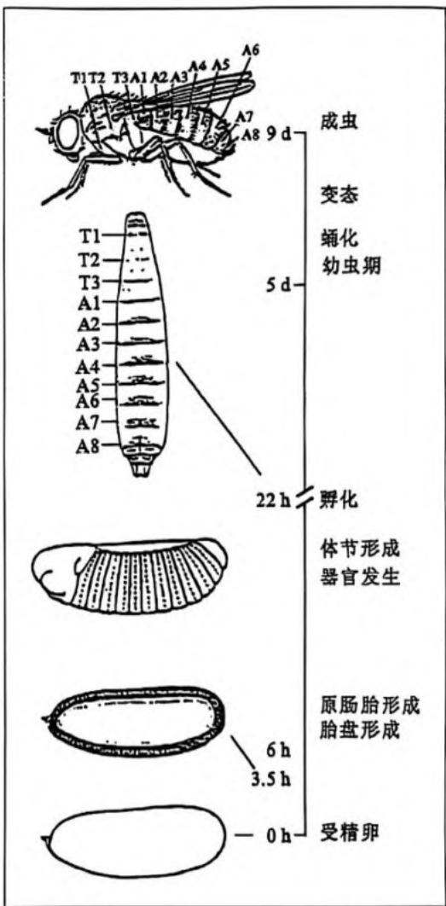

过程图

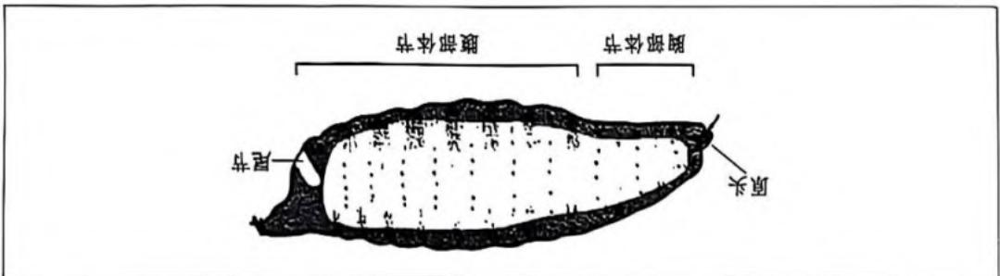

图9-4 升盲果蝇 1 骨动虫形体结构模式

胞的背－腹轴。

在卵细胞受精之前，bicoid mRNA、nanos mRNA由抚育细胞分泌进入卵母细胞，bicoid

烷,其形成依赖于卵型过程中细胞核向卵周质的迁移与锚定。在此阶段,母源效应基因产物(如 mRNA、翻译调控蛋白及形态发生素)在细胞质中形成时空特异性的浓度梯度,在早期果地胚脂体轴的形成中起着关键作用。目前至少已发现 4 组母源效应基因与果地胚轴的形成有关,其中 3 组参与胚胎前-后轴的形成,即前端系统决定头和胸部的扩节,后端系统决定腹部的扩节,末端系统决定胚胎两端不分节的原头区和尾节,第四组基因决定胚

质存在。果蝇胚胎发育的合胞体胚盖（syncytial blastoderm）阶段，本质上是一个多核共质体系

部。这种缺失突变体与后来发现的biciod突变体的表型相似。卵后端的细胞质流失时，胚胎缺失羧部而不影响最后的尾节。卵子其他部位细胞质的少量流失不会影响整个身体模式形成，说明卵子前、后端的细胞质中会有决定果填身体模式形成有关的信息物

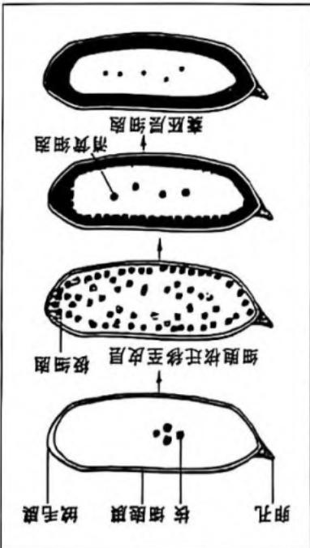

育的母源基因，其表达产物依赖空间分布的浓度梯度激活受精卵中的相关基因表达并决定细胞分化方向，最终建立胚胎体轴极性。早在20世纪初，胚胎学家就已经注意到很多动物受精卵中特定部位的细胞质定位与胚胎发育直接相关。如果使果瘤卵前端少量的细胞质流失，该卵发育成的胚胎就会缺失头部和胸的细胞质流失，该卵发育成的胚胎就会缺失头部和胸的细胞质流失，该卵发育成的胚胎就会缺失头部和胸的细胞质流失，该卵发育成的胚胎就会缺失头部和胸的细胞质流失，该卵发育成的胚胎就会缺失头部和胸的细胞质流失，该卵发育成的胚胎就会缺失头部和胸的细胞质流失，该卵发育成的胚胎就会缺失头部和胸的细胞质损失，该卵发育成的胚胎就会缺失头部和胸的细胞质损失，该卵发育成的胚胎就会缺失头部和胸的细胞质损失，该卵发育成的胚胎就会缺失头部和胸的细胞质损失，该卵发育成的胚胎就会缺失头部和胸的细胞质损失，该卵发育成的胚胎就会缺失头部和胸的细胞质损失，该卵发育成的胚胎就会缺失头部和胸的细胞质损失，该卵发明或细胞质分裂、细胞质分裂、细胞质分裂、细胞质分裂、细胞质分裂、细胞质分裂、细胞质分裂、细胞质分裂、细胞质分裂、细胞质分裂、细胞质分裂、细胞质分裂、细胞质分裂、细胞质分裂、细胞质分裂、细胞质分裂、细胞质分裂、细胞质分裂、细胞质分裂、细胞质分裂、细胞质分裂、细胞质分裂、细胞质分裂、细胞质分裂、细胞质分裂、细胞质分裂

母源效应基因特指影响胚胎模式形成和早期发

原头和尾节(图9-4)。1. 母源效应基因与前一后轴极性形成

3个腕节及8个腕节。果殖幼虫的前后端又特化产生、性分节，分属3个解剖区，从前到后分别被称为头节、腹轴进行。果殖胚胎和幼生均匀前一后轴是示规律

轴和背一腹轴。果殖形体楔式的形成按前一后轴和背一果蝇的卵、胚胎、幼生和成体具有明确的前一后

9.2.2 胎胎发育

个发育过程涉及中胚层的形成、神经素和脑的形成等过程。

RNA 和蛋白质,并且持续转变,反复进行 DNA 复制而成为多倍体。

果瘤的胚胎发育非常快,在产卵后立即开始,并在一天内孵化成幼虫(因9-3)。细胞核

以每 9 min 一次的高频率分裂,直至达到约有 6000 个核出现为止。在这段时间,卵子发

首成为一个合胞体(synonymum)。当出现 256 个以上的细胞核时,这些细胞核开始向卵的

外周移动,并定居到皮层组织。此时,细胞质膜存活核间内陷,细胞质环绕每个核封闭成一

↑↓小室(细胞产生),这就是细胞胚盘期。胚基的腹部构成生殖带腹部开放,并发展到卵背侧,整细胞前端。nanos mRNA 则与 RNA 结合蛋白 tudor、oskar 等结合后在微管作用下被运送到后端。这一 mRNA 分子的浓度梯度, bicoid 蛋白在果蝇的胚胎发育阶段呈由前向后的梯度性递减分布, 而 nanos 蛋白则呈梯度性递增分布。

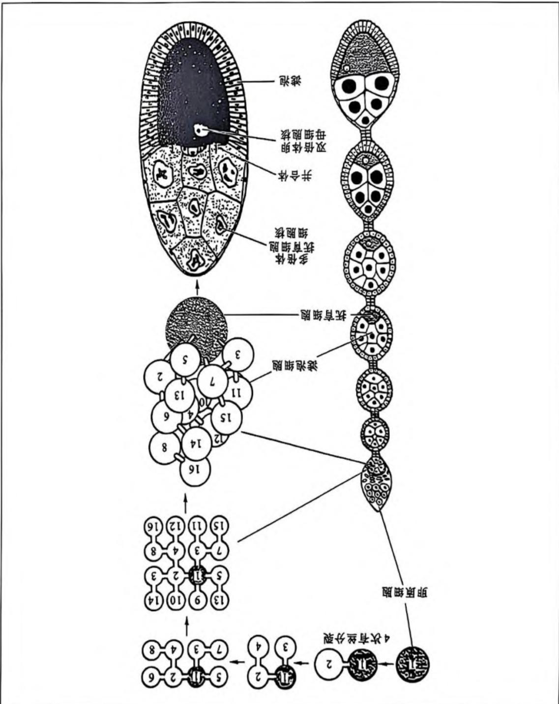  
图9-2 果dim子形成过程示意图

果蝇胚胎、幼虫和成虫的前－后极性均源于卵子期发生的极性。bicoid 和 hunchback 调控胚胎前端结构的形成，nanos 和 caudal 调控胚胎后端结构的形成。

bicoid 蛋白是含有同源域, 兼具 DNA 及 RNA 结合能力的转录因子, 其转录激活作用存在显著的浓度阈值效应。高浓度的 bicoid 蛋白会激活 orthodenticle 等基因在胚胎前端表达, 而低浓度的 bicoid 蛋白会激活 hunchback 等基因的表达 $^{(图 9-5)}$ 。bicoid 蛋白这种在转录水平的激活或者抑制作用使间隙基因 (gap gene) 在胚胎中形成了梯度分布。另外, bicoid 蛋白可结合到 caudal mRNA 的 3' UTR (3'un-translated region) 上, 与 mRNA 上

图 9-5 bieoid 蛋白作用机制示意图

(a) bicoid 蛋白、orthodenticle mRNA、hunchback mRNA 及 caudal 蛋白浓度梯度示意图；(b) bicoid 蛋白转录调控作用；(c) bicoid 蛋白的翻译抑制机制。

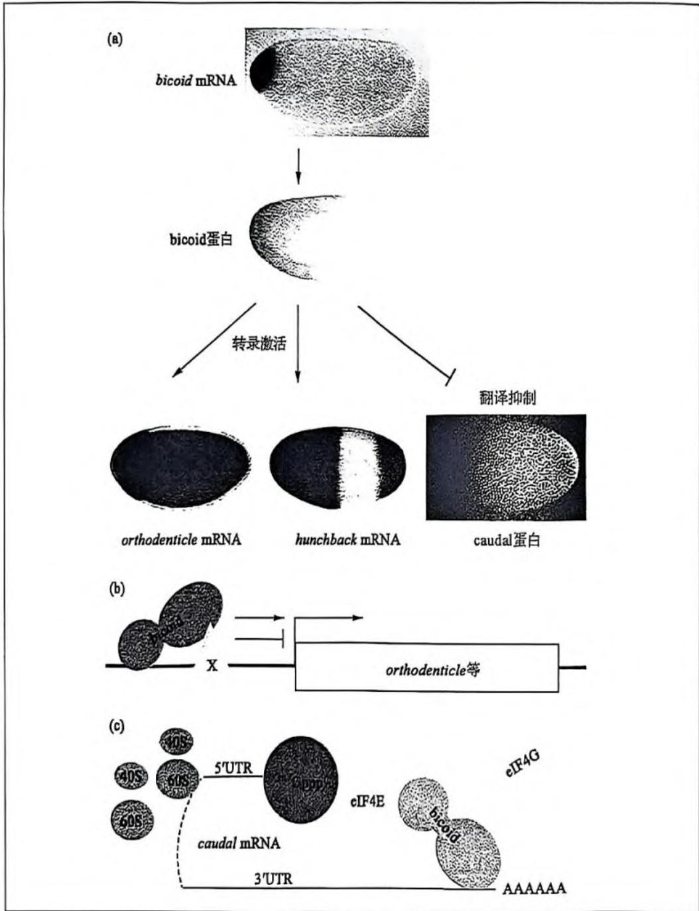

的 5' 帽结合蛋白 eIF4E (eukaryotic initiation factor 4E) 发生相互作用, 阻碍 eIF4E 与 eIF4G (eukaryotic initiation factor 4G) 的识别。进而阻碍了核糖体大、小亚基在 5' UTR 上的组装, 抑制 caudal mRNA 的翻译。所以, caudal 蛋白主要分布在 bicoid 蛋白水平较低的胚胎后端。

研究发现, nanos 蛋白可能对 hunchback mRNA 的翻译具有抑制作用, 使 hunchback 蛋白含量在果蝇的胚胎发育过程中由前向后端逐渐降低, 而 caudal 蛋白的含量则正好相反, 由前向后端逐渐增高 $^{(图9-6)}$ 。

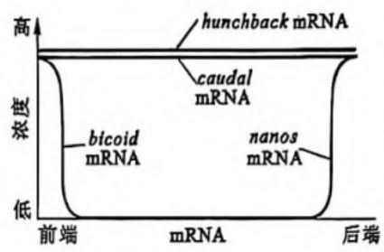

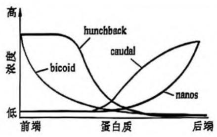  
图 9-6 4 种母源效应基因的 mRNA 和蛋白质沿果蝇卵子和胚胎前－后轴分布的浓度变化图

## 2. 分节基因

果蝇躯体的分节是分步发生的。母源效应基因表达后,首先激活间隙基因表达,再由间隙基因激活成对控制基因(pair-rule gene),由成对控制基因激活体节极性基因(segment polarity gene)表达。同时,间隙基因、成对控制基因及体节极性基因产物与同源异形基因(homeotic gene)上游调控区发生相互作用,调节同源异形基因表达,最终决定了每个体节的命运(图9-7)。

在合胞体囊胚层中,胚胎细胞开始转录和表达自身基因产物,其中有许多是转录调控因子。这些因子在果蝇身体内并不沿身体呈均匀分布,而是在空间上被限制在某些被称为表达区(expression zones)的区域内形成特殊的表达模式。目前已克隆了大约25个参与体节精细结构形成的基因。

① 间隙基因 这类基因包括 hunchback(hb)、krüppel 和 Knirps(kni) 等。这些基因的表达很有特点, 最初在整个胚胎中都有很弱的表达, 以后随着卵裂的进行而逐渐转变成一些不连续的表达区带 $^{[16]9-8}$ 。

② 成对控制基因 这些基因一般以两个体节为单位相互间隔一个副体节表达, 其分布具有周期性。成对控制基因的功能是把间隙基因确定的区域进一步分化成体节。成对控制基因的表达是胚胎出现分节的最早标志之一, 它们的表达模式较为独特, 沿前 - 后轴形成一系列斑马纹状的条带分布, 正好把胚胎分为预定的体节。

③ 体节极性基因 发育到细胞囊胚期时,体节极性基因就把不同体节再进一步划分成更小的条纹 $^{[图9-9]}$ 。当果蝇体节极性基因发生突变时,每个体节都会缺失一个特定的区域。engrailed(en)和wingless(wg)基因是两个最重要的体节极性基因。en基因在每一副体节最前端的一列细胞中表达,而wg基因的表达区域恰好位于en基因表达带之前。

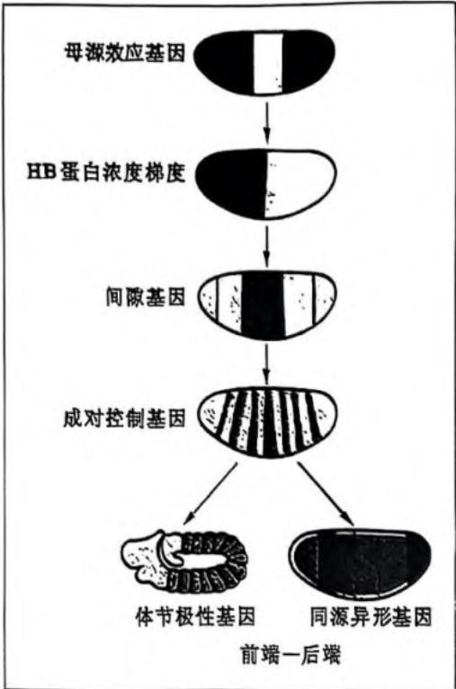  
图9-7 果蝇胚胎模式建立过程中关键基因的表达顺序

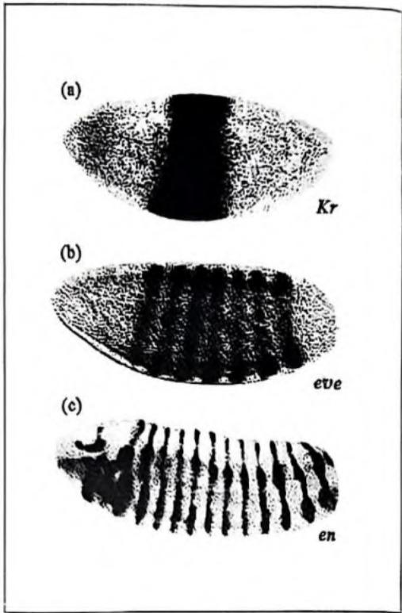  
图9-83组参与胚胎发育早期体节分化基因的表达谱分析  
间隙基因(Knippel, Kr);(b)成对控制基因(eve);(c)本节极化基因(engrailed, en)。

图9-9 果蝇的体节特征(a)与用ENGRAILED抗体检测的该基因的表达(b)相吻合  
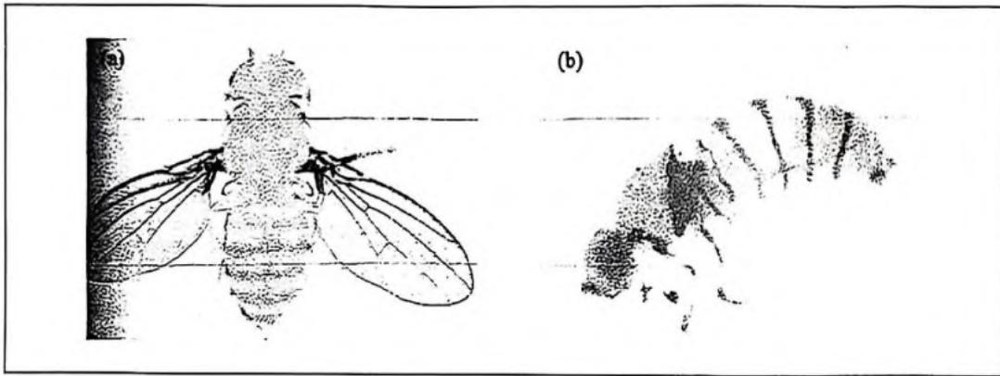

所以,这两个基因表达区域的界线正好是确立副体节的界线。en 和 wg 基因表达的起始受含有同源异形框的成对控制基因 eve 和 fiz 等编码转录调节因子的制约。en 基因在基因产物 FTZ 和 EVE 的浓度达到一定阈值以后才能被激活,但 wg 基因的活化浓度显著低于这一阈值。

## 9.2.3 果蝇的末端系统及背-腹极性基因与发育调控

如果控制前端和后端系统的基因都发生突变,胚胎仍保留部分前-后轴模式并形成双尾节,暗示还存在第三个前-后轴确定系统,即末端系统。末端系统包括约9个母源效应基因。这些基因缺失会导致胚胎的前端原头区和后端尾节(不分节部分)缺失。在这

个系统中发挥关键作用的是 torso(tor) 基因。该基因编码一种跨膜酪氨酸激酶受体，其 N 端序列位于细胞膜外，C 端位于膜内。在卵子发育中，tor 基因在整个合胞体胚胎的表面表达 $^{(图 9-10)}$ 。受精后配体被释放出来并穿过卵黄膜进入卵周隙。只有当胚胎前、后末端细胞外存在配体(信号分子)时，才能使 tor 特异性活化，导致胚胎前后末端细胞特化。

母源性 toll mRNA 产物是卵细胞的跨膜受体, 其作用是感知外部信号并提示胚胎

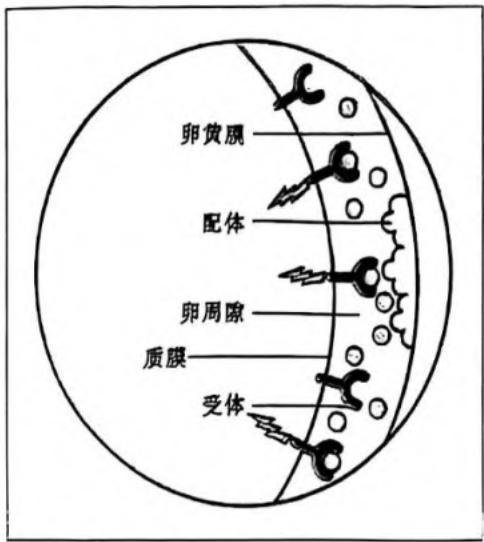  
图 9-10 tor 马因在控制果蝇胚胎末端的分化中的作用

在何处产生腹侧(图9-11)。toll受体与调控果蝇腹侧发育的外部信号可能是由一种蛋白酶从锚定复合物中释放出并定位于卵细胞周围外卵黄膜上或附近的母源效应基因spatzl的表达产物。因为只有在腹侧的受体能找到配基,所以,spatzl前体定位于卵子的腹侧而不是背侧。被配基占据的受体能使DORSAL蛋白磷酸化从而引起DORSAL蛋白的重新分布,保证胚胎腹侧的细胞核中DORSAL蛋白浓度较高。当胚胎中DORSAL基因发生缺失时,胚胎不能产生腹侧结构,整个个体将呈现背侧外观,这个胚胎被称为背部化(dorsalized)胚胎。

## 9.2.4 果蝇的同源异形基因

同源异形基因最终决定躯体体节命运。躯体的部分最终是发育成为无翅的前胸还是有翅的中胸，是有平衡器的后胸还是腹部的体节，都是由同源异形基因决定的。在果蝇中同源异形基因统称HOM复合体(homeotic gene complex, HOM-C)。大多数同源异形基因位于第三号染色体上，排成两簇。一簇称为触角复合体(Antennapedia complex, Antp-C);另一簇称为双胸复合体(Bithorax complex, BX-C)。同源异形基因的存在是通过一系列非常引人注目的突变而得以证实的。果蝇的Antennapedia突变就是一个典型的例证。这种突变使果蝇的触角转变为足 $^{[图9-12]}$ 。典型的同源异形基因不参与基本躯干的建成，

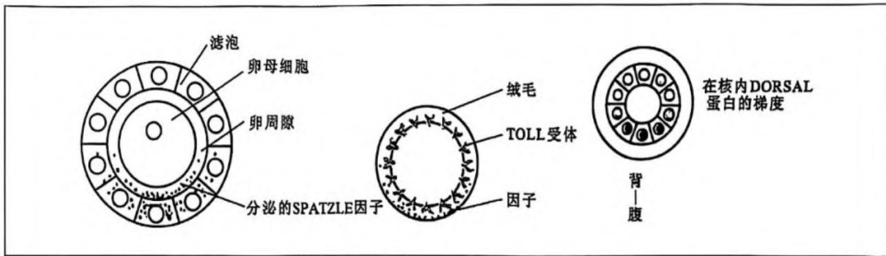  
图 9-11 果蝇背 - 腹轴形态发生过程中 DORSAL 蛋白的分布示意图

## 9.2 果蝇的发育与调控

图 9-12 果蝇触角足复合物基因簇 (Antennapedia complex) 突变, 引起同源异形转换

(a) 平衡器发育成翅

膀(产生四翅果蝇);

(b) 触角变成足。

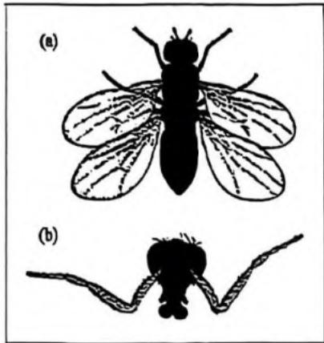

也不参与体节和肢芽的完善,它们只保证体节或肢芽的最终典型特征。若将调控形成头胸体节的5个Antp-C基因或参与胸腹体节形成的3个BX-C基因突变,可产生惊人的同源异形转换(homeotic transformation),使形态正确的结构长到了错误的地方。在触角足基因(Antennapedia)显性突变中,该基因在头以及胸部表达,使头结构部分转变成胸体节。因为该体节要承受的是腿而非触角,所以,头部出现了两条腿。

## 9.3 高等植物花发育的基因调控

高等植物开花的控制是长期以来人们非常关心的事情,对这个问题的探索可追溯到20世纪初有关碳/氮比对开花迟早影响的学说,30年代关于开花素的学说和春化的概念,70年代所提出的关于植物由营养生长过渡到生殖生长前的感受状态理论。这个时期对开花的探索主要着重于植物的形态、生理学以及环境的影响等方面。也从遗传学角度利用植物本身的突变体或用人工创造的突变体对植物的开花提出了一些新的概念,并根据分生组织的形态特征,将植物从营养生长到生殖生长的转变分为3个阶段,即营养分生组织阶段、花序分生组织发生阶段和花分生组织发生阶段。随着植物分子生物学技术的不断完善,尤其是有关克隆技术和诱变技术的出现,人们已从模式植物如拟南芥(Arabidopsis thaliana)或金鱼草(Antirrhinum majus)中分离克隆到许多控制植物开花的基因,为进一步认识植物开花的内在控制机制以及与外界环境因素的相互作用奠定了基础。

## 9.3.1 植物的花器官结构

种子植物的花由枝条变态产生,而花器官由叶片变态产生。一般认为,种子植物的成年花器官由花萼(sepal)、花瓣(petal)、雄蕊(stamen)、雌蕊(心皮)(carpel)等4轮结构所组成(图9-13)。成年花器官是从顶端分生组织(shoot apical meristem)发育而来的,营养分生组织(vegetative meristem)产生花序分生组织(inflorescence meristem),花序分生组织产生花分生组织(floral meristem),花分生组织可被进一步分为早期花分组织和晚期花分生组织,早期花分生组织有点类似于营养分生组织,具有无限生长的特点。花分生组织产生花器官原基,最后产生花器官。

## 9.3.2 调控花器官发育的主要基因

花分生组织决定基因(floral meristem identity gene)促进从花序分生组织产生花分生组织并进一步分化产生花器官原基,但产生何种花器官则由同源异形基因所控制。花分生组织决定基因可以在一定程度上激活同源异形基因。

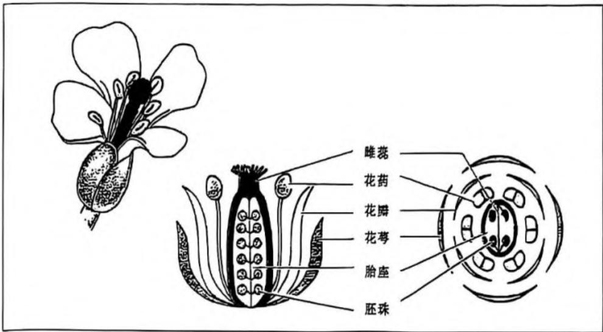  
图9-13 拟南芥花的构成

## 1. 同源异形基因与花器官发育

金鱼草、拟南芥等植物的花都由4种类型的花器官组成,花器官排列成向心的圆环形,称作轮性(whorl)。拟南芥的花由4个花萼组成最外的第一轮、依次向内为4个花瓣组成第二轮,6个雄蕊组成第三轮,两个融合的心皮组成第四轮。

在研究金鱼草花形态突变体时发现,花器官的同源异形突变包含3大类型,类型Ⅰ为第一轮和第二轮器官受影响,产生心皮状的花萼和雄蕊状的花瓣。类型Ⅱ为第二轮和第三轮器官受影响,产生花萼状的花瓣和心皮状的雄蕊。类型Ⅲ为第三轮和第四轮器官受影响,产生花瓣状的雄蕊和花萼状的心皮,而且最内两轮器官的数量和轮数也发生了改变。类型Ⅳ中4轮结构全部受影响(图9-14)。进一步研究这些突变体的基因型发现,每一种类型的突变体中都是因为发生了同源异形基因的突变而使相邻两轮花器官受到影响,证明植物的器官发生与动物的器官发生一样,都受同源异形基因控制。

## 2. 同源异形基因的分离

科学家最早在 1990 年利用转座子突变的方法从金鱼草中分离并克隆出同源异形基因 DEFA (DEFICIENS)。研究发现,该基因编码的蛋白质与两个已知的转录因子——哺乳动物中的 SRF (serum response factor) 和酵母中的 MCM1 (minichromosome maintenance protein 1) 的一个保守区域有很高的同源性,这一区域参与二聚化并与 DNA 结合。此后,科学家们用 DEFA 的这一保守区域作探针,从金鱼草的 cDNA 库中筛选出了 8 个独立的基因,它们在蛋白质水平上与 DEFA 的 DNA 结合区有很高的相似性 (65%\~90%)。此外,又从拟南芥中克隆数个涉及花发育的同源异形基因,例如 AGAMOUS (AG)、PISTILLATA (PI)、APETALA3 (AP3) 等 $^{(表9-1)}$ ,它们编码的蛋白质同样与 DEFA 转录因子具有一定的序列相似性。上述结果表明,在金鱼草和拟南芥中存在着一个参与花器官发育和分化的基因家族,该家族的成员可能参与不同的花分化过程。由于这个新的基因家族成员 (MCM1、AG、DEFA 和 SRF) 均含有一个保守的区域,根据这几个基因名称的第一个字母,将该基因家族命名为 MADS-box 基因 (MADS-box gene)。

图9-14 由3组同源异形基因决定4轮花器官特征的"ABC"模型

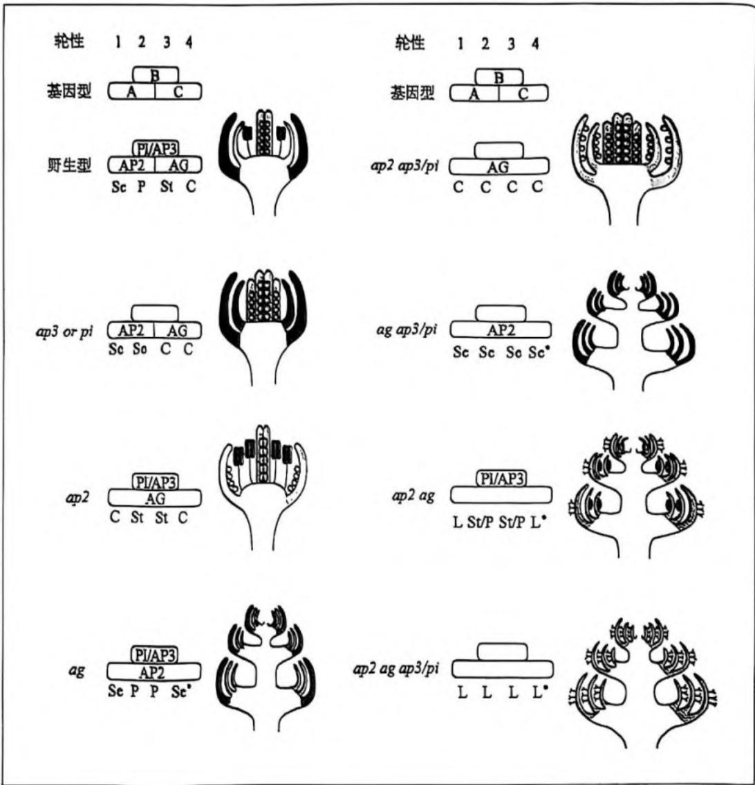

表 9-1 已经克隆的植物花器官特征决定基因及其可能的功能分析

<table><tr><td>基因(拟南芥/金鱼草)</td><td>突变体表型</td><td>基因功能</td></tr><tr><td>APETALA1/SQUAMOSA</td><td>花萼变为叶片</td><td>转录因子</td></tr><tr><td>APETALA2/未知</td><td>花萼变为叶片/心皮,花瓣变为心皮</td><td>转录因子</td></tr><tr><td>APETALA3/DEFICIENS</td><td>花瓣变为雄蕊,雄蕊变为心皮</td><td>转录因子</td></tr><tr><td>PISTILLATA/GLOBOSA</td><td>类似AP3/DEF</td><td>转录因子</td></tr><tr><td>AGAMOUS/PLENA</td><td>重复发生一轮花萼及两轮花瓣</td><td>转录因子</td></tr><tr><td>LFY/FLORICAULA</td><td>产生更多的花序,绿色花,由类似花萼与心皮的花器官构成</td><td>转录因子</td></tr></table>

## 9.3.3 花器官发育的"ABCE"模型

在对拟南芥和金鱼草突变体及花器官特征决定基因功能的研究中，E. Myerowitz 首先提出了控制花形态发生的"ABC"模型（ABC model）。根据这个模型，正常花的四轮结构的形成是由 3 组基因共同作用而完成的。每一轮花器官特征的决定分别依赖于 A、B、C 三组基因中的一组或两组基因的正常表达。如其中任何一组或更多的基因发生突变而丧失功能,则花的形态将发生异常。A 基因包括 $AP1$ 和 $AP2$ ,在第一、二轮花器官中表达;B 基因为 $AP3$ 和 $PI$ ,在第二、三轮花器官中表达;C 基因为 $AG$ ,在第三、四轮花器官中表达。A 基因本身足以决定萼片,A 和 B 基因共同决定花瓣,B 与 C 基因共同决定雄蕊,C 基因决定心皮。此外,A 基因与 C 基因相互拮抗,相互排斥对方在各自的区域表达。

A、B、C 基因作为 MADS-box 家族成员均以转录调控因子起作用。其中 AP2 属于 EREBPS(ethylene-responsive element binding proteins)类转录因子。在第一、二轮花器官中，AP2 蛋白可以结合到 AG 基因的启动子区，抑制 AG 基因的表达；此外，AP1 蛋白可以与其他蛋白质一起结合到 AG 基因的第二个内含子区，进而抑制 AG 基因的表达。通过上述方式使得 AG 基因被限制在第三、四轮花器官中表达。与此类似，在第三、四轮花器官中，AG 蛋白可以结合到 AP1 基因的启动子区，抑制后者的表达，所以 AP1 基因只能在第一、二轮花器官中表达。AP2 基因则有所不同，它的 mRNA 在 4 轮花器官中都有表达，但其在第三、四轮花瓣中的翻译水平受到 miRNA 的抑制，使得 AP2 蛋白只在第一、二轮花器官中生成，这样就将 A 基因的功能限制在了第一、二轮花器官中。因此，当 A 基因突变后（如 ap1、ap2），导致 AG 基因在第一、二轮花器官中表达，使得第一轮花器官中的花萼突变为心皮，第二轮花器官中的花瓣突变为雄蕊。B 基因突变后，花萼替代了第二轮花器官中的花瓣，第三轮花器官中的雄蕊变为心皮。若 C 基因失活（如 ag 突变体），则 A 基因在第三、四轮花器官中表达，使得雄蕊转变为花瓣，第四轮花器官中的心皮也转变为花萼。

随后, 科学家在研究 MADS-box 家族基因对花器官发育的影响时发现, AGL2 (AGAMOUS-LIKE2)、AGL4、AGL9 也是调控花器官特征的重要基因。AGL2、AGL4 在 4 轮花器官中有表达, 而 AGL9 只在里面的 3 轮花器官中表达。agl2/agl4/agl9 的三重突变体表型类似于 B/C 类突变体且有非常多的花萼, 充分显示 AGL2、AGL4、AGL9 这类基因在花器官发育中的重要性。现已将这 3 个基因分别重新命名为 SEP1 (SEPALLATA1)、SEP2 和 SEP3, 表示 "lots of sepals" 的意思。按习惯, 人们将 SEP1、SEP2 和 SEP3 称为 E 类基因。另外, 当以 PI/AP3 作为诱饵进行酵母双杂交、三杂交实验, 发现植物中存在 PI/AP3-AP1, PI/AP3-SEP3, AP1-SEP3 和 AG-SEP3 这样一类蛋白质 - 蛋白质的相互作用, 而 SEP3 可以介导 A 基因与 B 基因、B 基因与 C 基因的相互作用, 使这些蛋白质形成一个大的复合物。因此, E 类基因编码的 MADS 结构域蛋白可能像 "胶水" 一样将 ABC 基因产物以不同的四聚体形式组合起来行使转录调节功能, 进而控制花器官的特性 [图 9-15]。

## 9.3.4 启动花发生的分生组织决定基因

除了 ABCE 被发现参与了花器官的形成,从拟南芥中还克隆到许多决定花序或花发生的基因(即花分生组织决定基因,floral meristem identity gene)。最早分离到的花器官分生组织决定基因是 LEAFY(LFY) 基因。拟南芥 lfy 突变体比野生型产生更多的花序分枝,其花呈绿色,由类似花萼和心皮样的器官构成,过量表达 LFY 基因导致转基因植物提前开花并将茎尖转变成花,证明 LFY 基因不仅决定花分生组织的特性,而且影响开花时间。

TERMINAI FLOWER1(TFL1)是影响拟南芥分生组织特性的另一个非常重要的花分生组织决定基因。tfl1 突变体开花提前,初级花序分枝转变成末端花,缺少侧枝,花的数量也大大减少。TFL1 在分生组织中表达,但不在幼花原基中表达。tfl1 突变体(由无限枝转变成有限的枝)和 lfy 突变体(由有限的枝转变成无限的枝)的表型恰好相反,说明两

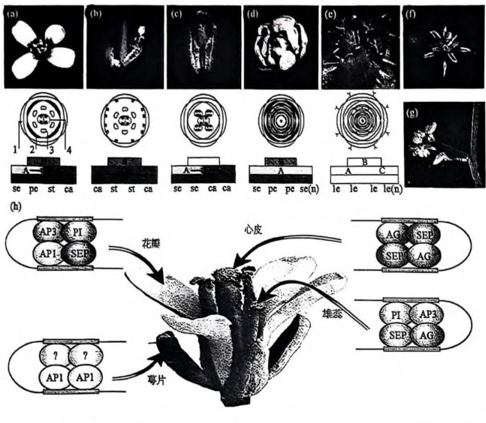  
图 9-15 花形态建成的 ABCE 模型(另见书末彩插)  
(a) 野生型；(b) A 基因突变；(c) B 基因突变；(d) C 基因突变；(e) E 基因突变；(f) 35S: :PI;35S: :AP3;35S: :SEP3;(g) 35S: :PI;35S: :AP3;35S: :AG;35S: :SEP3;(h) ABCE 模型。

图 9-16 花分牛组织决定基因在营养生长和成花枝顶端的表达模式分析

LP, 叶原基; SAM, 顶端分生组织; FP, 花原基。

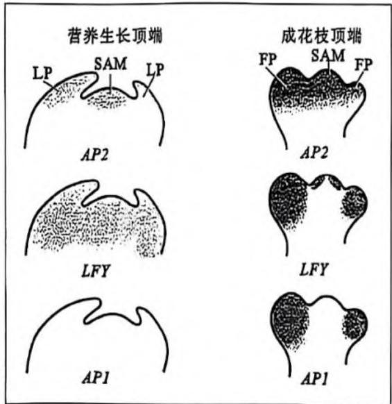

个基因可能是相互拮抗的。

除了决定花器官的轮性外，AP1、AP2基因还参与决定花器官的发生。LFY蛋白开启AP1基因的表达，而AP1蛋白同样能够促进LFY基因的表达，形成正反馈调控，并促进花原基的形成。LFY、AP1和AP2基因的表达模式与它们在早期花分生组织中的作用相吻合。在花器官原基发育之前，LFY和AP1在营养生长过程中表达量很低，在GA或光周期处理诱导开花过程中，LFY表达

量会迅速提高。虽然在由营养生长转变到花发育时 LFY 基因已经表达，但 API 在花原基中没有表达，直到花诱导开始 1\~2 天后才开始表达。AP2 基因在植物整个生活史中持续表达，花器官分生组织确定期该基因表达量显著上升 $^{[图9-16]}$ 。

## 9.4 控制植物开花时间的分子机制

植物从营养生长向生殖生长的转变是植物发育周期中的一个重要过程,是决定植物开花的重要环节。最近几十年来,用拟南芥为模式植物,科学家对高等植物开花时间调控机制与信号转导途径的研究取得了长足的进步。到目前为止,人们对植物开花时间调控机制的了解主要是通过对拟南芥的分子遗传学研究获得的。拟南芥的开花时间受许多因素的影响,其中光照和温度是主要的外部因素,自主途径因子和赤霉素(GA)是主要的内部因素。拟南芥的开花诱导调控途径也因此分为4种:光周期途径(photoperiod pathway)、春化途径(vernalization pathway)、自主途径(Autonomous pathway)和GA途径(Gibberellic acid pathway)。下面将以拟南芥为例重点阐述光周期途径和春化途径。

## 9.4.1 光周期途径

光周期(photoperiod)指一日之内昼夜长度的相对变化,也即日长。植物通过感受昼夜长短变化而控制开花的现象称为光周期现象(photoperiodism)。光周期现象是美国园艺学家 Garner 和 Allard 于 1919 年在烟草中首次提出的。他们在马里兰州美国农业部农业试验站工作时发现烟草品种 'Maryland Mammoth', 在夏季生长时, 株高达 3\~5 m 时仍不开花 $^{[图9-17]}$ , 但在冬季转入温室栽培后, 其株高不足 1 m 就可开花。他们试验了温度、光质、营养等各种条件, 发现日照长度是影响烟草开花的关键因素。只有当日照短于 14 h 时, 烟草才开花, 否则就不开花。后来又发现许多植物开花都需要一定的日照长度, 这就是光周期现象的发现。

根据对光周期的反应,一般可将植物分为3种:对长日照敏感而开花(即长日照促进开花)的长日照植物(long-day plant),如实验室常用的拟南芥生态型Columbia(Col)、Wassilewskija(Ws)、Landsbergerecta(Ler)等;对短日照敏感而开花(即短日照促进开花)的短日照植物(short-day plant),如水稻、烟草等;对日照长度不敏感的日中性植物(day-neutral plant),如印度甘蔗等。临界日长(critical daylength)是区别长日照或短日照的日照长度的标准,指昼夜周期中能诱导植物开花所需的最低或最高的极限日照长度。短日照植物要求的日照时数必须等于或短于临界日长,而长日照植物要求的日照时数必须等于或长于

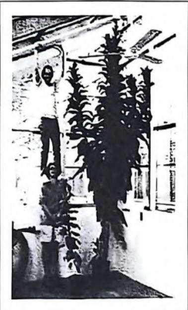  
图 9-17 夏天温室生长的烟草 'Maryland Mammoth' 突变体(左)与野生型(右)

图 9-18 长日和短日植物的光周期反应

当日照长度超过(或夜长短于)某一临界值时,长日照植物(LDP)开花,而当日照长度短于(或夜长长于)某一临界值时,短日照植物(SDP)开花。不同植物具有不同的临界日长,在本例中,在12\~14 h的光周期内,LDP和SDP都可开花。

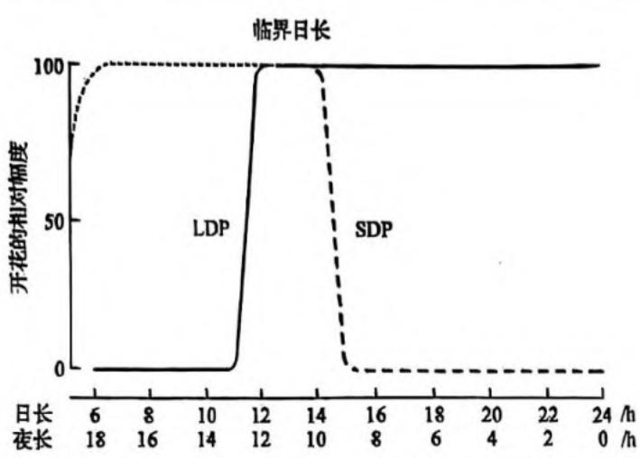

临界日长(图9-18)，否则就延迟开花或不能开花。

## 1. 光周期的感受及传导

在解剖上最早看到的光周期诱导的成花过程是顶端开始分化花芽,但是否分化成花芽取决于叶片是否处于适当的光周期条件下。在长日照条件下生长的短日照植物紫苏(Perrila crispa),将其中一个叶片进行短日照处理能诱导其开花;如果将短日照处理的叶片(诱导叶)嫁接到生长在长日照条件下的紫苏上也能诱导其开花,可见感受光周期的部位不是顶端而是叶片。接受光周期的叶片,又必须以某种方式把光周期诱导的信号传递给顶端分生组织。通过维管组织将多株植物嫁接在一起,而仅诱导处理一株植物的其中一个叶片,发现嫁接在一起的所有植物都能开花(图9-19)。20世纪30年代,苏联植物生理学家Mikhail Chailakhyan基于上述嫁接实验提出,当植物叶片感受到适当的日照长度,会形成一种物质,该物质可以进行长距离运输,传导到顶芽分生组织后引起开花,这种物质被其称为开花素(florigen)。在随后的几十年中,人们一直在探索的两个问题是叶片如何

图 9-19 诱导叶 (induced leaf) 产生的开花素可经维管组织进行长距离的运输, 在顶端分生组织诱导植物开花

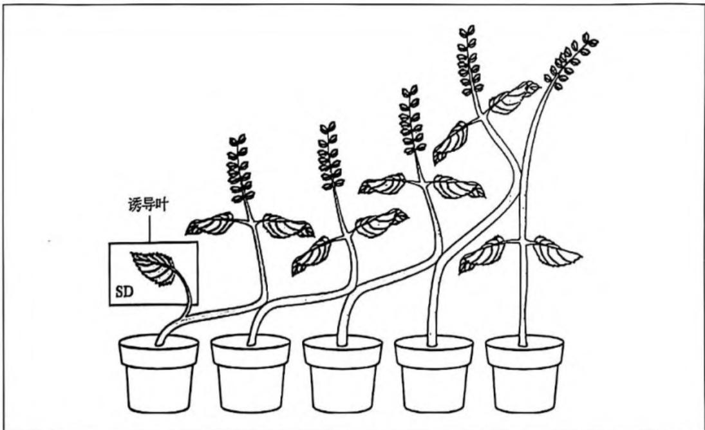

测量日长诱导或抑制开花以及开花素到底是什么？

## 2. 光周期模型

1936 年, Bünning 首次提出 external coincidence model 来解释植物如何度量日长。他指出植物存在一个昼夜节律钟 (circadian clock), 24 h 的昼夜分为光敏期和暗敏期。为植物在光敏期, 如果昼夜节律钟调节因子的表达达到阈值, 如果处于光照条件下则会促进长日照植物开花, 抑制短日照植物开花, 表明测量日长的基础是外在光信号与昼夜节律 (circadian rhythm) 之间的相互作用。

## 3. 植物如何度量日长

已知光周期刺激(光信号)是由叶片中的光受体感受的,拟南芥中共发现了5类光敏色素 PhyA (phytochromeA)、PhyB、PhyC、PhyD、PhyE 和 2 种隐花色素 Cry 1 (Cryptochrome 1) 和 Cry 2,它们能够感受昼夜长短和光的强弱,既可以通过产生昼夜节律,也可以通过激发信号转导途径来调控植物开花进程。

① CONATANS(CO)基因受昼夜节律钟的转录调控。CO是拟南芥中第一个被发现的受昼夜节律调控的开花基因,它编码一个锌指类转录因子,位于节律钟的输出途径,能够激活下游开花素基因 FLOWERING LOUST(FT) 的表达。CO mRNA 的表达在昼夜交替的一天内呈现为节律性变化。具体讲,在长日照条件下 CO mRNA 在白天表达量较低,到了傍晚出现峰值且整个夜晚持续表达。在短日照条件下 CO mRNA 白天表达量较低,从傍晚开始大量表达,夜晚时达到顶峰。即使在持续光照条件下,CO mRNA 的表达仍呈现为节律性变化,表明该基因在转录水平上受昼夜节律调控。

研究表明, DOF 转录因子 1(cycling Dof transcription factor 1, CDF1) 及其同源蛋白 CDF2/3/5 是 CO 的转录抑制因子, 其稳定性受生物钟调控的 FKF1(FLAVIN-BINDING、KELCHREEAT、FBOX1) 编码的 F-box 蛋白的调控。在长日照条件下, FKF1 在傍晚前达到高峰, 并被蓝光激活后介导 CDFs 通过蛋白酶体降解途径降解, 从而解除 CDFs 对 CO 基因的转录抑制作用, 使 CO mRNA 在傍晚达到高峰。

② CO 在转录后水平受光调控。研究表明缺失 Phya 和 Cry2 中的任一基因都会导致拟南芥在长日照条件下推迟开花，缺失 Phyb 基因则使拟南芥提前开花。在 Cry2 功能缺失的突变体中，CO mRNA 在一天中的积累模式并没有发生改变，但是 FT 的表达量降低，暗示光可能在转录后水平调控了 CO 的蛋白量。

CO 蛋白在一天存在动态变化的表达模式,并且这种动态表达与光受体密切相关。研究发现,PhyB 在白天活性最高,而 PhyA 和 Cry 在傍晚活性最高。在傍晚,PhyA 和 Cry 具有较高的活性,抑制了蛋白酶体介导的 CO 蛋白降解,导致 CO 蛋白水平升高(图 9-20);而在早晨,PhyB 被激活后削弱了 PhyA 和 Cry 对 CO 蛋白降解的抑制作用,因此 CO 蛋白水平降低。Ring-type E3 ligase COP1(CONSTITUTIVELY PHOTOMORPHOGENIC 1)是介导 CO 降解的主要因子。在夜晚,COP1 主要定位于细胞核中,COP1 与 CO 发生相互作用,导致 CO 被泛素化并被降解。因此,即使在短日照下的黑暗期,CO 也具有高水平的转录量,但其蛋白量仍然较低。当 CO 转录量在傍晚达到最高时,白天光活化的 Cry 介导 COP1

## 9.4 控制植物开花时间的分子机制

图 9-20 光受体和昼夜节律钟共同调控细胞内 CO 蛋白量  
在长日照条件下CO mRNA(以波浪线表示)其表达节律(以虚线表示)高峰出现在傍晚前到第二天早上。在白天CO蛋白(以球面数量表示)的降解过程同时受到促进与抑制相反的调控,由于CO mRNA含量非常低,故CO蛋白积累非常少。到了夜晚虽然CO具有高的转录量,但由于蛋白降解显著,使得仅有少量CO蛋白存在。而傍晚时CO mRNA非常多同时蛋白降解过程受到了抑制,两方面的作用使得CO蛋白非常多,从而启动了开花。  
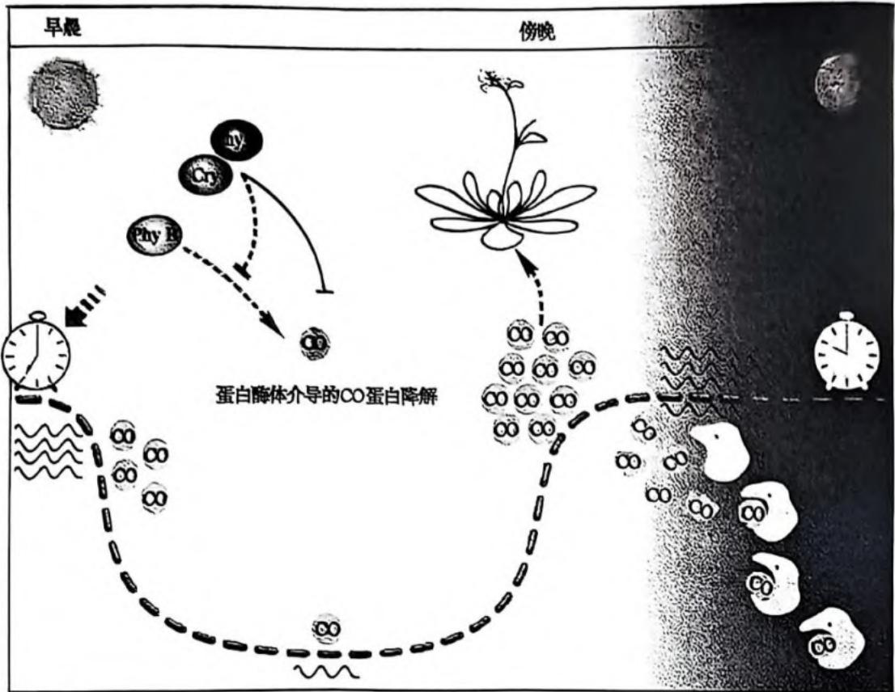

从细胞核转移到细胞质中,导致 CO 蛋白的积累进而激活开花素基因 FT 转录,启动开花。因此,拟南芥通过对 CO 基因转录丰度和 CO 蛋白稳定性的调节将光信号与昼夜节律钟统一起来,而最终决定植物能否开花的核心因素是 CO 蛋白丰度。

## 4. 开花素的历史

1865 年,研究者提出成花物质由叶片运送到叶芽中,导致开花;1936 年根据嫁接实验提出开花素概念,认为对光周期有不同反应的植物之间可能用相同的物质来促进开花。此后,人们通过各种途径寻找开花素,但是一直没有结果。直到 2005 年,研究人员通过在拟南芥叶片中热击诱导 $FT$ 表达然后检测茎端 $FT$ mRNA,证明叶片中的 $FT$ mRNA 可以转运到茎端而诱导开花。该项研究被 Science 评为当年十大科学发现之一。2006 年,研究者发现在西红柿植株的顶端分生组织并不能检测到转基因 $SFT$ (拟南芥 $FT$ 同源基因) mRNA 的存在,暗示 $FT$ mRNA 并不是人们一直以来寻找的开花素。2007 年两个小组分别在 Science 上发表文章称可移动的开花信号是 FT 蛋白。他们利用在维管组织而不在顶端分生组织特异表达的 SUC2 启动子驱动 FT-GFP 融合蛋白在 $ft$ 突变体中表达,原位杂交发现在顶端分生组织检测不到 $FT$ mRNA 的表达,但能检测到 GFP 荧光。同样在嫁接后的受体植株中也仅能检测到 GFP 荧光而检测不到 $FT$ mRNA 的表达,证明在拟南芥中 FT 蛋白是开花素。根据已有的理论模型,拟南芥在长日照条件下诱导 CO 蛋白的积累并激活 $FT$ 的表达,产生的 FT 蛋白从叶片通过韧皮部运输到茎顶端的分生组织,然后与组织中表达的一个 bZIP 类转录因子 FD 相互作用,激活花器官决定基因 $API$ 的表达,诱

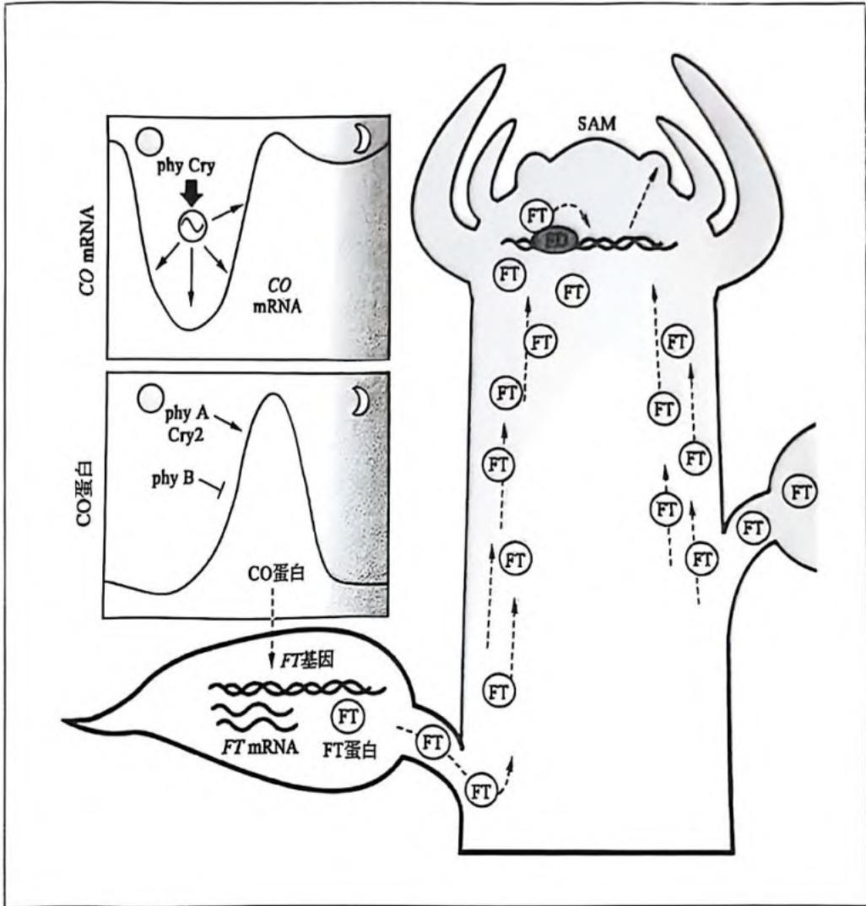  
图9-21 FT 蛋白是开花素  
在长日照条件下，光敏色素phy和隐花色素Cry调控CO的节律，致使CO蛋白较稳定，能在叶中诱导FT mRNA表达后翻译成FT蛋白，经维管组织运输至顶端分生组织(SAM)，并与FD锌指类转录因子相互作用，激活花器官决定基因APETALA J(API)表达，诱导拟南齐开花。  
导拟南芥开花(图9-21)。

## 9.4.2 春化作用

低温处理可促使植物开花的现象称为春化作用(vernalization)。可以根据是否需要春化来完成生活周期,把拟南芥分为夏季生态型(summer-annual)和冬季生态型(winter-annual)两种。大多数拟南芥为冬季生态型,在越冬前主要进行营养生长,经过冬季低温后在第二年春季适宜条件下迅速开花。而夏季生态型不需要经过低温过程就能直接开花。目前在实验室条件下最常用的拟南芥生态型 Columbia(Col)、Wassilewskija(Ws)、Landsbergerecta(Ler)等都属于夏季生态型。

FRIGIDA (FRI) 是自然变异的决定植物开花时间的一个主要决定因子。分析夏季生态型和冬季生态型的遗传差异发现显性位点 FRI 在春化需求方面起主要作用, 而夏季生态型就是由于 FRI 位点在进化过程发生突变或缺失进化而来的。另外, 编码一个 MADS-box 转录因子 FLOWER LOCUS C (FLC), 通过与开花时间基因 SOCI、FT 的 CArG boxes 相互作用抑制这些基因的表达, 从而削弱了光周期途径对这些基因的活化效应。进一步研究表明 FLC 和 FRI 都为春化所必需。

## 1. FRI 促进 FLC 的表达抑制开花

FRI 为编码植物特异的一个脚手架蛋白, 是决定植物开花时间自然变异的一个主要决定因子。目前, 通过遗传筛选的方法已经鉴定到许多依赖 FRI 途径控制 FLC 基因激活途径的其他蛋白组分。包括保守的染色质修复因子以及一些植物特异的蛋白质。这些蛋白质功能的缺失抑制 FLC 的表达, 植物出现早花表型 (图 9-22)。

RNA 聚合酶 II 相关因子复合物 (polymerase associated factor 1 complex, PAF1c) 是与 FRI 功能相关的一个组分, 其在酵母、植物和人中都较为保守。拟南芥的 PAF1c 复合物功能异常, 如其组成成分 ELF7 (EARLY FLOWERING 7) 和 ELF8 的缺失会导致 FLC 染色体上 H3K4 位点的甲基化水平减弱, 进而抑制 FLC 的表达, 使突变体表现为早花的表型。在酵母中, PAF1c 能够招募 H3K4 甲基转移酶 COMPASS (complex proteins associated with set1) 复合物促进基因的 H3K4 位点的三甲基化。在拟南芥中, COMPASS 包含 4 个保守的核心亚基, 分别是包含一个 SET 区域的 H3K4 甲基转移酶以及 3 个结构上的核心组分 WDR5a (WD repeat domain 5 homolog A)、RBL (RbBP5 like), 以及 ASH2R (Arabidopsis Ash2 relative), 这些组分形成一个稳定的核心亚复合物, 为 H3K4 位点甲基化提供了一个平台, 而过表达 ASH2R 会导致 FLC 位点 H3K4 三甲基化程度增加, 并激活 FLC 的表达。

除了 H3K4 位点的三甲基化, FRI 还能够与组蛋白 H3K36 甲基转移酶 EFS (EARLY FLOWERING IN SHORT DAYS) 互作, 进而促进 FLC 位点的 H3K36 的三甲基化、激活 FLC 的表达。FRI 调控 FLC 的表达还依赖于 HBU-UBC 介导的组蛋白 H2B 的单泛素化(H2Bub1)。HUB-UBC复合物包含E3泛素化连接酶HUB1(histone monoquibiquitination 1)和HUB2以及E2泛素结合酶UBC1(ubiquition-conjugating enzyme 1)和UBC2,该复合物参与包含FLC位点在内的全基因组水平的H2B单泛素化。目前已知,H2Bub1能够降低核小体的稳定性,并且招募FACT(facilitates chromatin transcription)复合物结合到染色质上,并进一步促进Pol II的转录。FACT组分中SPT16和SSRP1发生突变后,会抑制FLC基因的表达,因此推测基因体上H2Bub1有可能和功能保守的FACT一起发挥功能,两者协同进一步促进FLC转录延伸。

9-22 依赖FRI径的FLC激活模图  
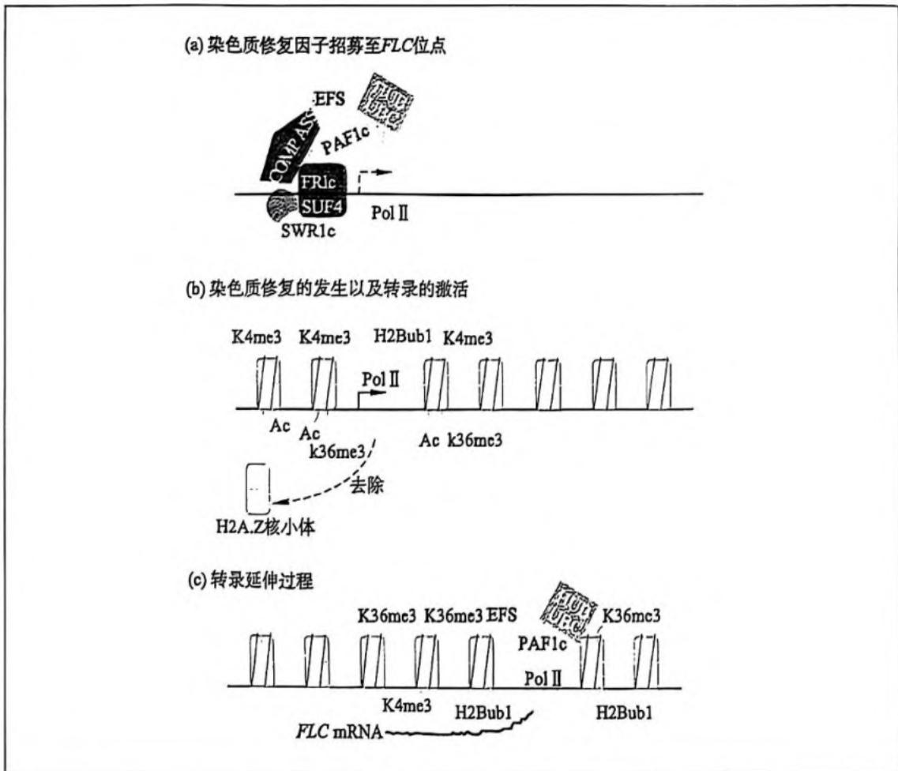

此外，FRI能够与两个植物特异的因子FRIGIDA LIKE 1(FRL1)、FRIGIDA ESSENTIAL 1(FES1)以及SUPPRERSOR OF FRIGIDA 4(SUF4)和FLC EXPRESSOR(FLX)形成一个转录激活复合物(FRI-C)，其中，SUF4能够识别FLC启动子的顺式作用元件，FLX和FES1具有潜在转录激活活性。FRI-C还能招募SWR1复合物(SWI2/SNF2-related1 chromatin remodeling complex, SWR1-C)至FLC位点，启动组蛋白变体H2A.Z对H2A的替换，促进FLC基因的转录。FRI-C复合物中的任何一个亚基功能缺失后会抑制FLC的表达，并且植物会出现早花表型，这表明这一复合物是FLC基因的一个激活因子。

## 2. 长链非编码 RNA 和多梳复合物在植物感应冬季的表观记忆中的作用

冬季生态型的植物需要经过春化作用进一步获得开花的能力。春化作用抑制 FLC 基因的表达,加速植物在适宜温度(20\~25℃)下向开花期的转换。春化作用对 FLC 的抑制需要长链非编码 RNA(lncRNA)和多梳复合物(polycomb complex),并且这种抑制作用会一直持续到植物在适宜温度下的正常生长状态,因此赋予植物对冬季的"记忆"。

通过大规模筛选春化不敏感型拟南芥突变体,科学家鉴定了一些具备抑制 FLC 基因表达功能的多梳基团(polycomb group, PcG)相关组分,包括 VRN1 (vernalization 1)、VRN2 (vernalization 2)、VIN3 (vernalization insensitive 3)、VRN5 等基因。VRN1 定位于核内,具有两个植物特异的与 DNA 结合有关的 B3 结构域。VRN2 编码一个锌指核蛋白,果蝇的同源基因 Su(Z)12 能通过修饰染色质结构调节基因表达。VIN3 基因编码一个植物 PHD 结构域的蛋白质,能被低温诱导,并且只在低温条件下表达。VRN5 同样为 PHD 结构域蛋白,能够与 VIN3 形成二聚体。春化过程中 VIN3、VRN5、VRN2、CURLY LEAF(CLF)等蛋白质会形成一个 PHD-PRC2 复合物,这一复合物存储了 FLC 第一个外显子附近的 H3K27 三甲基化信息,从而抑制 FLC 表达。

招募到 FLC 染色质上的 PcG 的抑制活性需要由 lncRNA 介导。瞬时冷处理会诱导两个 lncRNA 从 FLC 位点转录，分别称之为：COOLAIR 和 COLDAIR。COOLAIR 并不是对 FLC 抑制起主要作用的决定因子，其很可能通过一个共转录调控的机制来参与春化作用介导的 FLC 抑制。COLDAIR 转录起始于 FLC 第一个内含子。冷处理下，PHD-PRC2 复合物中的 CLF 亚基能和 COLDAIR 互作，从而使整个复合物能结合到染色质的 FLC 位点并介导其 H3K27 的三甲基化进而抑制 FLC 的转录。最近的报道研究鉴定到另外一个参与春化作用的 lncRNA COLDWRAP。COLDWRAP 转录起始于 FLC 的启动子区域，春化作用下，COLDAIR 和 COLDWRAP 在 FLC 位点形成一个具有抑制作用的基因内染色质环状结构,这也是春化过程中对 FLC 基因抑制所必需的(图 9-23)。

图9-23 长链非编码RNA形成环状抑制FLC基因表达  
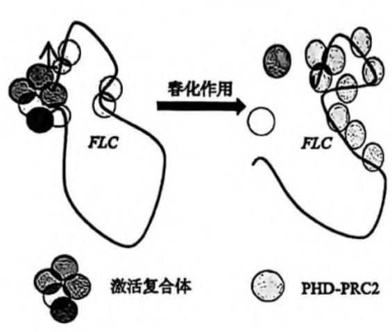

## 思考题

1. 假如你猜测某个基因涉及果蝇的眼发育(已知该基因的序列),请试设计实验证实你的设想。

2. 假如某个基因突变长出两个尾巴的异常果蝇,但你不知道该表型涉及一个基因还是多个基因,你将如何设计实验解决这一问题?请提出实验方案找到涉及这个性状的突变基因。

3. 假如你得到一个拟南芥突变体,表型是花发育不正常,但是发生突变的基因不属于所有已知的参与花形态建成的基因,你如何研究这个基因在拟南芥花发育中的功能?你觉得这个问题有可能吗(即确实存在这样的基因吗)?

4. 现在已经证明植物开花的时间与光照有关,试问这种关联对于植物的意义在哪儿?

5. 假如把拟南芥中所有涉及花发育的基因全部敲除, 将所有涉及玫瑰花发育的基因都置于相应拟南芥基因启动子的调控之下并转到拟南芥中, 这些转基因拟南芥会开出玫瑰花吗, 为什么?

## 参考文献

1. Campos-Rivero G, Osorio-Montalvo P, Sánchez-Borges R, et al. Plant hormone signaling in flowering: An epigenetic point of view [J]. J Plant Physiol, 2017, 214: 16–27.

2. He Y. Chromatin regulation of flowering [J]. Trends Plant Sci, 2012, 17: 556–562.

3. Kim D H, Sung S. Vernalization—triggered intragenic chromatin loop formation by long noncoding RNAs [J]. Dev Cell, 2017, 40: 302–312.

4. Ó'Maoiléidigh D S, Gracier E, Wellmer F. Gene networks controlling Arabidopsis thaliana flower development [J]. New Phytol, 2014, 201: 16–30.

5. Qüesta J I, Song J, Geraldo N, et al. Arabidopsis transcriptional repressor VAL1 triggers Polycomb silencing at FLC during vernalization [J]. Science, 2016, 353: 485–488.

6. Jung C, Pillen K, Staiger D, et al. Editorial: recent advances in flowering time control [J]. Front Plant Sci, 2016, 7: 2011.

数字课程学习

教学课件

目在线自测

思考题解析

第10章
