# 第10章 基因组学和功能基因组学

# 基因组学和功能基因组学

10.1 人类基因组计划

10.2 高通量测序技术的起源、发展与应用

10.3 功能基因组学及其应用

随着遗传学研究进入分子水平,人们发现基因组是生物体内全部遗传信息的集合,对生物体整个基因组所有遗传信息的研究和解析极大地促进了人们对于生命奥秘的理解。人类基因组计划(Human Genome Project,HGP)是20世纪公认的三大科技创举之一。从DNA双螺旋结构的发现到人类基因组计划的完成,人类跨越近半个世纪,破译了人类基因组中储藏的有关人类生存和繁衍的全部遗传信息。20世纪下半叶分子生物学研究的发展为基因组计划提供了强大的技术支撑,极大地促进了DNA序列分析仪器的发明和更新换代,在20多年间实现了序列分析技术质的飞跃。同时,计算机科学技术的蓬勃发展则为序列分析技术所产生的海量数据的存储、运算和分析提供了坚实的基础。测序技术和分析方法的飞速发展,使得单位时间的测序量显著提升,成本显著下降,共同将基因组学的研究推进到前所未有的深度和广度。

随着越来越多物种基因组 DNA 被测定和解析,我们可以利用多种手段对不同时期、不同组织、不同状态,甚至不同物种间的基因组序列和表达谱差异等进行深入地分析,阐明基因型、染色质高级结构、表观修饰和蛋白质 -DNA/RNA 互作等对整个基因组转录调控的影响,以及基因组在进化过程中的变异特征等。对基因组上的基因、非编码调控序列等元件的系统性注释和功能研究,让我们从 DNA 水平、RNA 水平、蛋白质水平和代谢物水平上对各生命过程中的调控网络和相互作用关系有了更深入的了解。对人类、细菌、病毒及动植物基因组信息的解析,有助于我们理解生物各种生理过程及其内在机制,并将为人口膨胀、粮食短缺、环境污染、疾病危害、能源匮乏、生态平衡失调、物种灭绝等一系列世界难题提供强有力的理论支持。

## 10.1 人类基因组计划

为了解析人类基因组中携带的有关人类个体生长发育、生老病死的全部遗传信息，揭开人类生长发育的奥秘，为人类追求健康、战胜疾病、改善人类生活提供理论支持，来自美国、英国、日本、法国、德国和中国的科学家们共同启动了人类基因组计划。该计划于1990年启动，经过10年时间完成了第一版草图，并于2003年完成了第一个人类参考基因组，覆盖了 $97\%$ 的人类基因组。随着测序技术和分析方法的发展，经过科学家们的不断努力和创新，端粒到端粒(telomere-to-telomere, T2T)的人类基因组于2021年正式发布，包含了3.055亿个核苷酸对。在人类基因组计划执行过程中建立起来的研究策略、思想与技术，极大地推动了生命科学领域新学科——"基因组学"的形成和发展，促进了生命科学与信息科学、材料科学和高新技术相结合产业的发展。基因组学是以整个基因组为单位，对生物体所有基因进行基因作图(包括遗传图谱、物理图谱、全序列图谱和转录图谱等)、核苷酸序列分析、基因定位和基因功能分析的一门学科。自提出以来,基于经典遗传学的研究方法逐渐转变成更加系统和全面的功能基因组学研究。

人类基因组计划是人类科学史上的一个伟大工程,是一项改变世界、影响每一个人的科学计划。人类基因组计划的目标包括以下8个主要方面:

(1) 确定人类基因组中 22 条常染色体和两条性染色体 (X 和 Y) 上近 30 亿碱基对的核苷酸排列；

(2) 使用遗传和物理作图技术, 创建高分辨率人类基因组图谱;

(3) 开发高通量测序技术, 为解析人类基因组提供技术支持;

(4) 确定模式生物的基因组序列, 以评估各种作图和测序技术的可行性;

(5) 根据序列信息对人类基因组进行注释, 包括基因组中 2 万 \~ 2.5 万个编码基因、启动子、终止子、增强子和重复序列等;

(6) 了解转录和剪接调控元件的结构与位置,从宏观水平上理解基因转录与转录后调控;

(7) 开发用于存储海量基因组序列信息及可开放式访问的存储设备；

(8) 解决与人类基因组测序及使用相关的伦理、社会和法律问题。

自人类基因组计划实施至今,该计划的关键成果主要包括:①1996年,确立了《百慕大原则》,为生物数据的共享和信用归属确立了重要的指导方针;②2000年,发布了第一份基因组草图和"基因组浏览器"(genome browser);③2003年,完成首个人类参考基因组,并确立形成了《劳德尔堡协议》,进一步加强生物数据的共享机制;④2004年,基于人类基因组首次研究了表皮生长因子受体(epidermal growth factor receptor,EGFR)突变对EGFR抑制剂的反应;⑤2005年,开发出首个商业化的第二代测序技术(next generation sequencing,NGS);⑥2007年,成立了23andMe和其他直接面向消费者的基因公司;⑦2009年,发布了《非洲人类遗传和健康协议》;⑧2013年,发表首个全表型组关联研究(phenome-wide association study,pheWAS)成果;⑨2016年,发布人类细胞图谱(human cell atlas,HCA),该图谱于2022年得到了极大的提升,创建出了迄今为止最为全面的泛组织人体单细胞图谱;⑩2018年,基于人类基因组的常见疾病多基因风险评估的效用得到了论证;⑪2019年,启动了"国际常见病联盟"(international common disease alliance,ICDA);⑫2021年,完成了首个端粒到端粒的人类全基因组测序[19-1]。

生物遗传信息的序列化和信息化,让生物学家第一次从整个基因组的规模认识并研究了一个物种的所有基因,带动了生物科学与计算机应用的相互交叉,推动了生物信息学的飞速发展,为揭开生命的最终奥秘奠定了坚实的基础。人类基因组计划的实施也极大地推动了包括小鼠、大肠杆菌、酵母、线虫和果蝇等模式生物基因组的研究。

在人基因组计划实施过程中,科学家们在研究方法上进行了大量的创新和改进,包括构建遗传图谱、物理图谱、转录图谱和全序列图谱。下面将对这几个方法进行详细介绍。

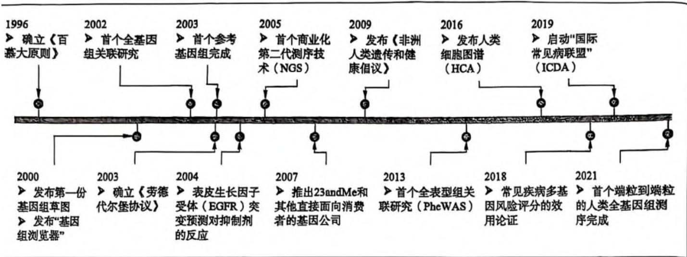  
10-1 人类基因组计划的关键成果

## 10.1.1 遗传图谱

遗传图谱(genetic map), 又称为连锁图谱(linkage map), 是指基因或 DNA 标记在染色体上的相对位置与遗传距离。通过遗传图我们可以大致了解各个基因或 DNA 片段之间的相对距离与方向, 了解哪个基因更靠近着丝粒, 哪个更靠近端粒等。遗传距离需通过遗传连锁分析确定, 后者是经典遗传学研究的重要手段。具体地, 在同源染色体的同一遗传位点上如果存在不同的等位基因多态性, 在产生配子的减数分裂过程中, 同源染色体既能相互配对也可能发生片段互换, 从而导致子代出现两个遗传位点等位基因的"重组", 该重组频率与这两个位点之间的距离呈正相关。于是, 科学上用两个位点之间的交换或重组频率来表示其遗传距离(图 10-2)。

遗传距离单位为厘摩(cM), 1 厘摩等于 1% 的重组率。cM 值越大, 表明两者之间距离越远。一般来说, 当重组率等于 50%, 即遗传距离等于 50 cM 时, 两个位点之间完全不连锁, 相当于不同染色体上的两个遗传位点间发生的随机交换。研究中所使用的遗传标记越多、越密集, 所得到的遗传连锁图的分辨率就越高。经典的遗传标记是可被电泳或免疫技术检出的蛋白质标记, 如红细胞 ABO 血型位点标记, 白细胞 HLA 位点标记等。然而, 由于人类本身不能像其他 "非人类" 生物那样进行 "选择性" 婚配, 子代个体数量较为有

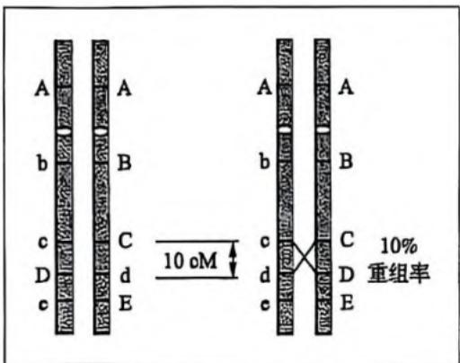  
第 10 章 基因组学和功能基因组学

限、世代寿命较长等客观原因,已知呈共显性的基因数量不多,等位基因的多态性也有限,使人类遗传性状研究受到很大的限制。DNA 多态性遗传标记检测技术的建立提供了大量新的人类基因组遗传标记。借助各类 DNA 多态性遗传标记,科学家们于 1994 年完成了包含 3000 个标签分辨率为 1 cM(即 1% 重组率)的遗传图谱的绘制。

理想的 DNA 标记一般应具备遗传多态性高、在基因组中大量存在且分布均匀、选择中性、稳定性及重现性好、分析效率高、检测手段简单快捷、易于实现自动化及开发成本和使用成本低等特征，目前已发展出十几种 DNA 标记技术。根据对 DNA 多态性的检测手段，DNA 标记可分为四大类：①基于 DNA-DNA 杂交的 DNA 标记，如限制性片段长度多态性（restriction fragment length polymorphism, RFLP）；②基于 PCR 的 DNA 标记，如随机扩增多态性 DNA（random amplified polymorphic DNA, RAPD）和简单序列重复（simple sequence repeat, SSR）标记等；③基于 PCR 与限制性酶切技术结合的 DNA 标记，如扩增片段长度多态性（amplified fragment length polymorphism, AFLP）标记和酶切扩增多态性序列（cleaved amplified polymorphic sequences, CAPS）标记；④基于单核苷酸多态性的 DNA 标记，如单核苷酸多态性（single nucleotide polymorphism, SNP）标记。这些 DNA 遗传标记各有优缺点（表 10-1），为不同的研究目的提供了丰富的技术手段。

表 10-1 各类 DNA 分子标记的比较

<table><tr><td></td><td>RFLP</td><td>RAPD</td><td>SSR</td><td>AFLP</td><td>SNP</td></tr><tr><td>基因组分布</td><td>低拷贝编码序列</td><td>整个基因组</td><td>整个基因组</td><td>整个基因组</td><td>整个基因组</td></tr><tr><td>遗传特点</td><td>共显性</td><td>多数显性</td><td>共显性</td><td>显性/共显性</td><td>显性/隐性</td></tr><tr><td>多态性</td><td>中等</td><td>较高</td><td>高</td><td>较高</td><td>高</td></tr><tr><td>检测基因座数</td><td>1~3</td><td>1~10</td><td>多数为1</td><td>20~200</td><td>1</td></tr><tr><td rowspan="2">探针/引物类型</td><td>gDNA或cDNA</td><td>9~10 bp</td><td>14~16 bp</td><td>16~20 bp</td><td>16~20 bp</td></tr><tr><td>特异性低拷贝探针</td><td>随机引物</td><td>特异引物</td><td>特异引物</td><td>特异引物</td></tr><tr><td>技术难度</td><td>高</td><td>低</td><td>低</td><td>中等</td><td>低</td></tr><tr><td>同位素使用情况</td><td>通常用</td><td>不用</td><td>可不用</td><td>通常用</td><td>不用</td></tr><tr><td>可靠性</td><td>高</td><td>低/中等</td><td>高</td><td>高</td><td>高</td></tr><tr><td>耗时</td><td>多</td><td>少</td><td>少</td><td>中</td><td>少</td></tr><tr><td>成本</td><td>高</td><td>较低</td><td>中等</td><td>较高</td><td>低</td></tr></table>

RFLP 和 RAPD 标记属于第一代 DNA 遗传标记。RFLP 标记的检测主要针对的是单拷贝或低拷贝的区域，需针对特定的 DNA 片段设计探针，并采用放射性同位素及核酸杂交技术进行检测，存在安全问题，检测的灵敏度也较低。相对地，RAPD 标记采用随机引物进行 PCR 扩增，不需要合成特异性探针，可针对整个基因组进行检测，安全性高，操作简单，检测速度快，但同时由于其对反应条件的高敏感度，导致其检测存在稳定性和重复性差等问题。

SSR 标记属于第二代 DNA 遗传标记,也叫做微卫星序列 (microsatellite sequence) 标记或短串联重复序列多态性 (short tandem repeat polymorphism, STRP) 标记,在基因组上广泛存在,具有丰富的多态性、高度的重复性和可靠性等优点,已被广泛地应用于遗传图谱构建和基因定位等领域。以 STRP 标记为主体,科学家们构建了包含 5264 个标记的人类基因组遗传标记连锁图谱,平均分辨率已达 600 kb,其中第 17 号染色体上平均每 495 kb 有一个标记,第 9 号染色体上平均每 767 kb 有一个标记,整个基因组中只有 3 处标记间距大于 4 Mb。目前,已有多个物种商品化的 SSR 标记,省去了设计开发的过程,可快速稳定地检测样品间的多态性,因而被广泛应用于遗传作图和样品鉴定等方面。

作为第三代 DNA 遗传标记, SNP 标记在密度上可以达到人类基因组"多态性"位点数目的极限, 是目前应用最广泛的遗传标记, 包括单个碱基的替换、缺失和插入, 其中单碱基替换发生的频率显著高于缺失和插入变异。到目前为止, 已经在人类基因组发现了超过 1000 万个 SNP 位点, 平均每 300 个碱基对中就有一个 SNP。由于基因组不同部分受到的选择压力不同, 而且基因组中蛋白质编码序列仅占 $10\%$ 以下, 绝大多数 SNP 位于非编码区。与 RFLP 和 STRP 标记的主要不同之处在于, SNP 标记不再以 DNA 片段的长度变化作为检测手段, 而是直接以序列变异作为标记(图 10-3)。SNP 遗传标记分析完全摒弃了经典的凝胶电泳, 采用新的 DNA 芯片技术进行检测, 在人类基因组遗传图谱的绘制中发挥了重要的作用。

遗传图谱的建立为人类疾病相关基因的分离和克隆奠定了基础。人类基因组遗传图谱包含5000多个遗传学位点，相当于把整个人类基因组划分为5000多个小区，并分别设置了"标牌"。将多态性的遗传标记与疾病和非疾病个体进行比较关联分析时，如果该标记与疾病表型不连锁（重组率为 $50\%$ ），表明疾病相关基因不在此标记附近；如果该标记与疾病表型存在一定程度的连锁（重组率为 $0\% \sim 50\%$ ），表明疾病相关基因可能位于此标记附近；如果该标记和疾病表型间重组率为0，则可以推断疾病相关基因可能与此标记非常接近。

图 10-3 单核苷酸多态性(SNP)标记的产生及检测原理  
(a) SNP的产生；(b) SNP的产生影响了DNA序列间杂交的强度。  
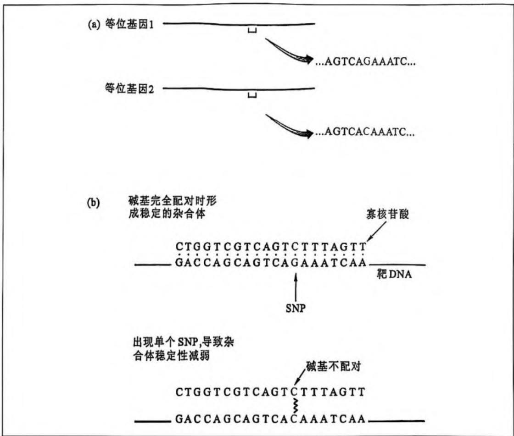

## 10.1.2 物理图谱

人类基因组物理图谱(physical map)是指以已知核苷酸序列的 DNA 序列标签位点(sequence-tagged site, STS)为"路标"，以碱基对(bp、kb、Mb)作为基本测量单位(图距)构建的基因组图。任何 DNA 序列，只要知道它在基因组中的位置，都能被用作 STS 标签。一般 STS 标签长度在 100\~500 bp。构建物理图谱的主要内容是建立相互重叠连接的、相连 DNA 片段群——重叠群(contig)，并用 PCR 方法予以验证。

建立 STS 物理图之前,首先需要得到至少 5 套包含相关染色体或整个基因组的 DNA 片段(图 10-4)。然后,分别用各个 DNA 片段做模板,用来自不同 STS 标签上的序列做引物进行 PCR 扩增。如果某两个 STS 标签在基因组上靠得很近,它们有可能一直同时出现在 DNA 大片段上;如果某两个 STS 标签在基因组上相距较远,它们同时出现在一个 DNA 大片段上的几率就会小得多。只要有一定数量的 STS 标签,所有 DNA 大片段在该染色体或基因组中的位置都能被确定下来。基于 STS 的物理图谱可以将来自经典遗传学及细胞遗传学中的基因位点信息转化为基因组上的物理位点信息,并直接以这些片段为材料进行基因克隆和分析。

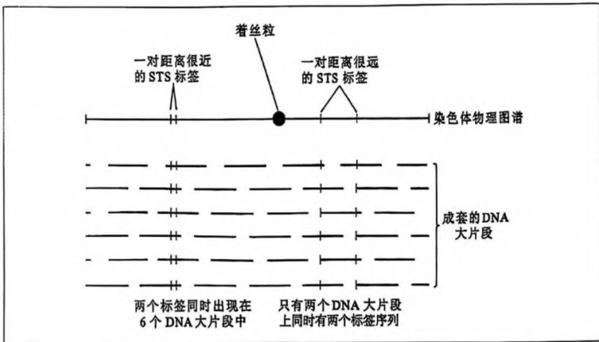  
图 10-4 采用 STS 标签技术构建基因组物理图谱

## 10.1.3 转录图谱

在整个人类基因组中,绝大部分为非编码区域,具有编码蛋白功能的基因区域仅占2%左右,可编码2万\~2.5万个蛋白质。生物性状,包括人类的各种疾病,主要是由结构或功能蛋白质所决定的,而所有已知蛋白质都是由带有多腺苷酸尾的 mRNA 按照遗传三联密码子的规律翻译产生的。因此,分离纯化 mRNA(或 cDNA)、提取基因组的可转录部分对于了解生命现象是至关重要的。人类基因组转录图谱,也被称为基因表达谱(expression profiling),或表达序列标签(expressed sequence tag,EST)图,是人类基因组图的重要组成部分。实验中可通过得到的一段 cDNA 或 EST 序列,筛选出全长的转录物,并根据其序列的特异性将该转录物所代表的基因准确地定位于基因组上。

在人类成年个体的特定组织中,一般只有 $10\% \sim 20\%$ 的基因表达(1万\~2万个不同类型的mRNA)。通过分离特定组织在某一发展阶段或某种生理条件下的总mRNA,合成cDNA并进行序列分析,即可得到该组织在特定条件下的转录图谱信息。另外,通过测定同一转录物的数量,还可以进一步得到各转录物的表达量信息。收集各种组织、细胞,或同一组织、细胞在不同时期或不同生理状态下的基因表达谱进行两两或多重比较,可以比较全面地了解哪些基因是特异性表达的,哪些是组成型表达的,哪些基因受发育过程的调控,哪些受生理状态或外部环境的调控。将这些表达信息标记到相应的组织、细胞中,就可以绘出区分200余种人体基本组织或不同细胞的人体基因图(body-map)。基因表达谱使人们更系统、更全面地研究特定细胞、组织或器官的基因表达模式并解释其生理属性,更深入地认识生长、发育、分化、衰老和疾病的发生机制。

## 10.1.4 全序列图谱

人类基因组的核苷酸序列图谱是分子水平上最高层次的、最详尽的物理图谱。测定总长约1 m、由30亿个核苷酸组成的全序列是人类基因组计划中最主要的任务。第一个完成的人类基因组全序列图谱来自一个代表性人类个体，其全序列理论上代表了全人类的基因组信息，可作为所有个体的参考基因组，为基因分析和诊断提供各种参考信息。研究发现，人类基因组与其他动物基因组在染色体水平上具有高度同源性和共线性。如图10-5所示，人类第21号染色体HSA21位点与小鼠第16号染色体MMU16、MMU17和MMU10连锁图谱的比较，可以很清楚地看出，两者之间存在着广泛的同源性。

## 10.2 高通量测序技术的起源、发展与应用

对于每个生物体来说,基因组包含了整个生物体的遗传信息。快速和准确地获取生物体的全部遗传信息对于生命科学研究具有十分重要的意义。人类基因组计划的实施,极大地促进了全基因组测序技术的发展,让人们能够更好地了解生物个体或种群的基因组遗传信息,对生命科学的研究至关重要。

1954 年 Whitfield 等提出的化学降解方法测定多聚核糖核苷酸序列是最早的测序技术。直到 1977 年, Sanger 和 Gilbert 等分别发明了双脱氧核苷酸末端终止法 (Sanger 法) 和化学降解法 (Gilbert 法), 标志着第一代测序技术的诞生。应用第一代测序技术, 人们解析了从噬菌体基因组到人类基因组草图等大量测序工作, 但其成本高、速度慢、通量低, 使得发展新的、更高效的测序技术成为必然。经过科学家们的不断尝试和创新, 多家公司陆续推出了第二代测序技术, 包括 Roche 公司的 454 技术、Illumina 公司的 Solexa 技术和 ABI 公司的 SOLiD 技术等。随着测序技术向着高通量、低成本、长读取长度方向的发展, 第三代测序技术也应运而生, 包括 Helicos 公司的 Heliscope 单分子测序技术、

第 10 章 基因组学和功能基因组学

图10-5 人类第21号染色体HSA21位点与小鼠16号染色体MMU16、MML17和MMU10位点存在明显的共线性

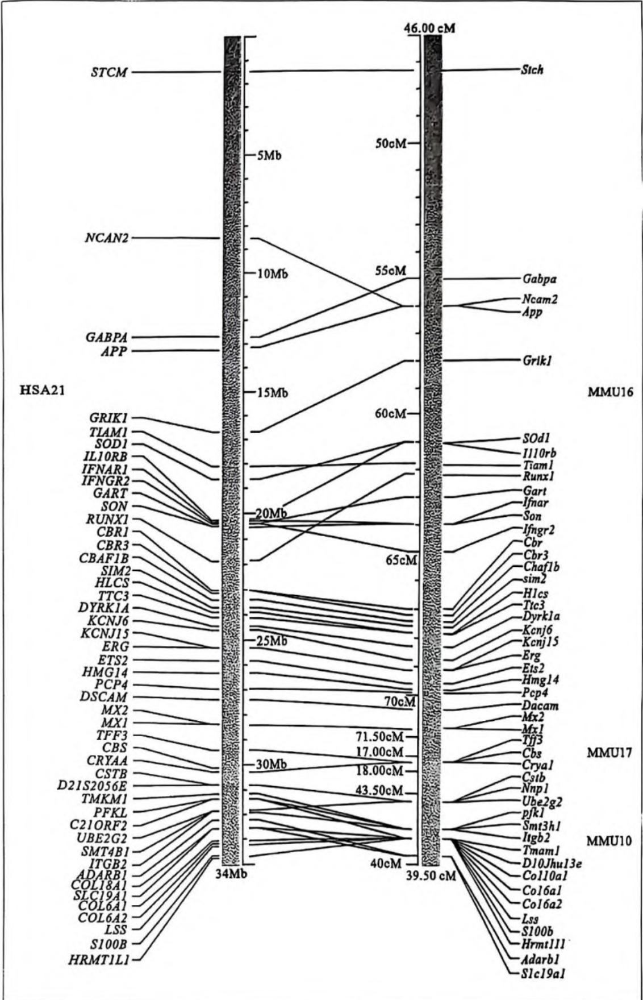

Pacific Biosciences 公司的单分子实时 (single molecule real time, SMRT) 测序技术和 Oxford Nanopore Technologies 公司的纳米孔单分子测序技术等。

## 10.2.1 三代测序技术及比较

## 1. 第一代测序技术

第一代测序技术中,Sanger法通过引入带放射性同位素标记的ddNTP随机中断合成待测序列,然后借助凝胶电泳和放射自显影技术对待测DNA分子进行测序。此方法要求使用适当的DNA引物,以单链DNA为模板,在DNA聚合酶的催化下进行DNA的合成,因此也称为引物合成法或酶催引物合成法。在DNA测序反应中,由于ddNTP没有3'-OH基团,ddNTP取代常规的脱氧核苷酸(dNTP)掺入到寡核苷酸链的3'端之后,阻断了DNA聚合反应,寡核苷酸链不再继续延长,进而发生了特异性的链终止效应。在同一个反应中,加入大量带 $^{52}$ P放射性标记的4种dNTP及适量的某种ddNTP,经过适当的温育之后,将会产生出不同长度的DNA片段混合物。这些混合物都具有同样的5'端,并在3'端的ddNTP处终止。将这种混合物加到变性凝胶上进行电泳分离,就可以获得一系列全部以3'端ddNTP为终止残基的DNA片段的电泳谱带。之后,通过放射自显影的方法检测单链DNA片段的放射性带,就可以直接读出DNA的核苷酸顺序,一般一次测序反应的长度不超过1000 bp。与Sanger法不同,Gilbert法需先用特定的化学试剂标记碱基,然后用化学方法打断待测DNA序列,再通过电泳方法读出序列信息。在DNA测序技术发展过程中,Sanger法最终因其更适合于序列分析的自动化而逐渐占据了显著的优势地位。

## 2. 第二代测序技术

与第一代测序技术相比,第二代测序技术(next generation sequencing, NGS)在保持高准确度的基础上,大大降低了测序成本,极大地提高了测序速度。Sanger法耗费了三年时间总共30亿美元的投入才完成人类基因组计划,而第二代SOLiD测序技术则可在一周左右完成相同的测序工作,充分体现了第二代测序技术的高效性。与Sanger法中采用细菌克隆培养扩增待测样本的策略不同(图10-6a),第二代测序技术均采用在随机片段化基因组DNA后,直接在体外连接上包含barcode序列(用于区分不同样品)和PCR扩增引物序列的共同接头序列(adaptor sequence),通过PCR扩增产生成簇的扩增子,最终固定到固态反应基底的不同位置上,进而通过一系列自动循环的酶促生化反应和图像收集过程对DNA序列进行检测(图10-6b)。相对于Sanger测序法,第二代测序所采取的体外构建测序文库、体外扩增测序模板以及更高密度的阵列化测序更大地提高了测序的自动化和平行化,从而降低了测定单位碱基所消耗的各种生化试剂,大大降低了测序成本。但是,由于第二代测序技术产出的序列长度较短,测序中容易引入随机错误,需加大测序量,并经过更多的计算机分析才能较好的完成基因组的组装,为基因组的组装带来了巨大的挑战。

Roche(454)测序技术(图10-7)中,待测序列首先会被随机打断成300\~800 bp的小片段,然后在两端加上不同的接头,构建单链DNA(single strand DNA,ssDNA)文库;之后将ssDNA在合适的条件下,连接到载体磁珠上,并进行乳液PCR(emulsion PCR),使得每个磁

图10-6 传坑Sunset法测序(a)与第二代测序技术(b)原理比较(另见书末彩摘)

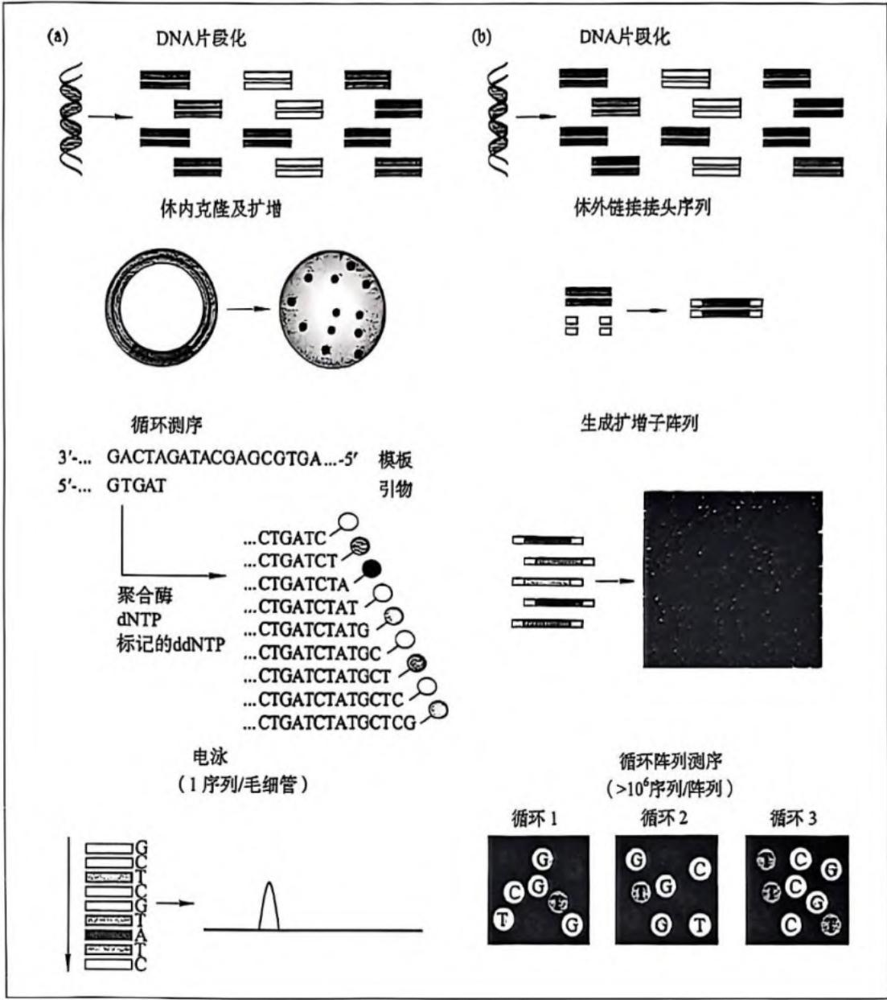

珠上的 DNA 扩大到测序所需的浓度; 反应结束后, 破坏孵育体系, 并将富集带 DNA 的磁珠固定在平板上, 以供测序; 之后以磁珠上的 ssDNA 为模板, 每次加入一种 dNTP 进行反应, 产生荧光, 并用信号收集器进行荧光信号采集; 最后, 通过相应的信号分析软件进行分析, 得出测序结果, 并进行后续的分析。此技术测序读取长度可达到 400 bp, 有效提高了后续序列的拼接效率和准确性。然而, 每个循环仅能产生 400\~600 Mb 数据, 产量较低, 导致测序成本较高。此外, 此技术无法准确测量连续多个同一类型碱基的长度, 导致测序的错误主要来自插入和缺失, 如当待测序列中出现 poly(A) 的情况下, 测序反应中会一次加上多个 T, 而加入 T 的数目只能从荧光信号的强度来推测, 从而造成结果不准确。

Illumina 公司推出的 Solexa 测序技术 $^{[15]10-8}$ 采用边合成边测序方法进行测序, 即利用单分子阵列技术在芯片 (Flow Cell) 上进行桥式 PCR 反应, 通过可逆阻断技术实现每次反应只合成一个碱基, 再利用相应的激光激发碱基附着的荧光基团发光, 并用高精度照相机捕获激发光, 从而读取碱基信息。Solexa 测序可采用单末端或双末端测序法对片段进行测序, 后者在构建待测 DNA 文库时在两端的接头上都加上了测序引物结合位点, 在第一轮测序完成后,去除第一轮测序的模板链,用双末端测序模块(Paired-End Module)引导互补链在原位置再生和扩增,以达到第二轮测序所用的模板量,进行第二轮互补链的合成测序。双末端测序法使得读取长度达到2×75 bp,测序的长度仍有所欠缺,导致后续的序列拼接工作的计算量和难度大大增加。由于Solexa技术在合成中每次只添加一个dNTP,因此能很好的解决同聚物长度准确测量的问题。其主要错误来源是核苷酸替换,错误率大概在1%\~1.5%之间。后续更新的各类Illumina测序平台可达到2×250 bp的读长,不过由于测序中荧光标记和终止修饰基团的切除反应不完全而引入的随机错误以及测序引物的影响,导致测序前5\~10 bp和最后5 bp数据的可靠性较低,有效读长相对较短,需增加测序深度以获得更多高质量的测序数据。目前,由于Illumina测序周期短、通量高、成本低,相关平台已在全世界广泛应用,也有多家国内外公司开发出类似的高通量测序平台。

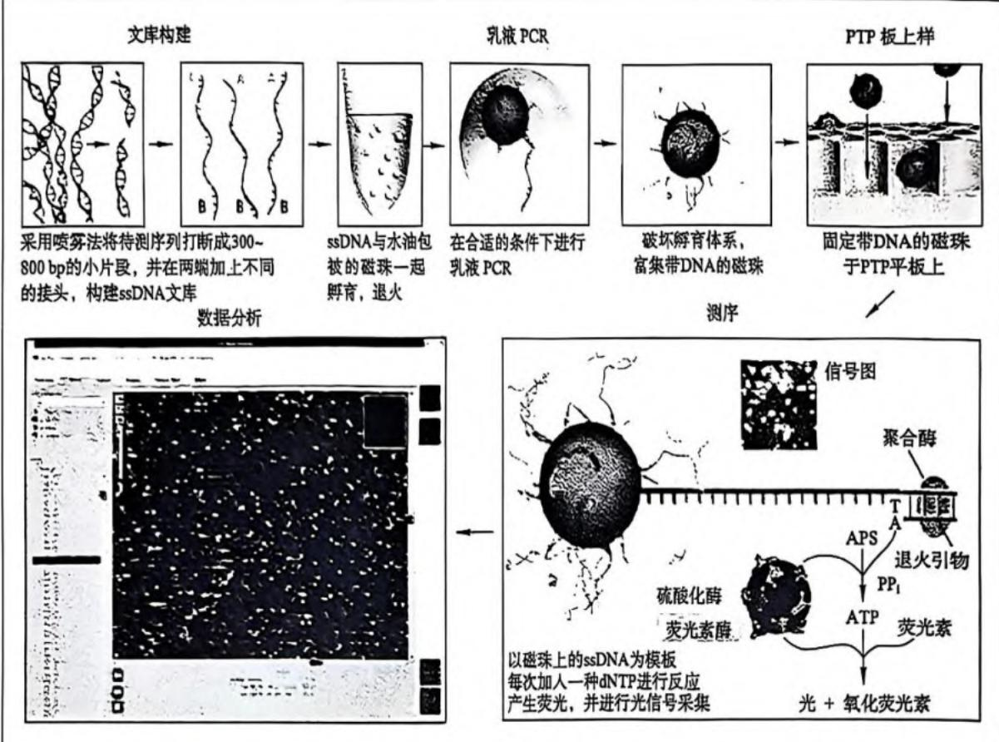  
图 10-7 Roche(454)GSFLX 测序流程图(另见书末彩插)

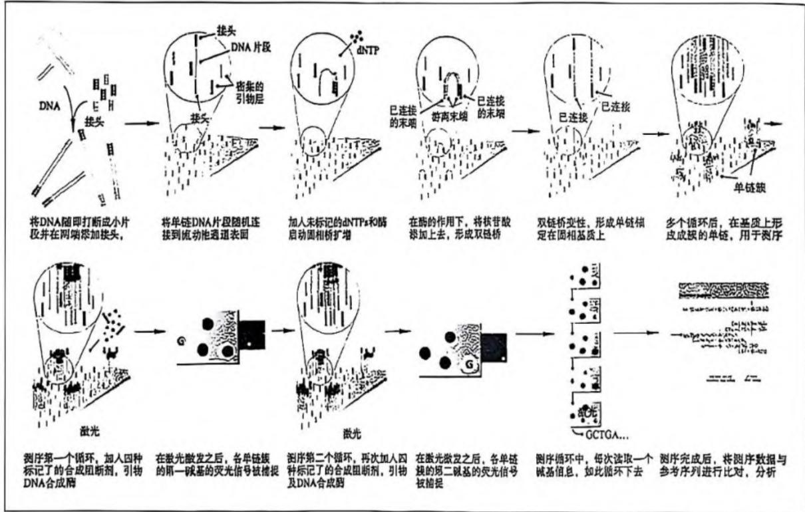  
图 10-8 Solexa 浏序流程图（另见书末彩插）

ABI 公司研发的 SOLiD 测序技术 $^{(图 10-9)}$ 是一种基于连接酶的测序法, 即利用 DNA 连接酶在连接过程中进行测序。SOLiD 系统在 DNA 片段化、接头序列的连接以及模板扩增等步骤上均与 Illumina 平台相似, 但测序过程中链延伸的反应并非由 DNA 聚合酶催化, 而是由 DNA 连接酶催化完成。通用的测序引物与小磁珠上待测序列末端的接头序列杂交后, 每轮测序过程都涉及 DNA 连接酶催化被荧光标记的简并八聚核苷酸探针的连接反应 $^{(图 10-9a)}$ 。SOLiD 系统采用双碱基编码探针, 即简并八核苷酸探针的第一位和第二位碱基决定探针所带的荧光标记的颜色。测序引物与模板 DNA 杂交后便启动了 1、2 位编码的八核苷酸探针与模板的杂交, 随后便进入连接酶催化连接、荧光信号采集、切除探针后 3 位核苷酸及标记荧光标签的循环 $^{(图 10-9a)}$ 。经过 10 次这样的循环产生 10 个对应的荧光标记信号, 每个标记对应于 DNA 序列上每五个碱基中的前两个碱基序列。随后经变性恢复模板单链, 选用一个 "n-1" 引物, 开始新一轮的 10 次连接反应循环。"n-1" 引物重新设定了被检测碱基的位置, 所得到的 10 个荧光标记对应的碱基均向左移了一位。这样分别用 5 个依次位移的引物起始互补链的延伸, 再将得到的不同颜色荧光标记按顺序线性列出, 比对到参考基因组上, 最终解码出 DNA 序列 $^{(图 10-9b)}$ 。采用双碱基编码系统, 同时考虑相邻的荧光颜色可有效提高序列检测的准确性, 精确度能达到 99.94% 以上。然而, 与 Solexa 技术类似, SOLiD 测序读取长度也较短 (2 × 50 bp), 后续的序列拼接工作也比较复杂。

基于第二代测序技术,科学家们根据不同的研究目的,在传统的 DNA 和 RNA 测序方法基础上开发出了多种有效检测群体、个体、器官水平上的基因组变异、转录物组差异或染色体构象变化等方面的测序方法,如用于大批量低深度检测群体基因变异的限制性酶切位点 DNA 测序(restriction site-associated DNA sequencing,RAD-seq),用于检测染色体开放状态的 ATAC-seq (assay for transposase-accessible chromatin sequencing),基于核酸酶 MNase 酶切的 MNase-seq 和基于限制性内切酶 DNase I 的 DNase-seq,用于检测基因甲基化水平的 BS-seq (bisulfite sequencing),用于检测翻译水平和状态的核糖体图谱检测技术 Ribo-seq (ribosome profiling) 等。随着研究的深入和测序技术的发展,未来必将会出现更

## 图 10-9 SOLiD 测序原理图(另见书末彩插)

(a) SOLiD 测序 5 轮连接反应前 2 轮示意图，探针 3' 端第 1、2 位两个碱基决定荧光标记，杂交后探针 3' 端 6\~8 位碱基连同荧光标记被酶切切除，因此第一轮连接获得 (1,2); (6,7); …; (1+n\*5;2+n\*5) 位的序列信息，然后下 4 轮探针依次左移一位，这样 5 轮反应获得全部序列信息；(b) SOLiD 测序结果。根据每轮反应对应的双碱基编码矩阵进行基因组比对，SNP 位点会造成 2 轮反应荧光信号的改变。

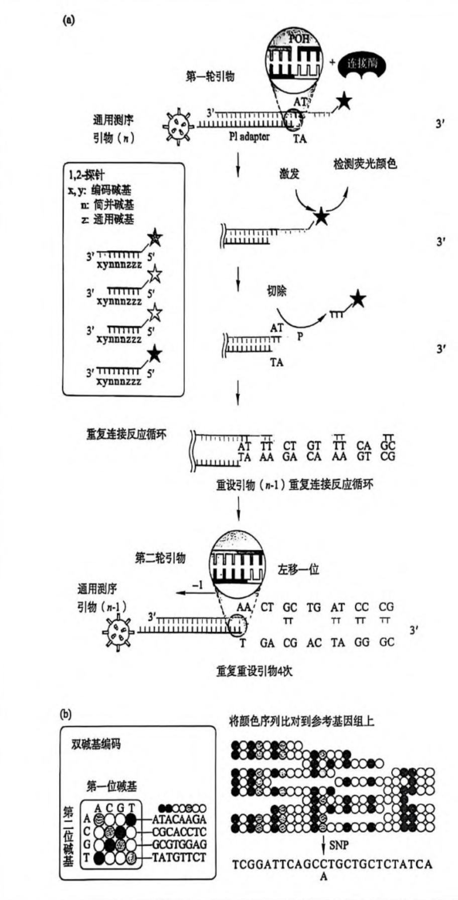

多样化更高效率的测序方法。

## 3. 第三代测序技术

相较于前两代测序技术,第三代测序技术的最大特点是单分子测序。其中,SMRT技术和Heliscope技术均利用荧光信号进行测序,而纳米孔(nanopore)单分子测序技术则依赖于不同碱基产生的电信号进行测序。对物种基因组的组装是开展基因功能研究的基础。然而,由于第二代测序数据读长较短,导致仅通过第二代测序数据获得组装效果较好的基因组序列信息较为困难。SMRT技术和Nanopore技术可产生读长较长的数据,有效提高基因组组装的效果。

Helicos 公司推出的 Heliscope 单分子测序技术是基于边合成边测序的思路, 将待测序列随机打断后添加 3'-poly(A) 尾, 然后利用末端转移酶在接头末端加上荧光标记。测序片段与表面带有寡聚 poly(T) 的平板杂交后, 加入 DNA 聚合酶和荧光标记的 dNTP 进行 DNA 合成反应, 每一轮反应添加一种 dNTP。随后, 洗脱未参与反应的酶和 dNTP, 并对荧光信号进行检测和采集。在开始下一轮反应前, 采用化学试剂淬灭荧光标记, 然后经过不断地重复合成、洗脱、成像、淬灭过程, 最终完成测序。然而 Heliscope 技术的读长较短, 一般 30\~35 bp, 同时在检测连续多个同样碱基上有所欠缺。经过二次测序, 检测的准确度可有效提高, 错误率可降至 0.001%。

与 Heliscope 技术类似, SMRT 测序技术也是基于边合成边测序的思路, 以 SMRT 芯片为测序载体进行测序反应。DNA 聚合酶被固定在包含很多零模波导 (zero mode waveguide, ZMW) 孔的芯片基底表面, 之后将 4 种带有不同荧光标记的 dNTP 以最适于 DNA 聚合反应的浓度 ( $\mu$ g 分子级别) 添加到反应体系中, 由 DNA 聚合酶与结合了引物的单分子模板序列结合, 催化链的延伸 (图 10-10)。ZMW 孔结构使得激光对荧光染料的激发被限制在 $10^{-21}$ L 的空间内, 从而只激发处于该范围内的正在反应的荧光染料, 排除反应体系中其他所有带荧光标记的 dNTP 的干扰。一旦核苷酸被整合到 DNA 链中, 连接荧光标记的焦磷酸副产物很快扩散出 ZMW 的检测区域, 荧光信号也随之衰减到背景水平。随后模板移动到下一位, 开始新一轮核苷酸的整合和信号检测。SMRT 技术属于实时监测的测序平台, 也是所有新测序平台中读长最长的测序方法, 读长可达 1000 碱基或更长。由于两次核苷酸被整合事件之间的间隔时间极短, 而且有些核苷酸在被整合入 DNA 链之前就被释放, 该方法测序精确度不高, 只有 80% 左右。实验中, 通过对同一模板进行 15 次或更多次序列测定, 可将精确度提高到 99% 以上。

纳米孔测序策略完全有别于基于链合成的测序方法。该方法将核酸分子驱动通过一个纳米孔，逐个检测单碱基与纳米孔的相互作用，或者检测DNA通过纳米孔时电导系数的变化，进而推测核酸分子的序列。目前，基于纳米孔测序技术的MinION测序平台已经商业化，其测序仪仅U盘大小，应用前景备受关注。MinION采用生物膜定位的孔蛋白形成的纳米孔进行测序，经过改造后的生物膜孔蛋白如溶血素(α-hemolysin)会形成直径约1 nm、长10 nm的通道，利用核酸序列通过这一通道时每个碱基产生的特征电流强度来读取序列信息 $^{[图10-10h]}$ 。纳米孔测序不涉及聚合反应且直接显示测序结果，因此具有反应快、体积小、成本低、读长长和测序时间短等特点。但是，由于核酸通过纳米孔的速度较快，前后碱基信号的交叠等影响，纳米孔测序的错误率较高。随着技术的进步及新的单分子纳米孔材料的研发，单分子纳米孔测序通量和准确率得到了有效的提高，其优势也日益突出。

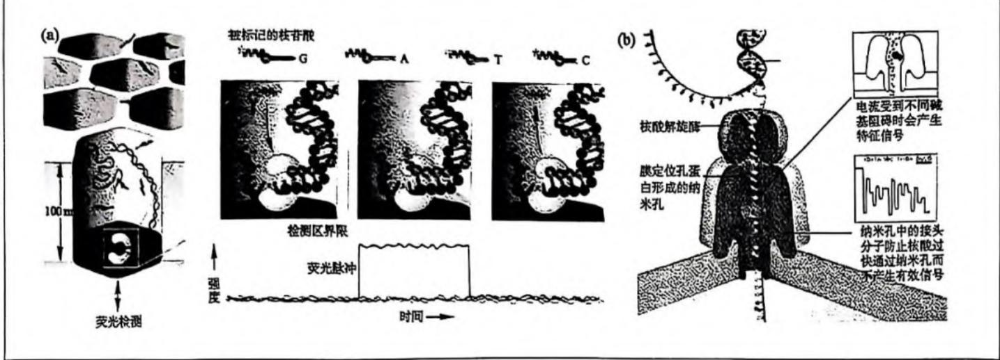  
图 10-10 单分子实时测序 (SMRT) 技术和纳米孔技术  
(a) SMRT 单分子孔及测序反应流程图；(b) 纳米孔单分子测序原理示意图。

综合三代测序技术来看,测序成本、读取长度和测序通量是评价测序技术先进与否的重要标准。测序成本是一个很重要的因素,它在一定程度上决定了基因组测序应用的普及性。更长的读取长度可以减少测序后的拼接工作量,但也可能会降低测序结果的准确性。更高的测序通量能够在一定程度上降低测序成本,提高科研工作的效率。第二代测序技术在第一代测序技术的基础上,使测序通量大大提高,但因为测序过程中采用了PCR,使得测序错误率增加。第三代测序技术解决了错误率的问题,通过增加荧光的信号强度及提高仪器的灵敏度等方法,使测序不再需要PCR扩增这个环节,实现了单分子测序并继承了高通量测序的优点,但其成本较高。因此,开发更有效的测序方法,有效降低测序成本,提高测序通量、读长和准确性,必将是未来测序技术发展的方向。

## 10.2.2 高通量测序技术的延伸与发展

随着科学研究逐渐由宏观的群体或个体到器官,再到细胞层面的逐渐深入,常用的混合式第二代测序技术已无法满足更加精细的测序需求。单细胞测序(single cell sequencing)技术的提出,将测序的维度提升到单细胞水平。单细胞测序基于第二代测序技术,只不过关注的是单细胞基因组、转录物组、表观组或染色体构象等信息。传统的测序方法只能得到许多细胞的平均情况,无法获得细胞间的异质性信息。通过对单个细胞的全基因组、转录物组和表观基因组进行测序,将为解析细胞分裂、分化、器官发育、胁迫响应、疾病发生和发展等过程中的细胞异质性及内在的分子机理提供强有力的支持。目前,单细胞测序主要用来检测单个细胞内的转录物组,根据测序对象的不同,可分为针对

第10章 基因组学和功能基因组学

单个细胞的转录物组测序(single-cell RNA-seq, scRNA-seq)和针对单核的转录物组测序(single-nucleus RNA-seq, snRNA-seq)。自2009年首次提出，单细胞测序技术受到广泛的关注并日渐成熟，也越来越多地被应用到各类生物学研究中。相较于传统的RNA-seq, scRNA-seq可以有效探索组织中存在的细胞类型或亚群，识别未知或稀有的细胞类型或状态，阐明细胞分化过程或不同发育阶段内基因的表达变化，检测特定细胞亚群的差异化表达，进而推断内在的基因调控网络。

目前常见的单细胞测序仪器主要基于液滴法或微孔法。近几年内，单细胞测序市场规模增长迅速，已有多家公司和研究机构推出了通量高、短时高效的单细胞测序平台，包括 $10 \times$ Genomics公司推出的Chromium单细胞平台和华大智造推出的DNBelab C4平台等。Chromium单细胞平台通过微流控芯片技术获得单细胞反应体系，并在传统文库构建的基础上引入标签(barcode)，进而通过追溯标签序列将测序数据定位到每个细胞或每个大片段。此平台细胞通量高，可同时做8个样本，产出8万多个细胞，细胞捕获率高达 $65\%$ ，多细胞发生率低于 $0.9\% / 1000$ 细胞，短时间内即可完成细胞封装和测序文库的构建。DNBelab C4平台采用自主设计的捕获磁珠，单个磁珠可一次性高效捕获多达上百条序列，通过引入自主研发的多磁珠识别技术，可有效提高基因捕获效率及获取细胞的完整信息。虽然此平台的细胞捕获率比Chromium平台低，产生多细胞的比例也较高，但其成本低，通量高，便于携带，适合大样本量的单细胞建库。

随着单细胞测序技术的不断成熟,单细胞测序将应用到更多的研究领域中,包括胚胎发育、衰老与免疫、肿瘤发生与治疗、神经和肝细胞发育、植物生长发育和胁迫响应等。然而,单细胞测序中的细胞完整性、批次效应(batch effect)、捕获效率及多细胞率等问题,也使得单细胞数据的分析更加复杂。提高单细胞测序技术的准确性,开发更高效合理的单细胞数据分析方法,是单细胞测序技术广泛应用的必经之路。

## 10.3 功能基因组学及其应用

DNA 中编码的遗传信息受到各种复杂的调控, 包括 DNA 甲基化、组蛋白甲基化和乙酰化等表观遗传修饰, 各种转录因子, 转录、翻译复合物与 DNA、RNA 的相互作用, 增强子、绝缘子与各种反式作用因子间的相互作用及染色质高级结构等。随着基因组学的发展, 基因组学的研究已经由全基因组测序的结构基因组学转向以基因功能鉴定为目标的功能基因组学 (functional genomics) 研究, 研究的尺度也由单一基因和蛋白质逐渐转变为系统性鉴定与分析生物体内所有的基因和蛋白质。功能基因组学也称为后基因组学 (post-genomics), 是基因组分析的新阶段, 主要通过高通量实验结合生物信息分析的方法批量研究基因的生化功能、基因组多样性 (基因变异检测及基因定位)、基因组的表达及时空调控 (转录调控和表观调控)、染色体空间构象、蛋白质翻译和代谢变化等。

## 10.3.1 基因变异分析

人类基因组中的变异与人类的演化、生长发育、疾病发生等方面都有着密切的联系。这些变异按照其特征可分为单核苷酸多态性(SNP)、小的插入和缺失(insertion and deletion, Indel)以及基因结构性变异(structure variation, SV)(图10-11)。SNP作为基因组上最广泛的遗传标记,不仅在人类基因组遗传图谱的绘制上发挥了巨大作用,也为确定疾病的遗传学基础提供了充足的信息。Indel在基因组上也广泛存在,长度一般在50 bp以下,可导致编码的蛋白提前终止或移位。SV是基因组上大的基因结构变异,包括较长的插入或缺失、串联重复(tandem repeat)、染色体倒位(inversion)、染色体内部或染色体间的易位(translocation)、拷贝数变异(copy number variation, CNV)及更为复杂的嵌合型变异。SV对基因组的影响比SNP和Indel更大,一旦发生即会对生命体产生严重的影响,例如人9号染色体长臂22号染色体长臂发生异位,形成一个异常的小型染色体,导致癌症的发生。

随着测序技术的发展和测序数据的大量产生,越来越多的物种基因组被发布,为鉴定各物种全基因组上的基因变异提供了重要的参考基因组信息。当前第二代短读长高通量测序技术,虽然能够让测序成本大大降低,但这种短读长的测序方法也给基因组的变异检测(特别是结构性变异检测)带来了不小的挑战。

一般来说,基于第二代或第三代测序的数据需经过质量控制(quality control, QC)去除低质量数据,以降低低质量数据对后续分析准确性的影响。通过将质量控制后的数据比对到参考基因组上,我们即可获得测序样本与参考基因组间的变异信息。目前,根据测序数据获得基因组结构变异的方法可被分为四类:①基于双端测序匹配的方法;②基于测序序列分割匹配的方法;③基于测序数据覆盖度的方法;④基于组装的方法。这四类基因结构变异检测方法中,除了第三种主要适用于缺失和拷贝数变异两类变异的检测,其他方法均适用于所有类型基因组结构变异的检测。这四种检测方法在检测精度、可检测结构变异的大小范围和鉴定复杂度等方面具有一定的区别。其中，基于测序数据覆盖度的方法虽然可以检测较大的变异，但其精度较低；而基于测序序列分割匹配的方法虽具有较高的精度，但其检测的变异通常偏小。四类方法各有优缺点，联合使用时可有效提高基因变异检测的范围和精度。然而，判断某个基因组变异是否与表型相关，还需要进行表型－基因型关联分析，或基于表型分离群体定位与性状相关的功能基因。

图10-11 基因组上基因变异类型  
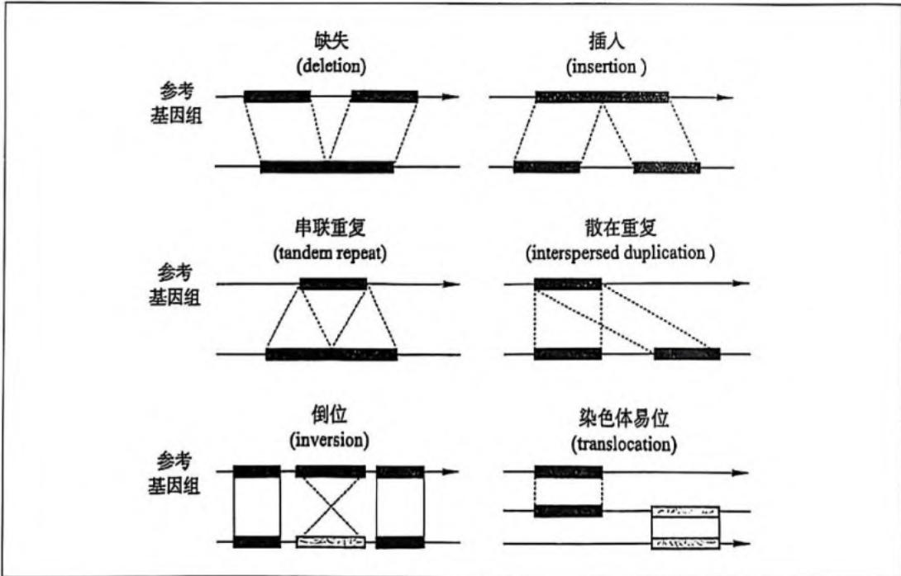

## 10.3.2 功能基因定位

功能基因定位是指依据连锁关系,借助分子标记等工具将基因定位到基因组上特定的位置,在遗传学研究中起到至关重要的作用。第二代测序技术的发展加快了对基因组的解析,越来越多的物种基因组信息被公布。随之而来的,大量的分子标记和基于第二代测序技术的分析方法被开发和应用,极大地促进了对控制性状相关基因的定位和功能研究。探究未知基因的功能,解析基因间复杂的互作网络,挖掘具有重要功能的基因资源,对基因进行定位和克隆显得尤为重要。

一般来说,研究某个基因的功能,可以从该基因出发,通过筛选该基因上的突变(序列变异或表达变异),并观察突变是否造成可稳定遗传的表型,从而将该基因与表型关联起来,这种研究的方法称为反向遗传学(reverse genetics)。TILLING 技术(targeting induced local lesions in genomes)是一种常用的反向遗传学定位基因组上化学诱变导致的突变位点的方法,通常依赖于 PCR 扩增时突变位点处异源 DNA 双链核酸分子的形成,随后被单链核酸酶剪切释放出荧光,从而检测目的基因上的突变位点。此技术相对简单,可以用来预测突变频率,对指导构建突变体具有实际意义,借助高通量技术可快速批量筛选具有特定基因上突变位点的个体。然而,此方法需依赖于已知的基因信息设计特异的引物,对于未知基因则不太适用。此外,多倍体物种中来源于不同祖先的基因组间存在较多的同源基因,这些基因上的差异对于 TILLING 鉴定诱变产生的突变位点具有一定的干扰。

与反向遗传学不同,正向遗传学(forward genetics)则从性状出发,通过构建定位群体,并借助分子标记或第二代测序技术等,定位与性状相关的基因。主要包括传统图位克隆(map-based cloning/positional cloning)、基于DNA重测序定位的方法、基于RNA-seq定位的方法及传统图位克隆与第二代测序结合定位的方法等。下面将以植物为例,介绍和讨论相关的功能基因定位方法。

图位克隆是一种有效的正向遗传学定位基因的方法。它通过将突变体与远缘野生型亲本进行杂交，构建定位群体，然后借助DNA分子标记，筛选在定位群体中突变体与野生型植株具有差异的标记，并通过与表型进行关联分析，确定与突变基因紧密连锁的分子标记，获得初步定位区间，然后再通过不断加密分子标记，利用大定位群体对候选基因进行精细定位。利用图位克隆方法进行基因精细定位一般需要比较长的时间，时间成本和实验成本高，过程繁琐，得到的候选区间较大，候选基因的确定还需要通过转基因手段或突变体进行确认。

地提高复杂物种中定位候选基因的效率和准确性(发10-2)。

假。而基于第二代测序的基因定位方法在分析有参考基因组物种时，可能由于杂交本引入的多态性位点（SHOREmap）、测序的偏向性（MutMap系列）、基因调控区域的变异和基因表达差异导致缺失多态性位点信息（BSR-seq 和 MMAPPR）及组装和基因预测的不确定性（NIRS）等，导致最终无法准确定位使选基因，丢失候选或候选位点较多。结合传统基因位克隆和基于第二代测序技术进行基因定位的方法，可以利用第二代测序获得候选区间及区间内有效的分子标记，然后利用因位克隆的方法对候选区间进行精细定位，有效

当中。总的来说,传统图位克隆是一种有效的基因定位方法,恒定位周期长、成本高、效率

法考虑了 RNA-seq 数据中可能的噪音，通过计算突变体混浊和卵生型混浊中每个 SNP 位点的欧式距离 (eucclidean distance, ID)，获得与突变表型相关的区域，然后结合差异化的基因，筛选获得非同义的 SNP 位点作为假选。MAA-PR 方法可以快速定位与突变表型相关假设基因，成本低，理论上可以用于其他具有精细组装和注释参考基因组的物种

基因表达的变化, 等定与表型紧密连接的SNP位点。  
MAPPR是另外一种基于RNA-seq测序数据定位突变性状相关位点的方法。此方

离群体中突变表型的个体进行混样 RNA-seq，与分离群体中的男生型 RNA-seq 数据进行比较，进而借助见叶斯方法评价各 SNP 位点与表型的连锁关系，综合考虑 SNP 位点所在

鼠耳奔中。

BSR-seq 是一种基于群体分组分析 (bulked segregated analysis, BSA) 的方法, 通过对齐

部组装的方法,可应用于无参考因组物种中的基因定位。此方法首先统计突变体和

对照材料间的k-mer频率,筛选突变体特异的k-mer作为种子序列(seed),并提取对

对照材料中配对的但与突变体存在差异的种子序列,然后针对这些突变体特异的种子序

列,提取包含种子序列的k-mer进行组装,获得包含突变体特异的k-mer的组装但序列

变表型相关的使选区间。

Niks 是一种基于统计突变体特异顺序列 (k-mer) 出现的频率，以及使选延伸列层。

引人的背景差异，日本的科研团队提出了MuiMap（四10-12h）等一系列方法，通过焊接变体

与甲生型亲本进行杂交后自交，获得R、代分离群体，然后选取群体中具有 anomalies的多个植被进行等量混合，结合高流量的第二代DNA重测序方法，将突变体群体测序结果与

甲生型亲本进行比较，鉴定造成突变体性状的基因。MuiMap系列方法独特的定位群体构造方法使得在群体中仅有与突变性状紧密相关的区域在突变体和甲生型亲本间存在明显差异，其他与表型无关的区域则呈现随机分布的情况，大大降低了基因完整成本，缩短了基因完整时间。此外，对于定位与数量性状相关的区域，也可对E $_{2}$ 代分离群体中极端数量性状表型个体进行混样测序，通过比较两个极端表现过的基因型频率，来获得可能与突遗传背景的影响使得采用SHOREmap精确定位突变基因比较困难。

选取合适的材料进行杂交物建定位群体是基于第二代测序技术定位促进基因的方法

能否准确定位突变位点所在区域,并最终成功获得突变基因的关键。为了减少杂交养本

10-12 SHOREMap和MuiMap基因定位示意图(Shenzhenyeri al., 2009; Abe et al., 2012)  
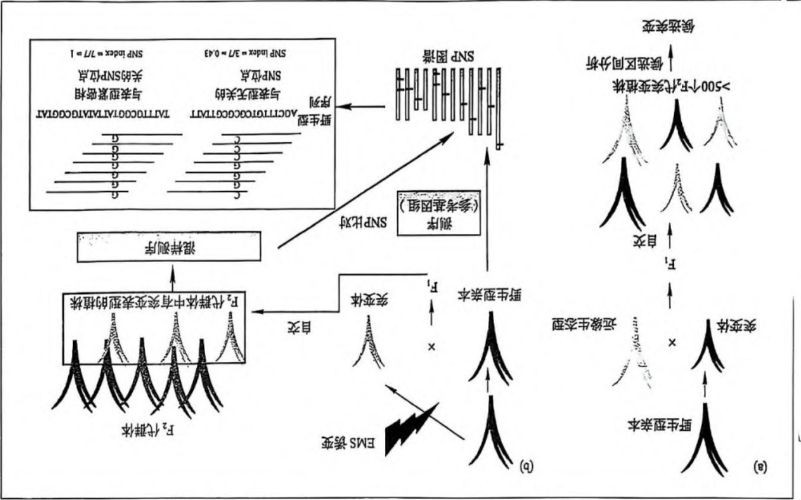

技术的基因定位方法。与传统图位克隆类似，此方法需要将突变体和遗传背景差异较大的边缘品种进行杂交后自交产生F.代分离群体。之后选取群体中具有突变表型的植株进行混样测序，将来突变体重测序数据与参考基因组进行比对，获得突变体特异参考基因组变异点所在区域进行定位。但由于突变体和边缘本本全基因组上对应基因型频率差异，对候选人变异点所在区域进行定位。但由于突变体和边缘本本完全基因组上对应基因型频率差异，对构建定位群体时，有些与突变表型无关的区域在自交后可能变成纯合状态而被保留在突变群体中，最终影响候选区间的定位。此外，SHOREmap 定位的候选区间大小往往取决于定位群体的大小，群体越大，定位的区间越小，定位到突变基因的可能性越高。定位群体的大小和

pooled RNA-seq)等。

SHOREmap(图10-12a)是一种在植物正向遗传学中应用较好的基于第二代DNA重测序。

不同于传统的图位克隆方法,基于第二代测序技术的基因定位方法主要通过比较分析突变体和对照材料的测序数据,筛选突变体与对照材料间的多态性位点,并根据多态性位点与表型间的连接关系,鉴定与突变表型相关的区间或基因。常用的基于第二代测序技术的基因定位方法可分为基于DNA重测序的定位方法和基于RNA测序的定位方法。前者包括SHOREMap、MulMap系列方法(图10-12)和NIKS(necdle in the K-statck)等,后者包括BSR-seq(bulked sevregent RNA-seq)和MMPAPR(mutation mapping analysis pipeline for

表 10-2 各类基因定位方法的比较

<table><tr><td>基因定位方法</td><td>群体构建策略</td><td>分子标记</td><td>F2 群体数目</td><td>优/缺点</td></tr><tr><td>传统图位克隆</td><td>与远缘亲本杂交+自交</td><td>不同亲本间的差异RFLP,SSR,SNP等标记</td><td>&gt;500</td><td>1. 耗时费力2. 需构建大群体3. 需大量分子标记4. 候选区间大</td></tr><tr><td>SHOREmap</td><td>与远缘亲本杂交+自交</td><td>不同亲本间的差异SNP标记</td><td>~500</td><td>1. 需构建大群体2. 需对亲本进行测序和比较分析3. 需大量分子标记</td></tr><tr><td>MutMap</td><td>回交+自交</td><td>与性状相关的SNP标记</td><td>&gt;20</td><td>1. 可快速定位与表型相关突变2. 需对亲本进行测序分析3. 仅考虑G→A/C→T变异</td></tr><tr><td>NIKS</td><td>回交+自交或两个相关样品</td><td>与性状相关的特异性短序列(k-mer)</td><td>&gt;50</td><td>1. 可应用于无参考基因组物种2. 需进行大量计算3. 组装可能带来不准确性4. 需较高的测序深度</td></tr><tr><td>BSR-seq</td><td>回交+自交或两个相关样品</td><td>差异化表达基因上的SNP标记</td><td>-</td><td>1. 仅考虑有差异化表达基因上的SNP标记</td></tr><tr><td>MMAPPR</td><td>回交+自交或两个相关样品</td><td>影响基因表达的突变体特异SNP标记</td><td>-</td><td>2. 无法定位调控区域,非编码区域,低表达/不表达基因或表达无差异基因上的变异</td></tr></table>

## 10.3.3 转录物组解析

与基因组不同,转录物组包含的是特定组织或细胞在某一发育阶段或功能状态下所有信使 RNA (messenger RNA, mRNA) 的集合。转录物组测序 (RNA-seq) 作为一种基于第二代测序技术的转录物组研究手段,可对样品中表达的 RNA 进行定量,为生命科学研究提供另一个维度的信息,是基因功能及结构研究的基础和出发点,也是连接基因组遗传信息和生物功能(蛋白质组)的必然纽带,目前已广泛应用于生物学研究、医学研究、临床研究和药物研发等。转录物组分析主要应用于:①检测新的转录物,包括未知转录物和稀有转录物;②基因转录水平研究,如基因表达量、不同样本间的差异化表达;③转录物组结构变异研究,如可变剪接、基因融合等;④非编码区域的功能研究,如小 RNA、长链非编码 RNA (long non-coding RNA, lncRNA) 等;⑤开发 SNP 和 SSR 标记等。

常用的基于第二代 RNA-seq 测序技术可针对逆转录的 cDNA 和单链 RNA 进行测序, 后者在获得 RNA 表达量的同时, 还可获得链特异性表达的 RNA 信息, 应用于挖掘功能 lncRNA 和反义链表达的 RNA。随着第三代测序技术的发展, RNA 测序的长度有了明显的提升, 其中基于纳米孔测序平台的 RNA 直接测序 (direct RNA-seq) 可直接针对单链 RNA 进行测序, 而 SMRT 平台仍需将 RNA 逆转录为 cDNA 后进行测序。目前, 依赖于逆转录的 RNA 测序一般只能获得具有 poly(A) 尾的 RNA, 且在逆转录过程中会丢失 RNA 上的修饰信息。RNA 直接测序可直接分析全长转录物异构体, 度量 RNA 碱基修饰 (如 N6-甲基腺苷修饰 m⁶A), 同时也可用于检测 poly(A) 尾长度。然而, 长读长 RNA 测序依赖于高质量的 RNA 文库, 测序通量较低, 错误率高, 一定程度上也限制了其应用范围。对

RNA 富集方式和建库方式的改良, 将有效促进长读长 RNA 测序的应用和推广。

## 10.3.4 染色体空间构象捕获

染色体空间构象捕获(chromosome conformation capture)技术主要针对细胞中染色体的空间排布和相互作用展开研究,相关的方法能够检测不同染色体上的基因位点或同一条染色体上不同的基因位点间在三维结构上的相互作用。这些三维结构上的相互作用具有促进启动子和增强子结合、形成染色体环(chromatin loop)来调控基因表达等生物学功能。通过分析不同片段间的相互作用频率,可以重构染色体三维结构。

染色体空间构象捕获的建库与常规的 DNA 和 RNA 测序建库有明显的不同。首先, 采用化学方法胶联固定形成染色体三维构象的蛋白质和基因组 DNA, 然后进行酶切消化, 具有三维相互作用的基因组 DNA 由于结合蛋白的保护而得以保留。随后, 对消化后的核酸进行平末端连接和解胶联反应, 使三维相互作用的基因组 DNA 连接成同一序列。对这些序列添加接头后进行高通量测序, 就可以获得染色体构象的准确信息。根据研究目的和相互作用尺度的不同, 染色体构象捕获技术可分为: 检测一对基因位点之间的相互作用 (3C), 检测一个基因位点和多个基因位点间的相互作用 (4C), 同时检测多个位点之间的相互作用 (5C), 以及同时检测全部基因位点之间的相互作用 (Hi-C)。通过染色体空间构象捕获, 我们能更好地了解不同基因组片段间的相互作用, 绘制染色体三维尺度上基因表达调控图谱。例如, 人绝缘子结合蛋白 CTCF 因子可以阻断增强子对启动子的激活, 抑制基因的表达, 也可以作为"屏障"阻止异染色质的扩散。通过对与 CTCF 因子互作的染色体构象捕获, 发现不同染色体上的基因在构象调节因子的作用下形成的三维互作结构可以同时被 RNA 聚合酶 II 高效转录 (图 10-13)。

## 10.3.5 核糖体图谱解析

越来越多的证据表明,除了基因的转录调控,基因的翻译调控对最终蛋白质含量的变化也发挥着重要的作用。目前,最常用的全基因组范围内有效检测翻译效率的方法是核糖体图谱测序(ribosome profiling sequencing)和多核糖体图谱测序(poly ribosome profiling sequencing)技术。多核糖体图谱测序检测的是富集多核糖体的mRNA序列,而核糖体图谱测序检测的是某时刻核糖体mRNA结合序列的"快照",因此实验方法、测序长度和分析流程都有明显区别(图10-14)。

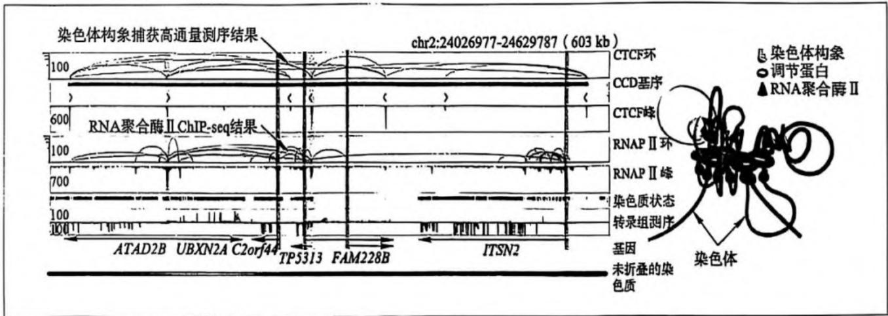  
图 10-13 染色体构象捕获技术解析人 CTCF 因子互作调控及染色体构象三维模拟结果 (Tang et al., 2015)

图10-14 多核糖体图谱和核糖体图谱测序原理  
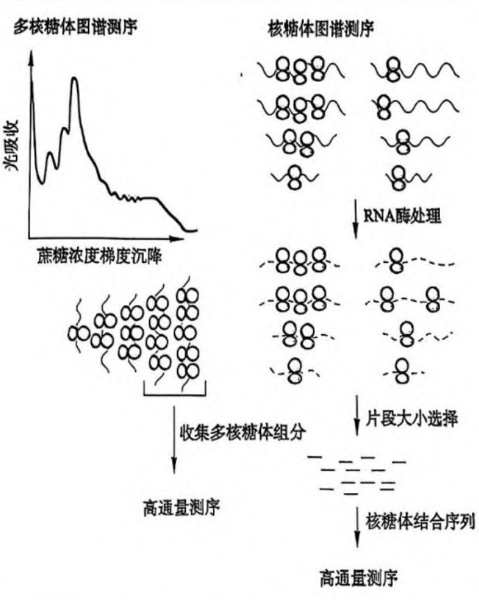

多核糖体图谱测序的制备需要将细胞裂解液沉降在蔗糖浓度梯度中,从而分离结合有不同数量核糖体的 mRNA 分子,添加接头后进行测序分析,以鉴定处于高效翻译状态的 mRNA,其中含有 3 个以上核糖体的 mRNA 通常被称为多核糖体高度富集的 RNA。与之对应的,核糖体图谱测序检测的是被核糖体保护而没有被 RNA 酶消化的 mRNA 片段,对这些片段进行建库测序即为核糖体测序。多核糖体图谱测序的结果与蛋白质表达水平相关性更好,而核糖体图谱测序则能够定位翻译起始位点和 mRNA 上核糖体的分布情况,两种方法都可以用来检测核糖体翻译速率和效率的变化。

## 10.3.6 蛋白质组研究

蛋白质是所有生命体中最重要的物质组成,执行和调控着几乎所有的生命过程和功能,包括蛋白质翻译、细胞周期调控和蛋白质合成及降解等。不同功能蛋白质间的协作和时空动态调控信号转导网络,保证了细胞乃至整个生命体的正常生命活动。从蛋白质组水平上系统地鉴定细胞内的功能蛋白质将对理解生命现象本质、解析重大疾病发生和发展的机制,进而靶向性地治疗各类疾病具有极其重要的意义。

根据不同的研究目的,蛋白质组学可分为三类:表达蛋白质组学(expressionproteomics)、结构蛋白质组学(structural proteomics)和功能蛋白质组学(functional proteomics)。表达蛋白质组学主要研究不同条件下或不同组织中蛋白质的表达差异。结构蛋白质组学则重点关注蛋白质的空间三维结构解析，以更准确地获得蛋白质可能地结合位点及结构域等，进而预测蛋白质的催化机理和作用方式。功能蛋白质组学着重于分析特定蛋白质群体的作用方式或作用途径。

目前, 蛋白质鉴定技术主要有 Edman 降解法、质谱分析 (mass spectrometry, MS)、同位素标记亲和标签 (isotope-coded affinity tag, ICAT)、串联亲和层析 (tandem affinity purification, TAP)、蛋白质芯片 (protein chip)、免疫共沉淀、酵母双杂交 / 三杂交等技术。质谱分析技术是基于带电粒子在磁场或电场中运动的轨迹和速度随粒子的质荷比 $(m/z)$ 的不同而不同, 进而判断粒子的质量和特性。目前, 基于生物质谱的蛋白质组学分析技术可以在一天内鉴定上万种蛋白质, 从整个蛋白质组水平上大规模鉴定蛋白质间的相互作用, 表征多种重要的蛋白质翻译后修饰, 包括磷酸化、糖基化、泛素化、乙酰化和甲基化等。近些年来, 各种样品前处理技术、色谱分离技术和高分辨率质谱鉴定技术的发展在准确性、灵敏度、溶解性和高通量方面都有了很大的改进, 使得蛋白质组学技术在蛋白质科学研究中的作用越来越重要。

随着研究的不断深入,对蛋白质的定性研究逐渐转向定量研究。由美国应用生物系统公司研发的相对和绝对定量的等量异位标签(isobaric tag for relative and absolute quantitation, iTRAQ)是一种体外多肽标记技术,通过采用一对同位素标签分别结合到待测样品肽段和合成的氨基酸序列相同的肽段上,形成物理化学性质相同但分子量不同的同位素标签化合物肽段对,经质谱检测后即可测定样品中的蛋白质或肽段的绝对量。随着越来越多蛋白质特性被解析,已形成了多个实用的蛋白质组数据库,包括基于氨基酸序列的数据库,如SWISS-PROT(protein sequence database)、PIR(protein information resource)、PPDB(plant proteome database)等;基于蛋白质结构的数据库,如PROSITE(protein sites and patterns database)、PDB(protein data bank)、SCOP(structural classification of protein)等;基于蛋白质与蛋白质相互作用的数据库,如BIND(bio molecular interaction network database)、DIP(database of interacting proteins)和BIOGRID(biological general repository for interaction datasets)等。这些数据库将在蛋白质组学研究中发挥重要的作用。

## 10.3.7 泛基因组研究

相较于聚焦个体遗传信息的单个参考基因组挖掘,泛基因组 (pan-genome) 研究则能够反映整个物种或类群的全部遗传信息。泛基因组包括一个物种或类群中的核心基因组 (core genome) 和非必需基因组 (dispensable genome) 两部分。前者在所有个体中都存在,是不可或缺的,往往与重要的生物学功能和表型特征相关;而后者则只在部分个体或单个个体中存在,一般与物种对特定环境的适应性或特有的生物学特征相关,反映了物种的多样性和特异性。泛基因组概念最早于 2005 年在微生物研究中提出,随后于 2010 年通过对多个人类个体基因组的组装和比较分析,提出了"人类泛基因组"的概念,新发现多达

19\~40 Mb 的序列。千人基因组计划的提出和实施，让泛基因组研究在人类疾病方面取得了许多重大的突破，为精准医疗提供了理论依据。

随着基因组测序和分析技术的不断发展,泛基因组学已广泛应用于植物、动物和微生物物种中,为全面解析物种或类群水平的遗传变异和多样性、功能基因组和系统进化等研究提供了强有力的工具。例如,针对全球12个种猪品种构建的泛基因组图谱中,发现中国品种特异的约9 Mb序列,其中包括脂肪细胞脂解的必要调节因子TIG3。泛基因组在小麦、番茄、水稻、玉米、大豆等重要的物种中都获得了广泛的应用,发现了大量与重要农艺性状相关的基因存在/缺失(presence/absence)变异和结构变异,对于解析物种和群体水平的基因变异和系统进化特征、挖掘性状相关的优良基因和变异资源、培育优异的种质资源具有非常重要的意义。

除了关注物种或类群水平的泛基因组,科学家们通过研究发现,线粒体和质体细胞器的泛基因组也可作为重要的基因信息,用于研究与这两个细胞器编码基因变异相关的表型。例如,针对大量癌症和正常组织样本构建人类线粒体泛基因组,发现了多个高频率突变与多种癌症的发生具有显著相关性。同样,关注全部RNA信息的泛转录物组(pan-transcriptome)在提供物种或类群水平上的转录物组信息的同时,还可以挖掘出核心的转录物和特异转录物,鉴定与特定表型相关的基因表达变异或剪接变化。随着测序数据的多元化和爆发式增长,整合更广泛多层次群体、跨物种的基因组或转录物组信息,形成超-泛基因组(super-pan-genome)或泛转录物组;或整合不同组织器官,不同细胞的基因组或转录物组信息,形成的泛器官或泛细胞的基因组或转录物组,将会是未来泛基因组研究的重要发展方向(图10-15)。

图 10-15 泛基因组 / 转录物组研究的未来发展方向 (引自向坤莉等, 2021)  
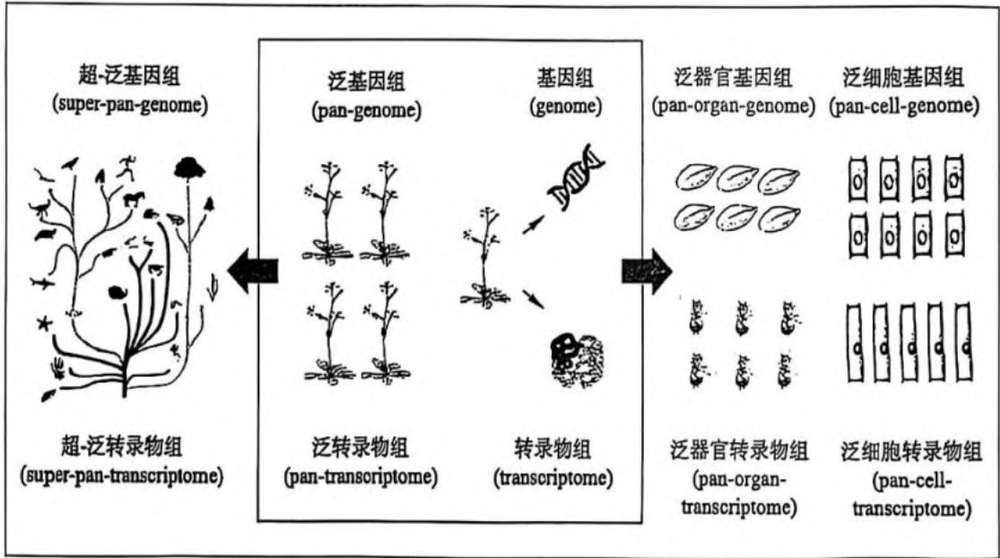

## 思考题

1. 简述人类基因组计划的科学意义。

2. 请分析人类基因组计划的发展趋势。

第 10 章 基因组学和功能基因组学

1. 区分遗传图谱和物理图谱,试述这两项技术的优缺点。

2. 简述第二代测序各平台的优点和缺点及适用领域。

3. 简述图位克隆和基于第二代测序的基因定位优缺点。

4. 什么是蛋白质组学,什么是转录物组学?简述这两个领域里最主要的研究手段。

5. 试述基因组学和功能基因组学研究的未来发展方向和应用前景。

## 参考文献

1. 朱圣庚, 徐长法. 生物化学 [M]. 上册. 4 版. 北京: 高等教育出版社, 2017.

2. Nurk S, Koren S, Rhie A, et al. The complete sequence of a human genome [J]. Science, 2022, 376: 6588.

3. Jennifer E R, Aviv R. The legacy of the Human Genome Project [J]. Science, 2021, 373: 6562.

4. 孙海汐, 王秀杰. DNA 测序技术发展及其展望 [J]. Technology e-Science. 2009, 6: 19-29.

5. 方宣钧, 吴为人, 唐纪良. 作物 DNA 标记辅助育种 [M]. 北京: 科学出版社, 2001.

6. Schneeberger K. et al. SHOREmap: simultaneous mapping and mutation identification by deep sequencing [J]. Nat. Methods, 2009, 6: 550–551.

7. Abe A, et al. Genome sequencing reveals agronomically important loci in rice using MutMap [J]. Nat. Biotech, 2012, 30: 174–178.

8. Alkan C, Coe B P, Eichler E E. Genome structural variation discovery and genotyping [J]. Nature Reviews Genetics, 2011, 12(5): 363–376.

9. Stark R, Grzelak M, Hadfield J. RNA sequencing: the teenage years [J]. Nature Review Genetics, 2019, 20(11): 631–656.

10. Svensson V, Vento-Tormo R, Teichmann S A. Exponential scaling of single-cell RNA-seq in the past decade [J]. Nature Protocols, 2018, 13: 599–604.

11. Greninger A L, Naccache S N, Federman S, et al. Rapid metagenomic identification of viral pathogens in clinical samples by real-time nanopore sequencing analysis [J]. Genome Medicine, 2015, 7: 99.

12. Zhao Q, et al. Pan-genome analysis highlights the extent of genomic variation in cultivated and wild rice [J]. Nat. Genet, 2018, 50: 278–284.

13. 向坤莉, 贺文闯, 邹益, 等. 泛基因组研究在遗传多样性和功能基因组学中的应用. 广西植物, 2021, 10: 1674-1682.

数字课程学习

教学课件

目在线自测

思考题解析

第11章
