# 第11章 疾病与人类健康

# 疾病与人类健康

11.1 肿瘤与癌症

11.2 人类免疫缺陷病毒(HIV)

11.3 乙型肝炎病毒(HBV)

11.4 人禽流感的分子机制

11.5 严重急性呼吸综合征和新型冠状病毒感染的分子机制

11.6 基因治疗

11.7 肿瘤的免疫治疗

## 11.1 肿瘤与癌症

癌(cancer)也称恶性肿瘤,是一群不受生长调控、过度增殖且不受常规的区域限制的细胞。良性肿瘤细胞虽然也是过度增殖的细胞群,却仅局限在自己的正常位置,不侵染周围其他组织和器官。因此,绝大多数癌是由肿瘤细胞经过一系列突变转化而来的(图11-1)。癌症是人类生存的头号敌人。今天,科学家已经能够对许多种癌症做出早期诊断,延长患者的生存期,但并未从根本上征服这个病魔。20世纪50年代以来,对肿瘤医学的研究有3项最为突出的成就:①癌基因的发现及其研究的深入;②染色体畸变与致癌基因表达相互关系的揭示;③抑癌基因的发现及表达调控。已经发现了上百个原癌基因(proto-oncogene)和许多抑癌基因(anti-oncogene),证明细胞癌变的分子基础是基因突变,DNA的变化和不正常活动导致了细胞癌变。

图11-1 肿瘤组织示意图  
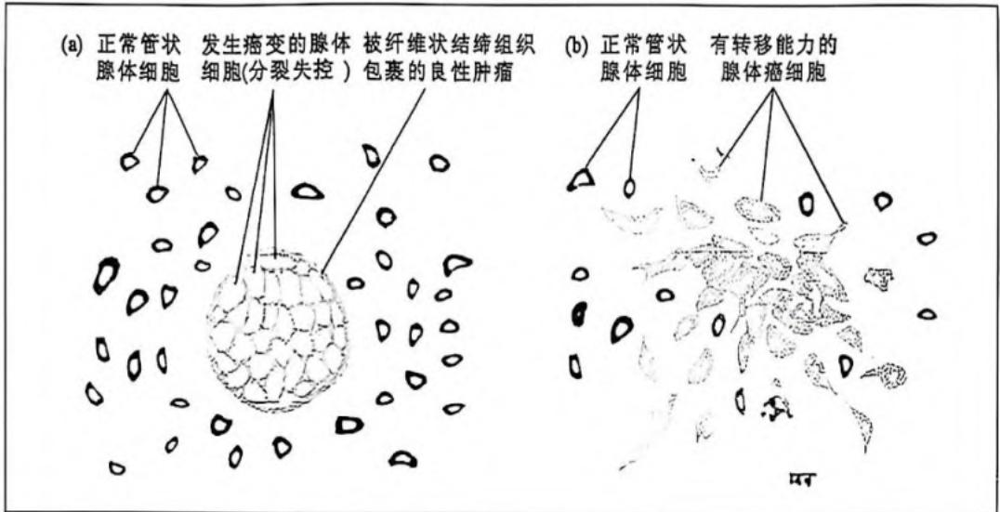

随着对癌症更加深入地研究,目前将已建立的癌症十大标志进一步拓展到了十四种,新添加了非突变表观遗传重编程(non-mutational epigenetic reprogramming)、解锁表型可塑性(unlocking phenotypic plasticity)、多态性的微生物组(polymorphic microbiome)和衰老细胞(senescent cell)(图11-2)。

癌基因(oncogene)可分为两大类:一类是病毒癌基因(viral oncogene, V-onc),编码病毒癌基因的主要有DNA病毒和RNA病毒。DNA病毒包括乙型肝炎病毒、猴病毒40和多瘤病毒、乳头瘤病毒、腺病毒、疱疹病毒和痘病毒。RNA病毒主要是逆转录病毒。逆转录病毒致癌基因(retrovirus oncogene)可能是研究最多的病毒基因,它们能使靶细胞发生恶性转化。第二类是细胞转化基因(cellular oncogene, C-onc),它们能使正常细胞转化为

图11-2 锭症十四大标志

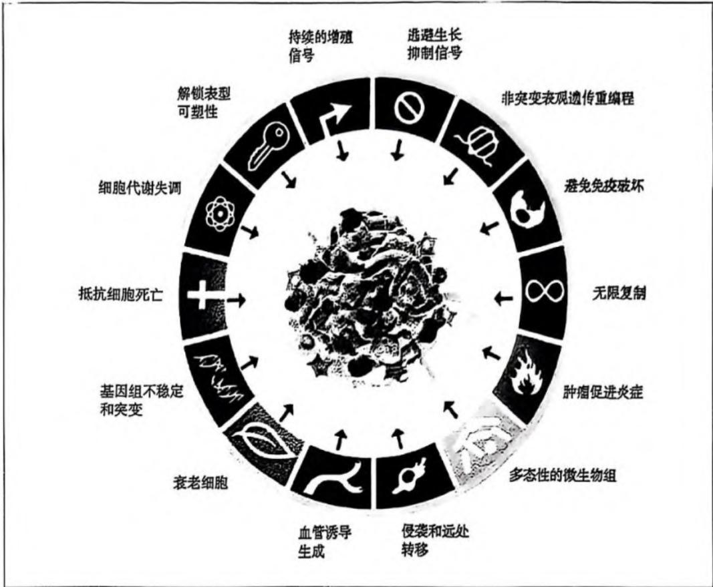

肿瘤细胞,这类基因与病毒癌基因有显著的序列相似性。事实上,细胞转化基因可能就是存在于人体正常细胞中的原癌基因的突变产物,它们广泛存在于生物界,有相当强的保守性,属于管家基因,正常表达时对细胞的生长和分化有调控作用。

## 11.1.1 逆转录病毒致癌基因

早在 1910 年, Rous 就发现带有肉瘤病毒(一种逆转录病毒)的鸡肉瘤无细胞滤液能在鸡体内诱发新的肉瘤。这种病毒的基因组是由单链 RNA 组成的, 一般只有 6\~9 kb。RNA 上的基因数目很少, 它们被包裹在由 gag 和 env 两个基因编码的蛋白质外壳中, 其中 env 基因指导外壳蛋白的合成, gag 基因则指导"鞘"蛋白的合成, 这些"鞘"蛋白好像"道钉"一样"箍"在外壳的表面, 维持外壳蛋白结构的稳定性。逆转录病毒的复制由其自身基因组上 pol 基因编码的逆转录酶指导完成。当病毒感染细胞时, 病毒最外层囊膜不进入细胞, 含有基因组 RNA 和逆转录酶的核心颗粒进入细胞并在病毒核心颗粒内开始利用自身携带的逆转录酶(可能还需要某些宿主细胞因子)进行病毒基因组的逆转录, 合成含有完整病毒基因组信息的线性双链 DNA 并被运入细胞核, 在病毒整合酶作用下随机整合进入宿主细胞基因组(图 11-3)。

被整合的病毒 DNA 分子称为原病毒(provirus)。由于逆转录病毒一般不会引起细胞死亡,所以,原病毒像孟德尔单一基因遗传一样传给子代细胞。整合的原病毒 LTR 含有细胞 RNA 聚合酶 II 以及识别细胞转录因子的所有信号和原件,能转录出完整病毒

## 11.1 肿瘤与癌症

图 11-3 含有逆转录病毒完整基因组信息的双链 DNA 整合到宿主细胞基因组 DNA 上  
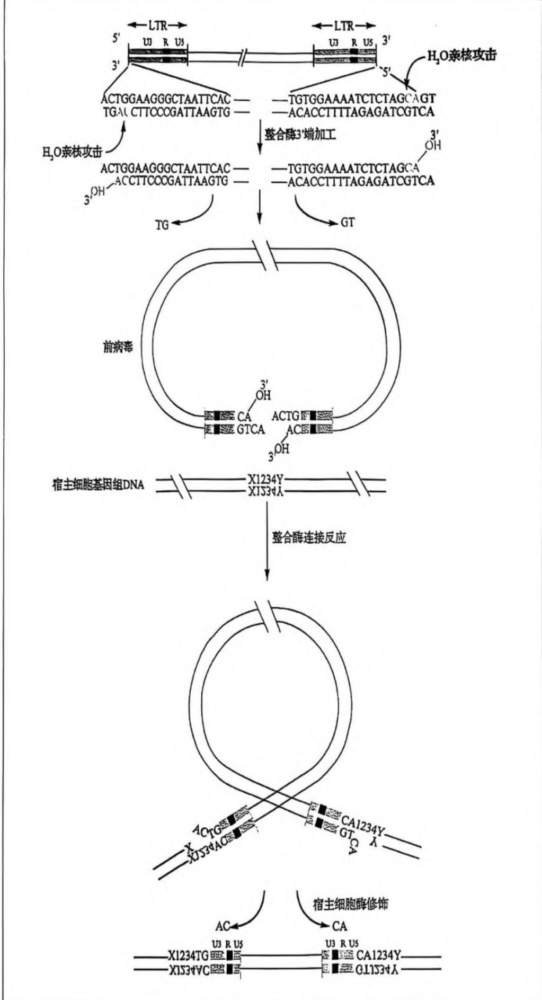

mRNA,并利用宿主细胞中的蛋白质合成机器,翻译病毒外壳蛋白和其他相关蛋白质,最后组装成病毒颗粒。已在各种逆转录病毒中发现了大量致癌基因,它们感染后诱导宿主产生肿瘤的主要原因是激活特定基因表达,从而破坏宿主细胞本身固有的平衡,导致细胞发生转化。

最早发现的致癌基因是劳斯氏(Rous)肉瘤病毒中的 V-Src 基因,它编码了一个被称为 p60 $^{Src}$ 的蛋白质。序列分析表明,该蛋白有 514 个氨基酸,是一个磷酸化蛋白。其 C 端 250 个氨基酸是活性区域,负责将磷酸基团转移到酪氨酸残基上。它的作用主要是使多个靶蛋白发生磷酸化,从而影响它们的功能,加速细胞癌变过程。

p60 $^{Srn}$ 使多个蛋白质中的酪氨酸发生磷酸化以后,又如何促使细胞发生癌变呢?科学家发现,一种存在于细胞基部质膜附着点内被称为枢纽蛋白(vinculin)的细胞骨架蛋白磷酸化可能是引起细胞癌变的中心环节。已知质膜附着点的主要作用是通过细胞膜固着蛋白,将细胞固定在所处的表面,它也能使肌动蛋白的纤丝依附在上面。位于附着点内的枢纽蛋白则起着连接肌动蛋白纤丝束和细胞膜固着蛋白的作用。正常情况下,该蛋白上的酪氨酸残基只有轻度磷酸化。在转化细胞中,由于p60 $^{Srn}$ 结合在附着点内靠近或位于枢纽蛋白处,使这一蛋白的磷酸化水平提高了20倍以上,明显降低了枢纽蛋白连接肌动蛋白纤丝束和细胞膜固着蛋白的功能,导致肌动蛋白纤丝束松散,细胞黏附能力减弱,容易发生脱落和转移。

## 1. 急性转化型和非急性转化型

根据逆转录病毒转化细胞的能力,可将其分为急性转化型和非急性转化型两大类。急性转化型逆转录病毒具有3个主要特征:①这类病毒感染动物后,很短时期内(几天或几周)就出现实体瘤或白血瘤(leukemia);②它们所带的癌基因一般位于病毒基因组内部,也可位于基因组的3'端,但不会插入结构基因内部;③具有体外转化细胞的能力。非急性转化型则正好相反,它们感染宿主细胞后需要较长时间(几个月,数年甚至数十年)才会致癌。

## 2. $V - onc$ 基因的起源

研究发现,逆转录病毒基因组中所带有的 onc 基因并非来自病毒本身,而是这些病毒在感染动物或人体之后获得的细胞原癌基因 $^{[2][1-4]}$ 。这些动物或人原癌基因经病毒修饰

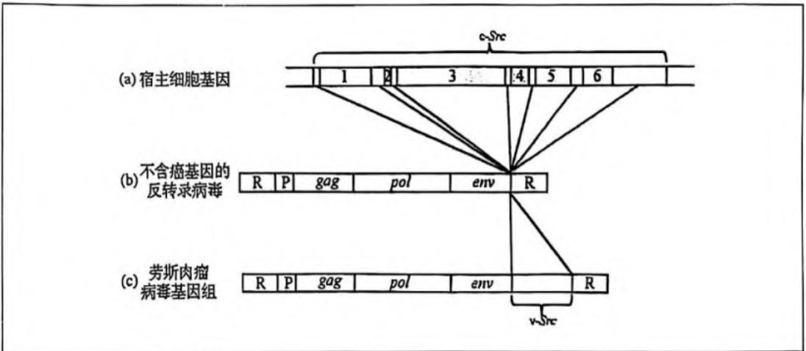  
图11-4 劳斯肉瘤病毒基因结构及c-Src原癌基因的转变  
宿主细胞原癌基因(1)和不含癌基因的逆转录病毒基因组及所编码的主要蛋白质(b);含有癌基因的劳斯肉瘤病毒基因结构(c)。

## 11.1 肿瘤与癌症

和改造后,成为病毒基因组的一部分并具有了致癌性,其作用的靶分子也往往发生改变。已经证实,各种脊椎动物染色体 DNA 上都有与 Src 相类似的 DNA 序列,说明它是正常细胞所固有的。因为正常细胞中这些基因是不表达的,只有在细胞发生癌变时才有活性,所以称为原癌基因。一般说来,细胞原癌基因大都是断裂基因,带有插入序列,而病毒的致癌基因往往是一个完整的没有断裂的读码框。

目前已鉴定了超过 100 个致癌基因, 最常见的是 ras 与 myc 基因家族。突变的 Haras 基因产物与结肠癌、肺癌、胰腺癌等相关, K-ras 与恶性骨髓瘤、成淋巴细胞瘤等有关, 而 N-ras 则多见于泌尿系统癌症。研究发现, c-myc 表达主要在 $G_{0}/G_{1}$ 交界或 $G_{1}$ 早期, 而 C-H-ras 和 C-K-ras 则主要在 $G_{1}$ 中晚期。 $G_{1}$ 期对于细胞生长的控制具有关键性意义, 因为该时相中存在一个"生长控制点", 在正常情况下, 细胞可根据对信号的应答, 发挥"生长控制点"的调节作用, 使细胞通过该点, 进入 S、M 期再回到 $G_{1}$ 期, 或者阻止细胞通过该控制点而使其进入 $G_{0}$ 期。c-myc 的表达可能使细胞获得了通过"生长控制点"的潜能, 而 c-ras 的表达似乎加强了 c-myc 的这种作用潜能, 二者协同作用使细胞向 S 期过渡成为可能。也就是说, c-myc 和 c-ras 的协同作用是细胞分裂的必要步骤。在肿瘤细胞中, "生长控制点"不起作用, 所以瘤细胞一直处于细胞周期循环之中。

## 11.1.2 原癌基因(细胞转化基因)产物及其分类

除了病毒感染会诱发细胞癌变外,尚有许多非病毒因子(如放射性物质、化学试剂亚硝酸、烷化剂等)也能诱导细胞转化。这些因子并没有把致癌基因或其他致癌的遗传信息带入细胞,而仅仅通过某种激活机制改变了细胞内原有的遗传信息,使细胞发生恶性转化。对大量致癌因子的研究证明,它们的作用都是使基因发生突变(图11-5),充分说明内源基因在细胞转化中的地位。实验证明,此时引起细胞恶性转化的因子仍然是DNA,化学诱变后的细胞中同样存在着决定细胞命运的致癌基因。从人膀胱癌T24肿瘤细胞中提取DNA,转染正常小鼠成纤维细胞使之变为转化细胞。从发生转化的成纤维细胞集落中分离单细胞,培养、扩增后再提取DNA,第二次转染正常小鼠成纤维细胞,又出现转化细胞集落。如果细胞转化特性是由分散在不同DNA片段上的遗传因子决定的,那么,在这个基因重复导入过程中细胞的转化特性可能消失。事实上,经过连续多次基因导入后,细胞仍被转化,说明致癌因子可能存在于一个特定的区域。

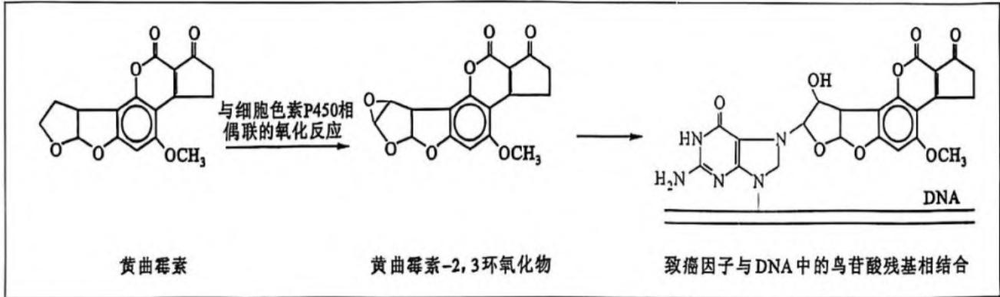  
图 11-5 黄曲霉素 (aflatoxin) 导致细胞发生癌变的分子机制

根据原癌基因产物在细胞中的位置将其分为3大类:第一类是与膜结合的蛋白质,主要有 erbB、neu、fms、mas 和 Src 基因产物;第二类是可溶性蛋白,包括 mos、sis 和 fps 基因产物;第三类是核蛋白,包括 myc、ets、jun 和 myb 基因产物等。根据这些蛋白质的功能,它们又常被分为6类,即蛋白激酶类、生长因子类、生长因子受体类、GTP 结合蛋白类、核蛋白类和功能未知类。原癌基因产物的一个共同特征是它们都能诱发一系列与细胞生长分化有关的基因表达,从而改变细胞的表型。

## 11.1.3 原癌基因的表达调控

原癌基因在正常细胞中通常以单拷贝形式存在,只有低水平的表达或根本不表达。在很多情况下,原癌基因的结构发生了点突变或插入、重排、缺失及扩增等,改变其转录活性(图11-6)。

## 1. 点突变

虽然原癌基因活化导致癌变的原因多种多样,但点突变可能是最常见的机制。在 ras 基因家族中,存在着许多原癌基因发生点突变的实例。Ha-ras 和 K-ras 基因最初是从小鼠肉瘤病毒中分离出来的,N-ras 是从人神经母细胞瘤细胞系中分离得到的,C-ras 基因存在于非肿瘤细胞生物机体中,可能是细胞发挥正常的生理功能所必需的。研究发现,ras 基因编码了一个分子量为 $2.1 \times 10^{4}$ 的癌蛋白(p21),从人类膀胱癌细胞系 T24 DNA 中克隆的 Ha-ras 基因能够诱发 NIH/3T3 细胞转化,而从正常细胞 DNA 中克隆的该原癌基因没有这种功能。因为 T24 膀胱癌细胞中 Ha-ras 基因的表达水平较之正常细胞并无明显提高,科学家推测点突变使癌基因产物 p21 蛋白的结构和功能发生了某些变化(图 11-7)。如人类肺癌细胞系 Hs242 的转化基因与 Ha-ras 高度相似,在这个基因中导致转化活性的遗传损伤是第二个外显子中引起 p21 蛋白第 61 位谷氨酰胺被亮氨酸所替代的一个点

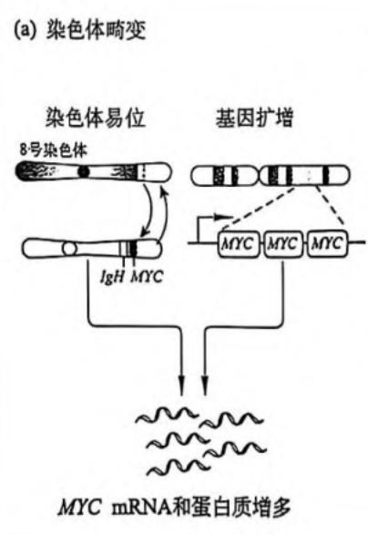

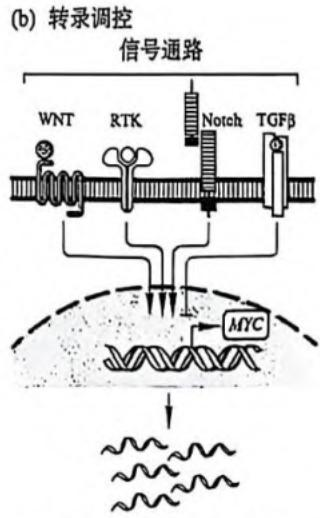  
MYC mRNA和蛋白质增多

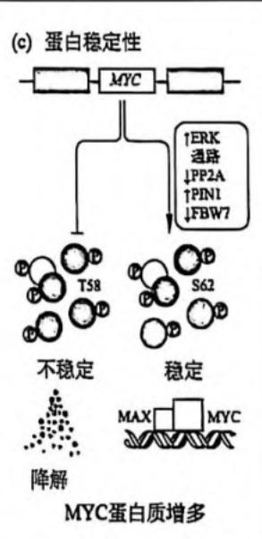  
图 11-6 导致人类癌症中 MYC 激活的机制

(a) 遗传畸变, 如染色体易位和基因组扩增, 导致 MYC mRNA 表达增加; (b) 上游调控途径的改变可导致 MYC 癌基因转录的增加或减少; (c) MYC 蛋白的翻译后修饰, 例如丝氨酸 62(S62) 残基相对于苏氨酸 58(T58) 的优先磷酸化, 可以阻断降解并促进 MYC 的稳定, 从而增强 MYC 途径的激活。MYC 蛋白的稳定性主要由细胞外信号调节激酶(ERK)通路以及蛋白磷酸酶(PP2A)、脯氨酰异构酶(PIN1)和泛素连接酶(FBW7)等蛋白质调控。

## 11.1 肿瘤与癌症

图11-7 MYC协调癌症的特征

MYC调节多种癌症细胞固有和宿主依赖的途径，以促进癌症细胞的生长和存活(蓝色区域)。由MYC调节的癌症细胞内在过程包括增殖、代谢、侵袭性、自噬、蛋白质和核糖体生物合成。MYC还同时阻断其他细胞保护机制，如分化或衰老，从而促进癌症进展(灰色区域)。但是MYC也会诱导细胞进程，如凋亡和染色体不稳定，这可能对癌症细胞的存活不利。多种调控过程和细胞环境之间的平衡最终决定了细胞命运。此外，MYC控制着癌症细胞进入休眠状态和克服营养不良环境的能力，最终导致肿瘤复发。为了维持静止状态，MYC抑制多种细胞程序，包括细胞分化和衰老。癌细胞中MYC的激活促进了血管生成，从而促进肿瘤进程。并且MYC最重要的功能之一是使癌细胞逃避和抑制免疫监视，以保障其生存。所有这些由MYC调控的特征共同推动了癌症的进展。

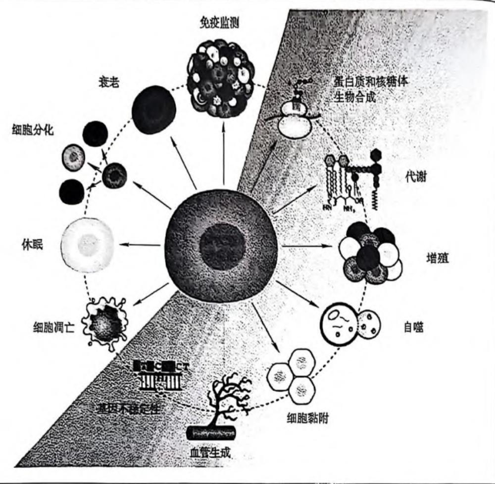

突变。所以，p21 分子某些部位发生单个氨基酸替代足以引起蛋白质构象的改变，并使细胞获得转化活性。

在肺癌和结肠癌细胞系中也发现了 K-ras 型转化基因。肺癌细胞系含有第 12 位密码子由 TGT 取代 GGC，从而以半胱氨酸取代甘氨酸的 K-ras2 转化基因；而 SW480 结肠癌细胞系也含有 K-ras 转化基因，其第 12 位密码子为 GTT，编码了缬氨酸。这两个细胞系都经历了点突变激活过程，突变部位就是人类膀胱癌细胞系 T24Ha-ras 的对应部位。现在已经证明由 NIH/3T3 细胞转染检出的 ras 原癌基因中，第 12 位密码子是个突变"热点"。

## 2. LTR 插入

LTR 是逆转录病毒基因组两端的长末端重复序列 (long terminal repeat), 其结构中含有强的启动子序列, 当 LTR 插入原癌基因启动子区域或邻近部位后, 可从根本上改变基因的正常调控规律。最早发现 LTR 插入激活现象是在慢性逆转录病毒感染的细胞中。LTR 插入到 $c-myc5'$ 上游启动子附近, 使 $c-myc$ 的转录水平大大增加。其他原癌基因中也发现了类似现象。LTR 插入后, 与血小板衍生生长因子 $\beta$ 链 (PDGF- $\beta$ ) 相似的 $c-sis$ 基因的转录和翻译水平均有明显增加。表 11-1 是受 LTR 插入激活的部分原癌基因。

## 3. 基因重排

在大多数类型的人肿瘤中存在染色体数目和结构异常现象,说明存在原癌基因重排的可能。现已查明基因重排包括原癌基因之间，以及原癌基因与非原癌基因之间的重排。重排后基因内部结构可不受影响，也可能发生改变。在Burkitt淋巴瘤中，Ig基因与c-myc之间发生重排。正常情况下，c-myc定位于 $8q^{24}$ ，免疫球蛋白重链基因(IgH)定位于 $14q^{32}$ ，轻链λ基因(Igλ)定位于 $22q^{12}$ ，轻链k基因(Igk)定位于 $2p^{11}$ 。重排时，c-myc从其上游区到第2外显子的区域内断裂，易位至IgH、Igk或Igλ的位点，使Ig基因与c-myc相连在一起，Ig基因5'端的启动子发挥作用，使原来不表达的c-myc大量表达。由于人体的特殊需求，通常Ig基因的表达能力非常强。c-myc一旦与Ig基因启动子和增强子重组后，可使原来的调控机制失去作用，导致极高水平的表达。在正常人体细胞中，非受体型酪氨酸蛋白激酶基因abl位于第9号染色体上，表达量极低，不会诱发癌变。在慢性骨髓瘤病人细胞中，该基因却被转移到第22号染色体上，与bcr基因相融合，表达量大为提高，导致细胞分裂失控，发生癌变(图11-8)。

表 11-1 LTR 插入激活的原癌基因

<table><tr><td>原癌基因</td><td>LTR 来源</td><td>诱发的肿瘤</td></tr><tr><td></td><td>禽类白血病病毒</td><td>禽类黏液性囊性淋巴瘤</td></tr><tr><td rowspan="2">myc</td><td>鼠白血病病毒</td><td>鼠T细胞淋巴瘤</td></tr><tr><td>猫白血病病毒</td><td>猫T细胞淋巴瘤</td></tr><tr><td>erbB</td><td>禽类白血病病毒</td><td>禽类红白血病</td></tr><tr><td>H-ras</td><td>禽类白血病病毒</td><td>禽肾细胞瘤</td></tr><tr><td>K-ras</td><td>小鼠白血病病毒</td><td>小鼠髓性细胞白血病</td></tr><tr><td>myb</td><td>禽类白血病病毒</td><td>禽类黏液性囊性淋巴瘤</td></tr><tr><td>fms</td><td>小鼠白血病病毒</td><td>小鼠髓性细胞白血病</td></tr><tr><td>Int-1</td><td>小鼠乳头瘤病毒</td><td>小鼠乳腺癌</td></tr><tr><td>Pim-1</td><td>小鼠白血病病毒</td><td>小鼠T细胞淋巴瘤</td></tr><tr><td>Lck</td><td>小鼠白血病病毒</td><td>小鼠T细胞淋巴瘤</td></tr><tr><td>evi-1</td><td>小鼠白血病病毒</td><td>小鼠髓性细胞白血病</td></tr></table>

## 4. 缺失

很多原癌基因 5' 上游区存在负调控序列,一旦该序列发生缺失或突变,就丧失抑制基因表达调控的能力。如 Brukitt 淋巴瘤中 c-myc 可因负调控序列的缺失或 LTR 插入破坏其结构而增强表达。

## 5. 基因扩增

使每个细胞中基因拷贝数增加,从而直接增加可用的转录模板数以提高基因表达。某些正常细胞在生长、发育过程中需要大量相关蛋白质,可通过基因扩增的方式来达到提高表达量的效果。细胞也可通过基因扩增的产物来抵抗环境胁迫(如对化学物质和药物的抗性等),以获得生存能力。在肿瘤细胞中,DNA扩增事件的发生频率至少比在正常细胞中高上千倍。一旦发生基因扩增,肿瘤细胞就获得了选择性生长优势。实验证明,癌基因常常是肿瘤细胞中DNA扩增的靶位点,在各种人类肿瘤中已发现了十几种癌基

## 11.1 肿瘤与癌症

图 11-S abl 胞癌基因通过选择性染色体重排转变成细胞癌基因

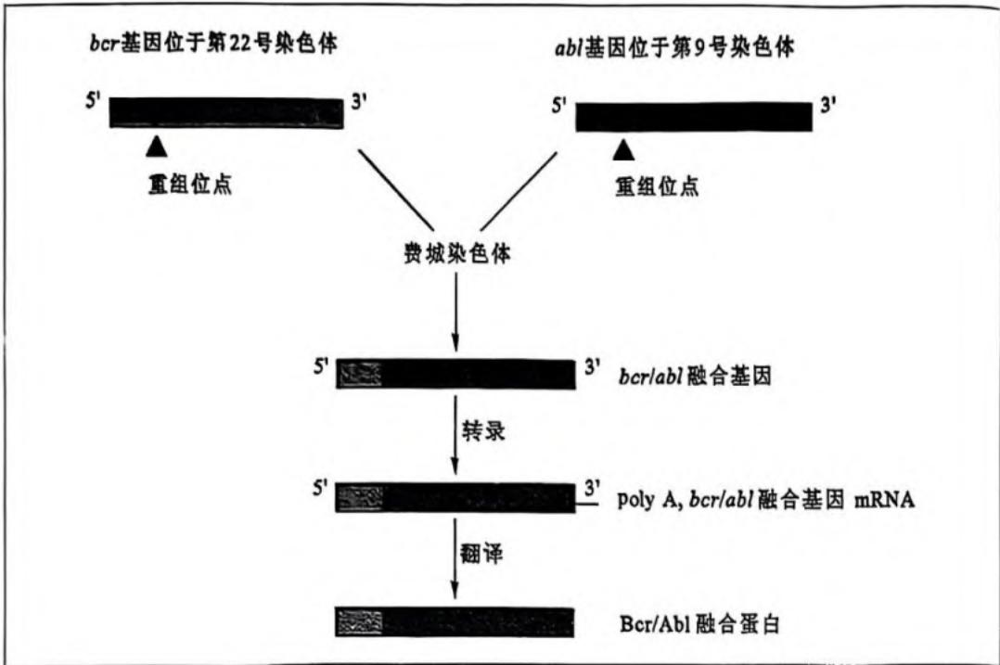

因的扩增。

## 6. 染色体构象对原癌基因表达的影响

基因表达不仅取决于基因本身及其相邻区域的一级结构,也取决于其空间构象。当两个基因相距太近时,往往不易形成有利于高效转录的空间结构。因此,基因与基因之间的间隔距离被定义为"基因领域"(gene territory)。同一DNA链上两个具有相同转录方向的基因间隔小于一定长度时,影响有效转录所必需的染色质结构的形成,从而使这两个基因中的一个或两个均不能转录或转录活性显著降低,产生所谓基因领域效应(gene territorial effect)。对大量基因的分析表明,基因之间的间隔距离与两个基因的总长度相关,当两个基因的总长度在0.3\~5 kb时,最佳间隔距离与两个基因的总长度成正相关。

正常人 c-myc 定位于第 8 号染色体,在其两侧分别存在强表达基因,在基因领域效应的影响下,c-myc 转录受抑制。在 Burkitt 淋巴瘤中,由于发生基因重排,使 c-myc 基因一侧的强表达基因消失,从而消除了对 c-myc 的基因领域效应,使后者的转录活性增强。由于 c-myc 转录增强,反过来对另一侧的基因产生了基因领域效应,使原来强表达的基因变为不表达状态。

在正常小鼠细胞中, $c-myc$ 的 $5'$ 上游区域也存在一个强表达基因, 其长度约为 $15 \mathrm{~kb}$ , 它距 $c-myc$ 只有 $3 \mathrm{~kb}$ 左右, 很显然, 这一间隔距离太短, 与基因有效转录应有的最小距离相差甚远, 此时, $c-myc$ 受基因领域效应的影响非常大, 表达完全受到抑制。在小鼠乳腺癌细胞中, 上述间隔距离被显著拉长, 激活 $c-myc$ 转录。

## 11.1.4 基因互作与癌基因表达

## 1. 表观遗传对癌基因的调控

$N^{7}$ -甲基鸟苷 $(N^{7}-methylguanosine,m^{7}G)$ 是表观遗传调控过程中发生的一种重要

RNA 修饰。越来越多的研究证明， $m^{7}G$ 在抑制癌症方面的作用值得关注。 $m^{7}G$ 修饰通过影响各种 RNA 分子的代谢，积极参与生物和病理功能。 $m^{7}G$ 甲基转移酶的作用是将 $m^{7}G$ 修饰靶 RNA 的特定位置，从而影响 RNA 分子（包括 mRNA、rRNA 和 miRNA）的产生、结构和成熟，这些分子最终调节翻译过程。研究表明 $m^{7}G$ 甲基转移酶通常在癌症中异常表达并催化 tRNA 或 miRNA 中的 $m^{7}G$ 修饰，最终影响靶基因表达并调节肿瘤相关的生物功能。

## 2. 原癌基因终产物对基因表达的影响

这种影响包括某种原癌基因产物对另一种原癌基因表达的调控作用,也包括某种原癌基因产物对自身表达的反馈调控作用。一些原癌基因的产物是生长因子类、生长因子受体类或激素受体类物质,这些物质作为细胞外信号或信息传递物质,会对原癌基因的表达产生调控作用。癌基因产物通过介质传递生长刺激信号主要有3种方式:①癌基因产物本身模拟了生长因子,因而与相应的受体作用,以自分泌的方式刺激细胞生长;②癌基因产物模拟了已结合配体的生长因子受体,从而在无外源生长因子时提供了促进细胞分裂的信号;③癌基因产物作用于细胞内生长控制途径,解除此途径对外源刺激信号的需求。人血小板衍生生长因子(PDGF)与猴肉瘤病毒(SSV)的V-ras癌基因产物,上皮生长因子(EGF)与Src及V-erb癌基因产物之间,都存在着极高的相似性,表明生长因子与癌基因转化有关。

## 3. 抑癌基因产物对原癌基因的调控

因为抑癌基因产物能够抑制细胞的恶性增殖,所以它也被认为是一种隐性癌基因。当细胞内由于某种原因造成这些基因的表达受抑制时,原癌基因就活跃表达,引起细胞癌变。一般来说,抑癌基因在细胞生长中起负调控作用,主要是抑制增殖、促进分化、成熟和衰老,引导多余的细胞进入程序化死亡途径,而原癌基因的作用则正好相反;原癌基因通常是显性的,激活后参与促进细胞增殖和癌变过程,而抑癌基因是隐性的,抑癌基因的两个等位基因中失去任何一个都不影响其抑癌功能,只有两个等位基因全部失活才能失去抑癌功能;不仅体细胞中可能发生抑癌基因突变,生殖细胞中也可能发生抑癌基因突变并通过生殖细胞得到遗传,而原癌基因突变只发生在体细胞中。

p53 是通过杂合缺失鉴定的一个抑癌基因，在星形细胞癌、乳癌、肺癌、肠癌及骨肉瘤中都有高频率缺失现象。从癌细胞中得到的 p53 基因，其保守序列区有单一位点的突变，推测可能由于这一突变导致 p53 基因产物结构与功能的改变，失去抑癌活性。另外，在人类某些肿瘤细胞中也可观察到 p53 等位基因的缺失，这种缺失同样影响了肿瘤的发生。p53 这种抑癌作用可能是通过其蛋白质与 DNA 的结合而实现的。这种结合既影响 DNA 的复制，又影响基因的转录。

Rb 基因是从视网膜纤维瘤中克隆到的另一个抑癌基因, 其功能是阻止处于 $G_{0}/G_{1}$ 期的细胞进入 S 期, 从而控制细胞增殖。正常 Rb 基因的表达几乎可抑制所有培养细胞的分裂。

细胞的癌变绝非单一因素引起,它可能是显性的癌基因与隐性的抑癌基因经过多阶

## 11.1 肿瘤与癌症

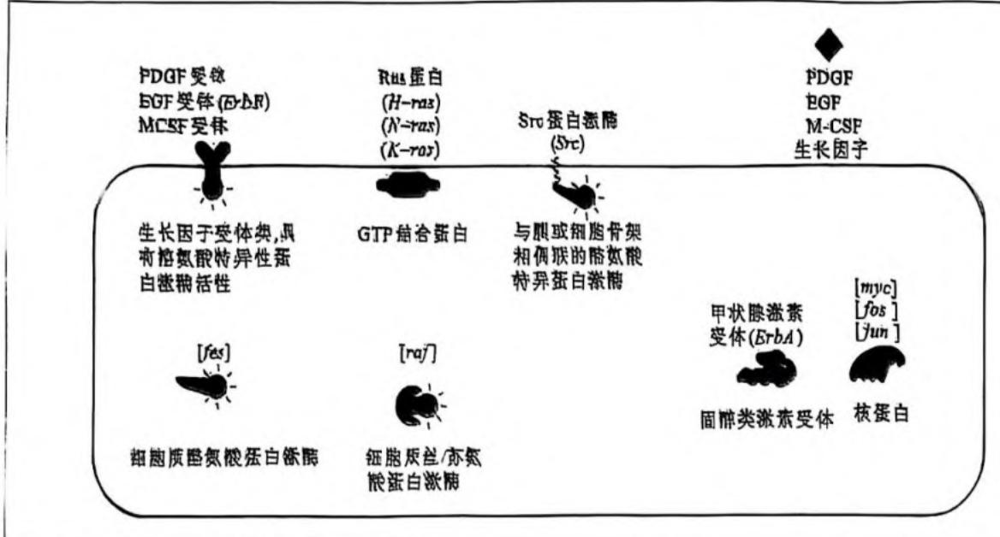  
图11-9 许多原癌基因参与细胞信号转导过程

段的协同作用而形成的。一般说来,在一种肿瘤中起主要作用的几乎不可能是两种以上的癌基因,但很可能涉及两个以上抑癌基因的突变。

## 4. 外源信号对原癌基因表达的影响

细胞外信号(包括生长因子、激素、神经递质、药物等)作用于靶细胞后,通过细胞膜受体系统或其他直接途径被传递至细胞内,再通过多种蛋白激酶的活化,对转录因子进行修饰,然后引发一系列基因的转录激活(图11-9)。这一过程进行得很快,通常在几分钟至几十分钟内即可完成。据测定,在这么短时间内,有70\~80种基因的转录被激活,其中包括众多的原癌基因。研究表明,c-fos基因的转录激活可能是最快、最显著的,信号刺激后几分钟内即可检测到c-fos基因产物。随后,另一些编码核蛋白的原癌基因如c-myc、c-myb、c-erbB、c-ets等的转录也相继被激活。这些对细胞外信号反应迅速的基因被称为快速反应基因。

快速反应基因的转录有两个特点:①不受蛋白质合成抑制剂的阻断。在许多情况下,还会因为蛋白质合成抑制剂抑制了不稳定蛋白质的合成而使转录产物的半寿期显著延长。②快速反应基因的转录激活维持时间很短,通常在半小时内完成,然后逐渐恢复原状。从这一点看,这类基因产物的主要功能是作为转录因子及调节因子去调节别的基因表达,以介导细胞外信号在细胞水平上的应答。

## 11.2 人类免疫缺陷病毒(HIV)

人类免疫缺陷病毒(HIV),俗称艾滋病(AIDS)病毒,诱发人类获得性免疫缺损综合征。该病毒在分类上属逆转录病毒科(Retroviridae)慢病毒属中的灵长类免疫缺陷病毒亚属,过去还有人将其命名为LAV、ARV、IDAV和HTLV3,现统一命名为HIV。1983年,法国巴斯德研究所的 Montaginor 和美国国家卫生研究院癌症研究所 Gallo 等人首次证实 HIV 是艾滋病的病因。该病已在 30 多年间席卷全球、几乎没有一个国家或地区可以幸免。已发现人免疫缺损病毒主要有两种，即 HIV-Ⅰ和 HIV-Ⅱ。HIV-Ⅰ是从欧洲和美洲分离的毒株，与猴艾滋病病毒只有约 45% 的相似性，它的致病力很强，是引起全球艾滋病流行的主要病原。HIV-Ⅱ与猴艾滋病病毒的相似性高达 75%，其毒力较弱，引起艾滋病的病程较长，症状较轻，且主要局限于非洲西部 $^{[11-2]}$ 。有关 HIV 的研究主要是针对 HIV-Ⅰ进行的。

表 14-2 逆转录编海科主要成员

<table><tr><td>属名</td><td>典型成员</td></tr><tr><td>哺乳动物C型拟转录病毒属</td><td>小胰乳腺癌病毒</td></tr><tr><td>D型拟转录病毒属</td><td>鼠白血病病毒</td></tr><tr><td>禽C型拟转录病毒属</td><td>Mason-Pfizer 纳病毒</td></tr><tr><td>泡沫病毒属</td><td>禽白血病病毒</td></tr><tr><td>人嗜T淋巴细胞病毒</td><td>人泡沫病毒</td></tr><tr><td>白血病毒属</td><td>人嗜T淋巴细胞病毒I型</td></tr><tr><td>慢病毒属</td><td>人类免疫缺陷病毒</td></tr></table>

## 11.2.1 HIV 病毒颗粒的形态结构及传播

艾滋病病毒粒子是一种直径约为 120 nm 的球状病毒, 粒子外包被着由两层脂质组成的脂膜, 这种结合有许多糖蛋白分子(主要是 gp41 和 gp120)的脂质源于寄主细胞的外膜。gp41 (envelope glycoprotein 41) 和 gp120 (envelope glycoprotein 120) 负责与寄主细胞受体结合并介导膜融合, 二者连接形成异源二聚体并进一步组装为同源三聚体包膜糖蛋白 (envelope, Env)。其中, gp41 主要分为胞外区、跨膜区(transmembrane domain, TMD)和膜内区(cytoplasmic tail, CT)三个结构域, CT 能与未成熟结构蛋白 Gag(Gag polyprotein)中重要的结构域发生互作。蛋白质 p24 和 p18 组成病毒粒子的核心, 内有基因组 RNA 链, 链上附着有逆转录酶, 其功能是催化病毒 RNA 的逆转录(图 11-10)。

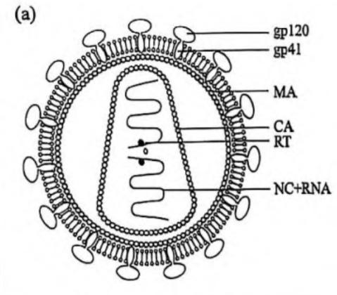

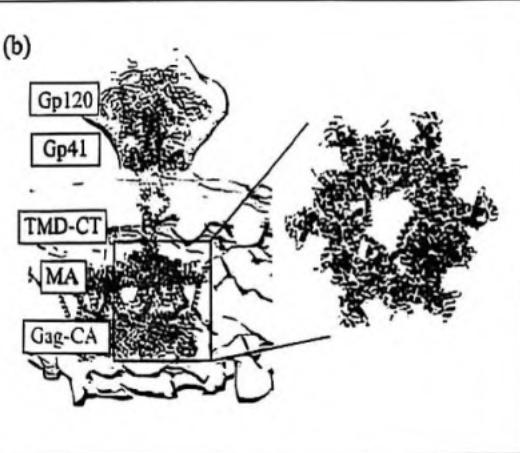  
图11-10 HIV-I病毒的结构(另见书末彩插)

(a) HIV-1 病毒粒子的结构示意图, gp120 和 gp41 是外膜蛋白, MA (matrix) 是内膜蛋白, CA (capsid) 是外壳蛋白, NC (nucleocapsid) 是核衣壳蛋白, RT (reverse transcriptase) 是反转录酶; (b) 基于冷冻电子断层成像技术构建的未成熟 HIV-1 病毒粒子的 Env-Gag 结构模型图。

HIV 广泛存在于感染者的血液、精液、阴道分泌物、乳汁、脑脊液、有神经症状的脑组织液等体液中，其中以血液、精液、阴道分泌物中浓度最高。HIV 可以依靠血液、血液制品，以及人体分泌液，如精液和乳汁等传播。研究发现，艾滋病患者经长期鸡尾酒疗法治疗后，血液中可能检测不到艾滋病病毒，但是眼泪中的病毒数量和新近确诊艾滋病人血液中病毒含量相差并不大，但目前尚无眼泪传播艾滋病毒的临床病例。

HIV 主要感染 T4 淋巴细胞, 也可以感染其他类型如 B 淋巴细胞和单形核细胞等。HIV 感染后可引起明显病变, 形成多核巨细胞, 并导致细胞死亡。HIV 病毒可以通过所感染细胞扩散到全身, 已在淋巴细胞、脑、胸腺、脾等组织发现了该病毒。不同毒株在试管内感染细胞的能力差异很大, 说明自然界广泛存在着突变株。迄今为止, 尚缺乏研究艾滋病的理想动物模型。与人类亲缘关系最近的黑猩猩感染 HIV 后, 早期情况与人相似, 会产生抗体和暂时性 T 细胞比例失调, 但后期并不发展成艾滋病的临床病症。

## 11.2.2 HIV 基因组及其编码的蛋白质

## 1. HIV 基因组结构

HIV 基因组由两条单链正链 RNA 组成, 每个 RNA 基因组约为 9.7 kb。在 RNA 5' 端有一帽结构 (m $^{7}$ G5'GmpNp), 3' 端有多 (A) 尾。HIV 的主要基因结构和组织形式与其他逆转录病毒相同, 均由 5' 端 LTR、结构蛋白编码区 (gag)、蛋白酶编码区 (pro)、具有多种酶活性的蛋白编码区 (pol)、外膜蛋白 (env) 和 3' 端 LTR 组成。HIV 较其他逆转录病毒复杂, 因为它有较多的调控基因。为了最大程度地利用有限的基因, HIV 基因编码区有很多重叠, 尤其在基因组的 3' 端。HIV 基因组中的部分基因如 Tat 和 Rev 是不连续的, 被插入的内含子分隔成两个外显子 (图 11-11)。HIV-I 至少有 4 个功能性的剪接供体位点和 6 个受体位点。

## 2. HIV 编码的蛋白质及其主要功能

HIV 具有独特的粒子结构,其结构蛋白主要包括 4 个基因。gag 基因编码病毒的核心蛋白,翻译时先形成一个 $5.5 \times 10^{4}$ 的前体蛋白(p55),然后在 HIV 蛋白酶的作用下被切割成 p17、p24、p15 3 个蛋白。P24 和 p17 分别组成 HIV 颗粒的外壳(CA)和内膜蛋白(MA), p15 进一步被切割成与病毒 RNA 结合的核衣壳蛋白(NC)p7 和 p6。pol 基因编码病毒复制所需的酶类包括逆转录酶 p66、整合酶 p32。从 pol 和 gag 基因重叠区内起始的一段序列为 PR 基因,它编码蛋白酶 p10。P10 在切割上述 HIV 蛋白前体产生成熟蛋白的过程中起主要作用。env 基因编码了 $8.8 \times 10^{4}$ 的蛋白质,经糖基化后其分子量增至 $1.6 \times 10^{5}$ ,是 HIV 包膜糖蛋白 gp160 的前体。该前体蛋白在蛋白酶作用下被切割成 gp120 和 gp41, gp120 暴露于病毒包膜外,称为外膜蛋白,感染细胞时可与细胞的 CD4 受体蛋白相结合;外膜糖蛋白 gp120 与 CD4 结合后,与 G 蛋白偶联受体(GPCR)家族中的一个跨膜蛋白发生相互作用。这种跨膜蛋白被称为辅助受体,在 HIV 感染中发挥重要作用。gp41 被称为跨膜蛋白(TM),嵌入病毒包膜脂质中。当 gp120 与 CD4 受体结合后,其构象改变导致与 gp41 分离,游离的 gp41 可插入细胞膜,形成膜融合使病毒核心颗粒进入细胞内。

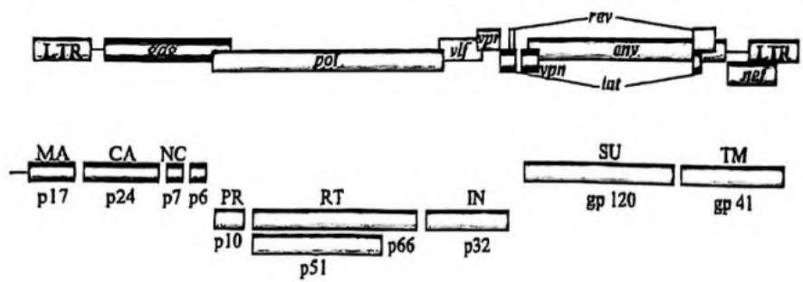  
图11-11 HIV-1基因组结构及所编码的主要蛋白质

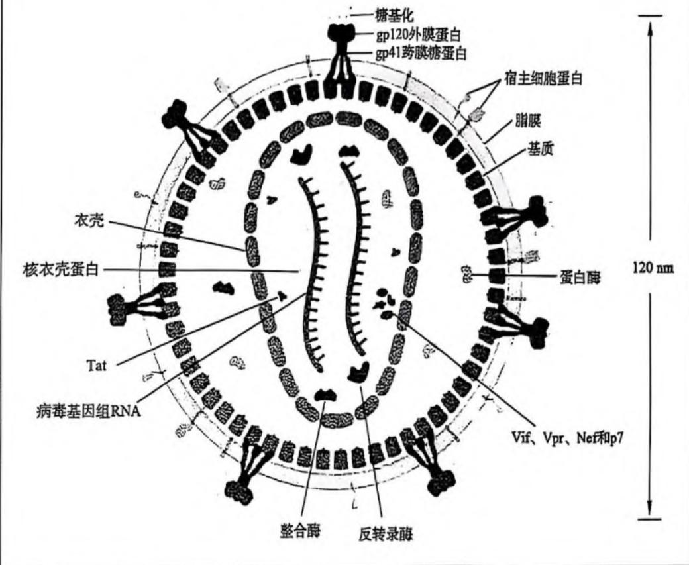  
gag 基因编码了由 p55 前体蛋白切割形成的 MA(p17)、CA(p24) 和 NC(p15) 等 4 个结构蛋白(因为 p15 进一步被切割为 p7 和 p6); PR(p10) 是蛋白酶, IN(p32) 是整合酶, p66 和 p51 是逆转录酶; gp120 和 gp41 是主要外膜蛋白。酰胺化的 MA 附着于病毒包膜的内部。

辅助受体对 HIV 的侵染和致病是非常重要的,研究表明,CD4 分子与 gp120 及辅助受体的相互作用促进随后的膜融合和病毒侵袭的细胞内信号传导。图 11-12 表示 HIV-I 与 CD4 及辅助受体 CXCR4、CCR5 在感染小神经胶质细胞和巨噬细胞时发生相互作用的情况。表 11-3 是已经发现的辅助受体,表 11-4 则系统介绍了 HIV 编码的主要蛋白及其功能。

## 3. HIV 膜蛋白主要功能区

HIV-I 中的 gp160 由 845\~870 个氨基酸残基组成, 在第 511 位被蛋白酶切割后产生 gp120 和 gp41, 其氨基端与其他分子以非共价键形式结合。gp120 有 24 个糖基化位点, 糖基化是 gp120 与 CD4 受体结合所必需的。已通过重组和突变实验定位了 gp120 蛋白的多个功能区, 简述如下。

① 主要抗原决定簇 包括 V3 区(第 301 \~ 324 位的环状肽段)的主抗原决定簇及若干个较弱的决定簇,其中有两个分别位于 gp41 的 616 \~ 632 位和 724 \~ 751 位。

图11-12 HIV-1感染小神经质细胞和巨噬细胞过程中信号传导及与其受体CD4和辅助受体相互作用示意图

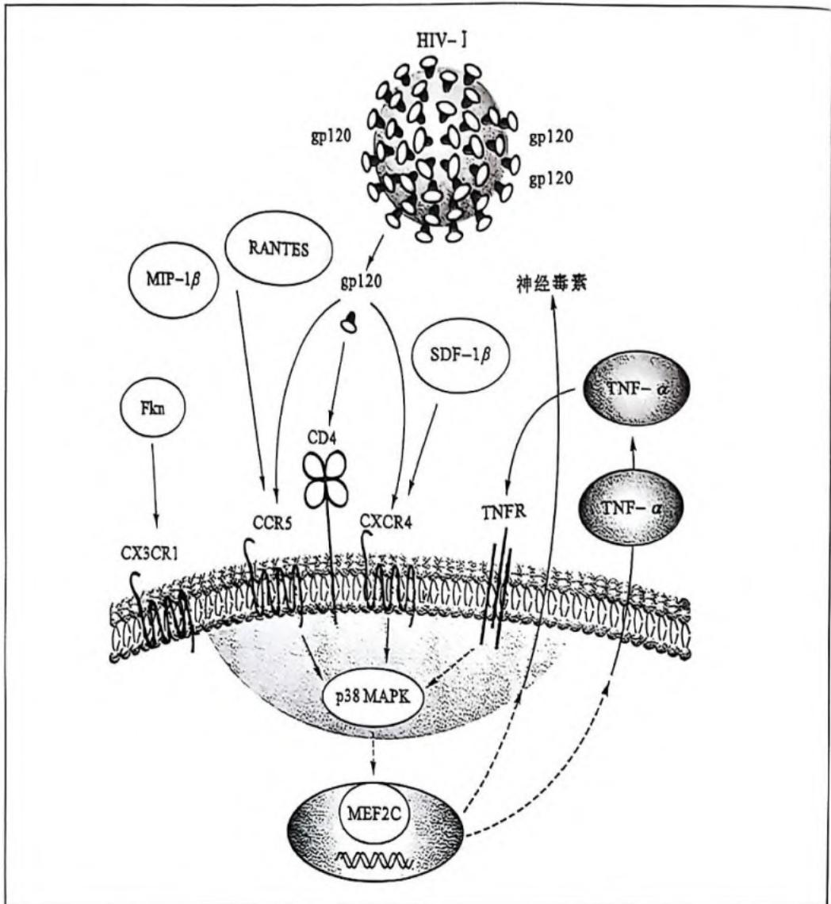

表 11-3 HIV-Ⅰ、HIV-Ⅱ和SIV的辅助受体及表达模式分析

<table><tr><td>辅助受体</td><td>病毒</td><td>细胞类型或组织</td></tr><tr><td>CCR1</td><td>HIV-II</td><td>活化的体细胞、单核细胞、树突状细胞</td></tr><tr><td>CCR2b</td><td>HIV-I,HCV-II SIV</td><td>单核细胞、T细胞</td></tr><tr><td>CCR3</td><td>HIV-I,HIV-II</td><td>嗜曙红细胞、树突状细胞、TH2</td></tr><tr><td>CCR4</td><td>HIV-II</td><td>TH2、脑</td></tr><tr><td>CCR5</td><td>HIV-I,HIV-II,SIV</td><td>活化的T细胞、单核细胞、树实状细胞</td></tr><tr><td>CCR8</td><td>HIV-I,HIV-II,SIV</td><td>TH2、脑腺细胞、脑</td></tr><tr><td>CCR9</td><td>HIV-I</td><td>淋巴细胞、脑、胎盘</td></tr><tr><td>CXCR2</td><td>HIV-II</td><td>中性粒细胞、脑</td></tr><tr><td>CXCR4</td><td>HIV-I,HIV-II,SIV</td><td>淋巴细胞、单核细胞、脑</td></tr><tr><td>CXCR5</td><td>HIV-II</td><td>B细胞</td></tr><tr><td>CXCR6</td><td>HIV-I,SIV</td><td>淋巴细胞</td></tr><tr><td>CXCR7(RCD1)</td><td>HIV-I,HIV-II,SIV</td><td>单核细胞、脑</td></tr><tr><td>ROC1</td><td>HIV-I,HIV-II,SIV</td><td>淋巴细胞、脑</td></tr></table>

表 11-4 HIV 编码的主要蛋白质及其功能

<table><tr><td>基因产物</td><td>功能</td></tr><tr><td>Gag</td><td>核心蛋白</td></tr><tr><td>Pol</td><td>多种酶功能</td></tr><tr><td>Env</td><td>包膜蛋白</td></tr><tr><td>Tat(Tat-3、Ta)</td><td>RNA 沉默抑制因子,转录激活子</td></tr><tr><td>Rev(Art、Trs)</td><td>调控 RNA 剪切和运输,与 RRE 结合增加 env 的翻译</td></tr><tr><td>Vif(Sor、A、P&#x27;、Q)</td><td>侵染因子,病毒在巨噬细胞扩散所必需</td></tr><tr><td>Vpr(R)</td><td>增加病毒复制</td></tr><tr><td>Vpu</td><td>辅助病毒组装和释放,以及 gp160/CD4 复合物的解聚</td></tr><tr><td>Ncf(3&#x27;ORF、B、E、F)</td><td>形成同源二聚体,引起多效应性的影响,如负调控 CD4</td></tr></table>

② T 细胞决定簇 两个辅助性 T 细胞决定簇 T2 和 T1 分别在 105\~117 位的 C1 区和 421\~436 位的 C4 区, 一个主要细胞毒 T 细胞决定簇位于第 308\~322 位, 与 V3 区有部分重叠。另有 3 个较弱的细胞毒 T 细胞决定簇在 gp41 上。

③ CD4 受体结合区 该区位于 423 \~ 427 位 (C4 区)。在上述功能区以外的某些氨基酸突变也能影响 gp120 的功能,说明上述各功能区发挥作用还依赖于整个分子特定的空间构象。

## 11.2.3 HIV的复制

HIV 主要侵染人体的 T 淋巴细胞及巨噬细胞,并通过病毒膜蛋白 gp120 与细胞表面的 CD4 受体蛋白结合。CD4 分子含有两个免疫球蛋白结构域,它在人体内所结合的正常配体是 II 型 MHC 抗原。HIV 与受体结合后,病毒核心蛋白和两条 RNA 链进入细胞(图 11-13)。逆转录酶以病毒 RNA 为模板合成单链 DNA,并由宿主细胞 DNA 聚合酶合成双链 DNA(原病毒)。双链 DNA 经环化后进入细胞核,在病毒整合酶的作用下,整合入细胞染色体中,病毒核酸随细胞的分裂而传至子代细胞,可长期潜伏。

在病毒复制期间,整合到 DNA 上的原病毒被转录成 RNA 前体,其中一些通过 RNA 剪接产生成熟的 mRNA。这些 mRNA 从细胞核输出到细胞质中,并被翻译为调控蛋白 Tat 和 Rev. 新产生的 Rev 蛋白迅速移动到细胞核中,并与未剪接的全长病毒 RNA 结合,帮助其离开细胞核。一些全长 RNA 作为病毒子代基因组起作用,而另一些则翻译产生结构蛋白 Gag 和 Env。Gag 蛋白与病毒基因组 RNA 结合,将其包装成新的病毒颗粒。最后病毒核衣壳经过细胞膜以出芽方式形成完整病毒体释放到细胞外。HIV 复制的主要过程如下:①原病毒整合到宿主染色体上,无症状;②原病毒利用宿主细胞的转录和合成系统转录产生病毒 mRNA,其中一部分编码病毒蛋白,与基因组 RNA 组装成新的病毒颗粒,从宿主细胞中释放出来侵染其他健康细胞;③宿主细胞瓦解死亡。

对 HIV-I 编码的 RNA 酶 H 和逆转录酶的 X 射线衍射晶体结构分析发现, 合成前病毒第一条 DNA 链的过程中没有宿主细胞 DNA 酶的参与, 完全由 HIV-I 逆转录酶完成。

图11-13 HN-1在人体细胞内的复制和侵染过程示意图

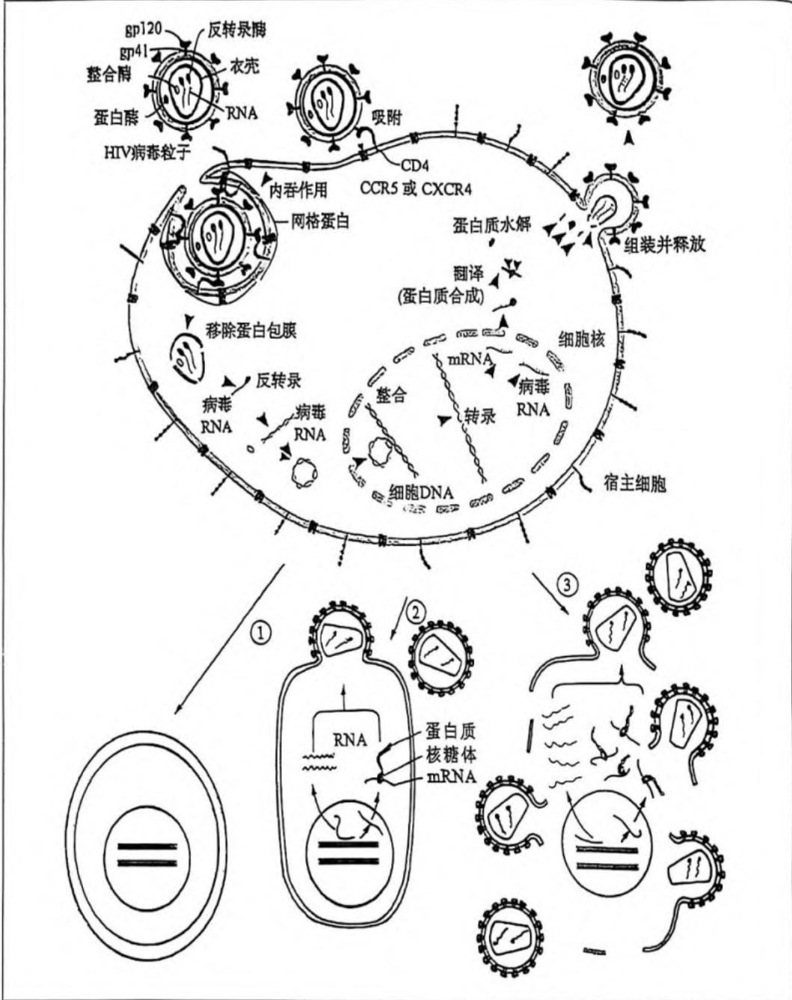

该酶由两个 N 端完全一致的亚单位 (p66 和 p51) 组成, 具有 DNA 聚合酶活性, 其 N 端功能区以病毒 RNA 为模板催化合成互补 DNA 链。此外, p66 的 C 端功能区还能在 p51 亚基的协同作用下降解病毒模板 RNA 链。

HIV 的转录从基因组 5' 端 LTR 起始, 先形成一条长链 RNA 并迅速切割成短 mRNA 分子, 用于指导合成 HIV 调控蛋白, 但不翻译结构蛋白。当调控蛋白 Rev 达到一定阈值后, 转录由早期向晚期变换。此时, 主要是转录长链 mRNA 并指导合成结构蛋白, 组装成完整的病毒颗粒。HIV 复制的复杂调控机制使 HIV 感染细胞后产生不同的结果。在复制和表达量非常高的情况下可立即杀死细胞, 低水平复制和表达时仅造成细胞功能失常, 而不复制、不表达时病毒基因组以 DNA 形式与染色体整合, 与宿主长期共存。这就是艾滋病在临床上潜伏期长短不一、病程快慢不一的主要原因。HIV 前病毒整合是随机的, 并不要求特定的 DNA 序列, 因而可以整合到染色体上的任何部位。

## 11.2.4 HIV 基因表达调控

与大多数逆转录病毒相比，HIV 的最大特点就是含有许多调控基因。这些基因编码相应的调控蛋白，它们在病毒 RNA 的转录、转录后加工、蛋白质翻译、包装以及病毒颗粒的释放等各个过程中发挥重要作用。在这些过程中，除 HIV 自身的调控蛋白外，还有许多宿主细胞的调控蛋白参与。

## 1. LTR 序列

LTR 位于 HIV 基因组两端, 其序列是高度保守的, 在 HIV-Ⅰ与 HIV-Ⅱ及 SIV 之间的保守性高达 95% 以上。HIVI 的 5' 端 LTR (5'-LTR) 和 3' 端 LTR (3'-LTR) 都可以启动转录, 但 HIV 的转录由位于 5'-LTR 内的启动子控制。来自 5'-LTR 的转录调控可能抑制了 3'-LTR 的启动子活性, 在 5'-LTR 缺陷的情况下, 可以激活来自 3'-LTR 的转录。5'-LTR 含有 HIV 基因调控所必需的多个特定调控区, 能够劫持宿主细胞转录装置, 严格控制病毒基因组的转录。HIVI 的 5'-LTR 在结构上分为 U3、R 和 U5 区域 $^{(图11-14)}$ 。HIV 转录起始于 5'-LTR R 区域的转录起始位点 (TSS), 然后转录产物通过 U5 区域加帽并进行延伸至整个病毒基因组。转录终止通常发生在 3'-LTR 的 R 区域内。转录终止时, 3'-LTR 的 U5 区编码 poly(A) 信号进行加尾。5'-LTR 包含相对于 TSS 核苷酸 -454 \~ +188 之间的区域。根据各区调控功能的异同进一步划分为 4 个主要功能元件: 调控单位 (-455 \~ -104), 增强子区域 (-109 \~ -79), 核心单位 (-78 \~ -1) 和 TAR 区域 (+1, +60) $^{(图11-14)}$ , 并在其中发现了许多细胞转录因子结合位点 $^{(图11-15)}$ 。

## (1) 核心调控元件

该元件从 LTR 起始延伸到 -78 位核苷酸, 包含多个可与细胞转录调控因子结合的区域。鸡卵蛋白转录因子(COUP-TF), 结合于 LTR-371\~-334 位, 激活蛋白 1 (activator protein 1, AP1) 结合于 LTR 的 -347\~-329 位。激活 T 细胞核因子(NFAT) 在 LTR-292\~-255 位和 -216\~-203 位上有两个结合位点。上游激活因子(USF) 结合于 -173\~-160

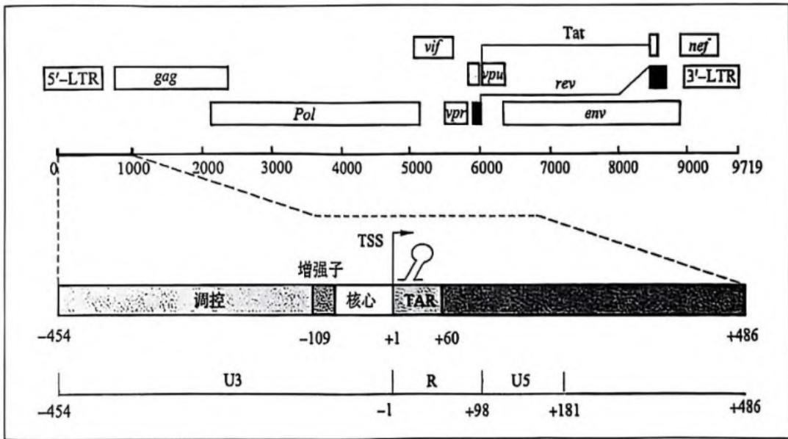  
图11-14 HIV基因组LTR结构示意图

## 11.2 人类免疫缺陷病毒(HIV)

图 11-15 HIV 基因组 5'-LTR 区中的 DNA 和 RNA 结合蛋白的作用位点  
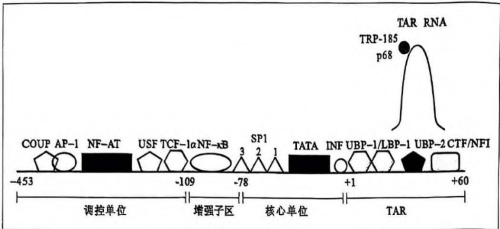

位，T细胞因子-1α(TCF-1α)结合于-139\~-124位。除COUP-TF和USF对HIV的转录起负调控作用外，其余均为正调控因子。AP1是由含亮氨酸拉链结构的C-Jun和C-Fos家族成员组成的二聚体，COUP-TF家族中的低分子量蛋白质含有锌指结构，USF为螺旋-环-螺旋结构，TCF-1α含有高速泳动族基序(HMC motif)。该区域还包括3个CCAAT/增强子结合蛋白(C/EBP)结合位点，激活转录因子/环AMP应答位点、淋巴细胞增强因子(LEF-1)结合位点，c-Myb结合位点、Ets-1结合位点和核因子NF-κB结合位点。核因子NF-κB与HIV-I感染后的调节区域结合并对病毒转录产生负影响。在核心调控区域的上游-130\~-201之间的序列，包含在T细胞中高度表达的LEF-1、NF-AT和Ets-1转录因子的共有结合位点，在外周血淋巴细胞和一些T细胞系中对病毒表达具有非常重要的调节作用。

## (2) 增强子区域

该区域主要包括核因子 $\kappa B$ (NF- $\kappa B$ ) 结合位点(结合于 -104\~-81 位)。NF- $\kappa B$ 含有锌指结构及锚定蛋白重复序列,由间隔 3\~4 个核苷酸的两个 10 bp 的 GGGACTTTCC 序列组成,负责调控 HIV 基因在多种细胞特别是 T 淋巴细胞中的高效表达。在多种 HIV 亚型中均存在 NF- $\kappa B$ 和相关因子的 10 bp 共有结合位点的串联重复序列,类似的序列在其他病毒如 SV40、巨细胞病毒及白细胞介素 -2 受体、β-干扰素等基因的特异性和诱导型表达过程中都发挥了重要的调控作用。HIVI 增强子区域内的两个 NF- $\kappa B$ 结合位点也可以被 NF-AT 因子结合;NF-AT 与位于 U3 区域的 NF- $\kappa B$ 基序的末端 3' 端半结合,具有与 p50 相似的序列偏好,并且调节 HIV 启动子活性,增加 T 细胞中的感染性。

## (3) 核心转录单位

HIV-Ⅰ LTR 核心转录单位的结构与其他病毒或细胞启动子的转录起始区相似,有 TATA 区、SP1 结合位点和转录起始位点 TSS。这些序列对转录的激活具有重要作用,一旦缺失将使 LTR 失去启动子活性。

在核心转录单位 -78～-46 位点的富含 GC 区有 3 个连续的 SP1 结合位点。SP1 蛋白含有 DNA 结合结构和两个富含谷氨酰胺的结构域，可形成二聚或三聚体。当 3 分子 SP1 与 LTR 结合后，由于彼此间以及 SP1 与周围蛋白的相互作用改变了 DNA 的空间结构，诱导了依赖于 DNA 的蛋白激酶对 SP1 的磷酸化作用, 激活 HIV-Ⅰ基因转录。HIV-Ⅰ LTR 的 -28\~-24 位含有 TATA 元件, 其两侧还有一个 CAXXTG 的同向重复序列, 该重复序列可能是转录因子螺旋 - 环 - 螺旋 DNA 结合蛋白的识别位点。不同 HIV-Ⅰ亚型的遗传学研究表明, 病毒能够使用重叠的 CATA 区而不是典型的 TATA 区, 并且某些亚型包含 4\~5 个 Sp1 位点。TATA 区和 Sp 位点对于病毒转录起始、保持启动子活性以及 Tat 蛋白介导的反式激活都是必需的。

最近的研究表明三联基序蛋白 TRIM22 干扰 Sp1 结合从而抑制预起始复合物 (PIC) 形成和原病毒转录。TATA 盒侧翼的 CTGC 基序也显示为体外转录起始和活细胞中 Tat 依赖性激活所需的。另外, 紧接 TSS 上游的转录因子 ZASC1 结合位点, 显示出 ZASC1 与 Tat 和正向转录延伸因子 b(P-TEFb) 相互作用并协同促进 HIV-I 转录延伸的调节作用。

## (4) 反式激活因子应答元件

在 HIV 基因组 +1 \~ +60 位的核苷酸序列是反式激活因子(Tat)激活 HIV-I 转录所必需的,称为反式激活应答元件(TAR)。该序列存在于 HIV 基因组 RNA 和原病毒 DNA 上,是 HIV 复制所不可缺少的重要调控位点。TAR 是含有多个调节元件和两个 CTCTCGG 重复序列拷贝的短 RNA 转录物,从而介导 Tat 向 HIV-I 启动子的募集。体外研究表明,该 RNA 元件具有发夹样结构,作为 Tat 的结合位点,对于反式激活是必不可少的。

研究发现,TAR 可以产生一个 miRNA,通过降低细胞凋亡通路下游基因 ERCC1 和 IER3 表达,阻止细胞凋亡,以利于病毒的复制。另外,还在 TAR 元件中发现 Psi 元件,Gag 和 Rev 蛋白可以识别该元件进行病毒基因组和结构蛋白的组装。

## (5) TSS 下游区域

TSS 下游的序列在调节转录中的作用近年来才引起重视。HIV-I 5'-LTR 在 TSS 下游同样含有转录因子结合位点，其中一些在不同的 HIV-I 株系和亚型中是非常保守的。重要的下游 HIV-I 调控结合位点是：3 个激活转录因子 AP-1 结合位点分别位于 +87～+94 位、+118～+125 位和 +155～+163 位，NFATc2 和 C/EBP 结合于 U5 区域的 +158～+171 位，类 AP-3 结合位点在 +162～+177 位，NFAT 结合位点与类 AP-3 相同，DBF-1 结合位点和 Sp 位点位于 U5 区域下游，分别为 +200～+219 位和 +270～+278 位（图 11-16）。

包括 AP1、C/EBP、NFAT 在内的一些因子通过募集染色质重塑和组蛋白修饰辅因子复合物来促进转录激活，从而改善 RNA 聚合酶Ⅱ复合物对染色质的亲和力。其他因子可能通过影响转录起始和延伸来促成转录激活。总的来说，这个区域可能有助于调节

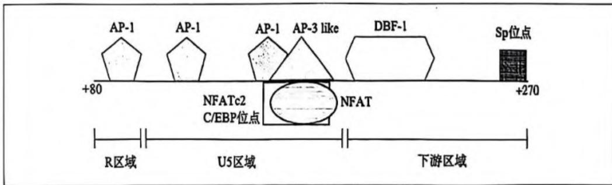  
图 11-16 HIV 基因组 5'-LTR 的 TSS 下游区域转录因子结合位点

HIV-I 对激活信号的转录反应。

## 2. 参与 HTV 复制的调控蛋白

## (1) Tat 蛋白

该蛋白质是一个转录激活因子, 在 HIV-Ⅰ、HIV-Ⅱ和 SIV 中高度保守, 是病毒复制所必需的。HIV-Ⅰ的 tat 基因与 env 编码区有部分重叠, 它含有两个外显子, 编码了由 101 个氨基酸残基组成的 Tat 蛋白。第一个外显子所编码的 67 个氨基酸组成的多肽同样具有反式激活作用(图 11-17)。Tat 蛋白有 3 个功能域, 第一个是与其他已知转录调控蛋白激活功能区结构基本一致的酸性氨基酸区, 与 Tat 激活 HIV-Ⅰ基因表达有关。第二个功能区富含 Cys, 在其 16 个氨基酸残基中就有 7 个 Cys, 可与二价金属离子结合并形成 Tat 二聚体。在这 7 个 Cys 中有 6 个是维持 Tat 活性所必需的, 替代其中的任意一个均可使 Tat 失活却不影响 Tat 与金属离子的结合。该肽段能与分子量 $3.0 \times 10^{4}$ 的宿主细胞核蛋白相结合。

图11-17 Tal蛋白的结构示意图  
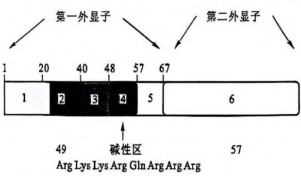

Tat 蛋白还是一个 RNA 沉默抑制因子。缺失突变和点突变结果表明，抑制 RNA 沉默功能区位于该蛋白质的 38～72，且这段区域不具有转录激活功能，说明 Tat 蛋白的转录激活功能和 RNA 沉默抑制功能是分开的。HIV-Ⅰ和Ⅱ也编码一个称为 Tax 的异源转录激活因子，它的主要作用是通过宿主细胞中的转录因子与 LTR 中的顺式作用元件结合，从而调控基因转录。

研究认为,Tat 的主要作用可能是促进 RNA 聚合酶 II(RNAP II)转录起始复合物的组装。在 HIV-I 整合入宿主基因组后,RNAP II 在位于 5'-LTR 的病毒启动子处组装并开始转录病毒 RNA 的过程。在没有 Tat 蛋白存在的情况下,转录起始位点附近的顺式作用元件虽然也指导转录复合物的形成,但其延伸效率较低,只能转录出短的不完整的病毒转录物。加入 Tat 蛋白后,短链 RNA 转录产物浓度迅速下降,取而代之的是长链 RNA。

Tat 的第三个功能区由一组带正电的碱性氨基酸残基构成, 行使两个主要功能。一个是 +48 \~ +52 位的 GRKKR 序列, 是核 - 核仁定位信号, 可介导自身或异种蛋白进入细胞核。若将此肽段与 β- 半乳糖苷酶融合即可使后者在核内聚集。该肽段第二个功能是与 TAR RNA 凸出部分的特异性结合, 通过 Tat 第 52 和第 53 位 Arg 残基与后者的磷酸基团相互作用得以实现。

## (2) Tat 与 TAR 对 HIV 复制的协同调控作用

实验表明,Tat 和 TAR 结合并不能有效地激活 HIV 基因表达,还依赖于如下因素:

TAR 序列及完整高级结构的影响。Tat 虽能结合环区有突变的 TAR 蛋白,但此时不能激活 HIV 的表达。

宿主细胞因子协同作用的影响。在不同细胞内，Tat 的活性可有上千倍的差异。在人鼠杂交细胞中，只有在保持人第 12 号染色体的杂交瘤细胞中，Tat 才能有效地激活 HIV-Ⅰ转录。研究发现，Tat 与 TBP-Ⅰ结合形成复合物而发挥作用，说明 Tat 与 TAR 对 HIV 复制的调控还需宿主细胞编码蛋白的协同作用。

上游启动子和增强子序列。当 TAR 远离其上游启动子时, 它的活性迅速下降。而且这种依赖作用对非激活细胞和 Tat 激活细胞的表现是不一样的, 增强子 SP1 序列在 Tat 诱导细胞中对 HIV 转录的促进作用远远大于非激活细胞, 去除 SP1 序列甚至可提高非激活细胞中 HIV 的转录。而 NF- $\kappa$ B 序列在对两种细胞的作用正好与 SP1 相反。TATA 启动子序列的改变对未激活细胞影响很小, 却可明显降低 HIV 在 Tat 诱导细胞中的复制。

Tat 的主要辅助因子是细胞周期蛋白 T1(CCNT1), 它与细胞周期蛋白依赖性激酶 9 (CDK9) 一起构成正转录延伸因子 b(P-TEFb)。这种异二聚体宿主激酶可以磷酸化激活暂停的 RNAP II, 并调节大多数细胞基因的延伸。Tat 将 P-TEFb 复合物募集到新生的 TAR RNA 中, 该 RNA 将激酶定位在停滞的聚合酶附近用于磷酸化依赖性激活。有趣的是, CCNT1 也有助于 RNA 结合, 因为它与 TAR 环中的碱基接触以实现高亲和力相互作用。Tat-P-TEFb 复合物有效地刺激病毒基因表达, 启动生命周期的后整合步骤, 最终导致病毒萌芽和新细胞的感染。

## (3) Rev 蛋白

rev 基因由两个外显子组成, 分别编码 25 个氨基酸和 91 个氨基酸的两个肽段, 最终组装成有 116 个氨基酸、分子量为 $1.9 \times 10^{4}$ 的调控结构蛋白表达活性的 Rev 蛋白 [18] 11-18。它是一个重要的反式激活因子, 调控 RNA 剪切和运输, 与 RRE 结合增加 env 的翻译。对 HIV 的许多调控蛋白编码基因有负调控作用, 而对其结构蛋白基因有正调控作用。Rev 蛋白的上述作用是通过与 env 和 gag/pol mRNA 上的一段 234 个核苷酸的 Rev 效应元件实现的, 是 HIVI 特异的。它的主要功能是增加细胞质中未经编辑的基因组全长转录产物,增加含有 Rev 效应原件 RNA 的稳定性,并促进它们向细胞质运转。Rev 蛋白还通过阻碍剪接子的组装来抑制 RNA 的编辑,增加这些 mRNA 的翻译,从而促进 HIV 基因表达由早期(转录调控蛋白 mRNA)向晚期(转录 HIV 结构蛋白 mRNA)的转变。在 rev 基因缺陷型 HIV 前病毒中,仅有早期基因表达。只有加入 Rev 蛋白后,晚期基因才开始转录。Rev 蛋白还在结构蛋白 mRNA 进入细胞质的过程中发挥作用。

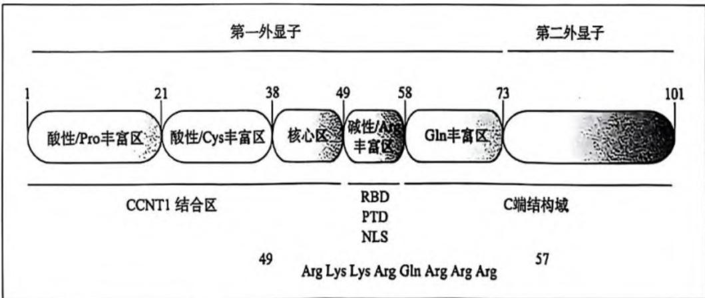  
图11-18 Rev蛋白的结构示意图

已经证实, Rev 蛋白和 RRE (Rev response element) 的结合是通过 Rev 蛋白中富含碱性氨基酸的一段 14 肽 (EGTRQARNRRRRWR) 与 RRE 二级结构 IIB 茎区特异性结合实现的 $^{[11-19]}$ 。第一个 Rev 蛋白与 RRE 的结合有助于其他 Rev 蛋白的结合, 这些蛋白质不是结合在 RRE 的特异位点上, 而是直接结合到第一个 Rev 蛋白上, 形成多聚体。Rev 蛋白功能的实现依赖于它向核内的运转, 而这一过程是通过 Rev 蛋白的核定位信号功能区完成的。宿主细胞蛋白可结合到 Rev 蛋白近 C 端的功能区, 协助加工和转运 HIV mRNA。

Rev 蛋白导出细胞核的主要辅助因子是染色体维持因子 1(CRM1)。CRM1 通常向细胞质运输富含亮氨酸的核输出序列(NES)的蛋白质,并且通常不参与 mRNA 输出。Rev通过充当适配器劫持 CRM1 用于病毒 RNA 的输出, 其中 Rev NES 结合宿主输出因子, 而 Rev 核定位信号 (Rev-NLS) 结合 RRE。有趣的是, 最近的研究表明, 病毒出核复合物中含有 CRM1 的二聚体。考虑到 CRM1 已被证明只能作为单体运输细胞成分, Rev 依赖的 CRM1 二聚化可能是提高对低亲和力 RevNES 位点的识别的一种方式。组装这种病毒 - 宿主输出复合物可以使含有内含子的 HIV-Ⅰ遗传信息在细胞质内运输, 以完成病毒生命周期的后期阶段。

图11-19 Rev蛋白与RRE区的结合  
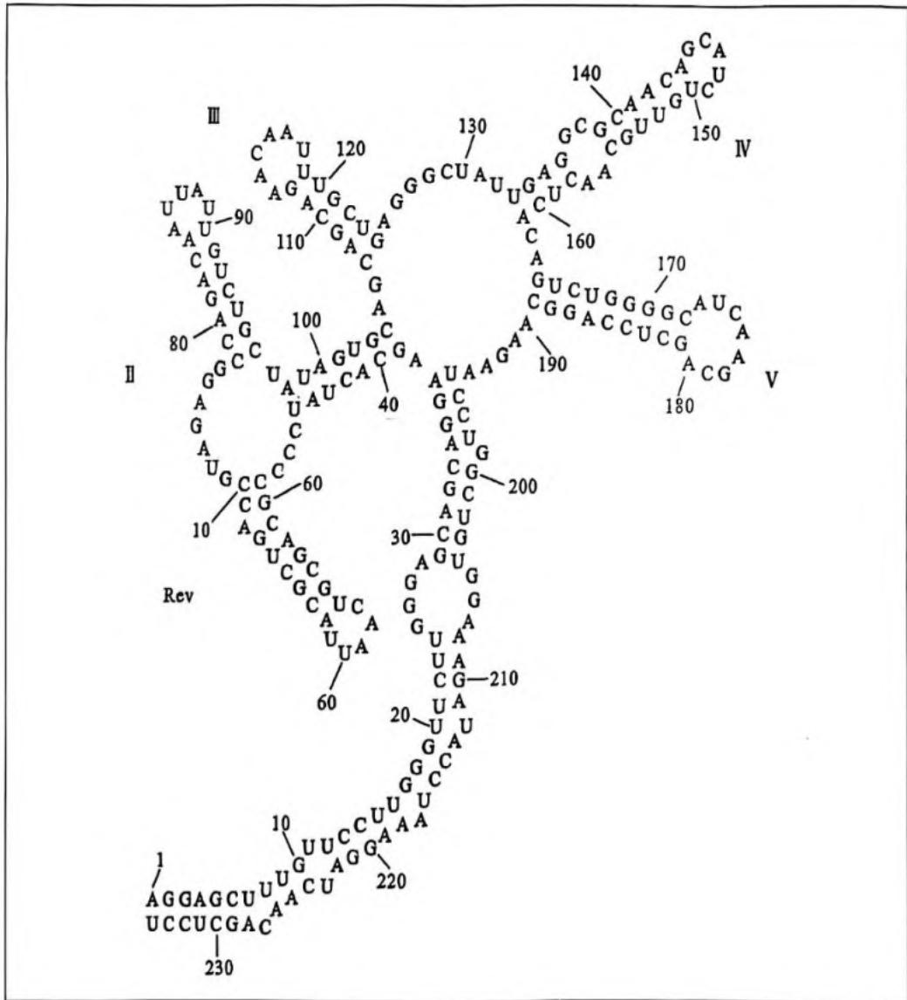

## (4) Nef 蛋白

一般认为，Nef蛋白是一个负调控因子和磷酸化蛋白，分子量为 $2.7 \times 10^{4}$ ，它不是HIV复制所必需的，但可抑制由HIV LTR特异性转录的HIV-I前病毒基因的表达。研究发现，烷基化后定位于细胞膜上的Nef蛋白比未烷基化并弥散于细胞核及细胞质内的Nef蛋白抑制HIV-I基因表达的效率比后者高10倍，推测Nef可能是通过膜细胞信使分子获得对HIV LTR的调控作用。Nef的存在可提高和维持HIV在体内的含量，并在HIV病理过程中起作用。此外，Nef蛋白形成同源二聚体，引起多效应性的影响，如负调控CD4、MHC I以及MHC II。

## (5) Vpr 蛋白

该蛋白质又称病毒 R 蛋白, 由 96 个氨基酸组成, 它不是 HIV 复制所必需的, 但存在于病毒颗粒中。Vpr 蛋白与 p6 Gag 存在特异性相互作用, 每个病毒粒子包装大约 250 个 Vpr 拷贝, 病毒核心中也发现 Vpr。含有 vpr 基因的 HIV 毒株与无 vpr 基因的 HIV 毒株相比, 前者在细胞中生长较快, 引发细胞病变也较强。无 vpr 基因的 HIV-Ⅱ不能在巨噬细胞中繁殖。Vpr 蛋白可作用于 HIV-Ⅰ的 LTR 区, 使它所调控的 HIV 复制速度提高 2\~3 倍, 说明 Vpr 在病毒早期侵染中有作用。

Vpr 蛋白在 HIV-I 复制中最重要的一个功能是能够结合并协助将病毒整合前复合物导入不分裂的细胞和细胞周期阻滞细胞的细胞核。病毒 cDNA 整合到宿主染色体 DNA 中过程通常被核膜所阻止。HIV-I 进入宿主基因组的两种主要方式是: 细胞分裂时, 核膜被分解; 或者借助 IN 蛋白和 Vpr 在核孔的相互作用, 通过输入核内整合复合物进入细胞核。Vpr 还能在细胞周期的 G₂ 阶段阻断细胞分裂, 诱导细胞凋亡并产生其他致病作用, 有可能增加了病毒复制、传播和免疫逃逸。

## (6) Vpu 蛋白

这个蛋白质是 HIV-I 特有的,其他灵长类动物免疫缺陷病毒以及 HIV-II 和 SIV 均无此基因。它编码由 81 个氨基酸组成的磷酸化蛋白,称为病毒 U 蛋白,主要存在于细胞膜中。vpu 基因的翻译受 Rev 调控,HIV 复制时并不需要 vpu 基因的表达,但若缺失 vpu 基因可使感染性病毒粒子的产量降低 5\~10 倍,大大减少了病毒颗粒在细胞膜上的释放。据此,人们推测 Vpu 蛋白可能促进 HIV-I 病毒粒子的组装、成熟和释放。此外,Vpu 蛋白有助于 gp160/CD4 复合物的解聚。

## (7) Vif 蛋白

该蛋白质是分子量为 $2.3 \times 10^{4}$ 的病毒感染性因子, 是 HIV-I 侵染所必需的。缺失vif基因的HIV-I虽然仍在细胞内正常复制并产生病毒粒子，但这些粒子的侵染性不及野生HIV-I病毒粒子的1/1000。Vif蛋白是病毒在巨噬细胞间扩散所必需的。图11-20揭示了Tat、Rev和Nef对HIV基因表达的综合性影响。

图 11-20 Tal、Rov 和 NaI 对 HIV 基因表达的影响分析  
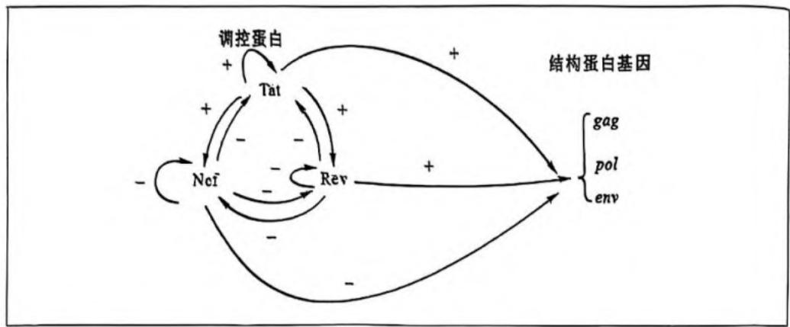

## 11.2.5 HIV 的感染及致病机制

HIV 初次感染人体后, 立即大量复制和扩散, 此时, 感染者血清中出现 HIV 抗原, 从外周血细胞、脑脊液和骨髓细胞中均能分离出 HIV。这是 HIV 原发感染的急性期。大约 70% 以上的原发感染者在感染后 2\~4 周内出现急性感染症状, 包括发热、咽炎、淋巴结肿大、关节痛、中枢及外周神经系统病变、皮肤斑丘疹、黏膜溃疡等, 持续 1\~2 周后进入 HIV 感染的无症状潜伏期。在这个时期感染者无任何临床症状, 外周血中 HIV 抗原含量很低甚至检测不到。但随感染时间的延长, HIV 重新开始大量复制并造成免疫系统损伤。临床上病人感染逐步发展到持续性全身性淋巴腺病 (PGL)、艾滋病相关综合征 (APC) 等, 直至发展到艾滋病。

在 HIV 自然感染过程中,机体可产生高滴度的抗 HIV 多种蛋白质的抗体,主要是细胞类型特异性的中和抗体,其主要作用是在急性感染期降低血清中的病毒含量或部分清除病毒。HIV 的感染也刺激机体产生细胞免疫应答,对于杀伤 HIV 感染的细胞,阻止 HIV 经细胞接触而扩散等可能发挥重要作用,还能协助清除急性感染期 HIV 感染灶和 HIV 感染早期的少量有 HIV 复制的细胞。

人体一旦被 HIV 感染,便会终生带毒,随着时间延续,发病的可能性也逐渐增加。感染 7\~8 年内一般有约半数的带毒者发病,体内产生大量病毒颗粒,并造成感染细胞死亡。属于典型的逆转录病毒科慢病毒亚科病毒特征。此外,HIV 还通过以下途径导致免疫功能下降:① HIV 粒子表面的 gp120 蛋白脱落,与正常细胞膜上 CD4 受体结合,使该细胞被免疫系统误认为病毒感染细胞而遭杀灭;②因 T 细胞 CD4 受体被 gp120 封闭,影响了其免疫辅助功能;③ HIV 的 gp120 蛋白可刺激机体产生抗 CD4 结合部位的特异性抗体,阻断 T 细胞功能;④带有病毒包膜蛋白的细胞可与其他细胞融合形成多核巨细胞而丧失功能。

研究还发现,除了主要感染富含 CD4 蛋白的 T 细胞外,HIV 还能感染只带少量 CD4 蛋白或无此受体蛋白的 B 细胞、巨噬细胞、树突状细胞、郎格罕氏细胞、肠上皮细胞、脑内的星形细胞和小神经胶质细胞以及毛细血管内皮细胞等。HIV 可侵染巨噬细胞并随该细胞游走至体内许多组织细胞组织或脏器。HIV 还可侵染脑和肠细胞，因此，艾滋病患者的中枢神经系统常常发生病变，并伴有腹泻等症状。

尽管 HIV 有上述导致细胞病变的作用,但还不足以解释 HIV 感染所造成的免疫系统进行性损伤直至崩溃的严重病症。因为即使是艾滋病人,其外周血淋巴细胞中也仅有极少数的细胞被 HIV 感染。有研究报道,鼠逆转录病毒和鼠免疫缺陷病毒感染的小鼠中病毒基因编码一种超抗原,可导致小鼠体内特定的 T 细胞亚群的消失和免疫缺陷的发生,暗

示艾滋病人中也可能存在 HIV 编码的超级抗原,导致特定 T 细胞亚群缺失并使机体的免疫防御网出现重大漏洞,对某些致病微生物处于无反应状态。这种免疫病理机制可以解释艾滋病人既出现了严重的免疫系统缺陷,病人血液中却只有极少部分淋巴细胞带有 HIV 这种十分矛盾的现象。

## 11.2.6 艾滋病的治疗及预防

迄今为止,虽然对艾滋病的研究受到了高度重视,仍无任何药物可以完全抑制 HIV 在感染者体内的增殖并彻底治愈艾滋病。目前,已批准的抗 HIV 病毒药物主要有以下几类(表11-5)。图 11-21 是核苷酸型和非核苷酸型逆转录酶抑制 HIV 病毒的作用机制。

目前治疗艾滋病的标准疗法是高效抗逆转录病毒疗法(highly active antiretroviral therapy, HAART), 又称为抗逆转录病毒鸡尾酒疗法, 该疗法可以阻断正在进行的病毒复制, 减少单一用药产生的抗药性, 使机体被破坏的免疫功能部分甚至全部恢复, 从而延长患者生命, 改善生活质量。但该疗法无法彻底清除潜伏感染的静息性记忆 $\mathrm{CD4^{+}}$ T细胞等细胞内的HIV病毒, 无法完全治愈(sterilizing cure)艾滋病。全球唯一实现HIV完全治愈的病人是著名的"柏林病人", 2007年, 一位同时罹患艾滋病和急性髓性白血病的患者在柏林接受了异源CCR5受体缺陷型的骨髓造血干细胞移植。20个月后, 接受骨髓移植的艾滋病患者在没有任何抗病毒药物治疗的情况下, 其血液、骨髓和肠中HIV检测均为阴性。但由于很难找到与患者白细胞抗原匹配并对HIV天然免疫的供体干细胞, 且移植手术危险性高, 费用昂贵, 使得该疗法难以复制和推广。

表 11-5 已被批准的抗 HIV 药物

<table><tr><td>核苷酸型逆转录酶抑制剂</td></tr><tr><td>Abacavir(ABC)</td></tr><tr><td>Stavudine(d4T)</td></tr><tr><td>Didanosine(ddl)</td></tr><tr><td>Zalcitabine(ddc)</td></tr><tr><td>Lamivudine(3Tc)</td></tr><tr><td>Zidovudine(AZT)</td></tr><tr><td>Emtricitabine(FTC)</td></tr><tr><td>Tenofovir disoproxil fumarate(TDF)</td></tr><tr><td>非核苷酸型逆转录酶抑制剂</td></tr><tr><td>Efavirenz</td></tr><tr><td>Nevirapine</td></tr><tr><td>Delavirdine</td></tr><tr><td>Etravirine</td></tr><tr><td>Rilpivirine</td></tr><tr><td>Doravirine</td></tr><tr><td>蛋白酶抑制剂</td></tr><tr><td>Amprenavir</td></tr><tr><td>Indinavir</td></tr><tr><td>Lopinavir</td></tr><tr><td>Nelfinavir</td></tr><tr><td>Ritonavir</td></tr><tr><td>Saquinavir(已经退出市场)</td></tr><tr><td>Saquinavir mesylate</td></tr><tr><td>Tipranavir</td></tr><tr><td>Fosampernavir Calcium</td></tr><tr><td>Darunavir</td></tr><tr><td>Atazanavir sulfate</td></tr><tr><td>Nelfinavir mesylate</td></tr><tr><td>融合酶抑制剂</td></tr><tr><td>Enfuvirtide</td></tr><tr><td>CCR5受体抑制剂</td></tr><tr><td>Maraviroc</td></tr><tr><td>HIV整合酶转移抑制剂</td></tr><tr><td>Raltegravir</td></tr><tr><td>Dolutegravir</td></tr><tr><td>Elvitegravir</td></tr><tr><td>Cabotegravir</td></tr></table>

图11-21 枝苷酸型和非核苷酸型逆转录酶抑制剂的作用机制分析

(a) 核苷酸型逆转录酶抑制剂。由于它在结构上与脱氧核苷酸的相似性，掺入后使病毒DNA的合成不能进行；(b) 非核苷酸型逆转录酶抑制剂。与逆转录酶相结合，通过限制该酶的移动性而影响它的活性。

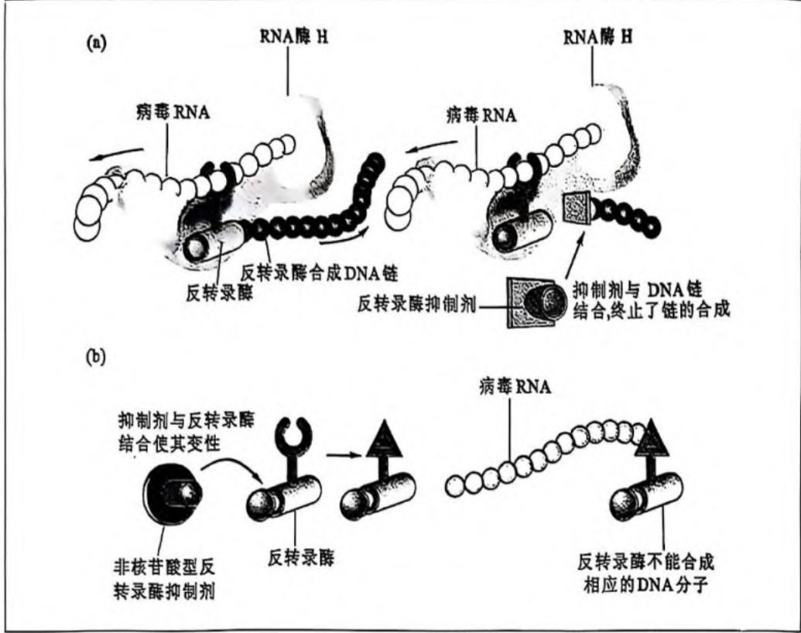

受治疗"柏林病人"的启发,科学家们采用锌指核酸酶(zinc-finger nuclease,ZFN)介导的特异性基因敲除等基因组编辑手段,对来源于患者本人的 CD4+ T 细胞的 CCR5(C-C chemokine receptor type 5)或者 CXCR4(C-X-C chemokine receptor type 4)受体进行突变,并在体外进行扩增后重新输回患者体内。几周后,患者体内 HIV 含量急剧下降,其后恢复 HAART。在 36 周观察期内,患者体内病毒均降至未能检出水平,可见敲除 CCR5 受体基因对治疗艾滋病是有效的。这种治疗方法属于基因治疗中的 ex vivo 途径,其具有副作用小以及相对于传统治疗方法疗效更好等优势,可能能够彻底清除艾滋病患者体内的病毒。然而,该治疗手段所用于回输的 CD4+ T 细胞属于已成熟的 T 细胞,复制能力有限,在外周血中会慢慢消减,需要反复回输,且对 T 细胞或者造血干细胞的体外改造、扩增和回输是非常复杂的过程,费用昂贵,风险性高,难以大规模临床应用。除这种体外基因编辑的治疗手段以外,ex vivo 途径还包括嵌合抗原受体(chimeric antigen receptor,CAR)T 细胞疗法。CAR-T 细胞是一种由人工构建的能够在 T 细胞表面表达特异性抗原受体并通过分泌细胞因子等途径特异性杀伤靶细胞的效应 T 细胞,相较于患者机体自然产生的 T 细胞,其具有更好的靶向性和杀伤活性,故 CAR-T 细胞疗法是一种极具潜力的治疗手段。但目前开发的用于艾滋病治疗的 CAR-T 细胞仍存在易被 HIV 感染和持久性不足等问题。

整合在宿主免疫细胞基因组中的 HIV 前病毒是潜伏储存库存在的根本原因。近年来,随着对 HIV 潜伏储存库形成机制的研究以及基因组编辑技术的重大突破,研究者利用锌指核酸酶、类转录激活因子效应物核酸酶(transcription activator-like effector nuclease, TALENS)以及 CRISPR/Cas9 等基因组编辑技术,定向突变、清除或沉默病毒潜伏储存库

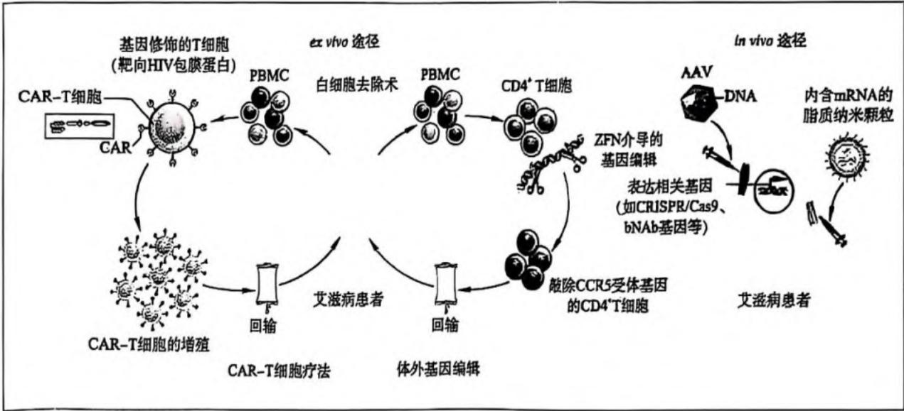  
图 11-22 针对艾滋病的基因治疗策略  
PBMC, peripheral blood mononuclear cell, 外周血单个核细胞; CAR, chimeric antigen receptor, 嵌合抗原受体; ZFN, zinc-finger nuclease, 锌指核酸酶; AAV, adeno-associated virus, 腺相关病毒载体; bNAb, broadly neutralizing antibodies, 广谱中和抗体。

细胞中的 HIV 前病毒靶片段。

近年来,从 HIV 感染者体内发现并分离到很多广谱中和抗体(broadly neutralizing antibody, bNAb),因此,以诱导广谱中和抗体为目的的包膜免疫原设计成为目前疫苗研究领域的最新方向。通过腺相关病毒( adeno-associated virus, AAV)载体或纳米粒子分别封装 DNA 或 mRNA,在患者持续表达 bNAb 或其他相关基因,能够有效地消灭被病毒感染的细胞。这种方法也属于基因治疗,被称为 in vivo 途径。随着与 HIV 侵染有关的病毒基因产物及宿主相关受体分子三维结构与功能的逐步阐明,针对 HIV 不同生命阶段的特异疫苗会在不远的将来被研制出来,将对预防和控制艾滋病的发生发展具有重要意义(图 11-22)。

## 11.3 乙型肝炎病毒(HBV)

病毒性肝炎是严重威胁人类健康的世界性传染病,引起肝炎的病毒通称肝炎病毒 (hepatitis virus)。目前已经知道的至少有甲肝病毒(HAV)、乙肝病毒(HBV)、丙肝病毒(HCV)、丁肝病毒(HDV)和戊肝病毒(HEV)等5种病毒。这些病毒在基因组结构、传播途径、临床症状和分类地位上很不相同。甲肝病毒属小RNA病毒科,乙肝病毒属嗜肝病毒科。丙肝病毒与黄热病毒和瘟病毒相似,为RNA病毒。丁肝病毒基因组由一个单链环状RNA分子组成,但其外壳能识别乙肝病毒的表面抗原,是一种与乙肝有关的缺陷型病毒,需要有HBV的辅助才能复制增殖。戊肝病毒基因组为单链正链多(A)RNA,球形无包膜,可能属于杯状病毒科。

## 11.3.1 HBV 的分类及病毒粒子结构

1986 年, 国际病毒命名委员会正式将乙肝病毒(HBV)定为嗜肝 DNA 病毒科成员, 1990 年又将该科病毒分为正嗜肝病毒属和禽嗜肝病毒属, 乙肝病毒是正嗜肝病毒属成员。

HBV 完整粒子的直径为 42 nm, 称为 Dane 颗粒, 由外膜和核壳组成, 有很强的感染性 (图 11-23)。其外膜由病毒的表面抗原、多糖和脂质构成。病毒核壳呈现为直径 27 nm 的二十面体结构, 由病毒的核心抗原组成, 并含有病毒的基因组 DNA、逆转录酶和 DNA 结合蛋白等。HBV 病毒的基因组 DNA 呈现松弛环状, 约有 10% 的病毒颗粒含有线状双链 DNA, 而只有 1% 的病毒颗粒中存在未剪切形式的 RNA。在慢性乙肝患者的血清中还有直径 22 nm、长度不等的球状或棒状颗粒, 它们只含表面抗原和脂质, 不具有基因组 DNA,

图11-23 HBV病毒粒子模型图

rcDNA, relaxed circular DNA, 松弛环状 DNA; dslDNA, double-stranded linear DNA, 线状双链 DNA。

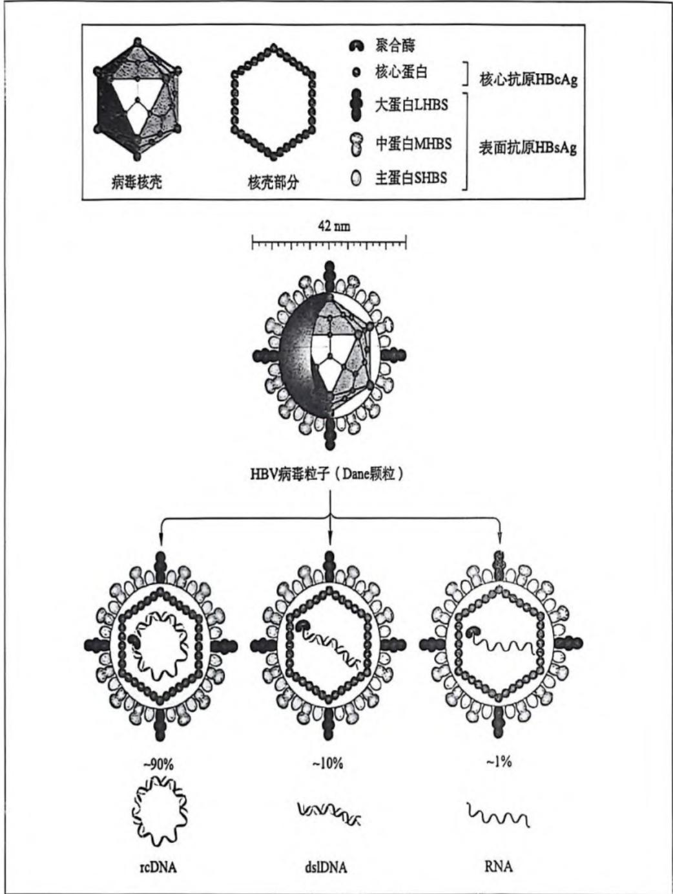

无侵染性。根据表面抗原性血清反应的不同，HBV 可以分为 adr、adw、ayr 和 ayw 等 4 个亚型。不同亚型的地区分布不同，我国大部分地区以 adr 为主，adw 次之。西藏、新疆和内蒙古等地主要为 ayw 亚型。

## 11.3.2 HBV基因组及其所编码的主要蛋白质

## 1. 基因组结构

HBV 的基因组是一个有部分单链区的环状双链 DNA 分子, 两条单链长度不一样。长链 L(3.2 kb) 为负链, 而短链 S 为正链, 其长度不确定, 为负链的 50%\~80%。因为它的 3' 端随不同来源毒株而有不同的缺失, 所以位置可变, 产生了部分环状结构。基因组依靠正链 5' 端约 240 bp 的黏性末端与负链缺口部位的互补维持了环状结构。长链的 5' 端有一个共价结合的末端蛋白, 可能是引物酶。而短链 5' 端则通过共价键与具有帽结构的短 RNA 结合。末端蛋白和短 RNA 都与病毒 DNA 的复制相关。此外, 在两条链的互补区两侧各有一个 11 碱基的直接重复序列 (5'TTCAC-CTCTGC-3'), 分别开始于第 1842 和 1590 核苷酸处, 称为 DR1 和 DR2 $^{[图11-24]}$ 。HBV 基因组的多态性是该病毒高变异率的分子基础, 其生物学意义是近年来该领域研究热点之一。

## 2. HBV 转录产物

HBV 基因组结构的最大特点是功能单位非常密集,基因组高度压缩,编码区重复利用,所以有人也称之为基因经济型基因组。它的核酸序列全部都是蛋白质编码区。HBV 能够产生 6 种转录产物(图 11-24),都有多(A)尾。其中,长度为 3.5 kb 的转录物共有两个,二者核苷酸序列非常相近,稍长的一个转录物编码前核心蛋白(precore,PreC),较短的转录物编码核心蛋白和聚合酶蛋白。大蛋白由2.4 kb的转录物编码,而中蛋白和主蛋白由2.1 kb的转录物编码。典型的编码X蛋白的转录物长度为0.7 kb,而3.9 kb的转录物也具有翻译X蛋白的活性。

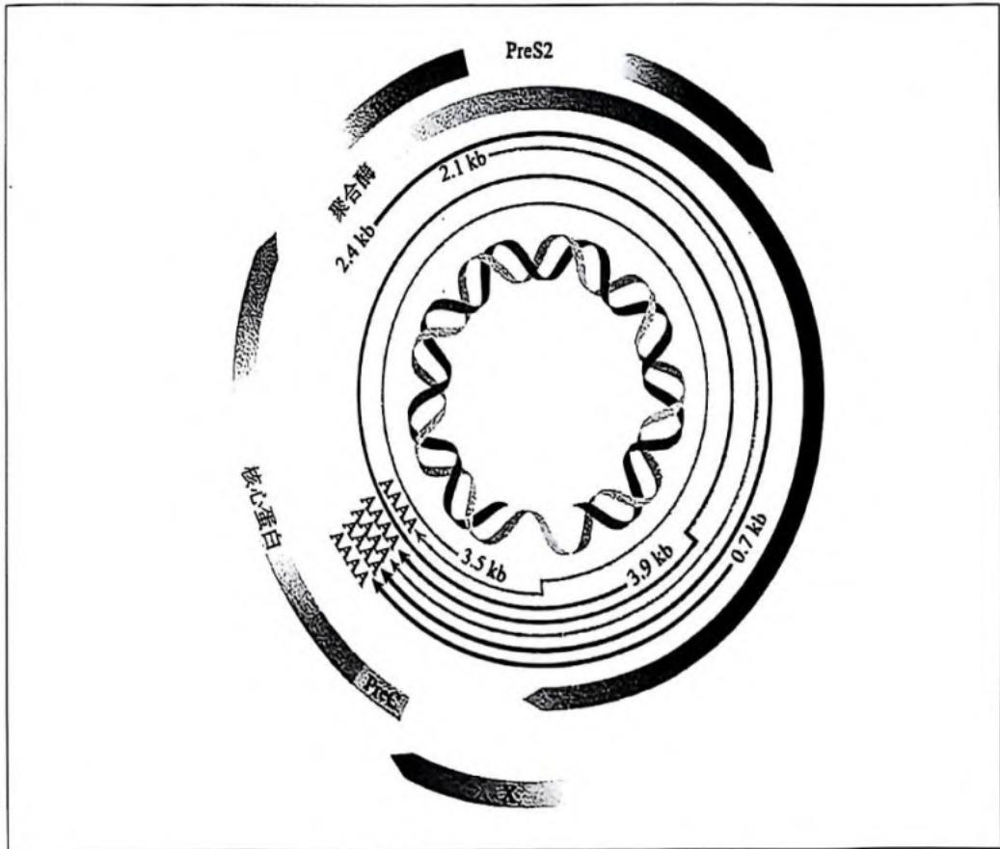  
图11-24 HBV基因组结构  
内部螺旋代表HBV部分双链的、松弛环状的基因组DNA。外部细线代表HBV的6种转录产物，其中3.5 kb的RNA代表两个长度几乎一致的转录物。最外层粗片段代表HBV的蛋白质。

## 3. HBV 基因转录的调控

① 顺式作用元件 HBV 的转录产物虽然有不同的 5' 端,但都利用同一终止信号和多(A)位点,它们的启动子序列已经被确定。C 启动子调控 3.5 kb mRNA 的转录起始过程,它定位于 1705 \~ 1805 位核苷酸处。在该启动子下游还发现一个具有启动子功能的区域,推测不同的 3.5 kb mRNA 可由不同的启动子控制。C 启动子上存在类似于 TATA 区的序列。SP1 启动子位于 -89 \~ -77 核苷酸处,调控 2.4 kb mRNA 的转录起始过程。该启动子含有典型的 TATA 区序列以及与该序列相距 45 个碱基的肝细胞特异性转录因子 HNF1 的结合位点。该位点主要存在于某些肝细胞特异表达基因的启动子区,HNF1 的结合是 SP1 启动子在分化的肝癌细胞株中高水平转录的必要条件。

SP2 启动子调控 2.1 kb mRNA 的转录起始过程。它与 SV40 晚期启动子相似, 位于 RNA 转录起始位点上游 200 个核苷酸内, 可分为 A、B、C、D、E、F 和 G7 个区, 这些区都可能通过与特异的调控蛋白结合而影响转录水平。A、B、C3 个区位于启动子远端 (-168\~-68 位核苷酸之间), 若同时缺失, 2.1 kb mRNA 转录水平下降到 30% 以下。D 区位于 -69\~-49 处, 是启动子的必需元件。近端的 E、F、G3 个区位于转录起始位点上游 45 个核苷酸内, 该 DNA 序列与 SV40 主要晚期启动子有一定的序列相似性。F 为负调控区, E 区能抑制 F 区的负调控作用并与 G 区功能互补。B、D、E、F4 个区可与相同或相似的转录因子结合, 若将外源表达的转录因子 SP1 与病毒 DNA 进行共转染, 可起始 HBV 基因转录。SP1 可以直接与 B、D 和 F 区结合。

X 启动子位于 -24\~-124 核苷酸处, 调控 0.7 kb mRNA 转录过程。有关该启动子的活性尚未见详细的研究报道。

② 增强子 HBV DNA 中存在两个可以激活 HBV 启动子转录的增强子区域。增强子 I 位于表面抗原基因的 3' 端, X 基因的 5' 端, 与 X 启动子相重叠。该增强子在肝细胞中对启动子的增强活性是非肝细胞的 10\~20 倍, 暗示它具有细胞特异性, 这也可能是 HBV 病毒嗜肝性的基础。

已在增强子Ⅰ序列中发现多种细胞反式作用因子结合位点，NF-la、NF-lb、NF-lc、AP1、C/EBP、EP以及X蛋白等都可以与增强子Ⅰ相结合。根据主要的核蛋白结合位点，增强子Ⅰ被分为2C、EP、E和NF-Ⅰ4个区段。前两者为基础增强子，2C与肝细胞专一性有关。若在基础增强子上加E和NF-1结合区，该启动子活性可提高10倍以上，其中E结合区可以与多种蛋白因子相结合。E结合区不仅能提高基础增强子的活性，还与X基因启动子的转录活性直接相关。一般认为，增强子Ⅰ能明显促进SP1、SP2、X和C启动子的转录。

增强子Ⅱ位于增强子Ⅰ下游600碱基处,是一个148碱基长的DNA片段,根据其与主要核蛋白的结合位点分为 A、B 两个区。A 区为 60 碱基，是正调控元件，与增强子 II 的肝细胞专一性有关。A 区单独存在时无增强子活性，必须与 B 区协同作用才有活性。B 区是增强子 II 的基本单位，由 88 个碱基组成，单独存在时带有增强子 II 活性的 60%\~70%，又可分为 B1、B2 和 B3 3 部分，其中前两部分是主要功能区，B2 是主要转录因子的结合位点。

③ 反式作用因子 自从 HBV 全序列被测定后,人们就发现了 X 基因,但其产物 X 蛋白具有反式调控因子功能。研究发现,X 蛋白不仅能激活 HBV 自身启动子如 C、SP1、SP2 和 X 以及 HBV 增强子 I ,还可以激活多种异源启动子和增强子,如 β- 干扰素、HIV-I、SV40 早期启动子以及一些细胞因子如 I 型 MHC 等的表达。

X 蛋白虽然具有转录水平上的反式激活作用,但尚未发现它有 DNA 结合能力,说明 X 蛋白必须通过其他蛋白因子起作用。分析 X 蛋白对 HBV 增强子 I 的作用时发现,该增强子的 E 元件十分重要,所以又将这个由 26 碱基组成的元件命名为 X 应答元件 (X-responsive element, XRE)。X 蛋白与相关细胞因子结合后,再结合于靶序列上发挥作用。XRE 有 NF- $\kappa$ B、AP1、AP2 及 CREB 类似物的结合序列。近来有报道认为 X 蛋白本身具有丝氨酸 / 苏氨酸激酶活性。

## 4. HBV 的编码区及产物

① S 编码区 S 编码区编码乙肝表面抗原蛋白, 分别编码由 226 个氨基酸残基的表面抗原主蛋白 (SHBS)、108\~115 个氨基酸的原 S1 蛋白和 55 个氨基酸组成的原 S2 蛋白 3 部分组成。S 蛋白和原 S2 蛋白组合在一起被称为中蛋白 (MHBS), S 蛋白和原 S1、原 S2 蛋白组合在一起时被称为大蛋白 (LHBS)。SHBS 是病毒外壳蛋白和 22 nm 颗粒表面抗原的主要成分, 占病毒蛋白的 70%\~90%, 中蛋白和大蛋白则暴露于病毒颗粒表面, 这三种蛋白质可以部分或完全被糖基化。表面抗原有很强的免疫原性, 是乙肝疫苗的主要成分。

② P 编码区 该区长 2532 碱基,约占全基因组 3/4 以上,是最长的编码区,包含全部 S 编码区并与 C 和 X 编码区有部分重叠。P 编码区由 3 个功能区和一个间隔区构成,排列顺序为末端蛋白(又称引物酶)、间隔区、逆转录酶 /DNA 聚合酶及 RNase H。末端蛋白是病毒进行逆转录时的引物。P 编码区可能先翻译成 $9.5 \times 10^{5}$ 多肽,然后加工成较小的功能型多肽。

③ C 编码区 该区长 639 碱基,翻译产物为病毒核心抗原(HBcAg)。其原初翻译产物是前核心蛋白,切除 N 端 19 肽和富含精氨酸的 C 端后,成为 E 抗原(HBeAg),分子量为 $2.2 \times 10^{4}$ 蛋白,是核衣壳上唯一的结构蛋白。HBeAg 可分泌到 Dane 颗粒以外,存在于血清中。

④ X 编码区 该区是最小的编码区,编码 X 蛋白,覆盖了负链的缺口部位,虽然长度不等,但主要产物由 154 个氨基酸残基组成。X 蛋白具有反式调控作用,能激活多个同源或异源启动子或增强子,与肝癌的发生有相关性。

## 11.3.3 HBV的复制

HBV 基因组虽为双链 DNA, 但其复制并不通过半保留复制方式, 而是通过逆转录途径 (图 11-25a)。在 HBV 侵染宿主肝细胞的过程中, 其首先会与宿主的硫酸乙酰肝素蛋白多糖 (heparan sulfate proteoglycans, HSPG) 结合, 从而使自身的包膜蛋白发生一定的构象变化。随后病毒大蛋白的 PreS1 会与受体牛磺胆酸钠共转运蛋白 (sodium taurocholate co-transporting polypeptide, NTCP) 结合, 进而将核壳释放进入细胞质, 其中的基因组 DNA 进入细胞核, 经 DNA 聚合酶修复正链缺失部分, 形成共价闭环状 DNA (covalently closed circular DNA, cccDNA) 作为转录模板。此后, 该环状 DNA 在感染细胞核中大量扩增, 成为 HBV 基因组复制时的独特现象。

其次，HBV基因组在宿主RNA聚合酶作用下开始转录，产生各种mRNA，在这些RNA中，全长3.5 kb产物为前基因组RNA(pregenomic RNA, pgRNA)，其5'端自DR1(direct repeat 1)处开始，自5'向3'延伸，经过DR2后继续合成至DR1，最后终止于DR1后85碱基处的TATAAA序列，全长比病毒DNA多130\~270个碱基。前基因组RNA具有翻译出核心蛋白和聚合酶以及作为病毒逆转录模板的功能。

第三步,前基因组中的部分 RNA 被包装到核心颗粒中并进行逆转录。以与母本负链 DNA 5' 端相连接的末端蛋白为引物,在逆转录酶作用下,自 DR1 处开始逆转录合成负链 DNA (图 11-26)。cDNA 合成后,由核糖核酸酶(RNase H)将模板(前基因组 RNA)降解,但 5' 端从帽结构到 DR1 不被降解区域作为正链合成时的引物。

第四步,在 DNA 聚合酶作用下合成正链,合成自 DR1 处开始,再经跳跃传位至 DR2,这一过程称为"引物易位"。因此,正链 5' 端覆盖了负链的缺口,维持了双链 DNA 的环状,即产生了松散环状的基因组 DNA(relaxed circular DNA, rcDNA),其可以被修复为共价闭环状双链 DNA 并进入正常的病毒的生活周期。在某些情况下也可能不发生引物易位现象,导致线状双链 DNA(double-stranded linear DNA, dslDNA)的合成,其不能产生有感染性的子代病毒粒子。在反转录的过程中,随着成熟信号的出现,核壳存在两种命运:其有可能再次进入细胞核,其中松散环状的基因组 DNA 被修复完成,实现共价闭环状 DNA 的扩增;此外,核壳也可能会通过与大蛋白的互作进而在多囊泡体中被包膜蛋白包裹,形成成熟的 HBV 病毒粒子,随后被分泌到细胞外从而侵染其他肝细胞。正链合成尚未完成时,就可能由于某些障碍而被终止。外壳蛋白便将核衣壳包装成病毒颗粒,形成了不完整的双链基因组。由于病毒复制增殖过程中部分酶类与细胞因子可能来自宿主细胞,所以,病毒的复制增殖过程也是干扰细胞正常代谢的致病过程。

当宿主细胞感染 HBV 病毒时, HBV 病毒不仅进行着上述的复制以及产生新的子代病毒的过程, 其还具有能够将自身 DNA 整合入宿主基因组的现象 (图 11-25h)。在乙肝病毒的复制过程中, 线状双链 DNA 可能会在断裂的 DNA 修复过程中发生与宿主基因组的整合。整合的线状双链 DNA 虽然不足以支持病毒的复制, 但仍可以表达包膜蛋白等特定产物。HBV 整合到宿主基因组后, 会导致宿主细胞的细胞周期发生变化, 影响宿主基因的

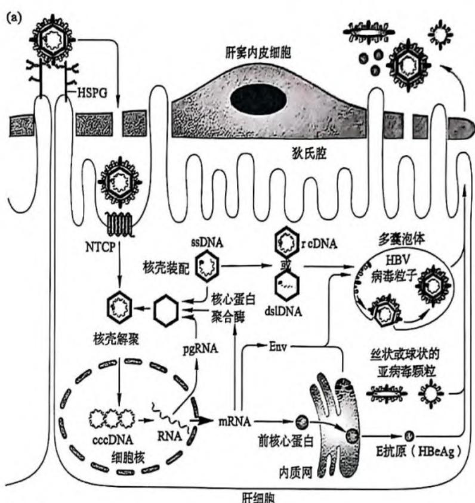

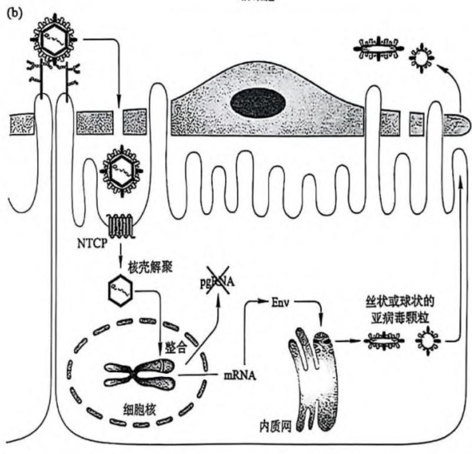

图11-25 HBV的生活史

(a) HBV病毒的正常复制过程；(b) HBV病毒基因组整合的过程。HSPG, heparan sulfate proteoglycans, 硫酸乙酰肝素蛋白多糖；NTCP, sodium turocholate co-transporting polypeptide, 牛磺胆酸钠共转运蛋白；cccDNA, covalently closed circular DNA, 共价闭环状 DNA; pgRNA, pregenomic RNA, 前基因组 RNA; ssDNA, single-strand DNA, 单链 DNA; rcDNA, relaxed circular DNA, 松弛环状的 DNA; dsDNA (double-stranded linear DNA, 线状双链的 DNA; Env. envelop protein, 包膜蛋白。

图11-26 HBV基因组的复制过程  
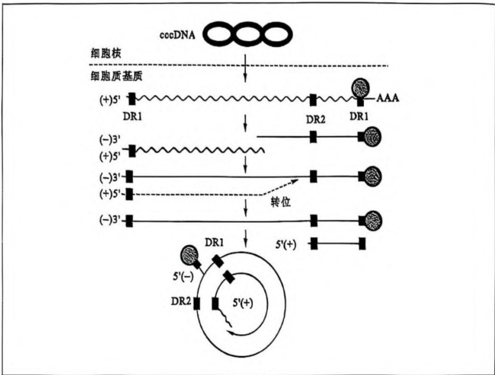

正常表达,诱导肝细胞癌的发生与发展。

## 11.4 人禽流感的分子机制

人禽流感(human avian influenza, HAI)是人感染禽流感病毒(avian influenza virus, AIV)后引起的以呼吸道症状为主的临床综合征。AIV属正黏病毒科流感病毒A型流感病毒。禽流行性感冒(avian influenza, AI)简称禽流感，又名真鸡瘟、欧洲鸡瘟、鸡疫等，是由A型流感病毒引起的从呼吸系统病变到全身败血症的一种高度急性传染病。鸡、火鸡、鸭等家禽及野鸟均可感染。美洲、欧洲、亚洲的许多国家和地区都曾发生过此病，对养禽业造成了巨大的损失。禽流感病毒不仅是人流感病毒株形成的最庞大的基因库，它还能直接感染人类，因此，禽流感已成为人类面临的重大危害之一。

## 11.4.1 禽流感病毒特点及分型

禽流感病毒属正黏病毒科(Orthomyxoviridae)的A型流感病毒。正黏病毒分为3个属，即AB型流感病毒属、C型流感病毒属和类托高土病毒属(Thogoto like viruses)，病毒颗粒大小为80\~120 nm，平均100 nm，典型的病毒粒子呈球状，基因组为多个负链RNA片段组成(图11-27)。禽流感病毒是正黏病毒科中唯一感染禽类的病毒。禽流感病毒可按病毒粒子表面对红细胞有凝集性的血凝素(hemagglutinin, HA)和能将吸附在细胞表面的病毒粒子解脱下来的神经氨酸酶(neuraminidase, NA)糖蛋白进行分类，共有18个H亚型和11个N亚型，其中除了H17N10和H18N11仅在蝙蝠中分离得到外，其余亚型均能在野生水禽中发现。根据 HA 与 NA 的不同, 又可将禽流感病毒分为上百个血清亚型。导致禽流感暴发的主要是以 H5、H7 为代表的高致病性禽流感 (HPAI) 和以 H9 亚型为代表的低致病性禽流感 (LPAI) 毒株。

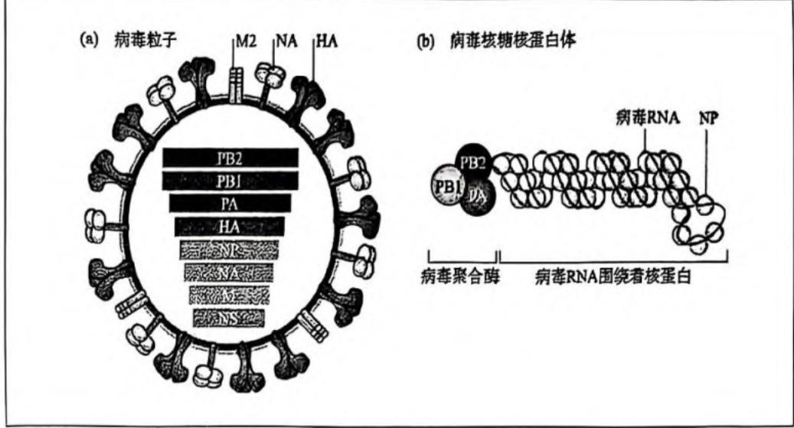  
图11-27 禽流感病毒粒子及其核栅核蛋白体结构  
禽流感病毒基因组由8个负链的单链RNA片段组成，共编码了11个蛋白。其中，血凝素(HA)负责协助病毒附着在细胞受体上并使其发生感染，而神经氨酸酶(NA)负责破坏细胞的受体，帮助病毒在宿主体内自由传播。H5N1中已发现16种不同的HA和9种不同类型的NA。PA.聚合酶酸性蛋白；PB.聚合酶碱性蛋白；NP,核蛋白。

1997 年,研究人员首次分离到由禽病毒跨越物种屏障同时感染鸡和人的 A 型流感病毒——H5N1。由于该病毒所有基因片段与禽流感病毒在序列上有很高的相似性,一般认为该病毒起源于禽类。甲型流感病毒亚型 H7N9 是 2013 年首次报告感染人类的新型禽流感病毒。大部分人类感染病例均有严重的呼吸系统症状。世界卫生组织(WHO)已经将 H7N9 确定为"对人类非常危险的病毒"。2013 年初至 2017 年初的 4 年中,共有 916 例经实验室确诊的人类 H7N9 病例,并怀疑可能存在人与人之间的传播。当流感病毒开始感染新的宿主时,为了适应环境和新的宿主细胞,病毒可能会在强大的选择压力下进行 DNA 重组以产生新的株系或致病型(图 11-28)。

## 11.4.2 禽流感病毒的主要感染过程

H5N1 禽流感病毒通过 HA 蛋白上的凝集素位点与细胞表面含唾液酸的糖蛋白受体结合,通过受体介导的细胞内吞作用进入细胞。由于内涵体(endosome)pH 较低,导致 HA 构象变化,细胞膜与病毒外膜发生融合,释放病毒衣壳进入细胞质。由 PB1、PB2 以及 PA 三个蛋白亚基组成的病毒聚合酶、核蛋白(NP)以及病毒 RNA 组成了病毒核糖核蛋白体,其在病毒与细胞膜发生膜融合后被释放并转运到细胞核中。流感病毒启动转录时,具有核酸内切酶活性的 PA 亚基将宿主细胞 mRNA 5' 端的帽结构切下作为病毒 RNA 聚合酶的引物,转录产生 6 个单顺反子的 mRNA,并翻译成 HA、NA、NP 和三种聚合酶(PB1、PB2 和 PA)。NS 和 M 基因的 mRNA 进行拼接后,每一个基因产生了两个 mRNA,依不同可读框(ORF)进行翻译,产生 NS1(non structure 1)、NS2(non structure 2)、M1 和 M2 蛋白(表11-6)。NA 是病毒核衣壳的主要成分,MA 是主要结构蛋白,存在于病毒囊膜内侧,分为 M1 和 M2。PB1、PB2 和 PA 是病毒复制酶的三个主要组分。NS1 和 NS2 为非结构蛋白,在病毒复制早期起重要作用, NS1 蛋白调节病毒 RNA 的合成、pre-mRNA 的运输、剪接及 mRNA 的翻译过程。NS2 蛋白与 M1 蛋白相互作用, 参与病毒复制周期的调控。病毒的复制过程则是非引物依赖型的, 可以以病毒的 RNA 直接为模板合成与其互补的 RNA 单链, 再以该互补 RNA 单链为模板合成子代病毒 RNA。此外新合成的 PB1、PB2 等蛋白质借助其人核信号能够转运到细胞核中, 与子代病毒 RNA 在细胞核中组装并随后出核。组装完成的病毒核糖核蛋白体是病毒的核心, 其通过与细胞内壁上 NA 蛋白等结构蛋白结合形成特定的病毒结构,并通过将宿主细胞的细胞膜包裹于自身以出芽的方式释放。

图11-28 不同亚型禽流感病毒的宿主  
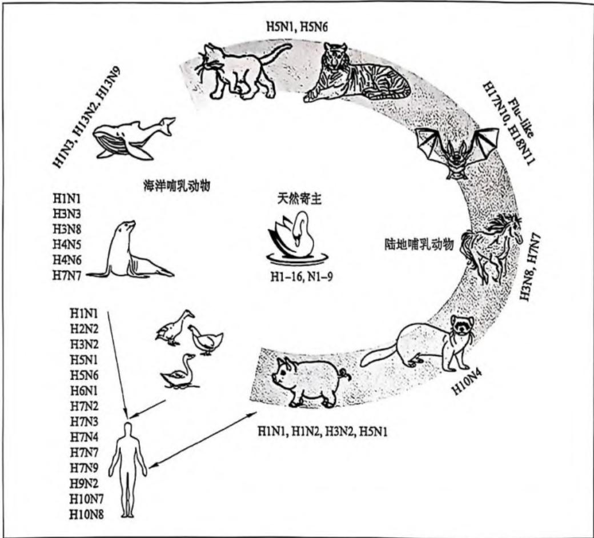

表 11-6 禽流感病毒 RNA 在不同类型病毒中可能编码不同的蛋白质

<table><tr><td rowspan="2">RNA</td><td colspan="3">流感病毒编码蛋白</td></tr><tr><td>A型</td><td>B型</td><td>C型</td></tr><tr><td>1</td><td>B2</td><td>PB1</td><td>P1</td></tr><tr><td>2</td><td>PB1</td><td>PB2</td><td>P2</td></tr><tr><td>3</td><td>PA</td><td>PA</td><td>P3</td></tr><tr><td>4</td><td>HA</td><td>HA</td><td>HE</td></tr><tr><td>5</td><td>NP</td><td>NP</td><td>NP</td></tr><tr><td>6</td><td>NA</td><td>NA、NB</td><td></td></tr><tr><td>7</td><td>M1、M2</td><td>M1、M2</td><td>M</td></tr><tr><td>8</td><td>NS1、NS2</td><td>NS1、NS2</td><td>NS1、NS2</td></tr></table>

上述的流感病毒复制过程可分为吸附、侵入、脱壳、生物合成、组装和释放六个阶段，病毒和宿主的蛋白主要参与调控了病毒复制过程的生物合成阶段 $^{[图11-29]}$ 。流感病毒的生物合成主要依赖于病毒核糖核蛋白体，针对病毒核糖核蛋白体入核的过程，宿主的黏病毒抗性蛋白 A (myxovirus resistance protein A, MxA) 和视黄醇诱导基因蛋白 I (retinoic acid-inducible gene I, RIG-I) 起到了重要的作用。两者分别通过识别病毒核糖核蛋白体中的 NP 蛋白和病毒 RNA 从而阻止其发生核转运，然而病毒能够通过 NS1 抑制 RIG-I 通路的激活并通过 NP 结构上的改变逃避 MxA 的清扫，从而帮助核糖核蛋白体顺利入核，这有利于接下来病毒的生物合成。此外，构成病毒核糖核蛋白体的多种蛋白质也与宿主的蛋白质之间存在复杂的互作关系。例如人适应性流感病毒的突变的 PB2 能够利用输入蛋白 α7 (importin alpha 7, IMPα7) 帮助病毒核糖核蛋白体入核。ANP32 (acidic nuclear phosphoprotein 32) 是酸性核磷蛋白，其也能被突变的 PB2 利用进一步促进病毒侵染。而 RNA 解旋酶 DDX17 (DEAD-box helicase 17) 虽然限制禽流感病毒，但其反而能促进 PB2 突变的人适应性流感病毒聚合酶的活性。核输出蛋白 (nuclear export protein, NEP) 则有助于新合成的病毒核糖核蛋白体出核。定位在线粒体的病毒蛋白质能够阻止线粒体抗病毒信号蛋白 (mitochondrial antiviral signaling protein, MAVS) 对于病毒的识别，从而抑制宿主的免疫。线粒体 Tu 翻译延伸因子 (Tu translation elongation factor, TUFM) 通过识别 PB2 后增加细胞自噬，从而抑制病毒增殖。HCLS1 相关蛋白 X-1 (HCLS1 associated protein X-1, HAX1) 能够抑制禽流感病毒的 PA，而病毒的 PB1-F2 能够抵消这种抑制作用。最后，宿主中也存在着能够抑制人适应性流感病毒侵染的因子——三基序蛋白 22 (tripartite motif protein 22, TRIM22)，其介导了 NP 的降解。

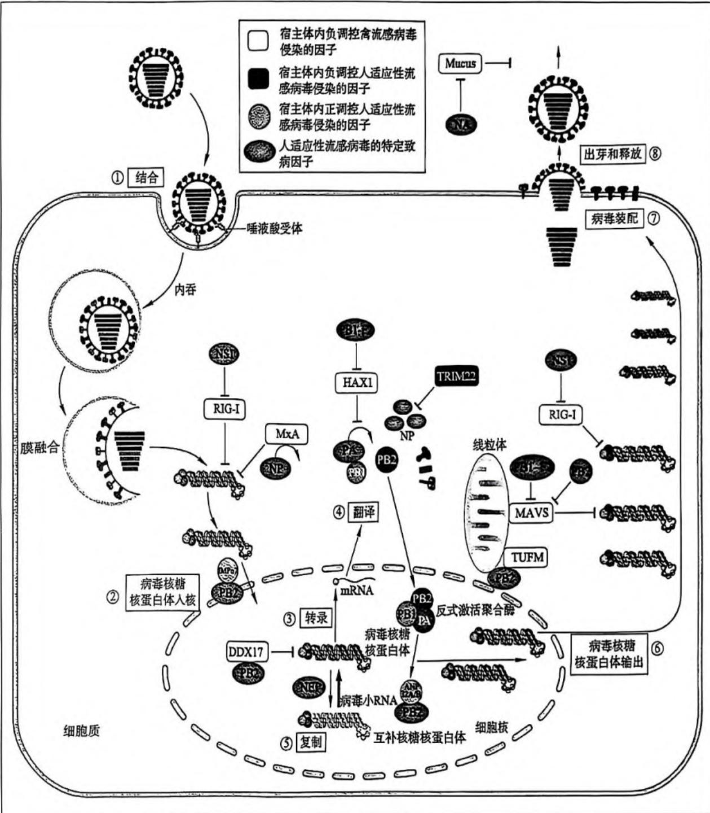  
图 11-29 流感病毒进入宿主细胞及其复制过程图示(另见书末彩插)  
在人类细胞中存在着负调控禽流感病毒侵染的因子(白色方框表示),而人适应性流感病毒不仅能够通过特定致病因子(蓝色椭圆表示)克服这些阻力,还能够和人类细胞中的其他因子(蓝色正圆表示)共同正调控病毒的侵染。然而,人类细胞中也存在可以负调控人适应性流感病毒侵染的因子(灰色方框表示),从而抑制病毒的增殖。MxA,黏病毒抗性蛋白A;RIG-I,视黄醇诱导基因蛋白I;IMPα7,输入蛋白α7;ANP32A或ANP32B,酸性核磷蛋白;DDX17,DEAD框RNA解旋酶;NEP,核输出蛋白;TUFM,线粒体Tu翻译延伸因子;MAVS,线粒体抗病毒信号蛋白;HAX1,HCLS1相关蛋白X-1;TRIM22,三基序蛋白22。

## 11.4.3 禽流感病毒感染人类的机制

有关禽流感病毒导致人类流感大暴发的假说主要有以下两种,以猪作为中间宿主的混合器假说和禽流感病毒直接感染人(即人本身充当混合器)的假说。研究发现,禽流感病毒跨越种属间的屏障从家禽直接感染人与其基因的分子结构的特殊性有关,禽流感病毒的基因组分为多个片段,极易发生基因的交换、重组并发生变异,造成感染宿主和致病性的改变。

## 1. HA 受体结合位点的突变导致禽流感病毒易于感染人类细胞

HA 是流感病毒表面主要的糖蛋白, 在病毒感染过程中起关键作用, 病毒利用 HA 与宿主细胞表面受体的相互识别, 从而吸附于宿主细胞表面。禽流感病毒与宿主细胞结合的特异性与 HA 结合受体位点的第 226 位氨基酸密切相关, 如果该位点氨基酸残基为谷氨酰胺 (Gln), 则表现为 SAa22, 3 Gal 受体 (禽类呼吸道上皮细胞表面受体) 结合特性; 但若该位点为亮氨酸 (Leu), 则表现为 SAa22, 6 Gal 受体 (人呼吸道上皮细胞表面受体) 结合特性; 若该位点为甲硫氨酸 (Met), 对 SAa22, 3 Gal 和 SAa22, 6 Gal 具有相同的结合活性。1997 年香港禽流感 H5N1 病毒就是由于 HA 第 226 位氨基酸由谷氨酰胺突变为甲硫氨酸, 导致流感病毒的宿主特异性改变, 使禽流感病毒直接感染人细胞。对 H5 及 H7 亚型高致病力毒株的核酸序列和氨基酸序列分析表明, 高致病力毒株的 HA 在裂解位点附近有多个碱性氨基酸残基, 易被宿主蛋白酶系统裂解为 HA1 和 HA2, 致病性明显增强。

此外,近年研究人员分析 H7N9 禽流感病毒的基因序列发现,其 HA 蛋白的第 160 位点出现苏氨酸(Thr)和丙氨酸(Ala)的替换,导致 HA 蛋白糖基化位点丢失,推测可能由于这个糖基化位点的丢失增强了 H7N9 病毒与人细胞受体的亲和力。同时,HA 第 186 位的甘氨酸(Gly)突变为缬氨酸(Val),结合第 226 位氨基酸由谷氨酰胺(Gln)突变为亮氨酸(Leu),导致 HA 对 α-2,6 半乳糖苷唾液酸受体的结合活性显著增强。

## 2. PB2 蛋白 627 位氨基酸的点突变导致人禽流感病毒复制能力增强

禽流感病毒感染人体细胞后必须进行有效复制,达到具有一定量的群体后,才能诱发机体的非特异性免疫反应,产生对机体的直接或间接损伤。而禽流感病毒是否能在人体细胞内进行有效复制,主要与病毒复制酶(PB1、PB2和PA)基因有关。当PB2蛋白基因来源于人流感病毒,无论其他基因片段来源于禽流感病毒或人流感病毒,重组病毒在哺乳动物体细胞中都能有效复制;当PB2蛋白基因来源于禽流感病毒时,重组病毒不能在哺乳动物细胞中进行有效复制。禽流感病毒株PB2的627位氨基酸都是谷氨酸(Glu),而人流感病毒该位点上是赖氨酸(Lys)。香港H5N1毒株中PB2的第627位氨基酸就发生了由谷氨酸向赖氨酸的转化。因此,有人认为,PB2的627位氨基酸是决定A型流感病毒宿主范围的关键位点。

近年流行的 H7N9 毒株的 PB2 蛋白 627 位点存在谷氨酸和赖氨酸替换,701 位点发生天冬氨酸(Asp)和天冬酰胺(Asn)的替换。PB2 蛋白这两个关键位点的突变在禽类中并未发现,仅在人感染的 H7N9 禽流感病毒中出现,说明 H7N9 可能是在感染人后才发生突变。这两个位点的突变有可能增强病毒在哺乳动物间的传播力(图 11-30)。

## 3. NS1 第 92 位氨基酸的突变导致人禽流感病毒致病能力显著增强

人禽流感 H5N1 病毒感染后与普通的人流感病毒相比具有极强的致病性。研究表明,人禽流感 H5N1 亚型病毒的高致病性与其非结构蛋白有密切的关系。普通流感病毒感染时,非结构蛋白(NS1)产生于机体受感染的细胞,与病毒复制产生的双链 RNA 相互作用,产生的细胞内信号作用于 RNA 病毒蛋白激酶(PKR)以及核因子 NF2KB,启动干扰素基因的转录和干扰素的合成,从而发挥抗病毒的非特异性免疫作用。虽然在高致病性的人禽流感 H5N1 亚型病毒感染者体内发现高浓度的干扰素和肿瘤坏死因子 $2 \alpha$ , 这些细胞因子却不能抑制或杀死高致病性的人禽流感病毒, 因为这种病毒不仅对干扰素和肿瘤坏死因子 $2 \alpha$ 具有极强的抵抗力, 而且在细胞内增殖速度极快, 加速了炎症细胞因子的产生, 引起全身性炎症反应综合征, 从而表现出极高的致病力。造成这种现象的原因可能与 H5N1 亚型病毒的非结构蛋白基因 (NS1 第 92 位氨基酸) 发生变异有关。

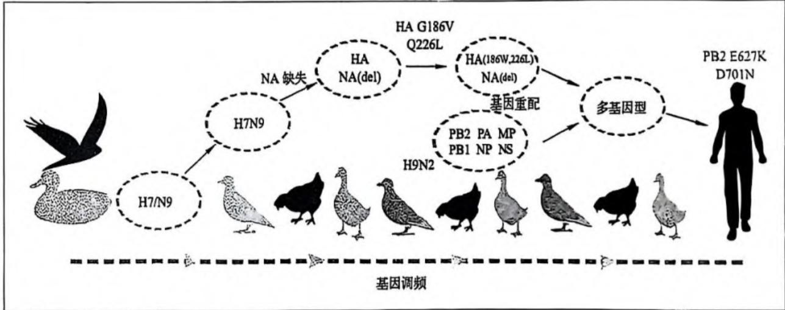  
图 11-30 甲型 H7N9 流感病毒"基因调频"的可能机制

另外,人和禽类中分离到的 H7N9 禽流感病毒均发现了 NS1 蛋白 42 位点脯氨酸(Pro)替换为丝氨酸(Set),有研究表明,H5N1 禽流感病毒 NS1 蛋白 42 位点突变增加了病毒感染小鼠的毒力。由于 NS1 蛋白作为干扰素拮抗剂对病毒的基因表达调节起作用,因此推测 NS1 蛋白的第 42 位氨基酸能够影响病毒的致病性(图 11-30)。

## 11.5 严重急性呼吸综合征和新型冠状病毒感染的分子机制

## 11.5.1 冠状病毒的结构与分类

严重急性呼吸综合征冠状病毒(severe acute respiratory syndrome coronavirus, SARS-CoV)和新型冠状病毒(SARS-CoV-2)均属冠状病毒科(Coronaviridae)、冠状病毒属(Coronavirus)。冠状病毒呈球状或多形状,病毒颗粒直径80\~160 nm,因其囊膜表面镶嵌刺突蛋白(spike protein, S)构成的王冠状突起而得名。除刺突蛋白外,冠状病毒还编码其他三种主要的结构蛋白,即膜蛋白(membrane protein, M)、胞膜蛋白(envelope protein, E)和核衣壳蛋白(nucleocapsid protein, N)。此外,在部分冠状病毒中,还存在第五种结构蛋白——血凝素酯酶(hemagglutinin esterase, HE)。病毒粒子内部为核衣壳蛋白N和核基因组RNA组成的核蛋白核心。SARS-CoV和SARS-CoV-2的病毒颗粒在形态结构上没有显著差异(图11-31)。

冠状病毒在动物界广泛传播,根据遗传分析、血清学等可将其分为 $\alpha$ 冠状病毒属 (Alphacoronavirus, $\alpha$ -CoV)、 $\beta$ 冠状病毒属 (Betacoronavirus, $\beta$ -CoV)、 $\gamma$ 冠状病毒属 (Gammacoronavirus, $\gamma$ -CoV) 和 $\delta$ 冠状病毒属 (Deltacoronavirus, $\delta$ -CoV)。其中 $\beta$ -CoV 可

图11-31 冠状病毒颗粒结构图

(a)-(b) 透射电子显微镜下的冠状病毒颗粒；(c) 冠状病毒结构模式图。

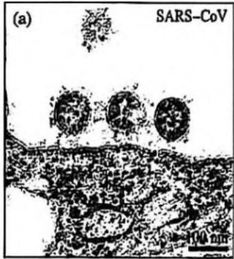

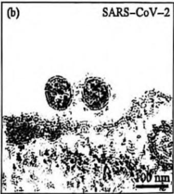

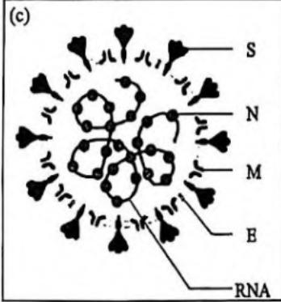

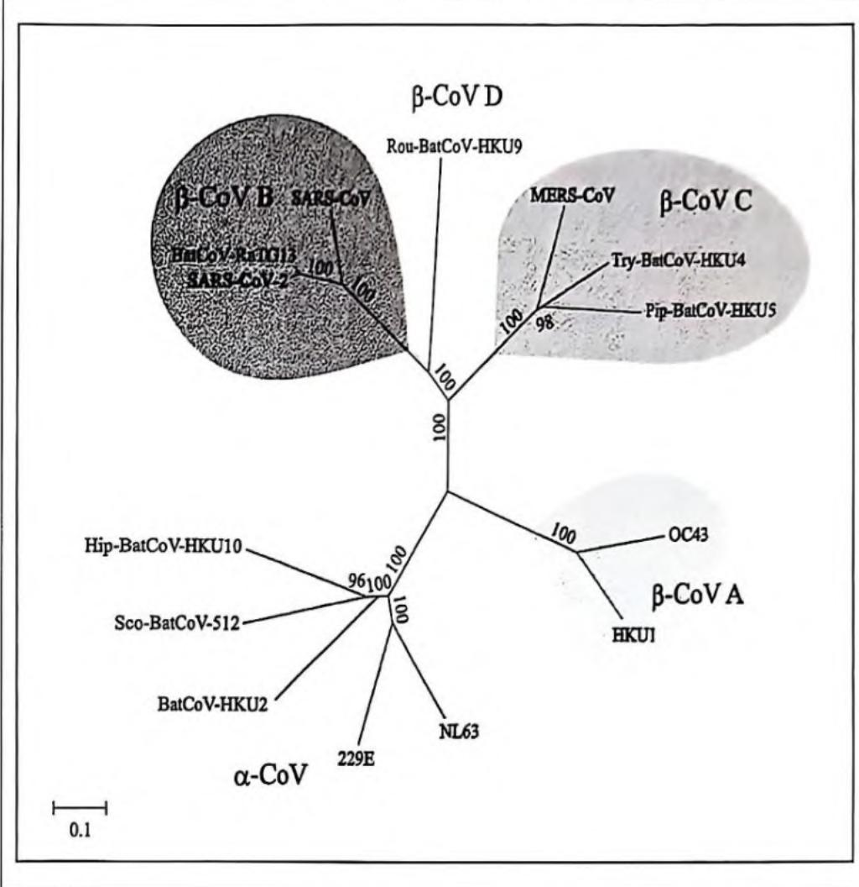  
图11-32 冠状病毒的系统发育树  
对人类高致病性的病毒用深蓝色标注，低致病性的病毒用浅灰色标注。系统发育树分支上的数字为自展(bootstrap)值，自展值越高代表分支可信度越高。

以被分为 A、B、C 和 D 四个谱系。能够感染人类的冠状病毒有七种，SARS-CoV 和 SARS-CoV-2 都属于 B 谱系高致病性的病毒，亲缘关系十分密切 $^{(图 11-32)}$ 。

## 11.5.2 冠状病毒的基因组结构

冠状病毒是最大的 RNA 病毒, 其基因组为单链正链 RNA。SARS-CoV 基因组全长 27\~30 kb, 共有 14 个可读框。其 5' 端有甲基化帽状结构, 前约 2/3 的区域编码病毒 RNA 聚合酶复合蛋白, 后 1/3 的区域编码病毒的结构蛋白质和非结构蛋白质, 按基因组上的排列顺序依次为 S、E、M、N 蛋白, 在 S 和 E 之间、M 和 N 之间以及 N 蛋白基因的下游有一些未知功能的可读框, 其 3' 端有不少于 50 个碱基的 poly(A) 尾, 这种结构与真核生物 mRNA 非常相似, 这也是其基因组 RNA 可以在人体细胞内发挥翻译模板作用的重要结构基础。SARS-CoV-2 的基因组和 SARS-CoV 十分相似, 但二者 3' 端的部分可读框有所不同, 其同源性很低。冠状病毒整个结构蛋白 mRNA 不存在转录后修饰、剪切等过程, 而是直接在初级转录过程中, 通过 RNA 聚合酶和某些转录因子以一种不连续转录机制, 通过识别特定的转录调控序列 (transcription regulating sequence, TRS) 有选择地从反义链 RNA 上一次性转录得到整个功能 mRNA。

## 11.5.3 冠状病毒的侵染过程以及目前针对侵染过程的治疗药物

冠状病毒的侵染过程主要包括病毒 S 蛋白与受体的结合、病毒进入宿主细胞、病毒复制酶的翻译、病毒基因组的复制和转录以及病毒颗粒的组装和释放。

在冠状病毒侵染宿主细胞时,病毒首先通过病毒囊膜上的S蛋白与敏感细胞的受体结合,然后通过其编码蛋白的自身折叠与相互结合牵引,将病毒囊膜和细胞膜拉近而发生融合,使得病毒的遗传物质以内吞作用的方式进入靶细胞内。S蛋白可分为S1和S2两部分,S1蛋白主要与宿主细胞膜受体结合,S2蛋白介导病毒囊膜和宿主细胞膜融合。不同冠状病毒的S蛋白能够结合的受体不同,SARS-CoV和SARS-CoV-2的受体都为血管紧张素转换酶2(angiotensin-converting enzyme,ACE2)。ACE2为依赖于锌离子的金属肽酶,是已知的唯一一个在血压调节中起关键作用的血管紧张素转换酶(ACE)的同系酶,该酶可将血管紧张素Ⅱ转换成血管紧张素。S蛋白的S1亚单位既具有与靶细胞受体结合的功能,又具有中和抗原表位,故疫苗诱导抗体和中和抗体能够针对病毒与受体的结合过程为宿主提供一定的保护。除ACE2以外,宿主的跨膜丝氨酸蛋白酶2(transmembrane serine protease 2,TMPRSS2)也是介导SARS-CoV-2与细胞膜融合的另一个关键因子,其通过对S蛋白的切割促进病毒进入宿主细胞。目前,已有的药物例如卡莫司它能够通过抑制宿主的丝氨酸蛋白酶来阻止病毒结合TMPRSS2。

病毒侵入细胞后基因组被释放到细胞质中,其转录和复制在细胞质中完成。病毒首先从其基因组 RNA 直接翻译出 RNA 依赖的 RNA 聚合酶。值得注意的是,冠状病毒往往会先翻译出一个多蛋白体,而后通过 3CLpro(3C-likeprotease)等蛋白酶切割得到 RNA 依赖的 RNA 聚合酶。目前,已有奈玛特韦等蛋白酶抑制剂药物通过抑制这一过程从而破坏后续 RNA 的复制过程。该聚合酶随后会以病毒基因组 RNA 为模板合成负链 RNA,之后再以新合成的负链 RNA 为模板转录生成新的病毒基因组 RNA。同时该聚合酶还会以负链基因组 RNA 为模板从基因组 RNA 的多个位点起始转录,产生亚基因组 RNA。SARS-CoV-2 能够产生 9 个亚基因组 RNA,指导病毒的结构蛋白和辅助蛋白的翻译。针对这一过程,现有瑞德西韦、莫努匹韦等药物能够通过抑制 RNA 依赖的 RNA 聚合酶从而实现抗病毒功能。

SARS-CoV 病毒的囊膜蛋白在粗面内质网内翻译, 同时发生 N-糖基化, 并在粗面内质网的表面聚合形成非共价的同源三聚体。随后被运输到高尔基体中进行高甘露糖的低聚糖基化修饰, 同时部分区域连接末端糖基并发生脂酰化。成熟的囊膜蛋白主要集中在高尔基体, 少量可以被转运至细胞膜表面引起被感染细胞间发生膜融合而形成合胞体。在病毒蛋白合成的同时, 病毒基因组进行复制, 当病毒蛋白和基因组完成翻译和复制时, 子代基因组 RNA 通过基因组中的包装信号与新合成的 N 蛋白结合, 形成螺旋状的核衣壳之后再通过 M 蛋白的作用与囊膜蛋白结组装出芽。在病毒粒子的出芽的过程中, M、S、E 蛋白嵌入到病毒粒子的囊膜中, 形成的子代病毒粒子经细胞膜融合而释放到细胞外完成其生命周期 (图 11-33)。

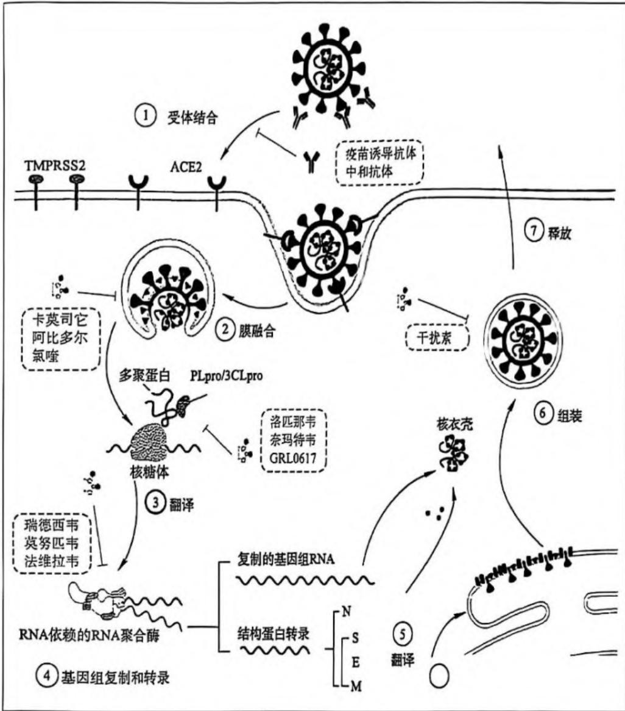  
图 11-33 冠状病毒的侵染过程以及目前针对侵染过程的治疗药物

## 11.5.4 SARS-CoV-2 对宿主细胞的干扰和"长期新冠"

过去人们曾一度认为冠状病毒对于人类而言仅会引起轻微的呼吸道感染,然而2002年的SARS-CoV、2012年的MERS-CoV(Middle East respiratory syndrome coronavirus)以及2019年的SARS-CoV-2的肆虐深深地改变了人们对冠状病毒的认识。其中,SARS-CoV-2引起的新型冠状病毒感染在世界范围内造成了巨大的经济损失和极高的死亡率,导致患者产生发烧、咳嗽、肌肉酸痛、呼吸困难等临床症状。SARS-CoV-2能够干扰宿主细胞的正常生命活动以及宿主先天免疫系统的信号传导,从而逃避宿主的防御反应,造成病毒的进一步传播(图11-34)。

人类的免疫系统分为先天免疫系统和适应性免疫系统,其中先天免疫系统在抵御SARS-CoV-2侵染时起到了至关重要的作用。病毒侵染宿主产生的双链RNA复制中间体可以通过激活视黄醇诱导基因蛋白I(retinoic acid-inducible gene I,RIG-I)或黑色素瘤分化相关基因5(melanoma differentiation associated gene 5,MDA5),从而激活胞质先天免疫感应途径。宿主通过识别长的双链RNA等病毒病原相关分子模式促进由线粒体抗病毒信号蛋白 (mitochondrial antiviral signaling protein, MAVS) 启动的信号级联，并最终激活宿主激酶 IKKα (inhibitor of NF-κB kinase α)、IKKβ (inhibitor of NF-κB kinase β) 和 TBK1 (Tank-binding kinase 1)。激酶的激活通过 ATF2-JUN 二聚体转录因子、干扰素调节因子 3 (interferon regulatory factor 3, IRF3) 和核因子 κB (nuclear factor kappa-B, NF-κB) 等转录因子进一步诱导产生干扰素 -β (IFNβ, interferon β)。分泌的 IFNβ 以自分泌或旁分泌方式发挥作用，以促进细胞中的抗病毒状态。在 IFNβ 结合时，细胞表面的 I 型干扰素受体亚基二聚化，将 Janus 激酶 1 (Janus kinase, JAK1) 和酪氨酸激酶 2 (tyrosine kinase 2, TyK2) 聚集在一起，二者随之彼此激活，并促进转录因子 STAT (signal transducer and activator of transcription) 的磷酸化。磷酸化的 STAT1 和 STAT2 能够与干扰素调节因子 9 (interferon regulatory factor 9, IRF9) 形成稳定的复合物，该复合物易位到细胞核中，从而促进干扰素刺激基因 (interferon-stimulated gene, ISG) 的转录。SARS-CoV-2 的蛋白质广泛参与了以上过程，通过抑制宿主识别、阻断 IFN 信号通路等策略抑制宿主的先天免疫 $^{(图 11-34a)}$ 。

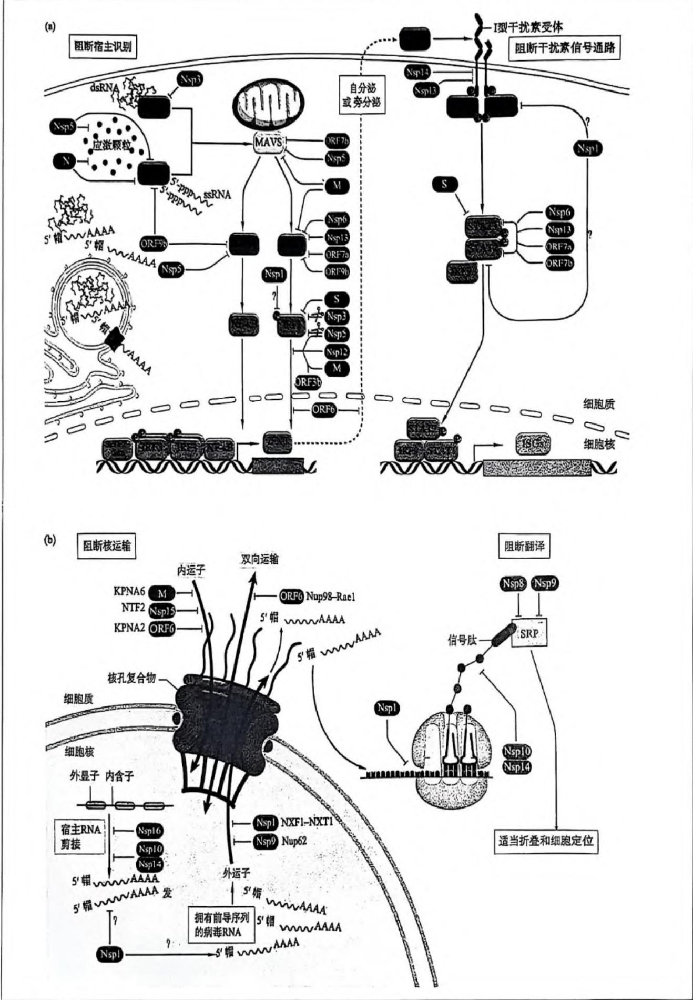  
图 11-34 SARS-CoV-2 对宿主细胞内基本生命活动和免疫的干扰（另见书末彩插）  
a) SARS-CoV-2介导的细胞先天免疫信号传导干扰；(b) SARS-CoV-2介导的一般宿主细胞生物学干扰。图中"？"代表Nsp1（nonstructural protein 1）在特异性阻断这些途径过程中的作用仍然不确定。

核孔复合物的双向运输对于细胞中的抗病毒反应至关重要。首先，在内运子的帮助下，响应病毒感染从而被诱导升高的细胞转录因子通过核孔复合物易位到细胞核中，促进抗病毒相关基因的表达。随后，宿主通过RNA剪接产生具有翻译能力的成熟转录物。这些转录物与外运子结合后输出到细胞质中，进一步翻译并形成成熟的蛋白质。SARS-CoV-2编码的部分蛋白质通过阻断核转运、抑制宿主剪接以及干扰核糖体的功能等方法干扰宿主细胞的生命活动，进一步抑制宿主的抗病毒反应(图11-34b)。

SARS-CoV 和 MERS-CoV 都曾给患者带来了持续气短以及严重疲劳等后遗症，SARS-CoV-2 也不例外，其给患者留下的症状被称为"长期新冠"（long COVID）。"长期新冠"给患者的多种器官都留下了持续的症状，极大地降低了患者的生活质量 $^{[11-35]}$ 。

## 11.5.5 SARS-CoV-2 的起源及变异

冠状病毒在进化中突破了物种的壁垒,从动物中逐步向人类传播,例如多种冠状病毒都被认为起源于蝙蝠,并经由中间宿主传播给人类。SARS-CoV 和 MERS-CoV 可能分别经由果子狸和单峰骆驼传播给了人类。SARS-CoV-2 的宿主范围广泛,在其跨物种传播过程中不断演化,形成了能够感染人类的一系列高风险毒株。

当两种病毒共同感染个体内的同一细胞时,病毒聚合酶在基因组复制过程中很有可能从一个基因组模板切换到异源基因组模板。这将导致基因的重组并产生基因组来自两种病毒的重组病毒 $^{[图11-36]}$ 。重组病毒可能可以具有两种亲本病毒的表型,例如从 Delta 和 BA.1 重组产生的 XD。此外,病毒重组产生的 XBB 毒株对新型冠状病毒感染的流行的进程也产生了巨大的影响。

图 11-35 "长期新冠"对多种器官的影响

## 神经系统

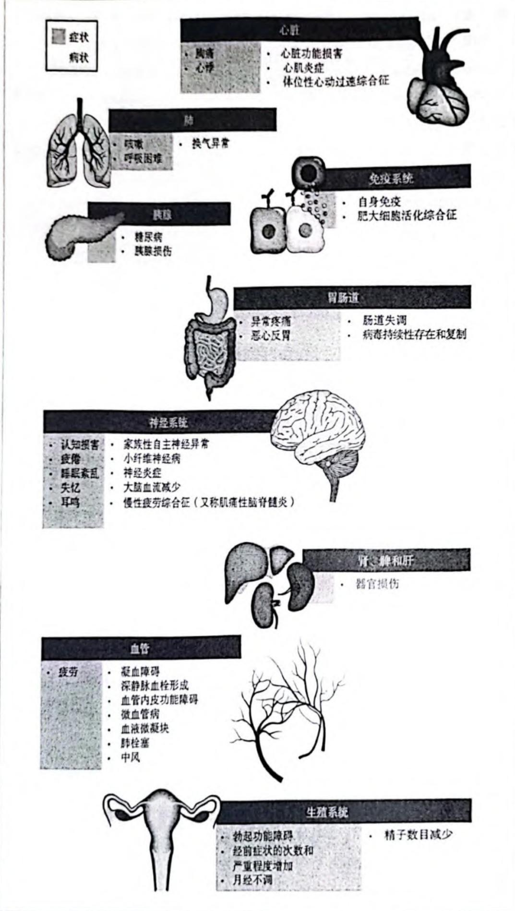

## 血管

## 胃肠道

## 肾、脾和肝

## 生殖系统

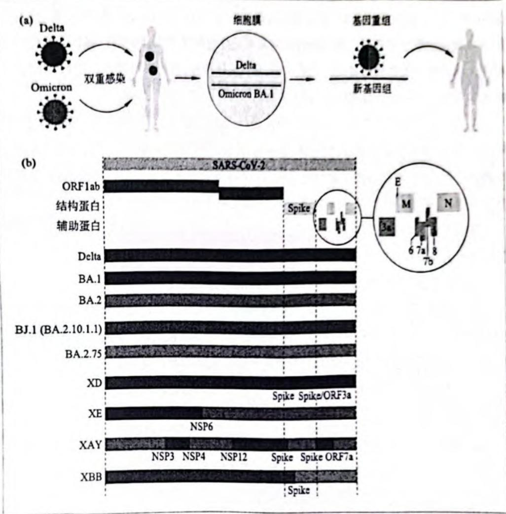  
图 11-36 SARS-CoV-2 的重组病毒  
(a) Omicron 和 Delta 毒株在感染同个个体时发生的重组过程；  
(b) 部分典型的 SARS-CoV-2 重组病毒的基因组图谱。Spike，刺突蛋白。

## 11.6 基因治疗

人类疾病的发生,其实都是人体细胞中自身基因的改变或由外源病原体的基因产物与人体基因相互作用的结果。因此,长期以来,科学家设想人类能否最终运用遗传物质,无论是人类自身的或是外源遗传物质来治疗疾病,纠正人体本身基因结构或功能上的错乱,阻止病菌的侵染,杀灭病变的细胞或抑制外源病原体遗传物质的复制,保证人体健康。

## 11.6.1 基因治疗与基因矫正

1990 年,科学家第一次用逆转录病毒为载体,把腺苷脱氨酶(ADA)基因导入来自病人自身的 T 淋巴细胞,经扩增后输回患者体内,获得了成功。5 年后,患者体内 10% 的造血细胞呈 ADA 基因阳性,除了还须服用小剂量的 ADA 蛋白之外,其他体征都正常。这一成功标志着基因治疗时代的开始。那么,基因治疗为什么具有诱人的前景,它与基因工程究竟有什么差别呢?

基因工程是将具有应用价值的基因, 即 "目的基因", 装配在具有表达元件的特定载体中, 导入相应的宿主如细菌、酵母或哺乳动物细胞中, 在体外进行扩增, 经分离、纯化后获得其表达的蛋白质产物。基因治疗是将具有治疗价值的基因, 即 "治疗基因" 装配于带有在人体细胞中表达所必备元件的载体中, 导入人体细胞, 直接进行表达。进行基因治疗时无需对表达产物进行分离纯化, 因为人细胞本身可以完成这个过程。

基因工程的"目的基因"主要是可分泌蛋白,如生长因子、多肽类激素、细胞因子、可溶性受体等,而非分泌性蛋白,如受体、各种酶、转录因子、细胞周期调控蛋白、原癌基因及抑癌因子等,由于它们不能有效地进入细胞而不能被应用于基因工程。基因治疗却不受上述限制,几乎所有的基因,只要它具有治疗作用,理论上均可应用于基因治疗。

基因工程的操作全部在体外完成,基因治疗则必须将基因直接导入人体细胞。这不仅在技术上具有很大难度,而且在有效性与安全性方面提出了更为苛刻的要求。

基因治疗主要有体外(ex vivo)和体内(in vivo)两条途径：

① 体外途径 这是指将含外源基因的载体在体外导入人体自身或异体(异种)细胞,这种细胞被称为"基因工程化的细胞",经体外细胞扩增后输回人体。这种方法易于操作,而且因为细胞扩增过程中对外源添加物质的大量稀释,不容易产生副作用。同时,治疗中用的是人体细胞,尤其是自体细胞,安全性好。但是,这种方法不易形成规模,而且必须有固定的临床基地。

② 体内途径 这是将外源基因装配于特定的真核细胞表达载体上,直接导入人体内。这种载体可以是病毒型或非病毒型,甚至是裸 DNA。这种方式非常有利于大规模工业化生产。但是,对这种方式导人的治疗基因以及其载体必须证明其安全性,而且导人体内之后必须能进入靶细胞,有效地表达并达到治疗目的。因此,在技术上要求很高,其难度明显高于体外模式。

除此之外,基因矫正技术近年来也饱受关注。基因矫正是基于基因组编辑的一种更持久的遗传病治疗策略,拥有能够超越经典基因治疗方法的用途与潜力。传统的基因组编辑技术如锌指核酸酶和转录激活样效应因子核酸酶(transcription activator-like effector nuclease, TALEN)、锌指核酸酶(zinc finger nuclease, ZFN)和 CRISPR/Cas9 都可以被应用在基因矫正技术中。

基因矫正的作用方式主要分为以下几种：

① 体内基因组编辑 利用核酸内切酶造成的非同源末端连接(nonhomologous end joining, NHEJ)实现有害突变基因的敲除,从而修正有害突变基因表达引起的异常生理过程。

② 体外基因组编辑 向患者体内转入由 CRISPR/Cas9 技术改造过的源自患者自身的诱导多能干细胞 (induced pluripotent stem cell, iPSC), 修正后的 iPSC 在病人体内进一步分化并发挥功能, 弥补患者的免疫缺陷。

③ 通过催化失活的 Cas9 (catalytically inactivated Cas9, dCas9) 与反式作用蛋白偶联以调节基因表达 通过将 dCas9 蛋白与转录激活因子或转录阻遏蛋白偶联, 可以特异性

地控制目的基因表达水平的上调或者下降。

## 11.6.2 基因治疗中的病毒载体

用于基因治疗的病毒载体应具备以下基本条件:① 携带外源基因并能装配成病毒颗粒;② 介导外源基因的转移和表达;③ 对机体没有致病力。

因为大多数野生型病毒对机体都具有致病性,需要对其进行改造后才能被用于人体。理论上,各种类型的病毒都能被改造成病毒载体,但由于病毒的多样性及与机体之间复杂的依存关系,人们至今对许多病毒的生活周期、分子生物学、与疾病发生发展的关系等的认识还很不全面,从而限制了许多病毒发展成为具有实用性的载体。到目前为止,只有少数几种病毒如逆转录病毒、腺病毒及腺病毒伴随病毒、疱疹病毒(包括单纯疱疹病毒、痘苗病毒及EB病毒)等被成功地改造成为基因转移载体。

## 1. 病毒载体的产生

研究病毒载体首先要对病毒的基因组结构和功能有充分的了解,最好在获得病毒基因组全序列信息的基础上进行。病毒基因组可分为编码区和非编码区,编码区的序列产生病毒的结构蛋白和非结构蛋白。根据其对病毒感染性复制的影响,又可分为必需基因和非必需基因。非编码区中含有病毒进行复制和包装等功能所必需的顺式作用元件。各种野生型病毒颗粒都具有一定的包装容量,即对所包装的病毒基因组的长度有一定的限制。一般来说,病毒包装容量不超过自身基因组大小的105%\~110%。

最简单的办法是将适当长度的外源 DNA 插入病毒基因组的非必需区，包装成重组病毒颗粒。有科学家将 4.5 kb 的 lacZ 基因表达盒插入 HSV-I 病毒的 UL44（编码糖蛋白 C）基因的 Xba I 位点中，构建成重组 HSV 病毒。由于 UL44 基因产物对于 HSV 病毒在培养细胞中产毒性感染是非必需的，因此，该重组病毒可以在细胞中增殖传代。用这种重组病毒感染细胞，发现 lacZ 基因能进入细胞并得到高效表达。

然而,重组病毒作为基因转移载体有许多缺点。首先,许多野生型病毒可通过在细胞中的复制而导致细胞裂解死亡,或带有病毒癌基因而使细胞发生转化,必须经过改造使其成为复制缺陷型病毒并且删除致癌基因后才能用于基因治疗。其次,插入外源 DNA 的长度受到很大限制,尤其对于基因组本身较小的病毒如腺病毒伴随病毒(4.7 kb)、逆转录病毒(8\~10 kb)、腺病毒(36 kb),如果不去除病毒基因,可供外源 DNA 插入的容量就很小,要删除更多的病毒基因以腾出空间以插入较大的外源 DNA。为了增加病毒载体插入外源 DNA 的容量,除了删除病毒的非必需基因外,还可以进一步删去部分或全部必需基因,这些必需基因的功能由辅助病毒或宿主细胞提供。

## 2. 病毒载体的分类

① 重组型病毒载体 这类载体以完整的病毒基因组为改造对象,在不改变病毒复制和包装所需的顺式作用元件的情况下,有选择性地删除病毒的某些必需基因尤其是前早期或早期基因以控制其表达,所缺失的必需基因的功能由同时导入细胞中的外源基因表达单位提供。一般通过同源重组方法将目的基因插入到病毒基因组中。

## 11.6 基因治疗

② 无病毒基因的病毒载体 这类载体可以看作是重组病毒载体的一种极端减毒情况, 往往由重组载体和辅助系统组成。重组载体主要由外源基因表达盒、病毒复制和包装所必需的顺式作用元件及载体骨架组成。辅助系统包括病毒复制和包装所必需的所有反式作用元件。在辅助系统的作用下, 重组载体以特定形式(单链或双链 DNA 或 RNA)被包装到不含有任何病毒基因的病毒颗粒中。这类载体的优点在于载体病毒本身安全性好, 容量大。缺点在于往往需要辅助病毒参与载体 DNA 的包装, 造成终产品中辅助病毒污染, 影响其应用。

## 3. 病毒载体在基因治疗中的应用

据不完全统计,自1990年开展第一例人体基因治疗以来,已进行了数百项基因治疗临床试验,涉及病人上千人,其中2/3以上的临床方案应用了病毒载体进行基因导入。不同的病毒载体具有特定的生物学功能,决定了其在基因治疗中的应用,表11-7列举了常用的病毒载体的特性和适用范围。

表 11-7 常用病毒载体的特性和适用范围

<table><tr><td>病毒载体</td><td>生物学特性</td><td>适用范围</td></tr><tr><td>逆转录病毒载体</td><td>可感染分裂细胞整合到染色体中表达时间较长有致癌的危险</td><td>ex vivo基因治疗肿瘤基因治疗</td></tr><tr><td>腺病毒载体</td><td>可感染分裂和非分裂细胞不整合到染色体中外源基因表达水平高表达时间较短免疫原性强</td><td>in vivo基因治疗肿瘤基因治疗疫苗</td></tr><tr><td>腺病毒伴随病毒载体</td><td>可感染分裂和非分裂细胞整合到染色体中无致病性,免疫原性弱可长期表达外源基因在骨骼肌、心肌、肝、视网膜等组织中表达水平较高</td><td>in vivo基因治疗ex vivo基因治疗遗传病基因治疗获得性慢性疾病的基因治疗</td></tr><tr><td>疱疹病毒载体</td><td>具嗜神经性,可逆轴突传递可潜伏感染容量大可感染分裂和非分裂细胞</td><td>神经系统疾病的基因治疗肿瘤的基因治疗</td></tr></table>

## 4. 基因治疗中的问题

基因治疗要取得突破,必须在基因导入系统、基因表达的可控性及获得更多更好的治疗基因这三个方面下功夫。

① 靶向性基因导入系统 基因治疗中的关键问题是必须将治疗基因送入特定的靶细胞，并在该细胞中得到高效表达。这对于恶性肿瘤治疗尤为重要，如果不能有效地将治疗基因导入大多数肿瘤细胞，则至少要求它尽可能不进入或较少进入正常细胞。因此，目前针对恶性肿瘤的免疫基因治疗仍按 ex vivo 形式操作，很少有体内直接导入的治疗模式。

病毒型载体中,除直接注射入瘤体外,若用全身给药,在肿瘤细胞中分布极低,很难期望达到治疗作用。当务之急是要尽快建立靶向性导入系统。

② 外源基因表达的可控性 由于电脉冲介导裸 DNA 技术的改进,科学家已能将许多基因,如分泌性蛋白基因(包括生长因子、激素、细胞因子,可溶性受体)导入肌肉并维持相当时间的表达,已达到可发挥药效的水平。但是,如果这些基因导入后表达处于无调控状态,将会造成严重后果。

最理想的可控性是模拟人体内基因本身的调控形式。这是今后长期的追求目标,需要全基因或包括上下游的调控区及内含子序列,将对导入基因的载体系统产生严峻的挑战,因为今后设计的载体须有几十 kb 甚至上百 kb 的包装能力。图 11-37 是导入基因表达诱导系统示意图。以酵母 gal4 系统为例,在目的基因上游区接上 gal4 的顺式元件,所用的激活蛋白是一个带有疱疹病毒 VP16/gal4 DNA 结合区的孕酮受体的变异体。该变异体(PR-LBD△)只能与孕酮的拮抗剂(RU486)相结合而不与孕酮或其他衍生物结合。当体系中不存在 RU486 时,治疗基因的表达水平极低;而给予 RU486 后,RU486 与 PR-LBD△结合,激活 VP16,杂种激活蛋白形成二体并通过 gal4 DNA 结合区与治疗基因上游区的 gal4 顺式元件结合,启动治疗基因的表达。

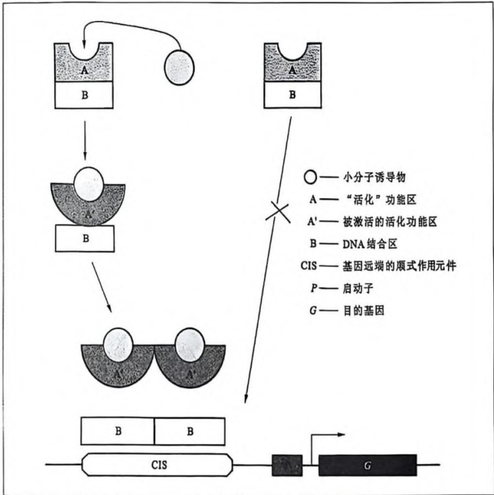  
图11-37 导入基因的表达诱导框架图

③ 治疗基因过少 目前用于临床试验的治疗基因数量很少。绝大部分多基因疾病，如恶性肿瘤、高血压、糖尿病、冠心病、神经退行性疾病的致病基因还有待阐明，因此，可选择的靶基因不多。只有尽快发现并克隆大量的功能基因，迅速确定其调控序列，基因治疗才能获得更大的发展。

## 11.6.3 基因治疗中的非病毒载体

病毒载体存在许多不足,主要体现在免疫原性高、毒性大、目的基因容量小、靶向特异性差、制备较复杂及费用较高等。现在,人们愈来愈重视人工合成的非病毒载体的研究。目前常用的非病毒载体包括裸 DNA (naked DNA)、脂质体载体 (liposome vector) 及阳离子多聚物型载体 (cationic polymer vector) 等。

## 1. 裸DNA

裸 DNA 又称自由 DNA, 是结构最简单的非病毒载体。使用裸 DNA 进行基因治疗的最大困难在于如何将目的基因导入相应的细胞并得到有效而长期的表达。主要通过物理或机械方法(如直接注射或基因枪法)将 DNA 导入适当部位(如皮肤、骨骼肌、肝、支气管内、心肌和瘤体内)。当用于激发免疫反应时又称为 DNA 疫苗(DNA vaccine), 是一种非常有希望的疫苗方式。

基因枪方法又叫微粒轰击技术,它采用能自发吸收 DNA 的钨或金微粒,通过高压电所产生的高能电弧促使被 DNA 包裹着的金属颗粒产生极高的速度,有效穿透单细胞层或靶器官从而将 DNA 导入培养细胞或动物组织中。

裸 DNA 虽能有效运转并表达目的基因,但缺乏靶向性,并且只能在局部作用,不能转染大量细胞,经常需要进行外科手术以暴露靶器官,使用时局限性较大。

## 2. 脂质体 /DNA 复合物

脂质体是具有双层膜的封闭式粒子,它们能促进极性大分子穿透细胞膜。根据脂质体包裹 DNA 的方式不同可将脂质体分为阳离子脂质体、阴离子脂质体、pH 敏感脂质体及融合脂质体等。

阳离子脂质体是目前最常用的脂质体类型,它主要由带正电荷的脂质及中性辅助脂质组成,两者通常是等摩尔混合。由于电荷的相互作用,阳性电荷的脂质体和带负电荷的DNA之间可以有效地形成复合物,制备时只须将二者直接混合形成复合物,不受基因体积大小的限制。

脂质的化学结构、组成对载体的活性和毒性有很大的影响。具有多个正电荷头部的脂质体转染率较高，这可能是因为它与DNA结合更牢固。脂质体在酸性环境中与细胞膜结合能力大大降低，在细胞间的转运也取决于脂质体中类脂的成分。DC-Chol/DOPE阳离子脂质体是第一个被批准用于人体的脂质体。由于制备技术的不稳定性，对靶细胞的毒性和试剂价格较贵等原因，其应用受到了一定的限制。

细胞摄取脂质体主要通过内吞途径,脂质体与其内含物遇到溶酶体即被降解。pH 敏感脂质体可在一定程度上避免溶酶体降解并增加 DNA 摄取量和稳定性。pH 敏感脂质体的原理是酸性条件下脂肪酸羧基质子化,形成六角晶相发生膜融合。在形成内吞小泡进入溶酶体之前,由于 pH 从 7.4 降至 5.3\~6.3 左右,pH 敏感脂质体与内吞小泡膜融合,将内含物导入胞浆。这类脂质体主要由二油酰胆碱(DOPE)、胆固醇和油酸以 4:4:2(摩尔比)组成,脂质成分中常用的 DOPE 决定了脂质体在中性 pH 条件下的稳定性和酸性条件下与细胞融合的能力。

pH 敏感脂质体虽然通过静电吸附与细胞膜产生非特异性相互作用,转运效率比普通脂质体高,但实际上也只有 10% 的基因释放至细胞质中,其余仍在溶酶体中降解。

## 3. 多聚物 /DNA 复合物

由于 DNA 带负电,利用阳离子多聚体的氨基基团的正电荷与 DNA 的磷酸基团结合发生电性中和,可以使 DNA 缩合形成稳定的多聚复合物(polyplex),不易被核酸酶降解,并可防止沉淀,从而提高转染效率。此外,复合物大小为 80\~100 nm,带正电荷,可与细胞表面带负电荷的受体结合,因此能有效地被内吞摄入,介导基因转移。常见的阳离子多聚体有多左旋赖氨酸、鱼精蛋白、组蛋白、多聚乙胺、多聚乙烯亚胺和星状树突体等,可以分别形成线型、分支型、球型或类球体状结构。虽然多聚阳离子型载体系统具有合成比较方便、安全无毒的特点,但是,单独使用多聚阳离子同样具有基因转移组织特异性和靶向性差、体内基因转移效率较低等缺点,有待于进一步改善和提高。

## 4. DNA 微球体 (DNA-nanosphere)

白明胶和聚氨基葡萄糖等生物高聚物属阳离子复合物,能与 DNA 形成大小为 200\~750 nm 的微球体复合物。白明胶和聚氨基葡萄糖等有如下特点:①它们是可降解生物材料;② DNA 可均一地分布在微球体中,免于被 DNA 酶降解;③可与活性物质共包装达到靶向运输增加了基因治疗的可能性;④储存方便稳定;⑤可以达到可控持续释放,延长了基因表达时间;⑥毒性低。

近年来围绕 DNA 微球体的研究越发广泛。以聚氨基葡萄糖(chitosan)为例,有研究发现高聚合度(>50)的聚氨基葡萄糖能够打开细胞间的紧密连接以促进 DNA 微球体进入细胞发挥功能,且聚氨基葡萄糖的表面可以发生修饰以增强其进入细胞的能力和特异性。由于其优良的特性,以聚氨基葡萄糖为基础的 DNA 微球体被报道能够作为脑癌症的基因治疗载体。比如,人血脑屏障微血管内皮细胞(human blood-brain barrier cerebral microvessel endothelial cell,hCMEC)能够通过受体介导的内吞作用促进 DNA 微球体进入细胞发挥功能。

## 11.7 肿瘤的免疫治疗

手术、放疗和化疗是目前治疗肿瘤的主要手段和传统方法，但大部分情况下患者都不能获得理想的疗效。随着免疫细胞及炎症因子在肿瘤微环境中的发现，以及正常机体免疫系统监视和杀伤癌细胞的作用逐渐被揭示，肿瘤免疫细胞疗法成为一种杀伤肿瘤细胞的新疗法，被称为现代肿瘤治疗的第四种模式。

## 11.7 肿瘤的免疫治疗

<table><tr><td>受体与配体</td><td>作用机制</td><td>应用药剂示例</td></tr><tr><td>CTLA4CD80/86</td><td>限制初始T细胞的活化与增殖</td><td>伊匹单抗</td></tr><tr><td>PD1PD-L1</td><td>抑制效应T细胞的活性</td><td>纳武单抗、派姆单抗</td></tr><tr><td>LAG3MHC II</td><td>通过KIEELE基序抑制效应T细胞的活性,与Treg细胞介导的免疫抑制功能相关</td><td>瑞拉利单抗</td></tr><tr><td>TIM-3Galectin-9CEACAM1</td><td>促进CD8*T细胞的凋亡</td><td>考伯利单抗</td></tr><tr><td>TIGITCD155,CD122</td><td>抑制T细胞和NK细胞的功能</td><td>替瑞利尤单抗</td></tr><tr><td>BTLAHVEM</td><td>抑制TCR下游通路的激活</td><td>伊卡妥单抗</td></tr><tr><td>GITRGITRL</td><td>促进效应T细胞的活化和增殖以及Trg细胞的减少</td><td>TRX518、BMS-986156</td></tr><tr><td>OX40OX40L</td><td>促进效应T细胞和记忆T细胞的存活</td><td>GSK3174998、PF-04518600</td></tr><tr><td>4-1BB4-1BBL</td><td>促进T细胞增殖和线粒体功能</td><td>乌托鲁单抗</td></tr><tr><td>ICOSICOSL</td><td>促进TCR共刺激和Trg细胞刺激</td><td>伏派利单抗</td></tr></table>

图 11-38 靶向共抑制和共激活受体研究进展  
$T_{trg}$ 细胞: regulatory T cell, 调节性 T 细胞; NK 细胞: natural killer cell, 自然杀伤细胞; TCR: T cell receptor, T 细胞受体。

肿瘤的免疫治疗通过激活机体的免疫系统,增强抗肿瘤免疫效应,从而特异性清除肿瘤微小残留病灶或者明显抑制肿瘤增殖。继发现 CD8 $^{+}$ T 细胞可以特异性地杀伤表达肿瘤抗原的肿瘤细胞后,树突状细胞(dendritic cell,DC)和自然杀伤细胞(natural killer cell,NK)先后被发现在肿瘤免疫中发挥作用。2015年底,程序性死亡蛋白1(programmed death protein 1,PD-1)抗体的免疫治疗配合手术和放疗成功控制了美国前总统卡特的黑色素瘤。近年来,免疫疗法在癌症治疗中展现出了巨大的潜力并取得了很大的进展(图11-38)。

按照免疫的作用机制,免疫治疗可以分为主动免疫治疗、被动免疫治疗和非特异性免疫调节剂治疗。

## 11.7.1 主动免疫治疗

主动免疫治疗主要指接种肿瘤疫苗,利用肿瘤细胞或者肿瘤相关蛋白或多肽等抗原物质免疫机体,激活患者自身的免疫系统,诱导宿主产生针对肿瘤抗原的免疫应答,从而阻止肿瘤生长、转移和复发。肿瘤疫苗包括肿瘤细胞疫苗、肿瘤多肽(蛋白)疫苗、树突状细胞疫苗(DC疫苗)、抗独特型抗体疫苗和DNA疫苗等,对患者进行免疫接种,激发患者机体产生对肿瘤的特异性免疫应答(图9-39)。主动免疫治疗可使患者产生免疫记忆,因此

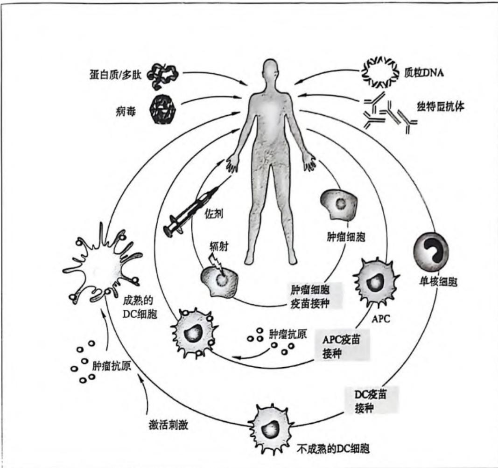  
图11-39 钟腺疫苗的分类及作用方式示意图

抗肿瘤作用比较持久。

## 1. 肿瘤细胞疫苗

肿瘤细胞疫苗是采用灭活的患者自体或异体肿瘤细胞，引发特异性抗肿瘤免疫反应的一种治疗性疫苗。其中自体肿瘤细胞疫苗含有患者自身特异的肿瘤抗原和抗原递呈细胞表面 HLA 分子，比异体肿瘤细胞疫苗更安全。但存在制备过程复杂、肿瘤组织获取较困难、机体免疫耐受以及肿瘤抗原被稀释等问题。因异体肿瘤细胞与患者自体肿瘤细胞存在交叉抗原，可部分替代自体肿瘤疫苗，解决自体肿瘤细胞来源有限的问题。但大部分异体肿瘤细胞疫苗与患者肿瘤的组织学类型及相关抗原不符，临床应用局限性较大，效果不很理想。肿瘤细胞疫苗根据形式又可分为肿瘤全细胞疫苗、肿瘤细胞裂解物疫苗以及基因修饰的肿瘤细胞疫苗。

肿瘤全细胞疫苗通过射线照射灭活肿瘤组织细胞,抑制其增殖力而保留其免疫活性,并通常加入卡介苗、弗氏完全佐剂等免疫佐剂以增强其免疫活性。该类疫苗富含肿瘤抗原,自体肿瘤细胞疫苗具有全部肿瘤细胞的抗原,必须完全灭活才能临床使用。OncoVAX是经放射处理的患者肿瘤细胞与卡介苗混合而成,目前主要用于结肠癌术后的患者。Ⅲ期临床试验数据显示,OncoVAX显著降低44%Ⅱ期和Ⅲ期结肠癌患者的复发率。仅Ⅱ期结肠癌患者而言,OncoVAX能降低61%的复发率。

## 11.7 肿瘤的免疫治疗

肿瘤细胞裂解物疫苗是用肿瘤细胞的裂解物或外泌小体等亚细胞结构作为疫苗, 这样既保留肿瘤抗原免疫活性, 又保证疫苗的安全性, 是肿瘤疫苗治疗常采用的方式。

基因修饰的肿瘤细胞疫苗是指通过基因重组技术将不同的目的基因如细胞因子、辅助刺激分子、MHC I 类抗原分子等导入肿瘤细胞而制备的疫苗。前列腺癌疫苗 GVAX 是由经遗传修饰分泌免疫刺激性细胞因子粒细胞－巨噬细胞集落刺激因子(GM-CSF)的肿瘤细胞组成的癌症疫苗。目前对于 GVAX 治疗胰腺癌的研究处于Ⅱ期临床试验，同时开展的还有 GVAX 与 PD-1 抑制剂组合的试验。

## 2. 肿瘤多肽(蛋白质)疫苗

肿瘤抗原的提呈必须先经过抗原递呈细胞(APC)降解为短肽,然后与MHC分子结合,形成"抗原肽-MHC-TCR"复合物,提呈到细胞表面才能被T细胞识别并激发细胞毒性T淋巴细胞(CTL)反应。因此,肿瘤多肽疫苗是通过人工合成肿瘤抗原肽段,单独或者与佐剂一起输注人患者体内,通过这些肿瘤抗原肽段来激发机体特异性抗肿瘤免疫反应。肿瘤多肽疫苗成分较单一,便于研究和产业化,不存在肿瘤细胞的抑制成分,无肿瘤种植的风险;但因为其分子量小、容易降解,导致其免疫原性弱,易诱发特异性免疫耐受且应用受MHC类型限制。肿瘤蛋白疫苗是指将肿瘤抗原整个或部分蛋白质作为疫苗,进入机体后经APC摄取递呈,激发抗肿瘤免疫应答。与多肽疫苗相比肿瘤蛋白疫苗的免疫原性更强,通常需要添加佐剂,激发的免疫反应以体液免疫为主。目前尚缺成功的例子。

## 3. 树突状细胞疫苗(DC 疫苗)

树突状细胞是最主要的 APC, 也是唯一能激活初始 T 细胞的专职 APC 并激活 CTL 反应。DC 疫苗首先分离患者体内树突状细胞的前体细胞, 体外培养并使之负载肿瘤抗原肽段, 然后回输到患者体内, 通过树突状细胞激发特异性抗肿瘤 T 细胞反应。又分为肿瘤抗原致敏的 DC 疫苗和基因修饰的 DC 疫苗。肿瘤抗原致敏的 DC 疫苗是通过不同形式的肿瘤抗原致敏树突状细胞, 然后将致敏的树突状细胞接种或回输给患者, 诱导机体产生特异性的 CTL 和记忆性 T 细胞。Sipuleucel-T 就是一个 DC 疫苗, 从患者的外周血单核细胞中提取树突状细胞, 负载前列腺癌特异的抗原后回输至患者体内发挥作用。此类个性化定制的疫苗制作过程复杂, 费用高且持久性一般较差。

基因修饰的 DC 疫苗是将编码肿瘤抗原的基因导入树突状细胞,在其中表达肿瘤抗原,经树突状细胞递呈后活化初始 T 细胞。编码肿瘤抗原的基因通常以质粒或病毒为载体以 DNA 或 RNA 的形式转入树突状细胞。

## 4. 抗独特型抗体疫苗

抗原可刺激机体产生抗体 Ab1, 该抗体可变区的独特型决定簇具有免疫原性, 可诱导产生抗体 Ab2, 后者被称为独特型抗体。将可以模拟原来抗原结构的具有内影像抗原性的 Ab2 作为肿瘤疫苗应用, 可以诱导产生抗独特型抗体, 具有模拟抗原和免疫调节的双重作用, 即为抗独特型抗体疫苗。抗独特型抗体疫苗主要用于不易获得的肿瘤抗原, 该疫苗可打破机体对肿瘤抗原免疫耐受的状态, 特异性强而且不含有肿瘤细胞, 使用起来相对更安全可靠。独特型抗体多为鼠源, 反复应用容易引起人抗鼠抗体反应, 而人源化独特型

抗体可避免这一缺陷。

非霍奇金淋巴瘤疫苗 BiovaxID (ID-KLH/GM-CSF) 是自体肿瘤来源的免疫球蛋白独特型抗体疫苗。是通过活检采集患者肿瘤样品,获得肿瘤细胞特异性抗原 ID,然后将 ID 偶联到载体蛋白钥孔血蓝蛋白(KLH),最后注入患者体内刺激 T 细胞应答。

## 5. DNA 疫苗

DNA 疫苗也被称为基因疫苗,是通过基因工程技术将编码肿瘤抗原的基因与表达载体整合之后,将疫苗直接注入机体,借助机体内的基因表达系统表达肿瘤抗原,从而诱导出针对肿瘤抗原的细胞免疫应答。基因疫苗所用表达载体通常为重组病毒或质粒 DNA,具有便于生产、使用安全、表达时间长、易于诱发肿瘤免疫应答等优点,缺点是肿瘤抗原的表达差异大且细胞中长期低水平表达肿瘤抗原会产生免疫耐受。

## 6. 溶瘤病毒疫苗

溶瘤病毒疫苗是将基因工程改造的溶瘤病毒注射人肿瘤内，由于溶瘤病毒优先感染肿瘤细胞，病毒复制导致肿瘤细胞溶解，释放增强免疫反应的细胞因子，刺激宿主抗肿瘤免疫反应，从而杀伤肿瘤。2015年，用于治疗晚期黑色素瘤的肿瘤疫苗T-Vec成为世界首个溶瘤病毒疫苗。

目前虽然有不少肿瘤疫苗进入了临床试验,但体内抗肿瘤效果和治疗效果都不尽如人意。半个世纪多以来,研究人员一直梦想着为癌症患者注射一种疫苗,帮助他们的免疫系统识别、抵御并最终清除肿瘤。随着研究的深入,至少目前还不能指望仅仅使用该疗法就能治愈晚期肿瘤。发展个体化肿瘤疫苗已成为一个新的发展方向,而如何将主动免疫治疗与其他治疗方法有机结合起来,充分发挥综合治疗的优势,成为另一个重要研究方向。

## 11.7.2 被动免疫治疗

被动免疫治疗又称为过继免疫治疗(adoptive immunotherapy),是被动地将具有抗肿瘤活性的免疫制剂或者细胞过继回输到肿瘤患者机体进行治疗,以达到治疗肿瘤的目的。被动免疫治疗与肿瘤疫苗不同,并不需要机体产生初始免疫应答,不依赖于宿主的免疫功能状态,因此适用于肿瘤晚期患者,按治疗采用的载体分为单克隆抗体治疗和过继性细胞治疗两类。

## 1. 单克隆抗体治疗

恶性肿瘤细胞表面表达的特异性抗原可以作为单克隆抗体的靶点应用于肿瘤治疗，因为针对这些靶位点的抗体可以引起细胞凋亡，并通过补体介导的细胞毒性（complement-mediated cytotoxicity, CMC）以及抗体依赖细胞介导的细胞毒性(antibody-dependent cellular cytotoxicity, ADCC)杀死靶细胞，也可以通过自然杀伤细胞(NK细胞)和阻断信号转导通路起到抗肿瘤的作用 $^{[图11-40]}$ 。

单克隆抗体还可以携带抗肿瘤物质进行导向治疗。放射免疫偶联物、具有细胞毒性的小分子以及免疫系统里的细胞因子都可以通过单抗运输向肿瘤细胞。放射性元素已被用于标记抗体进行肿瘤的诊断和治疗。淋巴瘤是较为适合放射性疗法的癌症，已有药物

## 11.7 肿瘤的免疫治疗

图11-40 抗体依赖性细胞介导的细胞毒性示意图

当自然杀伤(NK)细胞上的Fc受体与结合癌细胞的抗体的Fc区相互作用时,NK细胞释放穿孔素和粒酶,导致癌细胞凋亡。

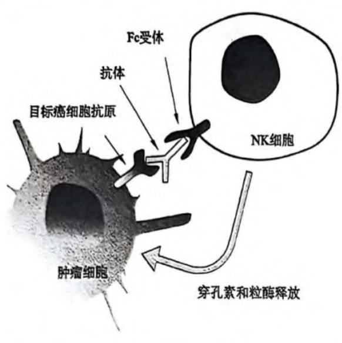

上市。抗体－药物偶联物(antibody-drug conjugates)是最近研发的极具前景的抗癌药物，它将带有细胞毒性的药物和特异性抗体偶联，在提高了特异性的同时可以更好地杀死肿瘤细胞。此外免疫细胞因子如IL-2和GM-CSF也被结合在抗体上，用于靶向肿瘤细胞，改变肿瘤微环境。

## 2. 过继性细胞治疗

过继性细胞治疗又称为过继性细胞免疫疗法(adoptive cellular immunotherapy, ACT), 是将抗原特异性识别的细胞经体外培养扩增和功能鉴定后输回患者体内, 从而直接杀伤或激发机体的免疫应答杀伤肿瘤细胞 $^{[图11-41]}$ 。过继细胞免疫治疗主要包括非特异性免

图11-41 过继性细胞治疗示意图  
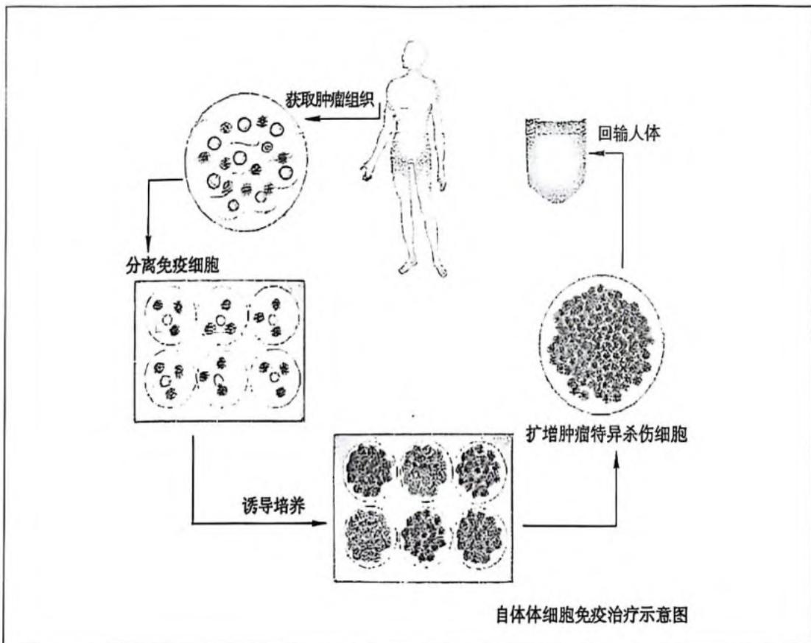

疫治疗和特异性免疫治疗。

## (1) 非特异性免疫治疗

主要包括淋巴因子激活的杀伤细胞(lymphokine activated killer, LAK)疗法和细胞因子诱导的杀伤细胞(cytokine induced killer, CIK)疗法。

LAK 疗法是利用白细胞介素 2(IL-2) 刺激活化外周血淋巴单核细胞, 诱导具有非特异性细胞毒作用的效应细胞, 这些细胞主要是由很多种淋巴细胞组成的混合体, 包括 NK 细胞和 T 淋巴细胞, 在体外对肿瘤作用不依赖于抗原致敏。LAK 细胞杀伤靶细胞的机制与 NK 细胞类似, 可以通过细胞与细胞接触识别靶细胞表面结构, 也可以通过分泌细胞因子参与杀伤肿瘤细胞。它对恶性黑色素瘤、肾细胞癌、非霍奇金淋巴瘤、鼻咽癌疗效较好, 对控制微小残留灶及恶性胸腹水治疗效果比较显著。

CIK 细胞是由外周血单个核细胞经抗 CD3 单克隆抗体, 以及 IL-2、IFN-γ 和 IL-1α 等细胞因子体外诱导分化获得的 NK 样 T 细胞。CIK 细胞来源于患者或健康人的外周血, 培养扩增较容易, 目前已经进行了大量临床实验治疗多种肿瘤, 已经发现 CIK 在肾癌、肝癌、肺癌和白血病等多种肿瘤中具有抗瘤活性。与 LAK 细胞相比, CIK 细胞具有增殖速度快, 杀瘤活性高, 肿瘤杀伤谱广等优点, 且对多重耐药肿瘤细胞同样敏感, 对正常骨髓造血前体细胞毒性小, 能抵抗肿瘤细胞引发的效应细胞 Fas/FasL 凋亡, 广泛用于肿瘤的辅助治疗。

## (2) 特异性免疫治疗

特异性嵌合抗原受体免疫治疗(chimeric antigen receptor T-cell immunotherapy, CAR-T)是通过基因修饰获得携带识别肿瘤抗原特异性受体T细胞的个性化治疗方法。提取患者外周血T细胞，通过基因重组赋予T细胞特异性识别肿瘤抗原的能力，再将改造后的T细胞经体外扩增后回输到患者体内从而特异性杀伤肿瘤细胞。与传统的T细胞识别抗原相比，CAR通过增加共刺激分子信号增强了T细胞对肿瘤的杀伤性，因此CAR-T细胞可以克服MHC分子表达下调和共刺激分子减少等肿瘤细胞免疫逃逸机制。另外，CAR可以针对任何类型的表面抗原，包括糖和糖脂类，提高了识别范围。该免疫疗法在白血病和淋巴瘤患者的早期临床试验中取得了显著疗效。

一个完整的 CAR 分子通常包括胞外抗原结合区(来自单链抗体可变区基因片段, scFv)、铰链区、跨膜区和胞内受体信号转导区(包括 CD3-ζ 链、Fc ε、RIγ 和协同刺激因子)4 个区域。CAR-T 细胞技术现已发展到第四代 $^{[图11-12]}$ 。第一代的 CAR-T 细胞仅有一个 T 细胞 CD3 ζ 受体信号区,但是由于 T 细胞的增殖和细胞因子的产生是有限的,所以第一代的 CAR-T 疗法在临床上是无效的。第二代 CAR-T 在第一代的基础上引入了 T 细胞激活因子(如 CD28 等)的细胞内模块作为共刺激分子信号,显著增强了第二代 CAR-T 细胞的活化能力。第三代 CAR-T 进一步增加到 2 个共刺激分子信号。第四代 CAR-T 细胞在结构上添加了细胞因子基因,能够分泌促炎细胞因子(如 IL-12 等)以克服肿瘤微环境中的免疫抑制。

已有抗 CD19 的 CAR-T 细胞治疗儿童和成人 B 细胞恶性肿瘤(包括慢性、急性淋巴

## 11.7 肿瘤的免疫治疗

图11-42 四代CAR的结构演变示意图

$V_{R}$ : variable heavy chain, 重链可变区; $V_{L}$ : variable light chain, 轻链可变区; CD28: cluster of differentiation 28, 白细胞分化抗原 28; IL-4: interleukin 4, 白细胞介素 4。

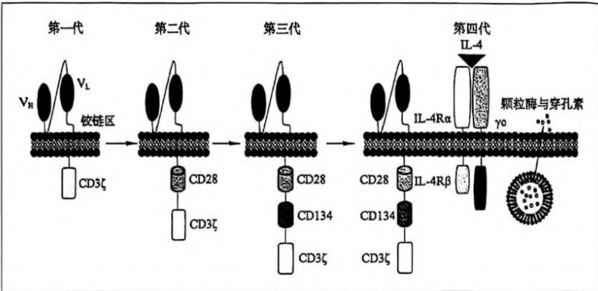

细胞性白血病和B细胞淋巴瘤)的早期临床试验。即使经多次化疗并且已经产生癌症复发或耐药性的病人，CAR-T细胞治疗反应的有效率仍能达到 $60\% \sim 80\%$ 。也有靶向CD22抗原的CAR-T细胞方案，可与CD19靶向T细胞合用于急性淋巴细胞白血病和B细胞恶性肿瘤。CAR-T的主要副作用是引发细胞因子释放综合征，导致患者发高烧或血压急剧下降，可能需要采取额外的处理措施。

过继免疫细胞疗法虽然具有高度的肿瘤抗原特异性,这类疗法也面临一系列挑战,如肿瘤细胞特异性抗原数量极少,输入体内的T细胞存活期短,活化的T细胞很难进入肿瘤组织或免疫抑制性的肿瘤微环境。结合精准医学,筛选生物标志物,筛选对过继细胞治疗有明确靶向作用的肿瘤患者,可能是肿瘤免疫细胞治疗的核心问题。

## 11.7.3 非特异性免疫调节剂治疗

非特异性免疫调节剂治疗主要包括效应细胞刺激剂和免疫负调控抑制剂。效应细胞刺激剂的主要作用是刺激活化免疫效应细胞。 $\alpha$ 干扰素是第一个被证实具有抗肿瘤活性的细胞因子，具有免疫调节、抗增殖、诱导分化、抗血管生成等多种作用。IL-2、卡介苗、咪喹莫特等都具有激活免疫应答的作用。免疫负调控抑制剂主要作用是抑制免疫负调控细胞或分子，抑制免疫检查点，打破免疫耐受，增强 T 细胞活性，提高免疫应答。免疫检查点是指免疫系统中存在的一些抑制性信号通路。

正常情况下,免疫检查点的调节功能可使机体免受自身免疫的攻击和炎症反应的损害。细胞癌变后,肿瘤细胞能抑制免疫检查点的功能,下调人体免疫系统反应能力,从而逃脱机体的免疫监视与杀伤,保证肿瘤细胞生长。主要抑制因子有:PD-1及PD-1的配体(programmed death ligand, PD-L)、细胞溶解性T淋巴细胞相关抗原4(CTLA-4)、B/T淋巴细胞衰减子(B and T lymphocyte attenuator, BTLA)、淋巴细胞活化基因3(lymphocyte-activation gene 3, LAG-3)和T细胞膜蛋白3(T-cell membrane protein 3, TIM-3)、腺苷A2a受体(A2aR)等。

PD-1 是免疫球蛋白超家族细胞表面受体, 主要在激活的 T 细胞和 B 细胞中表达。

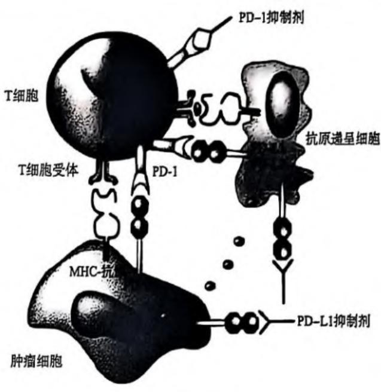  
图11-43 PD-1和PD-LI抑制剂作用示意图

通过促进淋巴结中抗原特异性 T 细胞凋亡和抑制 T 细胞炎症活性的双重机制来下调免疫系统和促进自身耐受。过度的 T/B 细胞激活会引起自身免疫病，所以 PD-1 抑制免疫系统是一种自稳机制，可以预防自身免疫性疾病。但是，肿瘤微环境会诱导浸润的 T 细胞高表达 PD-1 分子，同时肿瘤细胞会高表达 PD-1 的配体 PD-L1 和 PD-L2，导致肿瘤微环境中 PD-1 通路持续激活，抑制 T 细胞的增殖和活化，使 T 细胞处于失活状态，无法杀伤肿瘤细胞，最终导致免疫逃逸。PD-1 和 PD-L1 的抑制剂均可以阻断二者的结合，部分恢复 T 细胞功能，促进 T 细胞生长和增殖，增强 T 细胞对肿瘤细胞的识别，调动人体自身的免疫功能实现抗肿瘤功能 $^{[图 11-43]}$ 。

## 思考题

1. 癌症为何对人类具有重大危害？癌症的防治为何如此困难？

2. 如果你是一家生物技术公司的 CEO 或者负责技术的高层人员,有人向你推荐一种治疗癌症的特效药,寻求与你们公司合作。你将在哪些方面对这种药物进行评价?

3. 能否对艾滋病患者进行定时输入通过基因工程生产的特定 T4 淋巴细胞而延长其生命,主要存在哪些技术上的障碍?

4. 什么是基因领域和基因领域效应？

5. 为什么 HIV 变异这么快？HIV 的变异有无规律，主要在哪些方面发生变异？

6. 不同人感染 HIV 和 HBV 在人体内潜伏的时间存在很大差异,有哪些原因?

7. 为何 HIV 在猩猩与人类这两种生物中有不同的危害？人类是否可参考猩猩抵御 HIV 的方式？

8. 试分析 CAR-T 细胞疗法治疗癌症的优缺点。

9. 禽流感病毒感染人类的机制是什么？如何控制人禽流感的大范围传播，有效的预防措施有哪些？

10. 比较 SARS-CoV 引起的非典和人禽流感,哪种病在流行上易于控制,为什么?

11. 病毒致癌基因很多是宿主本身的原癌基因, 这种选择对于病毒本身有何意义?

12. 简述病毒载体和非病毒载体的优缺点。

13. 假如你得到一个通过改造并适合作为基因治疗载体的病毒,你将如何分析这种可行性,主要在哪些方面做改造? 你将如何测试改造后的病毒载体的效率和安全性?

14. 简述你对于"长期新冠"的认识及其对你或你身边人生活的影响。

15. CAR-T 技术一直在不断地更新迭代,假如你是相关科研人员,你将对下一代 CAR-T 进行哪些改造和更新?

## 参考文献

1. Yang R Y, Hung M C. The role of T-cell immunoglobulin mucin-3 and its ligand galectin-9 in antitumor immunity and cancer immunotherapy [J]. Science China Life Sciences, 2017, 60: 1058-1064.

2. Steichen J M, et al. HIV vaccine design to target germline precursors of glycan-dependent broadly neutralizing antibodies [J]. Immunity, 2016, 45: 483-496.

3. Sok D, et al. Priming HIV-1 broadly neutralizing antibody precursors in human Ig loci transgenic mice [J]. Science, 2016, 353: 1557–1560.

4. Descours B, et al. CD32a is a marker of a CD4 T-cell HIV reservoir harbouring replication-competent proviruses [J]. Nature, 2017, 543: 564–567.

5. Faust T B, et al. Making sense of multifunctional proteins: human immunodeficiency virus type 1 accessory and regulatory proteins and connections to transcription [J]. Annual Review of Virology, 2017, 4: 241–260.

6. Ramos C A, et al. CAR-T cell therapy for lymphoma [J]. Annual Review of Medicine, 2016, 67: 165-183.

7. Xiong X, et al. CRISPR/Cas9 for human genome engineering and disease research [J]. Annual Review of Genomics and Human Genetics, 2016, 17: 131-154.

8. Douglas H. Hallmarks of cancer: new dimensions [J]. Cancer Discovery, 2022, 12(1):31-46.

9. Dhanasekaran R, et al. The MYC oncogene – the grand orchestrator of cancer growth and immune evasion [J]. Nature Reviews Clinical Oncology, 2022, 19(1): 23–36.

10. Luo Y, et al. The potential role of N7-methylguanosine $(\mathfrak{m}^7\mathbb{G})$ in cancer [J]. Journal of Hematology & Oncology, 2022, 32(10):819-824.

11. Mangala P V, et al. Cryo-ET of Env on intact HIV virions reveals structural variation and positioning on the Gag lattice [J]. Cell, 2022, 185(4):641–653.

12. Deeks S G, et al. Research priorities for an HIV cure: International AIDS Society Global Scientific Strategy 2021 [J]. Nature Medicine, 2021, 27(12): 2085–2098.

13. Iannacone M, Guidotti L G. Immunobiology and pathogenesis of hepatitis B virus infection []. Nature Reviews Immunology, 2022, 22(1): 19–32.

14. Long J S, et al. Host and viral determinants of influenza A virus species specificity [J]. Nature Reviews Microbiology, 2019, 17(2):67-81.

15. Liu W J, et al. Emerging HxNy influenza A viruses [J]. Cold Spring Harbor Perspectives in Medicine, 2022, 12(2): a038406.

16. Wang D, et al. Genetic tuning of the novel avian influenza A (H7N9) virus during interspecies transmission, China, 2013 [J]. European Communicable Disease Bulletin, 2014, 19(25): 20836.

17. Sun C, et al. Molecular characteristics, immune evasion, and impact of SARS-CoV-2 variants [J]. Signal Transduction and Targeted Therapy, 2022, 7(1): 202.

18. Laue M, et al. Morphometry of SARS-CoV and SARS-CoV-2 particles in ultrathin plastic sections of infected Vero cell cultures [J]. Scientific Reports, 2021, 11: 3515

19. Ma Z, et al. Does Cross-neutralization of SARS-CoV-2only relate to high pathogenic Coronaviruses [J]. Trends in Immunology, 2020, 41(10): 851–853.

20. Minkoff J M, TenOever B. Innate immune evasion strategies of SARS-CoV-2 [J]. Nature Reviews Microbiology, 2023, 21: 178-194.

21. Davis H E, et al. Long COVID: major findings, mechanisms and recommendations [J]. Nature Reviews Microbiology, 2023, 21(3): 133–146.

22. Carabelli A M, et al. SARS-CoV-2 variant biology: immune escape, transmission and fitness [J]. Nature Reviews Microbiology, 2023, 21(3): 162–177.

23. Cring M R, Sheffield V C. Gene therapy and gene correction: targets, progress, and challenges for treating human diseases [J]. Gene Therapy, 2020, 29: 3–12.

24. Zu H, Gao D. Non-viral vectors in gene therapy: recent development, challenges, and prospects [J]. The AAPS Journal, 2021, 23(4): 78.

25. Kraehenbuehl L, et al. Enhancing immunotherapy in cancer by targeting emerging immunomodulatory pathways [J]. Nature Reviews Clinical Oncology, 2021, 19:37-50.

26. Waldman A D, et al. A guide to cancer immunotherapy: from T cell basic science to clinical practice [J]. Nature Reviews Immunology, 2020, 20: 651-668.

数字课程学习

教学课件

目在线自测

思考题解析

本书编写过程中得到北京大学蛋白质与植物基因研究国家重点实验室、生命科学学院生物化学及分子生物学系陈章良、顾孝诚、罗静初、朱圣庚、张庭芳、潘乃樾等许多老师的帮助和关心，在此表示衷心的感谢。书中的部分插图参考了 Genes、Molecular Biology of the Cell、Molecular Cell Biology 和 Plant Virology，在此向原书作者 B. Lewin、H. Lodish、D. Baltimore、A. Berk、S. L. Zipursky、P. Matsudaira、J. Darnell、B. Alberts、D. Bray、J. Lewis、M. Raff、K. Roberts、J. Watson、R. E. F. Matthews 表示感谢。北京大学王莉、苏彦辉、任晓菲、敬群、李小华、梁西卉、唐家福、周彩芬、郑美兰、魏春红老师，武汉大学许漪、郭理想等老师参与资料搜集、打印和图表处理等工作，在此一并致谢。感谢黄盖、温兴鹏、王坤、吴志国、李扬、张丽、管永卓、袁雪艳、赫建峰、胡晓、李鑫、陈欣、李弯弯、刘思伟等高年级研究生参与导师指定相关章节修订。感谢陕西师范大学俞嘉宁、田英芳、叶海燕、何鹏、李佳、董小明等老师为本书建设配套数字课程资源。

愿我们的拙作能为广大青年学子的成长贡献绵薄之力，敬请全国同行批评指正。

编者

2024年6月于珞珈山

AP 位点(AP site): 所有细胞中都带有不同类型、能识别受损核酸位点的糖苷水解酶, 它能特异性切除受损核苷酸上的 N-β 糖苷键, 在 DNA 链上形成去嘌呤或去嘧啶位点, 统称为 AP 位点。

BS-seq(Bisulfite Conversion followed by Sequencing, 亚硫酸氢盐转化后测序): 分析基因组 DNA 甲基化状态的另一种方法, 用亚硫酸氢盐处理 DNA 分子后进行测序分析。

CAR-T 细胞治疗: 即嵌合抗原受体 T 细胞免疫疗法, 是一种通过基因修饰获得携带识别肿瘤抗原特异性受体 T 细胞的个性化治疗方法。嵌合抗原受体 (CAR) 是 CAR-T 的核心部件, 经 CAR 识别肿瘤抗原不受 MHC 限制, 同时 CAR 可以通过增加共刺激分子信号从而增强 T 细胞抗肿瘤的杀伤性。经过 CAR 改造的 T 细胞相较于天然 T 细胞表面受体 TCR 能够识别更广泛的目标。完整的 CAR 分子结构包括胞外抗原结合区 (通常来自单链抗体可变区基因片段, scFv)、铰链区、跨膜区和胞内受体信号传导区 (包括 CD3-ζ 链或 Fc ε R I γ、协同刺激因子) 4 个区域。

cDNA(complementary DNA): 在体外以 mRNA 为模板, 利用逆转录酶和 DNA 聚合酶合成的一段双链 DNA。

ChIP-seq (Chromatin Immunoprecipitation followed by Sequencing, 染色质免疫共沉淀后测序): 将样本与特异抗体免疫共沉淀后进行测序分析, 主要用于分析转录因子、组蛋白等结合的 DNA 序列。

CpG 岛: 真核生物中, 成串出现在 DNA 上的 CpG 二核苷酸。5-甲基胞嘧啶主要出现在 CpG 序列、CpXpG、CCA/TGG 和 GATC 中, 在高等生物 CpG 二核苷酸序列中的 C 通常是甲基化的, 极易自发脱氨, 生成胸腺嘧啶, 所以 CpG 二核苷酸序列出现的频率远远低于按核苷酸组成计算出的频率。

DNA 解链酶 (DNA helicase): 是一种依赖于 ATP 的酶, 通过水解 ATP 获得能量催化 DNA 双螺旋解链。

DNA 拓扑异构酶 (DNA topoisomerase): 是催化 DNA 拓扑学异构体相互转变的酶的总称。这类酶催化 DNA 链断开和结合的偶联反应, 可以将正超螺旋或负超螺旋引入双链 DNA。

Dane 颗粒: HBV 完整粒子的直径为 42nm, 称为 Dane 颗粒, 由脂质外膜和核壳组成, 有很强的感染性。

DNA: 是英文 deoxyribonucleic acid 的缩写, 中文翻译为脱氧核糖核酸, 是世界上所有已知高等真核生物和绝大部分低等生物的遗传物质。

DNase-seq (DNaseI Hypersensitivity Site Footprinting coupled with Sequencing, DNaseI 超敏感位点足迹法偶联测序): DNase-seq 被用于鉴定基因组上没有核小体结构的区域, 因为这些区域易被 DNaseI 降解。

DNA 重组技术(recombinant DNA technology): 又称基因工程(genetic engineering), 指不同的 DNA 片段(如某个基因或基因的一部分)按照预先的设计定向连接起来, 在特定的受体细胞中与载体同时复制并得到表达, 产生影响受体细胞的新的遗传性状的技术。

DNA 的半保留复制(semiconservative replication): DNA 在复制过程中, 每条链分别作为模板合成新链, 产生互补的两条链。这样新形成的两个 DNA 分子与原来 DNA 分子的碱基顺序完全一样。因此, 每个子代分子的一条链来自亲代 DNA, 另一条链则是新合成的, 这种复制方式被称为 DNA 的半保留复制。

DNA 的半不连续复制(semi-discontinuous replication): DNA 复制过程中前导链的复制是连续的, 而另一条链, 即滞后链的复制是中断的、不连续的。

DNA 的变性(denaturation)和复性(renaturation): 变性是 DNA 双链的氢键断裂, 最后完全变成单链的过程。复性是热变性的 DNA 经缓慢冷却, 从单链恢复成双链的过程。

DNA 聚合酶 (DNA polymerase): 一种催化由脱氧核糖核苷三磷酸合成 DNA 的酶。因为它以 DNA 为模板, 所以又被称为依赖于 DNA 的 DNA 聚合酶。不同种类的 DNA 聚合酶可能参与 DNA 的复制和 / 或修复。

DNA 聚合酶的延伸能力 (DNA polymerase processivity): 是指每次聚合酶与模板 - 引物结合时所能添加的核苷酸的平均数, 它决定了 DNA 的合成速度。

DNA 拓扑异构酶 (DNA topoisomerase): 能在闭环 DNA 分子中改变两条链的环绕次数的酶, 它的作用机制是首先切断 DNA, 让 DNA 绕过断裂点以后再封闭形成双螺旋或超螺旋 DNA。

DNA 条形码 (DNA barcoding): 是利用一个或少数几个短的标准的 DNA 片段对地球上现有物种进行识别和鉴定的一项新技术。Barcode 序列通常标记于接头序列之前。在动物研究中采用的标准片段是线粒体 COI 基因中约 650 bp 长的一段。然而任何一个单片段都不足以区分所有植物物种，目前主要在叶绿体基因组上进行选择。Illumina 公司有多种商业化 barcode 包，TruSeq 系统通常使用 6 碱基组成的 12 种 barcode 序列。

GU-AG 法则 (GU-AG rule): 以 GU 起始和以 AG 为末端的内含子碱基序列, GU 表示供体衔接点的 5' 端, AG 代表接纳体衔接点的 3' 端序列。

GWAS (Genome-Wide Association Study, 全基因组相关分析): 用于检测不同个体的共同遗传变体与某一性状之间的相关性。

HapMap 工程(International Haplotype Map Project, 国际人类基因组单体型图计划): 将已检测到的人类常见 SNP 的共有模式进行分类, 形成单体型, 通过找出这些单体型的代表性标签 SNP、可以有效地增加了实际操作中能够确定出个体单体型的区域。

m $^{7}$ G 帽子结构: 是在真核生物中转录后修饰形成的成熟 mRNA 在 5' 端的一个特殊结构, 即 7- 甲基鸟嘌呤帽子结构, 又称为甲基鸟苷帽子。它是在 RNA 三磷酸酶, 鸟苷酰转移酶, 鸟嘌呤 N-7 甲基转移酶和 2'-0 核糖甲基转移酶的催化下形成的。

MeDIP-seq (Methylated DNA Immunoprecipitation followed by Sequencing, 甲基化 DNA 免疫共沉淀测序): 将带有甲基化 DNA 的序列与特异结合甲基化胞嘧啶的抗体免疫共沉淀后进行测序, 用于对基因组 DNA 甲基化状态的分析。

Pribnow 区 (Pribnow box): 在启动子区有一个由 5 个核苷酸组成的共同序列, 是 RNA 聚合酶的紧密结合点, 称为 Pribnow 区, 这个区的中央大约位于起始点上游 10 bp 处, 所以又称为 -10 区。

P 转座子(P-element): 是一种能够诱发杂种不育(hybrid dysgenesis)的果蝇转座子, 果蝇中几乎所有的杂种不育都是由于 P 转座子插入基因组 W 位点而引起的。所有 P 转座子两翼都有 31 个破基的倒置重复序列, P 转座子转座导致靶 DNA 复制产生 8 破基正向重复序列。

RAPD(Random Amplified Polymorphism, DNA 随机扩增多态性): DNA 序列上的微小变化, 甚至 1 个核苷酸的变化, 也能改变引物结合效率, 影响 PCR 扩增。

RFLP (Restriction Fragment Length Polymorphism, 限制性片段长度多态性): DNA 序列上的微小变化, 甚至 1 个核苷酸的变化, 也能引起限制性内切酶切点的丢失或产生, 导致酶切片段长度的变化。

RNA 的编辑(RNA editing): 是某些 RNA, 特别是 mRNA 的一种加工方式, 它导致了 DNA 所编码的遗传信息的改变,因为经过编辑的 mRNA 序列发生了不同于模板 DNA 的变化。

RNA 的再编码 (RNA recoding): 是指 RNA 编码和读码方式的改变。

RNA 干扰 (RNA interference, RNAi): 是利用双链小 RNA 高效、特异性降解细胞内同源 mRNA, 从而阻断体内靶基因表达, 使细胞出现靶基因缺失的表型。

RNA 前接(RNA splicing): 从 mRNA 前体分子中切除被称为内含子(intron)的非编码区, 并使基因中被称为外显子(exon)的编码区拼接形成成熟 mRNA 的过程就称为 RNA 的剪接。

RNA 聚合酶(RNA polymerase): 使用 DNA 作为模板合成 RNA 的酶, 也称为 DNA 依赖性 RNA 聚合酶。

RNA 选择性剪切: RNA 的选择性剪接是指用不同的剪接方式(选择不同的剪接位点)从一个 mRNA 前体产生不同的 mRNA 剪接异构体的过程。

SARS-CoV: 一种新型冠状病毒, 属于冠状病毒科冠状病毒展。是一种大的、有包膜的正链 RNA 病毒, 其基因组由约 30 000 个核苷酸组成, 直径约 70\~140 nm, 电镜下可见电子密度致密的核心和围绕的包膜, 包膜上有冠状的刺突。对脂溶剂敏感, 戊二醛、甲醛、过氧化氢、表面活性剂、紫外线照射等处理可使病毒失去感染力。可导致传染性非典型肺炎 (SARS, severe/sudden acute respiratory syndrome) ——严重急性呼吸综合征。

SARS-CoV-2: 一种新型冠状病毒, 与 SARS-CoV 同属于 β 属冠状病毒, 二者在形态和结构上无显著差别。其引起的新型冠状病毒肺炎 (COVID-19, coronavirus disease 2019) 曾在全球范围内大流行, 对于全世界人民的生命安全和社会稳定造成了极大的威胁。

SD 序列 (Shine-Dalgarno sequence): 存在于原核生物起始密码子 AUG 上游 7\~12 个核苷酸处的一种 4\~7 个核苷酸的保守片段, 它与 16S-rRNA 3' 端反向互补, 所以可将 mRNA 的 AUG 起始密码子置于核糖体的适当位置以便起始翻译作用。根据首次识别其功能意义的科学家命名。

SNP (Single Nucleotide Polymorphism): 表示在基因组某个位点上一个核苷酸的变化。

TATA 区 (TATA box): 在真核生物基因中位于转录起始点上游 -25\~-30 bp 处的富含 AT 的保守区, 是 RNA 聚合酶与启动子的结合位点, 也称为 Hogness 区 (Hogness box), 类似于原核基因中的 Pribnow 区。

T-DNA 插入失活技术: 利用根瘤农杆菌 T-DNA 介导转化, 将一段带有目的基因的 DNA 序列整合到宿主植物基因组 DNA 上。

XRD(X-ray diffraction, X 射线衍射): X 射线受到原子核外电子的散射而发生的衍射现象。由于晶体中规则的原子排列会产生规则的衍射图像, 可据此计算分子中各种原子间的距离和空间排列, 是当前分析大分子物质的空间结构的有效方法之一。

$\rho$ 因子( $\rho$ factor):是一个分子量为 $2.0\times10^{4}$ 的六聚体蛋白,它能水解各种核苷三磷酸,是一种NTP酶,它通过催化NTP的水解促使新生RNA链从三元转录复合物中解离出来,从而终止转录。

σ 因子 (sigma factor): 是原核生物 RNA 聚合酶全酶的一个亚基, 是聚合酶的别构效应物, 帮助聚合酶专一性识别并结合模板链上的启动子, 起始基因转录。

## A

癌(cancer): 是一种无限制向外周扩散、浸润现象。癌症病人的主要特征是发病组织或器官的细胞生长分裂失控，并由原发部位向其他部位播散。如最终无法控制这种细胞播散，将侵犯要害器官并引起衰竭，最后导致有机体死亡。

安慰性诱导物 (gratuitous inducer): 指的是与转录调控中实际诱导物相似的一类高效诱导物, 能诱导酶的合成, 但又不被所诱导的酶分解。

氨酰 tRNA 合成酶(aminoacyl tRNA synthetase): 是一类催化氨基酸与 tRNA 相结合的特异性酶。

## B

靶标鸟枪法(Directed Shotgun): 用稀有限制性核酸内切酶先将待测基因组降解为几十万个碱基对的片段, 再分别进行测序, 或者根据染色体上已知基因或遗传标签的位置来确定部分 DNA 片段的排列顺序, 逐步确定各片段在染色体上的相对位置。

摆动假说(wobble hypothesis): Crick 为解释反密码子中某些稀有成分(如 I)的配对以及许多氨基酸有 2 个以上密码子的问题而提出的假说。

编码链(coding strand): 指 DNA 双链中与 mRNA 序列(除 T/U 替换外)和方向相同的那条 DNA 链, 又称有意义链(sense strand)。

病毒癌基因(v-onc):一些病毒能引发癌症,原因是病毒基因片段进入被感染者基因组中,这种整合最终导致被感染者自身基因行为发生改变而出现细胞癌变,因此,将这种可以引发癌症的病毒基因片段称为"病毒癌基因"。

病毒载体:对病毒基因组进行改造后获得的适合用于基因治疗的载体，主要是删除病毒的致病基因使其对机体没有致病力，该载体应能携带外源基因、装配成病毒颗粒并介导外源基因的转移和表达。

## C

操纵子(operon):是指原核生物中包括结构基因及其上群的启动基因、操纵基因以及其他转录翻译调控元件组成的DNA片段,是转录的功能单位。

操纵基因(operator gene): 指能被调控蛋白特异性结合的一段 DNA 序列, 常与启动子邻近或与启动子序列重叠, 位于启动子和结构基因之间, 当调控蛋白结合在操纵子序列上, 会影响其下游基因转录的强弱。

插入序列(insertional sequence, IS): 是最简单的转座子，是细菌的一小段可转座元件，它不含有任何宿主基因而常被称为插入序列，它们是细菌染色体或质粒 DNA 的正常组成部分。

查尔斯·达尔文(Charles Darwin):伟大的英国生物学家,其传世巨作《物种起源》奠定了进化论的基石,极大地推动了人类进步。他关于"物竞天择,适者生存"的革命性论断,否定了在那时有绝对统治地位的上帝创造万物的旧思想,推翻了物种不变的神话,使生物学真正迈入实证自然科学的行列。

超螺旋(superhelix, supercoil): 双螺旋 DNA 进一步扭曲盘绕所形成的特定空间结构, 是 DNA 高级结构的主要形式, 可分为正超螺旋与负超螺旋两大类。按 DNA 双螺旋的相反方向缠绕而成的超螺旋称为负超螺旋, 所有天然的超螺旋 DNA 均为负超螺旋。反之则称为正超螺旋。

长末端重复序列(LTR): 是逆转录病毒基因组两端的长末端重复(long terminal repeats), 不编码蛋白质, 但含有启动子、增强子等调控成分, 病毒基因组的 LTR 整合到细胞癌基因邻近处, 使这些细胞癌基因在 LTR 强启动子和增强子的作用下被激活, 将正常细胞转化为肉瘤细胞。

成对规则基因(pair-rule genes): 这些基因一般以两个体节为单位相互间隔一个副体节表达, 其分布具有周期性, 成对规则基因的功能是把间隙基因确定的区域进一步分化成体节, 它们表达是胚胎出现分节的最早标志之一, 它们的表达模式较为独特, 沿前-后轴形成一系列斑马纹状的条带分布, 正好把胚胎分为预定的体节。

春化作用(vernalization): 低温处理可促使植物开花的现象。

错配修复(mismatch repair): 是对 DNA 错配区的修复。

通过母链甲基化原则找出区分母链与子链从而修正子链上错配的碱基。

错义突变(missense mutation): 由于结构基因中某个核苷酸的变化使一种氨基酸的密码变成另一种氨基酸的密码。

重叠基因 (overlapping gene, nested gene): 具有部分共用核苷酸序列的基因, 即同一段 DNA 携带了两种或两种以上不同蛋白质的编码信息。重叠的序列可以是调控基因, 也可以是结构基因。常见于病毒和噬菌体基因组中。

重组修复（Recombinant repair): 又被称为"复制后修复"，它发生在复制之后。机体细胞对在复制起始时尚未修复的 DNA 损伤部位可以先复制再修复，即先跳过该损伤部位，在新合成链中留下一个对应于损伤序列的缺口，该缺口由 DNA 重组来修复：先从同源 DNA 母链上将相应核苷酸序列片段移至子链缺口处，然后再用新合成的序列补上母链空缺。大肠杆菌的 rec 基因编码主要的重组修复系统。

从头合成型甲基转移酶:催化未甲基化的 CpG 成为 mCpG,它不需要母链指导,但速度很慢,是导致特异基因受甲基化调控的主要因子,在基因表达的表观遗传学研究中有十分重要的地位。

## D

代谢物阻遏效应(catabolite repression):有葡萄糖存在时，不管诱导物存在与否，操纵子都设有转录活性，结构基因都不表达，只有葡萄糖耗尽时，诱导物才能诱导基因的表达。

单核苷酸变体(Single Nucleotide Variant, SNV):包括单核苷酸插入、缺失、替换的序列变体。

单核苷酸多态性(Single Nucleotide Polymorphism, SNP):指分散于基因组中的单个碱基的差异，包括单个碱基的缺失和插入，但更常见的是单个核苷酸的替换。

单链 DNA 结合蛋白(single-stranded DNA binding protein, SSB):是一种与单链 DNA 结合紧密的蛋白质，它的结合可以防止复制叉处的单链 DNA 本身重新折叠回双链区。

单顺反子 mRNA(monocistronic mRNA):把只编码一个蛋白质的 mRNA 称为单顺反子 mRNA。

蛋白酶体(proteasome):胞质溶液中的大型蛋白质复合物，负责降解胞质溶液中不需要的或受到损伤的蛋白质，需要被降解的蛋白质会先被泛素化修饰。

蛋白质翻译后修饰(fost-translational modification, PTM):是指在蛋白质合成后，对其氨基酸残基进行的化学修饰过程。这种修饰可以通过添加或移除特定的基团来调节蛋白质的活性、定位、折叠，以及蛋白质与其他生物大分子间的相互作用。

蛋白质组(proteome)与蛋白质组学(proteomics):蛋白质组是指一个基因组所表达的全部蛋白质,而蛋白质组学则是指在蛋白质组水平上研究蛋白质的特征,包括蛋白质的表达水平、翻译与修饰、蛋白与蛋白相互作用等,并由此获得关于疾病发生、发展及细胞代谢等过程的整体认识。

多聚腺苷酸化(polyadenylation): 是在 mRNA 3'末端加上多聚腺苷酸[poly(A)]尾的反应, 多聚腺苷酸尾保护 mRNA 免受核酸外切酶攻击, 并且对转录终结、将 mRNA 从细胞核输出及进行翻译都十分重要。

顾换(tranversion): 嘧啶到嘌呤和嘌呤到嘧啶的替换。

点突变(pointmutation): 是一个核苷酸或少量核苷酸的插入或缺失。

实时定量 PCR(real time quantitative PCR): 是在 PCR 扩增过程中, 通过荧光信号对 PCR 进程进行实时检测, 监测整个 PCR 过程中扩增 DNA 的累积速率。依据指数时期模板的扩增循环数和该模板的起始拷贝数的线性关系, 可对特定 DNA 序列进行定量分析。

多核糖体图谱测序 (Polysome profiling sequencing): 将细胞裂解液沉降在蔗糖梯度中, 从而分离结合有不同数量核糖体的 mRNA 分子, 找到处于高效翻译状态的 mRNA, 其中含有 3 个以上核糖体的 mRNA 通常被称为多核糖体高度富集的 RNA。分离得到的多核糖体 RNA 添加接头后测序并进行后续的翻译组研究。

多顺反子信使 RNA (polycistronic messenger RNA): 一种能作为两种或多种多肽链翻译模板的信使 RNA, 由 DNA 链上的邻近顺反子所界定。

## E

二组分系统(two-component system): 由位于细胞质膜上的传感蛋白(该蛋白常常具有激酶活性)以及位于细胞质中的应答调节蛋白组成。传感激酶常在受到膜外环境信号刺激时被磷酸化, 并将其磷酸基团转移到应答调节蛋白上, 使该磷酸化的应答调节蛋白成为阻遏或诱导蛋白, 通过对操纵子的阻遏或激活作用调控下游基因表达。

## F

翻译(translation): 指将 mRNA 链上的核苷酸从一个特定的起始位点开始, 按每 3 个核苷酸代表一个氨基酸的原则，依次合成一条多肽链的过程。

翻译后运转机制(post-translational translocation);蛋白质从核糖体上释放后才发生运转。

翻译运转同步机制(co-translational translocation): 某个蛋白质的合成和运转是同时发生的。

反式作用因子(transacting factor): 是指能够结合在顺式作用元件上调控基因表达的蛋白质或者 RNAs。

反义 RNA: 是指与 mRNA 互补的 RNA 分子, 也包括与其他 RNA 互补的 RNA 分子。由于核糖体不能翻译双链的 RNA, 所以反义 RNA 与 mRNA 特异性的互补结合, 即抑制了该 mRNA 的翻译。通过反义 RNA 控制 mRNA 的翻译是原核生物基因表达调控的一种方式。

泛素 (ubiquitin): 含有高度保守的 76 个氨基酸的序列, 它以羧基基团连接到目标蛋白质的赖氨酸残基的 ε 位氨基上, 其主要作用是起始蛋白质的降解。

泛素化修饰(ubiquitination): 是一种常见的蛋白质翻译后修饰, 指泛素分子在 E1 泛素激活酶、E2 泛素结合酶、E3 泛素连接酶催化下共价结合到底物蛋白上的过程。这是一种被严格调控的可逆过程, 由去泛素化酶通过水解泛素分子之间或泛素与底物蛋白之间的肽键或异肽键, 来逆转泛素化修饰。

泛素连接酶(E3 ubiquitin ligases): 又称为 E3 泛素连接酶, 是一个能够将泛素分子连接到目的蛋白质的某个赖氨酸上的酶, 是蛋白质泛素化途径中的第三个酶, 决定靶蛋白的特异性识别, 通过调控调节蛋白的泛素化过程参与细胞内的多种生理过程。

非编码 RNA(non-coding RNA): 是指从基因组上转录出来但不翻译成蛋白质的一类 RNA 的总称。依据功能不同, 主要分为两大类。一类是组成型的非编码 RNA, 包括 rRNA 和 tRNA; 另一类是调控型的非编码 RNA, 如 miRNA, siRNA, lncRNA 等。

非核苷酸型逆转录酶抑制剂:该类化合物可与病毒的逆转录酶相结合,通过限制该酶的移动性而影响它的活性,终止病毒 DNA 的合成。

非组蛋白: 是染色体中除了组蛋白之外的结构蛋白。

分子伴侣(molecular chaperone): 它是细胞中一类能够识别并结合到不完全折叠或装配的蛋白质上以帮助这些多肽正确折叠、转运或防止它们聚集的蛋白质, 其本身不参与最终产物的形成。

负控诱导: 是原核生物转录调控的一种方式, 当阻遏蛋白不与效应物(诱导物)结合时, 结构基因不转录。

负控阻遏: 是原核生物转录调控的一种方式, 当阻遏蛋白与效应物(诱导物)结合时, 结构基因不转录。

复制叉(replication fork): 复制时, 双链 DNA 要解开成两股链分别进行 DNA 合成, 所以, 复制起点呈叉子形式,

被称为复制叉。

复制起点(replication origin): 是 DNA 链上独特的具有起始 DNA 复制功能的碱基顺序。大肠杆菌的复制起点包括 OriC 和 OriH, OriC 是首选的复制起点, 而 OriH 是在 RNoneH 缺失突变株中发现的一系列复制起点。

复制子(replicon):单独复制的一个DNA单元被称为一个复制子,它是一个可移动的单位。一个复制子在任何一个细胞周期只复制一次。

## G

冈崎片段(Okazaki Fragment): 是在 DNA 半不连续复制中产生的长度为 1000 - 2000 个碱基的短的 DNA 片段, 能被连接形成一条完整的 DNA 链。

高速泳动族蛋白(high mobility group protein, HMG 蛋白): 是一类能用低盐溶液抽提、能溶于 2% 的三氯乙酸、分子量在 $3.0 \times 10^{6}$ 以下的非组蛋白。因其分子量小、在凝胶电泳中迁移速度快而得名。分为 HMG1 和 HMG2 两大类。这类蛋白的特点是能与 DNA 结合，也能与 H1 作用，但与 DNA 的结合并不牢固，可能与 DNA 的超螺旋结构有关，在 DNA 复制和重组中起重要作用。

管家基因(housekeeping gene): 在个体的所有细胞中持续表达的基因。

光周期现象(photoperiodism): 光周期指一日之内昼夜长度的相对变化, 也即日长, 该现象即植物通过感受昼夜长短变化而控制开花的现象。

共线(Synteny): 即相关物种的基因组在染色体水平上出现的同源现象。

## H

核定位序列(nuclear localization sequence, NLS): 蛋白质中的一个常见的结构域, 通常为一短的氨基酸序列, 它能与入核载体相互作用, 将蛋白质运进细胞核内。

核不均一 RNA(hnRNA, heterogeneous nuclear RNA): 即 mRNA 的前体, 经过 5' 加 "帽" 和 3' 酶切加多聚尿苷酸, 再经过 RNA 的剪接, 编码蛋白质的外显子部分就连接成为一个连续的可译框, 作为蛋白质合成的模板。

核苷酸型逆转录酶抑制剂:其结构与脱氧核苷酸类似,多为双脱氧核苷衍生物,可与细胞内自由核苷竞争性地结合逆转录酶,终止逆转录反应,使病毒 DNA 的合成受阻。

核酶(rihozyme): 是一类具有催化活性的 RNA 分子, 通过催化靶位点 RNA 链中磷酸二酯键的断裂、特异性地剪切底物 RNA 分子, 从而阻断基因的表达。

枯糖开关(Riboswitch): 基因 mRNA 非编码区(通常是 5'UTR 区域) 上的一段具有复杂结构的 RNA 序列, 能够感受细胞内诸如代谢物浓度、离子浓度、温度等的变化而改变自身的二级结构和调控功能, 从而调节 mRNA 的转录, 改变基因的表达状态。

核小体(nucleosome): 是染色质的基本结构单位, 由大约200个羰基对的 DNA 和组蛋白八聚体所组成。

核心启动子(corn promoter): 是指保证 RNA 聚合酶 II 转录正常起始所必需的、最少的 DNA 序列, 包括转录起始位点及转录起始位点上游 -25\~-30 bp 处的 TATA 盒。后随链, 滞后链(lugging strand): 在 DNA 复制过程中, 与复制叉运动方向相反的方向不连续延伸的 DNA 链被称为后随链或滞后链。

## J

基因（gone）产生一条多肽链或功能 RNA 所需的全部核苷酸序列。

基因组编辑(genome editing)技术:利用序列特异核酸酶在基因组特异位点产生DNA双链断裂,从而激活生物体自身的同源重组或非同源末端连接修复机制,以达到特异性改造基因组之目的。

基因表达(gene expression): 基因经过转录、翻译, 产生具有特异生物学功能的蛋白质分子或 RNA 分子的过程。

基因表达调控(gene regulation): 所有生物的遗传信息, 都是以基因的形式储存在细胞内的 DNA(或 RNA) 分子中, 随着个体的发育, DNA 分子能有序地将其所承载的遗传信息, 通过密码子-反密码子系统, 转变成蛋白质分子, 执行各种生理生化功能。这个从 DNA 到蛋白质的过程被称为基因表达, 对这个过程的调节就称为基因表达的调控。

基因表达的表观遗传调控:指在真核生物中,发生在转录之前的,染色质水平上的结构调整,主要包括DNA修饰(DNA甲基化)和组蛋白修饰(组蛋白乙酰化、甲基化)两个方面。

基因表达的空间特异性(spatial specificity):又称细胞或组织特异性(cell or tissue specificity),是指在个体生长过程中,某种基因产物按不同组织空间顺序出现。

基因表达的时间特异性(temporal specificity): 即按功能需要, 某一特定基因的表达严格按特定的时间顺序发生。基因沉默(RNA 沉默,RNA silencing): 是指真核生物中由双链 RNA 诱导的识别和清除细胞中非正常 RNA 的一种机制。通常情况下基因沉默可以分为转录水平基因沉默(transcriptional gene silencing)和转录后基因沉默(post-transcriptional gene silencing)。

基因家族(gene family): 真核细胞中许多相关的基因常按功能成套组合。

基因克隆(gene cloning)与基因工程(genotic engineering): 在分子生物学上,人们把将外源DNA插入具有复制能力的载体DNA中,转入宿主细胞使之得以永久保存和复制这种过程称为基因克隆。基因工程或重组DNA技术则侧重于验证上述过程所获得遗传物质新组合在宿主细胞内的表达与功能鉴定。

基因领域效应: 当两个基因相距太近时, 往往不易形成有利于高效转录的空间结构。因此, 基因与基因之间的间隔距离被定义为"基因领域"。同一 DNA 链上两个具有相同转录方向的基因间隔小于一定长度时, 影响有效转录所必需的染色质结构的形成, 从而使这两个基因中的一个或两个均不能转录或转录活性显著降低, 既产生了所谓的"基因领域效应"。

基因密度(Gene density): 生物体内所有的染色体组成基因组, 每 Mb 基因组 DNA 上所含有的平均基因数目称为基因密度。

基因敲除(gene knock-out): 针对一个序列已知但功能未知的基因, 从 DNA 水平上设计实验, 彻底破坏该基因的功能或消除其表达机制, 从而推测该基因的生物学功能。

基因治疗:基因治疗是将具有治疗价值的基因,即"治疗基因"装配于带有在人体细胞中表达所必备元件的载体中,导入人体细胞,通过靶基因的表达来治疗遗传疾病。基因治疗是从根本上治疗遗传病的唯一途径。目前科学界关注的主要问题是基因治疗的有效性、安全性和质量可控性。

基因组(genome):一个细胞或病毒所携带的全部遗传信息或整套基因,包括每一条染色体和所有亚细胞器的DNA序列信息。

基因组学(Genomics): 着眼于研究并解析生物体整个基因组的所有遗传信息的学科。

基因组的大小 (Genome Size): 是指一种生物单倍染色体中的 DNA 的长度。

基因突变(Mutation): 是指在基因内的遗传物质发生可遗传的结构和数量的变化。

基因文库(cDNA 或 genomic DNA libraries): 是某一生物体全部或部分基因的集合。将某个生物的基因组 DNA 或 cDNA 片段与适当载体在体外重组后, 转化宿主细胞, 所得的菌落或噬菌体的集合即为该生物的基因文库。

焦磷酸化编(pyrophosphorolytic editing):RNA聚合酶利用其活性位点,在一个简单的逆向反应中通过重新加入焦磷酸,催化错误插入的核糖核苷酸的去除,然后将另酵母人工染色体(Yeast Artificial Chromosome, YAC): 含有三种必需成分: 着丝粒、端粒和复制起点, 是迄今容量最大的克隆载体. 插入片段平均长度为 200 - 1000 千碱基对, 最大的可以达到 2 百万碱基对。

校正 tRNA (suppressor tRNA): 通过其反密码子上的某种突变以校正基因突变的一类 tRNA, 可以校正错义、无义和移码突变。

剪接体(spliceosome): 是真核生物 mRNA 前体在剪接过程中组装形成的多组分复合物, 是一种具有催化剪接反映的核糖核蛋白复合物, 它包含约 150 种蛋白质和 5 种 RNA。

间隙基因(gap genes): 这类基因包括 hunchback(hb)、krüppel 和 Knirps(kni) 等, 这些基因的表达很有特点, 最初在整个胚胎中都有很弱的表达, 以后随着卵裂的进行而逐渐变转成一些不连续的表达区带。

结构变体(Structural Variant, SV): 染色体结构的变化、包括片段插入、删除、倒转、易位、复制及拷贝数变化。

聚合酶链式反应(polymerase chain reaction, PCR): 是指通过模拟体内 DNA 复制方式在体外选择性地将 DNA 某个特定区域扩增出来的技术。

## K

开花素(florigen): 当植物叶片感受到适当的日照长度, 会形成一种物质, 该物质可以进行长距离运输, 传导到顶芽分生组织后引起开花, 研究发现为 FT 蛋白。

抗终止因子(anti-termination factor): 能够在特定位点减弱或阻止转录终止的一类蛋白质。它们能与 RNA 聚合酶结合, 帮助 RNA 聚合酶越过具有茎环结构的终止子继续转录目标 RNA。

可译框, 可读框(open reading frame, ORF): 是指一组连续的含有三联密码子的能够翻译成为多肽链的 DNA 序列。它由起始密码子开始, 到终止密码子结束。

## L

厘摩（centiMorgan, cM): 表示遗传连锁分析中重组频率的单位, cM 值越大, 表明两者之间距离越远。

临界日长(Critical daylengths): 是区别长日照或短日照的日照长度的标准, 指昼夜周期中能诱导植物开花所需的最低或最高的极限日照长度。

轮性(whorl): 金鱼草、拟南芥等植物的花都由四种类型的花器官组成, 花器官排列成向心的圆环形。

母源效应基因（maternal efflux genes），是指那些由母源抚育细胞及滤泡细胞（follicle cells）等利用自身的基因和细胞资源提供遗传信息和营养物质，然后输入到卵母细胞中的基因。

孟德尔(GregozMendor):奥地利修道士,旦奥遗传学创始人.他的豌豆杂交试验可能是遗传学历史上最具有传奇色彩并且最引人人胜的研究成果,是遗传学的离基石。

密码的简井(degancuracy);由一种以上密码于编码间一个氨基酸的现象,对应于同一氨基酸的密码子称为同义密码子(synonymous codon)。

密码子(codon): mRNA 上每 3 个核苷酸翻译成多肽链上的一个氨基酸, 这 3 个核苷酸就称为一个密码子(三联体密码)。

免疫共沉淀(CO-Immunoprecipitation, CO-IP): 当细胞在非变性条件下被裂解时, 完整细胞内存在的许多蛋白质 - 蛋白质间的相互作用被保留下来。如果用蛋白质 X 的抗体免疫沉淀 X, 那么在体内与 X 结合的蛋白质 Y 也能被沉淀下来。

模板链(template strand): 指 DNA 双链中能作为转录模板通过碱基互补原则指导 mRNA 前体合成的 DNA 链，又称反义链(antisense strand)。

摩尔根(Thomas Morgan): 美国著名的遗传学家, 研究果蝇的可遗传突变机制, 首次提出"基因学说"。

魔斑核苷酸(magic spot nucleotide):受严紧控制的细菌生长过程中一旦缺乏氨基酸供应,细菌会产生一个应急反应,使蛋白质和RNA的合成速率迅速降下来。魔斑核苷酸指的就是此过程中由大量GTP合成的鸟苷四磷酸(ppGpp)和鸟苷五磷酸(pppGpp),它们的主要作用可能是影响RNA聚合酶与启动子结合的专一性,诱发应急反应,帮助细菌渡过难关。

## N

内含子(intron): 是一个基因中非编码 DNA 片段, 它分开相邻的外显子, 内含子是阻断基因线性表达的序列。

内含子的变位剪接: 在高等真核生物中, 内含子通常是有序或组成性地从 mRNA 前体中被剪接。然而, 在个体发育或细胞分化的某个或某些特定阶段可以有选择性地越过某些外显子或某个剪接点进行 RNA 剪接, 产生出组织或发育阶段特异性 mRNA, 称为内含子的变位剪接。

凝胶电泳(Gel electrophoresis):是一种以琼脂糖或聚丙烯酰胺为介质,在一定电场强度下,按分子量大小的不同,对DNA或蛋白质进行分离检测的技术。

凝胶滞缓实验(DNA mobility shift assay, EMSA): 是一种检测蛋白质和 DNA 序列相互结合的技术, 其基本原理是蛋白质可以与末端标记的核酸探针结合, 电泳时这种复合物比没有蛋白结合的探针在凝胶中泳动速度慢, 表现为相对滞后。该方法可用于检测 DNA 结合蛋白、RNA 结合蛋白, 并可通过加入特异性的抗体来检测特定的蛋白质。

## Q

启动子(promoter): 是一段位于结构基因 5' 端上游区的 DNA 序列, 能活化 RNA 聚合酶, 使之与模板 DNA 准确地相结合并具有转录起始的特异性, 对于基因转录起始是所必需, 是基因表达调控的上游顺式作用元件之一。

起始 tRNA: 是指能特异地识别 mRNA 模板上起始密码子的 tRNA。

前导链(leading strand):在 DNA 复制过程中,与复制叉运动方向相同,以 5'-3' 方向连续合成的链被称为前导链。

切除修复(excision repair): DNA 损伤的一种修复机制, 直接切除受损伤的一条 DNA 片段, 以其互补链为模板新合成 DNA 来取代切除的受损片段。

禽流感病毒 H5N1 型: A 型流感病毒根据其表面血凝素 (H) 和神经氨酸酶 (N) 结构的不同可分为许多亚型: 血凝素 (H) 有 18 个亚型 (H1-H18), 神经氨酸酶 (N) 有 11 个亚型 (N1-N11), 它们之间的不同组合, 使 A 型流感病毒出现许多亚型 (如 H1N1、H2N2、H5N12 等), 理论上可产生 198 种不同的病毒亚型, 各亚型之间无交互免疫力。禽流感病毒 H5N1 即具有第 5 亚型血凝素 (H) 和第 1 亚型神经氨酸酶 (N) 的流感病毒。

禽流行性感冒（Avian influenza, AI): 简称禽流感, 又名真鸡瘟、欧洲鸡瘟、鸡疫等, 是由 A 型流感病毒 (Avian Influenza Virus, AIV) 引起的呼吸系统病变直到全身败血症的一种高度急性传染病。鸡、火鸡、鸭等家禽及野鸟均可被感染。禽流感病毒还是人流感病毒株形成的最大的基因库来源, 也可直接感染人, 对人类的公共卫生造成巨大危害。

全基因组关联分析(Genome-wide association study, 缩写名为 GWAS): 是一种在人类或动植物全基因组中以百万计的单核苷酸多态性(single nucleotide plodymorphism, SNP)为分子遗传标记, 进行全基因组水平上的对照分析或相关性分析,通过比较发现影响复杂性状基因变异的一种新策略。

全基因组鸟枪法测序(Whole genome shotgun sequencing): 随机打断基因组序列克隆扩增后各自测序, 最后进行序列拼接的策略。

## R

染色体构象捕获(Chromosome Conformation Capture): 用于鉴定 DNA 分子内或分子间长程相互作用的技术。

染色质重塑复合物(chromatin remodeling complex): 是以 ATP 水解酶为催化中心的多蛋白亚基复合体, 通过 ATP 水解供能、改变核小体位置和组成, 对染色质结构进行重塑、在基因表达、DNA 复制与修复等过程中发挥着重要作用。

热不对称交错多聚酶链式反应(Thermal Asymmetric Inter-Lseed PCR): 是一种用于扩增 T-DNA 插入位点侧氮序列, 从而获得转基因植物插入位点特异性分子证据的技术。

人类基因组计划(Human Genome Project, HGP): 致力于测定人类单倍体染色体组中约 30 亿对碱基序列, 解析人类基因组中携带的有关人类个体生长发育、生老病死的全部遗传信息。

人免疫缺损病毒(HIV):俗称艾滋病毒(AIDS),是一种能生存于人的血液中并攻击人体免疫系统的病毒,主要攻击人体免疫系统中重要的T4淋巴细胞,大量吞噬、破坏T4淋巴细胞,从而使得整个人体免疫系统遭到破坏,最终因丧失对各种疾病的抵抗能力而死亡。

日常型甲基转移菌:主要在甲基化母链(模板链)指导下使处于半甲基化的 DNA 双链分子上与甲基胞嘧啶相对应的胞嘧啶甲基化。

熔解温度(melting temperature, Tm): 核酸在 260 nm 的吸光度增加到最大值一半时的温度称为 DNA 的熔点, 用 Tm 表示, 它是 DNA 的一个重要的特征常数。

弱化子(attenuator): 是指原核生物操纵子中能显著减弱甚至终止转录作用的一段核苷酸序列, 该区域能形成不同的二级结构, 利用原核生物转录与翻译的偶联机制对转录进行调节。

## S

上游启动子元件(upstream promoter element, UPE): 将TATA区上游的保守序列称为上游启动子元件或称上游激活序列(upstream activating sequence, UAS)。

双向电泳技术(Two-Dimensional Electrophoresis, 2-DE):

是一种依赖蛋白质的等电点和分子大小的性质,通过组合等电聚焦电泳和聚丙烯酰胺凝胶电泳,分离大量混合蛋白质组分的技术。

双向复制(bidirectional replication): DNA 复制时, 以复制起始点为中心, 向两个方向进行的复制。

神经氨酸酶(neuraminidase, NA): 一种糖苷外切酶, 是禽流感病毒表面上的两种主要糖蛋白之一, 可从 $\alpha$ -糖苷键上除去唾液酸残基, 对病毒的释放及病毒在感染细胞周围的扩散能力有很大影响。此外, 神经氨酸酶也是禽流感病毒中的重要抗原, 它的高突变频率也是禽流感病毒较难防治的原因之一。

水解编辑(hydrolytic editing): RNA 聚合酶倒退一个或更多的核苷酸并切开 RNA 产物, 去除含有错误的序列。RNA 聚合酶均可以利用这种方式对转录进行有效的校对。

顺反子(cistron): 功能基因, 意为通过顺式(基因序列)及反式(所编码的蛋白质)试验所确定的一个遗传学单位。顺式作用元件(cis-acting element): 是指启动子(promoters)和基因的调节序列。主要包括启动子(promoter)、增强子(enhancer)、沉默子(silencer)等。

噬菌体(bacteriophage): 是感染细菌的病毒。烈性噬菌体的感染最终导致宿主细胞裂解, 而温和型噬菌体则能将 DNA 整合到宿主细胞染色体上, 从而对宿主造成较为长期的影响。在特定条件下两者可以转换。

## T

肽基－tRNA(peptidy - tRNA): 指在蛋白质生物合成过程中，在肽键合成之后，连接在新生肽链上的 tRNA 分子。

肽基转移酶(peptidyltransferase):蛋白质合成过程中的一种酶,它催化正在延伸的多肽链与下一个氨基酸之间形成肽键。

套索 RNA (lariat RNA): 真核生物前体 mRNA 进行内含子剪接时, 内含子 5' 端和 3' 端相互连接而形成的中间体。体节极化基因 (segment polarity genes): 发育到细胞囊胚期时, 体节极化基因就把不同体节再进一步划分成更小的条纹, 当果蝇体节极化基因发生突变时, 每个体节都会缺失一个特定的区域。

同源异形基因(homeotic gene): 最终决定躯体体节命运, 躯体的部分最终是发育成为无翅的前胸还是有翅的中胸, 是有平衡器的后胸还是腹部的体节, 都是由同源异形基因决定的。

同工 tRNA (cognate tRNA): 指几个代表相同氨基酸、能够被一个特殊的氨酰 - tRNA 合成酶识别的 tRNA。

同义突变 (synonymous mutation)是指碱基的改变不引起氨基胺的改变的突变。

## W

外显子(exon): 是真核生物基因的一部分, 它在剪接(Splicing)后仍会被保存下来, 并可在蛋白质生物合成过程中被表达为蛋白质。

卫星 DNA (satellite DNA): 又称随体 DNA。真核细胞 DNA 的一部分是不被转录的异染色质成分, 其碱基组成与主体 DNA 不同, 因而可用密度梯度沉降平衡技术如氯化铯梯度离心将它与主体 DNA 分离。卫星 DNA 通常是高度串联重复的 DNA。

沃森-克连克: James Dewey Watson 是当代美国最著名的分子生物学家, 他和 Francis Harry Compton Crick (英国分子生物学和生物物理学家) 共同提出了沃森-克连克 DNA 反向平行双螺旋模型, 阐述了 DNA 复制和遗传信息的传递规律。

无义突变(nonsense mutation): 在 DNA 序列中任何导致编码氨基酸的三联密码子转变为终止密码子(UAG、UGA、UAA)的突变, 它使蛋白质合成提前终止, 合成无功能的或无意义的多肽。

物理图(Physical Map):是指以已知核苷酸序列的 DNA 片段(序列标签位点,sequence-tagged site,STS)为"路标",以碱基对(bp,kb,Mb)作为基本测量单位(图距)的基因组图。

## X

细胞转化基因(C-onc): 即被激活的原癌基因, 能够转化 NTH/3T3 成纤维细胞或其他靶细胞成为肿瘤细胞的基因, 也称癌基因(oncogene)。

系统生物学: 是研究一个生物系统中所有组成成分(基因、mRNA、蛋白质等)的变化规律以及在特定遗传或环境条件下相互关系的学科。系统生物学研究通过整合各组分的信息, 以图画或数学方式建立能描述系统结构和行为的模型。

细菌群体感应: 是细菌根据密度变化进行基因表达调控的一种生理行为。细菌能够根据特定信号分子的浓度变化从而监测周围环境中自身或其他细菌的数量变化, 当信号分子达到一定的浓度阈值时则启动菌体中相关基因的表达来适应环境中的变化。

细菌人工染色体(Bacteria Artificial Chromosome, BAC):主要包括 oriS, repE(控制 F 质粒复制)和 parA、parB(控制拷贝数)等成分,其克隆能力在 125-150 千碱基对

左右。

细菌转化(transformation): 是指一种细菌菌株由于捕获了来自另一种供体菌株的 DNA 而导致性状特征发生遗传改变的过程。

小分子干扰核糖核酸( $\alpha$ iRNA, short interfering RNAs): 是长度为 21-25 个核苷酸的双链小分子 RNA, 它是引发转录后基因沉默中序列特异性的 RNA 降解的重要中间媒介。siRNA 具有 5' 端磷酸基和 3' 端羟基, 两条链的 3' 端各有两个碱基突出于末端。在转录后沉默和 RNAi 的过程中, siRNA 作为识别目标基因的引导物。校对 (proofrending): 在复制、转录或翻译过程中校正错误的机制, 包括从正在伸长的核酸或蛋白质链中去除不正确掺入的核苷酸或氨基酸, 并以正确的单元取代。

信号识别蛋白 (signal recognition protein, SRP): 由 6 种紧密结合的信号识别蛋白质与一个长约 300 核苷酸的 7S RNA 分子形成的核糖核蛋白颗粒, 能识别核糖体上新合成多肽链的前导序列并与其结合, 将核糖体、新合成肽链及信号识别颗粒导向内质网, 使肽链的翻译及转运同时进行。

信号肽(signal peptide): 在起始密码子后, 有一段编码疏水性氨基酸序列的 RNA 区域, 该氨基酸序列就被称为信号肽序列, 它负责把蛋白质导引到细胞含不同膜结构的亚细胞器内。

血凝素: 即红血球凝聚素, 是流感病毒表面的一类蛋白质, 病毒依靠它与宿主细胞表面相结合。具有很高的突变率, 使病毒能逃避宿主的免疫系统并具有抗药性。

## Y

阳离子多聚体:是一种表面具有带正电荷的氨基基团的多聚体,氨基基团可与 DNA 的磷酸基团结合发生电性中和,将 DNA 吸附而使其不易被核酸酶降解,并可防止沉淀,从而提高转染效率。

野生型和突变型(wild-type and mutant): 生物学上把所研究的基因位点未发生改变的生物个体称为野生型, 把所研究的基因位点发生遗传突变的生物个体称为突变型。因此, 野生型和突变型是相对的, 甚至可能根据所研究目的基因的不同而发生转换。

移码突变(frameshift mutation): 指一种突变, 其结果可导致核苷酸序列与相对应蛋白质的氨基酸序列之间的正常关系发生改变。移码突变是由删去或插入一个核苷酸的"点突变"构成的, 突变位点之前的密码子不发生改变, 但突变位点以后的所有密码子都发生变化, 编码的氨基酸出现错误。

遗传图(Genetic Map): 遗传图又称为连锁图(Linkage

Map), 是指基因或 DNA 标志在染色体上的相对位置与遗传距离。

遗传距离 (Genetic Distance): 遗传距离是通过遗传连锁分析确定的, 在同源染色体的同一遗传位点上存在的不同等位基因在产生配子的减数分裂过程中可能发生片段互换, 从而导致子代出现两个遗传位点等位基因的"重组", 该重组频率与这两个位点之间的距离呈正相关。于是, 科学上用两个位点之间的交换或重组频率来表示其遗传学距离。

乙肝病毒(HBV):是嗜肝 DNA 病毒科中哺乳动物病毒属的一员。完整的乙型肝炎病毒颗粒直径为 42 nm, 又名 Dane 颗粒、具有双层核壳结构、外壳相当于包膜, 含有乙型肝炎病毒表面抗原、多聚人血清白蛋白受体和 Pre-s 抗原。内部为直径 28 nm 的核心颗粒, 核心颗粒表面含有乙型肝炎病毒核心抗原(HBcAg)和乙型肝炎 e 抗原(HBeAg)、颗粒内部有乙型肝炎病毒的 DNA 和 DNA 多聚酶。采用电子显微镜检查乙型肝炎患者的血清可发现三种颗粒: ①小球形颗粒, 直径 22 nm; ②管形颗粒, 直径 22 nm, 长度在 50\~700 nm 之间; ③大球形颗粒(即 Danc 颗粒), 直径 42 nm。其中前两者是 HBV 在肝细胞中增殖合成过程中的病毒外壳, 而不是完整的 HBV 颗粒。

引发酶(primase): 是依赖于 DNA 的 RNA 聚合酶, 其功能是在 DNA 复制过程中合成 RNA 引物。

引发体(primosome): DNA 复制过程中引发合成每个冈崎片段时所需的多蛋白复合物, 包括预引发蛋白、具有 ATP 酶活性的蛋白质以及引物酶。引发体与 DNA 结合后由引物酶合成 RNA 引物并合成与 RNA 引物相连接的冈崎片段。引发体沿不连续合成的 DNA 链移动, 其移动的方向与 RNA 及 DNA 的合成方向相反。引发体移动需要来自 ATP 水解的能量。

引物(primer): 是指一段较短的单链 RNA 或 DNA, 它能与 DNA 的一条链配对提供游离的 3'-OH 末端以作为 DNA 聚合酶合成脱氧核苷酸链的起始点。

元基因组学(Metagcnomics): 以取自环境的样本里所有的遗传物质或特定的微生物群落为研究对象的学科。

原病毒:逆转录病毒侵入宿主细胞后,首先利用自身携带的逆转录酶合成出与本身RNA基因组互补的DNA,再利用宿主细胞的DNA聚合酶指导合成出另一DNA链,以双链DNA形式整合到宿主细胞基因组中。被整合的逆转录病毒DNA分子就称为原病毒。

原位杂交(in situ hybridization, ISH): 是用标记的核酸探针, 经放射自显影或非放射检测体系, 在组织、细胞及染色体水平上对核酸进行定位和相对定量研究的一种手段。通常分为 RNA 原位杂交和染色体原位杂交两大类。

载体 (vector): 能将外源 DNA 或基因片段携带人宿主细胞内的一个具有自主复制能力的 DNA 分子。

增强子(enhancer): 能强化转录起始的序列, 也称为强化子。它们不是启动子的一部分, 但能增强或促进转录的起始。

指导 RNA(guide RNA): 原生动物及植物线粒体中进行 RNA 编辑所需的 RNA 序列, 是与已正确编辑的 RNA 序列互补的一小段 RNA, 被用来作为向未经编辑的 RNA 中插入碱基的模板。

中心法则(central dogma): 由克连克首次提出的遗传信息传递规律,该法则阐明了 DNA 复制、RNA 转录以及翻译产生蛋白质在生命过程中的核心地位。

转录(transcription): 是指拷贝出一条与 DNA 链序列完全相同(除了 T→U 之外)的 RNA 单链的过程, 是基因表达的核心步骤。

转录因子(transcription factor, TF): 包括转录激活因子(transcriptional activator)和转录阻遏因子(transcriptional repressor)。这类调节蛋白能识别并结合转录起始点的上游序列或远端增强子元件，通过 DNA-蛋白质相互作用而调节转录活性，并决定不同基因的时间、空间特异性表达。

转录单元(transcription unit): 是一段可被 RNA 聚合酶转录成一条连续 mRNA 链的 DNA, 包括转录起始和终止信号。一个简单的转录单位只携带合成一种蛋白的信息, 复合转录单位可携带不止一种蛋白质分子的信息。

转录起始位点(transcription initiation site): 是指与新生 RNA 链第一个核苷酸相对应 DNA 链上的碱基位点, 通常为嘌呤。常把起点前, 即 5' 端的序列称为上游(upstream), 而把其后面即 3' 端的序列称为下游(downstream)。

转录前起始复合物(preinitiation transcription complex, PIC):在真核RNA转录起始过程中,真核生物RNA聚合酶不能直接识别基因的启动子区,需要转录调控因子等辅助蛋白质按特定顺序结合于启动子上,帮助聚合酶特异地结合到启动子上,形成转录前起始复合物,解开DNA双链,指导转录。

转录图(Expression Profiling): 是基因组的 cDNA 片段图, 即表达序列标签图(EST)。通过得到的一段 cDNA 或一个 EST, 可筛选出全长的转录物, 并根据其序列的特转座、移位(transposition): 遗传信息从一个基因座转移至另一个基因座的现象称为基因转座, 是由可移位因子(transposable element)介导的遗传物质重排。

转座子(transportation.Tn):能够在没有序列相关性的情况下独立插入基因组新位点上的一段DNA序列,是存在于染色体DNA上可自主复制和位移的基本单位。参与转座子易位及DNA链整合的酶称为转座酶。

脂质体:脂质体是具有双层膜的封闭式粒子,它们能促进极性大分子穿透细胞膜。根据脂质体包裹 DNA 的方式不同可将脂质体分为阳离子脂质体、阴离子脂质体、pH 敏感脂质体及融合脂质体等。

肿瘤的免疫治疗:肿瘤的免疫治疗是指通过激活机体的免疫系统,增强抗肿瘤免疫效应,从而特异性清除肿瘤微小残留病灶或者明显抑制肿瘤增殖的治疗方法。

肿瘤的被动免疫治疗:被动免疫治疗又称为过继免疫治疗(adoptiveimmunotherapy)是被动性地将具有抗肿瘤活性的免疫制剂或者细胞过继回输肿瘤患者机体进行治疗,以达到治疗肿瘤的目的。

肿瘤的主动免疫治疗:主动免疫治疗主要指接种肿瘤疫苗,利用肿瘤细胞或者肿瘤相关蛋白或多肽等抗原物质免疫机体,激活患者自身的免疫系统,诱导宿主产生针对肿瘤抗原的免疫应答,从而阻止肿瘤生长、转移和复发。

自噬 (autophagy): 即细胞"吃掉自己"的过程, 是一种细胞自我降解和循环利用胞内组分的过程。

自主复制序列 (autonomously replicating sequences, ARS): 酵母 DNA 复制的起点, 长约 150 bp, 包括数个复制起始必需的保守区。不同 ARS 序列的共同特征是有一个被称为 A 区的 11 bp 的保守序列。

组蛋白(histones): 是保守的 DNA 结合蛋白, 是染色体的结构蛋白, 分为 H1、H2A、H2B、H3 及 H4 五种, 与 DNA 共同组成真核生物染色质的基本单位核小体。

组蛋白乙酰基转移酶(Histone acetyltransferase, HAT): 是催化组蛋白乙酰化反应的酶, 主要有两类: 一类与转录有关, 另一类与核小体组装以及染色质的结构有关。HAT 并不是染色质结合蛋白, 但是可以通过与其他蛋白相互作用来影响染色质的结构。

阻遏蛋白(repressor):是指转录调控系统中调节基因表达产物丰度的蛋白质,其作用部位往往是操纵子的操纵区,起着阻止结构基因转录的作用。

-10 区 92

-35 区 92

16S rRNA 146

ADP-核糖基化 165

AlphaFold 15

Altman 11

Avery 12

Avery 8

B-DNA 的构象 37

Baltimore 11

Berg 11

Bishop 11

Blackburn 12

Brener 12

CCAAT 区 101

cDNA 203

cDNA 文库 204

Cech 11

Crick 12

CRISPR/Cas9 系统 14

DNA 的半保留复制 45

DNA 的半不连续复制 48

DNA 的变性 40

DNA 的二级结构 37

DNA 的熔点 40

DNA 的一级结构 36

DNA 的转座 70

DNA 解链酶 54

DNA 聚合酶 49

DNA 聚合酶的延伸能力 50

DNA 模板功能抑制剂 109

DNA 双螺旋模型 36

DNA 损伤的修复 62

Dulbecco 11

Edwards 12

Fire 11

FRET 243

Gateway 克隆技术 216

Gilbert 11

Gilman 11

Griffith 8

GST 及 GAD 融合蛋白沉降技术 242

GU-AG 法则 113

hnRNA 112

hnRNA 99

Holly 11

HOM 复合体 375

Hooke 4

iTRAQ 17

Iwoff 10

Jacob 10

Jerne 11

Kendrew 10

Khorana 11

Kohler 11

Kornberg 10

Kornberg 11

Leeuwenhoek 3

Lewis 11

McClintock 11

Mello 11

Meselson 12

Milstein 11

Monod 10

mRNA 78

Mullis ·11 $N_6$ -甲基腺苷 202

Nirenberg 11

Nusslein-Volhard 11

PacBio 单分子实时第三代

测序法 213

PCR 192

PCR 筛选法 207

Perutz 10

Prusiner 11

RNA 的编辑 119

RNA 的功能 79

RNA 的剪接 110

RNA 的结构特点 77

RNA 的可变剪接 115

RNA 的再编码 121

RNA 聚合酶 80

RNA 聚合酶抑制剂 109

Roberts 11

Rodbell 11

rRNA 146

rRNA 前体的转录后加工 111

Sanger 10

Schleiden 4

Schwann 4

SD 序列 86

Sharp 11

snRNP 114

SRP 169

Stahl 12

Sumner 10

SUMO 化 163

TATA 区 101

Temin 11 $T_m$ 40

tRNA 136

tRNA 的 L-形三级结构 137

tRNA 的三叶草二级结构 136

tRNA 结合位点 147

tRNA 前体的转录后加工 110

Varmus 11

Wieschaus 11

X 射线衍射 15

Yanofsky 12

Z-DNA 39

Ⅰ类自剪接内含子 116

Ⅱ类自剪接内含子 117

α-鹅膏蕈碱 98

ρ因子 97

σ因子 90,297

## A

阿拉伯糖操纵子 279  
癌基因 418  
氨基酸的活化 148  
氨酰 tRNA 合成酶 141

## B

巴豆酰化 165  
摆动假说 135  
斑点印迹法 210  
伴侣素 167  
被动免疫治疗 475  
编码链 76  
病毒癌基因 418  
不依赖于 $\rho$ 因子的终止 96

## C

操纵子 10  
超螺旋结构 42  
沉降系数 143  
成对控制基因 373  
出核信号序列 175  
错配修复 62

## D

达尔文 2  
单核苷酸多态性 217  
单克隆抗体库 253  
单链DNA结合蛋白 54  
单顺反子mRNA 85  
单细胞测序 214  
蛋白质的降解 177  
蛋白质甲基化 250  
蛋白质磷酸化 248  
蛋白质免疫印迹 250  
蛋白质运转机制 167  
蛋白质组学 218  
等离子表面共振(SPR)技术 240  
电喷雾电离质谱 222  
定点突变 228  
豆蔻酰化 166  
端粒 34  
端粒到端粒(T2T) 16  
多(A)尾 88

多核糖体 157

多聚腺苷酸化 109

多顺反子 mRNA 85

## E

二维薄层层析法 210

## F

翻译 128  
翻译的起始 149  
翻译后运转机制 170  
翻译运转同步机制 168  
反密码子 135  
反密码子臂 136  
反义链 76  
泛素化 163  
泛素连接酶 E3 163  
放线菌素 D 109  
非编码 RNA 207  
非同源末端连接 65  
非组蛋白 25  
肺炎链球菌 8  
分离规律 6  
分支点 113  
分子伴侣 167  
封闭复合物 94  
负控阻遏系统 271  
复制叉 46  
复制起始点 47  
复制子 46

## G

冈崎片段 48

高通量测序 212

固相化 pH 梯度技术 220

果蝇 7,11

## H

核磁共振技术 15  
核定位信号序列 175  
核孔复合物 175  
核酶 123  
核内不均—RNA 99,112  
核酸杂交法 205  
核糖开关 301

核糖体 143,147  
核糖体 RNA 146  
核糖体蛋白 145  
核糖体结合技术 131  
核糖体循环 156  
核小 RNA 114  
恒温一步法 194  
后随链 49  
滑动 DNA夹 52  
环状 RNA 78  
活性 166

## J

肌红蛋白 10

基因 8,87

基因表达调控 14,259

基因工程 466

基因领域效应 426

基因密度 26

基因蔽除 231

基因文库 205

基因治疗 465

基因组 25,189

基因组 DNA 文库 199

基因组编辑 235

基因组的大小 26

激光解析电离-飞行时间质谱 222

甲基化 162

间隙基因 373

检查点调控 60

剪接体 114

剪接型核酶 124

剪切型核酶 124

简单性状 5

碱基互补配对 37

校正 tRNA 140

焦磷酸编辑 107

酵母单杂交系统 236

酵母双杂交系统 239

结合酶 E2 163

进化论 3

聚丙烯酰胺 191

聚合酶链式反应 192

聚合酶全酶 90

菌落 PCR 195

## K

开放复合物 94  
抗终止因子 299  
克隆 211  
跨损伤合成 67

## L

连锁遗传 7  
链霉素 158  
磷酸化 161  
流产式起始 94  
轮性 377

## M

帽结构 87  
孟德尔 5  
密码的简并性 132  
密码的通用性 134  
密码子 129  
嘧啶 69  
免疫共沉淀技术 242  
免疫筛选法 207  
免疫荧光技术 253  
免疫治疗 471  
模板链 76  
模板识别 82  
摩尔根 7  
末端复制问题 58

## N

耐药基因 288  
内含子 110  
拟素化 164  
逆转录病毒 419  
凝胶滞缓试验 247  
诺贝尔 10

## P

嘌呤 68

嘌呤霉素 158

频率 62

## Q

启动子 101启动子 80

起始 tRNA 139

起始点识别复合物 57

前导链 49

前复制复合物 57

切除修复 63

琼脂糖 191

全基因组关联分析 254

群体感应 291

## R

染色体 21  
染色质免疫共沉淀 245  
热休克蛋白 167  
人类免疫缺陷病毒 428  
人禽流感 452  
朊病毒 11  
弱化作用 273

## S

三联体密码 129  
三元复合物 94  
扫描模型 152  
色氨酸操纵子 271  
上升突变 92  
上游启动子元件 101  
上游序列 81  
生物固氮 284  
实时定量PCR 197  
释放因子 156  
噬菌体 8  
受体臂 136  
双向电泳 220  
双向复制 47  
水解编辑 108

## T

肽键 5

肽键的生成 153

肽链的延伸 152

肽链的终止 156

糖基化 161

套索 114

体节极性基因 373

同工 tRNA 139同义密码子 134  
同源异形基因 375  
同源重组修复 65  
统一规律 5  
突变型 7  
图位克隆法 216

## W

外显子 110

## X

系统生物学 17  
细胞核小核糖核蛋白 114  
细胞学说 3  
细胞转化基因 418  
下降突变 92  
下游序列 81  
限制性内切核酸酶 186  
信号识别蛋白 169  
信号肽 169  
信使RNA 78  
溴化乙锭 191  
选择性剪接 226  
血红蛋白 10

## Y

延伸 tRNA 139  
野生型 7  
依赖于 $\rho$ 因子的终止 96  
胰岛素 10,11  
移码突变 69  
移位 153  
遗传 8  
乙酰化 162  
乙型肝炎病毒 445  
抑癌基因 418  
引物 54  
荧光蛋白 243  
荧光原位杂交 228  
有义链 76  
原癌基因 418  
原位杂交 227

## Z

杂交 5

载体 187

转录后调控 300

增强子 105

自交5

转录起点 81

自噬 178

指导RNA 120

转录起始 82

自主复制序列 57

中心法则 12

转录物组 212

总RNA 203

重叠基因 35,306

转录延伸 83

棕榈酰化 165

重叠延伸 229

转录因子 14

组蛋白 22

主动免疫治疗 472

转录忠实性 107

组蛋白的修饰 23

主要组织不相容抗原 11

转录终止 83

转录 76

左手螺旋 39

转录单位 80

转酯反应 113

转座子 70

## 郑重声明

高等教育出版社依法对本书享有专有出版权。任何未经许可的复制、销售行为均违反《中华人民共和国著作权法》，其行为人将承担相应的民事责任和行政责任；构成犯罪的，将被依法追究刑事责任。为了维护市场秩序，保护读者的合法权益，避免读者误用盗版书造成不良后果，我社将配合行政执法部门和司法机关对违法犯罪的单位和个人进行严厉打击。社会各界人士如发现上述侵权行为，希望及时举报，我社将奖励举报有功人员。

反盗版举报电话 (010)58581999 58582371

反盗版举报邮箱 dd@hep.com.cn

通信地址 北京市西城区德外大街4号 高等教育出版社知识产权与法律事务部

邮政编码 100120

## 读者意见反馈

为收集对教材的意见建议，进一步完善教材编写并做好服务工作，读者可将对本教材的意见建议通过如下渠道反馈至我社。

咨询电话 400-810-0598

反馈邮箱 gjdzfwb@pub.hop.cn

通信地址 北京市朝阳区惠新东街4号富盛大厦1座 高等教育出版社总编辑办公室

邮政编码 100029

## 防伪查询说明

用户购书后刮开封底防伪涂层，使用手机微信等软件扫描二维码，会跳转至防伪查询网页，获得所购图书详细信息。

防伪客服电话 (010)58582300

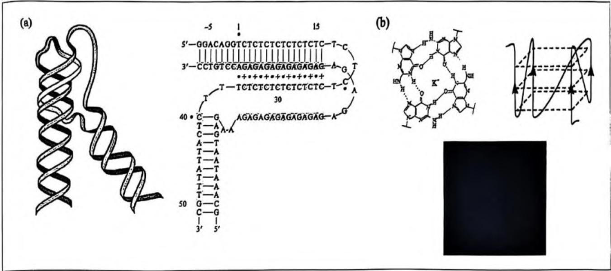  
图2-20 DNA的特殊结构  
某些 DNA 会呈现三链 (a) 和四链结构 (b)。

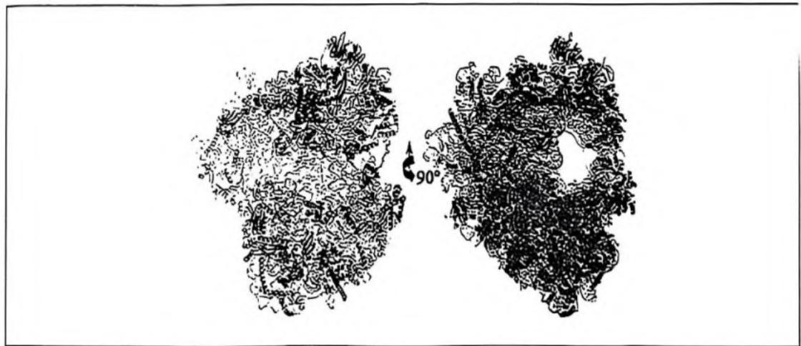  
图 4-12 核糖体三维结构示意图

核糖体由大、小亚基组成。每个亚基又由 RNA 和蛋白质两部分组成,其中,50S 亚基的 RNA 部分由灰色表示,蛋白质以紫色表示。30S 亚基的 RNA 部分以淡蓝色表示,蛋白质以深蓝色表示。50S 亚基都位于 30S 亚基之上。旋转 ${90}^{ \circ  }$ 后右图显示的空洞为 tRNA 结合位点。图像使用 PyMOL 软件制作。

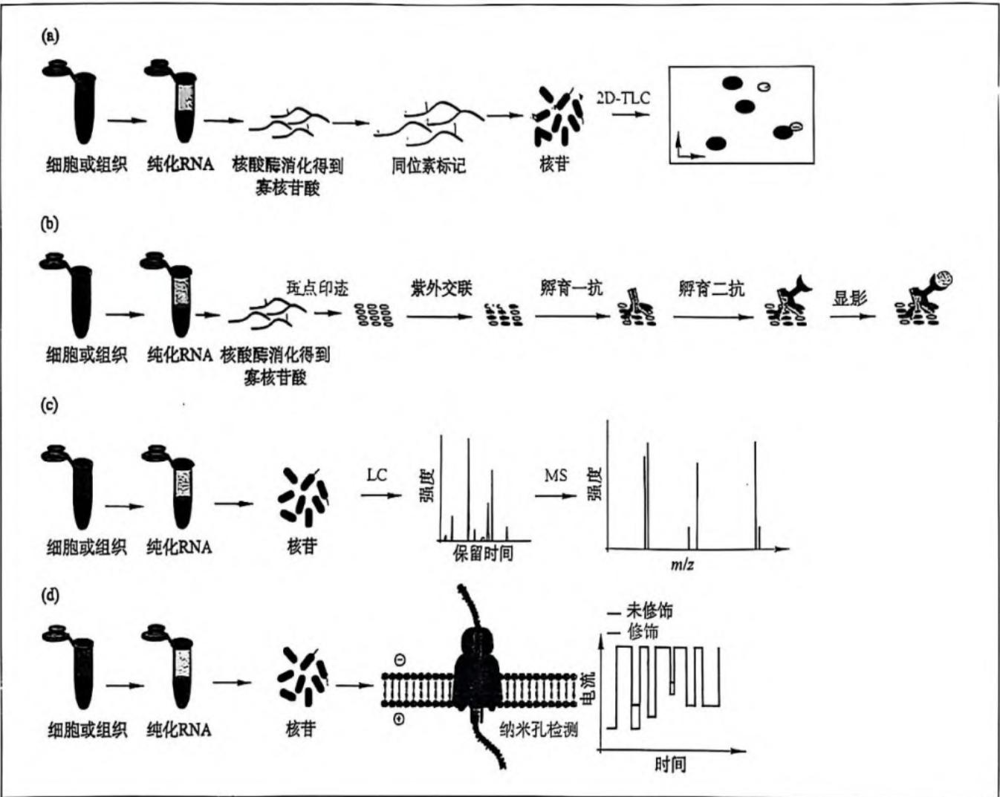  
图 5-21 RNA 修饰的主要检测技术

(a) 二维薄层层析法。主要通过同位素标记 RNA，再进行电泳分离，通过放射性自显影比较 RNA 样品的迁移速率确定其修饰程度；(b) 斑点印迹法。使用特异性抗体对 RNA 的修饰进行检测；(c) LC-MS。RNA 分子降解为单核苷后由液相色谱分离，经过质谱仪中电离并进一步裂解为特异性的离子产物，通过离子产物的保留时间 (t)、质荷比 (m/z) 等鉴定核苷的修饰信息；(d) 纳米孔测序技术。因化学修饰和二级结构会影响其在纳米孔中的移动，可以通过此种差异的计算来确定该分子是否发生了修饰。

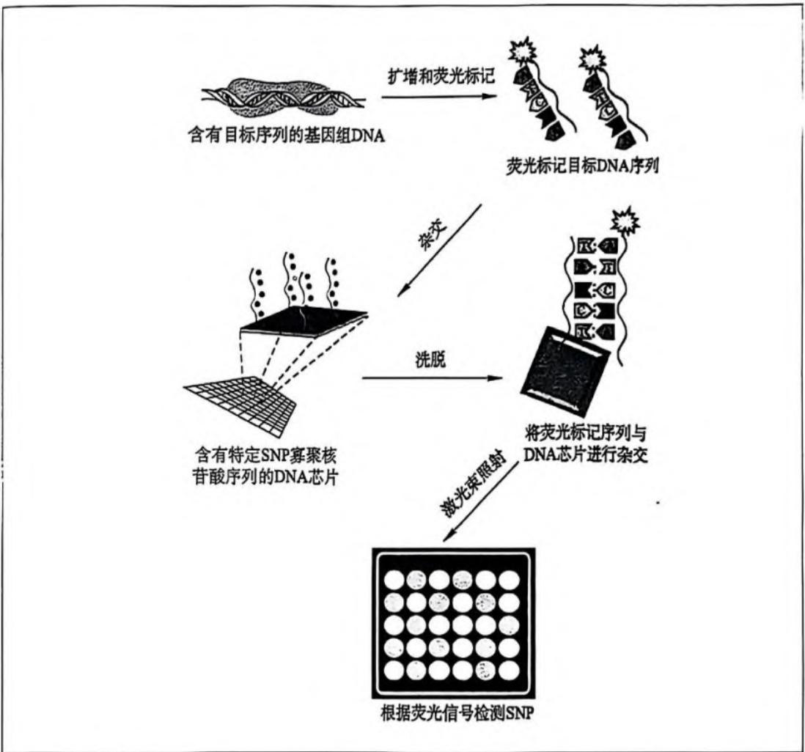  
图 5-28 SNP 芯片技术流程图

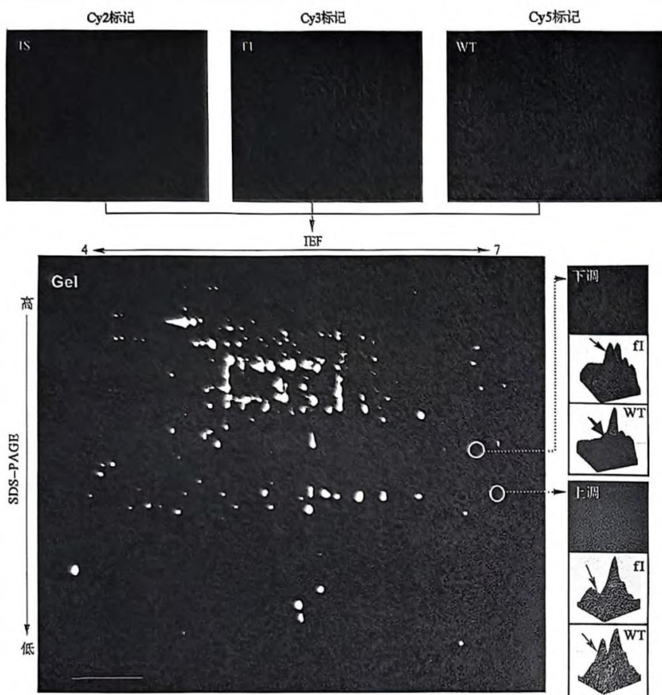  
图 5-31 野生型陆地棉'徐州 142'(WT)和无长绒无短绒突变体(f)0 DPA 胚珠总蛋白 2D-DIGE 比较分析图谱

用 Cy2 标记 WT 和 f10 DPA 胚珠等量混合蛋白作为内标(显示为蓝色), Cy3 标记 f1 胚珠蛋白(显示为绿色), Cy5 标记 WT 胚珠蛋白(显示为红色)。

图中绿色蛋白点代表 WT 0 DPA 胚珠中相对于 f1 下调的蛋白质, 红色蛋白点则代表 WT 0DPA 胚珠中相对于 f1 上调的蛋白质。

图 6-5 人肌肉棚原磷酸酶基因在 11 号染色体上的荧光原位杂交结果  
  
:

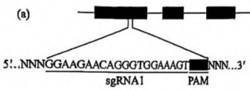

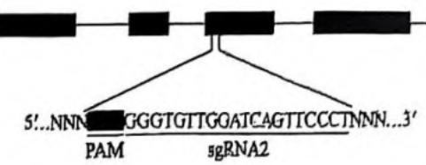

(b)  
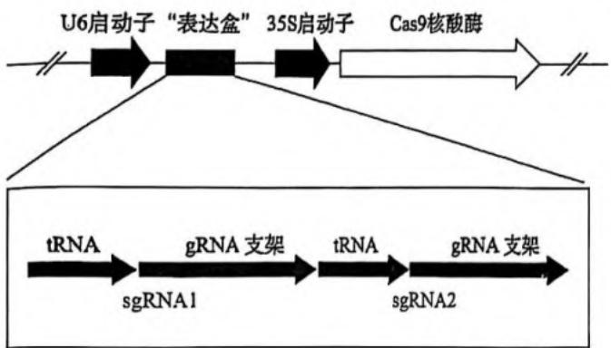  
(c)

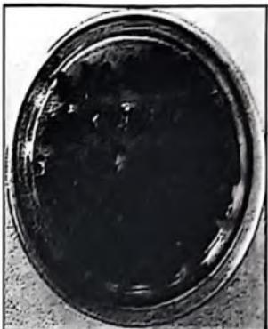

(d)  
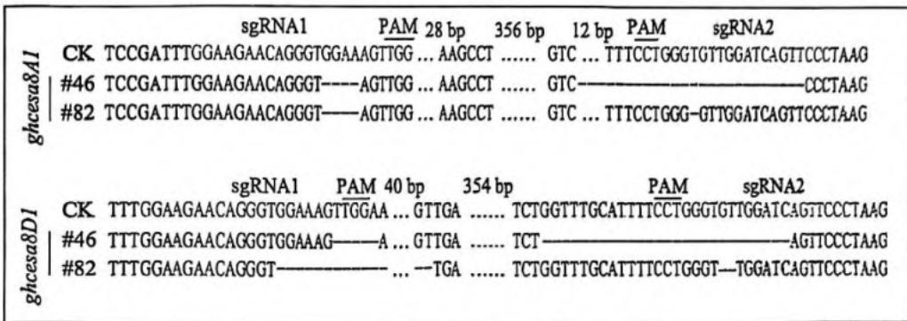

(e)  
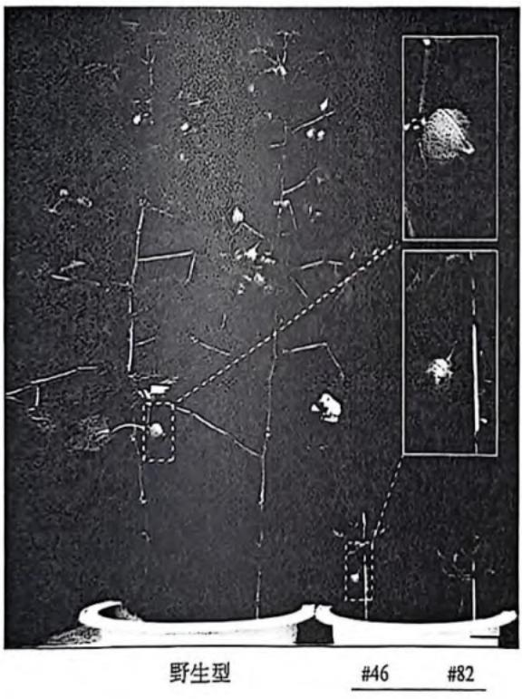

(f)  
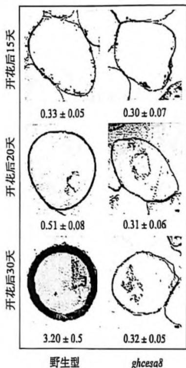

图6-14 利国(2019)10

C39 技术编辑器

花纤维素台牌居历

ghcesa8 的实验点

ghcesA8 来自于四倍体的陆地棉，其拥有 At 和 Dt 两个亚基因组，设计两个 vRNA 同时靶向胶除这两个亚基因组上的拷贝 (ghcesa8 At/Dt)，获得完全胶除纯合突变体。(a) 设计靶位点；(b) 构建 CRISPR/Cas9 表达载体；(c) 将构建好的载体通过农杆菌侵染到棉花幼苗下胚胎诱导的愈伤组织中，使其在植物细胞中稳定表达；(d) 对愈伤组织再分化幼苗的目标 DNA 序列进行检测，确认靶基因已被完全胶除；(e) 基因胶除突变体株系高度及生殖生长状态分析；(f) 开花后不同时间野生型和基因胶除突变体 ghcesa8 细胞壁厚度 (μm) 分析。dpa 表示开花后天数，陆地棉纤维细胞在 20 天左右开始进行次生壁加厚。

  
图6-35 野生型拟南芥中 $\mathrm{H}^2\mathrm{O}\lambda S_{\mathrm{m}}::GFP$ 融合基因的表达

将 AtFOX5 的启动子序列与 GFP 的编码序列融合，构建植物转化载体，通过花序浸染法转化野生型拟南芥。在 WOX5 启动子的指导下，GFP 基因表达、指示 WOX5 蛋白应定位于根端分生组织 (RAM) 的静止中心 (QC)；红色荧光：用 PI 对细胞壁染色；绿色荧光：GFP 自发荧光。

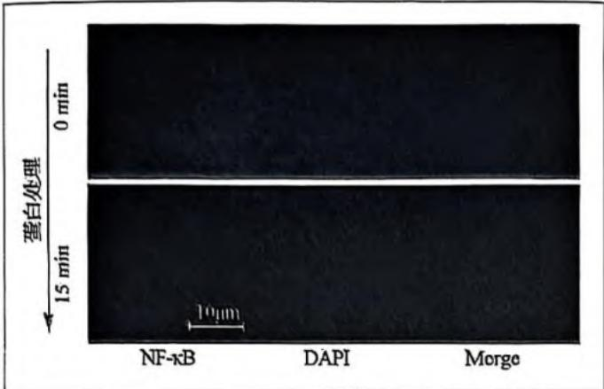  
图 6-36 结核杆菌外膜蛋白影响核转录因子 NF- $\kappa$ B 在巨噬细胞中的定位  
用结核杆菌外膜蛋白刺激巨噬细胞 15 min, 诱导在胞质定位的 NF-κB 分子转运到细胞核中。绿色荧光: FITC 标记 NF-κB 分子; 蓝色荧光: DAPI 标记细胞核 DNA。

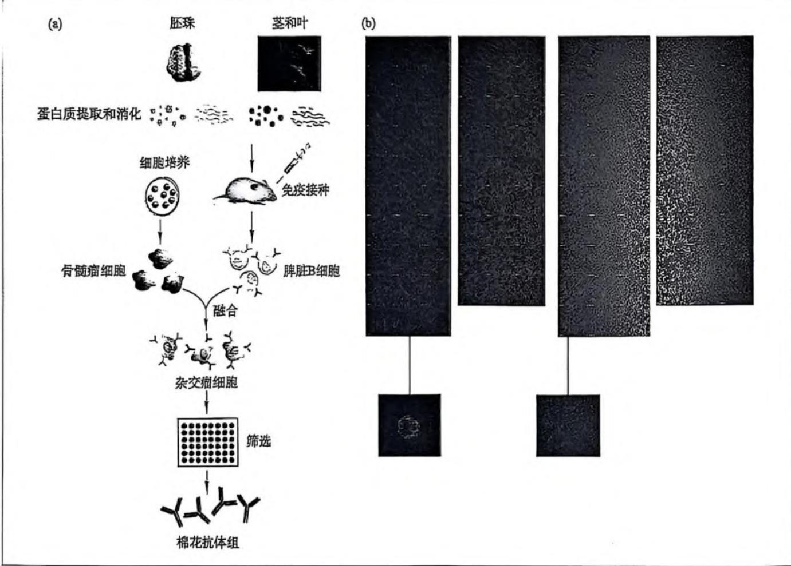  
图6-37 抗体库的构建与棉纤维特异性蛋白质的筛选

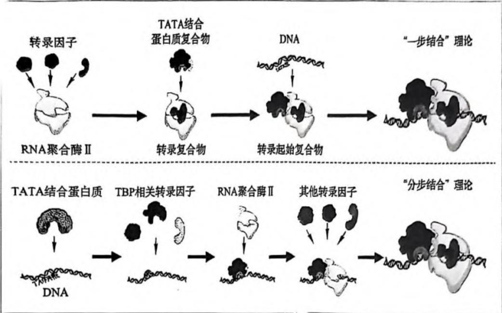  
图2-9 RNA聚合酶Ⅱ复合成为转染起始复合物的过程

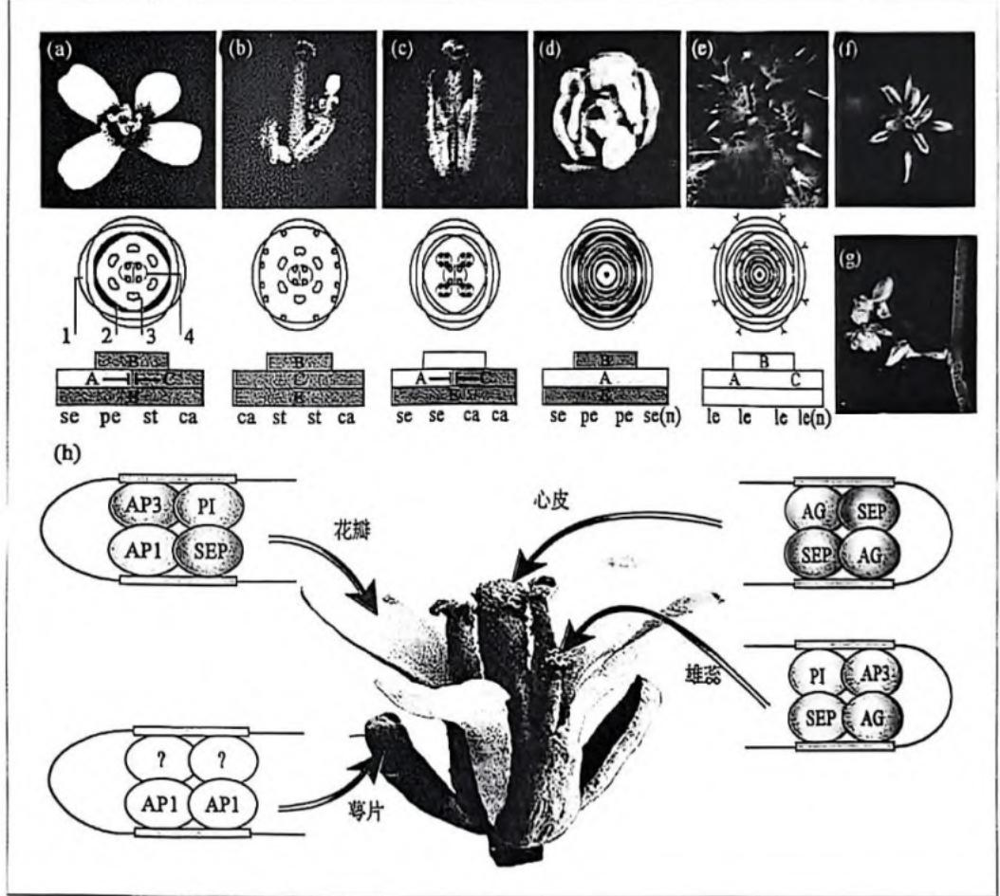  
图 9-15 花形态建成的 ABCE 模型

(a) 野生型; (b) A 基因突变; (c) B 基因突变;

(d) C 基因突变; (e) B 基因突变; (f) 35S: PI; 35S: AP3; 35S: SEP3; (g) 35S: PI; 35S: AP3; 35S: AG; 35S: SEP3; (h) ABCE 模型。

图 10-6 传统 Sanger 测序(a)与第二代测序(b)流程对比

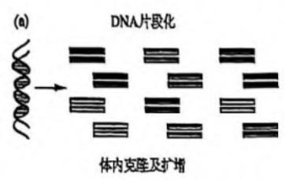

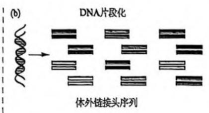

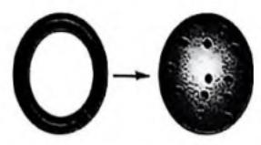

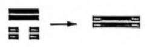

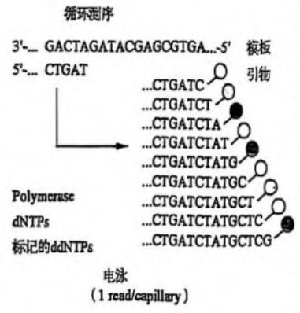  
生成扩增子阵列

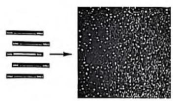

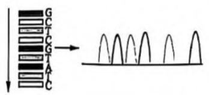

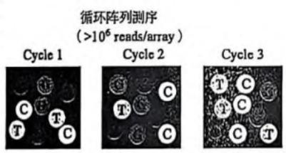

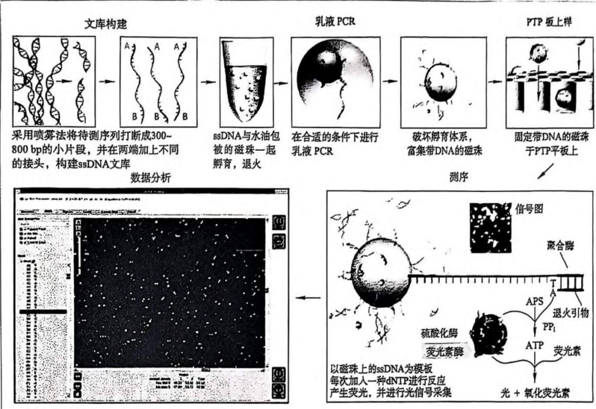  
图10-7 Roche(454)GSFLX测序流程图

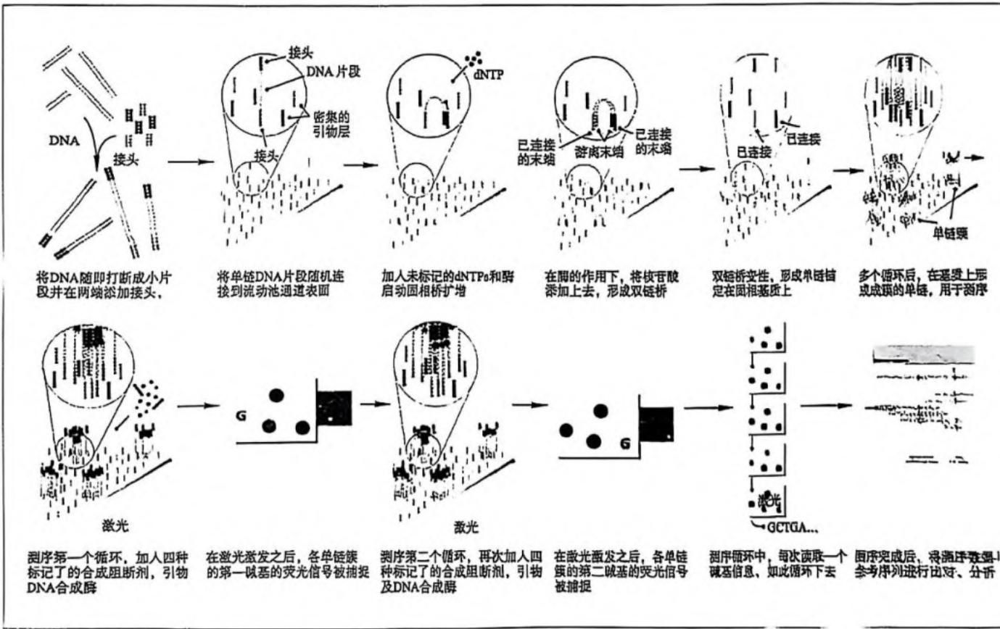  
图10-8 Solexa测序流程图

## 彩插

(a)  
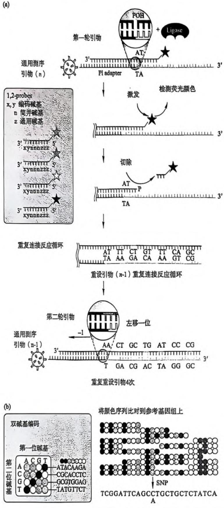  
图10-9 SOLiD测序原理图

(a) SOLiD 测序 5 轮连接反应前 2 轮示意图, 探针 3' 端第 1、2 位两个碱基决定荧光标记, 杂交后探针 3' 端 6\~8 位碱基连同荧光标记被酶切切除, 因此第一轮连接获得 (1,2); (6,7); …; (1+n\*5,2+n\*5) 位的序列信息, 然后下 4 轮探针依次左移一位, 这样 5 轮反应获得全部序列信息; (b) SOLiD 测序结果根据每轮反应对应的双碱基编码矩阵进行基因组比对, SNP 位点会造成 2 轮反应荧光信号的改变。

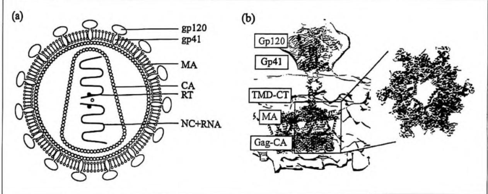  
图11-10 HIV-I病毒的结构  
(a) HIV-1 病毒粒子的结构示意图, gp120 和 gp41 是外膜蛋白, MA (matrix) 是内膜蛋白, CA (capsid) 是外壳蛋白, NC (nucleocapsid) 是核衣壳蛋白, RT (reverse transcriptase) 是反转录酶; (b) 基于冷冻电子断层成像技术构建的未成熟 HIV-1 病毒粒子的 Env-Gag 结构模型图。

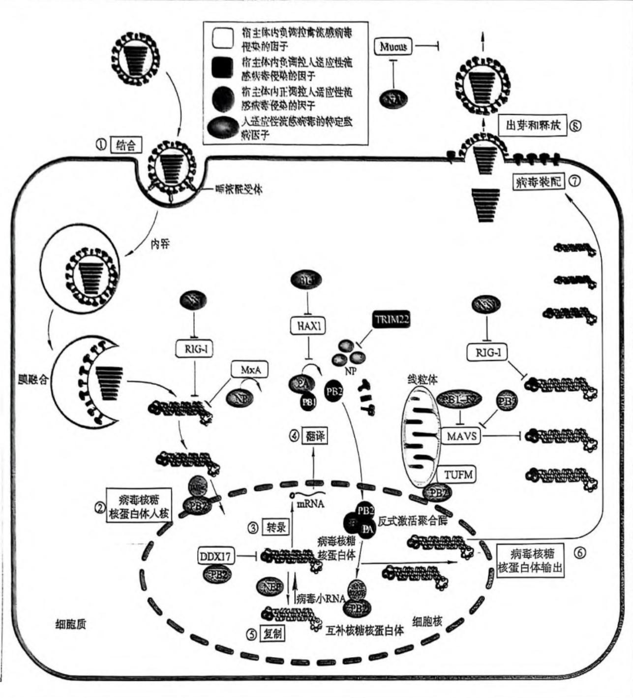  
图11-29 流感病毒进入宿主细胞及其复制过程图示

在人类细胞中存在着负调控禽流感病毒侵染的因子(白色方框表示),而人适应性流感病毒不仅能够通过特定致病因子(蓝色椭圆表示)克服这些阻力,还能够和人类细胞中的其他因子(蓝色正圆表示)共同正调控病毒的侵染。然而,人类细胞中也存在可以负调控人适应性流感病毒侵染的因子(灰色方框表示),从而抑制病毒的增殖。MxA,黏病毒抗性蛋白A;RJG-I,视黄醇诱导基因蛋白I;IMPα7,输入蛋白α7;ANP32A或NP32B,酸性核磷蛋白;DDX17,DEAD框RNA解旋酶;NEP,核输出蛋白;TUFM,线粒体Tu翻译延伸因子;MAVS,线粒体抗病毒信号蛋白;AX1,HCLS1相关蛋白X-1;TRIM22,三基序蛋白22。

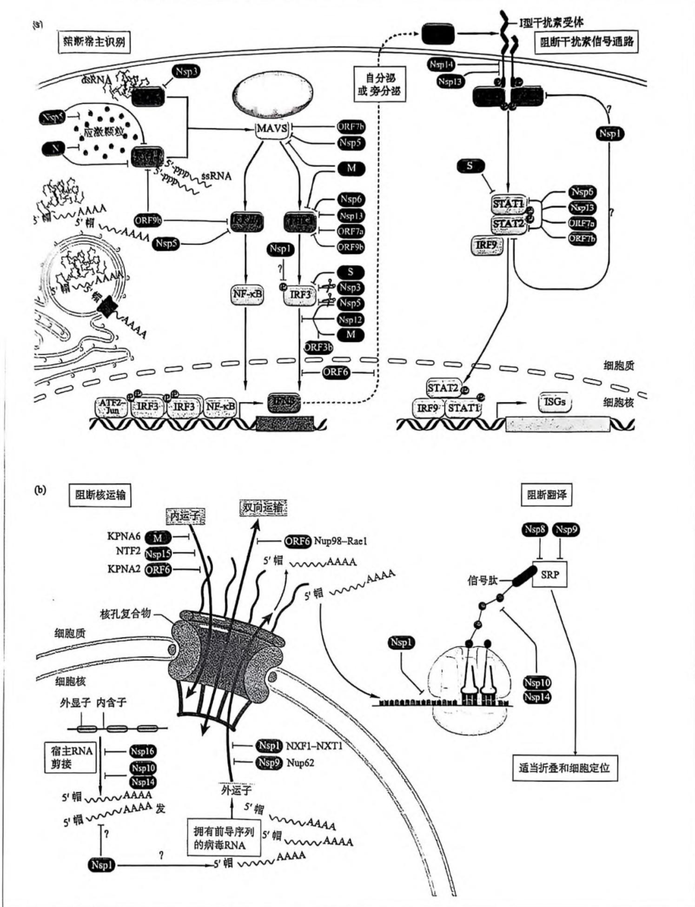  
图11-34 SARS-CoV-2对宿主细胞内基本生命活动和免疫的干扰  
(a) SARS-CoV-2 介导的细胞先天免疫信号传导干扰；(b) SARS-CoV-2 介导的一般宿主细胞生物学干扰。图中"？"代表 Nsp1 (nonstructural protein 1) 在特异性阻断这些途径过程中的作用仍然不确定。
