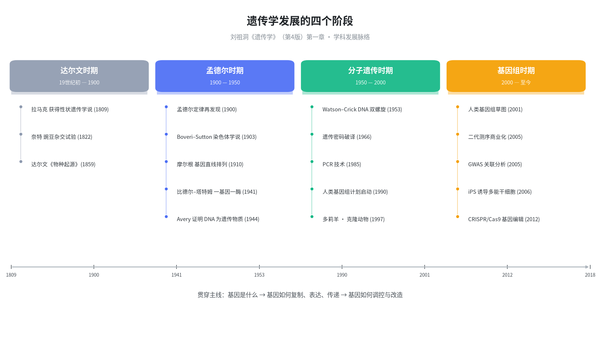

# 第一章 绪论

>[!info] 本章定位
>绪论不考细节，但**建立学科坐标系**。全章回答三个问题：遗传学从哪来（发展史）、研究什么（遗传与变异）、有什么用（与社会的关系）。其中的「四阶段划分」和「正向/反向遗传学」是后续各章反复调用的框架。

## 本章地图

| 节 | 主题 | 核心问题 |
|---|---|---|
| 第一节 | 遗传学发展历史 | 遗传学如何从生产实践演变为精密科学？ |
| 第二节 | 遗传与变异 | 遗传学的定义与分支 |
| 第三节 | 遗传学与社会发展 | 现代遗传学的新领域与应用 |

---

## 第一节 遗传学发展历史

### 1.1 学科前史：从驯化到科学问题

- **实践先于理论**：中国宋代已有「种瓜得瓜，种豆得豆」「一母生九子，九子各不同」的遗传与变异朴素认识；新石器时代遗址中的粟、小麦、高粱种子与家畜骨骼化石，说明 5000—10000 年前人类已开始驯化培育。
- **有意识的探索仅 300 余年**：玉米、番薯、水稻等作物，牡丹、郁金香等花卉，各类金鱼的选育，都是人类推动遗传学发生的活动，但**尚未形成系统独立的遗传学理论**。

### 1.2 遗传学发展的四个阶段 ★核心框架

教材将遗传学知识发展划分为四个阶段，这是本章最需要记住的骨架：

| 阶段 | 时间 | 标志性突破 | 回答的问题 |
|---|---|---|---|
| **达尔文时期** | 19 世纪初—1900 | 拉马克获得性状遗传学说；达尔文自然选择学说 | 生物如何进化？（遗传变异思想萌芽） |
| **孟德尔时期** | 1900—1950 | 孟德尔定律再发现；染色体学说；基因论；一基因一酶 | 遗传的**实体**是什么？ |
| **分子遗传时期** | 1950—2000 | DNA 双螺旋；遗传密码；基因工程；PCR | 基因的**结构**与**功能**如何统一？ |
| **基因组时期** | 2000—至今 | 人类基因组计划；二代测序；GWAS；基因编辑 | 整个**基因组**如何运作？ |

>[!tip] 记忆锚点
>四阶段的主线是「**基因概念的不断深化**」：遗传因子 → 染色体上的基因 → 有结构的 DNA 分子 → 可调控、可编辑的基因组信息。

### 1.3 里程碑事件年表

| 年份 | 人物 | 贡献 | 意义 |
|---|---|---|---|
| 1809 | 拉马克 | 获得性状遗传学说 | 最早的进化学说（后被抛弃） |
| 1822 | 奈特 | 豌豆杂交试验 | 已获近似 3:1 分离比，但无法突破时代局限 |
| 1859 | 达尔文 | 《物种起源》 | 提出自然选择，但**未能说明进化机制** |
| 1866 | **孟德尔** | 《植物杂交试验》 | 分离与自由组合规律；34 年后才被重新发现 |
| 1869 | 米歇尔 | 从白细胞核分离出核酸 | 核酸研究起点 |
| 1882 | 弗莱明 | 记录有丝分裂中染色体行为 | 奠定细胞遗传学研究基础 |
| 1900 | 德弗里斯/科伦斯/切尔马克 | **孟德尔定律再发现** | **遗传学诞生** |
| 1903 | Boveri、Sutton | 染色体理论 | 遗传因子行为与减数分裂染色体行为相符 |
| 1905 | 加洛德 | 尿黑酸症 | 开创人类医学遗传研究 |
| 1906 | 贝特森 | 定名 genetics | 学科名称确立 |
| 1908 | 温伯格、哈代 | 遗传平衡定律 | 奠基群体遗传学 |
| 1909 | 约翰森 | 提出「gene」一词 | 术语确立 |
| 1910 | **摩尔根** | 果蝇实验：基因直线排列于染色体 | 基因论体系建立 |
| 1928 | 格里菲斯 | 肺炎双球菌转化实验 | 发现细菌间转移的遗传物质 |
| 1941 | 比德尔、塔特姆 | 粗糙链孢霉生化突变型 → **一基因一酶** | 基因与蛋白质功能挂钩 |
| 1944 | **艾弗里等** | 肺炎链球菌转化因子是 DNA | **证明遗传物质是 DNA** |
| 1950 | 查加夫 | A=T、G=C | 为双螺旋提供化学依据 |
| 1950 | **麦克林托克** | 玉米籽粒色斑不稳定遗传 | 发现可移动的遗传因子（转座子） |
| 1953 | **沃森、克里克** | DNA 双螺旋结构 | 开创分子遗传学 |
| 1956 | 蒋有兴、莱万 | 人类 23 对染色体 | 纠正此前 48 条的误判 |
| 1961 | 雅各布、莫诺 | 操纵子模型 | 揭示基因表达受环境调控 |
| 1966 | 尼伦伯格等 | 遗传密码 | 遗传信息传递规则确立 |
| 1974 | **简悦威** | DNA 分析用于 α-地中海贫血检测 | 开启分子诊断与产前诊断 |
| 1976 | 利根川进 | 免疫球蛋白基因重排 | 基因重排调控表达 |
| 1977 | 桑格、吉尔伯特 | DNA 测序技术 | 测序时代开端 |
| 1977 | 夏普、罗伯茨 | 腺病毒基因断裂现象 | 揭示真核基因被内含子间隔 |
| 1985 | 穆里斯 | PCR 技术 | 体外快速扩增 DNA |
| 1990 | — | 人类基因组计划（HGP）启动 | 六国参与（含中国） |
| 1997 | 罗斯林研究所 | 克隆羊「多莉」 | 体细胞核移植 |
| 1998 | 法尔、梅洛 | RNA 干扰（RNAi） | 转录后基因沉默 |
| 2001 | HUGO / Celera | 人类基因组草图 | 基因组学时代 |
| 2003 | — | ENCODE 计划启动 | 全基因组元件注释 |
| 2005 | 罗氏 | 454 测序系统商业化 | 二代测序普及 |
| 2005 | 爱德华兹团队 | 首个 GWAS（年龄相关性黄斑变性） | 关联分析标志性成果 |
| 2006 | 山中伸弥 | iPS 诱导多能干细胞 | 体细胞重编程 |
| 2007 | **卢煜明** | 孕妇外周血无创产前筛查（NIPT） | 21 三体检测 |
| 2008 | 多国合作 | 千人基因组计划 | 人类基因组参照数据库 |
| 2012 | 卡彭蒂耶、杜德娜 | CRISPR/Cas9 系统 | 可编程基因编辑 |
| 2013 | 张锋 | CRISPR 应用于哺乳动物/人类细胞 | 迅速推广至多物种 |
| 2016 | 波格丹等 | TWAS 全转录组关联分析 | 基因表达-性状关联 |
| 2018 | 孙强团队 | 体细胞核移植克隆猕猴 | 首次非人灵长类体细胞克隆 |

>[!note] 中国科学家的贡献（易被忽略的考点）
> - **蒋有兴**（1956）：与莱万确认人类 23 对染色体
> - **简悦威**（1974）：DNA 分析用于地中海贫血遗传测试
> - **卢煜明**（2007）：NIPT 无创产前筛查
> - **张锋**（2013）：CRISPR 应用于哺乳动物与人类细胞
> - **孙强**（2018）：克隆猕猴
> - 中国参与 HGP（1990，六国之一）、千人基因组计划（2008）、完成首个中国汉族男性全基因组测序（2007）

### 1.4 四个阶段的深层逻辑

- **达尔文时期**：进化思想萌芽，但缺遗传机制 → 孟德尔补上
- **孟德尔时期**：确定遗传因子是**颗粒式**、成对存在、可分离重组 → 但不知其化学本质
- **分子遗传时期**：回答「基因是什么分子」，把基因结构（基因型）与功能（表型）落实到 DNA 层面：**突变、重组、表达、互作、调控**多层次揭示规律
- **基因组时期**：研究对象从单个基因 → 整个基因组，技术手段井喷

>[!quote] 教材观点
>「科学的创新是在原有基础上的衍生和发展的思维，任何一项创新很难是凌空出现的，没有前人的探索，没有科学原有的基础，就没有真实意义的科学创新，**知识的传承是创新思维的必要基础**。」

---

## 第二节 遗传与变异

### 2.1 三个基本概念

| 概念 | 定义 | 要点 |
|---|---|---|
| **遗传**（heredity） | 世代间相似的现象 | 遗传信息世代传递；同一物种繁育同种生物 |
| **变异**（variation） | 生物个体间的差异 | 子代与亲代之间、子代个体之间的差异 |
| **遗传学**（genetics） | 研究生物遗传与变异的科学 | 基因水平上：研究遗传结构、信息传递、基因频率、基因表达调控 |

>[!important] 遗传与变异的辩证关系
> - 遗传维持生命延续 —— **没有遗传就没有生命的存在，没有相对稳定的物种**
> - 变异使物种推陈出新 —— **没有变异就没有物种的形成与进化**
> - 二者**相辅相成**，造就形形色色的生物界

**现代遗传学的扩展**：研究范围已不限于世代传递，同一物种间、不同物种间甚至动植物之间，可通过**人工方法进行遗传信息横向转移**。

### 2.2 遗传学的分支

| 分类标准 | 分支 |
|---|---|
| 研究内容 | 进化遗传学、医学遗传学、免疫遗传学、肿瘤遗传学 |
| 研究层次 | 群体遗传学、细胞遗传学、分子遗传学 |
| 研究对象 | 植物遗传学、动物遗传学 |

---

## 第三节 遗传学研究与社会发展的紧密关系

### 3.1 表观遗传学：对传统基因学说的挑战

- **定义**：在**未发生基因组 DNA 序列改变**的情况下，基因功能发生的**可遗传**改变。
- **范畴**：DNA 甲基化、RNA 干扰、组蛋白修饰等。
- **意义**：个体发育、疾病发生、植物性状多态性均与表观遗传调控有关，已成研究热点。

### 3.2 正向遗传学 Vs 反向遗传学 ★易混

| | **正向遗传学** (forward) | **反向遗传学** (reverse) |
|---|---|---|
| 研究方向 | 表型变异 → 基因型变异 | 基因型变异 → 表型变异 |
| 起点 | 观察到的表型异常 | 已知或候选的基因 |
| 典型流程 | 分离病变蛋白 → 推测 DNA 序列 → cDNA 文库筛选 → 染色体定位 → 致病基因序列 | 遗传标记连锁分析 → 定位候选基因 → 研究突变与表型的功能联系 |
| 教材例子 | **镰状细胞贫血** | **亨廷顿舞蹈症** |

### 3.3 应用领域

- **农牧业**：育种的理论基础；用 DNA 重组技术 + 原生质体与细胞培养创制新品种（如高赖氨酸玉米、固氮粮食作物）
- **医学**：
  - 机制已知的遗传病约 **6000 余种**，产前诊断依赖遗传学理论（尤其分子遗传学）
  - CRISPR/Cas9 已在部分孟德尔遗传病临床实验中取得良好效果
  - 肿瘤：细胞恶性转化的前提是**遗传物质损伤与基因结构改变**；癌基因 = 具有引起细胞恶性转化能力的 DNA 区段
- **工业/药学**：抗生素生产、免疫学、环境保护

### 3.4 引发的社会议题

>教材列举：克隆羊「多莉」→ 克隆人争论；人类基因组测序完成 → 遗传信息安全争论；转基因生物推广 → 食品安全争论；表观遗传学发展 → 对传统基因学说的挑战；基因编辑技术推广 → 能否用于人类胚胎的全社会思考。

---

## 🧠 概念辨析与易错点

1. **「遗传学诞生」的标志**：不是 1866 年孟德尔发表论文，而是 **1900 年孟德尔定律的再发现**。孟德尔的工作沉睡了 34 年。
2. **达尔文的局限**：提出了自然选择学说，但**没有说明生物变异的根本原因和进化机制**；机制由孟德尔及后续研究补足。
3. **一基因一酶（1941）** 早于 **DNA 是遗传物质（1944）**——先建立「基因—蛋白质」的功能联系，再确证化学本质。
4. **23 对染色体**是 1956 年才确认的（此前误认为 48 条）。
5. **正向/反向遗传学的方向别记反**：正 = 从表型找基因；反 = 从基因看表型。
6. 「中性学说」（木村资生，20 世纪 60 年代）是对达尔文学说的**补充**：许多变异无利也无害（如 ABO 血型）。

## 📝 自测与解答

>本章为绪论，教材未设习题。以下为基于本章内容整理的自测题及解答。

**Q1. 遗传学作为独立学科诞生的标志是什么？为什么不是 1866 年？**

**答**：标志是 **1900 年孟德尔定律的再发现**。1866 年孟德尔虽发表《植物杂交试验》提出分离与自由组合规律，但其论文未引起重视，沉睡 34 年；直到 1900 年德弗里斯、科伦斯、切尔马克三位植物学家在不同地点、用不同材料分别得出相同结论并引用孟德尔工作，遗传学才作为独立分支科学正式诞生。

**Q2. 教材将遗传学发展划分为哪四个阶段？各阶段解决的核心问题是什么？**

**答**：①**达尔文时期**（19 世纪初—1900）：以拉马克获得性状遗传学说和达尔文自然选择学说为代表，解决「生物如何进化」，但遗传变异思想仅处于萌芽状态；②**孟德尔时期**（1900—1950）：孟德尔定律再发现、染色体学说、基因论、一基因一酶学说，回答遗传的实体是什么；③**分子遗传时期**（1950—2000）：DNA 双螺旋、遗传密码、基因工程，从基因结构与功能层面揭示规律；④**基因组时期**（2000—至今）：人类基因组计划完成，研究对象从单个基因扩展到整个基因组。

**Q3. 简述遗传与变异的辩证关系。**

**答**：遗传是遗传信息世代传递的现象，使子代与亲代相似；变异是生物个体间的差异。二者相辅相成：遗传维持生命的延续与物种的相对稳定，**没有遗传就没有生命的存在**；变异使物种推陈出新，**没有变异就没有物种的形成与进化**。二者共同作用造就生物界多样性。

**Q4. 正向遗传学与反向遗传学有何区别？各举一例。**

**答**：正向遗传学是**从表型变异到基因型变异**的研究策略，如镰状细胞贫血研究：先分离病变蛋白 → 据肽链氨基酸序列推测 DNA 序列 → 从 cDNA 文库筛选编码基因 → 染色体定位 → 获得致病基因序列。反向遗传学是**从基因型变异到表型变异**的研究，如亨廷顿舞蹈症：先利用遗传标记进行连锁分析定位候选目的基因，再研究突变基因与表型的功能联系。

**Q5. 什么是表观遗传？为什么说它对传统遗传学理论构成挑战？**

**答**：表观遗传指在**未发生基因组 DNA 序列改变**的情况下，基因功能也可发生**可遗传的改变**，包括 DNA 甲基化、RNA 干扰、组蛋白修饰等。传统遗传学以基因为主线，认为**基因结构的改变与否决定性状变异**；表观遗传表明序列不变也能产生可遗传的表型改变，因此构成对传统基因学说的挑战。

**Q6. 为什么孟德尔的成功不是偶然的？**

**答**：孟德尔在前人（奈特、克尔罗伊特、格特纳）杂交试验基础上，明确指出其三大缺点：①未对杂种子代不同类型植株计数；②未分代分别统计；③未明确各代类型间的统计关系。他选用豌豆（稳定可区分性状、自花闭花授粉、籽粒留荚便于计数），历时 8 年试验并**应用统计方法**分析数据，最终提出遗传因子分离与重组假设。教材评价：其成就在于**科学思想的创新**，同时体现了对科学历史积淀的尊重与发展。

## 🔗 关联

- 下一章：02-孟德尔定律 — 孟德尔定律的完整内容
- 交互式时间线：[[interactive/ch01-遗传学发展时间线.html]]

---

*笔记依据刘祖洞《遗传学》（第4版）第一章整理；事实性内容均出自教材原文。*
