# 第三章 遗传的染色体学说

>[!info] 本章定位
>孟德尔用**假设的遗传因子**解释了杂交结果，却没有回答「因子在哪里」。本章补上这块基石：先在显微镜下看清染色体与细胞分裂的全过程（第一、二节），再用 `2n ⇌ n` 的染色体周期串起各类生物的生活史（第三节），最后把**孟德尔定律与减数分裂的染色体行为一一对应**（第四节）。
>
>**全章灵魂**：分离定律 ↔ 后期Ⅰ同源染色体分离；自由组合定律 ↔ 后期Ⅰ非同源染色体独立分配。抓住这一条，整章就立起来了。

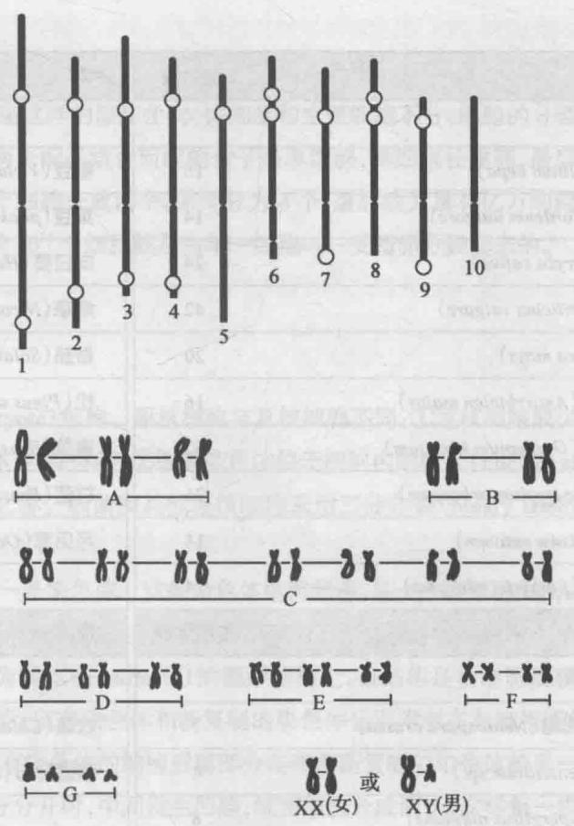

*图 3-1 玉米染色体的模式图：玉米共 10 对染色体（$2n=20$），图中只画每对中的一条，编号 1~10。依据相对长度、着丝粒位置、核仁形成区有无和结节分布，可把这 10 条互相区分开——这正是「每条染色体形态恒定、可被识别」的直观依据。*

## 本章地图

| 节 | 主题 | 核心问题 |
|---|---|---|
| 第一节 | 染色体 | 染色体的数目、形态结构与命名依据是什么？ |
| 第二节 | 细胞分裂 | 细菌二分分裂、有丝分裂、减数分裂中染色体各如何行动？ |
| 第三节 | 染色体周期 | 动物、植物、真菌的生活史中，$2n \rightleftharpoons n$ 在何处转换？ |
| 第四节 | 遗传的染色体学说 | 基因的行为与染色体的行为如何一一对应？ |

---

## 第一节 染色体

### 1.1 染色体数目：$n$ 与 $2n$

- **每种生物的染色体数是恒定的**。
- **二倍体**（diploid）：多数高等动植物，每一体细胞中有两组同样的染色体（与性别直接有关的**性染色体**可以不完成相同）。用 $2n$ 表示。
- **单倍体**（haploid）：亲本的每一配子带有一组染色体，用 $n$ 表示。两个配子结合后恢复为二倍体。
- 例：玉米 $2n=20$（10 对，图 3-1）；人 $2n=46$（23 对，图 3-2，教材给出中期染色体模式图，按相对长度与着丝粒位置排成 23 对共 8 组，A~G 组为 22 对常染色体，另有一对性染色体 X 和 Y）。
- **多数微生物的营养体是单倍体**，例：粗糙链孢霉 $n=7$。

**表 3-1 多种生物的染色体数（节选）**

| 动物 | $2n$ | 动物 | $2n$ | 植物 | $2n$ | 微生物 | $n$ |
|---|---|---|---|---|---|---|---|
| 人 *Homo sapiens* | 46 | 马 *Equus calibus* | 64 | 洋葱 *Allium cepa* | 16 | 粗糙链孢霉 *Neurospora crassa* | 7 |
| 川金丝猴 | 44 | 驴 *Equus asinus* | 62 | 大麦 *Hordeum vulgare* | 14 | 青霉 *Penicillium* sp. | 4 |
| 猕猴 | 42 | 山羊 | 60 | 水稻 *Oryza sativa* | 24 | 曲霉 *Aspergillus nidulans* | 8 |
| 黄牛 *Bos taurus* | 60 | 绵羊 *Ovis aries* | 54 | 小麦 *Triticum vulgare* | 42 | 衣藻 *Chlamydomonas* | 16 |
| 猪 *Sus scrofa* | 40 | 小家鼠 *Mus musculus* | 40 | 玉米 *Zea mays* | 20 | 酿酒酵母 *S. cerevisiae* | 17 |
| 狗 *Canis familiaris* | 78 | 大家鼠 | 42 | 豌豆 *Pisum sativum* | 14 | | |
| 猫 *Felis domesticus* | 38 | 兔 | 44 | 香豌豆 | 14 | | |
| 家蚕 *Bombyx mori* | 56 | 家鸽 | 约 80 | 蚕豆 *Vicia faba* | 12 | | |
| 家蝇 *Musca domestica* | 12 | 鸡 | 约 78 | 菜豆 | 22 | | |
| 果蝇 *D. melanogaster* | 8 | 火鸡 | 约 80 | 向日葵 | 34 | | |
| 蜜蜂 *Apis mellifera* | 32♀ / 16♂ | 蚊 *Culex pipiens* | 6 | 烟草 | 48 | | |
| 佛蝗 *Phlaeoba infumata* | 24♀ / 23♂ | 淡水水螅 | 32 | 番茄 | 24 | | |

>[!important] 三个必须记住的数字
>玉米 $2n=20$、人 $2n=46$、粗糙链孢霉 $n=7$——本章后文反复用到。蜜蜂、佛蝗的雌雄染色体数不同，是**性染色体**存在的最直接证据（雌 32/雄 16、雌 24/雄 23）。

### 1.2 染色体的形态结构

染色体**复制以后**含有纵向并列的两条**姐妹染色单体**（sister chromatid），只在**着丝粒**（centromere）区域仍连在一起。

| 结构 | 位置与特征 | 要点 |
|---|---|---|
| **着丝粒**（初级缢痕） | 位置固定，把染色体分为长臂与短臂 | 所在处常表现为一个缢痕，故又称**初级缢痕** |
| **次级缢痕** | 位置也是固定的，位于初级缢痕之外 | 连接**随体**（satellite）的远端染色体小段 |
| **核仁形成区** | 就是次级缢痕 | 细胞分裂将结束时核内出现 1 到几个核仁，**核仁总是出现在次级缢痕的地方** |

按着丝粒位置分类：

| 类型 | 着丝粒位置 | 两臂特征 |
|---|---|---|
| 中间着丝粒 / 亚中间着丝粒 | 染色体中间或中间附近 | 两臂长度差不多 |
| 近端部着丝粒 | 靠近一端 | 依着丝粒离开端部的远近区分 |
| 端部着丝粒 | 靠近染色体一端（端部） | 另一臂极短或不见 |

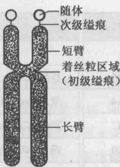

*图 3-3 染色体模式图：每一中期染色体有两条染色单体，中间相连处是初级缢痕（着丝粒区域）；图中这条染色体还有一个次级缢痕，通常就是核仁形成区，其远端小段即随体。*

>[!note] 染色体的化学组成与包装
>真核生物的染色体主要由 **DNA 和蛋白质**组成。在蛋白质分子的作用下，DNA 被包装成染色体的结构（教材图 3-4：每一染色单体是一条重复地折叠着的 DNA-蛋白质纤丝，在着丝粒区域，两染色单体的纤丝并合在一起），储藏在狭小的细胞核中。详细的包装过程留到**基因组**一章。

---

## 第二节 细胞分裂

细胞靠分裂而增殖。细菌等原核生物体细胞与生殖细胞不分，细胞分裂就是个体的繁衍；高等生物则由合子（单细胞）经「一分二、二分四」的有丝分裂长成成体——成人身体内的 $10^{14}$ 个细胞，就是由单一细胞（受精卵）分裂而来的。

### 2.1 细菌的二分分裂

原核细胞与真核细胞不同：① 缺少某些细胞器（如线粒体、叶绿体等）；② 染色体位于细胞内的**核区**（nuclear area）中，核区外面**没有核膜**。

细菌和其他原核细胞采用**二分分裂**（binary fission）增殖：

1. 每一原核细胞通常只有**一条染色体**，结构简单，是一个**裸露的 DNA 分子**（有时一个细胞可含两条或以上染色体，各位于各自的核区）。
2. 细菌染色体附着在称为**间体**（mesomere）的圆形结构上，该结构由细胞质膜**内陷**而成。
3. 染色体一分为二后，原有染色体与新复制的染色体分别附着在与膜相连的间体上。
4. 细菌分裂时细胞延长，带原有染色体的膜部分与带新复制染色体的膜部分彼此远离；两染色体充分分开时，中间发生凹陷，细菌分成两个，每一染色体分别处在两个细胞中。

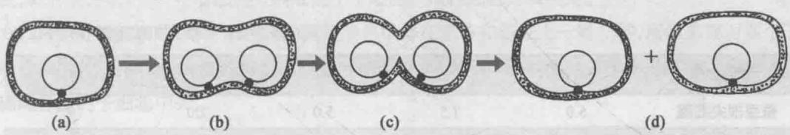

*图 3-5 细菌细胞的二分分裂：(a) 单一染色体附着在细胞质膜的间体上；(b) 染色体复制，两子染色体分别附着在间体上，两间体间的细胞质膜延伸；(c) 每一染色体进入一个子细胞；(d) 形成两个子细菌，各有一染色体附着在细胞质膜间体上。*

### 2.2 真核细胞的有丝分裂

真核细胞通过**有丝分裂**（mitosis）增殖，其结果是**把一个细胞的整套染色体均等地分向两个子细胞**，所以新形成的两个子细胞在遗传物质上与原来的细胞相同。有丝分裂分两个时相：**分裂间期**与**有丝分裂期（M 期）**。

#### （1）分裂间期

我们通常讲的细胞核形态和结构，都指**间期核**。间期是两次分裂的中间时期：一般看不到染色体结构，细胞核生长增大，代谢很旺盛，贮备分裂所需物质。**DNA 在间期复制合成**，由原来的一条成为两条并列的染色单体。

| 时期 | 名称 | 主要事件 |
|---|---|---|
| $G_1$ | 合成前期（gap 1 phase） | 细胞代谢旺盛、不断生长，**DNA 尚未开始合成** |
| $S$ | 合成期（synthetic phase） | **DNA 开始合成**（复制），为分裂做准备 |
| $G_2$ | 合成后期（gap 2 phase） | 细胞继续生长，进行**蛋白质合成**，完成分裂前其他准备 |

**表 3-2 几种生物的细胞周期（单位：h）**

| 细胞类型 | $G_1$ | $S$ | $G_2$ | $M$ | 合计 |
|---|---|---|---|---|---|
| 蚕豆根尖细胞 | 5.0 | 7.5 | 5.0 | 2.0 | 19.5 |
| 小家鼠 L 细胞 | 9~11 | 6~7 | 2~4 | 1 | 18~23 |
| 人骨髓细胞 | 25~30 | 12~15 | 3~4 | 2 | 42~51 |

>[!tip] 读表要点
>蚕豆根尖细胞间期总长 17.5 h（5.0+7.5+5.0），M 期仅约 2 h；人骨髓细胞间期长达 40~50 h。**间期远长于分裂期**，且不同生物各期长短差别很大。

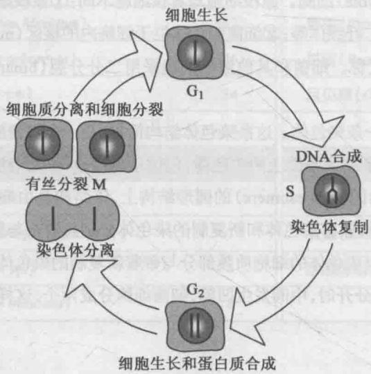

*图 3-6 真核细胞有丝分裂周期：$G_1$ 期（细胞生长）→ $S$ 期（DNA 合成、染色体复制）→ $G_2$ 期（细胞生长和蛋白质合成）→ $M$ 期（染色体分离及细胞质分离），前三个时期属分裂间期。*

#### （2）分裂期（M 期）各时期

| 时期 | 染色体行为 | 其他事件 |
|---|---|---|
| **前期** prophase | 染色质细丝螺旋化，染色体缩短变粗，着丝粒区域变清楚；每一染色体含**纵向并列的两条染色单体** | 动物与低等植物中**中心体**参与纺锤体组装（间期已完成复制并一分为二，前期分向两极）；微管从中心体辐射。高等植物看不到中心体，但仍出现纺锤体 |
| **前中期** prometaphase | 纺锤体微管**捕获着丝粒**并与之结合，完成纺锤体组装；染色体散乱分布于纺锤体中部 | **核仁消失，核膜崩解**；中心体到达细胞两极 |
| **中期** metaphase | 染色体向赤道面移动，**着丝粒区域排列在赤道面上** | 此时**计算染色体数目最为容易** |
| **后期** anaphase | 每一染色体的**着丝粒一分为二**、相互分离；着丝粒被纺锤丝拉向两极，相连的染色单体也跟着分开、分别向两极移动 | 姐妹染色单体在此**才**彼此分开 |
| **末期** telophase | 染色体到达两极，螺旋结构逐渐消失；核膜重建、核仁重新出现、纺锤体消失 | 整个过程「正是前期的倒转」 |
| **胞质分裂** cytokinesis | — | 动物细胞在**赤道区域收缩**，收缩深化后把细胞分成两个；植物细胞在两子核中间形成**细胞板**，最后成为细胞壁，把母细胞分隔成两个子细胞 |

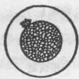

*图 3-7(a) 间期：不分裂的细胞，核内看不到染色体结构。*

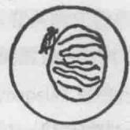

*图 3-7(b) 前期：染色体出现，呈细线状，中心体分开。*

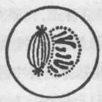

*图 3-7(c) 前中期：染色体缩短变粗，核膜将近消失，纺锤体形成。*

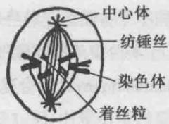

*图 3-7(d) 中期：核膜消失，染色体排列在赤道面上。图中标注了中心体、纺锤丝、染色体与着丝粒四者的空间关系。*

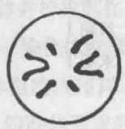

*图 3-7(e) 中期（极面观）：从两极方向看到的赤道面，染色体散处于中央——此视角便于计数染色体。*

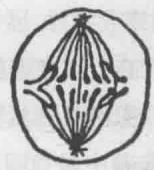

*图 3-7(f) 后期：并列的两条染色单体分别向两极移动。*

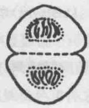

*图 3-7(g) 末期：染色体到达两极，核膜渐次出现，胞质分割，一个细胞即将分成两个子细胞，子细胞的染色体数目跟原来细胞一样。*

>[!important] 有丝分裂的遗传学意义
>前期时每个染色体的两条染色单体在**形态和组成上一模一样**，所以末期时两个子细胞内的染色体在**数目和形态上也完全一样**。由于这个缘故，**有丝分裂保证了细胞内染色体精确地分配到子细胞中去**——这是遗传物质稳定传递、个体正常生长与发育的物质基础。

### 2.3 减数分裂

**减数分裂**（meiosis）是一种特殊的真核细胞分裂方式，**在配子形成过程中发生**。其两大特点：

1. **连续进行两次核分裂，而染色体只复制一次**，结果形成 4 个核，每个核只含单倍数的染色体（$n$），即染色体数**减少一半**——故名「减数」分裂。
2. **前期特别长，而且变化复杂**，其中包括同源染色体的**配对、交换与分离**等。

两个配子（$n$）结合成合子后，染色体数恢复为 $2n$。

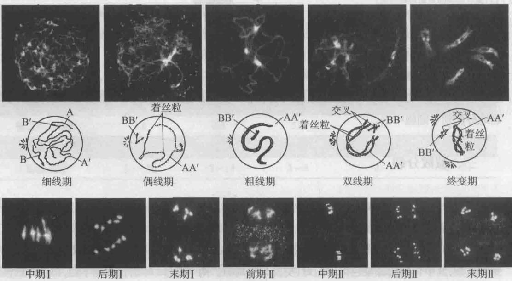

*图 3-8 减数分裂各时期的染色体形态（上排荧光照片，下排对应模式图）：细线期 → 偶线期 → 粗线期 → 双线期 → 终变期（前期Ⅰ五个阶段），随后是中期Ⅰ、后期Ⅰ、末期Ⅰ、前期Ⅱ、中期Ⅱ、后期Ⅱ、末期Ⅱ。照片为拟南芥花粉母细胞经 DAPI 染色后的形态，示意图以含同源染色体 $AA'$ 与 $BB'$ 的细胞（$2n=4$）为例。*

#### （1）减数分裂Ⅰ——前期Ⅰ的五个阶段

| 阶段 | 染色体行为 | 关键名词 |
|---|---|---|
| **细线期** leptotene | 染色质浓缩为几条细而长的细线，相互间往往难以区分；染色体虽已在间期复制，但此时**还看不出双重性** | — |
| **偶线期** zygotene | 两条**相同染色体（同源染色体）开始配对**：在两端先行靠拢配对，或在染色体全长各不同部位开始配对；配对是**专一性的，只有同源染色体才会配对**，最后扩展到整条染色体 | **联会**（synapsis）；出现**联会复合体**（synaptonemal complex）；完成联会后两条同源染色体并排排列，称**双价体**（bivalent） |
| **粗线期** pachytene | 染色体继续缩短变粗；光学显微镜下可见每条染色体由两条姐妹染色单体组成，在着丝粒处相连 → 每对同源染色体由 **4 条染色单体**组成 | **四联体**（tetrad）；四联体中的**非姐妹染色单体之间可发生交换**，彼此互换相等的染色体区段 |
| **双线期** diplotene | 双价体中两条同源染色体开始分开，但分开又不完全，并不形成两个独立的单价体，而是在若干处发生**交叉**（chiasmata）并相互连接；交叉数目逐渐减少，**着丝粒两侧的交叉向两端移动** | **交叉**是染色单体发生**交换**（crossing over）的场所；交叉端化（terminalization of chiasmata）；染色体继续缩短变粗 |
| **终变期** diakinesis | 两条同源染色体仍有交叉联系，仍为 $n$ 个双价体；染色体更粗短，螺旋化达到最高，有时染色单体都看不清 | 交叉端化继续进行；核仁和核膜开始消失，双价体开始向赤道面移动，纺锤体开始形成 |

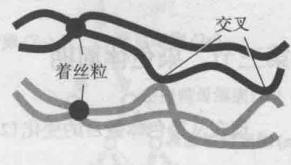

*图 3-9 联会过程与联会复合体：(a) 同源染色体在减数分裂前期互作的全过程——启动 → 配对 → 联会 → 重组 → 分离；(b) 联会复合体由两个**侧体**和一个**中体**组成（主要由蛋白质组成），该结构到双线期和终变期时消失，其形成可能与同源染色体配对和染色体交换有关。*

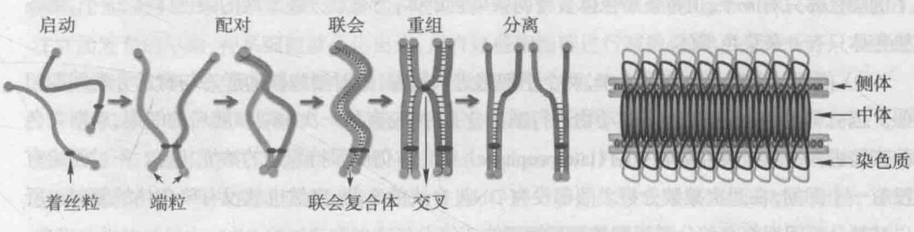

*图 3-10(a) 显微镜下的同源染色体与交叉。*

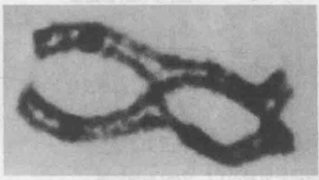

*图 3-10(b) 同源染色体与交叉的模式图：双价体的两条同源染色体在若干处交叉相连，图中标出着丝粒与交叉的位置关系。*

#### （2）减数分裂Ⅰ——中期Ⅰ至末期Ⅰ

| 时期 | 染色体行为 |
|---|---|
| **中期Ⅰ** | 各个双价体排列在赤道面上；纺锤体形成，纺锤丝把着丝粒连向两极；两个同源染色体上的着丝粒逐渐远离，双价体开始分离，但**仍有交叉联系**，交叉数目已大为减少，一般都移向端部 |
| **后期Ⅰ** | **双价体中的两条同源染色体分开**，分别向两极移动；每一染色体仍有两染色单体，在着丝粒区相连（相当于有丝分裂前期的一条染色体）。细胞两极得到 $n$ 条染色体——**染色体数目的减半就发生在后期Ⅰ**。双价体中哪一条染色体移向哪一极，**完全是随机的** |
| **末期Ⅰ** | 核膜重建，核仁重新形成，接着胞质分裂成为两个子细胞；染色体渐渐解开螺旋，又变成细丝状 |

>[!important] 末期Ⅰ ≠ 有丝分裂末期
>**末期Ⅰ**：染色体只有 $n$ 个，但**每条染色体含有两条染色单体**；
>**有丝分裂末期**：染色体有 $2n$ 个，**每条染色体只有一条染色单体**。

#### （3）减数分裂间期与减数分裂Ⅱ

- **间期**：第一次分裂之末，两个子细胞进入间期，细胞核形态与有丝分裂间期相似。但许多生物（例如大多数动物）**没有第一次末期和随后的间期**，后期染色体直接进入减数分裂Ⅱ的晚前期（late prophase），染色体仍旧保持浓缩状态。
- 无论有没有一个间期，**两次减数分裂之间都没有 DNA 合成的 S 期，自然也就没有染色体的复制**——这是减数分裂间期与有丝分裂间期的根本区别。
- **前期Ⅱ**：完全和有丝分裂前期一样，每一染色体具有两条染色单体，**所不同的只是只有 $n$ 条染色体**。
- **中期Ⅱ—末期Ⅱ**：过程完全和有丝分裂一样，**所不同的就是染色体数目在第一次分裂过程中已经减半**，第二次分裂时只有 $n$ 条染色体。

**结果**：一次减数分裂形成 **4 个子细胞**——因为细胞分裂两次，染色体只复制一次，每个子细胞中只有 $n$ 条染色体。

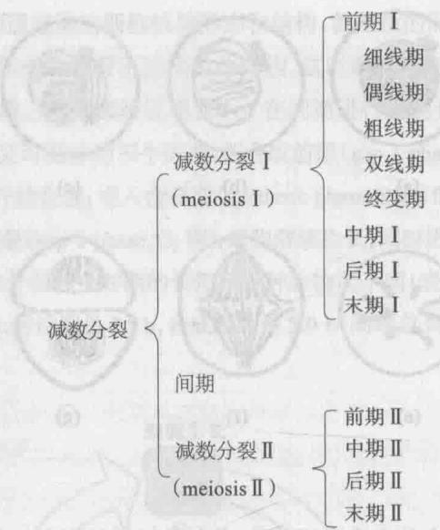

*图 3-8（分期总览）减数分裂 = 减数分裂Ⅰ（前期Ⅰ含细线期、偶线期、粗线期、双线期、终变期 → 中期Ⅰ → 后期Ⅰ → 末期Ⅰ）+ 间期 + 减数分裂Ⅱ（前期Ⅱ → 中期Ⅱ → 后期Ⅱ → 末期Ⅱ）。注意：两次分裂之间没有 S 期。*

>[!important] 减数分裂的遗传学意义
> 1. **保证世代间染色体数目恒定**：减数分裂使配子染色体数由 $2n$ 减为 $n$，受精后合子又恢复 $2n$，从而保证亲代与子代之间染色体数目的恒定性，为后代的正常发育和性状遗传提供物质基础，保证物种的相对稳定性。
> 2. **产生遗传变异**：
>    - 各对同源染色体中的两个成员在**后期Ⅰ分向两极是随机的**，一对染色体的分离与任何另一对染色体的分离不发生关联，各个非同源染色体之间均可能自由组合到一个子细胞里。$n$ 对染色体就有 $2^n$ 种自由组合方式（补充：水稻 $n=12$，组合数即 $2^{12}=4096$）。
>    - 同源染色体的**非姐妹染色单体之间还可能发生各种方式的交换**，更增加了子细胞间差异的复杂性。
>这两点是生物变异的重要来源，为进化提供物质基础。

### 2.4 有丝分裂 Vs 减数分裂（对比表 ★必背）

| 比较项 | **有丝分裂** | **减数分裂** |
|---|---|---|
| 发生部位 / 时机 | 所有正在生长的组织中；从合子阶段开始，延续到个体的整个生活周期 | 只在**有性繁殖组织**中；高等生物限于成熟个体，许多藻类和真菌发生在合子阶段 |
| 分裂次数与复制 | 核分裂 **1 次**，染色体复制 **1 次** | 连续 **2 次**核分裂（减数分裂Ⅰ、Ⅱ），染色体只复制 **1 次** |
| 同源染色体行为 | **无联会，无交叉和互换**；同源染色体不配对，各自独立排列在赤道面上 | **有联会，可以有交叉和互换**；前期Ⅰ同源染色体专一性配对形成双价体/四联体 |
| 关键时期·染色体行为 | 后期**着丝粒一分为二、姐妹染色单体分离**（均等分裂） | **后期Ⅰ同源染色体分离**（减数分裂）；**后期Ⅱ姐妹染色单体分离**（均等分裂） |
| 子细胞数 | 每个周期产生 **2 个**子细胞 | 产生 **4 个**细胞产物（配子或孢子） |
| 子细胞染色体数 | 与母细胞**相同**（$2n \rightarrow 2n$） | 为母细胞的**一半**（$2n \rightarrow n$） |
| 子细胞遗传组成 | 产物的遗传成分**相同** | 产物的遗传成分**不同**，是父本和母本染色体的不同组合（再加交换） |
| 前期长短 | 短 | **特别长，变化复杂**（前期Ⅰ占五个阶段） |
| 遗传学意义 | 染色体精确均等分配到子细胞，**保证子细胞与母细胞遗传组成一致**；维持个体生长、发育中遗传物质的稳定性与连续性 | ① 染色体数减半，受精后恢复 $2n$，**保证世代间染色体数目恒定**；② 通过非同源染色体随机组合（$2^n$）与非姐妹染色单体交换，**产生丰富变异，是进化的物质基础** |

>[!tip] 一句话区分
>有丝分裂 = **「复制一次、分裂一次、姐妹染色单体分离」**，产物与母细胞相同；
>减数分裂 = **「复制一次、分裂两次、后期Ⅰ分同源染色体、后期Ⅱ分姐妹染色单体」**，产物为 $n$ 且各不相同。

---

## 第三节 染色体周期

现在从**染色体数目的变化**（$2n \rightleftharpoons n$）来看生物个体的生活史。

### 3.1 动物的生活史

**性细胞的发生链条**（以雄性为例）：

精原细胞（$2n$，与体细胞染色体数相同，由有丝分裂产生）$\xrightarrow{\text{多次有丝分裂后停止分裂、长大}}$ **初级精母细胞**（$2n$）$\xrightarrow{\text{减数分裂Ⅰ}}$ 2 个**次级精母细胞**（$n$）$\xrightarrow{\text{减数分裂Ⅱ}}$ 4 个**精细胞**（$n$）$\xrightarrow{\text{精子形成（细胞质与细胞器变化，核不再变化）}}$ **精子**。

雌性一侧的关键差别：

- 初级卵母细胞（$2n$）经第一次分裂产生**大小悬殊**的两个细胞：大的为**次级卵母细胞**（$n$），小的为**第一极体**（$n$）；
- 次级卵母细胞再分裂一次，仍产生大小悬殊的两个细胞：大的为**卵细胞**（$n$），小的为**第二极体**（$n$）；
- 第一极体有再分裂一次的，也有不分裂的，跟第二极体一起**都退化了**。
- **所以每个初级卵母细胞经过减数分裂，只产生一个有效的配子——卵细胞（$n$）。**

受精时精子进入卵细胞成为**合子**，精子的细胞核与卵细胞的核融合成合子的细胞核；精细胞核的单倍体染色体数与卵细胞核的单倍体染色体数相加，成为合子核内的二倍体染色体数。合子经有丝分裂产生下一代个体的体细胞，也都是二倍体。

家蚕（*Bombyx mori*）是教材给出的动物生活史示例：性细胞形成和受精过程由**种系细胞**（germ-line cell）完成——胚胎发育早期种系细胞就分化出来，**只有这些细胞能进行减数分裂并形成配子**；但这种可能性的实现，一定要在身体的体细胞部分经过无数次有丝分裂、达到成熟的时候。

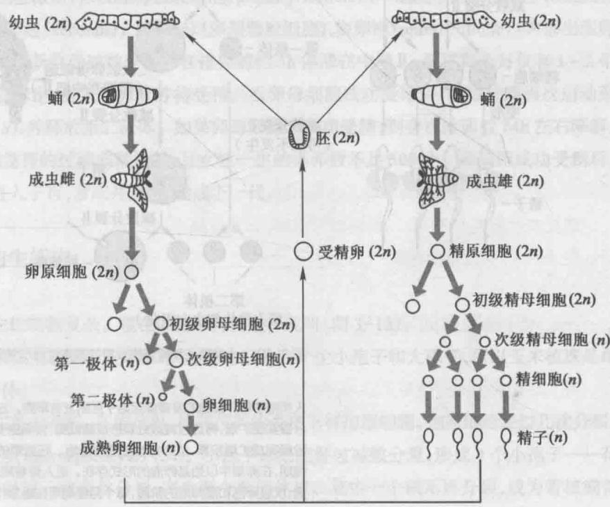

*图 3-11 动物生活史（以家蚕为例）：精原细胞经减数分裂形成 4 个精子；卵原细胞经减数分裂只形成 1 个有功能的卵细胞。精子与卵细胞的染色体数都是 $n$，卵细胞受精后形成二倍体合子，染色体数是 $2n$。*

**人类精子与卵细胞的形成（图 3-12）**

- 胚胎发育第 2 周，外胚层中部分细胞分化形成**原始生殖细胞**（PGC），第 4 周迁移至卵黄囊，第 5 周末到达正在发育的原始性腺，进一步分化形成卵原细胞或精原细胞；迁移与分化过程中 PGC 通过旺盛的有丝分裂不断增加数量。
- **XY 胚胎（精子发生）**：出生后 2 个月左右，精原细胞分化形成两种精原干细胞（SSC，$2n$）——核染色深暗的 **Ad 型**精原细胞与核染色浅淡的 **Ap 型**精原细胞，包裹在曲细精管壁外围的基底层中。青春期后 Ap 型经多次有丝分裂形成 B 型精原细胞（$2n$），后者再经有丝分裂形成初级精母细胞（$2n$），连续经减数分裂Ⅰ、Ⅱ形成精细胞（$n$），并在进入曲细精管中央腔前完成变态，形成可游动的成熟精子。Ad 型则通过有丝分裂不断补充新的 Ad 与 Ap，维持干细胞数量。
  - 一个健康成年男性，从精原干细胞发育至精子全过程 **48~64 天**，每天可产生 **0.45 亿~2 亿**个成熟精子。
  - 成熟精子停留于输卵管峡部，排卵后游向壶腹部，经**精子获能**（capacitation）和**顶体反应**（acrosome reaction）后才能与卵细胞结合得到受精卵（$2n$）。
- **XX 胚胎（卵细胞发生）**：从卵原细胞到成熟卵细胞需**至少十余年**。胚胎第 3 个月起卵原细胞在增殖同时进一步分化，部分成为初级卵母细胞（$2n$）并进入减数第一次分裂前期；第 5 个月卵巢中卵原细胞数量达最大，约 **700 万个**，同时大量卵原细胞与初级卵母细胞走向**闭锁**；第 7 个月存活初级卵母细胞全部进入减数分裂Ⅰ前期；出生前后每个初级卵母细胞被单层扁平上皮细胞包围形成**原始卵泡**，数量 **70 万~200 万个**，构成卵巢的**生殖储备池**。在**卵母细胞成熟抑制剂**（OMI）作用下，所有卵母细胞发育**停滞在双线期直至排卵**。
  - 青春期后每月有 **15~20 个**原始卵泡被激活，依次经初级卵泡（单层扁平上皮细胞分化成立方形颗粒细胞）→ 次级卵泡（多层颗粒细胞）→ 窦卵泡（内部出现卵泡腔），重新启动减数分裂并在**排卵前约 3 h 停滞在中期Ⅱ**，最终每月仅有 **1~2 个**成熟卵母细胞被排出。
  - 卵母细胞成功受精后减数分裂再次启动形成成熟卵细胞（$n$），并释放第二极体；若未受精，则在排卵后约 **24 h** 降解。
  - 可见人类卵细胞发育非常漫长，**女性一生的排卵数不足 500 个**。

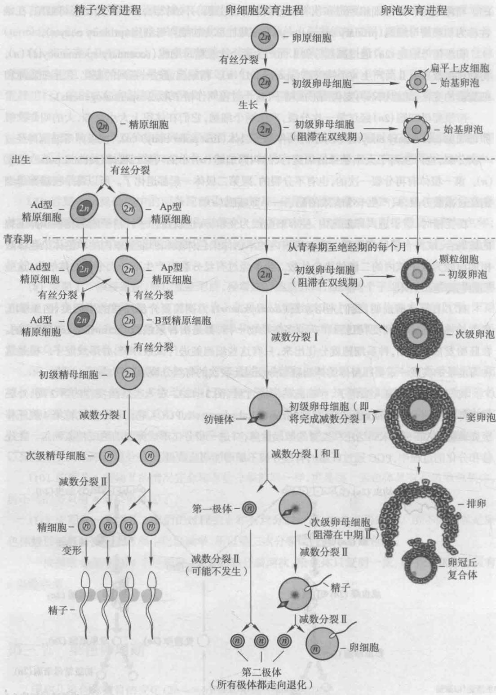

*图 3-12 人类精子和卵细胞发育的基本过程示意图。左：精原细胞进入青春期后先经有丝分裂扩增，再经减数分裂形成精细胞，变形后成为精子。中：卵原细胞在胚胎阶段完成扩增，胚胎期已进入减数分裂Ⅰ并停滞在双线期，排卵期停滞在中期Ⅱ，直至受精后才完成全部减数分裂。右：卵泡发育进程（始基卵泡 → 初级卵泡 → 次级卵泡 → 窦卵泡 → 排卵）。*

### 3.2 植物的生活史

植物的生活史比动物复杂，教材以**玉米**为例（图 3-13）。玉米同一植株上着生雄花序和雌花序，分别产生小孢子和大孢子，**玉米植株是雌雄同株的，是孢子体**。

**雄花序一侧（雄配子体）**：雄花序着生在茎的端部。雄蕊花药表皮下有孢原细胞 → 经几次分裂成为**小孢子母细胞**（microsporocyte，$2n$）→ 减数分裂形成 **4 个小孢子——花粉粒**（$n$）→ 小孢子经一次有丝分裂产生两个单倍体核：一个核不再分裂，成为**管核（营养核）**（$n$）；另一核再进行一次有丝分裂，成为**两个精核**（$n$）。这样，**雄配子体——成熟花粉粒含有 3 个单倍体核**。

**雌花序一侧（雌配子体）**：雌花序着生在植株上部叶腋间。雌蕊基部的子房中有孢原细胞 → 发育成为**大孢子母细胞**（macrosporocyte，$2n$）→ 减数分裂产生 4 个单倍体核（$n$），**其中 3 个退化**，留下的 1 个大孢子又经**三次有丝分裂**，形成有 **8 个单倍体核的胚囊**。8 个核中：顶端的 3 个发育成为**反足细胞**；2 个移至中部成为**极核**；还有 3 个移至胚囊底部，构成两个助核和一个**卵核**，分别发育成助细胞和卵细胞。**成熟胚囊包括 7 个细胞，又称雌配子体。**

**双受精**：受粉后花粉萌发，花粉管沿花柱长到胚囊。在那里，**一个精核与卵核结合**，产生二倍体核（$2n$）；**另一精核与两个极核结合**，产生一个三倍体核（$3n$）。两个精核分别与胚囊中的卵核和极核结合的过程，叫作**双受精**（double fertilization）——这是**显花植物特有的现象**。

通过多次有丝分裂，二倍体核形成**胚**，三倍体核形成**胚乳**，胚和胚乳合在一起构成**种子**。种子萌芽，长成新的植株。

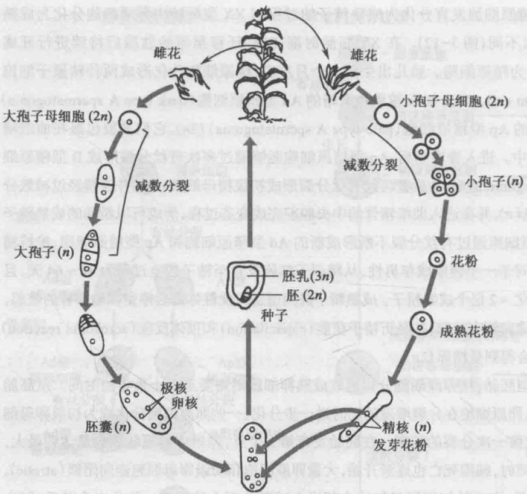

*图 3-13 植物生活史（以玉米为例）：玉米等高等植物不具有明显的种系，组成花器官的营养细胞（$2n$）有些分化为大孢子母细胞、有些分化为小孢子母细胞，再经减数分裂形成大孢子和小孢子；大、小孢子通过有丝分裂分别成为胚囊和花粉粒。受精时一个精核与卵核结合形成胚（$2n$），另一精核与两个极核结合形成胚乳（$3n$）。*

### 3.3 动、植物生活史的比较

**表 3-3 动物和植物的性细胞各时期的对照表**

| 雌性·动物 | 雌性·植物 | 雄性·动物 | 雄性·植物 |
|---|---|---|---|
| 卵原细胞 ↓ 初级卵母细胞 | 雌孢原细胞 ↓ 大孢子母细胞 | 精原细胞 ↓ 初级精母细胞 | 雄孢原细胞 ↓ 小孢子母细胞 |
| 减数分裂 ↓ **1 个卵** | 减数分裂 ↓ **1 个大孢子**（有丝分裂 3 次） | 减数分裂 ↓ **4 个精子** | 减数分裂 ↓ **4 个小孢子（花粉粒）**，各有丝分裂 1 次 → 营养核 + 生殖核，生殖核再有丝分裂 1 次 → 第一雄核、第二雄核（成熟花粉粒含 1 个营养核 + 2 个雄核） |

>[!important] 一句话抓住差异
>**动物**：减数分裂发生在**配子形成时**，直接产生配子（精细胞 4 个 / 卵细胞 1 个）。
>**植物**：减数分裂的产物是**孢子**（小孢子、大孢子），孢子还要经有丝分裂发育成配子体（花粉粒、胚囊），再由配子体产生配子，并且**多了双受精与三倍体胚乳**这一环节。

### 3.4 真菌类的生活史

真菌的生活史是**单倍体世代占优势，双倍体世代时间较短**。以**粗糙链孢霉**（*Neurospora crassa*）为例（图 3-14）：

1. 孢子或菌丝片段落在面包等营养物上，孢子萌发，菌丝生长；菌丝相互交织形成**菌丝体**。菌丝的细胞壁间隔不完全，所以菌丝的细胞质是连续的，每一菌丝细胞是**多核**的，但每个核的染色体数是**单倍的**（$n$）。
2. **无性繁殖**：粗糙链孢霉有两个**交配型** A 和 a，各自可无性生殖形成菌丝，长出**分生孢子**（$n$）；分生孢子散布开去，继续无性生殖或进行有性生殖。
3. **有性繁殖**：需要一个交配型的单倍体核（$n$）通过另一相对交配型的**子实体**的**受精丝**进入子实体中，在那里有丝分裂多次，产生若干单倍体核；这些单倍体核跟子实体中的单倍体核相互结合，形成二倍体核（$2n$）。
   - 因为细胞质主要来自子实体，所以视**子实体为雌体**，视**分生孢子为雄体**。
   - 粗糙链孢霉**只有在这个短暂时间内是二倍体世代**。
4. 每一个二倍体核经**减数分裂**产生 4 个单倍体核（$n$），再经**一次有丝分裂**形成 8 个核（$n$），最后这些核成为**子囊孢子**，顺次排列在一个**子囊**中。所以**一个子囊中的 8 个孢子是一次减数分裂和一次有丝分裂的产物**。
5. 子囊孢子在适宜环境中萌发，通过连续的有丝分裂产生新的菌丝体。

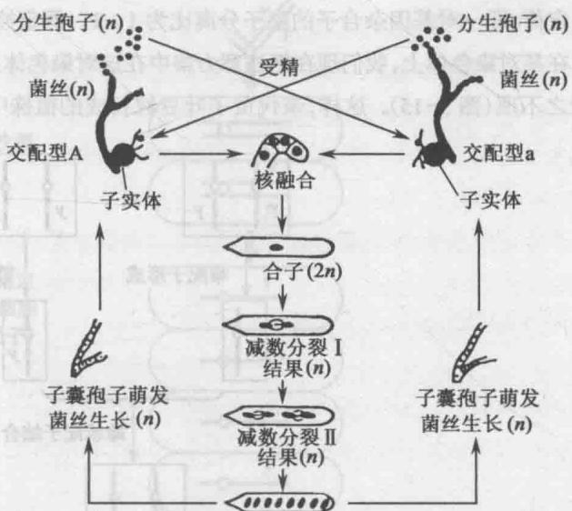

*图 3-14 真菌生活史（以粗糙链孢霉为例）：两个交配型 A 与 a 的无性世代（菌丝、分生孢子，均 $n$）→ 核融合成合子（$2n$）→ 减数分裂Ⅰ（结果 $n$）→ 减数分裂Ⅱ（结果 $n$）→ 有丝分裂后形成 8 个子囊孢子（$n$）→ 子囊孢子萌发，开始新一轮无性生殖。*

>[!note] 三种生活史对照
>
>| 类群 | 主要世代 | 减数分裂发生的时机 |
>|---|---|---|
>| 动物 | 二倍体世代占优势 | 配子形成时（性母细胞成熟） |
>| 高等植物 | 二倍体孢子体占优势，配子体微小 | 孢子形成时（大、小孢子母细胞） |
>| 真菌（粗糙链孢霉） | **单倍体世代占优势** | **合子萌发时**（合子立即减数分裂） |

---

## 第四节 遗传的染色体学说

### 4.1 染色体与基因的平行现象

遗传的染色体学说的证据，最早来源于**染色体和基因之间的平行现象**——配子形成和受精时染色体的行为，跟杂交实验中基因的行为平行。表现在下列几点：

| 序号 | 染色体 | 基因 |
|---|---|---|
| （1） | 可在显微镜下看到，有一定的**形态结构** | 基因是遗传学的单位，每对基因在杂交中仍保持它们的**完整性和独立性** |
| （2） | **成对存在** | 也是**成对存在**的；在配子中只有一个等位基因，也只有一对同源染色体中的一条 |
| （3） | 个体中成对的两个同源染色体**分别来自父本和母本** | 成对的基因也**一个来自母本、一个来自父本** |
| （4） | 不同对染色体在减数分裂后期的**分离组合是独立的** | 不同对基因在形成配子时的**分离组合也是独立的** |

因此，**萨顿和博韦里在 1903 年提出遗传的染色体学说，认为基因在染色体上**。萨顿指出：如果假定基因在染色体上，那么就可十分圆满地解释孟德尔的分离定律和自由组合定律。

### 4.2 分离定律 ↔ 同源染色体的分离

分离定律即**一对基因杂合子的配子分离比为 1:1**。假定控制豌豆子叶黄绿颜色的一对基因 $Y$ 和 $y$ 在某对染色体上，把注意力集中在这对染色体上、把豌豆的其余 6 对染色体置之不理（图 3-15）：

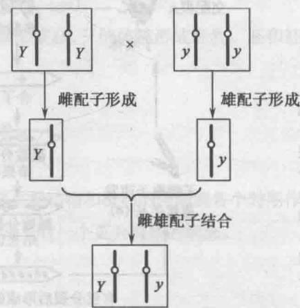

*图 3-15 根据基因在染色体上的假设，看一对基因杂合子（$Yy$）的形成：亲代黄子叶植株（$YY$）× 绿子叶植株（$yy$）→ 雌、雄配子形成 → 雌雄配子结合 → $F_1$ 植株细胞内有一对染色体，一条来自黄子叶植株（带 $Y$），一条来自绿子叶植株（带 $y$）。*

**推演过程**（教材原文逻辑）：

1. 亲代黄子叶豆粒长成的植株中，每个细胞内这一对染色体的两个成员**都带有 $Y$**；经减数分裂产生的每个配子中只有一条这种染色体，**所有配子在这条染色体上都带有 $Y$**。亲代绿子叶植株的所有配子在这条染色体上都带有 $y$。
2. $F_1$ 植株的每个细胞内也有这样一对染色体：一条从黄子叶植株来、带 $Y$，另一条从绿子叶植株来、带 $y$。$F_1$ 植株的初级性母细胞中的染色体与体细胞一样。
3. **减数分裂Ⅰ中期**：这一对染色体**各有两条染色单体并相互配对**（图 3-16）。
4. **减数分裂Ⅰ后期**：这对**同源染色体分别进入一个次级性母细胞**——一个次级性母细胞带 $Y$，它产生的两个配子也带 $Y$；另一个次级性母细胞带 $y$，由它产生的两个配子也带 $y$。
5. $F_1$ 植株的每个初级性母细胞都产生 4 个配子，其中 **2 个带 $Y$、2 个带 $y$**。$n$ 个初级性母细胞产生 $4n$ 个配子，其中 $2n$ 带 $Y$、$2n$ 带 $y$，即 **1:1**。

>[!important] 结论
>**可见基因的分离是染色体分离的结果。** 孟德尔假设的成对因子「彼此分离、分别进入不同配子」，其物质基础就是**后期Ⅰ同源染色体分别移向两极**。

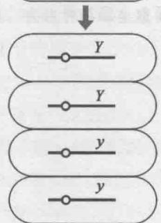

*图 3-16 一对基因杂合子形成配子时，染色体的分离和基因的分离：减数分裂结束，一个性母细胞产生 4 个配子，2 个带 $Y$、2 个带 $y$。*

### 4.3 自由组合定律 ↔ 非同源染色体的独立分配

自由组合定律即**两对基因杂合子的配子分离比为 1:1:1:1**。图 3-17 表示豌豆中黄圆 × 绿皱杂交所得 $F_1$ $YyRr$ 植株中性母细胞的减数分裂。假定基因 $Y$ 和 $y$ 在一对**较长**的染色体上，而基因 $R$ 和 $r$ 在一对**较短**的染色体上：

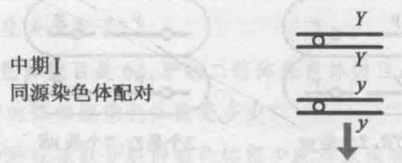

*图 3-17 起点：$F_1$（$YyRr$）的性母细胞在减数分裂Ⅰ中期，两对同源染色体各自配对——长染色体上带 $Y/y$，短染色体上带 $R/r$。*

就这两对染色体而言，初级性母细胞的减数分裂Ⅰ有**两种可能情况，它们的机会是相等的，即各为 1/2**：

| 排列方式 | 中期Ⅰ取向 | 减数分裂产物（每个性母细胞产生 4 个配子） | 比例 |
|---|---|---|---|
| **左栏方式** | $Y$ 与 $R$ 走向同一极、$y$ 与 $r$ 走向另一极 | 2 个 $YR$ + 2 个 $yr$ | 该取向占 1/2 |
| **右栏方式** | $Y$ 与 $r$ 同极、$y$ 与 $R$ 同极 | 2 个 $Yr$ + 2 个 $yR$ | 该取向占 1/2 |

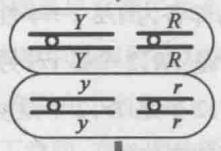

*图 3-17（左栏）一种取向：长、短两对同源染色体在中期Ⅰ的排列使 $Y$ 与 $R$ 走向同一极，$y$ 与 $r$ 走向另一极。*

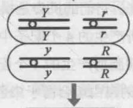

*图 3-17（右栏）另一种取向：$Y$ 与 $r$ 走向同一极，$y$ 与 $R$ 走向另一极。两种取向机会均等，各为 1/2。*

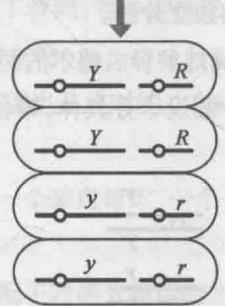

*左栏取向的产物：4 个配子为 $YR$、$YR$、$yr$、$yr$。*

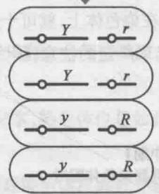

*右栏取向的产物：4 个配子为 $Yr$、$Yr$、$yR$、$yR$。*

>[!important] 结论
>两种取向各占一半，所以 4 种配子的比例是 **1:1:1:1**——**可见基因的自由组合源于染色体的独立分配**。
>所以，**只要假定基因在染色体上，就可十分圆满地解释孟德尔的两个定律。**

### 4.4 学说的确立与后续

萨顿这个假设引起了广泛的注意，因为这个假设十分具体——**染色体是细胞中具体可见的结构**。但要证实这个假设，进一步自然要把某一特定基因与特定染色体联系起来；**首先做到这一点的是美国遗传学家摩尔根**，这要留到连锁与交换一章再讨论。

>[!tip] 一句话总结本章逻辑链
>孟德尔定律（基因行为）→ 细胞学观察（染色体行为）→ **两者平行** → 萨顿、博韦里 1903 年提出「基因在染色体上」→ 摩尔根用果蝇把具体基因定位到具体染色体上，学说被证实。

---

## 🧠 概念辨析与易错点

1. **同源染色体 vs 姐妹染色单体**
   - **同源染色体**：一条来自父本、一条来自母本，**形态、大小一般相同**，携带着控制同一性状的等位基因（$Y$ 与 $y$）；减数分裂**前期Ⅰ联会**、**后期Ⅰ分离**。
   - **姐妹染色单体**：染色体复制后同一条染色体上的两条纵向并列的拷贝，**基因组成完全相同**（$Y$ 与 $Y$）；在**后期Ⅱ（或有丝分裂后期）着丝粒一分为二时**才彼此分开。
   - 口诀：**「同源」看来源（父/母），「姐妹」看复制（同一染色体）。**

2. **联会 vs 双价体 vs 四联体 vs 四分体**
   - **联会**（synapsis）：偶线期两条同源染色体靠拢配对的**过程**，只有同源染色体才会配对。
   - **双价体**（bivalent）：完成联会后两条同源染色体并排排列在一起的**结构**（此时含 2 条染色体）。
   - **四联体**（tetrad）：粗线期时每对同源染色体由 4 条染色单体组成（2 条染色体 × 2 条染色单体）。
   - 易错：双价体与四联体指的是**同一结构的不同强调重点**（前者强调「2 条同源染色体」，后者强调「4 条染色单体」），不是两个先后出现的独立结构。

3. **减数分裂Ⅰ vs 减数分裂Ⅱ（最关键的区别）**

   | | 减数分裂Ⅰ | 减数分裂Ⅱ |
   |---|---|---|
   | 分离的对象 | **同源染色体**（着丝粒不分裂） | **姐妹染色单体**（着丝粒一分为二） |
   | 分裂性质 | 减数分裂 | 均等分裂，与有丝分裂过程相同 |
   | 有无联会 / 交叉 | 有 | 无 |
   | 产物染色体数 | $2n \rightarrow n$ | $n \rightarrow n$ |

4. **交叉 vs 交换**：**交叉**（chiasmata）是双线期在显微镜下**看得到**的、两条同源染色体之间的连接点；**交换**（crossing over）是发生在非姐妹染色单体之间的**染色体区段互换**，交叉是交换的场所/细胞学表现。交换以**联会复合体**为中介，可以改变单倍染色体组的遗传信息，是生物进化中遗传变异的重要来源。

5. **染色体数目减半发生在「后期Ⅰ」，不是后期Ⅱ，也不是末期Ⅰ**：后期Ⅰ同源染色体一分开，两极各自就只有 $n$ 条染色体了。后期Ⅱ只是姐妹染色单体分开，染色体数（以着丝粒计）由 $n$ 变为 $2n$（但每个子核仍是 $n$ 条）。

6. **末期Ⅰ ≠ 有丝分裂末期**：末期Ⅰ的染色体只有 $n$ 个，但**每条含两条染色单体**；有丝分裂末期染色体有 $2n$ 个，**每条只有一条染色单体**。

7. **两次减数分裂之间的「间期」没有 S 期**：减数分裂全过程染色体只复制一次（在减数分裂前的间期），两分裂之间**没有 DNA 合成**，因此与有丝分裂间期很不一样。（补充：许多动物甚至没有末期Ⅰ和这个间期，染色体直接进入减数分裂Ⅱ的晚前期。）

8. **动物 vs 植物：减数分裂发生的位置不同**
   - 动物：发生在**配子形成**过程中，性母细胞（初级精母细胞 / 初级卵母细胞）成熟时进行，产物直接是配子（4 个精细胞 / 1 个卵 + 极体）。
   - 植物：发生在**孢子形成**时（小孢子母细胞、大孢子母细胞），产物是**孢子**（4 个小孢子 / 4 个单倍体核中存活 1 个），孢子再经**有丝分裂**发育成配子体（花粉粒、胚囊），之后才产生配子，并有**双受精**。

9. **同一个初级性母细胞产生的配子，基因型不一定相同**：一个 $YyRr$ 性母细胞的 4 个配子只有两种基因型（如 $YR$、$YR$、$yr$、$yr$），**比值 1:1 而不是 1:1:1:1**；1:1:1:1 是**群体**（大量性母细胞）的结果，因为两种取向各占 1/2。

10. **有丝分裂与减数分裂的「中期」含义不同**：有丝分裂中期是**一条染色体的着丝粒**排在赤道面上；减数分裂中期Ⅰ是**一个双价体（两条同源染色体）**排在赤道面上。因此「中期计算染色体数目最容易」这句话是针对**有丝分裂**说的。

11. **无性生殖一般不发生性状分离**：无性生殖不经减数分裂与配子结合，子代来自体细胞的有丝分裂（或原核生物的二分分裂），产物遗传组成与母细胞一致。**（补充）** 若体细胞发生突变，则可能出现新的性状并形成嵌合体，这属于突变而非「分离」。

12. **极体不是「无用的东西」**：正常情况下第一、第二极体都退化，每个初级卵母细胞只产生 1 个有效配子；但在孤雌生殖等特殊情形下，极体可与卵核融合（极体受精）而形成二倍体个体，这正是某些孤雌生殖个体出现**杂合基因型**的原因（见习题 9）。

---

## 习题

>以下 9 题来自教材章末习题，逐题给出完整解答。解答所用方法均出自本章（分裂过程中染色体计数的规律、减数分裂产物数目、$2n \rightleftharpoons n$ 的生活史知识与染色体学说的平行关系）。

### 1. 有丝分裂和减数分裂的区别在哪里？从遗传学角度来看，这两种分裂各有什么意义？无性生殖会发生性状分离吗？试加以说明

**答：**

**（一）区别**（详见本章 2.4 对比表，要点如下）

| 比较项 | 有丝分裂 | 减数分裂 |
|---|---|---|
| 发生部位/时机 | 所有正在生长的组织；从合子起贯穿整个生活周期 | 只发生在有性繁殖组织；高等生物限于成熟个体 |
| 分裂次数 / 复制次数 | 1 次 / 1 次 | 2 次 / 1 次 |
| 同源染色体行为 | 无联会、无交叉互换 | 有联会、有交叉互换 |
| 关键时期 | 后期着丝粒一分为二、姐妹染色单体分离 | 后期Ⅰ同源染色体分离，后期Ⅱ姐妹染色单体分离 |
| 子细胞数 | 2 个 | 4 个 |
| 子细胞染色体数 | 与母细胞相同（$2n$） | 为母细胞的一半（$n$） |
| 子细胞遗传组成 | 相同 | 不同（父、母本染色体的不同组合 + 交换） |
| 前期长短 | 短 | 前期特别长且变化复杂 |

**（二）遗传学意义**

- **有丝分裂**：前期每个染色体的两条染色单体在形态和组成上一模一样，末期时两个子细胞内的染色体在数目和形态上也完全一样。因此**核内每个染色体准确地复制分裂为二，为形成的两个子细胞在遗传组成上与母细胞完全一样提供了基础**，复制的各对染色体又有规则而均匀地分配到两个子细胞的核中，使两个子细胞与母细胞具有同样质量和数量的染色体。这是个体正常生长、发育与遗传物质稳定传递的基础。
- **减数分裂**：① 形成的 4 个子细胞各具有半数的染色体（$n$），雌雄配子受精结合为合子后又恢复为全数的染色体 $2n$，**保证了亲代与子代间染色体数目的恒定性**，为后代的正常发育和性状遗传提供物质基础，保证了物种的相对稳定性；② 各对染色体中的两个成员在**后期Ⅰ分向两极是随机的**，一对染色体的分离与任何另一对染色体的分离不发生关联，$n$ 对染色体就有 $2^n$ 种自由组合方式（补充：水稻 $n=12$，即 $2^{12}=4096$ 种）；此外**同源染色体的非姐妹染色单体之间还可能出现各种方式的交换**，更增加了子细胞间差异的复杂性。**这为生物的变异提供了重要的物质基础。**

**（三）无性生殖会发生性状分离吗？**

**不会**（就本章范围而言）。无性生殖（细菌的二分分裂、各类营养繁殖等）**不经过减数分裂，也没有雌雄配子的结合**，其子代来自亲本体细胞的**有丝分裂（或二分分裂）**。而有丝分裂的功能正是「把一个细胞的整套染色体均等地分向两个子细胞」，产物在**数目和形态（遗传组成）上与母细胞完全一样**，不存在等位基因的分离与重组，因此无性生殖产生的后代与亲代遗传组成一致，**不发生性状分离**。

**（补充）** 若体细胞在增殖过程中发生突变，则可能由突变细胞长出具新性状的组织而形成嵌合体——那属于突变，而非分离。

---

### 2. 水稻正常的孢子体组织中染色体数目是 12 对，问下列各组织的染色体数目是多少？

（1）胚乳；（2）花粉管的管核；（3）胚囊；（4）叶；（5）根端；（6）种子的胚；（7）颖片。

**答：**

已知水稻孢子体 $2n = 12 \times 2 = 24$，单倍体数 $n = 12$。

| 组织 | 性质（本章依据） | 染色体数 |
|---|---|---|
| （1）**胚乳** | 由**一个精核（$n$）+ 两个极核（$2n$）** 结合而来，是**三倍体（$3n$）** | $3n = 36$ |
| （2）**花粉管的管核** | 属雄配子体，由小孢子有丝分裂产生，是单倍体核（$n$） | $n = 12$ |
| （3）**胚囊** | 雌配子体，由大孢子经 **3 次有丝分裂**形成，含 **8 个单倍体核** | 每个核 $n=12$；整个胚囊共 $8 \times 12 = 96$ |
| （4）**叶** | 孢子体营养组织，由合子经有丝分裂而来 | $2n = 24$ |
| （5）**根端** | 孢子体组织（分生区） | $2n = 24$ |
| （6）**种子的胚** | 由**合子（$2n$）**发育而来 | $2n = 24$ |
| （7）**颖片** | 花器官的营养细胞，属孢子体组织 | $2n = 24$ |

>[!tip] 计数口诀
>孢子体组织（根、茎、叶、花器官）都是 $2n$；**胚**是 $2n$（精 + 卵）；**胚乳**是 $3n$（精 + 2 极核），这是显花植物双受精的直接结果；**配子体**（花粉粒及其管核、胚囊）是 $n$。

---

### 3. 用基因型 $Aabb$ 的玉米花粉给基因型 $AaBb$ 的玉米雌花授粉，你预期下一代胚乳的基因型是什么类型，比例如何？

**答：**

**（1）明确胚乳的来源**：糊粉层/胚乳是**双受精**的产物，其基因型 = **2 个极核（♀）+ 1 个精核（♂）**，即 $3n$。

**（2）确定极核的基因型**：胚囊由 1 个大孢子经 3 次有丝分裂形成，**8 个核基因型相同**，所以 2 个极核的基因型**完全相同，都等于母本产生的配子（大孢子）基因型**。

雌株 $AaBb$ 产生 4 种配子：$AB$、$Ab$、$aB$、$ab$，各 $\dfrac{1}{4}$。

故极核组合为：（$AB$）₂、（$Ab$）₂、（$aB$）₂、（$ab$）₂，各 $\dfrac{1}{4}$。

**（3）确定精核的基因型**：雄株 $Aabb$ 只产生 2 种配子：$Ab$、$ab$，各 $\dfrac{1}{2}$。

**（4）组合（极核 ×2 + 精核 ×1）**：

| 极核（♀，2 份） | 精核（♂） | 胚乳基因型（A 位点 · B 位点） | 比例 |
|---|---|---|---|
| $AB$ | $Ab$ | $AAA$ · $BBb$ | 1/8 |
| $AB$ | $ab$ | $AAa$ · $BBb$ | 1/8 |
| $Ab$ | $Ab$ | $AAA$ · $bbb$ | 1/8 |
| $Ab$ | $ab$ | $AAa$ · $bbb$ | 1/8 |
| $aB$ | $Ab$ | $Aaa$ · $BBb$ | 1/8 |
| $aB$ | $ab$ | $aaa$ · $BBb$ | 1/8 |
| $ab$ | $Ab$ | $Aaa$ · $bbb$ | 1/8 |
| $ab$ | $ab$ | $aaa$ · $bbb$ | 1/8 |

**答**：下一代胚乳共有 **8 种基因型**——$AAABBb$、$AAaBBb$、$AAAbbb$、$AAabbb$、$AaaBBb$、$aaaBBb$、$Aaabbb$、$aaabbb$，且**比例相等，各占 $\dfrac{1}{8}$**。

>[!important] 易错点
>① 胚乳是 $3n$，不是 $2n$，绝不能按「胚」的两倍体方式组合；② 两个极核**基因型相同**（同一次有丝分裂的产物），不能当作母本的两个独立配子随意组合（否则会人为多出「$AB$ + $Ab$」这类不存在的极核组合）。

---

### 4. 某生物有两对同源染色体，一对染色体是中间着丝粒，另一对是端部着丝粒，以模式图方式画出

（1）减数分裂Ⅰ的中期图；（2）减数分裂Ⅱ的中期图。

**答：**

已知 $2n = 4$（2 对同源染色体）。两图的**画法要点**如下：

**（1）减数分裂Ⅰ中期图**

- 画面中应有 **2 个双价体**（不是 4 条彼此独立的染色体）。每个双价体由 2 条同源染色体并排配对而成，每条染色体又含 2 条姐妹染色单体，故一个双价体共 **4 条染色单体**。
- **两对同源染色体的着丝粒**都位于**赤道面**上，纺锤丝由两极连向各个着丝粒。
- **中间着丝粒染色体**形成的双价体：着丝粒在中央，**四条染色单体分别向两侧伸出**，整体呈「××」形，两侧对称。
- **端部着丝粒染色体**形成的双价体：着丝粒位于染色体一端，**整个双价体呈指向一极的棒状/V 形**（短臂极短，长臂拖向一侧）。
- 两个双价体在赤道面上的**取向互相独立**（可有 $2^2=4$ 种相对取向，本图只画其中一种即可）。

**（2）减数分裂Ⅱ中期图**

- 染色体数目已减半，画面中只有 **2 条染色体**（$n=2$），**不再有同源染色体配对**（无联会、无交叉），不出现双价体。
- 每条染色体仍含 **2 条姐妹染色单体**，两个着丝粒各自独立地排列在**赤道面**上，纺锤丝分别连向各自着丝粒。
- **中间着丝粒染色体**：着丝粒在赤道面上，两条染色单体向两侧展开，呈 **「×」形**（对称）。
- **端部着丝粒染色体**：着丝粒在末端并位于赤道面上，两条染色单体形成 **「V」形/棒状**，尖端（着丝粒）朝赤道面或朝极，长臂拖向一侧。

>[!tip] 判分要点
>① 减数分裂Ⅰ中期画的是「**双价体**」（2 条染色体／4 条染色单体），减数分裂Ⅱ中期画的是「**2 条独立的染色体**」（各含 2 条染色单体）——这是两图最本质的差别；
>② 两图中**每条染色体都必须画出两条姐妹染色单体**（因为在后期Ⅱ着丝粒分裂之前，染色单体始终存在）；
>③ 端部着丝粒染色体要体现「着丝粒在末端」这一形态特征，中间着丝粒要体现「着丝粒居中、两臂近等长」。

---

### 5. 蚕豆的体细胞有 12 条染色体，也就是 6 对同源染色体（6 个来自父本，6 个来自母本）。一个学生说，在减数分裂时，只有 1/4 的配子的 6 条染色体完全来自父本或母本，你认为他的回答对吗？

**答：**

**不对。**

**理由**：减数分裂后期Ⅰ，每一对同源染色体的两个成员分别随机地移向两极，因此**某一条染色体来自父本（或母本）而进入某个配子的概率是 $\dfrac{1}{2}$**；又因为 6 对同源染色体的分配彼此独立，所以 **6 条染色体同时完全来自父本（或完全来自母本）的概率**为

$$
\left(\frac{1}{2}\right)^{6} = \frac{1}{64}
$$

若把「完全来自父本」和「完全来自母本」两种情形合并计算，则为

$$
2 \times \left(\frac{1}{2}\right)^{6} = \frac{1}{32}
$$

**答**：该学生的回答是错误的。配子中 6 条染色体完全来自父本（或完全来自母本）的概率应为 $\left(\dfrac{1}{2}\right)^{6} = \dfrac{1}{64}$；两种情形合计为 $\dfrac{1}{32}$，而不是 $\dfrac{1}{4}$。

---

### 6. 在玉米中

（1）5 个小孢子母细胞能产生多少配子？

（2）5 个大孢子母细胞能产生多少配子？

（3）5 个花粉细胞能产生多少配子？

（4）5 个胚囊能产生多少配子？

**答：**

| 小题 | 依据（本章植物生活史） | 答案 |
|---|---|---|
| （1）5 个小孢子母细胞 | 每个小孢子母细胞（$2n$）经减数分裂产生 **4 个小孢子（花粉粒，$n$）**：$5 \times 4$ | **20 个** |
| （2）5 个大孢子母细胞 | 每个大孢子母细胞减数分裂产生 4 个单倍体核，**其中 3 个退化**，只留下 1 个大孢子发育为胚囊，最终只产生 **1 个有效雌配子**：$5 \times 1$ | **5 个** |
| （3）5 个花粉细胞 | 花粉粒（小孢子）即雄配子体，一个花粉粒对应一份雄配子来源：$5 \times 1$ | **5 个** |
| （4）5 个胚囊 | 每个成熟胚囊（雌配子体）中只有 1 个卵核是有效的雌配子：$5 \times 1$ | **5 个** |

**答：（1）20 个；（2）5 个；（3）5 个；（4）5 个。**

>[!important] 本题考的就是「雌雄不对称」
>减数分裂的**细胞学**产物都是 4 个，但**遗传学上有效的配子**在雌雄两侧完全不同：
>雄方：1 个小孢子母细胞 → 4 个小孢子 →（每个花粉粒含 1 营养核 + 2 精核）；
>雌方：1 个大孢子母细胞 → 4 个核，**3 个退化**，1 个大孢子 → 1 个胚囊 → **1 个卵**。
>正因如此，雄性一次减数分裂的「产出」远高于雌性。
>（补充：若按真正与卵结合的**精核**计数，1 个花粉粒含 2 个精核，则第（1）小题为 $5\times4\times2=40$、第（3）小题为 $5\times2=10$；教材配套答案按「小孢子／花粉粒」为单位计数，即 20／5／5／5。）

---

### 7. 马的二倍体染色体数目是 64，驴的二倍体染色体数目是 62，请回答

（1）马和驴的杂种的体细胞染色体数是多少？

（2）如果马和驴杂种在减数分裂时染色体很少配对或没有配对，说明马－驴杂种是可育还是不育？

**答：**

**（1）** 马产生的配子染色体数 $n = 64/2 = 32$，驴产生的配子染色体数 $n = 62/2 = 31$。杂种合子由二者结合而成，故

$$
2n = 32 + 31 = 63
$$

**答：马－驴杂种的体细胞染色体数是 63 条。**

**（2）** **不育。**

**理由**：本章指出，联会是**专一性的，只有同源染色体才会配对**。马和驴的染色体分属不同物种，杂种细胞中的 32 条马染色体与 31 条驴染色体之间**缺乏同源关系**，减数分裂前期Ⅰ**很少配对或不能配对**，因而：

- 无法形成正常的**双价体**，中期Ⅰ的染色体不能规则地排列在赤道面上、着丝粒不能正常连向两极；
- 后期Ⅰ同源染色体不能正常分离，导致染色体分配紊乱，**不能产生染色体数目完整、平衡的配子**（形成正常配子的概率极低）。

因此减数分裂不能正常完成，杂种高度不育（这正是骡子不育的细胞学原因）。

**答：马－驴杂种是**不育**的。**

---

### 8. 在玉米中，与糊粉层着色有关的基因很多，其中三对是 $A/a$、$I/i$ 和 $Pr/pr$。要糊粉层着色，除其他有关基因必须存在外，还必须有 $A$ 基因存在，而且不能有 $I$ 基因存在。如有 $Pr$ 存在，糊粉层紫色；如果基因型是 $prpr$，糊粉层是红色。假使在一个隔离的玉米试验区中，基因型 $AaprprII$ 的种子种在偶数行，基因型 $aaPrprii$ 的种子种在奇数行。植株长起来时，允许天然授粉，问在偶数行生长的植株上的果穗的糊粉层颜色怎样？在奇数行上又怎样？（提示：糊粉层是胚乳的一部分，所以是 $3n$。）

**答：**

**（1）先把「着色条件」翻译成逻辑条件**：

着色 $\iff$ **有 $A$** 且 **无 $I$**；着色者再按 $Pr$ 区分：有 $Pr$ 为**紫色**，$prpr$（无 $Pr$）为**红色**。

**（2）偶数行植株（$AaprprII$）作母本**：

糊粉层是胚乳，其基因型为「2 极核（♀）+ 1 精核（♂）」，其中极核来自母本。该植株的基因型是 $II$，因此**它的所有极核都必然带 $I$**，无论花粉来自何处，所结种子胚乳中**必然有 $I$**，不满足「无 $I$」的条件。

$\Rightarrow$ **偶数行植株果穗的糊粉层全部为无色。**

**（3）奇数行植株（$aaPrprii$）作母本**：

该植株的极核都带 $i$（不含 $I$），但**都不带 $A$**（极核一律为 $a$）。胚乳中的 $A$ 只能靠花粉提供，而试验区内只有两类花粉来源：

| 花粉来源 | 精核可能类型 | 胚乳是否含 $A$ | 胚乳是否含 $I$ | 结果 |
|---|---|---|---|---|
| 偶数行植株（$AaprprII$） | $A\ pr\ I$ 或 $a\ pr\ I$ | 若为前者则有 $A$ | **有 $I$**（精核必带 $I$） | 无色 |
| 奇数行植株（$aaPrprii$） | $a\ Pr\ i$ 或 $a\ pr\ i$ | **无 $A$** | 无 $I$ | 无色 |

即：接受偶数行花粉时虽可能得到 $A$，但**同时被带入 $I$**，仍不符合「无 $I$」；接受奇数行花粉时得不到 $A$，不符合「有 $A$」。

$\Rightarrow$ **奇数行植株果穗的糊粉层也全部为无色。**

**答：偶数行生长的植株上的果穗，其糊粉层为**无色**；奇数行生长的植株上的果穗，其糊粉层**也为无色**。**（整个试验区的果穗都不会出现紫色或红色糊粉层。）

>[!important] 本题的三个考点
>① 糊粉层属**胚乳**，是 **$3n$**（2 个极核 + 1 个精核），不能按胚（$2n$）或二倍体组织处理；
>② **$I$ 是显性抑制基因**——胚乳中只要有一个 $I$ 就不能着色，而偶数行植株基因型为 $II$，其**所有**配子（包括极核和花粉）都带 $I$；
>③ 判定着色必须**同时**验证「有 $A$」和「无 $I$」两个条件，只看其一就会误判奇数行的结果。

---

### 9. 兔的卵没有受精，经过刺激，发育成兔。在这种孤雌生殖的兔中，其中某些兔的有些基因是杂合的。你怎样解释？（提示：极体受精。）

**答：**

**（1）如果卵细胞只靠自身的单倍体核发育**：卵核（$n$）经有丝分裂复制增殖，其全部基因都只有一份来源，因此这样的孤雌生殖个体在**所有基因座上都是纯合的**——这无法解释「有些基因是杂合的」。

**（2）极体受精解释**：卵在成熟过程中经减数分裂产生卵核（$n$）和**极体**（第一极体、第二极体，都是 $n$）。若在刺激下**极体（或其核）与卵核融合**（即极体受精），两个单倍体核合并成二倍体核（$2n$），由此发育成的个体就是二倍体。

关键在于：**卵核与极体来自同一次减数分裂，但在发生交换的基因座上可以携带不同的等位基因**。例如卵核带 $A$、极体带 $a$，融合后就形成 $Aa$，表现为该基因座上**杂合**；而在没有发生交换、卵核与极体携带相同等位基因的位点上，融合后仍是纯合。

**答**：这些孤雌生殖兔之所以在某些基因上杂合，是因为它们并非由卵核单独发育而来，而是**卵核与极体（极体受精）融合形成了二倍体核**——两个来源不同（可能携带不同等位基因）的单倍体核互补，因而在相应基因座上表现为杂合；只在那些卵核与极体携带相同等位基因的位点上才表现为纯合。这正好解释了题干中「**某些**兔的**有些**基因是杂合的」这一限定。

---

## 🔗 关联

- 上一章：02-孟德尔定律 — 分离定律与自由组合定律的完整内容
- 下一章：04-孟德尔遗传的拓展 — 等位基因间的关系与基因互作
- 后续衔接：摩尔根果蝇实验（把特定基因定位到特定染色体）见「连锁与交换」一章；DNA 包装的详细过程见「基因组」一章。

---

*笔记依据刘祖洞《遗传学》（第4版）第三章整理；事实性内容均出自教材原文，补充说明处已标注「（补充）」。*
