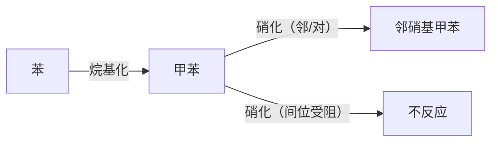

# 第5章（环烃）

📎 [第5-3章 芳香烃-定位效应.pptx](https://www.yuque.com/attachments/yuque/0/2025/pptx/25845402/1750044322259-6ff34ea2-a380-4e5e-8c38-bf53b4893b6b.pptx)

📎 [第5-2章 芳香烃-结构及性质.pptx](https://www.yuque.com/attachments/yuque/0/2025/pptx/25845402/1750044323692-0d1714e3-9d68-414f-886b-3a7e6d8834df.pptx)

📎 [第5-1章 环烷烃.pptx](https://www.yuque.com/attachments/yuque/0/2025/pptx/25845402/1750044321020-4a11340d-33d3-4e22-8ddf-3fa4fcafffde.pptx)

### **一、环烷烃（5-1章）**

#### **1. 分类与命名**

- **分类**：

- 按环大小：小环（3-4C）、常见环（5-6C）、中环（7-12C）、大环（>12C）。
- 按环数：单环、桥环（共用2+碳）、螺环（共用1碳）。

- **命名规则**：

- **单环烃**：环某烷/烯（例：环丙烷、1,3-环戊二烯）；取代基编号遵循**最低序列原则**。
- **桥环烃**：二环[a.b.c]某烷（a≥b≥c为桥碳数），从桥头碳编号（大环→小环→桥）。
- **螺环烃**：螺[a.b]某烷（a<b为螺碳外环碳数），从小环邻螺碳开始编号。

#### **2. 结构与稳定性**

- **环张力**：环丙烷 > 环丁烷 > 环戊烷 > 环己烷（无张力）。

- 环丙烷：sp³杂化，弯曲σ键，角张力大 → **易开环**。
- 环己烷：无张力，**椅式构象最稳定**（全交叉式）。

- **环己烷构象**：

- **椅式构象**：a键（直立）与e键（平伏）可翻转。
- **取代基稳定性**：e键取代 > a键取代（例：甲基环己烷95%为e键构象）。

#### **3. 化学性质**

- **开环加成**（仅小环）：

| **反应** | **条件** | **产物** |
| --- | --- | --- |
| 加H₂ | Ni催化, 高温高压 | 开链烷烃 |
| 加X₂ | 室温 | 1,3-二卤代烷 |
| 加HX | 常温 | 卤代烷（马氏规则） |

- **自由基取代**：大环/环己烷在光照下发生α-H卤代（类似烷烃）。

---

### **二、芳香烃（5-2、5-3章）**

#### **1. 命名**

- **单环芳烃**：

- 简单取代：以苯为母体（例：甲苯、叔丁基苯）。
- 复杂/不饱和链：苯作取代基（例：2-甲基-3-苯基戊烷）。
- 多取代：按**最低序列+次序规则**编号（例：4-硝基-2-氯甲苯）。

- **稠环芳烃**：

- 萘：固定编号（α位活性高），取代基按官能团优先级命名（例：5-甲基-2-萘酚）。

#### **2. 芳香性判定（Hückel规则）**

- **条件**：

1. 平面闭合共轭体系。
2. π电子数 = 4n + 2（n=0,1,2...）。

- **实例**：

| **化合物** | **π电子数** | **芳香性** | **原因** |
| --- | --- | --- | --- |
| 苯 | 6 (n=1) | ✓ | 符合规则 |
| 环戊二烯负离子 | 6 (n=1) | ✓ | 平面共轭 |
| 环辛四烯 | 8 (n=2) | ✗ | 非平面 |
| [18]轮烯 | 18 (n=4) | ✓ | 平面且符合电子数 |

#### **3. 苯环亲电取代反应**

| **反应类型** | **试剂/条件** | **机理** | **应用** |
| --- | --- | --- | --- |
| **卤代** | X₂/FeX₃ (X=Cl, Br) | 生成σ络合物 → 脱H⁺ | 制备卤苯 |
| **硝化** | HNO₃/浓H₂SO₄ | NO₂⁺进攻苯环 | 制备硝基苯 |
| **磺化** | 浓H₂SO₄/△ | SO₃进攻，可逆 | 制备磺酸，定位合成 |
| **傅-克烷基化** | RCl/AlCl₃ | 碳正离子进攻，易重排 | 制烷基苯（注意异构化） |
| **傅-克酰基化** | RCOCl/AlCl₃ | 酰基正离子进攻，不重排 | 制芳香酮 |

**傅克反应限制**：苯环连**强吸电子基（-NO₂, -COOH）或-NH₂/-OH**时不反应（钝化/催化剂失活）。

#### **4. 定位效应（核心考点！）**

- **定位基分类**：

| **类型** | **特点** | **代表基团** | **电子效应** |
| --- | --- | --- | --- |
| **邻对位定位基** | 活化苯环（除卤素） | -O⁻, -NH₂, -OH, -CH₃（致活） | +C/-I > -I（卤素） |
| **间位定位基** | 钝化苯环 | -NO₂, -CN, -COOH, -SO₃H | -I, -C |
| **卤素（特殊）** | 钝化苯环但仍为邻对位定位 | -F, -Cl, -Br, -I | +C < -I |

- **二元取代定位规则**：

1. 两基团同类时，**强定位基**主导（例：-OH > -CH₃）。
2. 两基团不同类时，**活化基** > 钝化基（例：甲苯硝化→邻/对位；硝基苯硝化→间位）。

#### **5. 萘的性质**

- **亲电取代**：优先发生在**α位**（活性高）。
- **氧化**：V₂O₅催化 → 邻苯二甲酸酐。
- **还原**：Na/EtOH → 1,4-二氢萘；催化加氢 → 十氢萘。

---

### **三、高频考点与解题技巧**

1. **芳香性判断题**：

- 步骤：① 确认共轭且平面；② 计算π电子数是否满足4n+2。
- 例：环丙烯正离子（2e⁻, n=0）✓；环丁二烯（4e⁻）✗。

2. **定位效应应用**：

- **合成设计**：先上邻对位基团（如-CH₃），再上间位基（如-NO₂）。

- **反应活性排序**：苯酚 > 甲苯 > 苯 > 氯苯 > 硝基苯。

3. **鉴别题**：

- **端基炔**：Ag(NH₃)₂NO₃ → 炔化银↓（灰白）。
- **烯烃**：Br₂/CCl₄褪色 + 冷稀KMnO₄褪色。
- **芳烃**：难氧化，磺化可逆。

4. **环己烷构象**：

- 优势构象：大基团在e键（例：叔丁基必在e键）。
- 反-1,4-二取代：ee型最稳定。

> **附：定位基活性排序**（致活→致钝）：
> -O⁻ > -NH₂ > -OH > -OR > -CH₃ > 苯基 > -X > -COR > -COOH > -NO₂

建议重点练习课件中的**芳香性判断、取代定位预测、环己烷构象作图及合成路线设计题**，结合电子效应理解反应本质。
