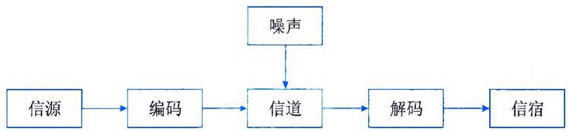
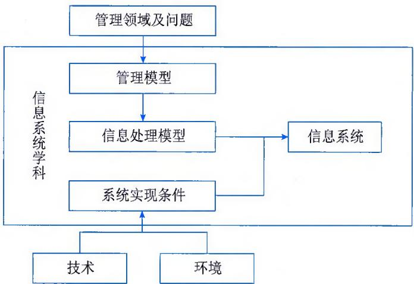
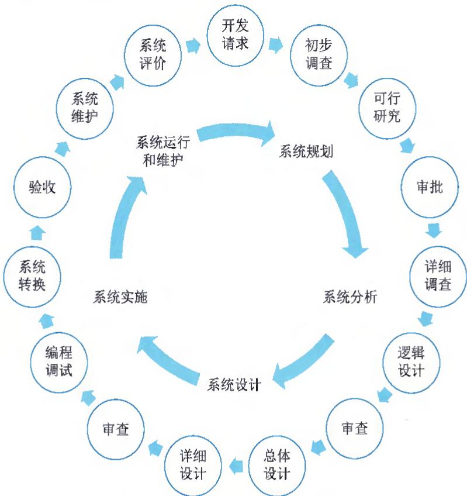
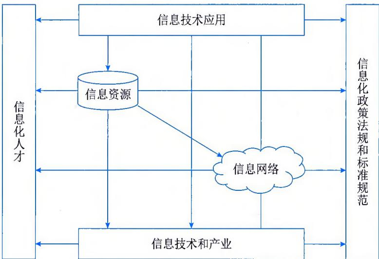
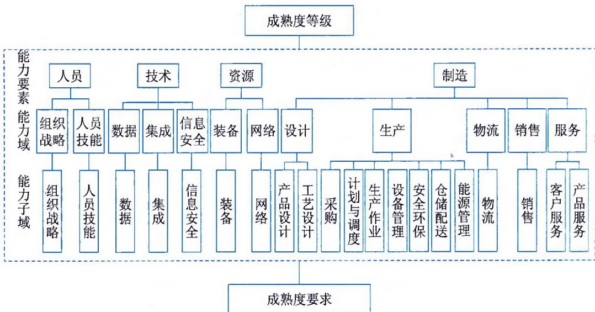
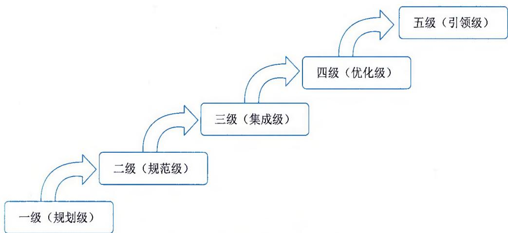
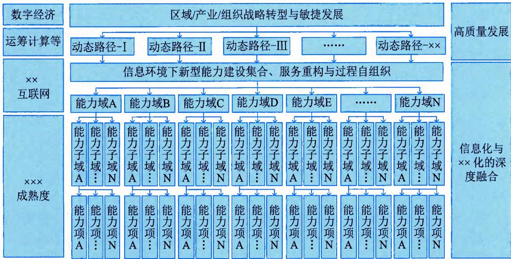
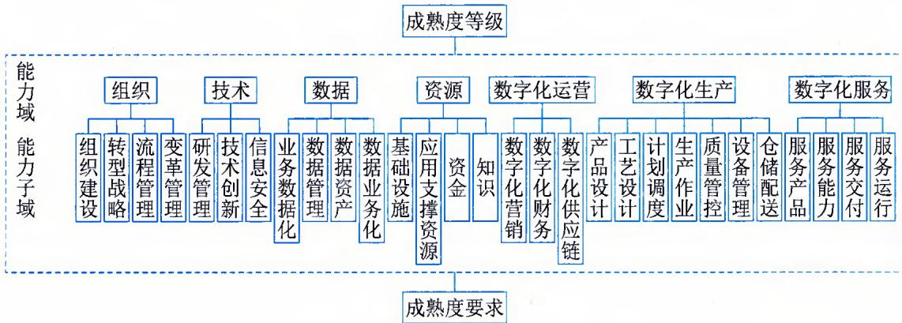
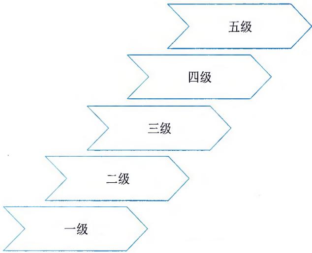

>[!info] 现行教材 · 第 2 版
>本页为**现行考试依据**的教材原文（第 2 版，2024 年 10 月出版，2025 年起启用）。
>考纲层级见 [[知识体系]]；练习题见 [[练习题·基础知识]]；案例模板见 [[案例答题模板]]。

# 第1章 信息化发展

广义的信息技术可以追溯到3500—5000年前人类语言的形成和使用，信息技术持续经历了文字的创造、印刷术的发明、电脉冲和电磁的发现与应用、计算机技术发展、新一代信息技术应用等历程。可以看出，信息技术的发展历程，伴随着人类信息沉淀的丰富、信息传播的高效以及信息应用的泛化，信息技术发展的价值侧重点由传播转型到知识沉淀，进而演进到以模拟和预测为主要特征的知识自动化应用。自20世纪90年代以来，电子信息技术不断创新，伴随着信息产业的持续发展，信息网络广泛普及，信息化成为全球经济社会发展的显著特征，并逐步向一场全方位的社会变革演进。

进入21世纪，信息技术与经济社会发展深度融合，孕育了一系列的重大发展突破，互联网开辟了无限广阔的信息空间，成为信息传播和知识扩散的崭新的重要载体，同时也加剧了各种文化、思想的相互交流和融合。近年来，随着以大数据、人工智能等为代表的新一代信息技术的高速发展和深化应用，数据成了继土地、劳动力、技术和资本后，经济与社会发展的新型生产要素，正在孕育和促进新一轮的科技革命和产业革命，成为经济社会高质量发展和人类命运共同体的重要驱动因素。

在新一代信息技术的推动下，人类社会正在加速进入全新发展时期，以智能化、网络化、数字化等为典型特征的新模式、新经济、新业态等正在加速形成，电子政务、消费互联网、工业互联网、智能制造和智慧城市等正在深刻影响人们的生产、消费和生活方式。随着数据的广泛链接和共享、数字孪生广泛建设，重新定义了信息空间的内涵，基于已发生的信息快照已经无法满足人民对美好生活的需求。通过对物理世界的模拟以及对未来的预测，从而优化物理社会，将成为新的核心关注点，个性化需求的高效率满足成为发展的主要方向之一。

继工业化后，信息化正在催生一场新的人类社会革命，其影响更加广泛、变革更加深入，已经成为世界各国的关注焦点和共同选择。一方面信息化的发展水平代表一个国家的信息能力，信息产业成为国家核心竞争力的新战略高地，信息技术成为国家间竞争的核心聚焦；另一方面数字经济、数字人才成为区域经济与社会发展的重要支点，这不仅需要各类组织持续强化信息技术人才的业务能力建设，也需要更加关注业务技术人才的信息技术能力建设，从而形成立体化、多元化的新型人才体系。这是因为，作为数字化转型主体的计算机信息系统工程是一项复杂的社会和技术工程，无论是内容、规模、深度和广度，还是技术、工具、业务和流程，都在不断地发展和创新。

## 1.1 信息与信息化

信息是指音讯、消息、信息系统传输和处理的对象，泛指人类社会传播的一切内容。人通过获得、识别自然界和社会的不同信息来区别不同事物，得以认识和改造世界。在一切通信和控制系统中，信息是一种普遍联系的形式。信息化是指在国家宏观信息政策指导下，通过信息技术的开发、信息产业的发展、信息人才的配置，最大限度地利用信息资源以满足全社会的信息需求，从而加速社会各个领域的共同发展以推进信息社会发展的过程。

## 1.1.1 信息基础

信息是物质、能量及其属性的标示的集合，是确定性的增加。它以物质介质为载体，传递和反映世界各种事物存在方式、运动状态等的表征。信息不是物质、也不是能量，它以一种普遍形式，表达物质运动规律，在客观世界中大量存在、产生和传递。

## 1. 信息的定义

1948 年，数学家香农（Claude E. Shannon）在题为《通讯的数学理论》的论文中指出："信息是用来消除随机不定性的东西"。创造一切宇宙万物的最基本单位是信息。香农还给出了信息的定量描述，并确定了信息量的单位为比特（bit）。1 比特的信息量，在变异度为 2 的最简单情况下，就是能消除非此即彼的不确定性所需要的信息量。这里的"变异度"是指事物的变化状态空间为 2，例如大和小、高和低、快和慢等。

同时，香农将热力学中的熵引入信息论。在热力学中，熵是系统无序程度的度量，而信息与熵正好相反，信息是系统有序程度的度量，表现为负熵，计算公式如下：

$$
H (x) = - \sum_ {i = 1} ^ {n} P (x _ {i}) \log_ {2} P (x _ {i})
$$

式中， $x_{i}$ 代表 n 个状态中的第 i 个状态； $P(x_{i})$ 代表出现第 i 个状态的概率； $H(x)$ 代表用以消除系统不确定性所需的信息量，即以比特为单位的负熵。

信息的目的是用来"消除不确定的因素"。信息由意义和符号组成，信息就是指以声音、语言、文字、图像、动画、气味等方式所表示的实际内容。信息是抽象于物质的映射集合。

## 2. 信息的特征

香农关于信息的定义揭示了信息的本质，同时，人们通过深入研究，发现信息还具有很多其他的特征，主要包括客观性、普遍性、无限性、动态性、相对性、依附性、变换性、传递性、层次性、系统性和转化性等。

（1）客观性。信息是客观事物在人脑中的反映，而反映的对象则有主观和客观的区别。因此，信息可分为主观信息（例如：决策、指令和计划等）和客观信息（例如：国际形势、经济发展和一年四季等）。主观信息必然要转化成客观信息，例如，决策和计划等主观信息要转化成实际行动。因此，信息具有客观性。

（2）普遍性。物质决定精神，物质的普遍性决定了信息的普遍存在。

（3）无限性。客观世界是无限的，反映客观世界的信息自然也是无限的。无限性可分为两个层次，一是无限的事物产生无限的信息，即信息的总量是无限的；二是每个具体事物或有限个事物的集合所能产生的信息也可以是无限的。

（4）动态性。信息是随着时间的变化而变化的。

（5）相对性。不同的认识主体从同一事物中获取的信息及信息量可能是不同的。

（6）依附性。信息的依附性可以从两个方面来理解：一方面，信息是对客观世界的反映，任何信息必然由客观事物所产生，不存在无源的信息；另一方面，任何信息都要依附于一定的载体而存在，需要有物质的承载者，信息不能完全脱离物质而独立存在。

（7）变换性。信息通过处理可以实现变换或转换，使其形式和内容发生变化，以适应特定的需要。

（8）传递性。信息在时间上的传递就是存储，在空间上的传递就是转移或扩散。

（9）层次性。客观世界是分层次的，反映它的信息也是分层次的。

（10）系统性。信息可以表示为一种集合，不同类别的信息可以形成不同的整体。因此，可以形成与现实世界相对应的信息系统。

（11）转化性。信息的产生不能没有物质，信息的传递不能没有能量，但有效地使用信息，可以将信息转化为物质或能量。

## 3. 信息的质量

由于获取信息满足了人们消除不确定性的需求，因此信息具有价值，而价值的大小决定于信息的质量，这就要求信息满足一定的质量属性，主要包括精确性、完整性、可靠性、及时性、经济性、可验证性、安全性等。

（1）精确性。精确性指对事物状态描述的精准程度。

（2）完整性。完整性指对事物状态描述的全面程度，完整信息应包括所有重要事实。

（3）可靠性。可靠性指信息的来源、采集方法、传输过程是可以信任的，符合预期。

（4）及时性。及时性指获得信息的时刻与事件发生时刻的间隔长短。例如，昨天的天气信息不论怎样精确、完整，对指导明天的穿衣并无帮助，从这个角度出发，这个信息的价值为零。

（5）经济性。经济性指信息获取和传输带来的成本在可以接受的范围之内。

（6）可验证性。可验证性指信息的主要质量属性可以被证实或者证伪的程度。

（7）安全性。安全性指在信息的生命周期中，信息可以被非授权访问的可能性，可能性越低，安全性越高。

信息应用的场合不同，其侧重面也不一样。例如，对于金融信息而言，其最重要的特性是安全性；而对于经济与社会信息而言，其最重要的特性是及时性。

## 4. 信息的传输模型

信息是有价值的一种客观存在，信息只有流动起来，才能体现其价值。信息的传输通过信息传输技术（通常指通信、网络等）来实现，信息的传输模型如图1-1所示。

  
图1-1 信息传输模型

信息传输通常包括信源、编码、信道、解码、信宿和噪声等。

（1）信源。信源产生信息的实体，信息产生后，由这个实体向外传播。

（2）编码。编码是将信源产生的信息转换为适合在信道上传输的信号的过程。这一过程主要由编码器完成。编码器在信息论中泛指所有变换信号的设备，实际上就是终端机的发送部分。它包括从信源到信道的所有设备，如量化器、压缩编码器和调制器等。从信息安全的角度出发，编码器还可以包括加密解密设备。

（3）信道。信道是传送信息的通道，如 TCP/IP 网络。信道可以从逻辑上理解为抽象信道，也可以是具有物理意义的实际传送通道。TCP/IP 网络是逻辑上的概念，这个网络的物理通道可以是光纤、同轴电缆、双绞线、移动通信网络，甚至是卫星或者微波。

（4）解码。解码是编码的逆过程，它将信道中接收到的信号（原始信息与噪声的叠加）转换成信宿能接收的信号，这一过程主要由解码器完成。解码器包括解调器、译码器和数模转换器等。

（5）信宿。信宿是信息的归宿或接收者。

（6）噪声。噪声可以理解为干扰，干扰可以来自于信息系统分层结构的任何一层，当噪声携带的信息达到一定程度的时候，在信道中传输的信息可能被噪声掩盖导致传输失败。

当信源和信宿已给定，信道也已选定后，决定信息系统性能的关键就在于编码器和解码器。设计一个信息系统时，除了选择信道和设计其附属设施外，主要工作也就是设计编码器和解码器。一般情况下，信息系统的主要性能指标是有效性和可靠性。有效性就是在系统中传送尽可能多的信息；而可靠性是要求信宿收到的信息尽可能地与信源发出的信息一致，或者说失真尽可能小。为了提高可靠性，可以在信息编码时增加冗余编码，犹如"重要的话说三遍"，恰当的冗余编码可以在信息受到噪声侵扰时被恢复，而过量的冗余编码将降低信道的有效性和信息传输速率。

概括起来，信息系统的基本理论应包括信息的度量、信源特性和信源编码、信道特性和信道编码、检测理论、估计理论以及密码学。

## 1.1.2 信息系统

信息系统（Information System，IS）一般指收集、存储、处理和传播各种信息的具有完整功能的集合体。现代信息系统总是与计算机技术和互联网技术的应用联系在一起，主要是指以计算机为信息处理工具，以网络为信息传输手段的信息系统。

## 1. 信息系统定义

信息系统是由计算机硬件、网络和通信设备、计算机软件、信息资源、信息用户和规章制度组成的以处理信息流为目的的人机一体化系统。从技术上可以定义为一系列支持决策和控制的相关要素，这些要素主要包括信息的收集、检索、加工处理和信息服务。除了支持决策、协作和控制外，信息系统还帮助管理人员和生产人员分析问题，使复杂问题可视化，创造产生新的产品和服务。它的任务是对原始数据进行收集、加工、存储，并处理产生各种所需信息，以不同的方式提供给各类用户使用。

信息系统的5个基本功能：输入、存储、处理、输出和控制。

\- 输入功能。输入功能决定于系统所要达到的目的及系统的能力和信息环境的许可。

\- 存储功能。存储功能指的是系统存储各种信息资料和数据的能力。

\- 处理功能。处理功能是数据的处理工具，它基于数据仓库技术的联机分析处理（OLAP）和数据挖掘（DM）技术。

\- 输出功能。信息系统的各种功能都是为了保证最终实现最佳的输出功能。

\- 控制功能。控制功能对构成系统的各种信息处理设备进行控制和管理，对整个信息加工、处理、传输和输出等环节通过各种程序进行控制。

从概念上说，任何一个组织都有信息系统的存在，例如，一个工厂的正常运转，离不开计划的执行情况、物资器材的库存情况、流动资金的周转情况以及市场情况等信息。因而，任何组织单位占有信息的数量和质量以及处理信息的能力决定了其工作成效。进一步说，人类社会的发展速度，将取决于人们对信息的利用水平。信息系统既可以是基于计算机的，又可以是基于手工的。手工的信息系统采用纸和笔等手段实现信息的传递和交流，而基于计算机的信息系统则是依赖于计算机硬、软件技术来加工处理和传输信息的。人们通常说的"信息系统"这一术语，是指基于计算机的信息系统，即依赖于计算机技术的规范的、有组织的信息系统。计算机信息系统是利用计算机技术将原始数据处理加工成为有意义的信息，但从某种意义上讲，计算机和信息系统之间仍存在着明显的区别。计算机只提供了存储、处理信息的设备和现代管理信息系统的技术功能，但信息系统的许多工作，诸如输入数据或使用系统的输出结果等还需要作为用户的人来完成，计算机仅仅是信息系统中的一部分。用户和计算机共同构成了一个整合的系统，提出问题以及对问题的具体解答都是通过计算机和用户之间的一系列交互活动来实现的，这充分体现了信息系统的性质所在，即信息系统是以计算机为基础的人机交互系统。

信息系统的性质影响着系统开发者和系统用户的知识需求。"以计算机为基础"要求系统设计者必须具备计算机及其在信息处理中的应用知识。"人机交互"要求系统设计者还需要了解人作为系统组成部分的能力以及人作为信息使用者的各种行为。

从广域上讲，信息化工作是信息系统发展带来的系统层面上的信息战略规划。所谓信息化（Informationalization）是指在国家宏观信息政策指导下，通过信息技术开发、信息产业的发展、信息人才的配置，最大限度地利用信息资源以满足全社会的信息需求，从而加速社会各个领域的共同发展，以推进信息社会的过程。信息化应该是以信息资源开发利用为核心，以网络技术、通信技术等高科技技术为依托的一种新技术扩散的过程。在信息化过程中，信息技术自身和整个社会都发生着质的变化。信息化不仅仅是生产力的变革，而且伴随着生产关系的重大变革。

## 2. 信息系统发展

现代信息系统与计算机技术和网络技术的发展保持同步。随着社会的进步和技术的发展，信息系统的内容和形式也都在不断发生着巨大的变化，1979年，美国管理信息系统专家理查德·诺兰（Richard L. Nolan）通过对200多个组织和部门发展信息系统的实践和经验做出的总结，提出了著名的信息系统进化的阶段模型，即诺兰模型。诺兰认为，任何组织由手工信息系统向以计算机为基础的信息系统发展时，都存在着一条客观的发展道路和规律。数据处理的发展涉及技术的进步、应用的拓展、计划和控制策略的变化以及用户的状况等4个方面。诺兰将计算机信息系统的发展道路划分为6个阶段，即：初始阶段、传播阶段、控制阶段、集成阶段、数据管理阶段和成熟阶段。

## 1）初始阶段

计算机刚进入组织时只作为办公设备使用，应用非常少，通常用来完成一些报表的统计工作，甚至大多数时候被当作打字机使用。在这一阶段，IT的需求只被作为简单的办公设施改善的需求来对待，采购量少，只有少数人使用，在组织内没有普及。这一阶段的主要特点是：

\- 组织中只有个别人具有使用计算机的能力；

\- 该阶段一般发生在一个组织的财务部门。

## 2）传播阶段

组织对计算机有了一定了解，想利用计算机解决工作中的问题，比如进行更多的数据处理，给管理工作和业务带来便利。于是，应用需求开始增加，组织对 IT 应用开始产生兴趣，并对开发软件的热情高涨，投入也开始大幅度增加。这一阶段的主要特点是：

\- 数据处理能力得到迅速提高；

\- 出现许多新问题（如数据冗余、数据不一致性、难以共享等）；

\- 计算机使用效率不高等。

## 3）控制阶段

在经历前一阶段盲目购机、盲目定制开发软件之后，组织管理者意识到计算机的使用超出控制、IT投资增长快、效益不理想的问题，于是开始从整体上控制计算机信息系统的投入与发展，组织需要协调并解决数据共享问题。此时，组织的IT建设更加务实，对IT的利用有了更明确的认识和目标。在这一阶段，一些职能部门在部门内部实现了网络化，例如财务系统、人事系统和库存系统等，但各软件系统之间还存在"部门壁垒"与"信息孤岛"。信息系统呈现单点、分散的特点，系统和资源的利用率不高。这一阶段的主要特点是：

\- 出现了计算机系统的管理组织；

$\bullet$ 数据库（DB）技术得以应用；

\- 开始从计算机管理向数据管理转变。

## 4）集成阶段

在控制的基础上，组织在集成阶段开始重新进行规划设计，建立基础数据库并建成统一的信息管理系统。组织的 IT 建设开始由分散和单点发展为成体系。组织的 IT 主管开始把内部不同的 IT 机构和系统统一到一个系统中进行管理，使人、财、物等资源信息能够在组织中集成共享，从而更有效地利用现有的 IT 系统和资源。这一阶段的主要特点是：

\- 建立集中式的数据库及相应的信息系统；

\- 增加大量硬件，预算费用随之迅速增长。

## 5）数据管理阶段

组织高层意识到信息战略的重要性，信息作为组织的重要资源，组织的信息化建设也真正进入到数据处理阶段。在这一阶段中，组织开始选定统一的数据库平台、数据管理体系和信息管理平台，统一数据的管理和使用，各部门、各系统基本实现资源整合和信息共享。IT系统的规划及资源利用更加高效。

## 6）成熟阶段

信息系统已经可以满足组织各个层次的需求，从简单的事务处理到支持高效管理的决策。组织真正把IT与管理过程结合起来，将组织内部与外部的资源充分整合和利用，从而提升了组织的竞争力和发展潜力。

这6个阶段模型反映了计算机应用发展的规律性，前3个阶段具有计算机时代的特征，后3个阶段具有信息时代的特征，其转折点是进行信息资源规划的时机。诺兰模型的预见性，被其后国际上许多组织的计算机应用与发展情况所证实。

## 3. 信息系统及其特性

简单地说，信息系统就是通过对输入的数据进行加工处理，产生信息的系统。面向管理和支持生产是信息系统的显著特点，以计算机为基础的信息系统可以定义为：结合管理理论和方法，应用信息技术解决管理问题，提高生产效率，为生产或信息化过程以及管理和决策提供支撑的系统。信息系统是管理模型、信息处理模型和系统实现条件的结合，其抽象模型如图1-2所示。

  
图1-2 信息系统抽象模型

管理模型是指系统服务对象领域的专门知识，以及分析和处理该领域问题的模型，也称为对象的处理模型。信息处理模型指系统处理信息的结构和方法。管理模型中的理论和分析方法，在信息处理模型中转化为信息获取、存储、传输、加工和使用的规则；系统实现条件是指可供应用的计算机技术和通信技术、从事对象领域工作的人员，以及对这些资源的控制与融合。

广义的信息系统可以是手工的，也可以是电子化的。电子化信息系统的组成部件包括硬件、软件、数据库、网络、存储设备、感知设备、外设、人员以及把数据处理成信息的规程等。从用途类型来划分，常见的信息系统一般包括电子商务系统、事务处理系统、管理信息系统、生产制造系统、电子政务系统、决策支持系统等。对于信息系统而言，信息系统的开放性、脆弱性和健壮性等特性会表现得比较突出。

（1）开放性。系统的开放性是指系统的可访问性。这个特性决定了系统可以被外部环境识别，外部环境或者其他系统可以按照预定的方法，使用系统的功能或者影响系统的行为。系统的开放性体现在系统有可以清晰描述并被准确识别和理解的所谓接口层。

（2）脆弱性。这个特性与系统的稳定性相对应，即系统可能存在着丧失结构、功能、秩序的特性，这个特性往往是隐蔽的且不易被外界感知的。脆弱的系统一旦被侵入，整体性会被破坏，甚至面临崩溃和系统瓦解。

（3）健壮性。当系统面临干扰、输入错误和入侵等因素时，系统可能会出现非预期的状态而丧失原有功能、出现错误甚至表现出破坏功能。系统具有能够抵御出现非预期状态的特性称为健壮性，也称鲁棒性（robustness）。一般来说，具有高可用性的信息系统，会采取冗余技术、容错技术、身份识别技术和可靠性技术等来抵御系统出现非预期的状态并保持系统的稳定性。

## 4. 信息系统生命周期

信息系统是面向现实世界人类生产和生活中的具体应用的，是为了提高人类活动的质量、效率而存在的。信息系统的目的、性能、内部结构和秩序、外部接口、部件组成等由人来规划，它的产生、建设和运行完善构成一个循环的过程，这个过程遵循一定的规律。另外，信息系统的建设周期长、投资大、风险高，比一般技术工程有更大的难度和复杂性，其在使用过程中，随着其生存环境的变化，要不断维护和修改，当它不再适应的时候就要被淘汰，由新系统代替老系统。为了工程化的需要，有必要把这些过程划分为一些具有典型特点的阶段，每个阶段有不同的目标和工作方法，阶段中的任务也由不同类型的人员来负责。这个过程称为信息系统的生命周期。

软件在信息系统中属于较复杂的部件，可以借用软件的生命周期来表示信息系统的生命周期。软件的生命周期通常包括：可行性分析与项目开发计划、需求分析、概要设计、详细设计、编码、测试和维护等阶段。

信息系统的生命周期可以简化为：系统规划（可行性分析与项目开发计划），系统分析（需求分析），系统设计（概要设计、详细设计），系统实施（编码、测试），系统运行和维护等阶段，如图1-3所示。

## 1）系统规划阶段

系统规划阶段的任务是对组织的环境、目标及现行系统的状况进行初步调查，根据组织目标和发展战略，确定信息系统的发展战略，对建设新系统的需求做出分析和预测，同时考虑建设新系统所受的各种约束，研究建设新系统的必要性和可能性。根据需要与可能，给出报建系统的备选方案。对这些方案进行可行性研究，写出可行性研究报告。可行性研究报告审议通过后，将新系统建设方案及实施计划编写成系统设计任务书。

## 2）系统分析阶段

系统分析阶段的任务是根据系统设计任务书所确定的范围，对现行系统进行详细调查，描述现行系统的业务流程，指出现行系统的局限性和不足之处，确定新系统的基本目标和逻辑功能要求，即提出新系统的逻辑模型。

  
图 1-3 信息系统全生命周期示意图

系统分析阶段又称为逻辑设计阶段。这个阶段是整个系统建设的关键阶段，也是信息系统建设与一般工程项目的重要区别所在。系统分析阶段的工作成果体现在系统说明书中，这是系统建设的必备文件。它既是和用户确认需求的基础，也是下一个阶段的工作依据。因此，系统说明书既要通俗又要准确。用户通过系统说明书可以了解未来系统的功能，判断是不是所要求的系统。系统说明书一旦讨论通过，就是系统设计的依据，也是将来验收系统的依据。

## 3）系统设计阶段

简单地说，系统分析阶段的任务是回答系统"做什么"的问题，而系统设计阶段要回答的问题是"怎么做"。该阶段的任务是根据系统说明书中规定的功能要求，考虑实际条件，具体设计实现逻辑模型的技术方案，也就是设计新系统的物理模型。这个阶段又称为物理设计阶段，可分为总体设计（概要设计）和详细设计两个子阶段。这个阶段的技术文档是系统设计说明书。

## 4）系统实施阶段

系统实施阶段是将设计的系统付诸实施的阶段。这一阶段的任务包括计算机等设备的购置、安装和调试、程序的编写和调试、人员培训、数据文件转换、系统调试与转换等。这个阶段的特点是几个互相联系、互相制约的任务同时展开，必须精心安排、合理组织。系统实施是按实施计划分阶段完成的，每个阶段应写出实施进展报告。系统测试之后写出系统测试分析报告。

## 5）系统运行和维护阶段

系统投入运行后，需要经常进行维护和评价，记录系统运行的情况，根据一定的规则对系统进行必要的修改，评价系统的工作质量和经济效益。另外，为了便于论述针对信息系统的项目管理，信息系统的生命周期还可以简化为立项（系统规划）、开发（系统分析、系统设计、系统实施）、运维及消亡四个阶段。在开发阶段不仅包括系统分析、系统设计、系统实施，还包括系统验收等工作。如果从项目管理的角度来看，项目的生命周期又划分为启动、计划、执行和收尾四个典型阶段。

## 5. 信息系统建设原则

为了能够适应开发的需要，在信息系统规划设计以及系统开发的过程中，必须要遵守一系列原则，这是系统成功的必要条件。以下是信息系统开发的常用原则。

## 1）高层管理人员介入原则

一个信息系统的建设目标总是为组织的总体目标服务，否则，这个系统就不应当建设。而真正能够理解组织总体目标的人必然是组织的高层管理人员，只有他们才能知道组织究竟需要什么样的信息系统，不需要什么样的信息系统；也只有他们才知道组织有多大的投入是值得的，而超过了这个界限就是浪费。这是那些身处某一部门的管理人员或者技术人员所无法做到的。因此，信息系统从概念到运行都必须有组织高层管理人员介入。当然，这里的"介入"有着其特定的含义，它可以是直接参加，也可以是决策或指导，还可以是在政治、经济和人事等方面的支持。

这里需要说明的是，高层管理人员介入原则在现阶段已经逐步具体化，那就是组织的"首席信息官"（Chief Information Officer，CIO）的出现。CIO是组织设置的相当于副总裁的一个高级职位，负责组织信息化的工作，主持制定组织信息规划、政策和标准，并对全组织的信息资源进行管理控制的组织行政官员。在大多数组织里，CIO是组织最高管理层中的核心成员之一。毫无疑问，深度介入信息系统开发建设以及运行是CIO的职责所在。

## 2）用户参与开发原则

在我国信息系统开发中流行所谓"用户第一"或"用户至上"的原则。当然，这个原则并没有错，一个成功的信息系统，必须把用户放在第一位，这应该是毫无疑义的。用户参与开发原则主要包括以下几项含义：

（1）用户有确定的范围。人们通常把"用户"仅仅理解成为用户单位的领导，其实，这是很片面的。当然，用户单位领导应该包括在用户范围之内，但是，更重要的用户或核心用户是那些信息系统的使用者，而用户单位的领导只不过是辅助用户或是外围用户的。

（2）用户参与。特别是那些核心用户，不应是参与某一阶段的开发，而应当是参与全过程的开发，即用户应当参与从信息系统概念规划和设计阶段，直到系统运行的整个过程。而当信息系统交接以后，他们就成为系统的使用者。

（3）用户应当深度参与系统开发。用户以什么身份参与开发是一个很重要的问题。一般说来，参与开发的用户人员，既要以甲方代表身份出现，又应成为真正的系统开发人员，与其他开发人员融为一体。

## 3）自顶向下规划原则

在信息系统开发的过程中，经常会出现信息不一致的问题，这种现象的存在对于信息系统来说往往是致命的，有时一个信息系统会因此而造成报废的结果。研究表明，信息的不一致是由计算机应用的历史性演变造成的，它通常发生在没有一个总体规划的指导就来设计实现一个信息系统的情况之下。因此，坚持自顶向下规划原则对于信息系统的开发和建设来说是至关重要的。自顶向下规划的一个主要目标是达到信息的一致性。同时，自顶向下规划原则还有另外一个方面，那就是这种规划绝不能取代信息系统的详细设计。必须鼓励信息系统各子系统的设计者在总体规划的指导下，进行有创造性的设计。

## 4）工程化原则

在 20 世纪 70 年代，出现了世界范围内的 "软件危机"。所谓软件危机是指一个软件编制好以后，谁也无法保证它能够正确地运行，也就是软件的可靠性成了问题。软件危机曾一度引起人们特别是工业界的恐慌。人们经过探索认识到，之所以会出现软件危机，是因为软件产品是一种个体劳动产品，最多也就是作坊式的产品。因此，没有工程化是软件危机发生的根本原因。此后，发展出了 "软件工程" 这门工程学科，在一定程度上解决了软件危机。

信息系统也经历了与软件开发大致相同的经历。在信息系统发展的初期，人们也像软件开发初期一样，只要做出来就行，根本不管实现的过程。这时的信息系统，大都成了少数开发者的"专利"，系统的可维护性、可扩展性都非常差。后来，信息工程、系统工程等工程化方法被引入到信息系统开发过程之中，才使问题得到了一定程度的解决。其实，工程化不仅是一种有效的方法，它也应当是信息系统开发的一项重要原则。

## 5）其他原则

对于信息系统开发，人们还从不同的角度提出了一系列原则，例如：创新性原则，用来体现信息系统的先进性；整体性原则，用来体现信息系统的完整性；发展性原则，用来体现信息系统的超前性；经济性原则，用来体现信息系统的实用性。

## 1.1.3 信息化基础

信息化是一个过程，与工业化、现代化一样，是一个动态变化的过程。信息化是指培养、发展以计算机为主的智能化工具为代表的新生产力，并使之造福于社会的历史过程。与智能化工具相适应的生产力，称为信息化生产力。信息化是以现代通信、网络、数据库技术为基础，将所研究对象各要素汇总至数据库，供特定人群生活、工作、学习和辅助决策等，是和人类息息相关的各种行为相结合的一种技术，使用该技术可以极大地提高行为的效率，并且可以降低成本，为推动人类社会进步提供技术支持。

## 1. 信息化内涵

信息化在不同的语境中有不同的含义。信息化用作名词时，通常指信息技术应用，特别是促成应用对象或领域（如政府、企业或社会）发生转变的过程。例如，"企业信息化"不仅指在企业中应用信息技术，更重要的是通过深入应用信息技术，促进企业的业务模式、组织架构乃至经营战略发生革新或转变。信息化用作形容词时，常指对象或领域因信息技术的深入应用所达成的新形态或状态。例如，"信息化社会"指信息技术应用到一定程度后达成的社会形态，它只有充分应用信息技术才能达成。综上所述，信息化是推动经济社会发展与转型的一个历史性过程。在这个过程中，综合利用各种信息技术，支撑改善人类的各项政治、经济和社会活动，并把贯穿于这些活动中的各种数据有效、可靠地进行管理，经过符合业务需求的数据处理，形成信息资源，通过信息资源的整合与融合，促进信息交流和知识共享，形成新的经济和社会形态，推动各方面的高质量发展。

信息化的核心是要通过全体社会成员的共同努力，在经济和社会各个领域充分应用基于信息技术的先进社会生产工具（表现为各种信息系统或软硬件产品），提高信息时代的社会生产力，并推动生产关系和上层建筑的改革（表现为法律、法规、制度、规范、标准和组织结构等），使国家的综合实力、社会的文明程度和人民的生活质量全面提升。信息化的内涵主要包括以下内容。

\- 信息网络体系：包括信息资源、各种信息系统和公用通信网络平台等。

\- 信息产业基础：包括信息科学技术研究与开发、信息装备制造和信息咨询服务等。

\- 社会运行环境：包括现代工农业、管理体制、政策法律、规章制度、文化教育和道德观念等生产关系与上层建筑。

\- 效用积累过程：包括劳动者素质、国家现代化水平和人民生活质量的不断提高，物质文明和精神文明建设不断进步等。

信息化的基本内涵给人们的启示是：信息化的主体是全体社会成员，包括政府、企业、事业、团体和个人。它的时域是一个长期的过程；它的空域是政治、经济、文化、军事和社会的一切领域；它的手段是基于现代信息技术的先进社会生产工具；它的途径是创建信息时代的社会生产力，推动社会生产关系及社会上层建筑的改革；它的目标是使国家的综合实力、社会的文明程度和人民的生活质量得到全面提升。我国大规模开展信息化工作已经30多年，已成为保障国家安全、支撑政府行政职能、维护社会和谐稳定、促进民生经济发展等各大战略层面的重要支柱。

## 2. 信息化体系

信息化代表了一种信息技术被高度应用，信息资源被高度共享，从而使得人的智能潜力以及社会物质资源潜力被充分发挥，个人行为、组织决策和社会运行趋于合理化的理想状态。1997年召开的首届全国信息化工作会议，对信息化和国家信息化定义："信息化是指培育、发展以智能化工具为代表的新的生产力并使之造福于社会的历史过程。国家信息化就是在国家统一规划和组织下，在农业、工业、科学技术、国防及社会生活各个方面应用现代信息技术，深入开发广泛利用信息资源，加速实现国家现代化进程。"国家信息化体系包括信息技术应用、信息资源、信息网络、信息技术和产业、信息化人才、信息化政策法规和标准规范6个要素，这6个要素的关系构成了一个有机的整体，如图1-4所示。

  
图1-4 国家信息化体系

（1）信息技术应用。信息技术应用是指把信息技术广泛应用于经济和社会各个领域，它直接反映了效率、效果和效益。信息技术应用是信息化体系六要素中的龙头，是国家信息化建设的主阵地，集中体现了国家信息化建设的需求和效益。

（2）信息资源。信息资源的开发和利用是国家信息化的核心任务，是国家信息化建设取得实效的关键，是衡量国家信息化水平的一个重要标志。

（3）信息网络。信息网络是信息资源开发和利用的基础设施，包括电信网、广播电视网和计算机网络。这三种网络有各自的形成过程、服务对象和发展模式，它们的功能有所交叉，又互为补充。

（4）信息技术和产业。信息产业是信息化的物质基础，包括微电子、计算机、电信等产品和技术的开发、生产、销售，以及软件、信息系统开发和电子商务等。从根本上来说，国家信息化只有在相关产品和技术方面拥有雄厚的自主知识产权，才能提高综合国力。

（5）信息化人才。人才是信息化的成功之本，而合理的人才结构更是信息化人才的核心和关键。合理的信息化人才结构要求不仅要有各个层次的信息化技术人才，还要有精干的信息化管理人才，营销人才，法律、法规和情报人才。

（6）信息化政策法规和标准规范。信息化政策和法规、标准、规范用于规范和协调信息化体系各要素之间的关系，是国家信息化快速、有序、健康和持续发展的保障。

## 3. 信息化趋势

信息化是信息产业发展与信息技术在经济与社会各方面扩散的基础上，不断运用信息技术改造传统的经济与社会结构，通往如前所述的理想状态的一段持续的过程。随着数字化、网络化和智能化的持续深化，信息化成为重塑国家竞争优势的重要力量。信息化跟各行业领域业务现代化在更广范围、更深程度、更高水平上实现融合发展，新一代信息技术向组织各领域加速渗透，促进组织数字化转型步伐加快，并驱动经济与社会的高质量发展。

## 1）组织信息化趋势

随着计算机技术、网络技术和通信技术的发展和应用，组织信息化已成为业务价值实现、可持续化发展和提高经济与社会竞争力的重要保障。组织应该采取积极的应对措施，推动其信息化的建设进程。品牌2.0理论指出，信息化建设是品牌母体树冠部分的支持网络，庞大的品牌识别系统必须对应强大的信息化建设体系。如果信息化建设不能满足品牌识别系统的要求，品牌识别系统也将受到伤害，会自动调低到现有的信息化建设体系可以支撑的大小，这是品牌母体的自我调整过程。根据这个原理我们可以解释一种现象：为什么有的品牌进行了很好的品牌识别系统设计，初看起来是一个极具竞争力和发展前景的品牌，但却不能持久，并马上出现了负品牌效应。

各行业领域组织的信息化是国家经济与社会信息化的基础，指组织在产品的设计、开发、生产、管理、经营等多个环节中广泛利用信息技术，并大力培养信息人才，完善信息服务，加速建设组织信息系统。组织的信息化建设体现了组织在通信、网站、电子商务方面的投入情况，在客户和服务对象资源管理、质量管理体系方面的建设成就等。信息化建设日渐成为组织影响力、生产、销售、服务等各环节的核心支撑，并随着信息技术在组织中应用的不断深入显得越来越重要，未来甚至许多组织必须依托信息化建设才能生存。

组织信息化除驱动和加速组织转型升级和生产力建设外，还呈现出产品信息化、产业信息化、社会生活信息化和国民经济信息化等趋势和方向。①产品信息化包含两层含义：产品中各类信息比重日益增大、物质比重日益降低，其物质产品的特征向信息产品的特征迈进；越来越多的产品中嵌入了智能化元器件，使产品具有越来越强的信息处理功能。②产业信息化指农业、工业、服务业等传统产业广泛利用信息技术，大力开发和利用信息资源，建立各种类型的产业互联网平台和网络，实现产业内各种资源、要素的优化与重组，从而实现产业的升级。③社会生活信息化指包括市场、科技、教育、军事、政务、日常生活等在内的整个社会体系采用先进的信息技术，建立各种互联网平台和网络，大力拓展人们日常生活的信息内容，丰富人们的精神生活，拓展人们的活动时空等。④国民经济信息化指在经济大系统内实现统一的信息大流动，使金融、贸易、投资、计划、营销等组成一个信息大系统，生产、流通、分配、消费等经济的四个环节通过信息进一步连成一个整体。国民经济信息化是世界各国急需实现的目标。

## 2）国家信息化趋势

党中央、国务院一直高度重视信息化工作。2016年7月中共中央办公厅、国务院办公厅颁布的《国家信息化发展战略纲要》强调国家信息化发展战略总目标是建设网络强国，分"三步走"：第一步到2020年，核心关键技术部分领域达到国际先进水平，信息产业国际竞争力大幅提升，信息化成为驱动现代化建设的先导力量；第二步到2025年，建成国际领先的移动通信网络，根本改变核心关键技术受制于人的局面，实现技术先进、产业发达、应用领先、网络安全坚不可摧的战略目标，涌现一批具有强大国际竞争力的大型跨国网信企业；第三步到21世纪中叶，信息化全面支撑富强民主文明和谐的社会主义现代化国家建设，网络强国地位日益巩固，在引领全球信息化发展方面有更大作为。当前，我国全面部署了"构建产业数字化转型发展体系"重大任务，明确我国信息化进入加快数字化发展、建设数字中国的新阶段。

## 4. 国家信息化规划

《"十四五"国家信息化规划》明确了：建设泛在智联的数字基础设施体系，建立高效利用的数据要素资源体系，构建释放数字生产力的创新发展体系，培育先进安全的数字产业体系，构建产业数字化转型发展体系，构筑共建共治共享的数字社会治理体系，打造协同高效的数字政府服务体系，构建普惠便捷的数字民生保障体系，拓展互利共赢的数字领域国际合作体系和建立健全规范有序的数字化发展治理体系等重大任务。今后一段时间，我国信息化的发展重点主要聚焦在数据治理、密码区块链技术、信息互联互通、智能网联和网络安全等方面。

## 1）数据治理

深化数据资源调查，推进数据标准规范体系建设，制定数据采集、存储、加工、流通、交易、衍生产品等标准规范，提高数据质量和规范性。建立完善数据管理国家标准体系和数据治理能力评估体系。聚焦数据管理、共享开放、数据应用、授权许可、安全和隐私保护、风险管控等方面，探索多主体协同治理机制。

## 2）密码区块链技术

着力推进密码学、共识机制、智能合约等核心技术研究，支持建设安全可控、可持续发展的底层技术平台和区块链开源社区。构建区块链标准规范体系，加强区块链技术测试和评估，制定关键基础领域区块链行业应用标准规范。开展区块链创新应用试点，聚焦金融科技、供应链服务、政务服务、商业科技等领域开展应用示范。

## 3）信息互联互通

打造市场化、法治化、国际化营商环境，深化电子证照、电子合同、电子发票、电子会计凭证等在政务服务、财税金融、社会管理、民生服务等重要领域的有序有效应用。推进涉企政务事项的全程网上办理，大力推进公共资源全流程电子化交易，构建覆盖全国、透明规范、互联互通、智慧监管的公共资源交易体系。

## 4）智能网联

遴选打造国家级车联网先导区，加快智能网联汽车道路基础设施建设和5G-V2X车联网示范网络建设，提升车载智能设备、路侧通信设备、道路基础设施和智能管控设施的"人、车、路、云、网"协同能力，实现L3级以上高级自动驾驶应用。

## 5）网络安全

全面加强网络安全保障体系和能力建设。深化关口前移、防患于未然的安全理念，压实网络安全责任，加强网络安全信息统筹机制建设，形成多方共建的网络安全防线。开发网络安全技术及相关产品，提升网络安全自主防御能力。加强网络安全核心技术联合攻关，开展高级威胁防护、态势感知、监测预警等关键技术研究，建立安全可控的网络安全软硬件防护体系。强化5G、工业互联网、大数据中心、车联网等安全保障。完善网络安全监测、通报预警、应急响应与处置机制，提升网络安全态势感知、事件分析以及快速恢复能力。

结合国家信息化发展趋势，国家各部委将加速推进各领域信息化进程，尤其是数据赋能、5G等新兴技术应用、数字化转型等多方面的建设。例如，国家发展和改革委员会明确了相关信息化的发展目标和方向。即政务信息化建设总体迈入以数据赋能、协同治理、智慧决策、优质服务为主要特征的融慧治理新阶段，跨部门、跨地区、跨层级的技术融合、数据融合、业务融合成为政务信息化创新的主要路径，逐步形成平台化协同、在线化服务、数据化决策、智能化监管的新型数字政府治理模式，经济调节、市场监管、社会治理、公共服务和生态环境等领域的数字治理能力显著提升，网络安全保障能力进一步增强，有力支撑国家治理体系和治理能力现代化。

## 1.2 现代化基础设施

基础设施包括交通、能源、水利、物流等传统基础设施以及以信息网络为核心的新型基础设施，在国家发展全局中具有战略性、基础性、先导性作用。统筹推进传统基础设施和新型基础设施建设，打造系统完备、高效实用、智能绿色、安全可靠的现代化基础设施体系，是我国当前在该领域的发展战略和导向。

## 1.2.1 新型基础设施建设

2018年召开的中央经济工作会议，首次提出"加快5G商用步伐，加强人工智能、工业互联网、物联网等新型基础设施建设"，简称"新基建"。"新型基础设施建设"的提法由此产生，主要包括5G基建、特高压、城际高速铁路和城际轨道交通、新能源汽车充电桩、大数据中心、人工智能、工业互联网等七大领域。"新基建"是立足于高新科技的基础设施建设，与传统"铁公基"相对应，是结合新一轮科技革命和产业变革特征，面向国家战略需求，为经济社会的创新、协调、绿色、开放、共享发展提供底层支撑的具有乘数效应的战略性、网络型基础设施。"新基建"的内涵更丰富，更能体现数字经济的特征，能够更好地推动中国经济转型升级。

## 1. 概念定义

新型基础设施是以新发展理念为引领，以技术创新为驱动，以信息网络为基础，面向高质量发展需要，提供数字转型、智能升级、融合创新等服务的基础设施体系。目前，新型基础设施主要包括信息基础设施、融合基础设施、创新基础设施。

（1）信息基础设施。信息基础设施主要指基于新一代信息技术演化生成的基础设施。信息基础设施包括：①以5G、物联网、工业互联网、卫星互联网为代表的通信网络基础设施；②以人工智能、云计算、区块链等为代表的新技术基础设施；③以数据中心、智能计算中心为代表的算力基础设施等。信息基础设施凸显"技术新"。

（2）融合基础设施。融合基础设施主要指深度应用互联网、大数据、人工智能等技术，支撑传统基础设施转型升级，进而形成的融合基础设施。融合基础设施包括智能交通基础设施、智慧能源基础设施等。融合基础设施重在"应用新"。

（3）创新基础设施。创新基础设施主要指支撑科学研究、技术开发、产品研制的具有公益属性的基础设施。创新基础设施包括重大科技基础设施、科教基础设施、产业技术创新基础设施等。创新基础设施强调"平台新"。

伴随技术革命和产业变革，新型基础设施的内涵、外延也将持续变化和演进。新型基础设施建设比传统基建内涵更加丰富、涵盖范围更广，更能体现数字经济特征，能够更好推动经济与社会转型升级。

## 2. 发展重点

新型基础设施建设更加侧重于突出产业转型升级的新方向，无论是人工智能还是物联网，都体现出加快推进产业高质量发展的大趋势。我国持续加快建设新型基础设施，将重点围绕：①强化数字转型、智能升级、融合创新支撑，布局建设信息基础设施、融合基础设施、创新基础设施等新型基础设施；②建设高速泛在、天地一体、集成互联、安全高效的信息基础设施，增强数据感知、传输、存储和运算能力；③加快5G网络规模化部署，持续提高用户普及率，推广升级千兆光纤网络；④前瞻布局6G网络技术储备；⑤扩容骨干网互联节点，新设一批国际通信出入口，全面推进互联网协议第六版（IPv6）商用部署；⑥实施中西部地区中小城市基础网络完善工程；⑦推动物联网全面发展，打造支持固移融合、宽窄结合的物联接入能力；⑧加快构建全国一体化大数据中心体系，强化算力统筹智能调度，建设若干国家枢纽节点和大数据中心集群，建设E级和10E级超级计算中心；⑨积极稳妥发展工业互联网和车联网；⑩打造全球覆盖、高效运行的通信、导航、遥感空间基础设施体系，建设商业航天发射场；⑪加快交通、能源、市政等传统基础施数字化改造，加强泛在感知、终端联网、智能调度体系建设；⑫发挥市场主导作用，打通多元化投资渠道，构建新型基础设施标准体系等。

## 1.2.2 工业互联网

工业互联网（Industrial Internet）是新一代信息通信技术与工业经济深度融合的新型基础设施、应用模式和工业生态，通过对人、机、物、系统等的全面连接，构建起覆盖全产业链、全价值链的全新制造和服务体系，为工业乃至产业数字化、网络化、智能化发展提供了实现途径，是第四次工业革命的重要基石。

## 1. 内涵和外延

工业互联网不仅仅是互联网在工业的简单应用，还具有更为丰富的内涵和外延。它既是工业数字化、网络化、智能化转型的基础设施，也是互联网、大数据、人工智能与实体经济深度融合的应用模式，同时也是一种新业态、新产业，将重塑组织形态、供应链和产业链。

从工业经济发展角度看，工业互联网为制造强国建设提供关键支撑。一是推动传统工业转型升级。通过跨设备、跨系统、跨厂区、跨地区的全面互联互通，实现各种生产和服务资源在更大范围、更高效率、更加精准的优化配置，实现提质、降本、增效、绿色、安全发展，推动制造业高端化、智能化、绿色化，大幅提升工业经济发展质量和效益。二是加快新兴产业培育壮大。工业互联网促进设计、生产、管理、服务等环节由单点的数字化向全面集成演进，加速创新方式、生产模式、组织形式和商业范式的深刻变革，催生平台化设计、智能化制造、网络化协同、个性化定制、服务化延伸、数字化管理等诸多新模式、新业态、新产业。

从网络设施发展角度看，工业互联网是网络强国建设的重要内容。一是加速网络演进升级。

工业互联网促进人与人相互连接的公众互联网、物与物相互连接的物联网，向人、机、物、系统等的全面互联拓展，大幅提升网络设施的支撑服务能力。二是拓展数字经济空间。工业互联网具有较强的渗透性，可以与交通、物流、能源、医疗、农业等实体经济各领域深度融合，实现产业上下游、跨领域的广泛互联互通，推动网络应用从虚拟到实体、从生活到生产的科学跨越，极大地拓展了网络经济的发展空间。

## 2. 平台体系

工业互联网平台体系具有四大层级，它以网络为基础，平台为中枢，数据为要素，安全为保障。

## 1）网络体系是基础

工业互联网网络体系包括网络互联、数据互通和标识解析三部分。网络互联实现要素之间的数据传输，包括组织外网和组织内网。典型技术包括传统的工业总线、工业以太网以及创新的时间敏感网络（TSN）、确定性网络、5G等技术。组织外网根据工业高性能、高可靠、高灵活、高安全网络需求进行建设，用于连接组织各地机构、上下游组织、用户和产品。组织内网用于连接组织内人员、机器、材料、环境和系统，主要包含信息（IT）网络和控制（OT）网络。当前，内网技术发展呈现三个特征：IT和OT正走向融合，工业现场总线向工业以太网演进，工业无线技术加速发展。数据互通是通过对数据进行标准化描述和统一建模，实现要素之间传输信息的相互理解，数据互通涉及数据传输、数据语义语法等不同层面。标识解析体系实现要素的标记、管理和定位，由标识编码、标识解析系统和标识数据服务组成，通过为物料、机器、产品等物理资源和工序、软件、模型、数据等虚拟资源分配标识编码，实现物理实体和虚拟对象的逻辑定位和信息查询，支撑跨组织、跨地区、跨行业的数据共享共用。

我国标识解析体系包括五大国家顶级节点、国际根节点、二级节点、组织节点和递归节点。国家顶级节点是我国工业互联网标识解析体系的关键枢纽；国际根节点是各类国际解析体系跨境解析的关键节点；二级节点是面向特定行业或者多个行业提供标识解析公共服务的节点；递归节点是通过缓存等技术手段提升整体服务性能，加快解析速度的公共服务节点。标识解析应用按照载体类型可分为静态标识应用和主动标识应用。静态标识应用以一维码、二维码、射频识别码（RFID）、近场通信标识（NFC）等作为载体，需要借助扫码枪、手机 App 等读写终端触发标识解析过程。主动标识通过在芯片、通信模组、终端中嵌入标识，主动通过网络向解析节点发送解析请求。

## 2）平台体系是中枢

工业互联网平台体系包括边缘层、IaaS、PaaS和SaaS四个层级，相当于工业互联网的"操作系统"，它有四个主要作用：

（1）数据汇聚。网络层面采集的多源、异构、海量数据，传输至工业互联网平台，为深度分析和应用提供基础。

（2）建模分析。提供大数据、人工智能分析的算法模型和物理、化学等各类仿真工具，结合数字孪生、工业智能等技术，对海量数据挖掘分析，实现数据驱动的科学决策和智能应用。

（3）知识复用。将工业经验知识转化为平台上的模型库、知识库，并通过工业微服务组件方式，方便二次开发和重复调用，加速共性能力沉淀和普及。

（4）应用创新。面向研发设计、设备管理、组织运营、资源调度等场景，提供各类工业App、云化软件，帮助组织提质增效。

## 3）数据体系是要素

工业互联网数据有三个特性：

（1）重要性。数据是实现数字化、网络化、智能化的基础，没有数据的采集、流通、汇聚、计算和分析，各类新模式就是无源之水，数字化转型也就成为无本之木。

（2）专业性。工业互联网数据的价值在于分析利用，分析利用的途径必须依赖行业知识和工业机理。制造业千行百业、千差万别，每个模型、算法的背后都需要长期积累和专业队伍，只有精耕细作才能发挥数据价值。

（3）复杂性。工业互联网运用的数据来源于"研产供销服"各环节，"人机料法环"各要素，ERP、MES、PLC等各系统。数据的维度和复杂度远超消费互联网，面临采集困难、格式各异、分析复杂等挑战。

## 4）安全体系是保障

工业互联网安全体系涉及设备、控制、网络、平台、工业 App、数据等多方面网络安全问题，其核心任务就是要通过监测预警、应急响应、检测评估、功能测试等手段确保工业互联网健康有序发展。与传统互联网安全相比，工业互联网安全具有三大特点：

（1）涉及范围广。工业互联网打破了传统工业相对封闭可信的环境，网络攻击可直达生产一线。联网设备的爆发式增长和工业互联网平台的广泛应用，使网络攻击面持续扩大。

（2）造成影响大。工业互联网涵盖制造业、能源等实体经济领域，一旦发生网络攻击等破坏行为，安全事件影响严重。

（3）组织防护基础弱。目前我国广大工业组织安全意识、防护能力仍然薄弱，整体安全保障能力有待进一步提升。

## 3. 融合应用

工业互联网融合应用推动了一批新模式、新业态孕育兴起，提质、增效、降本、绿色、安全发展成效显著，初步形成了平台化设计、智能化制造、网络化协同、个性化定制、服务化延伸和数字化管理六大类典型应用模式。

（1）平台化设计。平台化设计是依托工业互联网平台，汇聚人员、算法、模型、任务等设计资源，实现高水平高效率的轻量化设计、并行设计、敏捷设计、交互设计和基于模型的设计，变革传统设计方式，提升研发质量和效率。

（2）智能化制造。智能化制造是互联网、大数据、人工智能等新一代信息技术在制造业领域加速创新应用，实现材料、设备、产品等生产要素与用户之间的在线连接和实时交互，逐步实现机器代替人工生产，智能化代表制造业未来发展的趋势。

（3）网络化协同。网络化协同是通过跨部门、跨层级、跨组织的数据互通和业务互联，推动供应链上的组织和合作伙伴共享客户、订单、设计、生产、经营等各类信息资源，实现网络化的协同设计、协同生产、协同服务，进而促进资源共享、能力交易以及业务优化配置等。

（4）个性化定制。个性化定制是面向消费者个性化需求，通过对客户需求的准确获取和分析、敏捷产品开发设计、柔性智能生产、精准交付服务等，实现用户在产品全生命周期中的深度参与，是以低成本、高质量和高效率的大批量生产实现产品个性化设计、生产、销售及服务的一种制造服务模式。

（5）服务化延伸。服务化延伸是制造与服务融合发展的新型产业形态，指的是组织从原有制造业务向价值链两端高附加值环节延伸，从以加工组装为主向"制造+服务"转型，从单纯出售产品向出售"产品+服务"转变，具体包括设备健康管理、产品远程运维、设备融资租赁、分享制造、互联网金融等。

（6）数字化管理。数字化管理是组织通过打通核心数据链，贯通制造全场景、全过程，基于数据的广泛汇聚、集成优化和价值挖掘，优化、创新乃至重塑组织战略决策、产品研发、生产制造、经营管理、市场服务等业务活动，构建数据驱动的高效运营管理新模式。

工业互联网已延伸至众多个国民经济大类，涉及原材料、装备、消费品、电子等制造业各大领域，以及采矿、电力、建筑等实体经济重点产业，实现更大范围、更高水平、更深程度发展，形成了千姿百态的融合应用实践。

## 1.2.3 城市物联网

物联网是一个基于互联网、传统电信网等信息承载体，让所有能够被独立寻址的普通物理对象实现互联互通的网络。物联网是城市智慧化建设中非常重要的元素，它侧重于底层感知信息的采集与传输，属于城市范围内泛在网建设的重要方面。

## 1. 物联网与智慧城市

物联网（Internet of Things，IoT）起源于20世纪90年代末期，是指通过信息传感设备，按约定的协议，将任意物体与网络相连接，物体通过信息传播媒介进行信息交换和通信，以实现智能化识别、定位、跟踪、监管等功能。通信与识别、智能化、互联性是其主要特征。①通信与识别。一般来说，在物联网上需要安装海量的各类型传感器，每个传感器均是一个信息源，各种类型的传感器所接收到的信息在格式及内容上是不同的，因此物联网必须具备极强的识别功能。另外，物联网作为一个集信息收集、处理为一体的综合系统，其必定需要一个完善的通信系统。②智能化。与其他一些系统相比，物联网不但具备信息收集的功能，其还具备极强的信息处理功能，可对物体进行有效的智能管理，物联网通过一些设备与传感器相连接，利用云计算、智能识别等各种先进的自动化反馈技术可大范围实现对事物的智能化管控。③互联性。物联网技术的核心和基础仍是互联网，其主要是通过各类有线及无线设备与互联网相融合，将事物信息及时准确地反映出去。物联网上的传感设备可将信息定时传输，由于所要传输的信息量极大，出现了海量信息，因此在传输过程中，为了保证数据具备正确性与及时性，物联网需要适应各种类型的网络及协议。

智慧城市（Smart City）一词较早出现在20世纪80年代中期，是指在城市规划、设计、建设、管理与运营等领域中，通过物联网、云计算、大数据、空间地理信息集成等智能计算技术的应用，使得城市管理、教育、医疗、房地产、交通运输、公用事业和公众安全等城市组成的关键基础设施组件和服务更互联、高效和智能，从而为市民提供更美好的生活和工作服务，为组织创造更有利的商业发展环境，为政府赋能更高效的运营与管理机制。系统感知、传递可靠、高度智能等是智慧城市重要特征。①系统感知。更加全面、更加系统地感知是智慧城市发展的基础也是其基本特性，以使得城市中需求感知的人和物可实现相互感知，且可随时获得所需求的各种信息及数据。物联网通过一些设备与传感器相连接，可保证智慧城市内的一切动态被实时感知与协调。②传递可靠。在实现全面的互联之后形成可靠的传递是智慧城市发展的基础特征之一，并且这使得各种信息的采集及控制能做到可靠传递。要做到可靠的信息传递，物联网的互联性必不可少。试想一下，在物联网的帮助下，各类传感器敏捷采集数据，使得整个城市的各类公开信息都能唾手可得。③高度智能。更具深度及更具智能的信息管控能力是智慧城市的又一基础特征，对收集系统收集到的各类信息进行快速、准确、有效的处理，并做出智能控制管理。物联网的信息收集功能和极强的信息处理功能可对物体进行有效的智能管理。

物联网与智慧城市特征的高度重合，证明了智慧城市是物联网集中应用的平台之一，也是物联网技术综合应用的典范，是由N个物联网功能单元组合而成的更大的示范工程，承载和包含着几乎所有的物联网、云计算等相关技术。通过传感技术，实现对城市管理中的能源生产、运输、转换及消耗的监测和全面感知，实时智能识别、立体感知城市能源各方面情况。

## 2. 城市物联网应用场景

智慧城市是物联网解决方案的主要应用场景之一。物联网在智慧城市发展中的应用涉及从市政管理智能化、农业园林智能化、医疗智能化、楼宇智能化、交通智能化到旅游智能化及其他应用智能化等方面，均离不开物联网技术。物联网技术采集特定数据，然后数据被用于改善城市的营运，优化城市服务的效率并与市民连接。典型应用领域包括智慧物流、智能交通、智能安防、智慧能源环保、智能医疗、智慧建筑、智能家居和智能零售等。

## 1）智慧物流

智慧物流是新技术应用于物流行业的统称，指的是以物联网、大数据、人工智能等信息技术为支撑，在物流的运输、仓储、包装、装卸、配送等各个环节实现系统感知、全面分析及处理等功能。智慧物流的实现能大大地降低各行业的运输成本，提高运输效率，提升整个物流行业的智能化和自动化水平。智慧物流的应用场景包括三个主要方向，即仓储管理、运输监测、冷链物流等。①仓储管理。仓储管理通常采用基于LoRa（Long Range Radio，远距离无线电）、NB-IoT（Narrow Band Internet of Things，窄带物联网）等传输网络的物联网仓库管理信息系统，完成收货入库、盘点、调拨、拣货、出库以及整个系统的数据查询、备份、统计、报表生产及报表管理等任务。尤其在无人仓、智能立体库、金融监管库里面，有大量的物联网设备，通过物联网设备实时监控货品的状态，指引设备运营。②运输监测。实时监测货物运输中的车辆行驶情况以及货物运输情况，包括货物位置、状态环境以及车辆的油耗、油量、车速及刹车次数等驾驶行为。③冷链物流。冷链物流对温度要求比较高，温湿度传感器可将仓库、冷链车的温

度实时传输到后台，便于监管。

## 2）智能交通

智能交通是物联网的一种重要体现形式，利用信息技术将人、车和路紧密地结合起来，改善交通运输环境、保障交通安全以及提高资源利用率。运用物联网技术的具体应用领域，包括智能公交车、共享单车、车联网、智慧停车以及智能红绿灯等。①智能公交车。结合公交车辆的运行特点，建设公交智能调度系统，对线路、车辆进行规划调度，实现智能排班。②共享单车。运用带有全球定位系统（Global Positioning System，GPS）或北斗、NB-IoT模块的智能锁，通过应用程序相连，实现精准定位、实时掌控车辆状态等。③车联网。利用先进的传感器及控制技术等实现自动驾驶或智能驾驶，实时监控车辆运行状态，降低交通事故发生率。④智慧停车。通过安装地磁感应设备，连接进入停车场的智能手机，实现停车自动导航、在线查询车位等功能。⑤智能红绿灯。依据车流量、行人及天气等情况，动态调控灯信号，来控制车流，提高道路承载力。⑥汽车电子标识。采用射频识别（Radio Frequency Identification，RFID）技术，实现对车辆身份的精准识别、车辆信息的动态采集等功能。⑦充电桩。通过物联网设备，实现充电桩定位、充放电控制、状态监测及统一管理等功能。⑧高速无感收费。通过摄像头识别车牌信息，根据路径信息进行收费，提高通行效率、缩短车辆等候时间等。

## 3）智能安防

传统安防对人员的依赖性比较大，非常耗费人力，而智能安防能够通过设备实现智能判断。目前，智能安防最核心的部分在于智能安防系统，该系统是对拍摄的图像进行传输与存储，并对其进行分析与处理。一个完整的智能安防系统主要包括三大部分，即门禁、监控和报警，行业中主要以视频监控为主。①门禁系统。主要以感应卡、指纹、虹膜以及面部识别等为主，有安全、便捷和高效的特点，能联动视频抓拍、远程开门、手机位置探测及轨迹分析等。②监控系统。监控系统主要以视频为主，通过视频实时监控，使用摄像头进行抓拍记录，将视频和图片进行数据存储和分析，实现实时监测并确保安全。③报警系统。报警系统主要通过报警主机进行报警，同时可以将语音模块以及网络控制模块置于报警主机中，缩短报警响应时间。

## 4）智慧能源环保

智慧能源环保物联网应用主要集中在水能、电能、燃气、路灯等能源和用电装置以及井盖、垃圾桶等环保装置。如智慧井盖可用于监测水位及其状态，智能水电表可实现远程抄表，智能垃圾桶可实现自动感应等。将物联网技术应用于传统的水、电、光能设备，通过联网进行监测，从而提高利用效率，减少能源损耗。①智能水表。利用先进的NB-loT技术，可远程采集用水量以及提供用水提醒等服务。②智能电表。自动化、信息化的新型电表，具有远程监测用电情况并及时反馈等功能。③智能燃气表。通过网络技术将用气量传输到燃气集团，无须入户抄表，即可实现显示燃气用量及用气时间等功能。④智慧路灯。通过给路灯搭载传感器等设备，实现远程照明控制以及故障自动报警等功能。

## 5）智能医疗

在智能医疗领域，新技术的应用必须以人为中心。而物联网技术是获取数据的主要途径，能有效地帮助医院实现对人和物的智能化管理。对人的智能化管理指的是通过传感器对人的生理状态（如心跳频率、体力消耗、血压高/低等）进行监测，主要指的是通过医疗可穿戴设备，将获取的数据记录到电子健康文件中，方便病人或医生查阅。除此之外，对物的智能化管理指的是通过RFID技术对医疗设备、物品进行监控与管理，实现医疗设备和用品的可视化，主要用于实现为数字化医院。

## 6）智慧建筑

建筑是城市的基石，技术的进步促进了建筑的智能化发展，以物联网等新技术为主的智慧建筑越来越受到人们的关注。当前的智慧建筑主要体现在节能方面，用设备进行感知和数据传输，从而实现远程监控，不仅能够节约能源也能减少楼宇人员的运维工作量。根据亿欧智库的调查，目前智慧建筑主要体现在照明用电、消防监测、智慧电梯、楼宇监测以及运用于古建筑领域的白蚁监测。

## 7）智能家居

智能家居指的是使用不同的方法和设备来提高人们的生活能力，使家庭变得更舒适、安全和高效。物联网应用于智能家居领域，能够对家居类产品的位置、状态和变化进行监测，通过分析其变化特征并结合人的需求，在一定程度上进行反馈。智能家居行业的发展主要分为三个阶段：单品连接、物物联动和平台集成。智能家居的发展方向首先是连接智能家居单品，然后是实现不同单品之间的联动，最后向智能家居系统平台发展。

## (8) 智能零售

零售行业按照距离将零售分为三种不同的形式：远场零售、中场零售和近场零售，三者分别以电商、商场和超市、便利店和自动售货机为代表。物联网技术可以用于近场和中场零售，且主要应用于近场零售，即无人便利店和自动（无人）售货机。智能零售通过将传统的售货机和便利店进行数字化升级与改造，打造无人零售模式。通过数据分析并充分运用门店内的客流和活动，可以为用户提供更好的服务，可以使商家提高经营效率。

## 1.3 产业现代化

党的十九届五中全会着眼2035年基本实现社会主义现代化，提出"关键核心技术实现重大突破，进入创新型国家前列"的远景目标。建设创新型国家，完善科技创新体系是关键。当前，我国经济发展正处于转型升级的关键时期，突破一系列瓶颈，解决深层次矛盾问题的根本出路和动力在于把发展基点放在创新上，发挥科技创新在全面创新中的引领作用，通过建设科技强国，全面塑造发展新优势。

## 1.3.1 农业农村现代化

实现农业农村现代化是全面建设社会主义现代化国家的重大任务，需要将先进技术、现代装备、管理理念等引入农业，将基础设施和基本公共服务向农村延伸覆盖，提高农业生产效率，改善乡村面貌，提升农民生活品质，促进农业全面升级、农村全面进步、农民全面发展。

## 1. 农业现代化

农业现代化是用现代工业装备农业，用现代科学技术改造农业，用现代管理方法管理农业，用现代科学文化知识提高农民素质的过程；是建立高产、优质、高效农业生产体系，把农业建成具有显著经济效益、社会效益和生态效益的可持续发展的农业的过程；也是大幅度提高农业综合生产能力，不断增加农产品有效供给和农民收入的过程，同时，农业现代化又是一种手段。

农业信息化是农业现代化的重要技术手段。所谓农业信息化是指利用现代信息技术和信息系统为农业产供销及相关的管理和服务提供有效的信息支持，以提高农业的综合生产力和经营管理效率的过程；就是在农业领域全面地发展和应用现代信息技术，使之渗透到农业生产、市场、消费以及农村社会、经济、技术等各个具体环节，加速传统农业改造，大幅度地提高农业生产效率和农业生产力水平，促进农业持续、稳定、高效发展的过程。农业信息产业化是发展"一优两高"农业的需要，是农民进入市场的需要，是推进农村社会化服务的需要，是农业信息部门转变职能、自我发展的需要，是农村经济发展的必然趋势。它是以信息化的方式改造传统农业，把农业发展推进到更高阶段，实现信息时代的农业现代化。

## 2. 乡村振兴战略

近年来我国加快实施数字乡村战略，深入推进"互联网+农业"，扩大农业物联网示范应用。持续推进重要农产品全产业链大数据建设，加强国家数字农业农村系统建设。实施"互联网+"农产品出村进城工程。全面推进信息进村入户，依托"互联网+"推动公共服务向农村延伸。"十四五"时期，我国开启全面建设社会主义现代化国家新征程，为加快农业农村现代化带来难得机遇。政策导向更加鲜明，全面实施乡村振兴战略，将为推进农业农村现代化提供有力保障。生物技术、信息技术等加快向农业农村各领域渗透，乡村产业加快转型升级，数字乡村建设不断深入，将为推进农业农村现代化提供动力支撑。

随着数字技术与农业农村的加速融合，不断涌现出新技术、新产品和新模式。推进农业农村数字化发展，重点是完善农村信息技术基础设施建设，加快数字技术推广应用，让广大农民共享数字经济发展红利。围绕数字赋能农业农村现代化建设，重点将围绕建设基础设施、发展智慧农业和建设数字乡村等方面。

（1）加强基础设施建设。一手抓新建、一手抓改造，提出推动农村千兆光网、5G、移动物联网与城市同步规划建设，提升农村宽带网络水平，推动农业生产加工和农村基础设施数字化、智能化升级。

（2）发展智慧农业。建立和推广应用农业农村大数据体系，推动物联网、大数据、人工智能、区块链等新一代信息技术与农业生产经营深度融合，建设一批数字田园、数字灌区和智慧农（牧、渔）场，不断提高农业发展数字化水平，让农业资源利用更加合理、农业经营管理更加高效。

（3）建设数字乡村。构建线上线下相结合的乡村数字惠民便民服务体系，推进"互联网+"政务服务向农村基层延伸，深化乡村智慧社区建设，促进农村教育、医疗、文化与数字化结合，

提升乡村治理和服务的智能化、精准化水平。

## 1.3.2 工业现代化

"坚持自主可控、安全高效，推进产业基础高级化、产业链现代化，保持制造业比重基本稳定，增强制造业竞争优势，推动制造业高质量发展"是工业发展的重要战略。"深入实施智能制造和绿色制造工程，发展服务型制造新模式，推动制造业高端化智能化绿色化"是我国推动制造业优化升级的重点方向。

## 1.新型工业化

新型工业化是发展经济学的概念，知识化、信息化、全球化、生态化是其本质特征。该概念始于2002年党的十六大，即："坚持以信息化带动工业化，以工业化促进信息化，走出一条科技含量高、经济效益好、资源消耗低、环境污染少、人力资源优势得到充分发挥的新型工业化路子。"习近平总书记强调：中国梦具体到工业战线就是加快推进新型工业化。新型工业化是现代化的必由之路，加快建设现代化产业体系是高质量发展的首要任务。推进新型工业化是党中央统筹中华民族伟大复兴战略全局和世界百年未有之大变局作出的重要决策部署。

## 1）发展历程

党的十六大报告中第一次提出走新型工业化道路的战略部署。

党的十七大报告指出，坚持走中国特色新型工业化道路。加快建立以企业为主体、市场为主导、产学研相结合的技术创新体系，大力推进信息化与工业化融合。

党的十八大报告提出，推动信息化和工业化深度融合、工业化和城镇化良性互动、城镇化和农业现代化相互协调，促进工业化、信息化、城镇化、农业现代化同步发展。

党的十九大报告提出，更好发挥政府作用，推动新型工业化、信息化、城镇化、农业现代化同步发展。

党的二十大报告提出，到 2035 年基本实现新型工业化，强调坚持把发展经济的着力点放在实体经济上，推进新型工业化，加快建设制造强国、质量强国、航天强国、交通强国、网络强国、数字中国。

## 2）关键特征

我国工业化的任务远未完成，但工业化必须建立在更先进的技术基础上。坚持以信息化带动工业化，以工业化促进信息化，是我国加快实现工业化和现代化的必然选择。要把信息产业摆在优先发展的地位，将高新技术渗透到各个产业中去。这是新型工业化道路的技术手段和重要标志。与传统的工业化相比，新型工业化有三个重要突破方向：①以信息化带动的、实现跨越式发展的工业化；②增强可持续发展能力的工业化；③充分发挥我国人力资源优势的工业化。

## 2. 智能制造

智能制造（Intelligent Manufacturing，IM）是基于新一代信息通信技术与先进制造技术深度融合，贯穿于设计、生产、管理、服务等制造活动的各个环节，具有自感知、自学习、自决策、自执行、自适应等功能的新型生产方式。智能制造是一项重要的国家战略，也是各个国家推动

新一代工业革命的关注焦点。

智能制造是一种由智能机器和人类专家共同组成的人机一体化智能系统，它在制造过程中能进行智能活动，诸如分析、推理、判断、构思和决策等。通过人与智能机器的合作共事，去扩大、延伸和部分地取代人类专家在制造过程中的脑力劳动。它把制造自动化的概念更新，扩展到柔性化、智能化和高度集成化。

智能制造的建设是一项持续性的系统工程，涵盖企业的方方面面。GB/T 39116《智能制造能力成熟度模型》明确了智能制造能力建设服务覆盖的能力要素、能力域和能力子域，如图 1-5 所示。

  
图1-5 智能制造能力成熟度模型

能力要素提出了智能制造能力成熟度等级提升的关键方面，包括人员、技术、资源和制造。人员包括组织战略、人员技能2个能力域。技术包括数据、集成和信息安全3个能力域。资源包括装备、网络2个能力域。制造包括设计、生产、物流、销售和服务5个能力域。设计包括产品设计和工艺设计2个能力子域；生产包括采购、计划与调度、生产作业、设备管理、安全环保、仓储配送、能源管理7个能力子域；物流包括物流1个能力子域；销售包括销售1个能力子域；服务包括客户服务和产品服务2个能力子域。

GB/T 39116《智能制造能力成熟度模型》还规定了企业智能制造能力在不同阶段应达到的水平。成熟度等级分为五个等级，自低向高分别是一级（规划级）、二级（规范级）、三级（集成级）、四级（优化级）和五级（引领级）。较高的成熟度等级涵盖了低成熟度等级的要求，如图 1-6 所示。

\- 一级（规划级）。企业应开始对实施智能制造的基础和条件进行规划，能够对核心业务活动（设计、生产、物流、销售、服务）进行流程化管理。

\- 二级（规范级）。企业应采用自动化技术、信息技术手段对核心装备和业务活动等进行改造和规范，实现单一业务活动的数据共享。

  
图1-6 智能制造能力成熟度等级

\- 三级（集成级）。企业应对装备、系统等开展集成，实现跨业务活动间的数据共享。

\- 四级（优化级）。企业应对人员、资源、制造等进行数据挖掘，形成知识、模型等，实现对核心业务活动的精准预测和优化。

\- 五级（引领级）。企业应基于模型持续驱动业务活动的优化和创新，实现产业链协同并衍生新的制造模式和商业模式。

## 1.3.3 服务现代化

服务现代化是使用信息技术手段，推动服务的效能提升、质量提高、风险降低和成本优化，也包括基于信息环境下的服务创新。以现代服务业为代表的服务模式变革，正在改变人们的生活模式、消费体验等。现代服务业是相对于传统服务业而言，适应现代人和现代城市发展的需求，而产生和发展起来的具有高技术含量和高文化含量的服务业。现代服务业主要包括四大类：①基础服务（包括通信服务和信息服务）；②生产和市场服务（包括金融、物流、批发、电子商务、农业支撑服务以及中介和咨询等专业服务）；③个人消费服务（包括教育、医疗保健、住宿、餐饮、文化娱乐、旅游、房地产、商品零售等）；④公共服务（包括政府的公共管理服务、基础教育、公共卫生、医疗以及公益性信息服务等）。

## 1. 融合形态

以先进制造业与现代服务业融合发展为例。在工业化后期，服务业内部结构调整加快，新型业态开始出现，广告、咨询等中介服务业、房地产、旅游、娱乐等服务业发展较快，生产和生活服务业互动发展，催生了先进制造业与现代服务业的融合，主要表现出结合型融合、绑定型融合和延伸型融合。

（1）结合型融合。结合型融合是指在制造业产品生产过程中，中间投入品中服务投入所占的比例越来越大，如在产品中的市场调研、产品研发、员工培训、管理咨询和销售服务的投入日益增加；同时，在服务业最终产品的提供过程中，中间投入品中制造业产品投入所占比重也越来越大，如在移动通信、互联网、金融等服务提供过程中无不依赖于大量的制造业"硬件"

投入。这些作为中间投入的制造业或制造业产品，往往不出现在最终的服务或产品中，而是在服务或产品的生产过程中与之结合为一体。发展迅猛的生产性服务业，正是服务业与制造业结合型融合的产物，服务作为一种软性生产资料正越来越多地进入生产领域，促使制造业生产过程的"软化"，并对提高经济效率和竞争力产生重要影响。

（2）绑定型融合。绑定型融合是指越来越多的制造业实体产品必须与相应的服务产品绑定在一起使用，才能使消费者获得完整的功能体验。消费者对制造业产品的需求已不仅仅是有形产品，而是从产品的购买、使用、维修、报废、回收全生命周期的服务保证，产品的内涵已经从单一的实体扩展到提供全面解决方案。很多制造业的产品就是为了提供某种服务而生产，如通信产品与家电等；部分制造业企业还将技术服务等与产品一同出售，如电脑与操作系统软件等。在绑定型融合过程中，服务正在引导制造业部门的技术变革和产品创新，服务的需求与供给指引着制造业的技术进步和产品开发方向，如对拍照、发电邮、听音乐等服务的需求，推动了由功能单一的普通手机向功能更强的多媒体手机升级。

（3）延伸型融合。延伸型融合是指以体育文化产业、娱乐产业为代表的服务业引导周边衍生产品的生产需求，从而带动相关制造产业的共同发展。电影、动漫、体育赛事等能够带来大量的衍生品消费，包括服装、食品、玩具、装饰品、音像制品、工艺纪念品等实体产品，这些产品在文化、体育和娱乐产业周围构成一个庞大的产业链，这个产业链在为服务业供应商带来丰厚利润的同时，也给相关制造产业带来了巨大商机，从而把服务业同制造业紧密结合在一起，推动着整个连带产业共同向前发展。

## 2. 消费互联网

消费互联网对消费影响最明显的特点是，从商品消费逐渐向服务型消费转变，无论是经济增长还是消费升级，服务贸易的比重会越来越大，数字和服务对未来经济和生活的影响作用也会越来越突出。它是以个人为用户，以日常生活为应用场景的应用形式，满足消费者在互联网中的消费需求而生的互联网类型。消费互联网以消费者为服务中心，针对个人用户提升消费过程中的体验，在人们的阅读、出行、娱乐、生活等诸多方面进行改善，让生活变得更方便、更快捷。消费互联网的本质是个人虚拟化和增强个人生活消费体验。

消费互联网依托于强大的信息与数据处理能力以及多样化的移动终端，在电子商务、社交网络、搜索引擎等行业出现规模化发展态势并形成各自的生态圈，奠定了稳定的行业发展格局。消费互联网具有的属性包括：

\- 媒体属性。消费互联网是由自媒体、社会媒体以及资讯为主的门户网站组成。

\- 产业属性。消费互联网是由在线旅行和为消费者提供生活服务的电子商务等其他组成的。

这些属性影响着人们的生活方式，渗透到人们生活的各个领域，改善消费体验等。

近年来，我国以网络购物、移动支付、线上线下融合等新业态新模式为特征的新型消费迅速发展，特别是新冠疫情发生以来，传统接触式线下消费受到影响，新型消费发挥了重要作用，有效保障了居民的日常生活需要。

社交网络的出现，极大地推动了社会化信息的传播效率。社交网络中每个用户实际上是一个点，一个网络上有无数的点；点与点之间相连成线，线与线之间相连成网。社交网络本身具有发散性，发散性是指信息的扩散速度。伴随社交网络出现的社交圈，并不仅仅只是发散性，还体现出一定的聚集性。社交圈会因特定的因素而聚集，从而带来了新型网络经济，如网络商城、快递、餐饮外卖、网红带货等，成就了社交网络的消费互联网的核心地位。

消费互联网不仅仅给人们带来了生活方式的变化和生活质量的提高，还推动了社会生活的深层变革，也就是"无身份社会"的建立。互联网环境下的"无身份社会"不仅使社会活动更加快捷，还提高了经济效能，相关参与者可以不用消耗时间、精力来完成共同参与者的"身份认定"，这是因为互联网搭建了更高层级的信任校验模式，其通过数据记录、存储、整合与共享等方面的能力，实现了社会活动在一定程度上的复杂校验和过程可回溯，正是这种天然模式，进一步强化了"无身份社会"的发展进程。

数字技术在消费领域的场景应用得到了多元拓展。新冠疫情后，消费者日益习惯在数字空间进行消费、娱乐和社交，为不断拓展多元、新型的数字消费场景奠定了基础。因此，消费互联网经济未来仍有广阔前景，消费领域平台组织可以充分挖掘经济与社会潜力，增加优质产品和服务供给，并为消费者实现数字化生活方式提供高效连接，创造和普及消费新场景，培育消费新行为和新需求。同时，加快发展线下向"上"融合和线上向"下"拓展的双向消费形态。

## 1.4 数字化转型

随着众多信息通信新技术的迅速发展与普及应用，信息空间成长为第三空间，并与物理空间和社会空间共同构成人类社会的三元空间。新一轮科技革命与产业革命交互演进，面向组织的战略发展、业务模式、生产管理、运行管理等全方位的数字化转型，已成为数字经济时代广大组织的必选题。以云计算、大数据、人工智能等为代表的新一代信息技术发展迅猛，成为驱动组织数字化转型的关键要素。组织需要通过深化应用数字技术，打造敏捷、韧性、创新的数字化能力，重构传统业务流程和价值链，推动实现全要素、全链条、全层级的数字化转型。

## 1.4.1 驱动因素

数字化转型（Digital Transformation）是建立在数字化转换、数字化升级基础上，进一步触及组织核心业务，以新建一种业务模式为目标的高层次转型。数字化转型是开发数字化技术及支持能力以新建一个富有活力的数字化商业模式，只有组织对其业务进行系统性、彻底的（或重大和完全的）重新定义，而不仅仅是IT，而是对组织活动、流程、业务模式和员工能力的方方面面进行重新定义的时候，成功才会得以实现。

从全球视角来看，当前国际社会的主要矛盾聚焦在发达国家企图垄断市场、资源和技术与发展中国家的发展愿望之间的矛盾。发达国家生产力没有飞跃式发展（第四次科技革命姗姗来迟），世界范围内的市场、资源开发程度越来越充分，众多发展中国家想进一步改善人民生活，进一步参与到世界市场和资源的竞争中。纵观历史，无论是国际竞争关系、产业转型升级和新经济发展，还是当前我国社会主要矛盾变化带来的新特征、新要求，都有其发展规律和演进范式，即"生产力飞跃、生产要素变化、信息传播效率突破和社会'智慧主体'规模扩容的叠加，将会促使人类社会生产关系的创新变革，最终引发经济与民生的深层发展"。这个范式驱动完成了原始经济到农业经济，再到工业经济的转型过程，同样会驱动工业经济向数字经济的转型。

## 1. 第四次科技革命

科学技术是第一生产力，近代人类发展过程中，已经完成了三次科技革命，正在经历第四次科技革命，每次科技革命都对应一个科学范式，其深刻影响着世界格局的变化，是人类社会发展的根本动力，也是国际社会主要矛盾的发源地。

第一科学范式为经验范式。它偏重于经验事实的描述和明确具体的、实用性的科学研究范式。在研究方法上以归纳为主，带有较多盲目性的观测和实验。第二科学范式为理论范式。它主要指偏重理论总结和理性概括，强调较高普遍的理论认识而非直接实用意义的科学研究范式。第三科学范式为模拟范式。它是一个由数据模型构建、定量分析方法以及利用计算机来分析和解决科学问题的研究范式。第四科学范式为数据密集型研究范式。它针对数据密集型科学，是由传统的假设驱动向基于科学数据进行探索的科学方法转变而生成的科学研究范式。其研究方法是基于计算机生产实践产生的数据，按照驱动理论获得猜想与假设，完成数据自动化的计算和原理探索，即由计算机实施第一、第二、第三科学范式。第四范式通过新型信息技术的数据洞察，从大数据中自动化挖掘实践经验和理论原理并自行开展模拟仿真，完成基于数据的自决策和自优化，这极大地繁荣了应用科学技术。

## 2. 数据要素的诞生

数据是与土地、劳动力、资本和技术并列的主要生产要素，表明数据将会是未来社会数字化、智能化发展的重要基础。数据是一项重要的经济资源，其对经济社会的全面持续发展、经济组织转型和参与个体生活质量非常重要且不可或缺。数据记载信息，信息融合知识，知识孕育智慧，过去人们已经持续了几十年的信息化建设，人们把智慧解构成知识，把知识分解为信息，把信息拆解为数据。随着人工智能、区块链和大数据等技术的出现，过去分散在各个环节的数据，重新归集为显性信息、知识和智慧，数据的经济价值越发凸显，因此数据对我国高质量发展的作用，与土地、设备、原材料、资本、劳动、技术同等重要，具备了单列为生产要素的现实条件。

## 3. 信息传播效率突破

随着科学技术的发展，各种网络服务随之而来，互联网社交网络就是其中之一。人们的日常生活逐渐从现实社交网络转移到互联网虚拟社交网络中。互联网社交网络下，人们可以跟不在身边的朋友进行面对面的交流，还可以寻找有共同爱好的陌生人。从而形成在线社区，构成了庞大的社交网络平台，为用户提供便捷交流的渠道。

社交网络信息传输具有永生性、无限性、即时性以及方向性的特征。永生性指尽管在传播过程中可以控制信息，但它并不会被破坏或者消灭。比如：收到一条信息，且尚未传播该消息，但该消息实实在在地存在，信息的载体还可以继续传播。无限性是指信息可以像病毒一样无限地传播下去。即时性是社交网络信息传播的速度从通信器向接收者传播信息的时间大幅缩短，甚至可以忽略。方向性意味着信息传播具有目的性，某些信息的传播仅是为了传递给特定的人。

随着互联网的发展，在互联网上传播信息已成为信息扩散的主要渠道。互联网的特性是信息可以跨越时间和地理障碍在网络上迅速传播。

## 4. 社会"智慧主体"快速增加

过去，我们认为的"智慧主体"都是自然人，复制一个"智慧主体"的难度很大，需要教育、培育、培养等众多的手段方法。同时，其周期也较为漫长，培育一个自然人的"智慧主体"，往往需要超过20年的时间。另外，智慧融合也需要经历漫长而复杂的交互环境以及自然环境因素等限制，都制约了社会"智慧主体"规模的扩大与繁荣，从而使互联网的节点容量出现瓶颈，随着社会的进一步演进，这种瓶颈会阻碍人类社会的高质量建设，影响人类社会的进一步发展和演进。

现在，社会的"智慧主体"已经不单纯是自然人，它可以是一个互联网账号、一台自动驾驶的汽车、一部智能手机，或者是工厂中的一套智能机器人。这些新兴"智慧主体"具有不同于自然人的全量社会化活动模式，如消费选择等，但其在数据生产、数据开发利用、劳动力贡献和决策能力等方面，具备了自然人很多关键特征，不知不觉中已经让这些新主体参与到了人们社会活动的方方面面，乃至与自然人享有同等的社会空间，如未来某一时刻无人驾驶的汽车主体与自然人道路参与主体享有同等的道路权。

新兴的"智慧主体"具备较强的可复制性、自我学习能力、更加广泛的连接能力和更加标准的交互手段等。新兴"智慧主体"规模和种类的快速扩张，会引发人类社会的深层次变革，改变自然人主体的劳动方式，劳动密集型的社会劳动逐步消退、智力密集型的社会劳动持续强化，自然人"智慧主体"甚至会全面退出生产制造过程领域，让自然人的竞争力聚焦在新兴"智慧主体"不会具备的领域。这个领域是以"服务"为典型代表，因为该领域会面对更加复杂的交互过程、更多的风险融合应对和情感因素管控等。

## 1.4.2 基本原理

随着经济与社会的持续发展，同领域相关参与者因为数量的持续增多和发展水平趋于一致等，再加上我国处在中高速发展阶段，这些因素共同导致了经济与社会的竞争越来越充分，甚至越来越激烈。随着我国社会主要矛盾从人民日益增长的物质文化需要同落后的社会生产之间的矛盾，转变为人民日益增长的美好生活需要和不平衡、不充分的发展之间的矛盾，以及信息时代带来的信息高效、充分且大规模传播，信息对象过程加速，乃至出现信息淹没等情况，这进一步加剧了经济与社会参与者的竞争，这表现在产品和服务的生命周期迭代越来越快，组织运行决策越来越高效，组织的转型升级周期越来越短，组织的业务发展越来越敏捷等。

传统发展视角下，组织为提升自身的竞争力，往往通过优化组织结构体系（如组织结构扁平化），提升工艺技术与装备（如应用新技术或自动化装备），降低业务成本（如人员容量、材料成本、加工成本等）等方式展开，这种优化与提升从某种程度上实现了对组织竞争力和竞争优势的保持和增强。这种发展模式下，组织通过治理和管理体系强化组织的协同性和创新力，并降低组织风险；通过减少客户个性选择来驱动业务规模化发展，以优化产品生产和服务交付成本。

数字经济时代，经济与社会竞争的进一步加剧，传统发展视角下的竞争力与竞争优势的保持和增强方法，越来越难以支撑组织的发展需求，主要体现在：

\- 决策瓶颈。以组织架构构建的治理与管理体系决策效率容易遇到瓶颈，并且组织规模越大、行政层级越多、决策效率效能越容易达到瓶颈。

\- 变革制约。组织变革是一项系统工程，这不仅仅包括新组织、新工艺、新产品、新营销等的策划、规划和设计等，其部署落实也是一组复杂的工作，变革的效能常常受组织文化、人员技能、技术现状等方面的制约，太多的变革一致性无法解决。

\- 知识资产流失。组织研发或沉淀的各类经验，如使用传统的知识体系（如用文档资料管理），容易随着人员流动而流失，这是因为传统知识方法需要相关人员全部掌握。

\- 需求响应延迟。组织为了有效地控制成本，最常用的方法是固化管理和工艺等，通过"简单可复制"的模式，达到一致性和成本最优化，这会导致组织对客户或服务对象的个性化需求延迟满足乃至放弃满足。

组织的数字化转型就是基于组织既有的治理与管理体系、工艺路径和产品技术、服务活动定义等，打造更加高效的决策效率、更灵活的工艺调度、更多元的产品与服务技术应用和更丰富的业务模式等。数字化转型需要组织结合信息技术的开发利用，对组织完成深层次变革，可参考如图 1-7 所示的模型。

  
地域、行业、产业链、集群发展趋势  
管理、治理、信息和服务等技术发展趋势

图1-7 数字组织运行参考框架

## 1. 能力因子定义和数字化"封装"

实施数字化转型，组织需要把各项能力和活动进行清晰的结构化并定义，形成细化的可灵活调度和编排的能力因子，这些能力因子是有层次或可组合的，如能力域、能力子域、能力项、能力分项、能力子项等，对于数字化转型不同成熟度的组织来说，主要体现在能力因子定义颗粒度、学科性和有效性等方面。

能力因子的定义可驱动组织的管理精细化，更重要的是能够实现对这些能力因子的数字化"封装"，这种封装不只是对业务流程、工艺过程和技术内容的"包装"，而是需要向具体活动的人员、技术（含内部控制等）、资源、数据、流程（过程和动作）的模块化"封装"，打造基于数据的标准化输入与输出，形成类似信息化系统中的对象、类、模块等组件。在工业类组织中体现为数字装备、数字化管理单元、数字产品等，其目的是实现"智能+"。

## 2. 基于"互联网 $+$ "的调度和决策

实施数字化转型，组织需要在既有治理与管理体系、工艺体系、服务体系、产品体系的基础上，通过使用"互联网+"的模式，将组织沉淀的各类知识经验进行数字化提炼，形成数字算法、模型和框架等，以信息系统能够理解和使用的方式，让调度和决策脱离"自然人"，从而提高调度和决策的效率及其科学性。这部分工作是数字化转型中的一项持续性工作，其科技含量比较高，也是组织数字化转型中的难点，主要体现在：

\- 业务融合。将知识经验形成数字化调用模式，需要业务和信息技术的充分融合，需要实施这些工作的业务人员具备一定的数字技能，或者信息技术人员能够深入理解业务。

\- 持续坚持。通过数字模式开展决策与调度活动，开始时的效果、效率、效能并不一定理想，这就需要组织能够持续坚持，通过持续改进活动，提升数据模式的价值。

\- 文化冲突。调度与决策的科学化、敏捷化，依赖组织的知识沉淀，这就需要组织解决文化冲突，引导组织成员适应数字化带来的各种变化，积极贡献知识经验，消除自我成长顾虑以及驾驭数字的"恐惧"等。

\- 效果判别。通常情况下，治理和管理关注判断与决策的正确性，执行操作关注过程的精确性，而使用数字模式实施决策和调度时，其精确性被凸显出来，对决策和调度的数据及应用过程提出了更高的要求，需要组织投入更多的智力资源。

## 3. 转型控制

数字化转型往往不是指一个结果的表达，而是一个持续的过程，组织需要有效地管控转型过程，无论是服务组织还是工业组织，都不能一蹴而就地完成转型升级。组织需要充分借鉴信息化与工业化、信息化与领域现代化等深度融合的最佳实践，结合自身的实际情况，持续建设、优化和改进数字化转型过程。

## 1.4.3 转型成熟度模型

对任何组织来说，数字化转型既是当前时期的重要发展战略，也是组织的各领域的转型发展，数字化转型能力成熟度国家标准 GB/T 43439《信息技术服务 数字化转型 成熟度模型与评《估》给出了各类组织数字化转型的成熟度模型和转型路径等。

## 1. 成熟度模型

GB/T 43439 给出了组织数字化转型的模型框架（见图 1-8 所示），模型框架有成熟度等级、能力域和成熟度要求描述，其中能力域由能力子域构成。各类组织数字化转型主要涉及组织、技术、数据、资源、数字化运营、数字化生产和数字化服务。组织能力域包括组织建设、转型战略、流程管理和变革管理 4 个能力子域；技术能力域包括研发管理、技术创新、信息安全 3 个能力子域；数据能力域包括业务数据化、数据管理、数据资产、数据业务化 4 个能力子域；资源能力域包括基础设施、应用支撑资源、资金、知识 4 个能力子域；数字化运营能力域包括数字化营销、数字化财务、数字化供应链 3 个能力子域；数字化生产包括产品设计、工艺设计、计划调度、生产作业、质量管控、设备管理、仓储配送 7 个能力子域；数字化服务包括服务产品、服务能力、服务交付、服务运行 4 个能力子域。针对不同类型的组织及其基于所在行业的属性等，可对能力域或能力子域进行裁剪和补充。

  
图1-8 数字化转型能力成熟度模型

## 2. 成熟度等级

GB/T 43439 给出的数字化转型成熟度等级适用于根据组织现状和业务目标明确转型工作所要达成的成熟度等级目标，并根据目标等级的分级特征和要求制定详细的转型工作路径和各细项目标。成熟度等级分为五个等级，自低向高分别为一级、二级、三级、四级和五级，如图 1-9 所示。

数字化转型成熟度等级中的各级特征如下。

\- 一级：组织应具备转型意识，开始对实施数字化转型的基础和条件进行规划，在运营、生产、服务等业务领域基于内外部需求开展数字化转型的探索工作。

\- 二级：组织应对数字化转型的组织、技术、数据和资源进行规划，完成局部业务的数据收集、整合与应用，初步具备基于数据的运营和优化能力。

\- 三级：组织应具备数字化转型总体规划并有序实施，完成关键业务的系统集成和数据交互，在运营、生产和服务领域实现基于数据的效率提升。

  
图1-9 数字化转型成熟度等级

\- 四级：组织应将数据作为支撑运营、生产和服务关键领域业务能力提升优化的核心要素，构建算法和模型为业务的相关方提供数据智能体验。

\- 五级：组织应基于数据持续推动业务活动的优化和创新，实现内外部能力、资源和市场等多要素融合，构建独特的生态价值。

## 3. 能力发展路径

成熟度通常指事物发展到最高级或某理想目标状态过程中的一个成熟阶段。就信息技术与组织业务融合发展来看，大家通常将其成熟度定义为5个等级。在数字化转型等各领域中，虽然成熟度名称受行业领域的习惯影响，其能力定义的名称不同，但成熟度等级定义的基本内涵是相近的。

\- 一级：以确立业务领域需要完成的主要工作为主，以及完成这些工作通常要开展哪些规范化建设，以及推动该领域数字化转型的基本策划的。

\- 二级：侧重管理的精细化和流程化，并以解决业务领域的运行效率为聚焦点，强调在业务领域中，信息技术手段的使用（以数据为重点的部分）以及信息应用系统的部署（以流程为重点的部分）。

\- 三级：侧重业务流域中部分职能、分工之间的协同一体化，以数据流动逐步替代业务流程化管理，强化集成平台化、数据平台化等对业务协同的优化和改革，以及对组织知识、技能的沉淀与创新的支撑等。

\- 四级：侧重组织的敏捷能力建设，强调如何快速响应客户的各种服务需求，以数据模型应用与预测和快速决策为重点，驱动组织治理与决策体系的深度改革。

\- 五级：侧重围绕组织生态一体化建设为重点，持续推进业务自组织、管理自组织、生产自组织、服务自组织等，以期通过自组织模式，强化对未知风险的应对能力。

以 GB/T 43439 中数字化运营能力域中的数字化营销能力子域为例，标准中给出的该能力发展路径基本要求如下。

\- 一级：①应基于市场变化，利用信息技术手段进行客户需求管理；②应利用信息技术手段管理销售订单和合同等信息。

\- 二级：①应通过信息技术手段编制营销计划，覆盖营销各环节，根据市场反馈实现营销计划的迭代更新；②应通过信息技术手段实现对客户静态、动态信息的管理，形成数字化客户档案。

\- 三级：①应基于区域市场、客户反馈、历史数据等进行统计分析，以此指导营销活动；②应建立销售、商务、生产与交付、研发与设计等与客户的交互规范，并开展客户满意度调查。

\- 四级：①应综合运用各种渠道，实现线上线下协同，统一管理所有营销方式，并根据客户需求的变化情况进行预测，动态调整研发、采购、生产与交付等方案；②适用时，通过数字化技术实现与客户的深度交互、产品与服务的个性化定制；③应建立客户关系管理系统，开展客户分级分类评价、客户画像绘制等工作。

\- 五级：①应动态跟踪客户战略和中长期发展计划，实现自身产品与服务的优化；②适用时，应通过虚拟现实等技术，建立满足营销过程中客户对产品与服务使用场景及使用方式的虚拟体验。

## 1.5 本章练习

## 1. 选择题

(1) 关于信息的描述, 不正确的是: \_\_\_\_。

A. 信息是用来消除随机不定性的东西

B. 信息量的单位为比特 (bit)

C. 在热力学中, 信息是系统有序程度的度量

D. 信息由符号组成, 是抽象于物质的映射集合

参考答案: D

(2) 关于信息系统的描述不正确的是: \_\_\_\_。

A. 信息系统就是输入数据，通过加工处理，产生信息的系统

B. 人员及数据处理规程是信息系统得以运行的外部环境

C. 信息系统是管理模型、信息处理模型和系统实现条件的结合

D. 信息系统的显著特点是面向管理和支持生产

参考答案：B

(3)\_\_\_\_不属于新型基础设施。

A. 信息基础设施

B. 融合基础设施

C. 创新基础设施

D. 多元基础设施

参考答案：D

（4）在先进制造业与现代服务业融合发展过程中，越来越多的制造业实体产品必须与相应的服务产品一起使用，才能使消费者获得完整的功能体验。这种融合形态属于\_\_\_\_。

A. 结合型融合

B. 绑定型融合

C. 延伸型融合

D. 以上都不正确

参考答案: B

（5）组织应具备数字化转型总体规划并有序实施，完成关键业务的系统集成和数据交互，在运营、生产和服务领域实现基于数据的效率提升，这是GB/T43439中数字化转型成熟度的特征。A.一级 B.二级 C.三级 D.四级

参考答案：C

1. 思考题

（1）请简述信息系统的五个基本功能。

（2）请简述数字化转型的基本原理。

参考答案：略
