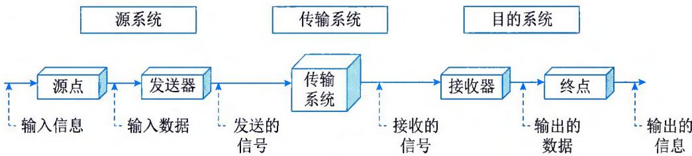
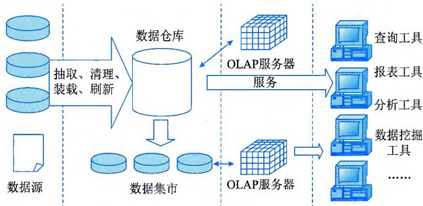

>[!info] 现行教材 · 第 2 版
>本页为**现行考试依据**的教材原文（第 2 版，2024 年 10 月出版，2025 年起启用）。
>考纲层级见 [[知识体系]]；练习题见 [[练习题·基础知识]]；案例模板见 [[案例答题模板]]。

# 第2章 信息技术发展

信息技术是研究如何获取信息、处理信息、传输信息和使用信息的技术。信息技术是在信息科学的基本原理和方法下的关于一切信息的产生、信息的传输、信息的发送、信息的接收等应用技术的总称。从信息技术的发展过程来看，信息技术在传感器技术、通信技术和计算机技术的基础上，融合创新和持续发展，孕育和产生了物联网、云计算、大数据、区块链、人工智能和虚拟现实等新一代信息技术，成为支撑当今经济活动和社会生活的基石，代表着当今先进生产力的发展方向。

从宏观上讲，信息技术与信息化、信息系统是密不可分的。信息技术是实现信息化的手段，是信息系统建设的基础。信息化的巨大需求驱使信息技术高速发展，信息系统的广泛应用促进了信息技术的迭代创新。近年来，随着新一代信息技术的发展，使得信息及其相关的数据成为重要生产要素和战略资源，使得人们能更高效地进行资源优化配置，持续推动传统产业不断升级、社会劳动生产率的不断提升，从而带动全球信息化发展的浪潮、数字化发展的转型，新一代信息技术已成为世界各国竞相投资和重点发展的战略性产业。

## 2.1 信息技术及其发展

信息技术是以微电子学为基础的计算机技术和电信技术的结合而形成的，对声音、图像、文字、数字和各种传感信号的信息进行获取、加工、处理、储存、传播和使用的能动技术。按表现形态的不同，信息技术可分为硬技术（物化技术）与软技术（非物化技术）。前者指各种信息设备及其功能，如传感器、服务器、智能手机、通信卫星、笔记本电脑等。后者指有关信息获取与处理的各种知识、方法与技能，如语言文字技术、数据统计分析技术、规划决策技术、计算机软件技术等。

## 2.1.1 计算机软硬件

计算机硬件（Computer Hardware）是指计算机系统中由电子、机械和光电元件等组成的各种物理装置的总称。这些物理装置按系统结构的要求构成一个有机整体，为计算机软件运行提供物质基础。计算机软件（Computer Software）是指计算机系统中的程序及其文档，程序是计算任务的处理对象和处理规则的描述；文档是为了便于了解程序所需的阐明性资料。程序必须安装入机器内部才能工作，文档一般是给人看的，不一定安装入机器。

硬件和软件互相依存。硬件是软件赖以工作的物质基础，软件的正常工作是硬件发挥作用的重要途径。计算机系统必须要配备完善的软件系统才能正常工作，从而充分发挥其硬件的各种功能。硬件和软件协同发展，计算机软件随硬件技术的迅速发展而发展，而软件的不断发展与完善又促进了硬件的更新，两者密切交织发展，缺一不可。随着计算机技术的发展，在许多情况下，计算机的某些功能既可以由硬件实现，也可以由软件来实现。因此硬件与软件在一定意义上说没有绝对严格的界线。

## 1. 计算机硬件

计算机硬件主要分为：控制器、运算器、存储器、输入设备和输出设备。

## 1）控制器

控制器（Controller）根据事先给定的命令发出控制信息，使整个电脑指令执行过程一步一步地进行。控制器是整个计算机的中枢神经，其功能是对程序规定的控制信息进行解释，根据其要求进行控制，调度程序、数据和地址，协调计算机各部分工作及内存与外设的访问等。

控制器的具体功能主要是：从内存中取出一条指令，并指出下一条指令在内存中位置，对指令进行译码或测试，并产生相应的操作控制信号，以便启动规定的动作；指挥并控制 CPU、内存和输入 / 输出设备之间数据流动的方向。

## 2）运算器

运算器（Arithmetic Unit）的功能是对数据进行各种算术运算和逻辑运算，即对数据进行加工处理。运算器的基本操作包括加、减、乘、除四则运算，与、或、非、异或等逻辑操作，以及移位、比较和传送等操作，亦称算术逻辑部件（ALU）。计算机运行时，运算器的操作和操作种类由控制器决定，运算器接受控制器的命令而进行动作，即运算器所进行的全部操作都是由控制器发出的控制信号来指挥的。

## 3）存储器

存储器（Memory）的功能是存储程序、数据和各种信号、命令等信息，并在需要时提供这些信息。存储器分为：计算机内部的存储器（简称内存）和计算机外部的存储器（简称外存）。内存储器从功能上可以分为：读写存储器 RAM、只读存储器 ROM 两大类；计算机的外存储器一般有：软盘和软驱、硬盘、光盘等，以及基于 USB 接口的移动硬盘、可擦写电子硬盘（优盘）等。

计算机存储容量以字节为单位，它们是：字节B（1Byte=8bit）、千字节kB（1kB=1024B）、兆字节MB（1MB=1024kB）、吉字节GB（1GB=1024MB）、太字节TB（1TB=1024GB）。

## 4）输入设备

输入设备（Input Device）是计算机的重要组成部分，输入设备与输出设备合称为外部设备，简称外设。输入设备的作用是将程序、原始数据、文字、字符、控制命令或现场采集的数据等信息输入计算机。常见的输入设备有键盘、鼠标、麦克风、摄像头、扫描仪、扫码枪、手写板、触摸屏等。

## 5）输出设备

输出设备（Output Device）也是计算机的重要组成部分，它把计算机的中间结果或最后结果、机内的各种数据符号及文字或各种控制信号等信息输出出来。计算机常用的输出设备有显示器、打印机、激光印字机和绘图仪等。

## 2. 计算机软件

计算机软件分为系统软件、应用软件和中间件。如果把计算机比喻为一个人的话，那么硬件就表示人的身躯，而软件则表示人的思想或灵魂。一台没有安装任何软件的计算机被称为"裸机"。

## 1）系统软件

系统软件（System Device）是指控制和协调计算机及外部设备，支持应用软件开发和运行的系统，是无须用户干预的各种程序的集合。系统软件的主要功能是调度、监控和维护计算机系统，负责管理计算机系统中各种独立的硬件，使得它们可以协调工作。系统软件使得计算机使用者和其他软件将计算机当作一个整体而不需要顾及底层每个硬件是如何工作的。

## 2）应用软件

应用软件（Application Software）是用户可以使用的各种程序设计语言，以及用各种程序设计语言编制的应用程序的集合，分为应用软件包和用户程序。应用软件包是利用计算机解决某类问题而设计的程序的集合，供多用户使用。用户程序是为满足用户在不同领域、不同问题的应用需求而提供的软件。

## 3）中间件

中间件（Middleware）是处于操作系统和应用程序之间的软件。它使用系统软件所提供的基础服务（功能），衔接网络上应用系统的各个部分或不同的应用，能够达到资源共享和功能共享的目的。中间件是位于平台（硬件和操作系统）和应用之间的通用服务，这些服务具有标准的程序接口和协议。针对不同的操作系统和硬件平台，不管底层的计算机硬件和系统软件怎样更新换代，只要将中间件进行升级和更新，并保持中间件对外的接口定义不变，应用软件几乎无需任何修改，从而保证了应用软件的持续稳定运行。

## 2.1.2 计算机网络

在计算机领域中，网络就是用物理链路将各个孤立的工作站或主机连接在一起，组成数据链路，从而达到资源共享和通信的目的。计算机网络将地理位置不同的具有独立功能的多个计算机系统，通过通信设备和线路连接起来，结合网络软件（网络协议、信息交换方式及网络操作系统等），实现不同计算机资源之间的共享。

## 1. 通信基础

通信是指人与人、人与自然之间通过某种行为或媒体进行的信息交流与传递。电（光）通信是指由一地向另一地进行信息的传输与交换的传递过程。通信的目的是传递消息（Message）中包含的信息（Information）。连续消息是指消息的状态随时间变化而连续变化，如话音等；离散消息指消息的状态是离散的，如符号、数据等。

## 1）通信系统和模型

一个通信系统包括三大部分：源系统（发送端或发送方）、传输系统（传输网络）和目的系统（接收端或接收方），如图2-1所示。

## 2）现代通信的关键技术

从总体上看，通信技术实际上就是通信系统和通信网的相关技术。通信系统是指点对点通信所需的全部设施，而通信网是由许多通信系统组成的多点之间能相互通信的全部设施。现代的关键通信技术有数字通信技术、信息传输技术、通信网络技术等。

  
图2-1 通信系统模型

\- 数字通信技术：是用数字信号作为载体来传输消息，或用数字信号对载波进行数字调制后再传输的通信方式。它可传输电报、数字数据等数字信号，也可传输经过数字化处理的语声和图像等模拟信号。

\- 信息传输技术：是主要用于管理和处理信息所采用的各种技术的总称，它主要是应用计算机科学和通信技术来设计、开发、安装和实施信息系统及应用软件；它也常被称为信息和通信技术。

\- 通信网络技术：是指将各个孤立的设备进行物理连接，实现人与人、人与计算机、计算机与计算机之间进行信息交换的链路，从而达到资源共享和通信的目的。

## 2. 网络基础

从网络的作用范围可将网络类别划分为个人局域网（Personal Area Network，PAN）、局域网（Local Area Network，LAN）、城域网（Metropolitan Area Network，MAN）、广域网（Wide Area Network，WAN）。

\- 个人局域网（PAN）。个人局域网是指在个人工作的地方把属于个人的电子设备（如便携式电脑等）用无线技术连接起来的自组网络，因此也常称为无线个人局域网WPAN（Wireless PAN）。从计算机网络的角度来看，PAN是一个局域网，其作用范围通常在10m左右。

\- 局域网（LAN）。局域网通常指用微型计算机或工作站通过高速通信线路相连（速率通常在10Mb/s以上），其地理范围通常为1km左右，通常覆盖一个校园、一个单位、一栋建筑物等。

\- 城域网（MAN）。城域网的作用范围可跨越几个街区甚至整个城市，其作用距离约为5～50km。

\- 广域网（WAN）。广域网使用节点交换机连接各主机，节点交换机之间的连接链路一般是高速链路，具有较大的通信容量。广域网的作用范围通常为几十公里到几千公里，可跨越一个国家或一个洲进行长距离传输数据。

从网络的使用者角度可以将网络分为公用网（Public Network）和专用网（Private Network）。

\- 公用网。公用网指电信组织出资建造的面向大众提供服务的大型网络，也称为公众网。

\- 专用网。专用网指某个组织为满足特殊业务工作所建造的网络，这种网络不向本组织以外的人提供服务，如电力、军队、铁路、银行等均有本系统的专用网。

## 3. 网络设备

信息在网络中的传输主要有以太网技术和网络交换技术。网络交换是指通过一定的设备（如交换机等）将不同的信号或者信号形式转换为对方可识别的信号类型，从而达到通信目的的一种交换形式，常见的有数据交换、线路交换、报文交换和分组交换。在计算机网络中，按照交换层次的不同，网络交换可以分为物理层交换（如电话网）、链路层交换（二层交换——对MAC地址进行变更）、网络层交换（三层交换——对IP地址进行变更）、传输层交换（四层交换——对端口进行变更）（比较少见）和应用层交换。

在网络互连时，各节点一般不能简单地直接相连，而是需要通过一个中间设备来实现。按照 OSI 参考模型的分层原则，中间设备要实现不同网络之间的协议转换功能。根据它们工作的协议层的不同进行分类，网络互连设备有中继器（实现物理层协议转换，在电缆间转换二进制信号）、网桥（实现物理层和数据链路层协议转换）、路由器（实现网络层和以下各层协议转换）、网关（提供从最底层到传输层或以上各层的协议转换）和交换机等。在实际应用中，各厂商提供的设备都是多功能组合且向下兼容的。表 2-1 则是对以上设备的一个总结。

表 2-1 网络互连设备

<table><tr><td>互连设备</td><td>工作层次</td><td>主要功能</td></tr><tr><td>中继器</td><td>物理层</td><td>对接收的信号进行再生和发送,只起到扩展传输距离的作用,其对高层协议是透明的,但使用个数有限(例如,在以太网中只能使用4个)</td></tr><tr><td>网桥</td><td>数据链路层</td><td>根据帧物理地址进行网络之间的信息转发,可缓解网络通信繁忙度,提高效率。只能够连接相同MAC层的网络</td></tr><tr><td>路由器</td><td>网络层</td><td>通过逻辑地址进行网络之间的信息转发,可完成异构网络之间的互联互通,只能连接使用相同网络层协议的子网</td></tr><tr><td>网关</td><td>高层(第4~7层)</td><td>最复杂的网络互联设备,用于连接网络层以上执行不同协议的子网</td></tr><tr><td>集线器</td><td>物理层</td><td>多端口中继器</td></tr><tr><td>二层交换机</td><td>数据链路层</td><td>是指传统意义上的交换机或多端口网桥</td></tr><tr><td>三层交换机</td><td>网络层</td><td>带路由功能的二层交换机</td></tr><tr><td>多层交换机</td><td>高层(第4~7层)</td><td>带协议转换的交换机</td></tr></table>

随着无线技术运用的日益广泛，目前，市面上基于无线网络的产品非常多，主要有无线网卡、无线AP、无线网桥和无线路由器等。

## 4. 网络标准协议

网络协议是为网络中的数据交换构建的规则、标准或约定的集合。网络协议由三个要素组成，分别是语义、语法和时序。语义是解释控制信息每个部分的含义，它规定了需要发出何种控制信息，完成的动作以及做出什么样的响应；语法是用户数据与控制信息的结构与格式，以及数据出现的顺序；时序是对事件发生顺序的详细说明。人们形象地将这三个要素描述为：语义表示要做什么，语法表示要怎么做，时序表示做的顺序。

## 1）OSI协议

国际标准化组织（ISO）和国际电报电话咨询委员会（CCITT）联合制定的开放系统互连参考模型（Open System Interconnect，OSI），其目的是为异构计算机互连提供一个共同的基础和标准框架，并为保持相关标准的一致性和兼容性提供共同的参考。OSI采用了分层的结构化技术，从下到上共分七层：

\- 物理层。物理层包括物理连网媒介，如电缆连线连接器。该层的协议产生并检测电压以便发送和接收携带数据的信号。物理层的具体标准有RS-232、V.35、RJ-45、FDDI。

\- 数据链路层。数据链路层控制网络层与物理层之间的通信。它的主要功能是将从网络层接收到的数据分割成特定的可被物理层传输的帧。数据链路层常见的协议有IEEE802.3/2、HDLC、PPP、ATM。

\- 网络层。网络层的主要功能是将网络地址（如IP地址）翻译成对应的物理地址（如网卡地址），并决定如何将数据从发送方路由到接收方。在TCP/IP中，网络层的具体协议有IP、ICMP、IGMP、IPX、ARP等。

\- 传输层。传输层主要负责确保数据可靠、顺序、无错地从A点传输到B点。如提供建立、维护和拆除传送连接的功能；选择网络层提供最合适的服务；在系统之间提供可靠、透明的数据传送，提供端到端的错误恢复和流量控制。在TCP/IP中，传输层的具体协议有TCP、UDP、SPX。

\- 会话层。会话层负责在网络中的两节点之间建立和维持通信，以及提供交互会话的管理功能，如三种数据流方向的控制，即一路交互、两路交替和两路同时会话模式。会话层常见的协议有RPC、SQL、NFS。

\- 表示层。表示层如同应用程序和网络之间的翻译官，将数据按照网络能理解的方案进行格式化，这种格式化也因所使用网络的类型不同而不同。表示层管理数据的解密与加密、数据转换、格式化和文本压缩。表示层常见的协议有JPEG、ASCII、GIF、DES、MPEG。

\- 应用层。应用层负责对软件提供接口以使程序能使用网络服务，如事务处理程序、文件传送协议和网络管理等。在TCP/IP中，常见的协议有HTTP、Telnet、FTP、SMTP。

## 2）IEEE802协议族

IEEE 802 规范定义了网卡访问传输介质（如光缆、双绞线和无线等），以及在传输介质上传输数据的方法，还定义了传输信息的网络设备之间连接的建立、维护和拆除的途径。遵循 IEEE 802 标准的产品包括网卡、桥接器、路由器以及其他一些用来建立局域网络的组件。IEEE 802 规范包括一系列标准的协议族，其中以太网规范 IEEE 802.3 是重要的局域网协议，内容包括：

\- IEEE 802.3 标准以太网 10Mb/s 传输介质为细同轴电缆

- IEEE 802.3u 快速以太网 100Mb/s 双绞线

\- IEEE 802.3z 千兆以太网 1000Mb/s 光纤或双绞线

## 3) TCP/IP

TCP/IP 是互联网协议的核心。在应用层中，TCP/IP 定义了很多面向应用的协议，应用程序通过本层协议利用网络完成数据交互的任务，这些协议主要有：

\- FTP（File Transfer Protocol，文件传输协议）是网络上两台计算机传送文件的协议，其运行在TCP之上，是通过Internet将文件从一台计算机传输到另一台计算机的一种途径。FTP的传输模式包括Bin（二进制）和ASCII（文本文件）两种，除了文本文件之外，都应该使用二进制模式传输。

\- TFTP（Trivial File Transfer Protocol，简单文件传输协议）是用来在客户机与服务器之间进行简单文件传输的协议，提供不复杂、开销不大的文件传输服务。TFTP建立在UDP（User Datagram Protocol，用户数据报协议）之上，提供不可靠的数据流传输服务，不提供存取授权与认证机制，使用超时重传方式来保证数据的到达。

\- HTTP（Hypertext Transfer Protocol，超文本传输协议）是用于从WWW服务器传输超文本到本地浏览器的传送协议。它可以使浏览器更加高效，减少网络传输量。HTTP建立在TCP之上，它不仅保证计算机正确快速地传输超文本文档，还可以确定传输文档中的哪一部分，以及哪部分内容首先显示等。

\- SMTP（Simple Mail Transfer Protocol，简单邮件传输协议）建立在TCP之上，是一种提供可靠且有效传输电子邮件的协议。SMTP是建模在FTP文件传输服务上的一种邮件服务，主要用于传输系统之间的邮件信息并提供与电子邮件有关的通知。

\- DHCP（Dynamic Host Configuration Protocol，动态主机配置协议）建立在UDP之上，是基于客户机/服务器模型设计的。所有IP网络设定的数据都由DHCP服务器集中管理，并负责处理客户端的DHCP要求；而客户端则会使用从服务器分配下来的IP环境数据。DHCP分配的IP地址可以分为三种方式：固定分配、动态分配和自动分配。

\- Telnet（远程登录协议）是登录和仿真程序，建立在TCP之上，它的基本功能是允许用户登录进入远程计算机系统。以前，Telnet是一个将所有用户输入送到远程计算机进行处理的简单的终端程序。目前，它的一些较新的版本可以在本地执行更多的处理，可以提供更好的响应，并且减少了通过链路发送到远程计算机的信息数量。

\- DNS（Domain Name System，域名系统）在Internet上的域名与IP地址之间是一一对应的，域名虽然便于人们记忆，但机器之间只能相互识别IP地址，它们之间的转换工作称为域名解析，域名解析需要由专门的域名解析服务器来完成，DNS就是进行域名解析的服务器。DNS通过对用户友好的名称来查找计算机和服务。

\- SNMP（Simple Network Management Protocol，简单网络管理协议）是为了解决Internet上的路由器管理问题而提出的，它可以在IP、IPX、AppleTalk和其他传输协议上使用。SNMP是指一系列网络管理规范的集合，包括协议本身、数据结构的定义和一些相关概念。目前，SNMP已成为网络管理领域中事实上的工业标准，并被广泛支持和应用，大多数网络管理系统和平台都是基于SNMP的。

## 4) TCP 和 UDP

在 OSI 的传输层有两个重要的传输协议，分别是 TCP（Transmission Control Protocol，传输控制协议）和 UDP（User Datagram Protocol，用户数据报协议），这些协议负责提供流量控制、错误校验和排序服务。

\- TCP是整个TCP/IP协议族中最重要的协议之一，它在IP协议提供的不可靠数据服务的基础上，采用了重发技术，为应用程序提供了一个可靠的、面向连接的、全双工的数据传输服务。TCP协议一般用于传输数据量比较少且对可靠性要求高的场合。

\- UDP是一种不可靠的、无连接的协议，可以保证应用程序进程间的通信，与TCP相比，UDP是一种无连接的协议，它的错误检测功能要弱得多。可以这样说，TCP有助于提高可靠性，而UDP则有助于提高传输速率。UDP协议一般用于传输数据量大，对可靠性要求不是很高，但要求速度快的场合。

## 5. 第五代移动通信技术

第五代移动通信技术（5th Generation Mobile Communication Technology，5G）是具有高速率、低时延等特点的新一代移动通信技术。

国际电信联盟（ITU）定义了5G的八大指标，与4G的对比如表2-2所示。

表 2-2 4G 与 5G 主要指标对标

<table><tr><td>指标名称</td><td>流量密度/(Tb/s·km2)</td><td>连接数密度(万·km2)</td><td>时延/ms</td><td>移动性/km·h-1</td><td>能效/倍</td><td>用户体验速率/(b·s-1)</td><td>频道效率/倍</td><td>峰值速率/(Gb·s-1)</td></tr><tr><td>4G</td><td>0.1</td><td>10</td><td>空口 10</td><td>350</td><td>1</td><td>10M</td><td>1</td><td>10</td></tr><tr><td>5G</td><td>10</td><td>100</td><td>空口 1</td><td>500</td><td>100</td><td>0.1~1G</td><td>3</td><td>20</td></tr></table>

5G 国际技术标准重点满足灵活多样的物联网需要。在正交频分多址（Orthogonal Frequency Division Multiple Access，OFDMA）和多入多出（Multiple Input Multiple Output，MIMO）基础技术上，5G 为支持三大应用场景，采用了灵活的全新系统设计。在频段方面，与 4G 支持中低频不同，考虑到中低频资源有限，5G 同时支持中低频和高频频段，其中中低频满足覆盖和容量需求，高频满足在热点区域提升容量的需求，5G 针对中低频和高频设计了统一的技术方案，并支持百兆赫兹的基础带宽。为了支持高速率传输和更优覆盖，5G 采用 LDPC（一种具有稀疏校验矩阵的分组纠错码）、Polar（一种基于信道极化理论的线性分组码）新型信道编码方案、性能更强的大规模天线技术等。为了支持低时延、高可靠，5G 采用短帧、快速反馈、多层 / 多站数据重传等技术。

5G采用全新的服务化架构，支持灵活部署和差异化业务场景。5G采用全服务化设计，将网络功能模块化，支持按需调用，可以实现功能重构；采用服务化描述，易于实现能力开放，有利于引入IT开发实力，发挥网络潜力。5G支持灵活部署，基于网络功能虚拟化（NFV）和软件定义网络（SDN），实现硬件和软件解耦以及控制和转发分离；采用通用数据中心的云化组网，使得网络功能部署更灵活，资源调度更高效；支持边缘计算，将云计算平台下沉到网络边缘，支持基于应用的网关灵活选择和边缘分流。通过网络切片技术满足5G差异化需求。网络切片是指从一个网络中选取特定的特性和功能，定制出的一个逻辑上独立的网络，它使得运营商可以部署功能、特性服务各不相同的多个逻辑网络，为各自的目标用户服务。

国际电信联盟（ITU）定义了5G的三大类网络切片应用场景，即增强移动宽带（eMBB）、超高可靠低时延通信（uRLLC）和海量机器类通信（mMTC）。增强移动宽带主要面向移动互联网流量爆炸式增长，为移动互联网用户提供更加极致的应用体验；超高可靠低时延通信主要面向工业控制、远程医疗、自动驾驶等对时延和可靠性具有极高要求的垂直行业应用需求；海量机器类通信主要面向智慧城市、智能家居、环境监测等以传感和数据采集为目标的应用需求。

## 2.1.3 存储和数据库

存储是计算机系统的重要组成部分，一般以存储器的方式存在。存储器的主要用途是存放程序和数据，程序是计算机操作的依据，数据是计算机操作的对象。

数据库是以一定方式存储在一起，可供多个用户共享，并与应用程序彼此独立的数据的集合。数据库的存储空间很大，可以存放百万条、千万条、上亿条数据。

存储和内存技术对数据库操作产生了巨大影响。存储和数据库系统一直处于相同的发展曲线。随着技术的发展，数据库从传统的结构化查询语言（Structured Query Language，SQL）数据库已经从垂直可扩展的系统发展为新型的非关系型（Not only SQL，NoSQL）数据库，后者是水平可扩展的分布式系统。同样，存储技术已经从垂直扩展的阵列发展到水平扩展的分布式存储系统。

## 1.存储技术

存储分类根据服务器类型分为：封闭系统的存储和开放系统的存储。封闭系统主要指大型机等服务器。开放系统指基于包括麒麟、欧拉、UNIX、Linux等操作系统的服务器。开放系统的存储分为：内置存储和外挂存储。外挂存储根据连接的方式分为直连式存储（Direct Attached Storage，DAS）和网络化存储（Fabric Attached Storage，FAS）。网络化存储根据传输协议又分为：网络接入存储（Network Attached Storage，NAS）和存储区域网络（Storage Area Network，SAN）。

## 1）DAS（直连式存储）

DAS 也可称为 SAS（Server Attached Storage，服务器附加存储）。DAS 被定义为直接连接在各种服务器或客户端扩展接口下的数据存储设备，它依赖于服务器，其本身是硬件的堆叠，不带有任何存储操作系统。在这种方式中，存储设备是通过电缆（通常是 SCSI 接口电缆）直接到服务器的，I/O（输入 / 输出）请求直接发送到存储设备。

## 2）NAS（网络接入存储）

NAS也称为网络直联存储设备或网络磁盘阵列，是一种专业的网络文件存储及文件备份设备，它是基于局域网（LAN）的，按照TCP/IP进行通信，以文件的I/O方式进行数据传输。一个NAS里面包括核心处理器、文件服务管理工具以及一个或者多个硬盘驱动器用于数据的存储。

## 3）SAN（存储区域网络）

SAN 是一种通过光纤集线器、光纤路由器、光纤交换机等连接设备将磁盘阵列、磁带等存储设备与相关服务器连接起来的高速专用子网。SAN 由三个基本的组件构成：接口（如 SCSI、光纤通道、ESCON 等）、连接设备（交换设备、网关、路由器、集线器等）和通信控制协议（如 IP 和 SCSI 等）。这三个组件再加上附加的存储设备和独立的 SAN 服务器，就构成一个 SAN 系统。

SAN 主要包含 FC SAN 和 IP SAN 两种，FC SAN 的网络介质为光纤通道（Fibre Channel），IP SAN 使用标准的以太网。采用 IP SAN 可以将 SAN 为服务器提供的共享特性以及 IP 网络的易用性很好地结合在一起，并且为用户提供了类似服务器本地存储的较高性能体验。

DAS、NAS、SAN等存储模式之间的技术与应用对比如表2-3所示。

表 2-3 常用存储模式的技术与应用对比

<table><tr><td>存储系统架构</td><td>DAS</td><td>NAS</td><td>SAN</td></tr><tr><td>安装难易度</td><td>不一定</td><td>简单</td><td>困难</td></tr><tr><td>数据传输协议</td><td>SCSI/FC/ATA</td><td>TCP/IP</td><td>FC</td></tr><tr><td>传输对象</td><td>数据块</td><td>文件</td><td>数据块</td></tr><tr><td>使用标准文件共享协议</td><td>否</td><td>是(NFS/CIFS…)</td><td>否</td></tr><tr><td>异种操作系统文件共享</td><td>否</td><td>是</td><td>需要转换设备</td></tr><tr><td>集中式管理</td><td>不一定</td><td>是</td><td>需要管理工具</td></tr><tr><td>管理难易度</td><td>不一定</td><td>以网络为基础,容易</td><td>不一定,但通常很难</td></tr><tr><td>提高服务器效率</td><td>否</td><td>是</td><td>是</td></tr><tr><td>灾难忍受度</td><td>低</td><td>高</td><td>高,专有方案</td></tr><tr><td>适合对象</td><td>中小组织服务器捆绑磁盘(JBOD)</td><td>中小组织SOHO族组织部门</td><td>大型组织数据中心</td></tr><tr><td>应用环境</td><td>局域网文档共享程度低独立操作平台服务器数量少</td><td>局域网文档共享程度高异质格式存储需求高</td><td>光纤通道存储区域网网络环境复杂文档共享程度高异质操作系统平台服务器数量多</td></tr><tr><td>业务模式</td><td>一般服务器</td><td>Web服务器多媒体资料存储文件资料共享</td><td>大型资料库数据库等</td></tr><tr><td>档案格式复杂度</td><td>低</td><td>中</td><td>高</td></tr><tr><td>容量扩充能力</td><td>低</td><td>中</td><td>高</td></tr></table>

## 4）存储虚拟化

存储虚拟化（Storage Virtualization）是"云存储"的核心技术之一，它把来自一个或多个网络的存储资源整合起来，向用户提供一个抽象的逻辑视图，用户可以通过这个视图中的统一

逻辑接口来访问被整合的存储资源。

存储虚拟化使存储设备能够转换为逻辑数据存储。虚拟机作为一组文件存储在数据存储的目录中。数据存储是类似于文件系统的逻辑容器。它隐藏了每个存储设备的特性，形成一个统一的模型，为虚拟机提供磁盘。存储虚拟化技术帮助系统管理虚拟基础架构存储资源，提高资源利用率和灵活性，提高应用正常运行时间。

## 5）绿色存储

绿色存储（Green Storage）技术是指从节能环保的角度出发，用来设计生产能效更佳的存储产品，降低数据存储设备的功耗，提高存储设备每瓦性能的技术。

绿色存储技术的核心是设计运行温度更低的处理器和更有效率的系统，生产更低能耗的存储系统或组件，降低产品所产生的电子碳化合物，其最终目的是提高所有网络存储设备的能源效率，用最少的存储容量来满足业务需求，从而消耗最低的能源。以绿色理念为指导的存储系统最终是存储容量、性能和能耗三者的平衡。

绿色存储技术涉及所有存储分享技术，包括磁盘和磁带系统、服务器连接、存储设备、网络架构及其他存储网络架构、文件服务和存储应用软件、重复数据删除、自动精简配置和基于磁带的备份技术等存储技术。绿色存储技术可以提高存储利用率，降低建设成本和运行成本，其目的是提高所有网络存储技术的能源效率。

## 2. 数据结构模型

数据结构模型是数据库系统的核心。数据结构模型描述了在数据库中结构化和操纵数据的方法，模型的结构部分规定了数据如何被描述（例如树、表等）。模型的操纵部分规定了数据的添加、删除、显示、维护、打印、查找、选择、排序和更新等操作。

常见的数据结构模型有三种：层次模型、网状模型和关系模型，层次模型和网状模型又统称为格式化数据模型。

## 1）层次模型

层次模型是数据库系统最早使用的一种模型，它用"树"结构表示实体集之间的关联，其中实体集（用矩形框表示）为结点，而树中各结点之间的连线表示它们之间的关联。在层次模型中，每个结点表示一个记录类型，记录类型之间的联系用结点之间的连线（有向边）表示，这种联系是父子之间的一对多的联系，这就使得层次数据库系统只能处理一对多的实体联系。每个记录类型可包含若干个字段，这里记录类型描述的是实体，字段描述实体的属性。每个记录类型及其字段都必须命名。各个记录类型、同一记录类型中各个字段不能同名。每个记录类型可以定义一个排序字段，也称码字段，如果定义该排序字段的值是唯一的，则它能唯一标识一个记录值。

一个层次模型在理论上可以包含任意有限个记录类型和字段，但任何实际的系统都会因为存储容量或实现复杂度而限制层次模型中包含的记录类型个数和字段个数。在层次模型中，同一双亲的子女结点称为兄弟结点，没有子女结点的结点称为叶结点。层次模型的一个基本的特点是任何一个给定的记录值只能按其层次路径查看，没有一个子女记录值能够脱离双亲记录值

而独立存在。

层次模型的主要优点包括：

\- 层次模型的数据结构比较简单清晰。

\- 层次数据库查询效率高，性能优于关系模型，不低于网状模型。

\- 层次模型提供了良好的完整性支持。

层次模型的主要缺点包括：

\- 现实世界中很多联系是非层次性的，不适合用层次模型表示结点之间的多对多联系。

\- 如果一个结点具有多个双亲结点等，用层次模型表示这类联系就很笨拙，只能通过引入冗余数据或创建非自然的数据结构来解决。

\- 对数据的插入和删除操作限制比较多，因此应用程序的编写比较复杂。

\- 查询子女结点必须通过双亲结点。

\- 由于结构严密，层次命令趋于程序化。

## 2）网状模型

现实世界中事物之间的联系更多的是非层次关系的，一个事物和另外的几个都有联系，用层次模型表示这种关系很不直观，网状模型克服了这一弊病，用网状结构可以清晰表示这种非层次关系。这种用有向图结构表示实体类型及实体间联系的数据结构模型称为网状模型。网状模型突破了层次模型不能表示非树状结构的限制，两个或两个以上的结点都可以有多个双亲结点，将有向树变成了有向图。

网状模型中以记录作为数据的存储单位。记录包含若干数据项。网状数据库的数据项可以是多值的和复合的数据。每个记录有一个唯一标识它的内部标识符，称为码（Database Key, DBK），它在一个记录存入数据库时由数据库管理系统（Database Management System, DBMS）自动赋予。DBK 可以看作记录的逻辑地址，可作记录的"替身"或用于寻找记录。网状数据库是导航式（Navigation）数据库，用户在操作数据库时不但说明要做什么，还要说明怎么做。例如，在查找语句中不但要说明查找的对象，而且要规定存取路径。

网状模型的主要优点包括：

\- 能够更为直接地描述现实客观世界，可表示实体间的多种复杂联系。

\- 具有良好的性能，存取效率较高。

网状模型的主要缺点包括：

\- 结构比较复杂，用户不容易使用。

\- 数据独立性差，由于实体间的联系本质上是通过存取路径表示的，因此应用程序在访问数据时要指定存取路径。

## 3）关系模型

关系模型是在关系结构的数据库中用二维表格的形式表示实体以及实体之间联系的模型。关系模型是以集合论中的关系概念为基础发展起来的。关系模型中无论是实体还是实体间的联系均由单一的结构类型——关系来表示。

关系模型允许设计者通过数据库规范化的提炼，去建立一个信息一致性的模型。访问计划和其他实现与操作细节由 DBMS 引擎来处理，而不反映在逻辑模型中。关系模型的基本原理是信息原理，即所有信息都表示为关系中的数据值。所以，关系变量在设计时是相互无关联的；反而，设计者在多个关系变量中使用相同的域，如果一个属性依赖于另一个属性，则通过参照完整性来强制这种依赖性。

## 关系模型的主要优点包括

\- 数据结构单一。在关系模型中，不管是实体还是实体之间的联系，都用关系来表示，而关系都对应一张二维数据表，这种数据结构简单且清晰。

\- 关系规范化，并建立在严格的理论基础上。构成关系的基本规范要求关系中每个属性都不可再分割，同时关系建立在具有坚实的理论基础的严格数学概念基础上。

\- 概念简单，操作方便。关系模型最大的优点就是简单，用户容易理解和掌握，一个关系就是一张二维表格，用户只需使用简单的查询语言就能对数据库进行操作。

关系模型的主要缺点包括：

\- 存取路径对用户透明，查询效率往往不如格式化数据模型。

\- 为提高性能，必须对用户查询请求进行优化，增加了开发数据库管理系统的难度。

## 3. 常用数据库类型

数据库根据存储方式可以分为关系型数据库（SQL）和非关系型数据库（NoSQL）。

## 1）关系型数据库

网状数据库和层次数据库已经很好地解决了数据的集中和共享问题，但是在数据独立性和抽象级别上仍有很大欠缺。用户在对这两种数据库进行存取时，仍然需要明确数据的存储结构，指出存取路径。为解决这一问题，关系型数据库应运而生，它采用关系模型作为数据的组织方式。

关系数据库是在一个给定的应用领域中，所有实体及实体之间联系的集合。关系型数据库支持事务的 ACID 原则，即原子性（Atomicity）、一致性（Consistency）、隔离性（Isolation）和持久性（Durability），这四种原则保证在事务过程当中数据的正确性。关系型数据库主要特征包括：

\- 表中的行、列次序并不重要。

\- 行（row）。表中的每一行又称为一条记录。

\- 列（column）。表中的每一列，称为属性字段field域。

\- 主键PK（Primary key）。用于唯一确定一条记录的字段外键FK域。

\- 领域（domain）。属性的取值范围，如，性别只能是"男"和"女"两个值。

## 2）非关系型数据库

非关系型数据库是分布式的、非关系型的、不保证遵循 ACID 原则的数据存储系统。NoSQL 数据存储不需要固定的表结构，通常也不存在连接操作。在大数据存取上具备关系型数据库无法比拟的性能优势。非关系型数据库的主要特征包括：

\- 非结构化的存储。

\- 基于多维关系模型。

\- 具有特有的使用场景。

常见的非关系型数据库分为：

\- 键值数据库。类似传统语言中使用的哈希表。可以通过key来添加、查询或者删除数据库，因为使用key主键访问，所以会获得很高的性能及扩展性。Key/Value模型对于信息系统来说，其优势在于简单、易部署、高并发。

\- 列存储（Column-oriented）数据库。列存储数据库将数据存储在列族中，一个列族存储经常被一起查询，如人们经常会查询某个人的姓名和年龄，而不是薪资。这种情况下姓名和年龄会被放到一个列族中，薪资会被放到另一个列族中。这种数据库通常用来应对分布式存储海量数据。

\- 面向文档（Document-Oriented）数据库。文档型数据库可以看作是键值数据库的升级版，允许之间嵌套键值。文档型数据库比键值数据库的查询效率更高。面向文档数据库会将数据以文档形式存储。

\- 图形数据库。图形数据库允许人们将数据以图的方式存储。实体会被作为顶点，而实体之间的关系则会被作为边。例如，有三个实体：Steve Jobs、Apple和Next，则会有两个"Founded by"的边将Apple和Next连接到Steve Jobs。

## 3）不同类型数据库的优缺点

关系型数据库和非关系型数据库的优缺点如表2-4所示。

表 2-4 常用存储数据库类型优缺点

<table><tr><td>数据库类型</td><td>特点类型</td><td>描述</td></tr><tr><td rowspan="2">关系型数据库</td><td>优点</td><td>● 容易理解。二维表结构是非常贴近逻辑世界的一个概念,关系模型相对于网状模型、层次模型等其他模型来说更容易理解● 使用方便。通用的SQL语言使得操作关系型数据库非常方便● 易于维护。丰富的完整性(实体完整性、参照完整性和用户定义的完整性)大大减低了数据冗余和数据不一致的概率</td></tr><tr><td>缺点</td><td>● 数据读写必须经过SQL解析,大量数据、高并发下读写性能不足(对于传统关系型数据库来说,硬盘I/O是一个很大的瓶颈)● 具有固定的表结构,因此扩展困难● 多表的关联查询导致性能欠佳</td></tr><tr><td rowspan="2">非关系型数据库</td><td>优点</td><td>● 高并发。大数据下读写能力较强(基于键值对的,可以想象成表中的主键和值的对应关系,而且不需要经过SQL层的解析,所以性能非常高)● 基本支持分布式。易于扩展,可伸缩(因为基于键值对,数据之间没有耦合性,所以非常容易水平扩展)● 简单。弱结构化存储</td></tr><tr><td>缺点</td><td>● 事务支持较弱● 通过性差● 无完整约束,复杂业务场景支持较差</td></tr></table>

## 4. 数据仓库

传统的数据库技术在联机事务处理中获得了成功，但缺乏决策分析所需的大量历史数据信息，因为传统的数据库一般只保留当前或近期的数据信息。为了满足预测、决策分析的需要，在传统数据库的基础上产生了能够满足预测、决策分析需要的数据环境——数据仓库（Data Warehouse, DW）。数据仓库的相关基础概念包括：

\- 清洗/转换/加载（Extract/Transformation/Load，ETL）。用户从数据源中抽取出所需的数据，经过数据清洗、转换，最终按照预先定义好的数据仓库模型，将数据加载到数据仓库中去。

\- 元数据。元数据是关于数据的数据，指在数据仓库建设过程中所产生的有关数据源定义、目标定义、转换规则等相关的关键数据。同时元数据还包含关于数据含义的商业信息。典型的元数据包括：数据仓库表的结构、数据仓库表的属性、数据仓库的源数据（记录系统）、从记录系统到数据仓库的映射、数据模型的规格说明、抽取日志和访问数据的公用例行程序等。

\- 粒度。粒度指数据仓库的数据单位中保存数据的细化或综合程度的级别。细化程度越高，粒度级就越小；相反，细化程度越低，粒度级就越大。

\- 分割。结构相同的数据被分成多个数据物理单元。任何给定的数据单元属于且仅属于一个分割。

\- 数据集市。数据集市指小型的、面向部门或工作组级的数据仓库。

\- 操作数据存储（Operation Data Store，ODS）。能支持组织日常全局应用的数据集合，是不同于数据库的一种新的数据环境，是数据仓库扩展后得到的一个混合形式。

\- 数据模型。逻辑数据结构，包括由数据库管理系统为有效进行数据库处理提供的操作和约束。

\- 人工关系。人工关系是指在决策支持系统环境中用于表示参照完整性的一种设计技术。

\- 数据仓库是一个面向主题的、集成的、非易失的且随时间变化的数据集合，用于支持管理决策。

常见的数据仓库的体系结构如图2-2所示。

  
图2-2 数据仓库体系结构

（1）数据源。数据源是数据仓库系统的基础，是整个系统的数据源泉，通常包括组织内部信息和外部信息。内部信息包括存放于关系型数据库管理系统中的各种业务处理数据和各类文档数据。外部信息包括各类法律法规、市场信息和竞争对手的信息等。

（2）数据的存储与管理。数据的存储与管理是整个数据仓库系统的核心。数据仓库的真正关键是数据的存储和管理。数据仓库的组织管理方式决定了它有别于传统数据库，同时也决定了其对外部数据的表现形式。要决定采用什么产品和技术来建立数据仓库的核心，则需要从数据仓库的技术特点着手分析。针对现有各业务系统的数据，进行抽取、清理并有效集成，按照主题进行组织。数据仓库按照数据的覆盖范围可以分为组织级数据仓库和部门级数据仓库。

（3）联机处理分析（OnLin Analytical Processing，OLAP）服务器。OLAP 服务器对分析需要的数据进行有效集成，按多维模型予以组织，以便进行多角度、多层次的分析，并发现趋势。其具体实现可以分为：基于关系数据库的 OLAP（Relation OLAP，ROLAP）、基于多维数据组织的 OLAP（MultimenSional OLSP，MOLAP）和基于混合数据组织的 OLAP（Hybrid OLAP，HOLAP）。ROLAP 基本数据和聚合数据均存放在 RDBMS 之中；MOLAP 基本数据和聚合数据均存放于多维数据库中；HOLAP 基本数据存放于关系数据库管理系统（Relational Database Management System，RDBMS）之中，聚合数据存放于多维数据库中。

（4）前端工具。前端工具主要包括各种查询工具、报表工具、分析工具、数据挖掘工具以及各种基于数据仓库或数据集市的应用开发工具。其中数据分析工具主要针对 OLAP 服务器，报表工具、数据挖掘工具主要针对数据仓库。

## 2.1.4 信息安全

常见的信息安全问题主要表现为：计算机病毒泛滥、恶意软件的入侵、黑客攻击、利用计算机犯罪、网络有害信息泛滥、个人隐私泄露等。随着物联网、云计算、人工智能、大数据等新一代信息技术的广泛应用，信息安全也面临新的问题和挑战。

## 1.信息安全基础

信息安全三要素（CIA）是保密性（Confidentiality）、完整性（Integrity）和可用性（Availability）三个词的缩写。CIA是系统安全设计的目标。保密性、完整性和可用性是信息安全最为关注的三个属性，因此这三个特性也经常被称为信息安全三元组，这也是信息安全通常所强调的目标。信息安全已经成为一门涉及计算机科学、网络技术、通信技术、密码技术、信息安全技术、应用数学、数论和信息论等多种学科的综合性学科。从广义上来说，凡是涉及网络上信息的保密性、完整性、可用性、真实性和可核查性的相关技术和理论都属于信息安全的研究领域。

保密性是指"信息不被泄露给未授权的个人、实体和过程，或不被其使用的特性"。简单地说，就是确保所传输的数据只被其预定的接收者读取。同时，使用什么样的方式来实现保密性以保护数据、对象、资源机密性尤为关键。加密、访问控制、信息隐写都是实现保密性的方式。机密性还涉及其他概念、条件和方面，如敏感度、自由裁量权、危机程度、隐蔽、保密、隐私、隔离。

完整性是指"保护资产的正确和完整的特性"。简单地说，就是确保接收到的数据就是发送的数据。数据不应该被改变。完整性保证没有未授权的用户修改数据，可以从以下三个方面检验完整性：

\- 阻止未授权主体做出的修改。

\- 阻止授权主体做未授权的修改，例如：误操作。

\- 确保数据没有被改变，这需要某种方法进行验证。

完整性还包括其他概念、条件和方面，如准确度、真实性、不可抵赖性、责任和职责、全面性等。

可用性是指 "需要时，授权实体可以访问和使用的特性"。可用性确保数据在需要时可以使用。尽管传统上认为可用性并不属于信息安全的范畴，但随着拒绝服务攻击的逐渐盛行，要求数据总能保持可用性就显得十分关键了。

CIA三要素有其局限性。CIA三元组关注的重心在信息，虽然这是大多数信息安全的核心要素，但对于信息系统安全而言，仅考虑CIA是不够的。信息安全的复杂性决定了还存在其他重要因素。CIA给出了一个信息系统整体安全模型框架，能帮助信息化工作人员在制定安全策略时形成思路，但这并不是所有需要考虑的策略。CIA三元组可以作为规划、实施量化安全策略的基本原则，但是我们也应该认识到它的局限性。

信息必须依赖其存储、传输、处理及应用的载体（媒介）而存在，因此针对信息系统，安全可以划分为以下四个层次：设备安全、数据安全、内容安全和行为安全。

## 1）设备安全

信息系统设备的安全是信息系统安全的首要问题，主要包括三个方面：

\- 设备的稳定性。设备在一定时间内不出故障的概率。

\- 设备的可靠性。设备能在一定时间内正常执行任务的概率。

\- 设备的可用性。设备随时可以正常使用的概率。

信息系统的设备安全是信息系统安全的物质基础。除了硬件设备外，软件系统也是一种设备，也要确保软件设备的安全。

## 2）数据安全

数据安全属性包括秘密性、完整性和可用性。很多情况下，即使信息系统设备没有受到损坏，但其数据安全也可能已经受到危害，如数据泄露、数据篡改等。由于危害数据安全的行为具有较高的隐蔽性，数据应用用户往往并不知情，因此危害性很高。

## 3）内容安全

内容安全是信息安全在政治、法律、道德层次上的要求。内容安全包括：信息内容在政治上是健康的；信息内容符合国家的法律法规；信息内容符合中华民族优良的道德规范等。除此之外，广义的内容安全还包括信息内容保密、知识产权保护、信息隐藏和隐私保护等诸多方面。如果数据中充斥着不健康的、违法的、违背道德的内容，即使它是保密的、未被篡改的，也不能说是安全的。

## 4）行为安全

数据安全本质上是一种静态的安全，而行为安全是一种动态安全，主要包括：

\- 行为的秘密性。行为的过程和结果不能危害数据的秘密性。必要时，行为的过程和结果也应是秘密的。

\- 行为的完整性。行为的过程和结果不能危害数据的完整性，行为的过程和结果是可预期的。

\- 行为的可控性。行为的过程出现偏离预期时，能够发现、控制或纠正。

行为安全强调过程安全，体现在组成信息系统的硬件设备、软件设备和应用系统协调工作的程序（执行序列）符合系统设计的预期，这样才能保证信息系统的整体安全。

## 2. 加密解密

为了保证信息的安全性，就需要采用信息加密技术对信息进行伪装，使得信息非法窃取者无法理解信息的真实含义，信息的合法拥有者可以利用特征码对信息的完整性进行校验。采用加密算法对信息使用者的身份进行认证、识别和确认，以对信息的使用进行控制。

加密技术包括两个元素：算法和密钥。密钥加密技术的密码体制分为对称密钥体制和非对称密钥体制两种。相应地，对数据加密的技术分为两类，即对称加密（私人密钥加密）和非对称加密（公开密钥加密）。对称加密以数据加密标准（Data Encryption Standard，DES）算法为典型代表，非对称加密通常以 RSA（Rivest Shamir Adleman）算法为代表。对称加密的加密密钥和解密密钥相同，而非对称加密的加密密钥和解密密钥不同，加密密钥可以公开而解密密钥需要保密。

## 1）对称加密技术

对称加密采用了对称密码编码技术，它的特点是文件加密和解密使用相同的密钥，即加密密钥也可以用作解密密钥，这种方法在密码学中叫作对称加密算法，对称加密算法使用起来简单快捷，密钥较短，且破译困难。

## 2）非对称加密技术

公开密钥密码的基本思想是将传统密码的密钥K一分为二，分为加密钥Ke和解密钥Kd，用加密钥Ke控制加密，用解密钥Kd控制解密，这样即使是将Ke公开也不会暴露Kd，也不会损害密码的安全。由于Ke是公开的，只有Kd是保密的，所以便从根本上克服了传统密码在密钥分配上的困难。当前公开密钥密码有基于大合数因子分解困难性的RAS密码类和基于离散对数问题困难性的ElGamal密码类。由于RSA密码既可用于加密，又可用于数字签名，安全、易懂，因此RSA密码已成为目前应用最广泛的公开密钥密码。

## 3）Hash函数

Hash函数将任意长的报文M映射为定长的Hash码，也称报文摘要，它是所有报文位的函数，具有错误检测能力：即改变报文的任何一位或多位，都会导致Hash码的改变。在实现认证过程中，发送方将Hash码附于要发送的报文之后发送给接收方，接收方通过重新计算Hash码来认证报文，从而实现保密性、报文认证以及数字签名的功能。

## 4）数字签名

签名是证明当事者的身份和数据真实性的一种信息。在信息化环境下，以网络为信息传输基础的事务处理中，事务处理各方应采用电子形式的签名，即数字签名（Digital Signature）。目前，数字签名已得到一些国家的法律支持。完善的数字签名体系应满足：

\- 签名者事后不能抵赖自己的签名。

\- 任何其他人不能伪造签名。

\- 如果当事的双方关于签名的真伪发生争执，能够在公正的仲裁者面前通过验证签名来确认其真伪。

利用RSA密码可以同时实现数字签名和数据加密。

## 5) 认证

认证（Authentication）又称鉴别或确认，它是证实某事是否名副其实或是否有效的一个过程。

认证和加密的区别在于：加密用以确保数据的保密性，阻止对手的被动攻击，如截取、窃听等；而认证用以确保报文发送者和接收者的真实性以及报文的完整性，阻止对手的主动攻击，如冒充、篡改、重播等。认证往往是许多应用系统中安全保护的第一道防线，因而极为重要。认证系统常用的参数有口令、标识符、密钥、信物、智能卡、指纹、视网纹等。认证和数字签名技术都是确保数据真实性的措施，但两者有着明显的区别：

\- 认证总是基于某种收发双方共享的保密数据来认证被鉴别对象的真实性，而数字签名中用于验证签名的数据是公开的。

\- 认证允许收发双方互相验证其真实性，不准许第三者验证，而数字签名允许收发双方和第三者都能验证。

\- 数字签名具有发送方不能抵赖、接收方不能伪造，以及具有在公证人面前验证签名真伪的能力，帮助解决纠纷的能力，而认证则不一定具备。

## 3. 信息系统安全

信息系统一般由计算机系统、网络系统、操作系统、数据库系统和应用系统组成，与此对应，信息系统安全主要包括计算机设备安全、网络安全、操作系统安全、数据库系统安全和应用系统安全等。

## 1）计算机设备安全

保证计算机设备的运行安全是信息系统安全最重要的内容之一。除完整性、机密性和可用性外，计算机设备安全还要包括：

\- 抗否认性。抗否认性是指能保障用户无法在事后否认曾经对信息进行的生成、签发、接收等行为的特性。一般通过数字签名来提供抗否认服务。

\- 可审计性。利用审计方法，可以对计算机信息系统的工作过程进行详尽的审计跟踪，同时保存审计记录和审计日志，从中可以发现问题。

\- 可靠性。可靠性指计算机在规定的条件下和给定的时间内完成预定功能的概率。

## 2）网络安全

网络作为信息的收集、存储、分配、传输、应用的主要载体，其安全对整个信息的安全起着至关重要甚至是决定性的作用。网络环境是信息共享、信息交流、信息服务的理想空间。互联网（Internet）与生俱来的开放性、交互性和分散性特征在满足人们开放、灵活、快速分享信息的同时，也同时带来了网络安全的相关问题。

\- 信息泄露、信息污染、信息不易受控。

\- 信息泄密、信息破坏、信息侵权和信息渗透。

\- 网站遭受恶意攻击而导致损坏和瘫痪。

互联网是以TCP/IP网络协议为基础的，没有针对信息安全问题在协议层面做专门的设计，这是网络信息安全问题频繁出现且不易解决的根本原因。常见的网络威胁包括：

\- 网络监听。

\- 口令攻击。

\- 拒绝服务（Dos）攻击及分布式拒绝服务（DDos）攻击。

\- 漏洞攻击。例如，利用Web安全漏洞和OpenSSL安全漏洞实施攻击。

\- 僵尸网络（Botnet）。

\- 网络钓鱼（Phishing）。

\- 网络欺骗。网络欺骗主要有ARP欺骗、DNS欺骗、IP欺骗、Web欺骗、E-mail欺骗等。

\- 网站安全威胁。网站安全威胁主要有SQL注入攻击、跨站攻击、旁注攻击等。

\- 高级持续性威胁（APT）。

## 3）操作系统安全

操作系统是计算机系统最基础的软件。操作系统实质上是一个资源管理系统，管理着计算机系统的各种资源，用户通过它获得对资源的访问权限。

操作系统安全是计算机系统软件安全的必要条件，若没有操作系统提供的基础安全性，信息系统的安全性是没有基础的。按照安全威胁的表现形式来划分，操作系统面临的安全威胁主要有：

\- 计算机病毒。计算机程序中插入的破坏计算机功能和破坏数据，影响计算机使用并且能够自我复制的一组计算机指令或者程序代码。计算机病毒具备感染性、潜伏性、触发性和破坏性。

\- 逻辑炸弹。逻辑炸弹指在满足特定逻辑条件时，实施破坏的计算机程序，该程序触发后会造成计算机数据丢失，计算机不能从硬盘或者软盘引导，甚至会使整个系统瘫痪，并出现物理损坏的虚假现象。逻辑炸弹引发时的故障与某些病毒的作用结果相似，但与病毒相比，它强调破坏作用本身，而实施破坏的程序不具有传染性。

\- 特洛伊木马。木马是黑客用来盗取其他用户的个人信息，甚至是远程控制对方的计算机而加壳制作。木马通过各种手段进行传播或者骗取目标用户执行该程序，以达到盗取密码和各种数据资料等目的。特洛伊木马是一种木马程序，它与病毒相似，具有很强的隐秘性，随操作系统启动而启动。

\- 后门。后门指的是嵌入在操作系统中的一段非法代码，渗透者可以利用这段代码侵入系统。安装后门的目的就是为了渗透。

\- 隐蔽通道。隐蔽通道可定义为系统中不受安全策略控制的、违反安全策略、非公开的信息泄露路径。

## 4）数据库系统安全

数据库系统是存储、管理、使用和维护数据的平台。数据库系统安全主要指数据库管理系统安全，其安全问题可以认为是用于存储而非传输的数据的安全问题。

## 5）应用系统安全

应用系统安全是以计算机设备安全、网络安全和数据库安全为基础的，采取有效的防病毒、防篡改和版本检查审计，确保应用系统自身执行程序和配置文件的合法性、完整性是极其重要的安全保证措施。

当前大部分应用系统的数据管理、业务处理逻辑、结果展现控制、并发处理等都是由服务器端完成的，而服务器端的应用大部分是基于Web的，因此围绕Web的安全管理是应用系统安全最重要的内容之一。

## 4. 网络安全技术

网络安全技术主要包括防火墙、入侵检测与防护、VPN、安全扫描、网络蜜罐技术等。

## 1）防火墙

防火墙是建立在内外网络边界上的过滤机制，内部网络被认为是安全和可信赖的，而外部网络被认为是不安全和不可信赖的。防火墙可以监控进出网络的流量，仅让安全、核准的信息进入，同时抵制组织内部发起的安全威胁。防火墙的主要实现技术有：数据包过滤、应用网关和代理服务等。

## 2）入侵检测与防护

入侵检测与防护技术主要有两种：入侵检测系统（Intrusion Detection System，IDS）和入侵防护系统（Intrusion Prevention System，IPS）。

入侵检测系统（IDS）注重网络安全状况的监管，通过监视网络或系统资源寻找违反安全策略的行为或攻击迹象，并发出报警。因此绝大多数 IDS 系统都是被动的。

入侵防护系统（IPS）倾向于提供主动防护，注重对入侵行为的控制。IPS的设计宗旨是预先对入侵活动和攻击性网络流量进行拦截，避免造成损失。IPS是通过直接嵌入到网络流量中来实现这一功能的，即通过一个网络端口接收来自外部系统的流量，经过检查并确认其中不包含异常活动或可疑内容后，再通过另外一个端口将它传送到内部系统中。这样一来，有问题的数据包以及所有来自同一数据流的后续数据包，都能在IPS设备中被清除掉。

## 3）虚拟专用网络（Virtual Private Network，VPN）

VPN 是依靠 ISP（Internet 服务提供商）和其他 NSP（网络服务提供商），在公用网络中建立专用的、安全的数据通信通道的技术。VPN 可以认为是加密和认证技术在网络传输中的应用。

VPN 网络连接由客户机、传输介质和服务器三部分组成，VPN 的连接不是采用物理的传输介质，而是使用称之为"隧道"的技术作为传输介质，这个隧道是建立在公共网络或专用网络基础之上的。常见的隧道技术包括：点对点隧道协议（Point-to-Point Tunneling Protocol，PPTP）、第 2 层隧道协议（Layer 2 Tunneling Protocol，L2TP）和 IP 安全协议（IPSec）。

## 4）安全扫描

安全扫描包括漏洞扫描、端口扫描、密码类扫描（发现弱口令密码）等。安全扫描可以应用被称为扫描器的软件来完成，扫描器是最有效的网络安全检测工具之一，它可以自动检测远程或本地主机、网络系统的安全弱点以及已存在的可能被利用的系统漏洞。

## 5）网络蜜罐技术

蜜罐（Honeypot）技术是一种主动防御技术，是入侵检测技术的一个重要发展方向，也是一个"诱捕"攻击者的陷阱。蜜罐系统是一个包含漏洞的诱骗系统，它通过模拟一个或多个易受攻击的主机和服务，给攻击者提供一个容易攻击的目标。攻击者往往在蜜罐上浪费时间，可延缓对真正目标的攻击。由于蜜罐技术的特性和原理，使得它可以对入侵的取证提供重要的信息和有用的线索，便于研究入侵者的攻击行为。

## 5. Web 威胁防护技术

基于 Web 的业务平台已经得到广泛应用，网络攻击者利用相关漏洞获取 Web 服务器的控制权限，轻则篡改网页内容，重则窃取重要内部数据，更为严重的则是在网页中植入恶意代码，带来严重的安全事故。当前 Web 面临的主要威胁包括：可信任站点的漏洞、浏览器和浏览器插件的漏洞、终端用户的安全策略不健全、携带恶意软件的移动存储设备、网络钓鱼、僵尸网络、带有键盘记录程序的木马等。

Web 威胁防护技术主要包括 Web 访问控制技术、单点登录技术、网页防篡改技术和 Web 内容安全等。

## 1）Web访问控制技术

访问控制是Web站点安全防范和保护的主要策略，它的主要任务是保证网络资源不被非法访问者访问。访问Web站点要进行用户名、用户口令的识别与验证、用户账号的默认限制检查。只要其中任何一关未过，该用户便不能进入某站点进行访问。Web服务器一般提供通过IP地址、子网或域名；通过用户名/口令；通过公钥加密体系PKI（CA认证）等访问控制方法。

## 2）单点登录技术

单点登录（Single Sign-On SSO）技术为应用系统提供集中统一的身份认证，实现"一点登录、多点访问"。单点登录系统采用基于数字证书的加密和数字签名技术，基于统一策略的用户身份认证和授权控制功能，对用户实行集中统一的管理和身份认证。

## 3）网页防篡改技术

网页防篡改技术包括时间轮询技术、核心内嵌技术、事件触发技术、文件过滤驱动技术等。

\- 时间轮询技术。时间轮询技术利用网页检测程序，以轮询方式读出要监控的网页，通过

与真实网页相比较来判断网页内容的完整性，对于被篡改的网页进行报警和恢复。

\- 核心内嵌技术。核心内嵌技术即密码水印技术，该技术将篡改检测模块内嵌在Web服务器软件里，它在每一个网页流出时都进行完整性检查，对于篡改网页进行实时访问阻断，并予以报警和恢复。

\- 事件触发技术。事件触发技术是利用操作系统的文件系统或驱动程序接口，在网页文件被修改时进行合法性检查，对于非法操作进行报警和恢复。

\- 文件过滤驱动技术。文件过滤驱动技术是一种简单、高效且安全性又极高的一种防篡改技术，通过事件触发方式，对Web服务器所有文件夹中的文件内容，对照其底层文件属性，经过内置散列快速算法进行实时监测；若发现属性变更，则将备份路径文件夹中的内容复制到监测文件夹的相应文件位置，使得公众无法看到被篡改页面。

## 4）Web内容安全

内容安全管理分为电子邮件过滤、网页过滤、反间谍软件三项技术，这三项技术不仅对内容安全市场发展起到决定性推动作用，而且对于互联网的安全起到至关重要的保障作用。

## 6. 下一代防火墙

下一代防火墙（Next Generation Firewall，NGFW）是一种可以全面应对应用层威胁的高性能防火墙。通过深入洞察网络流量中的用户、应用和内容，并借助全新的高性能单路径异构并行处理引擎，NGFW能够为组织提供有效的应用层一体化安全防护，帮助组织安全地开展业务并简化组织的网络安全架构。

随着信息系统采用面向服务架构（SOA）和Web2.0普及使用，更多的通信量都只是通过少数几个端口及采用有限的几个协议进行，这也就意味着基于端口/协议类安全策略的关联性与效率都越来越低，传统防火墙已基本无法探测到利用僵尸网络作为传输方法的威胁。

NGFW在传统防火墙数据包过滤、网络地址转换（NAT）、协议状态检查以及VPN功能的基础上，新增如下功能：

\- 入侵防御系统（IPS）。NGFW的DPI功能中包含IPS。

\- 基于应用识别的可视化。NGFW根据数据包的去向，阻止或允许数据包。它们通过分析第7层（应用程序层）的流量来做到这一点。传统的防火墙不具备这种能力，因为它们只分析第3层和第4层的流量。

\- 智能防火墙。智能防火墙可收集防火墙外的各类信息，用于改进阻止决策或作为优化阻止规则的基础。例如，利用目录集成来强化根据用户身份实施的阻止或根据地址编制黑名单与白名单。

随着云计算的深入应用，NGFW的发展面临巨大挑战：网络边界"消失"、新型架构的涌现以及安全人员的不足等，都在驱动着NGFW的变革。

## 7. 安全行为分析技术

传统的安全产品、技术、方案基本上都是基于已知特征进行规则匹配，从而进行分析和检测。然而，以"特征"为核心的检测分析存在安全可见性盲区，如滞后效应、不能检测未知攻击、容易被绕过，以及难以适应攻防对抗的网络现实和快速变化的组织环境、外部威胁等。另一方面，大部分造成严重损坏的攻击往往来源于内部，只有管理好内部威胁，才能保证信息和网络安全。

用户和实体行为分析（User and Entity Behavior Analytice，UEBA）技术提供了用户画像及基于各种分析方法的异常检测，结合基本分析方法（利用签名的规则、模式匹配、简单统计、阈值等）和高级分析方法（监督和无监督的机器学习等），用打包分析来评估用户和其他实体（主机、应用程序、网络、数据库等），发现与用户或实体标准画像或行为相异常的活动所相关的潜在事件。

UEBA 是一个完整的系统，涉及算法、工程等检测部分以及用户与实体风险评分排序、调查等用户交换、反馈。从架构上来看，UEBA 系统通常包括数据获取层、算法分析层和场景应用层。

## 8. 网络安全态势感知

网络安全态势感知（Network Security Situation Awareness）是在大规模网络环境中，对能够引起网络态势发生变化的安全要素进行获取、理解、显示，并据此预测未来的网络安全发展趋势。安全态势感知不仅是一种安全技术，也是一种新兴的安全概念。它是一种基于环境的、动态、整体地洞悉安全风险的能力。安全态势感知的前提是安全大数据，其在安全大数据的基础上，进行数据整合、特征提取等，然后应用一系列态势评估算法生成网络的整体态势状况，应用态势预测算法预测态势的发展状况。并使用数据可视化技术，将态势状况和预测情况展示给安全人员，方便安全人员直观便捷地了解网络当前状态及预期的风险。

网络安全态势感知的相关关键技术主要包括海量多元异构数据的汇聚融合技术、面向多类型的网络安全威胁评估技术、网络安全态势评估与决策支撑技术、网络安全态势可视化等。

## 1）海量多元异构数据的汇聚融合技术

目前，在大规模网络中，网络安全数据和日志数据由海量设备和多个应用系统中产生，且这些安全数据和日志数据缺乏统一标准与关联，在此基础上进行数据分析，无法得到全局精准的分析结果。新的网络安全分析和态势感知要求对网络安全数据的分析能够打破传统的单一模式，打破表与表、行与行之间的孤立特性，把数据融合成一个整体，能够从整体上进行全局的关联分析，可以对数据整体进行高性能的处理，以及以互动的形式对数据进行多维度的裁剪和可视化。

因此需要通过海量多元异构数据的汇聚融合技术实现 PB 量级多元异构数据的采集汇聚、多维度深度融合、统一存储管理和安全共享。将采集到的多元异构数据进行清洗、归一化后，采用统一的格式进行存储和管理。通过属性融合、关系拓展、群体聚类等方式挖掘数据之间的直接或潜在的相关性，进行多维度数据融合。这样才可以为网络安全分析、态势感知与决策提供高效、稳定、灵活、全面的数据支撑。

## 2）面向多类型的网络安全威胁评估技术

从流量、域名、报文和恶意代码等多元数据入手，有效处理来自互联网探针、终端、云计算和大数据平台的威胁数据，分解不同类型数据中潜藏的异常行为，对流量、域名、报文和恶意代码等安全元素进行多层次的检测。通过结合聚类分析、关联分析和序列模式分析等大数据分析方法对发现的恶意代码、域名信息等威胁项进行跟踪分析。利用相关图等相关性方法检测并扩建威胁列表，对网络异常行为、已知攻击手段、组合攻击手段、未知漏洞攻击和未知代码攻击等多种类型的网络安全威胁数据进行统计、建模与评估。

只有通过网络安全威胁评估完成从数据到信息、从信息到网络安全威胁情报的完整转化过程，网络安全态势感知系统才能做到对攻击行为、网络系统异常等的及时发现与检测，实现全貌还原攻击事件和攻击者意图，客观评估攻击投入和防护效能，为威胁溯源提供必要的线索支撑。

## 3）网络安全态势评估与决策支撑技术

网络安全态势评估与决策支撑技术需要以网络安全事件监测为驱动，以安全威胁线索为牵引，对网络空间安全相关信息进行汇聚融合，将多个安全事件联系在一起进行综合评估与决策支撑，实现对整体网络安全状况的判定。

对安全事件尤其是对网络空间安全相关信息进行汇聚融合后所形成针对人、物、地、事和关系的多维安全事件知识图谱，是网络安全态势评估分析的关键。

网络安全态势评估与决策支撑技术从"人"的角度评估攻击者的身份、团伙关系、行为和动机意图；从"物"的角度评估其工具手段、网络要素、虚拟资产和保护目标；从"地"的角度评估其地域、关键部位、活动场所和途径轨迹；从"事"的角度评估攻击事件的相似关系、同源关系。

## 4）网络安全态势可视化

网络安全态势可视化的目的是生成网络安全综合态势图，使网络安全态势感知系统的分析处理数据可视化、态势可视化。

网络安全态势可视化是一个层层递进的过程，包括数据转化、图像映射、视图变换3个部分。数据转化是把分析处理后的数据映射为数据表，将数据的相关性以关系表的形式存储；图像映射是把数据表转换为对应图像的结构和图像属性；视图变换是通过坐标位置、缩放比例、图形着色等方面来创建视图，并可通过调控参数，完成对视图变换的控制。

## 2.1.5 信息技术发展

作为信息技术的基础，计算机软硬件、网络、存储和数据库、信息安全等都在不断发展创新，引领着当前信息技术发展的潮流。

在计算机软硬件方面，计算机硬件技术将向超高速、超小型、平行处理、智能化的方向发展，计算机硬件设备的体积越来越小、速度越来越高、容量越来越大、功耗越来越低、可靠性越来越高。计算机软件越来越丰富，功能越来越强大，"软件定义一切"概念成为当前发展的主流。

在网络技术方面，计算机网络与通信技术之间的联系日益密切，甚至是已经融为一体。面向物联网、低时延场景的NB-IoT和eMTC增强、IIoT和URLLC增强技术等，将进一步得到充分发展。

在存储和数据库方面，随着数据量的不断爆炸式增长，数据存储结构也越来越灵活多样，日益变革的新兴业务需求催生数据库及应用系统的存在形式愈发丰富，这些变化均对各类数据库的架构和存储模式提出了挑战，推动数据库技术不断向着模型拓展、架构解耦的方向演进。

在信息安全方面，传统计算机安全理念将过渡到以可信计算理念为核心的计算机安全，由网络应用、普及引发的技术与应用模式的变革，正在进一步推动信息安全网络化关键技术的创新；同时信息安全标准的研究与制定，信息安全产品和服务的集成和融合，正引领着当前信息安全技术朝着标准化和集成化的方向发展。

总之，信息技术在智能化、系统化、微型化、云端化的基础上不断融合创新，促进了物联网、云计算、大数据、区块链、人工智能、虚拟现实等新一代信息技术的诞生。

## 2.2 新一代信息技术及应用

物联网、云计算、大数据、区块链、人工智能和虚拟现实等是新一代信息技术与信息资源充分利用的全新业态，是信息化发展的主要趋势，也是信息系统集成行业未来的主要业务范畴。

## 2.2.1 物联网

物联网主要解决物品与物品（Thing to Thing，T2T）、人与物品（Human to Thing，H2T）、人与人（Human to Human，H2H）之间的互连。另外，许多学者在讨论物联网时，经常会引入M2M的概念，可以解释为人与人（Man to Man）、人与机器（Man to Machine），或机器与机器（Machine to Machine）。

## 1. 技术基础

物联网架构可分为三层：感知层、网络层和应用层。感知层由各种传感器构成，包括温度传感器、二维码标签、RFID标签和读写器、摄像头、GPS等感知终端。感知层是物联网识别物体、采集信息的来源。网络层由各种网络，包括互联网、广电网、网络管理系统和云计算平台等组成，是整个物联网的中枢，负责传递和处理感知层获取的信息。应用层是物联网和用户的接口，它与行业需求结合实现物联网的智能应用。

物联网的产业链包括传感器和芯片、设备、网络运营及服务、软件与应用开发和系统集成。物联网技术在智能电网、智慧物流、智能家居、智能交通、智慧农业、环境保护、医疗健康、城市管理（智慧城市）、金融服务与保险业、公共安全等方面有非常关键和重要的应用。

## 2.关键技术

物联网关键技术主要涉及传感器技术、传感网和应用系统架构等。

## 1）传感器技术

传感器是一种检测装置，它能"感受"到被测量的信息，并能将检测到的信息，按一定规律变换成为电信号或其他所需形式的信息输出，以满足信息的传输、处理、存储、显示、记录和控制等要求。它是实现自动检测和自动控制的首要环节，也是物联网获取物理世界信息的基本手段。传感器的种类很多，常用分类方法有：

\- 按传感器的物理量分类，可分为位移、力、速度、温度、流量、气体成分等传感器。

\- 按传感器工作原理分类，可分为电阻、电容、电感、电压、霍尔、光电、光栅热电偶等传感器。

\- 按传感器输出信号的性质分类，可分为：输出为开关量（"1"和"0"或"开"和"关"）的开关型传感器；输出为模拟量的模拟型传感器；输出为脉冲或代码的数字型传感器。

\- 按传感器的生产工艺分类，可分为普通工艺传感器、微机电系统型传感器等。

射频识别技术（Radio Frequency Identification，RFID）是物联网中使用的一种传感器技术，在物联网发展中备受关注。RIFD可通过无线电信号识别特定目标并读写相关数据，而无须识别系统与特定目标之间建立机械或光学接触。RFID是一种简单的无线系统，由一个询问器（或阅读器）和很多应答器（或标签）组成。标签由耦合元件及芯片组成，每个标签具有扩展词条唯一的电子编码，附着在物体上标识目标对象，它通过天线将射频信息传递给阅读器，阅读器就是读取信息的设备。RFID技术让物品能够"开口说话"。这就赋予了物联网一个特性——可跟踪性，即可以随时掌握物品的准确位置及其周边环境。

## 2）传感网

微机电系统（Micro-Electro-Mechanical System，MEMS）是由微传感器、微执行器、信号处理和控制电路、通信接口和电源等部件组成的一体化的微型器件系统。其目标是把信息的获取、处理和执行集成在一起，组成具有多功能的微型系统，集成于大尺寸系统中，从而大幅度地提高系统的自动化、智能化和可靠性水平。MEMS赋予了普通物体新的"生命"，它们有了属于自己的数据传输通路、存储功能、操作系统和专门的应用程序，从而形成一个庞大的传感网子系统。

## 3）应用系统框架

物联网应用系统框架是一种以机器终端智能交互为核心的、网络化的应用与服务。它将使对象实现智能化的控制，涉及5个重要的技术部分：机器、传感器硬件、通信网络、中间件、应用。基于云计算平台和智能网络，可以依据传感器网络获取的数据进行决策，改变对象的行为进行控制和反馈。

## 3. 应用和发展

物联网的应用领域涉及方方面面，在工业、农业、环境、交通、物流、安保等基础设施领域的应用，有效地推动了这些方面的智能化发展，使得有限的资源更加合理地使用分配，从而提高了行业效率、效益。在家居、医疗健康、教育、金融与服务业、旅游业等与生活息息相关领域的应用，从服务范围、服务方式到服务的质量等方面都有了极大的改进。

## 2.2.2 云计算

云计算（Cloud Computing）是分布式计算的一种，指的是通过网络"云"将巨大的数据计算处理程序分解成无数个小程序，然后通过多台服务器组成的系统进行处理和分析这些小程序得到结果并返回给用户。在云计算早期，就是简单的分布式计算，解决任务分发并对计算结果进行合并。当前的云计算已经不单单是一种分布式计算，而是分布式计算、效用计算、负载均衡、并行计算、网络存储、热备份冗余和虚拟化等计算机技术混合演进并跃升的结果。

## 1. 技术基础

云计算是一种基于互联网的计算方式，通过这种方式，将网络上配置为共享的软件资源、计算资源、存储资源和信息资源，按需求提供给网络终端设备和终端用户。云计算也可以理解为向用户屏蔽底层差异的分布式处理架构。在云计算环境中，用户与实际服务提供的计算资源相分离，云端集合了大量计算设备和资源。

当使用云计算服务时，用户不需要配置专门的维护人员，云计算服务的提供商会为数据和服务器的安全做出相对较高水平的保护。由于云计算将数据存储在云端（分布式的云计算设备中承担计算和存储功能的部分），业务逻辑和相关计算都在云端完成，因此，终端只需要一个能够满足基础应用的普通设备即可。

按照云计算服务提供的资源层次，可以分为基础设施即服务（Infrastructure as a Service, IaaS）、平台即服务（Platform as a Service, PaaS）和软件即服务（Software as a Service, SaaS）三种服务类型。

（1）IaaS。IaaS向用户提供计算机能力、存储空间等基础设施方面的服务。这种服务模式需要较大的基础设施投入和长期运营管理经验，但IaaS服务单纯出租资源的盈利能力有限。

（2）PaaS。PaaS向用户提供虚拟的操作系统、数据库管理系统、Web应用等平台化的服务。PaaS服务的重点不在于直接的经济效益，而更注重构建和形成紧密的产业生态。

（3）SaaS。SaaS向用户提供应用软件（如CRM、办公软件等）、组件、工作流等虚拟化软件的服务，SaaS一般采用Web技术和SOA架构，通过Internet向用户提供多租户、可定制的应用能力，大大缩短了软件产业的渠道链条，减少了软件升级、定制和运行维护的复杂程度，并使软件提供商从软件产品的生产者转变为应用服务的运营者。

## 2.关键技术

云计算的关键技术主要涉及虚拟化技术、云存储技术、多租户和访问控制管理、云安全技术等。

## 1）虚拟化技术

虚拟化是一个广义的术语，在计算机领域通常是指计算元件在虚拟的基础上而不是真实的基础上运行。虚拟化技术可以扩大硬件的容量，简化软件的重新配置过程。CPU 的虚拟化技术可以单 CPU 模拟多 CPU 并行，允许一个平台同时运行多个操作系统，并且应用程序都可以在相互独立的空间内运行而互不影响，从而显著提高计算机的工作效率。

虚拟化技术与多任务以及超线程技术是完全不同的。多任务是指在一个操作系统中多个程序同时并行运行；而在虚拟化技术中，则可以同时运行多个操作系统，而且每个操作系统中都有多个程序运行，每个操作系统都运行在一个虚拟的 CPU 或者是虚拟主机上；而超线程技术只是用单 CPU 模拟双 CPU 来平衡程序的运行性能，这两个模拟出来的 CPU 是不能分离的，只能协同工作。

容器（Container）技术是一种全新意义上的虚拟化技术，属于操作系统虚拟化的范畴，也就是由操作系统提供虚拟化的支持。容器技术将单个操作系统的资源划分到孤立的组中，以便更好地在孤立的组之间平衡有冲突的资源使用需求。使用容器技术将应用隔离在一个独立的运行环境中，可以减少运行程序带来的额外消耗，并可以在几乎任何地方以相同的方式运行。

## 2）云存储技术

云存储技术是基于传统媒体系统发展而来的一种全新信息存储管理方式，该方式整合应用了计算机系统的软硬件优势，可较为快速、高效地对海量数据进行在线处理，通过多种云技术平台的应用，实现了数据的深度挖掘和安全管理。

分布式文件系统作为云存储技术中的重要组成部分，在维持兼容性的基础上，对系统复制和容错功能进行提升。同时，通过云集群的管理实现云存储的可拓展性，借助模块之间的合理搭配，完成解决方案拟定解决的网络存储、联合存储、多节点存储、备份处理、负载均衡等问题。云存储的实现过程中，结合分布式的文件结构，在硬件支撑的基础上，对硬件运行环境进行优化，确保数据传输的完整性和容错性；结合成本低廉的硬件的扩展，大大降低了存储的成本。

## 3）多租户和访问控制管理

云计算环境下访问控制的研究是伴随着云计算的发展而发展的，访问控制管理是云计算应用的核心问题之一。云计算访问控制研究主要集中在以下几个方面：云计算访问控制模型、基于ABE密码机制的云计算访问控制、云中多租户及虚拟化访问控制研究。

（1）云计算访问控制模型就是按照特定的访问策略来描述安全系统，建立安全模型的一种方法。用户（租户）可以通过访问控制模型得到一定的权限，进而对云中的数据进行访问，所以访问控制模型多用于静态分配用户的权限。云计算中的访问控制模型都是以传统的访问控制模型为基础，在传统的访问控制模型上进行改进，使其更适用于云计算的环境。根据访问控制模型功能的不同，研究的内容和方法也不同，常见的有基于任务的访问控制模型、基于属性模型的云计算访问控制、基于UCON模型的云计算访问控制、基于BLP模型的云计算访问控制等。

（2）基于 ABE 密码机制的云计算访问控制，包括 4 个参与方：数据提供者、可信第三方授权中心、云存储服务器和用户。首先，可信授权中心生成主密钥和公开参数，将系统公钥传给数据提供者；数据提供者收到系统公钥之后，用策略树和系统公钥对文件加密，将密文和策略树上传到云服务器；然后，当一个新用户加入系统后，将自己的属性集上传给可信授权中心，并提交私钥申请请求，可信授权中心针对用户提交的属性集和主密钥计算生成私钥，传给用户；

最后，用户下载感兴趣的数据。如果其属性集合满足密文数据的策略树结构，则可以解密密文；否则，访问数据失败。

（3）云中多租户及虚拟化访问控制是云计算的典型特征。由于租户间共享物理资源，并且其可信度不容易得到，所以租户之间就可以通过侧通道攻击来从底层的物理资源中获得有用的信息。此外，由于在虚拟机上要部署访问控制策略可能会带来多个租户访问资源的冲突，导致物理主机上出现没有认证的或者权限分配错误的信息流。这就要求在云环境下，租户之间的通信应该由访问控制来保证，并且每个租户都有自己的访问控制策略，使得整个云平台的访问控制变得复杂。目前，对多租户访问控制的研究主要集中在对多租户的隔离和虚拟机的访问控制。

## 4）云安全技术

云安全研究主要包含两个方面的内容，一是云计算技术本身的安全保护工作，涉及相应的数据完整性及可用性、隐私保护性以及服务可用性等方面的内容；二是借助于云服务的方式来保障客户端用户的安全防护要求，通过云计算技术来实现互联网安全，涉及基于云计算的病毒防治、木马检测技术等。

在云安全技术的研究方面，主要包含以下几个方面：

\- 云计算安全性。云计算安全性主要是对于云自身以及所涉及的应用服务内容进行分析，重点探讨其相应的安全性问题，这里主要涉及如何有效实现安全隔离互联网用户数据的安全性，如何有效防护恶意网络攻击，如何提升云计算平台的系统安全性、用户接入认证以及相应的信息传输的审计与安全等方面的工作。

\- 为保障云基础设施的安全性。保障云基础设施的安全性主要就是如何利用互联网安全基础设备的相应资源，有效实现云服务的优化，从而保障满足预期的安全防护的要求。

\- 云安全技术服务。云安全技术服务的重点集中于如何保障实现互联网终端用户的安全服务工作要求，能有效实现客户端的计算机病毒防治相关服务工作。从云安全架构的发展情况来看，关键点则在于云计算服务商的安全等级不高的情况下，会造成服务用户需要具备更强的安全能力以及承担更多的管理职责。

为了提升云安全体系的能力，保障其具有较强的可靠性，云安全技术要从开放性、安全保障、体系结构的角度考虑。首先，云安全系统具有一定的开放性，要保障开放环境下可信认证；其次，在云安全系统方面，要积极采用先进的网络技术和病毒防护技术；最后，在云安全体系构建过程中，要保证其稳定性，以满足海量数据动态变化的需求。

## 3. 应用和发展

云计算经历十余年的发展，已逐步进入成熟期，涉及众多领域，发挥着越来越大的作用，"上云"将成为各类组织加快数字化转型、鼓励技术创新和促进业务增长的第一选择甚至前提条件。

云计算将进一步成为创新技术和最佳工程实践的重要载体和试验场。从AI与机器学习、IoT与边缘计算、区块链到工程实践领域的DevOps、云原生和Service Mesh，都有云计算厂商积极参与、投入和推广的身影。以人工智能为例，不论是前面提到的IaaS中GPU计算资源的提供，还是面向特定领域成熟模型能力开放（如各类自然语言处理、图像识别、语言合成的

API)，再到帮助打造定制化 AI 模型的机器学习平台，云计算已经在事实上成为 AI 相关技术的基础。

云计算将顺应产业互联网大潮，下沉行业场景，向垂直化、产业化的纵深发展。随着通用类架构与功能的不断完善和对行业客户的不断深耕，云计算自然渗透进入更多垂直领域，提供更贴近行业业务与典型场景的基础能力。以金融云为例，云计算可针对金融保险机构特殊的合规和安全需要，提供物理隔离的基础设施，还可提供支付、结算、风控、审计等业务组件。

多云和混合云将成为大中型组织的刚需，得到更多重视与发展。当组织大量的工作负载部署在云端，新的问题则会显现：①虽然云端已经能提供相当高的可用性，但为了避免单一供应商出现故障时的风险，关键应用仍须架设必要的技术冗余；②当业务规模较大时，从商业策略角度看，也需要避免过于紧密的厂商绑定，以寻求某种层面的商业制衡和主动权。

云的生态建设重要性不断凸显，成为影响云间竞争的关键因素。当某个云发展到一定规模和阶段之后，恐怕不能仅仅考虑技术和产品，同样重要的是建立和培养具有生命力的繁荣生态和社区，此为长久发展之道。云生态的另一个重要方面是面向广大开发者、架构师和运维工程师的持续输出、培养和影响。只有赢得广大技术人员的关注和喜爱，才能赢得未来的云计算市场。

综上所述，"创新、垂直、混合、生态"这四大趋势，将伴随云计算走向繁荣。云计算历史性地对IT硬件资源与软件组件进行了标准化、抽象化和规模化，从某种意义上颠覆和重构了IT业界的供应链，是当前新一代信息技术发展的巨大的革新与进步。

## 2.2.3 大数据

大数据（Big Data）指无法在一定时间范围内用常规软件工具进行捕捉、管理和处理的数据集合，是需要新处理模式才能具有更强的决策力、洞察发现力和流程优化能力的海量、高增长率和多样化的信息资产。

## 1. 技术基础

大数据是具有体量大、结构多样、时效性强等特征的数据，处理大数据需要采用新型计算架构和智能算法等新技术。大数据从数据源到最终价值实现一般需要经过数据准备、数据存储与管理、数据分析和计算、数据治理和知识展现等过程，涉及的数据模型、处理模型、计算理论，以及与其相关的分布计算、分布存储平台技术、数据清洗和挖掘技术、流式计算、增量处理技术、数据质量控制等方面的研究。

一般来说，大数据包含以下主要特征：数据海量、数据类型多样、数据价值密度低、数据处理速度快等。

（1）数据海量。大数据的数据体量巨大，从 TB 级别跃升到 PB 级别（1PB=1024TB）、EB 级别（1EB=1024PB），甚至于达到 ZB 级别（1ZB=1024EB）。

（2）数据类型多样。大数据的数据类型繁多，一般分为结构化数据和非结构化数据。相对于以往便于存储的以文本为主的结构化数据，非结构化数据越来越多，包括网络日志、音频、视频、图片、地理位置信息等，这些多类型的数据对数据的处理能力提出了更高要求。

（3）数据价值密度低。数据价值密度的高低与数据总量的大小成反比。以视频为例，一部1小时的视频，在连续不间断的监控中，有用数据可能仅有一两秒。如何通过强大的机器算法更迅速地完成数据的价值"提纯"，成为目前大数据背景下亟待解决的难题。

（4）数据处理速度快。为了从海量的数据中快速挖掘数据价值，一般要求要对不同类型的数据进行快速处理，这是大数据区别于传统数据挖掘的最显著特征。

## 2.关键技术

大数据技术作为信息化时代的一项新兴技术，技术体系处在快速发展阶段，涉及数据的处理、管理、应用等多个方面。从总体上说，大数据技术架构主要包含大数据获取技术、分布式数据处理技术和大数据管理技术，以及大数据应用和服务技术。

## 1）大数据获取技术

大数据获取的研究主要集中在数据采集、整合和清洗三个方面。数据采集技术实现数据源的获取，然后通过整合和清理技术来提升数据质量。

数据采集技术主要是通过分布式爬取、分布式高速高可靠性数据采集、高速全网数据映像技术，从网站上获取数据信息。除了网络中包含的内容之外，对于网络流量的采集可以使用DPI或DFI等带宽管理技术进行处理。

数据整合技术是在数据采集和实体识别的基础上，实现数据到信息的高质量整合。数据整合技术需要建立多源多模态信息集成模型、异构数据智能转换模型、异构数据集成的智能模式抽取和模式匹配算法、自动的容错映射和转换模型及算法、整合信息的正确性验证方法、整合信息的可用性评估方法等。

数据清洗技术一般根据正确性条件和数据约束规则，清除不合理和错误的数据，对重要的信息进行修复，保证数据的完整性。数据清洗技术需要建立数据正确性语义模型、关联模型和数据约束规则、数据错误模型和错误识别学习框架、针对不同错误类型的自动检测和修复算法、错误检测与修复结果的评估模型和评估方法等。

## 2）分布式数据处理技术

分布式计算是随着分布式系统的发展而兴起的，其核心是将任务分解成许多小的部分，分配给多台计算机进行处理，通过并行工作的机制，达到节约整体计算时间，提高计算效率的目的。目前，主流的分布式计算系统有 Hadoop、Spark 和 Storm。Hadoop 常用于离线的复杂的大数据处理，Spark 常用于离线的、快速的大数据处理，而 Storm 常用于在线的、实时的大数据处理。

大数据分析技术主要指改进已有数据挖掘和机器学习技术；开发数据网络挖掘、特异群组挖掘、图挖掘等新型数据挖掘技术；创新基于对象的数据连接、相似性连接等大数据融合技术；突破用户兴趣分析、网络行为分析、情感语义分析等面向领域的大数据挖掘技术。

大数据挖掘就是从大量、不完全、有噪声、模糊和随机的实际应用数据中，提取隐含在其中的、人们事先不知道的、但又是潜在有用的信息和知识的过程。目前，大数据的挖掘技术也是一个新型的研究课题，国内外研究者从网络挖掘、特异群组挖掘、图挖掘等新型数据挖掘技术展开，重点突破基于对象的数据连接、相似性连接、可视化分析、预测性分析、语义引擎等大数据融合技术，以及用户兴趣分析、网络行为分析、情感语义分析等面向领域的大数据挖掘技术。

## 3）大数据管理技术

大数据管理技术主要集中在大数据存储、大数据协同和安全隐私等方面。

大数据存储技术主要有三个方面。第一，采用MPP架构的新型数据库集群，通过列存储、粗粒度索引等多项大数据处理技术和高效的分布式计算模式，实现大数据存储。第二，围绕Hadoop衍生出相关的大数据技术，应对传统关系型数据库较难处理的数据和场景，通过扩展和封装Hadoop来实现对大数据存储、分析的支撑。第三，基于集成的服务器、存储设备、操作系统、数据库管理系统，实现具有良好稳定性和扩展性的大数据一体机。

多数据中心的协同管理技术是大数据研究的另一个重要方向。通过分布式工作流引擎实现工作流调度和负载均衡，整合多个数据中心的存储和计算资源，从而为构建大数据服务平台提供支撑。

大数据安全隐私技术的研究，主要是在数据应用和服务过程中，尽可能少损失数据信息的同时最大化地隐藏用户隐私，从而实现数据安全和隐私保护的需求。

## 4）大数据应用和服务技术

大数据应用和服务技术主要包含分析应用技术和可视化技术。

大数据分析应用主要是面向业务的分析应用。在分布式海量数据分析和挖掘的基础上，大数据分析应用技术以业务需求为驱动，面向不同类型的业务需求开展专题数据分析，为用户提供高可用、高易用的数据分析服务。

可视化通过交互式视觉表现的方式来帮助人们探索和理解复杂的数据。大数据的可视化技术主要集中在文本可视化技术、网络（图）可视化技术、时空数据可视化技术、多维数据可视化和交互可视化等。

## 3. 应用和发展

大数据像水、矿石、石油一样，正在成为新的资源和社会生产要素，从数据资源中挖掘潜在的价值，成为当前大数据时代研究的热点。如何快速对数量巨大、来源分散、格式多样的数据进行采集、存储和关联分析，从中发现新知识、创造新价值、提升创新能力，是大数据应用价值的重要体现。

（1）在互联网领域，网络的广泛应用和社交网络已深入社会工作、生活的方方面面，海量数据的产生、应用和服务一体化，每个人都是数据的生产者、使用者和受益者。从大量的数据中挖掘用户行为，反向传输到业务领域，可以支持更准确的社会营销和广告，可直接增加业务的收入，促进业务的发展。同时，随着数据的大量产生分析和应用，数据本身也成为可以交易的资产，大数据交易和数据资产化成为当前具有价值的领域和方向。

（2）在政府的公共数据领域，结合大数据的采集、治理和集成，将各个部门搜集的组织信息进行剖析和共享，能够发现管理上的纰漏，提高执法水平，增进财税增收和加大市场监管程度，大大改变政府管理模式、节省政府投资、增强市场管理，提高社会治理水平、城市管理能力和人民群众的服务能力。

（3）在金融领域，大数据征信是重要的应用领域。通过大数据的分析和画像，能够实现个人信用和金融服务的结合，从而服务于金融领域的信任管理、风控管理、借贷服务等，为金融业务提供有效支撑。

（4）在工业领域，结合海量的数据分析，能够为工业生产过程提供准确的指导，如在航运大数据领域，能够使用大数据对将来航路的国际贸易货量进行预测和分析，预知各个口岸的热度；能够利用天气数据对航路的影响进行分析，提供对相关业务的预警、航线的调整和资源的优化调配，避免不必要的亏损发生。

（5）在社会民生领域，大数据的分析应用能够更好地为民生服务。以疾病预测为例，基于大数据的积累和智能分析，通过统计人们搜索流感、肝炎、肺结核等信息的时间和地点分布，并结合气温变化、环境指数、人口流动等因素建立预测模型，能够为用户提供多种传染病的趋势预测，帮助其提早进行预防部署。

## 2.2.4 区块链

"区块链"概念于2008年在《比特币：一种点对点电子现金系统》中被首次提出，并在比特币系统的数据加密货币体系中成功应用，已成为政府、组织和学者等重点关注和研究的热点。区块链技术具有去中心化存储、隐私保护、防篡改等特点，提供了开放、分散和容错的事务机制，给金融及其监管机构、科技创新、社会发展等领域都带来了深刻的变革。

## 1. 技术基础

区块链概念可以理解为以非对称加密算法为基础，以改进的默克尔树（Merkle Tree）为数据结构，使用共识机制、点对点网络、智能合约等技术结合而成的一种分布式存储数据库技术。

区块链分为公有链（Public Blockchain）、联盟链（Consortium Blockchain）、私有链（Private Blockchain）和混合链（Hybrid Blockchain）四大类。

（1）公有链。公有链是网络中任何人都可以随时访问的区块链系统，通常被认为是完全去中心化、匿名性高和数据不可篡改的区块链。

（2）联盟链。联盟链为若干组织或机构共同管理的区块链，参与者要事先进行注册认证，因此相对于公有链来说，联盟链的参与节点较少。数据由认证后的参与者共同记录和维护，这类节点拥有读取数据的权限。

（3）私有链。私有链是一种由某个组织或某个用户控制的区块链，控制参与节点个数的规则严格，因此交易速度极快，隐私等级更高，不容易遭受攻击，相比于公有链系统有更高的安全性，但去中心化程度被极大削弱。

（4）混合链。混合链是公有链和私有链的混合体，结合了公有链和私有链的特性。混合链允许用户决定区块链的参与成员，以及交易是否可以被公开，因此混合区块链是可定制的，所以它的混合架构通过利用私有区块链的限制访问来确保隐私，同时保持了公共区块链的完整性、透明度和安全性。

一般来说，区块链具有以下特征：

\- 去中心化。链上数据的验证、核算、存储、维护和传输等过程均依赖分布式系统结构，运用纯数学方法代替中心化组织机构在多个分布式节点之间构建信任关系，从而建立去中心化的、可信的分布式系统。

\- 多方维护。激励机制可确保分布式系统中的所有节点均可参与数据区块的验证过程，并通过共识机制选择特定节点，将新产生的区块加入到区块链中。

\- 时序数据。区块链运用带有时间戳信息的链式结构来存储数据信息，为数据信息添加时间维度的属性，从而可实现数据信息的可追溯性。

\- 智能合约。区块链技术能够为用户提供灵活可变的脚本代码，以支持其创建新型的智能合约。

\- 不可篡改。在区块链系统中，因为相邻区块间的后序区块可对前序区块进行验证，篡改某一区块的数据信息，则须递归修改该区块及其所有后序区块的数据信息，且须在有限的时间内完成，然而每一次哈希的重新计算代价是巨大的，因此可保障链上数据的不可篡改性。

\- 开放共识。在区块链网络中，每台物理设备均可作为该网络中的一个节点，任意节点可自由加入且拥有一份完整的数据库拷贝。

\- 安全可信。数据安全可通过基于非对称加密技术对链上数据进行加密来实现，分布式系统中各节点通过区块链共识算法所形成的算力来抵御外部攻击，保证链上数据不被篡改和伪造，从而具有较高的保密性、可信性和安全性。

## 2.关键技术

从区块链的技术体系视角看，区块链基于底层的数据基础处理、管理和存储技术，以区块数据的管理、链式结构的数据、数字签名、哈希函数、默克尔树、非对称加密等，通过基于P2P网络的对称式网络，组织节点参与数据的传播和验证，每个节点均会承担网络路由、验证区块数据、传播区块数据、记录交易数据、发现新节点等功能，包含传播机制和验证机制。为保障区块链应用层的安全，通过激励层的发行机制和分配机制，在整个分布式网络的节点以最高效率的方式达成共识。

## 1）分布式账本

分布式账本是区块链技术的核心之一。分布式账本的核心思想是：交易记账由分布在不同地方的多个节点共同完成，而且每一个节点都会保存一个唯一、真实账本的副本，它们可以参与监督交易的合法性，同时也可以共同为其作证；账本里的任何改动都会在所有的副本中被反映出来，反映时间会在几分钟甚至是几秒之内，而且由于记账节点足够多，从理论上来讲，除非所有的节点被破坏，整个分布式账本系统是非常稳健的，从而保证了账目数据的安全性。

分布式账本技术能够保障资产的安全性和准确性，具有广泛的应用场景，特别在公共服务领域，能够重新定义政府与公民在数据分享、透明度和信任意义上的关系，目前已经广泛应用到金融交易、政府征税、土地所有权登记、护照管理、社会福利等领域。

## 2）加密算法

区块数据的加密是区块链研究和关注的重点，其主要作用是保证区块数据在网络传输、存储和修改过程中的安全。区块链系统中的加密算法一般分为散列（哈希）算法和非对称加密算法。

（1）散列算法也叫数据摘要或者哈希算法，其原理是将一段信息转换成一个固定长度并具备以下特点的字符串：如果某两段信息是相同的，那么字符也是相同的；即使两段信息十分相似，但只要是不同的，那么字符串将会十分杂乱、随机并且两个字符串之间完全没有关联。典型的散列算法有MD5、SHA和SM3，目前区块链主要使用SHA256算法。

（2）非对称加密算法由对应的一对唯一性密钥（即公开密钥和私有密钥）组成的加密方法。任何获悉用户公钥的人都可用用户的公钥对信息进行加密，与用户实现安全信息交互。由于公钥与私钥之间存在的依存关系，只有用户本身才能解密该信息，任何未授权用户甚至信息的发送者都无法将此信息解密。常用的非对称加密算法包括 RSA、ElGamal、D-H、ECC（椭圆曲线加密算法）等。

## 3）共识机制

在区块链的典型应用——数字货币中，面临着一系列相关的安全和管理问题，例如：如何防止诈骗？区块数据传输到各个分布式节点的先后次序如何控制？如何应用传输过程中数据的丢失问题？节点如何处理错误或伪造的信息？如何保障节点之间信息更新和同步的一致性？这些问题就是所谓的区块链共识问题。

区块链共识问题需要通过区块链的共识机制来解决。在互联网世界中，共识主要是计算机和软件程序协作一致的基本保障，是分布式系统节点或程序运行的基本依据。共识算法能保证分布式的计算机或软件程序协作一致，对外系统的输入输出做出正确的响应。

区块链的共识机制的思想是：在没有中心点总体协调情况下，当某个记账节点提议区块数据增加或减少，并把该提议广播给所有参与节点，所有节点要根据一定的规则和机制，对这一提议是否能够达成一致进行计算和处理。

目前，常用的共识机制主要有PoW、PoS、DPoS、Paxos、PBFT等。根据区块链不同应用场景中各种共识机制的特性，共识机制的分析可基于以下几个维度：

\- 合规监管。合规监管指是否支持超级权限节点对全网节点和数据进行监管。

\- 性能效率。性能效率指交易达成共识被确认的效率。

\- 资源消耗。资源消耗指共识过程中耗费的CPU、网络输入输出、存储等资源。

\- 容错性。容错性指防攻击、防欺诈的能力。

## 3. 应用和发展

从区块链技术研究层面看：①在共识机制方面，如何解决公有链、私有链、联盟链的权限控制、共识效率、约束、容错率等方面的问题，寻求针对典型场景的、具有普适性的、更优的共识算法及决策将是研究的重点。②在安全算法方面，目前采用的算法大多数是传统的安全类算法，存在潜在的"后门"风险，算法的强度也需要不断升级；另外，管理安全、隐私保护、监管缺乏以及新技术（如量子计算）所带来的安全问题需要认真对待。③在区块链治理领域，如何结合现有信息技术治理体系的研究，从区块链的战略、组织、架构以及区块链应用体系的各个方面，研究区块链实施过程中的环境与文化、技术与工具、流程与活动等问题，进而实现区块链的价值，开展相关区块链的审计，是区块链治理领域需要核心关注的问题。④在技术日益成熟的情况下，研究区块链的标准化也是需要重点考虑的内容。

从区块链技术应用层面看，区块链在其发展过程中，必然会面临各种制约其发展的问题和障碍，特别是在安全、效率、资源和博弈方面有待深入研究和讨论，未来的区块链应用和发展将聚焦以下3个方面。

（1）区块链将成为互联网的基础协议之一。本质上，互联网同区块链一样，也是个去中心化的网络，并没有一个"互联网的中心"存在。不同的是，互联网是一个高效的信息传输网络，并不关心信息的所有权，没有内生的、对有价值信息的保护机制；区块链作为一种可以传输所有权的协议，将会基于现有的互联网协议架构，构建出新的基础协议层。从这个角度看，区块链（协议）会和传输控制协议/因特网互联协议（TCP/IP）一样，成为未来互联网的基础协议，构建出一个高效的、去中心化的价值存储和转移网络。

（2）区块链架构的不同分层将承载不同的功能。类似 TCP/IP 协议栈的分层结构，人们在统一的传输层协议之上，发展出了各种各样的应用层协议，最终构建出了今天丰富多彩的互联网。未来区块链结构也将在一个统一的、去中心化的底层协议基础上，发展出各种各样应用层协议。

（3）区块链的应用和发展将呈螺旋式上升趋势。如同互联网的发展一样，在发展过程中会经历过热甚至泡沫阶段，并以颠覆式的技术改变和融合传统产业。区块链作为数字化浪潮的下一个阶段的核心技术，其发展周期将比大多数人预想得要长，影响的范围和深度也会远远超出人们的想象，最终将会构建出多样化生态的价值互联网，从而深刻改变未来商业社会的结构和每个人的生活。

## 2.2.5 人工智能

人工智能是指研究、开发用于模拟、延伸和扩展人类智能的理论、方法、技术及应用系统的一门技术科学。这一概念自1956年被提出后，已历经半个多世纪的发展和演变。21世纪初，随着大数据、高性能计算和深度学习技术的快速迭代和进步，人工智能进入新一轮的发展热潮，其强大的赋能性对经济发展、社会进步、国际政治经济格局等具有重大且深远的影响，已成为引领新一轮科技革命和产业变革的重要驱动力量，是推动人类进入智能时代的核心和重要抓手。

## 1. 技术基础

人工智能从产生到现在，其发展历程经历了以下6个阶段。

（1）起步发展期。1956年至20世纪60年代初。人工智能概念提出后，相继取得了一批令人瞩目的研究成果，如机器定理证明、跳棋程序等，掀起人工智能发展的第一个高潮。

（2）反思发展期。20世纪60年代至70年代初。人工智能发展初期的突破性进展大幅提升了人们对人工智能的期望，人们开始尝试更具挑战性的任务，并提出了一些不切实际的研发目标。然而接二连三的失败和预期目标的落空，使人工智能的发展走入低谷。

（3）应用发展期。20世纪70年代初至80年代中。20世纪70年代出现的专家系统模拟人类专家的知识和经验解决特定领域的问题，实现了人工智能从理论研究走向实际应用、从一般推理策略探讨转向运用专门知识的重大突破，推动人工智能走入应用发展的新高潮。

（4）低迷发展期。20世纪80年代中至90年代中。随着人工智能应用规模的不断扩大，专家系统存在的应用领域狭窄、缺乏常识性知识、知识获取困难、推理方法单一、缺乏分布式功能、难以与现有数据库兼容等问题逐渐暴露出来。

（5）稳步发展期。20世纪90年代中至2010年。由于网络技术特别是互联网技术的发展，加速了人工智能的创新研究，促使人工智能技术进一步走向实用化。

（6）蓬勃发展期。2011年至今。随着大数据、云计算、互联网、物联网等信息技术的发展，泛在感知数据和图形处理器等计算平台推动以深度神经网络为代表的人工智能技术飞速发展，并取得相关的技术突破，迎来爆发式增长的新高潮。

从当前的人工智能技术进行分析可知，在技术研究方面主要聚焦在热点技术、共性技术和新兴技术三个方面。其中以机器学习为代表的基础算法的优化改进和实践，以及迁移学习、强化学习、多核学习和多视图学习等新型学习方法是研究探索的热点；自然语言处理相关的特征提取、语义分类、词嵌入等基础技术和模型研究，以及智能自动问答、机器翻译等应用研究也取得诸多成果；以知识图谱、专家系统为逻辑的系统化分析也在不断取得突破，大大拓展了人工智能的应用场景，对人工智能未来的发展具有重要的潜在影响。

## 2.关键技术

人工智能的关键技术主要涉及机器学习、自然语言处理、专家系统等技术，随着人工智能应用的深入，越来越多的新兴技术也在快速发展中。

## 1）机器学习

机器学习是一种自动将模型与数据匹配，并通过训练模型对数据进行"学习"的技术。机器学习的研究主要聚焦在机器学习算法及应用、强化学习算法、近似及优化算法和规划问题。其中，常见的学习算法主要包含回归、聚类、分类、近似、估计和优化等基础算法的改进与研究，迁移学习、多核学习和多视图学习等强化学习方法是当前的研究热点。

神经网络是机器学习的一种形式，该技术出现在20世纪60年代，并用于分类型应用程序。它根据输入、输出、变量权重或将输入与输出关联的"特征"来分析问题。它类似于神经元处理信号的方式。深度学习是通过多等级的特征和变量来预测结果的神经网络模型，得益于当前计算机架构更快的处理速度，这类模型有能力应对成千上万个特征。与早期的统计分析形式不同，深度学习模型中的每个特征通常对于人类观察者而言意义不大，这导致的结果就是该模型的使用难度很大且难以解释。深度学习模型使用一种称为反向传播的技术，通过模型进行预测或对输出进行分类。强化学习是机器学习的另外一种方式，指机器学习系统制订了目标而且迈向目标的每一步都会得到某种形式的奖励。

机器学习模型是以统计为基础的，而且应该将其与常规分析进行对比以明确其价值增量。它们往往比基于人类假设和回归分析的传统"手工"分析模型更准确，但也更复杂和难以解释。相比于传统的统计分析，自动化机器学习模型更容易创建，而且能够揭示更多的数据细节。

## 2）自然语言处理

自然语言处理（Natural Language Processing，NLP）是计算机科学领域与人工智能领域中的一个重要方向。它致力于研究实现人与计算机之间使用自然语言进行有效通信的各种理论和方法。自然语言处理是一门融语言学、计算机科学、数学于一体的科学。因此，这一领域的研究将涉及自然语言，即人们日常使用的语言，所以它与语言学的研究有着密切的联系，但又有重要的区别。自然语言处理并不是一般地研究自然语言，而是专注于研制能够有效实现自然语言通信的计算机系统，尤其是软件系统。因而它是计算机科学的一部分。

自然语言处理主要应用于机器翻译、舆情监测、自动摘要、观点提取、文本分类、问题回答、文本语义对比、语音识别、中文OCR等方面。

自然语言处理，即实现人机间自然语言通信、自然语言理解和自然语言生成是十分困难的，造成困难的根本原因是自然语言文本和对话的各个层次上广泛存在着各种各样的歧义性或多义性。自然语言处理主要解决的核心问题是信息抽取、自动文摘（分词）、识别转化等，用于解决内容的有效界定、消歧和模糊性、有瑕疵的或不规范的输入、语言行为理解和交互。当前，深度学习技术是自然语言处理的重要支撑，在自然语言处理中需应用深度学习模型，如卷积神经网络、循环神经网络等，通过对生成的词向量进行学习，以完成自然语言分类、理解的过程。

## 3）专家系统

专家系统是一个智能计算机程序系统，通常由人机交互界面、知识库、推理机、解释器、综合数据库、知识获取等6个部分构成，其内部含有大量的某个领域专家水平的知识与经验，它能够应用人工智能技术和计算机技术，根据系统中的知识与经验，进行推理和判断，模拟人类专家的决策过程，以便解决那些需要人类专家处理的复杂问题。简而言之，专家系统是一种模拟人类专家解决领域问题的计算机程序系统。

在人工智能的发展过程中，专家系统的发展已经历了三个阶段，正向第四代过渡和发展。第一代专家系统以高度专业化、求解专门问题的能力强为特点。但在体系结构的完整性、可移植性、系统的透明性和灵活性等方面存在缺陷，求解问题的能力弱。第二代专家系统属单学科专业型、应用型系统，其体系结构较完整，移植性方面也有所改善，而且在系统的人机接口、解释机制、知识获取技术、不确定推理技术、增强专家系统的知识表示和推理方法的启发性、通用性等方面都有所改进。第三代专家系统属多学科综合型系统，采用多种人工智能语言，综合采用各种知识表示方法和多种推理机制及控制策略，并开始运用各种知识工程语言、骨架系统及专家系统开发工具和环境来研制大型综合专家系统。

当前人工智能的专家系统研究已经进入到第四个阶段，主要研究大型多专家协作系统、多种知识表示、综合知识库、自组织解题机制、多学科协同解题与并行推理、专家系统工具与环境、人工神经网络知识获取及学习机制等。

## 3. 应用和发展

经过 60 多年的发展，人工智能在算法、算力（计算能力）和算料（数据）等方面取得了重要突破，正处于从 "不能用" 到 "可以用" 的技术拐点，但是距离 "很好用" 还有诸多瓶颈。实现从专用人工智能向通用人工智能的跨越式发展，既是下一代人工智能发展的必然趋势，也是研究与应用领域的重大挑战，还是未来应用和发展的趋势。

## 1）从人工智能向人机混合智能发展

借鉴脑科学和认知科学的研究成果是人工智能的一个重要研究方向。人机混合智能旨在将人的作用或认知模型引入到人工智能系统中，提升人工智能系统的性能，使人工智能成为人类智能的自然延伸和拓展，通过人机协同更加高效地解决复杂问题。

## 2）从"人工+智能"向自主智能系统发展

当前人工智能领域的大量研究集中在深度学习，但是深度学习的局限是需要大量人工干预，比如人工设计深度神经网络模型、人工设定应用场景、人工采集和标注大量训练数据、用户需要人工适配智能系统等，非常费时费力。因此，科研人员开始关注减少人工干预的自主智能方法，提高机器智能对环境的自主学习能力。

## 3）人工智能将加速与其他学科领域交叉渗透

人工智能本身是一门综合性的前沿学科和高度交叉的复合型学科，研究范畴广泛而又异常复杂，其发展需要与计算机科学、数学、认知科学、神经科学和社会科学等学科深度融合。借助于生物学、脑科学、生命科学和心理学等学科的突破，将机理变为可计算的模型，人工智能将与更多学科深入地交叉渗透。

## 4）人工智能产业将蓬勃发展

随着人工智能技术的进一步成熟以及政府和产业界投入的日益增长，人工智能应用的云端化将不断加速，全球人工智能产业规模在未来10年将进入高速增长期。"人工智能+X"的创新模式将随着技术和产业的发展日趋成熟，对生产力和产业结构产生革命性影响，并推动人类进入普惠型智能社会。

## 5）人工智能的社会学将提上议程

为了确保人工智能的健康可持续发展，使其发展成果造福于民，需要从社会学的角度系统全面地研究人工智能对人类社会的影响，制定完善人工智能法律法规，规避可能的风险，旨在"以有利于整个人类的方式促进和发展友好的人工智能"。

## 2.2.6 虚拟现实

自从计算机创造以来，计算机一直是传统信息处理环境的主体，这与人类认识空间及计算机处理问题的信息空间存在不一致的矛盾，如何把人类的感知能力和认知经历及计算机信息处理环境直接联系起来，是虚拟现实产生的重大背景。如何建立一个能包容图像、声音和化学气味等多种信息源的信息空间，将其与视觉、听觉、嗅觉、口令、手势等人类的生活空间交叉融合，虚拟现实的技术应运而生。

## 1. 技术基础

虚拟现实（Virtual Reality，VR）是一种可以创立和体验虚拟世界的计算机系统（其中虚拟世界是全体虚拟环境的总称）。通过虚拟现实系统所建立的信息空间，已不再是单纯的数字信息空间，而是一个包容多种信息的多维化的信息空间（Cyberspace），人类的感性认识和理性认识能力都能在这个多维化的信息空间中得到充分发挥。要创立一个能让参与者具有身临其境感，具有完善的交互作用能力的虚拟现实系统，在硬件方面，需要高性能的计算机软硬件和各类先进的传感器；在软件方面，主要是需要提供一个能产生虚拟环境的工具集。

虚拟现实技术的主要特征包括沉浸性、交互性、多感知性、构想性和自主性。

（1）沉浸性。沉浸性指让用户成为并感受到自己是计算机系统所创造环境中的一部分。虚拟现实技术的沉浸性取决于用户的感知系统，当使用者感知到虚拟世界的刺激时，包括触觉、味觉、嗅觉、运动感知等，便会产生思维共鸣，造成心理沉浸，感觉如同进入了真实世界。

（2）交互性。交互性指用户对模拟环境内物体的可操作程度和从环境得到反馈的自然程度。使用者进入虚拟空间，相应的技术让使用者跟环境产生相互作用，当使用者进行某种操作时，周围的环境也会做出某种反应。

（3）多感知性。多感知性表示计算机技术应该拥有很多感知方式，比如听觉、触觉、嗅觉等等。理想的虚拟现实技术应该具有一切人类所具有的感知功能。

（4）构想性。构想性也称想象性，使用者在虚拟空间中，可以与周围的物体进行互动，可以拓宽认知范围，创造客观世界不存在的场景或不可能发生的环境。

（5）自主性。自主性指虚拟环境中物体依据物理定律动作的程度。如当受到力的推动时，物体会向力的方向移动、翻倒或从桌面落到地面等。

随着虚拟现实技术的快速发展，按照其"沉浸性"程度的高低和交互程度的不同，虚拟现实技术已经从桌面虚拟现实系统、沉浸式虚拟现实系统、分布式虚拟现实系统等，向着增强式虚拟现实系统（Augmented Reality，AR）和元宇宙的方向发展。

## 2.关键技术

虚拟现实的关键技术主要涉及人机交互技术、传感器技术、动态环境建模技术和系统集成技术等。

（1）人机交互技术。虚拟现实中的人机交互技术与传统的只有键盘和鼠标的交互模式不同，是一种新型的利用 VR 眼镜、控制手柄等传感器设备，能让用户真实感受到周围事物存在的一种三维交互技术，将三维交互技术与语音识别、语音输入技术及其他用于监测用户行为动作的设备相结合形成了目前主流的人机交互手段。

（2）传感器技术。VR技术的进步受制于传感器技术的发展，现有的VR设备存在的缺点与传感器的灵敏程度有很大的关系。例如VR头显（即VR眼镜）设备过重、分辨率低、刷新频率慢等，容易造成视觉疲劳；数据手套等设备也都有延迟大、使用灵敏度不够的缺点，所以传感器技术是VR技术更好地实现人机交互的关键。

（3）动态环境建模技术。虚拟环境的设计是 VR 技术的重要内容，该技术是利用三维数据建立虚拟环境模型。目前常用的虚拟环境建模工具为计算机辅助设计（Computer Aided Design,

CAD)，操作者可以通过 CAD 技术获取所需数据，并通过得到的数据建立满足实际需要的虚拟环境模型。除了通过 CAD 技术获取三维数据，多数情况下还可以通过视觉建模技术或者两者相结合来更有效地获取数据。

（4）系统集成技术。系统集成（System Integration，SI）是通过各种技术整合手段将各个分离的信息和数据集成到统一的系统中。VR系统中的集成技术包括信息同步、数据转换、模型标定、识别和合成等技术，由于VR系统中储存着许多的语音输入信息、感知信息以及数据模型，因此VR系统中的集成技术就变得非常重要。

## 3. 应用和发展

虚拟现实技术已经取得了一定的应用和发展，当前的技术趋势和方向主要聚焦在以下4个方面。

（1）硬件性能优化迭代加快。轻薄化、超清化的加速演进使虚拟现实终端市场迅速扩大，开启了虚拟现实产业爆发增长新空间，虚拟现实设备的显示分辨率、帧率、自由度、延时、交互性能、重量、眩晕感等性能指标日趋优化，用户体验感不断提升。

（2）网络技术的发展有效助力其应用化的程度。泛在网络通信和高速的网络速度，有效提升了虚拟现实技术在应用端的体验。借助于终端轻型化和移动化5G技术，高峰值速率、毫秒级的传输时延和千亿级的连接能力，降低了对虚拟现实终端侧的要求。

（3）虚拟现实产业要素加速融通。技术、人才多维并举，虚拟现实产业核心技术不断取得突破，已形成较为完整的虚拟现实产业链条。虚拟现实产业呈现出从创新应用到常态应用的产业趋势，在舞台艺术、体育智慧观赛、新文化弘扬、教育、医疗等领域普遍应用。"虚拟现实+商贸会展"成为未来的新常态，"虚拟现实+工业生产"是组织数字化转型的新动能，"虚拟现实+智慧生活"大大提升了未来智能化的生活体验，"虚拟现实+文娱休闲"成为新型信息消费模式的新载体等。

（4）新技术驱动新商业。元宇宙等新兴概念为虚拟现实技术带来了"沉浸和叠加""激进和渐进""开放和封闭"等新的商业理念，大大提升了其应用价值和社会价值，将逐渐改变人们所习惯的现实世界物理规则，以全新方式激发产业技术创新，以新模式、新业态等方式带动相关产业跃迁升级。

## 2.2.7 新一代信息技术发展

近年来，我国新一代信息技术不断突破，信息技术产业蓬勃发展，产业规模迅速扩大，产业结构不断优化，对经济社会发展和人民生活质量提高的引擎作用不断强化，信息技术产业已发展成为推动国民经济高质量发展的先导性、战略性和基础性产业。

2021年12月，国家发布了《"十四五"国家信息化规划》，该规划明确指出，"十四五"信息化进入加快数字化发展、建设数字中国的新阶段，为未来信息技术的发展指明了方向。

（1）泛在智能的网络连接设施将是网络技术的发展重点，能够实现网络、应用、终端向下一代互联网平滑演进升级，物联数通的新型感知基础设施将会成为国家战略的组成部分，云网一体化建设发展将实现云计算资源和网络设施有机融合，算力和算法中心的构建将提供低时延、

高可靠、强安全边缘计算能力。

（2）大数据技术将继续成为未来发展主流，以数据资源开发利用、共享流通、全生命周期治理和安全保障为重点，建立完善数据要素资源体系，激发数据要素价值，提升数据要素赋能作用，数据治理技术、数据应用和服务技术、数据安全技术将会进一步加强。

（3）新一代信息技术的持续创新将会成为国家战略，坚持创新在国家信息化发展中的核心地位，把关键核心技术自立自强作为数字中国的战略支撑，面向世界科技前沿、面向经济主战场、面向国家重大需求、面向人民生命健康，深入实施创新驱动发展战略，构建以技术创新和制度创新双轮驱动、充分释放数字生产力的创新发展体系。

（4）从信息化技术转向数字化技术，将是未来国家、社会、产业数字化转型的重要支撑。关键软硬件技术的突破将持续引领技术的发展前沿，先进专用芯片生态、协同优化计算机软硬件生态、完善开源移动生态将会成为未来信息化生态的基础。

（5）新一代信息技术将继续深入与产业结合，引领产业数字化转型发展。互联网、大数据、人工智能等同各产业深度融合，推进产业数字化和绿色化协同转型，发展现代供应链，提高全要素生产率，促进节能减排，有力提升经济质量效益和核心竞争力，将成为技术发展的重要落脚点和支撑点。

（6）新一代信息技术的发展，将有效支撑社会治理现代化的发展，从而有效地构建共建、共治、共享的数字社会治理体系。深化大数据、人工智能等信息技术在立体化智能化社会治安防控体系、一体化智慧化公共安全体系、平战结合的应急信息化安全体系的应用，将会有效推进新型智慧城市的高质量发展。

（7）新一代信息技术的融合发展，将会打造协同高效的数字政府服务体系，提升党政机关信息化建设水平，推动政务数据共享流通，推进"一网通办"让群众办事更便捷，打造市场化法治化国际化营商环境。

（8）信息技术发展落脚点将更加聚焦"以信息技术健全基本公共服务体系，改善人民生活品质，让人民群众共享信息化发展成果"。数字教育、普惠数字医疗、数字社保、就业和人力资源服务、数字文旅和体育服务将会成为信息技术价值的重要价值体现。

（9）提升信息技术的国际竞争力，积极参与全球网络空间治理体系改革，推动"数字丝绸之路"高质量发展，加强数字领域国际规则研究制定、多层次的全球数字合作伙伴关系构建、高质量引进来、高水平走出去将会成为信息技术竞争力的重要体现。

（10）信息技术有序发展的治理体系是基础，网络安全、信息安全、数据安全的监管技术，数字技术应用审查机制、监管法律体系、网络安全保障体系和技术能力的建设将会成为技术和管理融合的重要方向。

综上，未来的信息技术将继续成为引领产业发展的重要引擎，加快建设宽带、泛在、融合、安全的信息网络基础设施，推动新一代移动通信、下一代互联网核心设备和智能终端的研发及产业化，促进物联网、云计算的研发和示范应用，发展集成电路、新型显示、高端软件、高端服务器等核心基础产业，提升软件服务、网络增值服务等信息服务能力，加快重要基础设施智能化改造、大力发展数字虚拟等技术，将会是未来技术的主要发展方向。

## 2.3 本章练习

## 1. 选择题

(1) 是指控制和协调计算机及外部设备, 支持应用软件开发和运行的系统, 是无须用户干预的各种程序的集合。 A. 系统软件 B. 应用软件 C. 中间件 D. 办公软件

参考答案：A

(2) 是物联网中使用的一种传感器技术, 可以通过无线电信号识别特定目标并读写相关数据, 让物品能够 "开口说话"。 A. RIFD B. MEMS C. M2M D. GPS

参考答案：A

(3) 云计算服务中的\_\_\_\_层向用户提供计算机能力、存储空间等基础设施方面的服务。

A. SaaS B. PaaS C. IaaS D. DaaS

参考答案：C

（4）根据正确性条件和数据约束规则，删除不合理和错误的数据，对重要的信息进行修复，保证数据完整性的数据获取技术是\_\_\_\_。

A. 数据采集 B. 数据整合 C. 数据清洗 D. 数据处理

参考答案：B

(5)\_\_\_\_不属于虚拟现实技术的主要特征。

A. 沉浸性 B. 交互性 C. 隐私性 D. 自主性

参考答案：C

## 2. 思考题

（1）请简述云计算主要涉及的关键技术。

（2）请简述大数据的主要特征。

（3）请简述区块链的四大分类。

参考答案：略
