>[!info] 现行教材 · 第 2 版
>本页为**现行考试依据**的教材原文（第 2 版，2024 年 10 月出版，2025 年起启用）。
>考纲层级见 [[知识体系]]；练习题见 [[练习题·基础知识]]；案例模板见 [[案例答题模板]]。

# 第3章 信息系统架构

电气和电子工程师协会（Institute of Electrical and Electronics Engineers，IEEE）认为系统的架构是构成一个系统的基础组织结构，包括系统的组件构成、组件间的相互关系、系统和其所在环境的关系，以及指导架构设计和演进的相关准则。如果该系统范畴包括了整个组织的系统，架构就定义了组织级信息系统架构的方向、结构、关系、原则和标准等。

信息系统架构是指体现信息系统相关的组件、关系以及系统的设计和演化原则的基本概念或特性。信息系统集成项目涉及的架构通常有系统架构、数据架构、技术架构、应用架构、网络架构、安全架构等类型，组织级的信息系统集成架构向上承载了组织的发展战略和业务架构，向下指导着信息系统具体方案的实现，发挥着承上启下的中坚作用。该层级架构需要根据组织的战略目标、运营模式和信息化程度来确定，并且紧密支持业务价值的实现。

## 3.1 架构基础

架构的本质是决策，是在权衡方向、结构、关系以及原则各方面因素后进行的决策。信息系统项目可基于项目建设的指导思想、设计原则和建设目标等展开各类架构的设计。

## 3.1.1 指导思想

满足一个组织战略实现、匹配信息系统发展阶段的信息系统集成目标的方法有很多，路径也很多元，这就需要在开展信息系统集成架构设计时，明确相应的指导思想，从而最大程度地确保集成的有效性和价值性等。指导思想是开展某项工作所必须遵循的总体原则、要求和方针等，站在宏观的角度、总体的高度指示引导工作的进行，通过指导思想的贯彻实施，推动项目多元参与者能保持对集成关键价值的一致性理解，从而减少不必要的矛盾与冲突。

举例 某城市社会保险智慧治理中心建设的指导思想，定义为：以习近平新时代中国特色社会主义思想为指导，全面贯彻党的二十大精神，坚持以人民为中心的发展思想，坚持一切为了人民、一切依靠人民，始终把人民放在心中最高位置、把人民对美好生活的向往作为奋斗目标，适应新时代社会保险事业改革发展需要，聚焦社会保险工作的重要领域和关键环节，统筹规划、创新驱动、数据赋能，全面开展城市智慧人社治理中心建设，推动新时期智慧社会保险体系创新体系和能力建设，不断提升社会保险治理能力和服务水平，为新时代社会保险事业高质量发展提供强有力 的信息化支撑，推动实现城市治理体系和治理能力的现代化。

## 3.1.2 设计原则

各个组织的业务战略、运营模式、信息化与数字化远景不同，其架构的设计原则也必将有所不同。所遵循的原则应体现在组织的信息化与数字化总体架构指导思想之下。一组良好的原则是建立在组织的信念和价值观上，并以组织能理解和使用的语言（显性知识方式）表达。设计原则为架构和规划决策、政策、程序和标准制定，以及矛盾局势的解决提供了坚实的基础。原则不需要多，要面向未来，并得到相关方高级管理人员的认可、拥护和支持。太多的原则会降低架构的灵活性，许多组织倾向于只界定更高级别原则，并通常将数目限制在4～10项。

举例 某城市社会保险智慧治理中心建设的设计原则包括：坚持以人为本、坚持创新引领、坚持问题导向、坚持整体协同、坚持安全可控、坚持科学实施等。

（1）坚持以人为本。坚持以人民为中心的发展思想，紧扣群众的服务需求和服务体验，以群众满不满意、答不答应、高不高兴作为工作的目标，通过城市社会保险智慧治理中心建设，支撑构建群众满意的城市社会保险公共服务体系。

（2）坚持创新引领。综合利用互联网+、大数据+、智能+、物联网+、5G+、AI+、GIS+等主流技术，以机制改革、模式创新、数据驱动、技术赋能为动力，建设社会保险智慧治理中心，推进城市社会保险现代化治理体系和治理能力的现代化。

（3）坚持问题导向。将破解制约城市社会保险事业发展的重点、难点、痛点问题作为建设城市社会保险智慧治理中心的着力点，找准突破口、增强针对性、突出全局性，提高服务标准化、专业化、协同化水平和治理智能化、精准化、科学化水平。

（4）坚持整体协同。城市社会保险智慧治理中心建设，必须围绕城市社会保险系统的全局工作，从制度衔接、政策配套、部门联动、业务协同、数据共享多个维度着手，打造业务与技术、内部与外部、横向与纵向、线上与线下融合的社会保险智慧治理新体系，形成支撑新时期社会保险高质量发展新动力。

（5）坚持安全可控。城市社会保险智慧治理中心建设，必须正确处理创新发展与保障安全的关系，强化信息安全和个人隐私保护，健全多层次的社会保险风险防控体系，夯实可靠、可用、可持续的信息化支撑能力。

（6）坚持科学实施。按照城市社会保险智慧中心的总体规划和建设方案，厘清社会保险智慧治理中心建设与金保工程整体建设的边界、关系与侧重点，充分运用现有信息化基础设施和应用系统，统筹规划、精心实施，注重可落地、可操作、可考核，确保城市社会保险智慧治理中心建设的效能得以充分释放。

## 3.1.3 建设目标

建设目标是指集成建设的最终目的，达到什么样的效果，为什么而服务，是一种概念性的方针，通常相关方高层领导提出的构想和愿景等便是建设目标。信息系统集成架构服务于各项建设目标的达成，各项业务目标都是为建设目标而服务的。

举例 某城市社会保险智慧治理中心的建设目标定义为：基于新时期社会保险事业职能使命与发展方向，按照"放管服"改革要求，依据新公共管理理论，综合运用"互联网+""大数据+""智能+""物联网+""5G+""AI+""GIS+"等现代思维与主流技术，以业务治理、综合治理、大数据治理为抓手。到某年，初步建成泛连、开放、融合、联动、智能、在线、可视、安全的城市社会保险智慧治理中心，全面提高城市社会保险系统的经办服务能力、智能监管能力、风险防控能力、决策分析能力、全域联动能力，推动构建全国领先的社会保险智能治理体系、智控风险体系、智联业务体系、智惠群众体系，树立城市治理行业新标杆，创建社会保险治理全国新范式，为推进新时期城市社会保险事业高质量发展提供新动能，助力提升城市治理科学化、精细化、智能化水平。

## 3.1.4 总体框架

框架是用于规划、开发、实施、管理和维持架构的概念性结构，框架对架构设计是至关重要的。框架将组织业务内容的关注度进行了合理的分离，以角色为出发点从不同视角展示组织业务的内容。框架为架构设计提供了一张路线图，引导和帮助架构设计达到建设起一个先进、高效且适用架构的目标。

信息系统体系架构总体参考框架由四个部分组成，即战略系统、业务系统、应用系统和信息基础设施。这四个部分相互关联，并构成与管理金字塔相一致的层次，如图3-1所示。战略系统处在第一层，其功能与战略管理层次的功能相似，一方面向业务系统提出创新、重构与再造的要求，另一方面向应用系统提出集成的要求。业务系统和应用系统同在第二层，属于战术管理层，业务系统在业务处理流程的优化上对组织进行管理控制和业务控制，应用系统则为这种控制提供有效利用信息和数据实现的手段，并提高组织的运行效率。信息基础设施处在第三层，是组织实现信息化、数字化的基础部分，相当于运行管理层，它为应用系统和战略系统提供计算、传输、数据等支持，同时也为组织的业务系统实现重组提供一个有效的、灵活响应的技术与管理支持平台。

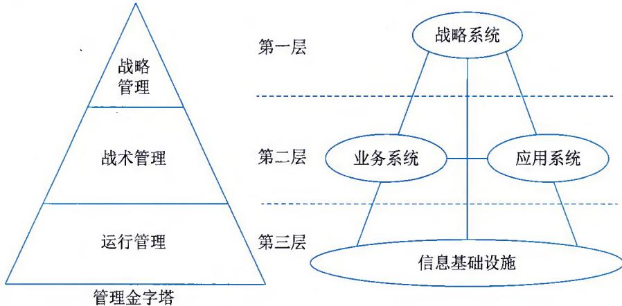  
图3-1 信息系统体系架构的总体框架

## 1. 战略系统

战略系统是指组织中与战略制定、高层决策有关的管理活动和计算机辅助系统。在信息系统架构（Information System Architecture，ISA）中战略系统由两个部分组成，其一是以信息技术为基础的高层决策支持系统，其二是组织的战略规划体系。在 ISA 中设立战略系统有两重含义：一是它表示信息系统对组织高层管理者的决策支持能力；二是它表示组织战略规划对信息系统建设的影响和要求。通常组织战略规划分成长期规划和短期规划两种，长期规划相对来说比较稳定，如：调整产品结构等；短期规划一般是根据长期规划的目的而制订，相对来说，容易根据环境、组织运作情况而改变，如：决定新产品的类型等。

## 2. 业务系统

业务系统是指组织中完成一定业务功能的各部分（物质、能量、信息和人）组成的系统。组织中有许多业务系统，如：生产系统、销售系统、采购系统、人事系统、会计系统等，每个业务系统由一些业务过程来完成该业务系统的功能，例如会计系统常包括应付账款、应收账款、开发票、审计等业务过程。业务过程可以分解成一系列逻辑上相互依赖的业务活动，业务活动的完成有先后次序，每个业务活动都有执行的角色，并处理相关数据。当组织调整发展战略，为了更好地适应内外部发展环境（如部署使用信息系统）等的时候，往往会开展业务过程重组。业务过程重组是以业务流程为中心，打破组织的职能部门分工，对现有的业务过程进行改进或重新组织，以求在生产效率、成本、质量、交货期等方面取得明显改善，提高组织的竞争力。

业务系统在 ISA 中的作用是：对组织现有业务系统、业务过程和业务活动进行建模，并在组织战略的指导下，采用业务流程重组（Business Process Reengineering，BPR）的原理和方法进行业务过程优化重组，并对重组后的业务领域、业务过程和业务活动进行建模，从而确定出相对稳定的数据，以此相对稳定的数据为基础，进行组织应用系统的开发和信息基础设施的建设。

## 3. 应用系统

应用系统即应用软件系统，指信息系统中的应用软件部分。对于组织信息系统中的应用软件（应用系统），一般按完成的功能可包含：事务处理系统（Transaction Processing System, TPS）、管理信息系统（Management Information System, MIS）、决策支持系统（Decision Support System, DSS）、专家系统（Expert System, ES）、办公自动化系统（Office Automation System, OAS）、计算机辅助设计（CAD）/计算机辅助工艺设计（CAPP）/计算机辅助制造（CAM）、制造执行系统（Manufacturing Execution System, MES）等。对于其中的MIS又可按所处理的业务，再细分为子系统：销售管理子系统、采购管理子系统、库存管理子系统、运输管理子系统、财务管理子系统、人事管理子系统等。

无论哪个层次上的应用系统，从架构的角度来看，都包含两个基本组成部分：内部功能实现部分和外部界面部分。这两个基本部分由更为具体的组成成分及组成成分之间的关系构成。界面部分是应用系统中相对变化较多的部分，主要由用户对界面形式要求的变化引起，在功能实现部分，相对来说，处理的数据变化较小，而程序的算法和控制结构的变化较多，主要由用户对应用系统功能需求的变化和对界面形式要求的变化引起。

## 4. 信息基础设施

组织信息基础设施是指根据组织当前业务和可预见的发展趋势及对信息采集、处理、存储和流通的要求，构筑由信息设备、通信网络、数据库、系统软件和支持性软件等组成的环境。这里可以将组织信息基础设施分成三部分：技术基础设施、信息资源设施和管理基础设施。

（1）技术基础设施。技术基础设施由计算机设备、网络、系统软件、支持性软件、数据交换协议等组成。

（2）信息资源设施。信息资源设施由数据与信息本身、数据交换的形式与标准、信息处理方法等组成。

（3）管理基础设施。管理基础设施指组织中信息系统部门的组织架构、信息资源设施管理人员的分工、组织信息基础设施的管理方法与规章制度等。

由于技术的发展和组织系统需求的变化，技术基础设施在信息系统的设计、开发和维护中，面临的变化因素较多，并且由于实现技术的多样性，完成同一功能有多种实现方式。信息资源设施在系统建设中的相对变化较小，无论组织完成何种功能，业务流程如何变化，都要对数据和信息进行处理，它们中的大部分不随业务改变而改变。管理基础设施相对变化较多，这是组织为了适应环境的变化和满足竞争的需要，尤其在我国向市场经济转型升级的阶段，经济政策的出台或改变、业务模式改革等，将在很大程度上造成组织规章制度、管理方法、人员分工以及组织架构的改变。

上面只是对信息基础设施中的三个基本组成部分的相对稳定与相对变化程度的总体说明，在技术基础设施、信息资源设施、管理基础设施中都有相对稳定的部分和相对易变的部分，不能一概而论。

## 3.2 系统架构

信息系统架构是一种体系结构，它反映了一个组织信息系统的各个组成部分之间的关系，以及信息系统与相关业务、信息系统与相关技术之间的关系。

## 3.2.1 架构定义

随着技术的进步，信息系统的规模越来越大，复杂程度越来越高，系统的结构显得越来越重要。对于大规模的复杂系统来说，对总体的系统结构设计比起对计算算法和数据结构的选择已经变得更重要。在这种情况下，人们认识到系统架构的重要性，设计并确定系统整体结构的质量成为了重要的议题。系统架构对于系统开发时所涉及的成熟产品与相关的组织整合问题具有非常重要的作用。系统架构作为集成技术框架规范了开发和实现系统所需技术层面的互动，作为开发内容框架影响了开发组织和个人的互动，因此，技术和组织因素也是系统架构要讨论的主要话题。

信息系统架构伴随技术发展和信息环境变化，一直处于持续演进和发展中，不同的视角对其定义也不尽相同，常见的定义主要有：①软件或计算机系统的信息系统架构是该系统的一个（或多个）结构，而结构由软件元素、元素的外部可见属性及它们之间的关系组成。②信息系统架构为软件系统提供了一个结构、行为和属性的高级抽象，由构成系统元素的描述、这些元素的相互作用、指导元素集成的模式及这些模式约束组成。③信息系统架构是指一个系统的基础组织，它具体体现在系统的构件、构件之间、构件与环境之间的关系，以及指导其设计和演化的原则上。前两个定义都是按"元素—结构—架构"这一抽象层次来描述的，它们的基本意义相同。该定义中的"软件元素"是指比"构件"更一般的抽象，元素的"外部可见属性"是指其他元素对该元素所做的假设，如它所提供的服务、性能特征等。

对信息系统架构的定义描述，可以从以下6个方面进行理解。

（1）架构是对系统的抽象，它通过描述元素、元素的外部可见属性及元素之间的关系来反映这种抽象。因此，仅与内部具体实现有关的细节是不属于架构的，即定义强调元素的"外部可见"属性。

（2）架构由多个结构组成，结构是从功能角度来描述元素之间的关系的，具体的结构传达了架构某方面的信息，但是个别结构一般不能代表大型信息系统架构。

（3）任何软件都存在架构，但不一定有对该架构的具体表述文档，即架构可以独立于架构的描述而存在。如文档已过时，则该文档不能反映架构。

（4）由架构的内容元素及其行为的集合构成，它揭示了系统由哪些元素组成，这些元素各有哪些功能（外部可见），以及这些元素间如何连接与互动。架构在两个方面进行抽象：在静态方面，关注系统的大粒度（宏观）总体结构（如分层）；在动态方面，关注系统内关键行为的共同特征。

（5）架构具有"基础"性，它通常涉及解决各类关键重复问题的通用方案（复用性），以及系统设计中影响深远（架构敏感）的各项重要决策（一旦贯彻，更改的代价昂贵）。

（6）架构隐含有"决策"，即架构是由架构设计师根据关键的功能和非功能性需求（质量属性及项目相关的约束）进行设计与决策的结果。不同的架构设计师设计出来的架构是不一样的，为避免架构设计师考虑不周，重大决策应经过评审。特别是架构设计师自身的水平是一种约束，不断学习和积累经验，才是摆脱这种约束走向优秀架构师的必经之路。

在设计信息系统架构时也必须考虑硬件特性和网络特性，因此，信息系统架构与系统架构二者间的区别其实不大。但是，在大多情况下，架构设计师在软件方面的选择性较之硬件方面，其自由度大得多。因此，使用"信息系统架构"这一术语，也表明了一个观点：架构设计师通常将架构的重点放在软件部分。

将信息系统架构置于经济与社会背景中进行观察，可以发现信息系统架构对组织非常重要，主要体现在：①影响架构的因素。软件系统的项目干系人（客户、用户、项目经理、程序员、测试人员、市场人员等）对软件系统有不同的要求、开发组织（项目组）不同的人员知识结构、架构设计师的素质与经验、当前的技术环境等方面都是影响架构的因素。这些因素通过功能性需求、非功能性需求、约束条件及相互冲突的要求，影响架构设计师的决策，从而影响架构。②架构对上述诸因素具有反作用，例如，影响开发组织的结构。架构描述了系统的大粒度（宏观）总体结构，因此可以按架构进行分工，将项目组分为几个工作组，从而使开发有序；影响开发组织的目标，即成功的架构为开发组织提供了新的商机，这归功于系统的示范性、架构的可复用性及团队开发经验的提升，同时，成功的系统将影响客户对下一个系统的要求等。

## 3.2.2 架构分类

信息系统架构通常可分为物理架构与逻辑架构两种：物理架构是指不考虑系统各部分的实际工作与功能架构，只抽象地考察其硬件系统的空间分布情况；逻辑架构是指信息系统各种功能子系统的综合体。在组织实际架构定义过程中，为确保表达的有效性和友好性等，也会将这两种架构进行融合使用。

## 1. 物理架构

按照信息系统在空间上的拓扑关系，其物理架构一般分为集中式与分布式两大类。

## 1）集中式架构

集中式架构是指物理资源在空间上集中配置。早期的单机系统是最典型的集中式架构，它将软件、数据与主要外部设备集中在一套计算机系统之中。由分布在不同地点的多个用户通过终端共享资源组成的多用户系统，也属于集中式架构。

集中式架构的优点是资源集中，便于管理，资源利用率较高。但是随着系统规模的扩大，以及系统的日趋复杂，集中式架构的维护与管理越来越困难，常常不利于调动用户在信息系统建设过程中的积极性、主动性和参与感。此外，资源过于集中会造成系统的脆弱，一旦核心资源出现异常，容易使整个系统瘫痪。

## 2）分布式架构

随着数据技术与网络技术的发展，分布式架构的信息系统开始产生，分布式系统是指通过计算机网络把不同地点的计算机硬件、软件、数据等资源联系在一起，实现不同地点的资源共享。各地的计算机系统既可以在网络系统的统一管理下工作，也可以脱离网络环境利用本地资源独立运作。由于分布式架构适应了现代组织管理发展的趋势，即组织架构朝着扁平化、网络化方向发展，分布式架构成为信息系统的主要模式。

分布式架构的主要特征是：可以根据应用需求来配置资源，提高信息系统对用户需求与外部环境变化的应变能力，系统扩展方便，安全性好，某个节点所出现的故障不会导致整个系统停止运作。然而由于资源分散，且又分属于各个子系统，系统管理的标准不易统一，协调困难，不利于对整个资源的规划与管理。

分布式架构又可分为一般分布式与客户端/服务器模式。一般分布式系统中的服务器只提供软件、计算与数据等服务，各计算机系统根据规定的权限存取服务器上的数据与程序文件。客户端/服务器架构中，网络上的计算机分为客户端与服务器两大类。服务器包括文件服务器、数据库服务器、打印服务器等；网络节点上的其他计算机系统则称为客户端。用户通过客户端向服务器提出服务请求，服务器根据请求向用户提供经过加工的信息。

## 2. 逻辑架构

信息系统的逻辑架构是其功能综合体和概念性框架。由于信息系统种类繁多，规模不一，在功能上存在较大差异，其逻辑架构也不尽相同。

对于一个生产组织的管理信息系统，从管理职能角度划分，包括采购、生产、销售、人力资源、财务等主要功能的信息管理子系统。一个完整的信息系统支持组织的各种功能子系统，使得每个子系统可以完成事务处理、操作管理、管理控制与战略规划等各个层次的功能。在每个子系统中可以有自己的专用文件，同时可以共享信息系统中的各类数据，通过网络与数据等规范接口实现子系统之间的联系。与之相类似，每个子系统有各自的应用程序，也可以调用服务于各种功能的公共程序以及系统模型库中的模型等。

## 3. 系统融合

从不同的角度，人们可对信息系统进行不同的分解。在信息系统研制和集成建设的过程中，最常见的方法是将信息系统按职能划分成一个个职能子系统，然后逐个研制、开发和建设。显然，即使每个子系统的性能均很好，并不能确保系统的优良性能，切不可忽视对整个系统的全盘考虑，尤其是对各个子系统之间的相互关系应做充分的考虑。因此，在信息系统开发与集成建设中，强调各子系统之间的协调一致性和整体性。要达到这个目的，就必须在构造信息系统时注意对各种子系统进行统一规划，并对各子系统进行整体融合。常见的融合方式包括横向融合、纵向融合和纵横融合。

（1）横向融合。横向融合是指将同一层次的各种职能与需求融合在一起，例如，将运行控制层的人事和工资子系统综合在一起，使基层业务处理一体化。

（2）纵向融合。纵向融合是指把某种职能和需求的各个层次的业务组织在一起，这种融合沟通了上下级之间的联系，如组织分支机构会计系统和整体组织会计系统融合在一起，它们都有共同之处，能形成一体化的处理过程。

（3）纵横融合。纵横融合是指主要从信息模型和处理模型两个方面来进行综合，做到信息集中共享，程序尽量模块化，注意提取通用部分，建立系统公用数据体系和一体化的信息处理系统。

## 3.2.3 一般原理

在信息系统中使用体系架构一词，不如使用计算机体系架构，网络体系架构和数据体系架构那么显而易见。这是因为信息系统是基于计算机、通信网络等现代化工具和手段，服务于信息处理的人机系统，不仅包括了计算机、网络和数据等，还包含了大量人的因素，因此对信息系统架构的研究比计算机体系架构、网络体系架构、数据体系架构要复杂得多。

信息系统架构指的是在全面考虑组织的战略、业务、组织、管理和技术的基础上，着重研究组织信息系统的组成成分及成分之间的关系，建立起多维度分层次的、集成的开放式体系架构，并为组织提供具有一定柔性的信息系统及灵活有效的实现方法。

对于每个具体的组织，其管理方式、运作模式、组织形式、机构大小、工作习惯、经营策略都各不相同，反映在信息系统的建设、软硬件产品的选择、系统环境的构造、用户界面的形式、数据库的要求，以及程序的编制都不一样。随着社会的变革、组织的发展、技术的进步等，不仅要求信息系统具有较强的适应性，即在环境变化的情况下，系统的变化能达到最小，而且要求信息系统具有对自身进行改进、扩充和完善的能力，同时不影响组织的正常运转，对组织不造成风险。虽然软件工程在软件开发方法学、软件工具与软件工程环境，以及软件工程管理方法学上都取得了很大进展，极大地提高了软件的生产率与可靠性，实现了软件产品的优质高产；随着云计算、物联网等新技术的成熟度应用，信息系统基础设施的弹性、柔性、韧性和敏捷等都得到了大幅提升，但是，对信息系统柔性化需求没有实质性的改变。

一个事物对环境的变化具有适应能力，意味着该事物能根据环境变化进行适当的改变，这种改变可能是局部的、表面的，也可能是全局的、本质的。事物改变自己的程度与环境的变化程度，以及环境变化对事物产生的压力程度有关。事物之所以具有适应能力，是因为该事物中存在着一些基本部分，无论外界环境怎样变化，这些基本部分始终不变，另外还存在一些可随环境变化而变化的部分。对于不同的事物，不变的部分和变化的部分所占的比例是不同的。

因此，这里认为架构包含两个基本部分：组成成分和组成成分之间的关系。在外界环境方式变化时，架构中组成成分和关系有些可能是不变的，有些则可能要产生很大的变化。在信息系统中，分析出相对稳定的组成成分与关系，并在相对稳定部分的支持下，对相对变化较多的部分进行重新组织，以满足变化的要求，就能够使得信息系统对环境的变化具有一定的适应能力，即具有一定的柔性，这就是信息系统架构的基本原理。

## 3.2.4 常用架构模式

常用架构模式主要有单机应用模式、客户端/服务器模式、面向服务架构（SOA）模式、组织级数据交换总线等。

## 1. 单机应用模式

准确地讲，单机（Standalone）应用系统是最简单的软件结构，是指运行在一台物理机器上的独立应用程序。当然，该应用可以是多进程或多线程的。

在信息系统普及之前的时代，大多数软件系统其实都是单机应用系统。这并不意味着它们简单，实际情况是这样的系统有时更加复杂。因为软件技术最初普及时，多数行业只是将软件技术当作辅助手段来解决自己专业领域的问题，其中大多都是较深入的数学问题或图形图像处理算法的实现。

有些系统非常庞大，可多达上百万行代码，而这些程序当时可都是一行行写出来的。这样一个大型的软件系统，要有许多个子系统集成在一个图形界面上执行，并可在多种平台下运行，如Linux、UNIX、Windows等。而这些软件系统，从今天的软件架构上来讲，是很简单是标准的单机系统。当然至今，这种复杂的单机系统也有很多，它们大多都是专业领域的产品，如计算机辅助设计领域的CATIA、Pro/Engineer、AutoCAD，还有在图片处理与编辑领域被大家熟悉的Photoshop、CorelDRAW等。

## 2. 客户端 / 服务器模式

客户端 / 服务器模式（Client/Server）是信息系统中最常见的一种结构。C/S 概念可理解为基于 TCP/IP 的进程间通信 IPC 编程的 "发送" 与 "反射" 程序结构，即 Client 方向 Server 方发送一个 TCP 或 UDP 包，然后 Server 方根据接收到的请求向 Client 方回送 TCP 或 UDP 数据包。下面介绍四种常见的客户端 / 服务器的架构。

## 1）两层C/S

两层 C/S，其实质就是 IPC 客户端 / 服务器结构的应用系统体现。两层 C/S 结构通俗地说就是人们常说的"胖客户端"模式。在实际的系统设计中，该类结构主要是指前台客户端+后台数据库管理系统。

在两层C/S结构中，前台界面 $+$ 后台数据库服务的模式最为典型，传统的很多数据库前端开发工具（如PowerBuilder、Delphi、VB）等都是用来专门制作这种结构的软件工具。两层C/S结构实际上就是将前台界面与相关的业务逻辑处理服务的内容集成在一个可运行单元中。

## 2）三层C/S与B/S结构

三层 C/S 结构，其前台界面送往后台的请求中，除了数据库存取操作以外，还有很多其他业务逻辑需要处理。三层 C/S 的前台界面与后台服务之间必须通过一种协议（自开发或采用标准协议）来通信（包括请求、回复、远程函数调用等），通常包括以下几种：

\- 基于TCP/IP，直接在底层Socket API基础上自行开发。这样做一般只适合需求与功能简单的小型系统。

\- 首先建立自定义的消息机制（封装TCP/IP与Socket编程），然后前台与后台之间的通信通过该消息机制来实现。消息机制可以基于XML，也可以基于字节流（Stream）定义。虽然是属于自定义通信，但是它可以基于此构建大型分布式系统。

\- 基于RPC编程。

\- 基于CORBA/IIOP协议。

\- 基于Java RMI。

\- 基于J2EEJMS。

\- 基于HTTP协议，比如，浏览器与Web服务器之间的信息交换。这里需要指出的是HTTP不是面向对象的结构，面向对象的应用数据会被首先平面化后进行传输。

目前最典型的基于三层 C/S 结构的应用模式便是人们最熟悉、较流行的 B/S（Browser/Server，浏览器 / 服务器）模式。

Web 浏览器是一个用于文档检索和显示的客户应用程序，并通过超文本传输协议 HTTP（Hyper Text Transfer Protocol）与 Web 服务器相连。该模式下，通用的、低成本的浏览器节省了两层结构的 C/S 模式客户端软件的开发和维护费用。这些浏览器大家都很熟悉，包括 MS Internet Explorer、Mozilla Firefox、NetScape 等。

Web 服务器是指驻留于因特网上某种类型计算机的程序。当 Web 浏览器（客户端）连到服务器上并请求文件或数据时，服务器将处理该请求并将文件或数据发送到该浏览器上，附带的信息会告诉浏览器如何查看该文件（即文件类型）。服务器使用 HTTP 进行信息交流，可称为 HTTP 服务器。

人们每天都在 Web 浏览器上进行各种操作，这些操作中绝大多数其实都是在 Web 服务器上执行的，Web 浏览器只是将人们的请求以 HTTP 协议格式发送到 Web 服务器端或将返回的查询结果显示而已。当然，驻留 Web 浏览器与服务器的硬件设备可以是位于 Web 网络上的两台相距千里的计算机。

应该强调的是B/S模式的浏览器与Web服务器之间的通信仍然是TCP/IP，只是将协议格式在应用层进行了标准化。实际上B/S是采用了通用客户端界面的三层C/S结构。

## 3）多层C/S结构

多层 C/S 结构一般是指三层以上的结构，在实践中主要是四层，即前台界面（如浏览器）、Web 服务器、中间件（或应用服务器）及数据库服务器。多层客户端 / 服务器模式主要用于较有规模的组织信息系统建设，其中中间件一层主要完成以下几个方面的工作：

\- 提高系统可伸缩性，增加并发性能。在大量并发访问发生的情况下，Web服务器可处理的并发请求数可以在中间件一层得到更进一步的扩展，从而提高系统整体并发连接数。

\- 中间件/应用层这一层专门完成请求转发或一些与应用逻辑相关的处理，具有这种作用的中间件一般可以作为请求代理，也可作为应用服务器。中间件的这种作用在J2EE的多层结构中比较常用，如BEA WebLogic、IBM WebSphere等提供的EJB容器，就是专门用以处理复杂组织逻辑的中间件技术组成部分。

\- 增加数据安全性。在网络结构设计中，Web服务器一般都采用开放式结构，即直接可以被前端用户访问，如果是一些在公网上提供服务的应用，则Web服务器一般都可以被所有能访问与联网的用户直接访问。因此，如果在软件结构设计上从Web服务器就可以直接访问组织数据库是不安全的。因此，中间件的存在，可以隔离Web服务器对组织数据库的访问请求：Web服务器将请求先发给中间件，然后由中间件完成数据库访问处理后返回。

## 4）模型-视图-控制器模式

模型－视图－控制器（Model-View-Controller，MVC）的概念在信息系统设计中非常流行，严格来讲，MVC实际上是上述多层C/S结构的一种常用的标准化模式，或者可以说是从另一个角度去抽象这种多层C/S结构。

在 J2EE 架构中，View 表示层指浏览器层，用于图形化展示请求结果；Controller 控制器指 Web 服务器层；Model 模型层指应用逻辑实现及数据持久化的部分。目前流行的 J2EE 开发框架，如 JSF、Struts、Spring、Hibernate 等及它们之间的组合，如 Struts+Spring+Hibernate(SSH)、JSP+Spring+Hibernate 等都是面向 MVC 架构的。另外，PHP、Perl、MFC 等语言都有 MVC 的实现模式。

MVC 主要是要求表示层（视图）与数据层（模型）的代码分开，而控制器则可以用于连接不同的模型和视图来完成用户的需求。从分层体系的角度来讲，MVC 的层次结构，其控制器与视图通常处于 Web 服务器一层，而根据 "模型" 有没有将业务逻辑处理分离成单独服务处理，MVC 可以分为三层或四层体系结构。

## 3.面向服务架构模式

上面所论述的客户端/服务器模式，无论多少层的C/S软件结构，对外来讲，都只是一个单结点应用（即使它由多个不同层的"服务"相互配合来完成其功能），具体表现为一个门户网站、一个应用系统等。而多个单点应用相互通信的多服务结构也是一种信息系统常用的架构模式。

## 1）面向服务架构

如果两个多层 C/S 结构的应用系统之间需要相互进行通信，那么就产生了面向服务架构（Service Oriented Architecture，SOA）。在 SOA 的概念中，将由多层服务组成的一个结点应用看作是一个单一的服务。在 SOA 的定义里，对 "服务" 的概念进行了广义化，即它不是指计算机层面的一个守护进程（Daemon），而是指向提供一组整体功能的独立应用系统。所谓独立应用系统是指无论该应用系统由多少层服务组成，去掉任何一层，它都将不能正常工作，对外可以是一个提供完整功能的独立应用。这个特征便可以将面向服务架构与多层单服务体系完全区分开来。

两个应用之间一般通过消息来进行通信，可以互相调用对方的内部服务、模块或数据交换和驱动交易等。在实践中，通常借助中间件来实现SOA的需求，如消息中间件、交易中间件等。面向服务架构在实践中，又可以具体分为异构系统集成、同构系统聚合、联邦体系结构等。

## 2) Web Service

面向服务架构体现在Web应用之间，就成为了Web Service，即两个互联网应用之间可以相互向对方开放一些内部"服务"（这种服务可以理解为功能模块、函数、过程等）。目前，Web应用对外开放其内部服务的协议主要有SOAP与WSDL，具体资料可以查阅相关标准。

Web Service 是面向服务架构的一个最典型、最流行的应用模式，但除了由 Web 应用为主而组成的特点以外，Web Service 最主要的应用是一个 Web 应用向外提供内部服务，而不像传统意义上 SOA 那样有更加丰富的应用类型。

## 3）面向服务架构的本质

面向服务架构的本质是消息机制或远程过程调用（RPC）。虽然其具体的实现底层并不一定是采用 RPC 编程技术，但两个应用之间的相互配合确实是通过某种预定义的协议来调用对方的"过程"实现的，这与前节所讲多层架构的单点应用系统中，两个处于不同层的运行实例相互之间通信的协议类型基本是相同的。

## 4. 组织级数据交换总线

实践中，还有一种较常用的架构，即组织级数据交换总线，即不同的组织应用之间进行信息交换的公共通道。这种架构在大型组织的不同应用系统之间进行信息交换时使用较普遍。在国内，主要是信息化、数字化程度较高的组织采用此种结构，其他的许多组织虽然也有类似的需求，但大多仍处于局部信息化、数字化阶段，没有达到"组织数据交换总线"的层次。

关于数据总线本身，其实质应该是一个称之为连接器的软件系统（Connector），它可以基于中间件（如：消息中间件或交易中间件）构建，也可以基于CORBA/IOP协议开发，主要功能是按照预定义的配置或消息头定义，进行数据（data）、请求（request）或回复（response）的接收与分发。

从理论上来讲，组织级数据交换总线可以同时具有实时交易与大数据量传输的功能，但在实践中，成熟的组织数据交换总线主要是为实时交易而设计的，而对可靠的大数据量级传输需求往往要单独设计。如果采用CORBA为通信协议，交换总线就是对象请求代理（ORB），也被称为"代理（Agent）体系"。另外，在交换总线上挂接的软件系统，有些也可以实现代理的功能，各代理之间可以以并行或串行的方式进行工作，通过挂接在同一交换总线上的控制器来协调各代理之间的活动。

## 3.2.5 规划与设计

信息系统规划与设计因组织的业务类型不同而各异，还要结合组织的发展阶段和数字化转型成熟度，不同阶段和成熟度条件下，其系统集成架构和设计导向差异较大。

## 1. 集成架构演进

对任何组织来说，其信息系统集成架构随其业务发展、数字化转型成熟度和信息技术发展等持续演进和变化。以工业企业为例，其集成架构演进通常为：以应用功能为主线架构、以平台能力为主线架构和以互联网为主线架构。采用不同的主线架构，本质上取决于组织业务发展的程度，表现为组织数字化转型的成熟度。

## 1）以应用功能为主线架构

对于中小型工业企业或者处于信息化、数字化发展初级阶段的工业企业来说，其信息系统集成建设的主要目标是提高工作效能、降低业务风险。同时，受制于自身信息化队伍和人才的不足，以及业务体系对信息化、数字化理解得不深入等，组织往往采用"拿来主义"来构建其信息系统，即直接采购成套且成熟的应用软件，并基于应用软件的运行需求，建设相关的基础设施。

组织发展在该阶段重点关注的是组织职能的细化分工以及行业最佳实践的导入。因此，组织的信息化建设往往以部门或职能为单元，核心关注点是信息系统的软件功能，如财务管理、设备管理、资产管理等，从而进行信息系统规划、设计、部署和运行等。同时，通过成套软件的部署，强化自身的管理或工艺水平等。应用软件或模块间的集成融合，主要通过系统的软件接口来完成。组织往往采用统一规划、分步实施的方式进行，即需要什么功能，部署上线什么功能，如图3-2所示。

## 2）以平台能力为主线架构

随着工业企业发展，其组织规模和数字化转型能力成熟度往往会得到持续提升，组织会逐步从直接获取行业最佳实践，逐步进入自主知识沉淀和自主创新的发展时期。组织个性化、特色化得到快速发展，同时组织也会更加关注各业务体系的融合协同，需求信息系统能够基于数据的共享等，提升数据集成的灵活性和便捷性。这种情况下，以成套软件标准功能为基础的应用主线架构，往往无法满足组织的需求，大多数组织开始加强以平台化为基础，应用功能灵活可快速定制的新型系统集成架构，即以平台能力为主线的系统集成架构，如图3-3所示。

以平台能力为主线的系统集成架构起源于云计算的技术发展和云服务的逐步成熟。其核心理念是将"竖井式"信息系统各个组成部分转化为"平层化"建设方法，包括数据采集平层化、网络传输平层化、应用中间件平层化、应用开发平层化等，并通过标准化接口和新型信息技术，实现信息系统的弹性、敏捷等能力建设。通过平台化架构支撑的信息系统应用，可以结合专题建设或独立配置（或少量开发），快速得到组织需求的应用系统功能，从而突破成套软件商在个性化软件定制方面的不足。

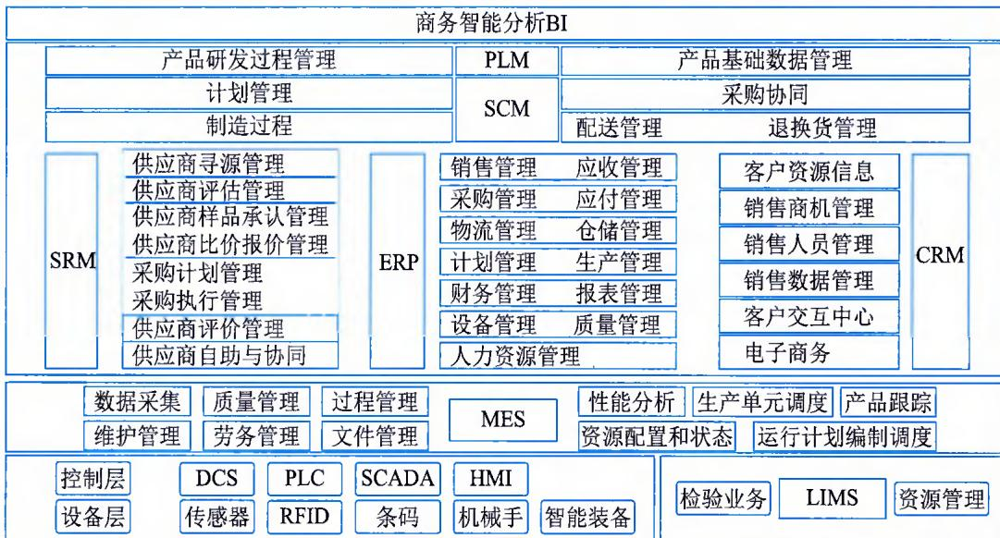  
图3-2 以应用功能为主线的工业组织信息系统集成架构

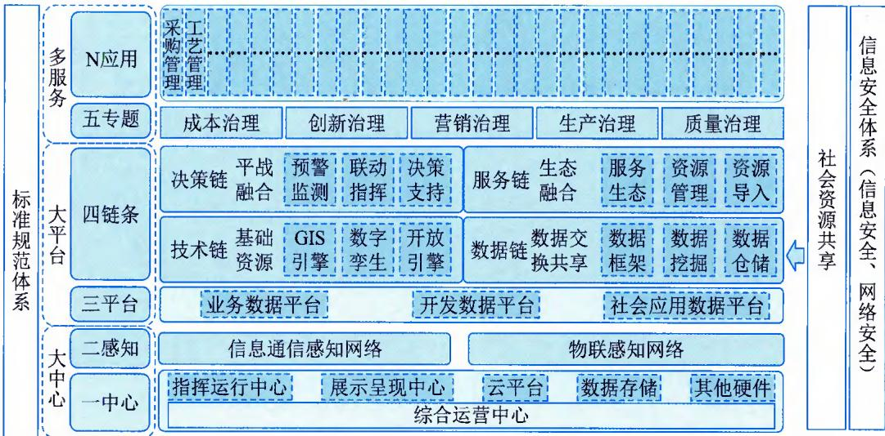  
图3-3 以平台能力融合为主线的系统集成架构

在具体实践中，组织的架构转型是一个持续的过程，组织会将成熟度高、少变化的应用继续使用成套软件部署模式，对新型的、多变化的应用采用平台化架构，最终保持两种架构并存（也称双态 IT，即敏态与稳态融合）或全部转换到平台化架构中。

## 3）以互联网为主线架构

当组织发展到产业链或生态链阶段，或者成为复杂多元的集团化组织，以平台能力为主线的架构往往也无法满足组织需求。组织开始寻求向以互联网为主线的系统集成架构方向转移或过渡。这是因为组织需要包容集团分支机构、生态伙伴或产业链伙伴等，发展水平或数字化转型能力成熟度水平存在不一致的情况。在以平台能力为主线的架构中，全集团、生态链或产业链都使用相同的信息系统功能模块，会因各机构的管理或工艺水平差异，造成相关系统模块无法满足各单位的实际需求的情况。比如采购管理，在数字化转型成熟度较高的组织中，其管理颗粒度往往比较细致，每一种物料编码的获取与定义都有可能使用独立的管理流程，然而数字化转型成熟度相对较低的组织，其物料编码采用直接分配（乃至不关注物料编码）的方法，过高的管理要求反倒成为了相关机构的负担。

以互联网为主线的系统集成架构，强调将各信息系统功能最大限度地 App 化（微服务），如把采购管理中的编码管理作为一项 App 存在。如图 3-4 所示，通过 App 的编排与组合，生成可以适用各类成熟度的组织应用。面向具体工业企业场景，其 App 的组合模式与方法，可以借助面向不同组织的能力成熟度控制来定义实施（可具体到能力项的成熟度）。因为所有组织的相关管理处于同一个信息系统中，数据的互通和共享等，也可以基于成熟度等级控制来进行，比如采购管理的编码管理过程数据，可以在相同等级的组织间实现共享，而缺乏物料编码管理控制的组织，可以与更高水平或同等水平组织共享物料采购、物料信息等。

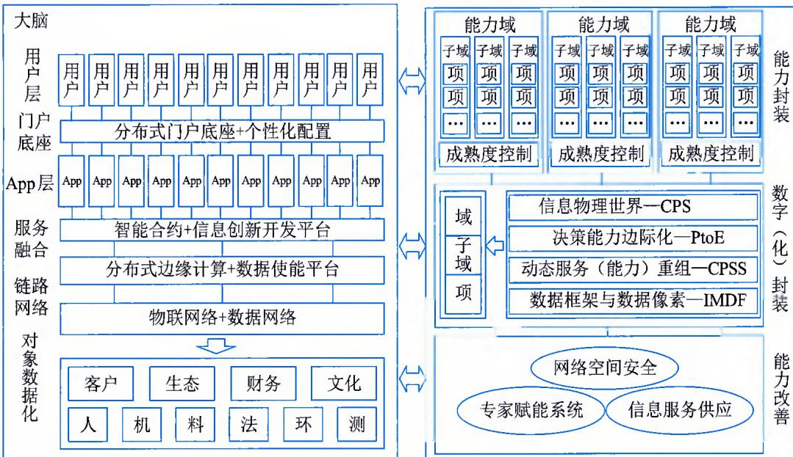  
图3-4 以互联网为主线的系统集成架构

以互联网为主线的系统集成架构，整合应用了更多的新一代信息技术及其应用创新，比如区块链与 App 编排的融合应用、数字化能力封装与成熟度发展过程的融合应用、边缘计算与人工智能的融合应用、广域物联网技术应用、云原生技术的应用等。形象的比喻，就是把组织的各项业务职能和工艺活动等进行细化拆分，并实施数字化封装，从而通过云、边、端的融合，实现对职能或工艺活动的动态重组和编排，达到对不同成熟度组织的适配以及组织各项能力的敏捷组合与弹性变革。

## 2. TOGAF 架构开发方法

TOGAF（The Open Group Architecture Framework）是一种开放式企业架构框架标准，它为标准、方法论和企业架构专业人员之间的沟通提供一致性保障。

## 1）TOGAF基础

TOGAF 由国际组织 The Open Group 制定。该组织于 1993 年开始应客户要求制定系统架构标准，在 1995 年发表 TOGAF 架构框架。TOGAF 的基础是美国国防部的信息管理技术架构（Technical Architecture For Information Management，TAFIM）。它是基于一个迭代（Iterative）的过程模型，支持最佳实践和一套可重用的现有架构资产。它可用于设计、评估并建立企业适合的架构。在国际上，TOGAF 已经被验证，可以灵活、高效地构建企业 IT 架构。

该框架旨在通过以下四个目标帮助企业组织和解决所有关键业务需求：

\- 确保从关键利益相关方到团队成员的所有用户都使用相同语言。这有助于每个人以相同的方式理解框架、内容和目标，并让整个企业在同一页面上打破任何沟通障碍。

\- 避免被"锁定"到企业架构的专有解决方案。只要该组织在内部使用TOGAF而不是用于商业目的，该框架就是免费的。

\- 节省时间和金钱，可以更有效地利用资源。

\- 实现可观的投资回报（ROI）。

TOGAF反映了企业内部架构能力的结构和内容，TOGAF9版本包括6个组件：

\- 架构开发方法。这部分是TOGAF的核心。它描述了TOGAF架构开发方法（Architecture Development Method，ADM），ADM是一种开发企业架构的分步方法。

\- ADM指南和技术。这部分包含一系列可用于应用ADM的指南和技术。

\- 架构内容框架。这部分描述了TOGAF内容框架，包括架构工件的结构化元模型、可重用架构构建块（ABB）的使用以及典型架构可交付成果的概述。

\- 企业连续体和工具。这部分讨论分类法和工具，用于对企业内部架构活动的输出进行分类和存储。

\- TOGAF参考模型。这部分提供了两个架构参考模型，即TOGAF技术参考模型（Technical Reference Model，TRM）和集成信息基础设施参考模型（Integrated Information Infrastructure Reference Model，III-RM）。

\- 架构能力框架。这部分讨论在企业内部建立和运营架构实践所需的组织、流程、技能、角色和职责。

TOGAF 框架的核心思想是:

\- 模块化方法。TOGAF标准采用模块化结构。

\- 内容框架。TOGAF标准包括了一个遵循架构开发方法（ADM）所产出的结果更加一致的内容框架。TOGAF内容框架为架构产品提供了详细的模型。

\- 扩展指南。TOGAF标准的一系列扩展概念和规范为大型组织的内部团队开发多层级集成架构提供支持，这些架构均在一个总体架构治理模式内运行。

\- 架构风格。TOGAF标准在设计上注重灵活性，可用于不同的架构风格。

TOGAF 的关键是架构开发方法（ADM），它是一个可靠的、行之有效的方法，能够满足商务需求的组织架构。

## 2）ADM方法

架构开发方法（ADM）为开发企业架构所需要执行的各个步骤以及它们之间的关系进行了详细定义，同时它也是TOGAF规范中最核心的内容。一个组织中企业架构的发展过程可以看成是其企业连续体从基础架构开始，历经通用基础架构和行业架构阶段而最终达到组织特定架构的演进过程，而在此过程中用于对组织开发行为进行指导的正是架构开发方法。由此可见，架构开发方法是企业连续体得以顺利演进的保障，而作为企业连续体在现实中的实现形式或信息载体，企业架构资源库也与架构开发方法有着千丝万缕的联系。企业架构资源库为架构开发方法的执行过程提供了各种可重用的信息资源和参考资料，而企业架构开发方法中各步骤所产生的交付物和制品也会不停地填充和刷新企业架构资源库中的内容，因此在刚开始执行企业架构开发方法时，各个企业或组织常常会因为企业架构资源库中内容的缺乏和简略而举步维艰，但随着一个又一个架构开发循环的持续进行，企业架构资源库中内容将日趋丰富和成熟，从而企业架构的开发也会越发明快。

ADM方法是由一组按照架构领域的架构开发顺序而排列成一个环的多个阶段所构成。通过这些开发阶段的工作，设计师可以确认是否已经对复杂的业务需求进行了足够全面的讨论。TOGAF中最为著名的一个ADM架构开发的全生命周期模型将ADM全生命周期划分为预备阶段、需求管理、架构愿景、业务架构、信息系统架构（应用和数据）、技术架构、机会和解决方案、迁移规划、实施治理、架构变更管理等10个阶段，这10个阶段是反复迭代的过程。

ADM 方法被迭代式应用在架构开发的整个过程中、阶段之间和每个阶段内部。在 ADM 的全生命周期中，每个阶段都需要根据原始业务需求对设计结果进行确认，这也包括业务流程中特有的一些阶段。确认工作需要对企业的覆盖范围、时间范围、详细程度、计划和里程碑进行重新审议。每个阶段都应该考虑到架构资产的重用。

因此，ADM便形成了3个级别的迭代概念：

\- 基于ADM整体的迭代。用一种环形的方式来应用ADM方法，表明了在一个架构开发工作阶段完成后会直接进入随后的下一个阶段。

\- 多个开发阶段间的迭代。在完成了技术架构阶段的开发工作后又重新回到业务架构开发阶段。

\- 在一个阶段内部的迭代。TOGAF支持基于一个阶段内部的多个开发活动，对复杂的架构内容进行迭代开发。

ADM各个开发阶段的主要活动如表3-1所示。

表 3-1 ADM 架构设计方法各阶段主要活动

<table><tr><td>ADM 阶段</td><td>ADM 阶段内的活动</td></tr><tr><td>预备阶段</td><td>为实施成功的企业架构项目做好准备,包括定义组织机构、特定的架构框架、架构原则和工具</td></tr><tr><td>需求管理</td><td>完成需求的识别、保管和交付,相关联的ADM阶段则按优先级顺序对需求进行处理;TOGAF项目的每个阶段,都是建立在业务需求之上并且需要对需求进行确认</td></tr><tr><td>阶段A:架构愿景</td><td>设置TOGAF项目的范围、约束和期望。创建架构愿景,包括:定义利益相关者、确认业务上下文环境、创建架构工作说明书、取得上级批准等</td></tr><tr><td>阶段B:业务架构阶段C:信息系统架构(应用和数据)阶段D:技术架构</td><td>从业务、信息系统和技术三个层面进行架构开发,在每一个层面分别完成以下活动:开发基线架构描述、开发目标架构描述、执行差距分析</td></tr><tr><td>阶段E:机会和解决方案</td><td>进行初步实施规划并确认在前面阶段中确定的各种构建块的交付物形式,确定主要实施项目,对项目分组并纳入过渡架构,决定途径(制造/购买/重用、外包、商用、开源),评估优先顺序,识别相依性</td></tr><tr><td>阶段F:迁移规划</td><td>对阶段E确定的项目进行绩效分析和风险评估,制订一个详细的实施和迁移计划</td></tr><tr><td>阶段G:实施治理</td><td>定义实施项目的架构限制,提供实施项目的架构监督,发布实施项目的架构合同,监测实施项目以确保符合架构要求</td></tr><tr><td>阶段H:架构变更管理</td><td>提供持续监测和变更管理的流程,以确保架构可以响应企业的需求并且将架构对于业务的价值最大化</td></tr></table>

## 3.2.6 价值驱动的体系结构

系统存在的目的是为利益相关方创造价值。然而，这种理想往往无法完全实现。当前开发方法给利益相关方、架构师和开发人员提供的信息是不完全和不充分的。这里介绍两个概念：价值模型和体系结构策略。它们似乎在许多开发过程中被遗忘，但创造定义完善的价值模型可以为提高折中方案的质量提供指导，特别是那些部署到不同环境中且用户众多的系统。

## 1. 模型概述

开发建设有目的的系统，其目的是为其利益相关者创造价值。在大多数情况下，这种价值被认为是有利的，因为这些利益相关者在其他系统中扮演着重要角色。同样，其他系统也是为其利益相关者创造价值。系统的这种递归特性是分析和了解价值流的一个关键。价值模型的核心特征可以简化为三种基本形式：价值期望值、反作用力和变革催化剂。

（1）价值期望值。价值期望值表示对某一特定功能的需求，包括内容（功能）、满意度（质量）和不同级别质量的实用性。例如，汽车驾驶员对汽车以 $60\mathrm{km / h}$ 的速度进行急刹车的快慢和安全性有一种价值期望值。

（2）反作用力。系统部署实际环境中，实现某种价值期望值的难度，通常期望越高难度越大，即反作用力。例如，汽车以 $60 \, km/h$ 的速度进行紧急刹车的结果取决于路面类型、路面坡度和汽车重量等。

（3）变革催化剂。变革催化剂表示环境中导致价值期望值发生变化的某种事件，或者是导

致不同结果的限制因素。

反作用力和变革催化剂称为限制因素，这三个统称为价值驱动因素。如果系统旨在有效满足其利益相关者的价值模型要求，那么它需要能够识别和分析价值模型。

一般方法，如用例方案和业务 / 营销需求，都是通过聚焦于与系统进行交互的参与者的类型开始的，这种方法有如下 4 个突出的局限性。

（1）对参与者的行为模型关注较多，而对其中目标关注较少。

（2）往往将参与者固化地分成几种角色，其中每个角色所在的个体在本质上都是相同的（例如，商人、投资经理或系统管理员）。

（3）往往忽略限制因素之间的差别（例如，纽约的证券交易员和伦敦的证券交易员是否相同，市场开放交易与每天交易是否相同）。

（4）结果简单。要求得到满足或未得到满足，用例成功完成或未成功完成。

这种方法有一个非常合乎逻辑的实际原因，它使用顺序推理和分类逻辑，因此易于教授和讲解，并能生成一组易于验证的结果。

## 2. 结构挑战

体系结构挑战是因为一个或多个限制因素，使得满足一个或多个期望值变得更困难。在任何环境中，识别体系结构挑战都涉及评估。

（1）哪些限制因素影响一个或多个期望值。

（2）如果知道了影响，它们满足期望值更容易（积极影响）还是更难（消极影响）。

（3）各种影响的影响程度如何，在这种情况下，简单的低、中和高三个等级通常就已经够用了。

评估必须在体系结构挑战自己的背景中对其加以考虑。虽然跨背景平均效用曲线是可能的，但对于限制因素对期望值的影响不能采用同样的处理方法。例如，假设 Web 服务器在两种情况下提供页面：一种情况是访问静态信息，如参考文献，它们要求响应时间为 1～3s；另一种情况是访问动态信息，如正在进行的体育项目的个人得分表，其响应时间为 3～6s。

两种情况都有CPU、内存、磁盘和网络局限性。不过，当请求量增加10倍或100倍时，这两种情况可能遇到大不相同的可伸缩性障碍。对于动态内容，更新和访问的同步成为重负载下的一个限制因素。对于静态内容，重负载可以通过频繁缓存读写来克服。

制定系统的体系结构策略始于：

（1）识别合适的价值背景并对其进行优先化。

（2）在每一背景中定义效用曲线和优先化期望值。

（3）识别和分析每一背景中的反作用力和变革催化剂。

（4）检测限制因素使其满足期望值变难的领域。

最早的体系结构决策产生最大价值才有意义。有几个标准可用于优先化体系结构，建议对重要性、程度、后果和隔离等进行权衡。

（1）重要性。受挑战影响的期望值的优先级有多高，如果这些期望值是特定于不多的几个背景，那么这些背景的相对优先级如何。

（2）程度。限制因素对期望值产生了多大影响。

（3）后果。大概多少种方案可供选择，这些方案的难度或有效性是否有很大差异。

（4）隔离。对最现实的方案的隔离情况如何。

影响越广，该因素的重要性越高。一旦体系结构挑战的优先级确定之后，就要确定处理最高优先级挑战的方法。尽管体系结构样式和模式技术非常有用，不过在该领域中，在问题和解决方案领域的经验仍具有无法估量的价值。应对的有效方法源于技能、洞察力、奋斗和辛勤的工作。这个论断千真万确，不管问题是关于科学、行政管理还是软件体系结构。

当制定了应对高优先级的方法之后，体系结构策略就可以表达出来了。架构师会分析这组方法，并给出一组关于组织、操作、可变性和演变等领域的指导原则。

（1）组织。如何系统性地组织子系统和组件？它们的组成和职责是什么？系统如何部署在网络上？都有哪些类型的用户和外部系统？它们位于何处，是如何连接的？

（2）操作。组件如何交互？在哪些情况下通信是同步的，在哪些情况下是异步的？组件的各种操作是如何协调的？何时可以配置组件或在其上运行诊断？如何检测、诊断和纠正错误条件？

（3）可变性。系统的哪些重要功能可以随部署环境的变化而变化？对于每一功能，哪些方案得到支持？何时可以做出选择（例如，编译、链接、安装、启动或在运行时）？各个分歧点之间有什么相关性？

（4）演变。为了支持变更同时保持其稳定性，系统是如何设计的？哪些特定类型的重大变革已在预料之中？应对这些变更有哪些可取的方法？

总之，体系结构策略就像是帆船的舵和龙骨，可以确定方向和稳定性。它应该是简短的、高标准的方向陈述，必须能够被所有利益相关者所理解，并应在系统的整个生命期内保持相对稳定。

## 3. 模型与结构的联系

价值模型有助于了解和传达关于价值来源的重要信息。它解决一些重要问题，如价值如何流动，期望值和外部因素中存在的相似性和区别，系统要实现这些价值有哪些子集。架构师通过分解系统产生一般影响的力、特定于某些背景的力和预计随着时间的推移而变化的力，以实现这些期望值。价值模型和软件体系结构的联系是明确而又合乎逻辑的，可以用以下9点来表述。

（1）软件密集型产品和系统的存在是为了提供价值。

（2）价值是一个标量，它融合了对边际效用的理解和诸多不同目标之间的相对重要性，目标折中是一个极其重要的问题。

（3）价值存在于多个层面，其中某些层面包含了目标系统，并将其作为一个价值提供者。用于这些领域的价值模型包含了软件体系结构的主要驱动因素。

（4）该层次结构中高于上述层面的价值模型可以导致其下层价值模型发生变化。这是制定系统演化原则的一个重要依据。

（5）对于每一个价值群，价值模型都是同类的。暴露于不同环境条件的价值背景具有不同

的期望值。

（6）对于满足不同价值背景需要，系统的开发赞助商有着不同的优先级。

（7）体系结构挑战是由环境因素在某一背景中对期望的影响引起的。

（8）体系结构方法试图通过首先克服最高优先级体系结构挑战来实现价值的最大化。

（9）体系结构策略是通过总结共同规则、政策和组织原则、操作、变化和演变从最高优先级体系结构方法综合得出的。

## 3.3 应用架构

应用架构的主要内容是规划出目标应用分层分域架构，根据业务架构规划目标应用域、应用组和目标应用组件，形成目标应用架构逻辑视图和系统视图。从功能视角出发，阐述应用组件各自及应用架构整体上，如何实现组织的高阶 IT 需求，并描述主要目标应用组件之间的交互关系。

## 3.3.1 基本原则

常用的应用架构规划与设计的基本原则有：业务适配性原则、应用聚合化原则、功能专业化原则、风险最小化原则和资产复用化原则。

（1）业务适配性原则。应用架构应服务和提升业务能力，能够支撑组织的业务或技术发展战略目标，同时应用架构要具备一定的灵活性和可扩展性，以适应未来业务架构发展所带来的变化。

（2）应用聚合化原则。基于现有系统功能，通过整合部门级应用，解决应用系统多、功能分散、重叠、界限不清晰等问题，推动组织集中的"组织级"应用系统建设。

（3）功能专业化原则。按照业务功能聚合性进行应用规划，建设与应用组件对应的应用系统，满足不同业务条线的需求，实现专业化发展。

（4）风险最小化原则。降低系统间的耦合度，提高单个应用系统的独立性，减少应用系统间的相互依赖，保持系统层级、系统群组之间的松耦合，规避单点风险，降低系统运行风险，保证应用系统的安全稳定。

（5）资产复用化原则。鼓励和推行架构资产的提炼和重用，满足快速开发和降低开发与维护成本的要求。规划组织级共享应用成为基础服务，建立标准化体系，在组织内复用共享。同时，通过复用服务或者组合服务，使架构具有足够的弹性以满足不同业务条线的差异化业务需求，支持组织业务持续发展。

## 3.3.2 分层分组

对应用架构进行分层的目的是要实现业务与技术分离，降低各层级之间的耦合性，提高各层的灵活性，有利于进行故障隔离，实现架构松耦合。应用分层可以体现以客户为中心的系统服务和交互模式，提供面向客户服务的应用架构视图。对应用分组的目的是要体现业务功能的分类和聚合，把具有紧密关联的应用或功能内聚为一个组，可以指导应用系统建设，实现系统内高内聚，系统间低耦合，减少重复建设。图3-5给出了某城市社会保险智慧治理中心的应用架构示意。

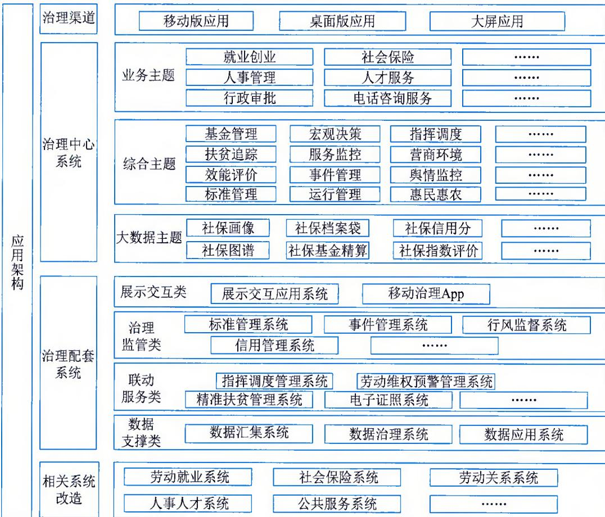  
图3-5 某城市社会保险智慧治理中心的应用架构示意

某城市社会保险智慧治理中心应用系统规划为治理渠道、治理中心系统、治理配套系统及相关系统改造四大类。

（1）治理渠道。应用根据不同的使用群体提供移动版应用、桌面版应用及大屏应用。移动版应用主要为各级管理者提供各类重要主题、热门主题、业务主题及大数据主题的可视化视图、重要指标监控、指数分析、绩效评价、趋势分析、指挥调度等应用功能，实现治理中心不同应用场景下社会保障发展事业数据、营商环境指数和相关报告的同步查阅。桌面版应用面向城市社会保险各业务领域及信息部门管理人员，提供社会保险领域的综合主题、各业务领域的业务主题及大数据主题的人本化服务、可视化监管、智能化监督、科学化决策、在线化指挥等应用功能，实现指挥调度、会议会商、任务分发、协查协办、专项整治等不同应用场景的智慧治理。大屏应用面向城市社会保险各级领导及部门管理人员，提供各类重要主题、热门主题、业务主题及大数据主题的重要指标监控、决策分析、绩效评价、趋势分析等可视化呈现。

（2）治理中心系统。治理中心系统主要集中展示交互三大类主题，其中业务主题包括就业创业、社会保险、劳动维权、人事管理、人才服务、人事和职业考试、行政审批、电话咨询服务、社会保障卡等。综合主题包括宏观决策、指挥调度、廉政风控、基金管理、事业发展、营商环境、扶贫追踪、服务监控、舆情监控、行风监督、效能评价、事件管理、电子证照、标准管理、惠民惠农等。大数据主题包括社保画像、社保档案袋、社保信用分、人社地图、社保图谱、社保基金精算、社保指数评价、社保全景分析等。

（3）治理配套系统。治理配套系统为本项目智慧治理中心提供四大类应用，其中数据支撑类应用包括数据汇聚系统、数据治理系统、数据应用系统。联动服务类应用包括指挥调度管理系统、精准扶贫管理系统、劳动维权预警管理系统、电子证照系统、用户画像系统。治理监管类应用包括标准管理系统、行风监督系统、信用管理系统、基金精算分析系统、服务效能评价系统。展示交互类应用包括移动治理 App 等。

（4）相关系统改造。相关系统改造主要涉及与本次智慧治理中心相关主题数据的汇聚、展现、交互等关联的劳动就业系统、社会保险系统、劳动关系系统、人事人才系统、公共服务系统、风险防控系统等的改造。

## 3.4 数据架构

数据架构描述了组织的逻辑和物理数据资产以及相关数据管理资源的结构。数据架构的主要内容涉及数据全生命周期之下的架构规划，包括数据的产生、流转、整合、应用、归档和消亡。数据架构关注数据所处的生命周期环节中数据被操作的特征和数据类型、数据量、数据技术处理的发展、数据的管控策略等数据领域的相关概念。

## 3.4.1 发展演进

作为信息系统架构的组成，数据架构在不同时代其形态也是不一样的，它是随着信息技术的不断发展而向前演进，主要经历了单体应用架构时代、数据仓库时代和大数据时代等。

## 1. 单体应用架构时代

在信息化早期（20世纪80年代），信息化初步建设，信息系统以单体应用为主，例如：早期的财务软件、OA办公软件等。这个时期数据管理的概念还在萌芽期，数据架构比较简单，主要就是数据模型、数据库设计，满足系统业务使用即可。

## 2. 数据仓库时代

随着信息系统的使用，系统的数据也逐步积累起来。这时候，人们发现数据对组织是有价值的，但是割裂的系统导致了大量信息孤岛的产生，严重影响了组织对数据的利用。于是，一种面向主题的、集成的、用于数据分析的全新架构诞生了，它就是数据仓库。

与传统关系数据库不同，数据仓库系统的主要应用是联机分析处理（OnLine Analytic Processing，OLAP），支持复杂的分析操作，侧重决策支持，并且提供直观易懂的查询结果。这个阶段，数据架构不仅关注数据模型，还关注数据的分布和流向。

## 3.大数据时代

大数据技术的兴起，让组织能够更加灵活高效地使用自己的数据，从数据中提取出更多重要的价值。与此同时，在大数据应用需求的驱动下，各类大数据架构也在不断发展和演进着，从批处理到流处理，从大集中到分布式，从批流一体到全量实时。

## 3.4.2 基本原则

数据架构的设计原则是在遵循架构设计通用原则的情况下，有数据架构自身的特殊考虑。合理的数据架构设计应该是解决以下问题：功能定位合理性问题，面向未来发展的可扩展性问题，处理效率高效或者高性价比的问题，数据合理分布和数据一致性问题。

## 1. 数据分层原则

首先，组织数据按照生命周期就是分层次的，因此数据分层原则更多应该解决的是层次定位合理性的问题。在给每个层次进行定位的同时，对每个层次的建设目标、设计方法、模型、数据存储策略及对外服务原则进行一定的约束性定义和控制。

## 2. 数据处理效率原则

合理的数据架构需要解决数据处理效率的问题。所谓的数据处理效率并不是追求高效率，而是追求合理，因为所有的数据存储和处理都是有代价的。换句话讲：数据处理效率的问题也可以理解为解决满足数据处理效率要求的成本合理化的问题。

数据处理的代价主要就是数据存储与数据变迁的成本，在实践中，真正影响数据处理效率的是大规模的原始数据的存储与处理。在这些原始明细数据的加工、处理、访问的过程中，尽量减少明细数据的冗余存储和大规模的搬迁操作，可以提升数据处理效率。

## 3. 数据一致性原则

合理的数据架构能够有效地支持数据管控体系，很多的数据不一致性问题是因为数据架构不合理所导致的。其中，最大的原因就是数据在不同层次分布中的冗余存储以及按照不同业务逻辑的重复加工。因此，如何在数据架构中减少数据重复加工和冗余存储，是保障数据一致性的关键所在。

## 4. 数据架构可扩展性原则

数据架构设计的可扩展性原则可以从以下角度来保障：

\- 基于分层定位的合理性原则之上。只有清晰的数据层次定位，以及每个数据层次合理的模型和存储技术策略，才能更好地保证数据架构在未来支持新增业务类型、新增数据整合要求、新增数据应用要求的过程中的可扩展性。

\- 架构的可扩展性需要对数据存储模型和数据存储技术也进行考虑。

## 5. 服务于业务原则

合理的数据架构、数据模型、数据存储策略，最终目标都是服务于业务。例如，社会保险快速的业务流程运转以及高效而且精准的业务决策支持，是社会保险行业两方面的业务目标。因此，有时候在面临满足某种业务特殊目标的时候，可以为了业务的体验放弃之前的某些原则。

## 3.4.3 架构案例

图3-6给出了某城市社会保险智慧治理中心的数据架构示意。

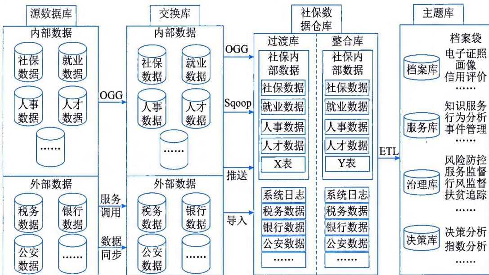  
图3-6 某城市社会保险智慧治理中心的数据架构示意

本项目采用集中式的数据资源管理模式建设全市统一的数据中心，汇聚全市就业、社保、劳动关系等社会保险内部各类数据资源，以及银行、税务、公安等外部数据资源。按照统一的技术规范、数据编码和格式标准，进行数据清洗整合、数据建模、数据挖掘，构建社会保险数据仓库，并根据治理主题应用需求，从数据仓库中抽取归集相关数据，形成保险档案、公共服务、监控治理、决策分析等专题库。主要数据资源库包括源数据库、交换库、过渡库、整合库、主题库等。

（1）源数据库。源数据库是某城市社会保险智慧治理中心所需数据的源端，包括社保数据、就业数据、劳动关系数据、人事人才数据等社会保险内部数据以及银行、税务、公安等外部部门数据。

（2）交换库。利用OGG等同步工具或通过数据同步、服务调用等方式将源端的数据库同步到交换数据库中，采用数据同步或者镜像的方式，降低对源数据库的影响。

（3）过渡库。通过OGG For Bigdata抽取变量数据、Sqoop抽取、推送、导入等方式抽取交换库中的数据，存储于Hadoop平台中的过渡库中，以便提高大批量数据处理性能。

（4）整合库。对过渡库的数据进行对照、转换、清洗、聚集，按照统一的库表结构存储在整合库中，为各主题库提供增量数据源和全量数据源。

（5）主题库。主题库即服务库，根据治理主题应用需求，从整合库中提取所需数据，为治理应用和可视化展现提供支撑。

## 3.5 技术架构

技术架构是承载组织应用架构和数据架构的基础，它是一个由多个功能模块组成的整体，描述组织业务应用实现所采用的技术体系或组合，以及支持应用系统部署所需的基础设施和环境等。技术架构需要统筹考虑和统一规划，缺乏总体策略和思路的IT技术架构会导致投资的严重浪费和建设的时间延误等，总体功能败于最弱的环节，使IT成为业务发展的瓶颈。

## 3.5.1 基本原则

在构建信息系统技术架构时，组织需要充分考虑技术及其应用创新的各类关联因素，选择或组合使用最合适的技术组合，并充分考虑组织现状、IT现状、组织战略、IT治理等各类因素。技术架构的设计往往需要遵循以下原则。

## 1. 成熟度控制原则

一直以来，信息技术都是高速发展和快速迭代的，新型信息技术及其应用模式层出不穷，组织在选择使用何种技术及其组合作为技术架构的主要组成部分时，需要充分考虑信息技术的生命周期，优先使用成熟度较高但还处在活跃期的信息技术。如果必须使用新型信息技术，就需要组织相关技术人员持续跟踪这些技术，包括技术及其应用的成熟情况，以及新技术可能带来的安全漏洞和结构性风险等。

## 2. 技术一致性原则

在信息系统技术架构设计过程中，应尽量减少技术异构，充分发挥技术及其组合的一致性，比如，使用统一使用云环境（云开发、云中间件、云安全等）。在运用技术一致性原则时，也包括同一类型技术的版本控制问题，尽量在所有信息系统中，只用相同的技术版本。

## 3.局部可替换原则

考虑到信息系统的发展与演进等，我们在迭代更新信息技术架构时，需要考虑既有技术的使用、重用或再创新等情况，但这些技术需要进行标记和特殊关注，明确这些技术在组织信息系统环境中的生命周期管理与控制等。即使是利用新技术开展技术架构设计的时候，也要考虑某种技术是否长期使用，如果这些技术退役，对信息系统会造成什么影响，哪些技术可以用于替代该技术等。

## 4. 人才技能覆盖原则

信息技术的价值发挥离不开相关人力资源的配合，需要组织相关技术人员能够对信息技术充分掌握，方可将信息技术进行最优化应用。因此，组织在开展信息技术架构设计时，关注组织可用信息技术人才对各类技术的驾驭能力，尤其是需要利用相关技术进行应用创新的领域。这里的人才可以是组织本身的人才，也可以是组织相关合作伙伴的人才（这类人才需要组织关注其可用性情况）。

## 5. 创新驱动原则

组织在设计信息系统架构时，要充分挖掘技术的创新价值，重点是对组织发展（包括治理、管理、业务等）能够形成促进乃至引领作用的技术，要将这些技术作为技术架构的关键纽带或骨架，完善周边技术或技术组合等。

## 3.5.2 架构案例

图3-7给出了某城市社会保险智慧治理中心的技术架构示意。

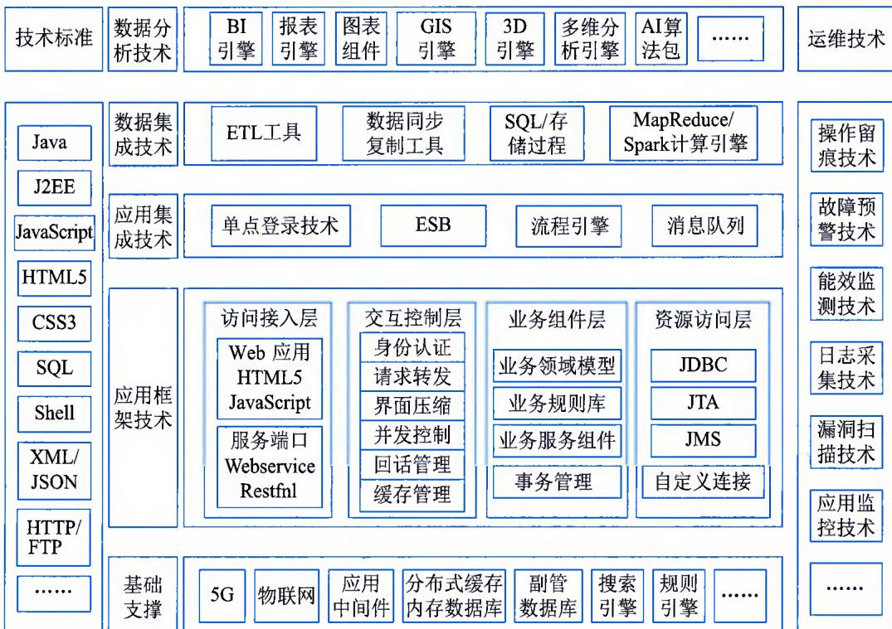  
图3-7 某城市社会保险智慧治理中心的技术架构示意

本项目采用当今先进成熟的技术架构和路线，保障城市社会保险智慧治理中心的先进性、高效性、可靠性和可扩展性。技术架构按照分类分层法进行设计，包括技术标准、基础支撑、应用框架技术、应用集成技术、数据集成技术、数据分析技术和运维技术7部分。

（1）技术标准。城市社会保险智慧治理中心技术架构遵循J2EE、HTML5、CSS3、SQL、Shell、XML/JSON、HTTP、FTP、SM2、SM3、JavaScript等国际和国内通用标准。

（2）基础支撑。依托5G网络、物联网为本项目提供基础网络支撑；依托应用中间件为本项目提供应用部署支撑；依托分布式缓存、内存数据库、MPP数据库、事务数据库为本项目提供基础数据存储支撑；依托Hadoop平台为本项目提供分布式存储和计算环境支撑；依托搜索引擎、规则引擎组件为治理应用提供技术组件支撑。

（3）应用框架技术。应用框架技术是应用系统开发需要严格遵循并采用的技术。应用框架采用分层设计，包括访问接入层、交互控制层、业务组件层、资源访问层。

（4）应用集成技术。应用集成技术包括单点登录（Single Sign-On，SSO）、服务总线（ESB）、流程引擎、消息队列等技术，支撑各应用系统之间的整合集成。

（5）数据集成技术。数据集成技术包括 ETL 工具、数据同步复制工具、数据标引、SQL/存储过程、MapReduce/Spark 计算引擎等技术，为城市社会保险智慧治理中心的数据采集、数据清洗、数据转换、数据加工、数据挖掘等工作提供技术支撑。

（6）数据分析技术。数据分析包括BI引擎、报表引擎、GIS引擎、图表组件、3D引擎、多维建模引擎以及AI算法包、数据挖掘算法包等大数据技术，为社保地图、远程指挥调度、全景分析、宏观决策、监控监督等应用的可视化提供技术支撑。

（7）运维技术。运维技术包括操作留痕、故障预警、能效监测、日志采集、漏洞扫描、应用监控、网络分析等技术，支撑应用系统的规范化运维。

## 3.6 网络架构

网络是信息技术架构中的基础，不仅是用户请求和获取IT信息资源服务的通道，同时也是信息系统架构中各类资源融合和调度的枢纽。特别是云计算、大数据和移动互联网技术飞速发展的今天，网络更加成为实现这些技术跨越的重要环节。因此网络架构的设计在信息系统架构中有着举足轻重的地位。

## 3.6.1 基本原则

整个基础架构的设计原则都是围绕基础架构本身能够提供更加高质量的服务，为应用系统减轻定制化负担和实现更优的商用化选型灵活性。网络作为整个基础架构的基础，这些设计原则更强调突出高可靠性、高安全性、高性能、可管理性、平台化和架构化等方面。

（1）高可靠性。网络作为底层资源调度和服务传输的枢纽和通道，其对高可靠性的要求自然不言而喻。

（2）高安全性。信息系统的安全性不能仅靠应用级的安全保障，网络也必须能够提供基础的安全防护，底层的身份鉴别、访问控制、入侵检测能力等需要能够为应用提供重要的安全保障。

（3）高性能。随着云计算和虚拟化技术等的发展，网络不仅仅是服务传递的通道，更是提供服务所需资源调度的枢纽，因此网络性能和效率是提供更优服务质量的保证。

（4）可管理性。随着互联网思维深入到各个 IT 发展领域，能够提供良好用户体验的敏捷开发方式逐渐在各行业系统占据主流，这对底层基础架构的快速部署、辅助业务上线提出了挑战，因此网络的可管理性不仅是指网络自身管理，更指基于业务部署策略的网络快速调整和管控。

（5）平台化和架构化。作为底层基础资源的网络需要以开阔的视野，适应未来应用架构的变化，网络自身能够更富有弹性，做到按需扩展，以适应未来不同业务规模的变化和发展。

## 3.6.2 局域网架构

局域网指计算机局部区域网络，是一种为单一组织所拥有的专用计算机网络。局域网的特点包括：①覆盖地理范围小，通常限定在相对独立的范围内，如一座建筑或集中建筑群内（通常在 $2.5\mathrm{km}$ 内）；②数据传输速率高（一般在 $10\mathrm{Mb / s}$ 以上，典型 $1\mathrm{Gb / s}$ ，甚至 $10\mathrm{Gb / s}$ ）；③低误码率（通常在 $10^{-9}$ 以下），可靠性高；④支持多种传输介质，支持实时应用。就网络拓扑而言，有总线、环形、星形、树状等类型。从传输介质来说，包含有线局域网和无线局域网等。局域网通常由计算机、交换机、路由器等设备组成。

从计算机诞生出现局域网到今天，局域网经历了若干年的演进。随着业务场景的多样化，以及业务对网络要求的不断提升，局域网已从早期只提供二层交换功能的简单网络发展到如今不仅提供二层交换功能，还提供三层路由功能的复杂网络。

## 1. 单核心架构

单核心局域网通常由一台核心二层或三层交换设备充当网络的核心设备，通过若干台接入交换设备将用户设备（如用户计算机、智能设备等）连接到网络中，如图3-8所示。

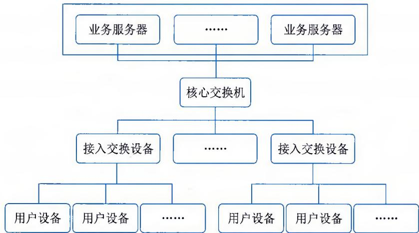  
图3-8 典型单核心局域网

此类局域网可通过连接核心网交换设备与广域网之间的互连路由设备（边界路由器或防火墙）接入广域网，实现业务跨局域网的访问。单核心网具有如下特点：

\- 核心交换设备通常采用二层、三层及以上交换机；如采用三层以上交换机可划分成VLAN，VLAN内采用二层数据链路转发，VLAN之间采用三层路由转发。

\- 接入交换设备采用二层交换机，仅实现二层数据链路转发。

\- 核心交换设备和接入设备之间可采用100M/GE/10GE（1GE=1Gb/s）等以太网连接。

用单核心构建网络，其优点是网络结构简单，可节省设备投资。需要使用局域网的分项组织接入较为方便，直接通过接入交换设备连接至核心交换设备空闲接口即可。其不足是网络地理范围受限，要求使用局域网的分项组织分布较为紧凑；核心网交换设备存在单点故障，容易导致网络整体或局部失效；网络扩展能力有限；在局域网接入交换设备较多的情况下，对核心交换设备的端口密度要求高。

作为一种变通，对于较小规模的网络，采用此网络架构，用户设备也可直接与核心交换设备互联，进一步减少投资成本。

## 2. 双核心架构

双核心架构通常是指核心交换设备采用三层及以上交换机。核心交换设备和接入设备之间可采用 100M/GE/10GE 等以太网连接，如图 3-9 所示。

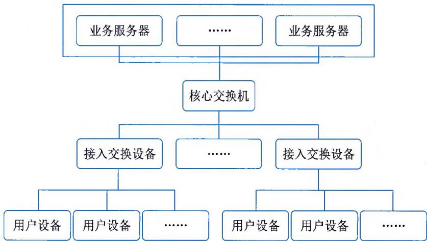  
图3-9 典型双核心局域网

网络内划分 VLAN 时，各 VLAN 之间访问需通过两台核心交换设备来完成。网络中仅核心交换设备具备路由功能，接入设备仅提供二层转发功能。

核心交换设备之间互联，实现网关保护或负载均衡。核心交换设备具备保护能力，网络拓扑结构可靠。在业务路由转发上可实现热切换。接入网络的各部门局域网之间互访，或访问核心业务服务器，有一条以上路径可选择，可靠性更高。

需要使用局域网的专项组织接入较为方便，直接通过接入交换设备连接至核心交换设备空闲接口即可。设备投资相比单核心局域网高。对核心交换设备的端口密度要求较高。所有业务服务器同时连接至两台核心交换设备，通过网关保护协议进行保护，为用户设备提供高速访问。

## 3. 环形架构

环形局域网是由多台核心交换设备连接成双 RPR（Resilient Packet Ring）动态弹性分组环，构建网络的核心。核心交换设备通常采用三层或以上交换机提供业务转发功能，如图 3-10 所示。

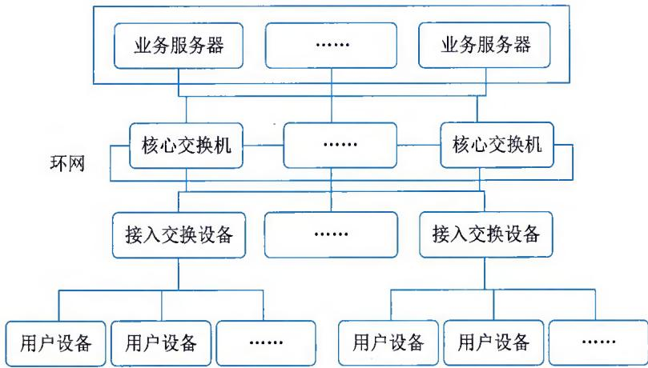  
图3-10 典型环型局域网

典型环形局域网网络内各 VLAN 之间通过 RPR 环实现互访。RPR 具备自愈保护功能，节省光纤资源；具备 MAC 层 50ms 自愈时间的能力，提供多等级、可靠的 QoS 服务，带宽公平机制和拥塞控制机制等。RPR 环双向可用。网络通过两根反向光纤组成环形拓扑结构，节点在环上可从两个方向到达另一节点。每根光纤可同时传输数据和控制信号。RPR 利用空间重用技术，使得环上的带宽得以有效利用。

通过 RPR 组建大规模局域网时，多环之间只能通过业务接口互通，不能实现网络直接互通。环形局域网设备投资比单核心局域网高。核心路由冗余设计实施难度较高，且容易形成环路。此网络通过与环上的交换设备互联的边界路由设备接入广域网。

## 4. 层次局域网架构

层次局域网（或多层局域网）由核心层交换设备、汇聚层交换设备和接入层交换设备以及用户设备等组成，如图 3-11 所示。

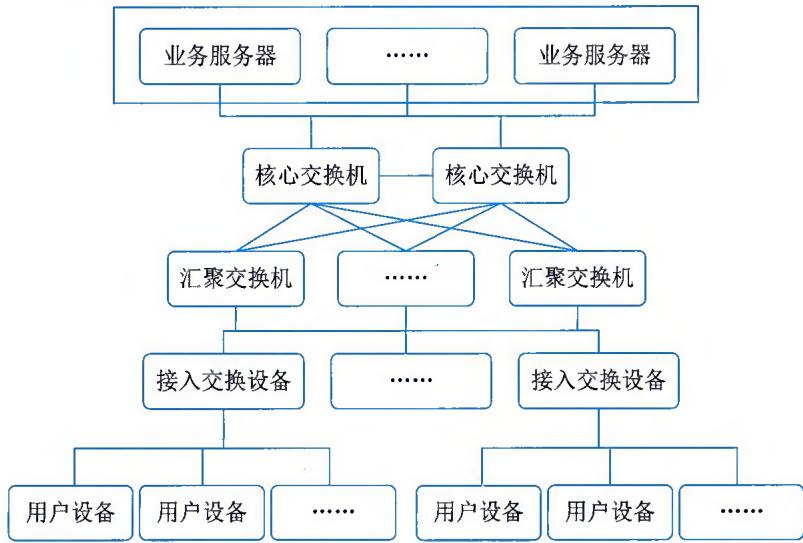  
图3-11 层次局域网模型

层次局域网模型的核心层设备提供高速数据转发功能。汇聚层设备提供了充足接口，与接入层之间实现互访控制。汇聚层可提供所辖的不同接入设备（部门局域网内）业务的交换功能，减轻对核心交换设备的转发压力。接入层设备实现用户设备的接入。层次局域网网络拓扑易于扩展。网络故障可分级排查，便于维护。通常，层次局域网通过与广域网的边界路由设备接入广域网，实现局域网和广域网的业务互访。

## 3.6.3 广域网架构

通俗来讲，广域网是将分布于相比局域网络更广区域的计算机设备连接起来的网络。广域网由通信子网与资源子网组成。通信子网可以利用公用分组交换网、卫星通信网和无线分组交换网来构建，将分布在不同地区的局域网或计算机系统互连起来，实现资源子网的共享。

广域网属于多级网络，通常由骨干网、分布网和接入网组成。在网络规模较小时，可仅由骨干网和接入网组成。例如，在广域网规划时，需要根据业务场景及网络规模来进行三级网络功能的选择。例如，规划某省银行广域网，设计骨干网，如支持数据、语音、图像等信息共享，为全银行系统提供高速、可靠的通信服务；设计分布网，提供数据中心与各分行、支行的数据交换，提供长途线路复用和主干访问；设计接入网，提供各分支行与各营业网点的数据交换时采用访问路由方式，实现网点线路复用和终端访问。

## 1. 单核心广域网

单核心广域网通常由一台核心路由设备和各局域网组成，如图 3-12 所示。核心路由设备采用三层及以上交换机。网络内各局域网之间访问需要通过核心路由设备。

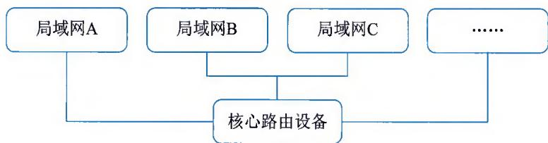  
图3-12 单核心广域网

网络中各局域网之间不设立其他路由设备。各局域网至核心路由设备之间采用广播线路，路由设备与各局域网互连接口属于对应局域网子网。核心路由设备与各局域网可采用10M/100M/GE以太接口连接。该类型网络结构简单，节省设备投资。各局域网访问核心局域网以及相互访问的效率高。新的部门局域网接入广域网较为方便，只要核心路由设备留有端口即可。不过，核心路由设备存在单点故障，容易导致整网失效。网络扩展能力欠佳，对核心路由设备端口密度要求较高。

## 2. 双核心广域网

双核心广域网通常由两台核心路由设备和各局域网组成，如图 3-13 所示。

双核心广域网模型，其主要特征是核心路由设备通常采用三层及以上交换机。核心路由设备与各局域网之间通常采用10M/100M/GE等以太网接口连接。网络内各局域网之间访问需经过两台核心路由设备，各局域网之间不存在其他路由设备用于业务互访。核心路由设备之间实现网关保护或负载均衡。各局域网访问核心局域网以及它们之间的相互访问，有多条路径可选择，可靠性更高，路由层面可实现热切换，提供业务连续性访问能力。在核心路由设备接口有预留情况下，新的局域网可方便接入。不过，设备投资较单核心广域网高。核心路由设备的路由冗余设计实施难度较高，容易形成路由环路。网络对核心路由设备的端口密度要求较高。

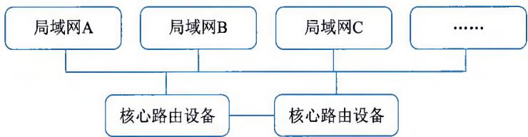  
图3-13 双核心广域网

## 3. 环形广域网

环形广域网通常是采用三台以上核心路由器设备构成路由环路，用以连接各局域网，实现广域网业务互访，如图 3-14 所示。

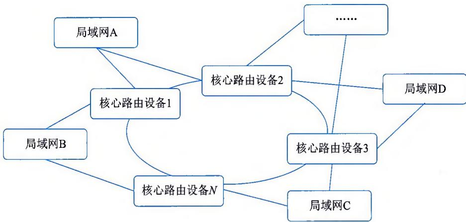  
图3-14 环形广域网

环形广域网的主要特征是核心路由设备通常采用三层或以上交换机。核心路由设备与各局域网之间通常采用10M/100M/GE等以太网接口连接。网络内各局域网之间访问需要经过核心路由设备构成的环。各局域网之间不存在其他路由设备进行互访。核心路由设备之间具备网关保护或负载均衡机制，同时具备环路控制功能。各局域网访问核心局域网或互相访问，有多条路径可选择，可靠性更高，路由层面可实现无缝热切换，保证业务访问连续性。

在核心路由设备接口有预留情况下，新的部门局域网可方便接入。不过，设备投资比双核心广域网高，核心路由设备的路由冗余设计实施难度较高，容易形成路由环路。环形拓扑结构需要占用较多端口，网络对核心路由设备端口密度要求较高。

## 4. 半冗余广域网

半冗余广域网是由多台核心路由设备连接各局域网而形成的，如图3-15所示。其中，任意核心路由设备至少存在两条以上连接至其他路由设备的链路。如果任何两个核心路由设备之间均存在链接，则属于半冗余广域网特例，即全冗余广域网。

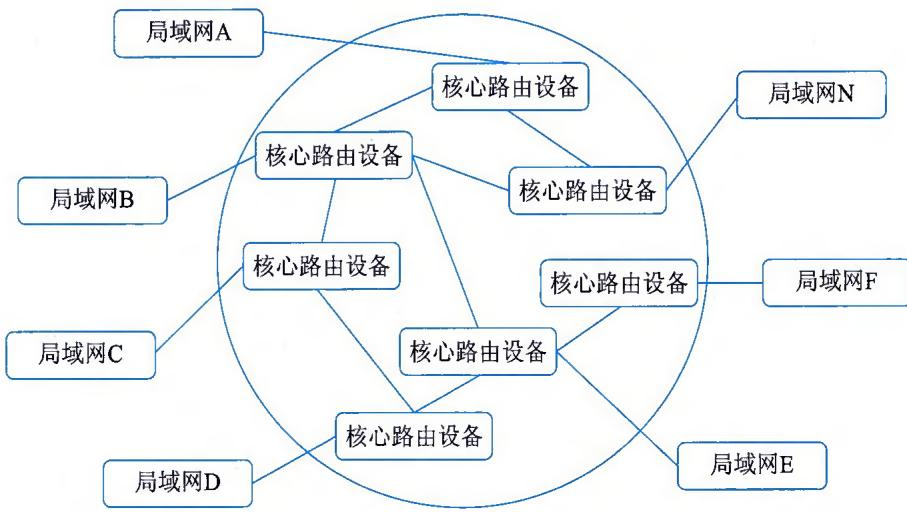  
图 3-15 半冗余广域网

半冗余广域网的主要特征是结构灵活、扩展方便。部分网络核心路由设备可采用网关保护或负载均衡机制或具备环路控制功能。网络结构呈网状，各局域网访问核心局域网以及相互访问存在多条路径，可靠性高。路由层面的路由选择较为灵活。网络结构适合于部署 OSPF 等链路状态路由协议。不过，网络结构零散，不便于管理和排障。

## 5. 对等子域广域网

对等子域网络是将广域网的路由设备划分成两个独立的子域，每个子域路由设备采用半冗余方式互连。两个子域之间通过一条或多条链路互连，对等子域中任何路由设备都可接入局域网络，如图 3-16 所示。

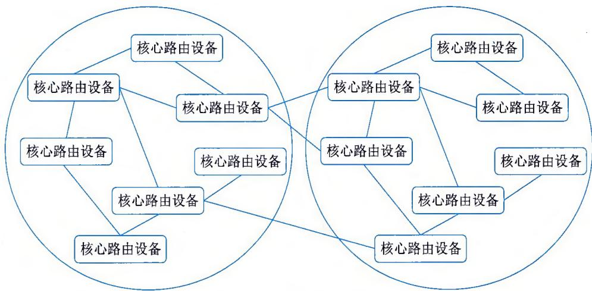  
图3-16 对等子域广域网

对等子域广域网的主要特征是对等子域之间的互访以对等子域之间互连链路为主。对等子域之间可做到路由汇总或明细路由条目匹配，路由控制灵活。通常，子域之间链路带宽应高于子域内链路带宽。域间路由冗余设计实施难度较高，容易形成路由环路或存在发布非法路由的风险，对域边界路由设备的路由性能要求较高。网络中路由协议主要以动态路由为主。对等子域适合于广域网可以明显划分为两个区域且区域内部访问较为独立的场景。

## 6. 层次子域广域网

层次子域广域网结构是将大型广域网路由设备划分成多个较为独立的子域，每个子域内路由设备采用半冗余方式互连，多个子域之间存在层次关系，高层次子域连接多个低层次子域。层次子域中任何路由设备都可以接入局域网，如图 3-17 所示。

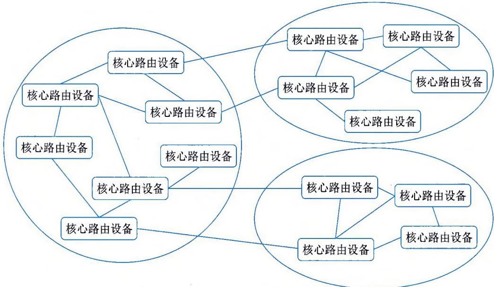  
图3-17 层次子域广域网

层次子域的主要特征是层次子域结构具有较好扩展性。低层次子域之间互访需要通过高层次子域完成。域间路由冗余设计实施难度较高，容易形成路由环路，存在发布非法路由的风险。子域之间链路带宽须高于子域内链路带宽。对用于域互访的域边界路由设备的路由转发性能要求较高。路由设备路由协议主要以动态路由为主，如 OSPF 协议。层次子域与上层外网互连，主要借助高层子域完成；与下层外网互连，主要借助低层子域完成。

## 3.6.4 移动通信网架构

移动通信网为移动互联网提供了强有力的支持，尤其是5G网络为个人用户、垂直行业等提供了多样化的服务。5G常用业务应用方式包括：5GS（5G System）与DN（Data Network，数据网络）互联、5G网络边缘计算等。

## 1.5GS与DN互连

5GS 在为移动终端用户（User Equipment，UE）提供服务时，通常需要 DN 网络，如 Internet、IMS（IP Media Subsystem）、专用网络等互连来为 UE 提供所需的业务。各式各样的上网、语音、AR/VR、工业控制和无人驾驶等 5GS 中 UPF 网元作为 DN 的接入点。5GS 和 DN 之间通过 5GS 定义的 N6 接口互连，如图 3-18 所示。

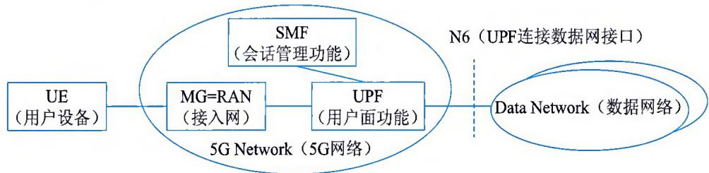  
图3-18 5G网络与DN网络连接关系

5G Network属于5G范畴，包括若干网络功能实体，如AMF/SMF/PCF/NRF/NSSF等。简洁起见，图中仅标示出了与用户会话密切相关的网络功能实体。

在 5GS 和 DN 基于 IPv4/IPv6 互连时，从 DN 来看，UPF 可看作是普通路由器。相反，从 5GS 来看，与 UPF 通过 N6 接口互连的设备，通常也是路由器。换言之，5GS 和 DN 之间是一种路由关系。UE 访问 DN 的业务流在它们之间通过双向路由配置实现转发。就 5G 网络而言，把从 UE 流向 DN 的业务流称之为上行（UL，UpLink）业务流；把从 DN 流向 UE 的业务流称为下行（DL，DownLink）业务流。UL 业务流通过 UPF 上配置的路由转发至 DN；DL 业务流通过与 UPF 邻近的路由器上配置的路由转发至 UPF。

此外，从UE通过5GS接入DN的方式来说，存在两种模式：透明模式和非透明模式。

## 1）透明模式

在透明模式下，5GS 通过 UPF 的 N6 接口直接连至运营商特定的 IP 网络，然后通过防火墙（Firewall）或代理服务器连至 DN（即外部 IP 网络），如 Internet 等。UE 分配由运营商规划的网络地址空间的 IP 地址。UE 在向 5GS 发起会话建立请求时，通常 5GS 不触发向外部 DN-AAA 服务器发起认证过程，如图 3-19 所示。

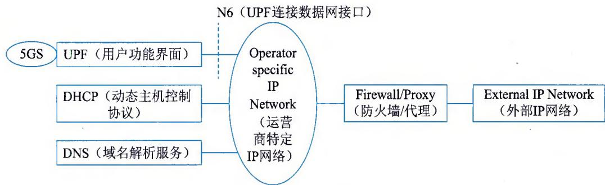  
图3-19 UE透明接入5G网络

在此模式下，5GS至少为UE提供一个基本ISP服务。对于5GS而言，它只需提供基本的隧道QoS流服务即可。UE访问某个Intranet网络时，UE级别的配置仅在UE和Intranet网络之间独立完成，这对5GS而言是透明的。

## 2）非透明模式

在非透明模式下，5GS可直接接入Intranet/ISP或通过其他IP网络（如Internet）接入Intranet/ISP。如5GS通过Internet方式接入Intranet/ISP，通常需要在UPF和Intranet/ISP之间建立专用隧道来转发UE访问Intranet/ISP的业务。UE被指派属于Intranet/ISP地址空间的IP地址。此地址用于UE业务在UPF、Intranet/ISP中转发，如图3-20所示。

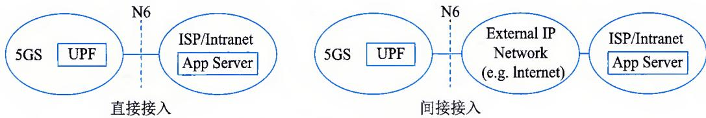  
图3-20 UE通过5GS非透明接入DN原理图

综上所述，UE通过5GS访问Intranet/ISP的业务服务器，可基于任何网络，如Internet等来进行，即使不安全也无妨，在UPF和Intranet/ISP之间可基于某种安全协议进行数据通信保护。至于采用何种安全协议，由移动运营商和Intranet/ISP提供商之间协商确定。

作为 UE 会话建立的一部分，5GS 中 SMF 通常通过向外部 DN-AAA 服务器（如 Radius, Diameter 服务器）发起对 UE 进行认证。在对 UE 认证成功后，方可完成 UE 会话的建立，之后 UE 才可访问 Internet/ISP 的服务。

## 2.5G网络边缘计算

5G 网络改变以往以设备、业务为中心的导向，倡导以用户为中心的理念。5G 网络在为用户提供服务的同时，更注重用户的服务体验 QoE（Quality of Experience）。其中 5G 网络边缘计算能力的提供正是为垂直行业赋能、提升用户 QoE 的重要举措之一。

5G 网络的边缘计算（Mobile Edge Computing，MEC）架构如图 3-21 所示，支持在靠近终端用户 UE 的移动网络边缘部署 5G UPF 网元，结合在移动网络边缘部署边缘计算平台（Mobile Edge Platform，MEP）为垂直行业提供诸如以时间敏感、高带宽为特征的业务就近分流服务。于是，一来为用户提供极佳服务体验，二来降低了移动网络后端处理的压力。

运营商自有应用或第三方应用 AF（Application Function）通过 5GS 提供的能力开放功能网元 NEF（Network Exposure Function），触发 5G 网络为边缘应用动态地生成本地分流策略，由 PCF（Policy Charging Function）将这些策略配置给相关 SMF，SMF 根据终端用户位置信息或用户移动后发生的位置变化信息动态实现 UPF（即移动边缘云中部署的 UPF）在用户会话中插入或移除，以及对这些 UPF 分流规则的动态配置，达到用户访问所需业务的极佳效果。

另外，从业务连续性来说，5G网络可提供SSC模式1（在用户移动过程中用户会话的IP接入点始终保持不变），SSC模式2（用户移动过程中网络触发用户现有会话释放并立即触发新会话建立），SSC模式3（用户移动过程中在释放用户现有会话之前先建立一个新的会话）供业务提供者ASP（Application Service Provider）或运营商选择。

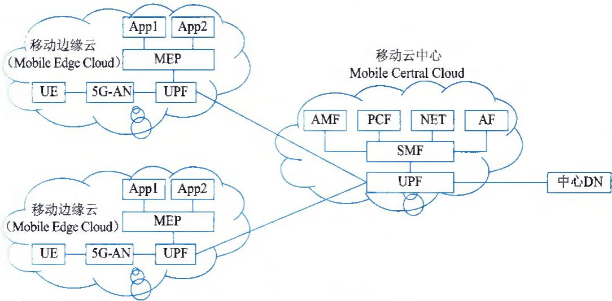  
图3-21 5G网络边缘计算架构

## 3.6.5 软件定义网络

软件定义网络（Software Defined Network，SDN）是一种新型网络创新架构，它可通过软件编程的形式定义和控制网络，其通过将网络设备的控制面与数据面分离开来，从而实现了网络流量的灵活控制，使网络变得更加智能，为核心网络及应用的创新提供了良好的平台。SDN被认为是网络领域的一场革命，为新型互联网体系结构研究提供了新的实验途径，也极大地推动了下一代互联网的发展。

SDN 是网络虚拟化的一种实现方式。利用分层的思想，SDN 将数据与控制相分离。在控制层，包括具有逻辑中心化和可编程的控制器，可掌握全局网络信息，方便运营商和科研人员管理配置网络和部署新协议等。在数据层，包括哑交换机（与传统的二层交换机不同，专指用于转发数据的设备），仅提供简单的数据转发功能，可以快速处理匹配的数据包，适应流量日益增长的需求。两层之间采用开放的统一接口（如 OpenFlow 等）进行交互。控制器通过标准接口向交换机下发统一标准规则，交换机仅需按照这些规则执行相应的动作即可。SDN 打破了传统网络设备的封闭性。此外，南北向和东西向的开放接口及可编程性，也使得网络管理变得更加简单、动态和灵活。

SDN的整体架构由下到上（由南到北）分为数据平面、控制平面和应用平面，如图3-22所示。其中，数据平面由交换机等网络通用硬件组成，各个网络设备之间通过不同规则形成的SDN数据通路连接；控制平面包含了逻辑上为中心的SDN控制器，它掌握着全局网络信息，负责各种转发规则的控制；应用平面包含着各种基于SDN的网络应用，用户无须关心底层细节就可以编程、部署新应用。

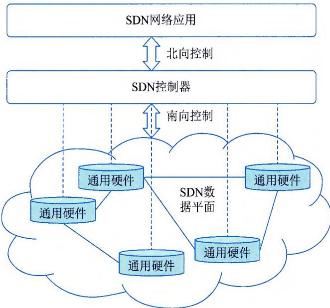  
图3-22 SDN体系架构图

控制平面与数据平面之间通过 SDN 控制数据平面接口（Control-data-plane Interface, CDPI）进行通信，它具有统一的通信标准，主要负责将控制器中的转发规则下发至转发设备，最主要应用的是 OpenFlow 协议。控制平面与应用平面之间通过 SDN 北向接口（Northbound Interface, NBI）进行通信，而 NBI 并非统一标准，它允许用户根据自身需求定制开发各种网络管理应用。

SDN 中的接口具有开放性，以控制器为逻辑中心，南向接口负责与数据平面进行通信，北向接口负责与应用平面进行通信，东西向接口负责多控制器之间的通信。最主流的南向接口 CDPI 采用的是 OpenFlow 协议。OpenFlow 最基本的特点是基于流（Flow）的概念来匹配转发规则，每一个交换机都维护一个流表（Flow Table），依据流表中的转发规则进行转发，而流表的建立、维护和下发都是由控制器完成的。针对北向接口，应用程序通过北向接口编程来调用所需的各种网络资源，实现对网络的快速配置和部署。东西向接口使控制器具有可扩展性，为负载均衡和性能提升提供了技术保障。

## 3.7 安全架构

在当今以计算机、网络、软件和数据为载体的数字服务，几乎成为人类社会生产与生活等赖以生存关键基础。与之而来的计算机犯罪呈现指数上升趋势，因此，信息安全保障显得尤为重要，而满足这些诉求，离不开好的安全架构设计。安全保障以风险和策略为基础，在信息系统的整个生命周期中，安全保障应包括技术、管理、人员和工程过程的整体安全，以及相关组织机构的健全等。当前，信息与数字技术存在多重威胁，我们要从系统的角度考虑整体安全防御方法。

## 3.7.1 安全威胁

目前，组织将更多的业务托管于混合云之上，保护用户数据和业务变得更加困难，本地基础设施和多种公、私有云共同构成的复杂环境，使得用户对混合云安全有了更高的要求。这种普及和应用将会产生两方面的效应：①各行各业的业务运转几乎完全依赖于计算机、网络和云存储，各种重要数据如政府文件、档案、银行账目、组织业务和个人信息等将全部依托计算机、网络的存储、传输；②人们对计算机的了解更加全面，有更多的计算机技术被较高层的人非法利用，他们采用种种手段对信息资源进行窃取或攻击。目前，信息系统可能遭受到的威胁可总结为以下4个方面，如图3-23所示。

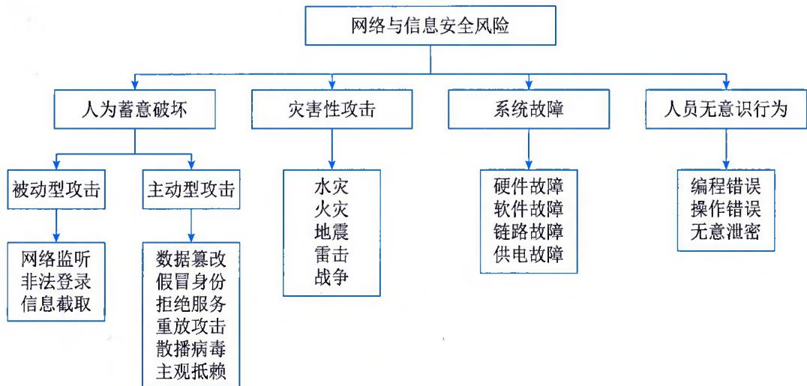  
图3-23 信息系统受到的安全威胁

对于信息系统来说，威胁可以是针对物理环境、通信链路、网络系统、操作系统、应用系统以及管理系统等方面。物理安全威胁是指对系统所用设备的威胁，如自然灾害、电源故障、操作系统引导失败或数据库信息丢失、设备被盗或被毁造成数据丢失或信息泄露；通信链路安全威胁是指在传输线路上安装窃听装置或对通信链路进行干扰；网络安全威胁是指由于互联网的开放性、国际化的特点，人们很容易通过技术手段窃取互联网信息，对网络形成严重的安全威胁；操作系统安全威胁是指对系统平台中的软件或硬件芯片中植入威胁，如"木马"和"陷阱门"、BIOS的万能密码；应用系统安全威胁是指对于网络服务或用户业务系统安全的威胁，也受到"木马"和"陷阱门"的威胁；管理系统安全威胁是指由于人员管理上疏忽而引发人为的安全漏洞，如人为地通过拷贝、拍照、抄录等手段盗取计算机信息。

具体来讲，常见的安全威胁有：信息泄露、破坏信息的完整性、拒绝服务、非法访问、窃听、业务流分析、假冒、旁路控制、授权侵犯、特洛伊木马、陷阱门、抵赖、重放、计算机病毒、人员渎职、媒体废弃、物理侵入、窃取、业务欺骗等。

（1）信息泄露。信息被泄露或透露给某个非授权的实体。

（2）破坏信息的完整性。数据被非授权地进行增删、修改或破坏而受到损失。

（3）拒绝服务。对信息或其他资源的合法访问被无条件地阻止。

（4）非法访问（非授权访问）。某一资源被某个非授权的人或以非授权的方式使用。

（5）窃听。用各种可能的合法或非法的手段窃取系统中的信息资源和敏感信息。例如，对通信线路中传输的信号进行搭线监听，或者利用通信设备在工作过程中产生的电磁泄漏截取有用信息等。

（6）业务流分析。通过对系统进行长期监听，利用统计分析方法对诸如通信频度、通信的信息流向、通信总量的变化等态势进行研究，从而发现有价值的信息和规律。

（7）假冒。通过欺骗通信系统（或用户）达到非法用户冒充成为合法用户，或者特权小的用户冒充成为特权大的用户的目的。黑客大多是采用假冒进行攻击。

（8）旁路控制。攻击者利用系统的安全缺陷或安全性上的脆弱之处获得非授权的权利或特权。例如，攻击者通过各种攻击手段，发现原本应保密但是却又暴露出来的一些系统"特性"。利用这些"特性"，攻击者可以绕过防线守卫者侵入系统的内部。

（9）授权侵犯。被授权以某一目的使用某一系统或资源的某个人，却将此权限用于其他非授权的目的，也称作"内部攻击"。

（10）特洛伊木马。软件中含有一个察觉不出的或者无害的程序段，当它被执行时，会破坏用户的安全。这种应用程序称为特洛伊木马（Trojan Horse）。

（11）陷阱门。在某个系统或某个部件中设置了"机关"，使得当提供特定的输入数据时，允许违反安全策略。

（12）抵赖。这是一种来自用户的攻击，例如，否认自己曾经发布过的某条消息、伪造一份对方来信等。

（13）重放。所截获的某次合法的通信数据备份，出于非法的目的而被重新发送。

（14）计算机病毒。所谓计算机病毒，是一种在计算机系统运行过程中能够实现传染和侵害的功能程序。一种病毒通常含有两个功能：一种功能是对其他程序产生"感染"；另外一种是引发损坏功能或者是一种植入攻击的能力。

（15）人员渎职。一个授权人为了钱或利益，或由于粗心，将信息泄露给一个非授权的人。

（16）媒体废弃。信息被从废弃的磁盘或打印过的存储介质中获得。

（17）物理侵入。侵入者通过绕过物理控制而获得对系统的访问。

（18）窃取。重要的安全物品，如令牌或身份卡被盗。

（19）业务欺骗。某一伪系统或系统部件欺骗合法用户或系统自愿地放弃敏感信息。

## 3.7.2 定义和范围

安全架构是在架构层面聚焦信息系统安全方向上的一种细分。如果安全性体现在信息系统上，通常系统安全架构、安全技术体系架构和审计架构可组成三道安全防线。

（1）系统安全架构。系统安全架构指构建信息系统安全质量属性的主要组成部分以及它们之间的关系。系统安全架构的目标是如何在不依赖外部防御系统的情况下，从源头打造自身的安全。

（2）安全技术体系架构。安全技术体系架构指构建安全技术体系的主要组成部分以及它们之间的关系。安全技术体系架构的任务是构建通用的安全技术基础设施，包括安全基础设施、安全工具和技术、安全组件与支持系统等，系统性地增强各部分的安全防御能力。

（3）审计架构。审计架构指独立的审计部门或其所能提供的风险发现能力，审计的范围主要包括安全风险在内的所有风险。

人们在系统设计时，通常要识别系统可能会遇到的安全威胁，通过对系统面临的安全威胁和实施相应控制措施进行合理的评价，提出有效合理的安全技术，形成提升信息系统安全性的安全方案，是安全架构设计的根本目标。在实际应用中，安全架构设计可以从安全技术的角度考虑，如加密解密、网络安全技术等。

## 3.7.3 整体架构设计

构建信息安全保障体系框架应包括技术体系、组织机构体系和管理体系等三部分，也就是说，人、管理和技术手段是信息安全架构设计的三大要素，而构建动态的信息与网络安全保障体系框架是实现系统安全的保障。

## 1. WPDRRC 模型

针对网络安全防护问题，各个国家曾提出了多个网络安全体系模型和架构，比如 PDRR（Protection/Detection/Reaction/Recovery，防护/检测/响应/恢复）模型、P2DR 模型（Policy/Protection/Detection/Response，安全策略/防护/检测/响应）。WPDRRC（Warning/Protect/Detect/React/Restore/Counterattack）是我国信息安全专家组提出的信息系统安全保障体系建设模型。WPDRRC 是在 PDRR 信息安全体系模型的基础上前后增加了预警和反击功能。

在 PDRR 模型中，安全的概念已经从信息安全扩展到了信息保障，信息保障内涵已超出传统的信息安全保密，它是保护（Protect）、检测（Detect）、反应（React）、恢复（Restore）的有机结合。PDRR 模型把信息的安全保护作为基础，将保护视为活动过程，用检测手段来发现安全漏洞，及时更正。同时采用应急响应措施对付各种入侵，在系统被入侵后，要采取相应的措施将系统恢复到正常状态，这样才能使信息的安全得到全方位的保障，该模型强调的是自动故障恢复能力。

WPDRRC 模型有 6 个环节和三大要素。6 个环节包括：预警（W）、保护（P）、检测（D）、响应（R）、恢复（R）和反击（C），它们具有较强的时序性和动态性，能够较好地反映出信息系统安全保障体系的预警能力、保护能力、检测能力、响应能力、恢复能力和反击能力。三大要素包括：人员、策略和技术。人员是核心，策略是桥梁，技术是保证。落实在 WPDRRC 的 6 个环节的各个方面，将安全策略变为安全现实。

（1）预警（W）。预警主要是指利用远程安全评估系统提供的模拟攻击技术，来检查系统可能存在的被利用的薄弱环节，收集和测试网络与信息的安全风险所在，并以直观的方式进行报告，提供解决方案的建议。在经过分析后，分解网络与信息的风险变化趋势和严重风险点，从而有效降低网络与信息的总体风险，保护关键业务和数据。

（2）保护（P）。保护通常是通过采用成熟的信息安全技术及方法，来实现网络与信息的安全。主要内容有加密机制、数字签名机制、访问控制机制、认证机制、信息隐藏和防火墙技术等。

（3）检测（D）。检测是通过检测和监控网络以及系统，来发现新的威胁和弱点，强制执行安全策略。在这个过程中采用入侵检测、恶意代码过滤等技术，形成动态检测的制度、奖励报告协调机制，提高检测的实时性。主要内容有入侵检测、系统脆弱性检测、数据完整性检测和攻击性检测等。

（4）响应（R）。响应是指在检测到安全漏洞和安全事件之后必须及时做出正确的响应，从而把系统调整到安全状态。为此需要相应的报警、跟踪和处理系统，其中处理包括了封堵、隔离、报告等能力。主要内容有应急策略、应急机制、应急手段、入侵过程分析和安全状态评估等。

（5）恢复（R）。恢复是指当前网络、数据、服务受到黑客攻击并遭到破坏或影响后，通过必要的技术手段，在尽可能短的时间内使系统恢复正常。主要内容有容错、冗余、备份、替换、修复和恢复等。

（6）反击（C）。反击是指采用一切可能的高新技术手段，侦查、提取计算机犯罪分子的作案线索与犯罪证据，形成强有力的取证能力和依法打击手段。

网络安全体系模型经过多年发展，形成了 PDP、PPDR、PDRR、MPDRR 和 WPDRRC 等模型，这些模型在信息安全防范方面的功能更加完善，表 3-2 给出网络安全体系模型安全防范功能对照表。

表 3-2 安全防范功能对照表

<table><tr><td>模型/覆盖</td><td>预警</td><td>保护</td><td>检测</td><td>响应</td><td>恢复</td><td>反击</td><td>管理</td></tr><tr><td>PDP</td><td>无</td><td>有</td><td>有</td><td>有</td><td>无</td><td>无</td><td>无</td></tr><tr><td>PPDR</td><td>无</td><td>有</td><td>有</td><td>有</td><td>无</td><td>无</td><td>无</td></tr><tr><td>PDRR</td><td>无</td><td>有</td><td>有</td><td>有</td><td>有</td><td>无</td><td>无</td></tr><tr><td>MPDRR</td><td>无</td><td>有</td><td>有</td><td>有</td><td>有</td><td>无</td><td>有</td></tr><tr><td>WPDRRC</td><td>有</td><td>有</td><td>有</td><td>有</td><td>有</td><td>有</td><td>有</td></tr></table>

## 2. 架构设计

信息系统的安全需求是任何单一安全技术都无法解决的，要设计一个信息安全体系架构，应当选择合适的安全体系结构模型。信息系统安全设计重点考虑两个方面：一是系统安全保障体系；二是信息安全体系架构。

## 1）系统安全保障体系

安全保障体系是由安全服务、协议层次和系统单元三个层面组成，且每层都涵盖了安全管理的内容。系统安全保障体系设计工作主要考虑以下几点：

\- 安全区域策略的确定。根据安全区域的划分，主管部门应制定针对性的安全策略。如定时审计评估、安装入侵检测系统、统一授权、认证等。

\- 统一配置和管理防病毒系统。主管部门应当建立整体防御策略，以实现统一的配置和管理。网络防病毒的策略应满足全面性、易用性、实时性和可扩展性等方面要求。

\- 网络与信息安全管理。在网络安全中，除了采用一些技术措施之外，还需加强网络与信息安全管理，制定有关规章制度。在相关管理中，任何的安全保障措施，最终要落实到具体的管理规章制度以及具体的管理人员职责上，并通过管理人员的工作得到实现。

## 2）信息安全体系架构

通过对信息系统应用的全面了解，按照安全风险、需求分析结果、安全策略以及网络与信息的安全目标等方面开展安全体系架构的设计工作。具体在安全控制系统，可以从物理安全、系统安全、网络安全、应用安全和安全管理等5个方面开展分析和设计工作。

\- 物理安全。保证计算机信息系统各种设备的物理安全是保障整个网络系统安全的前提。物理安全是保护计算机网络设备、设施以及其他媒体免受地震、水灾、火灾等环境事故以及人为操作失误或错误及各种计算机犯罪行为导致的破坏过程。它主要包括：环境安全、设备安全、媒体安全等。

\- 系统安全。系统安全主要是指对信息系统组成中各个部件的安全要求。系统安全是系统整体安全的基础。它主要包括网络结构安全、操作系统安全和应用系统安全等。

\- 网络安全。网络安全是整个安全解决方案的关键。它主要包括访问控制、通信保密、入侵检测、网络安全扫描和防病毒等。

\- 应用安全。应用安全主要是指多个用户使用网络系统时，对共享资源和信息存储操作所带来的安全问题。它主要包括资源共享和信息存储两个方面。

\- 安全管理。安全管理主要体现在三个方面：制定健全的安全管理体制、构建安全管理平台、增强人员的安全防范意识。

## 3. 设计要点

网络与信息安全架构设计可以参照各类架构模型，结合组织的具体战略、实际现状和预期目标等，细致开展相关工作。

## 1）系统安全设计要点

系统安全设计要点主要包括以下几个方面。

\- 网络结构安全领域重点关注网络拓扑结构是否合理，线路是否冗余，路由是否冗余和防止单点失败等。

\- 操作系统安全重点关注两个方面：①操作系统的安全防范可以采取的措施，如：尽量采用安全性较高的网络操作系统并进行必要的安全配置，关闭一些不常用但存在安全隐患的应用，使用权限进行限制或加强口令的使用等。②通过配备操作系统安全扫描系统对操作系统进行安全性扫描，发现漏洞并及时升级等。

\- 应用系统安全方面重点关注应用服务器，尽量不要开放一些不经常使用的协议及协议端口，如文件服务、电子邮件服务器等。可以关闭服务器上的如HTTP、FTP、Telnet等服务。可以加强登录身份认证，确保用户使用的合法性。

## 2）网络安全设计要点

网络安全设计要点主要包括以下几个方面。

\- 隔离与访问控制要有严格的管制制度，可制定如《用户授权实施细则》《口令及账户管理规范》《权限管理制定》等一系列管理办法。

\- 通过配备防火墙实现网络安全中最基本、最经济、最有效的安全措施。通过防火墙严格的安全策略实现内外网络或内部网络不同信任域之间的隔离与访问控制，防火墙可以实现单向或双向控制，并对一些高层协议实现较细粒度的访问控制。

\- 入侵检测需要根据已有的、最新的攻击手段的信息代码对进出网段的所有操作行为进行实时监控、记录，并按制定的策略实施响应（阻断、报警、发送E-mail）。从而防止针对网络的攻击与犯罪行为。入侵检测系统一般包括控制台和探测器（网络引擎），控制台用作制定及管理所有探测器（网络引擎），网络引擎用作监听进出网络的访问行为，根据控制台的指令执行相应行为。

\- 病毒防护是网络安全的必要手段，由于在网络环境下，计算机病毒有不可估量的威胁性和破坏力。网络系统中使用的操作系统（如Windows系统）容易感染病毒，因此计算机病毒的防范也是网络安全建设中应该考虑的重要环节之一，反病毒技术包括预防病毒、检测病毒和杀毒三种。

## 3）应用安全设计要点

应用安全设计要点主要包括以下两个方面。

\- 资源共享要严格控制内部员工对网络共享资源的使用，在内部子网中一般不要轻易开放共享目录，否则会因为疏忽而在员工间交换信息时泄露重要信息。对有经常交换信息需求的用户，在共享时也必须加上必要的口令认证机制，即只有通过口令的认证才能允许访问数据。

\- 信息存储是指对于涉及秘密信息的用户主机，使用者在应用过程中应该做到尽量少开放一些不常用的网络服务。对数据服务器中的数据库做安全备份。通过网络备份系统可以对数据库进行远程备份存储。

## 4）安全管理设计要点

安全管理设计要点主要包括以下几个方面。

\- 制定健全安全管理体制将是网络安全得以实现的重要保证，可以根据自身的实际情况制定如安全操作流程、安全事故的奖罚制度以及任命安全管理人员全权负责监督和指导。

\- 构建安全管理平台将会降低许多因为无意的人为因素而造成的风险。构建安全管理平台可从技术上进行防护，如组成安全管理子网、安装集中统一的安全管理软件、网络设备管理系统以及网络安全设备统一管理软件等，通过安全管理平台实现全网的安全管理。

\- 应该经常对单位员工进行网络安全防范意识的培训，全面提高员工的整体安全方法意识。

## 4. 架构示例

图 3-24 给出一种面向组织运维管理系统的安全架构。这里的安全控制系统是指能提供一种高度可靠的安全保护手段的系统，可以最大限度地避免相关设备的不安全状态，防止恶性事故的发生或在事故发生后尽可能地减少损失，保护生产装置及最重要的人身安全。

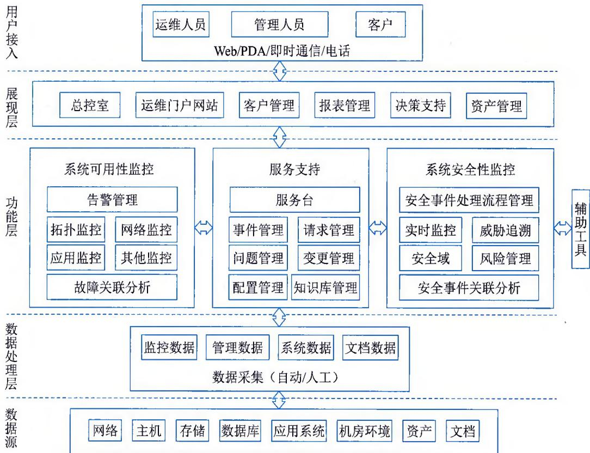  
图3-24 某组织运维管理系统安全架构示例

该架构采用了传统的层次化结构，分为数据层、功能层和展现层。数据层主要对组织数据进行统一管理，按数据的不同安全特性进行存储、隔离与保护等。功能层是系统安全防范的主要核心功能，包括可用性监控、服务支持和安全性监控。可用性监控主要实现网络安全、系统安全和应用安全中的监控能力；服务支持中的业务过程包含了安全管理设计，实现安全管理环境下的运维管理的大多数功能；安全性监控主要针对系统中发现的任何不安全现象进行相关处理，涵盖了威胁追溯、安全域审计评估、授权、认证等，以及风险分析与评估等。展现层主要完成包含安全架构的使用、维护、决策等在内的用户各种类型应用功能实现。

## 3.7.4 网络安全架构设计

建立信息系统安全体系的目的，就是将普遍性安全原理与信息系统的实际相结合，形成满足信息系统安全需求的安全体系结构，网络安全体系是信息系统体系的核心之一。

## 1. OSI 安全架构

OSI（Open System Interconnection/Reference Mode，OSI/RM）是由国际标准化组织制定的开放式通信系统互联模型（ISO 7498-2），国家标准 GB/T 9387.2《信息处理系统 开放系统互联基本参考模型 第2部分：安全体系结构》等同于 ISO 7498-2。OSI 目的在于保证开放系统进程与进程之间远距离安全交换信息。这些标准在参考模型的框架内建立起一些指导原则与约束条件，从而提供了解决开放互联系统中安全问题的一致性方法。

OSI 定义了 7 层协议，其中除第 5 层（会话层）外，每一层均能提供相应的安全服务。实际上，最适合配置安全服务的是在物理层、网络层、传输层及应用层上，其他层都不宜配置安全服务。OSI 开放系统互联安全体系的 5 类安全服务包括鉴别、访问控制、数据机密性、数据完整性和抗抵赖性。OSI 定义分层多点安全技术体系架构，也称为深度防御安全技术体系架构，它通过以下三种方式将防御能力分布至整个信息系统中。

## 1）多点技术防御

在对手可以从内部或外部多点攻击一个目标的前提下，多点技术防御通过对以下多个核心区域的防御达到抵御所有攻击方式的目的。

\- 网络和基础设施。为了确保可用性，局域网和广域网需要进行保护以抵抗各种攻击，如拒绝服务攻击等。为了确保机密性和完整性，需要保护在这些网络上传送的信息以及流量的特征以防止非故意的泄露。

\- 边界。为了抵御主动的网络攻击，边界需要提供更强的边界防御，例如流量过滤和控制以及入侵检测。

\- 计算环境。为了抵御内部、近距离的分布攻击，主机和工作站需要提供足够的访问控制。

## 2）分层技术防御

即使最好的可得到的信息保障产品也有弱点，其最终结果将使对手能找到一个可探查的脆弱性，一个有效的措施是在对手和目标间使用多个防御机制。为了减少这些攻击成功的可能性和对成功攻击的可承担性，每种机制应代表一种唯一的障碍，并同时包括保护和检测方法。例如，在外部和内部边界同时使用嵌套的防火墙并配合入侵检测就是分层技术防御的一个实例。

## 3）支撑性基础设施

支撑性基础设施为网络、边界和计算环境中信息保障机制运行基础的支撑性基础设施，包括公钥基础设施以及检测和响应基础设施。

\- 公钥基础设施。公钥基础设施提供一种通用的联合处理方式，以便安全地创建、分发和管理公钥证书和传统的对称密钥，使它们能够为网络、边界和计算环境提供安全服务。这些服务能够对发送者和接收者的完整性进行可靠验证，并可以避免在未获授权的情况下泄露和更改信息。公钥基础设施必须支持受控的互操作性，并与各用户团体所建立的安全策略保持一致。

\- 检测和响应基础设施。检测和响应基础设施能够迅速检测并响应入侵行为。它也提供便于结合其他相关事件观察某个事件的"汇总"功能。另外，它也允许分析员识别潜在的行为模式或新的发展趋势。

这里必须注意的是，信息系统的安全保障不仅仅依赖于技术，还需要非技术防御手段。一个可接受级别的信息保障依赖于人员、管理、技术和过程的综合。

## 2. 认证框架

鉴别（Authentication）的基本目的是防止其他实体占用和独立操作被鉴别实体的身份。鉴别提供了实体声称其身份的保证，只有在主体和验证者的关系背景下，鉴别才是有意义的。鉴别有两个重要的关系背景：①实体由申请者来代表，申请者与验证者之间存在着特定的通信关系（如实体鉴别）；②实体为验证者提供数据项来源。鉴别的方式主要基于以下5种。

\- 已知的，如一个秘密的口令。

\- 拥有的，如IC卡、令牌等。

\- 不改变的特性，如生物特征。

\- 相信可靠的第三方建立的鉴别（递推）。

\- 环境（如主机地址等）。

鉴别信息是指申请者要求鉴别到鉴别过程结束所生成、使用和交换的信息。鉴别信息的类型有交换鉴别信息、申请鉴别信息和验证鉴别信息。在某些情况下，为了产生交换鉴别信息，申请者需要与可信第三方进行交互。类似地，为了验证交换鉴别信息，验证者也需要同可信第三方进行交互。在这种情况下，可信第三方持有相关实体的验证 AI，也可能使用可信第三方来传递交换鉴别信息，实体也可能需要持有鉴别可信第三方中所使用的鉴别信息。

鉴别服务分为以下阶段：安装阶段、修改鉴别信息阶段、分发阶段、获取阶段、传送阶段、验证阶段、停活阶段、重新激活阶段、取消安装阶段。

（1）在安装阶段，定义申请鉴别信息和验证鉴别信息。

（2）在修改鉴别信息阶段，实体或管理者申请鉴别信息和验证鉴别信息变更（如修改口令）。

（3）在分发阶段，为了验证交换鉴别信息，把验证鉴别信息分发到各实体（如申请者或验证者）以供使用。

（4）在获取阶段，申请者或验证者可得到为鉴别实例生成特定交换鉴别信息所需的信息，通过与可信第三方进行交互或鉴别实体间的信息交换可得到交换鉴别信息。例如，当使用联机密钥分配中心时，申请者或验证者可从密钥分配中心得到一些信息，如鉴别证书。

（5）在传送阶段，在申请者与验证者之间传送交换鉴别信息。

（6）在验证阶段，用验证鉴别信息核对交换鉴别信息。

（7）在停活阶段，将建立一种状态，使得以前能被鉴别的实体暂时不能被鉴别。

（8）在重新激活阶段，使在停活阶段建立的状态将被终止。

（9）在取消安装阶段，实体从实体集合中被拆除。

## 3. 访问控制框架

访问控制（Access Control）决定开放系统环境中允许使用哪些资源，在什么地方适合阻止未授权访问的过程。在访问控制实例中，访问可以是对一个系统（即对一个系统通信部分的一个实体）或对一个系统内部进行的。图3-25和图3-26说明了访问控制的基本功能。

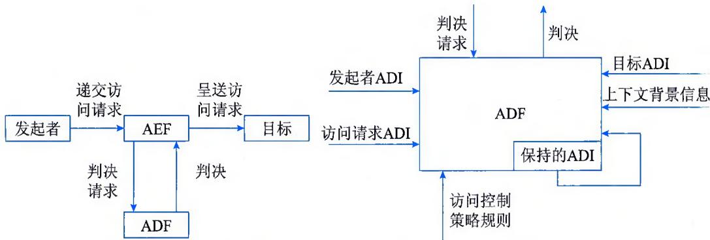  
图3-25 基于访问控制功能示意图  
图3-26 ADF示意图

ACI（访问控制信息）是用于访问控制目的的任何信息，其中包括上下文信息。ADI（访问控制判决信息）是在做出一个特定的访问控制判决时可供ADF使用的部分（或全部）ACI。ADF（访问控制判决功能）是一种特定功能，它通过对访问请求、ADI以及该访问请求的上下文使用访问控制策略规则而做出访问控制判决。AEF（访问控制实施功能）确保只有对目标允许的访问才由发起者执行。

涉及访问控制的有发起者、AEF、ADF和目标。发起者代表访问或试图访问目标的人和基于计算机的实体。目标代表被试图访问或由发起者访问的，基于计算机或通信的实体。例如，目标可能是OSI实体、文件或者系统。访问请求代表构成试图访问部分的操作和操作数。

当发起者请求对目标进行特殊访问时，AEF 就通知 ADF 需要一个判决来做出决定。为了作出判决，给 ADF 提供了访问请求（作为判决请求的一部分）和下列几种访问控制判决信息（ADI）。

\- 发起者ADI（ADI由绑定到发起者的ACI导出）。

\- 目标ADI（ADI由绑定到目标的ACI导出）。

\- 访问请求ADI（ADI由绑定到访问请求的ACI导出）。

ADF 的其他输入是访问控制策略规则（来自 ADF 的安全域权威机构）和用于解释 ADI 或策略的必要上下文信息。上下文信息包括发起者的位置、访问时间或使用中的特殊通信路径等。基于这些输入，以前判决中保留下来的 ADI 信息，ADF 可以做出 "允许或禁止发起者试图对目标进行访问" 的判决。该判决传递给 AEF，然后 AEF 允许将访问请求传给目标或采取其他合适的行动。

在许多情况下，由发起者对目标的逐次访问请求是相关的。应用中的一个典型例子是在打开与同层目标的连接应用进程后，试图用相同（保留）的 ADI 执行几个访问，对一些随后通过连接进行通信的访问请求，可能需要给 ADF 提供附加的 ADI 以允许访问请求，在另一些情况下，安全策略可能要求对一个或多个发起者与一个或多个目标之间的某种相关访问请求进行限制，这时，ADF 可能使用与多个发起者和目标有关的先前判决中所保留的 ADI 来对特殊访问请求作出判决。

如果得到 AEF 的允许，访问请求只涉及发起者与目标的单一交互。尽管发起者和目标之间的一些访问请求是完全与其他访问请求无关的，但常常是两个实体进入一个相关的访问请求集合中，如质询应答模式。在这种情况下，实体根据需要同时或交替地变更发起者和目标角色，可以由分离的 AEF 组件、ADF 组件和访问控制策略对每一个访问请求执行访问控制功能。

## 4. 机密性框架

机密性（Confidentiality）服务的目的是确保信息仅仅是对被授权者可用。由于信息是通过数据表示的，而数据可能导致关系的变化（如文件操作可能导致目录改变或可用存储区域的改变），因此信息能通过许多不同的方式从数据中导出。例如，通过理解数据的含义（如数据的值）导出；通过使用数据相关的属性（如存在性、创建的数据、数据大小、最后一次更新的日期等）进行导出；通过研究数据的上下文关系，即通过那些与之相关的其他数据实体导出；通过观察数据表达式的动态变化导出。

信息的保护是确保数据被限制于授权者获得，或通过特定方式表示数据来获得，这种保护方式的语义是：数据只对那些拥有某种关键信息的人才是可访问的。有效的机密性保护，要求必要的控制信息（如密钥和 RCI 等）是受到保护的，这种保护机制和用来保护数据的机制是不同的（如密钥可以通过物理手段保护等）。

在机密性框架中用到被保护的环境和被交叠保护的环境两个概念。在被保护环境中的数据，可通过使用特别的安全机制（或多个机制）保护，在一个被保护环境中的所有数据以类似方法受到保护。当两个或更多的环境交叠的时候，交叠中的数据能被多重保护。可以推断，从一个环境移到另一个环境的数据的连续保护必然涉及交叠保护环境。

数据的机密性可以依赖于所驻留和传输的媒体，因此，存储数据的机密性能通过使用隐藏数据语义（如加密）或将数据分片的机制来保证。数据在传输中的机密性能通过禁止访问的机制，通过隐藏数据语义的机制或通过分散数据的机制得以保证（如跳频等）。这些机制类型能被单独使用或者组合使用。

## 1）通过禁止访问提供机密性

通过禁止访问的机密性能通过在ITU-T Rec.812或ISO/IEC 10181-3中描述的访问控制获得，以及通过物理媒体保护和路由选择控制获得。通过物理媒体保护的机密性保护，可以采取物理方法，保证媒体中的数据只能通过特殊的有限设备才能检测到，数据机密性只有通过确保授权的实体才能有效实现这种机制。通过路由选择控制的机密性保护的目的是防止被传输数据项表示的信息未授权而泄露，在这一机制下只有可信和安全的设施才能路由数据，以达到支持机密性服务的目的。

## 2）通过加密提供机密性

这种机制的目的是防止在传输或存储中的数据泄露。加密机制分为基于对称的加密机制和基于非对称加密的机密机制。除了以上两种机密性机制外，还可以通过数据填充，通过虚假事件（如把在不可信链路上交换的信息流总量隐藏起来），通过保护 PDU 头和通过时间可变域提供机密性。

## 5. 完整性框架

完整性（Integrity）框架的目的是通过阻止威胁或探测威胁，保护可能遭到不同方式危害的数据完整性和数据相关属性完整性。所谓完整性，就是数据不以未经授权方式进行改变或损毁的特征。

完整性服务有几种分类方式：根据防范的违规分类，违规操作分为未授权的数据修改、未授权的数据创建、未授权的数据删除、未授权的数据插入和未授权的数据重放。依据提供的保护方法，分为阻止完整性损坏和检测完整性损坏。依据是否支持恢复机制，分为具有恢复机制的和不具有恢复机制的。

由于保护数据的能力与正在使用的媒体有关，对于不同的媒体，数据完整性保护机制是有区别的，可概括为以下两种情况。

（1）阻止对媒体访问的机制。包括物理隔离的不受干扰的信道、路由控制、访问控制。

（2）用以探测对数据或数据项序列的非授权修改的机制。未授权修改包括未授权数据创建、数据删除以及数据重放。而相应的完整性机制包括密封、数字签名、数据重复（作为对抗其他类型违规的手段）、与密码变换相结合的数字指纹和消息序列号。

按照保护强度，完整性机制可分为：

\- 不做保护；

\- 对修改和创建的探测；

\- 对修改、创建、删除和重复的探测；

\- 对修改和创建的探测并带恢复功能；

\- 对修改、创建、删除和重复的探测并带恢复功能。

## 6. 抗抵赖性框架

抗抵赖（Non-repudiation）服务包括证据的生成、验证和记录，以及在解决纠纷时进行的证据恢复和再次验证。框架所描述的抗抵赖服务的目的是提供有关特定事件或行为的证据。事件或行为本身以外的其他实体可以请求抗抵赖服务。抗抵赖服务可以保护的行为实例有发送X.400消息，在数据库中插入记录，请求远程操作等。

当涉及消息内容的抗抵赖服务时，为提供原发证明，必须确认数据原发者身份和数据完整性。为提供递交证明，必须确认接收者身份和数据完整性。在某些情况下，还可能需要涉及上下文信息（如日期、时间、原发者/接收者的地点等）的证据。抗抵赖服务提供下列可在试图抵赖的事件中使用的设备：证据生成、证据记录、验证生成的证据、证据的恢复和重验。纠纷可以在纠纷两方之间直接通过检查证据解决，也可能不得不通过仲裁者解决，由仲裁者评估并确定是否发生过有纠纷的行为或事件。

抗抵赖由4个独立的阶段组成，分别为证据生成，证据传输、存储及恢复，证据验证和解

决纠纷。

（1）证据生成。在这个阶段中，证据生成请求者请求证据生成者为事件或行为生成证据。卷入事件或行为中的实体称为证据实体，其卷入关系由证据建立。根据抗抵赖服务的类型，证据可由证据实体或与可信第三方的服务一起生成，或者单独由可信第三方生成。

（2）证据传输、存储及恢复。在这个阶段，证据在实体间传输或将证据从存储器取出或将证据存储至存储器。

（3）证据验证。在这个阶段，证据在证据使用者的请求下被证据验证者验证。本阶段的目的是在出现纠纷的事件中，让证据使用者确信被提供的证据确实是充分的。可信第三方服务也可参与，以提供验证该证据的信息。

（4）解决纠纷。在解决纠纷阶段，仲裁者有解决双方纠纷的责任。

## 3.7.5 数据库系统安全设计

近年来，跨网络的分布系统急速发展。在数据库系统中，数据的集中管理产生了多用户存取特性，数据库的安全问题可以说已经成为信息系统最为关键的问题。尤其是电子政务中所涉及的数据库密级更高、实时性要求更强，因此，有必要根据其特殊性完善安全策略。这些安全策略应该能保证数据库中的数据不会被有意地攻击或无意地破坏，不会发生数据的外泄、丢失和毁损，保证数据库系统安全的完整性、机密性和可用性。从数据库管理系统的角度而言，要解决数据库系统的运行安全和信息安全，采取的安全策略一般为用户管理、存取控制、数据加密、审计跟踪和攻击检测等。

针对数据库系统安全，我们需重点关注完整性设计。数据库完整性是指数据库中数据的正确性和相容性。数据库完整性由各种各样的完整性约束来保证，因此可以说数据库完整性设计就是数据库完整性约束的设计。数据库完整性约束可以通过数据库管理系统（Database Management System，DBMS）或应用程序来实现，基于 DBMS 的完整性约束作为模式的一部分存入数据库中。

## 1. 数据库完整性设计原则

在实施数据库完整性设计时，需要把握以下7个基本原则。

（1）根据数据库完整性约束的类型确定其实现的系统层次和方式，并提前考虑对系统性能的影响。一般情况下，静态约束应尽量包含在数据库模式中，而动态约束由应用程序实现。

（2）实体完整性约束和引用完整性约束是关系数据库最重要的完整性约束，在不影响系统关键性能的前提下需尽量应用。用一定时间和空间来换取系统的易用性是值得的。

（3）要慎用目前主流DBMS都支持的触发器功能，一方面，由于触发器的性能开销较大；另一方面，触发器的多级触发难以控制，容易产生错误，非用不可时，最好使用Before型语句级触发器。

（4）在需求分析阶段就必须制定完整性约束的命名规范，尽量使用有意义的英文单词、缩写词、表名、列名及下画线等组合，使其易于识别和记忆。如果使用 CASE 工具，一般有默认的规则，可在此基础上修改使用。

（5）要根据业务规则对数据库完整性进行细致的测试，以尽早排除隐含的完整性约束间的冲突和对性能的影响。

（6）要有专职的数据库设计小组，自始至终负责数据库的分析、设计、测试、实施及早期维护。数据库设计人员不仅负责基于DBMS的数据库完整性约束的设计实现，还要负责对应用软件实现的数据库完整性约束进行审核。

（7）应采用合适的 CASE 工具来降低数据库设计中各阶段的工作量。好的 CASE 工具能够支持整个数据库的生命周期，这将使数据库设计人员的工作效率得到很大提高，同时也容易与用户沟通。

## 2. 数据库完整性的作用

数据库完整性对于数据库应用系统非常关键，其作用主要体现在以下5个方面。

（1）数据库完整性约束能够防止合法用户使用数据库时，向数据库中添加不合语义的数据内容。

（2）利用基于DBMS的完整性控制机制来实现业务规则，易于定义，容易理解，而且可以降低应用程序的复杂性，提高应用程序的运行效率。同时，由于DBMS的完整性控制机制是集中管理的，因此比应用程序更容易实现数据库的完整性。

（3）合理的数据库完整性设计，能够同时兼顾数据库的完整性和系统的效能。例如，装载大量数据时，只要在装载之前临时使基于DBMS的数据库完整性约束失效，此后再使其生效，就能保证既不影响数据装载的效率又能保证数据库的完整性。

（4）在应用软件的功能测试中，完善数据库完整性有助于尽早发现应用软件的错误。

（5）数据库完整性约束可分为6类：列级静态约束、元组级静态约束、关系级静态约束、列级动态约束、元组级动态约束和关系级动态约束。动态约束通常由应用软件来实现。不同DBMS支持的数据库完整性基本相同，某常用关系型数据库系统支持的基于DBMS的完整性约束，如表3-3所示。

表 3-3 某数据库系统支持的基于 DBMS 的完整性约束

<table><tr><td>支持的完整性约束</td><td>对应的完整性约束类型</td><td>备注</td></tr><tr><td>非空约束(Not Null)</td><td>列级静态约束</td><td></td></tr><tr><td>唯一码约束(Unique Key)</td><td>列级静态约束元组级静态约束</td><td>通过唯一性索引来实现</td></tr><tr><td>主键约束(Primary Key)</td><td>关系级静态约束</td><td></td></tr><tr><td>引用完整性约束(Referential)</td><td>关系级静态约束</td><td>可定义5种不同的动作,Restrict、Set to Null、Set to Default、Cascade、No Action</td></tr><tr><td>检查约束(Check)</td><td>列级静态约束元组级静态约束</td><td>可定义在列上或表上</td></tr><tr><td>通过触发器来实现的约束</td><td>全部6类完整性的要求</td><td>关系级动态约束可以通过调用包含事务的存储过程来实现,如果出现性能问题,需要改由应用软件来实现</td></tr></table>

## 3. 数据库完整性设计示例

一个好的数据库完整性设计，首先需要在需求分析阶段确定要通过数据库完整性约束实现的业务规则。然后在充分了解特定DBMS提供的完整性控制机制的基础上，依据整个系统的体系结构和性能要求，遵照数据库设计方法和应用软件设计方法，合理选择每个业务规则的实现方式。最后，认真测试，排除隐含的约束冲突和性能问题。基于DBMS的数据库完整性设计大体分为需求分析阶段、概念结构设计阶段和逻辑结构设计阶段。

## 1）需求分析阶段

经过系统分析员、数据库分析员和用户的共同努力，确定系统模型中应该包含的对象，如人事及工资管理系统中的部门、员工和经理等，以及各种业务规则。

在完成寻找业务规则的工作之后，确定要作为数据库完整性的业务规则，并对业务规则进行分类。其中作为数据库模式一部分的完整性设计按概念结构设计阶段和逻辑结构设计阶段的过程进行，而由应用软件来实现的数据库完整性设计将按照软件工程的方法进行。

## 2）概念结构设计阶段

概念结构设计阶段是将依据需求分析的结果转换成一个独立于具体 DBMS 的概念模型，即实体关系图（Entity-Relationship Diagram，ERD）。在概念结构设计阶段就要开始数据库完整性设计的实质阶段，因为此阶段的实体关系将在逻辑结构设计阶段转化为实体完整性约束和引用完整性约束，到逻辑结构设计阶段将完成设计的主要工作。

## 3）逻辑结构设计阶段

此阶段就是将概念结构转换为某个 DBMS 所支持的数据模型，并对其进行优化，包括对关系模型的规范化等。此时，依据 DBMS 提供的完整性约束机制，对尚未加入逻辑结构中的完整性约束列表，逐条选择合适的方式加以实现。

在逻辑结构设计阶段结束时，作为数据库模式一部分的完整性设计也就基本完成了。每种业务规则都可能有好几种实现方式，应该选择对数据库性能影响最小的一种，有时需通过实际测试来决定。

## 3.7.6 安全架构设计案例

以某基于混合云的工业安全架构设计为例。

跨区域的安全生产管理是大型集团组织面临的主要生产问题。大型组织希望可以通过云计算平台实现异地的设计、生产、制造、管理和数据处理等，并确保组织内部生产的安全、保密和数据的完整。

目前，混合云架构往往被大型组织所接受。混合云融合了公有云和私有云，是近年来云计算的主要模式和发展方向。我们知道私有云主要是面向组织用户，出于安全考虑，组织更愿意将数据存放在私有云中，但是同时又希望可以获得公有云的计算资源，在这种情况下混合云被越来越多地采用，它将公有云和私有云进行混合和匹配，以获得最佳的效果，这种个性化的解决方案，达到了既省钱又安全的目的。

从组织对混合云的需求来看，组织要想将内部服务器与一个或多个混合云架构融合在一起，从技术上讲是一种挑战，想简单地增加一段代码是无法将虚拟服务器与公有云对接起来的，这涉及潜在的数据迁移、安全问题，以及建立应用与混合云架构映射等问题。因此，要分析组织究竟想在混合云架构中放什么，哪些必须保留在混合云架构内部，哪些可以放到混合云中，实际上混合云架构大量数据都是开放的，所有Web页面以及组织公共站点上的大多数数据都可以放在公有混合云架构上，需求时能够进行扩展以应对日常的负载模式。

图3-27给出了大型组织采用混合云技术的安全生产管理系统的架构，组织由多个跨区域的智能工厂和组织总部组成，组织总部负责相关业务的管理、协调和统计分析，而每个智能工厂负责智能产品的设计与生产制造。智能工厂内部采用私有云实现产品设计、数据共享和生产集成等，组织总部与智能工厂间采用公有云实现智能工厂间、智能工厂与组织总部间的业务管理、协调和统计分析等。整个安全生产管理系统架构由四层组成，即设备层、控制层、设计管理层和应用层。设备层主要是指用于智能工厂生产产品所需的相关设备，包括智能传感器、工业机器人和智能仪器。控制层主要是指智能工厂生产产品所需要建立的一套自动控制系统，控制智能设备完成生产工作，包括数据采集与监视控制系统（SCADA）、集散控制系统（DCS）、现场总线控制系统（FCS）、顺序控制系统（PLC）和人机接口（HMI）等。设计管理层是指智能工厂各种开发、业务控制和数据管理功能的集合，实现数据集成与应用，包括：企业生产信息化管理系统（MES）、计算机辅助设计/工程/制造（CAD/CAE/CAM等，CAX）、供应链管理（SCM）、企业资源计划管理（ERP）、客户关系管理（CRM）、商业智能分析（BI）和产品生命周期管理系统（PLM）。应用层主要是指在云计算平台上进行信息处理，主要涵盖两个核心功能：一是"数据"，应用层需要完成数据的管理和数据的处理；二是"应用"；仅仅管理和处理数据还远远不够，必须将这些数据与行业应用相结合，本系统主要包括定制业务、协同业务和产品服务等。

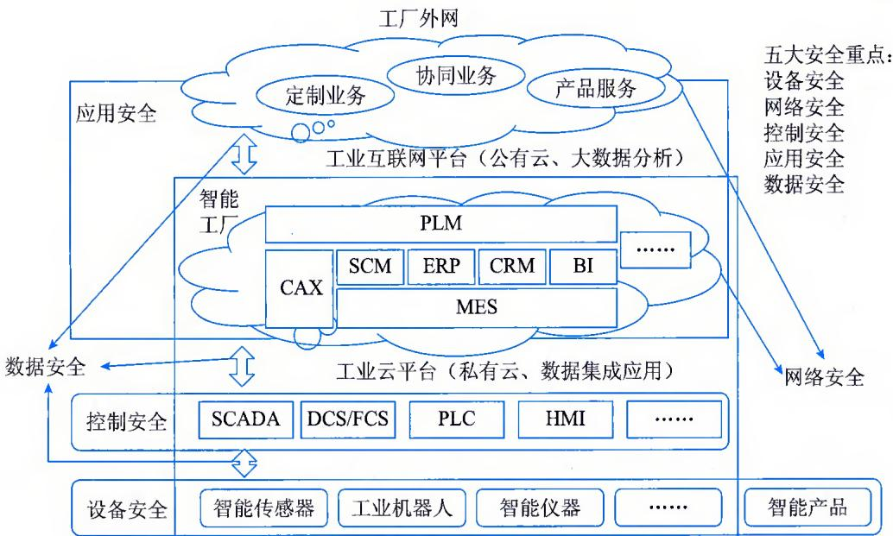  
图3-27 基于混合云的安全生产管理系统架构

在设计基于混合云的安全生产管理系统时，需要重点考虑5个方面的安全问题：设备安全、网络安全、控制安全、应用安全和数据安全。

（1）设备安全。设备安全是指组织（单位）在生产经营活动中，将危险、有害因素控制在安全范围内，以及减少、预防和消除危害所配置的装置（设备）和采用的设备。安全设备对于保护人类活动的安全尤为重要。设备安全的保障技术主要包括维护、保养和检测等。

（2）网络安全。网络安全是指网络系统的硬件、软件及其系统中的数据受到保护，不因偶然的或者恶意的原因而遭受到破坏、更改、泄露，系统连续可靠正常地运行。网络安全的保障技术主要包括防火墙、入侵检测系统部署、漏洞扫描系统和网络杀毒产品部署等。

（3）控制安全。控制安全主要包括三种措施：其一是减少和消除生产过程中的事故，保证人员健康安全和财产免受损失；其二是生产过程中涉及的计划、组织、监控、调节和改进等一系列致力于安全所进行的管理活动，包括安全法规、安全技术和工业卫生等；其三是减少甚至消除事故隐患，尽量把事故消灭在萌芽状态。控制安全的保障技术主要包括冗余、容错、（降级）备份、容灾等。

（4）应用安全。应用安全，顾名思义就是保障应用程序使用过程和结果的安全。简而言之，就是针对应用程序或工具在使用过程中可能出现计算、传输数据的泄露和失窃，通过其他安全工具或策略来消除隐患。应用安全的保障技术主要包括服务器报警策略、用户密码策略、用户安全策略、访问控制策略和时间策略等。

（5）数据安全。数据安全是指通过采取必要措施，确保数据处于有效保护和合法利用的状态，以及具备保障持续安全状态的能力。要保证数据处理的全过程的安全，就得保证数据在收集、存储、使用、加工、传输、提供和公开等的每一个环节内的安全。数据安全的保障技术主要包括对立的两方面：一是数据本身的安全，主要是指采用现代密码算法对数据进行主动保护，如数据保密、数据完整性、双向强身份认证等；二是数据防护的安全，主要是采用现代信息存储手段对数据进行主动防护，如通过磁盘阵列、数据备份、异地容灾等手段保证数据的安全。本系统的数据安全主要分布于各层之间数据交换过程和公有云的数据存储安全。

## 3.8 云原生架构

"云原生"来自于Cloud Native的直译，拆开来看，Cloud就是指其应用软件和服务是在云端而非传统意义上的数据中心。Native代表应用软件从一开始就是基于云环境，专门为云端特性而设计，可充分利用和发挥云环境的弹性与分布式优势，最大化释放云环境生产力。

## 3.8.1 发展概述

对于信息化和数字化水平不高的组织而言，组织内部 IT 建设常采用 "烟筒" 模式，即每项职能（部门）的每个应用都相对独立，如何管理与分配资源成了难题。大多数都基于 IDC 设施独自向上构建，需要单独分配基础设施资源，这就造成资源被大量占用且难以被共享。但是上云之后，由于云服务组织提供了统一的基础设施即服务（Infrastructure as a Service, IaaS）能力和云服务等，大幅提升了组织IaaS层的复用程度，CIO或者IT主管自然而然想到IaaS以上层的系统也需要被统一，使资源、产品可被不断复用，从而能够进一步降低组织运营成本。

对于开发而言，传统的IT架构方式，将开发、IT运营和质量保障等过程分别设置，各自独立，开发与运行或运营之间存在着某种程度的"鸿沟"，开发人员希望基础设施更快响应，运行管理及运营人员则要求系统的可靠性和安全性，而业务需求则是更快地将更多的特性发布给最终用户使用。这种模式被称为"瀑布式流程"开发模式，一方面造成了开发上下游的信息不对称，另一方面拉长了开发周期和调整难度。但是随着用户需求的快速增加和产品迭代周期的不断压缩，原有的开发流程不再适合现实的需求，这时开发建设组织引入了一种新的开发模式——敏捷开发。但是，敏捷开发只是解决了软件开发的效率和版本更新的速度，还没有和运维管理等有效打通。出于协调开发和运维的"信息对称"问题，开发者又推出了一套新的方法——DevOps，DevOps可以看作是开发、技术运营和质量保障三者的交集，促进它们之间的沟通、协作与整合，从而提高开发周期和效率。而云原生的容器、微服务等技术正是为DevOps提供了很好的前提条件，保证IT软件开发实现DevOps开发和持续交付的关键应用。换句话说，能够实现DevOps和持续交付，已经成为云原生技术价值不可分割的内涵部分，这也是无论互联网巨头，还是众多中小应用开发组织和个人，越来越多选择云原生技术和工具的原因。

现在数以亿计的高并发流量都得益于云原生技术的快速弹性扩容来实现。而对于组织而言，选择云原生技术，也就不仅仅是降本增效的考虑，而且还能为组织创造过去难以想象的业务承载量，对于组织业务规模和业务创新来说，云原生技术都正在成为全新的生产力工具。过去组织看重的办公楼、厂房、IT设施等有形资产，其重要性也逐渐被这些云端数字资产所超越，组织正通过云原生构建一个完整的数字孪生的新体系，而这才是云原生技术的真正价值所在。

各类信息系统开发建设面临的问题往往指向一个共同点，那就是新时代需要新的技术架构，来帮助组织应用能够更好地利用云计算和云服务的优势，充分释放云计算的技术红利，让业务更敏捷、成本更低的同时又可伸缩性更灵活，而这些正好就是云原生架构专注解决的技术点。

对于整个云计算产业的发展来说，云原生区别于早先的虚拟机阶段，也完成了一次全新的技术生产力变革，是从云技术的应用特性和交付架构上进行了创新性的组合，能够极大地释放云计算的生产能力。此外，云原生的变革从一开始自然而然地与开源生态走在了一起，也意味着云原生技术从一开始就选择了一条"飞轮进化"式的道路，通过技术的易用性和开放性实现快速增长的正向循环，又通过不断壮大的应用实例来推动组织业务全面上云和自身技术版图的不断完善。云原生所带来的种种好处，对于组织的未来业务发展的优势，已经成为众多组织的新共识。可以预见，更多组织在经历了这一轮云原生的变革之痛后，能够穿越组织的原有成长周期，跨越到数字经济的新赛道，在即将到来的全面数字新时代更好地开发业务。

开源项目的不断更新和逐步成熟，也促使各组织在 AI、大数据、边缘、高性能计算等新兴业务场景不断采用云原生技术来构建创新解决方案。大量组织尝试使用容器替换现有人工智能、大数据的基础平台，通过容器更小粒度的资源划分、更快的扩容速度、更灵活的任务调度，以及天然的计算与存储分离架构等特点，助力人工智能、大数据在业务性能大幅提升的同时，更好地控制成本。各云服务商也相继推出了对应的容器化服务，比如某云服务商的 AI 容器、大数

据容器、深度学习容器等。

云原生技术与边缘计算相结合，可以比较好地解决传统方案中轻量化、异构设备管理、海量应用运维管理的难题，如目前国内最大的边缘计算落地项目——国家路网中心的全国高速公路取消省界收费站项目，就使用了基于云原生技术的边缘计算解决方案，解决了10多万异构设备管理、30多万边缘应用管理的难题。主流的云计算厂商也相继推出了云原生边缘计算解决方案，如某云服务商的云智能边缘平台（IEF）等。

云原生在高性能计算（High Performance Computing，HPC）领域的应用呈现出快速上升的势头。云原生在科研及学术机构、生物、制药等行业率先得到应用，例如中国科学院上海生命科学研究院、中国农业大学、华大基因、未来组、欧洲核子研究中心等组织都已经将传统的高性能计算业务升级为云原生架构。为了更好地支撑高性能计算场景，各云服务商也纷纷推出面向高性能计算专场的云原生解决方案。

云原生与商业场景的深度融合，不仅为各行业注入了发展与创新的新动能，也促使云原生技术更快发展、生态更加成熟，主要表现为以下几点。

（1）从为组织带来的价值来看，云原生架构通过对多元算力的支持，满足不同应用场景的个性化算力需求，并基于软硬协同架构，为应用提供极致性能的云原生算力；基于多云治理和边云协同，打造高效、高可靠的分布式泛在计算平台，并构建包括容器、裸机、虚机、函数等多种形态的统一计算资源；以"应用"为中心打造高效的资源调度和管理平台，为组织提供一键式部署、可感知应用的智能化调度，以及全方位监控与运维能力。

（2）通过最新的 DevSecOps 应用开发模式，实现了应用的敏捷开发，提升业务应用的迭代速度，高效响应用户需求，并保证全流程安全。对于服务的集成提供侵入和非侵入两种模式辅助组织应用架构升级，同时实现新老应用的有机协同，立而不破。

（3）帮助组织管理好数据，快速构建数据运营能力，实现数据的资产化沉淀和价值挖掘，并借助一系列 AI 技术，再次赋能给组织应用，结合数据和 AI 的能力帮助组织实现业务的智能升级。

（4）结合云平台全方位组织级安全服务和安全合规能力，保障组织应用在云上安全构建，业务安全运行。

## 3.8.2 架构定义

从技术的角度，云原生架构是基于云原生技术的一组架构原则和设计模式的集合，旨在将云应用中的非业务代码部分进行最大化的剥离，从而让云设施接管应用中原有的大量非功能特性（如弹性、韧性、安全、可观测性、灰度等），使业务不再有非功能性业务中断困扰的同时，具备轻量、敏捷、高度自动化的特点。由于云原生是面向"云"而设计的应用，因此，技术部分依赖于传统云计算的3层概念，即基础设施即服务（IaaS）、平台即服务（PaaS）和软件即服务（SaaS）。

云原生的代码通常包括三部分：业务代码、三方软件、处理非功能特性的代码。其中"业务代码"指实现业务逻辑的代码；"三方软件"是业务代码中依赖的所有三方库，包括业务库和基础库；"处理非功能特性的代码"指实现高可用、安全、可观测性等非功能性能力的代码。三部分中只有业务代码是核心，是给业务真正带来价值的，另外两个部分都只算附属物。但是，随着软件规模的增大、业务模块规模变大、部署环境增多、分布式复杂性增强等，使得今天的软件构建变得越来越复杂，对开发人员的技能要求也越来越高。云原生架构相比较传统架构进了一大步，从业务代码中剥离大量非功能性特性到IaaS和PaaS中，从而减少业务代码开发人员的技术关注范围，通过云服务商的专业性提升应用的非功能性能力。具备云原生架构的应用可以最大程度利用云服务和提升软件交付能力，进一步加快软件开发。

## 1. 代码结构发生巨大变化

云原生架构产生的最大影响就是让开发人员的编程模型发生了巨大变化。今天大部分的编程语言中，都有文件、网络、线程等元素，这些元素为充分利用单机资源带来好处的同时，也提升了分布式编程的复杂性。因此大量框架、产品涌现，来解决分布式环境中的网络调用问题、高可用问题、CPU争用问题、分布式存储问题等。

在云环境中，"如何获取存储"变成了若干服务，包括对象存储服务、块存储服务和文件存储服务。云不仅改变了开发人员获得这些存储能力的界面，还在于云服务解决了分布式场景中的各种挑战，包括高可用挑战、自动扩缩容挑战、安全挑战、运维升级挑战等，应用的开发人员不用在其代码中处理节点宕机前如何把本地保存的内容同步到远端的问题，也不用处理当业务峰值到来时如何对存储节点进行扩容的问题，而应用的运维人员不用在发现"零日漏洞"（zero-day）安全问题时紧急对三方存储软件进行升级。

云把三方软硬件的能力升级成了服务，开发人员的开发复杂度和运维人员的运维工作量都得到极大降低。显然，如果这样的云服务用得越多，那么开发和运维人员的负担就越少，组织在非核心业务实现上从必须的负担变成了可控支出。在一些开发能力强的组织中，对这些三方软硬件能力的处理往往是交给应用框架（或者说组织内自己的中间件）来做的。在新时代云服务商提供了更全面的服务，使得所有软件组织都可以由此获益。

这些使得业务代码的开发人员技能栈中，不再需要掌握文件及其分布式处理技术，不再需要掌握各种复杂的网络技术，从而让业务开发变得更敏捷、更快速。

## 2. 非功能性特性大量委托

任何应用都提供两类特性：功能性特性和非功能性特性。功能性特性是真正为业务带来价值的代码，比如建立客户资料、处理订单、支付等。即使是一些通用的业务功能特性，比如组织管理、业务字典管理、搜索等也是紧贴业务需求的。非功能性特性没有给业务带来直接业务价值，但通常又是必不可少的特性，比如高可用能力、容灾能力、安全特性、可运维性、易用性、可测试性、灰度发布能力等。

云计算虽然没有解决所有非功能性问题，但确实有大量非功能性，特别是分布式环境下复杂非功能性问题，被云计算解决了。以大家最头疼的高可用为例，云计算在多个层面为应用提供了解决方案等，如虚拟机、容器和云服务等。

（1）虚拟机。当虚拟机检测到底层硬件发生异常时，自动帮助应用做热迁移，迁移后的应用不需重新启动而仍然具备对外服务的能力，应用本身及其使用用户对整个迁移过程都不会有任何感知。

（2）容器。有时应用所在的物理机是正常的，只是应用自身的问题（比如 bug、资源耗尽等）而无法正常对外提供服务。容器通过监控检查探测到进程状态异常，从而实施异常节点的下线、新节点上线和生产流量的切换等操作，整个过程自动完成而无须运维人员干预。

（3）云服务。如果应用把"有状态"部分都交给了云服务（如缓存、数据库、对象存储等），加上全局对象的持有小型化或具备从磁盘快速重建能力，由于云服务本身是具备极强的高可用能力，那么应用本身会变成更薄的"无状态"应用，高可用故障带来的业务中断会降至分钟级；如果应用是 $N:M$ （ $N$ 台客户端中的每一台都可以访问到 $M$ 台服务器）的对等架构模式，那么结合负载均衡产品可获得很强的高可用能力。

## 3. 高度自动化的软件交付

软件一旦开发完成，需要在组织内外部各类环境中部署和交付，以将软件价值交给最终用户。软件交付的困难在于开发环境到生产环境的差异，以及软件交付和运维人员的技能差异，填补这些差异往往需要一大堆安装手册、运维手册和培训文档等。容器以一种标准的方式对软件打包，容器及相关技术则帮助屏蔽不同环境之间的差异，进而基于容器做标准化的软件交付。

对自动化交付而言，还需要一种能够描述不同环境的工具，让软件能够"理解"目标环境、交付内容、配置清单并通过代码去识别目标环境的差异，根据交付内容以"面向终态"的方式完成软件的安装、配置、运行和变更。

基于云原生的自动化软件交付相比较当前的人工软件交付是一个巨大的进步。以微服务为例，应用微服务化以后，往往被部署到成千上万个节点上，如果系统不具备高度的自动化能力，任何一次新业务的上线，都会带来极大的工作量挑战，严重时还会导致业务变更超过上线窗口而不可用。

## 3.8.3 基本原则

云原生架构本身作为一种架构，也有若干架构原则作为应用架构的核心架构控制面，通过遵从这些架构原则可以让技术主管和架构师在做技术选择时不会出现大的偏差。关于云原生架构原则，立足不同的价值视角或技术方向等有所不同，常见的原则主要包括服务化、弹性、可观测、韧性、所有过程自动化、零信任、架构持续演进等原则。

## 1. 服务化原则

当代码规模超出小团队的合作范围时，就有必要进行服务化拆分了，包括拆分为微服务架构、小服务（MiniService）架构等，通过服务化架构把不同生命周期的模块分离出来，分别进行业务迭代，避免迭代频繁模块被慢速模块拖慢，从而加快整体的进度和提升系统稳定性。同时服务化架构以面向接口编程，服务内部的功能高度内聚，模块间通过公共功能模块的提取增加软件的复用程度。

分布式环境下的限流降级、熔断隔仓、灰度、反压、零信任安全等，本质上都是基于服务流量（而非网络流量）的控制策略，所以云原生架构强调使用服务化的目的还在于从架构层面抽象化业务模块之间的关系，标准化服务流量的传输，从而帮助业务模块进行基于服务流量的策略控制和治理，不管这些服务是基于什么语言开发的。

## 2. 弹性原则

大部分系统部署上线需要根据业务量的估算，准备一定规模的各类软硬件资源，从提出采购申请，到供应商洽谈、软硬件资源部署、应用部署、性能压测，往往需要好几个月甚至一年的周期，而这期间如果业务发生了变化，重新调整也非常困难。弹性则是指系统的部署规模可以随着业务量的变化而自动伸缩，无须根据事先的容量规划准备固定的硬件和软件资源。好的弹性能力不仅缩短了从采购到上线的时间，让组织不用关注额外软硬件资源的成本支出（包括闲置成本），降低了组织的IT成本，更关键的是当业务规模面临海量突发性扩张的时候，不再因为既有软硬件资源储备不足而"说不"，保障了组织收益。

## 3. 可观测原则

大部分组织的软件规模都在不断增长，原来单机可以对应用做完所有调试，但在分布式环境下需要对多个主机上的信息做关联，才可能回答清楚服务为什么离线，哪些服务违反了其定义的服务等级目标（Service Level Objective，SLO），目前的故障影响哪些用户，最近这次变更对哪些服务指标带来了影响等问题，这些都要求系统具备更强的可观测能力等。可观测性与监控、业务探活、应用性能检测（Application Performance Monitor，APM）等系统提供的能力不同，可观测性是在云这样的分布式系统中，主动通过日志、链路跟踪和度量等手段，使得一次点击背后的多次服务调用的耗时、返回值和参数都清晰可见，甚至可以下钻到每次三方软件调用、SQL请求、节点拓扑、网络响应等，这样的能力可以使运维、开发和业务人员实时掌握软件运行情况，并结合多个维度的数据指标，获得关联分析能力，不断对业务健康度和用户体验进行数字化衡量和持续优化。

## 4. 韧性原则

当业务上线后，最不能接受的就是业务不可用，让用户无法正常使用软件，影响体验和收入。韧性代表了当软件所依赖的软硬件组件出现各种异常时，软件表现出来的抵御能力，这些异常通常包括硬件故障、硬件资源瓶颈（如 CPU/网卡带宽耗尽）、业务流量超出软件设计能力、影响机房工作的故障和灾难、软件漏洞（bug）、黑客攻击等对业务不可用带来致命影响的因素。

韧性从多个维度诠释了软件持续提供业务服务的能力，核心目标是提升软件的平均无故障时间（Mean Time Between Failure，MTBF）。从架构设计上，韧性包括服务异步化能力、重试/限流/降级/熔断/反压、主从模式、集群模式、AZ（Availability Zones，可用区）内的高可用、单元化、跨region（区域）容灾、异地多活容灾等。

## 5. 所有过程自动化原则

技术往往是把"双刃剑"，容器、微服务、DevOps、大量第三方组件的使用等，在降低分布式复杂性和提升迭代速度的同时，因为整体增大了软件技术栈的复杂度和组件规模，所以不可避免地带来了软件交付的复杂性，如果这里控制不当，应用就无法体会到云原生技术的优势。通过IaC（Infrastructure as Code）、GitOps、OAM（Open Application Model）、Kubernetes Operator和大量自动化交付工具在CI/CD流水线中的实践，一方面标准化组织内部的软件交付过程，另一方面在标准化的基础上进行自动化，通过配置数据自描述和面向终态的交付过程，让自动化工具理解交付目标和环境差异，实现整个软件交付和运维的自动化。

## 6. 零信任原则

零信任安全针对传统边界安全架构思想进行了重新评估和审视，并对安全架构思路给出了新建议。其核心思想是，默认情况下不应该信任网络内部和外部的任何人/设备/系统，需要基于认证和授权重构访问控制的信任基础，如IP地址、主机、地理位置、所处网络等均不能作为可信的凭证。零信任对访问控制进行了范式上的颠覆，引导安全体系架构从"网络中心化"走向"身份中心化"，其本质诉求是以身份为中心进行访问控制。

零信任第一个核心问题就是身份（Identity），赋予不同的实体不同的身份，解决是谁在什么环境下访问某个具体的资源的问题。在研发、测试和运维等微服务场景下，身份及其相关策略不仅是安全的基础，更是众多（包括资源、服务、环境等）隔离机制的基础；在用户访问组织内部应用的场景下，身份及其相关策略提供了即时的接入服务。

## 7. 架构持续演进原则

信息技术及其业务应用的演进速度非常快，很少有一开始就清晰定义了架构并在整个软件生命周期里面都适用，相反往往还需要对架构进行一定范围内的重构，因此云原生架构本身也必须是一个具备持续演进能力的架构，而不是一个封闭式架构。除了增量迭代、目标选取等因素外，还需要考虑组织（例如架构控制委员会）层面的架构治理和风险控制，特别是在业务高速迭代情况下的架构、业务、实现平衡关系。云原生架构对于新建应用而言的架构控制策略相对容易选择（通常是选择弹性、敏捷、成本的维度），但对于存量应用向云原生架构迁移，则需要从架构上考虑遗留应用的迁出成本/风险和到云上的迁入成本/风险，以及技术上通过微服务/应用网关、应用集成、适配器、服务网格、数据迁移、在线灰度等应用和流量进行细颗粒度控制。

## 3.8.4 常用架构模式

云原生架构有非常多的架构模式，不同的组织环境、业务场景和价值定位等，通常采用不同的架构模式，常用的架构模式主要有服务化架构、Mesh化架构、Serverless、存储计算分离、分布式事务、可观测、事件驱动等。

## 1. 服务化架构模式

服务化架构是新时代构建云原生应用的标准架构模式，要求以应用模块为颗粒度划分一个软件，以接口契约（例如 IDL）定义彼此业务关系，以标准协议（HTTP、gRPC 等）确保彼此的互联互通，结合领域模型驱动（Domain Driven Design, DDD）、测试驱动开发（Test Driven

Development，TDD）、容器化部署提升每个接口的代码质量和迭代速度。服务化架构的典型模式是微服务和小服务模式，其中小服务可以看作是一组关系非常密切的服务的组合，这组服务会共享数据，小服务模式通常适用于非常大型的软件系统，避免接口的颗粒度太细而导致过多的调用损耗（特别是服务间调用和数据一致性处理）和治理复杂度。

通过服务化架构，把代码模块关系和部署关系进行分离，每个接口可以部署不同数量的实例，单独扩缩容，从而使得整体的部署更经济。此外，由于在进程级实现了模块的分离，每个接口都可以单独升级，从而提升了整体的迭代效率。但也需要注意，服务拆分导致要维护的模块数量增多，如果缺乏服务的自动化能力和治理能力，会让模块管理和组织技能不匹配，反而导致开发和运维效率的降低。

## 2. Mesh 化架构模式

Mesh（网格）化架构是把中间件框架（如 RPC、缓存、异步消息等）从业务进程中分离，让中间件的软件开发工具包（Software Development Kit，SDK）与业务代码进一步解耦，从而使得中间件升级对业务进程没有影响，甚至迁移到另外一个平台的中间件也对业务透明。分离后在业务进程中只保留很"薄"的 Client 部分，Client 通常很少变化，只负责与 Mesh 进程通信，原来需要在 SDK 中处理的流量控制、安全等逻辑由 Mesh 进程完成。整个架构如图 3-28 所示。

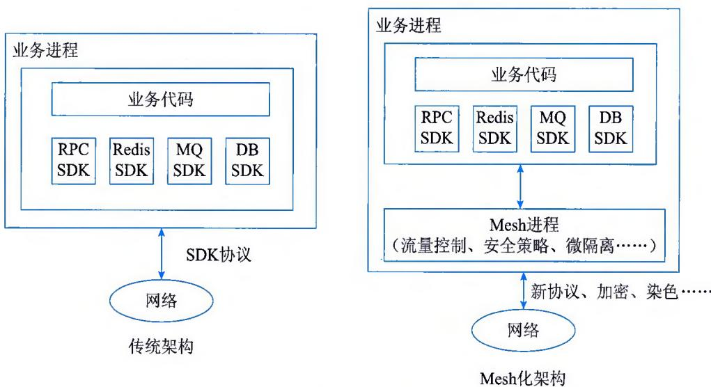  
图3-28 Mesh化架构

实施Mesh化架构后，大量分布式架构模式（如熔断、限流、降级、重试、反压、隔仓等）都由Mesh进程完成，即使在业务代码的制品中并没有使用这些三方软件包；同时获得更好的安全性（比如零信任架构能力等），按流量进行动态环境隔离，基于流量做冒烟/回归测试等。

## 3. Serverless 模式

Serverless（无服务器）将"部署"这个动作从运维中"收走"，使开发者不用关心应用运行地点、操作系统、网络配置、CPU性能等。从架构抽象上看，当业务流量到来/业务事件发生时，云会启动或调度一个已启动的业务进程进行处理，处理完成后云自动会关闭/调度业务进程，等待下一次触发，也就是把应用的整个运行都委托给云。

Serverless 并非适用任何类型的应用，因此架构决策者需要关心应用类型是否适合于 Serverless 运算。如果应用是有状态的，由于 Serverless 的调度不会帮助应用做状态同步，因此云在进行调度时可能导致上下文丢失；如果应用是长时间后台运行的密集型计算任务，会无法发挥 Serverless 的优势；如果应用涉及频繁的外部 I/O（包括网络或者存储，以及服务间调用等），也因为繁重的 I/O 负担、时延大而不适合。Serverless 非常适合于事件驱动的数据计算任务、计算时间短的请求 / 响应应用、没有复杂相互调用的长周期任务。

## 4. 存储计算分离模式

分布式环境中的 CAP（一致性：Consistency；可用性：Availability；分区容错性：Partition tolerance）困难主要是针对有状态应用，因为无状态应用不存在 C（一致性）这个维度，因此可以获得很好的 A（可用性）和 P（分区容错性），因而获得更好的弹性。在云环境中，推荐把各类暂态数据（如 session）、结构化和非结构化持久数据都采用云服务来保存，从而实现存储计算分离。但仍然有一些状态如果保存到远端缓存，会造成交易性能的明显下降，比如交易会话数据太大、需要不断根据上下文重新获取等，这时可以考虑通过采用时间日志+快照（或检查点）的方式，实现重启后快速增量恢复服务，减少不可用对业务的影响时长。

## 5. 分布式事务模式

微服务模式提倡每个服务使用私有的数据源，而不是像单体这样共享数据源，但往往大颗粒度的业务需要访问多个微服务，必然带来分布式事务问题，否则数据就会出现不一致。架构师需要根据不同的场景选择合适的分布式事务模式。

（1）传统采用XA（eXtendedArchitecture）模式，虽然具备很强的一致性，但是性能差。

（2）基于消息的最终一致性通常有很高的性能，但是通用性有限。

（3）TCC（Try-Confirm-Cancel）模式完全由应用层来控制事务，事务隔离性可控，也可以做到比较高效；但是对业务的侵入性非常强，设计开发维护等成本很高。

（4）SAGA模式（指允许建立一致的分布式应用程序的故障管理模式）与TCC模式的优缺点类似，但没有Try这个阶段，而是每个正向事务都对应一个补偿事务，也使开发维护成本高。

（5）开源项目SEATA的AT模式非常高性能，无代码开发工作量，且可以自动执行回滚操作，同时也存在一些使用场景限制。

## 6. 可观测架构

可观测架构包括 Logging、Tracing、Metrics 三个方面。Logging 提供多个级别（verbose/debug/warning/error/fatal）的详细信息跟踪，由应用开发者主动提供；Tracing 提供一个请求从前端到后端的完整调用链路跟踪，对于分布式场景尤其有用；Metrics 则提供对系统量化的多维度度量。

架构决策者需要选择合适的、支持可观测的开源框架（比如Open Tracing、Open Telemetry等），并规范上下文的可观测数据规范（例如方法名、用户信息、地理位置、请求参数等），规划这些可观测数据在哪些服务和技术组件中传播，利用日志和 Tracing 信息中的 spanid/traceid，确保进行分布式链路分析时有足够的信息进行快速关联分析。

由于建立可观测性的主要目标是对服务 SLO（Service Level Objective）进行度量，从而优化 SLA（Service Level Agreement，服务级别协议），因此架构设计上需要为各个组件定义清晰的 SLO，包括并发度、耗时、可用时长、容量等。

## 7. 事件驱动架构

事件驱动架构（Event Driven Architecture，EDA）本质上是一种应用/组件间的集成架构模式。事件和传统的消息不同，事件具有 Schema，所以可以校验 Event 的有效性，同时 EDA 具备 QoS 保障机制，也能够对事件处理失败进行响应。事件驱动架构不仅用于（微）服务解耦，还可应用于下面的场景中。

（1）增强服务韧性。由于服务间是异步集成的，也就是下游的任何处理失败甚至宕机都不会被上游感知，自然也就不会对上游带来影响。

（2）命令查询的责任分离（Command Query Responsibility Segregation，CQRS）。把对服务状态有影响的命令用事件来发起，而对服务状态没有影响的查询才使用同步调用的API接口；结合EDA中的Event Sourcing机制可以用于维护数据变更的一致性，当需要重新构建服务状态时，把EDA中的事件重新"播放"一遍即可。

（3）数据变化通知。在服务架构下，往往一个服务中的数据发生变化，另外的服务会感兴趣，比如用户订单完成后，积分服务、信用服务等都需要得到事件通知并更新用户积分和信用等级。

（4）构建开放式接口。在EDA下，事件的提供者并不用关心有哪些订阅者，不像服务调用——数据的产生者需要知道数据的消费者在哪里并调用它，因此保持了接口的开放性。

（5）事件流处理。应用于大量事件流（而非离散事件）的数据分析场景，典型应用是基于Kafka的日志处理。

（6）基于事件触发的响应。在 IoT 时代大量传感器产生的数据，不会像人机交互一样需要等待处理结果的返回，天然适合用 EDA 来构建数据处理应用。

## 3.8.5 云原生案例

某快递组织作为发展最为迅猛的物流组织之一，一直积极探索技术创新赋能商业增长之路，以期达到降本提效的目的。目前，该组织日订单处理量已达千万量级，亿级别物流轨迹处理量，每天产生的数据已达到TB级别，使用 $1300+$ 个计算结点来实时处理业务。过往该组织的核心业务应用的运行在IDC机房，原有IDC系统帮助该组织安稳度过早期业务快速发展期。但伴随着业务体量的指数级增长，业务形式愈发多元化。原有系统暴露出不少问题，传统IOE架构、各系统架构的不规范、稳定性、研发效率都限制了业务高速发展的可能。软件交付周期过长，大促保障对资源的特殊要求难实现、系统稳定性难以保障等业务问题逐渐暴露。在与某云服务商进行多次需求沟通与技术验证后，该组织最终确定云原生技术和架构实现核心业务搬迁上云。

## 1. 解决方案

该组织核心业务系统原架构基于 VMware+Oracle 数据库进行搭建。随着搬迁上云，架构全面转型为基于 Kubernetes 的云原生架构体系。其中，引入云原生数据库并完成应用基于容器的微服务改造是整个应用服务架构重构的关键点。

（1）引入云原生数据库。通过引入 OLTP 跟 OLAP 型数据库，将在线数据与离线分析逻辑拆分到两种数据库中，改变此前完全依赖 Oracle 数据库的现状。满足在处理历史数据查询场景下 Oracle 数据库所支持实际业务需求的不足。

（2）应用容器化。伴随着容器化技术的引进，通过应用容器化有效解决了环境不一致的问题，确保应用在开发、测试、生产环境的一致性。与虚拟机相比，容器化提供了效率与速度的双重提升，让应用更适合微服务场景，有效提升产研效率。

（3）微服务改造。由于过往很多业务是基于 Oracle 的存储过程及触发器完成的，系统间的服务依赖也需要 Oracle 数据库 OGG（Oracle Golden Gate）同步完成。这样带来的问题就是系统维护难度高且稳定性差。通过引入 Kubernetes 的服务发现，组建微服务解决方案，将业务按业务域进行拆分，让整个系统更易于维护。

## 2. 架构确立

综合考虑实际业务需求与技术特征，该组织确定的上云架构如图 3-29 所示。

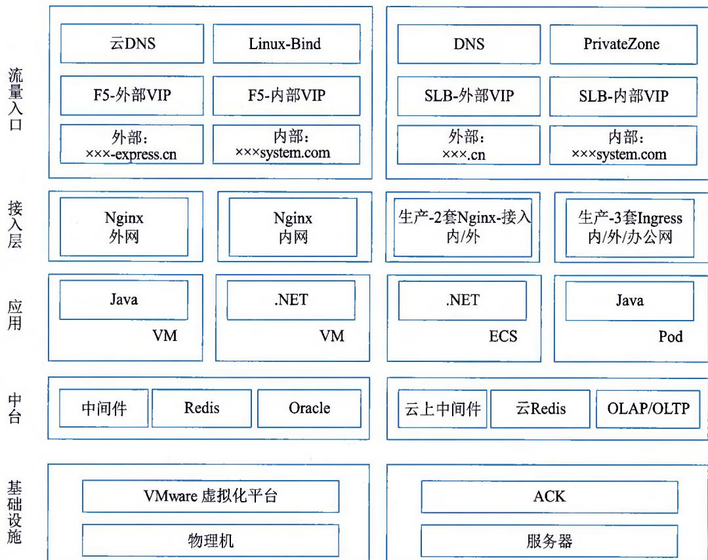  
图3-29 某快递组织核心业务上云架构示意图

## 1）基础设施

全部计算资源取自某云服务商上的裸金属服务器。相较于一般云服务器（ECS），Kubernetes 搭配服务器能够获得更优性能及更合理的资源利用率。且云上资源按需取量，对于拥有大型促销活动等短期大流量业务场景的某快递组织而言极为重要。相较于线下自建机房、常备机器云上资源随取随用。在大型促销活动结束后，云上资源使用完毕后即可释放，管理与采购成本更低。

## 2）流量接入

云服务商提供两套流量接入，一套是面向公网请求，另外一套是服务内部调用。域名解析采用云DNS及PrivateZone。借助Kubernetes的Ingress能力实现统一的域名转发，以节省公网SLB的数量，提高运维管理效率。

## 3）平台层

基于 Kubernetes 打造的云原生 PaaS 平台优势明显突出，主要包括：

\- 打通DevOps闭环，统一测试、集成、预发、生产环境；

\- 天生资源隔离，机器资源利用率高；

\- 流量接入可实现精细化管理；

\- 集成了日志、链路诊断、Metrics平台；

\- 统一APIServer接口和扩展，支持多云及混合云部署。

## 4）应用服务层

每个应用都在 Kubernetes 上面创建一个单独的 Namespace，应用和应用之间实现资源隔离。通过定义各个应用的配置 YAML 模板，当应用在部署时直接编辑其中的镜像版本即可快速完成版本升级，当需要回滚时直接在本地启动历史版本的镜像快速回滚。

## 5）运维管理

线上 Kubernetes 集群采用云服务商托管版容器服务，免去了运维 Master 结点的工作，只需要制定 Worker 结点上线及下线流程即可。同时业务系统均通过阿里云的 PaaS 平台完成业务日志搜索，按照业务需求投交扩容任务，系统自动完成扩容操作，降低了直接操作 Kubernetes 集群带来的业务风险。

## 3. 应用效益

该组织通过云原生架构的使用，其应用效益主要体现在成本、稳定性、效率、赋能业务等方面。

（1）成本方面。使用公有云作为计算平台，可以让组织不必因为业务突发性的增长需求，而一次性投入大量资金成本用于采购服务器及扩充机柜。在公共云上可以做到随用随付，对于一些创新业务想做技术调研十分便捷。用完即释放，按量付费。另外，云产品都免运维自行托管在云端，有效节省人工运维成本，让组织更专注于核心业务。

（2）稳定性方面。云上产品提供至少5个9（ $99.999\%$ ）以上的SLA服务确保系统稳定，通常比自建系统稳定性高很多。在数据安全方面，云上数据可以轻松实现异地备份，云服务商数据存储体系下的归档存储产品具备高可靠、低成本、安全性、存储无限等特点，让组织数据更安全。

（3）效率方面。借助于云产品的深度集成，研发人员可以完成一站式研发与运维工作。从业务需求立项及开发到回归验证，再到发布测试及布署上线，整个集成活动耗时可缩短至分钟级。排查问题方面，研发人员直接选择所负责的应用，并通过集成的SLS日志控制台快速检索程序的异常日志，进行问题定位，免去了登录机器查日志的麻烦。

（4）赋能业务方面。云服务商提供超过300种的云上组件，组件涵盖计算、AI、大数据、IoT等诸多领域。研发人员开箱即用，有效节省业务创新带来的技术成本。

## 3.9 本章练习

## 1. 选择题

(1)\_\_\_\_处于信息系统体系架构总体框架中的第三层。

A. 战略系统 B. 业务系统 C. 应用系统 D. 信息基础设施

参考答案：D

(2) 安全架构的三道防线不包括\_\_\_\_。

A. 系统安全架构

B. 安全技术体系架构

C. 审计架构

D. 物理架构

参考答案: D

(3) 云原生的代码通常包括\_\_\_\_。

A. 业务代码、服务软件和处理非功能特性的代码

B. 业务代码、服务软件和处理功能性特性的代码

C. 业务代码、三方软件和处理非功能特性的代码

D. 业务代码、三方软件和处理功能性特性的代码

参考答案：C

(4) 广域网在网络规模较小时, 广域网可仅由\_\_\_\_组成。 A. 骨干网和分布网 B. 骨干网和接入网 C. 分布网和接入网 D. 分布网和数据网

参考答案: B

（5）软件定义网络（SDN）的整体架构由下到上分为\_\_\_\_。

A. 应用平面、数据平面、控制平面

B. 控制平面、应用平面、数据平面

C. 应用平面、控制平面、数据平面

D. 数据平面、控制平面、应用平面

参考答案: D

## 2. 思考题

（1）请简述信息系统体系架构总体参考框架四个构成部分的作用。

（2）请简述数据架构的设计原则。

（3）请简述云原生架构常见原则。

## 参考答案：略
