>[!info] 现行教材 · 第 2 版
>本页为**现行考试依据**的教材原文（第 2 版，2024 年 10 月出版，2025 年起启用）。
>考纲层级见 [[知识体系]]；练习题见 [[练习题·基础知识]]；案例模板见 [[案例答题模板]]。

# 第4章 信息系统治理

## 4.1 IT治理基础

IT 治理是描述组织采用有效的机制，对信息技术和数据资源开发利用，平衡信息化发展和数字化转型过程中的风险，确保实现组织的战略目标的过程。

## 1. IT 治理的驱动因素

组织信息系统建设和运行需要制定总体规划，但制定 IT 资源统一规划存在很多问题：①信息系统应用已有相当的基础，但多年来分散开发或引进的信息系统形成了许多"信息孤岛"，缺乏共享的、网络化的信息资源，系统集成难题一直无法解决；②信息资源整合目标空泛，没有整合"信息孤岛"的措施，数据中心建设和数据集中管理等规划缺乏可操作性，尤其是缺少数据标准化建设方面的规划。这些问题的出现，表明组织在 IT 资源方面没有做到有效统一规划，如何解决这些问题成为组织发展的一个重要课题。

IT 资产作为组织资产的重要组成部分，IT 治理自然就是组织治理结构中不可分割的一部分。IT 治理是指组织在开发利用信息技术的过程中，为鼓励组织所期望的组织行为而明确决策权归属和责任担当的框架，其目标是通过 IT 治理的决策权和责任影响组织所期望的行为。随着时代的发展，数字特征成为组织发展的一项关键特征，组织的高质量发展对 IT 的依赖性越来越强，IT 治理对组织愈发重要，为确保 IT 治理有效，组织高层管理者需要投入越来越多的时间和精力。

随着组织在 IT 方面的投资越来越大，组织的 IT 战略要与组织战略相一致，才能确保组织核心竞争力的建设与保持。要尽可能地保持开放性和长远性，以确保系统的稳定性和延续性。要认真分析组织的战略与 IT 支撑之间的影响度，并合理预测环境变化可能给组织战略带来的偏移，在规划时留有适当的余地。组织目标变化太快，很难保证 IT 与组织目标始终保持一致，因此需要多方面的协调，保证 IT 治理继续沿着正确的方向走，这也是 IT 投资者真正关心的问题。IT 治理要从组织目标和数字战略中抽取信息需求和功能需求，形成总体的 IT 治理框架和系统整体模型，为进一步进行系统设计和实施奠定基础，保证信息技术开发应用符合持续变化的业务目标。

高质量的IT治理能够使组织的IT管理和应用决策与组织期望的行为和业务目标相一致，这就需要组织IT治理对组织IT发展进行科学规划并确保其有效实施。驱动组织开展高质量IT治理的因素包括：①良好的IT治理能够确保组织IT投资的有效性；②IT属于知识高度密集型领域，其价值发挥的弹性较大；③IT已经融入组织管理、运行、生产和交付等领域，成为各领域高质量发展的重要基础；④信息技术的发展演进以及新兴信息技术的引入，可为组织提供大量新的发展空间和业务机会等；⑤ IT 治理能够推动组织充分理解 IT 价值，从而促进 IT 价值挖掘和融合利用；⑥ IT 价值不仅仅取决于好的技术，也需要良好的价值管理，及场景化的业务融合应用；⑦ 高级管理层的管理幅度有限，无法深入 IT 每项管理中，需要采用明确责权和清晰管理的方式确保 IT 价值；⑧ 成熟度较高的组织以不同的方式治理 IT，获得了领域或行业领先的业务发展效果。

IT治理的内涵主要体现在5个方面：①IT治理作为组织上层管理的有机组成部分，由组织治理层或高级管理层负责，从组织全局的高度对组织信息化与数字化转型做出制度安排，体现了治理层和高级管理层对信息相关活动的关注；②IT治理强调数字目标与组织战略目标保持一致，通过对IT的综合开发利用，为组织战略规划提供技术或控制方面的支持，以保证相关建设能够真正落实并贯彻组织业务战略和目标；③IT治理保护利益相关者的权益，对风险进行有效管理，合理利用IT资源，平衡成本和收益，确保信息系统应用有效、及时地满足需求，并获得期望的收益，增强组织的核心竞争力；④IT治理是一种制度和机制，主要涉及管理和制衡信息系统与业务战略匹配、信息系统建设投资、信息系统安全和信息系统绩效评价等方面的内容；⑤IT治理的组成部分包括管理层、组织结构、制度、流程、人员、技术等多个方面，共同构建完善的IT治理架构，以实现数字战略和支持组织的目标。

## 2. IT 治理的目标价值

组织治理驱动和调整 IT 治理。同时，IT 治理能够提供关键的输入，成为战略计划的重要组成部分，它是组织治理的一个重要功能。IT 治理将帮助组织建立以组织战略为导向、以实现 IT 与业务匹配为重心、以价值交付为成果、以绩效管理为控制手段的 IT 管理体制，正确定位 IT 团队在整个组织中的作用，最终能够针对不同的业务发展要求，统一规划 IT 资源、整合信息资源、有效规避风险、制定并执行组织发展战略。IT 治理就是要明确有关 IT 决策权的归属机制和有关 IT 责任的承担机制，以鼓励 IT 应用的期望行为产生，以联接战略目标、业务目标和 IT 目标，从而使组织从 IT 中获得最大的价值。组织实施 IT 治理的使命通常包括：保持 IT 与业务目标一致，推动业务发展，促使收益最大化，合理利用 IT 资源，恰当理清与 IT 相关的风险等。IT 治理的主要目标包括：与业务目标保持一致、有效利用信息与数据资源、风险管理。

（1）与业务目标保持一致。IT治理要从组织目标和数字战略中抽取信息与数据需求和功能需求，形成总体的IT治理框架和系统整体模型，为进一步进行系统设计和实施奠定基础，保证信息技术开发应用符合持续变化的业务目标。

（2）有效利用信息与数据资源。目前，信息系统工程超期、IT客户的需求没有得到满足、IT平台不支持业务应用、数据开发利用效能与价值不高、信息技术与业务发展融合深度不够等问题突出，通过IT治理对信息与数据资源的管理职责进行有效管理，保证投资的回收，并支持决策。

（3）风险管理。由于组织越来越依赖于信息网络、信息系统和数据资源等，新的风险不断涌现，例如，新出现的技术没有进行管理，不符合现有法律和规章制度，没有识别对IT服务的威胁等。IT治理重视风险管理，通过制定信息与数据资源的保护级别，强调对关键的信息与数据资源实施有效监控和事件处理。

## 3. IT治理的管理层次

IT 治理要保证总体战略目标能够自上而下贯彻执行，治理层主要集中在最高管理层（如董事会）和执行管理层。然而，由于 IT 治理的复杂性和专业性，治理层必须依赖组织的基层来提供决策和评估所需要的信息。基层依据组织总体目标采用相关的原则，提供评估业绩的衡量方法。因此，好的 IT 治理实践需要在组织全部范围内推行。其管理层次大致可分为三层：最高管理层、执行管理层、业务与服务执行层。

最高管理层的主要职责包括：证实 IT 战略与业务战略一致；证实通过明确的期望和衡量手段交付 IT 价值；指导 IT 战略、平衡支持组织当前和未来发展的投资；指导信息和数据资源的分配。执行管理层的主要职责包括：制定 IT 的目标；分析新技术的机遇和风险；建设关键过程与核心竞争力；分配责任、定义规程、衡量业绩；管理风险和获得可靠保证等。业务与服务执行层的主要职责包括：信息和数据服务的提供和支持；IT 基础设施的建设和维护；IT 需求的提出和响应。

## 4.2 IT治理体系

IT 治理用于描述组织在信息化建设和数字化转型的过程中是否采用有效的机制使得信息技术开发利用能够完成组织赋予它的使命。IT 治理的核心关注 IT 定位和信息化建设与数字化转型的责权划分。IT 治理体系的构成如图 4-1 所示，具体包括 IT 定位（IT 应用的期望行为与业务目标一致）、IT 组织架构（业务和 IT 在治理委员会中的构成、组织 IT 与各分支机构的 IT 权责边界等）、IT 治理内容（决策、投资、风险、绩效和管理等）、IT 治理流程（统筹、评估、指导、监督）、IT 治理效果（内外评价）等。

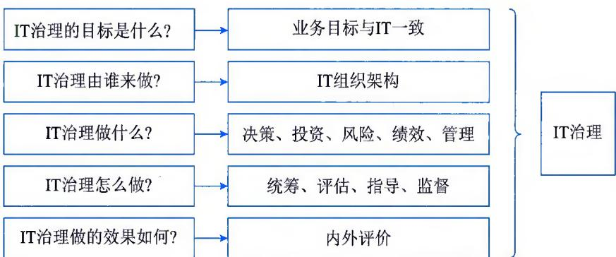  
图4-1 IT治理体系的构成

## 1. IT治理关键决策

有效的 IT 治理必须关注 5 项关键决策，如图 4-2 所示，包括 IT 原则、IT 架构、IT 基础设施、业务应用需求、IT 投资和优先顺序。IT 原则驱动着 IT 整体架构的形成，而 IT 整体架构又决定了基础设施，这种基础设施所确定的能力又决定着基于业务需求的应用的构建，最后，IT 投资和优先顺序必须为 IT 原则、整体架构、基础设施和应用需求所驱动。然而，这些决策中又有独特问题，即 IT 治理需要确定每个决策由谁来负责输入，以及由谁来负责做出决策。

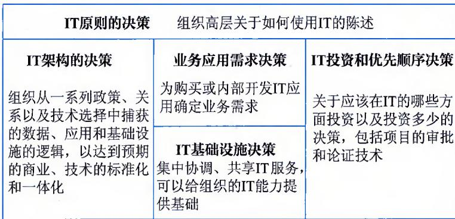  
图4-2 关键的IT治理决策

IT 决策过程中，需要关注各类关键问题，如表 4-1 所示。

表 4-1 IT 决策的关键问题

<table><tr><td>关键决策</td><td>关键问题</td></tr><tr><td>IT原则</td><td>组织的运行模型是什么?IT在业务中的角色是什么?IT期望行为是什么?如何投资IT</td></tr><tr><td>IT架构</td><td>组织的核心业务流程是什么?它们之间有什么样的关系?哪些信息在驱动着这些核心流程?数据必须如何整合?哪些技术性能应当在组织范围内得到标准化,以支持IT效率,方便流程标准化和整合?哪些行为应当在组织范围内标准化以支持数据整合?哪些技术选择能够指引组织找到实施IT新计划的方法</td></tr><tr><td>IT基础设施</td><td>哪些基础设施对实现组织的战略目标来说是最关键的?对于每个能力集,哪些基础设施服务应该在组织级实现,这些服务的水平需求是什么?应当如何定价基础设施服务?如何保持基础技术的不断更新?哪些基础设施服务应当外包</td></tr><tr><td>业务应用需求</td><td>新业务应用的市场和业务流程机会是什么?如何设计实验以评估业务应用成功与否?如何在架构标准上满足业务需求?应当在什么时候将一个业务需求从例外转换为标准?谁拥有每个项目的成果并且发起组织变革以确保其价值</td></tr><tr><td>IT投资和优先顺序</td><td>哪些流程变革或者强化对组织来说在战略上是最为重要的?当前的以及在提议中的IT投资组合是如何分配的?这些投资组合同组织的战略目标一致吗?组织级的投资与业务单位的投资哪个更重要,实际投资情况会影响它们的相对重要性吗</td></tr></table>

## 2. IT治理体系框架

IT治理体系框架是实现组织IT治理的有效保障，缺乏良好的IT治理体系框架，IT治理的过程将会变得盲目和无序。IT治理体系框架以组织的战略目标为导向，架起了组织战略与IT的桥梁，实现了IT风险的全面管理以及IT资源的合理利用。IT治理体系框架具体包括IT战略目标、IT治理组织、IT治理机制、IT治理域、IT治理标准和IT绩效目标等部分，形成了一整套IT治理运行闭环，如图4-3所示。

（1）IT战略目标。为实现IT价值和目标，使组织从IT投入中获得最大收益，而针对IT与

业务关系、IT决策、IT资源利用、IT风险控制等方面制定的目标。

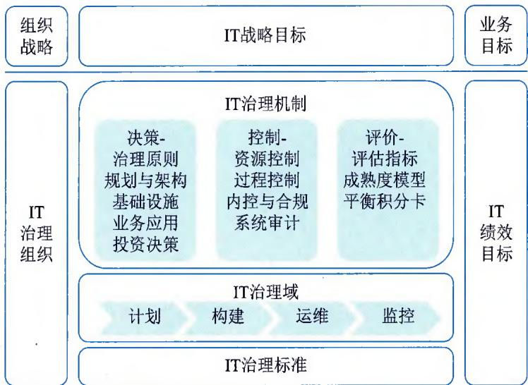  
图4-3 IT治理体系框架

（2）IT治理组织。界定组织中各相关主体在各自方面的治理范围、责权划分及其相互关系的准则，它的核心是治理组织（如IT治理委员会等）的设置和权限的划分，各治理组织职权的分配以及各机构间的相互协调，它的强弱直接影响治理的效率和效能，对IT治理效率起着决定性的作用。

（3）IT治理机制。IT治理机制是IT治理决策机制、执行机制、风险控制机制、协调机制的综合体，各机制之间是相辅相成、相互促进的关系。有效的决策机制能保障IT决策与组织的业绩目标和战略目标相匹配；有效的执行机制能保证IT治理的良好运作；有效的风险控制机制能降低IT活动的风险，实现信息技术开发利用的价值效益；有效的协调机制能有力地发挥IT治理的协调效应。

（4）IT 治理域。IT 治理域是在 IT 治理的规则之下，对组织 IT 资源进行整合与配置，根据 IT 目标所采取的行动，以科学、规范的做法交付面向业务的高质量 IT 服务，确保信息化"高效做事情"、数字化"敏捷做决策"。其内容包括 IT 信息系统的计划、构建、运维与监控等。

（5）IT治理标准。IT治理标准包括IT治理基本规范、IT治理实施参照、IT治理评价体系和IT治理审计方法等方面，它是组织实施IT治理的最佳实践和对标依据。

（6）IT绩效目标。IT绩效目标关注IT价值的实现，评价IT规划与IT构建过程中是否满足业务需求以及构建过程中工期、成本、质量是否达到目标。

## 3. IT 治理核心内容

IT 治理本质上关心：①实现 IT 的业务价值；②IT 风险的规避。前者是通过 IT 与业务战略匹配来实现的，后者通过在组织内部建立相关职责来实现。两者都需要相关资源的支持，并对其绩效进行有效度量。IT 治理的核心内容包括 6 个方面，即组织职责、战略匹配、资源管理、价值交付、风险管理和绩效管理，如图 4-4 所示。

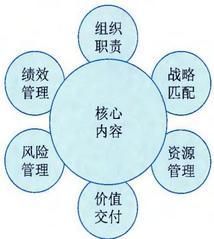  
图4-4 IT治理核心内容

（1）组织职责。组织职责指组织参与 IT 决策与管理的所有人员的集合，明确组织信息部门和业务部门之间的关系和责任，正确划分信息系统的所有者、建设者、管理者和监控者。

（2）战略匹配。IT治理的一个重要内容是使组织的IT建设与组织战略相匹配，也就是通常所说的"战略匹配"。而战略匹配是IT为组织贡献业务价值的重要驱动力。

（3）资源管理。资源管理的主要功能是确保用户对组织的应用系统和基础设施都有良好的理解和应用，优化 IT 投资、IT 资源（人、应用系统、信息、基础设施）的分配，做好人员的培训、发展计划，以满足组织的业务需求。

（4）价值交付。通过对IT项目全生命周期的管理，确保IT能够按照组织战略实现预期的业务价值。重点是对整个交付周期成本的控制和IT业务价值的实现，使IT项目能够在预算时间、成本范围内，按预定的质量要求完成。价值交互就是创造业务价值。

（5）风险管理。风险管理是IT治理中非常重要的内容。风险管理是确保IT资产的安全和灾难的恢复、组织信息资源的安全，以及人员的隐私安全。风险管理就是保护业务价值。

（6）绩效管理。没有绩效管理，IT治理中任何一个域都不可能有效地进行管理。绩效管理主要是追踪和监视IT战略、IT项目的实施、信息资源的使用、IT服务的提供，以及业务流程的绩效。绩效管理所采用的工具（如平衡计分卡）可以将组织的战略目标转化成各个职能部门或团队具体的业务活动的目标，从而保证组织战略目标的实现。

## 4. IT治理机制相关经验

建立 IT 治理机制的原则包括：①简单，机制应该明确地定义特定个人和团体所承担的责任和目标；②透明，有效的机制依赖于正式的程序，对于那些被治理决策所影响或是想要挑战治理决策的人来说，机制如何工作是需要非常清晰的；③适合，机制鼓励那些处于最佳位置的个人去制定特定的决策。

影响力高且具有挑战性的IT治理机制如表4-2所示。

IT治理可以从众多最佳实践中学习的经验主要包括：

（1）IT指导委员会要吸纳有才干的业务经理，使之负责组织范围的IT治理决策，并在IT原则中加入严格的成本控制。

表 4-2 影响力高且具有挑战性的 IT 治理机制

<table><tr><td>机制</td><td>目标</td><td>期望行为</td><td>不期望行为</td></tr><tr><td>执行层和高级管理委员会</td><td>对业务(包括IT)的整体观念</td><td>整合IT的无缝管理</td><td>IT被忽略</td></tr><tr><td>架构委员会</td><td>明确战略技术和标准是否被执行</td><td>业务驱动的IT决策制定</td><td>IT限制和延迟</td></tr><tr><td>有IT人员参与的流程团队</td><td>有效地运用IT视角</td><td>端对端的流程管理</td><td>功能性技能的停滞和分散的IT基础设施</td></tr><tr><td>资金投资批准和预算</td><td>把IT看作另一种业务投资</td><td>对于不同投资类型的不同方法</td><td>分析瘫痪小项目,避开了正式批准</td></tr><tr><td>服务级别协议</td><td>对于IT服务的详细说明和衡量</td><td>专业的供应和需求</td><td>管理服务级别协议而不是业务需求</td></tr><tr><td>费用分摊机制</td><td>从业务中补偿IT成本</td><td>IT的可靠应用</td><td>关于收费和歪曲的需求的争论</td></tr><tr><td>IT业务价值的正式追踪</td><td>衡量IT投资,并通常运用平衡计分卡计算其对业务价值的贡献</td><td>使目标、利益和成本透明化</td><td>将IT同其他资产相分离,只关注资金流,而不关注价值</td></tr></table>

（2）谨慎管理组织的IT架构和业务架构，以降低业务成本。  
（3）设计严格的架构例外处理流程，使昂贵的例外最小化，并可以从中不断学习。  
（4）建立集中化的IT团队，用以管理基础设施、架构和共享服务。  
（5）应用连接 IT 投资和业务需求的流程，既可以增加透明度，又可以权衡中心和各运营部门或团队的需求。

（6）设计需要对IT投资进行集中协作和核准的IT投资流程。

（7）设计简单的费用分摊和服务级别协议机制，以明确分配IT开支。

## 4.3 IT治理任务

组织的 IT 治理活动定义为统筹、评估、指导和监督。统筹现在和未来的 IT 战略和组织规划、管理和绩效的实施计划、策略；评估信息技术应用与服务创新解决方案及措施等的有效性；指导 IT 管理实施、绩效考评、风险控制和业务创新；监督 IT 与业务的一致性、符合性及 IT 应用的合规性。组织开展 IT 治理活动的主要任务聚焦在如下 5 个方面：

（1）全局统筹。统筹规划 IT 治理的目标范围、技术环境、发展趋势和人员责权。组织需要适应当前信息环境和未来发展趋势，保证利益相关者理解和接受 IT 的战略、目标和发展方向。组织需要把 IT 治理作为组织治理的组成部分，建立 IT 治理组织，并明确组织负责人对 IT 治理工作负责。组织还需要关注 IT 发展的规划、实施、检查和改进全过程，重点包括：①制定满足可持续发展的 IT 蓝图；②实施科学决策、集约管理的策略，实现横向的业务集成和纵向的业务管控，通过内外部的监督，确保 IT 与业务的一致性和适用性；③建立适应内外部信息环境变化的持续改进和创新机制。

（2）价值导向。价值导向包括基于实现有效收益、确保预期收益清晰理解、明确实现收益的问责机制。组织需要建立IT投资的价值框架，确保在可承担成本和可接受风险水平的基础上，实现IT的战略目标。确保IT治理符合组织治理的价值导向、明确战略投资方向以及由投资产生的IT服务、资产和其他资源。组织需要建立价值递送规则，确保利益相关者明确相应的权利和义务。这包括：①认可信息技术、信息系统和数据在组织中的价值；②识别投资目录，并以相应的方式进行评估和管理；③对关键指标进行设定和监督，并对变化和偏差做出及时回应；④权衡实施成本与预期效益，并随组织内外部环境的变化及时调整。

（3）机制保障。组织应对自身IT发展进行有效管控，保证IT需求与实现的协调发展，并使IT安全和风险得到有效识别、管理、防范和处置。组织需要建立适合组织特点的机制保障方法，满足疏漏互补、协同发展、监督改进和安全风险可控的原则，避免扭曲决策目标方向。组织需要明确管理责任，明晰上下左右权力关系，落实责任制和各项措施。组织可以根据相关法律法规、行业管理和上级监管机构发布的规范文件要求，制定本组织的信息技术治理制度并实施。重点聚焦在：①指导建立规范过程管理和痕迹管理，并向利益相关者公开质量设定举措；②评审IT管理体系的适宜性、充分性和有效性；③审计IT的完整性、有效性和合规性；④监督由审计和管理评审提出的改进内容的实施。

（4）创新发展。创新发展指利用 IT 创新开拓业务领域、提升管理水平、改进质量、绩效和降低成本，确保实现战略目标的灵活性和对环境变化的适应性。组织需要通过建立围绕知识资产的创新体系，支撑组织的技术进步、管理提升和业务模式变革。组织可以持续保持管理团队的创造技能，并指导培养各级成员的发问、观察、交际和实验能力。组织可以建立支持创新的人员、技术、制度、资金、风险、文化和市场需求的机制体系，包括：①创造基于业务团队与 IT 团队的深度沟通以及对内外部环境感知和学习的技术创新环境；②确保技术发展、管理创新、模式革新的协调联动；③对组织创新能力进行评估，并对关键创新要素进行分析和评价；④通过促进和创新有效抵御风险，并确保创新是组织文化的组成部分。

（5）文化助推。文化助推指组织与利益相关者沟通 IT 治理的目标、策略和职责，营造积极向上、沟通包容的组织文化。组织需要引导组织人员适应 IT 建设所带来的变革，遵循道德和职业规范，端正态度和规范行为。组织可以要求各级管理层把符合信息技术战略发展的文化建设作为其职责的一部分。按照文化营造、实施和改进的生命周期，保障利益相关者的沟通和透明，包括：①建立与 IT 发展相适应的组织文化发展策略；②营造包括知识、技术、管理、情操在内的积极向上的文化氛围；③根据组织内部环境的变化，评估并改进组织文化的管理。

## 4.4 IT治理方法与标准

考虑到 IT 治理对组织战略目标达成的重要性，国内外各类机构持续研究并沉淀 IT 治理相关的最佳实践方法、定义相关标准，其中比较典型的是我国信息技术服务标准（Information Technology Service Standard，ITSS）库中的 IT 治理系列标准、信息和技术治理框架（COBIT）以及 IT 治理国际标准（ISO/IEC 38500）等。

## 1. ITSS中的IT服务治理

我国 IT 治理标准化研究是围绕 IT 治理研究范畴，为 IT 过程、IT 资源、信息与组织战略、组织目标的连接提供了一种机制。通过指导、实施、管理和评价等过程，确保 IT 支持并拓展组织的战略和目标。在 IT 治理目标和边界确定的情况下，IT 治理围绕决策体系、责任归属、管理流程、内外评价 4 个方面，通过相关框架体系的研究，规范和引导组织的 IT 治理完成 "做什么" "如何做" "怎么样" "如何评价" 等问题，如图 4-5 所示。

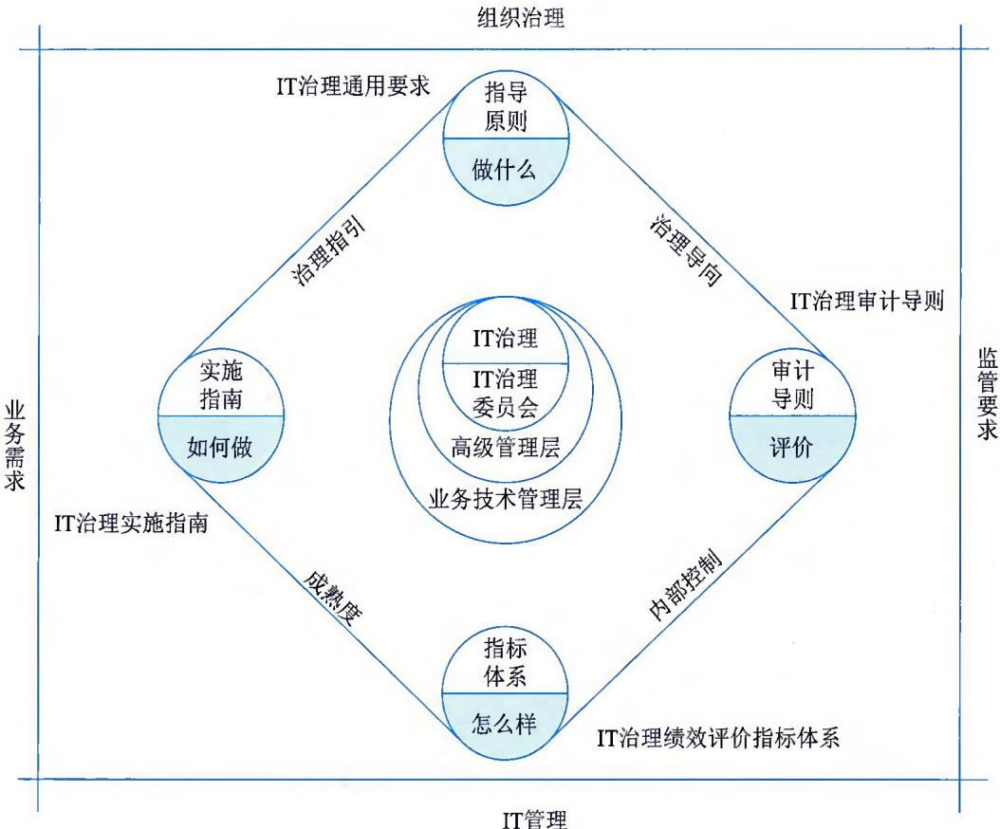  
图4-5 ITSS-IT治理标准化的逻辑关系图

## 1) IT 治理通用要求

GB/T 34960.1《信息技术服务治理第1部分：通用要求》规定了IT治理的模型和框架、实施IT治理的原则，以及开展IT顶层设计、管理体系和资源的治理要求。该标准可用于：①建立组织的IT治理体系，并实施自我评价；②开展信息技术审计；③研发、选择和评价IT治理相关的软件或解决方案；④第三方对组织的IT治理能力进行评价。各级信息化主管部门可根据法律法规、部门规章的要求，使用该标准对所管辖各类组织的IT治理提出要求，并进行评估、指导和监督。

该标准定义的IT治理模型包含治理的内外部要求、治理主体、治理方法，以及信息技术及

其应用的管理体系，如图4-6所示。

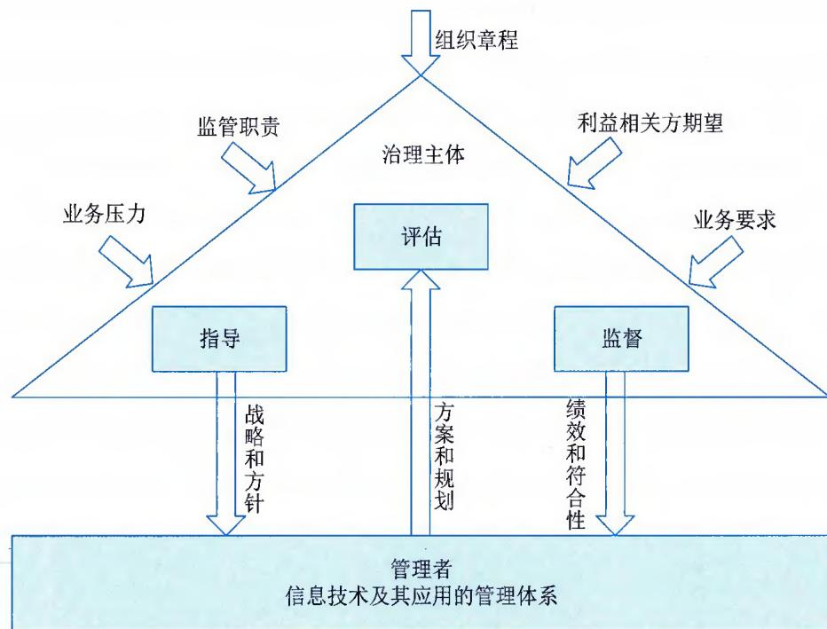  
图4-6 GB/T34960.1定义的IT治理模型

治理主体以组织章程、监管职责、利益相关方期望、业务压力和业务要求为驱动力，建立评估、指导、监督的治理过程并明确任务。治理主体通过信息技术战略和方针，指导管理者对信息技术及其应用的管理体系进行完善，并对信息技术相关的方案和规划进行评估，对信息技术应用的绩效和符合性进行监督。组织结合治理原则和模型，在 IT 治理实施的过程中开展自我监督、自我评估和审计工作，并持续改进。

该标准定义的 IT 治理框架包含信息技术顶层设计、管理体系和资源三大治理域，每个治理域由若干治理要素组成，如图 4-7 所示。顶层设计治理域包含信息技术的战略，以及支撑战略的组织和架构；管理体系治理域包含信息技术相关的质量管理、项目管理、投资管理、服务管理、业务连续性管理、信息安全管理、风险管理、供方管理、资产管理和其他管理；资源治理域包含信息技术相关的基础设施、应用系统和数据。

## 2）IT治理实施指南

GB/T 34960.2《信息技术服务 治理 第2部分：实施指南》提出了IT治理通用要求的实施指南，分析了实施IT治理的环境因素，规定了IT治理的实施框架、实施环境和实施过程，并明确顶层设计治理、管理体系治理和资源治理的实施要求。该标准适用于：①建立组织的IT治理实施框架，明确实施方法和过程；②组织内部开展IT治理的实施；③IT治理相关软件或解决方案实施落地的指导；④第三方开展IT治理评价的指导。

IT治理实施框架包括治理的实施环境、实施过程和治理域，如图4-8所示。实施环境包括组织的内外部环境和促成因素。实施过程规定了IT治理实施的方法论，包括统筹和规划、构建和运行、监督和评估、改进和优化。治理域定义了IT治理对象，包括顶层设计、管理体系和资源。顶层设计包括战略、组织和架构；管理体系包括质量管理、项目管理、投资管理、服务管理、业务连续性管理、信息安全管理、风险管理、供方管理、资产管理和其他管理；资源包括基础设施、应用系统和数据。组织可以结合实施环境的分析，按照实施过程，以治理域为对象，开展IT治理实施。

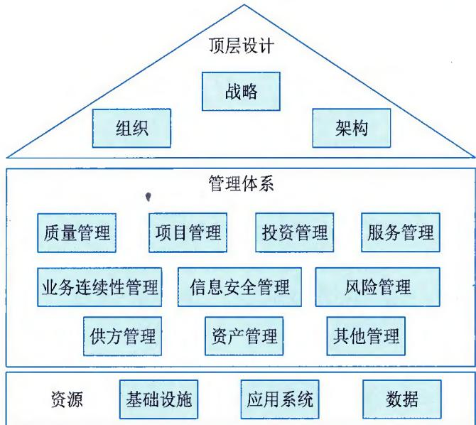  
图4-7 GB/T34960.1定义的IT治理框架

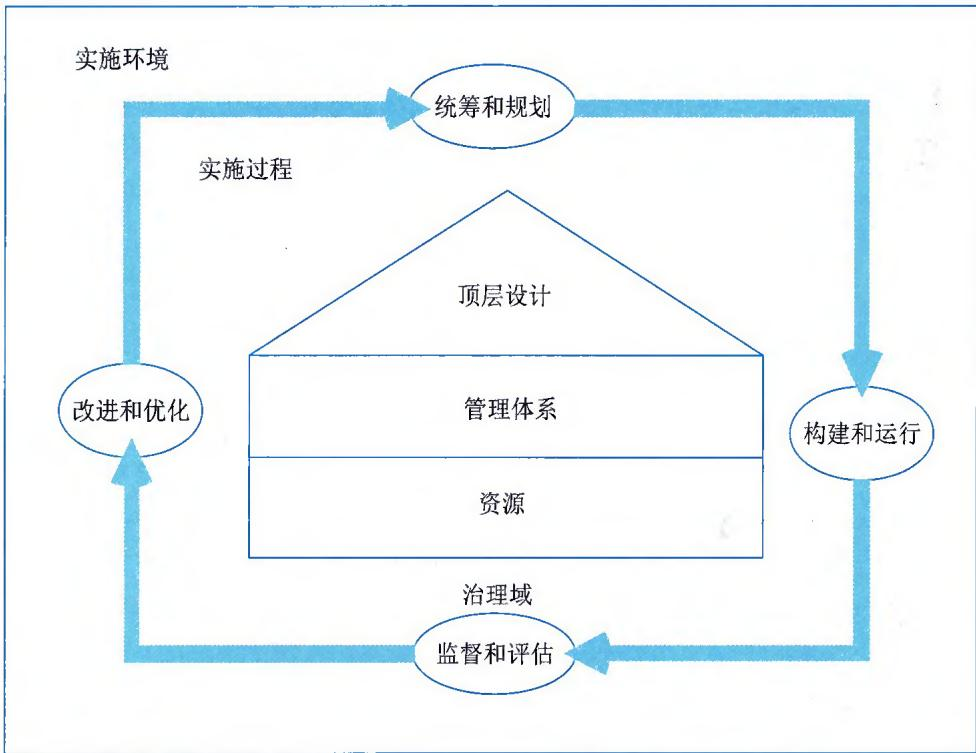  
图4-8GB/T34960.2定义的IT治理实施框架

## 2. 信息和技术治理框架

COBIT 是面向整个组织的信息和技术治理及管理框架，由成立于 1969 年的国际信息系统审计协会（ISACA）组织设计并编制。COBIT 对治理和管理进行了明确区分，这两个学科涵盖不同的活动，需要不同的组织结构，并服务于不同的目的。具体区别为：①治理确保对利益干系人的需求、条件和选择方案进行评估，以确定全面均衡、达成共识的组织目标；通过确定优先等级和制定决策来设定方向；根据议定的方向和目标监控绩效与合规性。②管理是指按治理设定的方向计划、构建、运行和监控活动，以实现组织目标。在大多数组织中，管理是首席执行官领导下的高级管理层的职责。ISACA 设计并编制了《框架：治理和管理目标》《设计指南：信息和技术治理解决方案的设计》，主要供组织信息和技术治理（EGIT）、鉴证、风险和安全专业人员作为学习资料使用。

## 1）治理和管理目标

COBIT 介绍了 40 项核心治理和管理目标，以及其中包含的流程和其他相关组件。COBIT 核心模型如图 4-9 所示。在 COBIT 中治理目标被列入评估、指导和监控（EDM）领域，在这个领域，治理组织将评估战略方案、指导高级管理层执行所选的战略方案并监督战略的实施。管理目标分为 4 个领域：①调整、规划和组织（APO）领域针对 IT 的整体组织、战略和支持活动；②内部构建、外部采购和实施（BAI）领域针对 IT 解决方案的定义、采购和实施以及它们到业务流程的整合；③交付、服务和支持（DSS）领域针对 IT 服务的运营交付和支持，包括安全；④监控、评价和评估（MEA）领域针对 IT 的性能监控及其与内部性能目标、内部控制目标和外部要求的一致程度。治理目标与治理流程有关，而管理目标与管理流程有关。治理流程通常由董事会和执行管理层负责，而管理流程则在高级和中级管理层的职责范围内。

为满足治理和管理目标，每个组织都需要建立、定制和维护由多个组件构成的治理系统，如图4-10所示。治理系统的组件包括：①流程。流程描述了一组为实现某种目标而安排有序的实践和活动，并生成了一组支持实现整体IT相关目标的输出内容。②组织结构。组织结构是组织的主要决策实体。③原则、政策和程序。原则、政策和程序用于将理想行为转化为日常管理的实用指南。④信息。在任何组织中，信息无处不在，包括组织生成和使用的全部信息。COBIT侧重于有效运转组织治理系统所需的信息。⑤文化、道德和行为。个人和组织的文化、道德和行为作为治理和管理活动的成功因素，其价值往往被低估。⑥人员、技能和胜任能力。人员、技能和胜任能力对做出正确决策、采取纠正行动和成功完成所有活动而言是必不可少的。⑦服务、基础设施和应用程序。服务、基础设施和应用程序包括为组织提供IT治理系统的基础设施、技术和应用程序。

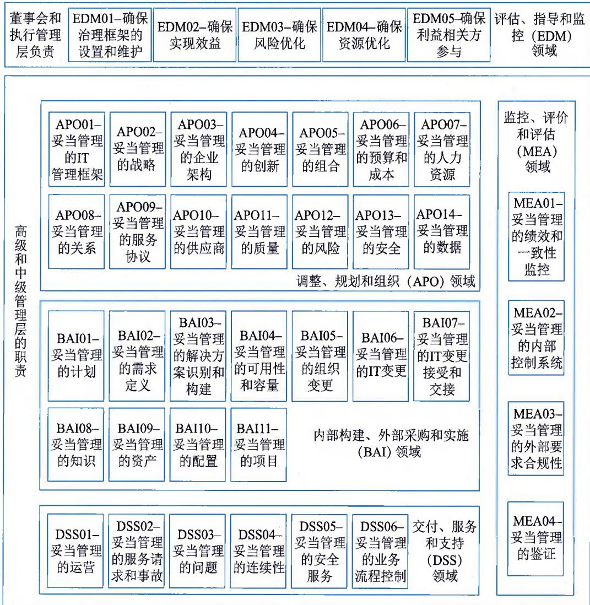  
图4-9 COBIT核心模型

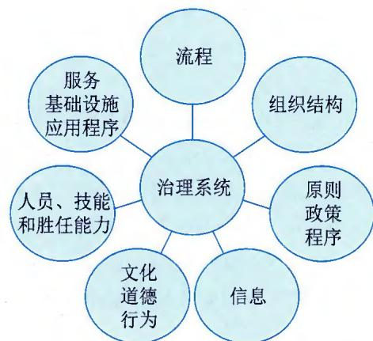  
图4-10 COBIT治理系统组件

## 2）信息和技术治理解决方案的设计

COBIT 设计指南描述了组织如何设计量身定制的组织 IT 治理解决方案。高效和有效的 IT 治理系统是创造价值的起点。COBIT 定义的 IT 治理系统设计因素包括组织战略、组织目标、风险概况、IT 相关问题、威胁环境、合规性要求、IT 角色、IT 采购模式、IT 实施方法、技术采用战略、组织规模和未来因素，如图 4-11 所示。这些设计因素可能影响组织治理系统的设计，为成功使用 IT 奠定基础。

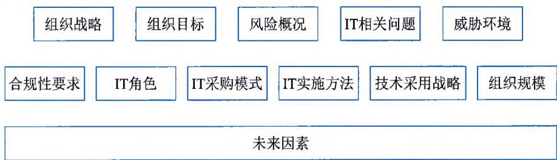  
图4-11 COBIT定义的IT治理系统设计因素

组织开展治理系统设计通过流程化的方式进行，如图 4-12 所示，COBIT 给出了建议设计流程：①了解组织环境和战略；②确定治理系统的初步范围；③优化治理系统范围；④最终确定治理系统的设计。

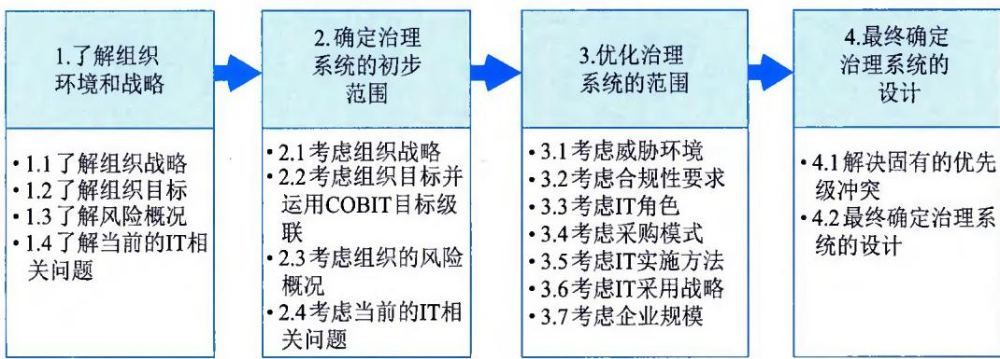  
图4-12 COBIT治理系统设计工作流程

## 3. IT治理国际标准

2008年4月，ISO/IEC正式发布IT治理标准ISO/IEC38500，它的出台不仅标志着IT治理从概念模糊的探讨阶段进入了一个正确认识的发展阶段，而且也标志着信息化正式进入IT治理时代。这一标准促使国内外一直争论不休的IT治理理论得到统一，也促使我国在引导信息化科学方面发挥重要作用。2014年，ISO/IEC发布了第二版的ISO/IECFDIS38500，替换了2008年第一版的ISO/IEC38500。ISO/IECFDIS38500：2014提供了IT良好治理的原则、定义和模式，以帮助最高级别组织的人员理解和履行其在组织内使用IT方面的法律、法规和道德义务。

该标准为组织的治理组织（可包括所有者、董事、合伙人、执行经理或类似机构）的成员提供了关于在其组织内有效、高效和可接受地使用信息技术（IT）的指导原则。具体包括：①责任。组织内的个人和团体理解并接受他们在IT的供应和需求方面的责任。那些负有行动责任的人也有权执行这些行动。②战略。组织的业务战略考虑到IT的当前和未来的能力；使用IT的计划满足了组织业务战略的当前和持续的需求。③收购。IT收购是出于正当的理由，在适当和持续的分析基础上，有明确和透明的决策。在短期和长期内，在利益、机会、成本和风险之间都存在着适当的平衡。④性能。IT适合于支持组织，提供满足当前和未来业务需求所需的服务、服务水平和服务质量。⑤一致性。IT的使用符合所有强制性法律和法规。政策和实践有明确的定义、实施和执行。⑥人的行为。IT团队的政策、实践和决策表明了对人的行为的尊重，包括所有"在这个过程中的人"的当前和不断发展的需求。

## 4.5 IT 治理的 EDM

治理组织可以通过评估（Evaluate）、指导（Direct）、监视（Monitor）三个方面来治理IT，简称EDM。在使用EDM的过程中，需要借鉴和使用ISO38500给出的IT治理的6个原则，即职责分工、IT支持组织发展、可获得性、可用性、合规性、以人为本。EDM的具体过程如下：

（1）评估现在和将来对IT的利用情况。

治理组织应该检查和评判当前和将来对IT的利用情况，包括策略、建议和供给安排（不管是内部、外部，还是两者都有）。

在评估 IT 的使用时，治理组织应该考虑业务的内外部压力，如技术的变更、经济和社会的发展以及政治影响等。随着压力的变化，可以持续进行评估。治理组织还应该考虑现在和将来的业务需求，当前和将来的组织必须达到的目标（如维持竞争优势）以及正在评估中的战略或意图的特定目标。

（2）对策略和方针的相关准备事项和实施进行指导，以保证IT的使用是符合业务目标的。

治理组织应该对策略和方针的准备和实施工作进行职责安排，并对其工作予以指导。策略设定了 IT 项目和 IT 运作的投资方向，方针确定了应用 IT 的行为规则。

治理组织应该保证从项目转到日程运作经过了计划和管理，并考虑对业务和现有 IT 系统及基础设施运作习惯的影响。应该通过要求管理者提供及时的信息、符合组织的指导以及符合良好治理的 6 项原则，来鼓励组织内良好 IT 治理的文化。

如果需要，治理组织应该指导所提交的建议方案的批准工作，以处理已识别的要求。

（3）监视方针的符合性，以及对应计划的实际绩效。

领导者应该通过合适的测量体系监视IT的绩效，同时还要确保IT符合外部义务（法律、法规以及合同）和内部实际工作的要求。

表4-3给出了EDM在责任、策略、采购、绩效、符合性和人员行为6个方面的最佳实践活动。

表 4-3 EDM 最佳实践（例）

<table><tr><td>方面</td><td>E(评估)</td><td>D(指导)</td><td>M(监视)</td></tr><tr><td>责任</td><td>治理组织按照职责分配方案进行聘 雇,在评估方案时,领导者应该设法 确保有效、高效和可以接受,以此 为依据去使用和交付IT,以支持当 前和未来的业务目标。治理组织还要 对IT决策人员的能力进行评估,一 般来说,这些人员应该是业务管理人 员,负责组织的业务目标和绩效</td><td>治理组织对IT职责的执行进行 控制,确保按照安排执行,同时 还要确保相关人员获得了履行其 职责所需的信息</td><td>1IT治理机制是否得到了建立;2相关人员接 受和理解了他们的职责;3有IT治理职责的人员 (如指导委员会的人员或 向治理组织提交建议的人 员)的绩效情况</td></tr><tr><td>策略</td><td>治理组织对IT和业务过程的开发进 行评估,以确保IT为将来的业务需 求提供支持。在考虑策略和方针时, 要评估IT相关活动,以确保其在不 断变化的环境下与组织的目标相一 致,并考虑更好的实现方式以及其他 关键利益相关方的要求。治理组织应 该确保IT的使用按照标准的建议方 式进行了风险评价和评估</td><td>治理组织对策划和方针的准备和 适用情况进行审查,以确保组 织从IT开发中获益,同时还应 该鼓励对IT适用的创新性建议, 使得组织可以应对新的机会或挑 战、承担新的业务或改进过程</td><td>治理组织对IT方案的进展情况进行监视,以保证其利用了所分配的资源, 并在要求的时间内达到目 标。治理组织应该监视IT 的使用情况,以保证其达 到预期的收益</td></tr><tr><td>采购</td><td>治理组织对已批准的IT实现方案进 行评价,平衡风险和成本效益的投资 建议</td><td>治理组织对IT资产(系统和基础设施)进行管理,包括准备合 适的文件,以确保提供所需的容 量;还要对资源需求(包括内部 和外部的资源需求)情况进行审 查,以支持组织的业务要求;治 理组织应指导他们的组织和供应 商开发一个共同理解的关于IT 采购的组织意图</td><td>治理组织监视IT投资情 况,以保证其提供了所需 的功能,领导者还要对组 织和供应商进行监视,确 保在做出任何IT采购决策 时能够满足IT维护需求</td></tr><tr><td>绩效</td><td>1评估管理者所建议的计划方案,以 保证IT具备支持业务所需的能力和 容量;2评估由IT活动所带来的业 务持续运营风险;3评估风险和对IT 资产的保护;4评估相关决策;5定 期评估组织IT治理的有效性和绩效</td><td>治理组织按照商定的优先级和预 算,分配足够的资源,以保证IT 满足组织的要求,同时应该保障 IT对业务的支持</td><td>治理组织应该监视IT对 业务的支持程度,以及所 分配的资源和预算优先次 序与业务目标吻合的程度,同时监视方针的正确 性程度,如数据的准确性和IT利用的效率等</td></tr><tr><td>符 合 性</td><td>治理组织对IT满足法律法规、合同、 内部方针、标准和专业指南的程度进 行定期评估,也要对其IT治理体系 的符合性进行定期评估</td><td>治理组织负有指导职责,需要建 立定期和例行机制以保证IT的使 用符合内部方针、标准和指南; 对方针的建立和推行进行指导, 以保证组织的IT使用符合其内部 义务;对IT员工遵循专业行为和 开发指南进行指导;确保所有IT 相关活动合乎伦理道德</td><td>治理组织应该通过合适的 报告和审计活动,监视IT 的符合性和一致性;同时 监视IT活动,包括资产 和数据的废弃,以保证环 境、隐私、战略知识管 理、组织私有技术和其他 相关义务得到满足</td></tr><tr><td>人员行为</td><td>治理组织应该评估IT相关活动,以确保对人员行为进行了识别和适当考虑</td><td>治理组织应该确保IT活动与识别的人员行为的一致性,对任何人在任何时间报告或识别的风险、机会、问题和关心事项进行管理,风险管控措施应该与已发布的策略和程序保持一致,并延伸到相关决策者</td><td>治理组织应该监视IT活动,以确保已识别的人员行为是正确的,并且已引起适当注意,同时,对实际工作方式进行监视,以确保其与合理使用IT的一致性</td></tr></table>

## 4.6 IT治理关键域

IT治理框架包含信息技术三个治理关键域，分别是顶层设计、管理体系和资源，每个治理域由若干治理要素组成。

## 4.6.1 顶层设计

围绕组织 IT 整体与统筹部分，相关治理包括信息技术的战略，以及支撑战略的组织和架构。

## 1. 战略

组织战略是组织高质量发展的总体谋略，是组织相关方就其发展达成一致认识的重要基础。组织战略是指组织针对其发展进行的全局性、长远性、纲领性目标的策划和选择，即组织为适应当前和未来的环境变化，对业务部署、运行管理和高质量发展做出的全局性、长远性、纲领性目标的策划和选择。组织战略体现了组织的使命、愿景和价值观，反映了管理者对于行动、环境和业绩之间关键联系的理解，它是组织策划具体行动计划的起点。

IT 战略是业务战略的有机组成部分，它定义出 IT 的目标、发展思路、愿景蓝图、建设和运维、管理策略等，对实现组织业务创新和管理提升具有重要意义。建立 IT 战略与业务战略统一的机制，保证业务战略目标实现，是 IT 治理的核心目标之一。

战略为组织如何在不断变化的环境和激烈的竞争挑战中生存并不断发展指明了方向，明确了组织当前和未来有可能出现的各种条件，确定了其发展目标以及实现该目标的路径、方式和方法。

## 1）战略目标

战略目标是组织在一定的战略期内总体发展的总水平和总任务。它决定了组织在该战略期间的总体发展的主要行动方向，是组织战略的核心。组织的战略目标是多元化的，包含经济性目标和非经济性目标，也包含定量目标和定性目标。战略目标的制定要明确对象和时间范围，定量和定性相结合，短、中、长期目标衔接并协调好。不同类型的组织，其战略目标的组成和覆盖领域不同。

## 2）战略类型

组织当前的发展成熟度水平、不同周期期望达到的目标以及组织外部环境变化等因素都会影响组织战略的制定和选择。常见的组织总体战略类型主要包括：

\- 发展型战略。发展型战略是指组织从现有战略基础水平上向更高一级的目标发展的战略。组织可根据其战略定位和实际情况选择不同的发展型战略。

\- 稳定型战略。稳定型战略是指组织由于其运行环境和内部条件的限制，在整个战略期内基本保持战略起点的运行绩效范围和水平的一种战略。这是一种风险相对较低的战略。当组织较为满意过去的运行绩效和方法，选择延续基本相同的产品和服务时，可以采取这类战略。

\- 紧缩型战略。紧缩型战略是指组织从当前战略运行领域和基础水平收缩和撤退，与战略起点偏离较大的一种运行战略。紧缩型战略是一种消极的发展战略，一般作为短期性的过渡战略。

\- 其他类型战略。组织的总体战略还包括复合型战略、联盟战略、成本领先战略、差异化战略、集中化战略等。

## 3）战略特性

组织战略通常具备的特性包括：

\- 全局性。组织战略作为组织发展的蓝图，从全局性角度确定了组织的战略目标，规范和指导其运行管理活动。

\- 长远性。组织战略着眼于组织的未来，从长远利益出发，通过判断和选择对未来发展做出正确的决策。

\- 纲领性。组织战略是组织运行的行动纲领。它指明了组织总体的长远目标、发展方向、经营重点、前进道路，以及基本的行动方针、重大措施和基本步骤。

\- 指导性。组织战略规定了一定时期内组织的基本发展目标，以及实现该战略目标的路线和途径，引导并激励员工为实现目标而奋斗。

\- 竞争性。通过制定和实施适合组织的有效战略，采取获得竞争优势、提升服务对象满意度、提高工作效率等行动和措施，从而在社会发展中保持核心竞争力。

● 风险性。组织战略是通过当前信息分析，对未来做出的一种预测性决策。由于组织面临的实际环境是复杂多变的，组织自身条件也在不断变化，因此组织战略具有不确定性和风险性。

\- 相对稳定性。组织战略是长远的规划，实现战略目标需要比较长的时间，因此要保持相对稳定。但如果组织的内外环境发生了重大变化，组织的战略也应进行调整和修正。

## 4）创新和改进

在不同的生存和发展阶段，组织会对其目标、实力和环境有不同的认识和反应，因此组织战略必须具备动态适应性。组织需要进行战略回顾和创新分析，分析和回顾战略实施是否存在偏差，是否需要进行调整或创新。在分析和回顾战略实施过程中进行创新和改进的要素主要包括：

\- 内外部发展环境对战略规划的影响，包括客户和用户需求、技术或监管环境等。

\- 在业务增长、发展趋势等方面的预测及其与实际的差异。

\- 提升业务增长和盈利的措施。

\- 竞争优势和发展水平分析及改进措施。

\- 风险分析及改进措施。

\- 战略绩效管理体系和人力资源系统的整合优化。

## 2. 组织

组织需要建立 IT 治理实施的机制和机构，确保治理团队、机构和人员能力满足 IT 治理的需求。IT 治理机制包括授权机制、决策机制和沟通机制；IT 治理机构包括信息技术战略委员会、信息技术管理和服务机构、业务部门、风险管理部门、审计监督部门等。

现代组织的信息化是一个长期持续的过程，必须有一个专门的机构负责与信息化相关的诸多事宜，并且能够不断完善该职能，以适应组织在不同发展阶段的不同需要。IT部门自身的组织建设在整个IT工作日常运作和战略规划中起着重要作用，它的合理与否直接影响组织IT战略的发展，IT部门的组织结构对IT的影响远远大于我们所说的硬件、软件，IT组织的建设影响着组织未来IT战略的发展方向和速度，不仅如此，IT部门的组织结构对于我们正确地分析和判断自己组织IT工作的现状，并合理地把握IT的战略发展方向也有非常重要的意义。

从 IT 治理这个层面来理解 IT 组织，它绝对不能简单地等同为组织的信息部门、信息中心、信息管理中心等独立的机构，而是指组织中参与 IT 决策与管理的所有人员的集合，需要明确组织定位。

组织定位应包括有清晰的使命、愿景和目标，有明确的价值观和组织文化来帮助组织实现战略要点，并能够向组织的内外部传达清晰的定位。组织定位还应包括对业务单元的定位战略。所谓业务单元定位战略，是指组织或组织的分支机构在决定进入某行业和领域、生产什么产品或提供何种服务方面所做出的长远性的谋划与方略。业务单元定位战略实质上是行业或领域中的产品或服务定位战略，也就是在行业或领域定位之后，所做出的产品定位决策或服务定位决策。

## 1）组织愿景

组织愿景是在汇集组织每个员工个人心愿的基础上形成的全体员工共同心愿的美好愿景，描述了组织发展的目的和对如何到达那里的理性认知。组织愿景是组织制定战略不可或缺的因素，指明了组织的前进方向、组织未来的业务形态、发展和塑造组织形象所确定的战略道路。一个明确的愿景表明了管理者对上级机构或股东的承诺，以及对所有员工的激励。愿景的制定和传达需要注意：

\- 要明确说明组织的定位，清晰地表达组织目标，避免笼统宽泛的陈述。愿景要能让管理者对组织的发展方向有清晰明确的认识，有利于管理者设计战略和对未来发展做充足准备。明确的愿景能为管理部门决策和资源配置提供指向性，便于各级部门确定部门使命，制定部门目标体系以及与组织发展战略协同一致的部门职能战略。

\- 表述应尽量鲜明和形象化，使其可靠且易于传达。具有传达力的愿景能够引人入胜，赢得组织成员的支持，激励员工为实现目标而努力。

## 2）组织使命

组织使命是管理者为组织确定的较长时期的业务发展的总方向、总目的、总特征和总的指导思想，描述了组织所处的社会价值范畴、当前的业务和宗旨。组织使命是组织的生存基石和存在理由宣言，体现了组织的宗旨、核心价值观和未来方向。其陈述通常涵盖的要素包括：

\- 产品或服务。组织提供的主要产品或服务是什么。

\- 客户和服务对象。组织服务的客户和服务对象群体是哪些，他们在哪里。

\- 行业或领域。组织提供产品和服务的行业或领域是哪些，在什么地方。

\- 公众形象。组织试图营造什么样的形象；对社会、社区和环境承担了哪些责任。

\- 自我认知。什么是组织的独特能力和主要竞争优势。此外，组织在生存、增长和盈利、价值观、技术、员工等方面的目标也可以纳入使命的陈述。

## 3）组织文化

组织文化是组织发展过程中凸显的精神特质与内涵，是组织区别于其他组织的关键因素。组织文化是组织最为本质的体现之一，是组织发展的原动力。优秀的组织文化是组织战略制定的重要条件，组织文化支撑战略的执行。由于组织文化是组织发展过程中形成的内部的共同价值观，具有鲜明的组织特色，因此组织战略需要建立在共同价值观基础上，这样更能发挥组织成员的集体合力，使其易于实现。组织要实现战略目标必须有优秀的组织文化来支撑和引领，打造形象和品牌，树立信誉，从而提升竞争力。

组织文化有两个基本特征：①组织文化具有浓厚的文化属性和良好的执行性。组织文化确立了组织的核心价值观、道德准则、运行管理理念、组织宗旨和组织精神等思想层面的内容。在共同的价值观的引导下，组织各项工作朝着统一的发展方向开展。②组织文化提出了组织发展涉及的制度、行为等措施，如员工管理方法、员工互动方式、激励机制等，为日常工作提供了具体的实践方法。

## 3. 架构

一般认为IT规划分为三个与层面，即IT战略、组织架构与IT项目，三部分是相互依托、相互促进的，其中架构是核心。与业务战略相匹配的IT战略明确了信息化的远景目标，与业务战略以及业务流程和组织架构相匹配的IT架构是连接业务战略、IT战略与IT项目的桥梁。

IT治理组织应指导、评估和监督信息技术架构，以确保支撑信息技术战略目标的实现。具体包括：

\- 指导信息技术架构的建立，并对规划、设计、实施、服务等过程进行评估和监督。

\- 评估信息技术发展内外部环境的变化，并对信息技术架构进行持续改进。

\- 建立与信息技术架构相适应的管理体系，并进行评估和持续改进。

组织建立的信息技术架构要与组织战略目标、IT治理目标保持一致，满足信息技术战略的目标和要求，同时满足功能集成、信息集成及数据共享等应用需求。信息技术架构管理机制能够满足IT治理战略规划的要求，同时能够评估架构设计的合理性、先进性和开放性。

## 4.6.2 管理体系

综合时间、空间等各个维度，管理体系要素中主要包括质量管理、项目管理、投资管理、服务管理、业务连续性管理、信息安全管理、风险管理、供方管理、资产管理以及其他管理。

## 1. 质量管理

组织需要建立信息技术服务及产品质量管理体系，明确治理管理的职责和权限、提供资源保障并持续改进和优化。

质量是产品、服务或成果的一系列内在特征满足需求的程度。质量包括满足客户明示的或隐含的需求的能力。保持关注过程和成果的质量，过程和成果要符合项目目标，并与干系人提出的需求、用途和验收标准保持一致。

质量不仅与项目成果有关，也与生成项目成果的项目方法和活动有关。在关注项目成果质量的同时，也需要对项目活动和过程进行评估。因此，质量管理更加关注过程的质量，侧重于在过程中提前发现和预防错误及缺陷的发生，帮助项目团队确保以最适当的方式交付符合要求的成果，达到客户和干系人的要求，并使资源最小化、目标最大化，具体要实现以下目标：①快速交付成果；②尽早识别缺陷并采取预防措施，避免或减少返工和报废。

## 2. 项目管理

组织需要建立项目管理机制，制订项目计划，确定项目范围，建立成本、进度和质量的控制机制，建立和维护项目管理的流程和方法，统计分析项目的完成情况，并评估绩效。

## 3. 投资管理

组织需要根据投资目标和规划，合理安排资金投放结构，科学确定投资项目，建立投资的拟订方案、可行性论证、方案决策、投资计划编制、投资计划实施、投资项目到期处置等制度。

IT 项目管理的失败有很多并不是项目管控本身不利造成的，有的是在项目需求管理和投资决策阶段就埋下了失败的祸根，有的则是驾驭不了多个并行的项目。考虑到这些问题，IT 投资治理需要重点关注以下几个方面的问题：业务需求治理不足、IT 决策流程缺乏管控、IT 项目排序不科学。这些难题有以下几个解决思路：一是对业务需求进行科学治理；二是建立合理的项目投资决策机制和流程；第三个是技术层面的问题，利用多项目管理的技术为需求排序，同时管理多个并行的项目。

## 4. 服务管理

组织要建立信息技术的服务管理机制，控制服务实施的风险，提升服务管理能力，并定期评价服务绩效。

IT 服务管理是通过主动管理和流程的持续改进来确保 IT 服务交付有效且高效的一组活动。IT 服务管理由若干不同的活动组成：服务台、事件管理、问题管理、变更管理、配置管理、发布管理、服务级别管理、财务管理、容量管理、服务连续性管理和可用性管理。

## 5. 业务连续性管理

组织要建立业务连续性管理框架，包括业务连续性管理程序、程序维护和评审、连续性恢复后评价，并把业务连续性植入组织文化。

服务连续性管理是一组与组织持续提供服务的能力相关的活动，主要是在发生自然或人为灾难时继续保持服务有效性的活动。服务连续性管理包括业务连续性管理框架、应急管理与灾难恢复。

## 6. 信息安全管理

组织要制定信息安全管理目标、方针和策略，建立信息安全组织并明确责任，制定信息安全管理制度，定期开展信息安全培训，确保制度落实。

信息安全是指信息的保密性、完整性和可用性的保持。构建信息安全保障体系必须从安全的各个方面进行综合考虑，将技术、管理、策略、工程过程等方面紧密结合，尤其要调动高级管理人员的积极性，协调业务部门和IT部门的关系，建立合理的信息安全治理结构与流程。

所谓信息安全治理，是指最高管理层用来监督管理层在信息安全战略上的过程、架构及业务的关系，以确保信息安全战略与组织的业务目标一致。它不同于信息安全管理。信息安全管理是提供管理程序、技术和保证措施，使业务管理者确信业务交易的可信性；确保信息技术服务的可用性，能适当地防御不正当操作、蓄意攻击或者自然灾害，并从这些故障中尽快恢复；确保拒绝未经授权的访问。信息安全管理的目标是组织信息及信息系统的安全运营，确定IT目标以及实现此目标所采取的行动。

信息安全治理是一种基础制度安排。如果缺乏健全的制度安排，不可能有很好的信息安全管理。同样，没有有效的信息安全管理，单纯的治理机制也只能是一个美好的蓝图，而缺乏实际的内容。

建立一个有效的信息安全体系首先要建立在良好的信息安全治理的基础上，其次要制定出相关的管理策略和管理体系，然后才是考虑产品安全。没有完善的治理体系和管理体系，仅有安全技术，决不能真正带来期望中的信息安全。就目前我国信息化建设的现状而言，无论是信息安全治理，还是信息安全管理，都是我们迫切需要健全的。

## 7. 风险管理

组织要建立信息技术风险管理机制，制定信息技术风险管理原则、目标和策略，建立管理制度和组织，明确责任人、角色和职责，识别、分析、评价、处置信息技术风险，提升风险应对能力，确保风险降低到组织可接受的程度。

很多组织及其管理者似乎总是缺少适当方法来应对信息技术风险。首先，是没有广泛地考虑风险；其次，没有工具去发现风险；第三，缺乏一套恰当的流程指引来处置风险；第四，未定义清晰风险生命周期及风险层级；第五，缺乏风险识别的氛围、意识及能力。

有些机构总是把风险管理看成"负面思维"，认为那些从事风险管理的人多虑、胆小，甚至是缺乏领袖气质的人。那些喜好"打垮或者打破（规则）"的管理者则被看成是有特质的领袖——真是一种奇怪的偏见！而真正的事实是，即使是赌徒，每天也要面对着风险回报这样的挑战。他们必须明白为了将来的回报，有些风险是必须承担的。对于风险，要认清以下几点：

\- 你只有认识它，才能打败它。

\- 没有风险，就没有收获。

\- 没有痛苦，就没有财富。

\- 风险的另一面是机会。

风险是伴随着整个生命周期的，在整个生命周期里应该设计一套流程来识别、评估、监控和报告风险。

## 8. 供方管理

组织要建立供方管理机制，明确供方管理的职责、流程和方法，建立供方评估机制，保护组织的商业秘密和知识产权，以及组织所涉及的个人隐私。

不管愿意还是不愿意，组织都免不了要与 IT 供应商发生联系。在信息化整个生命周期中，组织都越来越依赖于外部供应商，从需求分析到系统选型，再到项目实施乃至最后的运行维护，IT 供应商始终与组织如影随形。尤其在核心竞争力理论的指导下，"把包括 IT 在内的不能直接创造价值的部分外包出去"成为了许多组织的选择，外部供应商逐步成了组织 IT 管理的延续，在组织获得便利的同时也不得不面对供应商选择、评估、管理带来的风险。因此有一种说法，IT 供应商的选择就像人的婚姻，是一辈子的事情，需要特别谨慎和小心。

在供应商与组织的合作过程中，随着力量对比的变化，双方地位也随之改变，组织的治理结构和控制措施也应随之改变。为了避免组织与供应商关系"过山车"般的变化，组织应该加强治理结构的建设，在与供应商合作的过程中明确双方的认知和期望，明确双方的权利和约束，提高实现双赢的可能性。

## 9. 资产管理

组织要建立信息技术资产应用、资产财务、资产有效性的管理体系，并对管理内容进行关联。

所谓信息资产，是指一种在资产负债表之外，经过逐渐积累的，可以被用来提升机构竞争优势的信息。信息资产与其他类型的资产相比，有些相似的地方，也有些不同的地方。持有这两种资产的人都可以用这些资产获得交付价值和利益。但是同其他类型的资产不同，信息资产可以在没有成本的情况下复制，这也是信息资产难题的开始。有价值的实物资产一般都会保存在可以保障物理安全的地点，也可以把它们锁起来，无论从技术上还是从财务上看，做到这一点都不困难。

另一方面，同实物资产相比，信息资产显得非常分散，每份文档、文件和数据存储设施都可能是信息资产的一部分，而且文档很容易被复制（这也确实是人们正常工作的需要）。信息资产是很多业务流程的重要输入物和产出物。

## 10. 其他管理

信息技术管理体系中还包括其他方面，例如变更管理、预算管理、需求管理、绩效管理等，组织在实施治理时，同样需要根据相关标准结合组织战略制定相应的管理策略、机制和方法。

## 4.6.3 资源

资源管理的主要功能是确保用户对组织的应用系统和基础设施都有良好的理解和应用，优化 IT 投资、IT 资源（人、应用系统、信息、基础设施）的分配，做好人员的培训、发展计划，以满足组织的业务需求。

## 1. 基础设施

组织需要制定信息技术基础设施的规划，建立基础设施建设、采购、实施和运维机制，制定基础设施管理策略和方法。组织需要识别实现组织的战略目标的关键基础设施，识别需要在组织级实现的基础设施以及与之匹配的服务水平需求；建立基础设施服务定价的机制；建立基础设施的持续改进更新以及基础设施外包制度。

## 2. 应用系统

组织需要建立信息技术应用系统设计、开发、变更和测试的保障机制，保证功能、性能和安全等满足要求。

## 3. 数据

组织需要明确数据治理框架，建立数据治理机制和管理机制，完善数据治理的生命周期。数据的良好治理有助于治理组织确保在整个组织中使用数据，并对组织的绩效做出积极的贡献。数据的良好治理也有助于治理组织确保遵守与数据的可接受使用和处理有关的义务。

## 4.7 本章练习

## 1. 选择题

(1)\_\_\_\_不属于 IT 治理的管理层次。

A. 作业层 B. 最高管理层 C. 执行管理层 D. 业务与服务执行层

参考答案：A

(2)\_\_\_\_不属于 IT 治理的三大主要目标。

A. 与业务目标保持一致

B. 质量控制

C. 有效利用信息与数据资源

D. 风险管理

## 参考答案: B

(3)\_\_\_\_不属于 IT 治理的内容。

A. 投资 B. 业务 C. 绩效 D. 标准

参考答案：B

(4)《信息技术服务 治理 第 1 部分：通用要求》标准不适用于\_\_\_\_。

A. 建立组织的 IT 治理体系并实施自我评价

B. 组织的人力资源治理及供应链治理

C. 研发、选择和评价 IT 治理相关的软件或解决方案

D. 开展信息技术审计

参考答案: B

（5）IT治理实施框架中，\_\_\_\_不是IT治理域定义的IT治理对象。

A. 顶层设计 B. 管理体系 C. 资源 D. 实施环境

参考答案: D

1. 思考题

（1）请简述IT治理的核心内容包括的6个方面。

（2）请简述有效的IT治理必须关注的5项关键决策。

参考答案：略
