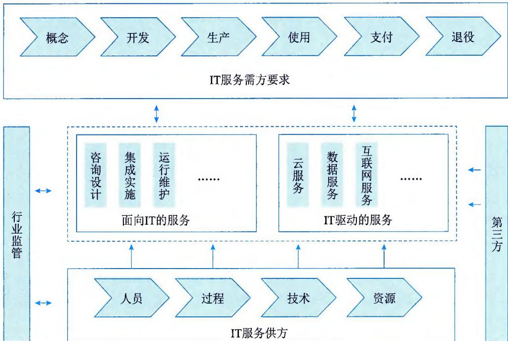
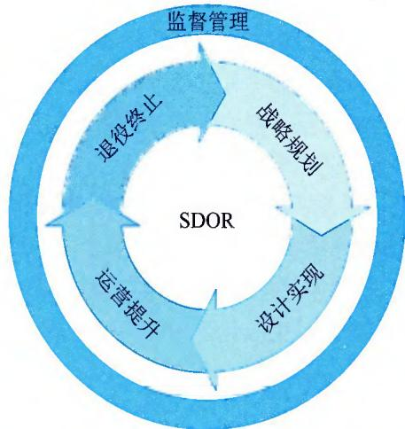
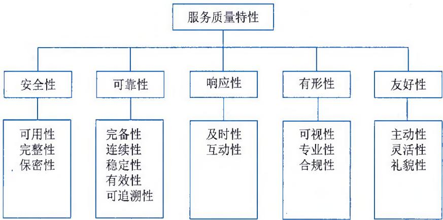

>[!info] 现行教材 · 第 2 版
>本页为**现行考试依据**的教材原文（第 2 版，2024 年 10 月出版，2025 年起启用）。
>考纲层级见 [[知识体系]]；练习题见 [[练习题·基础知识]]；案例模板见 [[案例答题模板]]。

# 第5章 信息技术服务管理

按照 GB/T 29264《信息技术服务 分类与代码》的定义，信息技术服务是指组织为客户提供开发、应用信息技术的服务，以及组织以信息技术为手段提供支持客户业务活动的服务，包括信息技术咨询服务、设计与开发服务、信息系统集成实施服务、运行维护服务、数据处理和存储服务等。

随着以5G、人工智能、物联网、大数据为代表的新一代信息技术的不断涌现，信息技术服务管理面临技术架构日趋复杂、管理规模日渐增大、业务需求快速迭代等新挑战。信息技术服务管理作为支持组织运作、实现组织目标的重要手段，其质量与水平直接影响组织的生存与发展。如何提高信息技术服务管理水平，增加信息系统投资回报率，降低信息系统运营风险，保障业务正常、稳定、高效地运行，逐渐成为组织决策者关注的焦点。

## 5.1 IT 服务基础特征

经过多年发展，我国信息技术服务产业已逐渐壮大。目前，在政府、行业协会等产业规则制定者和监督者的指导下，由咨询服务商、系统集成商、信息技术服务提供商、外包服务商、评测认证机构、信息技术监理机构、培训服务商、电信运营商等共同组成了有监管、成体系、市场化的信息技术服务生态圈，共同为个人消费者、企业、公共事业及政府等客户提供全方位的信息技术服务。信息技术服务是随着信息技术的发展和信息技术在各行业的深入应用而产生的一种新兴业态，是信息技术与服务的结合，其既具有传统服务的特征，又具有信息技术的独特特征。

## 5.1.1 服务的特征

服务是一种通过提供必要的手段和方法，满足服务接受者需求的过程，其外延是指具备服务本质的一切服务，例如餐饮服务、零售服务、IT服务等。服务的特征主要包括无形性、不可分离性、可变性和不可存储性。

## 1. 无形性

无形性指服务在很大程度上是抽象的和无形的。需方在购买之前一般无法看到、感觉到或触摸到，例如理发、听音乐会、到海边度假等。这一特性使得服务不容易向需方展示或沟通交流，因此需方难以评估其质量。

## 2. 不可分离性

不可分离性也叫同步性，指生产和消费是同时进行的，如照相、理发等。这一特征表明，需方只有参与到服务的生产过程中，才能享受到服务。这一特性决定了服务质量管理对服务供方的重要性。其服务的态度、水平直接决定了需方对该项服务的满意度。因此，服务人员的筛选、培训和报酬标准等，对实现高标准的服务质量至关重要。

## 3. 可变性

可变性也叫异质性，指服务的质量水平会受到相当多因素的影响，因此会经常变化。服务以人为中心，由于人与人的文化、修养、技术水平等存在差异，同一服务的品质会因操作者不同而不同；即使是同一操作者，由于时间、地点与心态的变化，服务质量也会随之变化。

## 4. 不可存储性

不可存储性指服务无法被储藏起来以备将来使用、转售或退货等。

## 5.1.2 IT服务的内涵

按照国务院发展研究中心的相关研究成果定义，信息服务包括信息传输服务、IT服务和信息内容服务。总体来说，IT服务除了具备服务的基本特征外，还具备本质特征、形态特征、过程特征、阶段特征、效益特征、内部关联性特征及外部关联性特征7个方面的内涵。

## 1.本质特征

IT 服务的组成要素包括人员、过程、技术和资源。就 IT 服务而言，通常情况下是由具备匹配的知识、技能和经验的人员，合理运用资源，并通过规定过程向需方提供 IT 服务。

## 2. 形态特征

常见服务形态有 IT 咨询服务、设计与开发服务、信息系统集成实施服务、运行维护服务、数据处理与存储服务、运营服务及其他 IT 服务。IT 服务在面向 IT 的服务和 IT 驱动的服务两个层面广泛开展。面向 IT 的服务，即面向 IT 系统的咨询设计、系统集成、运行维护等。IT 驱动的服务，即利用 IT 系统为业务提供设施、平台、软件和信息的服务。

## 3. 过程特征

IT服务从项目级、组织级到量化管理级逐步发展，是从计算机单机应用、网络应用到综合管理的逐步提升，具有连续不断和可持续发展的特征。

## 4. 阶段特征

IT 的发展永无止境，加之信息基础设施和经济、市场环境的变迁，使得 IT 服务无终极目标。IT 服务是全方位的，无论需方还是供方都需要根据自身需要抓重点，分层次、分阶段地推进 IT 服务，实现 IT 的有效利用。

## 5. 效益特征

IT 服务的发展不同于以往对产品的技术改造，其效益的概念完全不同。后者是通过对产品生产线的技术改造提高质量、增加产量，是单方面的，效益容易显现；而前者则是对 IT 服务进行深度开发和广泛利用，从整体上提高组织核心竞争力和管理水平，其效益是多方面的。

## 6. 内部关联性特征

IT 服务不仅依赖于技术创新，更依赖于业务模式创新。保持技术创新和业务模式创新的相互促进、有机融合，实现 IT 服务人才结构优化，建立 IT 服务管理规范，将从机制上为 IT 服务的发展创造条件。

## 7. 外部关联性特征

IT服务依赖于国民经济和良性竞争的市场环境的形成，依赖于社会信息网络的不断进步，依赖于政府相应的政策支撑、配套人才的培养和产业链上下游组织IT应用的逐渐完善。

## 5.1.3 IT服务的外延

我国现有的产业分类，以及北美地区、联合国、WTO及第三方机构，对IT服务的外延理解均不一致。存在这种现状的原因是"分类目的不同"。每个国家或地区对IT服务进行分类，目的是建立合理的统计指标体系，以便全面掌握领域发展现状及趋势，这与各个国家的政策紧密相关。而第三方机构的分类，其目的与技术及服务的形态和模式保持一致。无论现有的分类如何，彼此之间依然存在着一定的共性关系，将它们进行归纳后，即可形成IT服务的外延，IT服务是"面向IT的服务"和"IT驱动的服务"等服务形态和模式的总和，如图5-1所示。

  
图5-1 IT服务全景图

## 1. 面向IT的服务

面向IT的服务以IT为驱动，是服务方利用信息技术向组织提供如何开发、应用信息技术的服务，包括以信息技术为手段提供支持需方业务活动的服务，以及需方自行开展的信息技术服务，比如咨询设计、集成实施和运行维护等IT服务。

\- 咨询设计，指在信息资源开发利用、工程建设、人员培训、管理体系建设、技术支撑等方面向需方提供的管理或技术咨询评估服务，包括IT规划、IT系统设计、IT管理咨询、IT工程监理、测试评估认证、技术培训等。

\- 集成实施，指通过结构化的综合布缆系统、计算机网络技术和软件技术，将各个分离的设备、功能和信息等集成到相互关联、统一协调的系统中的服务，包括基础环境集成实施服务、硬件集成实施服务、软件集成实施服务、安全集成实施服务、系统集成实施管理服务等。此类服务主要针对系统生存周期的开发、生产等阶段，也针对信息资源要素。

\- 运行维护，指为保障需方的IT系统正常运行而提供的技术支持和维护服务，包括基础环境运行维护、硬件IT运维服务、软件IT运维服务、安全IT运维服务、运维管理服务等。

## 2. IT驱动的服务

IT 驱动的服务侧重于业务应用，是利用信息技术对组织业务的模式、流程和技术进行变革，实现业务 "以客户为中心" 的转变，同时快速提升业务的竞争力水平。IT 驱动的服务主要包括云服务、数据服务和互联网服务等。

\- 云服务，指一种交付和使用IT基础设施和应用环境的服务，即通过网络以按需、易扩展、可计量的方式获得所需的资源及服务。这些资源和服务可以是各种硬件资源、软件资源或特定的信息服务。设施即服务（Infrastructure as a Service，IaaS）、平台即服务（Platform as a Service，PaaS）、软件即服务（Software as a Service，SaaS）、知识即服务（Knowledge as a Service，KaaS）、安全即服务（Security as a Service，SECaaS）、数据即服务（Data as a Service，DaaS）等的统称，是对所有与云相关服务的概括。

\- 数据服务，指向需方提供的信息和数据的分析、整理、计算、存储等服务，包含数字内容及数据加工处理，具体包括数字动漫、游戏设计制作、地理信息加工处理等。

\- 互联网服务，指通过互联网向用户提供公开性、共享性信息的服务活动，例如数字化营销等。

## 5.1.4 IT服务业的特征

IT 服务业具备高知识和高技术含量、高集群性、服务过程的交互性、服务的非独立性、知识密集性、产业内部呈金字塔分布、法律和契约的强依赖性以及声誉机制等特征。

## 1. 高知识和高技术含量

IT 服务业的提供者是生产过程中的专家组，多以技术资本、知识资本、人力资本为主要投入，产出中有密集的知识要素，因此 IT 服务业把日益专业化的技术、知识加入服务过程中，具有人力资源、技术、知识密集的特点。IT 服务业需要向需方转移高度专业化的知识，这是其区别于其他服务业的一个显著特征。

## 2. 高集群性

IT 服务业在其空间上具有很高的集群性。IT 服务业的出现、发展都集中在大型中心城市。中心城市具有及时准确的宏观政策、完善的基础设施、高智力的人力资源及发达的人力资源市场，这些因素为 IT 服务业发展提供了良好的条件。

## 3. 服务过程的交互性

需方参与服务过程，IT服务业不仅提供显性知识，还提供隐性知识，要实现隐性知识的传播需要通过专业人员与需方进行大量的互动过程才能完成。

## 4. 服务的非独立性

IT 服务业提供的是满足需方需求的解决方案，往往涉及多个领域的知识，许多 IT 服务业与高等院校、科研机构形成联盟，相互合作。因此，除了自身具备的知识技术外，IT 服务业会将其他行业机构的技术与成果进行整合，这是 IT 服务业比较突出的特征。

## 5.知识密集性

IT 服务提供过程中的交互活动依赖于个人的专业知识，因此，个人知识成为 IT 服务业的关键性资源，IT 服务业间的竞争更多是人才竞争。没有高素质人才，IT 服务业就成了无本之木。IT 服务业的从业人员需要具备完整的知识结构、丰富的专业知识和实践经验，方能满足需方的需求，帮助需方制定、实施完善的、适宜的解决方案。

## 6. 产业内部呈金字塔分布

IT 服务产品差异性比较大，具有资金需求小、成本低、标准化程度不足等特点，因此进入壁垒相对较低。现代服务业内部结构呈金字塔分布，存在少数大型的组织和多数小型的组织。

## 7. 法律和契约的强依赖性

IT 服务业在提供服务的供方与接受服务的需方间主要以签订服务协议或者契约的形式来确定相关服务事项，从而在双方间形成一种委托代理关系。因此，IT 服务业对法律和契约具有较强的依赖性。

## 8. 声誉机制

由于 IT 服务业的生产和消费具有空间和时间上的不可分性，使接受服务的需方事先无法观察到服务的质量，因此需方主要根据供方的声誉来确定对服务的支付意愿。反映供方声誉和质量的证明是决定需方选取和使用的重要因素，因此声誉机制对 IT 服务业的业务发展起着决定性作用。

## 5.2 IT 服务生命周期

IT服务生命周期是指IT服务从战略规划、设计实现、运营提升到退役终止的演变，如图5-2所示。IT服务生命周期的引入，改变了IT服务在不同阶段相互割裂、独立实施的局面。

同时，通过连贯的逻辑体系，以战略规划为指引、以设计实现为准绳、通过服务运营实现价值转化，直至服务的退役终止。同时伴随着监督管理的不断完善，将服务中的不同阶段的不同过程有机整合为一个井然有序、良性循环的整体，使服务质量得以不断改进和提升。

  
图5-2 IT服务生命周期

（1）战略规划。根据组织战略要求，分析内外部环境，明确服务战略、目标和计划。

（2）设计实现。以服务战略为指导，对服务进行整体设计，协调安排服务要素，构建符合服务设计要求的资源、计划、方案，确保提供的服务就绪。

（3）运营提升。持续改进服务质量、改善需方服务感受或降低服务成本、提升服务效率，确保组织服务战略和目标的实现。

（4）退役终止。因某种制约因素，需要终止某项信息技术服务时，应确保服务退役过程的顺利实施，释放资源、保存相关文件和数据。

IT 服务的相关方在 IT 服务生命周期的各个阶段设定服务目标，在服务质量、运营效率和业务连续性方面不断改进和提升，并有效识别、选择和优化服务的有效性，提高绩效，为组织做出更优的决策提供指导。

## 5.2.1 战略规划

战略规划是从业务战略出发，以需求为中心，对 IT 服务进行全面系统的战略规划，为服务的设计实现做好准备，以确保提供满足需求的服务。战略规划阶段需要根据组织业务战略、运营模式及业务流程的特点，确定所需要的服务组件和关键要素，对组织结构及团队建设、管理过程、技术需求及开发、资源等进行全面系统的规划。

## 1. 规划活动

服务战略规划是组织整个 IT 服务发展和能力体系建设的首要之事。在该阶段，需要考虑服务目录、组织架构和管理体系、指标体系和服务保障体系，以及内部评估机制等。

首先，基于组织的IT服务发展目标和业务规划，确保可以提供良好稳定的IT服务，可以结合自身业务能力、客户需求以及内外部环境策划服务目录。服务目录定义了服务供方所提供服务的全部种类以及服务目标，这些服务包括正在提供的和能够提供的内容。

其次，需规划如何建立相应的组织架构和服务保障体系来支持服务目录所列出的服务内容的实施。组织架构与提供的服务内容密切相关，不同的组织架构在管控、成本、创新和效能方面存在巨大差异，需要根据组织总体战略目标和组织治理架构确立，组织架构稳定的周期相对较长，不会频繁调动，这就需要确保一定时期内对IT服务能力的支撑情况。通常可以通过两种方式实现：一是在定义服务内容的时候，参照组织当前的组织架构；二是根据业务目标确定服务内容以后，设立或优化组织当前的组织架构。

在适合的组织架构基础上，组织需要根据总体的治理理念和思想，确定必要的制度保障，固化 IT 服务保障能力。这里的制度体系包括组织级的制度，如质量、财务、安全、职业健康、人力资源、商务等；也要包括 IT 服务本身的制度，如行为规范、数据质量等。对人员、资源、技术和过程四要素所涉及的策划内容，也应包含在服务保障体系之中。同时，结合组织整体的质量管理要求，应建立 IT 服务能力审核、监督和检查计划。

最后，对于任何IT服务，服务绩效都可以通过绩效指标来衡量，通过制定服务指标体系，衡量IT服务实施的绩效，检查供方是否达到目标。建立服务指标体系大致可以包括：

\- 制定各项IT服务目标，如质量目标、过程目标、能力目标和财务目标等。

\- 制定目标实施的检查机制（包括评估、检查、报告、测量等方法），并测量其有效性，注意必要时需要对目标进行变更。

\- 制定服务实施结果的测量指标，例如与目标的偏离度、客户满意度调查等，可以适当考虑相关的测量、评估工具。

战略规划阶段的关键成功因素主要包括：

\- 确保全面考虑业务战略、团队建设、管理过程、技术研发、资源储备的战略规划。

\- 确保战略规划的内容和结果得到决策层、管理层的承诺和支持。

\- 确保战略规划的内容和结果得到相关干系人的理解和支持。

\- 对战略规划的内容和结果进行测量、分析、评审和改进。

如果组织未进行有效的战略规划，那么仓促而就的 IT 服务难以满足组织业务发展和客户的真正需求，很可能造成服务质量低下、IT 服务可用性低、预算超支或 IT 系统功能丧失等结果。

## 2.规划报告

战略规划报告是战略规划阶段的核心成果之一，主要针对已确定的服务目录、服务级别和业务需求来确立相应的组织架构、服务保障体系和能力要素建设等，进而保持相应的业务能力、IT服务能力和资源能力，确保实际的IT服务能够满足服务目录和服务级别的要求，保证在总体战略指导下有计划性地组织、建设、调整和配比各项能力，满足当前和未来的IT服务需求。

战略规划报告的目标主要包括：

\- 确保IT服务能力管理经过业务需求和成本合理的分析。

\- 确保战略规划和实施在要求时间内满足当前和将来IT服务的需求，避免因为资源能力缺乏、快速发展产生的技术以及人员准备不足等造成的突发事件。

\- 识别需要监测的IT服务内容，定义监测方法和可测量的能力指标。

\- 保证能够及时识别服务能力的不足，并且及时设计并采取相应的纠正措施弥补不足。

\- 采集能力数据，对资源的能力参数进行监控，产生监控数据记录和报告。

\- 定期生成战略实施报告，对能力监控数据进行总结和评估。

\- 对服务战略定期进行检查评审、维护和改进，不断提高IT服务质量和效能水平，并调整服务战略以适应不断发展的IT服务能力需求。

战略规划报告的确立、发布和实施常遵循以下原则：

\- 必须遵从政策法规的要求，满足相应的法规和过程、技术标准、行业规范以及指导组织意见。

\- 关键业务优先级原则，有限的能力要素必须保证关键业务过程的支持和恢复。

\- 风险管理原则，树立风险无处不在的意识，有效地分析和管理风险。

\- 面向体系化的管理原则，制定和实施完善的能力管理，并遵从过程进行活动和管理。

\- 质量管理原则，遵循计划、实施、检查、改进的质量管理周期过程。

\- 成本合理原则，能力要素总是有限的，尤其对于能力管理，更要考虑做到成本和能力的平衡，需求与提供之间的平衡。

\- 战略规划过程中，组织治理、运维交付、质量管理、人力资源管理、技术研发等部门应共同参与。

服务战略应涵盖以下几方面：

\- IT服务的整体战略、发展方针以及阶段性目标策划。

\- 对需方的需求的预测。

\- 对人员、资源、技术和过程的能力进行预测和规划。

\- 对现有服务人员、资源、技术、过程能力进行评估、优化、改进和计划性储备。

\- 规定定期形成能力监控和分析报告。

\- 对外部服务能力进行规划以及对将来需求的预测。

\- 规定监控对外部提供服务的实施能力及其SLA达成能力等参数。

\- 依据服务战略及标准的要求建立相适应的指标体系。

\- 依据服务战略及标准的要求建立计划和指标体系的考核方法及考核准则。

\- 规定IT服务能力管理的管理指标、考核体系和配套的管理制度，具有明确的量化指标，包括人员绩效考评、服务项目管理考评、服务交付指标等方面。

\- 规定服务保障体系，具有服务保障制度、岗位设置和匹配岗位需求的人员技术能力。

## 5.2.2 设计实现

设计实现是在战略规划的基础上，采用过程方法来策划和实施服务设计，并基于健全的IT服务项目组织结构和规范化的项目管理，执行战略规划和服务设计所确定的方针、策略和方案，部署新的服务或变更的服务，包括落实新的组织结构、运行新的或变更后的管理体系、建设支撑服务运营的工具系统、提供有效的资源保障等。

## 1. 服务设计

组织需要基于业务战略、运营模式及业务流程特点，设计与开发满足业务发展需求的服务，以确保服务提供及服务管理过程满足需方的需求，在进行服务设计的过程中，需要考虑的主要因素包括以下几个方面：

\- 客户对IT服务的相关要求。

\- 基于信息服务分类（参考GB/T29264）确定的管理方法。

\- 组织所确定的关于服务的关键要求。

\- 服务设计活动的特性、周期、复杂性。

\- 组织承诺遵守的标准或行业准则。

\- 所设计的IT服务的特性，以及失败的潜在后果。

\- 客户和其他相关方对服务设计过程期望的控制程度。

\- 服务设计过程所需的内部和外部资源。

\- 设计过程中的组织方式，包括人员和各小组的职责和权限。

为确保服务设计活动有序且高效，组织需要对服务设计过程进行适当的控制，主要包括以下几个方面：

\- 服务设计活动完成的结果是明确定义的，并且应便于后续服务的交接和提供，以及相关的监视和测量。

\- 服务设计过程中遇到的问题必须在服务交付和运营之前得到有效处置。

\- 遵循战略规划所确定的服务设计准则和流程。

\- 服务设计的输出结果满足相关的目标和约束条件。

\- 在整个服务设计过程及后续任何对服务的变更设计中，保持适当的变更控制和配置管理。

服务设计的输出通常会形成文档化信息，主要包括：

\- 服务的名称、适用范围和交付内容。

\- 完成服务部署所需的组织方式。

\- 对服务质量的度量指标或服务级别定义。

\- 服务交付验收标准。

\- 服务交付方式及交付物成果说明。

\- 服务的计量和计费方式。

组织在服务设计过程中，需要注意识别和控制风险，主要包括技术风险、管理风险、成本风险和不可预测风险等。

（1）技术风险。技术工具的确认、技术支持过程的确认、技术要求的变更、关键技术人员的变更等。

（2）管理风险。资源及预算是否到位、服务范围是否可控、服务边界是否清晰、服务内容是否充分满足需方需求、服务终止标准是否可衡量可达到等。

（3）成本风险。人力、技术、工具及设备、环境、服务管理等成本是否可控。

（4）不可预测风险。火灾、自然灾害、重大信息安全事件等。

## 2. 服务部署

服务部署是衔接服务设计与服务运营的中间活动。根据服务设计和可用于实施的服务设计方案，落实设计和开发服务，建立服务管理过程和制度规范，并完成服务交付等。服务部署不仅可以对某一项目具体所描述的服务需求进行部署实施，也可以对整体服务要求做相应的部署实施，将服务设计中的所有要素完整地导入组织环境，为服务运营打下基础。服务部署的主要内容和活动包括以下几个方面：

\- 确定服务交付所需的组织结构、人员能力或资格、职责和权限。

\- 确保所需资金、设备设施、信息资源和供方资源的可用性和连续性。

\- 确定与组织内部和外部服务相关人员沟通的过程并保持相关记录。

\- 评价新的或变更的服务对IT服务管理体系的影响，确保IT服务管理体系的有效性。

\- 必要时获得表述部署活动的操作程序或作业指导书。

\- 建立部署计划，确保部署活动可被跟踪、验证，并且在必要的情况下可回退。

\- 识别、记录与部署活动有关的预期偏差和风险，适宜时采取纠正措施。

\- 确定可监视和测量的服务部署移交过程和要求，例如：文件信息移交、知识移交、技能移交、基线移交和模拟环境移交。

服务部署的目标是协调组织组成服务的所有组件，以及与之有关的其他个人、部门或组织，在满足设计环节的要求和限制的前提下，在可接受的时间、成本和质量标准内，确保服务目标和服务需求在组织环境里得到满足；在部署实施期间，确保需方、IT终端用户及服务团队等各方面的满意度，服务目标和服务需求与需方的业务组织、业务流程顺利衔接，服务目标和服务需求实现以后是可以正常运转且可以被有效管理的，同时使需方对其有更明确的、合理的期望。通常情况下，部署实施可分为计划、启动、执行和交付4个阶段。

组织制定的服务部署计划内容，通常包括以下几个方面：

\- 服务部署的实施主体及相关方的责任和权限。

\- 服务部署过程中的沟通机制，包括与相关方的沟通。

\- 所需资金、设备设施、信息资源的可用性和连续性。

\- 对服务部署过程中所需的组织结构、人员能力或资格有明确的要求。

\- 服务部署的风险评估与应对措施。

\- 服务部署成功的验证标准。

\- 服务部署过程的实施内容，必要时获取表述部署活动的操作程序或作业指导书。

组织在服务部署过程中，需要注意识别和控制风险，主要包括：

\- 评价新的或变更的服务对服务管理体系的影响，确保服务管理体系的有效性。

\- 对新的或变更的服务进行评审，评审内容包括时间、地点、实施步骤、人员、技术、资源的安排，新的或变更的服务对现有服务造成的风险及风险应对措施，新的或变更的服务成功部署的验证标准、失败的应对措施等。保持评价过程的相关记录。

\- 制定标准部署活动的操作程序或作业指导书，可以被相关人员访问及使用。

\- 识别、记录与部署活动有关的预期偏差和风险，包括新的或者变更的服务对现有服务、现有生产运营环境、相关干系人和部署实现目标等产生的影响。

\- 通过进行测试或者试运行，以减少过程风险和对生产运营环境的影响，如进行压力测试、用户测试、应急演练等。

\- 对服务部署过程进行风险评估，并制定合理的应对措施，确保服务部署过程的完成。

服务部署的关键成功因素主要包括：

\- 确定可度量的里程碑和交付物，以及交付物的验收标准。

\- 对服务资源的准确预测，并确保资源的可用性和连续性。

\- 管理和统一服务相关干系人的期望。

\- 服务目标清晰。

\- 形成标准操作程序或作业指导书。

## 5.2.3 运营提升

服务运营是根据服务部署情况，采用过程方法，全面管理基础设施、服务过程、人员和业务连续性，实现业务运营与 IT 服务运营融合。服务运营阶段的内容包括业务运营和 IT 服务运营，对服务支持系统进行监控，识别、分类并报告服务支持系统的异常、缺陷和故障，以及对系统的运行使用提供支持。

从整个 IT 服务生命周期来看，服务运营阶段通常占服务整体生命周期 80% 左右的比重，不仅影响组织的运行效率和效益，也影响需方对服务的感知及供需双方未来合作的连续性。服务运营阶段的目的是通过高效的业务关系管理、人员管理、过程管理、技术管理、质量管理以及信息安全管理等，提供优质、可靠、安全性高、需方满意度高的服务，实现需方与供方的双赢。服务运营的关键成功因素主要包括：

\- 服务交付结果满足业务运营需求。

\- 服务促进了需方业务价值的提升。

\- 服务质量的一致性及标准化能力。

\- 全面跟踪和理解需方需求变更。

\- 具有有效运行的知识管理体系。

\- 具有有效的信息安全管理方法、手段和工具。

## 1. 运营活动

组织根据服务部署情况，全面管理服务运营的要素，持续监督与测量服务，控制服务的变更以及服务运营的风险，以确保服务的正常运行。相关活动主要包括：

\- 根据服务部署的成果，持续实施管理活动，输出符合要求的服务。

\- 建立正式的、非正式的沟通渠道方式，获取用户的反馈，并保留相关记录文档。

\- 持续控制服务范围、服务级别协议、关键里程碑、交付物要求等。

\- 建立服务运营的投诉管理机制，包括投诉接收、处理、反馈及相关记录等。

\- 建立服务交付成果及交付质量评价机制，并分析和记录。

\- 与外部供方明确技术要求、资源要求、质量要求、交付时间要求等。

## 2.要素管理

组织主要对人员、过程、技术、资源等服务运营相关要素进行持续管理。相关活动主要包括：

\- 根据岗位职责的要求完成人员细化管理，开展培训，通过绩效考核制度确保人员具备应有的能力。

\- 采用适宜的手段对服务涉及的技术进行管理，包括前瞻性研究、知识显性化管理、自主研发或购买能提高服务效率或效果的工具、技术评估和优化等。

\- 有效提供、配置、评估、优化和维护各类资源，确保资源的合理利用。

\- 对服务过程实施监控、测量、评估和考核，并对服务过程产生的记录文件进行有效管理。

## 3. 监督与测量

组织需要对服务运营的目标和计划达成状况进行监督、测量、分析和评价。相关活动主要包括：

\- 确定测量的方式、标准、频率、时间及地点。

\- 采用适宜的手段监督服务的过程和结果，包括建立监督组织和岗位职责、建立服务相关阈值或基线、采用适宜的工具或手段采集数据、建立预警或提示机制，建立纠正措施的启动机制等。

\- 对测量结果进行分析，提出改进建议。

\- 定期根据分析和改进成果评价服务。

## 4. 风险控制

组织需要通过风险控制对服务运营做出正确的决策，实现服务运营的目标。相关活动主要包括：

\- 识别服务运营中人员、资源、技术和过程的风险和机遇。

\- 识别可能导致服务中断的风险，制定应对措施，确保服务连续性。

\- 对服务运营中的风险采取必要的措施，降低对服务运营的影响。

\- 控制风险，对服务级别协议的完成情况进行监视，对不达标条款进行分析，提出解决方案，转移、回避或者接受风险。

## 5.2.4 退役终止

服务退役终止是服务生命周期的最后阶段。在服务退役终止过程中，组织需制订服务终止计划、评估服务终止风险、释放并回收资源、整理项目数据和资料等，确保服务退役终止过程的顺利实施。

## 1. 制订服务终止计划

组织如果要终止服务，往往需要有书面的服务终止计划，其主要内容通常包括：

\- 终止适用的条件。

\- 终止的目标与成功要素。

\- 其他各方执行流程的控制。

\- 所有相关方的角色与职责，如需方、外部供方、内部团队。

\- 约束、风险与问题。

\- 里程碑和交付物。

\- 活动分解和每个活动的描述。

\- 约定的服务终止与责任终止的完成标准。

● 服务对需方不再有效的时间，服务终止的时间。

\- 要终止的服务和其他服务之间的接口将如何由其他服务处理。

\- 安排信息安全审查，包括敏感信息的删除等。

\- 确保任何悬而未决的事件、问题、用户请求和变更请求的具体内容已与需方达成共识，与需方的协议包括由此产生的任何行动。

## 2. 评估服务终止风险

在服务退役终止阶段，组织应建立服务终止的风险列表，并对风险等级进行评估，对风险等级较高的风险应制定应对措施方案。在服务退役终止过程中，所面临的风险一般包括数据风险、业务连续性风险、法律法规风险、信息安全风险。

## 1）数据风险

组织可按照服务对象的性质对数据进行分类，例如终端数据、网络数据、应用数据、存储数据等；然后再对每类数据在服务终止阶段可能面临的风险等级进行判别，对等级较高的数据风险可采取相应的风险控制措施。数据风险等级列表如表5-1所示。

表 5-1 数据风险等级列表（示例）

<table><tr><td>分类</td><td>数据泄露</td><td>数据篡改</td><td>数据滥用</td><td>违规传输</td><td>非法访问</td><td>……</td></tr><tr><td>终端数据</td><td>高</td><td>中</td><td>低</td><td>低</td><td>低</td><td>……</td></tr><tr><td>网络数据</td><td>中</td><td>低</td><td>中</td><td>低</td><td>低</td><td>……</td></tr><tr><td>应用数据</td><td>中</td><td>中</td><td>高</td><td>中</td><td>低</td><td>……</td></tr><tr><td>存储数据</td><td>高</td><td>中</td><td>低</td><td>低</td><td>低</td><td>……</td></tr><tr><td>……</td><td>……</td><td>……</td><td>……</td><td>……</td><td>……</td><td>……</td></tr></table>

在服务退役终止阶段，可能涉及的数据风险主要包括以下5类：

\- 数据泄露，包括但不限于数据被恶意获取，或者转移、发布至不安全环境等相关风险。

\- 数据篡改，包括但不限于造成数据破坏的修改、增加、删除等相关风险。

\- 数据滥用，包括但不限于数据超范围、超用途、超时间使用等相关风险。

\- 违规传输，包括但不限于数据未按照有关规定擅自进行传输等相关风险。

\- 非法访问，包括但不限于数据遭未授权访问等相关风险。

## 2）业务连续性风险

服务进入退役终止阶段，组织应对本阶段可能引起的业务连续性风险进行评估和控制，主要包括：

\- 服务人员变动风险。服务进入退役终止阶段，意味着服务项目即将结束，服务团队也面临解散，势必会造成服务团队的不稳定。在服务项目完全终结之前，团队成员，特别是关键岗位的人员离职，可能会导致服务质量的下降，给客户业务的连续性带来风险。

\- 服务信息同步风险。如果现有服务项目将由客户自行接管或更换服务供应商，双方团队将面临复杂而烦琐的项目移交工作。由于现任服务团队和继任服务团队是两个不同的组织，两个组织之间进行服务交接确认时，本身就存在信息传递的风险。该风险是指在服务交接的过程中，由于继任团队对客户需求理解不到位，或现任团队对接人员的专业素质问题，可能导致无法将客户的真实意图和需求妥善地传递给继任团队，并完善地落实在交接文档内。如果产生了服务信息同步风险，将会在后续服务过程中，发现继任团队的服务方式和服务级别与客户需求有较大的落差，可能会给客户的业务连续性带来风险。

## 3）法律法规风险

组织在服务过程中所涉及的合同、协议、知识产权、商业秘密等多方面，都存在着法律风险。如果在一些条款和关键信息上的阐述不够明确或有缺失、有歧义，而双方的法务并没有及时发现和更正，在发生了类似违约等事件后，难以凭借合同条款对处理方式达成一致，引发后续的法律纠纷，可能会导致服务供方受到巨大的经济损失和声誉损害。

## 4）信息安全风险

信息系统中存储了大量客户数据，其中包含隐私数据、商业数据等，IT服务人员在日常工作中除了接触以上数据外，也会接触到一些客户内部的文件材料，如果客户内部的监督管控不到位，服务供方的保密培训不到位，或者服务人员出于一些利益驱使，可能导致数据和信息的对外泄密。

## 3. 释放并回收资源

在服务退役终止阶段，组织应做好文件归档，以及财务、人力、基础设施等资源的回收与确认工作。

## 1）文件归档

为了使项目知识得到沉淀，也为了给未来服务项目的设计、计划、估算和管理积累经验，要注意对项目文件进行归档。每个组织可能对文件归档的具体要求不同，但一般应包括以下内容：

\- 服务日志。

\- 项目计划，包括项目章程、项目范围说明书及风险管理计划等。

\- 项目来往函件。

\- 项目会议记录。

\- 项目进展报告。

\- 合同文档。

\- 技术文件。

\- 其他信息。

## 2）财务资源回收

大多数项目都有项目账目编码，它们使财务部门能够跟踪项目费用以及其他资源等。在项目结束时，应及时撤销这些账目编码，以确保没有人能够继续凭项目账目编码支付工资和采购材料等。

## 3）人力资源回收

在服务退役终止后，组织应该根据服务终止计划及时把服务团队成员送回到服务项目管理部门。如果服务项目终止了，但团队成员迟迟不能回归，不但严重影响组织其他项目的工作，也会造成人力成本增加。

## 4）基础设施回收

如果组织在服务运营过程中投入了相关设备或工具，在服务退役终止阶段，应做好回收准备，以确保这些设备或工具处于可以被其他服务项目获得的状态。在服务项目结束后，应检查设备或工具的说明文件或操作手册，以确定它们是否被修改（例如在结构、数据或技术参数等方面）。

## 4. 项目数据处置

在服务退役终止阶段，组织应与客户协商并明确所有服务数据、项目文档等信息资产的所有权。根据所有权的不同，对信息资产进行转移或清除，在必要情况下，还需对存储介质进行清除或销毁，以确保供需双方信息资产（尤其是数据资产）的安全。

## 1）信息的转移和清除

对于具有信息资产所有权的一方，采取适当措施将信息资产转移到安全介质中，确保将来可以继续使用；同时，不具备该项信息资产所有权的一方，采用安全的方法清除相关信息。

## 2）存储介质清除或销毁

通过采用合理的方式对存储介质（包括磁带、磁盘、打印结果和文档等）进行信息清除或销毁，防止介质内不具备所有权的敏感信息泄露。

## 5.2.5 监督管理

监督管理贯穿 IT 服务的全生命周期，且是持续性的，不存在明显的起止时间。监督管理环节的主要活动包括服务风险管理、服务测量、服务质量管理、服务回顾及服务改进。

## 1. 服务风险管理

风险是在实现服务目标过程中所带来的不确定性和可能发生的危险。风险一旦发生，会对服务产生某种影响。在 IT 服务提供过程中会遇到各种风险，可能会对服务造成不利影响，使得服务目标不能正常实现。这些风险通常包括人员、技术、资源、过程和其他 5 个方面。

例如，在人员方面，会出现服务人员流动导致服务质量波动大、人员误操作导致业务数据丢失的风险；在技术方面，会存在采用的发现问题的技术和服务对象不匹配的风险；在资源方面，会发生备品备件失效、服务工具失效等方面的风险；在过程方面，会出现过程规定不完善的风险；在其他方面，会出现服务范围蔓延的风险等。

风险管理包括策划、组织、领导、协调和控制等活动，通过风险识别、风险分析和风险评估，提供一个有效的事先计划，并合理地使用回避、减少、分散或转移等方法，对风险实行有效的控制，妥善地处理风险造成的不利后果，以合理的成本保证安全，可靠地实现预定的目标，减少风险对组织资源、收益和现金流的不利影响。

## 2. 服务测量

服务测量用于获得与服务交付过程相关的各种数据，进而获得服务改进活动所需的各种原始资料。对服务进行有效测量是进行服务改进的基础，通过服务测量可以获得各种数据，进而作为服务改进的基准和依据，并为服务改进设定目标。如果没有有效的服务测量，将使得服务改进活动失去方向和动力，并可能最终导致服务质量下降。服务测量的主要活动包括人员测量、资源测量、技术测量、过程测量4个方面。

## 1）人员测量

考虑到人员是提供 IT 服务的基础，因此从服务改进测量的角度来看，应该关注人员培训管理、人员招聘管理、人员绩效管理、人员储备管理、岗位职责管理、人员工作量管理等，具体对应如下测量活动：

\- 识别备份工程师对项目的满足度和可用性。

\- 测量人员招聘需求匹配率。

\- 收集培训的应用情况，如培训覆盖率、满意度及评价。

\- 人员能力测量，如识别并收集考评团队内部最新的人员技能、资历认证等。

\- 服务工作量测量，如根据来电量进行服务台人员配比预测等。

\- 岗位职责更新情况，如识别最新组织结构变化等。

\- 人员绩效考核分配机制测量，如关注分配比例的合理性。

\- 实时监控团队工作状态，如关注员工异动隐患等。

## 2）资源测量

跟踪服务资源现状和变化趋势，针对 IT 服务所涉及的工具、服务台、知识库、备件库等资源进行测量。以项目为单位，根据不同服务项目的进程需求，周期性统计该项目的资源健康状态和使用情况。

## 3）技术测量

技术作为提供IT服务的核心能力要素之一，是为实现IT服务所需要的，与IT服务相关的各种先进、高效的技术手段和服务实施管理操作方法。在IT服务交付过程中，技术测量活动包括：

\- 识别研发规划。根据技术研发计划，测量技术规划的完整性和落实情况。

\- 识别研发成果。各种技术对业务的实际应用效果和实用性。

\- 技术手册及SOP统计。如根据事件分类进行SOP覆盖率的定期统计，根据诊断方案或典型故障的解决方案进行使用率的定期统计等。

\- 应急预案实施统计。收集所有应急预案在实施过程中的量化指标如人员能力、职责、流程、技术等方面，如实际发生的应急响应、升级时间等。

\- 监控点和阈值统计。定期比对监控点的适用性，通过测量实际监控结果，判断阈值设定的合理范围。

## 4）过程测量

服务过程测量活动是分层次的，对于单一服务项目而言，测量活动至少应该覆盖服务管控和服务执行两个层次。前者主要从业务和用户的视角来测量服务过程，关注服务交付结果；后者主要从技术视角来测量服务过程，关注具体的服务过程和细节。服务管控测量主要指服务级别分析；服务执行测量包括事件统计分析、问题统计分析、变更与发布统计分析、配置统计分析等。

## 3. 服务质量管理

服务质量是指服务能够满足规定和潜在需求的特征和特性的总和，是IT服务能够满足服务需方需求的程度。服务质量管理过程包括质量策划、质量控制、质量保证、质量改进。服务质量管理相关知识请见5.3节。

## 4. 服务回顾

服务回顾的主要目标是为适当的受众（包括用户、业务部门、供应商、技术人员、管理层等）回顾各种服务测量数据，并作为后续活动的参考和依据。及时关注并发现客户业务需求的变化，并及时、有效地对这些需求变化做出回应；通过定期的服务回顾，保持与客户之间沟通渠道的有效和畅通，以评估上个周期的服务质量，了解服务范围、服务级别协议、合同以及业务需求的变化，修订服务范围和相关协议。

服务回顾的主要活动根据服务需方与供方不同的关注内容可分为两类，分别是与客户回顾内容、团队内部回顾内容，并加以相关服务回顾机制进行过程管理，明确回顾级别、具体内容、频率和参与者。

（1）与客户回顾内容。具体包括：

\- 服务合同执行情况。

\- 服务目标达成情况。

\- 服务绩效（服务级别协议）、成果。

\- 满意度调查。

\- 服务范围、工作量。

\- 客户业务需求的变化。

\- 服务中存在的问题及行动计划。

\- 上一次会议中制订的行动计划的进展汇报。

（2）团队内部回顾内容。具体包括：

\- 上周期工作计划回顾。

\- 本周期内遇到的特殊或疑难工单。

\- 讨论本周期内未解决的工单。

\- 各小组工作简报。

\- 本周期的问题回顾。

\- 本周期内的工程师KPI总结（如工程师工单量、工程师平均响应时间、工程师平均解决时间、工程师现场支持解决率）。

\- 下周期工作计划安排。

## 5. 服务改进

服务改进的目标是利用管理方针、管理目标、审核结果、服务测量、服务回顾、客户满意度管理、投诉管理及管理评审等活动，促进服务管理能力在有效性和效率方面的持续改进和提升。优化后的服务可以更好地支持过程运行，提升信息系统对业务的支撑力度。服务改进需要进行生命周期管理，主要活动包括服务改进设计、服务改进实施、服务改进验证，涉及人员、技术、资源、过程等方面。

## 1）服务改进设计

服务改进设计的主要活动包括：

\- 定义服务改进目标。

\- 识别服务改进输入。

\- 制订服务改进计划。

\- 确认服务改进职责。

## 2）服务改进实施

服务质量负责人及相关人员实施已通过审批的服务改进实施计划和具体方案。由服务质量管理部门会同其他相关部门共同制订改善目标及改善计划，并监督实施。

## 3）服务改进验证

当服务改进实施完成后，组织应对照服务改进计划中定义的服务改进目标，发起服务改进回顾会议，服务供需双方核对服务改进活动的目标达成情况，会同相关人员对实施效果进行验证，并记录验证或验收评价结果；当实施效果未能达到预期效果时，应组织相关部门进行原因分析，制定相应的整改措施或重新制订改善计划并实施。服务质量负责人负责监督服务改进计划的执行情况，并根据执行结果和检查情况，编写服务改进报告，服务改进报告应包括服务改

进计划的相应内容。

## 5.3 IT 服务质量管理

IT 服务质量管理是通过制订质量方针、质量目标和质量计划，实施质量控制、质量保证和质量改进等活动，确保 IT 服务满足服务级别协议的要求，最终获得用户的满意。IT 服务质量管理包括 IT 服务质量管理过程、IT 服务质量评价模型、常见运维服务质量管理活动。

## 5.3.1 IT服务质量管理过程

## 1. 质量策划

质量策划是根据质量目标确定工作内容（措施）、职责和权限，然后确定程序和要求，最后才付诸实施的一系列过程。质量管理是指导和控制与质量有关的活动，质量策划是质量管理的一部分，致力于制定质量目标并规定必要的运行过程和相关资源以实现质量目标。

质量策划属于"指导"与质量有关的活动，也就是"指导"质量控制、质量保证和质量改进的活动。质量控制、质量保证和质量改进只有经过质量策划，才可能有明确的对象和目标，才可能有切实的措施和方法。因此，质量策划是质量管理诸多活动中不可或缺的中间环节，是连接质量方针（可能是"虚"的或"软"的质量管理活动）和具体的质量管理活动（常被看作"实"的或"硬"的工作）之间的桥梁和纽带。

（1）质量策划的输入。质量策划是针对具体的质量管理活动进行的。在进行质量策划时，力求将涉及该项活动的信息全部搜集起来，作为质量策划的输入。其内容包括但不限于以下几方面：

\- 质量方针或上级质量目标的要求。

\- 顾客和其他相关方的需求和期望。

\- 与策划内容有关的业绩或成功经历。

\- 存在的问题点或难点。

\- 过去的经验教训。

● 质量管理体系已明确规定的相关的要求或程序。

在进行质量策划时，必须尽力搜集与策划内容有关的输入，最好是形成文件的材料。这些材料应尽早交与参与策划的所有人员。

(2) 质量策划的内容。具体包括:

\- 设定质量目标。任何一种质量策划，都应根据其输入的质量方针或上一级质量目标的要求，以及顾客和其他相关方的需求和期望，来设定具体的质量目标。

\- 确定达到目标的途径。也就是说，确定达到目标所需要的过程。这些过程可能是链式的，从一个过程到另一个过程，直到目标的实现；也可能是并列的，各个过程的结果共同指向目标的实现；还可能是上述两种方式的结合，既有链式的过程，又有并列的过程。事实上，任何一个质量目标的实现，都需要多种过程。因此，在质量策划时，要充

分考虑所需要的过程。

\- 确定相关的职责和权限。质量策划是对相关的过程进行的一种事先的安排和部署，而任何过程必须由人员来完成。质量策划的难点和重点就是落实质量职责和权限。如果某一个过程所涉及的质量职能未能明确，没有文件给予具体规定（事实上这种情况是常见的），会出现推诿扯皮现象。

\- 确定所需的其他资源，包括人员、设施、材料、信息、经费、环境等。注意，并不是所有的质量策划都需要这些资源。只有那些新增的、特殊的、必不可少的资源，才需要纳入质量策划中来。

\- 确定实现目标的方法和工具。这并不是说所有的质量策划都需要。一般情况下，具体的方法和工具可以由承担该项质量职能的部门或人员去选择。但如果某项质量职能或某个过程是一种新的工作，或者是一种需要改进的工作，那就需要确定其使用的方法和工具。

\- 确定其他的策划需求。包括质量目标和具体措施（也就是已确定的过程）完成的时间，检查或考核的方法，评价其业绩成果的指标，完成后的奖励方法，所需的文件和记录等。一般来说，完成时间是必不可少的，应当确定下来。而其他策划需求则可以根据具体情况来确定。

## （3）质量策划的输出

质量策划都应形成文件输出，也就是说，都应形成质量计划文件。将上述质量策划内容用文字表述出来，就成了质量计划。一般来说，质量策划的输出应包括以下内容：

\- 为什么要进行质量策划或为什么要制订该项质量计划（将质量策划的输入进行简单表述），适当分析现状（问题点）与质量方针或上一级质量目标要求，以及顾客和相关方的需求和期望之间的差距。

\- 通过质量策划设定质量目标。

\- 确定下来的各项目具体工作或措施（即各种过程）以及负责部门或人员（即职责和权限）。

\- 确定下来的资源、方法和工具。

\- 确定下来的其他内容（其中质量目标和各项措施的完成时间是必不可少的）。

如果质量计划草案是预先准备好的草案，应根据质量策划会议的决定对其进行必要的修改。如果未预先准备好草案，则应委托或指令相关人员根据会议的决定起草。质量计划应经负责该项质量策划的管理者（组织一级综合性的或重大的质量计划应由最高管理者）批准后下发实施。

## 2. 质量控制

质量控制是保证产品和服务质量，并使产品和服务质量不断提高的一种质量管理方法。它通过研究、分析产品和服务质量数据的分布，揭示质量差异的规律，找出影响质量差异的原因，采取技术组织措施，消除或控制产生不符合现象的因素，使产品在生产的全过程中以及在服务的每一个环节都能正常地、理想地进行，最终使产品和服务能够达到人们所需要其具备的自然属性和特性。

在组织内部，质量控制是指为达到和保持质量而进行控制的技术措施和管理措施方面的活动。质量检验、测试等从属于质量控制，是质量控制的重要活动。

质量控制可以使质量管理从单纯的事后检验发展成为对生产全过程中产品质量的控制；可以通过观察记录的管理数据，及时分析生产过程中的质量问题，以便迅速采取措施，消除造成质量问题的隐患，使生产处于稳定状态。

## 质量控制的要点如下

（1）质量控制范围包括生产过程和质量管理过程。质量控制是指为达到质量要求，在质量形成的全过程的每一个环节所进行的一系列生产技术过程和质量管理过程的控制。对硬件类产品来说，生产技术过程是指产品实现所需的设计、工艺、制造、检验等；质量管理过程是指管理职责、资源、测量分析、改进以及各种评审活动等。对服务类产品而言，生产技术过程是指具体的服务过程。

（2）质量控制的关键是使所有质量过程和活动始终处于完全受控状态。事先应对受控状态做出安排，并在实施中进行监视和测量，一旦发现问题应及时采取相应措施，恢复受控状态，把过程输出的波动控制在允许的范围内。

（3）质量控制的基础是过程控制。无论生产过程还是管理过程，都需要严格按照程序和规范进行。控制好每个过程，特别是关键过程，是达到质量要求的保障。

## 3. 质量保证

质量保证和质量控制都是质量管理活动的一部分，两者都以满足质量要求为目的，但是，质量保证活动侧重于为满足质量要求提供使对方信任的证据，而质量控制活动侧重于如何满足质量要求。

因此，从某种意义上说，质量保证和质量控制是为达到同一目的的两个方面。例如，对供方的评价选择是组织为了使采购产品满足要求的一种质量控制活动，而如果向顾客提供了组织对供方评价的记录，则可认为是一种质量保证活动。

质量保证工作的主要内容包括制订质量保证计划、过程与产品质量检查、编制质量保证工作报告和问题跟踪与持续改进。

（1）制订质量保证计划。质量保证计划是质量保证工作开展的依据，质量保证人员要按照质量保证计划实施质量保证工作。质量保证计划应至少包括如下内容：

\- 质量保证的目的。

\- 质量保证的检查范围。

\- 质量保证检查的时间或周期。

\- 质量保证检查的依据。

\- 质量保证人员的职责和分工。

（2）过程与产品质量检查。质量保证人员根据质量保证计划对服务质量进行检查，为保证检查工作顺利开展，应提前制定详细的工作检查表，检查过程中客观记录检查发现。

（3）质量保证工作报告。检查完成后，质量保证人员应对检查结果进行总结分析，根据法律法规、标准和组织管理要求等检查依据提出检查发现，并最终形成质量保证工作报告。质量保证工作报告应从客户角度陈述事实，不带个人主观想法。

（4）问题跟踪与持续改进。对于检查中发现的问题，质量保证人员还要负责跟踪整改情况，直至问题关闭。

## 4. 质量改进

## 1）质量改进和质量控制的区别

质量改进是为了消除系统性或者长期性的质量问题，对现有的质量水平在控制的基础上加以提高，使质量达到一个新水平、新高度。质量改进是组织跨部门人员参加的突破性改进，质量改进是一个变革和突破的过程，该过程也必然遵循 PDCA（Plan-Do-Check-Action，策划 - 实施 - 检查 - 处理）循环的规律。

质量改进与质量控制不一样，但两者是紧密相关的，质量控制是质量改进的前提，质量改进是质量控制的发展方向，控制意味着维持其质量水平，改进的效果则是突破或提高。可见，质量控制是面对"今天"的要求，而质量改进是为了"明天"的需要。

质量控制是日常进行的工作，可以纳入"操作规程"中加以贯彻执行。质量改进则是一项阶段性的工作，达到既定目标之后，该项工作就完成了，通常它不能纳入"操作规程"，只能纳入"质量计划"中加以贯彻执行，所以质量改进通常以成立专题改进项目的形式进行。

## 2）质量改进对象

质量改进活动涉及质量管理的全过程，改进的对象既包括产品（或服务）的质量，也包括各部门的工作质量。产品质量改进是指改进产品自身的缺陷，或改进与之密切相关事项的工作缺陷的过程。

## 3）如何选择改进项目

改进项目的选择重点，应是长期性的缺陷，一般来说，应把影响组织质量方针目标实现的主要问题作为质量改进的选择对象。一般可以从以下几个方面来考虑选择改进项目：

\- 市场上质量竞争最敏感的项目。组织应了解用户对产品或者服务的质量项目中最关切的是哪一项，因为它往往会决定产品或服务在市场竞争中的成败。

\- 质量指标达不到规定"标准"的项目。所谓规定"标准"是指在产品销售或服务交付过程中，合同中所提出的标准。在国内市场，如果产品质量或服务质量指标达不到这种标准，产品或服务就没有竞争力，很难立足。

\- 产品或服务质量低于行业先进水平的项目。有竞争力的组织都执行内部控制的标准，内部标准的质量指标高于公开颁布标准的指标。因此选择改进项目应在与先进组织的产品或服务质量对比的基础上，将本组织产品或服务质量项目低于行业先进水平者列入计划，制定出改进措施，否则难以占领国内外市场。

\- 其他。诸如质量成本高的项目，用户意见集中的项目，索赔与诉讼项目，影响产品信誉的项目等。

## 5. 质量改进实施方法

## 1）PDCA 实施方法

质量改进是一个变革和突破的过程，该过程也必然遵循PDCA循环的规律。具体实施质量改进PDCA循环时，可以从以下7个步骤来实施：

\- 明确问题。

$\bullet$ 掌握现状。

\- 分析问题产生的原因。

\- 拟定对策并实施。

\- 确认效果。

\- 防止问题再发生并标准化。

$\bullet$ 总结。

## 2）DMAIC方法

DMAIC 是 $6\sigma$ 管理中流程改善的重要工具，DMAIC 是指由义（Define）、测量（Measure）、分析（Analyze）、改进（Improve）、控制（Control）5 个阶段构成的过程改进方法，一般用于对现有流程的改进，包括制造过程、服务过程以及工作过程等一个完整的 $6\sigma$ 改进项目应完成"定义（D）""测量（M）""分析（A）""改进（I）"和"控制（C）"5 个阶段的工作。每个阶段又由若干个工作步骤构成。

DMAIC 实施步骤如下:

\- 定义。辨认需改进的产品或过程，确定项目所需的资源。

\- 测量。定义缺陷，收集此产品或过程的表现做底线，建立改进目标。

\- 分析。分析在测量阶段所收集的数据，以确定一组按重要程度排列的影响质量的变量。

\- 改进。优化解决方案，并确认该方案能够满足或超过项目质量改进目标。

\- 控制。确保过程改进一旦完成能继续保持下去，而不会返回到先前的状态。

## 5.3.2 IT服务质量评价模型

IT 服务质量的评价来自于 IT 服务供方、IT 服务需方和第三方的需要。对于 IT 服务的供方，需要通过对服务过程能力和服务质量的量化，检查自身存在的问题和改善机会，帮助服务组织以最符合成本的方式提供满足客户需求的 IT 服务产品。对于 IT 服务的需方，需要通过对供方 IT 服务能力的量化来评价和选择符合需要的供应商；同时，也需要通过对服务质量的量化来检验供方提供的实际服务是否满足了双方确定的服务等级，这也是确定 IT 服务费用结算的依据之一。对于 IT 服务的第三方，需要将对供方服务能力和实际服务绩效的量化考评作为授予资质和颁发证书的有效依据。

由于IT服务具有无形性、不可分离性、差异性等特点，这给服务量化带来了很大的不确定性和难点。GB/T33850《信息技术服务质量评价指标体系》给出了用于评价信息技术服务质量的信息技术服务质量模型，该模型定义了服务质量的5类特性，即安全性、可靠性、响应性、有形性、友好性。每大类服务质量特性进一步细分为若干子特性。这些特性和子特性适用于定义各类信息技术服务的评价模型，如图5-3所示。

  
图5-3 信息技术服务质量模型

《信息技术服务质量评价指标体系》给出了信息技术咨询服务、设计与开发服务、信息系统集成服务、信息系统运维服务、数据处理服务以及运营服务的评价指标及测量方法，对质量模型中的每个子特性给出对应的服务评价指标和测量方法，具体包括指标名称、测量目的、应用的方法、公式及数据元计算、测量值解释、数据类型和测量输入。

## 5.3.3 常见运维服务质量管理活动

运维服务质量是指服务能够满足规定和潜在需求的特征和特性的总和，是指 IT 服务工作能够满足被服务者需求的程度。如 IT 运维服务质量管理是为了保证 SLA 的完成，提高运维服务水平所做的一系列活动。运维服务质量管理包括运维服务质量策划、运维服务质量检查、运维服务质量改进等活动。

## 1. 运维服务质量策划

运维服务质量负责人和运维业务负责人应当定期对运维服务的质量进行整体策划。策划的内容包括：

（1）确定运维服务质量的目标。结合运维业务实际情况、运维服务客户的需要以及当前运维能力水平，设定合理的运维服务质量目标。

（2）确定运维服务质量管理的活动。为了达到运维服务质量目标，必须事先策划所要采取的质量保证和质量控制活动。目前常见的运维服务质量管理活动的形式如下：

\- 项目质量保证。

\- 用户满意度管理。

\- 客户投诉管理。

\- 日常检查。

\- 质量文化和质量教育。

\- 体系内部审核及管理评审。

（3）确定运维服务质量管理相关的职责和权限。运维服务质量策划是对相关的过程进行的一种事先的安排和部署，而任何过程必须由人员来完成。运维服务质量策划的难点和重点就是落实质量职责和权限。如果某一个过程所涉及的质量职能未能明确，没有文件给予具体规定（事实上这种情况是常见的），会出现推诿扯皮现象。

（4）时间安排。在策划阶段需要对确定的各类质量活动时间做出大致安排，或者确定频率周期。

（5）运维服务质量策划最终要形成质量策划文件，在最终确定后，应该以正式的形式发送给相关方。

## 2. 运维服务质量检查

质量人员按照前期运维服务质量策划的内容对各阶段运维服务进行质量检查和实施工作，必要时还要制订详细的质量计划。比如项目质量保证工作，需要针对检查的运维项目制订项目质量保证计划，并按照项目质量保证计划实施质量保证工作；满意度调查管理需要事先制定满意度调查问卷等。

常见的质量检查和实施活动包括：

（1）进行满意度调查。

（2）运维各项目质量保证工作实施。

(3) 内审。

（4）管理评审。

(5) 日常检查。

(6) 质量文化培训等。

质量人员在质量检查或者实施过程中也要对检查的过程结果进行客观记录，以方便事后的分析和判断。

运维服务质量负责人和运维业务负责人需要定期关注质量检查活动的执行状况，保证各项质量工作按照计划执行，必要时给予指导。关注的方式可以是正式的，也可以是非正式的，可以采用的方式包括但不限于：

（1）定期召开质量会议。

(2) 定期质量报告。

（3）不定期的邮件质量问题沟通。

## 3. 运维服务质量改进

运维服务质量负责人和运维业务负责人应当清楚当前的运维服务质量总体状况，并要结合当前的运维服务业务现状及能力水平，针对当前的质量问题确定质量改进方向和改进目标。

质量改进目标确定后，就要安排具体质量人员落实改进任务，虽然具体的改进工作是由质量人员落实和跟踪的，但最终的结果需要运维服务质量负责人和运维业务负责人决定并掌控，因为质量改进过程中很多工作是需要运维工程师参与完成的，如果没有运维服务质量负责人和运维业务负责人的支持，很多改进工作会流于形式，起不到真正质量改进的效果。

在运维服务质量改进过程中，运维服务质量负责人和运维业务负责人也要定期关注改进情况，一旦出现偏差，要及时给予指导和帮助。

## 5.4 本章练习

## 1. 选择题

（1）信息技术服务分为面向 IT 的服务和 IT 驱动的服务两大类，\_\_\_\_不属于"面向 IT 的服务"。

A. 咨询设计 B. 集成实施

C. 云服务 D. 运行维护

参考答案：C

(2) IT 驱动的服务不包括\_\_\_\_。

A. 云服务

B. 监理服务

C. 数据服务

D. 互联网服务

参考答案：B

(3)\_\_\_\_不属于 IT 服务的生命周期的环节。

A. 战略规划

B. 设计实现

C. 绩效管理

D. 退役终止

参考答案：C

(4)\_\_\_\_不属于服务退役终止过程中的主要活动。

A. 制订服务终止计划

B. 评估服务终止风险

C. 释放并回收资源

D. 新服务的开发与部署

参考答案: D

(5)《信息技术服务质量评价指标体系》给出了用于评价信息技术服务质量的信息技术服务质量模型，该模型定义了服务质量的5类特性：安全性、\_\_\_\_、有形性、响应性和友好性。

A. 可靠性 B. 连续性 C. 无形性 D. 稳定性

参考答案：A

## 2. 思考题

（1）请指出IT服务的主要特征，并根据你的理解简述服务质量的评估方法。

（2）请简述IT服务质量管理的五大过程。

参考答案：略
