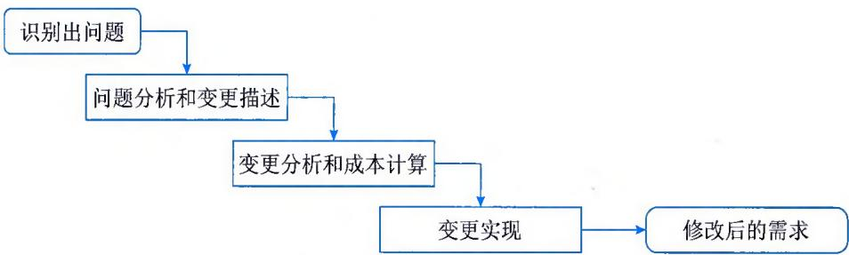
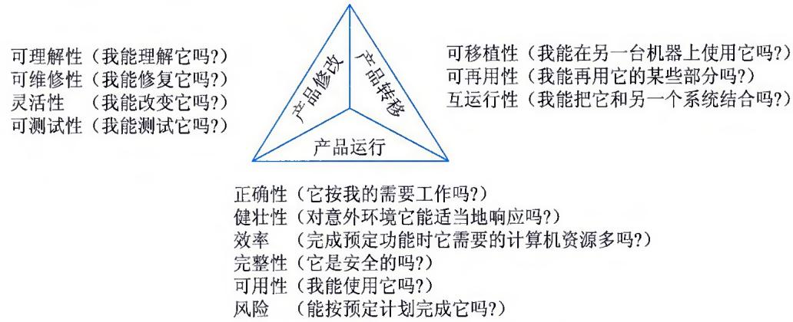
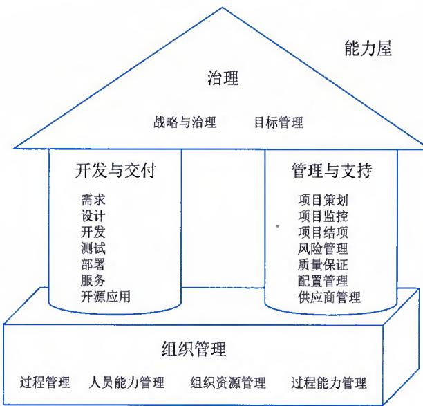
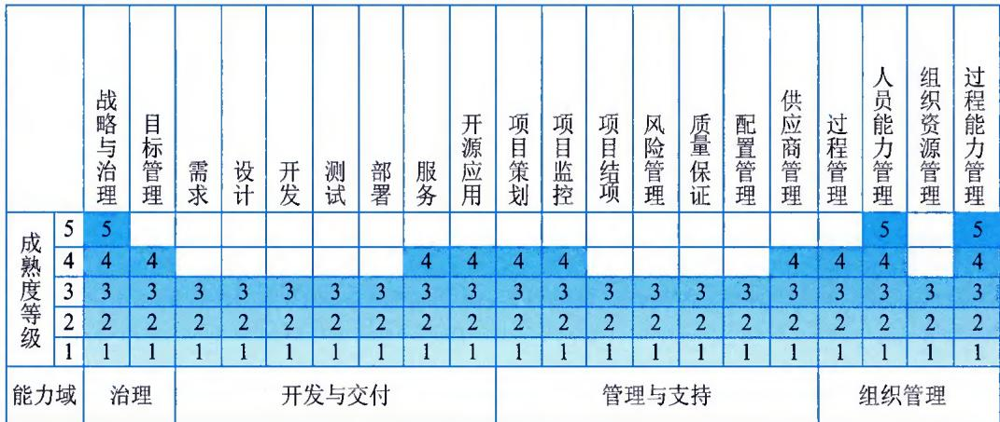

>[!info] 现行教材 · 第 2 版
>本页为**现行考试依据**的教材原文（第 2 版，2024 年 10 月出版，2025 年起启用）。
>考纲层级见 [[知识体系]]；练习题见 [[练习题·基础知识]]；案例模板见 [[案例答题模板]]。

# 第6章 软件开发过程管理

软件开发过程是指用于开发和维护软件及其相关产品的一系列活动、方法、实践和革新。在软件开发过程中，除了先进技术和开发方法外，还有一整套的管理技术。这套管理技术用于研究如何有效地对软件开发过程进行管理，以便于按照进度和预算完成软件计划，实现预期的经济效益和社会效益。通过对开发过程的有效管理，可以更好地组织和协调人员，合理分配资源，控制项目的进度，保证项目的质量，减少项目的风险，最终实现项目的目标。

## 6.1 基本概念

软件开发过程管理需要应用计算机科学、数学及管理科学等原理，以工程化的原则和方法来解决软件问题，其目的是提高软件生产率、提高软件质量、降低软件成本。将系统的、规范的、可度量的工程化方法应用于软件开发、运行和维护的全过程，能够以较经济的手段获得能在实际机器上有效运行的可靠软件。

## 6.1.1 活动与职责

软件开发过程涉及众多活动，每项活动都有不同的任务和目标。管理工程师在这个过程中扮演着关键的角色，他们负责项目的计划、组织、执行、控制和结束。通过有效的开发过程管理，可以确保软件系统的成功开发，从而提高组织的运营效率和质量。

## 1. 一般过程活动

在开发一个软件系统时，一系列的活动、方法和最佳实践被用于管理这个过程，确保项目的成功。软件开发过程是从项目的启动到项目的结束，完成软件系统的开发。通常包括以下几个关键活动：

\- 需求分析。需要与客户进行沟通，了解客户的需求，分析项目的目标、范围、时间、成本和质量要求，并制定需求文档。

\- 系统设计。需要根据需求文档，设计系统的架构、接口、数据模型和算法，并制定设计文档。

\- 编码。需要根据设计文档编写代码，实现系统的功能。

\- 测试。需要对系统进行测试，确保系统的功能正确、性能良好和安全稳定。

\- 部署。需要将系统部署到生产环境，进行实施和培训。

\- 维护。需要对系统进行维护，包括对系统进行监控、备份、恢复、更新等。

## 2. 管理工程主要职责

管理工程师在软件系统开发过程中扮演着关键的角色。他们通常具有以下职责：

\- 项目计划。管理工程师需要确定项目的目标、范围、时间、成本和质量要求，制订项目计划。

\- 项目组织。管理工程师需要确定项目的组织结构，分配资源，确定团队成员的职责。

\- 项目执行。管理工程师需要根据项目计划和组织结构，实施项目的各项活动。

\- 项目控制。管理工程师需要监控项目的进度和性能，确保项目按计划进行，如果出现偏差，需要采取相应的措施。

\- 项目结束。管理工程师需要完成项目的所有活动，交付项目产出，评估项目的绩效。

## 6.1.2 常见过程模型

开发过程模型是用于指导软件系统开发过程的一系列活动、方法和最佳实践的集合，常见的开发过程模型包括瀑布模型、迭代模型、增量模型、螺旋模型、敏捷模型等。相关说明如表 6-1 所示。

表 6-1 常见开发过程模型说明

<table><tr><td>名称</td><td colspan="2">说明</td></tr><tr><td rowspan="3">瀑布模型</td><td>定义</td><td>瀑布模型是最早的系统开发模型之一,它将开发过程分为一系列连续的阶段,每个阶段依赖于前一个阶段的完成。这些阶段包括需求分析、系统设计、编码、测试、部署、维护。每个阶段都有明确定义的任务和目标</td></tr><tr><td>优点</td><td>● 瀑布模型的流程是线性的,因此易于理解和管理
● 每个阶段有明确的输入和输出,这有助于确保质量和项目管理
● 该模型适用于需求稳定、项目相对简单的情况</td></tr><tr><td>缺点</td><td>● 瀑布模型不适用于需求不明确或可能变化的项目
● 如果在开发过程的后期发现问题,可能需要返回到前面的阶段,这将导致时间和成本的增加
● 该模型不适合大型和复杂的项目</td></tr><tr><td rowspan="3">迭代模型</td><td>定义</td><td>迭代模型是一种将开发过程分为一系列重复的迭代的模型,每个迭代包括需求分析、系统设计、编码、测试、部署。在每个迭代完成后,可以得到一个可以运行的系统</td></tr><tr><td>优点</td><td>● 迭代模型可以逐步完成系统的开发,可以更灵活地应对需求的变化
● 该模型可以更早地发现和解决问题,降低风险
● 该模型适用于需求不稳定、项目相对复杂的情况</td></tr><tr><td>缺点</td><td>● 迭代模型需要更多的管理和控制
● 该模型可能会产生较多的文档
● 该模型可能会导致项目的时间和成本的增加</td></tr><tr><td rowspan="2">增量模型</td><td>定义</td><td>增量模型是将开发过程分为一系列增量的模型,每个增量包括一部分系统的功能。在每个增量完成后,可以得到一个具有部分功能的系统。系统的第一个版本通常包括最重要的功能,后续的版本逐步添加新的功能</td></tr><tr><td>优点</td><td>● 增量模型可以逐步完成系统的开发,可以逐步交付系统的功能
● 该模型可以更早地发现和解决问题,降低风险
● 该模型适用于需求不稳定、项目相对复杂的情况</td></tr><tr><td>增量模型</td><td>缺点</td><td>● 增量模型需要更多的管理和控制● 该模型需要在项目开始时确定所有的需求● 该模型可能会导致项目的时间和成本的增加</td></tr><tr><td rowspan="3">螺旋模型</td><td>定义</td><td>螺旋模型是将开发过程分为一系列迭代的模型,每个迭代包括需求分析、系统设计、编码、测试、部署,并在每个迭代进行风险分析。在每个迭代完成后,可以得到一个可以运行的系统</td></tr><tr><td>优点</td><td>● 螺旋模型可以逐步完成系统的开发,可以更灵活地应对需求的变化● 该模型可以在每个迭代进行风险分析,降低风险● 该模型适用于需求不稳定、项目相对复杂、风险较高的情况</td></tr><tr><td>缺点</td><td>● 螺旋模型需要更多的管理和控制● 该模型可能会产生较多的文档● 该模型可能会导致项目的时间和成本的增加</td></tr><tr><td rowspan="3">敏捷模型</td><td>定义</td><td>敏捷模型是一种强调灵活性和快速响应变化的开发模型。敏捷模型包括一系列的敏捷方法和最佳实践,例如 Scrum、Kanban、极限编程(XP)等</td></tr><tr><td>优点</td><td>● 敏捷模型可以灵活地应对需求的变化,提高项目的适应性● 该模型强调团队的协作和持续改进● 该模型适用于需求不稳定、项目相对复杂、时间敏感的情况</td></tr><tr><td>缺点</td><td>● 敏捷模型需要团队有较高的自我管理能力● 该模型可能不适合需求明确、项目相对简单的情况● 该模型可能不适合大型和复杂的项目</td></tr></table>

常见的敏捷方法包括：

\- Scrum。Scrum是一种敏捷开发方法，它将开发过程分为一系列的迭代，每个迭代称为一个Sprint（冲刺），通常持续2～4周。在每个Sprint开始时，需要确定这个Sprint需要实现的需求，并制定Sprint Backlog（冲刺待办列表）。在每个Sprint结束时，需要进行Sprint Review（冲刺评审）和Sprint Retrospective（冲刺回顾）。

\- Kanban。Kanban是一种敏捷开发方法，它使用Kanban Board（看板图）来管理开发过程。Kanban Board上有一系列的列，每一列代表一个开发过程的阶段，例如To Do（待办）、In Progress（进行中）、Done（完成）等。在开发过程中，需要将任务从一列移动到下一列。

\- 极限编程（XP）。极限编程是一种敏捷开发方法，它强调代码的质量和团队的协作。极限编程包括一系列的最佳实践，例如测试驱动开发（TDD）、持续集成、代码重构等。

开发过程模型是信息系统管理工程师在开发信息系统时需要考虑的重要因素。不同的项目可能适用于不同的开发过程模型，因此需要根据项目的特点和需求，选择合适的开发过程模型。

## 6.2 软件需求

软件需求是指用户对系统在功能、性能和设计约束等方面的期望。根据 IEEE 的软件工程标准词汇表，软件需求是指用户解决问题或达到目标所需的条件或能力，是系统或系统部件要满足合同、标准、规范或其他正式规定文档所需具有的条件或能力，以及反映这些条件或能力的文档说明。

## 6.2.1 需求的层次

简单地说，软件需求就是系统必须完成的事以及必须具备的品质。需求是多层次的，包括业务需求、用户需求和系统需求，这3个不同层次从抽象到具体，从整体到局部，从概念到细节。

（1）业务需求。业务需求是指反映组织机构或用户对系统、产品高层次的目标要求，从总体上描述了为什么要达到某种效应，组织希望达到什么目标。通常来自项目投资人、购买产品的客户、客户单位的管理人员、市场营销部门或产品策划部门等。通过业务需求可以确定项目视图和范围，项目视图和范围文档把业务需求集中在一个简单、紧凑的文档中，该文档为以后的设计开发工作奠定了基础。

（2）用户需求。用户需求描述的是用户的具体目标，或用户要求系统必须能完成的任务和想要达到的结果，这两方面构成了用户原始需求文档的内容。也就是说，用户需求必须能够体现某种系统将给用户带来的业务价值，描述了用户能使用系统来做些什么。通常采取用户访谈和问卷调查等方式，对用户使用的场景（scenarios）进行整理，从而建立用户需求。

（3）系统需求。系统需求是从系统的角度来说明软件的需求，包括功能需求、非功能需求和约束等。功能需求也称为行为需求，规定了开发人员必须在系统中实现的软件功能，用户利用这些功能来完成任务，满足业务需要。功能需求通常是通过对系统特性的描述表现出来的，所谓特性，是指一组逻辑上相关的功能需求，表示系统为用户提供某项功能（服务），使用户的业务目标得以满足。非功能需求描述了系统展现给用户的行为和执行的操作等，包括产品必须符合的标准、规范和合约，是指系统必须具备的属性或品质，又可细分为软件质量属性（例如性能效率、易用性和可维护性等）和其他非功能需求。约束是指对开发人员在软件产品设计和构造上的限制，常见的有设计约束和过程约束，例如，政府采购的业务系统运行在符合政府采购需求标准的操作系统之上等。

## 6.2.2 质量功能部署

质量功能部署（Quality Function Deployment，QFD），即通过多种角度对产品的特点进行描述，从而反映产品功能，是一种将用户要求转化成软件需求的技术，其目的是最大限度地提升软件工程过程中用户的满意度。为了达到这个目标，QFD将软件需求分为三类，分别是常规需求、期望需求和意外需求。

（1）常规需求。用户认为系统应该做到的功能或性能，实现越多用户会越满意。

（2）期望需求。用户想当然认为系统应具备的功能或性能，但他们并不能正确描述自己想要得到的这些功能或性能需求。如果期望需求没有得到实现，会让用户感到不满意。

（3）意外需求。意外需求也称为兴奋需求，是用户要求范围外的功能或性能（但通常是软件开发人员很乐意赋予系统的技术特性），实现这些需求用户会更高兴，但不实现也不影响其购买的决策。意外需求是控制在开发人员手中的，开发人员可以选择实现更多的意外需求，以便得到高满意、高忠诚度的用户，也可以（出于成本或项目周期的考虑）选择不实现任何意外需求。

## 6.2.3 需求获取

需求获取是确定和理解不同的项目干系人对系统的需求和约束的过程。需求获取是否科学、准确、完整、全面，对需求的形成影响很大，然而用户往往很难完整正确地表述出原始需求，同时用户也很难想象未来的软件应该提供哪些功能以解决其面临的业务问题。因此，需求获取需要在理解业务场景的基础上，调查用户业务范围，涵盖软件生存周期的所有阶段，从用户角度思考，观察用户行为，快速迭代收集用户需求。不同项目干系人对系统的需求不同，与业务关联程度也不尽相同。常见的需求获取方法包括用户访谈、问卷调查、采样、情节串联板和联合需求计划等。

需求获取是开发者和用户之间为了定义新系统而进行交流，是获得系统必要的特征，或者获得用户能接受的、系统必须满足的约束的过程。需求获取始终需要围绕实现或达到的业务目标，以软件能够解决哪些问题为导向，专注用户关键的业务活动，通过具体的需求确保达到业务目标。如果双方所理解的领域内容在系统分析、设计过程出现问题，通常在开发过程的后期才会被发现，将会使整个系统交付延迟，或上线的系统无法或难以使用，最终导致项目失败。例如，遗漏的需求或理解错误的需求。

## 6.2.4 需求分析

在需求获取阶段获得的需求是杂乱的，是用户对新系统的期望和要求，这些要求有重复的地方，也有矛盾的地方，这样的要求是不能作为软件设计的基础的。一个好的需求应该具有无二义性、完整性、一致性、可测试性、确定性、可跟踪性、正确性和必要性等特性，因此，需要分析人员把杂乱无章的用户要求和期望转化为用户需求，这就是需求分析的工作。

需求分析将提炼、分析和审查已经获取到的需求，以确保所有的项目干系人都明白其含义，并找出其中的错误、遗漏或其他不足的地方。需求分析的关键在于对问题域的研究与理解。为了便于理解问题域，现代软件工程方法所推荐的做法是对问题域进行抽象，将其分解为若干个基本元素，然后对元素之间的关系进行建模。

## 1.结构化分析

结构化分析（Structured Analysis，SA）方法能够帮助系统分析人员产生功能规约的原理与技术，其建立的模型的核心是数据字典。围绕这个核心，有三个层次的模型，分别是数据模型、功能模型和行为模型（也称为状态模型）。在实际工作中，一般使用实体关系图（E-R图）

表示数据模型，用数据流图（Data Flow Diagram，DFD）表示功能模型，用状态转换图（State Transform Diagram，STD）表示行为模型。E-R图主要描述实体、属性，以及实体之间的关系；DFD从数据传递和加工的角度，利用图形符号通过逐层细分描述系统内各个部件的功能和数据在它们之间传递的情况，来说明系统所完成的功能；STD通过描述系统的状态和引起系统状态转换的事件，来表示系统的行为，指出作为特定事件的结果将执行哪些动作（例如，处理数据等）。结构化分析通常包含以下几个步骤：

\- 分析业务情况，做出反映当前物理模型的DFD。

$\bullet$ 推导出等价的逻辑模型的DFD。

\- 设计新的逻辑系统，生成数据字典和基元描述。

\- 建立人机接口，提出可供选择的目标系统物理模型的DFD。

\- 确定各种方案的成本和风险等级，据此对各种方案进行分析。

\- 选择一种方案。

\- 建立完整的需求规约。

## 1）DFD需求建模方法

DFD需求建模方法也称为过程建模和功能建模方法。DFD建模方法的核心是数据流，从应用系统的数据流着手，以图形方式刻画和表示一个具体业务系统中的数据处理过程和数据流。DFD建模方法首先抽象出具体应用的主要业务流程，然后分析其输入，如其初始的数据有哪些，这些数据从哪里来，将流向何处，又经过了什么加工，加工后又变成了什么数据，这些数据流最终将得到什么结果。通过对系统业务流程的层层追踪和分析，把要解决的问题清晰地展现及描述出来，为后续的设计、编码及实现系统的各项功能打下基础。DFD建模方法由4种基本元素（模型对象）组成：数据流、处理/加工、数据存储和外部项。

\- 数据流（Data Flow）。数据流用一个箭头描述数据的流向，箭头上标注的内容可以是信息说明或数据项。

\- 处理（Process）。表示对数据进行的加工和转换，在图中用矩形框表示。指向处理的数据流为该处理的输入数据，离开处理的数据流为该处理的输出数据。

\- 数据存储。表示用数据库形式或者文件形式存储的数据，对其进行的存取分别以指向或离开数据存储的箭头表示。

\- 外部项。也称为数据源或者数据终点。描述系统数据的提供者或者数据的使用者，如教师、学生、采购员、某个组织或部门或其他系统，在图中用圆角框或者平行四边形框表示。

建立 DFD 的目的是描述系统的功能需求。DFD 建模方法利用应用问题域中数据及信息的提供者与使用者、信息的流向、处理、存储 4 种元素描述系统需求，建立应用系统的功能模型。具体的建模过程及步骤如下：

\- 明确目标，确定系统范围。首先要明确目标系统的功能需求，并将用户对目标系统的功能需求完整、准确、一致地描述出来，然后确定模型要描述的问题域。虽然在建模过程中这些内容是逐步细化的，但必须自始至终保持一致、清晰和准确。

\- 建立顶层DFD。顶层DFD表达和描述了将要实现的系统的主要功能，同时也确定了整个模型的内外关系，表达了系统的边界及范围，也构成了进一步分解的基础。

\- 构建第一层DFD分解图。根据应用系统的逻辑功能，把顶层DFD中的处理分解成多个更细化的处理。

\- 开发DFD层次结构图。对第一层DFD分解图中的每个处理框做进一步分解，在分解图中要列出所有的处理及其相关信息，并要注意分解图中的处理与信息包括父图中的全部内容。分解可采用以下原则：保持均匀的模型深度；按困难程度进行选择；如果一个处理难以确切命名，可以考虑对它重新分解。

\- 检查确认DFD。按照规则检查和确定DFD，以确保构建的DFD模型是正确的、一致的，且满足要求。具体规则包括：父图中描述过的数据流必须要在相应的子图中出现；一个处理至少有一个输入流和一个输出流；一个存储必定有流入的数据流和流出的数据流；一个数据流至少有一端是处理端；模型图中表达和描述的信息是全面的、完整的、正确的和一致的。

经过以上过程与步骤后，顶层图被逐层细化，同时也把面向问题的术语逐渐转化为面向现实的解法，并得到最终的 DFD 层次结构图。层次结构图中的上一层是下一层的抽象，下一层是上一层的求精和细化，而最后一层中的每个处理都是面向一个具体的描述，即一个处理模块仅描述和解决一个问题。

## 2）数据字典应用

数据字典（Data Dictionary）是一种用户可以访问的记录数据库和应用程序元数据的目录。数据字典是指对数据的数据项、数据结构、数据流、数据存储、处理逻辑等进行定义和描述，其目的是对数据流程图中的各个元素做出详细的说明。简而言之，数据字典是描述数据的信息集合，是对系统中使用的所有数据元素定义的集合。

数据字典最重要的作用是作为分析阶段的工具。任何字典最重要的用途都是供人查询，在结构化分析中，数据字典的作用是给数据流图上每个元素加以定义和说明。换句话说，数据流图上所有元素的定义和解释的文字集合就是数据字典。数据字典中建立的严密一致的定义，有助于改进分析员和用户的通信与交互。数据字典主要包括数据项、数据结构、数据流、数据存储、处理过程等几部分。

\- 数据项。数据流图中数据块的数据结构中的数据项说明。数据项是不可再分的数据单位。对数据项的描述通常包括数据项名、数据项含义说明、别名、数据类型、长度、取值范围、取值含义、与其他数据项的逻辑关系等。其中"取值范围""与其他数据项的逻辑关系"定义了数据的完整性约束条件，是设计数据检验功能的依据。若干个数据项可以组成一个数据结构。

\- 数据结构。数据流图中数据块的数据结构说明。数据结构反映了数据之间的组合关系。一个数据结构可以由若干个数据项组成，也可以由若干个数据结构组成，或由若干个数据项和数据结构混合组成。对数据结构的描述通常包括数据结构名、含义说明、组成（数据项或数据结构）等。

\- 数据流。数据流图中流线的说明。数据流是数据结构在系统内传输的路径。对数据流的描述通常包括：数据流名、说明、数据流来源、数据流去向、组成（数据结构）、平均流量、高峰期流量等。其中"数据流来源"是说明该数据流来自哪个过程，即数据的来源；"数据流去向"是说明该数据流将到哪个过程去，即数据的去向；"平均流量"是指在单位时间（每天、每周、每月等）里的传输次数；"高峰期流量"则是指在高峰时期的数据流量。

\- 数据存储。数据流图中数据块的存储特性说明。数据存储是数据结构停留或保存的地方，也是数据流的来源和去向之一。对数据存储的描述通常包括数据存储名、说明、编号、流入的数据流、流出的数据流、组成（数据结构）、数据量、存取方式等。其中"数据量"是指每次存取多少数据，每天（或每小时、每周等）存取几次等信息；"存取方式"包括是批处理还是联机处理，是检索还是更新，是顺序检索还是随机检索等。另外，"流入的数据流"要指出其来源，"流出的数据流"要指出其去向。

\- 处理过程。数据流图中功能块的说明。数据字典中只需要描述处理过程的说明性信息，通常包括处理过程名、说明、输入（数据流）、输出（数据流）、处理（简要说明）等。其中"简要说明"中主要说明该处理过程的功能及处理要求。功能是指该处理过程用来做什么（并不是怎样做）；处理要求包括处理频率要求，如单位时间里处理多少事务、多少数据量、响应时间要求等，这些处理要求是后续物理设计的输入及性能评价的标准。

## 2. 面向对象分析

面向对象的分析（Object-Oriented Analysis，OOA）方法能正确认识其中的事物及它们之间的关系，找出描述问题域和系统功能所需的类和对象，定义它们的属性和职责，以及它们之间所形成的各种联系。最终产生一个符合用户需求，并能直接反映问题域和系统功能的 OOA 模型及其详细说明。

面向对象分析与结构化分析有较大的区别。OOA所强调的是在系统调查资料的基础上，针对OO方法所需要的素材进行的归类分析和整理，而不是对管理业务现状和方法的分析。OOA模型由5个层次（主题层、对象类层、结构层、属性层和服务层）和5个活动（标识对象类、标识结构、定义主题、定义属性和定义服务）组成。在这种方法中，定义了两种对象类之间的结构，一种称为分类结构，另一种称为组装结构。分类结构就是所谓的一般与特殊的关系；组装结构则反映了对象之间的整体与部分的关系。

## 1）OOA的基本原则

OOA的基本原则主要包括抽象、封装、继承、分类、聚合、关联、消息通信、粒度控制和行为分析。

\- 抽象。抽象是从许多事物中舍弃个别的、非本质的特征，抽取共同的、本质性的特征。抽象是形成概念的必须手段。抽象是面向对象方法中使用最为广泛的原则。抽象原则包括过程抽象和数据抽象两个方面。过程抽象是指任何一个完成确定功能的操作序列，其使用者都可以把它看作一个单一的实体，尽管实际上它可能是由一系列更低级的操作完成的。数据抽象是根据施加于数据之上的操作来定义数据类型，并限定数据的值只能由这些操作来修改和观察。数据抽象是OOA的核心原则。它强调把数据（属性）和操作（服务）结合为一个不可分的系统单位（即对象），对象的外部只需要知道它做什么，而不必知道它如何做。

\- 封装。封装就是把对象的属性和服务结合为一个不可分的系统单位，并尽可能隐蔽对象的内部细节。这个概念也经常用于从外部隐藏程序单元的内部表示。

\- 继承。特殊类的对象拥有其对应的一般类的全部属性与服务，称作特殊类对一般类的继承。在OOA中运用继承原则，在特殊类中不再重复地定义一般类中已定义的属性和服务，但是在语义上，特殊类却自动地、隐含地拥有一般类（以及所有更上层的一般类）中定义的全部属性和服务。继承原则的好处是使系统模型比较简练和清晰。

\- 分类。分类就是把具有相同属性和服务的对象划分为一类，用类作为这些对象的抽象描述。分类原则实际上是抽象原则运用于对象描述时的一种表现形式。

\- 聚合。聚合又称为组装，其原则是把一个复杂的事物看成若干个比较简单的事物的组装体，从而简化对复杂事物的描述。

\- 关联。关联是人类思考问题时经常运用的思想方法，即通过一个事物联想到另外的事物。能使人发生联想的原因是事物之间确实存在着某些联系。

\- 消息通信。这一原则要求对象之间只能通过消息进行通信，而不允许在对象之外直接地存取对象内部的属性。通过消息进行通信是由于封装原则而引起的。在OOA中要求用消息连接表示对象之间的动态联系。

\- 粒度控制。一般来讲，人在面对一个复杂的问题域时，不可能在同一时刻既能纵观全局，又能洞察秋毫。因此需要控制自己的视野，即考虑全局时，注意其大的组成部分，暂时不考虑具体的细节；考虑某部分的细节时，则暂时撇开其余的部分。这就是粒度控制原则。

\- 行为分析。现实世界中事物的行为是复杂的，在由大量的事物所构成的问题域中，各种行为往往相互依赖、相互交织。

## 2）OOA的基本步骤

OOA大致上遵循如下5个基本步骤：

\- 确定对象和类。这里所说的对象是对数据及其处理方式的抽象，它反映了系统保存和处理现实世界中某些事物的信息的能力。类是多个对象的共同属性和方法集合的描述，它包括如何在一个类中建立一个新对象的描述。

\- 确定结构。结构是指问题域的复杂性和连接关系。类成员结构反映了泛化-特化关系，整体-部分结构反映了整体和局部之间的关系。

\- 确定主题。主题是指事物的总体概貌和总体分析模型。

\- 确定属性。属性就是数据元素，可用来描述对象或分类结构的实例，可在图中给出，并在对象的存储中指定。

\- 确定方法。方法是在收到消息后必须进行的一些处理方法，即方法要在图中定义，并在对象的存储中指定。对于每个对象和结构来说，那些用来增加、修改、删除和选择的方法本身都是隐含的（虽然它们是要在对象的存储中定义的，但并不在图上给出），而有些则是显示的。

## 6.2.5 需求规格说明书

软件需求规格说明书（Software Requirement Specification，SRS）是在需求分析阶段需要完成的文档，是软件需求分析的最终结果，是确保每个要求得以满足所使用的方法。编制该文档的目的是使项目干系人与开发团队对系统的初始规定有一个共同的理解，使之成为整个开发工作的基础。SRS 是软件开发过程中最重要的文档之一，任何规模和性质的软件项目都不应该缺少。

国家标准GB/T8567《计算机软件文档编制规范》中，提供了一个SRS的文档模板和编写指南，其中规定SRS应该包括范围、引用文件、需求、合格性规定、需求可追踪性、尚未解决的问题、注解和附录。

（1）范围。包括 SRS 适用的系统和软件的完整标识，（若适用）包括标识号、标题、缩略词语、版本号和发行号；简述 SRS 适用的系统和软件的用途，描述系统和软件的一般特性；概述系统开发、运行和维护的历史；标识项目的投资方、需方、用户、承建方和支持机构；标识当前和计划的运行现场；列出其他有关的文档；概述 SRS 的用途和内容，并描述与其使用有关的保密性和私密性的要求；说明编写 SRS 所依据的基础。

（2）引用文件。列出SRS中引用的所有文档的编号、标题、修订版本和日期，还应标识不能通过正常的供货渠道获得的所有文档的来源。

（3）需求。这一部分是SRS的主体部分，详细描述软件需求，可以分为以下项目：所需的状态和方式、需求概述、需求规格、软件配置项能力需求、软件配置项外部接口需求、软件配置项内部接口需求、适应性需求、保密性和私密性需求、软件配置项环境需求、计算机资源需求（包括硬件需求、硬件资源利用需求、软件需求和通信需求）、软件质量因素、设计和实现约束、数据、操作、故障处理、算法说明、有关人员需求、有关培训需求、有关后勤需求、包装需求和其他需求，以及需求的优先次序和关键程度。

（4）合格性规定。这一部分定义一组合格性的方法，对于第（3）部分中的每个需求，指定所使用的方法，以确保需求得到满足。合格性方法包括演示、测试、分析、审查和特殊的合格性方法（例如，专用工具、技术、过程、设施和验收限制等）。

（5）需求可追踪性。这一部分包括从 SRS 中每个软件配置项的需求到其涉及的系统（或子系统）需求的双向可追踪性。

（6）尚未解决的问题。如果有必要，可以在这一部分说明软件需求中的尚未解决的遗留问题。

（7）注解。包含有助于理解SRS的一般信息，例如，背景信息、词汇表、原理等。这一部分应包含为理解SRS所需要的术语和定义，所有缩略语和它们在SRS中的含义的字母序列表。

（8）附录。提供那些为便于维护 SRS 而单独编排的信息（例如，图表、分类数据等）。为便于处理，附录可以单独装订成册，按字母顺序编排。

另外，国家标准GB/T9385《计算机软件需求规格说明规范》也给出了一个详细的SRS写作大纲，可以考虑作为SRS写作的参考之用。

## 6.2.6 需求确认

当以 SRS 为基础进行后续开发工作时，如果在开发后期或在交付系统之后才发现需求存在问题，这时修补需求错误就需要做大量的工作。相对而言，在系统分析阶段，检测 SRS 中的错误所采取的任何措施都将节省相当多的时间和资金。因此，有必要对 SRS 的正确性进行验证，以确保需求符合良好特征。需求验证也称为需求确认，其活动需要确定的内容包括：

\- SRS正确地描述了预期的、满足项目干系人需求的系统行为和特征。

\- SRS中的软件需求是从系统需求、业务规格和其他来源中正确推导而来的。

\- 需求是完整的和高质量的。

\- 需求的表示在所有地方都是一致的。

\- 需求为继续进行系统设计、实现和测试提供了足够的基础。

项目团队应通过适当的方式与利益相关方就需求达成一致的理解，包括利益相关方明示的、潜在的和外部接口等方面的需求，以及必须遵守的限制与约束条件。需求利益相关方应涵盖任何可能影响需求的关键人员或事物。应建立和维护软件需求与软件开发各阶段工作产出物之间的关系，确保双向可追溯。

在实际工作中，一般通过需求评审和需求测试工作来对需求进行验证或确认。需求评审就是对SRS进行技术评审，SRS的评审是一项精益求精的技术，它可以发现那些二义性的或不确定性的需求，为项目干系人提供在需求问题上达成共识的方法。需求的遗漏和错误具有很强的隐蔽性，仅仅通过阅读SRS，通常很难想象在特定环境下系统的行为。只有在业务需求基本明确，用户需求部分确定时，同步进行需求测试，才可能及早发现问题，从而在需求开发阶段以较低的代价解决这些问题。必要时，可以采用模拟仿真、原型展示和专家评审等方式确认需求，解决利益相关方的疑问和发现的问题。

## 6.2.7 需求变更

在当前的软件开发过程中，需求变更已经成为一种常态。需求变更的原因有很多，可能是需求获取不完整，存在遗漏的需求，可能是对需求的理解产生了误差，也可能是业务变化导致了需求的变化等。一些需求的改进是合理的而且不可避免，要使得软件需求完全不变更，基本上是不可能的。但毫无控制的变更会导致项目陷入混乱，不能按进度完成或者软件质量无法保证。

事实上，迟到的需求变更会对已进行的工作产生非常大的影响。如果不控制变更的影响范围，在项目开发过程中持续不断地采纳新功能，不断地调整资源、进度或者质量标准是极为有害的。如果每一个建议的需求变更都采用，该项目将有可能永远不能完成。软件需求文档应该精确描述要交付的产品与服务，这是一个基本的原则。为了使开发组织能够严格控制软件项目，应该确保：仔细评估已建议的变更、挑选合适的人选对变更做出判定、变更应及时通知所有相关人员、项目要按一定的程序来采纳需求变更、对变更的过程和状态进行控制。

## 1）变更控制过程

变更控制过程用来跟踪已建议变更的状态，确保已建议的变更不会丢失或疏忽。一旦确定了需求基线，应该使所有已建议的变更都遵循变更控制过程。需求变更管理过程如图6-1所示。

  
图6-1 需求变更管理过程

\- 问题分析和变更描述。当提出一份变更提议后，需要对该提议做进一步的问题分析，检查它的有效性，从而产生一个更明确的需求变更提议。

\- 变更分析和成本计算。当接受该变更提议后，需要对需求变更提议进行影响分析和评估。变更成本计算应该包括该变更所引起的所有改动的成本，例如，修改需求文档，以及相应的设计、实现等工作成本。一旦分析完成并且被确认，应该进行是否执行这一变更的决策。

\- 变更实现。当确定执行该变更后，需要根据该变更的影响范围，按照开发的过程模型执行相应的变更。在计划驱动过程模型中，往往需要回溯到需求分析阶段，重新做对应的需求分析、设计和实现等步骤；在敏捷开发模型中，往往会将需求变更纳入下一次迭代的执行过程中。

变更控制过程并不是给变更设置障碍。相反地，它是一个渠道和过滤器，通过它可以确保采纳最合适的变更，使变更产生的负面影响降到最低。

## 2）变更策略

控制需求变更与项目其他配置的管理决策也有着密切的联系。项目管理应该达成一个策略，用来描述如何处理需求变更，而且策略应具有现实可行性。常见的需求变更策略主要包括：

\- 所有需求变更必须遵循变更控制过程。

\- 对于未获得批准的变更，不应该做设计和实现工作。

\- 应该由项目变更控制委员会决定实现哪些变更。

\- 项目风险承担者应该能够了解变更的内容。

\- 绝不能从项目配置库中删除或者修改变更请求的原始文档。

\- 每一个集成的需求变更必须能跟踪到一个经核准的变更请求。

目前存在很多需求变更跟踪工具，这些工具用来收集、存储和管理需求变更，可以随时按

变更状态分类报告变更请求的数目和实现情况等。

## 3）变更控制委员会

变更控制委员会（Change Control Board，CCB）是项目所有者权益代表，负责裁定接受哪些变更。CCB由项目所涉及的多方成员共同组成，通常包括用户和实施方的决策人员。CCB是决策机构，不是作业机构，通常CCB的工作是通过评审手段来决定项目是否能变更，但不提出变更方案。变更控制委员会可能包括如下方面的代表：

\- 产品或计划管理部门。

\- 项目管理部门。

\- 开发部门。

\- 测试或质量保证部门。

\- 市场部或客户代表。

\- 用户文档的编制部门。

\- 技术支持部门。

\- 桌面或用户服务支持部门。

\- 配置管理部门。

变更控制委员会应该有一个总则，用于描述变更控制委员会的目的、授权范围、成员构成、做出决策的过程及操作步骤。总则也应该说明举行会议的频率和事由等。授权范围描述该委员会能做什么样的决策，以及哪类决策应上报到高一级的委员会。做出决策的过程及操作步骤主要包括制定决策、交流情况和重新协商约定等。

\- 制定决策。制定决策过程的描述应确认：①变更控制委员会必须到会的人数或做出有效决定必须出席的人数；②决策的方法，例如投票，一致通过或其他机制；③变更控制委员会主席是否可以否决该集体的决定等。变更控制委员会应该对每个变更权衡利弊后做出决定："利"包括节省的资金或额外的收入、增强的客户满意度、竞争优势、缩短上市时间等；"弊"是指接受变更后产生的负面影响，包括增加的开发费用、推迟的交付日期、产品质量的下降、减少的功能、用户不满意度等。

\- 交流情况。一旦变更控制委员会做出决策，相应的人员应及时更新请求的状态。

\- 重新协商约定。变更总是有代价的，即使拒绝的变更也因为决策行为（提交、评估、决策）而耗费了资源。当项目接受了重要的需求变更时，为了适应变更情况，要与管理部门和客户重新协商约定。协商的内容可能包括推迟交付时间、要求增加人手、推迟实现尚未实现的较低优先级的需求，或者在质量上进行调整等。

## 6.2.8 需求跟踪

需求跟踪包括编制每个需求同系统元素之间的联系文档，这些元素包括其他需求、体系结构、其他设计部件、源代码模块、测试、帮助文件和文档等，是要在整个项目的工件之间形成水平可追踪性。跟踪能力信息使变更影响分析十分便利，有利于确认和评估实现某个建议的需求变更所必需的工作。

需求跟踪提供了由需求到产品实现整个过程范围的明确查阅的能力。需求跟踪的目的是建立与维护"需求-设计-编程-测试"之间的一致性，确保所有的工作成果符合用户需求。需求跟踪有正向跟踪和逆向跟踪两种方式。

\- 正向跟踪。检查SRS中的每个需求是否都能在后续工作成果中找到对应点。

\- 逆向跟踪。检查设计文档、代码、测试用例等工作成果是否都能在SRS中找到出处。

正向跟踪和逆向跟踪合称为"双向跟踪"。不论采用何种跟踪方式，都要建立与维护需求跟踪矩阵（即表格）。需求跟踪矩阵保存了需求与后续工作成果的对应关系。跟踪能力是优秀 SRS 的一个特征，为了实现可跟踪，必须统一地标识出每一个需求，以便能明确地进行查阅。需求跟踪要求手工操作且劳动强度很大，需要组织提供支持。随着系统开发的进行和维护的执行，要保持关联信息与实际一致。跟踪能力信息一旦过时，可能再也不会重建它。在实际项目中，往往采用专门的配置管理工具来实现需求跟踪。

## 6.3 软件设计

软件设计的目标是根据软件分析的结果，完成软件构建的过程。其主要目的是绘制软件的蓝图，权衡和比较各种技术和实施方法的利弊，合理分配各种资源，构建新的详细设计方案和相关模型，指导软件实施工作的顺利开展。

软件设计是需求的延伸与拓展。需求阶段解决"做什么"的问题，而软件设计阶段解决"怎么做"的问题。同时，它也是系统实施的基础，为系统实施工作做好铺垫。合理的软件设计方案既可以保证软件的质量，也可以提高开发效率，确保软件实施工作的顺利进行。从方法上来说，软件设计分为结构化设计与面向对象设计。

## 6.3.1 结构化设计

结构化设计（Structured Design, SD）是一种面向数据流的方法，其目的在于确定软件结构。它以 SRS 和 SA 阶段所产生的 DFD 和数据字典等文档为基础，是一个自顶向下、逐层分解、逐步求精和模块化的过程。SD 方法的基本思想是将软件设计成由相对独立且具有单一功能的模块组成的结构。从管理角度讲，其分为概要设计和详细设计两个阶段。其中，概要设计又称为总体结构设计，是开发过程中很关键的一步，其主要任务是确定软件系统的结构，将系统的功能需求进行模块划分，确定每个模块的功能、接口和模块之间的调用关系，形成软件的模块结构图，即系统结构图。在概要设计中，将系统开发的总任务分解成许多个基本的、具体的任务，而为每个具体任务选择适当的技术手段和处理方法的过程称为详细设计。详细设计的主要任务是为每个模块设计实现的细节，根据任务的不同，详细设计又可分为多种，例如，输入 / 输出设计、处理流程设计、数据存储设计、用户界面设计、安全性和可靠性设计等。

## 1. 模块结构

系统是一个整体，具有整体性的目标和功能，这些目标和功能的实现是相互联系的各个组成部分共同工作的结果。人们在解决复杂问题时使用的一个很重要的原则，就是将复杂问题分解成多个小问题分别处理，在处理过程中，需要根据系统总体要求，协调各业务部分的关系。在SD中，这种功能分解就是将系统划分为模块，模块是组成系统的基本单位，其特点是可以自由组合、分解和变换，系统中任何一个处理功能都可以看成一个模块。

## 1）信息隐藏与抽象

信息隐藏原则要求采用封装技术，将程序模块的实现细节（过程或数据等）隐藏起来，对于不需要这些信息的其他模块来说是不能访问的，使模块接口尽量简单。按照信息隐藏的原则，系统中的模块应设计成"黑盒"，模块外部只能使用模块接口说明中给出的信息，例如操作和数据类型等。模块之间相对独立，既易于实现，也易于理解和维护。

抽象原则要求抽取事物最基本的特性和行为，参见6.2.4小节中关于抽象的说明。

## 2）模块化

在 SD 方法中，模块是实现功能的基本单位，一般具有功能、逻辑和状态三个基本属性。其中，功能是指该模块 "做什么"，逻辑是描述模块内部 "怎么做"，状态是该模块使用时的环境和条件。在描述一个模块时，必须按模块的外部特性与内部特性分别描述。模块的外部特性是指模块的模块名、参数表和给程序乃至整个系统造成的影响；模块的内部特性则是指完成其功能的程序代码和仅供该模块内部使用的数据。对于模块的外部环境（例如，需要调用这个模块的上级模块）来说，只需要了解这个模块的外部特性就足够了，不必了解它的内部特性。而软件设计阶段，通常是先确定模块的外部特性，然后再确定其内部特性。

## 3）耦合

耦合表示模块之间联系的程度。紧密耦合表示模块之间联系非常强，松散耦合表示模块之间联系比较弱，非直接耦合则表示模块之间无任何直接联系。模块的耦合类型通常分为7种，根据耦合度从低到高排序如表6-2所示。

表 6-2 模块的耦合类型

<table><tr><td>耦合类型</td><td>描述</td></tr><tr><td>非直接耦合</td><td>两个模块之间没有直接关系,它们之间的联系完全是通过上级模块的控制和调用来实现的</td></tr><tr><td>数据耦合</td><td>一组模块借助参数表传递简单数据</td></tr><tr><td>标记耦合</td><td>一组模块通过参数表传递记录等复杂信息(数据结构)</td></tr><tr><td>控制耦合</td><td>模块之间传递的信息中包含用于控制模块内部逻辑的信息</td></tr><tr><td>通信耦合</td><td>一组模块共用了一组输入信息,或者它们的输出需要整合以形成完整数据,即共享了输入或输出</td></tr><tr><td>公共耦合</td><td>多个模块都访问同一个公共数据环境,公共的数据环境可以是全局数据结构、共享的通信区、内存的公共覆盖区等</td></tr><tr><td>内容耦合</td><td>一个模块直接访问另一个模块的内部数据;一个模块不通过正常入口转到另一个模块的内部;两个模块有一部分程序代码重叠;一个模块有多个入口等</td></tr></table>

模块之间耦合的强度，主要依赖于一个模块对另一个模块的调用、一个模块向另一个模块传递的数据量、一个模块施加到另一个模块的控制的多少，以及模块之间接口的复杂程度等。

## 4）内聚

内聚表示模块内部各代码成分之间联系的紧密程度，是从功能角度来度量模块内的联系，一个好的内聚模块应当恰好做目标单一的一件事情。模块的内聚类型通常分为7种，根据内聚度从高到低排序如表6-3所示。

表 6-3 模块的内聚类型

<table><tr><td>内聚类型</td><td>描述</td></tr><tr><td>功能内聚</td><td>完成一个单一功能,各个部分协同工作,缺一不可</td></tr><tr><td>顺序内聚</td><td>处理元素相关,而且必须顺序执行</td></tr><tr><td>通信内聚</td><td>所有处理元素集中在一个数据结构的区域上</td></tr><tr><td>过程内聚</td><td>处理元素相关,而且必须按特定的次序执行</td></tr><tr><td>时间内聚</td><td>所包含的任务必须在同一时间间隔内执行</td></tr><tr><td>逻辑内聚</td><td>完成逻辑上相关的一组任务</td></tr><tr><td>偶然内聚</td><td>完成一组没有关系或松散关系的任务</td></tr></table>

一般来说，系统中各模块的内聚度越高，则模块间的耦合度就越低，但这种关系并不是绝对的。耦合度低使得模块间尽可能相对独立，各模块可以单独开发和维护；内聚度高使得模块的可理解性和维护性大大增强。因此，在模块的分解中应尽量减少模块的耦合，力求增加模块的内聚，遵循"高内聚、低耦合"的设计原则。

## 2. 系统结构图

系统结构图（Structure Chart，SC）又称为模块结构图，它是软件概要设计阶段的工具，反映系统的功能实现和模块之间的联系与通信，包括各模块之间的层次结构，即反映了系统的总体结构。在系统分析阶段，系统分析师可以采用SA方法获取由DFD、数据字典和加工说明等组成的系统的逻辑模型；在系统设计阶段，系统设计师可根据一些规则，从DFD中导出系统初始的SC。

详细设计的主要任务是设计每个模块的实现算法、所需的局部数据结构。详细设计的目标有两个：实现模块功能的算法要逻辑上正确，算法描述要简明易懂。详细设计必须遵循概要设计来进行。详细设计方案的更改，不得影响到概要设计方案；如果需要更改概要设计，必须经过项目经理的同意。详细设计应该完成详细设计文档，主要是模块的详细设计方案说明。设计的基本步骤如下：

\- 分析并确定输入/输出数据的逻辑结构。

\- 找出输入数据结构和输出数据结构中有对应关系的数据单元。

\- 按一定的规则由输入、输出的数据结构导出程序结构。

\- 列出基本操作与条件，并把它们分配到程序结构图的适当位置。

\- 用伪码写出程序。

详细设计的表示工具有图形工具、表格工具和语言工具。

## 信息系统管理工程师教程（第2版）

## 1）图形工具

利用图形工具可以把过程的细节用图形描述出来。具体的图形有程序流程图、PAD（Problem Analysis Diagram）图、NS流程图（由Nassi和Shneiderman开发，简称NS）等。

\- 程序流程图。又称为程序框图，是使用最广泛的一种描述程序逻辑结构的工具。它用方框表示一个处理步骤，用菱形表示一个逻辑条件，用箭头表示控制流向。其优点是结构清晰，易于理解，易于修改；缺点是只能描述执行过程而不能描述有关的数据。

\- NS流程图。也称为盒图或方框图，是一种强制使用结构化构造的图示工具。其具有以下特点：功能域明确，不可能任意转移控制，很容易确定局部和全局数据的作用域，很容易表示嵌套关系及模板的层次关系。

\- PAD图。一种改进的图形描述方式，可以用来取代程序流程图，比程序流程图更直观，结构更清晰。其最大的优点是能够反映和描述自顶向下的历史和过程。PAD图提供了5种基本控制结构的图示，并允许递归使用。

## 2）表格工具

可以用一张表来描述过程的细节，在这张表中列出了各种可能的操作和相应的条件。

## 3）语言工具

用某种高级语言来描述过程的细节，例如 PDL（Program Design Language）。PDL 也可称为伪码或结构化语言，它用于描述模块内部的具体算法，以便开发人员之间比较精确地进行交流。语法是开放式的，其外层语法是确定的，而内层语法则不确定。外层语法描述控制结构，它用类似于一般编程语言控制结构的关键字表示，所以是确定的。内层语法描述具体操作，考虑到不同软件系统的实际操作种类繁多，因而内层语法不确定，它可以按系统的具体情况和不同的设计层次灵活选用。

PDL的优点是：可以作为注释直接插入源程序中；可以使用普通的文本编辑工具或文字处理工具产生和管理；已经有自动处理程序存在，而且可以自动由PDL生成程序代码。

PDL 的不足是：不如图形工具形象直观，描述复杂的条件组合与动作间的对应关系时，不如判定树清晰简单。

## 6.3.2 面向对象设计

面向对象设计（Object-Oriented Design，OOD）是 OOA 方法的延续，其基本思想包括抽象、封装和可扩展性，其中可扩展性主要通过继承和多态来实现。在 OOD 中，数据结构和在数据结构上定义的操作算法封装在一个对象之中。由于现实世界中的事物都可以抽象出对象的集合，所以 OOD 方法是一种更接近现实世界、更自然的软件设计方法。

OOD 的主要任务是对类和对象进行设计，这是 OOD 中最重要的组成部分，也是最复杂和最耗时的部分。其主要包括类的属性、方法，以及类与类之间的关系。OOD 的结果就是设计模型。对于 OOD 而言，在支持可维护性的同时，提高软件的可复用性是一个至关重要的问题，如何同时提高软件的可维护性和可复用性，是 OOD 需要解决的核心问题之一。在 OOD 中，可维护性的复用是以设计原则为基础的。

常用的OOD原则包括：

\- 单职原则。一个类应该有且仅有一个引起它变化的原因，否则类应该被拆分。

\- 开闭原则。对扩展开放，对修改封闭。当应用的需求改变时，在不修改软件实体的源代码或者二进制代码的前提下，可以扩展模块的功能，使其满足新的需求。

\- 里氏替换原则。子类可以替换父类，即子类可以扩展父类的功能，但不能改变父类原有的功能。

\- 依赖倒置原则。要依赖于抽象，而不是具体实现；要针对接口编程，不要针对实现编程。

\- 接口隔离原则。使用多个专门的接口比使用单一的总接口要好。

\- 组合重用原则。要尽量使用组合，而不是继承关系达到重用目的。

\- 迪米特原则（最少知识法则）。一个对象应当对其他对象有尽可能少的了解。其目的是降低类之间的耦合度，提高模块的相对独立性。

在OOD中，类可以分为三种类型：实体类、控制类和边界类。

## 1）实体类

实体类映射需求中的每个实体。实体类保存需要存储在永久存储体中的信息，例如，在线教育平台系统可以提取出学员类和课程类，它们都属于实体类。实体类通常都是永久性的，它们所具有的属性和关系是长期需要的，有时甚至在系统的整个生存期都需要。实体类对用户来说是最有意义的类，通常采用业务领域术语命名，一般来说是一个名词。在用例模型向领域模型的转化中，一个参与者一般对应于实体类。通常可以从SRS中那些与数据库表（需要持久存储）对应的名词着手来找寻实体类。通常情况下，实体类一定有属性，但不一定有操作。

## 2）控制类

控制类是用于控制用例工作的类，一般是由动宾结构的短语（"动词 + 名词"或"名词 + 动词"）转化来的名词，例如，用例"身份验证"可以对应于一个控制类"身份验证器"，它提供了与身份验证相关的所有操作。控制类用于对一个或几个用例所特有的控制行为进行建模，控制对象（控制类的实例）通常控制其他对象，因此，它们的行为具有协调性。

控制类将用例的特有行为进行封装，控制对象的行为与特定用例的实现密切相关，当系统执行用例的时候，就产生了一个控制对象，控制对象经常在其对应的用例执行完毕后消亡。通常情况下，控制类没有属性，但一定有方法。

## 3）边界类

边界类用于封装在用例内、外流动的信息或数据流。边界类位于系统与外界的交接处，包括所有窗体、报表、打印机和扫描仪等硬件的接口，以及与其他系统的接口。要寻找和定义边界类，可以检查用例模型，每个参与者和用例交互至少要有一个边界类，边界类使参与者能与系统交互。边界类是一种用于对系统外部环境与其内部运作之间的交互进行建模的类。常见的边界类有窗口、通信协议、打印机接口、传感器和终端等。实际上，在系统设计时，产生的报表都可以作为边界类来处理。

边界类用于系统接口与系统外部进行交互，边界对象将系统与其外部环境的变更（例如，与其他系统的接口的变更、用户需求的变更等）分隔开，使这些变更不会对系统的其他部分造成影响。通常情况下，边界类可以既有属性也有方法。

## 6.3.3 统一建模语言

统一建模语言（Unified Modeling Language，UML）是一种定义良好、易于表达、功能强大且普遍适用的建模语言。它融入了软件工程领域的新思想、新方法和新技术，它的作用域不仅支持 OOA（面向对象分析）和 OOD（面向对象设计），还支持从需求分析开始的软件开发的全过程。从总体上看，UML 的结构包括构造块、规则和公共机制三个部分，如表 6-4 所示。

表 6-4 UML 的结构

<table><tr><td>部分</td><td>说明</td></tr><tr><td>构造块</td><td>UML有三种基本的构造块,分别是事物(Thing)、关系(Relationship)和图(Diagram)。事物是UML的重要组成部分,关系把事物紧密联系在一起,图是多个相互关联的事物的集合</td></tr><tr><td>规则</td><td>规则是构造块如何放在一起的规定,包括为构造块命名;给一个名字以特定含义的语境,即范围;怎样使用或看见名字,即可见性;事物如何正确、一致地相互联系,即完整性;运行或模拟动态模型的含义是什么,即执行</td></tr><tr><td>公共机制</td><td>公共机制是指达到特定目标的公共UML方法,主要包括规格说明(详细说明)、修饰、公共分类(通用划分)和扩展机制4种</td></tr></table>

## 1. UML 中的事物

UML 中的事物也称为建模元素，包括结构事物（Structural Things）、行为事物（Behavioral Things，也称动作事物）、分组事物（GroupingThings）和注释事物（Annotational Things，也称注解事物）。这些事物是 UML 模型中最基本的 OO（Object-Oriented，面向对象）构造块，如表 6-5 所示。

表 6-5 UML 中的事物

<table><tr><td>建模元素</td><td>说明</td></tr><tr><td>结构事物</td><td>结构事物在模型中属于最静态的部分,代表概念上或物理上的元素。UML有7种结构事物,分别是类、接口、协作、用例、活动类、构件和节点</td></tr><tr><td>行为事物</td><td>行为事物是UML模型中的动态部分,代表时间和空间上的动作。UML有两种主要的行为事物。第一种是交互(内部活动),交互是由一组对象之间在特定上下文中,为达到特定目的而进行的一系列消息交换而组成的动作。交互中组成动作的对象的每个操作都要详细列出,包括消息、动作次序(消息产生的动作)、连接(对象之间的连接)。第二种是状态机,状态机由一系列对象的状态组成</td></tr><tr><td>分组事物</td><td>分组事物是UML模型中组织的部分,可以把它们看成盒子,模型可以在其中进行分解。UML只有一种分组事物,称为包。包是一种将有组织的元素分组的机制。与构件不同的是,包纯粹是一种概念上的事物,只存在于开发阶段,而构件可以存在于系统运行阶段</td></tr><tr><td>注释事物</td><td>注释事物是UML模型的解释部分</td></tr></table>

## 2. UML 中的关系

UML 用关系把事物结合在一起，主要有 4 种关系，分别为：

\- 依赖（Dependency）。依赖是两个事物之间的语义关系，其中一个事物发生变化会影响另一个事物的语义。

\- 关联（Association）。关联是指一种对象和另一种对象有联系。

\- 泛化（Generalization）。泛化是一般元素和特殊元素之间的分类关系，描述特殊元素的对象可替换一般元素的对象。

\- 实现（Realization）。实现将不同的模型元素（例如，类）连接起来，其中的一个类指定了由另一个类保证执行的契约。

## 3. UML 2.0 中的图

UML 2.0 包括 14 种图，如表 6-6 所示。

表 6-6 UML 2.0 中的图

<table><tr><td>种类</td><td>说明</td></tr><tr><td>类图(Class Diagram)</td><td>类图描述一组类、接口、协作和它们之间的关系。在 OO 系统的建模中,最常见的图就是类图。类图给出了系统的静态设计视图,活动类的类图给出了系统的静态进程视图</td></tr><tr><td>对象图(Object Diagram)</td><td>对象图描述一组对象及它们之间的关系。对象图描述了在类图中所建立的事物实例的静态快照。和类图一样,这些图给出系统的静态设计视图或静态进程视图,但它们是从真实案例或原型案例的角度建立的</td></tr><tr><td>构件图(Component Diagram)</td><td>构件图描述一个封装的类和它的接口、端口,以及由内嵌的构件和连接件构成的内部结构。构件图用于表示系统的静态设计实现视图。对于由小的部件构建的大的系统来说,构件图是很重要的。构件图是类图的变体</td></tr><tr><td>组合结构图(Composite Structure Diagram)</td><td>组合结构图描述类中的内部构造,包括结构化类与系统其余部分的交互点。组合结构图用于画出结构化类的内部内容。组合结构图比类图更抽象</td></tr><tr><td>用例图(Use Case Diagram)</td><td>用例图是用户与系统交互的最简表示形式。用例图给出系统的静态用例视图。这些图在对系统的行为进行组织和建模时是非常重要的</td></tr><tr><td>顺序图(Sequence Diagram,也称序列图)</td><td>顺序图也是一种交互图,它是强调消息的时间次序的交互图(Interaction Diagram),交互图展现了一种交互,它由一组对象或参与者以及它们之间可能发送的消息构成。交互图专注于系统的动态视图</td></tr><tr><td>通信图(Communication Diagram)</td><td>通信图也是一种交互图,它强调收发消息的对象或参与者的结构组织。顺序图和通信图表达了类似的基本概念,但它们所强调的概念不同,顺序图强调的是时序,通信图表达的是对象之间相互协作完成一个复杂功能。在UML 1.X 版本中,通信图称为协作图(Collaboration Diagram)</td></tr><tr><td>定时图(Timing Diagram,也称计时图)</td><td>定时图也是一种交互图,用来描述对象或实体随时间变化的状态或值,及其相应的时间或期限约束。它强调消息跨越不同对象或参与者的实际时间,而不仅仅关心消息的相对顺序</td></tr><tr><td>状态图(State Diagram)</td><td>状态图描述一个实体基于事件反应的动态行为,显示了该实体如何根据当前所处的状态对不同的事件做出反应。它由状态、转移、事件、活动和动作组成。状态图给出了对象的动态视图。它对于接口、类或协作的行为建模尤为重要,而且它强调事件导致的对象行为,这非常有助于对反应式系统建模</td></tr><tr><td>活动图(Activity Diagram)</td><td>活动图将进程或其他计算结构展示为计算内部一步步的控制流和数据流。活动图专注于系统的动态视图。它对系统的功能建模和业务流程建模特别重要,并强调对象间的控制流程。活动图在本质上是一种流程图</td></tr><tr><td>部署图(Deployment Diagram)</td><td>部署图描述对运行时的处理节点及在其中生存的构件的配置。部署图给出了架构的静态部署视图,通常一个节点包含一个或多个部署图</td></tr><tr><td>制品图(Artifact Diagram)</td><td>制品图描述计算机中一个系统的物理结构。制品包括文件、数据库和类似的物理比特集合。制品图通常与部署图一起使用。制品也给出了它们实现的类和构件</td></tr><tr><td>包图(Package Diagram)</td><td>包图描述由模型本身分解而成的组织单元,以及它们之间的依赖关系</td></tr><tr><td>交互概览图(Interaction Overview Diagram)</td><td>交互概览图是活动图和顺序图的混合物</td></tr></table>

## 4. UML 视图

UML对系统架构的定义是系统的组织结构，包括系统分解的组成部分，以及它们的关联性、交互机制和指导原则等提供系统设计的信息。具体来说，就是指以下5个系统视图：

\- 逻辑视图。逻辑视图也称为设计视图，它用系统静态结构和动态行为来展示系统内部的功能是如何实现的，其侧重点在于如何得到功能。它表示了设计模型中在架构方面具有重要意义的部分，即类、子系统、包和用例实现的子集。

\- 进程视图。进程视图是可执行线程和进程作为活动类的建模，它是逻辑视图的一次执行实例，描述了并发与同步结构。

\- 实现视图。实现视图对组成基于系统的物理代码的文件和构件进行建模。

\- 部署视图。部署视图把构件部署到一组物理节点上，表示软件到硬件的映射和分布结构。

\- 用例视图。用例视图是最基本的需求分析模型。它从外部角色的视角来展示系统功能。

另外，UML还允许在一定的阶段隐藏模型的某些元素、遗漏某些元素，以及不保证模型的完整性，但模型逐步地要达到完整和一致。

## 6.3.4 设计模式

设计模式是前人经验的总结，它使人们可以方便地复用成功的软件设计。当人们在特定的环境下遇到特定类型的问题时，采用他人已使用过的一些成功的解决方案，一方面可以降低分析、设计和实现的难度，另一方面可以使系统具有更好的可复用性和灵活性。设计模式包含模式名称、问题、目的、解决方案、效果、实例代码和相关设计模式等基本要素。

根据处理范围不同，设计模式可分为类模式和对象模式。类模式处理类和子类之间的关系，这些关系通过继承建立，在编译时刻就被确定下来，属于静态关系；对象模式处理对象之间的关系，这些关系在运行时刻变化，更具动态性。

根据目的和用途不同，设计模式可分为创建型（Creational）模式、结构型（Structural）模式和行为型（Behavioral）模式三种。创建型模式主要用于创建对象，包括工厂方法模式、抽象工厂模式、原型模式、单例模式和建造者模式等；结构型模式主要用于处理类或对象的组合，包括适配器模式、桥接模式、组合模式、装饰模式、外观模式、享元模式和代理模式等；行为型模式主要用于描述类或对象的交互以及职责的分配，包括职责链模式、命令模式、解释器模式、迭代器模式、中介者模式、备忘录模式、观察者模式、状态模式、策略模式、模板方法模式、访问者模式等。

## 6.4 软件实现

软件设计完成后，进入软件开发实现过程，在此过程中，需要重点关注软件配置管理、软件编码、软件测试、部署交付以及过程能力成熟度建设等。

## 6.4.1 软件编码

目前，人和计算机通信仍须使用人工设计的语言，也就是程序设计语言。所谓编码，就是把软件设计的结果翻译成计算机可以"理解和识别"的形式——用某种程序设计语言书写的程序。作为软件工程的一个步骤，编码是设计的自然结果，因此，程序的质量主要取决于软件设计的质量。但是，程序设计语言的特性和编码途径也会对程序的可靠性、可读性、可测试性和可维护性产生深远的影响。

## 1）程序设计语言

编码的目的是实现人和计算机的通信，指挥计算机按人的意志正确工作。程序设计语言是人和计算机通信的最基本工具，程序设计语言的特性不可避免地会影响人的思维和解决问题的方式，会影响人和计算机通信的方式和质量，也会影响他人阅读和理解程序的难易程度。因此，编码之前的一项重要工作就是选择一种恰当的程序设计语言。

## 2）程序设计风格

在软件生存期中，开发者经常要阅读程序。特别是在软件测试阶段和维护阶段，编写程序的人员与参与测试、维护的人员都要阅读程序。因此，阅读程序是软件开发和维护过程中的一个重要组成部分，而且读程序的时间比写程序的时间还要多。这就要求编写的程序不仅要自己看得懂，也要让别人能看懂。20世纪70年代初，有人提出在编写程序时，应使程序具有良好的风格。程序设计风格包括4个方面：源程序文档化、数据说明、语句结构和输入/输出方法。应尽量从编码原则的角度提高程序的可读性，改善程序的质量。

## 3）程序复杂性度量

经过详细设计后，每个模块的内容都已非常具体，因此可以使用软件设计的基本原理和概念仔细衡量它们的质量。但是，这种衡量毕竟只是定性的，人们希望能进一步定量度量软件的性质。定量度量程序复杂程度的方法很有价值，把程序的复杂度乘以适当的常数即可估算出软件中故障的数量及软件开发时的工作量。定量度量的结构可以用于比较两个不同设计或两种不同算法的优劣，程序的定量的复杂程度可以作为模块规模的精确限度。

## 4）编码效率

编码效率主要包括以下几方面：

\- 程序效率。程序的效率是指程序的执行速度及程序所需占用的内存空间。一般来说，任何对效率无重要改善，且对程序的简单性、可读性和正确性不利的程序设计方法都是不可取的。

\- 算法效率。源程序的效率与详细设计阶段确定的算法的效率直接相关。在详细设计翻译转换成源程序代码后，算法效率反映为程序的执行速度和存储容量的要求。

\- 存储效率。存储容量对软件设计和编码的制约很大。因此要选择可生成较短目标代码且存储压缩性能优良的编译程序，有时需要采用汇编程序，通过程序员富有创造性的努力，提高软件的时间与空间效率。提高存储效率的关键是程序的简单化。

\- IO效率。输入/输出可分为两种类型：一种是面向人（操作员）的输入/输出；另一种是面向设备的输入/输出。如果操作员能够十分方便、简单地输入数据，或者能够十分直观、一目了然地了解输出信息，则可以说面向人的输入/输出是高效的。至于面向设备的输入/输出，主要考虑设备本身的性能特性。

## 5）软件调试

软件调试在逻辑单元层面可以保证开发的正确性，同时，软件调试与测试形影相随。软件调试过程可以发现错误，根据错误迹象确定错误的原因和准确位置，并加以改正。常用的软件调试策略可以分为蛮力法、回溯法和原因排除法三类。

## 6.4.2 软件测试

软件测试是在将软件交付给客户之前所必须完成的重要步骤。软件测试是使用人工或自动化的手段来运行或验证某个软件系统的过程，其目的在于检验其是否满足规定的需求或弄清预期结果与实际结果之间的差别。

软件测试的目的就是确保软件的质量，确认软件以正确的方式做了用户所期望的事情，所以软件测试工作主要是发现软件的错误，有效定义和实现软件成分由低层到高层的组装过程，验证软件是否满足任务书和系统定义文档所规定的技术要求，为软件质量模型的建立提供依据。软件测试不仅要确保软件的质量，还要给开发人员提供信息，以方便其为风险评估做相应的准备，重要的是软件测试要贯穿整个软件开发的过程，保证整个软件开发的过程是高质量的。目前，软件的正确性证明尚未得到根本解决，软件测试仍是发现软件错误（缺陷）的主要手段。根据国家标准GB/T15532《计算机软件测试规范》，软件测试的目的是验证软件是否满足软件开发合同或项目开发计划、系统/子系统设计文档、SRS、软件设计说明和软件产品说明等规定的软件质量要求。通过测试，发现软件缺陷，为软件产品的质量测量和评价提供依据。

## 1. 测试方法

软件测试方法可分为静态测试和动态测试。

## 1）静态测试

静态测试是指被测试程序不在机器上运行，只依靠分析或检查源程序的语句、结构、过程等来检查程序是否有错误。即通过对软件的需求规格说明书、设计说明书以及源程序做结构分析和流程图分析，从而找出错误。静态测试包括对文档的静态测试和对代码的静态测试。对文档的静态测试主要以检查单的形式进行，而对代码的静态测试一般采用桌前检查（Desk Checking）、代码走查和代码审查。经验表明，使用这种方法能够有效地发现 $30\% \sim 70\%$ 的逻辑设计和编码错误。

## 2）动态测试

动态测试是指在计算机上实际运行程序进行软件测试，对得到的运行结果与预期的结果进行比较分析，同时分析运行效率和健壮性能等。一般采用白盒测试和黑盒测试方法。

白盒测试也称为结构测试，主要用于软件单元测试中。其主要思想是，将程序看作一个透明的白盒，测试人员完全清楚程序的结构和处理算法，按照程序内部逻辑结构设计测试用例，检测程序中的主要执行通路是否都能按设计规格说明书的设定进行。白盒测试方法是从程序结构方面出发对测试用例进行设计，主要用于检查各个逻辑结构是否合理，对应的模块独立路径是否正常以及内部结构是否有效。白盒测试包括控制流测试、数据流测试和程序变异测试等。另外，使用静态测试的方法也可以实现白盒测试。例如，使用人工检查代码的方法来检查代码的逻辑问题，也属于白盒测试的范畴。白盒测试方法中，最常用的技术是逻辑覆盖，即使用测试数据运行被测程序，考察对程序逻辑的覆盖程度。主要的覆盖标准有语句覆盖、判定覆盖、条件覆盖、条件/判定覆盖、条件组合覆盖、修正的条件/判定覆盖和路径覆盖等。

黑盒测试也称为功能测试，通过测试来检测每个功能是否能正常使用。黑盒测试将程序看作一个不透明的黑盒，完全不考虑（或不了解）程序的内部结构和处理算法，根据需求规格说明书设计测试用例，并检查程序的功能是否能够按照规范说明准确无误地运行。对于黑盒测试行为必须加以量化，才能够有效地保证软件的质量。黑盒测试根据SRS所规定的功能来设计测试用例，方法一般包括等价类划分、边界值分析、判定表、因果图、状态图、随机测试、猜错法和正交试验法等。

## 2. 测试类型

根据国家标准GB/T15532《计算机软件测试规范》，软件测试可分为单元测试、集成测试、确认测试、系统测试、配置项测试和回归测试等类型，如表6-7所示。

表 6-7 测试类型说明

<table><tr><td>测试类型</td><td>说明</td></tr><tr><td>单元测试</td><td>单元测试主要是对该软件的模块进行测试,测试的对象是可独立编译或汇编的程序模块、软件构件或QQ软件中的类(统称为模块),其目的是检查每个模块能否正确地实现设计说明中的功能、性能、接口和其他设计约束等条件,发现模块内可能存在的各种差错。单元测试的技术依据是软件详细设计说明书,着重从模块接口、局部数据结构、重要的执行通路、出错处理通路和边界条件等方面对模块进行测试</td></tr><tr><td>集成测试</td><td>集成测试一般要对已经严格按照程序设计要求和标准组装起来的模块同时进行测试,明确该程序结构组装的正确性,发现和接口有关的问题。在这一阶段,一般采用白盒测试和黑盒测试结合的方法进行测试,验证这一阶段设计的合理性以及需求功能的实现性。集成测试的技术依据是软件概要设计文档。除应满足一般的测试准入条件外,在进行集成测试前还应确认待测试的模块均已通过单元测试</td></tr><tr><td>确认测试</td><td>确认测试主要用于验证软件的功能、性能和其他特性是否与用户需求一致</td></tr><tr><td>系统测试</td><td>系统测试的对象是完整的、集成的计算机系统,目的是在真实系统工作环境下,检测完整的软件配置项能否和系统正确连接,并满足系统/子系统设计文档和软件开发合同规定的要求。主要测试内容包括功能测试、性能测试、健壮性测试、安装或反安装测试、用户界面测试、压力测试、可靠性及安全性测试等。其中,最重要的工作是进行功能测试与性能测试。功能测试主要采用黑盒测试方法;性能测试主要验证软件系统在承担一定负载的情况下所表现出来的特性是否符合客户的需要。系统测试过程较为复杂,由于在系统测试阶段不断变更需求造成功能的删除或增加,从而使程序不断出现相应的更改,而程序在更改后可能会出现新的问题,或者原本没有问题的功能由于更改导致出现问题。所以,测试人员必须进行多轮回归测试。系统测试的结束标志是测试工作已满足测试目标所规定的需求覆盖率,并且测试所发现的缺陷已全部归零</td></tr><tr><td>配置项测试</td><td>配置项测试的对象是软件配置项,配置项测试的目的是检验软件配置项与SRS的一致性,配置项测试的技术依据是SRS(含接口需求规格说明)。除应满足一般测试的准入条件外,在进行配置项测试之前,还应确认被测软件配置项已通过单元测试和集成测试</td></tr><tr><td>回归测试</td><td>回归测试的目的是测试软件变更之后,变更部分的正确性和对变更需求的符合性,以及软件原有的、正确的功能、性能和其他规定的要求的不损害性</td></tr></table>

随着需求的不断变更，软件需求不断演进更新，软件功能不断出现相应的更改，而程序在更改后可能会引发新的问题，或者原本没有问题的功能也会由于更改而出现问题，因此需要开展多轮回归测试。

## 3. 面向对象的测试

OO系统的测试目标与传统信息系统的测试目标是一致的，但OO系统的测试策略与传统的结构化系统的测试策略有很大的不同，这种不同主要体现在两个方面，分别是测试的焦点从模块移向了类，以及测试的视角扩大到了分析和设计模型。与传统的结构化系统相比，OO系统具有三个明显特征，即封装性、继承性与多态性。正是由于这三个特征，给OO系统的测试带来了一系列的困难。封装性决定了OO系统的测试必须考虑到信息隐蔽原则对测试的影响，以及对象状态与类的测试序列；继承性决定了 OO 系统的测试必须考虑到继承对测试充分性的影响，以及误用引起的错误；多态性决定了 OO 系统的测试必须考虑到动态绑定对测试充分性的影响，抽象类的测试及误用对测试的影响。

## 4. 软件调试

软件调试（排错）与成功的测试形影相随。测试成功的标志是发现了错误，而根据错误迹象确定错误的原因和准确位置，并加以改正，主要依靠软件调试技术。常用的软件调试策略可以分为蛮力法、回溯法和原因排除法三类。

## 6.5 部署交付

软件开发完成后，必须部署在最终用户的正式运行环境中，交付给最终用户使用，才能为用户创造价值。传统的软件工程不包括软件部署与交付，但不断增长的软件复杂度和部署所面临的风险，迫使人们开始关注软件部署。软件部署是一个复杂的过程，包括从开发商发放产品，到应用者在他们的计算机上实际安装并维护应用的所有活动。这些活动包括开发商的软件打包，组织及用户对软件的安装、配置、测试、集成和更新等。同时，需求和市场的不断变化导致软件的部署和交付不再是一劳永逸的，而是一个持续不断的过程，伴随在整个软件的开发过程中。

## 6.5.1 软件部署

软件部署是软件生命周期中的一个重要环节，属于软件开发的后期活动，即通过配置、安装和激活等活动来保障软件产品的后续运行。部署技术影响着整个软件过程的运行效率和投入成本，软件系统部署的管理代价占到整个软件管理开销的大部分。其中软件配置过程极大地影响着软件部署结果的正确性，应用系统的配置是整个部署过程中的主要错误来源。据调查机构 Standish Group 的统计，软件的缺陷所造成的损失，相当大的部分是由于部署的失败所引起的，可见软件部署工作的重要意义。

（1）软件部署存在风险，这是由以下原因造成的：应用软件越来越复杂，包括许多构件、版本和变种；应用发展很快，相继两个版本的间隔很短（可能只有几个月）；环境的不确定性；构件的来源多样性等。

（2）软件部署过程的主要特征有：过程覆盖度、过程可变更性、过程间协调和模型抽象。已经提出一些抽象的软件部署模型，用于有效地指导部署过程，包括应用模型、组织模型、站点模型、产品模型、策略模型和部署模型。

（3）软件部署过程中需要关注的问题有：安装和系统运行的变更管理，构件之间的相依、协调，内容发放，管理异构平台，部署过程的可变更性，与互联网的集成和安全性。

（4）软件部署的目的是支持软件运行，满足用户需求，使得软件系统能够被直接使用并保障软件系统的正常运行和功能实现，简化部署的操作过程，提高执行效率，同时还必须满足软件用户在功能和非功能属性方面的个性化需求。

（5）软件部署模式分为面向单机软件的部署模式、集中式服务器应用部署和基于微服务的分布式部署。面向单机软件的部署模式主要适用于运行在操作系统之上的单机类型的软件，如软件的安装、配置和卸载；集中式服务器应用部署主要适用于用户访问量小（500人以下）、硬件环境要求不高的情况，诸如中小型组织、高校在线学习、实训平台等；基于微服务的分布式部署主要适用于用户访问量大，并发性要求高的云原生应用，通常需要借助容器和DevOps技术进行持续部署与集成。

部署实施单位应协调开发方和相关干系人在目标环境分发、安装和配置软件，完成计划实施的活动，并确认部署实施达到约定的要求，记录实施过程并报告结果。如果软件部署不成功，应按照部署计划中的回退计划实施回退。

在软件部署活动结束后，实施单位应对部署活动进行总结，优化部署计划和部署过程，提升软件部署效率和成功率。

## 6.5.2 软件交付

传统的软件交付过程是指在编程序、改代码之后，直到将软件发布给用户使用之前的一系列活动，如提交、集成、构建、部署、测试等。传统的软件交付流程通常包括4个步骤：首先，业务人员会产生一个关于软件的想法；然后，开发人员将这个想法变为一个产品或者功能；经过测试人员的测试之后提交给用户使用并产生收益；最后，运维人员参与产品或功能的后期运维。

传统的软件交付流程可能存在的问题有：

\- 业务人员产生的需求文档沟通效率较低，有时会产生需求文档描述不明确、需求文档变更频繁等问题。

\- 随着开发进度的推进，测试人员的工作量会逐步增加，测试工作的比重会越来越大。而且由于测试方法和测试工具有限，自动化测试程度低，无法很好地把控软件质量。

\- 真实项目中运维的排期经常会被挤占，又因为手工运维烦琐复杂，时间和技术上的双重压迫会导致运维质量难以保证。

因为存在以上问题，所以传统的软件交付经常会出现开发团队花费大量成本开发出的功能或产品并不能满足客户需求的局面。由此可以总结出传统的软件交付存在两个层面的困境：

\- 从表现层来看，传统软件交付存在进度不可控、流程不可控、环境不稳定、协作不顺畅等困境。

\- 表现层的问题其实都是由底层问题引起的，从根源上来说，存在分支冗余导致合并困难，缺陷过多导致阻塞测试，开发环境、测试环境、部署环境不统一导致的未知错误，代码提交版本混乱无法回溯，等待上线周期过长，项目部署操作复杂经常失败，上线之后出现问题需要紧急回滚，架构设计不合理导致发生错误之后无法准确定位等困境。

## 6.5.3 持续交付

经过对传统软件交付问题的分析和总结，持续交付应运而生，持续交付是一系列开发实践方法，用来确保代码快速、安全地部署到生产环境中。持续交付是一个完全自动化的过程，当业务开发完成时，可以做到一键部署。持续交付提供了一套更为完善的解决传统软件开发流程所存在问题的方案，主要体现在：

\- 在需求阶段，抛弃了传统的需求文档的方式，使用便于开发人员理解的用户故事。

\- 在开发测试阶段，做到持续集成，让测试人员尽早进入项目开始测试。

\- 在运维阶段，打通开发和运维之间的通路，保持开发环境和运维环境的统一。

持续交付具备的优势主要包括：

\- 持续交付能够有效缩短提交代码到正式部署上线的时间，降低部署风险。

\- 持续交付能够自动地、快速地提供反馈，及时发现和修复缺陷。

\- 持续交付让软件在整个生命周期内都处于可部署的状态。

\- 持续交付能够简化部署步骤，使软件版本更加清晰。

\- 持续交付能够让交付过程成为一种可靠的、可预期的、可视化的过程。

在评价互联网组织的软件交付能力时，通常会使用两个指标：一是仅涉及一行代码的改动需要花费多少时间才能部署上线，这是核心指标；二是开发团队是否在以一种可重复、可靠的方式执行软件交付。

目前，国内外的主流互联网组织部署周期都以分钟为单位，互联网巨头组织单日的部署频率在8000次以上，部分组织达20000次以上。高频率的部署代表着能够更快更好地响应客户的需求。

## 6.5.4 持续部署

对于持续交付整体来说，持续部署非常重要。

## 1. 持续部署方案

容器技术是目前部署中最流行的技术，常用的持续部署方案有 Kubernetes+Docker 和 Matrix 系统两种。容器技术一经推出就被广泛接受和应用，主要原因是其相比于传统的虚拟机技术具有以下优点：

\- 容器技术上手简单，轻量级架构，体积很小。

\- 容器技术的集合性更好，更容易对环境和软件进行打包复制和发布。

容器技术的引入为软件的部署带来了前所未有的改进，不但解决了复制和部署麻烦的问题，还能更精准地将环境中的各种依赖进行完整的打包。

## 2.部署原则

在持续部署管理时，需要遵循一定的原则，主要包括：

\- 部署包全部来自统一的存储库。

\- 所有的环境使用相同的部署方式。

\- 所有的环境使用相同的部署脚本。

\- 部署流程编排阶梯式晋级，即在部署过程中需要设置多个检查点，一旦发生问题可以有序地进行回滚操作。

\- 整体部署由运维人员执行。

\- 仅通过流水线改变生产环境，防止配置漂移。

\- 不可变服务器。

\- 部署方式采用蓝绿部署或金丝雀部署。

## 3.部署层次

部署层次的设置对于部署管理来说是非常重要的。首先要明确，部署的目的并不是部署一个可工作的软件，而是部署一套可正常运行的环境。完整的镜像部署包括三个环节：Build - Ship - Run。

\- Build。跟传统的编译类似，将软件编译形成RPM包或者Jar包。

\- Ship。将所需的第三方依赖和第三方插件安装到环境中。

\- Run。在不同的地方启动整套环境。

制作完成部署包之后，每次需要变更软件或者第三方依赖、插件升级时，不需要重新打包，直接更新部署包即可。

## 4. 不可变服务器

在部署原则中提到的不可变服务器原则对于部署管理来说非常重要。不可变服务器是技术逐步演化的结果。在早期阶段，软件的部署是在物理机上进行的，每一台服务器的网络、存储、软件环境都是不同的，物理机的不稳定让环境重构变得异常困难。后来逐渐发展为虚拟机部署，在虚拟机上借助流程化的部署能较好地构建软件环境，但是第三方依赖库的重构不稳定为整体部署带来了困难。现阶段使用容器部署不但继承和优化了虚拟机部署的优点，而且很好地解决了第三方依赖库的重构问题，容器部署就像一个集装箱，直接把所有需要的内容全部打包进行复制和部署。

## 5. 蓝绿部署和金丝雀部署

在部署原则中提到两大部署方式，分别为蓝绿部署和金丝雀部署。蓝绿部署是指在部署的时候准备新旧两个部署版本，通过域名解析切换的方式将用户使用环境切换到新版本中，当出现问题时，可以快速地将用户环境切回旧版本，并对新版本进行修复和调整。金丝雀部署是指当有新版本发布时，先让少量的用户使用新版本并且观察新版本是否存在问题，如果出现问题，就及时处理并重新发布，如果一切正常，就稳步地将新版本适配给所有的用户。

## 6.5.5 部署和交付的新趋势

持续集成、持续交付和持续部署的出现及流行反映了新的软件开发模式发展趋势，具体表现为：

（1）工作职责和人员分工的转变。软件开发人员运用自动化开发工具进行持续集成，进一步将交付和部署扩展，而原来的手工运维工作也逐渐被分派到了开发人员的手里。运维人员的工作也从重复枯燥的手工作业转化为开发自动化的部署脚本，并逐步并入开发人员的行列之中。

（2）大数据和云计算基础设施的普及给部署带来新的飞跃。云计算的出现使得计算机本身也可以自动化地创建和回收，这种环境管理的范畴将进一步扩充。部署和运维工作也会脱离具体的机器和机房，可以在远端进行，部署能力和灵活性出现质的飞跃。

（3）研发运维的融合。减轻运维的压力，把运维和研发融合在一起。

## 6.6 全过程管理关注

在软件开发过程管理中，组织需要将配置、质量和工具等管理贯穿软件开发的全生命周期，从而对开发过程进行必要的职能管理。

## 6.6.1 软件配置管理

软件配置管理（Software Configuration Management，SCM）是一种标识、组织和控制修改的技术。软件配置管理应用于整个软件工程过程。在软件建立时变更是不可避免的，而变更加剧了项目中软件开发者之间的混乱。SCM活动的目标就是标识变更、控制变更、确保变更正确实现，并向其他有关人员报告变更。从某种角度讲，SCM是一种标识、组织和控制修改的技术，目的是使错误降为最小，并最有效地提高生产效率。

软件配置管理的核心内容包括版本控制（Version Control）和变更控制（Change Control）。

## 1. 版本控制

版本控制是指对软件开发过程中各种程序代码、配置文件及说明文档等文件变更的管理，是软件配置管理的核心思想之一。版本控制最主要的功能就是追踪文件的变更。它将什么时候、什么人更改了文件的什么内容等信息忠实地记录下来。每一次文件的改变，文件的版本号都将增加。除了记录版本变更外，版本控制的另一个重要功能是并行开发。软件开发往往是多人协同作业，版本控制可以有效地解决版本的同步以及不同开发者之间的开发通信问题，提高协同开发的效率。并行开发中最常见的不同版本软件的错误（Bug）修正问题也可以通过版本控制中分支与合并的方法有效地解决。

## 2. 变更控制

变更控制的目的并不是控制变更的发生，而是对变更进行管理，确保变更有序进行。对于软件开发项目来说，发生变更的环节比较多，因此变更控制显得格外重要。项目中引起变更的因素有两个：一是来自外部的变更要求，如客户要求修改工作范围和需求等；二是开发过程中内部的变更要求，如为解决测试中发现的一些错误而修改源码，甚至改变设计。比较而言，最难处理的是来自外部的需求变更，因为IT项目需求变更的概率大，引发的工作量也大（特别是到项目的后期）。

软件配置管理与软件质量保证活动密切相关，可以帮助达成软件质量保证目标。软件配置管理活动包括软件配置管理计划、软件配置标识、软件配置控制、软件配置状态记录、软件配置审计、软件发布管理与交付等。

\- 软件配置管理计划。软件配置管理计划的制订需要了解组织结构环境和组织单元之间的

## 信息系统管理工程师教程（第2版）

联系，明确软件配置控制任务。

\- 软件配置标识。识别要控制的配置项，并为这些配置项及其版本建立基线。

\- 软件配置控制。关注的是管理软件生命周期中的变更。

\- 软件配置状态记录。标识、收集、维护并报告配置管理的配置状态信息。

\- 软件配置审计。软件配置审计是独立评价软件产品和过程是否遵从已有的规则、标准、指南、计划和流程而进行的活动。

\- 软件发布管理与交付。通常需要创建特定的交付版本，完成此任务的关键是软件库。

## 6.6.2 软件质量管理

软件质量就是软件与明确地和隐含地定义的需求相一致的程度，更具体地说，软件质量是软件符合明确地叙述的功能和性能需求、文档中明确描述的开发标准以及所有专业开发的软件都应具有的隐含特征的程度。从管理角度出发，可以将影响软件质量的因素划分为三组，分别反映用户在使用软件产品时的三种不同倾向和观点。这三组分别是产品运行、产品修改和产品转移，三者的关系如图6-2所示。

  
图6-2 影响软件质量的三个主要因素的关系图

软件质量保证（Software Quality Assurance，SQA）是建立一套有计划、有系统的方法，来向管理层保证拟定出的标准、步骤、实践和方法能够正确地被所有项目所采用。软件质量保证的目的是使软件过程对于管理人员来说是可见的，它通过对软件产品和活动进行评审和审计来验证软件是合乎标准的。软件质量保证组在项目开始时就一起参与建立计划、标准和过程。这些使软件项目满足机构方针的要求。

软件质量保证的关注点集中在一开始就避免缺陷的产生。质量保证的主要目标是：

\- 事前预防工作，例如，着重于缺陷预防而不是缺陷检查。

\- 尽量在刚刚引入缺陷时就将其捕获，而不是让缺陷扩散到下一个阶段。

\- 作用于过程而不是最终产品，因此它有可能会带来广泛的影响与巨大的收益。

\- 贯穿于所有的活动之中，而不是只集中于一点。

软件质量保证的目标是以独立审查的方式，从第三方的角度监控软件开发任务的执行，就软件项目是否正确遵循已制订的计划、标准和规程给开发人员和管理层提供反映产品和过程质量的信息和数据，提高项目透明度，同时辅助软件工程取得高质量的软件产品。

软件质量保证的主要作用是给管理者提供预定义的软件过程的保证，因此SQA组织要保证如下内容的实现：选定的开发方法被采用、选定的标准和规程得到采用和遵循、进行独立的审查、偏离标准和规程的问题得到及时的反映和处理、项目定义的每个软件任务得到实际的执行。

软件质量保证的主要任务包括：

\- SQA审计与评审。SQA审计包括对软件工作产品、软件工具和设备的审计，评价这几项内容是否符合组织规定的标准。SQA评审的主要任务是保证软件工作组的活动与预定的软件过程一致，确保软件过程在软件产品的生产中得到遵循。

\- SQA报告。SQA人员应记录工作的结果，并写入报告中，发布给相关的人员。SQA报告的发布应遵循三条原则：SQA和高级管理者之间应有直接沟通的渠道；SQA报告必须发布给软件工程组，但不必发布给项目管理人员；在可能的情况下向关心软件质量的人发布SQA报告。

\- 处理不符合问题。这是SQA的一个重要任务，SQA人员要对工作过程中发现的不符合问题进行处理，并及时向有关人员及高级管理者反映。

## 6.6.3 工具管理

开发过程管理不仅需要良好的管理策略和人员管理，还需要相应的工具支持。管理工具可以提高开发过程的效率和质量，减少人为的错误和遗漏。

管理工程师需要根据项目的特点和需求，选择合适的工具，确保开发过程的有效管理。

## 1. 项目管理工具

项目管理工具是用来管理项目的进度、任务、资源和风险等的工具。

\- 进度管理。进度管理是指对项目的进度进行管理，包括进度的计划、执行、监控和调整等。常用的进度管理工具有 Microsoft Project、JIRA、Trello 等。

\- 任务管理。任务管理是指对项目的任务进行管理，包括任务的分配、执行、监控和调整等。常用的任务管理工具有JIRA、Trello、Asana等。

\- 资源管理。资源管理是指对项目的资源进行管理，包括人员、设备、材料的分配等。常用的资源管理工具有 Microsoft Project、Smartsheet、Resource Guru 等。

\- 风险管理。风险管理是指对项目的风险进行管理，包括风险的识别、分析、评估和应对等。常用的风险管理工具有 RiskyProject、SAP Risk Management、Spiceworks 等。

## 2. 版本控制工具

版本控制工具是用来管理代码的版本的工具。

\- 版本管理。版本管理是指对代码的版本进行管理，包括版本的创建、提交、合并和回退等。常用的版本管理工具有Git、Subversion、Mercurial等。

\- 分支管理。分支管理是指对代码的分支进行管理，包括分支的创建、合并和删除等。常

用的分支管理工具有Git、Subversion、Mercurial等。

\- 冲突管理。冲突管理是指对代码的冲突进行管理，包括冲突的识别、解决和测试等。常用的冲突管理工具有Git、Subversion、Mercurial等。

版本控制工具是开发过程中必不可少的工具，可以确保代码的质量和完整性。

## 3. 代码审查工具

代码审查是开发过程中的重要环节，用于保证代码的质量和规范性。代码审查工具可以提高代码审查的效率和质量。

\- 代码比较。代码比较是指对代码进行比较，识别代码的更改和差异。常用的代码比较工具有 Beyond Compare、WinMerge、Meld 等。

\- 代码审查。代码审查是指对代码进行审查，包括代码的规范性、完整性、可读性、可维护性和性能等。常用的代码审查工具有Crucible、CodeCollaborator、Review Board等。

\- 代码分析。代码分析是指对代码进行分析，包括代码的结构、复杂度、重复度和依赖性等。常用的代码分析工具有 SonarQube、Codacy、CodeClimate 等。

## 4. 自动化测试工具

自动化测试是开发过程中的重要环节，用于保证代码的功能和性能。自动化测试工具可以提高测试的效率和质量。

\- 功能测试。功能测试是指对代码的功能进行测试，包括代码的输入、输出和处理等。常用的功能测试工具有 Selenium、TestComplete、Ranorex 等。

\- 性能测试。性能测试是指对代码的性能进行测试，包括代码的速度、响应时间和负载等。常用的性能测试工具有 JMeter、LoadRunner、BlazeMeter 等。

\- 安全测试。安全测试是指对代码的安全性进行测试，包括代码的漏洞、威胁和风险等。常用的安全测试工具有OWASP ZAP、Burp Suite、Veracode等。

## 5. 持续集成和持续交付工具

持续集成是指将代码频繁地集成到主分支，持续交付是指将代码频繁地交付到生产环境。持续集成和持续交付工具可以提高集成和交付的效率和质量。

\- 持续集成。持续集成是指将代码频繁地集成到主分支，包括代码的合并、构建、测试和部署等。常用的持续集成工具有 Jenkins、Travis CI、CircleCI 等。

\- 持续交付。持续交付是指将代码频繁地交付到生产环境，包括代码的部署、配置、监控和优化等。常用的持续交付工具有 Jenkins、GoCD、Spinnaker 等。

## 6.6.4 开源管理

应从以下几方面关注软件开发过程中的开源管理：

\- 软件开发过程中如果使用了开源技术，应重点关注开源技术的选择、效果评估、使用规范、知识产权等方面。软件设计阶段选择开源技术应确保所选择的开源软件满足软件需求和软件开发设计要求，包括功能性、非功能性及开源软件自身的安全性、可扩展性、可维护性等要求。同时需要了解和评估开源软件的知识产权要求，确保使用开源软件的过程符合其知识产权要求，遵守对应的开源软件许可证的要求。

\- 项目团队可以建立项目级或组织级的开源软件应用规范和开源软件资源库，在开发过程中严格遵守并使用资源库中的开源软件，以规避知识产权风险。同时，可以考虑开源软件的备选方案，降低开源软件与项目的耦合度。

## 6.7 软件过程能力成熟度

由中国电子工业标准化技术协会发布的 T/CESA 1159《软件过程能力成熟度模型》（CSMM）团体标准，界定了软件过程能力成熟度的框架，主要包括能力域的分类、能力域和成熟度等级的定义，规定了治理、开发与交付、管理与支持和组织管理 4 个能力域在不同等级中的活动要求，如图 6-3 所示。

  
图6-3 软件过程能力成熟度模型框架

CSMM借鉴吸收了软件工程、项目管理、产品管理、组织治理、质量管理、卓越绩效管理、精益软件开发等领域的优秀实践，旨在通过提升组织的软件开发能力帮助顾客提升软件的业务价值，为组织提供改进和评估软件过程能力的一个成熟度模型。

## 1. 能力域

CSMM包括治理、开发与交付、管理与支持、组织管理4个能力域，20个能力子域，超过160个能力要求。

（1）治理。包括战略与治理、目标管理能力子域，确定组织的战略、产品的方向、组织的业务目标，并确保目标的实现。

（2）开发与交付。包括需求、设计、开发、测试、部署、服务、开源应用能力子域，这些

能力子域确保通过软件工程过程交付满足需求的软件，为顾客与利益相关方增加价值。

（3）管理与支持。包括项目策划、项目监控、项目结项、风险管理、质量保证、配置管理、供应商管理能力子域，这些能力子域覆盖了软件开发项目的全过程，以确保软件项目能够按照既定的成本、进度和质量交付，能够满足顾客与利益相关方的要求。

（4）组织管理。包括过程管理、人员能力管理、组织资源管理、过程能力管理能力子域，对软件组织能力进行综合管理。

## 2. 成熟度等级

CSMM 按照软件过程能力的成熟度水平由低到高演进发展的形势定义了 5 个等级。成熟度等级的总体特征如表 6-8 所示。

表 6-8 成熟度等级的总体特征

<table><tr><td>等级</td><td>结果特征</td><td>行为特征</td></tr><tr><td>1级:初始级</td><td>软件过程和结果具有不确定性</td><td>●能实现初步的软件交付和项目管理活动
●项目没有完整的管理规范,依赖于个人的主动性和能力</td></tr><tr><td>2级:项目规范级</td><td>项目基本可按计划实现预期的结果</td><td>●项目依据选择和定义管理规范,执行软件开发和管理的基础过程
●组织按照一定的规范,为项目活动提供支持保障工作</td></tr><tr><td>3级:组织改进级</td><td>在组织范围内能够稳定地实现预期的项目目标</td><td>●在2级充分实施的基础上进行持续改进
●依据组织的业务目标、管理要求以及外部监管需求,建立并持续改进组织标准过程和过程资产
●项目根据自身特征,依据组织标准过程和过程资产,实现项目目标,并贡献过程资产</td></tr><tr><td>4级:量化提升级</td><td>在组织范围内能够量化地管理和实现预期的组织和项目目标</td><td>●在3级充分实施的基础上使用统计分析技术进行管理
●组织层面认识到能力改进的重要性,了解软件能力在业务目标实现、绩效提升等方面的重要作用,在制定业务战略时可获得项目数据的支持
●组织和项目使用统计分析技术建立了量化的质量与过程绩效目标,支持组织业务目标的实现
●建立了过程绩效基线与过程绩效模型
●采用有效的数据分析技术,分析关键软件过程的能力,预测结果,识别和解决目标实现的问题以达成目标
●应用先进实践,提升软件过程效率或质量</td></tr><tr><td>5级:创新引领级</td><td>通过技术和管理的创新,实现组织业务目标的持续提升,引领行业发展</td><td>●在4级充分实施的基础上进行优化革新
●通过软件过程的创新提升组织竞争力
●能够使用创新的手段实现软件过程能力的持续提升,支持组织业务目标的达成
●能将组织自身软件能力建设的经验作为行业最佳案例进行推广</td></tr></table>

能力域的成熟度等级要求如图 6-4 所示。

  
图6-4 能力域的成熟度等级要求

## 6.8 软件工厂

软件工厂是一种软件开发的组织和管理模式。基于软件工厂，可实现模板一次编写，生成多样化产品。软件工厂的这种软件产品开发模式，使软件系统的构建可以像工业系统生产流水线一样，通过用户简单的定制，选择不同类型的模板、数据模型，平台就能够按照用户的需求自动化生产，批量生成所见即所得的软件产品。与传统软件开发相比，软件工厂的开发过程更加标准化、规模化，开发工具更完备、自动化程度更高，开发人员分工更合理、协作更高效，更注重知识共享与经验复用，减少重复工作。总的来说，软件工厂能够提高软件开发的效率、质量和可控性，使得开发过程更加工业化和可持续。它适用于大规模软件开发项目和组织，尤其在需要快速交付、高质量和可扩展性的场景下具有明显的优势。

## 6.8.1 发展现状

软件工厂最早由美国知名智库兰德公司于 1955 年提出，后由美国计算机科学家和软件工程师 Winston W. Royce 在 20 世纪 70 年代进一步完善。

## 1. 软件工厂概念

软件工厂将软件开发过程与传统制造生产过程进行类比，强调软件开发过程的组织化、可重复化和可预测化，实现更高效、更可控的软件开发。软件工厂的核心思想是将软件开发视为工业化的生产过程，类似传统制造业生产线。其借鉴了制造业工厂中的标准化、流程化和自动化的优点，将这些概念应用于软件开发领域。软件工厂通过模块化、组件化、规范化和工具化等手段，将软件开发过程划分为多个环节，各环节设有明确的任务和角色，并通过协作和工具支持来提高开发效率和质量。

软件工厂强调规模化和标准化，通过制定统一的开发流程、规范的编码标准和代码复用，实现高度的可重复性和一致性。同时，通过自动化工具和技术的应用，如自动化构建、自动化测试和自动化部署等，减少了手动操作和人为错误，提高开发效率和质量。此外，软件工厂还注重分工与协作，通过团队合作、知识共享和经验复用，提高整个开发团队的能力和效率。通过严格的过程管理和质量控制，软件工厂能够提供高度可控和可预测的软件开发过程。

总体而言，软件工厂的概念是将软件开发过程转化为工业化的生产过程，通过规模化、标准化、自动化和协作等手段来提高软件开发的效率、质量和可控性。

## 2. 软件工厂构成

典型软件工厂构成包含专业人员、基础设施和硬件、工具和技术、流程规范和方法论以及质量管理五方面。

（1）专业人员。他们是软件工厂的核心资源。软件开发和测试工程师、项目经理和产品主管等专业人员组成了一个高效团队。开发工程师负责编写代码，测试工程师负责验证软件的功能和质量，项目经理负责规划和协调项目进度，产品主管负责确保产品满足客户需求。这些专业人员通过协作和合作，共同推动软件开发项目的成功。

（2）基础设施和硬件。它们是软件工厂顺利运行的基石。基础设施包括终端计算机、服务器、网络设备等。软件开发需要使用高性能的终端计算机和服务器来运行开发环境、编译代码和进行测试。网络设备为团队成员之间提供连接和数据交换。

（3）工具和技术。它们是软件工厂的辅助工具和支持系统。项目管理工具帮助团队进行项目计划、任务分配和进度跟踪，确保项目按时交付。集成开发环境（IDE）提供了开发人员所需的编辑器、调试器和构建工具，简化了开发过程。自动化测试工具可以自动执行测试用例，并生成测试报告。版本控制系统帮助团队管理代码的版本和变更，确保团队成员之间的协作和代码的一致性。此外，编程语言和数据库也是软件开发过程中不可或缺的工具和技术。

（4）流程规范和方法论。它们是软件工厂的运作指南。规范的流程和方法论可以提高软件开发的效率和质量。例如，DevSecOps 开发模式将安全性和运维纳入软件开发过程，强调安全和可维护性。这种模式通过自动化和持续集成 / 持续交付（Continuous Integration/Continuous Delivery，CI/CD）实践，促进了开发团队的协作和软件交付的高效性。

（5）质量管理。它是软件工厂保证软件交付质量的一套保证机制。软件测试是质量管理的重要环节，通过验证软件的功能、性能和稳定性，确保软件符合规格和用户需求。代码审查则是通过对代码的检查和评审，发现潜在问题和改进空间。性能测试可以评估软件在不同负载下的性能表现。这些质量管理的活动帮助软件工厂提供高质量的软件产品，满足用户的期望和需求。

这五方面相互配合，共同构成了一个高效、可靠的软件开发组织。通过合理的组织和管理，软件工厂能够提高开发效率和质量，实现软件开发过程的工业化和规模化。

## 3. 国内外发展历程

软件工厂概念成形于20世纪70年代。随着计算机技术和互联网的迅速发展，软件工厂在20世纪90年代进入了工业化和自动化的阶段。软件开发过程中的自动化工具和技术得到广泛应用，例如集成开发环境（IDE）、自动化测试工具等。开源软件运动开始兴起，并对软件工厂的发展产生了深远的影响。开源软件的兴起促进了代码的共享和协作，为软件工厂提供了更多的代码复用，提高了开发效率。开源软件还推动了开放标准和互操作性的发展，使得不同软件厂商之间的合作更加顺畅。21世纪初，敏捷开发方法成为软件工厂的主流开发方法之一。敏捷开发方法强调快速迭代和灵活响应变化，通过小团队的协作和自组织来推动软件开发的进展。敏捷开发方法的应用促进了软件工厂的灵活性和交付速度。21世纪10年代，DevOps和持续集成/持续交付（CI/CD）的概念开始受到广泛关注。DevOps强调开发和运维团队之间的协作和沟通，以实现快速、可靠的软件交付。CI/CD则强调通过自动化工具和流程，实现持续集成、持续测试和持续部署，提高软件交付的质量和效率。随着人工智能和机器学习等技术的迅速发展，软件工厂开始涉足这些领域。人工智能和机器学习的应用可以帮助软件工厂实现自动化测试、智能代码生成和自动化部署等任务，进一步提高软件开发的效率和质量。

## 6.8.2 与传统开发对比

软件工厂与传统开发在一些方面存在差异，软件工厂更加注重灵活性、自动化和创新，强调持续快速交付、质量保证和高效协作等。

## 1. 敏捷交付

敏捷交付是软件工厂实现快速、灵活、高质量交付的关键方法之一。它强调通过迭代、协作和自组织的方式，快速响应变化并持续交付软件产品。主要包括以下关键实践和原则：

（1）敏捷开发方法。敏捷交付的基础是敏捷开发方法，如 Scrum、Kanban 等。这些方法强调团队的自组织和协作，通过短周期的迭代开发来推动项目进展。团队根据优先级和可交付价值制订迭代计划，并持续进行需求分析、设计、编码、测试和部署等工作。

（2）用户需求和产品回溯日志。敏捷交付强调以用户需求的形式表达需求，并将其组织成产品回溯日志。用户需求是从用户角度对功能和价值的简短描述，团队根据优先级和复杂度来规划和实现这些用户需求。产品回溯日志是一个优先级排序的需求列表，团队根据其进行迭代计划和开发工作。

（3）迭代开发。敏捷交付通过迭代开发来实现快速交付和持续改进。迭代周期通常较短，如2周或4周，团队在每个迭代中完成一部分功能并进行测试和验证。迭代计划会根据实际情况进行调整，并根据反馈进行迭代改进。

（4）自动化测试。敏捷交付强调自动化测试，以提高测试效率和质量。团队可以采用自动化测试工具和框架，编写自动化测试脚本来执行功能、性能和安全等方面的测试。自动化测试可以在每个迭代中持续运行，及早发现和解决问题。

（5）持续集成和持续交付（CI/CD）。敏捷交付倡导持续集成和持续交付的实践。持续集成是指团队成员频繁将代码集成到共享代码库中，并通过自动化构建和测试来验证代码的质量。持续交付则是在持续集成的基础上，通过自动化部署和发布来实现快速交付。

（6）产品质量和用户反馈。敏捷交付强调产品质量和用户反馈的重要性。团队需要关注产品的质量，持续进行测试和验证，并及时修复问题。同时，团队需要倾听用户的反馈和需求，及时调整和优化产品功能。

（7）团队协作和沟通。敏捷交付强调团队的协作和沟通。团队成员需要密切合作，共同解决问题和推动项目进展。团队成员之间的沟通和协作可以通过日常站会、迭代评审会和冲刺回顾会等形式进行。

（8）可视化和透明度。敏捷交付倡导可视化和透明度的原则。团队可以使用看板、迭代仪表盘和信息可视化工具等，将项目进展、任务状态和问题可视化展示出来，以便团队成员和利益相关者了解项目的状态和进展。

综上所述，软件工厂实现敏捷交付的关键实践包括采用敏捷开发方法、使用用户需求和产品回溯日志、进行迭代开发、实施自动化测试、持续集成和持续交付、关注产品质量和用户反馈、加强团队协作和沟通，以及实现可视化和透明度。这些实践共同推动了软件工厂的敏捷交付能力，使其能够快速响应变化、持续交付高质量的软件产品。

## 2. 流水线作业

软件工厂的流水线作业是指将软件开发过程划分为不同的环节和任务，并通过流水线的方式将这些环节和任务连接起来，以实现高效、规范和持续的软件开发。每个环节都有明确的输入和输出，环节之间通过任务的流转和流转规则来实现衔接。通过并行处理和任务的分配，可以实现快速、高效地完成软件开发过程。流水线作业主要包括以下内容：

\- 环节划分。首先，将软件开发过程划分为多个环节，如需求分析、设计、编码、测试、部署等。每个环节负责特定的任务，并有明确的输入和输出。

\- 任务定义。对每个环节中的任务进行明确的定义，包括任务的输入要求、处理规则、输出要求和质量标准等。这样可以确保每个任务都能够按照规范进行处理。

\- 流转规则。定义任务的流转规则，即任务从一个环节传递到下一个环节的条件和方式。可以根据任务的状态、依赖关系和质量标准等确定任务的流转规则。

\- 并行处理。通过并行处理来提高开发效率。可以将一些独立的任务并行处理，以缩短整个开发过程的时间。同时，需要确保任务之间的流转和依赖关系得到合理处理。

\- 自动化支持。为流水线作业提供自动化支持，包括自动化工具和流程。可以使用自动化工具来支持任务的自动化处理和流转，以及自动化测试和部署等。这样可以提高开发效率和质量。

\- 监控和优化。对流水线作业进行监控和优化，及时发现和解决问题。可以通过监控任务的状态和流转情况，对流水线作业的效率和质量进行评估，并及时进行调整和优化。

通过软件工厂流水线作业的实践，可提高开发效率，降低开发成本，并确保软件质量和交付时间的可控性。同时，流水线作业也能够提供更好的可视化和透明度，使团队成员和多方用户能够清晰地了解项目的进展和问题。

## 3. 安全可控

安全可控是指在软件开发和交付过程中，保障软件系统的安全性。软件工厂确保安全可控的关键实践和原则主要包括：

（1）安全开发实践。软件工厂通过采用安全开发实践来保障软件系统的安全性。

\- 安全需求分析。在需求分析阶段，团队需要考虑安全需求，明确软件系统的安全要求和功能。这有助于在后续的设计和开发阶段有针对性地进行安全措施的设计和实施。

\- 安全设计原则。在软件系统的设计过程中，团队需要遵循安全设计原则，如最小权限原则、防御性编程、数据加密和身份验证等。这些原则有助于减少安全漏洞和提高系统的安全性。

\- 安全编码规范。在编码阶段，团队需要遵循安全编码规范，如避免使用已知的不安全函数和算法、防止代码注入和跨站脚本攻击（XSS）等。这有助于减少安全漏洞的出现。

\- 安全测试和审计。在测试和审计阶段，团队需要进行安全测试和审计，包括漏洞扫描、代码审查和渗透测试等。这有助于发现和修复潜在的安全问题，并提高系统的安全性。

（2）数据和隐私保护。软件工厂需要重视数据和隐私保护，确保用户的数据得到合理的保护和使用。

\- 数据加密。团队需要在数据传输和存储过程中采用加密技术，确保数据在传输和存储过程中的安全性。

\- 访问控制。团队需要实施适当的访问控制措施，包括身份验证、权限管理和访问审计等，以确保只有授权的人员能够访问敏感数据。

\- 隐私保护。团队需要遵守相关的隐私法规和政策，采取措施保护用户的个人隐私数据，如匿名化处理、数据最小化原则和明确的隐私政策等。

（3）持续集成和持续交付。软件工厂倡导持续集成和持续交付（CI/CD），这有助于减少人为错误和安全漏洞的引入，并提高系统的可靠性。

\- 自动构建和测试。团队需要采用自动化工具和流程，实现代码的自动构建和测试。这有助于及早发现和解决问题，提高系统的质量和可靠性。

\- 持续部署和发布。团队需要实施持续部署和发布的实践，将软件的变更快速、可靠地交付到生产环境中。这有助于减少部署错误和系统中断的风险。

\- 监控和告警。团队需要建立监控和告警系统，及时发现和响应系统的异常和安全事件。这有助于提前预警和解决问题，确保系统的可靠性和安全性。

（4）团队安全培训和安全意识。软件工厂重视团队的安全培训和安全意识，确保团队成员具备必要的安全知识和技能。

\- 安全培训。团队成员需要定期接受安全培训，了解最新的安全威胁和防护措施，并学习安全开发和测试的最佳实践。

\- 安全意识。团队成员需要具备安全意识，注意安全风险和漏洞，并采取相应的措施进行预防和应对。

## 4. 协同开发

软件工厂的协同开发是指团队成员通过有效的协作和协同工具，共同参与软件开发项目，共同解决问题、分享知识和推动项目进展。协同开发的关键实践和原则主要包括：

（1）团队协作和沟通。软件工厂的协同开发强调团队成员之间的协作和沟通。

\- 日常站会。团队成员可以每天举行短暂的站会，分享进展、问题和需求。这有助于团队成员了解彼此的工作和互相支持。

\- 迭代评审会。团队成员可以定期举行迭代评审会，回顾已完成的工作、收集反馈和优化计划。这有助于促进团队成员之间的合作和学习。

\- 冲刺回顾会。团队成员可以在每个冲刺结束后举行回顾会，总结经验教训并提出改进措施。这有助于团队成员的持续学习和团队协作的改进。

（2）共享知识和经验。软件工厂的协同开发强调共享知识和经验，以提高团队的整体能力和效率。

\- 文档和知识库。团队可以建立文档和知识库，记录项目的相关信息、技术方案和最佳实践等。这有助于团队成员之间的知识共享和学习。

\- 代码审查。团队成员可以进行代码审查，检查代码的质量和合规性，并提供建议和改进意见。这有助于团队成员之间的技术交流和知识分享。

\- 技术分享会。团队成员可以定期组织技术分享会，分享自己的经验和技术成果。这有助于促进团队成员之间的学习和合作。

（3）协同工具和平台。软件工厂的协同开发需要借助适当的协同工具和平台，包括软件开发过程管理工具、即时通信工具（如微信、钉钉等）、在线文档协作工具（如WPS等）、代码托管和协作平台、团队协作工具（如金山协作）、数字协同平台（如WPS365等）。

## 6.8.3 建设方法

软件工厂的建设方法通常是指建设、发展软件工厂所采用的方法和策略，主要包含组织建设、资源部署、业务管理和体系保障。

## 1. 组织建设

软件工厂的组织建设是确保软件开发团队高效运作和实现项目目标的关键要素之一。组织建设重要性主要体现在：

（1）明确分工和责任。通过组织建设，可以明确团队成员的角色和职责，避免重复工作和责任不清的情况，提高工作效率和协作能力。

（2）提高团队协作。通过合理的组织结构和流程设计，可以促进团队成员之间的协作和沟通，减少信息孤岛和沟通障碍，提高团队的协同效能。

（3）提升决策效率。合理的组织结构可以确保决策的高效性和准确性，减少决策过程中的延迟和混乱，提高项目的决策效率。

（4）优化资源配置。通过组织建设，可以更好地规划和管理团队成员的工作和资源，提高资源的利用率和项目的整体效益。

组织建设的策略和最佳实践方法包括：

\- 确定组织结构。根据项目的规模和需求，确定合适的组织结构。可以采用功能型、项目型、矩阵型等不同的组织结构形式，以适应不同的项目和团队需求。

\- 制定明确的岗位和职责。明确每个岗位的职责和权限，确保团队成员清楚自己的工作范

围和责任，避免角色重叠和责任不清的情况。

\- 设计有效的流程和规范。制定适合团队的流程和规范，包括需求管理、项目管理、开发流程、测试流程等。确保流程简洁、规范和易于执行。

\- 优化沟通渠道和协作工具。建立高效的沟通渠道，确保团队成员之间的信息畅通。使用协作工具和平台，如项目管理工具、团队协作及沟通工具、在线文档协作工具等，促进团队的协作和沟通。

\- 培养领导力和团队文化。培养领导力，确保团队有明确的目标和愿景，并能够激发团队成员的潜力和创造力。塑造积极向上、创新和协作的团队文化，提高团队的凝聚力和战斗力。

\- 定期评估和改进。定期评估组织结构和流程的有效性和效率，收集团队成员的反馈和建议，以不断改进和优化组织建设策略和实践方法。

通过实施上述策略和最佳实践方法，软件工厂可以建立一个高效、协作和创新的组织结构，提高团队的效率和工作质量，为组织的软件开发项目提供持续的价值和竞争优势。组织建设是软件工厂成功的关键要素之一，值得组织和团队高度重视和投入。

同时，组织建设也要做好人才培养和团队建设。制订培训和学习计划，通过内部培训、外部培训、在线学习等形式，提升团队成员的技能和知识。建立导师制度，由有经验和技能的团队成员担任导师，指导和培养新人，帮助他们快速适应工作和团队文化。组织团队活动和团队建设活动，如团队建设训练、户外拓展活动等，以增强团队的凝聚力和合作能力。鼓励团队成员与其他部门和团队合作，分享知识和经验，促进跨团队的合作和学习。建立公平、有效的绩效评估和激励机制，奖励表现优秀的团队成员，激励团队的持续发展和创新。定期收集团队成员的反馈和建议，以改进培训和团队建设计划，满足团队成员的需求和期望。

## 2. 资源部署

软件工厂的资源部署是确保项目顺利进行和高质量交付的关键要素之一。合理分配资源可以提高工作效率，确保团队成员有足够的资源和工具来完成工作，减少等待时间和资源浪费。通过资源部署，可以更好地规划和管理团队成员的工作和资源，提高资源的利用率和项目的整体效益。合理的资源部署可以减少项目风险和延迟，确保项目按时交付，并满足客户的需求和期望。通过合理分配资源，可以确保团队有足够的时间和资源来进行测试和质量保证，提高软件产品的质量和可靠性。

以下是软件工厂资源部署的策略和最佳实践方法，这些策略和方法可以帮助组织高效地规划和分配资源：

\- 项目规划和优先级。在项目规划阶段，确定项目的优先级和需求，以帮助确定资源的分配和优先级。通过与利益相关方沟通，了解项目的重要性和紧急程度，将资源分配给最重要和紧急的项目，确保关键项目得到充分支持。

\- 人员分配和技能匹配。根据项目需求和团队成员的技能和经验，合理分配人员。了解每个团队成员的专长和兴趣，将其技能与项目需求相匹配。确保团队中的每个成员都具备适当的技能和知识，以支持项目的成功实施。

\- 工作量估计和调整。在项目计划阶段，对工作量进行合理估计，并根据实际情况进行调整。与团队成员合作，评估每个任务的时间和资源需求，确保团队成员的工作量合理分配，避免过度负载或资源浪费。

\- 工具和设备支持。为团队提供必要的工具和设备，以支持他们的工作，包括开发工具、测试设备、硬件和软件资源等。确保团队有充足的资源来进行开发和测试工作，提高工作效率和质量。

\- 项目管理和协调。建立有效的项目管理和协调机制，确保资源的合理分配和协作。使用项目管理工具和方法，如甘特图、敏捷方法等，以跟踪和管理资源的使用情况。确保团队成员了解项目进展和资源需求，及时调整资源分配。

\- 优先级和变更管理。在项目执行过程中，根据项目的优先级和变更需求，及时调整资源的分配。识别并处理紧急任务和重要变更，确保团队能够灵活应对变化，优先处理重要和紧急的任务，以确保项目顺利进行。

## 3. 业务管理

软件工厂的业务管理主要由以下模块构成：①项目管理模块。项目管理模块用于规划、执行和控制软件开发项目，包括项目计划、任务分配、资源调配、进度跟踪、风险管理和变更控制等功能。该模块提供实时的项目状态和进度信息，帮助团队成员协同工作，确保项目按时交付。②资源管理模块。资源管理模块用于规划和管理软件工厂的资源，包括人力资源、技术资源、设备和预算等。该模块可以帮助团队了解资源的使用情况，优化资源分配，提高资源利用率和效率。③质量管理模块。质量管理模块用于制定和执行质量标准和流程，确保软件产品的质量和可靠性。该模块包括质量计划、质量控制、质量保证、缺陷管理和持续改进等功能。通过该模块，团队可以进行质量评估和问题跟踪，及时解决质量问题。④绩效管理模块。绩效管理模块用于评估和管理团队成员的绩效。该模块包括设定绩效目标、进行绩效评估和提供反馈等功能。通过该模块，可以对团队成员的工作进行定量和定性评估，激励团队成员的积极性和提高工作效率。⑤沟通与协作模块。沟通与协作模块用于促进团队成员之间的沟通和协作。该模块包括团队协作工具、实时聊天、讨论论坛和文件共享等功能。通过该模块，团队成员可以实时交流、分享信息和协同工作，提高团队的协同效能和工作效率。⑥数据分析与报告模块。数据分析与报告模块用于收集、分析和报告项目和团队的数据。该模块提供各种报表和图表，帮助管理层了解项目进展、资源利用率和绩效情况。通过数据分析，可以发现问题和改进机会，提高决策的准确性和效率。

实现业务管理主要采取以下步骤：

\- 确定需求和目标。首先，与利益相关方合作，明确业务管理系统的需求和目标。了解软件工厂的业务流程、痛点和改进机会，确定系统的功能和特性。

\- 选取合适的软件解决方案。根据需求和目标，选取适合软件工厂的业务管理系统。考虑系统的功能、灵活性、可扩展性、安全性和成本等因素，选择最合适的解决方案。

\- 进行系统定制和开发。根据软件工厂的实际情况，对选定的解决方案进行定制和开发。确保系统能够满足业务需求，并与现有系统和流程集成。

\- 进行系统测试和验证。在正式投入使用之前，进行系统测试和验证，包括功能测试、性能测试、安全测试和用户验收测试等，确保系统的稳定性和可靠性。

\- 系统部署和培训。在系统通过测试之后，进行系统部署和用户培训。确保系统能够平稳过渡到正式生产环境，并对团队成员和用户进行培训，使其能够熟练使用系统。

\- 监控和维护。系统投入使用后，进行系统的监控和维护。

## 4. 体系保障

软件工厂的体系保障是一个全面的、结构化的系统，旨在确保软件开发和交付过程的质量和可靠性。它是一个集成的框架，包括一系列标准、流程、工具和实践，用于指导和管理软件开发团队。

首先，软件工厂的体系保障需要建立一个质量管理体系。这个体系包括质量策略、质量目标和质量标准的制定，以及质量管理流程和程序的定义。质量管理体系应该涵盖从项目启动到交付的全过程，确保每个阶段都符合质量要求。这包括需求管理、设计开发、测试和交付等关键环节。

其次，软件工厂的体系保障需要制定和实施流程规范。流程规范是为了确保团队成员在软件开发过程中按照标准的流程和方法进行工作。这些规范应该明确规定每个环节的工作内容、输入和输出，以及相应的质量控制措施。流程规范可以包括项目管理、需求管理、设计开发、测试和交付等方面。

资源配置也是软件工厂体系保障的重要组成部分。它涉及人员、设备和工具的合理配置，以支持软件开发和交付过程。必须确保团队成员具备所需的技能和知识，同时提供适当的工作环境和工具。资源配置还包括项目计划和任务分配，以确保项目按时交付和质量符合要求。

质量控制是软件工厂体系保障的核心内容。它包括一系列的质量控制措施和活动，以确保软件产品和过程的质量。质量控制措施可以包括代码审查、单元测试、集成测试、系统测试和用户验收测试等。这些措施通过检查、测试和评估软件的各个方面，从而发现和解决潜在的质量问题。

持续改进是软件工厂体系保障的关键要素之一。它涉及不断识别和改进软件开发和交付过程中的问题和风险。通过收集和分析质量数据、客户反馈和团队的经验教训，可以识别改进机会并采取相应的行动。持续改进可以涉及流程优化、技术提升、培训和知识共享等方面，以不断提高软件工厂的质量和效率。

此外，软件工厂的体系保障还需要建立一套完善的文档和记录体系，用于记录和追溯软件开发和交付过程中的关键信息。这些文档可以包括需求规格、设计文档、测试报告和用户文档等。通过有效的文档管理，可以确保团队成员之间的沟通和协作，并为项目的回顾和审计提供依据。

总之，软件工厂的体系保障是通过建立质量管理体系、流程规范、资源配置、质量控制和持续改进等措施，确保软件开发和交付过程的质量和可靠性。它需要全面考虑软件开发的各个方面，并与团队成员密切合作，以实现高质量的软件产品和服务。

## 6.8.4 应用场景

软件工厂适用的场景较多，主要有软件开发组织和软件项目交付等。

## 1. 软件开发组织

软件开发组织项目类型包括嵌入式软件开发、桌面应用软件开发、Web 应用软件开发、移动应用软件开发等。

嵌入式软件开发中的软件工厂应用如下：

\- 建立规范化的开发流程和标准化的开发规范，例如需求分析、设计、编码、测试和集成等阶段的工作内容、输入和输出，以及相应的质量控制措施。这样可以确保嵌入式软件开发过程的一致性和质量。

\- 使用版本控制系统来管理嵌入式软件的源代码和配置文件等资源，确保团队成员可以协同工作、追踪变更，并保留历史版本。这有助于团队协作和管理嵌入式软件的变更。

\- 建立自动化构建和测试环境，利用工具和脚本自动化构建嵌入式软件的可执行文件和库文件，以及自动化执行单元测试、集成测试和系统测试等各种测试。这样可以提高开发效率、减少人为错误，并确保嵌入式软件的质量。

\- 将嵌入式软件拆分为模块，并使用模块化设计和开发方法。每个模块有明确的功能和接口，可以独立开发和测试，然后集成到整个嵌入式系统中。这样可以提高开发效率以及嵌入式软件的可维护性和重用性。

\- 建立自动化部署和配置管理流程，通过脚本和工具实现嵌入式软件的自动化部署和配置。这样可以减少人为错误、提高部署效率，并确保嵌入式软件在不同环境中的一致性。

\- 将持续集成和持续交付的理念引入嵌入式软件开发中。建立持续集成环境，通过自动化构建、自动化测试和持续集成服务器等工具，实现频繁的集成和测试嵌入式软件。这样可以提高开发效率、减少集成问题，并实现持续交付高质量的嵌入式软件。

\- 利用适合嵌入式软件开发的工具和框架，例如嵌入式操作系统、开发工具链、调试器和仿真器等。这些工具和框架可以提供便利的开发环境和调试能力，加速嵌入式软件的开发和调试过程。

相较于嵌入式软件开发，桌面应用软件、Web应用软件、移动应用软件等的开发环境不同，需要软件工厂配置适合各类软件开发的集成开发环境，例如 Eclipse、Visual Studio、WebStorm 等。这样可以提供便利的开发环境，包括代码编辑器、调试器、构建工具等，并支持多种编程语言和框架。

## 2. 软件项目交付

软件项目交付阶段确保服务安全上线运营，具体内容包括：

\- 发布管理。有相应的发布安全流程与规范，发布操作具有明确的权限管控机制，发布应具有明确的安全检查节点，根据安全节点检查结果，有相关告警机制，针对发布流程具有安全回退、备份机制，制定发布策略，通过低风险的发布策略进行发布，如灰度发布或者蓝绿发布等方式，发布流程实现自动化，一键发布，根据安全节点检查结果，发现高危安全问题，自动阻断发布流程，对于发布流程具有监控机制，出现问题自动化回溯，建立稽核机制，发布前需要通过稽核部门的独立检查。

\- 安全性检查。进行病毒扫描以及数字签名验证等完整性校验，校验结果作为发布的前置条件。

\- 事件响应计划。具有预先的事件响应计划，包括但不限于安全事件应急响应流程，安全负责人与联系方式。

软件发布后运营阶段的具体内容包括：

\- 安全监控。具有运营阶段安全监控机制，覆盖全部业务场景，能够抵御常见威胁攻击，如DDoS攻击、暴力破解、病毒攻击、注入攻击、网页篡改，具有统一的安全监控平台，对网络攻击处理能统一监视并可视化展示，对于监控到的安全事件进行分级展示，具有智能化安全监控平台，对于监控事件统一关联分析，智能识别潜在的安全风险，实现智能化用户行为分析以及资产数据的安全画像。

\- 安全运营。定期进行常规安全检查与改进，运营人员有明确的权限管控机制与管理规范，监控运营数据加密存储，存储与备份机制符合安全要求，保证全生命周期安全，对于安全事件有多种方式的告警机制，通过统一平台对于安全事件处置全流程进行跟踪，具备从外部接收相关漏洞通告和安全情报的能力，对于自动化运维工具进行安全加固并具备自动化监控机制，及时发现工具的操作安全风险，对于运营过程中的安全日志等数据进行自动化分析，发现安全风险并告警，可建设统一的安全运营中心，分布于不同位置的云平台接入统一运营中心，将管理数据统一进行处理，对于监控数据进行统计、展示，具备持续的安全漏洞、安全信息外部反馈机制，对于运营过程中的安全日志等数据进行智能化关联分析，发现潜在安全风险并告警，根据漏洞信息、业务场景等智能化推荐安全解决方案，进行智能化处置。

● 风险评估。制订和实施安全风险评估计划，定期进行安全测试与评估，安全风险评估、测试范围应覆盖重要业务系统、应用，建立渗透测试流程，根据渗透测试流程，针对系统架构、应用程序、网络层面漏洞进行安全测试，制订漏洞奖励计划，鼓励第三方渗透测试，建立智能化的风险评估体系，对于生产环境中的安全风险进行分析、告警。

\- 应急响应。具有明确的应急事件响应流程，基于应急事件进行分级、分类处理，具备专门的应急响应安全团队，具有统一的技术平台，对于应急事件进行全流程跟踪与可视化展示，对于应急事件及时复盘，形成相关处理知识库，对于应急事件处理具有具体的量化指标，包括但不限于威胁处理时间、响应时间，定期开展应急事件演练，对于应急事件可以实现一定程度的自动化处理和智能化处理。

\- 升级与变更管理。有明确的升级与变更操作制度流程，升级变更操作有明确的权限管控机制和审批授权机制，对于升级变更操作有明确的操作信息记录，包括但不限于升级变更内容、升级变更时间，用户对于升级变更操作无感知，对用户有影响的需要提前告知沟通，有相应的回溯机制，升级变更操作与版本系统同步，确保版本信息一致，对于重大升级变更有分级评审机制，实现自动化升级变更与回溯，升级变更操作有相应的监控机制，出现问题自动化回溯。

\- 服务与技术支持。有明确的服务与技术支持方式，通过电话等方式对用户反应的问题进行反馈、回访，对监管部门、运营商提出的安全问题及时响应，对用户反馈的问题有分级处理机制，及时对处理结果进行反馈，说明处理结果、影响程度等，对反馈问题分类处理、记录、归档，方便知识的反馈、复用，针对安全类问题有专属反馈通道，确保安全问题的及时响应。

\- 运营反馈。定期收集运营过程中的安全问题，进行反馈，对反馈问题分类、分级处理，完善前期需求设计、研发等流程，具有明确的反馈改善管理流程与度量机制，有统一的运营安全问题反馈平台，统一收集反馈问题，分类、分级处理，反馈全流程跟踪，对收集的问题自动化实现汇总分析，实现智能化关联分析，发现潜在问题，优化研发、交付、运营全流程。

## 6.9 本章练习

## 1. 选择题

（1）信息系统开发的\_\_\_\_阶段需要与客户进行沟通，了解客户的需求。

A. 需求分析 B. 系统设计 C. 编码 D. 测试

参考答案：A

(2)\_\_\_\_不属于敏捷模型的优点。

A. 灵活地应对需求的变化

B. 强调团队的协作和持续改进

C. 适用于需求不稳定、项目相对复杂、时间敏感的情况

D. 在每个迭代进行风险分析，降低风险

参考答案：D

（3）软件需求层次不包括\_\_\_\_。

A. 业务需求 B. 用户需求 C. 系统需求 D. 治理需求

参考答案：D

（4）代码审查的主要目的是\_\_\_\_。

A. 保证代码的质量和规范性

B. 提高代码审查的效率和质量

C. 识别代码的更改和差异

D. 进行代码的结构、复杂度、重复度和依赖性分析

参考答案：A

（5）T/CESA 1159 软件过程能力成熟度模型框架中，\_\_\_\_能力域包括项目策划、项目监控、质量保证、风险管理等能力子域。

A. 治理 B. 开发与交付 C. 管理与支持 D. 组织管理

参考答案：C

(6)\_\_\_\_不属于软件工厂建设方法的组成部分。

A. 组织建设 B. 资源部署 C. 网络安全 D. 业务管理

参考答案：C

## 2. 思考题

（1）请简述T/CESA1159能力域的各个组成部分。

（2）需求分析是信息系统开发的关键活动，请简述该活动的主要内容。

参考答案：略
