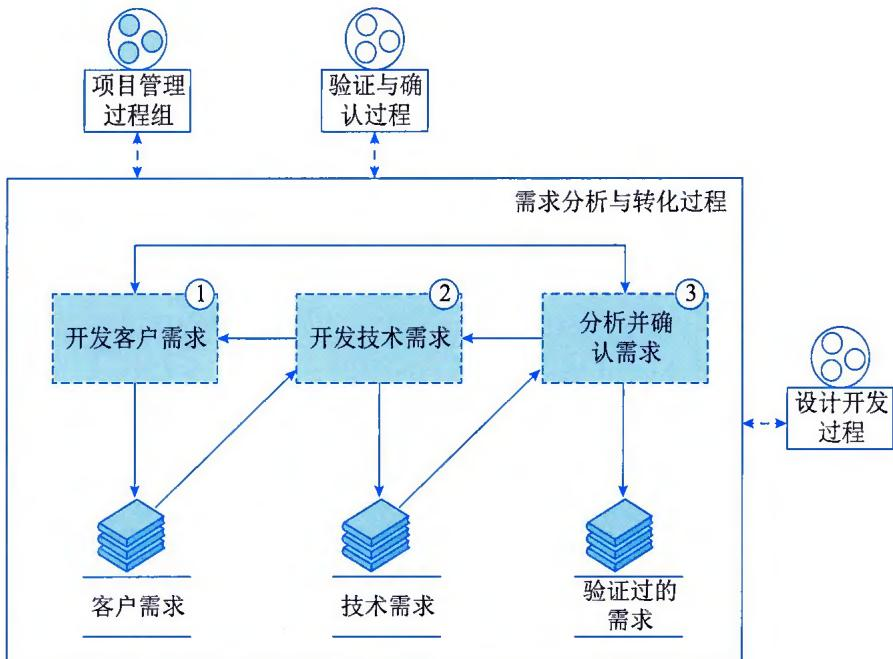
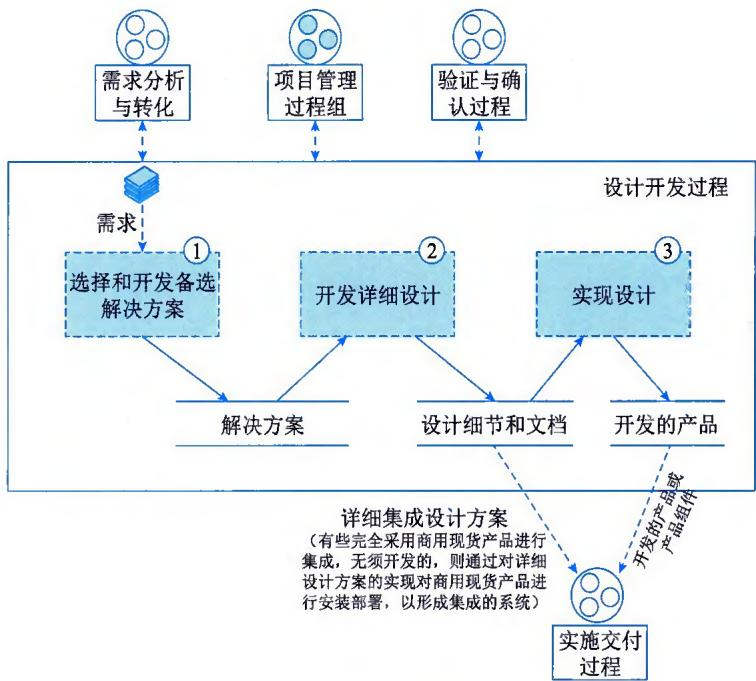
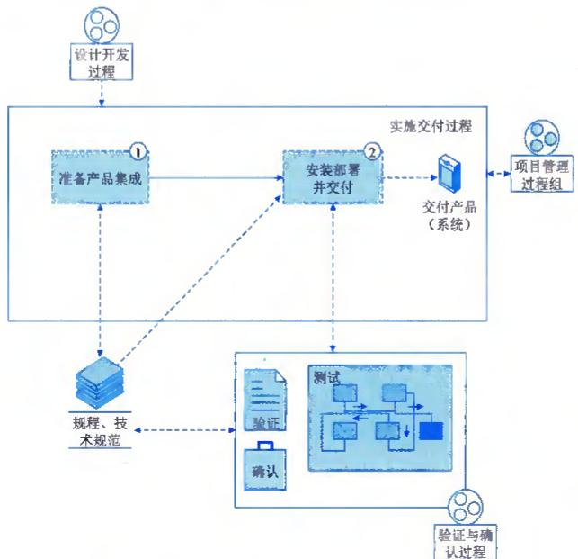
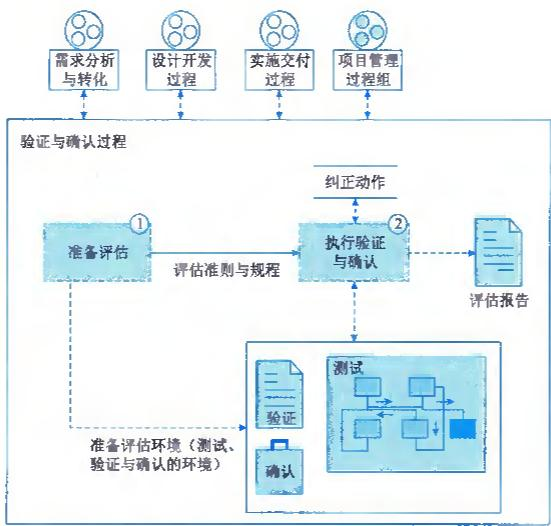

>[!info] 现行教材 · 第 2 版
>本页为**现行考试依据**的教材原文（第 2 版，2024 年 10 月出版，2025 年起启用）。
>考纲层级见 [[知识体系]]；练习题见 [[练习题·基础知识]]；案例模板见 [[案例答题模板]]。

# 第7章 系统集成实施管理

系统集成实施管理是指在信息技术及其服务领域中，将多个不同的软件、硬件和技术子系统整合到一个完整的系统中，并确保它们能够协同工作，实现预期的业务目标和功能等。系统集成实施管理是数字化转型和信息化项目中的关键活动，涉及多个阶段和多个方面的管理，主要包括需求分析与转化、设计开发、实施交付、验证与确认、配置管理、人员管理、技术管理、资源管理等。

## 7.1 需求分析与转化

系统集成实施是系统集成方案的落地实现，需要在集成方案的基础上，进一步获取、分析和转化客户内在需求，从而确保集成实施的有效性。需求分析与转化管理的目的在于挖掘、分析并建立客户、产品与产品组件的具体需要。在系统集成实施前，首先需要对组织业务需求进行详细分析和确立，明确系统的细化功能和分项目标，以及实施时间和预算控制等方面的要求。

图 7-1 给出了需求分析与转化活动示意图，主要包括开发客户需求、开发技术需求、分析并确认需求。需求分析与转化涉及由于相关解决方案的选择所带来的约束。例如，设计解决方案中已明确采用商用现货产品的集成、采用特定架构模式等，或受到客户方提供的基于咨询组织前期给客户做的规划方案的约束，或基于中标后的投标文件或解决方案中已定义的相关约束和客户方招标文件中定义的相关约束等。如果需求分析与转化是在项目活动中提供的，则本过程产生的所有需求将由项目管理过程进行需求管理。

  
图7-1 需求分析与转化活动示意图

## 7.1.1 开发客户需求

需求分析与转化过程的起始点是开发客户需求，开发客户需求涉及对客户提出的需求进行收集（包括产品级需求和客户提出的具体的设计需求），另外，不仅要收集客户需求，还要主动挖掘客户需求。

干系人的需要与期望以及需求应当被记录，并以纸质文档或电子文档的方式记录和保存。主要关注点包括：

\- 划分了优先级的客户需求集合。将干系人的需要、期望、约束与接口转换为划分了优先级的客户需求集，划分了优先顺序的客户需求有助于确定项目、迭代或增量的范围。

\- 需求到功能、对象、测试、问题或其他实体的可追溯性得到文档化。

\- 识别信息缺失和需求冲突。随着客户需求的开发及优先级的区分，应当合并来自于相关干系人的各种输入，获取缺失的信息并解决矛盾之处。

\- 识别隐含需求。有时干系人和客户并不能明确说明或表达其需要和期望，因此应该识别那些隐含的需求，并对那些未明确说明的问题进行考虑。

\- 识别客户功能需求与质量属性需求。识别对客户与其他相关干系人来说关键的功能需求与质量属性需求。

\- 识别需求约束与限制。识别无法实现的需求，或者实现需求可能受到的约束与限制，当建立并解决客户需求的集合时，环境、法律以及其他约束也应当考虑。

\- 识别接口需求。对在产品架构中识别的产品之间或产品组件之间的接口需求进行定义。把它们作为产品集成与产品组件集成的一部分，使其受到控制，并作为架构定义必不可少的一部分。

## 7.1.2 开发技术需求

将客户需求进行提炼，形成技术需求，用于开发产品和产品组件，或开发系统集成设计方案、架构设计方案等。技术需求包括产品与产品组件需求、系统设计需求、集成实施需求、架构需求、功能需求、接口需求、质量需求、性能需求、确定硬件和软件支持环境、设计限制、约束等。

## 7.1.3 分析并确认需求

对开发客户需求和开发技术需求工作进行分析评估，验证需求，确保需求可实现，并对需求描述进行确认，形成需求规格说明书，以供开发解决方案。

## 1. 需求分析记录

应记录需求分析的全过程，从而确保分析活动的有效性及可回溯性等。主要关注点包括：

\- 分析需求的必要性与充分性的记录。分析需求以确保其是完整的、可行的、可实现的，并且是可验证的，识别对成本、进度、性能和风险有重大影响的关键需求。

\- 对已识别的干系人的需要与约束进行分析的记录。分析干系人的需要与约束，诸如成本、

进度、产品性能、项目绩效、功能、优先顺序、可复用组件、可维护性或风险等事项。

\- 建立并维护的产品与产品组件需求。对客户需求进行分析，以衍生出更详细且精确的需求集合，即产品与产品组件需求。产品与产品组件需求可能包括采用商用现货进行集成的相关需求。

## 2. 需求分配记录

应将产品与产品组件需求进行分配，并形成技术需求规格说明书，用于开发解决方案。

## 3. 需求确认记录

对需求的描述应经过客户和干系人的认可和确认。在某些情形下，客户向项目提供需求集合，或需求作为以前项目的活动输出而存在。在此情形下，客户需求可能与相关干系人的需要、期望、约束与接口相矛盾，在矛盾得到妥善解决后，需要将其转换为经认可的客户需求集合。

## 7.2 设计开发

设计开发的目的在于选择、开发、设计并实现对需求的解决方案，从而根据需求分析选择合适的软件、硬件和技术，进行系统的设计和架构规划，确保各个子系统之间能够有效地通信和协作。

设计开发活动聚焦设计解决方案（依据需求规格说明书），并对产品开发进行管理，确保实现的产品、产品组件和（或）选择的商用现货产品符合需求。设计开发活动示意图如图7-2所示，主要包括选择和开发备选解决方案、开发所选解决方案的详细设计、将设计实现为产品或产品组件（系统或系统组件）。

  
图7-2 设计开发活动示意图

## 7.2.1 选择和开发备选解决方案

选择和开发备选解决方案主要关注点包括：

\- 开发解决方案的评价准则，用于评估解决方案。

\- 开发备选解决方案。应考虑是否存在已有的可选解决方案或厂商提供的商用现货解决方案可供使用或参考，或通过自行开发形成初步设计的解决方案（有时亦指"概要设计""设计方法""设计概念"）。

\- 评估并选择解决方案。通过解决方案评价准则，评估备选的解决方案，并从中选择最佳的解决方案。

在上述相关活动中，我们需要重点关注解决方案设计原则和解决方案的选择。

## 1. 解决方案设计原则

解决方案设计原则对解决方案的有效获取至关重要，需要提前进行设定。设定时，要确保原则的有效性和时效性等。例如，某项目解决方案设计原则包括：①解决方案的实现成本符合预算；②解决方案的完整性、实用性、可操作性；③系统设计的先进性和合理性；④系统的可靠性、扩展性、易用性、安全性和可维护性；⑤所选择的商用现货产品的性能、功能符合客户需求。

## 2. 解决方案的选择

在选择解决方案之前，应考虑备选解决方案及其相对优势，明确关键需求、设计问题与约束。备选解决方案可以是技术人员根据当前项目的需求编写的解决方案，也可以是过去相似项目的解决方案、投标文件，或厂商提供的商用现货解决方案等。达成质量属性需求的架构选择与模式应得到考虑，商用现货产品的使用在比较了成本、进度、性能与风险的情况下应得到考虑。商用现货的备选方案既可在修改后使用，也可不加修改地予以使用，但必须在诸如接口或某些特性的定制方面加以修改，以纠正与功能性需求或质量属性需求之间的不匹配，或与架构设计的不匹配。解决方案设计的质量属性需包括可靠性、可扩展性、易用性、安全性和可维护性等。

## 7.2.2 开发详细设计

开发所选解决方案的详细设计（有时亦指"深化设计"）并进行评估，以形成正式的技术解决方案。详细设计包括对使用商用现货集成为产品或产品组件（系统或系统组件）的必要信息（如已决定采用商用现货），和所有通过开发、制造、编码等将设计实现为产品或产品组件的必要信息。

产品或产品组件的必要信息（例如，在初步设计中建立产品能力与产品架构定义等）包括架构风格与模式、产品分块、产品组件标识、系统状态与模式、主要的组件间接口，以及产品外部接口。详细设计则完全地定义产品组件的结构与能力，针对特定质量属性优化产品组件设计，或对商用现货产品用作产品组件的决策进行评价。

架构定义由在需求调研过程中所开发的需求集合所驱动。这些需求识别了对产品的成功有重要作用的质量属性。在详细设计期间，产品或系统架构细节被最终确定，产品组件被完整定义，并且接口的特征被完全描述。

## 7.2.3 实现设计

实现设计活动主要包括实现产品或产品组件设计、开发支持文档等。

## 1. 实现产品或产品组件设计

通过正式的技术解决方案，最终将设计实现为产品或产品组件并进行评估（此项活动适用于软件开发和产品制造，对于完全使用商用现货产品进行集成而无须软件开发或产品制造的项目，可能不涉及此项活动）。对于完全使用商用现货产品进行集成而无须软件开发或产品制造的项目，正式的技术解决方案主要用于将设计通过安装部署实现为产品或产品组件（系统或系统组件）。对于使用商用现货产品与自制开发的产品进行集成设计的，需评估商用现货产品之间的集成，和商用现货产品同自制开发的产品或产品组件进行集成后的兼容性、可用性、安全性、稳定性等。

## 2. 开发支持文档

对于商用现货产品，或通过使用商用现货进行集成的产品（系统），需确保产品供应商至少可以提供产品的使用手册，以及相关质保、售后服务及技术支持的说明。对于通过自行开发和制造的产品（或通过自行开发和制造的产品进行集成的产品、系统），需开发产品（系统）操作使用手册、安装手册以及相关质保、售后服务及技术支持的说明，并对文档的合理性和有效性进行评估。对于有培训需求的项目，应开发相关培训文档，并对文档的合理性和有效性进行评估。

## 7.3 实施交付

实施交付的目的在于把产品组件组装成产品，或将产品组装为系统，并交付使用。

集成实施交付有效，才能确保所组装的产品组件、产品或系统在目标环境中发挥预期作用，并交付产品（或系统）。实施交付活动示意图如图7-3所示，主要包括准备产品集成、安装部署并交付。

  
图 7-3 实施交付活动示意图

## 7.3.1 准备产品集成

准备产品集成指建立并维护产品集成与安装部署的规范和规程，以及对所需的人员和资源进行确定，并对集成的接口和可能发生的异常事项进行管理。该部分活动主要包括以下几个方面：

\- 确定产品集成的方式与顺序。如自下而上的集成方式（即已实现的较底层的功能优先集成，然后逐层上升，形成整个系统）、自上而下的集成方式（即事先存在一个稳定的架构，不断地向下细化，最后实现所有具体的功能细节）、深度优先的集成方式（即主控路径上的关键业务流程涉及的模块先集成到一起，然后再集成辅助业务模块）等，集成顺序的选择可以是不同集成方式的综合。

\- 确定参与的相关干系人和具备适当技能的人员。

\- 确定产品集成的内部与外部接口。

\- 制定产品集成的步骤、规程和技术规范。如果是软件工程，涉及对产品组件的集成，将开发的产品组件集成为产品或作为一个更大产品的产品组件。如果是系统工程，可能仅是通过安装部署，将商用现货产品集成为一个新的系统，或与原有系统进行集成以形成一个更大的系统。

\- 制定安装部署的步骤、规程和技术规范。安装部署的规程中应至少定义和明确以下内容：①确认部署的规划、方法和部署工具，组织并实施安装、配置和验证过程，对部署过程中的各种变更进行管理；②确认业务配置环境、人员和工具，并对需方提供的业务需求和数据进行分析，获取、确认配置目标和实现方式，组织和实施业务配置过程并验证业务配置结果；③记录、修正和验证部署过程中发现的问题。

\- 制定产品、系统、数据迁移的步骤、规程和技术规范。迁移的规程中应至少定义和明确以下内容：①确认迁移的规划、方法和迁移工具，组织并实施迁移；②针对数据的一致性、完整性和准确性，与数据提供方达成一致意见；③分析迁移过程造成的影响，包括对业务的影响、对客户体验的影响、对运维的影响等；④制定完整的迁移流程和回退计划，与干系人明确迁移过程中的分工，并与相关方共同实施迁移演练；⑤评估迁移过程的风险，并与相关方共同制订风险应对计划。

\- 制定交付规程和准则。交付规程和准则中主要包括以下内容：①明确产品组件、产品或系统的交付要求及内容；②明确交付过程和跟踪、确认的方式；③明确对配置内容的交付；④对交付成果进行管理，包括系统、工具、文档、培训、后期维护等。

## 7.3.2 安装部署并交付

安装部署并交付是指经过验证的产品组件得到装配，经过集成、验证与确认的产品或系统得到交付。主要活动包括以下几个方面：

\- 确定待装配的产品或产品组件得到正确识别，并能够正常运行和提供既定的功能。具体包括：①依据制定的评估方法、评价准则和规程对产品、产品组件进行评估；②确保待装配的产品或产品组件已达到可供集成的状态。

● 装配产品组件或安装部署产品以形成产品或集成的系统。具体包括：①按照制定的集成的步骤、规程和技术规范，装配产品组件以形成产品；②按照制定的安装部署的步骤、规程和技术规范组装产品以形成系统；③按照制定的安装部署的步骤、规程和技术规范进行业务配置（如需要）。

\- 进行产品、系统、数据迁移。具体包括：①如需要进行产品、系统、数据迁移，则按照制定的步骤、规程和技术规范实施迁移；②依据制定的评估方法、评价准则对迁移进行评估。

\- 评价装配后的产品或系统。按照制定的评估方法、评价准则和规程，对装配后的产品或对已集成的系统进行评估（包括评估装配后产品组件的接口兼容性）。

\- 交付产品或系统。对通过评估达到交付要求的产品组件或产品（系统），依据交付规程进行交付，并对交付结果进行评估、确认。

在实施交付活动中，我们需要重点关注集成产品中的信息安全管理，主要包括：

\- 应采用必要的手段、技术和工具对产品集成过程中的信息安全风险进行识别、评估、处置和改进。信息安全风险活动需要覆盖物理安全、人员安全、通信和操作安全、系统安全、配置安全和数据安全等。

\- 应在需求分析与转化中，明确对项目目标、交付物的安全需求和约束，以及安全需求实现的条件，确保项目目标、交付物达到满足安全需求的安全目标。

\- 必要时应委托有资质的第三方测试单位对系统进行安全性测试，明确安全性测试结果，采用必要的技术和工具保障系统交付的信息安全。

## 7.4 验证与确认

验证与确认的目的在于确保选定的工作产品满足其规定的需求，以及确保选定的产品组件或产品（系统）被置于预期环境中时满足其预期用途。

进行测试和验证能够确保系统按照预期的需求进行工作，发现并解决潜在的问题。通过建立评价准则、方法和规程以及评估的环境，对所选择的产品（系统）、产品组件或工作产品执行评估，验证工作产品和确认产品（系统）、产品组件等。验证与确认活动示意图如图7-4所示，

  
图 7-4 验证与确认活动示意图

主要包括准备评估、执行验证与确认。

## 7.4.1 准备评估

准备评估的主要活动包括确定评估对象、制定评估方法、部署评估环境、明确评估准则与规程等。

## 1. 确定评估对象

选择待验证的工作产品或选择待确认的产品（系统）、产品组件以进行评估。验证是确保"正确地做了事"，而确认是确保"做了正确的事"。也可以理解为，验证是要保证做得正确（例如，按照规定的要求做事，按照技术规范要求进行设计、开发、集成产品、产品组件），而确认则要保证做的东西正确（例如，集成的产品和系统在目标环境中可以发挥预期的用途）。

## 2. 制定评估方法

制定用于验证工作产品和确认产品（系统）、产品组件的评估方法。验证与确认的评估方法包含了对工作产品、产品与产品组件的评估要求和评估方式，以及用于评估某些特定的工作产品是否满足其需求的特定方法。评估的工作产品、产品与产品组件主要包括：

\- 产品与产品组件的需求与设计。

\- 产品与产品组件（如系统、硬件单元、软件、服务文档）。

\- 用户接口。

\- 用户手册。

\- 培训材料。

\- 过程文档。

\- 维护、培训以及支持服务相关的部分。

\- 规程和技术规范。

评估的方式主要包括：同行（同级）评审、审查、演示、模拟、测试（例如，单元测试、集成测试、系统测试、路径覆盖测试、负载、压力和性能测试、基于决策表的测试、基于功能分解的测试）等。

对于软件和硬件系统的集成来说，最常用的评估方法就是测试以及同行（同级）评审。对于系统工程的评估方法通常还包括为验证系统设计（以及分配）的充分性而进行的原型、建模和模拟等。对于每一种产品（系统）、产品组件或工作产品的评估要求和评估方法可能都不同。

## 3.部署评估环境

建立用于验证与确认所需的评估环境。主要包括：

\- 确定用于评估的环境和所需的工具与设备。

\- 确定参与评估的干系人。

\- 建立评估环境（例如，如果评估方式采用的是测试，则建立测试环境）。

\- 获取评估的工具和设备（例如，测试设备、软件）。

## 4. 明确评估准则与规程

建立并维护用于执行验证与确认的评价准则与规程，即建立并维护用于执行验证与确认的规程，以及用于判定、衡量验证与确认的评价准则。评价准则与规程的内容可来源于集成产品过程中制定的相关准则、规程和技术规范中的内容（前提是这些准则、规程和技术规范在先前已经通过验证）。

## 7.4.2 执行验证与确认

执行验证与确认的主要活动包括确定验证对象、分析评估结果等。

## 1. 确定验证对象

对选定的工作产品进行验证，或对产品（系统）、产品组件进行确认。具体包括：

\- 依据评估方法、评估规程执行验证和确认。

\- 对评估中发现的问题和不符合项，依据评估规程进行处理（纠正）。

## 2. 分析评估结果

分析评估结果主要包括：

\- 将验证与确认的实际结果与已建立的评价准则进行对比，以确定可接受度。

\- 记录分析结果，作为已经进行评估的证据。

\- 对于每一工作产品，增量式地分析所有可用的评估结果，以确保需求已经得到了满足。

由于同级评审也是若干种评估方法之一，前述分析活动中也应该包含同级评审的数据，以确保对评估结果进行了充分的分析。分析报告或者"实际执行（as-run）"方法的文档，也可能表明评估结果不良的原因，是方法问题、准则问题还是评估环境问题。

## 7.5 技术与资源管理

系统集成实施相关的能力建设离不开技术与资源等相关能力要素的支撑，这就需要组织对相关能力要素实施必要的管理。

## 7.5.1 技术管理

系统集成过程中需要对组织技术能力进行管理，其目的在于确保组织能够有效管理、积累技术和经验沉淀，用于技术创新和技术改进。

技术管理在系统集成项目中起着至关重要的作用，其能够确保项目的技术实现和技术要求得到满足。通过有效的技术管理，可以确保系统集成项目在技术层面上的成功实现，提高项目的质量和可靠性，同时也推动团队的技术能力和创新水平的不断提升。技术管理是系统集成项目成功的关键因素之一。在系统集成过程中对技术进行管理主要包括以下几个方面：

\- 技术选型和规划。在系统集成项目开始之前，需要对技术进行仔细的选型和规划，涉及选择合适的软件、硬件和技术平台，以满足项目的需求和目标。

\- 技术标准和规范。制定技术标准和规范，确保项目团队在开发和集成过程中遵循统一的技术标准，保证系统的稳定性和互操作性。

\- 技术验证和评估。在系统集成过程中，需要对技术进行验证和评估，确保技术能够满足项目的要求，如果涉及新技术或第三方组件，还需要进行技术风险评估。

\- 技术团队管理。系统集成项目需要一个专业的技术团队来完成，涉及对技术团队的组建、培训和管理，确保团队成员具备必要的技术能力和知识。

\- 技术支持和解决方案。在系统集成过程中，可能会遇到技术难题和问题，技术管理需要及时提供支持和解决方案，确保项目能够顺利进行。

\- 技术创新和持续改进。技术管理也涉及鼓励技术创新和持续改进，推动团队在技术方面不断提升，以适应不断变化的技术环境和市场需求。

## 7.5.2 资源管理

系统集成需要对资源进行管理，其主要目的在于确保计划所定义的、执行过程所必需的资源在需要时可用（资源包括所需的设施、资金和预算及适用的工具）。

资源管理在系统集成项目中非常重要，它确保项目顺利进行，达成预期目标，并最大程度地提高资源的利用效率。通过有效的资源管理，可以提高系统集成项目的成功率和效率，确保项目顺利交付，满足客户需求，同时也提升团队成员的工作满意度和积极性。综合管理各种资源是系统集成项目成功的关键因素之一。在系统集成过程中涉及多种资源，主要包括以下几个方面：

\- 人力资源。人力资源是系统集成项目中最重要的资源之一。资源管理涉及对团队成员的分工和协作，确保有足够的专业人员来完成项目的各个阶段和任务。同时，资源管理还包括对人员的培训和发展，以提高团队的综合能力和素质。

\- 时间资源。时间资源在系统集成项目中同样至关重要。资源管理涉及合理安排项目进度和时间表，确保项目按时交付。它还包括对时间的有效分配，避免资源浪费和延期风险。

\- 财务资源。财务资源是项目实施的重要支持。资源管理涉及预算的编制和监控，确保项目在可控的预算内完成，并进行成本效益分析，优化资源使用。

\- 技术资源。技术资源包括软件、硬件、工具等。资源管理涉及对技术资源的选购和配置，确保技术资源满足项目要求，同时合理利用现有资源，避免资源浪费。

\- 信息资源。信息资源在系统集成项目中起着重要的作用。资源管理涉及对信息的采集、整理和共享，确保项目成员能够及时获取所需信息，保证项目的顺利推进。

\- 工具资源。组织需要配备用于计划和执行过程所需的资源的工具，包括设计工具、测试工具、过程管理工具和其他工具（例如，度量工具、安全工具、人力资源管理工具和特殊要求的工具等）。

\- 知识资源。组织需要建立、保持、更新知识库，将收集、共享、复用所积累的知识和信息纳入知识库，并有效管理和使用。知识库的组织规则以知识成果物的分类、分级及权限为基础，同时制定知识成果物的采集发布流程，以实现对知识库的管理。

## 7.6 本章练习

## 1. 选择题

1）关于验证与确认的描述不正确的是：\_\_\_\_。

A. 验证是确保"正确地做了事"，而确认是确保"做了正确的事"

B. 验证是确保"做了正确的事"，而确认是确保"正确地做了事"

C. 验证是指通过提供客观证据对规定要求已得到满足的认定

D. 确认是指通过提供客观证据对特定的预期用途已得到满足的认定

参考答案: B

（2）需求分析与转化阶段输出的需求类型不包括\_\_\_\_。

A. 客户需求 B. 功能需求 C. 性能需求 D. 设计需求

参考答案: D

(3)\_\_\_\_不属于设计开发过程输出的工作产品。

A. 解决方案 B. 需求说明书 C. 设计细节和文档 D. 开发的产品

参考答案: B

(4)\_\_\_\_属于实施交付过程的活动。

A. 设计开发过程

B. 测试、验证、确认

C. 准备产品集成

D. 定义规程、技术规范

参考答案：C

(5)\_\_\_\_属于验证与确认过程的活动。

A. 准备评估、执行验证与确认

B. 将设计实现为产品或产品组件

C. 准备产品集成、安装部署并交付

D. 选择和开发备选解决方案、开发所选解决方案的详细设计

## 参考答案：A

## 2. 思考题

（1）请简述在集成实施过程中，需求分析与转化应该重点关注的内容和注意事项。

（2）请简述设计开发的目的和聚焦点。

（3）针对集成实施的不同类型活动，请简述验证与确认的方法。

参考答案：略
