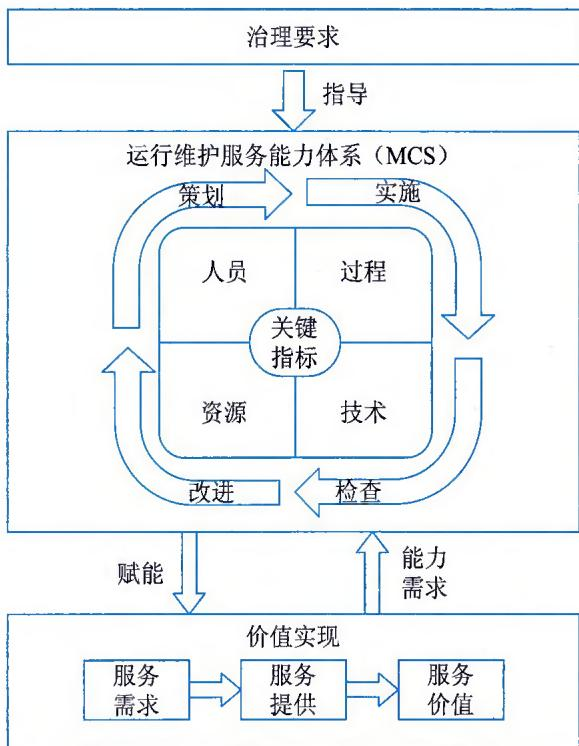
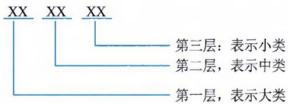
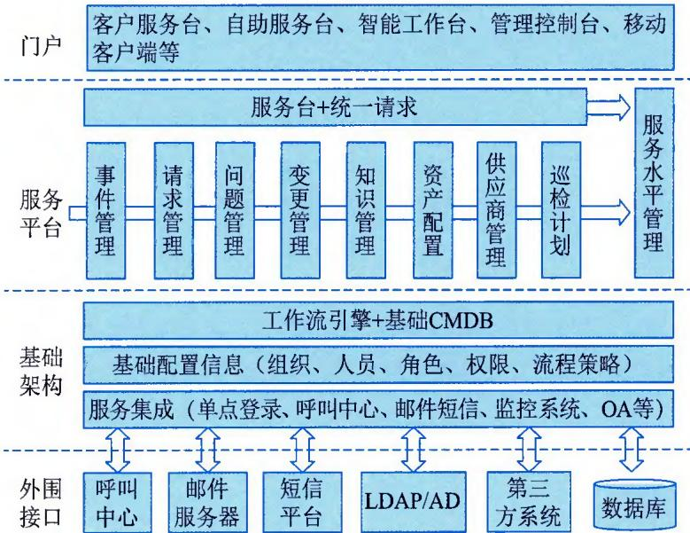
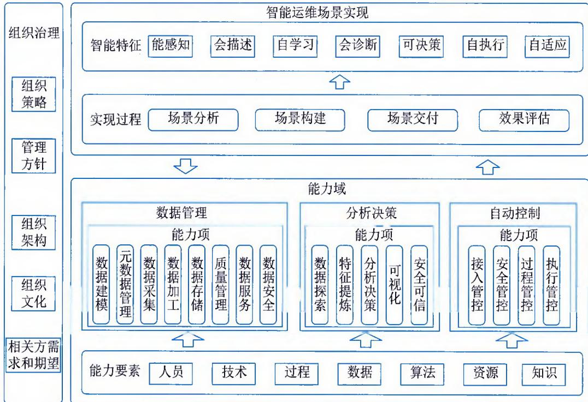

>[!info] 现行教材 · 第 2 版
>本页为**现行考试依据**的教材原文（第 2 版，2024 年 10 月出版，2025 年起启用）。
>考纲层级见 [[知识体系]]；练习题见 [[练习题·基础知识]]；案例模板见 [[案例答题模板]]。

# 第8章 信息系统运维管理

运行维护服务指的是采用信息技术手段及方法，依据客户提出的服务要求，为其在使用信息系统过程中提出的需求提供的综合服务，是信息技术服务中的一种主要类型。运行维护服务对象是指信息系统工程建设项目交付的内容，主要包括机房基础设施、物理资源、虚拟资源、平台资源、应用和数据等。随着组织信息系统建设的不断深入和完善，信息系统运维已经成为各行各业、各组织管理者和相关部门普遍关注的问题。

## 8.1 运维能力模型

运维能力是指组织掌握和应用知识技能向客户提供运维服务的水平，其要素包括服务人员、服务技术、服务资源和服务过程。运行维护服务能力模型（运维能力模型）是基于运维能力体系建设的必要内容提炼的图形化示意，主要表达了运维能力体系建设必要的内容范围以及这些能力因素之间的关联关系。

GB/T 28827.1《信息技术服务 运行维护 第1部分：通用要求》规定了运行维护服务能力模型，如图8-1所示。运行维护服务能力模型包含治理要求、运行维护服务能力体系（MCS）和价值实现，具体如下：

  
图8-1 运行维护服务能力模型

\- 治理要求是为实现运行维护服务绩效、风险控制和服务合规性的组织目标，提出的关于最高管理层领导作用及承诺的能力体系建设要求。

\- 运行维护服务能力体系（MCS）是组织依据运行维护服务方针和目标，策划并制定运行维护服务能力方案，确保组织交付的运行维护服务内容符合SLA的规定，并满足质量要求，对运行维护服务交付过程、结果以及运行维护服务能力体系进行监督、测量、分析和评审，以实现运行维护服务能力的持续提升。

\- 价值实现是组织结合业务对信息系统的网络化、数字化和智能化的要求，识别内部和外部用户对服务的需求或期望，定义多样化的服务场景，并通过服务能力、要素、活动的组合完成服务的提供，直接或间接地为服务需求方和利益相关者实现服务价值。

## 8.2 运维能力管理

运维能力管理指的是围绕能力要素，面向运维全生命周期的总体能力管控机制，通过策划、实施、检查和改进等活动，提升能力要素水平，并持续改进各要素间的相互作用关系和绩效水平，通过各阶段交替循环，实现运维能力持续性的螺旋式上升的管理目标。

在能力管理过程中，组织需要首先明确能力管理团队的组成，并明确这些团队成员的职责范围与分工，根据组织运维工作的内外部环境、技术发展现状、各个利益相关方的诉求、能力体系覆盖范围、管理者的作用、资金投入、人才保障、基础设备设施的情况、安全以及质量体系的基础等因素，实施能力策划活动，并明晰周期性的能力管理计划、能力指标等，在策划过程中需要明确策划的输入、输出、审批以及变更控制等；同时抓好能力计划实施的计划管理、协调管理、记录管理以及成果管理等，做到实施过程记录的"线条"证据化；设立专门的检查组织，明确检查方法，并按照确定的计划实施检查；还需要建立适合于组织的改进机制，并确保改进活动的有效实施。

## 8.2.1 策划

运维能力策划是组织开展运维能力建设中运维能力管理的第一项活动，在这项活动中，需要对组织的运维战略与目标、运维的内容与业务范畴、运维的组织与制度、运维能力要素建设内容、能力体系的检查与改进等，进行完整的策划。在策划环节，需要考虑服务目录、组织架构和管理体系、指标体系和服务保障体系，以及内部评估机制。

（1）基于组织的运维服务发展目标和业务规划，确保可以提供良好稳定的运维服务，可以结合组织业务能力、客户需求以及内外部环境策划服务目录。服务目录定义了组织所提供服务的全部种类以及服务目标，包括正在提供的和未来能够提供的内容。

（2）策划如何建立相应的组织架构和服务保障体系来支持服务目录所列出服务内容的实施。组织架构与提供的服务内容密切相关，不同的组织架构在管控、成本、创新和效能方面存在巨大差异，需要根据组织总体战略目标和组织治理架构确立，组织架构稳定的周期相对较长，不会频繁变更，这就需要确保一定时期内对运维服务能力的支撑情况。通常可以通过两种方式实现：①在定义服务内容时，参照组织当前的组织结构；②根据业务目标确定服务内容以后，设立或优化组织当前的组织架构。

在适合的组织架构基础上，组织需要根据总体的治理理念和思想，确定必要的制度体系，固化运维服务保障能力。制度体系包括组织级的制度，如质量、财务、安全、职业健康、人力资源、商务等；也要包括运维服务本身的制度，如行为规范、数据质量等。

对人员、资源、技术和过程四要素所涉及的策划内容，也应包含在服务保障体系之中。同时，结合组织整体的质量管理要求，应建立运维服务能力审核、监督和检查计划。

（3）对于任何运维服务，服务绩效都可以通过绩效指标来衡量，通过制定服务指标体系，衡量运维服务实施的绩效，检查组织是否达到目标。服务指标体系的内容包括：

\- 制定各项运维服务目标，如质量目标、过程目标、能力目标和财务目标等。

\- 制定目标实施的检查机制（包括评估、检查、报告、测量等方法），并测量其有效性，注意必要时需要对目标进行变更。

\- 制定服务实施结果的测量指标，例如，与目标的偏离度、客户满意度调查等，可以适当考虑采用相关的测量、评估工具。

## 8.2.2 实施

运维能力实施是在策划阶段输出成果的基础上，依照策划阶段建立起来的体系框架，对体系实施过程进行质量管控，并收集相关信息、数据和资料。实施阶段是策划成果的具体执行、实施、协调和跟进，实施活动需要与策划阶段制定的方法、内容和目标等保持一致。

为了确保整体策划的有效落实与能力计划的顺利执行，组织应根据所制订的各类计划和规章制度进行实施，并确保实施活动被记录，实施结果（即交付物，包括服务、文档、数据、各类软硬件等）能满足计划、规章制度以及客户等的要求。

在实施过程中，组织需要建立与客户的有效沟通协调的机制（如沟通渠道、技巧、计划等），通过有效的沟通体系，使信息在整个服务提供过程中得到友好传递，避免或减小由于沟通延迟、信息过滤、信息扭曲等原因导致的沟通问题的发生，因此在实施过程中，组织与客户之间建立的协调机制是非常重要的。

组织需要按照服务能力要求与确定的实施计划有条不紊地开展实施管理活动并记录，确保服务能力管理和服务过程实施可追溯，服务结果可计量或可评估。同时，在服务过程中，始终关注服务交付成果，交付物在很大程度上反映了服务能力与水平。质量要求是衡量交付物的标准，故提交的交付物要满足其要求。

## 8.2.3 检查

运维能力检查是能力管理中必要的监督与反馈环节，对策划输出的实施效果进行总结和评价，验证能力管理实施过程的执行效果是否达到了既定的质量目标。

运维能力检查对服务能力策划内容（如各项服务指标的实施情况）进行有效检查和测量，定期评审服务过程和相关管理体系，是进行运维服务能力改进的基础。通过评审和检查可以获得各种数据，从而作为改进的基准和依据，并为服务能力改进设定目标。如果没有进行有效的服务能力检查，将使得服务改进活动失去方向和动力，并可能最终导致服务质量下降。检查的目标是监视、测量并评审服务目标的完成情况，分析与能力计划的差距，并为服务能力改进提供输入。

有效的服务能力检查可以通过两方面开展：一是用户满意度调查，通过调查数据来监控服务能力的现状，可以为后续服务能力改进提供依据；二是组织内部检查，包括运维服务人力、资源、技术和过程管理计划，以及相关的服务指标体系中涉及的各项关键指标。另外，服务级别、服务质量、服务资源等都是间接反映组织服务能力的关键要素。

## 8.2.4 改进

运维能力改进是对检查评审结果进行总结，对运维能力建设实施过程中存在的问题和不足进行分析，提出有针对性的持续改进目标和计划，然后实施改进活动，使组织的运维能力持续提升。在运维服务能力改进实施过程中，需要考虑的主要内容包括：①服务能力改进是可识别、可计划和可实施的；②管理层为服务能力改进提供支持；③服务能力改进指标是可测量、可报告、可沟通的；④所有批准改进计划的实施和预定目标的达成。

组织可以采用一定的措施鼓励员工或者客户对其运维服务能力管理提供改进建议，如客户回访、定期的客户会议、内部的过程质量监控和员工报告等。组织可以通过建立有效的运维服务能力改进体系或服务能力改进机制对运维服务能力进行集中的监控和评估，常见的做法是将运维服务能力改进体系纳入组织的质量管理体系中，由质量部门进行统筹监管。运维服务能力改进的一个重要输入是服务保障体系中各项指标的测量和检查结果。对于测量数据应进行总结，分析关键指标的完成情况，提出改进建议和措施，根据需要制订服务能力改进计划并实施，以达到提升整体服务能力的目标。

## 8.3 运维人员管理

运维人员指的是组织中从事运行维护服务的人。在任何组织中，人力资源都是核心竞争力之一。绝大部分组织对人员相关的建设和管理都非常重视，人员的容量、技能、工作绩效等方面都是组织关注的重点。在运行维护服务中，人员管理聚焦于从知识、技能和经验维度选择合适的人，按照人员管理和岗位职责要求做适合的事。人员管理在运维服务能力建设方面是重点考虑的要素，目的是指导组织根据岗位职责和管理要求"选人做事"。

## 8.3.1 人员储备

组织应保证有足够数量的人员用于满足客户对运维服务的要求。在实际的运维服务中，组织应根据运维服务岗位设置提供恰当比例的人员储备，保证在必要时能够通过储备人员及时完成运维服务，以保证在任何情况下（如团队人员发生变化、客户服务需求变化），都有合适的运维服务人员保障服务级别协议达成。

常见的使用储备人员的场景包括人员离职和人员调岗等。

（1）人员离职包含两种情况：①离职人员提前向管理层进行了说明，留出招募新人、进行人员岗位交接及培训的时间；②人员突然离职，无法进行完整的工作交接。

（2）人员调岗通常出现在组织内部，一般可以提前获悉，能够进行人员补充及岗位交接和培训。

人员储备过程可以分为人员储备需求分析、制订人员储备计划、执行监控与优化改进几个阶段。

## 1. 人员储备需求分析

在开展人员储备需求分析时，需要考虑如下人员储备影响因素：

（1）人员流动性风险。组织需要定期总结分析过往一段时间内人员流动情况，寻找人员流动的主要因素，并对现有的人员进行流动性风险分析，改善组织环境并消除风险因素。

（2）人员容量与技能。组织需要至少每年进行一次人员容量的规划，分析运维服务发展需要，结合内外部环境、技术发展、工具使用、服务质量要求和流动性风险等因素，规划人员的数量需求。同时还要考虑人员技能对运维发展的适应情况，通过有效的技能培养和管理，提高人员利用效能，并与人员培训体系相结合，合理配置人力资源。

（3）骨干与干部培养。组织需要充分认识到骨干人才和管理干部在运维服务发展中的重要作用，规划好相关人才梯队，积极做好骨干的寻找，搭建创新发展平台。

在开展人员储备需求分析时，需要识别关键岗位与人员。关键岗位指在运维服务组织运营、管理、技术、交付等方面对组织发展起重要作用，与组织战略目标的实现密切相关，承担重要工作责任，掌握组织发展所需的关键技能，并且在一定时期内难以通过组织内部人员置换和外部人才供给所替代的一系列重要岗位的总和。

识别关键岗位与人员可以按照以下步骤进行：

\- 组建包含人力资源、质量、运维交付以及管理层在内的工作小组。

\- 根据运维业务发展的战略和方向，确定识别的主要原则和方针。

\- 编制关键岗位和人员识别的主要特征及评价方法。

\- 与客户沟通，获取客户的意见以及客户认定的关键岗位和人员。

\- 制订具体的识别实施计划，并开展实施工作。

在开展人员储备需求分析时，需要考虑人员储备方式。常见的储备方式包括增量机动储备、人才梯队储备、持续招聘储备、合作机构储备、岗位角色备份、外联与外协等。组织需要根据储备需求，结合储备方式的建设情况，有效完成储备需求与储备方式的对应关系，如人才技能引发的储备需求，可以考虑使用人才梯队储备和外联与外协等。

## 2. 制订人员储备计划

人员储备计划是通过系统地、有计划地实施人员储备和发展计划，满足组织运维服务业务发展战略目标和当前对人员的需求，一般由组织的人力资源部门负责。

人员储备计划的制订通常经历如下过程：

## 信息系统管理工程师教程（第2版）

\- 获取关键岗位和人员的识别结果。

\- 针对每项储备需求明确储备方式。

\- 确定储备方式的具体执行方案和措施。

\- 定义储备计划实施的关键成功要素及考核指标。

\- 储备计划得到管理层的批准，必要时得到客户的批准。

人员储备需要包含储备部门信息、储备岗位或人员、储备需求、储备方式、实施责任人、时间属性、完成判断条件、考核指标、变更控制等。

## 3. 执行监控与优化改进

在完成人员储备计划制订以后，组织需要确保计划是在受控情况下开展执行，并周期性地跟踪计划的执行情况和关键指标的达成情况。

（1）执行监控。组织需要制定一定的措施，保障人员储备计划得到有效实施，并将储备计划的执行情况作为人力资源管理部门绩效，根据计划中定义的关键阶段或指标，实施相关的考核。保障措施主要包括拓展有效的人员获取渠道、提供必要的费用成本支撑、运维服务部门的积极配合、人才培养机制的有效落实等。

（2）优化改进。人员储备计划的优化主要考虑如下因素：

\- 人员储备计划对运维服务发展需求的满足程度。

\- 确保运维交付部门的充分参与。

\- 将计划的制订和实施管理措施纳入组织的管理评审中。

\- 人才招聘或储备的甄选流程合理性。

\- 储备计划满足各过程和业务的程度。

\- 关键岗位和人员的储备率达成情况。

## 8.3.2 岗位结构

岗位结构是服务组织的流程运转、部门设置及职能规划等最基本的结构依据，是表明组织各部分排列顺序、空间位置、聚散状态、联系方式以及各要素之间相互关系的一种模式，是整个管理系统的"框架"。

根据运维工作的特点，运维人员一般分为管理岗、技术支持岗和操作岗三种岗位。管理岗主要负责运维的组织管理；技术支持岗主要负责运维技术建设以及运维活动中的技术决策等；操作岗主要负责运维活动的执行等。

## 1. 管理岗

管理岗负责对运维服务的实施进行管理，包括服务总监、服务项目经理、质量经理等。管理岗的职责主要有两个方面：①对客户运维服务需求的管理；②对运维服务过程和结果的管理。组织需要特别关注管理岗对服务需求的管理，重点是对客户真实需求的挖掘、分析和信息传递。管理岗应建立与客户的沟通渠道和沟通机制，整理需求，并将需求完整、准确、及时地传送至组织相关岗位。

## 2. 技术支持岗

技术支持岗在运维服务过程中提供技术支持，包括主机工程师、网络工程师、数据库工程师、应用系统工程师等。对技术支持人员的能力要求重点在于专业技术能力和对服务需求的响应支持能力。专业技术能力是指具有对应岗位需要的专业知识和技能，通常与该专业被行业认可的培训、认证相关。对服务需求的响应支持能力更多地体现在人员的相关工作经验、服务态度和事件响应处理速度上。

## 3. 操作岗

操作岗是按照运维规范和操作手册，执行运维服务的各个过程，包括呼叫中心热线工程师、系统监控工程师、机房值守人员等。操作人员的工作有效性关键在于运维规范和操作手册的完整、准确，以及操作人员对事件的判断能力及遵循运维规范和操作手册的执行力度。

针对运维规范和操作手册等文件，管理岗应当就如何维护规范和手册的完整性、准确性与可用性建立合适的管理机制；技术支持岗应当对规范和手册的完整性、准确性与可用性的技术层面负责；操作岗应能够清晰判断应用规范和手册的什么条目对应当前需执行的服务，并且确保相关操作完全按照该条目执行。

## 8.4 运维过程

过程又称流程，是为达到特定的价值目标而由不同的人分别共同完成的一系列活动。活动之间不仅有严格的先后顺序限定，而且活动的内容、方式、责任等也都必须有明确的安排和界定，以使不同活动在不同岗位角色之间进行转手交接成为可能。活动与活动之间在时间和空间上的转移可以有较大的跨度。

运维过程指的是组织中利用输入实现预期结果的相互关联或相互作用的一组活动。运维过程管理的重点是把人员、技术和资源要素以过程为主线串接在一起，用于指导运维服务人员按约定的方式和方法正确地做事，提高运维服务管理水平是重点考虑的要素，确保运维组织能"正确做事"。

运维过程主要包括服务级别管理、服务报告管理、事件管理、问题管理、配置管理、变更管理、发布管理、可用性和连续性管理、系统容量管理与运维安全管理。

## 8.4.1 服务级别管理

服务级别管理就是对运维服务的级别进行定义、记录和管理，并在可接受的成本之下与客户达成一致的管理过程，通过服务级别协议（Service Level Agreement，SLA）、服务绩效监控和报告的不断循环，持续维护和改进服务质量，触发采取行动消除较差服务，从而满足客户的服务需求。

服务级别管理旨在通过一致、专业的衡量方式，使得所有正在运行的服务及其性能能够满足供需双方约定的SLA，同时，保证未来服务均能够按照约定的目标交付。具体的目标可细化为：

\- 定义、记录、协商、监视、衡量、报告和审查提供的IT服务级别。

\- 维护并保持与客户的关系和沟通。

\- 确保为所有IT运维服务制定了具体可衡量的目标。

\- 监视并改进服务质量，以提升客户满意度。

\- 确保IT运维服务人员和用户对于所提供的服务级别有着明确的期望。

\- 确保在成本合理的情况下，采取主动措施来改进服务级别。

服务级别管理过程的输入、输出、指标及关键成功因素如表8-1所示。

表 8-1 服务级别管理过程的输入、输出、指标及关键成功因素

<table><tr><td>内容</td><td>说明</td></tr><tr><td>输入</td><td>● 来自客户的业务战略、计划和财务计划,以及与其当前和未来要求有关的信息
● 来自组织的服务战略、政策与限制因素等方面的信息
● 与每一项服务相关的影响、优先级、风险和用户数量方面的业务影响分析信息
● 包含预计的变更时间表及所有变更对其服务影响的信息
● 包含有关业务服务、支持性服务和技术间的关系的信息
● 客户反馈、投诉与赞扬
● 来自任意其他过程的建议、信息和输入信息(如事件管理)</td></tr><tr><td>输出</td><td>● 服务目录
● 新签署或变更的服务合同
● 针对SLA的标准文档模板与文件
● 针对SLA中所包含服务级别达到程度与相关配套信息的服务报告
● 针对所有服务和过程进行优化完善的整体服务改进方案或计划
● 记录并规划服务质量工作的服务质量计划
● 服务审查会议记录与行动计划</td></tr><tr><td>指标</td><td>● 达成SLA目标的数量和百分比(及未达成SLA目标的数量和百分比)
● SLA应用情况(SLA所涵盖客户的数量和百分比,SLA所涵盖服务的数量和百分比)
● SLA优化情况(某一期间在服务和SLA审查过程中发现问题的数量,按时完成SLA审查的数量和百分比,重新协商SLA的数量和百分比,实施纠正措施SLA的数量和百分比)
● SLA客观评价成果(客户对于SLA成果的认知和满意的数量和百分比,投入使用完整记录SLA的数量与百分比,正在使用的运营服务能够达到SLA的百分比,开发和协定相关SLA的数量和百分比)</td></tr><tr><td>关键成功因素</td><td>● 清晰定义服务级别管理过程使命和目标
● 具备IT和客户业务双方面经验且具有优秀能力的服务级别管理过程经理
● 管理与客户的接口,并把控IT服务的整体质量</td></tr></table>

## 1. 服务目录

服务目录是组织可以对外提供的服务的清单，清单包括服务的名称、服务方式、服务类型、服务频率、服务价格等信息。组织根据自身业务定位和服务能力，结合组织的内外部环境，策划组织级服务产品，制定服务目录和说明性文件。服务目录是组织为客户提供服务内容的列表，是组织提供服务内容的信息源和基础依据，宜详细描述服务产品的名称、服务种类、服务级别、服务内容和服务价格等。除此之外，服务目录中可能包含的一些变量及促进因素如下：

\- 对服务进行统一费用结算（如针对每个服务传递者、人员或业务单位）。

\- 确定服务使用费或基于服务能力的收费额（如根据服务呼叫数量来确定费用情况）。

\- 增加一个循环过程中服务消费的数量或单元。

\- 确定相似服务提供时的优先次序。

\- 获取新的服务或添加附加客户的过程及程序。

服务目录是描述组织提供服务交付的内容，为了让服务客户更好地理解，应该以服务客户的语言对服务进行描述，而不是采用技术说明的形式。大家通常把服务目录比作一份菜单，是为了让服务客户来选择菜品，所以需要让客户能够明白组织提供的服务内容。

为了让客户更好地理解服务的层级和结构，组织可以参考国家标准GB/T29264《信息技术服务分类与代码》对服务进行分类。该标准规定了IT服务的分类与代码，是IT服务分类、管理和编目的准则，适用于IT服务的信息管理及信息交换，供科研、规划等工作使用。该标准采用层次代码结构，共分3层，每层采用2位数字代码表示。其中，第2、第3层中数字为"99"均表示收容类目。其分类结构如图8-2所示。

  
图8-2 服务分类结构示意图

## 2.SLA的主要内容

服务级别协议（SLA）是组织和客户之间签订的书面协议，协议中定义了关键服务目标和双方的职责。SLA里的信息一般要包括：服务概要描述、有效期和SLA的变更控制机制、授权细节、对沟通的描述（包括服务报告等）、在一些紧急行动中被预先授权的相关联系人的详细信息、服务时间（正常服务时间、休息日、业务高峰时间等）、双方协定好的计划内停机（停机次数、停机时段、停机时长等）、客户的义务和责任、组织的义务和职责、紧急情况下的恢复优先级顺序和业务降级策略、事件上报和通知的过程、投诉程序、服务目标、工作量限制、财务管理细节、术语表、第三方服务提供商和其他相关方提供的服务情况说明、任何SLA指定项以外的内容等。

SLA结构样例如表8-2所示。

表 8-2 SLA 结构样例

<table><tr><td>内容项</td><td>描述或示例</td></tr><tr><td>协议概要</td><td>本协议经过……和……友好协商达成本协议涉及提供和支持ABC服务,该服务……(简要服务描述)本协议自(日期)起到(日期)止,有效期为N个月。本协议每年将进行审查。微小变更可以记录在本协议末尾的表格中,条件是这些变更经协议双方共同认可并通过变更管理过程进行管理。签署人:姓名……职位……日期……</td></tr><tr><td>服务描述</td><td>ABC 服务包括……(更全面的描述,应包括主要业务职能、交付物和所有相关信息,用于描述该服务及其规模、影响和业务的优先级)</td></tr><tr><td>协议范围</td><td>本协议涵盖哪些方面,不包括哪些方面</td></tr><tr><td>服务时间</td><td>描述客户期望的服务提供时间(例如7×24,08:00至18:00-星期一至星期五)。针对例外的特殊情况(例如周末、公共假日)和请求服务延期的程序(与谁联系,通常为服务台,需要通知期)这可能包括服务日历或服务日历的参考准则;所有预先议定的维护或管理时间段详细信息(如果这些对服务时间有影响),以及任何其他必须议定的潜在中断的详细信息,由谁负责及通知期限等;请求永久变更服务时间的程序</td></tr><tr><td>服务可用性</td><td>IT 服务客户将寻求在议定服务时间内提供目标可用性级别。议定服务时间内的可用性目标通常以百分比来表示(如98.5%),必须规定衡量期和计算方法。该数字可以针对整体服务、基础服务、关键组件或所有这三项进行表述。然而,很难将这种简单的百分比可用性数字与服务质量或与客户业务活动关联起来。因此,通常最好是尝试在客户无法执行业务活动时,衡量服务不可用性。例如,“由于IT无法提供足够的POS支持服务,销售立刻受到了影响”。IT 服务与客户业务流程间的这种紧密关联是服务级别管理和可用性管理过程成熟度的标志。此外,还应记录有关如何与在何时进行衡量和报告,以及议定的时间的详细信息</td></tr><tr><td>可靠性</td><td>议定时期内可容忍的最多服务中断次数(可定义为中断数,如每年4次,或平均故障间隔时间、平均系统故障间隔时间)。定义什么是“中断”,以及如何对此进行监视和记录</td></tr><tr><td>客户支持</td><td>必须记录如下方面的详细信息,包括如何联系服务台、服务台可用的时间、可用于提供支持的时间以及在这些时间之外要获得帮助应该怎么做(例如电话支持、第三方援助等)。SLA 可能还包括互联网/内联网自助和/或故障记录的参考。指标和衡量方法应包括在内,例如电话呼叫应答目标(铃响次数、未接来电次数等)、故障响应时间目标(某人开始帮助客户前需要多长时间,可能包括旅途时间等)需要对“响应”进行定义(是客户电话回访还是站点访问,视情况而定)安排请求支持延长,包括所要求的通知期(例如,必须在中午12点前向服务台请求晚上延长,在星期四中午12点前请求周末延长)注意:故障响应和解决时间将根据使用的故障影响/优先级代码确定,此处还应包括故障分类的详细信息</td></tr><tr><td>联系点和上报</td><td>本协议所涉及的各方联系人的详细信息,以及上报过程和联系点。还应包括投诉定义和投诉管理程序</td></tr><tr><td>服务性能</td><td>期望的IT 服务响应(例如目标工作站平均响应时间或者最长工作站响应时间,有时表示为百分比,如95%在两秒内)、预期服务吞吐量(目标实现的基础)详情,以及将使目标无效的任何阈值。还应包括可能的流量、吞吐量活动、限制和依赖性的指示(例如,要处理的交易数量、并发用户数量,以及要通过网络传输的数据量)。这非常重要,以便发现由于超出协议规定的吞吐量导致的性能问题</td></tr><tr><td>批处理时间</td><td>如果适用,详细列明任何批处理时间、完成时间和主要交付物,包括输入交付时间和输出交付时间及地点</td></tr><tr><td>功能性</td><td>如果适用,列明要提供的最基本功能以及可容忍的特殊类型错误数量的详细信息,应包括严重程度和报告期</td></tr><tr><td>变更管理</td><td>简要提及和/或引入该组织必须遵守的变更管理程序,这只是为了加强遵从性。同时,还应包括验证、处理和实施变更请求的目标,通常基于变更的类别或紧急性/优先级,以及将会影响该协议的任何已知变更的详细信息(如果有的话)</td></tr><tr><td>服务连续性</td><td>简要提及和/或引入该组织的服务连续性计划,以及SLA可能受到的影响的详细信息,或者引入一份独立的IT连续性SLA,包括在发生灾难的情况下,任何减少或修改的服务目标的详情、双方具体职责的详情(例如,数据备份、离线存储)。此外,还有计划调用、任何安全问题覆盖,特别是任何客户职责的详细信息(例如,业务活动协调、业务文档、密码更改)</td></tr><tr><td>安全性</td><td>简要提及和/或引入该组织的安全政策(涵盖诸如密码控制、安全违反、未授权软件、病毒等问题)、双方具体职责的详情(例如,病毒防护、防火墙)</td></tr><tr><td>打印</td><td>与打印或打印机相关的任何特殊情况的详情(例如,打印分发详情、大量集中印数,或者处理任何特殊高价值信笺)</td></tr><tr><td>职责</td><td>该服务及其议定职责内所涉及各方的职责详情,包括组织、客户和IT系统用户</td></tr><tr><td>收费(如果适用)</td><td>必须包括使用的任何收费公式、收费期或引入收费政策文档以及发票开具程序和支出条件等详细信息。还应包括如果服务目标未达到,将支付或返还的任何经济处罚或奖励的详情。处罚/奖励数额及其计算、协定和收集/支付方法(更适用于第三方情况)。如果SLA涵盖外包关系,收费应在附录中详细说明,它们通常涵盖在商务保密条款中需要注意的是,处罚条款本身会引起一些困难。如果技术上使用不当,将会影响合作关系,也会使组织人员因害怕受到处罚而不愿承认错误。除非使用得当,否则这会成为开发有效关系和解决问题的障碍</td></tr><tr><td>服务报告与审查</td><td>需要记录服务报告的内容、频率、时间选择和分发,以及相关服务审查会议的频率。同时,还需详细记录对SLA及相关服务目标的方法与时间,包括将涉及的对象和容量</td></tr><tr><td>词汇</td><td>对所使用的任何不可避免的缩写或术语进行解释,帮助客户加以理解</td></tr><tr><td>修改表</td><td>包括任何协定修改的记录,以及修改内容、日期和签名者的详细信息。还应包括该文档及其修改的完整变更记录详情</td></tr></table>

请注意，以上给出的SLA内容仅为示例，不应认为它们是详尽的或强制性的，不过它们提供了一个很好的起点。

## 8.4.2 服务报告管理

服务报告管理是为有效沟通和制定决策而及时编制的可靠的、准确的并达成一致的服务报告的过程，贯穿于IT运维服务管理的所有过程，可以确保已经取得的服务级别能够得以评价和计量，以及在必要时进行持续改进。

服务报告管理过程负责及时、准确、完整、可靠地传达服务管理的信息，为供需双方管理层高效沟通与有效决策提供报告。具体的目标可细化为：

\- 统一收集服务衡量相关信息，统一计算服务衡量指标。

\- 提供对内运行服务能力衡量的运维分析报告与对外服务客户报告，并提供服务质量的数据支撑关系。

\- 通过服务衡量和运维能力衡量，发现服务短板，完善改进提升计划。

从服务报告编制的时间来讲，服务报告管理过程的范围包括定期报告、不定期报告。报告的内容可以涵盖服务级别目标达标情况、某一期间发生的事情（如事件、问题、变更等）的分析总结、工作量特征、重大事件后的绩效报告、趋势信息与预测分析、客户满意度分析等具有反应性、预测性与计划性等特点的汇总信息，凡是具有上述特点的报告都可以纳入服务报告管理的范畴。

服务报告管理过程分成三个子过程，分别是服务报告规划、服务报告创建和服务报告发布。服务报告规划管理子过程是指通过一系列的管理活动，完成组织的服务报告模板、服务水平和运维水平指标的采集计算方法、服务报告模板和服务报告定制过程中各岗位承担的职责。服务报告创建管理子过程是组织相关部门完成相关指标的数据采集、计算和报告撰写工作的一系列管理活动。服务报告发布管理子过程是组织服务经理与协议客户沟通和优化服务报告的一系列管理活动。

服务报告管理过程的输入、输出、指标及关键成功因素如表8-3所示。

表 8-3 服务报告管理过程的输入、输出、指标及关键成功因素

<table><tr><td>内容</td><td>说明</td></tr><tr><td>输入</td><td>●SLA
●服务合同
●SLA需求
●客户需求变化
●IT运维服务管理各过程提交的报告</td></tr><tr><td>输出</td><td>●服务报告策略与原则
●服务报告计划
●服务报告</td></tr><tr><td>指标</td><td>●服务报告过程的完整性（重点考察服务报告过程的定义以及处理过程是不是完整的，从报告的建立、审批、分发、归档等整个过程出发，有没有缺失的活动）
●服务报告的及时性（服务报告是否按照服务报告计划以及SLA规定的时间及时发放给相关人员）
●服务报告的准确性（服务报告的内容是否准确无误且发送到需要的相关方）
●服务报告与客户沟通后的返工率
●服务报告按时完成的比例
●客户对服务报告的满意度</td></tr><tr><td>关键成功因素</td><td>●清晰的服务报告受众（目标受众对象类别、层次、关注点等分析）
●明确的服务报告主题（围绕“想让目标受众了解什么，达到什么目的”等问题来确定服务报告主题）
●简洁的服务报告形式（可充分考虑格式简洁、语言简炼、图例妥当、可定制、自动化等方面的要素）
●详实的服务报告内容（综合考虑服务报告的真实性、有效性、完整性、关联性等特点）</td></tr></table>

## 8.4.3 事件管理

事件管理是 IT 运维服务中最常见的过程之一，也是 IT 运维服务必须建立和使用的过程，良好的事件管理必须具备快速解决事件的能力，从而在出现事件时能够尽快恢复服务的正常运作，可以有效提高服务的质量，提升客户满意度。事件管理是 IT 运维服务中运维活动的主要工作，因此对事件的管理需要完整的过程定义和清晰的责任分工。同时，事件管理的主要目的是有效管理事件，从而实现快速解决事件，事件解决评估是提高组织效能的有效手段，组织需要建立相关的机制、规划，并确保有效实施。

事件管理过程负责发现各类事件，及时报告并协调合适资源，并以最短时间恢复正常服务，最大程度降低IT运维服务的负面影响与损失，进而确保能够保持最好的服务质量与可用性级别；同时，通过对相关服务请求、故障与业务诉求的汇总与分析，有利于推动过程工作且不断改善客户服务体验。具体的目标可细化为：

\- 快速响应事件请求。

\- 在成本允许的范围内尽快恢复正常服务。

\- 规范并且有效地记录事件，正确报告进展情况。

\- 提供管理信息。

从事件管理的来源来讲，事件管理过程的范围包括服务环境中产生的故障和服务请求及服务咨询，例如，故障（如应用系统服务不可用、应用系统磁盘占用量超限、硬件停机）、服务请求（如申请新的IT资源、密码重置、账号资源申请、与IT服务相关的服务请求）和咨询（如服务咨询）等。

事件管理过程的活动通常包括：事件接收和记录、分类和初步支持、调查和诊断、解决与恢复、事件关闭等。事件管理过程的输入、输出、指标及关键成功因素如表8-4所示。

表 8-4 事件管理过程的输入、输出、指标及关键成功因素

<table><tr><td>内容</td><td>说明</td></tr><tr><td>输入</td><td>● 通过过程管理工具、纸质文件、邮件、电话和传真等提出的事件● 事件经理通过事件分析主动发现的事件● 通过监控系统或日常维护提出的事件● 问题管理给出的解决方案和应急措施● 变更管理给出的变更通知</td></tr><tr><td>输出</td><td>● 事件和事件处理过程及结果的记录(报表)● 提交到知识库的知识● 客户满意度调查● 问题管理过程● 变更管理请求</td></tr><tr><td>指标</td><td>● 事件的总数目● 解决事件的平均耗时● 在规定响应时间内处理完的事件比例</td></tr><tr><td>指标</td><td>● 处理每个事件的平均成本● 由一线解决的事件的比例● 每个服务台员工处理的事件的数量● 现场/远程解决的事件数目和比例</td></tr><tr><td>关键成功因素</td><td>● SLA中明确定义的事件管理目标,合理控制事件解决预期● 明确定义并划分事件管理过程角色、职责与工作界面● 卓越的服务支持团队,保障事件处理效率与效果● 服务导向意识与技能有效落实在事件管理过程各阶段的支持人员行为中● 提供推动和控制事件管理的整合工具,以提高事件规范性</td></tr></table>

## 8.4.4 问题管理

问题管理过程负责预测、监控、发现并及时解决 IT 系统和 IT 运维服务中存在的问题和错误，将这些问题和错误对客户和业务的负面影响降至最低，并防止由其引发的事件再次发生。问题管理的核心是找到根源，减少事件的发生，从而达到优化运维成本、提高运维能效的目的，问题管理的过程的完整性问题管理至关重要，它决定了运维活动的问题能否得到有效识别、分类和处理等。

问题管理过程具体的目标可细化为：

\- 将IT系统和IT运维服务中的错误引起的事件和问题对业务的影响减小到最低程度。

\- 查明事件或问题产生的根本原因，制定解决方案和防止事故再次发生的预防措施。

\- 实施主动问题管理，在事故发生之前发现和解决可能导致事故产生的问题。

从问题管理的过程来讲，问题管理过程的范围包括问题控制、错误控制和主动问题管理。什么样的事件可以纳入问题管理的范畴，这取决于事件对组织造成的影响是不是在容忍范围之内，凡是不能容忍再次发生的事件、故障、问题或者错误，都可以纳入问题管理的范畴。

问题管理过程的输入、输出、指标及关键成功因素如表8-5所示。

表 8-5 问题管理过程的输入、输出、指标及关键成功因素

<table><tr><td>内容</td><td>说明</td></tr><tr><td>输入</td><td>● 未彻底解决的事件,需要通过问题管理过程解决● 已解决的但需要进行根本原因分析的事件● 对事件趋势分析的结果● 虽然尚未发生,问题分析团队主动发现的新问题</td></tr><tr><td>输出指标</td><td>● 对相关管理过程的通知● 关闭的问题单● 问题解决方案● 重大问题的审核报告某一期间记录的问题总数量(作为一种控制措施)在SLA目标内解决的问题百分比(及未解决的问题百分比)超出目标解决时间的问题的数量和百分比主要问题的数量(提交数量、关闭数量、积压率)添加至已知错误数据库的问题数量已知错误数据库的准确率(通过审核数据库确定)策略标准按照类别、影响度、严重性、紧急度和优先级进行细分和比较</td></tr><tr><td>关键成功因素</td><td>明确定义问题管理过程中的角色和职责建立明确的创建问题规则,确保问题能被及时地识别和创建对问题记录单的合理设计,便于有效地记录、跟踪、反馈和汇总问题单明确问题管理和事件管理过程的接口和协同机制进行主动问题管理确保问题管理中积累的经验得到有效的总结提炼和使用对技术人员的培训(技术、过程及业务相关的知识)</td></tr></table>

## 8.4.5 配置管理

配置管理是通过技术或者行政的手段对运维对象的信息进行管理的一系列活动，这些信息不仅包括运维对象的具体配置项信息，还包括这些配置项之间的相互关系。配置管理的核心工作是识别、记录、控制、更新配置项信息，主要包含配置管理数据库（Configuration Management Database，CMDB）的建立以及配置管理数据库准确性的维护，以支持运维对象的正常运行。在IT运维服务中，配置管理数据库可用于故障定位、问题分析、变更影响度分析、故障分析等，因此，配置管理数据库与真实环境的匹配度和详细度非常重要。

在 IT 运维服务中，配置管理的目标是定义并控制 IT 服务和运维对象的组件，维护准确的配置信息，具体包括：

\- 所有配置项能够被识别和记录。

\- 维护配置项记录的完整性。

\- 为其他服务管理过程提供有关配置项的准确信息。

\- 核实有关运维对象的配置记录的正确性，并纠正发现的错误。

\- 配置项当前和历史状态得到汇报。

\- 确保运维对象的配置项的有效控制和管理。

为了实现上述目标需要建立一个完整的配置项管理过程，通过该管理过程实现对所有配置项的有效管理，以保证所有配置项被及时正确地识别、记录、查询，配置元素当前和历史状态得到汇报，以及配置元素记录的完整性。配置管理过程的基本活动主要包括配置管理规划、配置项识别、配置项控制、配置状态报告、配置验证和审计、配置管理回顾及改进等。

配置管理过程的输入、输出、指标及关键成功因素如表8-6所示。

表 8-6 配置管理过程的输入、输出、指标及关键成功因素

<table><tr><td>内容</td><td>说明</td></tr><tr><td>输入</td><td>● 配置管理现状● 配置管理需求● 配置管理目标● 配置管理策略● 配置管理程序文件</td></tr><tr><td>输出</td><td>● 配置管理计划● 配置管理报告● 配置管理数据● 配置项列表● 配置审计报告</td></tr><tr><td>指标</td><td>● 配置管理数据库中配置项属性出现错误的比例● 成功通过配置审验的配置项的比例● 未经授权的配置的数量● 因变更不当而导致的事故和问题的数量● 批准和实施一项变更所需要的时间● 因配置项信息不准确而导致服务失败的次数● 出现已记录的配置不能找到情形的次数● 超过给定时间或者变更次数的配置项的列表</td></tr><tr><td>关键成功因素</td><td>● 配置管理提供准确的配置信息● 问题管理提供可靠的问题分析报告和合理的变更请求● 发布管理和变更管理之间的良好协调● 明确变更经理的权限和责任● 组建合理有效的变更咨询委员会</td></tr></table>

## 8.4.6 变更管理

在组织执行服务过程中，常常会遇到变更的发生，即对原有运行状态、环境、配置等进行改动。变更的诱发一般有主动变更和被动变更两种。主动变更是主动发起的变更，常用于提供业务收益，包括降低成本、改进服务以及提高服务的便捷性和有效性等；被动变更常用于解决故障、错误和适应不断变化的环境，如随系统负荷的增加，相应需要增加系统的服务能力等。变更管理是对变更从提出、审议、批准到实施、完成的整个过程的管理。变更管理是IT运维服务中非常重要的一个管理过程，一个好的变更管理过程可以把由于运维对象或服务的变更影响和服务级别的偏离减小到最低程度，并确保变更可以有效地完成。

变更管理的首要目标是保证组织能以一种标准的方法和步骤，高效、快速地处理所有变更，从而将变更对服务质量和业务连续性的影响降到最低，并对变更影响、资源需求和变更批准进行控制和管理。这一方法对维持变更需求和变更影响之间的适度平衡非常重要。为了促进变更的平衡过渡，高可见性的变更管理过程和公开的沟通渠道特别重要。

变更管理的目标具体包括：

\- 确保使用标准的方法和过程。

\- 迅速、平衡、负责任地处理变更，将变更对服务产生的影响降到最低。

\- 使变更可以跟踪。

变更管理过程的实施以变更请求、配置管理数据库和变更实施进度表为基础，经过登记变更请求、筛选和接受变更请求、确定优先级和归类变更请求、制订变更实施计划、实施变更评价和终止变更、处理紧急变更等变更管理活动之后，产生变更管理报告、变更顾问委员会行动备忘录等管理信息。

变更管理过程的输入、输出、指标及关键成功因素如表8-7所示。

表 8-7 变更管理过程的输入、输出、指标及关键成功因素

<table><tr><td>内容</td><td>说明</td></tr><tr><td>输入</td><td>●变更请求基本信息(包括请求名称、登记号、请求种类、优先级、简述等)●变更请求的描述●引起变更的问题解决方案描述以及变更建议●变更配置项信息●预期计划的实施日期</td></tr><tr><td>输出</td><td>●变更审批结果●变更实施计划与方案(变更时间、参与人员、动用资源、实施方案、回退方案、结果测试标准等)●关闭后的变更请求单(RFC)●变更过程记录●未达到预期目标的变更(包括失败的变更),制订后续行动计划,提交原因说明●变更对配置管理中配置项的变更记录</td></tr><tr><td>指标</td><td>●变更总数。统计期内变更的总数,用于了解系统中记录的变更数量●变更分级与分类占比。统计期内各级、各类变更数/总变更数●变更关闭的数量/比例。当前变更处于“关闭”状态的数量/总变更数,用于了解变更处理完毕的情况●变更失败的数量/比例。未成功实施的变更数量或回退数量/总变更数,用于衡量变更管理过程的有效性●按计划完成的变更占比。统计期内按照变更计划的时间和使用资源完成的变更数量/总变更数量●未审批通过的变更占比。统计期内被变更经理或CAB拒绝的变更申请数/总变更申请数量●由变更引发的事件占比。统计期内因变更引发的事件数/变更总数</td></tr><tr><td>关键成功因素</td><td>●变更实施对服务质量的不良影响的减少程度●由于变更实施而导致的事故减少的数量●定期对变更请求和已实施变更进行评审的情况●由成功的变更管理所增加的客户业务效益和客户满意度的提高●单位时间内完成的变更的数量●变更实施的频率●被拒绝的变更请求的数量●变更撤销的数量●变更实施的成本●在计划的资源和时间限度内完成的变更的数量</td></tr></table>

## 8.4.7 发布管理

发布管理负责计划和实施 IT 运维服务的变更，并且记录该变更的各方面信息。发布是由其实施的变更请求定义的，发布一般是由许多问题修复和 IT 运维服务质量改进组成的。发布不仅包括软件方面的变更、硬件方面的变更，同时也包括 IT 运维服务管理体系的变更。发布管理通过实施正规的工作程序和严格的监控，保护现有的运营环境和服务不受冲击，负责对软件 / 硬件 / 体系发布进行计划、设计、生成、配置和检测，影响范围可能涉及现有的运维对象及其环境、IT 用户和组织各分支机构等。

发布管理应对引起发布的变更有全面的理解，包括变更的动因、影响、范围等，以确保发布的所有技术和非技术方面都能得到整体性的考虑。发布管理负责实施变更的规划、构建、测试以及最终的应用，并保证配置管理数据库得到实时同步更新。

发布管理的具体目标如下：

\- 设计和监督，以确保软件及其相关硬件的首次运行能够成功进行。

\- 设计和实施有效的过程来发布和安装IT系统的变更。

\- 确保硬件和软件的变更是可追踪的、安全的，并且只有正确的、被授权的和经过测试的版本才能安装。

\- 在新版本的规划和首次运行过程中，沟通并管理客户的期望值。

\- 联合变更管理，确定发布的确切内容和首次发布计划。

\- 利用配置管理和变更管理中的控制过程，在实际IT环境中实施IT系统的新发布。

\- 确认所有最终软件库中软件正本的拷贝是安全可靠的，并且在配置管理数据库中得到了更新。

\- 确保所有的运维对象均已得到发布，所有的变更是安全的和可追踪的。

发布管理是为变更管理提供支持的，贯穿变更的整个生命周期，并且发布管理过程的实施应当在变更管理过程的控制下进行。发布管理可应用于设计开发环境、受控测试环境和实际运行环境三种环境之中。

发布管理过程的输入、输出、指标及关键成功因素如表8-8所示。

表 8-8 发布管理过程的输入、输出、指标及关键成功因素

<table><tr><td>内容</td><td>说明</td></tr><tr><td>输入</td><td>● 经过有效授权的RFC(变更请求)● 发布包● 发布政策● 获得的服务资产和组件及其文档● 构建模型和计划● 环境要求和规格,用于构建、测试、发布、培训、灾难恢复、试行和部署● 发布和部署各阶段的退出和进入标准</td></tr><tr><td>输出</td><td>● 发布和部署计划● 已完成的针对发布和部署活动的RFC● 服务通知</td></tr><tr><td>输出</td><td>● 用全新或变更服务的相关信息提出更新服务目录要求● 新测试的服务能力和环境,包括SLA、其他协议和合同、变更组织、有能力和有动力的人员、现有的业务和服务管理过程、已安装的应用、修改的数据库、技术基础设施、产品和设备● 全新或变更的服务管理文档及服务报告● 服务包,定义了业务/客户对此服务的要求● 完整、准确的配置项列表,带有对发布包中配置项的审核跟踪,以及全新或变更服务与基础设施配置</td></tr><tr><td>指标</td><td>● 所有发布应该记录● 所有发布要进行编号● 发布应该进行分类● 每个发布在建立后,在生命周期的每个阶段都应有发布负责人负责● 发布过程经理要关注发布的处理情况● 应该定期对发布过程处理进行回顾● 要有详细、全面的测试计划和回退计划● 要关注发布是否引发事件和问题的发生● 发布后,将发布结果返回引发发布的事件、问题、变更管理过程● 能够与事件管理、问题管理、变更管理、配置管理进行关联</td></tr><tr><td>关键成功因素</td><td>● 发布过程中没有出现不可接受的错误,从而需要撤销发布数量● 引起事件的发布百分比● 未经测试的发布百分比● 需要回退的发布百分比</td></tr></table>

## 8.4.8 可用性和连续性管理

可用性是指 IT 服务或其他配置项在需要时执行其约定功能的能力。可用性管理实践的目的是确保服务达到约定的可用性级别，以满足客户和用户的需求。可用性取决于服务发生故障的频率，以及故障恢复的速度。这些特性通常表示为平均故障间隔时间（Mean Time Between Failures，MTBF）和平均恢复服务时间（Mean time to Restore Service，MTRS）。

\- MTBF：度量服务发生故障的频率。例如，平均而言，MTBF为4周的服务，每年会发生13次故障。

\- MTRS：度量故障后服务恢复的速度。例如，平均而言，MTRS为4个小时的服务，将在4个小时内从故障完全恢复。

服务连续性是在灾难事态或破坏性事件发生后，服务提供者以可接受的预定义级别继续服务运营的能力。连续性管理实践的目的是确保灾难发生时，服务的可用性和性能能够保持足够的水平。连续性取决于服务恢复的时间和数据恢复的时间两个关键因素，即恢复时间目标（Recovery Time Objective，RTO）和恢复点目标（Recovery Point Objective，RPO）。

\- RTO：由于业务功能缺失导致对组织产生严重影响之前，服务中断持续的最长时间。这就意味着在这个最大约定时间内必须重新开始生产或业务活动，或者必须恢复资源。

\- RPO：活动所使用的必须恢复的信息所指向的点，以使活动在重新开始后能够有效运行。RPO定义了可容许的数据损失的时间段。如果RPO为30分钟，则在破坏性事态之前30分钟应至少有一个备份，在服务恢复后的服务交付重新开始时，距离破坏性事态之前30分钟或更短时间内的数据是可用的。可用性管理和连续性管理的区别如表8-9所示。

表 8-9 可用性管理和连续性管理的区别

<table><tr><td>可用性管理</td><td>连续性管理</td></tr><tr><td>专注于高概率风险</td><td>重点关注高影响的风险(突发事件,灾难)</td></tr><tr><td>更主动</td><td>更被动</td></tr><tr><td>减少不必要事件的可能性</td><td>减少不必要事件的影响</td></tr><tr><td>专注于技术解决方案</td><td>专注于组织措施</td></tr><tr><td>专注于优化</td><td>专注于创建冗余</td></tr><tr><td>不是组织职能的一部分</td><td>通常是组织职能的一部分</td></tr><tr><td>常态</td><td>不可抗力</td></tr><tr><td>平均恢复服务时间(MTRS)、平均故障间隔时间(MTBF)、平均服务事件时间</td><td>恢复时间目标(RTO)、恢复点目标(RPO)</td></tr></table>

## 8.4.9 系统容量管理

很多组织在实际生产过程中都会面临各种各样的复杂业务场景及相应的困难和挑战，这些汇聚到 IT 支撑环节，就形成了对 IT 资源的需求和规划。此时，容量管理就起到了极大的作用，它可以为组织业务和技术负责人进行统一的 IT 资源规划提供有力依据，帮助其进行决策，而不会在真正的 IT 资源成为瓶颈或问题时显得顾此失彼。容量管理负责确保 IT 基础设施的容量以最划算的、适时的方式符合不断发展的业务需求。容量管理的目标主要包括：

\- 设计并维护一个恰当且不断更新的容量计划，这个容量计划能够反映出当前和未来的业务需求。

\- 就容量和性能相关问题，为业务和IT的其他领域提供建议和指导。

\- 通过管理服务和资源的性能和容量，确保服务性能成果达到或超过约定的性能目标。

\- 协助诊断和解决与性能和容量有关的故障和问题。

\- 评估变更对容量计划、服务和资源的性能及容量带来的影响。

\- 在成本合理的情况下，确保实施主动测量来改进服务的性能。

容量管理流程所涉及的活动主要包括：

\- 监控业务活动模式和服务级别计划，生成服务和组件的性能与容量的定期与临时报告。

\- 正确理解客户当前和未来对IT资源的需求，并能预测客户未来需求。

\- 可以结合财务管理，影响需求管理。

\- 采取一些调整活动，以充分使用现有的IT资源。

\- 制订能够满足服务级别协议的容量计划，让服务提供商能持续提供在SLA中约定的服务质量，并提供详细的容量计划时间表，以满足在服务组合和SLR中规定的未来的服务

级别。

\- 预先采取提高服务和组件绩效的活动。

## 8.4.10 运维安全管理

IT 运维服务实施过程中面临不确定性和各类风险，需要通过建立相关运维安全管理，确保运维对象的保密性、完整性和可用性，通过定性、定量的分析方法及时识别安全风险，针对风险等级制订风险处置计划，降低运维过程的风险，提高 IT 运维服务的连续性及质量。

在IT运维安全管理建设过程中可以依据GB/T22080《信息技术安全技术信息安全管理体系要求》、GBT20984《信息安全技术信息安全风险评估方法》、GB/T24363《信息安全技术信息安全应急响应计划规范》等相关标准，制定相关的运维安全管理体系，构建适合的信息安全管理流程，通常包括信息安全管理体系策划、风险评估、安全管理体系实施、持续改进等相关内容。

## 8.5 运维资源

运维资源指的是组织中用于交付运行维护服务所依存和产生的有形及无形资产，包括运维工具、服务台、运维数据、备件库、最终软件库和运维知识等。运维资源主要由人员、过程和技术要素中被固化下来的能力转化而成，人员、过程和技术要素在知识、服务管理、工具支撑等方面的能力被固化下来，同时又对人员、过程和技术要素提供有力的支撑和保障，确保运维组织能"保障做事"。

## 8.5.1 运维工具

运维工具可以固化服务过程的关键环节并留痕，确保运维管理体系和过程"落地"并"固化成果"，包括监控工具、过程管理工具及专用工具。运维服务能力体系建设及有效实施和管理离不开运维工具的支持。运维工具可以显著提高运维的可视性、过程组织的有效性以及操作的便利性和安全性。

## 1. 过程管理工具

运用过程管理工具的目的包括两方面：一是固化运维服务过程，二是提升组织的工作效率与能力。过程管理工具可以收集过程管理数据并对其进行分析、整理和报告，并通过合理的方式展现结果，确保实现组织运维管理的自动化、标准化和规范化。

过程管理工具常见的逻辑架构如图8-3所示。

门户为工具用户提供了一个统一集中的访问平台，使得用户可以更关注于实际业务。通过门户技术，每个用户都拥有自己独立的访问视图，方便用户在多模块、多过程间进行快速流转。常见的门户视图包括：客户服务台、自助服务台、智能工作台、管理控制台和移动客户端等。

服务平台位于整体架构中的第二层，它为门户视图需要展现的内容提供业务逻辑支撑。该部分主要包括运维服务中的主要过程设计和部署，如事件管理、请求管理、问题管理、变更管理、知识管理、资产配置、供应商管理、巡检计划、服务水平管理等。

  
图8-3 过程管理工具常见的逻辑架构

基础架构层和外围接口层在整个架构中位于底层，主要用来描述关联的运维过程管理工具、IT 基础架构以及相连接的外围组织应用、业务系统和数据库等。

## 2. 监控工具

目前对监控工具的分类没有通用的标准，在业界一般通过监控对象的类别来进行区分。常见的监控工具主要包括：

\- 网络监控工具。管理对象包括交换机、网络链路、路由器、负载均衡设备、防火墙和网关等。

\- 主机监控工具。管理对象包括PC服务器、小型机等。主机监控工具支持对运行Windows、Linux、Solaris、AIX、Unix/Tru64、Free/Open BSD、macOS等多种操作系统的主机进行监控。

$\bullet$ 数据库监控工具。管理对象一般是关系型数据库、数据仓库等。

\- 中间件监控工具。管理对象包括消息中间件、交易中间件、Web服务中间件等。中间件监控工具主要通过SNMP和JMX（Java Management Extensions，即Java管理扩展）协议实现对中间件的监控。针对不同的中间件，采集的指标不同。中间件监控工具对中间件关键指标的异常状态进行告警。

\- 存储设备监控工具。应支持对主流厂商存储设备的监控与管理。

\- 备份软件监控工具。应支持对主流厂商备份软件的监控与管理。

\- 机房动环监控工具。监控范围包括机房内的动力系统、环境系统、安防系统三大方面。监测的范围包括：机房温湿度、漏水、配电、UPS、空调、烟感、门禁、视频、新风机、机柜微环境、红外、发电机、消防等。

\- 业务系统监控工具。相对于其他监控管理工具而言，业务系统监控工具的规范化成熟度最低。业务系统监控工具并没有通用功能，针对业务系统的特性，通常可以分为业务系统状态监控工具和业务系统性能监控工具两大类。

## 3. 专用工具

在运维服务过程中常用到一些专用工具，例如在服务器硬件操作中使用的防静电工具属于专用的安全工具，主板故障检测卡则属于专用的特殊要求的工具。堡垒机、网络流量分析系统等是比较常见的专用工具，运维人员通过专用工具实现监控工具与过程管理工具无法提供的服务。在组织内可以有专用工具，也可以没有专用工具，根据组织开展的运维服务的需要而定。

## 4.工具的日常管理

运维工具作为运维服务对象，也需要通过运维工具实现对工具的自我管理，与此同时，为了确保工具的正常使用，组织需要对工具进行日常管理，主要包含工具的日常维护管理、工具运维管理、工具数据管理、工具备件管理、工具培训、工具运行评估、工具使用改进等。

（1）工具的日常维护管理包含工具权限的维护和日常的巡检等。

（2）工具运维管理是指通过监控工具、过程管理工具和专用工具实现对工具的自我管理。

（3）工具数据管理包含对工具的业务数据和工具日志数据的管理。业务数据管理是指通过工具实现业务数据的导出、导入、备份与恢复。业务数据的管理主要用于存档与备份。特别是过程数据，涉及很多审核信息，需要存档备查。日志数据管理是指通过工具实现对工具运行日志的导出、导入、分析、备份与恢复。日志数据主要用于审计与评估，可以通过日志数据评估运维工作的使用情况，如使用时间、频率等。

（4）工具备件管理是指将确保工具正常运行活动所需的备件资源纳入备件管理库。

（5）工具培训包括工具使用培训和工具运维培训。针对工具的普通用户的培训，可以采用实际操作的方式进行，培训的内容主要是针对具体业务进行相关操作过程和操作界面的培训。针对工具管理员的培训，可以采用实践与文档相结合的方式进行，工具供应商应该提交工具的运维手册，工具管理员与工具供应商应做好工具维护知识的转移。

（6）工具运行评估是指工具管理员定期提交工具的运行评估报告，以便全面评估工具运行情况、使用情况等。工具的运行评估可以通过定期组织评估会议的方式进行。参与评估会议的人员由工具普通用户代表、工具管理员、工具供应商相关人员组成。

（7）工具使用改进是指工具管理员收集工具使用与管理意见，通过意见的收集编写工具改进报告。在实际的工作中，工具使用改进一般会和工具运行评估报告相结合。工具改进报告的数据应该来源于工具运行评估报告的改进性意见部分。

## 8.5.2 服务台

服务台（Service Desk）是组织体现运维服务的重要环节，也是客户体验的重要感知窗口。服务台是服务中与客户沟通和交互的重要界面，负责对客户遇到的问题和需求进行响应和处理；服务台是运维服务供需双方的"官方"接口和信息发布点，是组织内部各个团队之间相互协作的纽带和协调者；服务台对运维服务质量及客户体验的管理至关重要，是组织服务能力持续提升的战略单元。

服务台在运维中扮演着极其重要的角色。完整意义上的服务台可以理解为系统应用部门和服务的"前台"，服务台作为组织与客户之间的单一连接点，应具备一定的手段来保障沟通渠道的畅通，可以在不需要联系特定技术人员的情况下处理大量的服务请求。

服务台起着 "应答机" 和 "路由器" 的功能。在客户碰到任何问题或疑问时，只需通知和联系组织服务台的工作人员，再由服务台人员指导和协调下一步的处理工作。

## 1. 服务台工作内容和要求

对于客户而言，选择服务台的好处是当遇到问题需要技术资源的时候，只需联系一个接入口，而无须找多个部门联络。对组织而言，使用服务台能够对大量的服务请求进行集中统一管理。服务台的工作内容包括：

\- 基于服务水平的要求制定明确的服务质量考核指标，指导服务台日常服务行为。服务台在处理这些请求的过程中，必须根据服务水平的要求，按照标准管理过程对服务请求进行接收、记录、跟踪和反馈，以及对日常工作进行监督和考核等。

\- 组织建立规范的管理制度、管理过程和管理规则，指导服务台的日常管理工作。服务台人员基于服务水平的服务指标要求，定期提供服务台报告。

\- 组织建立人员培训和人才储备机制，满足运维发展对服务台的要求。

\- 具备自动化管理工具，支持日常工作记录的及时性和完整性。

\- 组织具备服务质量持续跟踪和优化机制，确保服务质量满足客户的期望。

## 2. 服务台组织与岗位

为实现服务台的组织建设，要根据其所承担的职能设定相应岗位，对相关职责和工作内容进行覆盖。在设计原则上，为减少管理跨距，应尽量减少岗位种类，以降低管理难度。同时，岗位设置应注意按照职责性质不同进行一定的区分，以方便按各自定位在运维服务中执行日常工作，并对各自职责的履行绩效进行评审和考核。

服务台可以根据工作职能的不同设定，如热线支持岗、现场支持和驻场服务岗，对除核心系统以外的运维服务提供一线支持。此外，还可以设服务台值班长岗，对包含系统、应用、网络、安全、基础架构等在内的一线资源进行统一管理和协调。

在服务台组织管理层面，制度和过程的建设是相辅相成的。制度提供管理依据和指导，过程负责管理执行和反馈。对于服务台而言，过程主要遵循事件管理过程的要求。作为事件管理过程的入口，服务台承担信息记录、初次响应、任务分派和服务跟踪等活动。

## 3. 服务台技能要求

为确保服务台各岗位能够支撑运维服务能力，应确保各岗位配备人员满足相应岗位技能要求。服务台岗位作为运维服务部门的对外窗口，除需要基本的专业知识技能之外，还应具备客户业务和运维服务两方面的经验和能力。业务能力包括了解客户业务过程相关知识，以熟练使用业务语言与客户进行沟通，还应了解客户业务过程与运维对象 IT 技术架构的关联，以准确定位问题所在。服务能力包括沟通能力、服务意识、服务管理技术水平和管理工具操作能力等，以提高服务质量和效率。

## 4. 服务台绩效考核

为了确保运维服务台各岗位人员向客户提供高质量服务，服务台应依据与客户确定的服务水平要求以及内部管理需要，针对各岗位特性制定相应绩效考核指标，并定期对人员进行评价。

## 8.5.3 备件库

备件在运维服务中占有举足轻重的地位，是有效运维的基础。针对服务级别要求的不同，备件响应的级别常常也不同。备件库管理工作主要包括备件响应方式和级别定义、备件供应商管理、备件出入库管理、备件可用性管理等。

（1）备件响应方式和级别定义是指供需双方在运行维护服务中对备件的服务水平的要求，如根据设备不同部件的影响设定不同备件级别、关键备件到场时间、备件更换完成时间等。

（2）备件供应商管理的重点是确保备件的质量，因此应就不同的获取渠道对备件质量进行比较，以此对供应商做出评价和选择。

（3）备件出入库管理是指备件有多种型号、类别、版本之分，这些不同的备件在运维服务过程中都需要进行仔细区分，不能混用，因此出入库管理应将这些不同的备件进行仔细区分和标识；出入库管理还需对备件的出入时间、领用人、入库人等信息进行实时记录，并定期对库房进行盘点，做到帐、物一致。

（4）备件可用性管理主要是为了保证备件出库时的状态正常完好，备件库的管理中应有相应规范，定期对备件进行检测，以确保其功能和性能正常应用。

## 8.5.4 运维数据

运维数据是指运维活动所涉及的运维对象或者运维操作相关配置、监控、流程、管理、日志的直接相关或间接衍生的数据。运维数据具有不同于业务数据的独特性，具有产生源头复杂、标准化程度低、关联对象繁多、消亡速度快等特点。

## 1. 运维数据分类

运维数据包括运维管理数据和运维运行数据两大类。

（1）运维管理数据通常包括：

\- 配置管理数据：覆盖数据中心的所有IT资源对象，包含基础设施、网络设备、存储、服务器、数据库、中间件、应用系统、服务、交易等。

\- 流程工单数据：包含但不限于服务请求、事件、问题、变更、发布、资源交付等流程的工单数据。

\- 运维知识数据：包含知识ID、作者、版本、知识发布时间、知识更新时间、知识分类、知识内容、知识标签。

(2) 运维运行数据通常包括:

\- 监控指标数据：包含资源对象ID、指标名称、指标编码、指标值、采集时间点。

\- 监控告警数据：包含告警级别、告警发生时间、告警关闭时间、资源对象ID、告警分类等属性。告警内容要完整、准确地表达故障现象。

\- 运维操作数据：包含操作任务ID、操作详细步骤、指令内容、前后继操作依赖关系、运维操作对象、操作开始时间、操作结束时间、操作账户、操作人员、复核人员、操作成功状态等内容。

\- 运行日志数据：包含应用系统日志、系统软件日志（包括数据库日志、中间件日志、操作系统日志）、网络设备syslog日志。应用系统日志用于描述应用系统的整体运行情况，包括但不限于时间戳、日志记录位置、日志等级、日志内容、告警信息等内容。系统软件日志用于描述系统软件的整体运行情况，包括但不限于时间戳、日志等级、会话标识、功能标识、状态信息、日志内容。网络设备日志用于反映网络设备（交换机、路由器、防火墙、负载均衡）的整体运行状态，包括但不限于日志等级、协议版本、时间戳、主机名、应用名、进程ID、日志等级、消息ID、消息内容、错误信息等内容。

\- 网络报文数据：包含报文头、报文体。其中报文头应该包含头长度、头标识、报文长度、目的地址、源地址、交易信息、用户信息、响应码等内容。

## 2. 运维数据生存周期管理

运维数据的生存周期可包含识别、采集、传输、加工、存储、应用、维护、归档/退役等环节。

（1）识别环节。识别运维数据分类、数据含义、数据创建、数据使用、数据展示、数据质量、数据安全等需求，根据数据需求和运维数据分类，明确数据的来源范围，并分析采集的可行性，建立数据源头和采集数据的对照关系，形成数据源头服务目录清单。

（2）采集环节。明确不同类型数据的采集方式、采集周期、采集频率、采集风险，建立数据采集的事前约束控制、事中监测检查、事后整改考核的全过程管理，确保数据的完整性、真实性、准确性。

（3）传输环节。明确运维数据的传输方式、传输格式、传输频率、传输风险，保证数据传输的流程可控，兼顾数据安全与效率。

（4）加工环节。规范运维数据加工规则，采用合适的加工手段保障数据加工的效率和质量，确保同类数据加工的统一来源和统一规则，保证数据的一致性。

（5）存储环节。按照不同运维数据的特点和使用需求制定冷、热、温存储策略，兼顾存储资源和存取效率。

（6）应用环节。充分考虑数据共享的规则和权限的分配，统筹管理运维数据分析算法、模型和工具，最大限度挖掘运维数据的价值。

（7）维护环节。对已上线的数据采集、加工、存储、应用等策略建立对应的维护机制，确保数据流转各环节的稳定运转，跟踪各环节运行状况并及时加以改进。

（8）归档/退役环节。根据不同的数据类型和使用周期，制定明确的数据归档、清理策略，

对于归档数据要明确数据恢复方案和抽检验证方案。

## 3. 运维数据安全管理

运维数据安全管理工作包含安全规范标准、分级安全管理策略、可追溯、风险监测、宣贯培训等内容。

（1）设定运维数据安全管理的底线，满足法律法规、监管要求以及组织级数据安全制度要求，不影响运维的主体工作。

（2）基于安全底线，制定智能运维场景下的数据安全规范标准，保证数据识别、采集、传输、加工、存储、应用、维护、归档/退役等环节的安全可控，包括但不限于数据识别、采集安全、传输安全、存储安全、使用安全、维护安全、销毁安全等规范，保障数据依法收集、合规处理、有序流动、合理共享。

（3）制定运维数据分级安全管理策略和数据权限分级管理制度，根据分级结果采取差异化数据保护措施，实现整体安全，并针对不同的运维数据类型，明确运维数据中敏感信息的特征及认定原则，按需制定对应的脱敏方案。

（4）确保运维数据生存周期各环节中管理、使用、消费、操作等过程可追溯、可审计。

（5）制定运维数据的风险监测和防范机制，监测、防御、处置数据安全风险和威胁，保护数据免受非授权访问、非法使用及滥用，防范数据泄露、窃取、篡改、毁损等情况发生。

（6）全员宣贯和定期培训，掌握安全规范标准和安全管理策略等内容，通过制度形成运维数据安全文化氛围，保障数据安全落地执行。

在技术层面，实现运维数据生存周期各环节的安全管理落地。

## 4. 运维数据质量管理

运维数据质量管理工作包含质量目标、责任机制、管理过程、技术手段等内容。

（1）明确数据质量管理目标，制定具体的管理指标，提升数据的规范性、完整性、准确性、一致性和时效性。

（2）建立数据质量管理的责任机制，定义数据质量管理角色和职责，制定数据质量管理规范，建立全面的运维数据质量监控机制，组织开展相关宣传及培训，持续提升数据质量。

（3）明确数据质量管理过程，事前明确数据标准、采集规范、加工规则，事中采取技术或管理手段监测执行情况，事后对数据质量问题进行跟踪优化。

（4）研发数据质量相关技术，通过质量检测、数据纠偏、专项治理等手段支撑数据质量管理及数据质量提升，建立运维数据血缘关系管理机制，对运维数据在生存周期中的流动路径及加工关系进行识别和管理，实现对数据血缘的细粒度跟踪及溯源。

## 8.5.5 运维知识

随着运维服务的发展，知识已经成为运维组织最有生命力的战略资产。通过对知识的有效管理，能够确保知识管理工作规范化，保证知识库信息的准确性、完整性和可用性，并能够有效地促进和提高运维人员能力，提升服务质量，减少重复劳动。

知识库作为运维服务中的重要资源，为便于知识整合、记录、存取、查询及分享，需要利用有效的管理工具来提高知识库管理效率，用知识库管理工具来替代传统的纸质记录方法，将数据库与应用软件有效结合并通过网络载体实现快速共享和交互。

## 1. 知识条目的来源

运维服务组织需要将获取到的信息数据转化成知识条目，或者根据日常运维工作经验积累整理组合后加以利用，可能的知识来源包括购买、开发、融合、提炼、网络等。

（1）购买。知识库的构建往往需要经过多年的积累，对于刚起步从事运维服务的组织来说，或者拓展运维服务领域的组织，购买是获取知识最直接、最高效的方法之一，因为原创的知识建立需要漫长的时间和实践中经验的沉淀。知识被视为组织的无形资产，组织可以选择具有共性业务模式的其他组织购买知识，但是购买的知识往往不能直接使用，需要学习和总结后才能转换成自己的知识库。

（2）开发。成立专业团队组织开发知识，团队人员包括管理者及专业技术工程师。开发团队组成是长期的，但人员组成并不需要固定，因为知识的开发工作将伴随着运维服务的开展持续进行，不是一个阶段性的工作任务；而知识的积累是许多专业人员智慧的结晶，因此开发人员的变换反而能够促进知识的积累。

（3）融合。融合是开发的另一种形式，有些运维服务组织不设专职知识开发人员，从各岗位抽取人员形成临时组织，为降低人员的工作压力，避免影响正常工作开展而形成新的合作模式。这种合作模式把观点各异的人结合起来，共同针对某个计划或问题而努力，携手构建形成知识。

（4）提炼。在运维过程执行中，将已经解决的典型事件和问题加以整理，通过对常见问题的描述、日志分析，最终形成解决方案，工程师对方案提炼后转换为知识，这些知识条目的形成能够提升运维故障处理效率。

（5）网络。互联网的飞速发展为知识条目的来源提供了另一种非正式的途径，互联网中的每一个成员既可以是知识的使用者也可以是知识的提供者。通过成员之间有效的合作与沟通，知识的获取似乎变得更加简单而快捷，但是互联网的知识缺乏针对性，并不是拿来就能用，真正形成知识则需要保留、提取与加工。

## 2.知识分类

为了便于知识条目的共享与查询，将知识库中的知识条目分类存放，通常按照内容将知识条目分为管理、方法和专业技术三大类。管理类知识主要包括与运维相关的制度、规范、过程、操作规程、表单模板等；方法类知识主要包括分析问题和解决问题的模型或手段；专业技术类知识主要指运维过程中使用的 IT 技术。

## 3.知识管理过程

知识管理的主要过程包括知识提交过程、知识变更过程、知识删除过程等。

（1）知识提交过程包含以下活动：

\- 通过购买、开发、融合、网络以及运维过程执行中提炼等方式，收集知识素材，包括已验证的解决方案、在故障管理中已经用于解决一个或者一类事件的解决方案、问题和已知错误，其中重大事件的解决方案与问题的解决方案必须入知识库。

\- 按编写要求和规则对所收集知识素材进行归类、整理和编辑，最终转换成可供直接使用的知识条目。

\- 对提交的知识内容进行过滤和审核，对审核通过的知识进行有效性标识。

\- 将已审核的知识进行分类，使原本散乱的知识结构化、有序化，便于检索和查询。

\- 将知识条目按类别添加至知识库进行发布，各知识条目可实现查询和共享。

（2）知识变更过程包含以下活动：

\- 由变更发起人提出申请，将变更申请资料及变更方案或计划提交知识审核人。

\- 对提交的知识条目变更方案进行审核和判定，对审核通过的知识条目变更方案经专家会签（虚拟组织）后提交知识管理员执行变更。审核内容包括新变更知识条目内容的完整性、验证解决办法的有效性、分类是否妥当、关键字是否设置得当以及内容是否涉密等。对审核未通过的知识条目变更方案返回修改或退回。

\- 将已经过审核的变更知识条目进行重新分类，便于检索和查询。

\- 将知识条目按类别添加至知识库进行发布，各知识条目可实现查询和共享。

（3）知识删除过程包含以下活动：

\- 知识管理员维护发现或根据知识点击统计分析或经过知识使用者反馈，得到需要删除的知识。

\- 由知识管理员提出知识条目删除申请，包括删除原因、条目内容、知识条目删除计划时间等。

\- 审核人员组织专家对过期知识进行评估并做出删除判定，对审核后提请删除的知识条目中仍具有保留价值的返回申请人，对审核后判定可以删除的则将知识条目转移至废弃区。

\- 由知识管理员对废弃区已过期或重复的知识进行销毁。

## 4.知识的共享

知识的共享涉及知识共享文化、知识共享平台、知识共享权限和知识查询检索等几个方面。

（1）知识共享文化。通过共享，个人的经验和技能形成知识条目后可以扩散到组织层面，使用者通过查询可以获得解决问题的方法，从而提高运维服务效率。可是，对于一个技术经验丰富的工程师来说，一个有效知识的形成往往倾注了个人的心血和智慧，技能和经验被视为自身赖以生存的无形资产。因此，需要组织将知识共享形成文化，潜移默化地影响每个人的认知和行为，使员工既是知识的提供者，又是知识的分享者，促进知识在员工之间的相互交流。

（2）知识共享平台。IT的发展使知识库共享实现信息化管理成为可能，通过运维工具的研发建立知识共享平台，能够实现知识提供者和使用者的高效互动。同时，利用平台权限管理及检索功能实现使用者在可控范围内从海量知识数据中快速查询到自己想要的知识条目。

（3）知识共享权限。知识是组织的无形资产，也是组织的宝贵财富，甚至有些知识条目属于组织保密范围，如何解决好控制与共享的矛盾成为知识共享的前提。通过知识共享权限管理，实现组织知识库在可控范围内最大化共享。如一个软件开发相关的知识条目只控制在研发部门技术人员范围内共享。

（4）知识查询检索。知识库的建立是为了提高解决问题的效率，但是，如果知识库的管理不能实现高效检索功能，对使用者来说在庞大的知识库中要快速找到想要的知识犹如大海捞针，这样非但不能提高解决问题的效率，反而影响问题处理的及时性。对此，除了建立一套完备的命名规则、设定科学的关键字查询系统外，还可以通过"多维分类检索"快速定位文档，通过多维度的分类方式对知识条目进行分类，便于查询检索。

## 5. 知识的复用

知识复用是知识应用的进一步提升，完成知识积累后，通过复用将带来更有价值的知识创新。

（1）知识提炼。通过对典型知识条目的提炼与加工，可以形成发现问题或解决问题的手段。同时，对知识点进行汇总、分类、加工和整理后形成可参考的范例，在工具的研发或创新中，将知识点的范例固化于工具中，用以实现知识积累与问题处理的自动化。

（2）知识融合。在运维过程的执行中，将知识点与过程执行相关联，不同的流程调用不同的知识点，实现知识与过程的融合。

## 8.6 运维技术

运维技术指的是组织中为交付运行维护服务而研究和转化的知识、经验、手段、方法的总和。"技术"作为提供运维服务的核心能力要素之一，是为实现运维服务所需要的、与运维服务相关的各种先进、高效的技术手段和运维服务实施管理的操作方法。

运维技术管理的重点是通过自有核心技术的研发和非自有核心技术的学习，持续提升在运行维护过程中发现问题和解决问题的能力，重点考虑的是提升运行维护效率，技术要素确保运维服务组织能"高效做事"。

在提供运维服务过程中，可能面临各种问题、风险以及新技术和前沿技术应用所提出的新要求，组织应根据客户要求或技术发展趋势，具备发现和解决问题、风险控制、技术储备以及研发、应用新技术和前沿技术的能力。

"早发现、早解决"一直是运维的一个重要原则，技术作为提高效率的基本因素，其在该领域起着至关重要的作用。需要说明一点，这里的技术不单纯指 IT 技术，而是涵盖 IT 技术在内的所有运维技术，包括工作手册、思维方法等。

## 8.6.1 技术研发管理

技术研发管理的基本过程可以概括为技术研发规划、技术研发实施、技术研发监控、研发成果应用4个部分。

## 1. 技术研发规划

在技术研发规划阶段，根据运维服务的总体发展目标，确定技术研发目标，制定技术研发方案，分析方案可行性，分析其投入产出，形成研发立项报告，并得到技术研发决策负责人的批准。

技术研发规划阶段的工作主要有：研发需求调研、确定研发目标、制定研发方案、投入产出分析、形成立项报告、评审发布等。

（1）研发需求调研。技术研发规划的第一步就是研发需求调研。研发需求就是为了提升运维服务能力而进行的改进需求。研发需求的来源可能会体现在组织的服务能力改进计划中，是与运维服务相关的各种方法、工具和手段的改进需求。

（2）确定研发目标。对于通过调研获取的技术研发的需求，技术需求负责人要与研发团队一起进行分析，确定技术研发目标。确定研发目标需要遵循SMART原则。

（3）制定研发方案。根据研发目标制定研发方案，研发方案主要包括研发的技术可行性分析、研发技术路径方案。

（4）投入产出分析。对研发方案进行投入产出分析，进行投入产出分析时要充分评估可能遇到的困难和风险，对于关键性的研发项目，一定要配置足够的资源，做好充分的准备。

（5）形成立项报告。技术研发负责人将研发目标、研发方案、投入产出分析等进行整合，形成相应的研发立项报告，提交评审。

（6）评审发布。研发立项报告需要通过利益相关方的评审，参加评审的应该有技术研发决策负责人、技术负责人、服务交付负责人和财务负责人等。

## 2.技术研发实施

在技术研发实施阶段，需要制订具体的实施计划，组织实施技术研发，产出技术研发成果。实施计划是研发团队根据研发目标，对研发实施工作所进行的各项活动做出周密安排。实施计划应围绕研发目标，系统地确定研发项目的任务、各项任务的时间进度、责任人、阶段里程碑等，体现了做什么、什么时候做、由谁去做以及如何做的行动方案，从而保证研发任务能够在合理的时间内，用合理的成本完成高质量的工作。

## 3.技术研发监控

为了确保技术研发能够按照计划完成研发目标，组织需要在组织层面监控技术研发的过程，对研发质量、研发成本和研发进度方面进行监控和管理，当实际情况与计划发生偏差时，要及时采取措施，纠正偏差，保证达成研发目标。

监控的形式可多样化，例如研发团队内部的项目周报、月度报告、里程碑总结报告的监控形式，以及质量审计、内审和管理评审等监控形式。

## 4. 研发成果应用

研发成果应用是指技术研发结果被推广运用到运维服务中，并有效改善运维服务水平。通过研发成果的应用，可带来组织整体能力的提高、如服务人员素质的提高、技能的提升，服务效率的增加等。因为科学技术是第一生产力，而生产力包括人、生产工具和劳动对象。因此，科学技术这种潜在的生产力，最终是通过提高人的素质、改善生产工具和劳动对象来实现的。从这种意义上讲，研发成果应用是指将研发成果从研发部门转移到使用部门，使服务人员的素质、技能或知识得到增强，服务工具得到改善，服务效率得到提高。

## 8.6.2 运维技术研发

运维技术研发的目的主要有两个：一是通过使用研发成果提高运维服务效率和服务质量；二是通过对运维对象相关技术和行业新技术的研究，将其应用到运维服务产品和服务工具中，以丰富和拓展服务范围，推动组织服务的发展。

技术研发不能仅仅理解为运维工具的研发，还包括运维中与发现问题和解决问题相关技术的研发，以及与运维对象有关的技术和行业技术发展动态的研究和应用。运维技术研发的范围主要有以下几个方面。

## 1. 与运维相关的 IT 技术研发

运维服务是采用 IT 手段及方法，依据客户提出的服务级别要求，对其所使用的 IT 运行环境、业务系统等提供的综合服务。其受体是运维服务对象本身，包括应用系统、基础环境、网络平台、硬件平台、软件平台、数据等。因此，掌握运维服务对象本身的技术是组织开展运维服务必要的基本能力。例如，与基础环境相关的空调制冷方面的技术、机房制冷环境设计方面的技术、电源方面的技术、机房电源设计方面的技术、消防设计方面的技术；承载 IT 运行的服务器、网络、存储设备、系统软件采用的技术与产品，如存储技术、网络技术、操作系统技术、数据库技术；支撑 IT 高质量、可靠运行的网络与系统管理技术、业务应用管理技术、数据管理技术、网络与系统安全技术、业务应用安全技术、数据安全技术等。

除此之外，组织对新技术的研究和应用可以更好地适应运维新需求，如云计算技术、智能终端技术等。IT技术不同于其他技术，IT技术发展很快，几乎每年都有大量新技术出现，又有大量新产品被市场接受并得到大规模使用，还有一些旧的技术、产品被市场所淘汰。IT技术与产品的成活期（寿命）比较短，从著名的摩尔定律就可见一斑，从摩尔定律我们可以知道，计算机硬件产品的更新换代会从量变发展到质变，会出现新的硬件技术，并会颠覆目前市场上的主流产品，当出现颠覆性的IT技术与产品时，如果我们能够把握住这个趋势，一定会为组织的运维能力提高带来巨大帮助。

## 2. 技术规范的研发

运维服务与常规的服务一样具有典型的服务特性，如无形性、不可分离性、异质性与易消失性等，使得服务质量与有形产品的质量存在很大的差异，诸如服务质量取决于服务生产的过程，服务质量难以保持稳定和一致，服务质量取决于客户体验等。为了保证组织提供的运维服务质量，固化服务行为的技术规范研发是必不可少的。技术规范是组织设计制定的服务过程中所应用的服务规范和服务提供规范。通常服务规范规定了服务应达到的水准和要求，也就是服务质量标准。服务规范中要对所提供的服务及其特性有清晰的描述，包括人员能力、设施要求、技术和安全要求、有形化要求等，同时要规定每一项服务特性的验收标准，以便进行有效的质量控制。服务提供规范规定了用于提供服务的方法和手段，也就是怎样达到服务设计过程中制定的服务规范的水准和要求。服务提供规范应明确每一项服务活动如何实施才能保证服务规范的实现，是对服务过程的规范化。有时我们也将服务提供规范称为操作规程或技术操作手册。

## 3.发现问题和解决问题相关技术的研发

在提供运维服务过程中，可能面临各种问题，比如运维服务对象本身的技术故障、服务中的风险等各种各样的技术问题，有些问题甚至会危及整个IT的安全稳定运行，严重的会导致系统瘫痪或数据丢失，造成业务或经营损失。及时、准确地发现问题和解决问题会直接影响运维过程中的响应速度和服务质量，组织对发现问题相关技术、解决问题相关技术的研发和合理应用，是运维服务组织必备的基本能力。通过研发一定的技术手段和方法，对运行维护对象进行监控，对运行数据信息进行检查和采样，通过诊断和分析，发现可能存在的问题或隐患，并针对常见技术问题和疑难技术问题编写处理操作手册、问题处理的测试环境、解决问题所配套使用的软硬件工具、问题处理所需的脚本及程序文件、风险控制手册等。

发现问题和解决问题相关技术的研发成果可以是便于人工操作的手册，也可以是将经验和方法固化的系统工具。

## 4. 运行维护工具研发

使用工具是为了提升运维服务效能和服务准确性，也是降低服务成本的有效利器。在运维通用要求标准的资源部分明确要求组织应使用有效工具实施和管理运维服务，包括监控工具、过程管理工具和专用工具，这些工具的研发属于技术研发的范畴，应纳入技术研发管理。

## 5. 运维服务产品研发

运维服务产品化是组织将运维服务有形化、标准化的设计过程，通过研究服务的基本属性和特征，构建服务产品的组成要素，像有形商品一样，为服务供需双方建立清晰的、一致的、可评估的服务内容和结果。组织在服务产品研发中应尽可能地融入自身核心能力和独特设计，体现出差异化服务为客户带来的服务体验。

可感知的属性是服务营销、服务传递的基础，也是服务交付成本核算的基础。需要经过服务过程标准化、服务交付物标准化、服务人员专业化、技能多元化、服务人员本地化等多元素综合战略部署和配套实施保障共同实现。因此，服务产品的研发往往需要多个部门协同配合，共同参与研发才能完成。

## 8.6.3 运维技术应用

在对技术研发成果的应用中，组织技术负责人以及技术研发团队是研发成果的培训者和应用的技术支持者。例如，对于运维服务产品，研发团队负责人很可能就是相应的服务产品经理，应有责任将研发的运维服务产品贯彻到服务交付团队，并指导交付团队进行服务交付，达成服务产品设计目标。运维交付负责人也需要主动应用技术研发成果，以提高服务交付的质量，降低成本。例如，积极应用运维工具，实现对系统的监控，提高对潜在故障及早发现的可能性；也可以通过问题解决方案的有效推广应用，提高SLA水平。运维技术应用的关键成功因素主要包括以下几个方面：

（1）建立运维技术应用的管理机制。包括技术、工具、服务产品等的研发机制，解决问题

的过程机制，解决问题技术的定期管理计划等。

（2）运维技术的实施应用。包括设立负责运维技术应用的团队，制定问题解决的方案，要求运维人员按照使用解决问题技术的相关工作过程开展工作，保留所有工作和操作记录等。

（3）对技术应用的适宜性和效果进行检查。包括检查知识库中的各类技术文档以及软硬件工具的适宜性和准确性，定期对该周期内的解决问题技术的实施效果进行检查，对支撑发现问题技术应用的各项制度和过程进行检查和分析，分析新的IT技术和手段对发现问题技术的影响等。

（4）对运维技术不断进行优化和改进。包括对各类解决方案文档、操作手册、补丁文件、工具等进行更新，对测试环境进行评估，适时对实验环境进行优化和升级，对解决问题技术的各项制度与过程进行优化，对解决问题技术所涉及的人员、岗位进行优化等。

## 8.7 智能运维

随着人工智能、大数据、云计算等技术的飞速发展，运行维护服务正从人员与流程驱动向数据与算法驱动的智能运维时代演进，智能运维作为人工智能在运维领域的重要应用，是运维的全新方式。GB/T 43208.1《信息技术服务 智能运维 第1部分：通用要求》定义的智能运维，是指具备能感知、会描述、自学习、会诊断、可决策、自执行、自适应等若干人工智能特征的运维服务。

## 8.7.1 框架与特征

如图 8-4 所示，智能运维框架由组织治理、智能运维场景实现、能力域三部分构成。其中组织治理包括组织策略、管理方针、组织架构、组织文化、相关方需求和期望；智能运维场景实现包括场景分析、场景构建、场景交付和效果评估 4 个过程；能力域包括数据管理、分析决策、自动控制等，每个能力域由若干能力项构成，每个能力项由人员、技术、过程、数据、算法、资源、知识 7 个能力要素构成。

组织需在组织治理要求的指导下，遵循智能运维场景实现的需求，规划和建设智能运维能力。通过数据管理能力域提供的高质量数据，结合分析决策能力域做出的合理判断和结论，驱动自动控制能力域执行运维动作，组合形成具备智能运维特征的运维场景，持续提升智能运维水平，实现质量可靠、安全可控、效率提升、成本降低等运维目标。

智能运维需具备若干智能特征，包括能感知、会描述、自学习、会诊断、可决策、自执行、自适应。

\- 能感知是指能够灵敏、准确地识别和反映人、活动和对象的状态。

\- 会描述是指能够直观友好地编排、展现和表达运维场景中的各类信息。

\- 自学习是指能够挖掘数据、完善模型、总结规律，主动沉淀知识。

\- 会诊断是指能够对人、活动和对象进行分析定位并判断原因。

\- 可决策是指能够通过信息搜集、加工和综合分析，给出后续依据或解决方案。

  
图8-4 智能运维框架

\- 自执行是指能够对运维场景自动分析、判断、决策和处理。

\- 自适应是指能够自动适应环境变化，动态调配应对措施，并优化处理。

## 8.7.2 智能运维场景实现

智能运维场景实现是围绕质量可靠、安全可控、效率提升、成本降低的运维目标，通过场景分析、场景构建、场景交付、效果评估4个关键过程，建设智能运维场景（简称场景）的一组活动。它通过迭代调优，持续提高运维智能化程度。

## 1. 场景分析

场景分析是指通过前期调研和评估，确定场景构建方案和计划的过程。组织在进行场景分析时，需遵守以下要求：

\- 明确预期场景实现目标，如提高管理质量、降低故障时间、提升运维效能、节省人力成本、提升用户体验等。

\- 评估场景实现的可行性，包括成本、收益、资源投入等。

\- 识别场景实现的共性需求，优先采用平台化建设思路，避免功能重复建设。

\- 评估相关场景对现状的影响，如组织、过程、相关方等，并制定风险应对措施。

\- 根据场景复杂度、技术实现难度、数据质量情况、资源支持情况、需求紧迫性等，明确场景构建的阶段和步骤，混合场景可拆分成多个单一场景分阶段实现。

\- 重点评估数据需求，结合场景特点，确定所需数据的时效要求、质量要求、数据范围、

采集方法、存储方式等。

\- 重点评估安全要求，考虑数据访问权限控制、信息保密、模型修正、失效补偿等。

\- 以合理的颗粒度拆解场景涉及的具体活动，可采用列举、分析、归纳等方法，识别场景实现的运维角色、运维活动、运维对象、智能特征等。

\- 基于数据管理、分析决策、自动控制能力域，确定待建设的能力项和待提升的能力要素。

\- 设立可评估或可量化的指标，如故障发现准确率、平均故障修复时间等。

\- 根据场景分析的结论，形成场景构建方案和计划。

## 2. 场景构建

场景构建是指按既定方案和计划开展场景相关能力建设的过程。组织在进行场景构建时，需遵守以下要求：

\- 按照场景构建方案和计划，研发、优化、建设相关能力项。

\- 根据具体场景进行能力项组合，重点关注能力项的可复用性。

● 确保场景构建过程可追溯，交付结果可计量或可评估。

\- 重点关注数据质量和模型运行效果，如海量数据采集、多源数据集成、复杂模型训练等。

\- 对于涉及自动化和批量操作的场景，增加必要的约束措施，设计安全控制点和回退功能。

\- 测试和验证关键场景的高可用性，并制定失效补偿措施。

\- 将规则知识、专家经验、模型训练结果等固化到信息系统中。

\- 关注各系统间的数据打通和流程联动，避免产生数据壁垒。

\- 通过敏捷迭代的方式开展场景构建，运维需求与工具研发紧密融合。

## 3. 场景交付

场景交付是指场景构建完成后进行实施交付及配套活动的过程。组织在进行场景交付时，需遵守以下要求：

\- 按既定计划完成场景实施交付，交付物包括交付方案、使用手册、应急预案等。

\- 开展培训工作，如场景的使用、运维、应急处理等。

\- 开展试点和推广工作。

\- 开展测试验收工作。

\- 开展关键指标适配、调优工作，如资源交付的效率、根因定位的准确率等。

## 4. 效果评估

效果评估是指场景交付后检查是否达到预期效果，并设定下阶段迭代目标的过程。组织在进行效果评估时，需遵守以下要求：

\- 建立评估机制，组织相关方开展效果评估。

\- 评估已建场景是否满足既定目标，对未达目标或指标的情况开展原因分析，包括智能特

征、能力域、能力项、能力要素等。

\- 与利益相关者建立顺畅的沟通渠道，对意见做好收集与反馈。

\- 评估已建场景是否满足运维相关安全要求。

\- 制订改进措施和提升计划，并持续改进、快速迭代。

## 8.7.3 能力域和能力项

按照GB/T43208.1的定义，智能运维的能力域包括数据管理、分析决策和自动控制。

## 1. 数据管理能力域

数据管理能力域是对运维数据进行全生命周期管理和应用的能力组合，提供高质量、全覆盖、互联融合且满足时效性要求的运维数据。该能力域包括以下8个能力项：

\- 数据建模：基于对运维数据的理解和分析需要，抽象运维数据特征，对运维数据的层次化架构、数据对象以及对象关系进行标准化定义和线上化持续管理的能力。

\- 元数据管理：对数据及信息资源的描述性信息进行管理，形成数据资产管理目录的能力。

\- 数据采集：通过技术手段对原始运维数据进行获取的能力。

\- 数据加工：对运维数据进行清洗、转换、聚合、脱敏等处理的能力。

\- 数据存储：按照数据存储标准在计算机的存储装置或外围的存储设备中存储海量离线与实时运维数据的能力。

\- 质量管理：对运维数据在计划、获取、存储、共享、维护、应用和消亡的各阶段可能存在的数据质量问题，进行识别、度量、监控、预警和处置，提高数据质量的能力。

\- 数据服务：提供运维数据消费接口及自服务的能力。

\- 数据安全：基于数据安全相关策略和流程，利用技术和管理手段，对运维数据的安全风险进行防范和处置的能力。

## 2. 分析决策能力域

分析决策能力域是使模型自主对运维场景做出预测、判断、行动的能力组合，通过筛选、整合、加工相关运维数据，综合运用规则和算法模型，为智能运维场景提供判断和决策。该能力域包括以下5个能力项：

\- 数据探索：对海量、多源和异构的运维数据，通过查询、筛选、整合、分析等手段，有效认识和处理运维数据的能力。

\- 特征提炼：对运维数据进行特征提取、生成、评估、选择和提炼的能力。

\- 分析决策：规则应用、模型建立、模型训练和模型推理的能力。

\- 可视化：将运维对象及关联关系、运维流程、运维活动和运维管理信息转换成数字化的图形或图像，并通过多媒体技术和交互接口，有效展示运维信息，实现人数交互的能力。

\- 安全可信：在分析决策过程中，对可能影响运维场景目标实现的风险加以识别、评估和

规避，保障分析过程和结果有效的能力。

## 3. 自动控制能力域

自动控制能力域是利用设备、软件、服务等手段提高运维活动执行自动化程度的能力组合，使运维活动按照预期目标自动执行，提升运维效率，减少不必要的人工操作。该能力域包括以下4个能力项：

\- 接入管控：构建连接运维对象或运维服务的通道，实现控制运维对象或管理服务调用的自动化能力，包括对应用系统、服务器、网络、存储、云资源和基础环境等IT资源进行管控，保障自动化的操控能力；对运维工具的自动化服务能力进行整合及管控，对外提供统一服务的能力。

● 安全管控：通过技术手段对用户身份、用户权限、自动化任务进行合法性认证、合规性检查，并生成满足监管、审计要求的相关记录的能力。

\- 过程管控：通过操作、服务的编排实现各项运维活动的串接与管控，提升运维活动效率的能力。

\- 执行管控：利用自动化技术或手段，安全高效地以自动化方式执行运维操作并验证结果，以及在异常情况下运维人员可对执行活动进行干预的能力。

## 8.8 本章练习

## 1. 选择题

(1) 运维服务在\_\_\_\_阶段制定服务指标体系。

A. 改进

B. 检查

C. 实施

D. 策划

参考答案: D

(2) 服务报告管理的输入不包括\_\_\_\_。

A. 服务级别协议 B. 服务合同

C. 客户需求变化 D. 服务报告计划

参考答案：D

（3）运维运行数据不包括的是\_\_\_\_。

A. 运维知识数据

B. 监控告警数据

C. 运维操作数据

D. 监控指标数据

参考答案：A

(4) MTBF 的含义是\_\_\_\_。

A. 平均恢复服务时间

B. 平均故障间隔时间

C. 平均可用间隔时间

D. 平均连续服务时间

参考答案: B

(5)"具备对人、活动和对象进行分析、定位和判断的特点"体现了智能运维的\_\_\_\_特征。

A. 能感知 B. 自学习 C. 会诊断 D. 自执行

## 参考答案：C

（6）智能运维能力要素中，\_\_\_\_不属于传统运维能力。

A. 资源 B. 数据 C. 技术 D. 人员

参考答案：B

1. 思考题

（1）请简述运行维护服务能力模型。

（2）请简述人员储备计划的优化主要考虑的因素。

（3）请简述智能运维的目标。

参考答案：略
