>[!info] 现行教材 · 第 2 版
>本页为**现行考试依据**的教材原文（第 2 版，2024 年 10 月出版，2025 年起启用）。
>考纲层级见 [[知识体系]]；练习题见 [[练习题·基础知识]]；案例模板见 [[案例答题模板]]。

# 第9章 云服务及其运营管理

随着科技的发展和数字化转型的推进，云计算服务在全球范围内得到了广泛的应用和推广。随着云服务技术的不断升级和完善，其应用领域也在不断扩大，各类组织逐渐将其业务部署在多个云平台上，形成多云环境。这将促进云计算服务的互联互通和互操作性，为用户提供更加灵活和高效的服务。同时，人工智能和云计算将会结合得更加紧密，云计算将为人工智能提供更加强大的计算和存储能力，人工智能则将为云服务提供更加智能化和自动化的管理和运维能力。

## 9.1 云服务基础

云计算是数字经济的核心基础设施之一，数据中心是实现云服务的基础平台，在传统的数据中心建设模式下，数据中心往往要经历复杂的集成、整合，面临软硬件资源利用率低、IT资源部署时间长、海量异构数据并发处理难、能耗增长成本高及管理日益复杂的挑战。

## 9.1.1 云服务与数据中心变革

随着云服务正在全球范围内迅速发展，全球各地大规模建设了数据中心，政府也积极参与其中，包括规划、投资、建设和运营等。数据中心建设者需要关注云计算技术开发利用，从而实现数据中心真正意义上的"腾云驾雾"。

## 1. 云服务驱动数据中心发展

传统数据中心的生命周期往往被分为策略与评估阶段、设计阶段、实施阶段、运维阶段等。贯穿传统数据中心生命周期始终的是其"技术属性"，其目标是如何通过信息数字技术实现业务、管理、生产的信息化管理，用于提高业务运营能力、管理规范、生产效率、服务效能等。也就是说，此时数据中心更多被视为一种技术和支撑的关键手段。

在新时代的云化发展背景下，数据中心在"技术属性"基础上，还被赋予了"服务属性"。服务是一种为实现某种目的或者顾客要求、由服务者提供的不可分割的行为或者操作过程。服务需要通过服务生产系统转化使得消费者身体、思想、财产以及信息构成发生变化。服务质量是消费者与服务组织间交互作用结果的感受。服务的提供与消费是同时进行的、不可分割的；消费者不能脱离服务过程，即不能存储到以后再消费，消费者必须当场享受服务；服务可以同时有大量的消费者享受。因此云计算数据中心在策略与评估、设计、实施、运维等阶段，需要更多地从服务、业务的角度去分析。

云服务发展给传统数据中心带来了规模、弹性和成本上的挑战，也在催生着新的数据中心运营模式。传统数据中心往往由于运营流程不明晰、管理技术落后等原因造成IT效率低下，在云计算数据中心，组织的 IT 流程被固化下来，各部门的权力以及责任被完全明晰下来，所有业务能够明确地找到其所需要的 IT 资源，兼之虚拟化、自动化技术的实施，将会使 IT 效率大大提升。

## 2. 云计算数据中心特点

随着云计算技术在数据中心逐步得到应用，数据中心具备了新的特点，涉及基础环境、基础架构和运营管理等方面。

\- 基础环境方面。数据中心基础设施布局将从大型、单一设计转型为模块化设计。模块化数据中心凭借其灵活性和扩展能力，可以为组织适应变革、适应新技术、以高性价比的方式满足业务变化需求。对于能耗来说，绿色数据中心、节能减排成为云计算数据中心考量成本的重要依据。

\- 基础架构方面。资源虚拟化、配置标准化、管理自动化也成为云计算数据中心显著的特点。支持很强的高可用性，与传统数据中心围绕着"高可用性"为主的运行模式不同，云计算数据中心是资源服务为主的运行模式。

\- 运营管理方面。云计算环境的运营组织和管理体系将产生革命性的变化，原来数据中心建设格局下，以技术专业为部门划分依据的方式被优化，云计算环境下的应用系统与基础架构存在非常紧密的联系，故障处理、应用发布、日常变更等工作无法分割成几个独立的专业领域分别处理，需要作为一个整体来考虑。

总体来说，数据中心的云化发展，不是单独关注如何利用技术重新建设或翻新数据中心，因为单纯的技术无法适应云服务的需求特点。而是应该面向服务，根据自身业务发展现状和战略规划，逐步实现其在技术、人员、资源、过程四个核心要素方面的持续改进和发展。也就是说，数据中心的云化是从技术转向服务的过程。从技术属性上看，当能够快速搭建云计算支撑平台，具有良好的弹性和可管理性，并具有更高能效和更低成本的"云计算数据中心"成为新的诉求时，也是传统数据中心转型的必然趋势。

## 9.1.2 云服务特征及挑战

支撑云服务的云计算数据中心，需要更多的资源支撑运营和关注于服务，这有别于传统数据中心以技术支撑和可用性为核心。云服务需要具备的特征主要包括：

\- 随需应变的自助服务。

\- 随时随地用任何网络设备访问。

\- 多人共享资源池。

\- 快速重新部署灵活度。

\- 可被监控与量测的服务。

\- 计量付费的服务。

\- 基于虚拟化技术快速部署资源或获得服务。

\- 减少用户终端的处理负担。

\- 降低用户对IT专业知识的依赖。

为了满足云服务的特征，其被业内广泛讨论和研究，国际国内众多的标准化、最佳实践组织，都在基于这些特征升级、拓展、改进其管理方法和控制手段。相对于传统数据中心来说，云服务带来了多重挑战，主要包括运营、成本、架构和人才等方面。

## 1）云服务给数据中心运营带来挑战

作为实现大规模计算的基础设施的数据中心，是云服务重要的物理架构和硬件平台，随着云计算技术的发展和云服务的广泛使用，组织将不得不面对激增的业务量，随时变化的业务模式，更高、更透明的服务级别要求，以及在数据中心建成后如何尽可能缩减能耗、运维管理成本等严峻的问题。

## 2）云服务需要优化数据中心运营成本

低成本的数据中心是低成本的云服务的必要因素，从运营者角度看，压缩成本是永恒的话题。云服务也将同其他信息服务一样，必须物美价廉。云计算数据中心的运营成本主要集中在能耗及运营管理方面，降低这两方面的成本，是保障用户享受高性价比云服务供应的关键点。

## 3）云服务正在重塑数据中心的运营架构

云计算发展所带来的业务量、信息量及用户数量的快速膨胀，需要规模化的数据中心提供支撑，通常实现云计算的软硬件系统主要是基于虚拟化技术的工业标准软硬件资源，通过这些设备的协同工作，提高软硬件资源的使用效率，并改变传统的IT交付方式，使用户可以按需、自助地使用IT资源。因此，日益被大家接受的云服务理念正在重塑数据中心的运营架构。

## 4）云服务对数据中心运营人才需求提升

云服务的发展促使数据中心云计算员工的需求上升，越来越多的组织、数据中心需要借助这些不断发展的技术。他们需要的是精通多种技术学科，可以制定明智决策的人员，以符合业务需求。这些工程师和架构师需要有创造性思考和工作的能力，特别是在目前存在大量的新技术直接影响到数据中心的情况下。

## 9.1.3 云服务运营框架

云服务需要强调"以交付为主线、以服务和资源为重点、以安全和审计为保障"，形成的云服务运营管理框架，如图9-1所示。云服务重点在服务和资源上，同时还要适应虚拟化技术、弹性计算、绿色智能技术所带来的弹性、动态、自适应的要求。因此，云服务运营管理重点聚焦在7个领域，即云服务规划、云资源管理、云服务交付、云运维、云资源操作、云信息安全和云审计。

（1）以交付为主线是指从与用户交互角度（服务交付管理）、信息系统管理人员交互角度（服务运维管理）到人员与资源设备交互角度（资源操作管理）的视角，总结云服务从"IT服务—运维—资源"的价值转变过程中涉及的关键环节的管理要点。

（2）以服务和资源为重点是针对云服务运营管理中关注服务与资源的特点，将指导与管理如何将云资源与人员管理活动封装成服务的管理活动归纳到云服务规划中，同时将如何针对云计算各种服务资源的规划与管理内容归纳到云资源管理中。

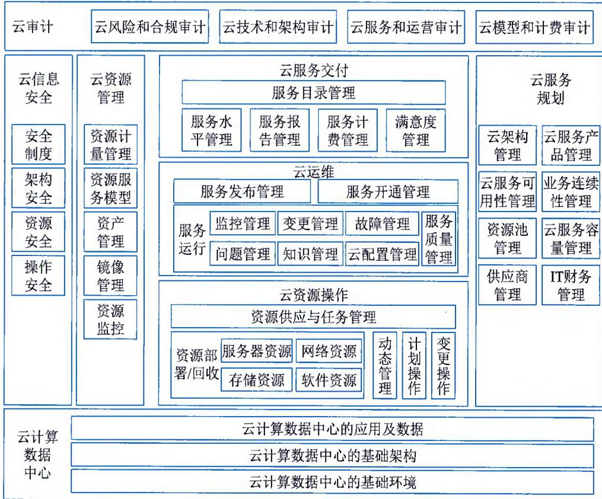  
图9-1 云服务运营管理框架

（3）以安全和审计为保障是指由于技术与服务的变革，如何有效应对云计算技术带来的安全与审计的挑战，将直接影响到用户对云服务与管理的信心，所以专门规划出了两个不同的管理领域去归纳、总结在云服务中需要考虑的管理要点。

## 1. 云服务规划

云服务规划指如何将云计算资源进行封装，并设计符合业务或用户要求的服务，其主要以IT服务中的云服务容量管理、云服务可用性管理、业务连续性管理、供应商管理为基础，同时补充IT财务管理的内容，还根据云服务与技术的特性增加了云服务产品管理与云架构管理两大领域。

## 2. 云服务交付

云服务交付是在常规信息系统服务交付的基础上，强化服务计费管理。因为资源服务化之后，云服务需重点管理资源使用的计费模式，以及对用户在服务交付过程中的诉求响应进行有效的管理。

传统应用或基础架构服务从规划到交付可能历时半年，而在云服务环境下可能是几小时，乃至几分钟。究其原因，是云资源和应用服务的自助化和自动化程度高出很多，另一个关键的原因是此时所谈的服务交付更多是已经被规格化、产品化后的标准内容，不需要像传统服务那样针对客户需求进行单独定制。所以该管理模块将原来的"云服务可用性管理"和"云服务容量管理"放到"云服务规划"模块中。

## 3. 云运维

云运维是在传统运维概念的基础上，强化了服务质量管理，并基于ITSS中的服务质量相关标准要求，对如何测量管理服务提出了具体要求。

把发布管理独立出来形成服务发布管理。这样处理的依据在于资源和应用都服务化了，所有应用上线过程其实是一个新服务发布的过程，或者是一个服务内容调整的过程，相比于传统站在应用发布的视角，增加了服务目录更新、服务技术模型和资源模型更新、资源供应者更新等云服务特色。

把原来其他的管理模块全部封装到"服务运行"中，让框架中的二级目录更为对称和清晰。此外，由于此部分的管理内容都有比较广泛的应用，因此除了重点介绍该管理的常规目标与活动之外，还针对云服务的特点进行有针对性的描述。

## 4. 云资源操作

云资源操作包含常见 IT 服务运营管理模式中服务操作的所有内容，将这些内容归纳到计划操作和变更操作中。但基于云计算技术应用特点增加了资源供应与任务管理、资源部署 / 回收和动态管理的内容。

## 5. 云资源管理

云资源管理是对资源状况的记录，是在常见配置管理基础上扩展而来的，是云服务的特色之一。这部分除了基于配置管理扩展出来的资源计量管理外，还有资源服务模型和镜像管理两个云服务下独特的管理模块。

资产管理与常规管理范围一样，但其存在一些云化中心的特色，并增加了对于软件资产管理的特性。资源监控是从常规的监控管理中把针对各类资源的监控剥离出来后形成的管理模块，因为云环境下资源监控有自身的特色，而面向运维统一监控没有太大差别，所以保留在云运维管理的监控管理模块中。

## 6. 云信息安全

云信息安全的内容与常见信息安全管理差别不大，但云环境的安全技术与传统信息系统存在很大差别，因此针对云服务的特点，将各项安全管理活动归纳到安全制度、架构安全、资源安全和操作安全4个模块中。

## 7. 云审计

虽然云计算会让服务使用起来更简单，但是从运营管理的角度来看却相对复杂与要求严格，如何保证各项管理工作均能得到落实，且记录与内容准确、合规，这就是云审计模块所需要考虑的内容。该部分内容包括云风险和合规审计、云技术和架构审计、云服务和运营审计、云模型和计费审计。

## 9.2 云服务规划

云服务规划在云服务运营管理框架中承担着云战略的功能，负责对云服务的战略规划、云技术规划与服务能力改进的管理，如图9-1所示，包括云架构管理、云服务产品管理、云服务可用性管理、业务连续性管理、资源池管理、云服务容量管理等。

## 9.2.1 云架构管理

云架构管理主要负责信息系统架构、技术规范和技术标准的日常管理工作。通过架构管理，实现管理目标主要包括：

\- 通过统一技术规范，形成技术准入的壁垒，降低技术多样性带来的潜在运营风险；

\- 管理各类变更对技术架构带来的变化，保证架构的可控性；

\- 跟踪前沿技术，保证信息系统具备一定的技术前瞻性，保护投资等。

云架构管理需要包括应用架构管理、数据架构管理、基础架构管理、技术规范管理和前沿技术研究管理五项管理活动。

## 1. 应用架构管理

结合业务需求，设计和维护应用架构，主要管理活动包括：

\- 业务管理架构和业务需求的研究；

\- 应用框架的规划和维护；

\- 核心应用架构设计和维护。

## 2. 数据架构管理

结合业务需求，设计和维护符合业务需求的数据架构，主要管理活动包括：

\- 业务管理架构和业务需求的研究；

● 数据架构的规划和维护；

\- 数据字典的设计和维护。

## 3. 基础架构管理

结合应用和数据架构，设计和维护信息技术基础架构，主要管理活动包括：

● 通信和网络架构规划和维护；

\- 计算能力的架构规划和维护；

\- 存储能力的架构规划和维护；

\- 平台软件的架构规划和维护；

● 数据中心基础环境的架构规划和维护。

## 4. 技术规范管理

结合行业技术现状和前瞻性判断，制定和维护适合的技术规范，主要管理活动包括：

● 通信和网络技术规范制定与维护；

\- 服务器和存储系统技术规范制定与维护；

## 信息系统管理工程师教程（第2版）

\- 平台软件技术规范制定与维护；

\- 应用开发和测试技术规范制定与维护；

\- 桌面系统技术规范制定与维护；

\- 日常操作技术规范制定与维护；

\- 数据中心运维规范制定与维护。

## 5. 前沿技术研究管理

对行业内的新技术和技术发展方向进行储备式研究。

## 9.2.2 云服务产品管理

云服务产品管理是对云服务产品全生命周期的管理，包含云服务产品规划设计、服务发布、运行操作和服务退役等主要管理活动。云服务产品管理在整个云服务运营管理中处于云服务规划层。云服务产品管理主要描述两个管理活动：云服务产品规划设计和云服务产品退役管理。

## 1. 云服务产品规划设计

云服务产品规划设计通过对云服务产品的设计工作，完成对信息系统各类资源的包装，形成资源服务，并以用户易于理解的方式描述资源服务。这项管理活动包含的子活动主要有云服务产品定义、服务成本分析、服务预测与资源容量规划、服务衡量指标定义等。

## 1）云服务产品定义

通过云服务产品定义管理活动，完成对云服务产品的定义工作。云服务产品可分成三个种类：基础设施即服务（Infrastructure as a Service，IaaS）、平台即服务（Platform as a Service，PaaS）和软件即服务（Software as a Service，SaaS）。

IaaS 向用户提供以计算、存储和网络资源为单位的资源服务，例如 2 CPU/4 GB 内存 / 500 GB NAS 存储。

PaaS 是把软硬件设施进行一定包装后，以平台软件的形式提供给用户的 IT 资源服务。PaaS 服务从简单到复杂可以分成三种服务形态：①单套软件 + 硬件设施的服务，例如，单机版的数据库服务。②包含多套软件和硬件设施的服务，如 PaaS 服务给用户提交了一个包含单机版数据库和中间件软件平台的环境。③除了包含多套软硬件设施外，还需要完成这些设施在网络中的位置、相应防火墙策略、负载均衡策略的设置等，总之提供一套直接可以在其上部署应用或服务的环境。

SaaS向用户提供业务应用的服务，典型的SaaS服务如工业云平台、云制造执行系统（Manufacturing Execution System，MES），给中小组织提供销售管理的在线应用服务。

## 2）云服务成本分析

云服务产品规划活动的一个主要目标是通过资源定义分析服务组合的成本构成，并进一步根据运营策略完成服务定价的工作。云服务产品成本通常由云服务运营成本和云服务产品研发成本两部分组成，如图9-2所示。

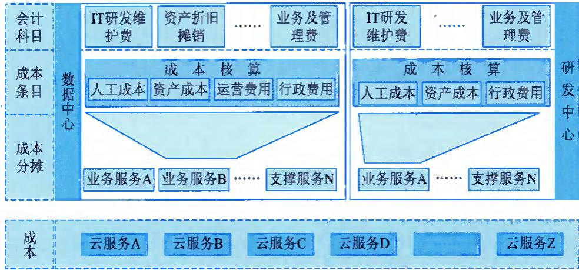  
图 9-2 云服务成本分析示意图

云服务运营成本主要是指保证云服务产品运行所需的资产成本（如设备折旧）、人工成本、运营费用（如机房电费等）和数据中心行政费用的分摊等。云服务研发成本主要指研发云服务产品的成本投入在云服务产品生命周期内的分摊，包括开发阶段投入的人工成本、资产成本（开发测试设备折旧等）和研发中心的行政费用分摊等。

## 3）服务预测与资源容量规划

通过预测市场容量（公有云）或内部用户需求规模（私有云），规划服务产品所需的资源容量要求，保证产品推出后有足够且合适的资源提供，以满足客户（或组织内部用户）对服务产品消费的需求。

## 4）服务衡量指标定义

云服务产品定义中需要包含提供服务质量的承诺和衡量方式。云服务产品的服务质量包含两方面的承诺：交付质量的承诺和服务运行质量的承诺。

交付质量指服务目录中云服务产品交付成功率和交付速度的要求：

● 交付成功率。用户订购云服务产品后按时交付的能力。

● 交付速度。指定时间内按产品规格交付资源的能力。

运行质量指服务运行的质量，主要包含服务可用性和业务连续性指标，如服务可用率、服务可靠性、业务连续性衡量等。

## 2. 云服务产品退役管理

云服务产品退役管理通过对云服务产品退役过程的管理活动，实现相关资源的释放和服务目录的同步更新，完成相关服务产品的退役。这项管理活动包含的子活动主要有云服务产品退役审批、服务目录更新、资源释放、相关管理活动更新等。

## 1）云服务产品退役审批

当一个云服务产品不再适合市场（或内部用户）需求，或者有新的服务产品取代原有服务产品时，相关服务产品需要通过退役管理流程完成产品生命周期的最后一段旅程。退役申请主

## 信息系统管理工程师教程（第2版）

要包含：

\- 退役原因分析。

\- 用户影响分析及应对策略。

\- 是否需要缓冲期，以及多长的缓冲期。

## 2）服务目录更新

退役过程的第一步是把相关服务产品从服务目录中删除，保证从服务产品退役那刻开始，用户无法申请新的该服务产品实例，但对已经申请和使用相关服务产品的用户没有影响。

## 3）资源释放

退役过程的资源释放分为两个步骤：第1步是把相关服务产品预留的可分配资源从资源池中释放到公共资源池；第2步是等待所有用户对退役服务产品的使用周期结束后，把这部分资源释放到公共资源池。

## 4）相关管理活动更新

资源释放完成后，开始做最后的清理工作，即清理相关服务产品在各管理模块中的信息。

## 9.2.3 云服务可用性管理

可用性是云服务中的一项最为重要的指标之一，云服务如果未达到定义的可用性水平，其所支持的业务活动就会受到相应影响。可用性管理的目标是基于合理的成本控制和交付时效，确保所有交付的云服务都能达到承诺的可用性指标，主要任务包括：

\- 建立并维持能反映当前和未来业务需要的合适的可用性计划。

\- 协助与可用性相关的事件与问题的分析，评估变更对可用性计划、服务与资源可用性的影响。

\- 通过测量服务与相关资源的性能，驱动服务可用性可以达到承诺的标准。

\- 确保提升服务可用性的预防性措施，可以在合理的成本下贯彻实施。

提升可用性要从服务可用性与组件可用性两个维度出发，充分了解云服务各组件如何支持各项业务，尤其是关键业务的运行情况。此外，还需要在云服务供需双方之间进行有效沟通，重点分析可用性目标违反带来的直接与间接损失，以及可用性目标达成所需要的投入。最终设计出一个合理的可用性管理目标，并通过合理机制进行有效管理与技术改进。

可用性管理的主要活动包括云服务和组件的相关设计、部署、衡量、管理和提高，应覆盖所有支持服务、合作伙伴和供应商。根据主动/被动维度可分成如下两类。

\- 被动活动。被动活动包括检查、衡量、分析、管理所有可用性事件、故障、问题。一方面，验证这类活动可以支撑可用性目标的达成；另一方面，通过相应措施，保证可用性目标发生偏离时可以得到有效、迅速的处理。

\- 主动活动。主动活动包括从可用性角度，对新的服务与变更提供相应的建议、计划、设计原则与评价标准，同时对正在交付的服务在充分考虑成本收益之后，提出服务提升计划与风险规避策略。

## 9.2.4 业务连续性管理

业务连续性管理指通过对云服务风险的有效管理，保证云服务供方可以持续对外提供较低且符合事先约定的 SLA 的云服务，以支撑组织整体的业务连续性管理目标的达成，主要活动包括：

\- 定义并维护一套业务连续性计划，以支撑组织整体的业务连续性计划。

\- 开展相应的业务影响分析、风险分析，以制定相应的业务连续性策略。

\- 通过运行机制建立、业务连续性建议提供、变更的参与以及管理有效性测量等手段的实施，确保组织业务连续性目标的达成。

\- 通过协商与管理，确保业务连续性管理中涉及的外部资源的有效性。

从业务连续性管理生命周期看，可将其划分为启动、需求与策略、实施、日常运营等阶段，如图9-3所示。

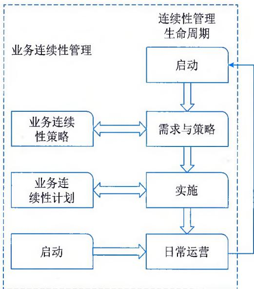  
图9-3 业务连续性管理活动示意图

## 1）启动

组织启动业务连续性管理的项目，并通过组织能力的建设，使之成为常态，其主要活动包括政策制定、范围与参考条款的确定、资源分配、项目组织与项目管理机制设计、项目计划与质量计划的确认等。

## 2）需求与策略

分析业务连续性管理的需求，并据此制定相应的连续性策略，其主要活动包括：

\- 业务影响分析。当服务中出现问题时，尽可能地具象化对业务带来的影响，包括直接影响（财务损失）和间接影响（商誉、客户忠诚度等）。在分析过程中，需要重点分析业务影响与业务中断时间的关系、业务与配套资源，尤其是云服务的关系。在执行过程中还要尽量让利益关系人参与，以确保评估的正确性。

\- 风险分析。分析灾难与其他服务中断的可能性。这是对风险大小及风险对组织脆弱性影响程度的评估，也可用于可用性、事件与信息安全等服务管理领域。

\- 策略制定。可能造成服务中断的风险，及服务中断可能带来的业务影响均被识别后，组织需要据此制定业务连续性管理策略，包括对一些无法忍受中断的业务采取"降低风险"策略，对于可以接受一定时间中断的业务，采取"业务恢复"策略（如人工恢复、互惠协定、冷备份、暖备份、热备份与零中断热备份等）。

## 3）实施

实施指根据策略建立业务连续性管理的各种措施与能力，包括制订业务连续性计划，并做好该计划的版本控制与分发；做好灾难恢复过程中的组织的设计；执行"降低风险"与"业务恢复"的具体措施；对已制订好的计划进行首轮演练，包括桌面演练、完整演练、分系统演练与场景演练。

## 4）日常运营

日常运营指通过有效的管理，建立并维护组织的业务连续性能力，包括意识与技能培训，业务连续性管理的定期评估与审核，定期对业务连续性管理计划进行演练，通过变更管理保证计划可以适应组织的业务与技术环境的变化。当发生计划假设的灾难场景时，通过有效的决策、资源调配与计划执行，帮助组织迅速对灾难事件进行响应，按既定目标恢复最低的业务水平，并最终重建服务能力，完全恢复全面业务。

## 9.2.5 资源池管理

资源池管理是完成对云服务各类资源有效组织、分配、调拨的相关管理活动。资源池管理主要包括资源池规划设计、全局资源池规划设计、资源池和资源生命周期管理。

## 1. 资源池规划设计

云服务通过资源池能够真正实现资源动态调度、快速部署和高可用性等管理目标，所以资源池是云服务的核心内容之一。在建设云资源时，需要仔细规划设计资源池的布局。这项管理活动包含的子活动有梳理资源池设计依据、资源池规划设计、数据中心层面资源池的落地设计等。影响资源池布局规划的主要因素包括安全域、应用框架、资源种类、服务等级和管理需求。

## 1）安全域

组织通常存在多个应用环境需要在网络上进行逻辑隔离或者物理隔离的需求。例如，在私有云环境中存在生产网、OA网和管理网三网隔离的需求，对公有云存在内网和外网隔离、公共应用与管理应用隔离的需求，所以安全域是资源池布局中第一个需要考虑的因素。

## 2）应用框架

现代应用开发框架通常把应用分成多个层次，典型的格局如 Web 层、应用层、数据层和辅助功能层等，所以针对应用框架提出的层次化需求是资源池布局中第 2 个需要考虑的因素。

## 3）资源种类

组织私有云往往存在多种异构资源，例如，x86环境、Unix环境和大型主机环境等。对于同一种类型的不同品牌机型还存在很大差异，所以资源种类是资源池布局中第3个需要考虑的因素。

## 4）服务等级

面对多样化的用户群体和需求，云服务需要提供不同服务等级的资源服务，例如，金银铜牌服务，所以服务等级是资源池布局中第4个需要考虑的因素。

## 5）管理需求

组织私有云存在多种管理需求，例如，高可用性管理需要划分生产区、同城灾备区和异地灾备区等，监控和日常操作管理需要划分生产区和管理操作区，这些因素都需要在资源池规划设计中得到体现。

## 2. 全局资源池规划设计

全局资源池规划设计工作需要站在组织层面把多个数据中心当成一个整体资源池的规划设计，包含三个层面：

\- 资源层次设计；

\- 基于应用框架、管理需求和安全域划分需求，规划资源层次；

\- 资源池在数据中心和资源层次上的种类和数量设计。

## 3. 资源池和资源生命周期管理

资源池和资源生命周期管理是对云服务各类资源从预算、采购、部署到退役的过程管理。该管理负责资源池和资源在各生命周期内活动的策略、规划和过程管控，具体的操作执行过程交付给预算、采购、资产和变更等管理流程负责。该管理的子活动主要包括：

\- 扩容规划、预算和采购；

\- 资源池扩容；

\- 全局资源调拨管理；

\- 资源池和资源退役管理等。

## 9.2.6 云服务容量管理

云服务容量管理与常规容量管理活动基本一致，收集容量需求和数据，考虑可用的容量，确保可用资源和容量被有效使用。但其更加强调预测的敏捷性和成本管控，在预测未来需求的基础上，通过容量计划高效率地分配可用的资源。其管理的目标主要包括：

\- 确保成本合理的云服务容量始终存在并符合组织当前和未来业务需要；

\- 通过持续的监控和有效的管理降低现存服务的风险；

\- 通过容量采购计划（避免紧急、非计划、过于超前的采购）降低成本；

\- 通过对现有容量的有效使用降低成本；

\- 发布对新的容量需求的预测；

## 信息系统管理工程师教程（第2版）

\- 结合财务管理，影响容量需求；

\- 通过容量计划使服务提供商提供如服务级别协议所规定的服务质量等。容量管理子活动示意图如图9-4所示。

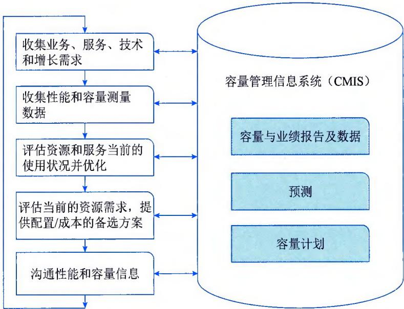  
图9-4 容量管理子活动示意图

## 1）收集业务、服务、技术和增长需求

该项活动关注于获取诸如业务目标、服务需求、技术方向、应用程序/交易量增长估计、预算政策等方面的相关信息。

## 2）收集性能和容量测量数据

该项活动主要包括：

\- 定义需要通过数据收集工具收集的数据；

\- 相关性能和容量信息的归纳和展开。

这些信息应该被存储于数据库中，用于现状分析、预测和报表生成。

## 3）评估资源和服务当前的使用状况并优化

该项活动主要包括：

\- 日常的性能和容量管理；

\- 为避免容量问题而采取的主动措施；

\- 确定当前的资源使用、服务性能与业务驱动因素和业务量之间的关系。

## 4）评估当前的资源需求，提供配置/成本的备选方案

该项活动驱动对性能和容量需求预测。按照预计的负载和相应的配置来满足容量需求。它使用一般单位成本来进行粗略的成本估计。预测可能针对特定应用程序，也可能针对整个系统。

## 5）沟通性能和容量信息

该项活动确定哪些信息需要沟通，应该向谁沟通，怎样沟通。关键的活动是定义有效的报告，其中包括容量计划。

## 9.3 云服务交付

云服务交付负责管理云服务与最终用户之间的交互，是对外的统一服务窗口，在整个运营管理中处于最前端，如图9-1所示，包括服务目录管理、服务水平管理、服务报告管理、服务计费管理和满意度管理。

## 9.3.1 服务目录管理

## 1. 服务目录特点

服务目录与其他常见IT服务目录相比，其产品化特性更加突出。此外，服务目录的具体管理过程也存在一定的差异，主要体现在：

\- 服务目录定义的完善程度和友好性。因为用户将会更多地采用自助的形式去访问、使用、管理云服务，因此服务目录的信息是否准确、完整，最终能否让用户正确理解显得相当重要。

\- 服务目录管理的自动化程度。首先，服务目录不能再单纯地以纸面的方式存在，需要通过相应技术手段建立服务门户，帮助用户更为方便地了解、获取云服务信息；然后，通过自动化手段配合变更管理、资产与配置管理等服务管理的自动化，实现服务目录信息的准确性与可用性；最后，还需通过对服务目录、用户信息、服务产品信息、资源分配信息的电子化，支撑服务组合管理的要求，分析云服务交付的情况，优化服务资源的配置。

\- 服务目录的设计与配套服务管理流程的成熟度。为能支持用户的自助服务，服务目录需要通过服务请求驱动，通过资源自动部署、操作管理自动化来开始提供服务，并通过服务报告生成、服务计费工作开展、服务级别监控等为服务提供监管。因此相关的服务产品或业务模型、服务资源需要进行更细化的定义，配套的管理流程相比其他常见IT服务来说，更为规范化和具备自动化执行能力。

## 2. 云服务目录示例

典型的 IaaS 服务是指以服务形式提供硬件资源，样例如表 9-1 所示。

表 9-1 典型的 IaaS 服务资源内容样例

<table><tr><td colspan="3">Web x86 IaaS 服务</td></tr><tr><td rowspan="4">硬件资源服务</td><td>构建单元</td><td>虚拟化服务池</td></tr><tr><td>计算资源</td><td>处理器:2个;内存:48GB</td></tr><tr><td>存储资源</td><td>600GB/NAS-白金</td></tr><tr><td>网络资源</td><td>生产网+NAS网:2*万兆;管理网:2*千兆</td></tr><tr><td>配套机房服务</td><td>无</td><td>无</td></tr><tr><td>配置服务</td><td>OS</td><td>Neo Kylin 7.9TCP Port: 8080,80,582,其他端口关闭新增账务: 张三、李四</td></tr><tr><td>配套服务</td><td>技术服务</td><td>现场支撑OA系统安装和配置调试</td></tr></table>

PaaS 服务分成三个层次：第 1 个层次提供简单的平台软件服务；第 2 个层次提供多个平台软件服务，并且在交付服务时需要按照一定部署架构完成配置；第 3 个层次需要通过一套完整解决方案提供平台软件服务，例如，"低成本海量存储服务"。表 9-2 所示为第 2 个层次的 PaaS 服务样例。

表 9-2 典型的 PaaS 服务资源内容样例

<table><tr><td colspan="3">数据库服务</td></tr><tr><td rowspan="5">平台软件资源</td><td rowspan="2">构建单元</td><td>MySQL 数据库池 - 白金级</td></tr><tr><td>服务器池 - 白金级</td></tr><tr><td>计算资源</td><td>处理器: 4 个; 内存: 48GB</td></tr><tr><td>存储资源</td><td>SAN- 白金, 1TB</td></tr><tr><td>网络资源</td><td>生产网 +NAS 网: 2* 万兆; 管理网: 2* 千兆</td></tr><tr><td>配套机房服务</td><td>安全等级: 白金</td><td>可加装独立门禁</td></tr><tr><td>配置服务</td><td>OS</td><td>Neo Kylin 7.9</td></tr><tr><td>配套服务</td><td>技术服务</td><td>现场支撑账房系统安装和配置调试</td></tr></table>

SaaS 服务需要提供完整的应用环境，例如提供一个网上银行系统，包含基础设施、基础架构、平台软件、应用系统、部署结构和服务等级等相关内容。

## 9.3.2 服务水平管理

服务水平管理是定义、协商、订约、检测和评审提供给客户的服务质量水准的流程，主要用于规范云服务供方与用户之间就云服务的绩效目标所进行的一系列活动。其管理目标主要包括：

\- 通过对云服务绩效的协商、监控、评价和报告等一整套相对固定的运营流程来维持和改进云服务的质量，使之既符合业务需求，同时又满足成本约束的要求；

\- 采取适当的行动来消除或改进不符合级别要求的云服务；

\- 提高客户满意度以改善与客户的关系。

服务水平管理的范围一般只包括在云服务提供过程中发生的云服务供方与其他相关主体之间，就服务质量所进行的协调活动。具体而言，主要包括三个协议所规范的各方主体的行为及活动，具体如图9-5所示。

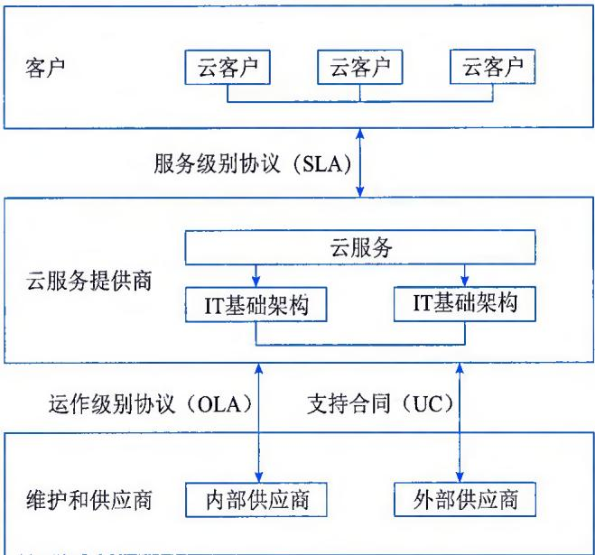  
图9-5 服务水平管理范围

服务级别协议主要协调云服务供方和所有云服务客户之间的关系，支持合同和运作级别协议则主要协调云服务供方与其服务提供赖以进行的各方（外部和内部）供应商之间的关系。总之，上述三个协议所调整和规范的各方主体，及其行为活动均属于服务水平管理流程的范围。

## 9.3.3 服务报告管理

服务报告管理是指依据服务级别要求，从云服务各项活动中收集服务信息、计算服务级别衡量指标，并且制定对用户的服务报告和对内运行管理报告的过程和管理活动。其管理的目标主要包括：

\- 统一收集服务衡量相关信息，统一计算服务衡量指标；

\- 完成对服务用户的报告，并对计费报告提供服务质量的数据支撑；

\- 完成对内运行能力衡量的运行分析报告；

\- 通过服务衡量和运行能力衡量，发现数据中心短板，指导提升计划。

在服务报告中对服务质量的衡量结果需要输出到"服务计费管理"模块中，基于计费策略不同的服务质量可能会影响服务费用。由于云服务的自助性与自动化的特点，因此要求将服务报告的流程尽量通过工具平台实现，并让客户能获得实时、准确的服务情况分析。服务报告管理常分成三个子过程，分别是服务报告规划、服务报告撰写和服务报告发布，如图9-6所示。

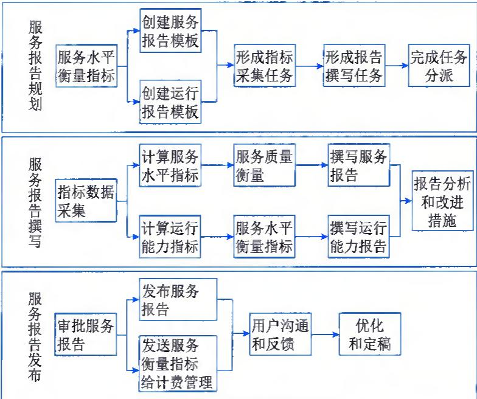  
图 9-6 服务报告管理示意图

## 1. 服务报告规划

服务报告规划通过一系列的管理活动，完成云计算数据中心的服务报告模板、服务级别和运行水平指标的采集计算方法、服务报告模板和服务报告定制过程中各岗位承担的职责。主要活动包括整理服务水平衡量指标、创建服务/运行报告模板、形成指标采集任务、形成报告撰写任务等。

## 2. 服务报告撰写

服务报告撰写管理子流程是组织相关部门完成相关指标的数据采集、计算和报告撰写工作的一系列管理活动。主要包括指标数据采集、计算服务水平指标和运行能力指标、服务质量和服务水平的衡量、撰写服务报告和运行能力报告、报告分析和改进措施等。

## 3. 服务报告发布

服务报告发布管理子流程是组织相关部门与签约用户沟通和优化服务报告的一系列管理活动。主要包括审批服务报告、发布服务报告、发送服务衡量指标给计费管理、签约用户沟通和反馈、优化和定稿等。

## 9.3.4 服务计费管理

服务计费管理通常是云服务的重要管理任务之一，是保障可持续运营的重要手段。服务计费管理一般包括如下4层内容。

\- 计量层。通过观测流量、记录使用情况，以及相关的计量策略（指定了需要报告的属性），跟踪和记录资源的使用情况。

\- 收集层。访问测量实体提供的数据，收集与收费有关的事件，将它们转发给记账层进一步处理。这个层可以收集各个域的信息，例如，虚拟服务器、物理服务器等。因此，在这一层进行数据交换格式和协议的标准化会有好处。收集策略要定义在哪里搜索数据、数据的类型、收集的频率。

\- 记账层。将收集层收集到的信息进行聚合，或者在同一个域内聚合，或者与其他域的信息聚合，建立服务记账数据集合或记录，传递给计费层进行定价。在这一层，需要了解服务的依赖关系和服务定义，所以需要与服务目录/配置管理数据库（CMDB）进行一些集成，还要与应用程序映射和依赖软件进行集成。

\- 计费层。根据具体服务的计费和定价方案，得出记账记录的会话费用。这个层基本上是使用预定的计费公式将技术价值（即测量的资源保留和消耗情况）转换成货币单位的。通过服务计费管理，实现如下管理目标。

\- 根据IT财务管理中计费管理的策略要求，通过技术与管理手段落实具体计费与账单出具的动作。

\- 对实际资源占用进行测量，并进行相应计费处理，提供相应的服务账单。

\- 将服务质量与计费挂钩，将服务级别协议中涉及的奖惩条款体现到服务账单中。

服务计费管理主要包括资源计量、服务质量评估、基于服务合约的计费、生成账单等四项管理活动，实现云服务运营的目标。

## 1. 资源计量

在计费管理环节主要是根据服务约定的内容与客户的计费策略，对与之相关的资源进行采集与计量。在云服务中上述工作必须通过一些管理工具的支持，实现资源的实时、动态测量。

## 2.服务质量评估

通常服务约定中会定义服务质量与收费之间的关系，所以在计费过程中需要把服务合约中与费用相关的服务质量承诺和评估工作纳入计费管理活动。具体要求是，云服务应定期，甚至实时收集与服务级别相关指标的数据集合或记录（收集、记账），并与服务级别协议要求进行比对，继而生成对服务计费影响的服务质量调整系数。

## 3. 基于服务合约的计费

在完成资源计量和服务质量评估后，根据服务约定中的服务内容及相关服务内容的收费依据进行计费计算，然后再结合服务质量条款进行费用的增减计算，形成服务账单原始数据。云服务根据使用者通过网络访问资源使用进行收费，对服务的使用实现按需提供，会有使用特征上的变化，因此计费需要考虑到计费内容的颗粒度，如硬件资源性能与容量、操作系统供给版本、安全防护内容等。

## 4. 生成账单

根据 IT 财务管理中针对客户服务计费账期的要求、账单提供形式的要求，生成相应的服务账单，并提供给财务人员进行后续的收费管理。

## 9.3.5 满意度管理

云服务是为众多云资源的消费者提供服务，为了保留和吸引客户，在服务交付的过程中客户关系管理非常重要。云服务客户关系管理的目标是在理解客户及其业务基础之上，通过有效的手段在云服务供方与客户之间建立和维护良好的关系。除了维护与客户的关系，服务供方应识别和记录服务的利益相关方。服务供方应指定人员负责管理客户满意度。应有流程去获得和反馈定期衡量的客户满意度。记录流程中定义的改进措施，并输入服务改进计划。

满意度管理主要包括客户满意度调查、服务报告与评审、客户投诉管理等管理活动与过程。

## 1. 客户满意度调查

客户满意度调查是业务关系管理中的一个基本环节。客户满意度是一个主观性非常高的衡量指标，因此，对突发事件管理、变更管理等流程均进行客户满意度的调查和分析，制定一套标准流程以专门指导客户满意度管理的开展还是十分有必要的。

客户满意度反映的是客户对云服务的主观感受，相关的服务级别协议水平、服务提供的成本等服务能力限制因素很可能在客户反映其满意度时被忽略。因此，在进行客户满意度调查的同时，对客户的IT服务认知、期望值进行综合管理也是进行业务关系管理的核心工作之一。客户满意度调查主要包括客户满意度调查的设计、执行和客户满意度调查结果的分析、改进四个阶段。

## 2. 服务报告与评审

与客户进行定期或不定期的针对云服务提供情况的沟通，是非常有必要的，每次沟通均应形成沟通记录，以备对服务进行评价和改进。云服务供方和客户应定期参加服务评审，讨论服务范围、SLA、合同或业务需求的变化，并在协商的时间间隔内举行中间会议，讨论性能、成绩、结果和措施计划。云服务供方必须随时关注并发现客户业务需求的变化，并及时、有效地对这些需求变化作出回应。云服务供方通过定期的服务回顾，如客户服务回顾会议、视频会议、电话会议或者第三方机构收集客户意见等方式，保持云服务供方与客户之间沟通渠道的有效和畅通，从而对业务关系以及服务级别进行有效的管理。

## 3. 客户投诉管理

客户投诉管理规定云服务接收客户提出投诉的途径以及投诉的方式，并留下事件管理等流程的接口。应针对客户投诉完成分析报告，总结客户投诉的原因，制定相关的改进措施。为及时应对客户的投诉，应该规定客户投诉的升级机制，对于严重的客户投诉，按升级机制进行相应处理。

云服务供方必须让客户明白，云服务供方欢迎客户就服务进行投诉，而且客户的投诉都将得到妥善记录和处理。客户可以通过专门的渠道向专门的负责人员（客户服务经理、服务台坐席等）进行投诉。

所有的客户投诉都应该被正确记录、调查、采取相关行动并加以解决。处理的过程和结果应该根据客户的要求及时通报。如果在现有的服务级别下，客户投诉不能在短时间内得到有效解决，应及时与客户就此进行沟通和解释说明，并在经过分析后提交相关服务改进请求报告。

## 9.4 云运维

云运维在整个云服务运营管理框架中起到承上启下的作用，其主要通过一系列有效的技术管理动作，开展云资源运行与维护，保证云资源可以稳定、有效地发挥作用，如图9-1所示。

一方面，云运维将云服务交付中传递过来的用户需求及时分解成运维管理中的行为规范和工作内容，并结合云资源的技术特点进一步细化为云资源操作中的技术要领或运维工具中的功能项；同时通过对底层云资源的管理，及时将客户服务相关资源使用的情况进行有效的处理，并以与客户约定的形式展现给客户，以此打通"服务—运维、运维—技术"链路。另一方面，云运维管理将根据管理过程中各项活动的特点归结成不同的管理流程，规定各项管理中关键活动与各流程之间的关系，安排相应的流程角色，最后设定相关的KPI。整个云运维管理领域主要包括服务发布管理、服务开通管理、服务运行管理等模块。

## 9.4.1 服务发布管理

服务发布管理包括指定服务产品服务能力的建立、测试和交付上线，同时，还负责及时响应业务需求并交付达到预期目标的服务。从发布的管控与跟踪角度出发，相关发布活动主要包括发布申请、策划与评审、发布培训、发布测试、发布沟通、发布推演、发布执行、发布实施、发布验收、发布总结等，如图9-7所示。

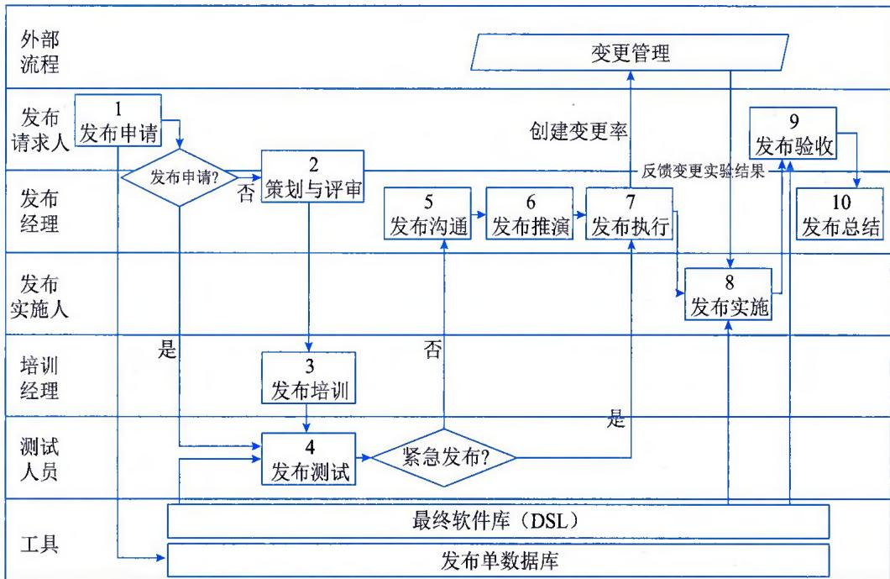  
图9-7 服务发布管理活动示意图

## 1. 发布申请

发布申请环节是发布管理的起点。在此环节，相关人员或团队提出发布请求，按照一定的规范记录请求信息，同时判断收集到的信息是否完整，并判断发布的类型，以决定下一步流转。

## 2. 策划与评审

对于非紧急发布，在正式提交后需要由发布经理组织相关人员对投运方案进行评审。评审人员通常由相关团队的技术专家组成，在评审会议上共同审核发布方案，评估技术可行性和发布风险等。

## 3. 发布培训

当有新项目投运或当前系统有重大功能上线时，为了让服务人员和运维人员及早了解新内容、新功能，保障业务连续性，需要在投运前对他们进行相关培训，以便在投运后可以适应生产状况的变化。

## 4. 发布测试

在实施投运方案之前，需要对投运方案进行完整的测试，验证投运方案是否可操作、可执行，发布部署包是否能正常部署。同时在测试中及早发现可能出现的问题，并有针对性地进行准备工作。发布测试一般在测试环境中进行。

## 5. 发布沟通

发布测试完成后，发布经理需要及时将测试情况通报给各相关部门，沟通发布前期的各项准备、测试情况。此环节属于线下线上融合活动，发布经理可通过纸质单、电子邮件等方式进行沟通。

## 6. 发布推演

在正式投运前，发布还需经历推演环节。在此环节，发布经理将组织所有参与发布的人员，在准生产环境中按照投运方案执行完整的投运演练。推演完成后交由决策人员做投运前的最终审批。

## 7. 发布执行

发布审批通过后，即进入执行阶段，发布执行的主要任务是将发布任务进行统一规划，拆分为若干个变更后，再向变更管理流程提出申请。在发布流程中，主要关注执行发布需要通过哪几个变更来完成，而不关注变更的具体技术细节，变更具体方案由变更受理团队负责。

## 8. 发布实施

发布拆分为若干变更单后，变更的流转、执行都由变更管理流程进行控制，但发布与其关联变更存在联动关系，通常情况下，发布关联的任何一个变更开始实施后，则认为发布正式开始实施；发布关联的变更中，实施完最后一个变更时，则认为发布的实施过程结束。

## 9. 发布验收

发布成功实施后，发布经理会通知相关部门进行验收工作。在实施阶段发布经理和相关实施团队已经对发布的技术层面进行过验证，在此环节，可由外部验收人员对发布的业务层面进行验证。

## 10. 发布总结

发布结束后，为了确认是否还存在潜在问题或影响，需要经过一段时间的观察期，在观察期结束后才允许关闭发布，正式标志着发布整个生命周期的结束。

## 9.4.2 服务开通管理

服务开通管理负责从服务目录接受签约用户的服务申请，管理审批和服务交付的过程，并在交付完成后负责更新配置信息，保证资源计量工作的及时开展。其管理的目标主要包括：

\- 向用户提供一个请求和获取标准服务的渠道；

\- 向用户明确IT部门可以提供哪些服务，以及获取这些服务的必要步骤；

\- 向用户交付标准的服务；

\- 管理服务交付的过程；

\- 交付完成后，负责发起配置信息的更新。

服务开通管理主要包括提出服务请求、审批服务请求、处理服务请求、关闭服务请求等活动，如图9-8所示。

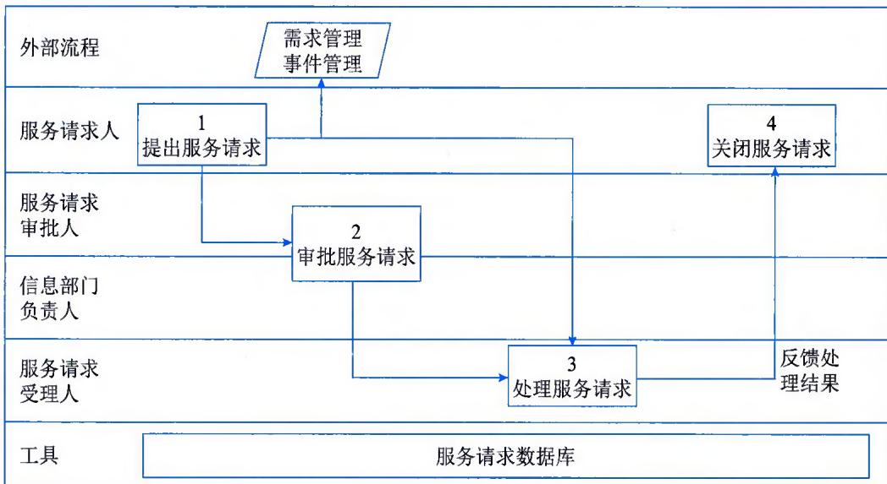  
图 9-8 服务开通管理活动示意图

## 1. 提出服务请求

签约用户通过服务目录选择所需服务后，会自动生成服务请求工单进入服务开通管理环节。服务开通管理根据服务申请内容，从云配置库中取得相应的服务模型，以获取交付资源服务所需的资源种类和数量，并向云配置库发起查询，了解是否拥有足够资源满足本项服务请求。这些处理信息与签约用户的请求信息共同组成更新后的工单，传递到下一处理环节。

## 2. 审批服务请求

上一环节结束后进入对服务请求进行受理和审批的环节。在云服务活动中，由于资源服务的自助化和自动化程度要求很高，所以基于规则的自动审批是一个主要的选择。在审批环节，审批的内容主要包括：

\- 是否签约用户；

\- 是否拥有足够授权申请本项资源服务；

\- 资源池内的资源是否足够交付本项服务请求；

\- 所需资源是否处于可分配状态。

这个环节也应该支持人工审批，由资源池管理员和拥有相关资源的部门主管负责人工审批。

## 3. 处理服务请求

服务请求审批结束后，进入服务请求处理环节。在这个环节需要考虑"云"和"非云"两种情况。对于"非云"的请求，处理环节只需要生成任务工单，如果涉及变更则需要通过变更流程来管理任务的执行，否则只需要服务请求管理任务执行即可。

对于 "云" 的环境处理过程更为复杂：首先，需要服务请求流程从云配置库中获取服务模型，生成资源部署的模型；然后，从资源部署模型出发产生一系列的部署指令；最后，把这些指令发布到 "任务调度管理" 模块中负责调度执行，这时服务请求流程处于等待状态。一旦 "任务调度管理" 模块完成了所有部署指令并返回成功信息，服务请求流程再次接管，并到云配置库中更新交付的资源信息，再把状态信息回送给用户。

## 4. 关闭服务请求

在服务请求执行完成并得到用户确认后，就进入关闭环节。在关闭环节可以按照一定的规则，发送客户满意度调查问卷，回收问卷后关闭服务请求工单。

## 9.4.3 服务运行

服务运行在云服务运营管理框架中承担着保障安全运行的功能，包含云运维相关的七大管理功能模块：

\- 监控管理：负责各类资源监控的统一告警管理和性能管理，对告警事件进行全生命周期的跟踪和管理，并根据告警事件的类别和严重程度进行相应的升级处理。是云服务运营管理的主要活动之一。

\- 变更管理：使用标准化的方法和程序，用于有效处理所有变更，减少由于变更带来的业务风险。

\- 故障管理：负责尽可能快地恢复意外服务质量下降或因故障而导致的服务中断，从而使故障对业务产生的影响最小化。

\- 问题管理：负责查找故障产生的根本原因、监测和预防故障的发生，并为彻底消除故障

根源提出合理的解决方案。

\- 知识管理：负责确保正确的信息和知识以一种可高效利用的方式传递给所有的IT服务人员。

\- 云配置管理：确保服务、系统或产品的组件都能够得到识别和维护，确保变更能够得到控制，确保发布通过正式批准。

\- 服务质量管理：保证云服务能够提供符合质量承诺的服务。

## 1. 监控管理

在监控领域，可将其分成两个层面的工作，即各类资源层面的专业资源监控和数据中心层面的统一监控管理。专业资源监控负责对各类资源的运行状况和性能进行监控和采集，发现故障及时生成监控信息进行告警处理；统一监控管理则站在信息系统角度负责收集各类资源监控子系统发送过来的告警信息和性能信息，通过一定的规则统一处理短信和邮件通知，发送告警信息到故障流程和统一展现告警信息等管理功能。

统一监控管理作为云服务主动式管理重要手段，通过技术和管理结合的方式对信息系统发生的各类告警开展统一管理，如图9-9所示，其实现目标主要包括：

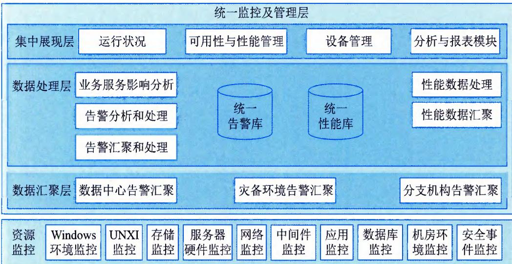  
图9-9 统一监控及管理功能架构

\- 侦测告警，分析告警并确定合适的处理措施，为操作监控和控制提供基础。

\- 对告警分类（信息/警告/异常），为自动化操作管理任务提供基础。

\- 为各服务操作流程和活动提供入口。

\- 为所设计的标准和SLA提供实际绩效的评估手段的更新。

## 2. 变更管理

变更管理的目的是通过对变更全生命周期的控制，确保变更可以达到预期目的同时，最大限度地降低对IT服务中断的影响，具体包括：

\- 响应用户业务变更的需求，在实现变更收益的前提下，避免由此引发的事件、业务中断与返工。

## 信息系统管理工程师教程（第2版）

\- 通过变更实现IT服务对业务的支撑，同时最大限度地控制由于变更所带来的风险。

\- 通过一套有效的管理方法保证相应的变更被记录、评估，实现被审批通过的变更获得相应的排序、计划、测试、实施和评价。

\- 保证对配置管理项（CI）的变更被记录到CMDB中。

变更管理的主要活动包括创建变更请求（Request for Change，RFC）、记录 RFC、检查 RFC、评估变更、授权变更、计划更新、协调变更实施、评审和关闭变更记录，如图 9-10 所示。

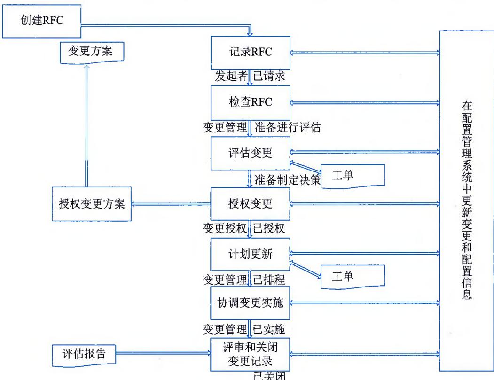  
图9-10 通用的变更管理过程

## 3. 故障管理

故障管理包括中断或可能中断服务的任何故障，它可能是用户直接报告的故障，也可能是通过服务台提交或者通过事件管理与故障管理之间的工具接口而创建的故障。故障管理的目标是尽可能快地恢复到正常的服务运营，将故障对业务运营的负面影响降到最低，并确保达到最好的服务质量和高可用性水平。"正常的服务运营"通常相对于服务级别协议（SLA）的要求而言。

故障管理是云/IT运维管理中使用频率最高的活动。明确定义故障管理过程的主要活动，形成标准的故障处理模型，并将该故障处理模型整合到故障管理软件平台是目前实践中较常见的做法，如图9-11所示。

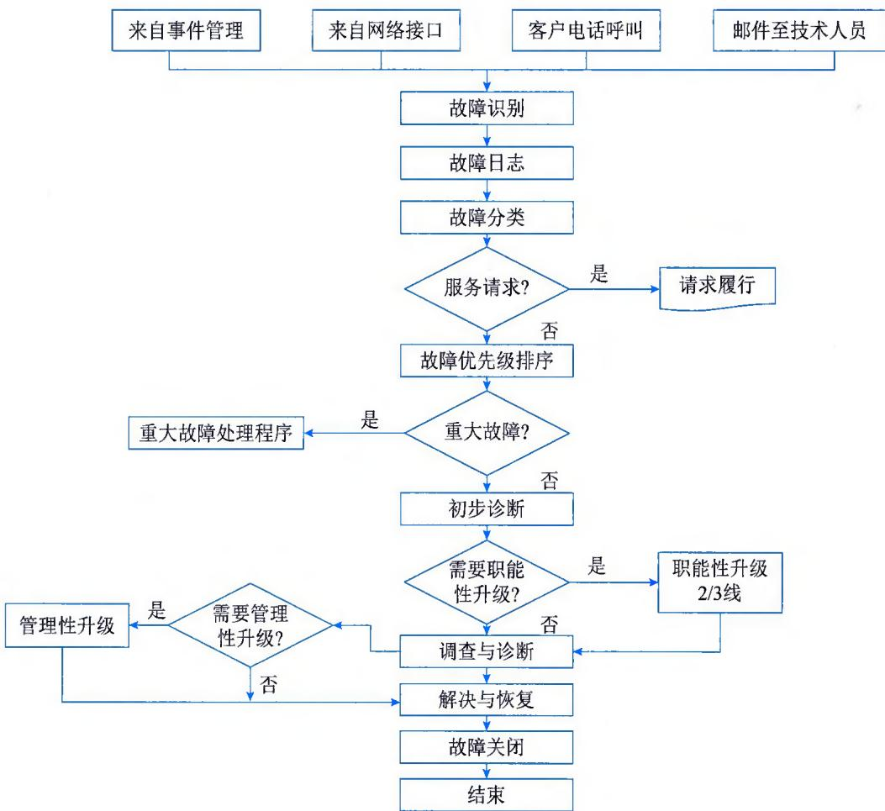  
图9-11 标准的故障管理通用过程

## 4. 问题管理

问题管理的主要目标是预防问题的产生及由此引发的故障，消除重复出现的故障，并对不能预防的故障尽量降低其对业务的影响。问题管理针对所有的 IT 服务要素（人、流程、技术、合作伙伴）进行问题识别、根源分析、错误评估和解决方案制定。对于识别后的问题，需要采取一套标准的流程进行处理，如图 9-12 所示。

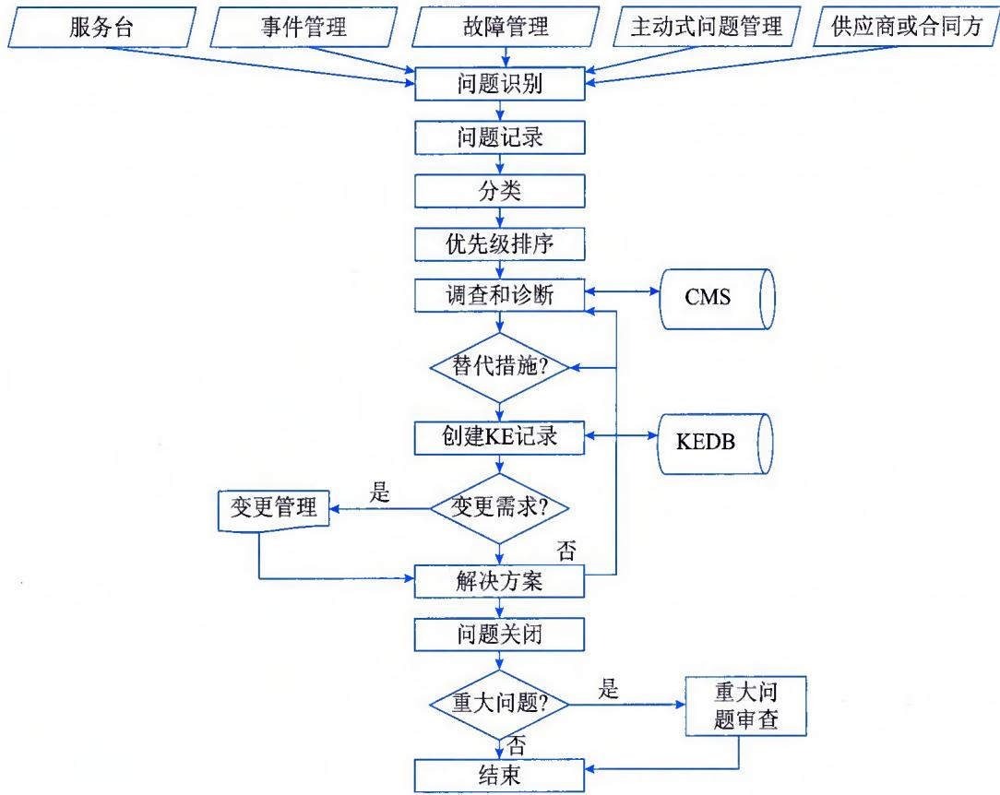  
图9-12 问题管理通用过程框架

## 5.知识管理

知识管理对于一个 IT 服务各生命周期中的角色而言都是一份宝贵的资产，但这项管理对于各个组织来说都是一项知易行难、重要性高而紧急度低的管理活动。其目标是保证合适的信息可以在合适的时间提供给适当且有能力的人，以帮助其作出明智的决策，具体包括：

\- 使IT服务机构工作更加有效，服务质量更好，且服务成本更低。

\- 使相关服务人员理解其服务对客户的价值，以及如何能让服务真正为客户带来价值。

\- 保证服务人员在适当的时间与地点获得合适的信息，如谁在使用这些服务、服务使用的状况、服务提供过程中的限制、阻碍服务为客户带来价值的因素等。

## 6. 云配置管理

在云服务中，配置管理会包含至少两个数据消费场景：①资源调度。资源调度指当一个资源池中的资源无法满足服务交付的要求时，云管理平台从另一个资源池中获取相关资源。资源调度场景要求配置管理的模型必须可以建立跨资源池和跨租户的配置关系。②资源调拨。资源调拨指当一个资源池中的资源无法满足服务交付的要求时，将另一个资源池中富余的物理资源调拨到该资源池中。资源调拨与资源调度的区别在于：资源调度指的是逻辑资源的调用，资源调拨指的是物理资源的调用。资源调拨要求配置管理提供当前资源池中物理资源的使用情况分析。

云配置管理可以根据数据消费者的需求定义其所需的数据提供者，例如资产管理的数据、监控的数据或自动发现工具中的数据。在云服务中，配置管理建设对数据提供者的选择空间非常小，因为云计算的高度自动化和动态化的特点，决定了云配置管理的数据提供者必须要包括CloudDB和自动发现工具等。这就大大地提高了配置管理建设的复杂度和技术难度，而且对云配置管理的管理成熟度和工具平台的技术成熟度要求也将大幅度提高。

云配置管理的目标主要包括：

\- 通过建立和维护一套完整且准确的数据集（包括CI信息和CI关系）来实现IT环境的可视化管理。

\- 利用数据统一、共享的特征，打破原有的数据壁垒，实现整个数据中心的数据共享；利用数据整合的特点，实现其他运维管理领域或工具的高阶管理价值。例如，故障定位、变更风险模拟、可用性分析等。

\- 建立IT与业务的关联，基于服务目录的维度对所有的配置资源进行归集，实现业务与IT资源端到端的联动。例如，业务影响分析、服务成本核算、资源动态调配等。

\- 支撑云资源管理的相关活动。例如，云资源的跨资源池调度和调拨活动。

云配置管理主要活动如图9-13所示。

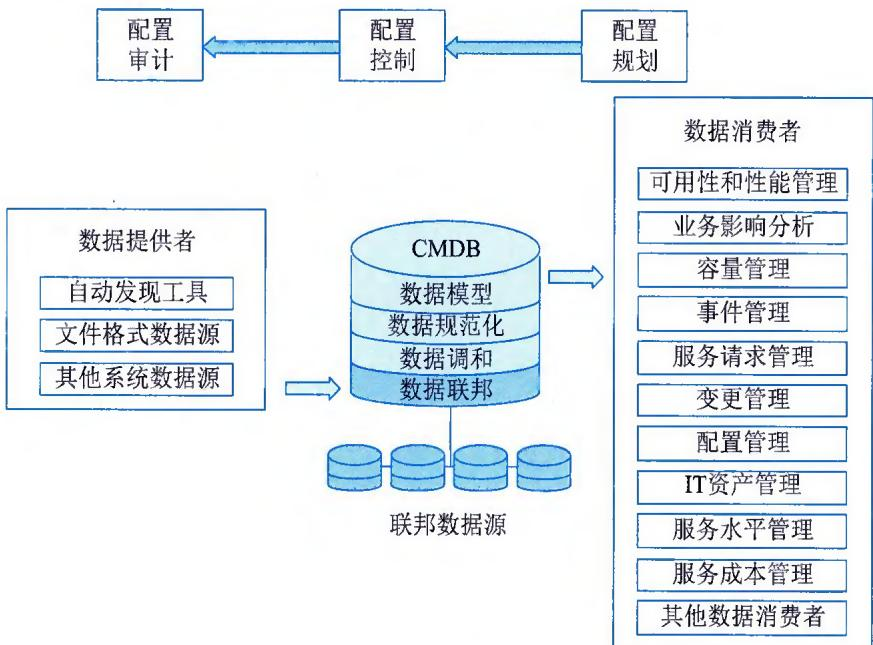  
图9-13 云配置管理流程

## 7. 服务质量管理

服务质量管理是云服务的重要组成部分，参考国家 ITSS 相关定义，信息技术服务质量包括服务要素质量、服务生产质量和服务消费质量等三方面的质量要求，如图 9-14 所示。服务质量管理的主要活动包括服务质量评价指标体系创建、服务质量指标采集和计算、服务质量评估和服务绩效奖惩等内容。

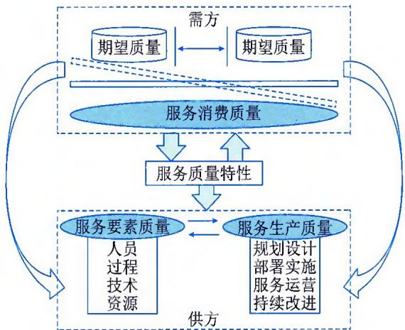  
图9-14 服务质量管理模型

服务质量管理通过量化的指标加强过程管控和事后追溯能力，保证云服务能够提供符合质量承诺的服务。服务质量管理目标主要包括：

\- 建立一套科学、合理和量化的质量评估体系，帮助管理者落实质量管控的措施。

\- 提供质量评价和奖惩的管理措施，促进整个组织行为模式向管理者期望的方向持续提升。

## 9.5 云资源操作

云资源操作的主要作用是根据运维管理要求和云计算的技术特性，将服务交付、服务支持中的技术要求具化成技术操作，将服务的各项操作要求分散，并落实到云服务的日常管理中。该子模块分为五大管理功能模块，如图9-1所示。

## 9.5.1 资源供应与任务管理

资源供应与任务管理是指对机房和软硬件设施资源进行调度部署任务的管理，是云计算实现资源服务化的基础能力体现。其管理目标主要包括：

\- 按照服务开通管理中提出的要求完成对各类资源自动化部署和配置任务。

\- 对多个存在关联关系的资源部署和配置任务进行排程管理。

任务调度管理是一个自动执行的操作流程，主要操作步骤如图9-15所示。

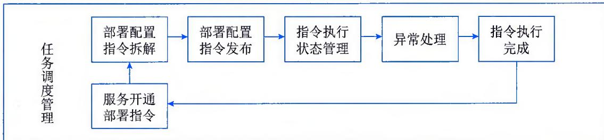  
图9-15 任务调度管理流程

## 1. 部署配置指令拆解

从服务开通管理传送过来的是按服务打包后的指令集，所以任务调度管理的第1步是指令解包，根据供应者种类和资源种类重新形成一系列的指令子集，可以供下一步完成针对供应者的指令发送工作。

## 2.部署配置指令发布

把拆解完成的指令子集按照供应者 / 资源种类方式向资源供应者进行指令发布，例如，x86 虚拟化服务器的部署配置指令需要发布给 vCentre 或者 Hyper-V。在这个管理环节，需要判断执行顺序，即资源部署是串行还是并行的要求。

## 3. 指令执行状态管理

任务调度管理把指令发布给"供应者"执行后，进入执行状态管理阶段，主要是跟踪"供应者"的执行情况，决定是否开始串行执行第2段指令，或者执行完成进入第5步。

## 4. 异常处理

如果在第 3 步出现异常情况，任务调度管理需要判断是否存在规则可以自动处理，否则发送信息给资源池管理员，引入资源池管理员的人工介入。

## 5. 指令执行完成

一个任务的指令全部执行完成后，并且状态是成功的，则任务调度管理把执行情况反馈给服务开通管理模块。

## 9.5.2 资源部署/回收

资源部署 / 回收是在任务调度管理统一调度下真正对软硬件设施资源的操作，包括按照服务请求完成云环境的部署、配置等工作，是直接和各类资源打交道的管理层次。其管理目标是按照任务调度管理的要求完成各类资源的部署和配置工作，最终交付资源服务。

资源部署 / 回收在云服务中，基本是自动化操作执行，从管理角度看非常简单，复杂性体现在各类资源的具体技术操作上。从云计算角度来说，这些资源可以按照大类分成服务器资源、网络资源、存储资源、平台和应用软件资源等。

## 1. 服务器资源

云服务需要支持各类异构的服务器硬件和操作系统，并需要在其上进行一定的提炼和封装，实现通用的服务器部署 / 回收操作，包括虚拟机部署、物理裸机安装、操作系统和补丁安装及配置等。

## 2. 网络资源

云服务同样需要支持各类异构的网络设备，并需要在其上进行一定的提炼和封装，实现通用的网络虚拟化操作。这些操作包括 VLAN 划分、IP 地址池管理、防火墙和负载均衡策略修改等。

## 3.存储资源

云服务需要支持各类异构的存储设备，并需要在其上进行一定的封装，实现通用的存储虚拟化操作。这些操作包括对基于SMI-S接口的存储操作进行封装、对存储管理软件提供云存储服务进行封装等。

## 4. 平台和应用软件资源

平台软件指各类数据库和中间件，以及商业软件的应用平台部分。应用软件指各类自开发的应用软件和购买的商用应用软件。平台和应用软件部署/回收操作需要在其上进行一定的提炼和封装，实现通用的软件部署和配置操作，包括基于镜像的软件安装、安全完成后的软件配置等。

## 9.5.3 动态管理

云计算采用虚拟化技术，将所有的计算资源集中起来，这些资源数量庞大，并且是动态变化的，如同城市面临的大量汽车对城市造成的交通拥堵情况一样，采用何种计算资源调度策略对这些资源进行组织和调度，实现资源的自我调节和负载均衡，以及资源分配的灵活性和按需分配，是云服务管理的关键任务之一。

## 1. 动态资源优化

动态资源优化是指在虚拟化环境中，如何根据应用、服务负载的变化为其所在的虚拟机及时、有效地分配虚拟化环境中的资源，保证既不会因为资源缺乏而影响业务系统运行，也不会造成严重的资源浪费。为了使虚拟机的资源达到供求平衡，动态资源优化技术需要了解和掌握各应用、服务可能的负载量，根据一定的方法或规则推算出其需要的物理资源类型及数量；在应用、服务运行中实时监测其性能数据，预测业务变化的趋势，做出资源再分配的决策，然后进行相应的调整。

动态优化需要两只"眼睛"、一个"大脑"和两只"手"来协同工作。通过先看后想再动手的方式完成每一个优化周期，通过定期优化来获得用户期望的性能和资源供求的动态平衡。具体来说，一只"眼睛"指从虚拟化平台的角度进行资源监测，了解虚拟环境下有多少台服务器及它们的资源状态，包括CPU、内存、存储和网络等资源的总数量和剩余数量；另一只"眼睛"指从应用、服务的角度进行监测，了解在当前虚拟化环境中运行的所有应用、服务的负载状况，以及相应的资源使用情况。这两只"眼睛"分别从供给面和需求面对资源进行监测。一只"手"指做宏观调整，即通过打开或者关闭服务器，或利用实时迁移技术移动虚拟机等，调整虚拟化环境中服务器的计算资源；另一只"手"指做微观调整，负责调整某个服务、应用所在的部分或全部虚拟机的计算资源，例如，调整虚拟机的CPU数量和内存使用量等。

所谓一个"大脑"就是指具备性能分析预测、进行资源动态规划和输出调度结果的算法，它协调着两只"眼睛"和两只"手"。在优化过程中，首先，它通过两只"眼睛"得到虚拟化平台的计算资源使用情况、应用负载情况；然后，根据当前情况并结合历史信息预测应用未来的负载状况，根据预先定义的规则做出资源分配的决策，进而输出资源调度指令；最后，通过两只"手"来完成调度，资源分配变化不剧烈时只需要第2只"手"做微观调整即可，变化剧烈时需要用上第 1 只 "手"。"大脑" 是整个动态优化技术的核心，大脑的智能程度决定了虚拟环境是否能有效地保证每时每刻都能向应用、服务提供充足的计算资源。

## 2. 实时迁移管理

实时迁移（Live Migration）是在虚拟机运行过程中，将整个虚拟机的运行状态完整、快速地从原来所在的宿主机硬件平台迁移到新的宿主机硬件平台上，并且整个迁移过程是平滑的，用户几乎不会察觉到任何差异。由于虚拟化抽象了真实的物理资源，因此可以支持原宿主机和目标宿主机硬件平台的异构性。

实时迁移管理需要虚拟机监视器的协助，即通过源主机和目标主机上虚拟机监视器的相互配合，完成客户操作系统的内存和其他状态信息的复制。实时迁移开始以后，内存页面被不断地从源虚拟机监视器复制到目标虚拟机监视器。这个复制过程对源虚拟机的运行不会产生影响。最后一部分内存页面被复制到目标虚拟机监视器之后，目标虚拟机开始运行，虚拟机监视器切换源虚拟机与目标虚拟机，源虚拟机的运行被终止，实时迁移过程完成，如图9-16所示。

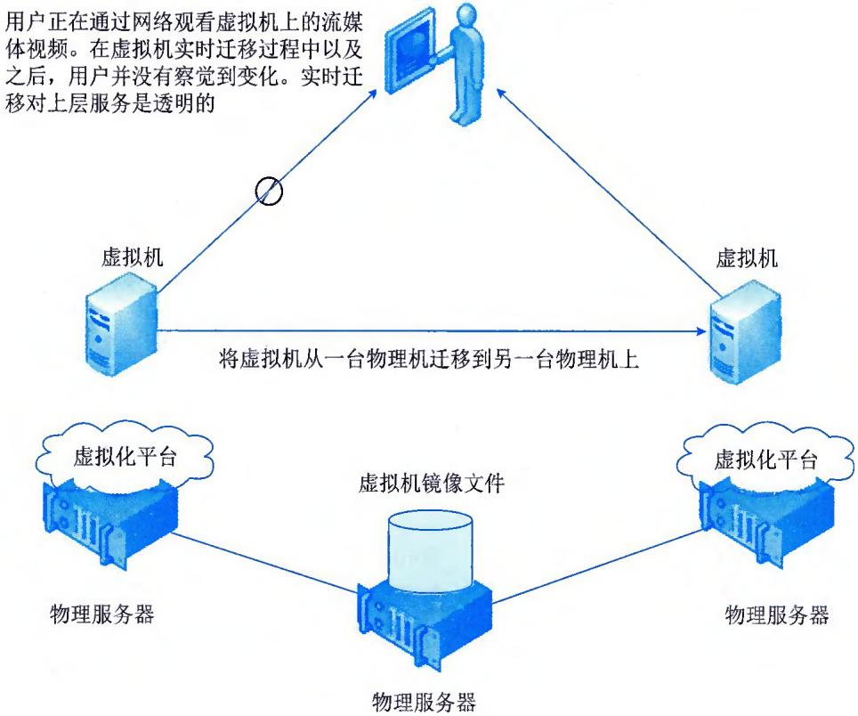  
图9-16 实时迁移技术示意图

实时迁移技术最初只应用在系统硬件维护方面。众所周知，云计算的硬件需要定期进行维护和更新，而虚拟机上的服务需要 $7 \times 24$ 小时不间断地运行。如果使用实时迁移技术，便可以在不宕机的情况下，将虚拟机迁移到另外一台物理机上，然后对原来虚拟机所在的物理机进行硬件维护。维护完成以后，虚拟机迁回到原来的物理机上，整个过程对用户是透明的。目前，利用实时迁移技术可用作资源整合，通过优化的虚拟机动态调度方法，云计算的资源利用率可以得到进一步提升。

## 9.5.4 计划操作

计划操作是对机房环境和软硬件设施定期所做操作任务的管理，例如日常巡检、预维护等。与计划操作相对应的是变更操作，指变更流程执行过程中对资源的各类操作任务的管理。计划操作的目标主要包括：

\- 通过主动性管理措施，使各类设施运行的可用性目标能够得到保障；

\- 通过标准化日常操作管理规范，降低或消除人为操作失误。

计划操作包含四类操作任务，分别是合规巡检、常规作业、补丁管理和批处理管理。

## 1. 合规巡检

合规巡检是指基于行业规范和组织自定义规范中定义的安全审计规则，对服务器、网络、平台和应用软件的关键配置进行检查，及时发现配置基线的偏移，并通知管理员的过程管理。

安全管理员可以按照各种规范定义合规策略，对设备进行配置检查。合规策略包括一个或多个检查规则。一个检查规则分为不同类型，包含支持的厂商、设备系列、检查内容来源、规则内容等信息。安全管理员可通过创建检查任务来检查设备是否符合合规策略，检查任务包含待检查的合规策略、设备的信息等。检查任务执行完毕后，可以通过报表查看设备违背合规的信息。对于违背合规的设备，应创建违规修复任务进行修复，及时解决在数据中心环境中出现的配置问题，提高安全等级及各种法律法规的遵从度。

## 2.常规作业

常规作业指需要在服务器、存储设备、网络设备、机房设施、平台软件和应用软件上定期执行的作业任务，这些任务包含以下几种类型。

\- 服务器常规作业。设备清洁，输入、输出电压检测，磁盘读、写正常性测试，输入、输出设备读写测试（光驱、内置磁带机），配置文件备份，过期运行日志清理，网络通信正常性测试，临时文件清理等。

\- 存储设备常规作业。设备清洁，输入、输出电压检测，磁盘读、写正常性测试，配置文件备份，过期运行日志清理，与连接主机通信正常性测试，端口访问测试等。

\- 网络设备常规作业。设备操作系统软件备份及存档，设备软件配置备份及存档，监控系统日志备份及存档，监控系统日志数据分析与报告生成，网络配置变更文件的审核，网络配置变更的操作，网络配置变更的记录清理等。

\- 机房设施常规作业。基础类操作（按服务管理手册的有关规定，执行设备的日常运行、维护和保养），测试类操作（按服务管理手册的有关规定，对基础设施各系统功能、性能进行测试），数据类操作（按事先规定的程序，对机房基础设施运行日志、记录等数据进行操作）等。

\- 数据库系统的常规作业。侦听连接正常性测试，数据库正常登录测试，SQL执行正常性测试，表空间正常访问测试，表读写正常性测试，客户端连接测试，数据库备份，过期归档日志清除等。

\- 中间件的常规作业。备份配置文件，备份重要运行日志，清除过期日志，交易连接正常性测试等。

\- 数据的常规作业。对数据的产生、存储、备份、分发、销毁等过程进行的操作，对数据的应用范围、应用权限、数据优化、数据安全等内容按事先规定的程序进行的例行性作业，数据备份，数据转换，数据分发，数据清洗等。

## 3.补丁管理

补丁管理指对所有操作系统、数据库和中间件平台，集中管理补丁介质，对当前的补丁列表进行分析，提供需安装的补丁建议，并批量下发补丁。补丁一般可分为：

\- 安全修补程序（Security patch）。为特定产品广泛发布的修补程序，针对的是某一个安全漏洞。安全修补程序通常描述为有一定的严重度，此安全修补程序针对的漏洞的严重程度等级。

\- 重要更新（Critical update）。为特定问题广泛发布的修补程序，针对的是重要的、与安全无关的缺陷。

\- 更新（Update）。为特定问题广泛发布的修补程序，针对的是不重要的、与安全无关的缺陷。

\- 修补程序（Hotfix）。由一个或多个文件组成的单个程序包，用来解决产品中的问题。修补程序针对的是特定的客户环境。

\- 更新汇总（Update rollup）。安全修补程序、重要更新、更新和修补程序的集合，可以作为累积更新进行发布，或定位于单个产品组件。

\- 服务包（Service Pack）。从产品发布至今，累积的一系列修补程序、安全修补程序、重要更新和更新，包括许多已经解决，但还没有通过任何其他软件更新使之可用的问题。

\- 功能包（Feature pack）。产品发布的新功能，可以用来添加功能。通常在下一次发布时集成到产品中。

补丁管理一般分为评估、识别、计划和部署4个阶段：

\- 评估阶段。收集漏洞、补丁信息，收集组织资产信息并确定其价值，在这个基础上，评估漏洞对组织的威胁，还要对前一次的执行结果进行评估，给出修补漏洞的要求以及其他防护措施建议。

\- 识别阶段。这个阶段的工作依赖于评估阶段收集的信息作为基础，主要工作包括寻找补丁并确定其来源可靠性，以及测试补丁，以确定其能与组织IT环境兼容。

\- 计划阶段。给出在组织网络部署补丁的详细计划安排。

\- 部署阶段。根据计划，在组织网络内部署补丁并进行确认。

## 4. 批处理管理

批处理管理是对业务批处理任务的统一管理，包括批处理的操作定义、测试、调度、执行、验证、回退、异常处理，以及批处理作业的版本控制、集中管控等。

## 9.5.5 变更操作

变更操作是与计划操作相对应的一种操作管理，指由工单驱动（不像计划操作由排程驱动）操作任务的管理。变更操作的目标主要包括：

● 通过统一操作任务管理，控制生产系统风险。

\- 通过标准化日常操作管理规范，降低或消除人为操作失误。

变更操作包括排程、人力资源调度、变更任务执行等管理活动。

## 1. 排程

变更窗口在云服务中是一种有限资源，通常夜间需要完成变更的执行、批处理操作、常规操作任务（例如数据备份等），所以任何一种变更都需要事先通过变更管理流程进行排程，然后才能依据排程进行资源调度。

## 2. 人力资源调度

排程完成后，可以基于排程的要求对执行变更操作的系统管理员进行调度，安排在合适的时间段执行相关变更操作任务。

## 3. 变更任务执行

人力资源经过排程和调度后，到相关变更窗口时，把自动化执行的任务指令下达给"任务调度管理"，手工完成的任务发布调度指令给系统管理员来完成。

## 9.6 云信息安全

有效的安全框架是正确执行安全控制策略的重要依据和正确的方法论。事实上，云安全建设是一个庞大的体系化工程，对于这样一个大工程，需要搭建好骨干框架，然后对其进行模块化分解组装，只有这样循序渐进，逐个攻破，才能保证云服务安全、可靠、有效运行。云信息安全框架可从安全制度、架构安全、资源安全与操作安全四大管理领域，安全风险管理、法律及合同遵循等15个管理模块进行建设和实施，如图9-17所示。

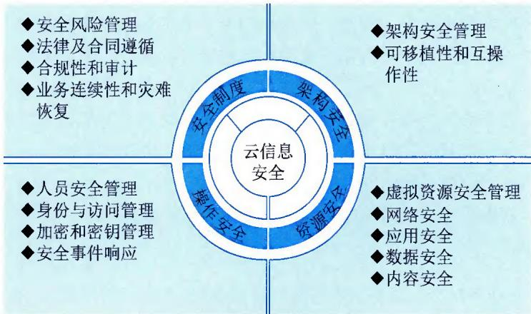  
图9-17 云信息安全框架示意图

## 9.6.1 安全制度

本部分主要从政策、制度的角度，提出云服务在安全管理方面需要重点关注的内容，包括安全风险管理、法律及合同遵循、合规性和审计与业务连续性和灾难恢复四方面。

## 1. 安全风险管理

由于云计算的运行架构，使得安全控制模型比较复杂，云服务的过程中，大量的资源被安排给众多用户提供服务和调用，不可避免地会遇到信息安全的挑战。组织需要部署适当的组织架构、流程，从而维持有效的信息安全治理、风险管理及合规性。云服务供方还应确保在任何云部署模型中，都有适当的信息安全贯穿于信息供应链，包括云服务的供方和用户，及其支持的第三方供应商。

## 2. 法律及合同遵循

在云安全领域，法律含义变得更加宽泛，尤其是在云计算特有的分布式生态环境，潜在的法律风险越来越突出。云服务基础设施通常遍布各地，都必须遵守当地的法律法规，一旦出现法规监管问题，又无法应付的情况，责任就会落在使用云服务的组织上。

云服务相关法律问题分析应该考虑的问题主要包括：

\- 功能方面：主要包括确定云计算中的功能和服务，杜绝因此产生参与者和利益相关者的法律问题。

\- 司法方面：主要包括相关法律法规等对于云服务、利益相关者和数据资产的影响。

\- 合同方面：主要包括合同的结构、条件和环境，以及云计算环境中的利益相关者安全问题管理办法等。

## 3. 合规性和审计

作为云服务供方，在合规和审计方面，需要注意以下几点。

\- 使用特定云服务时的监管法规适用性。

\- 需要区分自身、用户和第三方服务商在合规责任上的区别。

\- 各类供方需要能够提供证明合规所需资料，审计活动应事先计划并由利益相关者批准。

\- 识别适用的法律、法规和合同要求，明确定义为满足这些要求所采用的方法以及组织职责，形成文件并保持更新，根据司法管辖权不同遵守相应的合规要求。

\- 谨慎策划针对数据复制、数据访问，以及数据边界限制的审计计划、活动和操作规程，以最大限度降低业务流程中断的风险。

## 4. 业务连续性和灾难恢复

常规意义上的物理安全、业务连续性计划（BCP）和灾难恢复（DR）等形成的专业知识与云服务仍然有紧密关系。由于云服务的迅速变化和缺乏透明度，这就要求在常规的安全、业务连续性规划和灾难恢复领域的专业人员，不断进行审查和监测所选择的云服务。

当前人们面临的挑战是如何合作进行风险识别，确认相互依存，整合、动态并且有效地利用资源。云服务和与之配套的基础设施可以帮助人们减少某些安全问题，但也可能会增加某些安全问题，肯定不会消除人们对于安全的需要。随着业务和技术领域的重要变革的深入，常规安全原则依然存在。

## 9.6.2 架构安全

本部分主要从技术架构与整体规划的角度，提出云信息在安全管理方面需要重点关注的内容，包括架构安全管理与可移植性和互操作性两方面。

## 1. 架构安全管理

云平台安全是云服务有效运行的重点，云平台安全主要关注物理安全和云操作系统安全。

## 1）物理安全

云基础设施资源是云服务的核心组件，集中存储了宝贵的数据资源，对于外网的恶意攻击者有极大的诱惑力，云服务安全需重点关注：

\- 物理安全策略。按照风、火、水、电等具体控制要求落实，如果没有，则需要对这些要求重新检查和规范不符合项。

\- 访问控制。云服务供方需要有对物理环境的访问控制权，以确保只有得到授权的人员才能访问云基础设施。

\- 监管要求。云服务供方要确保符合环境与适当的法律和监管要求，并制定审计规范，定期对规范进行维护和审计，对不符合规范的要求项应不断改善。

## 2）云操作系统安全

该部分主要关注操作系统补丁管理、操作系统内核安全、应用开发引擎安全，以及应用接口安全等。

\- 操作系统补丁管理。云操作系统是云平台的核心组件，要严格操作系统各模块的补丁管理和开发管理，确保云操作系统无漏洞。

\- 操作系统内核安全。如果云服务供方采用自主开发的内核，需要对内核安全性能进行评估；加强云操作系统补丁管理，确保无安全漏洞。

\- 应用开发引擎安全。云服务供方需要重点关注多租户环境下的隔离问题，以文档的形式记录并向用户说明如何实现隔离。

\- 应用接口安全。在多租户的情况下，可能会出现接口被第三方调用或者是租户转移，云服务供方应确保提供标准的API安全接口，以满足安全和可移植性的要求。

## 2. 可移植性和互操作性

云服务供方必须事先考虑到需要更换云资源提供方的可能性，可移植性和互操作性必须被作为云风险管理和安全保证的一部分而提前考虑。

大型的云资源提供方核心的云计算互操作性问题，主要在大部分应用没有统一的语言、数据、界面以及其他云计算运行的子系统之间的兼容问题。从安全的角度看，人们主要的关注点是在环境变更时，维护安全控制的一致性。一些简单的架构级设计可以帮助人们将这些问题发生的损害降至最低。然而，解决这些问题的办法取决于云服务的类型：在 SaaS 情况下，云服务供方关注的重点不在于应用的可移植性，而是保持或增强旧应用程序的安全功能，以成功地完成数据迁移；在 PaaS 情况下，为达到可移植性，一定程度上对应用的修改是需要的，关注的重点在于当保存或增加安全控制时，最大限度地降低应用重写的数量，同时成功地完成数据迁移；在 IaaS 情况下，关注的重点和是应用和数据都能够迁移到新的云资源提供商并顺利运行。

## 9.6.3 资源安全

本部分主要从云服务所需管理与使用的技术资源出发，提出云服务在资源管理方面需要重点关注的内容，包括虚拟资源安全管理、网络安全、应用安全、数据安全与内容安全五方面。

## 1. 虚拟资源安全管理

在云环境下，虚拟化技术是实现云计算的主要手段，是云计算框架的基础。通过虚拟化技术，在云环境下实现资源的有效利用。虚拟化环境下的安全仍是首要关注点。虚拟资源安全主要从 Hypervisor 安全和虚拟机镜像安全方面考虑。

## 1) Hypervisor 安全

Hypervisor 是虚拟机管理的窗口，Hypervisor 安全性的高低直接影响到虚拟机安全。因此在虚拟机管理方面要定期审计 Hypervisor 补丁情况，根据检查出来的问题进行加固，以确保 Hypervisor 达到安全需求。

## 2）虚拟机镜像安全

虚拟机镜像是为用户提供的"机器"实体，当虚拟机处于休眠状态或者是关机的情况下，很容易被篡改或修改。对于这个问题，需要对虚拟机镜像进行加密，同时与行政控制、数据泄露防护（Data Leakage Prevention，DLP）和审计跟踪手段相结合，以防止正在运行的虚拟机镜像"逃逸到野外"，避免攻击者访问到虚拟机快照中的数据，造成恶意损坏而未被及时发现。

## 2. 网络安全

在云服务的网络安全领域，人们需要重点关注安全域管理和流量管理。

## 1）安全域管理

传统网络安全管理中，网络安全架构通过分层规划与分级建设，安全区域清晰明了，可以按照业务需求对不同类型的系统方便地定义安全级别（Security Level）。来到云安全域管理，业务资源聚集、基础网络架构一体化、安全边界消失，传统网络安全设备（防火墙）很难从实体上实现隔离，无法满足云安全域的管理需求。在网络架构一体化的云网络环境，人们需要使用虚拟交换技术、虚拟防火墙技术。

## 2）流量管理

云服务的大带宽流量汇聚，给云计算流控管理带来很大的挑战。从本质上来说，建立一个云，通常是指连接数据中心以创建一个无缝资源池，这些连接应尽快生效，这是云计算控制数据包丢失的关键。

存储网络协议以及其他为数据包错误恢复而提供的协议，可能在任何情况下都是必要的，但没有任何协议会降低数据中心之间主干的高利用率。当利用率超过 $50\%$ 时，丢失和延迟都会增加，而且云性能也会受到影响。这是在云资源之间管理流量路由时必须要考虑的问题。

## 3. 应用安全

应用安全架构必须意识到一个事实，就是大多数应用程序会与其他多个不同的系统产生依赖关系。有了云计算，应用程序的依赖性可能非常动态，甚至每个依赖都代表一个独立的第三方服务供方。云特性使配置管理和紧随的配置供应比传统的应用程序部署更为复杂。为了保证应用程序的安全，云环境推动了应用程序架构的变革。针对应用安全，人们需要重点关注合规性、工具与服务、脆弱性等。

## 1）合规性

合规性明显会影响数据，而且也会影响应用程序（如监管要求如何实现程序中的一个特定加密函数）、平台（对操作系统的控制和设置的命令）和进程（如对安全事件的报告要求）。

## 2）工具与服务

云计算对应用程序开发和运维的工具与服务带来了一系列的新挑战。其中包括开发和测试工具、应用程序管理工具、对外服务的耦合，以及库和操作系统服务的依赖性，这些可能都源自云服务供方。了解谁提供、谁拥有、谁运行的后果，并承担相关的责任非常重要。

## 3）脆弱性

脆弱性不仅包括广泛文档化且不断演化中的 Web 应用脆弱性，还涉及机器与机器之间、面向服务架构（SOA）的应用程序的脆弱性，这些 SOA 应用正在不断地被部署进云中。

## 4. 数据安全

对于集中式存放的云数据安全来说，数据管理显得尤为重要，从数据生命周期来看，云数据安全管理是对整个数据生命周期管理的进一步强化，如图 9-18 所示。

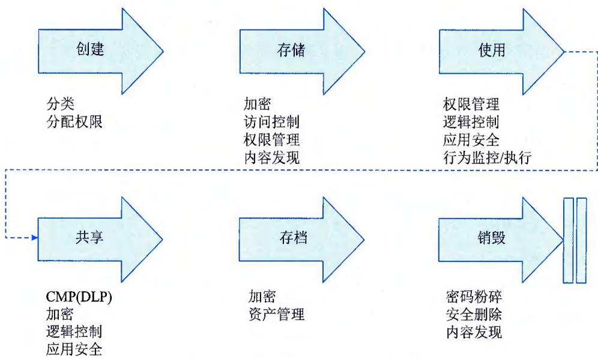  
图9-18 数据安全生命周期示意图

## 1）数据创建

在云环境下，由于多租户的出现，数据创建后很难区分数据所有权，云服务供方需要对创建的数据进行标志和分类，以确保数据拥有所有人。

## 2）数据存储位置

云环境下的数据必须保证所有数据，包括所有副本和备份，存储在合同、服务级别协议和法规允许的地理位置。例如，使用由欧盟管理的电子健康记录，对数据拥有者和云服务供方可能都是一种挑战。

## 3）数据删除或持久性

当需删除数据时，数据必须彻底有效地去除才被视为销毁。因此，必须具备一种可用的技术，能保证全面和有效地定位云计算数据，擦除/销毁数据，并保证数据已被完全消除或使其无法恢复。

## 4）不同用户数据的混合保护

数据尤其是保密 / 敏感数据，不能在使用、储存或传输过程中，在没有任何补偿控制的情况下与其他用户的数据进行混合。数据的混合将在数据安全和地缘位置等方面增加安全的挑战。对于不同的用户数据，云服务供方应该根据用户群和数据安全要求来区分数据等级，并分开存放。如果存在数据共享，应该对访问权限进行严格且精细化的控制，并可以实时监控和提供审计措施。

## 5）数据备份和恢复重建（Recovery And Restoration）计划

必须确保数据的可用性，云数据备份和云恢复计划必须到位和有效，以防止数据的丢失、意外覆盖和破坏。不应轻易假定云模式的数据肯定有备份并可恢复。云服务供方应对用户数据采用多份、异地备份方式进行数据备份，以便在数据被破坏后能及时恢复重建。

## 6）数据发现（Discovery）

由于法律系统对电子证据发现的持续关注，云服务供方和数据拥有者需要把重点放在发现数据上，并确保法律和监管当局要求的所有数据可被找回。这些问题在云环境中是极难回答的，将需要管理、技术和必要的法律控制互相配合。

## 7）数据聚合和推理

数据在云端时，会新增对数据汇总和推理方面的担忧，这可能会导致违反敏感和机密资料的保密性。因此，在实际操作中，应确保数据拥有者和数据利益相关者的利益，在数据混合和汇总时，避免数据发生任何的、哪怕是轻微的泄露。例如，带有姓名和医疗信息的医疗数据与其他匿名数据混合时，如果两边存在交叉对照字段，就可能发生数据泄露。

## 5. 内容安全

信息内容安全是信息安全在政治、法律、道德层次上的要求。公有云建设在这方面面临相关的要求，其要求就是要确保公有云存储的信息内容是健康的，并且在法律上符合国家法律法规的规定。

\- 商业用途。防范云平台侵犯著作权人的知识产权。

\- 军事用途。防止通过云平台泄露军事秘密。

\- 政治用途。防止通过云平台散播违反法律法规的政治言论等。

## 9.6.4 操作安全

操作管理是云服务正常提供的一个基础保障措施。大资产、大数据对云服务有序运营管理提出了更高的要求。从操作角度提出云服务需要重点关注的内容，包括人员安全管理、身份与访问管理、加密和密钥管理与安全事件响应四方面。

## 1. 人员安全管理

人员是云运维管理体系的基础。一个好的管理框架离不开合适的技术和管理人员，随着人员安全问题的逐渐增多，例如，私自泄露敏感数据、盗卖用户数据等由人员管理引发的安全问题，云服务供方需要关注云服务管理内部的人员安全管理。

根据目前大多数云服务的情况，存在云服务供方与第三方业务合作密切的现象，例如，租赁 ISP 的基础设施。这就要求云服务供方对第三方进行严格审查和管理，以确保第三方提供服务的安全性。

## 2. 身份与访问管理

管理身份和访问组织应用程序的控制，仍然是IT面临的最大挑战之一。组织为了成功有效地实施身份管理，必不可少的身份识别与访问管理功能，主要包括身份的供应/取消、认证、联盟、授权与用户配置文件管理等。

## 1）身份供应/取消

对组织采纳云服务的主要挑战之一，是在云端安全和及时地管理用户的报到（供应，即创建和更新账户）和离职（取消供应，即删除用户账户）过程。此外，已经实施内部用户管理的组织需要将相关管理引申到云端。

## 2）身份认证

当组织开始利用云服务时，以可信赖且易于管理的方式认证用户是一个至关重要的要求。组织必须解决与身份认证有关的挑战，例如凭证管理、强认证（通常定义为多因素身份认证）、委派身份认证，以及跨越所有云服务类型的信任管理。

## 3）身份联盟

在云计算环境中，联盟身份管理在使组织能够利用所选择的身份提供商去认证云用户方面起到了至关重要的作用。在这方面，身份提供商与服务提供商之间以安全的方式交换身份属性也是一个重要的要求。组织在考虑云联盟身份管理时，应该了解各种挑战和可能的解决方案，包括身份生命周期管理、保护机密性与完整性的认证方法，以及支持不可抵赖性等。

## 4）身份授权与用户配置文件管理

用户配置文件与访问控制策略的要求，取决于用户是否以自己的名义行事（如消费者）还是作为一个机构成员（如大学、医院或其他企业）。在服务供应接口（Service Provider Interface，

SPI）环境下的访问控制要求，包括建立可信任用户配置文件和规则信息，这不仅用于控制对云服务的访问，而且要确保运行方式符合审核的要求。

## 3. 加密和密钥管理

云服务供方为用户提供身份管理，由于云环境由多个"租户"共享，服务供方对于这个环境中的数据有特许存取权。因此，存储在云中的机密数据必须通过访问控制组合、合同责任和加密措施等进行保护。加密的好处包括对云服务供方的依赖性最小、减少对运行错误检测的依赖性等。

密钥存储是密钥管理的核心部分，在密钥管理方面，存储、传输和备份过程是云服务供方必须的关注点。例如，密钥放在什么位置、是否评估存放位置的安全性、密钥使用的加密算法、加密算法是否对外公开等。如果密钥一旦丢失，可能意味着业务数据的丢失，尽管这是一种销毁数据的有效方式，但是意外丢失保护关键任务数据的密钥可能会毁灭一个业务，因此必须执行安全备份和恢复解决方案。

## 4. 安全事件响应

从云服务诞生的那一天起，在频频发生的安全事件中，许多大型云服务在重大事件响应过程中也显得乏力。因此，建立一个良好的安全事件响应流程和机制对于云计算环境来说尤为重要。对于云服务供方来说，安全事件响应策略和程序、收集证据流程、事后处理方式是整个应急事件响应是主要关注点。

云安全事件响应的处理过程需要专业的技术知识，除此之外，法律和隐私保护问题在处理过程中起到关键性的作用。试想一下，在不同的数据存放位置，应用数据的管理和访问有不同的含义和监管要求。例如，如果涉及的数据在 A 国，发生的事件可能被认为是"事件"，如果数据在 B 国，可能就不被视为"事件"。这使得事件识别充满挑战，事实上这些情况已经在发生。

针对云服务事件的特点，云服务供方需要：

\- 建立并实施信息安全事件处理策略，信息安全事件报告、响应和升级程序。

\- 建立程序并传达给所有员工、合同方和第三方用户，要求他们根据法律、法规和合同要求迅速并准确地通过预先定义的沟通渠道报告所有信息安全事件。

\- 提供在线安全事件响应流程工具，协同用户处理事件。

\- 在信息安全事故发生后，当后续行动需要采取法律措施时，应采用正确的取证程序，包括妥善保管证据链来收集、保存，并出示证据以支持可能的法律行动。

\- 当为了惩罚目的而收集和提交证据时，应制定并遵循内部规程。

\- 设立机制，监测和量化信息安全事故的种类、数量和损失，出具详细的安全事故报告。

● 定期举行安全事件响应演练，在条件允许的情况下，邀请用户一起参与。

\- 在云计算安全事件处理时，充分考虑界定事故范围、保护证据链的措施。

\- 涉及用户隐私的信息，确保在应急响应时不会被损坏。

\- 确保有效的联络点和联系方式，当客户需要支持时，应立即配合。

\- 定义安全事件响应中的角色和职责，尤其应明确云服务提供商在事故处理中提供的支持，并体现在合同或SLA中。

## 信息系统管理工程师教程（第2版）

\- 提供对安全事件的监测、分析措施和机制，例如保障信息的完整性。

\- 建立云安全事件一致、根除和恢复等技术方案，确保业务的可持续性等。

## 9.7 本章练习

## 1. 选择题

(1)\_\_\_\_属于云服务运营框架中云服务规划管理的模块。

A. 云资源操作管理

B. 云服务交付管理

C. 云安全管理

D. 云供应商管理

参考答案：D

(2) 云服务容量管理的目标不包括: \_\_\_\_。

A. 确保成本合理的云服务容量始终存在并符合组织当前和未来业务需要

B. 通过容量采购计划（避免紧急、非计划、过于超前的采购）降低成本

C. 通过容量管理可以杜绝一切安全事件发生

D. 通过容量计划使服务提供商提供如服务级别协议所规定的服务质量

参考答案: B

(3)\_\_\_\_不属于云服务运营框架中云运维管理的模块。

A. 服务发布管理

B. 服务开通管理

C. 服务运行管理

D. 云风险合规审计

参考答案：D

(4) 关于补丁类型的描述, 不正确的是: \_\_\_\_。

A. 更新（Update）：为特定问题广泛发布的修补程序，针对的是不重要的、与安全无关的缺陷  
B. 修补程序（Hotfix）：由一个或多个文件组成的单个程序包，用来解决产品中的问题  
C. 功能包（Feature pack）：从产品发布至今，累积的一系列修补程序、安全修补程序、重要更新和更新，包括许多已经解决，但还没有通过任何其他软件更新使之可用的问题  
D. 安全修补程序（Security patch）：为特定产品广泛发布的修补程序，针对的是某一个安全漏洞

参考答案：C

1. 思考题

（1）请简述云服务的特征和挑战。

（2）请简述云服务规划包含的各个模块。

（3）请简述在一个云服务安全框架中用于保障云计算数据中心安全的各个模块。参考答案：略
