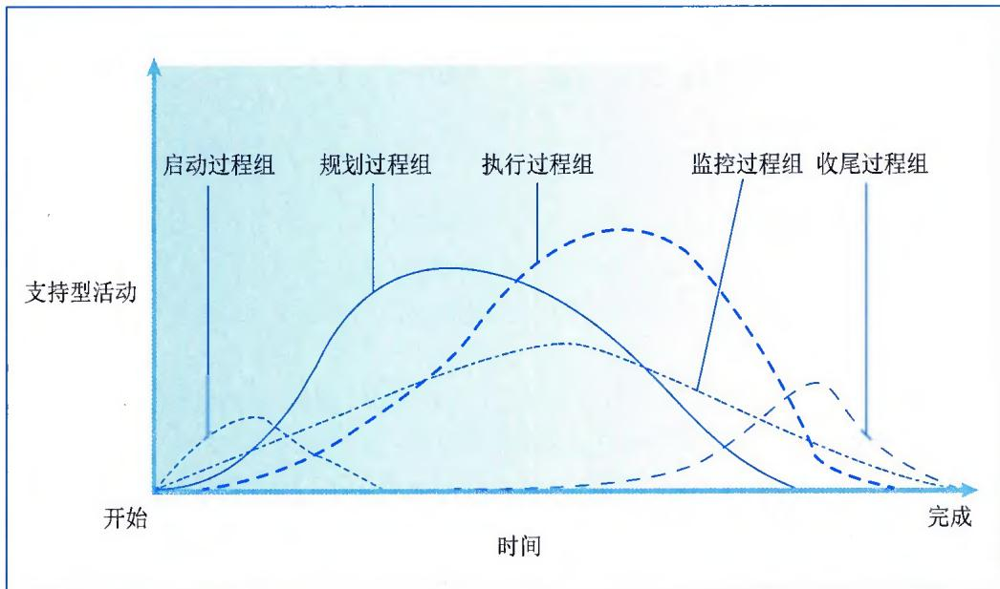
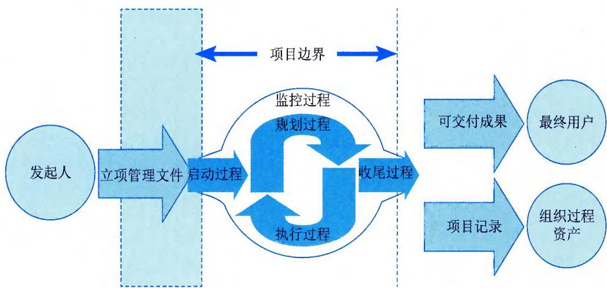
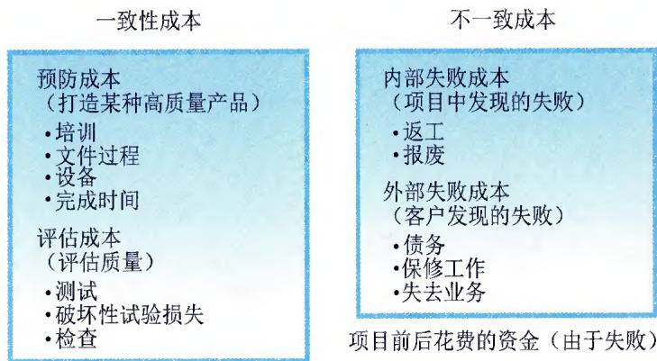

>[!info] 现行教材 · 第 2 版
>本页为**现行考试依据**的教材原文（第 2 版，2024 年 10 月出版，2025 年起启用）。
>考纲层级见 [[知识体系]]；练习题见 [[练习题·基础知识]]；案例模板见 [[案例答题模板]]。

# 第10章 项目管理

项目是为创造独特的产品、服务或成果而进行的临时性工作。开展项目是为了通过可交付成果达成目标。可交付成果是指在某一过程、阶段或项目完成时，形成的独特并可验证的产品、成果或服务。可交付成果可能是有形的，也可能是无形的。实现项目目标可能会产生一个或多个可交付成果。

项目管理是将知识、技能、工具与技术应用于项目活动，以满足项目的需求。

项目管理能够帮助个人、群体以及公共和私人组织：①达成业务目标；②满足干系人的期望；③提高可预测性；④提高成功的概率；⑤在适当的时间交付正确的产品；⑥解决问题和争议；⑦及时应对风险；⑧优化组织资源的使用；⑨识别、挽救或终止失败项目；⑩管理制约因素（例如范围、质量、进度、成本、资源）；⑪平衡制约因素对项目的影响（例如范围扩大可能会增加成本或延长进度）；⑫以更好的方式管理变更。

项目管理不善或缺乏项目管理可能会导致：①超过时限；②成本超支；③质量低劣；④返工；⑤项目范围失控；⑥组织声誉受损；⑦干系人不满意；⑧正在实施的项目无法达成目标。

为了达成项目的特定目标，对项目管理过程进行逻辑上的分组，形成项目管理过程组。项目管理过程组与项目阶段的不同：①项目管理过程组是为了管理项目，针对项目管理过程进行的逻辑上的划分；②项目阶段是项目从开始到结束所经历的一系列阶段，是一组具有逻辑关系的项目活动的集合，通常以一个或多个可交付成果的完成为结束标志。项目管理过程可分为以下五个项目管理过程组。

\- 启动过程组。启动过程组定义了新项目或现有项目的一个新阶段，授权开始该项目或阶段。

\- 规划过程组。规划过程组明确项目范围、优化目标，为实现目标制定行动方案。

\- 执行过程组。完成项目管理计划中确定的工作，以满足项目要求。

\- 监控过程组。监控过程组跟踪、审查和调整项目进展与绩效，识别必要的计划变更并启动相应的变更。

\- 收尾过程组。收尾过程组正式完成或结束项目、阶段或合同。

一个过程组的输出通常成为另一个过程组的输入，或者成为项目或项目阶段的可交付成果。例如，需要把规划过程组编制的项目管理计划和项目文件（如风险登记册、责任分配矩阵等）及其更新，提供给执行过程组作为输入。各过程组在项目或阶段期间的重叠关系，如图 10-1 所示。

过程组中的各个过程会在每个阶段按需要重复开展，直到达到该阶段的完工标准。在适应型和高度适应型生命周期中，过程组之间相互作用的方式会有所不同。

  
图10-1 项目或阶段中各过程组的相互作用关系

## 10.1 启动过程组

启动过程组包括定义一个新项目或现有项目的一个新阶段，授权开始该项目或阶段的一组过程。启动过程组的目的是协调干系人期望与项目目的，告知干系人项目范围和目标，并商讨他们对项目及相关阶段的参与将如何有助于实现其期望。在启动过程中，定义初步项目范围和落实初步财务资源，识别那些将相互作用并影响项目总体结果的干系人，指派项目经理（如果尚未安排）。这些信息应反映在项目章程和干系人登记册中。一旦项目章程获得批准，项目也就正式立项，同时，项目经理就有权将组织资源用于项目活动。

启动过程组的主要作用是确保只有符合组织战略目标的项目才能立项，以及在项目开始时就认真考虑商业论证、项目效益和干系人。在一些组织中，项目经理会参与制定商业论证和分析项目效益，会帮助编写项目章程。在另一些组织中，项目的前期准备工作则由项目发起人、项目管理办公室（PMO）、项目组合指导委员会或其他干系人群体完成。如图10-2所示的项目边界图显示了项目发起人、立项管理文件与启动过程的关系。

启动过程组包括以下4个过程：

\- 立项管理；

\- 制定项目章程；

\- 识别干系人；

\- 项目启动会议。

  
图10-2 项目边界图

## 10.1.1 立项管理

项目立项管理是对拟规划和实施的项目技术上的先进性、适用性，经济上的合理性、效益性，实施上的可能性、风险性以及社会价值的有效性、可持续性等方面进行全面科学的综合分析，为项目决策提供客观依据的一种技术经济研究活动。一般包括项目建议与立项申请、项目可行性研究、项目评估与决策。

项目建议与立项申请、项目可行性研究、项目评估与决策是项目投资前期的主要活动。在实际工作中，初步可行性研究和详细可行性研究可以依据项目的规模和繁简程度合二为一，但详细可行性研究是不可缺少的。升级改造项目只做初步和详细研究，小项目一般只进行详细可行性研究。

## 1. 项目建议与立项申请

立项申请又称为项目建议书，是项目建设单位向上级主管部门提交项目申请时所必需的文件，是该项目建设筹建单位根据国民经济的发展、国家和地方中长期规划、产业政策、生产力布局、国内外市场、所在地的内外部条件、组织发展战略等，提出的某一具体项目的建议文件，是对拟建项目提出的框架性总体设想。项目建议书是项目发展周期的初始阶段，是国家或上级主管部门选择项目的依据，也是可行性研究的依据。涉及利用外资的项目，在项目建议书获得批准后，方可开展后续工作。项目建议书应该包括的核心内容有：①项目的必要性；②项目的市场预测；③项目预期成果（如产品方案或服务）的市场预测；④项目建设必需的条件。

## 2. 项目可行性研究

可行性研究是在项目建议书被批准后，从技术、经济、社会和人员等方面的条件和情况进行调查研究，对可能的技术方案进行论证，以最终确定整个项目是否可行。可行性研究是为项目决策提供依据的一种综合性的分析方法，可行性研究具有预见性、公正性、可靠性、科学性的特点。信息系统项目进行可行性研究有很多方面的内容，包括技术可行性分析、经济可行性分析、社会效益可行性分析、运行环境可行性分析以及其他方面的可行性分析等。

## 3. 项目评估与决策

项目评估指在项目可行性研究的基础上，由第三方（国家、银行或有关机构）根据国家颁布的政策、法规、方法、参数和条例等，从国民经济与社会、组织业务等角度出发，对拟建项目建设的必要性、建设条件、生产条件、市场需求、工程技术、经济效益和社会效益等进行评价、分析和论证，进而判断其是否可行的一个评估过程。项目评估是项目投资前期进行决策管理的重要环节，其目的是审查项目可行性研究的可靠性、真实性和客观性，为银行的贷款决策或行政主管部门的审批决策提供科学依据。项目评估的最终成果是项目评估报告。

## 10.1.2 制定项目章程

制定项目章程是编写一份正式批准项目并授权项目经理在项目活动中使用组织资源的文件的过程。本过程的主要作用：①明确项目与组织战略目标之间的直接联系；②确立项目的正式地位；③展示组织对项目的承诺。本过程仅开展一次或仅在项目的预定义时开展。

项目章程在项目执行和项目需求之间建立了联系。通过编制项目章程来确认项目是否符合组织战略和日常运营的需要。项目章程不能当作合同，在执行外部项目时，通常需要用正式的合同来达成合作协议，项目章程用于建立组织内部的合作关系，确保正确交付合同内容。项目章程授权项目经理进行项目管理过程中的规划、执行和控制，同时还授权项目经理在项目活动中使用组织资源，因此，应在规划开始之前任命项目经理，项目经理越早确认并任命越好，最好在制定项目章程时就任命。项目章程可由发起人编制，也可由项目经理与发起机构合作编制。通过这种合作，项目经理可以更好地了解项目的目的、目标和预期收益，以便更有效地分配项目资源。项目章程一旦被批准，就标志着项目的正式启动。项目由项目以外的机构来启动，例如发起人、项目集或项目管理办公室（PMO）、项目组合治理委员会主席或其授权代表。项目启动者或发起人应该具有一定的职权，能为项目获取资金并提供资源。

项目章程记录了关于项目和项目预期交付的产品、服务或成果的高层级信息：①项目目的；②可测量的项目目标和相关的成功标准；③高层级需求、高层级项目描述、边界定义以及主要可交付成果；④整体项目风险；⑤总体里程碑进度计划；⑥预先批准的财务资源；⑦关键干系人名单；⑧项目审批要求（例如，评价项目成功的标准，由谁对项目成功下结论，由谁签署项目结束）；⑨项目退出标准（例如，在何种条件下才能关闭或取消项目或阶段）；⑩委派的项目经理及其职责和职权；⑪发起人或其他批准项目章程人员的姓名和职权等。

项目章程确保干系人在总体上就主要可交付成果、里程碑以及每个项目参与者的角色和职责达成共识。

## 10.1.3 识别干系人

项目干系人管理包括识别能够影响项目或会受项目影响的人员、团体或组织，分析干系人对项目的期望和影响，制定管理策略，有效调动干系人参与项目决策和执行。项目干系人管理过程能够支持项目团队的工作。

每个项目都有干系人，他们会受到项目积极或消极的影响，或者能对项目施加积极或消极的影响。有些干系人影响项目工作或成果的能力有限，但有些干系人可能对项目及其期望成果有重大影响。项目经理和团队管理干系人的能力决定着项目的成败。为提高项目成功的概率，尽早开始识别干系人并引导干系人参与。当项目章程被批准、项目经理被委任，以及团队开始组建之后就可以开展相关管理工作。

干系人满意度应作为项目目标加以识别和管理。有效引导干系人参与的关键是重视所有干系人并保持持续沟通（包括团队成员）理解他们的需求和期望，处理所发生的问题，管理利益冲突，并促进干系人参与项目决策和活动。

为了实现项目收益，识别干系人和引导干系人参与的过程需要迭代开展。虽然在项目干系人管理中仅对这些过程讨论一次，但是，应该经常开展识别干系人、排列其优先级以及引导其参与项目等相关活动。至少要在以下节点开展这些活动：①项目进入其生命周期的不同阶段；②当前干系人不再与项目工作有关，或者在项目的干系人群体中出现了新的干系人成员；③组织内部或更大领域的干系人群体发生重大变化。

识别干系人是定期识别项目干系人，分析和记录他们的利益、参与度、相互依赖性、影响力和对项目成功的潜在影响的过程。本过程的主要作用是使项目团队能够建立对每个干系人或干系人群体的适度关注。本过程应根据需要在整个项目期间定期开展。识别干系人管理过程，通常在编制和批准项目章程之前或同时首次开展，之后在项目生命周期过程中必要时重复开展，至少应在每个阶段开始时，以及项目或组织出现重大变化时重复开展。每次重复开展识别干系人管理过程，都应通过查阅项目管理计划组件及项目文件，来识别有关的项目干系人。

本过程通过干系人分析产生干系人清单和关于干系人的各种信息，例如，在组织内的岗位、在项目中的角色、与项目的利害关系、期望、态度（如对项目的支持程度）以及对项目信息的兴趣。干系人的利害关系组合主要包括：①兴趣。个人或群体会受与项目有关的决策或成果的影响。②权利（合法权利或道德权利）。国家的法律框架可能已就干系人的合法权利做出规定，如职业健康和安全。道德权利可能涉及保护历史遗迹或环境的可持续性。③所有权。人员或群体对资产或财产拥有的法定所有权。④知识。专业知识有助于更有效地达成项目目标和组织业务需求，或有助于了解组织的权力结构，从而有益于项目。⑤贡献。提供资金或其他资源，包括人力资源或者以无形方式为项目提供支持，例如宣传项目目标，或在项目与组织结构及政策之间扮演缓冲角色。

本过程会产生干系人登记册，干系人登记册是识别干系人过程的主要输出，记录已识别干系人的信息，主要包括：

\- 身份信息。身份信息包括姓名、组织职位、地点、联系方式，以及在项目中扮演的角色。

\- 评估信息。评估信息包括主要需求、期望、影响项目成果的潜力，以及干系人最能影响或冲击的项目生命周期阶段。

\- 干系人分类。干系人分类指用内部或外部，作用、影响、权力或利益，上级、下级、外围或横向，或者项目经理选择的其他分类模型进行分类的结果等。

## 10.1.4 项目启动会议

项目启动会议是一个项目团队和相关利益相关者之间的会议，旨在正式启动项目并确保所有成员了解项目的目标、范围、时间表、角色和职责等重要信息。项目启动会议的主要目的是为了确保项目团队的共识，并确保所有参与者对项目目标和期望有清晰的了解。它提供了一个机会，让团队成员相互介绍，了解项目背景和意义，并就项目的整体规划和安排达成一致。项目启动会议通常涵盖的内容有：①项目背景；②项目目标和范围；③时间表和里程碑；④角色和职责；⑤沟通和协作计划；⑥项目风险和约束；⑦参与者。

\- 项目背景。在项目启动会议上，会议介绍项目的背景和动机。这可能包括说明项目的来源、问题或挑战，以及为什么需要开展这个项目。通过了解项目的背景，团队成员和利益相关者可以更好地理解项目的意义和价值。

\- 项目目标和范围。项目启动会议是确定项目目标和范围的关键阶段。在此会议上，项目经理通常会概述项目的整体目标，即要实现的特定结果或可交付成果。同时，项目的范围也被明确定义，即项目所包括的工作内容、功能和限制条件。

\- 时间表和里程碑。会议中通常会分享项目的时间框架和关键里程碑。时间表将列出项目的不同阶段和重要的时间点，以及完成关键任务的预期时间。这有助于团队成员和利益相关者理解项目的时序安排，并为各自的工作安排做出调整。

\- 角色和职责。在项目启动会议上，项目经理会介绍项目团队成员的角色和职责。这将确保每个人都了解自己在项目中扮演的角色，并清楚自己的职责范围。此外，会议还可能涉及其他利益相关者的参与和期望，以便建立有效的合作关系。

\- 沟通和协作计划。会议中会讨论项目团队之间和与利益相关者之间的沟通和协作方式，包括确定沟通渠道（如会议、电子邮件、协作工具等）和频率，以及如何分享项目进展和关键信息。确保团队成员之间的有效沟通和良好协作是项目成功的重要因素之一。

\- 项目风险和约束。在启动会议上，通常会讨论项目可能面临的风险、限制条件和挑战。这有助于团队成员认识到潜在的问题，并提前制定对策和解决方案。通过共同识别和管理风险，可以最大程度地减少项目失败的风险。

项目启动会议通常邀请以下角色的人员参加。

\- 项目发起人/赞助人：负责提出项目建议并提供资源和支持。

\- 项目经理：负责项目的整体规划、协调和执行。

\- 项目团队成员：包括各个职能部门的代表或专业人员，他们将在项目中承担各自的角色和任务。

\- 利益相关者：项目可能影响到的相关部门、供应商、客户或其他利益干系人。

项目启动会议的主要作用包括：

\- 提供共享理解。通过启动会议，所有参与者都能对项目的目标、范围、时间和预期结果有一个共同的理解。

\- 确定期望和责任。启动会议帮助定义每个团队成员的角色、职责和期望，确保大家明确

各自的工作范围和目标。

\- 建立合作关系。启动会议为项目团队成员建立联系和熟悉彼此，促进有效的沟通和协作。

\- 识别和解决问题。启动会议中的讨论可能揭示项目中存在的问题、挑战或冲突，从而及早采取相应的措施来解决它们。

\- 通过项目启动会议，团队成员可以对项目具有全面的认识，并能够为项目的成功开展提供一个良好的基础。

项目启动会议是一个重要的会议，用于准备和启动项目。它帮助团队成员建立共同的理解，明确目标和职责，规划时间和里程碑，并为项目的顺利实施奠定基础。这个会议还促进了团队成员之间的合作和沟通，以及共同应对项目风险和挑战。

## 10.2 规划过程组

项目规划包括明确项目全部范围、定义和优化目标，并为实现目标制定行动方案。规划过程组中包括制订项目管理计划的组成部分以及用于执行项目的项目文件。规划过程取决于项目本身的性质，可能需要通过多轮反馈来做进一步分析。随着收集和掌握更多的项目信息或特性，项目很可能需要进一步规划。项目生命周期中发生的重大变更，可能引发重新开展一个或多个规划过程，甚至一个或两个启动过程。这种对项目管理计划的持续精细化叫作"渐进明细"，表明项目规划和文件编制是迭代或持续开展的活动。本过程组的主要作用是确定成功完成项目或阶段的行动方案。

在规划项目、制订项目管理计划和项目文件时，项目管理团队应当适当征求干系人的意见，并鼓励干系人参与。初始规划工作完成时，经批准的项目管理计划就被视为基准。在整个项目期间，监控过程将把项目绩效与基准进行比较。

规划过程组包括以下4个过程：

\- 制订项目管理计划；

\- 估算项目成本；

\- 识别项目风险；

\- 规划质量管理。

## 10.2.1 制订项目管理计划

制订项目管理计划是定义、准备和协调项目计划的所有组成部分，并把它们整合为一份综合项目管理计划的过程。本过程的主要作用：生成一份综合文件，用于确定所有项目工作的基础及其执行方式。

项目管理计划确定项目的执行、监控和收尾方式，其内容会根据项目所在的应用领域和复杂程度的不同而不同。项目管理计划可以是概括或详细的，每个组成部分的详细程度取决于具体项目的要求。项目管理计划应基准化，即至少应规定项目的范围、时间和成本方面的基准，以便据此考核项目执行情况和管理项目绩效。在确定基准之前，可能要对项目管理计划进行多次更新，且这些更新无须遵循正式的流程。但是，一旦确定了基准，就只能通过提出变更请求、实施整体变更控制过程进行更新。在项目收尾之前，项目管理计划需要通过不断更新来渐进明细，并且这些更新需要得到控制和批准。

项目团队把项目章程作为初始项目规划的起点。项目章程会根据其所包含的信息种类数量、项目的复杂程度和已知的信息的不同而不同。项目章程中至少会包含项目的高层级信息，供项目管理计划的各个组成部分进一步细化。

制订项目管理计划过程中，应征求具备如下领域相关专业知识或接受过相关培训的个人或小组的意见，涉及的领域包括：①根据项目需要裁剪项目管理过程，包括这些过程间的依赖关系和相互影响，以及这些过程的主要输入和输出；②根据需要制订项目管理计划的附加组成部分；③确定过程所需的工具与技术；④编制应包括在项目管理计划中的技术与管理细节；⑤确定项目所需的资源与技能水平；⑥定义项目的配置管理级别；⑦确定哪些项目文件受制于正式的变更控制过程；⑧确定项目工作的优先级，确保把项目资源在合适的时间分配到合适的工作。

在制订项目管理计划中，可以通过会议讨论项目方法，确定为达成项目目标而采用的工作执行方式，以及明确项目执行过程中的监控方式。通常利用项目开工会议来明确项目规划阶段工作的完成，并宣布开始项目执行阶段，目的是传达项目目标、获得团队对项目的承诺，以及阐明每个干系人的角色和职责。开工会议召开时机取决于项目的特征：

\- 对于小型项目，通常由同一个团队开展项目规划和执行。这种情况下，由于执行团队参与了规划，项目在启动之后就会开工。

\- 对于大型项目，通常由项目管理团队开展大部分规划工作。在初始规划工作完成，执行（开发）阶段开始时，项目团队其他成员才参与进来。这种情况下，开工会议将在项目执行阶段开始时召开。

\- 对于多阶段项目，通常在每个阶段开始时都要召开一次开工会议。

项目管理计划是说明项目执行、监控和收尾方式的一份文件，它整合并综合了所有知识领域子管理计划和基准，以及管理项目所需的其他组件信息，项目管理计划的组件取决于项目的具体需求。项目管理计划组件主要包括：

\- 子管理计划：包括范围管理计划、需求管理计划、进度管理计划、成本管理计划、质量管理计划、资源管理计划、沟通管理计划、风险管理计划、采购管理计划、干系人参与计划。

\- 基准：包括范围基准、进度基准和成本基准。

\- 其他组件：项目管理计划过程中生成的组件会因项目而异，但是通常包括变更管理计划、配置管理计划、绩效测量基准、项目生命周期、开发方法、管理审查。

## 10.2.2 估算项目成本

项目成本管理是为了使项目在批准的预算内完成，对成本进行规划、估算、预算、融资、筹资、管理和控制的过程。项目成本管理重点关注完成项目活动所需资源的成本，但同时也考虑项目决策对项目产品、服务或成果的使用成本、维护成本和支持成本的影响。例如，减少设计审查的次数可降低项目成本，但可能增加由此带来的产品运营成本。

项目成本管理应考虑干系人对成本的要求，不同的干系人会在不同的时间，用不同的方法测算项目成本。在很多组织中，预测和分析项目产品的财务效益是在项目之外进行的，此时，项目成本管理需要考虑这些项目外的预测和分析工作，因此，项目成本管理还需使用其他过程和许多通用财务管理技术，如投资回报率分析、现金流贴现分析和投资回收期分析等。

估算成本是对完成项目工作所需资源成本进行近似估算的过程。本过程的主要作用是确定项目所需的资金。

成本估算是对完成活动所需资源的可能成本进行的量化评估，是在某特定时点根据已知信息做出的成本预测。在估算成本时，需要识别和分析可用于启动与完成项目的备选成本方案；需要权衡备选成本方案并考虑风险，如比较自制成本与外购成本、购买成本与租赁成本及多种资源共享方案，以优化项目成本。

通常用某种货币单位进行成本估算，但有时也可采用其他计量单位，如人·时数或人·天数，以消除通货膨胀的影响，便于成本比较。

在项目过程中，应该随着更详细信息的呈现和假设条件的验证，对成本估算进行持续的审查和优化。在项目生命周期中，项目估算的准确性亦将随着项目的进展而逐步提高。例如，在启动阶段可得出项目的粗略量级估算，其区间为 $-25\% \sim +75\%$ ，随着信息越来越详细，确定性估算的区间可缩小至 $-5\% \sim +10\%$ 。某些组织已经制定出相应的指南，规定何时进行优化，以及每次优化所要达到的置信度或准确度。

在成本的估算过程中，通常在项目的早期可以使用类比估算方法进行粗略估算，使用参数估算法来提高估算准确度，使用自下而上估算法提高估算精确度，如果考虑项目中的风险和不确定性，也可以使用三点估算方法来估算。

为应对成本的不确定性，成本估算中可以包括应急储备。应急储备是包含在成本基准内的一部分预算，用来应对已经接受的已识别风险，以及已经制定应急或减轻措施的已识别风险。应急储备通常是预算的一部分，用来应对那些会影响项目的"已知-未知"风险。例如，可以预知有些项目可交付成果需要返工，却不知道返工的工作量是多少，可以预留应急储备来应对这些未知数量的返工工作。可以为某个具体活动建立应急储备，也可以为整个项目建立应急储备，还可以同时建立。应急储备可取成本估算值的某一百分比、某个固定值，或者通过定量分析来确定。随着项目信息越来越明确，可以动用、减少或取消应急储备，应该在成本文件中清楚地列出应急储备，应急储备是成本基准的一部分，也是项目整体资金需求的一部分。

在估算时，可能要用到关于质量成本的各种假设，包括对不同情况进行评估：是为达到要求而增加投入，还是承担不符合要求而造成的成本；是寻求短期成本的降低，还是承担产品生命周期后期频繁出现问题的后果。

成本估算包括对完成项目工作可能需要的成本、应对已识别风险的应急储备。成本估算可以是汇总的或详细分列的。成本估算应覆盖项目所使用的全部资源，包括直接人工、材料、设备、服务、设施、信息技术以及一些特殊的成本种类，如融资成本（包括利息）、通货膨胀补贴、汇率或成本应急储备。如果间接成本也包含在项目估算中，则可在活动层次或更高层次上计列间接成本。

## 10.2.3 识别项目风险

项目风险是一种不确定的事件或条件，一旦发生，会对项目目标产生某种正面或负面的影响。项目风险既包括对项目目标的威胁，也包括促进项目目标的机会。已知风险是那些已经经过识别和分析的风险，对于已知风险，对其进行规划，寻找应对方案是可行的。虽然项目经理可以依据以往类似项目的经验，采取一般的应急措施处理未知风险，但未知风险是无法管理的。

风险源于所有项目中的不确定因素。项目在不同阶段会有不同的风险。风险会随着项目的进展而变化，不确定性也会随着项目的进展而逐渐减少。最大的不确定性存在于项目的早期。项目的各种风险中，进度拖延往往是成本超支、现金流出以及造成其他损失的主要原因。因此，为减少损失，需要在早期阶段主动付出必要的代价。

项目风险管理过程是个持续的、不断迭代的过程。在项目策划阶段就应进行项目风险管理的策划，并随着项目进展监督和管理风险，确保项目正常进行，遇到突发性风险也能得到有效应对并处理。

识别风险是识别单个项目风险以及整体项目风险的来源，并记录风险特征的过程。本过程的主要作用：①记录现有的单个项目风险，以及整体项目风险的来源；②汇总相关信息，以便项目团队能够恰当地应对已识别的风险。本过程应在整个项目期间开展。

在识别风险时，要同时考虑单个项目风险以及整体项目风险的来源。风险识别活动的参与者可能包括项目经理、项目团队成员、项目风险专家（若已指定）、客户、项目团队外部的主题专家、最终用户、其他项目经理、运营经理、干系人和组织内的风险管理专家。虽然这些人员通常是风险识别活动的关键参与者，但是还应鼓励所有项目干系人参与项目风险的识别工作。

项目团队的参与尤其重要，以便培养和保持他们对已识别单个项目风险、整体项目风险级别和相关风险应对措施的主人翁意识和责任感。应采用统一的风险描述格式来描述和记录项目风险，以确保每一项风险都被清楚、明确地理解，从而为有效的分析和风险应对措施的制定提供支持。

在整个项目生命周期中，单个项目风险可能随项目的进展而不断变化，整体项目风险的级别也会发生变化。因此，识别风险是一个迭代的过程。迭代的频率和每次迭代所需的参与程度因情况而异，应在风险管理计划中做出相应规定。

识别风险可以使用要考虑的项目、行动或要点的清单帮助识别，可列出过去曾出现且可能与当前项目相关的具体项目风险，这是吸取已完成的类似项目的经验教训的有效方式；也可以用风险类别（如风险分解结构）作为识别风险的框架，由项目团队开展头脑风暴，同时邀请团队以外的多学科专家参与识别的风险进行清晰描述；还可通过对资深项目参与者、干系人和主题专家的访谈，来识别项目风险的来源。应该在信任和保密的环境下开展访谈，以获得真实可信、不带偏见的意见。常见的SWOT分析可以对项目的优势、劣势、机会和威胁进行逐个检查。在识别风险时，它会将内部产生的风险包含在内，从而拓宽识别风险的范围。

识别风险会形成风险登记册。风险登记册记录已识别项目风险的详细信息。随着实施风险分析、规划风险应对、实施风险应对和监督风险等过程的开展，这些过程的结果也要记入风险登记册。取决于具体的项目变量（如规模和复杂性），风险登记册可能包含有限或广泛的风险信息。

在整个项目生命周期中，风险登记册的内容主要包括：

\- 已识别风险的清单；

\- 风险责任人；

\- 风险优先级排序；

\- 风险概率；

$\bullet$ 风险影响；

\- 风险应对策略；

$\bullet$ 风险状态；

\- 风险应对结果。

风险登记册是后续风险规划、风险应对和风险监督的重要文件。

## 10.2.4 规划质量管理

项目质量管理包括把组织的质量政策应用于规划、管理、控制项目和产品质量要求，以满足干系人目标的各个过程。此外，项目质量管理以执行组织的名义支持过程的持续改进活动。项目质量管理需要兼顾项目管理与项目可交付成果两方面，它适用于所有项目，无论项目的可交付成果具有何种特性。质量的测量方法和技术则需专门针对项目所产生的可交付成果类型而定，无论什么项目，若未达到质量要求，都会给某个或全部项目干系人带来严重的负面后果。

国际标准化组织（ISO）对质量（Quality）的定义是："反映实体满足主体明确和隐含需求的能力的特性总和"。实体是指可单独描述和研究的事物，也就是有关质量工作的对象，它的内涵十分广泛，可以是活动、过程、产品（软件、硬件、服务）或者组织等。明确的需求是指在标准、规范、图样、技术要求、合同和其他文件中用户明确提出的要求与需要。隐含的需求是指用户通过市场调研对实体的期望以及公认的、不必明确的需求，需要对其加以分析研究、识别与探明并加以确定的要求或需要。特性是指实体所特有的性质，反映了实体满足需要的能力。

国家标准GB/T19000《质量管理体系基础和术语》对质量的定义为："一组固有特性满足要求的程度"。固有特性是指在某事或某物中本来就有的，尤其是那种永久的可区分的特征。对产品来说，例如水泥的化学成分、强度、凝结时间就是固有特性；对质量管理体系来说，固有特性就是实现质量方针和质量目标的能力；对过程来说，固有特性就是过程将输入转化为输出的能力。

质量通常是指产品的质量，广义上的质量还包括工作质量。产品质量是指产品的使用价值及其属性：工作质量则是产品质量的保证，它反映了与产品质量直接有关的工作对产品质量的保证程度。

质量与等级的区别。质量与等级是两个不同的概念。质量作为实现的性能或成果，是"一系列内在特性满足要求的程度（ISO 9000）"。等级是对用途相同但技术特性不同的可交付成果的级别分类。例如：①一个低等级（功能有限）、高质量（无明显缺陷，用户手册易读）的软件产品，适合一般情况下使用，也可以被认可。②一个高等级（功能繁多）、低质量（有许多缺陷，用户手册杂乱无章）的软件产品，该产品的功能会因质量低劣而无效或低效，不会被使用者接受。

预防胜于检查。最好将质量设计到可交付成果中，而不是在检查时发现质量问题。预防错误的成本通常远低于在检查或使用中发现并纠正错误的成本。根据不同的项目和行业领域，项目团队可能需要具备统计控制过程方面的实用知识，以便评估控制质量的输出中所包含的数据。

从项目作为一次性的活动来看，项目质量体现在由 WBS（Work Breakdown Structure，工作分解结构）反映出的项目范围内所有的阶段、子项目、项目工作单元的质量构成，即项目的工作质量；从项目作为一项最终产品来看，项目质量体现在其性能或者使用价值上，即项目的产品质量。项目的质量是顺应顾客的要求进行的，不同的顾客有着不同的质量要求，其意图已反映在项目合同中。因此，项目合同通常是进行项目质量管理的主要依据。

质量管理（Quality Management）是指确定质量方针、目标和职责，并通过质量体系中的质量规划、质量保证、质量控制以及质量改进来使其实现所有管理职能的全部活动。质量管理是指为了实现质量目标而进行的所有质量性质的活动。在质量方面指挥和控制的活动，一般包括质量方针和质量目标以及质量规划、质量保证、质量控制和质量改进。

质量方针是指"由组织的最高管理者正式发布的该组织总的质量宗旨和方向"。它体现了该组织（项目）的质量意识和质量追求，是组织内部的行为准则，也体现了顾客的期望和对顾客做出的承诺。质量方针是总方针的一个组成部分，由最高管理者批准。质量目标是指"在质量方面所追求的目的"，它是落实质量方针的具体要求，它从属于质量方针，应与利润目标、成本目标、进度目标等相协调。质量目标必须明确、具体，尽量用定量化的语言进行描述，保证质量目标容易被沟通和理解。质量目标应分解落实到各部门及项目的全体成员，以便于实施、检查和考核。

规划质量管理是识别项目及其可交付成果的质量要求、标准，并书面描述项目将如何证明符合质量要求、标准的过程。本过程的主要作用是为在整个项目期间如何管理和核实质量提供指南和方向。

质量的规划可以使用标杆对照的方法，将实际或计划的项目实践或项目的质量标准与可比项目的实践进行比较，以便识别最佳实践，形成改进意见，并为绩效考核提供依据。作为标杆的项目可以来自执行组织内部或外部，或者来自同一应用领域或其他应用领域。标杆对照也允许用不同应用领域或行业的项目做类比。

质量的规划也要考虑质量成本，与项目有关的质量成本（COQ）包含以下一种或多种成本（图10-3提供了各组成本的例子）：①预防成本。预防特定项目的产品、可交付成果或服务质量低劣所带来的成本。②评估成本。评估、测量、审计和测试特定项目的产品、可交付成果或服务所带来的成本。③失败成本（内部/外部）。因产品、可交付成果或服务与干系人需求或期望不一致而导致的成本。最优COQ能够在预防成本和评估成本之间找到恰当的投资平衡点，用于

规避失败成本。

  
项目前后花费的资金（由于失败）  
项目花费资金（规避失败）

图10-3 质量成本

在规划质量管理过程中会产生质量管理计划。质量管理计划是项目管理计划的组成部分，描述如何实施适用的政策、程序和指南以实现质量目标。它描述了项目管理团队为实现一系列项目质量目标所需的活动和资源。质量管理计划可以是正式或非正式的、非常详细或高度概括的，其风格与详细程度取决于项目的具体需要。应该在项目早期就对质量管理计划进行评审，以确保决策是基于准确信息的。这样做的好处是，更加关注项目的价值定位，降低因返工而造成的成本超支金额和进度延误次数。质量管理计划内容一般包括：①项目采用的质量标准；②项目的质量目标；③质量角色与职责；④需要质量审查的项目可交付成果和过程；⑤为项目规划的质量控制和质量管理活动；⑥项目使用的质量工具；⑦与项目有关的主要程序，例如处理不符合要求的情况、纠正措施程序以及持续改进程序等。

该过程也会生成质量测量指标。质量测量指标专用于描述项目或产品属性，以及控制质量过程将如何验证符合程度。质量测量指标的例子包括按时完成的任务的百分比、以CPI测量的成本绩效、故障率、识别的日缺陷数量、每月总停机时间、每个代码行的错误、客户满意度分数，以及测试计划所涵盖的需求百分比（即测试覆盖度）。

## 10.3 执行过程组

执行过程组包括完成项目管理计划中确定的工作，以满足项目要求的一组过程。本过程组需要按照项目管理计划来协调资源，管理干系人参与，以及整合并实施项目活动。本过程组的主要作用是，根据计划执行为满足项目要求、实现项目目标所需的项目工作。相当多的项目预算、资源和时间将用于开展执行过程组的过程。开展执行过程组的过程可能导致引发变更请求。一旦变更请求获得批准，则可能触发一个或多个规划过程，来修改管理计划，完善项目文件，甚至建立新的基准。

执行过程组包括以下4个过程：

\- 项目资源获取；

\- 项目团队管理；

\- 项目风险应对；

\- 管理项目知识。

## 10.3.1 项目资源获取

项目资源管理包括识别、获取和管理所需资源以成功完成项目，这有助于确保项目经理和项目团队在正确的时间和地点使用正确的资源。项目资源是指对于项目来说，一切具有使用价值，可为项目接受和利用，且属于项目发展过程所需要的客观存在的资源，包括实物资源和团队资源。项目资源管理是为了降低项目成本，而对项目所需的人力、材料、机械、技术、资金等资源所进行的计划、组织、指挥、协调和控制等的活动。

实物资源管理着眼于以有效和高效的方式，分配和使用完成项目所需的实物资源，包括设备、材料、设施和基础设施。团队资源指的是人力资源，团队资源管理相对于实物资源管理，包含了技能和能力要求。项目团队成员可能具备不同的技能，可能是全职的或兼职的，也可能随项目进展而增加或减少。项目人力资源管理的目的是根据项目需要规划并组建项目团队，对团队进行有效的指导和管理，以保证他们可以完成项目任务，实现项目目标。

获取资源是获取项目所需的团队成员、设施、设备、材料、用品和其他资源的过程。本过程的主要作用：①概述和指导资源的选择；②将选择的资源分配给相应的活动。本过程应根据需要在整个项目期间定期开展。

项目所需资源可能来自项目执行组织的内部或外部。内部资源由职能经理或资源经理负责获取（分配），外部资源则通过采购过程获得。

因为集体劳资协议、分包商人员使用、矩阵型项目环境、内外部报告关系或其他原因，项目管理团队有可能没有对资源选择的直接控制权。因此，在获取项目资源过程中应注意如下事项：①项目经理或项目团队应该进行有效谈判，并影响那些能为项目提供所需团队和实物资源的人员。②不能获得项目所需的资源时，可能会影响项目进度、预算、客户满意度、质量和风险，资源或人员能力不足会降低项目成功的概率，最坏情况下可能导致项目被取消。③因制约因素（如经济因素或其他项目对资源的占用）而无法获得所需团队资源时，项目经理或项目团队可能不得不使用能力和成本不同的替代资源，在不违反法律、规章、强制性规定或其他具体标准的前提下可以使用替代资源等。

在项目规划阶段，应该对上述因素加以考虑并做出适当安排。项目经理或项目管理团队应该在项目进度计划、项目预算、项目风险计划、项目质量计划、培训计划及其他相关项目管理计划中，说明缺少所需资源的后果。

在项目资源获取过程中，可能需要与组织的职能部门经理、组织的其他项目管理团队和外部供应商来谈判资源。也可能在正式获取资源前，事先确定项目的实物或团队资源，在如下情况时可采用预分派：①在竞标过程中承诺分派特定人员进行项目工作。②项目取决于特定人员的专有技能。③在完成资源管理计划的前期工作之前，制定项目章程过程或其他过程已经指定

了某些团队成员的工作。

获取资源会产生以下成果。

\- 物质资源分配单。物质资源分配单记录了项目将使用的材料、设备、用品、地点和其他实物资源。

\- 项目团队派工单。项目团队派工单记录了团队成员及其在项目中的角色和职责，可包括项目团队名录，还需要把人员姓名插入项目管理计划的其他部分，如项目组织图和进度计划。

\- 资源日历。资源日历识别每种具体资源可用时的工作日、班次、正常营业的上下班时间、周末和公共假期。在规划活动期间，潜在的可用资源信息（如团队资源、设备和材料）用于估算资源可用性。

## 10.3.2 项目团队管理

项目团队的管理涉及项目团队的建设和跟踪团队绩效。建设项目团队的目的是提高团队绩效能力的水平，跟踪团队绩效是为了确保团队的绩效结果。

建设团队是提高工作能力，促进团队成员互动，改善团队整体氛围，以提高项目绩效的过程。本过程的主要作用是改进团队协作、增强人际关系技能、激励员工、减少摩擦以及提升整体项目绩效。

项目经理应该能够定义、建立、维护、激励、领导和鼓舞项目团队，使团队高效运行，并实现项目目标。团队协作是项目成功的关键因素，而建设高效的项目团队是项目经理的主要职责之一。项目经理应创建一个能促进团队协作的环境，并通过给予挑战与机会，提供及时反馈与所需支持，以及认可与奖励优秀绩效，不断激励团队。可实现团队高效运行的行为有：①使用开放与有效的沟通；②创造团队建设机遇；③建立团队成员间的信任；④以建设性方式管理冲突；⑤鼓励合作型的问题解决方法；⑥鼓励合作型的决策方法等。

项目经理在全球化环境和富有文化多样性的项目中工作，团队成员经常来自不同的行业，使用不同的语言，有时甚至会在工作中使用一种特别的"团队语言"或文化规范，而不是使用他们的母语。项目管理团队应该利用文化差异，在整个项目生命周期中致力于发展和维护项目团队，并促进在相互信任的氛围中充分协作。通过建设项目团队，可以改进人际技巧、技术能力、团队环境及项目绩效。在整个项目生命周期中，团队成员之间都要保持明确、及时、有效（包括效果和效率两方面）的沟通。建设项目团队的目标包括：①提高团队成员的知识和技能：以提高他们完成项目可交付成果的能力，并降低成本、缩短工期和提高质量。②提高团队成员之间的信任和认同感：以提高士气、减少冲突和增进团队协作。③创建富有生气、凝聚力和协作性的团队文化：一是可帮助提高个人和团队生产率，振奋团队精神，促进团队合作；二是促进团队成员之间的交叉培训和辅导，以分享知识和经验。④提高团队参与决策的能力：使他们承担起解决方案的责任，从而提高团队的生产效率，获得更有效和高效的成果等。

随着项目团队建设工作（如培训和集中办公等）的开展，项目管理团队应该对项目团队的有效性进行正式或非正式的评价。有效的团队建设策略和活动可以提高团队绩效，从而提高实

现项目目标的可能性。

评价团队有效性的指标可包括：①个人技能的改进，从而使成员更有效地完成工作任务。②团队能力的改进，从而使团队成员更好地开展工作。③团队成员离职率的降低。④团队凝聚力的加强，从而使团队成员公开分享信息和经验，并互相帮助来提高项目绩效。

通过对团队整体绩效的评价，项目管理团队能够识别出所需的特殊培训、教练、辅导、协助或改变，以提高团队绩效。项目管理团队也应该识别出合适或所需的资源，以执行和实现在绩效评价过程中提出的改进建议。

在整个团队管理过程中需要跟踪团队成员工作表现、提供反馈、解决问题并管理团队变更以优化项目绩效，可以影响团队行为、管理冲突以及解决问题。

管理项目团队需要借助多方面的管理和领导力技能，促进团队协作、整合团队成员的工作，从而创建高效团队。进行团队管理，需要综合运用各种技能，特别是沟通、冲突管理、谈判和领导技能。项目经理应该向团队成员分配富有挑战性的任务，并对优秀绩效进行表彰。

项目经理应留意团队成员是否有意愿和能力完成工作，然后相应地调整管理和领导方式。相对于那些已展现出能力和有经验的团队成员，技术能力较低的团队成员更需要强化监督。

## 10.3.3 项目风险应对

在项目执行中，需要按照在规划过程组中获得的策略实施风险应对。实施风险应对是执行商定的风险应对计划的过程。本过程的主要作用：①确保按计划执行商定的风险应对措施；②管理整体项目风险敞口、最小化单个项目威胁，以及最大化单个项目机会。

项目风险管理的一个常见问题就是"只发现、不执行"，即项目团队努力识别和分析风险并制定应对措施，然后把经商定的应对措施记录在风险登记册和风险报告中，但是不采取实际行动去管理风险。适当关注实施风险应对的过程，能够确保已商定的风险应对措施得到实际执行。只有风险责任人以必要的努力去实施商定的应对措施，项目的整体风险敞口和单个威胁及机会才能得到主动管理。

一旦完成对风险的识别、分析和排序，指定的风险责任人就应该编制计划，以应对项目团队认为足够重要的每项单个的项目风险。这些风险会对项目目标的实现造成威胁或提供机会。有效和适当的风险应对可以最小化威胁、最大化机会，并降低整体项目风险发生的可能性；不恰当的风险应对则会适得其反。项目经理也应该思考如何针对整体项目风险的当前级别做出适当的应对。

风险应对方案应该与风险的重要性相匹配，并且能够经济有效地应对挑战，同时在当前项目背景下现实可行，获得全体干系人的同意，并由一名责任人具体负责。往往需要从几套可选方案中选出最优的风险应对方案，为每个风险选择最可能有效的策略或策略组合。可用结构化的决策技术来选择最适当的应对策略；对于大型或复杂项目，可能需要以数学优化模型或实际方案分析为基础，进行备选风险应对策略经济分析。

要为实施商定的风险应对策略制定具体的应对行动。如果选定的策略并不完全有效，或者发生了已接受的风险，就需要制订应急计划。同时，也需要识别次生风险。次生风险是实施风险应对措施直接导致的风险。

## 10.3.4 管理项目知识

管理项目知识是使用现有知识并生成新知识，以实现项目目标并且帮助组织学习的过程。管理项目知识过程的主要作用：①利用已有的组织知识来创造或改进项目成果；②使当前项目创造的知识可用于支持组织运营和未来的项目或阶段。

从组织的角度来看，知识管理指的是确保项目团队和其他干系人的技能、经验和专业知识在项目开始之前、开展期间和结束之后都能够得到运用。知识存在于人们的思想中，人们不能强迫别人分享自己的知识或关注他人的知识，因此，知识管理最重要的环节就是营造一种相互信任的氛围，激励人们分享知识或关注他人的知识。如果不激励人们分享知识或关注他人的知识，即便是最好的知识管理工具和技术也无法发挥作用。在实践中，可以联合使用知识管理工具和技术（用于人际互动）以及信息管理工具和技术（用于编撰显性知识）来分享知识。

知识管理工具和技术将员工联系起来，使他们能够合作生成新知识，分享隐性知识，以及集成不同团队成员所拥有的知识。适用于项目的工具和技术取决于项目的性质，尤其是创新程度、项目复杂性以及团队的多元化程度（包括学科背景多元化）。知识管理工具和技术主要包括：①人际交往，包括非正式的社交和在线社交，可以进行开放式提问的在线论坛，有助于与专家进行知识分享对话；②实践社区和特别兴趣小组；③会议，包括使用通信技术进行互动的虚拟会议；④工作跟随和跟随指导；⑤讨论论坛，如焦点小组；⑥知识分享活动，如专题讲座和会议；⑦研讨会，包括问题解决会议和经验教训总结会议；⑧讲故事；⑨创造力和创意管理技术；⑩知识展会和茶座；⑪交互式培训等。可以通过面对面和虚拟方式来应用所有这些工具和技术。通常，面对面互动最有利于建立知识管理所需的信任关系。信任关系建立后可以用虚拟互动来维护这种信任关系。

信息管理工具和技术用于创建人们与知识之间的联系，可以有效促进简单、明确的显性知识的分享，主要包括：①编撰显性知识的方法；②经验教训登记册；③图书馆服务；④信息收集；⑤项目管理信息系统等。知识和信息管理工具与技术应与项目过程和过程责任人相对应。例如，实践社区和主题专家可以提供见解，帮助改善控制过程；内部发起人可以确保改善措施得到执行。

在知识管理过程中，项目经理还可能会使用各种人际关系和团队技能，如：

\- 积极倾听：有助于减少误解并促进沟通和知识分享。

\- 引导：有助于有效指引团队成功地达成决定、解决方案或结论。

$\bullet$ 领导力：可帮助沟通愿景并鼓舞项目团队关注合适的知识和知识目标。

\- 人际交往：可促进项目干系人之间建立非正式的联系和关系，为显性和隐性知识的分享创造条件。

\- 大局观：有助于项目经理根据组织政策与职权结构等进行规划与沟通。

管理的知识应该记录在经验教训登记册中。经验教训登记册可以包含执行情况的类别和详细的描述，还可包括与执行情况相关的影响、建议和行动方案。经验教训登记册可以记录遇到的挑战、问题、意识到的风险和机会以及其他适用的内容。经验教训登记册在项目早期创建，作为管理项目知识过程的输出。因此，在整个项目期间，它可以作为很多过程的输入，也可以作为输出而不断更新。参与工作的个人和团队也参与记录经验教训。可以通过视频、图片、音频或其他合适的方式记录知识，确保有效吸取经验教训。

## 10.4 监控过程组

项目监控包括跟踪、审查和调整项目进展与绩效，识别必要的计划变更并启动相应变更等活动。监督是收集项目绩效数据，计算绩效指标，并报告和发布绩效信息。控制是比较实际绩效与计划绩效，分析偏差，评估趋势以改进过程，评价可选方案，并建议必要的纠正措施。本过程组的主要作用是按既定时间间隔、在特定事件发生时或在异常情况出现时，对项目绩效进行测量和分析，以识别和纠正与项目管理计划的偏差。监控过程组还涉及：

\- 评价变更请求并制定恰当的响应行动。

\- 建议纠正措施，或者对可能出现的问题建议预防措施。

\- 对照项目管理计划和项目基准，监督正在进行中的项目活动。

\- 影响可能导致规避变更控制过程的因素，确保只有经批准的变更才能付诸执行。

持续的监督使项目团队和其他干系人得以洞察项目的健康状况，并识别需要格外注意的方面。监控过程组需要监督和控制在每个知识领域、每个过程组、每个生命周期阶段以及整个项目中正在进行的工作。

监控过程组包括以下4个过程：

\- 控制项目质量；

\- 控制项目范围；

\- 控制项目成本；

\- 整体变更控制。

## 10.4.1 控制项目质量

控制质量是为了评估绩效，确保项目输出完整、正确且满足客户期望，而监督和记录质量管理活动执行结果的过程。本过程的主要作用：①核实项目可交付成果和工作已经达到主要干系人的质量要求，可供最终验收；②确定项目输出是否达到预期目的，这些输出需要满足所有适用标准、要求、法规和规范。控制质量过程需要在整个项目期间开展。控制质量过程的目的是在用户验收和最终交付之前测量产品或服务的完整性、合规性和适用性。本过程通过测量所有步骤、属性和变量，核实与规划阶段所描述规范的一致性和合规性。

在整个项目期间应执行质量控制，用可靠的数据来证明项目已经达到发起人和 / 或客户的验收标准。

控制质量的努力程度和执行程度可能会因所在行业和项目管理风格而不同。例如，相比其他行业，制药、医疗、运输和核能产业可能拥有更加严格的质量控制程序，为满足标准付出的工作也更多。在敏捷或适应型项目中，控制质量活动可能由所有团队成员在整个项目生命周期中执行。而在瀑布或预测型项目中，控制质量活动由特定团队成员在特定时间点或者项目阶段快结束时执行。

在控制质量过程中，会涉及检查与测试。

检查是指检验工作产品，以确定是否符合书面标准。检查的结果通常包括相关的测量数据，可在任何层面上进行。可以检查单个活动的成果，也可以检查项目的最终产品。检查也可称为审查、同行审查、审计或巡检等，而在某些应用领域，这些术语的含义比较狭窄和具体。检查也可用于确认缺陷补救。

测试是一种有组织的、结构化的调查，旨在根据项目需求提供有关被测产品或服务质量的客观信息。测试的目的是找出产品或服务中存在的错误、缺陷、漏洞或其他不合规问题。用于评估各项需求的测试的类型、数量和程度是项目质量计划的一部分，具体取决于项目的性质、时间、预算或其他制约因素。测试可以贯穿于整个项目，可以在项目的不同组成部分完成时进行，也可以在项目结束（即交付最终可交付成果）时进行。早期测试有助于识别不合规问题，帮助减少修补不合规组件的成本。不同应用领域需要不同测试。例如，软件测试可能包括单元测试、集成测试、黑盒测试、白盒测试、接口测试、回归测试、α测试等。

控制质量过程中还会使用因果图、控制图、直方图和散点图等数据表现技术。

\- 因果图。因果图用于识别质量缺陷和错误可能造成的结果。

\- 控制图。控制图用于确定一个过程是否稳定，或者是否具有可预测的绩效。规格上限和下限是根据要求制定的，反映了可允许的最大值和最小值。上下控制界限不同于规格界限。控制界限根据标准的统计原则，通过标准的统计计算确定，代表一个稳定过程的自然波动范围。项目经理和干系人可基于计算出的控制界限，识别须采取纠正措施的检查点，以预防不在控制界限内的绩效。控制图可用于监测各种类型的输出变量。虽然控制图最常用来跟踪批量生产中的重复性活动，但也可用来监测成本与进度偏差、产量、范围变更频率或其他管理工作成果，以便帮助确定项目管理过程是否受控。

\- 直方图。直方图可按来源或组成部分展示缺陷数量。

\- 散点图。散点图可在一支轴上展示计划的绩效，在另一支轴上展示实际绩效。

控制质量过程会形成工作绩效信息、质量控制的测量结果和核实的可交付成果。

\- 工作绩效信息包含有关项目需求实现情况的信息、拒绝的原因、要求的返工、纠正措施建议、核实的可交付成果列表、质量测量指标的状态以及过程调整需求。

\- 质量控制的测量结果是对质量控制活动结果书面记录，应以质量管理计划所确定的格式加以记录。

\- 控制质量过程的一个目的是确定可交付成果的正确性。开展控制质量过程的结果是核实的可交付成果，后者又是确认范围过程的一项输入，以便正式验收。如果存在任何与可交付成果有关的变更请求或改进事项，可能会执行变更、开展检查并重新核实。

## 10.4.2 控制项目范围

控制范围是监督项目和产品的范围状态，管理范围基准变更的过程。本过程的主要作用是在整个项目期间保持对范围基准的维护。本过程需要在整个项目期间开展。控制项目范围确保所有变更请求、推荐的纠正措施或预防措施都通过实施整体变更控制过程进行处理。在变更实际发生时，也需要采用控制范围过程来管理这些变更。控制范围过程应该与其他项目管理知识领域的控制过程协调开展。未经控制的产品或项目范围的扩大（未对时间、成本和资源做相应调整）被称为范围蔓延。

在整个控制范围的过程中，应使用偏差分析和趋势分析来判断当前项目范围的控制情况。确定偏离范围基准的原因和程度，并决定是否需要采取纠正或预防措施，是项目范围控制的重要工作。

\- 偏差分析：用于将基准与实际结果进行比较，以确定偏差是否处于临界值区间内或是否有必要采取纠正或预防措施。

\- 趋势分析：旨在审查项目绩效随时间的变化情况，以判断绩效是正在改善还是正在恶化。

在控制范围过程中产生的工作绩效信息是有关项目和产品范围实施情况（对照范围基准）的相互关联且与各种背景相结合的信息，包括收到的变更的分类、识别的范围偏差和原因、偏差对进度和成本的影响，以及对将来范围绩效的预测。

## 10.4.3 控制项目成本

控制成本是监督项目状态，以更新项目成本和管理成本基准变更的过程。本过程的主要作用是在整个项目期间保持对成本基准的维护。本过程需要在整个项目期间开展。

要更新预算，就需要了解截至目前的实际成本。只有经过实施整体变更控制过程的批准，才可以增加预算。只监督资金的支出，而不考虑由这些支出所完成的工作的价值，对项目没有任何意义，最多只能算是跟踪资金流。因此，在成本控制中，应重点分析项目资金支出与完成的相应工作之间的关系。有效成本控制的关键在于管理经批准的成本基准。项目成本控制的目标包括：①对造成成本基准变更的因素施加影响；②确保所有变更请求都得到及时处理；③当变更实际发生时，管理这些变更；④确保成本支出不超过批准的资金限额，既不超出按时段、WBS组件和活动分配的限额，也不超出项目总限额；⑤监督成本绩效，找出并分析与成本基准间的偏差；⑥对照资金支出，监督工作绩效；⑦防止在成本或资源使用报告中出现未经批准的变更；⑧向干系人报告所有经批准的变更及其相关成本；⑨设法把预期的成本超支控制在可接受的范围内等。

控制成本常用到挣值分析技术。挣值分析（EVA）是把范围、进度和资源绩效综合起来考虑，以评估项目绩效和进展的方法。它是一种常用的项目绩效测量方法。它把范围基准、成本基准和进度基准整合起来，形成绩效基准，以便项目管理团队评估和测量项目绩效和进展。它针对每个工作包和控制账户，计算并监测以下指标。

\- 计划值（Planned Value，PV）。计划值是指项目实施过程中某阶段计划要求完成的工作量所需的预算工时（或费用）。PV主要反映进度计划应当完成的工作量，不包括管理储备。项目的总计划值又被称为完工预算（BAC）。

\- 实际成本（Actual Cost，AC）。实际成本是指项目实施过程中某阶段实际完成的工作量

所消耗的工时（或费用），主要反映项目执行的实际消耗指标。

\- 挣值（Earned Value，EV）。挣值是指项目实施过程中某阶段实际完成工作量及按预算定额计算出来的工时（或费用）之积。

\- 进度偏差（Schedule Variance，SV）及进度绩效指数（Schedule Performance Index，SPI）。进度偏差是测量进度绩效的一种指标，可表明项目进度是落后还是提前于进度基准。由于当项目完工时，全部的计划值都将实现（即成为挣值），所以进度偏差最终将等于零。进度绩效指数是测量进度效率的一种指标，它反映了项目团队利用时间的效率，有时与成本绩效指数（CPI）一起使用，以预测最终的完工估算。由于SPI测量的是项目总工作量，所以还需要对关键路径上的绩效进行单独分析，以确认项目是否将比计划完成日期提前或推迟。SV计算公式：SV=EV-PV。当SV>0时，说明进度超前；当SV<0时，说明进度落后；当SV=0时，则说明实际进度符合计划。SPI计算公式：SPI=EV/PV。当SPI>1.0时，说明进度超前；当SPI<1.0时，说明进度落后；当SPI=1.0时，则说明实际进度符合计划。

\- 成本偏差（Cost Variance，CV）及成本绩效指数（Cost Performance Index，CPI）。成本偏差是测量项目成本绩效的一种指标，指明了实际绩效与成本支出之间的关系，表示在某个给定时点的预算亏空或盈余量。项目结束时的成本偏差就是完工预算（BAC）与实际成本之间的差值。成本绩效指数是测量项目成本效率的一种指标，用来测量已完成工作的成本效率，可为预测项目成本和进度的最终结果提供依据。CV计算公式：CV=EV-AC。当CV<0时，说明成本超支；当CV>0时，说明成本节省；当CV=0时，说明成本等于预算。CPI计算公式：CPI=EV/AC。当CPI<1.0时，说明成本超支；当CPI>1.0时，说明成本节省；当CPI=1.0时，说明成本等于预算。

\- 预测。随着项目进展，项目团队可根据项目绩效，对完工估算（EAC）进行预测，预测的结果可能与完工预算（BAC）存在差异。如果BAC已明显不再可行，则项目经理应考虑对EAC进行预测。预测EAC是根据当前掌握的绩效信息和其他知识，预计项目未来的情况和事件。预测要根据项目执行过程中所提供的工作绩效数据来产生、更新和重新发布。工作绩效信息包含项目过去的绩效，以及可能在未来对项目产生影响的任何信息。在计算EAC时，通常用已完成工作的实际成本（AC），加上剩余工作的完工尚需估算（Estimate To Complete，ETC），即： $\mathrm{EAC} = \mathrm{AC} + \mathrm{ETC}$ 。两种最常用的计算ETC的方法：①基于非典型的偏差计算ETC。如果当前的偏差被看作是非典型的，并且项目团队预期在以后将不会发生这种类似偏差时，这种方法被经常使用。计算公式为： $\mathrm{ETC} = \mathrm{BAC}-\mathrm{EV}$ 。②基于典型的偏差计算ETC。如果当前的偏差被看作是可代表未来偏差的典型偏差时，可以采用这种方法。计算公式为： $\mathrm{ETC} = (\mathrm{BAC}-\mathrm{EV}) / \mathrm{CPI}$ ，或者 $\mathrm{EAC} = \mathrm{BAC} / \mathrm{CPI}$ 。上述两种方法可用于任何项目。如果预测的EAC值不在可接受范围内，就是给项目管理团队发出了预警信号。

控制成本过程形成工作绩效信息和成本预测。

\- 工作绩效信息。工作绩效信息包括有关项目工作实施情况的信息（对照成本基准），可以在工作包层级和控制账户层级上评估已执行的工作和工作成本方面的偏差。对于使用挣值分析的项目，CV、CPI、EAC、VAC和TCPI将会记录在工作绩效报告中。

\- 成本预测。无论是计算得出的EAC值，还是自下而上估算的EAC值，都需要记录下来，并传达给干系人。

## 10.4.4 整体变更控制

项目执行中很多过程都会输出变更请求。变更请求可能包含纠正措施、预防措施、缺陷补救，以及针对正式受控的项目文件或可交付成果的更新。变更可能影响项目基准，也可能不影响项目基准，变更决定通常由项目经理做决策。

整体变更控制是审查所有变更请求、批准变更，管理对可交付成果、项目文件和项目管理计划的变更，并对变更处理结果进行沟通的过程。本过程审查对项目文件、可交付成果或项目管理计划的所有变更请求，并决定变更请求的处置方案。本过程的主要作用是确保对项目中已记录在案的变更做出综合评审。如果不考虑变更对整体项目目标或计划的影响就开展变更，往往会加剧整体项目风险。本过程需要在整个项目期间开展。

实施整体变更控制过程贯穿项目始终，项目经理对此承担最终责任。变更请求可能影响项目范围、产品范围以及任一项目管理计划组件或任一项目文件。在整个项目生命周期的任何时间，参与项目的任何干系人都可以提出变更请求。

在基准确定之前，变更无须正式受控、实施整体变更控制过程。一旦确定了项目基准，就必须通过实施整体变更控制过程来处理变更请求。尽管变更可以口头提出，但所有变更请求都必须以书面形式记录，并纳入变更管理和（或）配置管理系统中。在批准变更之前，可能需要了解变更对进度的影响和对成本的影响。在变更请求可能影响任一项目基准的情况下，都需要开展正式的整体变更控制过程。每项记录在案的变更请求都必须由一位责任人批准、推迟或否决，这个责任人通常是项目发起人或项目经理。应该在项目管理计划或组织程序中指定这位责任人，必要时应该由CCB来开展实施整体变更控制过程。变更请求得到批准后，可能需要新编（或修订）成本估算、活动排序、进度日期、资源需求和（或）风险应对方案分析，这些变更可能会对项目管理计划和其他项目文件进行调整。

对于会影响项目基准的变更，通常应该在变更请求中说明执行变更的成本、所需的计划日期修改、资源需求以及相关的风险。这种变更应由 CCB（如有）和客户或发起人审批，除非他们本身就是 CCB 的成员。只有经批准的变更才能纳入修改后的基准。

CCB 负责审查变更请求，并做出批准、否决或推迟的决定。大部分变更会对时间、成本、资源或风险产生一定的影响，因此，评估变更的影响也是会议的基本工作。此外，会议上可能还要讨论并提议所请求变更的备选方案。最后，将会议决定传达给提出变更请求的责任人或小组。

CCB 也可以审查配置管理活动。应该明确规定 CCB 的角色和职责，并经干系人一致同意后，记录在变更管理计划中。CCB 的决定都应记录在案，并向干系人传达，以便其知晓并采取后续行动。

为了便于开展变更管理，可以使用一些手动或信息化的工具。配置控制和变更控制的关注点不同：配置控制重点关注可交付成果及各过程的技术规范，变更控制则重点关注识别、记录、批准或否决对项目文件、可交付成果或基准的变更。

变更控制工具的选择应基于项目干系人的需要，并充分考虑组织和环境的情况和制约因素。变更控制工具需要支持的配置管理活动包括识别配置项、记录并报告配置项状态、进行配置项核实与审计等。

\- 识别配置项：识别与选择配置项，为定义与核实产品配置、标记产品和文件、管理变更和明确责任提供基础。

\- 记录并报告配置项状态：对各个配置项的信息进行记录和报告。

\- 进行配置项核实与审计：通过配置核实与审计，确保项目的配置项组成的正确性，以及相应的变更都被登记、评估、批准、跟踪和正确实施，确保配置文件所规定的功能要求都已实现。

变更控制工具还需要支持的变更管理活动包括识别变更、记录变更、做出变更决定、跟踪变更等。

\- 识别变更：识别并选择过程或项目文件的变更项。

\- 记录变更：将变更记录为合适的变更请求。

\- 做出变更决定：审查变更，批准、否决、推迟对项目文件、可交付成果或基准的变更或做出其他决定。

\- 跟踪变更：确认变更被登记、评估、批准、跟踪并向干系人传达最终结果。

也可以使用变更控制工具管理变更请求和后续的决策，同时还需要及时沟通，帮助 CCB 的成员履行职责，并向干系人传达变更相关的决定。

整体变更控制过程的主要输出是批准的变更请求。由项目经理、CCB或指定的团队成员，根据变更管理计划处理变更请求，做出批准、推迟或否决的决定。批准的变更请求应通过指导与管理项目工作过程加以实施。对于推迟或否决的变更请求，应通知提出变更请求的个人或小组。

## 10.5 收尾过程组

项目收尾包括为正式完成或关闭项目、阶段或合同而开展的各项活动。本过程组旨在核实为完成项目或阶段所需的所有过程组的全部过程均已完成，并正式宣告项目或阶段关闭。本过程组的主要作用是确保恰当地关闭阶段、项目和合同。本过程组也适用于项目的提前关闭，例如项目流产或取消。

项目收尾的主要作用：①存档项目或阶段信息，完成计划的工作；②释放组织团队资源以展开新的工作。它仅开展一次或仅在项目的预定义点开展。

在结束项目时，项目经理需要回顾项目管理计划，确保所有项目工作都已完成、项目目标均已实现。项目收尾所需执行的活动包括：

\- 为达到阶段或项目的完工或退出标准所必须开展的行动和活动。

\- 为关闭项目合同协议或项目阶段合同协议所必须开展的活动。

\- 为完成收集项目或阶段记录、审计项目成败、管理知识分享和传递、总结经验教训、存档项目信息以供组织未来使用等工作所必须开展的活动。

\- 为向下一个阶段，或者向生产和（或）运营部门移交项目的产品、服务或成果所必须开展的行动和活动。

\- 收集关于改进或更新组织政策和程序的建议，并将它们发送给相应的组织部门。

\- 测量干系人的满意程度等。

如果项目在完工前提前终止，结束项目或阶段过程还需要制定程序，调查和记录提前终止的原因。为了实现上述目的，项目经理应该引导所有合适的干系人参与结束项目或阶段的工作。

收尾过程组包括以下3个过程：

\- 项目验收；

\- 项目移交；

\- 项目总结。

## 10.5.1 项目验收

项目验收是正式验收已完成的项目可交付成果的过程。本过程的主要作用：①使验收过程具有客观性；②通过确认每个可交付成果来提高最终产品、服务或成果获得验收的可能性。由主要干系人，尤其是客户或发起人审查从控制质量过程输出的核实的可交付成果，确认这些可交付成果已经圆满完成并通过正式验收。项目验收过程依据从项目范围管理知识领域的相应过程获得的输出（如需求文件或范围基准），以及从其他知识领域的执行过程获得的工作绩效数据，对可交付成果的确认和最终验收。

## 1. 项目验收的步骤

项目验收应该贯穿项目的始终。如果是在项目的各阶段对项目的范围进行确认工作，还要考虑如何通过项目协调来降低项目范围改变的频率，以保证项目范围的改变是有效率和适时的。项目验收的一般步骤包括：①确定需要进行范围确认的时间；②识别范围确认需要哪些投入；③确定范围正式被接受的标准和要素；④确定范围确认会议的组织步骤；⑤组织范围确认会议。

通常情况下，在项目验收前，项目团队需要先进行质量控制工作，例如，在确认软件项目的范围之前，需要进行系统测试等工作，以确保确认工作的顺利完成。项目验收过程与控制质量过程的不同之处在于，前者关注可交付成果的验收，而后者关注可交付成果的正确性及是否满足质量要求。控制质量过程通常先于项目验收过程，但二者也可同时进行。

## 2. 需要检查的问题

项目干系人进行范围确认时，一般需要检查以下6个方面的问题。

\- 可交付成果是否是确定的、可确认的。

\- 每个可交付成果是否有明确的里程碑，里程碑是否有明确的、可辨别的事件，例如客户

的书面认可等。

\- 是否有明确的质量标准。可交付成果的交付不但要有明确的标准标志，而且要有是否按照要求完成的标准，可交付成果和其标准之间是否有明确联系。

\- 审核和承诺是否有清晰的表达。项目发起人必须正式同意项目的边界、项目完成的产品或者服务，以及项目相关的可交付成果。项目团队必须清楚地了解可交付成果是什么。所有表达必须清晰，并取得一致同意。

\- 项目范围是否覆盖需要完成的产品或服务的所有活动，有没有遗漏或错误。

\- 项目范围的风险是否太高。管理层是否能够降低风险发生时对项目的影响。

## 3. 干系人关注点的不同

项目验收主要是项目干系人（例如，客户、发起人等）对项目的范围进行确认和接受的工作，每个人对项目范围所关注的方面是不同的。

\- 管理层主要关注项目范围：是指范围对项目的进度、资金和资源的影响，这些因素是否超过了组织承受范围，是否在投入产出上具有合理性。在项目验收工作进行之后，管理层可能会取消该项目，可能是因为项目范围太大，造成对时间、资金和资源的占有远远大于管理层的预计或者组织的承受能力。更多的情况是要求项目团队压缩范围以满足进度、资金和资源的限制。

\- 客户主要关注产品范围：关心项目的可交付成果是否足够完成产品或服务。有些项目的产品经理就是客户，这种情况下，可减少项目团队对产品理解失误的可能性，降低项目的风险。在项目中，客户往往有在当前版本中加入所有功能和特征的意愿，这对于项目来说是一种潜在的风险，会给组织和客户带来危害和损失。

\- 项目管理人员主要关注项目制约因素：关心项目可交付成果是否足够和必须完成，时间、资金和资源是否足够，以及主要的潜在风险和预备解决的方法。

\- 项目团队成员主要关注项目范围中自己参与的元素和负责的元素：通过定义范围中的时间检查自己的工作时间是否足够，自己在项目范围中是否有多项工作，而这些工作是否有冲突的地方。如果项目团队成员估计某些可交付成果无法在确定的时间完成，需要提出自己的意见。

总体而言，信息系统项目在验收阶段主要包含四方面的工作内容，分别是验收测试、系统试运行、系统文档验收以及项目终验。

## 1. 验收测试

验收测试是对信息系统进行全面的测试，依照双方合同约定的系统环境，以确保系统的功能和技术设计满足建设方的功能需求和非功能需求，并能正常运行。验收测试阶段应包括编写验收测试用例，建立验收测试环境，全面执行验收测试，出具验收测试报告以及验收测试报告的签署。

## 2. 系统试运行

信息系统通过验收测试环节以后，可以开通系统试运行。系统试运行期间主要包括数据迁移、日常维护以及缺陷跟踪和修复等方面的工作内容。为了检验系统的试运行情况，可将部分数据或配置信息加载到信息系统上进行正常操作。在试运行期间，甲乙双方可以进一步确定具体的工作内容并完成相应的交接工作。对于在试运行期间系统发生的问题，根据其性质判断是否是系统缺陷，如果是系统缺陷，应该及时更正系统的功能；如果不是系统自身缺陷，而是额外的信息系统新需求，此时可以遵循项目变更流程进行变更，也可以将其暂时搁置，作为后续升级项目工作内容的一部分。

## 3. 系统文档验收

系统验收测试过程中，与系统相匹配的系统文档应同步交由用户进行验收。甲方也可按照合同或者项目工作说明书的规定，对所交付的文档加以检查和评价；对不清晰的地方可以提出修改要求。在最终交付系统前，系统的所有文档都应当验收合格并经甲乙双方签字认可。

对于信息系统项目，涉及的验收文档可能包括项目介绍、项目最终报告、系统说明手册、系统维护手册、软硬件产品说明书、质量保证书等。

## 4. 项目终验

在系统经过试运行以后的约定时间，例如三个月或者六个月，双方可以启动项目的最终验收工作。通常情况下，大型项目分为试运行和最终验收两个步骤。对于一般项目而言，可以将系统测试和最终验收合并进行，但需要对最终验收的过程加以确认。

最终验收报告是业主方认可承建方项目工作的最主要文件之一，这是确认项目工作结束的重要标志。对于信息系统而言，最终验收标志着项目的结束和售后服务的开始。

最终验收的工作包括双方对验收测试文件的认可和接受、双方对系统试运行期间的工作状况的认可和接受、双方对系统文档的认可和接受、双方对结束项目工作的认可和接受。

项目最终验收合格后，应该由双方的项目组撰写验收报告提请双方工作主管认可。这标志着项目组开发工作的结束和项目后续活动的开始。

## 10.5.2 项目移交

项目移交是指将已经完成或进展到一定阶段的项目从一个团队或组织转交给另一个团队或组织的过程。这个过程通常发生在项目的不同阶段或不同组织之间，可能基于合同要求、组织结构调整或其他原因。

项目移交的背景可能源于多种原因。例如，一家组织可能决定将项目从一个部门移交给另一个部门，或者将外包项目的执行责任从一家供应商转移到另一家供应商。项目移交的目的是确保项目的顺利过渡，并确保新接手的团队或组织能够顺利继续项目的实施。

项目移交通常需要制订详细的移交计划。该计划应明确包括以下内容。

\- 移交的时间表和里程碑：确定移交的时间点和关键里程碑，以确保项目在移交过程中的顺利执行。

\- 移交的范围和交付成果：明确哪些工作内容、文件和交付成果将被移交，以及对现有项目文档和资产的管理和传递方法。

\- 移交的角色和职责：确保移交过程中每个成员的角色和职责明确，并指定相关负责人。

\- 沟通计划：确定移交期间的沟通渠道、频率和利益相关者，以确保信息的及时传递和共享。

\- 风险管理：评估移交过程中可能出现的风险，并制定相应的风险应对策略。

一旦移交计划确定，就可以开始执行移交过程。这可能包括项目团队之间的知识转移、文件和工作产物的交接，以及接收方组织对项目进行评估和调整。在移交过程中，双方团队之间的有效沟通和合作至关重要。

移交完成后，接收方团队将对移交的项目进行验收，以确认所有相关事项是否符合预期。这可能包括评估交付成果、检查项目文档和资产的完整性，以及确保项目的目标和里程碑已经满足。

项目移交是一个复杂的过程，需要仔细规划和协调。它涉及各方之间的合作和沟通，以确保项目能够顺利过渡并继续实施。通过有效的项目移交，可以实现项目的平稳交接，并最大程度地减少项目中断和风险。

## 10.5.3 项目总结

项目总结是在项目完成或接近完成时所进行的一项活动，旨在回顾和总结项目的整体经验、成果和教训。项目总结有助于收集和记录项目的经验教训，并提供对项目成功因素和失败原因的分析和评估。

在项目总结之前，需要收集项目的各种信息，包括项目计划、里程碑、交付成果、风险管理记录、沟通记录等。这些信息将为项目总结提供依据和参考。

项目总结过程是对项目前期价值与目标达成情况的总结，以及对工作经验和教训的总结分析。由项目经理组织项目全体成员参与，形成正式的项目总结结论。项目总结会议所形成的文件一定要通过所有人的确认，任何有违此项原则的文件都不能作为项目总结会议的结果。项目总结会议还应对项目进行自我评价，有利于后面的项目评估和审计的工作开展。

一般的项目总结会议应讨论如下内容。

\- 项目目标：包括项目价值和目标的完成情况、具体的项目计划完成率等，作为全体参与项目成员的共同成绩。

\- 技术绩效：最终的工作范围与项目初期的工作范围的比较结果是什么，工作范围上有什么变更，项目的相关变更是否合理，处理是否有效，变更是否对项目质量、进度和成本等有重大影响，项目的各项工作是否符合预计的质量标准，是否达到客户满意。

\- 成本绩效：最终的项目成本与原始的项目预算费用，包括项目范围的有关变更增加的预算是否存在大的差距，项目盈利状况如何。这涉及项目组成员的绩效和奖金的分配。

\- 进度计划绩效：最终的项目进度与原始的项目进度计划比较结果是什么，进度为何提前或者延后，是什么原因造成这样的影响。

\- 项目的沟通：是否建立了完善并有效利用的沟通体系；是否让客户参与过项目决策和执行的工作；是否要求客户定期检查项目的状况；与客户是否有定期的沟通和阶段总结会议，是否及时通知客户潜在的问题，并邀请客户参与问题的解决等；项目沟通计划完成情况如何；项目内部会议记录资料是否完备等。

\- 识别问题和解决问题：项目中发生的问题是否解决，问题的原因是否可以避免，如何改进项目的管理和执行等。

\- 意见和改进建议：项目成员对项目管理本身和项目执行计划是否有合理化建议和意见，这些建议和意见是否得到大多数参与项目成员的认可，是否能在未来项目中予以改进。

项目总结也需要对项目的交付成果进行评估和分析，包括审查项目的可交付成果是否符合质量标准和客户需求，以及对可能的改进点和问题进行识别。

项目总结的一个重要目标是提炼项目的经验教训，包括成功实践和错误总结。这有助于团队和组织在未来的项目中应用成功经验和避免错误。

基于项目总结的结果，可以提出改进建议，针对项目管理过程、团队合作、沟通等方面的问题进行改进。这有助于为将来的项目提供指导和参考。

最后，项目总结需要将收集的信息、回顾的情况、分析的成果和改进建议等编写成项目总结报告。该报告应清晰、详尽地记录项目的整体情况，以便团队和管理层进行复盘和学习。

现代项目管理的最新实践是项目的经验教训总结应该在项目的全生命周期中开展，特别是项目的知识管理（见10.3.4小节），可以防止出现项目知识遗忘，及时总结经验教训可以在项目的下一个阶段中马上应用。但在项目收尾时进行经验教训的总结是一个当然时间点，所以项目的总结会在收尾过程组中加以体现。

项目总结对于组织和团队来说是非常重要的，它有助于汲取项目经验教训，提高项目管理能力，并为未来的项目提供经验和指导。通过识别项目的成功因素和问题，并加以总结和应用，可以不断优化项目执行，提升整体绩效。

## 10.6 本章练习

## 1. 选择题

（1）关于项目管理的描述，不正确的是：\_\_\_\_。

A. 项目管理将知识、技能、工具与技术应用于项目活动，以满足项目的需求

B. 项目管理能够帮助组织达成业务目标

C. 项目管理用于管理持续的、重复的工作

D. 项目管理涉及五大过程组，分别是启动、规划、执行、监控和收尾

参考答案：C

（2）关于项目启动过程组的描述，不正确的是：\_\_\_\_。

A. 项目启动过程的活动包括立项管理、制定项目章程、识别干系人、项目启动会议

B. 立项申请又称为项目建议书

C. 每个项目都有干系人，他们会受到项目积极或消极的影响

D. 项目章程的制定需要在整个项目生命周期中持续开展

参考答案: D

(3) 关于项目规划过程组的描述, 正确的是\_\_\_\_。

A. 项目规划包括明确项目全部范围、定义和优化目标及为实现目标制定行动方案

B. 项目团队把项目章程作为初始项目规划的终点

C. 项目风险是一种不确定的事件或条件, 一旦发生, 就会对项目目标产生某种负面的影响

D. 质量与等级是两个相同的概念

参考答案：A

（4）关于项目执行过程组的描述，正确的是：\_\_\_\_。

A. 项目资源包括团队资源和实物资源

B. 项目经理的能力是团队管理的最关键因素

C. 实施风险应对是制定风险应对策略的过程

D. 项目知识管理的关键在于通过培训传递知识

参考答案：A

(5) 关于项目监控过程组的描述, 不正确的是: \_\_\_\_。

A. 项目监控包括监督工作和控制工作

B. 项目范围是指产品范围

C. 要更新预算, 就需要了解截至目前的实际成本

D. 变更请求可能包含纠正措施、预防措施、缺陷补救

参考答案：B

(6) 关于项目收尾过程组的描述不正确的是: \_\_\_\_。

A. 项目收尾包括为正式完成或关闭项目、阶段或合同而开展的各项活动

B. 项目验收是正式验收已完成的项目可交付成果的过程

C. 项目移交是项目收尾工作，不需要规划

D. 在项目总结之前，需要收集项目的各种信息

参考答案：C

## 2. 思考题

（1）请指出项目管理中有哪些过程组，并描述各过程组的特征。

（2）项目的知识管理是企业的重要工作，请思考和描述其开展的时机和原因。

（3）项目章程是项目正式启动并授权项目经理的文件，请思考项目章程的作用，并描述项目章程的内容。

参考答案：略
