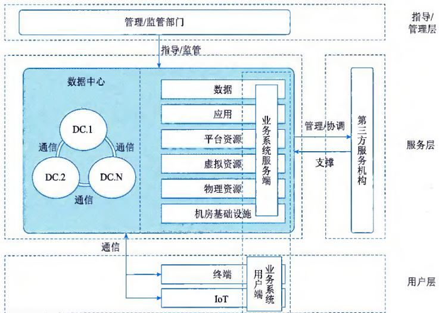
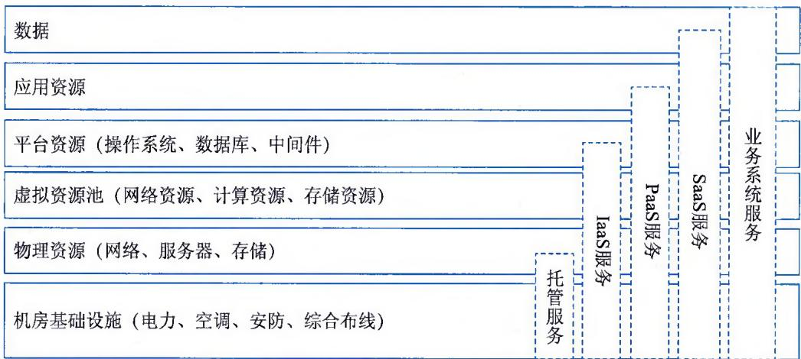
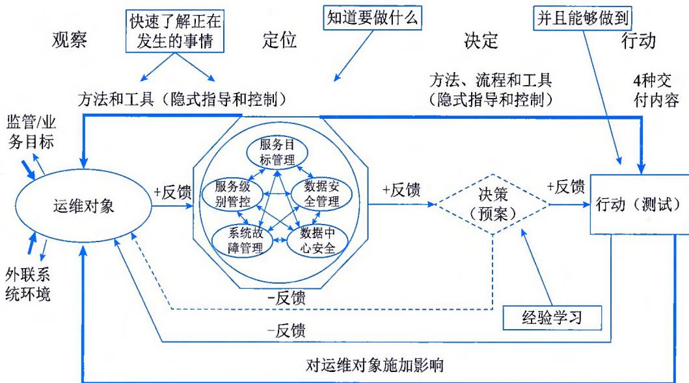

>[!info] 现行教材 · 第 2 版
>本页为**现行考试依据**的教材原文（第 2 版，2024 年 10 月出版，2025 年起启用）。
>考纲层级见 [[知识体系]]；练习题见 [[练习题·基础知识]]；案例模板见 [[案例答题模板]]。

# 第13章 数据中心管理

数据中心（Data Center，DC）为集中放置的电子信息设备并提供运行环境的建筑场所，用来存放组织的关键应用程序、数据的空间和物理设施。数据中心的关键组件通常包括路由器、交换机、防火墙、存储系统、服务器、各种类型应用程序和相应监控系统。由于这些组件都会关联组织的关键业务数据和应用程序，因此数据中心的安全性至关重要。数据中心管理是由负责管理数据中心持续运营的人员执行的任务集合，包括服务管理和未来规划等，是由技术人员在统称为数据中心基础设施管理（DCIM）工具的帮助下执行的一系列工作，包括基础管理、机房基础设施管理、物理资源管理、虚拟资源管理、平台资源管理等。

## 13.1 基础管理

数据中心作为组织信息系统集中管理的场所，承载业务运行，与关联服务各方互动，实现服务价值。数据中心建设与运行应遵守国家法律法规，接受相关行业管理部门的指导与监督，保障数据中心安全、可靠、稳定地运行，提高业务连续性水平。数据中心建设根据运营效率、管理水平、风险防范等要求，可以建设一个或多个，可以同城，也可以异地。数据中心可以组织自建，也可以租用第三方服务。数据中心提供机房基础设施、物理资源、虚拟资源、平台资源、应用资源和数据，这些对象的集合构成一至多个业务信息系统。业务信息系统为了满足业务要求，可以部署在一个或多个数据中心。业务信息系统可由用户端和中心服务端组成，可与第三方服务机构发生信息交互，从而确保服务完整性和有效性等。数据中心运行维护工作可根据数据中心建筑与使用性质不同，由维护方统一或分别进行维护，所有维护工作均应满足服务级别协议（Service Level Agreement，SLA）的要求。图13-1所示为数据中心与组织业务、第三方服务、监管要求、终端及 IoT 设备的相互关联关系。

  
图13-1 数据中心业务关系示意图

## 13.1.1 对象与内容

数据中心按照规模划分，可分为超大型（规模大于10 000个标准机架）、大型（规模3000～10 000个标准机架）和中小型（规模小于3000个标准机架）等。数据中心按照类型划分，可以分为政府与企事业单位数据中心、托管数据中心和云数据中心等。

## 1. 管理对象

数据中心管理的对象包括机房基础设施、物理资源、虚拟资源池、平台资源、应用资源和数据，这六类对象的集合构成了一至多个业务系统，以及不同的对外服务模式，如图 13-2 所示。

  
图13-2 数据中心的管理对象

数据中心的管理对象分为六个层次，包括机房基础设施、物理资源、虚拟资源池、平台资源、应用资源和数据，具体内容如表 13-1 所示。

表 13-1 数据中心管理对象说明

<table><tr><td>层次</td><td>内容</td><td>说明</td></tr><tr><td rowspan="4">机房基础设施</td><td>电气系统</td><td>包括高低压供配电系统、电源系统、照明系统、电缆及母线槽、防雷与接地等</td></tr><tr><td>通风空调系统</td><td>包括空调水系统、空调风系统、机房空调系统等</td></tr><tr><td>消防系统</td><td>包括消防供配电设施、火灾自动报警系统、应急照明与疏散指示系统、应急广播系统、消防供水设施及消火栓系统、自动灭火系统、防烟排烟系统、防火分隔设施、建筑灭火器、空气(氧气)呼吸器等</td></tr><tr><td>智能化系统</td><td>环境和设备监控系统、安全防范系统等</td></tr><tr><td rowspan="3">物理资源</td><td>网络及网络设备</td><td>包括局域网、广域网、互联网、网络线路(包括专线、拨号网络、VPN)和网络设备(包括路由器、交换机、防火墙、入侵检测、负载均衡、语音以及通信传输设备等)</td></tr><tr><td>服务器设备</td><td>包含x86服务器、小型机和大型机等</td></tr><tr><td>存储设备</td><td>包括磁盘阵列、磁带库等</td></tr><tr><td rowspan="3">虚拟资源池</td><td>虚拟网络资源</td><td>如虚拟网卡、虚拟网络设备、虚拟链路、虚拟机网络等</td></tr><tr><td>虚拟计算资源</td><td>如虚拟机、虚拟机宿主机、虚拟计算资源集群等</td></tr><tr><td>虚拟存储资源</td><td>如虚拟存储卷、服务控制器、存储链路等</td></tr><tr><td>平台资源</td><td>应用运行环境</td><td>如操作系统、数据库、中间件等</td></tr><tr><td rowspan="2">应用资源</td><td>业务应用</td><td>指实现业务功能的各种软件,如财务软件、人力资源管理软件、办公自动化软件等</td></tr><tr><td>自身管理</td><td>用于自身运营管理的工具软件,如监控软件、网管软件、运维管理软件等</td></tr><tr><td>数据</td><td>数据</td><td>指由业务系统产生、处理并存储于数据中心的各种信息载体</td></tr></table>

## 2. 管理内容

数据中心管理内容是指针对上述六类对象进行的调研评估、例行操作、响应支持和优化改善服务。根据数据中心提供的服务外延的不同，数据中心管理的对象层次也不同，一般情况下，各类服务所对应的管理对象如下。

\- 托管服务管理对象：机房基础设施以及物理资源中的网络及网络设备。

\- IaaS服务管理对象：机房基础设施、物理资源、虚拟资源池和平台资源。

\- PaaS服务管理对象：机房基础设施、物理资源、虚拟资源池、平台资源以及应用资源中的应用组件。

\- SaaS服务及业务系统服务向用户提供端到端的全面服务，其管理对象涵盖机房基础设施以及物理资源、虚拟资源池、平台资源、应用资源及其产生的数据。

## 13.1.2 管理模型

除了业务设计、营销和绩效考核等关键因素之外，组织业务运营依赖数据中心的健康度和快速适配业务需求的能力。无论是发生系统故障还是系统功能/容量不能满足业务需求的情况，都需要快速感知、科学决策和有能力进行干涉，因此数据中心管理可采用如图13-3所示的模型进行。

在数据中心管理过程中，通过"观察、定位、决定和行动"的管理模型，能够快速、有效形成决策，改善运维过程中的反应时间，更成功地完成管理保障任务。

  
图13-3 数据中心管理模型示意

## 1. 观察

观察的目标是通过多维监控和信息采集，明确当前的现状，包括管理对象观察、促成要素观察和内外部环境观察。管理对象观察包括资产管理、容量管理、故障管理等；促成要素观察包括供需双方人员、技术、资源、流程等；内外部环境观察包括业务/监管目标，以及外联系统的运行情况等。

## 2. 定位

定位的目标是准确了解管理对象发生了什么问题及如何解决。在明确数据中心运行维护管理要求的前提下，开展必要的分析，制定事前防御措施。数据中心运行维护管理要求包括目标管理、服务管控、故障处理、数据中心安全和数据安全。

## 3. 决定

决定的目标是制定相应的行动措施。根据观察和定位阶段掌握的信息，考虑实施的效率和风险管理能力，定义和选择最适合的解决方案。

## 4. 行动

行动的目标是决定的实现。根据决定选择最佳实施方案，保障业务的健康运行，在出现故障时采取必要的纠正措施，总结分析故障的原因并形成相关预案。

## 13.1.3 目标管理

数据中心管理是以保证数据中心对外所提供服务的可用性、安全性为目标，以组织业务为视角，确保运行维护内容满足 SLA 要求。提供数据中心运行维护的供方和需方，应制定运行维护策略，以保证数据中心的业务连续性和信息安全。数据中心管理是通过对数据中心服务能力的测量和调整，持续保持服务质量达到组织业务的要求，包括业务关系可视化，分析数据中心服务需求，控制服务期望，确定数据中心服务目标，监控服务质量，服务的评估、改善和终止等活动。

## 1. 业务关系可视化

数据中心管理者需要明确组织业务和数据中心运维服务的对应关系，并能通过一定的方法实现显性化的展现形式，主要的活动包括：

\- 在组织战略或IT战略的指导下，对组内业务流程进行分析，确定各项业务流程的业务目标。

\- 从业务视角出发，结合组织架构、业务流程、应用功能和数据中心服务能力，进行组织业务与IT服务的关联性分析。

\- 通过配置管理流程或相关监控工具，获取和展示业务与信息系统的关系。

\- 定义组织业务与数据中心服务的关系，形成数据中心服务目录，并以服务目录作为业务与数据中心服务的连接点，有效协调双方需求。

## 2. 分析数据中心服务需求

数据中心管理者为了明确组织业务对数据中心服务的需求和绩效指标，主要的活动包括：

\- 分析组织中各种业务对数据中心服务的依赖程度。

\- 量化组织对各项数据中心服务的需求，如可用性、连续性、系统容量、最大故障时长，形成数据中心服务级别需求。

\- 将服务级别需求分拆到技术架构中的六类对象上，形成设备或系统级的运维需求。

\- 在服务目录的指导下提出服务级别需求（SLR）和相关测量指标（KPI）。

\- 定义数据中心服务目录中的服务内容和服务要求。

## 3. 控制服务期望

组织中的业务部门可能会倾向提出过高的服务水平要求，因此数据中心管理者必须有能力评估这些要求的合理性。需要评估服务级别需求的合理性，控制需方所期望的服务水平，主要的活动包括：

\- 综合评价供方服务能力，如IT服务的可用性、连续性、容量等，形成IT服务能力基线。

\- 评估某个IT服务停止时有无替代手段来维持业务的运行。

\- 分析供方现有服务能力水平，识别与需方IT服务需求间的差距。

\- 应将业务部门对IT服务的期望值和IT部门的实施能力进行权衡。

\- 供需双方对服务级别需求进行协商，以确定最终的或阶段性的服务级别需求。

## 4. 确定数据中心服务目标

数据中心管理者在与组织中的各业务部门协商服务水平时，应分析数据中心现有服务能力水平并识别差距，形成确实可行的数据中心服务目标，主要的活动包括：

\- 在服务目录的指导下，形成服务级别协议（SLA），用于在服务过程中评价数据中心服

务质量。

\- SLA的内容包括服务的容量、可用性以及业务维系所需要的服务水平。服务水平应考虑IT服务所需成本之间的平衡。

\- 识别组织内/外部的其他IT服务资源，确定分包或外包需求，形成内部服务级别协议（OLA）或外包合同（UC）。

\- 服务目标的内容则包括服务台的支持时间以及IT服务紧急停止时向业务部门通报的时间等，供方应提供多种方案，供需方能够在权衡各项服务的重要性和成本的基础上做出选择。

## 5. 监控服务质量

数据中心管理者需要建立监控服务质量水平的机制，持续监控数据中心服务质量水平，主要的活动包括：

\- 服务过程中应对SLA中规定的服务水平目标的达成状况进行定期监控。

\- 建立服务评审机制，对服务水平目标的达成状况等进行定量考核，对组织中业务部门的满意度等指标进行定性考核。

\- 通过有效的手段对数据中心服务质量进行量化分析和展示。

## 6. 服务的评估、改善和终止

数据中心管理者需要定期评估服务的质量，并根据业务需求的变化及时调整、改善服务能力或终止服务，主要的活动包括：

● 建立服务评审机制，对服务水平目标的达成状况等进行定量考核，对业务部门的满意度等指标进行定性考核。

\- 对于继续提供的数据中心服务，根据服务评估报告，分析未达成服务目标的原因，制订服务扩展与改善计划。

\- 对于决定中止的数据中心服务，与业务部门协商中止方案；业务部门和数据中心各司其职，就中止时间、中止后的替代手段等达成共识。

\- 按照中止方案，制订数据中心系统报废计划，并进行相应准备工作。

\- 按照中止方案，督促业务部门按约定的时间完成人员或设备的调配及相关准备工作。

## 13.1.4 服务管控

为了保证数据中心运行维护的规范性，数据中心管理者应建立运维服务组织和管理制度，管理数据中心服务对象包括系统可用性管理、系统容量管理、配置信息管理、系统的变更与发布、知识管理和供应商管理等。对数据中心服务能力进行整体策划，为实施数据中心服务能力管理和按 SLA 规定交付服务内容提供必要的资源支持，保证数据中心服务质量满足 SLA 要求，对数据中心服务过程、结果以及相关管理活动进行监督、测量、分析和评审，并实施改进计划。

## 1. 系统可用性管理

数据中心管理者为了保证数据中心可用性的主要活动包括：

\- 建立各系统容量和可用性监测管理机制，配备合适的监控、分析工具，实现对数据中心内的设备或系统运行状态、容量的有效监控和管理。

\- 通过信息化的手段持续监视IT基础架构的可用性指标和容量变化情况，以分析业务对IT性能需求的满足程度。

\- 对可用性进行持续监控，在可用性需求发生变化时，重新评估系统配置，涉及供应商则需评估采购合同条件，以降低业务运行风险，提高运维效率。

\- 建立完善的EOP和应急响应管理机制，必要时按数据中心运行要求制定系统冗余和备份规范。

## 2. 系统容量管理

系统结构应与业务的容量和可用性需求保持协调，因此对容量与可用性的监控非常重要。数据中心管理者为了获取系统容量水平，以调整系统容量，确保数据中心服务持续满足业务需求和SLA要求，主要的活动包括：

\- 通过信息化的手段持续监视IT基础架构的可用性指标和容量变化情况，以分析业务对IT性能需求的满足程度。

\- 根据分析结果及时调整系统容量水平，以保持业务需求与系统容量的协调，防止因容量超期造成IT服务中断。

\- 标准化系统结构，以快速分配系统资源并有效利用系统空余资源。

\- 容量有超期风险时，能迅速扩容及响应。

\- 建立系统容量评审机制，持续保持系统容量能满足当前及未来的业务需求。

## 3. 配置信息管理

数据中心管理者需要对数据中心内的设备或系统的组成要素，即硬件、软件等资产信息和合同信息等进行统一管理。实施有效的配置信息管理，梳理数据中心承载的业务与设备或系统的逻辑关系，主要的活动包括：

\- 明确设备或系统的组成要素和联接关系。

\- 数据中心服务的组成信息，包括数据中心服务中所有的设备或系统组成要素，通常指硬件和软件、设计书、操作手册等文档、SLA等合同文件，以及运维过程文档等。

\- 建立完善的CMDB，以及对应的管理流机制。

\- 宜采用自动化手段管理配置信息的收集和更新。

\- 对无法自动收集的IT服务的组成信息，应定期盘点、核对，并更新到自动化管理中。

## 4. 系统的变更与发布

数据中心管理者需要通过高效、安全可控的方式，对数据中心管理对象进行变更实施，最大限度地降低业务的安全风险，主要的活动包括：

\- 对变更目的、内容、影响进行评估确定，确保变更合规、可控的实施。

\- 对变更过程中各类操作活动等建立操作记录或日志。

\- 对变更过程形成变更记录或日志的结果，形成审计报告并归档保存。

## 5.知识管理

数据中心管理者需要建立知识管理体系，制定技术操作手册或实施方案，并进行风险评估及分析，采取相应的风险规避措施和回退手段，包括但不限于制定设备及系统的 SCP、MOP、SOP，主要活动包括：

● 建立记录所有活动及管理对象状态的运行维护档案，形成服务文档。

\- 在业务及系统可视化形成的IT服务目录基础上，对数据中心技术进行盘点。

\- 根据技术盘点结果，针对各系统领域和基础技术领域，明确知识管理重点。

## 6. 供应商管理

供应商是供方服务能力的补充，是数据中心运维服务能力的组成部分，数据中心管理者需要对候选供应商进行调查，确认外部服务商提供的服务水平，保证服务水平一致性，主要的活动包括：

\- 供方自身的服务能力和外部服务能力应实现一体化的管理。

\- 明确与供应商的合作策略。

\- 对候选供应商进行调查，调查内容包含供应商的擅长领域、技术人员规模、产品及特点、组织用户数量及客户满意度等，如涉及多地区/渠道销售的供应商，需对其定点服务提供能力进行调查；如涉及供应商子组织，则需对其子组织负责领域进行调查。

\- 宜设立一站式的供应商协调管理办公室（VMO）。

\- 在使用IT服务时使用云计算外部服务，对外部服务应提供同等的服务运营，保证服务水平一致，并建立信息共享。

\- 明确与外部服务商之间共享的信息，建立信息共享的流程和渠道。

\- 指定人员与外部服务商建立信息共享的窗口和沟通体制。

## 13.1.5 故障管理

为了保证数据中心管理的及时性，达到SLA中所规定的事项，数据中心管理者需要：①建立应对系统故障的管理办法，对故障进行探测、应对、确定原因，以防止再次发生；②建立系统故障的分类分级，根据业务对恢复时间的需求、系统故障的影响范围及持续时间等因素明确故障等级；③建立系统故障基于场景分析、故障树分析等方法分析故障根本原因的机制，并形成规避、改进措施的解决方案和预防措施，以避免类似的业务影响再次发生，配备合适的运行维护故障管理和分析工具，实现对故障进行快速反应；④建立事后评估和总结管理机制，跟踪系统故障处理的全过程，监督检查系统故障处理进度和制度流程的执行情况。

## 1. 故障分类分级和定级

数据中心管理者需要设计数据中心故障的类别和等级，以便在故障处理过程中能迅速评估其对业务的影响范围，明确故障级别以及响应系统之间的关系，并上报相关职能部门。

## 2. 故障原因调查与分析

建立快速恢复系统故障的应对措施，在故障发生后开展系统故障原因调查与分析，可以利用配置管理过程中建立的系统组成信息，以便在发生大规模系统故障时，快速分析原因。

## 3. 防止问题再次发生

在数据中心服务暂时恢复后，需要继续调查系统故障的根本原因，可以使用故障树分析（Fault Tree Analysis，FTA）等方法，不仅分析技术层面的问题，还要深入到规则、流程、组织运营以及负责人员意识的层面，对原因进行深入挖掘，制定最终解决方案和预防措施，彻底恢复服务。还应该在日常数据中心管理中主动识别对业务运行造成严重影响的系统故障或频繁出现的系统故障，建立调查此类故障根本原因的机制，并制定最终解决方案和预防措施，避免类似的业务故障影响再次发生。

## 4. 事后评估与总结

数据中心管理者还应建立故障处置后的评估机制，跟踪信息系统故障处理全过程，监督检查信息系统故障处理进度和制度流程的执行情况，确保预防措施的有效性，总结并明确系统故障处置工作的整体过程存在的问题，提出改进措施和实施计划等。还应该在日常数据中心管理中定期开展对故障现象、原因、影响范围、处理时间和过程、解决方案、预防措施的分析总结，以优化故障管理流程。对于已解决的信息系统故障，总结故障管理经验并纳入知识库；对于未解决的信息系统故障，分析评估故障管理中存在的问题，制订专项措施和计划确保故障解决。

## 13.1.6 安全管理

数据中心的正常运行，必须保证数据中心的基础设施、应用、数据和业务的安全性。实施数据中心运行维护时，数据中心管理者需要建立满足国家网信办、政府机构或行业监管部门相关法律法规、标准规范要求的信息安全管理体系，制定内部安全管理制度和操作规程，确定安全职责，定期对安全管理人员进行安全教育；建立数据中心安全监测、记录安全运行状态，防范网络安全事件、危害数据中心安全行为的技术措施；制定对数据中心在安全事件上报、处置、总结的管理办法，对不同安全事件对数据中心影响程度的应急管理制度；还应按照等保、监管、审计等各方面的要求，定期对数据中心内的设备或系统、人员、工具和流程进行安全评估、合规检查，持续改进优化。

## 1. 安全管理制度

数据中心运行维护要符合等保、监管、审计方面的要求与目标，应对数据中心安全运行维护活动中的各类管理内容建立符合等保、监管、审计方面的安全管理制度，对参与安全运维管理的人员和事件进行统一管理，主要包括：

\- 安全职责及权限。根据安全管理制度和实际管理需求，划分安全运维管理活动的岗位角色，定义人员职责，授予相应的权限。

\- 安全运维流程。建立安全运维管理流程，明确安全运维操作规范，形成安全运维管理人员的工作标准流程，实施具体安全管理活动，保障数据中心业务系统的安全性。

\- 安全教育与培训。安全运维管理人员的职责、素质、技能、安全意识等方面应进行定期培训和考核，保证人员具有与其岗位职责相适应的技术能力和管理能力。

## 2. 安全状态监控

为持续保障数据中心业务系统的安全稳定运行，需要对影响业务系统安全性的关键要素进行梳理，确定数据中心管理对象的安全状态监控指标，主要包括：

\- 监控对象及指标分析。确定安全状态监控对象，分析安全状态监控指标，通过安全监控工具，收集安全状态监控的信息，识别威胁和入侵行为，对数据中心管理对象的安全状态进行实时监控。

\- 安全状态监控分析报告。根据安全状态监控的数据，进行状态分析、影响分析、趋势分析等，并形成安全状态分析报告。

## 3. 安全事件处理

为持续保障数据中心业务系统的安全稳定运行，需要制定对安全事件响应及处理流程的管理规范和制度，主要包括：

\- 根据安全状态分析报告分析的安全事件，明确安全事件等级、影响程度以及优先级等，按照安全事件报告程序上报安全事件。

\- 针对突发的安全事件，应该启动应急预案响应机制进行安全事件处置；针对未知安全事件，应根据安全事件影响程度，制定安全事件处置应对措施的方案，按照安全事件处置流程和方案进行安全事件处置。

\- 需要对于未知的安全事件进行事件记录、分析记录信息等，使安全事件成为已知事件，对安全事件处置过程进行总结，制定安全事件处置报告。

## 4. 应急预案和演练

为提高处置数据中心安全运维突发事件的能力，需要制定有效的应急预案，并定期开展演练，针对不同的安全事件迅速、高效、有序地处理，主要包括：

\- 根据安全事件管理办法，对安全事件的影响程度和范围进行分析，以确定是否启动应急响应。

\- 针对不同的安全事件等级以及业务影响范围制定相应的应急预案，按照应急预案的指导，定期开展应急演练，保证业务系统的稳定性及应急预案的可执行性。

## 5. 安全检查和优化

定期对数据中心安全的运维问题，按照等保、监管、审计等各方面的要求进行安全合规检查，为数据中心安全的运维服务提出持续改进优化的评估和建议，确保业务系统的安全性，满足相应安全合规要求，主要包括：

\- 制订安全合规检查的工作计划和检查方案，确定安全检查的范围、对象、工作方法等。

\- 根据安全检查计划，进行安全合规检查，记录检查活动的结果数据，分析数据中心管理对象存在的风险和威胁，提出符合等保、监管、审计的持续优化改进的建议，针对存在的安全隐患制定优化实施方案，在可控范围内按照计划进行持续优化。

## 13.2 机房基础设施管理

在数据中心的机房基础设施的管理维护方面，需要从例行操作、响应支持、优化改善和调研评估四方面入手，主要针对电气系统、通风空调系统、消防系统和智能化系统进行管理。

## 13.2.1 例行操作

数据中心的机房基础设施的例行操作内容通常包括监控、预防性检查和常规作业。

## 1. 监控

在数据中心运行维护过程中，对机房基础设施进行监控时，应根据具体的管理对象，确定监控内容和指标。根据数据中心的机房基础设施配置情况，各类机房基础设施监控的内容应至少包括表13-2所示的内容。

表 13-2 机房基础设施监控内容

<table><tr><td colspan="2">管理对象</td><td>监控内容</td></tr><tr><td rowspan="6">电气系统</td><td>高低压配电柜</td><td>开关状态、电压、电流、频率、功率因数、有功功率、无功功率、故障信息以及相关保护装置的工作状态、控制电压等</td></tr><tr><td>变压器</td><td>高/低压侧电压、电流、频率、功率因数、有功功率、无功功率、负载比例、电压谐波总畸变率、电流谐波总畸变率、绕组温度、风扇开关状态</td></tr><tr><td>发电机</td><td>频率、功率因数、各相电压、电流、负载比例、发动机转速、机油/燃油压力、冷却液温度、油箱液位等</td></tr><tr><td>UPS</td><td>开关状态、电压、电流、频率、功率因数、有功功率、无功功率、负载比例、电池组电压、电流、后备时间</td></tr><tr><td>电池</td><td>电压、电流、内阻、温度</td></tr><tr><td>直流电源</td><td>开关状态、电压、电流、频率、功率因数、有功功率、无功功率、负载比例</td></tr><tr><td rowspan="3">通风空调系统</td><td>制冷机组、冷却塔</td><td>运行/停止、故障/正常、手动/自动状态;冷冻水/冷却水供回水温度;负载率;蒸发器/冷凝器压力;报警</td></tr><tr><td>空调水系统</td><td>各类泵阀的运行状态、手动/自动状态;变频器频率、进出口压差</td></tr><tr><td>空调风系统</td><td>新风温湿度;送风温湿度</td></tr><tr><td rowspan="3">通风空调系统</td><td>直膨式机房空调</td><td>回风温度/湿度;风量;压缩机、加湿器、风机、空调开/关机状态;报警</td></tr><tr><td>水冷机房空调</td><td>回风温度/湿度;供/回水温度;风量;加湿器、风机、空调开/关机状态;报警</td></tr><tr><td>加/除湿设备</td><td>开/关机状态;室内湿度;报警</td></tr><tr><td rowspan="2">消防系统</td><td>消防报警系统</td><td>手动/自动状态、告警信息</td></tr><tr><td>消防水系统</td><td>各类泵阀的运行状态、手动/自动状态;消防水箱液位、系统压力</td></tr><tr><td>智能化系统</td><td>环境和设备监控系统、安全防范系统</td><td>系统运行状态、网络通信、存储空间、告警信息</td></tr></table>

## 2. 预防性检查

在数据中心管理过程中，对机房基础设施进行预防性检查时，应根据具体的管理对象，确定性能检查内容和脆弱性检查内容。根据数据中心的机房基础设施配置情况，各类机房基础设施预防性检查的内容应至少包括表13-3所示的内容。

表 13-3 机房基础设施预防检查内容

<table><tr><td colspan="2">管理对象</td><td>性能检查内容</td><td>脆弱性检查内容</td></tr><tr><td rowspan="6">电气系统</td><td>配电柜</td><td>接地电阻、零序电流、器件发热情况、保护装置状态、计量仪表显示等</td><td>导线、器件发热情况,防浪涌器件情况等</td></tr><tr><td>变压器</td><td>输入/输出电压、电流、温控器绕组温度、风扇运转情况</td><td>负载比、电缆、母线连接发热情况,运行噪音等</td></tr><tr><td>发电机</td><td>输出电压、电流、转速、冷却液温度、仪表显示等</td><td>负载比、油位、吸气、排烟通道、运行噪音等</td></tr><tr><td>UPS</td><td>输入/输出电压、电流、器件及导线连接发热情况、通风情况(风扇、入气口、出气口)、控制面板显示等</td><td>负载比、器件、导线连接发热情况,电池后备时间,通风情况,运行噪音等</td></tr><tr><td>电池</td><td>温度、导线发热情况</td><td>温度、导线连接发热情况;是否氧化;漏液检查、变形</td></tr><tr><td>直流电源</td><td>输入/输出电压、电流、器件及导线连接发热情况、通风情况、控制面板显示等</td><td>负载比、器件、导线连接发热情况,电池后备时间,通风情况,运行噪音等</td></tr><tr><td rowspan="4">通风空调系统</td><td>制冷机组、冷却塔</td><td>振动、运行噪音;压力、温度;控制面板信息</td><td>负载比、振动、运行噪音、漏水检查</td></tr><tr><td>空调水系统</td><td>运行噪音、各类仪表信息</td><td>运行噪音、压力、漏水检查</td></tr><tr><td>空调风系统</td><td>风机运行情况、风速,预处理系统工作状态,上下水情况等</td><td>过滤网检查、风压差检查</td></tr><tr><td>直膨式机房空调</td><td>高压压力、低压压力、风机运行情况、灰尘情况等</td><td>机房热点情况、冷凝漏水检查、室外风机运转情况、加湿罐阳极棒检查、过滤网检查等</td></tr><tr><td rowspan="2">通风空调系统</td><td>水冷机房空调</td><td>冷冻水压力、温度,风机运行情况,灰尘情况等</td><td>机房热点情况、室内机漏水检查、过滤网检查等</td></tr><tr><td>加/除湿设备</td><td>控制面板信息、上下水情况等</td><td>漏水检查</td></tr><tr><td rowspan="3">消防系统</td><td>消防报警系统</td><td>工作状态、探头污染等</td><td>报警检查、电源状态等</td></tr><tr><td>消防水系统</td><td>水箱液位、系统压力等</td><td>各类泵阀工作状态、压力等</td></tr><tr><td>气体消防</td><td>钢瓶压力、有效期</td><td>启动瓶、管道开关、气体压力等</td></tr><tr><td rowspan="5">智能化系统</td><td>BA系统</td><td>服务器、DDC状态、网络通信、存储容量等</td><td>系统运行状态、工况选择、阈值、执行逻辑等</td></tr><tr><td>动力环境监控</td><td>服务器、网络通信、存储容量等</td><td>系统运行状态、阈值、联动告警逻辑、PUE、负载比等</td></tr><tr><td>视频监控系统</td><td>画面清晰度(不同照度情况下)、录像硬盘(磁带)容量、云台运行等</td><td>监控系统运行状态、监控死角问题等</td></tr><tr><td>门禁系统</td><td>服务器、控制器、读卡器、门磁等工作状态,记录存储容量等</td><td>门禁系统与消防系统和视频监控系统的联动检查(如果有此功能)、异常情况报警检查</td></tr><tr><td>综合布缆系统</td><td>光纤、铜缆链路测试,性能测试等</td><td>线缆识别标签的完整性、准确性</td></tr></table>

## 3.常规作业

机房基础设施的常规作业包括基础类操作、测试类操作和数据类操作。

\- 基础类操作：参照设备设施的相关手册和数据中心的配置基准（SCP），制定相应的SOP、MOP，并按SOP、MOP规定的程序执行设备的日常运行、维护和保养等作业。

\- 测试类操作：按相应的SOP、MOP对机房基础设施各系统功能、性能进行测试作业。

\- 数据类操作：按相应的SOP、MOP对机房基础设施运行日志、记录等数据进行备份、清除、更新等操作。

在数据中心管理过程中，对机房基础设施进行常规作业时，应根据具体的管理对象，确定操作内容和周期。根据数据中心机房基础设施配置情况，各类机房基础设施常规作业的内容应至少包括表 13-4 所示的内容。

表 13-4 机房基础设施常规作业示意

<table><tr><td colspan="2">管理对象</td><td>基础类操作</td><td>测试类操作</td><td>数据类操作</td></tr><tr><td rowspan="3">电气系统</td><td>配电柜</td><td>除尘、合闸、分闸等</td><td>互投测试等</td><td>运行记录备份</td></tr><tr><td>发电机</td><td>更换三滤、清洁等</td><td>空载测试、带载测试、切换演练等</td><td>运行日志备份,报警记录备份、清除等</td></tr><tr><td>UPS</td><td>旁路、清洁等</td><td>旁路测试、电池放电测试、周期性主/备切换、应急演练等</td><td>运行日志备份,报警记录备份、清除等</td></tr><tr><td rowspan="4">通风空调系统</td><td>制冷机组、冷却塔</td><td>启/停机、主备切换</td><td>周期性主/备切换、应急演练等</td><td>运行日志备份,报警记录备份、清除等</td></tr><tr><td>空调风系统</td><td>启/停机、清洗更换滤网等</td><td>消防联动测试</td><td>运行记录备份(如果有)</td></tr><tr><td>直膨式机房空调</td><td>启/停机、清洗更换滤网、清洗更换加湿系统、清洁冷凝器、补充冷媒更换故障元器件等</td><td>漏水报警测试、周期性主/备切换、应急演练等</td><td>运行日志备份,报警记录备份、清除等</td></tr><tr><td>水冷机房空调</td><td>启/停机、清洗更换滤网、更换故障元器件等</td><td>漏水报警测试、周期性主/备切换、应急演练等</td><td>运行日志备份,报警记录备份、清除等</td></tr><tr><td rowspan="3">消防系统</td><td>消防报警系统</td><td>探头清洗、更换故障元器件等</td><td>联动测试、告警测试等</td><td>报警记录备份、清除</td></tr><tr><td>消防水系统</td><td>更换故障设备等</td><td>消防泵启动测试</td><td>报警记录备份、清除</td></tr><tr><td>气体消防</td><td>更换失效钢瓶</td><td>启动测试</td><td>报警记录备份、清除</td></tr><tr><td rowspan="5">智能化系统</td><td>BA系统</td><td>运行工况调整、完善DDC控制逻辑及系统联动逻辑、传感仪表检定、更换故障元器件等</td><td>控制测试、联动测试、告警测试等</td><td>运行数据导出、备份,运行日志备份,报警记录备份、清除等</td></tr><tr><td>动力环境监控</td><td>传感仪表检定、阈值调整、PUE公式调整、更换故障元器件等</td><td>漏水测试、温/湿度测试、告警测试等</td><td>运行数据导出、备份,运行日志备份,报警记录备份、清除等</td></tr><tr><td>视频监控系统</td><td>视频监控头清洁、云台保养</td><td>器件灵敏度、画面清晰度(不同照度情况下)、云台运行等</td><td>出入记录导出、备份,监控图像记录备份、清除,报警记录备份、清除等</td></tr><tr><td>门禁系统</td><td>门禁授权等</td><td>门禁系统与消防系统和视频监控系统的联动检查测试(如果有此功能),掉电测试</td><td>运行日志备份,报警记录备份、清除等</td></tr><tr><td>综合布缆系统</td><td>线路整理、跳接等</td><td>链路测试、性能测试</td><td>布线系统拓扑图数据更新</td></tr></table>

## 13.2.2 响应支持

在数据中心管理过程中，对机房基础设施进行响应支持时，应根据不同的管理对象和系统运行要求，确定事件驱动响应和服务请求响应的具体服务内容。

## 1. 事件驱动响应

针对设备的软硬件故障引起的业务中断或运行效率无法满足正常运行要求而进行的响应服务，包括但不限于：

\- 电气系统：①配电系统包括故障排查，投入备用电源回路，关闭非重要回路等；②发电机系统包括故障排查，启动发电机，油料补充，冷却液更换，电瓶更换等；③UPS系统包括故障排查，旁路系统，关闭非重要输出等；④直流电源系统包括故障排查，整流模块维修更换等；⑤防雷接地系统包括浪涌保护器复原和更换，接地电阻降阻等。

\- 通风空调系统：故障排查，关闭部分设备以维持数据中心温湿度指标，关闭新风系统等。

\- 消防系统：包括故障排查，系统启动，报警联动，疏散警示等。

\- 智能化系统：①BA系统包括故障排查，检测元件（设备）、DDC，执行器更换，软硬件升级等；②动力环境监控系统包括故障排查，检测元件（设备）更换，软硬件升级等；③视频监控系统包括故障排查，摄像机或硬盘更换，检查告警，数据恢复等；④门禁系统包括故障排查，手动开启或关闭门禁系统，检查告警或监控记录等；⑤综合布缆系统包括更换线缆、模块等。

## 2. 服务请求响应

根据应用系统运行需要或需方的请求而进行的响应服务，包括但不限于：

\- 电气系统：①配电系统包括增减回路，增减供电类型（如直流、110V），分支回路相位调整等；②发电机为指定负载供电等；③UPS系统包括旁路操作，为指定负载供电等；④防雷接地系统包括新设备接地等。

● 通风空调系统：调整温度、湿度参数，调整新风量等。

\- 消防系统：包括增减设备，更新联动逻辑，检查及提供告警及监控记录，备份或清除记录等。

\- 机房监控与安全防范系统：①BA系统包括数据中心扩容或改造时增减或调整相应的传感器、DDC、执行器等，更新点表，调整阈值设定等，在季节转换时变更工况设置等；②动力环境监控系统包括增减或调整检测元件（设备），数据中心扩容或改造时屏蔽告警，连接新的被监控设备，更新系统PUE计算公式等；③视频监控系统包括调整摄像机位置，增加摄像机和录像机容量等；④门禁系统包括增加、删减、变更门禁权限等；⑤综合布缆系统包括链路跳接，跳线更换，布线扩容等。

## 13.2.3 优化改善

在数据中心管理过程中，对机房基础设施进行优化改善时，应根据数据中心容量的变化情况以及不同的管理对象和系统运行要求，确定适应性改进，增强性改进和预防性改进的具体服务内容。

## 1. 适应性改进

根据数据中心容量的变化情况以及业务系统及其软硬件环境的运行要求，对机房基础设施进行必要的调整，包括但不限于：

\- 电气系统：配电系统根据数据中心容量情况，包括更换开关、导线以适配负载容量等，

## 信息系统管理工程师教程（第2版）

发电机包括调整启动方式等，调整防雷接地系统等。

\- 通风空调系统：调整机组主备运行模式，以适应数据中心容量变化；调整温湿度参数，调整机组位置，增减新风风量等。

\- 智能化系统：①调整BA系统的控制逻辑，以适应数据中心的工况、容量变化；②调整环境和设备监控系统、视频监控系统和门禁系统，以适应数据中心容量、防护等级等的变化；③调整综合布缆系统，以适应应用系统的变化。

## 2. 增强性改进

根据数据中心容量的变化情况以及业务系统及其软硬件环境的运行状况，对机房基础设施进行调整、扩容或升级，包括但不限于：

\- 电气系统：①电力系统增容；②配电系统包括增加回路，增加ATS设备等；③UPS系统包括增加主机数量，增加电池数量等；④防雷接地系统包括增加冗余引下线、接地装置，降低接地电阻阻值等。

\- 通风空调系统：增减空调机组，改善气流组织（如增减气流增强装置、封闭冷/热通道等），增加新风机组、预处理装置等。

\- 消防系统：包括增加检测元件（设备）和喷头数量，更换高性能控制主机。

\- 智能化系统：①环境和设备监控系统包括增加检测元件（设备）密度，提高检测元件（设备）精度或更换功能更完善的检测元件（设备）等，升级环境和设备监控软硬件等；②视频监控和门禁系统包括增加报警联动，增加终端数量，增加存储容量等；③综合布缆系统包括线路扩容，提升布线系统级别等；④使用物联网等技术对数据中心的各类设备进行全生命周期的管理，包括但不限于设备状态、位置、异动信息等。

## 3. 预防性改进

根据业务系统及其软硬件环境的运行趋势，对机房基础设施的脆弱点实施改进作业，包括但不限于：

\- 电气系统：配电系统包括更换开关，更换导线，调整回路等；发电机包括更换电瓶，更换或添加适应环境温度的防冻液和油料等；防雷接地系统包括焊接点加固、防腐处理等。

\- 通风空调系统：调整机组位置，调整出/回风方式等。

\- 消防系统：包括消防系统预防性改进（按照当地消防管理部门管理要求）。

\- 智能化系统：①BA系统与工单系统的联动；②环境和设备监控系统与运维管理系统联动；③安防系统的视频监控和门禁系统与消防系统联动，安防系统的门禁系统与工单系统、人员定位系统联动等；④综合布缆系统弱电线缆与强电线缆的物理隔离、线缆整理、鼠患排查等。

## 13.2.4 调研评估

根据数据中心管理需求，对机房基础设施的运行现状进行调查分析，建立各系统的SCP及

MOP、SOP等规范性文档。

## 13.3 物理资源管理

在数据中心中通常运行着大量的网络及网络设备、服务器设备、存储设备等物理资源，需要从例行操作、响应支持、优化改善和调研评估四方面入手进行管理。

## 13.3.1 例行操作

## 1. 监控

在数据中心管理过程中，对物理资源进行监控时，应根据具体的管理对象，确定监控内容和指标。根据数据中心的物理资源配置情况，各类物理资源监控的内容应至少包括表 13-5 所示的内容。

表 13-5 物理资源监控内容示意

<table><tr><td>管理对象</td><td>监控内容</td></tr><tr><td>网络及网络设备</td><td>● 网络设备的健康状况、整体运行状态、各项硬件资源开销状况● 链路健康状况,如端到端时延变化、链路端口工作稳定性、链路负载情况、部署路由策略情况下端到端选路变化、路由条目变化● 管理权限用户的行为审计● 设备软件配置变动审计● 设备日志审计● 端口流量速率、丢包、错包以及广播风暴等情况● 管理权限用户的行为审计● 安全事件审计</td></tr><tr><td>服务器</td><td>● 服务器整体运行情况● 服务器电源工作情况● 服务器CPU工作情况● 服务器内存工作情况● 服务器硬盘工作情况● 服务器接口工作情况</td></tr><tr><td>存储设备</td><td>● 存储设备控制器工作情况● 存储设备电源工作情况● 存储设备数据存储介质工作情况● 存储设备接口工作情况● 存储设备数据存储介质空间使用情况● 存储设备读写速率情况● 存储设备读写命中率情况</td></tr></table>

## 2. 预防性检查

在数据中心管理过程中，对物理资源进行预防性检查时，应根据具体的管理对象，确定性能检查内容和脆弱性检查内容。根据数据中心的物理资源配置情况，各类物理资源预防性检查的内容应至少包括表 13-6 所示的内容。

表 13-6 物理资源预防性检查内容示意

<table><tr><td>管理对象</td><td>性能检查内容</td><td>脆弱性检查内容</td></tr><tr><td>网络及网络设备</td><td>● 设备机身、板卡或模块的工作情况● CPU使用峰值情况● 内存使用峰值情况● FLASH存储空间● 板卡风扇温度等运行情况● 主要端口的利用率● 链路的健康状态,包括IP包传输时延、IP包丢失率、IP包误差率、无效IP包(包括攻击性IP包、欺骗性IP包、垃圾IP包等)● 主要端口的状态,例如STP、VRRP等协议● 路由协议状态,例如OSPF/BGP等协议● 检查其他关键指标项,例如各类关键表项、会话连接数等</td><td>● 系统版本是否需要升级或修复● 设备链路的冗余度要求● 安全事件周期性整理分析● 设备生命周期评估● 备件可用性周期性检查● 业务带宽是否满足业务高峰需求● 网络边界防护控制评估</td></tr><tr><td>服务器</td><td>● 服务器的资源分配情况和策略● CPU使用峰值情况● 内存使用峰值情况● 文件系统空间使用情况● I/O读写情况● 网络流量情况等● 与存储的链路运行状态● 硬件日志情况</td><td>● 服务器资源使用是否超过预定阈值● 服务器关键部件是否满足运行冗余度要求● 服务器关键部件的微码版本是否需要升级● 服务器硬盘是否RAID保护● 系统微码、操作系统版本一致性检查● 硬件型号、系统版本兼容性检查● 接口链路状态是否有异常情况</td></tr><tr><td>存储设备</td><td>● I/O读写速率情况● 读写缓存分配比例情况● 数据读写命中率情况● 存储硬盘空间使用情况● 存储系统日志情况● 磁带读取和写入速率情况● 磁带池使用情况</td><td>● 存储关键硬件部件是否满足运行冗余度要求● 当前微码版本是否需要升级● 存储配置备份机制是否完善● 存储管理软件是否需要升级或打补丁● 存储空间使用比例是否达到预定告警阈值● 存储设备的离线记录检查● 存储介质的坏块记录检查● 系统微码版本一致性检查</td></tr></table>

## 3. 常规作业

在数据中心管理过程中，对物理资源进行常规作业时，应根据具体的管理对象，确定操作内容和周期。根据数据中心的物理资源配置情况，各类物理资源常规作业的内容应至少包括表 13-7 所示的内容。

表 13-7 物理资源常规作业内容示意

<table><tr><td>管理对象</td><td>常规作业内容</td></tr><tr><td>网络及网络设备</td><td>● 设备操作系统软件备份及存档
● 系统微码升级
● 设备软件配置备份及存档
● 监控系统日志备份及存档
● 监控系统日志数据分析与报告生成
● 网络配置变更文件的审核
● 网络配置变更的操作
● 网络配置变更的记录
● 安全设备特征库升级
● 安全审计类分析报告
● 周期性关键设备主备切换/应急演练</td></tr><tr><td>服务器</td><td>● 系统微码升级
● 配置文件备份
● 过期日志和文件系统空间清理
● 服务器硬盘RAID配置检查(如有RAID控制器)
● 更换控制器电池(如有RAID控制器)
● 系统重启</td></tr><tr><td>存储设备</td><td>● 系统微码升级
● 更换控制器电池
● 介质读写正常性测试
● 配置文件备份
● 过期运行日志清理
● 链路端口访问测试</td></tr></table>

## 13.3.2 响应支持

在数据中心管理过程中，对物理资源进行响应支持时，应根据不同的管理对象和系统运行要求，确定事件驱动响应和服务请求响应的具体服务内容。

## 1. 事件驱动响应

针对物理资源的故障引起的业务中断或运行效率无法满足正常运行要求而进行的响应服务，包括但不限于：

\- 网络及网络设备事件驱动响应：①故障定位；②停止、启动进程；③中断、连通网络连接；④关闭、启动端口；⑤网络备件更换；⑥更改、恢复配置。

\- 服务器事件驱动响应：①服务器重启；②更换故障部件，包括主板、电源、CPU、内存、硬盘等；③服务器关键部件微码升级；④服务器硬盘RAID配置修复。

## 信息系统管理工程师教程（第2版）

\- 存储设备事件驱动响应：①存储重启；②配置文件恢复；③更换故障部件，包括电源、硬盘等；④微码升级；⑤存储管理软件补丁安装；⑥数据修复。

## 2. 服务请求响应

根据应用系统运行需要或需方的请求而进行的响应服务，包括但不限于：

\- 网络及网络设备服务请求响应：①增加、降低网络接入的数量或速度；②更改网络设备配置；③启动、关闭端口或服务；④更换、更新或升级设备硬件或软件。

\- 服务器服务请求响应：①服务器设备搬迁；②服务器设备停机演练；③服务器设备清洁维护等；④服务器硬件扩容；⑤集群环境搭建和切换演练。

\- 存储设备服务请求响应：①存储设备搬迁；②存储设备停机演练；③存储设备清洁维护；④存储硬盘空间扩容；⑤存储结构调整；⑥新增主机分配存储空间；⑦主机端多路径软件的安装配置。

## 13.3.3 优化改善

在数据中心管理过程中，对物理资源进行优化改善时，应根据不同的管理对象和系统运行要求，确定适应性改进、增强性改进和预防性改进的具体服务内容。

## 1. 适应性改进

根据业务系统及其软硬件环境的运行要求，对物理资源进行必要的调整，包括但不限于：

\- 网络及网络设备适应性改进：①路由策略调整；②设备或链路负载调整；③网络安全加固；④网络敏感数据加密；⑤监控对象覆盖范围调整；⑥局部交换优化；⑦局部冗余优化。

\- 服务器适应性改进：①服务器硬盘RAID配置调整；②服务器网络、光纤链路冗余调整；③服务器电源供电接入冗余调整。

\- 存储设备适应性改进：①存储设备读写高速缓存（Cache）比例调整；②存储设备RAID保护级别调整；③存储设备新增硬盘，包括新增磁盘扩展柜；④存储设备逻辑盘的容量调整；⑤存储设备分配主机的调整；⑥磁带池的配置调整；⑦光纤交换机存储网络区域（zone）规划调整。

## 2. 增强性改进

根据业务系统及其软硬件环境的运行状况，对物理资源进行调整、扩容或升级，包括但不限于：

\- 网络及网络设备增强性改进：①硬件容量变化，如网络设备硬件、软件升级，带宽升级等；②整体网络架构变动；③安全设备特征库升级；④网络架构容量变化，如网络子系统的增减等；⑤系统功能变化，如新增功能区、新增安全系统、新增审计系统等；⑥路由协议应用及部署调整；⑦整体安全策略收紧；⑧交换优化；⑨冗余优化。

\- 服务器增强性改进：①为本服务器从存储系统上分配更大空间；②服务器CPU个数增加；③服务器内存容量增加；④服务器磁盘空间扩容；⑤服务器网卡和HBA接口卡增加等。

\- 存储设备增强性改进：①存储设备控制器、硬盘等部件的微码升级；②存储设备新增硬盘扩容，包括新增磁盘扩展柜；③存储设备高速缓存（Cache）容量增加；④磁带池的容量调整，包括新增磁带；⑤磁带驱动器的新增；⑥存储设备光纤模块的升级；⑦光纤交换机的光纤模块升级；⑧光纤交换机的端口激活扩容，包括新增光模块；⑨存储设备管理软件的版本升级。

## 3. 预防性改进

根据业务系统及其软硬件环境的运行趋势，对物理资源的脆弱点实施改进作业，包括但不限于：

\- 网络及网络设备预防性改进：①配置参数优化，例如关闭不必要的服务，打开默认的增强功能，加快三层网络路由收敛速度，加快二层网络生成树收敛速度等；②网络安全优化，例如添加防火墙、IPS、WAF、DDOS等安全设备；③提高软件配置命令可读性。

\- 服务器预防性改进：①检查服务器硬盘RAID配置，及时修复或更换故障硬盘；②增加服务器网卡、光纤卡以及链路冗余情况；③增加服务器电源供电模块冗余。

\- 存储设备预防性改进：①收集磁盘空间的使用情况，及时清理垃圾数据或增加存储设备容量；②查看存储控制器电池的使用情况，及时更换新的电池；③检查存储设备的电源是否老化，及时更换新的电源；④查看磁带驱动器的使用情况，及时清洗磁头；⑤查看存储设备的读写性能，适时调整存储控制器的高速缓存（Cache）容量。

## 13.3.4 调研评估

在数据中心管理过程中，基于对物理资源运行情况统计与分析，并且结合整体情况（如使用时间、灰尘与噪声情况等），提出物理资源优化、升级的建议方案。

## 13.4 虚拟资源管理

在数据中心中的虚拟资源通常是由物理资源通过虚拟化技术衍生而来，与物理资源保持着密切的关系，通常包括虚拟网络资源、虚拟计算资源和虚拟存储资源，也需要从例行操作、响应支持、优化改善和调研评估四方面入手进行管理。

## 13.4.1 例行操作

## 1. 监控

在数据中心管理过程中，对虚拟资源进行监控时，应根据具体的对象确定监控内容和指标。根据数据中心的虚拟资源配置情况，各类虚拟资源监控的内容应至少包括表13-8所示的内容。

表 13-8 虚拟资源监控内容示意

<table><tr><td>管理对象</td><td>监控内容</td></tr><tr><td>虚拟网络资源</td><td>● 虚拟网络资源分配状况● 虚拟网络资源的健康状态● 虚拟网络资源的链路状况,如端到端时延变化、链路端口工作稳定性、链路负载● 虚拟网络资源配置变动● 虚拟网络资源操作日志● 虚拟网络资源安全事件● 虚拟网络控制器性能的监控</td></tr><tr><td>虚拟计算资源</td><td>● 虚拟计算资源分配状况● 虚拟计算资源群集容量状况、性能状况● 虚拟机宿主机及虚拟机CPU负荷● 虚拟机宿主机及虚拟机磁盘I/O负荷● 虚拟机宿主机及虚拟机内存负荷● 虚拟机宿主机及虚拟机网络I/O负荷● 虚拟机宿主机及虚拟机网络链路状态● 虚拟机宿主机及虚拟机管理代理进程● 虚拟机宿主机及虚拟机计算资源分配● 虚拟机宿主机及虚拟机系统日志异常● 引发性能问题的虚拟机快照管理(如捕获、克隆)● 虚拟机宿主机使用存储的相关属性状态监控(如多路径状态监控)● 自动化事件监控(发生自动迁移、虚拟机重启等自动化事件)</td></tr><tr><td>虚拟存储资源</td><td>● 虚拟存储资源分配策略与空间使用状况● 瘦供给模式下容量监控● 服务控制器CPU负载情况● 服务控制器内存消耗情况● 服务控制器整体数据吞吐带宽、IOPS、响应时间和请求队列时间● 服务控制器后端数据吞吐带宽、IOPS、响应时间和请求队列时间● 服务控制器高速缓存(Cache)利用情况● 虚拟存储卷访问吞吐率、IOPS、响应时间和请求队列时间● 仲裁控制点(磁盘、光纤链路、服务器等)健康性● 服务控制器前后端I/O链路● 服务控制器后端分布式物理存储健康性● 服务控制器各服务网络端口监听情况● 服务控制器服务进程的运行状态● 服务控制器日志</td></tr></table>

## 2. 预防性检查

在数据中心管理过程中，对虚拟资源进行预防性检查时，应根据具体的管理对象，确定性能检查内容和脆弱性检查内容。根据数据中心的虚拟资源配置情况，各类虚拟资源预防性检查

的内容应至少包括表13-9所示的内容。

表 13-9 虚拟资源预防性检查内容示意

<table><tr><td>管理对象</td><td>性能检查内容</td><td>脆弱性检查内容</td></tr><tr><td>虚拟网络资源</td><td>● 虚拟网络的资源分配情况
● 虚拟网络资源及控制器健康状态
● 虚拟网络资源CPU使用峰值情况
● 虚拟网络资源内存使用峰值情况
● 虚拟网络资源端口运行情况
● 虚拟网络资源链路的健康状况,包括IP包传
输延时、IP包丢失率、IP包误差率、无效IP
包(包括攻击性IP包、欺骗性IP包、垃圾IP
包等)
● 虚拟网络资源存储空间
● 虚拟网络资源板卡风扇温度情况
● 虚拟网络路由协议状态,例如OSPF/BGP邻
居等
● 虚拟网络控制器网络资源调度情况</td><td>● 虚拟网络资源的链路冗余度要求
● 虚拟网络资源使用度和调度情况评估
● 虚拟网络资源可用性周期性检查
● 虚拟网络资源安全事件周期性整理分析
● 虚拟网络资源及控制器是否存在软件
bug问题
● 虚拟网络业务带宽是否满足业务高峰需求</td></tr><tr><td>虚拟计算资源</td><td>● 虚拟计算资源的资源分配情况
● 计算资源的资源分配情况与分配策略
● 虚拟机宿主机及虚拟机CPU使用峰值情况
● 虚拟机宿主机及虚拟机内存使用峰值情况
● 虚拟机宿主机及虚拟机文件系统空间使用
情况
● 虚拟机宿主机及虚拟机I/O读写情况
● 虚拟机宿主机及虚拟机网络流量情况等</td><td>● 物理服务器关键硬件部件是否存在故障
● 计算资源分配是否超过预定阈值
● 当前虚拟机宿主机版本是否安装相关风
险补丁
● 虚拟机宿主机服务进程的健康状态
● 虚拟机宿主机文件空间使用是否达到预
定阈值
● 虚拟机宿主机系统数据安全防护设置是
否满足要求
● 虚拟计算资源安全隔离有效性</td></tr><tr><td>虚拟存储资源</td><td>● 存储资源分配策略与空间使用率
● 服务控制器的数据吞吐带宽、IOPS、响应
时间和请求排队时间
● 虚拟存储卷访问吞吐率、IOPS、响应时间
和请求队列时间
● 各服务控制器高速缓存(Cache)利用率,
作为后端存储优化依据
● 虚拟存储卷后端存储的性能匹配
● 服务控制器日志
● 用户请求的错误率
● 所有服务所接受的请求错误率</td><td>● 服务控制器冗余度
● 服务仲裁控制点健康性
● 服务控制器微码版本
● 存储资源分配策略避免过度分配
● 控制器存储虚拟化软件版本一致性
● 虚拟存储资源授权的全局性和统一性
● 数据副本数
● 数据保存的出错率
● 数据传输的出错率
● 数据副本的一致性
● 统计数据恢复的时间</td></tr></table>

## 3.常规作业

在数据中心管理过程中，对虚拟资源进行常规作业时，应根据具体的管理对象，确定操作内容和周期。根据数据中心的虚拟资源配置情况，各类虚拟资源常规作业的内容应至少包括表13-10所示的内容。

表 13-10 虚拟资源常规作业内容示意

<table><tr><td>管理对象</td><td>常规作业内容</td></tr><tr><td>虚拟网络资源</td><td>● 虚拟网络资源的分配与回收● 虚拟网络资源配置备份及存档● 监控虚拟网络资源日志备份及分析● 虚拟网络资源日志数据分析与报告生成● 虚拟网络资源配置变更文件的审核● 虚拟网络资源配置变更的操作● 虚拟网络资源配置变更的记录● 虚拟网络控制器配置日常变更备份等</td></tr><tr><td>虚拟计算资源</td><td>● 虚拟计算资源的分配与回收● 虚拟计算资源扩容与配置更改● 虚拟机模板的创建、保存、部署、维护● 虚拟机映像的设计、创建、保存、部署、维护、销毁● 虚拟化软件升级及许可管理● 虚拟机迁移与脚本维护● 虚拟机备份、克隆与恢复● 虚拟机创建及启动、停止、删除、回收、转换● 虚拟计算资源日志文件备份和分析● 虚拟计算资源的访问控制与权限管理● 可靠性计划制订与演习</td></tr><tr><td>虚拟存储资源</td><td>● 虚拟存储资源的分配与回收● SAN拓扑、端口、存储网络区域(zone)配置维护● 服务控制器配置备份和恢复● 虚拟存储资源映射配置● 存储资源容量配置● 制订和实施异构存储资源数据快照、镜像和容灾计划● 存储资源内数据在线迁移● 数据分层管理● 数据副本数管理● 资源使用情况统计● 用户使用情况统计● 服务控制器微码升级● 存储虚拟化软件版本升级● 日志文件分析和备份</td></tr></table>

## 13.4.2 响应支持

在数据中心管理过程中，对虚拟资源进行响应支持时，应根据不同的管理对象和系统运行

要求，确定事件驱动响应和服务请求响应的具体服务内容。

## 1. 事件驱动响应

针对虚拟资源及所依赖的硬件故障引起的业务中断或运行效率无法满足正常运行要求而进行的响应服务，包括但不限于：

$\bullet$ 故障定位。

\- 虚拟资源重新调配、紧急迁移、紧急扩容。

\- 解决虚拟资源所依赖的物理资源故障和缺陷，包括服务器、网络及网络设备、虚拟网络控制器、存储、仲裁控制点（磁盘、光纤链路、服务器等）等。

\- 虚拟资源紧急操作，如更换、中断、连通网络连接，关闭、启动端口，更改、恢复配置，停止及启动进程、重启等。

## 2. 服务请求响应

根据应用系统运行需要或需方的请求而进行的响应服务，包括但不限于：

\- 虚拟机、配置信息、数据的备份与恢复。

\- 虚拟机创建、迁移、回收、变更。

\- 虚拟资源的容灾、高可用配置、计划实施与演练。

\- 虚拟网络控制器配置变更下发。

\- 数据统一备份。

\- 数据访问性能优化。

\- 数据在线迁移与分级存储。

\- 新增主机分配存储空间。

\- 现有主机存储空间调整。

\- 主机端多路径软件的安装配置。

\- 虚拟资源的扩容、调配、变更。

\- 增加、降低虚拟网络资源，网络接入数量或速率。

\- 更改虚拟网络资源配置。

\- 启动、关闭端口或服务。

\- 更换、更新或升级虚拟网络资源硬件或软件。

## 13.4.3 优化改善

在数据中心管理过程中，对虚拟资源进行优化改善时，应根据不同的管理对象和系统运行要求，确定适应性改进、增强性改进和预防性改进的具体服务内容。

## 1. 适应性改进

根据业务系统及其软硬件环境的运行要求，对虚拟资源进行必要的调整，包括但不限于：

\- 虚拟网络设备或链路负载调整。

\- 虚拟网络安全策略调整。

## 信息系统管理工程师教程（第2版）

\- 虚拟网络监控对象覆盖范围调整。

\- 虚拟网络路由策略调整。

\- 虚拟网络交换及冗余优化。

\- 虚拟网络资源调配。

\- 虚拟网络控制器配置优化调整。

\- 虚拟机计算资源CPU、内存容量、硬盘容量、网络的调整。

\- 虚拟机计算资源迁移。

\- 虚拟化计算资源调度的算法。

\- 虚拟存储服务控制器前后端网络（SAN或IP）端口吞吐速率的调整。

\- 根据数据生命周期，进行存储资源分层调整。

\- 数据存储平衡算法调整。

\- 虚拟存储卷保留份数调整。

\- 虚拟存储卷镜像复制级别调整。

## 2. 增强性改进

根据业务系统及其软硬件环境的运行状况，对虚拟资源进行调整、扩容或升级，包括但不限于：

\- 虚拟网络资源调整，如CPU、内存、端口的调配、扩容回收。

\- 虚拟网络资源网络架构变动。

\- 虚拟网络架构容量变化，如网络子系统的增减等。

\- 虚拟网络系统功能变化，如新增安全系统、新增审计系统等。

\- 虚拟网络路由协议应用及部署调整。

\- 虚拟网络整体安全策略收紧。

\- 虚拟网络资源冗余优化。

\- 虚拟网络控制器软件版本升级。

\- 虚拟计算资源宿主机服务器和虚拟机计算能力扩容。

\- 虚拟计算资源宿主机服务器和虚拟机内存扩容。

\- 虚拟计算资源宿主机服务器和虚拟机网络吞吐能力扩容。

\- 虚拟计算资源高可用性增强与演练。

\- 虚拟计算资源容错机制增强与演练。

\- 虚拟计算资源备份恢复测试。

\- 虚拟存储服务控制器节点数量增加。

\- 虚拟存储服务控制器内存容量增加。

\- 虚拟存储服务控制器CPU性能增强。

\- 虚拟存储服务控制器前后端网络（SAN或IP）端口增加。

\- 虚拟存储服务控制器后端分布式物理存储的高速缓存（Cache）、容量等增加。

\- 虚拟存储服务控制器微码升级。

\- 安全设备特征库升级。

\- 存储虚拟化软件升级。

## 3. 预防性改进

根据业务系统及其软硬件环境的运行趋势，对虚拟资源的脆弱点实施改进作业，包括但不限于：

\- 虚拟网络配置参数优化，例如虚拟网络资源的VLAN、QoS、ACL、带宽等。

\- 虚拟网络部署路由策略情况下端到端选路变化、端口流量变化、路由条目变化。

\- 根据系统监控得到的信息替换可能存在问题的内存、CPU、硬盘、网络设备等。

\- 根据系统的压力增长趋势主动对物理服务器的数量进行必要的扩容。

\- 根据系统的发展趋势对网络系统采取必要的扩容。

\- 收集存储资源空间的使用情况，及时清理垃圾数据或增加存储资源的容量。

\- 监控服务控制器的负载情况，必要时增加硬件数量或提高硬件规格。

\- 监控服务控制器的硬件出错率，替换存在问题的硬件。

\- 监控服务控制器后端分布式物理存储的硬件出错率，替换存在问题的硬件。

\- 监控仲裁控制点（磁盘、光纤链路、服务器等）的运行情况。

\- 服务控制器微码升级。

\- 网络安全优化，例如添加防火墙、IPS、WAF、DDOS等安全设备。

\- 存储虚拟化软件升级。

## 13.4.4 调研评估

通过对虚拟资源的运行现状进行分析，根据需方管理的需求提出服务方案。

## 13.5 平台资源管理

平台资源是指支撑应用系统运行的资源，用于管理和调度物理资源，并应用资源运行所需的各类环境需求，如操作系统、数据库、中间件等。随着云计算的持续发展，平台资源变得越来越丰富，定位与价值各有千秋，为应用系统的敏捷等提供了更为强大的支撑。

## 13.5.1 例行操作

## 1. 监控

在数据中心管理过程中，对平台资源进行监控时，应根据具体的管理对象，确定监控内容和指标。根据数据中心的平台资源配置情况，各类平台资源监控的内容应至少包括表 13-11 所示的内容。

表 13-11 平台资源监控内容示意

<table><tr><td>管理对象</td><td>监控内容</td></tr><tr><td>操作系统</td><td>● 操作系统CPU使用情况● 操作系统内存使用情况● 操作系统磁盘使用情况● 操作系统网络接口状态和流量● 操作系统光纤接口状态和流量● 操作系统重要文件系统空间使用情况● 操作系统日志情况</td></tr><tr><td>数据库</td><td>● 数据库主要进程运行情况● 数据库连接是否正常● 数据库表空间使用情况● 数据库日志是否有异常● 数据库会话数● 数据库日常备份是否正常等</td></tr><tr><td>中间件</td><td>● 中间件运行状态● 主要进程运行状态● 应用服务运行情况● 中间件通信网络连接情况● 中间件日志是否有报错信息</td></tr></table>

## 2. 预防性检查

在数据中心管理过程中，对平台资源进行预防性检查时，应根据具体的管理对象，确定性能检查内容和脆弱性检查内容。根据数据中心的平台资源配置情况，各类平台资源预防性检查的内容应至少包括表 13-12 所示的内容。

表 13-12 平台资源预防性检查内容示意

<table><tr><td>管理对象</td><td>性能检查内容</td><td>脆弱性检查内容</td></tr><tr><td>操作系统</td><td>● 操作系统CPU使用峰值情况● 操作系统内存使用峰值情况● 操作系统硬盘使用情况● 操作系统重要文件系统空间使用情况● 磁盘I/O读写情况● 网络I/O读写情况等</td><td>● 操作系统是否安装相关风险补丁● 是否需要升级系统微码● 是否关闭不必要的服务进程或监听端口● 关键机密系统数据安全防护设置是否满足要求● 系统使用资源是否超过预定阈值● 操作系统版本一致性检查</td></tr><tr><td>数据库</td><td>● 数据库的TOP SQL情况(如果数据库支持)● 数据库CPU使用情况● 数据库内存使用情况● 数据库表空间使用情况● 数据库锁情况● 数据库会话数和操作系统进程数情况● 数据库缓冲区(BUFFER)等命中率情况● 数据库等待事件情况(如果数据库支持)</td><td>● 数据库是否安装相关风险补丁● 表空间的使用是否达到了预定阈值● 数据库关键文件是否做了镜像● 数据库备份策略是否合理● 数据库是否存在异常用户(如果数据库支持)● 数据库版本一致性检查● 操作系统配置是否符合数据库运行的要求</td></tr><tr><td>中间件</td><td>● 中间件服务器业务CPU使用峰值情况● 中间件服务器业务内存使用峰值情况● 中间件服务器业务会话连接数情况</td><td>● 中间件是否满足运行冗余度要求● 中间件是否安装相关风险补丁● 中间件的数据库连接密码配置文件是否存在明文● 相关重要运行程序是否有保留备份● 操作系统配置是否符合中间件运行的要求● 系统使用资源是否超过预定阈值等● 中间件版本一致性检查</td></tr></table>

## 3.常规作业

在数据中心管理过程中，对平台资源进行常规作业时，应根据具体的管理对象，确定操作内容和周期。根据数据中心的平台资源配置情况，各类平台资源常规作业的内容应至少包括表 13-13 所示的内容。

表 13-13 平台资源常规作业内容示意

<table><tr><td>管理对象</td><td>常规作业内容</td></tr><tr><td>操作系统</td><td>● 操作系统版本升级和补丁安装● 操作系统磁盘读写正常性测试● 操作系统输入/输出设备读写测试(光驱、内置磁带机)● 操作系统配置文件备份● 操作系统备份● 操作系统过期运行日志清理● 网络通信正常性测试● 操作系统临时文件清理● 操作系统端口访问测试● 周期性关键设备主备切换/应急演练</td></tr><tr><td>数据库</td><td>● 监听连接正常性测试● 数据库正常登录测试● SQL执行正常性测试● 表空间正常访问测试● 表读写正常性测试● 客户端连接测试● 数据库备份● 过期归档日志清除</td></tr><tr><td>中间件</td><td>● 备份配置文件● 备份重要运行日志● 清除过期日志● 交易连接正常性测试</td></tr></table>

## 13.5.2 响应支持

在数据中心管理过程中，对平台资源进行响应支持时，应根据不同的管理对象和系统运行要求，确定事件驱动响应和服务请求响应的具体服务内容。

## 1. 事件驱动响应

针对设备的软硬件故障、误操作等引起的业务中断或运行效率无法满足正常运行要求而进行的响应服务，包括但不限于：

\- 操作系统事件驱动响应：①操作系统崩溃；②操作系统CPU、内存等资源耗尽；③操作系统服务进程无效；④操作系统文件系统空间不够；⑤操作系统接口无法通信；⑥操作系统无法识别外置存储空间。

\- 数据库事件驱动响应：①数据库宕机、锁死；②数据文件坏块修复；③数据库重启；④数据库监听端口冲突；⑤数据库备份恢复；⑥数据库解锁。

\- 中间件事件驱动响应：①服务进程假死；②应用服务掉线或重启；③配置文件恢复；④守护服务调整。

## 2. 服务请求响应

根据应用系统运行需要或需方的请求而进行的响应服务，包括但不限于：

\- 操作系统服务请求响应：①操作系统版本升级；②操作系统死机修复；③操作系统文件系统损坏修复；④操作系统文件系统空间扩容；⑤操作系统IP地址修改；⑥操作系统参数调整；⑥操作系统日志清理。

$\bullet$ 数据库服务请求响应：①数据库版本升级；②数据库灾难恢复；③数据清理和维护。

\- 中间件服务请求响应：①中间件新增应用服务；②中间件参数调整；③中间件软件版本升级。

## 13.5.3 优化改善

在数据中心管理过程中，对平台资源进行优化改善时，应根据不同的管理对象和系统运行要求，确定适应性改进、增强性改进和预防性改进的具体服务内容。

## 1. 适应性改进

根据业务系统及其软硬件环境的运行要求，对平台资源进行必要的调整，包括但不限于：

\- 操作系统适应性改进：①操作系统交换区容量调整；②操作系统内核参数调整；③操作系统文件系统使用空间调整划分。

\- 数据库适应性改进：①数据库索引调整；②数据库执行SQL计划调整；③数据表参数调整；④数据库对象的调整；⑤主机操作系统内核参数调整；⑥数据库参数调整；⑦临时表空间、用户表空间调整；⑧数据库物理部署的调整（迁移至新服务器或者数据库存储阵列调整）；⑨调整数据库备份策略。

\- 中间件适应性改进：①中间件参数配置优化；②数据库连接参数调整；③连接池参数调整；④相关操作系统参数调整。

## 2. 增强性改进

根据业务系统及其软硬件环境的运行状况，对平台资源进行调整、扩容或升级，包括但不限于：

\- 操作系统增强性改进：①操作系统版本升级；②操作系统内存扩容；③操作系统磁盘空间扩容；④操作系统增加网卡、光纤卡数量；⑤操作系统参数调优。

\- 数据库增强性改进：①数据库版本升级、打补丁；②由于主机CPU个数、内存容量增加调整数据库相应的参数；③由于主机存储的增加调整数据库表空间容量；④数据库安全备份架构构建以提高可用性；⑤数据库调优等。

\- 中间件增强性改进：①中间件版本升级、打补丁；②由于主机CPU个数、内存容量增加调整中间件相应的参数。

## 3. 预防性改进

根据业务系统及其软硬件环境的运行趋势，对平台资源的脆弱点实施改进作业，包括但不限于：

\- 操作系统预防性改进：①操作系统删除垃圾数据，释放数据空间；②操作系统文件系统扩容；③操作系统增加网卡、光纤卡冗余；④操作系统用户权限合理分配；⑤操作系统进程服务端口调整。

\- 数据库预防性改进：①增加数据库表空间、数据文件空间使用范围；②对数据库存在的无效对象处理；③数据库用户的权限合理分配或收回。

\- 中间件预防性改进：①删除临时文件，释放数据空间；②监控主要参数以及时调优；③应用备份策略调整；④定期备份。

## 13.5.4 调研评估

通过对平台资源的运行现状进行分析，根据需方管理的需求提出服务方案。

## 13.6 本章练习

## 1. 选择题

（1）关于数据中心的描述，不正确的是：\_\_\_\_。

A. 数据中心的关键组件包括各种类型应用程序和相应监控系统  
B. 数据中心是为集中放置的电子信息设备提供运行环境的建筑场所  
C. 数据中心用来存放组织的关键应用程序、数据的空间和物理设施  
D. 数据中心按照类型可以划分为托管数据中心和云数据中心两类

## 参考答案：D

(2) \_\_\_\_不是数据中心的管理对象。

A. 电气系统 B. 虚拟存储资源 C. 服务器设备 D. DHCP 配置

## 信息系统管理工程师教程（第2版）

参考答案：D

(3) \_\_\_\_不是 IaaS 服务的管理对象。

A. 机房基础设施 B. 平台资源 C. 物理资源 D. 虚拟资源

## 参考答案: B

(4) 不属于平台资源的管理对象。

A. 操作系统 B. 数据库 C. 应用软件 D. 中间件

参考答案：C

（5）在数据中心中的虚拟资源管理中，\_\_\_\_属于事件驱动的响应。

A. 虚拟机、配置信息、数据的备份与恢复

B. 操作系统崩溃

C. 服务器硬件扩容

D. 存储结构调整

## 参考答案: B

## 2. 思考题

（1）针对大型数据中心的管理，需要重点注意哪些方面的内容。

（2）请简述数据中心的"观察、定位、决定和行动"管理模式是如何工作的。参考答案：略
