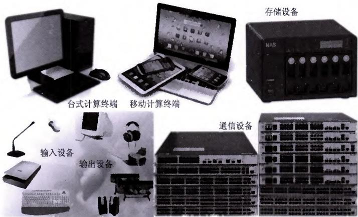

>[!info] 现行教材 · 第 2 版
>本页为**现行考试依据**的教材原文（第 2 版，2024 年 10 月出版，2025 年起启用）。
>考纲层级见 [[知识体系]]；练习题见 [[练习题·基础知识]]；案例模板见 [[案例答题模板]]。

# 第14章 桌面与外设管理

桌面及外围设备的数量多、功能复杂、移动化特点明显、多样化需求高，使得它们的运行维护变得更加复杂。因此，对于桌面及外围设备管理人员来说，要保证这些设备的正常运行，就需要对这些设备的运行维护相关的管理工作给予高度重视，并采取有效的措施来提高设备的运行可用性、可靠性和稳定性，以保证业务连续性。

## 14.1 概述

桌面及外围设备的运行维护对象包括台式计算终端、移动计算终端、输入输出设备、存储设备和通信设备。这些设备是用户使用和管理信息系统应用的终端设备，具有数量多、分布广、功能复杂和移动化的特点。

首先，桌面及外围设备的数量非常多，它们广泛分布在各种办公场所、学校、医院、家庭等各种场合。这些设备的数量多，使得它们的管理变得更加复杂。如果没有进行有效的运行维护，设备的故障率会很高，从而影响到整个信息系统的正常运行。

其次，这些设备的功能越来越多，越来越复杂。现代的桌面设备不仅可以用于基本的办公文字处理、电子表格处理等工作，还可以用于多媒体处理、图像处理、视频处理等工作。移动设备除了具备桌面设备的功能外，还具备更加便携、易用等特点。这些设备功能的增加，也使得它们的运行维护变得更加复杂。

再次，这些设备的移动化特点也越来越明显。随着移动互联网的发展，越来越多的人使用移动设备来处理工作和生活中的事务。这些设备的移动化特点，使得它们的使用场景更加多样化，同时也增加了它们的维护难度。

  
图14-1 常见桌面及外围设备

最后，这些设备的多样化特点也很明显。不同的用户对于设备的要求也不同，有的用户需要高性能的设备来处理复杂的工作任务，有的用户则需要便携、易用的设备来处理日常工作。这些多样化的需求，也使得设备的运行维护变得更加复杂。

各类台式计算终端、移动计算终端、输入输出设备、存储设备和通信设备如图 14-1 所示。

## 14.2 台式计算终端运维管理

台式计算终端是指具有数据收发及处理能力，通过软件为用户提供信息服务的设备及其配件，包括台式计算终端、瘦客户机、自助服务终端、行业专用终端和其他固定终端等。下面从例行操作、响应支持、调研评估和优化改善几方面描述台式计算终端运维管理的具体内容。

## 14.2.1 例行操作

为了保证台式计算终端的正常运行，我们需要对其进行定期监控、定期检查和日常维护。

## 1. 定期监控

监控是保证台式计算终端正常运行的一个重要步骤，需要对台式计算终端的硬件配置，包括 CPU、内存、硬盘等进行监控。这些硬件的监控可以通过专用监控软件来实现，专用监控软件可以实时监控计算机的硬件配置是否正常，发现异常后可及时报警。监控台式计算终端的系统软件，例如操作系统、驱动程序、办公软件等，这些软件的检查可以通过系统的更新和定期安装来实现，定期安装这些软件可以保证计算机的运行环境稳定，并且可以避免一些不必要的故障。

## 2. 定期检查

（1）定期检查台式计算终端的外部环境是否有灰尘和杂物等异常情况，例如键盘、鼠标、散热器、机箱等。

（2）定期检查台式计算终端的内部部件，例如主板、CPU、内存、硬盘等，这些部件的检查可以通过打开计算机的机箱来实现。定期检查可以及时发现问题，从而及时进行维修或更换，以保证计算机的正常运行。

## 3. 日常维护

（1）定期清理台式计算终端的散热器。散热器是保证计算机正常散热的重要部件，如果散热器不定期清理，就会导致散热不良，从而影响计算机的正常运行。

（2）定期除尘。台式计算终端的机箱内部容易积累大量的灰尘和杂物，如果不定期除尘，就会影响计算机的正常运行。可以使用专业的清洁工具进行除尘。

（3）定期检查和维修。定期检查和维修可以及时发现问题，并及时进行修复，从而保证计算机的正常运行。如果发现问题，可以选择自行维修或者找专业的技术人员进行维修。

总之，实时监控、定期检查和日常维护是保证台式计算终端正常运行的三个重要措施。只有对台式计算终端进行实时监控、定期检查和日常维护，才能够保证其使用寿命，并且使其性能得到最大的发挥，以确保计算机的正常运行。

## 14.2.2 响应支持

在桌面及外围设备运行维护过程中，对台式计算终端进行响应支持时，应根据不同的运行维护对象的使用要求，确定事件驱动响应和服务请求响应的具体服务内容。

## 1. 硬件故障

硬件故障是计算机故障中最常见的一种，它可能是由于电源故障、内存故障、硬盘故障、CPU 故障等原因引起的。一旦出现硬件故障，计算机就无法正常工作，这将导致业务中断。因此，及时进行硬件维修和更换是必要的。硬件维修通常需要专业技术人员进行，而且有时需要更换整个硬件设备。在进行硬件维修时，需要注意以下几点。

\- 确保故障部件已经得到了正确处理，并且不会再次损坏。

\- 使用原厂的配件，以确保硬件设备的兼容性和可靠性。

\- 进行必要的测试和验证，以确保硬件设备已经正常工作。

\- 加强日常维护和保养，以减少硬件故障的发生。

## 2. 软件故障

软件故障可能是由于操作系统错误、软件冲突、应用程序错误等原因引起的。软件故障可能会导致计算机无法正常工作或者出现错误提示，软件故障的处理方法与硬件故障类似，但需要使用专业的软件工具来进行诊断和修复。

## 3. 操作系统故障

操作系统故障可能是由于系统文件损坏、驱动程序问题、操作系统版本问题等原因引起的。操作系统故障会导致计算机无法正常启动或者出现错误提示，在处理操作系统故障时，需要注意以下几点。

\- 使用原厂的操作系统软件和驱动程序，以确保系统的稳定性和可靠性。

\- 进行必要的数据备份，以防止数据丢失。

\- 对系统进行全面的检查和清理，以删除不必要的文件和程序。

\- 使用专业的系统维护工具，以快速诊断和修复操作系统故障。

## 4. 性能降级

性能降级是指计算机的性能下降到无法正常工作的情况，这可能是由于硬件故障、软件故障、病毒感染、系统文件损坏等原因引起的。性能降级会导致计算机无法正常运行或者出现错误提示，在处理性能降级时，需要注意以下几点。

\- 进行必要的数据备份，以防止数据丢失。

\- 使用专业的系统维护工具，以快速诊断和修复性能降级问题。

\- 清除病毒木马，以保证系统的稳定性和安全性。

\- 对系统进行全面的检查和清理，以删除不必要的文件和程序。

## 5. 清除病毒木马

病毒木马是一种恶意软件，可以通过电子邮件、下载软件、不安全的网络连接等途径感染计算机。清除病毒木马可以保证计算机的安全性和稳定性，并且可以恢复被破坏的数据。在清除病毒木马时，需要注意以下几点。

\- 使用专业的杀毒软件，以清除计算机中的所有病毒木马。

## 信息系统管理工程师教程（第2版）

● 定期对计算机进行全面检查和清理，以防止病毒木马再次感染。

\- 不要下载不可信的软件和程序，以防止被感染。

\- 保持良好的上网习惯，以减少感染病毒木马的机会。

## 6. 数据恢复

数据恢复是指对已经丢失或者损坏的数据进行恢复。数据恢复可以通过使用专业的数据恢复软件来实现，但需要注意以下几点。

\- 保护好数据备份，以防止数据丢失。

\- 选择可靠的数据恢复软件，以确保数据恢复的准确性和可靠性。

\- 对数据进行全面分析和检测，以确定数据恢复的可行性。

\- 尽可能完整地恢复数据，以减少数据丢失的影响。

## 7. 功能置换

功能置换是指将计算机的某些功能进行置换或者更换，以满足不同的需求。功能置换可以通过购买新的硬件或者软件来实现，但需要注意以下几点。

\- 选择合适的功能置换方案，以确保其可行性和可靠性。

\- 对新的功能进行全面测试和验证，以确保其稳定性。

## 14.2.3 调研评估

台式计算终端调研评估的内容包括评估台式计算终端的使用和管理与国家、行业、单位相关标准和规范的符合程度，提出完善方案；调研台式计算终端的资源利用和成本占用情况，提出优化方案；评估台式计算终端的防非法操作、防入侵、防病毒等安全情况，并提出改进方案；调研台式计算终端的性能检测结果，评估台式计算终端的使用、维修、报废等价值，并提出处置方案；调研正版软件的使用情况，评估由于版权问题引发的信息安全风险或司法风险。

## 1. 评估与国家、行业、单位相关标准和规范的符合程度

## 1）与国家标准和规范的符合程度

在国家标准和规范方面，台式计算终端的相关标准和规范主要包括 GB/T 9813.1《计算机通用规范 第1部分：台式微型计算机》、GB/T 31371《废弃电子电气产品拆解处理要求 台式微型计算机》、《中华人民共和国计算机信息系统安全保护条例》等，这些标准和规范的制定和实施，对于提高台式计算终端的质量和可靠性、保护用户的合法权益、促进信息技术的发展和应用具有重要意义。

## 2）与行业标准和规范的符合程度

在行业标准和规范方面，台式计算终端的相关标准和规范主要包括 SJ/T 11944《安全可靠一体式台式微型计算机技术要求》、SJ/T 11943《安全可靠 台式微型计算机技术要求》等，这些标准和规范的制定和实施，对于提高台式计算终端的使用和管理水平、保证信息系统的安全和可靠、促进信息技术的应用和发展具有重要意义。

## 3）与单位标准和规范的符合程度

在单位标准和规范方面，一般有制定好的台式计算终端相关标准和规范，这些标准和规范的制定和实施，对于提高台式计算终端的使用和管理水平、保证信息系统的安全和可靠、加强单位的信息化建设和应用具有重要意义。

针对于不符合国家、行业、单位相关标准和规范要求的，应提出完善方案，经客户方审批后实施。完善方案一般包括预期达到的目标、完善目的、方案实施计划、实施成本、实施周期、验收方案等内容。

## 2. 制定合理的优化方案，提高台式计算终端的资源利用率和降低成本

在制定优化方案时可以参考以下内容。

（1）合理配置硬件。在资源利用方面，合理配置硬件是提高台式计算终端资源利用率的关键。首先，要根据用户的实际需求，选择合适的处理器、内存、硬盘等硬件配置。然后，要尽可能提高硬件配置的利用率，如选择高性能的处理器、高速的硬盘等。最后，要注意硬件的兼容性，尽可能选择同一品牌、同一型号的硬件，以保证硬件的兼容性和稳定性。

（2）优化系统结构。在系统结构方面，要尽可能减少不必要的程序和进程，以提高系统的运行效率。同时，要注意系统的可扩展性，为今后的资源升级和扩展预留足够的空间。

（3）提高资源利用率。在资源利用率方面，可以采用一些技术手段来提高资源利用率。如使用虚拟机技术，可以在同一台计算机上运行多个操作系统和应用程序，以充分利用计算机的资源。此外，还可以使用文件系统的优化技术、内存管理技术等提高资源利用率。

（4）采用合适的配件。在配件选择方面，要根据用户的实际需求和预算，选择合适的配件。如选择高性能的处理器、高速的硬盘等，可以提高计算机的性能和效率，但同时也会增加成本。因此，要根据用户的实际情况选择合适的配件。

（5）降低配件成本。在配件选择方面，要注意降低配件的成本，如选择二手配件、降低配件的规格等。同时，要注意保证配件的质量和稳定性，以保证计算机的正常运行。

（6）优化应用系统设计。在应用系统设计方面，要注意降低运行成本，尽量低地占用台式计算终端的CPU、内存等资源。

综上所述，要提高台式计算终端的资源利用率和降低成本，需要在硬件配置、系统结构和设计等方面进行优化。同时，要根据用户的实际情况，选择合适的配件和应用系统设计，以满足用户的实际需求。在实际操作中，还要注意对计算机的维护和管理，以保证计算机的正常运行和延长使用寿命。

## 14.2.4 优化改善

在桌面及外围设备运行维护过程中，对台式计算终端进行优化改善时，应根据服务级别、使用环境、管理要求的变化情况，优化改善运行维护对象的性能、使用者感受、使用成本等。优化改善包括硬件性能升级或扩容、软件版本升级、调整参数/配置、调整设备摆放位置、调整安全策略、设置节能模式等方面，对台式计算终端的优化改善。

## 1. 硬件性能升级或扩容

对于一些需要更高性能的应用场景，可以考虑升级或者扩容台式计算机的硬件设备。

（1）CPU 升级。处理器是计算机的核心，对于提高计算机的性能至关重要。随着技术的不断进步，CPU 的频率和核心数量等指标也在不断提高，因此，对于一些需要更高处理能力的应用场景，可以考虑升级 CPU。

（2）内存升级。内存是指计算机的运行内存，对于提高计算机的性能也有着至关重要的作用。随着应用的不断扩展，需要的内存也越来越多，因此，对于一些需要更高内存的应用场景，可以考虑升级内存。

（3）硬盘升级。硬盘是计算机的存储设备，对于提高计算机的性能也有着一定的影响。随着数据量的不断增大，需要的存储速度和容量也越来越大，因此，对于一些需要更高存储能力的应用场景，可以考虑升级硬盘。

## 2. 软件版本升级

对于一些需要更高性能的应用场景，可以考虑升级软件版本。

（1）操作系统升级。操作系统是计算机的核心，对于提高计算机的性能至关重要。随着技术的不断进步，操作系统的版本也在不断更新，因此，对于一些需要更高稳定性和性能的应用场景，可以考虑升级操作系统。目前市场上主流的操作系统有 Windows 10、Windows 11 等，其中 Windows 11 的安全性和性能都有了一定的提升。

（2）应用程序升级。应用程序是计算机的处理器执行的指令和数据的集合，对于提高计算机的性能也有着不可或缺的作用。随着技术的不断进步，应用程序的版本也在不断更新，因此，对于一些需要更高性能的应用场景，可以考虑升级应用程序。

## 3. 调整参数 / 配置

对于一些台式计算机，可以通过调整电源设置、散热设置以及内存设置来提高其性能。目前市场上主流的电源有ATX、ATX12V、EPS等，其中ATX电源的功率最大，适用于一些高性能的台式计算机。主流的散热器有CPU散热器、GPU散热器、机箱风扇等，其中CPU散热器的散热效果较好，适用于一些高性能的台式计算机。

## 4. 调整设备摆放位置

对于一些需要更高性能的应用场景，可以考虑调整设备摆放位置来提高其性能，例如改变机箱风道、改变显卡位置等。

## 5. 调整安全策略

安全策略是保证计算机安全的一种手段，但是对于一些台式计算机，可能会影响其性能。因此，对于一些需要更高性能的应用场景，可以考虑调整安全策略来提高性能。

（1）关闭不必要的防护软件。一些防护软件可能会占用一定的系统资源，从而影响计算机的性能。因此，对于一些需要更高性能的应用场景，可以考虑关闭一些不必要的防护软件。

（2）开启高性能模式。一些操作系统提供了高性能模式，可以提高计算机的性能。对于一些需要更高性能的应用场景，可以考虑开启高性能模式来提高性能。目前市场上主流的操作系统有Windows10、Windows11等，其中Windows11的性能较好，但是需要更高的配置要求。

（3）开启防火墙保护。对于一些需要更高性能的应用场景，可以考虑开启防火墙保护来提高性能。

## 6. 设置节能模式

对于一些台式计算机，可以通过设置节能模式来提高其性能。电源设置是影响计算机性能的一个重要因素。对于一些性能不足的台式计算机，可以考虑调整电源设置来提高性能。目前市场上主流的电源有 ATX、ATX12V、EPS 等，其中 ATX 电源的功率最大，适用于一些高性能的台式计算机。

## 14.3 移动计算终端运维管理

移动计算终端至少包括便携式计算机、平板式计算机、手持终端和其他移动终端等。例行操作、响应支持、调研评估和优化改善是保证移动计算终端正常运行的重要手段，有助于及时发现问题并采取相应的解决措施，以保证移动计算终端的正常使用和数据安全。同时，还可以提高使用人员的信息安全意识和使用技能，并同步提高设备的使用效率。下面从例行操作、响应支持、调研评估、优化改善几方面描述移动计算终端运维管理的具体内容。

## 14.3.1 例行操作

针对移动计算终端的例行操作内容应包括实时监控、定期检查和日常维护。

## 1. 实时监控

对移动计算终端进行监控时，应根据具体的运行维护对象，确定监控内容和指标。监控的内容包括：

\- 系统和软件版本信息。监控设备的操作系统和软件版本信息，确保设备的软件环境和硬件环境符合要求，避免因软件版本过旧或过新导致的问题。

\- 操作行为。监控用户对设备的操作行为，包括但不限于文件操作、应用程序安装和使用、网络连接等，以及设备的使用频率、使用时间等，确保设备的使用符合组织规定和安全要求。

\- 电池使用/老化情况。监控设备的电池使用情况，包括电池容量、电池使用时间等，以及电池老化情况，确保设备的电池使用寿命符合要求。

\- 系统安全性。监控设备的系统安全性，包括但不限于病毒、木马、恶意软件等，以及设备的防火墙设置和数据加密等，确保设备的安全性符合要求。

\- 资产信息。监控设备的资产信息，包括设备的编号、型号、生产日期、使用状态等，以及设备的维修记录、报废记录等，确保设备的资产管理符合要求。

通过对移动计算终端进行监控，可以及时发现设备的问题和隐患，提前进行处理和维修，避免设备故障和损坏，提高设备的使用效率和寿命。同时，监控还可以帮助组织对设备的使用情况和资产信息进行统计和分析，为组织的设备管理和资源优化提供数据支持。

## 2. 定期检查

定期检查的内容包括：

\- 外观完好情况。检查设备的外观是否有破损、划痕、氧化等现象，如有问题应及时进行维修或更换。

\- 软硬件运行状态。检查设备的操作系统、应用软件、驱动程序等是否正常运行，如有问题应及时进行修复或更新。

\- 资源占用情况。检查设备的内存、硬盘、CPU等资源的占用情况，如有问题应及时释放资源或优化软件配置。

\- 电池续航能力。检查设备的电池容量、电池充电状态、电池使用寿命等，如有问题应及时更换或优化电池使用策略。

\- 信息安全防护情况。检查设备的防病毒、防恶意软件、防钓鱼、防欺诈等信息安全防护措施是否正常运行，如有问题应及时升级安全软件或采取其他措施。

\- 配置/数据备份情况。检查设备的配置信息、数据备份情况等，如有问题应及时进行数据备份或更新配置信息。

\- 使用人员信息。检查设备的使用人员信息、使用记录等，如有问题应及时进行权限管理或数据清理。

在进行定期检查时，应根据具体的运行维护对象，确定检查内容和周期。例如，对于便携式计算机，可能需要检查屏幕、键盘、电池等部件的完好情况，同时检查操作系统和应用软件的运行状态以及资源占用情况等。对于平板式计算机和手持终端，可能需要重点检查屏幕、电池续航能力和信息安全防护情况等。对于其他移动终端，可能需要根据设备类型，针对性地检查相关部件和功能。同时，还应定期检查网络连接状态，确保设备能够正常接入网络。

## 3. 日常维护

日常维护的内容包括：

\- 数据备份。定期将设备中的重要数据进行备份，以避免数据丢失和损坏。备份数据的频率可以根据数据的重要性和设备的使用频率来确定，一般建议每周或每月进行一次数据备份。

\- 系统版本更新。定期更新设备的操作系统版本，以保证设备的安全性和稳定性。更新操作系统版本的频率可以根据操作系统的更新频率和设备的使用频率来确定，一般建议每月或每季度进行一次操作系统版本更新。

\- 软件版本更新。定期更新设备中的应用软件版本，以保证设备的安全性和稳定性。更新应用软件版本的频率可以根据软件的更新频率和设备的使用频率来确定，一般建议每月或每季度进行一次应用软件版本更新。

\- 病毒库更新。定期更新设备中的病毒库，以保证设备的安全性和稳定性。更新病毒库的频率可以根据病毒库的更新频率和设备的使用频率来确定，一般建议每周或每月进行一次病毒库更新。

\- 密码变更。定期更改设备的登录密码，以保护设备的安全性和隐私性。更改密码的频率可以根据密码的重要性和设备的使用频率来确定，一般建议每月或每季度更改一次密码。

\- 漏洞扫描。定期对设备进行漏洞扫描，以保证设备的安全性和稳定性。扫描漏洞的频率可以根据设备的使用频率和漏洞扫描软件的更新频率来确定，一般建议每周或每月进行一次漏洞扫描。

\- 易耗部件更换。定期更换设备中的易耗部件，以保证设备的正常运行和续航能力。更换易耗部件的频率可以根据易耗部件的使用寿命和设备的使用频率来确定，一般建议每月或每季度进行一次易耗部件更换。

\- 外观保养和破损保护。定期保养设备的外观，清洁设备的屏幕、键盘、电池等部件，以保证设备的外观完好和使用寿命。同时，还应保护设备免受外力损坏，避免设备的屏幕、键盘、电池等部件受到损坏。

\- 为用户提供信息安全风险教育。定期为设备使用人员提供信息安全风险教育，教育使用人员如何正确使用设备，如何保护设备的数据安全和网络安全，以提高使用人员的信息安全意识。

\- 为用户提供简易明了的使用说明、注意事项或操作培训。定期为设备使用人员提供简易明了的使用说明、注意事项或操作培训，教育使用人员如何正确使用设备，以提高使用人员的使用技能和操作水平。

总之，日常维护是保证设备正常运行和续航能力的重要手段。通过日常维护，可以及时发现设备存在的问题，并采取相应的措施进行解决，以保证设备的正常使用和数据安全。同时，日常维护还可以提高使用人员的信息安全意识和使用技能，提高设备的使用效率和续航能力。因此，日常维护是移动计算终端维护的重要组成部分，应该得到足够的重视和关注。

## 14.3.2 响应支持

在桌面及外围设备运行维护过程中，对移动计算终端进行响应支持时，应根据不同的运行维护对象的使用要求，确定事件驱动响应和服务请求响应的具体服务内容。

## 1. 事件驱动响应

在进行响应支持时，针对设备的软硬件故障引起的业务中断或运行效率无法满足正常运行要求而进行的响应服务，包括：

\- 修复移动计算终端硬件故障。当移动计算终端出现硬件故障时，需要进行修复。硬件故障包括但不限于屏幕损坏、键盘损坏、电池损坏、硬盘损坏、内存损坏等。修复移动计算终端硬件故障，可以采用更换部件或维修部件的方式进行。更换部件的方式需要购买新的部件并更换到故障设备上，维修部件的方式需要将故障部件拆下并维修后重新安装

## 信息系统管理工程师教程（第2版）

到设备上。在进行修复时，需要注意保护设备的外观完好和使用寿命。

\- 修复移动计算终端操作系统或系统软件故障。当移动计算终端出现操作系统或系统软件故障时，需要进行修复。操作系统或系统软件故障包括但不限于操作系统崩溃、系统软件卡死、系统软件漏洞等。修复移动计算终端操作系统或系统软件故障，可以采用重新安装操作系统或系统软件的方式进行。重新安装操作系统或系统软件的方式需要将操作系统或系统软件从安装介质安装到设备上。在进行修复时，需要注意保护设备的数据完整性和使用人员信息。

\- 修复应用软件故障。当移动计算终端出现应用软件故障时，需要进行修复。应用软件故障包括但不限于应用软件崩溃、应用软件卡死、应用软件漏洞等。修复移动计算终端应用软件故障，可以采用重新安装应用软件的方式进行。重新安装应用软件的方式需要将应用软件从安装介质安装到设备上。在进行修复时，需要注意保护设备的数据完整性和使用人员信息。

\- 恢复网络连接。当移动计算终端出现网络连接故障时，需要进行恢复。网络连接故障包括但不限于网络信号弱、网络连接中断、网络连接不稳定等。恢复移动计算终端网络连接，可以采用重新连接网络或更换网络设备的方式进行。重新连接网络的方式需要将设备连接到正确的网络上。更换网络设备的方式需要更换故障的网络设备。在进行恢复时，需要注意保护设备的数据完整性和使用人员信息。

\- 删除恶意软件。当移动计算终端出现恶意软件感染时，需要进行删除。恶意软件感染包括但不限于病毒、木马、广告软件等。删除移动计算终端恶意软件，可以采用清除恶意软件或安装反恶意软件的方式进行。清除恶意软件的方式需要使用反恶意软件扫描并删除恶意软件。安装反恶意软件的方式需要在设备上安装反恶意软件并定期扫描。在进行删除时，需要注意保护设备的数据完整性和使用人员信息。

\- 恢复性能降级的移动计算终端到性能基线水平。当移动计算终端性能降级时，需要进行恢复。性能降级包括但不限于设备运行缓慢、设备反应迟钝、设备续航能力下降等。恢复移动计算终端性能降级的方式可以采用优化软件配置、升级硬件、更换部件等方式进行。优化软件配置，需要关闭不必要的软件进程并卸载不必要的应用软件。升级硬件需要更换性能更高的部件。更换部件需要更换性能更高的部件。在进行恢复时，需要注意保护设备的外观完好和使用寿命。

\- 必要时提供功能置换服务。当移动计算终端功能失效时，需要进行功能置换。功能置换包括但不限于设备操作失效、设备无法连接网络、设备无法使用某些应用软件等。必要时提供功能置换服务，可以采用更换部件或升级软件的方式进行。更换部件需要更换功能失效的部件。升级软件需要升级功能失效的软件。在进行功能置换时，需要注意保护设备的外观完好和使用寿命。

## 2. 服务请求响应

在进行服务请求响应时，应根据需方的服务请求而进行响应，内容包括：

\- 解答用户提出的操作方法咨询或疑问。当用户在使用移动计算终端时遇到操作方法咨询或疑问时，需要进行解答。解答用户提出的操作方法咨询或疑问，可以采用电话、在线、实地等方式进行。在进行解答时，需要注意使用简单易懂的语言，让用户能够理解操作方法。同时，还需要注意提供详细的操作步骤和注意事项，以保证用户能够正确使用设备。

\- 易耗品/易损件更换。当移动计算终端的易耗品或易损件出现故障时，需要进行更换。易耗品/易损件包括但不限于电池、屏幕、键盘、电源适配器等。更换易耗品/易损件，可以采用更换新的易耗品/易损件的方式进行。在进行更换时，需要注意保护设备的外观完好和使用寿命。

\- 移动计算终端设备的采购、领用、借用、归还、报废等。当移动计算终端设备需要采购、领用、借用、归还、报废时，需要进行相应的操作。采购移动计算终端设备，可以采用向供应商购买或向其他单位租赁的方式进行。领用移动计算终端设备，可以采用从设备库房领用的方式进行。借用移动计算终端设备，可以采用从设备库房借用的方式进行。归还移动计算终端设备，可以采用将设备归还到设备库房的方式进行。报废移动计算终端设备，可以采用将设备报废的方式进行。在进行相应的操作时，需要注意保护设备的外观完好和使用寿命。

\- 移动计算终端软件安装、升级、数据迁移等。当移动计算终端需要安装、升级、数据迁移时，需要进行相应的操作。安装移动计算终端软件，可以采用从软件下载中心下载并安装的方式进行。升级移动计算终端软件，可以采用从软件下载中心下载并升级的方式进行。数据迁移移动计算终端，可以采用从旧设备迁移到新设备的方式进行。在进行相应的操作时，需要注意保护设备的数据完整性和使用人员信息。

\- 密码变更、重置等。当移动计算终端需要进行密码变更或重置时，需要进行相应的操作。密码变更，可以采用从设备设置中更改密码的方式进行。密码重置可以采用从设备设置中重置密码的方式进行。在进行相应的操作时，需要注意保护设备的数据完整性和使用人员信息。

\- 提供备用设备。当移动计算终端出现故障或需要更换时，需要提供备用设备供使用人员使用。备用设备可以采用从设备库房调用的方式进行。在提供备用设备时，需要注意保护设备的外观完好和使用寿命。

## 14.3.3 调研评估

移动计算终端调研评估的内容包括评估移动计算终端的使用和管理与国家、行业、单位相关标准和规范的符合程度，提出完善方案；调研移动计算终端的资源利用和成本占用情况，提出优化方案；评估移动计算终端的防非法操作、防入侵、防病毒等安全情况，并提出改进方案；调研移动计算终端的性能检测结果，评估使用、维修、报废等价值，并提出处置方案；调研正版软件的使用情况，评估由于版权问题引发的信息安全风险或司法风险。

## 1. 评估

评估与国家标准和规范的符合程度、与行业标准和规范的符合程度，以及与单位标准和规范的符合程度，针对不符合国家、行业、单位相关标准和规范要求的，应提出完善方案，经客户方审批后实施。完善方案一般包括预期达到的目标、完善目的、方案实施计划、实施成本、实施周期、验收方案等内容。

## 2. 优化

针对移动计算终端的资源利用和成本占用情况，可以从以下几方面进行优化。

## 1）软件优化

\- 采用轻量级的应用程序，减少资源占用。例如，使用Web应用程序替代原生应用程序，后者通常需要更多的计算资源。

\- 优化操作系统设置，关闭不必要的服务和进程，减少资源消耗。

\- 定期清理缓存和临时文件，以释放有限的存储资源。

\- 使用虚拟化技术，将多个应用程序和操作系统在单个设备上运行，以提高资源利用率。

## 2）硬件优化

\- 选择性能适中的硬件设备，避免过度配置，以降低成本，同时保证基本的计算需求。

\- 定期维护和清理设备，以确保硬件性能稳定。

\- 使用可拆卸的电池，以便在需要时更换，延长电池使用寿命。

\- 选用低功耗的无线网络设备，降低能源消耗。

## 3）数据优化

\- 采用云存储技术，减少本地存储资源的需求。

\- 对数据进行压缩，以减少传输和存储的成本。

\- 使用数据同步和备份策略，避免重复数据的存储。

\- 对移动计算终端的数据进行加密，以保护数据安全和隐私。

## 4）方案优化

\- 根据业务需求选择合适的移动计算终端方案，如Windows、macOS、Linux等操作系统，以及各自的设备类型。

\- 采用模块化设计，灵活配置设备，以满足不同场景的需求。

\- 结合组织的网络和安全策略，制定合适的移动计算终端政策。

综上所述，针对移动计算终端的资源利用和成本占用情况，可以从软件、硬件、数据和方案等方面进行优化，以提高效率和降低成本。

## 3. 调研正版软件的使用情况

评估由于版权问题引发的信息安全风险或司法风险，调研正版软件使用情况一般包括：

（1）在调查正版软件的使用情况时，要采用问卷调查、网络调查等方式，了解广大用户对正版软件的使用情况，具体调查方式可以根据用户的实际情况确定。

（2）要对正版软件的使用情况进行深入分析，了解广大用户使用正版软件的情况及其原因，具体分析方式可以根据用户的实际情况确定。

## 14.3.4 优化改善

在桌面及外围设备运行维护过程中，对移动计算终端进行优化改善时，应根据服务级别、使用环境、管理要求的变化情况，优化改善运行维护对象的性能、使用者感受、使用成本等因素，具体内容包括：

\- 软件版本升级。当移动计算终端的软件版本需要升级时，需要进行相应的操作。软件版本升级，可以采用从软件下载中心下载并安装的方式进行。在进行升级时，需要注意保护设备的数据完整性和使用人员信息。

\- 新软件或新功能使用指导。当移动计算终端需要使用新软件或新功能时，需要进行相应的操作。新软件或新功能可以采用从软件下载中心下载并安装的方式进行。在进行使用指导时，需要注意使用简单易懂的语言，让用户能够理解新软件或新功能的使用方法。同时，还需要注意提供详细的操作步骤和注意事项，以保证用户能够正确使用新软件或新功能。

\- 调整系统参数/配置。当移动计算终端的系统参数或配置需要调整时，需要进行相应的操作。系统参数/配置调整，可以采用从设备设置中调整的方式进行。在进行调整时，需要注意保护设备的数据完整性和使用人员信息。

\- 调整安全策略。当移动计算终端的安全策略需要调整时，需要进行相应的操作。安全策略调整，可以采用从设备设置中调整的方式进行。在进行调整时，需要注意保护设备的数据完整性和使用人员信息。

\- 安装外观保护或功能增强装置。当移动计算终端需要安装外观保护或功能增强装置时，需要进行相应的操作。外观保护或功能增强装置包括但不限于外观保护膜、功能增强卡等。安装外观保护或功能增强装置，可以采用从设备购买中心购买并安装的方式进行。在进行安装时，需要注意保护设备的外观完好和使用寿命。

## 14.4 输入输出设备运维管理

输入输出设备至少包括信息采集、指令输入、打印、显示、播放设备等。下面从例行操作、响应支持、调研评估和优化改善几方面描述输入输出设备运维管理的具体内容。

## 14.4.1 例行操作

针对输入输出设备的例行操作内容应包括监控、定期检查和日常维护。

## 1. 监控

在计算机系统中，输入输出设备的选择和使用对于系统的性能和效率有着重要的影响。因此，对输入输出设备进行监控是非常有必要的。

## 1）支撑软件及硬件配置变动

输入输出设备的支撑软件及硬件配置变动是监控输入输出设备的重要内容之一。支撑软件是指用于管理、控制、监控输入输出设备的软件，例如设备驱动程序、设备管理软件等。硬件配置变动是指输入输出设备的硬件配置发生变化，例如设备的更换、升级等。在监控输入输出设备时，应该密切关注支撑软件及硬件配置变动情况，及时进行相应的调整和优化，确保输入输出设备的正常运行。

## 2）易损件使用情况

输入输出设备的易损件是指容易损坏或磨损的部件，例如打印机的硒鼓、显示器的屏幕等。易损件的使用情况是监控输入输出设备的重要内容之一。在监控输入输出设备时，应该密切关注易损件的使用情况，及时进行更换或维修，确保设备的正常运行。

## 3）耗材使用情况

输入输出设备的耗材是指在使用过程中需要消耗的物品，例如打印机的墨盒、显示器的电源等。耗材的使用情况是监控的重要内容之一。在监控输入输出设备时，应该密切关注耗材的使用情况，及时进行补充或更换，确保设备的正常运行。

## 4）操作行为

输入输出设备的操作行为是指用户在使用时的操作行为，例如打印机显示器的分辨率的设置等。操作行为的正确性和合理性是监控的重要内容之一。在监控输入输出设备时，应该密切关注操作行为，及时进行相应的调整和优化，确保设备的正常运行。

## 5）告警信息

输入输出设备的告警信息是指在使用过程中出现的故障或异常情况，例如打印机无法打印、显示器花屏等。告警信息的及时性和准确性是监控的重要内容之一。在监控输入输出设备时，应该密切关注告警信息，及时进行相应的处理和解决，确保设备的正常运行。

## 6）资产信息

输入输出设备的资产信息是指设备的基本信息，例如设备名称、设备型号、设备编号等。资产信息的准确性和完整性是监控的重要内容之一。在监控输入输出设备时，应该密切关注资产信息，及时进行相应的更新和维护，确保设备的正常运行。

## 7）能耗

输入输出设备的能耗是指设备在使用过程中消耗的电能，例如打印机、显示器的功率等。能耗的合理性和节能性是监控的重要内容之一。在监控输入输出设备时，应该密切关注能耗，及时进行相应的调整和优化，确保设备的正常运行。

总之，输入输出设备的监控是计算机系统中非常重要的组成部分。在监控输入输出设备时，应该根据具体的运行维护对象，确定监控内容和指标。监控的内容包括支撑软件及硬件配置变动、易损件使用情况、耗材使用情况、操作行为、告警信息、资产信息、能耗等。通过对输入输出设备的监控，可以及时发现和解决问题，确保设备的正常运行，提高计算机系统的性能和效率。

## 2. 定期检查

## 1）软硬件运行状态

输入输出设备的软硬件运行状态是定期检查的重要内容之一。软硬件运行状态包括软件的安装、配置、运行情况，硬件的连接、工作环境等方面的情况。在定期检查输入输出设备时，应该密切关注软硬件的运行状态，及时进行相应的调整和优化，确保设备的正常运行。

## 2）支撑软件及硬件配置变动情况

输入输出设备的支撑软件是指用于管理、控制、监控的软件，例如设备驱动程序、设备管理软件等。硬件配置变动是指输入输出设备硬件配置的变化，例如设备的更换、升级等。在定期检查输入输出设备时，应该密切关注支撑软件及硬件配置变动情况，及时进行相应的调整和优化，确保设备的正常运行。

## 3）机械、传动、传感部件运转情况

输入输出设备的机械、传动、传感部件是指用于控制、监控设备的机械部件，例如打印机的硒鼓、显示器的屏幕等。机械、传动、传感部件的运转情况是定期检查的重要内容之一。在定期检查输入输出设备时，应该密切关注机械、传动、传感部件的运转情况，及时进行相应的维修和更换，确保设备的正常运行。

## 4）指令响应灵敏度、准确度及指令反馈情况

指令响应灵敏度、准确度是指输入输出设备对用户指令的响应速度和准确性。指令反馈情况是指输入输出设备对用户指令的反馈情况，例如打印机的打印速度、显示器的显示效果等。在定期检查输入输出设备时，应该密切关注指令响应灵敏度、准确度，以及指令反馈情况，及时进行相应的调整和优化，确保设备的正常运行。

## 5）操作面板指示清晰度

操作面板是指用于控制、监控输入输出设备的面板，例如打印机的按键、显示器的菜单等。操作面板的指示清晰度是定期检查的重要内容之一。在定期检查输入输出设备时，应该密切关注操作面板指示清晰度，及时进行相应的调整和优化，确保设备的正常运行。

## 6）打印输出清晰度和颜色准确度情况

打印输出是指输入输出设备将计算机处理的结果转换为外部可以理解的形式的过程，例如打印机的打印效果。打印输出清晰度和颜色准确度是定期检查的重要内容之一。在定期检查输入输出设备时，应该密切关注打印输出清晰度、颜色准确度，及时进行相应的调整和优化，确保设备的正常运行。

## 7）显示清晰度、亮度、对比度、比例、颜色等情况

显示是指输入输出设备将计算机处理的结果转换为外部可以理解的形式的过程，例如显示器的显示效果。显示清晰度、亮度、对比度、比例、颜色等情况是定期检查的重要内容之一。在定期检查输入输出设备时，应该密切关注显示清晰度、亮度、对比度、比例、颜色等情况，及时进行相应的调整和优化，确保设备的正常运行。

## 8）播放音量、失真度、信噪比情况

播放是指输入输出设备将计算机处理的结果转换为外部可以理解的形式的过程，例如播放器的播放效果。播放音量、失真度、信噪比是定期检查的重要内容之一。在定期检查输入输出设备时，应该密切关注播放音量、失真度、信噪比，及时进行相应的调整和优化，确保设备的

正常运行。

## 9）易损件老化情况

输入输出设备的易损件是指容易损坏或磨损的部件，例如打印机的硒鼓、显示器的屏幕等。易损件的老化情况是定期检查的重要内容之一。

## 3. 日常维护

输入输出设备的日常维护内容包括设备配置备份，测试类操作，补充耗材，易损部件更换，对图像聚焦度、清晰度、亮度、对比度、比例、颜色等参数调校，对音量、失真度、信噪比的调校，机械部位加油、调校，设备清洁除尘，为用户提供简易明了的使用说明，注意事项或操作培训，为用户提供降低能耗或减少耗材使用的指导培训等。

## 14.4.2 响应支持

在桌面及外围设备运行维护过程中，对输入输出设备进行响应支持时，应根据不同的运行维护对象的使用要求，确定事件驱动响应和服务请求响应的具体服务内容。

## 1. 事件驱动响应

输入输出设备的响应服务内容包括修复输入输出设备硬件故障、修复外围输入输出设备软件和驱动程序故障、修复支撑软件及硬件故障、恢复性能降级的输入输出设备到性能基线水平、必要时提供功能置换服务等。

输入输出设备的响应服务是非常重要的，它能够有效地解决设备出现的故障或损坏，确保设备的正常运行。在实施输入输出设备的响应服务时，应该根据设备的使用情况，及时调整参数，确保正常运行。同时，输入输出设备的响应服务也能够有效地降低设备出现故障或损坏时对业务的影响，确保业务的正常运行。

## 2. 服务请求响应

输入输出设备的服务请求响应内容包括解答用户提出的操作方法咨询或疑问，输入输出设备耗材更换，输入输出设备的采购、领用、借用、归还、报废等，新输入输出设备的安装调试，在用输入输出设备的迁移，共享设备的账号开立、管理和注销等。

输入输出设备的服务请求响应是非常重要的，它能够有效地解决用户在使用过程中遇到的问题和困难，确保设备的正常运行。在实施输入输出设备的服务请求响应时，应该根据用户的问题，提供详细的操作方法或使用方法说明，确保用户能够正确使用。同时，输入输出设备的服务请求响应也能够有效地降低设备出现故障或损坏时对业务的影响，确保业务的正常运行。

## 14.4.3 调研评估

在计算机系统中，输入输出设备是非常重要的组成部分。输入设备用于将外部信息转换为计算机可以理解的电信号，输出设备则负责将计算机处理后的结果呈现给用户。为了确保计算机系统的正常运行，我们需要对输入输出设备进行调研，以了解其故障率、平均使用寿命和耗材使用情况等信息，从而优化采购策略。

## 1. 评估使用情况和综合使用成本

输入输出设备的使用情况和综合使用成本是评估的重要指标。使用情况评估主要包括设备的使用频率、使用环境、使用人员等方面。综合使用成本评估则包括设备购买成本、维修成本、能源消耗成本等方面。

## 1）使用情况评估

\- 设备使用频率。使用频率是评估输入输出设备使用情况的重要指标。设备使用频率越高，说明使用量越大，使用寿命和性能也会受到一定的影响。因此，在评估输入输出设备时，应该考虑设备的使用频率，选择性能稳定、使用寿命长的设备。

\- 使用环境。输入输出设备的使用环境对设备的性能和寿命也有着重要的影响。例如，高温、潮湿、强磁场等环境会对设备产生不利影响，缩短使用寿命。因此，在评估输入输出设备时，应该考虑使用环境，选择适应性强且能够在恶劣环境下正常工作的设备。

\- 使用人员。使用人员也是评估输入输出设备使用情况的重要因素。不同的使用人员对设备的使用习惯和技能水平不同，会对设备的使用效率和寿命产生影响。因此，在评估输入输出设备时，应该考虑使用人员的技能水平和使用习惯，选择易于操作、人性化设计的设备。

## 2）综合使用成本评估

输入输出设备的综合使用成本评估包括设备购买成本、维修成本、能源消耗成本等方面的评估。

\- 设备购买成本。设备购买成本是评估输入输出设备综合使用成本的重要因素。设备购买成本越高，说明设备的价格越高，使用成本也会相应增加。因此，在评估输入输出设备时，应该考虑购买成本，选择性价比高的设备。

\- 维修成本。输入输出设备的维修成本是评估设备综合使用成本的另一个重要因素。设备维修成本越高，说明设备的故障率越高，维修费用也会相应增加。因此，在评估输入输出设备时，应该考虑设备的维修成本，选择故障率低、易于维修的设备。

\- 能源消耗成本。输入输出设备的能源消耗成本也是评估综合使用成本的重要因素。设备能源消耗越高，说明设备的功耗越大，能源成本也会相应增加。因此，在评估输入输出设备时，应该考虑设备的能源消耗成本，选择节能的设备。

## 2. 评估非法使用、信息安全风险等情况

输入输出设备的非法使用、信息安全风险等情况是评估输入输出设备的重要指标。非法使用可能导致设备被恶意破坏或者被非法使用者窃取数据，信息安全风险可能导致数据泄露或者被攻击者篡改。因此，在评估输入输出设备时，应该考虑设备的非法使用、信息安全风险等情况，选择具有防护功能、安全可靠的设备，并提出相应的改进方案。

## 3. 调研设备的性能，评估使用或维修价值

输入输出设备的性能是评估的重要指标。设备性能越高，说明设备的处理速度、处理能力、存储容量等方面的表现越好。因此，在评估输入输出设备时，应该调研设备的性能，评估设备的使用价值和维修价值，并提出相应的处置方案。

## 4. 评估报废价值及对环境污染情况

输入输出设备报废价值及对环境污染情况是评估的重要指标。设备报废价值越高，说明设备的回收利用价值越高，对环境污染的影响也越小。因此，在评估输入输出设备时，应该考虑设备的报废价值及对环境污染情况，选择环保、可回收利用的设备，并提出相应的处置方案。

## 14.4.4 优化改善

在桌面及外围设备运行维护过程中，对输入输出设备进行优化改善时，应根据服务级别、使用环境、管理要求的变化情况，优化改善运行维护对象的性能、使用者感受、使用成本等因素。输入输出设备的优化改善内容包括调整共享策略和设备使用位置与环境、调校机械部件、调整设备参数、升级设备固件程序和驱动程序、增加外观保护和安全防护部件、更换老化和易损配件、优化耗材/易损件采购和使用策略等。

输入输出设备的优化改善内容的具体实施如下。

## 1）调整共享策略和设备使用位置与环境

共享策略是指对共享设备的使用进行管理和控制的策略，例如限制用户使用某些共享设备、限制共享设备的使用时间等。设备的使用位置与环境指的是设备被安装、放置并运行的具体地点以及该地点所具备的各种物理、化学和生物条件。例如设备的使用位置是否符合安全要求、设备的使用环境是否符合使用要求等。在实施调整共享策略和设备使用位置与环境时，应该根据输入输出设备的使用情况，及时调整共享策略和设备使用位置与环境，确保输入输出设备的正常运行。

## 2）调校机械部件

输入输出设备中的机械部件，例如打印机的硒鼓、投影仪的镜头等。调校是指对机械部件进行调整和校准，以确保机械部件的正常运行。在实施调校时，应该根据输入输出设备的使用情况，及时调整和校准机械部件，确保设备的正常运行。

## 3）调整设备参数

调整设备参数是指对输入输出设备的参数进行设置，例如打印机的打印速度、投影仪的分辨率等参数的设置。调整设备参数等可以确保设备的正常运行。在实施调整设备参数等时，应该根据输入输出设备的使用情况，及时调整和设置设备参数，确保输入输出设备的正常运行。

## 4）升级设备固件程序和驱动程序

固件程序是指运行在特定硬件设备（如USB接口芯片、微控制器等）中的程序，它是这些设备实现其特定功能的软件基础。

驱动程序是一种特殊的程序，充当了计算机和硬件设备之间的通信桥梁，确保了硬件设备的正常运行和性能优化。通过为操作系统提供控制硬件设备的接口，驱动程序实现了计算机与硬件设备之间的无缝连接。

## 5）增加外观保护和安全防护部件

外观保护和安全防护部件是指产品外部的装饰和保护结构，是为了预防操作者和其他人员接触机械设备中的危险部件或进入危险区域而设计的辅助装置。

## 6）更换老化和易损配件

老化和易损配件是指使用过程中，随着时间的推移，由于物理、化学或生物等因素的作用，其性能逐渐降低或丧失，容易损坏和在规定期间必须更换的零部件。

## 7）优化耗材/易损件采购和使用策略

耗材 / 易损件是指消耗很频繁 / 使用期间容易损坏的配件类产品，例如打印机的硒鼓、投影仪的电源等。优化耗材 / 易损件采购和使用策略是指对耗材和易损件进行优化和改善，以确保输入输出设备的正常运行。在实施优化耗材 / 易损件采购和使用策略时，应该根据输入输出设备的使用情况，及时优化和改善耗材和易损件的采购和使用策略，确保输入输出设备的正常运行。

## 14.5 存储设备运维管理

存储设备至少包括闪存盘、移动硬盘、数字存储卡、光盘、磁盘、网络存储器（NAS）等。下面从例行操作、响应支持、调研评估和优化改善几方面描述存储设备运维管理的具体内容。

## 14.5.1 例行操作

针对存储设备的例行操作内容应包括定期检查和日常维护。

## 1. 定期检查

存储设备定期检查的详细内容包括：

\- 外观完好情况。在检查过程中，应该注意设备表面是否有划痕、破损、变形等情况。如果发现设备存在以上问题，应该及时进行维修或更换，以防止设备故障导致数据丢失。

\- 存储介质空间使用情况。在检查过程中，应该确保设备的存储空间充足，以便于数据的存储和备份。如果发现设备的存储空间不足，应该及时进行扩容或更换新的设备，以确保数据的安全性。

\- 存储设备传输速率、数据格式等参数。在检查过程中，应该确保设备的传输速率和数据格式符合使用需求，以便于数据的传输和处理。如果发现设备存在传输速率慢、数据格式不兼容等问题，应该及时进行调整或更换新的设备，以确保数据的安全性和可靠性。

\- 存储设备损坏情况。存储设备存在的坏区、坏道、坏块情况是存储设备定期检查的重要内容之一，在检查过程中，应该使用专业的检测工具对设备进行检测，以确保设备的正常运行和数据安全。如果发现设备存在坏区、坏道、坏块等问题，应该及时进行维修或更换新的设备，以确保数据的安全性和可靠性。

\- 存储设备接入情况。存储设备的接入情况是存储设备定期检查的重要内容之一，在检查过程中，应该确保设备能够正常接入计算终端、网络和其他设备，以便于数据的传输和共享。如果发现设备存在接入问题，应该及时进行调整或更换新的设备，以确保数据的安全性和可靠性。

\- 存储设备内数据的加密情况。在检查过程中，应该确保设备内的数据已经进行加密，以防止数据泄露和安全问题。如果发现设备内数据没有加密或加密方式不符合要求，应该及时进行加密或更换新的设备，以确保数据的安全性。

\- 使用人员信息。在检查过程中，应该确保设备的使用人员信息准确、完整，以便于数据的安全管理。如果发现设备使用人员信息不准确或缺失，应该及时进行更新或补充，以确保数据的安全性。

\- 资产信息变更情况。在检查过程中，应该确保设备的资产信息准确、完整，以便于数据的安全管理。如果发现设备资产信息不准确或缺失，应该及时进行更新或补充，以确保数据的安全性。

## 2. 日常维护

## 1）设备编号与标识

在维护过程中，应该确保设备的编号和标识准确、完整，以便于设备的管理和安全。如果发现设备编号和标识不准确或缺失，应该及时进行更新或补充，以确保设备的安全性。

## 2）对存储设备进行除尘、清理外观

在维护过程中，应该使用专业的清洁工具对设备进行清理，以防止灰尘、污垢等影响设备的正常运行和数据安全。如果发现设备存在灰尘、污垢等问题，应该及时进行清理，以确保设备的正常运行和数据安全。

## 3）备份验证

在维护过程中，应该确保设备的备份数据准确、完整，以便于数据的安全管理。如果发现设备备份数据存在问题，应该及时进行修复或更换，以确保数据的安全性。

## 4）存放环境整理

在维护过程中，应该确保设备的存放环境整洁、通风，以便于设备的正常运行和数据安全。如果发现设备存放环境存在问题，应该及时进行整理，以确保设备的正常运行和数据安全。

## 5）升级驱动程序和固件

在维护过程中，应该确保设备的驱动程序和固件符合使用需求，以便于设备的正常运行和数据安全。如果发现设备存在驱动程序或固件问题，应该及时进行升级或更换，以确保设备的正常运行和数据安全。

## 6）对存储设备查杀病毒

在维护过程中，应该使用专业的病毒查杀工具对设备进行查杀，以防止病毒对设备和数据安全造成影响。如果发现设备存在病毒问题，应该及时进行查杀，以确保设备的正常运行和数据安全。

## 7）数据清除与设备报废

在维护过程中，应该确保设备的数据已经进行清除，以防止数据泄露和安全问题。如果发现设备存在数据泄露或安全问题，应该及时进行数据清除或设备报废，以确保数据的安全性。

## 8）老化检测与易耗部件更换

在维护过程中，应该定期对设备进行老化检测，以确保设备的正常运行和数据安全。如果发现设备存在老化或易耗部件问题，应该及时进行检测或更换，以确保设备的正常运行和数据安全。

## 9）资产信息变更

在维护过程中，应该确保设备的资产信息准确、完整，以便于数据的安全管理。如果发现设备资产信息存在问题，应该及时进行更新或补充，以确保设备的安全性。

## 10）为用户提供信息安全风险教育

在维护过程中，应该为用户提供信息安全风险教育，以提高用户的信息安全意识和能力。如果发现用户存在信息安全风险问题，应该及时进行教育和培训，以确保设备的安全性。

## 14.5.2 响应支持

在桌面及外围设备运行维护过程中，对存储设备进行响应支持时，应根据不同的运行维护对象的使用要求，确定事件驱动响应和服务请求响应的具体服务内容。

## 1. 事件驱动响应

存储设备的事件驱动响应的详细内容包括：

## 1）修复存储设备硬件故障

在支持过程中，应该使用专业的维修工具对设备进行维修，以修复设备的硬件故障，确保设备的正常运行和数据安全。

## 2）修复支撑软件及硬件故障

在支持过程中，应该使用专业的维修工具对设备进行维修，以修复设备的支撑软件和硬件故障，确保设备的正常运行和数据安全。

## 3）修复存储设备软件及驱动程序故障

在支持过程中，应该使用专业的维修工具对设备进行维修，以修复设备的软件和驱动程序故障，确保设备的正常运行和数据安全。

## 4）隔离并恢复感染病毒的存储设备

在支持过程中，应该使用专业的病毒查杀工具对设备进行查杀，以隔离感染病毒的设备，并恢复设备的正常运行和数据安全。

## 5）恢复丢失的信息数据

在支持过程中，应该使用专业的数据恢复工具对设备进行恢复，以恢复丢失的信息数据，确保设备的正常运行和数据安全。

## 6）必要时提供功能置换服务

在支持过程中，应该根据用户的需求，提供功能置换服务，以确保设备的正常运行和数据安全。

## 2. 服务请求响应

存储设备的服务请求响应是确保设备正常运行和数据安全的重要手段，详细内容包括：

## 1）解答用户提出的操作方法咨询或疑问

在服务过程中，应该使用专业的知识库和技术支持团队，解答用户提出的操作方法咨询或疑问，以确保用户能够正确使用设备，确保设备的正常运行和数据安全。

## 2）存储设备加密与解密

在服务过程中，应该使用专业的加密工具对设备进行加密，以确保设备的数据安全。如果发现设备存在数据安全问题，应该及时进行加密；如果发现设备需要解密，应该使用专业的解密工具进行解密，以确保设备的正常运行和数据安全。

## 3）存储设备的采购、分发、领用、借用、归还、报废

在服务过程中，应该根据用户的需求采购、分发、领用、借用、归还、报废存储设备，以确保设备的正常运行和数据安全。

## 4）提供存储设备所需的存储介质

在服务过程中，应该根据用户的需求，提供存储设备所需的存储介质，以确保设备的正常运行和数据安全。

## 5）存储设备软件和硬件安装、升级

在服务过程中，应该根据用户的需求，安装、升级存储设备的软件和硬件，以确保设备的正常运行和数据安全。

## 6）存储设备用户访问权限分配，账号的开立、变更和注销

在服务过程中，应该根据用户的需求，分配存储设备用户的访问权限，开立、变更和注销账号，以确保设备的正常运行和数据安全。

## 14.5.3 调研评估

存储设备的调研评估是非常重要的，它能够有效地评估存储设备的安全性、性能、质量、使用率和综合使用成本等情况，确保存储设备的正常运行。

## 1. 评估与国家、行业、单位、部门相关标准和规范的符合程度

针对于不符合国家、行业、单位、部门相关标准和规范要求的，应提出完善方案，经客户方审批后实施。完善方案一般包括预期达到的目标、完善目的、方案实施计划、实施成本、实施周期、验收方案等内容。

## 2. 存储设备的调研评估内容

存储设备的调研评估内容包括评估由于存储设备接入而产生信息安全风险的可能性，调研

存储设备的性能、质量、使用率和综合使用成本等情况，提供采购政策优化的建议等。

## 3. 存储设备的调研评估内容的具体实施

## 1）评估由于存储设备接入而产生信息安全风险的可能性

信息安全风险是指由于计算机系统中存在的安全漏洞、恶意软件等，导致计算机系统中的信息被窃取、篡改或删除等情况。存储设备接入可能会导致信息安全风险的产生，因此需要对存储设备进行评估，以确保存储设备的安全性。

## 2）调研存储设备的性能、质量、使用率和综合使用成本等情况

存储设备的性能是指存储设备的读写速度、存储容量等。存储设备的质量是指存储设备的可靠性、稳定性等。存储设备的使用率是指存储设备的使用情况，例如存储设备的使用率是否饱和等。存储设备的综合使用成本是指存储设备的购买成本、维护成本、运行成本等。在实施调研时，应该根据存储设备的使用情况，及时调研存储设备的性能、质量、使用率和综合使用成本等情况，确保存储设备的正常运行。

## 3）提供采购政策优化的建议

采购政策是指计算机系统中采购存储设备的政策和规定，例如采购存储设备的标准、流程等。采购政策优化是指对采购政策进行优化和改善。应该根据存储设备的使用情况，及时提供采购政策优化的建议，确保采购存储设备的正常运行。

## 14.5.4 优化改善

在桌面及外围设备运行维护过程中，对存储设备进行优化改善时，应根据服务级别、使用环境、管理要求的变化情况，优化改善运行维护对象的性能、使用者感受、使用成本等因素。针对存储设备的优化，为用户提供基于新技术的更高效的存储方式的建议一般包括以下几方面。

\- 存储类型选择。根据用户的业务需求和数据特征，推荐合适的存储类型，如机械硬盘、固态硬盘、混合硬盘、云存储等。不同类型的存储设备在性能、容量、成本等方面各有优劣，选择合适的存储类型可以提高存储效率和数据安全性。

\- 存储架构优化。根据用户的数据量和访问频率，推荐合适的存储架构，如RAID、分布式存储、集群存储等。合理的存储架构可以提高数据读写速度、容错能力和可扩展性，降低系统故障率和数据丢失风险。

\- 数据备份与恢复。建议用户制定合理的数据备份策略，定期对重要数据进行备份，并选择适合的备份介质和备份方式，如本地备份、异地备份、云备份等。同时，提供数据恢复方案，确保在数据丢失或损坏的情况下能够快速恢复。

\- 数据压缩与加密。利用先进的数据压缩技术，对大量的数据进行无损压缩，节省存储空间，提高存储效率。同时，建议用户对敏感数据进行加密存储，确保数据安全和隐私保护。

\- 存储管理工具。提供实用的存储管理工具，如存储监控、性能优化、故障诊断等，帮助用户实时了解存储设备的运行状况，及时发现并解决问题，提高存储系统的可靠性和稳

定性。

\- 节能与绿色存储。推荐用户采用节能型存储设备和绿色存储技术，降低能耗和碳排放，减轻对环境的影响，提高数据中心的可持续发展能力。

\- 技术支持与服务。提供全面的技术支持和服务，包括咨询、安装、调试、维护、升级等，确保用户在使用高效存储方式的过程中得到及时、专业的帮助。

## 14.6 通信设备运维管理

通信设备至少包括调制解调器、外置网卡、无线接入点（无线AP）、信息点、非核心路由器、交换机、集线器、IP电话等。下面从例行操作、响应支持、调研评估和优化改善几方面描述通信设备运维管理的具体内容。

## 14.6.1 例行操作

针对通信设备的例行操作内容应包括监控、定期检查和日常维护。

## 1. 监控

在桌面及外围设备运行维护过程中，对输入输出设备进行监控时，应根据具体的运行维护对象，确定监控内容和指标，监控的内容可包括：

\- 通信设备的健康状况、整体运行状态、各项硬件资源开销状况。

\- 链路健康状况，如端到端时延变化、链路端口工作稳定性、链路负载情况、部署路由策略情况下端到端选路变化、路由条目变化。

\- 支撑软件及硬件配置变动。

\- 易损件的使用情况。

$\bullet$ 操作行为。

\- 告警信息。

\- 资产信息。

## 2. 定期检查

在桌面及外围设备运行维护过程中，对通信设备进行定期检查时，应根据具体的运行维护对象，确定检查内容和周期。定期检查的内容可包括：

\- 通信设备是否存在信息安全风险。

\- 通信设备软硬件运行状态。

\- 备份通信设备的配置文件及其他日志文件。

\- 检查链路的健康状态，包括IP包传输时延、IP包丢失率、IP包误差率、无效IP包（包括攻击性IP包、欺骗性IP包、垃圾IP包等）。

\- 支撑软件及硬件配置变动情况。

\- 通信设备的资源占用情况。

\- 接口使用情况。

\- 易损件老化情况。

\- 资产变更情况。

## 3. 日常维护

在桌面及外围设备运行维护过程中，对通信设备进行日常维护时，应根据具体的运行维护对象，确定操作内容和频率。日常维护的内容可包括：

\- 对通信设备进行除尘清理、老化检测、易耗部件更换。

\- 通信设备驱动程序和固件升级。

\- 调整通信设备的连接对象、时间与网络配置信息。

\- 设备软件配置备份及存档。

\- 审计通信设备的网络连接和数据通信情况。

\- 审计设备日志。

\- 安全事件周期性整理分析。

\- 设备密码变更。

\- 为用户提供信息安全风险教育。

\- 为用户提供简易明了的使用说明、注意事项或操作培训。

\- 为用户提供网络资源使用报告及高效利用网络资源的使用培训。

## 14.6.2 响应支持

在桌面及外围设备运行维护过程中，对通信设备进行响应支持时，应根据不同的运行维护对象的使用要求，确定事件驱动响应和服务请求响应的具体服务内容。

## 1. 事件驱动响应

针对设备的软硬件故障引起的业务中断或运行效率无法满足正常运行要求而进行的响应服务包括：

\- 修复通信设备硬件故障。

\- 修复通信设备软件、参数配置或驱动程序故障。

\- 修复通信设备所连接的网络链路故障。

\- 排查并隔离导致恶意攻击、病毒等威胁的通信设备。

\- 恢复性能下降的通信设备，恢复网络连接性能至性能基线水平。

\- 必要时提供功能置换服务。

## 2. 服务请求响应

在服务级别协议规定的服务范围内，根据需方的请求而进行的响应服务包括：

\- 解答用户提出的操作方法咨询或疑问。

\- 通信设备的采购、领用、借用、归还、报废。

\- 通信设备及网络链路的权限分配，用户账号的开立、变更和注销。

## 信息系统管理工程师教程（第2版）

\- 通信设备软件和硬件的安装、更新或升级。

\- 调优网络资源分配机制。

\- 调整通信设备的访问控制策略。

\- 通信设备参数配置变更。

\- 启动、关闭端口或服务。

\- 易耗品/易损件更换。

\- 提供备用设备。

## 14.6.3 调研评估

针对通信设备的调研评估内容包括：

\- 评估通信设备的使用和管理与国家、行业、单位相关标准和规范的符合程度，提出完善方案。

\- 评估通过通信设备产生信息安全风险的可能性，并提出改进方案。

\- 调研通信设备及所连接网络资源的利用情况、网络结构和综合使用成本等，提出优化方案。

\- 调研通信设备的设备质量、性能，优化采购策略。

$\bullet$ 设备报废价值评估。

## 14.6.4 优化改善

在桌面及外围设备运行维护过程中，对通信设备进行优化改善时，应根据服务级别、使用环境、管理要求的变化情况，优化改善运行维护对象的性能、使用者感受、使用成本等，具体优化改善内容包括：

## 1）根据需方需求，规划、改善网络接入策略和访问控制策略

在网络接入和访问控制方面，可以根据用户的需求，对网络接入策略进行优化，例如限制某些IP地址的访问；增加安全策略，如防火墙和入侵检测等。同时，可以对访问控制策略进行优化，例如添加认证和授权机制，以确保网络资源的安全访问。

## 2）局部网络拓扑优化

根据网络的负载情况，对网络拓扑进行优化，例如将某些设备连接到高性能的交换机上，以提高网络性能和带宽。

## 3）局部网络通信链路带宽及使用效能优化

根据网络的负载情况，对通信链路带宽进行优化，例如升级网络设备的带宽，以满足网络流量的需求。同时，可以对网络通信链路的使用效能进行优化，例如实施流量控制策略，以减少网络拥塞。

## 4）通信设备配置参数优化

根据设备的负载情况，对通信设备配置参数进行优化，例如调整设备的CPU、内存和硬盘

等资源的分配，以提高设备的性能和响应速度。

## 5）通信设备运行环境优化

根据设备的负载情况，对通信设备运行环境进行优化，例如调整设备的温度、湿度和空气流通等因素，以确保设备的稳定运行。

## 6）优化通信设备运行环境

优化通信设备运行环境包括物理环境、电气环境、网络环境，例如增加空调、电力保护设备和网络设备等，以确保设备的稳定运行。

## 7）优化通信设备通信端口的利用率

在通信设备方面，可以对通信端口的利用率进行优化，例如增加通信端口的数量，以满足网络流量的需求。

## 8）优化通信设备的备份策略和冗余设计

在通信设备方面，可以对备份策略和冗余设计进行优化，例如增加备份设备的数量，以确保设备的可靠性和稳定性。

## 9）优化通信设备的故障检测和自愈能力

在通信设备方面，可以对故障检测和自愈能力进行优化，例如增加设备的监控功能，以及自动恢复功能，以确保设备的稳定运行。

## 10）优化通信设备的安全防护策略

在通信设备方面，可以对安全防护策略进行优化，例如增加设备的防火墙和入侵检测等安全功能，以确保设备的安全性。

## 11）优化通信设备的管理系统和工具

在通信设备方面，可以对管理系统和工具进行优化，例如增加设备的远程管理功能，以及自动化管理工具，以提高设备的管理效率。

## 12）优化通信设备的运行状态监测和维护工单系统

在通信设备方面，可以对运行状态监测和维护工单系统进行优化，例如增加设备的监控功能，以及自动化维护工单系统，以提高设备的维护效率。

## 13）优化通信设备的升级和维修流程

在通信设备方面，可以对升级和维修流程进行优化，例如增加设备的自动升级功能，以及自动化维修流程，以提高设备的维修效率。

## 14）优化通信设备的维修资源和备件供应策略

在通信设备方面，可以对维修资源和备件供应策略进行优化，例如增加维修资源的数量，以及备件供应的及时性，以确保设备的稳定运行。

## 14.7 桌面与外设安全

## 14.7.1 补丁管理

台式计算机和移动计算终端的操作系统补丁管理方案是保障计算机安全和性能的重要手段，包括定期更新、定期扫描系统漏洞和定期备份数据等方式。

\- 定期更新。目前市场上主流的操作系统有Windows、Linux、iOS、Android等，其中Windows、iOS系统的补丁更新较为频繁，需要用户定期手动更新。Linux、Android系统的补丁更新则较为自动化，用户只需要在系统更新时选择更新即可。

\- 定期扫描系统漏洞。目前市场上主流的扫描系统漏洞的工具有Nessus、Nmap、F-Secure、AVG等，用户可以根据自己的需求选择合适的工具进行扫描。

\- 定期备份数据。目前市场上主流的备份数据工具有Acronis、Veeam、iCloud、Google Drive等，用户可以根据自己的需求选择合适的工具进行备份。

## 14.7.2 权限控制

对于台式计算机和移动计算终端而言，设置用户权限、设置访问控制以及设置软件权限是保障其安全和性能的重要手段。用户应该根据自己的需求合理设置用户权限，以保障计算机的安全和性能。

\- 设置用户权限。Windows、iOS系统的用户权限设置较为复杂，需要用户具备一定的计算机知识。Linux、Android系统的用户权限设置较为简单，用户只需要在系统设置中进行设置即可。

\- 设置访问控制。目前市场上主流的访问控制工具有各自对应的防火墙，用户可以根据自己的需求选择合适的工具进行设置。

\- 设置软件权限。目前市场上主流的软件权限管理工具有Windows软件管理、Linux软件管理、iOS软件管理、Android软件管理等，用户可以根据自己的需求选择合适的工具进行设置。

## 14.7.3 上网审计

台式计算机和移动计算终端的上网审计方案是保障计算机安全和性能的重要手段，用户应该根据自己的需求进行网络流量监控和网络安全策略，以保障计算机的安全和性能。同时，用户还应该根据自己的需求选择合适的工具和方案，以保障计算机的安全和性能。

\- 网络流量监控。目前市场上主流的网络流量监控工具有Windows网络监控、Linux网络监控、iOS网络监控、Android网络监控等，用户可以根据自己的需求选择合适的工具进行设置。

\- 网络安全策略。目前市场上主流的网络安全策略工具有Windows网络安全策略、Linux网络安全策略、iOS网络安全策略、Android网络安全策略等，用户可以根据自己的需求选择合适的工具进行设置。

## 14.7.4 防病毒管理

对于台式计算机和移动计算终端而言，定期更新杀毒软件、定期扫描病毒和定期备份数据是保障其安全和性能的重要手段。因此，用户应该根据自己的需求合理更新杀毒软件、扫描病毒以及备份数据，以保障计算机的安全和性能。

\- 定期更新杀毒软件。目前市场上主流的杀毒软件有卡巴斯基、诺顿、腾讯手机管家、360手机卫士等，用户可以根据自己的需求选择合适的杀毒软件进行更新。

\- 定期扫描系统病毒。目前市场上主流的扫描系统病毒工具有诺顿扫描、卡巴斯基扫描、腾讯手机管家扫描、360手机卫士扫描等，用户可以根据自己的需求选择合适的工具进行扫描。

\- 定期备份数据。目前市场上主流的备份数据工具有Acronis、Veeam、腾讯手机管家备份、360手机卫士备份等，用户可以根据自己的需求选择合适的工具进行备份。

## 14.8 本章练习

## 1. 选择题

（1）病毒库更新属于终端运维管理的\_\_\_\_。

A. 调研评估 B. 日常维护 C. 响应支持 D. 优化改善

参考答案：B

(2) 移动计算终端运维管理过程中, \_\_\_\_ 无需定期检查。

A. 外观完好情况

B. 资源占用情况

C. 电池续航能力

D. 采购人员信息

参考答案：D

(3)\_\_\_\_不属于桌面外设安全权限控制的范畴。

A. 设置用户权限

B. 设置访问控制

C. 设置门禁权限

D. 设置软件权限

参考答案：C

(4) 桌面及外围设备运行维护对象具有的特点: \_\_\_\_。

A. 数量多、分布广、功能复杂、移动化

B. 数量少、分布集中、功能单一

C. 数量多、分布集中、功能复杂

D. 数量少、分布广、功能单一

参考答案：A

(5) 存储设备的调研评估不包括: \_\_\_\_。

A. 评估由于设备接入而产生信息安全风险的可能性

B. 调研设备的性能、质量、使用率等情况

C. 提供采购政策优化的建议

D. 评估设备报废价值

参考答案: D

## 2. 思考题

（1）请简述台式计算终端和移动计算终端在响应支持方面的异同。

（2）请列举在通信设备运维管理中主要包括哪些优化改善措施。

参考答案：略
