>[!info] 现行教材 · 第 2 版
>本页为**现行考试依据**的教材原文（第 2 版，2024 年 10 月出版，2025 年起启用）。
>考纲层级见 [[知识体系]]；练习题见 [[练习题·基础知识]]；案例模板见 [[案例答题模板]]。

# 第15章 数据管理

通常情况下，数据管理是指通过规划、控制与提供数据和信息资产的职能，包括开发、执行和监督有关数据的计划、策略、方案、项目、流程、方法和程序，以获取、控制、保护、交付和提高数据和信息资产价值。国际数据管理协会（Data Management Association International, DAMA International）指出，数据资源管理致力于发展处理组织数据生命周期的适当的构建、策略、实践和程序。数据管理框架是对组织的管理平台或者能够产生业务数据的平台所产生的数据进行统一的跟踪协调管理的功能模型。

## 15.1 数据管理基础

国内外常用的数据管理模型包括数据管理能力成熟度评估模型（Data management Capability Maturity Model，DCMM）、数据治理框架（国际数据治理协会定义的框架），以及数据管理模型（DAMA 定义的模型）等。

## 15.1.1 数据管理能力成熟度评估模型

数据管理能力成熟度评估模型（DCMM）是国家标准GB/T36073《数据管理能力成熟度评估模型》中提出的，旨在帮助组织利用先进的数据管理理念和方法，建立和评价自身数据管理能力，持续完善数据管理组织、程序和制度，充分发挥数据在促进组织向信息化、数字化、智能化发展方面的价值。如图15-1所示为DCMM数据管理能力模型。

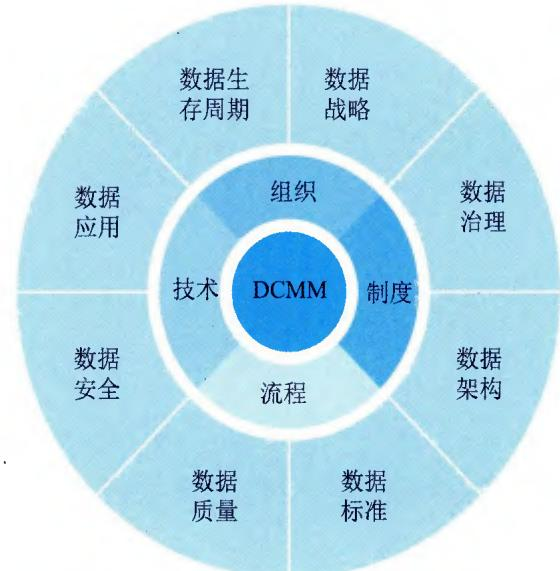  
图15-1 DCMM数据管理能力模型

DCMM定义了数据战略、数据治理、数据架构、数据应用、数据安全、数据质量、数据标准和数据生存周期8个核心能力域。DCMM将组织的管理成熟度划分为5个等级，分别是初始级、受管理级、稳健级、量化管理级和优化级。

\- 初始级。数据需求的管理主要是在项目级体现，没有统一的管理流程，主要是被动式管理。

\- 受管理级。组织意识到数据是资产，根据管理策略的要求制定管理流程，指定相关人员进行初步管理。

\- 稳健级。数据已被当作实现组织绩效目标的重要资产，在组织层面制定系列的标准化管理流程，促进数据管理的规范化。

\- 量化管理级。数据被认为是获取竞争优势的重要资源，数据管理的效率能量化分析和监控。

\- 优化级。数据被认为是组织生存和发展的基础，相关管理流程能实时优化，能在行业内进行最佳实践分享。

## 15.1.2 DGI数据治理框架

国际数据治理协会（Data Governance Institute，DGI）发布了 DGI 数据治理框架，是组织在进行数据治理的操作层面的框架体系，为组织做出决策和采取行动的复杂活动提供的方法，此框架从组织结构、治理规则和治理过程这三个维度提出了关于数据治理活动的 10 个关键通用组件，并在这些要素的基础上构建了数据治理框架，如图 15-2 所示。

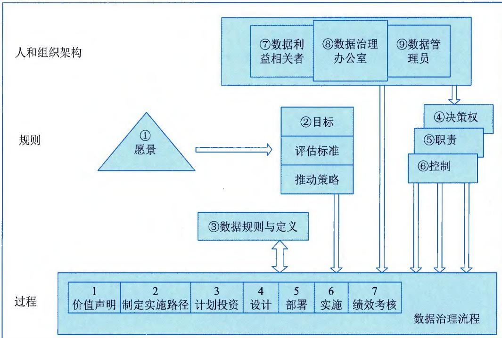  
图15-2 DGI数据治理框架

## 15.1.3 DAMA数据管理模型

国际数据管理协会（DAMA）2018年发行了DAMA-DMBOK2（数据管理知识体系指南第2版），用于指导组织的数据管理职能和数据战略的评估工作，并建议和指导刚起步的组织去实施和提升数据管理。DAMA-DMBOK2理论框架由11个数据管理职能领域和7个基本环境要素共同构成"DAMA数据管理知识体系"，每项数据职能领域都在7个基本环境要素约束下开展工作。DAMA-DMBOK2职能框架如表15-1所示。

表 15-1 DAMA-DMBOK2 职能框架（示意）

<table><tr><td rowspan="2">数据管理职能</td><td colspan="7">环境要素</td></tr><tr><td>目标与原则</td><td>组织与文化</td><td>工具</td><td>活动</td><td>角色和职责</td><td>交付成果</td><td>技术</td></tr><tr><td>数据治理</td><td></td><td></td><td></td><td></td><td></td><td></td><td></td></tr><tr><td>数据架构</td><td></td><td></td><td></td><td></td><td></td><td></td><td></td></tr><tr><td>数据建模和设计</td><td></td><td></td><td></td><td></td><td></td><td></td><td></td></tr><tr><td>数据存储和操作</td><td></td><td></td><td></td><td></td><td></td><td></td><td></td></tr><tr><td>数据安全</td><td></td><td></td><td></td><td></td><td></td><td></td><td></td></tr><tr><td>数据集成和互操作</td><td></td><td></td><td></td><td></td><td></td><td></td><td></td></tr><tr><td>文档和内容管理</td><td></td><td></td><td></td><td></td><td></td><td></td><td></td></tr><tr><td>参考数据和主数据管理</td><td></td><td></td><td></td><td></td><td></td><td></td><td></td></tr><tr><td>数据仓库与商务智能</td><td></td><td></td><td></td><td></td><td></td><td></td><td></td></tr><tr><td>元数据管理</td><td></td><td></td><td></td><td></td><td></td><td></td><td></td></tr><tr><td>数据质量管理</td><td></td><td></td><td></td><td></td><td></td><td></td><td></td></tr></table>

## 15.2 数据战略与治理

数据战略与治理是组织开展数据管理的总体管控，往往是组织开展数据活动的总体纲领，是确立数据资源权限和分工的关键定义活动。

## 15.2.1 数据战略

组织的数据战略通常包括数据战略规划、数据战略实施和数据战略评估三个能力项建设。

## 1. 数据战略规划

数据战略规划是在组织所有利益相关者之间达成共识的结果。从宏观及微观两个层面确定开展数据管理及应用的动因，并综合反映数据提供方和消费方的需求。其主要活动和工作要点包括：

\- 识别利益相关者。明确利益相关者的需求。

## 信息系统管理工程师教程（第2版）

\- 数据战略需求评估。组织对业务和信息化现状进行评估，了解业务和信息化对数据的需求。

\- 数据战略制定。主要包括：①愿景陈述，包含数据管理原则、目的和目标；②规划范围，包含重要业务领域、数据范围和数据管理优先权；③所选择的数据管理模型和建设方法；④当前数据管理存在的主要差距；⑤管理层及其责任，以及利益相关者名单；⑥编制数据管理规划的管理方法；⑦持续优化路线图。

\- 数据战略发布。以文件、网站、邮件等方式正式发布审批后的数据战略。

\- 数据战略修订。根据业务战略、信息化发展等方面的要求，定期进行数据战略的修订。

## 2. 数据战略实施

数据战略实施是组织完成数据战略规划后，逐渐实现数据职能框架的过程。实施过程中依据组织数据管理和数据应用的现状，确定与愿景、目标之间的差距；依据数据职能框架制定阶段性数据任务目标，并确定实施步骤。其主要活动和工作要点包括：

\- 评估准则。建立数据战略规划实施评估标准，规范评估过程和方法。

\- 现状评估。对组织当前数据战略落实情况进行分析，评估各项工作开展情况。

\- 评估差距。根据现状评估结果与组织数据战略规划进行对比，分析存在的差异。

\- 实施路径。利益相关者结合组织的共同目标和实际业务价值进行数据职能任务优先级排序。

\- 保障计划。依据实施路径，制定开展各项活动所需的预算。

\- 任务实施。根据任务开展工作。

\- 过程监控。依据实施路径，及时对实施过程进行监控。

## 3. 数据战略评估

组织在数据战略评估过程中需要建立对应的业务案例和投资模型，并在整个数据战略实施过程中跟踪进度，同时做好记录供审计和评估使用。其主要活动和工作要点包括：

\- 建立任务效益评估模型。从时间、成本、效益等方面建立数据战略相关任务的效益评估模型。

\- 建立业务案例。建立基本的用例模型、项目计划、初始风险评估和项目描述，能确定数据管理和数据应用相关任务（项目）的范围、活动、期望的价值以及合理的成本收益分析。

\- 建立投资模型。作为数据职能项目投资分析的基础性理论，投资模型确保在充分考虑成本和收益的前提下对所需资本合理分配，投资模型要满足不同业务的信息科技需求，以及对应的数据职能内容，同时要广泛沟通以保障对业务或技术的前瞻性支持，并符合相关的监管及合规性要求。

\- 阶段评估。在数据工作开展过程中，定期从业务价值、经济效益等维度对已取得的成果进行效益评估。

## 15.2.2 数据治理

数据治理（Data Governance）是组织中涉及数据使用的一整套管控行为，由组织治理部门发起并推行，关于如何制定和实施针对整个组织内部数据的应用和技术管控的一系列政策和流程。DAMA认为数据治理是对数据资产管理行使权力和控制的活动集合；DGI认为数据治理是一个通过一系列信息相关的过程来实现决策权和职责分工的系统，这些过程按照达成共识的模型来执行，该模型描述了谁（Who）能根据什么信息，在什么时间（When）和情况（Where）下，用什么方法（How），采取什么行动（What）。

数据治理的最终目标是提升数据的价值，数据治理非常有必要，是组织实现数字战略的基础，它是一个管理体系，包括组织、制度、流程、工具。从范围来讲，数据治理涵盖了从前端事务处理系统、后端业务数据库到终端的数据分析，从源头到终端再回到源头形成一个闭环负反馈系统（控制理论中趋稳的系统）。从目的来讲，数据治理就是要对数据的获取、处理、使用进行监管（监管就是我们在执行层面对信息系统的负反馈），而监管的职能主要通过5个方面的执行力来保证，即发现、监督、控制、沟通、整合。

组织的数据治理通常包括数据治理组织、数据制度建设和数据治理沟通三个能力项建设。

## 1. 数据治理组织

数据治理组织需要包括组织架构、岗位设置、团队建设、数据责任等内容，他是各项数据职能工作开展的基础。其对组织在数据管理和数据应用行使职责规划和控制，并指导各项数据职能的执行，以确保组织能有效落实数据战略目标。其主要活动和工作要点包括：

\- 建立数据治理组织。建立数据体系配套的权责明确且内部沟通顺畅的组织，确保数据战略的实施。

\- 岗位设置。建立数据治理所需的岗位，明确岗位的职责、任职要求等。

\- 团队建设。制订团队培训、能力提升计划，通过引入内部、外部资源定期开展人员培训，提升团队人员的数据治理技能。

\- 数据归口管理。明确数据所有人、管理人等相关角色，以及数据归口的具体管理人员。

\- 建立绩效评价体系。根据团队人员职责、管理数据范围的划分，制定相关人员的绩效考核体系。

## 2. 数据制度建设

为保障数据管理和数据应用各项功能的规范化运行，组织需要建立对应的制度体系。数据制度体系通常分层次设计，遵循严格的发布流程并定期检查和更新。数据制度建设是数据管理和数据应用各项工作有序开展的基础，是数据治理沟通和实施的依据。其主要活动和工作要点包括：

\- 制定数据制度框架。根据数据职能的层次和授权决策次序，数据制度框架可分为策略、办法、细则三个层次，该框架规定了数据管理和数据应用的具体领域、各数据职能领域内的目标、遵循的行动原则、完成的明确任务、实行的工作方式、采取的一般步骤和具体措施等。

\- 整理数据制度内容。数据管理策略与数据管理办法、数据管理细则共同构成组织数据制度体系，其基本内容包括：①数据策略说明数据管理和数据应用的目的，明确其组织与范围；②数据管理办法是为数据管理和数据应用各领域内活动开展而规定的相关规则和流程；③数据管理细则是为确保各数据方法执行落实而制定的相关文件。

\- 数据制度发布。组织内部通过文件、邮件等形式发布审批通过的数据制度。

\- 数据制度宣贯。定期开展数据制度相关的培训、宣传工作。

\- 数据制度实施。结合数据治理组织的设置，推动数据制度的落地实施。

## 3. 数据治理沟通

数据治理沟通旨在确保组织内全部利益相关者都能及时了解相关策略、标准、流程、角色、职责、计划的最新情况，开展数据管理和应用相关的培训，掌握数据管理相关的知识和技能。数据治理沟通旨在建立与提升跨部门及部门内部数据管理能力，提升数据资产意识，构建数据文化。其主要活动和工作要点包括：

\- 沟通路径。明确数据管理和应用的利益相关者，分析各方的诉求，了解沟通的重点内容。

\- 沟通计划。建立定期或不定期沟通计划，并在利益相关者之间达成共识。

\- 沟通执行。按照沟通计划安排实施具体沟通活动，同时对沟通情况记录。

\- 问题协商机制。包括引入高层管理者等方式，以解决分歧。

\- 建立沟通渠道。在组织内部明确沟通的主要渠道，例如邮件、文件、网站、自媒体、研讨会等。

\- 制订培训宣贯计划。根据组织人员和业务发展需要，制订相关的培训宣贯计划。

\- 开展培训。根据培训计划的要求，定期开展相关培训。

## 15.3 数据管理组织与职能

数据管理组织作为组织数据相关工作机制建设中不可或缺的重要组成部分，直接关系到数据要素价值的实现。高效的数据管理组织是数据工作的有力推手，是组织开展数据资产管理、实施数据工作的基础及重要保障，起到重要的管理与协调作用，关乎数据所有工作能否真正落地。

## 15.3.1 组织模式

数据管理组织模式不仅与组织架构有关，还与组织规模、业务管控模式等有着较强关联性，总部对数据的管理粒度、范围不同，也会对数据组织架构产生影响。常见的数据管理组织模式通常有集中式、分布式、离散式三种，不同的组织模式适用于不同类型的组织及其不同的发展阶段，组织可以根据自身业务和数据能力建设情况，实时调整、优化或组合不同的组织模式。

## 1. 集中式

采用集中式实施数据管理的组织，通常设立专门的数据管理团队 / 部门，并明确数据管理相关负责人，采用专职岗位与角色，对组织所有数据的产生、采集、存储、传输、交换等进行一体化管理。

如图 15-3 所示，采用集中式实施数据管理的组织会有一个组织级的数据管理专业部门 / 团队，如数据治理与管理部、数据开发与应用部等，该部门 / 团队对上支撑和接受组织数据治理与管控团队，如数据治理委员会、数据管理领导小组等，并按照技术专业或者功能区域等，部署专业化数据团队和人员，从而驱动组织数据管理能力的持续建设。

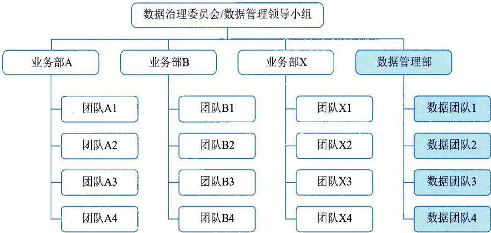  
图15-3 集中式数据管理组织示意图

采用集中式实施数据管理需要组织具备专业的数据管理和数据技术人员，精通组织业务、工艺和技术发展等，方能为组织发展实施数据赋能。这种模式一般适用于业务模式相对单一的中大型组织或集团等。

## 2. 分布式

分布式数据管理模式是按照职能和业务流程进行纵向和横向的划分，即在信息化部门和各业务部门中设置专门的岗位实施数据管理，信息部门的数据管理岗位负责统筹数据管理的政策、制度和流程等，各业务部门设置专门的岗位或角色，实施本部门的数据管理和技术操作执行等。

如图 15-4 所示，采用分布式的数据管理能够强化数据要素与各类业务管理和执行的融合，高效推动业务部门的数据创新及数据能力建设。但需要组织具备良好的数据文化氛围，以及较强的数据治理能力、持续优化的数据管理流程体系，并配套适当的绩效牵引，从而保障组织数据管理的一致性。

分布式数据管理模式适用于业务类型众多、业务模式复杂多变的中大型组织或集团。

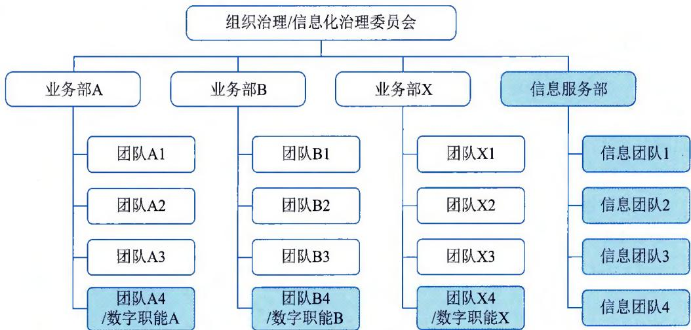  
图15-4 分布式数据管理组织示意图

## 3. 离散式

离散式数据管理模式是指组织不指定统筹数据管理的团队或部门，数据工作由各业务体系自行设置和承担，相关人员与业务部门深度融合，从而支撑业务的数据能力建设和数据创新等。如图 15-5 所示，采用离散式的数据管理组织架构比较容易设置，但往往因为缺乏组织级数据管理视角和统一管理，跨业务部门的协作难度大，沟通成本高，资源重复建设的情况会比较多。

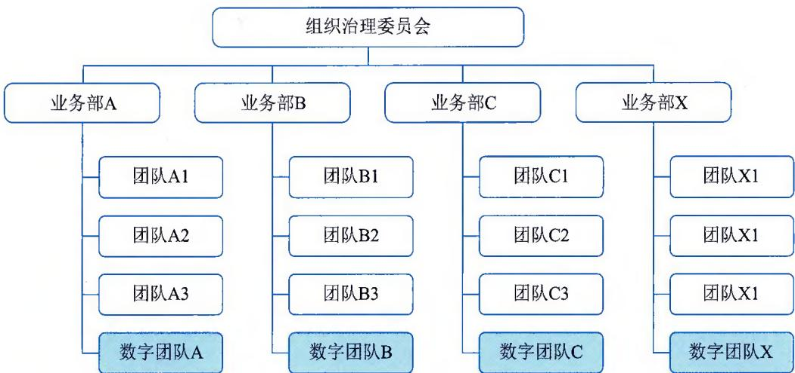  
图15-5 离散式数据管理组织示意图  
离散式数据管理模式适用于中小组织或者刚刚起步建设组织数据管理能力的组织。

## 15.3.2 组织架构确立

不论组织的数据管理采用哪种模式，都建议建立自上而下完整的组织架构体系，明确各层级、岗位的职责，从而保证数据治理工作的有序开展。组织数据管理层级通常包括决策层、管理层和执行层，实际操作中根据每个组织的实际情况，每一层由不同的人员或组织担任，形成实体或虚拟的数据管理组织，如图 15-6 所示。

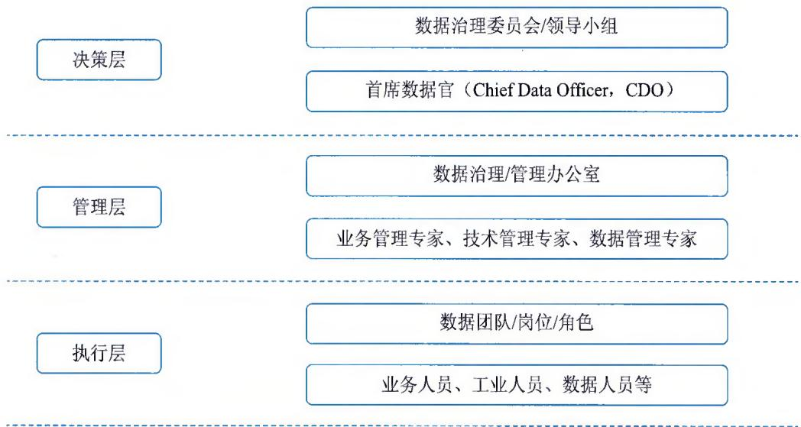  
图15-6 数据管理组织层次结构

## 1. 成立数据治理委员会

一个标准完整的数据组织应包含组织级的数据治理委员会。数据治理委员会由组织高级管理层领导组成，承接组织数据战略，确立数据治理的愿景和目标，指明组织数据治理策略，明确数据治理相关部门的职责，从战略层面整体把控共享数据的意义与价值。该委员会作为组织数据治理高级组织，将履行以下职责：

\- 根据外部数据治理相关的法律法规，落实相关方针政策，制定战略规划。

\- 决议裁定数据治理相关的重大工作事项。

\- 执行监督、审批、指导、协调等工作。

\- 颁布数据治理相关的重要制度、流程等。

## 2. 设立数据管理办公室

数据管理办公室作为管理层级，包括业务管理专家、数据管理专家及技术管理专家等角色。业务管理专家负责组织制定数据资源目录、数据标准、数据质量规则、数据安全定级、定期发布数据质量分析报告；数据管理专家负责推动落实数据管理体系、拟定数据管理制度及标准规范，推动数据管理在组织内部的有效运转，协调跨部门、跨领域的数据管理问题；技术管理专家负责整体数据架构标准的制定，数据治理成果在数据治理平台、信息系统的落地，挖掘数据潜在价值。总体来看，数据管理办公室负责推进数据工作的日常开展和各项组织管理工作，其职责如下：

\- 推动各项决策落地，部署规划具体工作内容。

\- 根据上层指导意见和战略规划制定、修订各项数据治理/管理相关制度、规则、标准。

\- 执行监督、审计工作，通过推动标准的制定和流程的迭代对组织数据安全和数据质量负责。

\- 发现、协调、追踪、解决数据质量和数据治理工作中的问题；受理、调解跨部门的数据需求或问题。

\- 定期向上级执行汇报、交付工作等。

## 3. 定义数据管理团队

数据管理团队作为执行层级，设置业务架构师、数据架构师、技术架构师等角色。业务架构师负责落实数据管理各项规定和要求，组织本部门、数据支持团队、信息系统项目组开展数据管理活动，负责数据资源目录、数据标准、数据质量规则的维护更新；数据架构师负责数据采集、数据模型、数据分析应用等方案设计及评审；技术架构师负责技术架构设计、组织技术人员开展数据治理平台建设和运维工作。

组织内与数据工作相关的各部门，都应设置数据协调员岗位。各部门数据协调员可代表所属部门参与数据治理相关决策，并传达上级发布的政策、制度、规定，配合推动该部门数据治理相关工作的落地执行。同时，数据协调员的职责范围还包括监控、跟踪所属部门数据质量情况，发现、过滤数据质量问题，督促所属部门人员提出解决方案，推动问题的解决等。

## 4. 关键成功要素

数据管理组织建设的关键成功要素包括：

\- 数据工作需要依靠常设机构来落实，避免因为现有业务的工作量、工作优先级等因素难以推动。

\- 数据管理组织需要建立高层领导组成的数据治理委员会，制定数据治理方针政策，推动跨部门协调工作，同时设立数据治理/管理办公室，组织各方共同推进数据工作。

\- 数据工作不能由一个部门独立完成，需要由各部门通力合作、共同推动、共同完成，业务部门的参与程度将会影响数据治理工作的成败。

\- 在数据管理组织建立基础上，进一步建立数据管理规章制度，明确各方职责，能够确保数据治理工作的有效落实。

\- 在数据工作过程中，需要确定一个专门的组织架构来负责管理和维护数据。这个组织架构需要包括数据治理委员会、数据管理办公室和各专业部门。

## 15.3.3 主要岗位设定

在数据治理与管理组织中，设定主要岗位是确保数据资产被有效管理和保护的关键一步。在数据治理与管理组织中涉及的主要岗位包括：

\- 首席数据官（Chief Data Officer，CDO）。负责制定和监督数据治理战略，确保数据资产的合规性、质量和价值。CDO在组织中推动数据文化，确保数据在业务决策中发挥重要作用。

\- 数据治理经理（Data Governance Manager）。负责制定和执行数据治理策略，建立数据

治理流程和规范，监督数据资产的分类、质量、隐私和安全管理。

\- 数据质量经理（Data Quality Manager）。负责确保数据的准确性、一致性和完整性。他们监督数据质量度量、数据清洗和数据质量改进计划。

\- 数据隐私与合规官（Data Privacy and Compliance Officer）。负责确保数据隐私法规的合规性，制定隐私政策、流程和培训，监督数据处理活动的合法性和合规性。

\- 数据安全经理（Data Security Manager）。负责数据安全策略和实施，确保数据受到适当的保护，预防数据泄露和安全事件。

\- 数据架构师（Data Architect）。负责设计和维护数据架构，确保数据流程的高效性和一致性，支持数据整合和分析。

\- 数据分析师（Data Analyst）。负责分析数据，提供洞察和见解，支持业务决策和战略规划。

\- 元数据管理师（Metadata Manager）。管理数据的元数据信息，确保数据定义、业务规则和数据血缘得到准确记录和维护。

\- 数据培训与宣传经理（Data Training and Communication Manager）。负责组织内部的数据培训和沟通活动，促进员工的数据素养和数据文化。

\- 数据持续改进经理（Data Continuous Improvement Manager）。监督数据治理流程和策略的不断改进，确保数据管理实践与业务需求保持一致。

这些岗位可以根据组织的规模、业务需求和数据治理目标进行调整和适应。重要的是，这些岗位之间需要紧密合作，确保数据资产得到全面的管理和保护。

## 15.3.4 关键绩效定义

在组织数据治理 / 管理活动中，关键绩效指的是衡量数据管理和数据治理活动成功与否的关键性指标和度量标准。这些指标可以帮助组织评估其数据管理流程和数据治理策略的有效性，以确保数据质量、可靠性和合规性。相关关键绩效的一般步骤包括：

（1）明确业务目标。首先，确保明确业务目标，这些目标应该与数据管理和数据治理活动的目标紧密相关。这有助于确保所选择的关键绩效指标与组织的战略方向一致。

（2）识别关键绩效指标。根据业务目标，识别与数据管理和数据治理相关的关键绩效指标。这些指标可能涵盖数据质量、数据可用性、数据安全、合规性、数据生命周期管理等方面。

（3）量化指标。将每个关键绩效指标量化，以便能够进行测量和比较。确保指标能够定量地表示组织在特定领域的绩效。

（4）设定目标和标准。为每个关键绩效指标设定目标和标准，以便衡量绩效是否达到预期水平。这些目标和标准应该是可衡量的、合理的，并与业务目标一致。

（5）数据收集和监测。建立数据收集和监测机制，以跟踪和记录关键绩效指标的实际表现。这可能涉及数据仪表板、报告、分析等工具和流程。

（6）分析和解释。对收集到的数据进行分析，评估绩效是否符合预期目标和标准。如果绩效未达到预期，进行深入分析以确定潜在的问题和改进机会。

（7）持续改进。基于分析结果，制订和实施持续改进计划，以提高数据管理和数据治理的绩效。这可能包括调整策略、流程、培训和技术工具。

（8）沟通与透明度。在整个组织内部分享关键绩效指标和绩效结果，以确保透明度并获得支持。沟通对于将所有利益相关者（包括高层管理人员、数据管理团队、业务部门等）纳入绩效改进过程非常重要。

综上所述，定义关键绩效是数据治理与管理中的重要环节，它有助于确保组织的数据管理和治理活动能够实现预期的业务目标，并持续不断地提升绩效水平。

## 15.4 数据采集与预处理

有效且高质量的数据获取是组织数据要素建设的重要活动，关系到组织数据质量基础、容量规模、价值化开发等。广泛多元的数据采集以及必要的预处理，是支撑和保障数据获取的主要活动。

## 15.4.1 数据采集

数据采集又称数据收集，是指根据用户需要收集相关数据的过程。采集的数据类型包括结构化数据、半结构化数据、非结构化数据。结构化数据是以关系型数据库表管理的数据；半结构化数据是指非关系模型的、有基本固定结构模式的数据，例如日志文件、XML文档、Email等；非结构化数据是指没有固定模式的数据，如所有格式的办公文档、文本、图片、HTML、各类报表、图像和音频/视频信息等。

数据采集的方法可分为传感器采集、系统日志采集、网络采集、其他数据采集等。

传感器采集是通过传感器感知相应的信息，并将这些信息按一定规律变换成电信号或其他所需的信息输出，从而获取相关数据，是目前应用非常广泛的一种采集方式。数据采集传感器包括重力感应传感器、加速度传感器、光敏传感器、热敏传感器、声敏传感器、气敏传感器、流体传感器、放射线敏感传感器、味敏传感器等。

系统日志采集是通过平台系统读取收集日志文件变化。系统日志是记录系统中硬件、软件和系统运行情况和问题的信息。系统日志一般为流式数据，数据量非常庞大，常用的采集工具有 Logstash、Filebeat、Flume、Fluentd、Logagent、rsyslog、syslog-ng 等。

网络采集是指通过互联网公开采集接口或者网络爬虫等方式从互联网或特定网络上获取大量数据信息方式，是实现互联网数据或特定网络采集的主要方式。数据采集接口一般通过应用程序接口（API）的方式进行采集。网络爬虫（Web Crawler、Web Spider）是根据一定的规则来提取所需要信息的程序。根据系统结构和实现技术，网络爬虫可分为通用网络爬虫（General Purpose Web Crawler）、聚焦网络爬虫（Focused Web Crawler）、增量式网络爬虫（Incremental Web Crawler）、深层网络爬虫（Deep Web Crawler）等类型。

还有一些其他的数据采集方式，如通过与数据服务商合作、使用特定数据采集方式开展获取数据等。

## 15.4.2 数据预处理

数据的预处理一般采用数据清洗的方法实现。数据预处理是一个除去数据集重复记录、发现并纠正数据错误，并转换成符合标准的过程，从而使数据实现准确性、完整性、一致性、唯一性、实时性、有效性等。一般说来，数据预处理主要包括数据分析、数据检测和数据修正三个步骤，如图 15-7 所示。

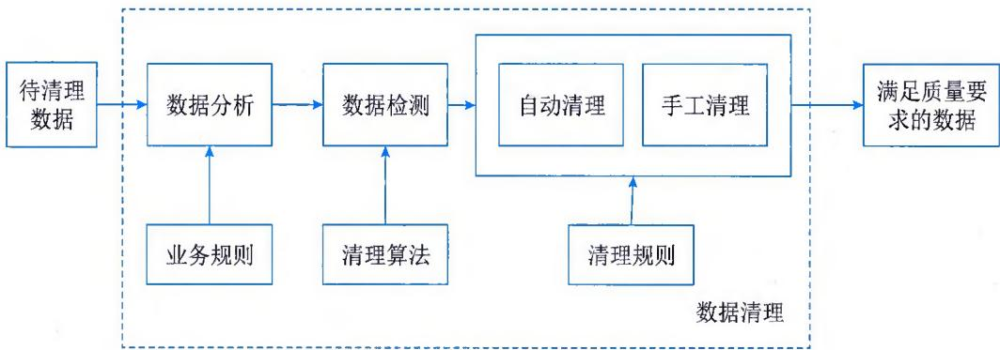  
图15-7 数据预处理的流程

\- 数据分析。数据分析是指从数据中发现控制数据的一般规则，例如字段域、业务规则等。通过对数据的分析，定义出数据清理的规则，并选择合适的算法。

\- 数据检测。数据检测是指根据预定义的清理规则及相关数据清理算法，检测数据是否正确，例如是否满足字段域、业务规则等，或检测记录是否重复。

\- 数据修正。数据修正是指手动或自动地修正检测到的错误数据或重复的记录等。

## 15.4.3 数据预处理方法

一般而言，需要进行预处理的数据主要包括数据缺失、数据异常、数据不一致、数据重复、数据格式不符等情况，针对不同问题需要采用不同的数据处理方法。

## 1.缺失数据的预处理

数据缺失产生的原因主要分为环境原因和人为原因，需要针对不同的原因，采取不同的数据预处理方法，常见的方法有删除缺失值、均值填补法、热卡填补法等。

删除缺失值是最常见的、简单有效的方法，当样本数很多时，并且出现缺失值的样本占整个样本的比例相对较小时，可以将出现缺失值的样本直接丢弃。

均值填补法是根据缺失值的属性相关系数最大的属性把数据分成几个组，再分别计算每个组的均值，用均值代替缺失值。

热卡填补法通过在数据库中找到一个与包含缺失值变量最相似的对象，然后采用相似对象的值进行数据填充。

其他方法还有最近距离决定填补法、回归填补法、多重填补法、K-最近邻法、有序最近邻法、基于贝叶斯的方法等。

## 2. 异常数据的预处理

对于异常数据或有噪声的数据，如超过明确取值范围的数据、离群点数据，可以采用分箱法和回归法进行处理。

分箱法通过考察数据的"近邻"（即周围的值）来平滑处理有序数据值，这些有序的值被分布到一些"桶"或"箱"中，进行局部光滑。一般而言，宽度越大，数据预处理的效果越好。

回归法用一个函数拟合数据来光滑数据，消除噪声。线性回归涉及找出拟合两个属性（或变量）的"最佳"直线，使得一个属性能够预测另一个。多线性回归是线性回归的扩展，它涉及多于两个属性，并且数据拟合到一个多维面。

## 3. 不一致数据的预处理

不一致数据是指具有逻辑错误或者数据类型不一致的数据，如年龄与生日数据不符。这一类数据的清洗可以使用人工修改，也可以借助工具来找到违反限制的数据，如知道数据的函数依赖关系，可以通过函数关系修改属性值。但是大部分的不一致情况都需要进行数据变换，即定义一系列的变换纠正数据，有一些商业工具可以提供数据变换的功能，例如数据迁移工具和ETL工具等。

## 4. 重复数据的预处理

数据本身存在或数据清洗后可能会产生的重复值。重复值的存在会影响后续模型训练的质量，造成计算及存储浪费。去除重复值的操作一般最后进行，可以使用 Excel、VBA（Visual Basic 宏语言）、Python 等工具处理。

## 5. 格式不符数据的预处理

人工收集或者应用系统用户填写的数据容易存在格式问题。一般需要将不同类型的数据内容清洗成统一类型的文件和统一格式，如将 TXT、CSV、Excel、HTML 以及 PDF 清洗成统一的 Excel 文件，将显示不一致的时间、日期、数值，或者内容中有空格、单引号、双引号等情况进行格式的统一调整。

## 15.5 数据存储与容灾

通过数据采集和预处理获得的数据，往往是组织具备较高价值的数字资源，确保这些数据得到适当的保管和管理，是数据价值化的基础，往往组织根据数据规模和数据的重要性等，采用最合适的存储介质、存储方法、管理体系、管理措施等。

## 15.5.1 数据存储

数据存储就是根据不同的应用环境，通过采取合理、安全、有效的方式将数据保存到物理介质上，并能保证对数据实施有效的访问。这包含两个方面：一是数据临时或长期驻留的物理媒介；二是保证数据完整安全存放和访问而采取的方式或行为。数据存储就是把这两个方面结

合起来，提供完整的解决方案。

## 1. 数据存储介质

数据存储首先要解决的是存储介质问题。存储介质是数据存储的载体，是数据存储的基础。存储介质并不是越贵越好、越先进越好，要根据不同的应用环境合理选择存储介质。存储介质的类型主要有磁带、光盘、磁盘、内存、闪存、云存储等，其描述如表15-2所示。

表 15-2 常见数据存储介质的描述

<table><tr><td>介质</td><td>描述</td></tr><tr><td>磁带</td><td>磁带是存储成本低、容量大的存储介质,主要包括磁带机、自动加载磁带机和磁带库。其主要缺点是速度比较慢</td></tr><tr><td>光盘</td><td>光盘的全称是高密度盘(Compact Disk),常见的格式有VCD(Video Compact Disk)和DVD(Digital Video Disk)两种,前者能提供700MB左右的空间,后者容量要大得多,可提供4.7GB~60GB的存储空间。光盘具有三个特点:一是光盘上的数据具有只读性;二是不受电磁的影响;三是光盘容易大量复制。这些特点使得光盘特别适用于对数据进行永久性归档备份</td></tr><tr><td>磁盘</td><td>利用磁盘存储数据时,一般采用独立冗余磁盘阵列RAID(Redundant Array of Independent Disks)。RAID将数个单独的磁盘以不同的组合方式形成一个逻辑磁盘,不仅提高了磁盘读取的性能,也增强了数据的安全性</td></tr><tr><td>内存</td><td>内存是计算机用于存放CPU中的运算数据,与硬盘等外部存储器交换数据的硬件。内存的性能决定了计算机运行的稳定性、反应速率。通常内存数据会在断电后丢失所有数据</td></tr><tr><td>闪存</td><td>闪存是一种一种固态技术,使用闪存芯片来写入和存储数据,具有集内存的访问速度和存储持久性于一体的特点,常作为磁盘的替代品</td></tr><tr><td>云存储</td><td>与将数据存储到本地硬盘驱动器或存储网络相比,云存储提供了一种可扩展的替代方案,将数据存储在异地位置,可通过公共互联网或者专用私有网络进行访问</td></tr></table>

## 2. 存储形式

主要有三种形式来记录和存储数据，分别是文件存储、块存储和对象存储，如表15-3所示。

表 15-3 主要数据存储形式的描述

<table><tr><td>形式</td><td>描述</td></tr><tr><td>文件存储</td><td>文件存储也称为文件级或基于文件的存储,是一种用于组织和存储数据的分层存储方法。换言之,数据存储在文件中,文件被组织在文件夹中,文件夹则被组织在目录和子目录的层次结构下</td></tr><tr><td>块存储</td><td>块存储有时也称为块级存储,是一种用于将数据存储成块的技术。这些块随后作为单独的部分存储,每部分都有一个唯一的标识符。对于需要快速、高效和可靠的数据传输的计算场景,开发人员一般倾向于使用块存储</td></tr><tr><td>对象存储</td><td>对象存储通常称为基于对象的存储,是一种用于处理大量非结构化数据的数据存储架构。这些数据无法轻易组织到具有行和列的传统关系数据库中,或不符合其要求,如电子邮件、视频、照片、网页、音频文件、传感器数据以及其他类型的媒体和Web内容(文本或非文本)</td></tr></table>

## 3.存储管理

存储管理在存储系统中的地位越来越重要，例如如何提高存储系统的访问性能，如何满足数据量不断增长的需要，如何有效地保护数据、提高数据的可用性，如何满足存储空间的共享等。存储管理的具体内容如表15-4所示。

表 15-4 存储管理的主要内容

<table><tr><td>管理</td><td>主要内容</td></tr><tr><td>资源调度管理</td><td>资源调度管理的功能主要是添加或删除存储节点、编辑存储节点的信息、设定某类型存储资源属于某个节点,或者设定这些资源比较均衡地存储到节点上。它包含存储控制、拓扑配置以及各种网络设备(如集线器、交换机、路由器和网桥等)的故障隔离</td></tr><tr><td>存储资源管理</td><td>存储资源管理是一类应用程序,它们管理和监控物理和逻辑层次上的存储资源,从而简化资源管理,提高数据的可用性。被管理的资源包括存储硬件,如RAID、磁带以及光盘库。存储资源管理不仅包括监控存储系统的状况、可用性、性能以及配置情况,还包括容量和配置管理以及事件报警等,从而提供优化策略</td></tr><tr><td>负载均衡管理</td><td>负载均衡是为了避免存储资源由于资源类型、服务器访问频率和时间不均衡造成浪费或形成系统瓶颈而平衡负载的技术</td></tr><tr><td>安全管理</td><td>存储系统的安全主要是防止恶意用户攻击系统或窃取数据。系统攻击大致分为两类:一类以扰乱服务器正常工作为目的,如拒绝服务攻击(DoS)、勒索病毒攻击等;另一类以入侵或破坏服务器为目的,如窃取数据、修改网页等</td></tr></table>

## 15.5.2 数据归档

因数据量海量增长和存储空间容量有限的矛盾，需要制定合理的数据归档方案，并及时清除过时的、不必要的数据，从而保证数据库性能的稳定。

数据归档是将不活跃的"冷"数据从可立即访问的存储介质迁移到查询性能较低、低成本、大容量的存储介质中，这一过程是可逆的，即归档的数据可以恢复到原存储介质中。数据归档策略需要与业务策略、分区策略保持一致，以确保最需要数据的可用性和系统的高性能。在开展数据归档活动时，需注意以下三点：

（1）数据归档一般只在业务低峰期执行。因为数据归档过程需要不断地读写生产数据库，这个过程将会大量使用网络，会对线上业务造成压力。

（2）数据归档之后，会删除生产数据库的数据，将会造成数据空洞，即表空间并未及时释放，当长时间没有新的数据填充，会造成空间浪费的情况。

（3）如果数据归档影响了线上业务，一定要及时止损，结束数据归档，进行问题复盘，及时找到问题和解决方案。

## 15.5.3 数据备份

数据备份是为了防止由于各类操作失误、系统故障等意外原因导致的数据丢失，而将整个应用系统的数据或一部分关键数据复制到其他存储介质上的过程。这样做的目的是保证当应用系统的数据不可用时，可以利用备份的数据进行恢复，尽量减少损失。

## 1. 备份结构

当前最常见的数据备份结构可以分为4种，即DAS备份结构、基于LAN的备份结构、LAN-FREE备份结构和SERVER-FREE备份结构，如表15-5所示。

表 15-5 常见的备份结构及描述

<table><tr><td>管理</td><td>主要内容</td></tr><tr><td>DAS 备份结构</td><td>最简单的备份结构就是将备份设备(RAID或磁带库)直接连接到备份服务器上。DAS 备份结构往往适合数据量不大、操作系统类型单一、服务器数量有限的情况</td></tr><tr><td>基于LAN的备份结构</td><td>基于LAN的备份结构是一种C/S模型,多个服务器或客户端通过局域网共享备份系统。这种结构在小型的网络环境中较为常见,用户通过备份服务器将数据备份到RAID或磁带机上。与DAS备份结构相比,这种结构最主要的优点是用户可以通过LAN共享备份设备,并且可以对备份工作进行集中管理。缺点是备份数据流通过LAN到达备份服务器,这样就和业务数据流混合在一起,会占用网络资源</td></tr><tr><td>LAN-FREE备份结构</td><td>为了克服基于LAN备份结构的缺点,该结构将备份数据流和业务数据流分开,业务数据流主要通过业务网络进行传输,而备份数据流通过SAN进行传输。主要缺点是由于备份数据流要经过应用服务器,因此影响到应用服务器提供正常的服务</td></tr><tr><td>SERVER-FREE 备份结构</td><td>SERVER-FREE 备份结构是 LAN-FREE 备份结构的改进。它不依赖应用服务器,而是通过第三方备份代理直接将数据从应用服务器的存储设备传送到备份设备上。第三方备份代理是一种软、硬结合的智能设备,使用网络数据管理协议(Network Data Management Protocol,NDMP)发送命令,从需要备份的应用服务器上获得需要备份数据的信息,然后通过SAN直接从应用服务器的存储设备将需要备份的数据读出,然后存储到备份设备上</td></tr></table>

## 2. 备份策略

备份策略是指确定需要备份的内容、备份时间和备份方式，主要有三种备份策略：完全备份（Full Backup）、差分备份（Differential Backup）和增量备份（Incremental Backup）。三种备份策略的对比如图15-8所示。

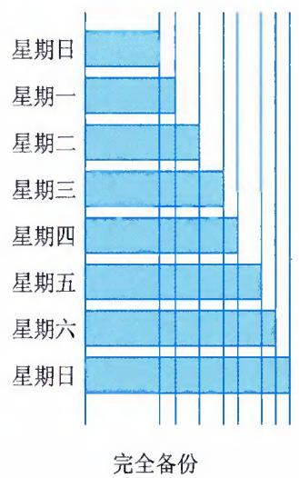

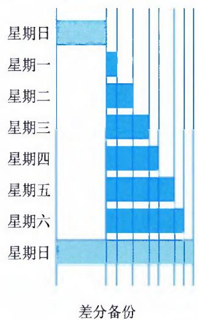  
图15-8 三种备份策略的对比

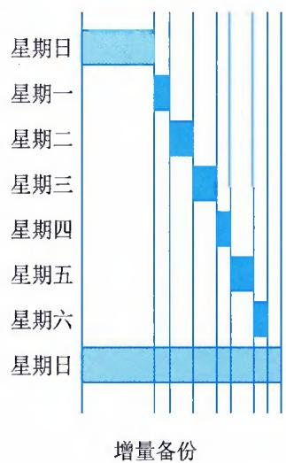

## 信息系统管理工程师教程（第2版）

\- 完全备份。每次都对需要进行备份的数据进行全备份。当数据丢失时，用完全备份下来的数据进行恢复即可。这种备份主要有两个缺点：一是由于每次都对数据进行全备份，会占用较多的服务器、网络等资源；二是在备份数据中有大量的数据是重复的，对备份介质资源的消耗往往较大。

\- 差分备份。每次备份的数据只是相对上一次完全备份之后发生变化的数据。与完全备份相比，差分备份所需时间短，而且节省存储空间。另外差分备份的数据恢复很方便，管理员只需两份备份数据，如星期日的完全备份数据和故障发生前一天的差分备份数据，就能将系统数据进行恢复。

\- 增量备份。每次备份的数据只是相对于上一次备份后改变的数据。这种备份策略没有重复的备份数据，节省备份数据存储空间，缩短了备份的时间。但是进行数据恢复时会比较复杂，如果其中有一个增量备份数据出现问题，那么后面的数据也就无法恢复了。因此增量备份的可靠性没有完全备份和差分备份高。

## 15.5.4 数据容灾

数据备份是数据容灾的基础。传统的数据备份主要采用磁带进行冷备份，备份磁带一般存放在机房中进行统一管理，一旦整个机房出现了灾难，如火灾、盗窃和地震等，这些备份磁带也随之毁灭，起不到任何容灾作用。

因此，真正的数据容灾就是要避免传统冷备份所具有的先天不足，它在灾难发生时能全面、及时地恢复整个系统。容灾按其灾难恢复能力的高低可分为多个等级，例如国际标准 SHARE 78 定义的容灾系统有 7 个等级：从最简单的仅在本地进行磁带备份，到将备份的磁带存储在异地，再到建立应用系统实时切换的异地备份系统。恢复时间也可以从几天到小时级到分钟级、秒级或零数据丢失等。从技术上看，衡量容灾系统有两个主要指标：RPO（Recovery Point Object）和 RTO（Recovery Time Object）。其中 RPO 代表当灾难发生时允许丢失的数据量；RTO 则代表了系统恢复的时间。

数据容灾的关键技术主要包括远程镜像技术和快照技术。

## 1. 远程镜像技术

远程镜像技术是在主数据中心和备份中心之间进行数据备份时用到的远程复制技术。镜像是在两个或多个磁盘子系统上产生同一个数据镜像视图的数据存储过程：一个称为主镜像；另一个称为从镜像。按主从镜像所处的位置分为本地镜像和远程镜像。本地镜像的主从镜像处于同一个RAID中，而远程镜像的主从镜像通常分布在城域网或广域网中。由于远程镜像在远程维护数据的镜像，因此在灾难发生时，存储在异地的数据不会受到影响。

## 2. 快照技术

所谓快照就是关于指定数据集合的一个完全可用的复制，该复制是相应数据在某个时间点（复制开始的时间点）的映像。快照的作用有两个：①能够进行在线数据恢复，可以将数据恢复成快照产生时间点时的状态；②为用户提供另外一个数据访问通道，例如在原数据在线运行时，利用快照数据进行其他系统的测试、应用开发验证、数据分析、数据模型训练等。

## 15.6 数据标准与建模

数据标准化主要为复杂的信息表达、分类和定位建立相应的原则和规范，使其简单化、结构化和标准化，从而实现信息的可理解、可比较和可共享，为信息在异构系统之间实现语义互操作提供基础支撑。数据标准化的主要内容包括元数据标准化、数据元标准化、数据模式标准化和数据分类与编码标准化。

在数据标准化活动中，首先要依据信息需求，并参照现行数据标准、信息系统的运行环境以及法规、政策和指导原则，在数据管理机构、专家组和开发者共同参与下，运用数据管理工具，得到注册的数据元素、物理模式和扩充的数据模型。数据标准化的具体过程包括确定数据需求、制定数据标准、批准数据标准和实施数据标准。

（1）确定数据需求。本阶段将产生数据需求及相关的元数据、域值等文件。在确定数据需求时应考虑现行法规、政策，以及现行的数据标准。

（2）制定数据标准。本阶段要处理"确定数据需求"阶段提出的数据需求。如果现有的数据标准不能满足该数据需求，可以建议制定新的数据标准。也可建议修改或者封存已有数据标准。推荐的、新的或修改的数据标准记录于数据字典中。这个阶段将产生供审查和批准的成套建议。

（3）批准数据标准。本阶段的数据管理机构对提交的数据标准建议、现行数据标准的修改或封存建议进行审查。一经批准，该数据标准将扩充或修改数据模型。

（4）实施数据标准。本阶段涉及在各信息系统中实施和改进已批准的数据标准。

## 15.6.1 元数据

简单来说，元数据是关于数据的数据（Data About Data）。在信息技术及其服务行业，往往元数据被定义为提供关于信息资源或数据的一种结构化数据，是对信息资源的结构化描述。其实质是用于描述信息资源或数据的内容、覆盖范围、质量、管理方式、数据的所有者、数据的提供方式等有关的信息。

## 1. 信息对象

元数据描述的对象可以是单一的全文、目录、图像、数值型数据以及多媒体（声音、动态图像）等，也可以是多个单一数据资源组成的资源集合，或是这些资源的生产、加工、使用、管理、技术处理、保存等过程及其过程中产生的参数的描述等。

## 2. 元数据体系

根据信息对象从产生到服务的生命周期、元数据描述和管理内容的不同以及元数据作用不同，元数据可以分为多种类型，从最基本的资源内容描述元数据开始，指导描述元数据的元元数据，形成了一个层次分明、结构开放的元数据体系，如图15-9所示。

<table><tr><td rowspan="2">信息内容</td><td>内容元数据</td></tr><tr><td>标记数字对象内容及结构的元数据</td></tr><tr><td rowspan="2">内容对象</td><td>专门元数据</td></tr><tr><td>描述单一数字对象的内容、属性及外在特征的元数据</td></tr><tr><td rowspan="2">内容对象集合</td><td>资源集合元数据</td></tr><tr><td>按照科学、主题、资源类型、用户范围、生成过程、使用管理范围形成的信息资源集合的描述</td></tr><tr><td rowspan="2">对象的管理与保存</td><td>管理元数据</td></tr><tr><td>数字对象加工、存档、结构、技术处理、存取、控制、版权管理以及相关系统等方面的信息描述</td></tr><tr><td rowspan="2">对象的服务服务过程服务系统</td><td>服务元数据</td></tr><tr><td>数字资源服务的揭示与表现、服务过程、服务系统等方面的相关信息的描述</td></tr><tr><td rowspan="2">元数据的管理</td><td>元元数据</td></tr><tr><td>对元数据的标记语言、格式语言、标识符、扩展机制、转换机制等的描述</td></tr></table>

图15-9 元数据体系与元数据类型

元数据为数据的管理、发现和获取提供一种实际而简便的方法。通过元数据，数据的使用者能够对数据进行详细、深入的了解，包括数据的格式、质量、处理方法和获取方法等各方面细节，对于数据生产者来说，可以利用元数据进行数据维护、历史资料维护等。具体作用包括描述、资源发现、组织管理数据资源、互操作性、归档和保存数据资源等，如表15-6所示。

表 15-6 元数据对数据使用者的作用说明

<table><tr><td>作用</td><td>说明</td></tr><tr><td>描述</td><td>用于描述数据的内容、覆盖范围、质量、管理方式、数据的所有者、数据的提供方式等信息,是数据与用户之间的桥梁</td></tr><tr><td>资源发现</td><td>元数据的功能起到如同一个好的目录一样的作用,帮助用户便捷、快速地检索和确认所需要的资源</td></tr><tr><td>组织管理数据资源</td><td>随着基于Web的信息资源指数级的增长,按照用户和主题来链接信息资源的复合式网站或门户网站的作用越来越大,但是这种链接是用名称或位置硬编码在HTML文件中,是一些静态的Web网页。利用存储在数据库中的元数据来组织动态网页,将更有效率和普遍意义,可以用软件工具为Web应用程序自动析取信息资源</td></tr><tr><td>互操作性</td><td>互操作性是不同硬件软件平台、数据结构和接口,以最少的内容和功能损失进行数据交换的能力。利用元数据描述的数据资源既可以被人类也可以被机器理解。使用良好定义的元数据语义和共享的转换协议,分布在网络上的数据资源就可以更加容易地被查找和转换,从而提高系统之间的互操作性</td></tr><tr><td>归档和保存数据资源</td><td>数据是脆弱的,它可能被无意识或有意识地破坏、修改,也可能由于存储介质、硬件和软件技术的变化而使它不能使用。元数据是使数据资源保存下来,并能在将来继续被访问的关键,归档和保存数据需要特殊的数据元素来跟踪数字对象的来源(它来自何处、保护条件、保存责任等)。数据元素详细描述数字对象的物理特性和适应未来技术变化的行为</td></tr></table>

## 15.6.2 数据质量

数据质量指在特定的业务环境下，数据满足业务运行、管理与决策的程度，是保证数据应用效果的基础。数据质量管理是指运用相关技术来衡量、提高和确保数据质量的规划、实施与控制等一系列活动。衡量数据质量的指标体系包括完整性、规范性、一致性、准确性、唯一性、及时性等。数据质量是一个广义的概念，是数据产品满足指标、状态和要求能力的特征总和。

## 1. 数据质量描述

数据质量可以通过数据质量元素来描述，数据质量元素分为数据质量定量元素和数据质量非定量元素。

## 2. 数据质量评价过程

数据质量评价过程是产生和报告数据质量结果的一系列步骤，如图 15-10 所示为数据质量评价过程。

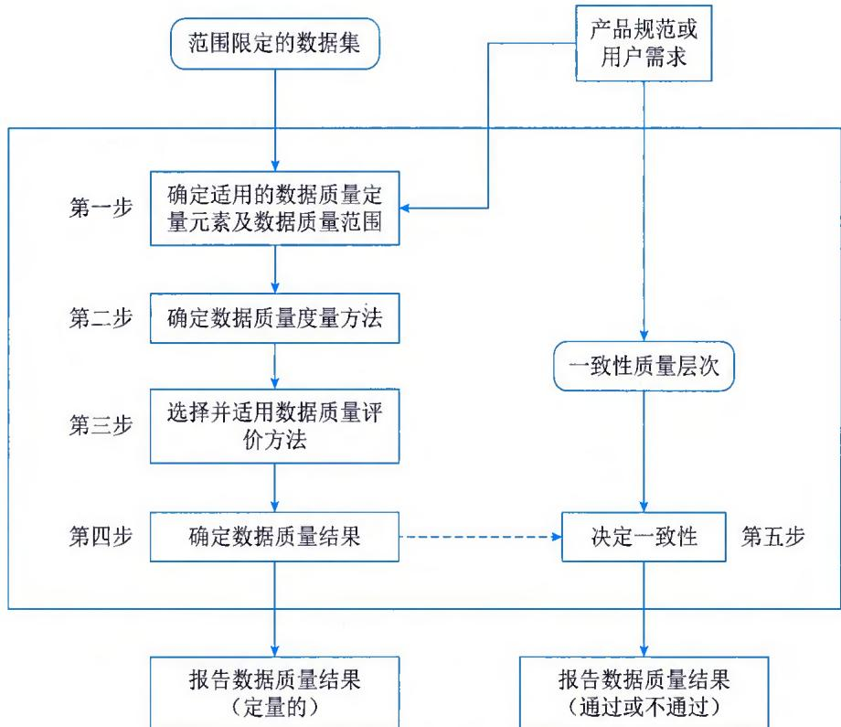  
图15-10 数据质量评价过程

## 3. 数据质量评价方法

数据质量评价程序是通过应用一个或多个数据质量评价方法来完成的。数据质量评价方法分为直接评价法和间接评价法。直接评价法通过将数据与内部或外部的参照信息，如理论值等进行对比，确定数据质量；间接评价法利用数据相关信息，如数据日志对数据源、采集方法等

的描述，推断或评估数据质量。

## 4. 数据质量控制

数据产品的质量控制分成前期控制和后期控制两部分。前期控制包括数据录入前的质量控制、数据录入过程中的实时质量控制；后期控制为数据录入完成后的处理质量控制与评价。

在数据质量的前期控制中，在提交成果（即数据入库）之前对所获得的原始数据与完成的工作进行检查，进一步发现和改正错误；在数据质量管理过程中，通过减少和消除误差和错误，对数据在录入过程中进行属性的数据质量控制；在数据入库后进行系统检测，设计检测模板，利用检测程序进行系统自检；在数据存储管理中，可以通过各种精度评价方法进行精度分析，为用户提供可靠的数据质量。

## 15.6.3 数据模型

数据模型是指现实世界数据特征的抽象，用于描述一组数据的概念和定义，是用来将数据需求从业务传递到需求分析，以及从分析师、建模师和架构师到数据库设计人员和开发人员的主要媒介。根据模型应用的目的不同，可以将数据模型划分为三类：概念模型、逻辑模型和物理模型。

## 1. 概念模型

概念模型也称信息模型，它是按用户的观点来对数据和信息建模，即把现实世界中的客观对象抽象为某一种信息结构，这种信息结构不依赖于具体的计算机系统，也不对应某个具体的DBMS（DataBase Management System，数据库管理系统），它是概念级别的模型。概念模型的基本元素如表15-7所示。

表 15-7 概念模型基本元素说明

<table><tr><td>基本元素</td><td>说明</td></tr><tr><td>实体</td><td>客观存在的并可以相互区分的事物称为实例,而同一类型实例的抽象称为实体,如学生实体(学号、系名、住处、课程、成绩)、教师实体(工作证号、姓名、系名、教研室、职称)。实体是同一类型实例的共同抽象,不再与某个具体的实例对应。相比较而言,实例是具体的,实体则是抽象的</td></tr><tr><td>属性</td><td>实体的特性称为属性。学生实体的属性包括学号、系名、住处、课程、成绩等,教师实体的属性包括工作证号、姓名、系名、教研室、职称等</td></tr><tr><td>域</td><td>属性的取值范围称为该属性的域。例如,性别的域是集合{&quot;男&quot;,&quot;女&quot;}。域的元素必须是相同的数据类型</td></tr><tr><td>键</td><td>能唯一标识每个实例的一个属性或几个属性的组合称为键。一个实例集中有很多个实例,需要有一个标识能够唯一地识别每一个实例,这个标识就是键</td></tr><tr><td>关联</td><td>在现实世界中,客观事物之间是相互关系的,这种相互关系在数据模型中表现为关联。实体之间的关联包括一对一、一对多和多对多三种</td></tr></table>

## 2. 逻辑模型

逻辑模型是在概念模型的基础上确定模型的数据结构，目前主要的数据结构有层次模型、网状模型、关系模型、面向对象模型和对象关系模型。其中，关系模型成为目前最重要的一种逻辑数据模型。

关系模型的基本元素包括关系、关系的属性、视图等。关系模型是在概念模型的基础上构建的，因此关系模型的基本元素与概念模型中的基本元素存在一定的对应关系，如表 15-8 所示。

表 15-8 关系模型与概念模型的对应关系

<table><tr><td>概念模型</td><td>关系模型</td><td>说明</td></tr><tr><td>实体</td><td>关系</td><td>概念模型中的实体转换为关系模型的关系</td></tr><tr><td>属性</td><td>属性</td><td>概念模型中的属性转换为关系模型的属性</td></tr><tr><td>联系</td><td>关系外键</td><td>概念模型中的联系有可能转换为关系模型的新关系,被参照关系的主键转化为参照关系的外键</td></tr><tr><td>视图</td><td>视图</td><td>关系模型中的视图在概念模型中没有元素与之对应,它是按照查询条件从现有关系或视图中抽取若干属性组合而成</td></tr></table>

关系数据模型的数据操作主要包括查询、插入、删除和更新数据，这些操作必须满足关系的完整性约束条件。关系的完整性约束包括三大类型：实体完整性、参照完整性和用户定义的完整性。其中，实体完整性、参照完整性是关系模型必须满足的完整性约束条件，用户定义的完整性是应用领域需要遵照的约束条件，体现了具体领域中的语义约束。

## 3. 物理模型

物理数据模型是在逻辑数据模型的基础上，考虑各种具体的技术实现因素，进行数据库体系结构设计，真正实现数据在数据库中的存放。物理数据模型的内容包括确定所有的表和列，定义外键用于确定表之间的关系，基于性能的需求可能进行反规范化处理等内容。在物理实现上的考虑，可能会导致物理数据模型和逻辑数据模型有较大的不同。物理数据模型的目标是如何用数据库模式来实现逻辑数据模型，以及真正地保存数据。物理模型的基本元素包括表、字段、视图、索引、存储过程、触发器等，其中表、字段和视图等元素与逻辑模型中基本元素有一定的对应关系。

## 15.6.4 数据建模

通常来说，数据建模过程包括数据需求分析、概念模型设计、逻辑模型设计和物理模型设计等过程。

## 1. 数据需求分析

数据需求分析就是分析用户对数据的需要和要求。数据需求分析是数据建模的起点，数据需求掌握的准确程度，将直接影响后续阶段数据模型的质量。数据需求分析通常不是单独进行的，而是融合在整个系统需求分析的过程之中。开展需求分析时，首先要调查清楚用户的实际要求，与用户充分沟通，形成共识，然后再分析和表达这些要求与共识，最后将需求表达的结果反馈给用户，并得到用户的确认。数据需求分析采用数据流图作为工具，描述系统中数据的流动和数据变化，强调数据流和处理过程。

## 2. 概念模型设计

经过需求分析阶段的充分调查，得到用户数据应用需求，但是这些应用需求还是现实世界的具体需求，应该首先把它们抽象为信息世界的结构，下一步才能更好地、更准确地用某个DBMS来实现用户的这些需求。将需求分析得到的结果抽象为概念模型的过程就是概念模型设计，其任务是确定实体和数据及其关联。

## 3. 逻辑模型设计

概念模型独立于机器，更抽象，从而更加稳定，但是为了能够在具体的 DBMS 上实现用户的需求，还必须在概念模型的基础上进行逻辑模型的设计。由于现在的 DBMS 普遍都采用关系模型结构，因此逻辑模型设计主要指关系模型结构的设计。关系模型由一组关系模式组成，一个关系模式就是一张二维表，逻辑模型设计的任务就是将概念模型中实体、属性和关联转换为关系模型结构中的关系模式。

## 4. 物理模型设计

经过概念模型设计和逻辑模型设计，数据模型设计的核心工作基本完成，如果要将数据模型转换为真正的数据库结构，还需要针对具体的 DBMS 进行物理模型设计，使数据模型走向数据存储应用环节。物理模型考虑的主要问题包括命名、确定字段类型和编写必要的存储过程与触发器等。

## 15.7 数据仓库和数据资产

随着 "数字中国" 等国家战略持续深化，以及各类组织数字化转型的全面实施和持续推进，数据资产逐步成为各类组织的重要资产类型，也是组织高质量发展和可持续竞争优势建设的关键。

## 15.7.1 数据仓库

数据仓库是一个面向主题的、集成的、随时间变化的、包含汇总和明细的、稳定的历史数据集合。数据仓库通常由数据源、数据的存储与管理、OLAP服务器、前端工具等组件构成。

## 1. 数据源

数据源是数据仓库系统的基础，是整个系统的数据源泉。通常包括组织内部信息和外部信息。内部信息包括存放于关系型数据库管理系统中的各种业务处理数据和各类文档数据。外部信息包括各类法律法规、市场信息和竞争对手的信息等。

## 2. 数据的存储与管理

数据的存储与管理是整个数据仓库系统的核心。数据仓库的真正关键是数据的存储和管理。数据仓库的组织管理方式决定了它有别于传统数据库，同时也决定了其对外部数据的表现形式。要决定采用什么产品和技术来建立数据仓库的核心，则需要从数据仓库的技术特点着手分析。针对现有各业务系统的数据，进行抽取、清理，并有效集成，按照主题进行组织。数据仓库按照数据的覆盖范围可以分为组织级数据仓库和部门级数据仓库（通常称为数据集市）。

## 3. OLAP 服务器

OLAP（On-Line Analysis Processing，联机分析处理）服务器对分析所需要的数据进行有效集成，按多维模型予以组织，以便进行多角度、多层次的分析，并发现趋势。其具体实现可以分为ROLAP（关系数据的关系在线分析处理）、MOLAP（多维在线分析处理）和HOLAP（混合在线分析处理）。ROLAP基本数据和聚合数据均存放在RDBMS中；MOLAP基本数据和聚合数据均存放于多维数据库中；HOLAP基本数据存放于RDBMS中，聚合数据存放于多维数据库中。

## 4. 前端工具

前端工具主要包括各种查询工具、报表工具、数据分析工具、数据挖掘工具以及各种基于数据仓库或数据集市的应用开发工具。其中数据分析工具主要针对 OLAP 服务器，报表工具、数据挖掘工具主要针对数据仓库。

## 15.7.2 主题库

主题库建设是数据仓库建设的一部分。主题库是为了便利工作、精准快速地反映工作对象全貌而建立的融合各类原始数据、资源数据等，围绕能标识组织、人员、产权、财务等的主题对象，长期积累形成的多种维度的数据集合，例如人口主题库、土地主题库、组织主题库、产权主题库、财务主题库、组织主题库等。由于每类主题对象具有不同的基本属性、不同的业务关注角度，因此每类主题对象具有不同的描述维度。主题库建设可采用多层级体系结构，即数据源层、构件层、主题库层。

（1）数据源层。存放数据管理信息的各种管理表和存放数据的各类数据表。

（2）构件层。构件层包括基础构件和组合构件。基础构件包括用户交互相关的查询数据、展现数据和存储数据构件，以及数据维护相关的采集数据、载入数据和更新数据构件。组合构件由基础构件组装而成，能够完成相对独立的复杂功能。

（3）主题库层。按业务需求通过构建组合，形成具有统一访问接口的主题库。

## 15.7.3 数据资产管理

数据资产管理（Data Asset Management）是指对数据资产进行规划、控制和提供的一组活动职能，包括开发、执行和监督有关数据的计划、政策、方案、项目、流程、方法和程序，从而控制、保护、交付和提高数据资产的价值。数据资产管理需充分融合政策、管理、业务、技术和服务等，从而确保数据资产保值、增值。在数字时代，数据是一种重要的生产要素，把数据转化成可流通的数据要素，重点包含数据资源化、数据资产化两个环节。

（1）数字资源化。通过将原始数据转为数据资源，使数据具备一定的潜在价值，是数据资产化的必要前提。数据资源化以数据治理为工作重点，以提升数据质量、保障数据安全为目标，确保数据的准确性、一致性、时效性和完整性，推动数据内外部流通。

（2）数据资产化。通过将数据资源转变为数据资产，使数据资源的潜在价值得以充分释放。数据资产化以扩大数据资产的应用范围、显性化数据资产的成本与效益为工作重点，并使数据供给端与数据消费端之间形成良性反馈闭环。

在数据资产化之后，将关注数据资产流通、数据资产运营、数据价值评估等流程和活动，为数据价值的实现提供支撑。

（1）数据资产流通是指通过数据共享、数据开放或数据交易等流通模式，推动数据资产在组织内外部的价值实现。数据共享是指打通组织各部门间的数据壁垒，建立统一的数据共享机制，加速数据资源在组织内部流动。数据开放是指向社会公众提供易于获取和理解的数据，对于政府而言，数据开放主要是指公共数据资源开放，对于组织而言，数据开放主要是指披露组织运行情况、推动政企数据融合等。数据交易是指交易双方通过合同约定，在安全合规的前提下，开展以数据或其衍生形态为核心的交易行为。

（2）数据资产运营是指对数据服务、数据流通情况进行持续跟踪和分析，以数据价值管理为参考，从数据使用者的视角出发，全面评价数据应用效果，建立科学的正向反馈和闭环管理机制，促进数据资产的迭代和完善，不断适应和满足数据资产的应用和创新。

（3）数据价值评估是数据资产管理的关键环节，是数据资产化的价值基线。狭义的数据价值是指数据的经济效益，广义的数据价值是在经济效益之外，考虑数据的业务效益、成本计量等因素。数据价值评估是指通过构建价值评估体系，计量数据的经济效益、业务效益、投入成本等活动。

## 15.7.4 数据资源编目

数据资源编目是实现数据资产管理的重要手段。数据资源目录体系设计包括概念模型设计和业务模型设计等，概念模型设计明确数据资源目录的构成要素，通过业务模型设计规范数据资源目录的业务框架。数据资源目录概念模型由数据资源目录、信息项、数据资源库、标准规范等要素构成。

## 1. 数据资源目录

数据资源目录是站在全局视角对所拥有的全部数据资源进行编目，以便对数据资源进行管理、识别、定位、发现、共享的一种分类组织方法，从而达到对数据的浏览、查询、获取等目的。数据资源目录分为资源目录、资产目录和服务目录。

（1）资源目录。能够准确浏览组织所记录或拥有的线上、线下原始数据资源的目录，如电子文档索引、数据库表、电子文件、电子表格、纸质文档等。

（2）资产目录。对原始数据资源进行标准化处理，识别数据资产及其信息要素，包括基本

信息、业务信息、管理信息和价值信息等，按照分类、分级，登记到数据资产目录中。

（3）服务目录。是基于资源和资产目录，对特定的业务场景以信息模型、业务模型等形式对外提供的可视化共享数据目录。服务目录主要分为两类，一类是指标报表、分析报告等数据应用，可以直接使用；另一类是共享接口，提供鉴权、加密、计量、标签化等功能，并对接外部系统。服务目录应以应用场景为切入、应用需求为导向进行编制。

## 2. 信息项

信息项是将各类数据资源（如表、字段）以元数据流水账的形式清晰地反映出来，以便更好地了解、掌握和管理数据资源。信息项需要通过数据标识符挂接到对应的数据目录。信息项常分为数据资源信息项、数据资产信息项和数据服务信息项三种类型。

（1）数据资源信息项。记录原始数据资源的元数据流水账，是对原始数据资源的定义描述。

（2）数据资产信息项。记录经过一系列处理后形成的主题数据资源、基础数据资源的元数据流水账，是对数据资产的定义描述。

（3）数据服务信息项。记录需要对外提供数据应用、数据接口两类数据服务的元数据流水账，是对数据服务的定义描述。

## 3. 数据资源库

数据资源库是存储各类数据资源的物理数据库，常分为数据资源库、主题数据资源库和基础数据资源库。

## 4. 标准规范

数据资源目录体系标准规范包括数据资源元数据规范、编码规范、分类标准等相关标准。元数据规范描述数据资源所必需的特征要素；编码规范规定了数据资源目录相关编码的表示形式、结构和维护规则；分类标准规定了数据资源分类的原则和方法。

## 15.8 数据分析及应用

数据的分析及应用是数据要素价值实现环境的重要活动，是组织实施数据驱动发展的基础，通常涉及数据集成、数据挖掘、数据服务和数据可视化等。

## 15.8.1 数据集成

数据集成是将驻留在不同数据源中的数据进行整合，向用户提供统一的数据视图，使用户能以透明的方式访问数据。其中，数据源主要是指不同类别的DBMS，以及各类XML文档、HTML文档、电子邮件、普通文件等结构化、半结构化和非结构化数据。这些数据源存储位置分散、数据类型异构、数据库产品多样。

数据集成的目标是充分利用已有数据，在尽量保持其自治性的前提下，维护数据源整体上的一致性，提高数据共享利用效率。实现数据集成的系统称为"数据集成系统"，它为用户提供了统一的数据源访问接口，用于执行用户对数据源的访问请求。典型的数据集成系统模型如

图15-11所示。

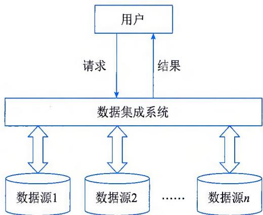  
图15-11 数据集成系统模型

## 1. 数据集成方法

数据集成的常用方法有模式集成、复制集成和混合集成等。

（1）模式集成。也叫虚拟视图方法，是人们最早采用的数据集成方法，也是其他数据集成方法的基础。其基本思想是，在构建集成系统时，将各数据源共享的视图集成为全局模式（Global Schema），供用户透明地访问各数据源的数据。全局模式描述了数据源共享数据的结构、语义和操作等，用户可直接向集成系统提交请求，集成系统再将这些请求处理并转换，使之能够在数据源的本地视图上被执行。

（2）复制集成。将数据源中的数据复制到相关的其他数据源上，并对数据源的整体一致性进行维护，从而提高数据的共享和利用效率。数据复制可以是整个数据源的复制，也可以是仅对变化数据的传播与复制。数据复制方法可减少用户使用数据集成系统时对异构数据源的访问量，提高系统的性能。

（3）混合集成。该方法为了提高中间件系统的性能，保留虚拟数据模式视图为用户所用，同时提供数据复制的方法。对于简单的访问请求，通过数据复制方式，在本地或单一数据源上实现访问请求；对数据复制方式无法实现的复杂的用户请求，则用模式集成方法。

## 2. 数据访问接口

常用的数据访问接口标准有 ODBC、JDBC、OLEDB 和 ADO 等。

（1）ODBC（Open DataBase Connectivity）。ODBC是当前被业界广泛接受的、用于数据库访问的应用程序编程接口（API），它以X/Open和ISO/IEC的调用接口规范为基础，并使用结构化查询语言（SQL）作为其数据库访问语言。ODBC由应用程序接口、驱动程序管理器、驱动程序和数据源4个组件组成。

（2）JDBC（Java DataBase Connectivity）。JDBC 是用于执行 SQL 语句的 Java 应用程序接口 API，它由 Java 语言编写的类和接口组成。JDBC 是一种规范，其宗旨是各数据库开发商为 Java 程序提供标准的数据库访问类和接口。使用 JDBC 能够方便地向任何关系数据库发送 SQL语句。同时，采用 Java 语言编写的程序不必为不同的系统平台、不同的数据库系统开发不同的应用程序。

（3）OLEDB（Object Linking and Embedding DataBase）。OLEDB 是一个基于组件对象模型 COM（Component Object Model）的数据存储对象，能提供对所有类型数据的操作，甚至能在离线的情况下存取数据。

（4）ADO（ActiveX Data Objects）。ADO是应用层的接口，它的应用场合非常广泛，不仅可用在VC、VB、DELPHI等高级编程语言环境，还可用在Web开发等领域。ADO使用简单，易于学习，已成为常用的实现数据访问的主要手段之一。ADO是COM自动接口，几乎所有数据库工具、应用程序开发环境和脚本语言都可以访问这种接口。

## 3. Web Services 技术

Web Services 技术是一个面向访问的分布式计算模型，是实现 Web 数据和信息集成的有效机制。它的本质是用一种标准化方式实现不同服务系统之间的互调或集成。它基于 XML、SOAP（Simple Object Access Protocol）、WSDL（Web Service Description Language）和 UDDI（Universal Description，Discovery and Integration）等协议，开发、发布、发现和调用跨平台、跨系统的各种分布式应用。其三要素 WSDL、SOAP 和 UDDI 及其组成如图 15-12 所示。

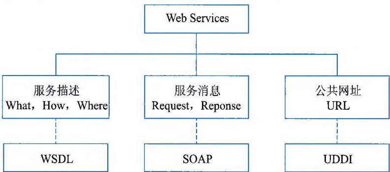  
图15-12 Web Services的三个组成部分

（1）WSDL。WSDL 是一种基于 XML 格式的关于 Web 服务的描述语言，主要目的是 Web Services 的提供者将自己的 Web 服务的所有相关内容，如所提供的服务的传输方式、服务方法接口、接口参数、服务路径等，生成相应的文档，发布给使用者。使用者可以通过这个 WSDL 文档，创建相应的 SOAP 请求（request）消息，通过 HTTP 传递给 Web Services 提供者；Web 服务在完成服务请求后，将 SOAP 返回（response）消息传回请求者，服务请求者再根据 WSDL 文档将 SOAP 返回消息解析成自己能够理解的内容。

（2）SOAP。SOAP是消息传递的协议，它规定了Web Services之间是怎样传递信息的。简单地说，SOAP规定了：①传递信息的格式为XML。这就使Web Services能够在任何平台上用任何语言进行实现。②远程对象方法调用的格式。规定了怎样表示被调用对象以及调用的方法名称和参数类型等。③参数类型和XML格式之间的映射。这是因为，被调用的方法有时需要传递一个复杂的参数。怎样用XML来表示一个对象参数，也是SOAP所定义的范围。④异常处

理以及其他的相关信息。

（3）UDDI。UDDI 是一种创建注册服务的规范。简单地说，UDDI 用于集中存放和查找 WSDL 描述文件，起着目录服务器的作用，以便服务提供者注册发布 Web Services，供使用者查找。

## 4. 数据网格技术

数据网格是一种用于大型数据集的分布式管理与分析的体系结构，目标是实现对分布、异构的海量数据进行一体化存储、管理、访问、传输与服务，为用户提供数据访问接口和共享机制，统一、透明地访问和操作各个分布、异构的数据资源，提供管理、访问各种存储系统的方法，解决应用所面临的数据密集型网格计算问题。数据网格的透明性体现为：

\- 分布透明性。用户感觉不到数据是分布在不同的地方。

\- 异构透明性。用户感觉不到数据的异构性，感觉不到数据存储方式的不同、数据格式的不同、数据管理系统的不同等。

\- 数据位置透明性。用户不用知道数据源的具体位置，也没有必要了解数据源的具体位置。

\- 数据访问方式透明性。即不同系统的数据访问方式不同，但访问结果相同。

## 15.8.2 数据挖掘

数据挖掘是指从大量数据中提取或"挖掘"知识，即从大量的、不完全的、有噪声的、模糊的、随机的实际数据中，提取隐含在其中的、人们不知道的，却是潜在有用的知识，它把人们对数据的从低层次的简单查询，提升到从数据库挖掘知识，提供决策支持。数据挖掘是一门交叉学科，其过程涉及数据库、人工智能、数理统计、可视化、并行计算等多种技术。

## 1. 数据挖掘与数据分析

数据挖掘与传统数据分析存在较大的不同，主要表现在以下4个方面。

（1）两者分析对象的数据量有差异。数据挖掘所需的数据量比传统数据分析所需的数据量大，数据量越大，数据挖掘的效果越好。

（2）两者运用的分析方法有差异。传统数据分析主要运用统计学的方法手段对数据进行分析，而数据挖掘综合运用数据统计、人工智能、可视化等技术对数据进行分析。

（3）两者分析侧重有差异。传统数据分析通常是回顾型和验证型的，通常分析已经发生了什么，而数据挖掘通常是预测型和发现型的，预测未来的情况，解释发生的原因。

（4）两者成熟度不同。传统数据分析由于研究较早，其分析方法相当成熟，而数据挖掘除基于统计学等方法外，部分方法仍处于发展阶段。

## 2. 数据挖掘目标

数据挖掘的目标是发现隐藏于数据之后的规律或数据间的关系，从而服务于决策。数据挖掘的主要任务包括数据总结、关联分析、分类和预测、聚类分析和孤立点分析。

（1）数据总结。数据总结的目的是对数据进行浓缩，给出它的总体综合描述。通过对数据的总结，将数据从较低的个体层次抽象总结到较高的总体层次上，从而实现对原始数据的总体把握。传统的，也是最简单的数据总结方法是利用统计学中的方法计算出各个数据项的和值、均值、方差、最大值、最小值等基本描述统计量。还可以利用统计图形工具，对数据制作直方图、散点图等。

（2）关联分析。数据库中的数据一般都存在着关联关系，即两个或多个变量的取值之间存在某种规律性。关联分析就是找出数据库中隐藏的关联网，描述一组数据项的密切度或关系。有时并不知道数据库中数据的关联是否存在精确的关联函数，即使知道也是不确定的，因此关联分析生成的规则带有置信度，置信度度量了关联规则的强度。

（3）分类和预测。使用一个分类函数或分类模型（也常称为分类器），根据数据的属性将数据分派到不同的组中，即分析数据的各种属性，并找出数据的属性模型，确定哪些数据属于哪些组，这样就可以利用该模型分析已有数据，并预测新数据将属于哪个组。

（4）聚类分析。当要分析的数据缺乏描述信息，或者无法组织成任何分类模式时，可以采用聚类分析。聚类分析是按照某种相近程度度量方法，将数据分成一系列有意义的子集合，每一个集合中的数据性质相近，不同集合之间的数据性质相差较大。统计方法中的聚类分析是实现聚类的一种手段，它主要研究基于几何距离的聚类。人工智能中的聚类是基于概念描述的。概念描述就是对某类对象的内源进行描述，并概括这类对象的有关特征。概念描述又分为特征性描述和区别性描述，前者描述某类对象的共同特征，后者描述非同类对象之间的区别。

（5）孤立点分析。数据库中的数据常有一些异常记录，与其他记录存在着偏差。孤立点分析（或称为离群点分析）就是从数据库中检测出偏差。偏差包括很多潜在的信息，如分类中的反常实例、不满足规则的特例、观测结果与模型预测值的偏差等。

## 3. 数据挖掘流程

数据挖掘流程一般包括确定分析对象、数据准备、数据挖掘、结果评估与结果应用5个阶段，如图15-13所示，这些阶段在具体实施中可能需要重复多次。为完成这些阶段的任务，需要不同专业人员参与其中，专业人员主要包括业务分析人员、数据挖掘人员和数据管理人员。

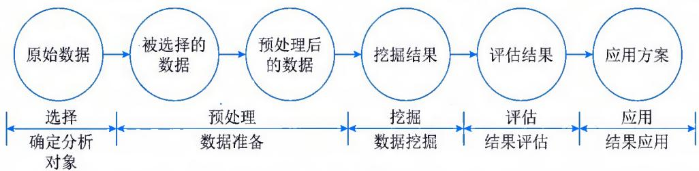  
图15-13 数据挖掘流程图

## （1）确定分析对象

定义清晰的挖掘对象，认清数据挖掘的目标是数据挖掘的第一步。数据挖掘的最后结果往往是不可预测的，但要探索的问题应该是可预见、有目标的。在开始数据挖掘之前，最基础的就是理解数据和实际的业务问题，对目标有明确的定义。

## (2) 数据准备

数据准备是保证数据挖掘得以成功的先决条件，数据准备在整个数据挖掘过程中占有重要比重，数据准备包括数据选择和数据预处理，具体描述为：

\- 数据选择。数据选择就是在确定挖掘对象之后，搜索所有与挖掘对象有关的内部和外部数据，从中选出适合于数据挖掘的部分。

\- 数据预处理。选择后的数据通常不完整、有噪声且不一致，这就需要对数据进行预处理。数据预处理包括数据清理、数据集成、数据变换和数据归约。

## （3）数据挖掘

数据挖掘是指运用各种方法对预处理后的数据进行挖掘。然而任何一种数据挖掘算法，不管是统计分析方法、神经网络，还是遗传算法，都不是万能的。不同的社会或商业问题，需要用不同的方法去解决。即使对于同一个社会或商业问题，也可能有多种算法。这时就需要运用不同的算法，构建不同的挖掘模型，并对各种挖掘模型进行评估。数据挖掘过程细分为模型构建过程和挖掘处理过程，具体描述为：

\- 模型构建。挖掘模型是针对数据挖掘算法而构建的。建立一个真正适合挖掘算法的挖掘模型是数据挖掘成功的关键。模型的构建可通过选择变量、从原始数据中构建新的预示值、基于数据子集或样本构建模型、转换变量等步骤来实现。

\- 挖掘处理。挖掘处理是对所得到的经过转化的数据进行挖掘，除了完善与选择合适的算法需要人工干预外，其余工作都可由分析工具自动完成。

## (4) 结果评估

当数据挖掘出现结果后，要对结果进行解释和评估。具体的解释与评估方法一般根据数据挖掘操作结果所制定的决策成败来定，但是管理决策分析人员在使用数据挖掘结果之前，希望能够对挖掘结果进行评价，以保证数据挖掘结果在实际应用中的成功率。

## （5）结果应用

数据挖掘的结果要经过决策人员的许可才能实际运用，以指导实践。将通过数据挖掘得出的预测模式和各个领域的专家知识结合在一起，构成一个可供不同类型的人使用的应用程序。也只有通过对分析知识的应用，才能对数据挖掘的成果做出正确的评价。

## 15.8.3 数据服务

数据服务主要包括数据目录服务、数据查询与浏览及下载服务、数据分发服务。

## 1. 数据目录服务

数据目录服务是用来快捷地发现和定位所需数据资源的一种检索服务，是实现数据共享的重要基础功能服务之一。由于专业、领域、主管部门、分布地域和采用技术的不同，数据资源呈现的是海量、多源、异构和分布的特点。对于需要共享数据的用户来说，往往存在不知道有哪些数据、不知道想要的数据在哪里、不知道如何获取数据等困难。

## 2. 数据查询与浏览及下载服务

数据查询、浏览和下载是网上数据共享服务的重要方式，用户使用数据的方式有查询数据和下载数据两种。数据查询与浏览服务一般通过关键字检索来进行。用户通过输入关键字或选择相应的领域及学科，对数据进行快速定位，得到相应的数据集列表。数据下载服务是指用户提出数据下载要求，在获得准许的情况下，直接通过网络获得数据的过程。对于需要数据下载的用户来说，首先需要查询数据目录，获得目标数据集的信息，然后到指定的网络位置进行下载操作。

## 3. 数据分发服务

数据分发是指数据的生产者通过各种方式将数据传送到用户的过程。通过分发，能够形成数据从采集、存储、加工、传播向使用流动，实现数据的价值。数据分发服务的核心内容包括数据发布、数据发现、数据评价等。数据发布是指数据生产者可以将已生产和标准化的数据传送到一个数据分发体系中，为用户发现、评价做好基础的准备工作。数据发布的内容包括元数据、数据本身、用于数据评价的信息及其他相关信息。数据发现是指用户通过分发服务系统搜索到所需数据相关信息的过程，可通过数据目录服务来实现。数据评价指用户对数据的内容进行判断和评定，以此判断数据是否符合自己的要求。

## 15.8.4 数据可视化

数据可视化（Data Visualization）概念来自科学计算可视化。数据可视化主要运用计算机图形学和图像处理技术，将数据转换成图形或图像在屏幕上显示出来，并能进行交互处理，它涉及计算机图形学、图像处理、计算机辅助设计、计算机视觉及人机交互技术等多个领域，是一门综合性的学科，如图 15-14 所示。

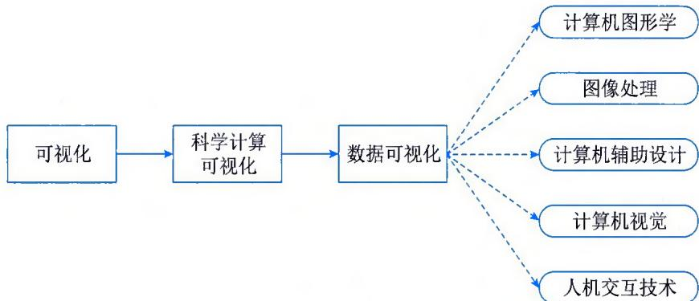  
图15-14 数据可视化

由于所要展现数据的内容和角度不同，可视化的表现方式也多种多样，主要分为7类，即一维数据可视化、二维数据可视化、三维数据可视化、多维数据可视化、时态数据可视化、层次数据可视化和网络数据可视化，如表15-9所示。

表 15-9 常见数据可视化表现方式

<table><tr><td>表现方式</td><td>说明</td></tr><tr><td>一维数据可视化</td><td>一维数据就是简单的线性数据,如文本或数字表格、程序源代码都基于一维数据。一维数据可视化取决于数据大小和用户想用数据来处理什么任务</td></tr><tr><td>二维数据可视化</td><td>在数据可视化中,二维数据是指由两种主要描述属性构成的数据。如一个物体的宽度和高度、一个城市的平面地图、建筑物的楼层平面图等都是二维数据可视化的实例。最常见的二维数据可视化就是地理信息系统(Geographic Information System,GIS)</td></tr><tr><td>三维数据可视化</td><td>三维数据比二维数据更进了一层,它可以描述立体信息。三维数据可以表示实际的三维物体,因此可视化的许多应用是三维数据可视化。物体通过三维数据可视化构成计算机模型,供操作及试验,以此预测真实物体的实际行为</td></tr><tr><td>多维数据可视化</td><td>在可视化环境中,多维数据描述事物的属性超过三维,为了实现可视化,往往需要降维</td></tr><tr><td>时态数据可视化</td><td>时态数据实际上是二维数据的一种特例,即二维中有一维是时间轴。它以图形方式显示随着时间变化的数据,是可视化信息最常见、最有用的方式之一</td></tr><tr><td>层次数据可视化</td><td>层次数据,即树形数据,其数据内在结构特征为,每个节点都有一个父节点(根节点除外)。节点分兄弟节点(拥有同一个父节点的节点)和子节点(从属该节点的节点)。拥有这种结构的数据很常见,如商业组织、计算机文件系统和家谱图都是按树形结构排列的层次数据</td></tr><tr><td>网络数据可视化</td><td>网络数据指与任意数量的其他节点有关系的节点的数据。网络数据中的节点不受与它有关系的其他节点数量的约束(不同于层次节点有且只有一个父节点),网络数据没有固有的层次结构,两个节点之间可以有多条连接路径,即节点间关系的属性和数量是可变的</td></tr></table>

## 15.9 数据安全

数据的广泛应用（尤其是跨组织应用）需要确保数据隐私得到保护，这不仅涉及个人隐私数据，也包括组织隐私数据，这就需要各类组织对其管理、存储和使用的各类数据进行数据脱敏，并依托适当的分级分类，确保数据相关活动能够在确保数据安全和隐私保护的前提下进行。

## 15.9.1 数据脱敏

数据使用常常需要经过脱敏处理，即对数据进行去隐私化处理，实现对敏感信息的保护，这样既能够有效利用数据，又能保证数据使用的安全性。数据脱敏就是一项重要的数据安全防护手段，它可以有效地减少敏感数据在采集、传输、使用等环节中的暴露，进而降低敏感数据泄露的风险，确保数据合规。

## 1. 敏感数据

敏感数据又称隐私数据或者敏感信息。《中华人民共和国保守国家秘密法》中规定，敏感信息是指不当使用或未经授权被人接触或修改后，会产生不利于国家和组织的负面影响和利益损失，或不利于个人依法享有的个人隐私的所有信息。

敏感数据可以分为个人敏感数据、商业敏感数据、国家秘密数据等。目前日常应用中，常见的敏感数据有姓名、身份证号码、地址、电话号码、银行账号、邮箱地址、所属城市、邮编、密码类（如账户查询密码、取款密码、登录密码等）、组织机构名称、营业执照号码、银行账号、交易日期、交易金额等。

为了更加有效地管理敏感数据，通常会对敏感数据的敏感程度进行划分，例如可以把数据密级划分为5个等级，分别是L1（公开）、L2（保密）、L3（机密）、L4（绝密）和L5（私密）。

## 2. 数据脱敏

数据脱敏是对各类数据所包含的自然人身份标识、用户基本资料等敏感信息进行模糊化、加扰、加密或转换后形成无法识别、无法推算演绎、无法关联分析原始用户身份标识等的新数据，这样就可以在非生产环境（开发、测试、外包、数据分析等）、非可控环境（跨组织或团队数据应用）、生产环境、数据共享、数据发布等环境中安全地使用脱敏后的真实数据集。

加强数据脱敏建设，建立数据脱敏制度，完善和制定生产数据使用管理制度，并明确生产数据中敏感信息数据字典规范和生产数据申请、提取、安全预处理、使用、清理销毁等环节的处理流程，有助于提高生产数据使用管理规范化、制度化水平，防范生产数据泄露等安全隐患，完善信息科技风险管理体系。

## 3. 数据脱敏方式

数据脱敏方式包括可恢复与不可恢复两类。可恢复类指脱敏后的数据可通过一定的方式恢复成原来的敏感数据，此类脱敏规则主要指各类加解密算法规则。不可恢复类指脱敏后的数据被脱敏的部分使用任何方式都不能恢复，一般可分为替换算法和生成算法两类。

数据脱敏方式主要由应用场景决定，例如对于发布数据场景，既要考虑直接表示信息，又要非表示信息，防止通过推算演绎、关联分析等手段，能够定位到用户身份。

## 4. 数据脱敏原则

数据脱敏通常需要遵循一系列原则，从而确保组织开展数据活动以及参与这些活动人员能够在原则的牵引下，实施相关工作。数据脱敏原则主要包括算法不可逆原则、保持数据特征原则、保留引用完整性原则、规避融合风险原则、脱敏过程自动化原则和脱敏结果可重复原则等。

（1）算法不可逆原则。指除一些特定场合存在可恢复式数据复敏需求外，数据脱敏算法通常应当是不可逆的，必须防止使用非敏感数据推断、重建敏感原始数据。

（2）保持数据特征原则。指脱敏后的数据应具有原数据的特征，因为它们仍将用于开发或测试场合。带有数值分布范围、具有指定格式（如信用卡号前四位指代银行名称）的数据，在脱敏后应与原始信息相似。姓名和地址等字段应符合基本的语言认知，而不是无意义的字符串。在要求较高的情形下，还要求具有与原始数据一致的频率分布、字段唯一性等。

（3）保留引用完整性原则。指数据的引用完整性应予保留，如果被脱敏的字段是数据表主键，那么相关的引用记录必须同步更改。

（4）规避融合风险原则。指应当预判非敏感数据集多源融合可能造成的数据安全风险。对所有可能生成敏感数据的非敏感字段同样进行脱敏处理，例如，在病人诊治记录中为隐藏姓名与病情的对应关系，将"姓名"作为敏感字段进行变换，但是，如果能够凭借某"住址"的唯一性推导出"姓名"，则需要将"住址"一并变换。

（5）脱敏过程自动化原则。指脱敏过程必须能够在规则的引导下自动化进行，才能达到可用性要求，更多强调的是不同环境的控制功能。

（6）脱敏结果可重复原则。指在某些场景下，对同一字段脱敏的每轮计算结果都相同或者都不同，以满足数据使用方可测性、模型正确性、安全性等指标的要求。

## 15.9.2 分类分级

数据分类是数据保护工作中的关键部分之一，是建立统一、准确、完善的数据架构的基础，是实现集中化、专业化、标准化数据管理的基础。通常，数据分级是在数据分类的基础上，采用规范、明确的方法区分数据的重要性和敏感度差异，按照一定的分级原则对其进行定级，从而为组织数据的开放和共享安全策略制定提供支撑的过程。

## 1. 数据分类

数据分类是根据内容的属性或特征，将数据按一定的原则和方法进行区分和归类，并建立起一定的分类体系和排列顺序。

数据分类有分类对象和分类依据两个要素。分类对象由若干个被分类的实体组成，分类依据取决于分类对象的属性或特征。任何一种信息都有多种多样的属性特征，这些属性特征有本质和非本质属性特征之别。分类应以相对最稳定的本质属性为依据，但是对具有交叉、双重或多重本质属性特征的信息进行分类，除了需要符合科学性、系统性等原则外，还应符合交叉性、双重或多重性的原则。

数据分类是数据保护工作中的关键部分之一，是建立统一、准确、完善的数据架构的基础，是实现集中化、专业化、标准化数据管理的基础。数据分类具有多种视角和维度，其主要目的是便于数据管理和使用。数据处理者进行数据分类时，应优先遵循国家、行业的数据分类要求，如果所在行业没有行业数据分类规则，也可从组织经营维度进行数据分类。

## 2. 数据分级

数据分级是指按照数据遭到破坏（包括攻击、泄露、篡改、非法使用等）后对受侵害客体合法权益（国家安全、社会秩序、公共利益以及公民、法人和其他组织）的危害程度，对数据进行定级，主要是为数据全生命周期管理进行的安全策略制定。

数据分级常用的分级维度有按特性分级、基于价值（公开、内部、重要核心等）分级、基于敏感程度（公开、秘密、机密、绝密等）分级、基于司法影响范围（境内、跨区、跨境等）分级等。

从国家数据安全角度出发，数据分级基本框架分为一般数据、重要数据、核心数据三个级别。数据处理者可在基本框架定级的基础上，结合行业数据分类分级规则或组织生产经营需求，考虑影响对象、影响程度两个要素进行分级，如表 15-10 所示。

表 15-10 数据分级参考表

<table><tr><td rowspan="2">级别</td><td colspan="4">影响对象及影响程度</td></tr><tr><td>国家安全</td><td>公共利益</td><td>个人合法权益</td><td>组织合法权益</td></tr><tr><td>核心数据</td><td>一般危害、严重危害</td><td>严重危害</td><td></td><td></td></tr><tr><td>重要数据</td><td>轻微危害</td><td>一般危害、轻微危害</td><td></td><td></td></tr><tr><td>一般数据</td><td>无危害</td><td>无危害</td><td>无危害、轻微危害、一般危害、严重危害</td><td>无危害、轻微危害、一般危害、严重危害</td></tr></table>

## 15.9.3 安全管理

根据DCMM中所述，组织的数据安全能力域通常包括数据安全策略、数据安全管理和数据安全审计三个能力项。

## 1. 数据安全策略

数据安全策略是数据安全的核心内容，在制定的过程中需要结合组织管理需求、监管需求以及相关标准等统一制定。数据安全策略主要活动和工作要点包括：

\- 了解国家、行业等监管需求，并根据组织对数据安全的业务需要，进行数据安全策略规划，建立组织的数据安全管理策略。

\- 制定适合组织的数据安全标准，确定数据安全等级及覆盖范围等。

\- 定义组织数据安全管理的目标、原则、管理制度、管理组织、管理流程等，为组织的数据安全管理提供保障。

## 2. 数据安全管理

数据安全管理是在数据安全标准与策略的指导下，通过对数据访问的授权、分类分级的控制、监控数据的访问等进行数据安全的管理工作，满足数据安全的业务需要和监管需求，实现组织内部对数据生存周期的数据安全管理。数据安全管理主要活动和工作要点包括：

\- 数据安全等级的划分。根据组织数据安全标准，充分了解组织数据安全管理需求，对组织内部的数据进行等级划分并形成相关文档。

\- 数据访问权限控制。制定数据安全管理的利益相关者清单，围绕利益相关者需求，对其数据访问、控制权限进行授权。

\- 用户身份认证和访问行为监控。在数据访问过程中对用户的身份进行认证识别，对其行为进行记录和监控。

\- 数据安全的保护。提供数据安全保护控制相关的措施，保证数据在应用过程中的隐私性。

\- 数据安全风险管理。对组织已知或潜在的数据安全风险进行分析，制定防范措施并监督落实。

## 3. 数据安全审计

数据安全审计是一项控制活动，负责定期分析、验证、讨论、改进数据安全管理相关的策略、标准和活动。审计工作可由组织内部或外部审计人员执行，审计人员应独立于审计所涉及的数据和流程。数据安全审计的目标是为组织以及外部监管机构提供评估和建议。数据安全审计主要活动和工作要点包括：

\- 过程审计。分析实施规程和实际做法，确保数据安全目标、策略、标准、指导方针和预期结果相一致。

\- 规范审计。评估现有标准和规程是否适当，是否与业务要求和技术要求相一致。

\- 合规审计。检索和审阅组织相关监管法规要求，验证其是否符合监管法规要求。

\- 供应商审计。评审合同、数据共享协议，确保供应商切实履行数据安全义务。

\- 审计报告发布。向高级管理人员、数据管理专员以及其他利益相关者报告组织内的数据安全状态。

\- 数据安全建议。提出数据安全的设计、操作和合规等方面的改进工作建议。

数据安全是一个持续的过程，需要不断地更新和改进，定期评估和调整数据安全策略，以适应不断变化的安全威胁和技术发展。

## 15.10 本章练习

## 1. 选择题

(1) DCMM 是\_\_\_\_。

A. 数据管理能力成熟度评估模型 B. 数据治理框架

C. 数据管理能力评价模型 D. 数据管理模型

参考答案: A

(2) 不属于组织的数据战略主要能力项建设内容。

A. 数据战略规划

B. 数据战略实施

C. 数据战略评估

D. 数据组织建设

参考答案：D

(3)\_\_\_\_不属于常见数据管理组织模式。

A. 集中式 B. 融合式

C. 分布式 D. 离散式

参考答案: B

（4）数据资源目录分为三个层面，不包括\_\_\_\_。

A. 资源目录 B. 资产目录

C. 权限目录 D. 服务目录

参考答案：C

（5）关于数据脱敏的描述，不正确的是\_\_\_\_。

A. 数据脱敏是一项重要的数据安全防护手段

B. 数据脱敏可以有效地减少敏感数据在采集、传输、使用等环节中的暴露

C. 数据脱敏需要遵循算法可逆原则

D. 通过数据脱敏，可以保障数据合规

## 参考答案：C

## 2. 思考题

（1）请结合自身组织或某种类型的组织，阐述其数据管理组织的建设模式和主要岗位/角色设定。

（2）请根据自身实践，阐述数据服务的主要内容及价值体现。

参考答案：略
