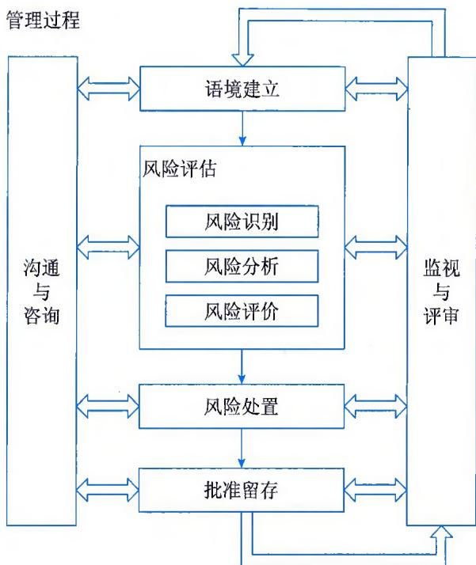
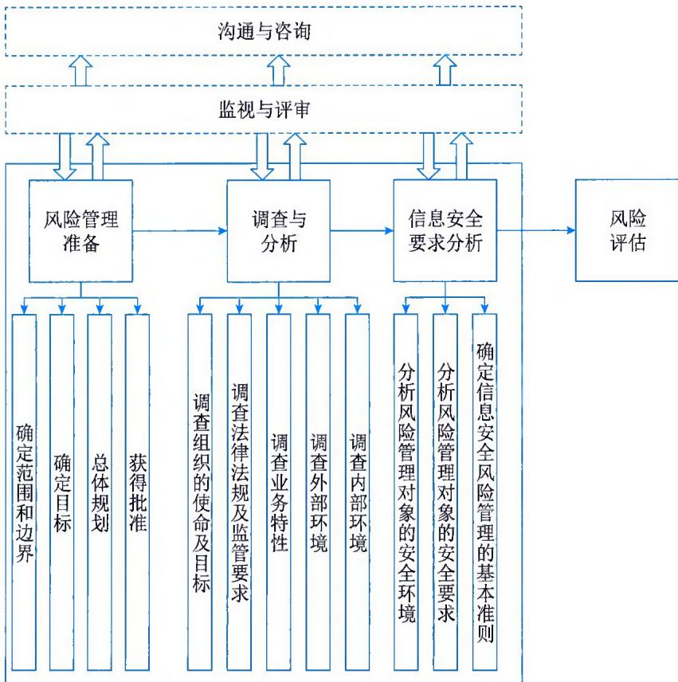
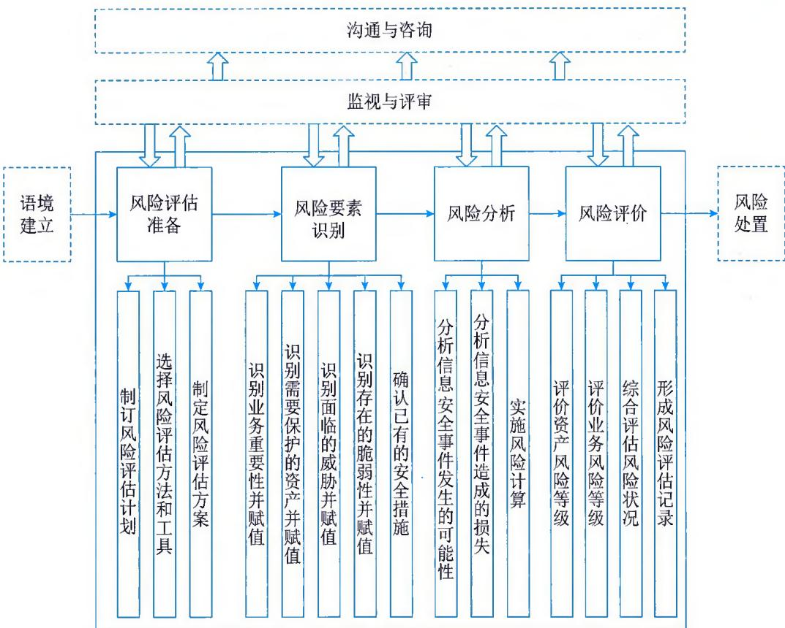
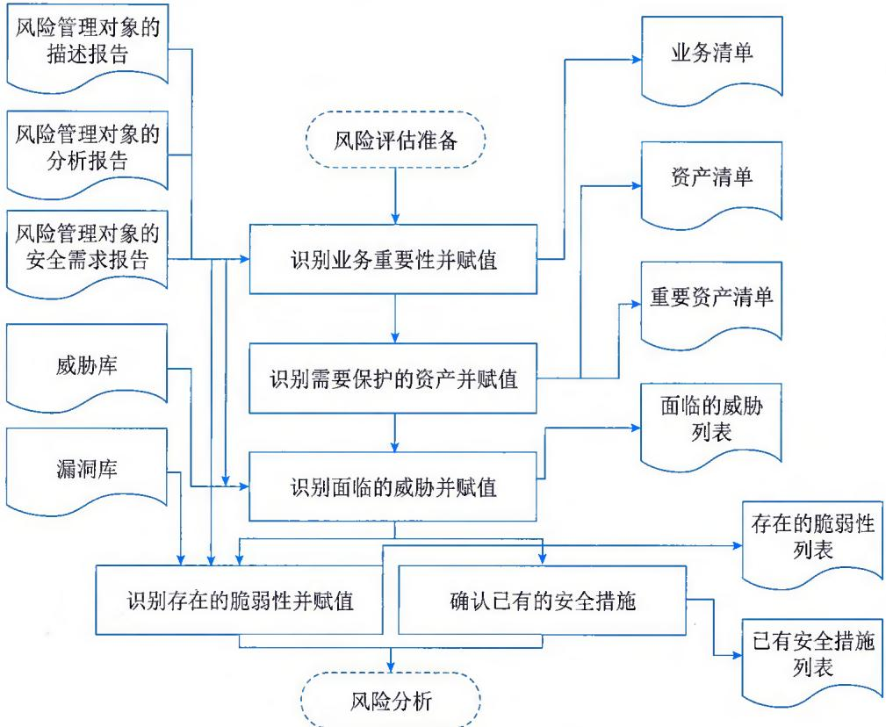
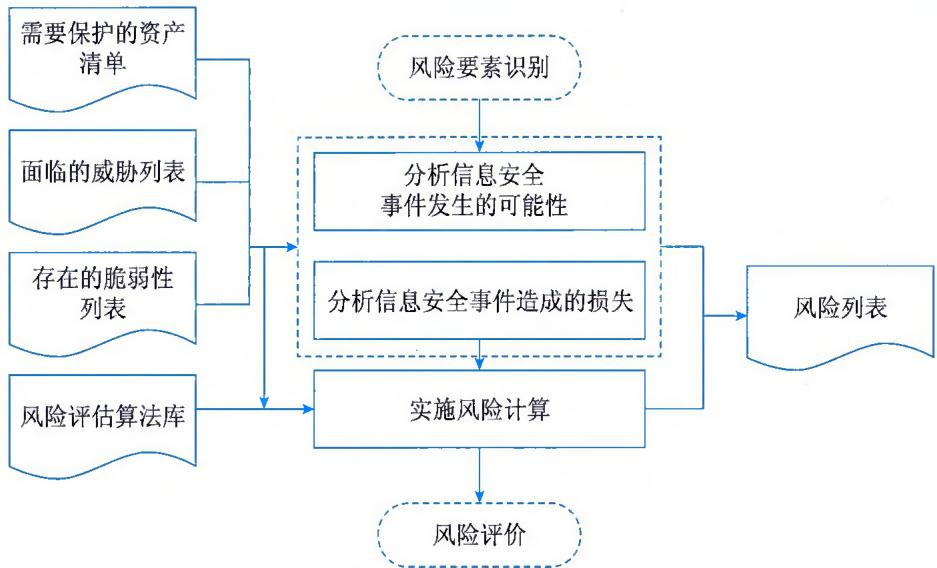
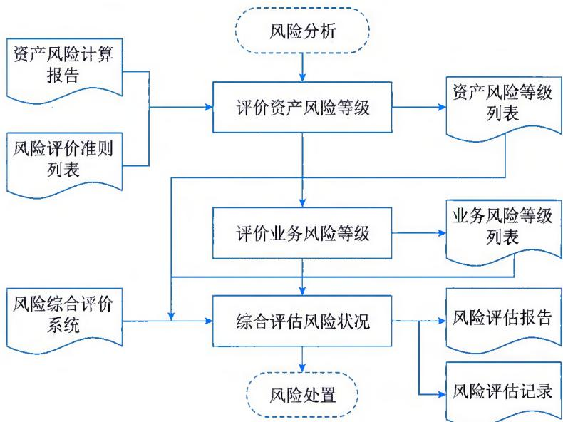
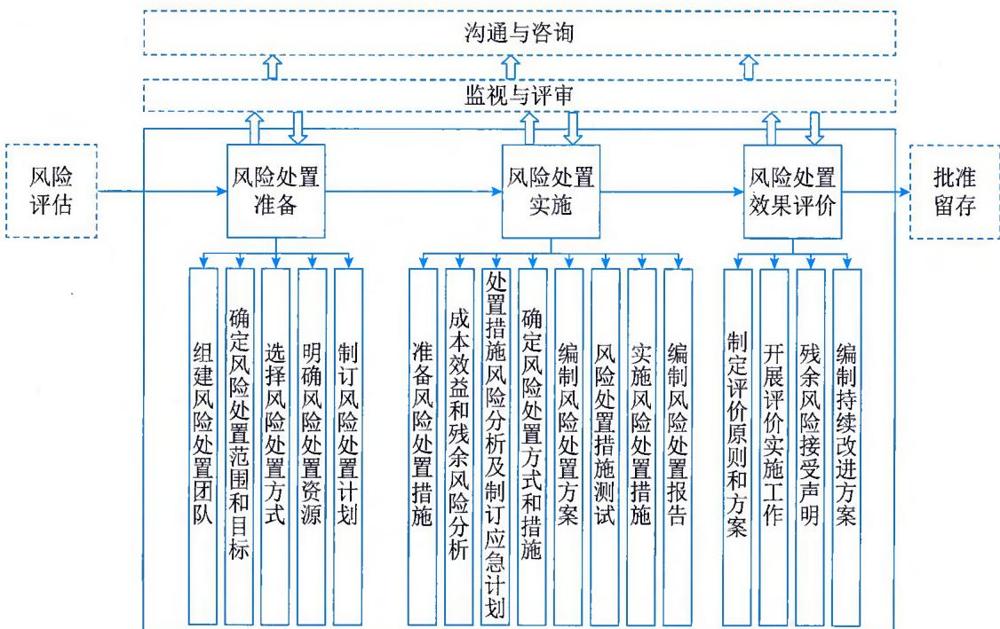
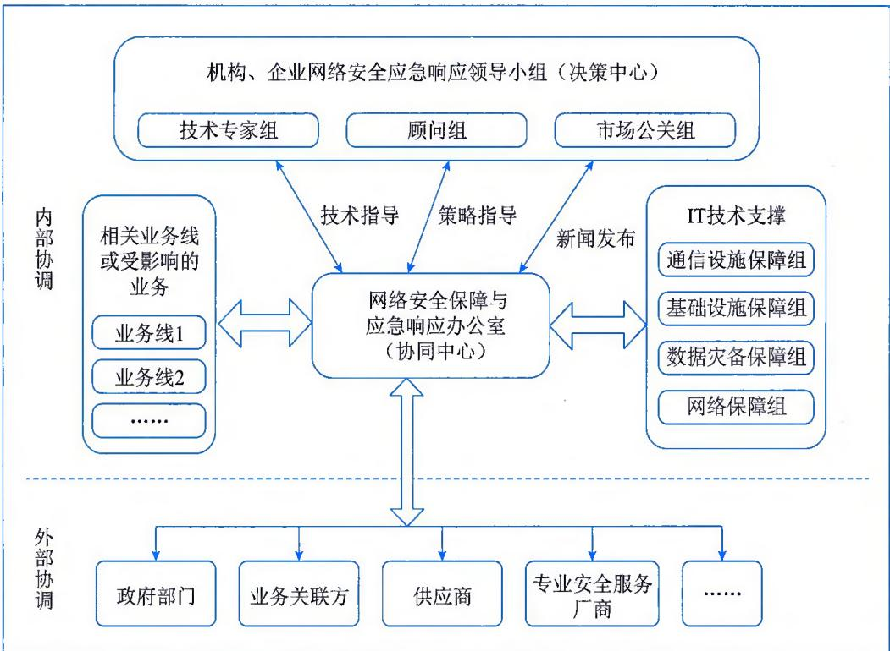
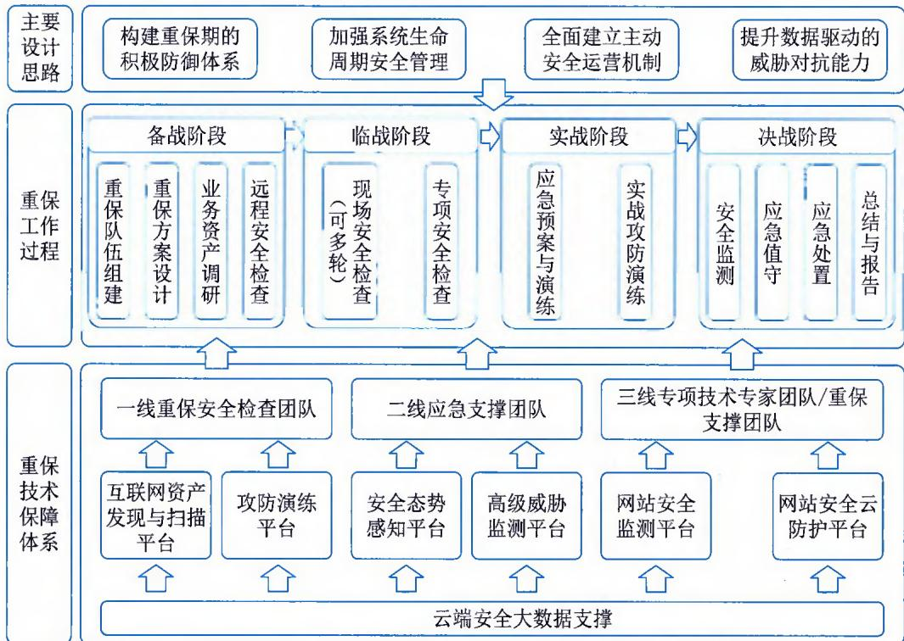
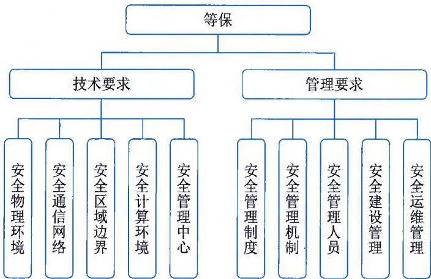

>[!info] 现行教材 · 第 2 版
>本页为**现行考试依据**的教材原文（第 2 版，2024 年 10 月出版，2025 年起启用）。
>考纲层级见 [[知识体系]]；练习题见 [[练习题·基础知识]]；案例模板见 [[案例答题模板]]。

# 第16章 信息安全管理

当前社会已经进入了数字时代，其突出的特点表现为信息的价值在很多方面超过其信息处理设施，包括信息载体本身的价值，例如一台计算机上存储和处理的信息价值往往超过计算机本身的价值。另外，现代社会的各类组织，包括政府、企业，对信息以及信息处理设施的依赖也越来越大，一旦信息丢失或泄密、信息处理设施中断，很多组织的业务也就无法运营。新时代对于信息的安全提出了更高的要求，对信息安全的内涵也不断进行延伸和拓展。

CIA三要素是保密性（Confidentiality）、完整性（Integrity）和可用性（Availability）三个词的缩写。CIA是系统安全设计的目标。保密性、完整性和可用性是信息安全最为关注的三个属性，因此这三个特性也经常被称为"信息安全三元组"，这也是信息安全通常所强调的目标。信息安全已经成为一门涉及计算机科学、网络技术、通信技术、密码技术、信息安全技术、应用数学、数论和信息论等多种学科的综合性学科。从广义上来说，凡是涉及信息的保密性、完整性、可用性、真实性和可核查性的相关技术和理论都属于信息安全的研究领域。

## 16.1 安全管理体系

信息安全管理体系是指对组织内部和外部信息资产进行全面有效管理的体系，旨在保护信息资产的机密性、完整性和可用性，防止信息泄露、破坏和滥用，确保信息资源的安全运行。

## 16.1.1 管理体系概述

信息安全管理体系内涵的核心是整合各方面的管理工作，形成一个协调一致、全面完善的体系，确保信息安全管理的有效性和持续性。通过信息安全管理体系的建立和运行，组织能够更好地保护信息资产，降低信息安全风险，提高业务的稳定性和可持续发展能力。信息安全管理体系主要包括：

（1）方针与目标。建立明确的信息安全方针和目标，明确组织对信息安全的重视和承诺，为信息安全管理提供指导和支持。

（2）组织与人员职责。明确信息安全管理的组织结构，明确各岗位和人员在信息安全管理中的职责和权限，确保信息安全职责得到有效分配和履行。

（3）资产管理。对重要的信息资产进行识别、分类、归档和保护，制定信息资产的访问控制策略，确保信息资产的合规性和完整性。

（4）人力资源安全。制定适合的人员招聘、培训、管理和离职制度，确保员工对信息安全的认知和重视，减少员工导致的信息安全风险。

（5）物理与环境安全。保护信息资源设备、网络设备和服务器的物理安全，制定安全访问

控制制度，防止未经授权的人员进入机房和关键区域。

（6）通信与操作管理。制定合理的网络安全策略和防火墙规则，保障网络通信的机密性和完整性；建立安全的操作管理规范，监控和限制用户对系统的操作行为。

（7）访问控制。建立用户身份认证、授权和审计机制，确保用户只能访问和操作其所需的信息，并留下操作痕迹以便追踪和审计。

（8）密码管理。制定安全的密码策略，包括密码复杂度要求、定期更新和安全存储，避免密码被猜测或泄露。

（9）供应商与合同管理。对外部供应商进行风险评估和审查，建立供应商合作协议，明确信息安全要求和保密责任，避免外部供应商给信息安全带来的风险。

（10）信息安全事件管理。建立响应机制和演练计划，及时发现和处理信息安全事件，降低事件对组织的影响，并及时采取措施防止类似事件再次发生。

## 16.1.2 安全组织体系

安全组织体系是指为了有效保护组织信息资产，在其内部建立的专门管理和负责信息安全工作的部门或团队。安全组织体系的主要目的是确保信息安全工作的专业性和高效性，从而提升组织的整体信息安全管理水平。信息安全组织体系建设需要重点关注以下几方面：

（1）高层管理支持。组织中的高层管理层要对信息安全工作给予足够的重视和支持，制定明确的信息安全方针和策略，并提供相应的资源和预算。高层管理支持是信息安全工作成功的基础。

（2）安全管理委员会。设立组织内的安全管理委员会，由高层管理人员和相关部门的代表组成，负责制定信息安全方针与目标，并对信息安全管理工作进行监督和评估。安全管理委员会是信息安全决策和协调的核心机构。

（3）安全管理部门。建立专门的信息安全管理部门，负责制定信息安全政策、标准和流程，组织信息安全培训和意识提升活动，开展风险评估和安全审计工作，跟踪和响应信息安全事件。安全管理部门是信息安全管理的执行和监督机构。

（4）安全工作团队。在组织内部设立安全工作团队，由具备信息安全技术和知识的专业人员组成，负责日常的安全事务处理和安全技术支持。安全工作团队是信息安全实施的执行和支撑力量。

（5）安全责任人。在各部门和岗位设立安全责任人，负责本部门或岗位的信息安全工作，协助安全管理部门落实各项安全要求，并进行监督和评估。安全责任人是信息安全管理的推动者和实施者。

（6）安全培训和意识提升。组织定期开展信息安全培训和意识提升活动，提高员工对信息安全的认知和重视，使其具备应对各类信息安全风险和威胁的能力。

（7）安全合作与沟通。组织内外安全管理部门和团队之间要建立良好的合作关系和沟通机制，及时分享安全信息和经验，共同应对各类信息安全挑战。

（8）安全评估和持续改进。定期进行风险评估和安全审计，对信息安全管理体系进行评估

和改进，不断提升组织的信息安全管理水平和管理效能。

通过建立完善的信息安全管理的安全组织体系，能够有效管理信息安全工作，从而保障信息资产的安全可靠。此外，安全组织体系还能够提升组织的整体信息安全文化，培养员工的安全意识，加强对信息安全事件的预防和应对能力，降低组织面临的信息安全风险。

## 16.1.3 主要管理内容

信息安全管理是一个综合、系统的体系，需要综合考虑过程、技术、方法、人员、工具、环境等各方面的要素，其主要内容涵盖整个信息安全领域的各个方面，包括信息资产管理、风险管理、安全控制、安全策略、事件管理、安全培训与意识提升、安全审计与合规性和持续改进等。

（1）信息资产管理。信息资产管理是指对组织内的信息资产进行有效的管理和保护。首先，需要对信息资产进行分类和标识，确定其价值和重要性。然后，制定适合的安全控制措施，确保信息资产的机密性、完整性和可用性，包括物理安全控制、访问控制、备份与恢复、灾难恢复等措施。

（2）风险管理。风险管理是指识别、评估和处理信息安全风险的过程。通过风险评估，确定系统和数据的安全风险，并制定相应的应对措施，包括安全威胁分析、脆弱性评估、安全控制的选择和实施等。

（3）安全控制。安全控制是保护信息安全的技术和管理措施，包括访问控制、身份验证、加密、防火墙、入侵检测和防御系统等。控制措施旨在防止非授权的访问和使用，确保系统和数据的机密性和完整性。

（4）安全策略。安全策略是为了保护信息资产和信息资源而制定的规范和程序，包括信息安全政策、安全标准、安全流程等。安全策略提供了指导和规范，确保组织在信息安全方面的一致性和合规性。

（5）事件管理。事件管理是及时发现、响应和处理信息安全事件的过程。信息安全事件有未经授权的访问、数据泄露、恶意代码感染等。组织通过建立事件管理机制和响应流程，以便及时发现和处理安全事件，减少损失。

（6）安全培训与意识提升。安全培训与意识提升是提高员工对信息安全的认识和保护意识。通过定期的培训和意识提升活动，可以帮助员工了解信息安全的重要性，并提供相关的安全知识和技能。

（7）安全审计与合规性。安全审计与合规性是检查和评估信息安全管理和控制措施的有效性和合规性。组织通过定期进行安全审计，确保安全控制措施的实施和合规性。

（8）持续改进。信息安全管理是一个持续不断的过程。组织通过评估和监测，不断改进安全控制措施和策略，以适应新的威胁和技术发展。

## 16.2 安全风险管理

信息安全风险管理是风险管理在信息领域的应用，是指导和控制组织关于信息安全风险的相互协调活动，是组织完整管理体系中的重要组成部分。

## 16.2.1 原则与主要活动

信息安全风险管理的目标是在确保安全合规的前提下，平衡组织发展与信息安全之间的关系。通过全面识别风险、科学评价风险、合理处置风险和持续监视风险，将风险控制在可接受程度。促进组织业务的安全、持续、稳定运行，提升组织数字化应用水平，增强可持续发展能力。

## 1. 管理原则

信息安全风险管理的原则主要有分级管理、全面管理、动态调整和科学合理等。

（1）分级管理。组织根据风险发生的可能性，风险发生后对国家安全、社会秩序、公共利益以及公民、法人和其他组织的合法权益等产生的影响程度，依据风险评价准则对风险进行合理分级管理。

（2）全面管理。组织根据需要对网络和系统安全风险、数据安全风险、个人信息安全风险、供应链安全风险、新技术新应用安全风险等进行全面识别、控制和监视。同时，对信息安全风险管理涉及的过程、技术、方法、人员和工具等进行全面管理。

（3）动态调整。组织通过持续监视风险要素变化和风险管理过程，适应相关法律法规、政策、主管部门、自身业务相关要求和技术运行环境的变化，动态调整风险管理的对象、准则、风险处置措施等内容，持续优化和提升风险管理能力。

（4）科学合理。基于组织面临的信息安全形势和环境，综合考虑信息安全投入和收益、风险可接受程度，以促进组织的业务的安全、持续、稳定运行为视角，平衡安全与发展之间的关系，实现信息安全风险管理的科学性和合理性。

## 2. 主要活动

国家标准GB/T24364《信息安全技术 信息安全风险管理实施指南》中指出，信息安全风险管理活动包括语境建立、风险评估、风险处置、批准留存、监视与评审、沟通与咨询6个方面的内容。语境建立、风险评估、风险处置和批准留存是信息安全风险管理的4个基本步骤，监视与评审、沟通与咨询则贯穿于这4个基本步骤中，如图16-1所示。

组织信息安全管理需要遵循分级管理、全面管理、动态调整、科学合理等管理原则，建立健全信息安全风险管理保障机制、保障措施，并在资产识别、威胁识别、脆弱性识别、已有措施有效性评价、风险分析与评价、风险处置、风险监测预警和风险信息共享等风险管理能力的基础上，执行语境建立、风险评估、风险处置、批准留存、监视与评审、沟通与咨询等风险管理过程，以实现信息安全风险管理目标。

  
图16-1 信息安全风险管理的内容和过程

## 16.2.2 语境建立

根据 GB/T 24364，语境建立是信息安全风险管理的第一步，确定风险管理的对象和范围，确立实施风险管理的准备，进行相关信息的调查和分析，目的是明确信息安全风险管理的范围和对象，以及对象的特性和安全要求，对信息安全风险管理工作进行规划和准备，保障后续风险管理活动顺利进行。

语境建立的过程包括风险管理准备、风险管理对象调查与分析、信息安全要求分析三个工作阶段。在信息安全风险管理过程中，语境建立过程是一次信息安全风险管理主循环的起始，为风险评估提供输入，监视与评审、沟通与咨询贯穿其三个阶段，如图16-2所示。

## 1. 风险管理准备

风险管理准备工作阶段的主要活动包括以下几方面：

（1）确定风险管理范围和边界，以确保在风险管理中考虑所有相关业务、资产。此外，需要识别边界以解决通过这些边界可能产生的风险。收集组织的信息，以确定其所处的环境及其与信息安全风险管理过程的相关性。

（2）确定信息安全风险管理的目标。

（3）制定风险管理总体规划，包括风险管理的目标、意义、范围、基本准则、组织结构、经费预估和实施计划等。风险管理实施计划需要包括：

\- 实施团队架构、各团队负责人、可能涉及的部门。

\- 每个阶段的时间、涉及地点、具体包含和除外的内容。

  
图16-2 语境建立过程示意图

\- 各阶段负责人、入口及出口标准、预期在每一步流程中取得的成果。

\- 需要的资源、职责和记录。

$\bullet$ 预算。

\- 对过程实施监视的监视内容及规则。

\- 实施过程需要遵守的原则、最终完成标准等。

（4）最高管理者批准风险管理总体规划，并将风险管理总体规划由决策层对管理层和执行层进行传达。

## 2. 调查与分析

调查方式主要包括问卷回答、人员访谈、现场考察、辅助工具等多种形式，组织根据实际情况灵活采用和结合使用。相关工作主要包括以下几方面：

（1）调查组织的使命及目标。了解组织的使命，包括战略背景和业务目标等，从中明确支持组织完成其使命的风险管理对象的业务目标。

（2）调查法律法规及监管要求。了解与组织业务相关的国家、地区或行业的相关法律、法规、政策和标准。

（3）调查业务特性。了解组织的业务，包括业务内容和业务流程等，从中明确支持组织业

务运营的风险管理对象的业务特性、可能涉及的信息资产及载体类别。

（4）调查外部环境。了解组织的地点及其地理特征，组织外部利益相关方的期望，影响组织业务安全的制约因素。

（5）调查内部环境。了解包括组织风险管理的思路、方法、控制策略、风险偏好等方面的内容。

（6）汇总上述调查结果，形成描述报告，其中包含组织使命及目标，法律、法规及监管要求，业务特性，外部环境和内部环境等方面的内容。

## 3.信息安全要求分析

信息安全要求分析工作阶段的主要活动包括以下几方面：

（1）分析风险管理对象的安全环境。依据国家、地区或行业的相关法律、法规、政策和标准，综合考虑各类要求，对风险管理对象的安全保障环境进行分析，明确环境因素对风险管理对象安全方面的影响和要求。

（2）分析风险管理对象的安全要求。依据风险管理对象的描述报告和分析报告，结合安全环境的分析结果，分析和提出对风险管理对象的安全要求，包括保护范围、保护等级以及与相关法律法规或行业标准的符合性要求等。

（3）确定信息安全风险管理的基本准则。选择或设置适合当前风险管理对象的风险管理原则，与风险管理实施框架相一致，并基于风险管理对象的安全环境和安全要求进行针对性设计。具体包括风险评价准则和风险可接受准则。

（4）汇总上述分析结果，形成风险管理对象的安全要求分析报告，其中包含风险管理对象的安全环境、安全要求和风险管理基本准则等方面的内容。

风险评价准则是在考虑国家信息安全监管要求及行业背景和特点的基础上建立的，用以实现对风险的控制与管理。风险可接受准则是根据被评估对象风险评估结果，依据国家相关信息安全要求，组织收集相关方的信息安全诉求，明确风险处置对象应达到的最低保护要求，结合组织的风险可承受程度，确立的风险可接受程度。

风险可接受准则可参考以下内容：

\- 风险等级为很高或高的风险建议进行处置，对于现有处置措施技术不成熟的，建议加强监视。

\- 风险等级为中的风险可根据成本效益分析结果确定，对于处置成本无法承受或现有处置措施技术不成熟的，可持续跟踪、逐步解决。

\- 风险等级为低或很低的风险可选择接受，但需综合考虑组织所处的政策环境、外部相关方要求、组织的安全目标等因素。

## 16.2.3 风险评估

根据 GB/T 24364，风险评估是信息安全风险管理的第二步，针对确立的风险管理对象所面临的风险进行识别、分析和评价。风险评估的过程包括风险评估准备、风险要素识别、风险分析和风险评价 4 个阶段，如图 16-3 所示。

  
图16-3 风险评估过程示意图

## 1. 风险评估准备

风险评估准备工作阶段的主要活动包括以下几方面：

（1）制订风险评估计划。依据语境建立的文档，制订风险评估的实施计划，包括风险评估的目的、意义、范围、目标、组织结构、经费预算和进度安排等，形成风险评估计划书。风险评估计划书需要得到风险管理对象和信息安全风险管理决策层的认可和批准。

（2）选择风险评估方法和工具。可依据国家标准 GB/T 20984《信息安全技术 信息安全风险评估方法》附录 C 进行。

（3）制定风险评估方案。依据语境建立的文档，整合风险评估计划书、风险评估方法和工具列表，确定风险评估的实施方案，包括风险评估的工作过程、输入数据和输出结果等，形成风险评估方案。风险评估方案需得到风险管理对象和信息安全风险管理管理层的认可和批准。

## 2. 风险要素识别

风险要素的识别方式包括文档审查、人员访谈、现场考察、辅助工具等多种形式，可以根据实际情况灵活采用和结合使用。如图16-4所示，该工作阶段的主要活动包括以下几方面：

（1）识别业务重要性并赋值。可参照 GB/T 20984 中 5.2.1.2 和国家标准 GB/T 31509《信息安全技术 信息安全风险评估实施指南》执行。

（2）识别需要保护的资产并赋值。可参照GB/T20984中5.2.1和GB/T31509执行。

（3）识别面临的威胁并赋值。可参照GB/T20984中5.2.2和GB/T31509执行。

（4）识别存在的脆弱性并赋值。可参照GB/T20984中5.2.4和GB/T31509执行。

（5）确认已有的安全措施。可参照GB/T20984中5.2.3和GB/T31509执行。

  
图16-4 风险要素识别活动示意图

## 3. 风险分析

如图16-5所示，风险分析工作阶段的主要活动包括以下几方面：

（1）分析信息安全事件发生的可能性。依据面临的威胁列表和存在的脆弱性列表，根据威胁属性（威胁发生频率、威胁能力程度等）及脆弱性属性（脆弱性被利用程度等），计算威胁利用脆弱性导致安全事件发生的可能性。

（2）分析信息安全事件造成的损失。依据存在的脆弱性列表和需要保护的信息资产列表，根据业务属性（业务重要性程度等）、资产属性（资产重要性程度等）及脆弱性属性（脆弱性影响程度等），计算安全事件一旦发生后造成的损失。

（3）实施风险计算。可依据GB/T20984附录F执行。

## 4. 风险评价

如图 16-6 所示，风险评价工作阶段的主要活动包括以下几方面：

  
图16-5 风险分析活动示意图

（1）评价资产风险等级。可参照GB/T20984中5.4.1和GB/T31509执行。

（2）评价业务风险等级。可参照GB/T20984中5.4.2和GB/T31509执行。

（3）综合评估风险状况。汇总各项输出文档和风险程度等级列表，综合评估风险状况，形成风险评估报告。

（4）形成风险评估记录。汇总风险评估过程中的各种现场记录和问题，后期可复现评估过程，以作为产生歧义后解决问题的依据。

评价等级级数可以根据评价对象的特性和实际评估的需要而定，如"高、中、低"3级，或者"很高、较高、中等、较低、很低"5级。

  
图16-6 风险评价活动示意图

## 16.2.4 风险处置

根据GB/T24364，风险处置是信息安全风险管理的第三步，依据风险评估的结果，选择并执行合适的安全措施来处置风险的过程。其目的是依据风险评估的结果，针对不同类型、不同规模、不同概率的风险，采取相应的对策、措施或方法，使风险损失对组织、业务或风险管理对象的影响降到最小限度。风险处置方式主要包括风险规避、风险转移、风险消减和风险接受。

（1）风险规避。可能的情况下停止有风险的活动，消除风险源头或通过不使用存在风险的资产避免风险的发生。

（2）风险转移。通过将面临风险的资产或其价值转移到更安全的地方，或者转移给能有效管理特定风险的另一方来改变风险发生的可能或风险发生的后果，也可采用购买保险、分包合作的方式分担风险。

（3）风险消减。通过对面临风险的资产采取保护措施来降低风险，使残余风险再被评估时能达到可接受的级别。可以从构成风险的5个方面（即威胁源、威胁行为、脆弱性、资产和影响）采取保护措施来降低风险。

（4）风险接受。在明显满足组织发展战略和业务安全发展的条件下，有意识地、客观地选择对风险不采取进一步的处置措施，接受风险可能带来的结果。

风险处置的过程包括风险处置准备、风险处置实施、风险处置效果评价三个阶段，如图 16-7 所示。

  
图 16-7 风险处置活动示意图

## 1. 风险处置准备

风险处置准备工作阶段的主要活动包括以下几方面：

（1）组建风险处置团队。信息安全风险处置是基于风险的信息资源的一种安全管理过程，因此风险处置团队既包括信息安全风险管理的直接参与人员，也包括其他相关人员。信息安全风险处置主要划分为管理层和执行层。管理层负责信息安全风险处置的决策、总体规划和批准监督，以及各过程中的管理、组织和协调工作；执行层负责信息安全风险处置的具体规划、设计和实施、过程监督、记录并反馈实施效果。如果采用的风险转移方式中涉及第三方组织，需将其纳入风险处置团队。

（2）确定风险处置范围和目标。依据风险评估报告，确定可处置的风险范围和目标，即把风险评估得出的风险等级划分为可接受和不可接受两种，形成风险接受等级划分表。如分为治理层的组织战略风险、管理层的业务过程风险、执行层的系统风险等。

（3）选择风险处置方式。根据风险可接受准则，明确需要处置的风险和可接受的残余风险，对于需要处置的风险，初步确定每种风险拟采取的处置方式，形成风险处置列表和风险处置方式。

（4）明确风险处置资源。根据既定的风险处置目标，明确风险处置涉及的部门、人员和资产以及需要增加的设备、软件、工具等所需资源。

（5）制订风险处置计划。处置计划应主要包含风险处置范围、依据、目标、方式、所需资源等。风险处置计划需得到组织最高管理者的批准。

## 2. 风险处置实施

风险处置实施工作阶段的主要活动包括以下几方面：

（1）准备风险处置措施。依据组织的使命，并遵循国家、地区或行业的相关法律、法规、政策和标准的规定，依据风险评估报告，按照风险处置计划，选择对应的风险处置措施，编制风险处置措施列表。

（2）成本效益和残余风险分析。针对风险处置目标，结合组织实际情况，依据最佳收益原则选择适当的处置方案。依据组织的风险评估准则对可接受的、不予处置的残余风险进行分析。对于成本效益分析可以采用定量分析和定性分析两种方法。对于定量分析首先需要确定各资产价值，为各风险输入资产价值，确定资产面临的损坏程度，之后估计发生的可能性，进而以损失价值与发生概率相乘计算出预期损失。由于评估无形资产的主观性本质，没有量化风险的精确算法，可以根据组织情况明确成本和效益的一到两个关键值，并设立期望值，进而选择可行方案。

（3）处置措施的风险分析及制订应急计划。对每项处置措施实施可能带来的风险进行分析，确认是否会因为处置措施不当或其他原因引入新的风险。制订应急计划，对仍会残留的风险和可能继发的风险，以及主动接受的风险和不可预见的风险进行技术和人员储备。

（4）确定风险处置方式和措施。在完成成本效益分析和残余风险分析后，对每项风险选定一种或者几种处置措施，完成最终的风险处置措施列表。

（5）编制风险处置方案。依据组织的使命和相关规定，结合风险处置依据和目标、范围和方式、处置措施、成本效益分析、残余风险分析以及风险处置团队分工，编制风险处置方案。

（6）风险处置措施测试。风险处置措施测试是在风险处置措施正式实施前，验证风险处置措施是否符合风险处置目标，判断措施的实施是否会引入新的风险，同时检验应急计划是否有效。

（7）实施风险处置措施。在完成风险处置措施的测试工作后，按照风险处置方案实施具体的风险处置措施。在实施过程中，实施风险处置的操作人员应对具体的操作内容进行记录、验证实施效果，并签字确认，形成风险处置实施的记录，以便后期回溯和责任认定。

（8）编制风险处置报告。记录风险处置措施的实施过程和结果，形成风险处置实施报告，在整个组织内部传达风险管理的活动和成果，为决策提供信息，改进风险管理活动，协助与利益相关方的互动，包括对风险管理活动负有责任的相关方、用户和主管部门等。

## 3. 风险处置效果评价

风险处置效果评价工作阶段的主要活动包括以下几方面：

（1）制定评价原则和方案。评价原则可包括风险处置目标实现原则、安全投入合理准则以及其他效果评价准则。评价方案包括评价方法、评价目标、评价内容、团队组成和总体工作计划等。

为有效实施风险处置效果评价，可以根据风险处置前期的风险评估和风险处置成果，确定评价对象、评价目标、评价方法与评价准则、评价项目负责人及团队组成等，做好评价工作总体计划，并编制评价方案。评价方案应通过专家评审，并获得组织管理层和风险处置实施团队相关利益方的认可。其中，评价方法根据风险处置结果不同，可以分为残余风险评价方法和效益评价方法，根据评价对象不同可以分为控制措施有效性评价方法和整体风险控制有效性评价方法。具体如下：

\- 残余风险评价方法。遵照GB/T20984中提供的流程和方法，评价实施风险处置后的残余风险。

\- 效益评价方法。通过分析安全措施产生的直接和间接的经济社会效益与安全投入之间的成本效益比、所实施的安全措施的成本效益比与可替代安全措施的成本效益比的比值等对所采取的安全措施的效益进行评价。

\- 控制措施有效性评价方法。针对每个所选择的控制措施采用残余风险评价方法和效益评价方法。

\- 整体风险控制有效性评价方法。基于业务的风险控制评价，结合风险评估报告中相关信息，综合评价实施风险处置措施后，残余安全风险可接受程度以及安全投入的合理性。

（2）开展评价实施工作。组建风险处置效果评价实施团队，团队成员包括风险处置实施负责人员、评价人员、监督人员等。处置实施负责人员配合评价人员开展评价工作，如组织和协调工作；评价人员依据评价方案对风险处置实施结果进行评价并编制评价效果报告，将评价结果与相关方进行沟通；监督人员监视评价过程，确保评价过程客观公正。

（3）残余风险接受声明。对于可接受的残余风险，要形成残余风险接受声明，并经风险管理决策层和管理层的认可批准；对于不可接受的残余风险，需继续进行风险处置，直至可接受。对于处置后仍不符合风险接受准则的残余风险，组织宜根据风险处置的成本收益等因素，经风险管理决策层和管理层的认可批准后，调整风险接受准则，或给出接受该残余风险的理由。

（4）编制持续改进方案。根据风险处置效果评价报告，针对需要持续改进的风险编制改进方案，为风险管理的批准留存提供重要依据。

## 16.2.5 批准留存

根据GB/T24364，批准留存是信息安全风险管理的第四步，批准是指组织的决策层依据风险评估和风险处置的结果是否满足组织的方针目标和信息安全要求，做出是否认可风险管理活动的决定；留存是指将风险管理所产生的信息形成文档保存。

风险评估结果和风险处置结果的批准原则主要有：

\- 业务优先。组织的风险关注是对组织业务可能造成的不良影响或带来机会的风险。

\- 风险可控。合理利用风险和控制风险，使其为组织的发展带来良性支持。

\- 成本适宜。做到成本效益符合组织相关方的利益诉求。

\- 措施有效。采取的风险控制措施力求实效。

风险评估结果和风险处置结果的批准依据主要有：

\- 风险评价准则。

\- 风险接受准则。

\- 信息安全方针与目标。

\- 支持风险处置的资源保障能力。

风险管理的文档留存原则主要有：

\- 保全证据。风险管理全过程的文档得到留存。

\- 统一规范。核心文档采用统一的模板格式。

\- 简明易读。文档描述清晰，语义易于理解。

\- 适度使用。控制文档在合适范围内使用，特别是风险评估报告要严格控制使用范围。

## 16.2.6 监视与评审

监视与评审包括对风险因素和信息安全风险管理循环的4个主体步骤（即语境建立、风险评估、风险处置和批准留存）的监视和评审。监视是定期或不定期对风险管理过程的运行情况进行查看，了解风险管理过程的执行情况。评审是对监视的结果进行分析和评价，从而确定风险管理过程的有效性（有效性包括执行情况和执行效果），最后得出评价结果文件，以持续改进风险管理工作。

风险因素的监视和评审包括语境建立过程中关注的内外部环境以及风险评估过程中识别信息的变化，主要包括的方面和内容有：

\- 风险管理范围的变化，包括新的信息资产、新的部门等。

\- 评估对象价值的变化，例如业务的变动带来的价值变化。

\- 新的或变化的威胁，或之前未评价的威胁信息。

\- 新发现的或者是变化的脆弱点。

\- 残余风险的变化，例如风险接受原则变化带来的残余风险处置的变化。

\- 网络安全预警的变化，例如评估对象价值和威胁的变化带来预警级别和流程的变化。

\- 风险发生带来的后果的变化。

\- 新发布的相关法律、法规、行业监管要求和标准。

\- 相关组织架构的变化。

\- 管理层的变化。

\- 相关方要求的变化。

风险管理的监视与评审包括的方面和内容有：

\- 风险管理过程的执行情况。

\- 风险因素识别的全面性和合理性。

\- 风险管理目标的实现情况。

\- 风险处置计划的实施情况。

● 风险控制措施的运行有效性。

\- 风险控制成本效益的合理性。

\- 风险评估原则和风险接受原则的合理性。

\- 当前风险评估方法的有效性和产生结果的一致性，以及新的风险评估方法的适用性。

## 16.2.7 沟通与咨询

沟通与咨询为信息安全风险管理主循环的4个步骤（即语境建立、风险评估、风险处置和批准留存）中相关方提供沟通和咨询。沟通与咨询是通过相关方之间交换与共享关于风险的信息，就如何管理风险达成一致的活动。沟通是为所有参与人员提供交流途径，以保持参与人员之间的协调一致，共同实现信息安全目标。咨询是相关方需要时为其提供学习途径，以增强风险意识、知识和技能，配合实现安全目标。

沟通与咨询的双方角色不同，所采取的方式也有所不同，如表16-1所示。

表 16-1 沟通与咨询方式参考表

<table><tr><td rowspan="2" colspan="2">方式</td><td colspan="5">接受方</td></tr><tr><td>决策层</td><td>管理层</td><td>执行层</td><td>支持层</td><td>用户层</td></tr><tr><td rowspan="5">发出方</td><td>决策层</td><td>交流</td><td>指导和检查</td><td>指导和检查</td><td>表态</td><td>表态</td></tr><tr><td>管理层</td><td>汇报</td><td>交流</td><td>指导和检查</td><td>宣传和介绍</td><td>宣传和介绍</td></tr><tr><td>执行层</td><td>汇报</td><td>汇报</td><td>交流</td><td>宣传和介绍</td><td>培训和咨询</td></tr><tr><td>支持层</td><td>培训和咨询</td><td>培训和咨询</td><td>培训和咨询</td><td>交流</td><td>培训和咨询</td></tr><tr><td>用户层</td><td>反馈</td><td>反馈</td><td>反馈</td><td>反馈</td><td>交流</td></tr></table>

\- 指导和检查。部门上级对下级工作的指导和检查，用以保证工作质量和效率，适用于决策层对管理层、决策层对执行层和管理层对执行层等。

\- 表态。组织高层支持信息安全风险管理的对外表态，用以得到外界认同和支持，适用于决策层对支持层和决策层对用户层等。

\- 汇报。部门下级对上级做工作汇报，用以得到上级认可，适用于管理层对决策层、执行

层对决策层和执行层对管理层等。

\- 宣传和介绍。部门的风险管理对象和信息安全风险管理的对外宣传和介绍，用以得到外界支持和配合，适用于管理层对支持层、管理层对用户层和执行层对支持层等。

\- 培训和咨询。专业人员对信息安全风险管理相关方的培训和咨询，用以提高人员的安全意识、知识和技能，适用于执行层对用户层、支持层对决策层、支持层对管理层和支持层对执行层等。

\- 反馈。部门风险管理对象使用者对部门信息安全风险管理的意见反馈，用以了解实施效果和用户需求，适用于用户层对决策层、用户层对管理层、用户层对执行层和用户层对支持层等。

\- 交流。同级或同行之间的对等交流，用以共享信息和协调工作，适用于决策层对决策层、管理层对管理层、执行层对执行层、支持层对支持层和用户层对用户层等。

## 16.3 安全策略管理

安全策略是指在一个特定的环境里，为保证提供一定级别的安全保护所必须遵守的规则。根据安全策略的内容，还需要对所有涉及的人员进行安全教育。

根据组织的规模、业务发展、安全需求的不同，安全策略可以繁简不同，但是语言描述都应该简单明了、通俗易懂并直接反映主题，避免含糊不清的情况出现。信息安全策略是组织安全的最高方针，由高级管理部门支持，形成书面文档、广泛发布到组织所有员工手中。同时，要对所有相关人员进行安全策略如何实施的培训，对于特殊责任人员要进行特殊的培训，使得安全策略能够真正在组织的正常运营过程中得到贯彻、落实、实施。

## 16.3.1 方针与策略

国际标准《信息安全技术信息安全控制》（ISO 27002）中指出，根据业务、法律、法规、规章和合同要求，为确保信息安全的管理方向以及相应支持的持续适宜性、充分性、有效性，组织定义的信息安全方针和特定主题策略，应由管理层批准后发布，传达并让相关工作人员和相关方知悉，并按计划的时间间隔以及在发生重大变更时对其进行评审。

信息安全方针可考虑以下方面产生的要求：

\- 业务战略和需求。

\- 法律、法规和合同。

\- 当前和预期的信息安全风险和威胁。

信息安全方针内容可包括：

\- 信息安全的定义。

\- 信息安全目标或设定信息安全目标的框架。

\- 指导所有信息安全相关活动的原则。

\- 满足信息安全相关适用要求的承诺。

## 信息系统管理工程师教程（第2版）

\- 持续改进信息安全管理体系的承诺。

\- 对既定角色分配的信息安全管理责任。

\- 处理豁免和例外的规程。

在局部层面，信息安全方针可根据需要由特定主题策略予以支持，以进一步强制实施信息安全控制。特定主题策略通常被构建为解决组织内某些目标群体的需求或涵盖某些安全领域。特定主题策略可与组织的信息安全方针保持一致并与之互补。这样的主题包括访问控制、物理和环境安全、资产管理、信息传输、用户终端设备的安全配置和处理、网络安全、信息安全事件管理、备份、密码技术和密钥管理、信息分级和处理、技术脆弱性管理、安全开发等。

开发、评审和批准特定主题策略的责任可根据相关工作人员的职权等级和技术能力进行分派。评审可包括评估组织信息安全方针和特定主题策略的改进机会，并管理信息安全以应对下列变化：

\- 组织的业务战略。

\- 组织的技术环境。

\- 法律、法规、规章和合同。

\- 信息安全风险。

\- 当前和预期的信息安全威胁环境。

\- 从信息安全事态和事件中总结的经验教训。

信息安全方针和特定主题策略的评审可考虑管理评审和审计的结果。某个策略发生变化时应考虑其他相关策略的评审和更新，以保持一致性。

信息安全方针和特定主题策略应以意向读者适合的、可访问的和可理解的形式传达给相关工作人员及相关方。要求策略的接收者确认已理解并同意遵守适用的策略。组织可自行决定满足需求的这些策略文件的格式和名称。一些组织的信息安全方针和特定主题策略可列入单独的文件。组织可以将这些特定主题策略命名为标准、导则、策略或其他。如果信息安全方针或任何特定主题策略在组织外进行分发，应注意不要不当披露保密信息。

## 16.3.2 规划实施

组织安全策略的规划实施主要涉及确定安全策略保护的对象、开发安全策略、安全策略制定原则、安全策略制定过程、安全策略管理模式等方面。

## 1. 确定安全策略保护的对象

安全策略保护的对象主要包括信息资源相关硬件、软件、数据和人员等。

（1）信息资源的硬件和软件。

硬件和软件是支持组织运作的平台，是信息资源的主要构成因素，它们应该首先受到安全策略的保护。所以，整理一份完整的系统软硬件清单是首要的工作，其中还要包括系统涉及的网络结构图等。建立这份清单及网络结构图有多种方法。不管用哪种方法，都必须确定系统内所有的相关内容都已经被记录。例如，组织信息资源硬件清单包括个人计算机、邮件系统服务器、数据库系统服务器、系统服务器、应用系统工作站、打印机、网络通信线路、交换机、路由器、防火墙、调制解调器等；组织信息资源软件清单包括操作系统、数据库系统、电子邮件系统、应用系统、办公系统、图形处理系统、反病毒程序、诊断程序、工具软件、财务软件、统计软件与业务软件等。

在绘制网络结构图以前，先要理解数据是如何在系统中流动的。根据详细的数据流程图可以显示出数据的流动是如何支持具体业务运作的，并且可以找出系统中的一些重点区域。重点区域是指需要重点应用安全控制措施的区域。也可以在网络结构图中标明数据（或数据库）存储的具体位置，以及数据如何在网络系统中备份、审查与管理。

## （2）信息资源的数据

计算机和网络所做的每一件事都是数据的流动和使用，所以各类组织不论在从事什么工作，都在收集和使用数据。即使是生产制造组织的日常操作也离不开关键数据的处理，包括定价、生产自动化和存货清单控制等。由于数据处理的重要性，在定义策略需求和编制清单时，了解数据的使用和结构（包括存储区域）是编写安全策略的基本要求。

在编写策略时，有许多关于数据处理的事情是必须考虑的。策略必须考虑数据是如何处理的，怎么保证数据的完整性和保密性。除此以外，还必须考虑如何监测数据的处理。数据是组织的命脉，必须有完整的机制来监测它在整个系统的活动。

当使用第三方的数据（可能是机密和私有的）时，大部分的数据源都有关联的使用和审核协议，这些协议可以在数据的获取过程中得到。作为数据清单的一部分，外部服务和其他来源也应该被加入到清单中。清单中要记录谁来处理这些数据，以及在什么情况下这些数据被获得和传播。

外部数据是指所有从组织外部搜集、购买或者被赠与的信息。通常这些数据都有版权或者保密协议来说明信息的使用方式。无论是信息还是厂商的最新版本文件，都必须有适当的机制来保证那些数据获取和使用协议的执行。

从属于其他组织的公共数据源搜集信息时，从网站或者其他地方把信息利用复制粘贴功能加入到内部文档中是非常容易的。尽管没有明确规定使用这些信息是非法的，但是应该加以适当的提醒，特别是在一字不差地引用别人的信息时更应该注意。

无论是否因为合伙协议或者其他商业关系，都必须确立机制，把数据扩散和技术转让作为知识产权来保护。当编写这些策略时，关于知识产权要考虑的事情有：

\- 非商业目的使用组织信息。

\- 定义知识产权处理需求。

\- 在向第三方转让信息时，是否有保密协议，是否有完整的信息扩散记录。

\- 被公开数据的保护。

由业务环境来决定什么数据可以公开、如何公开是很困难的，但是策略应该包括对这些过程的审查。清楚当前协议的处理方式有助于了解它们对策略的影响。作为编制清单过程的一部分，信息安全委员会的任何人都可以搜集这些协议，并且在当前的讨论中提醒大家注意。依靠这些信息，策略可以作为指导，在信息和技术转让中保护组织的利益。

常被策略所忽略的是对信息分类的需求，常用的方法是使用安全标号。虽然使用安全标号并不是一种对所有操作系统、数据库和软件程序都通用的解决方案，但仍然应该考虑根据数据的安全级别标记数据，这在许多环境下是非常必要的。

在业务运作过程中，可以通过很多方法来搜集个人数据。涉及电子商务的组织可以从对它们网站的访问中搜集信息。提供产品和服务的组织可以从定单和客户服务电话中搜集客户数据信息。甚至销售电话或者潜在顾客调查都可以得到个人或者组织的个人信息。无论数据是如何获得的，都必须制定策略以使所有人明白数据是如何使用的。

涉及隐私策略时，必须定义好隐私条例，使组织不仅保护员工和客户的隐私权，员工也要保护组织的隐私权。策略里面应该声明私有物、专有物以及其他类似信息在未经预先同意之前是不能被公开的。

策略是指导方针而不是程序，一些组织更倾向于在程序文档中准确定义什么是被保护的。有效区分的方法之一就是搜集应该包括在隐私策略里面的事项，并且寻找简短的语句。这些语句就构成了策略，然后怎样处理数据就属于程序的范畴了。

## （3）人员

在考虑人员因素时，重点应该放在哪些人在何种情况下能够访问系统内资源，如授权的财务部职员可以访问财务的信息，而普通职员不行。策略对那些需要的人授予直接访问的权力，并且在策略中还要给出"直接访问"的定义。当然，对那些不应该访问的人策略就会限制他们的访问。

在定义了谁能够访问特定的资源以后，接下来要考虑的是强制执行制度和对未授权访问的惩罚制度。组织的运作是否有制度保护，对违反策略的员工是否有纪律上的处罚，在法律上又能做些什么，这些都应该考虑到。

组织行为的合法性很重要，公开说明违反策略导致的后果是非常严重的。有时只要在策略里面说明违反者可能被解雇和被起诉就足够了，在有些地方可能需要清楚地写出相关的法律条文。在这种情况下，如果在策略编写委员会里面有一名律师会很有帮助。

以上内容可以扩展到通过外部手段对组织系统的访问。这里的"外部手段"不仅指互联网，还可以包括虚拟专用网络（VPN）、私有网络或者调制解调器等。必须为这些访问方式创建策略，来定义它们可以访问什么，不能访问什么。访问策略对任何组织来说都是一个很重要的基本保护。

随着软件开发周期被压缩得非常紧张，遇到漏洞（bug）和出现用户错误的情况在所难免。它们是系统安全操作的无意识入侵者，也许还会中断关系任务的操作。虽然在故障出错的情况下很难预料该做什么，但是仍然应该把它们列入分析计划中，以分析系统的运行能力。

## 2. 开发安全策略

信息安全策略从本质上来说是描述组织具有哪些重要信息资产，并说明这些信息资产如何被保护的计划。制定信息安全策略的目的是对组织成员阐明如何使用组织中的信息资源、如何处理敏感信息、如何采用安全技术产品、用户在使用信息时应当承担什么样的责任，并详细描述对人员的安全意识与技能要求，列出被组织禁止的行为等。

安全策略通过为组织的每个人提供基本的规则、指南和定义，从而在组织中建立一套信息资源保护标准，防止由于人员的不安全行为引入风险。安全策略是进一步制定控制规则和安全程序的必要基础。安全策略应当目的明确、内容清楚，能广泛地被组织成员接受与遵守，而且要有足够的灵活性和适应性，能够涵盖较大范围内的各种数据、活动和资源。建立了信息安全策略，就是设置了组织的信息安全基础，强调了信息资源安全对组织业务目标的实现以及业务活动持续运营的重要性，可以使组织人员了解与自己相关的信息安全保护责任。

制定正确策略是规范各种保护组织信息资源安全活动的重要一步，安全策略可以由组织中的安全负责人、业务负责人及信息资源专家等制定，但最终都必须由组织的高级管理人员批准和发布。安全策略的发布应当得到管理层无条件的支持，组织的安全策略是管理层表明对信息安全已明确承诺，并期望人员遵守安全规则和承担责任的有效工具。安全策略应当解决如下问题：

\- 如何处理敏感信息。

\- 如何正确地维护用户身份与口令，以及其他账号信息。

\- 如何对潜在的安全事件和入侵企图进行响应。

\- 如何以安全的方式实现内部网络及互联网的连接。

\- 如何正确使用电子邮件系统等。

## 3. 安全策略制定原则

在安全策略制定过程中，通常需要遵守以下原则：

\- 起点进入原则。在系统建设一开始就考虑安全策略问题，避免留下基础性隐患，导致为保证系统的安全需要花费成倍的代价。

\- 长远安全预期原则。对安全需求要有总体设计和长远打算，包括为安全设置一些可能不会立刻用到的潜在功能。

\- 最小特权原则。不应给用户超出执行任务所需权限以外的权限。

\- 公认原则。参考当前在基本相同的条件下通用的安全措施，据此作出决策。

\- 适度复杂与经济原则。考虑机制的经济合理性，尽量减小安全机制的规模和复杂程度，使之具有可操作性。

## 4. 安全策略制定过程

安全策略制定过程通常包括理解组织业务特征、得到管理层的明确支持与承诺、组建安全策略制定小组、确定信息安全整体目标、确定安全策略范围、风险评估与选择安全控制、起草安全策略、评估安全策略、实施安全策略和持续改进等。

## （1）理解组织业务特征

充分了解组织业务特征是设计信息安全策略的前提。只有了解组织业务特征，才能发现并分析组织业务所处的风险环境，并在此基础上提出合理的、与组织业务目标相一致的安全保障措施，定义出技术与管理相结合的控制方法，从而制定有效的信息安全策略和程序。对组织业务的了解包括对其业务内容、性质、目标及其价值进行分析。在信息安全中，业务一般以资产形式表现出来，包括信息的数据、软件和硬件、无形资产、人员及其能力等。对组织文化及人员状况的了解有助于掌握人员的安全意识、心理状况和行为状况，为制定合理的安全策略打下基础。

## （2）得到管理层的明确支持与承诺

要制定一个有效的信息安全策略，必须与决策层进行有效沟通，并得到组织高层领导的支持与承诺。这样做是为了：①使制定的信息安全策略与组织的业务目标一致；②使制定的安全方针、政策和控制措施，可以在组织的上上下下得到有效贯彻；③可以得到有效的资源保证，例如在制定安全策略时的资金与人力资源的支持、部门之间的协调问题等，都必须由高层管理人员来推动。

## （3）组建安全策略制定小组

成员可以包括高级管理人员、信息安全管理员、信息安全技术人员、负责安全策略执行的管理人员、用户部门人员等。小组成员人数的多少视安全策略的规模与范围大小而定。在制定较大规模的安全策略时，小组应指定安全策略起草人、检查审阅人和测试用户等，要确定策略由什么管理人员批准发布，由什么人员负责实施。

## （4）确定信息安全整体目标

目标是描述信息安全宏观需求和预期达到的要求。一个典型的目标：通过防止和最小化安全事故的影响，保证业务连续性，使业务损失最小化，并为业务目标的实现提供保障。

## （5）确定安全策略范围

组织需要根据自己的实际情况确定信息安全策略涉及的范围，可以在整个组织范围内，或者在个别部门或领域制定信息安全策略，这需要与组织实施的信息安全管理体系范围结合起来考虑。具体包括：

\- 物理安全策略。包括环境安全、设备安全、媒体安全、信息资产的物理分布、人员的访问控制、审计记录、异常情况的追查等。

\- 网络安全策略。包括网络拓扑结构、网络设备的管理、网络安全访问措施（防火墙、IDS、VPN等）、安全扫描、远程访问、不同级别网络的访问控制方式、识别/认证机制等。

\- 数据加密策略。包括加密算法、适用范围、密钥交换和管理等。

\- 数据备份策略。包括适用范围、备份方式、备份数据的安全存储、备份周期、负责人等。

\- 病毒防护策略。包括防病毒软件的安装、配置、对移动盘使用和网络下载等做出的规定等。

\- 系统安全策略。包括WWW访问策略、数据库系统安全策略、邮件系统安全策略、应用服务器系统安全策略、个人桌面系统安全策略、其他业务相关系统安全策略等。

\- 身份认证及授权策略。包括认证及授权机制、方式、审计记录等。

\- 灾难恢复策略。包括负责人员、恢复机制、方式、归档管理、硬件、软件等。

\- 事故处理、紧急响应策略。包括响应小组、联系方式、事故处理计划、控制过程等。

\- 安全教育策略。包括安全策略的发布宣传、执行效果的监督、安全技能的培训、安全意识的教育等。

\- 口令管理策略。包括口令管理方式、口令设置规则、口令适应规则等。

\- 补丁管理策略。包括系统补丁的更新、测试、安装等。

\- 系统变更控制策略。包括设备、软件配置、控制措施、数据变更管理、一致性管理等。

\- 商业伙伴、客户关系策略。包括合同条款安全策略、客户服务安全建议等。

\- 复查审计策略。包括对安全策略的定期复查、对安全控制及过程的重新评估、对系统日志记录的审计、对安全技术发展的跟踪等。

## (6) 风险评估与选择安全控制

组织信息安全管理现状调查与风险评估工作是建立信息安全策略的基础与关键。在信息安全管理体系建立的整个过程中，风险评估工作占了很大比例，风险评估的工作质量直接影响安全控制的合理选择和安全策略的完备制定。风险评估的结果是选择适合组织的控制目标与控制方式的基础，组织选择出适合自己安全需求的控制目标与控制方式后，安全策略的制定才有最直接的依据。

## (7) 起草安全策略

根据风险评估与选择安全控制的结果，起草安全策略。安全策略要尽可能地涵盖所有的风险和控制，没有涉及的内容要说明原因，并阐述如何根据具体的风险和控制来决定制定什么样的安全策略。

## (8) 评估安全策略

安全策略制定完成后，要进行充分的专家评估和用户测试，以评审安全策略的完备性和易用性，确定安全策略能否达到组织所需的安全目标。评估时需考虑以下问题：

\- 安全策略是否符合法律、法规、技术标准及合同的要求。

\- 管理层是否已批准了安全策略，并明确承诺支持政策的实施。

\- 安全策略是否损害组织、组织人员及第三方的利益。

\- 安全策略是否实用、可操作并可以在组织中全面实施。

● 安全策略是否满足组织在各方面的安全要求。

\- 安全策略是否已传达给组织中的人员与相关利益方，并得到了他们的同意。

(9) 实施安全策略。

安全策略通过测试评估后，需要由管理层正式批准实施。可以把安全方针与具体安全策略编制成组织信息安全策略手册，然后发布给组织中的每个人员与相关利益方，明确安全责任与义务。为了使所有人员更好地理解安全策略，要在组织中开展各种方式的政策宣传和安全意识教育工作，要营造"信息安全，人人有责"的信息安全氛围。宣传方式可以是管理层的集体宣讲、小组讨论、网络论坛、内部通信、专题培训以及安全演习等。

## （10）持续改进

安全策略制定实施后，并不能"高枕无忧"，因为组织所处的内外部环境是不断变化的，信息资产所面临的风险也是一个变数，人的思想和观念也在不断变化。组织要定期评审安全策略，并对其进行持续改进，在这个不断变化的环境中，组织要想把风险控制在一个可以接受的范围内，就要对控制措施及信息安全策略进行持续改进，使之在理论上、标准上及方法上持续改进。

## 5. 安全策略管理模式

常见的安全策略管理模式有集中式管理和分布式管理。

## (1) 集中式管理

所谓集中式管理就是在整个组织中，由统一、专门的安全策略管理部门和人员对信息资源和信息资源使用权限进行计划和分配。集中式管理模式简单、易于控制，但是工作量过于集中，操作起来会有一定的困难。

## (2) 分布式管理

分布式管理就是将信息资源按照不同的类别进行划分，然后根据资源类型的不同，由负责此类资源管理的部门或人员负责安全策略的制定和实施。分布式管理存在一定的风险，即各部门制定的安全策略之间可能存在不一致。它的优点也很明显，即分布式管理可以大大减轻集中式管理给信息安全管理人员带来的巨大压力。

## 16.3.3 管理要点

管理者需要按照策略的形式描述其目标和约束，制定出策略文件，以约束系统行为、系统实体执行策略。安全策略管理要点主要包括安全策略统一描述技术、安全策略自动翻译、安全策略冲突检测与消解、安全策略发布与分发技术、安全策略状态监控技术等。

## （1）安全策略统一描述技术

信息安全管理员通过描述策略实现管理思想，体现管理意志，因此安全策略描述是实现策略管理的基础。目前，随着信息资源规模和应用复杂程度日趋增高，部署的安全设备种类多、型号杂、性能参差不齐、功能时有交叉。要实现对不同类型、不同厂家安全设备的统一策略管理，必须解决安全策略的统一描述问题，从而确保策略管理的规范性，提高系统的安全性。

## (2) 安全策略自动翻译

安全策略翻译是指将统一描述的安全策略翻译成不同设备对应的配置命令、配置脚本或策略结构的过程。由于安全策略配置的复杂性，人工配置时常会因为失误造成安全策略配置出现问题，同时安全策略配置工作会给信息安全管理员带来大量的工作，于是人们提出了安全策略自动翻译技术的研究，通常采用编译原理的思想实现。

## （3）安全策略冲突检测与消解

在大型的分布式系统中需要为不同的安全设备或安全目的配置不同的策略，策略的种类多样，数量众多，而且可能有多个管理员编辑和修改策略，因此策略之间的冲突很难避免，所以需要进行策略的一致性验证。策略一致性验证主要包括策略的语法、语义检查和策略冲突检测两方面。

（4）安全策略发布与分发技术。

安全策略发布与分发是安全策略管理的一个重要环节。目前，人们提出的安全策略发布与分发模式主要有"推"和"拉"两种策略分发模式。对内部网络设备而言，"推"模式下，策略服务器解析从策略库中提取的策略，将策略发送到相应的策略执行体；"拉"模式下，策略服务器接受设备的策略请求，查询策略库，决定分发的策略，并将该策略返回给发送请求的设备。对外网设备而言，策略发布服务器作为设备和策略服务器之间分发策略的代理，使用"推"或"拉"策略时都由策略发布服务器和策略服务器通信，并将最终的策略决策转交给外网设备，从而保证策略服务器的安全。

## （5）安全策略状态监控技术

安全策略状态监控技术主要用于支持安全策略生命周期中各种状态的监测，并控制状态之间的转换。策略的生命周期状态包括休眠态、待激活态、激活态和挂起态。休眠态是指策略刚生成时的状态；待激活态是指策略已被分发到被管设备上，但还未执行时的状态；激活态是指策略装入设备内核上运行的状态；挂起态则是指策略从设备内核被卸载的状态。

## 16.4 应急响应管理

应急响应通常是指组织为了应对各种意外事件的发生所做的准备，以及在事件发生后所采取的措施，其目的是减少突发事件造成的损失，包括人民群众的生命、财产损失，国家和组织的经济损失，以及相应的社会不良影响等。信息安全应急响应是指针对已经发生或可能发生的安全事件进行监控、分析、协调、处理、保护信息资产安全的活动。主要是为了对信息安全有所认识、有所准备，以便在遇到突发信息安全事件时做到有序应对、妥善处理。

应急响应所处理的问题，通常为突发公共事件或突发的重大安全事件。通过由政府、组织推出的针对各种突发公共事件而设立的各种应急方案，使损失降到最低。应急响应方案是一项复杂而体系化的突发事件应急方案，包括预案管理、应急行动方案、组织管理、信息管理等环节。其相关执行主体包括应急响应相关责任组织、应急响应指挥人员、应急响应工作实施组织、事件发生当事人。另外，在发生确切的信息安全事件时，应急响应实施人员应及时采取行动，限制事件扩散和影响的范围，限制潜在的损失与破坏，实施人员协助用户检查所有受影响的系统，在准确判断安全事件原因的基础上，提出基于安全事件的整体解决方案，排除系统安全风险，并协助追查事件来源，提出解决方案，协助后续处置。

信息安全的应急响应需要组织在实践中从技术、管理、法律等各角度综合应用，保证突发信息安全事件应急处理有序、有效、有力，确保涉事组织损失降到最低，同时威慑肇事者。信息安全应急响应就是要对信息安全有清晰认识，有所预估和准备，从而在发生突发信息安全事件时有序应对，妥善处理。

## 16.4.1 应急响应体系建立

为提高组织的网络与信息资源处理突发事件的能力，形成科学、有效、反应迅速的应急响应体系，减轻或消除突发事件的危害和影响，确保组织信息资源安全运行，最大限度地减少信息安全突发公共事件的危害，需要建立信息安全应急响应体系。在应急响应的准备阶段，需要制定和实施安全防御策略、明确应急响应机制等。建立应急响应体系属于应急响应常用方法的准备阶段，即在事件真正发生前为应急响应做好预备性工作。

## 1. 应急事件类型

组织的信息资源受到攻击，绝大多数情况是因为互联网网站、办公区终端、核心重要业务服务器或邮件服务器等遭到了网络攻击，影响了系统运行和服务质量。常见应急（安全）事件涉及网站安全、终端安全、服务器安全和邮箱安全等。

## （1）网站安全

网站主要面临的威胁包括网页被篡改、非法子页面、网站DDoS攻击、CC攻击、网站流量异常、异常进程与异常外联等，如表16-2所示。

表 16-2 网站安全常见应急（安全）事件

<table><tr><td>类型</td><td>主要现象</td><td>主要危害</td><td>攻击方法</td><td>攻击目的</td></tr><tr><td>网页被篡改</td><td>首页或关键页面被篡改,出现各种不良信息,甚至出现反动信息</td><td>散布各类不良或反动信息,影响政府机构、组织声誉,降低公信力</td><td>黑客利用 WebShell 等木马后门,对网页实施篡改</td><td>宣泄对社会或政府的不满,炫技挑衅“中招”组织,对组织进行敲诈勒索</td></tr><tr><td>非法子页面</td><td>网站存在赌博、色情、钓鱼等非法子页面</td><td>通过搜索引擎搜索相关网站,将出现赌博、色情等信息;通过搜索引擎搜索赌博、色情信息,也会出现相关网站;对于被植入钓鱼网页的情况,当用户访问相关钓鱼页面时,安全软件可能不会给出风险提示等</td><td>黑客利用 WebShell 等木马后门,对网站进行子页面的植入</td><td>恶意网站的 SEO 优化,为网络诈骗提供“相对安全”的钓鱼页面</td></tr><tr><td>网站DDoS攻击</td><td>组织网站无法访问或访问迟缓</td><td>网站业务中断,用户无法访问网站。特别是对政府官网而言,将影响民众网上办事,降低政府公信力</td><td>黑客利用多类型 DDoS 技术对网站进行分布式拒绝服务攻击</td><td>敲诈勒索组织,组织间的恶意竞争,宣泄对网站的不满</td></tr><tr><td>CC攻击</td><td>网站无法访问,网页访问缓慢,业务异常</td><td>网站业务中断,用户无法访问网站,网页访问缓慢</td><td>主要采用发起遍历数据攻击行为、发起SQL注入攻击行为、发起频繁恶意请求攻击行为等攻击方式进行攻击</td><td>敲诈勒索,恶意竞争,宣泄对网站的不满</td></tr><tr><td>网站流量异常</td><td>异常现象不明显,偶发性流量异常偏高,且非业务繁忙时段也会出现流量异常偏高</td><td>尽管从表面上看,网站受到的影响不大,但实际上,网站已经处于被黑客控制的高度危险状态,各种有重大危害的后果都有可能发生</td><td>黑客利用 WebShell 等木马后门,控制网站;某些攻击者甚至会以网站为跳板,对组织的内部网络实施渗透</td><td>对网站进行挂马、篡改、暗链植入、恶意页面植入、数据窃取等</td></tr><tr><td>异常进程与异常外联</td><td>操作系统响应缓慢,非繁忙时段流量异常,存在异常系统进程及服务,存在异常的外联现象</td><td>系统异常,系统资源耗尽,业务无法正常运作。同时,网站也可能会成为攻击者的跳板,或者是对其他网站发动DDoS攻击的攻击</td><td>使用网站系统资源对外发起DDoS攻击;将网站作为IP代理,隐藏攻击者,实施攻击</td><td>长期潜伏,窃取重要数据信息</td></tr><tr><td>……</td><td>……</td><td>……</td><td>……</td><td>……</td></tr></table>

表 16-2 所示的威胁也是网站安全应急响应服务所要解决的主要问题。组织可采取的安全防护措施主要包括：①针对网站建立完善的监测预警机制，及时发现攻击行为，启动应急预案，并对攻击行为进行防护；②有效加强访问控制 ACL 策略，细化策略粒度，按区域、业务严格限制各网络区域及服务器之间的访问，采用白名单机制，只允许开放特定的业务必要端口，其他端口一律禁止访问，仅管理员 IP 可对管理端口进行访问，如 SFTP、数据库服务、远程桌面等管理端口；③配置并开启网站应用日志，对应用日志进行定期异地归档、备份，避免在攻击行为发生时，无法对攻击途径、行为进行溯源等，加强安全溯源能力；④加强入侵防御能力，在网站服务器上安装相应的防病毒软件或部署防病毒网关，及时对病毒库进行更新，并且定期进行全面扫描，加强入侵防御能力；⑤定期开展对网站系统、应用及网络层面的安全评估、渗透测试、代码审计工作，主动发现目前存在的安全隐患；⑥部署全流量监测设备，及时发现恶意网络流量，同时可进一步加强追踪溯源能力，在安全事件发生时提供可靠的追溯依据；⑦加强日常安全巡检制度，定期对系统配置、网络设备配置、安全日志及安全策略落实情况进行检查，常态化信息安全工作。

## (2) 终端安全

终端主要面临的威胁包括运行异常、勒索病毒、终端DDoS攻击等，如表16-3所示。

表 16-3 终端安全常见应急（安全）事件

<table><tr><td>类型</td><td>主要现象</td><td>主要危害</td><td>攻击方法</td><td>攻击目的</td></tr><tr><td>运行异常</td><td>操作系统响应缓慢,非繁忙时段流量异常,存在异常系统进程及服务,存在异常的外联现象</td><td>终端被攻击者远程控制,组织的敏感、机密数据可能被窃取;个别情况下,会造成比较严重的系统数据破坏</td><td>针对组织各类终端的攻击,很多情况下是由高级攻击者发动的,而高级攻击者的攻击行动往往动作很小,技术也更隐蔽,所以通常情况下并没有太多的异常现象,被攻击者往往很难发觉</td><td>长期潜伏,收集信息,以便进一步渗透;窃取重要数据并外传;使用终端资源对外发起DDoS攻击</td></tr><tr><td>勒索病毒</td><td>内网终端出现蓝屏、反复重启和文档被加密的现象</td><td>组织向攻击者支付勒索费用,造成内网终端无法正常运行,数据可能泄露</td><td>通过弱口令探测、软件和系统漏洞、传播感染等攻击方式,使内网终端感染勒索病毒</td><td>向组织勒索钱财,以达到获利目的</td></tr><tr><td>终端DDoS攻击</td><td>内网终端不断进行外网恶意域名的请求</td><td>造成内网终端资源的浪费;攻击者可能对内网进行攻击,造成业务中止、数据泄露等</td><td>可通过网络连接、异常进程、系统进程注入可疑DLL模块及异常启动项等</td><td>使用组织的内网终端资源对外发起DDoS攻击,以达到敲诈、勒索及恶意竞争等目的</td></tr><tr><td>……</td><td>……</td><td>……</td><td>……</td><td>……</td></tr></table>

表 16-3 所示的威胁也是终端安全应急响应服务所要解决的主要问题。组织可采取的安全防护措施主要包括：①定期给终端系统及软件安装补丁，防止因为漏洞利用带来的攻击；②采用统一的防病毒软件，并定时更新，抵御常见木马病毒；③在网络层面采用能够对全流量进行持续存储和分析的设备，对已知安全事件进行定位溯源，对未知的高级攻击进行发现和捕获；④完善组织内部的 IP 和终端位置信息关联，并记录到日志中，方便根据 IP 直接定位机器位置；⑤加强员工对终端安全操作和管理的培训，提高员工安全意识。

## （3）服务器安全

服务器主要面临的威胁包括运行异常、木马病毒、勒索病毒、服务器DDoS攻击等，如表16-4所示。

表 16-4 服务器安全常见应急（安全）事件

<table><tr><td>类型</td><td>主要现象</td><td>主要危害</td><td>攻击方法</td><td>攻击目的</td></tr><tr><td>运行异常</td><td>操作系统响应缓慢,非繁忙时段流量异常,存在异常系统进程及服务,存在异常的外联现象</td><td>服务器被攻击者远程控制,组织的敏感、机密数据可能被窃取;个别情况下,会造成比较严重的系统数据破坏</td><td>针对组织服务器的攻击,很多情况下是由高级攻击者发动的,攻击过程往往更加隐蔽,难以被发现,技术也更隐蔽。通常情况下并没有太多的异常现象</td><td>长期潜伏,收集信息,以便进一步渗透;窃取重要数据并外传;使用服务器资源对外发起DDoS攻击</td></tr><tr><td>木马病毒</td><td>服务器无法正常运行或异常重启,管理员无法正常登录进行管理,重要业务中断,服务器响应缓慢等</td><td>服务器被攻击者远程控制,组织的敏感、机密数据可能被窃取;个别情况下,会造成比较严重的系统数据破坏</td><td>黑客通过弱口令探测、系统漏洞、应用漏洞等攻击方式,种植恶意病毒进行攻击</td><td>利用内网服务器资源进行虚拟货币的挖掘,从而赚取相应的虚拟货币,以达到获利目的</td></tr><tr><td>勒索病毒</td><td>内网服务器文件被勒索软件加密,无法打开,索要天价赎金</td><td>用户无法打开文件,组织向攻击者支付勒索费用;造成内网服务器无法正常运行;数据可能泄露</td><td>通过利用弱口令探测、共享文件夹加密、软件和系统漏洞、数据库暴力破解等攻击方式,使内网服务器感染勒索病毒</td><td>通过使服务器感染勒索病毒,向组织勒索钱财,以达到获利目的</td></tr><tr><td>服务器DDoS攻击</td><td>向外网发起大量异常网络请求、恶意域名请求等</td><td>严重影响内网服务器性能,如影响服务器CPU及带宽等,导致服务器上的业务无法正常运行;攻击者可能窃取内网数据,造成数据泄露等</td><td>黑客可能利用弱口令、系统漏洞、应用漏洞等系统缺陷,通过种马的方式,让服务器感染DDoS木马,以此发起DDoS攻击</td><td>使用组织的内网服务器对外发起DDoS攻击,以达到敲诈、勒索及恶意竞争等目的</td></tr><tr><td>……</td><td>……</td><td>……</td><td>……</td><td>……</td></tr></table>

表 16-4 所示的威胁也是服务器安全应急响应服务所要解决的主要问题。组织可采取的安全防护措施主要包括：①及时清除发现的 WebShell 后门、恶意木马文件、挖矿程序，在不影响系统正常运行的前提下，建议重新安装操作系统，并重新部署应用，以保证恶意程序被彻底清理；②对受害内网机器进行全盘查杀，可进行全盘重装系统，同时该机器所属使用者的相关账号、密码信息应及时更改；③系统相关用户杜绝使用弱口令，应设置高复杂强度的密码，尽量包含大小写字母、数字、特殊符号等，加强运维人员安全意识，禁止密码重用情况的出现；④有效加强访问控制 ACL 策略，细化策略粒度，按区域、业务严格限制各网络区域及服务器之间的访问，采用白名单机制，只允许开放特定的业务必要端口，其他端口一律禁止访问，仅管理员 IP 可对管理端口进行访问，如远程桌面等管理端口；⑤禁止服务器主动发起外部连接请求，对于需要向外部服务器推送共享数据的情况，应使用白名单的方式，在出口防火墙加入相关策略，对主动连接 IP 范围进行限制；⑥加强入侵防御能力，建议在服务器上安装相应的防病毒软件或部署防病毒网关，及时对病毒库进行更新，并且定期进行全面扫描，加强入侵防御能力；⑦建议增加流量监测设备的日志存储周期记录，定期对流量日志进行分析，及时发现恶意网络流量，同时可进一步加强追踪溯源能力，在安全事件发生时可提供可靠的追溯依据；⑧定期开展对服务器系统、应用及网络层面的安全评估、渗透测试、代码审计工作，主动发现目前系统、应用中存在的安全隐患；⑨加强日常安全巡检制度，定期对系统配置、网络设备配置、安全日志及安全策略落实情况进行检查，常态化信息安全工作。

## （4）邮箱安全

邮箱安全主要面临的威胁包括邮箱异常、邮箱DDoS攻击等，如表16-5所示。

表 16-5 邮箱安全常见应急（安全）事件

<table><tr><td>类型</td><td>主要现象</td><td>主要危害</td><td>攻击方法</td><td>攻击目的</td></tr><tr><td>邮箱异常</td><td>邮箱异常,邮件服务器发送垃圾邮件</td><td>严重影响邮件服务器性能,邮箱运行异常</td><td>黑客通过多渠道获取员工邮箱密码,进而登录邮箱系统进行垃圾邮件发送操作</td><td>炫技或挑衅被攻击组织;向组织勒索钱财,以达到获利目的</td></tr><tr><td>邮箱DDoS攻击</td><td>无法正常发送邮件,服务器宕机</td><td>邮件服务器业务中断,用户无法正常发送邮件</td><td>黑客对邮件服务器进行邮箱暴力破解,发送大量垃圾数据包,投递大量恶意邮件等</td><td>通过DDoS攻击导致邮件服务器资源耗尽并拒绝服务,以达到敲诈、勒索及恶意竞争等目的</td></tr><tr><td>……</td><td>……</td><td>……</td><td>……</td><td>……</td></tr></table>

表 16-5 所示的威胁也是邮箱安全应急响应服务所要解决的主要问题。组织可采取的安全防护措施主要包括：①邮箱系统使用高复杂强度的密码，尽量包含大小写字母、数字、特殊符号等，禁止密码重用情况的出现；②邮箱系统建议开启短信验证功能，采用双因子身份验证识别措施，将有效提高邮箱账号的安全性；③邮箱系统开启 HTTPS 协议，通过加密传输的方式防止旁路数据遭遇窃听攻击；④加强日常攻击监测预警、巡检、安全检查等工作，及时阻断攻击行为；⑤部署安全邮件网关，进一步加强邮件系统安全。

## 2. 应急响应事件的损失划分

安全应急响应事件的损失是指由于安全事件对系统的软硬件、功能及数据造成破坏，导致系统业务中断，从而给事发组织造成的损失。其损失大小主要考虑恢复系统正常运行和消除安全事件负面影响所需付出的代价，可划分为特别严重的系统损失、严重的系统损失、较大的系统损失和较小的系统损失。

## （1）特别严重的系统损失

造成系统大面积瘫痪，使其丧失业务处理能力，或系统关键数据的保密性、完整性、可用性遭到严重破坏，恢复系统正常运行和消除安全事件负面影响所需付出的代价十分巨大，对于事发组织是不可承受的。

## (2) 严重的系统损失

造成系统长时间中断或局部瘫痪，使其业务处理能力受到极大影响，或系统关键数据的保密性、完整性、可用性遭到破坏，恢复系统正常运行和消除安全事件负面影响所需付出的代价巨大，但对于事发组织是勉强可承受的。

## （3）较大的系统损失

造成系统中断，明显影响系统效率，使重要信息资源或一般信息资源业务处理能力受到影响，或系统重要数据的保密性、完整性、可用性遭到破坏，恢复系统正常运行和消除安全事件负面影响所需付出的代价较大，但对于事发组织是基本可以承受的。

## （4）较小的系统损失

造成系统短暂中断，影响系统效率，使系统业务处理能力受到影响，或系统重要数据的保密性、完整性、可用性受到影响，恢复系统正常运行和消除安全事件负面影响所需付出的代价较小。

## 3.应急响应事件的等级划分

可根据事件本身、影响范围、危害程度、商业价值几个维度进行综合评分，确定应急响应事件的等级。通常分为四级：特别重大事件（红色等级）、重大事件（橙色等级）、较大事件（黄色等级）、一般事件（蓝色等级）。

## （1）特别重大事件（红色等级）

突发安全事件对计算机系统或网络系统所承载的业务、事发组织利益及社会公共利益有灾难性的影响或破坏，对社会稳定和国家安全产生灾难性的危害。如丢失绝密信息的安全事件、对国家安全造成重要影响的安全事件。

## （2）重大事件（橙色等级）

突发安全事件对计算机系统或网络系统所承载的业务、事发组织利益及社会公共利益有极其严重的影响或破坏，对社会稳定、国家安全造成严重危害。如丢失机密信息的安全事件、对社会稳定造成重要影响的安全事件。

## （3）较大事件（黄色等级）

突发安全事件对计算机系统或网络系统所承载的业务、事发组织利益及社会公共利益有较为严重的影响或破坏，对社会稳定、国家安全产生一定危害。如丢失秘密信息的安全事件、对事发组织人员的正常工作和形象造成影响的安全事件。安全事件暂时不会影响业务系统，但存在一定的隐患，需要准确定位并处理。

## （4）一般事件（蓝色等级）

突发安全事件对计算机系统或网络系统所承载的业务及事发组织利益有一定的影响或破坏，或者基本没有影响和破坏。如丢失工作秘密的安全事件、只对事发组织部分人员的正常工作秩序造成影响的安全事件。安全事件对业务没有任何影响，但需要人工加以处理。事件出现下列情况时，考虑划分等级升级：

\- 三小时内未能做出明确问题判断和处理方案。

\- 经过分析有产生严重一级事件的可能性。

\- 处理过程中出现严重问题。

## 4. 应急响应组织体系

信息安全应急响应通常由一个应急响应组织负责提供，应急响应组织可以是正式的、固定的，也可以是因信息安全事件的发生而临时组建的。对于大部分组织来说，可由内部信息安全相关部门负责应急响应的组织工作，不必设置专门的应急响应岗位，但是职责的负责人一定要事先明确。

应急响应组织工作涵盖接收、复查、响应各类安全事件报告和活动，并进行相应的协调、研究、分析、统计和处理工作，甚至还可提供安全培训、入侵检测、渗透测试或程序开发等服务，其组织体系的设计要保障信息安全事件发生后，应急响应的及时到位、快速有效。

一般情况下，组织的应急响应工作和安全保障工作在组织上是合一的。应急响应工作的组织体系包括内部协调和外部协调。内部协调的对象主体是组织内部组建的信息安全应急响应领导小组（或决策中心）、信息安全保障与应急响应办公室（以下简称"应急办"）、相关业务线或受影响的业务部门、各专项保障组，以及技术专家组、顾问组、市场公关组；外部协调的对象主体包括各相关政府部门、业务关联方、供应商（包括相关的设备供应商、软件供应商、系统集成商、服务提供商等）、专业安全服务厂商等。

值得注意的是，如果组织的信息安全突发事件和经营业务的合作方、关联方有密切关系，那么应急办需考虑与合作方、关联方的协调，双方应保持密切沟通。其次，由于通常组织的高级安全人才缺乏，在出现重大安全事件之后，还要考虑引入专业安全服务力量，因为专业安全服务的安全专家应对高级别的网络黑客行为和网络攻击更有经验，在使用工具与制定策略上会更具优势。

另外，还要为组织的信息安全应急响应领导小组设置公关职能，因为在新媒体日益普及的环境下，组织越来越重视公共舆论的传播，一旦内部网络发生安全事件，组织一般会在新媒体官方账户上与公众互动，发布组织应急响应的动态信息等。

信息安全应急响应组织体系如图16-8所示。

  
图16-8 信息安全应急响应组织体系示意图

在具体职能上，安全应急响应领导小组对信息安全应急工作进行统一指挥，应急办负责具体执行，如应急办负责各类上报信息的收集和整体态势的研判、信息的对外通报等。相关业务线或受影响的业务部门的协调工作是指，信息安全事件影响了组织的某些业务，使之无法正常运行，甚至瘫痪，需要业务线相关人员参与到应急响应工作中，配合查明原因，恢复业务。各专项保障组在应急办的领导下，承担执行网络系统安全应急处置与保障工作。技术专家组的任务是指导技术实施人员采取有效技术措施，及时诊断信息安全事故、及时响应。顾问组则主要提供总体或专项策略支持。市场公关组负责对外消息的发布，以及应急处置情况的公开沟通与回应。

在外部协调上，应急办需要和相关政府部门及时通报情况，并沟通应急处置事宜。业务关联方、供应商也是外部协调对象。通常专业安全服务也是供应商的一种，但是根据近年来的应急响应实践，可以发现专业安全服务的作用越来越大，也受到各方的重视，因此在模型中会单独列出。

需要强调的是，应急办是应急响应执行的关键组织保障，其负责人需要在有足够的协调能力的同时，还要有足够的权力，才能调动内部部门、主营业务领域的协同力量。机构内部的顾问组和技术专家组对信息安全应急响应的制度流程建设完善有重要的支撑作用，在应急事件响应上也发挥参谋作用，并且需要与软件供应商、设备供应商、系统集成商、服务提供商的相关技术支持人员，以及专业安全服务的支持人员保持密切配合。

## 5. 应急响应能力建设

当前，许多组织已经初步建立了信息安全预警机制，实现了对一般信息安全事件的预警和处置。但是，由于网络与信息安全技术起步相对较晚，发展时间较短，与其他行业领域相比，其专项应急预案、应急保障机制和相关的技术支撑平台都还有很大的发展空间。

组织可根据自身情况，设计服务于自身的信息安全应急预案，建立相应的制度流程和保障队伍。但相关的应急流程和保障措施普遍存在自动化程度低、与实践脱节等共性问题。在面对重大信息安全事件时，表现出一定的不足，机制尚显薄弱，难以有效整合资源，或是难以实现从预警到评判再到应急处置的快速反应处置机制。

基于现实困境，在充分运用既有研究、建设成果的基础上，组织可进一步实现信息汇聚、信息分析、联合研判、辅助决策、应急指挥、应急演练、预案管理等核心处置流程，确保一旦发生重大安全事件，能够迅速研判，形成预案，迅速指挥调度相关部门执行应急预案，做好应对措施，避免给国家和社会造成重大影响和损失，防止威胁国家安全的情况发生。

随着网络安全组件的不断增多，网络边界不断扩大，信息安全管理的难度日趋增大，各种潜在的网络危险因素与日俱增。虽然网络安全的保障技术也在快速发展，但实践证明，现实中再完备的安全保护也无法抵御所有危险。因此，完善的信息安全体系要求在保护体系之外必须建立相应的应急响应体系。

建立良好的信息安全应急保障体系，能够真正有效地服务于信息安全保障工作。因此，应该重点加强综合分析与汇聚能力、综合管理能力、协同保障能力、信息安全日常管理能力等方面的建设。

## （1）综合分析与汇聚能力

信息安全领域的应急保障有其自身较为明显的特点。其对象灵活多变，信息复杂海量，难以完全靠人力进行综合分析决策，需要依靠自动化的现代分析工具，实现对不同来源海量信息的自动采集、识别和关联分析，形成态势分析结果，为指挥机构和专家提供决策依据。完整、高效、智能化是满足现实需求的必然选择。因此，应有效建立以信息汇聚（采集、接入、过滤、泛化、归并）、管理（存储、利用）、分析（基础分析、统计分析、业务关联性分析、技术关联性分析）、发布（多维展现）等为核心的完整能力体系，在重大安全事件发生时，能够迅速汇集各类最新信息，形成易于辨识的态势分析结果，最大限度地为应急指挥机构提供决策参考依据。

## (2) 综合管理能力

随着互联网的飞速发展，信息安全领域相关的技术手段不断更新，对应急指挥的能力、效率、准确程度要求更高。在实现信息安全应急指挥的过程中，应注重用信息化手段建立完整的业务流程，注重建立集信息安全管理、动态监测、预警、应急响应为一体的信息安全综合管理能力。组织要切实认识到数据资源管理的重要性，结合日常应急演练和管理工作，做好应急资源库、专家库、案例库、预案库等重要数据资源的整合、管理工作，在应急处理流程中，能够依托自动化技术，针对具体事件的研判处置推送关联性信息，不断丰富数据资源。

## （3）协同保障能力

研判、处置重大信息安全事件，需要多个组织、部门和应急队伍进行支撑和协调，需要建立良好的通信保障基础设施，建立顺畅的信息沟通机制，并通过经常开展应急演练工作，使各组织、个人能够在面对不同类型的安全事件时，熟悉所承担的应急响应责任，熟练开展协同保障工作。

## （4）信息安全日常管理能力

信息安全日常管理与应急响应工作不可简单割裂，如两者都需要建立在对快速变化的信息进行综合分析、研判、辅助决策的基础之上，且两者拥有很多相同的信息来源和自动化汇聚、分析手段。同时，信息安全日常管理中的应急演练管理、预案管理等工作，本身也是应急响应能力建设的一部分。

信息安全日常管理也与应急响应工作有较为明显的区别，其主要体现在：①业务类型不同。信息安全日常管理主要包括对较小的安全事件进行处置，组织开展应急演练工作等；而应急响应工作一般面对较严重的安全事件，需要根据国家政策要求，进行必要的上报，并开展或配合开展专家联合研判、协同处置、资源保障、应急队伍管理等工作。②响应流程不同。信息安全日常管理对较小的安全事件的处理在流程上要求简单、快速，研判、处置等工作由少量专业人员完成即可；而应急响应工作，需要有信息上报、联合审批、分类下发等重要环节，响应流程较为复杂。③涉及范围不同。应急响应工作状态下，严重的信息安全事件波及范围广，需要涉事组织、技术支撑机构和个人进行有效协同，也需要调集更多的应急资源进行保障，其涉及范围远大于信息安全日常管理工作状态。

因此，在流程机制设计、自动化平台支撑等方面，应充分考虑两种工作状态的联系，除对重大突发信息安全事件应急响应业务进行能力设计实现外，还应注重强化信息安全日常管理的能力，确保最大限度地发挥管理机构的能力和效力。

## 16.4.2 应急响应演练

《中华人民共和国网络安全法》中已明确要求：关键信息基础设施的运营者应制定网络安全事件应急预案，并定期进行演练；负责关键信息基础设施安全保护工作的部门应当制定本行业、本领域的网络安全事件应急预案，并定期组织演练。从2016年开始，国家监管机构每年组织开展针对不同行业、地域的网络实战攻防演练，且涉及的行业范围越来越广。关键信息基础设施的运营者积极组织国内网络攻防实力较强的网络安全组织对其所负责的关键信息基础设施开展真实环境下的网络攻防演练，既是检验其对关键信息基础设施的安全防护和应急处置能力，也有助于积极应对网络安全新变化。

实战攻防演练以实战化、可视化、专业化为原则，对实际目标系统以不进行破坏攻击为底线，进行实战攻防对抗，攻击模式不限于单个系统，不限于内网渗透，不限于通过周边系统迂回，以达到如下目的：

\- 拿到目标业务系统的控制权限。

\- 深入挖掘组织信息资源可能存在的安全风险。

\- 全面检验组织网络安全防御体系的有效性。

\- 检验组织人员的应急响应能力和协作配合能力。

\- 促进组织增强网络安全意识、认清所面临的网络安全风险、完善网络安全保障体系。

通过对攻击者主要攻击思路和攻击手法的了解，组织可以有针对性地在攻击实施的各阶段做好安全检测、分析、处置和防御等工作，发现存在的薄弱环节和漏洞，并在演练后的总结复盘过程中，根据详尽的安全整改建议，提高信息安全防御能力。网络安全演练已经从原来的桌面推演检验流程向实战演练过渡，组织的层级和规模也越来越大。从我国网络安全演练形式看，一般可分为桌面推演、模拟演练和实战演练三种形式。

## （1）桌面推演

参演人员利用演练方案、流程图、计算机模拟、视频会议等辅助手段，针对事先假定的演练情景，讨论和推演应急决策及现场处置，从而促使相关人员掌握应急预案所规定的职责和程序，提高指挥决策和协同配合能力。桌面演练通常在室内完成，更侧重于演练制度、流程的检验。

## (2) 模拟演练

搭建测试环境，模拟真实系统及网络环境。组建攻击队进行安全检测，检验模拟环境里系统的安全现状，并由运维人员组建防守队伍，监测攻击行为，采取防守措施。模拟演练不会对生产环境产生影响，但是，由于模拟环境无法进行1∶1仿真实际系统，与真实环境存在差异，因此，无法真实反映现在安全防御体系的防护能力和水平。

## （3）实战演练

以真实生产环境为战场，采用攻击者视角，以不破坏目标系统为基础，具有攻击能力的"红队"对真实目标系统进行攻击，以拿到目标系统控制权限及获取核心数据为目标，采用多维度技术手段，检测系统的健壮性及防守体系的有效性。目标系统责任组织组建防守队伍，监测攻击行为，深入分析攻击事件，并采取有效的防守与反制措施。最终，通过实战演练的方式，对系统安全防护能力、安全运维保障能力及安全事件监测、响应能力进行全面检验。其主要特点是在真实生产环境中进行，从攻击者的角度全面检验现有安全防护体系的有效性，真实反映安全防护能力现状。

## 16.4.3 应急处置过程

应急响应处置通常被划分为准备、检测、抑制、根除、恢复、报告与总结等阶段。

（1）准备阶段。在事件真正发生之前应该为事件响应做好准备，这一阶段十分重要。准备阶段的主要工作包括建立合理的防御和控制措施、建立适当的策略和程序、获得必要的资源和组建响应队伍等。

（2）检测阶段。检测阶段要作出初步的动作和响应，根据获得的初步材料和分析结果，估计事件的范围，制定进一步的响应战略，并且保留可能用于司法程序的证据。

（3）抑制阶段。抑制的目的是限制攻击的范围。因为许多安全事件可能迅速失控，所以抑制措施十分重要，典型的例子就是具有蠕虫特征的恶意代码的感染。抑制策略一般包括关闭所有的系统、从网络上断开相关系统、修改防火墙和路由器的过滤规则、封锁或删除被攻破的登录账号、提高系统或网络行为的监控级别、设置陷阱、关闭服务以及反击攻击者的系统等。

（4）根除阶段。在事件被抑制之后，通过对有关恶意代码或行为的分析结果，找出事件根源并彻底清除。对于单机上的事件，可以根据各种操作系统平台的具体检查和根除程序进行操作。但是大规模爆发的带有蠕虫性质的恶意程序，要根除各个主机上的恶意代码是十分艰巨的任务。很多案例数据表明，众多用户并没有真正关注他们的主机是否已经遭受入侵，有的甚至持续一年多，任由感染蠕虫的主机在网络中不断地搜索和攻击别的目标。造成这种现象的重要原因是各网络之间缺乏有效的协调，或者是在一些商业网络中，网络管理员对接入到网络中的子网和用户没有足够的管理权限。

（5）恢复阶段。恢复阶段的目标是把所有被攻破的系统和网络设备彻底还原到它们正常的任务状态。恢复工作应该十分小心，应避免出现误操作导致数据的丢失。另外，恢复工作中如果涉及机密数据，需要额外遵照机密系统的恢复要求。对不同任务的恢复工作的承担组织，要有不同的担保。如果攻击者获得了超级用户的访问权，一次完整的恢复应该强制性地修改所有口令。

（6）报告与总结阶段。报告与总结是最后一个阶段，却是绝对不能忽略的重要阶段。这个阶段的目标是回顾并整理发生事件的各种相关信息，尽可能地把所有情况记录到文档中。这些记录的内容，不仅对有关部门的其他处理工作具有重要意义，而且对将来应急工作的开展也是非常重要的积累。

## 16.4.4 重要活动应急保障

近些年来，国内重要活动或者会议的组织方及网络安全监管机构，均开始要求在这些活动或者会议期间开展网络安全重保工作，以确保重要活动或者会议的圆满顺利完成。随着信息安全成为国家安全和社会稳定的重要组成部分，以及我国国际影响力的不断增大，重要活动或者会议的网络安全保障及重大事件的应急响应（简称"重保"）也将进入常态化。

## 1. 重保风险和对象

要顺利完成重保工作，首先应该明确重保的对象，从而对重保工作范围进行确定，并根据重保对象的特点，对其可能存在的安全风险进行分析和识别，进而采取相应措施，为后续重保工作的顺利开展提供必要依据。

## （1）明确重保对象

重保对象即对重要活动或者会议的顺利举办有帮助的、需要保护的信息资源。大部分重保经验表明，所有会为重保工作带来风险的相关信息资源都应纳入重保范围，防止疏漏。根据信息资源所属的组织及重要程度，可将重保对象大致分为三类：①与重要活动或者会议主办方相关的信息资源；②与负责重保工作的监管机构相关的信息资源；③与其他重点保障组织相关的信息资源。另外，根据活动或者会议举办方的需求，当临时有新业务系统开发时，也应及时纳入重保整体解决方案中进行保护。

同时，各类基础网络环境的保障也是重保工作中的重要保护对象，是重保工作顺利进行的支撑性设施。常见重保对象如表 16-6 所示。

表 16-6 常见重保对象

<table><tr><td>序号</td><td>所属组织</td><td>重保对象</td></tr><tr><td>1</td><td rowspan="3">主办方</td><td>主办方官网、注册类系统、认证系统</td></tr><tr><td>2</td><td>主办方官方微博、公众号</td></tr><tr><td>3</td><td>与重要活动或者会议举办场地有关的网络环境</td></tr><tr><td>4</td><td rowspan="2">监管机构</td><td>监管机构内部重要信息资源</td></tr><tr><td>5</td><td>监管机构针对被监管组织进行监测的信息资源</td></tr><tr><td>6</td><td rowspan="3">其他重点保护组织</td><td>可能涉及的党政机关、金融、媒体、交通、能源、水利、教育等行业的重要信息资源</td></tr><tr><td>7</td><td>各重点保障组织承载业务系统的基础网络环境</td></tr><tr><td>8</td><td>其他重要的系统</td></tr><tr><td>……</td><td>……</td><td>……</td></tr></table>

## (2) 重保风险分析

针对表 16-6 所示的重保对象，根据各类信息资源所具有的特点，可大致从面向互联网开放的信息资源、不面向互联网开放的内部信息资源两大类进行风险识别和评估。针对前者类型的信息资源，重点关注这类资源自身的脆弱性和在重保期间可能面临的外部威胁；针对后者类型的信息资源，重点关注这类资源自身的脆弱性和在重保期间可能面临的内部和外部威胁。对重保对象主要面临的高风险，应重点关注解决。重点关注的风险及解决方案的基本建议如表 16-7 所示。

表 16-7 重点关注的风险及解决方案的基本建议

<table><tr><td>序号</td><td>风险描述</td><td>重保对象</td></tr><tr><td rowspan="6">1</td><td rowspan="6">网站被篡改风险</td><td>代码检测</td></tr><tr><td>业务逻辑测试</td></tr><tr><td>渗透测试</td></tr><tr><td>可信众测</td></tr><tr><td>部署防篡改设备</td></tr><tr><td>网站7×24小时监控</td></tr><tr><td rowspan="6">2</td><td rowspan="6">网站可用性风险</td><td>协调运营商进行流量清洗</td></tr><tr><td>部署抗DDoS设备</td></tr><tr><td>网站接入云防护系统</td></tr><tr><td>静态页面开发</td></tr><tr><td>主备机房备份</td></tr><tr><td>运行状态监测</td></tr><tr><td rowspan="6">3</td><td rowspan="6">网站数据泄露安全风险</td><td>数据库渗透测试</td></tr><tr><td>集成环境评估</td></tr><tr><td>可信众测</td></tr><tr><td>漏洞扫描</td></tr><tr><td>部署DLP系统</td></tr><tr><td>部署天眼流量分析系统</td></tr><tr><td>4</td><td>流量劫持风险</td><td>协调运营商处理</td></tr><tr><td>5</td><td>未知资产暴露风险</td><td>资产发现</td></tr><tr><td>6</td><td>重要互联网信息资源漏洞风险</td><td>远程安全扫描</td></tr><tr><td>7</td><td>重要组织现场环境风险</td><td>现场安全检查</td></tr><tr><td rowspan="3">8</td><td rowspan="3">紧急事件应急响应处置不熟练风险</td><td>专业应急组织</td></tr><tr><td>攻防演习演练</td></tr><tr><td>应急预案演练</td></tr><tr><td>……</td><td>……</td><td>……</td></tr></table>

不同重要活动或者会议的重保工作可能存在一定的差异，但都围绕一个共同的目标，即为重保期间网络安全提供有力保障，确保重要活动或者会议顺利圆满完成。针对这一重保目标，分别从主要设计思路、总体方案架构、重保工作过程和重保技术保障体系方面对重保方案进行设计。

## 2. 重保方案设计思路

重保方案的设计思路，主要基于重保期间的威胁特点和保障需求，并结合重要活动或者会议自身的侧重点，以当前安全行业普遍适用的安全模型或防御体系为指导，加强系统生命周期安全管理的实施。采用主动安全运营机制的理念，凭借数据驱动的威胁对抗能力等方面，确保重保方案满足重保工作的需求，主要包括以下几方面内容。

## （1）构建重保期的积极防御体系

基于重保期的威胁特点和保障需求，安全保障体系构建要针对信息资源自身安全打下坚实的基础，并要配套必要的安全防护措施，满足国家网络安全相关法律法规要求，并且要有可持续监测和响应的能力，强化威胁情报的引入，构建一套积极防御体系。积极防御体系可参考网络安全滑动标尺模型。该模型涵盖基础架构、被动防御、积极防御、威胁情报和反制进攻五大类别，这五大类别之间具有连续性关系，并有效展示了逐步提升防御的理念。

## （2）加强系统生命周期安全管理

为了确保重保期信息资源的安全稳定运行，需要加强应用系统生命周期的安全管理。对应用系统的需求、设计、开发、上线和运行等阶段，同步进行安全保障工作，从而确保信息资源自身的安全性。

（3）全面建立主动安全运营机制。

重要活动或者会议安全保障工作将基于自适应安全架构的主动安保运营体系，建设积极防御的循环机制，实现由被动安全向主动安全的转换，确保重保时期信息资源的安全稳定运营。

## （4）提升数据驱动的威胁对抗能力

基于云端威胁情报数据，一方面可以将云端的威胁情报信息推送到本地，与本地的原始数据做快速比对，及时发现隐藏在本地的安全威胁；另一方面也可以利用互联网端的资源获取与组织外网强相关的Web攻击情报、漏洞情报、DDoS攻击情报等，形成"云端+本地"的主动风险发现能力，实时监测和分析网络安全风险，及时进行网络安全应急响应和处置，整体提升威胁对抗的能力。

## 3. 重保总体方案架构

面对重保期间攻击的强隐蔽性、多样性和高频发性特点，根据重保安全能力需求的分析，重要活动安全保障的总体思路是通过威胁建模，实现对威胁的分析、识别和监测，构建重保期间积极防御体系，加强对信息资源生命周期的安全管理。遵循"同步规划、同步设计、同步运行"的安全原则，建立主动安全运营机制，提升威胁对抗能力，以具备全面安全防护、威胁监测预警、安全事件分析研判、应急处置和追踪溯源等方面的能力，同时完善通告协调机制，建立协同联动的保障机制。重保总体方案架构如图16-9所示。

  
图16-9 重保总体方案架构示意图  
最终依托技术平台和重保服务能力（主要指依靠专业的安全服务的技术和能力），分阶段地

落实安全保障的各项具体工作内容，以确保在重保期间能够形成"安全健壮"的信息资源、"纵深防御"的网络架构、"可持续监测和响应"的运营机制，并通过"云端+本地"的威胁情报数据，提升安全保障过程的威胁对抗能力，最终构建数据驱动的积极防御安全保障体系。

## 4. 重保工作过程

重保安全保障整体工作分为备战阶段、临战阶段、实战阶段和决战阶段4个阶段。其中备战阶段、临战阶段是在重要活动或者会议开始前为安全保障工作做准备，主要负责重保期间队伍组建、重保方案设计、重保重要组织安全检查等工作；实战阶段、决战阶段是为重要活动或者会议过程中的安全保障工作提供技术支撑，主要负责重保期间各重要组织网络安全监测、应急值守、应急处置、实战攻防演练等工作。

## （1）备战阶段

备战阶段主要通过互联网资产发现和自动化远程检查等手段为重保过程中的人员、信息资源安全保障，提供基础数据和攻击面总体安全态势，为后续重保工作方向提供决策依据，保证重保工作的有序进行。主要包括重保队伍组建、重保方案设计、业务资产调研、远程安全检查等活动。

\- 重保队伍组建。主要是成立重保领导小组，建设实体指挥中心，成立重保专家组及技术支撑组，与运营商、国家互联网应急中心等外部机构建立联动工作模式。由重保重要组织、安全厂商及第三方监管机构依据重保组织架构和重保工作需要建立相关团队，确保重要活动或者会议期间信息资源网络安全保障工作能够顺利开展。

\- 重保方案设计。依据重保期间可能面临的安全风险，并结合实际需求对重保工作过程中所需要的服务内容、人员投入、软硬件设备使用等进行分析，形成总体的重保安全保障设计方案。

\- 业务资产调研。根据重保重要组织的业务系统资产情况、网络情况及业务安全需求等，对其进行技术和管理方面的调研。全面收集相关信息，并根据这些基础信息制作相应的资产信息列表，为后续重保安全检查工作提供支撑。

\- 远程安全检查。主要是对重保重要组织的信息资产、网络架构、业务流程等以远程渗透测试的方式进行安全测试，对其基本安全情况进行摸底调研，并就测试过程中发现的问题提供整改建议。

## (2) 临战阶段

临战阶段通过现场安全检查对备战阶段发现的各种安全问题进行"清零"，根据被检查组织的行业特点，还会通过专项安全检查，有针对性地解决安全隐患。

\- 现场安全检查。可进行多轮检查，首轮安全检查主要采用现场访谈、人工技术检查等方式对被检查组织（包括机房、网络、基础环境、应用和数据安全各层面安全措施的建设和落实情况）进行安全检查，发现现场存在的安全问题。后续现场安全检查主要是对首轮安全检查中发现的安全问题进行复查，可采用不同组织交叉检查的方式，对各相关组织安全问题整改情况进行验证，并对首轮检查统计的资产信息、网络架构、业务流程等信息进行复核，排查是否出现新的安全问题。

\- 专项安全检查。根据重保涉及的重要组织的行业和业务特点，组织专门的队伍，采用针对性的技术检查方法对重保重要组织相关信息资源进行专项安全检查，发现可能存在的安全问题和隐患，并对检查中发现的安全问题提供整改建议。

## (3) 实战阶段

实战阶段向各重保重要组织进行重保实战阶段的工作部署，主要通过开展应急预案与演练、实战攻防演练等工作，检验前期重保检查工作的成效。

\- 应急预案与演练。为重保工作的顺利进行而做的实战准备工作，由重保领导小组组织各重保组织负责人召开安全工作部署会议。要求各重保重要组织根据自身情况制定详细的网络安全应急预案等，并根据实际工作情况形成具体的演练方案，开展应急演练工作。

\- 实战攻防演练。根据重保重要组织实际情况开展，通过部署各类攻击队伍对系统进行攻击，一方面检验临战阶段安全检查工作及整改落实情况；另一方面检验在发生真实网络攻击时，网络安全保障队伍的实战应对能力。

## （4）决战阶段

决战阶段是指在重要活动或者会议召开期间的现场安保阶段，本阶段的安全保障工作一般要求7×24小时的现场安全服务保障。在重要活动或者会议举办期间，安排专业技术人员进行现场值守，并成立应急响应队伍，能够快速发现并处置信息安全事件，防止信息安全事件对重要活动或者会议造成影响。主要工作内容包括安全监测、应急值守、应急处置、总结与报告等工作。

\- 安全监测。在重保期间，通过对重要信息资源进行实时安全监测，及时发现并处理各类告警及系统存在的信息安全问题，在提高重要信息资源安全性的同时，可以减少因信息安全事件造成的负面影响。

\- 应急值守。主要是在活动现场配合运维值守人员对保障组织网络、设备、应用系统的运行情况等进行安全监测，对出现的信息安全事件快速响应、快速处置。在发生信息安全事件时，值守人员应在现场通过信息收集、流量分析、日志分析等多种技术手段对事件进行分析，确保信息安全事件能快速得到处置。

\- 应急处置。当发生信息安全事件时，现场值守人员根据上报机制，上报信息安全事件情况，由研判专家及时对事件进行分析后，将分析结果上报重保领导小组，重保领导小组根据实际情况，安排对应的应急处置团队赶赴现场进行应急处置，减少因信息安全事件对重保工作造成的影响。

\- 总结与报告。在完成值守工作后，重保工作还不能真正结束，最后还需要对整个重保工作进行总结并形成报告，对于重保过程中的经验和教训进行归纳总结，为后续重保工作留下可借鉴的文档与经验。

## 5. 重保人员技术保障

为了国家网络安全建设工作的需要，使国家重要活动或者会议举办期间所涉及的重要信息资源能得到有效的安全保障，根据重保工作各阶段的工作重点，重保服务团队需有针对性地投入各类人员，以满足重保各阶段的实际工作要求，主要包括一线重保安全检查团队、二线应急支撑团队、三线专项技术专家团队和重保支撑团队等。

## （1）一线重保安全检查团队

一线重保安全检查团队属于重保服务团队的先锋力量。在每次重保工作中，根据工作安排，对重保重要组织的信息资源开展安全检查工作，为后续整改工作提供依据。该团队由安全技术过硬、检查经验丰富的专业安全人员组成，专业安全人员涵盖主机、网络、应用、数据等信息资源所涉及的各层面人员。

## (2) 二线应急支撑团队

二线应急支撑团队属于重保服务团队的技术支撑力量。面对复杂的环境，不可避免地存在一线团队技术人员难以处理的安全问题，需通过二线应急支撑团队人员提供技术支持，以确保问题得以解决。

## （3）三线专项技术专家团队

三线专项技术专家团队由在各行业或某方面研究较深入的安全专家组成。主要负责值守期间信息安全事件的分析和研判，为重保领导小组提供决策支持。

## （4）重保支撑团队

重保工作除了技术类工作，还会涉及众多非技术类工作，如重保人员安排工作、部门之间沟通协作工作、用户其他支撑工作，以及重保工作结束后的总结与报告工作等，因此需要有专门的重保支撑团队来负责该方面工作，从而保证重保工作的顺利开展。

## 6. 重保技术平台保障

重要活动或者会议的信息安全保障工作都会面临检查对象多、人员投入有限、各类安全检查或监测工作要求相对专业且周期紧、任务繁重的问题，仅仅依靠人力难以胜任，因此需要通过专业的安全设备或者安全监测平台，才能完成大量的安全检查工作。同时针对重保期间重保对象所面临多样威胁的特点，也需通过专业的安全监测平台及云防护平台来保障重要信息资源的安全运行。

常见的重保技术平台主要包括互联网资产发现与扫描平台、高级威胁监测平台、攻防演练平台、网站安全监测平台、网站安全云防护平台和安全态势感知平台等。

## （1）互联网资产发现与扫描平台

互联网资产发现与扫描平台是采用安全大数据进行互联网资产梳理与暴露面筛查的理念，部署使用的自动化扫描平台。通过数据挖掘和调研的方式确定资产范围，之后进行主动精准探测，发现暴露在外的IT设备、端口及应用服务，并由安全专家对每个业务进行梳理分析，结合业务特点对资产的重要程度、业务安全需求进行归纳，最终有针对性地形成资产画像，精准探测互联网暴露面。

通过互联网资产发现与扫描平台，针对用户授权范围内的信息资源资产进行扫描和人工确认，可及时了解暴露在互联网上的资产信息情况，为重保工作中的资产摸底工作提供技术支撑。

## （2）高级威胁监测平台

高级威胁监测平台基于数据驱动的安全方法论，依靠多维度海量大数据，结合安全服务数据运营分析团队多年的攻防经验，实现提前洞悉各类安全威胁。通过该平台可对受害目标及攻击源头进行精准定位，最终达到对入侵途径及攻击者背景的研判与溯源，切实帮助用户发现并及时消除各层面的安全风险。

通过使用高级威胁监测平台，并由安全服务人员针对告警信息进行安全分析，可协助重要保障组织及时发现内部系统中已经感染的主机和终端，以及内部系统中存在的不合理的暴露面、漏洞、违规访问和内部攻击等威胁。结合威胁情报大数据进行分析、研判、追踪和溯源，可完成安全威胁的深度处置，从而提高重保组织在重保期间主动发现安全事件的能力。

## （3）攻防演练平台

攻防演练平台是在攻击终端、网络通道、数据分析等环节充分保障演练的安全性、可靠性、时效性和灵活性。

攻防演练平台可为重保实战阶段的攻防演练工作提供攻击人员统一接入、攻击过程实时展现、现场环境全程监控、漏洞信息实时提交及攻击过程溯源审计等方面的技术支撑，满足重保工作中攻防演练的需求。

## （4）网站安全监测平台

网站安全监测平台是利用云计算、安全大数据技术，实时监测网站安全状态。网站安全监测平台可以对漏洞、网页篡改、网页挂马、内容变更、黑词、暗链、敏感词、网站可用性等方面进行监测，并具备标准的报表管理和通报管理模块。

重保期间，通过网站安全监测平台，可以将大量的重保重要组织业务系统批量加入，进行7×24小时的安全监测，快速准确地了解系统运行情况，并能及时将网站存在的安全问题进行告知，为重保重要组织的信息资源安全运行提供有力的技术保障。

## （5）网站安全云防护平台

网站安全云防护平台通过云计算与大数据技术，用集群化协同防御体系代替传统的单点防御体系，可有效解决用户网站面临的网站恶意篡改、网站敏感信息泄露、网站域名劫持、网站拒绝服务等安全威胁。同时该平台还可集成威胁情报技术，在威胁刚进入云平台时，就能判断出威胁来源并对威胁进行阻断。使用该平台可以为用户提供网站安全防护服务，从而可以在攻击进入网络前，在云端对Web攻击进行检测和拦截，为网站提供安全防护服务。

## (6) 安全态势感知平台

安全态势感知平台是一个分布式、高可用、高性能的大数据存储、处理、分析平台。该平台可运用大数据的搜索引擎、数据可视化、海量数据还原等多种技术，对平台重点保护目标的网络与网站安全进行全方位持续监测，从而洞察高级威胁、追查DDoS攻击、预防查杀木马，并根据平台给出的漏洞修补建议对自身网络、系统进行整改，以提高用户网络、系统防护能力。

## 16.5 安全等级保护

我国信息安全等级保护（简称"等保"）的历程经历了不断完善和发展的过程，取得了显著的成果。信息安全等级保护在国家安全、组织发展和个人隐私保护等方面发挥了重要作用。信息安全等级保护与时俱进，充分发挥保护信息资源安全的作用，为我国信息安全事业做出重大贡献。

## 16.5.1 基础与发展

信息安全等级保护指对国家秘密信息、法人和其他组织及公民的专有信息以及公开信息和储存、传输、处理这些信息的信息资源分等级实行安全保护，对信息资源中使用的信息安全产品实行按等级管理，对信息资源中发生的信息安全事件分等级响应、处置。等保保护对象主要包括运营商和服务提供商、重点行业和重要机关等。

\- 运营商和服务提供商。电信、广电行业的公用通信网、广播电视传输网等基础信息网络，经营性公众互联网信息服务组织、互联网接入服务组织、数据中心等组织的重要信息资源。

\- 重点行业。铁路、银行、海关、税务、民航、电力、证券、保险、外交、科技、发展改革、国防科技、公安、人事劳动和社会保障、财政、审计、商务、水利、国土资源、能源、交通、文化、教育、统计、工商行政管理、邮政等行业、部门的生产、调度、管理、办公等重要信息资源。

\- 重要机关。市（地）级以上党政机关的重要网站和办公信息资源。

2007 年，随着我国信息技术的快速发展，加快信息化建设已经成为我国的重要战略，信息安全等级保护也逐渐成为国家安全的重要组成部分。为了进一步推动信息安全等级保护工作的发展，由公安部、国家保密局、国家密码管理局和国务院信息化工作办公室联合发布的《信息安全等级保护管理办法》，规定了信息安全等级保护的组织机构、工作职责、评定程序等方面的内容，为信息安全等级保护制度化提供了法规依据和操作指导。

2016年，信息安全等级保护迎来了重要的里程碑。2016年11月第十二届全国人民代表大会常务委员会第二十四次会议通过《中华人民共和国网络安全法》，其中第二十一条规定，国家实行网络安全等级保护制度。同年，国家标准化管理委员会发布了一系列等保国家标准，包括GB/T22239《信息安全技术网络安全等级保护基本要求》、GB/T25070《信息安全技术网络安全等级保护安全设计技术要求》、GB/T28448《信息安全技术网络安全等级保护测评要求》，明确了信息安全等级保护评定的基本要求、技术要求和评估指南，使信息安全等级保护的评定更加科学和规范。

2017 年，随着网络安全法的出台，我国对信息安全的保护进一步加强。网络安全法明确了信息基础设施的安全保护责任，对信息资源的特定领域进行了安全等级分类，并要求相关部门和组织按照安全等级分类要求进行安全保护。网络安全法的实施为我国信息安全等级保护提供了更加明确的法律依据。

近年来，我国对信息安全等级保护的发展进一步加快。国家保密局逐步完善了信息安全等级保护的评定制度，推动了信息安全等级保护的规范化和标准化。同时，积极引进国际标准和先进技术，与国际接轨，提高我国信息安全等级保护的水平。

未来，我国信息安全等级保护将继续保持快速发展。一方面，进一步加强法律法规的制定和完善，明确信息安全等级保护的责任和义务，加强对信息安全的监管和执法。另一方面，不断研究和引进先进的信息安全技术和方法，提高信息安全等级保护的能力和水平。同时，加强与各方面的合作和交流，加强国际信息安全合作，共同应对全球化的信息安全挑战。

## 16.5.2 分级与框架

## 1. 等保分级

信息系统的安全保护等级是信息系统的客观属性，不以采取的措施或即将采取的措施为依据，而是以信息系统的重要性和信息系统遭到破坏后对国家安全、社会稳定和人民群众合法权益遭到破坏的危害程度为依据，确定信息系统安全保护的等级，如表 16-8 所示。

表 16-8 信息系统的安全保护等级

<table><tr><td rowspan="2">受损害客体</td><td colspan="3">对客体的损害程度</td></tr><tr><td>一般损害</td><td>严重损害</td><td>特别严重损害</td></tr><tr><td>公民、法人和其他组织的合法权益</td><td>第一级</td><td>第二级</td><td>第二级</td></tr><tr><td>社会秩序和公共利益</td><td>第二级</td><td>第二级</td><td>第三级</td></tr><tr><td>国家安全</td><td>第三级</td><td>第四级</td><td>第五级</td></tr></table>

信息系统的安全保护等级定义如下。

\- 第一级（自主保护级）。等级保护对象受到破坏后，会对公民、法人和其他组织的合法权益造成损害，但不损害国家安全、社会秩序和公共利益。

\- 第二级（指导保护级）。等级保护对象受到破坏后，会对公民、法人和其他组织的合法权益产生严重损害，或者对社会秩序和公共利益造成损害，但不损害国家安全。

\- 第三级（监督保护级）。等级保护对象受到破坏后，会对公民、法人和其他组织的合法权益产生特别严重损害，或者对社会秩序和公共利益造成严重损害，或者对国家安全造成损害。

\- 第四级（强制保护级）。等级保护对象受到破坏后，会对社会秩序和公共利益造成特别严重损害，或者对国家安全造成严重损害。

\- 第五级（专控保护级）。等级保护对象受到破坏后，会对国家安全造成特别严重损害。

## 2. 等保基本框架

如图 16-10 所示，等保充分体现了 "一个中心三重防御" 的思想，一个中心指 "安全管理中心"，三重防御指 "安全计算环境、安全区域边界、安全通信网络"，同时等保 2.0 强化可信计算安全技术要求的使用。

等保包含技术要求与管理要求，技术要求覆盖安全物理环境、安全通信网络、安全区域边界、安全计算环境和安全管理中心等；管理要求覆盖安全管理制度、安全管理机制、安全管理人员、安全建设管理和安全运维管理等。

  
图16-10 等保基本框架示意图

## 16.5.3 方案与配置

等保相关方案与配置主要涉及技术方案规划、设备/系统配置规划、安全管理规划等。

## 1. 技术方案规划

等保技术方案规划主要涉及安全管理中心、安全通信网络、安全区域边界和安全计算环境等方面的内容。

## （1）安全管理中心

安全管理中心建设要点主要包括：对安全进行统一管理与把控，实施集中分析和审计，并定期识别漏洞与审计。

设计技术内容主要包括：大数据安全、IT运维管理、堡垒机、漏洞扫描、网站检测预警、等保安全一体机、等保建设咨询服务等。

## (2) 安全通信网络

安全通信网络建设要点主要包括：构建安全的网络通信架构，保障信息传输安全等。

设计技术内容主要包括：下一代防火墙、VPN、路由器、交换机等。

## （3）安全区域边界

安全区域边界建设要点主要包括：强化安全边界防护及入侵防护，优化访问控制策略等。

设计技术内容主要包括：下一代防火墙、入侵检测/防御、上网行为管理、安全沙箱、动态防御系统、身份认证管理、流量安全分析、Web应用防护、准入控制系统等。

## （4）安全计算环境

安全计算环境建设要点主要包括：强调系统及应用安全、加强身份鉴别机制及入侵防范等。

设计技术内容主要包括：入侵检测 / 防御、数据库审计、动态防御系统、网页防篡改、漏洞风险评估、数据备份、终端安全等。

## 2. 设备 / 系统配备规划

以等保二级和三级为例，安全技术设备/系统的配备如表16-9所示。

表 16-9 等保二级和三级的安全技术设备 / 系统配备表

<table><tr><td>序号</td><td>设备/系统</td><td>等保二级</td><td>等保三级</td><td>序号</td><td>设备/系统</td><td>等保二级</td><td>等保三级</td></tr><tr><td>1</td><td>防火墙</td><td>必备</td><td>必备</td><td>13</td><td>安全流量分析</td><td>可选</td><td>可选</td></tr><tr><td>2</td><td>入侵防御</td><td>必备</td><td>必备</td><td>14</td><td>等保一体机</td><td>可选</td><td>可选</td></tr><tr><td>3</td><td>日志审计</td><td>必备</td><td>必备</td><td>15</td><td>垃圾邮件网关</td><td>可选</td><td>必备</td></tr><tr><td>4</td><td>漏洞扫描</td><td>必备</td><td>必备</td><td>16</td><td>沙箱系统</td><td>可选</td><td>可选</td></tr><tr><td>5</td><td>上网行为管理</td><td>必备</td><td>必备</td><td>17</td><td>态势感知</td><td>可选</td><td>可选</td></tr><tr><td>6</td><td>WFA应用防火墙</td><td>可选</td><td>必备</td><td>18</td><td>终端准入系统</td><td>可选</td><td>必备</td></tr><tr><td>7</td><td>堡垒机</td><td>可选</td><td>必备</td><td>19</td><td>VPN网关</td><td>可选</td><td>可选</td></tr><tr><td>8</td><td>数据库审计</td><td>可选</td><td>可选</td><td>20</td><td>虚拟化安全系统</td><td>可选</td><td>必备</td></tr><tr><td>9</td><td>网站防篡改</td><td>可选</td><td>必备</td><td>21</td><td>网闸</td><td>可选</td><td>可选</td></tr><tr><td>10</td><td>运维管理系统</td><td>可选</td><td>可选</td><td>22</td><td>动态防御系统</td><td>可选</td><td>可选</td></tr><tr><td>11</td><td>网络版杀毒软件</td><td>必备</td><td>必备</td><td>23</td><td>网站监测预警系统</td><td>可选</td><td>可选</td></tr><tr><td>12</td><td>未知威胁防御</td><td>可选</td><td>可选</td><td>24</td><td>备份与恢复系统</td><td>可选</td><td>必备</td></tr></table>

## 3.安全管理规划

安全管理规划主要涉及安全管理制度、安全管理机构、安全管理人员、安全建设管理、安全运维管理等方面的内容。

## （1）安全管理制度

安全管理制度主要包括：制定安全策略、建立安全管理制度、专人负责制定和发布管理、定期评审和修订管理制度等。

## (2) 安全管理机构

安全管理机构主要包括：建立相应领导、管理、审计、运维机构和岗位；配备系统管理、审计管理和安全管理员；明确授权和审批事项和制度；加强内外部安全专家沟通协作；定期审核和检查安全策略与安全管理制度等。

## （3）安全管理人员

安全管理人员主要包括：考核录用人员专业技能，签署保密协议；离岗人员及时回收权限、证照等；加强安全意识和安全技能教育培训；定期进行安全技术考核等。

## （4）安全建设管理

安全建设管理主要包括：等保定级和备案，安全方案设计，安全产品采购和使用，自主和外包软件开发管理，安全防护测试验收，系统验收交付，定期等保测评，监督、评审和审核安全服务提供商等。

## (5) 安全运维管理

安全运维管理主要包括：运行环境管理，被保护资产管理，信息存储介质管理，设备维护管理，漏洞和风险管理，网络和系统安全管理，恶意代码防范管理，系统、变更配置和密码管理，备份与恢复管理，安全事件和应急预案管理，外包运维管理等。

## 16.5.4 实施方法与过程

## 1. 实施方法

等保的实施方法中主要涉及以下内容：

\- 安全定级。对系统进行安全等级的确定。

\- 基本安全要求分析。对应安全等级划分标准，分析、检查系统的基本安全要求。

\- 系统特定安全要求分析。根据系统的重要性、涉密程度及具体应用情况，分析系统特定安全要求。

● 风险评估。分析和评估系统所面临的安全风险。

\- 改进和选择安全措施。根据系统安全级别的保护要求和风险分析的结果，改进现有安全保护措施，选择新的安全保护措施。

\- 实施。实施安全保护。

## 2. 实施过程

等保实施过程通常包括定级、规划与设计、实施及等级评估与改进三个阶段。

(1) 定级。

定级阶段主要包括两个步骤，分别为：

\- 系统识别与描述。根据需要将复杂系统进行分解，描述系统和子系统的组成及边界。

\- 等级确定。完成信息资源总体定级和子系统的定级。

(2) 规划与设计。

规划与设计阶段主要包括三个步骤，分别为：

\- 系统分域保护框架建立。通过对系统进行安全域划分和保护对象分类，建立系统的分域保护框架。

\- 选择和调整安全措施。根据系统和子系统的安全等级，选择对应等级的基本安全要求，并根据风险评估的结果，综合平衡安全风险和成本，以及各系统特定的安全要求，选择和调整安全措施，确定出系统、子系统和各类保护对象的安全措施。

\- 安全规划和方案设计。根据所确定的安全措施，制定安全措施的实施规划，并制定安全技术解决方案和安全管理解决方案。

（3）实施及等级评估与改进。

实施、等级评估与改进阶段主要包括三个步骤，分别为：

\- 安全措施的实施。依据安全解决方案建设和实施等级保护的安全技术措施和安全管理措施。

\- 评估与验收。按照等级保护的要求，选择相应的方式来评估系统是否满足相应的等级保护要求，并对等级保护建设的最终结果进行验收。

\- 运行监控与改进。运行监控是在实施等级保护的各种安全措施之后的运行期间，监控系统的变化和系统安全风险的变化，评估系统的安全状况。如果经评估发现系统及其风险环境已发生重大变化，新的安全保护要求与原有的安全等级已不相适应，则应进行系统重新定级。如果系统只发生部分变化，如发现新的系统漏洞，而这些改变不涉及系统的信息资产和威胁状况的根本改变，则只需要调整和改进相应的安全措施。

## 16.6 信息安全控制措施

体系化管理信息安全，并不意味着建立一套绝对完美的安全制度，因为无论从成本角度考虑，还是从组织经营风险的角度考虑，绝对完美的安全制度既无必要，也不可实现。因此可参考一个成熟的标准应用于组织信息安全的体系化管理，从而设计一套适合于组织特点和具体需求的信息安全管理解决方案。

《信息安全技术 信息安全控制》（ISO 27001）标准为普遍应用于各类组织的广泛的信息安全控制提供了指导，控制被定义为改变或维持风险的措施。ISO 27001 中的某些控制是修改风险，而其他控制则是维持风险，如信息安全方针只能维持风险，而遵守信息安全方针则能改变风险。此外，某些控制描述了不同风险环境下相同的通用措施。ISO 27001 提供了一系列组织、人员、物理和技术的信息安全控制。

## 16.6.1 组织控制

ISO 27001 提供的组织控制主要包括信息安全策略、信息安全角色和责任、职责分离、威胁情报、云服务使用的信息安全等。详细内容如表 16-10 所示。

表 16-10 ISO 27001 提供的组织控制

<table><tr><td>控制名</td><td>控制措施</td><td>控制类型</td><td>信息安全属性</td><td>安全概念</td><td>运行能力</td><td>安全领域</td></tr><tr><td>1.信息安全策略</td><td>定义信息安全方针和特定主题策略,由管理层批准后发布,传达并让相关工作人员和利益相关方知悉,按计划的时间间隔或在发生重大变化时对其进行评审</td><td>预防</td><td>CIA</td><td>识别</td><td>治理</td><td>治理和生态体系、弹性</td></tr><tr><td>2.信息安全角色和责任</td><td>信息安全角色和责任应根据组织需求进行定义和分配</td><td>预防</td><td>CIA</td><td>识别</td><td>治理</td><td>治理和生态体系、防护、弹性</td></tr><tr><td>3.职责分离</td><td>分离相互冲突的职责和责任范围</td><td>预防</td><td>CIA</td><td>防护</td><td>治理身份和访问管理</td><td>治理和生态体系</td></tr><tr><td>4.管理责任</td><td>要求所有工作人员根据组织已建立的信息安全方针、特定主题策略和规程,履行信息安全责任</td><td>预防</td><td>CIA</td><td>识别</td><td>治理</td><td>治理和生态体系</td></tr><tr><td>5.与职能机构的联系</td><td>建立并维护与相关职能机构的联系</td><td>预防、纠正</td><td>CIA</td><td>识别、防护、响应、恢复</td><td>治理</td><td>防御、弹性</td></tr><tr><td>6.与特定相关方的联系</td><td>建立并维护与特定相关方或其他专业安全论坛和专业协会的联系</td><td>预防、纠正</td><td>CIA</td><td>防护、响应、恢复</td><td>治理</td><td>防御</td></tr><tr><td>7.威胁情报</td><td>收集并分析与信息安全威胁相关的信息,以产生威胁情报</td><td>预防、检测、纠正</td><td>CIA</td><td>识别、发现、响应</td><td>威胁和脆弱性管理</td><td>防御、弹性</td></tr><tr><td>8.项目管理中的信息安全</td><td>项目管理中纳入信息安全</td><td>预防</td><td>CIA</td><td>识别、防护</td><td>治理</td><td>治理和生态体系、防护</td></tr><tr><td>9.信息及其他相关资产的清单</td><td>开发和维护信息和其他相关资产(包括所有者)的清单</td><td>预防</td><td>CIA</td><td>识别</td><td>资产管理</td><td>治理和生态体系、防护</td></tr><tr><td>10.信息及其他相关资产的可接受使用</td><td>确定、记录和实施处理信息和其他相关资产的可接受的使用规则和程序</td><td>预防</td><td>CIA</td><td>防护</td><td>资产管理信息保护</td><td>治理和生态体系、防护</td></tr><tr><td>11.资产归还</td><td>员工和其他相关方在变更或终止其雇佣关系、合同或协议时,应归还其拥有的所有组织资产</td><td>预防</td><td>CIA</td><td>防护</td><td>资产管理</td><td>防护</td></tr><tr><td>12.信息分级</td><td>根据组织的信息安全需求,基于机密性、完整性、可用性和相关方的要求,对信息进行分类</td><td>预防</td><td>CIA</td><td>识别</td><td>信息保护</td><td>防护、防御</td></tr><tr><td>13.信息标记</td><td>根据组织采用的信息分类方案,制定并实施一套适当的信息标签程序</td><td>预防</td><td>CIA</td><td>防护</td><td>信息保护</td><td>防御、防护</td></tr><tr><td>14.信息传输</td><td>组织内部以及组织与其他方之间所有类型的信息传递设施都应当有信息传递的规则、程序或协议</td><td>预防</td><td>CIA</td><td>防护</td><td>资产管理信息保护</td><td>防护</td></tr><tr><td>15.访问控制</td><td>根据业务和信息安全要求建立和实施控制规则,控制对信息和其他相关资产的物理和逻辑访问</td><td>预防</td><td>CIA</td><td>防护</td><td>身份和访问管理</td><td>防护</td></tr><tr><td>16.身份管理</td><td>管理身份的整个生命周期</td><td>预防</td><td>CIA</td><td>防护</td><td>身份和访问管理</td><td>防护</td></tr><tr><td>17.鉴别信息</td><td>身份鉴别信息的分配和管理应由管理流程控制,包括就身份鉴别信息的适当处理向员工提供建议</td><td>预防</td><td>CIA</td><td>防护</td><td>身份和访问管理</td><td>防护</td></tr><tr><td>18.访问权</td><td>根据组织关于访问控制的特定主题策略和规则来提供、评审、修改和删除对信息和其他相关资产的访问权限</td><td>预防</td><td>CIA</td><td>防护</td><td>身份和访问管理</td><td>防护</td></tr><tr><td>19.供应商关系中的信息安全</td><td>定义和实施流程和程序,以管理与使用供方产品或服务相关的信息安全风险</td><td>预防</td><td>CIA</td><td>识别</td><td>供应商关系安全</td><td>治理和生态体系、防护</td></tr><tr><td>20.在供应商协议中强调信息安全</td><td>建立相关的信息安全要求,并根据供方关系的类型与每个供方达成一致</td><td>预防</td><td>CIA</td><td>识别</td><td>供应商关系安全</td><td>治理和生态体系防护</td></tr><tr><td>21.管理ICT供应链中的信息安全</td><td>定义和实施流程和程序,以管理与ICT(信息与通信技术)产品和服务供应链相关的信息安全风险</td><td>预防</td><td>CIA</td><td>识别</td><td>供应商关系安全</td><td>治理和生态体系、防护</td></tr><tr><td>22.供应商服务的监视、评审和变更管理</td><td>定期监视、评审、评估和管理供方信息安全实践和服务提供方面的变化</td><td>预防</td><td>CIA</td><td>识别</td><td>供应商关系安全、信息安全保障</td><td>治理和生态体系、防护、防御</td></tr><tr><td>23.云服务使用的信息安全</td><td>根据组织的信息安全要求,建立云服务的获取、使用、管理和退出过程</td><td>预防</td><td>CIA</td><td>防护</td><td>供应商关系安全</td><td>治理和生态体系、防护</td></tr><tr><td>24.信息安全事件管理规划和准备</td><td>通过定义、建立和传达信息安全事件管理过程、角色和责任,规划和准备管理信息安全事件</td><td>纠正</td><td>CIA</td><td>响应、恢复</td><td>治理、信息安全事态管理</td><td>防御</td></tr><tr><td>25.信息安全事态的评估和决策</td><td>评估信息安全事态,并决定是否将其归类为信息安全事件</td><td>检测</td><td>CIA</td><td>发现、响应</td><td>信息安全事态管理</td><td>防御</td></tr><tr><td>26.信息安全事件的响应</td><td>按照文件化的规程响应信息安全事件</td><td>纠正</td><td>CIA</td><td>响应、恢复</td><td>信息安全事态管理</td><td>防御</td></tr><tr><td>27.从信息安全事件中学习</td><td>使用从信息安全事件中得到的知识来加强和改进信息安全控制</td><td>预防</td><td>CIA</td><td>识别、防护</td><td>信息安全事态管理</td><td>防御</td></tr><tr><td>28.证据收集</td><td>建立并实施包括识别、收集、获取和保存信息安全事态相关证据的规程</td><td>纠正</td><td>CIA</td><td>发现、响应</td><td>信息安全事态管理</td><td>防御</td></tr><tr><td>29.中断期间的信息安全</td><td>规划如何在中断期间将信息安全保持在适当的级别</td><td>预防、纠正</td><td>CIA</td><td>防护、响应</td><td>连续性</td><td>防护、弹性</td></tr><tr><td>30.业务连续性的ICT(注1)就绪</td><td>根据业务连续性目标和ICT连续性要求,规划、实施、维护和测试ICT准备情况</td><td>纠正</td><td>可用性</td><td>响应</td><td>连续性</td><td>弹性</td></tr><tr><td>31.法律、法规、规章和合同要求</td><td>识别、记录和更新与信息安全相关的法律、法规、监管和合同要求以及组织满足这些要求的方法</td><td>预防</td><td>CIA</td><td>识别</td><td>合法合规</td><td>治理和生态体系、防护</td></tr><tr><td>32.知识产权</td><td>实施适当的程序来保护知识产权</td><td>预防</td><td>CIA</td><td>识别</td><td>合法合规</td><td>治理和生态体系</td></tr><tr><td>33.记录的保护</td><td>防止记录丢失、毁坏、伪造、未经授权的访问和未经授权的发布</td><td>预防</td><td>CIA</td><td>识别、防护</td><td>合法合规、资产管理信息保护</td><td>防御</td></tr><tr><td>34.隐私和PII(注2)保护</td><td>根据适用的法律法规和合同要求,确定并满足有关PII(个人身份信息)隐私和保护的要求</td><td>预防</td><td>CIA</td><td>识别、防护</td><td>信息保护、合法合规</td><td>防护</td></tr><tr><td>35.信息安全的独立评审</td><td>管理信息安全的方法及其实施(包括人员、流程和技术)应在计划的时间间隔或发生重大变化时进行独立评审</td><td>预防、纠正</td><td>CIA</td><td>识别、防护</td><td>信息安全保障</td><td>治理和生态体系</td></tr><tr><td>36.符合信息安全的策略、规则和标准</td><td>定期评审是否符合组织的信息安全策略、特定主题策略、规则和标准</td><td>预防</td><td>CIA</td><td>识别、防护</td><td>合法合规信息安全保障</td><td>治理和生态体系</td></tr><tr><td>37.文件化的操作规程</td><td>信息处理设施的操作程序应记录在案并可供需要的人使用</td><td>预防、纠正</td><td>CIA</td><td>防护、恢复</td><td>资产管理、物理安全、系统和网络安全、应用安全、安全配置、身份和访问管理、威胁和脆弱性管理、连续性管理、信息安全事态管理</td><td>治理和生态体系、防护、防御</td></tr></table>

## 1. 威胁情报

为了解组织的威胁环境，以便采取适当的缓解措施，组织应收集并分析信息安全威胁相关的信息，以生成威胁情报。

（1）对已有或新出现的威胁进行信息收集和分析，以便：

\- 采取知情的行动，防止威胁对组织造成损害。

\- 减轻此类威胁的影响。

（2）威胁情报可分为三个层级：

\- 战略级的威胁情报。关于不断变化的威胁形势的高层信息交换（如攻击者类型或攻击类型）。

\- 战术级的威胁情报。关于攻击者所用方法、工具和所涉技术的信息。

\- 运营级的威胁情报。关于特定攻击的详细信息，包括技术指标。

（3）威胁情报具有以下特点：

\- 具有相关性（即与组织的保护相关）。

\- 具有洞察力（即能够让组织准确而详细地理解威胁形势）。

\- 具有情境性，可提供态势感知（即根据事件的时间、发生的地点、既往经验和类似组织中的普遍性等增加信息的上下联系）。

\- 具有可行动性（即组织可根据信息做出快速而有效的行动）。

（4）威胁情报活动包括：

\- 建立威胁情报生成的目标。

\- 识别、审查并选择必要且适当的内外部信息源，以提供生成威胁情报所需的信息。

\- 从选定的来源中收集信息，可以是内部和外部的来源。

\- 对收集到的信息进行处理，为分析做好准备（如对信息的翻译、格式化或证实）。

\- 分析信息以理解其与组织的关系及其对组织的意义。

\- 以可理解的方式与相关人员沟通和分享信息。

（5）威胁情报予以分析并留待后续使用，具体包括：

\- 通过实施过程将从威胁情报来源中收集到的信息纳入组织的信息安全风险管理过程。

\- 作为防火墙、入侵检测系统或反恶意软件解决方案等技术预防和检测控制的附加输入信息。

\- 作为信息安全测试过程和技术的输入信息。

组织与其他组织相互分享威胁情报，以改进总体的威胁情报。

## 2. 云服务使用的信息安全

为确立并管理云服务使用的信息安全，组织需根据组织的信息安全要求，建立云服务的获取、使用、管理和退出过程。组织需建立云服务使用的特定主题策略，并向所有相关方传达。组织需明确并沟通将如何管理与云服务使用相关的信息安全风险，它可以是组织如何管理外部方提供服务的现有方法的一部分或扩展。云服务的使用可能涉及云服务提供者和作为云服务客户的组织间的信息安全责任共担和协作。恰当地界定和落实云服务提供者和作为云服务客户的组织的责任是至关重要的。

（1）组织定义以下内容：

\- 所有与云服务使用相关的信息安全要求。

\- 云服务选择准则和云服务使用范围。

\- 与云服务的使用和管理相关的角色和职责。

\- 哪些信息安全控制由云服务提供者管理，以及哪些信息安全控制由作为云服务客户的组织管理。

\- 如何获取和利用云服务提供者提供的信息安全能力。

\- 如何获得对云服务提供者实施的信息安全控制的保证。

\- 当一个组织使用多个云服务，尤其是来自不同云服务提供者的服务时，如何管理服务中的控制、接口和变更。

● 处理与使用云服务使用有关的信息安全事件的规程。

\- 以监视、审查和评估云服务持续使用的方法管理信息安全风险。

\- 如何改变或停止使用云服务，包括云服务的退出策略。

（2）云服务协议通常是预定义且不开放协商。对于所有云服务，组织宜与云服务提供者审查云服务协议。云服务协议宜满足组织的保密性、完整性、可用性和信息处理的要求，并具有适当的云服务级别目标和云服务质量目标。组织还宜进行相关风险评估，以识别与使用云服务相关的风险。与使用云服务相关的任何剩余风险都宜被明确识别，并被组织合适的管理者接受。云服务提供者与作为云服务客户的组织间的协议，宜包括以下保护组织数据和服务可用性的规定：

\- 按照行业公认的架构和基础设施标准提供解决方案。

\- 管理云服务的访问控制，以满足组织的要求。

\- 实施恶意软件监视和保护方案。

\- 在获批的地点（如特定国家或地区）或特定管辖区内/受特定管辖区管辖的地方处理和存储组织的敏感信息。

\- 在云服务环境中发生信息安全事件时提供专门支持。

\- 确保在云服务分包给外部供应商（或禁止分包云服务）的情况下，满足组织的信息安全要求。

\- 支持组织收集数字证据，同时考虑不同司法管辖区的数字证据法律法规。

\- 当组织想要退出云服务时，在适当的时间范围内提供适当的支持和可用性的服务。

\- 作为云服务客户的组织基于其使用的云服务提供者的能力，提供所需的数据和配置信息备份，并安全地管理备份使其可用。

\- 作为云服务客户的组织，要求云服务提供者在服务提供期间或服务终止时，提供并退回自己的信息，如配置文件、源代码和数据等。

（3）作为云服务客户的组织，宜考虑该协议是否要求云服务提供者在对服务交付方式作出任何具有实质性影响的变更之前，提前进行通知，具体包括：

\- 技术基础设施变更，影响或改变云服务产品（如重新定位、重新配置或硬件/软件变更）。

\- 在新的地理或法律管辖区处理或存储信息。

\- 使用对等云服务提供者或其他分包商（包括变更现有或使用新的相关方合作商）。

\- 使用云服务的组织宜与其云服务提供者保持密切联系，联系人可为云服务的使用相互交换有关信息安全的信息，包括云服务提供者机制和作为云服务客户的组织机制，监视每个服务特征并报告协议中未能履行的承诺。

## 3. 业务连续性的信息通信技术就绪

为确保组织的信息及其他相关资产在中断期间的可用性，组织需根据业务连续性目标和ICT连续性要求，计划、实施、维护和测试ICT的就绪。业务连续性的信息通信技术就绪是业务连续性管理和信息安全管理的重要组成部分，以确保在中断期间继续完成组织的目标，ICT连续性需求是业务影响分析（BIA）的结果。BIA过程宜使用影响类型和准则来评估交付产品和服务的业务活动中断带来的后续影响。影响的大小和持续时间用于确定宜分配给优先活动的恢复时间目标（RTO）。BIA随后宜确定支持优先活动所需的资源，还宜为这些资源指定RTO。这些资源的一个子集宜包括ICT服务。涉及ICT服务的BIA可以扩展为确定ICT系统的性能与容量要求，以及在中断期间支持活动所需的信息恢复点目标（RPO）。基于 BIA 的输出和涉及 ICT 服务的风险评估，组织宜识别和选择 ICT 连续性策略，仔细考虑中断前、中断期间和中断后的选项。业务连续性策略可以包括一个或多个解决方案。根据这些策略，宜制订计划，并实施和测试，以在关键过程中断或失效后的规定时间内达到 ICT 服务的可用性水平要求。

组织确保有：

（1）由具有必要的职责、权威性和能力的人员支持的合适的组织架构，为中断做准备，减轻和应对中断。

（2）ICT连续性计划，包括详细说明组织计划如何管理ICT服务中断的响应和恢复规程：

\- 通过演练和测试进行定期评估；

\- 经管理者批准。

（3）ICT 连续性计划包含以下 ICT 连续性信息：

\- 达到BIA中规定的业务连续性要求和目标的性能和容量规格；

\- 每个优先的ICT服务的RTO和恢复这些组件的规程；

\- 定义为信息的优先ICT资源的RPO和恢复信息的规程。

## 4. 隐私和个人可识别信息保护

为确保遵守与信息安全相关的 PII 保护方面的法律、法规、规章和合同要求。组织需根据适用的法律、法规和合同要求，识别并满足有关隐私保护和 PII 保护的要求。

组织需制定并向所有相关方传达关于隐私和 PII 保护的专题策略；组织需制定并实施隐私和个人识别信息保护的规程，这些规程宜传达给处理个人身份信息的所有相关方；遵守这些规程以及与隐私保护和 PII 保护有关的所有相关法律法规，需要设置适当的角色、责任和控制，通常，这最好通过任命一名负责人来实现，如隐私官员，该负责人宜就个人责任和宜遵循的具体规程向个人、服务提供者和其他相关方提供指导；处理 PII 的责任宜考虑基于相关的法律法规；采取适当的技术和组织措施来保护 PII。

## 16.6.2 人员控制

ISO 27001 提供的人员控制主要包括审查、任用条款和条件、违规处理过程、远程工作等。具体内容如表 16-11 所示。

表 16-11 ISO 27001 提供的人员控制

<table><tr><td>控制名</td><td>控制措施</td><td>控制类型</td><td>信息安全属性</td><td>安全概念</td><td>运行能力</td><td>安全领域</td></tr><tr><td>1.审查</td><td>在加入本组织之前对所有候选人进行背景核查,并持续考虑适用的法律、法规和道德规范,与业务要求、需要访问的信息的分类和感知的风险相称</td><td>预防</td><td>CIA</td><td>防护</td><td>人力资源安全</td><td>治理和生态体系</td></tr><tr><td>2.任用条款和条件</td><td>任用合同协议应规定员工和组织的信息安全责任</td><td>预防</td><td>CIA</td><td>防护</td><td>人力资源安全</td><td>治理和生态体系</td></tr><tr><td>3.信息安全意识教育和培训</td><td>组织的人员和相关利益方,应按其工作职能,接受关于组织的信息安全策略、特定主题策略和程序的适当的、定期更新的信息安全意识、教育和培训</td><td>预防</td><td>CIA</td><td>防护</td><td>人力资源安全</td><td>治理和生态体系</td></tr><tr><td>4.违规处理过程</td><td>正式制定并传达违规处理过程,以对违反信息安全方针的工作人员和其他相关方采取措施</td><td>预防、纠正</td><td>CIA</td><td>防护、响应</td><td>人力资源安全</td><td>治理和生态体系</td></tr><tr><td>5.任用终止或变更后的责任</td><td>定义并执行任用终止或变更后仍有效的信息安全责任及其职责,并传达给相关工作人员和其他相关方</td><td>预防</td><td>CIA</td><td>防护</td><td>人力资源安全、资产管理</td><td>治理和生态体系</td></tr><tr><td>6.保密或不泄露协议</td><td>识别、文件化、定期评审反映组织信息保护需要的保密或不泄露协议,并与工作人员和其他相关方签署</td><td>预防</td><td>保密性</td><td>防护</td><td>人力资源安全、信息保护、供应商关系安全</td><td>治理和生态体系</td></tr><tr><td>7.远程工作</td><td>在工作人员远程工作时实现安全措施,以保护在组织场所外所访问的、处理的或存储的信息</td><td>预防</td><td>CIA</td><td>防护</td><td>资产管理、信息保护、物理安全、系统和网络安全</td><td>防护</td></tr><tr><td>8.报告信息安全事态</td><td>提供一种机制,让员工通过适当的渠道及时报告观察到的或怀疑的信息安全事态</td><td>检测</td><td>CIA</td><td>发现</td><td>信息安全事态管理</td><td>防御</td></tr></table>

## 16.6.3 物理控制

ISO 27001 提供的物理控制主要包括物理安全边界、物理入口、物理安全监视、在安全区域工作等。具体内容如表 16-12 所示。

表 16-12 ISO 27001 提供的物理控制

<table><tr><td>控制名</td><td>控制措施</td><td>控制类型</td><td>信息安全属性</td><td>安全概念</td><td>运行能力</td><td>安全领域</td></tr><tr><td>1. 物理安全边界</td><td>定义并使用安全边界来保护包含信息及其他相关资产的区域</td><td>预防</td><td>CIA</td><td>防护</td><td>物理安全</td><td>防护</td></tr><tr><td>2. 物理入口</td><td>安全区域应由适当的入口控制和访问点保护</td><td>预防</td><td>CIA</td><td>防护</td><td>物理安全、身份和访问管理</td><td>防护</td></tr><tr><td>3. 办公室、房间和设施的安全保护</td><td>设计和实施办公室、房间和设施的物理安全</td><td>预防</td><td>CIA</td><td>防护</td><td>物理安全、资产管理</td><td>防护</td></tr><tr><td>4.物理安全监视</td><td>对场所进行持续监视,防止未经授权的物理访问</td><td>预防、检测</td><td>CIA</td><td>防护、发现</td><td>物理安全</td><td>防护、防御</td></tr><tr><td>5.物理和环境威胁防范</td><td>设计和实施针对物理和环境威胁的保护措施,如自然灾害和对基础设施的其他有意或无意的物理威胁</td><td>预防</td><td>CIA</td><td>防护</td><td>物理安全</td><td>防护</td></tr><tr><td>6.在安全区域工作</td><td>设计并实施在安全区域工作的安全措施</td><td>预防</td><td>CIA</td><td>防护</td><td>物理安全</td><td>防护</td></tr><tr><td>7.清理桌面和屏幕</td><td>定义并适当地执行纸质和可移动存储介质的桌面清理规则和信息处理设施的屏幕清理规则</td><td>预防</td><td>保密性</td><td>防护</td><td>物理安全</td><td>防护</td></tr><tr><td>8.设备安置和保护</td><td>设备应安全放置并受到保护</td><td>预防</td><td>CIA</td><td>防护</td><td>物理安全、资产管理</td><td>防护</td></tr><tr><td>9.组织场所外的资产安全</td><td>保护场外资产</td><td>预防</td><td>CIA</td><td>防护</td><td>物理安全、资产管理</td><td>防护</td></tr><tr><td>10.存储介质</td><td>根据组织的分类方案和处理要求,在采购、使用、运输和作废的整个生命周期中对存储介质进行管理</td><td>预防</td><td>CIA</td><td>防护</td><td>物理安全、资产管理</td><td>防护</td></tr><tr><td>11.支持性设施</td><td>对信息处理设施进行保护,使其免受电力故障和其他由支持设施故障造成的中断的影响</td><td>预防、检测</td><td>完整性、可用性</td><td>防护、发现</td><td>物理安全</td><td>防护</td></tr><tr><td>12.布缆安全</td><td>承载电力、数据或支持信息服务的电缆应受到保护,以免被截取、干扰或损坏</td><td>预防</td><td>CIA</td><td>防护</td><td>物理安全</td><td>防护</td></tr><tr><td>13.设备维护</td><td>设备应予以正确地维护,以确保信息的可用性、完整性和保密性</td><td>预防</td><td>CIA</td><td>防护</td><td>物理安全、资产管理</td><td>防护、弹性</td></tr><tr><td>14.设备的安全处置或再利用</td><td>验证包含存储介质的设备,以确保任何敏感数据和许可软件在作废或再利用之前已被删除或安全覆盖</td><td>预防</td><td>保密性</td><td>防护</td><td>物理安全、资产管理</td><td>防护</td></tr></table>

## 16.6.4 技术控制

ISO 27001 提供的技术控制主要包括配置管理、信息删除、数据掩蔽、数据防泄露、监视活动、网页过滤和安全编码等。具体内容如表 16-13 所示。

表 16-13 ISO 27001 提供的技术控制

<table><tr><td>控制名</td><td>控制措施</td><td>控制类型</td><td>信息安全属性</td><td>安全概念</td><td>运行能力</td><td>安全领域</td></tr><tr><td>1. 用户终端设备</td><td>保护通过用户终端设备进行存储、处理或访问的信息</td><td>预防</td><td>CIA</td><td>防护</td><td>资产管理、信息保护</td><td>防护</td></tr><tr><td>2.特许访问权</td><td>限制和管理特权访问权的分配和使用</td><td>预防</td><td>CIA</td><td>防护</td><td>身份和访问管理</td><td>防护</td></tr><tr><td>3.信息访问限制</td><td>按照已建立的访问控制的特定主题策略,对信息及其他相关资产进行限制</td><td>预防</td><td>CIA</td><td>防护</td><td>身份和访问管理</td><td>防护</td></tr><tr><td>4.源代码的访问</td><td>适当对源代码、开发工具和软件库的读写访问进行管理</td><td>预防</td><td>CIA</td><td>防护</td><td>身份和访问管理、应用安全、安全配置</td><td>防护</td></tr><tr><td>5.安全的鉴别</td><td>根据信息访问约束和访问控制的特定主题策略来实施安全的身份认证技术和程序</td><td>预防</td><td>CIA</td><td>防护</td><td>身份和访问管理</td><td>防护</td></tr><tr><td>6.容量管理</td><td>根据当前和预期的容量要求监视和调整资源的使用</td><td>预防、检测</td><td>完整性、可用性</td><td>识别、防护、发现</td><td>连续性</td><td>治理和生态体系、防护</td></tr><tr><td>7.恶意软件防范</td><td>实施恶意软件的防护,并通过适当的用户意识支持</td><td>预防、检测、纠正</td><td>CIA</td><td>防护、发现</td><td>系统和网络安全、信息保护</td><td>防护、防御</td></tr><tr><td>8.技术脆弱性管理</td><td>获取正在使用的信息资源的技术脆弱性的信息,评估组织暴露于此类脆弱性的情况,并采取适当措施</td><td>预防</td><td>CIA</td><td>识别、防护</td><td>威胁和脆弱性管理</td><td>治理和生态体系、防护、防御</td></tr><tr><td>9.配置管理</td><td>建立、记录、实施、监视和评审硬件、软件、服务和网络的配置,包括安全配置</td><td>预防</td><td>CIA</td><td>防护</td><td>安全配置</td><td>防护</td></tr><tr><td>10.信息删除</td><td>当不再需要时,应删除存储在信息资源、设备或任何其他存储介质中的信息</td><td>预防</td><td>保密性</td><td>防护</td><td>信息保护、合法合规</td><td>防护</td></tr><tr><td>11.数据掩蔽</td><td>根据组织访问控制和其他相关的特定主题策略、业务需求和适用的法律,实施数据遮蔽</td><td>预防</td><td>保密性</td><td>防护</td><td>信息保护</td><td>防护</td></tr><tr><td>12.数据防泄露</td><td>数据防泄露措施应适用于处理、存储或传输敏感信息的系统、网络和任何其他设备</td><td>预防、检测</td><td>保密性</td><td>防护、发现</td><td>信息保护</td><td>防护、防御</td></tr><tr><td>13.信息备份</td><td>信息、软件和系统的备份副本应按照批准的特定主题备份政策进行维护和定期测试</td><td>纠正</td><td>完整性、可用性</td><td>恢复</td><td>连续性</td><td>防护</td></tr><tr><td>14.信息处理设施的冗余</td><td>信息处理设施应具有足够的冗余以满足可用性要求</td><td>预防</td><td>可用性</td><td>防护</td><td>连续性、资产管理</td><td>防护、弹性</td></tr><tr><td>15.日志</td><td>生成、存储、保护和分析记录活动、异常、故障和其他相关事态的日志</td><td>检测</td><td>CIA</td><td>发现</td><td>信息安全事态管理</td><td>防护、防御</td></tr><tr><td>16.监视活动</td><td>监视网络、系统和应用程序的异常行为,并采取适当的措施来评估潜在的信息安全事件</td><td>检测、纠正</td><td>CIA</td><td>发现、响应</td><td>信息安全事态管理</td><td>防御</td></tr><tr><td>17.时钟同步</td><td>组织使用的信息处理系统的时钟应与批准的时间源同步</td><td>检测</td><td>完整性</td><td>防护、发现</td><td>信息安全事态管理</td><td>防护、防御</td></tr><tr><td>18.特权实用程序的使用</td><td>对于可能超越系统和应用控制的实用程序的使用应予以限制并严格控制</td><td>预防</td><td>CIA</td><td>防护</td><td>系统和网络安全、安全配置、应用安全</td><td>防护</td></tr><tr><td>19.运行系统软件的安装</td><td>实现规程和措施以安全地管理运行系统上的软件安装</td><td>预防</td><td>CIA</td><td>防护</td><td>安全配置、应用安全</td><td>防护</td></tr><tr><td>20.网络安全</td><td>对网络和网络设备进行保护、管理和控制,以保护系统和应用程序中的信息</td><td>预防、检测</td><td>CIA</td><td>防护、发现</td><td>系统和网络安全</td><td>防护</td></tr><tr><td>21.网络服务的安全</td><td>识别、实施和监控网络服务的安全机制、服务级别和服务要求</td><td>预防</td><td>CIA</td><td>防护</td><td>系统和网络安全</td><td>防护</td></tr><tr><td>22.网络隔离</td><td>信息服务、用户和信息资源应在组织的网络中按分组进行隔离</td><td>预防</td><td>CIA</td><td>防护</td><td>系统和网络安全</td><td>防护</td></tr><tr><td>23.网页过滤</td><td>应对外部网站的访问进行管理,以减少恶意内容的暴露</td><td>预防</td><td>CIA</td><td>防护</td><td>系统和网络安全</td><td>防护</td></tr><tr><td>24.密码技术的使用</td><td>制定和实施有效的加密技术使用规则,包括加密密钥管理</td><td>预防</td><td>CIA</td><td>防护</td><td>安全配置</td><td>防护</td></tr><tr><td>25.安全开发生命周期</td><td>建立和施行软件和系统安全开发的规则</td><td>预防</td><td>CIA</td><td>防护</td><td>应用安全、系统和网络安全</td><td>防护</td></tr><tr><td>26.应用程序安全要求</td><td>在开发或获取应用程序时,应识别、规定和批准信息安全要求</td><td>预防</td><td>CIA</td><td>防护</td><td>应用安全、系统和网络安全</td><td>防护、防御</td></tr><tr><td>27.安全体系架构和工程原则</td><td>建立、记录、维护安全系统工程的原则,并将其应用于任何信息资源开发活动</td><td>预防</td><td>CIA</td><td>防护</td><td>应用安全、系统和网络安全</td><td>防护</td></tr><tr><td>28.安全编码</td><td>软件开发中应该应用安全编码原则</td><td>预防</td><td>CIA</td><td>防护</td><td>应用安全、系统和网络安全</td><td>防护、防御</td></tr><tr><td>29.开发和验收中的安全测试</td><td>在开发生命周期中定义和实现安全测试过程</td><td>预防</td><td>CIA</td><td>识别</td><td>应用安全、信息安全保障、系统和网络安全</td><td>防护</td></tr><tr><td>30.外包开发</td><td>管理、监督和审查与外包系统开发相关的活动</td><td>预防、检测</td><td>CIA</td><td>识别、防护、发现</td><td>系统和网络安全、应用安全、供应商关系安全</td><td>治理和生态体系、防护</td></tr><tr><td>31.开发、测试和生产环境的分离</td><td>开发、测试和生产环境应该分离并加以保护</td><td>预防</td><td>CIA</td><td>防护</td><td>应用安全、系统和网络安全</td><td>防护</td></tr><tr><td>32.变更管理</td><td>信息处理设施和信息资源的变更应遵守变更管理程序</td><td>预防</td><td>CIA</td><td>防护</td><td>应用安全、系统和网络安全</td><td>防护</td></tr><tr><td>33.测试信息</td><td>适当地选择、保护和管理测试信息</td><td>预防</td><td>CIA</td><td>防护</td><td>信息保护</td><td>防护</td></tr><tr><td>34.在审计测试中保护信息资源</td><td>涉及运行系统的审计测试和其他评估保证活动应在测试人员和适当的管理层之间得到规划和取得批准</td><td>预防</td><td>CIA</td><td>防护</td><td>系统和网络安全、信息保护</td><td>治理和生态体系、防护</td></tr></table>

## 1. 配置管理

为确保硬件、软件、服务和网络在要求的安全配置下正常运行，并且配置不会因未经授权或不正确的变更而改变。组织应建立、记录、实施、监视和评审硬件、软件、服务和网络的配置，包括安全配置。

## (1) 总则

组织应明确并实施过程和工具，以在硬件、软件、服务（如云服务）和网络、新安装的系统以及操作系统的整个生存周期内强制执行已定义的配置（包括安全配置）。角色、职责和规程宜配备到位，以确保对所有配置变更进行恰当的控制。

## (2) 标准模板

组织应定义硬件、软件、服务和网络安全配置的标准模板，具体包括：

\- 使用公开可用的指南（如来自供应商和独立安全组织的预定义模板）。

\- 考虑所需的保护级别，以确定足够的安全级别。

\- 支持组织的信息安全方针、特定主题策略、标准和其他安全要求。

\- 考虑安全配置在组织环境中的可行性和适用性。

组织应定期评审模板，并在需要解决新的威胁或脆弱性时，或在引入新的软件或硬件版本时更新模板。在为硬件、软件、服务和网络的安全配置建立标准模板时，宜考虑以下事项：

\- 最小化具有特权或管理员级别访问权限的身份的数量。

\- 禁用不必要、未使用或不安全的身份。

\- 禁用或限制不必要的功能和服务。

\- 限制对强大实用程序和主机参数设置的访问。

\- 同步时钟。

\- 安装后立即更改厂商默认的鉴别信息，并查看其他重要的默认安全相关参数。

\- 调用超时功能，以此在预定的不活动期后自动注销计算设备。

\- 验证是否满足许可证要求。

(3) 管理配置。

组织应记录硬件、软件、服务和网络的既定配置，并维持所有配置变更的日志。这些记录宜安全保存，并可通过多种方式实现，诸如配置数据库或配置模板。配置变更宜遵循变更管理过程。配置记录可包含以下相关信息：

\- 资产的最新拥有者或联系信息。

\- 上次配置变更的日期。

\- 配置模板的版本。

\- 与其他资产配置的关系。

(4) 监控配置。

组织应使用一套全面的系统管理工具（如维护工具、远程支持、管理工具、备份和恢复软件等）对配置进行监控，并宜定期评审，以验证配置设置、评估口令强度和评估执行的活动。可将实际配置与定义的目标模板进行比较，且宜通过自动执行定义的目标配置或手动分析偏差并采取纠正措施来解决所有偏差。

## 2. 信息删除

组织应防止敏感信息不必要的暴露，并遵守法律、法规、规章和合同等有关信息删除的要求。在不再需要时，宜删除存储在信息资源、设备或任何其他存储媒体中的信息。

(1) 总则。

敏感信息的保存时间不宜超过其所需的时间，以降低不当披露的风险。删除有关系统、应用程序和服务的信息时，宜考虑以下事项：

\- 根据业务需求并考虑相关法律、法规和规章，选择删除方法（如电子覆盖或加密擦除）。

\- 记录删除结果作为证据。

\- 当使用信息删除服务供应商时，要获取信息删除证据。

如果第三方代表组织存储其信息，该组织宜考虑将信息删除的要求纳入第三方协议，以便在此类服务存续期间和终止时强制执行。

(2) 删除方法。

根据本组织关于数据保留的特定主题策略，并考虑到相关法律、法规和规章，当不再需要时，宜通过以下方式删除敏感信息：

\- 将系统配置为当不再需要时安全地销毁信息（如在数据保留的特定主题策略或主题访问请求所规定的期限之后）。

\- 删除任何位置的过时版本、副本和临时文件。

\- 使用经批准的安全删除软件永久删除信息，以帮助确保无法使用专业恢复或取证工具恢复信息。

\- 使用经批准、认证的安全处置服务提供者。

\- 使用适合于被处置存储媒体类型的处置机制（如对硬盘驱动器和其他磁性存储媒体进行消磁）。

在使用云服务的情况下，组织宜验证云服务提供者提供的删除方法是否可接受，如果可接受，组织宜使用该方法，或要求云服务提供者删除信息。在可用且适用的情况下，组织宜根据特定主题策略自动执行这些删除过程。组织应根据被删除信息的敏感性，日志跟踪或验证这些删除过程是否已发生。

为了避免在将设备送回供应商时无意中暴露敏感信息，组织宜在设备离开组织场所之前移除辅助存储器（如硬盘驱动器）和内存，以保护敏感信息。考虑到某些设备（如智能手机）的安全删除只能通过销毁或使用这些设备中嵌入的功能（如"恢复出厂设置"）来实现，组织宜根据此类设备处理的信息分级选择适当的方法。

组织应物理销毁存储设备，同时删除其包含的信息。在分析可能的信息泄露事件的原因时，信息删除的正式记录非常有用。

## 3. 数据脱敏

组织应限制敏感数据（包括 PII）的暴露，并遵守法律、法规、规章和合同要求。根据组织关于访问控制的特定主题策略和其他相关的特定主题策略以及业务要求使用数据脱敏，并考虑到适用的法律法规。如果需要保护敏感数据（如 PII），组织应考虑使用诸如数据掩蔽、假名化或匿名化的技术来隐藏此类数据，并断开 PII 与 PII 主体身份或与其他敏感信息之间的链接。

当使用假名化或匿名化技术时，宜验证数据是否已进行了充分的假名化或匿名化。数据匿名化宜考虑敏感信息的所有元素是有效的。

（1）数据脱敏的其他技术包括：

\- 加密（要求授权用户拥有密钥）。

\- 清空或删除字符（防止未经授权的用户看到完整的消息）。

\- 不同的数字和日期。

\- 替换（将一个值替换为另一个值以隐藏敏感数据）。

\- 用散列替换值。

（2）在实施数据脱敏技术时，组织宜考虑以下几点：

\- 不允许所有用户访问所有数据，因此设计查询和掩码，以便仅向用户显示所需的最小数据。

\- 在有些情况下，对于一组数据中的某些记录，用户不宜看到某些数据。在此情况下，设计和实施数据混淆处理机制（例如，如果患者不希望医院工作人员看到他们的所有记录，即使在紧急情况下，呈现给医院工作人员的也只是部分混淆数据，并且只有在数据包含用于适当治疗的有用信息的情况下，具有特定角色的工作人员才能访问数据）。

\- 当数据被混淆时，PII主体可要求用户不知道数据是否被混淆（如混淆了混淆过程，在医疗设施中可能使用，患者不想让工作人员知道诸如怀孕或血液检查结果等敏感信息被混淆）。

\- 任何法律、法规或规章要求（如要求在处理或存储期间掩藏支付卡信息）。

（3）在使用数据掩蔽、假名化或匿名化时，组织宜考虑以下事项：

\- 根据所处理数据的使用情况确定数据掩蔽、假名化或匿名化的程度强弱。

\- 对所处理数据的访问控制。

\- 对所处理数据使用方法的协议或限制。

\- 禁止将所处理数据与其他信息进行核对，以识别PII主体。

\- 跟踪所处理数据的提供和接收。

## 4. 数据防泄露

为检测（detect）并防止个人或系统未经授权披露和提取信息，数据防泄露措施宜用于处理、存储或传输敏感信息的系统、网络和任何其他设备。

（1）组织宜考虑以下事项以减少数据泄露的风险：

\- 识别并对信息进行分级以防止泄露（如个人信息、定价模型和产品设计）。

\- 监视数据泄露的渠道（如电子邮件、文件传输、移动设备和便携式存储设备）。

\- 采取措施防止信息泄露（如隔离包含敏感信息的电子邮件）。

（2）数据防泄露工具宜用于以下事项：

\- 识别并监视处于未经授权披露风险中的敏感信息（如用户系统上非结构化数据中的敏感信息）。

\- 检测敏感信息的泄露（如信息上传到不受信任的第三方云服务或通过电子邮件发送时）。

\- 阻止暴露敏感信息的用户行为或网络传输（如防止将数据库条目复制到电子表格中）。

组织宜确定是否有必要限制用户复制、粘贴或将数据上传到组织外的服务、设备和存储媒体的能力。如果存在这种情况，组织宜实施技术措施允许用户查看和操作远程保存的数据，如采用数据防泄露工具或对现有工具进行配置，但需防止在组织控制之外进行复制和粘贴。如果需要导出数据，宜由数据拥有者批准，并要求用户对其行为负责。

组织宜通过使用条款和条件、培训及审计等方式解决屏幕截图或拍照问题。在备份数据的位置，组织宜确保使用加密、访问控制和对保存备份的存储媒体进行物理保护等措施来保护敏感信息。数据防泄露还宜考虑用于防止对手的情报活动获取保密或秘密信息（地缘政治、人力、金融、商业、科学或任何其他信息），这些信息可能利于间谍活动或对社会至关重要。无论作为独立措施还是对对手情报活动的回应，数据防泄露措施宜着眼于混淆对手的决策，如将真实信息替换为虚假信息。此类措施包括逆向社会工程或使用蜜罐吸引攻击者。

## 5. 监视活动

为发现（detect）异常行为和潜在的信息安全事件。组织应监视网络、系统和应用程序，以发现异常行为，并采取适当措施评价潜在的信息安全事件。

监视范围和级别应根据业务及信息安全要求，并考虑相关法律法规予以确定。宜根据业务及信息安全要求，并考虑相关法律法规，确定监视范围和级别。监视记录宜在规定的保存周期内进行维护。

（1）组织应考虑将以下事项纳入监视系统：

\- 网络、系统和应用程序的出入流量。

\- 系统、服务器、网络设备、监视系统、关键应用程序等的访问。

\- 关键或管理级系统和网络配置文件。

\- 来自安全工具的日志，如反病毒、IDS、入侵防御系统（IPS）、Web 过滤器、防火墙、数据防泄露系统等。

\- 与系统和网络活动相关的事态日志。

\- 检查正在执行的代码是否被授权在系统中运行，并且未被篡改（如通过重新编译添加不必要代码）。

\- 资源（如CPU、硬盘、内存、带宽）的使用及其性能。

（2）组织应建立正常行为的基线，并根据该基线监视异常情况。建立基线时，宜考虑以下事项：

\- 评审系统在平常和高峰期的使用情况。

\- 每个用户或用户组的正常访问时间、访问位置、访问频率。

监视系统宜根据既定基线进行配置，以识别异常行为，如：

\- 过程或应用程序的意外终止。

\- 通常与恶意软件有关的活动或者源于已知恶意 IP 地址或网络域（如与僵尸网络命令和控制服务器有关）的流量。

\- 已知攻击特征（如拒绝服务和缓冲区溢出）。

\- 异常的系统行为（如击键记录、过程注入和标准协议的使用偏差等）。

\- 瓶颈和过载（如网络排队、延迟级别和网络抖动）。

\- 系统或信息未经授权的访问（实际或尝试）。

\- 业务应用程序、系统和网络的未经授权扫描。

\- 对受保护资源（如DNS服务器、门户网站和文件系统）成功和失败的访问尝试。

\- 与预期行为相关的异常用户和系统行为。

组织可使用监视工具进行持续监视。宜根据组织需要和能力，实时或定期进行监视。监视工具宜包括处理大量数据、适应不断变化的威胁形势及允许实时通知的能力。这些工具还宜能够识别特定的签名和数据、网络或应用程序行为模式。

将自动化监视软件配置为根据预定义阈值生成告警（如通过管理控制台、电子邮件或即时通信系统）。告警系统宜根据组织的基线进行调整和训练，以尽量减少误报；宜有专人对告警作出响应，并接受适当培训，以准确解释潜在事件；宜配备冗余系统和过程来接收和响应告警通知。

组织应将异常事态传达给相关方，以改进审计、安全评价、脆弱性扫描和监视等活动。宜制定规程，及时响应监视系统的正指标，以尽量减少不良事态对信息安全的影响。还宜建立识别和处理误报的规程，包括调整监视软件以减少未来误报的数量等。

## 6. 网页过滤

为保护系统不受恶意软件的危害，并防止访问未授权的网页资源。组织宜管理对外部网站的访问，以减少对恶意内容的暴露。

组织宜降低工作人员访问包含非法信息或包含病毒或钓鱼内容的网站的风险。可采用阻止相关网站IP地址或域的技术。一些浏览器和反恶意软件会自动地或进行人工配置后执行此操作。组织宜为工作人员确定应当或不应当访问的网站类型，宜考虑阻止对以下类型网站的访问：

\- 具有信息上传功能的网站，除非有合理的业务原因。

\- 已知或可疑的恶意网站（如传播恶意软件或网络钓鱼内容的网站）。

\- 命令和控制服务器。

\- 从威胁情报中获取的恶意网站。

\- 分享非法内容的网站。

在部署此控制之前，组织宜建立安全适当使用在线资源的规则并保持更新，包括对不良或不适宜的网站以及基于Web的应用程序的任何限制。

组织需向工作人员提供有关安全适当使用在线资源（包括访问网页）的培训。培训宜包括组织的规则、提出安全问题的联系人以及出于合理业务需要访问受限网页资源的例外过程。还宜培训工作人员，确保在浏览器上报网站不安全但允许用户继续使用的情况下，他们不会拒绝浏览器建议。

## 7. 安全编码

为确保安全地编写软件，以减少软件中潜在的信息安全脆弱性。软件开发中宜应用安全编码原则。

## (1) 总则

在组织层面建立过程，以对安全编码进行良好的治理。宜建立并应用最低层级的安全基线。此外，这些过程和治理宜扩展以覆盖来自第三方的或者开源软件的软件组件。

组织监视已存在的软件威胁以及有关软件脆弱性的最新建议和信息，可通过持续改进和学习来指导组织的安全编码原则。这有助于确保实施有效的安全编码实践，以应对快速变化的威胁。

## (2) 规划和编码前

安全编码原则宜用于新开发和重用场景中。这些原则宜应用于组织内部自研及组织对他方提供产品及服务的开发活动。编码前的计划和前置条件宜包括：

\- 特定于组织的期望和已批准用于内部自研和外包代码开发的安全编码原则。

\- 导致信息安全脆弱性的常见原因和以往编码实操与缺陷。

\- 配置开发工具，如集成开发环境，以帮助创建安全的代码。

\- 如适用，遵循开发工具供应商及执行环境供应商发布的指南。

\- 维护和使用更新的开发工具（如编译器）。

## 信息系统管理工程师教程（第2版）

\- 编写安全的代码的开发人员的资格。

\- 安全设计和架构，包括威胁建模。

\- 安全编码标准，并在相关情况下强制使用这些标准。

\- 使用受控环境进行开发。

（3）编码期间。

编码期间的注意事项包括：

\- 针对所使用编程语言和技术的安全编码实践。

\- 使用安全编程技术，如结对编程、重构、同行评审、安全迭代和测试驱动开发。

\- 使用结构化编程技术。

\- 文档化代码并消除那些可能导致信息安全脆弱性被利用的编程缺陷。

\- 禁止使用不安全的设计技术（如使用硬编码口令、未经批准的代码示例和免鉴别可访问的Web服务）。

测试宜在开发期间和开发后进行。静态应用程序安全测试过程可识别软件中的安全脆弱性。在软件投入运行之前，宜评估以下内容：

\- 攻击面和最小特权原则。

\- 对最常见的编程错误进行分析，并对这些已得到缓解的错误进行文档记录。

（4）评审和维护。

代码进入运行状态后：

\- 宜对更新进行安全的打包和部署。

\- 宜处理报告的信息安全脆弱性。

\- 宜记录错误和可疑攻击，并定期评审日志，以便在必要时对代码进行调整。

\- 宜保护源代码免受未经授权的访问和篡改（如通过使用可提供诸如访问控制及版本控制的配置管理工具）。

如果使用外部工具和库，组织需考虑：

\- 确保对外部库进行管理（如通过维护所用库及其版本的清单），并随发布周期定期更新。

\- 选择、授权和重用经过充分审查的组件，尤其是鉴别和密码组件。

\- 外来组件的许可、安全和历史记录。

\- 确保软件可维护、已追踪，并且源于被证实、有信誉的来源方。

\- 开发资源和制品的长期可用性。

当软件包需要修改时，宜考虑以下几点：

\- 内置控制和完整性过程受到损害的风险。

\- 是否获得厂商的同意。

\- 从厂商处获得标准程序更新所需变更的可能性。

\- 因组织对软件进行变更，可能造成本组织未来要负责该软件的维护所带来的影响。

\- 与其他在用软件的兼容性。

## 16.7 本章练习

## 1. 选择题

（1）ISO 27001：《信息安全技术 信息安全控制》标准提供了源于国际公认最佳实践的一系列\_\_\_\_的信息安全控制。

A. 组织、人员、物理和技术

B. 组织、人员、物理和资源

C. 策略、人员、物理和技术

D. 组织、人员、环境和技术

参考答案：A

(2) 信息安全风险管理的原则包括: \_\_\_\_。

①分级管理 ②全面管理 ③动态调整 ④科学合理 ⑤局部防御

A. ①②③⑤ B. ①③④⑤ C. ①②③④ D. ②③④⑤

参考答案: C

(3) \_\_\_\_不是信息安全关注的属性。

A. 保密性（Confidentiality）

B. 完整性（Integrity）

C. 可用性（Availability）

D. 公正性（Impartiality）

参考答案: D

(4) \_\_\_\_为普遍应用于各类组织的广泛的信息安全控制提供了指导，控制被定义为改变或维持风险的措施。

A. GDPR (General Data Protection Regulation)

B. HIPAA (Health Insurance Portability and Accountability Act)

C. ISO/IEC 27001 (Information Security Management System)

D. NIST (National Institute of Standards and Technology)

参考答案：C

(5) 应急响应处置通常被划分为\_\_\_\_、根除、恢复、报告与总结等阶段。

A. 准备、检测、抑制

B. 分析、检测、纠正

C. 准备、分析、抑制

D. 分析、纠正、抑制

参考答案：A

## 2. 思考题

（1）信息安全组织体系建设需要重点关注哪几个方面？

(2) 信息安全风险管理的原则有哪些？请分别阐述。

参考答案：略
