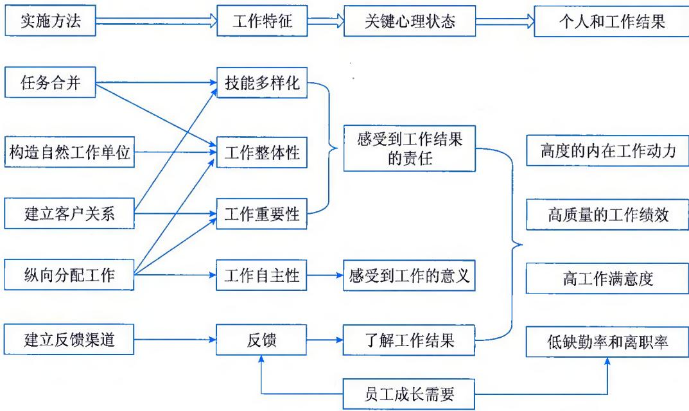
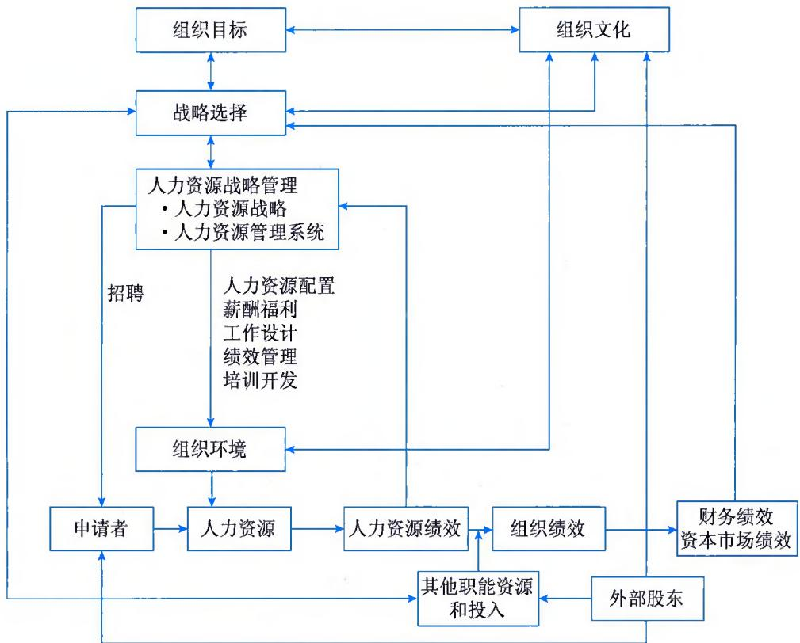
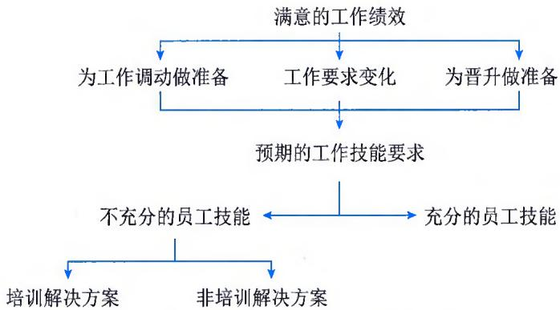
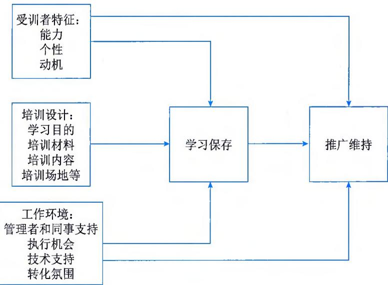

>[!info] 现行教材 · 第 2 版
>本页为**现行考试依据**的教材原文（第 2 版，2024 年 10 月出版，2025 年起启用）。
>考纲层级见 [[知识体系]]；练习题见 [[练习题·基础知识]]；案例模板见 [[案例答题模板]]。

# 第17章 人员管理

人力资源不仅是组织中最重要的资源之一，同时也是最昂贵的资源，有时甚至是最容易引起问题的资源。高层管理者之所以日益重视人力资源的战略地位，其根本原因在于对人力资源的有效利用是组织在国内外保持竞争优势的必要条件。新生代员工的管理、移动互联网及智能制造时代的到来等因素都为人力资源管理带来新的挑战，员工的行为表现是组织能否达成目标的关键，在组织不断提高竞争力和努力完成各种使命的过程中，人力资源管理起着至关重要的作用。组织是由人构成的，也是由人来管理的，优秀的人力资源将助力于组织的生存和发展。正确处理组织中"人"和"与人有关的事"所需要的观念、理论和技术是人力资源管理的关键。

## 17.1 概述

人力资源管理工作直接影响整个组织的经营状况，具体取决于人力资源的具体政策、体制设计和贯彻实施。在人力资源管理方面，组织整体目标是尽可能拥有高素质的员工，力求通过改进员工的职责、技能和动机，调动员工的积极性和提高工作效率，以使组织得以保持竞争优势，人力资源管理部门则主要侧重与这一整体目标有关的更为具体的目标。

人力资源管理目标包括：

（1）建立员工招聘和选择系统，以便雇用到最符合组织需要的员工。

（2）最大化每个员工的潜质，既服务于组织的目标，也确保员工的事业发展和个人尊严。

（3）保留那些通过自己的工作绩效帮助组织实现目标的员工，同时淘汰那些无法给组织提供帮助的员工。

（4）确保组织遵守政府关于人力资源管理方面的法令和政策。

如上所述，人力资源管理的广义目标是充分利用组织中的所有资源，使组织的生产率水平达到最高；狭义的目标是帮助各部门的业务经理更加有效地管理员工。人事管理部门制定和解释人事政策，通过相应的人事管理活动来完成这两个目标。人力资源管理主要包括：

\- 吸引。指确认组织中的工作要求，确定这些工作需要的人数与技术，向有资格的工作申请人提供均等的雇用机会。本环节主要进行工作分析，根据各工作岗位任务的特点，确定组织中各工作岗位的性质及岗位要求，预测组织的人力需求，为开展招聘工作提供依据。

\- 录用。指根据工作需要确定最合适人选的过程，确保组织能够从工作申请人中选拔出符合组织需要的员工。

\- 保持。指保持员工有效工作的积极性，保持安全健康的工作环境。包括决定如何管理员工的工资和薪金，做到按照员工的贡献等因素进行收入分配，做到奖惩分明，并通过奖赏、福利等措施激励员工。

\- 发展。指提高员工的知识、技能和能力等方面的素质，保持和增强员工的工作能力。包括对新员工进行工作指导和业务培训，训练和培养各级经理人员，以及为了使员工保持理想的技能水平而开展的一系列活动。

\- 评价。指对工作结果、工作表现与人事政策的执行情况进行观察和做出鉴定。包括决定如何评价员工的工作绩效，如何通过面谈、辅导和训话等方式与员工进行面对面的交流。

## 17.2 工作分析与岗位设计

工作分析是对组织分工和分工内容进行清晰的界定，让任职者更清楚工作的内容，甚至未从事过某项工作的人也能清楚该工作是怎样完成的。岗位设计是指如果岗位工作内容和工作设置不是最优的，则需对工作的内容进行重新界定。岗位设计是确定完成工作的方式、所需要完成的任务，以及界定该项工作在组织中与其他岗位工作的关系的过程。

为了更好地进行岗位设计，需要全面了解现有的岗位工作，发现工作设置上的问题。岗位设计是把工作内容、从事工作所需的资格条件和薪酬结合起来，从而满足员工和组织建设与发展需要。

## 17.2.1 工作分析

工作分析的目的是明确所要完成的任务以及完成这些任务所需要的人员能力特征。工作分析将每项工作所包含的任务、责任和任职资格用正式的文件明确下来，确保组织中的每项工作都按照管理人员的意愿进行分配。

## 1. 工作分析用途

如表 17-1 所示为工作分析的用途。

表 17-1 工作分析用途

<table><tr><td>招聘和选择员工</td><td>发展和评价员工</td><td>薪酬政策</td><td>组织与岗位设计</td></tr><tr><td>●人力资源计划●识别人才招聘●选择安置●公平就业●工作概览</td><td>●工作培训和技能发展●角色定位●员工发展计划</td><td>●确定工作的薪酬标准●确保同工同酬●确保工作薪酬差距公正合理</td><td>●高效率和优化激励●明确权责关系●明确工作群之间的内在联系</td></tr></table>

## 2. 工作分析过程

工作分析通常划分为4个阶段，包括10个具体步骤，如表17-2所示。

表 17-2 工作分析步骤

<table><tr><td>阶段</td><td>步骤</td><td>内容</td></tr><tr><td rowspan="2">第一阶段:明确工作分析范围</td><td>1</td><td>确立工作分析的目的</td></tr><tr><td>2</td><td>确定工作分析的对象</td></tr><tr><td rowspan="3">第二阶段:确定工作分析方法</td><td>3</td><td>确定所需信息的类型</td></tr><tr><td>4</td><td>识别工作信息的来源</td></tr><tr><td>5</td><td>明确工作分析的具体步骤</td></tr><tr><td rowspan="4">第三阶段:工作信息收集和分析</td><td>6</td><td>收集工作信息</td></tr><tr><td>7</td><td>分析收集的信息</td></tr><tr><td>8</td><td>向组织报告结果</td></tr><tr><td>9</td><td>定期检查工作分析情况</td></tr><tr><td>第四阶段:评价工作分析方法</td><td>10</td><td>以收益、成本、合规性和合法性等为标准评价工作分析的结果</td></tr></table>

## 3. 工作分析方法

在开展工作分析时，收集工作分析信息的方法有很多，但是人力资源管理人员需要注意的是，各种方法都有自己的优缺点，没有一种收集信息的方法能够获得非常完整的信息，应该综合使用这些收集方法，从而实现各类信息的相互融合。我们可以将工作分析的方法划分为定性和定量两类。定性的工作分析方法主要有工作实践法、直接观察法、面谈法、问卷法和典型事例法；定量的工作分析方法主要有职位分析问卷法、管理岗位描述问卷法和功能性工作分析法等。

## 17.2.2 岗位设计

岗位设计的目的是明确某类或某组工作的内容和方法，明确能够满足技术上和组织上所要求的工作与员工的社会和个人方面所要求的工作之间的关系。岗位设计关注工作、任务和角色如何被构建、制定和修正，以及其对个人、群体和组织的影响。

## 1. 岗位设计内容

岗位设计的主要内容包括工作内容设计、工作职责设计和工作关系设计三方面。

（1）工作内容设计是岗位设计的重点，一般包括工作的广度、工作的深度、工作的完整性、工作的自主性以及工作的反馈性5个方面：①工作的广度，即工作的多样性。在设计工作时，应尽量使工作多样化，使员工在完成任务的过程中能进行不同的活动，保持对工作的兴趣。②工作的深度。设计的工作应具有从易到难的层次，对员工工作的技能提出不同程度的要求，从而增强工作的挑战性，激发员工的创新力和克服困难的能力。③工作的完整性。保证工作的完整性能使员工有成就感，即使是流水作业中的一个简单程序，也要是全过程，让员工见到自己的工作成果，感受到自己工作的意义。④工作的自主性。适当的自主权利能增强员工的工作责任感，使员工感到自己受到信任和重视，认识到自己工作的重要性，增强工作的责任心，提高工作的热情。⑤工作的反馈性。工作的反馈性包括两方面信息：一是同事及上级对自己工作意见的反馈，如对自己工作能力、工作态度的评价等；二是工作本身的反馈，如工作的质量、数量、效率等。

（2）工作职责设计主要包括工作的责任、权利、方法以及工作中的相互沟通等方面。其中，工作责任设计是员工在工作中应承担的职责及压力范围的界定，即工作负荷的设定；工作权利与责任需要满足一定程度的对应，否则会影响员工的工作积极性；工作方法包括领导对下级的工作方法、组织和个人的工作方法设计等；相互沟通是整个工作流程顺利进行的信息基础，包括垂直沟通、平行沟通、斜向沟通等形式。

（3）工作关系设计表现为岗位之间的协作关系、监督关系等方面。

## 2. 岗位设计方法

一个适宜有效的岗位设计，必须综合考虑各种因素，需要对工作进行周密的、有目的的计划安排，既要考虑员工素质、能力及其他方面的因素，也要考虑组织的管理方式、劳动条件、工作环境、政策机制等因素。岗位设计方法包括科学管理方法、人际关系方法、工作特征模型方法（如图17-1所示）、高绩效工作系统等。

  
图17-1 工作特征模型

## 17.3 人力资源战略与计划

人力资源战略是人力资源管理的方向规划，表明了组织人力资源管理的战略定位。人力资源计划则是人力资源战略在较短时期内的体现，是预测未来一定时期的组织任务和环境对组织的要求，以及为了完成这些任务和满足这些要求而设计的提供人力资源的过程。人力资源战略与计划的实质是决定组织的发展方向，并在此基础上确定组织需要什么样的人力资源，以实现组织的最高管理层确定的目标。

## 17.3.1 人力资源战略

人力资源战略管理的目标是有效运用人力资源去实现组织的战略性要求和目标。人力资源战略管理主要是关于整合适应性的概念，它致力于保证：①人力资源管理充分与组织的战略和战略性需求相整合；②人力资源政策应该涵盖政策本身和各层级；③人力资源实践作为一线管理者和员工日常工作的一部分不断得到调整、接受和运用。

人力资源战略管理被分成两部分，一是人力资源战略，二是人力资源管理系统。人力资源战略是指人力资源在组织目标实现的过程中产生何种作用，即根据自身情况选择人力资源实践模式。人力资源管理系统是指人力资源管理的实践，即在人力资源战略模式的指引下，具体如何实现选人、育人、用人和留人，包括招聘、培训开发、薪酬福利、绩效考核等具体的人力资源管理行为。人力资源战略管理过程包括两个相辅相成的阶段：战略制定和战略执行。在人力资源战略的制定阶段，需要确定组织的文化、绩效、目标等决定组织的战略方向，组织的战略方向将直接影响组织在人力资源战略管理上的选择。在战略的执行阶段，组织要按照所选择的人力资源战略管理开始贯彻实施，例如，通过招聘甄选确保组织获得高技能的员工，建立能够促使员工行为与组织战略目标保持一致的薪酬体系。最后，组织还要根据人力资源战略管理的结果——人力资源绩效、组织绩效、财务绩效等，对人力资源战略管理的制定和实施进行评估反馈，实现人力资源战略管理的动态管理。如图17-2所示为人力资源战略管理过程。

  
图17-2 人力资源战略管理过程

不同组织的人力资源战略往往有很大差异。许多学者提出了不同的人力资源战略模式，下面详细介绍两种被广泛接受的人力资源战略模式。

## 1. 戴尔（Dyer）和霍德（Holder）的人力资源战略模式分类

根据戴尔和霍德的分类方法，我们可以将组织的人力资源战略分为三种类型：诱因战略、投资战略和参与战略。

（1）诱因战略。采用诱因战略的组织的主要目的是寻求具有高度稳定性和可靠性的员工，并且依赖高薪策略留住员工，与员工之间表现为纯粹的利益互换关系。诱因战略主要特点：①强调对劳工成本的控制。采用该战略的组织一方面会严格控制员工的数量，另一方面在招聘中多选择有经验、技能高度专业化的求职者，以降低员工招聘和员工培训的费用。②明确员工的工作职责。这类组织强调目标管理，用合理的分工和明确的工作责任来降低服务过程中的不确定性。③富有竞争力的薪酬水平。这类组织提供丰厚的薪酬，提高对人才的吸引力，力求吸引到业内的尖端人才，形成稳定的高素质员工队伍；同时，富有竞争力的薪酬水平可以帮助组织吸引技能高度专业化的员工，从而降低培训费用。④薪酬与绩效密切联系。这类组织提供的薪酬中绩效薪酬占有较大的比例，员工薪酬与个人绩效和努力程度之间的联系比较紧密。⑤员工关系比较简单。这类组织与员工之间的关系比较简单，以单纯的利益交换关系为主。

（2）投资战略。采用投资战略的组织多处于成长期或不断变化的环境中，将雇佣关系建立在长期的观点上，雇用多于组织需要的人力资源数量，同时相当重视员工的培训，以期拥有多技能的员工能为组织多做贡献。投资战略的特点：①强调人力资源的投资，重视人员的培训和开发。鼓励员工学习和自我发展，鼓励员工积累自身知识。②在招聘中强调人才的储备。采用这种战略的组织在招聘中会聘用数量较多的员工，并注意储备多种专业技能的员工，更看重员工的潜力和能力，而非工作经验。③员工被赋予广泛的工作职责。这类组织对分工和工作职责的界定不明晰，工作内容比较广泛，给员工提供充分展示自我的舞台，利于员工的创新。④注重良好的劳资关系和宽松的工作环境。这类组织把员工视为合作伙伴，对员工短期绩效要求较少，而更看重充分挖掘员工的工作潜质，注重员工的长期发展和长期服务。

（3）参与战略。采用参与战略的组织将权力下放到最基层，提高员工的参与性、主动性和创新性，让员工有参与感，并能与其他成员互动。参与战略的特点：①鼓励员工参与到组织的管理和决策中。这类组织为员工提供多种渠道和机会，赋予员工参与决策的权力。②管理人员是指导教练。管理人员不干预员工的工作，给员工较大的自主权，只为员工提供必要的咨询和帮助。③注重员工的自我管理和团队建设。充分授权是这类组织的最大特点，鼓励员工的团队工作，培养团队精神。

## 2. 巴伦（Baron）和克雷普斯（Kreps）的人力资源战略模式分类

根据巴伦和克雷普斯的分类方法，我们可以将组织的人力资源战略分为三种类型：内部劳动力市场战略、高承诺战略和混合战略。

（1）内部劳动力市场战略。内部劳动力市场战略要实现两个人力资源管理目标：维护组织独特的知识，使选拔和培训成本最小化。内部劳动力市场战略的特点：①组织内部层级分明，官僚等级式的制度，为员工提供较多的晋升机会。②强调内部招聘渠道。除了初级岗位，组织内的绝大多数职位通过内部晋升填补，鼓励员工长期效力。③提供工作保障和发展机会，鼓励员工忠诚于组织，以维护组织独特的知识资本。

（2）高承诺战略。高承诺战略的目标是最大限度地提高员工的产出，提高员工对组织的认同感。高承诺战略的特点：①更加认同扁平化的组织结构和团队合作，与内部劳动力市场战略提供的工作保障不同，高承诺战略通过保证一定的员工流动率，获取组织所需要的知识和能力。②体现工作成果差别的薪酬制度。以薪酬的形式承认员工工作成果的差异，鼓励员工最大限度地提高产出。

（3）混合战略。混合战略是介于内部劳动力市场战略和高承诺战略之间的一种战略模式，它既有内部劳动力市场战略的工作保障和内部晋升，也采用了高承诺战略中基于工作成果的绩效考核和薪酬方案。

## 17.3.2 人力资源供求预测

人力资源供求预测包括组织内部、外部的劳动力供给预测和组织的劳动力需求预测。内部供给预测与组织中的各类工作的劳动力年龄分布、离职、退休和新员工情况等组织内部条件有关。外部供给预测主要考量劳动力市场上相关劳动力的供给量与供给特点。组织的需求预测主要以与人力需求有关的预计业务量等组织因素的变化规律为基础进行预测。

人力资源计划是整个组织系列计划的一部分，包括组织在人力资源方面的战略计划、战术计划和行动方案，涉及组织在人事管理中的内部条件和外部环境、员工配置方案、工作补偿政策、培训计划、管理发展计划等方面的内容，以及短期具体战术与长期战略之间的配合关系等。人力资源计划的目标是随着组织所处的环境、组织战略与战术计划、组织目前的工作结构与雇员的工作行为的变化而不断变化的。在人力资源预测过程中，要预测未来的人员要求，包括需要的员工数量、预计的可供数量、所需要的技术组合、内部和外部劳动力供给量等。行动计划包括招募、录用、培训、工作安排、工作调动、晋升、发展和薪酬等，通过这些行动来增加合格的人员，弥补预计的空缺。

人力资源需求预测受许多因素的影响，包括技术变化、消费者偏好变化和购买行为、经济形势、组织的市场占有率、政府的产业政策等。人力资源需求预测的解释变量一般包括：①组织的业务量或产量，由此推算出人力需要量；②预期的流动率，指出由辞职或解聘等原因引起的职位空缺规模；③提高产品或劳务的质量，或者进入新行业的决策对人力需求的影响；④生产技术水平或管理方式的变化对人力需求的影响；⑤组织所拥有的财务资源对人力需求的约束。人力资源需求预测一般有以下方法：

\- 集体预测方法。集体预测方法也称德尔菲（Dephi）预测技术。德尔菲预测技术是发现专家对影响组织发展的某一问题的一致意见的程序化方法。这种方法的目标是通过综合专家们的意见来预测某一领域的发展状况，适合对人力需求的长期趋势进行预测。德尔非预测技术的操作方法是：首先，选择各方面的专家，每位专家都拥有关于人力预测的知识或专长。主持预测的人力资源部门要向专家们说明预测对组织的重要性，以得到他们对这种预测方法的理解和支持，同时通过对组织战略定位的审视，确定关键的预测方向、解释变量和难题，并列举出预测小组必须回答的一系列有关人力预测的具体问题。其次，使用匿名填写问卷等方法设计一个可使各预测专家在预测过程中畅所欲言地表达自己观点的预测系统。再次，人力资源部门在第一轮预测后，将专家们提出的意见进行归纳，并将这一综合结果反馈给他们。最后，重复上述过程，让专家们有机会修改自己的预测并说明原因，直到专家们的意见趋于一致。

\- 回归分析方法。回归分析方法指的是根据数学回归原理对人力资源需求进行预测。最简单的回归是趋势分析，只根据整个组织中各部门在过去员工数量的变动趋势对未来的人力需求做出预测。比较复杂的回归方法是计量模型分析法，它的基本思想是确定与组织中劳动力的数量和构成关系最大的一种因素，一般是产量或服务业务量。然后研究在过去组织中的员工人数随着这种因素变化而变化的规律，得到业务规模的变化趋势和劳动生产率的变化趋势，再根据这种趋势对未来的人力需求进行预测。最后，预测需求数量减去供给预测数量的差额就是组织对人力资源净需求的预测量。如果这一差额是正值，就说明组织面临人力短缺；如果这一差额是负值，就说明组织面临人力过剩。

\- 转换比率分析法。人力资源需求分析实际上是要揭示未来的经营活动所需要的各种员工的数量。人力资源预测中的转换比率分析法是首先估计组织需要的关键技能的员工的数量，然后再根据这一数量估计辅助人员的数量。

人力资源的供给分析与人力资源的需求分析的一个重要差别在于，需求分析是研究组织内部对人力资源的需求，而供给分析则是研究组织内部的供给和组织外部的供给两方面。在供给分析中，首先考察组织现有的人力资源的存量，然后假定组织现行的人力资源管理政策保持不变，并对未来的人力资源数量进行预测。在预测过程中，不仅要考虑组织内部的晋升、降职和调职等因素，还要考虑员工的辞职、下岗、退休、开除等因素的影响；而且得到的预测结果不应该仅仅是员工的数量，还应该是对员工的规模、经验、能力、多元化和员工成本等方面的一个综合反映。

预测内部人力资源供给的思路是：首先确定各工作岗位上现有的员工数量，然后估计在下一个时期每个工作岗位上留存的员工数量，这就要估计有多少员工将会调离原来的岗位，甚至离开组织。实际情况往往比较复杂，例如组织的职位安排可能会发生变化，员工的职位转换和离职的变化形式可能不同于以往。因此，在进行内部人力资源供给预测时，需要对人力资源计划人员的主观判断进行修正。常用的内部人力资源供给预测的方法有以下几种：

\- 人才盘点与技能清单。人才盘点也称全面人才评价。首先，明确组织需要什么样的人才，统一组织内部对人才标准的确定。其次，在此基础上，清晰地了解组织人才队伍的现状，了解组织是否有充分的人才储备，发掘组织各岗位继任的高潜人才。最后，根据组织需要和目前的人才现状，人才盘点能够有针对性地拟定一系列的人才规划，包括人才的引进、晋升、流动、培养、激励等，形成人才管理的行动纲领。人才盘点的主要流程包括：①组织与岗位盘点。主要是从组织战略角度出发，梳理分析当前的组织架构，包括职位设计、职责划分是否合理，需不需要调整，分析组织内哪些岗位是关键岗位。

通常，关键岗位的人才（包括后备人才）是人才盘点的重点。②开展人才盘点。主要是对关键岗位的人才进行测评，包括能力和潜力等方面，并与绩效结合进行分析，从而形成本组织的人才地图。需要强调的是，进行人才测评的前提是明确本组织的人才标准，包括设定模型、绩效指标。③拟定人才盘点之后的行动计划。人才盘点是一个起点而不是终点，是一项基础性的工作，人才盘点的结果应当转化为具体的可操作的人才发展规划。

\- 管理人员置换图。管理人员置换图也称职位置换卡，它记录管理人员的工作绩效、晋升的可能性和所需要的培训等内容，据此决定哪些人员可以补充组织的重要职位空缺。制订这一计划的过程是，确定计划包括的工作岗位范围，确定每个关键职位上的接替人选，评价接替人选目前的工作情况和是否达到提升的要求，确定职业发展需要，并将个人的职业目标与组织目标相互结合。其最终目标是确保组织在未来能够有足够的、合格的管理人员供给。

\- 人力资源接续计划。人力资源接续计划的关键是根据工作分析信息明确工作岗位对员工的具体要求，然后确定显然可以达到这一工作要求的候选员工，或者确定哪位员工有能力经过培训可以胜任这一工作。

\- 转换矩阵方法。转换矩阵方法也称马尔可夫方法，它的基本思想是找出过去人事变动的规律，以此推测未来的人事变动趋势。由于组织通常对根据判断进行的预测不满意，因此它们越来越强调运用统计技术来预测未来人力资源变化的趋势。转换矩阵实际上指的是转换概率矩阵，这一矩阵描述的是组织中员工流入、流出和内部流动的整体形式，我们可以把它作为预测内部人力资源供给的基础。

\- 人力资源信息系统。人力资源信息系统为收集、汇总和分析与人力资源管理有关的信息提供了一种方法。人力资源信息系统是组织进行有关人和工作信息的收集、保存、分析和报告的过程。人力资源信息系统的一个重要用途是为人力资源计划建立人事档案。在执行具体的行动计划之前，完整的人力资源计划系统需要以下两种信息：一是人事档案，用来估计目前人力资源的知识、技术、能力、经验和职业抱负；二是对组织未来的人力资源需求的预测。建立人力资源信息系统，事先要进行周密的筹划，包括清楚地阐明目标，全面分析系统的要求，认真研究细节，特别是应该帮助管理者和员工了解人力资源信息系统的内容、作用及意义。

\- 外部人力资源供给。当组织内部的人力供给无法满足需要时，组织才需要了解外部的人力供给情况。外部供给是组织在人力资源市场上采取的宣传活动引起的。与内部供给预测分析一样，外部供给分析也要研究潜在员工的数量、能力等因素。组织根据过去的录用经验可以了解那些可能进入组织的员工的数量，新进员工的工作能力、经验、性别和成本等方面的特征，以及新进员工能够承担组织中的哪些工作。当然，外部人力资源供给预测也不可能十分精确，但是这种分析的主要意义在于为组织提供一个研究新员工的来源及其进入组织的方式的分析框架。

## 17.3.3 人力资源计划的控制与评价

当把人力资源的供给预测和需求预测结果相互比照，就有三种可能的结果：第一，需求和供给彼此适应；第二，需求超过供给，这意味着组织在人力方面存在短缺；第三，需求小于供给，这意味着组织在人力方面存在过剩。

如果计划的人力资源需求超过供给，有两种解决方法：一是增加录用的数量，这通常需要借助寻找新的员工招聘来源、增加对求职者的吸引强度、降低录用标准、增加临时性员工和使用退休员工等办法解决；二是提高每位员工的生产率或延长他们的工作时间，这就需要提高员工的工作能力并增强他们的工作动力，可借助培训、新的工作设计、采用补偿政策或福利措施、调整管理人员与员工的关系等办法解决。一旦组织的人力供给超过需求，组织将面临非常困难的境地，组织可以选择的策略包括减少加班数量或工作时间、鼓励员工提前退休、减少新进员工的数量等，还可以让组织的供货商等上游合作伙伴以比较低廉的费率使用自己闲置的人力资源和生产设备。在没有其他选择时，组织只好采用辞退的办法。

人力资源计划应该具有整体性，这是指人事规划活动必须做到组织内部和组织外部各方面的协调一致。组织内部的一致性是指招聘、选才、安置、培训和绩效考核等人事管理工作必须相互配合。组织外部的一致性是指人事规划应该服从组织的整体规划，要考虑进入或退出某一行业、增盖厂房、购置新设备等对招聘和培训等活动的影响。整体性的人力资源计划应该包括三部分：一是供给报表，指明每个重要员工在今后五年内晋升的可能性；二是需求报表，指明各部门由于调遣、离职和新职位的产生等引起的今后五年中需要补充的职位；三是人力报表，是将供给报表和需求报表结合在一起得到的实际人事计划方案。

在对人力资源计划进行评价时，首先需要考虑人力资源计划目标本身的合理性问题。在评价人力资源计划目标的合理性时，认真考虑以下几方面是非常有帮助的：①人力资源计划者熟悉人事问题的程度以及对其重视程度。计划者对人力资源问题的熟悉、重视程度越高，那么他制订的人力资源计划就越可能合理。②人力资源计划者与提供数据以及使用人力资源计划的管理人员之间的工作关系。这三者之间的关系越好，制订的人力资源计划的目标就可能越合理。③人力资源计划者与相关部门进行信息交流的难易程度。这种信息交流越容易，越可能得到比较合理的人力资源计划目标。④管理人员对人力资源计划中提出的预测结果、行动方案和建议的重视与利用程度。这种重视和利用的程度越高，越可能得到比较好的人力资源计划。⑤人力资源计划在管理人员心目中的地位和价值。管理人员越重视人力资源计划，人力资源计划者也就越重视人力资源计划的制订过程，得到的结果才可能客观合理。

在评价人力资源计划时，还需要将行动结果与人力资源计划进行比照，目的是发现计划与现实之间的差距，指导以后的人力资源计划活动。主要的工作是进行以下比较：①实际的人员招聘数量与预测的人员需求量；②劳动生产率的实际水平与预测水平；③实际的和预测的人员流动率；④实际执行的行动方案与计划的行动方案；⑤实施计划的行动方案的实际结果与预期结果；⑥人力费用的实际成本与人力费用预算；⑦行动方案的实际成本与行动方案的预算；⑧行动方案的成本与收益。上述这些项目之间的差距越小，说明人力资源计划越符合实际。

组织经常要进行财务或税务方面的审计，同样，在人力资源管理活动中也存在审计的需要。人力资源审计主要是指考查人力资源管理活动是否按照原来的计划执行。例如，是否在规定的期限内完成了对全体员工的工作绩效考核，是否对每一位辞职的员工都进行了离职面谈，是否在员工加入组织时都建立了规定的保障计划等。

## 17.4 人员招聘与录用

人力资源是组织最重要的资源，而招聘是组织与潜在的员工接触的第一步。人们通过招聘环节了解组织，并最终决定是否愿意为它服务。从组织的角度看，只有对招聘环节进行有效的设计和良好的管理，才能得到高质量的员工。但是，如果高素质的员工不知道组织的人力需求信息，或者虽然知道但对这一信息不感兴趣，或者虽然有些兴趣但还没有达到愿意申请的程度，那么组织就没有机会选择这些有价值的员工。

员工的招聘环节之所以非常重要，是因为：①组织的绩效是由员工来实现的，做好员工进入组织前的选拔工作，可以避免日后的请职或解聘；②员工的雇用成本是很高的，通常包括人力资源市场的搜索费用、面试费用、体检费用、测评费用、旅行费用、安家费用、迁移费用和红利保证等；③员工的选拔工作还可能受到劳动就业法规的约束；④员工测评不仅能够帮助组织制定员工雇用的决策，也能够帮助组织制定晋升决策。

## 17.4.1 员工招聘的过程

招聘活动一般按照如下步骤进行。

## 1. 招聘计划的制订

在员工招聘开始之前，组织需要确定各工作职位空缺的性质，并在此基础上确定人力资源需求，包括需求数量、技术组合、等级和时间要求等。人力资源计划有助于我们了解所需要的工作申请人的类型和数量，而工作分析和任务分析有助于我们了解所需要的工作行为与申请人的个人特征。

招聘计划则是用人部门在组织发展战略的指导下，根据部门的发展需要，在人力资源规划和工作分析的基础上，对招聘的岗位、人员数量、素质要求、能力要求以及时间限制等因素做出的详细计划。招聘计划是招聘的主要依据。制订招聘计划的目的在于使招聘更合理化、更科学化。招聘计划的内容大致包括：①招聘的岗位、人员需求量、每个岗位的具体要求；②招聘信息发布的时间、方式、渠道与范围；③招聘对象的来源与范围；④招聘方法；⑤招聘测试的实施部门；⑥招聘预算；⑦招聘结束时间与新员工到位时间。招聘计划由用人部门制订，然后由人力资源部门进行复核，特别是要对人员需求量、费用等项目进行严格复查，签署意见后交上级主管领导审批。

## 2. 招聘信息的发布

招聘信息发布时间、方式、渠道与范围是根据招聘计划来确定的。由于招聘的岗位、数量、任职者要求的不同，招聘对象的来源与范围的不同，以及新员工到位时间和招聘预算的限制，招聘信息发布时间、方式、渠道与范围也是不同的。常用的招聘渠道有互联网、媒体广告、现场招聘会、校园招聘、人才中介机构、猎头组织、雇员推荐等。组织需要选择最适合本组织的招聘渠道。

## 3.应聘者申请

应聘者在获取招聘信息后，可向招聘单位提出应聘申请。组织可以建立应聘者数据库，保存符合当前招聘职位以及有可能以后会符合组织需要的应聘者资料，以便在组织需要时，从候选者库里快速搜索出具备工作所需的技能、经验和个人品质的员工，可以大量节省组织用于鉴别候选人的时间。

## 4. 人员甄选与录用

组织收到应聘者简历，从专业、工作经验等方面综合比较、初步筛选。初选是一种快速而粗略的挑选过程，可以只根据工作要求的某一个关键性需要进行选择。随后的录用环节应该比较严格和规范，需要进行比较全面的考察，如测试、个人面试、背景调查等。组织通过不同的甄选方法和环节，筛选并确定符合组织需要的候选人，确定录取人员。

在录用新员工后要开展入职培训，向新员工介绍组织政策、各项规定和福利待遇等情况。为了使新员工有能力达到合格的工作绩效水准，还要进行技能培训工作。

## 5. 聘评估与反馈

完整的招聘流程还包括后续对本次招聘工作的评估与反馈。招聘评估包括招聘周期、招聘完成率、招聘成本、用人单位满意率、录用人员评估等。工作绩效考核提供员工工作绩效水平的信息反馈，也是对招聘和录用工作质量的最终检验，并在此基础上对未来的招聘工作进行必要的优化。

## 17.4.2 招聘渠道类别

组织首先要确定自己的目标人力资源市场及其招聘收益的水平，然后选择最有效的吸引策略。招聘策略包括负责招聘的人员、招聘来源和招聘方法三方面。在设计外部招聘策略时可以按照以下步骤进行：①对组织总体的环境进行研究。这需要对组织的发展方向进行分析，然后进行工作分析。②在此基础上推断组织所需要的人力资源类型。这需要考虑员工的技术知识、工作技能、社会交往能力、需要、价值观念和情趣等方面。③设计信息沟通的方式，使组织和申请人双方能够彼此了解各自相互适应的程度。

## 招聘渠道主要有以下几方面

\- 应征者的内部来源。在运用内部补充机制时，通常要在组织内部张贴工作告示，内容包括工作说明书和工作规范中的信息以及薪酬情况，说明工作机会的性质、任职资格、主管的情况、工作时间和待遇标准等相关因素。这样做的目的是让组织现有员工有机会将自己的技能、工作兴趣、资格、经验和职业目标与工作机会相互比较。

\- 招聘广告。招聘广告是补充各种工作岗位都可以使用的宣传方法，使用最为普遍。阅读这些广告的不仅有工作申请人、潜在的工作申请人，还有客户和一般大众，所以组织的招聘广告代表着组织的形象，需要认真实施。组织使用广告作为宣传工具有很多优点：①工作空缺的信息发布迅速，能够在一两天之内就传达给外界；②与许多其他宣传方式相比，广告渠道的成本比较低；③在广告中可以同时发布多种类别工作岗位的招聘信息；④广告发布方式可以给组织保留许多操作上的优势，体现在组织可以要求申请人在特定的时间段内亲自来组织、打电话或者向组织人力资源部门邮寄自己的简历和工资要求等信息。

\- 职业介绍机构。职业介绍机构的作用是帮助雇主选拔人员，节省雇主的时间，特别是在组织没有设立人事部门或者需要立即填补空缺时，可以借助职业介绍机构。在下述情况下，适合采用职业介绍机构的方式：①用人单位根据过去的经验发现难以吸引到足够数量的合格工作申请人；②用人单位只需要招聘很少数量的员工，或者是要为新的工作岗位招聘人力，无法或不值得设计和实施一个详尽的招聘方案；③用人组织急于填充某一关键岗位的空缺；④用人组织试图招聘到那些现在正在就业的员工，在人力资源市场供给紧张的形势下更是如此；⑤用人组织在目标人力资源市场上缺乏招聘经验。

\- 猎头组织。猎头组织是一种专门为雇主"搜捕"并推荐高级主管人员和高级技术人员的组织，猎头组织的联系面很广，而且特别擅长接触那些正在工作并且没有积极性更换工作的人。它可以帮助组织的最高管理层节省很多招聘和选拔高级主管等专门人才的时间。

\- 校园招聘。大学校园是专业人员与技术人员的重要来源。在选择学校时，组织需要根据自己的财务约束和所需要的员工类型进行决策。如果财务约束比较紧，组织可能只在当地的学校中进行选择；而实力雄厚的组织通常在全国范围内进行选择。一般而言，组织总是极力吸引最好的工作申请人进入自己的组织。组织要达到这一目的需要注意以下问题：①进行校园招聘时要选派能力比较强的工作人员，因为他们在申请人面前代表着组织的形象；②对工作申请人的答复要及时，否则会对申请人来组织服务的决心产生消极影响；③新的大学毕业生总是感觉自己的能力强于组织现有的员工，因此他们希望组织的各项政策能够体现出公平、诚实和顾及他人的特征。

\- 员工推荐与申请人自荐。这种方式可以节省招聘人才的广告费等费用，还可以得到忠诚且可靠的员工。对于毛遂自荐的应征者，组织应该礼貌地接待，以免危害到组织和被推荐者之间的关系。这不仅是尊重自荐者，还有利于树立组织声誉和今后开展业务。

\- 网络招聘。网络招聘打破了传统的求职方式，应聘者省去了奔波的劳累，依靠互联网，求职者能很快捕获到组织招聘信息，在最短的时间内做出响应。组织招聘工作时间由此大大缩短，这将有利于招聘工作效率的提高和招聘费用的节省。组织对求职者的处理结果、信息也能及时反馈给对方，减少求职者的等待时间。组织使用网络招聘主要有三种方式：组织自建网站、第三方招聘网站和社交媒体。组织自建网站招聘的优点在于，组织对自身人力资源需求的理解比外部网站更加深刻，同时有能力和意愿完善对求职者的反馈及配套服务。第三方招聘网站以数据的形式记录、储存组织的招聘信息和求职者的个人信息，组织在上面发布、搜集信息可以节省精力，扩大受众面。社交媒体是近几年蓬勃兴起的交流方式，并逐渐由计算机端转向移动端，利用应聘者的零碎时间可以更高效、更快速地进行招聘，微信、微博等社交平台迅速成为拓展职场人脉、寻求商业合作、进行招聘求职等活动的重要平台。

\- 临时性雇员。随着市场竞争的加剧，组织面临的市场需求常常会发生波动，而且组织还要应对经济周期的上升和下降。在这种情况下，组织往往需要在保持比较低的人工成本的同时，使组织的运营具有很高的适应性和灵活性。为此，组织可以把关键员工数量限制在一个最低水平上，同时建立一种临时员工计划。这种计划可以有4种选择：第一种，内部临时工储备。组织可以专门向外部进行招聘，也可以把以前雇用过的员工作为储备。第二种，通过中介机构临时雇用。组织可以与那些保留和管理人力资源储备的就业服务机构签订合同，临时性地使用这些人力。第三种，利用自由职业者，如与担当顾问的教授专家签订短期服务合同。第四种，短期雇用，即在业务繁忙时期或者一个特定项目实施期间招聘一些短期服务人员。临时性雇员计划的缺点是：①增加招聘的成本；②增加培训成本；③产品质量的稳定性下降；④需要管理人员加强对临时性员工的激励。

## 17.4.3 员工录用方法

组织在招聘的录用环节需要开展许多具体工作来为录用决策寻找依据，最主要的筛选方法是申请表格、员工测评和录用面试。这些工作包括对工作申请人的背景材料进行调查、对工作申请人进行测试，以及建立工作申请人录用取舍的标准。

## 1. 推荐与背景调查

背景调查是指组织通过打电话或要求工作申请人提供推荐信等方式对应征者的个人资料进行验证。推荐信和背景调查可以提供关于工作申请人的教育与工作履历、个人品质、人际交往能力、工作能力以及过去或现在的工作单位重新雇用申请人的意愿等信息。

## 2. 录用测试方法

员工录用测试的方法有很多，可以将它们归纳为以下几类：

\- 能力测试。常用的能力测试方法包括一般智力测试、语言能力测试、非语言能力测试、算术能力测试、空间感判断能力测试、运动能力测试、机械记忆能力测试、推理和理解能力测试、反应速度测试和逻辑归纳能力测试。在招聘经理人员时，智力素质测试一般包括谈吐的流利程度和空间想象能力，可以通过他们从文字或数字资料中归纳结论的能力来判断未来经理人员的才能。

\- 操作能力与身体技能测试。操作能力测试指身体的协调性与灵敏度测试，身体技能测试指力量与耐力测试。这些测试包括手指灵敏度、手艺灵巧度、手臂移动速度、力量持续时间、静态的力气、动态的力气和身体的协调性等。

\- 人格与兴趣测试。员工的工作绩效不仅取决于心智能力和身体能力，还决定于心理状态和人际沟通技巧等一些不太客观的因素。人格测试用来衡量受试者的内省性和情绪的稳定性等方面的基本状况。主要的人格测试法是影射法，即让受试者看一个不明显的刺激物（如图片），然后让受试者在不受约束的条件下做出反应，如根据自己对图片的理解叙述一个故事。由于刺激物很模糊，受试者的解释实际上是他们的内心状态、情感态度以及对生活的理解的准确反应，考官可以根据这个故事来了解受试者的想象推测方式和性格结构。

\- 成就测试。成就测试是了解受试者已经掌握了的知识与能力，最常见的学历要求就属于成就测试。

\- 工作样本法。前面我们讲过的能力测试、人格测试和兴趣测试等都是对工作绩效进行预测，而工样本法则强调直接衡量工作绩效。工作样本法的主要目的是测试员工的实际动手能力，而不是理论上的学习能力。工作样本法的测试可以是操作性的，也可以是口头表达的对管理人员的情景测试。实施工作样本法的程序是：①选择基本的工作任务作为测试样本；②让受试者执行这些任务，并由专人观察和打分；③求出各项工作任务的完成情况的加权分值；④确定工作样本法的评估结果与实际工作表现之间的相关关系，以此决定是否选择这个测试作为员工选拔的工具。工作样本法的优点是：①让受试者实际执行工作中的一些基本任务，效果直接而客观，受试者很难伪装；②工作样本法不涉及受试者的人格和心理状态，不可能侵犯受试者的隐私权；③测试内容与工作任务明显相关，不会引起公平就业方面的忧虑。

\- 测谎器法。测谎器的工作原理是通过衡量受试者的心跳速度、呼吸强度、体温和出汗量等方面微小的生理变化来判断他是否在说谎。在提问的过程中，一般应该先问姓名和住址等中性的问题，然后再问实质性的问题。

\- 笔迹判定法。笔迹判定法在员工录用中的应用呈现上升的趋势。笔迹判定专家可以根据工作申请人的写字习惯判断他是否倾向于忽视细节、是否在行为上前后保持一贯、是否是一个循规蹈矩的人、有没有创造力、是否讲求逻辑、办事是否谨慎、重视理论还是重视事实、对他人的批评是否敏感、是否容易与人相处、情绪是否稳定等。

\- 体检。在员工录用测试中，体检是一项重要的工作。对工作申请人进行体检的目的是检查应征者身体的健康状况是否符合职位的要求，发现应征者在工作职位方面是否存在限制，同时也有助于建立保险和福利措施。

## 3. 工作申请表

工作申请表一般是由组织设计的由工作申请人填写并由组织人力资源部门保存的信息记录，它可以在组织出现职位空缺时用来选择员工。工作申请表除记录工作申请人的姓名、地址、联系电话等基本信息以外，还有一系列问题来了解申请人的个人特征与组织的空缺工作相互匹配的情况，包括年龄、性别、身体特征、婚姻状况、教育情况、培训背景等。有的组织还根据专家的意见或经验研究结果对每个因素赋予不同的权重，由此可以计算出每位申请人的总分，在制定录用决策时参考使用。

## 4. 录用原则

在招聘录用过程中，组织往往需要将多种测评工具结合在一起使用。在使用多元选择方法时，一般有三种原则。

（1）补偿性原则。所谓的补偿性原则是指工作申请人在招聘测评中成绩高的项目可以补偿成绩低的项目，因此在评价时可以对不同项目设置不同的权重。例如：

未来工作绩效预测值 $= 0.6 + 0.4 \times$ 工龄 $+0.3 \times \mathrm{IQ}$ 成绩 $+0.5 \times$ 学历分值

这种补偿性原则适用于对申请人没有某种最低要求，而是强调申请人综合素质的情况。

（2）多元最低限制原则。所谓的多元最低限制原则是指申请人在测评的每个方面都必须达到某个最低标准。在运用这种原则时，申请人依次经过各种测试，只有在测试中没有被淘汰的才有资格参加下一种测试。为了进一步降低成本，在测试手段的安排上，应该首先选择成本较低的测试手段，成本越高的手段越应该安排在后面。

（3）混合原则。组织在招聘员工时经常遇到这样的问题，即在某几个方面对员工有最低的要求，但是在其他方面对员工没有最低的要求，这时就可以使用混合方法。具体的步骤是，首先对申请人使用多元最低限制原则淘汰一部分，然后依据补偿性原则对申请人进行综合评价。

## 17.4.4 招聘面试

尽管申请表格和录用测评都是非常有用的选拔工具，但是最常被使用的选拔工具还是面试。面试之所以受重视，原因有以下几点：①面试人员有机会直接判断应征者，并随时解决各种疑问，这是申请表格和测评无法做到的；②面试可以判断应征者是否具有热诚和才智，还可以评估应征者的面部表情、仪表及情绪控制能力等；③许多主管人员认为在录用员工之前必须与申请人面试一次，否则难以做出最终的录用决策。面试的缺点是面试人员容易情绪化，使得面试原有的优点无法充分发挥。面试的程序如下：

\- 面试前的准备。在开展面试以前，首先要明确面试的目的。面试的目的可以是在申请人中间进行选择，也可以是只要求达到对申请人具有吸引的目的，或者收集申请人能够做什么事情和申请人愿意做什么工作的信息，或者检验申请人与组织要求的匹配程度，或者是向申请人提供组织的信息。因此，面试考官需要通过工作分析资料了解所招聘的工作岗位的要求，确定主要的工作职责，并严格根据工作分析结果编写设定的工作情景作为面试问题，设计并组织面试的程序，以便实现面试的目的。在准备面试问题时，一种方法是了解申请人过去的实际工作表现，其依据是过去的行为是未来的最佳预测。另一种方法是依据动机与未来的工作表现密切相关，可以用设计的工作情景进行测试。应设计申请人各种回答的评分标准，在面试结束后对申请人的表现做出一个量化的评价。

\- 实施面试。面试的重点是通过与工作申请人的讨论和使用事先设计的情景问题，发现申请人的工作能力，工作申请人与未来的工作岗位相关的经验、教育和培训，以及申请人的工作兴趣和职业目标，据此对申请人的工作意愿和工作能力做出评价。

\- 评估面试结果。在应征者离开后，面试人员应该仔细检查面试记录的所有要点，这有助于避免过早下结论和强调应征者的负面信息。面试考官应该根据申请人现有的技能和兴趣评价申请人能够做什么，根据申请人的兴趣和职业目标评价申请人愿意做什么，并在申请人评价表上记录对面试对象的满意程度。

按照面试问题的结构化程度，可以将招聘面试分为以下几种类型：

（1）非结构化面试。非结构化面试的特点是面试考官完全任意地与申请人讨论各种话题。面试人员可以即兴提出问题，不依据任何固定的线索，因此对于不同的应征者，可能会提出不同的问题。非结构化面试方法可以帮助组织全面了解工作申请人的兴趣。

（2）半结构化面试。所谓的半结构化面试其实有两种含义：一种是考官提前准备重要的问题，但是不要求按照固定的次序提问，而且可以讨论那些似乎需要进一步调查的题目；另一种是面试人员依据事先规划的一系列问题对应征者进行提问，一般是根据管理人员、业务人员和技术人员等不同的工作类型设计不同的问题表格，在表格上要留出空白以记录应征者的反应以及面试人员的主要问题。这种半结构化面试可以帮助组织了解工作申请人的技术能力、人格类型和对激励的态度。最后，面试人员要在表格上给出评估和建议。

（3）结构化面试。结构化面试就是提前准备好问题和各种可能的答案，要求工作申请人在问卷上选择答案，面试人员可以根据应征者的回答，迅速对应征者做出不理想、一般、良好或优异等各种简洁的结论。因此结构化面试是一种比较规范的面试方式。

## 17.4.5 招聘效果评估

从组织的角度看，招聘工作的成绩可以用多种方法检验，但所有的评价方法都要落实到花费的资源既定的条件下，为工作岗位招到的申请人的适用性。这种适用性可以用全部申请人中合格的数量所占的比例、合格申请人的数量与工作空缺的比例、实际录用到的数量与计划招聘数量的比例、录用后新员工的绩效水平、新员工总体的辞职率以及各种招聘渠道得到的新员工的辞职率等指标来衡量。

招聘效果主要从招聘周期、用人部门满意度、招聘成功率、招聘达成率、招聘成本5个方面进行评估。

（1）招聘周期是指完成一个职位所需要的招聘时间。对于组织而言，职位一旦发布，就说明这个岗位是组织所需要的，如果长时间招不到合适的人才，就会给组织的运营带来直接影响。即使这个岗位不是急缺的，招聘周期越长，组织花费在上面的人力、物力、财力会越多。

（2）用人部门满意度是指用人部门领导对所招员工的满意程度。招聘到的员工直接听从用人部门的安排，由用人部门使用，如果用人部门严重不满意就很可能重新启动该职位的招聘程序。

（3）招聘成功率是指实际上岗人数和面试人数的比例。很多组织发布职位后会收到很多投递来的简历，组织也会根据需要自主下载一些求职简历，经过筛选，对其中一部分求职者发出面试邀请。招聘成功率与用人单位的知名度有直接的联系。

（4）招聘达成率是指实际上岗人数与计划招聘人数的比率。特别是基层岗位，需要的员工人数较多、招聘量大，但往往因为各种因素的干扰，实际能上岗的人数不能达到计划人数，这一比率与组织岗位设置有必然的关系。

（5）招聘成本是指一个职位招聘需要花费的总费用，包括显性成本和隐性成本。组织对显性成本比较敏感，对隐性成本则认识不足。招聘成本的核算取决于多个因素，除了招聘广告费用招聘员工成本、内部推荐奖励资金，不可忽视的还有内部沟通、内部协商等隐性成本。另外，试用期离职率、人才库建立、新员工满意度、入职办理速效性、外部渠道依赖性等方面也应纳入招聘效果的评估范畴。

## 17.5 人员培训

组织的不断发展对员工技能的要求越来越高，越来越多的组织更加重视员工培训。员工培训指的是创造一个环境，使员工能够在这一环境中获得或学习特定的与工作要求密切相关的知识、技能、能力和态度。培训的目的是按具体的工作要求塑造员工的行为方式，使员工可能的行为方式类别减少的过程。员工培训是一个系统性的过程，它能够提高员工的技能水平，增强员工对组织的规则和理念的理解，改进员工的工作态度，旨在提高员工特征和工作要求之间的配合程度。

## 17.5.1 员工培训的基本程序与培训类型

员工培训是指将执行工作的各种基本技能提供给新进员工或现有员工，包括一系列有计划的活动。这些活动的目的是改进员工的知识、技能、工作态度和社会行为，为提高组织效益而服务。员工培训的基本步骤是：

（1）评估组织开展员工培训的需要，确定组织绩效方面的偏差是否可以通过员工培训来弥补。

（2）设定员工培训的目标。在确定培训目标的过程中，需要注意的是目标的设立与评价标准的确定密切相关，因此培训目标应该是可以衡量的。由于组织面临的问题会不断变化，培训项目在实施过程中会暴露出新的问题，因此培训目标也将不断变化。

（3）设计培训项目。对培训项目的设计涉及培训开展的很多方面，例如培训师的选择、培训地点的布置、培训方法的设计、培训教材的确定等。

（4）培训的实施和评估。在评估过程中要比较员工接受培训前后的绩效差异，以此考核培训计划的效果。

培训的类型包括入职培训及员工在职培训。

\- 入职培训。入职培训是使新进员工熟悉组织、适应环境和形势的过程。新进员工进入组织会面临"文化冲击"，入职培训意味着员工必须放弃某些理念、价值观念和行为方式，要适应新组织的要求和目标，学习新的工作准则和有效的工作行为。在这一阶段要帮助新进员工建立与同事和工作团队的关系，建立符合实际的期望和形成积极的态度。员工入职培训的目的是消除员工新进组织产生的焦虑，而入职培训有助于消除这些焦虑。员工应尽力使自己与组织的要求相适应，这可以产生积极的工作态度和高的工作标准。

\- 员工在职培训。在职培训能够为员工提供一个真实的工作环境和回报。在职培训可节约培训成本，受训者迅速得到工作绩效反馈，学习效果明显。缺点是经理人员对待在职培训的态度不够重视，常常没有很好地设计在职培训，不明确在职培训的目标，在实施过程中也不指派训练有素的教员，结果是员工在经过在职培训之后收获甚微。

## 17.5.2 员工培训内容与需求评估

一般来说，新员工需要的培训内容包括：①组织的标准、行为规范、期望、传统与政策，包括领薪的手续、证件的取得方法和工作时数等；②新员工需要被社会化，即需要学习整个组织和管理层所期望的态度、价值观和行为规范；③工作中技术方面的问题。人力资源部门对入职培训活动的计划和追踪负有总体责任，而人力资源部门和直线经理人应该明确各自的职责，以免发生信息传达的重复和遗漏。入职培训的形式有简单的口头介绍，也有手册形式的正式培训计划。

员工在职培训内容一般可通过培训需求的循环评估模型及前瞻性培训需求分析模型确定。循环评估模型是指针对员工培训需求提供一个连续的反馈信息流，以便周而复始地估计培训需求。在每个循环中，都需要依次从组织整体层面、作业层面和员工个人层面进行分析。具体而言，循环评估模型需要解决以下三个层面的问题：

（1）组织分析。组织分析是指确定组织范围内的培训需求，以保证培训计划符合组织的整体目标与战略要求。组织层面的分析目的是辨析培训活动开展的背景，确定在给定组织经营战略的前提下，培训如何支持特定战略的实施。组织层面的分析重点是组织的战略目标分析、资源分析及氛围分析，通过分析准确找出组织中存在的问题，明确培训是不是正确解决问题的手段。

（2）绩效分析。绩效分析是考察员工目前的实际绩效与理想的目标绩效之间是否存在偏差，然后决定是否可以通过培训来矫正偏差。员工培训的主要作用是提高员工的工作能力以改进工作绩效，因此培训能够解决员工能力方面的问题，而要改变员工的工作态度就需要改变奖励和惩罚等薪酬政策，采取工作设计等方法。

（3）任务分析。任务分析的目的在于分析员工达到理想的工作绩效所必须掌握的技能和能力，从而确定培训的内容。这一层面的分析包括系统地收集反映工作特性的数据，并以这些数据为依据，拟定每个岗位的工作标准，还要明确员工有效的工作行为所需要的知识、技能和其他特性。对任务进行分析的最终结果是形成工作活动的详细描述，包括员工执行的任务和完成任务所需要的知识、技能和能力等的描述。

随着技术的不断进步和员工在组织中个人成长的需要，即使员工目前的工作绩效是令人满意的，也可能需要为工作调动做准备、为员工职位的晋升做准备，或者适应工作内容要求的变化等而提出培训的要求。前瞻性培训需求分析模型为这种情况提供了良好的分析框架，如图 17-3 所示。

基于组织的职业发展通道，利用学习地图、领导梯队模型这样的工具进行前瞻性培训需求分析，是非常有效的途径。

  
图17-3 前瞻性培训需求分析模型

## 17.5.3 培训效果评估与培训迁移

培训效果是指在培训过程中受训者所获得的知识、技能、才干和其他特性应用于工作的程度。培训效果可能是积极的，这时工作绩效得到提高；也可能是消极的，这时工作绩效恶化；还可能是中性的，即培训对工作绩效没有明显的影响。

在对培训项目的结果进行评估时，需要研究以下问题：①员工的工作行为是否发生了变化？②这些变化是不是培训引起的？③这些变化是否有助于组织目标的实现？④下一批受训者在完成相同的培训后是否会发生相似的变化？

对变化的衡量涉及以下4个方面：

（1）反应。即受训者对这一培训项目的反应。受训者是否感到培训项目有好处，包括受训者对培训科目、培训教员和自身收获的感觉。

（2）学习效果。即受训者对所教授的内容的掌握程度，受训者能否回忆起和理解所培训的概念和技能。这可以用培训后的闭卷考试或实际操作测试来考察，如果受训者没有学会，那么培训者就没有发挥作用。

（3）行为变化。即员工因参加这一培训所引起的与工作有关的行为发生的变化，受训者是否在行为上应用了学到的这些概念和技能。工作经历的逐渐丰富、监督和工作奖励方式的变化都可能对员工的行为产生影响。为了克服这种干扰，可以使用控制组方法，即将员工分为培训组和未受培训的控制组。在实施培训之前，衡量各组的工作绩效；在实施培训之后，再衡量各组的工作绩效，通过比较发现培训的效果。这个绩效变化需要在培训结束后经过一段时间才能有所体现，这一性质对正确评估培训项目的效果很重要。

（4）培训效果。即受训者行为的变化是否对组织的结果有积极影响，有多少积极效果（如生产率的提高、质量的改进、离职率的下降和事故的减少）是由培训引起的，受训者在经过培训之后是否对组织或他们的工作产生了更加积极的态度。

组织都想通过培训获得新知识、技能、行为和态度，如果没有或不能迁移到工作中或在一定时间内不能维持，那么培训的价值是很小的。培训迁移重点关注的是知识、技能和态度能否转变为行为和结果，所以在人力资源开发领域，我们更关心的是在什么条件下更容易出现培训迁移。Baldwin 和 Ford 于 1988 年提出了一个培训迁移过程模型，如图 17-4 所示。这个模型指出培训输入包括受训者特征（Trainee Characteristics）、培训设计（Training Design）和工作环境（Work Environment），会影响学习、保存和迁移，并且受训者特征和工作环境将直接影响迁移效果。受训者特征包括影响学习的各种能力、个性和动机。培训设计指学习环境的重要特点，包括培训材料、学习目的、培训内容，以及培训场地的自然环境特征。工作环境指能够影响培训迁移的所有工作上的因素，包括管理者和同事支持、技术支持、转化氛围和在工作中应用新技能的机会。有利于培训迁移的各种工作环境特征如表 17-3 所示。

  
图17-4 培训迁移过程模型

表 17-3 促进培训迁移的工作环境特征

<table><tr><td>特征</td><td>举例</td></tr><tr><td>直接主管:鼓励受训者使用培训中获得的新技能和行为方式并为其设定目标</td><td>刚接受过培训的管理者与主管人员和其他管理者共同讨论如何将培训成果应用到工作中</td></tr><tr><td>任务线索:受训者的工作特点会督促或提醒其应用培训过程中获得的新技能和行为方式</td><td>刚接受过培训的人员的工作就是按照使用新技能的方式来设计的</td></tr><tr><td>反馈结果:直接主管支持应用培训中获得的新技能和行为方式</td><td>直接主管应关注那些应用培训内容的刚受过培训的人员</td></tr><tr><td>不轻易惩罚:对使用从培训中获得的新技能和行为方式的受训者不会公开责难</td><td>当刚受过培训的人员在应用培训内容出现失误时,不会受到惩罚</td></tr><tr><td>外部强化:受训者会因应用从培训中获得的新技能和行为方式而受到外在奖励</td><td>刚受过培训的人员若成功应用了培训内容,他们的薪水会增加</td></tr><tr><td>内部强化:受训者会因应用从培训中获得的新技能和行为方式而受到内部奖励</td><td>直接主管和其他管理者应表扬刚受过培训就将培训所教内容应用于工作中的人员</td></tr></table>

## 17.6 人员职业规划与管理

职业生涯是指一个人在一生中所从事的各种工作职业的总称，也是一个人一生中价值观、为人处世的态度和动机变化的过程。组织在人力资源管理过程中，应该认清员工职业生涯的发展，给予一定的发展机会，帮助他们获得发展。

员工的职业规划方案必须能够适应组织性质的需要，适应组织在员工招聘方面竞争的需要，适应现存的或计划实施的组织结构。在向员工提供职业指导和咨询以前，组织应该首先确定员工可能选择的职业道路。职业道路是指一个人在一生中可能担任的一系列职务。员工的职业道路可以通过分析员工在组织中目前的工作情况来判断。对员工职业道路的要求是：①应该代表员工职业发展的真实可能性，无论是横向发展还是纵向升迁都不应该以通常的速度为依据；②应该具有尝试性，能够根据工作的内容、任职的顺序、组织的形式和管理的需要进行相应的调整，同时也不要过分集中于一个领域；③具有灵活性，要具体考虑每位员工的薪酬水平，以及对工作方式有影响的员工的薪酬水平；④说明每个职位要求员工具备的技能、知识和其他品质，以及具备这些条件的方法。在为员工确定职业道路时，首先应该进行工作分析，找出工作对员工要求的相同点和不同点，然后将对员工的行为要求类似的工作组合在一起，形成一个工作族，并在工作族或工作族之间找出一条职业道路，最后将确定的所有职业道路连接起来，构成一个完整职业系统。

组织的管理人员在员工的职业规划中应该承担的工作包括：①充当一种催化剂，鼓励员工为自己建立职业规划；②评估员工表达出来的发展目标的现实性和需要的合理性；③辅导员工做出双方都愿意接受的行动方案；④跟踪员工的前程规划并进行适当的调整。组织在员工职业前程规划中的责任包括：①提供员工制定自己的职业规划所需要的职业规划模型、信息、条件和指导；②为员工和管理人员提供建立职业规划所需要的培训；③提供技能培训和在职培训。

在组织的员工职业管理过程中，员工需要承担的责任是向组织的管理人员提供所需要的技能、工作经验和职业意愿等方面的准确信息。在这一过程中，管理人员的责任包括：①发挥员工提供的信息的作用；②向员工提供自己负责的职位空缺的信息；③管理人员要综合有关的信息，为职位空缺确定合格的候选人并进行选择，同时为员工发现职位空缺、培训项目和工作轮换等职业发展机会。组织在员工职业管理中的责任包括：①为管理人员的决策过程提供信息系统和程序；②负责组织内部各类信息的及时更新；③设计出收集信息、分析信息、解释信息和利用信息的便捷方法，以确保信息利用的有效性；④监控和评价员工职业管理过程的执行效果。

## 17.7 本章练习

## 1. 选择题

（1）正确处理组织中"人"和"与人有关的事"所需要的\_\_\_\_是人力资源管理的关键。

A. 观念、理论和技术

B. 监控、保证和服务支持

信息系统管理工程师教程（第2版）

C. 创新、变革和优化

D. 谈判、管控和团队建设

## 参考答案：A

(2) 人力资源管理目标不包括: \_\_\_\_。

A. 建立员工招聘和选择系统，以便雇用到最符合组织需要的员工

B. 最大化每个员工的潜质，既服务于组织的目标，也确保员工的事业发展和个人尊严

C. 保留年轻且工作能力强的员工，淘汰工作积极性不高的员工

D. 确保组织遵守政府关于人力资源管理方面的法令和政策

参考答案：C

（3）在招聘录用过程中，组织往往需要将多种测评工具结合在一起使用。在使用多元选择方法时的原则包括：\_\_\_\_。

①补偿性原则 ②多元最低限制原则 ③随机选择原则

④混合原则 ⑤年轻化原则

A. ①②④ B. ①②③ C. ③④⑤ D. ②③⑤

参考答案：B

（4）岗位设计的主要内容包括：\_\_\_\_。

A. 工作内容设计、工作职责设计和工作绩效设计

B. 工作内容设计、工作绩效设计和工作关系设计

C. 工作内容设计、工作职责设计和工作关系设计

D. 工作内容设计、工作关系设计和工作绩效设计

参考答案：C

(5) 关于员工培训的描述不正确的是: \_\_\_\_。

A. 员工培训是一个系统性的过程，它能够提高员工的技能水平

B. 员工培训可增强员工对组织的规则和理念的理解

C. 员工培训能够改进员工的知识、技能、工作态度和社会行为，为提高组织效益而服务

D. 员工培训效果一定是积极的，工作绩效可以得到提高

参考答案: D

## 2. 思考题

（1）人力资源管理目标包括哪几个方面？  
（2）在评价人力资源计划目标的合理性时，哪些方面是需要认真考虑的？  
（3）招聘活动一般按照哪些步骤进行？  
参考答案：略
