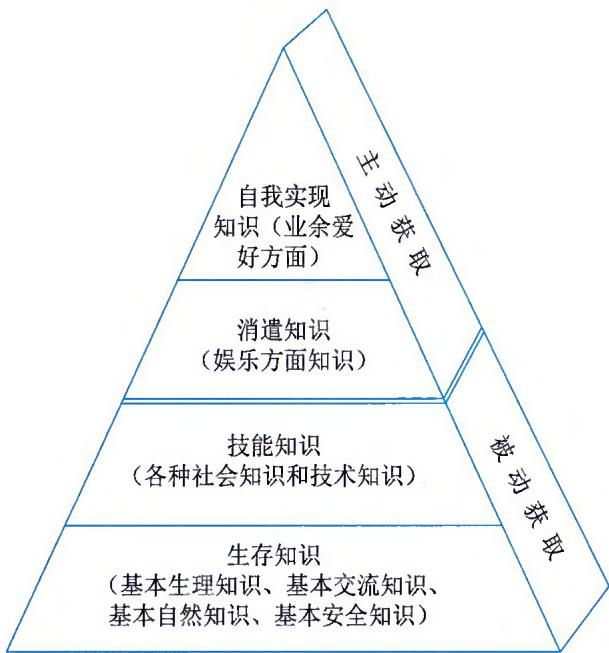
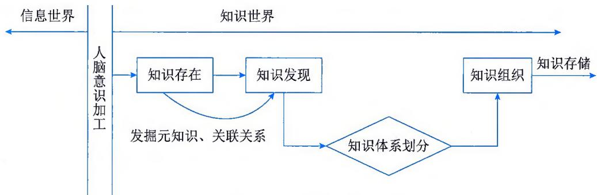
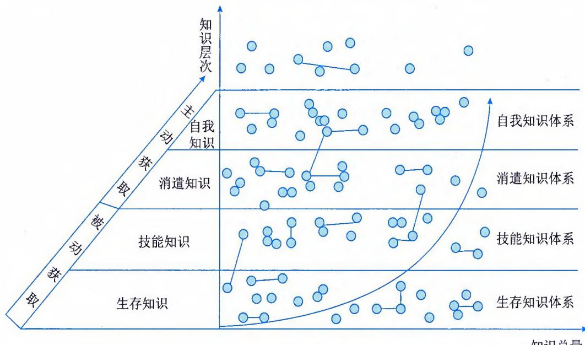
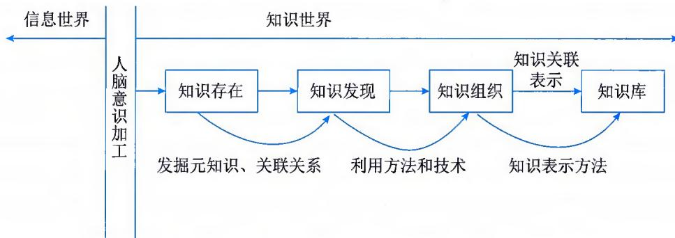
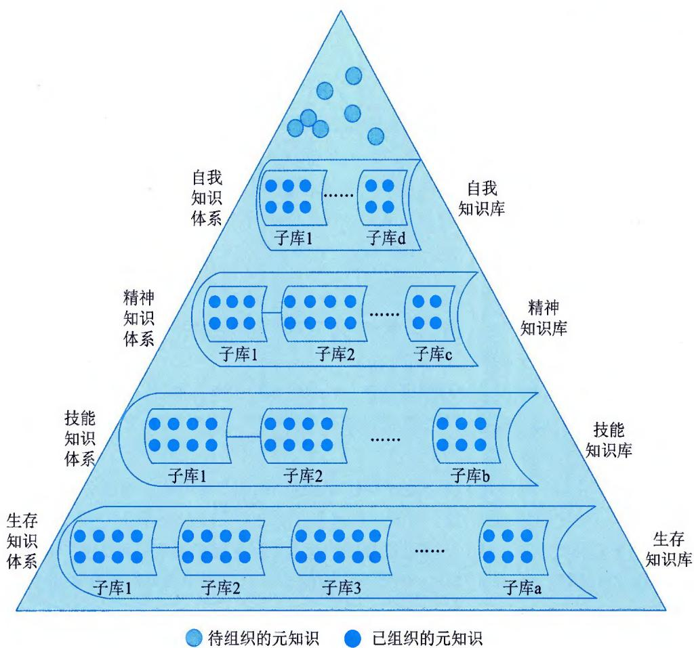
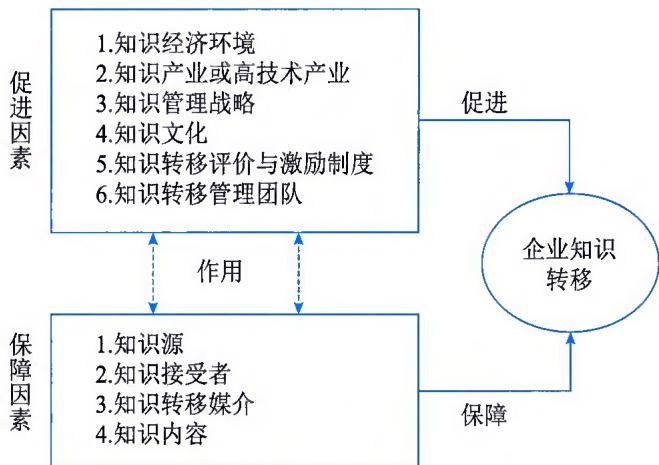
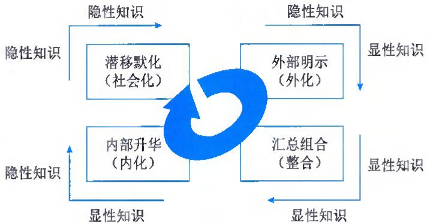
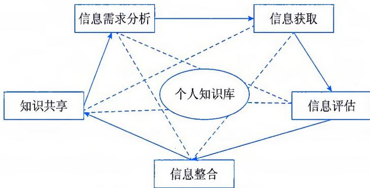

>[!info] 现行教材 · 第 2 版
>本页为**现行考试依据**的教材原文（第 2 版，2024 年 10 月出版，2025 年起启用）。
>考纲层级见 [[知识体系]]；练习题见 [[练习题·基础知识]]；案例模板见 [[案例答题模板]]。

# 第18章 知识管理

知识管理是协助组织和个人，围绕各种来源的知识内容，利用知识、技术等手段，实现知识的生产、分享、应用以及创新，并在个人、组织、业务目标、经济绩效和社会效益等方面形成知识优势和产生价值的过程。知识管理以"知识"为管理对象，包括知识的获取与收集、组织与存储、交流与共享、转移与运用、协同与创新，运用集体的智慧提高组织的应变能力和创新能力，以增加产品和服务的知识价值含量，提高组织的竞争力。知识管理是通过人、技术、环境的协同交互，将个体或组织内外知识进行系统的收集、共享、学习、交流、融合、应用和创新等活动，从而提高个体或组织的发展能力和竞争优势。

## 18.1 知识管理基础

知识管理旨在帮助组织和个人更好地利用和创造知识，以提高工作效率、促进创新和提升竞争力。知识管理是一个持续的过程，需要组织和个人的积极参与和持续投入。它能够帮助组织和个人更好地利用和创造知识，提高工作效率、促进创新、增强竞争力，从而实现长期可持续发展。知识管理从管理视角出发，它是一个系统化、程序化的过程。知识管理过程通常包括：知识获取与采集、知识组织与存储、知识交流与共享、知识转移与应用、知识管理审计与评估。

知识可以分为显性知识和隐性知识，显性知识与隐性知识可相互转换。基于显性知识生成隐性知识是人们学习显性知识以后，综合自身的人生经历和经验，将显性知识内化成属于自己的隐性知识，再通过不断地实践，随之变成习惯，潜移默化地加深对隐性知识的理解。基于隐性知识创造显性知识是人们将自身内部的隐性知识明示出来，让知识理念化，使大家更容易理解，之后综合显性知识，让知识系统化，以便更加容易归纳总结。

## 18.1.1 知识管理的内涵与特征

知识管理是提高组织应变能力和创新能力的重要途径。

## 1. 知识管理的定义

知识管理是以知识为对象，以知识、技术为手段，运用知识进行的管理。知识管理能给组织带来知识增值，进而为组织创造新的价值，驱动组织把握发展战略，带来决策的效能和水平提升。

## 2. 知识管理的特征

知识管理的特征包括：

（1）知识管理是优化的流程。知识管理具有可执行性和流程化特征，按照知识的存在过程与业务流程的结合分为若干环节，通过对每个环节的改进和增值，实现组织整体价值创造效率

的提高。

（2）知识管理是管理。主要强调管理特性，突出知识管理可以帮助组织实现知识显性化和知识共享、知识转移等，是一条提升运行效率的捷径。

（3）知识管理依赖于知识。知识的基础管理是整个知识管理的前提，由于知识识别、获取、整理等过程的复杂性，只有加强对知识的基础管理才能确保组织中知识的稳定生成和发展。知识管理应把知识作为组织的战略资源，作为一种管理思想和方法体系，它以人为中心，以数据、信息为基础，以知识的创造、积累、共享及应用为目标。

## 18.1.2 知识管理的目标与原则

## 1. 知识管理目标

知识管理可以达成的目标包括：

（1）实现组织的可持续发展。将组织中的产品和服务研发与销售网络、专利技术、业务流程、专业技能等知识，作为核心资产进行管理、开发和保护。建立相应的管理体系，通过组织文化、知识库、信息通信技术等形式，把知识固化到组织中去，有助于实现组织的可持续发展。

（2）提高员工素质及工作效率。通过组织知识的共享与重用，可以提高员工的知识水平和创新能力，提高工作效率、研发水平、操作技能及服务能力等。

（3）增强服务对象满意度。通过为用户、社会提供更优质的产品、高效的服务，可以帮助提升组织的服务对象满意度、社会公众满意度。

（4）提升组织的运作绩效。通过将组织的知识运用于业务运作的各个环节，从而提高业务管理水平、产品研发能力、生产经营水平、市场开拓能力、产品附加值，提升服务水平，建立竞争优势。

## 2. 知识管理原则

实施知识管理一般遵循的原则包括：

（1）领导作用。领导者的支持和参与，是系统实施知识管理的前提和保障，是取得知识管理成功的关键。

（2）战略导向。组织需要基于对自身发展战略、知识管理现状及其需求的分析，将知识管理战略融入组织的业务战略中，以支撑组织战略目标实现。

（3）业务驱动。组织需要在不同的规划期间，以核心业务为向导，针对业务热点或主题来推进知识管理，实现组织结构、业务流程和知识管理流程的有效衔接与互动。

（4）文化融合。知识管理涉及人员、文化、制度、行为模式等多方面的问题。实施时，应抛弃单纯从技术出发的观念，应将知识管理思想、理念和方法与组织现有的文化和行为模式相融合。

（5）技术保障。组织应采用适宜的技术设施保障知识管理的实施，从业务或文化角度推进知识管理时，促进知识管理的成果固化和持久。

（6）知识创新。组织应制定制度鼓励员工创新，将知识管理与创新的绩效挂钩，激发员工

的创新自主性。

（7）知识保护。在组织创造、积累、分享和使用知识的同时，应注重组织内部知识的安全保密，保护好知识产权，避免因人员的流动、合作伙伴变化、供应商变更等因素导致知识的流失与损失。

（8）持续改进。知识管理应定期检查和评审，并持续改进。

## 18.1.3 知识价值链及流程

## 1. 知识价值链含义

知识价值链是指将知识转化为实际价值的一系列过程和活动。它描述了从获取知识到运用知识的过程，涵盖了知识的各个阶段和环节。通过有效地管理知识价值链，组织和个人能够更好地利用和创造知识，提高工作效率、促进创新、增强竞争力，并最终实现长期可持续发展。

## 2.知识价值链流程

知识管理的流程依附于知识价值链。知识工作者的主要任务是知识获得与知识发展，决策制定者的主要任务是应用知识得到较佳的决策与行动方案，以获得组织期待的结果。整个知识价值链是从知识工作者与决策制定者互相分享彼此的认知开始，再由获得数据、处理数据、分析信息、沟通知识、应用智能、制定行动方案、展开行动等步骤完成。知识价值链是一个包含知识输入端、知识活动面、价值输出端的整合模式，是指知识以多元管道汇集，并收敛至单一窗口进入组织中，通过各种知识活动运作后，再以发散式的多元价值贡献输出。一般来说，知识价值链流程主要包括以下几方面。

## （1）知识创造

组织所应用的知识应有其产生的来源，而且其来源应该是多元化的。除组织成员所贡献的专业意见和知识、理念、想法外，来自互联网的全球知识，与外部组织共同贡献知识、分享知识，也是关键所在。

## (2) 知识分类

组织机构在日常运行中会自然产生各种文件，包括技术方案、操作手册、各类技术报告等，以及其他已经成为电子档案的文件。至于要采用何种文件分类方式，应依组织的需要而定。组织对知识进行分类时应以最高实用性为优先考量，管理者需选择最广泛及最可能被组织成员搜寻与获取知识的分类方法。

## （3）知识审计

知识分类的另一种方式是运用知识审计手段来完成。知识审计是指针对组织内部的专业领域与组织外部的需求，经由有计划的流程设计与审查，对组织知识进行系统的调查与分析。知识审计的目的是希望借助知识审计的结果，完成知识文件分类与核心竞争优势调查，有系统地挖掘组织与个人的竞争优势，提供组织变革、流程改造、策略规划与任务指派时的引导和方向，实现组织转型升级的目的。

组织进行知识审计可分为三个步骤：①定义组织目前存在的重要知识，包括隐性知识与显性知识，并建立知识地图；②定义组织有哪些重要知识正在流失，评估其对组织目标的影响，以及确认哪里需要那些正在流失的知识；③针对盘点结果所呈现的组织现状及可能改善的劣势，提出涵盖知识库、社群、实务学习、知识管理网站等执行方向的建议，作为知识管理活动优化的参考依据。

## （4）知识储存

组织在进行知识管理时，可以利用知识管理平台来储存。组织的知识不仅包含文件或程序，还包含图片、影像、多媒体、音频等类型的档案，这些档案经过数字化，也可储存至知识管理平台，即知识库。

## (5) 知识分享

知识需要分享才能产生真正的价值，必须让组织成员理解：只要愿意将知识分享出去，所分享回来的知识将会更多，如果每个人都隐藏自己的优势，到最后所有的优势都将变成劣势。组织在进行知识分享时，需考虑分享的渠道能否分享过去的经验知识、已习得的未来新趋势、组织内部的知识、内隐的技术和经验、外显式的文件档案等，以及能否与外界专家交流及分享等。

## (6) 知识更新

目前，知识更新大多是利用科技网络，按照需求配置各类系统平台来完成的，包括文件管理系统、知识社群、智库、工作流程自动化、核心专长调查表等。若知识能够实时更新，组织就能够随时掌握组织及个人的核心优势。当组织能掌握内部核心优势时，组织外部有任何机会和竞争需求，都可以在最短的时间内找出最适当的人，执行最新的任务。如果组织没有这样的机制，就没有办法掌握内部的成长过程，也就无法快速响应外部剧烈变化的环境。因此，知识的更新，除文件的更新之外，最重要的是要能实时更新组织及个人内隐的核心专长。

## 18.1.4 知识管理的主要类型

## 1. 基于内容对象的视角

知识管理是对组织适应知识经济的生产、知识在诸生产要素中的地位日益提高这一新形势的必然要求，并将随着知识经济的发展而发展。知识可以根据是否容易被外显表达分为显性知识和隐性知识。显性知识可以通过教育培训、书籍、网络等途径较为容易地获取和传播，隐性知识则通常需要通过亲身经历或与他人的交流与互动来传递和获取，两者相辅相成。

## （1）显性知识管理

显性知识是在一定条件下，即特定的时间里具有特定能力的人，通过文字、公式、图形等表述或通过语言、行为表述，并体现于纸、光盘、磁带、磁盘等客观存在的载体介质上的知识。它是客观存在的，不以个人意志为转移。显性知识作为可以借助于言语表达的明确性知识，是从隐性知识中分离出来的系统性知识，其构造极具系统性和体系性，具有明确的方法和步骤，有助于人们更好地理解各类信息，它也是客观性的、社会性的、组织化的知识，具有理性和逻辑性。显性知识也是数据知识，推动认识的知识。通过信息系统的应用支撑，可以实现显性知识的转移、转换和再利用，还可以通过语言媒介实现共享和编辑。

显性知识具有4个主要特征：①客观存在性。显性知识一旦表达出来就是脱离个人自身的知识，它通过言传、身教或附于某种介质上的编码等方式表现出来，它不依赖于个人而客观存在。正是由于显性知识的这种特性，才有利于显性知识的保存、记录、交流和传播等。②静态存在性。显性知识不随时间或环境的变化而变化，一旦表达出来就不再变化。③可共享性。显性知识可以被传播并共享，而隐性知识不具有这个能力，因此要实现知识的传播和共享必须将隐性知识转化为显性知识。④认知元能性。显性知识直接来源于实践技能等这类隐性知识，但最终来源于个人的心智模式和元能力。

## (2) 隐性知识管理

隐性知识是指个人在实践和经验中所获得的、难以明确表达和传递的知识。与明确的书面知识不同，隐性知识通常存在于个人的思维、见解、洞察力、技能和直觉等方面，难以以明确的形式进行记录和传授。在组织环境中，隐性知识由技术技能、个人观点、信念和心智模型等认知维度构成，隐性知识交流在很大程度上依赖于个人经验和认知，难以交流和分享，例如主观见解、直觉和预感等这一类的知识。隐性知识交流是通过知识主体（知识拥有者）与知识客体（知识需求者）协同互动，以可接收、可理解、可消化的方式使知识客体获得、吸收并且消化知识，形成隐性知识供应方与隐性知识需求方相匹配的过程。隐性知识作为智力资本，可以提高决策质量。

隐性知识具有6个主要特征：①非陈述性。隐性知识嵌入在个人的心智或者知觉中，难以明确阐述或编码。隐性知识包括个人理解、技能、能力和经验等，难以定义和解释，难以评估和衡量。隐性知识需要被发现、提取和捕获，它必须创造性地传播与共享，从而有效地扩充知识库。②个体性。隐性知识为个人知识，来自于个人经验且存储在拥有它的个人头脑中。隐性知识由个体在某种情境下的心智模式构成，并深深地嵌入个体中，被个体认为是理所当然的，这也造成隐性知识难以表述。由于个体自身利益、兴趣爱好等方面的考虑，隐性知识拥有者不会将有价值的隐性知识轻易转移出去。③实践性。隐性知识是基于实践过程的，因为隐性知识的认知具有实践属性，缺少实践过程往往难以获得。隐性知识嵌入在组织的实践、流程及结构中，隐性知识交流并非按规划或计划进行，其交流过程是非正式的、缓慢积累的实践过程。④情境性。隐性知识是基于情境的，一般隐性知识是在工作和其使用情境中获得的，隐性知识深深扎根于特殊情境中。个体隐性知识存在于人头脑中，来自情境、动机、机遇和接触。通过特定情境，经验和教训的反复尝试，可以增强和扩充隐性知识。隐性知识需要嵌入特定的情境，包括组织文化、结构和流程中才可以发挥价值。⑤交互性。隐性知识通过个体交互过程可以获得，这些交互过程包括人与人之间的经历、反思、内化和个人才能的交流。因此，隐性知识不能以与显性知识相同的方式进行管理，学徒制、直接交互、交流和行动学习、面对面社交互动以及经验实践等交互方式更适合隐性知识交流。隐性知识交流中人与人交互的关键是个人愿意且有能力分享其所知。开放、信任和组织成员之间良好的沟通交互可以促进隐性知识的交流。⑥非编码性。隐性知识不像显性知识那样可以通过技术工具实现编码化，隐性知识大部分都是非结构化知识，难以用数字、公式和科学规则等来表达，也难以用文字、语言来表达，交流与转化速度相对较慢，且成本较高。

## 2. 基于行为主体的视角

按照知识管理的主体来分类，知识管理可分为个人知识管理和组织知识管理。个人知识管理和组织知识管理相互关联，通过个人知识管理的活动可以为组织知识管理提供源源不断的知识输入，组织知识管理的支持和平台则能够促进个人知识管理的活动和价值的发挥。

## (1) 个人知识管理

个人知识管理关注的是个体在个人层面上对知识的获取、组织、应用和分享，包括个体如何有效地获取知识、如何将知识整理和存储、如何应用知识解决问题、如何与他人分享知识等个人层面的活动。个人知识管理的目标是提升个体的学习能力和工作效率，促进个人的成长和发展。个人知识管理具有以下特征：①主体性。个人知识管理是由个体自主进行的，个体可以自行选择获取、整理、应用和分享知识的方式和工具。每个人的知识需求和偏好都可能不同，因此个人知识管理注重个体的主观意愿和主动性。②多样性。个人知识管理涉及各种形式的知识，包括书籍、文章、文档、笔记、经验、技能等。个体可以通过多种途径和渠道获取和组织知识，例如阅读、学习、实践、反思等。个人知识管理也可以采用多种工具和方法，如笔记本、知识管理软件、个人知识库等。③循环性。个人知识管理是一个不断迭代的过程，包括获取、整理、应用和分享知识的循环。个体从不同的来源获取知识，经过整理和归纳后应用于实际问题中，通过分享和交流又能够重新获取新的知识，形成良性循环。④自适应性。个人知识管理需要根据个体的需求和环境进行灵活调整和自适应。个体需要根据自身的学习目标和工作需求来选择适合的知识获取和整理方式，也需要根据变化的情境和问题来灵活应用已有的知识。⑤社交性。个人知识管理并不是孤立的，它与他人的知识共享和合作密切相关。个体可以通过与他人的交流和分享来扩大知识的范围和深度，也可以通过参与社区、团队等协作环境来共同创造和应用知识。

## (2) 组织知识管理

组织知识管理关注的是组织内部对知识的获取、创建、存储、分享和应用。它涉及组织内部的知识资产和知识流程的管理，包括建立知识库、知识共享平台、专家系统等，以促进知识在组织内部的流动和共享。组织知识管理的目标是提升组织的创新能力、竞争力和持续发展能力。组织知识管理具有以下特征：①组织性。组织知识管理是在组织层面进行的活动，关注的是组织内部对知识的获取、创建、存储、分享和应用。它涉及整个组织的知识资产和知识流程的管理，包括建立知识库、知识共享平台、专家系统等。组织知识管理需要有组织的支持和资源投入。②共享性。组织知识管理强调知识的共享和流动。通过建立合适的知识共享平台和机制，组织成员可以将各自的知识和经验分享给他人，实现知识的共享和互补。这不仅能够提高组织内部的创新能力和问题解决能力，还能够促进组织内部的学习和发展。③学习性。组织知识管理注重组织的学习能力和学习型组织的建设。通过不断获取、整理、应用和分享知识，组织可以积累和更新知识资产，提升组织的学习能力和适应能力。组织知识管理也强调组织成员的学习和成长，鼓励员工不断学习和创新。④文化性。组织知识管理与组织文化密切相关。知识共享和知识分享需要建立一种开放、信任和合作的组织文化。组织需要鼓励员工之间的交流和合作，营造良好的知识分享氛围，并通过奖励和认可来激励和支持知识管理的活动。⑤持续性。组织知识管理是一个持续的过程，要求组织能够不断更新和维护知识资产，并随着环境的变化进行调整和优化。组织需要关注知识的更新和创新，建立一套有效的知识管理机制和流程，使知识能够得到持续积累和应用。

## 18.2 获取与收集

知识获取与收集是知识管理中非常重要的步骤。它有助于组织获取并整理各种形式的知识，以便更好地应对挑战、提高效率和推动创新。

知识获取是对组织内部已经存在的知识进行整理积累或从外部获取知识的过程。知识获取的本质在于知识量的积累。对组织来说，知识获取应该收集整理多方面的知识，并使沉淀下来的知识具有再利用的价值。同时，还可以通过兼并、收购、购买等方式直接在某个领域突破知识的原始积累获取所需要的知识，或有针对性地引入相应人才。知识收集是指通过适当的方法、途径和工具，将知识聚集在一起的过程。

知识获取与收集分为主动式和被动式两类：主动式知识获取与收集是知识处理系统根据领域专家给出的数据与资料，利用工具直接自动获取或产生知识，并装入知识库中，所以也称知识的直接获取与收集。被动式知识获取与收集是间接通过一个中介人并采用知识编辑器之类的工具，把知识传授给知识处理系统，所以亦称知识的间接获取与收集。

知识获取与收集可以提高组织创新绩效。从外部引进知识可以形成创新，能够使组织快速感知新技术的发展趋势和社会的新需求趋势，把握外部新的信息流动，形成知识信息的"新组合"，引领新产品和新服务，提高创新效率。因此，有效地获取与收集知识对组织创新绩效有重要意义。

## 18.2.1 过程与步骤

知识获取与收集过程与步骤可能因个人或组织的需求而有所不同，重要的是根据自身的需求和目标，选择合适的方法和工具，积极主动地获取和更新知识。

知识获取与收集主要过程与步骤有：

（1）确定需求。明确个体或组织的知识需求和目标。这可以通过问题定义、目标设定和需求分析来实现。

（2）确定信息源。确定可以获取所需知识的信息源和渠道，包括书籍、学术论文、互联网、专家访谈、培训课程等。

（3）搜集信息。使用适当的工具和技术，搜集相关的信息和知识，包括图书馆研究、网络搜索、访谈、调查问卷等。

（4）评估信息质量。对搜集到的信息和知识进行评估和筛选，确保其可靠性、准确性和相关性。可以通过考虑信息来源的可信度、作者的资格、研究方法等来实现。

（5）整理和组织。整理和组织搜集到的信息和知识，使其更易于理解和使用。可以通过分类、标签、总结、摘要等方式来实现。

（6）分析和综合。对搜集到的信息和知识进行分析和综合，寻找其中的关联、模式和洞察力。这有助于深入理解知识，并将其应用于实际情境中。

（7）应用与实践。将获取到的新知识运用到实践中，通过实际运用和经验积累进一步加深理解和掌握。

（8）反思和反馈。在应用新知识的过程中，不断进行反思并获取反馈。这有助于识别知识获取过程中的不足和改进点，并调整相应的方法和策略。

（9）持续学习。知识获取是一个持续的过程。保持对新知识的求知欲望，持续学习和更新自己的知识储备，以适应不断变化的环境和需求。

## 18.2.2 途径与方法

知识获取与收集有多种途径和方法，重要的是根据需求和兴趣选择合适的途径和方法。多样化的途径有助于获取不同角度的知识，深化对特定领域的理解。在收集知识的过程中，要注重信息的可靠性和准确性，审慎甄别信息的来源和质量。

## 1. 知识获取与收集常见的途径和方法

知识获取与收集常见的途径和方法有：

（1）书籍和文献。阅读书籍、学术期刊、报纸、杂志等可以提供专业和系统化的知识。

（2）互联网搜索引擎。使用搜索引擎如谷歌、百度等进行关键词搜索，获取相关的在线文章、博客、论坛等信息。

（3）学术数据库。使用学术数据库，搜索和浏览学术论文和期刊。

（4）在线课程和教育平台。参加在线学习平台提供的课程，学习专业知识和技能。

（5）社交媒体和社区。加入相关领域的社交媒体群组、在线论坛、知识分享社区等，与其他人交流和分享知识。

（6）专家访谈和讨论会。参与专家讲座、行业研讨会、学术会议等活动，与专家和同行交流并获取新的见解。

（7）实地考察和实践经验。亲身体验、观察和实践，在实际场景中积累知识和经验。

（8）数据分析和统计报告。分析和解读相关领域的数据和统计报告，获取行业趋势、市场分析等方面的知识。

（9）科普媒体和科学博物馆。阅读科普书籍、观看科普视频、参观科学博物馆等，以浅显易懂的方式了解科学和知识。

（10）同行评审和同侪交流。参与同行评审、学术讨论会、研究小组等，借鉴他人的观点和反馈，互相交流和学习。

## 2. 显性知识获取与采集

显性知识可以用语言、文字、图形等方式表现出来，显性知识相对是容易获得、容易理解的结构化信息资源。显性知识获取与收集就是针对待解决的问题寻找和识别与之相关的关键性信息，并将这些信息进行提取，以为形成解决方案或决策提供依据。

## （1）个人获取显性知识与收集的途径

对个人来说，获取知识的过程就是学习的过程。个人获取显性知识与收集的途径为：①通过教育、培训等可以系统、完整、正规地获取知识。②通过计算机网络获取知识，如搜索引擎能根据使用者提供的关键词进行模糊搜索，可以十分方便地获取所需知识；利用现代化传播手段，如通过社群进行知识学习。③将数据挖掘技术作为知识获取的常用工具，使其成为知识发现的核心部分，这也是采用机器学习、统计等方法进行知识学习的阶段。④通过成果转让获取知识。知识转化为科技成果之后，成果转让也是获取知识的常用方法。⑤充分利用图书馆文献信息资源获取知识。

## （2）组织显性知识获取与收集的途径

组织显性知识获取与收集的途径有：①图书资料。组织通常会投资购买与组织发展相关的图书资料，并将其作为组织员工获取与收集显性知识最重要的来源。②数据访问。许多组织十分重视数据资源的开发利用，也会通过购买或采集工具获得内外部一些数据的使用权，员工可以通过内部网或授权访问这些数据，从而获取相关知识或信息。③数据挖掘。数据挖掘是指从大量的、不完全的、模糊的、随机的数据中挖掘出隐含的、先前未知的并有潜在价值的信息和知识的过程。组织通过数据挖掘工具，从无序的数据中获取有用的知识，包括广义型知识、特征型知识、差异型知识、关联型知识、预测型知识、偏离型知识等。④网络搜索。组织人员可以利用互联网和分布式搜索工具来对网上信息进行开放式搜索，然后从中提取需要的知识。⑤智能代理。组织可以部署智能代理应用系统，根据员工定义的准则，主动地通过智能化代理服务器为其搜集感兴趣的信息，并把加工过的信息按时推送给员工。⑥许可协议。许可协议帮助组织或员工为某个指定目的和在指定期间使用某种产品和服务。最常见的许可协议是软件的购买和使用。⑦营销与销售协议。组织可以通过供应商的信息报告、培训、知识转移机制等获得知识，可以通过营销手段了解有关产品和服务的客户偏好、定价偏好、爱好等研究成果等。

## 3. 隐性知识获取与采集

隐性知识是难以编码的知识，主要基于个人经验。隐性知识获取与收集的途径形式多样，例如，邀请专业人员演讲或培训时可以获得一部分经验与认识；举行一个头脑风暴法会议时，可以就某个主题融汇集体智慧；通过观察专业人员操作可以识别其专长。隐性知识获取方式主要有结构式访谈、行动学习、标杆学习、分析学习、经验学习、综合学习、交互学习等。

## （1）个人获取和收集隐性知识的途径

个人获取和收集隐性知识的途径有：①反思与回顾。个人可以通过反思自己的工作经验和项目实践，回顾成功和失败的经历，发现其中的隐性知识，包括思考自己在完成任务时使用了哪些技巧、遇到了哪些挑战以及如何解决问题等。定期进行自我反思能够帮助个人更好地认识和发掘自己的隐性知识。②学习与研究。持续学习和深入研究是获取隐性知识的重要途径。通过参加培训课程、学术研究、阅读相关文献等方式，个人可以拓宽自己的知识范围，并深入理解特定领域的隐性知识。③寻求导师或专家指导。与经验丰富的导师或领域专家建立联系，并寻求其指导和建议，可以帮助个人获取隐性知识。导师或专家能够分享他们的实践经验和洞察力，提供宝贵的指导和建议，从而帮助个人加速获取和理解隐性知识。④社交网络。积极参与专业的社交网络和在线论坛，与同行进行交流和讨论，可以获取到更多的隐性知识。通过与其他人分享问题、解决方案和经验，个人可以获得来自不同领域和背景的见解和经验，并从中汲取隐性知识。⑤实践与实验。通过实际工作和尝试新方法或技术，个人可以不断积累和发现隐性知识。在实际操作中，个人会面临各种挑战和问题，通过不断实践和实验，掌握解决问题的技巧和知识。⑥写作和记录。将个人的经验和观点记录下来，可以帮助梳理思路、整理知识，并发掘其中的隐性知识。写作能够促使个人深入思考和表达，进一步加深对某个主题或领域的理解和洞察。

（2）组织获取和收集隐性知识的途径。

组织获取和收集隐性知识的途径有：①内部沟通与知识共享。促进内部团队成员之间的沟通和知识共享是组织获取隐性知识的重要途径。组织可以建立协作平台、内部社交网络或知识管理系统，鼓励员工分享实践经验、解决方案和洞察力。定期组织会议、研讨会或工作坊，提供员工交流和分享的机会。②社交化学习与社区建设。组织可以鼓励员工参与专业社区、行业协会或利用在线社交平台，与同行进行交流和讨论。通过参与社交化学习活动，员工能够获取来自不同领域和背景的见解和经验，并从中学习到更多的隐性知识。③导师制度与知识传承。建立导师制度或专家顾问团队，通过与经验丰富的导师或专家的交流和指导，将他们的隐性知识传递给新人或其他有需要的员工。导师或专家可以分享他们的实践经验、技巧和洞察力，帮助员工快速获取和理解隐性知识。④后续总结与案例分析。组织可以鼓励员工在完成项目或任务后进行总结和案例分析，提取其中的隐性知识。可以通过组织会议、项目回顾会议或书面报告的形式进行，以便让员工分享他们在实践中获得的经验和教训。⑤外部资源与合作伙伴。组织可以寻求外部资源和合作伙伴的支持，以获取更多的隐性知识。可以包括与其他组织合作、参与行业研讨会、聘请顾问或专家等。通过与外部资源的交流和合作，组织可以获得新的视角、最佳实践和创新思维。⑥数据分析与学习挖掘。利用数据分析和学习挖掘的技术，组织可以从大量的内部和外部数据中发现隐藏的模式和知识。这些数据可以来自组织内部的系统、市场调研、客户反馈等。通过分析数据，组织可以了解组织内外的隐性知识，并将其应用于决策和创新。

## 18.3 层次与模型

知识组织是以知识为对象的，如整理、加工、表示、控制等一系列组织过程及方法，其实质是以满足各类客观知识主观化需要为目的，针对客观知识的无序化状态所实施的一系列有序化组织活动。知识存储是指在组织中建立知识库，将知识存储于组织内部，知识库中包括显性知识和隐性知识。

## 18.3.1 知识层次

由于知识具有动态性、复杂性、多样性的特点，需要从不同的角度和层次对知识进行划分和比较，总结出一些知识普遍性的规律和特点，这不仅有利于我们更深刻地认识知识，更灵活、有效地利用知识，而且从学科发展的角度讲，也有利于知识管理科学的长远发展。

## 1.知识层次理论

从主体需求知识的层次角度出发，将知识分为4个层次：基于生存方面的知识（生存知识）、基于技能方面的知识（技能知识）、基于消遣需求方面的知识（消遣知识）、基于实现自我追求方面的知识（自我实现知识），如图18-1所示。

  
图18-1 知识层次理论模型

该层次的划分需要注意两个原则：第一，对大多数主体而言，已经掌握的知识不再是推动知识学习的动力，取而代之的是追求学习较高层次知识。第二，作为主体的人，都潜藏着四种层次的知识追求（乐于不断学习）。

知识层次理论模型中四个层次的知识需要根据主体的成长历程不断学习，并且学习过程中对四个层次知识的追求是不断循环、相互补充的过程。具体说明如下：

（1）生存知识。作为主体的人出生后，需要通过其他已经具有知识的主体（成年人）的传授及观察、模仿等方式学习一些基本的知识，主要包括基本生理知识（人的吃穿住行等）、基本交流知识（听说读写知识和喜怒哀乐等）、基本自然知识（四季更替、风雨雷电等）和基本安全知识（好坏对错等）。由于人的生存是基本前提，只有了解有关自然界最基本的知识后，才能遵照其规律安排生产生活。所以这几个基本层面的最低层次的知识，是主体首先要学习的知识类型。

（2）技能知识。这个层次主要学习的知识类型分为社会知识和技术知识。此层次的学习是建立在第一个层次的基础上，从时间概念来讲，是发生在学习了生存知识之后的，但也只是在首次学习中。一旦主体学习到了此层次，还是可以再学习生存知识层面的知识，继续增强其生存的能力。学生在校期间学习的各种知识都属于此层次，例如，从简单算术到高等数学、从古代史到现代史、从医学知识到建筑知识。这个层次的知识具有以下特点：①专业性。知识的内容涉及主体现在或将来的发展，如社会知识可以涉及人际交往、沟通技巧、高级的思维方式等，这就需要主体专注学习某一领域的知识。②选择性。知识的结构比较复杂，主体仅学习其中部分知识。③强迫性。主体的学习欲望不强，只是为了更好地生活而不得不学习一些技能知识。

（3）消遣知识。主要包括娱乐方面的知识。当主体掌握了技能知识，可以较好地生存下来时，会追求一些具有消遣性质方面的知识，如小说、杂志、电影、游戏等，其目的在于缓解技能知识所带来的压力与不适。主体学习这个层次的知识具有较强的主动性。这个层次的知识具有以下特点：①具有主动性。②内容包罗万象，但是按照类型可以分为小说、杂志、电影、游戏等；按照知识的载体可以分为传统文献资料和现代多媒体资料。③该层次的知识追求可以与生存层面知识及技能层面知识交替学习，但是学习的目的是不同的。

（4）自我实现知识。主要体现在不同主体根据自身不同的特点和爱好，主动学习一些方面的知识。例如，爱好摄影的主体通过学习摄影方面的知识并通过实践满足自己的爱好追求。该层次的最大特点是主体学习知识的主动性最强，只要有学习条件，就会主动获取相关知识。有些主体可能对其他三层的某些知识具有浓厚兴趣，则其学习这些特定方面知识的效果与效率都会相对较好。这些知识此时也可以归类到自我实现知识层次。

## 2.知识组织的层次模型

知识组织是以知识为对象的，诸如整理、加工、表示、控制等一系列组织化的过程及其方法。其实质是以满足人类的客观知识主观化的需要为目的、针对客观知识的无序化状态所实施的一系列有序化组织活动。知识组织的首要任务是将客观知识的元知识关系表示出来，以便人们识别、理解和学习知识。知识结构要想全面完整地表现出来，可以按照"知识组织层次模型"对知识的结构进行细分，得出合理的层次，继而在该层次上开展知识组织活动，这样不仅可以更快地对知识内容进行发现，还可以从另一角度清晰地反映出知识的结构。

## （1）知识层次模型主要思想

知识组织层次模型的主要思想是，在进行知识组织之前，按照4个层次把发现的知识体系进行划分，再将4个不同体系中的元知识利用知识链进行关联，如图18-2所示。

  
图18-2 知识体系划分

(2) 知识层次模型。

知识组织层次模型将知识划分成生存知识体系、技能知识体系、消遣知识体系和自我（实现）知识体系。生存知识体系中的知识属于最底层知识，起着基础性作用，这是作为主体的社会人为了确保最基本的生存而学习后形成的知识体系，主体的社会人往往是基于生存的需要而被迫地学习；技能知识体系中的知识具有专业性、选择性和强迫性的特点，主体的社会人通过学习（被迫性）该体系的知识，可以获得较好的社会生存环境与生活状态；消遣知识体系是基于技能知识体系上的，即作为主体的人为了缓解各种压力，通过自主地学习一些休闲、娱乐方面的知识可以更好地生存下去，所以学习这个层次的知识也是很有必要的；最高层次的知识体系是自我（实现）知识体系，该体系的知识是为了满足主体对更高层次知识的追求和享受而产生的，主要是由个人爱好方面的知识组成的知识体系，主体也是乐于主动获取的，如图18-3所示。

  
○ 表示元知识 — 表示关联关系  
图18-3 知识组织层次模型

关于知识组织层次模型的说明如下：

（1）横坐标表示知识的总量，含义有两层：其一，整个人类社会知识的总量不断增加；其二，作为主体的个人的知识汲取总量也不断增加。

（2）纵坐标表示知识的4个层次，由此形成了知识的4层体系。在每层知识体系中，客观分布着众多的元知识，元知识之间的关系由知识链相联系，连接成众多知识聚类。知识聚类可以按照不同的标准分为学科聚类、主题聚类、人物聚类、用途聚类、时空聚类等，不同的知识聚类之间的关联性是体系形成的前提。

（3）尽管知识可以分为4个层次，但是这4个层次之间并不是相互独立的，而是具有很强的关联。将4个知识体系再按照知识组织的思想和方法进行关联，则会形成理想的知识地图——人类知识地图（包含了以人为主体的所有内容）。

（4）将知识以相关性原理与概念体系相结合可以形成特定领域内的知识地图。

（5）处于知识地图中的元知识存在两种状态：显性知识和隐性知识。

（6）在被动获取知识体系阶段（生存知识体系和技能知识体系），主体学习知识的过程是相对缓慢的，如果到了主动获取知识体系阶段（消遣知识体系和自我实现知识体系），则主体学习知识的效果相对比较明显，掌握的效果也相对较好。

（7）"徘徊"在4个体系之外的知识包含两方面：其一，指主体未发现的知识；其二，指对主体来说暂时没有用的知识。

知识组织层次模型是在"知识层次理论"基础上形成的。它是将整个人类知识体系进行细分，其主要目的是提高知识组织的活动的可行性与可操作性。其主要目标是在该模型下建立相关领域知识库，继而可以提高知识搜索的效果和质量。

## 18.3.2 知识库模型构建

知识库是按一定要求存储在计算机中的相互关联的某种事实、知识的集合，是经过分类、组织和有序化的知识集合，是构造专家系统（ES）的核心和基础。知识由最初分散的、孤立的元知识到具有较强关系知识库（领域知识库）的建立，需要经过一系列复杂的过程，其中包括最初的知识发现，到对发现的知识进行组织，再到最终知识库的构建。

影响知识库构建的因素主要包括知识发现、知识组织、构建知识库三方面。其中知识发现是指对客观存在的元知识进行认识，形成对特定主体具有一定意义的状态，这是知识库构建的前提；知识组织是在知识发现的基础上对客观知识的无序化状态所实施的一系列有序化组织活动；构建知识库则是进一步在前两者的基础上运用相关性原理、概念体系等方法和模型，形成特定领域内的概念（知识）体系，其关系如图18-4所示。

  
图18-4 知识存在、知识发现、知识组织和构建知识库关系

下面分别从知识库构建的内容、知识库构建的过程以及知识库构建原则的角度进行分析，最终形成基于知识组织层次模型的知识库构建模型。

## 1. 知识库构建环节

从实现步骤看，知识库的构建包括定位目标知识库、抽取概念词汇、关联概念词汇、组织元数据、存储知识库5个环节。

（1）定位目标知识库是指确定要构建的知识库所属的知识体系。例如，要建立技能知识库，首先确定其所属的技能知识体系。

（2）抽取概念词汇是指对相关领域的元知识进行概念词抽取。一个具体学科体系是由概念体系支撑起来的，也是由这些概念及其体系解释说明的。具体包括基本概念、重要概念、相关概念和一般概念。基本概念是科学体系大厦根据一定学术规范加以严格界定，并予以准确定义的第一批基石。基本概念的研究是否深入、定义是否准确，是一门学科的理论基础是否坚实的基本保证，也是检验一门学科是否成熟的首要标准；重要概念与相关概念的准确定义对学科建设也至关重要。所以，此环节需要在领域专家指导下辅以一些技术方法来完成。

（3）关联概念词汇是整个环节的关键，直接关系到知识库构建的成败。关联主要在领域专家的协助下，对领域知识中的概念词汇进行比较、分析、归纳，按照知识自身的客观联系进行关联。

（4）组织元知识也叫知识表示。其不是简单地对领域知识进行汇总并表示出来，而是使用人造体系（如数学）对客观世界的运动规律进行概括和抽象。该表示方法具有逻辑推理、智能判断的特点。知识表示方法主要包括说明性的知识表示、直接式的知识表示、过程式的知识表示、可视化的知识表示和综合性的知识表示。

（5）存储知识库是知识库建立的最后一个环节。其存储的是事实、规则和概念等，其中事实是对基本知识的描述，是短期的；规则是从领域专家的经验中抽出来的知识，具有长期性。

通过以上5个环节，完成一个知识库的建立，形成特定知识体系下的知识子库。如此反复，可以构建出该知识体系下的其他知识子库。另外按照知识子库的关联关系对这些知识子库进行关联，形成该体系内的知识地图。

## 2.知识库构建原则

为了保证知识库构建的质量，需要遵循以下原则：

（1）自顶而下原则。需要先定义知识库的总框架结构，在此基础上层层分解其总结构，形成二层、三层知识库结构。

（2）由外而内原则。确定知识库边界是十分重要的，不仅可以保证知识库的相对独立性，也可以保证知识库建立活动的效率。

（3）专家参与原则。要建立不同领域的知识库，必须在相关领域专家的帮助下完成，以保证知识库的质量。

（4）高内聚、低耦合原则。一个总的知识库包含若干个子知识库，每个子知识库内部的元知识必须要具有很强的相关性，即高内聚；各个子知识库之间的相关度不宜过高，这样可以保证后期知识库更新和知识检索的效率。

（5）定期更新原则。知识发现和知识组织是动态发展的过程，知识库的内容也要依据新的

知识结构不断更新。

## 3. 组建知识库的步骤

组织知识库的建设，一般包括以下步骤。

（1）分析构建目标。根据所构建知识库的目标，分析实现该目标所需的知识类型、知形态和存储情况，确定知识库的规模、类型，明确知识库要解决的问题，使组织的知识具有针对性、结构合理、规模适度等特性，同时应考虑经济效益，既不铺张浪费，又不影响发挥知识库的应有作用。

（2）构建知识库框架。构建知识库的目的是实现知识共享，促进知识创新。因此，首先根据构建目标设计知识库的结构、检索界面和模型。根据目标需要选择数据型，如层次型、网状型、关系型、面向对象型、面向主题型等，针对不同用户设计界面友好、功能全面、不同风格和用途的检索系统。用户界面主要提供产品知识、组织形象、服务内容等，而内部人员使用界面以查询生产过程及项目有关的知识为主。

（3）净化数据、知识去冗。是将无序有噪音的数据进行净化处理，对于目标不相干的知识进行去冗处理。组织内部的知识多种多样、层出不穷，把组织内部的所有知识都存知识库是没有必要和不经济的，应根据构建目标收集相关知识，对选取知识进行检索，除去异类或缺值数据、去除重复知识，使得知识库中的知识更加精炼，针对性更强、更可靠。

（4）知识整序。经清理、去冗后的知识，通过知识的分类、聚类等方法，按构建目标进行重新组合，并对重新组合后的知识进行整序，对知识单元进行结构化处理。为了充分利用知识库中的知识、便于发现新知识，对相互关联的知识用多种形式将它们联系起来。这种联系可以按项目流程，也可以按知识的内在关联性，还可以按部门或工作流程连接，以便从不同角度查询不同类型的知识。

（5）实施和联网。将去冗净化、整序后的知识按构建的框架结构组织起来，形成有机整体，对各字段建立索引，并将数字化、有序化的知识存入数据库，接入互联网，在相应的软件支持下为用户（包括组织内部员工和外界用户）提供概念、事实规则等知识。

## 4.知识库构建模型

根据知识库构建方法和原则，结合知识组织层次模型，可以形成一个知识库构建模型，如图18-5所示。其核心思想是按照知识组织层次划分体系，在不同的体系结构（生存知识体系、技能知识体系、精神知识体系、自我知识体系）中构建相关领域知识库（子库1、子库2……子库N）是综合4个体系的相关领域知识库形成的。

有关领域知识库构建模型的说明如下。

（1）生存知识体系、技能知识体系、精神知识体系和自我知识体系4个知识体系分别对应生存知识库、技能知识库、精神知识库和自我（实现）知识库。

（2）图中元知识分为已组织的元知识和待组织的元知识，这两种状态的元数据都是以知识发现为前提，即它们都是已经发现的元知识。已组织的元知识是以有序的、关联的状态存储在各个体系的子知识库中；未组织的元知识暂时还没有被组织到相关体系中，需要知识组织主体的不断认知与关联。

  
图18-5 知识库构建模型

（3）不同体系的子知识库数量是不相同的，这是由不同层次的知识总量不同而决定的。在一个体系中的子知识库中的元知识量也是不同的，这是由具体领域（学科）知识决定的。

（4）在每一层知识体系中，存在 $N$ 个子知识库，如生存知识库包括总数为a的子知识库，技能知识库包含着总数为b的子知识库；精神知识库包含着总数为c的子知识库；自我（实现）知识库包含着总数为d的子知识库。其中a、b、c、d的关系是： $a > b > c > d$ 。这些子知识库之间具有关联关系，进一步详细表示就可以编制出该知识体系的知识地图。

（5）宏观层次上看，整张图所表达的是人类知识的总和。微观层次上，将人类知识集划分为四个层次的知识库，但四个层次的知识库不是相互独立的，而是具有较强的关联性。每个体系下的知识库都可以编制出隶属于该体系的知识地图，如果将四个层次的知识地图按照知识本身的相关性特点，就可以编制出总的人类知识地图。

（6）构建完成的每个子知识库不是一成不变的。这包含两层含义：第一层含义是指子知识库中的内容（元知识）会随着知识发现和知识组织的发展而不断变化。第二层含义是指各个子知识库构成的"体系知识地图"会随着子知识库的数量变化而变化，会随着子知识库之间的关联关系变化而变化。

## 18.4 交流与共享

## 18.4.1 知识交流

知识交流是指知识载体进行知识的互动交流。知识交流是结构化信息的交流过程，在此过程中，知识生产者以易于理解和吸收的方式，有步骤地、系统地、详尽地讲解知识，而知识使用者以关注的方式，系统地或者有侧重点地吸纳或消化接收到的知识。知识交流是知识生产者与知识使用者之间互动的、迭代的过程，从而实现知识使用者可以获得所需的形式简洁、内容适用的知识，而知识生产者可以获得关于知识使用者需求的信息。

## 1. 知识交流的形式

知识交流可以采取多种形式，个人和组织可以根据实际情况选择适合的方式来促进知识的交流和共享。以下是几种常见的知识交流方式：

（1）会议和研讨会。组织会议和研讨会是一种常见的知识交流形式。通过邀请专家或内部成员进行演讲、分享经验和观点，参与者可以获取新的知识、互相学习，以及提出问题和讨论解决方案。

（2）培训和工作坊。培训和工作坊是一种有目的性的知识交流形式。通过教育和培训活动，组织成员可以学习特定的知识和技能，并通过实践和互动来应用和加深理解。

（3）内部文档和知识库。建立内部文档和知识库是一种便捷的知识交流方式。组织成员可以将自己的知识和经验记录在文档中，供其他人查阅和学习。知识库可以包括常见问题解答、最佳实践、案例分析等内容。

（4）社交媒体和协作平台。利用社交媒体和协作平台可以促进知识的交流和共享。通过在线论坛、组织微信、Slack等工具，组织成员可以发布问题、分享见解，并与其他人进行交流和讨论。

（5）寻求专家咨询。当需要特定领域的知识和专业意见时，组织可以寻求专家的咨询。通过与专家进行交流和讨论，组织可以获取高质量的知识和建议，解决问题或提升自身能力。

（6）跨部门合作和团队项目。跨部门合作和团队项目是一种促进知识交流的形式。不同部门或团队的成员可以共同参与项目，分享各自的专业知识和经验，通过协同工作来创造新的知识和解决问题。

## 2. 知识交流的特征

知识交流具有如下特征：

（1）知识交流具有针对性。由于知识交流具有行业性，而且不同行业内部，知识交流会因知识主体（知识拥有者）和知识客体（知识需求者）的不同而形成差异性，并且由于知识需求发生的时间、选择的资源以及需求的侧重点不同，因此知识交流具有针对性。

（2）知识交流具有（社会）协同性。知识交流涉及不同的国家、区域、行业或者多个部门，需要进行跨（国家、区域、行业）组织的多个部门人员同时进行协调与配合。

（3）知识交流具有创新性。知识交流鼓励以创新性的方式实施交换、创新性地使用知识，

并且需要跨部门进行资源整合。

（4）知识交流具有临时性。知识交流实施过程中，需要不同行业、不同部门的人员或者资源进行整合，并且需要彼此的合作与配合，知识交流结束后，原则上这些人员或者资源需要回到原有职能组织或者部门中。

（5）知识交流具有开放性。参与知识交流的组织、部门或者个人很多，他们以网络、媒介为手段，采取合同、协议或者其他的社会关系形式联系在一起。知识交流组织、形式、内容等没有严格的边界或者规范。

（6）知识交流具有动态性。知识交流过程中知识主体和知识客体在不同的时间可以相互转换、变换角色。

## 18.4.2 知识共享

知识共享是知识交流的一种重要形式，也是知识交流的核心目标。知识共享就是知识在人与人之间传递的过程，也是人与人之间进行沟通的过程。知识共享定义为，知识从一个个体、群体或组织向另一个个体、群体或组织转移或传播的行为。

## 1.知识共享内涵

关于知识共享的内涵大致概括为4类视角：

（1）信息沟通 / 信息流动角度。知识共享是员工传播相关信息的行为，员工互相交流知识时，使知识由个体扩散到组织层面。在知识共享时，需要注意知识环境。知识环境是指在受控环境中实现知识从拥有者到接受者的传播，从而缩小个体或组织之间的差距并促进共同发展的过程。

（2）组织学习角度。知识共享不仅仅是一方将信息传给另一方，还包含愿意帮助另一方了解信息的内涵并从中学习，进而转化为另一方的信息内容，并发展个体的行动能力。基于组织学习的角度，知识共享可以理解为知识在组织成员之间传递，以达到组织对个人知识的共同拥有。

（3）市场角度。知识共享过程被看作组织内部的知识参与知识市场的过程，正如工业商品与服务那样，知识市场也有买方、卖方，市场的参与者都相信可以从中获得好处。从市场角度来看，知识共享可以看作是有价值的商品，参与知识市场的交易，提高知识产出。

（4）系统角度。从系统角度提出，组织知识共享是一个系统的工程，是多种因素综合作用的结果。知识转移是知识共享的过程，组织学习是知识共享的手段，知识创造是知识共享的目的。

## 2. 知识共享的要素

知识沟通的观点主要强调知识在个体之间的流动，过程的观点强调人通过知识产生的互动，组织学习的观点强调知识在组织学习中的获取和共享，市场角度则强调了知识共享的经济意义。总之，知识共享是知识在组织中转移、传递和交流的过程，通过知识共享将个人或者部门的知识扩散到组织系统。知识共享方式可在组织内人员或部门之间通过查询、培训、研讨或者其他方式获得。知识共享的要素有共享对象、共享主体和共享手段三方面。

（1）共享对象即知识的内容。共享是知识增长最迅速、最便捷的方式。在共享过程中，经过员工的共同讨论、分析和修正，原有知识得以扩大和创新，知识的质量和数量不断提高和增加，最终成为组织不断增长的知识财富，并实现其价值。知识在产生之后，若不能加以扩散，知识的应用范围就会受到限制，其作用就会下降，也不利于知识的更新。

（2）共享主体即人、团队和组织。主体拥有知识存量的多少固然重要，但更重要的是知识接收者能够知道并能及时利用这些知识。知识管理鼓励各种形式的知识交流与共享，其目标是使关键的知识能在关键的时候被关键的员工掌握和应用，以实现最佳决策和最佳实践。

（3）共享手段即知识网络、会议和团队学习等。手段的先进性取决于检索、传播和扩散知识的质量和速度。同时，那些传统的共享手段在许多隐性知识的共享方面更有效果，例如面对面的沟通、实践等。

## 3.知识共享的模式和策略

在知识共享的三要素中，人和技术是两个主要维度，无论强化哪个维度的作用，都能够促进知识共享的过程，推动知识的发展。对组织来说，在选择哪个维度作为重点时，可参考的知识共享模式和策略有编码化管理和人格化管理。

知识共享是新时期科技创新的必要保障，是全民学习的组织基础，还是个体不断完善自身知识结构的有力途径。在 Web2.0 到来的社会大环境之下，知识共享模式跨越了空间的局限性，为社会发展带来了巨大的动力。从协同环境下知识共享的知识编码属性和社会属性的作用出发，结合国内外相关科研成果对知识共享模式进行探讨，探索知识共享模式下的协同绩效产出过程，为社会组织提升知识协同共享绩效与知识创新提供理论支持。

## 18.5 转移与运用

知识转移是由知识传输和知识吸收两个过程共同组成的统一过程。知识转移是一个复杂的动力系统工程，在其转移过程中会受到知识特性、转移情境、知识源与知识受体双方的认知结构和转移动机等多种因素的影响。只有当转移的知识保留下来，才是有效的知识转移。知识的成功转移必须完成知识传递和知识吸收两个过程，并使知识接收者感到满意。知识转移概念需包含三点：知识源和接受者、特定的情境或环境和特定的目的。即将知识拥有者的知识转移成为知识接受者的知识，缩小他们之间的知识差距。

知识运用是指知识在组织中只有得到应用时才能增加价值。知识运用是实现上述知识活动价值的环节，决定了组织对知识的需求，是知识鉴别、创新、获取、存储和共享的参考点。知识运用是指运用已有知识解决问题的阶段。只有当分布在组织各处的知识可以全面地在组织中流通并应用于解决实际问题时，知识才能产生价值。知识运用是组织持续学习的一部分，是组织及时回应技术的改变、利用知识和技术产生新产品和新流程的动态过程。组织知识运用的本质是持续地将智力资本转化为创新成果。只有知识的产生、储存和转移而不加以应用，就不会对提高组织的绩效产生积极的影响，只有将散布在组织各处的知识转移和应用到需要的地方，

有效解决实际问题，才能充分体现知识的价值。

知识运用是知识从理论到实践的转化过程。当组织面临新的问题时，借助组织所掌握的显性或者隐性知识，应用到实践之中以解决问题，为组织创造价值。在知识的应用过程中，会涉及大量的知识开发工作，开发包括重新获取、整理和保存等。从节约成本的观点出发，必须平衡知识投入与知识所创造的价值的财务关系，即平衡知识开发和知识运用的关系。在知识开发过程中，尤其是核心技术和管理方法的研发成本是相当高的，所有组织对于知识的应用关键还要立足于对现有知识的消化和吸收，不要将花了巨大成本开发出来的知识搁置不用而去舍近求远，应尽量使关键性知识的应用量近似于关键性知识的获取量，最有效地利用好现有知识，实现知识产值的最大化。

## 18.5.1 层次与视角

知识总是附着在某些载体之中的，基于创新视角的知识转移与应用研究层次可以分为个人、创新团队、创新组织、创新联盟、创新集群、区域创新网络六个层次。创新联盟主要指以合作创新为目标结成的战略联盟、产业技术创新联盟、知识联盟、虚拟组织（或企业）、管理咨询联盟等。

国外对知识转移与运用的研究，分别从信息技术学、行为学、传播学等视角和综合几种视角切入。就信息技术视角而言，主要研究的重点集中于技术的层面，如计算机信息管理系统、人工智能、知识库等软件的设计开发等如何从技术上促进知识的有效转移；就行为学视角而言，主要从个体行为与组织行为的角度，研究人们如何参与知识转移与应用的行为动机、影响因素、激励等；传播学视角主要从知识的编码、发送、传播、接收、解码的过程对知识传播的机理进行研究；综合学派则呈现大一统的趋势，他们试图将各种学派兼收并蓄、融会贯通，用系统的观点、全面的观点研究知识转移与应用。这对知识转移与应用的研究层面在个体、团队（或组织内部单元）、组织、组织之间几个层面内部及之间均有涉及。

## 18.5.2 影响因素

个体知识转移与运用是一种社会交互行为，有其深刻的社会学、心理学和经济学根源。组织内部的知识转移与运用并不是自发形成的活动，它是在组织管理者的引导和控制下完成的管理活动环节，知识管理者在活动过程中所起到的作用是知识转移与运用有效性研究不容忽视的因素。从知识、关系、接受和活动的背景出发，影响知识转移与运用的因素主要有知识的嵌入性、可描述性，转移主体之间的组织距离、物理距离、知识距离和规范距离，接受方的学习文化和优先性，以及转移活动的数量等。

四因素分析法将知识转移与运用影响因素的研究归纳为知识自身特性因素、知识发送方因素、知识接受方因素和知识转移与应用过程因素4个方面。知识自身特性因素主要有知识的可表达性、知识的嵌入性、知识作用的可观察性。知识发送方因素主要有激励因素、知识源的可靠性、知识源的沟通与编码能力、知识源强烈的社会身份和群体本位可能会影响组织内知识的跨群体或部门转移。知识接受方因素主要有激励因素、沟通与解码能力、吸收能力、保持能力。知识转移与应用过程因素主要有个体关系特征、组织关系特征（组织距离、物理距离、知识距离、文化距离）、组织的学习文化、社会网络特征、目标任务特征。知识转移与运用双因素模型针对组织知识转移而言，即保障因素和促进因素，这两类因素共同决定组织知识转移与应用的成效，但在知识转移与应用过程中，保障因素和促进因素所发挥的作用不同。保障因素是知识转移与应用能够发生的必要条件，缺失其中任何一个因素，知识转移与应用活动就无法开展；促进因素是知识转移与运用的激励和约束因素，这些因素并非必不可少，但是如果具备这些因素，知识转移与运用的发生频率和效果就会大大提高，知识转移与运用的保障因素和促进因素相互作用、相互影响，共同决定了组织知识转移与应用活动的最终成效，如图18-6所示。

  
图18-6 组织知识转移与运用双因素模型

## 18.5.3 过程模型

知识转移与运用的经典过程模型有知识螺旋模型、交流模型和五阶段过程模型。

## 1.知识螺旋模型

知识螺旋（SECI）模型是根据知识创新活动的特点提出的，该模型将知识创新活动分为社会化（Socialization，个体到个体、隐性到隐性）、外化（Externalization，个体到团体、隐性到显性）、整合（Combination，团体到组织、显性到显性）、内化（Internalization，组织到个体、显性到隐性）4种模式，这实际上是个体知识向组织知识转移与运用的4个阶段。通过这4个阶段，实现知识在个人之间、个人与组织之间的转移与转化，并最终产生新的知识，如图18-7所示。

## 2. 交流模型

交流模型认为知识转移与运用是在一定的情境中，从知识的源单元到接受单元的信息传播过程，并将知识转移与运用分为4个阶段。

  
图 18-7 SECI 知识螺旋模型

第一阶段是初始阶段，主要是识别可以满足对方要求的知识；第二阶段是实施阶段，双方建立起适合知识转移与运用情境的渠道，并且源单元对转移的知识进行调整，以适应接受单元的需要；第三阶段是调整阶段，主要是接受单元对转移的知识进行调整，以适应新的情境；第四阶段是整合阶段，接受单元通过制度化，使转移知识成为自身知识的一部分。

在 SECI 模型基础上，Non aka 进一步提出了场（BA）的概念，包括源发场、互动场、网络场和练习场。SECI 模型是对知识自身转化的一种机理研究，场是从组织的角度研究如何创造组织环境来促进知识创新的进程。

## 3. 五阶段过程模型

五阶段过程模型将知识转移与应用过程分为取得、沟通、应用、接受和同化五个阶段，整个过程是一个动态学习的过程。其中同化是知识转移与应用最重要的阶段，被转移的知识只有被同化后才是完全的吸收，成为组织的常规和日常工作。

## 18.6 协同与创新

知识管理视角的知识协同将目标定位于知识管理，将知识协同视为知识管理活动的高级形态，强调通过整合组织内外部知识资源，通过知识共享、知识集成、知识转移等管理方式实现知识管理效益最大化。知识协同是指知识管理中的主体、客体、环境等达到的一种在时间、空间上有效协同的状态，知识主体之间或"并行"或"串行"地协同工作，并实现在恰当的时间和场所（即空间，包括实体空间和虚拟空间），将适当的信息和知识传递给恰当的对象，以实现知识创新的"双向"或"多向"的多维动态过程。

知识协同定义为以创新为目标，以知识管理为基础，由多主体（组织、团队和个人）共同参与的互动过程，是各组织优化整合相关资源、促进整体业务绩效提升的管理模式和战略手段。

知识创新是指通过对已有知识的整合、转化和应用，创造出新的知识或解决问题的过程。它涉及对既有知识的重新组合和创造性的扩展，以产生新的见解、观点和方法。

## 18.6.1 影响因素

社会网络是影响知识协同和创新的关键因素。社会网络是基于社会成员的关系而组成的集合，它是研究创新的必要元素。社会网络可以是自发的或者自然而然形成的，其为成员提供了不同途径和方式进行知识的整合与应用，从而推动知识协同与创新。

社会网络成员按照个性化需求以不同方式获取有价值的知识，因此会形成具有网络成员个体特质的网络连接模式，这为如何配置交际网络中人际关系以达到知识创新提供了机遇和条件。

社会网络具有传递性和同质性，传递性意味着如果 A 与 B 互为节点，B 与 C 互为节点，那么 A 与 C 之间互为传递性节点。同质性是指个体希望认识那些与自己具有同样职业、教育背景、信仰、年龄、种族、阶层及价值理念等人的倾向。

密集的社会网络增加了发展牢固关系的可能性，因此促进了隐性知识的传播，这对知识创新有积极的影响。密集型社会网络推动了成员协同及思想的共享，促进了隐性知识的传播。同样，牢固关系保证了网络成员团结一致，这对知识识别和知识显性化非常重要。密集型社会网络产生的凝聚力不仅增加了知识传播的范围和速度，而且提高了随机使用相关知识的概率。成员间的相互沟通、交流和信任增加了分享知识的倾向，促进了知识在成员间的自由交流。

信任的社会网络氛围增加了社会成员间的互动和交流，为知识创造提供了机会。网络成员间的交流使得各方资源进行整合并分享知识，这些都需要网络成员间的信任。此外，高度信任感激励社会成员积极寻求和主动提供帮助，这同时也增加了网络成员间交流的机会。密集型社会网络不仅有助于营造信任氛围，而且能够促进共同语言、共同编码等的存在，这对帮助个体理解和吸收新知识是必不可少的。

组织的知识创新主要是指通过知识的产生、创造和发展过程，追求新发现，探索新规律，积累新知识，扩大组织的知识系统、知识存量和知识优势；技术创新则是指开发新技术、创造新工艺或者使用新原料、发明新产品，提高生产以及产品和服务的品质，增强组织的技术竞争力。技术创新以知识创新为基础，知识创新与技术创新在很多领域，特别是高科技领域，又呈现出一体化发展的趋势。但组织的技术创新不能简单地等同于知识创新。知识创新常常要求远离一般组织结构的束缚，给予个人以充分自由和激励的创新文化，以利其积极投入知识创新活动；组织的技术创新能力则并非其成员个体创新能力的简单总和，而是要求以现有的知识为基础，根据协同增效、相互依存和交互式组织学习等概念，将个人、组织和社会等许多层次错综复杂地相互作用、紧密地联系在一起，形成技术创新的组织系统和动力机制。

知识创新通过内外知识整合，新知识可以渗透组织及个体边界进行扩散和融合。知识创新通过利用、精炼和强化现有知识，在与网络成员的交互中，形成知识的扩散及传播，构建起知识创新的桥梁。

知识创新需要社会网络成员有能力去识别和吸收特定伙伴提供的知识，而这依赖于社会网络成员开发相关知识的程度。获取可利用的知识取决于行动者在网络结构中的位置。在这种情况下，社会网络的不同方面将会影响其成员知识创造和创新的能力。

密集关系限制了新思想或差异思想的流动，会造成知识滞后，这妨碍了创新精神和自我更新能力的提升。密集型社会网络中冗余的成员关系会妨碍成员获取新的、独特的知识，而针对环境的改变而进行社会网络的重新部署又并非轻而易举的事情。并且，创新收益和关系类型会随着关系网络的类型而变化，密集型社会网络有时会呈规模递减的效应，这是因为长期关系会形成知识库的融合，从而减少观点、看法和思想的多样性及差异性，影响知识创造的可能性。社会节点中的强关系和创新之间存在倒U型的关系，其研究表明社会成员的关系不应该变得过分牢固。这也说明社会资本在某些方面会产生饱和效应，信任及牢固关系只在一定程度上有积极影响，在此程度之后积极效应会减弱，甚至变成负值。

松散型社会网络可以使不相关的社会成员有机会接触到不同的信息和知识。这种类型的社会网络结构对创新是至关重要的，它允许成员增加他们的知识库，这种结构为其成员接触不同团体提供了机会。他们在知识传播中的战略位置允许他们吸收多样性知识，从而形成知识创新。

综上所述，在动态和复杂的环境中，密集型网络和松散型网络结合起来可以使成员获得更多的益处。密集型社会网络会增加组织惯性，并降低组织柔性，而牢固关系为知识创新提供了稳定的流程。但是，牢固关系对组织存在不利影响，这意味着长期的牢固关系会形成闭环结构，无法应对多变的环境。牢固关系会产生相关成员知识结构趋同的倾向，而相同知识结构不利于知识创新，差异性知识结构有利于新知识的探究与创造，而不同结构知识的融合及整合为知识创新提供了机会。因此，要保持高水平的知识创新能力，需要密集社会网络和松散社会网络相结合。

知识创新强调通过不同路径获取外部知识资源，弥补自身知识缺乏，通过内外知识资源整合加快知识创新速度，这也表明创新性知识能够渗透网络边界进行扩散及传播。知识创新的关键就是形成开放性的密集型社会网络与松散型社会网络结合的网络体系，获取更多的差异性互补知识，达到创新知识和资源互补的目的。

## 18.6.2 主要机制

知识传递、交流与整合是知识协同与创新的核心环节。在社会网络中，网络成员包括以不同方式参与的个人、团体、组织等。这些成员间的关系由资源流组成，资源流包括情感支持、社会支持、信息、专业知识、资金、商业交易、共享活动等有形及无形资源的流动。在这些有形及无形的资源流动过程中，形成知识的传递、交流及整合，从而产生知识创新。

在社会网络中，通过知识传递与交流，成员之间彼此影响，这体现在成员知识、价值及行为等方面的改变。由于持续交流知识、技能与经验等，社会网络中的成员推动了开放式知识创新。然而，某些障碍（激励因素、吸收能力、沟通能力、表达能力、不良关系等）限制了知识传递及交流的效果，影响社会网络成员获得知识的能力。这些障碍因素来自知识本身固有的特点（例如知识的隐性）或者与知识的接受者及知识来源有关。

至于知识本身的障碍，如不确定性的因果关系、信息垄断、委托代理问题、传递渠道、吸收能力、认知偏差等导致了知识传递及交流具有局限性。这反映了行动、结果和知识背景之间的不确定性。在特定情境中进行隐性知识的传递与交流时，知识对不同社会网络成员来说无法构建统一语言，从而妨碍了知识的传播与交流。接受者吸收知识的能力也是知识传递与交流的限制因素。吸收能力是逐渐积累的过程，需要将自有知识与新知识进行整合，因此，从明确渠道获取知识的能力是受接受者积累的经验影响的。

相应地，一系列促进知识传播及交流过程的正向变量可以消除上述提到的阻碍。这些正向变量包括：成员间的互惠性期望、学习能力的发展和相互联系的加强、成员知识来源的价值性和传递及交流渠道的丰富多样性、学习、共识和网络构建机制、关联组织间知识重叠、成员间合作的持续。

社会网络不仅是知识从知识源传递到接受者的渠道，而且被视为成员间交换显性及隐性知识的有效机制。这个过程产生了协同效应，通过对话，允许传递方提升自身知识并接受反馈，同时使接受者从中学习并获取知识，使双方获得共赢。

知识整合是21世纪创新的主要动力。知识的交流与整合是新知识的来源，并因此形成知识创新。知识整合是指将之前无关联的知识整合到一起的过程，或者将相关知识以新的形式整合在一起的过程。知识可以在社会网络成员间整合，也可以在局部成员组成的团队间整合，当在成员间或团队间形成知识整合时，其成员观念会更新，并构成知识创新的潜力。

知识的本质及个人社会网络的结构是影响组织知识共享及创新活动的关键因素。个人需要与他人合作，参与经验、知识及能力的分享、传播及学习，以进行知识创新和整合。知识整合是内部与外部知识的互补性整合，这意味着在个体能力范围内整合内外知识。生产不同或相同知识意味着采用不同的模型、使用不同方法整合知识。尽管存在其他知识创新的过程，但是在个体层面，知识传递、交流与整合是知识创新的主要机制。个体有能力将自有知识与其他知识进行整合，从而创造新的知识。

## 18.7 个人知识管理

任何组织层面上知识管理的成功实施都要依赖于"个人"这个重要因素，实施个人知识管理。个人知识管理是一种新的知识管理的理念和方法，能将个人拥有的各种资料、随手可得的信息变成更具价值的知识，最终利于自己的工作、学习和生活。通过对个人知识的管理，人们可以养成良好的学习习惯，增强信息素养，完善自己的专业知识体系，提高自己的能力和竞争力，为实现个人价值和可持续发展打下坚实基础。个人知识管理是一套方法、技能、手段，通过对知识进行获取、存储、共享、应用、创新等一系列活动，实现知识转化，满足个人的知识需求，从而提升个人核心竞争力，满足个人生活和工作上的发展要求。

在当前知识型社会中，知识是个人核心竞争力的源泉。个人需要不断寻找新知识、新经验，不断学习并更新自我知识体系来应对不断变化的环境，进而保持个人竞争力、创新力以取得成功。个人知识管理帮助个人有针对性地吸收必要的知识，培养个人终身学习的习惯和意识，为个人的知识学习和能力提升奠定基础，从而提高个人专业技能和竞争力，促进个人发展。

在知识型社会中，个人知识分享为知识贡献者带来收益并促进个人知识学习。随着社会网络发展和共享经济的崛起，知识分享已成为一种热潮。同时，知识分享、知识问答平台为个人知识分享提供便捷途径，激发个体产生浓厚的知识分享意愿。知识分享是个人知识管理的重要组成部分，因此提高个人知识管理水平有助于提升个人知识分享的效果，更好地满足知识分享需求。

随着移动互联网技术以及社交网络的发展，基于移动设备的碎片化学习成为新型学习方式。个人利用碎片化时间学习的知识也多为碎片化形态，若不对其进行有效管理，将为学习者深度学习带来障碍。因此，亟待将个人知识管理引入碎片化学习，使个人加强对碎片化知识的组织、整合，与原有知识体系和知识库进行联系，以提高碎片化学习效果。

## 1. 个人知识管理意义

个人知识管理的实施在信息时代对学习者具有如下重要意义：

（1）随着现代信息技术的迅速发展，网络中充斥着各种杂乱和无序的信息，如何从信息的海洋中提取有用的信息，成为学习者必须面对和解决的问题。而个人知识管理是突破当前信息环境对个体发展的制约和对他人经验智慧的借鉴，提高工作、学习效率，提升个人的核心竞争力的需要。

（2）学习方式的变革使自主学习和合作学习都强调以学习者为主体，学习者需要培养自我管理的能力，并且在自主学习过程中实施个人知识管理，有助于信息获取、信息评价、整理加工、表达等能力的不断提高。

（3）更是提高个人工作效率、平衡知识产出的需要。知识的储备可以大大降低以后的知识搜寻成本，减少重复劳动。

## 2. 个人知识管理作用

个人知识管理在学习中具有如下重要作用：

（1）有利于培养良好的学习习惯。在自主学习过程中有意识地对知识进行获取、整理并分类存储，随着知识资源内容的增多，初步建立个人知识体系，并有针对性对知识体系中的知识进行补充、更新，通过对知识的应用、交流与共享，完善个人知识体系结构，使个人知识网络更加科学化、条理化。

（2）有利于提高个人工作、学习效率。个人知识管理通过建立个人知识体系，有针对性地获取和积累知识，便于个体知识的检索与提取，减少个人时间与精力的耗费，从而提高个人学习能力。

（3）有利于提升个人专业知识和竞争力。通过建立个人知识体系，在学习过程中不断获取、应用与交流知识，持续地更新个人专业知识，促进显隐性知识转化，更新与完善个人知识体系，从而提升个人价值和核心竞争力。

总之，学习者通过个人知识管理加深对事物的理解，并留下个人完整的档案，这有助于总结经验教训和知识创新，使别人为自己提供的帮助更有针对性，更有助于增强自信和自我评价，帮助实现自我管理，实现自己的梦想。

## 18.7.1 流程与系统

每个人都有一套自己处理信息、管理知识的方法和策略，知识管理流程的每个环节都对个人知识管理的绩效产生影响。研究个人知识管理能力的影响因素首先应该从个人知识管理的每个环节进行评估。

## 1. 个人知识管理流程

由于网络学习环境具有获取便捷性、形式多样性、交互性、实效性等特性，因此，个人知识管理一般流程可以归纳为以下几部分，如图18-8所示。

  
图18-8 个人知识管理一般流程

## （1）信息需求分析

学习者进行学习时，为了达到学习目标、解决问题，就会产生知识需求，这样的需求越强烈，学习者的学习主动性就会越强，吸收和利用知识的效果越好，知识管理的效率就越高。学习者的学习需求越明确，知识管理的行为就越明显。

在学习者进行需求分析时，学习者会对原有知识体系进行整理，知晓自己知识存在的优势和不足，有计划地吸收和选择所需的知识类型和资源。学习者对自己的知识需求分析程度、学习目标的明确程度、学习者的学习动机等因素都会影响个人知识管理的效果。

## (2) 信息获取

一旦知识需求确定，学习者将从学习环境中搜寻可以利用的知识，用以达到学习的目标。在学习中，知识获取能力是学习者能够顺利完成学习目标的先决条件，能够准确、快速、全面地获取知识的能力为知识管理提供了坚实的基础。一般来说，学习者在进行知识获取时通常会表现为两种行为：信息浏览和信息检索。信息浏览行为不一定具有明确的信息需求目标，也不一定具有计划性，不过它还是能够让学习者获取到一定的信息，能够增加学习者对相关内容的了解程度。信息检索行为则是学习者通过有目的的资源搜索行为，获取相关知识内容，利用一定的策略进行信息检索，从而获取自身所需要的知识。在知识获取过程中，学习者是否能够准确判断所需要的知识类型、能否使用合理的检索工具、学习者掌握的信息检索方法、检索表达式的使用等能力都将对知识获取的效率产生影响。

## (3) 信息评估

学习环境信息丰富，知识内容也参差不齐，学习者对所获取知识的质量的评估能力直接决定了学习效果的好坏。学习者在进行知识管理时，应该具有对知识质量评估的能力，能够对所获取的知识进行筛选和评价，甄别出对自身有价值的知识内容并将其内化到自己的知识体系中。因此，在评价个人知识管理能力时，应该充分考虑知识管理者对信息的辨别能力，以及判断知识的可信度、准确性、相关性等方面的能力。

## （4）信息整合

信息整合是个人知识管理的中间环节，是将获取的数据、信息和知识与自身原有的知识体系建立联系的过程。在这个过程中，学习者将零散的知识内容在个人知识库中进行建构和迁移，把客观的知识内容通过同化和顺应的形式转化成个人知识，完成信息的整合。这是知识管理的关键环节，是个人知识增长的主要形式。

学习者知识的组织形式、知识建构方式、对信息的加工方式、对知识挖掘的深度和广度、进行个人知识更新的方式都对个人知识的整合程度影响很大，直接影响个人学习的效果。

## （5）知识共享

信息通过前面的知识管理流程转化成个人知识。只有在与他人的知识交流过程中，对知识的理解才能得到进一步深化。知识共享的过程，可以促使学习者将所学到的知识进行深度加工，并且转化成自己的方式共享出来，是学习者将自身的知识显性化的过程。知识拥有者在相互交流的过程中，可以碰撞出更多的知识灵感和火花，为知识的创新提供机会。

知识的共享过程，可以说是学习者学习成果的一种展现方式。学习者可以利用各种形式来表现自己学习到的知识，并且用显性化的方式再现内容，表明学习者对所学知识的掌握程度以及熟练使用程度。因此，评估学习者知识共享的程度，以及共享作品的质量，能够促进知识的传播与进一步转化。

## 2. 个人知识管理系统发展阶段

个人知识管理系统作为辅助个人进行知识管理的重要工具，其发展演化的三个阶段分别是个体阶段（Individual）、交互阶段（Interactive）、集成阶段（Integrative），简称"3I"。

## （1）个体阶段

早期个人知识管理系统具有区别组织知识管理系统的本质特征，即以"个人"为核心，强调个体在知识管理中的角色。其主要功能是辅助个体对其知识库的构建和管理，是一种封闭的个人管理过程，不具备与他人交流、分享知识的环节。此阶段较典型的个人知识管理系统包括电子概念地图、电子笔记本、文献管理系统等。

## (2) 交互阶段

"交互"指个体间的交互，包括知识交流、共享与协作。个人知识管理系统在该发展阶段的特点是提供交互功能，扩展知识获取途径，提高知识获取效率，使个体在知识交流、共享与协作过程中实现知识传递与知识价值增值。

## （3）集成阶段

随着人工智能、云计算、数据挖掘等信息技术的发展，个人知识管理系统进入新阶段，即集成阶段。"集成"指在个体间知识交流、共享与协作的基础上，利用前沿信息技术实现对个体知识的综合、组织、分析、挖掘，以集成新知识和建立更完善的知识体系的形式反馈给个体，提高个人知识管理智能化水平。

## 3. 个人知识管理系统构架

基于简单有效和经济实用的原则，个人知识管理系统的构架包括两部分：三维信息网络架构和个人的知识系统架构。

## 1）三维信息网络架构

获取大量的有用信息是进行个人知识管理的基础。信息网络代表了收集信息的能力，数据的多少与品质的好坏，成为决定知识产出品质的第一影响因素。一般而言，个人知识管理至少应该建立三方面的信息网络。

## (1) 人际网络

人际网络是一种无形的网络，也是个人学习知识的一个重要途径。人际网络的建立和维持并不容易，一旦建立，往往成为可以获得最直接、最深入问题的信息来源。人际交往中可以学到很多书本上、软件中学不到的知识——隐性知识。人际圈子越广，交往人员的素质越好，可以学到的知识越多。

## (2) 媒体网络

媒体是一种实时与广度的信息来源，通过电视广播杂志与报纸，往往可以获得最新的讯息与来自不同角落的新闻。结合自身学习、工作的需要，将经常用到的媒体信息进行分类、鉴别。对主要的媒体保持长期密切关注，让信息的收集成为系统的，而非随机性的临时行为，及时收集主要媒体来源的数据信息，促进自己的知识结构良性发展。

## (3) Internet 资源网络

Internet 是人们进行学习的重要工具，能充分利用互联网的强大功能进行学习是现代人的一个重要标志。不论网站还是电子报，不管质量还是数量，Internet 的资源都已经超过现有的单一图书馆与媒体。有效地建立网络资源清单，熟悉相关资源，将大幅提升工作效率。

## 2）个人的知识系统架构

收集数据只是知识管理的第一步，接下来还要建立起自己的知识系统架构。知识系统架构，简单说就是储藏知识的架构。知识架构的系统化，有助于将收集到的数据有效储存和在未来快速索取。

## （1）对所需管理的知识进行分类

从个人的角度讲，需要管理的知识资源无外乎以下内容：人际交往资源（如联系人的通讯录、每个人的特点与特长等）、通信管理（书信、电子信件、传真等）、个人时间管理工具（事务提醒、待办事宜、个人备忘录）、网络资源管理（网站管理与连接）、文件档案管理等。

对知识的分类，应根据自身需求，按照"我需要什么信息，如何最快找到它"的原则进行操作。知识的专业分类可以根据学习的专业科目来划分，也可参照图书馆文献的分类方法。对于分类学无须深究，只要根据个人情况，在实践中逐渐摸索出自己知识库的最佳分类方法即可。

## （2）选择合适的知识管理工具

对个人来说，针对不同的信息可以采用不同的工具，不需要采用统一的入口，只要简单易用，适合自己就行。

## （3）建立个人知识库

在知识库中，所有知识都以目录结构分类存放。可以设置一个临时目录以存储那些无法及时处理的信息，待以后再分类，从而保持知识库的干净。此外，文件命名应该简单明了、见名知义，辅以数字编码、时间、来源等为原则。同时，也要建立文件安全、资源删除与更新、交流与共享的规则，以文件的形式妥善地保存下来，并在以后的实践中逐步扩展和完善，建立自己的知识结构体系。这样可以方便信息资源的分类存储、查找和操作，也可避免因时间推移和遗忘而导致的混乱管理，造成大量资源浪费。可以采用知识管理软件等。

选择有效的个人知识管理工具，对所有资源进行分类、命名以后，就可以将知识分批放入个人知识库。个人知识库建立起来之后，能否快速而方便地访问至关重要。随着知识的不断丰富和能力增强，也要持续不断地对个人知识库进行维护和管理。一般而言，个人应主要做好以下工作：增添新的学习资源和知识类别；删除、修改和更新部分资源；进一步完善个人知识管理准则；协作学习以交流和共享知识；在知识管理的实践过程中，逐步完善个人知识结构。

（4）应用已有的知识。

在个人知识管理上，我们不仅要关注知识积累，也要注重知识能量的释放。知识学习和积累的出发点就是对知识的使用，并在知识的利用、交流中创造新的知识。在知识的利用上，一些传统的方法可能对个人知识管理有所帮助，例如归纳和演绎。想要利用已有的知识，一方面可以在个人掌握大量知识的基础上进行归纳，找出事物间的规律，应用于实践，从而对这种归纳结果进行检验，再从实践中修正归纳出的知识；另一方面也可以对原有知识进行演绎，指导新的实践。

知识管理中知识的利用方法目前还处于探索阶段，因为它涉及不同个体的知识背景、生活环境、价值观等因素。一般来说，应用知识可以遵循以下规则：首先，进行知识收集，把与问题有关的知识找到，在互联网时代这一点并不难做到；其次，进行消化吸收，也就是阅读有关资料，包括向专家请教；然后，建立可比较的模型，以专业知识为基础，设计出比较及评价方案；最后，评估报告将完成知识运用过程，在这些模型中挑选出支持决策或得出结论以完成知识运用。头脑风暴、专业论坛、沙盘模拟甚至聊天谈话，也都是知识运用的准备阶段，可以帮助个人进行知识加工，形成应用知识的规则意识。

## 18.7.2 关键价值

个人知识管理的具体作用表现在：①帮助我们有计划地建立个人专业知识体系；②有针对性地吸收和补充所需的专业知识资源；③持续性地学习、更新、提高个人专业知识和工作技能以提升个人价值和竞争力；④有效率地提取所需的专业知识资源用于实际工作以获得良好的工作绩效；⑤更好地展示个人的学习能力和工作能力；⑥在所在的机构中成为知识交流的重要元素并获得更好的事业发展机遇。

## 18.8 本章练习

## 1. 选择题

（1）关于知识管理的描述，不正确的是：\_\_\_\_。

A. 知识管理是以知识为对象，以知识、技术为手段，运用知识进行的管理  
B. 知识管理能给组织带来知识增值，进而为组织创造新的价值

C. 知识管理全过程是知识获取与采集、知识组织与存储、知识转移与应用  
D. 知识管理是一个持续的过程，需要组织和个人的积极参与和持续投入

参考答案：C

(2) \_\_\_\_不是组织获取与收集显性知识的途径。

A. 图书资料

B. 数据访问

C. 数据挖掘

D. 内部沟通与知识共享

参考答案：D

（3）不属于影响知识库构建因素的是：\_\_\_\_。

A. 知识发现 B. 知识组织

C. 构建知识库 D. 知识存储

参考答案: D

(4) 关于知识共享的内涵的描述, 不正确的是: \_\_\_\_。

A. 知识共享是员工传播相关信息的行为, 员工互相交流知识时, 使知识由个体扩散到组织层面

B. 知识共享不可以看作是有价值的商品, 无法参与知识市场交易, 提高知识产出

C. 知识共享不仅仅是一方将信息传给另一方, 还包含愿意帮助另一方了解信息的内涵并从中学习, 进而转化为另一方的信息内容, 并发展个体的行动能力

D. 组织知识共享是一个系统的工程, 是多种因素综合作用的结果

参考答案: B

(5) 不属于 SECI 知识螺旋模型中知识创新过程的是 \_\_\_\_。

A. 社会化

B. 外化

C. 专业化

D. 内化

参考答案：C

(6) 个人知识管理至少应该建立的信息网络不包括: \_\_\_\_。

A. 人际网络

B. 工作网络

C. 媒体网络

D. Internet 资源网络

参考答案：B

## 2. 思考题

（1）什么是知识获取？什么是知识收集？简述知识获取与收集的过程与步骤。

（2）知识库构建一般包括哪些步骤？

（3）什么是知识共享？知识共享要素有哪些？

参考答案：略
