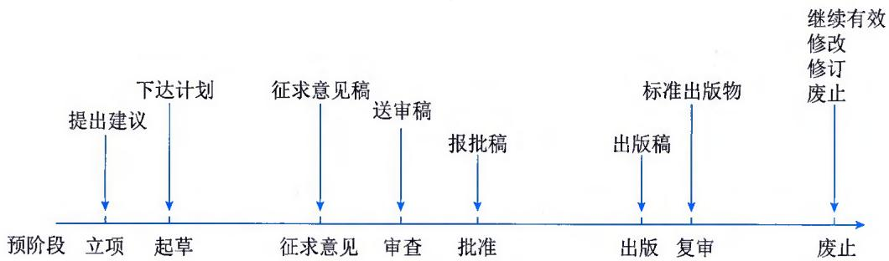
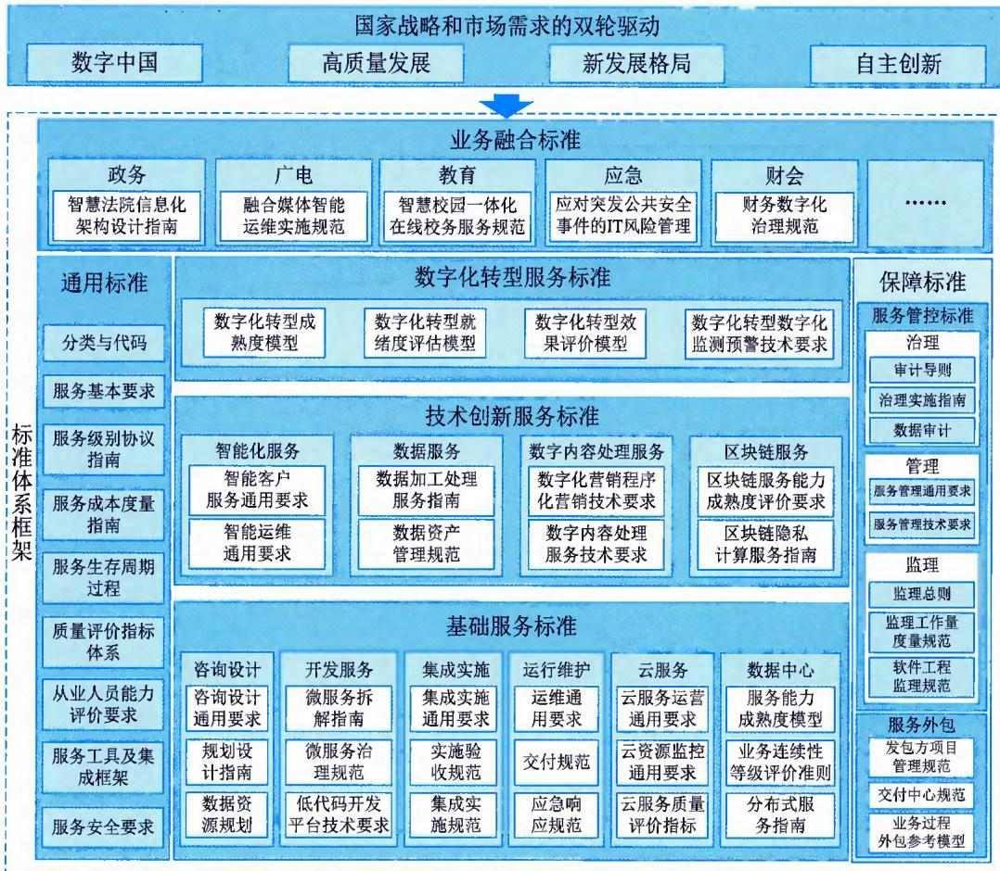

>[!info] 现行教材 · 第 2 版
>本页为**现行考试依据**的教材原文（第 2 版，2024 年 10 月出版，2025 年起启用）。
>考纲层级见 [[知识体系]]；练习题见 [[练习题·基础知识]]；案例模板见 [[案例答题模板]]。

# 第19章 IT 管理标准化

标准化伴随 IT 服务的发展与成熟，从 20 世纪 80 年代发展至今，过程中不断丰富并与其他相关标准相互融合。标准化是确保 IT 管理实现专业化、规模化的前提，也是规范 IT 管理的重要手段。在 IT 管理标准化的过程中，标准化的核心作用是确定 IT 管理的范围和内容，规范组成 IT 管理各种要素，从而为 IT 管理的规划、实施和运行奠定基础。

## 19.1 标准化知识

标准是为了在一定范围内获得最佳秩序，经协商一致制定并由公认机构批准共同使用和重复使用的一种规范性文件，是标准化活动的核心产物。标准是研究制定法律、技术法规、政策和规划的依据，是组织从事生产经营活动、消费者选择产品和服务的主要依据。经过100多年的发展，标准化已成为全球政治和经济活动的主要组成部分，甚至是技术发达国家和跨国组织的发展战略。

标准化是指为了在一定范围内获得最佳秩序，对现实问题或潜在问题制定共同使用和重复使用的条款的活动。标准化是一项活动，这种活动的结果是制定条款，制定条款的目的是在一定范围内获得最佳秩序，所制定的条款的特点是共同使用和重复使用，针对的对象是现实问题或潜在问题。再结合标准的定义可以得出：多项条款的组合构成了规范性文件，如果这些规范性文件符合相应的程序，经过公认机构的批准，就成为标准或特定文件（例如国家标准化指导性技术文件）。标准化活动涉及标准及其配套文件的编写过程、征求意见过程、审查发布过程和使用过程等。

## 19.1.1 标准体系

标准体系是一种由标准组成的系统，为了实现系统的目标而必须具备一整套具有内在联系的、科学的有机整体。标准体系内部各标准按照一定的结构进行逻辑组合，而不是杂乱无序的堆积，它是一个概念系统，是由人为组织制定的标准形成的人工系统。

## 1. 标准体系结构

标准体系结构是指标准系统内各标准内在有机联系的表现方式。形成标准体系的主要方式有层次和并列两种。层次是指一种方向性的等级顺序，彼此存在着制约关系和隶属关系；并列是指同一层次内各类或各标准之间存在的方式和秩序，如 ITSS 体系主要通过并列方式列出各类和各项标准。

## 2. 标准体系表

标准体系要用一定的形式表现出来，即标准体系表。如信息技术服务标准体系表是将信息技术服务范围内的标准，按照一定结构形式排列起来的图表，反映了信息技术服务标准体系的全貌，表明了标准之间的层次和并列关系。

## 19.1.2 标准的分类

标准的种类繁多，根据不同的目的或原则可以划分出不同的类别。主要划分方式包括按照适用范围划分、按照涉及的对象类型划分和按照标准的要求程度划分。

## 1. 按照适用范围划分

制定标准的重要基础是在一定的范围内充分反映各相关方的利益，并对不同意见进行协调与协商，从而取得一致。其中"一定的范围"和"各相关方"的范围可大可小，可以是全球的，也可以是某个区域或某个国家层次的，还可以是某个国家内行业部门（或协会）、地方或企业层次的。显而易见，不同层次标准化活动的协商一致程度是不同的，所制定标准的适用范围也是不同的。依据制定标准的参与者所涉及的范围，也就是标准的适用范围，可将标准分为国际标准、国家标准、行业标准、团体标准、地方标准、企业标准等。

（1）国际标准（International Standard）。指国际标准化组织（ISO）、国际电工委员会（IEC）和国际电信联盟（ITU）以及ISO确认并公布的其他组织制定的标准。ISO确认并公布的其他国际组织主要包括国际计量局（BIPM）、国际原子能机构（IAEA）、国际海事组织（IMO）、联合国教科文组织（UNESCO）、世界卫生组织（WHO）等49个国际标准化机构。

（2）国家标准（National Standard）。指由国家标准机构通过并公开发布的标准。对我国而言，国家标准是指由国务院标准化行政主管部门组织制定，并对全国国民经济和技术发展有重大意义，需要在全国范围内统一的标准。国家标准由全国专业标准化技术委员会负责起草、审查，并由国务院标准化行政主管部门统一审批、编号和发布。

（3）行业标准（Branch Standard）。指在国家的某个行业通过并公开发布的标准。对我国而言，行业标准是对没有国家标准而又需要在全国某个行业范围内统一的技术要求所制定的标准。行业标准的发布部门由国务院标准化行政主管部门审查确定。凡批准可以发布行业标准的行业，由国务院标准化行政主管部门公布行业标准代号、行业标准的归口部门及其所管理的行业标准范围。

（4）团体标准（Group Standard）。指由团体按照团体确立的标准制定程序自主制定发布，由社会自愿采用的标准。团体标准可以涵盖各个领域和行业，例如产品规范、质量管理体系、环境管理、职业安全健康、信息安全、社会责任等。制定团体标准的目的是满足特定团体的需求和目标，促进内部或特定群体的统一管理、交流和合作。

（5）地方标准（Provincial Standard）。指在国家的某个地区通过并公开发布的标准。对我国而言，地方标准是针对没有国家标准和行业标准，而又需要在省、自治区、直辖市范围内统一的技术要求所制定的标准。地方标准由省、自治区、直辖市标准化行政主管部门统一编制计划、组织制定、审批、编号和发布。地方标准发布后，省、自治区、直辖市标准化行政主管部门应分别向国务院标准化行政主管部门和有关行政主管部门备案。

（6）企业标准（Company Standard）。指针对企业范围内需要协调、统一的技术要求、管理要求和工作要求所制定的标准。企业标准是企业组织生产、经营活动的依据。企业标准虽然只在某企业适用，但在地域上可能会影响多个国家。

## 2. 按照涉及的对象类型划分

标准涉及的对象类型不同，反映到标准的文本上体现为其技术内容及表现形式的不同。主要包括术语标准、符号标准、试验标准、产品标准、过程标准、服务标准、接口标准等。

（1）术语标准（Terminology Standard）。指与术语有关的标准，通常带有定义，有时还附有注、图、示例等。术语标准是按照专业范围划分的，包含某领域内某个专业的许多术语。术语标准的主要技术要素为术语条目，通常由条目编号、术语和定义几个部分内容组成，包含术语和相应定义的术语标准，其名称为《XXX 词汇》，如果仅有术语没有定义，则名称为《XXX 术语集》。

（2）符号标准（Symbol Standard）。指与符号相关的标准。符号是表达一定事物或概念，具有简化特征的视觉形象。通常分为文字符号和图形符号。文字符号又可分为字母符号、数字符号、汉字符号或它们组合而成的符号；图形符号又可分为产品技术文件用、设备用、标志用图形符号。

（3）试验标准（Testing Standard）。指与试验方法有关的标准，有时附有与测试有关的其他条款，例如抽样、统计方法的应用、试验步骤。试验标准是规定试验过程的标准。试验标准规定了标准化的试验方法。

（4）产品标准（Product Standard）。指规定产品应满足的要求以确保其适用性的标准。按照ISO对标准化对象的划分，产品标准是相对于过程标准和服务标准而言的一大类标准，与产品有关的标准都可以划入这一类别。产品标准可分为不同类别的标准，例如尺寸标准、材料标准等。

（5）过程标准（Process Standard）。指规定过程应满足的要求以确保其适用性的标准。按照ISO对标准对象的划分，过程标准是相对于产品标准和服务标准而言的一大类标准，与过程有关的标准都可以划入这一类别。

（6）服务标准（Service Standard）。指规定服务应满足的要求以确保其适用性的标准。按照ISO对标准化对象的划分，服务标准是相对于产品标准和过程标准而言的一大类标准，与服务相关的标准都可以划入这一类别。

（7）接口标准（Interface Standard）。指规定产品或系统在其互连部位与兼容性有关的要求的标准。从上述定义可看出，接口标准针对的是一个产品与其他产品连接使用时，其相互连接的界面的标准化问题。

## 3. 按照标准的要求程度划分

按照标准的要求程度不同，可划分为规范、规程、指南等。

（1）规范（Specification）。指规定产品、过程或服务需要满足的要求的文件。几乎所有的标准化对象都可以成为"规范"的对象，无论是产品、过程还是服务，或者是其他更加具体的

标准化对象。

（2）规程（Code of Practice）。指为设备、构件或产品的设计、制造、安装、维护或使用而推荐惯例或程序的文件。规程所针对的标准化对象是设备、构件或产品。

（3）指南（Guideline）。指给出某主题的一般性、原则性、方向性的信息、指导或建议的文件。指南的标准化对象较广泛，但具体到每一个特定的指南，其标准化对象则集中到某一主题的特定方面，这些特定方面是有共性的，即一般性、原则性或方向性的内容。

## 19.1.3 标准制定

国家标准的制定有一套正常程序，分为预阶段、立项阶段、起草阶段、征求意见阶段、审查阶段、批准阶段、出版阶段、复审阶段以及废止阶段，如表 19-1 和图 19-1 所示。其他类型的标准制定过程，大多数情况下会参考国家标准的制定过程方法。

表 19-1 国家标准制定阶段划分

<table><tr><td>阶段代码</td><td>阶段名称</td><td>阶段任务</td><td>阶段成果</td></tr><tr><td>00</td><td>预阶段</td><td>提出新工作项目建议</td><td>PWI</td></tr><tr><td>10</td><td>立项阶段</td><td>提出新工作项目</td><td>NP</td></tr><tr><td>20</td><td>起草阶段</td><td>提出标准草案征求意见稿</td><td>WD</td></tr><tr><td>30</td><td>征求意见阶段</td><td>提出标准草案征求意见稿</td><td>CD</td></tr><tr><td>40</td><td>审查阶段</td><td>提出标准草案送审稿</td><td>DS</td></tr><tr><td>50</td><td>批准阶段</td><td>提出标准出版稿</td><td>FDS</td></tr><tr><td>60</td><td>出版阶段</td><td>提出标准出版物</td><td>GB, GB/T, GB/Z</td></tr><tr><td>90</td><td>复审阶段</td><td>对实施周期达5年的标准进行复审</td><td>继续有效/修改/修订/废止</td></tr><tr><td>95</td><td>废止阶段</td><td></td><td>废止</td></tr></table>

  
图19-1 标准制定流程图

## 19.2 主要标准

国内外发布了较多的信息系统与软件工程、新一代信息技术以及信息技术服务相关的标准规范，有关标准为信息系统相关活动提供了最佳实践、规范要求等内容，相关信息系统活动需要根据活动的内容、预计达成的目标和技术使用情况等，遵循有关标准的规定和要求，从而确保有关活动的有效性和规范性等。

## 19.2.1 系统与软件工程标准

系统与软件工程相关标准主要分为基础标准、生存周期管理标准以及质量与测试标准。各标准关注的方向和侧重点不同，需要系统化融合应用。

## 1. 基础标准

基础标准方面，主要包含GB/T11457《信息技术软件工程术语》、GB/Z31102《软件工程软件工程知识体系指南》等标准。

（1）GB/T 11457《信息技术 软件工程术语》标准给出了 1859 个软件工程领域的中文术语，以及每个中文术语对应的英文词汇，并对每个术语给出相应的定义。

（2）GB/Z 31102《软件工程 软件工程知识体系指南》作为指导性技术文件描述了软件工程学科的边界范围，按主题提供了访问支持该学科的文献的途径。制定软件工程知识体系（SWEBOK）指南有5个目标：①促进业界对软件工程看法趋于一致；②阐明软件工程的地位，并设定软件工程与计算机科学、项目管理、计算机工程和数学等其他学科之间的界线；③描述软件工程学科的内容；④提供使用软件工程知识体系的主题；⑤为课程制定、个人认证及特许资料提供依据。

## 2. 生存周期管理标准

生存周期管理标准方面，主要包含GB/T8566《信息技术软件生存周期过程》、GB/T22032《系统与软件工程系统生存周期过程》等标准。

（1）GB/T8566《信息技术软件生存周期过程》为软件生存周期过程建立了一个公共框架，可供软件工业界使用。包括在含有软件的系统、独立软件产品和软件服务的获取期间以及在软件产品的供应、开发、运行和维护期间需应用的过程、活动和任务。此外，该标准还规定了用来定义、控制和改进软件生存周期的过程。

《信息技术 软件生存周期过程》适用于系统和软件产品以及服务的获取，还适用于软件产品和固件的软件部分的供应、开发、操作和维护，可在一个组织的内部或外部实施。适用于供需双方，如供需双方来自同一组织，同样适用；适用于从一项非正式协定直到法律约束的合同的各种情况。适用于系统和软件产品即服务的需方、软件产品的供方、开发方、操作方、维护方、管理方、质量保证管理者和用户。该标准可由单方作为自我改进工作使用。同时，不阻止现货软件的供方或者开发方使用该标准。

（2）GB/T 22032《系统与软件工程 系统生存周期过程》为描述人工系统的生存周期建立了一个通用框架，从工程的角度定义了一组过程及相关的术语，该标准定义了软件生存周期过程。这些过程可以应用于系统结构的各个层次。在整个生存周期中，被选定的过程集合可应用于管理、运行系统生存周期的各个阶段。这是通过所有与系统有关的各方参与，以实现顾客满意为最终目标来完成的。该标准还提供了一些过程，支持用于组织或项目中生存周期过程的定义、控制和改进。当获取和供应系统时，组织和项目可使用这些生存周期过程。

《系统与软件工程 系统生存周期过程》涉及一个或多个可由以下元素配置的人工系统：硬件、软件、数据、人员、过程（例如给用户提供服务的过程）、规程（例如操作指南）、设施、物资和自然存在的实体。当系统元素是软件时，ISO/IEC/IEEE 12207：2015 可以用于实现此系统元素。两个标准互相协调，可以在单个项目或单个组织中同时使用。

## 3. 质量与测试标准

质量与测试标准方面，主要包含GB/T25000《系统与软件工程系统与软件质量要求和评价(SQuaRE)》等。

《系统与软件工程 系统与软件质量要求和评价（SQuaRE）》分为多个部分，各部分内容及相应的适用范围如表 19-2 所示。

表 19-2 GB/T 25000 标准各部分内容

<table><tr><td>标准号</td><td>各部分名称</td><td>主要内容</td><td>适用范围</td></tr><tr><td>GB/T25000.1</td><td>第1部分:SQuaRE指南</td><td>该部分为GB/T 25000整体标准提供使用指南。该部分旨在为GB/T 25000标准的内容、公共参考模型和定义以及各部分间的关系提供一个全面说明,允许用户根据其使用目的应用该部分</td><td>标准适用但不限于系统和软件产品的开发方、需方和独立的评价方,特别是那些负责定义系统和软件质量需求,及系统和软件产品评价的人员</td></tr><tr><td>GB/T25000.2</td><td>第2部分:计划与管理</td><td>该部分通过提供技术、工具、经验和管理技能,为负责执行和管理系统与软件产品质量需求规约和评价活动的组织提供要求和建议</td><td>该部分适用于预期用户执行:1管理用于需求规约和评价执行的技术;2明确系统与软件产品质量要求;3支持系统与软件产品质量要求;4管理系统与软件开发组织;5与质量保证职能相关的事项</td></tr><tr><td>GB/T25000.10</td><td>第10部分:系统与软件质量模型</td><td>该部分定义了:1使用质量模型,该模型由5个特性组成,每个特性又可进一步细分为一些子特性,这些特性关系到产品在特定的使用周境中使用时的交互结果;2产品质量模型,该模型由8个特性组成,每个特性又可进一步细分为一些子特性,这些特性关系到软件的静态性质和计算机系统的动态性质</td><td>使用质量模型可以应用于整个人机系统,既包括使用中的计算机系统,也包括使用中的软件产品。产品质量模型,模型既可以应用于计算机系统,也可以应用于软件产品</td></tr><tr><td>GB/T25000.12</td><td>第12部分:数据质量模型</td><td>该部分针对计算机系统中以某种结构化形式保存的数据,定义了通用的数据质量模型。关注于作为计算机系统一个组成部分的数据的质量,并定义由人和系统使用的目标数据的质量特性</td><td>数据与数据设计之间的复合型包含在该部分的范围内</td></tr><tr><td>GB/T25000.20</td><td>第20部分:质量测量框架</td><td>该部分规定了开展质量测量工作的框架</td><td>该部分可用于设计、识别、评价和执行系统与软件产品质量、使用质量和数据质量的测量模型。该参考模型可被开发方、需方、质量保证人员以及独立评价方,尤其是负责规定和评价信息通信技术系统质量的人员所使用</td></tr><tr><td>GB/T25000.21</td><td>第21部分:质量测度元素</td><td>该部分旨在定义和/或设计质量测度元素(QME)的初始集,可将其应用在软件产品的整个生存周期,以实现系统和软件质量要求与评价(SQuaRE)标准的目的。还给出了设计QME或对已有QME设计进行验证的规划集</td><td>该部分旨在供(但不限于)开发方、需方、产品的独立评价方使用,特别是面向负责定义产品质量需求和产品评价的责任人。当定义拟用来获取质量测度(例如GB/T 25000.22、GB/T25000.23、GB/T 25000.24中所规定的质量测度)相关的QME时,该部分是适用的</td></tr><tr><td>GB/T25000.22</td><td>第22部分:使用质量测量</td><td>该部分提出的使用质量测度主要在基于真实使用效果的系统与软件产品的质量保证和管理中使用。测量结果的主要用户是软件与系统开发、获取、评价或维护的管理人员</td><td>该部分针对GB/T 25000.10所定义之特性的使用质量测度进行了定义,旨在与GB/T 25000.10搭配使用。该部分能与GB/T 25000.30、GB/T 25000.40和GB/T 25000.41等标准结合使用,并能在产品或系统质量方面更普遍地满足用户需要</td></tr><tr><td>GB/T25000.23</td><td>第23部分:系统与软件产品质量测量</td><td>该部分基于GB/T 25000.10定义的特性和子特性,规定了用于量化评价系统与软件产品质量的测度</td><td>该部分定义的质量测度需要与GB/T 25000.10协同使用,并可以联合系统与软件质量要求和评价(SQuaRE)系列国际标准的质量需求分部(ISO/IEC 2503n)及评价分部(ISO/IEC 2504n),以便更广泛地满足用户对于软件产品和系统质量需求的定义与评价</td></tr><tr><td>GB/T25000.24</td><td>第24部分:数据质量测量</td><td>该部分包含:1每一个特性的数据质量测度的基本集合;2在数据生存周期中应用了质量测度的目标实体的基本集合;3对如何应用数据质量测度的解释;4指导组织定义自己的针对数据质量需求和评价的测度</td><td>该部分可以应用到用于任何种类应用的计算机系统中的、保持结构化格式的任何种类的数据</td></tr><tr><td>GB/T25000.30</td><td>第30部分:质量需求框架</td><td>该部分为系统、软件产品及数据提供了质量需求的框架,包括质量需求的概念及抽取、定义和管控它们的过程和方法</td><td>GB/T 25000标准中部分引用的文件,其最新版本(包括所有的修改单)适用于该文件</td></tr><tr><td>GB/T25000.40</td><td>第40部分:评价过程</td><td>该部分包含软件产品质量评价的要求和建议,并阐明了一般概念。它为评价软件产品质量提供了一个过程描述,并为该过程的应用明确了要求。该部分建立了评价参考模型与SQuaRE文档之间的关系,也说明了在评价过程的每个活动应如何对应使用SQuaRE文档</td><td>该部分主要适合于软件产品的开发方、需方以及独立评价方。评价过程可用于不同的目的和方法。该过程用于预开发软件、商业现货软件或定制软件的质量评价,也可用于开发过程期间或开发之后。该部分不用于软件产品其他方面(如功能性需求、过程需求、业务需求等)的评价</td></tr><tr><td>GB/T25000.41</td><td>第41部分:开发方、需方和独立评价方评价指南</td><td>该部分提供了软件产品质量评价的要求、建议和指南。该部分提供了对软件产品质量评价的过程描述,并从开发方、需方和独立评价方的视角陈述了应用评价过程的具体要求</td><td>该部分不限于任何特定的应用领域,可用于任何类型软件产品的质量评价方。评价过程可用于不同的目的和方法,也可用于预开发软件、商业现货软件或定制软件的软件产品质量评价,并可用于开发过程期间或开发之后。该部分旨在供负责软件产品质量评价的人员使用,并适用于产品的开发方、需方和独立评价方。该部分不适用于软件产品其他方面(如功能性需求、过程需求、业务需求等)的评价</td></tr><tr><td>GB/T25000.45</td><td>第45部分:易恢复性的评价模块</td><td>该部分提供了软件产品易恢复性质量评价的评价方法、过程、测度和结果说明。采用干扰注入方法和基于常见类别的操作故障和事件的干扰列表来评价承受力的质量测度。应用基于对每种干扰定义一组问题集,通过评估系统在没有人为干预的情况下检测、分析和解决干扰的程度,来评价自主恢复指数的质量测度</td><td>适用于软件产品(包括中间工作产品和最终产品)、支持单个或多个并发用户的交易系统的易恢复性质量评价。该部分旨在供负责软件产品质量评价的人员使用,并适用于产品的开发方、需方(用户)和独立评价方</td></tr><tr><td>GB/T25000.51</td><td>第51部分:就绪可用软件产品(RUSP)的质量要求和测试细则</td><td>该部分确立了就绪可用软件产品(RUSP)的质量要求</td><td>用于测试RUSP的包含测试计划、测试说明和测试结果等的测试文档集要求</td></tr><tr><td>GB/T25000.62</td><td>易用性测试报告行业通用格式(CIF)</td><td>该部分规范了用户测试过程中获取的信息类型。主要的可变因素是综合统计数据、任务描述、测试环境以及为规范研究发现而选择的特别变量</td><td>该部分适用于:1供方组织易用性专业人员编写供顾客组织使用的报告时;2顾客组织验证一个特定报告是否符合该文件时;3顾客组织内的人类工效学专家或其他易用性专业人员评价易用性测试的技术价值和产品易用性时;4顾客组织内的其他专业人员和管理者在利用测试结果对产品适宜性和购买进行商业决策时</td></tr></table>

## 19.2.2 新一代信息技术标准

新一代信息技术主要包括物联网、云计算、大数据、区块链、人工智能、虚拟现实、移动互联网等，针对物联网、云计算两个领域的重点标准介绍如下。

## 1. 物联网相关标准

物联网相关标准主要有GB/T33745《物联网术语》、GB/Z33750《物联网标准化工作指南》、GB/T33474《物联网参考体系结构》等。相关标准的标准编号、标准名称、主要内容及适用范围等如表19-3所示。

表 19-3 现行主要物联网相关标准

<table><tr><td>标准号</td><td>标准名称</td><td>主要内容</td><td>适用范围</td><td>类别</td></tr><tr><td>GB/T33745</td><td>物联网术语</td><td>该标准界定了物联网中一些共性的、基础性的术语和定义</td><td>该标准适用于物联网概念的理解和信息的交流</td><td>国家标准</td></tr><tr><td>GB/Z33750</td><td>物联网标准化工作指南</td><td>该指南制定了物联网标准化工作原则、工作程序、标准名称的结构和命名以及物联网标准分类</td><td>该指导性技术文件适用于:1以物联网作为名称要素的国家标准的管理工作;2物联网基础共性标准的研制工作</td><td>国家标准</td></tr><tr><td>GB/T33474</td><td>物联网参考体系结构</td><td>该标准给出了物联网概念模型,并从系统、通信、信息三个不同的角度给出了物联网参考体系结构</td><td>该标准适用于各应用领域物联网系统的设计,为物联网系统设计提供参考</td><td>国家标准</td></tr><tr><td>GB/T35319</td><td>物联网系统接口要求</td><td>该标准规定了物联网系统实体间接口的具体功能要求</td><td>该标准适用于物联网系统实体间接口的设计、开发和应用</td><td>国家标准</td></tr><tr><td>GB/T36478.1</td><td>物联网信息交换和共享第1部分:总体架构</td><td>该部分规定了物联网系统之间进行信息交换和共享包含的过程活动、功能实体和共享交换模式</td><td>该部分适用于物联网系统之间信息交换和共享的规划、设计、系统开发以及运行维护管理</td><td>国家标准</td></tr><tr><td>GB/T36478.2</td><td>物联网信息交换和共享第2部分:通用技术要求</td><td>该部分规定了物联网系统间进行信息交换和共享的通用技术要求,包括数据服务、数据标准化处理、数据存储与管理、数据传递接口、目录管理、认证与授权、交换和共享监控及安全策略要求等内容</td><td>该部分适用于物联网系统之间信息交换和共享的规划、设计、系统开发以及运行维护管理</td><td>国家标准</td></tr><tr><td>GB/T36468</td><td>物联网系统评价指标体系编制通则</td><td>该标准规定了物联网系统评价指标体系的编制原则、体系结构以及指标描述和设计原则</td><td>该标准适用于具体行业物联网应用系统评价指标体系的编制</td><td>国家标准</td></tr><tr><td>GB/T36478.3</td><td>物联网信息交换和共享第3部分:元数据</td><td>该部分规定了物联网系统间信息交换和共享的元数据,包括元数据概念模型、核心元数据和扩展元数据。</td><td>该部分适用于物联网系统间信息交换和共享系统的规划、设计以及维护管理</td><td>国家标准</td></tr><tr><td>GB/T36478.4</td><td>物联网信息交换和共享第4部分:数据接口</td><td>该部分规定了物联网系统与外部物联网系统进行信息交换和共享时数据接口的数据推送请求、推送数据、数据获取请求、获取数据、目录获取请求、获取目录数据、目录数据推送请求和推送目录数据等接口参数</td><td>该部分适用于物联网系统之间信息交换和共享的设计、系统开发以及运行维护管理</td><td>国家标准</td></tr><tr><td>GB/T37684</td><td>物联网协同信息处理参考模型</td><td>该标准提出了物联网系统中对任务或服务的协同信息处理的参考模型,规定了实体功能和协同信息处理过程</td><td>该标准适用于物联网系统中协同信息处理的设计和开发</td><td>国家标准</td></tr><tr><td>GB/T37685</td><td>物联网应用信息服务分类</td><td>该标准规定了物联网应用信息服务分类的规则与类别</td><td>该标准适用于物联网应用系统规划、设计、研发与应用</td><td>国家标准</td></tr><tr><td>GB/T37686</td><td>物联网感知对象信息融合模型</td><td>该标准提出了物联网感知对象信息融合的概念模型,描述了感知对象信息融合在物联网参考体系结构中的位置</td><td>该标准适用于物联网系统感知对象信息融合的设计和开发</td><td>国家标准</td></tr><tr><td>GB/T38637.1</td><td>物联网感知控制设备接入第1部分:总体要求</td><td>该部分规定了物联网系统中感知控制设备接入的接入要求、应用层接入协议和协议适配</td><td>该部分适用于物联网感知控制设备的规划和研发</td><td>国家标准</td></tr><tr><td>GB/T38624.1</td><td>物联网网关第1部分:面向感知设备接入的网关技术要求</td><td>该部分规定了面向感知设备接入的物联网网关功能要求和通用数据配置要求</td><td>该部分适用于面向感知设备接入物联网网关的设计、开发和测试</td><td>国家标准</td></tr><tr><td>GB/T38637.2</td><td>物联网感知控制设备接入第2部分:数据管理要求</td><td>该部分规定了物联网感知控制设备接入网关或平台时的数据采集、数据处理、数据交换和数据安全等数据管理要求</td><td>该部分适用于物联网感知控制设备接入网关或平台时数据管理功能的设计与实现</td><td>国家标准</td></tr><tr><td>GB/T40684</td><td>物联网信息共享和交换平台通用要求</td><td>该文件规定了物联网信息共享与交换平台的概念和功能要求,功能要求包括数据管理、目录管理、服务支撑、平台管理和安全机制</td><td>该文件适用于物联网信息共享和交换平台的设计、开发和实现</td><td>国家标准</td></tr><tr><td>GB/T40688</td><td>物联网生命体征感知设备数据接口</td><td>该文件规定了面向物联网应用的生命体征感知设备到生命体征监测系统的数据接口的总则、接口消息格式以及通用接口和业务接口的基本功能和参数的要求</td><td>该文件适用于面向物联网应用的生命体征感知设备的设计、生产和使用</td><td>国家标准</td></tr><tr><td>GB/T40687</td><td>物联网生命体征感知设备通用规范</td><td>该文件规定了面向物联网应用的生命体征感知设备的要求和试验方法</td><td>该文件适用于面向物联网应用的生命体征感知设备的设计、生产和使用</td><td>国家标准</td></tr><tr><td>GB/T40778.1</td><td>物联网面向Web开放服务的系统实现第1部分:参考架构</td><td>该文件规定了面向Web开放服务的物联网系统的参考架构和功能组件,并对协议适配、物体描述、物体发现、物体共享和安全保障等功能组件进行了描述</td><td>该文件适用于面向Web开放服务的物联网系统的顶层设计,为面向Web的开放服务与物体交互实现提供指导</td><td>国家标准</td></tr><tr><td>GB/T40778.2</td><td>物联网面向Web开放服务的系统实现第2部分:物体描述方法</td><td>该文件规定了面向Web开放服务的物联网系统的物体描述模型和物体描述元数据的要求</td><td>该文件适用于面向Web开放服务的物联网系统设计和开发,为物联网应用服务提供技术支撑</td><td>国家标准</td></tr><tr><td>YD/T2437</td><td>物联网总体框架与技术要求</td><td>该标准规定了物联网通用分层模型、物联网总体框架、主要部件及能力要求、参考点要求以及物联网共性能力要求</td><td>该标准适用于整个物联网</td><td>行业标准</td></tr></table>

## 2. 云计算相关标准

云计算相关标准主要有 GB/T 32400《信息技术 云计算 概览与词汇》、GB/T 32399《信息技术云计算 参考架构》等。相关标准的标准编号、标准名称、主要内容及适用范围等如表 19-4 所示。

表 19-4 现行主要云计算相关标准

<table><tr><td>标准号</td><td>标准名称</td><td>主要内容</td><td>适用范围</td><td>类别</td></tr><tr><td>GB/T32400</td><td>信息技术 云计算 概览与词汇</td><td>该标准给出了云计算概览、云计算相关术语及定义。该标准为云计算标准提供了术语基础</td><td>该标准适用于各类组织(例如企业、政府机关和非营利性组织)</td><td>国家标准</td></tr><tr><td>GB/T32399</td><td>信息技术 云计算 参考架构</td><td>该标准规定了云计算参考架构(CCRA),包括云计算角色、云计算活动、云计算功能组件以及他们之间的关系</td><td>该标准适用于云计算架构参考使用</td><td>国家标准</td></tr><tr><td>GB/T35301</td><td>信息技术 云计算 平台即服务(PaaS)参考架构</td><td>该标准规定了平台即服务(PaaS)参考架构的术语定义和缩略语、图例说明、PaaS 参考架构概念、PaaS 用户视图和功能视图</td><td>该标准适用于 PaaS 云计算系统的设计、实现、部署和使用</td><td>国家标准</td></tr><tr><td>GB/T35293</td><td>信息技术 云计算 虚拟机管理通用要求</td><td>该标准规定了虚拟机的基本管理,以及虚拟机的生命周期、配置与调度、监控与告警、可用性和可靠性、安全性等管理通用技术要求</td><td>该标准适用于虚拟机相关产品的设计、开发、测评、使用等</td><td>国家标准</td></tr><tr><td>GB/T 36327</td><td>信息技术云计算平台即服务(PaaS)应用程序管理要求</td><td>该标准提出了平台即服务(PaaS)应用程序的管理流程,并规定了PaaS应用程序的一般要求与管理要求</td><td>该标准适用于与平台即服务(PaaS)应用程序管理相关的PaaS提供者的服务供应,平台即服务(PaaS)客户使用云平台服务部署运行应用程序,以及平台即服务(PaaS)协作者基于平台即服务(PaaS)应用程序管理的功能提供第三方服务的场景</td><td>国家标准</td></tr><tr><td>GB/T 36326</td><td>信息技术云计算云服务运营通用要求</td><td>该标准给出了云服务总体描述,规定了云服务提供者在人员、流程、技术及资源方面应具备的条件和能力</td><td>该标准适用于:1云服务提供者向云服务开发者提出需求的依据;2云服务提供者评估自身的条件和能力;3云服务客户选择和评价云服务提供者;4第三方评估云服务提供者的能力</td><td>国家标准</td></tr><tr><td>GB/T 36325</td><td>信息技术云计算云服务级别协议基本要求</td><td>该标准给出了云服务级别协议的构成要素,明确了云服务级别协议的管理要求,并提供了云服务级别协议中的常用指标</td><td>该标准适用于:1为云服务提供者和云服务客户(简称“双方”)建立云服务级别协议提供指导;2为客户对提供者交付的云服务进行考评提供参考依据;3为第三方进行云服务级别协议评估提供参考依据</td><td>国家标准</td></tr><tr><td>GB/T 36623</td><td>信息技术云计算文件服务应用接口</td><td>该标准规定了文件服务应用接口的基本接口和扩展接口,并针对HTTP1.1协议给出了实现例子</td><td>该标准适用于基于文件的云服务应用的开发、测试和使用</td><td>国家标准</td></tr><tr><td>GB/T 37741</td><td>信息技术云计算云服务交付要求</td><td>该标准规定了云服务交付的方式、内容、过程、质量及管理要求</td><td>该标准适用于:1CSP评估和改进自身的交付能力;2CSC及第三方机构评价和认定CSP的交付能力</td><td>国家标准</td></tr><tr><td>GB/T 37740</td><td>信息技术云计算云平台间应用和数据迁移指南</td><td>该标准规定了不同云平台间应用和数据迁移过程中迁移准备、迁移设计、迁移实施和迁移交付的具体内容</td><td>该标准适用于指导迁移实施方和迁移发起方开展应用和数据迁移活动</td><td>国家标准</td></tr><tr><td>GB/T 37737</td><td>信息技术云计算分布式块存储系统总体技术要求</td><td>该标准规定了分布式块存储系统的资源管理功能要求、系统管理功能要求、可扩展要求、兼容性要求和安全性要求</td><td>该标准适用于分布式块存储系统的研发和应用</td><td>国家标准</td></tr><tr><td>GB/T37739</td><td>信息技术 云计算 平台即服务部署要求</td><td>该标准规定了云计算平台即服务(PaaS)部署过程中的活动及任务</td><td>该标准适用于平台即服务提供方进行平台即服务的部署规划、实施和评估</td><td>国家标准</td></tr><tr><td>GB/T37736</td><td>信息技术 云计算 云资源监控通用要求</td><td>该标准规定了对云资源进行监控的技术要求和管理要求</td><td>该标准适用于云服务提供者建立云资源监控能力和云服务客户评价云资源的运行情况</td><td>国家标准</td></tr><tr><td>GB/T37734</td><td>信息技术 云计算 云服务采购指南</td><td>该标准规定了云服务采购流程、云服务采购需求分析、云服务提供商选择、协议/合同签订和服务交付与验收的基本要求</td><td>该标准适用于云服务客户和云服务提供者,用于指导云服务客户采购云服务</td><td>国家标准</td></tr><tr><td>GB/T37738</td><td>信息技术 云计算 云服务质量评价指标</td><td>该标准规定了云服务质量的评价指标</td><td>该标准适用于为云服务提供商评价自身云服务质量提供方法、为云服务客户选择云服务提供商提供依据和为第三方实施云服务质量评价提供参考</td><td>国家标准</td></tr><tr><td>GB/T37735</td><td>信息技术 云计算 云服务计量指标</td><td>该标准规定了不同类型云服务的计量指标和计量单位</td><td>该标准适用于各类云服务的提供、采购、审计和监管</td><td>国家标准</td></tr><tr><td>GB/T37732</td><td>信息技术 云计算 云存储系统服务接口功能</td><td>该标准规定了云存储系统提供的块存储、文件存储、对象存储等存储服务和运维服务接口的功能</td><td>该标准适用于指导云存储系统的研发、评估和应用</td><td>国家标准</td></tr><tr><td>GB/T40690</td><td>信息技术 云计算 云际计算参考架构</td><td>该标准规定了云际计算参考架构的功能、角色与活动</td><td>该标准适用于云际计算架构的设计、实现、部署和使用,也适用于具有云际资源协作需求的各类云服务参与者</td><td>国家标准</td></tr><tr><td>YD/T3148</td><td>云计算安全框架</td><td>该标准分析了云计算环境中云服务客户、云服务提供商、云服务伙伴面临的安全威胁和挑战,阐明了可减缓这些风险和应对安全挑战的安全能力</td><td>该标准提供的框架方法,用于确定在减缓云计算安全威胁和应对安全挑战方面,需要对其中哪些安全能力做出具体规范。该标准适用于云计算</td><td>行业标准</td></tr><tr><td>YD/T2806</td><td>云计算基础设施即服务(IaaS)功能要求与架构</td><td>该标准规定了该标准规定了云计算基础设施即服务(IaaS)服务种类与服务模式,功能架构及功能需求,接口及安全要求以及关键业务流程</td><td>该标准适用于云计算基础设施即服务(IaaS)</td><td>行业标准</td></tr></table>

## 19.2.3 信息技术服务标准

信息系统管理涉及的标准国家及行业标准众多，其中关联性较强且内容覆盖较多的是信息技术标准（Information Technology Service Standards，ITSS），它是一套成体系和综合配套的信息技术服务标准库，全面规范了信息技术服务产品及其组成要素，用于指导实施标准化和可信赖的信息技术服务。ITSS 中包含了数字化转型、服务产品、IT 治理、服务管理、运维维护、云计算等相关标准。

ITSS 是在工业和信息化部、国家标准化管理委员会的联合指导下而开展相关标准研制工作的，是我国 IT 服务行业最佳实践的总结和提升，也是我国从事 IT 服务研发、供应、推广和应用等各类组织自主创新成果的固化。

## 1. 要素与生命周期

IT 服务由人员（People）、过程（Process）、技术（Technology）和资源（Resource）组成，简称 PPTR。

\- 人员指提供IT服务所需的人员及其知识、经验和技能要求。

\- 过程指提供IT服务时，合理利用必要的资源，将输入转化为输出的一组相互关联和结构化的活动。

\- 技术指交付满足质量要求的IT服务应使用的技术或应具备的技术能力。

\- 资源指提供IT服务所依存和产生的有形及无形资产。

IT 服务生命周期由规划设计（Planning & Design）、部署实施（Implementing）、服务运营（Operation）、持续改进（Improvement）和监督管理（Supervision）5 个阶段组成，简称 PIOIS。

\- 规划设计。户业务战略出发，以需求为中心，参照ITSS对IT服务进行全面系统的战略规划和设计，为IT服务的部署实施做好准备，以确保提供满足客户需求的IT服务。

\- 部署实施。在规划设计基础上，依据ITSS建立管理体系、部署专用工具及服务解决方案。

\- 服务运营。根据IT服务部署情况，依据ITSS，采用过程方法，全面管理基础设施、服务流程、人员和业务连续性，实现业务运营与IT服务运营的全面融合。

\- 持续改进。根据IT服务运营的实际情况，定期评审IT服务满足业务运营的情况，以及IT服务本身存在的缺陷，提出改进策略和方案，并对IT服务进行重新规划设计和部署实施，以提高IT服务质量。

\- 监督管理。本阶段主要依据ITSS对IT服务质量进行评价，并对IT服务供方的服务过程、交付结果实施监督和绩效评估。

## 2. ITSS 标准体系 5.0

ITSS 是依据上述原理制定的一系列标准，是一套完整的信息技术服务标准体系，包含信息技术服务的规划设计、部署实施、服务运营、持续改进和监督管理等全生命周期阶段应遵循的标准，涉及咨询设计、集成实施、运行维护、服务管控、服务运营和服务外包等业务领域。

ITSS 5.0 标准体系的建设，结合了新形势下信息技术服务融合创新的特点，对其标准化对象的内涵与外延进行重新界定，明确了"支撑国家战略""引领产业高质量发展""促进新技术创新应用""指导信息技术服务业务升级""确保标准化工作有序开展"五大建设目标，并从"行业监管""产业基础发展""技术创新应用""融合业务场景"四重视角提炼标准化需求，最后提出了以基础服务标准为底座，以通用标准和保障标准为支柱，以技术创新服务标准和数字化转型服务标准为引领，共同支撑业务融合的ITSS5.0标准体系框架，如图19-2所示，其主要内容包括：

\- 通用标准。指适用于所有信息技术服务的共性标准，主要包括信息技术服务的分类与代码、质量评价指标体系、服务基本要求、从业人员能力评价要求、服务级别协议指南、服务生存周期过程、服务工具及集成框架、服务成本度量指南和服务安全要求等。

\- 保障标准。指对信息技术服务提出保障要求的标准，主要包括服务管控标准和外包标准。服务管控标准是指通过对信息技术服务的治理、管理和监理活动和要求，以确保信息技术服务管控的权责分明、经济有效和服务可控，服务外包则对组织通过外包形式获取服务所应采取的业务和管理措施提出要求。

\- 基础服务标准。指面向信息技术服务基础类服务的标准，包括咨询设计、开发服务、集成实施、运行维护、云服务、数据中心等标准。

\- 技术创新服务标准。指面向新技术加持下新业态新模式的标准，包含智能化服务、数据服务、数字内容处理服务和区块链服务等标准。

  
图19-2 ITSS标准体系5.0

\- 数字化转型服务标准。指支撑和服务组织数字化转型服务开展和创新融合业务发展的标准，包含数字化转型成熟度模型、就绪度评估模型、效果评价模型、数字化监测预警技术要求等标准规范和要求。

\- 业务融合标准。指支撑信息技术服务与各行业融合的标准，包括面向政务、广电、教育、应急、财会等行业建立具有行业特点的信息技术服务相关的标准。

ITSS标准体系是动态发展的，与信息技术服务相关的技术、服务和产业发展紧密相关，同时也与标准化建设工作的目标和定位紧密相关。

## 3. 主要通用标准

ITSS相关标准中在本教程很多领域已经进行了介绍和引用，如数字化转系成熟度、运维通用要求、智能运维等。通用标准相关的标准编号、标准名称、主要内容及适用范围等如表19-5所示。

表 19-5 现行主要信息技术服务通用标准

<table><tr><td>标准号</td><td>标准名称</td><td>主要内容</td><td>适用范围</td><td>类别</td></tr><tr><td>GB/T29264</td><td>信息技术服务分类与代码</td><td>该标准规定了信息技术服务的分类与代码,是信息技术服务分类、管理和编目的准则,为信息技术服务体系的建立提供了范围基础</td><td>该标准适用于信息技术服务的信息管理及信息交换,供科研、规划等工作使用</td><td>国家标准</td></tr><tr><td>GB/T33850</td><td>信息技术服务质量评价指标体系</td><td>该标准建立了信息技术服务质量模型,规定了信息技术服务质量评价指标、测量方法以及质量评价过程等</td><td>该标准适用于对信息技术服务质量进行评价</td><td>国家标准</td></tr><tr><td>GB/T37696</td><td>信息技术服务从业人员能力评价要求</td><td>该标准规定了信息技术服务从业人员的职业种类、能力要素等级和评价方法</td><td>该标准适用于信息技术服务从业人员的能力评价与培养</td><td>国家标准</td></tr><tr><td>GB/T37961</td><td>信息技术服务服务基本要求</td><td>该标准规定了信息技术服务中服务过程基本要求、信息技术咨询、设计与开发、信息系统集成实施、运行维护、数据处理和存储、运营等服务的活动内容和成果要求</td><td>该标准适用于服务供方和需方确立服务内容及签署合同</td><td>国家标准</td></tr><tr><td>GB/T39770</td><td>信息技术服务服务安全要求</td><td>该标准提出了信息技术服务安全模型,规定了安全总则、生存周期和能力要素的安全要求</td><td>该标准适用于信息技术服务提供方、服务需求方和第三方</td><td>国家标准</td></tr><tr><td>SJ/T11691</td><td>信息技术服务服务级别协议指南</td><td>该标准给出了信息技术服务级别协议的各项要素,并提出了针对服务级别协议的管理流程</td><td>该标准适用于建立、管理并评价一致的、全面的、可量化的服务级别协议提供指南</td><td>行业标准</td></tr><tr><td>T/CESA1154</td><td>信息技术服务从业人员能力评价指南设计与开发服务</td><td>该标准规定信息技术服务设计与开发专业从业人员的职责要求、职业序列以及等级、各职责等级的准入条件和职业能力要求</td><td>该标准适用于提供相关专业信息技术服务的企业及有关组织进行从业人员能力管理、能力评价和技能培训等</td><td>团体标准</td></tr><tr><td>T/CESA 1155</td><td>信息技术服务从业人员能力评价指南 集成实施服务</td><td>该标准规定信息技术服务集成实施专业从业人员的职责要求、职责序列以及等级、各职责等级的准入条件和职业能力要求</td><td>该标准适用于提供相关专业信息技术服务的企业及有关组织进行从业人员能力管理、能力评价和技能培训等</td><td>团体标准</td></tr><tr><td>T/CESA 1156</td><td>信息技术服务从业人员能力评价指南 运行维护服务</td><td>该标准规定信息技术服务运营维护专业从业人员的职责要求、职责序列以及等级、各职责等级的准入条件和职业能力要求</td><td>该标准适用于提供相关专业信息技术服务的企业及有关组织进行从业人员能力管理、能力评价和技能培训等</td><td>团体标准</td></tr><tr><td>T/CESA 1157</td><td>信息技术服务从业人员能力评价指南 云计算服务</td><td>该标准规定信息技术服务云计算从业人员的职责要求、职责序列以及等级、各职责等级的准入条件和职业能力要求</td><td>该标准适用于提供相关专业信息技术服务的企业及有关组织进行从业人员能力管理、能力评价和技能培训等</td><td>团体标准</td></tr><tr><td>T/CESA 1158</td><td>信息技术服务从业人员能力评价指南 信息安全服务</td><td>该标准规定信息技术服务信息安全专业从业人员的职责要求、职责序列以及等级、各职责等级的准入条件和职业能力要求</td><td>该标准适用于提供相关专业信息技术服务的企业及有关组织进行从业人员能力管理、能力评价和技能培训等</td><td>团体标准</td></tr></table>

## 19.3 本章练习

## 1. 选择题

(1) GB/T 28827.3《信息技术服务 运行维护 第3部分: 应急响应规范》规定了运维服务中应急响应的4个环节, 即应急准备、检测与预警、\_、总结改进。 A. 风险规避 B. 应急处置 C. 异地备份 D. 风险接受

参考答案: B

(2) 关于标准和标准化的描述不正确的是: \_\_\_\_。

A. 标准是为了在一定范围内获得最佳秩序，经协商一致制定并由公认机构批准共同使用和重复使用的一种规范性文件，是标准化活动的核心产物

B. 标准是研究制定法律、技术法规、政策和规划的依据，是企业从事生产经营活动、消费者选择产品和服务的主要依据

C. 世界上最早的标准化组织是国际标准化组织（ISO）

D. 依据制定标准的参与者所涉及的范围，也就是标准的适用范围，可将标准分为国际标准、国家标准、行业标准、地方标准、企业标准等

参考答案: C

(3) 国家信息技术服务标准（ITSS）中提出的 IT 服务四要素包括: \_\_\_\_。

A. 人员、过程、质量、技术

B. 人员、容量、质量、技术

C. 人员、过程、技术、资产

D. 人员、过程、技术、资源

参考答案：D

（4）根据 GB/T 29264《信息技术服务 分类与代码》中所定义的信息技术服务的分类，面向计算机网络设备的运维服务应属于\_\_\_\_。

A. 基础环境运维 B. 硬件运维 C. 安全运维 D. 其他运维

(5) 国家标准的制定的正常程序分为\_\_\_\_。

A. 预阶段、立项阶段、起草阶段、征求意见阶段、审查阶段、批准阶段、出版阶段、复审阶段以及废止阶段

B. 预阶段、立项阶段、起草阶段、征求意见阶段、审查阶段、批准阶段、出版阶段

C. 立项阶段、起草阶段、征求意见阶段、审查阶段、批准阶段、出版阶段、复审阶段以及废止阶段

D. 起草阶段、征求意见阶段、审查阶段、批准阶段、出版阶段、复审阶段以及废止阶段

## 参考答案：A

## 2. 思考题

（1）依据制定标准的参与者所涉及的范围，也就是标准的适用范围，可将标准分为哪些？并分别进行简述。

（2）IT服务生命周期由哪几个阶段组成？并对各个阶段进行简述。

参考答案：略
